# Parent Section Magnitude-Probability Distributions

Only fault sections with at least one triggered aftershock are plotted. Sections are sorted by total supraseismogenic trigger rate (decreasing)

## Table Of Contents

* [San Andreas (Parkfield)](#san-andreas-parkfield)
* [San Andreas (Mojave S)](#san-andreas-mojave-s)
* [San Andreas (Creeping Section) 2011 CFM](#san-andreas-creeping-section-2011-cfm)
* [Mendocino](#mendocino)
* [San Andreas (Offshore) 2011 CFM](#san-andreas-offshore-2011-cfm)
* [Imperial](#imperial)
* [Cerro Prieto](#cerro-prieto)
* [Hayward (So) 2011 CFM](#hayward-so-2011-cfm)
* [San Andreas (North Coast) 2011 CFM](#san-andreas-north-coast-2011-cfm)
* [San Andreas (Cholame) rev](#san-andreas-cholame-rev)
* [Brawley (Seismic Zone) alt 1](#brawley-seismic-zone-alt-1)
* [San Andreas (Carrizo) rev](#san-andreas-carrizo-rev)
* [San Andreas (Santa Cruz Mts) 2011 CFM](#san-andreas-santa-cruz-mts-2011-cfm)
* [San Andreas (Big Bend)](#san-andreas-big-bend)
* [San Andreas (San Bernardino N)](#san-andreas-san-bernardino-n)
* [Laguna Salada](#laguna-salada)
* [San Andreas (Mojave N)](#san-andreas-mojave-n)
* [Hayward (So) extension 2011 CFM](#hayward-so-extension-2011-cfm)
* [San Andreas (Peninsula) 2011 CFM](#san-andreas-peninsula-2011-cfm)
* [San Jacinto (Superstition Mtn)](#san-jacinto-superstition-mtn)
* [Elsinore (Glen Ivy) rev](#elsinore-glen-ivy-rev)
* [San Andreas (Coachella) rev](#san-andreas-coachella-rev)
* [Owens Valley](#owens-valley)
* [Calaveras (Central) 2011 CFM](#calaveras-central-2011-cfm)
* [San Andreas (San Bernardino S)](#san-andreas-san-bernardino-s)
* [Monte Vista - Shannon 2011 CFM](#monte-vista---shannon-2011-cfm)
* [Superstition Hills](#superstition-hills)
* [San Andreas (San Gorgonio Pass-Garnet HIll)](#san-andreas-san-gorgonio-pass-garnet-hill)
* [Calaveras (So) 2011 CFM](#calaveras-so-2011-cfm)
* [Calaveras (So) - Paicines extension 2011 CFM](#calaveras-so---paicines-extension-2011-cfm)
* [Cady](#cady)
* [White Mountains](#white-mountains)
* [Hayward (No) 2011 CFM](#hayward-no-2011-cfm)
* [King Range 2011 CFM](#king-range-2011-cfm)
* [San Gregorio (North) 2011 CFM](#san-gregorio-north-2011-cfm)
* [Sargent 2011 CFM](#sargent-2011-cfm)
* [Green Valley 2011 CFM](#green-valley-2011-cfm)
* [Pinto Mtn](#pinto-mtn)
* [Elmore Ranch](#elmore-ranch)
* [Great Valley 04b Gordon Valley](#great-valley-04b-gordon-valley)
* [Calaveras (No) 2011 CFM](#calaveras-no-2011-cfm)
* [Hunting Creek - Berryessa 2011 CFM](#hunting-creek---berryessa-2011-cfm)
* [Calico-Hidalgo](#calico-hidalgo)
* [Pleito](#pleito)
* [Rodgers Creek - Healdsburg 2011 CFM](#rodgers-creek---healdsburg-2011-cfm)
* [Sierra Nevada  (No Extension)](#sierra-nevada--no-extension)
* [Honey Lake 2011 CFM](#honey-lake-2011-cfm)
* [Bullion Mountains](#bullion-mountains)
* [Elysian Park (Upper)](#elysian-park-upper)
* [Pisgah-Bullion Mtn-Mesquite Lk](#pisgah-bullion-mtn-mesquite-lk)
* [Mission (connected) 2011 CFM](#mission-connected-2011-cfm)
* [San Jacinto (Anza) rev](#san-jacinto-anza-rev)
* [Ludlow](#ludlow)
* [San Jacinto (Borrego)](#san-jacinto-borrego)
* [Garberville - Briceland 2011 CFM](#garberville---briceland-2011-cfm)
* [Chino alt 1](#chino-alt-1)
* [Mission Ridge-Arroyo Parida-Santa Ana](#mission-ridge-arroyo-parida-santa-ana)
* [San Jacinto (San Bernardino)](#san-jacinto-san-bernardino)
* [Ortigalita (North)](#ortigalita-north)
* [Owens Valley Keough Hot Springs](#owens-valley-keough-hot-springs)
* [Rose Canyon](#rose-canyon)
* [Santa Susana East (connector)](#santa-susana-east-connector)
* [San Diego Trough south](#san-diego-trough-south)
* [San Jacinto (Stepovers Combined)](#san-jacinto-stepovers-combined)
* [San Jacinto (San Jacinto Valley) rev](#san-jacinto-san-jacinto-valley-rev)
* [Independence rev 2011](#independence-rev-2011)
* [Red Mountain](#red-mountain)
* [Eureka Peak](#eureka-peak)
* [Mount Diablo Thrust South](#mount-diablo-thrust-south)
* [San Clemente](#san-clemente)
* [Concord 2011 CFM](#concord-2011-cfm)
* [Santa Ynez (West)](#santa-ynez-west)
* [Quien Sabe 2011 CFM](#quien-sabe-2011-cfm)
* [Great Valley 05 Pittsburg - Kirby Hills alt1](#great-valley-05-pittsburg---kirby-hills-alt1)
* [Big Pine (East)](#big-pine-east)
* [Goldstone Lake](#goldstone-lake)
* [Santa Susana alt 1](#santa-susana-alt-1)
* [Cleghorn Pass](#cleghorn-pass)
* [Greenville (No) 2011 CFM](#greenville-no-2011-cfm)
* [Cleghorn Lake](#cleghorn-lake)
* [Trinidad (alt1)](#trinidad-alt1)
* [Garlock (West)](#garlock-west)
* [Robinson Creek](#robinson-creek)
* [Carson Range (Genoa)](#carson-range-genoa)
* [Little Salmon (Offshore)](#little-salmon-offshore)
* [Ventura-Pitas Point](#ventura-pitas-point)
* [San Diego Trough north alt1](#san-diego-trough-north-alt1)
* [Mission Hills 2011](#mission-hills-2011)
* [Butano 2011 CFM](#butano-2011-cfm)
* [San Jacinto (Coyote Creek)](#san-jacinto-coyote-creek)
* [Great Valley 09 (Laguna Seca)](#great-valley-09-laguna-seca)
* [Coyote Canyon](#coyote-canyon)
* [San Juan](#san-juan)
* [San Jacinto (Clark) rev](#san-jacinto-clark-rev)
* [Monterey Bay-Tularcitos](#monterey-bay-tularcitos)
* [Santa Ynez (East)](#santa-ynez-east)
* [Emerson-Copper Mtn 2011](#emerson-copper-mtn-2011)
* [Garlock (Central)](#garlock-central)
* [Hosgri](#hosgri)
* [Blue Cut](#blue-cut)
* [Raymond](#raymond)
* [Great Valley 07 (Orestimba)](#great-valley-07-orestimba)
* [South Klamath Lake West](#south-klamath-lake-west)
* [Big Pine (Central)](#big-pine-central)
* [Big Lagoon - Bald Mtn 2011 CFM](#big-lagoon---bald-mtn-2011-cfm)
* [Elsinore (Coyote Mountains)](#elsinore-coyote-mountains)
* [Whittier alt 1](#whittier-alt-1)
* [Great Valley 04a Trout Creek](#great-valley-04a-trout-creek)
* [Manix-Afton Hills](#manix-afton-hills)
* [Reliz 2011 CFM](#reliz-2011-cfm)
* [San Gregorio (South) 2011 CFM](#san-gregorio-south-2011-cfm)
* [Gravel Hills-Harper Lk](#gravel-hills-harper-lk)
* [Pilarcitos 2011 CFM](#pilarcitos-2011-cfm)
* [Maacama 2011 CFM](#maacama-2011-cfm)
* [Lenwood-Lockhart-Old Woman Springs](#lenwood-lockhart-old-woman-springs)
* [Coronado Bank alt1](#coronado-bank-alt1)
* [Lost Hills](#lost-hills)
* [Mission Creek](#mission-creek)
* [South Klamath Lake East](#south-klamath-lake-east)
* [Bennett Valley 2011 CFM](#bennett-valley-2011-cfm)
* [Little Salmon (Onshore)](#little-salmon-onshore)
* [Franklin 2011 CFM](#franklin-2011-cfm)
* [Hunting Creek - Bartlett Springs connector 2011](#hunting-creek---bartlett-springs-connector-2011)
* [Burnt Mtn](#burnt-mtn)
* [Johnson Valley (No) 2011 rev](#johnson-valley-no-2011-rev)
* [Palos Verdes](#palos-verdes)
* [Garlock (East)](#garlock-east)
* [West Napa 2011 CFM](#west-napa-2011-cfm)
* [Greenville (So) 2011 CFM](#greenville-so-2011-cfm)
* [San Gabriel](#san-gabriel)
* [Great Valley 03 Mysterious Ridge](#great-valley-03-mysterious-ridge)
* [San Andreas (North Branch Mill Creek)](#san-andreas-north-branch-mill-creek)
* [Death Valley (Fish Lake Valley)](#death-valley-fish-lake-valley)
* [Helendale-So Lockhart](#helendale-so-lockhart)
* [Homestead Valley 2011](#homestead-valley-2011)
* [San Cayetano](#san-cayetano)
* [Point Reyes 2011 CFM](#point-reyes-2011-cfm)
* [Oak Ridge (Onshore)](#oak-ridge-onshore)
* [West Tahoe](#west-tahoe)
* [Mount Diablo Thrust North CFM](#mount-diablo-thrust-north-cfm)
* [Swain Ravine - Spenceville](#swain-ravine---spenceville)
* [Paradise](#paradise)
* [Owl Lake](#owl-lake)
* [Tank Canyon](#tank-canyon)
* [Channel Islands Thrust](#channel-islands-thrust)
* [Earthquake Valley (So Extension)](#earthquake-valley-so-extension)
* [Round Valley](#round-valley)
* [Santa Ynez River](#santa-ynez-river)
* [Sierra Madre](#sierra-madre)
* [Ortigalita (South)](#ortigalita-south)
* [Bear River fault zone](#bear-river-fault-zone)
* [Oceanic - West Huasna](#oceanic---west-huasna)
* [McKinleyville (alt1)](#mckinleyville-alt1)
* [Great Valley 06 (Midland) 2011 CFM alt1](#great-valley-06-midland-2011-cfm-alt1)
* [Sheephole](#sheephole)
* [Hector Mine](#hector-mine)
* [North Tahoe 2011 CFM](#north-tahoe-2011-cfm)
* [Rinconada 2011 CFM](#rinconada-2011-cfm)
* [Ash Hill](#ash-hill)
* [Kickapoo](#kickapoo)
* [Great Valley 11](#great-valley-11)
* [Santa Rosa Island](#santa-rosa-island)
* [Cedar Mtn-Mahogany Mtn](#cedar-mtn-mahogany-mtn)
* [Blackwater](#blackwater)
* [Earthquake Valley](#earthquake-valley)
* [Del Valle](#del-valle)
* [Hunter Mountain-Saline Valley](#hunter-mountain-saline-valley)
* [Simi-Santa Rosa](#simi-santa-rosa)
* [San Jacinto (Lytle Creek connector)](#san-jacinto-lytle-creek-connector)
* [Las Positas](#las-positas)
* [Rocky Ledge 2011 CFM](#rocky-ledge-2011-cfm)
* [Garlic Springs](#garlic-springs)
* [Cleghorn](#cleghorn)
* [San Gabriel (Extension)](#san-gabriel-extension)
* [Great Valley 08 (Quinto)](#great-valley-08-quinto)
* [Cucamonga](#cucamonga)
* [Mono Lake 2011 CFM](#mono-lake-2011-cfm)
* [Bicycle Lake](#bicycle-lake)
* [Earthquake Valley (No  Extension)](#earthquake-valley-no--extension)
* [Eaton Roughs 2011 CFM](#eaton-roughs-2011-cfm)
* [Newport-Inglewood alt 1](#newport-inglewood-alt-1)
* [Santa Cruz Island](#santa-cruz-island)
* [Northridge](#northridge)
* [Table Bluff](#table-bluff)
* [Channel Islands Western Deep Ramp](#channel-islands-western-deep-ramp)
* [Malibu Coast alt 1](#malibu-coast-alt-1)
* [San Pedro Basin](#san-pedro-basin)
* [McLean Lake](#mclean-lake)
* [Pitas Point (Lower West)](#pitas-point-lower-west)
* [Clayton](#clayton)
* [Hartley Springs 2011 CFM](#hartley-springs-2011-cfm)
* [Mohawk Valley 2011 CFM](#mohawk-valley-2011-cfm)
* [Panamint Valley](#panamint-valley)
* [Los Alamos 2011 CFM](#los-alamos-2011-cfm)
* [San Gorgonio Pass](#san-gorgonio-pass)
* [Hosgri (Extension)](#hosgri-extension)
* [Malibu Coast (Extension) alt 1](#malibu-coast-extension-alt-1)
* [Antelope Valley 2011](#antelope-valley-2011)
* [La Panza 2011](#la-panza-2011)
* [Polaris 2011 CFM](#polaris-2011-cfm)
* [Great Valley 03a Dunnigan Hills](#great-valley-03a-dunnigan-hills)
* [Elsinore (Temecula) rev](#elsinore-temecula-rev)
* [Hat Creek-McArthur-Mayfield](#hat-creek-mcarthur-mayfield)
* [Nelson Lake](#nelson-lake)
* [Hollywood](#hollywood)
* [Morales (East)](#morales-east)
* [Puente Hills](#puente-hills)
* [Red Pass](#red-pass)
* [Great Valley 10 (Panoche)](#great-valley-10-panoche)
* [Santa Monica alt 1](#santa-monica-alt-1)
* [White Wolf (Extension)](#white-wolf-extension)
* [Fish Slough 2011 CFM](#fish-slough-2011-cfm)
* [Elsinore (Stepovers Combined)](#elsinore-stepovers-combined)
* [Mad River (alt1)](#mad-river-alt1)
* [Joshua Tree (Seismicity)](#joshua-tree-seismicity)
* [Bartlett Springs 2011 CFM](#bartlett-springs-2011-cfm)
* [Oceanside alt1](#oceanside-alt1)
* [Holser alt 1](#holser-alt-1)
* [Deep Springs](#deep-springs)
* [Santa Cruz Catalina Ridge alt1](#santa-cruz-catalina-ridge-alt1)
* [Collayami 2011 CFM](#collayami-2011-cfm)
* [Scodie Lineament](#scodie-lineament)
* [White Wolf](#white-wolf)
* [Newport-Inglewood (Offshore)](#newport-inglewood-offshore)
* [Verdugo](#verdugo)
* [Almanor 2011 CFM](#almanor-2011-cfm)
* [San Jose](#san-jose)
* [Morales (West)](#morales-west)
* [Redondo Canyon alt 1](#redondo-canyon-alt-1)
* [Gillem - Big Crack 2011 CFM](#gillem---big-crack-2011-cfm)
* [Compton](#compton)
* [Shoreline](#shoreline)
* [Sierra Madre (San Fernando)](#sierra-madre-san-fernando)
* [Airport Lake](#airport-lake)
* [North Frontal  (East)](#north-frontal--east)
* [Russ 2011 CFM](#russ-2011-cfm)
* [Last Chance](#last-chance)
* [Clamshell-Sawpit](#clamshell-sawpit)
* [Pittville 2011 CFM](#pittville-2011-cfm)
* [Death Valley (No)](#death-valley-no)
* [San Luis Range 2011 CFM](#san-luis-range-2011-cfm)
* [Thirty Mile Bank](#thirty-mile-bank)
* [Coyote Lake](#coyote-lake)
* [Pitas Point (Lower)-Montalvo](#pitas-point-lower-montalvo)
* [Death Valley (So)](#death-valley-so)
* [Little Lake](#little-lake)
* [Hilton Creek 2011 CFM](#hilton-creek-2011-cfm)
* [Los Osos 2011](#los-osos-2011)
* [So Sierra Nevada](#so-sierra-nevada)
* [Lions Head 2011 CFM](#lions-head-2011-cfm)
* [Goose Lake 2011 CFM](#goose-lake-2011-cfm)
* [Silver Creek 2011 CFM](#silver-creek-2011-cfm)
* [Anaheim](#anaheim)
* [Northridge Hills](#northridge-hills)
* [Canada David (Detachment)](#canada-david-detachment)
* [Peralta Hills](#peralta-hills)
* [Death Valley (Black Mtns Frontal)](#death-valley-black-mtns-frontal)
* [Pine Mtn](#pine-mtn)
* [Dry Mountain](#dry-mountain)
* [Tin Mountain](#tin-mountain)
* [Great Valley 02](#great-valley-02)
* [Los Alamos extension](#los-alamos-extension)
* [Lake Isabella (Seismicity)](#lake-isabella-seismicity)
* [Camp Rock 2011](#camp-rock-2011)
* [Casmalia 2011 CFM](#casmalia-2011-cfm)
* [Anacapa-Dume alt 1](#anacapa-dume-alt-1)
* [Contra Costa Shear Zone (connector) 2011 CFM](#contra-costa-shear-zone-connector-2011-cfm)
* [Point Reyes 2011 connector](#point-reyes-2011-connector)
* [Great Valley 12](#great-valley-12)
* [Baker](#baker)
* [Kern Canyon (North Kern) 2011](#kern-canyon-north-kern-2011)
* [North Frontal  (West)](#north-frontal--west)
* [Elsinore (Julian)](#elsinore-julian)
* [Dog Valley](#dog-valley)
* [Incline Village 2011 CFM](#incline-village-2011-cfm)
* [Contra Costa (Lafayette) 2011 CFM](#contra-costa-lafayette-2011-cfm)
* [San Joaquin Hills](#san-joaquin-hills)
* [Yorba Linda](#yorba-linda)
* [Elysian Park (Lower CFM)](#elysian-park-lower-cfm)
* [Fickle Hill (alt1)](#fickle-hill-alt1)
* [Zayante-Vergeles 2011 CFM](#zayante-vergeles-2011-cfm)
* [Ozena](#ozena)
* [San Pedro Escarpment](#san-pedro-escarpment)
* [San Luis Range - Pecho 2011 CFM](#san-luis-range---pecho-2011-cfm)
* [Fontana (Seismicity)](#fontana-seismicity)
* [South Cuyama](#south-cuyama)
* [Sisar](#sisar)
* [Kern Canyon (South Kern) 2011](#kern-canyon-south-kern-2011)
* [Surprise Valley 2011 CFM](#surprise-valley-2011-cfm)

## San Andreas (Parkfield)
*[(top)](#table-of-contents)*

| 1 Week | 1 Month | 1 Year | 500 Year |
|-----|-----|-----|-----|
| 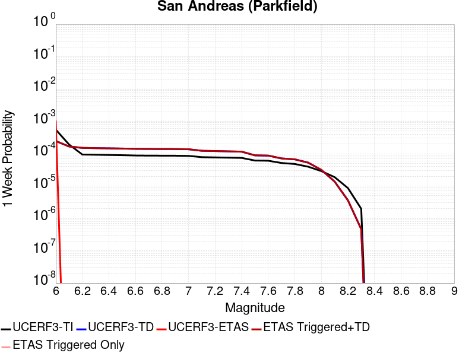 |  |  |  |

| Magnitude | 1 wk TI Prob | 1 wk TD Prob | 1 wk ETAS Prob | 1 wk ETAS/TD Gain | 1 wk ETAS Triggered+TD | 1 wk ETAS Triggered Only | 1 mo TI Prob | 1 mo TD Prob | 1 mo ETAS Prob | 1 mo ETAS/TD Gain | 1 mo ETAS Triggered+TD | 1 mo ETAS Triggered Only | 1 yr TI Prob | 1 yr TD Prob | 1 yr ETAS Prob | 1 yr ETAS/TD Gain | 1 yr ETAS Triggered+TD | 1 yr ETAS Triggered Only | 500 yr TI Prob | 500 yr TD Prob | 500 yr ETAS Prob | 500 yr ETAS/TD Gain | 500 yr ETAS Triggered+TD | 500 yr ETAS Triggered Only |
|-----|-----|-----|-----|-----|-----|-----|-----|-----|-----|-----|-----|-----|-----|-----|-----|-----|-----|-----|-----|-----|-----|-----|-----|-----|
| 6.0 | 5.556969E-4 | 2.469215E-4 | 0.001 | 4.04987 | 2.469215E-4 | 0.0 | 0.0023793848 | 0.001057817 | 0.002 | 1.8906862 | 0.001057817 | 0.0 | 0.028586963 | 0.013585772 | 0.01 | 0.73606414 | 0.016545014 | 0.003 | 0.9999995 | 0.8685031 | 1.0 | 1.1514064 | 0.96081394 | 0.702 |
| 6.1 | 1.925858E-4 | 1.6739052E-4 | 0.0 | 0.0 | 1.6739052E-4 | 0.0 | 8.2510663E-4 | 7.171927E-4 | 0.0 | 0.0 | 7.171927E-4 | 0.0 | 0.0099994885 | 0.008846451 | 0.003 | 0.33911908 | 0.008846451 | 0.0 | 0.9934278 | 0.7558121 | 0.997 | 1.3191109 | 0.8268708 | 0.291 |
| 6.2 | 9.4306815E-5 | 1.5145434E-4 | 0.0 | 0.0 | 1.5145434E-4 | 0.0 | 4.0410945E-4 | 6.4892956E-4 | 0.0 | 0.0 | 6.4892956E-4 | 0.0 | 0.0049089384 | 0.007872263 | 0.002 | 0.25405654 | 0.007872263 | 0.0 | 0.9146089 | 0.70974743 | 0.974 | 1.3723191 | 0.7553171 | 0.157 |
| 6.3 | 9.283051E-5 | 1.4858863E-4 | 0.0 | 0.0 | 1.4858863E-4 | 0.0 | 3.9778434E-4 | 6.36654E-4 | 0.0 | 0.0 | 6.36654E-4 | 0.0 | 0.0048322747 | 0.007723836 | 0.002 | 0.25893867 | 0.007723836 | 0.0 | 0.91125554 | 0.7070858 | 0.973 | 1.3760706 | 0.7521946 | 0.154 |
| 6.4 | 9.138826E-5 | 1.4646527E-4 | 0.0 | 0.0 | 1.4646527E-4 | 0.0 | 3.916052E-4 | 6.275583E-4 | 0.0 | 0.0 | 6.275583E-4 | 0.0 | 0.0047573745 | 0.0076138694 | 0.002 | 0.26267853 | 0.0076138694 | 0.0 | 0.9078524 | 0.703154 | 0.971 | 1.3809208 | 0.7479778 | 0.151 |
| 6.5 | 9.000255E-5 | 1.4427025E-4 | 0.0 | 0.0 | 1.4427025E-4 | 0.0 | 3.8566816E-4 | 6.1815546E-4 | 0.0 | 0.0 | 6.1815546E-4 | 0.0 | 0.0046854047 | 0.0075001996 | 0.002 | 0.26665956 | 0.0075001996 | 0.0 | 0.9044598 | 0.6999803 | 0.97 | 1.3857533 | 0.7443832 | 0.148 |
| 6.6 | 8.8109264E-5 | 1.4160712E-4 | 0.0 | 0.0 | 1.4160712E-4 | 0.0 | 3.7755648E-4 | 6.067474E-4 | 0.0 | 0.0 | 6.067474E-4 | 0.0 | 0.0045870654 | 0.007362266 | 0.002 | 0.2716555 | 0.007362266 | 0.0 | 0.89962167 | 0.6956349 | 0.968 | 1.3915344 | 0.7391591 | 0.143 |
| 6.7 | 8.738073E-5 | 1.4038463E-4 | 0.0 | 0.0 | 1.4038463E-4 | 0.0 | 3.7443507E-4 | 6.015106E-4 | 0.0 | 0.0 | 6.015106E-4 | 0.0 | 0.0045492216 | 0.007298983 | 0.002 | 0.27401078 | 0.007298983 | 0.0 | 0.89769536 | 0.69386774 | 0.966 | 1.3921962 | 0.73733854 | 0.142 |
| 6.8 | 8.710195E-5 | 1.3992001E-4 | 0.0 | 0.0 | 1.3992001E-4 | 0.0 | 3.7324068E-4 | 5.995203E-4 | 0.0 | 0.0 | 5.995203E-4 | 0.0 | 0.0045347405 | 0.007274922 | 0.002 | 0.27491704 | 0.007274922 | 0.0 | 0.8969485 | 0.6931216 | 0.964 | 1.3908093 | 0.7360846 | 0.14 |
| 6.9 | 8.6801556E-5 | 1.3940036E-4 | 0.0 | 0.0 | 1.3940036E-4 | 0.0 | 3.7195362E-4 | 5.9729425E-4 | 0.0 | 0.0 | 5.9729425E-4 | 0.0 | 0.0045191357 | 0.0072480002 | 0.002 | 0.27593818 | 0.0072480002 | 0.0 | 0.89613765 | 0.6922291 | 0.964 | 1.3926024 | 0.73531705 | 0.14 |
| 7.0 | 8.5571606E-5 | 1.37208E-4 | 0.0 | 0.0 | 1.37208E-4 | 0.0 | 3.6668387E-4 | 5.879027E-4 | 0.0 | 0.0 | 5.879027E-4 | 0.0 | 0.004455241 | 0.0071344115 | 0.002 | 0.28033146 | 0.0071344115 | 0.0 | 0.8927505 | 0.6888573 | 0.963 | 1.3979673 | 0.7314838 | 0.137 |
| 7.1 | 7.82589E-5 | 1.2323551E-4 | 0.0 | 0.0 | 1.2323551E-4 | 0.0 | 3.3535215E-4 | 5.280459E-4 | 0.0 | 0.0 | 5.280459E-4 | 0.0 | 0.0040752706 | 0.006410124 | 0.002 | 0.31200644 | 0.006410124 | 0.0 | 0.8702049 | 0.6678428 | 0.95 | 1.4224904 | 0.7100268 | 0.127 |
| 7.2 | 7.690929E-5 | 1.2086005E-4 | 0.0 | 0.0 | 1.2086005E-4 | 0.0 | 3.2956956E-4 | 5.1786937E-4 | 0.0 | 0.0 | 5.1786937E-4 | 0.0 | 0.004005129 | 0.0062869466 | 0.002 | 0.31811944 | 0.0062869466 | 0.0 | 0.865553 | 0.66343594 | 0.947 | 1.4274174 | 0.705843 | 0.126 |
| 7.3 | 7.5543794E-5 | 1.1821206E-4 | 0.0 | 0.0 | 1.1821206E-4 | 0.0 | 3.2371894E-4 | 5.065253E-4 | 0.0 | 0.0 | 5.065253E-4 | 0.0 | 0.003934157 | 0.0061496194 | 0.002 | 0.3252234 | 0.0061496194 | 0.0 | 0.8606767 | 0.65804976 | 0.943 | 1.4330224 | 0.70079356 | 0.125 |
| 7.4 | 7.4214564E-5 | 1.156251E-4 | 0.0 | 0.0 | 1.156251E-4 | 0.0 | 3.1802364E-4 | 4.954426E-4 | 0.0 | 0.0 | 4.954426E-4 | 0.0 | 0.003865065 | 0.00601544 | 0.002 | 0.33247775 | 0.00601544 | 0.0 | 0.85576004 | 0.65269595 | 0.937 | 1.4355842 | 0.6943724 | 0.12 |
| 7.5 | 6.149578E-5 | 8.891316E-5 | 0.0 | 0.0 | 8.891316E-5 | 0.0 | 2.6352672E-4 | 3.8100083E-4 | 0.0 | 0.0 | 3.8100083E-4 | 0.0 | 0.0032037178 | 0.0046288376 | 0.002 | 0.43207392 | 0.0046288376 | 0.0 | 0.798996 | 0.6060108 | 0.888 | 1.4653203 | 0.64540976 | 0.1 |
| 7.6 | 6.0643448E-5 | 8.742473E-5 | 0.0 | 0.0 | 8.742473E-5 | 0.0 | 2.598746E-4 | 3.746237E-4 | 0.0 | 0.0 | 3.746237E-4 | 0.0 | 0.0031593828 | 0.004551523 | 0.002 | 0.43941337 | 0.004551523 | 0.0 | 0.7944759 | 0.6018201 | 0.883 | 1.4672159 | 0.64044356 | 0.097 |
| 7.7 | 5.1652263E-5 | 7.145393E-5 | 0.0 | 0.0 | 7.145393E-5 | 0.0 | 2.2134806E-4 | 3.0619517E-4 | 0.0 | 0.0 | 3.0619517E-4 | 0.0 | 0.002691582 | 0.0037215585 | 0.002 | 0.5374093 | 0.0037215585 | 0.0 | 0.74013823 | 0.5557994 | 0.828 | 1.489746 | 0.5940007 | 0.086 |
| 7.8 | 4.8090482E-5 | 6.691148E-5 | 0.0 | 0.0 | 6.691148E-5 | 0.0 | 2.060858E-4 | 2.8673199E-4 | 0.0 | 0.0 | 2.8673199E-4 | 0.0 | 0.0025062072 | 0.0034853774 | 0.002 | 0.57382596 | 0.0034853774 | 0.0 | 0.71483195 | 0.5255378 | 0.804 | 1.5298616 | 0.56254584 | 0.078 |
| 7.9 | 3.970278E-5 | 5.29896E-5 | 0.0 | 0.0 | 5.29896E-5 | 0.0 | 1.7014367E-4 | 2.2707852E-4 | 0.0 | 0.0 | 2.2707852E-4 | 0.0 | 0.002069531 | 0.0027611777 | 0.001 | 0.3621643 | 0.0027611777 | 0.0 | 0.6450711 | 0.46692142 | 0.689 | 1.475623 | 0.5005054 | 0.063 |
| 8.0 | 2.8982335E-5 | 3.1596344E-5 | 0.0 | 0.0 | 3.1596344E-5 | 0.0 | 1.2420409E-4 | 1.3540588E-4 | 0.0 | 0.0 | 1.3540588E-4 | 0.0 | 0.0015111357 | 0.0016473208 | 0.0 | 0.0 | 0.0016473208 | 0.0 | 0.5305246 | 0.37871423 | 0.504 | 1.3308188 | 0.40108052 | 0.036 |
| 8.1 | 1.8836186E-5 | 1.3701949E-5 | 0.0 | 0.0 | 1.3701949E-5 | 0.0 | 8.0724014E-5 | 5.8721318E-5 | 0.0 | 0.0 | 5.8721318E-5 | 0.0 | 9.823717E-4 | 7.146979E-4 | 0.0 | 0.0 | 7.146979E-4 | 0.0 | 0.38824737 | 0.26973477 | 0.343 | 1.2716196 | 0.28507033 | 0.021 |
| 8.2 | 8.643924E-6 | 3.6108509E-6 | 0.0 | 0.0 | 3.6108509E-6 | 0.0 | 3.704486E-5 | 1.5474983E-5 | 0.0 | 0.0 | 1.5474983E-5 | 0.0 | 4.5092785E-4 | 1.8839166E-4 | 0.0 | 0.0 | 1.8839166E-4 | 0.0 | 0.20189473 | 0.12443174 | 0.157 | 1.261736 | 0.13581413 | 0.013 |
| 8.3 | 1.983087E-6 | 4.6615045E-7 | 0.0 | 0.0 | 4.6615045E-7 | 0.0 | 8.498917E-6 | 1.997786E-6 | 0.0 | 0.0 | 1.997786E-6 | 0.0 | 1.034694E-4 | 2.432278E-5 | 0.0 | 0.0 | 2.432278E-5 | 0.0 | 0.050421786 | 0.030325904 | 0.032 | 1.0552034 | 0.033234928 | 0.003 |

## San Andreas (Mojave S)
*[(top)](#table-of-contents)*

| 1 Week | 1 Month | 1 Year | 500 Year |
|-----|-----|-----|-----|
|  | 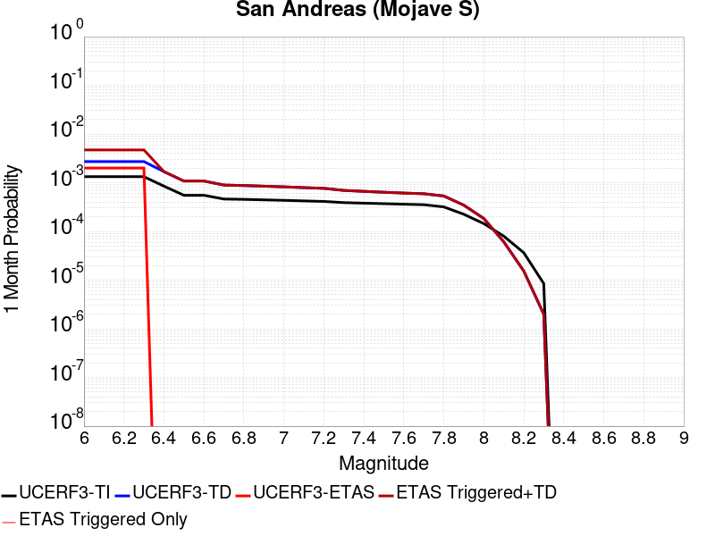 |  |  |

| Magnitude | 1 wk TI Prob | 1 wk TD Prob | 1 wk ETAS Prob | 1 wk ETAS/TD Gain | 1 wk ETAS Triggered+TD | 1 wk ETAS Triggered Only | 1 mo TI Prob | 1 mo TD Prob | 1 mo ETAS Prob | 1 mo ETAS/TD Gain | 1 mo ETAS Triggered+TD | 1 mo ETAS Triggered Only | 1 yr TI Prob | 1 yr TD Prob | 1 yr ETAS Prob | 1 yr ETAS/TD Gain | 1 yr ETAS Triggered+TD | 1 yr ETAS Triggered Only | 500 yr TI Prob | 500 yr TD Prob | 500 yr ETAS Prob | 500 yr ETAS/TD Gain | 500 yr ETAS Triggered+TD | 500 yr ETAS Triggered Only |
|-----|-----|-----|-----|-----|-----|-----|-----|-----|-----|-----|-----|-----|-----|-----|-----|-----|-----|-----|-----|-----|-----|-----|-----|-----|
| 6.0 | 3.1064058E-4 | 6.359388E-4 | 0.001 | 1.5724784 | 0.0016353028 | 0.001 | 0.0013306376 | 0.0027227313 | 0.002 | 0.7345565 | 0.0047172857 | 0.002 | 0.016080605 | 0.032613494 | 0.025 | 0.7665538 | 0.0393852 | 0.007 | 0.99969816 | 0.95745164 | 1.0 | 1.0444392 | 0.97379017 | 0.384 |
| 6.1 | 3.1064058E-4 | 6.359388E-4 | 0.001 | 1.5724784 | 0.0016353028 | 0.001 | 0.0013306376 | 0.0027227313 | 0.002 | 0.7345565 | 0.0047172857 | 0.002 | 0.016080605 | 0.032613494 | 0.025 | 0.7665538 | 0.0393852 | 0.007 | 0.99969816 | 0.95745164 | 1.0 | 1.0444392 | 0.97379017 | 0.384 |
| 6.2 | 3.1064058E-4 | 6.359388E-4 | 0.001 | 1.5724784 | 0.0016353028 | 0.001 | 0.0013306376 | 0.0027227313 | 0.002 | 0.7345565 | 0.0047172857 | 0.002 | 0.016080605 | 0.032613494 | 0.025 | 0.7665538 | 0.0393852 | 0.007 | 0.99969816 | 0.95745164 | 1.0 | 1.0444392 | 0.97379017 | 0.384 |
| 6.3 | 3.1064058E-4 | 6.359388E-4 | 0.001 | 1.5724784 | 0.0016353028 | 0.001 | 0.0013306376 | 0.0027227313 | 0.002 | 0.7345565 | 0.0047172857 | 0.002 | 0.016080605 | 0.032613494 | 0.025 | 0.7665538 | 0.0393852 | 0.007 | 0.99969816 | 0.95745164 | 1.0 | 1.0444392 | 0.97379017 | 0.384 |
| 6.4 | 1.9872203E-4 | 3.951736E-4 | 0.0 | 0.0 | 3.951736E-4 | 0.0 | 8.5138786E-4 | 0.0016925295 | 0.0 | 0.0 | 0.0016925295 | 0.0 | 0.010316478 | 0.020417575 | 0.015 | 0.7346612 | 0.023356322 | 0.003 | 0.99440026 | 0.9131831 | 1.0 | 1.0950707 | 0.93723136 | 0.277 |
| 6.5 | 1.291105E-4 | 2.5291677E-4 | 0.0 | 0.0 | 2.5291677E-4 | 0.0 | 5.5321335E-4 | 0.0010834814 | 0.0 | 0.0 | 0.0010834814 | 0.0 | 0.006714592 | 0.01311229 | 0.008 | 0.61011463 | 0.014099177 | 0.001 | 0.9655628 | 0.85615337 | 0.999 | 1.166847 | 0.88420343 | 0.195 |
| 6.6 | 1.291105E-4 | 2.5291677E-4 | 0.0 | 0.0 | 2.5291677E-4 | 0.0 | 5.5321335E-4 | 0.0010834814 | 0.0 | 0.0 | 0.0010834814 | 0.0 | 0.006714592 | 0.01311229 | 0.008 | 0.61011463 | 0.014099177 | 0.001 | 0.9655628 | 0.85615337 | 0.999 | 1.166847 | 0.88420343 | 0.195 |
| 6.7 | 1.08001186E-4 | 2.0929916E-4 | 0.0 | 0.0 | 2.0929916E-4 | 0.0 | 4.6278012E-4 | 8.9668855E-4 | 0.0 | 0.0 | 8.9668855E-4 | 0.0 | 0.0056198016 | 0.010862746 | 0.007 | 0.6444043 | 0.0118518835 | 0.001 | 0.94026434 | 0.83283114 | 0.999 | 1.1995229 | 0.86041397 | 0.165 |
| 6.8 | 1.0624356E-4 | 2.0458036E-4 | 0.0 | 0.0 | 2.0458036E-4 | 0.0 | 4.5525006E-4 | 8.764788E-4 | 0.0 | 0.0 | 8.764788E-4 | 0.0 | 0.0055285925 | 0.010619108 | 0.006 | 0.56501925 | 0.010619108 | 0.0 | 0.9374611 | 0.83068156 | 0.999 | 1.2026268 | 0.85811114 | 0.162 |
| 6.9 | 1.0393785E-4 | 1.9842118E-4 | 0.0 | 0.0 | 1.9842118E-4 | 0.0 | 4.4537184E-4 | 8.500998E-4 | 0.0 | 0.0 | 8.500998E-4 | 0.0 | 0.0054089287 | 0.010301018 | 0.006 | 0.58246666 | 0.010301018 | 0.0 | 0.9335832 | 0.82755536 | 0.999 | 1.20717 | 0.8542843 | 0.155 |
| 7.0 | 1.0155622E-4 | 1.9227328E-4 | 0.0 | 0.0 | 1.9227328E-4 | 0.0 | 4.3516833E-4 | 8.2376844E-4 | 0.0 | 0.0 | 8.2376844E-4 | 0.0 | 0.005285311 | 0.009983411 | 0.005 | 0.5008308 | 0.009983411 | 0.0 | 0.92932504 | 0.8235985 | 0.998 | 1.2117555 | 0.85076433 | 0.154 |
| 7.1 | 9.885595E-5 | 1.8533436E-4 | 0.0 | 0.0 | 1.8533436E-4 | 0.0 | 4.2359953E-4 | 7.9404865E-4 | 0.0 | 0.0 | 7.9404865E-4 | 0.0 | 0.0051451353 | 0.009624819 | 0.005 | 0.51949024 | 0.009624819 | 0.0 | 0.924166 | 0.8191392 | 0.998 | 1.2183522 | 0.84590656 | 0.148 |
| 7.2 | 9.6411415E-5 | 1.7913003E-4 | 0.0 | 0.0 | 1.7913003E-4 | 0.0 | 4.1312634E-4 | 7.674745E-4 | 0.0 | 0.0 | 7.674745E-4 | 0.0 | 0.005018219 | 0.009304087 | 0.005 | 0.5373982 | 0.009304087 | 0.0 | 0.9191715 | 0.81471634 | 0.997 | 1.2237388 | 0.8412119 | 0.143 |
| 7.3 | 9.1180635E-5 | 1.6234997E-4 | 0.0 | 0.0 | 1.6234997E-4 | 0.0 | 3.907156E-4 | 6.956001E-4 | 0.0 | 0.0 | 6.956001E-4 | 0.0 | 0.004746591 | 0.00843611 | 0.003 | 0.35561416 | 0.00843611 | 0.0 | 0.90735185 | 0.80498976 | 0.997 | 1.238525 | 0.83170617 | 0.137 |
| 7.4 | 8.887388E-5 | 1.552271E-4 | 0.0 | 0.0 | 1.552271E-4 | 0.0 | 3.8083247E-4 | 6.6508946E-4 | 0.0 | 0.0 | 6.6508946E-4 | 0.0 | 0.0046267817 | 0.008067453 | 0.003 | 0.37186456 | 0.008067453 | 0.0 | 0.9016044 | 0.79951704 | 0.997 | 1.2470028 | 0.8261813 | 0.133 |
| 7.5 | 8.6750515E-5 | 1.4890067E-4 | 0.0 | 0.0 | 1.4890067E-4 | 0.0 | 3.7173493E-4 | 6.3798967E-4 | 0.0 | 0.0 | 6.3798967E-4 | 0.0 | 0.004516484 | 0.007739906 | 0.003 | 0.3876016 | 0.007739906 | 0.0 | 0.89599925 | 0.79358095 | 0.997 | 1.2563306 | 0.820209 | 0.129 |
| 7.6 | 8.453092E-5 | 1.4320298E-4 | 0.0 | 0.0 | 1.4320298E-4 | 0.0 | 3.6222505E-4 | 6.135828E-4 | 0.0 | 0.0 | 6.135828E-4 | 0.0 | 0.0044011753 | 0.0074448213 | 0.003 | 0.40296468 | 0.0074448213 | 0.0 | 0.88979846 | 0.78656214 | 0.996 | 1.2662699 | 0.81345534 | 0.126 |
| 7.7 | 8.259102E-5 | 1.3878565E-4 | 0.0 | 0.0 | 1.3878565E-4 | 0.0 | 3.539135E-4 | 5.9466006E-4 | 0.0 | 0.0 | 5.9466006E-4 | 0.0 | 0.004300386 | 0.0072159874 | 0.003 | 0.41574353 | 0.0072159874 | 0.0 | 0.8840771 | 0.77806234 | 0.99 | 1.2723916 | 0.80558264 | 0.124 |
| 7.8 | 7.444844E-5 | 1.2475436E-4 | 0.0 | 0.0 | 1.2475436E-4 | 0.0 | 3.1902574E-4 | 5.34552E-4 | 0.0 | 0.0 | 5.34552E-4 | 0.0 | 0.0038772223 | 0.006488774 | 0.003 | 0.46233696 | 0.006488774 | 0.0 | 0.85663754 | 0.7373381 | 0.974 | 1.3209679 | 0.76570565 | 0.108 |
| 7.9 | 5.2586525E-5 | 8.091878E-5 | 0.0 | 0.0 | 8.091878E-5 | 0.0 | 2.2535135E-4 | 3.4674868E-4 | 0.0 | 0.0 | 3.4674868E-4 | 0.0 | 0.0027402006 | 0.0042134984 | 0.001 | 0.23733248 | 0.0042134984 | 0.0 | 0.74639595 | 0.60642344 | 0.817 | 1.3472434 | 0.6371224 | 0.078 |
| 8.0 | 3.379877E-5 | 4.3105658E-5 | 0.0 | 0.0 | 4.3105658E-5 | 0.0 | 1.4484383E-4 | 1.8472545E-4 | 0.0 | 0.0 | 1.8472545E-4 | 0.0 | 0.0017620471 | 0.0022467137 | 0.0 | 0.0 | 0.0022467137 | 0.0 | 0.5859633 | 0.44509342 | 0.575 | 1.2918637 | 0.4706191 | 0.046 |
| 8.1 | 1.8668277E-5 | 1.4294173E-5 | 0.0 | 0.0 | 1.4294173E-5 | 0.0 | 8.000444E-5 | 6.12593E-5 | 0.0 | 0.0 | 6.12593E-5 | 0.0 | 9.736188E-4 | 7.4557716E-4 | 0.0 | 0.0 | 7.4557716E-4 | 0.0 | 0.38556156 | 0.2731595 | 0.332 | 1.2154071 | 0.2876963 | 0.02 |
| 8.2 | 8.541571E-6 | 3.602685E-6 | 0.0 | 0.0 | 3.602685E-6 | 0.0 | 3.660622E-5 | 1.5439988E-5 | 0.0 | 0.0 | 1.5439988E-5 | 0.0 | 4.455896E-4 | 1.8796566E-4 | 0.0 | 0.0 | 1.8796566E-4 | 0.0 | 0.19976068 | 0.12209554 | 0.154 | 1.2613074 | 0.1326304 | 0.012 |
| 8.3 | 1.983087E-6 | 4.6615045E-7 | 0.0 | 0.0 | 4.6615045E-7 | 0.0 | 8.498917E-6 | 1.997786E-6 | 0.0 | 0.0 | 1.997786E-6 | 0.0 | 1.034694E-4 | 2.432278E-5 | 0.0 | 0.0 | 2.432278E-5 | 0.0 | 0.050421786 | 0.030325904 | 0.032 | 1.0552034 | 0.033234928 | 0.003 |

## San Andreas (Creeping Section) 2011 CFM
*[(top)](#table-of-contents)*

| 1 Week | 1 Month | 1 Year | 500 Year |
|-----|-----|-----|-----|
|  | 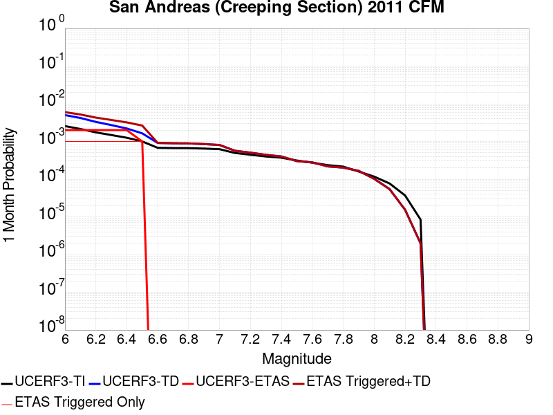 |  |  |

| Magnitude | 1 wk TI Prob | 1 wk TD Prob | 1 wk ETAS Prob | 1 wk ETAS/TD Gain | 1 wk ETAS Triggered+TD | 1 wk ETAS Triggered Only | 1 mo TI Prob | 1 mo TD Prob | 1 mo ETAS Prob | 1 mo ETAS/TD Gain | 1 mo ETAS Triggered+TD | 1 mo ETAS Triggered Only | 1 yr TI Prob | 1 yr TD Prob | 1 yr ETAS Prob | 1 yr ETAS/TD Gain | 1 yr ETAS Triggered+TD | 1 yr ETAS Triggered Only | 500 yr TI Prob | 500 yr TD Prob | 500 yr ETAS Prob | 500 yr ETAS/TD Gain | 500 yr ETAS Triggered+TD | 500 yr ETAS Triggered Only |
|-----|-----|-----|-----|-----|-----|-----|-----|-----|-----|-----|-----|-----|-----|-----|-----|-----|-----|-----|-----|-----|-----|-----|-----|-----|
| 6.0 | 5.986481E-4 | 0.0011745446 | 0.0 | 0.0 | 0.0011745446 | 0.0 | 0.0025631124 | 0.005019143 | 0.002 | 0.3984744 | 0.006014124 | 0.001 | 0.030762846 | 0.058613107 | 0.04 | 0.68244123 | 0.06332004 | 0.005 | 0.9999998 | 0.9601063 | 1.0 | 1.0415514 | 0.97434837 | 0.357 |
| 6.1 | 5.015945E-4 | 9.835676E-4 | 0.0 | 0.0 | 9.835676E-4 | 0.0 | 0.00214792 | 0.0042045987 | 0.002 | 0.47566965 | 0.005200394 | 0.001 | 0.025839351 | 0.04935321 | 0.029 | 0.5876011 | 0.0531558 | 0.004 | 0.9999979 | 0.94815844 | 1.0 | 1.054676 | 0.96334803 | 0.293 |
| 6.2 | 4.073338E-4 | 7.7363703E-4 | 0.0 | 0.0 | 7.7363703E-4 | 0.0 | 0.0017445484 | 0.0033085872 | 0.002 | 0.6044876 | 0.0043052784 | 0.001 | 0.021034058 | 0.039073348 | 0.024 | 0.61422944 | 0.0409952 | 0.002 | 0.9999758 | 0.9306998 | 1.0 | 1.0744603 | 0.94878715 | 0.261 |
| 6.3 | 3.464099E-4 | 6.368737E-4 | 0.0 | 0.0 | 6.368737E-4 | 0.0 | 0.0014837692 | 0.0027245295 | 0.002 | 0.7340717 | 0.003721805 | 0.001 | 0.017915873 | 0.032319404 | 0.022 | 0.6807056 | 0.034254767 | 0.002 | 0.9998813 | 0.9158817 | 1.0 | 1.0918441 | 0.935986 | 0.239 |
| 6.4 | 2.935057E-4 | 5.172662E-4 | 0.0 | 0.0 | 5.172662E-4 | 0.0 | 0.0012572751 | 0.002213542 | 0.002 | 0.9035293 | 0.0032113285 | 0.001 | 0.015200248 | 0.026377397 | 0.02 | 0.75822496 | 0.028324641 | 0.002 | 0.999528 | 0.9018088 | 1.0 | 1.1088825 | 0.92360723 | 0.222 |
| 6.5 | 2.3409708E-4 | 3.837823E-4 | 0.0 | 0.0 | 3.837823E-4 | 0.0 | 0.0010028875 | 0.0016429828 | 0.001 | 0.6086491 | 0.0026413398 | 0.001 | 0.012141965 | 0.019688655 | 0.012 | 0.60948807 | 0.021649277 | 0.002 | 0.9977753 | 0.8792817 | 0.999 | 1.1361547 | 0.9030632 | 0.197 |
| 6.6 | 1.5842178E-4 | 2.1396586E-4 | 0.0 | 0.0 | 2.1396586E-4 | 0.0 | 6.7877385E-4 | 9.1666775E-4 | 0.0 | 0.0 | 9.1666775E-4 | 0.0 | 0.0082328 | 0.011102021 | 0.005 | 0.45036846 | 0.011102021 | 0.0 | 0.9839723 | 0.8422035 | 0.991 | 1.1766752 | 0.86823994 | 0.165 |
| 6.7 | 1.5616413E-4 | 2.0944675E-4 | 0.0 | 0.0 | 2.0944675E-4 | 0.0 | 6.691031E-4 | 8.973164E-4 | 0.0 | 0.0 | 8.973164E-4 | 0.0 | 0.0081159435 | 0.010869388 | 0.005 | 0.46000752 | 0.010869388 | 0.0 | 0.98299974 | 0.83965987 | 0.99 | 1.1790488 | 0.86595565 | 0.164 |
| 6.8 | 1.5538467E-4 | 2.0777933E-4 | 0.0 | 0.0 | 2.0777933E-4 | 0.0 | 6.6576427E-4 | 8.9017564E-4 | 0.0 | 0.0 | 8.9017564E-4 | 0.0 | 0.008075596 | 0.010783371 | 0.005 | 0.4636769 | 0.010783371 | 0.0 | 0.98265046 | 0.8384762 | 0.989 | 1.1795206 | 0.86464304 | 0.162 |
| 6.9 | 1.5153569E-4 | 1.9920392E-4 | 0.0 | 0.0 | 1.9920392E-4 | 0.0 | 6.49277E-4 | 8.534533E-4 | 0.0 | 0.0 | 8.534533E-4 | 0.0 | 0.007876333 | 0.010341665 | 0.003 | 0.29008868 | 0.010341665 | 0.0 | 0.9808175 | 0.83204216 | 0.989 | 1.1886417 | 0.8589154 | 0.16 |
| 7.0 | 1.4588932E-4 | 1.8851743E-4 | 0.0 | 0.0 | 1.8851743E-4 | 0.0 | 6.250901E-4 | 8.076832E-4 | 0.0 | 0.0 | 8.076832E-4 | 0.0 | 0.0075839474 | 0.0097895665 | 0.003 | 0.3064487 | 0.0097895665 | 0.0 | 0.97777253 | 0.822648 | 0.989 | 1.2022153 | 0.8501376 | 0.155 |
| 7.1 | 1.1565079E-4 | 1.3251424E-4 | 0.0 | 0.0 | 1.3251424E-4 | 0.0 | 4.955521E-4 | 5.677952E-4 | 0.0 | 0.0 | 5.677952E-4 | 0.0 | 0.006016669 | 0.006891129 | 0.002 | 0.29022822 | 0.006891129 | 0.0 | 0.95107275 | 0.77899116 | 0.966 | 1.2400653 | 0.80794334 | 0.131 |
| 7.2 | 1.0393792E-4 | 1.1790171E-4 | 0.0 | 0.0 | 1.1790171E-4 | 0.0 | 4.4537216E-4 | 5.0519576E-4 | 0.0 | 0.0 | 5.0519576E-4 | 0.0 | 0.005408933 | 0.0061335256 | 0.002 | 0.32607675 | 0.0061335256 | 0.0 | 0.9335833 | 0.75409675 | 0.953 | 1.2637637 | 0.7836051 | 0.12 |
| 7.3 | 9.332884E-5 | 1.0310159E-4 | 0.0 | 0.0 | 1.0310159E-4 | 0.0 | 3.999194E-4 | 4.4178963E-4 | 0.0 | 0.0 | 4.4178963E-4 | 0.0 | 0.0048581534 | 0.005365617 | 0.002 | 0.37274373 | 0.005365617 | 0.0 | 0.9124019 | 0.7295747 | 0.941 | 1.2897925 | 0.7606736 | 0.115 |
| 7.4 | 8.670252E-5 | 9.3567905E-5 | 0.0 | 0.0 | 9.3567905E-5 | 0.0 | 3.715293E-4 | 4.0094412E-4 | 0.0 | 0.0 | 4.0094412E-4 | 0.0 | 0.004513991 | 0.004870653 | 0.002 | 0.41062257 | 0.004870653 | 0.0 | 0.89586896 | 0.705054 | 0.93 | 1.3190479 | 0.7366132 | 0.107 |
| 7.5 | 7.3036405E-5 | 7.051418E-5 | 0.0 | 0.0 | 7.051418E-5 | 0.0 | 3.129756E-4 | 3.021687E-4 | 0.0 | 0.0 | 3.021687E-4 | 0.0 | 0.0038038217 | 0.0036727106 | 0.002 | 0.5445569 | 0.0036727106 | 0.0 | 0.8512573 | 0.65561295 | 0.885 | 1.3498818 | 0.68591905 | 0.088 |
| 7.6 | 6.3935775E-5 | 6.501475E-5 | 0.0 | 0.0 | 6.501475E-5 | 0.0 | 2.7398168E-4 | 2.7860494E-4 | 0.0 | 0.0 | 2.7860494E-4 | 0.0 | 0.0033306254 | 0.0033867513 | 0.002 | 0.5905364 | 0.0033867513 | 0.0 | 0.81139344 | 0.6111632 | 0.845 | 1.3826094 | 0.64227015 | 0.08 |
| 7.7 | 5.5050095E-5 | 5.102061E-5 | 0.0 | 0.0 | 5.102061E-5 | 0.0 | 2.3590765E-4 | 2.1864143E-4 | 0.0 | 0.0 | 2.1864143E-4 | 0.0 | 0.0028683927 | 0.0026587122 | 0.002 | 0.75224394 | 0.0026587122 | 0.0 | 0.7621838 | 0.565075 | 0.782 | 1.383887 | 0.5968245 | 0.073 |
| 7.8 | 5.027131E-5 | 4.7362293E-5 | 0.0 | 0.0 | 4.7362293E-5 | 0.0 | 2.1543067E-4 | 2.0296547E-4 | 0.0 | 0.0 | 2.0296547E-4 | 0.0 | 0.0026197135 | 0.0024683059 | 0.002 | 0.81027234 | 0.0024683059 | 0.0 | 0.7306047 | 0.53137034 | 0.748 | 1.4076811 | 0.56183124 | 0.065 |
| 7.9 | 3.7271806E-5 | 3.874513E-5 | 0.0 | 0.0 | 3.874513E-5 | 0.0 | 1.5972654E-4 | 1.6603999E-4 | 0.0 | 0.0 | 1.6603999E-4 | 0.0 | 0.0019429359 | 0.0020196638 | 0.001 | 0.49513194 | 0.0020196638 | 0.0 | 0.6218306 | 0.43868008 | 0.622 | 1.4178897 | 0.46562344 | 0.048 |
| 8.0 | 2.7310243E-5 | 2.39201E-5 | 0.0 | 0.0 | 2.39201E-5 | 0.0 | 1.17038646E-4 | 1.0251069E-4 | 0.0 | 0.0 | 1.0251069E-4 | 0.0 | 0.0014240141 | 0.0012473536 | 0.0 | 0.0 | 0.0012473536 | 0.0 | 0.5095905 | 0.3555164 | 0.459 | 1.2910796 | 0.37613988 | 0.032 |
| 8.1 | 1.7940547E-5 | 1.2687871E-5 | 0.0 | 0.0 | 1.2687871E-5 | 0.0 | 7.688579E-5 | 5.4375458E-5 | 0.0 | 0.0 | 5.4375458E-5 | 0.0 | 9.3568244E-4 | 6.6182046E-4 | 0.0 | 0.0 | 6.6182046E-4 | 0.0 | 0.3737842 | 0.25570443 | 0.328 | 1.282731 | 0.27133462 | 0.021 |
| 8.2 | 8.643924E-6 | 3.6108509E-6 | 0.0 | 0.0 | 3.6108509E-6 | 0.0 | 3.704486E-5 | 1.5474983E-5 | 0.0 | 0.0 | 1.5474983E-5 | 0.0 | 4.5092785E-4 | 1.8839166E-4 | 0.0 | 0.0 | 1.8839166E-4 | 0.0 | 0.20189473 | 0.12443174 | 0.157 | 1.261736 | 0.13581413 | 0.013 |
| 8.3 | 1.983087E-6 | 4.6615045E-7 | 0.0 | 0.0 | 4.6615045E-7 | 0.0 | 8.498917E-6 | 1.997786E-6 | 0.0 | 0.0 | 1.997786E-6 | 0.0 | 1.034694E-4 | 2.432278E-5 | 0.0 | 0.0 | 2.432278E-5 | 0.0 | 0.050421786 | 0.030325904 | 0.032 | 1.0552034 | 0.033234928 | 0.003 |

## Mendocino
*[(top)](#table-of-contents)*

| 1 Week | 1 Month | 1 Year | 500 Year |
|-----|-----|-----|-----|
|  | 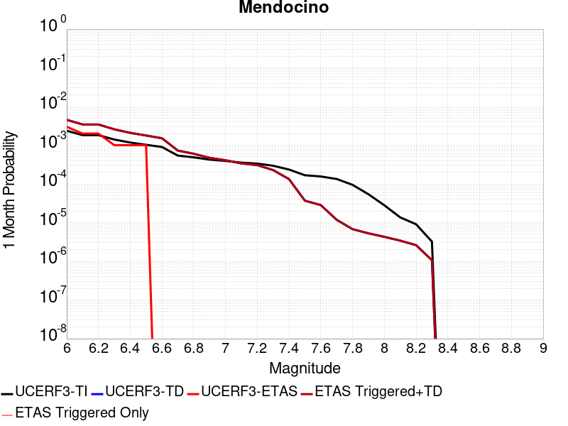 |  |  |

| Magnitude | 1 wk TI Prob | 1 wk TD Prob | 1 wk ETAS Prob | 1 wk ETAS/TD Gain | 1 wk ETAS Triggered+TD | 1 wk ETAS Triggered Only | 1 mo TI Prob | 1 mo TD Prob | 1 mo ETAS Prob | 1 mo ETAS/TD Gain | 1 mo ETAS Triggered+TD | 1 mo ETAS Triggered Only | 1 yr TI Prob | 1 yr TD Prob | 1 yr ETAS Prob | 1 yr ETAS/TD Gain | 1 yr ETAS Triggered+TD | 1 yr ETAS Triggered Only | 500 yr TI Prob | 500 yr TD Prob | 500 yr ETAS Prob | 500 yr ETAS/TD Gain | 500 yr ETAS Triggered+TD | 500 yr ETAS Triggered Only |
|-----|-----|-----|-----|-----|-----|-----|-----|-----|-----|-----|-----|-----|-----|-----|-----|-----|-----|-----|-----|-----|-----|-----|-----|-----|
| 6.0 | 5.5409013E-4 | 0.0010621457 | 0.001 | 0.9414905 | 0.0010621457 | 0.0 | 0.0023725112 | 0.004542237 | 0.003 | 0.6604675 | 0.004542237 | 0.0 | 0.028505474 | 0.053603154 | 0.025 | 0.4663905 | 0.06022793 | 0.007 | 0.99999946 | 0.9950514 | 1.0 | 1.0049732 | 0.99670917 | 0.335 |
| 6.1 | 4.2515888E-4 | 8.0410624E-4 | 0.001 | 1.2436168 | 8.0410624E-4 | 0.0 | 0.0018208373 | 0.0034400776 | 0.002 | 0.5813822 | 0.0034400776 | 0.0 | 0.021944538 | 0.040818207 | 0.024 | 0.58797294 | 0.047532476 | 0.007 | 0.9999848 | 0.98012406 | 1.0 | 1.020279 | 0.98648435 | 0.32 |
| 6.2 | 4.2515888E-4 | 8.0410624E-4 | 0.001 | 1.2436168 | 8.0410624E-4 | 0.0 | 0.0018208373 | 0.0034400776 | 0.002 | 0.5813822 | 0.0034400776 | 0.0 | 0.021944538 | 0.040818207 | 0.024 | 0.58797294 | 0.047532476 | 0.007 | 0.9999848 | 0.98012406 | 1.0 | 1.020279 | 0.98648435 | 0.32 |
| 6.3 | 3.2773745E-4 | 6.023071E-4 | 0.0 | 0.0 | 6.023071E-4 | 0.0 | 0.0014038329 | 0.0025776217 | 0.001 | 0.38795453 | 0.0025776217 | 0.0 | 0.016958237 | 0.03073652 | 0.017 | 0.55308795 | 0.034613576 | 0.004 | 0.9998068 | 0.95468247 | 1.0 | 1.0474687 | 0.9677792 | 0.289 |
| 6.4 | 2.7417165E-4 | 4.884486E-4 | 0.0 | 0.0 | 4.884486E-4 | 0.0 | 0.0011744922 | 0.0020909095 | 0.001 | 0.4782608 | 0.0020909095 | 0.0 | 0.014205975 | 0.025013408 | 0.015 | 0.5996784 | 0.027938368 | 0.003 | 0.9992182 | 0.9334707 | 1.0 | 1.0712708 | 0.9509014 | 0.262 |
| 6.5 | 2.3984899E-4 | 4.1657695E-4 | 0.0 | 0.0 | 4.1657695E-4 | 0.0 | 0.0010275192 | 0.001783526 | 0.001 | 0.56068707 | 0.001783526 | 0.0 | 0.012438473 | 0.021380868 | 0.013 | 0.60802025 | 0.024316724 | 0.003 | 0.9980854 | 0.9131743 | 1.0 | 1.0950812 | 0.93488073 | 0.25 |
| 6.6 | 2.1023539E-4 | 3.5402275E-4 | 0.0 | 0.0 | 3.5402275E-4 | 0.0 | 9.0069766E-4 | 0.0015159335 | 0.0 | 0.0 | 0.0015159335 | 0.0 | 0.010910975 | 0.01820992 | 0.011 | 0.6040664 | 0.021155288 | 0.003 | 0.9958534 | 0.8920848 | 0.999 | 1.1198487 | 0.9179844 | 0.24 |
| 6.7 | 1.2592976E-4 | 1.6985668E-4 | 0.0 | 0.0 | 1.6985668E-4 | 0.0 | 5.395873E-4 | 7.276816E-4 | 0.0 | 0.0 | 7.276816E-4 | 0.0 | 0.006549705 | 0.008813198 | 0.003 | 0.34039858 | 0.008813198 | 0.0 | 0.96258277 | 0.81593454 | 0.98 | 1.2010767 | 0.8417037 | 0.14 |
| 6.8 | 1.13663555E-4 | 1.4032927E-4 | 0.0 | 0.0 | 1.4032927E-4 | 0.0 | 4.8703855E-4 | 6.012576E-4 | 0.0 | 0.0 | 6.012576E-4 | 0.0 | 0.0059135845 | 0.007292205 | 0.003 | 0.4113982 | 0.007292205 | 0.0 | 0.94846886 | 0.7913268 | 0.976 | 1.2333716 | 0.8176196 | 0.126 |
| 6.9 | 9.926894E-5 | 1.1021868E-4 | 0.0 | 0.0 | 1.1021868E-4 | 0.0 | 4.2536893E-4 | 4.7227502E-4 | 0.0 | 0.0 | 4.7227502E-4 | 0.0 | 0.0051665753 | 0.0057340176 | 0.001 | 0.17439778 | 0.0057340176 | 0.0 | 0.9249788 | 0.7487793 | 0.967 | 1.2914352 | 0.7786746 | 0.119 |
| 7.0 | 9.168125E-5 | 9.550927E-5 | 0.0 | 0.0 | 9.550927E-5 | 0.0 | 3.9286047E-4 | 4.0925847E-4 | 0.0 | 0.0 | 4.0925847E-4 | 0.0 | 0.004772591 | 0.0049710576 | 0.001 | 0.20116444 | 0.0049710576 | 0.0 | 0.90855414 | 0.7193725 | 0.961 | 1.3358865 | 0.7516447 | 0.115 |
| 7.1 | 8.2854116E-5 | 7.9262034E-5 | 0.0 | 0.0 | 7.9262034E-5 | 0.0 | 3.5504074E-4 | 3.396504E-4 | 0.0 | 0.0 | 3.396504E-4 | 0.0 | 0.004314056 | 0.004127456 | 0.001 | 0.24228 | 0.004127456 | 0.0 | 0.8848701 | 0.67839944 | 0.95 | 1.4003549 | 0.7131323 | 0.108 |
| 7.2 | 7.8255274E-5 | 7.148592E-5 | 0.0 | 0.0 | 7.148592E-5 | 0.0 | 3.3533663E-4 | 3.0633286E-4 | 0.0 | 0.0 | 3.0633286E-4 | 0.0 | 0.0040750825 | 0.0037233375 | 0.001 | 0.26857623 | 0.0037233375 | 0.0 | 0.8701927 | 0.65211 | 0.948 | 1.4537425 | 0.68863845 | 0.105 |
| 7.3 | 6.887904E-5 | 5.3198924E-5 | 0.0 | 0.0 | 5.3198924E-5 | 0.0 | 2.9516246E-4 | 2.2797586E-4 | 0.0 | 0.0 | 2.2797586E-4 | 0.0 | 0.0035876823 | 0.0027721461 | 0.001 | 0.36073133 | 0.0027721461 | 0.0 | 0.8342155 | 0.6116746 | 0.903 | 1.4762751 | 0.64856553 | 0.095 |
| 7.4 | 5.4898497E-5 | 3.109131E-5 | 0.0 | 0.0 | 3.109131E-5 | 0.0 | 2.3525805E-4 | 1.3324188E-4 | 0.0 | 0.0 | 1.3324188E-4 | 0.0 | 0.0028605047 | 0.0016210539 | 0.0 | 0.0 | 0.0016210539 | 0.0 | 0.7612413 | 0.5382003 | 0.795 | 1.4771451 | 0.5709881 | 0.071 |
| 7.5 | 3.9103943E-5 | 8.6181835E-6 | 0.0 | 0.0 | 8.6181835E-6 | 0.0 | 1.6757756E-4 | 3.6934558E-5 | 0.0 | 0.0 | 3.6934558E-5 | 0.0 | 0.0020383475 | 4.495866E-4 | 0.0 | 0.0 | 4.495866E-4 | 0.0 | 0.6394822 | 0.44000176 | 0.652 | 1.4818124 | 0.46744165 | 0.049 |
| 7.6 | 3.641042E-5 | 6.6261982E-6 | 0.0 | 0.0 | 6.6261982E-6 | 0.0 | 1.5603533E-4 | 2.839769E-5 | 0.0 | 0.0 | 2.839769E-5 | 0.0 | 0.0018980748 | 3.45688E-4 | 0.0 | 0.0 | 3.45688E-4 | 0.0 | 0.6132355 | 0.4145833 | 0.624 | 1.5051258 | 0.44034162 | 0.044 |
| 7.7 | 3.1318774E-5 | 2.7608337E-6 | 0.0 | 0.0 | 2.7608337E-6 | 0.0 | 1.342164E-4 | 1.1832091E-5 | 0.0 | 0.0 | 1.1832091E-5 | 0.0 | 0.0016328598 | 1.440463E-4 | 0.0 | 0.0 | 1.440463E-4 | 0.0 | 0.558288 | 0.3674971 | 0.562 | 1.5292637 | 0.39342973 | 0.041 |
| 7.8 | 2.209241E-5 | 1.5823928E-6 | 0.0 | 0.0 | 1.5823928E-6 | 0.0 | 9.467832E-5 | 6.7816654E-6 | 0.0 | 0.0 | 6.7816654E-6 | 0.0 | 0.001152099 | 8.256366E-5 | 0.0 | 0.0 | 8.256366E-5 | 0.0 | 0.43807203 | 0.282644 | 0.416 | 1.4718161 | 0.30344734 | 0.029 |
| 7.9 | 1.2640477E-5 | 1.2332731E-6 | 0.0 | 0.0 | 1.2332731E-6 | 0.0 | 5.4172346E-5 | 5.2854452E-6 | 0.0 | 0.0 | 5.2854452E-6 | 0.0 | 6.593487E-4 | 6.43484E-5 | 0.0 | 0.0 | 6.43484E-5 | 0.0 | 0.2809203 | 0.17708936 | 0.241 | 1.3608948 | 0.18861012 | 0.014 |
| 8.0 | 6.5548907E-6 | 1.0024089E-6 | 0.0 | 0.0 | 1.0024089E-6 | 0.0 | 2.8092087E-5 | 4.296031E-6 | 0.0 | 0.0 | 4.296031E-6 | 0.0 | 3.4196748E-4 | 5.230293E-5 | 0.0 | 0.0 | 5.230293E-5 | 0.0 | 0.15718937 | 0.09443353 | 0.106 | 1.1224827 | 0.099866934 | 0.006 |
| 8.1 | 3.1916707E-6 | 7.9801146E-7 | 0.0 | 0.0 | 7.9801146E-7 | 0.0 | 1.3678517E-5 | 3.4200445E-6 | 0.0 | 0.0 | 3.4200445E-6 | 0.0 | 1.6652321E-4 | 4.1638254E-5 | 0.0 | 0.0 | 4.1638254E-5 | 0.0 | 0.07989597 | 0.043780375 | 0.06 | 1.370477 | 0.048561476 | 0.005 |
| 8.2 | 2.1193785E-6 | 6.117663E-7 | 0.0 | 0.0 | 6.117663E-7 | 0.0 | 9.083019E-6 | 2.6218531E-6 | 0.0 | 0.0 | 2.6218531E-6 | 0.0 | 1.1058014E-4 | 3.19206E-5 | 0.0 | 0.0 | 3.19206E-5 | 0.0 | 0.053792253 | 0.028205397 | 0.039 | 1.3827142 | 0.03306437 | 0.005 |
| 8.3 | 7.536878E-7 | 2.4910892E-7 | 0.0 | 0.0 | 2.4910892E-7 | 0.0 | 3.2300866E-6 | 1.0676093E-6 | 0.0 | 0.0 | 1.0676093E-6 | 0.0 | 3.9325594E-5 | 1.2998071E-5 | 0.0 | 0.0 | 1.2998071E-5 | 0.0 | 0.019471124 | 0.010974847 | 0.01 | 0.9111745 | 0.010974847 | 0.0 |

## San Andreas (Offshore) 2011 CFM
*[(top)](#table-of-contents)*

| 1 Week | 1 Month | 1 Year | 500 Year |
|-----|-----|-----|-----|
|  |  |  |  |

| Magnitude | 1 wk TI Prob | 1 wk TD Prob | 1 wk ETAS Prob | 1 wk ETAS/TD Gain | 1 wk ETAS Triggered+TD | 1 wk ETAS Triggered Only | 1 mo TI Prob | 1 mo TD Prob | 1 mo ETAS Prob | 1 mo ETAS/TD Gain | 1 mo ETAS Triggered+TD | 1 mo ETAS Triggered Only | 1 yr TI Prob | 1 yr TD Prob | 1 yr ETAS Prob | 1 yr ETAS/TD Gain | 1 yr ETAS Triggered+TD | 1 yr ETAS Triggered Only | 500 yr TI Prob | 500 yr TD Prob | 500 yr ETAS Prob | 500 yr ETAS/TD Gain | 500 yr ETAS Triggered+TD | 500 yr ETAS Triggered Only |
|-----|-----|-----|-----|-----|-----|-----|-----|-----|-----|-----|-----|-----|-----|-----|-----|-----|-----|-----|-----|-----|-----|-----|-----|-----|
| 6.0 | 1.7072787E-4 | 1.702917E-4 | 0.0 | 0.0 | 1.702917E-4 | 0.0 | 7.3148566E-4 | 7.2961947E-4 | 0.0 | 0.0 | 7.2961947E-4 | 0.0 | 0.008869528 | 0.008847343 | 0.003 | 0.33908486 | 0.008847343 | 0.0 | 0.9883744 | 0.8663897 | 0.998 | 1.1519066 | 0.90353334 | 0.278 |
| 6.1 | 1.7072787E-4 | 1.702917E-4 | 0.0 | 0.0 | 1.702917E-4 | 0.0 | 7.3148566E-4 | 7.2961947E-4 | 0.0 | 0.0 | 7.2961947E-4 | 0.0 | 0.008869528 | 0.008847343 | 0.003 | 0.33908486 | 0.008847343 | 0.0 | 0.9883744 | 0.8663897 | 0.998 | 1.1519066 | 0.90353334 | 0.278 |
| 6.2 | 1.6312556E-4 | 1.6305572E-4 | 0.0 | 0.0 | 1.6305572E-4 | 0.0 | 6.989222E-4 | 6.9862505E-4 | 0.0 | 0.0 | 6.9862505E-4 | 0.0 | 0.008476226 | 0.008472983 | 0.003 | 0.35406658 | 0.008472983 | 0.0 | 0.9858236 | 0.85471255 | 0.998 | 1.167644 | 0.89394015 | 0.27 |
| 6.3 | 1.5103363E-4 | 1.492456E-4 | 0.0 | 0.0 | 1.492456E-4 | 0.0 | 6.471264E-4 | 6.39469E-4 | 0.0 | 0.0 | 6.39469E-4 | 0.0 | 0.007850339 | 0.007758096 | 0.003 | 0.38669282 | 0.007758096 | 0.0 | 0.98056453 | 0.8360489 | 0.997 | 1.192514 | 0.8783483 | 0.258 |
| 6.4 | 1.5047993E-4 | 1.4812415E-4 | 0.0 | 0.0 | 1.4812415E-4 | 0.0 | 6.4475456E-4 | 6.3466514E-4 | 0.0 | 0.0 | 6.3466514E-4 | 0.0 | 0.007821669 | 0.007700022 | 0.003 | 0.38960928 | 0.007700022 | 0.0 | 0.9802817 | 0.83527976 | 0.997 | 1.1936121 | 0.8777776 | 0.258 |
| 6.5 | 1.2760791E-4 | 1.20491764E-4 | 0.0 | 0.0 | 1.20491764E-4 | 0.0 | 5.467764E-4 | 5.162922E-4 | 0.0 | 0.0 | 5.162922E-4 | 0.0 | 0.0066367025 | 0.0062679546 | 0.003 | 0.47862503 | 0.0062679546 | 0.0 | 0.96418583 | 0.7938393 | 0.997 | 1.2559217 | 0.8406378 | 0.227 |
| 6.6 | 1.1063525E-4 | 1.0072606E-4 | 0.0 | 0.0 | 1.0072606E-4 | 0.0 | 4.740649E-4 | 4.316125E-4 | 0.0 | 0.0 | 4.316125E-4 | 0.0 | 0.0057564764 | 0.0052423775 | 0.002 | 0.38150626 | 0.0052423775 | 0.0 | 0.944232 | 0.7554221 | 0.994 | 1.3158206 | 0.80042446 | 0.184 |
| 6.7 | 1.0391049E-4 | 9.238039E-5 | 0.0 | 0.0 | 9.238039E-5 | 0.0 | 4.4525467E-4 | 3.9585665E-4 | 0.0 | 0.0 | 3.9585665E-4 | 0.0 | 0.0054075094 | 0.00480905 | 0.001 | 0.20794128 | 0.00480905 | 0.0 | 0.93353575 | 0.7387732 | 0.993 | 1.3441201 | 0.78056955 | 0.16 |
| 6.8 | 1.0096706E-4 | 8.7829896E-5 | 0.0 | 0.0 | 8.7829896E-5 | 0.0 | 4.3264418E-4 | 3.763603E-4 | 0.0 | 0.0 | 3.763603E-4 | 0.0 | 0.0052547283 | 0.004572695 | 0.001 | 0.21868941 | 0.004572695 | 0.0 | 0.92823017 | 0.73119795 | 0.989 | 1.3525748 | 0.7725935 | 0.154 |
| 6.9 | 9.800265E-5 | 8.243237E-5 | 0.0 | 0.0 | 8.243237E-5 | 0.0 | 4.1994374E-4 | 3.5323447E-4 | 0.0 | 0.0 | 3.5323447E-4 | 0.0 | 0.0051008356 | 0.004292277 | 0.001 | 0.23297656 | 0.004292277 | 0.0 | 0.9224587 | 0.7237464 | 0.987 | 1.3637372 | 0.76407945 | 0.146 |
| 7.0 | 9.4642375E-5 | 7.69321E-5 | 0.0 | 0.0 | 7.69321E-5 | 0.0 | 4.0554712E-4 | 3.29668E-4 | 0.0 | 0.0 | 3.29668E-4 | 0.0 | 0.004926363 | 0.004006444 | 0.001 | 0.24959789 | 0.004006444 | 0.0 | 0.9153533 | 0.7139641 | 0.986 | 1.3810217 | 0.7545812 | 0.142 |
| 7.1 | 9.0996844E-5 | 7.086577E-5 | 0.0 | 0.0 | 7.086577E-5 | 0.0 | 3.8992817E-4 | 3.0367574E-4 | 0.0 | 0.0 | 3.0367574E-4 | 0.0 | 0.004737046 | 0.0036911024 | 0.001 | 0.27092177 | 0.0036911024 | 0.0 | 0.9069065 | 0.70244294 | 0.984 | 1.4008255 | 0.74201804 | 0.133 |
| 7.2 | 8.848287E-5 | 6.746744E-5 | 0.0 | 0.0 | 6.746744E-5 | 0.0 | 3.791572E-4 | 2.8911477E-4 | 0.0 | 0.0 | 2.8911477E-4 | 0.0 | 0.004606472 | 0.003514407 | 0.001 | 0.28454304 | 0.003514407 | 0.0 | 0.9005954 | 0.69390774 | 0.983 | 1.4166149 | 0.73247534 | 0.126 |
| 7.3 | 7.9280784E-5 | 5.1147617E-5 | 0.0 | 0.0 | 5.1147617E-5 | 0.0 | 3.3973053E-4 | 2.1918608E-4 | 0.0 | 0.0 | 2.1918608E-4 | 0.0 | 0.004128377 | 0.0026654005 | 0.001 | 0.37517813 | 0.0026654005 | 0.0 | 0.87361985 | 0.6634478 | 0.957 | 1.4424647 | 0.7014782 | 0.113 |
| 7.4 | 6.468038E-5 | 3.1079137E-5 | 0.0 | 0.0 | 3.1079137E-5 | 0.0 | 2.771722E-4 | 1.3318974E-4 | 0.0 | 0.0 | 1.3318974E-4 | 0.0 | 0.0033693502 | 0.0016204207 | 0.0 | 0.0 | 0.0016204207 | 0.0 | 0.81502223 | 0.6026771 | 0.881 | 1.461811 | 0.6348603 | 0.081 |
| 7.5 | 4.930574E-5 | 9.4677835E-6 | 0.0 | 0.0 | 9.4677835E-6 | 0.0 | 2.1129321E-4 | 4.0575593E-5 | 0.0 | 0.0 | 4.0575593E-5 | 0.0 | 0.0025694598 | 4.93897E-4 | 0.0 | 0.0 | 4.93897E-4 | 0.0 | 0.7237319 | 0.5248231 | 0.779 | 1.4843096 | 0.55238336 | 0.058 |
| 7.6 | 4.612566E-5 | 7.467707E-6 | 0.0 | 0.0 | 7.467707E-6 | 0.0 | 1.9766642E-4 | 3.200407E-5 | 0.0 | 0.0 | 3.200407E-5 | 0.0 | 0.0024039324 | 3.895809E-4 | 0.0 | 0.0 | 3.895809E-4 | 0.0 | 0.6998321 | 0.5003531 | 0.751 | 1.5009401 | 0.52683437 | 0.053 |
| 7.7 | 3.9435414E-5 | 3.4672835E-6 | 0.0 | 0.0 | 3.4672835E-6 | 0.0 | 1.6899795E-4 | 1.4859702E-5 | 0.0 | 0.0 | 1.4859702E-5 | 0.0 | 0.0020556084 | 1.8090196E-4 | 0.0 | 0.0 | 1.8090196E-4 | 0.0 | 0.6425865 | 0.44784632 | 0.678 | 1.5139122 | 0.47490185 | 0.049 |
| 7.8 | 2.7787428E-5 | 2.2581323E-6 | 0.0 | 0.0 | 2.2581323E-6 | 0.0 | 1.1908354E-4 | 9.677674E-6 | 0.0 | 0.0 | 9.677674E-6 | 0.0 | 0.0014488777 | 1.1781932E-4 | 0.0 | 0.0 | 1.1781932E-4 | 0.0 | 0.5156581 | 0.3481471 | 0.506 | 1.4534086 | 0.37096196 | 0.035 |
| 7.9 | 1.590671E-5 | 1.8569682E-6 | 0.0 | 0.0 | 1.8569682E-6 | 0.0 | 6.816983E-5 | 7.958411E-6 | 0.0 | 0.0 | 7.958411E-6 | 0.0 | 8.2965166E-4 | 9.688935E-5 | 0.0 | 0.0 | 9.688935E-5 | 0.0 | 0.3396584 | 0.21969754 | 0.298 | 1.3564103 | 0.23296268 | 0.017 |
| 8.0 | 9.193638E-6 | 1.5913974E-6 | 0.0 | 0.0 | 1.5913974E-6 | 0.0 | 3.940071E-5 | 6.8202567E-6 | 0.0 | 0.0 | 6.8202567E-6 | 0.0 | 4.7959806E-4 | 8.303347E-5 | 0.0 | 0.0 | 8.303347E-5 | 0.0 | 0.2132593 | 0.13247274 | 0.156 | 1.1776009 | 0.14028047 | 0.009 |
| 8.1 | 5.601576E-6 | 1.3202745E-6 | 0.0 | 0.0 | 1.3202745E-6 | 0.0 | 2.4006533E-5 | 5.658307E-6 | 0.0 | 0.0 | 5.658307E-6 | 0.0 | 2.9224035E-4 | 6.888772E-5 | 0.0 | 0.0 | 6.888772E-5 | 0.0 | 0.13596459 | 0.07959734 | 0.107 | 1.3442659 | 0.08696056 | 0.008 |
| 8.2 | 4.3508785E-6 | 1.1076206E-6 | 0.0 | 0.0 | 1.1076206E-6 | 0.0 | 1.864649E-5 | 4.746937E-6 | 0.0 | 0.0 | 4.746937E-6 | 0.0 | 2.2699735E-4 | 5.7792433E-5 | 0.0 | 0.0 | 5.7792433E-5 | 0.0 | 0.10730612 | 0.06132706 | 0.083 | 1.3533993 | 0.06883644 | 0.008 |
| 8.3 | 1.9573292E-6 | 4.5683242E-7 | 0.0 | 0.0 | 4.5683242E-7 | 0.0 | 8.388526E-6 | 1.9578517E-6 | 0.0 | 0.0 | 1.9578517E-6 | 0.0 | 1.0212552E-4 | 2.3836592E-5 | 0.0 | 0.0 | 2.3836592E-5 | 0.0 | 0.049783446 | 0.029589951 | 0.032 | 1.0814482 | 0.03250118 | 0.003 |

## Imperial
*[(top)](#table-of-contents)*

| 1 Week | 1 Month | 1 Year | 500 Year |
|-----|-----|-----|-----|
| 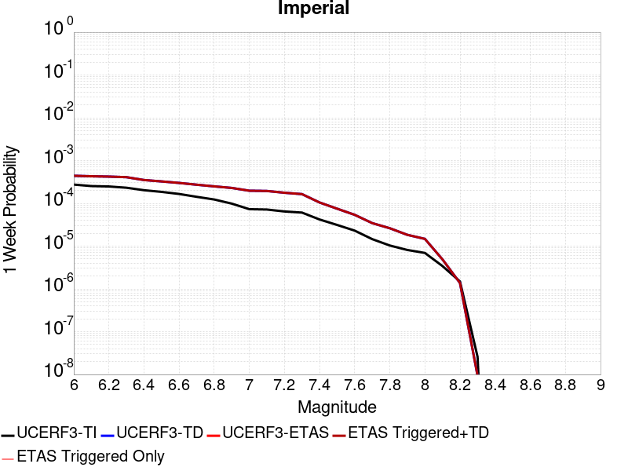 | 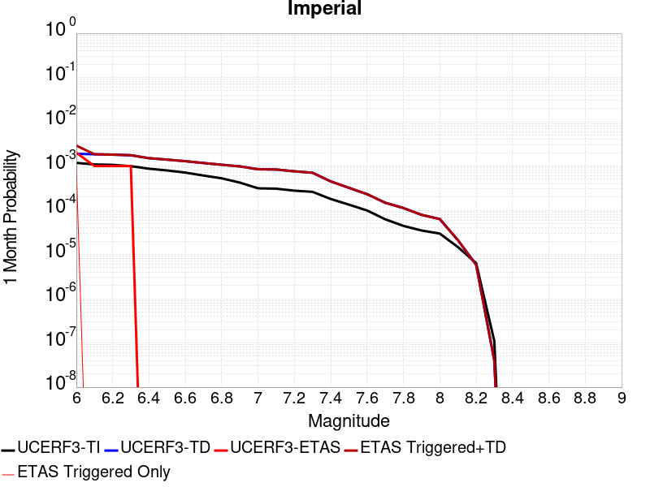 | 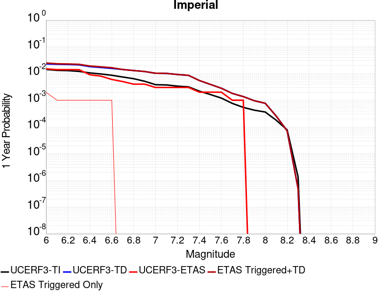 | 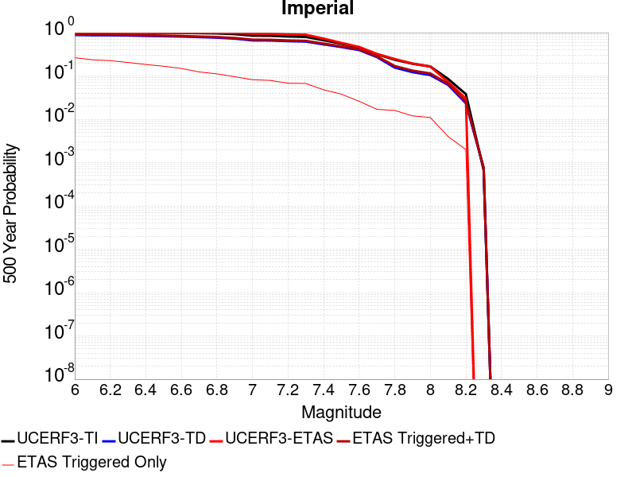 |

| Magnitude | 1 wk TI Prob | 1 wk TD Prob | 1 wk ETAS Prob | 1 wk ETAS/TD Gain | 1 wk ETAS Triggered+TD | 1 wk ETAS Triggered Only | 1 mo TI Prob | 1 mo TD Prob | 1 mo ETAS Prob | 1 mo ETAS/TD Gain | 1 mo ETAS Triggered+TD | 1 mo ETAS Triggered Only | 1 yr TI Prob | 1 yr TD Prob | 1 yr ETAS Prob | 1 yr ETAS/TD Gain | 1 yr ETAS Triggered+TD | 1 yr ETAS Triggered Only | 500 yr TI Prob | 500 yr TD Prob | 500 yr ETAS Prob | 500 yr ETAS/TD Gain | 500 yr ETAS Triggered+TD | 500 yr ETAS Triggered Only |
|-----|-----|-----|-----|-----|-----|-----|-----|-----|-----|-----|-----|-----|-----|-----|-----|-----|-----|-----|-----|-----|-----|-----|-----|-----|
| 6.0 | 2.7496446E-4 | 4.4164842E-4 | 0.0 | 0.0 | 4.4164842E-4 | 0.0 | 0.0011778869 | 0.0018914394 | 0.002 | 1.0573957 | 0.002889548 | 0.001 | 0.0142467655 | 0.022791289 | 0.015 | 0.6581462 | 0.024745706 | 0.002 | 0.9992342 | 0.88364244 | 1.0 | 1.1316794 | 0.9143608 | 0.264 |
| 6.1 | 2.5356023E-4 | 4.3030153E-4 | 0.0 | 0.0 | 4.3030153E-4 | 0.0 | 0.001086234 | 0.0018428792 | 0.001 | 0.5426292 | 0.0018428792 | 0.0 | 0.013144928 | 0.022213828 | 0.014 | 0.6302381 | 0.023191614 | 0.001 | 0.9986613 | 0.87079763 | 1.0 | 1.1483724 | 0.9012894 | 0.236 |
| 6.2 | 2.4820742E-4 | 4.2242877E-4 | 0.0 | 0.0 | 4.2242877E-4 | 0.0 | 0.0010633124 | 0.0018091858 | 0.001 | 0.55273485 | 0.0018091858 | 0.0 | 0.01286919 | 0.02181188 | 0.014 | 0.6418521 | 0.022790067 | 0.001 | 0.9984606 | 0.8680749 | 1.0 | 1.1519743 | 0.89789 | 0.226 |
| 6.3 | 2.3205351E-4 | 4.094069E-4 | 0.0 | 0.0 | 4.094069E-4 | 0.0 | 9.94136E-4 | 0.0017534535 | 0.001 | 0.57030314 | 0.0017534535 | 0.0 | 0.012036599 | 0.02114148 | 0.014 | 0.6622052 | 0.02212034 | 0.001 | 0.9976535 | 0.85872346 | 1.0 | 1.1645193 | 0.8876851 | 0.205 |
| 6.4 | 2.0304754E-4 | 3.5116088E-4 | 0.0 | 0.0 | 3.5116088E-4 | 0.0 | 8.6991355E-4 | 0.0015041186 | 0.0 | 0.0 | 0.0015041186 | 0.0 | 0.010539869 | 0.0181639 | 0.009 | 0.49548832 | 0.019145736 | 0.001 | 0.9949979 | 0.8402105 | 1.0 | 1.1901779 | 0.8696118 | 0.184 |
| 6.5 | 1.854992E-4 | 3.2566E-4 | 0.0 | 0.0 | 3.2566E-4 | 0.0 | 7.9475436E-4 | 0.0013949485 | 0.0 | 0.0 | 0.0013949485 | 0.0 | 0.009633281 | 0.016853621 | 0.008 | 0.47467545 | 0.017836766 | 0.001 | 0.99209285 | 0.82775277 | 1.0 | 1.2080902 | 0.8566903 | 0.168 |
| 6.6 | 1.6586106E-4 | 3.004306E-4 | 0.0 | 0.0 | 3.004306E-4 | 0.0 | 7.106394E-4 | 0.0012869319 | 0.0 | 0.0 | 0.0012869319 | 0.0 | 0.008617763 | 0.015557696 | 0.006 | 0.3856612 | 0.016542139 | 0.001 | 0.9868002 | 0.81170774 | 0.997 | 1.2282746 | 0.8397633 | 0.149 |
| 6.7 | 1.4224656E-4 | 2.7291986E-4 | 0.0 | 0.0 | 2.7291986E-4 | 0.0 | 6.094856E-4 | 0.0011691382 | 0.0 | 0.0 | 0.0011691382 | 0.0 | 0.0073952693 | 0.014141744 | 0.005 | 0.35356316 | 0.014141744 | 0.0 | 0.97555614 | 0.78825 | 0.997 | 1.2648271 | 0.814507 | 0.124 |
| 6.8 | 1.2317259E-4 | 2.4946197E-4 | 0.0 | 0.0 | 2.4946197E-4 | 0.0 | 5.2777573E-4 | 0.0010686893 | 0.0 | 0.0 | 0.0010686893 | 0.0 | 0.0064067547 | 0.012934694 | 0.004 | 0.30924582 | 0.012934694 | 0.0 | 0.9597917 | 0.76602983 | 0.993 | 1.2962942 | 0.7922345 | 0.112 |
| 6.9 | 9.859898E-5 | 2.292838E-4 | 0.0 | 0.0 | 2.292838E-4 | 0.0 | 4.2249862E-4 | 9.822785E-4 | 0.0 | 0.0 | 9.822785E-4 | 0.0 | 0.0051317946 | 0.011894455 | 0.004 | 0.33629116 | 0.011894455 | 0.0 | 0.92365587 | 0.7261735 | 0.977 | 1.3454086 | 0.75246084 | 0.096 |
| 7.0 | 7.3191884E-5 | 1.97491E-4 | 0.0 | 0.0 | 1.97491E-4 | 0.0 | 3.136418E-4 | 8.4611826E-4 | 0.0 | 0.0 | 8.4611826E-4 | 0.0 | 0.003811904 | 0.0102534285 | 0.003 | 0.29258507 | 0.0102534285 | 0.0 | 0.85185945 | 0.66241384 | 0.947 | 1.4296198 | 0.6900959 | 0.082 |
| 7.1 | 7.1760296E-5 | 1.9474386E-4 | 0.0 | 0.0 | 1.9474386E-4 | 0.0 | 3.0750787E-4 | 8.343524E-4 | 0.0 | 0.0 | 8.343524E-4 | 0.0 | 0.003737482 | 0.010111516 | 0.003 | 0.2966914 | 0.010111516 | 0.0 | 0.8462215 | 0.6578999 | 0.942 | 1.4318287 | 0.68492585 | 0.079 |
| 7.2 | 6.46614E-5 | 1.7705999E-4 | 0.0 | 0.0 | 1.7705999E-4 | 0.0 | 2.7709085E-4 | 7.586105E-4 | 0.0 | 0.0 | 7.586105E-4 | 0.0 | 0.0033683628 | 0.009197511 | 0.003 | 0.3261752 | 0.009197511 | 0.0 | 0.81493056 | 0.635929 | 0.91 | 1.4309775 | 0.6606858 | 0.068 |
| 7.3 | 6.088115E-5 | 1.6446522E-4 | 0.0 | 0.0 | 1.6446522E-4 | 0.0 | 2.6089314E-4 | 7.046631E-4 | 0.0 | 0.0 | 7.046631E-4 | 0.0 | 0.0031717476 | 0.008546026 | 0.003 | 0.35104033 | 0.008546026 | 0.0 | 0.7957466 | 0.6222147 | 0.895 | 1.4384103 | 0.6475263 | 0.067 |
| 7.4 | 4.199346E-5 | 1.04860825E-4 | 0.0 | 0.0 | 1.04860825E-4 | 0.0 | 1.7995955E-4 | 4.493269E-4 | 0.0 | 0.0 | 4.493269E-4 | 0.0 | 0.0021888057 | 0.0054569785 | 0.002 | 0.36650318 | 0.0054569785 | 0.0 | 0.6656618 | 0.536074 | 0.728 | 1.3580215 | 0.55834246 | 0.048 |
| 7.5 | 3.130448E-5 | 7.507929E-5 | 0.0 | 0.0 | 7.507929E-5 | 0.0 | 1.3415517E-4 | 3.2172896E-4 | 0.0 | 0.0 | 3.2172896E-4 | 0.0 | 0.0016321153 | 0.0039100656 | 0.002 | 0.51150036 | 0.0039100656 | 0.0 | 0.5581233 | 0.46457735 | 0.58 | 1.2484466 | 0.48492342 | 0.038 |
| 7.6 | 2.3074248E-5 | 5.395968E-5 | 0.0 | 0.0 | 5.395968E-5 | 0.0 | 9.888588E-5 | 2.3123538E-4 | 0.0 | 0.0 | 2.3123538E-4 | 0.0 | 0.0012032706 | 0.002811676 | 0.002 | 0.71131957 | 0.002811676 | 0.0 | 0.45228356 | 0.39643243 | 0.467 | 1.1780065 | 0.4121252 | 0.026 |
| 7.7 | 1.45864815E-5 | 3.453696E-5 | 0.0 | 0.0 | 3.453696E-5 | 0.0 | 6.2511994E-5 | 1.4800717E-4 | 0.0 | 0.0 | 1.4800717E-4 | 0.0 | 7.608177E-4 | 0.0018005021 | 0.001 | 0.5554006 | 0.0018005021 | 0.0 | 0.3165171 | 0.27227762 | 0.323 | 1.1862892 | 0.2846489 | 0.017 |
| 7.8 | 1.0352979E-5 | 2.6227155E-5 | 0.0 | 0.0 | 2.6227155E-5 | 0.0 | 4.4369157E-5 | 1.1239726E-4 | 0.0 | 0.0 | 1.1239726E-4 | 0.0 | 5.400606E-4 | 0.0013675794 | 0.001 | 0.73121893 | 0.0013675794 | 0.0 | 0.23669931 | 0.15625623 | 0.246 | 1.5743372 | 0.16975613 | 0.016 |
| 7.9 | 8.137906E-6 | 1.8379222E-5 | 0.0 | 0.0 | 1.8379222E-5 | 0.0 | 3.4876273E-5 | 7.876572E-5 | 0.0 | 0.0 | 7.876572E-5 | 0.0 | 4.2453592E-4 | 9.585514E-4 | 0.0 | 0.0 | 9.585514E-4 | 0.0 | 0.19128849 | 0.122323476 | 0.194 | 1.5859588 | 0.1328556 | 0.012 |
| 8.0 | 6.93792E-6 | 1.4776988E-5 | 0.0 | 0.0 | 1.4776988E-5 | 0.0 | 2.9733603E-5 | 6.3328414E-5 | 0.0 | 0.0 | 6.3328414E-5 | 0.0 | 3.6194647E-4 | 7.707512E-4 | 0.0 | 0.0 | 7.707512E-4 | 0.0 | 0.16556965 | 0.10475292 | 0.165 | 1.5751351 | 0.114600636 | 0.011 |
| 8.1 | 3.4286315E-6 | 4.905227E-6 | 0.0 | 0.0 | 4.905227E-6 | 0.0 | 1.4694053E-5 | 2.1022232E-5 | 0.0 | 0.0 | 2.1022232E-5 | 0.0 | 1.7888541E-4 | 2.559157E-4 | 0.0 | 0.0 | 2.559157E-4 | 0.0 | 0.085566655 | 0.06221636 | 0.073 | 1.1733248 | 0.06596749 | 0.004 |
| 8.2 | 1.4906886E-6 | 1.3716788E-6 | 0.0 | 0.0 | 1.3716788E-6 | 0.0 | 6.3886496E-6 | 5.87861E-6 | 0.0 | 0.0 | 5.87861E-6 | 0.0 | 7.7779034E-5 | 7.1569746E-5 | 0.0 | 0.0 | 7.1569746E-5 | 0.0 | 0.038144484 | 0.023494191 | 0.03 | 1.2769114 | 0.025447205 | 0.002 |
| 8.3 | 2.5758007E-8 | 9.318019E-9 | 0.0 | 0.0 | 9.318019E-9 | 0.0 | 1.10391454E-7 | 3.993437E-8 | 0.0 | 0.0 | 3.993437E-8 | 0.0 | 1.3440151E-6 | 4.862009E-7 | 0.0 | 0.0 | 4.862009E-7 | 0.0 | 6.717823E-4 | 7.5839495E-4 | 0.0 | 0.0 | 7.5839495E-4 | 0.0 |

## Cerro Prieto
*[(top)](#table-of-contents)*

| 1 Week | 1 Month | 1 Year | 500 Year |
|-----|-----|-----|-----|
| 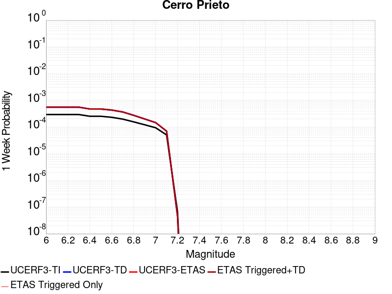 | 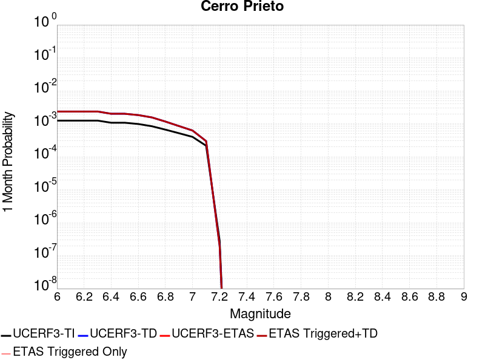 | 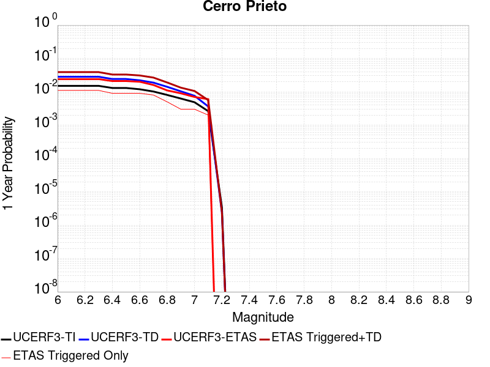 | 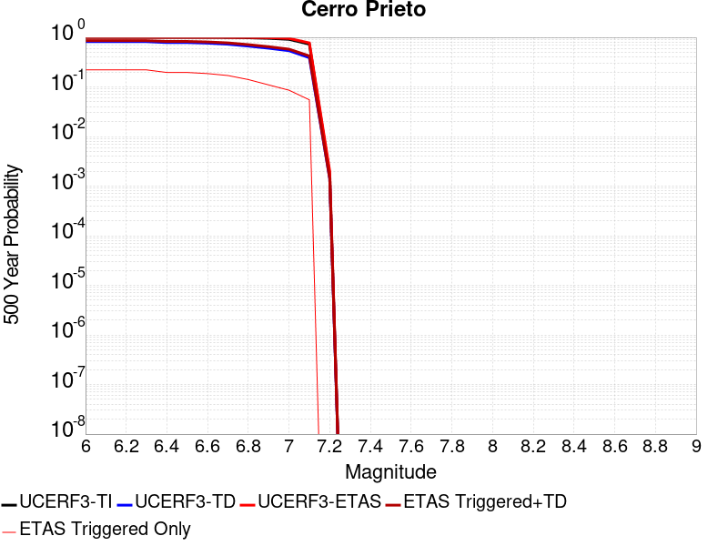 |

| Magnitude | 1 wk TI Prob | 1 wk TD Prob | 1 wk ETAS Prob | 1 wk ETAS/TD Gain | 1 wk ETAS Triggered+TD | 1 wk ETAS Triggered Only | 1 mo TI Prob | 1 mo TD Prob | 1 mo ETAS Prob | 1 mo ETAS/TD Gain | 1 mo ETAS Triggered+TD | 1 mo ETAS Triggered Only | 1 yr TI Prob | 1 yr TD Prob | 1 yr ETAS Prob | 1 yr ETAS/TD Gain | 1 yr ETAS Triggered+TD | 1 yr ETAS Triggered Only | 500 yr TI Prob | 500 yr TD Prob | 500 yr ETAS Prob | 500 yr ETAS/TD Gain | 500 yr ETAS Triggered+TD | 500 yr ETAS Triggered Only |
|-----|-----|-----|-----|-----|-----|-----|-----|-----|-----|-----|-----|-----|-----|-----|-----|-----|-----|-----|-----|-----|-----|-----|-----|-----|
| 6.0 | 2.9101528E-4 | 5.492153E-4 | 0.0 | 0.0 | 5.492153E-4 | 0.0 | 0.0012466122 | 0.0023518668 | 0.0 | 0.0 | 0.0023518668 | 0.0 | 0.015072231 | 0.028222824 | 0.024 | 0.8503756 | 0.038912375 | 0.011 | 0.9994963 | 0.81893843 | 1.0 | 1.221093 | 0.858953 | 0.221 |
| 6.1 | 2.9101528E-4 | 5.492153E-4 | 0.0 | 0.0 | 5.492153E-4 | 0.0 | 0.0012466122 | 0.0023518668 | 0.0 | 0.0 | 0.0023518668 | 0.0 | 0.015072231 | 0.028222824 | 0.024 | 0.8503756 | 0.038912375 | 0.011 | 0.9994963 | 0.81893843 | 1.0 | 1.221093 | 0.858953 | 0.221 |
| 6.2 | 2.9101528E-4 | 5.492153E-4 | 0.0 | 0.0 | 5.492153E-4 | 0.0 | 0.0012466122 | 0.0023518668 | 0.0 | 0.0 | 0.0023518668 | 0.0 | 0.015072231 | 0.028222824 | 0.024 | 0.8503756 | 0.038912375 | 0.011 | 0.9994963 | 0.81893843 | 1.0 | 1.221093 | 0.858953 | 0.221 |
| 6.3 | 2.9101528E-4 | 5.492153E-4 | 0.0 | 0.0 | 5.492153E-4 | 0.0 | 0.0012466122 | 0.0023518668 | 0.0 | 0.0 | 0.0023518668 | 0.0 | 0.015072231 | 0.028222824 | 0.024 | 0.8503756 | 0.038912375 | 0.011 | 0.9994963 | 0.81893843 | 1.0 | 1.221093 | 0.858953 | 0.221 |
| 6.4 | 2.508648E-4 | 4.6920186E-4 | 0.0 | 0.0 | 4.6920186E-4 | 0.0 | 0.0010746918 | 0.0020094847 | 0.0 | 0.0 | 0.0020094847 | 0.0 | 0.013006088 | 0.024163947 | 0.021 | 0.8690633 | 0.03294647 | 0.009 | 0.9985637 | 0.7858002 | 1.0 | 1.2725881 | 0.82778335 | 0.196 |
| 6.5 | 2.508648E-4 | 4.6920186E-4 | 0.0 | 0.0 | 4.6920186E-4 | 0.0 | 0.0010746918 | 0.0020094847 | 0.0 | 0.0 | 0.0020094847 | 0.0 | 0.013006088 | 0.024163947 | 0.021 | 0.8690633 | 0.03294647 | 0.009 | 0.9985637 | 0.7858002 | 1.0 | 1.2725881 | 0.82778335 | 0.196 |
| 6.6 | 2.294914E-4 | 4.278845E-4 | 0.0 | 0.0 | 4.278845E-4 | 0.0 | 9.831638E-4 | 0.0018326608 | 0.0 | 0.0 | 0.0018326608 | 0.0 | 0.011904482 | 0.022071654 | 0.02 | 0.9061396 | 0.030873008 | 0.009 | 0.9974912 | 0.76492345 | 1.0 | 1.3073204 | 0.8086477 | 0.186 |
| 6.7 | 1.9621674E-4 | 3.6333807E-4 | 0.0 | 0.0 | 3.6333807E-4 | 0.0 | 8.4065786E-4 | 0.0015563656 | 0.0 | 0.0 | 0.0015563656 | 0.0 | 0.010187071 | 0.018805025 | 0.016 | 0.8508364 | 0.026654584 | 0.008 | 0.99402195 | 0.7276006 | 1.0 | 1.3743804 | 0.7739085 | 0.17 |
| 6.8 | 1.5476145E-4 | 2.720484E-4 | 0.0 | 0.0 | 2.720484E-4 | 0.0 | 6.6309475E-4 | 0.0011654837 | 0.0 | 0.0 | 0.0011654837 | 0.0 | 0.008043335 | 0.014094898 | 0.011 | 0.78042424 | 0.019024424 | 0.005 | 0.982366 | 0.6667322 | 0.996 | 1.4938532 | 0.71372294 | 0.141 |
| 6.9 | 1.20509176E-4 | 1.9866426E-4 | 0.0 | 0.0 | 1.9866426E-4 | 0.0 | 5.1636563E-4 | 8.5119036E-4 | 0.0 | 0.0 | 8.5119036E-4 | 0.0 | 0.006268645 | 0.010326557 | 0.009 | 0.8715393 | 0.013295577 | 0.003 | 0.9568981 | 0.60441434 | 0.988 | 1.6346402 | 0.6479288 | 0.11 |
| 7.0 | 9.3269155E-5 | 1.455058E-4 | 0.0 | 0.0 | 1.455058E-4 | 0.0 | 3.9966372E-4 | 6.2348036E-4 | 0.0 | 0.0 | 6.2348036E-4 | 0.0 | 0.0048550544 | 0.007570341 | 0.007 | 0.9246611 | 0.0105476305 | 0.003 | 0.9122654 | 0.5383653 | 0.953 | 1.7701735 | 0.5780659 | 0.086 |
| 7.1 | 5.029709E-5 | 6.954642E-5 | 0.0 | 0.0 | 6.954642E-5 | 0.0 | 2.1554115E-4 | 2.9803615E-4 | 0.0 | 0.0 | 2.9803615E-4 | 0.0 | 0.0026210553 | 0.0036250553 | 0.006 | 1.6551471 | 0.0056178053 | 0.002 | 0.73078585 | 0.38903302 | 0.772 | 1.9844074 | 0.42263618 | 0.055 |
| 7.2 | 6.5445185E-8 | 4.5820126E-8 | 0.0 | 0.0 | 4.5820126E-8 | 0.0 | 2.8047933E-7 | 1.9637197E-7 | 0.0 | 0.0 | 1.9637197E-7 | 0.0 | 3.4148304E-6 | 2.3908287E-6 | 0.0 | 0.0 | 2.3908287E-6 | 0.0 | 0.0017059613 | 0.0014131838 | 0.002 | 1.4152441 | 0.0014131838 | 0.0 |

## Hayward (So) 2011 CFM
*[(top)](#table-of-contents)*

| 1 Week | 1 Month | 1 Year | 500 Year |
|-----|-----|-----|-----|
| 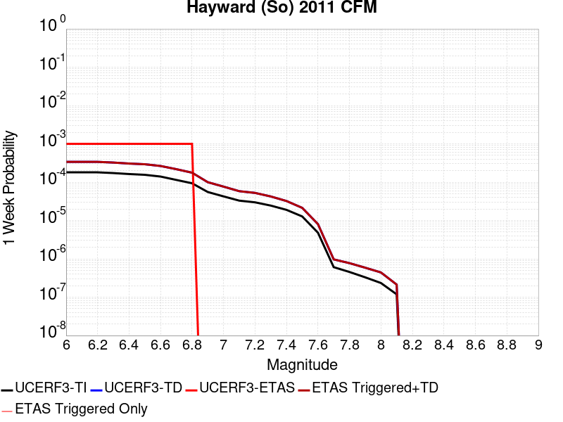 |  | 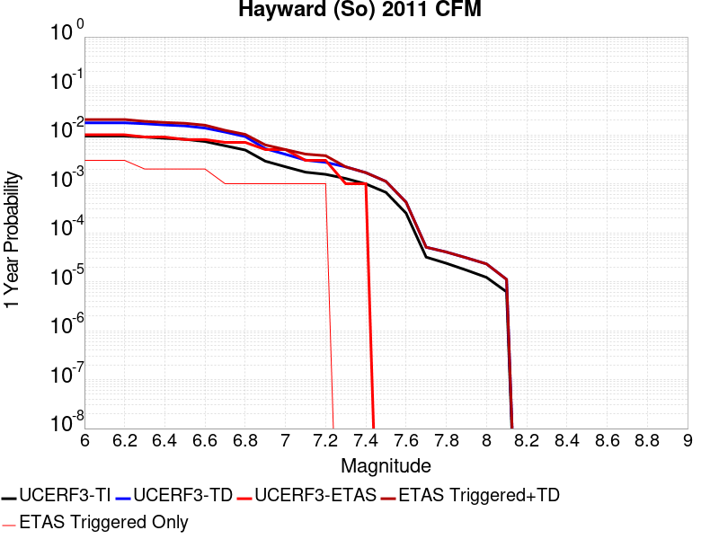 | 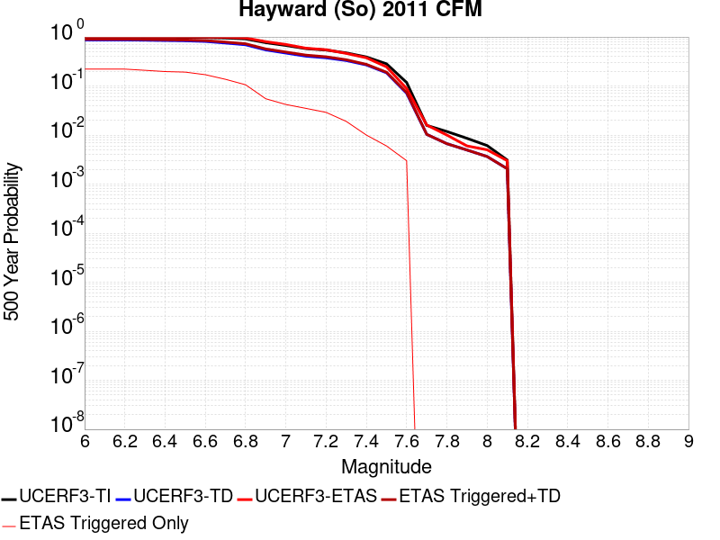 |

| Magnitude | 1 wk TI Prob | 1 wk TD Prob | 1 wk ETAS Prob | 1 wk ETAS/TD Gain | 1 wk ETAS Triggered+TD | 1 wk ETAS Triggered Only | 1 mo TI Prob | 1 mo TD Prob | 1 mo ETAS Prob | 1 mo ETAS/TD Gain | 1 mo ETAS Triggered+TD | 1 mo ETAS Triggered Only | 1 yr TI Prob | 1 yr TD Prob | 1 yr ETAS Prob | 1 yr ETAS/TD Gain | 1 yr ETAS Triggered+TD | 1 yr ETAS Triggered Only | 500 yr TI Prob | 500 yr TD Prob | 500 yr ETAS Prob | 500 yr ETAS/TD Gain | 500 yr ETAS Triggered+TD | 500 yr ETAS Triggered Only |
|-----|-----|-----|-----|-----|-----|-----|-----|-----|-----|-----|-----|-----|-----|-----|-----|-----|-----|-----|-----|-----|-----|-----|-----|-----|
| 6.0 | 1.8091932E-4 | 3.3940675E-4 | 0.001 | 2.9463174 | 3.3940675E-4 | 0.0 | 7.751381E-4 | 0.0014537986 | 0.001 | 0.68785316 | 0.0014537986 | 0.0 | 0.00939654 | 0.017558517 | 0.01 | 0.56952417 | 0.020505842 | 0.003 | 0.9910891 | 0.8690973 | 1.0 | 1.1506191 | 0.89802676 | 0.221 |
| 6.1 | 1.8091932E-4 | 3.3940675E-4 | 0.001 | 2.9463174 | 3.3940675E-4 | 0.0 | 7.751381E-4 | 0.0014537986 | 0.001 | 0.68785316 | 0.0014537986 | 0.0 | 0.00939654 | 0.017558517 | 0.01 | 0.56952417 | 0.020505842 | 0.003 | 0.9910891 | 0.8690973 | 1.0 | 1.1506191 | 0.89802676 | 0.221 |
| 6.2 | 1.8091932E-4 | 3.3940675E-4 | 0.001 | 2.9463174 | 3.3940675E-4 | 0.0 | 7.751381E-4 | 0.0014537986 | 0.001 | 0.68785316 | 0.0014537986 | 0.0 | 0.00939654 | 0.017558517 | 0.01 | 0.56952417 | 0.020505842 | 0.003 | 0.9910891 | 0.8690973 | 1.0 | 1.1506191 | 0.89802676 | 0.221 |
| 6.3 | 1.7322872E-4 | 3.2542046E-4 | 0.001 | 3.0729475 | 3.2542046E-4 | 0.0 | 7.4219756E-4 | 0.0013939225 | 0.001 | 0.7174 | 0.0013939225 | 0.0 | 0.0089988755 | 0.016840992 | 0.009 | 0.5344103 | 0.01880731 | 0.002 | 0.98910886 | 0.8599463 | 1.0 | 1.1628633 | 0.88921756 | 0.209 |
| 6.4 | 1.6334097E-4 | 3.0675912E-4 | 0.001 | 3.259887 | 3.0675912E-4 | 0.0 | 6.998449E-4 | 0.0013140275 | 0.001 | 0.7610191 | 0.0013140275 | 0.0 | 0.008487372 | 0.015882734 | 0.009 | 0.5666531 | 0.017850967 | 0.002 | 0.9859031 | 0.84698844 | 0.999 | 1.1794729 | 0.87713176 | 0.197 |
| 6.5 | 1.5600289E-4 | 2.9396696E-4 | 0.001 | 3.401743 | 2.9396696E-4 | 0.0 | 6.684125E-4 | 0.0012592577 | 0.001 | 0.79411864 | 0.0012592577 | 0.0 | 0.008107598 | 0.015225383 | 0.008 | 0.5254383 | 0.017194932 | 0.002 | 0.9829281 | 0.8351493 | 0.999 | 1.1961933 | 0.8668006 | 0.192 |
| 6.6 | 1.4046066E-4 | 2.6495085E-4 | 0.001 | 3.7742846 | 2.6495085E-4 | 0.0 | 6.018354E-4 | 0.0011350157 | 0.001 | 0.88104504 | 0.0011350157 | 0.0 | 0.0073027555 | 0.013732596 | 0.008 | 0.58255553 | 0.015705131 | 0.002 | 0.9743901 | 0.8107045 | 0.996 | 1.228561 | 0.8428847 | 0.17 |
| 6.7 | 1.14696966E-4 | 2.1885554E-4 | 0.001 | 4.5692244 | 2.1885554E-4 | 0.0 | 4.914658E-4 | 9.376197E-4 | 0.001 | 1.0665305 | 9.376197E-4 | 0.0 | 0.0059671924 | 0.0113567095 | 0.007 | 0.61637574 | 0.012345352 | 0.001 | 0.94983983 | 0.75258374 | 0.985 | 1.3088244 | 0.7864798 | 0.137 |
| 6.8 | 9.3874296E-5 | 1.771376E-4 | 0.001 | 5.645329 | 1.771376E-4 | 0.0 | 4.0225635E-4 | 7.589436E-4 | 0.001 | 1.317621 | 7.589436E-4 | 0.0 | 0.0048864787 | 0.009201643 | 0.007 | 0.7607337 | 0.010192442 | 0.001 | 0.9136398 | 0.69293106 | 0.955 | 1.3782035 | 0.7254804 | 0.106 |
| 6.9 | 5.551852E-5 | 1.00116675E-4 | 0.0 | 0.0 | 1.00116675E-4 | 0.0 | 2.3791482E-4 | 4.2900143E-4 | 0.0 | 0.0 | 4.2900143E-4 | 0.0 | 0.0028927654 | 0.0052106874 | 0.005 | 0.95956624 | 0.006205477 | 0.001 | 0.7650726 | 0.5450123 | 0.802 | 1.4715265 | 0.5700366 | 0.055 |
| 7.0 | 4.2662363E-5 | 7.674124E-5 | 0.0 | 0.0 | 7.674124E-5 | 0.0 | 1.8282588E-4 | 3.2884994E-4 | 0.0 | 0.0 | 3.2884994E-4 | 0.0 | 0.0022236328 | 0.003996462 | 0.005 | 1.2511065 | 0.004992466 | 0.001 | 0.6714461 | 0.4696057 | 0.703 | 1.4970006 | 0.49188226 | 0.042 |
| 7.1 | 3.305886E-5 | 5.833138E-5 | 0.0 | 0.0 | 5.833138E-5 | 0.0 | 1.4167312E-4 | 2.4996776E-4 | 0.0 | 0.0 | 2.4996776E-4 | 0.0 | 0.0017235056 | 0.0030391265 | 0.003 | 0.98712575 | 0.0040360875 | 0.001 | 0.5778929 | 0.40559444 | 0.59 | 1.454655 | 0.42639863 | 0.035 |
| 7.2 | 2.9856887E-5 | 5.260766E-5 | 0.0 | 0.0 | 5.260766E-5 | 0.0 | 1.2795182E-4 | 2.25442E-4 | 0.0 | 0.0 | 2.25442E-4 | 0.0 | 0.0015567001 | 0.0027413159 | 0.003 | 1.094365 | 0.0037385745 | 0.001 | 0.5411154 | 0.3759086 | 0.549 | 1.4604614 | 0.39400724 | 0.029 |
| 7.3 | 2.4559737E-5 | 4.24819E-5 | 0.0 | 0.0 | 4.24819E-5 | 0.0 | 1.0525176E-4 | 1.8205265E-4 | 0.0 | 0.0 | 1.8205265E-4 | 0.0 | 0.0012806869 | 0.002214249 | 0.001 | 0.4516204 | 0.002214249 | 0.0 | 0.47310492 | 0.33027598 | 0.462 | 1.3988302 | 0.34300074 | 0.019 |
| 7.4 | 1.9002231E-5 | 3.231865E-5 | 0.0 | 0.0 | 3.231865E-5 | 0.0 | 8.143559E-5 | 1.385012E-4 | 0.0 | 0.0 | 1.385012E-4 | 0.0 | 9.910273E-4 | 0.0016849564 | 0.001 | 0.5934872 | 0.0016849564 | 0.0 | 0.3908918 | 0.26911697 | 0.376 | 1.397162 | 0.2764258 | 0.01 |
| 7.5 | 1.2783333E-5 | 2.1421056E-5 | 0.0 | 0.0 | 2.1421056E-5 | 0.0 | 5.4784563E-5 | 9.1801325E-5 | 0.0 | 0.0 | 9.1801325E-5 | 0.0 | 6.667979E-4 | 0.001117113 | 0.0 | 0.0 | 0.001117113 | 0.0 | 0.28359538 | 0.18589297 | 0.246 | 1.3233422 | 0.1907776 | 0.006 |
| 7.6 | 4.8149627E-6 | 8.07141E-6 | 0.0 | 0.0 | 8.07141E-6 | 0.0 | 2.063539E-5 | 3.4591303E-5 | 0.0 | 0.0 | 3.4591303E-5 | 0.0 | 2.5120692E-4 | 4.210688E-4 | 0.0 | 0.0 | 4.210688E-4 | 0.0 | 0.118049406 | 0.0710376 | 0.089 | 1.2528577 | 0.07382448 | 0.003 |
| 7.7 | 6.0838227E-7 | 9.694106E-7 | 0.0 | 0.0 | 9.694106E-7 | 0.0 | 2.6073499E-6 | 4.1546105E-6 | 0.0 | 0.0 | 4.1546105E-6 | 0.0 | 3.174402E-5 | 5.058121E-5 | 0.0 | 0.0 | 5.058121E-5 | 0.0 | 0.015746962 | 0.010323102 | 0.016 | 1.5499219 | 0.010323102 | 0.0 |
| 7.8 | 4.5542808E-7 | 7.7389603E-7 | 0.0 | 0.0 | 7.7389603E-7 | 0.0 | 1.9518332E-6 | 3.316693E-6 | 0.0 | 0.0 | 3.316693E-6 | 0.0 | 2.376331E-5 | 4.0379993E-5 | 0.0 | 0.0 | 4.0379993E-5 | 0.0 | 0.011811486 | 0.0066679893 | 0.01 | 1.4997025 | 0.0066679893 | 0.0 |
| 7.9 | 3.3016747E-7 | 5.8891095E-7 | 0.0 | 0.0 | 5.8891095E-7 | 0.0 | 1.4150027E-6 | 2.5239017E-6 | 0.0 | 0.0 | 2.5239017E-6 | 0.0 | 1.7227521E-5 | 3.072807E-5 | 0.0 | 0.0 | 3.072807E-5 | 0.0 | 0.008576842 | 0.0049521024 | 0.006 | 1.2116065 | 0.0049521024 | 0.0 |
| 8.0 | 2.347038E-7 | 4.42349E-7 | 0.0 | 0.0 | 4.42349E-7 | 0.0 | 1.0058731E-6 | 1.8957801E-6 | 0.0 | 0.0 | 1.8957801E-6 | 0.0 | 1.2246436E-5 | 2.3080878E-5 | 0.0 | 0.0 | 2.3080878E-5 | 0.0 | 0.0061045466 | 0.0036461696 | 0.005 | 1.3713021 | 0.0036461696 | 0.0 |
| 8.1 | 1.18822804E-7 | 2.1344572E-7 | 0.0 | 0.0 | 2.1344572E-7 | 0.0 | 5.092405E-7 | 9.1476704E-7 | 0.0 | 0.0 | 9.1476704E-7 | 0.0 | 6.1999854E-6 | 1.1137232E-5 | 0.0 | 0.0 | 1.1137232E-5 | 0.0 | 0.0030952024 | 0.0020533383 | 0.003 | 1.4610354 | 0.0020533383 | 0.0 |

## San Andreas (North Coast) 2011 CFM
*[(top)](#table-of-contents)*

| 1 Week | 1 Month | 1 Year | 500 Year |
|-----|-----|-----|-----|
|  | 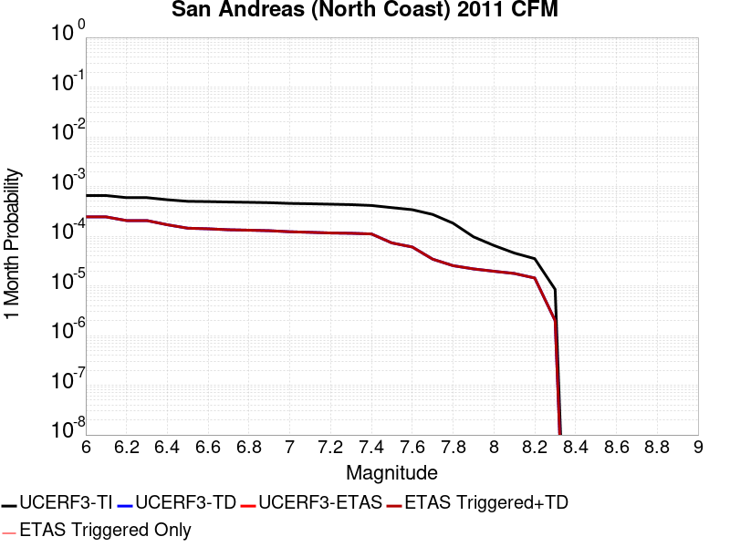 | 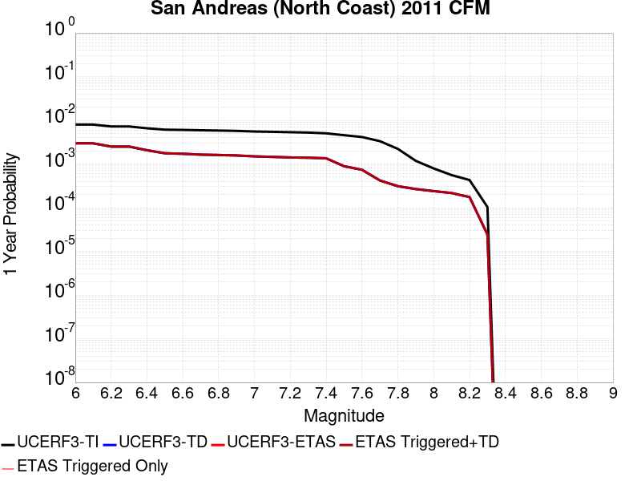 |  |

| Magnitude | 1 wk TI Prob | 1 wk TD Prob | 1 wk ETAS Prob | 1 wk ETAS/TD Gain | 1 wk ETAS Triggered+TD | 1 wk ETAS Triggered Only | 1 mo TI Prob | 1 mo TD Prob | 1 mo ETAS Prob | 1 mo ETAS/TD Gain | 1 mo ETAS Triggered+TD | 1 mo ETAS Triggered Only | 1 yr TI Prob | 1 yr TD Prob | 1 yr ETAS Prob | 1 yr ETAS/TD Gain | 1 yr ETAS Triggered+TD | 1 yr ETAS Triggered Only | 500 yr TI Prob | 500 yr TD Prob | 500 yr ETAS Prob | 500 yr ETAS/TD Gain | 500 yr ETAS Triggered+TD | 500 yr ETAS Triggered Only |
|-----|-----|-----|-----|-----|-----|-----|-----|-----|-----|-----|-----|-----|-----|-----|-----|-----|-----|-----|-----|-----|-----|-----|-----|-----|
| 6.0 | 1.5333705E-4 | 5.699261E-5 | 0.0 | 0.0 | 5.699261E-5 | 0.0 | 6.5699324E-4 | 2.4423128E-4 | 0.0 | 0.0 | 2.4423128E-4 | 0.0 | 0.007969595 | 0.0029694845 | 0.0 | 0.0 | 0.0029694845 | 0.0 | 0.9816983 | 0.89828354 | 1.0 | 1.1132342 | 0.92066115 | 0.22 |
| 6.1 | 1.5333705E-4 | 5.699261E-5 | 0.0 | 0.0 | 5.699261E-5 | 0.0 | 6.5699324E-4 | 2.4423128E-4 | 0.0 | 0.0 | 2.4423128E-4 | 0.0 | 0.007969595 | 0.0029694845 | 0.0 | 0.0 | 0.0029694845 | 0.0 | 0.9816983 | 0.89828354 | 1.0 | 1.1132342 | 0.92066115 | 0.22 |
| 6.2 | 1.3912938E-4 | 4.808599E-5 | 0.0 | 0.0 | 4.808599E-5 | 0.0 | 5.961325E-4 | 2.0606664E-4 | 0.0 | 0.0 | 2.0606664E-4 | 0.0 | 0.007233787 | 0.0025059935 | 0.0 | 0.0 | 0.0025059935 | 0.0 | 0.9734848 | 0.8774896 | 1.0 | 1.1396146 | 0.90150166 | 0.196 |
| 6.3 | 1.3912938E-4 | 4.808599E-5 | 0.0 | 0.0 | 4.808599E-5 | 0.0 | 5.961325E-4 | 2.0606664E-4 | 0.0 | 0.0 | 2.0606664E-4 | 0.0 | 0.007233787 | 0.0025059935 | 0.0 | 0.0 | 0.0025059935 | 0.0 | 0.9734848 | 0.8774896 | 1.0 | 1.1396146 | 0.90150166 | 0.196 |
| 6.4 | 1.2623647E-4 | 3.9599243E-5 | 0.0 | 0.0 | 3.9599243E-5 | 0.0 | 5.4090127E-4 | 1.6970008E-4 | 0.0 | 0.0 | 1.6970008E-4 | 0.0 | 0.0065656058 | 0.0020641545 | 0.0 | 0.0 | 0.0020641545 | 0.0 | 0.962881 | 0.85541046 | 0.998 | 1.1666913 | 0.8810028 | 0.177 |
| 6.5 | 1.1736096E-4 | 3.3766108E-5 | 0.0 | 0.0 | 3.3766108E-5 | 0.0 | 5.028786E-4 | 1.4470394E-4 | 0.0 | 0.0 | 1.4470394E-4 | 0.0 | 0.006105373 | 0.001760358 | 0.0 | 0.0 | 0.001760358 | 0.0 | 0.953208 | 0.8379402 | 0.998 | 1.1910157 | 0.8641939 | 0.162 |
| 6.6 | 1.1586959E-4 | 3.2841E-5 | 0.0 | 0.0 | 3.2841E-5 | 0.0 | 4.964894E-4 | 1.407396E-4 | 0.0 | 0.0 | 1.407396E-4 | 0.0 | 0.006028018 | 0.0017121693 | 0.0 | 0.0 | 0.0017121693 | 0.0 | 0.9513513 | 0.83466506 | 0.998 | 1.1956892 | 0.860788 | 0.158 |
| 6.7 | 1.13693764E-4 | 3.140797E-5 | 0.0 | 0.0 | 3.140797E-5 | 0.0 | 4.87168E-4 | 1.3459871E-4 | 0.0 | 0.0 | 1.3459871E-4 | 0.0 | 0.005915152 | 0.0016375185 | 0.0 | 0.0 | 0.0016375185 | 0.0 | 0.9485095 | 0.82971174 | 0.998 | 1.2028273 | 0.8555956 | 0.152 |
| 6.8 | 1.1204889E-4 | 3.079667E-5 | 0.0 | 0.0 | 3.079667E-5 | 0.0 | 4.8012115E-4 | 1.3197912E-4 | 0.0 | 0.0 | 1.3197912E-4 | 0.0 | 0.005829819 | 0.0016056724 | 0.0 | 0.0 | 0.0016056724 | 0.0 | 0.9462515 | 0.82554567 | 0.998 | 1.2088974 | 0.8513649 | 0.148 |
| 6.9 | 1.1005794E-4 | 3.0071318E-5 | 0.0 | 0.0 | 3.0071318E-5 | 0.0 | 4.7159163E-4 | 1.2887077E-4 | 0.0 | 0.0 | 1.2887077E-4 | 0.0 | 0.0057265228 | 0.0015678835 | 0.0 | 0.0 | 0.0015678835 | 0.0 | 0.94338554 | 0.82058483 | 0.998 | 1.2162057 | 0.84677947 | 0.146 |
| 7.0 | 1.0647948E-4 | 2.864985E-5 | 0.0 | 0.0 | 2.864985E-5 | 0.0 | 4.562608E-4 | 1.2277935E-4 | 0.0 | 0.0 | 1.2277935E-4 | 0.0 | 0.0055408357 | 0.0014938245 | 0.0 | 0.0 | 0.0014938245 | 0.0 | 0.9378448 | 0.8115799 | 0.996 | 1.2272359 | 0.8383356 | 0.142 |
| 7.1 | 1.04795035E-4 | 2.7908061E-5 | 0.0 | 0.0 | 2.7908061E-5 | 0.0 | 4.4904428E-4 | 1.19600554E-4 | 0.0 | 0.0 | 1.19600554E-4 | 0.0 | 0.0054534175 | 0.001455175 | 0.0 | 0.0 | 0.001455175 | 0.0 | 0.93505216 | 0.8072594 | 0.996 | 1.2338041 | 0.8344358 | 0.141 |
| 7.2 | 1.02724036E-4 | 2.7054795E-5 | 0.0 | 0.0 | 2.7054795E-5 | 0.0 | 4.401716E-4 | 1.1594403E-4 | 0.0 | 0.0 | 1.1594403E-4 | 0.0 | 0.0053459285 | 0.0014107152 | 0.0 | 0.0 | 0.0014107152 | 0.0 | 0.9314461 | 0.80161196 | 0.994 | 1.2400014 | 0.82879114 | 0.137 |
| 7.3 | 1.00650694E-4 | 2.6696755E-5 | 0.0 | 0.0 | 2.6696755E-5 | 0.0 | 4.312888E-4 | 1.14409704E-4 | 0.0 | 0.0 | 1.14409704E-4 | 0.0 | 0.005238306 | 0.0013920588 | 0.0 | 0.0 | 0.0013920588 | 0.0 | 0.9276353 | 0.79586375 | 0.994 | 1.2489575 | 0.82280976 | 0.132 |
| 7.4 | 9.672919E-5 | 2.5872707E-5 | 0.0 | 0.0 | 2.5872707E-5 | 0.0 | 4.144878E-4 | 1.10878376E-4 | 0.0 | 0.0 | 1.10878376E-4 | 0.0 | 0.005034718 | 0.0013491189 | 0.0 | 0.0 | 0.0013491189 | 0.0 | 0.91983896 | 0.784937 | 0.993 | 1.2650696 | 0.8103145 | 0.118 |
| 7.5 | 8.7600405E-5 | 1.7056598E-5 | 0.0 | 0.0 | 1.7056598E-5 | 0.0 | 3.753763E-4 | 7.309767E-5 | 0.0 | 0.0 | 7.309767E-5 | 0.0 | 0.0045606326 | 8.8960206E-4 | 0.0 | 0.0 | 8.8960206E-4 | 0.0 | 0.8982801 | 0.7588205 | 0.984 | 1.2967495 | 0.78366196 | 0.103 |
| 7.6 | 7.9562284E-5 | 1.4129182E-5 | 0.0 | 0.0 | 1.4129182E-5 | 0.0 | 3.4093665E-4 | 6.0552236E-5 | 0.0 | 0.0 | 6.0552236E-5 | 0.0 | 0.0041430052 | 7.369752E-4 | 0.0 | 0.0 | 7.369752E-4 | 0.0 | 0.8745447 | 0.7222399 | 0.97 | 1.343044 | 0.7475161 | 0.091 |
| 7.7 | 6.3866544E-5 | 8.0435975E-6 | 0.0 | 0.0 | 8.0435975E-6 | 0.0 | 2.7368503E-4 | 3.4472105E-5 | 0.0 | 0.0 | 3.4472105E-5 | 0.0 | 0.0033270244 | 4.196172E-4 | 0.0 | 0.0 | 4.196172E-4 | 0.0 | 0.81105244 | 0.63645595 | 0.9 | 1.4140806 | 0.66444886 | 0.077 |
| 7.8 | 4.2543215E-5 | 5.947062E-6 | 0.0 | 0.0 | 5.947062E-6 | 0.0 | 1.8231533E-4 | 2.548716E-5 | 0.0 | 0.0 | 2.548716E-5 | 0.0 | 0.0022174292 | 3.1026202E-4 | 0.0 | 0.0 | 3.1026202E-4 | 0.0 | 0.67042315 | 0.47978434 | 0.697 | 1.452736 | 0.50631535 | 0.051 |
| 7.9 | 2.2636612E-5 | 5.1170746E-6 | 0.0 | 0.0 | 5.1170746E-6 | 0.0 | 9.7010445E-5 | 2.1930136E-5 | 0.0 | 0.0 | 2.1930136E-5 | 0.0 | 0.0011804621 | 2.6696673E-4 | 0.0 | 0.0 | 2.6696673E-4 | 0.0 | 0.44599396 | 0.30077806 | 0.401 | 1.3332089 | 0.3175594 | 0.024 |
| 8.0 | 1.5167874E-5 | 4.589746E-6 | 0.0 | 0.0 | 4.589746E-6 | 0.0 | 6.500356E-5 | 1.967019E-5 | 0.0 | 0.0 | 1.967019E-5 | 0.0 | 7.9113094E-4 | 2.3945828E-4 | 0.0 | 0.0 | 2.3945828E-4 | 0.0 | 0.3268062 | 0.21136603 | 0.262 | 1.2395558 | 0.22398417 | 0.016 |
| 8.1 | 1.0681047E-5 | 4.143349E-6 | 0.0 | 0.0 | 4.143349E-6 | 0.0 | 4.5775112E-5 | 1.775709E-5 | 0.0 | 0.0 | 1.775709E-5 | 0.0 | 5.5716943E-4 | 2.1617116E-4 | 0.0 | 0.0 | 2.1617116E-4 | 0.0 | 0.24320462 | 0.15072589 | 0.199 | 1.3202776 | 0.16261572 | 0.014 |
| 8.2 | 8.226114E-6 | 3.3556917E-6 | 0.0 | 0.0 | 3.3556917E-6 | 0.0 | 3.52543E-5 | 1.4381456E-5 | 0.0 | 0.0 | 1.4381456E-5 | 0.0 | 4.2913653E-4 | 1.7508019E-4 | 0.0 | 0.0 | 1.7508019E-4 | 0.0 | 0.19314744 | 0.117770456 | 0.154 | 1.3076285 | 0.12923944 | 0.013 |
| 8.3 | 1.983087E-6 | 4.6615045E-7 | 0.0 | 0.0 | 4.6615045E-7 | 0.0 | 8.498917E-6 | 1.997786E-6 | 0.0 | 0.0 | 1.997786E-6 | 0.0 | 1.034694E-4 | 2.432278E-5 | 0.0 | 0.0 | 2.432278E-5 | 0.0 | 0.050421786 | 0.030325904 | 0.032 | 1.0552034 | 0.033234928 | 0.003 |

## San Andreas (Cholame) rev
*[(top)](#table-of-contents)*

| 1 Week | 1 Month | 1 Year | 500 Year |
|-----|-----|-----|-----|
| 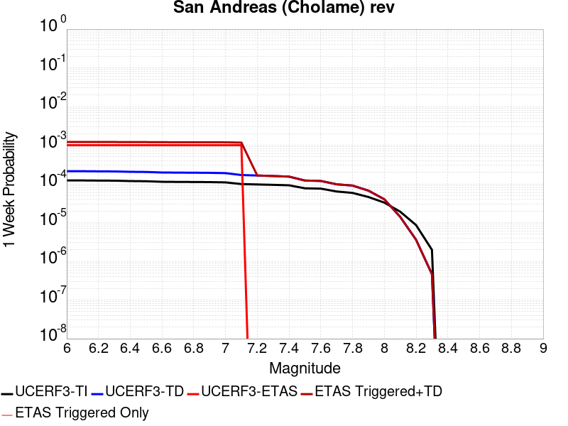 | 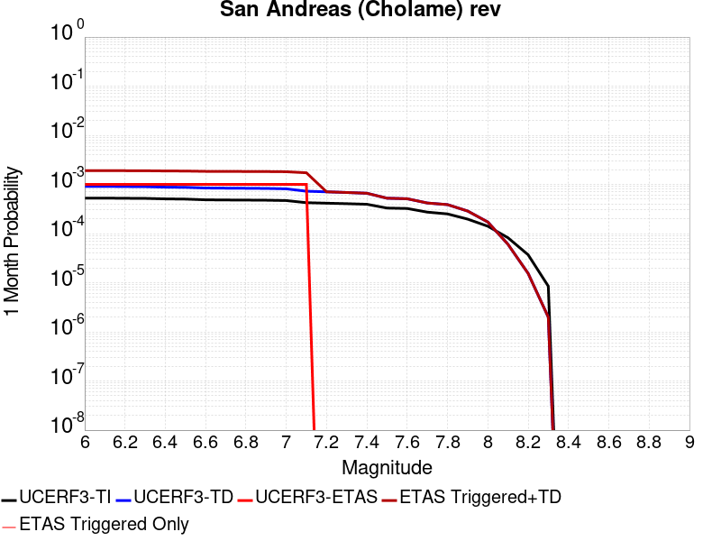 | 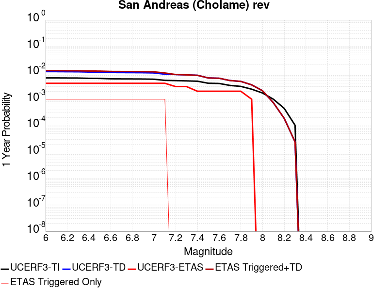 |  |

| Magnitude | 1 wk TI Prob | 1 wk TD Prob | 1 wk ETAS Prob | 1 wk ETAS/TD Gain | 1 wk ETAS Triggered+TD | 1 wk ETAS Triggered Only | 1 mo TI Prob | 1 mo TD Prob | 1 mo ETAS Prob | 1 mo ETAS/TD Gain | 1 mo ETAS Triggered+TD | 1 mo ETAS Triggered Only | 1 yr TI Prob | 1 yr TD Prob | 1 yr ETAS Prob | 1 yr ETAS/TD Gain | 1 yr ETAS Triggered+TD | 1 yr ETAS Triggered Only | 500 yr TI Prob | 500 yr TD Prob | 500 yr ETAS Prob | 500 yr ETAS/TD Gain | 500 yr ETAS Triggered+TD | 500 yr ETAS Triggered Only |
|-----|-----|-----|-----|-----|-----|-----|-----|-----|-----|-----|-----|-----|-----|-----|-----|-----|-----|-----|-----|-----|-----|-----|-----|-----|
| 6.0 | 1.2302514E-4 | 2.1318947E-4 | 0.001 | 4.6906633 | 0.0012129763 | 0.001 | 5.27144E-4 | 9.1335055E-4 | 0.001 | 1.0948699 | 0.0019124371 | 0.001 | 0.0063991086 | 0.011063702 | 0.004 | 0.36154264 | 0.012052638 | 0.001 | 0.95963675 | 0.7980065 | 1.0 | 1.2531227 | 0.84022313 | 0.209 |
| 6.1 | 1.2302514E-4 | 2.1318947E-4 | 0.001 | 4.6906633 | 0.0012129763 | 0.001 | 5.27144E-4 | 9.1335055E-4 | 0.001 | 1.0948699 | 0.0019124371 | 0.001 | 0.0063991086 | 0.011063702 | 0.004 | 0.36154264 | 0.012052638 | 0.001 | 0.95963675 | 0.7980065 | 1.0 | 1.2531227 | 0.84022313 | 0.209 |
| 6.2 | 1.2203569E-4 | 2.1140937E-4 | 0.001 | 4.7301593 | 0.0012111979 | 0.001 | 5.2290526E-4 | 9.057268E-4 | 0.001 | 1.1040857 | 0.001904821 | 0.001 | 0.006347804 | 0.010971821 | 0.004 | 0.3645703 | 0.011960849 | 0.001 | 0.9585811 | 0.7961211 | 1.0 | 1.2560903 | 0.8387318 | 0.209 |
| 6.3 | 1.2142645E-4 | 2.1030018E-4 | 0.001 | 4.755108 | 0.0012100899 | 0.001 | 5.202953E-4 | 9.009765E-4 | 0.001 | 1.1099069 | 0.0019000755 | 0.001 | 0.006316212 | 0.010914567 | 0.004 | 0.3664827 | 0.011903652 | 0.001 | 0.95791745 | 0.7949739 | 1.0 | 1.257903 | 0.8374143 | 0.207 |
| 6.4 | 1.1865206E-4 | 2.0563234E-4 | 0.001 | 4.863048 | 0.0012054268 | 0.001 | 5.0840975E-4 | 8.809851E-4 | 0.001 | 1.135093 | 0.0018801041 | 0.001 | 0.006172335 | 0.010673579 | 0.004 | 0.37475714 | 0.011662905 | 0.001 | 0.9547581 | 0.7899544 | 1.0 | 1.2658958 | 0.83238363 | 0.202 |
| 6.5 | 1.17443946E-4 | 2.037672E-4 | 0.001 | 4.9075613 | 0.0012035634 | 0.001 | 5.032341E-4 | 8.72997E-4 | 0.001 | 1.1454793 | 0.0018721239 | 0.001 | 0.006109677 | 0.010577269 | 0.004 | 0.37816945 | 0.011566692 | 0.001 | 0.95330924 | 0.7879613 | 1.0 | 1.2690979 | 0.830157 | 0.199 |
| 6.6 | 1.13579066E-4 | 1.9745826E-4 | 0.001 | 5.0643616 | 0.0011972608 | 0.001 | 4.866766E-4 | 8.459764E-4 | 0.001 | 1.1820661 | 0.0018451305 | 0.001 | 0.0059092017 | 0.010251433 | 0.004 | 0.39018935 | 0.011241182 | 0.001 | 0.94835514 | 0.78121376 | 1.0 | 1.2800593 | 0.82256436 | 0.189 |
| 6.7 | 1.1271412E-4 | 1.9601447E-4 | 0.001 | 5.101664 | 0.0011958184 | 0.001 | 4.829711E-4 | 8.397928E-4 | 0.001 | 1.1907699 | 0.001838953 | 0.001 | 0.005864331 | 0.010176853 | 0.004 | 0.39304882 | 0.011166676 | 0.001 | 0.9471764 | 0.7796546 | 0.999 | 1.2813365 | 0.82107955 | 0.188 |
| 6.8 | 1.1217975E-4 | 1.9500342E-4 | 0.001 | 5.128115 | 0.0011948084 | 0.001 | 4.8068175E-4 | 8.354625E-4 | 0.001 | 1.1969419 | 0.001834627 | 0.001 | 0.005836608 | 0.010124623 | 0.004 | 0.39507645 | 0.011114498 | 0.001 | 0.9464347 | 0.7786525 | 0.999 | 1.2829857 | 0.81982315 | 0.186 |
| 6.9 | 1.1146753E-4 | 1.9360335E-4 | 0.001 | 5.1651998 | 0.0011934098 | 0.001 | 4.7763053E-4 | 8.2946604E-4 | 0.001 | 1.2055949 | 0.0018286365 | 0.001 | 0.0057996577 | 0.010052293 | 0.004 | 0.3979192 | 0.01104224 | 0.001 | 0.94543 | 0.7772135 | 0.999 | 1.285361 | 0.8186518 | 0.186 |
| 7.0 | 1.0965793E-4 | 1.9017668E-4 | 0.001 | 5.2582684 | 0.0011899865 | 0.001 | 4.698779E-4 | 8.1478956E-4 | 0.001 | 1.2273108 | 0.0018139747 | 0.001 | 0.005705768 | 0.009875239 | 0.004 | 0.4050535 | 0.010865364 | 0.001 | 0.9427916 | 0.7736956 | 0.999 | 1.2912055 | 0.8153356 | 0.184 |
| 7.1 | 9.927982E-5 | 1.6990083E-4 | 0.001 | 5.8857865 | 0.0011697309 | 0.001 | 4.2541555E-4 | 7.27944E-4 | 0.001 | 1.373732 | 0.0017272161 | 0.001 | 0.0051671406 | 0.0088269 | 0.004 | 0.4531602 | 0.009818073 | 0.001 | 0.9250001 | 0.7515039 | 0.999 | 1.3293345 | 0.79275423 | 0.166 |
| 7.2 | 9.696786E-5 | 1.6521463E-4 | 0.0 | 0.0 | 1.6521463E-4 | 0.0 | 4.1551032E-4 | 7.0787134E-4 | 0.0 | 0.0 | 7.0787134E-4 | 0.0 | 0.00504711 | 0.008584467 | 0.003 | 0.34946844 | 0.008584467 | 0.0 | 0.9203366 | 0.74542195 | 0.998 | 1.338839 | 0.7874273 | 0.165 |
| 7.3 | 9.4727984E-5 | 1.6012075E-4 | 0.0 | 0.0 | 1.6012075E-4 | 0.0 | 4.0591392E-4 | 6.860521E-4 | 0.0 | 0.0 | 6.860521E-4 | 0.0 | 0.0049308087 | 0.008320876 | 0.003 | 0.36053896 | 0.008320876 | 0.0 | 0.9155421 | 0.73938817 | 0.998 | 1.3497647 | 0.78186786 | 0.163 |
| 7.4 | 9.220358E-5 | 1.5452183E-4 | 0.0 | 0.0 | 1.5452183E-4 | 0.0 | 3.9509835E-4 | 6.62069E-4 | 0.0 | 0.0 | 6.62069E-4 | 0.0 | 0.004799717 | 0.008031065 | 0.002 | 0.24903297 | 0.008031065 | 0.0 | 0.90979195 | 0.7323681 | 0.995 | 1.3586065 | 0.7733158 | 0.153 |
| 7.5 | 7.71631E-5 | 1.2241791E-4 | 0.0 | 0.0 | 1.2241791E-4 | 0.0 | 3.306571E-4 | 5.245428E-4 | 0.0 | 0.0 | 5.245428E-4 | 0.0 | 0.0040183207 | 0.00636765 | 0.002 | 0.31408763 | 0.00636765 | 0.0 | 0.8664405 | 0.6895961 | 0.981 | 1.4225719 | 0.73087984 | 0.133 |
| 7.6 | 7.5634416E-5 | 1.194085E-4 | 0.0 | 0.0 | 1.194085E-4 | 0.0 | 3.241072E-4 | 5.1165046E-4 | 0.0 | 0.0 | 5.1165046E-4 | 0.0 | 0.0039388672 | 0.0062115905 | 0.002 | 0.32197872 | 0.0062115905 | 0.0 | 0.8610057 | 0.6845027 | 0.978 | 1.4287745 | 0.7252019 | 0.129 |
| 7.7 | 6.3783E-5 | 9.777826E-5 | 0.0 | 0.0 | 9.777826E-5 | 0.0 | 2.7332708E-4 | 4.189824E-4 | 0.0 | 0.0 | 4.189824E-4 | 0.0 | 0.0033226798 | 0.005089192 | 0.002 | 0.3929897 | 0.005089192 | 0.0 | 0.81064016 | 0.63405734 | 0.939 | 1.4809387 | 0.67431104 | 0.11 |
| 7.8 | 5.863422E-5 | 9.067841E-5 | 0.0 | 0.0 | 9.067841E-5 | 0.0 | 2.512653E-4 | 3.8856393E-4 | 0.0 | 0.0 | 3.8856393E-4 | 0.0 | 0.003054864 | 0.0047205137 | 0.002 | 0.4236827 | 0.0047205137 | 0.0 | 0.7834145 | 0.59840375 | 0.914 | 1.5273969 | 0.63776016 | 0.098 |
| 7.9 | 4.595283E-5 | 6.711088E-5 | 0.0 | 0.0 | 6.711088E-5 | 0.0 | 1.9692584E-4 | 2.8758636E-4 | 0.0 | 0.0 | 2.8758636E-4 | 0.0 | 0.0023949358 | 0.0034957454 | 0.001 | 0.28606203 | 0.0034957454 | 0.0 | 0.69847554 | 0.52241594 | 0.762 | 1.4586078 | 0.55823475 | 0.075 |
| 8.0 | 3.2950178E-5 | 4.0136594E-5 | 0.0 | 0.0 | 4.0136594E-5 | 0.0 | 1.412074E-4 | 1.7200265E-4 | 0.0 | 0.0 | 1.7200265E-4 | 0.0 | 0.0017178444 | 0.0020921219 | 0.0 | 0.0 | 0.0020921219 | 0.0 | 0.57669437 | 0.42024046 | 0.567 | 1.3492275 | 0.4469094 | 0.046 |
| 8.1 | 1.9177472E-5 | 1.4111643E-5 | 0.0 | 0.0 | 1.4111643E-5 | 0.0 | 8.218658E-5 | 6.047707E-5 | 0.0 | 0.0 | 6.047707E-5 | 0.0 | 0.0010001622 | 7.3605997E-4 | 0.0 | 0.0 | 7.3605997E-4 | 0.0 | 0.3936703 | 0.2752996 | 0.35 | 1.2713422 | 0.2905183 | 0.021 |
| 8.2 | 8.643924E-6 | 3.6108509E-6 | 0.0 | 0.0 | 3.6108509E-6 | 0.0 | 3.704486E-5 | 1.5474983E-5 | 0.0 | 0.0 | 1.5474983E-5 | 0.0 | 4.5092785E-4 | 1.8839166E-4 | 0.0 | 0.0 | 1.8839166E-4 | 0.0 | 0.20189473 | 0.12443174 | 0.157 | 1.261736 | 0.13581413 | 0.013 |
| 8.3 | 1.983087E-6 | 4.6615045E-7 | 0.0 | 0.0 | 4.6615045E-7 | 0.0 | 8.498917E-6 | 1.997786E-6 | 0.0 | 0.0 | 1.997786E-6 | 0.0 | 1.034694E-4 | 2.432278E-5 | 0.0 | 0.0 | 2.432278E-5 | 0.0 | 0.050421786 | 0.030325904 | 0.032 | 1.0552034 | 0.033234928 | 0.003 |

## Brawley (Seismic Zone) alt 1
*[(top)](#table-of-contents)*

| 1 Week | 1 Month | 1 Year | 500 Year |
|-----|-----|-----|-----|
| 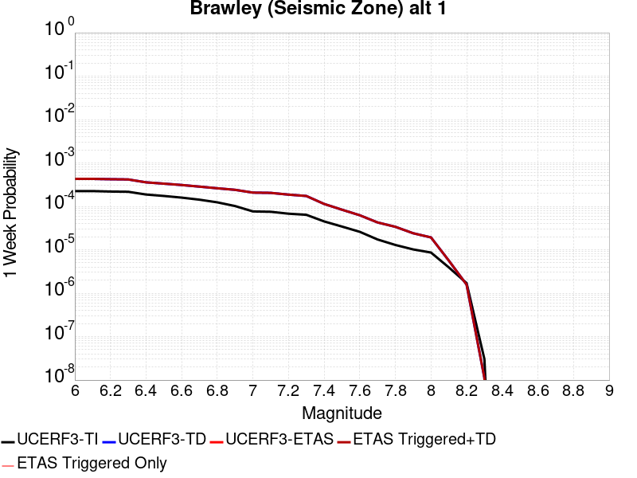 | 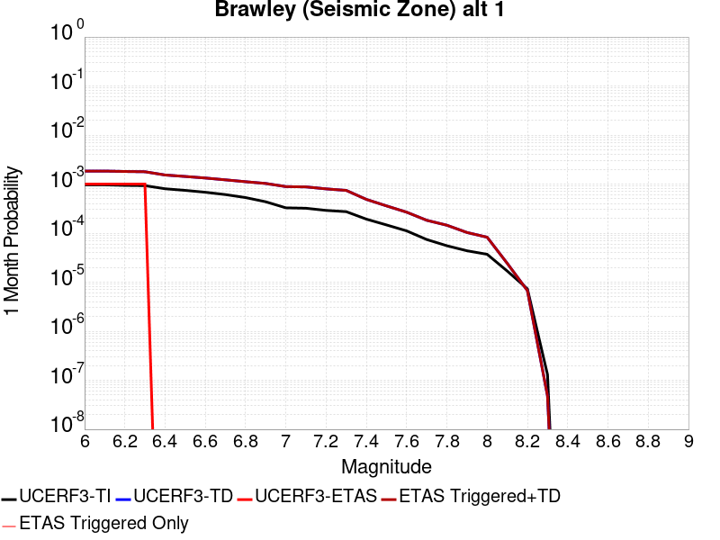 | 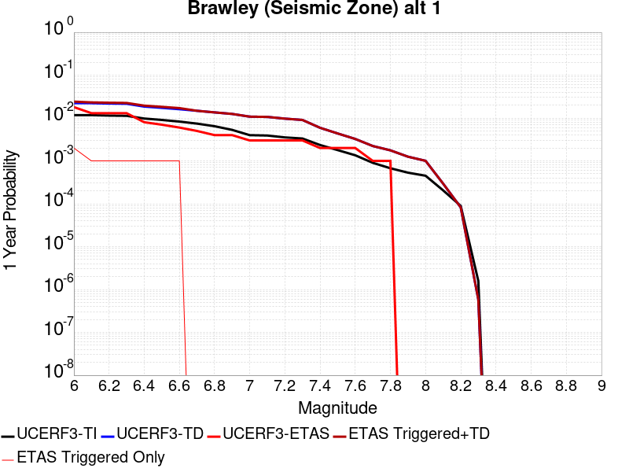 | 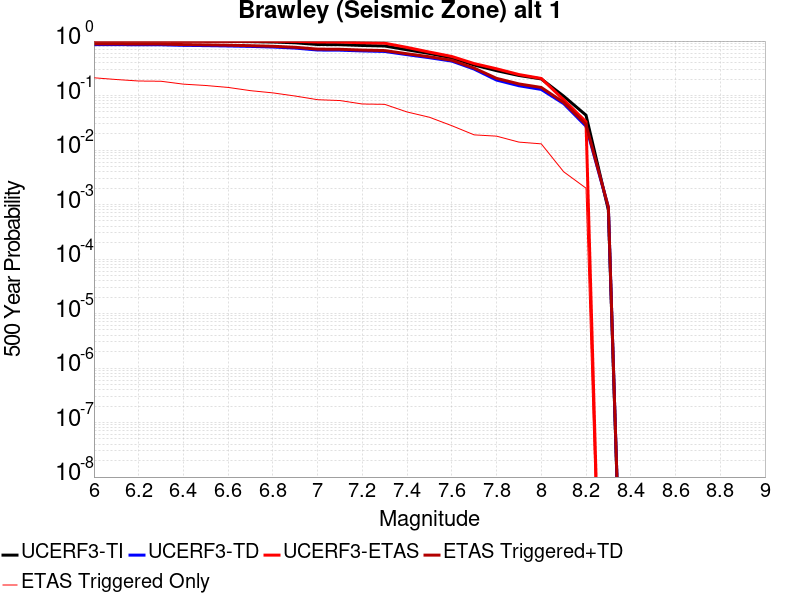 |

| Magnitude | 1 wk TI Prob | 1 wk TD Prob | 1 wk ETAS Prob | 1 wk ETAS/TD Gain | 1 wk ETAS Triggered+TD | 1 wk ETAS Triggered Only | 1 mo TI Prob | 1 mo TD Prob | 1 mo ETAS Prob | 1 mo ETAS/TD Gain | 1 mo ETAS Triggered+TD | 1 mo ETAS Triggered Only | 1 yr TI Prob | 1 yr TD Prob | 1 yr ETAS Prob | 1 yr ETAS/TD Gain | 1 yr ETAS Triggered+TD | 1 yr ETAS Triggered Only | 500 yr TI Prob | 500 yr TD Prob | 500 yr ETAS Prob | 500 yr ETAS/TD Gain | 500 yr ETAS Triggered+TD | 500 yr ETAS Triggered Only |
|-----|-----|-----|-----|-----|-----|-----|-----|-----|-----|-----|-----|-----|-----|-----|-----|-----|-----|-----|-----|-----|-----|-----|-----|-----|
| 6.0 | 2.2521618E-4 | 4.3051952E-4 | 0.0 | 0.0 | 4.3051952E-4 | 0.0 | 9.6485513E-4 | 0.0018438117 | 0.001 | 0.5423547 | 0.0018438117 | 0.0 | 0.011683988 | 0.022211937 | 0.018 | 0.8103751 | 0.024167513 | 0.002 | 0.9971951 | 0.8594087 | 1.0 | 1.1635908 | 0.88921404 | 0.212 |
| 6.1 | 2.2521618E-4 | 4.3051952E-4 | 0.0 | 0.0 | 4.3051952E-4 | 0.0 | 9.6485513E-4 | 0.0018438117 | 0.001 | 0.5423547 | 0.0018438117 | 0.0 | 0.011683988 | 0.022211937 | 0.013 | 0.5852709 | 0.023189725 | 0.001 | 0.9971951 | 0.8594087 | 1.0 | 1.1635908 | 0.88710517 | 0.197 |
| 6.2 | 2.198148E-4 | 4.2253887E-4 | 0.0 | 0.0 | 4.2253887E-4 | 0.0 | 9.417233E-4 | 0.0018096566 | 0.001 | 0.552591 | 0.0018096566 | 0.0 | 0.011405343 | 0.021804478 | 0.013 | 0.5962078 | 0.022782674 | 0.001 | 0.99677056 | 0.85638106 | 1.0 | 1.1677045 | 0.88295054 | 0.185 |
| 6.3 | 2.1704129E-4 | 4.1711866E-4 | 0.0 | 0.0 | 4.1711866E-4 | 0.0 | 9.298453E-4 | 0.001786459 | 0.001 | 0.5597666 | 0.001786459 | 0.0 | 0.011262234 | 0.021527776 | 0.013 | 0.603871 | 0.022506248 | 0.001 | 0.99652815 | 0.85463405 | 1.0 | 1.1700915 | 0.881236 | 0.183 |
| 6.4 | 1.876142E-4 | 3.5793555E-4 | 0.0 | 0.0 | 3.5793555E-4 | 0.0 | 8.038131E-4 | 0.001533119 | 0.0 | 0.0 | 0.001533119 | 0.0 | 0.00974259 | 0.01850334 | 0.008 | 0.4323544 | 0.019484837 | 0.001 | 0.9925174 | 0.83497185 | 0.999 | 1.1964475 | 0.86170644 | 0.162 |
| 6.5 | 1.7390939E-4 | 3.340718E-4 | 0.0 | 0.0 | 3.340718E-4 | 0.0 | 7.45113E-4 | 0.00143096 | 0.0 | 0.0 | 0.00143096 | 0.0 | 0.009034078 | 0.017281407 | 0.007 | 0.4050596 | 0.018264126 | 0.001 | 0.9893006 | 0.8250006 | 0.999 | 1.2109083 | 0.85177547 | 0.153 |
| 6.6 | 1.591791E-4 | 3.106442E-4 | 0.0 | 0.0 | 3.106442E-4 | 0.0 | 6.8201777E-4 | 0.0013306604 | 0.0 | 0.0 | 0.0013306604 | 0.0 | 0.008271996 | 0.016081134 | 0.006 | 0.373108 | 0.017065054 | 0.001 | 0.98428595 | 0.8129926 | 0.997 | 1.2263334 | 0.83936065 | 0.141 |
| 6.7 | 1.4268003E-4 | 2.851122E-4 | 0.0 | 0.0 | 2.851122E-4 | 0.0 | 6.1134255E-4 | 0.0012213432 | 0.0 | 0.0 | 0.0012213432 | 0.0 | 0.007417723 | 0.014768902 | 0.005 | 0.3385492 | 0.014768902 | 0.0 | 0.97583103 | 0.797815 | 0.997 | 1.2496631 | 0.8226838 | 0.123 |
| 6.8 | 1.239713E-4 | 2.612933E-4 | 0.0 | 0.0 | 2.612933E-4 | 0.0 | 5.3119735E-4 | 0.0011193524 | 0.0 | 0.0 | 0.0011193524 | 0.0 | 0.0064481674 | 0.013544019 | 0.004 | 0.2953333 | 0.013544019 | 0.0 | 0.960621 | 0.77704114 | 0.995 | 1.2804985 | 0.80201256 | 0.112 |
| 6.9 | 1.0180238E-4 | 2.4053708E-4 | 0.0 | 0.0 | 2.4053708E-4 | 0.0 | 4.3622297E-4 | 0.0010304695 | 0.0 | 0.0 | 0.0010304695 | 0.0 | 0.005298089 | 0.012474617 | 0.004 | 0.32065114 | 0.012474617 | 0.0 | 0.9297775 | 0.7434334 | 0.988 | 1.3289691 | 0.7685769 | 0.098 |
| 7.0 | 7.6619996E-5 | 2.07632E-4 | 0.0 | 0.0 | 2.07632E-4 | 0.0 | 3.283301E-4 | 8.895508E-4 | 0.0 | 0.0 | 8.895508E-4 | 0.0 | 0.0039900932 | 0.010777114 | 0.003 | 0.27836767 | 0.010777114 | 0.0 | 0.8645344 | 0.68463534 | 0.963 | 1.4065882 | 0.71112597 | 0.084 |
| 7.1 | 7.5127435E-5 | 2.0470409E-4 | 0.0 | 0.0 | 2.0470409E-4 | 0.0 | 3.2193496E-4 | 8.770111E-4 | 0.0 | 0.0 | 8.770111E-4 | 0.0 | 0.0039125155 | 0.010625942 | 0.003 | 0.28232792 | 0.010625942 | 0.0 | 0.85915494 | 0.680209 | 0.958 | 1.4083906 | 0.7061121 | 0.081 |
| 7.2 | 6.788582E-5 | 1.8661571E-4 | 0.0 | 0.0 | 1.8661571E-4 | 0.0 | 2.9090676E-4 | 7.9953915E-4 | 0.0 | 0.0 | 7.9953915E-4 | 0.0 | 0.0035360386 | 0.009691495 | 0.003 | 0.30954975 | 0.009691495 | 0.0 | 0.82986325 | 0.6590886 | 0.931 | 1.4125566 | 0.6829524 | 0.07 |
| 7.3 | 6.399602E-5 | 1.7362121E-4 | 0.0 | 0.0 | 1.7362121E-4 | 0.0 | 2.7423984E-4 | 7.438813E-4 | 0.0 | 0.0 | 7.438813E-4 | 0.0 | 0.0033337586 | 0.009019657 | 0.003 | 0.33260688 | 0.009019657 | 0.0 | 0.8116897 | 0.64441735 | 0.914 | 1.4183354 | 0.6689525 | 0.069 |
| 7.4 | 4.506759E-5 | 1.138811E-4 | 0.0 | 0.0 | 1.138811E-4 | 0.0 | 1.9313251E-4 | 4.8797132E-4 | 0.0 | 0.0 | 4.8797132E-4 | 0.0 | 0.0023488526 | 0.0059250165 | 0.002 | 0.3375518 | 0.0059250165 | 0.0 | 0.6914304 | 0.5627815 | 0.764 | 1.3575429 | 0.5846424 | 0.05 |
| 7.5 | 3.43289E-5 | 8.393686E-5 | 0.0 | 0.0 | 8.393686E-5 | 0.0 | 1.4711556E-4 | 3.596801E-4 | 0.0 | 0.0 | 3.596801E-4 | 0.0 | 0.0017896603 | 0.004370365 | 0.002 | 0.4576277 | 0.004370365 | 0.0 | 0.5916505 | 0.49497384 | 0.628 | 1.2687539 | 0.51517487 | 0.04 |
| 7.6 | 2.5980507E-5 | 6.24924E-5 | 0.0 | 0.0 | 6.24924E-5 | 0.0 | 1.1134028E-4 | 2.6779718E-4 | 0.0 | 0.0 | 2.6779718E-4 | 0.0 | 0.001354725 | 0.0032555764 | 0.002 | 0.6143306 | 0.0032555764 | 0.0 | 0.49227825 | 0.42872265 | 0.521 | 1.2152379 | 0.44471842 | 0.028 |
| 7.7 | 1.7292105E-5 | 4.2676907E-5 | 0.0 | 0.0 | 4.2676907E-5 | 0.0 | 7.4106916E-5 | 1.8288824E-4 | 0.0 | 0.0 | 1.8288824E-4 | 0.0 | 9.018782E-4 | 0.0022243948 | 0.001 | 0.44956046 | 0.0022243948 | 0.0 | 0.36309996 | 0.30590037 | 0.386 | 1.2618488 | 0.31908825 | 0.019 |
| 7.8 | 1.2927471E-5 | 3.3855922E-5 | 0.0 | 0.0 | 3.3855922E-5 | 0.0 | 5.5402274E-5 | 1.4508875E-4 | 0.0 | 0.0 | 1.4508875E-4 | 0.0 | 6.743139E-4 | 0.0017650262 | 0.001 | 0.56656384 | 0.0017650262 | 0.0 | 0.2862844 | 0.19237041 | 0.31 | 1.6114744 | 0.20690775 | 0.018 |
| 7.9 | 1.0200774E-5 | 2.4063846E-5 | 0.0 | 0.0 | 2.4063846E-5 | 0.0 | 4.371687E-5 | 1.03126695E-4 | 0.0 | 0.0 | 1.03126695E-4 | 0.0 | 5.321229E-4 | 0.0012548451 | 0.0 | 0.0 | 0.0012548451 | 0.0 | 0.23366225 | 0.15150432 | 0.243 | 1.6039146 | 0.16338326 | 0.014 |
| 8.0 | 8.650396E-6 | 1.9276262E-5 | 0.0 | 0.0 | 1.9276262E-5 | 0.0 | 3.70726E-5 | 8.2609935E-5 | 0.0 | 0.0 | 8.2609935E-5 | 0.0 | 4.5126543E-4 | 0.0010053125 | 0.0 | 0.0 | 0.0010053125 | 0.0 | 0.2020295 | 0.12948906 | 0.206 | 1.5908679 | 0.1408057 | 0.013 |
| 8.1 | 3.9368224E-6 | 5.645942E-6 | 0.0 | 0.0 | 5.645942E-6 | 0.0 | 1.6871985E-5 | 2.419667E-5 | 0.0 | 0.0 | 2.419667E-5 | 0.0 | 2.0539707E-4 | 2.9455472E-4 | 0.0 | 0.0 | 2.9455472E-4 | 0.0 | 0.09761054 | 0.0711543 | 0.084 | 1.180533 | 0.07486968 | 0.004 |
| 8.2 | 1.7101195E-6 | 1.5749052E-6 | 0.0 | 0.0 | 1.5749052E-6 | 0.0 | 7.329063E-6 | 6.749576E-6 | 0.0 | 0.0 | 6.749576E-6 | 0.0 | 8.922769E-5 | 8.217301E-5 | 0.0 | 0.0 | 8.217301E-5 | 0.0 | 0.043635186 | 0.027377922 | 0.033 | 1.2053508 | 0.029323166 | 0.002 |
| 8.3 | 3.0346666E-8 | 1.1096449E-8 | 0.0 | 0.0 | 1.1096449E-8 | 0.0 | 1.3005713E-7 | 4.755621E-8 | 0.0 | 0.0 | 4.755621E-8 | 0.0 | 1.5834444E-6 | 5.7899683E-7 | 0.0 | 0.0 | 5.7899683E-7 | 0.0 | 7.914095E-4 | 8.904516E-4 | 0.0 | 0.0 | 8.904516E-4 | 0.0 |

## San Andreas (Carrizo) rev
*[(top)](#table-of-contents)*

| 1 Week | 1 Month | 1 Year | 500 Year |
|-----|-----|-----|-----|
| 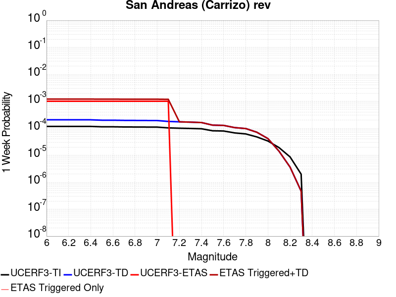 | 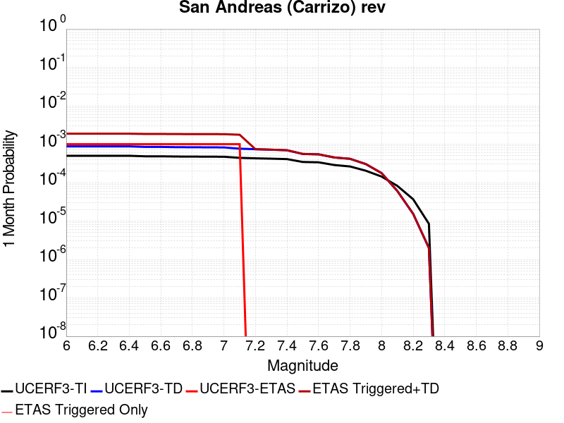 | 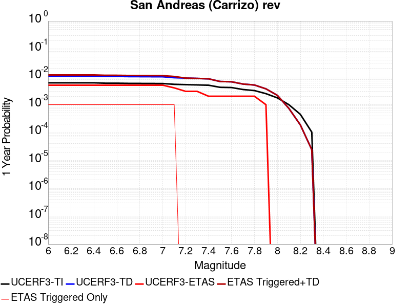 | 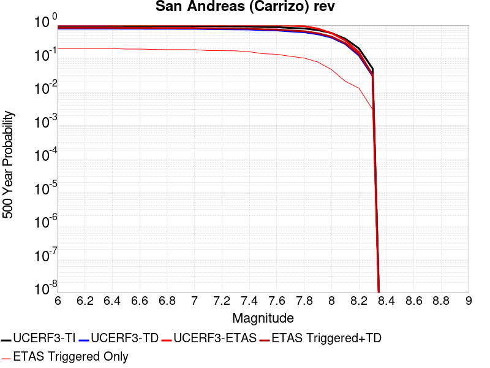 |

| Magnitude | 1 wk TI Prob | 1 wk TD Prob | 1 wk ETAS Prob | 1 wk ETAS/TD Gain | 1 wk ETAS Triggered+TD | 1 wk ETAS Triggered Only | 1 mo TI Prob | 1 mo TD Prob | 1 mo ETAS Prob | 1 mo ETAS/TD Gain | 1 mo ETAS Triggered+TD | 1 mo ETAS Triggered Only | 1 yr TI Prob | 1 yr TD Prob | 1 yr ETAS Prob | 1 yr ETAS/TD Gain | 1 yr ETAS Triggered+TD | 1 yr ETAS Triggered Only | 500 yr TI Prob | 500 yr TD Prob | 500 yr ETAS Prob | 500 yr ETAS/TD Gain | 500 yr ETAS Triggered+TD | 500 yr ETAS Triggered Only |
|-----|-----|-----|-----|-----|-----|-----|-----|-----|-----|-----|-----|-----|-----|-----|-----|-----|-----|-----|-----|-----|-----|-----|-----|-----|
| 6.0 | 1.1674632E-4 | 2.0517592E-4 | 0.001 | 4.8738666 | 0.0012049708 | 0.001 | 5.002454E-4 | 8.790304E-4 | 0.001 | 1.1376171 | 0.0018781513 | 0.001 | 0.006073493 | 0.010650025 | 0.005 | 0.46948248 | 0.011639374 | 0.001 | 0.9524515 | 0.7962259 | 1.0 | 1.2559249 | 0.8369807 | 0.2 |
| 6.1 | 1.1674632E-4 | 2.0517592E-4 | 0.001 | 4.8738666 | 0.0012049708 | 0.001 | 5.002454E-4 | 8.790304E-4 | 0.001 | 1.1376171 | 0.0018781513 | 0.001 | 0.006073493 | 0.010650025 | 0.005 | 0.46948248 | 0.011639374 | 0.001 | 0.9524515 | 0.7962259 | 1.0 | 1.2559249 | 0.8369807 | 0.2 |
| 6.2 | 1.1674632E-4 | 2.0517592E-4 | 0.001 | 4.8738666 | 0.0012049708 | 0.001 | 5.002454E-4 | 8.790304E-4 | 0.001 | 1.1376171 | 0.0018781513 | 0.001 | 0.006073493 | 0.010650025 | 0.005 | 0.46948248 | 0.011639374 | 0.001 | 0.9524515 | 0.7962259 | 1.0 | 1.2559249 | 0.8369807 | 0.2 |
| 6.3 | 1.1674632E-4 | 2.0517592E-4 | 0.001 | 4.8738666 | 0.0012049708 | 0.001 | 5.002454E-4 | 8.790304E-4 | 0.001 | 1.1376171 | 0.0018781513 | 0.001 | 0.006073493 | 0.010650025 | 0.005 | 0.46948248 | 0.011639374 | 0.001 | 0.9524515 | 0.7962259 | 1.0 | 1.2559249 | 0.8369807 | 0.2 |
| 6.4 | 1.1674632E-4 | 2.0517592E-4 | 0.001 | 4.8738666 | 0.0012049708 | 0.001 | 5.002454E-4 | 8.790304E-4 | 0.001 | 1.1376171 | 0.0018781513 | 0.001 | 0.006073493 | 0.010650025 | 0.005 | 0.46948248 | 0.011639374 | 0.001 | 0.9524515 | 0.7962259 | 1.0 | 1.2559249 | 0.8369807 | 0.2 |
| 6.5 | 1.13136164E-4 | 1.9855637E-4 | 0.001 | 5.036353 | 0.0011983578 | 0.001 | 4.847792E-4 | 8.506796E-4 | 0.001 | 1.1755307 | 0.0018498289 | 0.001 | 0.0058862255 | 0.010308159 | 0.005 | 0.4850527 | 0.01129785 | 0.001 | 0.94775486 | 0.78938675 | 1.0 | 1.2668061 | 0.8300351 | 0.193 |
| 6.6 | 1.13136164E-4 | 1.9855637E-4 | 0.001 | 5.036353 | 0.0011983578 | 0.001 | 4.847792E-4 | 8.506796E-4 | 0.001 | 1.1755307 | 0.0018498289 | 0.001 | 0.0058862255 | 0.010308159 | 0.005 | 0.4850527 | 0.01129785 | 0.001 | 0.94775486 | 0.78938675 | 1.0 | 1.2668061 | 0.8300351 | 0.193 |
| 6.7 | 1.1149675E-4 | 1.9555079E-4 | 0.001 | 5.113761 | 0.0011953552 | 0.001 | 4.777557E-4 | 8.3780685E-4 | 0.001 | 1.1935925 | 0.001836969 | 0.001 | 0.0058011734 | 0.010152901 | 0.005 | 0.49247012 | 0.0111427475 | 0.001 | 0.9454715 | 0.7862024 | 1.0 | 1.2719371 | 0.82639635 | 0.188 |
| 6.8 | 1.1103589E-4 | 1.9461986E-4 | 0.001 | 5.1382217 | 0.0011944253 | 0.001 | 4.7578133E-4 | 8.338197E-4 | 0.001 | 1.1993 | 0.0018329859 | 0.001 | 0.005777263 | 0.010104809 | 0.005 | 0.49481392 | 0.011094703 | 0.001 | 0.9448119 | 0.7851058 | 1.0 | 1.2737137 | 0.8250761 | 0.186 |
| 6.9 | 1.1053259E-4 | 1.935964E-4 | 0.001 | 5.1653852 | 0.0011934028 | 0.001 | 4.7362508E-4 | 8.2943623E-4 | 0.001 | 1.2056382 | 0.0018286068 | 0.001 | 0.0057511497 | 0.010051934 | 0.005 | 0.49741673 | 0.0110418815 | 0.001 | 0.9440824 | 0.78396606 | 1.0 | 1.2755654 | 0.8241484 | 0.186 |
| 7.0 | 1.1005377E-4 | 1.9265381E-4 | 0.001 | 5.190658 | 0.0011924611 | 0.001 | 4.7157376E-4 | 8.253991E-4 | 0.001 | 1.2115351 | 0.0018245737 | 0.001 | 0.0057263062 | 0.010003234 | 0.005 | 0.49983835 | 0.010993231 | 0.001 | 0.9433794 | 0.7824115 | 1.0 | 1.2780998 | 0.8226654 | 0.185 |
| 7.1 | 1.0308142E-4 | 1.7849392E-4 | 0.001 | 5.602432 | 0.0011783154 | 0.001 | 4.417027E-4 | 7.6475047E-4 | 0.001 | 1.3076161 | 0.0017639857 | 0.001 | 0.0053644776 | 0.009271298 | 0.004 | 0.43143904 | 0.010262026 | 0.001 | 0.93208236 | 0.76687187 | 1.0 | 1.3039988 | 0.80743617 | 0.174 |
| 7.2 | 1.0027479E-4 | 1.7287726E-4 | 0.0 | 0.0 | 1.7287726E-4 | 0.0 | 4.296783E-4 | 7.406929E-4 | 0.0 | 0.0 | 7.406929E-4 | 0.0 | 0.0052187922 | 0.008980847 | 0.003 | 0.33404422 | 0.008980847 | 0.0 | 0.9269221 | 0.7598836 | 1.0 | 1.315991 | 0.8014237 | 0.173 |
| 7.3 | 9.816942E-5 | 1.6816359E-4 | 0.0 | 0.0 | 1.6816359E-4 | 0.0 | 4.2065824E-4 | 7.205028E-4 | 0.0 | 0.0 | 7.205028E-4 | 0.0 | 0.005109493 | 0.0087370295 | 0.003 | 0.34336615 | 0.0087370295 | 0.0 | 0.92279536 | 0.75431436 | 1.0 | 1.3257072 | 0.7963266 | 0.171 |
| 7.4 | 9.5634205E-5 | 1.6255223E-4 | 0.0 | 0.0 | 1.6255223E-4 | 0.0 | 4.0979648E-4 | 6.964671E-4 | 0.0 | 0.0 | 6.964671E-4 | 0.0 | 0.0049778637 | 0.008446694 | 0.002 | 0.23677902 | 0.008446694 | 0.0 | 0.9175157 | 0.7476414 | 1.0 | 1.3375397 | 0.78801876 | 0.16 |
| 7.5 | 8.052417E-5 | 1.3031783E-4 | 0.0 | 0.0 | 1.3031783E-4 | 0.0 | 3.4505792E-4 | 5.5838557E-4 | 0.0 | 0.0 | 5.5838557E-4 | 0.0 | 0.0041929903 | 0.0067771995 | 0.002 | 0.29510716 | 0.0067771995 | 0.0 | 0.8776541 | 0.7070546 | 0.994 | 1.405832 | 0.74806696 | 0.14 |
| 7.6 | 7.897024E-5 | 1.2724889E-4 | 0.0 | 0.0 | 1.2724889E-4 | 0.0 | 3.384E-4 | 5.452385E-4 | 0.0 | 0.0 | 5.452385E-4 | 0.0 | 0.0041122385 | 0.0066181165 | 0.002 | 0.30220076 | 0.0066181165 | 0.0 | 0.87259173 | 0.7020103 | 0.992 | 1.4130847 | 0.7422389 | 0.135 |
| 7.7 | 6.707427E-5 | 1.0551794E-4 | 0.0 | 0.0 | 1.0551794E-4 | 0.0 | 2.8742946E-4 | 4.521414E-4 | 0.0 | 0.0 | 4.521414E-4 | 0.0 | 0.003493839 | 0.0054909424 | 0.002 | 0.3642362 | 0.0054909424 | 0.0 | 0.8262223 | 0.6540307 | 0.961 | 1.46935 | 0.6945091 | 0.117 |
| 7.8 | 6.147705E-5 | 9.729346E-5 | 0.0 | 0.0 | 9.729346E-5 | 0.0 | 2.6344648E-4 | 4.1690536E-4 | 0.0 | 0.0 | 4.1690536E-4 | 0.0 | 0.0032027436 | 0.0050640213 | 0.002 | 0.39494306 | 0.0050640213 | 0.0 | 0.79889774 | 0.6182302 | 0.939 | 1.5188518 | 0.65793425 | 0.104 |
| 7.9 | 4.7636717E-5 | 7.099266E-5 | 0.0 | 0.0 | 7.099266E-5 | 0.0 | 2.0414138E-4 | 3.042188E-4 | 0.0 | 0.0 | 3.042188E-4 | 0.0 | 0.0024825884 | 0.003697577 | 0.001 | 0.27044737 | 0.003697577 | 0.0 | 0.71143574 | 0.536649 | 0.787 | 1.466508 | 0.5732537 | 0.079 |
| 8.0 | 3.3554235E-5 | 4.1286003E-5 | 0.0 | 0.0 | 4.1286003E-5 | 0.0 | 1.4379594E-4 | 1.7692802E-4 | 0.0 | 0.0 | 1.7692802E-4 | 0.0 | 0.0017493097 | 0.0021519715 | 0.0 | 0.0 | 0.0021519715 | 0.0 | 0.58331335 | 0.4272564 | 0.579 | 1.3551582 | 0.45417535 | 0.047 |
| 8.1 | 1.9175432E-5 | 1.4111555E-5 | 0.0 | 0.0 | 1.4111555E-5 | 0.0 | 8.217783E-5 | 6.047669E-5 | 0.0 | 0.0 | 6.047669E-5 | 0.0 | 0.0010000558 | 7.360554E-4 | 0.0 | 0.0 | 7.360554E-4 | 0.0 | 0.39363798 | 0.27527896 | 0.35 | 1.2714376 | 0.29049808 | 0.021 |
| 8.2 | 8.643924E-6 | 3.6108509E-6 | 0.0 | 0.0 | 3.6108509E-6 | 0.0 | 3.704486E-5 | 1.5474983E-5 | 0.0 | 0.0 | 1.5474983E-5 | 0.0 | 4.5092785E-4 | 1.8839166E-4 | 0.0 | 0.0 | 1.8839166E-4 | 0.0 | 0.20189473 | 0.12443174 | 0.157 | 1.261736 | 0.13581413 | 0.013 |
| 8.3 | 1.983087E-6 | 4.6615045E-7 | 0.0 | 0.0 | 4.6615045E-7 | 0.0 | 8.498917E-6 | 1.997786E-6 | 0.0 | 0.0 | 1.997786E-6 | 0.0 | 1.034694E-4 | 2.432278E-5 | 0.0 | 0.0 | 2.432278E-5 | 0.0 | 0.050421786 | 0.030325904 | 0.032 | 1.0552034 | 0.033234928 | 0.003 |

## San Andreas (Santa Cruz Mts) 2011 CFM
*[(top)](#table-of-contents)*

| 1 Week | 1 Month | 1 Year | 500 Year |
|-----|-----|-----|-----|
| 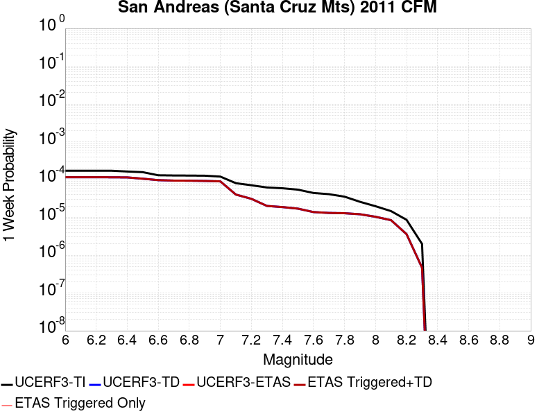 |  | 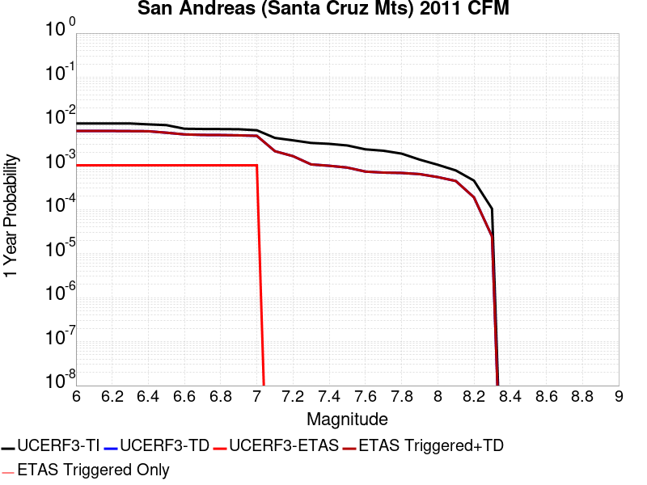 | 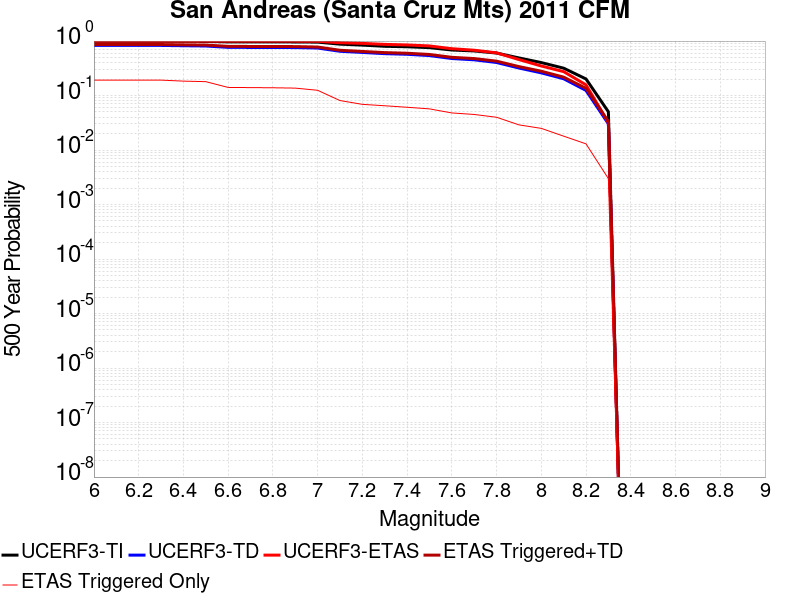 |

| Magnitude | 1 wk TI Prob | 1 wk TD Prob | 1 wk ETAS Prob | 1 wk ETAS/TD Gain | 1 wk ETAS Triggered+TD | 1 wk ETAS Triggered Only | 1 mo TI Prob | 1 mo TD Prob | 1 mo ETAS Prob | 1 mo ETAS/TD Gain | 1 mo ETAS Triggered+TD | 1 mo ETAS Triggered Only | 1 yr TI Prob | 1 yr TD Prob | 1 yr ETAS Prob | 1 yr ETAS/TD Gain | 1 yr ETAS Triggered+TD | 1 yr ETAS Triggered Only | 500 yr TI Prob | 500 yr TD Prob | 500 yr ETAS Prob | 500 yr ETAS/TD Gain | 500 yr ETAS Triggered+TD | 500 yr ETAS Triggered Only |
|-----|-----|-----|-----|-----|-----|-----|-----|-----|-----|-----|-----|-----|-----|-----|-----|-----|-----|-----|-----|-----|-----|-----|-----|-----|
| 6.0 | 1.7221631E-4 | 1.15914176E-4 | 0.0 | 0.0 | 1.15914176E-4 | 0.0 | 7.378611E-4 | 4.966822E-4 | 0.0 | 0.0 | 4.966822E-4 | 0.0 | 0.008946515 | 0.006030721 | 0.001 | 0.16581765 | 0.006030721 | 0.0 | 0.9888173 | 0.83226466 | 0.998 | 1.1991378 | 0.8644698 | 0.192 |
| 6.1 | 1.7221631E-4 | 1.15914176E-4 | 0.0 | 0.0 | 1.15914176E-4 | 0.0 | 7.378611E-4 | 4.966822E-4 | 0.0 | 0.0 | 4.966822E-4 | 0.0 | 0.008946515 | 0.006030721 | 0.001 | 0.16581765 | 0.006030721 | 0.0 | 0.9888173 | 0.83226466 | 0.998 | 1.1991378 | 0.8644698 | 0.192 |
| 6.2 | 1.7221631E-4 | 1.15914176E-4 | 0.0 | 0.0 | 1.15914176E-4 | 0.0 | 7.378611E-4 | 4.966822E-4 | 0.0 | 0.0 | 4.966822E-4 | 0.0 | 0.008946515 | 0.006030721 | 0.001 | 0.16581765 | 0.006030721 | 0.0 | 0.9888173 | 0.83226466 | 0.998 | 1.1991378 | 0.8644698 | 0.192 |
| 6.3 | 1.716926E-4 | 1.151665E-4 | 0.0 | 0.0 | 1.151665E-4 | 0.0 | 7.3561794E-4 | 4.93479E-4 | 0.0 | 0.0 | 4.93479E-4 | 0.0 | 0.008919428 | 0.0059919376 | 0.001 | 0.16689092 | 0.0059919376 | 0.0 | 0.98866343 | 0.83152235 | 0.998 | 1.2002083 | 0.86387 | 0.192 |
| 6.4 | 1.6392978E-4 | 1.14347036E-4 | 0.0 | 0.0 | 1.14347036E-4 | 0.0 | 7.02367E-4 | 4.899684E-4 | 0.0 | 0.0 | 4.899684E-4 | 0.0 | 0.008517839 | 0.005949429 | 0.001 | 0.16808335 | 0.005949429 | 0.0 | 0.98611796 | 0.82075906 | 0.998 | 1.2159476 | 0.8537394 | 0.184 |
| 6.5 | 1.5742714E-4 | 1.0578328E-4 | 0.0 | 0.0 | 1.0578328E-4 | 0.0 | 6.745133E-4 | 4.532796E-4 | 0.0 | 0.0 | 4.532796E-4 | 0.0 | 0.00818132 | 0.0055050445 | 0.001 | 0.18165158 | 0.0055050445 | 0.0 | 0.9835509 | 0.81149805 | 0.998 | 1.2298243 | 0.8454284 | 0.18 |
| 6.6 | 1.3038084E-4 | 9.685868E-5 | 0.0 | 0.0 | 9.685868E-5 | 0.0 | 5.5865536E-4 | 4.1504364E-4 | 0.0 | 0.0 | 4.1504364E-4 | 0.0 | 0.006780438 | 0.005041707 | 0.001 | 0.19834553 | 0.005041707 | 0.0 | 0.9666856 | 0.7661777 | 0.996 | 1.2999595 | 0.79914665 | 0.141 |
| 6.7 | 1.2867592E-4 | 9.42743E-5 | 0.0 | 0.0 | 9.42743E-5 | 0.0 | 5.5135164E-4 | 4.039712E-4 | 0.0 | 0.0 | 4.039712E-4 | 0.0 | 0.0066920654 | 0.0049075135 | 0.001 | 0.20376918 | 0.0049075135 | 0.0 | 0.9651701 | 0.76334196 | 0.996 | 1.3047887 | 0.7964741 | 0.14 |
| 6.8 | 1.2801298E-4 | 9.368633E-5 | 0.0 | 0.0 | 9.368633E-5 | 0.0 | 5.485117E-4 | 4.014521E-4 | 0.0 | 0.0 | 4.014521E-4 | 0.0 | 0.0066577005 | 0.0048769168 | 0.001 | 0.20504758 | 0.0048769168 | 0.0 | 0.96456236 | 0.7619368 | 0.995 | 1.3058826 | 0.79502755 | 0.139 |
| 6.9 | 1.269149E-4 | 9.2193375E-5 | 0.0 | 0.0 | 9.2193375E-5 | 0.0 | 5.4380763E-4 | 3.950557E-4 | 0.0 | 0.0 | 3.950557E-4 | 0.0 | 0.006600777 | 0.004799386 | 0.001 | 0.20835999 | 0.004799386 | 0.0 | 0.9635323 | 0.7593781 | 0.995 | 1.3102828 | 0.79234326 | 0.137 |
| 7.0 | 1.2030331E-4 | 8.9786095E-5 | 0.0 | 0.0 | 8.9786095E-5 | 0.0 | 5.154837E-4 | 3.8474184E-4 | 0.0 | 0.0 | 3.8474184E-4 | 0.0 | 0.006257969 | 0.00467436 | 0.001 | 0.21393302 | 0.00467436 | 0.0 | 0.95666593 | 0.74528587 | 0.991 | 1.329691 | 0.7771251 | 0.125 |
| 7.1 | 8.049617E-5 | 4.0215058E-5 | 0.0 | 0.0 | 4.0215058E-5 | 0.0 | 3.4493793E-4 | 1.7233899E-4 | 0.0 | 0.0 | 1.7233899E-4 | 0.0 | 0.0041915346 | 0.00209623 | 0.0 | 0.0 | 0.00209623 | 0.0 | 0.8775646 | 0.6493336 | 0.934 | 1.4383978 | 0.67773753 | 0.081 |
| 7.2 | 7.093979E-5 | 3.1002986E-5 | 0.0 | 0.0 | 3.1002986E-5 | 0.0 | 3.0399222E-4 | 1.3286325E-4 | 0.0 | 0.0 | 1.3286325E-4 | 0.0 | 0.0036948253 | 0.0016164234 | 0.0 | 0.0 | 0.0016164234 | 0.0 | 0.8428939 | 0.61844367 | 0.907 | 1.4665847 | 0.64477104 | 0.069 |
| 7.3 | 6.193693E-5 | 2.0132E-5 | 0.0 | 0.0 | 2.0132E-5 | 0.0 | 2.6541698E-4 | 8.627715E-5 | 0.0 | 0.0 | 8.627715E-5 | 0.0 | 0.0032266637 | 0.0010499189 | 0.0 | 0.0 | 0.0010499189 | 0.0 | 0.80129623 | 0.5873169 | 0.869 | 1.4796102 | 0.6141413 | 0.065 |
| 7.4 | 5.906492E-5 | 1.8753015E-5 | 0.0 | 0.0 | 1.8753015E-5 | 0.0 | 2.5311083E-4 | 8.0367594E-5 | 0.0 | 0.0 | 8.0367594E-5 | 0.0 | 0.0030772698 | 9.780369E-4 | 0.0 | 0.0 | 9.780369E-4 | 0.0 | 0.7858347 | 0.57200634 | 0.849 | 1.4842492 | 0.59811395 | 0.061 |
| 7.5 | 5.424296E-5 | 1.7070357E-5 | 0.0 | 0.0 | 1.7070357E-5 | 0.0 | 2.324491E-4 | 7.315662E-5 | 0.0 | 0.0 | 7.315662E-5 | 0.0 | 0.002826395 | 8.903184E-4 | 0.0 | 0.0 | 8.903184E-4 | 0.0 | 0.7571226 | 0.54147637 | 0.814 | 1.5032973 | 0.56761223 | 0.057 |
| 7.6 | 4.43084E-5 | 1.3843776E-5 | 0.0 | 0.0 | 1.3843776E-5 | 0.0 | 1.8987931E-4 | 5.9329122E-5 | 0.0 | 0.0 | 5.9329122E-5 | 0.0 | 0.0023093296 | 7.220928E-4 | 0.0 | 0.0 | 7.220928E-4 | 0.0 | 0.6852574 | 0.47817123 | 0.724 | 1.514102 | 0.503219 | 0.048 |
| 7.7 | 4.118098E-5 | 1.3136376E-5 | 0.0 | 0.0 | 1.3136376E-5 | 0.0 | 1.7647797E-4 | 5.629754E-5 | 0.0 | 0.0 | 5.629754E-5 | 0.0 | 0.002146502 | 6.8520714E-4 | 0.0 | 0.0 | 6.8520714E-4 | 0.0 | 0.65849894 | 0.45273045 | 0.679 | 1.4997888 | 0.47735757 | 0.045 |
| 7.8 | 3.5408906E-5 | 1.28968795E-5 | 0.0 | 0.0 | 1.28968795E-5 | 0.0 | 1.5174363E-4 | 5.5271168E-5 | 0.0 | 0.0 | 5.5271168E-5 | 0.0 | 0.0018459131 | 6.7271886E-4 | 0.0 | 0.0 | 6.7271886E-4 | 0.0 | 0.60299623 | 0.40420523 | 0.608 | 1.5041864 | 0.42803702 | 0.04 |
| 7.9 | 2.5860836E-5 | 1.2120141E-5 | 0.0 | 0.0 | 1.2120141E-5 | 0.0 | 1.10827445E-4 | 5.194243E-5 | 0.0 | 0.0 | 5.194243E-5 | 0.0 | 0.001348489 | 6.322157E-4 | 0.0 | 0.0 | 6.322157E-4 | 0.0 | 0.49069053 | 0.32036877 | 0.458 | 1.4296026 | 0.34007806 | 0.029 |
| 8.0 | 1.9777332E-5 | 1.0384154E-5 | 0.0 | 0.0 | 1.0384154E-5 | 0.0 | 8.4757245E-5 | 4.4502758E-5 | 0.0 | 0.0 | 4.4502758E-5 | 0.0 | 0.0010314309 | 5.416865E-4 | 0.0 | 0.0 | 5.416865E-4 | 0.0 | 0.40308562 | 0.26103318 | 0.349 | 1.3369948 | 0.27950737 | 0.025 |
| 8.1 | 1.468494E-5 | 8.455237E-6 | 0.0 | 0.0 | 8.455237E-6 | 0.0 | 6.293394E-5 | 3.6236226E-5 | 0.0 | 0.0 | 3.6236226E-5 | 0.0 | 7.6595135E-4 | 4.4108683E-4 | 0.0 | 0.0 | 4.4108683E-4 | 0.0 | 0.31827056 | 0.20356871 | 0.275 | 1.3508953 | 0.21790446 | 0.018 |
| 8.2 | 8.63836E-6 | 3.6061158E-6 | 0.0 | 0.0 | 3.6061158E-6 | 0.0 | 3.7021015E-5 | 1.545469E-5 | 0.0 | 0.0 | 1.545469E-5 | 0.0 | 4.5063766E-4 | 1.8814465E-4 | 0.0 | 0.0 | 1.8814465E-4 | 0.0 | 0.20177886 | 0.12430108 | 0.157 | 1.2630622 | 0.13568516 | 0.013 |
| 8.3 | 1.983087E-6 | 4.6615045E-7 | 0.0 | 0.0 | 4.6615045E-7 | 0.0 | 8.498917E-6 | 1.997786E-6 | 0.0 | 0.0 | 1.997786E-6 | 0.0 | 1.034694E-4 | 2.432278E-5 | 0.0 | 0.0 | 2.432278E-5 | 0.0 | 0.050421786 | 0.030325904 | 0.032 | 1.0552034 | 0.033234928 | 0.003 |

## San Andreas (Big Bend)
*[(top)](#table-of-contents)*

| 1 Week | 1 Month | 1 Year | 500 Year |
|-----|-----|-----|-----|
|  |  | 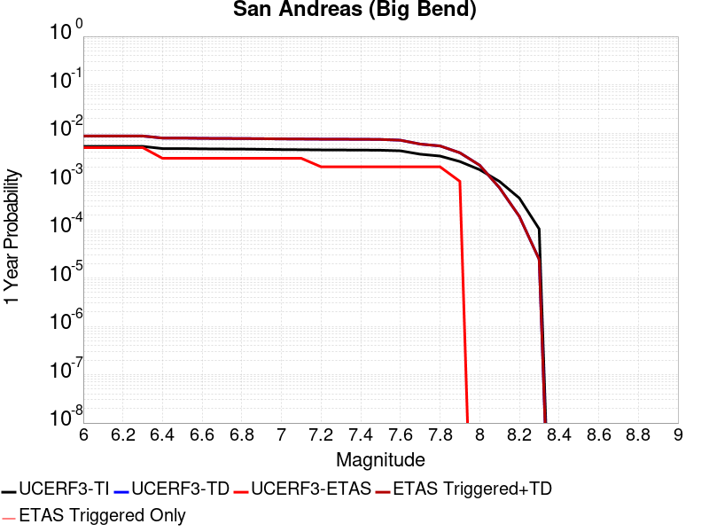 | 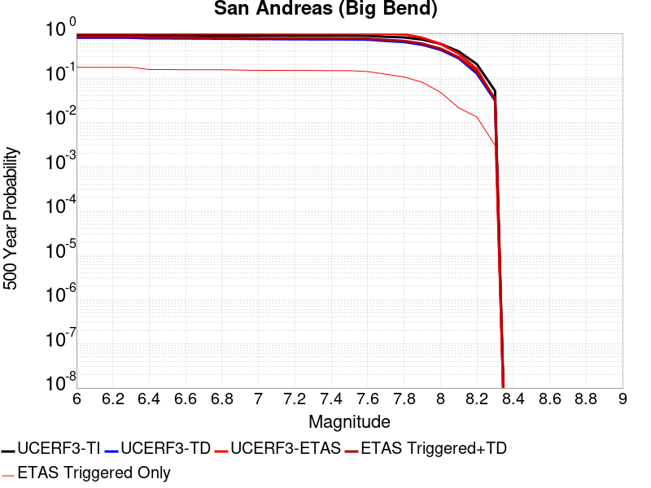 |

| Magnitude | 1 wk TI Prob | 1 wk TD Prob | 1 wk ETAS Prob | 1 wk ETAS/TD Gain | 1 wk ETAS Triggered+TD | 1 wk ETAS Triggered Only | 1 mo TI Prob | 1 mo TD Prob | 1 mo ETAS Prob | 1 mo ETAS/TD Gain | 1 mo ETAS Triggered+TD | 1 mo ETAS Triggered Only | 1 yr TI Prob | 1 yr TD Prob | 1 yr ETAS Prob | 1 yr ETAS/TD Gain | 1 yr ETAS Triggered+TD | 1 yr ETAS Triggered Only | 500 yr TI Prob | 500 yr TD Prob | 500 yr ETAS Prob | 500 yr ETAS/TD Gain | 500 yr ETAS Triggered+TD | 500 yr ETAS Triggered Only |
|-----|-----|-----|-----|-----|-----|-----|-----|-----|-----|-----|-----|-----|-----|-----|-----|-----|-----|-----|-----|-----|-----|-----|-----|-----|
| 6.0 | 1.0179969E-4 | 1.6717004E-4 | 0.0 | 0.0 | 1.6717004E-4 | 0.0 | 4.362114E-4 | 7.1624725E-4 | 0.0 | 0.0 | 7.1624725E-4 | 0.0 | 0.0052979486 | 0.008685658 | 0.005 | 0.57566166 | 0.008685658 | 0.0 | 0.92977256 | 0.7977729 | 0.999 | 1.252236 | 0.83255595 | 0.172 |
| 6.1 | 1.0179969E-4 | 1.6717004E-4 | 0.0 | 0.0 | 1.6717004E-4 | 0.0 | 4.362114E-4 | 7.1624725E-4 | 0.0 | 0.0 | 7.1624725E-4 | 0.0 | 0.0052979486 | 0.008685658 | 0.005 | 0.57566166 | 0.008685658 | 0.0 | 0.92977256 | 0.7977729 | 0.999 | 1.252236 | 0.83255595 | 0.172 |
| 6.2 | 1.0179969E-4 | 1.6717004E-4 | 0.0 | 0.0 | 1.6717004E-4 | 0.0 | 4.362114E-4 | 7.1624725E-4 | 0.0 | 0.0 | 7.1624725E-4 | 0.0 | 0.0052979486 | 0.008685658 | 0.005 | 0.57566166 | 0.008685658 | 0.0 | 0.92977256 | 0.7977729 | 0.999 | 1.252236 | 0.83255595 | 0.172 |
| 6.3 | 1.0179969E-4 | 1.6717004E-4 | 0.0 | 0.0 | 1.6717004E-4 | 0.0 | 4.362114E-4 | 7.1624725E-4 | 0.0 | 0.0 | 7.1624725E-4 | 0.0 | 0.0052979486 | 0.008685658 | 0.005 | 0.57566166 | 0.008685658 | 0.0 | 0.92977256 | 0.7977729 | 0.999 | 1.252236 | 0.83255595 | 0.172 |
| 6.4 | 9.1639464E-5 | 1.5143806E-4 | 0.0 | 0.0 | 1.5143806E-4 | 0.0 | 3.9268145E-4 | 6.4885896E-4 | 0.0 | 0.0 | 6.4885896E-4 | 0.0 | 0.0047704205 | 0.007871313 | 0.003 | 0.3811308 | 0.007871313 | 0.0 | 0.90845436 | 0.77258444 | 0.999 | 1.2930626 | 0.807379 | 0.153 |
| 6.5 | 9.1639464E-5 | 1.5143806E-4 | 0.0 | 0.0 | 1.5143806E-4 | 0.0 | 3.9268145E-4 | 6.4885896E-4 | 0.0 | 0.0 | 6.4885896E-4 | 0.0 | 0.0047704205 | 0.007871313 | 0.003 | 0.3811308 | 0.007871313 | 0.0 | 0.90845436 | 0.77258444 | 0.999 | 1.2930626 | 0.807379 | 0.153 |
| 6.6 | 9.042622E-5 | 1.495941E-4 | 0.0 | 0.0 | 1.495941E-4 | 0.0 | 3.8748336E-4 | 6.409602E-4 | 0.0 | 0.0 | 6.409602E-4 | 0.0 | 0.0047074095 | 0.0077758334 | 0.003 | 0.38581073 | 0.0077758334 | 0.0 | 0.90551007 | 0.7693756 | 0.999 | 1.2984555 | 0.80419993 | 0.151 |
| 6.7 | 8.9836685E-5 | 1.487658E-4 | 0.0 | 0.0 | 1.487658E-4 | 0.0 | 3.8495753E-4 | 6.374121E-4 | 0.0 | 0.0 | 6.374121E-4 | 0.0 | 0.00467679 | 0.007732942 | 0.003 | 0.3879507 | 0.007732942 | 0.0 | 0.9040454 | 0.76466656 | 0.999 | 1.3064518 | 0.80020195 | 0.151 |
| 6.8 | 8.9471854E-5 | 1.4826586E-4 | 0.0 | 0.0 | 1.4826586E-4 | 0.0 | 3.8339442E-4 | 6.352705E-4 | 0.0 | 0.0 | 6.352705E-4 | 0.0 | 0.004657841 | 0.007707053 | 0.003 | 0.38925385 | 0.007707053 | 0.0 | 0.9031277 | 0.76257277 | 0.999 | 1.3100389 | 0.7984243 | 0.151 |
| 6.9 | 8.858234E-5 | 1.471464E-4 | 0.0 | 0.0 | 1.471464E-4 | 0.0 | 3.7958333E-4 | 6.304752E-4 | 0.0 | 0.0 | 6.304752E-4 | 0.0 | 0.004611638 | 0.007649081 | 0.003 | 0.392204 | 0.007649081 | 0.0 | 0.90085304 | 0.7560849 | 0.999 | 1.3212801 | 0.79242826 | 0.149 |
| 7.0 | 8.7433385E-5 | 1.4562202E-4 | 0.0 | 0.0 | 1.4562202E-4 | 0.0 | 3.746607E-4 | 6.2394526E-4 | 0.0 | 0.0 | 6.2394526E-4 | 0.0 | 0.004551957 | 0.007570134 | 0.003 | 0.39629418 | 0.007570134 | 0.0 | 0.89783585 | 0.7474928 | 0.999 | 1.3364677 | 0.78461134 | 0.147 |
| 7.1 | 8.684964E-5 | 1.4479746E-4 | 0.0 | 0.0 | 1.4479746E-4 | 0.0 | 3.7215967E-4 | 6.2041316E-4 | 0.0 | 0.0 | 6.2041316E-4 | 0.0 | 0.0045216335 | 0.007527428 | 0.003 | 0.3985425 | 0.007527428 | 0.0 | 0.8962679 | 0.7431168 | 0.999 | 1.3443378 | 0.7808786 | 0.147 |
| 7.2 | 8.606521E-5 | 1.4375824E-4 | 0.0 | 0.0 | 1.4375824E-4 | 0.0 | 3.6879873E-4 | 6.159614E-4 | 0.0 | 0.0 | 6.159614E-4 | 0.0 | 0.0044808835 | 0.0074736015 | 0.002 | 0.2676086 | 0.0074736015 | 0.0 | 0.8941229 | 0.7377958 | 0.999 | 1.3540331 | 0.7760776 | 0.146 |
| 7.3 | 8.568266E-5 | 1.4324061E-4 | 0.0 | 0.0 | 1.4324061E-4 | 0.0 | 3.6715972E-4 | 6.13744E-4 | 0.0 | 0.0 | 6.13744E-4 | 0.0 | 0.0044610105 | 0.00744679 | 0.002 | 0.2685721 | 0.00744679 | 0.0 | 0.89306086 | 0.7354635 | 0.999 | 1.3583272 | 0.7740858 | 0.146 |
| 7.4 | 8.5432206E-5 | 1.4290652E-4 | 0.0 | 0.0 | 1.4290652E-4 | 0.0 | 3.6608664E-4 | 6.1231287E-4 | 0.0 | 0.0 | 6.1231287E-4 | 0.0 | 0.004447999 | 0.0074294847 | 0.002 | 0.26919767 | 0.0074294847 | 0.0 | 0.89235973 | 0.7338967 | 0.999 | 1.361227 | 0.77221555 | 0.144 |
| 7.5 | 8.4791965E-5 | 1.4173803E-4 | 0.0 | 0.0 | 1.4173803E-4 | 0.0 | 3.633435E-4 | 6.073074E-4 | 0.0 | 0.0 | 6.073074E-4 | 0.0 | 0.0044147377 | 0.0073689567 | 0.002 | 0.27140883 | 0.0073689567 | 0.0 | 0.8905465 | 0.7315292 | 0.998 | 1.3642656 | 0.770189 | 0.144 |
| 7.6 | 8.241105E-5 | 1.367563E-4 | 0.0 | 0.0 | 1.367563E-4 | 0.0 | 3.531424E-4 | 5.8596686E-4 | 0.0 | 0.0 | 5.8596686E-4 | 0.0 | 0.0042910352 | 0.00711086 | 0.002 | 0.28125992 | 0.00711086 | 0.0 | 0.88353145 | 0.72379065 | 0.996 | 1.3760885 | 0.7619075 | 0.138 |
| 7.7 | 7.00432E-5 | 1.13621005E-4 | 0.0 | 0.0 | 1.13621005E-4 | 0.0 | 3.001506E-4 | 4.8685633E-4 | 0.0 | 0.0 | 4.8685633E-4 | 0.0 | 0.0036482112 | 0.0059113847 | 0.002 | 0.3383302 | 0.0059113847 | 0.0 | 0.8391754 | 0.67531145 | 0.973 | 1.4408166 | 0.7142741 | 0.12 |
| 7.8 | 6.415362E-5 | 1.04026534E-4 | 0.0 | 0.0 | 1.04026534E-4 | 0.0 | 2.749151E-4 | 4.4575185E-4 | 0.0 | 0.0 | 4.4575185E-4 | 0.0 | 0.0033419547 | 0.0054135383 | 0.002 | 0.36944413 | 0.0054135383 | 0.0 | 0.8124624 | 0.6395058 | 0.953 | 1.4902133 | 0.6769972 | 0.104 |
| 7.9 | 4.939911E-5 | 7.4996206E-5 | 0.0 | 0.0 | 7.4996206E-5 | 0.0 | 2.116933E-4 | 3.2137273E-4 | 0.0 | 0.0 | 3.2137273E-4 | 0.0 | 0.0025743195 | 0.0039056975 | 0.001 | 0.25603622 | 0.0039056975 | 0.0 | 0.72440404 | 0.55390733 | 0.797 | 1.4388689 | 0.58914864 | 0.079 |
| 8.0 | 3.344983E-5 | 4.1375893E-5 | 0.0 | 0.0 | 4.1375893E-5 | 0.0 | 1.4334853E-4 | 1.7731321E-4 | 0.0 | 0.0 | 1.7731321E-4 | 0.0 | 0.0017438711 | 0.002156652 | 0.0 | 0.0 | 0.002156652 | 0.0 | 0.58217674 | 0.42726794 | 0.579 | 1.3551216 | 0.45418635 | 0.047 |
| 8.1 | 1.9104898E-5 | 1.4105972E-5 | 0.0 | 0.0 | 1.4105972E-5 | 0.0 | 8.1875565E-5 | 6.0452767E-5 | 0.0 | 0.0 | 6.0452767E-5 | 0.0 | 9.963791E-4 | 7.357643E-4 | 0.0 | 0.0 | 7.357643E-4 | 0.0 | 0.39252114 | 0.27464056 | 0.35 | 1.274393 | 0.2898731 | 0.021 |
| 8.2 | 8.643924E-6 | 3.6108509E-6 | 0.0 | 0.0 | 3.6108509E-6 | 0.0 | 3.704486E-5 | 1.5474983E-5 | 0.0 | 0.0 | 1.5474983E-5 | 0.0 | 4.5092785E-4 | 1.8839166E-4 | 0.0 | 0.0 | 1.8839166E-4 | 0.0 | 0.20189473 | 0.12443174 | 0.157 | 1.261736 | 0.13581413 | 0.013 |
| 8.3 | 1.983087E-6 | 4.6615045E-7 | 0.0 | 0.0 | 4.6615045E-7 | 0.0 | 8.498917E-6 | 1.997786E-6 | 0.0 | 0.0 | 1.997786E-6 | 0.0 | 1.034694E-4 | 2.432278E-5 | 0.0 | 0.0 | 2.432278E-5 | 0.0 | 0.050421786 | 0.030325904 | 0.032 | 1.0552034 | 0.033234928 | 0.003 |

## San Andreas (San Bernardino N)
*[(top)](#table-of-contents)*

| 1 Week | 1 Month | 1 Year | 500 Year |
|-----|-----|-----|-----|
| 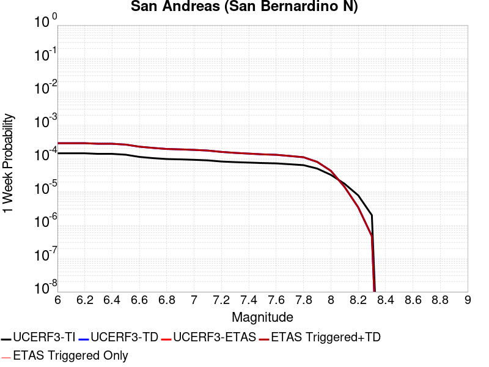 | 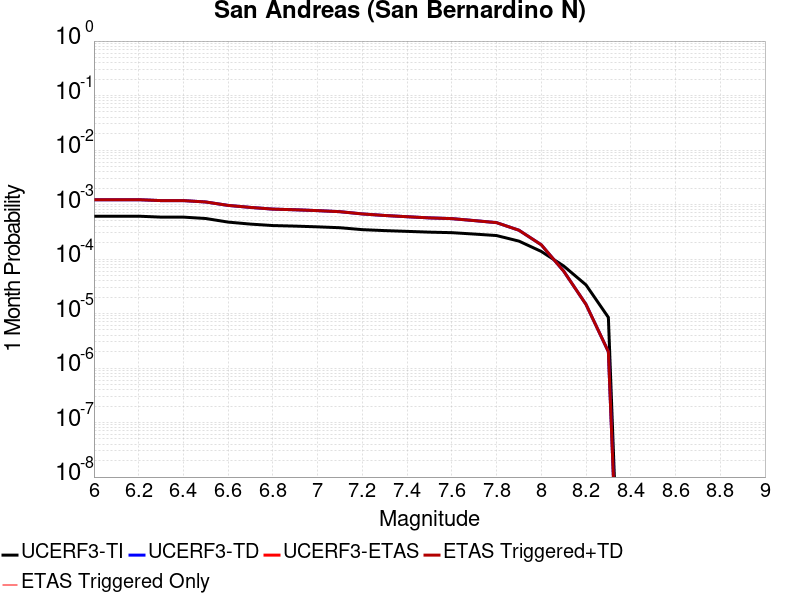 | 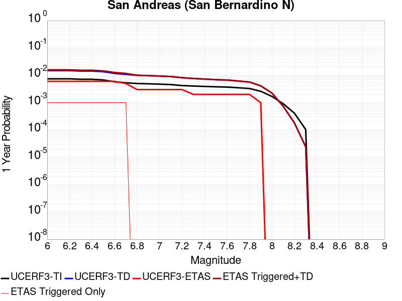 | 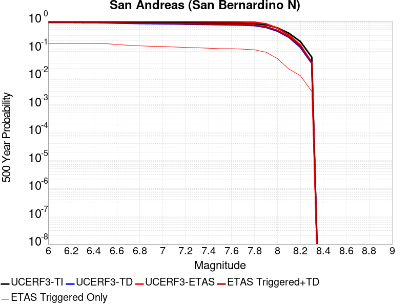 |

| Magnitude | 1 wk TI Prob | 1 wk TD Prob | 1 wk ETAS Prob | 1 wk ETAS/TD Gain | 1 wk ETAS Triggered+TD | 1 wk ETAS Triggered Only | 1 mo TI Prob | 1 mo TD Prob | 1 mo ETAS Prob | 1 mo ETAS/TD Gain | 1 mo ETAS Triggered+TD | 1 mo ETAS Triggered Only | 1 yr TI Prob | 1 yr TD Prob | 1 yr ETAS Prob | 1 yr ETAS/TD Gain | 1 yr ETAS Triggered+TD | 1 yr ETAS Triggered Only | 500 yr TI Prob | 500 yr TD Prob | 500 yr ETAS Prob | 500 yr ETAS/TD Gain | 500 yr ETAS Triggered+TD | 500 yr ETAS Triggered Only |
|-----|-----|-----|-----|-----|-----|-----|-----|-----|-----|-----|-----|-----|-----|-----|-----|-----|-----|-----|-----|-----|-----|-----|-----|-----|
| 6.0 | 1.4273766E-4 | 2.8673845E-4 | 0.0 | 0.0 | 2.8673845E-4 | 0.0 | 6.115894E-4 | 0.0012283061 | 0.0 | 0.0 | 0.0012283061 | 0.0 | 0.0074207084 | 0.014853418 | 0.006 | 0.40394744 | 0.015838565 | 0.001 | 0.97586733 | 0.8865417 | 0.997 | 1.1245946 | 0.90469503 | 0.16 |
| 6.1 | 1.4273766E-4 | 2.8673845E-4 | 0.0 | 0.0 | 2.8673845E-4 | 0.0 | 6.115894E-4 | 0.0012283061 | 0.0 | 0.0 | 0.0012283061 | 0.0 | 0.0074207084 | 0.014853418 | 0.006 | 0.40394744 | 0.015838565 | 0.001 | 0.97586733 | 0.8865417 | 0.997 | 1.1245946 | 0.90469503 | 0.16 |
| 6.2 | 1.4273766E-4 | 2.8673845E-4 | 0.0 | 0.0 | 2.8673845E-4 | 0.0 | 6.115894E-4 | 0.0012283061 | 0.0 | 0.0 | 0.0012283061 | 0.0 | 0.0074207084 | 0.014853418 | 0.006 | 0.40394744 | 0.015838565 | 0.001 | 0.97586733 | 0.8865417 | 0.997 | 1.1245946 | 0.90469503 | 0.16 |
| 6.3 | 1.3730655E-4 | 2.759426E-4 | 0.0 | 0.0 | 2.759426E-4 | 0.0 | 5.883239E-4 | 0.0011820807 | 0.0 | 0.0 | 0.0011820807 | 0.0 | 0.0071393442 | 0.01429811 | 0.006 | 0.41963586 | 0.015283812 | 0.001 | 0.97219324 | 0.880169 | 0.997 | 1.132737 | 0.8991023 | 0.158 |
| 6.4 | 1.3730655E-4 | 2.759426E-4 | 0.0 | 0.0 | 2.759426E-4 | 0.0 | 5.883239E-4 | 0.0011820807 | 0.0 | 0.0 | 0.0011820807 | 0.0 | 0.0071393442 | 0.01429811 | 0.006 | 0.41963586 | 0.015283812 | 0.001 | 0.97219324 | 0.880169 | 0.997 | 1.132737 | 0.8991023 | 0.158 |
| 6.5 | 1.2942807E-4 | 2.6031624E-4 | 0.0 | 0.0 | 2.6031624E-4 | 0.0 | 5.545738E-4 | 0.001115169 | 0.0 | 0.0 | 0.001115169 | 0.0 | 0.0067310524 | 0.013493771 | 0.006 | 0.4446496 | 0.014480277 | 0.001 | 0.96584696 | 0.8701646 | 0.997 | 1.1457603 | 0.89015925 | 0.154 |
| 6.6 | 1.1125901E-4 | 2.2530505E-4 | 0.0 | 0.0 | 2.2530505E-4 | 0.0 | 4.767372E-4 | 9.6523797E-4 | 0.0 | 0.0 | 9.6523797E-4 | 0.0 | 0.005788839 | 0.01168899 | 0.006 | 0.5133036 | 0.0126773 | 0.001 | 0.94513226 | 0.8412294 | 0.991 | 1.1780378 | 0.86425114 | 0.145 |
| 6.7 | 1.02209575E-4 | 2.0688276E-4 | 0.0 | 0.0 | 2.0688276E-4 | 0.0 | 4.3796748E-4 | 8.8634045E-4 | 0.0 | 0.0 | 8.8634045E-4 | 0.0 | 0.0053192247 | 0.0107381465 | 0.005 | 0.46562973 | 0.011727408 | 0.001 | 0.93051964 | 0.82653815 | 0.987 | 1.1941373 | 0.849782 | 0.134 |
| 6.8 | 9.610582E-5 | 1.9254941E-4 | 0.0 | 0.0 | 1.9254941E-4 | 0.0 | 4.1181705E-4 | 8.2495145E-4 | 0.0 | 0.0 | 8.2495145E-4 | 0.0 | 0.0050023515 | 0.009997734 | 0.003 | 0.300068 | 0.009997734 | 0.0 | 0.91852444 | 0.81240666 | 0.983 | 1.2099851 | 0.8366062 | 0.129 |
| 6.9 | 9.3877505E-5 | 1.8722801E-4 | 0.0 | 0.0 | 1.8722801E-4 | 0.0 | 4.0227012E-4 | 8.021596E-4 | 0.0 | 0.0 | 8.021596E-4 | 0.0 | 0.0048866454 | 0.009722749 | 0.003 | 0.30855474 | 0.009722749 | 0.0 | 0.91364706 | 0.8059365 | 0.981 | 1.2172174 | 0.8300004 | 0.124 |
| 7.0 | 9.1019785E-5 | 1.8068262E-4 | 0.0 | 0.0 | 1.8068262E-4 | 0.0 | 3.900265E-4 | 7.7412487E-4 | 0.0 | 0.0 | 7.7412487E-4 | 0.0 | 0.0047382377 | 0.009384412 | 0.003 | 0.31967905 | 0.009384412 | 0.0 | 0.9069622 | 0.79707664 | 0.978 | 1.2269837 | 0.8220362 | 0.123 |
| 7.1 | 8.771155E-5 | 1.7264196E-4 | 0.0 | 0.0 | 1.7264196E-4 | 0.0 | 3.758525E-4 | 7.396848E-4 | 0.0 | 0.0 | 7.396848E-4 | 0.0 | 0.0045664064 | 0.008968624 | 0.003 | 0.33449945 | 0.008968624 | 0.0 | 0.89857465 | 0.7894742 | 0.971 | 1.2299325 | 0.81410575 | 0.117 |
| 7.2 | 8.0830236E-5 | 1.5715563E-4 | 0.0 | 0.0 | 1.5715563E-4 | 0.0 | 3.4636928E-4 | 6.7335047E-4 | 0.0 | 0.0 | 6.7335047E-4 | 0.0 | 0.0042088944 | 0.008167296 | 0.003 | 0.36731866 | 0.008167296 | 0.0 | 0.8786272 | 0.7682422 | 0.96 | 1.249606 | 0.7944308 | 0.113 |
| 7.3 | 7.7668235E-5 | 1.4707613E-4 | 0.0 | 0.0 | 1.4707613E-4 | 0.0 | 3.328214E-4 | 6.301741E-4 | 0.0 | 0.0 | 6.301741E-4 | 0.0 | 0.0040445733 | 0.0076454277 | 0.002 | 0.26159427 | 0.0076454277 | 0.0 | 0.86818916 | 0.7587839 | 0.952 | 1.2546391 | 0.78531766 | 0.11 |
| 7.4 | 7.520177E-5 | 1.3966217E-4 | 0.0 | 0.0 | 1.3966217E-4 | 0.0 | 3.2225347E-4 | 5.9841486E-4 | 0.0 | 0.0 | 5.9841486E-4 | 0.0 | 0.0039163795 | 0.0072614024 | 0.002 | 0.2754289 | 0.0072614024 | 0.0 | 0.8594278 | 0.7501713 | 0.943 | 1.2570462 | 0.7766532 | 0.106 |
| 7.5 | 7.274697E-5 | 1.3289349E-4 | 0.0 | 0.0 | 1.3289349E-4 | 0.0 | 3.1173544E-4 | 5.6941924E-4 | 0.0 | 0.0 | 5.6941924E-4 | 0.0 | 0.003788775 | 0.0069106747 | 0.002 | 0.28940734 | 0.0069106747 | 0.0 | 0.8501297 | 0.73938453 | 0.937 | 1.2672702 | 0.7659673 | 0.102 |
| 7.6 | 7.1185845E-5 | 1.2882013E-4 | 0.0 | 0.0 | 1.2882013E-4 | 0.0 | 3.0504653E-4 | 5.5196945E-4 | 0.0 | 0.0 | 5.5196945E-4 | 0.0 | 0.0037076178 | 0.006699551 | 0.002 | 0.29852748 | 0.006699551 | 0.0 | 0.8438993 | 0.7313028 | 0.934 | 1.2771728 | 0.7587099 | 0.102 |
| 7.7 | 6.709961E-5 | 1.1859588E-4 | 0.0 | 0.0 | 1.1859588E-4 | 0.0 | 2.8753807E-4 | 5.081691E-4 | 0.0 | 0.0 | 5.081691E-4 | 0.0 | 0.003495157 | 0.006169428 | 0.002 | 0.32417917 | 0.006169428 | 0.0 | 0.82633716 | 0.7132405 | 0.918 | 1.2870834 | 0.74134296 | 0.098 |
| 7.8 | 6.300812E-5 | 1.08757755E-4 | 0.0 | 0.0 | 1.08757755E-4 | 0.0 | 2.7000686E-4 | 4.6602142E-4 | 0.0 | 0.0 | 4.6602142E-4 | 0.0 | 0.0032823787 | 0.0056590647 | 0.002 | 0.35341528 | 0.0056590647 | 0.0 | 0.8067728 | 0.68665105 | 0.9 | 1.3107095 | 0.7157925 | 0.093 |
| 7.9 | 4.983037E-5 | 7.8956844E-5 | 0.0 | 0.0 | 7.8956844E-5 | 0.0 | 2.1354125E-4 | 3.383426E-4 | 0.0 | 0.0 | 3.383426E-4 | 0.0 | 0.0025967648 | 0.004111545 | 0.001 | 0.24321756 | 0.004111545 | 0.0 | 0.7274876 | 0.59227735 | 0.793 | 1.3388997 | 0.62326425 | 0.076 |
| 8.0 | 3.2211527E-5 | 4.266171E-5 | 0.0 | 0.0 | 4.266171E-5 | 0.0 | 1.380421E-4 | 1.828231E-4 | 0.0 | 0.0 | 1.828231E-4 | 0.0 | 0.0016793669 | 0.0022236002 | 0.0 | 0.0 | 0.0022236002 | 0.0 | 0.5684575 | 0.43387243 | 0.556 | 1.2814827 | 0.45934817 | 0.045 |
| 8.1 | 1.743376E-5 | 1.4033145E-5 | 0.0 | 0.0 | 1.4033145E-5 | 0.0 | 7.471398E-5 | 6.0140665E-5 | 0.0 | 0.0 | 6.0140665E-5 | 0.0 | 9.0926304E-4 | 7.31967E-4 | 0.0 | 0.0 | 7.31967E-4 | 0.0 | 0.36544946 | 0.26215947 | 0.312 | 1.1901153 | 0.27617845 | 0.019 |
| 8.2 | 7.831616E-6 | 3.434231E-6 | 0.0 | 0.0 | 3.434231E-6 | 0.0 | 3.3563636E-5 | 1.4718051E-5 | 0.0 | 0.0 | 1.4718051E-5 | 0.0 | 4.0856065E-4 | 1.7917757E-4 | 0.0 | 0.0 | 1.7917757E-4 | 0.0 | 0.18480022 | 0.114773564 | 0.14 | 1.2197931 | 0.124511056 | 0.011 |
| 8.3 | 1.983087E-6 | 4.6615045E-7 | 0.0 | 0.0 | 4.6615045E-7 | 0.0 | 8.498917E-6 | 1.997786E-6 | 0.0 | 0.0 | 1.997786E-6 | 0.0 | 1.034694E-4 | 2.432278E-5 | 0.0 | 0.0 | 2.432278E-5 | 0.0 | 0.050421786 | 0.030325904 | 0.032 | 1.0552034 | 0.033234928 | 0.003 |

## Laguna Salada
*[(top)](#table-of-contents)*

| 1 Week | 1 Month | 1 Year | 500 Year |
|-----|-----|-----|-----|
|  | 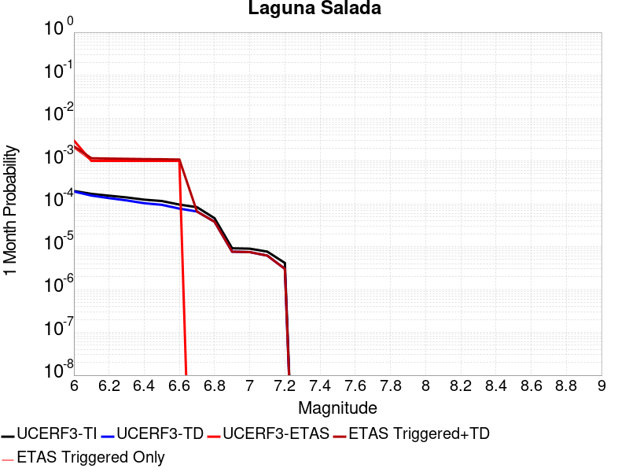 | 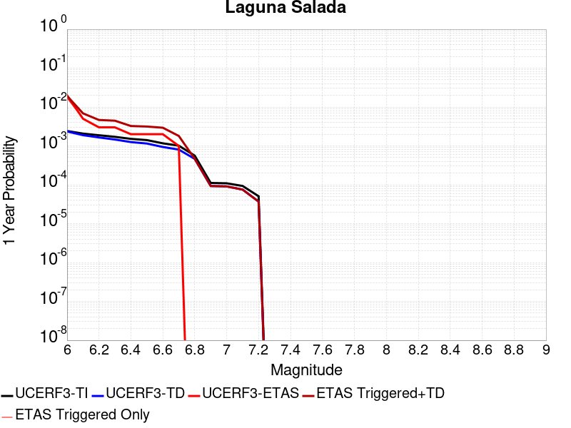 | 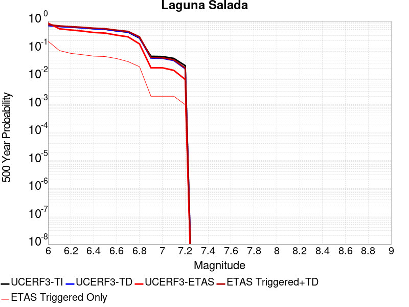 |

| Magnitude | 1 wk TI Prob | 1 wk TD Prob | 1 wk ETAS Prob | 1 wk ETAS/TD Gain | 1 wk ETAS Triggered+TD | 1 wk ETAS Triggered Only | 1 mo TI Prob | 1 mo TD Prob | 1 mo ETAS Prob | 1 mo ETAS/TD Gain | 1 mo ETAS Triggered+TD | 1 mo ETAS Triggered Only | 1 yr TI Prob | 1 yr TD Prob | 1 yr ETAS Prob | 1 yr ETAS/TD Gain | 1 yr ETAS Triggered+TD | 1 yr ETAS Triggered Only | 500 yr TI Prob | 500 yr TD Prob | 500 yr ETAS Prob | 500 yr ETAS/TD Gain | 500 yr ETAS Triggered+TD | 500 yr ETAS Triggered Only |
|-----|-----|-----|-----|-----|-----|-----|-----|-----|-----|-----|-----|-----|-----|-----|-----|-----|-----|-----|-----|-----|-----|-----|-----|-----|
| 6.0 | 4.6465593E-5 | 4.515743E-5 | 0.0 | 0.0 | 4.515743E-5 | 0.0 | 1.9912305E-4 | 1.935181E-4 | 0.003 | 15.502425 | 0.002193131 | 0.002 | 0.0024216278 | 0.0023536237 | 0.02 | 8.497535 | 0.019313613 | 0.017 | 0.7024825 | 0.6862538 | 0.845 | 1.2313229 | 0.7455518 | 0.189 |
| 6.1 | 3.982297E-5 | 3.6225552E-5 | 0.0 | 0.0 | 3.6225552E-5 | 0.0 | 1.706587E-4 | 1.5524348E-4 | 0.001 | 6.441494 | 0.0011550882 | 0.001 | 0.0020757897 | 0.0018885448 | 0.005 | 2.647541 | 0.006879102 | 0.005 | 0.6461823 | 0.633769 | 0.525 | 0.8283776 | 0.66563106 | 0.087 |
| 6.2 | 3.6067784E-5 | 3.1666295E-5 | 0.0 | 0.0 | 3.1666295E-5 | 0.0 | 1.5456705E-4 | 1.3570621E-4 | 0.001 | 7.3688593 | 0.0011355705 | 0.001 | 0.0018802295 | 0.0016510611 | 0.003 | 1.8170134 | 0.004646108 | 0.003 | 0.6097625 | 0.5997983 | 0.476 | 0.7936001 | 0.6274122 | 0.069 |
| 6.3 | 3.2859112E-5 | 2.798774E-5 | 0.0 | 0.0 | 2.798774E-5 | 0.0 | 1.4081717E-4 | 1.1994248E-4 | 0.001 | 8.33733 | 0.0011198225 | 0.001 | 0.0017131006 | 0.0014594096 | 0.003 | 2.055626 | 0.0044550314 | 0.003 | 0.5756874 | 0.5676807 | 0.435 | 0.7662758 | 0.5944845 | 0.062 |
| 6.4 | 2.9132116E-5 | 2.4080895E-5 | 0.0 | 0.0 | 2.4080895E-5 | 0.0 | 1.2484594E-4 | 1.03200226E-4 | 0.001 | 9.689901 | 0.001103097 | 0.001 | 0.0015189396 | 0.0012558214 | 0.002 | 1.5925831 | 0.0032533098 | 0.002 | 0.5323556 | 0.52674264 | 0.388 | 0.7366026 | 0.5527718 | 0.055 |
| 6.5 | 2.7075037E-5 | 2.210379E-5 | 0.0 | 0.0 | 2.210379E-5 | 0.0 | 1.1603071E-4 | 9.4727555E-5 | 0.001 | 10.556591 | 0.0010946328 | 0.001 | 0.0014117584 | 0.0011527798 | 0.002 | 1.7349367 | 0.0031504743 | 0.002 | 0.5065718 | 0.5026846 | 0.369 | 0.73405874 | 0.5290423 | 0.053 |
| 6.6 | 2.2367465E-5 | 1.799426E-5 | 0.0 | 0.0 | 1.799426E-5 | 0.0 | 9.5857045E-5 | 7.7116405E-5 | 0.001 | 12.967409 | 0.0010770393 | 0.001 | 0.0011664346 | 9.3856425E-4 | 0.002 | 2.1309142 | 0.002936687 | 0.002 | 0.44209006 | 0.44282606 | 0.311 | 0.70230734 | 0.46789888 | 0.045 |
| 6.7 | 1.9458053E-5 | 1.5428383E-5 | 0.0 | 0.0 | 1.5428383E-5 | 0.0 | 8.338899E-5 | 6.612038E-5 | 0.0 | 0.0 | 6.612038E-5 | 0.0 | 0.001014788 | 8.04793E-4 | 0.001 | 1.2425556 | 0.0018039881 | 0.001 | 0.3980926 | 0.40208998 | 0.27 | 0.6714915 | 0.42301682 | 0.035 |
| 6.8 | 1.0767866E-5 | 8.8943E-6 | 0.0 | 0.0 | 8.8943E-6 | 0.0 | 4.614718E-5 | 3.811823E-5 | 0.0 | 0.0 | 3.811823E-5 | 0.0 | 5.6169706E-4 | 4.6405417E-4 | 0.0 | 0.0 | 4.6405417E-4 | 0.0 | 0.24491689 | 0.25312057 | 0.151 | 0.5965536 | 0.2702988 | 0.023 |
| 6.9 | 2.1384765E-6 | 1.7832414E-6 | 0.0 | 0.0 | 1.7832414E-6 | 0.0 | 9.164866E-6 | 7.642443E-6 | 0.0 | 0.0 | 7.642443E-6 | 0.0 | 1.1157654E-4 | 9.3043156E-5 | 0.0 | 0.0 | 9.3043156E-5 | 0.0 | 0.054263588 | 0.04711522 | 0.021 | 0.44571584 | 0.04902099 | 0.002 |
| 7.0 | 2.0952946E-6 | 1.7412542E-6 | 0.0 | 0.0 | 1.7412542E-6 | 0.0 | 8.979802E-6 | 7.462499E-6 | 0.0 | 0.0 | 7.462499E-6 | 0.0 | 1.0932361E-4 | 9.0852525E-5 | 0.0 | 0.0 | 9.0852525E-5 | 0.0 | 0.05319753 | 0.04606252 | 0.021 | 0.4559021 | 0.047970396 | 0.002 |
| 7.1 | 1.7887576E-6 | 1.4426334E-6 | 0.0 | 0.0 | 1.4426334E-6 | 0.0 | 7.666081E-6 | 6.182702E-6 | 0.0 | 0.0 | 6.182702E-6 | 0.0 | 9.333054E-5 | 7.52721E-5 | 0.0 | 0.0 | 7.52721E-5 | 0.0 | 0.045595266 | 0.038518507 | 0.017 | 0.44134626 | 0.040441472 | 0.002 |
| 7.2 | 9.723109E-7 | 7.084936E-7 | 0.0 | 0.0 | 7.084936E-7 | 0.0 | 4.16704E-6 | 3.0363985E-6 | 0.0 | 0.0 | 3.0363985E-6 | 0.0 | 5.073253E-5 | 3.696769E-5 | 0.0 | 0.0 | 3.696769E-5 | 0.0 | 0.025047874 | 0.019482998 | 0.008 | 0.41061443 | 0.020463515 | 0.001 |

## San Andreas (Mojave N)
*[(top)](#table-of-contents)*

| 1 Week | 1 Month | 1 Year | 500 Year |
|-----|-----|-----|-----|
|  |  | 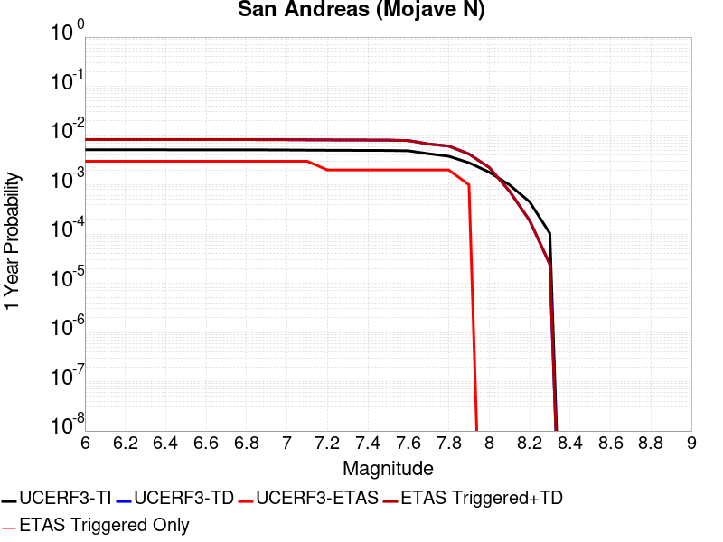 | 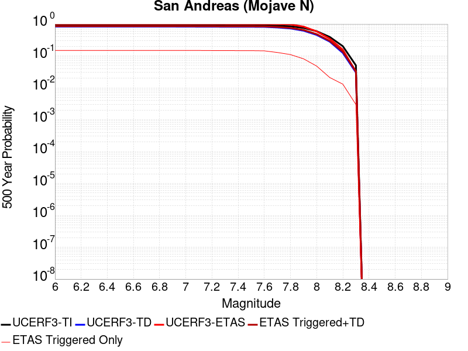 |

| Magnitude | 1 wk TI Prob | 1 wk TD Prob | 1 wk ETAS Prob | 1 wk ETAS/TD Gain | 1 wk ETAS Triggered+TD | 1 wk ETAS Triggered Only | 1 mo TI Prob | 1 mo TD Prob | 1 mo ETAS Prob | 1 mo ETAS/TD Gain | 1 mo ETAS Triggered+TD | 1 mo ETAS Triggered Only | 1 yr TI Prob | 1 yr TD Prob | 1 yr ETAS Prob | 1 yr ETAS/TD Gain | 1 yr ETAS Triggered+TD | 1 yr ETAS Triggered Only | 500 yr TI Prob | 500 yr TD Prob | 500 yr ETAS Prob | 500 yr ETAS/TD Gain | 500 yr ETAS Triggered+TD | 500 yr ETAS Triggered Only |
|-----|-----|-----|-----|-----|-----|-----|-----|-----|-----|-----|-----|-----|-----|-----|-----|-----|-----|-----|-----|-----|-----|-----|-----|-----|
| 6.0 | 9.877682E-5 | 1.5973314E-4 | 0.0 | 0.0 | 1.5973314E-4 | 0.0 | 4.2326056E-4 | 6.843911E-4 | 0.0 | 0.0 | 6.843911E-4 | 0.0 | 0.0051410277 | 0.0083007 | 0.003 | 0.3614153 | 0.0083007 | 0.0 | 0.92400926 | 0.83315396 | 1.0 | 1.2002584 | 0.8578472 | 0.148 |
| 6.1 | 9.877682E-5 | 1.5973314E-4 | 0.0 | 0.0 | 1.5973314E-4 | 0.0 | 4.2326056E-4 | 6.843911E-4 | 0.0 | 0.0 | 6.843911E-4 | 0.0 | 0.0051410277 | 0.0083007 | 0.003 | 0.3614153 | 0.0083007 | 0.0 | 0.92400926 | 0.83315396 | 1.0 | 1.2002584 | 0.8578472 | 0.148 |
| 6.2 | 9.877682E-5 | 1.5973314E-4 | 0.0 | 0.0 | 1.5973314E-4 | 0.0 | 4.2326056E-4 | 6.843911E-4 | 0.0 | 0.0 | 6.843911E-4 | 0.0 | 0.0051410277 | 0.0083007 | 0.003 | 0.3614153 | 0.0083007 | 0.0 | 0.92400926 | 0.83315396 | 1.0 | 1.2002584 | 0.8578472 | 0.148 |
| 6.3 | 9.877682E-5 | 1.5973314E-4 | 0.0 | 0.0 | 1.5973314E-4 | 0.0 | 4.2326056E-4 | 6.843911E-4 | 0.0 | 0.0 | 6.843911E-4 | 0.0 | 0.0051410277 | 0.0083007 | 0.003 | 0.3614153 | 0.0083007 | 0.0 | 0.92400926 | 0.83315396 | 1.0 | 1.2002584 | 0.8578472 | 0.148 |
| 6.4 | 9.877682E-5 | 1.5973314E-4 | 0.0 | 0.0 | 1.5973314E-4 | 0.0 | 4.2326056E-4 | 6.843911E-4 | 0.0 | 0.0 | 6.843911E-4 | 0.0 | 0.0051410277 | 0.0083007 | 0.003 | 0.3614153 | 0.0083007 | 0.0 | 0.92400926 | 0.83315396 | 1.0 | 1.2002584 | 0.8578472 | 0.148 |
| 6.5 | 9.861474E-5 | 1.5948185E-4 | 0.0 | 0.0 | 1.5948185E-4 | 0.0 | 4.2256617E-4 | 6.8331475E-4 | 0.0 | 0.0 | 6.8331475E-4 | 0.0 | 0.0051326132 | 0.008287694 | 0.003 | 0.36198246 | 0.008287694 | 0.0 | 0.9236872 | 0.8328489 | 1.0 | 1.200698 | 0.8575873 | 0.148 |
| 6.6 | 9.861474E-5 | 1.5948185E-4 | 0.0 | 0.0 | 1.5948185E-4 | 0.0 | 4.2256617E-4 | 6.8331475E-4 | 0.0 | 0.0 | 6.8331475E-4 | 0.0 | 0.0051326132 | 0.008287694 | 0.003 | 0.36198246 | 0.008287694 | 0.0 | 0.9236872 | 0.8328489 | 1.0 | 1.200698 | 0.8575873 | 0.148 |
| 6.7 | 9.8552715E-5 | 1.5938561E-4 | 0.0 | 0.0 | 1.5938561E-4 | 0.0 | 4.223004E-4 | 6.829025E-4 | 0.0 | 0.0 | 6.829025E-4 | 0.0 | 0.0051293927 | 0.008282714 | 0.003 | 0.36220014 | 0.008282714 | 0.0 | 0.9235636 | 0.83273196 | 1.0 | 1.2008666 | 0.8574876 | 0.148 |
| 6.8 | 9.8464974E-5 | 1.5924778E-4 | 0.0 | 0.0 | 1.5924778E-4 | 0.0 | 4.219245E-4 | 6.823121E-4 | 0.0 | 0.0 | 6.823121E-4 | 0.0 | 0.0051248376 | 0.008275581 | 0.003 | 0.36251235 | 0.008275581 | 0.0 | 0.9233884 | 0.83255213 | 1.0 | 1.201126 | 0.85733443 | 0.148 |
| 6.9 | 9.825824E-5 | 1.5894783E-4 | 0.0 | 0.0 | 1.5894783E-4 | 0.0 | 4.2103877E-4 | 6.810273E-4 | 0.0 | 0.0 | 6.810273E-4 | 0.0 | 0.0051141046 | 0.008260056 | 0.003 | 0.36319363 | 0.008260056 | 0.0 | 0.92297405 | 0.83177066 | 1.0 | 1.2022545 | 0.8566686 | 0.148 |
| 7.0 | 9.781462E-5 | 1.5830316E-4 | 0.0 | 0.0 | 1.5830316E-4 | 0.0 | 4.1913814E-4 | 6.782658E-4 | 0.0 | 0.0 | 6.782658E-4 | 0.0 | 0.005091073 | 0.00822669 | 0.003 | 0.36466673 | 0.00822669 | 0.0 | 0.92207736 | 0.8295341 | 1.0 | 1.205496 | 0.8547631 | 0.148 |
| 7.1 | 9.7121134E-5 | 1.5737933E-4 | 0.0 | 0.0 | 1.5737933E-4 | 0.0 | 4.1616702E-4 | 6.743086E-4 | 0.0 | 0.0 | 6.743086E-4 | 0.0 | 0.005055068 | 0.008178873 | 0.003 | 0.36679867 | 0.008178873 | 0.0 | 0.92065454 | 0.8258418 | 1.0 | 1.2108856 | 0.8516172 | 0.148 |
| 7.2 | 9.663819E-5 | 1.5672833E-4 | 0.0 | 0.0 | 1.5672833E-4 | 0.0 | 4.1409794E-4 | 6.7152013E-4 | 0.0 | 0.0 | 6.7152013E-4 | 0.0 | 0.0050299936 | 0.008145178 | 0.002 | 0.24554406 | 0.008145178 | 0.0 | 0.9196484 | 0.8234563 | 1.0 | 1.2143935 | 0.8494082 | 0.147 |
| 7.3 | 9.6277574E-5 | 1.5630265E-4 | 0.0 | 0.0 | 1.5630265E-4 | 0.0 | 4.125529E-4 | 6.6969666E-4 | 0.0 | 0.0 | 6.6969666E-4 | 0.0 | 0.0050112694 | 0.008123143 | 0.002 | 0.24621013 | 0.008123143 | 0.0 | 0.9188888 | 0.82171637 | 1.0 | 1.216965 | 0.84792405 | 0.147 |
| 7.4 | 9.593308E-5 | 1.5575474E-4 | 0.0 | 0.0 | 1.5575474E-4 | 0.0 | 4.1107697E-4 | 6.673497E-4 | 0.0 | 0.0 | 6.673497E-4 | 0.0 | 0.0049933824 | 0.008094782 | 0.002 | 0.24707276 | 0.008094782 | 0.0 | 0.91815645 | 0.8203694 | 0.999 | 1.217744 | 0.8465955 | 0.146 |
| 7.5 | 9.561707E-5 | 1.5526493E-4 | 0.0 | 0.0 | 1.5526493E-4 | 0.0 | 4.0972308E-4 | 6.652516E-4 | 0.0 | 0.0 | 6.652516E-4 | 0.0 | 0.0049769743 | 0.008069427 | 0.002 | 0.24784908 | 0.008069427 | 0.0 | 0.9174788 | 0.8191771 | 0.999 | 1.2195165 | 0.84557724 | 0.146 |
| 7.6 | 9.418194E-5 | 1.5208144E-4 | 0.0 | 0.0 | 1.5208144E-4 | 0.0 | 4.0357444E-4 | 6.516149E-4 | 0.0 | 0.0 | 6.516149E-4 | 0.0 | 0.004902454 | 0.007904616 | 0.002 | 0.2530167 | 0.007904616 | 0.0 | 0.91433024 | 0.81524986 | 0.999 | 1.2253911 | 0.84185386 | 0.144 |
| 7.7 | 8.202141E-5 | 1.2959627E-4 | 0.0 | 0.0 | 1.2959627E-4 | 0.0 | 3.51473E-4 | 5.552944E-4 | 0.0 | 0.0 | 5.552944E-4 | 0.0 | 0.00427079 | 0.0067397794 | 0.002 | 0.2967456 | 0.0067397794 | 0.0 | 0.8823414 | 0.7806831 | 0.989 | 1.2668393 | 0.8087557 | 0.128 |
| 7.8 | 7.2859846E-5 | 1.17602474E-4 | 0.0 | 0.0 | 1.17602474E-4 | 0.0 | 3.1221908E-4 | 5.0391327E-4 | 0.0 | 0.0 | 5.0391327E-4 | 0.0 | 0.003794643 | 0.0061179055 | 0.002 | 0.32690927 | 0.0061179055 | 0.0 | 0.8505705 | 0.7264784 | 0.972 | 1.3379613 | 0.75656575 | 0.11 |
| 7.9 | 5.3874453E-5 | 8.113594E-5 | 0.0 | 0.0 | 8.113594E-5 | 0.0 | 2.3087008E-4 | 3.4767913E-4 | 0.0 | 0.0 | 3.4767913E-4 | 0.0 | 0.0028072202 | 0.004224783 | 0.001 | 0.23669855 | 0.004224783 | 0.0 | 0.7547762 | 0.6174236 | 0.829 | 1.3426763 | 0.6484123 | 0.081 |
| 8.0 | 3.468538E-5 | 4.320337E-5 | 0.0 | 0.0 | 4.320337E-5 | 0.0 | 1.4864317E-4 | 1.8514416E-4 | 0.0 | 0.0 | 1.8514416E-4 | 0.0 | 0.0018082283 | 0.0022518008 | 0.0 | 0.0 | 0.0022518008 | 0.0 | 0.59543085 | 0.4554147 | 0.588 | 1.2911309 | 0.4815548 | 0.048 |
| 8.1 | 1.9152367E-5 | 1.4343015E-5 | 0.0 | 0.0 | 1.4343015E-5 | 0.0 | 8.207899E-5 | 6.146862E-5 | 0.0 | 0.0 | 6.146862E-5 | 0.0 | 9.988535E-4 | 7.4812386E-4 | 0.0 | 0.0 | 7.4812386E-4 | 0.0 | 0.393273 | 0.28084943 | 0.347 | 1.2355375 | 0.2959516 | 0.021 |
| 8.2 | 8.643924E-6 | 3.6108509E-6 | 0.0 | 0.0 | 3.6108509E-6 | 0.0 | 3.704486E-5 | 1.5474983E-5 | 0.0 | 0.0 | 1.5474983E-5 | 0.0 | 4.5092785E-4 | 1.8839166E-4 | 0.0 | 0.0 | 1.8839166E-4 | 0.0 | 0.20189473 | 0.12443174 | 0.157 | 1.261736 | 0.13581413 | 0.013 |
| 8.3 | 1.983087E-6 | 4.6615045E-7 | 0.0 | 0.0 | 4.6615045E-7 | 0.0 | 8.498917E-6 | 1.997786E-6 | 0.0 | 0.0 | 1.997786E-6 | 0.0 | 1.034694E-4 | 2.432278E-5 | 0.0 | 0.0 | 2.432278E-5 | 0.0 | 0.050421786 | 0.030325904 | 0.032 | 1.0552034 | 0.033234928 | 0.003 |

## Hayward (So) extension 2011 CFM
*[(top)](#table-of-contents)*

| 1 Week | 1 Month | 1 Year | 500 Year |
|-----|-----|-----|-----|
| 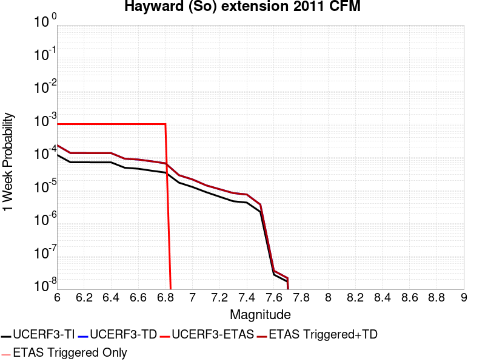 |  | 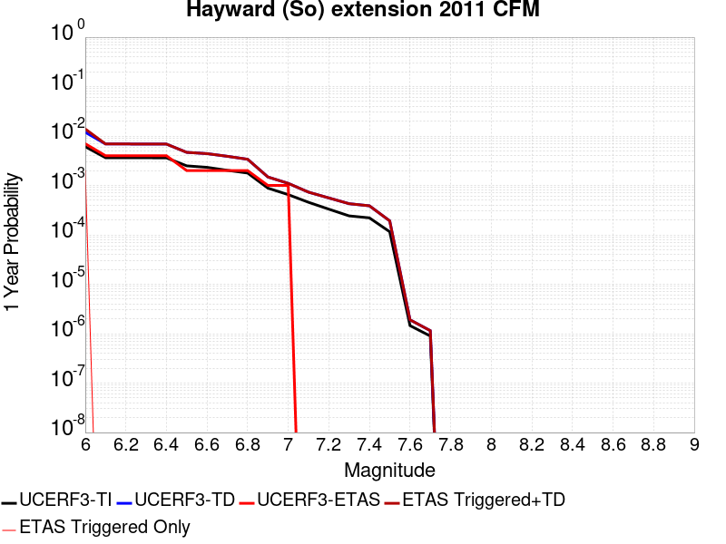 |  |

| Magnitude | 1 wk TI Prob | 1 wk TD Prob | 1 wk ETAS Prob | 1 wk ETAS/TD Gain | 1 wk ETAS Triggered+TD | 1 wk ETAS Triggered Only | 1 mo TI Prob | 1 mo TD Prob | 1 mo ETAS Prob | 1 mo ETAS/TD Gain | 1 mo ETAS Triggered+TD | 1 mo ETAS Triggered Only | 1 yr TI Prob | 1 yr TD Prob | 1 yr ETAS Prob | 1 yr ETAS/TD Gain | 1 yr ETAS Triggered+TD | 1 yr ETAS Triggered Only | 500 yr TI Prob | 500 yr TD Prob | 500 yr ETAS Prob | 500 yr ETAS/TD Gain | 500 yr ETAS Triggered+TD | 500 yr ETAS Triggered Only |
|-----|-----|-----|-----|-----|-----|-----|-----|-----|-----|-----|-----|-----|-----|-----|-----|-----|-----|-----|-----|-----|-----|-----|-----|-----|
| 6.0 | 1.1721256E-4 | 2.3039774E-4 | 0.001 | 4.34032 | 2.3039774E-4 | 0.0 | 5.022428E-4 | 9.870144E-4 | 0.001 | 1.0131564 | 9.870144E-4 | 0.0 | 0.0060976758 | 0.011928483 | 0.007 | 0.58683074 | 0.013904626 | 0.002 | 0.9530265 | 0.74540246 | 0.981 | 1.3160676 | 0.775445 | 0.118 |
| 6.1 | 6.99169E-5 | 1.3305355E-4 | 0.001 | 7.515771 | 1.3305355E-4 | 0.0 | 2.9960944E-4 | 5.701004E-4 | 0.001 | 1.7540771 | 5.701004E-4 | 0.0 | 0.0036416445 | 0.006913113 | 0.004 | 0.57861054 | 0.006913113 | 0.0 | 0.83864456 | 0.58829564 | 0.845 | 1.4363526 | 0.6199969 | 0.077 |
| 6.2 | 6.99169E-5 | 1.3305355E-4 | 0.001 | 7.515771 | 1.3305355E-4 | 0.0 | 2.9960944E-4 | 5.701004E-4 | 0.001 | 1.7540771 | 5.701004E-4 | 0.0 | 0.0036416445 | 0.006913113 | 0.004 | 0.57861054 | 0.006913113 | 0.0 | 0.83864456 | 0.58829564 | 0.845 | 1.4363526 | 0.6199969 | 0.077 |
| 6.3 | 6.970908E-5 | 1.3273886E-4 | 0.001 | 7.533589 | 1.3273886E-4 | 0.0 | 2.9871898E-4 | 5.687527E-4 | 0.001 | 1.7582334 | 5.687527E-4 | 0.0 | 0.0036308395 | 0.0068968446 | 0.004 | 0.57997537 | 0.0068968446 | 0.0 | 0.8377673 | 0.5867527 | 0.845 | 1.4401296 | 0.6185728 | 0.077 |
| 6.4 | 6.9517155E-5 | 1.3241297E-4 | 0.001 | 7.5521307 | 1.3241297E-4 | 0.0 | 2.9789665E-4 | 5.673569E-4 | 0.001 | 1.762559 | 5.673569E-4 | 0.0 | 0.0036208609 | 0.0068800044 | 0.004 | 0.581395 | 0.0068800044 | 0.0 | 0.83695287 | 0.5855502 | 0.844 | 1.4413794 | 0.6174628 | 0.077 |
| 6.5 | 4.786248E-5 | 8.984278E-5 | 0.001 | 11.130554 | 8.984278E-5 | 0.0 | 2.0510878E-4 | 3.84986E-4 | 0.001 | 2.597497 | 3.84986E-4 | 0.0 | 0.0024943394 | 0.004677529 | 0.002 | 0.42757618 | 0.004677529 | 0.0 | 0.7131305 | 0.47245938 | 0.726 | 1.53664 | 0.5067495 | 0.065 |
| 6.6 | 4.4662214E-5 | 8.464709E-5 | 0.001 | 11.813755 | 8.464709E-5 | 0.0 | 1.9139545E-4 | 3.6272517E-4 | 0.001 | 2.7569082 | 3.6272517E-4 | 0.0 | 0.0023277493 | 0.0044076582 | 0.002 | 0.4537557 | 0.0044076582 | 0.0 | 0.68814945 | 0.4465206 | 0.705 | 1.5788745 | 0.4786224 | 0.058 |
| 6.7 | 3.884542E-5 | 7.4742034E-5 | 0.001 | 13.379353 | 7.4742034E-5 | 0.0 | 1.6646975E-4 | 3.2028594E-4 | 0.001 | 3.1222103 | 3.2028594E-4 | 0.0 | 0.002024885 | 0.0038929118 | 0.002 | 0.51375425 | 0.0038929118 | 0.0 | 0.6370423 | 0.40187636 | 0.652 | 1.6223896 | 0.43178254 | 0.05 |
| 6.8 | 3.4221863E-5 | 6.5124936E-5 | 0.001 | 15.355102 | 6.5124936E-5 | 0.0 | 1.4665688E-4 | 2.7907916E-4 | 0.001 | 3.5832129 | 2.7907916E-4 | 0.0 | 0.0017840851 | 0.0033928766 | 0.002 | 0.5894703 | 0.0033928766 | 0.0 | 0.5905085 | 0.3726603 | 0.608 | 1.6315126 | 0.40026325 | 0.044 |
| 6.9 | 1.6927712E-5 | 2.8459186E-5 | 0.0 | 0.0 | 2.8459186E-5 | 0.0 | 7.2545314E-5 | 1.2196253E-4 | 0.0 | 0.0 | 1.2196253E-4 | 0.0 | 8.828813E-4 | 0.0014839334 | 0.001 | 0.67388463 | 0.0014839334 | 0.0 | 0.35701612 | 0.25642237 | 0.347 | 1.353236 | 0.27055037 | 0.019 |
| 7.0 | 1.2509653E-5 | 2.1164067E-5 | 0.0 | 0.0 | 2.1164067E-5 | 0.0 | 5.3611697E-5 | 9.070021E-5 | 0.0 | 0.0 | 9.070021E-5 | 0.0 | 6.525269E-4 | 0.0011037547 | 0.001 | 0.9059984 | 0.0011037547 | 0.0 | 0.27846178 | 0.19845845 | 0.269 | 1.3554475 | 0.20968002 | 0.014 |
| 7.1 | 8.751583E-6 | 1.40454795E-5 | 0.0 | 0.0 | 1.40454795E-5 | 0.0 | 3.750624E-5 | 6.019355E-5 | 0.0 | 0.0 | 6.019355E-5 | 0.0 | 4.5654282E-4 | 7.326152E-4 | 0.0 | 0.0 | 7.326152E-4 | 0.0 | 0.20413327 | 0.16184135 | 0.187 | 1.1554525 | 0.17022294 | 0.01 |
| 7.2 | 6.354379E-6 | 1.07229325E-5 | 0.0 | 0.0 | 1.07229325E-5 | 0.0 | 2.7232769E-5 | 4.595464E-5 | 0.0 | 0.0 | 4.595464E-5 | 0.0 | 3.3150852E-4 | 5.593583E-4 | 0.0 | 0.0 | 5.593583E-4 | 0.0 | 0.15276887 | 0.11241329 | 0.137 | 1.2187171 | 0.11951398 | 0.008 |
| 7.3 | 4.645554E-6 | 8.194972E-6 | 0.0 | 0.0 | 8.194972E-6 | 0.0 | 1.9909365E-5 | 3.5120855E-5 | 0.0 | 0.0 | 3.5120855E-5 | 0.0 | 2.4236954E-4 | 4.2751592E-4 | 0.0 | 0.0 | 4.2751592E-4 | 0.0 | 0.11414275 | 0.07747514 | 0.103 | 1.3294587 | 0.08208776 | 0.005 |
| 7.4 | 4.23437E-6 | 7.4312384E-6 | 0.0 | 0.0 | 7.4312384E-6 | 0.0 | 1.8147173E-5 | 3.1847794E-5 | 0.0 | 0.0 | 3.1847794E-5 | 0.0 | 2.2091944E-4 | 3.8768124E-4 | 0.0 | 0.0 | 3.8768124E-4 | 0.0 | 0.10458853 | 0.071076766 | 0.098 | 1.3787909 | 0.07572138 | 0.005 |
| 7.5 | 2.2187417E-6 | 3.6839128E-6 | 0.0 | 0.0 | 3.6839128E-6 | 0.0 | 9.508858E-6 | 1.5788115E-5 | 0.0 | 0.0 | 1.5788115E-5 | 0.0 | 1.157642E-4 | 1.9220561E-4 | 0.0 | 0.0 | 1.9220561E-4 | 0.0 | 0.05624195 | 0.041280612 | 0.048 | 1.1627734 | 0.043198053 | 0.002 |
| 7.6 | 2.7952495E-8 | 3.662924E-8 | 0.0 | 0.0 | 3.662924E-8 | 0.0 | 1.1979641E-7 | 1.5698244E-7 | 0.0 | 0.0 | 1.5698244E-7 | 0.0 | 1.4585203E-6 | 1.9112595E-6 | 0.0 | 0.0 | 1.9112595E-6 | 0.0 | 7.2899484E-4 | 7.575314E-4 | 0.002 | 2.6401546 | 7.575314E-4 | 0.0 |
| 7.7 | 1.7192724E-8 | 2.2076977E-8 | 0.0 | 0.0 | 2.2076977E-8 | 0.0 | 7.36831E-8 | 9.461561E-8 | 0.0 | 0.0 | 9.461561E-8 | 0.0 | 8.9709135E-7 | 1.1519445E-6 | 0.0 | 0.0 | 1.1519445E-6 | 0.0 | 4.484453E-4 | 4.5623395E-4 | 0.002 | 4.3837156 | 4.5623395E-4 | 0.0 |

## San Andreas (Peninsula) 2011 CFM
*[(top)](#table-of-contents)*

| 1 Week | 1 Month | 1 Year | 500 Year |
|-----|-----|-----|-----|
|  | 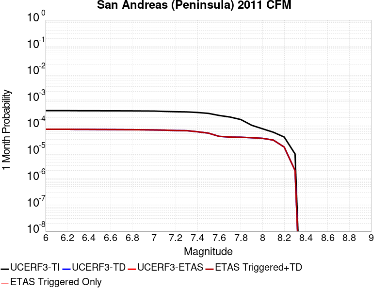 |  | 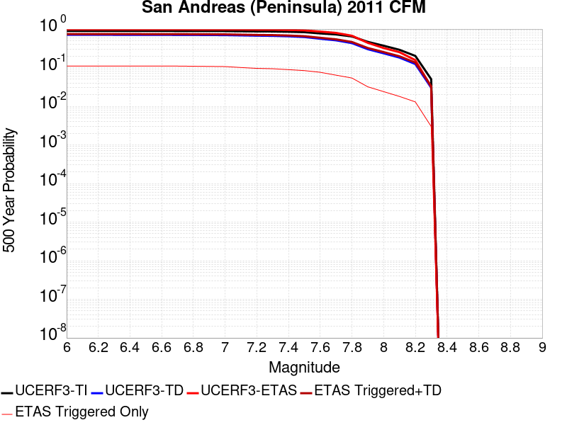 |

| Magnitude | 1 wk TI Prob | 1 wk TD Prob | 1 wk ETAS Prob | 1 wk ETAS/TD Gain | 1 wk ETAS Triggered+TD | 1 wk ETAS Triggered Only | 1 mo TI Prob | 1 mo TD Prob | 1 mo ETAS Prob | 1 mo ETAS/TD Gain | 1 mo ETAS Triggered+TD | 1 mo ETAS Triggered Only | 1 yr TI Prob | 1 yr TD Prob | 1 yr ETAS Prob | 1 yr ETAS/TD Gain | 1 yr ETAS Triggered+TD | 1 yr ETAS Triggered Only | 500 yr TI Prob | 500 yr TD Prob | 500 yr ETAS Prob | 500 yr ETAS/TD Gain | 500 yr ETAS Triggered+TD | 500 yr ETAS Triggered Only |
|-----|-----|-----|-----|-----|-----|-----|-----|-----|-----|-----|-----|-----|-----|-----|-----|-----|-----|-----|-----|-----|-----|-----|-----|-----|
| 6.0 | 8.6200685E-5 | 1.7063288E-5 | 0.0 | 0.0 | 1.7063288E-5 | 0.0 | 3.6937918E-4 | 7.312633E-5 | 0.0 | 0.0 | 7.312633E-5 | 0.0 | 0.0044879215 | 8.899502E-4 | 0.0 | 0.0 | 8.899502E-4 | 0.0 | 0.8944965 | 0.7122194 | 0.982 | 1.3787886 | 0.74387527 | 0.11 |
| 6.1 | 8.6200685E-5 | 1.7063288E-5 | 0.0 | 0.0 | 1.7063288E-5 | 0.0 | 3.6937918E-4 | 7.312633E-5 | 0.0 | 0.0 | 7.312633E-5 | 0.0 | 0.0044879215 | 8.899502E-4 | 0.0 | 0.0 | 8.899502E-4 | 0.0 | 0.8944965 | 0.7122194 | 0.982 | 1.3787886 | 0.74387527 | 0.11 |
| 6.2 | 8.6200685E-5 | 1.7063288E-5 | 0.0 | 0.0 | 1.7063288E-5 | 0.0 | 3.6937918E-4 | 7.312633E-5 | 0.0 | 0.0 | 7.312633E-5 | 0.0 | 0.0044879215 | 8.899502E-4 | 0.0 | 0.0 | 8.899502E-4 | 0.0 | 0.8944965 | 0.7122194 | 0.982 | 1.3787886 | 0.74387527 | 0.11 |
| 6.3 | 8.551163E-5 | 1.682121E-5 | 0.0 | 0.0 | 1.682121E-5 | 0.0 | 3.6642692E-4 | 7.2088915E-5 | 0.0 | 0.0 | 7.2088915E-5 | 0.0 | 0.004452125 | 8.773299E-4 | 0.0 | 0.0 | 8.773299E-4 | 0.0 | 0.89258254 | 0.70918643 | 0.982 | 1.3846853 | 0.7411759 | 0.11 |
| 6.4 | 8.551163E-5 | 1.682121E-5 | 0.0 | 0.0 | 1.682121E-5 | 0.0 | 3.6642692E-4 | 7.2088915E-5 | 0.0 | 0.0 | 7.2088915E-5 | 0.0 | 0.004452125 | 8.773299E-4 | 0.0 | 0.0 | 8.773299E-4 | 0.0 | 0.89258254 | 0.70918643 | 0.982 | 1.3846853 | 0.7411759 | 0.11 |
| 6.5 | 8.511146E-5 | 1.6680735E-5 | 0.0 | 0.0 | 1.6680735E-5 | 0.0 | 3.647124E-4 | 7.148691E-5 | 0.0 | 0.0 | 7.148691E-5 | 0.0 | 0.004431336 | 8.7000633E-4 | 0.0 | 0.0 | 8.7000633E-4 | 0.0 | 0.8914552 | 0.70740026 | 0.982 | 1.3881816 | 0.73958623 | 0.11 |
| 6.6 | 8.4985084E-5 | 1.662297E-5 | 0.0 | 0.0 | 1.662297E-5 | 0.0 | 3.6417096E-4 | 7.123936E-5 | 0.0 | 0.0 | 7.123936E-5 | 0.0 | 0.0044247704 | 8.669948E-4 | 0.0 | 0.0 | 8.669948E-4 | 0.0 | 0.89109665 | 0.7067997 | 0.981 | 1.3879462 | 0.7390517 | 0.11 |
| 6.7 | 8.462618E-5 | 1.6484215E-5 | 0.0 | 0.0 | 1.6484215E-5 | 0.0 | 3.6263323E-4 | 7.0644724E-5 | 0.0 | 0.0 | 7.0644724E-5 | 0.0 | 0.004406125 | 8.597609E-4 | 0.0 | 0.0 | 8.597609E-4 | 0.0 | 0.89007205 | 0.7051486 | 0.98 | 1.389778 | 0.73758227 | 0.11 |
| 6.8 | 8.42337E-5 | 1.6404689E-5 | 0.0 | 0.0 | 1.6404689E-5 | 0.0 | 3.6095164E-4 | 7.030392E-5 | 0.0 | 0.0 | 7.030392E-5 | 0.0 | 0.004385734 | 8.5561484E-4 | 0.0 | 0.0 | 8.5561484E-4 | 0.0 | 0.8889406 | 0.70322216 | 0.979 | 1.3921632 | 0.73557097 | 0.109 |
| 6.9 | 8.365989E-5 | 1.6241827E-5 | 0.0 | 0.0 | 1.6241827E-5 | 0.0 | 3.5849313E-4 | 6.960597E-5 | 0.0 | 0.0 | 6.960597E-5 | 0.0 | 0.004355922 | 8.47124E-4 | 0.0 | 0.0 | 8.47124E-4 | 0.0 | 0.8872653 | 0.7001404 | 0.978 | 1.3968626 | 0.7325252 | 0.108 |
| 7.0 | 8.30936E-5 | 1.6034794E-5 | 0.0 | 0.0 | 1.6034794E-5 | 0.0 | 3.560668E-4 | 6.8718735E-5 | 0.0 | 0.0 | 6.8718735E-5 | 0.0 | 0.004326499 | 8.3633023E-4 | 0.0 | 0.0 | 8.3633023E-4 | 0.0 | 0.8855872 | 0.696918 | 0.978 | 1.4033215 | 0.72934777 | 0.107 |
| 7.1 | 8.041264E-5 | 1.5784826E-5 | 0.0 | 0.0 | 1.5784826E-5 | 0.0 | 3.4458007E-4 | 6.76475E-5 | 0.0 | 0.0 | 6.76475E-5 | 0.0 | 0.0041871946 | 8.232979E-4 | 0.0 | 0.0 | 8.232979E-4 | 0.0 | 0.8772975 | 0.68544406 | 0.976 | 1.4238945 | 0.71721417 | 0.101 |
| 7.2 | 7.8427016E-5 | 1.5296258E-5 | 0.0 | 0.0 | 1.5296258E-5 | 0.0 | 3.3607247E-4 | 6.555375E-5 | 0.0 | 0.0 | 6.555375E-5 | 0.0 | 0.004084008 | 7.978254E-4 | 0.0 | 0.0 | 7.978254E-4 | 0.0 | 0.870773 | 0.67464435 | 0.968 | 1.4348301 | 0.7058785 | 0.096 |
| 7.3 | 7.721087E-5 | 1.5109377E-5 | 0.0 | 0.0 | 1.5109377E-5 | 0.0 | 3.3086175E-4 | 6.475287E-5 | 0.0 | 0.0 | 6.475287E-5 | 0.0 | 0.004020803 | 7.880818E-4 | 0.0 | 0.0 | 7.880818E-4 | 0.0 | 0.86660683 | 0.66754276 | 0.966 | 1.4470984 | 0.6987937 | 0.094 |
| 7.4 | 7.3536525E-5 | 1.3729193E-5 | 0.0 | 0.0 | 1.3729193E-5 | 0.0 | 3.1511846E-4 | 5.883807E-5 | 0.0 | 0.0 | 5.883807E-5 | 0.0 | 0.0038298194 | 7.1611867E-4 | 0.0 | 0.0 | 7.1611867E-4 | 0.0 | 0.8531856 | 0.65082765 | 0.952 | 1.4627528 | 0.681904 | 0.089 |
| 7.5 | 6.806207E-5 | 1.2200798E-5 | 0.0 | 0.0 | 1.2200798E-5 | 0.0 | 2.9166197E-4 | 5.2288087E-5 | 0.0 | 0.0 | 5.2288087E-5 | 0.0 | 0.0035452035 | 6.36422E-4 | 0.0 | 0.0 | 6.36422E-4 | 0.0 | 0.83064383 | 0.62212735 | 0.927 | 1.4900485 | 0.6538687 | 0.084 |
| 7.6 | 5.6731416E-5 | 9.186885E-6 | 0.0 | 0.0 | 9.186885E-6 | 0.0 | 2.43112E-4 | 3.937177E-5 | 0.0 | 0.0 | 3.937177E-5 | 0.0 | 0.0029558712 | 4.7924594E-4 | 0.0 | 0.0 | 4.7924594E-4 | 0.0 | 0.77239054 | 0.56193274 | 0.862 | 1.5339915 | 0.5952259 | 0.076 |
| 7.7 | 4.946994E-5 | 8.620555E-6 | 0.0 | 0.0 | 8.620555E-6 | 0.0 | 2.1199681E-4 | 3.694471E-5 | 0.0 | 0.0 | 3.694471E-5 | 0.0 | 0.002578006 | 4.4970907E-4 | 0.0 | 0.0 | 4.4970907E-4 | 0.0 | 0.7249129 | 0.51099014 | 0.796 | 1.55776 | 0.54228675 | 0.064 |
| 7.8 | 3.9718198E-5 | 8.505221E-6 | 0.0 | 0.0 | 8.505221E-6 | 0.0 | 1.7020974E-4 | 3.6450438E-5 | 0.0 | 0.0 | 3.6450438E-5 | 0.0 | 0.0020703338 | 4.4369375E-4 | 0.0 | 0.0 | 4.4369375E-4 | 0.0 | 0.6452138 | 0.43297043 | 0.673 | 1.5543786 | 0.46359003 | 0.054 |
| 7.9 | 2.4115114E-5 | 8.13651E-6 | 0.0 | 0.0 | 8.13651E-6 | 0.0 | 1.0334639E-4 | 3.487029E-5 | 0.0 | 0.0 | 3.487029E-5 | 0.0 | 0.001257516 | 4.244631E-4 | 0.0 | 0.0 | 4.244631E-4 | 0.0 | 0.46695727 | 0.30122387 | 0.441 | 1.4640274 | 0.3235847 | 0.032 |
| 8.0 | 1.7756569E-5 | 7.717041E-6 | 0.0 | 0.0 | 7.717041E-6 | 0.0 | 7.6097356E-5 | 3.307261E-5 | 0.0 | 0.0 | 3.307261E-5 | 0.0 | 9.260915E-4 | 4.0258473E-4 | 0.0 | 0.0 | 4.0258473E-4 | 0.0 | 0.37077117 | 0.23558123 | 0.323 | 1.371077 | 0.2539273 | 0.024 |
| 8.1 | 1.3159258E-5 | 6.6195676E-6 | 0.0 | 0.0 | 6.6195676E-6 | 0.0 | 5.6395602E-5 | 2.8369266E-5 | 0.0 | 0.0 | 2.8369266E-5 | 0.0 | 6.864001E-4 | 3.4534113E-4 | 0.0 | 0.0 | 3.4534113E-4 | 0.0 | 0.29058734 | 0.18269335 | 0.252 | 1.3793606 | 0.19740488 | 0.018 |
| 8.2 | 8.635426E-6 | 3.60469E-6 | 0.0 | 0.0 | 3.60469E-6 | 0.0 | 3.700844E-5 | 1.5448579E-5 | 0.0 | 0.0 | 1.5448579E-5 | 0.0 | 4.5048463E-4 | 1.8807026E-4 | 0.0 | 0.0 | 1.8807026E-4 | 0.0 | 0.20171776 | 0.12424191 | 0.157 | 1.2636638 | 0.13562676 | 0.013 |
| 8.3 | 1.983087E-6 | 4.6615045E-7 | 0.0 | 0.0 | 4.6615045E-7 | 0.0 | 8.498917E-6 | 1.997786E-6 | 0.0 | 0.0 | 1.997786E-6 | 0.0 | 1.034694E-4 | 2.432278E-5 | 0.0 | 0.0 | 2.432278E-5 | 0.0 | 0.050421786 | 0.030325904 | 0.032 | 1.0552034 | 0.033234928 | 0.003 |

## San Jacinto (Superstition Mtn)
*[(top)](#table-of-contents)*

| 1 Week | 1 Month | 1 Year | 500 Year |
|-----|-----|-----|-----|
|  | 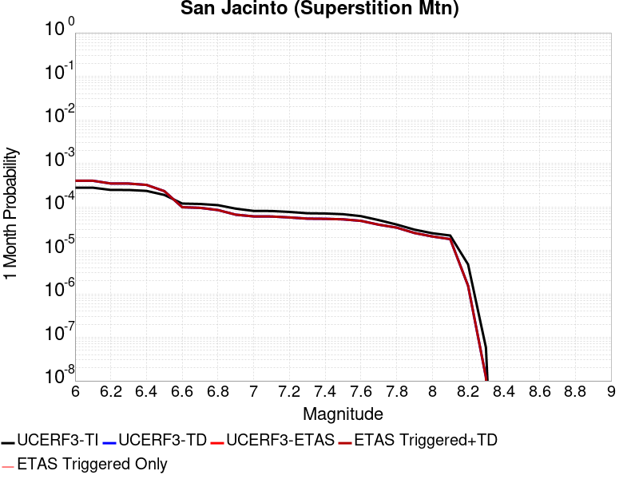 | 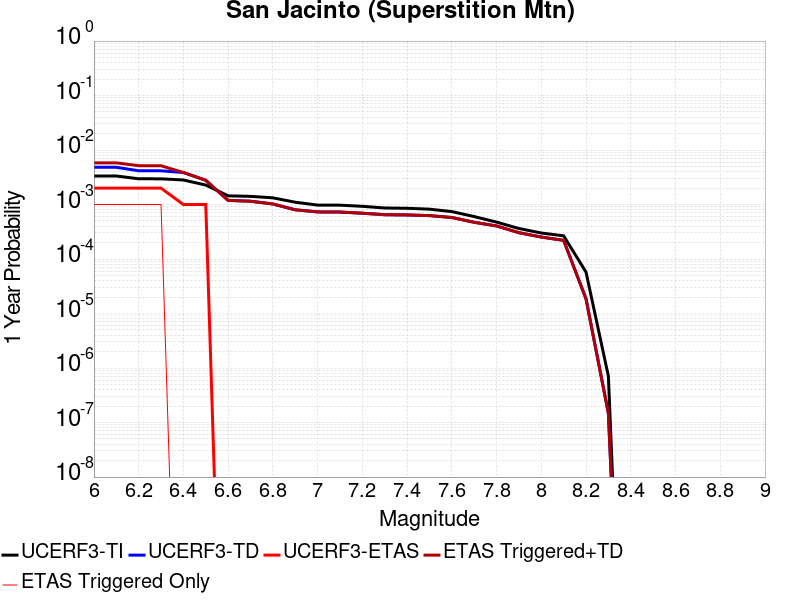 | 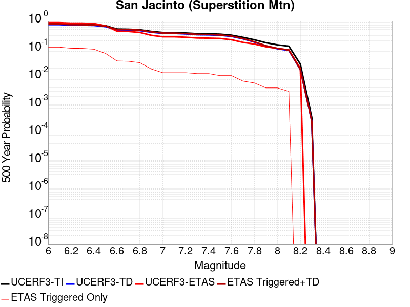 |

| Magnitude | 1 wk TI Prob | 1 wk TD Prob | 1 wk ETAS Prob | 1 wk ETAS/TD Gain | 1 wk ETAS Triggered+TD | 1 wk ETAS Triggered Only | 1 mo TI Prob | 1 mo TD Prob | 1 mo ETAS Prob | 1 mo ETAS/TD Gain | 1 mo ETAS Triggered+TD | 1 mo ETAS Triggered Only | 1 yr TI Prob | 1 yr TD Prob | 1 yr ETAS Prob | 1 yr ETAS/TD Gain | 1 yr ETAS Triggered+TD | 1 yr ETAS Triggered Only | 500 yr TI Prob | 500 yr TD Prob | 500 yr ETAS Prob | 500 yr ETAS/TD Gain | 500 yr ETAS Triggered+TD | 500 yr ETAS Triggered Only |
|-----|-----|-----|-----|-----|-----|-----|-----|-----|-----|-----|-----|-----|-----|-----|-----|-----|-----|-----|-----|-----|-----|-----|-----|-----|
| 6.0 | 6.4193904E-5 | 9.271975E-5 | 0.0 | 0.0 | 9.271975E-5 | 0.0 | 2.7508775E-4 | 3.9731906E-4 | 0.0 | 0.0 | 3.9731906E-4 | 0.0 | 0.0033440501 | 0.004828055 | 0.002 | 0.41424552 | 0.0058232266 | 0.001 | 0.8126594 | 0.74072737 | 0.872 | 1.1772212 | 0.77054375 | 0.115 |
| 6.1 | 6.4193904E-5 | 9.271975E-5 | 0.0 | 0.0 | 9.271975E-5 | 0.0 | 2.7508775E-4 | 3.9731906E-4 | 0.0 | 0.0 | 3.9731906E-4 | 0.0 | 0.0033440501 | 0.004828055 | 0.002 | 0.41424552 | 0.0058232266 | 0.001 | 0.8126594 | 0.74072737 | 0.872 | 1.1772212 | 0.77054375 | 0.115 |
| 6.2 | 5.7023593E-5 | 8.004937E-5 | 0.0 | 0.0 | 8.004937E-5 | 0.0 | 2.4436394E-4 | 3.430329E-4 | 0.0 | 0.0 | 3.430329E-4 | 0.0 | 0.002971072 | 0.0041700494 | 0.002 | 0.47961062 | 0.0051658796 | 0.001 | 0.7741191 | 0.7057289 | 0.837 | 1.1860079 | 0.73662734 | 0.105 |
| 6.3 | 5.6940098E-5 | 7.989656E-5 | 0.0 | 0.0 | 7.989656E-5 | 0.0 | 2.4400617E-4 | 3.4237816E-4 | 0.0 | 0.0 | 3.4237816E-4 | 0.0 | 0.002966728 | 0.0041621085 | 0.002 | 0.48052567 | 0.0051579466 | 0.001 | 0.77362645 | 0.7051821 | 0.837 | 1.1869276 | 0.7358431 | 0.104 |
| 6.4 | 5.4171585E-5 | 7.443239E-5 | 0.0 | 0.0 | 7.443239E-5 | 0.0 | 2.3214328E-4 | 3.189661E-4 | 0.0 | 0.0 | 3.189661E-4 | 0.0 | 0.0028226813 | 0.0038781182 | 0.001 | 0.25785702 | 0.0038781182 | 0.0 | 0.7566699 | 0.6908259 | 0.812 | 1.1754047 | 0.7208158 | 0.097 |
| 6.5 | 4.375144E-5 | 5.3513966E-5 | 0.0 | 0.0 | 5.3513966E-5 | 0.0 | 1.874927E-4 | 2.2933193E-4 | 0.0 | 0.0 | 2.2933193E-4 | 0.0 | 0.0022803338 | 0.0027896955 | 0.001 | 0.35846207 | 0.0027896955 | 0.0 | 0.6806504 | 0.6261776 | 0.675 | 1.077969 | 0.65197134 | 0.069 |
| 6.6 | 2.772192E-5 | 2.2855878E-5 | 0.0 | 0.0 | 2.2855878E-5 | 0.0 | 1.1880282E-4 | 9.7950186E-5 | 0.0 | 0.0 | 9.7950186E-5 | 0.0 | 0.0014454646 | 0.0011919084 | 0.0 | 0.0 | 0.0011919084 | 0.0 | 0.51482964 | 0.4792967 | 0.434 | 0.9054934 | 0.49856272 | 0.037 |
| 6.7 | 2.7124124E-5 | 2.2089895E-5 | 0.0 | 0.0 | 2.2089895E-5 | 0.0 | 1.1624106E-4 | 9.466764E-5 | 0.0 | 0.0 | 9.466764E-5 | 0.0 | 0.0014143161 | 0.0011519862 | 0.0 | 0.0 | 0.0011519862 | 0.0 | 0.50720334 | 0.47273672 | 0.422 | 0.8926745 | 0.49171817 | 0.036 |
| 6.8 | 2.5475807E-5 | 1.965192E-5 | 0.0 | 0.0 | 1.965192E-5 | 0.0 | 1.0917746E-4 | 8.421985E-5 | 0.0 | 0.0 | 8.421985E-5 | 0.0 | 0.001328425 | 0.0010249048 | 0.0 | 0.0 | 0.0010249048 | 0.0 | 0.48554856 | 0.4531604 | 0.389 | 0.8584157 | 0.47065926 | 0.032 |
| 6.9 | 2.1162023E-5 | 1.5379406E-5 | 0.0 | 0.0 | 1.5379406E-5 | 0.0 | 9.069123E-5 | 6.591009E-5 | 0.0 | 0.0 | 6.591009E-5 | 0.0 | 0.0011036064 | 8.021631E-4 | 0.0 | 0.0 | 8.021631E-4 | 0.0 | 0.42426506 | 0.39511248 | 0.307 | 0.77699393 | 0.40660533 | 0.019 |
| 7.0 | 1.8754288E-5 | 1.4045835E-5 | 0.0 | 0.0 | 1.4045835E-5 | 0.0 | 8.037304E-5 | 6.0195056E-5 | 0.0 | 0.0 | 6.0195056E-5 | 0.0 | 9.781026E-4 | 7.3263043E-4 | 0.0 | 0.0 | 7.3263043E-4 | 0.0 | 0.38693884 | 0.3599475 | 0.272 | 0.7556657 | 0.36890826 | 0.014 |
| 7.1 | 1.8678527E-5 | 1.3974531E-5 | 0.0 | 0.0 | 1.3974531E-5 | 0.0 | 8.0048376E-5 | 5.9889484E-5 | 0.0 | 0.0 | 5.9889484E-5 | 0.0 | 9.7415317E-4 | 7.289126E-4 | 0.0 | 0.0 | 7.289126E-4 | 0.0 | 0.38572586 | 0.35872105 | 0.272 | 0.75824934 | 0.36769897 | 0.014 |
| 7.2 | 1.7804578E-5 | 1.3303894E-5 | 0.0 | 0.0 | 1.3303894E-5 | 0.0 | 7.6303106E-5 | 5.701545E-5 | 0.0 | 0.0 | 5.701545E-5 | 0.0 | 9.285943E-4 | 6.939439E-4 | 0.0 | 0.0 | 6.939439E-4 | 0.0 | 0.37155885 | 0.34454986 | 0.262 | 0.7604124 | 0.35372618 | 0.014 |
| 7.3 | 1.6583685E-5 | 1.248823E-5 | 0.0 | 0.0 | 1.248823E-5 | 0.0 | 7.1070994E-5 | 5.3519896E-5 | 0.0 | 0.0 | 5.3519896E-5 | 0.0 | 8.649459E-4 | 6.514116E-4 | 0.0 | 0.0 | 6.514116E-4 | 0.0 | 0.351219 | 0.32231167 | 0.246 | 0.7632364 | 0.33112162 | 0.013 |
| 7.4 | 1.6387552E-5 | 1.23588425E-5 | 0.0 | 0.0 | 1.23588425E-5 | 0.0 | 7.023047E-5 | 5.2965403E-5 | 0.0 | 0.0 | 5.2965403E-5 | 0.0 | 8.5472054E-4 | 6.4466463E-4 | 0.0 | 0.0 | 6.4466463E-4 | 0.0 | 0.34789065 | 0.31868088 | 0.243 | 0.7625182 | 0.32753804 | 0.013 |
| 7.5 | 1.5790754E-5 | 1.2024417E-5 | 0.0 | 0.0 | 1.2024417E-5 | 0.0 | 6.767291E-5 | 5.1532206E-5 | 0.0 | 0.0 | 5.1532206E-5 | 0.0 | 8.236062E-4 | 6.272256E-4 | 0.0 | 0.0 | 6.272256E-4 | 0.0 | 0.3376577 | 0.30801508 | 0.237 | 0.76944286 | 0.31562692 | 0.011 |
| 7.6 | 1.4248672E-5 | 1.11074205E-5 | 0.0 | 0.0 | 1.11074205E-5 | 0.0 | 6.106431E-5 | 4.760237E-5 | 0.0 | 0.0 | 4.760237E-5 | 0.0 | 7.432043E-4 | 5.794061E-4 | 0.0 | 0.0 | 5.794061E-4 | 0.0 | 0.31046674 | 0.28026578 | 0.213 | 0.7599929 | 0.28818285 | 0.011 |
| 7.7 | 1.15449975E-5 | 9.0668755E-6 | 0.0 | 0.0 | 9.0668755E-6 | 0.0 | 4.947762E-5 | 3.885746E-5 | 0.0 | 0.0 | 3.885746E-5 | 0.0 | 6.022235E-4 | 4.7298742E-4 | 0.0 | 0.0 | 4.7298742E-4 | 0.0 | 0.26007205 | 0.22885022 | 0.171 | 0.74721366 | 0.23424827 | 0.007 |
| 7.8 | 9.1391985E-6 | 7.767502E-6 | 0.0 | 0.0 | 7.767502E-6 | 0.0 | 3.9167408E-5 | 3.328887E-5 | 0.0 | 0.0 | 3.328887E-5 | 0.0 | 4.767588E-4 | 4.0521703E-4 | 0.0 | 0.0 | 4.0521703E-4 | 0.0 | 0.2121411 | 0.17507353 | 0.149 | 0.85107094 | 0.18002309 | 0.006 |
| 7.9 | 6.973017E-6 | 5.8422215E-6 | 0.0 | 0.0 | 5.8422215E-6 | 0.0 | 2.9884017E-5 | 2.5037854E-5 | 0.0 | 0.0 | 2.5037854E-5 | 0.0 | 3.6377716E-4 | 3.0479356E-4 | 0.0 | 0.0 | 3.0479356E-4 | 0.0 | 0.16633336 | 0.126286 | 0.119 | 0.9423056 | 0.12978084 | 0.004 |
| 8.0 | 5.7638235E-6 | 4.859783E-6 | 0.0 | 0.0 | 4.859783E-6 | 0.0 | 2.4701867E-5 | 2.0827478E-5 | 0.0 | 0.0 | 2.0827478E-5 | 0.0 | 3.0070372E-4 | 2.5354532E-4 | 0.0 | 0.0 | 2.5354532E-4 | 0.0 | 0.13961427 | 0.1006271 | 0.104 | 1.0335188 | 0.1042246 | 0.004 |
| 8.1 | 5.1124434E-6 | 4.2236034E-6 | 0.0 | 0.0 | 4.2236034E-6 | 0.0 | 2.1910288E-5 | 1.8101033E-5 | 0.0 | 0.0 | 1.8101033E-5 | 0.0 | 2.6672508E-4 | 2.2035808E-4 | 0.0 | 0.0 | 2.2035808E-4 | 0.0 | 0.12486782 | 0.087805755 | 0.092 | 1.0477673 | 0.09054234 | 0.003 |
| 8.2 | 1.1075938E-6 | 3.5795924E-7 | 0.0 | 0.0 | 3.5795924E-7 | 0.0 | 4.7468216E-6 | 1.5341101E-6 | 0.0 | 0.0 | 1.5341101E-6 | 0.0 | 5.779102E-5 | 1.867764E-5 | 0.0 | 0.0 | 1.867764E-5 | 0.0 | 0.028482838 | 0.018324267 | 0.02 | 1.0914488 | 0.018324267 | 0.0 |
| 8.3 | 1.3584393E-8 | 2.8450298E-9 | 0.0 | 0.0 | 2.8450298E-9 | 0.0 | 5.8218827E-8 | 1.2192984E-8 | 0.0 | 0.0 | 1.2192984E-8 | 0.0 | 7.0881396E-7 | 1.4844959E-7 | 0.0 | 0.0 | 1.4844959E-7 | 0.0 | 3.5434432E-4 | 2.589788E-4 | 0.0 | 0.0 | 2.589788E-4 | 0.0 |

## Elsinore (Glen Ivy) rev
*[(top)](#table-of-contents)*

| 1 Week | 1 Month | 1 Year | 500 Year |
|-----|-----|-----|-----|
| 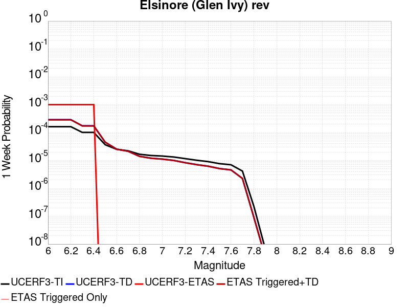 | 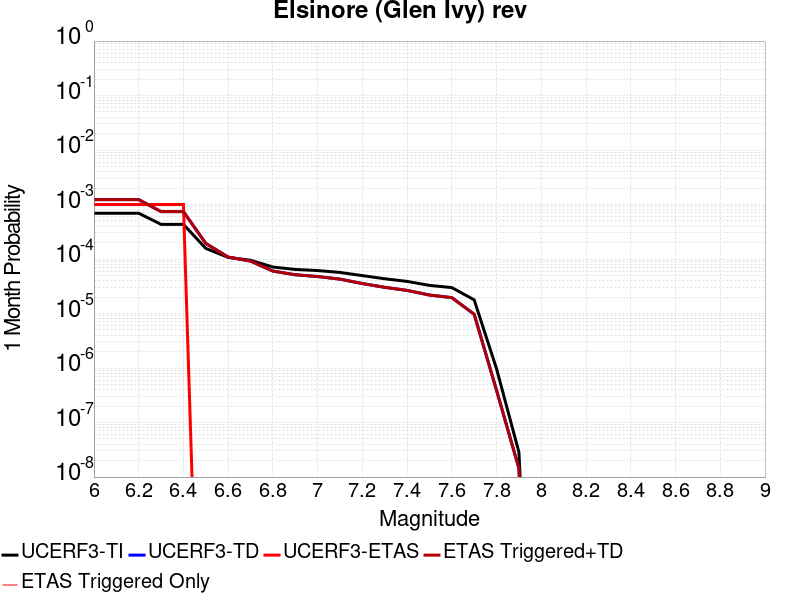 | 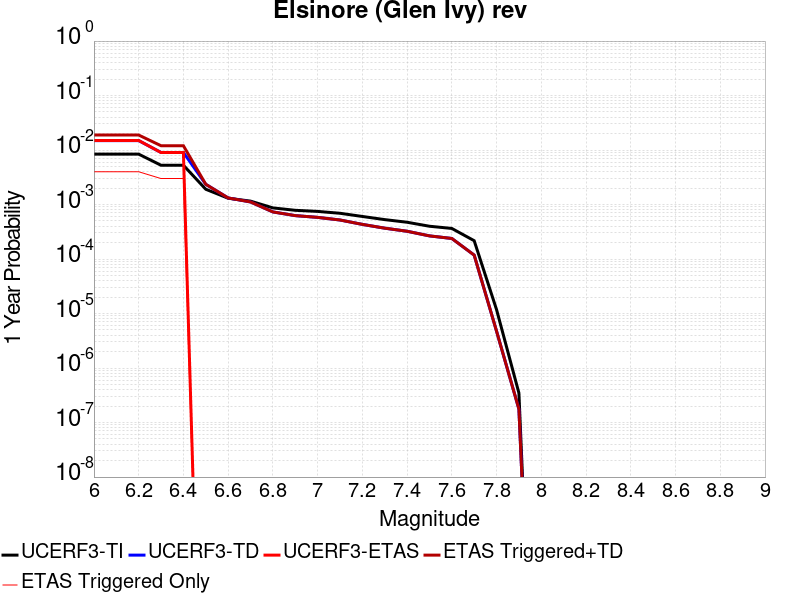 | 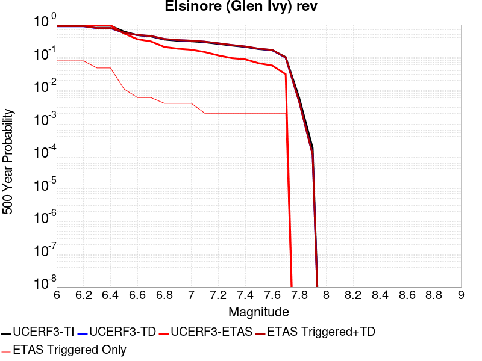 |

| Magnitude | 1 wk TI Prob | 1 wk TD Prob | 1 wk ETAS Prob | 1 wk ETAS/TD Gain | 1 wk ETAS Triggered+TD | 1 wk ETAS Triggered Only | 1 mo TI Prob | 1 mo TD Prob | 1 mo ETAS Prob | 1 mo ETAS/TD Gain | 1 mo ETAS Triggered+TD | 1 mo ETAS Triggered Only | 1 yr TI Prob | 1 yr TD Prob | 1 yr ETAS Prob | 1 yr ETAS/TD Gain | 1 yr ETAS Triggered+TD | 1 yr ETAS Triggered Only | 500 yr TI Prob | 500 yr TD Prob | 500 yr ETAS Prob | 500 yr ETAS/TD Gain | 500 yr ETAS Triggered+TD | 500 yr ETAS Triggered Only |
|-----|-----|-----|-----|-----|-----|-----|-----|-----|-----|-----|-----|-----|-----|-----|-----|-----|-----|-----|-----|-----|-----|-----|-----|-----|
| 6.0 | 1.6204086E-4 | 2.8765394E-4 | 0.001 | 3.4763994 | 2.8765394E-4 | 0.0 | 6.94276E-4 | 0.0012323692 | 0.001 | 0.8114451 | 0.0012323692 | 0.0 | 0.008420097 | 0.014921735 | 0.015 | 1.0052451 | 0.018862048 | 0.004 | 0.98541665 | 0.8941626 | 0.99 | 1.1071812 | 0.90252376 | 0.079 |
| 6.1 | 1.6204086E-4 | 2.8765394E-4 | 0.001 | 3.4763994 | 2.8765394E-4 | 0.0 | 6.94276E-4 | 0.0012323692 | 0.001 | 0.8114451 | 0.0012323692 | 0.0 | 0.008420097 | 0.014921735 | 0.015 | 1.0052451 | 0.018862048 | 0.004 | 0.98541665 | 0.8941626 | 0.99 | 1.1071812 | 0.90252376 | 0.079 |
| 6.2 | 1.6204086E-4 | 2.8765394E-4 | 0.001 | 3.4763994 | 2.8765394E-4 | 0.0 | 6.94276E-4 | 0.0012323692 | 0.001 | 0.8114451 | 0.0012323692 | 0.0 | 0.008420097 | 0.014921735 | 0.015 | 1.0052451 | 0.018862048 | 0.004 | 0.98541665 | 0.8941626 | 0.99 | 1.1071812 | 0.90252376 | 0.079 |
| 6.3 | 1.0111737E-4 | 1.7348872E-4 | 0.001 | 5.764064 | 1.7348872E-4 | 0.0 | 4.332882E-4 | 7.434238E-4 | 0.001 | 1.3451277 | 7.434238E-4 | 0.0 | 0.005262531 | 0.0090335915 | 0.009 | 0.9962815 | 0.0120064905 | 0.003 | 0.92851114 | 0.78161424 | 0.953 | 1.2192715 | 0.7920968 | 0.048 |
| 6.4 | 1.0111737E-4 | 1.7348872E-4 | 0.001 | 5.764064 | 1.7348872E-4 | 0.0 | 4.332882E-4 | 7.434238E-4 | 0.001 | 1.3451277 | 7.434238E-4 | 0.0 | 0.005262531 | 0.0090335915 | 0.009 | 0.9962815 | 0.0120064905 | 0.003 | 0.92851114 | 0.78161424 | 0.953 | 1.2192715 | 0.7920968 | 0.048 |
| 6.5 | 3.6624708E-5 | 4.514983E-5 | 0.0 | 0.0 | 4.514983E-5 | 0.0 | 1.569536E-4 | 1.9348686E-4 | 0.0 | 0.0 | 1.9348686E-4 | 0.0 | 0.001909235 | 0.0023535034 | 0.0 | 0.0 | 0.0023535034 | 0.0 | 0.61539173 | 0.56396353 | 0.54 | 0.95750874 | 0.5687599 | 0.011 |
| 6.6 | 2.5051324E-5 | 2.5367364E-5 | 0.0 | 0.0 | 2.5367364E-5 | 0.0 | 1.073584E-4 | 1.0871298E-4 | 0.0 | 0.0 | 1.0871298E-4 | 0.0 | 0.0013063047 | 0.0013228185 | 0.0 | 0.0 | 0.0013228185 | 0.0 | 0.47981948 | 0.48320082 | 0.361 | 0.74710137 | 0.48630163 | 0.006 |
| 6.7 | 2.2189772E-5 | 2.1413396E-5 | 0.0 | 0.0 | 2.1413396E-5 | 0.0 | 9.509556E-5 | 9.176866E-5 | 0.0 | 0.0 | 9.176866E-5 | 0.0 | 0.0011571734 | 0.0011167447 | 0.0 | 0.0 | 0.0011167447 | 0.0 | 0.4394976 | 0.44855958 | 0.31 | 0.691101 | 0.45186824 | 0.006 |
| 6.8 | 1.6654378E-5 | 1.4052426E-5 | 0.0 | 0.0 | 1.4052426E-5 | 0.0 | 7.137396E-5 | 6.0223323E-5 | 0.0 | 0.0 | 6.0223323E-5 | 0.0 | 8.686314E-4 | 7.329771E-4 | 0.0 | 0.0 | 7.329771E-4 | 0.0 | 0.35241452 | 0.3650956 | 0.21 | 0.57519186 | 0.3676352 | 0.004 |
| 6.9 | 1.5042909E-5 | 1.2016775E-5 | 0.0 | 0.0 | 1.2016775E-5 | 0.0 | 6.446802E-5 | 5.1499464E-5 | 0.0 | 0.0 | 5.1499464E-5 | 0.0 | 7.8461546E-4 | 6.268286E-4 | 0.0 | 0.0 | 6.268286E-4 | 0.0 | 0.3246078 | 0.33764806 | 0.186 | 0.5508694 | 0.3402975 | 0.004 |
| 7.0 | 1.4361385E-5 | 1.1159032E-5 | 0.0 | 0.0 | 1.1159032E-5 | 0.0 | 6.154734E-5 | 4.782356E-5 | 0.0 | 0.0 | 4.782356E-5 | 0.0 | 7.490812E-4 | 5.820991E-4 | 0.0 | 0.0 | 5.820991E-4 | 0.0 | 0.31249142 | 0.3246395 | 0.173 | 0.5328988 | 0.32734093 | 0.004 |
| 7.1 | 1.3265571E-5 | 9.986828E-6 | 0.0 | 0.0 | 9.986828E-6 | 0.0 | 5.6851208E-5 | 4.2800006E-5 | 0.0 | 0.0 | 4.2800006E-5 | 0.0 | 6.919436E-4 | 5.209679E-4 | 0.0 | 0.0 | 5.209679E-4 | 0.0 | 0.2925523 | 0.3031884 | 0.147 | 0.48484704 | 0.30458203 | 0.002 |
| 7.2 | 1.1596403E-5 | 8.297665E-6 | 0.0 | 0.0 | 8.297665E-6 | 0.0 | 4.9697923E-5 | 3.5560945E-5 | 0.0 | 0.0 | 3.5560945E-5 | 0.0 | 6.049042E-4 | 4.328701E-4 | 0.0 | 0.0 | 4.328701E-4 | 0.0 | 0.26106375 | 0.27029473 | 0.116 | 0.42916116 | 0.27175415 | 0.002 |
| 7.3 | 1.0150827E-5 | 7.069489E-6 | 0.0 | 0.0 | 7.069489E-6 | 0.0 | 4.3502816E-5 | 3.0297466E-5 | 0.0 | 0.0 | 3.0297466E-5 | 0.0 | 5.2951806E-4 | 3.6881058E-4 | 0.0 | 0.0 | 3.6881058E-4 | 0.0 | 0.23266298 | 0.23947945 | 0.096 | 0.40086946 | 0.2410005 | 0.002 |
| 7.4 | 9.080705E-6 | 6.2063377E-6 | 0.0 | 0.0 | 6.2063377E-6 | 0.0 | 3.8916725E-5 | 2.6598327E-5 | 0.0 | 0.0 | 2.6598327E-5 | 0.0 | 4.7370812E-4 | 3.237878E-4 | 0.0 | 0.0 | 3.237878E-4 | 0.0 | 0.21093784 | 0.21612053 | 0.088 | 0.40718022 | 0.21768828 | 0.002 |
| 7.5 | 7.671649E-6 | 5.103586E-6 | 0.0 | 0.0 | 5.103586E-6 | 0.0 | 3.287808E-5 | 2.1872333E-5 | 0.0 | 0.0 | 2.1872333E-5 | 0.0 | 4.0021708E-4 | 2.662643E-4 | 0.0 | 0.0 | 2.662643E-4 | 0.0 | 0.1813909 | 0.18472244 | 0.067 | 0.36270636 | 0.18635298 | 0.002 |
| 7.6 | 6.990086E-6 | 4.575747E-6 | 0.0 | 0.0 | 4.575747E-6 | 0.0 | 2.9957167E-5 | 1.9610203E-5 | 0.0 | 0.0 | 1.9610203E-5 | 0.0 | 3.6466747E-4 | 2.3872918E-4 | 0.0 | 0.0 | 2.3872918E-4 | 0.0 | 0.16670452 | 0.16904072 | 0.057 | 0.33719686 | 0.17070264 | 0.002 |
| 7.7 | 4.163505E-6 | 2.2660915E-6 | 0.0 | 0.0 | 2.2660915E-6 | 0.0 | 1.7843471E-5 | 9.711789E-6 | 0.0 | 0.0 | 9.711789E-6 | 0.0 | 2.172226E-4 | 1.18235315E-4 | 0.0 | 0.0 | 1.18235315E-4 | 0.0 | 0.10293154 | 0.09906384 | 0.031 | 0.3129295 | 0.100865714 | 0.002 |
| 7.8 | 2.2692414E-7 | 9.1199695E-8 | 0.0 | 0.0 | 9.1199695E-8 | 0.0 | 9.725317E-7 | 3.908558E-7 | 0.0 | 0.0 | 3.908558E-7 | 0.0 | 1.1840509E-5 | 4.7586623E-6 | 0.0 | 0.0 | 4.7586623E-6 | 0.0 | 0.005902799 | 0.0045152768 | 0.0 | 0.0 | 0.0045152768 | 0.0 |
| 7.9 | 6.676829E-9 | 3.3860155E-9 | 0.0 | 0.0 | 3.3860155E-9 | 0.0 | 2.861498E-8 | 1.4511495E-8 | 0.0 | 0.0 | 1.4511495E-8 | 0.0 | 3.4838732E-7 | 1.7667745E-7 | 0.0 | 0.0 | 1.7667745E-7 | 0.0 | 1.7417852E-4 | 1.0980361E-4 | 0.0 | 0.0 | 1.0980361E-4 | 0.0 |

## San Andreas (Coachella) rev
*[(top)](#table-of-contents)*

| 1 Week | 1 Month | 1 Year | 500 Year |
|-----|-----|-----|-----|
|  | 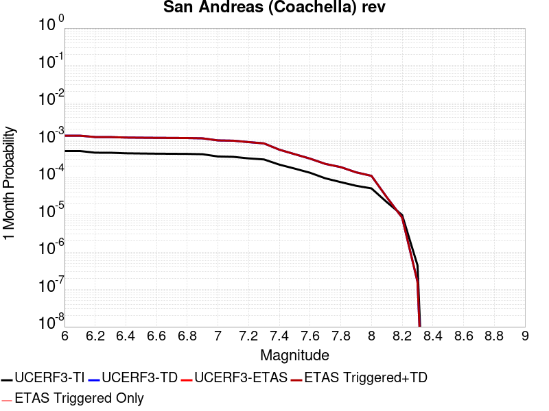 | 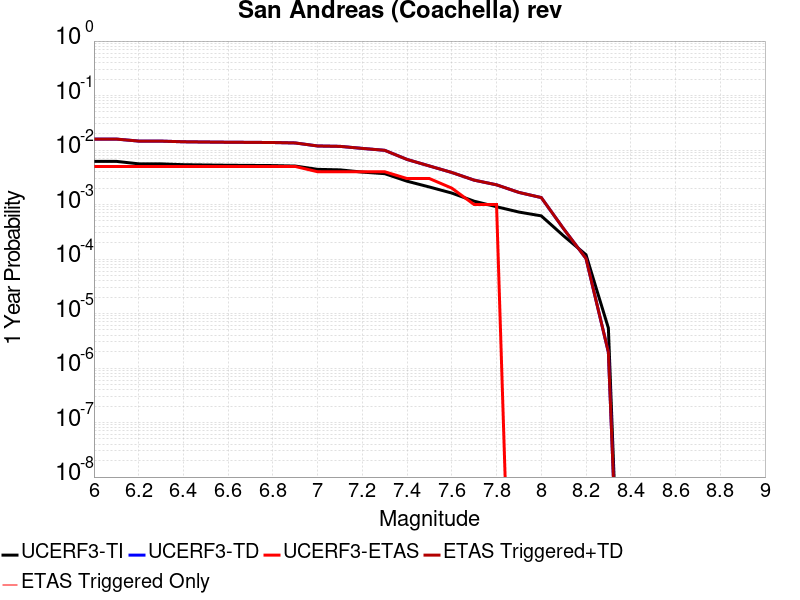 | 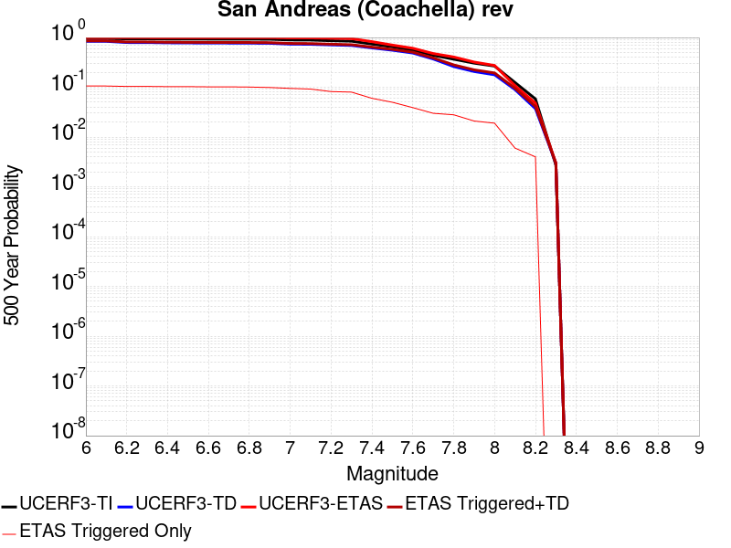 |

| Magnitude | 1 wk TI Prob | 1 wk TD Prob | 1 wk ETAS Prob | 1 wk ETAS/TD Gain | 1 wk ETAS Triggered+TD | 1 wk ETAS Triggered Only | 1 mo TI Prob | 1 mo TD Prob | 1 mo ETAS Prob | 1 mo ETAS/TD Gain | 1 mo ETAS Triggered+TD | 1 mo ETAS Triggered Only | 1 yr TI Prob | 1 yr TD Prob | 1 yr ETAS Prob | 1 yr ETAS/TD Gain | 1 yr ETAS Triggered+TD | 1 yr ETAS Triggered Only | 500 yr TI Prob | 500 yr TD Prob | 500 yr ETAS Prob | 500 yr ETAS/TD Gain | 500 yr ETAS Triggered+TD | 500 yr ETAS Triggered Only |
|-----|-----|-----|-----|-----|-----|-----|-----|-----|-----|-----|-----|-----|-----|-----|-----|-----|-----|-----|-----|-----|-----|-----|-----|-----|
| 6.0 | 1.1925945E-4 | 3.071018E-4 | 0.0 | 0.0 | 3.071018E-4 | 0.0 | 5.110118E-4 | 0.001315491 | 0.0 | 0.0 | 0.001315491 | 0.0 | 0.0062038354 | 0.015899653 | 0.005 | 0.3144723 | 0.015899653 | 0.0 | 0.9554694 | 0.8370535 | 0.997 | 1.1910828 | 0.8543258 | 0.106 |
| 6.1 | 1.1925945E-4 | 3.071018E-4 | 0.0 | 0.0 | 3.071018E-4 | 0.0 | 5.110118E-4 | 0.001315491 | 0.0 | 0.0 | 0.001315491 | 0.0 | 0.0062038354 | 0.015899653 | 0.005 | 0.3144723 | 0.015899653 | 0.0 | 0.9554694 | 0.8370535 | 0.997 | 1.1910828 | 0.8543258 | 0.106 |
| 6.2 | 1.07432395E-4 | 2.8223978E-4 | 0.0 | 0.0 | 2.8223978E-4 | 0.0 | 4.603433E-4 | 0.0012090419 | 0.0 | 0.0 | 0.0012090419 | 0.0 | 0.005590286 | 0.01462168 | 0.005 | 0.341958 | 0.01462168 | 0.0 | 0.93937117 | 0.7926862 | 0.995 | 1.2552255 | 0.8142469 | 0.104 |
| 6.3 | 1.0718766E-4 | 2.8169385E-4 | 0.0 | 0.0 | 2.8169385E-4 | 0.0 | 4.592948E-4 | 0.0012067043 | 0.0 | 0.0 | 0.0012067043 | 0.0 | 0.005577586 | 0.0145936 | 0.005 | 0.34261593 | 0.0145936 | 0.0 | 0.9389828 | 0.79224896 | 0.995 | 1.2559183 | 0.8138551 | 0.104 |
| 6.4 | 1.0355944E-4 | 2.7380255E-4 | 0.0 | 0.0 | 2.7380255E-4 | 0.0 | 4.4375064E-4 | 0.0011729152 | 0.0 | 0.0 | 0.0011729152 | 0.0 | 0.0053892885 | 0.014187647 | 0.005 | 0.35241926 | 0.014187647 | 0.0 | 0.93292415 | 0.78083205 | 0.993 | 1.2717203 | 0.80340636 | 0.103 |
| 6.5 | 1.0227914E-4 | 2.7100605E-4 | 0.0 | 0.0 | 2.7100605E-4 | 0.0 | 4.382655E-4 | 0.0011609411 | 0.0 | 0.0 | 0.0011609411 | 0.0 | 0.0053228354 | 0.014043749 | 0.005 | 0.3560303 | 0.014043749 | 0.0 | 0.93064564 | 0.77680033 | 0.993 | 1.2783208 | 0.7997899 | 0.103 |
| 6.6 | 1.0116757E-4 | 2.6867943E-4 | 0.0 | 0.0 | 2.6867943E-4 | 0.0 | 4.3350324E-4 | 0.0011509786 | 0.0 | 0.0 | 0.0011509786 | 0.0 | 0.0052651367 | 0.013924012 | 0.005 | 0.3590919 | 0.013924012 | 0.0 | 0.9286047 | 0.77367145 | 0.993 | 1.2834905 | 0.7967569 | 0.102 |
| 6.7 | 1.0050676E-4 | 2.672732E-4 | 0.0 | 0.0 | 2.672732E-4 | 0.0 | 4.3067214E-4 | 0.0011449571 | 0.0 | 0.0 | 0.0011449571 | 0.0 | 0.005230834 | 0.013851635 | 0.005 | 0.3609682 | 0.013851635 | 0.0 | 0.92736304 | 0.7718482 | 0.993 | 1.2865224 | 0.7951197 | 0.102 |
| 6.8 | 9.976819E-5 | 2.6534247E-4 | 0.0 | 0.0 | 2.6534247E-4 | 0.0 | 4.2750788E-4 | 0.0011366899 | 0.0 | 0.0 | 0.0011366899 | 0.0 | 0.0051924936 | 0.013752257 | 0.005 | 0.36357668 | 0.013752257 | 0.0 | 0.9259497 | 0.7698157 | 0.993 | 1.2899191 | 0.7930643 | 0.101 |
| 6.9 | 9.77719E-5 | 2.6048586E-4 | 0.0 | 0.0 | 2.6048586E-4 | 0.0 | 4.1895514E-4 | 0.0011158938 | 0.0 | 0.0 | 0.0011158938 | 0.0 | 0.0050888555 | 0.013502231 | 0.005 | 0.3703092 | 0.013502231 | 0.0 | 0.92199045 | 0.7645583 | 0.993 | 1.2987891 | 0.78786707 | 0.099 |
| 7.0 | 8.500761E-5 | 2.2914106E-4 | 0.0 | 0.0 | 2.2914106E-4 | 0.0 | 3.6426744E-4 | 9.816664E-4 | 0.0 | 0.0 | 9.816664E-4 | 0.0 | 0.0044259406 | 0.011886957 | 0.004 | 0.33650327 | 0.011886957 | 0.0 | 0.8911606 | 0.7354716 | 0.982 | 1.3351978 | 0.76060176 | 0.095 |
| 7.1 | 8.319876E-5 | 2.2541902E-4 | 0.0 | 0.0 | 2.2541902E-4 | 0.0 | 3.5651738E-4 | 9.657267E-4 | 0.0 | 0.0 | 9.657267E-4 | 0.0 | 0.004331963 | 0.011694991 | 0.004 | 0.34202677 | 0.011694991 | 0.0 | 0.88590074 | 0.7299115 | 0.982 | 1.3453685 | 0.75475967 | 0.092 |
| 7.2 | 7.563917E-5 | 2.0654943E-4 | 0.0 | 0.0 | 2.0654943E-4 | 0.0 | 3.2412758E-4 | 8.849143E-4 | 0.0 | 0.0 | 8.849143E-4 | 0.0 | 0.0039391145 | 0.010721203 | 0.004 | 0.37309247 | 0.010721203 | 0.0 | 0.86102295 | 0.71000004 | 0.966 | 1.3605634 | 0.73378 | 0.082 |
| 7.3 | 7.082985E-5 | 1.9048683E-4 | 0.0 | 0.0 | 1.9048683E-4 | 0.0 | 3.0352117E-4 | 8.1611925E-4 | 0.0 | 0.0 | 8.1611925E-4 | 0.0 | 0.0036891096 | 0.009891522 | 0.004 | 0.4043867 | 0.009891522 | 0.0 | 0.84244263 | 0.6920978 | 0.95 | 1.3726383 | 0.71673 | 0.08 |
| 7.4 | 5.146215E-5 | 1.2934163E-4 | 0.0 | 0.0 | 1.2934163E-4 | 0.0 | 2.2053342E-4 | 5.542043E-4 | 0.0 | 0.0 | 5.542043E-4 | 0.0 | 0.0026816884 | 0.006726722 | 0.003 | 0.4459825 | 0.006726722 | 0.0 | 0.73884606 | 0.6181734 | 0.825 | 1.3345768 | 0.64108306 | 0.06 |
| 7.5 | 4.0285166E-5 | 9.805336E-5 | 0.0 | 0.0 | 9.805336E-5 | 0.0 | 1.7263928E-4 | 4.2016126E-4 | 0.0 | 0.0 | 4.2016126E-4 | 0.0 | 0.002099857 | 0.005103523 | 0.003 | 0.58782923 | 0.005103523 | 0.0 | 0.6504233 | 0.5551845 | 0.704 | 1.268047 | 0.57742524 | 0.05 |
| 7.6 | 3.1168736E-5 | 7.4475356E-5 | 0.0 | 0.0 | 7.4475356E-5 | 0.0 | 1.3357346E-4 | 3.1914117E-4 | 0.0 | 0.0 | 3.1914117E-4 | 0.0 | 0.0016250437 | 0.0038786426 | 0.002 | 0.5156443 | 0.0038786426 | 0.0 | 0.55655557 | 0.48749676 | 0.608 | 1.2471877 | 0.5074844 | 0.039 |
| 7.7 | 2.2100989E-5 | 5.3810672E-5 | 0.0 | 0.0 | 5.3810672E-5 | 0.0 | 9.4715084E-5 | 2.3059681E-4 | 0.0 | 0.0 | 2.3059681E-4 | 0.0 | 0.001152546 | 0.0028039063 | 0.001 | 0.3566453 | 0.0028039063 | 0.0 | 0.43819776 | 0.37003005 | 0.476 | 1.286382 | 0.38892916 | 0.03 |
| 7.8 | 1.7484861E-5 | 4.4177305E-5 | 0.0 | 0.0 | 4.4177305E-5 | 0.0 | 7.493296E-5 | 1.8931758E-4 | 0.0 | 0.0 | 1.8931758E-4 | 0.0 | 9.1192697E-4 | 0.0023025072 | 0.001 | 0.43430918 | 0.0023025072 | 0.0 | 0.36629486 | 0.26087144 | 0.406 | 1.5563222 | 0.28156704 | 0.028 |
| 7.9 | 1.3967285E-5 | 3.202713E-5 | 0.0 | 0.0 | 3.202713E-5 | 0.0 | 5.985842E-5 | 1.372519E-4 | 0.0 | 0.0 | 1.372519E-4 | 0.0 | 7.2853256E-4 | 0.001669762 | 0.0 | 0.0 | 0.001669762 | 0.0 | 0.30538604 | 0.20728116 | 0.321 | 1.5486213 | 0.22392824 | 0.021 |
| 8.0 | 1.1887396E-5 | 2.5762687E-5 | 0.0 | 0.0 | 2.5762687E-5 | 0.0 | 5.094499E-5 | 1.1040684E-4 | 0.0 | 0.0 | 1.1040684E-4 | 0.0 | 6.200787E-4 | 0.0013433752 | 0.0 | 0.0 | 0.0013433752 | 0.0 | 0.26665244 | 0.17824802 | 0.274 | 1.537184 | 0.1938613 | 0.019 |
| 8.1 | 5.100864E-6 | 6.8772383E-6 | 0.0 | 0.0 | 6.8772383E-6 | 0.0 | 2.1860664E-5 | 2.9473546E-5 | 0.0 | 0.0 | 2.9473546E-5 | 0.0 | 2.6612106E-4 | 3.587814E-4 | 0.0 | 0.0 | 3.587814E-4 | 0.0 | 0.124603406 | 0.08989583 | 0.108 | 1.2013905 | 0.09535646 | 0.006 |
| 8.2 | 2.3004484E-6 | 1.9650738E-6 | 0.0 | 0.0 | 1.9650738E-6 | 0.0 | 9.859027E-6 | 8.421717E-6 | 0.0 | 0.0 | 8.421717E-6 | 0.0 | 1.2002704E-4 | 1.025296E-4 | 0.0 | 0.0 | 1.025296E-4 | 0.0 | 0.058251593 | 0.037161335 | 0.048 | 1.2916651 | 0.04101269 | 0.004 |
| 8.3 | 1.0424446E-7 | 3.754095E-8 | 0.0 | 0.0 | 3.754095E-8 | 0.0 | 4.4676187E-7 | 1.6088978E-7 | 0.0 | 0.0 | 1.6088978E-7 | 0.0 | 5.439312E-6 | 1.9588315E-6 | 0.0 | 0.0 | 1.9588315E-6 | 0.0 | 0.0027159685 | 0.0029672845 | 0.003 | 1.0110254 | 0.0029672845 | 0.0 |

## Owens Valley
*[(top)](#table-of-contents)*

| 1 Week | 1 Month | 1 Year | 500 Year |
|-----|-----|-----|-----|
|  | 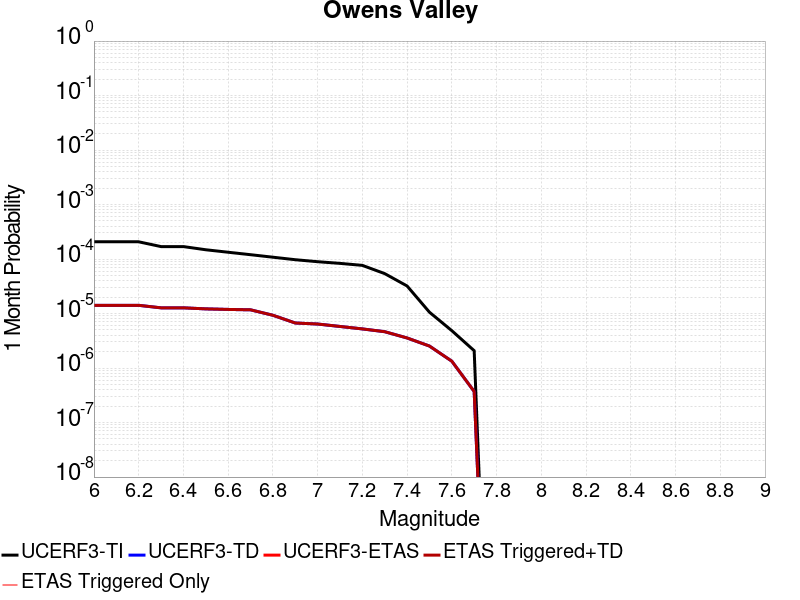 | 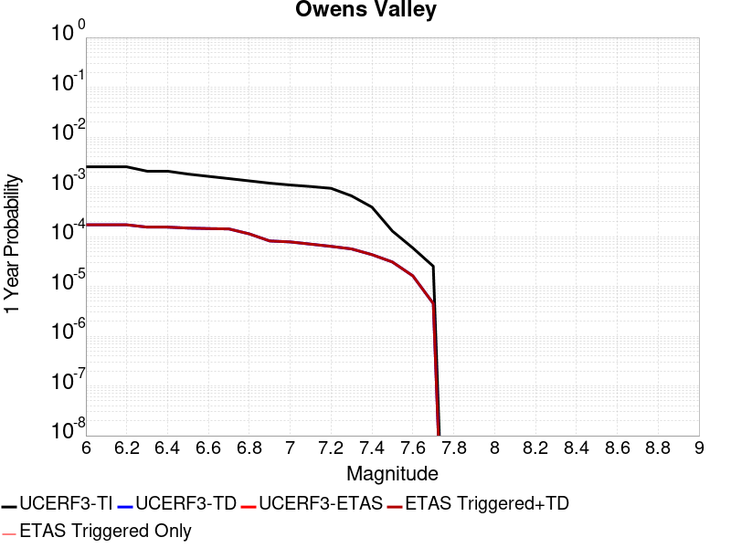 | 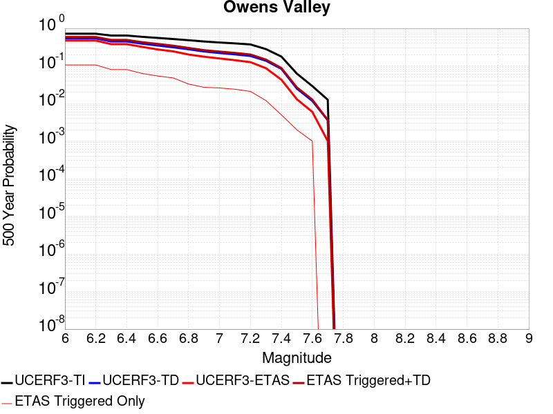 |

| Magnitude | 1 wk TI Prob | 1 wk TD Prob | 1 wk ETAS Prob | 1 wk ETAS/TD Gain | 1 wk ETAS Triggered+TD | 1 wk ETAS Triggered Only | 1 mo TI Prob | 1 mo TD Prob | 1 mo ETAS Prob | 1 mo ETAS/TD Gain | 1 mo ETAS Triggered+TD | 1 mo ETAS Triggered Only | 1 yr TI Prob | 1 yr TD Prob | 1 yr ETAS Prob | 1 yr ETAS/TD Gain | 1 yr ETAS Triggered+TD | 1 yr ETAS Triggered Only | 500 yr TI Prob | 500 yr TD Prob | 500 yr ETAS Prob | 500 yr ETAS/TD Gain | 500 yr ETAS Triggered+TD | 500 yr ETAS Triggered Only |
|-----|-----|-----|-----|-----|-----|-----|-----|-----|-----|-----|-----|-----|-----|-----|-----|-----|-----|-----|-----|-----|-----|-----|-----|-----|
| 6.0 | 4.83821E-5 | 3.3057588E-6 | 0.0 | 0.0 | 3.3057588E-6 | 0.0 | 2.0733538E-4 | 1.4167465E-5 | 0.0 | 0.0 | 1.4167465E-5 | 0.0 | 0.002521386 | 1.7247605E-4 | 0.0 | 0.0 | 1.7247605E-4 | 0.0 | 0.7169934 | 0.5387281 | 0.472 | 0.87613773 | 0.58762294 | 0.106 |
| 6.1 | 4.83821E-5 | 3.3057588E-6 | 0.0 | 0.0 | 3.3057588E-6 | 0.0 | 2.0733538E-4 | 1.4167465E-5 | 0.0 | 0.0 | 1.4167465E-5 | 0.0 | 0.002521386 | 1.7247605E-4 | 0.0 | 0.0 | 1.7247605E-4 | 0.0 | 0.7169934 | 0.5387281 | 0.472 | 0.87613773 | 0.58762294 | 0.106 |
| 6.2 | 4.83821E-5 | 3.3057588E-6 | 0.0 | 0.0 | 3.3057588E-6 | 0.0 | 2.0733538E-4 | 1.4167465E-5 | 0.0 | 0.0 | 1.4167465E-5 | 0.0 | 0.002521386 | 1.7247605E-4 | 0.0 | 0.0 | 1.7247605E-4 | 0.0 | 0.7169934 | 0.5387281 | 0.472 | 0.87613773 | 0.58762294 | 0.106 |
| 6.3 | 3.953008E-5 | 2.9714586E-6 | 0.0 | 0.0 | 2.9714586E-6 | 0.0 | 1.6940363E-4 | 1.2734764E-5 | 0.0 | 0.0 | 1.2734764E-5 | 0.0 | 0.002060538 | 1.5503539E-4 | 0.0 | 0.0 | 1.5503539E-4 | 0.0 | 0.6434682 | 0.44605383 | 0.379 | 0.8496732 | 0.49036953 | 0.08 |
| 6.4 | 3.953008E-5 | 2.9714586E-6 | 0.0 | 0.0 | 2.9714586E-6 | 0.0 | 1.6940363E-4 | 1.2734764E-5 | 0.0 | 0.0 | 1.2734764E-5 | 0.0 | 0.002060538 | 1.5503539E-4 | 0.0 | 0.0 | 1.5503539E-4 | 0.0 | 0.6434682 | 0.44605383 | 0.379 | 0.8496732 | 0.49036953 | 0.08 |
| 6.5 | 3.457342E-5 | 2.844084E-6 | 0.0 | 0.0 | 2.844084E-6 | 0.0 | 1.4816338E-4 | 1.2188879E-5 | 0.0 | 0.0 | 1.2188879E-5 | 0.0 | 0.0018023965 | 1.4839014E-4 | 0.0 | 0.0 | 1.4839014E-4 | 0.0 | 0.5942473 | 0.39021933 | 0.321 | 0.8226143 | 0.4286355 | 0.063 |
| 6.6 | 3.1127765E-5 | 2.7785263E-6 | 0.0 | 0.0 | 2.7785263E-6 | 0.0 | 1.3339789E-4 | 1.19079195E-5 | 0.0 | 0.0 | 1.19079195E-5 | 0.0 | 0.0016229092 | 1.4496992E-4 | 0.0 | 0.0 | 1.4496992E-4 | 0.0 | 0.5560813 | 0.34940267 | 0.274 | 0.7841955 | 0.38453493 | 0.054 |
| 6.7 | 2.806885E-5 | 2.733339E-6 | 0.0 | 0.0 | 2.733339E-6 | 0.0 | 1.2028952E-4 | 1.1714261E-5 | 0.0 | 0.0 | 1.1714261E-5 | 0.0 | 0.001463541 | 1.4261244E-4 | 0.0 | 0.0 | 1.4261244E-4 | 0.0 | 0.5192013 | 0.3129862 | 0.244 | 0.7795871 | 0.34596285 | 0.048 |
| 6.8 | 2.524524E-5 | 2.172558E-6 | 0.0 | 0.0 | 2.172558E-6 | 0.0 | 1.0818939E-4 | 9.310931E-6 | 0.0 | 0.0 | 9.310931E-6 | 0.0 | 0.0013164099 | 1.1335498E-4 | 0.0 | 0.0 | 1.1335498E-4 | 0.0 | 0.48244452 | 0.27719587 | 0.201 | 0.72511905 | 0.3010484 | 0.033 |
| 6.9 | 2.2704568E-5 | 1.5659232E-6 | 0.0 | 0.0 | 1.5659232E-6 | 0.0 | 9.730166E-5 | 6.7110823E-6 | 0.0 | 0.0 | 6.7110823E-6 | 0.0 | 0.0011840039 | 8.170438E-5 | 0.0 | 0.0 | 8.170438E-5 | 0.0 | 0.44697532 | 0.2422887 | 0.176 | 0.72640616 | 0.2627469 | 0.027 |
| 7.0 | 2.0871712E-5 | 1.499705E-6 | 0.0 | 0.0 | 1.499705E-6 | 0.0 | 8.944713E-5 | 6.4272913E-6 | 0.0 | 0.0 | 6.4272913E-6 | 0.0 | 0.0010884746 | 7.8249475E-5 | 0.0 | 0.0 | 7.8249475E-5 | 0.0 | 0.4198878 | 0.22049306 | 0.158 | 0.7165758 | 0.24076025 | 0.026 |
| 7.1 | 1.944928E-5 | 1.3531118E-6 | 0.0 | 0.0 | 1.3531118E-6 | 0.0 | 8.335139E-5 | 5.799038E-6 | 0.0 | 0.0 | 5.799038E-6 | 0.0 | 0.0010143308 | 7.0601E-5 | 0.0 | 0.0 | 7.0601E-5 | 0.0 | 0.3979548 | 0.20282127 | 0.142 | 0.70012385 | 0.22195356 | 0.024 |
| 7.2 | 1.7876306E-5 | 1.2199027E-6 | 0.0 | 0.0 | 1.2199027E-6 | 0.0 | 7.6610486E-5 | 5.2281443E-6 | 0.0 | 0.0 | 5.2281443E-6 | 0.0 | 9.3233347E-4 | 6.3650805E-5 | 0.0 | 0.0 | 6.3650805E-5 | 0.0 | 0.37273374 | 0.18408862 | 0.126 | 0.68445295 | 0.20122275 | 0.021 |
| 7.3 | 1.2618672E-5 | 1.0845529E-6 | 0.0 | 0.0 | 1.0845529E-6 | 0.0 | 5.40789E-5 | 4.6480754E-6 | 0.0 | 0.0 | 4.6480754E-6 | 0.0 | 6.582117E-4 | 5.6588855E-5 | 0.0 | 0.0 | 5.6588855E-5 | 0.0 | 0.28051114 | 0.13739404 | 0.087 | 0.63321525 | 0.14774531 | 0.012 |
| 7.4 | 7.4874442E-6 | 8.3213513E-7 | 0.0 | 0.0 | 8.3213513E-7 | 0.0 | 3.208865E-5 | 3.5662886E-6 | 0.0 | 0.0 | 3.5662886E-6 | 0.0 | 3.906093E-4 | 4.3418702E-5 | 0.0 | 0.0 | 4.3418702E-5 | 0.0 | 0.17744736 | 0.08352249 | 0.043 | 0.51483136 | 0.08810488 | 0.005 |
| 7.5 | 2.4734156E-6 | 5.91695E-7 | 0.0 | 0.0 | 5.91695E-7 | 0.0 | 1.060031E-5 | 2.5358333E-6 | 0.0 | 0.0 | 2.5358333E-6 | 0.0 | 1.2905113E-4 | 3.0873336E-5 | 0.0 | 0.0 | 3.0873336E-5 | 0.0 | 0.062491756 | 0.024973726 | 0.013 | 0.5205471 | 0.02692378 | 0.002 |
| 7.6 | 1.1328841E-6 | 3.1205397E-7 | 0.0 | 0.0 | 3.1205397E-7 | 0.0 | 4.8552088E-6 | 1.3373734E-6 | 0.0 | 0.0 | 1.3373734E-6 | 0.0 | 5.9110564E-5 | 1.6282402E-5 | 0.0 | 0.0 | 1.6282402E-5 | 0.0 | 0.029123643 | 0.01171842 | 0.006 | 0.5120144 | 0.012706703 | 0.001 |
| 7.7 | 4.8613185E-7 | 8.6724874E-8 | 0.0 | 0.0 | 8.6724874E-8 | 0.0 | 2.0834207E-6 | 3.7167797E-7 | 0.0 | 0.0 | 3.7167797E-7 | 0.0 | 2.536535E-5 | 4.525171E-6 | 0.0 | 0.0 | 4.525171E-6 | 0.0 | 0.012602747 | 0.0036168594 | 0.001 | 0.27648297 | 0.0036168594 | 0.0 |

## Calaveras (Central) 2011 CFM
*[(top)](#table-of-contents)*

| 1 Week | 1 Month | 1 Year | 500 Year |
|-----|-----|-----|-----|
| 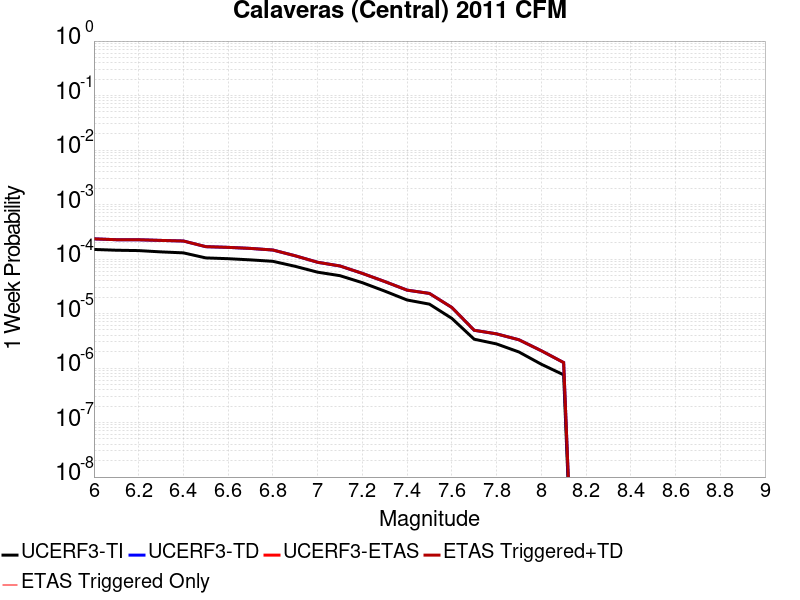 |  | 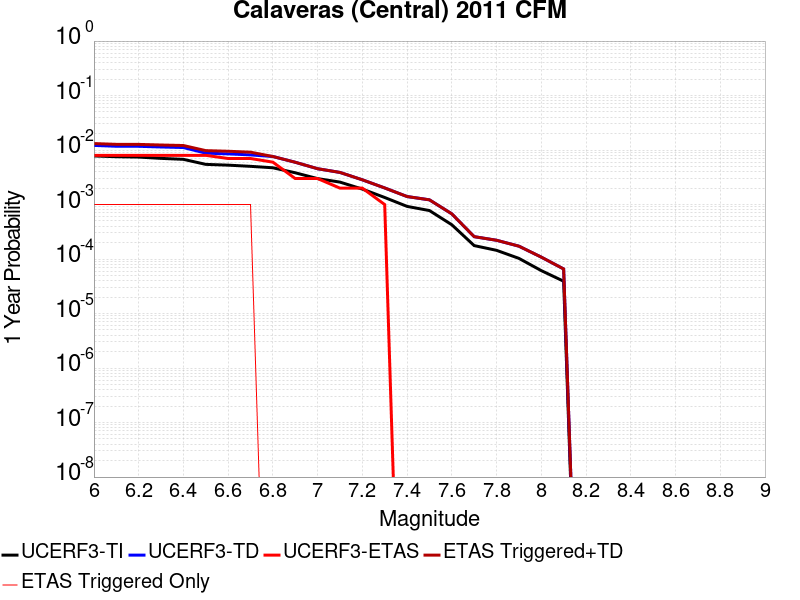 | 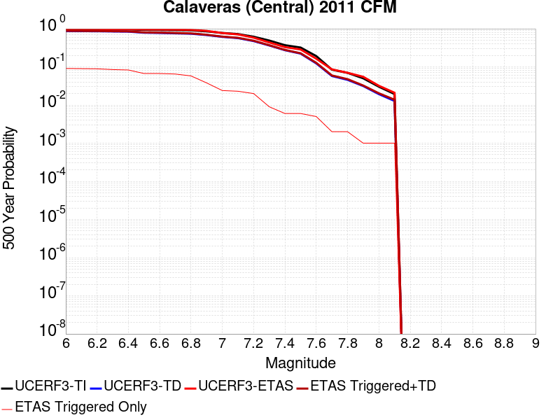 |

| Magnitude | 1 wk TI Prob | 1 wk TD Prob | 1 wk ETAS Prob | 1 wk ETAS/TD Gain | 1 wk ETAS Triggered+TD | 1 wk ETAS Triggered Only | 1 mo TI Prob | 1 mo TD Prob | 1 mo ETAS Prob | 1 mo ETAS/TD Gain | 1 mo ETAS Triggered+TD | 1 mo ETAS Triggered Only | 1 yr TI Prob | 1 yr TD Prob | 1 yr ETAS Prob | 1 yr ETAS/TD Gain | 1 yr ETAS Triggered+TD | 1 yr ETAS Triggered Only | 500 yr TI Prob | 500 yr TD Prob | 500 yr ETAS Prob | 500 yr ETAS/TD Gain | 500 yr ETAS Triggered+TD | 500 yr ETAS Triggered Only |
|-----|-----|-----|-----|-----|-----|-----|-----|-----|-----|-----|-----|-----|-----|-----|-----|-----|-----|-----|-----|-----|-----|-----|-----|-----|
| 6.0 | 1.5010907E-4 | 2.3482497E-4 | 0.0 | 0.0 | 2.3482497E-4 | 0.0 | 6.4316596E-4 | 0.0010059921 | 0.0 | 0.0 | 0.0010059921 | 0.0 | 0.0078024664 | 0.01217092 | 0.008 | 0.65730447 | 0.013158749 | 0.001 | 0.98008996 | 0.8714145 | 0.986 | 1.1314937 | 0.88311577 | 0.091 |
| 6.1 | 1.4521465E-4 | 2.2659372E-4 | 0.0 | 0.0 | 2.2659372E-4 | 0.0 | 6.222001E-4 | 9.707418E-4 | 0.0 | 0.0 | 9.707418E-4 | 0.0 | 0.0075490056 | 0.01174773 | 0.008 | 0.68098265 | 0.012735982 | 0.001 | 0.9773778 | 0.86433786 | 0.985 | 1.1396006 | 0.87654746 | 0.09 |
| 6.2 | 1.429998E-4 | 2.2602492E-4 | 0.0 | 0.0 | 2.2602492E-4 | 0.0 | 6.127123E-4 | 9.6830615E-4 | 0.0 | 0.0 | 9.6830615E-4 | 0.0 | 0.007434286 | 0.011718441 | 0.008 | 0.6826847 | 0.012706722 | 0.001 | 0.97603184 | 0.86104643 | 0.985 | 1.1439569 | 0.8734133 | 0.089 |
| 6.3 | 1.3536277E-4 | 2.19776E-4 | 0.0 | 0.0 | 2.19776E-4 | 0.0 | 5.799972E-4 | 9.415498E-4 | 0.0 | 0.0 | 9.415498E-4 | 0.0 | 0.0070386264 | 0.011396992 | 0.008 | 0.70193964 | 0.012385595 | 0.001 | 0.9707465 | 0.84913397 | 0.981 | 1.1552947 | 0.8619576 | 0.085 |
| 6.4 | 1.2993296E-4 | 2.1453707E-4 | 0.0 | 0.0 | 2.1453707E-4 | 0.0 | 5.5673666E-4 | 9.191137E-4 | 0.0 | 0.0 | 9.191137E-4 | 0.0 | 0.006757223 | 0.011126716 | 0.008 | 0.7189902 | 0.012115589 | 0.001 | 0.966294 | 0.83963996 | 0.976 | 1.162403 | 0.85294986 | 0.083 |
| 6.5 | 1.0498927E-4 | 1.6888791E-4 | 0.0 | 0.0 | 1.6888791E-4 | 0.0 | 4.498764E-4 | 7.2360376E-4 | 0.0 | 0.0 | 7.2360376E-4 | 0.0 | 0.005463498 | 0.008774213 | 0.008 | 0.9117628 | 0.009765438 | 0.001 | 0.93538046 | 0.787641 | 0.96 | 1.2188294 | 0.80186903 | 0.067 |
| 6.6 | 1.0157505E-4 | 1.6394998E-4 | 0.0 | 0.0 | 1.6394998E-4 | 0.0 | 4.35249E-4 | 7.0245285E-4 | 0.0 | 0.0 | 7.0245285E-4 | 0.0 | 0.0052862884 | 0.008518771 | 0.007 | 0.8217147 | 0.009510253 | 0.001 | 0.92935973 | 0.7760146 | 0.955 | 1.2306468 | 0.79102165 | 0.067 |
| 6.7 | 9.660386E-5 | 1.568357E-4 | 0.0 | 0.0 | 1.568357E-4 | 0.0 | 4.1395082E-4 | 6.7197933E-4 | 0.0 | 0.0 | 6.7197933E-4 | 0.0 | 0.0050282106 | 0.008150627 | 0.007 | 0.8588297 | 0.009142476 | 0.001 | 0.9195764 | 0.7587107 | 0.95 | 1.2521242 | 0.77439445 | 0.065 |
| 6.8 | 9.089927E-5 | 1.4652824E-4 | 0.0 | 0.0 | 1.4652824E-4 | 0.0 | 3.8951015E-4 | 6.2782643E-4 | 0.0 | 0.0 | 6.2782643E-4 | 0.0 | 0.0047319788 | 0.007616971 | 0.006 | 0.78771466 | 0.007616971 | 0.0 | 0.9066692 | 0.74124634 | 0.934 | 1.2600399 | 0.7562541 | 0.058 |
| 6.9 | 7.353187E-5 | 1.14842995E-4 | 0.0 | 0.0 | 1.14842995E-4 | 0.0 | 3.150985E-4 | 4.9209193E-4 | 0.0 | 0.0 | 4.9209193E-4 | 0.0 | 0.0038295772 | 0.0059748674 | 0.003 | 0.5021032 | 0.0059748674 | 0.0 | 0.8531677 | 0.68409884 | 0.878 | 1.2834402 | 0.6961031 | 0.038 |
| 7.0 | 5.746064E-5 | 8.733116E-5 | 0.0 | 0.0 | 8.733116E-5 | 0.0 | 2.4623662E-4 | 3.7422302E-4 | 0.0 | 0.0 | 3.7422302E-4 | 0.0 | 0.0029938098 | 0.0045467094 | 0.003 | 0.6598178 | 0.0045467094 | 0.0 | 0.7766801 | 0.6127647 | 0.77 | 1.2565998 | 0.62205833 | 0.024 |
| 7.1 | 4.9557195E-5 | 7.4652555E-5 | 0.0 | 0.0 | 7.4652555E-5 | 0.0 | 2.123707E-4 | 3.1990057E-4 | 0.0 | 0.0 | 3.1990057E-4 | 0.0 | 0.0025825473 | 0.0038878894 | 0.002 | 0.51441795 | 0.0038878894 | 0.0 | 0.7255384 | 0.5686418 | 0.71 | 1.2485893 | 0.578563 | 0.023 |
| 7.2 | 3.687595E-5 | 5.4608354E-5 | 0.0 | 0.0 | 5.4608354E-5 | 0.0 | 1.5803022E-4 | 2.3401495E-4 | 0.0 | 0.0 | 2.3401495E-4 | 0.0 | 0.0019223199 | 0.0028454352 | 0.002 | 0.7028802 | 0.0028454352 | 0.0 | 0.6179046 | 0.47489166 | 0.584 | 1.2297542 | 0.48539382 | 0.02 |
| 7.3 | 2.5846984E-5 | 3.8699753E-5 | 0.0 | 0.0 | 3.8699753E-5 | 0.0 | 1.1076809E-4 | 1.6584563E-4 | 0.0 | 0.0 | 1.6584563E-4 | 0.0 | 0.0013477671 | 0.002017316 | 0.001 | 0.49570817 | 0.002017316 | 0.0 | 0.49050644 | 0.36441693 | 0.437 | 1.199176 | 0.37013716 | 0.009 |
| 7.4 | 1.7747854E-5 | 2.6919623E-5 | 0.0 | 0.0 | 2.6919623E-5 | 0.0 | 7.6060016E-5 | 1.15364724E-4 | 0.0 | 0.0 | 1.15364724E-4 | 0.0 | 9.2563726E-4 | 0.0014036631 | 0.0 | 0.0 | 0.0014036631 | 0.0 | 0.37062812 | 0.27421343 | 0.33 | 1.2034421 | 0.27856815 | 0.006 |
| 7.5 | 1.4883479E-5 | 2.341488E-5 | 0.0 | 0.0 | 2.341488E-5 | 0.0 | 6.378478E-5 | 1.00345635E-4 | 0.0 | 0.0 | 1.00345635E-4 | 0.0 | 7.76303E-4 | 0.0012210257 | 0.0 | 0.0 | 0.0012210257 | 0.0 | 0.32179266 | 0.22307427 | 0.286 | 1.2820842 | 0.22773582 | 0.006 |
| 7.6 | 8.166975E-6 | 1.2948397E-5 | 0.0 | 0.0 | 1.2948397E-5 | 0.0 | 3.5000852E-5 | 5.5491957E-5 | 0.0 | 0.0 | 5.5491957E-5 | 0.0 | 4.2605202E-4 | 6.7540625E-4 | 0.0 | 0.0 | 6.7540625E-4 | 0.0 | 0.19190156 | 0.12355485 | 0.164 | 1.3273457 | 0.12793708 | 0.005 |
| 7.7 | 3.3858064E-6 | 4.9388264E-6 | 0.0 | 0.0 | 4.9388264E-6 | 0.0 | 1.4510518E-5 | 2.1166226E-5 | 0.0 | 0.0 | 2.1166226E-5 | 0.0 | 1.7665124E-4 | 2.5766838E-4 | 0.0 | 0.0 | 2.5766838E-4 | 0.0 | 0.084544405 | 0.0577154 | 0.086 | 1.4900702 | 0.059599973 | 0.002 |
| 7.8 | 2.7721615E-6 | 4.240688E-6 | 0.0 | 0.0 | 4.240688E-6 | 0.0 | 1.1880637E-5 | 1.8174253E-5 | 0.0 | 0.0 | 1.8174253E-5 | 0.0 | 1.4463716E-4 | 2.2124908E-4 | 0.0 | 0.0 | 2.2124908E-4 | 0.0 | 0.06977037 | 0.04578515 | 0.07 | 1.5288799 | 0.047693584 | 0.002 |
| 7.9 | 1.9736292E-6 | 3.3051335E-6 | 0.0 | 0.0 | 3.3051335E-6 | 0.0 | 8.4583835E-6 | 1.41647815E-5 | 0.0 | 0.0 | 1.41647815E-5 | 0.0 | 1.0297595E-4 | 1.724426E-4 | 0.0 | 0.0 | 1.724426E-4 | 0.0 | 0.050187446 | 0.031519942 | 0.055 | 1.744927 | 0.03248842 | 0.001 |
| 8.0 | 1.1767289E-6 | 2.0803952E-6 | 0.0 | 0.0 | 2.0803952E-6 | 0.0 | 5.0431145E-6 | 8.9159485E-6 | 0.0 | 0.0 | 8.9159485E-6 | 0.0 | 6.139818E-5 | 1.08546286E-4 | 0.0 | 0.0 | 1.08546286E-4 | 0.0 | 0.030233575 | 0.019337568 | 0.032 | 1.6548098 | 0.02031823 | 0.001 |
| 8.1 | 7.5112825E-7 | 1.2616434E-6 | 0.0 | 0.0 | 1.2616434E-6 | 0.0 | 3.2191172E-6 | 5.407032E-6 | 0.0 | 0.0 | 5.407032E-6 | 0.0 | 3.9192048E-5 | 6.5828644E-5 | 0.0 | 0.0 | 6.5828644E-5 | 0.0 | 0.019405646 | 0.012809488 | 0.021 | 1.6394098 | 0.013796679 | 0.001 |

## San Andreas (San Bernardino S)
*[(top)](#table-of-contents)*

| 1 Week | 1 Month | 1 Year | 500 Year |
|-----|-----|-----|-----|
|  |  | 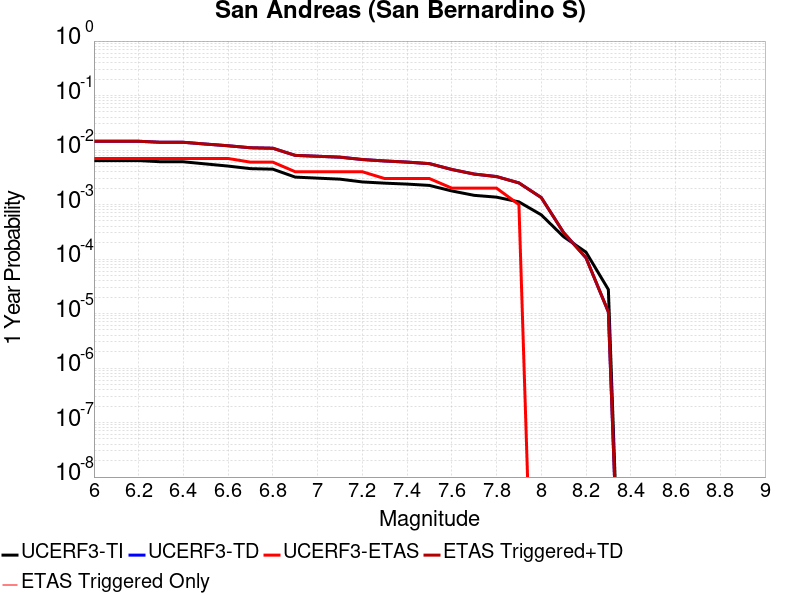 | 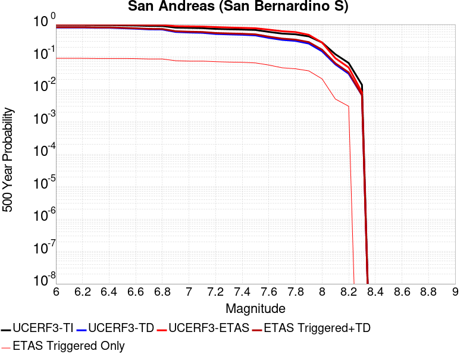 |

| Magnitude | 1 wk TI Prob | 1 wk TD Prob | 1 wk ETAS Prob | 1 wk ETAS/TD Gain | 1 wk ETAS Triggered+TD | 1 wk ETAS Triggered Only | 1 mo TI Prob | 1 mo TD Prob | 1 mo ETAS Prob | 1 mo ETAS/TD Gain | 1 mo ETAS Triggered+TD | 1 mo ETAS Triggered Only | 1 yr TI Prob | 1 yr TD Prob | 1 yr ETAS Prob | 1 yr ETAS/TD Gain | 1 yr ETAS Triggered+TD | 1 yr ETAS Triggered Only | 500 yr TI Prob | 500 yr TD Prob | 500 yr ETAS Prob | 500 yr ETAS/TD Gain | 500 yr ETAS Triggered+TD | 500 yr ETAS Triggered Only |
|-----|-----|-----|-----|-----|-----|-----|-----|-----|-----|-----|-----|-----|-----|-----|-----|-----|-----|-----|-----|-----|-----|-----|-----|-----|
| 6.0 | 1.2336002E-4 | 2.7975577E-4 | 0.0 | 0.0 | 2.7975577E-4 | 0.0 | 5.2857865E-4 | 0.0011984268 | 0.0 | 0.0 | 0.0011984268 | 0.0 | 0.006416472 | 0.014497834 | 0.007 | 0.48283073 | 0.014497834 | 0.0 | 0.9599879 | 0.8044244 | 0.994 | 1.2356662 | 0.8220262 | 0.09 |
| 6.1 | 1.2336002E-4 | 2.7975577E-4 | 0.0 | 0.0 | 2.7975577E-4 | 0.0 | 5.2857865E-4 | 0.0011984268 | 0.0 | 0.0 | 0.0011984268 | 0.0 | 0.006416472 | 0.014497834 | 0.007 | 0.48283073 | 0.014497834 | 0.0 | 0.9599879 | 0.8044244 | 0.994 | 1.2356662 | 0.8220262 | 0.09 |
| 6.2 | 1.2336002E-4 | 2.7975577E-4 | 0.0 | 0.0 | 2.7975577E-4 | 0.0 | 5.2857865E-4 | 0.0011984268 | 0.0 | 0.0 | 0.0011984268 | 0.0 | 0.006416472 | 0.014497834 | 0.007 | 0.48283073 | 0.014497834 | 0.0 | 0.9599879 | 0.8044244 | 0.994 | 1.2356662 | 0.8220262 | 0.09 |
| 6.3 | 1.1712257E-4 | 2.678544E-4 | 0.0 | 0.0 | 2.678544E-4 | 0.0 | 5.018573E-4 | 0.0011474665 | 0.0 | 0.0 | 0.0011474665 | 0.0 | 0.006093008 | 0.013885412 | 0.007 | 0.5041262 | 0.013885412 | 0.0 | 0.952916 | 0.7904783 | 0.992 | 1.2549365 | 0.8091257 | 0.089 |
| 6.4 | 1.1712257E-4 | 2.678544E-4 | 0.0 | 0.0 | 2.678544E-4 | 0.0 | 5.018573E-4 | 0.0011474665 | 0.0 | 0.0 | 0.0011474665 | 0.0 | 0.006093008 | 0.013885412 | 0.007 | 0.5041262 | 0.013885412 | 0.0 | 0.952916 | 0.7904783 | 0.992 | 1.2549365 | 0.8091257 | 0.089 |
| 6.5 | 1.0689076E-4 | 2.48337E-4 | 0.0 | 0.0 | 2.48337E-4 | 0.0 | 4.5802278E-4 | 0.0010638904 | 0.0 | 0.0 | 0.0010638904 | 0.0 | 0.0055621783 | 0.0128802275 | 0.007 | 0.54346865 | 0.0128802275 | 0.0 | 0.9385083 | 0.765257 | 0.987 | 1.2897627 | 0.78614914 | 0.089 |
| 6.6 | 9.7648895E-5 | 2.3113104E-4 | 0.0 | 0.0 | 2.3113104E-4 | 0.0 | 4.1842813E-4 | 9.902077E-4 | 0.0 | 0.0 | 9.902077E-4 | 0.0 | 0.005082469 | 0.011993192 | 0.007 | 0.5836645 | 0.011993192 | 0.0 | 0.92173964 | 0.7382368 | 0.98 | 1.3274873 | 0.76127195 | 0.088 |
| 6.7 | 8.757013E-5 | 2.1219377E-4 | 0.0 | 0.0 | 2.1219377E-4 | 0.0 | 3.7524657E-4 | 9.0910576E-4 | 0.0 | 0.0 | 9.0910576E-4 | 0.0 | 0.00455906 | 0.011015982 | 0.006 | 0.5446632 | 0.011015982 | 0.0 | 0.8981997 | 0.7044246 | 0.967 | 1.3727516 | 0.7298441 | 0.086 |
| 6.8 | 8.562978E-5 | 2.0793562E-4 | 0.0 | 0.0 | 2.0793562E-4 | 0.0 | 3.6693315E-4 | 8.908691E-4 | 0.0 | 0.0 | 8.908691E-4 | 0.0 | 0.004458263 | 0.010796166 | 0.006 | 0.5557529 | 0.010796166 | 0.0 | 0.89291316 | 0.6976009 | 0.963 | 1.3804455 | 0.72360724 | 0.086 |
| 6.9 | 6.124075E-5 | 1.5361338E-4 | 0.0 | 0.0 | 1.5361338E-4 | 0.0 | 2.6243398E-4 | 6.581777E-4 | 0.0 | 0.0 | 6.581777E-4 | 0.0 | 0.0031904527 | 0.007984047 | 0.004 | 0.50099903 | 0.007984047 | 0.0 | 0.7976541 | 0.58672255 | 0.883 | 1.5049703 | 0.61813164 | 0.076 |
| 7.0 | 5.8598747E-5 | 1.4809359E-4 | 0.0 | 0.0 | 1.4809359E-4 | 0.0 | 2.5111332E-4 | 6.345332E-4 | 0.0 | 0.0 | 6.345332E-4 | 0.0 | 0.0030530186 | 0.0076982416 | 0.004 | 0.51959914 | 0.0076982416 | 0.0 | 0.7832139 | 0.5650509 | 0.872 | 1.5432237 | 0.59723717 | 0.074 |
| 7.1 | 5.613814E-5 | 1.424499E-4 | 0.0 | 0.0 | 1.424499E-4 | 0.0 | 2.4056983E-4 | 6.1035744E-4 | 0.0 | 0.0 | 6.1035744E-4 | 0.0 | 0.0029250039 | 0.0074059353 | 0.004 | 0.5401073 | 0.0074059353 | 0.0 | 0.76883996 | 0.5524295 | 0.861 | 1.5585699 | 0.5855497 | 0.074 |
| 7.2 | 4.991222E-5 | 1.2893885E-4 | 0.0 | 0.0 | 1.2893885E-4 | 0.0 | 2.1389198E-4 | 5.5247836E-4 | 0.0 | 0.0 | 5.5247836E-4 | 0.0 | 0.002601025 | 0.0067057614 | 0.004 | 0.596502 | 0.0067057614 | 0.0 | 0.72806895 | 0.50868005 | 0.828 | 1.6277423 | 0.5435637 | 0.071 |
| 7.3 | 4.7410045E-5 | 1.2125107E-4 | 0.0 | 0.0 | 1.2125107E-4 | 0.0 | 2.0317009E-4 | 5.1954424E-4 | 0.0 | 0.0 | 5.1954424E-4 | 0.0 | 0.0024707897 | 0.006307173 | 0.003 | 0.4756489 | 0.006307173 | 0.0 | 0.7097241 | 0.49316543 | 0.804 | 1.6302847 | 0.528137 | 0.069 |
| 7.4 | 4.5556746E-5 | 1.1561177E-4 | 0.0 | 0.0 | 1.1561177E-4 | 0.0 | 1.952286E-4 | 4.953852E-4 | 0.0 | 0.0 | 4.953852E-4 | 0.0 | 0.002374317 | 0.0060146987 | 0.003 | 0.49877813 | 0.0060146987 | 0.0 | 0.69534343 | 0.48040247 | 0.784 | 1.631965 | 0.5157351 | 0.068 |
| 7.5 | 4.3084514E-5 | 1.08308355E-4 | 0.0 | 0.0 | 1.08308355E-4 | 0.0 | 1.8463485E-4 | 4.6409635E-4 | 0.0 | 0.0 | 4.6409635E-4 | 0.0 | 0.0022456115 | 0.005635791 | 0.003 | 0.53231215 | 0.005635791 | 0.0 | 0.67504495 | 0.45921 | 0.763 | 1.6615491 | 0.49436137 | 0.065 |
| 7.6 | 3.408608E-5 | 8.454024E-5 | 0.0 | 0.0 | 8.454024E-5 | 0.0 | 1.4607502E-4 | 3.6226507E-4 | 0.0 | 0.0 | 3.6226507E-4 | 0.0 | 0.0017770125 | 0.004401677 | 0.002 | 0.45437232 | 0.004401677 | 0.0 | 0.5890553 | 0.38519856 | 0.689 | 1.7886878 | 0.41962746 | 0.056 |
| 7.7 | 2.8315713E-5 | 6.963441E-5 | 0.0 | 0.0 | 6.963441E-5 | 0.0 | 1.2134742E-4 | 2.9839907E-4 | 0.0 | 0.0 | 2.9839907E-4 | 0.0 | 0.0014764034 | 0.0036269622 | 0.002 | 0.5514257 | 0.0036269622 | 0.0 | 0.52228796 | 0.33478653 | 0.618 | 1.8459524 | 0.36538634 | 0.046 |
| 7.8 | 2.6222975E-5 | 6.264302E-5 | 0.0 | 0.0 | 6.264302E-5 | 0.0 | 1.1237934E-4 | 2.6844247E-4 | 0.0 | 0.0 | 2.6844247E-4 | 0.0 | 0.0013673597 | 0.0032633927 | 0.002 | 0.61285913 | 0.0032633927 | 0.0 | 0.49547994 | 0.3106566 | 0.582 | 1.8734512 | 0.34029838 | 0.043 |
| 7.9 | 2.1469694E-5 | 4.7918715E-5 | 0.0 | 0.0 | 4.7918715E-5 | 0.0 | 9.200973E-5 | 2.0534977E-4 | 0.0 | 0.0 | 2.0534977E-4 | 0.0 | 0.0011196428 | 0.0024972688 | 0.001 | 0.40043747 | 0.0024972688 | 0.0 | 0.42886806 | 0.25746524 | 0.479 | 1.8604453 | 0.28493902 | 0.037 |
| 8.0 | 1.2420249E-5 | 2.5770009E-5 | 0.0 | 0.0 | 2.5770009E-5 | 0.0 | 5.322855E-5 | 1.10438225E-4 | 0.0 | 0.0 | 1.10438225E-4 | 0.0 | 6.478649E-4 | 0.0013437568 | 0.0 | 0.0 | 0.0013437568 | 0.0 | 0.27677682 | 0.14860407 | 0.276 | 1.8572844 | 0.16648337 | 0.021 |
| 8.1 | 4.9197724E-6 | 5.8534733E-6 | 0.0 | 0.0 | 5.8534733E-6 | 0.0 | 2.1084568E-5 | 2.5086072E-5 | 0.0 | 0.0 | 2.5086072E-5 | 0.0 | 2.566744E-4 | 3.053802E-4 | 0.0 | 0.0 | 3.053802E-4 | 0.0 | 0.12045774 | 0.058680188 | 0.091 | 1.5507789 | 0.06338679 | 0.005 |
| 8.2 | 2.5634774E-6 | 2.0192995E-6 | 0.0 | 0.0 | 2.0192995E-6 | 0.0 | 1.0986286E-5 | 8.654112E-6 | 0.0 | 0.0 | 8.654112E-6 | 0.0 | 1.3374983E-4 | 1.0535874E-4 | 0.0 | 0.0 | 1.0535874E-4 | 0.0 | 0.06469199 | 0.030195683 | 0.047 | 1.5565139 | 0.033105098 | 0.003 |
| 8.3 | 5.2850464E-7 | 2.057699E-7 | 0.0 | 0.0 | 2.057699E-7 | 0.0 | 2.2650179E-6 | 8.8187073E-7 | 0.0 | 0.0 | 8.8187073E-7 | 0.0 | 2.7576245E-5 | 1.0736729E-5 | 0.0 | 0.0 | 1.0736729E-5 | 0.0 | 0.013693689 | 0.0065632206 | 0.008 | 1.2189138 | 0.0065632206 | 0.0 |

## Monte Vista - Shannon 2011 CFM
*[(top)](#table-of-contents)*

| 1 Week | 1 Month | 1 Year | 500 Year |
|-----|-----|-----|-----|
|  | 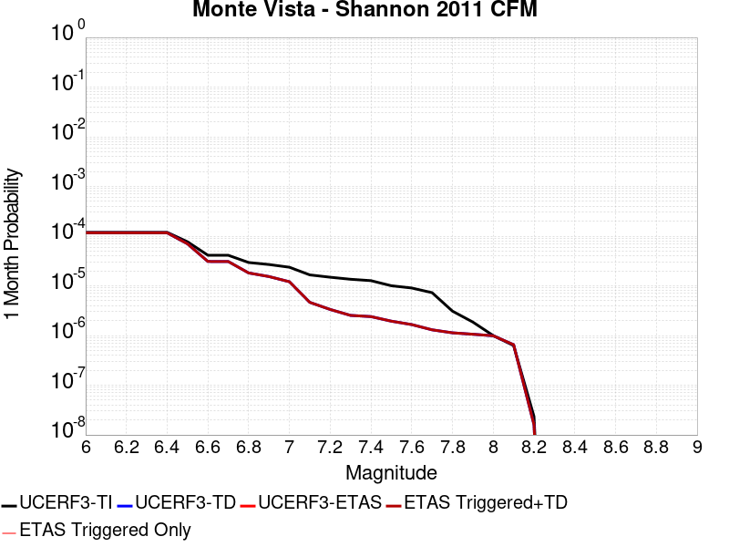 | 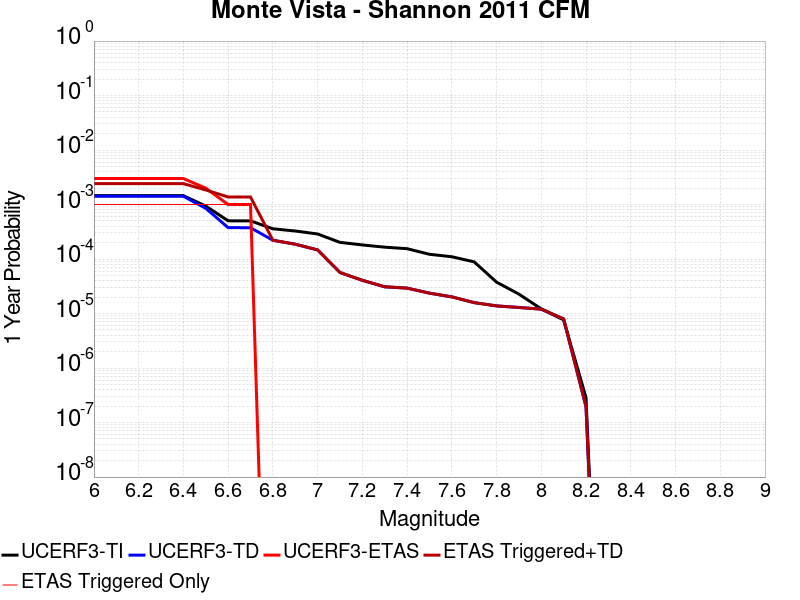 | 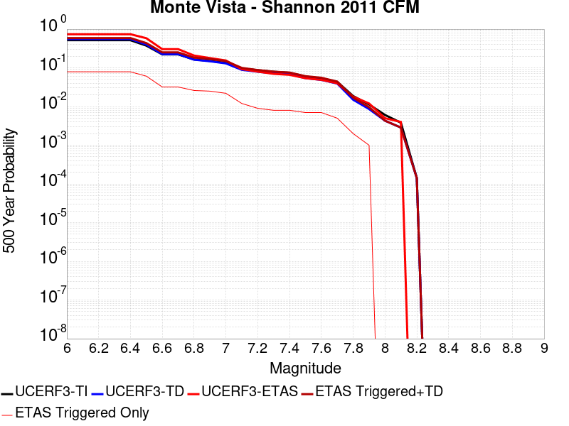 |

| Magnitude | 1 wk TI Prob | 1 wk TD Prob | 1 wk ETAS Prob | 1 wk ETAS/TD Gain | 1 wk ETAS Triggered+TD | 1 wk ETAS Triggered Only | 1 mo TI Prob | 1 mo TD Prob | 1 mo ETAS Prob | 1 mo ETAS/TD Gain | 1 mo ETAS Triggered+TD | 1 mo ETAS Triggered Only | 1 yr TI Prob | 1 yr TD Prob | 1 yr ETAS Prob | 1 yr ETAS/TD Gain | 1 yr ETAS Triggered+TD | 1 yr ETAS Triggered Only | 500 yr TI Prob | 500 yr TD Prob | 500 yr ETAS Prob | 500 yr ETAS/TD Gain | 500 yr ETAS Triggered+TD | 500 yr ETAS Triggered Only |
|-----|-----|-----|-----|-----|-----|-----|-----|-----|-----|-----|-----|-----|-----|-----|-----|-----|-----|-----|-----|-----|-----|-----|-----|-----|
| 6.0 | 2.7907707E-5 | 2.7247439E-5 | 0.0 | 0.0 | 2.7247439E-5 | 0.0 | 1.19598975E-4 | 1.167702E-4 | 0.0 | 0.0 | 1.167702E-4 | 0.0 | 0.0014551448 | 0.0014208724 | 0.003 | 2.111379 | 0.0024194515 | 0.001 | 0.5171756 | 0.55403835 | 0.74 | 1.3356476 | 0.58926934 | 0.079 |
| 6.1 | 2.7907707E-5 | 2.7247439E-5 | 0.0 | 0.0 | 2.7247439E-5 | 0.0 | 1.19598975E-4 | 1.167702E-4 | 0.0 | 0.0 | 1.167702E-4 | 0.0 | 0.0014551448 | 0.0014208724 | 0.003 | 2.111379 | 0.0024194515 | 0.001 | 0.5171756 | 0.55403835 | 0.74 | 1.3356476 | 0.58926934 | 0.079 |
| 6.2 | 2.7907707E-5 | 2.7247439E-5 | 0.0 | 0.0 | 2.7247439E-5 | 0.0 | 1.19598975E-4 | 1.167702E-4 | 0.0 | 0.0 | 1.167702E-4 | 0.0 | 0.0014551448 | 0.0014208724 | 0.003 | 2.111379 | 0.0024194515 | 0.001 | 0.5171756 | 0.55403835 | 0.74 | 1.3356476 | 0.58926934 | 0.079 |
| 6.3 | 2.7907707E-5 | 2.7247439E-5 | 0.0 | 0.0 | 2.7247439E-5 | 0.0 | 1.19598975E-4 | 1.167702E-4 | 0.0 | 0.0 | 1.167702E-4 | 0.0 | 0.0014551448 | 0.0014208724 | 0.003 | 2.111379 | 0.0024194515 | 0.001 | 0.5171756 | 0.55403835 | 0.74 | 1.3356476 | 0.58926934 | 0.079 |
| 6.4 | 2.7907707E-5 | 2.7247439E-5 | 0.0 | 0.0 | 2.7247439E-5 | 0.0 | 1.19598975E-4 | 1.167702E-4 | 0.0 | 0.0 | 1.167702E-4 | 0.0 | 0.0014551448 | 0.0014208724 | 0.003 | 2.111379 | 0.0024194515 | 0.001 | 0.5171756 | 0.55403835 | 0.74 | 1.3356476 | 0.58926934 | 0.079 |
| 6.5 | 1.7990213E-5 | 1.6361757E-5 | 0.0 | 0.0 | 1.6361757E-5 | 0.0 | 7.709863E-5 | 7.01203E-5 | 0.0 | 0.0 | 7.01203E-5 | 0.0 | 9.382716E-4 | 8.5344596E-4 | 0.002 | 2.3434408 | 0.0018525926 | 0.001 | 0.3745951 | 0.39958015 | 0.583 | 1.4590315 | 0.43620574 | 0.061 |
| 6.6 | 9.650407E-6 | 7.2270163E-6 | 0.0 | 0.0 | 7.2270163E-6 | 0.0 | 4.135823E-5 | 3.0972602E-5 | 0.0 | 0.0 | 3.0972602E-5 | 0.0 | 5.0342013E-4 | 3.7703395E-4 | 0.001 | 2.652281 | 0.0013766569 | 0.001 | 0.22257915 | 0.22643667 | 0.304 | 1.3425387 | 0.2511907 | 0.032 |
| 6.7 | 9.62828E-6 | 7.205215E-6 | 0.0 | 0.0 | 7.205215E-6 | 0.0 | 4.1263404E-5 | 3.087917E-5 | 0.0 | 0.0 | 3.087917E-5 | 0.0 | 5.022661E-4 | 3.758968E-4 | 0.001 | 2.6603045 | 0.001375521 | 0.001 | 0.22213022 | 0.22597164 | 0.304 | 1.3453016 | 0.25074056 | 0.032 |
| 6.8 | 6.887523E-6 | 4.2453503E-6 | 0.0 | 0.0 | 4.2453503E-6 | 0.0 | 2.9517621E-5 | 1.8194243E-5 | 0.0 | 0.0 | 1.8194243E-5 | 0.0 | 3.5931775E-4 | 2.214946E-4 | 0.0 | 0.0 | 2.214946E-4 | 0.0 | 0.16447179 | 0.162505 | 0.208 | 1.2799606 | 0.18427987 | 0.026 |
| 6.9 | 6.2722347E-6 | 3.5903747E-6 | 0.0 | 0.0 | 3.5903747E-6 | 0.0 | 2.6880729E-5 | 1.538724E-5 | 0.0 | 0.0 | 1.538724E-5 | 0.0 | 3.2722374E-4 | 1.8732555E-4 | 0.0 | 0.0 | 1.8732555E-4 | 0.0 | 0.15095122 | 0.14794129 | 0.179 | 1.2099395 | 0.16924275 | 0.025 |
| 7.0 | 5.5320347E-6 | 2.8232316E-6 | 0.0 | 0.0 | 2.8232316E-6 | 0.0 | 2.3708504E-5 | 1.2099518E-5 | 0.0 | 0.0 | 1.2099518E-5 | 0.0 | 2.8861282E-4 | 1.473035E-4 | 0.0 | 0.0 | 1.473035E-4 | 0.0 | 0.13439555 | 0.13026471 | 0.155 | 1.1898848 | 0.1493989 | 0.022 |
| 7.1 | 3.8794055E-6 | 1.0872456E-6 | 0.0 | 0.0 | 1.0872456E-6 | 0.0 | 1.6625918E-5 | 4.6596156E-6 | 0.0 | 0.0 | 4.6596156E-6 | 0.0 | 2.0240174E-4 | 5.6729357E-5 | 0.0 | 0.0 | 5.6729357E-5 | 0.0 | 0.096257776 | 0.0888413 | 0.093 | 1.0468104 | 0.0997752 | 0.012 |
| 7.2 | 3.4813652E-6 | 7.8172894E-7 | 0.0 | 0.0 | 7.8172894E-7 | 0.0 | 1.49200505E-5 | 3.3502624E-6 | 0.0 | 0.0 | 3.3502624E-6 | 0.0 | 1.8163648E-4 | 4.078869E-5 | 0.0 | 0.0 | 4.078869E-5 | 0.0 | 0.08682386 | 0.07943226 | 0.08 | 1.0071474 | 0.08771737 | 0.009 |
| 7.3 | 3.1682148E-6 | 5.936277E-7 | 0.0 | 0.0 | 5.936277E-7 | 0.0 | 1.3577992E-5 | 2.5441161E-6 | 0.0 | 0.0 | 2.5441161E-6 | 0.0 | 1.6529951E-4 | 3.0974177E-5 | 0.0 | 0.0 | 3.0974177E-5 | 0.0 | 0.07933274 | 0.07230819 | 0.07 | 0.96807843 | 0.07972973 | 0.008 |
| 7.4 | 2.9707667E-6 | 5.617422E-7 | 0.0 | 0.0 | 5.617422E-7 | 0.0 | 1.2731795E-5 | 2.407464E-6 | 0.0 | 0.0 | 2.407464E-6 | 0.0 | 1.5499859E-4 | 2.9310484E-5 | 0.0 | 0.0 | 2.9310484E-5 | 0.0 | 0.074577875 | 0.068234645 | 0.066 | 0.9672506 | 0.07568877 | 0.008 |
| 7.5 | 2.3462758E-6 | 4.5439626E-7 | 0.0 | 0.0 | 4.5439626E-7 | 0.0 | 1.0055429E-5 | 1.9474112E-6 | 0.0 | 0.0 | 1.9474112E-6 | 0.0 | 1.2241797E-4 | 2.3709474E-5 | 0.0 | 0.0 | 2.3709474E-5 | 0.0 | 0.05937688 | 0.054345734 | 0.054 | 0.9936382 | 0.060965315 | 0.007 |
| 7.6 | 2.112783E-6 | 3.8804527E-7 | 0.0 | 0.0 | 3.8804527E-7 | 0.0 | 9.054753E-6 | 1.66305E-6 | 0.0 | 0.0 | 1.66305E-6 | 0.0 | 1.1023604E-4 | 2.0247448E-5 | 0.0 | 0.0 | 2.0247448E-5 | 0.0 | 0.053629424 | 0.048850056 | 0.049 | 1.0030695 | 0.055508107 | 0.007 |
| 7.7 | 1.7022471E-6 | 3.041182E-7 | 0.0 | 0.0 | 3.041182E-7 | 0.0 | 7.2953244E-6 | 1.3033631E-6 | 0.0 | 0.0 | 1.3033631E-6 | 0.0 | 8.881695E-5 | 1.586833E-5 | 0.0 | 0.0 | 1.586833E-5 | 0.0 | 0.043438744 | 0.03931312 | 0.04 | 1.017472 | 0.044116553 | 0.005 |
| 7.8 | 7.230914E-7 | 2.6485907E-7 | 0.0 | 0.0 | 2.6485907E-7 | 0.0 | 3.0989595E-6 | 1.1351098E-6 | 0.0 | 0.0 | 1.1351098E-6 | 0.0 | 3.772918E-5 | 1.3819875E-5 | 0.0 | 0.0 | 1.3819875E-5 | 0.0 | 0.018688116 | 0.015003759 | 0.018 | 1.1996993 | 0.016973753 | 0.002 |
| 7.9 | 4.3588446E-7 | 2.4797743E-7 | 0.0 | 0.0 | 2.4797743E-7 | 0.0 | 1.868075E-6 | 1.0627599E-6 | 0.0 | 0.0 | 1.0627599E-6 | 0.0 | 2.2743576E-5 | 1.29390255E-5 | 0.0 | 0.0 | 1.29390255E-5 | 0.0 | 0.011307501 | 0.008610817 | 0.012 | 1.393596 | 0.009602206 | 0.001 |
| 8.0 | 2.3317523E-7 | 2.3096308E-7 | 0.0 | 0.0 | 2.3096308E-7 | 0.0 | 9.99322E-7 | 9.898414E-7 | 0.0 | 0.0 | 9.898414E-7 | 0.0 | 1.2166677E-5 | 1.2051252E-5 | 0.0 | 0.0 | 1.2051252E-5 | 0.0 | 0.0060649095 | 0.00431127 | 0.005 | 1.159751 | 0.00431127 | 0.0 |
| 8.1 | 1.4662456E-7 | 1.5284527E-7 | 0.0 | 0.0 | 1.5284527E-7 | 0.0 | 6.283908E-7 | 6.55051E-7 | 0.0 | 0.0 | 6.55051E-7 | 0.0 | 7.650631E-6 | 7.975217E-6 | 0.0 | 0.0 | 7.975217E-6 | 0.0 | 0.003818023 | 0.002861225 | 0.004 | 1.3980025 | 0.002861225 | 0.0 |
| 8.2 | 5.4931775E-9 | 3.763045E-9 | 0.0 | 0.0 | 3.763045E-9 | 0.0 | 2.3542189E-8 | 1.6127336E-8 | 0.0 | 0.0 | 1.6127336E-8 | 0.0 | 2.8662612E-7 | 1.9635031E-7 | 0.0 | 0.0 | 1.9635031E-7 | 0.0 | 1.4330281E-4 | 1.4163178E-4 | 0.0 | 0.0 | 1.4163178E-4 | 0.0 |

## Superstition Hills
*[(top)](#table-of-contents)*

| 1 Week | 1 Month | 1 Year | 500 Year |
|-----|-----|-----|-----|
|  | 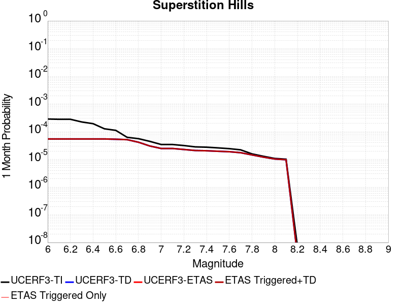 | 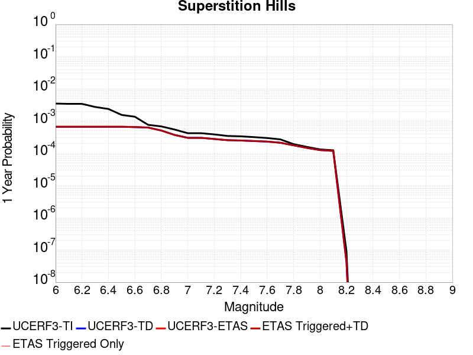 | 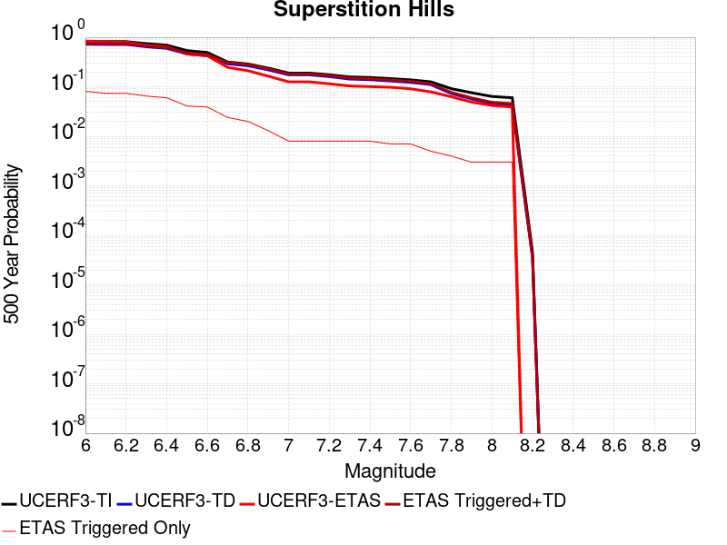 |

| Magnitude | 1 wk TI Prob | 1 wk TD Prob | 1 wk ETAS Prob | 1 wk ETAS/TD Gain | 1 wk ETAS Triggered+TD | 1 wk ETAS Triggered Only | 1 mo TI Prob | 1 mo TD Prob | 1 mo ETAS Prob | 1 mo ETAS/TD Gain | 1 mo ETAS Triggered+TD | 1 mo ETAS Triggered Only | 1 yr TI Prob | 1 yr TD Prob | 1 yr ETAS Prob | 1 yr ETAS/TD Gain | 1 yr ETAS Triggered+TD | 1 yr ETAS Triggered Only | 500 yr TI Prob | 500 yr TD Prob | 500 yr ETAS Prob | 500 yr ETAS/TD Gain | 500 yr ETAS Triggered+TD | 500 yr ETAS Triggered Only |
|-----|-----|-----|-----|-----|-----|-----|-----|-----|-----|-----|-----|-----|-----|-----|-----|-----|-----|-----|-----|-----|-----|-----|-----|-----|
| 6.0 | 6.6865185E-5 | 1.275805E-5 | 0.0 | 0.0 | 1.275805E-5 | 0.0 | 2.8653358E-4 | 5.4676293E-5 | 0.0 | 0.0 | 5.4676293E-5 | 0.0 | 0.0034829667 | 6.65495E-4 | 0.0 | 0.0 | 6.65495E-4 | 0.0 | 0.8252717 | 0.7234983 | 0.839 | 1.1596434 | 0.7458949 | 0.081 |
| 6.1 | 6.544851E-5 | 1.275805E-5 | 0.0 | 0.0 | 1.275805E-5 | 0.0 | 2.8046346E-4 | 5.4676293E-5 | 0.0 | 0.0 | 5.4676293E-5 | 0.0 | 0.0034092965 | 6.65495E-4 | 0.0 | 0.0 | 6.65495E-4 | 0.0 | 0.8186925 | 0.7169598 | 0.8 | 1.1158227 | 0.7379048 | 0.074 |
| 6.2 | 6.544851E-5 | 1.275805E-5 | 0.0 | 0.0 | 1.275805E-5 | 0.0 | 2.8046346E-4 | 5.4676293E-5 | 0.0 | 0.0 | 5.4676293E-5 | 0.0 | 0.0034092965 | 6.65495E-4 | 0.0 | 0.0 | 6.65495E-4 | 0.0 | 0.8186925 | 0.7169598 | 0.8 | 1.1158227 | 0.7379048 | 0.074 |
| 6.3 | 5.2402065E-5 | 1.275805E-5 | 0.0 | 0.0 | 1.275805E-5 | 0.0 | 2.2456095E-4 | 5.4676293E-5 | 0.0 | 0.0 | 5.4676293E-5 | 0.0 | 0.0027306017 | 6.65495E-4 | 0.0 | 0.0 | 6.65495E-4 | 0.0 | 0.74517244 | 0.64439774 | 0.696 | 1.0800784 | 0.6675119 | 0.065 |
| 6.4 | 4.542238E-5 | 1.275805E-5 | 0.0 | 0.0 | 1.275805E-5 | 0.0 | 1.9465282E-4 | 5.4676293E-5 | 0.0 | 0.0 | 5.4676293E-5 | 0.0 | 0.0023673223 | 6.65495E-4 | 0.0 | 0.0 | 6.65495E-4 | 0.0 | 0.69427353 | 0.598951 | 0.646 | 1.0785524 | 0.6230139 | 0.06 |
| 6.5 | 2.9672969E-5 | 1.275805E-5 | 0.0 | 0.0 | 1.275805E-5 | 0.0 | 1.2716366E-4 | 5.4676293E-5 | 0.0 | 0.0 | 5.4676293E-5 | 0.0 | 0.0015471181 | 6.65495E-4 | 0.0 | 0.0 | 6.65495E-4 | 0.0 | 0.5389081 | 0.46091914 | 0.46 | 0.99800587 | 0.48302147 | 0.041 |
| 6.6 | 2.6056105E-5 | 1.2443085E-5 | 0.0 | 0.0 | 1.2443085E-5 | 0.0 | 1.1166424E-4 | 5.3326497E-5 | 0.0 | 0.0 | 5.3326497E-5 | 0.0 | 0.0013586642 | 6.4907107E-4 | 0.0 | 0.0 | 6.4907107E-4 | 0.0 | 0.49327865 | 0.42549714 | 0.423 | 0.99413127 | 0.44790274 | 0.039 |
| 6.7 | 1.4611248E-5 | 1.2038892E-5 | 0.0 | 0.0 | 1.2038892E-5 | 0.0 | 6.261813E-5 | 5.1594314E-5 | 0.0 | 0.0 | 5.1594314E-5 | 0.0 | 7.6210906E-4 | 6.2799396E-4 | 0.0 | 0.0 | 6.2799396E-4 | 0.0 | 0.3169586 | 0.29085436 | 0.247 | 0.8492223 | 0.30787385 | 0.024 |
| 6.8 | 1.30607E-5 | 9.725465E-6 | 0.0 | 0.0 | 9.725465E-6 | 0.0 | 5.597323E-5 | 4.167994E-5 | 0.0 | 0.0 | 4.167994E-5 | 0.0 | 6.8126095E-4 | 5.0734263E-4 | 0.0 | 0.0 | 5.0734263E-4 | 0.0 | 0.28876087 | 0.26615137 | 0.211 | 0.79278195 | 0.28082833 | 0.02 |
| 6.9 | 1.0443096E-5 | 7.1049085E-6 | 0.0 | 0.0 | 7.1049085E-6 | 0.0 | 4.4755358E-5 | 3.0449264E-5 | 0.0 | 0.0 | 3.0449264E-5 | 0.0 | 5.447602E-4 | 3.706586E-4 | 0.0 | 0.0 | 3.706586E-4 | 0.0 | 0.23849179 | 0.21975636 | 0.164 | 0.746281 | 0.22989953 | 0.013 |
| 7.0 | 8.045912E-6 | 5.779923E-6 | 0.0 | 0.0 | 5.779923E-6 | 0.0 | 3.4482026E-5 | 2.4770869E-5 | 0.0 | 0.0 | 2.4770869E-5 | 0.0 | 4.197378E-4 | 3.0154438E-4 | 0.0 | 0.0 | 3.0154438E-4 | 0.0 | 0.1893452 | 0.17462297 | 0.126 | 0.7215546 | 0.18122599 | 0.008 |
| 7.1 | 8.045912E-6 | 5.779923E-6 | 0.0 | 0.0 | 5.779923E-6 | 0.0 | 3.4482026E-5 | 2.4770869E-5 | 0.0 | 0.0 | 2.4770869E-5 | 0.0 | 4.197378E-4 | 3.0154438E-4 | 0.0 | 0.0 | 3.0154438E-4 | 0.0 | 0.1893452 | 0.17462297 | 0.126 | 0.7215546 | 0.18122599 | 0.008 |
| 7.2 | 7.375506E-6 | 5.3150434E-6 | 0.0 | 0.0 | 5.3150434E-6 | 0.0 | 3.1608928E-5 | 2.2778562E-5 | 0.0 | 0.0 | 2.2778562E-5 | 0.0 | 3.8477074E-4 | 2.7729434E-4 | 0.0 | 0.0 | 2.7729434E-4 | 0.0 | 0.17504166 | 0.16083172 | 0.115 | 0.7150331 | 0.16754507 | 0.008 |
| 7.3 | 6.6063913E-6 | 4.8889974E-6 | 0.0 | 0.0 | 4.8889974E-6 | 0.0 | 2.8312797E-5 | 2.095268E-5 | 0.0 | 0.0 | 2.095268E-5 | 0.0 | 3.446538E-4 | 2.5506952E-4 | 0.0 | 0.0 | 2.5506952E-4 | 0.0 | 0.15832102 | 0.14329998 | 0.104 | 0.72575027 | 0.15015358 | 0.008 |
| 7.4 | 6.4313126E-6 | 4.7751128E-6 | 0.0 | 0.0 | 4.7751128E-6 | 0.0 | 2.7562477E-5 | 2.0464611E-5 | 0.0 | 0.0 | 2.0464611E-5 | 0.0 | 3.355215E-4 | 2.4912864E-4 | 0.0 | 0.0 | 2.4912864E-4 | 0.0 | 0.15446769 | 0.13920048 | 0.101 | 0.7255722 | 0.14608687 | 0.008 |
| 7.5 | 6.0742927E-6 | 4.5850484E-6 | 0.0 | 0.0 | 4.5850484E-6 | 0.0 | 2.6032423E-5 | 1.9650062E-5 | 0.0 | 0.0 | 1.9650062E-5 | 0.0 | 3.1689866E-4 | 2.3921371E-4 | 0.0 | 0.0 | 2.3921371E-4 | 0.0 | 0.14655522 | 0.13114046 | 0.098 | 0.7472904 | 0.13722247 | 0.007 |
| 7.6 | 5.6987187E-6 | 4.4175895E-6 | 0.0 | 0.0 | 4.4175895E-6 | 0.0 | 2.4422852E-5 | 1.8932393E-5 | 0.0 | 0.0 | 1.8932393E-5 | 0.0 | 2.9730765E-4 | 2.3047795E-4 | 0.0 | 0.0 | 2.3047795E-4 | 0.0 | 0.13815163 | 0.122814 | 0.091 | 0.74095786 | 0.1289543 | 0.007 |
| 7.7 | 5.1658035E-6 | 4.0692157E-6 | 0.0 | 0.0 | 4.0692157E-6 | 0.0 | 2.2138971E-5 | 1.743938E-5 | 0.0 | 0.0 | 1.743938E-5 | 0.0 | 2.6950863E-4 | 2.1230419E-4 | 0.0 | 0.0 | 2.1230419E-4 | 0.0 | 0.12608527 | 0.110881776 | 0.079 | 0.7124706 | 0.115327366 | 0.005 |
| 7.8 | 3.6864697E-6 | 3.386023E-6 | 0.0 | 0.0 | 3.386023E-6 | 0.0 | 1.579906E-5 | 1.4511448E-5 | 0.0 | 0.0 | 1.4511448E-5 | 0.0 | 1.9233658E-4 | 1.7666286E-4 | 0.0 | 0.0 | 1.7666286E-4 | 0.0 | 0.09169725 | 0.0732875 | 0.063 | 0.85962814 | 0.07699435 | 0.004 |
| 7.9 | 3.0265903E-6 | 2.8208492E-6 | 0.0 | 0.0 | 2.8208492E-6 | 0.0 | 1.2971037E-5 | 1.2089299E-5 | 0.0 | 0.0 | 1.2089299E-5 | 0.0 | 1.5791094E-4 | 1.4717755E-4 | 0.0 | 0.0 | 1.4717755E-4 | 0.0 | 0.07592469 | 0.056926195 | 0.049 | 0.86076367 | 0.059755415 | 0.003 |
| 8.0 | 2.5271493E-6 | 2.410094E-6 | 0.0 | 0.0 | 2.410094E-6 | 0.0 | 1.0830595E-5 | 1.0328936E-5 | 0.0 | 0.0 | 1.0328936E-5 | 0.0 | 1.3185451E-4 | 1.2574779E-4 | 0.0 | 0.0 | 1.2574779E-4 | 0.0 | 0.0638051 | 0.045832902 | 0.042 | 0.91637224 | 0.048695404 | 0.003 |
| 8.1 | 2.3749135E-6 | 2.2717265E-6 | 0.0 | 0.0 | 2.2717265E-6 | 0.0 | 1.0178161E-5 | 9.735936E-6 | 0.0 | 0.0 | 9.735936E-6 | 0.0 | 1.2391206E-4 | 1.1852882E-4 | 0.0 | 0.0 | 1.1852882E-4 | 0.0 | 0.060079396 | 0.04284718 | 0.039 | 0.9102116 | 0.045718636 | 0.003 |
| 8.2 | 1.7186406E-9 | 8.1565066E-10 | 0.0 | 0.0 | 8.1565066E-10 | 0.0 | 7.3656024E-9 | 3.4956456E-9 | 0.0 | 0.0 | 3.4956456E-9 | 0.0 | 8.9676206E-8 | 4.2559485E-8 | 0.0 | 0.0 | 4.2559485E-8 | 0.0 | 4.48371E-5 | 3.5560643E-5 | 0.0 | 0.0 | 3.5560643E-5 | 0.0 |

## San Andreas (San Gorgonio Pass-Garnet HIll)
*[(top)](#table-of-contents)*

| 1 Week | 1 Month | 1 Year | 500 Year |
|-----|-----|-----|-----|
| 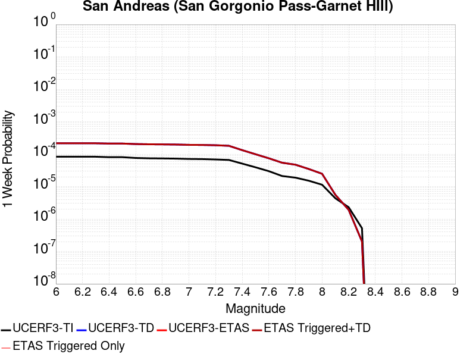 |  | 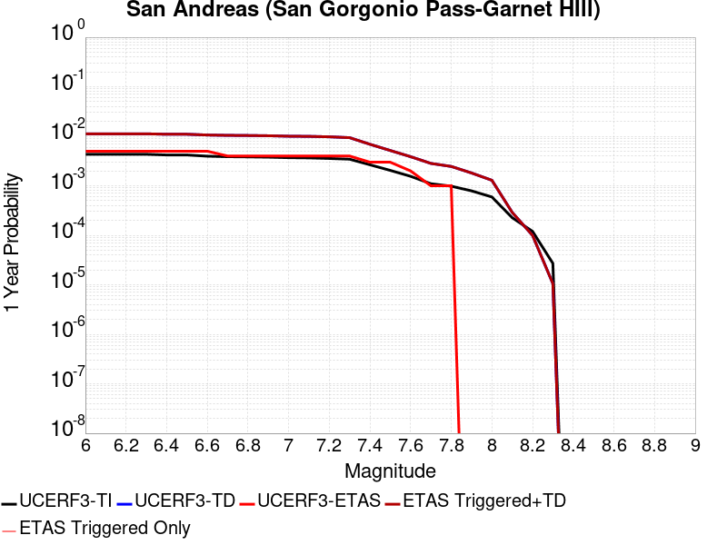 | 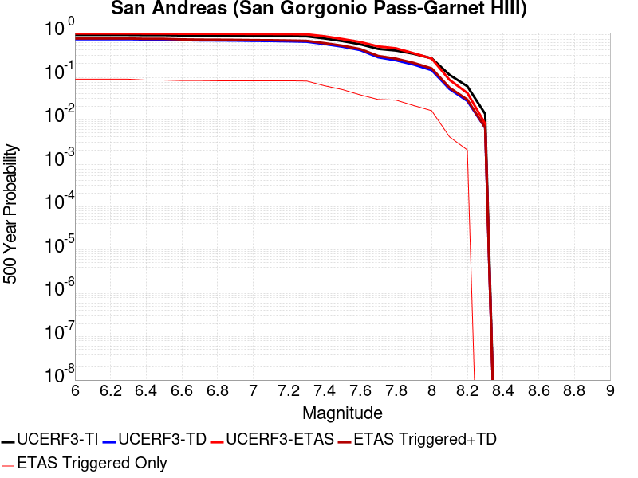 |

| Magnitude | 1 wk TI Prob | 1 wk TD Prob | 1 wk ETAS Prob | 1 wk ETAS/TD Gain | 1 wk ETAS Triggered+TD | 1 wk ETAS Triggered Only | 1 mo TI Prob | 1 mo TD Prob | 1 mo ETAS Prob | 1 mo ETAS/TD Gain | 1 mo ETAS Triggered+TD | 1 mo ETAS Triggered Only | 1 yr TI Prob | 1 yr TD Prob | 1 yr ETAS Prob | 1 yr ETAS/TD Gain | 1 yr ETAS Triggered+TD | 1 yr ETAS Triggered Only | 500 yr TI Prob | 500 yr TD Prob | 500 yr ETAS Prob | 500 yr ETAS/TD Gain | 500 yr ETAS Triggered+TD | 500 yr ETAS Triggered Only |
|-----|-----|-----|-----|-----|-----|-----|-----|-----|-----|-----|-----|-----|-----|-----|-----|-----|-----|-----|-----|-----|-----|-----|-----|-----|
| 6.0 | 8.31567E-5 | 2.1634289E-4 | 0.0 | 0.0 | 2.1634289E-4 | 0.0 | 3.5633717E-4 | 9.268521E-4 | 0.0 | 0.0 | 9.268521E-4 | 0.0 | 0.004329778 | 0.011225935 | 0.005 | 0.4453972 | 0.011225935 | 0.0 | 0.88577545 | 0.7087129 | 0.958 | 1.3517463 | 0.7334723 | 0.085 |
| 6.1 | 8.31567E-5 | 2.1634289E-4 | 0.0 | 0.0 | 2.1634289E-4 | 0.0 | 3.5633717E-4 | 9.268521E-4 | 0.0 | 0.0 | 9.268521E-4 | 0.0 | 0.004329778 | 0.011225935 | 0.005 | 0.4453972 | 0.011225935 | 0.0 | 0.88577545 | 0.7087129 | 0.958 | 1.3517463 | 0.7334723 | 0.085 |
| 6.2 | 8.31567E-5 | 2.1634289E-4 | 0.0 | 0.0 | 2.1634289E-4 | 0.0 | 3.5633717E-4 | 9.268521E-4 | 0.0 | 0.0 | 9.268521E-4 | 0.0 | 0.004329778 | 0.011225935 | 0.005 | 0.4453972 | 0.011225935 | 0.0 | 0.88577545 | 0.7087129 | 0.958 | 1.3517463 | 0.7334723 | 0.085 |
| 6.3 | 8.31567E-5 | 2.1634289E-4 | 0.0 | 0.0 | 2.1634289E-4 | 0.0 | 3.5633717E-4 | 9.268521E-4 | 0.0 | 0.0 | 9.268521E-4 | 0.0 | 0.004329778 | 0.011225935 | 0.005 | 0.4453972 | 0.011225935 | 0.0 | 0.88577545 | 0.7087129 | 0.958 | 1.3517463 | 0.7334723 | 0.085 |
| 6.4 | 8.059055E-5 | 2.1201167E-4 | 0.0 | 0.0 | 2.1201167E-4 | 0.0 | 3.4534236E-4 | 9.0830453E-4 | 0.0 | 0.0 | 9.0830453E-4 | 0.0 | 0.0041964394 | 0.011002714 | 0.005 | 0.45443332 | 0.011002714 | 0.0 | 0.8778658 | 0.6970623 | 0.952 | 1.3657315 | 0.7216003 | 0.081 |
| 6.5 | 8.059055E-5 | 2.1201167E-4 | 0.0 | 0.0 | 2.1201167E-4 | 0.0 | 3.4534236E-4 | 9.0830453E-4 | 0.0 | 0.0 | 9.0830453E-4 | 0.0 | 0.0041964394 | 0.011002714 | 0.005 | 0.45443332 | 0.011002714 | 0.0 | 0.8778658 | 0.6970623 | 0.952 | 1.3657315 | 0.7216003 | 0.081 |
| 6.6 | 7.619237E-5 | 2.0460304E-4 | 0.0 | 0.0 | 2.0460304E-4 | 0.0 | 3.2649786E-4 | 8.765776E-4 | 0.0 | 0.0 | 8.765776E-4 | 0.0 | 0.0039678677 | 0.010620577 | 0.005 | 0.47078422 | 0.010620577 | 0.0 | 0.8630145 | 0.6747906 | 0.941 | 1.3945066 | 0.7004822 | 0.079 |
| 6.7 | 7.440636E-5 | 2.0141841E-4 | 0.0 | 0.0 | 2.0141841E-4 | 0.0 | 3.188454E-4 | 8.629382E-4 | 0.0 | 0.0 | 8.629382E-4 | 0.0 | 0.0038750346 | 0.010456119 | 0.004 | 0.3825511 | 0.010456119 | 0.0 | 0.85648 | 0.6653325 | 0.94 | 1.4128274 | 0.69177127 | 0.079 |
| 6.8 | 7.3735864E-5 | 1.9992053E-4 | 0.0 | 0.0 | 1.9992053E-4 | 0.0 | 3.1597257E-4 | 8.5652294E-4 | 0.0 | 0.0 | 8.5652294E-4 | 0.0 | 0.0038401815 | 0.010378762 | 0.004 | 0.38540244 | 0.010378762 | 0.0 | 0.85394716 | 0.6619555 | 0.94 | 1.4200351 | 0.68832296 | 0.078 |
| 6.9 | 7.27575E-5 | 1.9764851E-4 | 0.0 | 0.0 | 1.9764851E-4 | 0.0 | 3.117806E-4 | 8.4679207E-4 | 0.0 | 0.0 | 8.4679207E-4 | 0.0 | 0.003789323 | 0.01026141 | 0.004 | 0.38980997 | 0.01026141 | 0.0 | 0.85017097 | 0.6562446 | 0.938 | 1.4293453 | 0.6830575 | 0.078 |
| 7.0 | 7.102591E-5 | 1.9357548E-4 | 0.0 | 0.0 | 1.9357548E-4 | 0.0 | 3.0436125E-4 | 8.293474E-4 | 0.0 | 0.0 | 8.293474E-4 | 0.0 | 0.003699303 | 0.010050998 | 0.004 | 0.3979704 | 0.010050998 | 0.0 | 0.8432466 | 0.6471116 | 0.93 | 1.4371556 | 0.67463684 | 0.078 |
| 7.1 | 7.028513E-5 | 1.9197105E-4 | 0.0 | 0.0 | 1.9197105E-4 | 0.0 | 3.0118722E-4 | 8.2247565E-4 | 0.0 | 0.0 | 8.2247565E-4 | 0.0 | 0.0036607897 | 0.009968103 | 0.004 | 0.40127996 | 0.009968103 | 0.0 | 0.84018743 | 0.6424134 | 0.929 | 1.4461093 | 0.67030513 | 0.078 |
| 7.2 | 6.8498244E-5 | 1.8815369E-4 | 0.0 | 0.0 | 1.8815369E-4 | 0.0 | 2.9353087E-4 | 8.0612575E-4 | 0.0 | 0.0 | 8.0612575E-4 | 0.0 | 0.003567883 | 0.009770843 | 0.004 | 0.40938127 | 0.009770843 | 0.0 | 0.83256024 | 0.6321401 | 0.926 | 1.4648651 | 0.6608332 | 0.078 |
| 7.3 | 6.622592E-5 | 1.8068143E-4 | 0.0 | 0.0 | 1.8068143E-4 | 0.0 | 2.8379448E-4 | 7.741211E-4 | 0.0 | 0.0 | 7.741211E-4 | 0.0 | 0.0034497243 | 0.009384607 | 0.004 | 0.4262299 | 0.009384607 | 0.0 | 0.822333 | 0.61833084 | 0.916 | 1.4814075 | 0.6477194 | 0.077 |
| 7.4 | 5.1050705E-5 | 1.328032E-4 | 0.0 | 0.0 | 1.328032E-4 | 0.0 | 2.1877038E-4 | 5.690332E-4 | 0.0 | 0.0 | 5.690332E-4 | 0.0 | 0.002660276 | 0.0069061345 | 0.003 | 0.43439642 | 0.0069061345 | 0.0 | 0.73602754 | 0.5481603 | 0.825 | 1.5050342 | 0.57527065 | 0.06 |
| 7.5 | 3.9302922E-5 | 9.9310666E-5 | 0.0 | 0.0 | 9.9310666E-5 | 0.0 | 1.6843023E-4 | 4.2554797E-4 | 0.0 | 0.0 | 4.2554797E-4 | 0.0 | 0.0020487092 | 0.0051687965 | 0.003 | 0.58040595 | 0.0051687965 | 0.0 | 0.64134896 | 0.4761929 | 0.714 | 1.4993924 | 0.5018594 | 0.049 |
| 7.6 | 2.9851626E-5 | 7.447017E-5 | 0.0 | 0.0 | 7.447017E-5 | 0.0 | 1.2792926E-4 | 3.1911893E-4 | 0.0 | 0.0 | 3.1911893E-4 | 0.0 | 0.0015564259 | 0.003878372 | 0.002 | 0.51568025 | 0.003878372 | 0.0 | 0.5410524 | 0.39777854 | 0.609 | 1.5310026 | 0.42006072 | 0.037 |
| 7.7 | 2.1135214E-5 | 5.436587E-5 | 0.0 | 0.0 | 5.436587E-5 | 0.0 | 9.0576345E-5 | 2.3297581E-4 | 0.0 | 0.0 | 2.3297581E-4 | 0.0 | 0.0011022091 | 0.0028327948 | 0.001 | 0.35300827 | 0.0028327948 | 0.0 | 0.42386222 | 0.27139896 | 0.483 | 1.7796677 | 0.2925284 | 0.029 |
| 7.8 | 1.883379E-5 | 4.7269226E-5 | 0.0 | 0.0 | 4.7269226E-5 | 0.0 | 8.0713755E-5 | 2.0256668E-4 | 0.0 | 0.0 | 2.0256668E-4 | 0.0 | 9.822468E-4 | 0.0024634623 | 0.001 | 0.40593275 | 0.0024634623 | 0.0 | 0.38820913 | 0.23113546 | 0.437 | 1.8906662 | 0.25266367 | 0.028 |
| 7.9 | 1.5156185E-5 | 3.481783E-5 | 0.0 | 0.0 | 3.481783E-5 | 0.0 | 6.495346E-5 | 1.4921074E-4 | 0.0 | 0.0 | 1.4921074E-4 | 0.0 | 7.9052144E-4 | 0.001815128 | 0.0 | 0.0 | 0.001815128 | 0.0 | 0.32660085 | 0.18422838 | 0.336 | 1.8238233 | 0.20135957 | 0.021 |
| 8.0 | 1.1405907E-5 | 2.4821975E-5 | 0.0 | 0.0 | 2.4821975E-5 | 0.0 | 4.8881542E-5 | 1.06375555E-4 | 0.0 | 0.0 | 1.06375555E-4 | 0.0 | 5.9497025E-4 | 0.0012943536 | 0.0 | 0.0 | 0.0012943536 | 0.0 | 0.25738212 | 0.13716489 | 0.254 | 1.8517859 | 0.15097025 | 0.016 |
| 8.1 | 4.3511436E-6 | 5.566778E-6 | 0.0 | 0.0 | 5.566778E-6 | 0.0 | 1.8647626E-5 | 2.3857401E-5 | 0.0 | 0.0 | 2.3857401E-5 | 0.0 | 2.2701119E-4 | 2.9042523E-4 | 0.0 | 0.0 | 2.9042523E-4 | 0.0 | 0.1073123 | 0.050527267 | 0.082 | 1.6228862 | 0.054325156 | 0.004 |
| 8.2 | 2.3042528E-6 | 1.9145461E-6 | 0.0 | 0.0 | 1.9145461E-6 | 0.0 | 9.875332E-6 | 8.205172E-6 | 0.0 | 0.0 | 8.205172E-6 | 0.0 | 1.2022553E-4 | 9.9893405E-5 | 0.0 | 0.0 | 9.9893405E-5 | 0.0 | 0.05834506 | 0.02684412 | 0.041 | 1.5273364 | 0.028790431 | 0.002 |
| 8.3 | 5.202968E-7 | 2.0272027E-7 | 0.0 | 0.0 | 2.0272027E-7 | 0.0 | 2.2298414E-6 | 8.688009E-7 | 0.0 | 0.0 | 8.688009E-7 | 0.0 | 2.714798E-5 | 1.0577604E-5 | 0.0 | 0.0 | 1.0577604E-5 | 0.0 | 0.013482461 | 0.0064644623 | 0.008 | 1.2375352 | 0.0064644623 | 0.0 |

## Calaveras (So) 2011 CFM
*[(top)](#table-of-contents)*

| 1 Week | 1 Month | 1 Year | 500 Year |
|-----|-----|-----|-----|
| 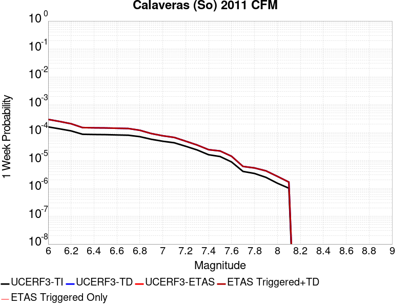 | 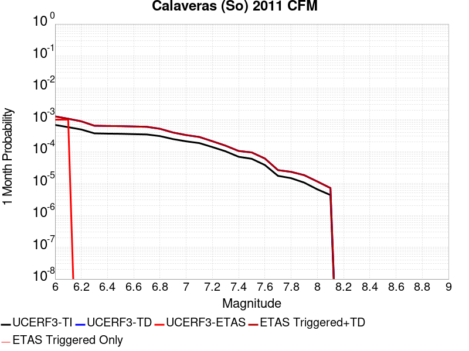 | 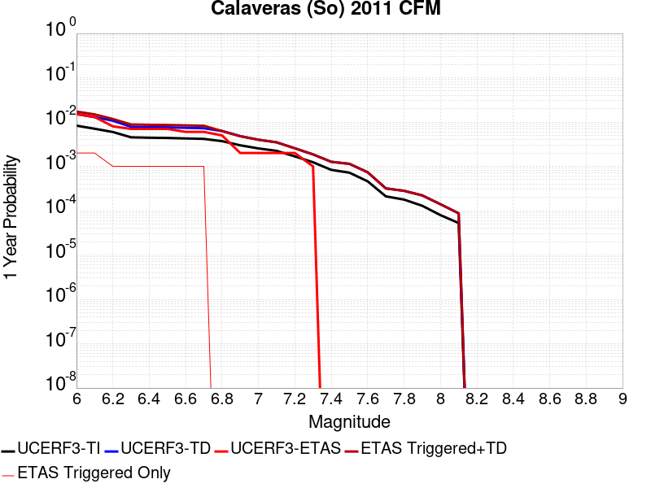 | 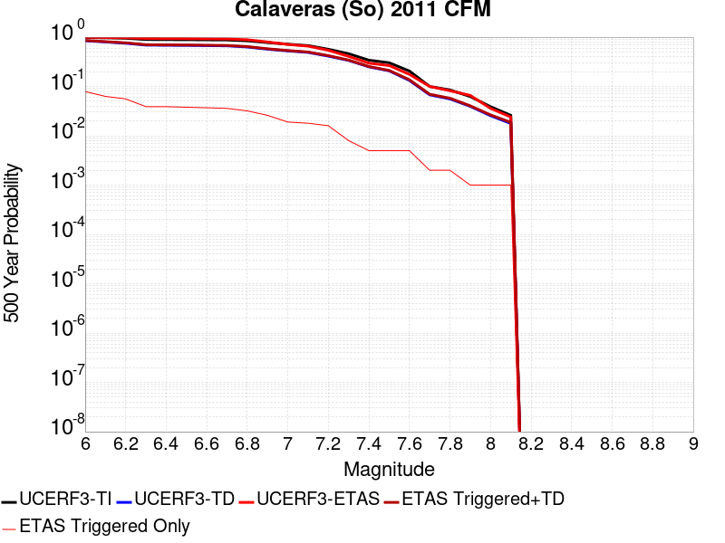 |

| Magnitude | 1 wk TI Prob | 1 wk TD Prob | 1 wk ETAS Prob | 1 wk ETAS/TD Gain | 1 wk ETAS Triggered+TD | 1 wk ETAS Triggered Only | 1 mo TI Prob | 1 mo TD Prob | 1 mo ETAS Prob | 1 mo ETAS/TD Gain | 1 mo ETAS Triggered+TD | 1 mo ETAS Triggered Only | 1 yr TI Prob | 1 yr TD Prob | 1 yr ETAS Prob | 1 yr ETAS/TD Gain | 1 yr ETAS Triggered+TD | 1 yr ETAS Triggered Only | 500 yr TI Prob | 500 yr TD Prob | 500 yr ETAS Prob | 500 yr ETAS/TD Gain | 500 yr ETAS Triggered+TD | 500 yr ETAS Triggered Only |
|-----|-----|-----|-----|-----|-----|-----|-----|-----|-----|-----|-----|-----|-----|-----|-----|-----|-----|-----|-----|-----|-----|-----|-----|-----|
| 6.0 | 1.5950744E-4 | 2.9579477E-4 | 0.0 | 0.0 | 2.9579477E-4 | 0.0 | 6.834242E-4 | 0.0012667892 | 0.001 | 0.7893973 | 0.0012667892 | 0.0 | 0.00828899 | 0.015277053 | 0.015 | 0.98186475 | 0.0172465 | 0.002 | 0.98442 | 0.84613466 | 0.995 | 1.1759357 | 0.85829 | 0.079 |
| 6.1 | 1.3584697E-4 | 2.4976584E-4 | 0.0 | 0.0 | 2.4976584E-4 | 0.0 | 5.8207137E-4 | 0.0010697733 | 0.001 | 0.93477744 | 0.0010697733 | 0.0 | 0.007063716 | 0.01291698 | 0.013 | 1.0064272 | 0.014891147 | 0.002 | 0.9711138 | 0.79933745 | 0.982 | 1.2285174 | 0.81197923 | 0.063 |
| 6.2 | 1.14676266E-4 | 2.0716316E-4 | 0.0 | 0.0 | 2.0716316E-4 | 0.0 | 4.9137714E-4 | 8.8737544E-4 | 0.0 | 0.0 | 8.8737544E-4 | 0.0 | 0.0059661185 | 0.010729858 | 0.008 | 0.74558306 | 0.011719128 | 0.001 | 0.9498127 | 0.7537931 | 0.973 | 1.2908051 | 0.7675807 | 0.056 |
| 6.3 | 8.691518E-5 | 1.5064902E-4 | 0.0 | 0.0 | 1.5064902E-4 | 0.0 | 3.7244044E-4 | 6.4543623E-4 | 0.0 | 0.0 | 6.4543623E-4 | 0.0 | 0.004525038 | 0.007824062 | 0.007 | 0.89467585 | 0.0088162385 | 0.001 | 0.8964451 | 0.69065934 | 0.941 | 1.3624662 | 0.7027236 | 0.039 |
| 6.4 | 8.50982E-5 | 1.4785647E-4 | 0.0 | 0.0 | 1.4785647E-4 | 0.0 | 3.646556E-4 | 6.334739E-4 | 0.0 | 0.0 | 6.334739E-4 | 0.0 | 0.0044306475 | 0.007679454 | 0.007 | 0.9115231 | 0.0086717745 | 0.001 | 0.89141756 | 0.684935 | 0.937 | 1.3680131 | 0.69722253 | 0.039 |
| 6.5 | 8.4062965E-5 | 1.4616358E-4 | 0.0 | 0.0 | 1.4616358E-4 | 0.0 | 3.602201E-4 | 6.262235E-4 | 0.0 | 0.0 | 6.262235E-4 | 0.0 | 0.004376863 | 0.0075918837 | 0.007 | 0.9220373 | 0.008584292 | 0.001 | 0.8884447 | 0.6813237 | 0.934 | 1.3708609 | 0.6934334 | 0.038 |
| 6.6 | 8.194716E-5 | 1.4265085E-4 | 0.0 | 0.0 | 1.4265085E-4 | 0.0 | 3.5115483E-4 | 6.1117706E-4 | 0.0 | 0.0 | 6.1117706E-4 | 0.0 | 0.0042669317 | 0.007410303 | 0.006 | 0.80968344 | 0.008402893 | 0.001 | 0.8821132 | 0.6741277 | 0.926 | 1.3736271 | 0.68618494 | 0.037 |
| 6.7 | 8.012326E-5 | 1.3941174E-4 | 0.0 | 0.0 | 1.3941174E-4 | 0.0 | 3.433402E-4 | 5.973041E-4 | 0.0 | 0.0 | 5.973041E-4 | 0.0 | 0.004172157 | 0.0072429255 | 0.006 | 0.82839453 | 0.008235683 | 0.001 | 0.87636757 | 0.6673824 | 0.919 | 1.3770216 | 0.67935663 | 0.036 |
| 6.8 | 7.119773E-5 | 1.2067191E-4 | 0.0 | 0.0 | 1.2067191E-4 | 0.0 | 3.0509746E-4 | 5.1704317E-4 | 0.0 | 0.0 | 5.1704317E-4 | 0.0 | 0.0037082357 | 0.006274024 | 0.005 | 0.7969367 | 0.006274024 | 0.0 | 0.8439477 | 0.6316889 | 0.887 | 1.4041722 | 0.6434749 | 0.032 |
| 6.9 | 5.7343088E-5 | 9.2143724E-5 | 0.0 | 0.0 | 9.2143724E-5 | 0.0 | 2.4573295E-4 | 3.9484227E-4 | 0.0 | 0.0 | 3.9484227E-4 | 0.0 | 0.0029876942 | 0.0047966745 | 0.002 | 0.41695553 | 0.0047966745 | 0.0 | 0.7759941 | 0.5706895 | 0.799 | 1.4000608 | 0.58185154 | 0.026 |
| 7.0 | 4.8746577E-5 | 7.660419E-5 | 0.0 | 0.0 | 7.660419E-5 | 0.0 | 2.0889717E-4 | 3.282627E-4 | 0.0 | 0.0 | 3.282627E-4 | 0.0 | 0.0025403565 | 0.003989333 | 0.002 | 0.501337 | 0.003989333 | 0.0 | 0.71967185 | 0.5266282 | 0.712 | 1.3519975 | 0.53562224 | 0.019 |
| 7.1 | 4.2998014E-5 | 6.6905035E-5 | 0.0 | 0.0 | 6.6905035E-5 | 0.0 | 1.8426418E-4 | 2.8670466E-4 | 0.0 | 0.0 | 2.8670466E-4 | 0.0 | 0.002241108 | 0.0034850952 | 0.002 | 0.5738724 | 0.0034850952 | 0.0 | 0.67431074 | 0.49134645 | 0.658 | 1.3391773 | 0.5005022 | 0.018 |
| 7.2 | 3.221292E-5 | 4.9074053E-5 | 0.0 | 0.0 | 4.9074053E-5 | 0.0 | 1.3804805E-4 | 2.1030055E-4 | 0.0 | 0.0 | 2.1030055E-4 | 0.0 | 0.0016794393 | 0.0025574274 | 0.002 | 0.7820359 | 0.0025574274 | 0.0 | 0.56847316 | 0.4125566 | 0.542 | 1.3137592 | 0.42195567 | 0.016 |
| 7.3 | 2.3756531E-5 | 3.570927E-5 | 0.0 | 0.0 | 3.570927E-5 | 0.0 | 1.0180973E-4 | 1.5303084E-4 | 0.0 | 0.0 | 1.5303084E-4 | 0.0 | 0.0012388286 | 0.0018615732 | 0.001 | 0.53718007 | 0.0018615732 | 0.0 | 0.46194705 | 0.33795717 | 0.408 | 1.2072536 | 0.34325352 | 0.008 |
| 7.4 | 1.5997684E-5 | 2.4314204E-5 | 0.0 | 0.0 | 2.4314204E-5 | 0.0 | 6.8559704E-5 | 1.0419958E-4 | 0.0 | 0.0 | 1.0419958E-4 | 0.0 | 8.343947E-4 | 0.0012678937 | 0.0 | 0.0 | 0.0012678937 | 0.0 | 0.34122387 | 0.25030422 | 0.297 | 1.1865561 | 0.2540527 | 0.005 |
| 7.5 | 1.3814293E-5 | 2.1869486E-5 | 0.0 | 0.0 | 2.1869486E-5 | 0.0 | 5.9202768E-5 | 9.3723014E-5 | 0.0 | 0.0 | 9.3723014E-5 | 0.0 | 7.205553E-4 | 0.0011404824 | 0.0 | 0.0 | 0.0011404824 | 0.0 | 0.30260792 | 0.20765531 | 0.266 | 1.2809689 | 0.21161702 | 0.005 |
| 7.6 | 8.817309E-6 | 1.411883E-5 | 0.0 | 0.0 | 1.411883E-5 | 0.0 | 3.7787922E-5 | 6.0507875E-5 | 0.0 | 0.0 | 6.0507875E-5 | 0.0 | 4.5997082E-4 | 7.364355E-4 | 0.0 | 0.0 | 7.364355E-4 | 0.0 | 0.20549683 | 0.13268112 | 0.176 | 1.3264886 | 0.13701771 | 0.005 |
| 7.7 | 4.0352206E-6 | 6.0983516E-6 | 0.0 | 0.0 | 6.0983516E-6 | 0.0 | 1.7293689E-5 | 2.613553E-5 | 0.0 | 0.0 | 2.613553E-5 | 0.0 | 2.1053031E-4 | 3.1815367E-4 | 0.0 | 0.0 | 3.1815367E-4 | 0.0 | 0.09992415 | 0.06770135 | 0.1 | 1.4770756 | 0.069565944 | 0.002 |
| 7.8 | 3.413169E-6 | 5.3812223E-6 | 0.0 | 0.0 | 5.3812223E-6 | 0.0 | 1.4627784E-5 | 2.3062177E-5 | 0.0 | 0.0 | 2.3062177E-5 | 0.0 | 1.7807873E-4 | 2.8074588E-4 | 0.0 | 0.0 | 2.8074588E-4 | 0.0 | 0.08519769 | 0.055952366 | 0.082 | 1.4655323 | 0.057840463 | 0.002 |
| 7.9 | 2.4740732E-6 | 4.2405845E-6 | 0.0 | 0.0 | 4.2405845E-6 | 0.0 | 1.06031275E-5 | 1.8173807E-5 | 0.0 | 0.0 | 1.8173807E-5 | 0.0 | 1.2908543E-4 | 2.2124367E-4 | 0.0 | 0.0 | 2.2124367E-4 | 0.0 | 0.06250784 | 0.039609283 | 0.066 | 1.6662761 | 0.040569674 | 0.001 |
| 8.0 | 1.5231818E-6 | 2.6816888E-6 | 0.0 | 0.0 | 2.6816888E-6 | 0.0 | 6.527906E-6 | 1.1492902E-5 | 0.0 | 0.0 | 1.1492902E-5 | 0.0 | 7.9474354E-5 | 1.3991712E-4 | 0.0 | 0.0 | 1.3991712E-4 | 0.0 | 0.03895953 | 0.025590517 | 0.036 | 1.4067712 | 0.026564926 | 0.001 |
| 8.1 | 1.0104524E-6 | 1.6726956E-6 | 0.0 | 0.0 | 1.6726956E-6 | 0.0 | 4.330503E-6 | 7.168676E-6 | 0.0 | 0.0 | 7.168676E-6 | 0.0 | 5.2722597E-5 | 8.7275155E-5 | 0.0 | 0.0 | 8.7275155E-5 | 0.0 | 0.02601755 | 0.01776519 | 0.024 | 1.3509564 | 0.018747427 | 0.001 |

## Calaveras (So) - Paicines extension 2011 CFM
*[(top)](#table-of-contents)*

| 1 Week | 1 Month | 1 Year | 500 Year |
|-----|-----|-----|-----|
|  | 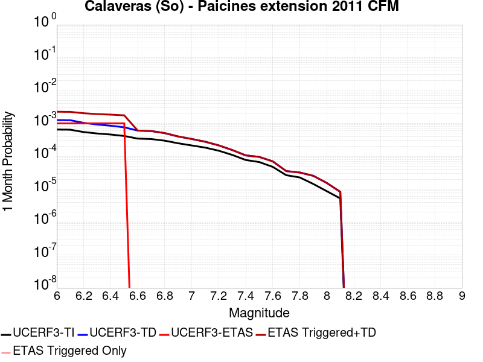 | 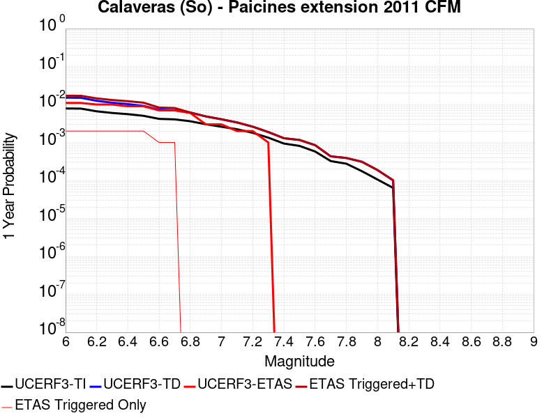 | 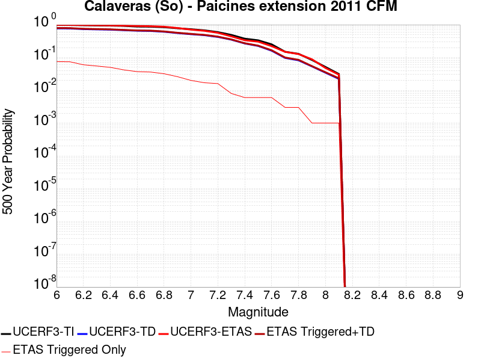 |

| Magnitude | 1 wk TI Prob | 1 wk TD Prob | 1 wk ETAS Prob | 1 wk ETAS/TD Gain | 1 wk ETAS Triggered+TD | 1 wk ETAS Triggered Only | 1 mo TI Prob | 1 mo TD Prob | 1 mo ETAS Prob | 1 mo ETAS/TD Gain | 1 mo ETAS Triggered+TD | 1 mo ETAS Triggered Only | 1 yr TI Prob | 1 yr TD Prob | 1 yr ETAS Prob | 1 yr ETAS/TD Gain | 1 yr ETAS Triggered+TD | 1 yr ETAS Triggered Only | 500 yr TI Prob | 500 yr TD Prob | 500 yr ETAS Prob | 500 yr ETAS/TD Gain | 500 yr ETAS Triggered+TD | 500 yr ETAS Triggered Only |
|-----|-----|-----|-----|-----|-----|-----|-----|-----|-----|-----|-----|-----|-----|-----|-----|-----|-----|-----|-----|-----|-----|-----|-----|-----|
| 6.0 | 1.5183659E-4 | 2.9493496E-4 | 0.0 | 0.0 | 2.9493496E-4 | 0.0 | 6.5056595E-4 | 0.0012628433 | 0.001 | 0.7918639 | 0.0022615804 | 0.001 | 0.007891912 | 0.015169824 | 0.011 | 0.72512376 | 0.017139485 | 0.002 | 0.9809675 | 0.7749081 | 0.985 | 1.2711184 | 0.79179 | 0.075 |
| 6.1 | 1.5024997E-4 | 2.919311E-4 | 0.0 | 0.0 | 2.919311E-4 | 0.0 | 6.437695E-4 | 0.0012499858 | 0.001 | 0.80000913 | 0.0022487356 | 0.001 | 0.0078097614 | 0.015015898 | 0.011 | 0.7325569 | 0.016985867 | 0.002 | 0.98016304 | 0.77077395 | 0.985 | 1.2779363 | 0.78773665 | 0.074 |
| 6.2 | 1.2743923E-4 | 2.4318315E-4 | 0.0 | 0.0 | 2.4318315E-4 | 0.0 | 5.460538E-4 | 0.001041404 | 0.001 | 0.9602422 | 0.0020403625 | 0.001 | 0.0066279583 | 0.012535569 | 0.01 | 0.79773 | 0.014510497 | 0.002 | 0.9640279 | 0.7341743 | 0.975 | 1.3280225 | 0.75012386 | 0.06 |
| 6.3 | 1.1525114E-4 | 2.160955E-4 | 0.0 | 0.0 | 2.160955E-4 | 0.0 | 4.9383997E-4 | 9.255161E-4 | 0.001 | 1.0804782 | 0.0019245906 | 0.001 | 0.0059959386 | 0.011158946 | 0.01 | 0.89614195 | 0.013136628 | 0.002 | 0.9505599 | 0.7190553 | 0.965 | 1.3420386 | 0.73450726 | 0.055 |
| 6.4 | 1.07200925E-4 | 1.9857053E-4 | 0.0 | 0.0 | 1.9857053E-4 | 0.0 | 4.5935164E-4 | 8.5053616E-4 | 0.001 | 1.1757289 | 0.0018496857 | 0.001 | 0.0055782744 | 0.01026679 | 0.009 | 0.87661284 | 0.012246256 | 0.002 | 0.9390039 | 0.70665896 | 0.952 | 1.3471845 | 0.721326 | 0.05 |
| 6.5 | 9.69631E-5 | 1.7773193E-4 | 0.0 | 0.0 | 1.7773193E-4 | 0.0 | 4.1548995E-4 | 7.613241E-4 | 0.001 | 1.3135011 | 0.0017605628 | 0.001 | 0.0050468626 | 0.009199323 | 0.009 | 0.9783328 | 0.011180925 | 0.002 | 0.9203267 | 0.6802074 | 0.938 | 1.3789912 | 0.6936387 | 0.042 |
| 6.6 | 8.0552316E-5 | 1.4117263E-4 | 0.0 | 0.0 | 1.4117263E-4 | 0.0 | 3.4517853E-4 | 6.0484424E-4 | 0.0 | 0.0 | 6.0484424E-4 | 0.0 | 0.0041944524 | 0.0073334877 | 0.007 | 0.95452535 | 0.008326154 | 0.001 | 0.87774384 | 0.65545464 | 0.912 | 1.3914006 | 0.6682028 | 0.037 |
| 6.7 | 7.815757E-5 | 1.3666473E-4 | 0.0 | 0.0 | 1.3666473E-4 | 0.0 | 3.34918E-4 | 5.8553653E-4 | 0.0 | 0.0 | 5.8553653E-4 | 0.0 | 0.004070005 | 0.0071005877 | 0.007 | 0.9858339 | 0.0080934875 | 0.001 | 0.86986136 | 0.6458166 | 0.898 | 1.3904876 | 0.65856725 | 0.036 |
| 6.8 | 6.965264E-5 | 1.1839813E-4 | 0.0 | 0.0 | 1.1839813E-4 | 0.0 | 2.9847719E-4 | 5.073023E-4 | 0.0 | 0.0 | 5.073023E-4 | 0.0 | 0.0036279052 | 0.0061561163 | 0.006 | 0.9746405 | 0.0061561163 | 0.0 | 0.8375282 | 0.6097842 | 0.867 | 1.4218146 | 0.6222711 | 0.032 |
| 6.9 | 5.8000453E-5 | 9.3467046E-5 | 0.0 | 0.0 | 9.3467046E-5 | 0.0 | 2.4854968E-4 | 4.00512E-4 | 0.0 | 0.0 | 4.00512E-4 | 0.0 | 0.0030218933 | 0.004865417 | 0.003 | 0.6165967 | 0.004865417 | 0.0 | 0.77980334 | 0.5559928 | 0.792 | 1.4244789 | 0.56753695 | 0.026 |
| 7.0 | 4.9865852E-5 | 7.847458E-5 | 0.0 | 0.0 | 7.847458E-5 | 0.0 | 2.1369329E-4 | 3.362767E-4 | 0.0 | 0.0 | 3.362767E-4 | 0.0 | 0.0025986114 | 0.004086561 | 0.003 | 0.7341136 | 0.004086561 | 0.0 | 0.72773975 | 0.51420504 | 0.708 | 1.3768826 | 0.52392095 | 0.02 |
| 7.1 | 4.283875E-5 | 6.4663385E-5 | 0.0 | 0.0 | 6.4663385E-5 | 0.0 | 1.8358172E-4 | 2.7709964E-4 | 0.0 | 0.0 | 2.7709964E-4 | 0.0 | 0.0022328163 | 0.0033685183 | 0.002 | 0.59373283 | 0.0033685183 | 0.0 | 0.6729546 | 0.4798573 | 0.652 | 1.3587372 | 0.48869973 | 0.017 |
| 7.2 | 3.450115E-5 | 5.0087805E-5 | 0.0 | 0.0 | 5.0087805E-5 | 0.0 | 1.478537E-4 | 2.146445E-4 | 0.0 | 0.0 | 2.146445E-4 | 0.0 | 0.0017986323 | 0.00261019 | 0.002 | 0.7662277 | 0.00261019 | 0.0 | 0.59348154 | 0.42375386 | 0.566 | 1.3356811 | 0.43297377 | 0.016 |
| 7.3 | 2.5709045E-5 | 3.6157533E-5 | 0.0 | 0.0 | 3.6157533E-5 | 0.0 | 1.1017697E-4 | 1.5495173E-4 | 0.0 | 0.0 | 1.5495173E-4 | 0.0 | 0.0013405791 | 0.0018849198 | 0.001 | 0.5305265 | 0.0018849198 | 0.0 | 0.48866954 | 0.3507296 | 0.441 | 1.2573788 | 0.35592377 | 0.008 |
| 7.4 | 1.8003093E-5 | 2.4863099E-5 | 0.0 | 0.0 | 2.4863099E-5 | 0.0 | 7.715383E-5 | 1.0655179E-4 | 0.0 | 0.0 | 1.0655179E-4 | 0.0 | 9.3894306E-4 | 0.001296498 | 0.0 | 0.0 | 0.001296498 | 0.0 | 0.37480524 | 0.26810142 | 0.336 | 1.253257 | 0.27249283 | 0.006 |
| 7.5 | 1.5595824E-5 | 2.2359083E-5 | 0.0 | 0.0 | 2.2359083E-5 | 0.0 | 6.683753E-5 | 9.582113E-5 | 0.0 | 0.0 | 9.582113E-5 | 0.0 | 8.134431E-4 | 0.0011659997 | 0.0 | 0.0 | 0.0011659997 | 0.0 | 0.33428064 | 0.22503793 | 0.304 | 1.3508834 | 0.2296877 | 0.006 |
| 7.6 | 1.1110309E-5 | 1.6338492E-5 | 0.0 | 0.0 | 1.6338492E-5 | 0.0 | 4.761474E-5 | 7.0020236E-5 | 0.0 | 0.0 | 7.0020236E-5 | 0.0 | 5.795553E-4 | 8.521641E-4 | 0.0 | 0.0 | 8.521641E-4 | 0.0 | 0.2516329 | 0.16126436 | 0.222 | 1.3766216 | 0.16629678 | 0.006 |
| 7.7 | 6.2140443E-6 | 8.275417E-6 | 0.0 | 0.0 | 8.275417E-6 | 0.0 | 2.6631347E-5 | 3.546559E-5 | 0.0 | 0.0 | 3.546559E-5 | 0.0 | 3.241884E-4 | 4.317081E-4 | 0.0 | 0.0 | 4.317081E-4 | 0.0 | 0.14966126 | 0.09719796 | 0.149 | 1.532954 | 0.09990636 | 0.003 |
| 7.8 | 5.305533E-6 | 7.500288E-6 | 0.0 | 0.0 | 7.500288E-6 | 0.0 | 2.27378E-5 | 3.2143696E-5 | 0.0 | 0.0 | 3.2143696E-5 | 0.0 | 2.7679754E-4 | 3.912793E-4 | 0.0 | 0.0 | 3.912793E-4 | 0.0 | 0.1292653 | 0.082147345 | 0.127 | 1.5460025 | 0.08490091 | 0.003 |
| 7.9 | 3.363505E-6 | 5.9504714E-6 | 0.0 | 0.0 | 5.9504714E-6 | 0.0 | 1.4414942E-5 | 2.5501771E-5 | 0.0 | 0.0 | 2.5501771E-5 | 0.0 | 1.7548777E-4 | 3.1043988E-4 | 0.0 | 0.0 | 3.1043988E-4 | 0.0 | 0.08401161 | 0.05354346 | 0.088 | 1.6435248 | 0.054489914 | 0.001 |
| 8.0 | 2.0271132E-6 | 3.6048282E-6 | 0.0 | 0.0 | 3.6048282E-6 | 0.0 | 8.687599E-6 | 1.5449172E-5 | 0.0 | 0.0 | 1.5449172E-5 | 0.0 | 1.05766376E-4 | 1.8807748E-4 | 0.0 | 0.0 | 1.8807748E-4 | 0.0 | 0.051511854 | 0.034513682 | 0.048 | 1.3907528 | 0.03547917 | 0.001 |
| 8.1 | 1.2206116E-6 | 1.9349015E-6 | 0.0 | 0.0 | 1.9349015E-6 | 0.0 | 5.2311816E-6 | 8.292409E-6 | 0.0 | 0.0 | 8.292409E-6 | 0.0 | 6.3687774E-5 | 1.0095542E-4 | 0.0 | 0.0 | 1.0095542E-4 | 0.0 | 0.03134319 | 0.02227867 | 0.03 | 1.3465794 | 0.023256391 | 0.001 |

## Cady
*[(top)](#table-of-contents)*

| 1 Week | 1 Month | 1 Year | 500 Year |
|-----|-----|-----|-----|
|  |  | 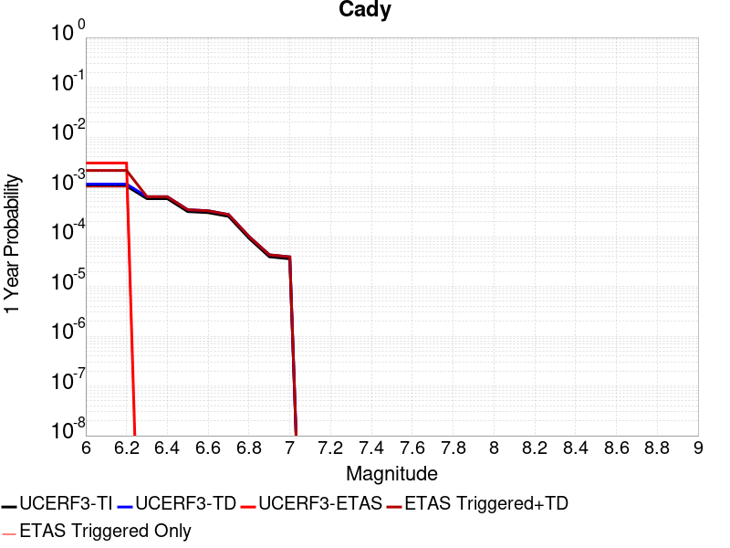 | 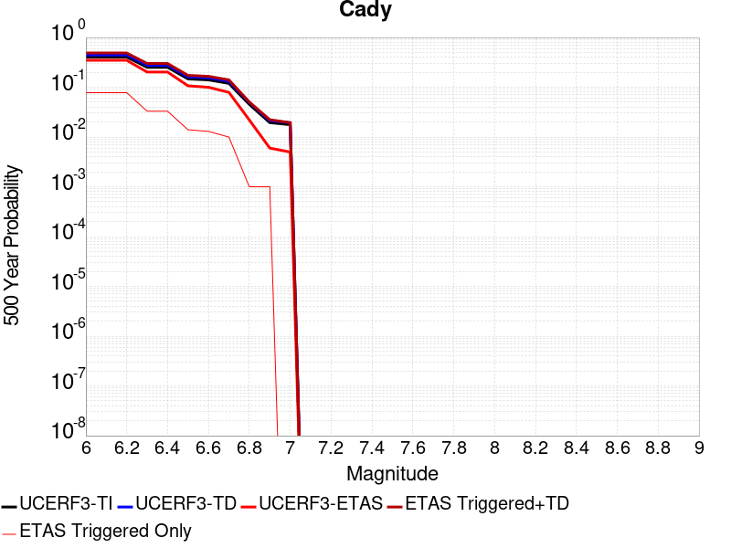 |

| Magnitude | 1 wk TI Prob | 1 wk TD Prob | 1 wk ETAS Prob | 1 wk ETAS/TD Gain | 1 wk ETAS Triggered+TD | 1 wk ETAS Triggered Only | 1 mo TI Prob | 1 mo TD Prob | 1 mo ETAS Prob | 1 mo ETAS/TD Gain | 1 mo ETAS Triggered+TD | 1 mo ETAS Triggered Only | 1 yr TI Prob | 1 yr TD Prob | 1 yr ETAS Prob | 1 yr ETAS/TD Gain | 1 yr ETAS Triggered+TD | 1 yr ETAS Triggered Only | 500 yr TI Prob | 500 yr TD Prob | 500 yr ETAS Prob | 500 yr ETAS/TD Gain | 500 yr ETAS Triggered+TD | 500 yr ETAS Triggered Only |
|-----|-----|-----|-----|-----|-----|-----|-----|-----|-----|-----|-----|-----|-----|-----|-----|-----|-----|-----|-----|-----|-----|-----|-----|-----|
| 6.0 | 1.9892565E-5 | 2.174695E-5 | 0.0 | 0.0 | 2.174695E-5 | 0.0 | 8.525106E-5 | 9.319839E-5 | 0.0 | 0.0 | 9.319839E-5 | 0.0 | 0.0010374374 | 0.0011341897 | 0.003 | 2.64506 | 0.0021330556 | 0.001 | 0.40487745 | 0.4453325 | 0.348 | 0.7814386 | 0.48859656 | 0.078 |
| 6.1 | 1.9892565E-5 | 2.174695E-5 | 0.0 | 0.0 | 2.174695E-5 | 0.0 | 8.525106E-5 | 9.319839E-5 | 0.0 | 0.0 | 9.319839E-5 | 0.0 | 0.0010374374 | 0.0011341897 | 0.003 | 2.64506 | 0.0021330556 | 0.001 | 0.40487745 | 0.4453325 | 0.348 | 0.7814386 | 0.48859656 | 0.078 |
| 6.2 | 1.9892565E-5 | 2.174695E-5 | 0.0 | 0.0 | 2.174695E-5 | 0.0 | 8.525106E-5 | 9.319839E-5 | 0.0 | 0.0 | 9.319839E-5 | 0.0 | 0.0010374374 | 0.0011341897 | 0.003 | 2.64506 | 0.0021330556 | 0.001 | 0.40487745 | 0.4453325 | 0.348 | 0.7814386 | 0.48859656 | 0.078 |
| 6.3 | 1.1117327E-5 | 1.2116551E-5 | 0.0 | 0.0 | 1.2116551E-5 | 0.0 | 4.764482E-5 | 5.1927218E-5 | 0.0 | 0.0 | 5.1927218E-5 | 0.0 | 5.7992124E-4 | 6.320617E-4 | 0.0 | 0.0 | 6.320617E-4 | 0.0 | 0.2517699 | 0.2763527 | 0.202 | 0.73095 | 0.30023307 | 0.033 |
| 6.4 | 1.1117327E-5 | 1.2116551E-5 | 0.0 | 0.0 | 1.2116551E-5 | 0.0 | 4.764482E-5 | 5.1927218E-5 | 0.0 | 0.0 | 5.1927218E-5 | 0.0 | 5.7992124E-4 | 6.320617E-4 | 0.0 | 0.0 | 6.320617E-4 | 0.0 | 0.2517699 | 0.2763527 | 0.202 | 0.73095 | 0.30023307 | 0.033 |
| 6.5 | 6.103093E-6 | 6.639826E-6 | 0.0 | 0.0 | 6.639826E-6 | 0.0 | 2.615585E-5 | 2.8456157E-5 | 0.0 | 0.0 | 2.8456157E-5 | 0.0 | 3.1840094E-4 | 3.4641108E-4 | 0.0 | 0.0 | 3.4641108E-4 | 0.0 | 0.14719625 | 0.16167732 | 0.107 | 0.66181207 | 0.17341383 | 0.014 |
| 6.6 | 5.817237E-6 | 6.334602E-6 | 0.0 | 0.0 | 6.334602E-6 | 0.0 | 2.4930776E-5 | 2.714808E-5 | 0.0 | 0.0 | 2.714808E-5 | 0.0 | 3.034899E-4 | 3.3049006E-4 | 0.0 | 0.0 | 3.3049006E-4 | 0.0 | 0.1408124 | 0.15495558 | 0.1 | 0.6453462 | 0.16594116 | 0.013 |
| 6.7 | 4.8846314E-6 | 5.314768E-6 | 0.0 | 0.0 | 5.314768E-6 | 0.0 | 2.0933967E-5 | 2.2777444E-5 | 0.0 | 0.0 | 2.2777444E-5 | 0.0 | 2.5484123E-4 | 2.7729175E-4 | 0.0 | 0.0 | 2.7729175E-4 | 0.0 | 0.119651 | 0.1321989 | 0.079 | 0.59758437 | 0.14087692 | 0.01 |
| 6.8 | 1.7788773E-6 | 1.9308175E-6 | 0.0 | 0.0 | 1.9308175E-6 | 0.0 | 7.6237375E-6 | 8.274915E-6 | 0.0 | 0.0 | 8.274915E-6 | 0.0 | 9.281505E-5 | 1.0074399E-4 | 0.0 | 0.0 | 1.0074399E-4 | 0.0 | 0.045349218 | 0.04948564 | 0.022 | 0.44457343 | 0.050436154 | 0.001 |
| 6.9 | 7.5455404E-7 | 8.254362E-7 | 0.0 | 0.0 | 8.254362E-7 | 0.0 | 3.233799E-6 | 3.5375806E-6 | 0.0 | 0.0 | 3.5375806E-6 | 0.0 | 3.937079E-5 | 4.3069525E-5 | 0.0 | 0.0 | 4.3069525E-5 | 0.0 | 0.019493284 | 0.021355724 | 0.006 | 0.28095514 | 0.022334369 | 0.001 |
| 7.0 | 6.8578805E-7 | 7.502926E-7 | 0.0 | 0.0 | 7.502926E-7 | 0.0 | 2.9390883E-6 | 3.2155374E-6 | 0.0 | 0.0 | 3.2155374E-6 | 0.0 | 3.578281E-5 | 3.9148792E-5 | 0.0 | 0.0 | 3.9148792E-5 | 0.0 | 0.017732618 | 0.019437118 | 0.005 | 0.2572398 | 0.019437118 | 0.0 |

## White Mountains
*[(top)](#table-of-contents)*

| 1 Week | 1 Month | 1 Year | 500 Year |
|-----|-----|-----|-----|
| 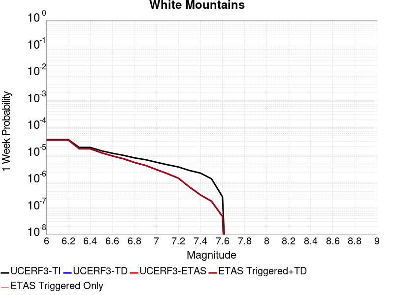 |  | 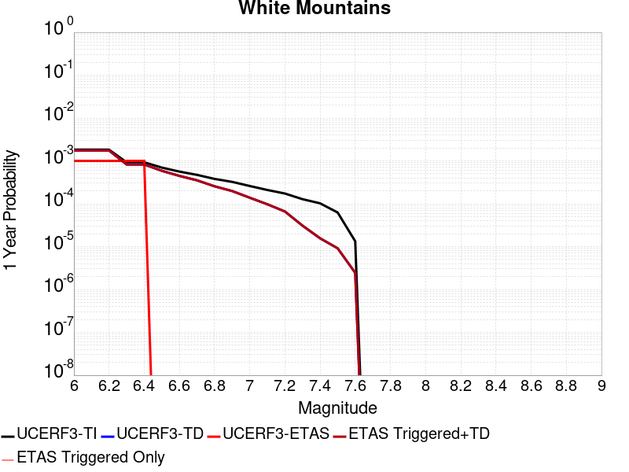 | 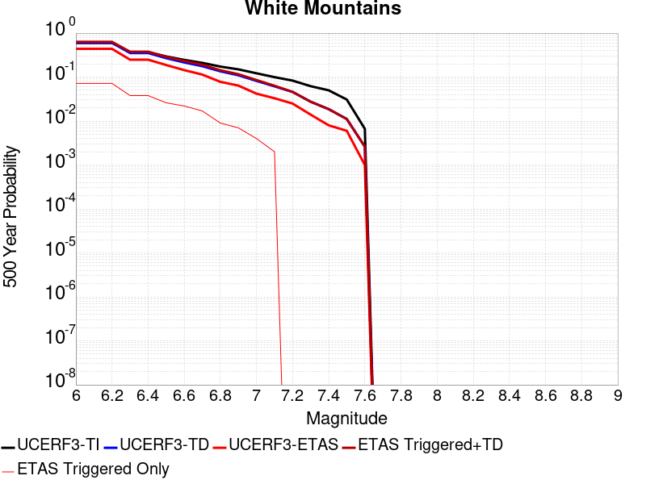 |

| Magnitude | 1 wk TI Prob | 1 wk TD Prob | 1 wk ETAS Prob | 1 wk ETAS/TD Gain | 1 wk ETAS Triggered+TD | 1 wk ETAS Triggered Only | 1 mo TI Prob | 1 mo TD Prob | 1 mo ETAS Prob | 1 mo ETAS/TD Gain | 1 mo ETAS Triggered+TD | 1 mo ETAS Triggered Only | 1 yr TI Prob | 1 yr TD Prob | 1 yr ETAS Prob | 1 yr ETAS/TD Gain | 1 yr ETAS Triggered+TD | 1 yr ETAS Triggered Only | 500 yr TI Prob | 500 yr TD Prob | 500 yr ETAS Prob | 500 yr ETAS/TD Gain | 500 yr ETAS Triggered+TD | 500 yr ETAS Triggered Only |
|-----|-----|-----|-----|-----|-----|-----|-----|-----|-----|-----|-----|-----|-----|-----|-----|-----|-----|-----|-----|-----|-----|-----|-----|-----|
| 6.0 | 3.503579E-5 | 3.3626362E-5 | 0.0 | 0.0 | 3.3626362E-5 | 0.0 | 1.5014476E-4 | 1.441057E-4 | 0.0 | 0.0 | 1.441057E-4 | 0.0 | 0.0018264796 | 0.0017531946 | 0.001 | 0.57038736 | 0.0017531946 | 0.0 | 0.59911263 | 0.6047238 | 0.44 | 0.72760487 | 0.6331837 | 0.072 |
| 6.1 | 3.503579E-5 | 3.3626362E-5 | 0.0 | 0.0 | 3.3626362E-5 | 0.0 | 1.5014476E-4 | 1.441057E-4 | 0.0 | 0.0 | 1.441057E-4 | 0.0 | 0.0018264796 | 0.0017531946 | 0.001 | 0.57038736 | 0.0017531946 | 0.0 | 0.59911263 | 0.6047238 | 0.44 | 0.72760487 | 0.6331837 | 0.072 |
| 6.2 | 3.503579E-5 | 3.3626362E-5 | 0.0 | 0.0 | 3.3626362E-5 | 0.0 | 1.5014476E-4 | 1.441057E-4 | 0.0 | 0.0 | 1.441057E-4 | 0.0 | 0.0018264796 | 0.0017531946 | 0.001 | 0.57038736 | 0.0017531946 | 0.0 | 0.59911263 | 0.6047238 | 0.44 | 0.72760487 | 0.6331837 | 0.072 |
| 6.3 | 1.7818425E-5 | 1.5841131E-5 | 0.0 | 0.0 | 1.5841131E-5 | 0.0 | 7.636245E-5 | 6.7888875E-5 | 0.0 | 0.0 | 6.7888875E-5 | 0.0 | 9.293162E-4 | 8.262478E-4 | 0.001 | 1.2102907 | 8.262478E-4 | 0.0 | 0.37178582 | 0.35275677 | 0.249 | 0.70586884 | 0.377352 | 0.038 |
| 6.4 | 1.7818425E-5 | 1.5841131E-5 | 0.0 | 0.0 | 1.5841131E-5 | 0.0 | 7.636245E-5 | 6.7888875E-5 | 0.0 | 0.0 | 6.7888875E-5 | 0.0 | 9.293162E-4 | 8.262478E-4 | 0.001 | 1.2102907 | 8.262478E-4 | 0.0 | 0.37178582 | 0.35275677 | 0.249 | 0.70586884 | 0.377352 | 0.038 |
| 6.5 | 1.3397557E-5 | 1.1280799E-5 | 0.0 | 0.0 | 1.1280799E-5 | 0.0 | 5.741684E-5 | 4.8345424E-5 | 0.0 | 0.0 | 4.8345424E-5 | 0.0 | 6.988258E-4 | 5.884535E-4 | 0.0 | 0.0 | 5.884535E-4 | 0.0 | 0.2949842 | 0.26937944 | 0.188 | 0.69790035 | 0.28837556 | 0.026 |
| 6.6 | 1.0818695E-5 | 8.580899E-6 | 0.0 | 0.0 | 8.580899E-6 | 0.0 | 4.6365014E-5 | 3.6774785E-5 | 0.0 | 0.0 | 3.6774785E-5 | 0.0 | 5.6434784E-4 | 4.4764538E-4 | 0.0 | 0.0 | 4.4764538E-4 | 0.0 | 0.24591754 | 0.21541286 | 0.144 | 0.6684838 | 0.23267376 | 0.022 |
| 6.7 | 9.067908E-6 | 6.764914E-6 | 0.0 | 0.0 | 6.764914E-6 | 0.0 | 3.8861883E-5 | 2.8992183E-5 | 0.0 | 0.0 | 2.8992183E-5 | 0.0 | 4.7304068E-4 | 3.5292582E-4 | 0.0 | 0.0 | 3.5292582E-4 | 0.0 | 0.21067435 | 0.17694543 | 0.114 | 0.6442664 | 0.19093737 | 0.017 |
| 6.8 | 7.295947E-6 | 4.906114E-6 | 0.0 | 0.0 | 4.906114E-6 | 0.0 | 3.126797E-5 | 2.102604E-5 | 0.0 | 0.0 | 2.102604E-5 | 0.0 | 3.8062103E-4 | 2.559631E-4 | 0.0 | 0.0 | 2.559631E-4 | 0.0 | 0.17332757 | 0.13543075 | 0.078 | 0.5759401 | 0.14321189 | 0.009 |
| 6.9 | 6.2243444E-6 | 3.8055628E-6 | 0.0 | 0.0 | 3.8055628E-6 | 0.0 | 2.6675489E-5 | 1.6309456E-5 | 0.0 | 0.0 | 1.6309456E-5 | 0.0 | 3.2472567E-4 | 1.9855006E-4 | 0.0 | 0.0 | 1.9855006E-4 | 0.0 | 0.14988972 | 0.109937444 | 0.064 | 0.5821492 | 0.11616789 | 0.007 |
| 7.0 | 4.9878413E-6 | 2.6582895E-6 | 0.0 | 0.0 | 2.6582895E-6 | 0.0 | 2.1376287E-5 | 1.1392622E-5 | 0.0 | 0.0 | 1.1392622E-5 | 0.0 | 2.602252E-4 | 1.386966E-4 | 0.0 | 0.0 | 1.386966E-4 | 0.0 | 0.12201831 | 0.0819969 | 0.042 | 0.5122144 | 0.08566892 | 0.004 |
| 7.1 | 4.0252844E-6 | 1.8698779E-6 | 0.0 | 0.0 | 1.8698779E-6 | 0.0 | 1.7251105E-5 | 8.013738E-6 | 0.0 | 0.0 | 8.013738E-6 | 0.0 | 2.1001195E-4 | 9.7563025E-5 | 0.0 | 0.0 | 9.7563025E-5 | 0.0 | 0.09969078 | 0.0615839 | 0.033 | 0.53585434 | 0.06346073 | 0.002 |
| 7.2 | 3.3284066E-6 | 1.2683695E-6 | 0.0 | 0.0 | 1.2683695E-6 | 0.0 | 1.4264522E-5 | 5.4358584E-6 | 0.0 | 0.0 | 5.4358584E-6 | 0.0 | 1.736567E-4 | 6.6179666E-5 | 0.0 | 0.0 | 6.6179666E-5 | 0.0 | 0.08317246 | 0.04596245 | 0.025 | 0.5439223 | 0.04596245 | 0.0 |
| 7.3 | 2.458226E-6 | 5.940636E-7 | 0.0 | 0.0 | 5.940636E-7 | 0.0 | 1.0535211E-5 | 2.5459847E-6 | 0.0 | 0.0 | 2.5459847E-6 | 0.0 | 1.2825865E-4 | 3.099696E-5 | 0.0 | 0.0 | 3.099696E-5 | 0.0 | 0.062120155 | 0.027539901 | 0.014 | 0.5083533 | 0.027539901 | 0.0 |
| 7.4 | 1.965953E-6 | 3.0079536E-7 | 0.0 | 0.0 | 3.0079536E-7 | 0.0 | 8.425486E-6 | 1.2891223E-6 | 0.0 | 0.0 | 1.2891223E-6 | 0.0 | 1.0257547E-4 | 1.5694952E-5 | 0.0 | 0.0 | 1.5694952E-5 | 0.0 | 0.049997214 | 0.018646479 | 0.008 | 0.42903545 | 0.018646479 | 0.0 |
| 7.5 | 1.2014192E-6 | 1.754768E-7 | 0.0 | 0.0 | 1.754768E-7 | 0.0 | 5.148929E-6 | 7.520432E-7 | 0.0 | 0.0 | 7.520432E-7 | 0.0 | 6.2686406E-5 | 9.156089E-6 | 0.0 | 0.0 | 9.156089E-6 | 0.0 | 0.030858051 | 0.011117546 | 0.006 | 0.53968745 | 0.011117546 | 0.0 |
| 7.6 | 2.5612175E-7 | 4.7002626E-8 | 0.0 | 0.0 | 4.7002626E-8 | 0.0 | 1.0976642E-6 | 2.0143982E-7 | 0.0 | 0.0 | 2.0143982E-7 | 0.0 | 1.3363979E-5 | 2.4525273E-6 | 0.0 | 0.0 | 2.4525273E-6 | 0.0 | 0.006659759 | 0.0026190255 | 0.001 | 0.3818214 | 0.0026190255 | 0.0 |

## Hayward (No) 2011 CFM
*[(top)](#table-of-contents)*

| 1 Week | 1 Month | 1 Year | 500 Year |
|-----|-----|-----|-----|
|  |  | 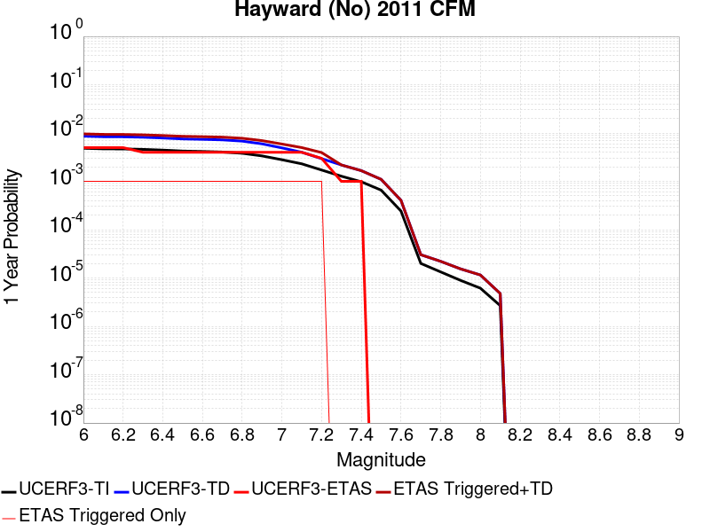 | 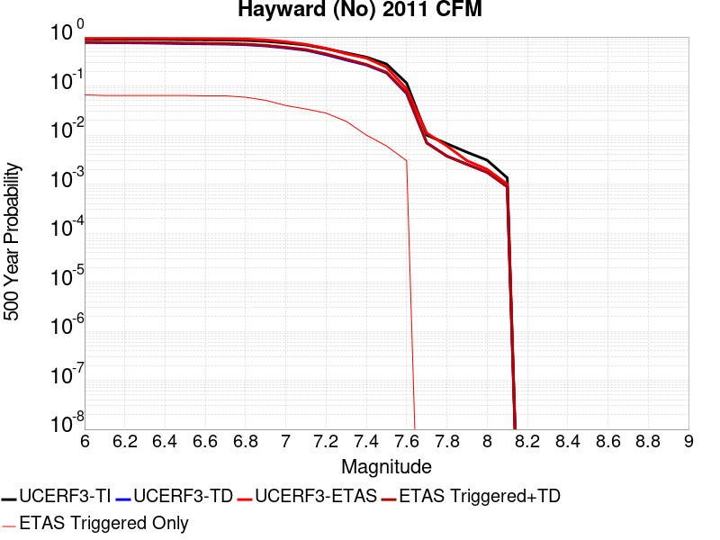 |

| Magnitude | 1 wk TI Prob | 1 wk TD Prob | 1 wk ETAS Prob | 1 wk ETAS/TD Gain | 1 wk ETAS Triggered+TD | 1 wk ETAS Triggered Only | 1 mo TI Prob | 1 mo TD Prob | 1 mo ETAS Prob | 1 mo ETAS/TD Gain | 1 mo ETAS Triggered+TD | 1 mo ETAS Triggered Only | 1 yr TI Prob | 1 yr TD Prob | 1 yr ETAS Prob | 1 yr ETAS/TD Gain | 1 yr ETAS Triggered+TD | 1 yr ETAS Triggered Only | 500 yr TI Prob | 500 yr TD Prob | 500 yr ETAS Prob | 500 yr ETAS/TD Gain | 500 yr ETAS Triggered+TD | 500 yr ETAS Triggered Only |
|-----|-----|-----|-----|-----|-----|-----|-----|-----|-----|-----|-----|-----|-----|-----|-----|-----|-----|-----|-----|-----|-----|-----|-----|-----|
| 6.0 | 9.3068506E-5 | 1.6598412E-4 | 0.0 | 0.0 | 1.6598412E-4 | 0.0 | 3.9880406E-4 | 7.111664E-4 | 0.0 | 0.0 | 7.111664E-4 | 0.0 | 0.0048446343 | 0.008623985 | 0.005 | 0.5797784 | 0.009615361 | 0.001 | 0.9118049 | 0.7724866 | 0.949 | 1.2285002 | 0.7875025 | 0.066 |
| 6.1 | 9.055486E-5 | 1.615793E-4 | 0.0 | 0.0 | 1.615793E-4 | 0.0 | 3.880345E-4 | 6.9229904E-4 | 0.0 | 0.0 | 6.9229904E-4 | 0.0 | 0.0047140904 | 0.008396243 | 0.005 | 0.59550446 | 0.009387846 | 0.001 | 0.9058267 | 0.76373965 | 0.945 | 1.2373326 | 0.77886033 | 0.064 |
| 6.2 | 9.006742E-5 | 1.6080288E-4 | 0.0 | 0.0 | 1.6080288E-4 | 0.0 | 3.859461E-4 | 6.889733E-4 | 0.0 | 0.0 | 6.889733E-4 | 0.0 | 0.0046887742 | 0.008356092 | 0.005 | 0.59836584 | 0.009347736 | 0.001 | 0.90462136 | 0.76177627 | 0.945 | 1.2405217 | 0.7770226 | 0.064 |
| 6.3 | 8.8336754E-5 | 1.5764919E-4 | 0.0 | 0.0 | 1.5764919E-4 | 0.0 | 3.7853114E-4 | 6.7546475E-4 | 0.0 | 0.0 | 6.7546475E-4 | 0.0 | 0.004598882 | 0.008192918 | 0.004 | 0.4882265 | 0.009184726 | 0.001 | 0.90021574 | 0.75566655 | 0.942 | 1.2465816 | 0.7713039 | 0.064 |
| 6.4 | 8.526157E-5 | 1.5200504E-4 | 0.0 | 0.0 | 1.5200504E-4 | 0.0 | 3.6535555E-4 | 6.512879E-4 | 0.0 | 0.0 | 6.512879E-4 | 0.0 | 0.0044391346 | 0.007900746 | 0.004 | 0.5062814 | 0.008892844 | 0.001 | 0.89187944 | 0.7444527 | 0.934 | 1.2546129 | 0.76080775 | 0.064 |
| 6.5 | 8.152396E-5 | 1.454647E-4 | 0.0 | 0.0 | 1.454647E-4 | 0.0 | 3.493416E-4 | 6.2327157E-4 | 0.0 | 0.0 | 6.2327157E-4 | 0.0 | 0.0042449418 | 0.0075620646 | 0.004 | 0.52895606 | 0.008554502 | 0.001 | 0.8808043 | 0.73001796 | 0.931 | 1.2753111 | 0.7472968 | 0.064 |
| 6.6 | 7.987405E-5 | 1.4255891E-4 | 0.0 | 0.0 | 1.4255891E-4 | 0.0 | 3.4227243E-4 | 6.108243E-4 | 0.0 | 0.0 | 6.108243E-4 | 0.0 | 0.0041592065 | 0.007411568 | 0.004 | 0.5396969 | 0.008404156 | 0.001 | 0.87556106 | 0.723157 | 0.926 | 1.2804965 | 0.7405981 | 0.063 |
| 6.7 | 7.777665E-5 | 1.390405E-4 | 0.0 | 0.0 | 1.390405E-4 | 0.0 | 3.332859E-4 | 5.957523E-4 | 0.0 | 0.0 | 5.957523E-4 | 0.0 | 0.004050208 | 0.0072293007 | 0.004 | 0.5533039 | 0.008222071 | 0.001 | 0.86856145 | 0.71456194 | 0.92 | 1.2875022 | 0.73254454 | 0.063 |
| 6.8 | 7.3284005E-5 | 1.3093207E-4 | 0.0 | 0.0 | 1.3093207E-4 | 0.0 | 3.140365E-4 | 5.610173E-4 | 0.0 | 0.0 | 5.610173E-4 | 0.0 | 0.0038166929 | 0.0068091173 | 0.004 | 0.58744764 | 0.007802308 | 0.001 | 0.8522151 | 0.69612765 | 0.906 | 1.3014854 | 0.7140561 | 0.059 |
| 6.9 | 6.458263E-5 | 1.15007926E-4 | 0.0 | 0.0 | 1.15007926E-4 | 0.0 | 2.7675333E-4 | 4.927984E-4 | 0.0 | 0.0 | 4.927984E-4 | 0.0 | 0.0033642664 | 0.0059834057 | 0.004 | 0.66851556 | 0.0069774226 | 0.001 | 0.81454986 | 0.6566434 | 0.87 | 1.32492 | 0.6741546 | 0.051 |
| 7.0 | 5.3853604E-5 | 9.477559E-5 | 0.0 | 0.0 | 9.477559E-5 | 0.0 | 2.3078074E-4 | 4.0611817E-4 | 0.0 | 0.0 | 4.0611817E-4 | 0.0 | 0.0028061352 | 0.0049333367 | 0.004 | 0.81081027 | 0.005928403 | 0.001 | 0.7546427 | 0.59839475 | 0.797 | 1.3318968 | 0.614459 | 0.04 |
| 7.1 | 4.4308683E-5 | 7.697274E-5 | 0.0 | 0.0 | 7.697274E-5 | 0.0 | 1.8988053E-4 | 3.2984166E-4 | 0.0 | 0.0 | 3.2984166E-4 | 0.0 | 0.0023093442 | 0.0040084645 | 0.004 | 0.99788827 | 0.0050044563 | 0.001 | 0.6852597 | 0.53656626 | 0.706 | 1.3157742 | 0.552323 | 0.034 |
| 7.2 | 3.295973E-5 | 5.671315E-5 | 0.0 | 0.0 | 5.671315E-5 | 0.0 | 1.4124835E-4 | 2.4303384E-4 | 0.0 | 0.0 | 2.4303384E-4 | 0.0 | 0.0017183421 | 0.0029549422 | 0.003 | 1.0152483 | 0.0039519873 | 0.001 | 0.57679987 | 0.4351753 | 0.587 | 1.3488817 | 0.45099038 | 0.028 |
| 7.3 | 2.452256E-5 | 4.1925472E-5 | 0.0 | 0.0 | 4.1925472E-5 | 0.0 | 1.05092455E-4 | 1.7966829E-4 | 0.0 | 0.0 | 1.7966829E-4 | 0.0 | 0.0012787496 | 0.0021852788 | 0.001 | 0.4576075 | 0.0021852788 | 0.0 | 0.47259364 | 0.33926007 | 0.454 | 1.3382064 | 0.35181415 | 0.019 |
| 7.4 | 1.8829967E-5 | 3.19882E-5 | 0.0 | 0.0 | 3.19882E-5 | 0.0 | 8.069736E-5 | 1.3708512E-4 | 0.0 | 0.0 | 1.3708512E-4 | 0.0 | 9.820475E-4 | 0.0016677422 | 0.001 | 0.5996131 | 0.0016677422 | 0.0 | 0.3881481 | 0.26807576 | 0.371 | 1.3839371 | 0.275395 | 0.01 |
| 7.5 | 1.26374125E-5 | 2.1124079E-5 | 0.0 | 0.0 | 2.1124079E-5 | 0.0 | 5.4159216E-5 | 9.052865E-5 | 0.0 | 0.0 | 9.052865E-5 | 0.0 | 6.5918895E-4 | 0.001101634 | 0.0 | 0.0 | 0.001101634 | 0.0 | 0.28086284 | 0.18518479 | 0.242 | 1.3068027 | 0.19007368 | 0.006 |
| 7.6 | 4.666429E-6 | 7.7720315E-6 | 0.0 | 0.0 | 7.7720315E-6 | 0.0 | 1.9998828E-5 | 3.3308286E-5 | 0.0 | 0.0 | 3.3308286E-5 | 0.0 | 2.4345852E-4 | 4.0545396E-4 | 0.0 | 0.0 | 4.0545396E-4 | 0.0 | 0.114625074 | 0.07006071 | 0.087 | 1.2417803 | 0.072850525 | 0.003 |
| 7.7 | 3.8399318E-7 | 5.821272E-7 | 0.0 | 0.0 | 5.821272E-7 | 0.0 | 1.6456839E-6 | 2.4948283E-6 | 0.0 | 0.0 | 2.4948283E-6 | 0.0 | 2.003602E-5 | 3.0374113E-5 | 0.0 | 0.0 | 3.0374113E-5 | 0.0 | 0.009968095 | 0.0069193775 | 0.011 | 1.5897384 | 0.0069193775 | 0.0 |
| 7.8 | 2.5637698E-7 | 4.2405568E-7 | 0.0 | 0.0 | 4.2405568E-7 | 0.0 | 1.098758E-6 | 1.8173802E-6 | 0.0 | 0.0 | 1.8173802E-6 | 0.0 | 1.3377297E-5 | 2.212638E-5 | 0.0 | 0.0 | 2.212638E-5 | 0.0 | 0.006666374 | 0.0037243795 | 0.006 | 1.6110066 | 0.0037243795 | 0.0 |
| 7.9 | 1.7141245E-7 | 2.9625036E-7 | 0.0 | 0.0 | 2.9625036E-7 | 0.0 | 7.3462456E-7 | 1.2696437E-6 | 0.0 | 0.0 | 1.2696437E-6 | 0.0 | 8.944017E-6 | 1.5457803E-5 | 0.0 | 0.0 | 1.5457803E-5 | 0.0 | 0.004462044 | 0.002529812 | 0.003 | 1.1858588 | 0.002529812 | 0.0 |
| 8.0 | 1.1808895E-7 | 2.2143774E-7 | 0.0 | 0.0 | 2.2143774E-7 | 0.0 | 5.060954E-7 | 9.490185E-7 | 0.0 | 0.0 | 9.490185E-7 | 0.0 | 6.161694E-6 | 1.155424E-5 | 0.0 | 0.0 | 1.155424E-5 | 0.0 | 0.0030761154 | 0.0017390425 | 0.002 | 1.1500582 | 0.0017390425 | 0.0 |
| 8.1 | 5.138535E-8 | 9.159254E-8 | 0.0 | 0.0 | 9.159254E-8 | 0.0 | 2.2022292E-7 | 3.925394E-7 | 0.0 | 0.0 | 3.925394E-7 | 0.0 | 2.6812106E-6 | 4.779157E-6 | 0.0 | 0.0 | 4.779157E-6 | 0.0 | 0.0013397089 | 8.8477903E-4 | 0.001 | 1.1302257 | 8.8477903E-4 | 0.0 |

## King Range 2011 CFM
*[(top)](#table-of-contents)*

| 1 Week | 1 Month | 1 Year | 500 Year |
|-----|-----|-----|-----|
|  | 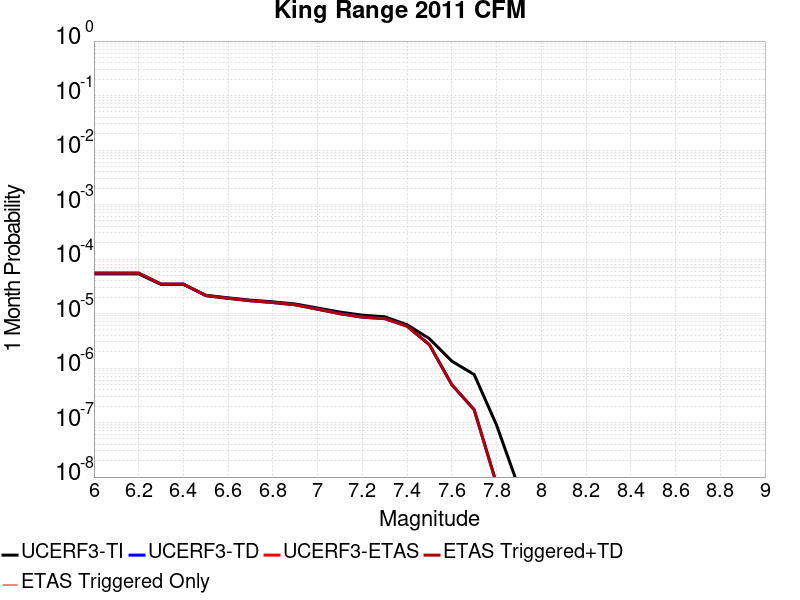 | 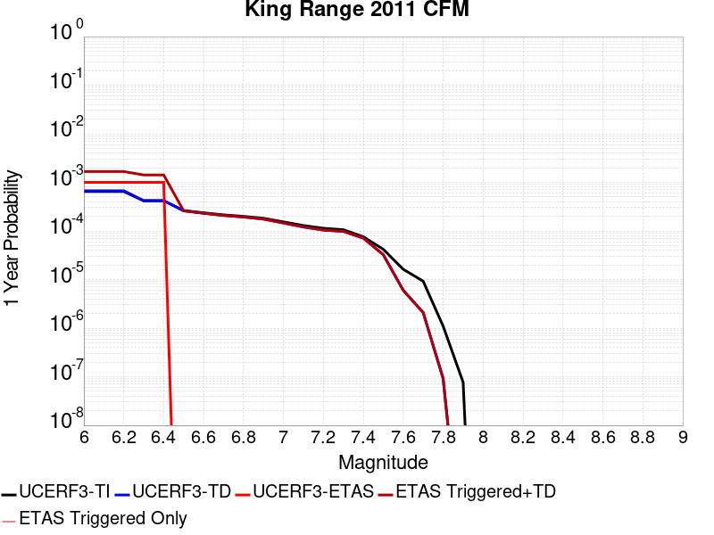 |  |

| Magnitude | 1 wk TI Prob | 1 wk TD Prob | 1 wk ETAS Prob | 1 wk ETAS/TD Gain | 1 wk ETAS Triggered+TD | 1 wk ETAS Triggered Only | 1 mo TI Prob | 1 mo TD Prob | 1 mo ETAS Prob | 1 mo ETAS/TD Gain | 1 mo ETAS Triggered+TD | 1 mo ETAS Triggered Only | 1 yr TI Prob | 1 yr TD Prob | 1 yr ETAS Prob | 1 yr ETAS/TD Gain | 1 yr ETAS Triggered+TD | 1 yr ETAS Triggered Only | 500 yr TI Prob | 500 yr TD Prob | 500 yr ETAS Prob | 500 yr ETAS/TD Gain | 500 yr ETAS Triggered+TD | 500 yr ETAS Triggered Only |
|-----|-----|-----|-----|-----|-----|-----|-----|-----|-----|-----|-----|-----|-----|-----|-----|-----|-----|-----|-----|-----|-----|-----|-----|-----|
| 6.0 | 1.2462566E-5 | 1.2897125E-5 | 0.0 | 0.0 | 1.2897125E-5 | 0.0 | 5.34099E-5 | 5.5272416E-5 | 0.0 | 0.0 | 5.5272416E-5 | 0.0 | 6.5007154E-4 | 6.7276857E-4 | 0.001 | 1.4863952 | 0.0016720957 | 0.001 | 0.27757484 | 0.30151814 | 0.626 | 2.0761602 | 0.3497134 | 0.069 |
| 6.1 | 1.2462566E-5 | 1.2897125E-5 | 0.0 | 0.0 | 1.2897125E-5 | 0.0 | 5.34099E-5 | 5.5272416E-5 | 0.0 | 0.0 | 5.5272416E-5 | 0.0 | 6.5007154E-4 | 6.7276857E-4 | 0.001 | 1.4863952 | 0.0016720957 | 0.001 | 0.27757484 | 0.30151814 | 0.626 | 2.0761602 | 0.3497134 | 0.069 |
| 6.2 | 1.2462566E-5 | 1.2897125E-5 | 0.0 | 0.0 | 1.2897125E-5 | 0.0 | 5.34099E-5 | 5.5272416E-5 | 0.0 | 0.0 | 5.5272416E-5 | 0.0 | 6.5007154E-4 | 6.7276857E-4 | 0.001 | 1.4863952 | 0.0016720957 | 0.001 | 0.27757484 | 0.30151814 | 0.626 | 2.0761602 | 0.3497134 | 0.069 |
| 6.3 | 7.988484E-6 | 8.106879E-6 | 0.0 | 0.0 | 8.106879E-6 | 0.0 | 3.423591E-5 | 3.4743378E-5 | 0.0 | 0.0 | 3.4743378E-5 | 0.0 | 4.1674246E-4 | 4.2293136E-4 | 0.001 | 2.36445 | 0.0014225084 | 0.001 | 0.1881297 | 0.20363076 | 0.368 | 1.8071926 | 0.23548552 | 0.04 |
| 6.4 | 7.988484E-6 | 8.106879E-6 | 0.0 | 0.0 | 8.106879E-6 | 0.0 | 3.423591E-5 | 3.4743378E-5 | 0.0 | 0.0 | 3.4743378E-5 | 0.0 | 4.1674246E-4 | 4.2293136E-4 | 0.001 | 2.36445 | 0.0014225084 | 0.001 | 0.1881297 | 0.20363076 | 0.368 | 1.8071926 | 0.23548552 | 0.04 |
| 6.5 | 5.0522513E-6 | 4.9861346E-6 | 0.0 | 0.0 | 4.9861346E-6 | 0.0 | 2.1652326E-5 | 2.1368978E-5 | 0.0 | 0.0 | 2.1368978E-5 | 0.0 | 2.6358519E-4 | 2.6013717E-4 | 0.0 | 0.0 | 2.6013717E-4 | 0.0 | 0.12349245 | 0.13316002 | 0.139 | 1.0438569 | 0.14182842 | 0.01 |
| 6.6 | 4.53682E-6 | 4.444866E-6 | 0.0 | 0.0 | 4.444866E-6 | 0.0 | 1.944337E-5 | 1.904929E-5 | 0.0 | 0.0 | 1.904929E-5 | 0.0 | 2.3669732E-4 | 2.3190104E-4 | 0.0 | 0.0 | 2.3190104E-4 | 0.0 | 0.111626185 | 0.12073309 | 0.104 | 0.8614043 | 0.12776722 | 0.008 |
| 6.7 | 4.1144335E-6 | 4.004101E-6 | 0.0 | 0.0 | 4.004101E-6 | 0.0 | 1.7633167E-5 | 1.716032E-5 | 0.0 | 0.0 | 1.716032E-5 | 0.0 | 2.1466266E-4 | 2.0890727E-4 | 0.0 | 0.0 | 2.0890727E-4 | 0.0 | 0.10178234 | 0.11050507 | 0.084 | 0.76014614 | 0.11584204 | 0.006 |
| 6.8 | 3.8321214E-6 | 3.7173693E-6 | 0.0 | 0.0 | 3.7173693E-6 | 0.0 | 1.6423275E-5 | 1.5931488E-5 | 0.0 | 0.0 | 1.5931488E-5 | 0.0 | 1.9993502E-4 | 1.9394893E-4 | 0.0 | 0.0 | 1.9394893E-4 | 0.0 | 0.09514223 | 0.103642605 | 0.068 | 0.6561008 | 0.10812439 | 0.005 |
| 6.9 | 3.4999944E-6 | 3.3759766E-6 | 0.0 | 0.0 | 3.3759766E-6 | 0.0 | 1.499989E-5 | 1.4468393E-5 | 0.0 | 0.0 | 1.4468393E-5 | 0.0 | 1.8260835E-4 | 1.761387E-4 | 0.0 | 0.0 | 1.761387E-4 | 0.0 | 0.08726757 | 0.09546414 | 0.063 | 0.6599336 | 0.098177746 | 0.003 |
| 7.0 | 2.9470837E-6 | 2.8036325E-6 | 0.0 | 0.0 | 2.8036325E-6 | 0.0 | 1.26302975E-5 | 1.2015513E-5 | 0.0 | 0.0 | 1.2015513E-5 | 0.0 | 1.5376302E-4 | 1.4627923E-4 | 0.0 | 0.0 | 1.4627923E-4 | 0.0 | 0.0740059 | 0.08154547 | 0.046 | 0.5641024 | 0.08246393 | 0.001 |
| 7.1 | 2.4850247E-6 | 2.3214354E-6 | 0.0 | 0.0 | 2.3214354E-6 | 0.0 | 1.0650062E-5 | 9.948972E-6 | 0.0 | 0.0 | 9.948972E-6 | 0.0 | 1.296568E-4 | 1.2112214E-4 | 0.0 | 0.0 | 1.2112214E-4 | 0.0 | 0.06277566 | 0.06952352 | 0.035 | 0.50342673 | 0.070454 | 0.001 |
| 7.2 | 2.1800304E-6 | 2.0036578E-6 | 0.0 | 0.0 | 2.0036578E-6 | 0.0 | 9.342954E-6 | 8.587077E-6 | 0.0 | 0.0 | 8.587077E-6 | 0.0 | 1.1374453E-4 | 1.0454273E-4 | 0.0 | 0.0 | 1.0454273E-4 | 0.0 | 0.055288322 | 0.061558746 | 0.031 | 0.503584 | 0.062497187 | 0.001 |
| 7.3 | 2.0378504E-6 | 1.8839692E-6 | 0.0 | 0.0 | 1.8839692E-6 | 0.0 | 8.733615E-6 | 8.074129E-6 | 0.0 | 0.0 | 8.074129E-6 | 0.0 | 1.0632657E-4 | 9.8298166E-5 | 0.0 | 0.0 | 9.8298166E-5 | 0.0 | 0.05177751 | 0.05780694 | 0.027 | 0.46707195 | 0.05874913 | 0.001 |
| 7.4 | 1.4577047E-6 | 1.3702808E-6 | 0.0 | 0.0 | 1.3702808E-6 | 0.0 | 6.247291E-6 | 5.8726187E-6 | 0.0 | 0.0 | 5.8726187E-6 | 0.0 | 7.605811E-5 | 7.149686E-5 | 0.0 | 0.0 | 7.149686E-5 | 0.0 | 0.037316423 | 0.04182054 | 0.018 | 0.4304105 | 0.04182054 | 0.0 |
| 7.5 | 8.0685743E-7 | 6.246198E-7 | 0.0 | 0.0 | 6.246198E-7 | 0.0 | 3.457956E-6 | 2.6769396E-6 | 0.0 | 0.0 | 2.6769396E-6 | 0.0 | 4.20998E-5 | 3.25913E-5 | 0.0 | 0.0 | 3.25913E-5 | 0.0 | 0.020830331 | 0.023545776 | 0.011 | 0.46717513 | 0.023545776 | 0.0 |
| 7.6 | 3.1239435E-7 | 1.1550049E-7 | 0.0 | 0.0 | 1.1550049E-7 | 0.0 | 1.3388321E-6 | 4.95002E-7 | 0.0 | 0.0 | 4.95002E-7 | 0.0 | 1.630016E-5 | 6.026633E-6 | 0.0 | 0.0 | 6.026633E-6 | 0.0 | 0.008117024 | 0.009163417 | 0.006 | 0.6547775 | 0.009163417 | 0.0 |
| 7.7 | 1.7747207E-7 | 4.01559E-8 | 0.0 | 0.0 | 4.01559E-8 | 0.0 | 7.605944E-7 | 1.7209669E-7 | 0.0 | 0.0 | 1.7209669E-7 | 0.0 | 9.260198E-6 | 2.0952752E-6 | 0.0 | 0.0 | 2.0952752E-6 | 0.0 | 0.0046194177 | 0.005267605 | 0.004 | 0.75935835 | 0.005267605 | 0.0 |
| 7.8 | 2.1035538E-8 | 1.7563538E-9 | 0.0 | 0.0 | 1.7563538E-9 | 0.0 | 9.0152305E-8 | 7.527229E-9 | 0.0 | 0.0 | 7.527229E-9 | 0.0 | 1.0976038E-6 | 9.164401E-8 | 0.0 | 0.0 | 9.164401E-8 | 0.0 | 5.486516E-4 | 5.625051E-4 | 0.001 | 1.7777617 | 5.625051E-4 | 0.0 |
| 7.9 | 1.4782963E-9 | 1.8141044E-13 | 0.0 | 0.0 | 1.8141044E-13 | 0.0 | 6.335555E-9 | 7.774892E-13 | 0.0 | 0.0 | 7.774892E-13 | 0.0 | 7.713538E-8 | 9.46665E-12 | 0.0 | 0.0 | 9.46665E-12 | 0.0 | 3.856695E-5 | 3.082631E-5 | 0.0 | 0.0 | 3.082631E-5 | 0.0 |

## San Gregorio (North) 2011 CFM
*[(top)](#table-of-contents)*

| 1 Week | 1 Month | 1 Year | 500 Year |
|-----|-----|-----|-----|
|  |  | 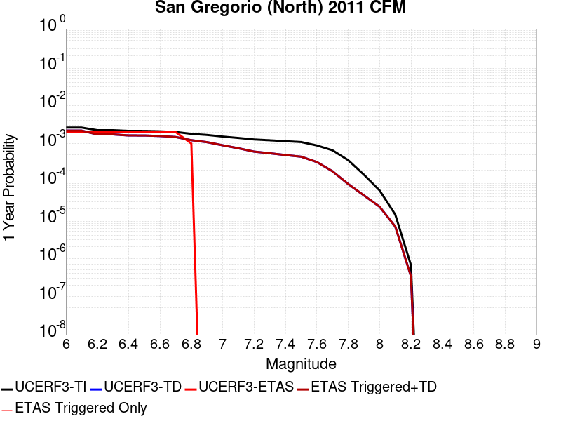 |  |

| Magnitude | 1 wk TI Prob | 1 wk TD Prob | 1 wk ETAS Prob | 1 wk ETAS/TD Gain | 1 wk ETAS Triggered+TD | 1 wk ETAS Triggered Only | 1 mo TI Prob | 1 mo TD Prob | 1 mo ETAS Prob | 1 mo ETAS/TD Gain | 1 mo ETAS Triggered+TD | 1 mo ETAS Triggered Only | 1 yr TI Prob | 1 yr TD Prob | 1 yr ETAS Prob | 1 yr ETAS/TD Gain | 1 yr ETAS Triggered+TD | 1 yr ETAS Triggered Only | 500 yr TI Prob | 500 yr TD Prob | 500 yr ETAS Prob | 500 yr ETAS/TD Gain | 500 yr ETAS Triggered+TD | 500 yr ETAS Triggered Only |
|-----|-----|-----|-----|-----|-----|-----|-----|-----|-----|-----|-----|-----|-----|-----|-----|-----|-----|-----|-----|-----|-----|-----|-----|-----|
| 6.0 | 5.0283932E-5 | 4.1791776E-5 | 0.0 | 0.0 | 4.1791776E-5 | 0.0 | 2.1548476E-4 | 1.7909544E-4 | 0.0 | 0.0 | 1.7909544E-4 | 0.0 | 0.0026203706 | 0.0021783232 | 0.002 | 0.9181374 | 0.0021783232 | 0.0 | 0.7306934 | 0.72855616 | 0.711 | 0.97590286 | 0.74701434 | 0.068 |
| 6.1 | 5.0283932E-5 | 4.1791776E-5 | 0.0 | 0.0 | 4.1791776E-5 | 0.0 | 2.1548476E-4 | 1.7909544E-4 | 0.0 | 0.0 | 1.7909544E-4 | 0.0 | 0.0026203706 | 0.0021783232 | 0.002 | 0.9181374 | 0.0021783232 | 0.0 | 0.7306934 | 0.72855616 | 0.711 | 0.97590286 | 0.74701434 | 0.068 |
| 6.2 | 4.2998647E-5 | 3.330061E-5 | 0.0 | 0.0 | 3.330061E-5 | 0.0 | 1.842669E-4 | 1.4270918E-4 | 0.0 | 0.0 | 1.4270918E-4 | 0.0 | 0.0022411412 | 0.0017361128 | 0.002 | 1.1519989 | 0.0017361128 | 0.0 | 0.67431617 | 0.6715433 | 0.648 | 0.96494156 | 0.6912507 | 0.06 |
| 6.3 | 4.2998647E-5 | 3.330061E-5 | 0.0 | 0.0 | 3.330061E-5 | 0.0 | 1.842669E-4 | 1.4270918E-4 | 0.0 | 0.0 | 1.4270918E-4 | 0.0 | 0.0022411412 | 0.0017361128 | 0.002 | 1.1519989 | 0.0017361128 | 0.0 | 0.67431617 | 0.6715433 | 0.648 | 0.96494156 | 0.6912507 | 0.06 |
| 6.4 | 4.1101295E-5 | 3.122053E-5 | 0.0 | 0.0 | 3.122053E-5 | 0.0 | 1.7613651E-4 | 1.3379549E-4 | 0.0 | 0.0 | 1.3379549E-4 | 0.0 | 0.0021423528 | 0.0016277566 | 0.002 | 1.2286849 | 0.0016277566 | 0.0 | 0.6577882 | 0.65502596 | 0.631 | 0.9633206 | 0.6746895 | 0.057 |
| 6.5 | 4.1032585E-5 | 3.1139407E-5 | 0.0 | 0.0 | 3.1139407E-5 | 0.0 | 1.7584208E-4 | 1.3344784E-4 | 0.0 | 0.0 | 1.3344784E-4 | 0.0 | 0.0021387753 | 0.0016235304 | 0.002 | 1.2318833 | 0.0016235304 | 0.0 | 0.65717417 | 0.6544001 | 0.631 | 0.9642419 | 0.67409927 | 0.057 |
| 6.6 | 4.011629E-5 | 3.0179155E-5 | 0.0 | 0.0 | 3.0179155E-5 | 0.0 | 1.7191563E-4 | 1.293329E-4 | 0.0 | 0.0 | 1.293329E-4 | 0.0 | 0.0020910634 | 0.0015735048 | 0.002 | 1.271048 | 0.0015735048 | 0.0 | 0.6488797 | 0.6460792 | 0.618 | 0.95653903 | 0.66519094 | 0.054 |
| 6.7 | 3.8583938E-5 | 2.839573E-5 | 0.0 | 0.0 | 2.839573E-5 | 0.0 | 1.6534925E-4 | 1.2169039E-4 | 0.0 | 0.0 | 1.2169039E-4 | 0.0 | 0.0020112682 | 0.0014805876 | 0.002 | 1.3508149 | 0.0014805876 | 0.0 | 0.63455766 | 0.63157725 | 0.602 | 0.9531692 | 0.6514721 | 0.054 |
| 6.8 | 3.44341E-5 | 2.346522E-5 | 0.0 | 0.0 | 2.346522E-5 | 0.0 | 1.4756636E-4 | 1.0056141E-4 | 0.0 | 0.0 | 1.0056141E-4 | 0.0 | 0.0017951399 | 0.0012236579 | 0.001 | 0.81722194 | 0.0012236579 | 0.0 | 0.59276974 | 0.5865384 | 0.546 | 0.9308854 | 0.6047307 | 0.044 |
| 6.9 | 3.221199E-5 | 2.0828431E-5 | 0.0 | 0.0 | 2.0828431E-5 | 0.0 | 1.3804408E-4 | 8.9261695E-5 | 0.0 | 0.0 | 8.9261695E-5 | 0.0 | 0.0016793909 | 0.0010862274 | 0.0 | 0.0 | 0.0010862274 | 0.0 | 0.5684627 | 0.5603491 | 0.505 | 0.9012239 | 0.5774955 | 0.039 |
| 7.0 | 2.9186718E-5 | 1.7246915E-5 | 0.0 | 0.0 | 1.7246915E-5 | 0.0 | 1.2507994E-4 | 7.391328E-5 | 0.0 | 0.0 | 7.391328E-5 | 0.0 | 0.0015217843 | 8.99527E-4 | 0.0 | 0.0 | 8.99527E-4 | 0.0 | 0.53302133 | 0.5220812 | 0.475 | 0.90982014 | 0.5378525 | 0.033 |
| 7.1 | 2.6840138E-5 | 1.4424455E-5 | 0.0 | 0.0 | 1.4424455E-5 | 0.0 | 1.1502409E-4 | 6.1817635E-5 | 0.0 | 0.0 | 6.1817635E-5 | 0.0 | 0.0013995186 | 7.5237174E-4 | 0.0 | 0.0 | 7.5237174E-4 | 0.0 | 0.50353855 | 0.4898764 | 0.445 | 0.9083924 | 0.5051801 | 0.03 |
| 7.2 | 2.453002E-5 | 1.1786008E-5 | 0.0 | 0.0 | 1.1786008E-5 | 0.0 | 1.05124425E-4 | 5.051049E-5 | 0.0 | 0.0 | 5.051049E-5 | 0.0 | 0.0012791384 | 6.147922E-4 | 0.0 | 0.0 | 6.147922E-4 | 0.0 | 0.47269627 | 0.45608348 | 0.412 | 0.9033434 | 0.47076923 | 0.027 |
| 7.3 | 2.3330727E-5 | 1.0691501E-5 | 0.0 | 0.0 | 1.0691501E-5 | 0.0 | 9.9985E-5 | 4.5819917E-5 | 0.0 | 0.0 | 4.5819917E-5 | 0.0 | 0.0012166376 | 5.5771513E-4 | 0.0 | 0.0 | 5.5771513E-4 | 0.0 | 0.4559364 | 0.43742678 | 0.393 | 0.89843607 | 0.45149112 | 0.025 |
| 7.4 | 2.2136466E-5 | 9.596096E-6 | 0.0 | 0.0 | 9.596096E-6 | 0.0 | 9.486712E-5 | 4.112548E-5 | 0.0 | 0.0 | 4.112548E-5 | 0.0 | 0.0011543952 | 5.0058786E-4 | 0.0 | 0.0 | 5.0058786E-4 | 0.0 | 0.43871754 | 0.41837415 | 0.377 | 0.9011073 | 0.43233317 | 0.024 |
| 7.5 | 2.0994974E-5 | 8.684064E-6 | 0.0 | 0.0 | 8.684064E-6 | 0.0 | 8.997535E-5 | 3.7216887E-5 | 0.0 | 0.0 | 3.7216887E-5 | 0.0 | 0.0010948994 | 4.5302158E-4 | 0.0 | 0.0 | 4.5302158E-4 | 0.0 | 0.42175037 | 0.40065882 | 0.35 | 0.8735612 | 0.41444367 | 0.023 |
| 7.6 | 1.7091823E-5 | 6.303548E-6 | 0.0 | 0.0 | 6.303548E-6 | 0.0 | 7.3248615E-5 | 2.7014927E-5 | 0.0 | 0.0 | 2.7014927E-5 | 0.0 | 8.9143694E-4 | 3.2885716E-4 | 0.0 | 0.0 | 3.2885716E-4 | 0.0 | 0.35976326 | 0.34082457 | 0.285 | 0.83620733 | 0.3533489 | 0.019 |
| 7.7 | 1.2772179E-5 | 3.6112406E-6 | 0.0 | 0.0 | 3.6112406E-6 | 0.0 | 5.473676E-5 | 1.5476653E-5 | 0.0 | 0.0 | 1.5476653E-5 | 0.0 | 6.6621625E-4 | 1.8841198E-4 | 0.0 | 0.0 | 1.8841198E-4 | 0.0 | 0.28338686 | 0.26445484 | 0.212 | 0.8016491 | 0.2747525 | 0.014 |
| 7.8 | 7.041923E-6 | 1.677672E-6 | 0.0 | 0.0 | 1.677672E-6 | 0.0 | 3.017932E-5 | 7.1900026E-6 | 0.0 | 0.0 | 7.1900026E-6 | 0.0 | 3.6737128E-4 | 8.753477E-5 | 0.0 | 0.0 | 8.753477E-5 | 0.0 | 0.1678307 | 0.15107241 | 0.127 | 0.84065646 | 0.15786383 | 0.008 |
| 7.9 | 2.946768E-6 | 8.449391E-7 | 0.0 | 0.0 | 8.449391E-7 | 0.0 | 1.2628945E-5 | 3.6211625E-6 | 0.0 | 0.0 | 3.6211625E-6 | 0.0 | 1.5374656E-4 | 4.4086763E-5 | 0.0 | 0.0 | 4.4086763E-5 | 0.0 | 0.07399828 | 0.071480654 | 0.053 | 0.7414593 | 0.07426622 | 0.003 |
| 8.0 | 1.1433375E-6 | 4.2800465E-7 | 0.0 | 0.0 | 4.2800465E-7 | 0.0 | 4.9000087E-6 | 1.8343043E-6 | 0.0 | 0.0 | 1.8343043E-6 | 0.0 | 5.965597E-5 | 2.2332426E-5 | 0.0 | 0.0 | 2.2332426E-5 | 0.0 | 0.029388385 | 0.030293034 | 0.015 | 0.49516335 | 0.03126274 | 0.001 |
| 8.1 | 2.6675295E-7 | 1.2939684E-7 | 0.0 | 0.0 | 1.2939684E-7 | 0.0 | 1.1432264E-6 | 5.545578E-7 | 0.0 | 0.0 | 5.545578E-7 | 0.0 | 1.3918692E-5 | 6.75172E-6 | 0.0 | 0.0 | 6.75172E-6 | 0.0 | 0.006935234 | 0.0071965675 | 0.001 | 0.13895513 | 0.0071965675 | 0.0 |
| 8.2 | 1.2704569E-8 | 6.515655E-9 | 0.0 | 0.0 | 6.515655E-9 | 0.0 | 5.444815E-8 | 2.7924234E-8 | 0.0 | 0.0 | 2.7924234E-8 | 0.0 | 6.629061E-7 | 3.399775E-7 | 0.0 | 0.0 | 3.399775E-7 | 0.0 | 3.3139822E-4 | 3.1314447E-4 | 0.0 | 0.0 | 3.1314447E-4 | 0.0 |

## Sargent 2011 CFM
*[(top)](#table-of-contents)*

| 1 Week | 1 Month | 1 Year | 500 Year |
|-----|-----|-----|-----|
|  |  | 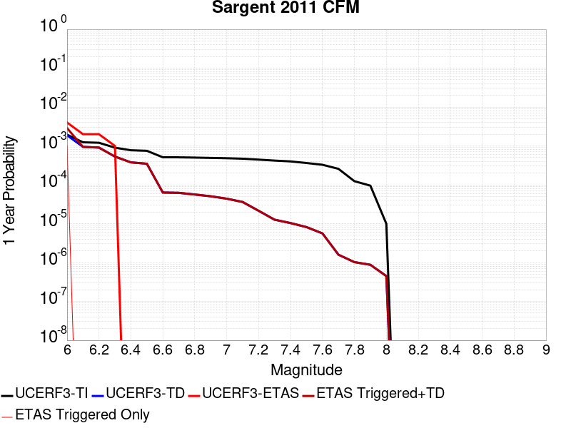 | 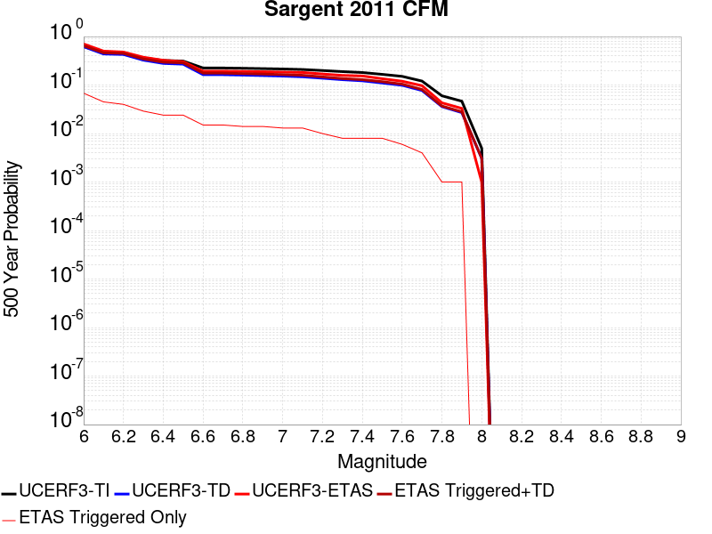 |

| Magnitude | 1 wk TI Prob | 1 wk TD Prob | 1 wk ETAS Prob | 1 wk ETAS/TD Gain | 1 wk ETAS Triggered+TD | 1 wk ETAS Triggered Only | 1 mo TI Prob | 1 mo TD Prob | 1 mo ETAS Prob | 1 mo ETAS/TD Gain | 1 mo ETAS Triggered+TD | 1 mo ETAS Triggered Only | 1 yr TI Prob | 1 yr TD Prob | 1 yr ETAS Prob | 1 yr ETAS/TD Gain | 1 yr ETAS Triggered+TD | 1 yr ETAS Triggered Only | 500 yr TI Prob | 500 yr TD Prob | 500 yr ETAS Prob | 500 yr ETAS/TD Gain | 500 yr ETAS Triggered+TD | 500 yr ETAS Triggered Only |
|-----|-----|-----|-----|-----|-----|-----|-----|-----|-----|-----|-----|-----|-----|-----|-----|-----|-----|-----|-----|-----|-----|-----|-----|-----|
| 6.0 | 3.7327867E-5 | 3.5993016E-5 | 0.0 | 0.0 | 3.5993016E-5 | 0.0 | 1.5996677E-4 | 1.5424934E-4 | 0.0 | 0.0 | 1.5424934E-4 | 0.0 | 0.0019458556 | 0.0018768029 | 0.004 | 2.131284 | 0.0028749262 | 0.001 | 0.6223833 | 0.6192132 | 0.704 | 1.1369267 | 0.64510673 | 0.068 |
| 6.1 | 2.3771476E-5 | 1.8123363E-5 | 0.0 | 0.0 | 1.8123363E-5 | 0.0 | 1.01873775E-4 | 7.7669705E-5 | 0.0 | 0.0 | 7.7669705E-5 | 0.0 | 0.0012396075 | 9.4530015E-4 | 0.002 | 2.1157303 | 9.4530015E-4 | 0.0 | 0.46215677 | 0.43749726 | 0.501 | 1.14515 | 0.4628099 | 0.045 |
| 6.2 | 2.3112721E-5 | 1.7361339E-5 | 0.0 | 0.0 | 1.7361339E-5 | 0.0 | 9.9050754E-5 | 7.440407E-5 | 0.0 | 0.0 | 7.440407E-5 | 0.0 | 0.0012052758 | 9.055743E-4 | 0.002 | 2.2085433 | 9.055743E-4 | 0.0 | 0.45283306 | 0.42688853 | 0.479 | 1.1220728 | 0.44981298 | 0.04 |
| 6.3 | 1.728509E-5 | 1.0200199E-5 | 0.0 | 0.0 | 1.0200199E-5 | 0.0 | 7.407686E-5 | 4.3714645E-5 | 0.0 | 0.0 | 4.3714645E-5 | 0.0 | 9.015125E-4 | 5.321418E-4 | 0.001 | 1.8791983 | 5.321418E-4 | 0.0 | 0.3629834 | 0.32648414 | 0.375 | 1.1486009 | 0.3460161 | 0.029 |
| 6.4 | 1.48395575E-5 | 7.232267E-6 | 0.0 | 0.0 | 7.232267E-6 | 0.0 | 6.3596555E-5 | 3.0995274E-5 | 0.0 | 0.0 | 3.0995274E-5 | 0.0 | 7.7401294E-4 | 3.7733925E-4 | 0.0 | 0.0 | 3.7733925E-4 | 0.0 | 0.32101506 | 0.27923334 | 0.324 | 1.1603199 | 0.29653174 | 0.024 |
| 6.5 | 1.4358964E-5 | 6.675956E-6 | 0.0 | 0.0 | 6.675956E-6 | 0.0 | 6.1536964E-5 | 2.8611135E-5 | 0.0 | 0.0 | 2.8611135E-5 | 0.0 | 7.48955E-4 | 3.483219E-4 | 0.0 | 0.0 | 3.483219E-4 | 0.0 | 0.312448 | 0.2695489 | 0.304 | 1.1278102 | 0.28707972 | 0.024 |
| 6.6 | 9.772591E-6 | 1.2125986E-6 | 0.0 | 0.0 | 1.2125986E-6 | 0.0 | 4.188186E-5 | 5.196841E-6 | 0.0 | 0.0 | 5.196841E-6 | 0.0 | 5.097923E-4 | 6.326973E-5 | 0.0 | 0.0 | 6.326973E-5 | 0.0 | 0.2250534 | 0.16399214 | 0.193 | 1.1768856 | 0.17653227 | 0.015 |
| 6.7 | 9.752745E-6 | 1.1913713E-6 | 0.0 | 0.0 | 1.1913713E-6 | 0.0 | 4.179681E-5 | 5.1058673E-6 | 0.0 | 0.0 | 5.1058673E-6 | 0.0 | 5.0875737E-4 | 6.216219E-5 | 0.0 | 0.0 | 6.216219E-5 | 0.0 | 0.22465207 | 0.16352971 | 0.193 | 1.1802137 | 0.17607677 | 0.015 |
| 6.8 | 9.608213E-6 | 1.0785586E-6 | 0.0 | 0.0 | 1.0785586E-6 | 0.0 | 4.1177405E-5 | 4.622386E-6 | 0.0 | 0.0 | 4.622386E-6 | 0.0 | 5.012196E-4 | 5.6276116E-5 | 0.0 | 0.0 | 5.6276116E-5 | 0.0 | 0.22172287 | 0.16041106 | 0.191 | 1.190691 | 0.1721653 | 0.014 |
| 6.9 | 9.427164E-6 | 9.705789E-7 | 0.0 | 0.0 | 9.705789E-7 | 0.0 | 4.04015E-5 | 4.1596168E-6 | 0.0 | 0.0 | 4.1596168E-6 | 0.0 | 4.9177726E-4 | 5.0642175E-5 | 0.0 | 0.0 | 5.0642175E-5 | 0.0 | 0.218038 | 0.15678413 | 0.188 | 1.1991009 | 0.16858916 | 0.014 |
| 7.0 | 9.247601E-6 | 8.424311E-7 | 0.0 | 0.0 | 8.424311E-7 | 0.0 | 3.9631974E-5 | 3.6104143E-6 | 0.0 | 0.0 | 3.6104143E-6 | 0.0 | 4.8241246E-4 | 4.395592E-5 | 0.0 | 0.0 | 4.395592E-5 | 0.0 | 0.21436614 | 0.15305886 | 0.185 | 1.2086854 | 0.16406909 | 0.013 |
| 7.1 | 8.995454E-6 | 6.918839E-7 | 0.0 | 0.0 | 6.918839E-7 | 0.0 | 3.8551374E-5 | 2.9652133E-6 | 0.0 | 0.0 | 2.9652133E-6 | 0.0 | 4.6926187E-4 | 3.6100886E-5 | 0.0 | 0.0 | 3.6100886E-5 | 0.0 | 0.20918088 | 0.14801383 | 0.182 | 1.2296149 | 0.15908965 | 0.013 |
| 7.2 | 8.520861E-6 | 4.1138324E-7 | 0.0 | 0.0 | 4.1138324E-7 | 0.0 | 3.6517464E-5 | 1.7630699E-6 | 0.0 | 0.0 | 1.7630699E-6 | 0.0 | 4.445094E-4 | 2.146517E-5 | 0.0 | 0.0 | 2.146517E-5 | 0.0 | 0.19932817 | 0.13848914 | 0.169 | 1.2203122 | 0.14710425 | 0.01 |
| 7.3 | 8.043592E-6 | 2.4250727E-7 | 0.0 | 0.0 | 2.4250727E-7 | 0.0 | 3.4472083E-5 | 1.0393165E-6 | 0.0 | 0.0 | 1.0393165E-6 | 0.0 | 4.196168E-4 | 1.2653605E-5 | 0.0 | 0.0 | 1.2653605E-5 | 0.0 | 0.18929613 | 0.12912203 | 0.158 | 1.2236485 | 0.13608906 | 0.008 |
| 7.4 | 7.662316E-6 | 1.9869536E-7 | 0.0 | 0.0 | 1.9869536E-7 | 0.0 | 3.2838085E-5 | 8.515513E-7 | 0.0 | 0.0 | 8.515513E-7 | 0.0 | 3.9973034E-4 | 1.03675875E-5 | 0.0 | 0.0 | 1.03675875E-5 | 0.0 | 0.18119156 | 0.12230481 | 0.154 | 1.2591491 | 0.12932637 | 0.008 |
| 7.5 | 6.961638E-6 | 1.5642631E-7 | 0.0 | 0.0 | 1.5642631E-7 | 0.0 | 2.9835252E-5 | 6.7039826E-7 | 0.0 | 0.0 | 6.7039826E-7 | 0.0 | 3.6318362E-4 | 8.162068E-6 | 0.0 | 0.0 | 8.162068E-6 | 0.0 | 0.16608584 | 0.11027513 | 0.135 | 1.2242107 | 0.11739293 | 0.008 |
| 7.6 | 6.282332E-6 | 1.07706654E-7 | 0.0 | 0.0 | 1.07706654E-7 | 0.0 | 2.6924003E-5 | 4.6159985E-7 | 0.0 | 0.0 | 4.6159985E-7 | 0.0 | 3.2775043E-4 | 5.619964E-6 | 0.0 | 0.0 | 5.619964E-6 | 0.0 | 0.15117486 | 0.0990049 | 0.12 | 1.2120612 | 0.10441087 | 0.006 |
| 7.7 | 4.934408E-6 | 3.0548517E-8 | 0.0 | 0.0 | 3.0548517E-8 | 0.0 | 2.114729E-5 | 1.309222E-7 | 0.0 | 0.0 | 1.309222E-7 | 0.0 | 2.5743784E-4 | 1.5939765E-6 | 0.0 | 0.0 | 1.5939765E-6 | 0.0 | 0.12079351 | 0.07725684 | 0.097 | 1.2555523 | 0.08094782 | 0.004 |
| 7.8 | 2.373212E-6 | 1.9651303E-8 | 0.0 | 0.0 | 1.9651303E-8 | 0.0 | 1.0170869E-5 | 8.4219856E-8 | 0.0 | 0.0 | 8.4219856E-8 | 0.0 | 1.238233E-4 | 1.0253763E-6 | 0.0 | 0.0 | 1.0253763E-6 | 0.0 | 0.06003767 | 0.035957474 | 0.043 | 1.195857 | 0.036921516 | 0.001 |
| 7.9 | 1.8227792E-6 | 1.6794191E-8 | 0.0 | 0.0 | 1.6794191E-8 | 0.0 | 7.811887E-6 | 7.19751E-8 | 0.0 | 0.0 | 7.19751E-8 | 0.0 | 9.510558E-5 | 8.762965E-7 | 0.0 | 0.0 | 8.762965E-7 | 0.0 | 0.04644202 | 0.027032867 | 0.033 | 1.2207363 | 0.028005835 | 0.001 |
| 8.0 | 1.9095137E-7 | 8.606785E-9 | 0.0 | 0.0 | 8.606785E-9 | 0.0 | 8.1836276E-7 | 3.688622E-8 | 0.0 | 0.0 | 3.688622E-8 | 0.0 | 9.963521E-6 | 4.4908964E-7 | 0.0 | 0.0 | 4.4908964E-7 | 0.0 | 0.0049693966 | 0.00308372 | 0.001 | 0.32428366 | 0.00308372 | 0.0 |

## Green Valley 2011 CFM
*[(top)](#table-of-contents)*

| 1 Week | 1 Month | 1 Year | 500 Year |
|-----|-----|-----|-----|
| 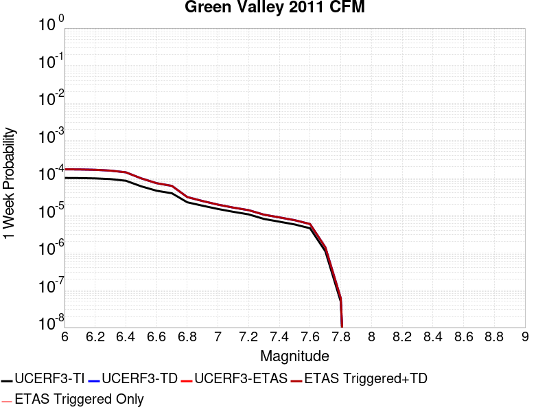 |  | 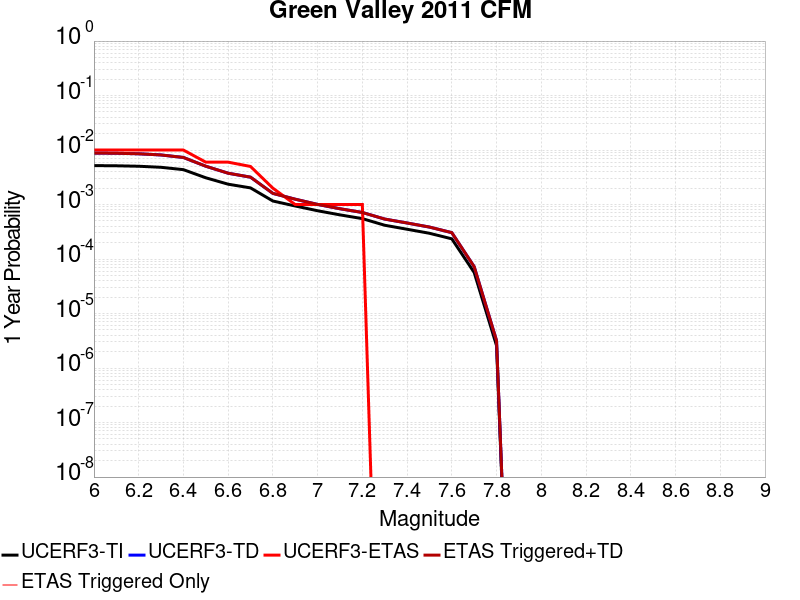 | 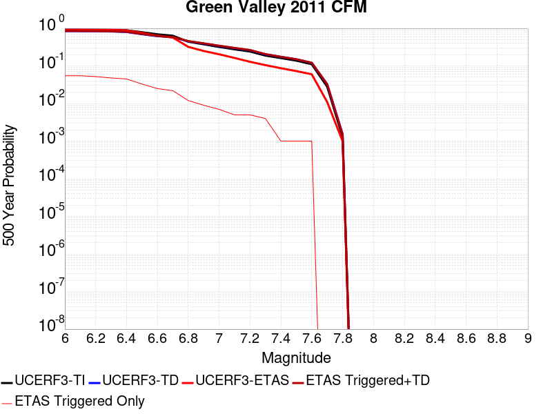 |

| Magnitude | 1 wk TI Prob | 1 wk TD Prob | 1 wk ETAS Prob | 1 wk ETAS/TD Gain | 1 wk ETAS Triggered+TD | 1 wk ETAS Triggered Only | 1 mo TI Prob | 1 mo TD Prob | 1 mo ETAS Prob | 1 mo ETAS/TD Gain | 1 mo ETAS Triggered+TD | 1 mo ETAS Triggered Only | 1 yr TI Prob | 1 yr TD Prob | 1 yr ETAS Prob | 1 yr ETAS/TD Gain | 1 yr ETAS Triggered+TD | 1 yr ETAS Triggered Only | 500 yr TI Prob | 500 yr TD Prob | 500 yr ETAS Prob | 500 yr ETAS/TD Gain | 500 yr ETAS Triggered+TD | 500 yr ETAS Triggered Only |
|-----|-----|-----|-----|-----|-----|-----|-----|-----|-----|-----|-----|-----|-----|-----|-----|-----|-----|-----|-----|-----|-----|-----|-----|-----|
| 6.0 | 9.9629346E-5 | 1.6964173E-4 | 0.0 | 0.0 | 1.6964173E-4 | 0.0 | 4.2691303E-4 | 7.26831E-4 | 0.0 | 0.0 | 7.26831E-4 | 0.0 | 0.0051852856 | 0.008812223 | 0.01 | 1.1347874 | 0.008812223 | 0.0 | 0.92568094 | 0.84154904 | 0.92 | 1.093222 | 0.85026383 | 0.055 |
| 6.1 | 9.88615E-5 | 1.6813148E-4 | 0.0 | 0.0 | 1.6813148E-4 | 0.0 | 4.2362334E-4 | 7.2036206E-4 | 0.0 | 0.0 | 7.2036206E-4 | 0.0 | 0.0051454236 | 0.008734102 | 0.01 | 1.1449374 | 0.008734102 | 0.0 | 0.924177 | 0.8399012 | 0.915 | 1.0894139 | 0.84870666 | 0.055 |
| 6.2 | 9.696895E-5 | 1.6457545E-4 | 0.0 | 0.0 | 1.6457545E-4 | 0.0 | 4.15515E-4 | 7.0513115E-4 | 0.0 | 0.0 | 7.0513115E-4 | 0.0 | 0.0050471667 | 0.008550213 | 0.01 | 1.1695616 | 0.008550213 | 0.0 | 0.92033887 | 0.83557945 | 0.914 | 1.0938517 | 0.8441293 | 0.052 |
| 6.3 | 9.275224E-5 | 1.5647143E-4 | 0.0 | 0.0 | 1.5647143E-4 | 0.0 | 3.9744904E-4 | 6.704177E-4 | 0.0 | 0.0 | 6.704177E-4 | 0.0 | 0.0048282105 | 0.008130774 | 0.01 | 1.2298951 | 0.008130774 | 0.0 | 0.9110741 | 0.82527614 | 0.907 | 1.0990261 | 0.83366287 | 0.048 |
| 6.4 | 8.391499E-5 | 1.4070788E-4 | 0.0 | 0.0 | 1.4070788E-4 | 0.0 | 3.595861E-4 | 6.028927E-4 | 0.0 | 0.0 | 6.028927E-4 | 0.0 | 0.004369175 | 0.007314716 | 0.01 | 1.367107 | 0.007314716 | 0.0 | 0.8880132 | 0.79901415 | 0.884 | 1.1063634 | 0.8080585 | 0.045 |
| 6.5 | 5.9519385E-5 | 9.711586E-5 | 0.0 | 0.0 | 9.711586E-5 | 0.0 | 2.5505814E-4 | 4.1613987E-4 | 0.0 | 0.0 | 4.1613987E-4 | 0.0 | 0.0031009112 | 0.0050538457 | 0.006 | 1.1872147 | 0.0050538457 | 0.0 | 0.7883591 | 0.6978148 | 0.755 | 1.0819489 | 0.7077869 | 0.033 |
| 6.6 | 4.5361558E-5 | 7.223586E-5 | 0.0 | 0.0 | 7.223586E-5 | 0.0 | 1.9439218E-4 | 3.0953978E-4 | 0.0 | 0.0 | 3.0953978E-4 | 0.0 | 0.0023641558 | 0.003761376 | 0.006 | 1.595161 | 0.003761376 | 0.0 | 0.69378793 | 0.61994815 | 0.638 | 1.0291183 | 0.6294495 | 0.025 |
| 6.7 | 3.8808106E-5 | 6.110153E-5 | 0.0 | 0.0 | 6.110153E-5 | 0.0 | 1.6630985E-4 | 2.6183284E-4 | 0.0 | 0.0 | 2.6183284E-4 | 0.0 | 0.0020229418 | 0.0031826836 | 0.005 | 1.5710013 | 0.0031826836 | 0.0 | 0.63668877 | 0.57802284 | 0.568 | 0.9826601 | 0.5873063 | 0.022 |
| 6.8 | 2.2284667E-5 | 3.0756313E-5 | 0.0 | 0.0 | 3.0756313E-5 | 0.0 | 9.550222E-5 | 1.3180618E-4 | 0.0 | 0.0 | 1.3180618E-4 | 0.0 | 0.0011621192 | 0.0016035622 | 0.002 | 1.2472233 | 0.0016035622 | 0.0 | 0.44088355 | 0.45173478 | 0.321 | 0.71059394 | 0.45831397 | 0.012 |
| 6.9 | 1.8050168E-5 | 2.4061024E-5 | 0.0 | 0.0 | 2.4061024E-5 | 0.0 | 7.735557E-5 | 1.0311462E-4 | 0.0 | 0.0 | 1.0311462E-4 | 0.0 | 9.4139716E-4 | 0.0012547013 | 0.001 | 0.7970025 | 0.0012547013 | 0.0 | 0.37557262 | 0.3934713 | 0.25 | 0.6353703 | 0.39893007 | 0.009 |
| 7.0 | 1.4763166E-5 | 1.9288895E-5 | 0.0 | 0.0 | 1.9288895E-5 | 0.0 | 6.326917E-5 | 8.266407E-5 | 0.0 | 0.0 | 8.266407E-5 | 0.0 | 7.7002996E-4 | 0.0010059722 | 0.001 | 0.9940633 | 0.0010059722 | 0.0 | 0.31966048 | 0.3405414 | 0.204 | 0.5990461 | 0.3451576 | 0.007 |
| 7.1 | 1.2399713E-5 | 1.6068023E-5 | 0.0 | 0.0 | 1.6068023E-5 | 0.0 | 5.3140546E-5 | 6.886115E-5 | 0.0 | 0.0 | 6.886115E-5 | 0.0 | 6.467941E-4 | 8.380639E-4 | 0.001 | 1.1932265 | 8.380639E-4 | 0.0 | 0.27638924 | 0.2979109 | 0.163 | 0.54714346 | 0.30142134 | 0.005 |
| 7.2 | 1.0584195E-5 | 1.3725262E-5 | 0.0 | 0.0 | 1.3725262E-5 | 0.0 | 4.5360044E-5 | 5.882123E-5 | 0.0 | 0.0 | 5.882123E-5 | 0.0 | 5.521186E-4 | 7.1591476E-4 | 0.001 | 1.3968143 | 7.1591476E-4 | 0.0 | 0.24128991 | 0.26155746 | 0.129 | 0.49319947 | 0.26524967 | 0.005 |
| 7.3 | 7.998173E-6 | 1.0388565E-5 | 0.0 | 0.0 | 1.0388565E-5 | 0.0 | 3.4277433E-5 | 4.4521665E-5 | 0.0 | 0.0 | 4.4521665E-5 | 0.0 | 4.1724785E-4 | 5.419175E-4 | 0.0 | 0.0 | 5.419175E-4 | 0.0 | 0.1883349 | 0.20339066 | 0.105 | 0.51624787 | 0.2065771 | 0.004 |
| 7.4 | 6.7571127E-6 | 8.800719E-6 | 0.0 | 0.0 | 8.800719E-6 | 0.0 | 2.8958733E-5 | 3.771683E-5 | 0.0 | 0.0 | 3.771683E-5 | 0.0 | 3.5251552E-4 | 4.5910655E-4 | 0.0 | 0.0 | 4.5910655E-4 | 0.0 | 0.16162421 | 0.17418312 | 0.087 | 0.49947438 | 0.17500892 | 0.001 |
| 7.5 | 5.69878E-6 | 7.4063173E-6 | 0.0 | 0.0 | 7.4063173E-6 | 0.0 | 2.4423114E-5 | 3.174098E-5 | 0.0 | 0.0 | 3.174098E-5 | 0.0 | 2.9731085E-4 | 3.8637873E-4 | 0.0 | 0.0 | 3.8637873E-4 | 0.0 | 0.138153 | 0.14986035 | 0.073 | 0.48712018 | 0.15071048 | 0.001 |
| 7.6 | 4.503664E-6 | 5.848647E-6 | 0.0 | 0.0 | 5.848647E-6 | 0.0 | 1.9301275E-5 | 2.5065394E-5 | 0.0 | 0.0 | 2.5065394E-5 | 0.0 | 2.3496768E-4 | 3.0512924E-4 | 0.0 | 0.0 | 3.0512924E-4 | 0.0 | 0.11085739 | 0.1207304 | 0.06 | 0.49697506 | 0.12160967 | 0.001 |
| 7.7 | 1.0873546E-6 | 1.3903269E-6 | 0.0 | 0.0 | 1.3903269E-6 | 0.0 | 4.6600826E-6 | 5.9585304E-6 | 0.0 | 0.0 | 5.9585304E-6 | 0.0 | 5.6735033E-5 | 7.254272E-5 | 0.0 | 0.0 | 7.254272E-5 | 0.0 | 0.027969718 | 0.032595225 | 0.011 | 0.33747274 | 0.032595225 | 0.0 |
| 7.8 | 4.9373917E-8 | 6.0994815E-8 | 0.0 | 0.0 | 6.0994815E-8 | 0.0 | 2.1160248E-7 | 2.6140634E-7 | 0.0 | 0.0 | 2.6140634E-7 | 0.0 | 2.5762572E-6 | 3.182619E-6 | 0.0 | 0.0 | 3.182619E-6 | 0.0 | 0.001287301 | 0.0015211273 | 0.001 | 0.65740716 | 0.0015211273 | 0.0 |

## Pinto Mtn
*[(top)](#table-of-contents)*

| 1 Week | 1 Month | 1 Year | 500 Year |
|-----|-----|-----|-----|
|  | 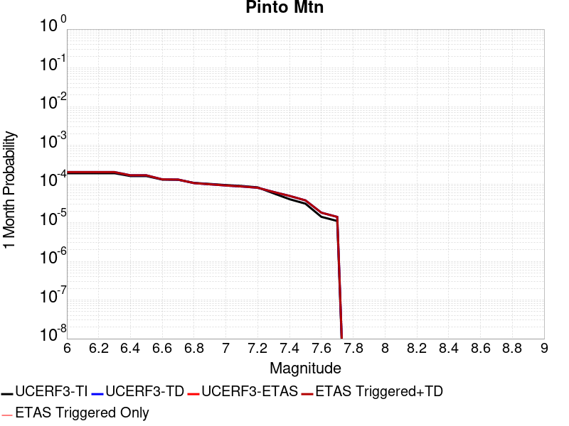 | 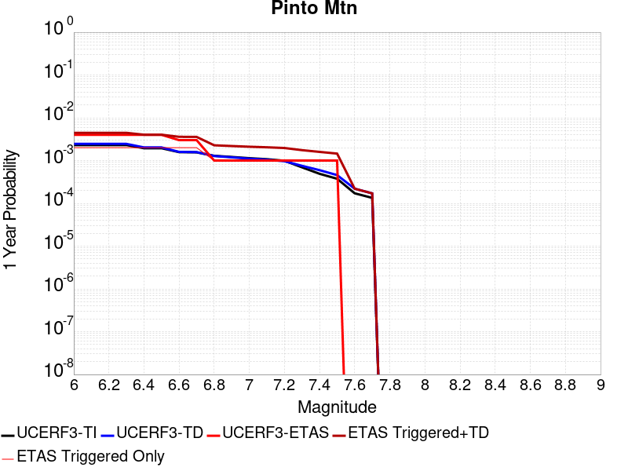 | 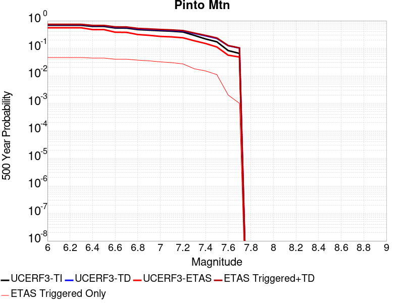 |

| Magnitude | 1 wk TI Prob | 1 wk TD Prob | 1 wk ETAS Prob | 1 wk ETAS/TD Gain | 1 wk ETAS Triggered+TD | 1 wk ETAS Triggered Only | 1 mo TI Prob | 1 mo TD Prob | 1 mo ETAS Prob | 1 mo ETAS/TD Gain | 1 mo ETAS Triggered+TD | 1 mo ETAS Triggered Only | 1 yr TI Prob | 1 yr TD Prob | 1 yr ETAS Prob | 1 yr ETAS/TD Gain | 1 yr ETAS Triggered+TD | 1 yr ETAS Triggered Only | 500 yr TI Prob | 500 yr TD Prob | 500 yr ETAS Prob | 500 yr ETAS/TD Gain | 500 yr ETAS Triggered+TD | 500 yr ETAS Triggered Only |
|-----|-----|-----|-----|-----|-----|-----|-----|-----|-----|-----|-----|-----|-----|-----|-----|-----|-----|-----|-----|-----|-----|-----|-----|-----|
| 6.0 | 4.4194956E-5 | 4.7119596E-5 | 0.0 | 0.0 | 4.7119596E-5 | 0.0 | 1.893932E-4 | 2.019264E-4 | 0.0 | 0.0 | 2.019264E-4 | 0.0 | 0.0023034236 | 0.0024558427 | 0.004 | 1.6287689 | 0.0044509307 | 0.002 | 0.68432444 | 0.7241913 | 0.554 | 0.7649912 | 0.7368785 | 0.046 |
| 6.1 | 4.4194956E-5 | 4.7119596E-5 | 0.0 | 0.0 | 4.7119596E-5 | 0.0 | 1.893932E-4 | 2.019264E-4 | 0.0 | 0.0 | 2.019264E-4 | 0.0 | 0.0023034236 | 0.0024558427 | 0.004 | 1.6287689 | 0.0044509307 | 0.002 | 0.68432444 | 0.7241913 | 0.554 | 0.7649912 | 0.7368785 | 0.046 |
| 6.2 | 4.4194956E-5 | 4.7119596E-5 | 0.0 | 0.0 | 4.7119596E-5 | 0.0 | 1.893932E-4 | 2.019264E-4 | 0.0 | 0.0 | 2.019264E-4 | 0.0 | 0.0023034236 | 0.0024558427 | 0.004 | 1.6287689 | 0.0044509307 | 0.002 | 0.68432444 | 0.7241913 | 0.554 | 0.7649912 | 0.7368785 | 0.046 |
| 6.3 | 4.4194956E-5 | 4.7119596E-5 | 0.0 | 0.0 | 4.7119596E-5 | 0.0 | 1.893932E-4 | 2.019264E-4 | 0.0 | 0.0 | 2.019264E-4 | 0.0 | 0.0023034236 | 0.0024558427 | 0.004 | 1.6287689 | 0.0044509307 | 0.002 | 0.68432444 | 0.7241913 | 0.554 | 0.7649912 | 0.7368785 | 0.046 |
| 6.4 | 3.729929E-5 | 3.8952512E-5 | 0.0 | 0.0 | 3.8952512E-5 | 0.0 | 1.5984432E-4 | 1.6692917E-4 | 0.0 | 0.0 | 1.6692917E-4 | 0.0 | 0.0019443673 | 0.0020305596 | 0.004 | 1.9699004 | 0.004026498 | 0.002 | 0.62210166 | 0.6605319 | 0.476 | 0.72063136 | 0.6754685 | 0.044 |
| 6.5 | 3.729929E-5 | 3.8952512E-5 | 0.0 | 0.0 | 3.8952512E-5 | 0.0 | 1.5984432E-4 | 1.6692917E-4 | 0.0 | 0.0 | 1.6692917E-4 | 0.0 | 0.0019443673 | 0.0020305596 | 0.004 | 1.9699004 | 0.004026498 | 0.002 | 0.62210166 | 0.6605319 | 0.476 | 0.72063136 | 0.6754685 | 0.044 |
| 6.6 | 3.0204548E-5 | 3.063409E-5 | 0.0 | 0.0 | 3.063409E-5 | 0.0 | 1.2944164E-4 | 1.3128255E-4 | 0.0 | 0.0 | 1.3128255E-4 | 0.0 | 0.0015748127 | 0.001597227 | 0.003 | 1.8782554 | 0.0035940325 | 0.002 | 0.5452589 | 0.5803319 | 0.383 | 0.6599672 | 0.5971186 | 0.04 |
| 6.7 | 2.9857754E-5 | 3.0246023E-5 | 0.0 | 0.0 | 3.0246023E-5 | 0.0 | 1.2795553E-4 | 1.2961957E-4 | 0.0 | 0.0 | 1.2961957E-4 | 0.0 | 0.0015567453 | 0.0015770096 | 0.003 | 1.9023347 | 0.0035738556 | 0.002 | 0.5411258 | 0.5761581 | 0.378 | 0.65606993 | 0.59311175 | 0.04 |
| 6.8 | 2.4819734E-5 | 2.44865E-5 | 0.0 | 0.0 | 2.44865E-5 | 0.0 | 1.0636595E-4 | 1.0493804E-4 | 0.0 | 0.0 | 1.0493804E-4 | 0.0 | 0.0012942362 | 0.0012768928 | 0.001 | 0.7831511 | 0.002275616 | 0.001 | 0.47666693 | 0.5078389 | 0.315 | 0.6202754 | 0.5260489 | 0.037 |
| 6.9 | 2.331124E-5 | 2.2824173E-5 | 0.0 | 0.0 | 2.2824173E-5 | 0.0 | 9.990149E-5 | 9.781433E-5 | 0.0 | 0.0 | 9.781433E-5 | 0.0 | 0.001215622 | 0.0011902587 | 0.001 | 0.8401536 | 0.0021890684 | 0.001 | 0.45565972 | 0.48598546 | 0.295 | 0.60701406 | 0.5039759 | 0.035 |
| 7.0 | 2.1818534E-5 | 2.1257778E-5 | 0.0 | 0.0 | 2.1257778E-5 | 0.0 | 9.3504656E-5 | 9.110168E-5 | 0.0 | 0.0 | 9.110168E-5 | 0.0 | 0.0011378246 | 0.0011086179 | 0.001 | 0.90202403 | 0.0021075092 | 0.001 | 0.43404245 | 0.4641502 | 0.269 | 0.5795538 | 0.48129737 | 0.032 |
| 7.1 | 2.066081E-5 | 2.0045334E-5 | 0.0 | 0.0 | 2.0045334E-5 | 0.0 | 8.854332E-5 | 8.590586E-5 | 0.0 | 0.0 | 8.590586E-5 | 0.0 | 0.0010774818 | 0.0010454209 | 0.001 | 0.9565525 | 0.0020443755 | 0.001 | 0.41668698 | 0.44666997 | 0.259 | 0.5798465 | 0.46326986 | 0.03 |
| 7.2 | 1.8990233E-5 | 1.8570361E-5 | 0.0 | 0.0 | 1.8570361E-5 | 0.0 | 8.138417E-5 | 7.958494E-5 | 0.0 | 0.0 | 7.958494E-5 | 0.0 | 9.904018E-4 | 9.685347E-4 | 0.001 | 1.0324876 | 0.001967566 | 0.001 | 0.3907011 | 0.4231378 | 0.24 | 0.5671911 | 0.43871307 | 0.027 |
| 7.3 | 1.3335872E-5 | 1.4460446E-5 | 0.0 | 0.0 | 1.4460446E-5 | 0.0 | 5.7152483E-5 | 6.1971936E-5 | 0.0 | 0.0 | 6.1971936E-5 | 0.0 | 6.956093E-4 | 7.542594E-4 | 0.001 | 1.3258038 | 0.0017535052 | 0.001 | 0.29384866 | 0.34564698 | 0.187 | 0.54101443 | 0.35742533 | 0.018 |
| 7.4 | 9.414066E-6 | 1.1442748E-5 | 0.0 | 0.0 | 1.1442748E-5 | 0.0 | 4.0345374E-5 | 4.9039478E-5 | 0.0 | 0.0 | 4.9039478E-5 | 0.0 | 4.910942E-4 | 5.9690105E-4 | 0.001 | 1.6753196 | 0.0015963041 | 0.001 | 0.21777074 | 0.28252593 | 0.149 | 0.5273852 | 0.29328805 | 0.015 |
| 7.5 | 7.2101157E-6 | 8.771318E-6 | 0.0 | 0.0 | 8.771318E-6 | 0.0 | 3.090013E-5 | 3.759086E-5 | 0.0 | 0.0 | 3.759086E-5 | 0.0 | 3.7614413E-4 | 4.5758003E-4 | 0.001 | 2.18541 | 0.0014571225 | 0.001 | 0.17147432 | 0.22776705 | 0.111 | 0.48734003 | 0.2362616 | 0.011 |
| 7.6 | 3.296375E-6 | 4.2216298E-6 | 0.0 | 0.0 | 4.2216298E-6 | 0.0 | 1.4127245E-5 | 1.809258E-5 | 0.0 | 0.0 | 1.809258E-5 | 0.0 | 1.7198564E-4 | 2.2025606E-4 | 0.0 | 0.0 | 2.2025606E-4 | 0.0 | 0.08240596 | 0.123806655 | 0.056 | 0.45231816 | 0.12555905 | 0.002 |
| 7.7 | 2.5741092E-6 | 3.2797495E-6 | 0.0 | 0.0 | 3.2797495E-6 | 0.0 | 1.103185E-5 | 1.4056E-5 | 0.0 | 0.0 | 1.4056E-5 | 0.0 | 1.3430449E-4 | 1.7111945E-4 | 0.0 | 0.0 | 1.7111945E-4 | 0.0 | 0.06495138 | 0.10174762 | 0.048 | 0.47175553 | 0.10264587 | 0.001 |

## Elmore Ranch
*[(top)](#table-of-contents)*

| 1 Week | 1 Month | 1 Year | 500 Year |
|-----|-----|-----|-----|
|  | 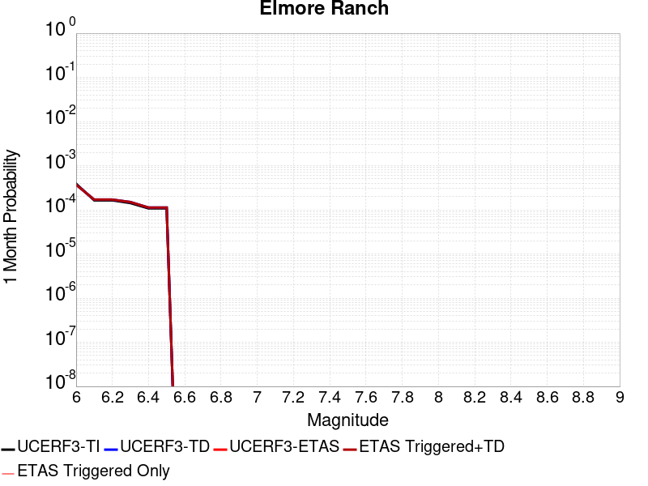 | 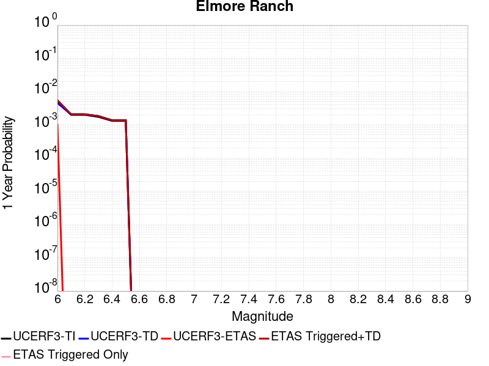 | 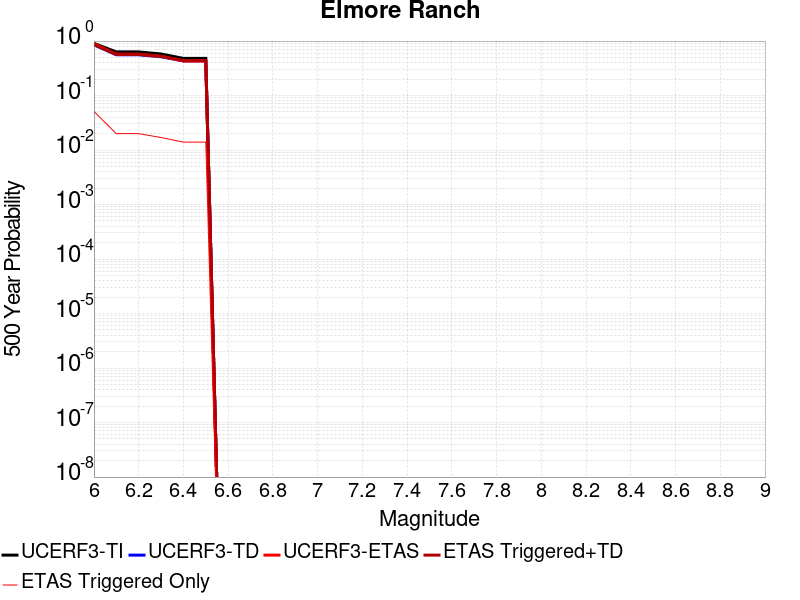 |

| Magnitude | 1 wk TI Prob | 1 wk TD Prob | 1 wk ETAS Prob | 1 wk ETAS/TD Gain | 1 wk ETAS Triggered+TD | 1 wk ETAS Triggered Only | 1 mo TI Prob | 1 mo TD Prob | 1 mo ETAS Prob | 1 mo ETAS/TD Gain | 1 mo ETAS Triggered+TD | 1 mo ETAS Triggered Only | 1 yr TI Prob | 1 yr TD Prob | 1 yr ETAS Prob | 1 yr ETAS/TD Gain | 1 yr ETAS Triggered+TD | 1 yr ETAS Triggered Only | 500 yr TI Prob | 500 yr TD Prob | 500 yr ETAS Prob | 500 yr ETAS/TD Gain | 500 yr ETAS Triggered+TD | 500 yr ETAS Triggered Only |
|-----|-----|-----|-----|-----|-----|-----|-----|-----|-----|-----|-----|-----|-----|-----|-----|-----|-----|-----|-----|-----|-----|-----|-----|-----|
| 6.0 | 9.102099E-5 | 8.6759756E-5 | 0.0 | 0.0 | 8.6759756E-5 | 0.0 | 3.9003167E-4 | 3.717796E-4 | 0.0 | 0.0 | 3.717796E-4 | 0.0 | 0.0047383 | 0.0045179245 | 0.001 | 0.22134058 | 0.0055134064 | 0.001 | 0.90696514 | 0.85561323 | 0.897 | 1.048371 | 0.8629769 | 0.051 |
| 6.1 | 3.8306698E-5 | 3.9785868E-5 | 0.0 | 0.0 | 3.9785868E-5 | 0.0 | 1.6416123E-4 | 1.7050345E-4 | 0.0 | 0.0 | 1.7050345E-4 | 0.0 | 0.0019968306 | 0.0020743671 | 0.0 | 0.0 | 0.0020743671 | 0.0 | 0.6319047 | 0.5596143 | 0.575 | 1.0274934 | 0.568422 | 0.02 |
| 6.2 | 3.8306698E-5 | 3.9785868E-5 | 0.0 | 0.0 | 3.9785868E-5 | 0.0 | 1.6416123E-4 | 1.7050345E-4 | 0.0 | 0.0 | 1.7050345E-4 | 0.0 | 0.0019968306 | 0.0020743671 | 0.0 | 0.0 | 0.0020743671 | 0.0 | 0.6319047 | 0.5596143 | 0.575 | 1.0274934 | 0.568422 | 0.02 |
| 6.3 | 3.3197924E-5 | 3.5039087E-5 | 0.0 | 0.0 | 3.5039087E-5 | 0.0 | 1.4226905E-4 | 1.5016251E-4 | 0.0 | 0.0 | 1.5016251E-4 | 0.0 | 0.0017307495 | 0.0018272208 | 0.0 | 0.0 | 0.0018272208 | 0.0 | 0.57942164 | 0.51541513 | 0.526 | 1.0205367 | 0.52365303 | 0.017 |
| 6.4 | 2.5148964E-5 | 2.6238595E-5 | 0.0 | 0.0 | 2.6238595E-5 | 0.0 | 1.0777682E-4 | 1.1244962E-4 | 0.0 | 0.0 | 1.1244962E-4 | 0.0 | 0.0013113929 | 0.001368807 | 0.0 | 0.0 | 0.001368807 | 0.0 | 0.48114288 | 0.4327554 | 0.431 | 0.99594367 | 0.44069684 | 0.014 |
| 6.5 | 2.5148964E-5 | 2.6238595E-5 | 0.0 | 0.0 | 2.6238595E-5 | 0.0 | 1.0777682E-4 | 1.1244962E-4 | 0.0 | 0.0 | 1.1244962E-4 | 0.0 | 0.0013113929 | 0.001368807 | 0.0 | 0.0 | 0.001368807 | 0.0 | 0.48114288 | 0.4327554 | 0.431 | 0.99594367 | 0.44069684 | 0.014 |

## Great Valley 04b Gordon Valley
*[(top)](#table-of-contents)*

| 1 Week | 1 Month | 1 Year | 500 Year |
|-----|-----|-----|-----|
|  | 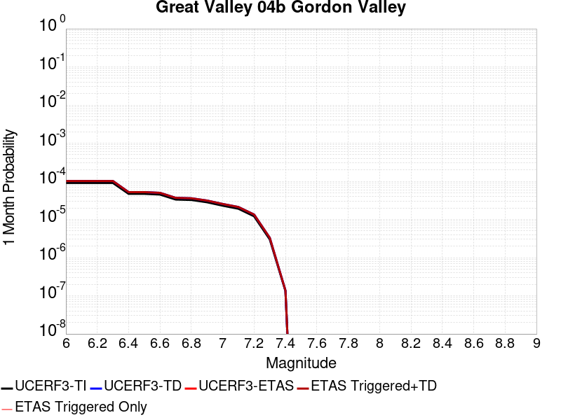 | 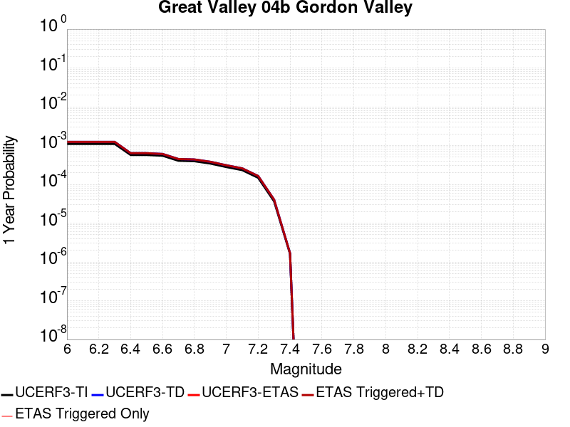 |  |

| Magnitude | 1 wk TI Prob | 1 wk TD Prob | 1 wk ETAS Prob | 1 wk ETAS/TD Gain | 1 wk ETAS Triggered+TD | 1 wk ETAS Triggered Only | 1 mo TI Prob | 1 mo TD Prob | 1 mo ETAS Prob | 1 mo ETAS/TD Gain | 1 mo ETAS Triggered+TD | 1 mo ETAS Triggered Only | 1 yr TI Prob | 1 yr TD Prob | 1 yr ETAS Prob | 1 yr ETAS/TD Gain | 1 yr ETAS Triggered+TD | 1 yr ETAS Triggered Only | 500 yr TI Prob | 500 yr TD Prob | 500 yr ETAS Prob | 500 yr ETAS/TD Gain | 500 yr ETAS Triggered+TD | 500 yr ETAS Triggered Only |
|-----|-----|-----|-----|-----|-----|-----|-----|-----|-----|-----|-----|-----|-----|-----|-----|-----|-----|-----|-----|-----|-----|-----|-----|-----|
| 6.0 | 2.1181217E-5 | 2.3817807E-5 | 0.0 | 0.0 | 2.3817807E-5 | 0.0 | 9.077348E-5 | 1.0207325E-4 | 0.0 | 0.0 | 1.0207325E-4 | 0.0 | 0.0011046068 | 0.0012421975 | 0.0 | 0.0 | 0.0012421975 | 0.0 | 0.42455328 | 0.47966442 | 0.366 | 0.76303345 | 0.5062015 | 0.051 |
| 6.1 | 2.1181217E-5 | 2.3817807E-5 | 0.0 | 0.0 | 2.3817807E-5 | 0.0 | 9.077348E-5 | 1.0207325E-4 | 0.0 | 0.0 | 1.0207325E-4 | 0.0 | 0.0011046068 | 0.0012421975 | 0.0 | 0.0 | 0.0012421975 | 0.0 | 0.42455328 | 0.47966442 | 0.366 | 0.76303345 | 0.5062015 | 0.051 |
| 6.2 | 2.1181217E-5 | 2.3817807E-5 | 0.0 | 0.0 | 2.3817807E-5 | 0.0 | 9.077348E-5 | 1.0207325E-4 | 0.0 | 0.0 | 1.0207325E-4 | 0.0 | 0.0011046068 | 0.0012421975 | 0.0 | 0.0 | 0.0012421975 | 0.0 | 0.42455328 | 0.47966442 | 0.366 | 0.76303345 | 0.5062015 | 0.051 |
| 6.3 | 2.1181217E-5 | 2.3817807E-5 | 0.0 | 0.0 | 2.3817807E-5 | 0.0 | 9.077348E-5 | 1.0207325E-4 | 0.0 | 0.0 | 1.0207325E-4 | 0.0 | 0.0011046068 | 0.0012421975 | 0.0 | 0.0 | 0.0012421975 | 0.0 | 0.42455328 | 0.47966442 | 0.366 | 0.76303345 | 0.5062015 | 0.051 |
| 6.4 | 1.0988268E-5 | 1.2181495E-5 | 0.0 | 0.0 | 1.2181495E-5 | 0.0 | 4.7091726E-5 | 5.220545E-5 | 0.0 | 0.0 | 5.220545E-5 | 0.0 | 5.731909E-4 | 6.3543173E-4 | 0.0 | 0.0 | 6.3543173E-4 | 0.0 | 0.24924628 | 0.27367356 | 0.206 | 0.75272155 | 0.28965276 | 0.022 |
| 6.5 | 1.0988268E-5 | 1.2181495E-5 | 0.0 | 0.0 | 1.2181495E-5 | 0.0 | 4.7091726E-5 | 5.220545E-5 | 0.0 | 0.0 | 5.220545E-5 | 0.0 | 5.731909E-4 | 6.3543173E-4 | 0.0 | 0.0 | 6.3543173E-4 | 0.0 | 0.24924628 | 0.27367356 | 0.206 | 0.75272155 | 0.28965276 | 0.022 |
| 6.6 | 1.0517822E-5 | 1.1654551E-5 | 0.0 | 0.0 | 1.1654551E-5 | 0.0 | 4.5075605E-5 | 4.9947208E-5 | 0.0 | 0.0 | 4.9947208E-5 | 0.0 | 5.4865726E-4 | 6.07953E-4 | 0.0 | 0.0 | 6.07953E-4 | 0.0 | 0.23997498 | 0.26381874 | 0.196 | 0.7429343 | 0.27854237 | 0.02 |
| 6.7 | 7.789219E-6 | 8.6264645E-6 | 0.0 | 0.0 | 8.6264645E-6 | 0.0 | 3.3381937E-5 | 3.697007E-5 | 0.0 | 0.0 | 3.697007E-5 | 0.0 | 4.063493E-4 | 4.5002275E-4 | 0.0 | 0.0 | 4.5002275E-4 | 0.0 | 0.18389802 | 0.20211281 | 0.142 | 0.70257795 | 0.21248534 | 0.013 |
| 6.8 | 7.5850853E-6 | 8.402414E-6 | 0.0 | 0.0 | 8.402414E-6 | 0.0 | 3.2507105E-5 | 3.600988E-5 | 0.0 | 0.0 | 3.600988E-5 | 0.0 | 3.957021E-4 | 4.3833716E-4 | 0.0 | 0.0 | 4.3833716E-4 | 0.0 | 0.17954007 | 0.19743778 | 0.136 | 0.6888246 | 0.20706852 | 0.012 |
| 6.9 | 6.604105E-6 | 7.3150763E-6 | 0.0 | 0.0 | 7.3150763E-6 | 0.0 | 2.8303E-5 | 3.1349973E-5 | 0.0 | 0.0 | 3.1349973E-5 | 0.0 | 3.4453452E-4 | 3.816229E-4 | 0.0 | 0.0 | 3.816229E-4 | 0.0 | 0.15827082 | 0.17417736 | 0.109 | 0.6257989 | 0.18160978 | 0.009 |
| 7.0 | 5.3701115E-6 | 5.952757E-6 | 0.0 | 0.0 | 5.952757E-6 | 0.0 | 2.301456E-5 | 2.5511583E-5 | 0.0 | 0.0 | 2.5511583E-5 | 0.0 | 2.8016625E-4 | 3.1056214E-4 | 0.0 | 0.0 | 3.1056214E-4 | 0.0 | 0.13073109 | 0.14418615 | 0.086 | 0.59645116 | 0.15017685 | 0.007 |
| 7.1 | 4.4685607E-6 | 4.956582E-6 | 0.0 | 0.0 | 4.956582E-6 | 0.0 | 1.9150835E-5 | 2.1242335E-5 | 0.0 | 0.0 | 2.1242335E-5 | 0.0 | 2.3313647E-4 | 2.585972E-4 | 0.0 | 0.0 | 2.585972E-4 | 0.0 | 0.11004273 | 0.12163964 | 0.069 | 0.5672493 | 0.12778816 | 0.007 |
| 7.2 | 2.833378E-6 | 3.1452814E-6 | 0.0 | 0.0 | 3.1452814E-6 | 0.0 | 1.2142991E-5 | 1.3479717E-5 | 0.0 | 0.0 | 1.3479717E-5 | 0.0 | 1.4783088E-4 | 1.6410493E-4 | 0.0 | 0.0 | 1.6410493E-4 | 0.0 | 0.07125486 | 0.07915697 | 0.039 | 0.4926919 | 0.083761185 | 0.005 |
| 7.3 | 7.0087293E-7 | 7.7287126E-7 | 0.0 | 0.0 | 7.7287126E-7 | 0.0 | 3.0037377E-6 | 3.3123038E-6 | 0.0 | 0.0 | 3.3123038E-6 | 0.0 | 3.656989E-5 | 4.0327002E-5 | 0.0 | 0.0 | 4.0327002E-5 | 0.0 | 0.01811912 | 0.020065857 | 0.008 | 0.39868718 | 0.023005659 | 0.003 |
| 7.4 | 3.112171E-8 | 3.2017713E-8 | 0.0 | 0.0 | 3.2017713E-8 | 0.0 | 1.3337875E-7 | 1.3721876E-7 | 0.0 | 0.0 | 1.3721876E-7 | 0.0 | 1.6238852E-6 | 1.6706372E-6 | 0.0 | 0.0 | 1.6706372E-6 | 0.0 | 8.116137E-4 | 8.3499384E-4 | 0.001 | 1.1976136 | 8.3499384E-4 | 0.0 |

## Calaveras (No) 2011 CFM
*[(top)](#table-of-contents)*

| 1 Week | 1 Month | 1 Year | 500 Year |
|-----|-----|-----|-----|
|  | 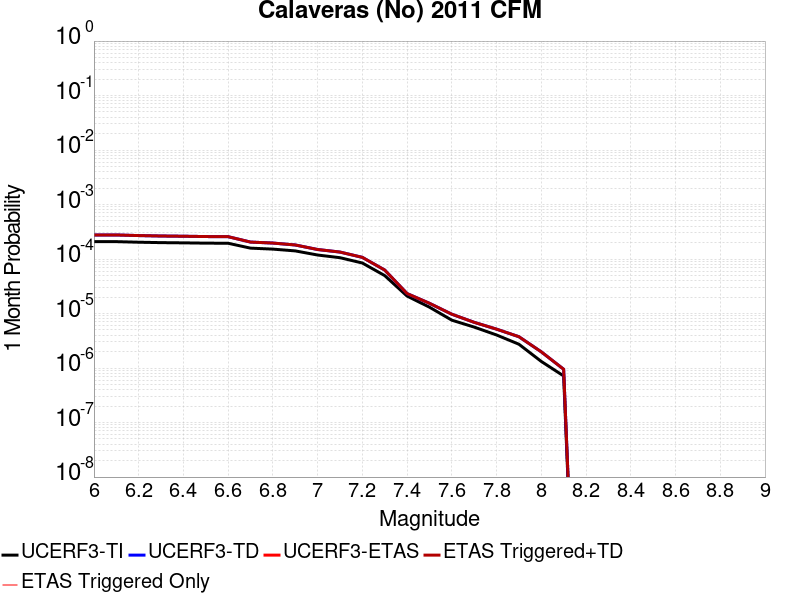 | 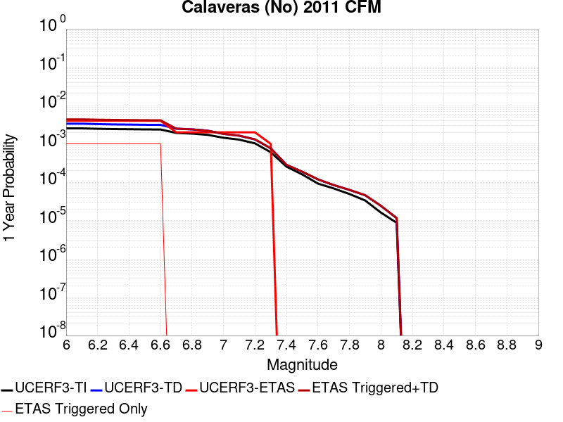 | 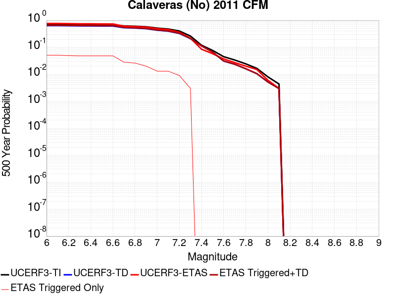 |

| Magnitude | 1 wk TI Prob | 1 wk TD Prob | 1 wk ETAS Prob | 1 wk ETAS/TD Gain | 1 wk ETAS Triggered+TD | 1 wk ETAS Triggered Only | 1 mo TI Prob | 1 mo TD Prob | 1 mo ETAS Prob | 1 mo ETAS/TD Gain | 1 mo ETAS Triggered+TD | 1 mo ETAS Triggered Only | 1 yr TI Prob | 1 yr TD Prob | 1 yr ETAS Prob | 1 yr ETAS/TD Gain | 1 yr ETAS Triggered+TD | 1 yr ETAS Triggered Only | 500 yr TI Prob | 500 yr TD Prob | 500 yr ETAS Prob | 500 yr ETAS/TD Gain | 500 yr ETAS Triggered+TD | 500 yr ETAS Triggered Only |
|-----|-----|-----|-----|-----|-----|-----|-----|-----|-----|-----|-----|-----|-----|-----|-----|-----|-----|-----|-----|-----|-----|-----|-----|-----|
| 6.0 | 4.8694856E-5 | 6.459548E-5 | 0.0 | 0.0 | 6.459548E-5 | 0.0 | 2.0867554E-4 | 2.7680895E-4 | 0.0 | 0.0 | 2.7680895E-4 | 0.0 | 0.0025376645 | 0.0033649579 | 0.004 | 1.1887223 | 0.0043615927 | 0.001 | 0.7192933 | 0.63780487 | 0.765 | 1.1994264 | 0.6562768 | 0.051 |
| 6.1 | 4.8694856E-5 | 6.459548E-5 | 0.0 | 0.0 | 6.459548E-5 | 0.0 | 2.0867554E-4 | 2.7680895E-4 | 0.0 | 0.0 | 2.7680895E-4 | 0.0 | 0.0025376645 | 0.0033649579 | 0.004 | 1.1887223 | 0.0043615927 | 0.001 | 0.7192933 | 0.63780487 | 0.765 | 1.1994264 | 0.6562768 | 0.051 |
| 6.2 | 4.7541962E-5 | 6.295986E-5 | 0.0 | 0.0 | 6.295986E-5 | 0.0 | 2.0373536E-4 | 2.6980072E-4 | 0.0 | 0.0 | 2.6980072E-4 | 0.0 | 0.0024776561 | 0.0032799095 | 0.004 | 1.2195458 | 0.0042766295 | 0.001 | 0.7107215 | 0.6288617 | 0.753 | 1.1974015 | 0.6470475 | 0.049 |
| 6.3 | 4.6717287E-5 | 6.181967E-5 | 0.0 | 0.0 | 6.181967E-5 | 0.0 | 2.0020158E-4 | 2.6491543E-4 | 0.0 | 0.0 | 2.6491543E-4 | 0.0 | 0.0024347296 | 0.0032206145 | 0.004 | 1.2419989 | 0.004217394 | 0.001 | 0.70442986 | 0.62220615 | 0.742 | 1.1925308 | 0.64034027 | 0.048 |
| 6.4 | 4.6276386E-5 | 6.119405E-5 | 0.0 | 0.0 | 6.119405E-5 | 0.0 | 1.983123E-4 | 2.6223483E-4 | 0.0 | 0.0 | 2.6223483E-4 | 0.0 | 0.0024117786 | 0.0031880797 | 0.004 | 1.2546737 | 0.0041848915 | 0.001 | 0.70101017 | 0.61867267 | 0.74 | 1.1961092 | 0.63697636 | 0.048 |
| 6.5 | 4.5720994E-5 | 6.0411112E-5 | 0.0 | 0.0 | 6.0411112E-5 | 0.0 | 1.9593239E-4 | 2.5888009E-4 | 0.0 | 0.0 | 2.5888009E-4 | 0.0 | 0.002382867 | 0.0031473616 | 0.004 | 1.2709057 | 0.004144214 | 0.001 | 0.69664615 | 0.614136 | 0.733 | 1.1935468 | 0.63265747 | 0.048 |
| 6.6 | 4.549134E-5 | 6.0073762E-5 | 0.0 | 0.0 | 6.0073762E-5 | 0.0 | 1.949483E-4 | 2.5743456E-4 | 0.0 | 0.0 | 2.5743456E-4 | 0.0 | 0.0023709119 | 0.0031298131 | 0.004 | 1.2780316 | 0.0041266833 | 0.001 | 0.694823 | 0.61245227 | 0.731 | 1.1935624 | 0.6310546 | 0.048 |
| 6.7 | 3.701047E-5 | 4.784221E-5 | 0.0 | 0.0 | 4.784221E-5 | 0.0 | 1.5860666E-4 | 2.0502217E-4 | 0.0 | 0.0 | 2.0502217E-4 | 0.0 | 0.0019293258 | 0.0024933268 | 0.002 | 0.80214113 | 0.0024933268 | 0.0 | 0.61924326 | 0.5329109 | 0.605 | 1.1352742 | 0.5459894 | 0.028 |
| 6.8 | 3.5523568E-5 | 4.588069E-5 | 0.0 | 0.0 | 4.588069E-5 | 0.0 | 1.5223498E-4 | 1.9661694E-4 | 0.0 | 0.0 | 1.9661694E-4 | 0.0 | 0.0018518851 | 0.0023912222 | 0.002 | 0.83639234 | 0.0023912222 | 0.0 | 0.6041821 | 0.5162976 | 0.587 | 1.1369412 | 0.52887386 | 0.026 |
| 6.9 | 3.2946147E-5 | 4.233025E-5 | 0.0 | 0.0 | 4.233025E-5 | 0.0 | 1.4119013E-4 | 1.8140297E-4 | 0.0 | 0.0 | 1.8140297E-4 | 0.0 | 0.0017176344 | 0.0022063823 | 0.002 | 0.90646124 | 0.0022063823 | 0.0 | 0.57664984 | 0.48984984 | 0.558 | 1.1391246 | 0.50005287 | 0.02 |
| 7.0 | 2.7682381E-5 | 3.4938534E-5 | 0.0 | 0.0 | 3.4938534E-5 | 0.0 | 1.1863338E-4 | 1.4972813E-4 | 0.0 | 0.0 | 1.4972813E-4 | 0.0 | 0.0014434044 | 0.0018214429 | 0.002 | 1.0980306 | 0.0018214429 | 0.0 | 0.51432884 | 0.43091357 | 0.491 | 1.1394396 | 0.4383117 | 0.013 |
| 7.1 | 2.471967E-5 | 3.136982E-5 | 0.0 | 0.0 | 3.136982E-5 | 0.0 | 1.05937135E-4 | 1.344353E-4 | 0.0 | 0.0 | 1.344353E-4 | 0.0 | 0.0012890215 | 0.0016355469 | 0.002 | 1.2228326 | 0.0016355469 | 0.0 | 0.47529888 | 0.3950757 | 0.452 | 1.1440846 | 0.4029397 | 0.013 |
| 7.2 | 1.9748062E-5 | 2.5078614E-5 | 0.0 | 0.0 | 2.5078614E-5 | 0.0 | 8.463181E-5 | 1.0747546E-4 | 0.0 | 0.0 | 1.0747546E-4 | 0.0 | 0.0010299052 | 0.0013077493 | 0.002 | 1.5293452 | 0.0013077493 | 0.0 | 0.4026296 | 0.32570565 | 0.359 | 1.1022222 | 0.3317743 | 0.009 |
| 7.3 | 1.1603734E-5 | 1.467928E-5 | 0.0 | 0.0 | 1.467928E-5 | 0.0 | 4.9729337E-5 | 6.2909756E-5 | 0.0 | 0.0 | 6.2909756E-5 | 0.0 | 6.052865E-4 | 7.6566986E-4 | 0.001 | 1.306046 | 7.6566986E-4 | 0.0 | 0.26120505 | 0.20978746 | 0.218 | 1.039147 | 0.21215808 | 0.003 |
| 7.4 | 4.885381E-6 | 5.4348006E-6 | 0.0 | 0.0 | 5.4348006E-6 | 0.0 | 2.0937177E-5 | 2.3291796E-5 | 0.0 | 0.0 | 2.3291796E-5 | 0.0 | 2.5488032E-4 | 2.8354087E-4 | 0.0 | 0.0 | 2.8354087E-4 | 0.0 | 0.11966821 | 0.11311284 | 0.085 | 0.751462 | 0.11311284 | 0.0 |
| 7.5 | 3.0571264E-6 | 3.602106E-6 | 0.0 | 0.0 | 3.602106E-6 | 0.0 | 1.3101904E-5 | 1.5437507E-5 | 0.0 | 0.0 | 1.5437507E-5 | 0.0 | 1.5950401E-4 | 1.8793551E-4 | 0.0 | 0.0 | 1.8793551E-4 | 0.0 | 0.076660566 | 0.06654235 | 0.058 | 0.87162536 | 0.06654235 | 0.0 |
| 7.6 | 1.764948E-6 | 2.2710053E-6 | 0.0 | 0.0 | 2.2710053E-6 | 0.0 | 7.564041E-6 | 9.732844E-6 | 0.0 | 0.0 | 9.732844E-6 | 0.0 | 9.208831E-5 | 1.18490985E-4 | 0.0 | 0.0 | 1.18490985E-4 | 0.0 | 0.04500223 | 0.031103024 | 0.037 | 1.189595 | 0.031103024 | 0.0 |
| 7.7 | 1.3173734E-6 | 1.6121614E-6 | 0.0 | 0.0 | 1.6121614E-6 | 0.0 | 5.645874E-6 | 6.909245E-6 | 0.0 | 0.0 | 6.909245E-6 | 0.0 | 6.873634E-5 | 8.411682E-5 | 0.0 | 0.0 | 8.411682E-5 | 0.0 | 0.033785436 | 0.023524562 | 0.027 | 1.1477365 | 0.023524562 | 0.0 |
| 7.8 | 9.4429885E-7 | 1.208095E-6 | 0.0 | 0.0 | 1.208095E-6 | 0.0 | 4.0469886E-6 | 5.1775396E-6 | 0.0 | 0.0 | 5.1775396E-6 | 0.0 | 4.9270973E-5 | 6.303473E-5 | 0.0 | 0.0 | 6.303473E-5 | 0.0 | 0.024335101 | 0.016040191 | 0.02 | 1.2468679 | 0.016040191 | 0.0 |
| 7.9 | 6.388233E-7 | 8.774372E-7 | 0.0 | 0.0 | 8.774372E-7 | 0.0 | 2.7378112E-6 | 3.7604395E-6 | 0.0 | 0.0 | 3.7604395E-6 | 0.0 | 3.3332344E-5 | 4.5782395E-5 | 0.0 | 0.0 | 4.5782395E-5 | 0.0 | 0.016528333 | 0.01053584 | 0.015 | 1.4237118 | 0.01053584 | 0.0 |
| 8.0 | 3.087986E-7 | 4.631149E-7 | 0.0 | 0.0 | 4.631149E-7 | 0.0 | 1.323422E-6 | 1.9847766E-6 | 0.0 | 0.0 | 1.9847766E-6 | 0.0 | 1.6112543E-5 | 2.416439E-5 | 0.0 | 0.0 | 2.416439E-5 | 0.0 | 0.008023971 | 0.005193171 | 0.006 | 1.1553634 | 0.005193171 | 0.0 |
| 8.1 | 1.6725647E-7 | 2.2208674E-7 | 0.0 | 0.0 | 2.2208674E-7 | 0.0 | 7.168133E-7 | 9.5179996E-7 | 0.0 | 0.0 | 9.5179996E-7 | 0.0 | 8.7271665E-6 | 1.1588104E-5 | 0.0 | 0.0 | 1.1588104E-5 | 0.0 | 0.0043540956 | 0.0029642272 | 0.003 | 1.0120682 | 0.0029642272 | 0.0 |

## Hunting Creek - Berryessa 2011 CFM
*[(top)](#table-of-contents)*

| 1 Week | 1 Month | 1 Year | 500 Year |
|-----|-----|-----|-----|
|  | 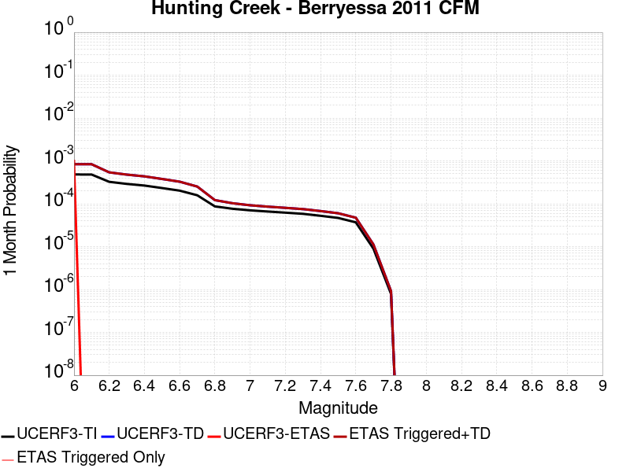 | 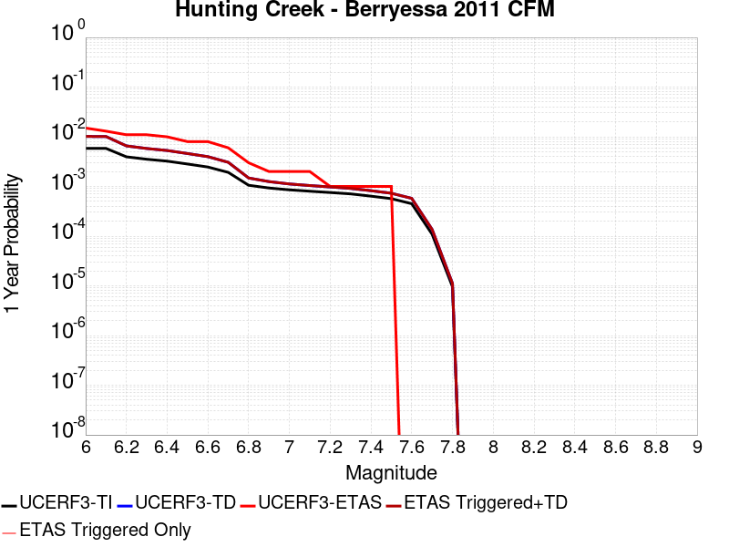 | 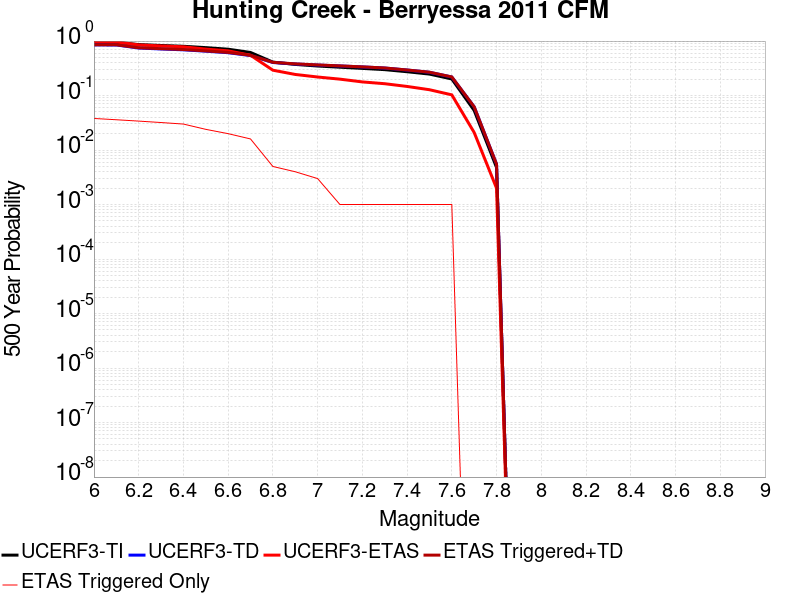 |

| Magnitude | 1 wk TI Prob | 1 wk TD Prob | 1 wk ETAS Prob | 1 wk ETAS/TD Gain | 1 wk ETAS Triggered+TD | 1 wk ETAS Triggered Only | 1 mo TI Prob | 1 mo TD Prob | 1 mo ETAS Prob | 1 mo ETAS/TD Gain | 1 mo ETAS Triggered+TD | 1 mo ETAS Triggered Only | 1 yr TI Prob | 1 yr TD Prob | 1 yr ETAS Prob | 1 yr ETAS/TD Gain | 1 yr ETAS Triggered+TD | 1 yr ETAS Triggered Only | 500 yr TI Prob | 500 yr TD Prob | 500 yr ETAS Prob | 500 yr ETAS/TD Gain | 500 yr ETAS Triggered+TD | 500 yr ETAS Triggered Only |
|-----|-----|-----|-----|-----|-----|-----|-----|-----|-----|-----|-----|-----|-----|-----|-----|-----|-----|-----|-----|-----|-----|-----|-----|-----|
| 6.0 | 1.1270982E-4 | 1.9602496E-4 | 0.0 | 0.0 | 1.9602496E-4 | 0.0 | 4.8295266E-4 | 8.3975925E-4 | 0.001 | 1.1908175 | 8.3975925E-4 | 0.0 | 0.0058641075 | 0.010167836 | 0.015 | 1.4752401 | 0.010167836 | 0.0 | 0.94717044 | 0.8494389 | 0.98 | 1.1537027 | 0.85516024 | 0.038 |
| 6.1 | 1.1239393E-4 | 1.9551786E-4 | 0.0 | 0.0 | 1.9551786E-4 | 0.0 | 4.8159933E-4 | 8.3758734E-4 | 0.0 | 0.0 | 8.3758734E-4 | 0.0 | 0.0058477195 | 0.01014166 | 0.013 | 1.2818414 | 0.01014166 | 0.0 | 0.9467332 | 0.84864223 | 0.963 | 1.1347538 | 0.8540911 | 0.036 |
| 6.2 | 7.596265E-5 | 1.263476E-4 | 0.0 | 0.0 | 1.263476E-4 | 0.0 | 3.2551357E-4 | 5.4135674E-4 | 0.0 | 0.0 | 5.4135674E-4 | 0.0 | 0.0039559277 | 0.0065671303 | 0.011 | 1.6750087 | 0.0065671303 | 0.0 | 0.86219096 | 0.7451025 | 0.85 | 1.1407826 | 0.75376904 | 0.034 |
| 6.3 | 6.78794E-5 | 1.1178962E-4 | 0.0 | 0.0 | 1.1178962E-4 | 0.0 | 2.9087928E-4 | 4.789959E-4 | 0.0 | 0.0 | 4.789959E-4 | 0.0 | 0.003535705 | 0.0058135344 | 0.011 | 1.8921363 | 0.0058135344 | 0.0 | 0.82983476 | 0.7154689 | 0.814 | 1.1377155 | 0.72457385 | 0.032 |
| 6.4 | 6.2165134E-5 | 1.0186772E-4 | 0.0 | 0.0 | 1.0186772E-4 | 0.0 | 2.6639478E-4 | 4.3648868E-4 | 0.0 | 0.0 | 4.3648868E-4 | 0.0 | 0.0032385332 | 0.0052991617 | 0.01 | 1.887091 | 0.0052991617 | 0.0 | 0.8024758 | 0.6908234 | 0.785 | 1.1363252 | 0.7000987 | 0.03 |
| 6.5 | 5.4368087E-5 | 8.849965E-5 | 0.0 | 0.0 | 8.849965E-5 | 0.0 | 2.3298527E-4 | 3.7921587E-4 | 0.0 | 0.0 | 3.7921587E-4 | 0.0 | 0.0028329059 | 0.00460559 | 0.008 | 1.7370195 | 0.00460559 | 0.0 | 0.7579142 | 0.6521134 | 0.712 | 1.0918347 | 0.6604626 | 0.024 |
| 6.6 | 4.729947E-5 | 7.651321E-5 | 0.0 | 0.0 | 7.651321E-5 | 0.0 | 2.0269625E-4 | 3.278606E-4 | 0.0 | 0.0 | 3.278606E-4 | 0.0 | 0.002465034 | 0.0039832867 | 0.008 | 2.0083919 | 0.0039832867 | 0.0 | 0.7088855 | 0.6114464 | 0.661 | 1.0810434 | 0.61921746 | 0.02 |
| 6.7 | 3.6875328E-5 | 5.8871345E-5 | 0.0 | 0.0 | 5.8871345E-5 | 0.0 | 1.5802756E-4 | 2.5227672E-4 | 0.0 | 0.0 | 2.5227672E-4 | 0.0 | 0.0019222875 | 0.0030666608 | 0.006 | 1.9565254 | 0.0030666608 | 0.0 | 0.6178984 | 0.54172033 | 0.549 | 1.0134381 | 0.5490528 | 0.016 |
| 6.8 | 2.0292036E-5 | 2.8421193E-5 | 0.0 | 0.0 | 2.8421193E-5 | 0.0 | 8.6962966E-5 | 1.21799436E-4 | 0.0 | 0.0 | 1.21799436E-4 | 0.0 | 0.0010582599 | 0.0014818927 | 0.003 | 2.0244381 | 0.0014818927 | 0.0 | 0.4110477 | 0.4040825 | 0.292 | 0.7226247 | 0.40706208 | 0.005 |
| 6.9 | 1.7871042E-5 | 2.405091E-5 | 0.0 | 0.0 | 2.405091E-5 | 0.0 | 7.658793E-5 | 1.03071245E-4 | 0.0 | 0.0 | 1.03071245E-4 | 0.0 | 9.320591E-4 | 0.0012541714 | 0.002 | 1.5946784 | 0.0012541714 | 0.0 | 0.3726476 | 0.3793926 | 0.244 | 0.6431333 | 0.381875 | 0.004 |
| 7.0 | 1.6415532E-5 | 2.1551146E-5 | 0.0 | 0.0 | 2.1551146E-5 | 0.0 | 7.035038E-5 | 9.2358794E-5 | 0.0 | 0.0 | 9.2358794E-5 | 0.0 | 8.561793E-4 | 0.0011238902 | 0.002 | 1.7795333 | 0.0011238902 | 0.0 | 0.34836653 | 0.36310825 | 0.219 | 0.60312593 | 0.36501893 | 0.003 |
| 7.1 | 1.5409885E-5 | 2.003182E-5 | 0.0 | 0.0 | 2.003182E-5 | 0.0 | 6.6040695E-5 | 8.584785E-5 | 0.0 | 0.0 | 8.584785E-5 | 0.0 | 8.0374884E-4 | 0.0010446992 | 0.002 | 1.9144266 | 0.0010446992 | 0.0 | 0.33104336 | 0.34964502 | 0.2 | 0.5720087 | 0.35029536 | 0.001 |
| 7.2 | 1.4497423E-5 | 1.8769048E-5 | 0.0 | 0.0 | 1.8769048E-5 | 0.0 | 6.213033E-5 | 8.0436315E-5 | 0.0 | 0.0 | 8.0436315E-5 | 0.0 | 7.5617427E-4 | 9.788752E-4 | 0.001 | 1.0215807 | 9.788752E-4 | 0.0 | 0.3149272 | 0.33542314 | 0.178 | 0.53067297 | 0.3360877 | 0.001 |
| 7.3 | 1.3615175E-5 | 1.7560116E-5 | 0.0 | 0.0 | 1.7560116E-5 | 0.0 | 5.8349444E-5 | 7.525549E-5 | 0.0 | 0.0 | 7.525549E-5 | 0.0 | 7.101729E-4 | 9.158533E-4 | 0.001 | 1.0918779 | 9.158533E-4 | 0.0 | 0.29897562 | 0.32019058 | 0.165 | 0.5153181 | 0.32087037 | 0.001 |
| 7.4 | 1.2252825E-5 | 1.5788428E-5 | 0.0 | 0.0 | 1.5788428E-5 | 0.0 | 5.251105E-5 | 6.766295E-5 | 0.0 | 0.0 | 6.766295E-5 | 0.0 | 6.391345E-4 | 8.2348776E-4 | 0.001 | 1.2143471 | 8.2348776E-4 | 0.0 | 0.27361086 | 0.29408056 | 0.147 | 0.499863 | 0.29478648 | 0.001 |
| 7.5 | 1.0913301E-5 | 1.40311495E-5 | 0.0 | 0.0 | 1.40311495E-5 | 0.0 | 4.6770452E-5 | 6.0132126E-5 | 0.0 | 0.0 | 6.0132126E-5 | 0.0 | 5.6928146E-4 | 7.318654E-4 | 0.001 | 1.3663715 | 7.318654E-4 | 0.0 | 0.2477765 | 0.26759768 | 0.128 | 0.47833 | 0.2683301 | 0.001 |
| 7.6 | 8.623192E-6 | 1.1069682E-5 | 0.0 | 0.0 | 1.1069682E-5 | 0.0 | 3.6956015E-5 | 4.7440644E-5 | 0.0 | 0.0 | 4.7440644E-5 | 0.0 | 4.4984656E-4 | 5.7743926E-4 | 0.0 | 0.0 | 5.7743926E-4 | 0.0 | 0.20146294 | 0.21888192 | 0.103 | 0.47057337 | 0.21966304 | 0.001 |
| 7.7 | 2.0993634E-6 | 2.6269142E-6 | 0.0 | 0.0 | 2.6269142E-6 | 0.0 | 8.997241E-6 | 1.12581565E-5 | 0.0 | 0.0 | 1.12581565E-5 | 0.0 | 1.09535904E-4 | 1.370595E-4 | 0.0 | 0.0 | 1.370595E-4 | 0.0 | 0.053298034 | 0.062141918 | 0.021 | 0.33793613 | 0.062141918 | 0.0 |
| 7.8 | 1.8428308E-7 | 2.1477162E-7 | 0.0 | 0.0 | 2.1477162E-7 | 0.0 | 7.897844E-7 | 9.2044945E-7 | 0.0 | 0.0 | 9.2044945E-7 | 0.0 | 9.615583E-6 | 1.1206418E-5 | 0.0 | 0.0 | 1.1206418E-5 | 0.0 | 0.0047962754 | 0.0055177794 | 0.002 | 0.36246467 | 0.0055177794 | 0.0 |

## Calico-Hidalgo
*[(top)](#table-of-contents)*

| 1 Week | 1 Month | 1 Year | 500 Year |
|-----|-----|-----|-----|
|  |  | 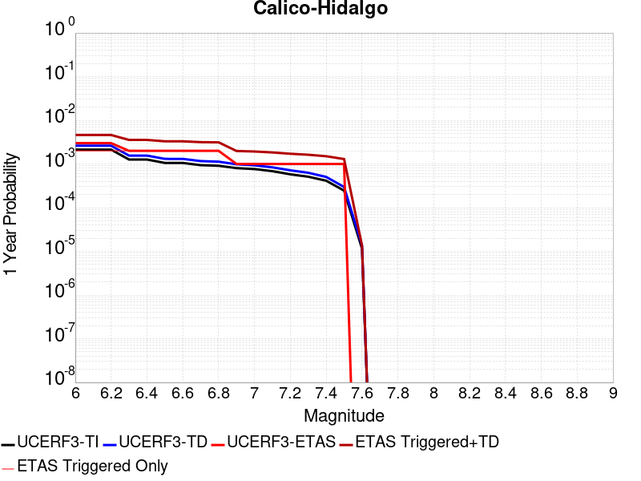 | 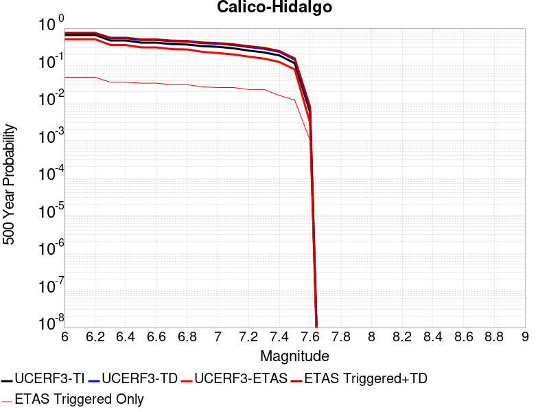 |

| Magnitude | 1 wk TI Prob | 1 wk TD Prob | 1 wk ETAS Prob | 1 wk ETAS/TD Gain | 1 wk ETAS Triggered+TD | 1 wk ETAS Triggered Only | 1 mo TI Prob | 1 mo TD Prob | 1 mo ETAS Prob | 1 mo ETAS/TD Gain | 1 mo ETAS Triggered+TD | 1 mo ETAS Triggered Only | 1 yr TI Prob | 1 yr TD Prob | 1 yr ETAS Prob | 1 yr ETAS/TD Gain | 1 yr ETAS Triggered+TD | 1 yr ETAS Triggered Only | 500 yr TI Prob | 500 yr TD Prob | 500 yr ETAS Prob | 500 yr ETAS/TD Gain | 500 yr ETAS Triggered+TD | 500 yr ETAS Triggered Only |
|-----|-----|-----|-----|-----|-----|-----|-----|-----|-----|-----|-----|-----|-----|-----|-----|-----|-----|-----|-----|-----|-----|-----|-----|-----|
| 6.0 | 4.0906612E-5 | 5.0218972E-5 | 0.0 | 0.0 | 5.0218972E-5 | 0.0 | 1.7530227E-4 | 2.1520864E-4 | 0.0 | 0.0 | 2.1520864E-4 | 0.0 | 0.0021322158 | 0.0026174064 | 0.003 | 1.1461728 | 0.0046121716 | 0.002 | 0.65604556 | 0.732341 | 0.508 | 0.6936659 | 0.7454563 | 0.049 |
| 6.1 | 4.0906612E-5 | 5.0218972E-5 | 0.0 | 0.0 | 5.0218972E-5 | 0.0 | 1.7530227E-4 | 2.1520864E-4 | 0.0 | 0.0 | 2.1520864E-4 | 0.0 | 0.0021322158 | 0.0026174064 | 0.003 | 1.1461728 | 0.0046121716 | 0.002 | 0.65604556 | 0.732341 | 0.508 | 0.6936659 | 0.7454563 | 0.049 |
| 6.2 | 4.0906612E-5 | 5.0218972E-5 | 0.0 | 0.0 | 5.0218972E-5 | 0.0 | 1.7530227E-4 | 2.1520864E-4 | 0.0 | 0.0 | 2.1520864E-4 | 0.0 | 0.0021322158 | 0.0026174064 | 0.003 | 1.1461728 | 0.0046121716 | 0.002 | 0.65604556 | 0.732341 | 0.508 | 0.6936659 | 0.7454563 | 0.049 |
| 6.3 | 2.4242801E-5 | 2.9837374E-5 | 0.0 | 0.0 | 2.9837374E-5 | 0.0 | 1.0389358E-4 | 1.2786838E-4 | 0.0 | 0.0 | 1.2786838E-4 | 0.0 | 0.0012641704 | 0.0015557187 | 0.002 | 1.2855794 | 0.0035526073 | 0.002 | 0.46873006 | 0.5394389 | 0.356 | 0.65994495 | 0.5560191 | 0.036 |
| 6.4 | 2.4242801E-5 | 2.9837374E-5 | 0.0 | 0.0 | 2.9837374E-5 | 0.0 | 1.0389358E-4 | 1.2786838E-4 | 0.0 | 0.0 | 1.2786838E-4 | 0.0 | 0.0012641704 | 0.0015557187 | 0.002 | 1.2855794 | 0.0035526073 | 0.002 | 0.46873006 | 0.5394389 | 0.356 | 0.65994495 | 0.5560191 | 0.036 |
| 6.5 | 2.0286952E-5 | 2.5107736E-5 | 0.0 | 0.0 | 2.5107736E-5 | 0.0 | 8.694118E-5 | 1.0760024E-4 | 0.0 | 0.0 | 1.0760024E-4 | 0.0 | 0.0010579949 | 0.0013092625 | 0.002 | 1.5275776 | 0.0033066438 | 0.002 | 0.4109696 | 0.48375335 | 0.307 | 0.6346209 | 0.50130576 | 0.034 |
| 6.6 | 2.0269223E-5 | 2.5088759E-5 | 0.0 | 0.0 | 2.5088759E-5 | 0.0 | 8.6865206E-5 | 1.07518914E-4 | 0.0 | 0.0 | 1.07518914E-4 | 0.0 | 0.0010570707 | 0.0013082735 | 0.002 | 1.5287323 | 0.003305657 | 0.002 | 0.41069707 | 0.483498 | 0.307 | 0.63495606 | 0.50105906 | 0.034 |
| 6.7 | 1.799852E-5 | 2.23524E-5 | 0.0 | 0.0 | 2.23524E-5 | 0.0 | 7.713423E-5 | 9.5792566E-5 | 0.0 | 0.0 | 9.5792566E-5 | 0.0 | 9.3870464E-4 | 0.0011656648 | 0.002 | 1.7157592 | 0.0031633335 | 0.002 | 0.37473065 | 0.447668 | 0.276 | 0.61652833 | 0.46479028 | 0.031 |
| 6.8 | 1.7458793E-5 | 2.1660091E-5 | 0.0 | 0.0 | 2.1660091E-5 | 0.0 | 7.4821255E-5 | 9.282574E-5 | 0.0 | 0.0 | 9.282574E-5 | 0.0 | 9.10568E-4 | 0.0011295816 | 0.002 | 1.770567 | 0.0031273225 | 0.002 | 0.36586374 | 0.43807718 | 0.27 | 0.6163297 | 0.4554968 | 0.031 |
| 6.9 | 1.542884E-5 | 1.8869348E-5 | 0.0 | 0.0 | 1.8869348E-5 | 0.0 | 6.612192E-5 | 8.08662E-5 | 0.0 | 0.0 | 8.08662E-5 | 0.0 | 8.04737E-4 | 9.841141E-4 | 0.001 | 1.0161422 | 0.0019831301 | 0.001 | 0.33137405 | 0.39892542 | 0.233 | 0.5840691 | 0.41515446 | 0.027 |
| 7.0 | 1.468253E-5 | 1.788188E-5 | 0.0 | 0.0 | 1.788188E-5 | 0.0 | 6.292361E-5 | 7.663445E-5 | 0.0 | 0.0 | 7.663445E-5 | 0.0 | 7.658257E-4 | 9.326378E-4 | 0.001 | 1.0722276 | 0.0019317052 | 0.001 | 0.31822768 | 0.3841694 | 0.217 | 0.564855 | 0.400181 | 0.026 |
| 7.1 | 1.3139281E-5 | 1.6063257E-5 | 0.0 | 0.0 | 1.6063257E-5 | 0.0 | 5.6309986E-5 | 6.884078E-5 | 0.0 | 0.0 | 6.884078E-5 | 0.0 | 6.853584E-4 | 8.378265E-4 | 0.001 | 1.1935645 | 0.0018369887 | 0.001 | 0.2902175 | 0.35468912 | 0.199 | 0.5610547 | 0.3714672 | 0.026 |
| 7.2 | 1.1127404E-5 | 1.3739353E-5 | 0.0 | 0.0 | 1.3739353E-5 | 0.0 | 4.7688E-5 | 5.8881673E-5 | 0.0 | 0.0 | 5.8881673E-5 | 0.0 | 5.8044674E-4 | 7.1665924E-4 | 0.001 | 1.3953633 | 0.0017159425 | 0.001 | 0.2519666 | 0.31417802 | 0.174 | 0.5538261 | 0.32995194 | 0.023 |
| 7.3 | 9.808154E-6 | 1.2059312E-5 | 0.0 | 0.0 | 1.2059312E-5 | 0.0 | 4.2034266E-5 | 5.1681804E-5 | 0.0 | 0.0 | 5.1681804E-5 | 0.0 | 5.11647E-4 | 6.290548E-4 | 0.001 | 1.5896866 | 0.0016284257 | 0.001 | 0.22577207 | 0.28194103 | 0.154 | 0.54621357 | 0.29845637 | 0.023 |
| 7.4 | 7.942452E-6 | 9.693151E-6 | 0.0 | 0.0 | 9.693151E-6 | 0.0 | 3.4038632E-5 | 4.1541465E-5 | 0.0 | 0.0 | 4.1541465E-5 | 0.0 | 4.1434157E-4 | 5.056592E-4 | 0.001 | 1.9776164 | 0.0015051536 | 0.001 | 0.18715408 | 0.233515 | 0.125 | 0.5352975 | 0.24577875 | 0.016 |
| 7.5 | 4.7121216E-6 | 5.7098932E-6 | 0.0 | 0.0 | 5.7098932E-6 | 0.0 | 2.019465E-5 | 2.4470784E-5 | 0.0 | 0.0 | 2.4470784E-5 | 0.0 | 2.4584212E-4 | 2.9789854E-4 | 0.001 | 3.3568475 | 0.0012976007 | 0.001 | 0.1156799 | 0.14521557 | 0.079 | 0.5440188 | 0.155473 | 0.012 |
| 7.6 | 2.21172E-7 | 2.5988282E-7 | 0.0 | 0.0 | 2.5988282E-7 | 0.0 | 9.478797E-7 | 1.1137832E-6 | 0.0 | 0.0 | 1.1137832E-6 | 0.0 | 1.1540374E-5 | 1.3560255E-5 | 0.0 | 0.0 | 1.3560255E-5 | 0.0 | 0.0057536047 | 0.0069991336 | 0.003 | 0.42862448 | 0.007992134 | 0.001 |

## Pleito
*[(top)](#table-of-contents)*

| 1 Week | 1 Month | 1 Year | 500 Year |
|-----|-----|-----|-----|
|  |  | 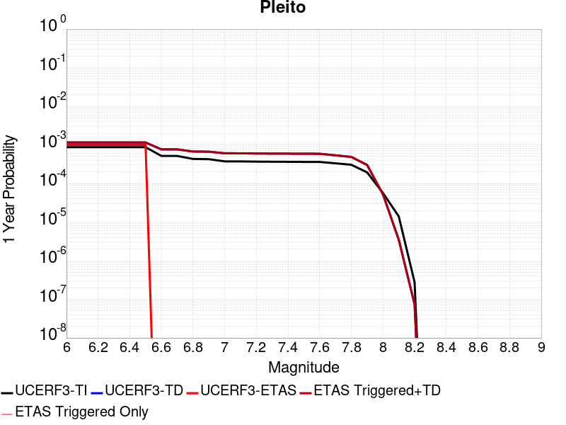 | 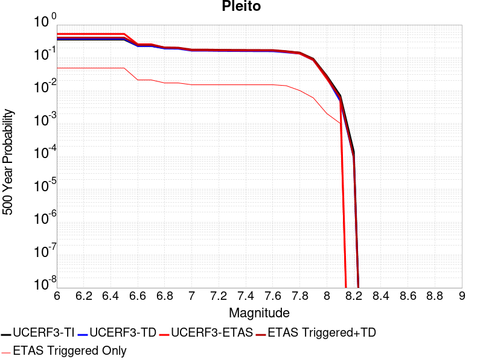 |

| Magnitude | 1 wk TI Prob | 1 wk TD Prob | 1 wk ETAS Prob | 1 wk ETAS/TD Gain | 1 wk ETAS Triggered+TD | 1 wk ETAS Triggered Only | 1 mo TI Prob | 1 mo TD Prob | 1 mo ETAS Prob | 1 mo ETAS/TD Gain | 1 mo ETAS Triggered+TD | 1 mo ETAS Triggered Only | 1 yr TI Prob | 1 yr TD Prob | 1 yr ETAS Prob | 1 yr ETAS/TD Gain | 1 yr ETAS Triggered+TD | 1 yr ETAS Triggered Only | 500 yr TI Prob | 500 yr TD Prob | 500 yr ETAS Prob | 500 yr ETAS/TD Gain | 500 yr ETAS Triggered+TD | 500 yr ETAS Triggered Only |
|-----|-----|-----|-----|-----|-----|-----|-----|-----|-----|-----|-----|-----|-----|-----|-----|-----|-----|-----|-----|-----|-----|-----|-----|-----|
| 6.0 | 1.6763008E-5 | 2.21604E-5 | 0.0 | 0.0 | 2.21604E-5 | 0.0 | 7.183948E-5 | 9.497009E-5 | 0.0 | 0.0 | 9.497009E-5 | 0.0 | 8.742947E-4 | 0.0011557187 | 0.001 | 0.86526245 | 0.0011557187 | 0.0 | 0.35424724 | 0.3760825 | 0.526 | 1.3986293 | 0.40603054 | 0.048 |
| 6.1 | 1.6763008E-5 | 2.21604E-5 | 0.0 | 0.0 | 2.21604E-5 | 0.0 | 7.183948E-5 | 9.497009E-5 | 0.0 | 0.0 | 9.497009E-5 | 0.0 | 8.742947E-4 | 0.0011557187 | 0.001 | 0.86526245 | 0.0011557187 | 0.0 | 0.35424724 | 0.3760825 | 0.526 | 1.3986293 | 0.40603054 | 0.048 |
| 6.2 | 1.6763008E-5 | 2.21604E-5 | 0.0 | 0.0 | 2.21604E-5 | 0.0 | 7.183948E-5 | 9.497009E-5 | 0.0 | 0.0 | 9.497009E-5 | 0.0 | 8.742947E-4 | 0.0011557187 | 0.001 | 0.86526245 | 0.0011557187 | 0.0 | 0.35424724 | 0.3760825 | 0.526 | 1.3986293 | 0.40603054 | 0.048 |
| 6.3 | 1.6763008E-5 | 2.21604E-5 | 0.0 | 0.0 | 2.21604E-5 | 0.0 | 7.183948E-5 | 9.497009E-5 | 0.0 | 0.0 | 9.497009E-5 | 0.0 | 8.742947E-4 | 0.0011557187 | 0.001 | 0.86526245 | 0.0011557187 | 0.0 | 0.35424724 | 0.3760825 | 0.526 | 1.3986293 | 0.40603054 | 0.048 |
| 6.4 | 1.6763008E-5 | 2.21604E-5 | 0.0 | 0.0 | 2.21604E-5 | 0.0 | 7.183948E-5 | 9.497009E-5 | 0.0 | 0.0 | 9.497009E-5 | 0.0 | 8.742947E-4 | 0.0011557187 | 0.001 | 0.86526245 | 0.0011557187 | 0.0 | 0.35424724 | 0.3760825 | 0.526 | 1.3986293 | 0.40603054 | 0.048 |
| 6.5 | 1.6763008E-5 | 2.21604E-5 | 0.0 | 0.0 | 2.21604E-5 | 0.0 | 7.183948E-5 | 9.497009E-5 | 0.0 | 0.0 | 9.497009E-5 | 0.0 | 8.742947E-4 | 0.0011557187 | 0.001 | 0.86526245 | 0.0011557187 | 0.0 | 0.35424724 | 0.3760825 | 0.526 | 1.3986293 | 0.40603054 | 0.048 |
| 6.6 | 9.910213E-6 | 1.4650842E-5 | 0.0 | 0.0 | 1.4650842E-5 | 0.0 | 4.247165E-5 | 6.278783E-5 | 0.0 | 0.0 | 6.278783E-5 | 0.0 | 5.169696E-4 | 7.6417724E-4 | 0.0 | 0.0 | 7.6417724E-4 | 0.0 | 0.22783086 | 0.22651768 | 0.255 | 1.1257399 | 0.2427608 | 0.021 |
| 6.7 | 9.910213E-6 | 1.4650842E-5 | 0.0 | 0.0 | 1.4650842E-5 | 0.0 | 4.247165E-5 | 6.278783E-5 | 0.0 | 0.0 | 6.278783E-5 | 0.0 | 5.169696E-4 | 7.6417724E-4 | 0.0 | 0.0 | 7.6417724E-4 | 0.0 | 0.22783086 | 0.22651768 | 0.255 | 1.1257399 | 0.2427608 | 0.021 |
| 6.8 | 8.300162E-6 | 1.2917749E-5 | 0.0 | 0.0 | 1.2917749E-5 | 0.0 | 3.557164E-5 | 5.536061E-5 | 0.0 | 0.0 | 5.536061E-5 | 0.0 | 4.3299864E-4 | 6.738083E-4 | 0.0 | 0.0 | 6.738083E-4 | 0.0 | 0.19470467 | 0.19024771 | 0.202 | 1.0617737 | 0.2040135 | 0.017 |
| 6.9 | 8.183114E-6 | 1.2790302E-5 | 0.0 | 0.0 | 1.2790302E-5 | 0.0 | 3.5070017E-5 | 5.4814434E-5 | 0.0 | 0.0 | 5.4814434E-5 | 0.0 | 4.2689382E-4 | 6.6716265E-4 | 0.0 | 0.0 | 6.6716265E-4 | 0.0 | 0.19224177 | 0.18753389 | 0.197 | 1.0504768 | 0.20134582 | 0.017 |
| 7.0 | 7.1748823E-6 | 1.1613852E-5 | 0.0 | 0.0 | 1.1613852E-5 | 0.0 | 3.0749135E-5 | 4.9772705E-5 | 0.0 | 0.0 | 4.9772705E-5 | 0.0 | 3.743064E-4 | 6.0581457E-4 | 0.0 | 0.0 | 6.0581457E-4 | 0.0 | 0.17071238 | 0.16329573 | 0.169 | 1.0349321 | 0.1758463 | 0.015 |
| 7.1 | 7.1671807E-6 | 1.1604592E-5 | 0.0 | 0.0 | 1.1604592E-5 | 0.0 | 3.0716128E-5 | 4.973302E-5 | 0.0 | 0.0 | 4.973302E-5 | 0.0 | 3.7390468E-4 | 6.053317E-4 | 0.0 | 0.0 | 6.053317E-4 | 0.0 | 0.17054573 | 0.16308782 | 0.169 | 1.0362515 | 0.17564149 | 0.015 |
| 7.2 | 7.0649667E-6 | 1.1461156E-5 | 0.0 | 0.0 | 1.1461156E-5 | 0.0 | 3.0278077E-5 | 4.9118316E-5 | 0.0 | 0.0 | 4.9118316E-5 | 0.0 | 3.6857324E-4 | 5.9785176E-4 | 0.0 | 0.0 | 5.9785176E-4 | 0.0 | 0.16833086 | 0.16066115 | 0.167 | 1.0394548 | 0.17325123 | 0.015 |
| 7.3 | 7.02082E-6 | 1.1409723E-5 | 0.0 | 0.0 | 1.1409723E-5 | 0.0 | 3.008888E-5 | 4.8897895E-5 | 0.0 | 0.0 | 4.8897895E-5 | 0.0 | 3.6627054E-4 | 5.9516967E-4 | 0.0 | 0.0 | 5.9516967E-4 | 0.0 | 0.16737242 | 0.15960442 | 0.166 | 1.0400715 | 0.17221035 | 0.015 |
| 7.4 | 6.987146E-6 | 1.1372117E-5 | 0.0 | 0.0 | 1.1372117E-5 | 0.0 | 2.9944567E-5 | 4.8736736E-5 | 0.0 | 0.0 | 4.8736736E-5 | 0.0 | 3.6451413E-4 | 5.932086E-4 | 0.0 | 0.0 | 5.932086E-4 | 0.0 | 0.16664061 | 0.15880264 | 0.166 | 1.0453227 | 0.1714206 | 0.015 |
| 7.5 | 6.9494554E-6 | 1.1331145E-5 | 0.0 | 0.0 | 1.1331145E-5 | 0.0 | 2.9783041E-5 | 4.856115E-5 | 0.0 | 0.0 | 4.856115E-5 | 0.0 | 3.625482E-4 | 5.9107196E-4 | 0.0 | 0.0 | 5.9107196E-4 | 0.0 | 0.16582073 | 0.15788323 | 0.166 | 1.05141 | 0.17051499 | 0.015 |
| 7.6 | 6.92694E-6 | 1.1294254E-5 | 0.0 | 0.0 | 1.1294254E-5 | 0.0 | 2.9686547E-5 | 4.840305E-5 | 0.0 | 0.0 | 4.840305E-5 | 0.0 | 3.6137376E-4 | 5.8914814E-4 | 0.0 | 0.0 | 5.8914814E-4 | 0.0 | 0.16533057 | 0.15732563 | 0.165 | 1.0487802 | 0.16996573 | 0.015 |
| 7.7 | 6.395867E-6 | 1.0284129E-5 | 0.0 | 0.0 | 1.0284129E-5 | 0.0 | 2.741057E-5 | 4.4074095E-5 | 0.0 | 0.0 | 4.4074095E-5 | 0.0 | 3.336726E-4 | 5.364702E-4 | 0.0 | 0.0 | 5.364702E-4 | 0.0 | 0.1536854 | 0.1453503 | 0.151 | 1.0388694 | 0.1573154 | 0.014 |
| 7.8 | 5.8664327E-6 | 9.357907E-6 | 0.0 | 0.0 | 9.357907E-6 | 0.0 | 2.5141611E-5 | 4.0104704E-5 | 0.0 | 0.0 | 4.0104704E-5 | 0.0 | 3.060561E-4 | 4.881655E-4 | 0.0 | 0.0 | 4.881655E-4 | 0.0 | 0.14191446 | 0.13305582 | 0.133 | 0.9995805 | 0.14172526 | 0.01 |
| 7.9 | 3.7167474E-6 | 5.788623E-6 | 0.0 | 0.0 | 5.788623E-6 | 0.0 | 1.592882E-5 | 2.4808149E-5 | 0.0 | 0.0 | 2.4808149E-5 | 0.0 | 1.9391612E-4 | 3.0199747E-4 | 0.0 | 0.0 | 3.0199747E-4 | 0.0 | 0.09241446 | 0.08453786 | 0.085 | 1.0054667 | 0.090030625 | 0.006 |
| 8.0 | 1.0903841E-6 | 1.0062797E-6 | 0.0 | 0.0 | 1.0062797E-6 | 0.0 | 4.6730665E-6 | 4.31262E-6 | 0.0 | 0.0 | 4.31262E-6 | 0.0 | 5.68931E-5 | 5.2504893E-5 | 0.0 | 0.0 | 5.2504893E-5 | 0.0 | 0.028046543 | 0.024647444 | 0.023 | 0.9331596 | 0.02659815 | 0.002 |
| 8.1 | 2.6894583E-7 | 6.701887E-8 | 0.0 | 0.0 | 6.701887E-8 | 0.0 | 1.1526245E-6 | 2.8722368E-7 | 0.0 | 0.0 | 2.8722368E-7 | 0.0 | 1.4033113E-5 | 3.4969428E-6 | 0.0 | 0.0 | 3.4969428E-6 | 0.0 | 0.0069920467 | 0.0047975057 | 0.006 | 1.2506499 | 0.005792708 | 0.001 |
| 8.2 | 5.2967013E-9 | 1.4175328E-9 | 0.0 | 0.0 | 1.4175328E-9 | 0.0 | 2.2700148E-8 | 6.075141E-9 | 0.0 | 0.0 | 6.075141E-9 | 0.0 | 2.7637427E-7 | 7.396484E-8 | 0.0 | 0.0 | 7.396484E-8 | 0.0 | 1.3817761E-4 | 9.1694696E-5 | 0.0 | 0.0 | 9.1694696E-5 | 0.0 |

## Rodgers Creek - Healdsburg 2011 CFM
*[(top)](#table-of-contents)*

| 1 Week | 1 Month | 1 Year | 500 Year |
|-----|-----|-----|-----|
|  |  | 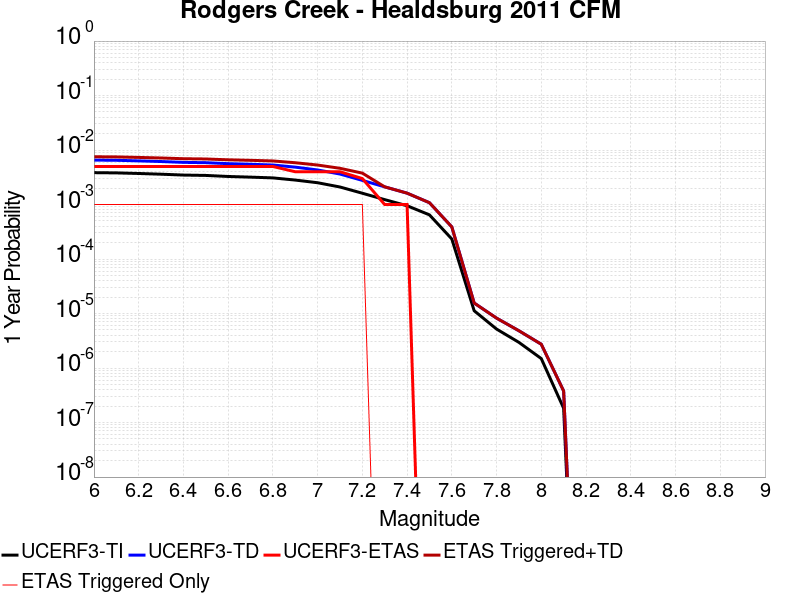 | 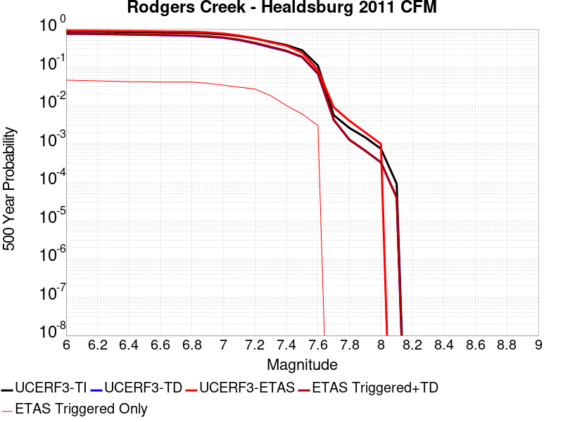 |

| Magnitude | 1 wk TI Prob | 1 wk TD Prob | 1 wk ETAS Prob | 1 wk ETAS/TD Gain | 1 wk ETAS Triggered+TD | 1 wk ETAS Triggered Only | 1 mo TI Prob | 1 mo TD Prob | 1 mo ETAS Prob | 1 mo ETAS/TD Gain | 1 mo ETAS Triggered+TD | 1 mo ETAS Triggered Only | 1 yr TI Prob | 1 yr TD Prob | 1 yr ETAS Prob | 1 yr ETAS/TD Gain | 1 yr ETAS Triggered+TD | 1 yr ETAS Triggered Only | 500 yr TI Prob | 500 yr TD Prob | 500 yr ETAS Prob | 500 yr ETAS/TD Gain | 500 yr ETAS Triggered+TD | 500 yr ETAS Triggered Only |
|-----|-----|-----|-----|-----|-----|-----|-----|-----|-----|-----|-----|-----|-----|-----|-----|-----|-----|-----|-----|-----|-----|-----|-----|-----|
| 6.0 | 7.390182E-5 | 1.2582331E-4 | 0.0 | 0.0 | 1.2582331E-4 | 0.0 | 3.1668364E-4 | 5.3913164E-4 | 0.0 | 0.0 | 5.3913164E-4 | 0.0 | 0.0038488081 | 0.0065441485 | 0.005 | 0.76404136 | 0.0075376043 | 0.001 | 0.8545782 | 0.74435353 | 0.896 | 1.2037292 | 0.7561133 | 0.046 |
| 6.1 | 7.318768E-5 | 1.2482266E-4 | 0.0 | 0.0 | 1.2482266E-4 | 0.0 | 3.1362378E-4 | 5.3484493E-4 | 0.0 | 0.0 | 5.3484493E-4 | 0.0 | 0.0038116854 | 0.0064922823 | 0.005 | 0.7701452 | 0.00748579 | 0.001 | 0.85184324 | 0.7403474 | 0.893 | 1.2061906 | 0.75203174 | 0.045 |
| 6.2 | 7.1379836E-5 | 1.2179884E-4 | 0.0 | 0.0 | 1.2179884E-4 | 0.0 | 3.058777E-4 | 5.21891E-4 | 0.0 | 0.0 | 5.21891E-4 | 0.0 | 0.003717703 | 0.0063354936 | 0.005 | 0.7892045 | 0.007329158 | 0.001 | 0.8446874 | 0.7316669 | 0.886 | 1.2109334 | 0.7434736 | 0.044 |
| 6.3 | 6.9255926E-5 | 1.18411524E-4 | 0.0 | 0.0 | 1.18411524E-4 | 0.0 | 2.9677735E-4 | 5.073796E-4 | 0.0 | 0.0 | 5.073796E-4 | 0.0 | 0.0036072785 | 0.0061598998 | 0.005 | 0.81170154 | 0.0071537397 | 0.001 | 0.8358378 | 0.7211615 | 0.88 | 1.2202538 | 0.7331515 | 0.043 |
| 6.4 | 6.6757144E-5 | 1.14250615E-4 | 0.0 | 0.0 | 1.14250615E-4 | 0.0 | 2.8607066E-4 | 4.895539E-4 | 0.0 | 0.0 | 4.895539E-4 | 0.0 | 0.0034773487 | 0.0059440993 | 0.005 | 0.8411704 | 0.0069381553 | 0.001 | 0.8247785 | 0.7084191 | 0.872 | 1.2309097 | 0.7206655 | 0.042 |
| 6.5 | 6.5735134E-5 | 1.12768146E-4 | 0.0 | 0.0 | 1.12768146E-4 | 0.0 | 2.8169158E-4 | 4.832029E-4 | 0.0 | 0.0 | 4.832029E-4 | 0.0 | 0.003424202 | 0.0058672037 | 0.005 | 0.8521947 | 0.0068613365 | 0.001 | 0.8200433 | 0.7018894 | 0.87 | 1.2395115 | 0.71441007 | 0.042 |
| 6.6 | 6.289601E-5 | 1.0820079E-4 | 0.0 | 0.0 | 1.0820079E-4 | 0.0 | 2.6952647E-4 | 4.6363557E-4 | 0.0 | 0.0 | 4.6363557E-4 | 0.0 | 0.0032765474 | 0.005630227 | 0.005 | 0.8880637 | 0.0066245967 | 0.001 | 0.80620676 | 0.68471366 | 0.856 | 1.2501577 | 0.69764036 | 0.041 |
| 6.7 | 6.115274E-5 | 1.0541957E-4 | 0.0 | 0.0 | 1.0541957E-4 | 0.0 | 2.6205686E-4 | 4.5172026E-4 | 0.0 | 0.0 | 4.5172026E-4 | 0.0 | 0.0031858748 | 0.005485898 | 0.005 | 0.91142786 | 0.006480412 | 0.001 | 0.7971889 | 0.67346114 | 0.848 | 1.259167 | 0.68684924 | 0.041 |
| 6.8 | 5.9232367E-5 | 1.0218492E-4 | 0.0 | 0.0 | 1.0218492E-4 | 0.0 | 2.538283E-4 | 4.378622E-4 | 0.0 | 0.0 | 4.378622E-4 | 0.0 | 0.0030859804 | 0.0053180116 | 0.005 | 0.94020104 | 0.0063126935 | 0.001 | 0.7867683 | 0.6606493 | 0.838 | 1.2684492 | 0.67456263 | 0.041 |
| 6.9 | 5.4030377E-5 | 9.337335E-5 | 0.0 | 0.0 | 9.337335E-5 | 0.0 | 2.315382E-4 | 4.0011044E-4 | 0.0 | 0.0 | 4.0011044E-4 | 0.0 | 0.0028153337 | 0.004860524 | 0.004 | 0.8229565 | 0.0058556637 | 0.001 | 0.75577176 | 0.6240928 | 0.807 | 1.2930769 | 0.6383773 | 0.038 |
| 7.0 | 4.8260714E-5 | 8.2859995E-5 | 0.0 | 0.0 | 8.2859995E-5 | 0.0 | 2.0681522E-4 | 3.5506618E-4 | 0.0 | 0.0 | 3.5506618E-4 | 0.0 | 0.0025150678 | 0.0043144114 | 0.004 | 0.92712533 | 0.005310097 | 0.001 | 0.7160957 | 0.58450913 | 0.753 | 1.2882605 | 0.59863585 | 0.034 |
| 7.1 | 4.0294493E-5 | 6.972704E-5 | 0.0 | 0.0 | 6.972704E-5 | 0.0 | 1.7267925E-4 | 2.987961E-4 | 0.0 | 0.0 | 2.987961E-4 | 0.0 | 0.0021003427 | 0.0036318088 | 0.004 | 1.1013795 | 0.0046281773 | 0.001 | 0.6505084 | 0.50892276 | 0.668 | 1.3125764 | 0.52365506 | 0.03 |
| 7.2 | 3.096388E-5 | 5.3292817E-5 | 0.0 | 0.0 | 5.3292817E-5 | 0.0 | 1.326956E-4 | 2.283779E-4 | 0.0 | 0.0 | 2.283779E-4 | 0.0 | 0.0016143717 | 0.002776975 | 0.003 | 1.0803121 | 0.0037741982 | 0.001 | 0.55417913 | 0.41750744 | 0.566 | 1.3556645 | 0.43323475 | 0.027 |
| 7.3 | 2.3615226E-5 | 4.05506E-5 | 0.0 | 0.0 | 4.05506E-5 | 0.0 | 1.0120418E-4 | 1.7377677E-4 | 0.0 | 0.0 | 1.7377677E-4 | 0.0 | 0.0012314644 | 0.002113691 | 0.001 | 0.47310603 | 0.002113691 | 0.0 | 0.45995978 | 0.32914165 | 0.447 | 1.3580779 | 0.3412171 | 0.018 |
| 7.4 | 1.8251132E-5 | 3.1063366E-5 | 0.0 | 0.0 | 3.1063366E-5 | 0.0 | 7.821679E-5 | 1.3312197E-4 | 0.0 | 0.0 | 1.3312197E-4 | 0.0 | 9.518733E-4 | 0.0016195634 | 0.001 | 0.61745036 | 0.0016195634 | 0.0 | 0.37883797 | 0.2613008 | 0.364 | 1.3930306 | 0.26868778 | 0.01 |
| 7.5 | 1.2411432E-5 | 2.075188E-5 | 0.0 | 0.0 | 2.075188E-5 | 0.0 | 5.3190768E-5 | 8.893362E-5 | 0.0 | 0.0 | 8.893362E-5 | 0.0 | 6.4740516E-4 | 0.001082234 | 0.0 | 0.0 | 0.001082234 | 0.0 | 0.27661043 | 0.18215777 | 0.24 | 1.3175392 | 0.18706483 | 0.006 |
| 7.6 | 4.4771446E-6 | 7.457729E-6 | 0.0 | 0.0 | 7.457729E-6 | 0.0 | 1.918762E-5 | 3.196131E-5 | 0.0 | 0.0 | 3.196131E-5 | 0.0 | 2.3358424E-4 | 3.8906053E-4 | 0.0 | 0.0 | 3.8906053E-4 | 0.0 | 0.110242 | 0.067138545 | 0.085 | 1.2660388 | 0.069937125 | 0.003 |
| 7.7 | 2.157941E-7 | 2.9897745E-7 | 0.0 | 0.0 | 2.9897745E-7 | 0.0 | 9.248315E-7 | 1.2813313E-6 | 0.0 | 0.0 | 1.2813313E-6 | 0.0 | 1.1259765E-5 | 1.5600097E-5 | 0.0 | 0.0 | 1.5600097E-5 | 0.0 | 0.0056140963 | 0.0042391378 | 0.009 | 2.1230733 | 0.0042391378 | 0.0 |
| 7.8 | 9.9623286E-8 | 1.5811395E-7 | 0.0 | 0.0 | 1.5811395E-7 | 0.0 | 4.269569E-7 | 6.77631E-7 | 0.0 | 0.0 | 6.77631E-7 | 0.0 | 5.1981874E-6 | 8.2501265E-6 | 0.0 | 0.0 | 8.2501265E-6 | 0.0 | 0.0025957257 | 0.0012799217 | 0.004 | 3.1251912 | 0.0012799217 | 0.0 |
| 7.9 | 5.6745257E-8 | 9.2702344E-8 | 0.0 | 0.0 | 9.2702344E-8 | 0.0 | 2.4319394E-7 | 3.9729568E-7 | 0.0 | 0.0 | 3.9729568E-7 | 0.0 | 2.960882E-6 | 4.8370644E-6 | 0.0 | 0.0 | 4.8370644E-6 | 0.0 | 0.0014793479 | 6.640704E-4 | 0.002 | 3.0117288 | 6.640704E-4 | 0.0 |
| 8.0 | 2.8614323E-8 | 5.244026E-8 | 0.0 | 0.0 | 5.244026E-8 | 0.0 | 1.2263281E-7 | 2.2474394E-7 | 0.0 | 0.0 | 2.2474394E-7 | 0.0 | 1.4930534E-6 | 2.7362541E-6 | 0.0 | 0.0 | 2.7362541E-6 | 0.0 | 7.462487E-4 | 3.2898455E-4 | 0.001 | 3.0396564 | 3.2898455E-4 | 0.0 |
| 8.1 | 3.5045191E-9 | 7.271215E-9 | 0.0 | 0.0 | 7.271215E-9 | 0.0 | 1.5019367E-8 | 3.116235E-8 | 0.0 | 0.0 | 3.116235E-8 | 0.0 | 1.8286079E-7 | 3.7940154E-7 | 0.0 | 0.0 | 3.7940154E-7 | 0.0 | 9.142622E-5 | 3.981128E-5 | 0.0 | 0.0 | 3.981128E-5 | 0.0 |

## Sierra Nevada  (No Extension)
*[(top)](#table-of-contents)*

| 1 Week | 1 Month | 1 Year | 500 Year |
|-----|-----|-----|-----|
| 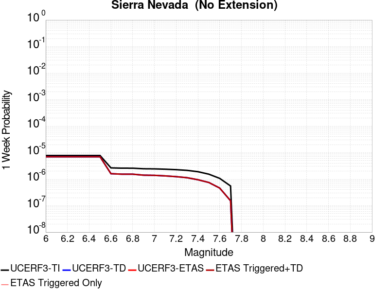 |  | 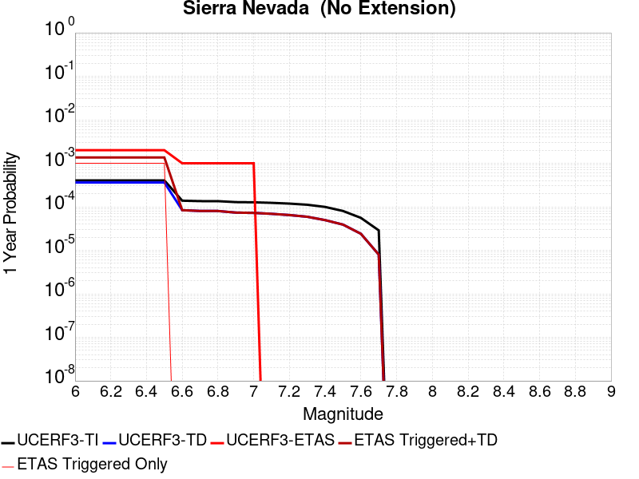 | 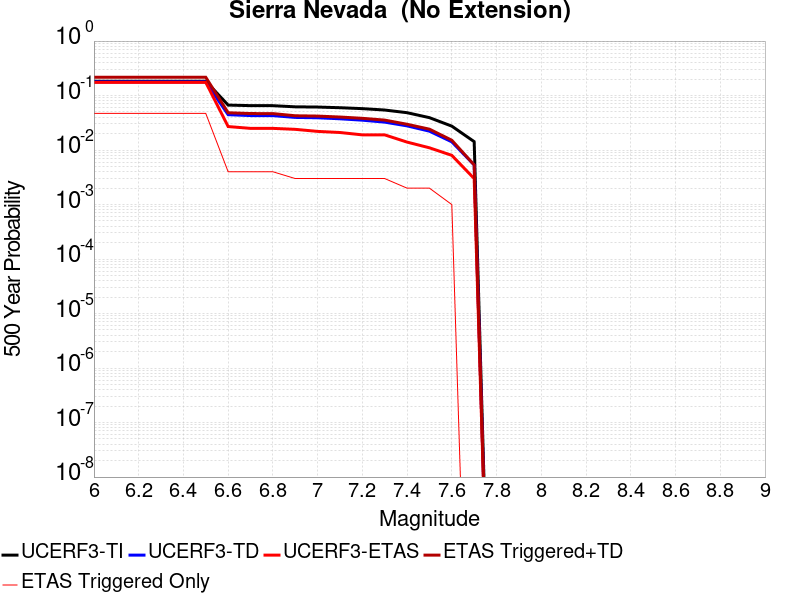 |

| Magnitude | 1 wk TI Prob | 1 wk TD Prob | 1 wk ETAS Prob | 1 wk ETAS/TD Gain | 1 wk ETAS Triggered+TD | 1 wk ETAS Triggered Only | 1 mo TI Prob | 1 mo TD Prob | 1 mo ETAS Prob | 1 mo ETAS/TD Gain | 1 mo ETAS Triggered+TD | 1 mo ETAS Triggered Only | 1 yr TI Prob | 1 yr TD Prob | 1 yr ETAS Prob | 1 yr ETAS/TD Gain | 1 yr ETAS Triggered+TD | 1 yr ETAS Triggered Only | 500 yr TI Prob | 500 yr TD Prob | 500 yr ETAS Prob | 500 yr ETAS/TD Gain | 500 yr ETAS Triggered+TD | 500 yr ETAS Triggered Only |
|-----|-----|-----|-----|-----|-----|-----|-----|-----|-----|-----|-----|-----|-----|-----|-----|-----|-----|-----|-----|-----|-----|-----|-----|-----|
| 6.0 | 7.7690465E-6 | 6.951511E-6 | 0.0 | 0.0 | 6.951511E-6 | 0.0 | 3.329549E-5 | 2.979205E-5 | 0.0 | 0.0 | 2.979205E-5 | 0.0 | 4.0529718E-4 | 3.626935E-4 | 0.002 | 5.514298 | 0.0013623309 | 0.001 | 0.1834684 | 0.17783326 | 0.175 | 0.98406786 | 0.2164751 | 0.047 |
| 6.1 | 7.7690465E-6 | 6.951511E-6 | 0.0 | 0.0 | 6.951511E-6 | 0.0 | 3.329549E-5 | 2.979205E-5 | 0.0 | 0.0 | 2.979205E-5 | 0.0 | 4.0529718E-4 | 3.626935E-4 | 0.002 | 5.514298 | 0.0013623309 | 0.001 | 0.1834684 | 0.17783326 | 0.175 | 0.98406786 | 0.2164751 | 0.047 |
| 6.2 | 7.7690465E-6 | 6.951511E-6 | 0.0 | 0.0 | 6.951511E-6 | 0.0 | 3.329549E-5 | 2.979205E-5 | 0.0 | 0.0 | 2.979205E-5 | 0.0 | 4.0529718E-4 | 3.626935E-4 | 0.002 | 5.514298 | 0.0013623309 | 0.001 | 0.1834684 | 0.17783326 | 0.175 | 0.98406786 | 0.2164751 | 0.047 |
| 6.3 | 7.7690465E-6 | 6.951511E-6 | 0.0 | 0.0 | 6.951511E-6 | 0.0 | 3.329549E-5 | 2.979205E-5 | 0.0 | 0.0 | 2.979205E-5 | 0.0 | 4.0529718E-4 | 3.626935E-4 | 0.002 | 5.514298 | 0.0013623309 | 0.001 | 0.1834684 | 0.17783326 | 0.175 | 0.98406786 | 0.2164751 | 0.047 |
| 6.4 | 7.7690465E-6 | 6.951511E-6 | 0.0 | 0.0 | 6.951511E-6 | 0.0 | 3.329549E-5 | 2.979205E-5 | 0.0 | 0.0 | 2.979205E-5 | 0.0 | 4.0529718E-4 | 3.626935E-4 | 0.002 | 5.514298 | 0.0013623309 | 0.001 | 0.1834684 | 0.17783326 | 0.175 | 0.98406786 | 0.2164751 | 0.047 |
| 6.5 | 7.7690465E-6 | 6.951511E-6 | 0.0 | 0.0 | 6.951511E-6 | 0.0 | 3.329549E-5 | 2.979205E-5 | 0.0 | 0.0 | 2.979205E-5 | 0.0 | 4.0529718E-4 | 3.626935E-4 | 0.002 | 5.514298 | 0.0013623309 | 0.001 | 0.1834684 | 0.17783326 | 0.175 | 0.98406786 | 0.2164751 | 0.047 |
| 6.6 | 2.653E-6 | 1.6033755E-6 | 0.0 | 0.0 | 1.6033755E-6 | 0.0 | 1.136995E-5 | 6.8715913E-6 | 0.0 | 0.0 | 6.8715913E-6 | 0.0 | 1.3842035E-4 | 8.3658444E-5 | 0.001 | 11.953365 | 8.3658444E-5 | 0.0 | 0.06687393 | 0.04454862 | 0.027 | 0.6060794 | 0.048370425 | 0.004 |
| 6.7 | 2.5902466E-6 | 1.5388114E-6 | 0.0 | 0.0 | 1.5388114E-6 | 0.0 | 1.11010095E-5 | 6.5948893E-6 | 0.0 | 0.0 | 6.5948893E-6 | 0.0 | 1.351464E-4 | 8.028985E-5 | 0.001 | 12.454875 | 8.028985E-5 | 0.0 | 0.06534497 | 0.04293667 | 0.025 | 0.58225286 | 0.046764925 | 0.004 |
| 6.8 | 2.5853892E-6 | 1.5356619E-6 | 0.0 | 0.0 | 1.5356619E-6 | 0.0 | 1.1080193E-5 | 6.5813915E-6 | 0.0 | 0.0 | 6.5813915E-6 | 0.0 | 1.34893E-4 | 8.012552E-5 | 0.001 | 12.480417 | 8.012552E-5 | 0.0 | 0.06522652 | 0.04285194 | 0.025 | 0.5834041 | 0.046680532 | 0.004 |
| 6.9 | 2.458257E-6 | 1.4109743E-6 | 0.0 | 0.0 | 1.4109743E-6 | 0.0 | 1.0535345E-5 | 6.0470184E-6 | 0.0 | 0.0 | 6.0470184E-6 | 0.0 | 1.2826028E-4 | 7.361998E-5 | 0.001 | 13.583268 | 7.361998E-5 | 0.0 | 0.06212092 | 0.03971246 | 0.024 | 0.6043443 | 0.042593323 | 0.003 |
| 7.0 | 2.4341468E-6 | 1.3879898E-6 | 0.0 | 0.0 | 1.3879898E-6 | 0.0 | 1.0432016E-5 | 5.948514E-6 | 0.0 | 0.0 | 5.948514E-6 | 0.0 | 1.270024E-4 | 7.242077E-5 | 0.001 | 13.808193 | 7.242077E-5 | 0.0 | 0.06153079 | 0.039130345 | 0.022 | 0.5622235 | 0.042012952 | 0.003 |
| 7.1 | 2.3652476E-6 | 1.3231014E-6 | 0.0 | 0.0 | 1.3231014E-6 | 0.0 | 1.0136736E-5 | 5.6704225E-6 | 0.0 | 0.0 | 5.6704225E-6 | 0.0 | 1.2340778E-4 | 6.9035224E-5 | 0.0 | 0.0 | 6.9035224E-5 | 0.0 | 0.05984234 | 0.03748153 | 0.021 | 0.5602759 | 0.040369086 | 0.003 |
| 7.2 | 2.272158E-6 | 1.2396786E-6 | 0.0 | 0.0 | 1.2396786E-6 | 0.0 | 9.737784E-6 | 5.312897E-6 | 0.0 | 0.0 | 5.312897E-6 | 0.0 | 1.1855107E-4 | 6.4682616E-5 | 0.0 | 0.0 | 6.4682616E-5 | 0.0 | 0.057556257 | 0.035340447 | 0.019 | 0.53762764 | 0.038234424 | 0.003 |
| 7.3 | 2.1382127E-6 | 1.1316978E-6 | 0.0 | 0.0 | 1.1316978E-6 | 0.0 | 9.163737E-6 | 4.8501247E-6 | 0.0 | 0.0 | 4.8501247E-6 | 0.0 | 1.1156279E-4 | 5.9048678E-5 | 0.0 | 0.0 | 5.9048678E-5 | 0.0 | 0.054257084 | 0.032556325 | 0.019 | 0.5836039 | 0.035458658 | 0.003 |
| 7.4 | 1.9048055E-6 | 9.4779494E-7 | 0.0 | 0.0 | 9.4779494E-7 | 0.0 | 8.163426E-6 | 4.061972E-6 | 0.0 | 0.0 | 4.061972E-6 | 0.0 | 9.9385186E-5 | 4.9453396E-5 | 0.0 | 0.0 | 4.9453396E-5 | 0.0 | 0.048480466 | 0.027784577 | 0.014 | 0.5038767 | 0.029729007 | 0.002 |
| 7.5 | 1.5373403E-6 | 7.4775477E-7 | 0.0 | 0.0 | 7.4775477E-7 | 0.0 | 6.5885843E-6 | 3.2046594E-6 | 0.0 | 0.0 | 3.2046594E-6 | 0.0 | 8.021306E-5 | 3.9016035E-5 | 0.0 | 0.0 | 3.9016035E-5 | 0.0 | 0.039314453 | 0.022216631 | 0.011 | 0.49512455 | 0.024172198 | 0.002 |
| 7.6 | 1.0680322E-6 | 4.6009882E-7 | 0.0 | 0.0 | 4.6009882E-7 | 0.0 | 4.577273E-6 | 1.9718507E-6 | 0.0 | 0.0 | 1.9718507E-6 | 0.0 | 5.5726876E-5 | 2.4007019E-5 | 0.0 | 0.0 | 2.4007019E-5 | 0.0 | 0.027479587 | 0.014153011 | 0.008 | 0.56525075 | 0.015138858 | 0.001 |
| 7.7 | 5.509146E-7 | 1.5280993E-7 | 0.0 | 0.0 | 1.5280993E-7 | 0.0 | 2.3610605E-6 | 6.5489957E-7 | 0.0 | 0.0 | 6.5489957E-7 | 0.0 | 2.8745531E-5 | 7.9733745E-6 | 0.0 | 0.0 | 7.9733745E-6 | 0.0 | 0.014270174 | 0.005333386 | 0.003 | 0.56249446 | 0.005333386 | 0.0 |

## Honey Lake 2011 CFM
*[(top)](#table-of-contents)*

| 1 Week | 1 Month | 1 Year | 500 Year |
|-----|-----|-----|-----|
|  | 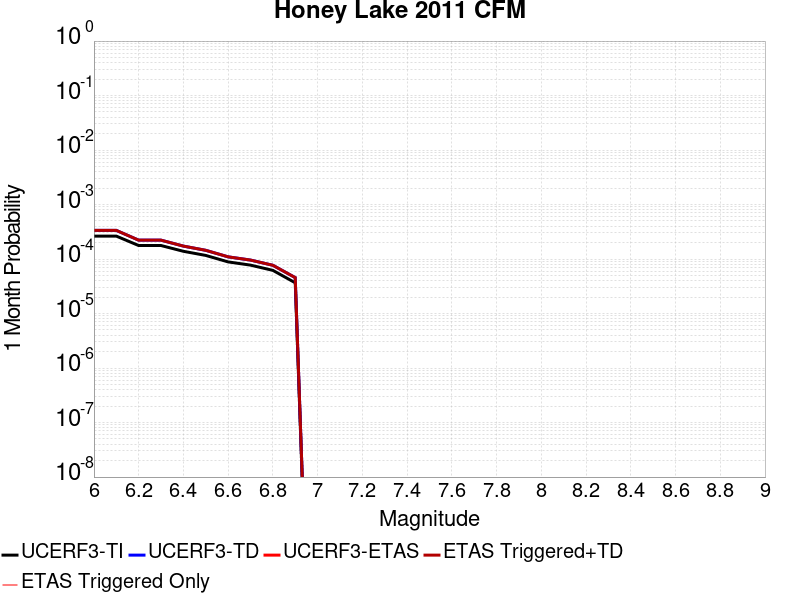 | 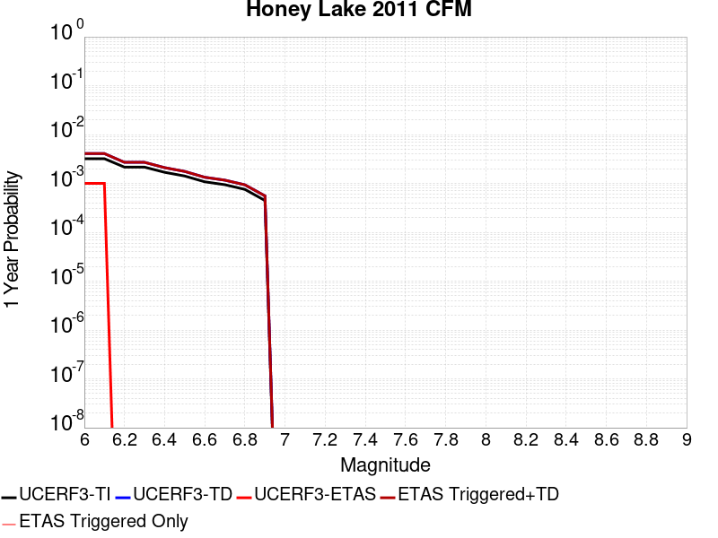 | 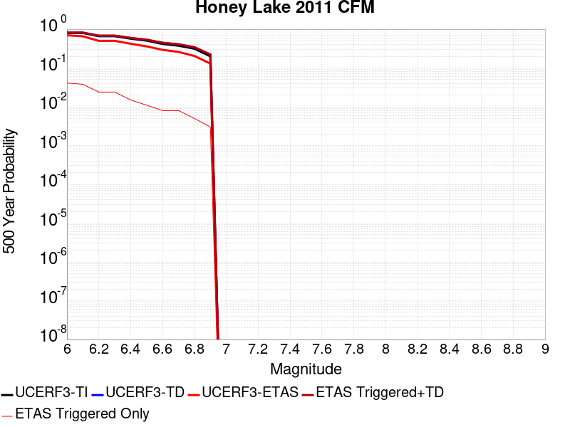 |

| Magnitude | 1 wk TI Prob | 1 wk TD Prob | 1 wk ETAS Prob | 1 wk ETAS/TD Gain | 1 wk ETAS Triggered+TD | 1 wk ETAS Triggered Only | 1 mo TI Prob | 1 mo TD Prob | 1 mo ETAS Prob | 1 mo ETAS/TD Gain | 1 mo ETAS Triggered+TD | 1 mo ETAS Triggered Only | 1 yr TI Prob | 1 yr TD Prob | 1 yr ETAS Prob | 1 yr ETAS/TD Gain | 1 yr ETAS Triggered+TD | 1 yr ETAS Triggered Only | 500 yr TI Prob | 500 yr TD Prob | 500 yr ETAS Prob | 500 yr ETAS/TD Gain | 500 yr ETAS Triggered+TD | 500 yr ETAS Triggered Only |
|-----|-----|-----|-----|-----|-----|-----|-----|-----|-----|-----|-----|-----|-----|-----|-----|-----|-----|-----|-----|-----|-----|-----|-----|-----|
| 6.0 | 6.155506E-5 | 7.838155E-5 | 0.0 | 0.0 | 7.838155E-5 | 0.0 | 2.6378073E-4 | 3.3587948E-4 | 0.0 | 0.0 | 3.3587948E-4 | 0.0 | 0.0032068014 | 0.004082138 | 0.001 | 0.24496965 | 0.004082138 | 0.0 | 0.79930663 | 0.81201714 | 0.697 | 0.8583563 | 0.81972444 | 0.041 |
| 6.1 | 6.155506E-5 | 7.838155E-5 | 0.0 | 0.0 | 7.838155E-5 | 0.0 | 2.6378073E-4 | 3.3587948E-4 | 0.0 | 0.0 | 3.3587948E-4 | 0.0 | 0.0032068014 | 0.004082138 | 0.001 | 0.24496965 | 0.004082138 | 0.0 | 0.79930663 | 0.81201714 | 0.656 | 0.8078647 | 0.81916046 | 0.038 |
| 6.2 | 4.1335024E-5 | 5.185198E-5 | 0.0 | 0.0 | 5.185198E-5 | 0.0 | 1.7713808E-4 | 2.2220457E-4 | 0.0 | 0.0 | 2.2220457E-4 | 0.0 | 0.0021545228 | 0.002702142 | 0.0 | 0.0 | 0.002702142 | 0.0 | 0.6598687 | 0.67611706 | 0.501 | 0.74099594 | 0.6838903 | 0.024 |
| 6.3 | 4.1335024E-5 | 5.185198E-5 | 0.0 | 0.0 | 5.185198E-5 | 0.0 | 1.7713808E-4 | 2.2220457E-4 | 0.0 | 0.0 | 2.2220457E-4 | 0.0 | 0.0021545228 | 0.002702142 | 0.0 | 0.0 | 0.002702142 | 0.0 | 0.6598687 | 0.67611706 | 0.501 | 0.74099594 | 0.6838903 | 0.024 |
| 6.4 | 3.2393702E-5 | 4.034124E-5 | 0.0 | 0.0 | 4.034124E-5 | 0.0 | 1.3882275E-4 | 1.7288019E-4 | 0.0 | 0.0 | 1.7288019E-4 | 0.0 | 0.0016888566 | 0.0021028926 | 0.0 | 0.0 | 0.0021028926 | 0.0 | 0.5705037 | 0.5914519 | 0.422 | 0.7134984 | 0.59758013 | 0.015 |
| 6.5 | 2.7205504E-5 | 3.376181E-5 | 0.0 | 0.0 | 3.376181E-5 | 0.0 | 1.1658981E-4 | 1.4468594E-4 | 0.0 | 0.0 | 1.4468594E-4 | 0.0 | 0.0014185566 | 0.001760222 | 0.0 | 0.0 | 0.001760222 | 0.0 | 0.5082485 | 0.5323255 | 0.361 | 0.6781565 | 0.5374699 | 0.011 |
| 6.6 | 2.069265E-5 | 2.5617277E-5 | 0.0 | 0.0 | 2.5617277E-5 | 0.0 | 8.867977E-5 | 1.09784145E-4 | 0.0 | 0.0 | 1.09784145E-4 | 0.0 | 0.0010791414 | 0.0013358848 | 0.0 | 0.0 | 0.0013358848 | 0.0 | 0.41717136 | 0.4447776 | 0.294 | 0.6610045 | 0.4492194 | 0.008 |
| 6.7 | 1.8060919E-5 | 2.236116E-5 | 0.0 | 0.0 | 2.236116E-5 | 0.0 | 7.7401644E-5 | 9.5830466E-5 | 0.0 | 0.0 | 9.5830466E-5 | 0.0 | 9.419576E-4 | 0.0011661905 | 0.0 | 0.0 | 0.0011661905 | 0.0 | 0.37574774 | 0.40447447 | 0.26 | 0.64280945 | 0.40923867 | 0.008 |
| 6.8 | 1.4474663E-5 | 1.794254E-5 | 0.0 | 0.0 | 1.794254E-5 | 0.0 | 6.203279E-5 | 7.689476E-5 | 0.0 | 0.0 | 7.689476E-5 | 0.0 | 7.5498753E-4 | 9.3586615E-4 | 0.0 | 0.0 | 9.3586615E-4 | 0.0 | 0.31452027 | 0.34115154 | 0.204 | 0.5979747 | 0.3444458 | 0.005 |
| 6.9 | 8.564552E-6 | 1.0657653E-5 | 0.0 | 0.0 | 1.0657653E-5 | 0.0 | 3.6704707E-5 | 4.5675217E-5 | 0.0 | 0.0 | 4.5675217E-5 | 0.0 | 4.4678818E-4 | 5.560186E-4 | 0.0 | 0.0 | 5.560186E-4 | 0.0 | 0.20024033 | 0.22139794 | 0.13 | 0.587178 | 0.22373375 | 0.003 |

## Bullion Mountains
*[(top)](#table-of-contents)*

| 1 Week | 1 Month | 1 Year | 500 Year |
|-----|-----|-----|-----|
| 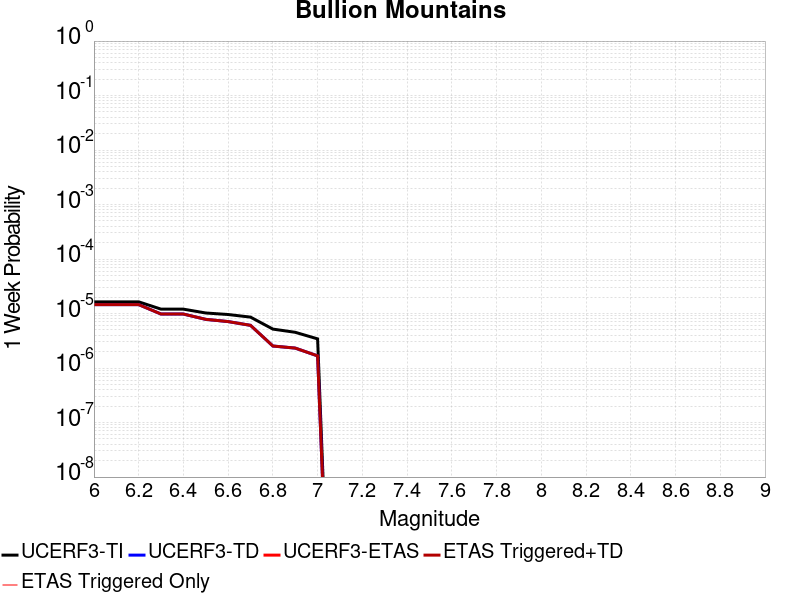 |  | 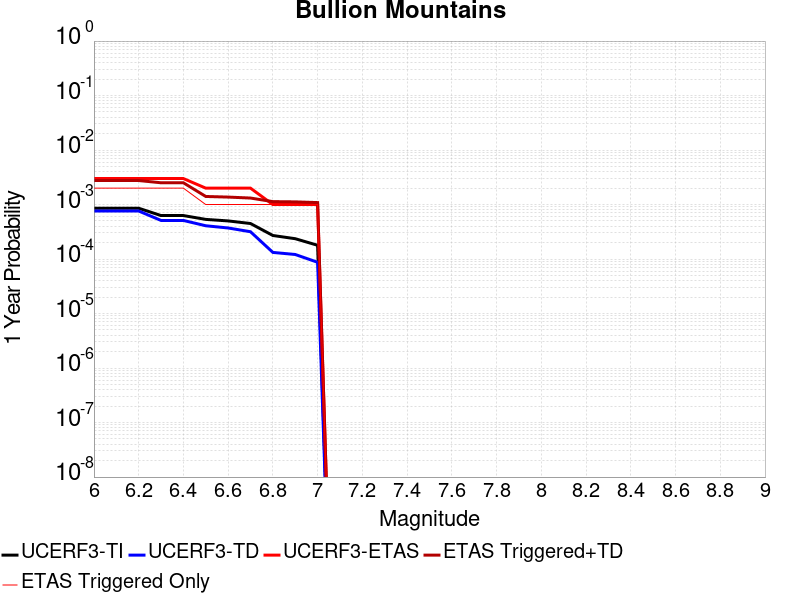 | 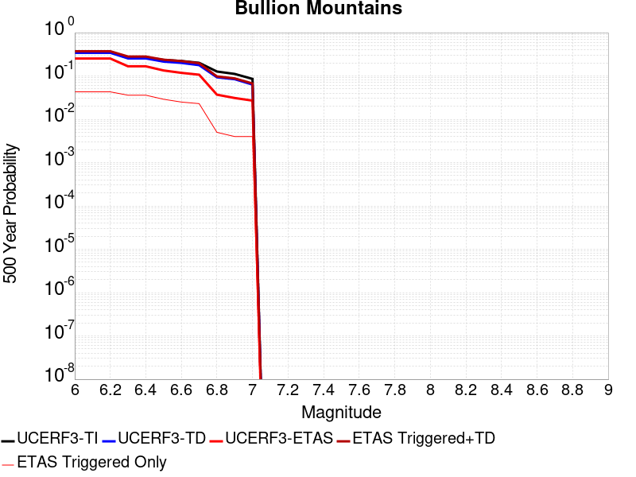 |

| Magnitude | 1 wk TI Prob | 1 wk TD Prob | 1 wk ETAS Prob | 1 wk ETAS/TD Gain | 1 wk ETAS Triggered+TD | 1 wk ETAS Triggered Only | 1 mo TI Prob | 1 mo TD Prob | 1 mo ETAS Prob | 1 mo ETAS/TD Gain | 1 mo ETAS Triggered+TD | 1 mo ETAS Triggered Only | 1 yr TI Prob | 1 yr TD Prob | 1 yr ETAS Prob | 1 yr ETAS/TD Gain | 1 yr ETAS Triggered+TD | 1 yr ETAS Triggered Only | 500 yr TI Prob | 500 yr TD Prob | 500 yr ETAS Prob | 500 yr ETAS/TD Gain | 500 yr ETAS Triggered+TD | 500 yr ETAS Triggered Only |
|-----|-----|-----|-----|-----|-----|-----|-----|-----|-----|-----|-----|-----|-----|-----|-----|-----|-----|-----|-----|-----|-----|-----|-----|-----|
| 6.0 | 1.6420427E-5 | 1.4602633E-5 | 0.0 | 0.0 | 1.4602633E-5 | 0.0 | 7.037136E-5 | 6.258143E-5 | 0.0 | 0.0 | 6.258143E-5 | 0.0 | 8.5643446E-4 | 7.6170044E-4 | 0.003 | 3.9385562 | 0.002760177 | 0.002 | 0.3484497 | 0.34391004 | 0.253 | 0.7356575 | 0.3721219 | 0.043 |
| 6.1 | 1.6420427E-5 | 1.4602633E-5 | 0.0 | 0.0 | 1.4602633E-5 | 0.0 | 7.037136E-5 | 6.258143E-5 | 0.0 | 0.0 | 6.258143E-5 | 0.0 | 8.5643446E-4 | 7.6170044E-4 | 0.003 | 3.9385562 | 0.002760177 | 0.002 | 0.3484497 | 0.34391004 | 0.253 | 0.7356575 | 0.3721219 | 0.043 |
| 6.2 | 1.6420427E-5 | 1.4602633E-5 | 0.0 | 0.0 | 1.4602633E-5 | 0.0 | 7.037136E-5 | 6.258143E-5 | 0.0 | 0.0 | 6.258143E-5 | 0.0 | 8.5643446E-4 | 7.6170044E-4 | 0.003 | 3.9385562 | 0.002760177 | 0.002 | 0.3484497 | 0.34391004 | 0.253 | 0.7356575 | 0.3721219 | 0.043 |
| 6.3 | 1.2046778E-5 | 9.79893E-6 | 0.0 | 0.0 | 9.79893E-6 | 0.0 | 5.1628023E-5 | 4.1994866E-5 | 0.0 | 0.0 | 4.1994866E-5 | 0.0 | 6.283899E-4 | 5.1119045E-4 | 0.003 | 5.8686543 | 0.0025101681 | 0.002 | 0.2696955 | 0.2541818 | 0.167 | 0.6570101 | 0.28103125 | 0.036 |
| 6.4 | 1.2046778E-5 | 9.79893E-6 | 0.0 | 0.0 | 9.79893E-6 | 0.0 | 5.1628023E-5 | 4.1994866E-5 | 0.0 | 0.0 | 4.1994866E-5 | 0.0 | 6.283899E-4 | 5.1119045E-4 | 0.003 | 5.8686543 | 0.0025101681 | 0.002 | 0.2696955 | 0.2541818 | 0.167 | 0.6570101 | 0.28103125 | 0.036 |
| 6.5 | 1.0244343E-5 | 7.82632E-6 | 0.0 | 0.0 | 7.82632E-6 | 0.0 | 4.390359E-5 | 3.3541055E-5 | 0.0 | 0.0 | 3.3541055E-5 | 0.0 | 5.343951E-4 | 4.0830628E-4 | 0.002 | 4.8982835 | 0.001407898 | 0.001 | 0.23453283 | 0.214616 | 0.134 | 0.624371 | 0.23739214 | 0.029 |
| 6.6 | 9.605408E-6 | 7.127939E-6 | 0.0 | 0.0 | 7.127939E-6 | 0.0 | 4.1165385E-5 | 3.0548068E-5 | 0.0 | 0.0 | 3.0548068E-5 | 0.0 | 5.010733E-4 | 3.7187935E-4 | 0.002 | 5.378088 | 0.0013715075 | 0.001 | 0.22166593 | 0.20021851 | 0.118 | 0.58935606 | 0.22021306 | 0.025 |
| 6.7 | 8.60418E-6 | 6.080352E-6 | 0.0 | 0.0 | 6.080352E-6 | 0.0 | 3.687454E-5 | 2.6058498E-5 | 0.0 | 0.0 | 2.6058498E-5 | 0.0 | 4.48855E-4 | 3.172353E-4 | 0.002 | 6.3044686 | 0.0013169181 | 0.001 | 0.20106675 | 0.17767882 | 0.107 | 0.6022102 | 0.19659221 | 0.023 |
| 6.8 | 5.187994E-6 | 2.5382867E-6 | 0.0 | 0.0 | 2.5382867E-6 | 0.0 | 2.223407E-5 | 1.0878348E-5 | 0.0 | 0.0 | 1.0878348E-5 | 0.0 | 2.7066618E-4 | 1.3243976E-4 | 0.001 | 7.5506024 | 0.0011323073 | 0.001 | 0.12659106 | 0.093037546 | 0.037 | 0.39768893 | 0.09757236 | 0.005 |
| 6.9 | 4.5302368E-6 | 2.324616E-6 | 0.0 | 0.0 | 2.324616E-6 | 0.0 | 1.9415156E-5 | 9.962623E-6 | 0.0 | 0.0 | 9.962623E-6 | 0.0 | 2.3635388E-4 | 1.2129209E-4 | 0.001 | 8.244561 | 0.0011211708 | 0.001 | 0.11147359 | 0.08418677 | 0.031 | 0.36822888 | 0.08785003 | 0.004 |
| 7.0 | 3.431668E-6 | 1.6729527E-6 | 0.0 | 0.0 | 1.6729527E-6 | 0.0 | 1.4707065E-5 | 7.1697973E-6 | 0.0 | 0.0 | 7.1697973E-6 | 0.0 | 1.7904381E-4 | 8.729228E-5 | 0.001 | 11.455766 | 0.001087205 | 0.001 | 0.08563909 | 0.0632958 | 0.027 | 0.42656863 | 0.06704261 | 0.004 |

## Elysian Park (Upper)
*[(top)](#table-of-contents)*

| 1 Week | 1 Month | 1 Year | 500 Year |
|-----|-----|-----|-----|
| 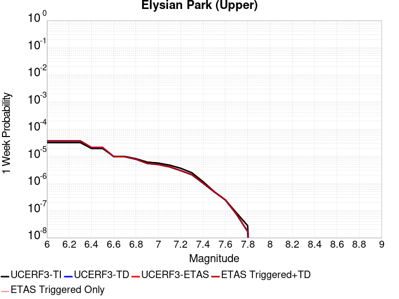 | 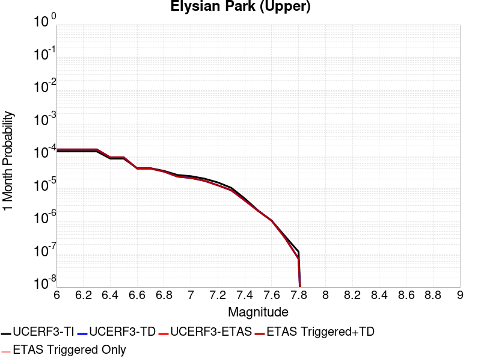 | 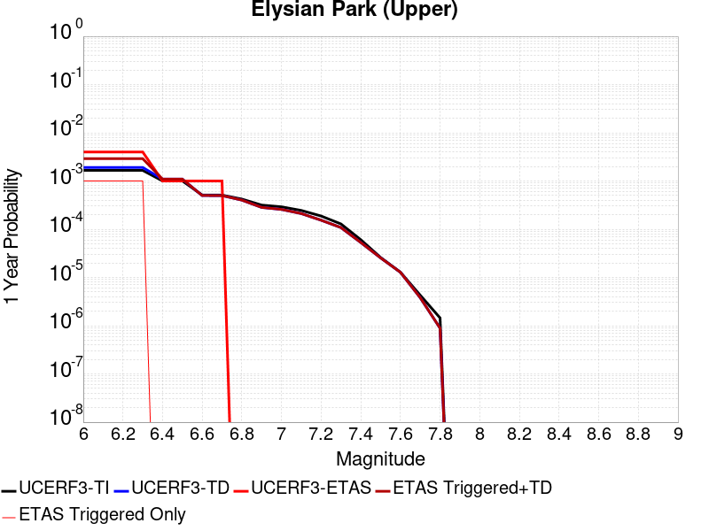 | 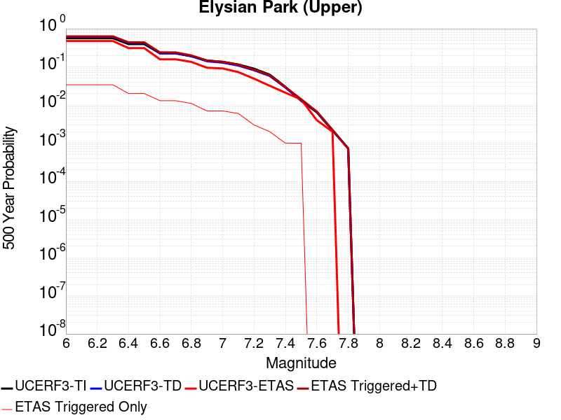 |

| Magnitude | 1 wk TI Prob | 1 wk TD Prob | 1 wk ETAS Prob | 1 wk ETAS/TD Gain | 1 wk ETAS Triggered+TD | 1 wk ETAS Triggered Only | 1 mo TI Prob | 1 mo TD Prob | 1 mo ETAS Prob | 1 mo ETAS/TD Gain | 1 mo ETAS Triggered+TD | 1 mo ETAS Triggered Only | 1 yr TI Prob | 1 yr TD Prob | 1 yr ETAS Prob | 1 yr ETAS/TD Gain | 1 yr ETAS Triggered+TD | 1 yr ETAS Triggered Only | 500 yr TI Prob | 500 yr TD Prob | 500 yr ETAS Prob | 500 yr ETAS/TD Gain | 500 yr ETAS Triggered+TD | 500 yr ETAS Triggered Only |
|-----|-----|-----|-----|-----|-----|-----|-----|-----|-----|-----|-----|-----|-----|-----|-----|-----|-----|-----|-----|-----|-----|-----|-----|-----|
| 6.0 | 3.1876025E-5 | 3.663567E-5 | 0.0 | 0.0 | 3.663567E-5 | 0.0 | 1.3660437E-4 | 1.5700322E-4 | 0.0 | 0.0 | 1.5700322E-4 | 0.0 | 0.0016618895 | 0.0019103036 | 0.004 | 2.093908 | 0.0029083933 | 0.001 | 0.56466347 | 0.6167156 | 0.476 | 0.7718306 | 0.62974733 | 0.034 |
| 6.1 | 3.1876025E-5 | 3.663567E-5 | 0.0 | 0.0 | 3.663567E-5 | 0.0 | 1.3660437E-4 | 1.5700322E-4 | 0.0 | 0.0 | 1.5700322E-4 | 0.0 | 0.0016618895 | 0.0019103036 | 0.004 | 2.093908 | 0.0029083933 | 0.001 | 0.56466347 | 0.6167156 | 0.476 | 0.7718306 | 0.62974733 | 0.034 |
| 6.2 | 3.1876025E-5 | 3.663567E-5 | 0.0 | 0.0 | 3.663567E-5 | 0.0 | 1.3660437E-4 | 1.5700322E-4 | 0.0 | 0.0 | 1.5700322E-4 | 0.0 | 0.0016618895 | 0.0019103036 | 0.004 | 2.093908 | 0.0029083933 | 0.001 | 0.56466347 | 0.6167156 | 0.476 | 0.7718306 | 0.62974733 | 0.034 |
| 6.3 | 3.1876025E-5 | 3.663567E-5 | 0.0 | 0.0 | 3.663567E-5 | 0.0 | 1.3660437E-4 | 1.5700322E-4 | 0.0 | 0.0 | 1.5700322E-4 | 0.0 | 0.0016618895 | 0.0019103036 | 0.004 | 2.093908 | 0.0029083933 | 0.001 | 0.56466347 | 0.6167156 | 0.476 | 0.7718306 | 0.62974733 | 0.034 |
| 6.4 | 1.9273462E-5 | 2.1008933E-5 | 0.0 | 0.0 | 2.1008933E-5 | 0.0 | 8.259794E-5 | 9.0036134E-5 | 0.0 | 0.0 | 9.0036134E-5 | 0.0 | 0.001005166 | 0.0010958071 | 0.001 | 0.91256946 | 0.0010958071 | 0.0 | 0.39518684 | 0.42763746 | 0.31 | 0.7249131 | 0.4390847 | 0.02 |
| 6.5 | 1.9273462E-5 | 2.1008933E-5 | 0.0 | 0.0 | 2.1008933E-5 | 0.0 | 8.259794E-5 | 9.0036134E-5 | 0.0 | 0.0 | 9.0036134E-5 | 0.0 | 0.001005166 | 0.0010958071 | 0.001 | 0.91256946 | 0.0010958071 | 0.0 | 0.39518684 | 0.42763746 | 0.31 | 0.7249131 | 0.4390847 | 0.02 |
| 6.6 | 9.813258E-6 | 9.601757E-6 | 0.0 | 0.0 | 9.601757E-6 | 0.0 | 4.205614E-5 | 4.114978E-5 | 0.0 | 0.0 | 4.114978E-5 | 0.0 | 5.119132E-4 | 5.0089054E-4 | 0.001 | 1.9964442 | 5.0089054E-4 | 0.0 | 0.22587518 | 0.22958504 | 0.158 | 0.68819815 | 0.23960043 | 0.013 |
| 6.7 | 9.801478E-6 | 9.589364E-6 | 0.0 | 0.0 | 9.589364E-6 | 0.0 | 4.2005657E-5 | 4.1096664E-5 | 0.0 | 0.0 | 4.1096664E-5 | 0.0 | 5.112989E-4 | 5.002442E-4 | 0.001 | 1.9990237 | 5.002442E-4 | 0.0 | 0.22563723 | 0.22933847 | 0.158 | 0.6889381 | 0.23935707 | 0.013 |
| 6.8 | 8.102489E-6 | 7.719608E-6 | 0.0 | 0.0 | 7.719608E-6 | 0.0 | 3.4724493E-5 | 3.308364E-5 | 0.0 | 0.0 | 3.308364E-5 | 0.0 | 4.2268867E-4 | 4.027238E-4 | 0.0 | 0.0 | 4.027238E-4 | 0.0 | 0.19054088 | 0.1905267 | 0.135 | 0.70856214 | 0.1994309 | 0.011 |
| 6.9 | 6.08275E-6 | 5.4439784E-6 | 0.0 | 0.0 | 5.4439784E-6 | 0.0 | 2.6068668E-5 | 2.3331131E-5 | 0.0 | 0.0 | 2.3331131E-5 | 0.0 | 3.173398E-4 | 2.8402027E-4 | 0.0 | 0.0 | 2.8402027E-4 | 0.0 | 0.14674352 | 0.1406801 | 0.095 | 0.67529094 | 0.14669535 | 0.007 |
| 7.0 | 5.5995934E-6 | 4.9484984E-6 | 0.0 | 0.0 | 4.9484984E-6 | 0.0 | 2.3998036E-5 | 2.1207681E-5 | 0.0 | 0.0 | 2.1207681E-5 | 0.0 | 2.9213692E-4 | 2.581736E-4 | 0.0 | 0.0 | 2.581736E-4 | 0.0 | 0.1359199 | 0.12925066 | 0.091 | 0.7040583 | 0.1353459 | 0.007 |
| 7.1 | 4.709881E-6 | 4.0585796E-6 | 0.0 | 0.0 | 4.0585796E-6 | 0.0 | 2.0185047E-5 | 1.7393799E-5 | 0.0 | 0.0 | 1.7393799E-5 | 0.0 | 2.4572524E-4 | 2.1174934E-4 | 0.0 | 0.0 | 2.1174934E-4 | 0.0 | 0.115628205 | 0.10820987 | 0.073 | 0.674615 | 0.11356061 | 0.006 |
| 7.2 | 3.6063436E-6 | 2.955523E-6 | 0.0 | 0.0 | 2.955523E-6 | 0.0 | 1.5455667E-5 | 1.2666466E-5 | 0.0 | 0.0 | 1.2666466E-5 | 0.0 | 1.881565E-4 | 1.5420342E-4 | 0.0 | 0.0 | 1.5420342E-4 | 0.0 | 0.08979652 | 0.081428625 | 0.049 | 0.601754 | 0.08418433 | 0.003 |
| 7.3 | 2.471135E-6 | 2.0797606E-6 | 0.0 | 0.0 | 2.0797606E-6 | 0.0 | 1.0590536E-5 | 8.913229E-6 | 0.0 | 0.0 | 8.913229E-6 | 0.0 | 1.2893214E-4 | 1.0851324E-4 | 0.0 | 0.0 | 1.0851324E-4 | 0.0 | 0.06243597 | 0.057810433 | 0.032 | 0.5535333 | 0.05969481 | 0.002 |
| 7.4 | 1.163943E-6 | 1.0201671E-6 | 0.0 | 0.0 | 1.0201671E-6 | 0.0 | 4.988318E-6 | 4.3721375E-6 | 0.0 | 0.0 | 4.3721375E-6 | 0.0 | 6.0731076E-5 | 5.3229505E-5 | 0.0 | 0.0 | 5.3229505E-5 | 0.0 | 0.02991003 | 0.028587524 | 0.021 | 0.7345862 | 0.029558936 | 0.001 |
| 7.5 | 4.99459E-7 | 4.8917923E-7 | 0.0 | 0.0 | 4.8917923E-7 | 0.0 | 2.140537E-6 | 2.0964808E-6 | 0.0 | 0.0 | 2.0964808E-6 | 0.0 | 2.6060725E-5 | 2.552437E-5 | 0.0 | 0.0 | 2.552437E-5 | 0.0 | 0.012946002 | 0.013208269 | 0.014 | 1.0599421 | 0.01419506 | 0.001 |
| 7.6 | 2.4667852E-7 | 2.4643452E-7 | 0.0 | 0.0 | 2.4643452E-7 | 0.0 | 1.0571932E-6 | 1.0561475E-6 | 0.0 | 0.0 | 1.0561475E-6 | 0.0 | 1.2871251E-5 | 1.2858524E-5 | 0.0 | 0.0 | 1.2858524E-5 | 0.0 | 0.0064150025 | 0.006726579 | 0.004 | 0.59465593 | 0.006726579 | 0.0 |
| 7.7 | 8.2312795E-8 | 7.313908E-8 | 0.0 | 0.0 | 7.313908E-8 | 0.0 | 3.527691E-7 | 3.1345314E-7 | 0.0 | 0.0 | 3.1345314E-7 | 0.0 | 4.294955E-6 | 3.8162866E-6 | 0.0 | 0.0 | 3.8162866E-6 | 0.0 | 0.002145178 | 0.002216459 | 0.002 | 0.9023401 | 0.002216459 | 0.0 |
| 7.8 | 2.7819295E-8 | 1.7053088E-8 | 0.0 | 0.0 | 1.7053088E-8 | 0.0 | 1.1922555E-7 | 7.3084664E-8 | 0.0 | 0.0 | 7.3084664E-8 | 0.0 | 1.45157E-6 | 8.8980556E-7 | 0.0 | 0.0 | 8.8980556E-7 | 0.0 | 7.2552223E-4 | 7.2798866E-4 | 0.0 | 0.0 | 7.2798866E-4 | 0.0 |

## Pisgah-Bullion Mtn-Mesquite Lk
*[(top)](#table-of-contents)*

| 1 Week | 1 Month | 1 Year | 500 Year |
|-----|-----|-----|-----|
| 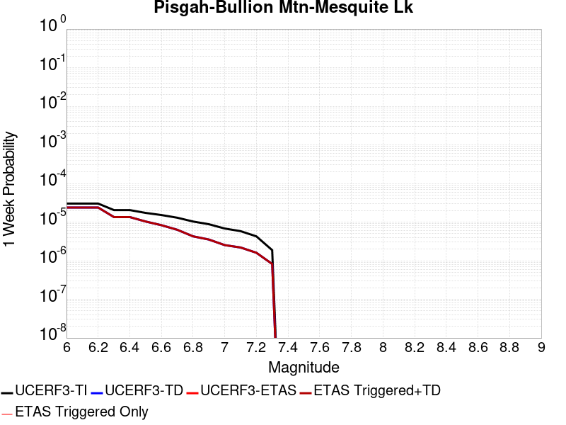 |  | 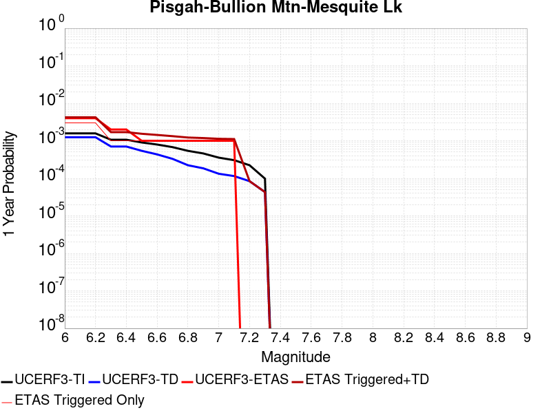 | 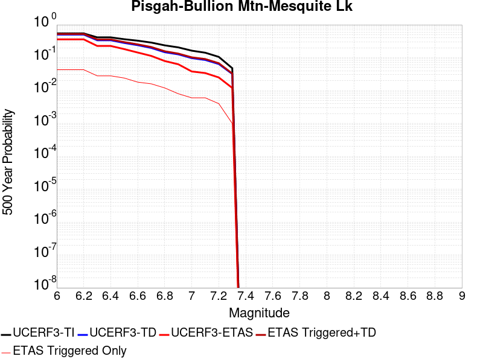 |

| Magnitude | 1 wk TI Prob | 1 wk TD Prob | 1 wk ETAS Prob | 1 wk ETAS/TD Gain | 1 wk ETAS Triggered+TD | 1 wk ETAS Triggered Only | 1 mo TI Prob | 1 mo TD Prob | 1 mo ETAS Prob | 1 mo ETAS/TD Gain | 1 mo ETAS Triggered+TD | 1 mo ETAS Triggered Only | 1 yr TI Prob | 1 yr TD Prob | 1 yr ETAS Prob | 1 yr ETAS/TD Gain | 1 yr ETAS Triggered+TD | 1 yr ETAS Triggered Only | 500 yr TI Prob | 500 yr TD Prob | 500 yr ETAS Prob | 500 yr ETAS/TD Gain | 500 yr ETAS Triggered+TD | 500 yr ETAS Triggered Only |
|-----|-----|-----|-----|-----|-----|-----|-----|-----|-----|-----|-----|-----|-----|-----|-----|-----|-----|-----|-----|-----|-----|-----|-----|-----|
| 6.0 | 3.0240792E-5 | 2.3886223E-5 | 0.0 | 0.0 | 2.3886223E-5 | 0.0 | 1.2959696E-4 | 1.02366066E-4 | 0.0 | 0.0 | 1.02366066E-4 | 0.0 | 0.0015767008 | 0.0012456934 | 0.004 | 3.211063 | 0.0042419564 | 0.003 | 0.5456887 | 0.5031452 | 0.36 | 0.7154992 | 0.52450997 | 0.043 |
| 6.1 | 3.0240792E-5 | 2.3886223E-5 | 0.0 | 0.0 | 2.3886223E-5 | 0.0 | 1.2959696E-4 | 1.02366066E-4 | 0.0 | 0.0 | 1.02366066E-4 | 0.0 | 0.0015767008 | 0.0012456934 | 0.004 | 3.211063 | 0.0042419564 | 0.003 | 0.5456887 | 0.5031452 | 0.36 | 0.7154992 | 0.52450997 | 0.043 |
| 6.2 | 3.0240792E-5 | 2.3886223E-5 | 0.0 | 0.0 | 2.3886223E-5 | 0.0 | 1.2959696E-4 | 1.02366066E-4 | 0.0 | 0.0 | 1.02366066E-4 | 0.0 | 0.0015767008 | 0.0012456934 | 0.004 | 3.211063 | 0.0042419564 | 0.003 | 0.5456887 | 0.5031452 | 0.36 | 0.7154992 | 0.52450997 | 0.043 |
| 6.3 | 2.0498217E-5 | 1.3509814E-5 | 0.0 | 0.0 | 1.3509814E-5 | 0.0 | 8.784654E-5 | 5.789801E-5 | 0.0 | 0.0 | 5.789801E-5 | 0.0 | 0.0010690069 | 7.046962E-4 | 0.002 | 2.8381023 | 0.0017039916 | 0.001 | 0.4142073 | 0.33826703 | 0.227 | 0.6710675 | 0.35679555 | 0.028 |
| 6.4 | 2.0498217E-5 | 1.3509814E-5 | 0.0 | 0.0 | 1.3509814E-5 | 0.0 | 8.784654E-5 | 5.789801E-5 | 0.0 | 0.0 | 5.789801E-5 | 0.0 | 0.0010690069 | 7.046962E-4 | 0.002 | 2.8381023 | 0.0017039916 | 0.001 | 0.4142073 | 0.33826703 | 0.227 | 0.6710675 | 0.35679555 | 0.028 |
| 6.5 | 1.7316182E-5 | 1.0368343E-5 | 0.0 | 0.0 | 1.0368343E-5 | 0.0 | 7.42101E-5 | 4.4435055E-5 | 0.0 | 0.0 | 4.4435055E-5 | 0.0 | 9.0313336E-4 | 5.4087234E-4 | 0.001 | 1.8488652 | 0.0015403314 | 0.001 | 0.3634999 | 0.28009078 | 0.182 | 0.64978933 | 0.2973686 | 0.024 |
| 6.6 | 1.5251077E-5 | 8.319509E-6 | 0.0 | 0.0 | 8.319509E-6 | 0.0 | 6.536012E-5 | 3.565459E-5 | 0.0 | 0.0 | 3.565459E-5 | 0.0 | 7.9546886E-4 | 4.3401527E-4 | 0.001 | 2.3040664 | 0.0014335812 | 0.001 | 0.3282659 | 0.23957136 | 0.143 | 0.5968994 | 0.2532591 | 0.018 |
| 6.7 | 1.2997425E-5 | 6.3320244E-6 | 0.0 | 0.0 | 6.3320244E-6 | 0.0 | 5.570206E-5 | 2.7136992E-5 | 0.0 | 0.0 | 2.7136992E-5 | 0.0 | 6.7796157E-4 | 3.3034733E-4 | 0.001 | 3.027117 | 0.001330017 | 0.001 | 0.28758577 | 0.1976509 | 0.113 | 0.5717151 | 0.21048848 | 0.016 |
| 6.8 | 1.035386E-5 | 4.2796687E-6 | 0.0 | 0.0 | 4.2796687E-6 | 0.0 | 4.437293E-5 | 1.8341312E-5 | 0.0 | 0.0 | 1.8341312E-5 | 0.0 | 5.401065E-4 | 2.2328345E-4 | 0.001 | 4.4786124 | 0.0012230602 | 0.001 | 0.23671684 | 0.1463994 | 0.079 | 0.5396197 | 0.1566426 | 0.012 |
| 6.9 | 8.816252E-6 | 3.5362912E-6 | 0.0 | 0.0 | 3.5362912E-6 | 0.0 | 3.778339E-5 | 1.5155449E-5 | 0.0 | 0.0 | 1.5155449E-5 | 0.0 | 4.5991567E-4 | 1.8450254E-4 | 0.001 | 5.4199796 | 0.001184318 | 0.001 | 0.20547493 | 0.12604974 | 0.063 | 0.49980265 | 0.13304135 | 0.008 |
| 7.0 | 6.8232207E-6 | 2.5361906E-6 | 0.0 | 0.0 | 2.5361906E-6 | 0.0 | 2.9242048E-5 | 1.0869345E-5 | 0.0 | 0.0 | 1.0869345E-5 | 0.0 | 3.5596377E-4 | 1.3232655E-4 | 0.001 | 7.5570626 | 0.0011321942 | 0.001 | 0.16306894 | 0.09686999 | 0.038 | 0.39227834 | 0.102288775 | 0.006 |
| 7.1 | 5.837013E-6 | 2.2000017E-6 | 0.0 | 0.0 | 2.2000017E-6 | 0.0 | 2.501553E-5 | 9.428546E-6 | 0.0 | 0.0 | 9.428546E-6 | 0.0 | 3.045215E-4 | 1.1478679E-4 | 0.001 | 8.711803 | 0.001114672 | 0.001 | 0.14125559 | 0.08514393 | 0.034 | 0.39932382 | 0.09063307 | 0.006 |
| 7.2 | 4.278052E-6 | 1.6084755E-6 | 0.0 | 0.0 | 1.6084755E-6 | 0.0 | 1.833438E-5 | 6.8934496E-6 | 0.0 | 0.0 | 6.8934496E-6 | 0.0 | 2.231982E-4 | 8.3924744E-5 | 0.0 | 0.0 | 8.3924744E-5 | 0.0 | 0.105608396 | 0.064116985 | 0.025 | 0.38991228 | 0.06786052 | 0.004 |
| 7.3 | 1.8803692E-6 | 8.2400555E-7 | 0.0 | 0.0 | 8.2400555E-7 | 0.0 | 8.0587E-6 | 3.5314483E-6 | 0.0 | 0.0 | 3.5314483E-6 | 0.0 | 9.811026E-5 | 4.299468E-5 | 0.0 | 0.0 | 4.299468E-5 | 0.0 | 0.04787365 | 0.03192979 | 0.012 | 0.37582457 | 0.03289786 | 0.001 |

## Mission (connected) 2011 CFM
*[(top)](#table-of-contents)*

| 1 Week | 1 Month | 1 Year | 500 Year |
|-----|-----|-----|-----|
| 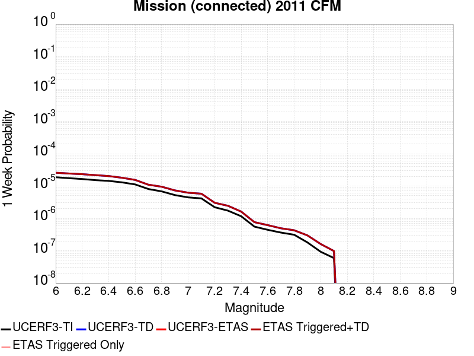 | 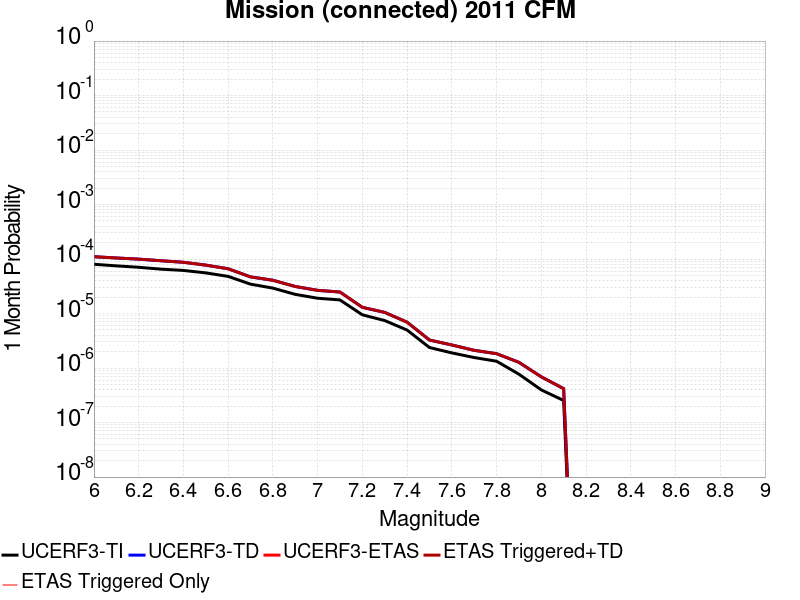 | 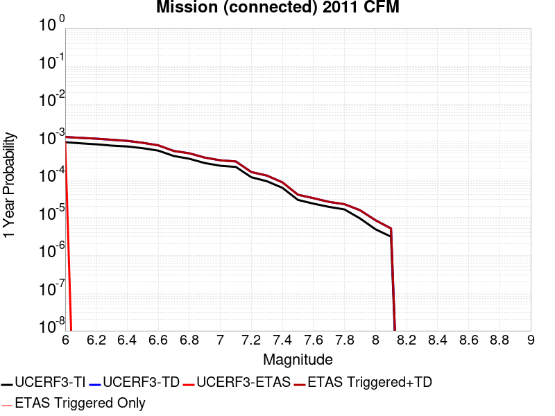 | 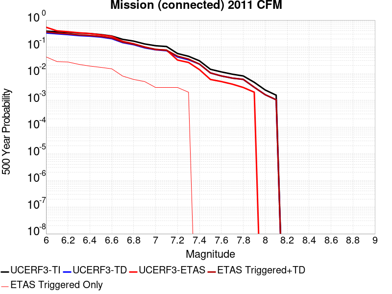 |

| Magnitude | 1 wk TI Prob | 1 wk TD Prob | 1 wk ETAS Prob | 1 wk ETAS/TD Gain | 1 wk ETAS Triggered+TD | 1 wk ETAS Triggered Only | 1 mo TI Prob | 1 mo TD Prob | 1 mo ETAS Prob | 1 mo ETAS/TD Gain | 1 mo ETAS Triggered+TD | 1 mo ETAS Triggered Only | 1 yr TI Prob | 1 yr TD Prob | 1 yr ETAS Prob | 1 yr ETAS/TD Gain | 1 yr ETAS Triggered+TD | 1 yr ETAS Triggered Only | 500 yr TI Prob | 500 yr TD Prob | 500 yr ETAS Prob | 500 yr ETAS/TD Gain | 500 yr ETAS Triggered+TD | 500 yr ETAS Triggered Only |
|-----|-----|-----|-----|-----|-----|-----|-----|-----|-----|-----|-----|-----|-----|-----|-----|-----|-----|-----|-----|-----|-----|-----|-----|-----|
| 6.0 | 1.8735573E-5 | 2.5775145E-5 | 0.0 | 0.0 | 2.5775145E-5 | 0.0 | 8.029284E-5 | 1.1045919E-4 | 0.0 | 0.0 | 1.1045919E-4 | 0.0 | 9.771269E-4 | 0.0013439293 | 0.001 | 0.74408674 | 0.0013439293 | 0.0 | 0.38663942 | 0.33190385 | 0.541 | 1.6299902 | 0.3599639 | 0.042 |
| 6.1 | 1.7515964E-5 | 2.4424427E-5 | 0.0 | 0.0 | 2.4424427E-5 | 0.0 | 7.506625E-5 | 1.0467087E-4 | 0.0 | 0.0 | 1.0467087E-4 | 0.0 | 9.135484E-4 | 0.0012735408 | 0.0 | 0.0 | 0.0012735408 | 0.0 | 0.36680886 | 0.30824283 | 0.397 | 1.2879456 | 0.327612 | 0.028 |
| 6.2 | 1.6486343E-5 | 2.327641E-5 | 0.0 | 0.0 | 2.327641E-5 | 0.0 | 7.065384E-5 | 9.9751174E-5 | 0.0 | 0.0 | 9.9751174E-5 | 0.0 | 8.5987104E-4 | 0.0012137119 | 0.0 | 0.0 | 0.0012137119 | 0.0 | 0.34956926 | 0.28775677 | 0.367 | 1.2753828 | 0.30698735 | 0.027 |
| 6.3 | 1.5229385E-5 | 2.1725382E-5 | 0.0 | 0.0 | 2.1725382E-5 | 0.0 | 6.526716E-5 | 9.31044E-5 | 0.0 | 0.0 | 9.31044E-5 | 0.0 | 7.9433795E-4 | 0.0011328744 | 0.0 | 0.0 | 0.0011328744 | 0.0 | 0.32788566 | 0.26384673 | 0.336 | 1.2734667 | 0.28004208 | 0.022 |
| 6.4 | 1.4435828E-5 | 2.036716E-5 | 0.0 | 0.0 | 2.036716E-5 | 0.0 | 6.186637E-5 | 8.728386E-5 | 0.0 | 0.0 | 8.728386E-5 | 0.0 | 7.529627E-4 | 0.0010620814 | 0.0 | 0.0 | 0.0010620814 | 0.0 | 0.3138254 | 0.25143874 | 0.314 | 1.2488132 | 0.2656614 | 0.019 |
| 6.5 | 1.30127955E-5 | 1.806807E-5 | 0.0 | 0.0 | 1.806807E-5 | 0.0 | 5.576793E-5 | 7.743222E-5 | 0.0 | 0.0 | 7.743222E-5 | 0.0 | 6.78763E-4 | 9.423006E-4 | 0.0 | 0.0 | 9.423006E-4 | 0.0 | 0.2878714 | 0.23260297 | 0.28 | 1.2037679 | 0.24564873 | 0.017 |
| 6.6 | 1.1220718E-5 | 1.5482447E-5 | 0.0 | 0.0 | 1.5482447E-5 | 0.0 | 4.8087906E-5 | 6.635166E-5 | 0.0 | 0.0 | 6.635166E-5 | 0.0 | 5.8531296E-4 | 8.075321E-4 | 0.0 | 0.0 | 8.075321E-4 | 0.0 | 0.2537855 | 0.20224676 | 0.247 | 1.2212803 | 0.21421306 | 0.015 |
| 6.7 | 8.086152E-6 | 1.09930215E-5 | 0.0 | 0.0 | 1.09930215E-5 | 0.0 | 3.4654473E-5 | 4.7112102E-5 | 0.0 | 0.0 | 4.7112102E-5 | 0.0 | 4.2183654E-4 | 5.734396E-4 | 0.0 | 0.0 | 5.734396E-4 | 0.0 | 0.19019578 | 0.14371471 | 0.16 | 1.1133168 | 0.150565 | 0.008 |
| 6.8 | 6.8361655E-6 | 9.529599E-6 | 0.0 | 0.0 | 9.529599E-6 | 0.0 | 2.9297524E-5 | 4.08405E-5 | 0.0 | 0.0 | 4.08405E-5 | 0.0 | 3.5663895E-4 | 4.971202E-4 | 0.0 | 0.0 | 4.971202E-4 | 0.0 | 0.16335154 | 0.12038039 | 0.13 | 1.0799102 | 0.1256581 | 0.006 |
| 6.9 | 5.2517353E-6 | 7.3273163E-6 | 0.0 | 0.0 | 7.3273163E-6 | 0.0 | 2.2507242E-5 | 3.1402407E-5 | 0.0 | 0.0 | 3.1402407E-5 | 0.0 | 2.739912E-4 | 3.8225745E-4 | 0.0 | 0.0 | 3.8225745E-4 | 0.0 | 0.12804231 | 0.09194451 | 0.099 | 1.0767365 | 0.09648479 | 0.005 |
| 7.0 | 4.4602784E-6 | 6.2217064E-6 | 0.0 | 0.0 | 6.2217064E-6 | 0.0 | 1.911534E-5 | 2.6664184E-5 | 0.0 | 0.0 | 2.6664184E-5 | 0.0 | 2.327044E-4 | 3.245882E-4 | 0.0 | 0.0 | 3.245882E-4 | 0.0 | 0.1098504 | 0.07750142 | 0.079 | 1.0193361 | 0.08026892 | 0.003 |
| 7.1 | 4.1492594E-6 | 5.793077E-6 | 0.0 | 0.0 | 5.793077E-6 | 0.0 | 1.7782419E-5 | 2.4827237E-5 | 0.0 | 0.0 | 2.4827237E-5 | 0.0 | 2.1647944E-4 | 3.022298E-4 | 0.0 | 0.0 | 3.022298E-4 | 0.0 | 0.10259807 | 0.07154377 | 0.075 | 1.0483093 | 0.07432914 | 0.003 |
| 7.2 | 2.213247E-6 | 3.0367173E-6 | 0.0 | 0.0 | 3.0367173E-6 | 0.0 | 9.485309E-6 | 1.3014438E-5 | 0.0 | 0.0 | 1.3014438E-5 | 0.0 | 1.15477524E-4 | 1.5843929E-4 | 0.0 | 0.0 | 1.5843929E-4 | 0.0 | 0.05610665 | 0.0417733 | 0.032 | 0.7660395 | 0.04464798 | 0.003 |
| 7.3 | 1.7362703E-6 | 2.4516048E-6 | 0.0 | 0.0 | 2.4516048E-6 | 0.0 | 7.4411373E-6 | 1.0506836E-5 | 0.0 | 0.0 | 1.0506836E-5 | 0.0 | 9.0592075E-5 | 1.2791323E-4 | 0.0 | 0.0 | 1.2791323E-4 | 0.0 | 0.04428745 | 0.03283881 | 0.026 | 0.79174614 | 0.03477313 | 0.002 |
| 7.4 | 1.1628409E-6 | 1.622637E-6 | 0.0 | 0.0 | 1.622637E-6 | 0.0 | 4.9835944E-6 | 6.9541397E-6 | 0.0 | 0.0 | 6.9541397E-6 | 0.0 | 6.0673574E-5 | 8.466338E-5 | 0.0 | 0.0 | 8.466338E-5 | 0.0 | 0.029882137 | 0.022550913 | 0.014 | 0.6208174 | 0.022550913 | 0.0 |
| 7.5 | 5.5610667E-7 | 7.635533E-7 | 0.0 | 0.0 | 7.635533E-7 | 0.0 | 2.3833122E-6 | 3.2723672E-6 | 0.0 | 0.0 | 3.2723672E-6 | 0.0 | 2.9016439E-5 | 3.9840346E-5 | 0.0 | 0.0 | 3.9840346E-5 | 0.0 | 0.01440369 | 0.010542009 | 0.006 | 0.5691515 | 0.010542009 | 0.0 |
| 7.6 | 4.4307663E-7 | 6.185493E-7 | 0.0 | 0.0 | 6.185493E-7 | 0.0 | 1.8988985E-6 | 2.6509226E-6 | 0.0 | 0.0 | 2.6509226E-6 | 0.0 | 2.3118844E-5 | 3.2274507E-5 | 0.0 | 0.0 | 3.2274507E-5 | 0.0 | 0.011493 | 0.008104498 | 0.005 | 0.6169414 | 0.008104498 | 0.0 |
| 7.7 | 3.639119E-7 | 4.9372693E-7 | 0.0 | 0.0 | 4.9372693E-7 | 0.0 | 1.5596215E-6 | 2.1159708E-6 | 0.0 | 0.0 | 2.1159708E-6 | 0.0 | 1.8988227E-5 | 2.5761641E-5 | 0.0 | 0.0 | 2.5761641E-5 | 0.0 | 0.009449276 | 0.0067338003 | 0.004 | 0.5940182 | 0.0067338003 | 0.0 |
| 7.8 | 3.1152942E-7 | 4.283616E-7 | 0.0 | 0.0 | 4.283616E-7 | 0.0 | 1.3351254E-6 | 1.8358342E-6 | 0.0 | 0.0 | 1.8358342E-6 | 0.0 | 1.6255031E-5 | 2.2351052E-5 | 0.0 | 0.0 | 2.2351052E-5 | 0.0 | 0.008094642 | 0.0060206084 | 0.003 | 0.49828854 | 0.0060206084 | 0.0 |
| 7.9 | 1.8035962E-7 | 2.974845E-7 | 0.0 | 0.0 | 2.974845E-7 | 0.0 | 7.729696E-7 | 1.2749329E-6 | 0.0 | 0.0 | 1.2749329E-6 | 0.0 | 9.410865E-6 | 1.5522199E-5 | 0.0 | 0.0 | 1.5522199E-5 | 0.0 | 0.004694401 | 0.0030613097 | 0.002 | 0.6533151 | 0.0030613097 | 0.0 |
| 8.0 | 9.279334E-8 | 1.6107977E-7 | 0.0 | 0.0 | 1.6107977E-7 | 0.0 | 3.976857E-7 | 6.9034166E-7 | 0.0 | 0.0 | 6.9034166E-7 | 0.0 | 4.841813E-6 | 8.404878E-6 | 0.0 | 0.0 | 8.404878E-6 | 0.0 | 0.0024179842 | 0.0016095876 | 0.0 | 0.0 | 0.0016095876 | 0.0 |
| 8.1 | 5.9253985E-8 | 9.778588E-8 | 0.0 | 0.0 | 9.778588E-8 | 0.0 | 2.5394561E-7 | 4.1908228E-7 | 0.0 | 0.0 | 4.1908228E-7 | 0.0 | 3.0917836E-6 | 5.1023153E-6 | 0.0 | 0.0 | 5.1023153E-6 | 0.0 | 0.0015446999 | 0.0010399751 | 0.0 | 0.0 | 0.0010399751 | 0.0 |

## San Jacinto (Anza) rev
*[(top)](#table-of-contents)*

| 1 Week | 1 Month | 1 Year | 500 Year |
|-----|-----|-----|-----|
|  | 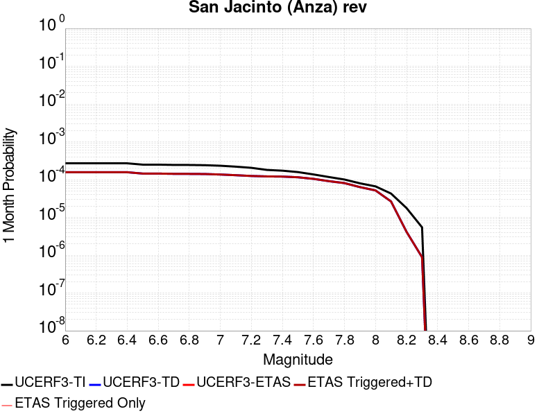 | 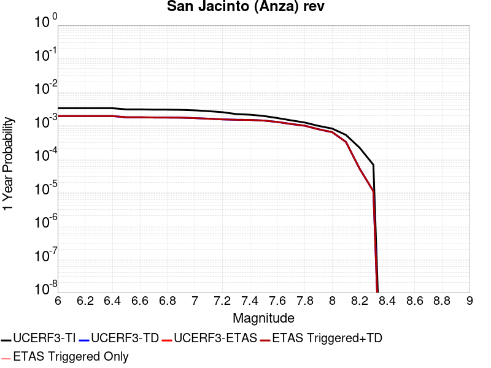 | 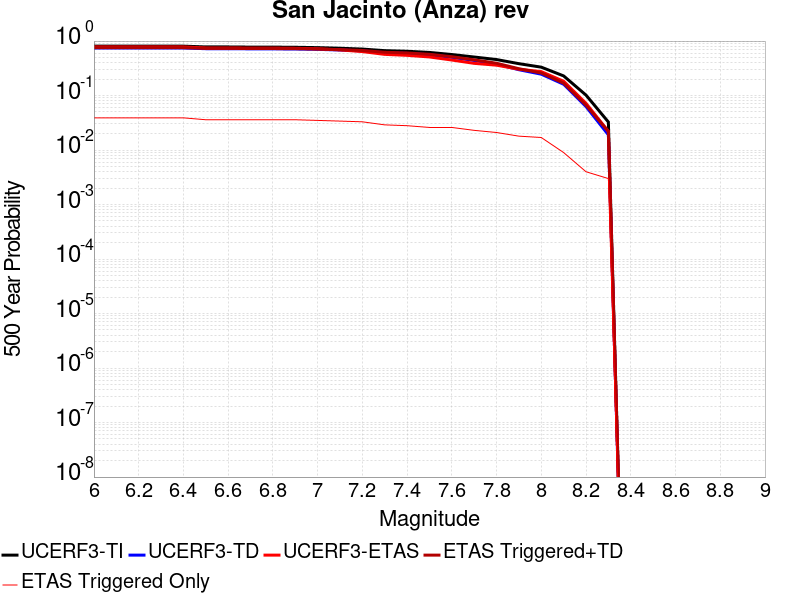 |

| Magnitude | 1 wk TI Prob | 1 wk TD Prob | 1 wk ETAS Prob | 1 wk ETAS/TD Gain | 1 wk ETAS Triggered+TD | 1 wk ETAS Triggered Only | 1 mo TI Prob | 1 mo TD Prob | 1 mo ETAS Prob | 1 mo ETAS/TD Gain | 1 mo ETAS Triggered+TD | 1 mo ETAS Triggered Only | 1 yr TI Prob | 1 yr TD Prob | 1 yr ETAS Prob | 1 yr ETAS/TD Gain | 1 yr ETAS Triggered+TD | 1 yr ETAS Triggered Only | 500 yr TI Prob | 500 yr TD Prob | 500 yr ETAS Prob | 500 yr ETAS/TD Gain | 500 yr ETAS Triggered+TD | 500 yr ETAS Triggered Only |
|-----|-----|-----|-----|-----|-----|-----|-----|-----|-----|-----|-----|-----|-----|-----|-----|-----|-----|-----|-----|-----|-----|-----|-----|-----|
| 6.0 | 6.3015636E-5 | 3.6589772E-5 | 0.0 | 0.0 | 3.6589772E-5 | 0.0 | 2.7003905E-4 | 1.5680393E-4 | 0.0 | 0.0 | 1.5680393E-4 | 0.0 | 0.0032827691 | 0.0019074258 | 0.0 | 0.0 | 0.0019074258 | 0.0 | 0.8068107 | 0.7459571 | 0.781 | 1.046977 | 0.7558648 | 0.039 |
| 6.1 | 6.3015636E-5 | 3.6589772E-5 | 0.0 | 0.0 | 3.6589772E-5 | 0.0 | 2.7003905E-4 | 1.5680393E-4 | 0.0 | 0.0 | 1.5680393E-4 | 0.0 | 0.0032827691 | 0.0019074258 | 0.0 | 0.0 | 0.0019074258 | 0.0 | 0.8068107 | 0.7459571 | 0.781 | 1.046977 | 0.7558648 | 0.039 |
| 6.2 | 6.3015636E-5 | 3.6589772E-5 | 0.0 | 0.0 | 3.6589772E-5 | 0.0 | 2.7003905E-4 | 1.5680393E-4 | 0.0 | 0.0 | 1.5680393E-4 | 0.0 | 0.0032827691 | 0.0019074258 | 0.0 | 0.0 | 0.0019074258 | 0.0 | 0.8068107 | 0.7459571 | 0.781 | 1.046977 | 0.7558648 | 0.039 |
| 6.3 | 6.3015636E-5 | 3.6589772E-5 | 0.0 | 0.0 | 3.6589772E-5 | 0.0 | 2.7003905E-4 | 1.5680393E-4 | 0.0 | 0.0 | 1.5680393E-4 | 0.0 | 0.0032827691 | 0.0019074258 | 0.0 | 0.0 | 0.0019074258 | 0.0 | 0.8068107 | 0.7459571 | 0.781 | 1.046977 | 0.7558648 | 0.039 |
| 6.4 | 6.3015636E-5 | 3.6589772E-5 | 0.0 | 0.0 | 3.6589772E-5 | 0.0 | 2.7003905E-4 | 1.5680393E-4 | 0.0 | 0.0 | 1.5680393E-4 | 0.0 | 0.0032827691 | 0.0019074258 | 0.0 | 0.0 | 0.0019074258 | 0.0 | 0.8068107 | 0.7459571 | 0.781 | 1.046977 | 0.7558648 | 0.039 |
| 6.5 | 5.811017E-5 | 3.3708326E-5 | 0.0 | 0.0 | 3.3708326E-5 | 0.0 | 2.4901982E-4 | 1.4445627E-4 | 0.0 | 0.0 | 1.4445627E-4 | 0.0 | 0.0030276014 | 0.0017573407 | 0.0 | 0.0 | 0.0017573407 | 0.0 | 0.7804328 | 0.72430605 | 0.747 | 1.031332 | 0.73423105 | 0.036 |
| 6.6 | 5.811017E-5 | 3.3708326E-5 | 0.0 | 0.0 | 3.3708326E-5 | 0.0 | 2.4901982E-4 | 1.4445627E-4 | 0.0 | 0.0 | 1.4445627E-4 | 0.0 | 0.0030276014 | 0.0017573407 | 0.0 | 0.0 | 0.0017573407 | 0.0 | 0.7804328 | 0.72430605 | 0.747 | 1.031332 | 0.73423105 | 0.036 |
| 6.7 | 5.712442E-5 | 3.3202534E-5 | 0.0 | 0.0 | 3.3202534E-5 | 0.0 | 2.4479596E-4 | 1.4228883E-4 | 0.0 | 0.0 | 1.4228883E-4 | 0.0 | 0.0029763177 | 0.0017309942 | 0.0 | 0.0 | 0.0017309942 | 0.0 | 0.7747125 | 0.71972007 | 0.742 | 1.0309564 | 0.7298102 | 0.036 |
| 6.8 | 5.6967532E-5 | 3.307158E-5 | 0.0 | 0.0 | 3.307158E-5 | 0.0 | 2.4412372E-4 | 1.4172767E-4 | 0.0 | 0.0 | 1.4172767E-4 | 0.0 | 0.0029681553 | 0.001724173 | 0.0 | 0.0 | 0.001724173 | 0.0 | 0.77378845 | 0.7188152 | 0.742 | 1.0322542 | 0.72893786 | 0.036 |
| 6.9 | 5.6211324E-5 | 3.2822638E-5 | 0.0 | 0.0 | 3.2822638E-5 | 0.0 | 2.4088343E-4 | 1.4066088E-4 | 0.0 | 0.0 | 1.4066088E-4 | 0.0 | 0.0029288116 | 0.0017112052 | 0.0 | 0.0 | 0.0017112052 | 0.0 | 0.7692809 | 0.71483177 | 0.736 | 1.0296129 | 0.72509784 | 0.036 |
| 7.0 | 5.4383527E-5 | 3.183212E-5 | 0.0 | 0.0 | 3.183212E-5 | 0.0 | 2.3305144E-4 | 1.3641626E-4 | 0.0 | 0.0 | 1.3641626E-4 | 0.0 | 0.0028337094 | 0.0016596065 | 0.0 | 0.0 | 0.0016596065 | 0.0 | 0.7580117 | 0.7043025 | 0.721 | 1.0237079 | 0.71465194 | 0.035 |
| 7.1 | 5.1393665E-5 | 3.052214E-5 | 0.0 | 0.0 | 3.052214E-5 | 0.0 | 2.2023996E-4 | 1.3080263E-4 | 0.0 | 0.0 | 1.3080263E-4 | 0.0 | 0.0026781242 | 0.001591362 | 0.0 | 0.0 | 0.001591362 | 0.0 | 0.738379 | 0.68550813 | 0.688 | 1.003635 | 0.69620085 | 0.034 |
| 7.2 | 4.785222E-5 | 2.911738E-5 | 0.0 | 0.0 | 2.911738E-5 | 0.0 | 2.0506482E-4 | 1.2478282E-4 | 0.0 | 0.0 | 1.2478282E-4 | 0.0 | 0.0024938055 | 0.0015181749 | 0.0 | 0.0 | 0.0015181749 | 0.0 | 0.71305364 | 0.66078514 | 0.641 | 0.97005814 | 0.6719792 | 0.033 |
| 7.3 | 4.2143256E-5 | 2.8364568E-5 | 0.0 | 0.0 | 2.8364568E-5 | 0.0 | 1.8060145E-4 | 1.2155678E-4 | 0.0 | 0.0 | 1.2155678E-4 | 0.0 | 0.002196605 | 0.0014789519 | 0.0 | 0.0 | 0.0014789519 | 0.0 | 0.66696596 | 0.6116461 | 0.57 | 0.9319114 | 0.6229084 | 0.029 |
| 7.4 | 4.0264713E-5 | 2.8057128E-5 | 0.0 | 0.0 | 2.8057128E-5 | 0.0 | 1.7255165E-4 | 1.202393E-4 | 0.0 | 0.0 | 1.202393E-4 | 0.0 | 0.002098792 | 0.0014629333 | 0.0 | 0.0 | 0.0014629333 | 0.0 | 0.6502367 | 0.59409416 | 0.547 | 0.9207295 | 0.6054595 | 0.028 |
| 7.5 | 3.694492E-5 | 2.6909127E-5 | 0.0 | 0.0 | 2.6909127E-5 | 0.0 | 1.5832575E-4 | 1.15319745E-4 | 0.0 | 0.0 | 1.15319745E-4 | 0.0 | 0.0019259118 | 0.0014031162 | 0.0 | 0.0 | 0.0014031162 | 0.0 | 0.61859155 | 0.5601031 | 0.511 | 0.912332 | 0.5715404 | 0.026 |
| 7.6 | 3.200565E-5 | 2.4435236E-5 | 0.0 | 0.0 | 2.4435236E-5 | 0.0 | 1.3715986E-4 | 1.0471825E-4 | 0.0 | 0.0 | 1.0471825E-4 | 0.0 | 0.001668642 | 0.0012742007 | 0.0 | 0.0 | 0.0012742007 | 0.0 | 0.56613326 | 0.5030866 | 0.449 | 0.89249045 | 0.51600635 | 0.026 |
| 7.7 | 2.731642E-5 | 2.122179E-5 | 0.0 | 0.0 | 2.122179E-5 | 0.0 | 1.1706512E-4 | 9.094736E-5 | 0.0 | 0.0 | 9.094736E-5 | 0.0 | 0.001424336 | 0.0011067223 | 0.0 | 0.0 | 0.0011067223 | 0.0 | 0.50966954 | 0.4400324 | 0.39 | 0.8862984 | 0.45291165 | 0.023 |
| 7.8 | 2.3466424E-5 | 1.8865112E-5 | 0.0 | 0.0 | 1.8865112E-5 | 0.0 | 1.0056651E-4 | 8.084798E-5 | 0.0 | 0.0 | 8.084798E-5 | 0.0 | 0.0012237094 | 9.838801E-4 | 0.0 | 0.0 | 9.838801E-4 | 0.0 | 0.45785913 | 0.3786605 | 0.361 | 0.9533606 | 0.3917086 | 0.021 |
| 7.9 | 1.8611925E-5 | 1.4764403E-5 | 0.0 | 0.0 | 1.4764403E-5 | 0.0 | 7.9762955E-5 | 6.327448E-5 | 0.0 | 0.0 | 6.327448E-5 | 0.0 | 9.7068126E-4 | 7.70095E-4 | 0.0 | 0.0 | 7.70095E-4 | 0.0 | 0.38465756 | 0.298089 | 0.304 | 1.0198296 | 0.3107234 | 0.018 |
| 8.0 | 1.5460775E-5 | 1.2079774E-5 | 0.0 | 0.0 | 1.2079774E-5 | 0.0 | 6.6258784E-5 | 5.1769435E-5 | 0.0 | 0.0 | 5.1769435E-5 | 0.0 | 8.0640207E-4 | 6.30111E-4 | 0.0 | 0.0 | 6.30111E-4 | 0.0 | 0.33193094 | 0.24664204 | 0.275 | 1.1149762 | 0.25944912 | 0.017 |
| 8.1 | 9.983884E-6 | 6.1670607E-6 | 0.0 | 0.0 | 6.1670607E-6 | 0.0 | 4.2787375E-5 | 2.6429994E-5 | 0.0 | 0.0 | 2.6429994E-5 | 0.0 | 5.2081177E-4 | 3.2173799E-4 | 0.0 | 0.0 | 3.2173799E-4 | 0.0 | 0.22931358 | 0.16118295 | 0.183 | 1.1353557 | 0.16873232 | 0.009 |
| 8.2 | 4.1226E-6 | 9.699645E-7 | 0.0 | 0.0 | 9.699645E-7 | 0.0 | 1.7668166E-5 | 4.156984E-6 | 0.0 | 0.0 | 4.156984E-6 | 0.0 | 2.1508869E-4 | 5.0610117E-5 | 0.0 | 0.0 | 5.0610117E-5 | 0.0 | 0.10197369 | 0.06290077 | 0.072 | 1.1446601 | 0.06664916 | 0.004 |
| 8.3 | 1.2750878E-6 | 2.0619757E-7 | 0.0 | 0.0 | 2.0619757E-7 | 0.0 | 5.4646503E-6 | 8.8370354E-7 | 0.0 | 0.0 | 8.8370354E-7 | 0.0 | 6.653009E-5 | 1.0759039E-5 | 0.0 | 0.0 | 1.0759039E-5 | 0.0 | 0.032718915 | 0.019025307 | 0.022 | 1.1563545 | 0.02196823 | 0.003 |

## Ludlow
*[(top)](#table-of-contents)*

| 1 Week | 1 Month | 1 Year | 500 Year |
|-----|-----|-----|-----|
|  | 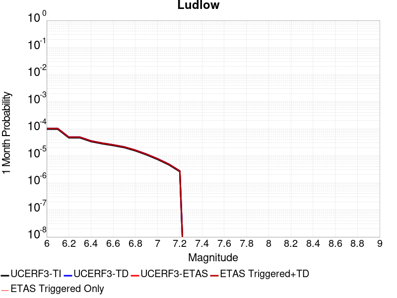 | 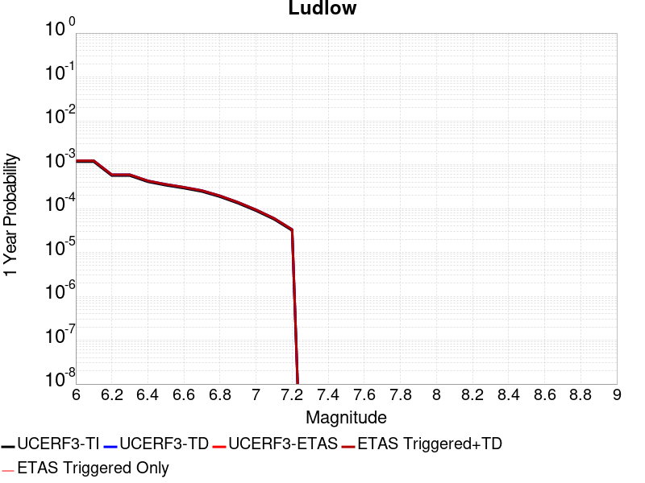 | 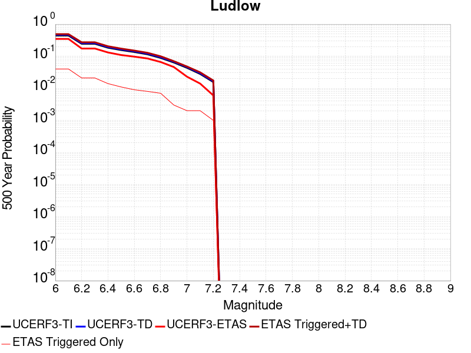 |

| Magnitude | 1 wk TI Prob | 1 wk TD Prob | 1 wk ETAS Prob | 1 wk ETAS/TD Gain | 1 wk ETAS Triggered+TD | 1 wk ETAS Triggered Only | 1 mo TI Prob | 1 mo TD Prob | 1 mo ETAS Prob | 1 mo ETAS/TD Gain | 1 mo ETAS Triggered+TD | 1 mo ETAS Triggered Only | 1 yr TI Prob | 1 yr TD Prob | 1 yr ETAS Prob | 1 yr ETAS/TD Gain | 1 yr ETAS Triggered+TD | 1 yr ETAS Triggered Only | 500 yr TI Prob | 500 yr TD Prob | 500 yr ETAS Prob | 500 yr ETAS/TD Gain | 500 yr ETAS Triggered+TD | 500 yr ETAS Triggered Only |
|-----|-----|-----|-----|-----|-----|-----|-----|-----|-----|-----|-----|-----|-----|-----|-----|-----|-----|-----|-----|-----|-----|-----|-----|-----|
| 6.0 | 2.2407607E-5 | 2.3588846E-5 | 0.0 | 0.0 | 2.3588846E-5 | 0.0 | 9.602906E-5 | 1.01091384E-4 | 0.0 | 0.0 | 1.01091384E-4 | 0.0 | 0.0011685267 | 0.0012301365 | 0.0 | 0.0 | 0.0012301365 | 0.0 | 0.44267404 | 0.46636894 | 0.347 | 0.7440461 | 0.4877142 | 0.04 |
| 6.1 | 2.2407607E-5 | 2.3588846E-5 | 0.0 | 0.0 | 2.3588846E-5 | 0.0 | 9.602906E-5 | 1.01091384E-4 | 0.0 | 0.0 | 1.01091384E-4 | 0.0 | 0.0011685267 | 0.0012301365 | 0.0 | 0.0 | 0.0012301365 | 0.0 | 0.44267404 | 0.46636894 | 0.347 | 0.7440461 | 0.4877142 | 0.04 |
| 6.2 | 1.0781252E-5 | 1.1333717E-5 | 0.0 | 0.0 | 1.1333717E-5 | 0.0 | 4.620455E-5 | 4.8572194E-5 | 0.0 | 0.0 | 4.8572194E-5 | 0.0 | 5.623952E-4 | 5.9121003E-4 | 0.0 | 0.0 | 5.9121003E-4 | 0.0 | 0.24518055 | 0.25678512 | 0.174 | 0.6776093 | 0.27239263 | 0.021 |
| 6.3 | 1.0781252E-5 | 1.1333717E-5 | 0.0 | 0.0 | 1.1333717E-5 | 0.0 | 4.620455E-5 | 4.8572194E-5 | 0.0 | 0.0 | 4.8572194E-5 | 0.0 | 5.623952E-4 | 5.9121003E-4 | 0.0 | 0.0 | 5.9121003E-4 | 0.0 | 0.24518055 | 0.25678512 | 0.174 | 0.6776093 | 0.27239263 | 0.021 |
| 6.4 | 7.814439E-6 | 8.214589E-6 | 0.0 | 0.0 | 8.214589E-6 | 0.0 | 3.3490025E-5 | 3.5204914E-5 | 0.0 | 0.0 | 3.5204914E-5 | 0.0 | 4.0766477E-4 | 4.285369E-4 | 0.0 | 0.0 | 4.285369E-4 | 0.0 | 0.18443483 | 0.1931992 | 0.131 | 0.67805666 | 0.20449442 | 0.014 |
| 6.5 | 6.4986366E-6 | 6.8316594E-6 | 0.0 | 0.0 | 6.8316594E-6 | 0.0 | 2.7851002E-5 | 2.9278217E-5 | 0.0 | 0.0 | 2.9278217E-5 | 0.0 | 3.390332E-4 | 3.564049E-4 | 0.0 | 0.0 | 3.564049E-4 | 0.0 | 0.15595151 | 0.16345415 | 0.109 | 0.66685367 | 0.17265615 | 0.011 |
| 6.6 | 5.582177E-6 | 5.86939E-6 | 0.0 | 0.0 | 5.86939E-6 | 0.0 | 2.3923398E-5 | 2.515429E-5 | 0.0 | 0.0 | 2.515429E-5 | 0.0 | 2.9122844E-4 | 3.0621115E-4 | 0.0 | 0.0 | 3.0621115E-4 | 0.0 | 0.13552718 | 0.1421393 | 0.097 | 0.68242913 | 0.14986004 | 0.009 |
| 6.7 | 4.6858763E-6 | 4.926509E-6 | 0.0 | 0.0 | 4.926509E-6 | 0.0 | 2.0082172E-5 | 2.1113443E-5 | 0.0 | 0.0 | 2.1113443E-5 | 0.0 | 2.4447302E-4 | 2.570264E-4 | 0.0 | 0.0 | 2.570264E-4 | 0.0 | 0.11507417 | 0.12074342 | 0.085 | 0.7039721 | 0.12777747 | 0.008 |
| 6.8 | 3.5584908E-6 | 3.7414386E-6 | 0.0 | 0.0 | 3.7414386E-6 | 0.0 | 1.5250586E-5 | 1.603464E-5 | 0.0 | 0.0 | 1.603464E-5 | 0.0 | 1.8566006E-4 | 1.9520467E-4 | 0.0 | 0.0 | 1.9520467E-4 | 0.0 | 0.088659465 | 0.093099326 | 0.066 | 0.7089203 | 0.09944763 | 0.007 |
| 6.9 | 2.532834E-6 | 2.6634502E-6 | 0.0 | 0.0 | 2.6634502E-6 | 0.0 | 1.0854958E-5 | 1.1414739E-5 | 0.0 | 0.0 | 1.1414739E-5 | 0.0 | 1.3215111E-4 | 1.3896586E-4 | 0.0 | 0.0 | 1.3896586E-4 | 0.0 | 0.063943945 | 0.06719856 | 0.046 | 0.6845385 | 0.06999696 | 0.003 |
| 7.0 | 1.7083285E-6 | 1.7968254E-6 | 0.0 | 0.0 | 1.7968254E-6 | 0.0 | 7.3213873E-6 | 7.700658E-6 | 0.0 | 0.0 | 7.700658E-6 | 0.0 | 8.913424E-5 | 9.3751645E-5 | 0.0 | 0.0 | 9.3751645E-5 | 0.0 | 0.043590497 | 0.045839343 | 0.023 | 0.5017524 | 0.047747664 | 0.002 |
| 7.1 | 1.0905424E-6 | 1.1465256E-6 | 0.0 | 0.0 | 1.1465256E-6 | 0.0 | 4.6737446E-6 | 4.9136725E-6 | 0.0 | 0.0 | 4.9136725E-6 | 0.0 | 5.6901354E-5 | 5.9822418E-5 | 0.0 | 0.0 | 5.9822418E-5 | 0.0 | 0.028050553 | 0.02949524 | 0.014 | 0.47465286 | 0.03143625 | 0.002 |
| 7.2 | 6.06668E-7 | 6.369782E-7 | 0.0 | 0.0 | 6.369782E-7 | 0.0 | 2.600003E-6 | 2.729904E-6 | 0.0 | 0.0 | 2.729904E-6 | 0.0 | 3.1654577E-5 | 3.3236145E-5 | 0.0 | 0.0 | 3.3236145E-5 | 0.0 | 0.015702942 | 0.016499616 | 0.006 | 0.3636448 | 0.017483117 | 0.001 |

## San Jacinto (Borrego)
*[(top)](#table-of-contents)*

| 1 Week | 1 Month | 1 Year | 500 Year |
|-----|-----|-----|-----|
| 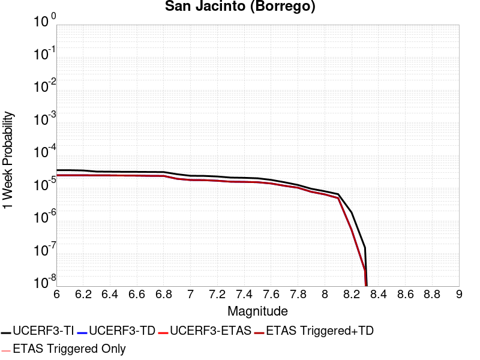 | 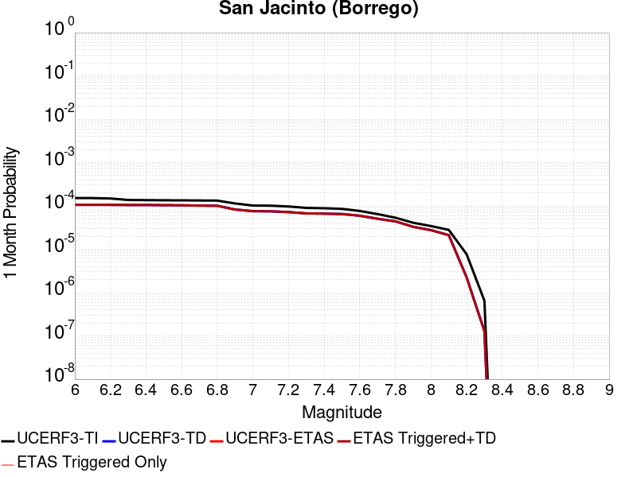 |  | 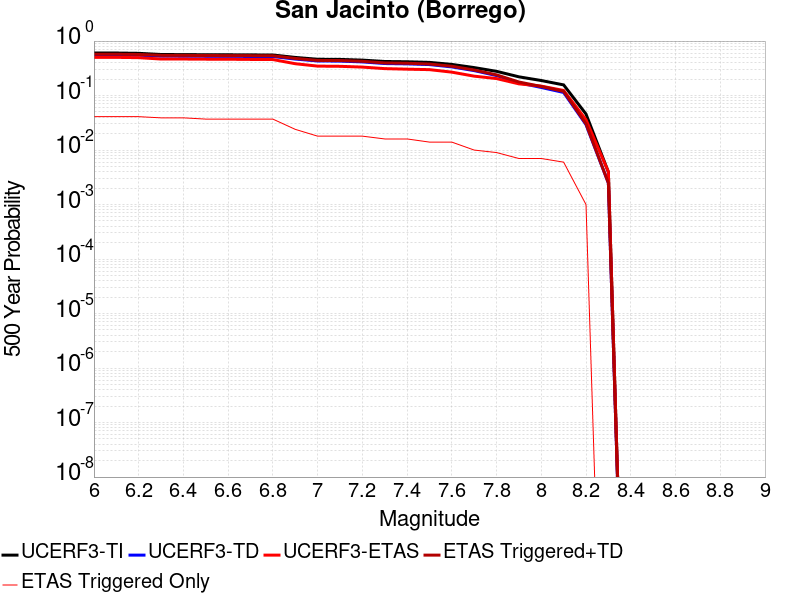 |

| Magnitude | 1 wk TI Prob | 1 wk TD Prob | 1 wk ETAS Prob | 1 wk ETAS/TD Gain | 1 wk ETAS Triggered+TD | 1 wk ETAS Triggered Only | 1 mo TI Prob | 1 mo TD Prob | 1 mo ETAS Prob | 1 mo ETAS/TD Gain | 1 mo ETAS Triggered+TD | 1 mo ETAS Triggered Only | 1 yr TI Prob | 1 yr TD Prob | 1 yr ETAS Prob | 1 yr ETAS/TD Gain | 1 yr ETAS Triggered+TD | 1 yr ETAS Triggered Only | 500 yr TI Prob | 500 yr TD Prob | 500 yr ETAS Prob | 500 yr ETAS/TD Gain | 500 yr ETAS Triggered+TD | 500 yr ETAS Triggered Only |
|-----|-----|-----|-----|-----|-----|-----|-----|-----|-----|-----|-----|-----|-----|-----|-----|-----|-----|-----|-----|-----|-----|-----|-----|-----|
| 6.0 | 3.543992E-5 | 2.4731997E-5 | 0.0 | 0.0 | 2.4731997E-5 | 0.0 | 1.5187653E-4 | 1.05990024E-4 | 0.0 | 0.0 | 1.05990024E-4 | 0.0 | 0.0018475284 | 0.0012896754 | 0.0 | 0.0 | 0.0012896754 | 0.0 | 0.6033173 | 0.5544875 | 0.502 | 0.90534043 | 0.57275355 | 0.041 |
| 6.1 | 3.542281E-5 | 2.4731997E-5 | 0.0 | 0.0 | 2.4731997E-5 | 0.0 | 1.5180321E-4 | 1.05990024E-4 | 0.0 | 0.0 | 1.05990024E-4 | 0.0 | 0.0018466372 | 0.0012896754 | 0.0 | 0.0 | 0.0012896754 | 0.0 | 0.6031402 | 0.55436796 | 0.502 | 0.90553576 | 0.57263887 | 0.041 |
| 6.2 | 3.4688688E-5 | 2.4731997E-5 | 0.0 | 0.0 | 2.4731997E-5 | 0.0 | 1.4865733E-4 | 1.05990024E-4 | 0.0 | 0.0 | 1.05990024E-4 | 0.0 | 0.0018084005 | 0.0012896754 | 0.0 | 0.0 | 0.0012896754 | 0.0 | 0.5954657 | 0.5491196 | 0.496 | 0.9032641 | 0.5676057 | 0.041 |
| 6.3 | 3.2087122E-5 | 2.4579174E-5 | 0.0 | 0.0 | 2.4579174E-5 | 0.0 | 1.3750899E-4 | 1.0533513E-4 | 0.0 | 0.0 | 1.0533513E-4 | 0.0 | 0.0016728862 | 0.0012817113 | 0.0 | 0.0 | 0.0012817113 | 0.0 | 0.56705457 | 0.529289 | 0.468 | 0.884205 | 0.54764676 | 0.039 |
| 6.4 | 3.1828724E-5 | 2.45468E-5 | 0.0 | 0.0 | 2.45468E-5 | 0.0 | 1.364017E-4 | 1.05196385E-4 | 0.0 | 0.0 | 1.05196385E-4 | 0.0 | 0.0016594254 | 0.0012800242 | 0.0 | 0.0 | 0.0012800242 | 0.0 | 0.56412596 | 0.52732545 | 0.468 | 0.8874975 | 0.54575974 | 0.039 |
| 6.5 | 3.1563577E-5 | 2.429199E-5 | 0.0 | 0.0 | 2.429199E-5 | 0.0 | 1.3526545E-4 | 1.0410443E-4 | 0.0 | 0.0 | 1.0410443E-4 | 0.0 | 0.0016456128 | 0.0012667452 | 0.0 | 0.0 | 0.0012667452 | 0.0 | 0.5611002 | 0.52488 | 0.465 | 0.8859168 | 0.5424594 | 0.037 |
| 6.6 | 3.1467625E-5 | 2.4139255E-5 | 0.0 | 0.0 | 2.4139255E-5 | 0.0 | 1.3485427E-4 | 1.0344991E-4 | 0.0 | 0.0 | 1.0344991E-4 | 0.0 | 0.0016406142 | 0.0012587855 | 0.0 | 0.0 | 0.0012587855 | 0.0 | 0.5600001 | 0.52392 | 0.464 | 0.8856314 | 0.54153496 | 0.037 |
| 6.7 | 3.1223695E-5 | 2.3764691E-5 | 0.0 | 0.0 | 2.3764691E-5 | 0.0 | 1.3380898E-4 | 1.0184476E-4 | 0.0 | 0.0 | 1.0184476E-4 | 0.0 | 0.0016279068 | 0.0012392651 | 0.0 | 0.0 | 0.0012392651 | 0.0 | 0.55719095 | 0.5214684 | 0.46 | 0.88212436 | 0.5391741 | 0.037 |
| 6.8 | 3.1015585E-5 | 2.3593428E-5 | 0.0 | 0.0 | 2.3593428E-5 | 0.0 | 1.3291716E-4 | 1.01110825E-4 | 0.0 | 0.0 | 1.01110825E-4 | 0.0 | 0.001617065 | 0.0012303396 | 0.0 | 0.0 | 0.0012303396 | 0.0 | 0.5547801 | 0.51918536 | 0.458 | 0.8821512 | 0.5369755 | 0.037 |
| 6.9 | 2.6641965E-5 | 1.9282656E-5 | 0.0 | 0.0 | 1.9282656E-5 | 0.0 | 1.1417485E-4 | 8.263735E-5 | 0.0 | 0.0 | 8.263735E-5 | 0.0 | 0.0013891924 | 0.0010056486 | 0.0 | 0.0 | 0.0010056486 | 0.0 | 0.500965 | 0.46736234 | 0.384 | 0.82163227 | 0.48014566 | 0.024 |
| 7.0 | 2.3854353E-5 | 1.7715483E-5 | 0.0 | 0.0 | 1.7715483E-5 | 0.0 | 1.02228936E-4 | 7.592131E-5 | 0.0 | 0.0 | 7.592131E-5 | 0.0 | 0.0012439266 | 9.239521E-4 | 0.0 | 0.0 | 9.239521E-4 | 0.0 | 0.4633185 | 0.43113515 | 0.347 | 0.804852 | 0.44137472 | 0.018 |
| 7.1 | 2.3672901E-5 | 1.7557433E-5 | 0.0 | 0.0 | 1.7557433E-5 | 0.0 | 1.0145135E-4 | 7.524399E-5 | 0.0 | 0.0 | 7.524399E-5 | 0.0 | 0.0012344702 | 9.157127E-4 | 0.0 | 0.0 | 9.157127E-4 | 0.0 | 0.46077177 | 0.4284908 | 0.344 | 0.80281776 | 0.43877795 | 0.018 |
| 7.2 | 2.2717244E-5 | 1.6821112E-5 | 0.0 | 0.0 | 1.6821112E-5 | 0.0 | 9.735599E-5 | 7.20885E-5 | 0.0 | 0.0 | 7.20885E-5 | 0.0 | 0.0011846646 | 8.77326E-4 | 0.0 | 0.0 | 8.77326E-4 | 0.0 | 0.44715822 | 0.41463485 | 0.333 | 0.80311626 | 0.42517143 | 0.018 |
| 7.3 | 2.1016205E-5 | 1.5715284E-5 | 0.0 | 0.0 | 1.5715284E-5 | 0.0 | 9.006634E-5 | 6.734949E-5 | 0.0 | 0.0 | 6.734949E-5 | 0.0 | 0.001096006 | 8.1967324E-4 | 0.0 | 0.0 | 8.1967324E-4 | 0.0 | 0.4220706 | 0.38690823 | 0.312 | 0.8063928 | 0.3967177 | 0.016 |
| 7.4 | 2.0683625E-5 | 1.5528149E-5 | 0.0 | 0.0 | 1.5528149E-5 | 0.0 | 8.86411E-5 | 6.654752E-5 | 0.0 | 0.0 | 6.654752E-5 | 0.0 | 0.001078671 | 8.099166E-4 | 0.0 | 0.0 | 8.099166E-4 | 0.0 | 0.41703412 | 0.38144472 | 0.305 | 0.7995916 | 0.39134163 | 0.016 |
| 7.5 | 1.9993966E-5 | 1.5151151E-5 | 0.0 | 0.0 | 1.5151151E-5 | 0.0 | 8.568561E-5 | 6.49319E-5 | 0.0 | 0.0 | 6.49319E-5 | 0.0 | 0.001042723 | 7.902608E-4 | 0.0 | 0.0 | 7.902608E-4 | 0.0 | 0.4064498 | 0.37027913 | 0.299 | 0.80749893 | 0.37909523 | 0.014 |
| 7.6 | 1.788966E-5 | 1.3887274E-5 | 0.0 | 0.0 | 1.3887274E-5 | 0.0 | 7.666772E-5 | 5.9515536E-5 | 0.0 | 0.0 | 5.9515536E-5 | 0.0 | 9.3302975E-4 | 7.2436215E-4 | 0.0 | 0.0 | 7.2436215E-4 | 0.0 | 0.37295228 | 0.33558792 | 0.269 | 0.80157834 | 0.34488967 | 0.014 |
| 7.7 | 1.5125781E-5 | 1.1801989E-5 | 0.0 | 0.0 | 1.1801989E-5 | 0.0 | 6.4823165E-5 | 5.0578976E-5 | 0.0 | 0.0 | 5.0578976E-5 | 0.0 | 7.889362E-4 | 6.156256E-4 | 0.0 | 0.0 | 6.156256E-4 | 0.0 | 0.32606646 | 0.28700855 | 0.227 | 0.7909172 | 0.29413846 | 0.01 |
| 7.8 | 1.250089E-5 | 1.0305397E-5 | 0.0 | 0.0 | 1.0305397E-5 | 0.0 | 5.3574146E-5 | 4.416524E-5 | 0.0 | 0.0 | 4.416524E-5 | 0.0 | 6.5207E-4 | 5.3757953E-4 | 0.0 | 0.0 | 5.3757953E-4 | 0.0 | 0.27829683 | 0.23278973 | 0.205 | 0.88062304 | 0.23969463 | 0.009 |
| 7.9 | 9.561E-6 | 7.71271E-6 | 0.0 | 0.0 | 7.71271E-6 | 0.0 | 4.0975072E-5 | 3.3054053E-5 | 0.0 | 0.0 | 3.3054053E-5 | 0.0 | 4.987573E-4 | 4.0235912E-4 | 0.0 | 0.0 | 4.0235912E-4 | 0.0 | 0.22076362 | 0.17162256 | 0.164 | 0.9555853 | 0.1774212 | 0.007 |
| 8.0 | 8.01699E-6 | 6.440681E-6 | 0.0 | 0.0 | 6.440681E-6 | 0.0 | 3.4358076E-5 | 2.7602628E-5 | 0.0 | 0.0 | 2.7602628E-5 | 0.0 | 4.1822926E-4 | 3.3601047E-4 | 0.0 | 0.0 | 3.3601047E-4 | 0.0 | 0.18873326 | 0.14076163 | 0.149 | 1.0585271 | 0.14677629 | 0.007 |
| 8.1 | 6.541947E-6 | 4.9534024E-6 | 0.0 | 0.0 | 4.9534024E-6 | 0.0 | 2.8036617E-5 | 2.1228696E-5 | 0.0 | 0.0 | 2.1228696E-5 | 0.0 | 3.4129233E-4 | 2.5842903E-4 | 0.0 | 0.0 | 2.5842903E-4 | 0.0 | 0.15690471 | 0.11397866 | 0.124 | 1.0879229 | 0.11929479 | 0.006 |
| 8.2 | 1.7968189E-6 | 5.2639416E-7 | 0.0 | 0.0 | 5.2639416E-7 | 0.0 | 7.70063E-6 | 2.2559732E-6 | 0.0 | 0.0 | 2.2559732E-6 | 0.0 | 9.3751136E-5 | 2.7466136E-5 | 0.0 | 0.0 | 2.7466136E-5 | 0.0 | 0.04579597 | 0.0293025 | 0.036 | 1.2285641 | 0.030273197 | 0.001 |
| 8.3 | 1.5167889E-7 | 3.0201086E-8 | 0.0 | 0.0 | 3.0201086E-8 | 0.0 | 6.500522E-7 | 1.2943322E-7 | 0.0 | 0.0 | 1.2943322E-7 | 0.0 | 7.9143565E-6 | 1.5758485E-6 | 0.0 | 0.0 | 1.5758485E-6 | 0.0 | 0.003949375 | 0.0024869854 | 0.004 | 1.6083729 | 0.0024869854 | 0.0 |

## Garberville - Briceland 2011 CFM
*[(top)](#table-of-contents)*

| 1 Week | 1 Month | 1 Year | 500 Year |
|-----|-----|-----|-----|
|  |  | 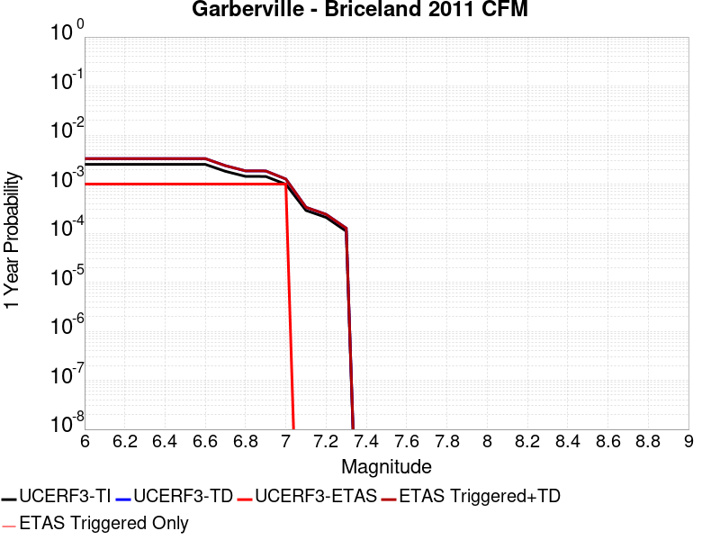 | 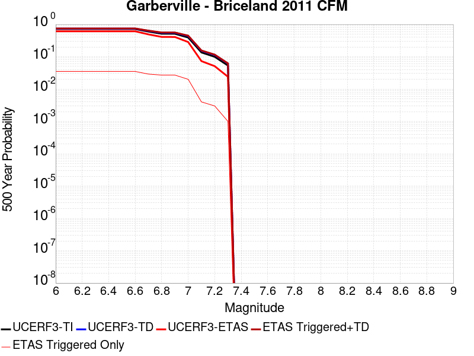 |

| Magnitude | 1 wk TI Prob | 1 wk TD Prob | 1 wk ETAS Prob | 1 wk ETAS/TD Gain | 1 wk ETAS Triggered+TD | 1 wk ETAS Triggered Only | 1 mo TI Prob | 1 mo TD Prob | 1 mo ETAS Prob | 1 mo ETAS/TD Gain | 1 mo ETAS Triggered+TD | 1 mo ETAS Triggered Only | 1 yr TI Prob | 1 yr TD Prob | 1 yr ETAS Prob | 1 yr ETAS/TD Gain | 1 yr ETAS Triggered+TD | 1 yr ETAS Triggered Only | 500 yr TI Prob | 500 yr TD Prob | 500 yr ETAS Prob | 500 yr ETAS/TD Gain | 500 yr ETAS Triggered+TD | 500 yr ETAS Triggered Only |
|-----|-----|-----|-----|-----|-----|-----|-----|-----|-----|-----|-----|-----|-----|-----|-----|-----|-----|-----|-----|-----|-----|-----|-----|-----|
| 6.0 | 4.8399295E-5 | 6.344227E-5 | 0.0 | 0.0 | 6.344227E-5 | 0.0 | 2.0740906E-4 | 2.718706E-4 | 0.0 | 0.0 | 2.718706E-4 | 0.0 | 0.002522281 | 0.003305664 | 0.001 | 0.3025111 | 0.003305664 | 0.0 | 0.7171203 | 0.7370314 | 0.611 | 0.8290013 | 0.7462353 | 0.035 |
| 6.1 | 4.8399295E-5 | 6.344227E-5 | 0.0 | 0.0 | 6.344227E-5 | 0.0 | 2.0740906E-4 | 2.718706E-4 | 0.0 | 0.0 | 2.718706E-4 | 0.0 | 0.002522281 | 0.003305664 | 0.001 | 0.3025111 | 0.003305664 | 0.0 | 0.7171203 | 0.7370314 | 0.611 | 0.8290013 | 0.7462353 | 0.035 |
| 6.2 | 4.8399295E-5 | 6.344227E-5 | 0.0 | 0.0 | 6.344227E-5 | 0.0 | 2.0740906E-4 | 2.718706E-4 | 0.0 | 0.0 | 2.718706E-4 | 0.0 | 0.002522281 | 0.003305664 | 0.001 | 0.3025111 | 0.003305664 | 0.0 | 0.7171203 | 0.7370314 | 0.611 | 0.8290013 | 0.7462353 | 0.035 |
| 6.3 | 4.8399295E-5 | 6.344227E-5 | 0.0 | 0.0 | 6.344227E-5 | 0.0 | 2.0740906E-4 | 2.718706E-4 | 0.0 | 0.0 | 2.718706E-4 | 0.0 | 0.002522281 | 0.003305664 | 0.001 | 0.3025111 | 0.003305664 | 0.0 | 0.7171203 | 0.7370314 | 0.611 | 0.8290013 | 0.7462353 | 0.035 |
| 6.4 | 4.8399295E-5 | 6.344227E-5 | 0.0 | 0.0 | 6.344227E-5 | 0.0 | 2.0740906E-4 | 2.718706E-4 | 0.0 | 0.0 | 2.718706E-4 | 0.0 | 0.002522281 | 0.003305664 | 0.001 | 0.3025111 | 0.003305664 | 0.0 | 0.7171203 | 0.7370314 | 0.611 | 0.8290013 | 0.7462353 | 0.035 |
| 6.5 | 4.8399295E-5 | 6.344227E-5 | 0.0 | 0.0 | 6.344227E-5 | 0.0 | 2.0740906E-4 | 2.718706E-4 | 0.0 | 0.0 | 2.718706E-4 | 0.0 | 0.002522281 | 0.003305664 | 0.001 | 0.3025111 | 0.003305664 | 0.0 | 0.7171203 | 0.7370314 | 0.611 | 0.8290013 | 0.7462353 | 0.035 |
| 6.6 | 4.8399295E-5 | 6.344227E-5 | 0.0 | 0.0 | 6.344227E-5 | 0.0 | 2.0740906E-4 | 2.718706E-4 | 0.0 | 0.0 | 2.718706E-4 | 0.0 | 0.002522281 | 0.003305664 | 0.001 | 0.3025111 | 0.003305664 | 0.0 | 0.7171203 | 0.7370314 | 0.611 | 0.8290013 | 0.7462353 | 0.035 |
| 6.7 | 3.495179E-5 | 4.5535842E-5 | 0.0 | 0.0 | 4.5535842E-5 | 0.0 | 1.4978478E-4 | 1.9514198E-4 | 0.0 | 0.0 | 1.9514198E-4 | 0.0 | 0.0018221042 | 0.0023737845 | 0.001 | 0.42126822 | 0.0023737845 | 0.0 | 0.5982331 | 0.62880707 | 0.49 | 0.77925336 | 0.63957167 | 0.029 |
| 6.8 | 2.7517597E-5 | 3.564944E-5 | 0.0 | 0.0 | 3.564944E-5 | 0.0 | 1.1792722E-4 | 1.5277702E-4 | 0.0 | 0.0 | 1.5277702E-4 | 0.0 | 0.0014348183 | 0.0018589352 | 0.001 | 0.53794235 | 0.0018589352 | 0.0 | 0.51223636 | 0.54892504 | 0.409 | 0.74509263 | 0.56110406 | 0.027 |
| 6.9 | 2.74461E-5 | 3.5567806E-5 | 0.0 | 0.0 | 3.5567806E-5 | 0.0 | 1.1762084E-4 | 1.5242721E-4 | 0.0 | 0.0 | 1.5242721E-4 | 0.0 | 0.001431093 | 0.0018546834 | 0.001 | 0.53917557 | 0.0018546834 | 0.0 | 0.51132566 | 0.5479839 | 0.407 | 0.7427226 | 0.56018835 | 0.027 |
| 7.0 | 1.9023773E-5 | 2.4325109E-5 | 0.0 | 0.0 | 2.4325109E-5 | 0.0 | 8.152791E-5 | 1.04248524E-4 | 0.0 | 0.0 | 1.04248524E-4 | 0.0 | 9.921503E-4 | 0.0012688754 | 0.001 | 0.7880994 | 0.0012688754 | 0.0 | 0.39123404 | 0.4364894 | 0.284 | 0.6506458 | 0.4477596 | 0.02 |
| 7.1 | 5.566844E-6 | 6.454962E-6 | 0.0 | 0.0 | 6.454962E-6 | 0.0 | 2.3857683E-5 | 2.7663855E-5 | 0.0 | 0.0 | 2.7663855E-5 | 0.0 | 2.9042858E-4 | 3.3675955E-4 | 0.0 | 0.0 | 3.3675955E-4 | 0.0 | 0.1351813 | 0.1523027 | 0.073 | 0.47930863 | 0.15569349 | 0.004 |
| 7.2 | 4.011353E-6 | 4.63476E-6 | 0.0 | 0.0 | 4.63476E-6 | 0.0 | 1.7191402E-5 | 1.9863124E-5 | 0.0 | 0.0 | 1.9863124E-5 | 0.0 | 2.0928521E-4 | 2.4181008E-4 | 0.0 | 0.0 | 2.4181008E-4 | 0.0 | 0.09936351 | 0.11344572 | 0.051 | 0.44955418 | 0.116105385 | 0.003 |
| 7.3 | 2.0974871E-6 | 2.419084E-6 | 0.0 | 0.0 | 2.419084E-6 | 0.0 | 8.989199E-6 | 1.0367476E-5 | 0.0 | 0.0 | 1.0367476E-5 | 0.0 | 1.09438006E-4 | 1.2621917E-4 | 0.0 | 0.0 | 1.2621917E-4 | 0.0 | 0.05325169 | 0.06120638 | 0.024 | 0.39211598 | 0.062145174 | 0.001 |

## Chino alt 1
*[(top)](#table-of-contents)*

| 1 Week | 1 Month | 1 Year | 500 Year |
|-----|-----|-----|-----|
|  | 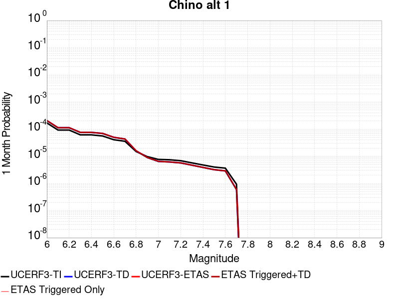 | 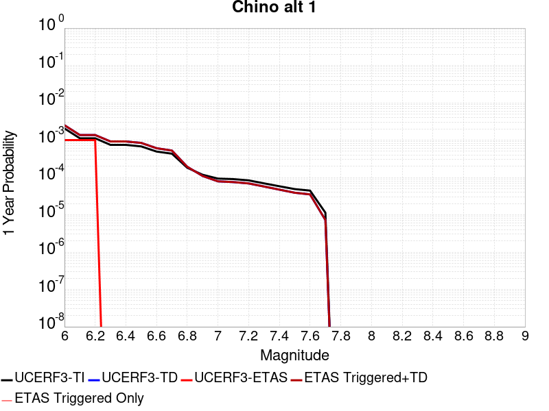 | 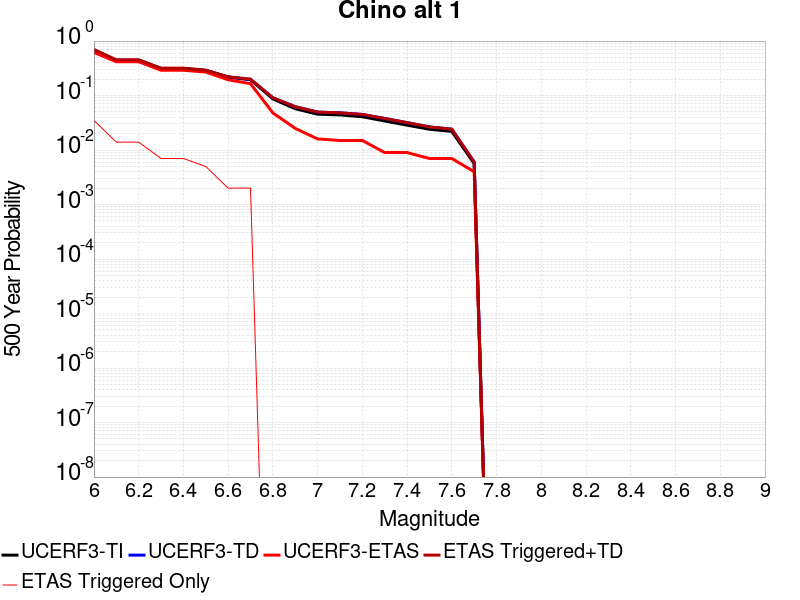 |

| Magnitude | 1 wk TI Prob | 1 wk TD Prob | 1 wk ETAS Prob | 1 wk ETAS/TD Gain | 1 wk ETAS Triggered+TD | 1 wk ETAS Triggered Only | 1 mo TI Prob | 1 mo TD Prob | 1 mo ETAS Prob | 1 mo ETAS/TD Gain | 1 mo ETAS Triggered+TD | 1 mo ETAS Triggered Only | 1 yr TI Prob | 1 yr TD Prob | 1 yr ETAS Prob | 1 yr ETAS/TD Gain | 1 yr ETAS Triggered+TD | 1 yr ETAS Triggered Only | 500 yr TI Prob | 500 yr TD Prob | 500 yr ETAS Prob | 500 yr ETAS/TD Gain | 500 yr ETAS Triggered+TD | 500 yr ETAS Triggered Only |
|-----|-----|-----|-----|-----|-----|-----|-----|-----|-----|-----|-----|-----|-----|-----|-----|-----|-----|-----|-----|-----|-----|-----|-----|-----|
| 6.0 | 3.939946E-5 | 4.8068847E-5 | 0.0 | 0.0 | 4.8068847E-5 | 0.0 | 1.6884391E-4 | 2.0599591E-4 | 0.0 | 0.0 | 2.0599591E-4 | 0.0 | 0.0020537362 | 0.002505614 | 0.001 | 0.3991038 | 0.002505614 | 0.0 | 0.64225113 | 0.6889838 | 0.618 | 0.8969732 | 0.6998694 | 0.035 |
| 6.1 | 2.1505624E-5 | 2.6263106E-5 | 0.0 | 0.0 | 2.6263106E-5 | 0.0 | 9.2163704E-5 | 1.1255189E-4 | 0.0 | 0.0 | 1.1255189E-4 | 0.0 | 0.0011215154 | 0.0013695639 | 0.001 | 0.7301594 | 0.0013695639 | 0.0 | 0.42940316 | 0.44515562 | 0.418 | 0.93899745 | 0.45292345 | 0.014 |
| 6.2 | 2.1505624E-5 | 2.6263106E-5 | 0.0 | 0.0 | 2.6263106E-5 | 0.0 | 9.2163704E-5 | 1.1255189E-4 | 0.0 | 0.0 | 1.1255189E-4 | 0.0 | 0.0011215154 | 0.0013695639 | 0.001 | 0.7301594 | 0.0013695639 | 0.0 | 0.42940316 | 0.44515562 | 0.418 | 0.93899745 | 0.45292345 | 0.014 |
| 6.3 | 1.4290785E-5 | 1.7642156E-5 | 0.0 | 0.0 | 1.7642156E-5 | 0.0 | 6.1244784E-5 | 7.560729E-5 | 0.0 | 0.0 | 7.560729E-5 | 0.0 | 7.454001E-4 | 9.2017243E-4 | 0.0 | 0.0 | 9.2017243E-4 | 0.0 | 0.3112239 | 0.31394032 | 0.291 | 0.92692775 | 0.31874272 | 0.007 |
| 6.4 | 1.4290785E-5 | 1.7642156E-5 | 0.0 | 0.0 | 1.7642156E-5 | 0.0 | 6.1244784E-5 | 7.560729E-5 | 0.0 | 0.0 | 7.560729E-5 | 0.0 | 7.454001E-4 | 9.2017243E-4 | 0.0 | 0.0 | 9.2017243E-4 | 0.0 | 0.3112239 | 0.31394032 | 0.291 | 0.92692775 | 0.31874272 | 0.007 |
| 6.5 | 1.3017944E-5 | 1.6143818E-5 | 0.0 | 0.0 | 1.6143818E-5 | 0.0 | 5.5789995E-5 | 6.9186186E-5 | 0.0 | 0.0 | 6.9186186E-5 | 0.0 | 6.790315E-4 | 8.420572E-4 | 0.0 | 0.0 | 8.420572E-4 | 0.0 | 0.28796703 | 0.28899243 | 0.27 | 0.9342805 | 0.29254746 | 0.005 |
| 6.6 | 9.470016E-6 | 1.1641705E-5 | 0.0 | 0.0 | 1.1641705E-5 | 0.0 | 4.058515E-5 | 4.9892245E-5 | 0.0 | 0.0 | 4.9892245E-5 | 0.0 | 4.940122E-4 | 6.073004E-4 | 0.0 | 0.0 | 6.073004E-4 | 0.0 | 0.21891174 | 0.21934034 | 0.195 | 0.8890294 | 0.22090165 | 0.002 |
| 6.7 | 8.314155E-6 | 1.0064889E-5 | 0.0 | 0.0 | 1.0064889E-5 | 0.0 | 3.5631605E-5 | 4.3134693E-5 | 0.0 | 0.0 | 4.3134693E-5 | 0.0 | 4.3372845E-4 | 5.250683E-4 | 0.0 | 0.0 | 5.250683E-4 | 0.0 | 0.1949986 | 0.19820265 | 0.165 | 0.83248127 | 0.19980626 | 0.002 |
| 6.8 | 3.4856364E-6 | 3.7004831E-6 | 0.0 | 0.0 | 3.7004831E-6 | 0.0 | 1.4938357E-5 | 1.5859128E-5 | 0.0 | 0.0 | 1.5859128E-5 | 0.0 | 1.8185932E-4 | 1.930697E-4 | 0.0 | 0.0 | 1.930697E-4 | 0.0 | 0.08692561 | 0.09109622 | 0.048 | 0.5269154 | 0.09109622 | 0.0 |
| 6.9 | 2.2645952E-6 | 2.1021394E-6 | 0.0 | 0.0 | 2.1021394E-6 | 0.0 | 9.705372E-6 | 9.009139E-6 | 0.0 | 0.0 | 9.009139E-6 | 0.0 | 1.18156495E-4 | 1.0968095E-4 | 0.0 | 0.0 | 1.0968095E-4 | 0.0 | 0.057370283 | 0.06248844 | 0.025 | 0.400074 | 0.06248844 | 0.0 |
| 7.0 | 1.7864003E-6 | 1.5073756E-6 | 0.0 | 0.0 | 1.5073756E-6 | 0.0 | 7.655979E-6 | 6.4601654E-6 | 0.0 | 0.0 | 6.4601654E-6 | 0.0 | 9.3207556E-5 | 7.8649726E-5 | 0.0 | 0.0 | 7.8649726E-5 | 0.0 | 0.04553657 | 0.049728762 | 0.016 | 0.3217454 | 0.049728762 | 0.0 |
| 7.1 | 1.7315456E-6 | 1.4392828E-6 | 0.0 | 0.0 | 1.4392828E-6 | 0.0 | 7.420889E-6 | 6.1683404E-6 | 0.0 | 0.0 | 6.1683404E-6 | 0.0 | 9.034557E-5 | 7.509701E-5 | 0.0 | 0.0 | 7.509701E-5 | 0.0 | 0.04416964 | 0.04819751 | 0.015 | 0.3112194 | 0.04819751 | 0.0 |
| 7.2 | 1.6008337E-6 | 1.3259664E-6 | 0.0 | 0.0 | 1.3259664E-6 | 0.0 | 6.860698E-6 | 5.682701E-6 | 0.0 | 0.0 | 5.682701E-6 | 0.0 | 8.352579E-5 | 6.9184745E-5 | 0.0 | 0.0 | 6.9184745E-5 | 0.0 | 0.040904514 | 0.0450111 | 0.015 | 0.33325112 | 0.0450111 | 0.0 |
| 7.3 | 1.3320939E-6 | 1.0969252E-6 | 0.0 | 0.0 | 1.0969252E-6 | 0.0 | 5.7089615E-6 | 4.7010994E-6 | 0.0 | 0.0 | 4.7010994E-6 | 0.0 | 6.9504385E-5 | 5.723443E-5 | 0.0 | 0.0 | 5.723443E-5 | 0.0 | 0.034156438 | 0.03800246 | 0.009 | 0.23682675 | 0.03800246 | 0.0 |
| 7.4 | 1.114294E-6 | 9.0415466E-7 | 0.0 | 0.0 | 9.0415466E-7 | 0.0 | 4.775537E-6 | 3.874943E-6 | 0.0 | 0.0 | 3.874943E-6 | 0.0 | 5.8140613E-5 | 4.7176447E-5 | 0.0 | 0.0 | 4.7176447E-5 | 0.0 | 0.02865265 | 0.03185927 | 0.009 | 0.28249234 | 0.03185927 | 0.0 |
| 7.5 | 9.354081E-7 | 7.470304E-7 | 0.0 | 0.0 | 7.470304E-7 | 0.0 | 4.0088858E-6 | 3.2015553E-6 | 0.0 | 0.0 | 3.2015553E-6 | 0.0 | 4.8807087E-5 | 3.8978273E-5 | 0.0 | 0.0 | 3.8978273E-5 | 0.0 | 0.024108768 | 0.026578335 | 0.007 | 0.2633724 | 0.026578335 | 0.0 |
| 7.6 | 8.521771E-7 | 6.7402453E-7 | 0.0 | 0.0 | 6.7402453E-7 | 0.0 | 3.6521824E-6 | 2.8886734E-6 | 0.0 | 0.0 | 2.8886734E-6 | 0.0 | 4.4464414E-5 | 3.516906E-5 | 0.0 | 0.0 | 3.516906E-5 | 0.0 | 0.021987375 | 0.024141792 | 0.007 | 0.28995362 | 0.024141792 | 0.0 |
| 7.7 | 2.1803626E-7 | 1.3882148E-7 | 0.0 | 0.0 | 1.3882148E-7 | 0.0 | 9.344408E-7 | 5.9494914E-7 | 0.0 | 0.0 | 5.9494914E-7 | 0.0 | 1.1376757E-5 | 7.243491E-6 | 0.0 | 0.0 | 7.243491E-6 | 0.0 | 0.0056722625 | 0.00602521 | 0.004 | 0.66387725 | 0.00602521 | 0.0 |

## Mission Ridge-Arroyo Parida-Santa Ana
*[(top)](#table-of-contents)*

| 1 Week | 1 Month | 1 Year | 500 Year |
|-----|-----|-----|-----|
| 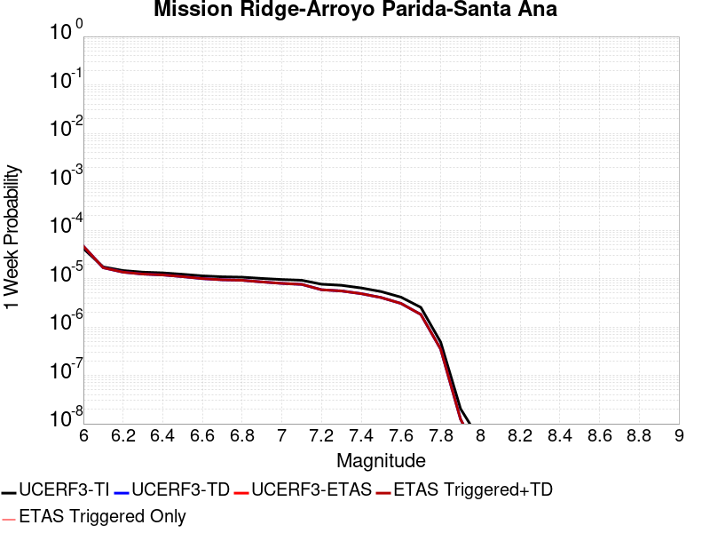 |  | 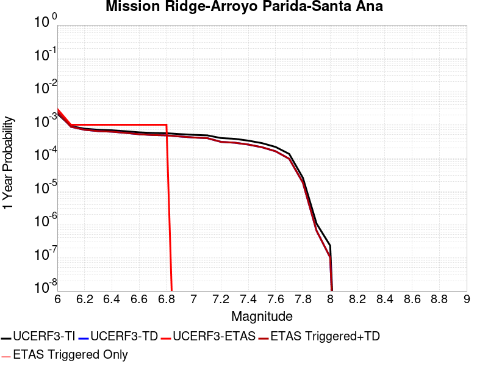 | 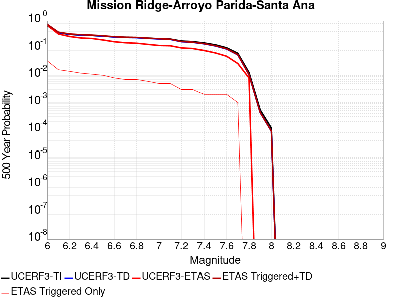 |

| Magnitude | 1 wk TI Prob | 1 wk TD Prob | 1 wk ETAS Prob | 1 wk ETAS/TD Gain | 1 wk ETAS Triggered+TD | 1 wk ETAS Triggered Only | 1 mo TI Prob | 1 mo TD Prob | 1 mo ETAS Prob | 1 mo ETAS/TD Gain | 1 mo ETAS Triggered+TD | 1 mo ETAS Triggered Only | 1 yr TI Prob | 1 yr TD Prob | 1 yr ETAS Prob | 1 yr ETAS/TD Gain | 1 yr ETAS Triggered+TD | 1 yr ETAS Triggered Only | 500 yr TI Prob | 500 yr TD Prob | 500 yr ETAS Prob | 500 yr ETAS/TD Gain | 500 yr ETAS Triggered+TD | 500 yr ETAS Triggered Only |
|-----|-----|-----|-----|-----|-----|-----|-----|-----|-----|-----|-----|-----|-----|-----|-----|-----|-----|-----|-----|-----|-----|-----|-----|-----|
| 6.0 | 4.169034E-5 | 4.6617573E-5 | 0.0 | 0.0 | 4.6617573E-5 | 0.0 | 1.7866064E-4 | 1.9977878E-4 | 0.0 | 0.0 | 1.9977878E-4 | 0.0 | 0.0021730233 | 0.0024304083 | 0.003 | 1.2343606 | 0.0024304083 | 0.0 | 0.66300726 | 0.7303829 | 0.694 | 0.9501865 | 0.73954993 | 0.034 |
| 6.1 | 1.73813E-5 | 1.6717333E-5 | 0.0 | 0.0 | 1.6717333E-5 | 0.0 | 7.4489166E-5 | 7.16438E-5 | 0.0 | 0.0 | 7.16438E-5 | 0.0 | 9.065282E-4 | 8.719248E-4 | 0.001 | 1.1468879 | 8.719248E-4 | 0.0 | 0.36458036 | 0.37165615 | 0.327 | 0.8798455 | 0.38170967 | 0.016 |
| 6.2 | 1.4622182E-5 | 1.3561808E-5 | 0.0 | 0.0 | 1.3561808E-5 | 0.0 | 6.2664985E-5 | 5.8120764E-5 | 0.0 | 0.0 | 5.8120764E-5 | 0.0 | 7.6267915E-4 | 7.073944E-4 | 0.001 | 1.4136386 | 7.073944E-4 | 0.0 | 0.31715342 | 0.3203404 | 0.265 | 0.82724506 | 0.32985562 | 0.014 |
| 6.3 | 1.3552434E-5 | 1.2377771E-5 | 0.0 | 0.0 | 1.2377771E-5 | 0.0 | 5.8080568E-5 | 5.3046526E-5 | 0.0 | 0.0 | 5.3046526E-5 | 0.0 | 7.069015E-4 | 6.4565317E-4 | 0.001 | 1.5488192 | 6.4565317E-4 | 0.0 | 0.29782718 | 0.29942518 | 0.234 | 0.78149736 | 0.3078321 | 0.012 |
| 6.4 | 1.30977305E-5 | 1.1877507E-5 | 0.0 | 0.0 | 1.1877507E-5 | 0.0 | 5.613192E-5 | 5.0902625E-5 | 0.0 | 0.0 | 5.0902625E-5 | 0.0 | 6.831918E-4 | 6.195662E-4 | 0.001 | 1.6140325 | 6.195662E-4 | 0.0 | 0.28944767 | 0.2903478 | 0.224 | 0.7714885 | 0.298154 | 0.011 |
| 6.5 | 1.225205E-5 | 1.0951989E-5 | 0.0 | 0.0 | 1.0951989E-5 | 0.0 | 5.2507727E-5 | 4.6936264E-5 | 0.0 | 0.0 | 4.6936264E-5 | 0.0 | 6.3909404E-4 | 5.7130185E-4 | 0.001 | 1.7503883 | 5.7130185E-4 | 0.0 | 0.27359617 | 0.2731434 | 0.197 | 0.72123283 | 0.280412 | 0.01 |
| 6.6 | 1.1352241E-5 | 9.97157E-6 | 0.0 | 0.0 | 9.97157E-6 | 0.0 | 4.8651553E-5 | 4.273461E-5 | 0.0 | 0.0 | 4.273461E-5 | 0.0 | 5.921717E-4 | 5.201718E-4 | 0.001 | 1.922442 | 5.201718E-4 | 0.0 | 0.25634164 | 0.25434062 | 0.17 | 0.668395 | 0.2603059 | 0.008 |
| 6.7 | 1.0864116E-5 | 9.428487E-6 | 0.0 | 0.0 | 9.428487E-6 | 0.0 | 4.6559664E-5 | 4.0407187E-5 | 0.0 | 0.0 | 4.0407187E-5 | 0.0 | 5.667165E-4 | 4.918484E-4 | 0.001 | 2.0331469 | 4.918484E-4 | 0.0 | 0.2468106 | 0.24404006 | 0.156 | 0.6392393 | 0.24933177 | 0.007 |
| 6.8 | 1.0666365E-5 | 9.2123555E-6 | 0.0 | 0.0 | 9.2123555E-6 | 0.0 | 4.571219E-5 | 3.9480936E-5 | 0.0 | 0.0 | 3.9480936E-5 | 0.0 | 5.564038E-4 | 4.8057636E-4 | 0.001 | 2.0808349 | 4.8057636E-4 | 0.0 | 0.24291468 | 0.23978865 | 0.15 | 0.62555087 | 0.24511012 | 0.007 |
| 6.9 | 1.0038665E-5 | 8.509297E-6 | 0.0 | 0.0 | 8.509297E-6 | 0.0 | 4.302214E-5 | 3.6467918E-5 | 0.0 | 0.0 | 3.6467918E-5 | 0.0 | 5.236687E-4 | 4.439082E-4 | 0.0 | 0.0 | 4.439082E-4 | 0.0 | 0.23041427 | 0.2258504 | 0.136 | 0.6021685 | 0.2304953 | 0.006 |
| 7.0 | 9.5379955E-6 | 7.946525E-6 | 0.0 | 0.0 | 7.946525E-6 | 0.0 | 4.0876483E-5 | 3.4056102E-5 | 0.0 | 0.0 | 3.4056102E-5 | 0.0 | 4.975576E-4 | 4.1455586E-4 | 0.0 | 0.0 | 4.1455586E-4 | 0.0 | 0.22029582 | 0.21457875 | 0.124 | 0.57787645 | 0.21850584 | 0.005 |
| 7.1 | 9.207389E-6 | 7.5766507E-6 | 0.0 | 0.0 | 7.5766507E-6 | 0.0 | 3.945964E-5 | 3.2470965E-5 | 0.0 | 0.0 | 3.2470965E-5 | 0.0 | 4.803152E-4 | 3.9526395E-4 | 0.0 | 0.0 | 3.9526395E-4 | 0.0 | 0.21354148 | 0.20708561 | 0.121 | 0.5842994 | 0.21105018 | 0.005 |
| 7.2 | 7.638091E-6 | 5.871142E-6 | 0.0 | 0.0 | 5.871142E-6 | 0.0 | 3.2734264E-5 | 2.5161795E-5 | 0.0 | 0.0 | 2.5161795E-5 | 0.0 | 3.984668E-4 | 3.063021E-4 | 0.0 | 0.0 | 3.063021E-4 | 0.0 | 0.1806739 | 0.17058548 | 0.101 | 0.5920785 | 0.17307372 | 0.003 |
| 7.3 | 7.2500147E-6 | 5.539865E-6 | 0.0 | 0.0 | 5.539865E-6 | 0.0 | 3.1071122E-5 | 2.3742065E-5 | 0.0 | 0.0 | 2.3742065E-5 | 0.0 | 3.7822526E-4 | 2.8902158E-4 | 0.0 | 0.0 | 2.8902158E-4 | 0.0 | 0.17233633 | 0.16192704 | 0.096 | 0.59285957 | 0.16444127 | 0.003 |
| 7.4 | 6.3899715E-6 | 4.8712745E-6 | 0.0 | 0.0 | 4.8712745E-6 | 0.0 | 2.7385306E-5 | 2.0876725E-5 | 0.0 | 0.0 | 2.0876725E-5 | 0.0 | 3.3336508E-4 | 2.5414466E-4 | 0.0 | 0.0 | 2.5414466E-4 | 0.0 | 0.15355523 | 0.14252338 | 0.081 | 0.56832784 | 0.14423832 | 0.002 |
| 7.5 | 5.379025E-6 | 4.0481627E-6 | 0.0 | 0.0 | 4.0481627E-6 | 0.0 | 2.305276E-5 | 1.7349153E-5 | 0.0 | 0.0 | 1.7349153E-5 | 0.0 | 2.806312E-4 | 2.1120557E-4 | 0.0 | 0.0 | 2.1120557E-4 | 0.0 | 0.13093321 | 0.119168565 | 0.066 | 0.55383736 | 0.120930225 | 0.002 |
| 7.6 | 4.1270696E-6 | 3.0614137E-6 | 0.0 | 0.0 | 3.0614137E-6 | 0.0 | 1.768732E-5 | 1.3120279E-5 | 0.0 | 0.0 | 1.3120279E-5 | 0.0 | 2.1532185E-4 | 1.5972776E-4 | 0.0 | 0.0 | 1.5972776E-4 | 0.0 | 0.10207839 | 0.09174081 | 0.05 | 0.5450137 | 0.09355733 | 0.002 |
| 7.7 | 2.5406805E-6 | 1.8123991E-6 | 0.0 | 0.0 | 1.8123991E-6 | 0.0 | 1.0888585E-5 | 7.767402E-6 | 0.0 | 0.0 | 7.767402E-6 | 0.0 | 1.3256045E-4 | 9.456408E-5 | 0.0 | 0.0 | 9.456408E-5 | 0.0 | 0.064135544 | 0.056284662 | 0.027 | 0.47970438 | 0.05722838 | 0.001 |
| 7.8 | 4.8608285E-7 | 3.4838723E-7 | 0.0 | 0.0 | 3.4838723E-7 | 0.0 | 2.0832106E-6 | 1.4930873E-6 | 0.0 | 0.0 | 1.4930873E-6 | 0.0 | 2.5362791E-5 | 1.8178187E-5 | 0.0 | 0.0 | 1.8178187E-5 | 0.0 | 0.012601485 | 0.010598087 | 0.008 | 0.7548532 | 0.010598087 | 0.0 |
| 7.9 | 2.0472514E-8 | 1.2484688E-8 | 0.0 | 0.0 | 1.2484688E-8 | 0.0 | 8.7739345E-8 | 5.35058E-8 | 0.0 | 0.0 | 5.35058E-8 | 0.0 | 1.068226E-6 | 6.5143297E-7 | 0.0 | 0.0 | 6.5143297E-7 | 0.0 | 5.3397065E-4 | 4.307036E-4 | 0.0 | 0.0 | 4.307036E-4 | 0.0 |
| 8.0 | 4.443582E-9 | 1.9683908E-9 | 0.0 | 0.0 | 1.9683908E-9 | 0.0 | 1.9043922E-8 | 8.43596E-9 | 0.0 | 0.0 | 8.43596E-9 | 0.0 | 2.3185973E-7 | 1.02707816E-7 | 0.0 | 0.0 | 1.02707816E-7 | 0.0 | 1.15923154E-4 | 8.970099E-5 | 0.0 | 0.0 | 8.970099E-5 | 0.0 |

## San Jacinto (San Bernardino)
*[(top)](#table-of-contents)*

| 1 Week | 1 Month | 1 Year | 500 Year |
|-----|-----|-----|-----|
|  | 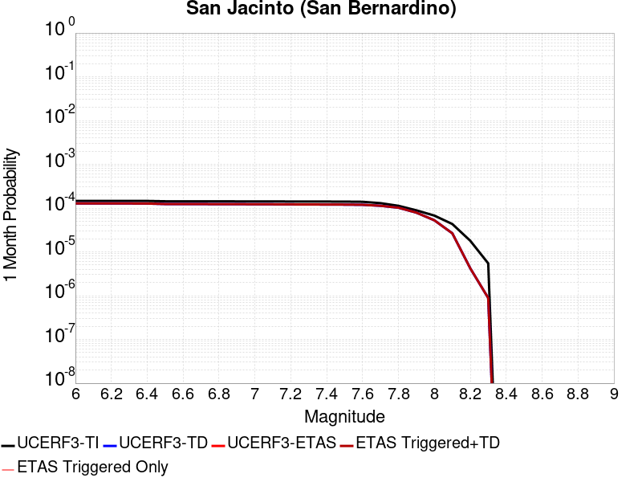 | 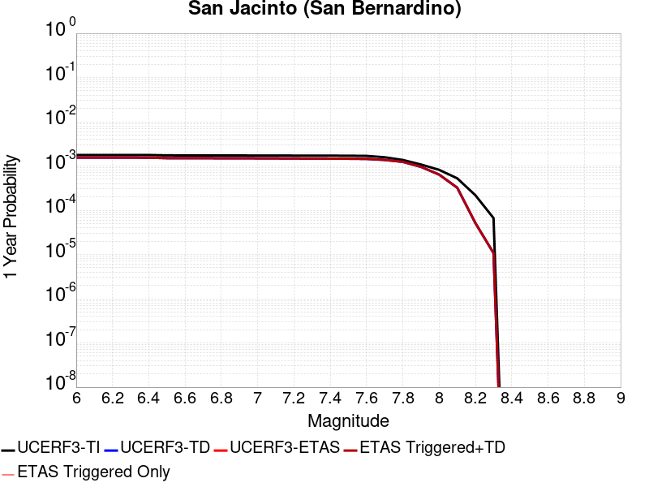 | 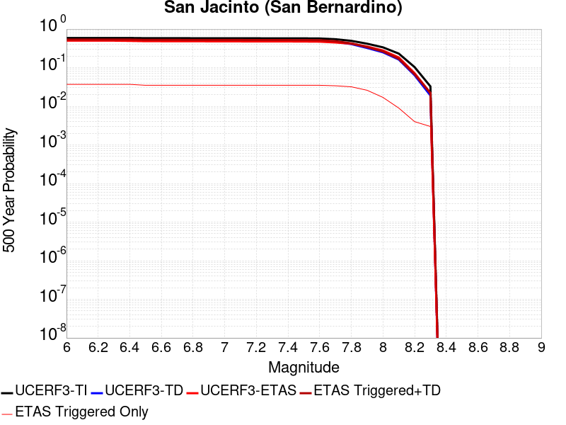 |

| Magnitude | 1 wk TI Prob | 1 wk TD Prob | 1 wk ETAS Prob | 1 wk ETAS/TD Gain | 1 wk ETAS Triggered+TD | 1 wk ETAS Triggered Only | 1 mo TI Prob | 1 mo TD Prob | 1 mo ETAS Prob | 1 mo ETAS/TD Gain | 1 mo ETAS Triggered+TD | 1 mo ETAS Triggered Only | 1 yr TI Prob | 1 yr TD Prob | 1 yr ETAS Prob | 1 yr ETAS/TD Gain | 1 yr ETAS Triggered+TD | 1 yr ETAS Triggered Only | 500 yr TI Prob | 500 yr TD Prob | 500 yr ETAS Prob | 500 yr ETAS/TD Gain | 500 yr ETAS Triggered+TD | 500 yr ETAS Triggered Only |
|-----|-----|-----|-----|-----|-----|-----|-----|-----|-----|-----|-----|-----|-----|-----|-----|-----|-----|-----|-----|-----|-----|-----|-----|-----|
| 6.0 | 3.409352E-5 | 2.977111E-5 | 0.0 | 0.0 | 2.977111E-5 | 0.0 | 1.461069E-4 | 1.2758424E-4 | 0.0 | 0.0 | 1.2758424E-4 | 0.0 | 0.0017774 | 0.0015522325 | 0.0 | 0.0 | 0.0015522325 | 0.0 | 0.58913505 | 0.5175835 | 0.501 | 0.96795976 | 0.53543293 | 0.037 |
| 6.1 | 3.409352E-5 | 2.977111E-5 | 0.0 | 0.0 | 2.977111E-5 | 0.0 | 1.461069E-4 | 1.2758424E-4 | 0.0 | 0.0 | 1.2758424E-4 | 0.0 | 0.0017774 | 0.0015522325 | 0.0 | 0.0 | 0.0015522325 | 0.0 | 0.58913505 | 0.5175835 | 0.501 | 0.96795976 | 0.53543293 | 0.037 |
| 6.2 | 3.409352E-5 | 2.977111E-5 | 0.0 | 0.0 | 2.977111E-5 | 0.0 | 1.461069E-4 | 1.2758424E-4 | 0.0 | 0.0 | 1.2758424E-4 | 0.0 | 0.0017774 | 0.0015522325 | 0.0 | 0.0 | 0.0015522325 | 0.0 | 0.58913505 | 0.5175835 | 0.501 | 0.96795976 | 0.53543293 | 0.037 |
| 6.3 | 3.409352E-5 | 2.977111E-5 | 0.0 | 0.0 | 2.977111E-5 | 0.0 | 1.461069E-4 | 1.2758424E-4 | 0.0 | 0.0 | 1.2758424E-4 | 0.0 | 0.0017774 | 0.0015522325 | 0.0 | 0.0 | 0.0015522325 | 0.0 | 0.58913505 | 0.5175835 | 0.501 | 0.96795976 | 0.53543293 | 0.037 |
| 6.4 | 3.400795E-5 | 2.9665161E-5 | 0.0 | 0.0 | 2.9665161E-5 | 0.0 | 1.4574021E-4 | 1.2713022E-4 | 0.0 | 0.0 | 1.2713022E-4 | 0.0 | 0.0017729428 | 0.0015467128 | 0.0 | 0.0 | 0.0015467128 | 0.0 | 0.5882167 | 0.5164966 | 0.494 | 0.95644385 | 0.5343862 | 0.037 |
| 6.5 | 3.341482E-5 | 2.8935066E-5 | 0.0 | 0.0 | 2.8935066E-5 | 0.0 | 1.4319851E-4 | 1.2400154E-4 | 0.0 | 0.0 | 1.2400154E-4 | 0.0 | 0.0017420477 | 0.0015086741 | 0.0 | 0.0 | 0.0015086741 | 0.0 | 0.5817949 | 0.5087827 | 0.486 | 0.9552212 | 0.5259753 | 0.035 |
| 6.6 | 3.3364955E-5 | 2.8873108E-5 | 0.0 | 0.0 | 2.8873108E-5 | 0.0 | 1.4298483E-4 | 1.2373603E-4 | 0.0 | 0.0 | 1.2373603E-4 | 0.0 | 0.0017394501 | 0.0015054462 | 0.0 | 0.0 | 0.0015054462 | 0.0 | 0.5812505 | 0.5081416 | 0.485 | 0.9544585 | 0.5253566 | 0.035 |
| 6.7 | 3.335922E-5 | 2.8863064E-5 | 0.0 | 0.0 | 2.8863064E-5 | 0.0 | 1.4296026E-4 | 1.2369298E-4 | 0.0 | 0.0 | 1.2369298E-4 | 0.0 | 0.0017391514 | 0.0015049228 | 0.0 | 0.0 | 0.0015049228 | 0.0 | 0.58118784 | 0.50807583 | 0.485 | 0.95458186 | 0.5252932 | 0.035 |
| 6.8 | 3.327683E-5 | 2.8758663E-5 | 0.0 | 0.0 | 2.8758663E-5 | 0.0 | 1.4260718E-4 | 1.232456E-4 | 0.0 | 0.0 | 1.232456E-4 | 0.0 | 0.0017348597 | 0.0014994834 | 0.0 | 0.0 | 0.0014994834 | 0.0 | 0.58028656 | 0.50696546 | 0.484 | 0.9547002 | 0.52422166 | 0.035 |
| 6.9 | 3.3235785E-5 | 2.8700635E-5 | 0.0 | 0.0 | 2.8700635E-5 | 0.0 | 1.4243131E-4 | 1.2299692E-4 | 0.0 | 0.0 | 1.2299692E-4 | 0.0 | 0.0017327217 | 0.0014964599 | 0.0 | 0.0 | 0.0014964599 | 0.0 | 0.5798369 | 0.50643647 | 0.482 | 0.95174825 | 0.5237112 | 0.035 |
| 7.0 | 3.3197095E-5 | 2.8641765E-5 | 0.0 | 0.0 | 2.8641765E-5 | 0.0 | 1.422655E-4 | 1.2274465E-4 | 0.0 | 0.0 | 1.2274465E-4 | 0.0 | 0.0017307063 | 0.0014933927 | 0.0 | 0.0 | 0.0014933927 | 0.0 | 0.5794126 | 0.5059523 | 0.481 | 0.9506825 | 0.52324396 | 0.035 |
| 7.1 | 3.3129716E-5 | 2.8524775E-5 | 0.0 | 0.0 | 2.8524775E-5 | 0.0 | 1.4197677E-4 | 1.2224332E-4 | 0.0 | 0.0 | 1.2224332E-4 | 0.0 | 0.0017271966 | 0.0014872972 | 0.0 | 0.0 | 0.0014872972 | 0.0 | 0.5786725 | 0.5051425 | 0.48 | 0.95022684 | 0.52246255 | 0.035 |
| 7.2 | 3.3034008E-5 | 2.8394306E-5 | 0.0 | 0.0 | 2.8394306E-5 | 0.0 | 1.4156665E-4 | 1.21684214E-4 | 0.0 | 0.0 | 1.21684214E-4 | 0.0 | 0.0017222111 | 0.0014804995 | 0.0 | 0.0 | 0.0014804995 | 0.0 | 0.5776192 | 0.50389475 | 0.479 | 0.9505954 | 0.5212584 | 0.035 |
| 7.3 | 3.2956614E-5 | 2.8266275E-5 | 0.0 | 0.0 | 2.8266275E-5 | 0.0 | 1.4123498E-4 | 1.21135556E-4 | 0.0 | 0.0 | 1.21135556E-4 | 0.0 | 0.0017181796 | 0.0014738287 | 0.0 | 0.0 | 0.0014738287 | 0.0 | 0.5767654 | 0.5028939 | 0.478 | 0.95049864 | 0.52029264 | 0.035 |
| 7.4 | 3.2915937E-5 | 2.8191294E-5 | 0.0 | 0.0 | 2.8191294E-5 | 0.0 | 1.4106068E-4 | 1.2081424E-4 | 0.0 | 0.0 | 1.2081424E-4 | 0.0 | 0.0017160608 | 0.001469922 | 0.0 | 0.0 | 0.001469922 | 0.0 | 0.576316 | 0.502391 | 0.478 | 0.95145017 | 0.5198073 | 0.035 |
| 7.5 | 3.281791E-5 | 2.8062334E-5 | 0.0 | 0.0 | 2.8062334E-5 | 0.0 | 1.406406E-4 | 1.2026161E-4 | 0.0 | 0.0 | 1.2026161E-4 | 0.0 | 0.0017109542 | 0.0014632026 | 0.0 | 0.0 | 0.0014632026 | 0.0 | 0.575231 | 0.50117564 | 0.476 | 0.9497668 | 0.5186345 | 0.035 |
| 7.6 | 3.2521442E-5 | 2.7802545E-5 | 0.0 | 0.0 | 2.7802545E-5 | 0.0 | 1.3937015E-4 | 1.1914833E-4 | 0.0 | 0.0 | 1.1914833E-4 | 0.0 | 0.0016955109 | 0.0014496667 | 0.0 | 0.0 | 0.0014496667 | 0.0 | 0.57193273 | 0.49757996 | 0.472 | 0.94859123 | 0.5151647 | 0.035 |
| 7.7 | 3.0287873E-5 | 2.6385322E-5 | 0.0 | 0.0 | 2.6385322E-5 | 0.0 | 1.297987E-4 | 1.1307505E-4 | 0.0 | 0.0 | 1.1307505E-4 | 0.0 | 0.0015791537 | 0.0013758201 | 0.0 | 0.0 | 0.0013758201 | 0.0 | 0.5462464 | 0.4682261 | 0.449 | 0.9589384 | 0.4863064 | 0.034 |
| 7.8 | 2.6316151E-5 | 2.3853006E-5 | 0.0 | 0.0 | 2.3853006E-5 | 0.0 | 1.1277862E-4 | 1.0222317E-4 | 0.0 | 0.0 | 1.0222317E-4 | 0.0 | 0.0013722149 | 0.0012438571 | 0.0 | 0.0 | 0.0012438571 | 0.0 | 0.4967049 | 0.40833762 | 0.419 | 1.0261117 | 0.4272708 | 0.032 |
| 7.9 | 2.0761147E-5 | 1.8394572E-5 | 0.0 | 0.0 | 1.8394572E-5 | 0.0 | 8.897331E-5 | 7.88315E-5 | 0.0 | 0.0 | 7.88315E-5 | 0.0 | 0.0010827117 | 9.593514E-4 | 0.0 | 0.0 | 9.593514E-4 | 0.0 | 0.418212 | 0.3239382 | 0.353 | 1.089714 | 0.34151578 | 0.026 |
| 8.0 | 1.5738568E-5 | 1.2296911E-5 | 0.0 | 0.0 | 1.2296911E-5 | 0.0 | 6.744926E-5 | 5.2699987E-5 | 0.0 | 0.0 | 5.2699987E-5 | 0.0 | 8.2088535E-4 | 6.414339E-4 | 0.0 | 0.0 | 6.414339E-4 | 0.0 | 0.33675528 | 0.2503839 | 0.279 | 1.1142889 | 0.2631274 | 0.017 |
| 8.1 | 1.0105832E-5 | 6.2033996E-6 | 0.0 | 0.0 | 6.2033996E-6 | 0.0 | 4.3309992E-5 | 2.6585729E-5 | 0.0 | 0.0 | 2.6585729E-5 | 0.0 | 5.2717153E-4 | 3.236335E-4 | 0.0 | 0.0 | 3.236335E-4 | 0.0 | 0.23176168 | 0.16261718 | 0.184 | 1.1314918 | 0.17015362 | 0.009 |
| 8.2 | 4.189207E-6 | 9.84531E-7 | 0.0 | 0.0 | 9.84531E-7 | 0.0 | 1.7953622E-5 | 4.2194115E-6 | 0.0 | 0.0 | 4.2194115E-6 | 0.0 | 2.1856341E-4 | 5.1370134E-5 | 0.0 | 0.0 | 5.1370134E-5 | 0.0 | 0.10353287 | 0.063771434 | 0.072 | 1.1290321 | 0.06751635 | 0.004 |
| 8.3 | 1.2758221E-6 | 2.0638007E-7 | 0.0 | 0.0 | 2.0638007E-7 | 0.0 | 5.4677976E-6 | 8.844857E-7 | 0.0 | 0.0 | 8.844857E-7 | 0.0 | 6.65684E-5 | 1.0768562E-5 | 0.0 | 0.0 | 1.0768562E-5 | 0.0 | 0.03273745 | 0.019037226 | 0.022 | 1.1556306 | 0.021980114 | 0.003 |

## Ortigalita (North)
*[(top)](#table-of-contents)*

| 1 Week | 1 Month | 1 Year | 500 Year |
|-----|-----|-----|-----|
|  | 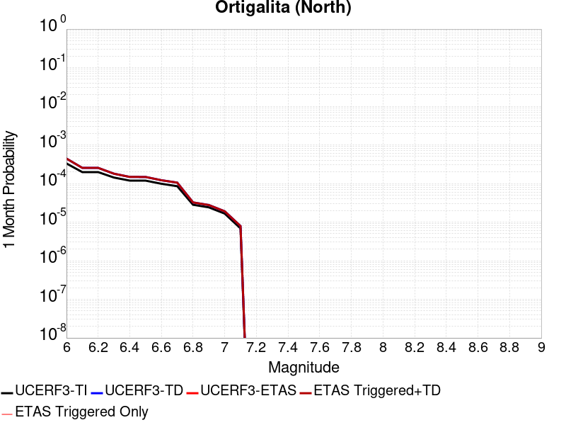 | 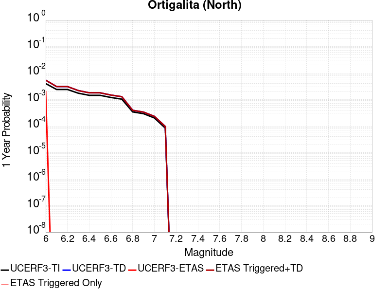 | 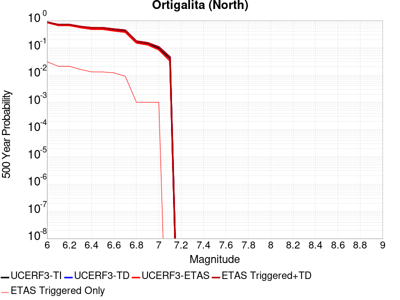 |

| Magnitude | 1 wk TI Prob | 1 wk TD Prob | 1 wk ETAS Prob | 1 wk ETAS/TD Gain | 1 wk ETAS Triggered+TD | 1 wk ETAS Triggered Only | 1 mo TI Prob | 1 mo TD Prob | 1 mo ETAS Prob | 1 mo ETAS/TD Gain | 1 mo ETAS Triggered+TD | 1 mo ETAS Triggered Only | 1 yr TI Prob | 1 yr TD Prob | 1 yr ETAS Prob | 1 yr ETAS/TD Gain | 1 yr ETAS Triggered+TD | 1 yr ETAS Triggered Only | 500 yr TI Prob | 500 yr TD Prob | 500 yr ETAS Prob | 500 yr ETAS/TD Gain | 500 yr ETAS Triggered+TD | 500 yr ETAS Triggered Only |
|-----|-----|-----|-----|-----|-----|-----|-----|-----|-----|-----|-----|-----|-----|-----|-----|-----|-----|-----|-----|-----|-----|-----|-----|-----|
| 6.0 | 7.711876E-5 | 1.0323944E-4 | 0.0 | 0.0 | 1.0323944E-4 | 0.0 | 3.3046713E-4 | 4.4238914E-4 | 0.0 | 0.0 | 4.4238914E-4 | 0.0 | 0.004016016 | 0.005374045 | 0.002 | 0.37215912 | 0.005374045 | 0.0 | 0.86628586 | 0.87054276 | 0.853 | 0.9798485 | 0.87455595 | 0.031 |
| 6.1 | 4.607858E-5 | 5.9311562E-5 | 0.0 | 0.0 | 5.9311562E-5 | 0.0 | 1.9746469E-4 | 2.5416992E-4 | 0.0 | 0.0 | 2.5416992E-4 | 0.0 | 0.0024014818 | 0.003090477 | 0.0 | 0.0 | 0.003090477 | 0.0 | 0.6994632 | 0.7055228 | 0.664 | 0.9411461 | 0.7117068 | 0.021 |
| 6.2 | 4.607858E-5 | 5.9311562E-5 | 0.0 | 0.0 | 5.9311562E-5 | 0.0 | 1.9746469E-4 | 2.5416992E-4 | 0.0 | 0.0 | 2.5416992E-4 | 0.0 | 0.0024014818 | 0.003090477 | 0.0 | 0.0 | 0.003090477 | 0.0 | 0.6994632 | 0.7055228 | 0.664 | 0.9411461 | 0.7117068 | 0.021 |
| 6.3 | 3.327423E-5 | 4.187182E-5 | 0.0 | 0.0 | 4.187182E-5 | 0.0 | 1.4259605E-4 | 1.7943958E-4 | 0.0 | 0.0 | 1.7943958E-4 | 0.0 | 0.0017347244 | 0.0021827444 | 0.0 | 0.0 | 0.0021827444 | 0.0 | 0.58025813 | 0.59795856 | 0.552 | 0.92314094 | 0.6043912 | 0.016 |
| 6.4 | 2.7732503E-5 | 3.4521297E-5 | 0.0 | 0.0 | 3.4521297E-5 | 0.0 | 1.1884817E-4 | 1.4794143E-4 | 0.0 | 0.0 | 1.4794143E-4 | 0.0 | 0.001446016 | 0.0017999335 | 0.0 | 0.0 | 0.0017999335 | 0.0 | 0.51496357 | 0.5390711 | 0.481 | 0.8922757 | 0.54506314 | 0.013 |
| 6.5 | 2.7689714E-5 | 3.4471555E-5 | 0.0 | 0.0 | 3.4471555E-5 | 0.0 | 1.186648E-4 | 1.4772828E-4 | 0.0 | 0.0 | 1.4772828E-4 | 0.0 | 0.0014437864 | 0.0017973428 | 0.0 | 0.0 | 0.0017973428 | 0.0 | 0.51442176 | 0.5385158 | 0.48 | 0.8913387 | 0.54451513 | 0.013 |
| 6.6 | 2.2976905E-5 | 2.8340011E-5 | 0.0 | 0.0 | 2.8340011E-5 | 0.0 | 9.846873E-5 | 1.2145287E-4 | 0.0 | 0.0 | 1.2145287E-4 | 0.0 | 0.0011981975 | 0.0014779203 | 0.0 | 0.0 | 0.0014779203 | 0.0 | 0.45089078 | 0.48135048 | 0.418 | 0.86839014 | 0.48757428 | 0.012 |
| 6.7 | 1.9871539E-5 | 2.4571627E-5 | 0.0 | 0.0 | 2.4571627E-5 | 0.0 | 8.516096E-5 | 1.05304076E-4 | 0.0 | 0.0 | 1.05304076E-4 | 0.0 | 0.0010363415 | 0.0012815597 | 0.0 | 0.0 | 0.0012815597 | 0.0 | 0.40455094 | 0.43782672 | 0.375 | 0.85650325 | 0.44288626 | 0.009 |
| 6.8 | 6.5640475E-6 | 7.543181E-6 | 0.0 | 0.0 | 7.543181E-6 | 0.0 | 2.813133E-5 | 3.232753E-5 | 0.0 | 0.0 | 3.232753E-5 | 0.0 | 3.424451E-4 | 3.9351944E-4 | 0.0 | 0.0 | 3.9351944E-4 | 0.0 | 0.15739068 | 0.17442049 | 0.151 | 0.86572397 | 0.17524606 | 0.001 |
| 6.9 | 5.6219683E-6 | 6.4493115E-6 | 0.0 | 0.0 | 6.4493115E-6 | 0.0 | 2.4093928E-5 | 2.7639628E-5 | 0.0 | 0.0 | 2.7639628E-5 | 0.0 | 2.933041E-4 | 3.3646304E-4 | 0.0 | 0.0 | 3.3646304E-4 | 0.0 | 0.13642415 | 0.15150689 | 0.129 | 0.8514465 | 0.15235537 | 0.001 |
| 7.0 | 3.875591E-6 | 4.4483786E-6 | 0.0 | 0.0 | 4.4483786E-6 | 0.0 | 1.6609569E-5 | 1.9064353E-5 | 0.0 | 0.0 | 1.9064353E-5 | 0.0 | 2.0220275E-4 | 2.3208585E-4 | 0.0 | 0.0 | 2.3208585E-4 | 0.0 | 0.09616783 | 0.107190505 | 0.085 | 0.79298073 | 0.108083315 | 0.001 |
| 7.1 | 1.6017933E-6 | 1.8417686E-6 | 0.0 | 0.0 | 1.8417686E-6 | 0.0 | 6.8648105E-6 | 7.893276E-6 | 0.0 | 0.0 | 7.893276E-6 | 0.0 | 8.357586E-5 | 9.609745E-5 | 0.0 | 0.0 | 9.609745E-5 | 0.0 | 0.040928528 | 0.04581083 | 0.033 | 0.72035366 | 0.04581083 | 0.0 |

## Owens Valley Keough Hot Springs
*[(top)](#table-of-contents)*

| 1 Week | 1 Month | 1 Year | 500 Year |
|-----|-----|-----|-----|
| 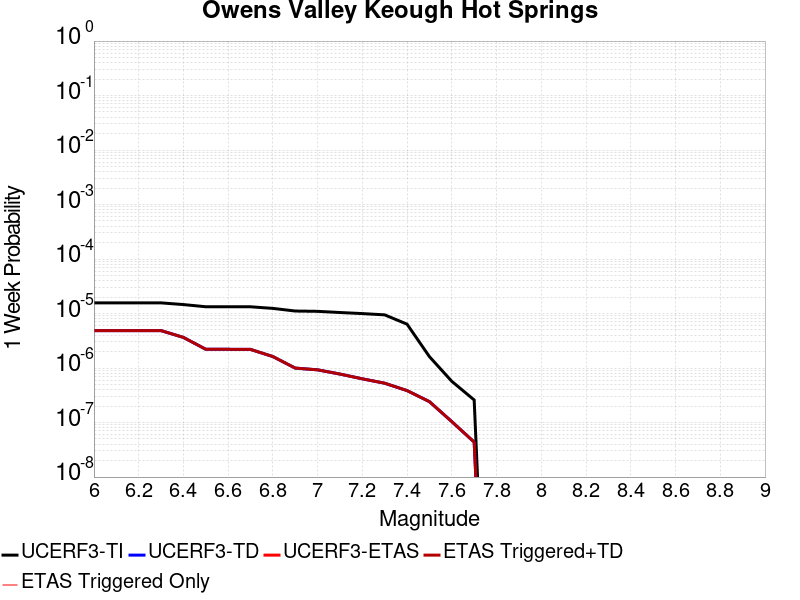 | 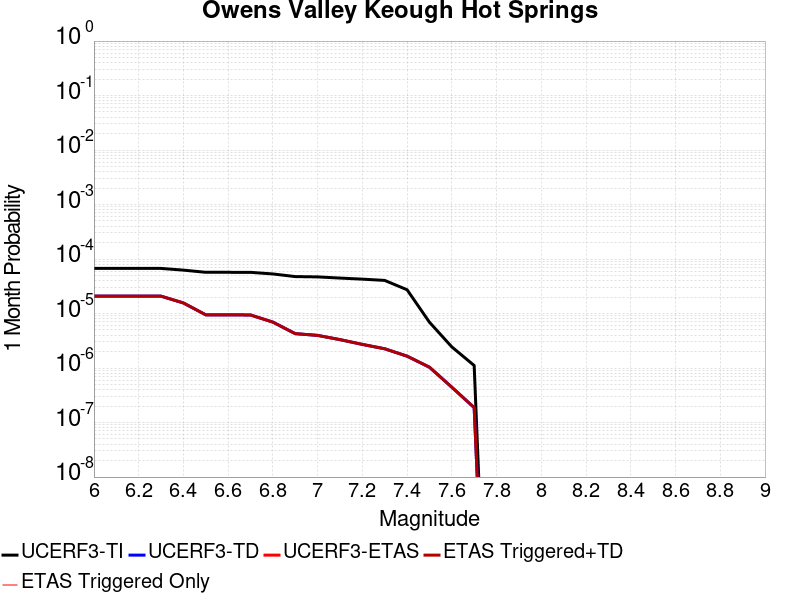 | 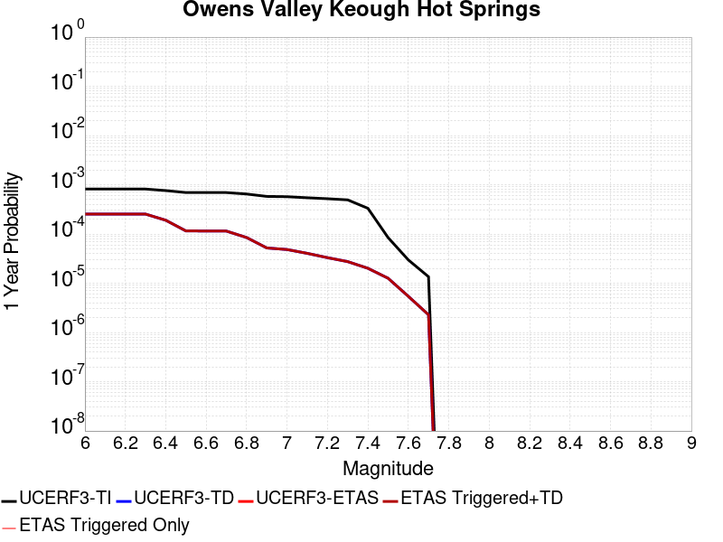 | 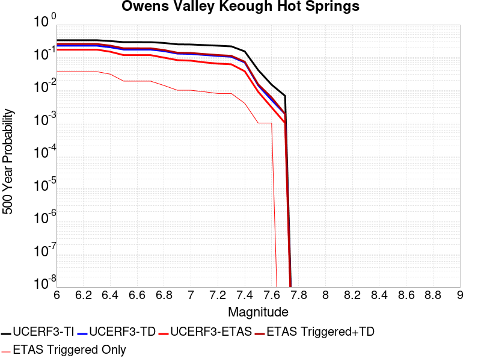 |

| Magnitude | 1 wk TI Prob | 1 wk TD Prob | 1 wk ETAS Prob | 1 wk ETAS/TD Gain | 1 wk ETAS Triggered+TD | 1 wk ETAS Triggered Only | 1 mo TI Prob | 1 mo TD Prob | 1 mo ETAS Prob | 1 mo ETAS/TD Gain | 1 mo ETAS Triggered+TD | 1 mo ETAS Triggered Only | 1 yr TI Prob | 1 yr TD Prob | 1 yr ETAS Prob | 1 yr ETAS/TD Gain | 1 yr ETAS Triggered+TD | 1 yr ETAS Triggered Only | 500 yr TI Prob | 500 yr TD Prob | 500 yr ETAS Prob | 500 yr ETAS/TD Gain | 500 yr ETAS Triggered+TD | 500 yr ETAS Triggered Only |
|-----|-----|-----|-----|-----|-----|-----|-----|-----|-----|-----|-----|-----|-----|-----|-----|-----|-----|-----|-----|-----|-----|-----|-----|-----|
| 6.0 | 1.5708529E-5 | 4.867477E-6 | 0.0 | 0.0 | 4.867477E-6 | 0.0 | 6.7320536E-5 | 2.0860476E-5 | 0.0 | 0.0 | 2.0860476E-5 | 0.0 | 8.193192E-4 | 2.5395173E-4 | 0.0 | 0.0 | 2.5395173E-4 | 0.0 | 0.33623528 | 0.22972773 | 0.174 | 0.75741833 | 0.2582278 | 0.037 |
| 6.1 | 1.5708529E-5 | 4.867477E-6 | 0.0 | 0.0 | 4.867477E-6 | 0.0 | 6.7320536E-5 | 2.0860476E-5 | 0.0 | 0.0 | 2.0860476E-5 | 0.0 | 8.193192E-4 | 2.5395173E-4 | 0.0 | 0.0 | 2.5395173E-4 | 0.0 | 0.33623528 | 0.22972773 | 0.174 | 0.75741833 | 0.2582278 | 0.037 |
| 6.2 | 1.5708529E-5 | 4.867477E-6 | 0.0 | 0.0 | 4.867477E-6 | 0.0 | 6.7320536E-5 | 2.0860476E-5 | 0.0 | 0.0 | 2.0860476E-5 | 0.0 | 8.193192E-4 | 2.5395173E-4 | 0.0 | 0.0 | 2.5395173E-4 | 0.0 | 0.33623528 | 0.22972773 | 0.174 | 0.75741833 | 0.2582278 | 0.037 |
| 6.3 | 1.5708529E-5 | 4.867477E-6 | 0.0 | 0.0 | 4.867477E-6 | 0.0 | 6.7320536E-5 | 2.0860476E-5 | 0.0 | 0.0 | 2.0860476E-5 | 0.0 | 8.193192E-4 | 2.5395173E-4 | 0.0 | 0.0 | 2.5395173E-4 | 0.0 | 0.33623528 | 0.22972773 | 0.174 | 0.75741833 | 0.2582278 | 0.037 |
| 6.4 | 1.4622509E-5 | 3.6513782E-6 | 0.0 | 0.0 | 3.6513782E-6 | 0.0 | 6.266639E-5 | 1.5648688E-5 | 0.0 | 0.0 | 1.5648688E-5 | 0.0 | 7.626962E-4 | 1.9050935E-4 | 0.0 | 0.0 | 1.9050935E-4 | 0.0 | 0.31715924 | 0.2051506 | 0.15 | 0.7311702 | 0.22979093 | 0.031 |
| 6.5 | 1.3335527E-5 | 2.2119796E-6 | 0.0 | 0.0 | 2.2119796E-6 | 0.0 | 5.7151006E-5 | 9.4798825E-6 | 0.0 | 0.0 | 9.4798825E-6 | 0.0 | 6.955913E-4 | 1.154121E-4 | 0.0 | 0.0 | 1.154121E-4 | 0.0 | 0.2938423 | 0.17490585 | 0.118 | 0.67464864 | 0.19058265 | 0.019 |
| 6.6 | 1.3332855E-5 | 2.2091388E-6 | 0.0 | 0.0 | 2.2091388E-6 | 0.0 | 5.7139558E-5 | 9.467707E-6 | 0.0 | 0.0 | 9.467707E-6 | 0.0 | 6.9545204E-4 | 1.1526388E-4 | 0.0 | 0.0 | 1.1526388E-4 | 0.0 | 0.29379308 | 0.17484474 | 0.118 | 0.67488444 | 0.19052269 | 0.019 |
| 6.7 | 1.3318214E-5 | 2.198621E-6 | 0.0 | 0.0 | 2.198621E-6 | 0.0 | 5.707681E-5 | 9.422631E-6 | 0.0 | 0.0 | 9.422631E-6 | 0.0 | 6.946886E-4 | 1.14715134E-4 | 0.0 | 0.0 | 1.14715134E-4 | 0.0 | 0.29352325 | 0.17455068 | 0.118 | 0.6760214 | 0.19023421 | 0.019 |
| 6.8 | 1.2441338E-5 | 1.6258734E-6 | 0.0 | 0.0 | 1.6258734E-6 | 0.0 | 5.331893E-5 | 6.9680123E-6 | 0.0 | 0.0 | 6.9680123E-6 | 0.0 | 6.489646E-4 | 8.483253E-5 | 0.0 | 0.0 | 8.483253E-5 | 0.0 | 0.27717465 | 0.15669642 | 0.099 | 0.6317949 | 0.16850267 | 0.014 |
| 6.9 | 1.1130476E-5 | 9.986201E-7 | 0.0 | 0.0 | 9.986201E-7 | 0.0 | 4.7701167E-5 | 4.2797933E-6 | 0.0 | 0.0 | 4.2797933E-6 | 0.0 | 5.806069E-4 | 5.210525E-5 | 0.0 | 0.0 | 5.210525E-5 | 0.0 | 0.25202653 | 0.13133712 | 0.083 | 0.63196146 | 0.14002375 | 0.01 |
| 7.0 | 1.0986073E-5 | 9.2776656E-7 | 0.0 | 0.0 | 9.2776656E-7 | 0.0 | 4.7082318E-5 | 3.976136E-6 | 0.0 | 0.0 | 3.976136E-6 | 0.0 | 5.730765E-4 | 4.8408394E-5 | 0.0 | 0.0 | 4.8408394E-5 | 0.0 | 0.2492033 | 0.12861276 | 0.08 | 0.6220223 | 0.13732663 | 0.01 |
| 7.1 | 1.0451338E-5 | 7.759487E-7 | 0.0 | 0.0 | 7.759487E-7 | 0.0 | 4.4790682E-5 | 3.32549E-6 | 0.0 | 0.0 | 3.32549E-6 | 0.0 | 5.451901E-4 | 4.0487095E-5 | 0.0 | 0.0 | 4.0487095E-5 | 0.0 | 0.23865554 | 0.119470276 | 0.071 | 0.5942901 | 0.12739505 | 0.009 |
| 7.2 | 9.989061E-6 | 6.3423823E-7 | 0.0 | 0.0 | 6.3423823E-7 | 0.0 | 4.280956E-5 | 2.718161E-6 | 0.0 | 0.0 | 2.718161E-6 | 0.0 | 5.2108173E-4 | 3.309311E-5 | 0.0 | 0.0 | 3.309311E-5 | 0.0 | 0.22941767 | 0.111813106 | 0.065 | 0.5813272 | 0.118918605 | 0.008 |
| 7.3 | 9.465365E-6 | 5.2711044E-7 | 0.0 | 0.0 | 5.2711044E-7 | 0.0 | 4.056522E-5 | 2.2590427E-6 | 0.0 | 0.0 | 2.2590427E-6 | 0.0 | 4.937696E-4 | 2.75035E-5 | 0.0 | 0.0 | 2.75035E-5 | 0.0 | 0.21881695 | 0.10531076 | 0.062 | 0.5887338 | 0.11246827 | 0.008 |
| 7.4 | 6.3824805E-6 | 3.8598458E-7 | 0.0 | 0.0 | 3.8598458E-7 | 0.0 | 2.73532E-5 | 1.6542185E-6 | 0.0 | 0.0 | 1.6542185E-6 | 0.0 | 3.3297433E-4 | 2.0139927E-5 | 0.0 | 0.0 | 2.0139927E-5 | 0.0 | 0.15338978 | 0.07062768 | 0.038 | 0.53803265 | 0.07434517 | 0.004 |
| 7.5 | 1.6192645E-6 | 2.420464E-7 | 0.0 | 0.0 | 2.420464E-7 | 0.0 | 6.9396865E-6 | 1.0373413E-6 | 0.0 | 0.0 | 1.0373413E-6 | 0.0 | 8.448741E-5 | 1.2629559E-5 | 0.0 | 0.0 | 1.2629559E-5 | 0.0 | 0.041365582 | 0.0141608175 | 0.009 | 0.6355565 | 0.015146657 | 0.001 |
| 7.6 | 5.7062545E-7 | 1.0394878E-7 | 0.0 | 0.0 | 1.0394878E-7 | 0.0 | 2.4455355E-6 | 4.454947E-7 | 0.0 | 0.0 | 4.454947E-7 | 0.0 | 2.9773988E-5 | 5.423885E-6 | 0.0 | 0.0 | 5.423885E-6 | 0.0 | 0.014776949 | 0.005018044 | 0.003 | 0.5978426 | 0.0060130255 | 0.001 |
| 7.7 | 2.5988817E-7 | 4.3844825E-8 | 0.0 | 0.0 | 4.3844825E-8 | 0.0 | 1.113806E-6 | 1.8790638E-7 | 0.0 | 0.0 | 1.8790638E-7 | 0.0 | 1.3560503E-5 | 2.2877582E-6 | 0.0 | 0.0 | 2.2877582E-6 | 0.0 | 0.0067573637 | 0.0018966277 | 0.001 | 0.5272516 | 0.0018966277 | 0.0 |

## Rose Canyon
*[(top)](#table-of-contents)*

| 1 Week | 1 Month | 1 Year | 500 Year |
|-----|-----|-----|-----|
| 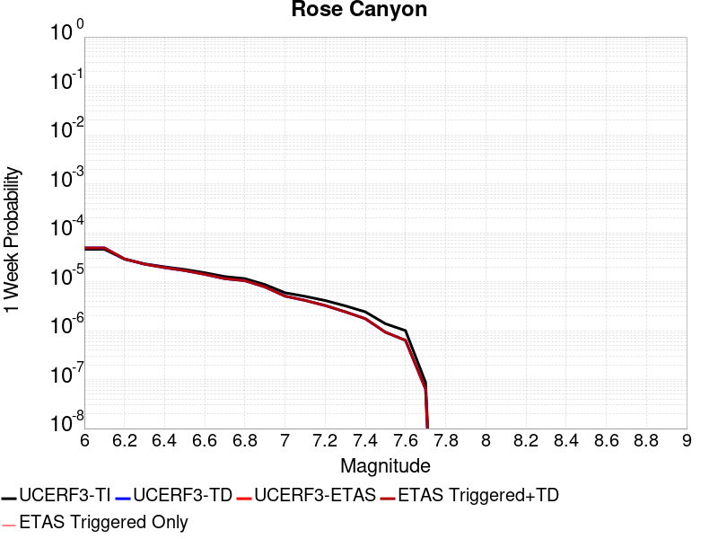 | 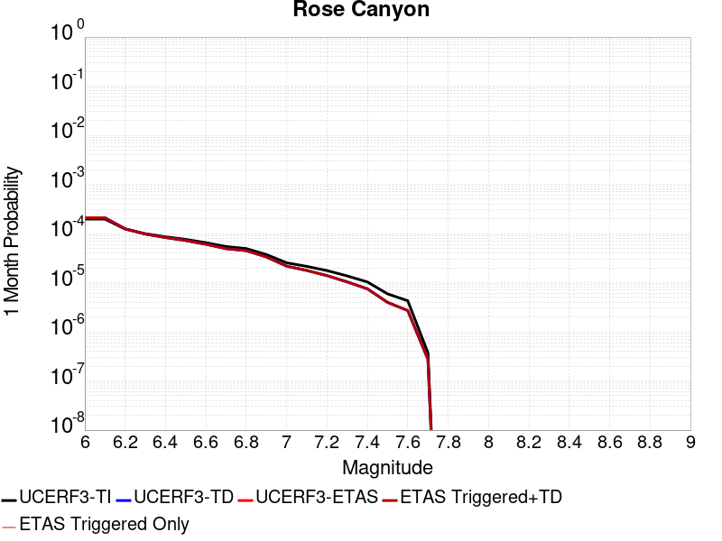 | 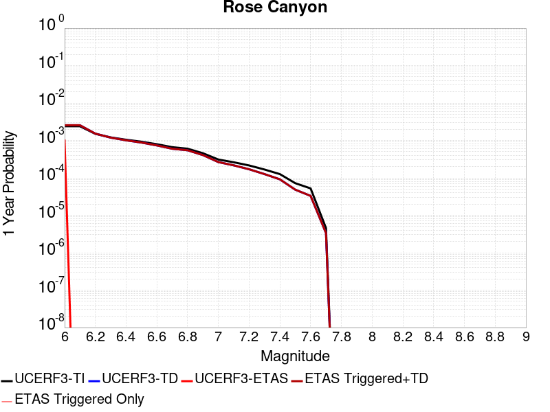 | 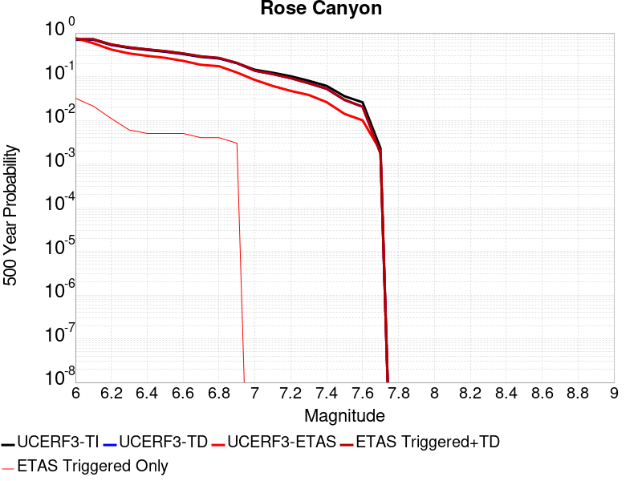 |

| Magnitude | 1 wk TI Prob | 1 wk TD Prob | 1 wk ETAS Prob | 1 wk ETAS/TD Gain | 1 wk ETAS Triggered+TD | 1 wk ETAS Triggered Only | 1 mo TI Prob | 1 mo TD Prob | 1 mo ETAS Prob | 1 mo ETAS/TD Gain | 1 mo ETAS Triggered+TD | 1 mo ETAS Triggered Only | 1 yr TI Prob | 1 yr TD Prob | 1 yr ETAS Prob | 1 yr ETAS/TD Gain | 1 yr ETAS Triggered+TD | 1 yr ETAS Triggered Only | 500 yr TI Prob | 500 yr TD Prob | 500 yr ETAS Prob | 500 yr ETAS/TD Gain | 500 yr ETAS Triggered+TD | 500 yr ETAS Triggered Only |
|-----|-----|-----|-----|-----|-----|-----|-----|-----|-----|-----|-----|-----|-----|-----|-----|-----|-----|-----|-----|-----|-----|-----|-----|-----|
| 6.0 | 4.5923203E-5 | 4.8908998E-5 | 0.0 | 0.0 | 4.8908998E-5 | 0.0 | 1.9679888E-4 | 2.0959416E-4 | 0.0 | 0.0 | 2.0959416E-4 | 0.0 | 0.0023933933 | 0.0025490208 | 0.001 | 0.39230752 | 0.0025490208 | 0.0 | 0.69824237 | 0.7121889 | 0.761 | 1.0685368 | 0.7213989 | 0.032 |
| 6.1 | 4.5923203E-5 | 4.8908998E-5 | 0.0 | 0.0 | 4.8908998E-5 | 0.0 | 1.9679888E-4 | 2.0959416E-4 | 0.0 | 0.0 | 2.0959416E-4 | 0.0 | 0.0023933933 | 0.0025490208 | 0.0 | 0.0 | 0.0025490208 | 0.0 | 0.69824237 | 0.7121889 | 0.58 | 0.81439066 | 0.7182329 | 0.021 |
| 6.2 | 2.8844734E-5 | 2.9208839E-5 | 0.0 | 0.0 | 2.9208839E-5 | 0.0 | 1.2361443E-4 | 1.2517485E-4 | 0.0 | 0.0 | 1.2517485E-4 | 0.0 | 0.0015039665 | 0.0015229675 | 0.0 | 0.0 | 0.0015229675 | 0.0 | 0.52883613 | 0.5392715 | 0.416 | 0.77141106 | 0.54433954 | 0.011 |
| 6.3 | 2.3171577E-5 | 2.2811126E-5 | 0.0 | 0.0 | 2.2811126E-5 | 0.0 | 9.9302975E-5 | 9.775838E-5 | 0.0 | 0.0 | 9.775838E-5 | 0.0 | 0.0012083431 | 0.0011895712 | 0.0 | 0.0 | 0.0011895712 | 0.0 | 0.45367262 | 0.46412626 | 0.339 | 0.7304047 | 0.4673415 | 0.006 |
| 6.4 | 2.0066604E-5 | 1.9375088E-5 | 0.0 | 0.0 | 1.9375088E-5 | 0.0 | 8.599689E-5 | 8.3033505E-5 | 0.0 | 0.0 | 8.3033505E-5 | 0.0 | 0.0010465092 | 0.0010104737 | 0.0 | 0.0 | 0.0010104737 | 0.0 | 0.40757358 | 0.41799518 | 0.299 | 0.7153192 | 0.42090523 | 0.005 |
| 6.5 | 1.776989E-5 | 1.6865353E-5 | 0.0 | 0.0 | 1.6865353E-5 | 0.0 | 7.615444E-5 | 7.2278126E-5 | 0.0 | 0.0 | 7.2278126E-5 | 0.0 | 9.267859E-4 | 8.796376E-4 | 0.0 | 0.0 | 8.796376E-4 | 0.0 | 0.37098983 | 0.38047934 | 0.269 | 0.70700294 | 0.38357693 | 0.005 |
| 6.6 | 1.5227364E-5 | 1.4139338E-5 | 0.0 | 0.0 | 1.4139338E-5 | 0.0 | 6.52585E-5 | 6.0595783E-5 | 0.0 | 0.0 | 6.0595783E-5 | 0.0 | 7.942326E-4 | 7.3750893E-4 | 0.0 | 0.0 | 7.3750893E-4 | 0.0 | 0.32785022 | 0.33595946 | 0.229 | 0.68162984 | 0.33927968 | 0.005 |
| 6.7 | 1.2703898E-5 | 1.1524116E-5 | 0.0 | 0.0 | 1.1524116E-5 | 0.0 | 5.4444143E-5 | 4.9388156E-5 | 0.0 | 0.0 | 4.9388156E-5 | 0.0 | 6.626558E-4 | 6.0113904E-4 | 0.0 | 0.0 | 6.0113904E-4 | 0.0 | 0.28210914 | 0.28830624 | 0.186 | 0.6451474 | 0.291153 | 0.004 |
| 6.8 | 1.1554917E-5 | 1.0481753E-5 | 0.0 | 0.0 | 1.0481753E-5 | 0.0 | 4.9520135E-5 | 4.492105E-5 | 0.0 | 0.0 | 4.492105E-5 | 0.0 | 6.0274085E-4 | 5.467804E-4 | 0.0 | 0.0 | 5.467804E-4 | 0.0 | 0.26026353 | 0.26478356 | 0.173 | 0.6533638 | 0.26772442 | 0.004 |
| 6.9 | 8.732078E-6 | 7.800366E-6 | 0.0 | 0.0 | 7.800366E-6 | 0.0 | 3.7422655E-5 | 3.342973E-5 | 0.0 | 0.0 | 3.342973E-5 | 0.0 | 4.5552556E-4 | 4.0693377E-4 | 0.0 | 0.0 | 4.0693377E-4 | 0.0 | 0.20372818 | 0.20311283 | 0.124 | 0.61049813 | 0.2055035 | 0.003 |
| 7.0 | 5.9337494E-6 | 5.0695835E-6 | 0.0 | 0.0 | 5.0695835E-6 | 0.0 | 2.5430107E-5 | 2.1726606E-5 | 0.0 | 0.0 | 2.1726606E-5 | 0.0 | 3.0956755E-4 | 2.6448944E-4 | 0.0 | 0.0 | 2.6448944E-4 | 0.0 | 0.14342014 | 0.13641623 | 0.084 | 0.61576253 | 0.13641623 | 0.0 |
| 7.1 | 5.013409E-6 | 4.1462367E-6 | 0.0 | 0.0 | 4.1462367E-6 | 0.0 | 2.1485863E-5 | 1.7769466E-5 | 0.0 | 0.0 | 1.7769466E-5 | 0.0 | 2.6155898E-4 | 2.1632187E-4 | 0.0 | 0.0 | 2.1632187E-4 | 0.0 | 0.122603774 | 0.11401754 | 0.061 | 0.5350054 | 0.11401754 | 0.0 |
| 7.2 | 4.120763E-6 | 3.2570892E-6 | 0.0 | 0.0 | 3.2570892E-6 | 0.0 | 1.7660293E-5 | 1.395888E-5 | 0.0 | 0.0 | 1.395888E-5 | 0.0 | 2.1499286E-4 | 1.699362E-4 | 0.0 | 0.0 | 1.699362E-4 | 0.0 | 0.10193065 | 0.092128 | 0.047 | 0.5101598 | 0.092128 | 0.0 |
| 7.3 | 3.2081239E-6 | 2.4215606E-6 | 0.0 | 0.0 | 2.4215606E-6 | 0.0 | 1.374903E-5 | 1.0378076E-5 | 0.0 | 0.0 | 1.0378076E-5 | 0.0 | 1.6738157E-4 | 1.2634581E-4 | 0.0 | 0.0 | 1.2634581E-4 | 0.0 | 0.08029085 | 0.070533544 | 0.038 | 0.53875077 | 0.070533544 | 0.0 |
| 7.4 | 2.4194755E-6 | 1.7538094E-6 | 0.0 | 0.0 | 1.7538094E-6 | 0.0 | 1.0369139E-5 | 7.516305E-6 | 0.0 | 0.0 | 7.516305E-6 | 0.0 | 1.2623696E-4 | 9.150722E-5 | 0.0 | 0.0 | 9.150722E-5 | 0.0 | 0.061171506 | 0.052624725 | 0.026 | 0.49406433 | 0.052624725 | 0.0 |
| 7.5 | 1.3842889E-6 | 9.2859125E-7 | 0.0 | 0.0 | 9.2859125E-7 | 0.0 | 5.9326535E-6 | 3.979671E-6 | 0.0 | 0.0 | 3.979671E-6 | 0.0 | 7.222766E-5 | 4.845145E-5 | 0.0 | 0.0 | 4.845145E-5 | 0.0 | 0.035470765 | 0.029208833 | 0.014 | 0.47930706 | 0.029208833 | 0.0 |
| 7.6 | 1.0021575E-6 | 6.3394026E-7 | 0.0 | 0.0 | 6.3394026E-7 | 0.0 | 4.2949537E-6 | 2.7168842E-6 | 0.0 | 0.0 | 2.7168842E-6 | 0.0 | 5.2289808E-5 | 3.3077584E-5 | 0.0 | 0.0 | 3.3077584E-5 | 0.0 | 0.025806751 | 0.020500377 | 0.01 | 0.48779592 | 0.020500377 | 0.0 |
| 7.7 | 8.7620116E-8 | 6.432155E-8 | 0.0 | 0.0 | 6.432155E-8 | 0.0 | 3.7551473E-7 | 2.7566375E-7 | 0.0 | 0.0 | 2.7566375E-7 | 0.0 | 4.5718825E-6 | 3.3562014E-6 | 0.0 | 0.0 | 3.3562014E-6 | 0.0 | 0.0022833357 | 0.0017452682 | 0.002 | 1.1459557 | 0.0017452682 | 0.0 |

## Santa Susana East (connector)
*[(top)](#table-of-contents)*

| 1 Week | 1 Month | 1 Year | 500 Year |
|-----|-----|-----|-----|
|  | 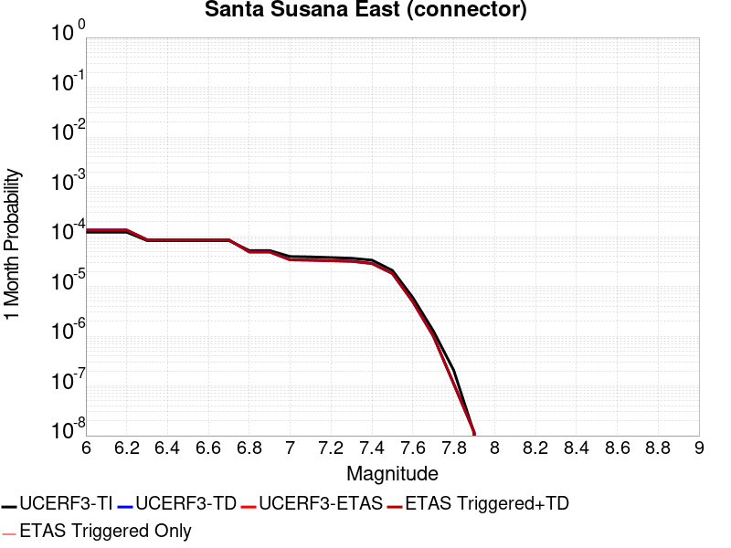 | 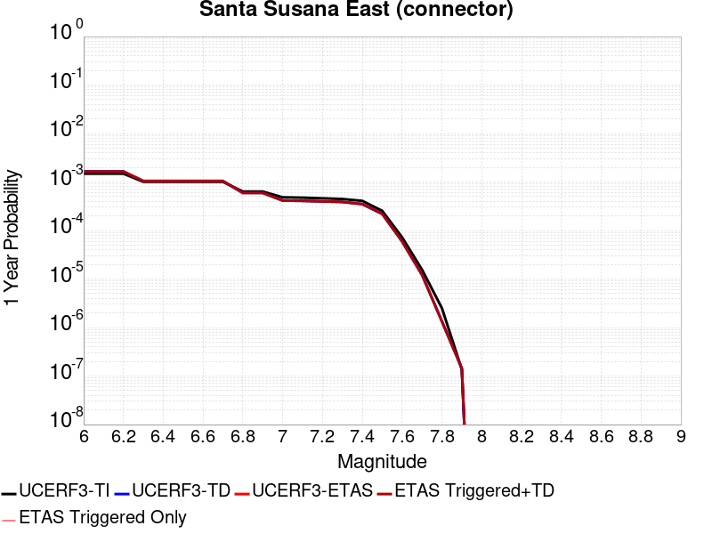 | 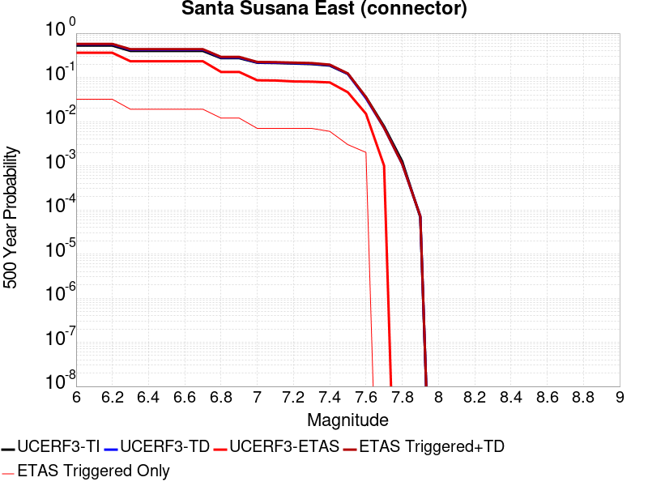 |

| Magnitude | 1 wk TI Prob | 1 wk TD Prob | 1 wk ETAS Prob | 1 wk ETAS/TD Gain | 1 wk ETAS Triggered+TD | 1 wk ETAS Triggered Only | 1 mo TI Prob | 1 mo TD Prob | 1 mo ETAS Prob | 1 mo ETAS/TD Gain | 1 mo ETAS Triggered+TD | 1 mo ETAS Triggered Only | 1 yr TI Prob | 1 yr TD Prob | 1 yr ETAS Prob | 1 yr ETAS/TD Gain | 1 yr ETAS Triggered+TD | 1 yr ETAS Triggered Only | 500 yr TI Prob | 500 yr TD Prob | 500 yr ETAS Prob | 500 yr ETAS/TD Gain | 500 yr ETAS Triggered+TD | 500 yr ETAS Triggered Only |
|-----|-----|-----|-----|-----|-----|-----|-----|-----|-----|-----|-----|-----|-----|-----|-----|-----|-----|-----|-----|-----|-----|-----|-----|-----|
| 6.0 | 2.858397E-5 | 3.1612788E-5 | 0.0 | 0.0 | 3.1612788E-5 | 0.0 | 1.2249697E-4 | 1.354779E-4 | 0.0 | 0.0 | 1.354779E-4 | 0.0 | 0.0014903803 | 0.0016484605 | 0.0 | 0.0 | 0.0016484605 | 0.0 | 0.52561975 | 0.55952877 | 0.361 | 0.64518577 | 0.57362384 | 0.032 |
| 6.1 | 2.858397E-5 | 3.1612788E-5 | 0.0 | 0.0 | 3.1612788E-5 | 0.0 | 1.2249697E-4 | 1.354779E-4 | 0.0 | 0.0 | 1.354779E-4 | 0.0 | 0.0014903803 | 0.0016484605 | 0.0 | 0.0 | 0.0016484605 | 0.0 | 0.52561975 | 0.55952877 | 0.361 | 0.64518577 | 0.57362384 | 0.032 |
| 6.2 | 2.858397E-5 | 3.1612788E-5 | 0.0 | 0.0 | 3.1612788E-5 | 0.0 | 1.2249697E-4 | 1.354779E-4 | 0.0 | 0.0 | 1.354779E-4 | 0.0 | 0.0014903803 | 0.0016484605 | 0.0 | 0.0 | 0.0016484605 | 0.0 | 0.52561975 | 0.55952877 | 0.361 | 0.64518577 | 0.57362384 | 0.032 |
| 6.3 | 1.943582E-5 | 2.011954E-5 | 0.0 | 0.0 | 2.011954E-5 | 0.0 | 8.329371E-5 | 8.622437E-5 | 0.0 | 0.0 | 8.622437E-5 | 0.0 | 0.001013629 | 0.0010493854 | 0.0 | 0.0 | 0.0010493854 | 0.0 | 0.39774334 | 0.4238115 | 0.232 | 0.5474132 | 0.43475908 | 0.019 |
| 6.4 | 1.943582E-5 | 2.011954E-5 | 0.0 | 0.0 | 2.011954E-5 | 0.0 | 8.329371E-5 | 8.622437E-5 | 0.0 | 0.0 | 8.622437E-5 | 0.0 | 0.001013629 | 0.0010493854 | 0.0 | 0.0 | 0.0010493854 | 0.0 | 0.39774334 | 0.4238115 | 0.232 | 0.5474132 | 0.43475908 | 0.019 |
| 6.5 | 1.943582E-5 | 2.011954E-5 | 0.0 | 0.0 | 2.011954E-5 | 0.0 | 8.329371E-5 | 8.622437E-5 | 0.0 | 0.0 | 8.622437E-5 | 0.0 | 0.001013629 | 0.0010493854 | 0.0 | 0.0 | 0.0010493854 | 0.0 | 0.39774334 | 0.4238115 | 0.232 | 0.5474132 | 0.43475908 | 0.019 |
| 6.6 | 1.943582E-5 | 2.011954E-5 | 0.0 | 0.0 | 2.011954E-5 | 0.0 | 8.329371E-5 | 8.622437E-5 | 0.0 | 0.0 | 8.622437E-5 | 0.0 | 0.001013629 | 0.0010493854 | 0.0 | 0.0 | 0.0010493854 | 0.0 | 0.39774334 | 0.4238115 | 0.232 | 0.5474132 | 0.43475908 | 0.019 |
| 6.7 | 1.9404439E-5 | 2.0107265E-5 | 0.0 | 0.0 | 2.0107265E-5 | 0.0 | 8.3159226E-5 | 8.617176E-5 | 0.0 | 0.0 | 8.617176E-5 | 0.0 | 0.0010119933 | 0.0010487456 | 0.0 | 0.0 | 0.0010487456 | 0.0 | 0.39725006 | 0.42347506 | 0.232 | 0.5478481 | 0.43442902 | 0.019 |
| 6.8 | 1.2217526E-5 | 1.1458978E-5 | 0.0 | 0.0 | 1.1458978E-5 | 0.0 | 5.2359774E-5 | 4.9109076E-5 | 0.0 | 0.0 | 4.9109076E-5 | 0.0 | 6.372938E-4 | 5.977554E-4 | 0.0 | 0.0 | 5.977554E-4 | 0.0 | 0.2729416 | 0.28292367 | 0.133 | 0.47009146 | 0.29152858 | 0.012 |
| 6.9 | 1.2217526E-5 | 1.1458978E-5 | 0.0 | 0.0 | 1.1458978E-5 | 0.0 | 5.2359774E-5 | 4.9109076E-5 | 0.0 | 0.0 | 4.9109076E-5 | 0.0 | 6.372938E-4 | 5.977554E-4 | 0.0 | 0.0 | 5.977554E-4 | 0.0 | 0.2729416 | 0.28292367 | 0.133 | 0.47009146 | 0.29152858 | 0.012 |
| 7.0 | 9.276017E-6 | 7.963705E-6 | 0.0 | 0.0 | 7.963705E-6 | 0.0 | 3.9753755E-5 | 3.412974E-5 | 0.0 | 0.0 | 3.412974E-5 | 0.0 | 4.8389446E-4 | 4.154537E-4 | 0.0 | 0.0 | 4.154537E-4 | 0.0 | 0.21494837 | 0.21850628 | 0.086 | 0.3935814 | 0.22397673 | 0.007 |
| 7.1 | 9.130355E-6 | 7.848228E-6 | 0.0 | 0.0 | 7.848228E-6 | 0.0 | 3.9129503E-5 | 3.363485E-5 | 0.0 | 0.0 | 3.363485E-5 | 0.0 | 4.7629757E-4 | 4.094307E-4 | 0.0 | 0.0 | 4.094307E-4 | 0.0 | 0.21195927 | 0.21571612 | 0.085 | 0.39403638 | 0.22120611 | 0.007 |
| 7.2 | 8.851015E-6 | 7.64988E-6 | 0.0 | 0.0 | 7.64988E-6 | 0.0 | 3.7932372E-5 | 3.2784807E-5 | 0.0 | 0.0 | 3.2784807E-5 | 0.0 | 4.6172875E-4 | 3.9908526E-4 | 0.0 | 0.0 | 3.9908526E-4 | 0.0 | 0.20619519 | 0.21046071 | 0.081 | 0.38486993 | 0.21598749 | 0.007 |
| 7.3 | 8.573006E-6 | 7.460556E-6 | 0.0 | 0.0 | 7.460556E-6 | 0.0 | 3.6740938E-5 | 3.197344E-5 | 0.0 | 0.0 | 3.197344E-5 | 0.0 | 4.472291E-4 | 3.892104E-4 | 0.0 | 0.0 | 3.892104E-4 | 0.0 | 0.2004167 | 0.20550182 | 0.08 | 0.38929096 | 0.21106331 | 0.007 |
| 7.4 | 7.852282E-6 | 6.7348324E-6 | 0.0 | 0.0 | 6.7348324E-6 | 0.0 | 3.36522E-5 | 2.8863265E-5 | 0.0 | 0.0 | 2.8863265E-5 | 0.0 | 4.096385E-4 | 3.5135655E-4 | 0.0 | 0.0 | 3.5135655E-4 | 0.0 | 0.18523961 | 0.18953803 | 0.077 | 0.40625092 | 0.1944008 | 0.006 |
| 7.5 | 4.8869324E-6 | 4.234792E-6 | 0.0 | 0.0 | 4.234792E-6 | 0.0 | 2.0943828E-5 | 1.814899E-5 | 0.0 | 0.0 | 1.814899E-5 | 0.0 | 2.5496128E-4 | 2.2094318E-4 | 0.0 | 0.0 | 2.2094318E-4 | 0.0 | 0.119703844 | 0.12034929 | 0.046 | 0.38222077 | 0.12298824 | 0.003 |
| 7.6 | 1.3894544E-6 | 1.1449929E-6 | 0.0 | 0.0 | 1.1449929E-6 | 0.0 | 5.954791E-6 | 4.9071045E-6 | 0.0 | 0.0 | 4.9071045E-6 | 0.0 | 7.249717E-5 | 5.974258E-5 | 0.0 | 0.0 | 5.974258E-5 | 0.0 | 0.035600737 | 0.033676587 | 0.015 | 0.4454133 | 0.035609234 | 0.002 |
| 7.7 | 2.9924632E-7 | 2.3502967E-7 | 0.0 | 0.0 | 2.3502967E-7 | 0.0 | 1.2824837E-6 | 1.0072697E-6 | 0.0 | 0.0 | 1.0072697E-6 | 0.0 | 1.5614127E-5 | 1.22634465E-5 | 0.0 | 0.0 | 1.22634465E-5 | 0.0 | 0.007776728 | 0.0072232326 | 0.001 | 0.13844217 | 0.0072232326 | 0.0 |
| 7.8 | 4.8188564E-8 | 2.572975E-8 | 0.0 | 0.0 | 2.572975E-8 | 0.0 | 2.065224E-7 | 1.10270356E-7 | 0.0 | 0.0 | 1.10270356E-7 | 0.0 | 2.5144072E-6 | 1.3425408E-6 | 0.0 | 0.0 | 1.3425408E-6 | 0.0 | 0.0012564153 | 0.0010961535 | 0.0 | 0.0 | 0.0010961535 | 0.0 |
| 7.9 | 2.6127251E-9 | 2.7595808E-9 | 0.0 | 0.0 | 2.7595808E-9 | 0.0 | 1.1197393E-8 | 1.1826774E-8 | 0.0 | 0.0 | 1.1826774E-8 | 0.0 | 1.3632825E-7 | 1.4399097E-7 | 0.0 | 0.0 | 1.4399097E-7 | 0.0 | 6.816181E-5 | 7.199549E-5 | 0.0 | 0.0 | 7.199549E-5 | 0.0 |

## San Diego Trough south
*[(top)](#table-of-contents)*

| 1 Week | 1 Month | 1 Year | 500 Year |
|-----|-----|-----|-----|
|  |  | 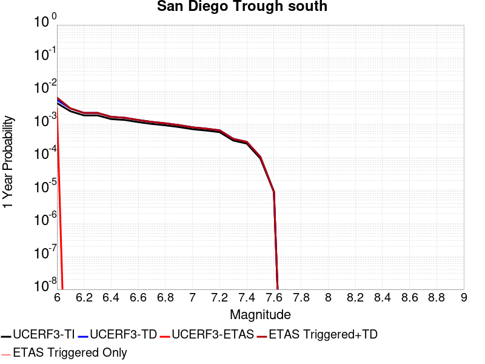 |  |

| Magnitude | 1 wk TI Prob | 1 wk TD Prob | 1 wk ETAS Prob | 1 wk ETAS/TD Gain | 1 wk ETAS Triggered+TD | 1 wk ETAS Triggered Only | 1 mo TI Prob | 1 mo TD Prob | 1 mo ETAS Prob | 1 mo ETAS/TD Gain | 1 mo ETAS Triggered+TD | 1 mo ETAS Triggered Only | 1 yr TI Prob | 1 yr TD Prob | 1 yr ETAS Prob | 1 yr ETAS/TD Gain | 1 yr ETAS Triggered+TD | 1 yr ETAS Triggered Only | 500 yr TI Prob | 500 yr TD Prob | 500 yr ETAS Prob | 500 yr ETAS/TD Gain | 500 yr ETAS Triggered+TD | 500 yr ETAS Triggered Only |
|-----|-----|-----|-----|-----|-----|-----|-----|-----|-----|-----|-----|-----|-----|-----|-----|-----|-----|-----|-----|-----|-----|-----|-----|-----|
| 6.0 | 8.279495E-5 | 1.0290252E-4 | 0.0 | 0.0 | 1.0290252E-4 | 0.0 | 3.5478722E-4 | 4.4094108E-4 | 0.0 | 0.0 | 4.4094108E-4 | 0.0 | 0.004310982 | 0.0053558084 | 0.003 | 0.56013954 | 0.0063504525 | 0.001 | 0.88469225 | 0.8964298 | 0.785 | 0.875696 | 0.8994333 | 0.029 |
| 6.1 | 4.6961468E-5 | 5.70534E-5 | 0.0 | 0.0 | 5.70534E-5 | 0.0 | 2.0124791E-4 | 2.4449258E-4 | 0.0 | 0.0 | 2.4449258E-4 | 0.0 | 0.00244744 | 0.0029727172 | 0.0 | 0.0 | 0.0029727172 | 0.0 | 0.7063069 | 0.7249833 | 0.544 | 0.75036216 | 0.72800845 | 0.011 |
| 6.2 | 3.5079658E-5 | 4.1703894E-5 | 0.0 | 0.0 | 4.1703894E-5 | 0.0 | 1.5033272E-4 | 1.7871898E-4 | 0.0 | 0.0 | 1.7871898E-4 | 0.0 | 0.0018287642 | 0.002173756 | 0.0 | 0.0 | 0.002173756 | 0.0 | 0.59957117 | 0.6263351 | 0.415 | 0.6625846 | 0.6296981 | 0.009 |
| 6.3 | 3.5079658E-5 | 4.1703894E-5 | 0.0 | 0.0 | 4.1703894E-5 | 0.0 | 1.5033272E-4 | 1.7871898E-4 | 0.0 | 0.0 | 1.7871898E-4 | 0.0 | 0.0018287642 | 0.002173756 | 0.0 | 0.0 | 0.002173756 | 0.0 | 0.59957117 | 0.6263351 | 0.415 | 0.6625846 | 0.6296981 | 0.009 |
| 6.4 | 2.7196904E-5 | 3.178789E-5 | 0.0 | 0.0 | 3.178789E-5 | 0.0 | 1.16552954E-4 | 1.362268E-4 | 0.0 | 0.0 | 1.362268E-4 | 0.0 | 0.0014181085 | 0.0016573122 | 0.0 | 0.0 | 0.0016573122 | 0.0 | 0.5081382 | 0.54139596 | 0.343 | 0.63354737 | 0.54323035 | 0.004 |
| 6.5 | 2.5584688E-5 | 2.982595E-5 | 0.0 | 0.0 | 2.982595E-5 | 0.0 | 1.0964406E-4 | 1.2781931E-4 | 0.0 | 0.0 | 1.2781931E-4 | 0.0 | 0.0013340989 | 0.001555102 | 0.0 | 0.0 | 0.001555102 | 0.0 | 0.4870079 | 0.5211582 | 0.329 | 0.63128626 | 0.52307355 | 0.004 |
| 6.6 | 2.2034688E-5 | 2.5518038E-5 | 0.0 | 0.0 | 2.5518038E-5 | 0.0 | 9.443096E-5 | 1.0935848E-4 | 0.0 | 0.0 | 1.0935848E-4 | 0.0 | 0.0011490905 | 0.0013306339 | 0.0 | 0.0 | 0.0013306339 | 0.0 | 0.43722513 | 0.47280002 | 0.291 | 0.6154822 | 0.47438163 | 0.003 |
| 6.7 | 1.9394853E-5 | 2.2352126E-5 | 0.0 | 0.0 | 2.2352126E-5 | 0.0 | 8.311815E-5 | 9.5791336E-5 | 0.0 | 0.0 | 9.5791336E-5 | 0.0 | 0.0010114936 | 0.0011656408 | 0.0 | 0.0 | 0.0011656408 | 0.0 | 0.3970993 | 0.4332785 | 0.26 | 0.6000759 | 0.43384522 | 0.001 |
| 6.8 | 1.7615313E-5 | 2.0235877E-5 | 0.0 | 0.0 | 2.0235877E-5 | 0.0 | 7.549201E-5 | 8.672233E-5 | 0.0 | 0.0 | 8.672233E-5 | 0.0 | 9.1872766E-4 | 0.0010553371 | 0.0 | 0.0 | 0.0010553371 | 0.0 | 0.368448 | 0.40357497 | 0.234 | 0.5798179 | 0.4041714 | 0.001 |
| 6.9 | 1.5621423E-5 | 1.7882425E-5 | 0.0 | 0.0 | 1.7882425E-5 | 0.0 | 6.6947236E-5 | 7.663673E-5 | 0.0 | 0.0 | 7.663673E-5 | 0.0 | 8.147778E-4 | 9.326563E-4 | 0.0 | 0.0 | 9.326563E-4 | 0.0 | 0.3347251 | 0.36824232 | 0.207 | 0.56212986 | 0.36887407 | 0.001 |
| 7.0 | 1.3444376E-5 | 1.5328922E-5 | 0.0 | 0.0 | 1.5328922E-5 | 0.0 | 5.7617483E-5 | 6.569374E-5 | 0.0 | 0.0 | 6.569374E-5 | 0.0 | 7.0126704E-4 | 7.995305E-4 | 0.0 | 0.0 | 7.995305E-4 | 0.0 | 0.29584482 | 0.32708007 | 0.172 | 0.52586514 | 0.327753 | 0.001 |
| 7.1 | 1.2268361E-5 | 1.3965875E-5 | 0.0 | 0.0 | 1.3965875E-5 | 0.0 | 5.2577634E-5 | 5.985239E-5 | 0.0 | 0.0 | 5.985239E-5 | 0.0 | 6.399447E-4 | 7.2846183E-4 | 0.0 | 0.0 | 7.2846183E-4 | 0.0 | 0.27390525 | 0.3036598 | 0.153 | 0.5038533 | 0.30435616 | 0.001 |
| 7.2 | 1.0922655E-5 | 1.2419192E-5 | 0.0 | 0.0 | 1.2419192E-5 | 0.0 | 4.681054E-5 | 5.3224037E-5 | 0.0 | 0.0 | 5.3224037E-5 | 0.0 | 5.697693E-4 | 6.478125E-4 | 0.0 | 0.0 | 6.478125E-4 | 0.0 | 0.24796005 | 0.2758192 | 0.138 | 0.5003277 | 0.2765434 | 0.001 |
| 7.3 | 6.1106753E-6 | 6.880812E-6 | 0.0 | 0.0 | 6.880812E-6 | 0.0 | 2.6188345E-5 | 2.9488863E-5 | 0.0 | 0.0 | 2.9488863E-5 | 0.0 | 3.1879646E-4 | 3.5896816E-4 | 0.0 | 0.0 | 3.5896816E-4 | 0.0 | 0.14736493 | 0.16393133 | 0.071 | 0.4331082 | 0.1647674 | 0.001 |
| 7.4 | 4.933187E-6 | 5.5509554E-6 | 0.0 | 0.0 | 5.5509554E-6 | 0.0 | 2.114206E-5 | 2.3789595E-5 | 0.0 | 0.0 | 2.3789595E-5 | 0.0 | 2.5737417E-4 | 2.896002E-4 | 0.0 | 0.0 | 2.896002E-4 | 0.0 | 0.12076551 | 0.13450982 | 0.054 | 0.4014577 | 0.13450982 | 0.0 |
| 7.5 | 1.7489613E-6 | 1.956684E-6 | 0.0 | 0.0 | 1.956684E-6 | 0.0 | 7.495527E-6 | 8.385762E-6 | 0.0 | 0.0 | 8.385762E-6 | 0.0 | 9.125422E-5 | 1.020921E-4 | 0.0 | 0.0 | 1.020921E-4 | 0.0 | 0.044603836 | 0.04964654 | 0.015 | 0.30213585 | 0.04964654 | 0.0 |
| 7.6 | 1.6988751E-7 | 1.7504632E-7 | 0.0 | 0.0 | 1.7504632E-7 | 0.0 | 7.2808916E-7 | 7.5019835E-7 | 0.0 | 0.0 | 7.5019835E-7 | 0.0 | 8.864449E-6 | 9.133629E-6 | 0.0 | 0.0 | 9.133629E-6 | 0.0 | 0.0044224365 | 0.0045569655 | 0.001 | 0.21944429 | 0.0045569655 | 0.0 |

## San Jacinto (Stepovers Combined)
*[(top)](#table-of-contents)*

| 1 Week | 1 Month | 1 Year | 500 Year |
|-----|-----|-----|-----|
|  | 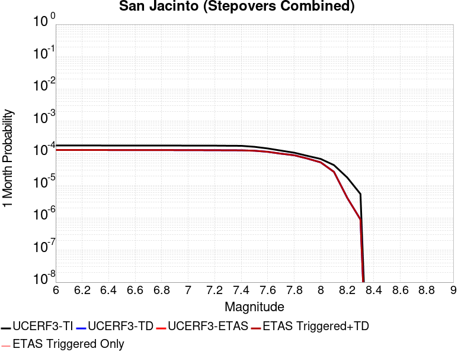 | 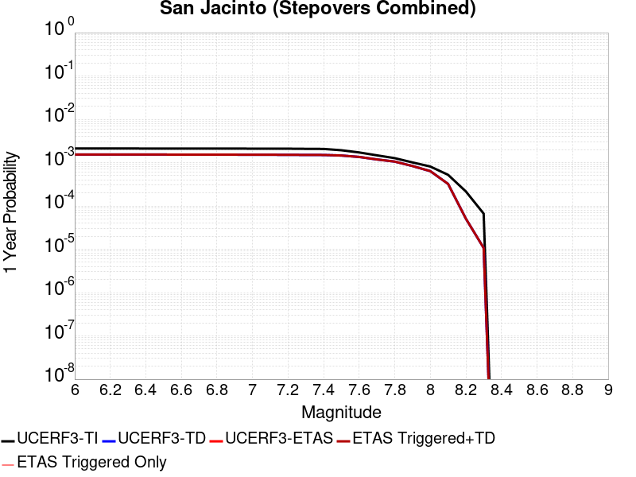 | 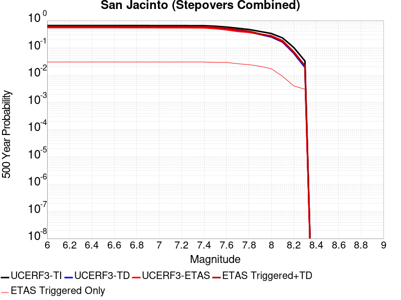 |

| Magnitude | 1 wk TI Prob | 1 wk TD Prob | 1 wk ETAS Prob | 1 wk ETAS/TD Gain | 1 wk ETAS Triggered+TD | 1 wk ETAS Triggered Only | 1 mo TI Prob | 1 mo TD Prob | 1 mo ETAS Prob | 1 mo ETAS/TD Gain | 1 mo ETAS Triggered+TD | 1 mo ETAS Triggered Only | 1 yr TI Prob | 1 yr TD Prob | 1 yr ETAS Prob | 1 yr ETAS/TD Gain | 1 yr ETAS Triggered+TD | 1 yr ETAS Triggered Only | 500 yr TI Prob | 500 yr TD Prob | 500 yr ETAS Prob | 500 yr ETAS/TD Gain | 500 yr ETAS Triggered+TD | 500 yr ETAS Triggered Only |
|-----|-----|-----|-----|-----|-----|-----|-----|-----|-----|-----|-----|-----|-----|-----|-----|-----|-----|-----|-----|-----|-----|-----|-----|-----|
| 6.0 | 4.0667746E-5 | 2.9553868E-5 | 0.0 | 0.0 | 2.9553868E-5 | 0.0 | 1.742787E-4 | 1.266533E-4 | 0.0 | 0.0 | 1.266533E-4 | 0.0 | 0.0021197782 | 0.0015409142 | 0.0 | 0.0 | 0.0015409142 | 0.0 | 0.6538953 | 0.5945123 | 0.555 | 0.9335384 | 0.6066769 | 0.03 |
| 6.1 | 4.0667746E-5 | 2.9553868E-5 | 0.0 | 0.0 | 2.9553868E-5 | 0.0 | 1.742787E-4 | 1.266533E-4 | 0.0 | 0.0 | 1.266533E-4 | 0.0 | 0.0021197782 | 0.0015409142 | 0.0 | 0.0 | 0.0015409142 | 0.0 | 0.6538953 | 0.5945123 | 0.555 | 0.9335384 | 0.6066769 | 0.03 |
| 6.2 | 4.0667746E-5 | 2.9553868E-5 | 0.0 | 0.0 | 2.9553868E-5 | 0.0 | 1.742787E-4 | 1.266533E-4 | 0.0 | 0.0 | 1.266533E-4 | 0.0 | 0.0021197782 | 0.0015409142 | 0.0 | 0.0 | 0.0015409142 | 0.0 | 0.6538953 | 0.5945123 | 0.555 | 0.9335384 | 0.6066769 | 0.03 |
| 6.3 | 4.0667746E-5 | 2.9553868E-5 | 0.0 | 0.0 | 2.9553868E-5 | 0.0 | 1.742787E-4 | 1.266533E-4 | 0.0 | 0.0 | 1.266533E-4 | 0.0 | 0.0021197782 | 0.0015409142 | 0.0 | 0.0 | 0.0015409142 | 0.0 | 0.6538953 | 0.5945123 | 0.555 | 0.9335384 | 0.6066769 | 0.03 |
| 6.4 | 4.0577226E-5 | 2.942822E-5 | 0.0 | 0.0 | 2.942822E-5 | 0.0 | 1.738908E-4 | 1.2611486E-4 | 0.0 | 0.0 | 1.2611486E-4 | 0.0 | 0.0021150648 | 0.001534369 | 0.0 | 0.0 | 0.001534369 | 0.0 | 0.65307695 | 0.59370756 | 0.555 | 0.9348036 | 0.60589635 | 0.03 |
| 6.5 | 4.0577226E-5 | 2.942822E-5 | 0.0 | 0.0 | 2.942822E-5 | 0.0 | 1.738908E-4 | 1.2611486E-4 | 0.0 | 0.0 | 1.2611486E-4 | 0.0 | 0.0021150648 | 0.001534369 | 0.0 | 0.0 | 0.001534369 | 0.0 | 0.65307695 | 0.59370756 | 0.555 | 0.9348036 | 0.60589635 | 0.03 |
| 6.6 | 4.053861E-5 | 2.9374605E-5 | 0.0 | 0.0 | 2.9374605E-5 | 0.0 | 1.7372532E-4 | 1.258851E-4 | 0.0 | 0.0 | 1.258851E-4 | 0.0 | 0.0021130538 | 0.0015315759 | 0.0 | 0.0 | 0.0015315759 | 0.0 | 0.65272725 | 0.593364 | 0.554 | 0.9336596 | 0.60556304 | 0.03 |
| 6.7 | 4.0516545E-5 | 2.9344255E-5 | 0.0 | 0.0 | 2.9344255E-5 | 0.0 | 1.7363077E-4 | 1.2575505E-4 | 0.0 | 0.0 | 1.2575505E-4 | 0.0 | 0.002111905 | 0.0015299949 | 0.0 | 0.0 | 0.0015299949 | 0.0 | 0.6525273 | 0.5931643 | 0.553 | 0.93228805 | 0.6053694 | 0.03 |
| 6.8 | 4.049434E-5 | 2.9316458E-5 | 0.0 | 0.0 | 2.9316458E-5 | 0.0 | 1.7353562E-4 | 1.2563592E-4 | 0.0 | 0.0 | 1.2563592E-4 | 0.0 | 0.0021107488 | 0.0015285467 | 0.0 | 0.0 | 0.0015285467 | 0.0 | 0.6523259 | 0.59295523 | 0.553 | 0.9326168 | 0.6051666 | 0.03 |
| 6.9 | 4.046386E-5 | 2.9279952E-5 | 0.0 | 0.0 | 2.9279952E-5 | 0.0 | 1.73405E-4 | 1.2547949E-4 | 0.0 | 0.0 | 1.2547949E-4 | 0.0 | 0.0021091616 | 0.0015266447 | 0.0 | 0.0 | 0.0015266447 | 0.0 | 0.6520493 | 0.5926725 | 0.552 | 0.93137443 | 0.6048923 | 0.03 |
| 7.0 | 4.036382E-5 | 2.9163852E-5 | 0.0 | 0.0 | 2.9163852E-5 | 0.0 | 1.7297632E-4 | 1.2498196E-4 | 0.0 | 0.0 | 1.2498196E-4 | 0.0 | 0.0021039525 | 0.0015205959 | 0.0 | 0.0 | 0.0015205959 | 0.0 | 0.65114 | 0.5917442 | 0.55 | 0.9294557 | 0.60399187 | 0.03 |
| 7.1 | 4.0343282E-5 | 2.9143164E-5 | 0.0 | 0.0 | 2.9143164E-5 | 0.0 | 1.7288832E-4 | 1.2489331E-4 | 0.0 | 0.0 | 1.2489331E-4 | 0.0 | 0.002102883 | 0.0015195181 | 0.0 | 0.0 | 0.0015195181 | 0.0 | 0.650953 | 0.5915596 | 0.55 | 0.9297458 | 0.60381275 | 0.03 |
| 7.2 | 4.0257353E-5 | 2.9051193E-5 | 0.0 | 0.0 | 2.9051193E-5 | 0.0 | 1.725201E-4 | 1.2449919E-4 | 0.0 | 0.0 | 1.2449919E-4 | 0.0 | 0.0020984085 | 0.0015147263 | 0.0 | 0.0 | 0.0015147263 | 0.0 | 0.65016955 | 0.59075963 | 0.549 | 0.929312 | 0.6030368 | 0.03 |
| 7.3 | 3.9940667E-5 | 2.8893972E-5 | 0.0 | 0.0 | 2.8893972E-5 | 0.0 | 1.7116306E-4 | 1.2382545E-4 | 0.0 | 0.0 | 1.2382545E-4 | 0.0 | 0.0020819185 | 0.0015065349 | 0.0 | 0.0 | 0.0015065349 | 0.0 | 0.64726716 | 0.5878957 | 0.545 | 0.9270352 | 0.6002588 | 0.03 |
| 7.4 | 3.9721202E-5 | 2.8790895E-5 | 0.0 | 0.0 | 2.8790895E-5 | 0.0 | 1.7022261E-4 | 1.2338374E-4 | 0.0 | 0.0 | 1.2338374E-4 | 0.0 | 0.0020704903 | 0.0015011644 | 0.0 | 0.0 | 0.0015011644 | 0.0 | 0.6452416 | 0.5858834 | 0.541 | 0.92339194 | 0.5983069 | 0.03 |
| 7.5 | 3.7036873E-5 | 2.797098E-5 | 0.0 | 0.0 | 2.797098E-5 | 0.0 | 1.5871979E-4 | 1.19870136E-4 | 0.0 | 0.0 | 1.19870136E-4 | 0.0 | 0.0019307006 | 0.0014584442 | 0.0 | 0.0 | 0.0014584442 | 0.0 | 0.61950547 | 0.558549 | 0.508 | 0.90949947 | 0.57135105 | 0.029 |
| 7.6 | 3.2940967E-5 | 2.5928102E-5 | 0.0 | 0.0 | 2.5928102E-5 | 0.0 | 1.4116794E-4 | 1.1111572E-4 | 0.0 | 0.0 | 1.1111572E-4 | 0.0 | 0.0017173645 | 0.0013519961 | 0.0 | 0.0 | 0.0013519961 | 0.0 | 0.5765926 | 0.5119609 | 0.46 | 0.89850605 | 0.5261141 | 0.029 |
| 7.7 | 2.8236149E-5 | 2.2692726E-5 | 0.0 | 0.0 | 2.2692726E-5 | 0.0 | 1.2100645E-4 | 9.7250915E-5 | 0.0 | 0.0 | 9.7250915E-5 | 0.0 | 0.0014722579 | 0.0011833875 | 0.0 | 0.0 | 0.0011833875 | 0.0 | 0.5212953 | 0.44981018 | 0.401 | 0.8914872 | 0.4641151 | 0.026 |
| 7.8 | 2.4329287E-5 | 2.0257037E-5 | 0.0 | 0.0 | 2.0257037E-5 | 0.0 | 1.042642E-4 | 8.681299E-5 | 0.0 | 0.0 | 8.681299E-5 | 0.0 | 0.0012686774 | 0.0010564362 | 0.0 | 0.0 | 0.0010564362 | 0.0 | 0.46992746 | 0.3885887 | 0.37 | 0.9521635 | 0.4032626 | 0.024 |
| 7.9 | 1.9370926E-5 | 1.5996322E-5 | 0.0 | 0.0 | 1.5996322E-5 | 0.0 | 8.301561E-5 | 6.855386E-5 | 0.0 | 0.0 | 6.855386E-5 | 0.0 | 0.0010102465 | 8.3432416E-4 | 0.0 | 0.0 | 8.3432416E-4 | 0.0 | 0.39672282 | 0.30783606 | 0.316 | 1.0265205 | 0.32237148 | 0.021 |
| 8.0 | 1.5583017E-5 | 1.219499E-5 | 0.0 | 0.0 | 1.219499E-5 | 0.0 | 6.6782646E-5 | 5.2263196E-5 | 0.0 | 0.0 | 5.2263196E-5 | 0.0 | 8.127754E-4 | 6.3611905E-4 | 0.0 | 0.0 | 6.3611905E-4 | 0.0 | 0.33405817 | 0.24864915 | 0.276 | 1.1099977 | 0.26142213 | 0.017 |
| 8.1 | 1.0024873E-5 | 6.181253E-6 | 0.0 | 0.0 | 6.181253E-6 | 0.0 | 4.2963035E-5 | 2.6490816E-5 | 0.0 | 0.0 | 2.6490816E-5 | 0.0 | 5.229494E-4 | 3.2247827E-4 | 0.0 | 0.0 | 3.2247827E-4 | 0.0 | 0.23013729 | 0.16170883 | 0.183 | 1.1316636 | 0.16925345 | 0.009 |
| 8.2 | 4.142796E-6 | 9.746826E-7 | 0.0 | 0.0 | 9.746826E-7 | 0.0 | 1.775472E-5 | 4.177204E-6 | 0.0 | 0.0 | 4.177204E-6 | 0.0 | 2.1614227E-4 | 5.0856288E-5 | 0.0 | 0.0 | 5.0856288E-5 | 0.0 | 0.10244674 | 0.06318105 | 0.072 | 1.1395822 | 0.06692833 | 0.004 |
| 8.3 | 1.2750878E-6 | 2.0619757E-7 | 0.0 | 0.0 | 2.0619757E-7 | 0.0 | 5.4646503E-6 | 8.8370354E-7 | 0.0 | 0.0 | 8.8370354E-7 | 0.0 | 6.653009E-5 | 1.0759039E-5 | 0.0 | 0.0 | 1.0759039E-5 | 0.0 | 0.032718915 | 0.019025307 | 0.022 | 1.1563545 | 0.02196823 | 0.003 |

## San Jacinto (San Jacinto Valley) rev
*[(top)](#table-of-contents)*

| 1 Week | 1 Month | 1 Year | 500 Year |
|-----|-----|-----|-----|
| 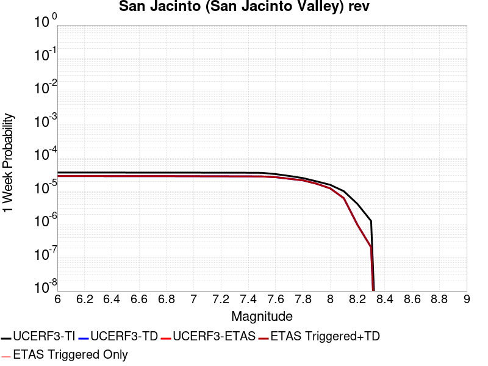 |  | 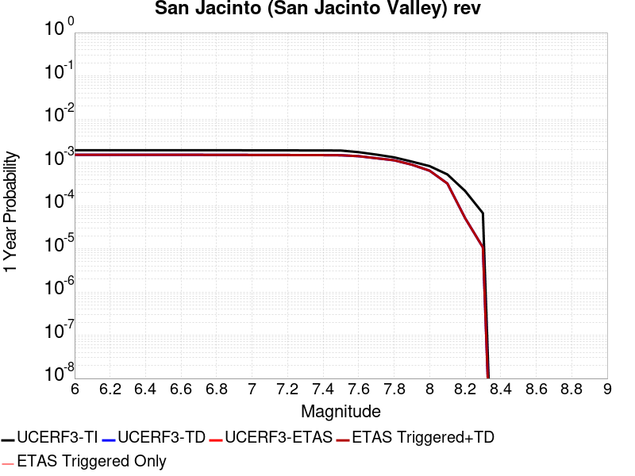 | 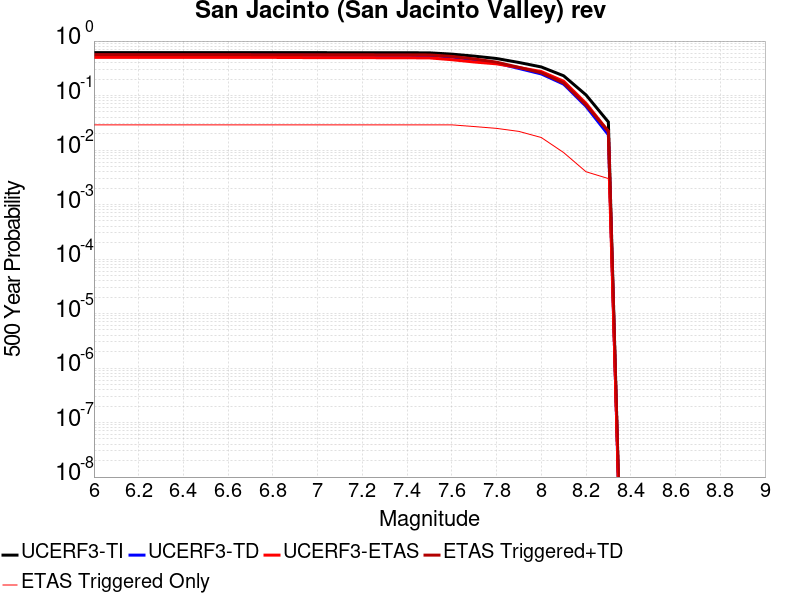 |

| Magnitude | 1 wk TI Prob | 1 wk TD Prob | 1 wk ETAS Prob | 1 wk ETAS/TD Gain | 1 wk ETAS Triggered+TD | 1 wk ETAS Triggered Only | 1 mo TI Prob | 1 mo TD Prob | 1 mo ETAS Prob | 1 mo ETAS/TD Gain | 1 mo ETAS Triggered+TD | 1 mo ETAS Triggered Only | 1 yr TI Prob | 1 yr TD Prob | 1 yr ETAS Prob | 1 yr ETAS/TD Gain | 1 yr ETAS Triggered+TD | 1 yr ETAS Triggered Only | 500 yr TI Prob | 500 yr TD Prob | 500 yr ETAS Prob | 500 yr ETAS/TD Gain | 500 yr ETAS Triggered+TD | 500 yr ETAS Triggered Only |
|-----|-----|-----|-----|-----|-----|-----|-----|-----|-----|-----|-----|-----|-----|-----|-----|-----|-----|-----|-----|-----|-----|-----|-----|-----|
| 6.0 | 3.652694E-5 | 2.8634779E-5 | 0.0 | 0.0 | 2.8634779E-5 | 0.0 | 1.5653463E-4 | 1.2271471E-4 | 0.0 | 0.0 | 1.2271471E-4 | 0.0 | 0.0019041431 | 0.0014930293 | 0.0 | 0.0 | 0.0014930293 | 0.0 | 0.61440945 | 0.5502674 | 0.502 | 0.9122837 | 0.56330967 | 0.029 |
| 6.1 | 3.652694E-5 | 2.8634779E-5 | 0.0 | 0.0 | 2.8634779E-5 | 0.0 | 1.5653463E-4 | 1.2271471E-4 | 0.0 | 0.0 | 1.2271471E-4 | 0.0 | 0.0019041431 | 0.0014930293 | 0.0 | 0.0 | 0.0014930293 | 0.0 | 0.61440945 | 0.5502674 | 0.502 | 0.9122837 | 0.56330967 | 0.029 |
| 6.2 | 3.652694E-5 | 2.8634779E-5 | 0.0 | 0.0 | 2.8634779E-5 | 0.0 | 1.5653463E-4 | 1.2271471E-4 | 0.0 | 0.0 | 1.2271471E-4 | 0.0 | 0.0019041431 | 0.0014930293 | 0.0 | 0.0 | 0.0014930293 | 0.0 | 0.61440945 | 0.5502674 | 0.502 | 0.9122837 | 0.56330967 | 0.029 |
| 6.3 | 3.652694E-5 | 2.8634779E-5 | 0.0 | 0.0 | 2.8634779E-5 | 0.0 | 1.5653463E-4 | 1.2271471E-4 | 0.0 | 0.0 | 1.2271471E-4 | 0.0 | 0.0019041431 | 0.0014930293 | 0.0 | 0.0 | 0.0014930293 | 0.0 | 0.61440945 | 0.5502674 | 0.502 | 0.9122837 | 0.56330967 | 0.029 |
| 6.4 | 3.646941E-5 | 2.8557723E-5 | 0.0 | 0.0 | 2.8557723E-5 | 0.0 | 1.5628811E-4 | 1.223845E-4 | 0.0 | 0.0 | 1.223845E-4 | 0.0 | 0.0019011468 | 0.0014890147 | 0.0 | 0.0 | 0.0014890147 | 0.0 | 0.6138302 | 0.5496646 | 0.502 | 0.9132841 | 0.56272435 | 0.029 |
| 6.5 | 3.646941E-5 | 2.8557723E-5 | 0.0 | 0.0 | 2.8557723E-5 | 0.0 | 1.5628811E-4 | 1.223845E-4 | 0.0 | 0.0 | 1.223845E-4 | 0.0 | 0.0019011468 | 0.0014890147 | 0.0 | 0.0 | 0.0014890147 | 0.0 | 0.6138302 | 0.5496646 | 0.502 | 0.9132841 | 0.56272435 | 0.029 |
| 6.6 | 3.6442503E-5 | 2.8521745E-5 | 0.0 | 0.0 | 2.8521745E-5 | 0.0 | 1.561728E-4 | 1.2223033E-4 | 0.0 | 0.0 | 1.2223033E-4 | 0.0 | 0.0018997455 | 0.0014871403 | 0.0 | 0.0 | 0.0014871403 | 0.0 | 0.61355907 | 0.5493817 | 0.502 | 0.9137545 | 0.56244963 | 0.029 |
| 6.7 | 3.6432113E-5 | 2.8507584E-5 | 0.0 | 0.0 | 2.8507584E-5 | 0.0 | 1.5612828E-4 | 1.2216964E-4 | 0.0 | 0.0 | 1.2216964E-4 | 0.0 | 0.0018992044 | 0.0014864026 | 0.0 | 0.0 | 0.0014864026 | 0.0 | 0.6134543 | 0.5492759 | 0.502 | 0.9139306 | 0.5623469 | 0.029 |
| 6.8 | 3.6409598E-5 | 2.8477225E-5 | 0.0 | 0.0 | 2.8477225E-5 | 0.0 | 1.560318E-4 | 1.2203955E-4 | 0.0 | 0.0 | 1.2203955E-4 | 0.0 | 0.0018980318 | 0.0014848209 | 0.0 | 0.0 | 0.0014848209 | 0.0 | 0.6132271 | 0.5490278 | 0.501 | 0.9125221 | 0.562106 | 0.029 |
| 6.9 | 3.638078E-5 | 2.8438395E-5 | 0.0 | 0.0 | 2.8438395E-5 | 0.0 | 1.5590832E-4 | 1.21873156E-4 | 0.0 | 0.0 | 1.21873156E-4 | 0.0 | 0.0018965311 | 0.0014827978 | 0.0 | 0.0 | 0.0014827978 | 0.0 | 0.61293626 | 0.54870975 | 0.499 | 0.90940607 | 0.5617972 | 0.029 |
| 7.0 | 3.6294874E-5 | 2.8322645E-5 | 0.0 | 0.0 | 2.8322645E-5 | 0.0 | 1.5554018E-4 | 1.21377125E-4 | 0.0 | 0.0 | 1.21377125E-4 | 0.0 | 0.0018920569 | 0.0014767669 | 0.0 | 0.0 | 0.0014767669 | 0.0 | 0.61206776 | 0.5477608 | 0.496 | 0.9055048 | 0.5608757 | 0.029 |
| 7.1 | 3.6260717E-5 | 2.8279665E-5 | 0.0 | 0.0 | 2.8279665E-5 | 0.0 | 1.5539382E-4 | 1.2119294E-4 | 0.0 | 0.0 | 1.2119294E-4 | 0.0 | 0.001890278 | 0.0014745275 | 0.0 | 0.0 | 0.0014745275 | 0.0 | 0.6117219 | 0.5473567 | 0.496 | 0.90617317 | 0.5604834 | 0.029 |
| 7.2 | 3.6210204E-5 | 2.821516E-5 | 0.0 | 0.0 | 2.821516E-5 | 0.0 | 1.5517735E-4 | 1.2091652E-4 | 0.0 | 0.0 | 1.2091652E-4 | 0.0 | 0.001887647 | 0.0014711666 | 0.0 | 0.0 | 0.0014711666 | 0.0 | 0.6112098 | 0.5467782 | 0.496 | 0.907132 | 0.5599216 | 0.029 |
| 7.3 | 3.6119454E-5 | 2.8107395E-5 | 0.0 | 0.0 | 2.8107395E-5 | 0.0 | 1.5478847E-4 | 1.20454715E-4 | 0.0 | 0.0 | 1.20454715E-4 | 0.0 | 0.0018829206 | 0.0014655517 | 0.0 | 0.0 | 0.0014655517 | 0.0 | 0.6102882 | 0.54573816 | 0.495 | 0.9070284 | 0.55891174 | 0.029 |
| 7.4 | 3.607848E-5 | 2.8057379E-5 | 0.0 | 0.0 | 2.8057379E-5 | 0.0 | 1.5461289E-4 | 1.2024038E-4 | 0.0 | 0.0 | 1.2024038E-4 | 0.0 | 0.0018807866 | 0.0014629456 | 0.0 | 0.0 | 0.0014629456 | 0.0 | 0.6098714 | 0.54526955 | 0.494 | 0.9059739 | 0.5584568 | 0.029 |
| 7.5 | 3.5856774E-5 | 2.787888E-5 | 0.0 | 0.0 | 2.787888E-5 | 0.0 | 1.5366284E-4 | 1.1947545E-4 | 0.0 | 0.0 | 1.1947545E-4 | 0.0 | 0.0018692396 | 0.0014536451 | 0.0 | 0.0 | 0.0014536451 | 0.0 | 0.6076082 | 0.5428848 | 0.491 | 0.9044275 | 0.5561412 | 0.029 |
| 7.6 | 3.286655E-5 | 2.6535809E-5 | 0.0 | 0.0 | 2.6535809E-5 | 0.0 | 1.4084904E-4 | 1.1371994E-4 | 0.0 | 0.0 | 1.1371994E-4 | 0.0 | 0.001713488 | 0.0013836626 | 0.0 | 0.0 | 0.0013836626 | 0.0 | 0.5757697 | 0.50865996 | 0.455 | 0.8945072 | 0.5229088 | 0.029 |
| 7.7 | 2.8882527E-5 | 2.379238E-5 | 0.0 | 0.0 | 2.379238E-5 | 0.0 | 1.237764E-4 | 1.01963364E-4 | 0.0 | 0.0 | 1.01963364E-4 | 0.0 | 0.0015059357 | 0.0012406977 | 0.0 | 0.0 | 0.0012406977 | 0.0 | 0.5293005 | 0.45614684 | 0.413 | 0.90541023 | 0.47083086 | 0.027 |
| 7.8 | 2.4950225E-5 | 2.1326941E-5 | 0.0 | 0.0 | 2.1326941E-5 | 0.0 | 1.0692515E-4 | 9.139798E-5 | 0.0 | 0.0 | 9.139798E-5 | 0.0 | 0.0013010362 | 0.0011122029 | 0.0 | 0.0 | 0.0011122029 | 0.0 | 0.47844556 | 0.39527488 | 0.382 | 0.9664161 | 0.410393 | 0.025 |
| 7.9 | 1.9881603E-5 | 1.6872233E-5 | 0.0 | 0.0 | 1.6872233E-5 | 0.0 | 8.520408E-5 | 7.230757E-5 | 0.0 | 0.0 | 7.230757E-5 | 0.0 | 0.001036866 | 8.799896E-4 | 0.0 | 0.0 | 8.799896E-4 | 0.0 | 0.40470725 | 0.31406093 | 0.327 | 1.0411992 | 0.3291516 | 0.022 |
| 8.0 | 1.563292E-5 | 1.2231049E-5 | 0.0 | 0.0 | 1.2231049E-5 | 0.0 | 6.6996516E-5 | 5.2417734E-5 | 0.0 | 0.0 | 5.2417734E-5 | 0.0 | 8.153773E-4 | 6.3799944E-4 | 0.0 | 0.0 | 6.3799944E-4 | 0.0 | 0.33492464 | 0.24924399 | 0.276 | 1.1073487 | 0.26200685 | 0.017 |
| 8.1 | 1.0045313E-5 | 6.186882E-6 | 0.0 | 0.0 | 6.186882E-6 | 0.0 | 4.305063E-5 | 2.6514941E-5 | 0.0 | 0.0 | 2.6514941E-5 | 0.0 | 5.2401534E-4 | 3.227719E-4 | 0.0 | 0.0 | 3.227719E-4 | 0.0 | 0.23054773 | 0.1619687 | 0.183 | 1.129848 | 0.16951098 | 0.009 |
| 8.2 | 4.1554413E-6 | 9.773017E-7 | 0.0 | 0.0 | 9.773017E-7 | 0.0 | 1.7808914E-5 | 4.188429E-6 | 0.0 | 0.0 | 4.188429E-6 | 0.0 | 2.1680194E-4 | 5.099294E-5 | 0.0 | 0.0 | 5.099294E-5 | 0.0 | 0.1027428 | 0.06336104 | 0.072 | 1.1363449 | 0.0671076 | 0.004 |
| 8.3 | 1.2758221E-6 | 2.0638007E-7 | 0.0 | 0.0 | 2.0638007E-7 | 0.0 | 5.4677976E-6 | 8.844857E-7 | 0.0 | 0.0 | 8.844857E-7 | 0.0 | 6.65684E-5 | 1.0768562E-5 | 0.0 | 0.0 | 1.0768562E-5 | 0.0 | 0.03273745 | 0.019037226 | 0.022 | 1.1556306 | 0.021980114 | 0.003 |

## Independence rev 2011
*[(top)](#table-of-contents)*

| 1 Week | 1 Month | 1 Year | 500 Year |
|-----|-----|-----|-----|
| 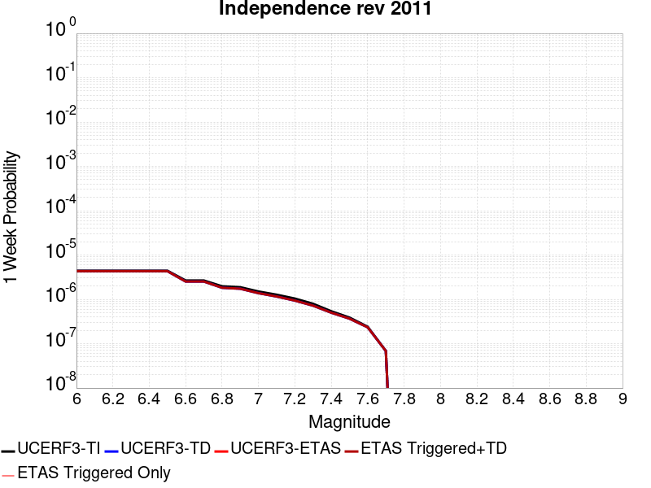 | 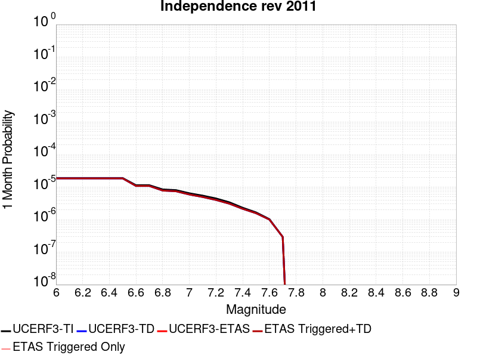 | 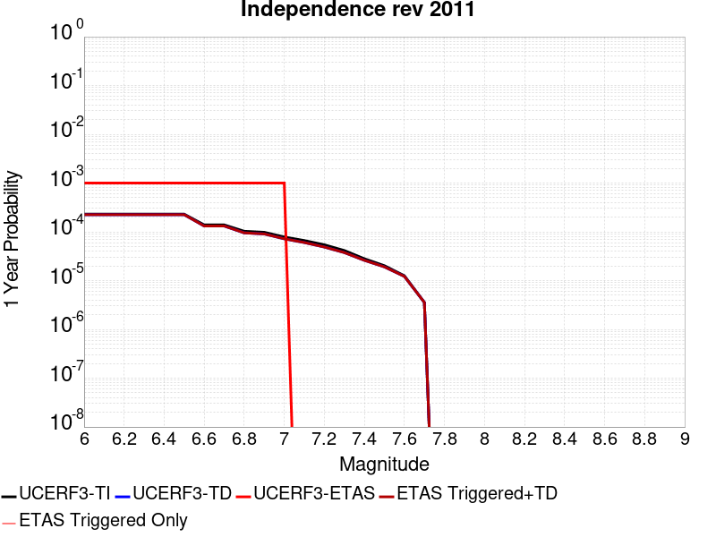 | 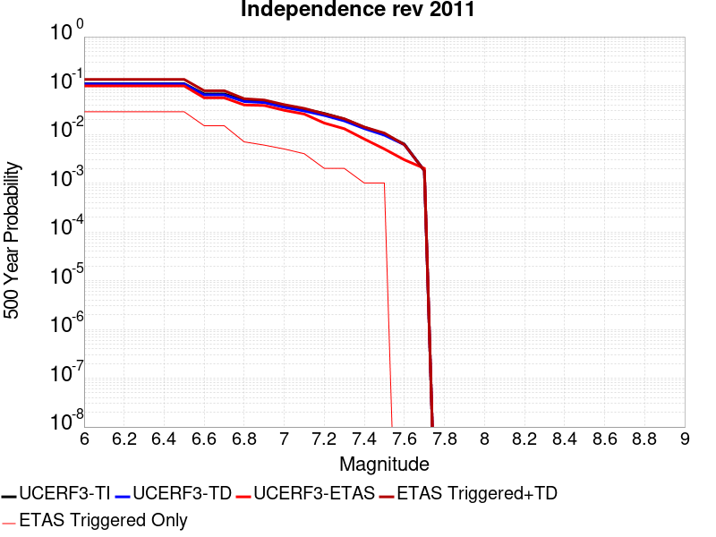 |

| Magnitude | 1 wk TI Prob | 1 wk TD Prob | 1 wk ETAS Prob | 1 wk ETAS/TD Gain | 1 wk ETAS Triggered+TD | 1 wk ETAS Triggered Only | 1 mo TI Prob | 1 mo TD Prob | 1 mo ETAS Prob | 1 mo ETAS/TD Gain | 1 mo ETAS Triggered+TD | 1 mo ETAS Triggered Only | 1 yr TI Prob | 1 yr TD Prob | 1 yr ETAS Prob | 1 yr ETAS/TD Gain | 1 yr ETAS Triggered+TD | 1 yr ETAS Triggered Only | 500 yr TI Prob | 500 yr TD Prob | 500 yr ETAS Prob | 500 yr ETAS/TD Gain | 500 yr ETAS Triggered+TD | 500 yr ETAS Triggered Only |
|-----|-----|-----|-----|-----|-----|-----|-----|-----|-----|-----|-----|-----|-----|-----|-----|-----|-----|-----|-----|-----|-----|-----|-----|-----|
| 6.0 | 4.422171E-6 | 4.318973E-6 | 0.0 | 0.0 | 4.318973E-6 | 0.0 | 1.8952025E-5 | 1.8509769E-5 | 0.0 | 0.0 | 1.8509769E-5 | 0.0 | 2.3071647E-4 | 2.2533612E-4 | 0.001 | 4.437815 | 2.2533612E-4 | 0.0 | 0.10896497 | 0.107646756 | 0.098 | 0.9103851 | 0.133525 | 0.029 |
| 6.1 | 4.422171E-6 | 4.318973E-6 | 0.0 | 0.0 | 4.318973E-6 | 0.0 | 1.8952025E-5 | 1.8509769E-5 | 0.0 | 0.0 | 1.8509769E-5 | 0.0 | 2.3071647E-4 | 2.2533612E-4 | 0.001 | 4.437815 | 2.2533612E-4 | 0.0 | 0.10896497 | 0.107646756 | 0.098 | 0.9103851 | 0.133525 | 0.029 |
| 6.2 | 4.422171E-6 | 4.318973E-6 | 0.0 | 0.0 | 4.318973E-6 | 0.0 | 1.8952025E-5 | 1.8509769E-5 | 0.0 | 0.0 | 1.8509769E-5 | 0.0 | 2.3071647E-4 | 2.2533612E-4 | 0.001 | 4.437815 | 2.2533612E-4 | 0.0 | 0.10896497 | 0.107646756 | 0.098 | 0.9103851 | 0.133525 | 0.029 |
| 6.3 | 4.422171E-6 | 4.318973E-6 | 0.0 | 0.0 | 4.318973E-6 | 0.0 | 1.8952025E-5 | 1.8509769E-5 | 0.0 | 0.0 | 1.8509769E-5 | 0.0 | 2.3071647E-4 | 2.2533612E-4 | 0.001 | 4.437815 | 2.2533612E-4 | 0.0 | 0.10896497 | 0.107646756 | 0.098 | 0.9103851 | 0.133525 | 0.029 |
| 6.4 | 4.422171E-6 | 4.318973E-6 | 0.0 | 0.0 | 4.318973E-6 | 0.0 | 1.8952025E-5 | 1.8509769E-5 | 0.0 | 0.0 | 1.8509769E-5 | 0.0 | 2.3071647E-4 | 2.2533612E-4 | 0.001 | 4.437815 | 2.2533612E-4 | 0.0 | 0.10896497 | 0.107646756 | 0.098 | 0.9103851 | 0.133525 | 0.029 |
| 6.5 | 4.422171E-6 | 4.318973E-6 | 0.0 | 0.0 | 4.318973E-6 | 0.0 | 1.8952025E-5 | 1.8509769E-5 | 0.0 | 0.0 | 1.8509769E-5 | 0.0 | 2.3071647E-4 | 2.2533612E-4 | 0.001 | 4.437815 | 2.2533612E-4 | 0.0 | 0.10896497 | 0.107646756 | 0.098 | 0.9103851 | 0.133525 | 0.029 |
| 6.6 | 2.663744E-6 | 2.5266302E-6 | 0.0 | 0.0 | 2.5266302E-6 | 0.0 | 1.1415996E-5 | 1.0828373E-5 | 0.0 | 0.0 | 1.0828373E-5 | 0.0 | 1.3898089E-4 | 1.3182795E-4 | 0.001 | 7.5856447 | 1.3182795E-4 | 0.0 | 0.06713545 | 0.06427826 | 0.056 | 0.8712121 | 0.07831409 | 0.015 |
| 6.7 | 2.663744E-6 | 2.5266302E-6 | 0.0 | 0.0 | 2.5266302E-6 | 0.0 | 1.1415996E-5 | 1.0828373E-5 | 0.0 | 0.0 | 1.0828373E-5 | 0.0 | 1.3898089E-4 | 1.3182795E-4 | 0.001 | 7.5856447 | 1.3182795E-4 | 0.0 | 0.06713545 | 0.06427826 | 0.056 | 0.8712121 | 0.07831409 | 0.015 |
| 6.8 | 1.9716529E-6 | 1.827664E-6 | 0.0 | 0.0 | 1.827664E-6 | 0.0 | 8.449913E-6 | 7.832823E-6 | 0.0 | 0.0 | 7.832823E-6 | 0.0 | 1.0287284E-4 | 9.536058E-5 | 0.001 | 10.486514 | 9.536058E-5 | 0.0 | 0.050138474 | 0.046955165 | 0.04 | 0.85187644 | 0.053626478 | 0.007 |
| 6.9 | 1.8788617E-6 | 1.7385821E-6 | 0.0 | 0.0 | 1.7385821E-6 | 0.0 | 8.0522395E-6 | 7.451046E-6 | 0.0 | 0.0 | 7.451046E-6 | 0.0 | 9.80316E-5 | 9.071283E-5 | 0.001 | 11.023799 | 9.071283E-5 | 0.0 | 0.047836203 | 0.04472502 | 0.039 | 0.87199515 | 0.05045667 | 0.006 |
| 7.0 | 1.5045488E-6 | 1.3812929E-6 | 0.0 | 0.0 | 1.3812929E-6 | 0.0 | 6.44805E-6 | 5.9198137E-6 | 0.0 | 0.0 | 5.9198137E-6 | 0.0 | 7.8502184E-5 | 7.20714E-5 | 0.001 | 13.87513 | 7.20714E-5 | 0.0 | 0.03849223 | 0.03570994 | 0.031 | 0.86810565 | 0.04053139 | 0.005 |
| 7.1 | 1.272341E-6 | 1.1593198E-6 | 0.0 | 0.0 | 1.1593198E-6 | 0.0 | 5.4528787E-6 | 4.968504E-6 | 0.0 | 0.0 | 4.968504E-6 | 0.0 | 6.6386776E-5 | 6.0489892E-5 | 0.0 | 0.0 | 6.0489892E-5 | 0.0 | 0.0326496 | 0.030075653 | 0.026 | 0.8644867 | 0.03395535 | 0.004 |
| 7.2 | 1.0416892E-6 | 9.382372E-7 | 0.0 | 0.0 | 9.382372E-7 | 0.0 | 4.464375E-6 | 4.02101E-6 | 0.0 | 0.0 | 4.02101E-6 | 0.0 | 5.4352407E-5 | 4.895472E-5 | 0.0 | 0.0 | 4.895472E-5 | 0.0 | 0.026810972 | 0.024435105 | 0.017 | 0.6957204 | 0.026386233 | 0.002 |
| 7.3 | 7.9450155E-7 | 7.214398E-7 | 0.0 | 0.0 | 7.214398E-7 | 0.0 | 3.4050022E-6 | 3.0918811E-6 | 0.0 | 0.0 | 3.0918811E-6 | 0.0 | 4.1455114E-5 | 3.7643014E-5 | 0.0 | 0.0 | 3.7643014E-5 | 0.0 | 0.020514637 | 0.018837769 | 0.013 | 0.690103 | 0.020800093 | 0.002 |
| 7.4 | 5.3893444E-7 | 5.006725E-7 | 0.0 | 0.0 | 5.006725E-7 | 0.0 | 2.309717E-6 | 2.1457377E-6 | 0.0 | 0.0 | 2.1457377E-6 | 0.0 | 2.8120441E-5 | 2.6124048E-5 | 0.0 | 0.0 | 2.6124048E-5 | 0.0 | 0.013962032 | 0.013089977 | 0.008 | 0.6111546 | 0.014076887 | 0.001 |
| 7.5 | 3.8852085E-7 | 3.6742128E-7 | 0.0 | 0.0 | 3.6742128E-7 | 0.0 | 1.6650882E-6 | 1.5746617E-6 | 0.0 | 0.0 | 1.5746617E-6 | 0.0 | 2.027226E-5 | 1.9171339E-5 | 0.0 | 0.0 | 1.9171339E-5 | 0.0 | 0.010085035 | 0.009610067 | 0.005 | 0.5202877 | 0.010600457 | 0.001 |
| 7.6 | 2.414929E-7 | 2.3414101E-7 | 0.0 | 0.0 | 2.3414101E-7 | 0.0 | 1.0349692E-6 | 1.0034611E-6 | 0.0 | 0.0 | 1.0034611E-6 | 0.0 | 1.2600677E-5 | 1.2217072E-5 | 0.0 | 0.0 | 1.2217072E-5 | 0.0 | 0.0062805726 | 0.0061219763 | 0.003 | 0.49003786 | 0.0061219763 | 0.0 |
| 7.7 | 6.8298014E-8 | 6.84992E-8 | 0.0 | 0.0 | 6.84992E-8 | 0.0 | 2.9270575E-7 | 2.9356795E-7 | 0.0 | 0.0 | 2.9356795E-7 | 0.0 | 3.5636867E-6 | 3.5741843E-6 | 0.0 | 0.0 | 3.5741843E-6 | 0.0 | 0.00178026 | 0.0017890249 | 0.002 | 1.1179274 | 0.0017890249 | 0.0 |

## Red Mountain
*[(top)](#table-of-contents)*

| 1 Week | 1 Month | 1 Year | 500 Year |
|-----|-----|-----|-----|
|  | 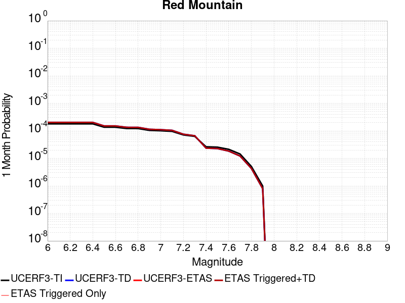 | 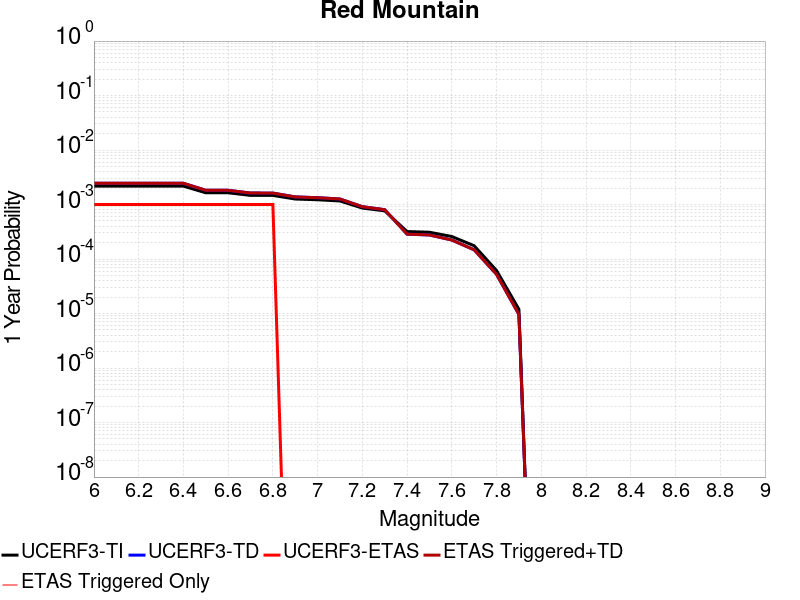 | 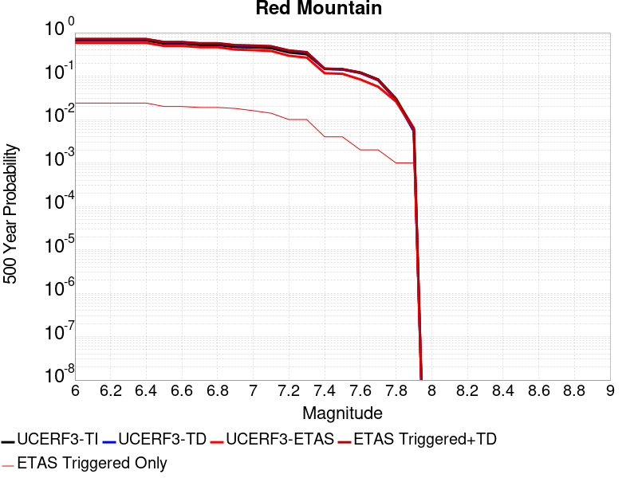 |

| Magnitude | 1 wk TI Prob | 1 wk TD Prob | 1 wk ETAS Prob | 1 wk ETAS/TD Gain | 1 wk ETAS Triggered+TD | 1 wk ETAS Triggered Only | 1 mo TI Prob | 1 mo TD Prob | 1 mo ETAS Prob | 1 mo ETAS/TD Gain | 1 mo ETAS Triggered+TD | 1 mo ETAS Triggered Only | 1 yr TI Prob | 1 yr TD Prob | 1 yr ETAS Prob | 1 yr ETAS/TD Gain | 1 yr ETAS Triggered+TD | 1 yr ETAS Triggered Only | 500 yr TI Prob | 500 yr TD Prob | 500 yr ETAS Prob | 500 yr ETAS/TD Gain | 500 yr ETAS Triggered+TD | 500 yr ETAS Triggered Only |
|-----|-----|-----|-----|-----|-----|-----|-----|-----|-----|-----|-----|-----|-----|-----|-----|-----|-----|-----|-----|-----|-----|-----|-----|-----|
| 6.0 | 4.1810763E-5 | 4.7167927E-5 | 0.0 | 0.0 | 4.7167927E-5 | 0.0 | 1.7917668E-4 | 2.0213351E-4 | 0.0 | 0.0 | 2.0213351E-4 | 0.0 | 0.0021792934 | 0.0024583598 | 0.001 | 0.40677527 | 0.0024583598 | 0.0 | 0.6640644 | 0.7069074 | 0.584 | 0.82613367 | 0.71394163 | 0.024 |
| 6.1 | 4.1810763E-5 | 4.7167927E-5 | 0.0 | 0.0 | 4.7167927E-5 | 0.0 | 1.7917668E-4 | 2.0213351E-4 | 0.0 | 0.0 | 2.0213351E-4 | 0.0 | 0.0021792934 | 0.0024583598 | 0.001 | 0.40677527 | 0.0024583598 | 0.0 | 0.6640644 | 0.7069074 | 0.584 | 0.82613367 | 0.71394163 | 0.024 |
| 6.2 | 4.1810763E-5 | 4.7167927E-5 | 0.0 | 0.0 | 4.7167927E-5 | 0.0 | 1.7917668E-4 | 2.0213351E-4 | 0.0 | 0.0 | 2.0213351E-4 | 0.0 | 0.0021792934 | 0.0024583598 | 0.001 | 0.40677527 | 0.0024583598 | 0.0 | 0.6640644 | 0.7069074 | 0.584 | 0.82613367 | 0.71394163 | 0.024 |
| 6.3 | 4.1810763E-5 | 4.7167927E-5 | 0.0 | 0.0 | 4.7167927E-5 | 0.0 | 1.7917668E-4 | 2.0213351E-4 | 0.0 | 0.0 | 2.0213351E-4 | 0.0 | 0.0021792934 | 0.0024583598 | 0.001 | 0.40677527 | 0.0024583598 | 0.0 | 0.6640644 | 0.7069074 | 0.584 | 0.82613367 | 0.71394163 | 0.024 |
| 6.4 | 4.1810763E-5 | 4.7167927E-5 | 0.0 | 0.0 | 4.7167927E-5 | 0.0 | 1.7917668E-4 | 2.0213351E-4 | 0.0 | 0.0 | 2.0213351E-4 | 0.0 | 0.0021792934 | 0.0024583598 | 0.001 | 0.40677527 | 0.0024583598 | 0.0 | 0.6640644 | 0.7069074 | 0.584 | 0.82613367 | 0.71394163 | 0.024 |
| 6.5 | 3.154503E-5 | 3.5058045E-5 | 0.0 | 0.0 | 3.5058045E-5 | 0.0 | 1.3518598E-4 | 1.5024062E-4 | 0.0 | 0.0 | 1.5024062E-4 | 0.0 | 0.0016446467 | 0.0018277356 | 0.001 | 0.5471251 | 0.0018277356 | 0.0 | 0.5608878 | 0.60340077 | 0.496 | 0.8220076 | 0.6113327 | 0.02 |
| 6.6 | 3.1535834E-5 | 3.5047513E-5 | 0.0 | 0.0 | 3.5047513E-5 | 0.0 | 1.3514658E-4 | 1.501955E-4 | 0.0 | 0.0 | 1.501955E-4 | 0.0 | 0.0016441676 | 0.0018271869 | 0.001 | 0.5472894 | 0.0018271869 | 0.0 | 0.56078243 | 0.60329735 | 0.496 | 0.8221485 | 0.6112314 | 0.02 |
| 6.7 | 2.8267326E-5 | 3.1205058E-5 | 0.0 | 0.0 | 3.1205058E-5 | 0.0 | 1.2114006E-4 | 1.3372958E-4 | 0.0 | 0.0 | 1.3372958E-4 | 0.0 | 0.0014738824 | 0.0016270253 | 0.001 | 0.6146186 | 0.0016270253 | 0.0 | 0.5216845 | 0.56476784 | 0.464 | 0.82157654 | 0.5730372 | 0.019 |
| 6.8 | 2.8212884E-5 | 3.1143398E-5 | 0.0 | 0.0 | 3.1143398E-5 | 0.0 | 1.20906756E-4 | 1.3346535E-4 | 0.0 | 0.0 | 1.3346535E-4 | 0.0 | 0.0014710457 | 0.001623813 | 0.001 | 0.6158345 | 0.001623813 | 0.0 | 0.5210046 | 0.5640789 | 0.464 | 0.8225799 | 0.5723614 | 0.019 |
| 6.9 | 2.4227871E-5 | 2.6486621E-5 | 0.0 | 0.0 | 2.6486621E-5 | 0.0 | 1.03829596E-4 | 1.1350957E-4 | 0.0 | 0.0 | 1.1350957E-4 | 0.0 | 0.0012633923 | 0.0013811775 | 0.0 | 0.0 | 0.0013811775 | 0.0 | 0.4685231 | 0.5094588 | 0.409 | 0.80281276 | 0.51828855 | 0.018 |
| 7.0 | 2.348524E-5 | 2.5623185E-5 | 0.0 | 0.0 | 2.5623185E-5 | 0.0 | 1.0064714E-4 | 1.0980945E-4 | 0.0 | 0.0 | 1.0980945E-4 | 0.0 | 0.0012246901 | 0.0013361843 | 0.0 | 0.0 | 0.0013361843 | 0.0 | 0.4581252 | 0.49872145 | 0.397 | 0.7960355 | 0.5067419 | 0.016 |
| 7.1 | 2.2311642E-5 | 2.4262325E-5 | 0.0 | 0.0 | 2.4262325E-5 | 0.0 | 9.561782E-5 | 1.03977654E-4 | 0.0 | 0.0 | 1.03977654E-4 | 0.0 | 0.0011635252 | 0.0012652663 | 0.0 | 0.0 | 0.0012652663 | 0.0 | 0.4412769 | 0.48128787 | 0.38 | 0.7895482 | 0.48854986 | 0.014 |
| 7.2 | 1.6533986E-5 | 1.7531333E-5 | 0.0 | 0.0 | 1.7531333E-5 | 0.0 | 7.085802E-5 | 7.513247E-5 | 0.0 | 0.0 | 7.513247E-5 | 0.0 | 8.623549E-4 | 9.144163E-4 | 0.0 | 0.0 | 9.144163E-4 | 0.0 | 0.35037726 | 0.38463715 | 0.295 | 0.7669566 | 0.39079076 | 0.01 |
| 7.3 | 1.4703092E-5 | 1.5437288E-5 | 0.0 | 0.0 | 1.5437288E-5 | 0.0 | 6.301173E-5 | 6.615846E-5 | 0.0 | 0.0 | 6.615846E-5 | 0.0 | 7.668978E-4 | 8.0524216E-4 | 0.0 | 0.0 | 8.0524216E-4 | 0.0 | 0.31859335 | 0.35017762 | 0.267 | 0.7624702 | 0.35667586 | 0.01 |
| 7.4 | 6.1331984E-6 | 5.494957E-6 | 0.0 | 0.0 | 5.494957E-6 | 0.0 | 2.6284872E-5 | 2.3549606E-5 | 0.0 | 0.0 | 2.3549606E-5 | 0.0 | 3.199713E-4 | 2.8667925E-4 | 0.0 | 0.0 | 2.8667925E-4 | 0.0 | 0.1478658 | 0.1459794 | 0.117 | 0.8014829 | 0.14939548 | 0.004 |
| 7.5 | 5.954766E-6 | 5.3054696E-6 | 0.0 | 0.0 | 5.3054696E-6 | 0.0 | 2.5520176E-5 | 2.2737531E-5 | 0.0 | 0.0 | 2.2737531E-5 | 0.0 | 3.1066386E-4 | 2.767948E-4 | 0.0 | 0.0 | 2.767948E-4 | 0.0 | 0.1438897 | 0.14169614 | 0.113 | 0.7974812 | 0.14512935 | 0.004 |
| 7.6 | 4.9726646E-6 | 4.286799E-6 | 0.0 | 0.0 | 4.286799E-6 | 0.0 | 2.1311245E-5 | 1.8371868E-5 | 0.0 | 0.0 | 1.8371868E-5 | 0.0 | 2.5943352E-4 | 2.2365488E-4 | 0.0 | 0.0 | 2.2365488E-4 | 0.0 | 0.121670604 | 0.11806523 | 0.084 | 0.7114711 | 0.1198291 | 0.002 |
| 7.7 | 3.3613894E-6 | 2.8340262E-6 | 0.0 | 0.0 | 2.8340262E-6 | 0.0 | 1.4405875E-5 | 1.21457715E-5 | 0.0 | 0.0 | 1.21457715E-5 | 0.0 | 1.7537741E-4 | 1.47865E-4 | 0.0 | 0.0 | 1.47865E-4 | 0.0 | 0.083961055 | 0.080129996 | 0.057 | 0.71134406 | 0.08196974 | 0.002 |
| 7.8 | 1.1828961E-6 | 1.006467E-6 | 0.0 | 0.0 | 1.006467E-6 | 0.0 | 5.069545E-6 | 4.313423E-6 | 0.0 | 0.0 | 4.313423E-6 | 0.0 | 6.171996E-5 | 5.2514686E-5 | 0.0 | 0.0 | 5.2514686E-5 | 0.0 | 0.030389596 | 0.028277077 | 0.026 | 0.9194727 | 0.0292488 | 0.001 |
| 7.9 | 2.2967266E-7 | 1.8513553E-7 | 0.0 | 0.0 | 1.8513553E-7 | 0.0 | 9.843111E-7 | 7.934378E-7 | 0.0 | 0.0 | 7.934378E-7 | 0.0 | 1.19839215E-5 | 9.660065E-6 | 0.0 | 0.0 | 9.660065E-6 | 0.0 | 0.0059740804 | 0.005330268 | 0.006 | 1.1256471 | 0.0063249376 | 0.001 |

## Eureka Peak
*[(top)](#table-of-contents)*

| 1 Week | 1 Month | 1 Year | 500 Year |
|-----|-----|-----|-----|
|  |  |  | 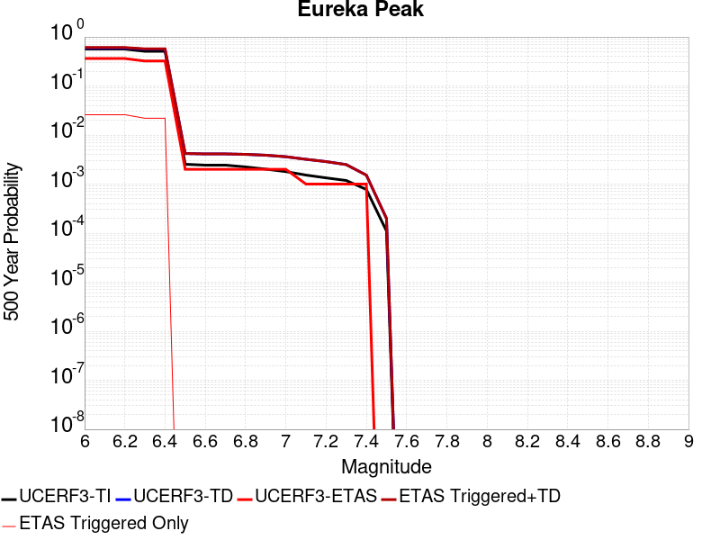 |

| Magnitude | 1 wk TI Prob | 1 wk TD Prob | 1 wk ETAS Prob | 1 wk ETAS/TD Gain | 1 wk ETAS Triggered+TD | 1 wk ETAS Triggered Only | 1 mo TI Prob | 1 mo TD Prob | 1 mo ETAS Prob | 1 mo ETAS/TD Gain | 1 mo ETAS Triggered+TD | 1 mo ETAS Triggered Only | 1 yr TI Prob | 1 yr TD Prob | 1 yr ETAS Prob | 1 yr ETAS/TD Gain | 1 yr ETAS Triggered+TD | 1 yr ETAS Triggered Only | 500 yr TI Prob | 500 yr TD Prob | 500 yr ETAS Prob | 500 yr ETAS/TD Gain | 500 yr ETAS Triggered+TD | 500 yr ETAS Triggered Only |
|-----|-----|-----|-----|-----|-----|-----|-----|-----|-----|-----|-----|-----|-----|-----|-----|-----|-----|-----|-----|-----|-----|-----|-----|-----|
| 6.0 | 3.1949054E-5 | 8.760914E-6 | 0.0 | 0.0 | 8.760914E-6 | 0.0 | 1.3691733E-4 | 3.7546622E-5 | 0.0 | 0.0 | 3.7546622E-5 | 0.0 | 0.0016656938 | 4.571029E-4 | 0.0 | 0.0 | 4.571029E-4 | 0.0 | 0.56549215 | 0.59869283 | 0.363 | 0.6063209 | 0.6091268 | 0.026 |
| 6.1 | 3.1949054E-5 | 8.760914E-6 | 0.0 | 0.0 | 8.760914E-6 | 0.0 | 1.3691733E-4 | 3.7546622E-5 | 0.0 | 0.0 | 3.7546622E-5 | 0.0 | 0.0016656938 | 4.571029E-4 | 0.0 | 0.0 | 4.571029E-4 | 0.0 | 0.56549215 | 0.59869283 | 0.363 | 0.6063209 | 0.6091268 | 0.026 |
| 6.2 | 3.1949054E-5 | 8.760914E-6 | 0.0 | 0.0 | 8.760914E-6 | 0.0 | 1.3691733E-4 | 3.7546622E-5 | 0.0 | 0.0 | 3.7546622E-5 | 0.0 | 0.0016656938 | 4.571029E-4 | 0.0 | 0.0 | 4.571029E-4 | 0.0 | 0.56549215 | 0.59869283 | 0.363 | 0.6063209 | 0.6091268 | 0.026 |
| 6.3 | 2.7339745E-5 | 7.480752E-6 | 0.0 | 0.0 | 7.480752E-6 | 0.0 | 1.1716507E-4 | 3.2060347E-5 | 0.0 | 0.0 | 3.2060347E-5 | 0.0 | 0.0014255513 | 3.9033146E-4 | 0.0 | 0.0 | 3.9033146E-4 | 0.0 | 0.5099678 | 0.5624828 | 0.323 | 0.57423985 | 0.57210815 | 0.022 |
| 6.4 | 2.7339745E-5 | 7.480752E-6 | 0.0 | 0.0 | 7.480752E-6 | 0.0 | 1.1716507E-4 | 3.2060347E-5 | 0.0 | 0.0 | 3.2060347E-5 | 0.0 | 0.0014255513 | 3.9033146E-4 | 0.0 | 0.0 | 3.9033146E-4 | 0.0 | 0.5099678 | 0.5624828 | 0.323 | 0.57423985 | 0.57210815 | 0.022 |
| 6.5 | 9.738388E-8 | 1.7730117E-7 | 0.0 | 0.0 | 1.7730117E-7 | 0.0 | 4.1735944E-7 | 7.5986196E-7 | 0.0 | 0.0 | 7.5986196E-7 | 0.0 | 5.081339E-6 | 9.251281E-6 | 0.0 | 0.0 | 9.251281E-6 | 0.0 | 0.0025374512 | 0.004201065 | 0.002 | 0.47606978 | 0.004201065 | 0.0 |
| 6.6 | 9.3495956E-8 | 1.7441559E-7 | 0.0 | 0.0 | 1.7441559E-7 | 0.0 | 4.0069688E-7 | 7.4749516E-7 | 0.0 | 0.0 | 7.4749516E-7 | 0.0 | 4.8784736E-6 | 9.100717E-6 | 0.0 | 0.0 | 9.100717E-6 | 0.0 | 0.0024362702 | 0.0041243834 | 0.002 | 0.48492095 | 0.0041243834 | 0.0 |
| 6.7 | 9.3495956E-8 | 1.7441559E-7 | 0.0 | 0.0 | 1.7441559E-7 | 0.0 | 4.0069688E-7 | 7.4749516E-7 | 0.0 | 0.0 | 7.4749516E-7 | 0.0 | 4.8784736E-6 | 9.100717E-6 | 0.0 | 0.0 | 9.100717E-6 | 0.0 | 0.0024362702 | 0.0041243834 | 0.002 | 0.48492095 | 0.0041243834 | 0.0 |
| 6.8 | 8.591428E-8 | 1.714169E-7 | 0.0 | 0.0 | 1.714169E-7 | 0.0 | 3.68204E-7 | 7.3464366E-7 | 0.0 | 0.0 | 7.3464366E-7 | 0.0 | 4.4828744E-6 | 8.94425E-6 | 0.0 | 0.0 | 8.94425E-6 | 0.0 | 0.002238932 | 0.004039472 | 0.002 | 0.49511424 | 0.004039472 | 0.0 |
| 6.9 | 7.749723E-8 | 1.6570844E-7 | 0.0 | 0.0 | 1.6570844E-7 | 0.0 | 3.3213098E-7 | 7.101789E-7 | 0.0 | 0.0 | 7.101789E-7 | 0.0 | 4.043687E-6 | 8.646394E-6 | 0.0 | 0.0 | 8.646394E-6 | 0.0 | 0.0020198051 | 0.0038831749 | 0.002 | 0.5150425 | 0.0038831749 | 0.0 |
| 7.0 | 6.897872E-8 | 1.5579684E-7 | 0.0 | 0.0 | 1.5579684E-7 | 0.0 | 2.9562307E-7 | 6.6770053E-7 | 0.0 | 0.0 | 6.6770053E-7 | 0.0 | 3.5992048E-6 | 8.129225E-6 | 0.0 | 0.0 | 8.129225E-6 | 0.0 | 0.0017979874 | 0.0036149838 | 0.002 | 0.5532528 | 0.0036149838 | 0.0 |
| 7.1 | 5.859318E-8 | 1.4002403E-7 | 0.0 | 0.0 | 1.4002403E-7 | 0.0 | 2.5111362E-7 | 6.0010285E-7 | 0.0 | 0.0 | 6.0010285E-7 | 0.0 | 3.057304E-6 | 7.3062283E-6 | 0.0 | 0.0 | 7.3062283E-6 | 0.0 | 0.0015274865 | 0.0032043722 | 0.001 | 0.31207362 | 0.0032043722 | 0.0 |
| 7.2 | 5.1375338E-8 | 1.2673222E-7 | 0.0 | 0.0 | 1.2673222E-7 | 0.0 | 2.2018E-7 | 5.4313796E-7 | 0.0 | 0.0 | 5.4313796E-7 | 0.0 | 2.680688E-6 | 6.6126854E-6 | 0.0 | 0.0 | 6.6126854E-6 | 0.0 | 0.001339448 | 0.0028756144 | 0.001 | 0.34775177 | 0.0028756144 | 0.0 |
| 7.3 | 4.5441396E-8 | 1.0941569E-7 | 0.0 | 0.0 | 1.0941569E-7 | 0.0 | 1.9474882E-7 | 4.689243E-7 | 0.0 | 0.0 | 4.689243E-7 | 0.0 | 2.3710643E-6 | 5.709139E-6 | 0.0 | 0.0 | 5.709139E-6 | 0.0 | 0.0011848311 | 0.0024976386 | 0.001 | 0.4003782 | 0.0024976386 | 0.0 |
| 7.4 | 2.981918E-8 | 6.370013E-8 | 0.0 | 0.0 | 6.370013E-8 | 0.0 | 1.2779647E-7 | 2.7300052E-7 | 0.0 | 0.0 | 2.7300052E-7 | 0.0 | 1.5559209E-6 | 3.3237766E-6 | 0.0 | 0.0 | 3.3237766E-6 | 0.0 | 7.7765854E-4 | 0.001522755 | 0.001 | 0.6567045 | 0.001522755 | 0.0 |
| 7.5 | 4.24214E-9 | 7.540045E-9 | 0.0 | 0.0 | 7.540045E-9 | 0.0 | 1.81806E-8 | 3.2314478E-8 | 0.0 | 0.0 | 3.2314478E-8 | 0.0 | 2.213488E-7 | 3.9342873E-7 | 0.0 | 0.0 | 3.9342873E-7 | 0.0 | 1.1066828E-4 | 1.9890937E-4 | 0.0 | 0.0 | 1.9890937E-4 | 0.0 |

## Mount Diablo Thrust South
*[(top)](#table-of-contents)*

| 1 Week | 1 Month | 1 Year | 500 Year |
|-----|-----|-----|-----|
|  |  |  | 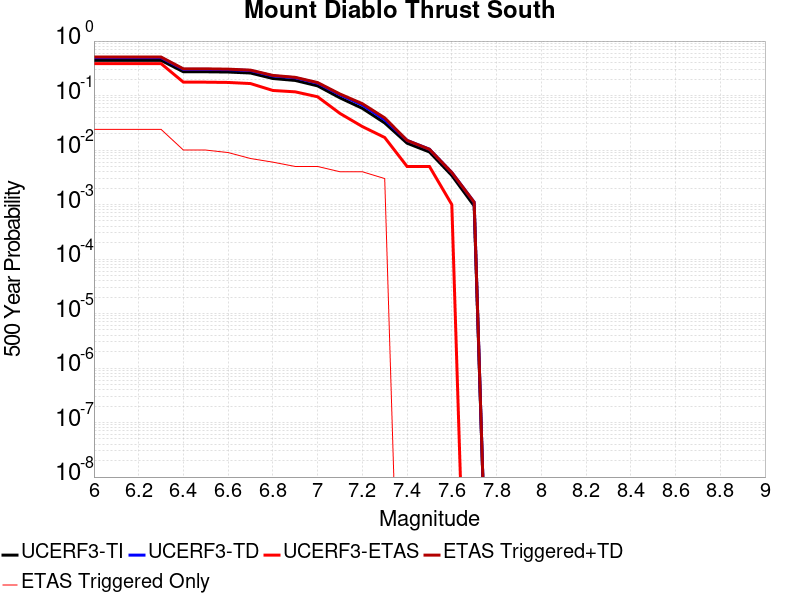 |

| Magnitude | 1 wk TI Prob | 1 wk TD Prob | 1 wk ETAS Prob | 1 wk ETAS/TD Gain | 1 wk ETAS Triggered+TD | 1 wk ETAS Triggered Only | 1 mo TI Prob | 1 mo TD Prob | 1 mo ETAS Prob | 1 mo ETAS/TD Gain | 1 mo ETAS Triggered+TD | 1 mo ETAS Triggered Only | 1 yr TI Prob | 1 yr TD Prob | 1 yr ETAS Prob | 1 yr ETAS/TD Gain | 1 yr ETAS Triggered+TD | 1 yr ETAS Triggered Only | 500 yr TI Prob | 500 yr TD Prob | 500 yr ETAS Prob | 500 yr ETAS/TD Gain | 500 yr ETAS Triggered+TD | 500 yr ETAS Triggered Only |
|-----|-----|-----|-----|-----|-----|-----|-----|-----|-----|-----|-----|-----|-----|-----|-----|-----|-----|-----|-----|-----|-----|-----|-----|-----|
| 6.0 | 2.2377444E-5 | 2.6679278E-5 | 0.0 | 0.0 | 2.6679278E-5 | 0.0 | 9.5899806E-5 | 1.14335824E-4 | 0.0 | 0.0 | 1.14335824E-4 | 0.0 | 0.0011669548 | 0.001391344 | 0.0 | 0.0 | 0.001391344 | 0.0 | 0.4422353 | 0.497196 | 0.386 | 0.77635384 | 0.5092633 | 0.024 |
| 6.1 | 2.2377444E-5 | 2.6679278E-5 | 0.0 | 0.0 | 2.6679278E-5 | 0.0 | 9.5899806E-5 | 1.14335824E-4 | 0.0 | 0.0 | 1.14335824E-4 | 0.0 | 0.0011669548 | 0.001391344 | 0.0 | 0.0 | 0.001391344 | 0.0 | 0.4422353 | 0.497196 | 0.386 | 0.77635384 | 0.5092633 | 0.024 |
| 6.2 | 2.2377444E-5 | 2.6679278E-5 | 0.0 | 0.0 | 2.6679278E-5 | 0.0 | 9.5899806E-5 | 1.14335824E-4 | 0.0 | 0.0 | 1.14335824E-4 | 0.0 | 0.0011669548 | 0.001391344 | 0.0 | 0.0 | 0.001391344 | 0.0 | 0.4422353 | 0.497196 | 0.386 | 0.77635384 | 0.5092633 | 0.024 |
| 6.3 | 2.2377444E-5 | 2.6679278E-5 | 0.0 | 0.0 | 2.6679278E-5 | 0.0 | 9.5899806E-5 | 1.14335824E-4 | 0.0 | 0.0 | 1.14335824E-4 | 0.0 | 0.0011669548 | 0.001391344 | 0.0 | 0.0 | 0.001391344 | 0.0 | 0.4422353 | 0.497196 | 0.386 | 0.77635384 | 0.5092633 | 0.024 |
| 6.4 | 1.2228463E-5 | 1.4597914E-5 | 0.0 | 0.0 | 1.4597914E-5 | 0.0 | 5.2406645E-5 | 6.2561056E-5 | 0.0 | 0.0 | 6.2561056E-5 | 0.0 | 6.378641E-4 | 7.614274E-4 | 0.0 | 0.0 | 7.614274E-4 | 0.0 | 0.273149 | 0.30200806 | 0.176 | 0.5827659 | 0.30898798 | 0.01 |
| 6.5 | 1.2228463E-5 | 1.4597914E-5 | 0.0 | 0.0 | 1.4597914E-5 | 0.0 | 5.2406645E-5 | 6.2561056E-5 | 0.0 | 0.0 | 6.2561056E-5 | 0.0 | 6.378641E-4 | 7.614274E-4 | 0.0 | 0.0 | 7.614274E-4 | 0.0 | 0.273149 | 0.30200806 | 0.176 | 0.5827659 | 0.30898798 | 0.01 |
| 6.6 | 1.2068118E-5 | 1.4404885E-5 | 0.0 | 0.0 | 1.4404885E-5 | 0.0 | 5.1719482E-5 | 6.173384E-5 | 0.0 | 0.0 | 6.173384E-5 | 0.0 | 6.2950276E-4 | 7.5136294E-4 | 0.0 | 0.0 | 7.5136294E-4 | 0.0 | 0.270102 | 0.29894775 | 0.174 | 0.5820415 | 0.30525723 | 0.009 |
| 6.7 | 1.1499428E-5 | 1.3734243E-5 | 0.0 | 0.0 | 1.3734243E-5 | 0.0 | 4.9282335E-5 | 5.8859783E-5 | 0.0 | 0.0 | 5.8859783E-5 | 0.0 | 5.9984723E-4 | 7.1639474E-4 | 0.0 | 0.0 | 7.1639474E-4 | 0.0 | 0.25919184 | 0.2878496 | 0.166 | 0.5766901 | 0.29283464 | 0.007 |
| 6.8 | 8.82118E-6 | 1.0711307E-5 | 0.0 | 0.0 | 1.0711307E-5 | 0.0 | 3.780451E-5 | 4.5904828E-5 | 0.0 | 0.0 | 4.5904828E-5 | 0.0 | 4.601727E-4 | 5.5875344E-4 | 0.0 | 0.0 | 5.5875344E-4 | 0.0 | 0.20557708 | 0.22949946 | 0.124 | 0.54030627 | 0.23412247 | 0.006 |
| 6.9 | 8.047112E-6 | 9.827272E-6 | 0.0 | 0.0 | 9.827272E-6 | 0.0 | 3.4487166E-5 | 4.211623E-5 | 0.0 | 0.0 | 4.211623E-5 | 0.0 | 4.1980037E-4 | 5.1264965E-4 | 0.0 | 0.0 | 5.1264965E-4 | 0.0 | 0.18937056 | 0.21201366 | 0.117 | 0.5518512 | 0.21595359 | 0.005 |
| 7.0 | 6.2574763E-6 | 7.662137E-6 | 0.0 | 0.0 | 7.662137E-6 | 0.0 | 2.681748E-5 | 3.283734E-5 | 0.0 | 0.0 | 3.283734E-5 | 0.0 | 3.264539E-4 | 3.9972487E-4 | 0.0 | 0.0 | 3.9972487E-4 | 0.0 | 0.15062425 | 0.169006 | 0.095 | 0.5621102 | 0.17316099 | 0.005 |
| 7.1 | 3.6485903E-6 | 4.462306E-6 | 0.0 | 0.0 | 4.462306E-6 | 0.0 | 1.5636722E-5 | 1.9124032E-5 | 0.0 | 0.0 | 1.9124032E-5 | 0.0 | 1.9036046E-4 | 2.328106E-4 | 0.0 | 0.0 | 2.328106E-4 | 0.0 | 0.09079918 | 0.10315839 | 0.047 | 0.45561007 | 0.10674576 | 0.004 |
| 7.2 | 2.3034274E-6 | 2.8706206E-6 | 0.0 | 0.0 | 2.8706206E-6 | 0.0 | 9.871795E-6 | 1.2302603E-5 | 0.0 | 0.0 | 1.2302603E-5 | 0.0 | 1.2018247E-4 | 1.4977413E-4 | 0.0 | 0.0 | 1.4977413E-4 | 0.0 | 0.058324784 | 0.067259535 | 0.027 | 0.40143007 | 0.070990495 | 0.004 |
| 7.3 | 1.224035E-6 | 1.5458114E-6 | 0.0 | 0.0 | 1.5458114E-6 | 0.0 | 5.245854E-6 | 6.62489E-6 | 0.0 | 0.0 | 6.62489E-6 | 0.0 | 6.38664E-5 | 8.0655154E-5 | 0.0 | 0.0 | 8.0655154E-5 | 0.0 | 0.031429708 | 0.03606423 | 0.017 | 0.47138122 | 0.038956035 | 0.003 |
| 7.4 | 5.1601154E-7 | 6.62346E-7 | 0.0 | 0.0 | 6.62346E-7 | 0.0 | 2.2114762E-6 | 2.8386228E-6 | 0.0 | 0.0 | 2.8386228E-6 | 0.0 | 2.6924388E-5 | 3.45597E-5 | 0.0 | 0.0 | 3.45597E-5 | 0.0 | 0.013372163 | 0.015030516 | 0.005 | 0.33265656 | 0.015030516 | 0.0 |
| 7.5 | 3.552894E-7 | 4.592766E-7 | 0.0 | 0.0 | 4.592766E-7 | 0.0 | 1.5226678E-6 | 1.968327E-6 | 0.0 | 0.0 | 1.968327E-6 | 0.0 | 1.8538323E-5 | 2.3964132E-5 | 0.0 | 0.0 | 2.3964132E-5 | 0.0 | 0.009226421 | 0.010351575 | 0.005 | 0.48301828 | 0.010351575 | 0.0 |
| 7.6 | 1.3124082E-7 | 1.6953113E-7 | 0.0 | 0.0 | 1.6953113E-7 | 0.0 | 5.6246057E-7 | 7.2656184E-7 | 0.0 | 0.0 | 7.2656184E-7 | 0.0 | 6.8479358E-6 | 8.845863E-6 | 0.0 | 0.0 | 8.845863E-6 | 0.0 | 0.0034181245 | 0.003867885 | 0.001 | 0.25853923 | 0.003867885 | 0.0 |
| 7.7 | 3.6193022E-8 | 4.667194E-8 | 0.0 | 0.0 | 4.667194E-8 | 0.0 | 1.5511293E-7 | 2.0002258E-7 | 0.0 | 0.0 | 2.0002258E-7 | 0.0 | 1.8884983E-6 | 2.4352732E-6 | 0.0 | 0.0 | 2.4352732E-6 | 0.0 | 9.438044E-4 | 0.0011049744 | 0.0 | 0.0 | 0.0011049744 | 0.0 |

## San Clemente
*[(top)](#table-of-contents)*

| 1 Week | 1 Month | 1 Year | 500 Year |
|-----|-----|-----|-----|
|  | 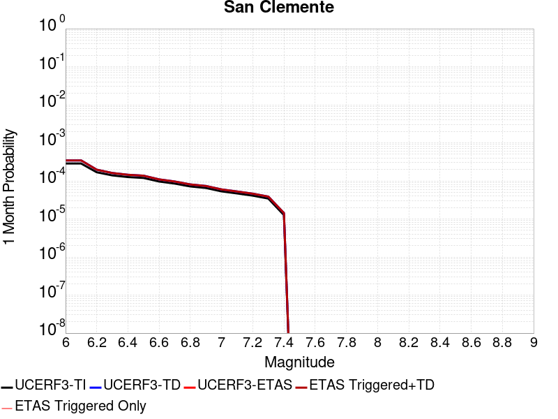 | 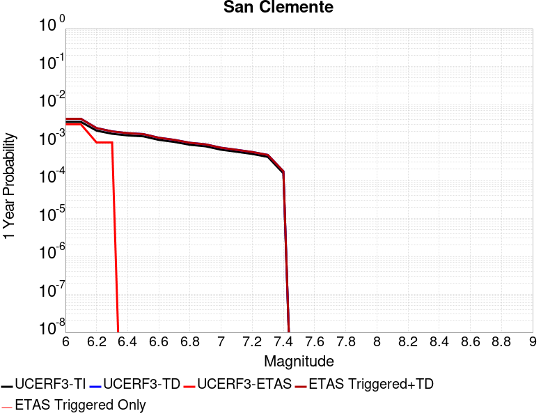 | 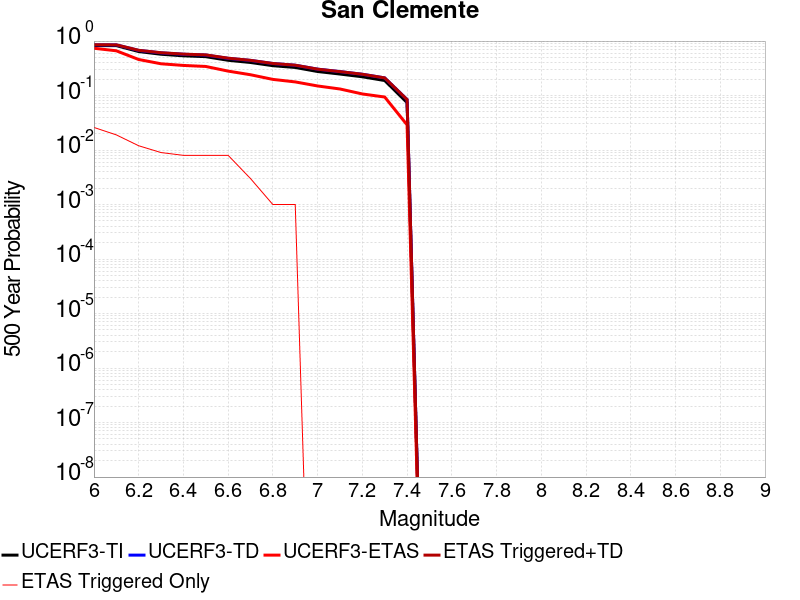 |

| Magnitude | 1 wk TI Prob | 1 wk TD Prob | 1 wk ETAS Prob | 1 wk ETAS/TD Gain | 1 wk ETAS Triggered+TD | 1 wk ETAS Triggered Only | 1 mo TI Prob | 1 mo TD Prob | 1 mo ETAS Prob | 1 mo ETAS/TD Gain | 1 mo ETAS Triggered+TD | 1 mo ETAS Triggered Only | 1 yr TI Prob | 1 yr TD Prob | 1 yr ETAS Prob | 1 yr ETAS/TD Gain | 1 yr ETAS Triggered+TD | 1 yr ETAS Triggered Only | 500 yr TI Prob | 500 yr TD Prob | 500 yr ETAS Prob | 500 yr ETAS/TD Gain | 500 yr ETAS Triggered+TD | 500 yr ETAS Triggered Only |
|-----|-----|-----|-----|-----|-----|-----|-----|-----|-----|-----|-----|-----|-----|-----|-----|-----|-----|-----|-----|-----|-----|-----|-----|-----|
| 6.0 | 6.681379E-5 | 8.070441E-5 | 0.0 | 0.0 | 8.070441E-5 | 0.0 | 2.8631336E-4 | 3.4583322E-4 | 0.0 | 0.0 | 3.4583322E-4 | 0.0 | 0.003480294 | 0.004202899 | 0.003 | 0.713793 | 0.004202899 | 0.0 | 0.82503724 | 0.8503543 | 0.738 | 0.86787355 | 0.85424507 | 0.026 |
| 6.1 | 6.681379E-5 | 8.070441E-5 | 0.0 | 0.0 | 8.070441E-5 | 0.0 | 2.8631336E-4 | 3.4583322E-4 | 0.0 | 0.0 | 3.4583322E-4 | 0.0 | 0.003480294 | 0.004202899 | 0.003 | 0.713793 | 0.004202899 | 0.0 | 0.82503724 | 0.8503543 | 0.663 | 0.779675 | 0.8531976 | 0.019 |
| 6.2 | 3.9400576E-5 | 4.6020756E-5 | 0.0 | 0.0 | 4.6020756E-5 | 0.0 | 1.6884868E-4 | 1.9721719E-4 | 0.0 | 0.0 | 1.9721719E-4 | 0.0 | 0.0020537945 | 0.0023985312 | 0.001 | 0.41692182 | 0.0023985312 | 0.0 | 0.64226156 | 0.6734449 | 0.459 | 0.68157023 | 0.6773636 | 0.012 |
| 6.3 | 3.2590255E-5 | 3.7606864E-5 | 0.0 | 0.0 | 3.7606864E-5 | 0.0 | 1.3966505E-4 | 1.6116249E-4 | 0.0 | 0.0 | 1.6116249E-4 | 0.0 | 0.0016990956 | 0.0019604182 | 0.001 | 0.51009524 | 0.0019604182 | 0.0 | 0.5727006 | 0.60777336 | 0.383 | 0.6301691 | 0.61130345 | 0.009 |
| 6.4 | 2.9454652E-5 | 3.3819255E-5 | 0.0 | 0.0 | 3.3819255E-5 | 0.0 | 1.2622811E-4 | 1.4493175E-4 | 0.0 | 0.0 | 1.4493175E-4 | 0.0 | 0.0015357438 | 0.0017631422 | 0.0 | 0.0 | 0.0017631422 | 0.0 | 0.5362743 | 0.5728363 | 0.357 | 0.6232147 | 0.5762536 | 0.008 |
| 6.5 | 2.790836E-5 | 3.1987773E-5 | 0.0 | 0.0 | 3.1987773E-5 | 0.0 | 1.1960178E-4 | 1.3708338E-4 | 0.0 | 0.0 | 1.3708338E-4 | 0.0 | 0.001455179 | 0.001667738 | 0.0 | 0.0 | 0.001667738 | 0.0 | 0.51718384 | 0.55425346 | 0.342 | 0.61704624 | 0.5578194 | 0.008 |
| 6.6 | 2.2492153E-5 | 2.5568956E-5 | 0.0 | 0.0 | 2.5568956E-5 | 0.0 | 9.639138E-5 | 1.0957672E-4 | 0.0 | 0.0 | 1.0957672E-4 | 0.0 | 0.0011729331 | 0.0013332947 | 0.0 | 0.0 | 0.0013332947 | 0.0 | 0.44390202 | 0.48131728 | 0.281 | 0.5838145 | 0.48546675 | 0.008 |
| 6.7 | 1.9862755E-5 | 2.2501064E-5 | 0.0 | 0.0 | 2.2501064E-5 | 0.0 | 8.512331E-5 | 9.642963E-5 | 0.0 | 0.0 | 9.642963E-5 | 0.0 | 0.0010358836 | 0.0011734095 | 0.0 | 0.0 | 0.0011734095 | 0.0 | 0.40441445 | 0.4413595 | 0.241 | 0.5460401 | 0.44303542 | 0.003 |
| 6.8 | 1.6697575E-5 | 1.884387E-5 | 0.0 | 0.0 | 1.884387E-5 | 0.0 | 7.155907E-5 | 8.0756996E-5 | 0.0 | 0.0 | 8.0756996E-5 | 0.0 | 8.7088346E-4 | 9.827821E-4 | 0.0 | 0.0 | 9.827821E-4 | 0.0 | 0.35314393 | 0.38726825 | 0.198 | 0.51127356 | 0.38788095 | 0.001 |
| 6.9 | 1.5218415E-5 | 1.7149225E-5 | 0.0 | 0.0 | 1.7149225E-5 | 0.0 | 6.522015E-5 | 7.349465E-5 | 0.0 | 0.0 | 7.349465E-5 | 0.0 | 7.93766E-4 | 8.9443877E-4 | 0.0 | 0.0 | 8.9443877E-4 | 0.0 | 0.32769325 | 0.36022702 | 0.178 | 0.49413282 | 0.3608668 | 0.001 |
| 7.0 | 1.2392958E-5 | 1.39371405E-5 | 0.0 | 0.0 | 1.39371405E-5 | 0.0 | 5.3111595E-5 | 5.972928E-5 | 0.0 | 0.0 | 5.972928E-5 | 0.0 | 6.4644177E-4 | 7.269688E-4 | 0.0 | 0.0 | 7.269688E-4 | 0.0 | 0.2762617 | 0.30520257 | 0.15 | 0.49147686 | 0.30520257 | 0.0 |
| 7.1 | 1.0934128E-5 | 1.2290942E-5 | 0.0 | 0.0 | 1.2290942E-5 | 0.0 | 4.6859706E-5 | 5.2674444E-5 | 0.0 | 0.0 | 5.2674444E-5 | 0.0 | 5.7036756E-4 | 6.4112985E-4 | 0.0 | 0.0 | 6.4112985E-4 | 0.0 | 0.24818511 | 0.27508596 | 0.132 | 0.47985 | 0.27508596 | 0.0 |
| 7.2 | 9.5798805E-6 | 1.0771007E-5 | 0.0 | 0.0 | 1.0771007E-5 | 0.0 | 4.1055984E-5 | 4.616068E-5 | 0.0 | 0.0 | 4.616068E-5 | 0.0 | 4.9974193E-4 | 5.618684E-4 | 0.0 | 0.0 | 5.618684E-4 | 0.0 | 0.22114737 | 0.2460456 | 0.107 | 0.43487874 | 0.2460456 | 0.0 |
| 7.3 | 8.0167365E-6 | 9.021499E-6 | 0.0 | 0.0 | 9.021499E-6 | 0.0 | 3.4356988E-5 | 3.8663035E-5 | 0.0 | 0.0 | 3.8663035E-5 | 0.0 | 4.1821605E-4 | 4.7062774E-4 | 0.0 | 0.0 | 4.7062774E-4 | 0.0 | 0.18872789 | 0.2108544 | 0.094 | 0.44580525 | 0.2108544 | 0.0 |
| 7.4 | 2.9581017E-6 | 3.3386655E-6 | 0.0 | 0.0 | 3.3386655E-6 | 0.0 | 1.2677518E-5 | 1.4308515E-5 | 0.0 | 0.0 | 1.4308515E-5 | 0.0 | 1.5433785E-4 | 1.7419722E-4 | 0.0 | 0.0 | 1.7419722E-4 | 0.0 | 0.074272044 | 0.08447858 | 0.029 | 0.34328228 | 0.08447858 | 0.0 |

## Concord 2011 CFM
*[(top)](#table-of-contents)*

| 1 Week | 1 Month | 1 Year | 500 Year |
|-----|-----|-----|-----|
| 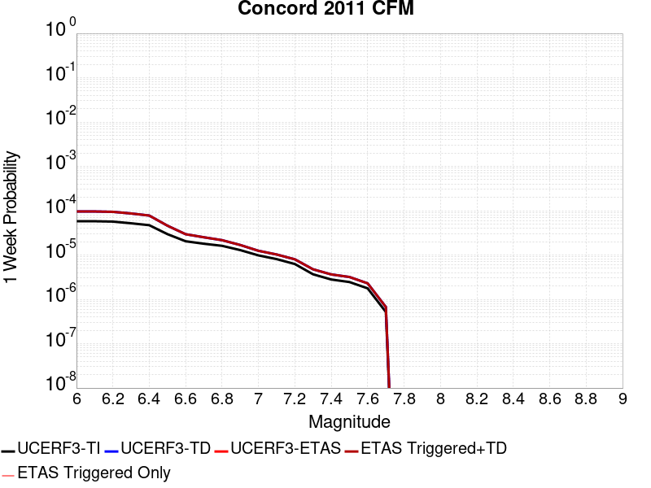 | 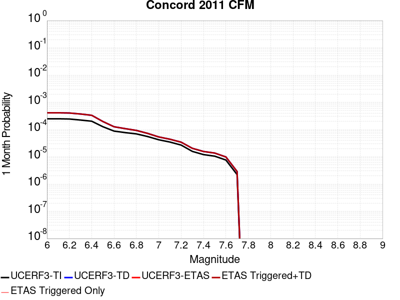 | 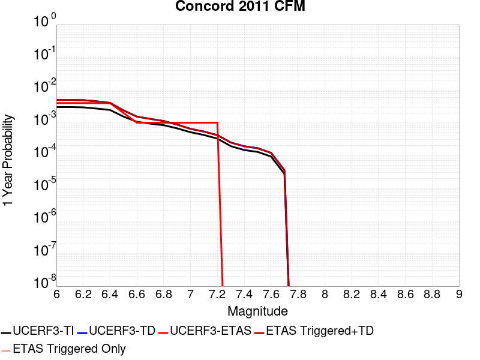 | 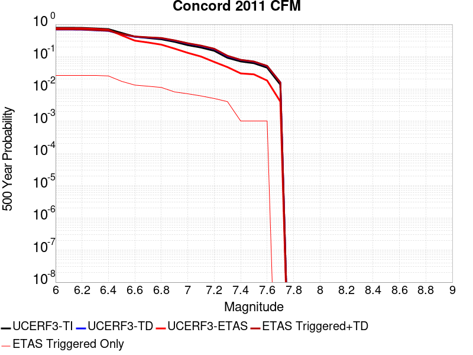 |

| Magnitude | 1 wk TI Prob | 1 wk TD Prob | 1 wk ETAS Prob | 1 wk ETAS/TD Gain | 1 wk ETAS Triggered+TD | 1 wk ETAS Triggered Only | 1 mo TI Prob | 1 mo TD Prob | 1 mo ETAS Prob | 1 mo ETAS/TD Gain | 1 mo ETAS Triggered+TD | 1 mo ETAS Triggered Only | 1 yr TI Prob | 1 yr TD Prob | 1 yr ETAS Prob | 1 yr ETAS/TD Gain | 1 yr ETAS Triggered+TD | 1 yr ETAS Triggered Only | 500 yr TI Prob | 500 yr TD Prob | 500 yr ETAS Prob | 500 yr ETAS/TD Gain | 500 yr ETAS Triggered+TD | 500 yr ETAS Triggered Only |
|-----|-----|-----|-----|-----|-----|-----|-----|-----|-----|-----|-----|-----|-----|-----|-----|-----|-----|-----|-----|-----|-----|-----|-----|-----|
| 6.0 | 5.7865112E-5 | 9.602411E-5 | 0.0 | 0.0 | 9.602411E-5 | 0.0 | 2.4796976E-4 | 4.114694E-4 | 0.0 | 0.0 | 4.114694E-4 | 0.0 | 0.0030148525 | 0.0049986723 | 0.004 | 0.8002125 | 0.0049986723 | 0.0 | 0.7790244 | 0.6894352 | 0.747 | 1.0834956 | 0.6975099 | 0.026 |
| 6.1 | 5.7865112E-5 | 9.602411E-5 | 0.0 | 0.0 | 9.602411E-5 | 0.0 | 2.4796976E-4 | 4.114694E-4 | 0.0 | 0.0 | 4.114694E-4 | 0.0 | 0.0030148525 | 0.0049986723 | 0.004 | 0.8002125 | 0.0049986723 | 0.0 | 0.7790244 | 0.6894352 | 0.747 | 1.0834956 | 0.6975099 | 0.026 |
| 6.2 | 5.6789337E-5 | 9.426218E-5 | 0.0 | 0.0 | 9.426218E-5 | 0.0 | 2.4336016E-4 | 4.039206E-4 | 0.0 | 0.0 | 4.039206E-4 | 0.0 | 0.0029588845 | 0.0049072225 | 0.004 | 0.81512505 | 0.0049072225 | 0.0 | 0.7727343 | 0.6835454 | 0.744 | 1.0884427 | 0.69177324 | 0.026 |
| 6.3 | 5.203322E-5 | 8.666747E-5 | 0.0 | 0.0 | 8.666747E-5 | 0.0 | 2.2298045E-4 | 3.713834E-4 | 0.0 | 0.0 | 3.713834E-4 | 0.0 | 0.0027114071 | 0.0045129783 | 0.004 | 0.88633263 | 0.0045129783 | 0.0 | 0.7427083 | 0.6552785 | 0.718 | 1.0957173 | 0.66424125 | 0.026 |
| 6.4 | 4.7120942E-5 | 7.772764E-5 | 0.0 | 0.0 | 7.772764E-5 | 0.0 | 2.0193127E-4 | 3.3307998E-4 | 0.0 | 0.0 | 3.3307998E-4 | 0.0 | 0.0024557412 | 0.004048431 | 0.004 | 0.98803717 | 0.004048431 | 0.0 | 0.7075263 | 0.62556523 | 0.675 | 1.0790242 | 0.6349261 | 0.025 |
| 6.5 | 2.9598437E-5 | 4.5925433E-5 | 0.0 | 0.0 | 4.5925433E-5 | 0.0 | 1.2684427E-4 | 1.9680959E-4 | 0.0 | 0.0 | 1.9680959E-4 | 0.0 | 0.001543235 | 0.0023937277 | 0.002 | 0.8355169 | 0.0023937277 | 0.0 | 0.5380107 | 0.49280652 | 0.454 | 0.92125404 | 0.50142884 | 0.017 |
| 6.6 | 2.0443718E-5 | 2.9486435E-5 | 0.0 | 0.0 | 2.9486435E-5 | 0.0 | 8.7613E-5 | 1.2636451E-4 | 0.0 | 0.0 | 1.2636451E-4 | 0.0 | 0.0010661662 | 0.0015374371 | 0.001 | 0.6504331 | 0.0015374371 | 0.0 | 0.4133738 | 0.41077402 | 0.311 | 0.7571073 | 0.41843396 | 0.013 |
| 6.7 | 1.798539E-5 | 2.5148627E-5 | 0.0 | 0.0 | 2.5148627E-5 | 0.0 | 7.7077966E-5 | 1.0777549E-4 | 0.0 | 0.0 | 1.0777549E-4 | 0.0 | 9.380202E-4 | 0.0013113975 | 0.001 | 0.7625452 | 0.0013113975 | 0.0 | 0.37451643 | 0.3872706 | 0.272 | 0.7023513 | 0.39462337 | 0.012 |
| 6.8 | 1.613555E-5 | 2.1637472E-5 | 0.0 | 0.0 | 2.1637472E-5 | 0.0 | 6.915052E-5 | 9.27288E-5 | 0.0 | 0.0 | 9.27288E-5 | 0.0 | 8.4158237E-4 | 0.001128402 | 0.001 | 0.886209 | 0.001128402 | 0.0 | 0.34358913 | 0.3683099 | 0.234 | 0.63533455 | 0.37525848 | 0.011 |
| 6.9 | 1.2916435E-5 | 1.6838727E-5 | 0.0 | 0.0 | 1.6838727E-5 | 0.0 | 5.5354973E-5 | 7.2164E-5 | 0.0 | 0.0 | 7.2164E-5 | 0.0 | 6.7373837E-4 | 8.7824825E-4 | 0.001 | 1.1386303 | 8.7824825E-4 | 0.0 | 0.28607884 | 0.31200066 | 0.176 | 0.56410134 | 0.31750467 | 0.008 |
| 7.0 | 9.81129E-6 | 1.24620865E-5 | 0.0 | 0.0 | 1.24620865E-5 | 0.0 | 4.2047708E-5 | 5.3407857E-5 | 0.0 | 0.0 | 5.3407857E-5 | 0.0 | 5.118106E-4 | 6.5004826E-4 | 0.001 | 1.5383474 | 6.5004826E-4 | 0.0 | 0.22583543 | 0.25247747 | 0.13 | 0.5148974 | 0.25771013 | 0.007 |
| 7.1 | 8.0889195E-6 | 1.0275871E-5 | 0.0 | 0.0 | 1.0275871E-5 | 0.0 | 3.4666336E-5 | 4.4038712E-5 | 0.0 | 0.0 | 4.4038712E-5 | 0.0 | 4.219809E-4 | 5.3604046E-4 | 0.001 | 1.8655308 | 5.3604046E-4 | 0.0 | 0.19025426 | 0.21319965 | 0.1 | 0.4690439 | 0.21792045 | 0.006 |
| 7.2 | 6.267438E-6 | 8.003683E-6 | 0.0 | 0.0 | 8.003683E-6 | 0.0 | 2.6860173E-5 | 3.4301054E-5 | 0.0 | 0.0 | 3.4301054E-5 | 0.0 | 3.2697353E-4 | 4.1753604E-4 | 0.001 | 2.3950028 | 4.1753604E-4 | 0.0 | 0.15084496 | 0.17026009 | 0.068 | 0.39938894 | 0.1744088 | 0.005 |
| 7.3 | 3.6761196E-6 | 4.765037E-6 | 0.0 | 0.0 | 4.765037E-6 | 0.0 | 1.5754704E-5 | 2.0421428E-5 | 0.0 | 0.0 | 2.0421428E-5 | 0.0 | 1.9179663E-4 | 2.4860274E-4 | 0.0 | 0.0 | 2.4860274E-4 | 0.0 | 0.09145196 | 0.10197394 | 0.047 | 0.46090207 | 0.10556605 | 0.004 |
| 7.4 | 2.8044356E-6 | 3.6511626E-6 | 0.0 | 0.0 | 3.6511626E-6 | 0.0 | 1.2018954E-5 | 1.5647747E-5 | 0.0 | 0.0 | 1.5647747E-5 | 0.0 | 1.4632095E-4 | 1.9049477E-4 | 0.0 | 0.0 | 1.9049477E-4 | 0.0 | 0.07055331 | 0.078080736 | 0.03 | 0.38421768 | 0.079002656 | 0.001 |
| 7.5 | 2.4578699E-6 | 3.1940028E-6 | 0.0 | 0.0 | 3.1940028E-6 | 0.0 | 1.0533685E-5 | 1.3688512E-5 | 0.0 | 0.0 | 1.3688512E-5 | 0.0 | 1.2824008E-4 | 1.66645E-4 | 0.0 | 0.0 | 1.66645E-4 | 0.0 | 0.062111445 | 0.0689299 | 0.028 | 0.40620977 | 0.06986097 | 0.001 |
| 7.6 | 1.7713267E-6 | 2.2981958E-6 | 0.0 | 0.0 | 2.2981958E-6 | 0.0 | 7.591378E-6 | 9.849375E-6 | 0.0 | 0.0 | 9.849375E-6 | 0.0 | 9.2421105E-5 | 1.1990962E-4 | 0.0 | 0.0 | 1.1990962E-4 | 0.0 | 0.045161143 | 0.05037662 | 0.018 | 0.35730863 | 0.05132624 | 0.001 |
| 7.7 | 5.1912366E-7 | 6.7227273E-7 | 0.0 | 0.0 | 6.7227273E-7 | 0.0 | 2.2248137E-6 | 2.8811658E-6 | 0.0 | 0.0 | 2.8811658E-6 | 0.0 | 2.708677E-5 | 3.5077643E-5 | 0.0 | 0.0 | 3.5077643E-5 | 0.0 | 0.013452267 | 0.015680717 | 0.004 | 0.25509036 | 0.015680717 | 0.0 |

## Santa Ynez (West)
*[(top)](#table-of-contents)*

| 1 Week | 1 Month | 1 Year | 500 Year |
|-----|-----|-----|-----|
| 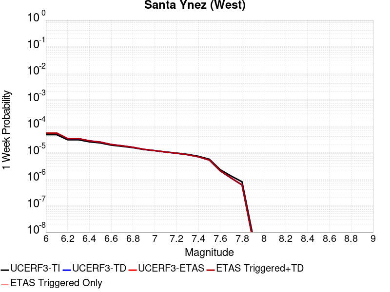 |  | 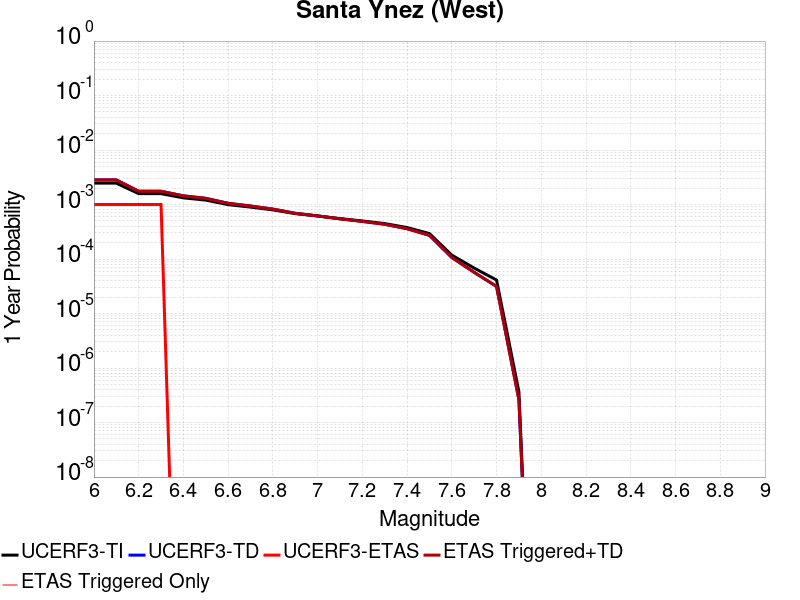 | 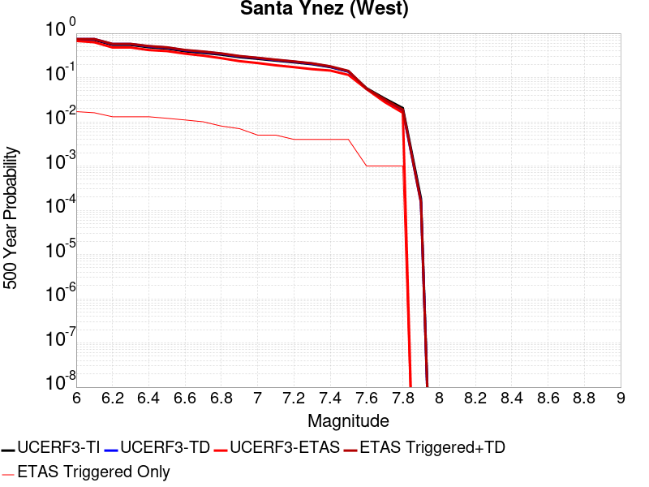 |

| Magnitude | 1 wk TI Prob | 1 wk TD Prob | 1 wk ETAS Prob | 1 wk ETAS/TD Gain | 1 wk ETAS Triggered+TD | 1 wk ETAS Triggered Only | 1 mo TI Prob | 1 mo TD Prob | 1 mo ETAS Prob | 1 mo ETAS/TD Gain | 1 mo ETAS Triggered+TD | 1 mo ETAS Triggered Only | 1 yr TI Prob | 1 yr TD Prob | 1 yr ETAS Prob | 1 yr ETAS/TD Gain | 1 yr ETAS Triggered+TD | 1 yr ETAS Triggered Only | 500 yr TI Prob | 500 yr TD Prob | 500 yr ETAS Prob | 500 yr ETAS/TD Gain | 500 yr ETAS Triggered+TD | 500 yr ETAS Triggered Only |
|-----|-----|-----|-----|-----|-----|-----|-----|-----|-----|-----|-----|-----|-----|-----|-----|-----|-----|-----|-----|-----|-----|-----|-----|-----|
| 6.0 | 4.7352758E-5 | 5.4437347E-5 | 0.0 | 0.0 | 5.4437347E-5 | 0.0 | 2.0292461E-4 | 2.3328367E-4 | 0.0 | 0.0 | 2.3328367E-4 | 0.0 | 0.0024678076 | 0.002836798 | 0.001 | 0.3525101 | 0.002836798 | 0.0 | 0.70928997 | 0.7381371 | 0.674 | 0.9131095 | 0.74258876 | 0.017 |
| 6.1 | 4.7352758E-5 | 5.4437347E-5 | 0.0 | 0.0 | 5.4437347E-5 | 0.0 | 2.0292461E-4 | 2.3328367E-4 | 0.0 | 0.0 | 2.3328367E-4 | 0.0 | 0.0024678076 | 0.002836798 | 0.001 | 0.3525101 | 0.002836798 | 0.0 | 0.70928997 | 0.7381371 | 0.628 | 0.85079044 | 0.7423269 | 0.016 |
| 6.2 | 3.0415853E-5 | 3.3653054E-5 | 0.0 | 0.0 | 3.3653054E-5 | 0.0 | 1.3034715E-4 | 1.4421961E-4 | 0.0 | 0.0 | 1.4421961E-4 | 0.0 | 0.0015858212 | 0.0017544952 | 0.001 | 0.5699645 | 0.0017544952 | 0.0 | 0.54775894 | 0.57142806 | 0.479 | 0.83825076 | 0.5769995 | 0.013 |
| 6.3 | 3.0415853E-5 | 3.3653054E-5 | 0.0 | 0.0 | 3.3653054E-5 | 0.0 | 1.3034715E-4 | 1.4421961E-4 | 0.0 | 0.0 | 1.4421961E-4 | 0.0 | 0.0015858212 | 0.0017544952 | 0.001 | 0.5699645 | 0.0017544952 | 0.0 | 0.54775894 | 0.57142806 | 0.479 | 0.83825076 | 0.5769995 | 0.013 |
| 6.4 | 2.5452082E-5 | 2.7706072E-5 | 0.0 | 0.0 | 2.7706072E-5 | 0.0 | 1.09075794E-4 | 1.1873501E-4 | 0.0 | 0.0 | 1.1873501E-4 | 0.0 | 0.0013271887 | 0.0014446592 | 0.0 | 0.0 | 0.0014446592 | 0.0 | 0.48523 | 0.5082448 | 0.419 | 0.82440585 | 0.51463765 | 0.013 |
| 6.5 | 2.3143784E-5 | 2.4951507E-5 | 0.0 | 0.0 | 2.4951507E-5 | 0.0 | 9.9183875E-5 | 1.0693073E-4 | 0.0 | 0.0 | 1.0693073E-4 | 0.0 | 0.0012068948 | 0.0013011186 | 0.0 | 0.0 | 0.0013011186 | 0.0 | 0.45327634 | 0.4758152 | 0.397 | 0.8343575 | 0.48210543 | 0.012 |
| 6.6 | 1.9118515E-5 | 2.0223566E-5 | 0.0 | 0.0 | 2.0223566E-5 | 0.0 | 8.193392E-5 | 8.666959E-5 | 0.0 | 0.0 | 8.666959E-5 | 0.0 | 9.97089E-4 | 0.0010546993 | 0.0 | 0.0 | 0.0010546993 | 0.0 | 0.3927369 | 0.41322926 | 0.347 | 0.8397276 | 0.41968375 | 0.011 |
| 6.7 | 1.722807E-5 | 1.8034812E-5 | 0.0 | 0.0 | 1.8034812E-5 | 0.0 | 7.3832496E-5 | 7.728979E-5 | 0.0 | 0.0 | 7.728979E-5 | 0.0 | 8.985399E-4 | 9.4060245E-4 | 0.0 | 0.0 | 9.4060245E-4 | 0.0 | 0.36203504 | 0.38108715 | 0.313 | 0.8213344 | 0.3872763 | 0.01 |
| 6.8 | 1.5317364E-5 | 1.5833608E-5 | 0.0 | 0.0 | 1.5833608E-5 | 0.0 | 6.56442E-5 | 6.785658E-5 | 0.0 | 0.0 | 6.785658E-5 | 0.0 | 7.98925E-4 | 8.2584494E-4 | 0.0 | 0.0 | 8.2584494E-4 | 0.0 | 0.32942665 | 0.34576342 | 0.274 | 0.79244936 | 0.35099733 | 0.008 |
| 6.9 | 1.3071226E-5 | 1.3257775E-5 | 0.0 | 0.0 | 1.3257775E-5 | 0.0 | 5.6018336E-5 | 5.681781E-5 | 0.0 | 0.0 | 5.681781E-5 | 0.0 | 6.8180985E-4 | 6.9153955E-4 | 0.0 | 0.0 | 6.9153955E-4 | 0.0 | 0.28895617 | 0.3014251 | 0.235 | 0.7796298 | 0.30631512 | 0.007 |
| 7.0 | 1.1836986E-5 | 1.1870511E-5 | 0.0 | 0.0 | 1.1870511E-5 | 0.0 | 5.0728955E-5 | 5.0872637E-5 | 0.0 | 0.0 | 5.0872637E-5 | 0.0 | 6.1745E-4 | 6.192E-4 | 0.0 | 0.0 | 6.192E-4 | 0.0 | 0.26568732 | 0.27602038 | 0.213 | 0.77168214 | 0.27964026 | 0.005 |
| 7.1 | 1.0597169E-5 | 1.0488751E-5 | 0.0 | 0.0 | 1.0488751E-5 | 0.0 | 4.541565E-5 | 4.4951023E-5 | 0.0 | 0.0 | 4.4951023E-5 | 0.0 | 5.5279525E-4 | 5.471424E-4 | 0.0 | 0.0 | 5.471424E-4 | 0.0 | 0.24154669 | 0.24969406 | 0.189 | 0.75692624 | 0.2534456 | 0.005 |
| 7.2 | 9.59113E-6 | 9.410035E-6 | 0.0 | 0.0 | 9.410035E-6 | 0.0 | 4.11042E-5 | 4.0328105E-5 | 0.0 | 0.0 | 4.0328105E-5 | 0.0 | 5.0032866E-4 | 4.908851E-4 | 0.0 | 0.0 | 4.908851E-4 | 0.0 | 0.22137594 | 0.22830461 | 0.172 | 0.75337946 | 0.23139139 | 0.004 |
| 7.3 | 8.586084E-6 | 8.3346495E-6 | 0.0 | 0.0 | 8.3346495E-6 | 0.0 | 3.679698E-5 | 3.5719444E-5 | 0.0 | 0.0 | 3.5719444E-5 | 0.0 | 4.4791115E-4 | 4.3479845E-4 | 0.0 | 0.0 | 4.3479845E-4 | 0.0 | 0.20068946 | 0.20634122 | 0.155 | 0.7511829 | 0.20951585 | 0.004 |
| 7.4 | 7.2622997E-6 | 6.9126036E-6 | 0.0 | 0.0 | 6.9126036E-6 | 0.0 | 3.112377E-5 | 2.9625113E-5 | 0.0 | 0.0 | 2.9625113E-5 | 0.0 | 3.78866E-4 | 3.6062702E-4 | 0.0 | 0.0 | 3.6062702E-4 | 0.0 | 0.17260155 | 0.17629059 | 0.144 | 0.8168332 | 0.17958541 | 0.004 |
| 7.5 | 5.627296E-6 | 5.2212167E-6 | 0.0 | 0.0 | 5.2212167E-6 | 0.0 | 2.411676E-5 | 2.2376455E-5 | 0.0 | 0.0 | 2.2376455E-5 | 0.0 | 2.9358198E-4 | 2.7239998E-4 | 0.0 | 0.0 | 2.7239998E-4 | 0.0 | 0.13654418 | 0.1379558 | 0.115 | 0.83360034 | 0.14140397 | 0.004 |
| 7.6 | 2.265244E-6 | 2.0495534E-6 | 0.0 | 0.0 | 2.0495534E-6 | 0.0 | 9.708152E-6 | 8.783771E-6 | 0.0 | 0.0 | 8.783771E-6 | 0.0 | 1.18190335E-4 | 1.0693725E-4 | 0.0 | 0.0 | 1.0693725E-4 | 0.0 | 0.057386234 | 0.05534503 | 0.055 | 0.99376583 | 0.056289684 | 0.001 |
| 7.7 | 1.3099874E-6 | 1.0949553E-6 | 0.0 | 0.0 | 1.0949553E-6 | 0.0 | 5.61422E-6 | 4.6926575E-6 | 0.0 | 0.0 | 4.6926575E-6 | 0.0 | 6.8350986E-5 | 5.713163E-5 | 0.0 | 0.0 | 5.713163E-5 | 0.0 | 0.033599235 | 0.030945005 | 0.028 | 0.904831 | 0.03191406 | 0.001 |
| 7.8 | 7.903951E-7 | 6.025275E-7 | 0.0 | 0.0 | 6.025275E-7 | 0.0 | 3.3874032E-6 | 2.5822583E-6 | 0.0 | 0.0 | 2.5822583E-6 | 0.0 | 4.1240855E-5 | 3.1438554E-5 | 0.0 | 0.0 | 3.1438554E-5 | 0.0 | 0.020409696 | 0.017841846 | 0.016 | 0.8967683 | 0.018824004 | 0.001 |
| 7.9 | 7.0753297E-9 | 5.077843E-9 | 0.0 | 0.0 | 5.077843E-9 | 0.0 | 3.032284E-8 | 2.1762185E-8 | 0.0 | 0.0 | 2.1762185E-8 | 0.0 | 3.6918053E-7 | 2.6495456E-7 | 0.0 | 0.0 | 2.6495456E-7 | 0.0 | 1.8457326E-4 | 1.5219033E-4 | 0.0 | 0.0 | 1.5219033E-4 | 0.0 |

## Quien Sabe 2011 CFM
*[(top)](#table-of-contents)*

| 1 Week | 1 Month | 1 Year | 500 Year |
|-----|-----|-----|-----|
| 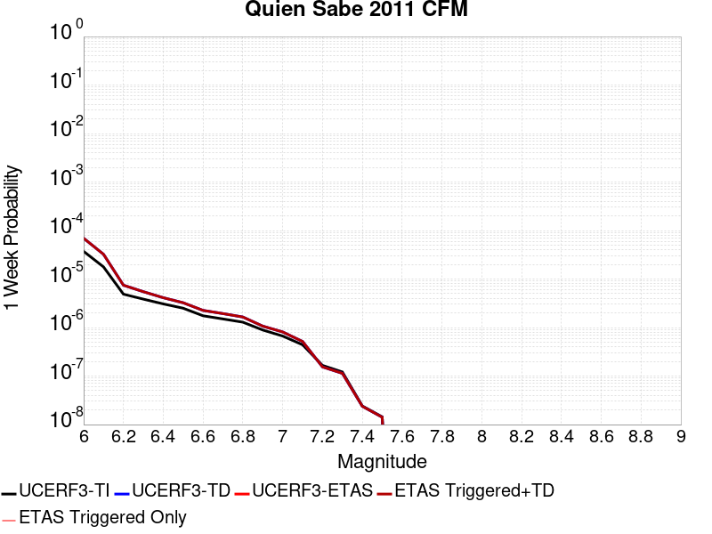 | 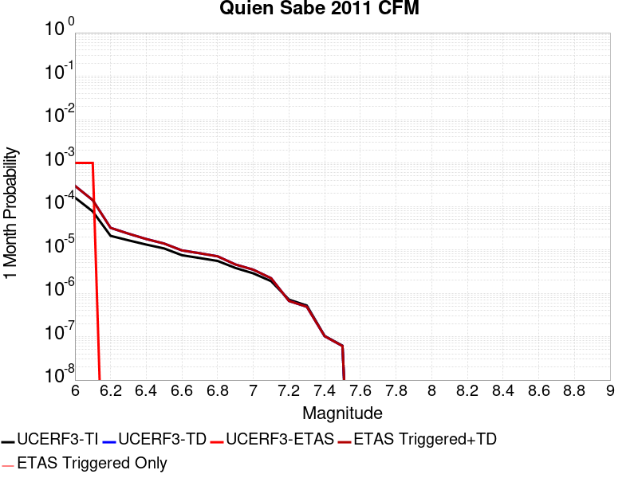 | 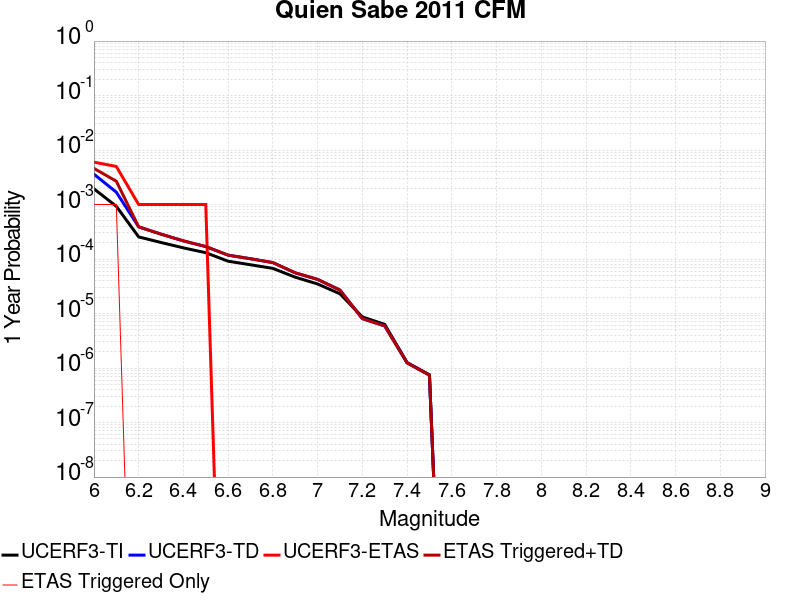 | 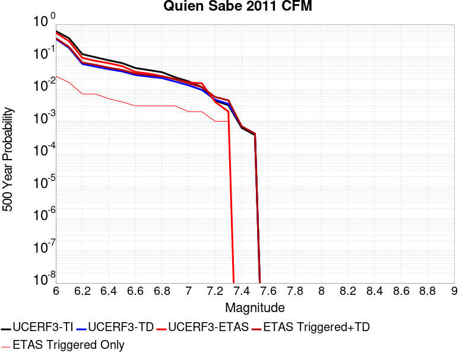 |

| Magnitude | 1 wk TI Prob | 1 wk TD Prob | 1 wk ETAS Prob | 1 wk ETAS/TD Gain | 1 wk ETAS Triggered+TD | 1 wk ETAS Triggered Only | 1 mo TI Prob | 1 mo TD Prob | 1 mo ETAS Prob | 1 mo ETAS/TD Gain | 1 mo ETAS Triggered+TD | 1 mo ETAS Triggered Only | 1 yr TI Prob | 1 yr TD Prob | 1 yr ETAS Prob | 1 yr ETAS/TD Gain | 1 yr ETAS Triggered+TD | 1 yr ETAS Triggered Only | 500 yr TI Prob | 500 yr TD Prob | 500 yr ETAS Prob | 500 yr ETAS/TD Gain | 500 yr ETAS Triggered+TD | 500 yr ETAS Triggered Only |
|-----|-----|-----|-----|-----|-----|-----|-----|-----|-----|-----|-----|-----|-----|-----|-----|-----|-----|-----|-----|-----|-----|-----|-----|-----|
| 6.0 | 3.729899E-5 | 6.9510505E-5 | 0.0 | 0.0 | 6.9510505E-5 | 0.0 | 1.5984301E-4 | 2.9779997E-4 | 0.001 | 3.3579586 | 2.9779997E-4 | 0.0 | 0.0019443515 | 0.0036113132 | 0.006 | 1.6614455 | 0.004607702 | 0.001 | 0.6220986 | 0.35808474 | 0.551 | 1.538742 | 0.37413263 | 0.025 |
| 6.1 | 1.7825725E-5 | 3.244157E-5 | 0.0 | 0.0 | 3.244157E-5 | 0.0 | 7.639373E-5 | 1.390072E-4 | 0.001 | 7.193872 | 1.390072E-4 | 0.0 | 9.296967E-4 | 0.0016871489 | 0.005 | 2.9635794 | 0.002685462 | 0.001 | 0.37190548 | 0.18693483 | 0.302 | 1.6155363 | 0.19994387 | 0.016 |
| 6.2 | 4.8865336E-6 | 7.4768736E-6 | 0.0 | 0.0 | 7.4768736E-6 | 0.0 | 2.0942118E-5 | 3.2039716E-5 | 0.0 | 0.0 | 3.2039716E-5 | 0.0 | 2.5494045E-4 | 3.8969907E-4 | 0.001 | 2.5660825 | 3.8969907E-4 | 0.0 | 0.11969468 | 0.059638657 | 0.092 | 1.5426236 | 0.066221185 | 0.007 |
| 6.3 | 3.858491E-6 | 5.4935085E-6 | 0.0 | 0.0 | 5.4935085E-6 | 0.0 | 1.6536285E-5 | 2.354342E-5 | 0.0 | 0.0 | 2.354342E-5 | 0.0 | 2.0131067E-4 | 2.866077E-4 | 0.001 | 3.4890895 | 2.866077E-4 | 0.0 | 0.095764525 | 0.049071625 | 0.074 | 1.5079998 | 0.055728123 | 0.007 |
| 6.4 | 3.0771805E-6 | 4.1304966E-6 | 0.0 | 0.0 | 4.1304966E-6 | 0.0 | 1.318785E-5 | 1.7702021E-5 | 0.0 | 0.0 | 1.7702021E-5 | 0.0 | 1.6055023E-4 | 2.1550294E-4 | 0.001 | 4.640308 | 2.1550294E-4 | 0.0 | 0.077143535 | 0.04096858 | 0.063 | 1.5377638 | 0.045763735 | 0.005 |
| 6.5 | 2.5081235E-6 | 3.250769E-6 | 0.0 | 0.0 | 3.250769E-6 | 0.0 | 1.0749056E-5 | 1.39318E-5 | 0.0 | 0.0 | 1.39318E-5 | 0.0 | 1.308619E-4 | 1.6960775E-4 | 0.001 | 5.895957 | 1.6960775E-4 | 0.0 | 0.06334029 | 0.03503795 | 0.051 | 1.4555647 | 0.038897797 | 0.004 |
| 6.6 | 1.7505364E-6 | 2.260754E-6 | 0.0 | 0.0 | 2.260754E-6 | 0.0 | 7.502277E-6 | 9.6889125E-6 | 0.0 | 0.0 | 9.6889125E-6 | 0.0 | 9.13364E-5 | 1.1795675E-4 | 0.0 | 0.0 | 1.1795675E-4 | 0.0 | 0.044643093 | 0.027057007 | 0.034 | 1.2566061 | 0.029975835 | 0.003 |
| 6.7 | 1.505737E-6 | 1.942848E-6 | 0.0 | 0.0 | 1.942848E-6 | 0.0 | 6.4531428E-6 | 8.326468E-6 | 0.0 | 0.0 | 8.326468E-6 | 0.0 | 7.8564175E-5 | 1.01370555E-4 | 0.0 | 0.0 | 1.01370555E-4 | 0.0 | 0.038522035 | 0.024183417 | 0.03 | 1.2405195 | 0.027110867 | 0.003 |
| 6.8 | 1.2924105E-6 | 1.6512481E-6 | 0.0 | 0.0 | 1.6512481E-6 | 0.0 | 5.5388905E-6 | 7.0767614E-6 | 0.0 | 0.0 | 7.0767614E-6 | 0.0 | 6.74339E-5 | 8.6156644E-5 | 0.0 | 0.0 | 8.6156644E-5 | 0.0 | 0.03315597 | 0.021780595 | 0.025 | 1.1478107 | 0.024715254 | 0.003 |
| 6.9 | 8.9075286E-7 | 1.0709894E-6 | 0.0 | 0.0 | 1.0709894E-6 | 0.0 | 3.8175067E-6 | 4.5899474E-6 | 0.0 | 0.0 | 4.5899474E-6 | 0.0 | 4.6477155E-5 | 5.5881377E-5 | 0.0 | 0.0 | 5.5881377E-5 | 0.0 | 0.022971168 | 0.016941125 | 0.02 | 1.1805592 | 0.0198903 | 0.003 |
| 7.0 | 6.6891175E-7 | 8.1252085E-7 | 0.0 | 0.0 | 8.1252085E-7 | 0.0 | 2.8667614E-6 | 3.4822287E-6 | 0.0 | 0.0 | 3.4822287E-6 | 0.0 | 3.4902263E-5 | 4.2395488E-5 | 0.0 | 0.0 | 4.2395488E-5 | 0.0 | 0.017300041 | 0.013042379 | 0.016 | 1.22677 | 0.015016295 | 0.002 |
| 7.1 | 4.4205015E-7 | 5.1687516E-7 | 0.0 | 0.0 | 5.1687516E-7 | 0.0 | 1.8944993E-6 | 2.2151783E-6 | 0.0 | 0.0 | 2.2151783E-6 | 0.0 | 2.3065284E-5 | 2.6969616E-5 | 0.0 | 0.0 | 2.6969616E-5 | 0.0 | 0.011466527 | 0.00937943 | 0.015 | 1.5992444 | 0.011360671 | 0.002 |
| 7.2 | 1.6620965E-7 | 1.5478435E-7 | 0.0 | 0.0 | 1.5478435E-7 | 0.0 | 7.123269E-7 | 6.6336133E-7 | 0.0 | 0.0 | 6.6336133E-7 | 0.0 | 8.672545E-6 | 8.0763975E-6 | 0.0 | 0.0 | 8.0763975E-6 | 0.0 | 0.0043269033 | 0.004674215 | 0.004 | 0.85575867 | 0.0056695407 | 0.001 |
| 7.3 | 1.2142488E-7 | 1.1369383E-7 | 0.0 | 0.0 | 1.1369383E-7 | 0.0 | 5.2039223E-7 | 4.872592E-7 | 0.0 | 0.0 | 4.872592E-7 | 0.0 | 6.335757E-6 | 5.932368E-6 | 0.0 | 0.0 | 5.932368E-6 | 0.0 | 0.0031628762 | 0.0034717645 | 0.002 | 0.5760759 | 0.004468293 | 0.001 |
| 7.4 | 2.4192937E-8 | 2.3900482E-8 | 0.0 | 0.0 | 2.3900482E-8 | 0.0 | 1.0368401E-7 | 1.0243063E-7 | 0.0 | 0.0 | 1.0243063E-7 | 0.0 | 1.2623522E-6 | 1.2470923E-6 | 0.0 | 0.0 | 1.2470923E-6 | 0.0 | 6.3097733E-4 | 6.9890934E-4 | 0.0 | 0.0 | 6.9890934E-4 | 0.0 |
| 7.5 | 1.4432802E-8 | 1.4184458E-8 | 0.0 | 0.0 | 1.4184458E-8 | 0.0 | 6.185486E-8 | 6.079053E-8 | 0.0 | 0.0 | 6.079053E-8 | 0.0 | 7.530827E-7 | 7.4012456E-7 | 0.0 | 0.0 | 7.4012456E-7 | 0.0 | 3.7647062E-4 | 4.153647E-4 | 0.0 | 0.0 | 4.153647E-4 | 0.0 |

## Great Valley 05 Pittsburg - Kirby Hills alt1
*[(top)](#table-of-contents)*

| 1 Week | 1 Month | 1 Year | 500 Year |
|-----|-----|-----|-----|
|  |  | 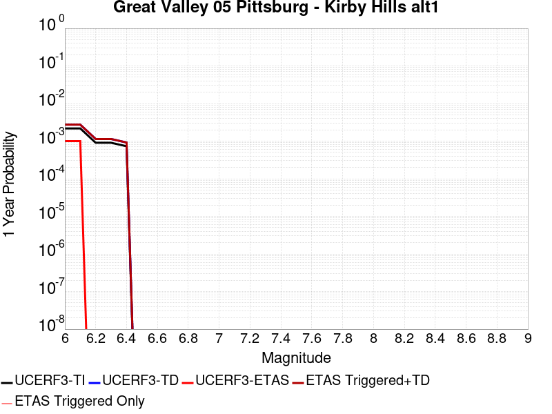 | 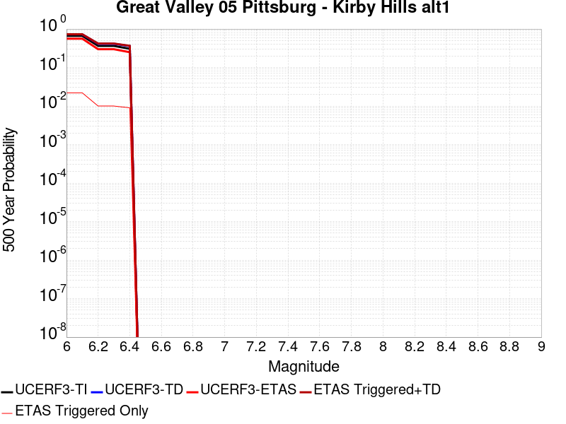 |

| Magnitude | 1 wk TI Prob | 1 wk TD Prob | 1 wk ETAS Prob | 1 wk ETAS/TD Gain | 1 wk ETAS Triggered+TD | 1 wk ETAS Triggered Only | 1 mo TI Prob | 1 mo TD Prob | 1 mo ETAS Prob | 1 mo ETAS/TD Gain | 1 mo ETAS Triggered+TD | 1 mo ETAS Triggered Only | 1 yr TI Prob | 1 yr TD Prob | 1 yr ETAS Prob | 1 yr ETAS/TD Gain | 1 yr ETAS Triggered+TD | 1 yr ETAS Triggered Only | 500 yr TI Prob | 500 yr TD Prob | 500 yr ETAS Prob | 500 yr ETAS/TD Gain | 500 yr ETAS Triggered+TD | 500 yr ETAS Triggered Only |
|-----|-----|-----|-----|-----|-----|-----|-----|-----|-----|-----|-----|-----|-----|-----|-----|-----|-----|-----|-----|-----|-----|-----|-----|-----|
| 6.0 | 4.187212E-5 | 5.26981E-5 | 0.0 | 0.0 | 5.26981E-5 | 0.0 | 1.794396E-4 | 2.2583487E-4 | 0.0 | 0.0 | 2.2583487E-4 | 0.0 | 0.002182488 | 0.0027470281 | 0.001 | 0.36402977 | 0.0027470281 | 0.0 | 0.66460174 | 0.7247236 | 0.562 | 0.7754681 | 0.73077965 | 0.022 |
| 6.1 | 4.187212E-5 | 5.26981E-5 | 0.0 | 0.0 | 5.26981E-5 | 0.0 | 1.794396E-4 | 2.2583487E-4 | 0.0 | 0.0 | 2.2583487E-4 | 0.0 | 0.002182488 | 0.0027470281 | 0.001 | 0.36402977 | 0.0027470281 | 0.0 | 0.66460174 | 0.7247236 | 0.562 | 0.7754681 | 0.73077965 | 0.022 |
| 6.2 | 1.7353306E-5 | 2.184545E-5 | 0.0 | 0.0 | 2.184545E-5 | 0.0 | 7.436919E-5 | 9.362221E-5 | 0.0 | 0.0 | 9.362221E-5 | 0.0 | 9.050688E-4 | 0.0011396416 | 0.0 | 0.0 | 0.0011396416 | 0.0 | 0.36411613 | 0.41367447 | 0.299 | 0.72279054 | 0.41953775 | 0.01 |
| 6.3 | 1.7353306E-5 | 2.184545E-5 | 0.0 | 0.0 | 2.184545E-5 | 0.0 | 7.436919E-5 | 9.362221E-5 | 0.0 | 0.0 | 9.362221E-5 | 0.0 | 9.050688E-4 | 0.0011396416 | 0.0 | 0.0 | 0.0011396416 | 0.0 | 0.36411613 | 0.41367447 | 0.299 | 0.72279054 | 0.41953775 | 0.01 |
| 6.4 | 1.4028824E-5 | 1.7651719E-5 | 0.0 | 0.0 | 1.7651719E-5 | 0.0 | 6.0122147E-5 | 7.565022E-5 | 0.0 | 0.0 | 7.565022E-5 | 0.0 | 7.3174125E-4 | 9.210318E-4 | 0.0 | 0.0 | 9.210318E-4 | 0.0 | 0.30650038 | 0.36040902 | 0.25 | 0.6936563 | 0.36616534 | 0.009 |

## Big Pine (East)
*[(top)](#table-of-contents)*

| 1 Week | 1 Month | 1 Year | 500 Year |
|-----|-----|-----|-----|
| 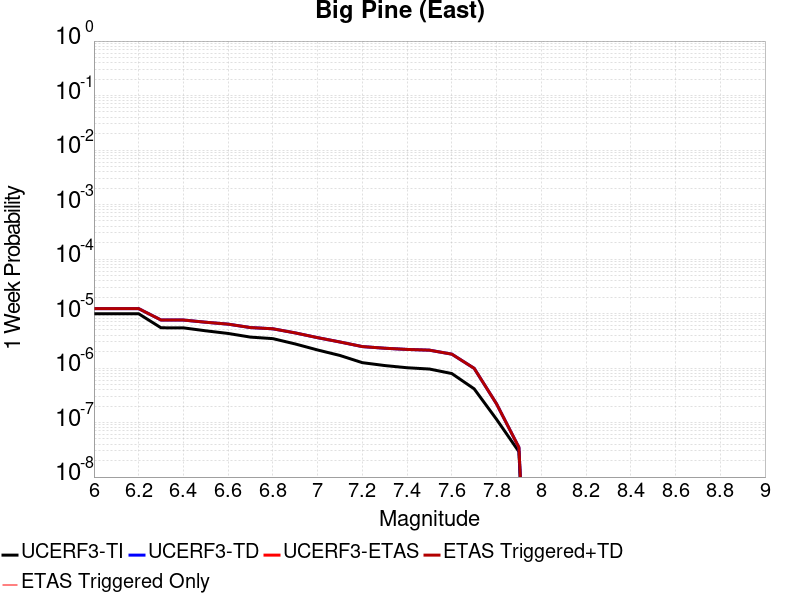 | 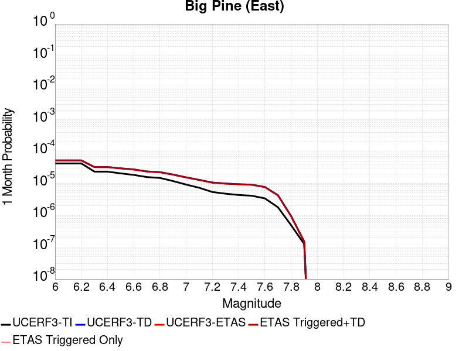 | 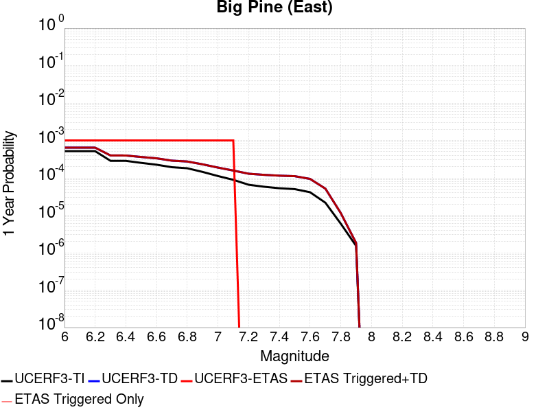 | 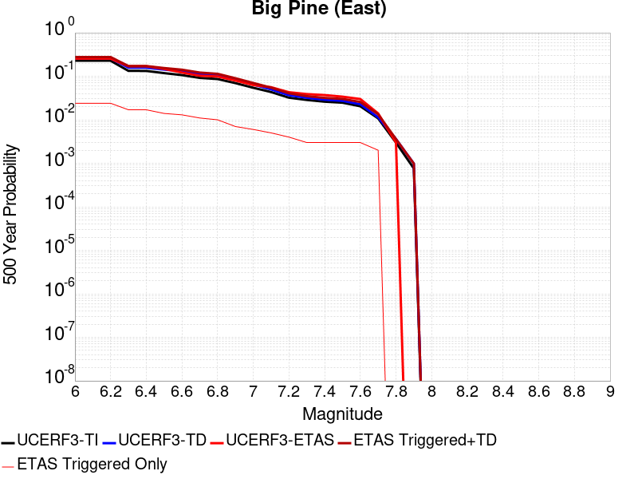 |

| Magnitude | 1 wk TI Prob | 1 wk TD Prob | 1 wk ETAS Prob | 1 wk ETAS/TD Gain | 1 wk ETAS Triggered+TD | 1 wk ETAS Triggered Only | 1 mo TI Prob | 1 mo TD Prob | 1 mo ETAS Prob | 1 mo ETAS/TD Gain | 1 mo ETAS Triggered+TD | 1 mo ETAS Triggered Only | 1 yr TI Prob | 1 yr TD Prob | 1 yr ETAS Prob | 1 yr ETAS/TD Gain | 1 yr ETAS Triggered+TD | 1 yr ETAS Triggered Only | 500 yr TI Prob | 500 yr TD Prob | 500 yr ETAS Prob | 500 yr ETAS/TD Gain | 500 yr ETAS Triggered+TD | 500 yr ETAS Triggered Only |
|-----|-----|-----|-----|-----|-----|-----|-----|-----|-----|-----|-----|-----|-----|-----|-----|-----|-----|-----|-----|-----|-----|-----|-----|-----|
| 6.0 | 9.916913E-6 | 1.2309453E-5 | 0.0 | 0.0 | 1.2309453E-5 | 0.0 | 4.250036E-5 | 5.2753858E-5 | 0.0 | 0.0 | 5.2753858E-5 | 0.0 | 5.173191E-4 | 6.421107E-4 | 0.001 | 1.5573639 | 6.421107E-4 | 0.0 | 0.22796582 | 0.25895482 | 0.255 | 0.98472774 | 0.2767399 | 0.024 |
| 6.1 | 9.916913E-6 | 1.2309453E-5 | 0.0 | 0.0 | 1.2309453E-5 | 0.0 | 4.250036E-5 | 5.2753858E-5 | 0.0 | 0.0 | 5.2753858E-5 | 0.0 | 5.173191E-4 | 6.421107E-4 | 0.001 | 1.5573639 | 6.421107E-4 | 0.0 | 0.22796582 | 0.25895482 | 0.255 | 0.98472774 | 0.2767399 | 0.024 |
| 6.2 | 9.916913E-6 | 1.2309453E-5 | 0.0 | 0.0 | 1.2309453E-5 | 0.0 | 4.250036E-5 | 5.2753858E-5 | 0.0 | 0.0 | 5.2753858E-5 | 0.0 | 5.173191E-4 | 6.421107E-4 | 0.001 | 1.5573639 | 6.421107E-4 | 0.0 | 0.22796582 | 0.25895482 | 0.255 | 0.98472774 | 0.2767399 | 0.024 |
| 6.3 | 5.479711E-6 | 7.620083E-6 | 0.0 | 0.0 | 7.620083E-6 | 0.0 | 2.3484265E-5 | 3.2657106E-5 | 0.0 | 0.0 | 3.2657106E-5 | 0.0 | 2.858834E-4 | 3.975307E-4 | 0.001 | 2.515529 | 3.975307E-4 | 0.0 | 0.13321312 | 0.15795949 | 0.17 | 1.0762253 | 0.17227417 | 0.017 |
| 6.4 | 5.465009E-6 | 7.604432E-6 | 0.0 | 0.0 | 7.604432E-6 | 0.0 | 2.3421257E-5 | 3.2590033E-5 | 0.0 | 0.0 | 3.2590033E-5 | 0.0 | 2.851165E-4 | 3.967144E-4 | 0.001 | 2.5207052 | 3.967144E-4 | 0.0 | 0.13288058 | 0.15761578 | 0.17 | 1.0785722 | 0.17193632 | 0.017 |
| 6.5 | 4.826767E-6 | 6.9314997E-6 | 0.0 | 0.0 | 6.9314997E-6 | 0.0 | 2.068598E-5 | 2.9706103E-5 | 0.0 | 0.0 | 2.9706103E-5 | 0.0 | 2.518227E-4 | 3.6161434E-4 | 0.001 | 2.765377 | 3.6161434E-4 | 0.0 | 0.11832097 | 0.14260153 | 0.148 | 1.0378569 | 0.15460512 | 0.014 |
| 6.6 | 4.3146847E-6 | 6.392965E-6 | 0.0 | 0.0 | 6.392965E-6 | 0.0 | 1.8491375E-5 | 2.7398148E-5 | 0.0 | 0.0 | 2.7398148E-5 | 0.0 | 2.2510924E-4 | 3.335236E-4 | 0.001 | 2.9982884 | 3.335236E-4 | 0.0 | 0.106462784 | 0.13039437 | 0.122 | 0.9356232 | 0.14169924 | 0.013 |
| 6.7 | 3.6968106E-6 | 5.5346663E-6 | 0.0 | 0.0 | 5.5346663E-6 | 0.0 | 1.5843378E-5 | 2.371979E-5 | 0.0 | 0.0 | 2.371979E-5 | 0.0 | 1.9287605E-4 | 2.8875156E-4 | 0.001 | 3.4631848 | 2.8875156E-4 | 0.0 | 0.09194227 | 0.11194616 | 0.103 | 0.9200852 | 0.12171475 | 0.011 |
| 6.8 | 3.4671132E-6 | 5.2534E-6 | 0.0 | 0.0 | 5.2534E-6 | 0.0 | 1.4858972E-5 | 2.2514385E-5 | 0.0 | 0.0 | 2.2514385E-5 | 0.0 | 1.8089297E-4 | 2.7407944E-4 | 0.001 | 3.6485772 | 2.7407944E-4 | 0.0 | 0.08648425 | 0.1050251 | 0.099 | 0.94263184 | 0.11397485 | 0.01 |
| 6.9 | 2.7686972E-6 | 4.4163517E-6 | 0.0 | 0.0 | 4.4163517E-6 | 0.0 | 1.1865792E-5 | 1.8927089E-5 | 0.0 | 0.0 | 1.8927089E-5 | 0.0 | 1.4445644E-4 | 2.304136E-4 | 0.001 | 4.3400216 | 2.304136E-4 | 0.0 | 0.06968629 | 0.08369503 | 0.08 | 0.95585126 | 0.09010917 | 0.007 |
| 7.0 | 2.1472624E-6 | 3.6130896E-6 | 0.0 | 0.0 | 3.6130896E-6 | 0.0 | 9.20252E-6 | 1.548458E-5 | 0.0 | 0.0 | 1.548458E-5 | 0.0 | 1.12034926E-4 | 1.8850892E-4 | 0.001 | 5.3047886 | 1.8850892E-4 | 0.0 | 0.054480344 | 0.06451836 | 0.063 | 0.97646624 | 0.07013125 | 0.006 |
| 7.1 | 1.7018335E-6 | 3.0091014E-6 | 0.0 | 0.0 | 3.0091014E-6 | 0.0 | 7.293552E-6 | 1.2896086E-5 | 0.0 | 0.0 | 1.2896086E-5 | 0.0 | 8.879537E-5 | 1.5699885E-4 | 0.001 | 6.3694735 | 1.5699885E-4 | 0.0 | 0.04342842 | 0.049995273 | 0.056 | 1.1201059 | 0.054745298 | 0.005 |
| 7.2 | 1.25603E-6 | 2.4778653E-6 | 0.0 | 0.0 | 2.4778653E-6 | 0.0 | 5.3829745E-6 | 1.0619381E-5 | 0.0 | 0.0 | 1.0619381E-5 | 0.0 | 6.553574E-5 | 1.2928348E-4 | 0.0 | 0.0 | 1.2928348E-4 | 0.0 | 0.03223786 | 0.036783446 | 0.043 | 1.1690042 | 0.040636312 | 0.004 |
| 7.3 | 1.112297E-6 | 2.3114678E-6 | 0.0 | 0.0 | 2.3114678E-6 | 0.0 | 4.7669787E-6 | 9.9062545E-6 | 0.0 | 0.0 | 9.9062545E-6 | 0.0 | 5.803642E-5 | 1.20602155E-4 | 0.0 | 0.0 | 1.20602155E-4 | 0.0 | 0.028602043 | 0.032091297 | 0.039 | 1.2152828 | 0.034995023 | 0.003 |
| 7.4 | 1.0137181E-6 | 2.1974372E-6 | 0.0 | 0.0 | 2.1974372E-6 | 0.0 | 4.3444993E-6 | 9.417556E-6 | 0.0 | 0.0 | 9.417556E-6 | 0.0 | 5.2892992E-5 | 1.1465288E-4 | 0.0 | 0.0 | 1.1465288E-4 | 0.0 | 0.026100531 | 0.028957166 | 0.037 | 1.2777493 | 0.031870294 | 0.003 |
| 7.5 | 9.598608E-7 | 2.1296034E-6 | 0.0 | 0.0 | 2.1296034E-6 | 0.0 | 4.1136827E-6 | 9.126841E-6 | 0.0 | 0.0 | 9.126841E-6 | 0.0 | 5.0082934E-5 | 1.111138E-4 | 0.0 | 0.0 | 1.111138E-4 | 0.0 | 0.024731142 | 0.027295211 | 0.034 | 1.2456398 | 0.030213324 | 0.003 |
| 7.6 | 7.929459E-7 | 1.8003618E-6 | 0.0 | 0.0 | 1.8003618E-6 | 0.0 | 3.3983351E-6 | 7.715815E-6 | 0.0 | 0.0 | 7.715815E-6 | 0.0 | 4.1373947E-5 | 9.3936134E-5 | 0.0 | 0.0 | 9.3936134E-5 | 0.0 | 0.020474885 | 0.022774803 | 0.03 | 1.3172452 | 0.025706477 | 0.003 |
| 7.7 | 4.155788E-7 | 9.886776E-7 | 0.0 | 0.0 | 9.886776E-7 | 0.0 | 1.7810507E-6 | 4.237183E-6 | 0.0 | 0.0 | 4.237183E-6 | 0.0 | 2.1684076E-5 | 5.158651E-5 | 0.0 | 0.0 | 5.158651E-5 | 0.0 | 0.010783591 | 0.011376337 | 0.014 | 1.2306246 | 0.013353584 | 0.002 |
| 7.8 | 1.14666925E-7 | 2.2045496E-7 | 0.0 | 0.0 | 2.2045496E-7 | 0.0 | 4.914296E-7 | 9.4480663E-7 | 0.0 | 0.0 | 9.4480663E-7 | 0.0 | 5.9831386E-6 | 1.1502963E-5 | 0.0 | 0.0 | 1.1502963E-5 | 0.0 | 0.002987108 | 0.0036043848 | 0.003 | 0.83231956 | 0.0036043848 | 0.0 |
| 7.9 | 2.9231824E-8 | 3.4985394E-8 | 0.0 | 0.0 | 3.4985394E-8 | 0.0 | 1.2527924E-7 | 1.4993739E-7 | 0.0 | 0.0 | 1.4993739E-7 | 0.0 | 1.5252737E-6 | 1.8254865E-6 | 0.0 | 0.0 | 1.8254865E-6 | 0.0 | 7.6234667E-4 | 9.85494E-4 | 0.0 | 0.0 | 9.85494E-4 | 0.0 |

## Goldstone Lake
*[(top)](#table-of-contents)*

| 1 Week | 1 Month | 1 Year | 500 Year |
|-----|-----|-----|-----|
| 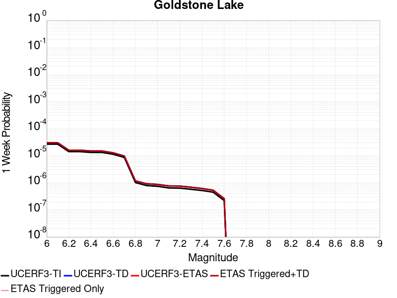 | 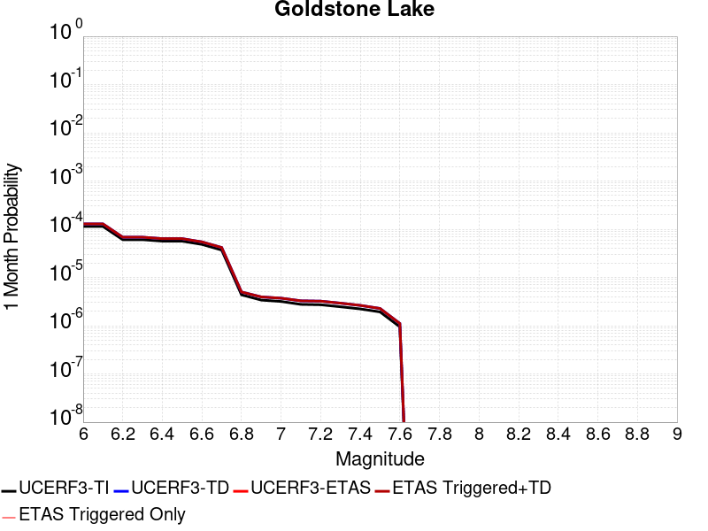 | 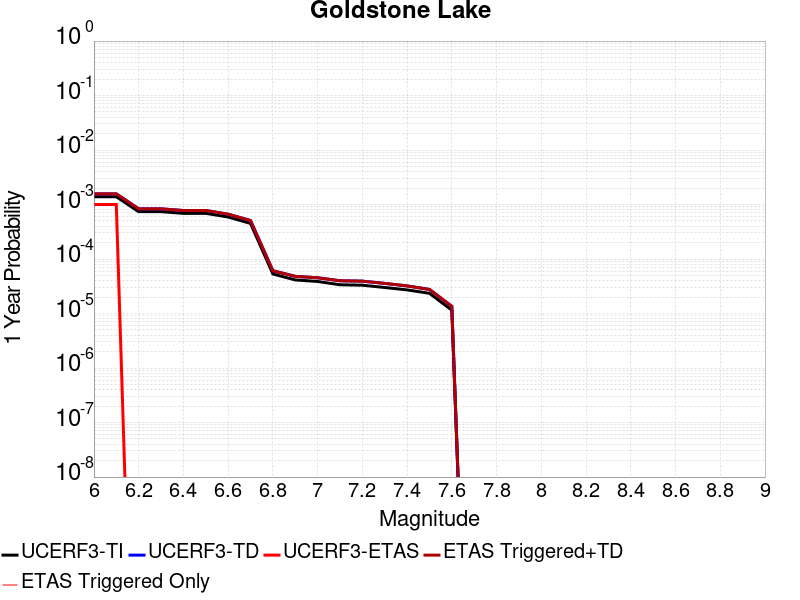 | 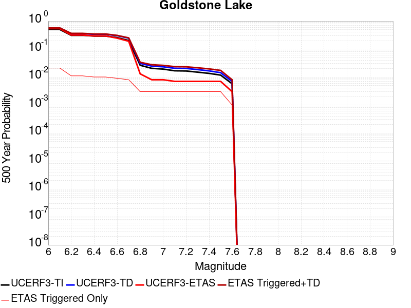 |

| Magnitude | 1 wk TI Prob | 1 wk TD Prob | 1 wk ETAS Prob | 1 wk ETAS/TD Gain | 1 wk ETAS Triggered+TD | 1 wk ETAS Triggered Only | 1 mo TI Prob | 1 mo TD Prob | 1 mo ETAS Prob | 1 mo ETAS/TD Gain | 1 mo ETAS Triggered+TD | 1 mo ETAS Triggered Only | 1 yr TI Prob | 1 yr TD Prob | 1 yr ETAS Prob | 1 yr ETAS/TD Gain | 1 yr ETAS Triggered+TD | 1 yr ETAS Triggered Only | 500 yr TI Prob | 500 yr TD Prob | 500 yr ETAS Prob | 500 yr ETAS/TD Gain | 500 yr ETAS Triggered+TD | 500 yr ETAS Triggered Only |
|-----|-----|-----|-----|-----|-----|-----|-----|-----|-----|-----|-----|-----|-----|-----|-----|-----|-----|-----|-----|-----|-----|-----|-----|-----|
| 6.0 | 2.671352E-5 | 3.0163492E-5 | 0.0 | 0.0 | 3.0163492E-5 | 0.0 | 1.1448149E-4 | 1.2926679E-4 | 0.0 | 0.0 | 1.2926679E-4 | 0.0 | 0.001392921 | 0.0015728805 | 0.001 | 0.63577616 | 0.0015728805 | 0.0 | 0.5018958 | 0.5610189 | 0.537 | 0.957187 | 0.5702375 | 0.021 |
| 6.1 | 2.671352E-5 | 3.0163492E-5 | 0.0 | 0.0 | 3.0163492E-5 | 0.0 | 1.1448149E-4 | 1.2926679E-4 | 0.0 | 0.0 | 1.2926679E-4 | 0.0 | 0.001392921 | 0.0015728805 | 0.001 | 0.63577616 | 0.0015728805 | 0.0 | 0.5018958 | 0.5610189 | 0.537 | 0.957187 | 0.5702375 | 0.021 |
| 6.2 | 1.4197047E-5 | 1.5987507E-5 | 0.0 | 0.0 | 1.5987507E-5 | 0.0 | 6.0843064E-5 | 6.851664E-5 | 0.0 | 0.0 | 6.851664E-5 | 0.0 | 7.4051257E-4 | 8.3396805E-4 | 0.0 | 0.0 | 8.3396805E-4 | 0.0 | 0.30953738 | 0.35630843 | 0.317 | 0.8896786 | 0.36338905 | 0.011 |
| 6.3 | 1.4197047E-5 | 1.5987507E-5 | 0.0 | 0.0 | 1.5987507E-5 | 0.0 | 6.0843064E-5 | 6.851664E-5 | 0.0 | 0.0 | 6.851664E-5 | 0.0 | 7.4051257E-4 | 8.3396805E-4 | 0.0 | 0.0 | 8.3396805E-4 | 0.0 | 0.30953738 | 0.35630843 | 0.317 | 0.8896786 | 0.36338905 | 0.011 |
| 6.4 | 1.3238931E-5 | 1.490732E-5 | 0.0 | 0.0 | 1.490732E-5 | 0.0 | 5.6737044E-5 | 6.38875E-5 | 0.0 | 0.0 | 6.38875E-5 | 0.0 | 6.9055456E-4 | 7.7764934E-4 | 0.0 | 0.0 | 7.7764934E-4 | 0.0 | 0.29206043 | 0.33840108 | 0.294 | 0.8687916 | 0.34501708 | 0.01 |
| 6.5 | 1.3238931E-5 | 1.490732E-5 | 0.0 | 0.0 | 1.490732E-5 | 0.0 | 5.6737044E-5 | 6.38875E-5 | 0.0 | 0.0 | 6.38875E-5 | 0.0 | 6.9055456E-4 | 7.7764934E-4 | 0.0 | 0.0 | 7.7764934E-4 | 0.0 | 0.29206043 | 0.33840108 | 0.294 | 0.8687916 | 0.34501708 | 0.01 |
| 6.6 | 1.1328278E-5 | 1.2768153E-5 | 0.0 | 0.0 | 1.2768153E-5 | 0.0 | 4.8548856E-5 | 5.472004E-5 | 0.0 | 0.0 | 5.472004E-5 | 0.0 | 5.90922E-4 | 6.661072E-4 | 0.0 | 0.0 | 6.661072E-4 | 0.0 | 0.25587657 | 0.301002 | 0.245 | 0.8139481 | 0.30729297 | 0.009 |
| 6.7 | 8.651175E-6 | 9.758216E-6 | 0.0 | 0.0 | 9.758216E-6 | 0.0 | 3.707594E-5 | 4.182076E-5 | 0.0 | 0.0 | 4.182076E-5 | 0.0 | 4.5130608E-4 | 5.0913804E-4 | 0.0 | 0.0 | 5.0913804E-4 | 0.0 | 0.20204572 | 0.24463837 | 0.19 | 0.77665657 | 0.25068125 | 0.008 |
| 6.8 | 1.0215377E-6 | 1.1687787E-6 | 0.0 | 0.0 | 1.1687787E-6 | 0.0 | 4.378012E-6 | 5.0090425E-6 | 0.0 | 0.0 | 5.0090425E-6 | 0.0 | 5.3300988E-5 | 6.09835E-5 | 0.0 | 0.0 | 6.09835E-5 | 0.0 | 0.026299195 | 0.03081437 | 0.013 | 0.42188108 | 0.033721928 | 0.003 |
| 6.9 | 7.9360774E-7 | 9.227254E-7 | 0.0 | 0.0 | 9.227254E-7 | 0.0 | 3.4011714E-6 | 3.9545316E-6 | 0.0 | 0.0 | 3.9545316E-6 | 0.0 | 4.1408475E-5 | 4.814543E-5 | 0.0 | 0.0 | 4.814543E-5 | 0.0 | 0.020491797 | 0.024564272 | 0.008 | 0.32567626 | 0.027490579 | 0.003 |
| 7.0 | 7.4382757E-7 | 8.6933187E-7 | 0.0 | 0.0 | 8.6933187E-7 | 0.0 | 3.1878285E-6 | 3.7257032E-6 | 0.0 | 0.0 | 3.7257032E-6 | 0.0 | 3.8811122E-5 | 4.535956E-5 | 0.0 | 0.0 | 4.535956E-5 | 0.0 | 0.019218855 | 0.02320386 | 0.008 | 0.34477022 | 0.026134247 | 0.003 |
| 7.1 | 6.4709513E-7 | 7.661101E-7 | 0.0 | 0.0 | 7.661101E-7 | 0.0 | 2.773262E-6 | 3.283325E-6 | 0.0 | 0.0 | 3.283325E-6 | 0.0 | 3.376394E-5 | 3.997381E-5 | 0.0 | 0.0 | 3.997381E-5 | 0.0 | 0.01674055 | 0.0205682 | 0.007 | 0.3403312 | 0.023506494 | 0.003 |
| 7.2 | 6.356704E-7 | 7.5386447E-7 | 0.0 | 0.0 | 7.5386447E-7 | 0.0 | 2.7242988E-6 | 3.230844E-6 | 0.0 | 0.0 | 3.230844E-6 | 0.0 | 3.3167835E-5 | 3.9334875E-5 | 0.0 | 0.0 | 3.9334875E-5 | 0.0 | 0.01644743 | 0.020255245 | 0.007 | 0.3455895 | 0.02319448 | 0.003 |
| 7.3 | 5.7695723E-7 | 6.855606E-7 | 0.0 | 0.0 | 6.855606E-7 | 0.0 | 2.4726714E-6 | 2.938114E-6 | 0.0 | 0.0 | 2.938114E-6 | 0.0 | 3.0104358E-5 | 3.577101E-5 | 0.0 | 0.0 | 3.577101E-5 | 0.0 | 0.014939684 | 0.018455582 | 0.007 | 0.37928903 | 0.021400215 | 0.003 |
| 7.4 | 5.209647E-7 | 6.1605994E-7 | 0.0 | 0.0 | 6.1605994E-7 | 0.0 | 2.232704E-6 | 2.6402545E-6 | 0.0 | 0.0 | 2.6402545E-6 | 0.0 | 2.718283E-5 | 3.214468E-5 | 0.0 | 0.0 | 3.214468E-5 | 0.0 | 0.013499651 | 0.016574012 | 0.007 | 0.42234793 | 0.019524291 | 0.003 |
| 7.5 | 4.512955E-7 | 5.3184044E-7 | 0.0 | 0.0 | 5.3184044E-7 | 0.0 | 1.934122E-6 | 2.2793145E-6 | 0.0 | 0.0 | 2.2793145E-6 | 0.0 | 2.3547682E-5 | 2.7750353E-5 | 0.0 | 0.0 | 2.7750353E-5 | 0.0 | 0.011704938 | 0.014308379 | 0.007 | 0.4892238 | 0.017265454 | 0.003 |
| 7.6 | 2.21172E-7 | 2.5988282E-7 | 0.0 | 0.0 | 2.5988282E-7 | 0.0 | 9.478797E-7 | 1.1137832E-6 | 0.0 | 0.0 | 1.1137832E-6 | 0.0 | 1.1540374E-5 | 1.3560255E-5 | 0.0 | 0.0 | 1.3560255E-5 | 0.0 | 0.0057536047 | 0.0069991336 | 0.003 | 0.42862448 | 0.007992134 | 0.001 |

## Santa Susana alt 1
*[(top)](#table-of-contents)*

| 1 Week | 1 Month | 1 Year | 500 Year |
|-----|-----|-----|-----|
| 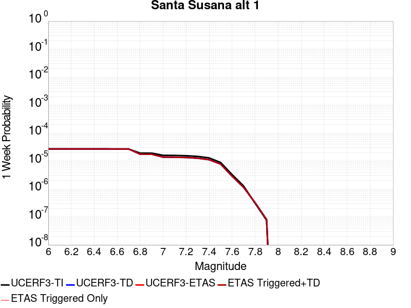 |  | 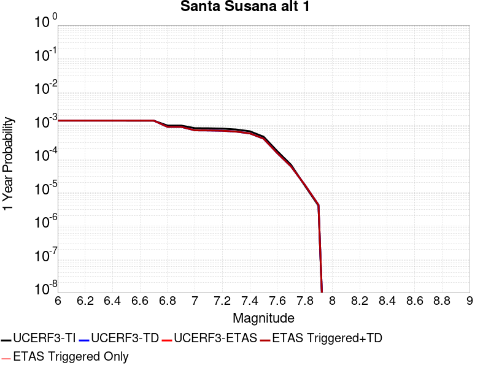 | 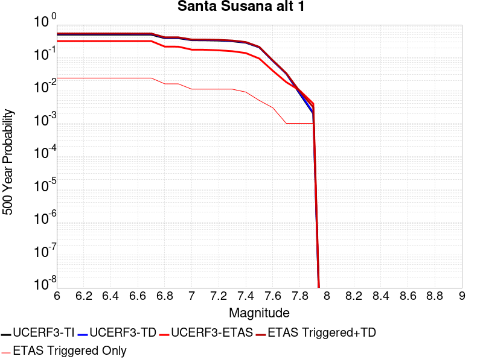 |

| Magnitude | 1 wk TI Prob | 1 wk TD Prob | 1 wk ETAS Prob | 1 wk ETAS/TD Gain | 1 wk ETAS Triggered+TD | 1 wk ETAS Triggered Only | 1 mo TI Prob | 1 mo TD Prob | 1 mo ETAS Prob | 1 mo ETAS/TD Gain | 1 mo ETAS Triggered+TD | 1 mo ETAS Triggered Only | 1 yr TI Prob | 1 yr TD Prob | 1 yr ETAS Prob | 1 yr ETAS/TD Gain | 1 yr ETAS Triggered+TD | 1 yr ETAS Triggered Only | 500 yr TI Prob | 500 yr TD Prob | 500 yr ETAS Prob | 500 yr ETAS/TD Gain | 500 yr ETAS Triggered+TD | 500 yr ETAS Triggered Only |
|-----|-----|-----|-----|-----|-----|-----|-----|-----|-----|-----|-----|-----|-----|-----|-----|-----|-----|-----|-----|-----|-----|-----|-----|-----|
| 6.0 | 2.674877E-5 | 2.6873506E-5 | 0.0 | 0.0 | 2.6873506E-5 | 0.0 | 1.1463255E-4 | 1.15167706E-4 | 0.0 | 0.0 | 1.15167706E-4 | 0.0 | 0.0013947578 | 0.0014013759 | 0.0 | 0.0 | 0.0014013759 | 0.0 | 0.50235367 | 0.5312569 | 0.319 | 0.6004628 | 0.54250675 | 0.024 |
| 6.1 | 2.674877E-5 | 2.6873506E-5 | 0.0 | 0.0 | 2.6873506E-5 | 0.0 | 1.1463255E-4 | 1.15167706E-4 | 0.0 | 0.0 | 1.15167706E-4 | 0.0 | 0.0013947578 | 0.0014013759 | 0.0 | 0.0 | 0.0014013759 | 0.0 | 0.50235367 | 0.5312569 | 0.319 | 0.6004628 | 0.54250675 | 0.024 |
| 6.2 | 2.674877E-5 | 2.6873506E-5 | 0.0 | 0.0 | 2.6873506E-5 | 0.0 | 1.1463255E-4 | 1.15167706E-4 | 0.0 | 0.0 | 1.15167706E-4 | 0.0 | 0.0013947578 | 0.0014013759 | 0.0 | 0.0 | 0.0014013759 | 0.0 | 0.50235367 | 0.5312569 | 0.319 | 0.6004628 | 0.54250675 | 0.024 |
| 6.3 | 2.674877E-5 | 2.6873506E-5 | 0.0 | 0.0 | 2.6873506E-5 | 0.0 | 1.1463255E-4 | 1.15167706E-4 | 0.0 | 0.0 | 1.15167706E-4 | 0.0 | 0.0013947578 | 0.0014013759 | 0.0 | 0.0 | 0.0014013759 | 0.0 | 0.50235367 | 0.5312569 | 0.319 | 0.6004628 | 0.54250675 | 0.024 |
| 6.4 | 2.674877E-5 | 2.6873506E-5 | 0.0 | 0.0 | 2.6873506E-5 | 0.0 | 1.1463255E-4 | 1.15167706E-4 | 0.0 | 0.0 | 1.15167706E-4 | 0.0 | 0.0013947578 | 0.0014013759 | 0.0 | 0.0 | 0.0014013759 | 0.0 | 0.50235367 | 0.5312569 | 0.319 | 0.6004628 | 0.54250675 | 0.024 |
| 6.5 | 2.674877E-5 | 2.6873506E-5 | 0.0 | 0.0 | 2.6873506E-5 | 0.0 | 1.1463255E-4 | 1.15167706E-4 | 0.0 | 0.0 | 1.15167706E-4 | 0.0 | 0.0013947578 | 0.0014013759 | 0.0 | 0.0 | 0.0014013759 | 0.0 | 0.50235367 | 0.5312569 | 0.319 | 0.6004628 | 0.54250675 | 0.024 |
| 6.6 | 2.6647976E-5 | 2.675128E-5 | 0.0 | 0.0 | 2.675128E-5 | 0.0 | 1.14200615E-4 | 1.1464393E-4 | 0.0 | 0.0 | 1.1464393E-4 | 0.0 | 0.0013895056 | 0.001395007 | 0.0 | 0.0 | 0.001395007 | 0.0 | 0.50104326 | 0.52997965 | 0.319 | 0.6019099 | 0.5412602 | 0.024 |
| 6.7 | 2.6647976E-5 | 2.675128E-5 | 0.0 | 0.0 | 2.675128E-5 | 0.0 | 1.14200615E-4 | 1.1464393E-4 | 0.0 | 0.0 | 1.1464393E-4 | 0.0 | 0.0013895056 | 0.001395007 | 0.0 | 0.0 | 0.001395007 | 0.0 | 0.50104326 | 0.52997965 | 0.319 | 0.6019099 | 0.5412602 | 0.024 |
| 6.8 | 1.9073179E-5 | 1.7433375E-5 | 0.0 | 0.0 | 1.7433375E-5 | 0.0 | 8.1739636E-5 | 7.471243E-5 | 0.0 | 0.0 | 7.471243E-5 | 0.0 | 9.947256E-4 | 9.0926193E-4 | 0.0 | 0.0 | 9.0926193E-4 | 0.0 | 0.39201823 | 0.40643904 | 0.217 | 0.5339054 | 0.41593602 | 0.016 |
| 6.9 | 1.9041876E-5 | 1.7415863E-5 | 0.0 | 0.0 | 1.7415863E-5 | 0.0 | 8.160549E-5 | 7.463738E-5 | 0.0 | 0.0 | 7.463738E-5 | 0.0 | 9.930939E-4 | 9.08349E-4 | 0.0 | 0.0 | 9.08349E-4 | 0.0 | 0.39152148 | 0.40600672 | 0.216 | 0.53201085 | 0.41551062 | 0.016 |
| 7.0 | 1.5917482E-5 | 1.37026045E-5 | 0.0 | 0.0 | 1.37026045E-5 | 0.0 | 6.8215995E-5 | 5.8724152E-5 | 0.0 | 0.0 | 5.8724152E-5 | 0.0 | 8.302132E-4 | 7.147365E-4 | 0.0 | 0.0 | 7.147365E-4 | 0.0 | 0.33984393 | 0.34886307 | 0.175 | 0.5016295 | 0.35602558 | 0.011 |
| 7.1 | 1.577788E-5 | 1.3584136E-5 | 0.0 | 0.0 | 1.3584136E-5 | 0.0 | 6.761774E-5 | 5.821645E-5 | 0.0 | 0.0 | 5.821645E-5 | 0.0 | 8.2293496E-4 | 7.085593E-4 | 0.0 | 0.0 | 7.085593E-4 | 0.0 | 0.3374352 | 0.3465137 | 0.174 | 0.50214463 | 0.35370204 | 0.011 |
| 7.2 | 1.5416446E-5 | 1.3314673E-5 | 0.0 | 0.0 | 1.3314673E-5 | 0.0 | 6.606882E-5 | 5.706166E-5 | 0.0 | 0.0 | 5.706166E-5 | 0.0 | 8.0409093E-4 | 6.945088E-4 | 0.0 | 0.0 | 6.945088E-4 | 0.0 | 0.33115786 | 0.34055227 | 0.167 | 0.49037993 | 0.3478062 | 0.011 |
| 7.3 | 1.4534083E-5 | 1.2571552E-5 | 0.0 | 0.0 | 1.2571552E-5 | 0.0 | 6.228744E-5 | 5.3876993E-5 | 0.0 | 0.0 | 5.3876993E-5 | 0.0 | 7.580857E-4 | 6.557593E-4 | 0.0 | 0.0 | 6.557593E-4 | 0.0 | 0.31558213 | 0.3244763 | 0.157 | 0.4838566 | 0.33190706 | 0.011 |
| 7.4 | 1.2858995E-5 | 1.1103205E-5 | 0.0 | 0.0 | 1.1103205E-5 | 0.0 | 5.5108816E-5 | 4.758432E-5 | 0.0 | 0.0 | 4.758432E-5 | 0.0 | 6.7074323E-4 | 5.791889E-4 | 0.0 | 0.0 | 5.791889E-4 | 0.0 | 0.28500816 | 0.29215327 | 0.138 | 0.4723548 | 0.2985239 | 0.009 |
| 7.5 | 8.827668E-6 | 7.729618E-6 | 0.0 | 0.0 | 7.729618E-6 | 0.0 | 3.7832317E-5 | 3.312653E-5 | 0.0 | 0.0 | 3.312653E-5 | 0.0 | 4.605111E-4 | 4.0324323E-4 | 0.0 | 0.0 | 4.0324323E-4 | 0.0 | 0.20571154 | 0.2084761 | 0.094 | 0.45089105 | 0.21243371 | 0.005 |
| 7.6 | 3.2533426E-6 | 2.848186E-6 | 0.0 | 0.0 | 2.848186E-6 | 0.0 | 1.3942822E-5 | 1.2206457E-5 | 0.0 | 0.0 | 1.2206457E-5 | 0.0 | 1.6974064E-4 | 1.4860384E-4 | 0.0 | 0.0 | 1.4860384E-4 | 0.0 | 0.08137521 | 0.079704925 | 0.04 | 0.5018511 | 0.08246581 | 0.003 |
| 7.7 | 1.2751709E-6 | 1.1398646E-6 | 0.0 | 0.0 | 1.1398646E-6 | 0.0 | 5.4650063E-6 | 4.8851252E-6 | 0.0 | 0.0 | 4.8851252E-6 | 0.0 | 6.653442E-5 | 5.9474867E-5 | 0.0 | 0.0 | 5.9474867E-5 | 0.0 | 0.032721013 | 0.032680612 | 0.018 | 0.5507853 | 0.033647932 | 0.001 |
| 7.8 | 3.067544E-7 | 3.2284996E-7 | 0.0 | 0.0 | 3.2284996E-7 | 0.0 | 1.3146611E-6 | 1.383642E-6 | 0.0 | 0.0 | 1.383642E-6 | 0.0 | 1.600588E-5 | 1.6845723E-5 | 0.0 | 0.0 | 1.6845723E-5 | 0.0 | 0.007971066 | 0.008420007 | 0.01 | 1.1876473 | 0.009411587 | 0.001 |
| 7.9 | 7.622999E-8 | 8.0612516E-8 | 0.0 | 0.0 | 8.0612516E-8 | 0.0 | 3.2669993E-7 | 3.4548216E-7 | 0.0 | 0.0 | 3.4548216E-7 | 0.0 | 3.977564E-6 | 4.2062393E-6 | 0.0 | 0.0 | 4.2062393E-6 | 0.0 | 0.0019868098 | 0.002103816 | 0.004 | 1.901307 | 0.003101712 | 0.001 |

## Cleghorn Pass
*[(top)](#table-of-contents)*

| 1 Week | 1 Month | 1 Year | 500 Year |
|-----|-----|-----|-----|
|  | 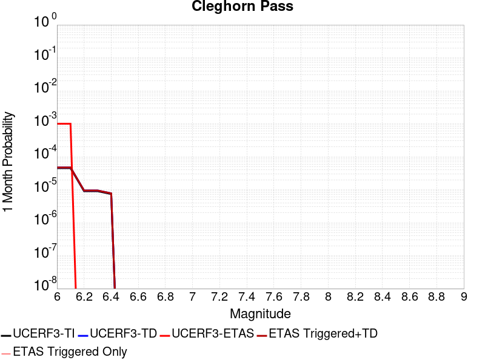 | 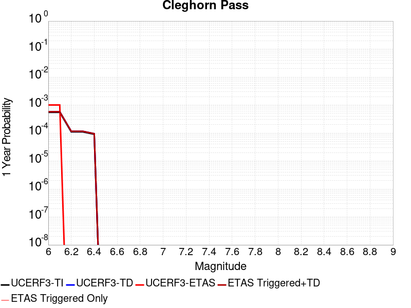 | 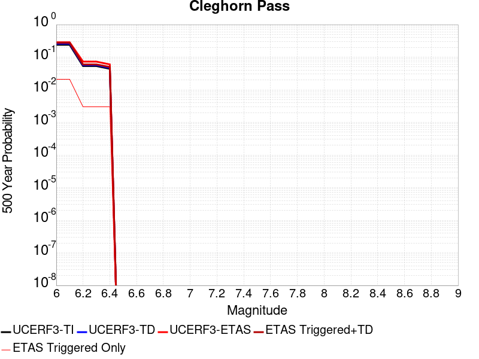 |

| Magnitude | 1 wk TI Prob | 1 wk TD Prob | 1 wk ETAS Prob | 1 wk ETAS/TD Gain | 1 wk ETAS Triggered+TD | 1 wk ETAS Triggered Only | 1 mo TI Prob | 1 mo TD Prob | 1 mo ETAS Prob | 1 mo ETAS/TD Gain | 1 mo ETAS Triggered+TD | 1 mo ETAS Triggered Only | 1 yr TI Prob | 1 yr TD Prob | 1 yr ETAS Prob | 1 yr ETAS/TD Gain | 1 yr ETAS Triggered+TD | 1 yr ETAS Triggered Only | 500 yr TI Prob | 500 yr TD Prob | 500 yr ETAS Prob | 500 yr ETAS/TD Gain | 500 yr ETAS Triggered+TD | 500 yr ETAS Triggered Only |
|-----|-----|-----|-----|-----|-----|-----|-----|-----|-----|-----|-----|-----|-----|-----|-----|-----|-----|-----|-----|-----|-----|-----|-----|-----|
| 6.0 | 1.0522846E-5 | 1.101248E-5 | 0.0 | 0.0 | 1.101248E-5 | 0.0 | 4.509713E-5 | 4.7195783E-5 | 0.001 | 21.188334 | 4.7195783E-5 | 0.0 | 5.4891926E-4 | 5.7450956E-4 | 0.001 | 1.7406151 | 5.7450956E-4 | 0.0 | 0.24007457 | 0.26118165 | 0.287 | 1.098852 | 0.27669686 | 0.021 |
| 6.1 | 1.0522846E-5 | 1.101248E-5 | 0.0 | 0.0 | 1.101248E-5 | 0.0 | 4.509713E-5 | 4.7195783E-5 | 0.001 | 21.188334 | 4.7195783E-5 | 0.0 | 5.4891926E-4 | 5.7450956E-4 | 0.001 | 1.7406151 | 5.7450956E-4 | 0.0 | 0.24007457 | 0.26118165 | 0.287 | 1.098852 | 0.27669686 | 0.021 |
| 6.2 | 2.1045846E-6 | 2.2025667E-6 | 0.0 | 0.0 | 2.2025667E-6 | 0.0 | 9.019617E-6 | 9.439561E-6 | 0.0 | 0.0 | 9.439561E-6 | 0.0 | 1.098083E-4 | 1.1492477E-4 | 0.0 | 0.0 | 1.1492477E-4 | 0.0 | 0.053426985 | 0.0569482 | 0.073 | 1.2818667 | 0.059777353 | 0.003 |
| 6.3 | 2.1045846E-6 | 2.2025667E-6 | 0.0 | 0.0 | 2.2025667E-6 | 0.0 | 9.019617E-6 | 9.439561E-6 | 0.0 | 0.0 | 9.439561E-6 | 0.0 | 1.098083E-4 | 1.1492477E-4 | 0.0 | 0.0 | 1.1492477E-4 | 0.0 | 0.053426985 | 0.0569482 | 0.073 | 1.2818667 | 0.059777353 | 0.003 |
| 6.4 | 1.7259927E-6 | 1.8062605E-6 | 0.0 | 0.0 | 1.8062605E-6 | 0.0 | 7.3970905E-6 | 7.741116E-6 | 0.0 | 0.0 | 7.741116E-6 | 0.0 | 9.005586E-5 | 9.424809E-5 | 0.0 | 0.0 | 9.424809E-5 | 0.0 | 0.044031154 | 0.047121957 | 0.06 | 1.2732917 | 0.049980592 | 0.003 |

## Greenville (No) 2011 CFM
*[(top)](#table-of-contents)*

| 1 Week | 1 Month | 1 Year | 500 Year |
|-----|-----|-----|-----|
| 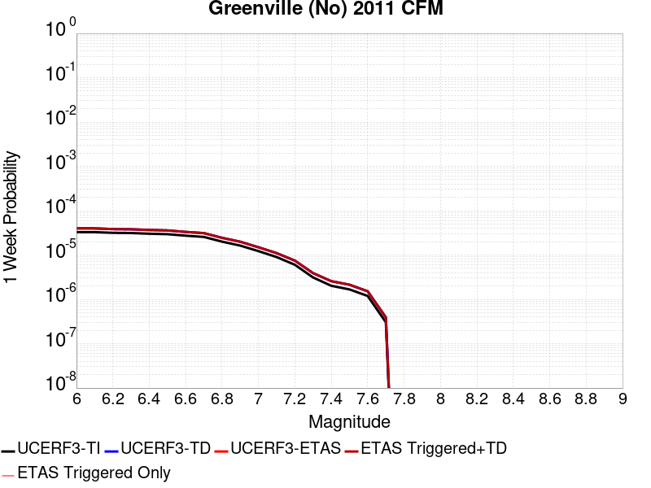 | 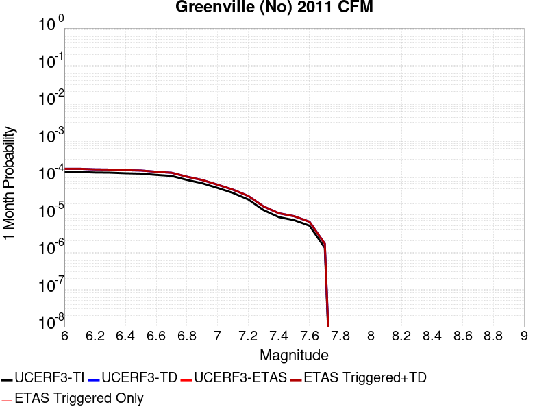 |  | 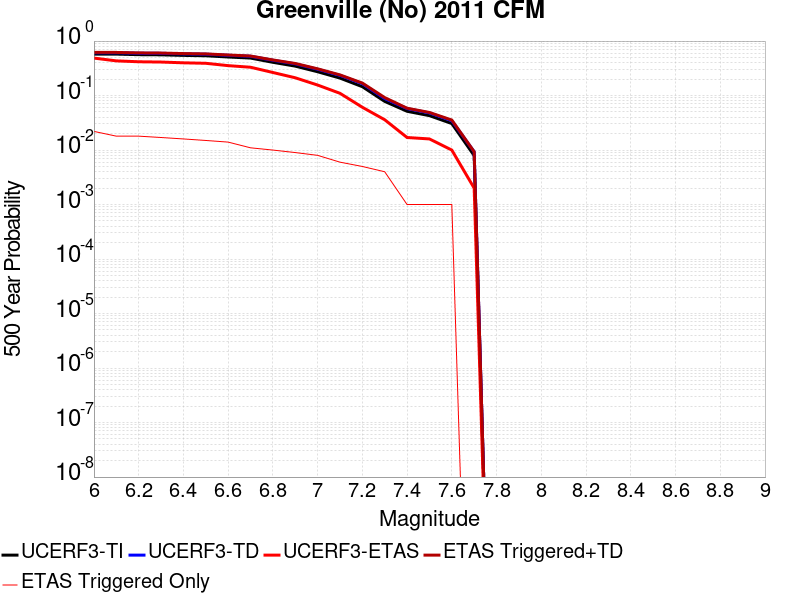 |

| Magnitude | 1 wk TI Prob | 1 wk TD Prob | 1 wk ETAS Prob | 1 wk ETAS/TD Gain | 1 wk ETAS Triggered+TD | 1 wk ETAS Triggered Only | 1 mo TI Prob | 1 mo TD Prob | 1 mo ETAS Prob | 1 mo ETAS/TD Gain | 1 mo ETAS Triggered+TD | 1 mo ETAS Triggered Only | 1 yr TI Prob | 1 yr TD Prob | 1 yr ETAS Prob | 1 yr ETAS/TD Gain | 1 yr ETAS Triggered+TD | 1 yr ETAS Triggered Only | 500 yr TI Prob | 500 yr TD Prob | 500 yr ETAS Prob | 500 yr ETAS/TD Gain | 500 yr ETAS Triggered+TD | 500 yr ETAS Triggered Only |
|-----|-----|-----|-----|-----|-----|-----|-----|-----|-----|-----|-----|-----|-----|-----|-----|-----|-----|-----|-----|-----|-----|-----|-----|-----|
| 6.0 | 3.286654E-5 | 3.990444E-5 | 0.0 | 0.0 | 3.990444E-5 | 0.0 | 1.4084899E-4 | 1.7100804E-4 | 0.0 | 0.0 | 1.7100804E-4 | 0.0 | 0.0017134876 | 0.0020800724 | 0.002 | 0.96150506 | 0.0020800724 | 0.0 | 0.5757696 | 0.61177814 | 0.487 | 0.79604024 | 0.620319 | 0.022 |
| 6.1 | 3.286654E-5 | 3.990444E-5 | 0.0 | 0.0 | 3.990444E-5 | 0.0 | 1.4084899E-4 | 1.7100804E-4 | 0.0 | 0.0 | 1.7100804E-4 | 0.0 | 0.0017134876 | 0.0020800724 | 0.002 | 0.96150506 | 0.0020800724 | 0.0 | 0.5757696 | 0.61177814 | 0.433 | 0.7077729 | 0.6187661 | 0.018 |
| 6.2 | 3.1697953E-5 | 3.8484228E-5 | 0.0 | 0.0 | 3.8484228E-5 | 0.0 | 1.358413E-4 | 1.6492218E-4 | 0.0 | 0.0 | 1.6492218E-4 | 0.0 | 0.0016526132 | 0.002006115 | 0.002 | 0.9969518 | 0.002006115 | 0.0 | 0.56263626 | 0.59927607 | 0.417 | 0.6958396 | 0.6064891 | 0.018 |
| 6.3 | 3.1363317E-5 | 3.8077906E-5 | 0.0 | 0.0 | 3.8077906E-5 | 0.0 | 1.344073E-4 | 1.6318102E-4 | 0.0 | 0.0 | 1.6318102E-4 | 0.0 | 0.0016351803 | 0.0019849553 | 0.002 | 1.0075794 | 0.0019849553 | 0.0 | 0.55880105 | 0.59563845 | 0.412 | 0.6916948 | 0.6025126 | 0.017 |
| 6.4 | 3.0228604E-5 | 3.6701233E-5 | 0.0 | 0.0 | 3.6701233E-5 | 0.0 | 1.2954473E-4 | 1.5728173E-4 | 0.0 | 0.0 | 1.5728173E-4 | 0.0 | 0.0015760659 | 0.001913259 | 0.002 | 1.0453367 | 0.001913259 | 0.0 | 0.5455442 | 0.5829923 | 0.399 | 0.6844001 | 0.58966446 | 0.016 |
| 6.5 | 2.9537814E-5 | 3.5866313E-5 | 0.0 | 0.0 | 3.5866313E-5 | 0.0 | 1.2658449E-4 | 1.5370392E-4 | 0.0 | 0.0 | 1.5370392E-4 | 0.0 | 0.0015400766 | 0.0018697747 | 0.002 | 1.0696476 | 0.0018697747 | 0.0 | 0.53727937 | 0.57509905 | 0.391 | 0.6798829 | 0.5814726 | 0.015 |
| 6.6 | 2.7345395E-5 | 3.320691E-5 | 0.0 | 0.0 | 3.320691E-5 | 0.0 | 1.1718928E-4 | 1.4230775E-4 | 0.0 | 0.0 | 1.4230775E-4 | 0.0 | 0.0014258457 | 0.0017312503 | 0.002 | 1.1552345 | 0.0017312503 | 0.0 | 0.51004004 | 0.5486934 | 0.354 | 0.645169 | 0.5550117 | 0.014 |
| 6.7 | 2.5615784E-5 | 3.120173E-5 | 0.0 | 0.0 | 3.120173E-5 | 0.0 | 1.09777306E-4 | 1.3371502E-4 | 0.0 | 0.0 | 1.3371502E-4 | 0.0 | 0.0013357193 | 0.0016267946 | 0.002 | 1.2294116 | 0.0016267946 | 0.0 | 0.48742387 | 0.5264801 | 0.331 | 0.6287038 | 0.5316888 | 0.011 |
| 6.8 | 2.0059057E-5 | 2.442926E-5 | 0.0 | 0.0 | 2.442926E-5 | 0.0 | 8.596455E-5 | 1.0469272E-4 | 0.0 | 0.0 | 1.0469272E-4 | 0.0 | 0.0010461159 | 0.0012739045 | 0.001 | 0.7849882 | 0.0012739045 | 0.0 | 0.40745693 | 0.4448369 | 0.265 | 0.5957239 | 0.45038855 | 0.01 |
| 6.9 | 1.6321746E-5 | 1.9951463E-5 | 0.0 | 0.0 | 1.9951463E-5 | 0.0 | 6.9948466E-5 | 8.550354E-5 | 0.0 | 0.0 | 8.550354E-5 | 0.0 | 8.5128983E-4 | 0.0010405205 | 0.001 | 0.9610574 | 0.0010405205 | 0.0 | 0.34677014 | 0.38227758 | 0.212 | 0.55457085 | 0.38783708 | 0.009 |
| 7.0 | 1.22527645E-5 | 1.4961478E-5 | 0.0 | 0.0 | 1.4961478E-5 | 0.0 | 5.2510793E-5 | 6.411907E-5 | 0.0 | 0.0 | 6.411907E-5 | 0.0 | 6.3913135E-4 | 7.803742E-4 | 0.001 | 1.2814364 | 7.803742E-4 | 0.0 | 0.27360973 | 0.30393058 | 0.156 | 0.5132751 | 0.30949914 | 0.008 |
| 7.1 | 8.996482E-6 | 1.1034142E-5 | 0.0 | 0.0 | 1.1034142E-5 | 0.0 | 3.8555783E-5 | 4.728833E-5 | 0.0 | 0.0 | 4.728833E-5 | 0.0 | 4.6931554E-4 | 5.7558453E-4 | 0.001 | 1.7373643 | 5.7558453E-4 | 0.0 | 0.2092021 | 0.23482226 | 0.11 | 0.4684394 | 0.23941332 | 0.006 |
| 7.2 | 6.0273087E-6 | 7.4772183E-6 | 0.0 | 0.0 | 7.4772183E-6 | 0.0 | 2.5831067E-5 | 3.204483E-5 | 0.0 | 0.0 | 3.204483E-5 | 0.0 | 3.1444785E-4 | 3.9007666E-4 | 0.001 | 2.5635986 | 3.9007666E-4 | 0.0 | 0.14550844 | 0.16536401 | 0.061 | 0.36888316 | 0.16953719 | 0.005 |
| 7.3 | 3.1209995E-6 | 3.9109937E-6 | 0.0 | 0.0 | 3.9109937E-6 | 0.0 | 1.3375643E-5 | 1.6761294E-5 | 0.0 | 0.0 | 1.6761294E-5 | 0.0 | 1.6283628E-4 | 2.0404981E-4 | 0.0 | 0.0 | 2.0404981E-4 | 0.0 | 0.07819795 | 0.088162675 | 0.036 | 0.40833607 | 0.091810025 | 0.004 |
| 7.4 | 2.0254208E-6 | 2.5709955E-6 | 0.0 | 0.0 | 2.5709955E-6 | 0.0 | 8.680347E-6 | 1.10185065E-5 | 0.0 | 0.0 | 1.10185065E-5 | 0.0 | 1.0567809E-4 | 1.3414212E-4 | 0.0 | 0.0 | 1.3414212E-4 | 0.0 | 0.051469978 | 0.05765066 | 0.017 | 0.29487953 | 0.05859301 | 0.001 |
| 7.5 | 1.6763418E-6 | 2.1399687E-6 | 0.0 | 0.0 | 2.1399687E-6 | 0.0 | 7.184302E-6 | 9.171262E-6 | 0.0 | 0.0 | 9.171262E-6 | 0.0 | 8.746537E-5 | 1.1165445E-4 | 0.0 | 0.0 | 1.1165445E-4 | 0.0 | 0.04279203 | 0.048004836 | 0.016 | 0.33329976 | 0.04895683 | 0.001 |
| 7.6 | 1.1935462E-6 | 1.5216383E-6 | 0.0 | 0.0 | 1.5216383E-6 | 0.0 | 5.115188E-6 | 6.5212907E-6 | 0.0 | 0.0 | 6.5212907E-6 | 0.0 | 6.2275634E-5 | 7.939387E-5 | 0.0 | 0.0 | 7.939387E-5 | 0.0 | 0.030658968 | 0.0345747 | 0.01 | 0.28922883 | 0.035540126 | 0.001 |
| 7.7 | 3.0464201E-7 | 3.9242352E-7 | 0.0 | 0.0 | 3.9242352E-7 | 0.0 | 1.3056081E-6 | 1.681814E-6 | 0.0 | 0.0 | 1.681814E-6 | 0.0 | 1.589566E-5 | 2.0475898E-5 | 0.0 | 0.0 | 2.0475898E-5 | 0.0 | 0.007916393 | 0.009307768 | 0.002 | 0.21487428 | 0.009307768 | 0.0 |

## Cleghorn Lake
*[(top)](#table-of-contents)*

| 1 Week | 1 Month | 1 Year | 500 Year |
|-----|-----|-----|-----|
| 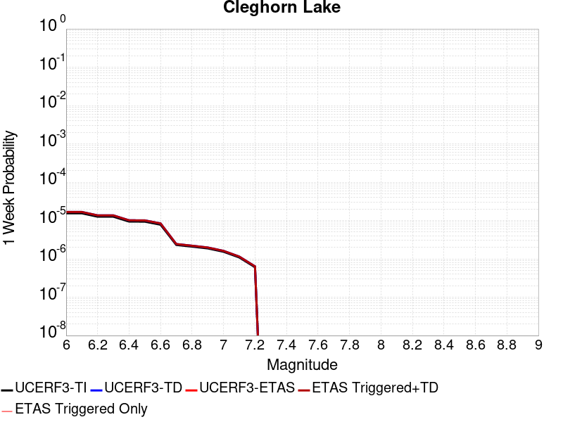 | 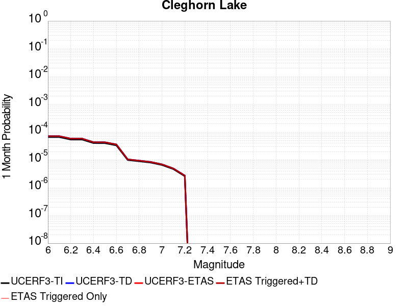 | 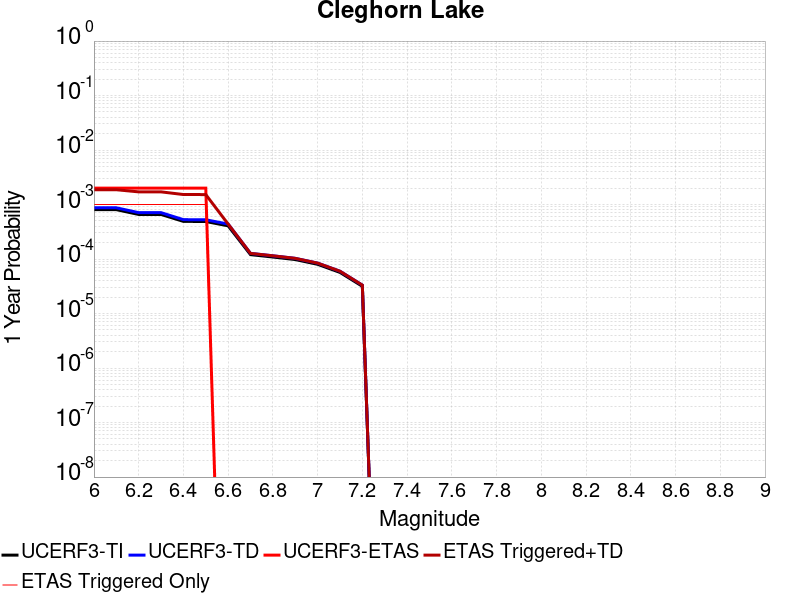 | 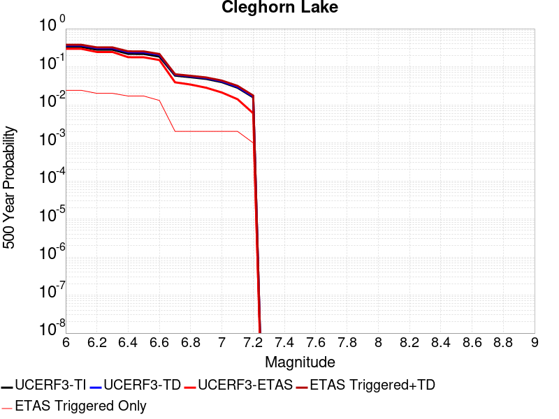 |

| Magnitude | 1 wk TI Prob | 1 wk TD Prob | 1 wk ETAS Prob | 1 wk ETAS/TD Gain | 1 wk ETAS Triggered+TD | 1 wk ETAS Triggered Only | 1 mo TI Prob | 1 mo TD Prob | 1 mo ETAS Prob | 1 mo ETAS/TD Gain | 1 mo ETAS Triggered+TD | 1 mo ETAS Triggered Only | 1 yr TI Prob | 1 yr TD Prob | 1 yr ETAS Prob | 1 yr ETAS/TD Gain | 1 yr ETAS Triggered+TD | 1 yr ETAS Triggered Only | 500 yr TI Prob | 500 yr TD Prob | 500 yr ETAS Prob | 500 yr ETAS/TD Gain | 500 yr ETAS Triggered+TD | 500 yr ETAS Triggered Only |
|-----|-----|-----|-----|-----|-----|-----|-----|-----|-----|-----|-----|-----|-----|-----|-----|-----|-----|-----|-----|-----|-----|-----|-----|-----|
| 6.0 | 1.5467183E-5 | 1.671942E-5 | 0.0 | 0.0 | 1.671942E-5 | 0.0 | 6.6286244E-5 | 7.165299E-5 | 0.0 | 0.0 | 7.165299E-5 | 0.0 | 8.067362E-4 | 8.7208033E-4 | 0.002 | 2.2933667 | 0.0018712083 | 0.001 | 0.3320426 | 0.36233002 | 0.296 | 0.81693476 | 0.3776341 | 0.024 |
| 6.1 | 1.5467183E-5 | 1.671942E-5 | 0.0 | 0.0 | 1.671942E-5 | 0.0 | 6.6286244E-5 | 7.165299E-5 | 0.0 | 0.0 | 7.165299E-5 | 0.0 | 8.067362E-4 | 8.7208033E-4 | 0.002 | 2.2933667 | 0.0018712083 | 0.001 | 0.3320426 | 0.36233002 | 0.296 | 0.81693476 | 0.3776341 | 0.024 |
| 6.2 | 1.2624631E-5 | 1.3622059E-5 | 0.0 | 0.0 | 1.3622059E-5 | 0.0 | 5.410444E-5 | 5.8379217E-5 | 0.0 | 0.0 | 5.8379217E-5 | 0.0 | 6.585225E-4 | 7.105834E-4 | 0.002 | 2.8145888 | 0.0017098729 | 0.001 | 0.280623 | 0.30785054 | 0.244 | 0.7925924 | 0.32169354 | 0.02 |
| 6.3 | 1.2624631E-5 | 1.3622059E-5 | 0.0 | 0.0 | 1.3622059E-5 | 0.0 | 5.410444E-5 | 5.8379217E-5 | 0.0 | 0.0 | 5.8379217E-5 | 0.0 | 6.585225E-4 | 7.105834E-4 | 0.002 | 2.8145888 | 0.0017098729 | 0.001 | 0.280623 | 0.30785054 | 0.244 | 0.7925924 | 0.32169354 | 0.02 |
| 6.4 | 9.417684E-6 | 1.0127875E-5 | 0.0 | 0.0 | 1.0127875E-5 | 0.0 | 4.036088E-5 | 4.3404685E-5 | 0.0 | 0.0 | 4.3404685E-5 | 0.0 | 4.912829E-4 | 5.283646E-4 | 0.002 | 3.785265 | 0.0015278362 | 0.001 | 0.21784458 | 0.2406445 | 0.178 | 0.7396803 | 0.25355354 | 0.017 |
| 6.5 | 9.368219E-6 | 1.0075473E-5 | 0.0 | 0.0 | 1.0075473E-5 | 0.0 | 4.014889E-5 | 4.3180113E-5 | 0.0 | 0.0 | 4.3180113E-5 | 0.0 | 4.8870314E-4 | 5.2563177E-4 | 0.002 | 3.804945 | 0.0015251061 | 0.001 | 0.21683453 | 0.23960616 | 0.177 | 0.73871225 | 0.25253284 | 0.017 |
| 6.6 | 7.803798E-6 | 8.4059875E-6 | 0.0 | 0.0 | 8.4059875E-6 | 0.0 | 3.3444423E-5 | 3.6025383E-5 | 0.0 | 0.0 | 3.6025383E-5 | 0.0 | 4.0710976E-4 | 4.3856032E-4 | 0.0 | 0.0 | 4.3856032E-4 | 0.0 | 0.18420838 | 0.20562649 | 0.15 | 0.729478 | 0.21595335 | 0.013 |
| 6.7 | 2.3108669E-6 | 2.4365404E-6 | 0.0 | 0.0 | 2.4365404E-6 | 0.0 | 9.903678E-6 | 1.0442275E-5 | 0.0 | 0.0 | 1.0442275E-5 | 0.0 | 1.205706E-4 | 1.2712747E-4 | 0.0 | 0.0 | 1.2712747E-4 | 0.0 | 0.058507536 | 0.061635476 | 0.039 | 0.6327525 | 0.063512206 | 0.002 |
| 6.8 | 2.0882828E-6 | 2.1998185E-6 | 0.0 | 0.0 | 2.1998185E-6 | 0.0 | 8.949753E-6 | 9.42776E-6 | 0.0 | 0.0 | 9.42776E-6 | 0.0 | 1.08957785E-4 | 1.147771E-4 | 0.0 | 0.0 | 1.147771E-4 | 0.0 | 0.053024314 | 0.05581881 | 0.034 | 0.6091137 | 0.057707172 | 0.002 |
| 6.9 | 1.876935E-6 | 1.9753545E-6 | 0.0 | 0.0 | 1.9753545E-6 | 0.0 | 8.043982E-6 | 8.465779E-6 | 0.0 | 0.0 | 8.465779E-6 | 0.0 | 9.7931086E-5 | 1.0306614E-4 | 0.0 | 0.0 | 1.0306614E-4 | 0.0 | 0.04778834 | 0.050271604 | 0.028 | 0.5569745 | 0.05217106 | 0.002 |
| 7.0 | 1.5357559E-6 | 1.6156582E-6 | 0.0 | 0.0 | 1.6156582E-6 | 0.0 | 6.5817944E-6 | 6.924232E-6 | 0.0 | 0.0 | 6.924232E-6 | 0.0 | 8.01304E-5 | 8.429938E-5 | 0.0 | 0.0 | 8.429938E-5 | 0.0 | 0.039274745 | 0.041308068 | 0.021 | 0.5083753 | 0.043225452 | 0.002 |
| 7.1 | 1.0905424E-6 | 1.1465256E-6 | 0.0 | 0.0 | 1.1465256E-6 | 0.0 | 4.6737446E-6 | 4.9136725E-6 | 0.0 | 0.0 | 4.9136725E-6 | 0.0 | 5.6901354E-5 | 5.9822418E-5 | 0.0 | 0.0 | 5.9822418E-5 | 0.0 | 0.028050553 | 0.02949524 | 0.014 | 0.47465286 | 0.03143625 | 0.002 |
| 7.2 | 6.06668E-7 | 6.369782E-7 | 0.0 | 0.0 | 6.369782E-7 | 0.0 | 2.600003E-6 | 2.729904E-6 | 0.0 | 0.0 | 2.729904E-6 | 0.0 | 3.1654577E-5 | 3.3236145E-5 | 0.0 | 0.0 | 3.3236145E-5 | 0.0 | 0.015702942 | 0.016499616 | 0.006 | 0.3636448 | 0.017483117 | 0.001 |

## Trinidad (alt1)
*[(top)](#table-of-contents)*

| 1 Week | 1 Month | 1 Year | 500 Year |
|-----|-----|-----|-----|
|  |  | 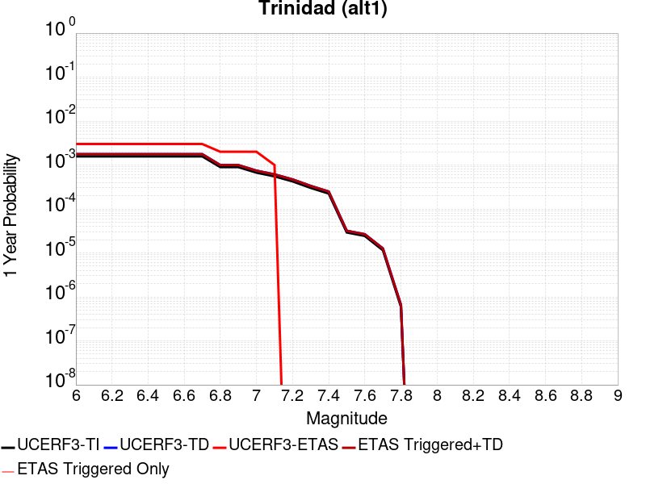 | 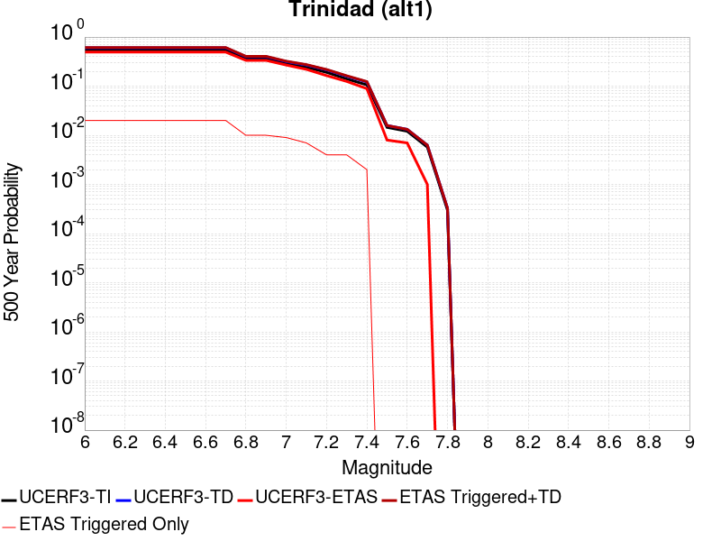 |

| Magnitude | 1 wk TI Prob | 1 wk TD Prob | 1 wk ETAS Prob | 1 wk ETAS/TD Gain | 1 wk ETAS Triggered+TD | 1 wk ETAS Triggered Only | 1 mo TI Prob | 1 mo TD Prob | 1 mo ETAS Prob | 1 mo ETAS/TD Gain | 1 mo ETAS Triggered+TD | 1 mo ETAS Triggered Only | 1 yr TI Prob | 1 yr TD Prob | 1 yr ETAS Prob | 1 yr ETAS/TD Gain | 1 yr ETAS Triggered+TD | 1 yr ETAS Triggered Only | 500 yr TI Prob | 500 yr TD Prob | 500 yr ETAS Prob | 500 yr ETAS/TD Gain | 500 yr ETAS Triggered+TD | 500 yr ETAS Triggered Only |
|-----|-----|-----|-----|-----|-----|-----|-----|-----|-----|-----|-----|-----|-----|-----|-----|-----|-----|-----|-----|-----|-----|-----|-----|-----|
| 6.0 | 3.0167168E-5 | 3.3807653E-5 | 0.0 | 0.0 | 3.3807653E-5 | 0.0 | 1.2928146E-4 | 1.4488283E-4 | 0.0 | 0.0 | 1.4488283E-4 | 0.0 | 0.0015728653 | 0.0017626872 | 0.003 | 1.7019469 | 0.0017626872 | 0.0 | 0.5448152 | 0.6025976 | 0.493 | 0.8181248 | 0.61054564 | 0.02 |
| 6.1 | 3.0167168E-5 | 3.3807653E-5 | 0.0 | 0.0 | 3.3807653E-5 | 0.0 | 1.2928146E-4 | 1.4488283E-4 | 0.0 | 0.0 | 1.4488283E-4 | 0.0 | 0.0015728653 | 0.0017626872 | 0.003 | 1.7019469 | 0.0017626872 | 0.0 | 0.5448152 | 0.6025976 | 0.493 | 0.8181248 | 0.61054564 | 0.02 |
| 6.2 | 3.0167168E-5 | 3.3807653E-5 | 0.0 | 0.0 | 3.3807653E-5 | 0.0 | 1.2928146E-4 | 1.4488283E-4 | 0.0 | 0.0 | 1.4488283E-4 | 0.0 | 0.0015728653 | 0.0017626872 | 0.003 | 1.7019469 | 0.0017626872 | 0.0 | 0.5448152 | 0.6025976 | 0.493 | 0.8181248 | 0.61054564 | 0.02 |
| 6.3 | 3.0167168E-5 | 3.3807653E-5 | 0.0 | 0.0 | 3.3807653E-5 | 0.0 | 1.2928146E-4 | 1.4488283E-4 | 0.0 | 0.0 | 1.4488283E-4 | 0.0 | 0.0015728653 | 0.0017626872 | 0.003 | 1.7019469 | 0.0017626872 | 0.0 | 0.5448152 | 0.6025976 | 0.493 | 0.8181248 | 0.61054564 | 0.02 |
| 6.4 | 3.0167168E-5 | 3.3807653E-5 | 0.0 | 0.0 | 3.3807653E-5 | 0.0 | 1.2928146E-4 | 1.4488283E-4 | 0.0 | 0.0 | 1.4488283E-4 | 0.0 | 0.0015728653 | 0.0017626872 | 0.003 | 1.7019469 | 0.0017626872 | 0.0 | 0.5448152 | 0.6025976 | 0.493 | 0.8181248 | 0.61054564 | 0.02 |
| 6.5 | 3.0167168E-5 | 3.3807653E-5 | 0.0 | 0.0 | 3.3807653E-5 | 0.0 | 1.2928146E-4 | 1.4488283E-4 | 0.0 | 0.0 | 1.4488283E-4 | 0.0 | 0.0015728653 | 0.0017626872 | 0.003 | 1.7019469 | 0.0017626872 | 0.0 | 0.5448152 | 0.6025976 | 0.493 | 0.8181248 | 0.61054564 | 0.02 |
| 6.6 | 3.0167168E-5 | 3.3807653E-5 | 0.0 | 0.0 | 3.3807653E-5 | 0.0 | 1.2928146E-4 | 1.4488283E-4 | 0.0 | 0.0 | 1.4488283E-4 | 0.0 | 0.0015728653 | 0.0017626872 | 0.003 | 1.7019469 | 0.0017626872 | 0.0 | 0.5448152 | 0.6025976 | 0.493 | 0.8181248 | 0.61054564 | 0.02 |
| 6.7 | 3.0167168E-5 | 3.3807653E-5 | 0.0 | 0.0 | 3.3807653E-5 | 0.0 | 1.2928146E-4 | 1.4488283E-4 | 0.0 | 0.0 | 1.4488283E-4 | 0.0 | 0.0015728653 | 0.0017626872 | 0.003 | 1.7019469 | 0.0017626872 | 0.0 | 0.5448152 | 0.6025976 | 0.493 | 0.8181248 | 0.61054564 | 0.02 |
| 6.8 | 1.717077E-5 | 1.9078638E-5 | 0.0 | 0.0 | 1.9078638E-5 | 0.0 | 7.358694E-5 | 8.1763275E-5 | 0.0 | 0.0 | 8.1763275E-5 | 0.0 | 8.9555274E-4 | 9.950573E-4 | 0.002 | 2.0099347 | 9.950573E-4 | 0.0 | 0.36108062 | 0.3984285 | 0.335 | 0.84080327 | 0.40444422 | 0.01 |
| 6.9 | 1.717077E-5 | 1.9078638E-5 | 0.0 | 0.0 | 1.9078638E-5 | 0.0 | 7.358694E-5 | 8.1763275E-5 | 0.0 | 0.0 | 8.1763275E-5 | 0.0 | 8.9555274E-4 | 9.950573E-4 | 0.002 | 2.0099347 | 9.950573E-4 | 0.0 | 0.36108062 | 0.3984285 | 0.335 | 0.84080327 | 0.40444422 | 0.01 |
| 7.0 | 1.2858572E-5 | 1.4252103E-5 | 0.0 | 0.0 | 1.4252103E-5 | 0.0 | 5.5107E-5 | 6.107919E-5 | 0.0 | 0.0 | 6.107919E-5 | 0.0 | 6.707212E-4 | 7.4341707E-4 | 0.002 | 2.6902797 | 7.4341707E-4 | 0.0 | 0.28500026 | 0.31613952 | 0.269 | 0.85089016 | 0.32229427 | 0.009 |
| 7.1 | 1.0588431E-5 | 1.1731367E-5 | 0.0 | 0.0 | 1.1731367E-5 | 0.0 | 4.53782E-5 | 5.0276474E-5 | 0.0 | 0.0 | 5.0276474E-5 | 0.0 | 5.5233954E-4 | 6.119727E-4 | 0.001 | 1.6340598 | 6.119727E-4 | 0.0 | 0.24137376 | 0.26930907 | 0.22 | 0.81690526 | 0.27442393 | 0.007 |
| 7.2 | 8.138061E-6 | 9.013664E-6 | 0.0 | 0.0 | 9.013664E-6 | 0.0 | 3.487694E-5 | 3.8629554E-5 | 0.0 | 0.0 | 3.8629554E-5 | 0.0 | 4.2454398E-4 | 4.7023786E-4 | 0.0 | 0.0 | 4.7023786E-4 | 0.0 | 0.19129175 | 0.21503223 | 0.164 | 0.76267636 | 0.2181721 | 0.004 |
| 7.3 | 5.787542E-6 | 6.421495E-6 | 0.0 | 0.0 | 6.421495E-6 | 0.0 | 2.4803514E-5 | 2.7520522E-5 | 0.0 | 0.0 | 2.7520522E-5 | 0.0 | 3.0194095E-4 | 3.350321E-4 | 0.0 | 0.0 | 3.350321E-4 | 0.0 | 0.14014651 | 0.15936778 | 0.125 | 0.7843492 | 0.16273032 | 0.004 |
| 7.4 | 4.303563E-6 | 4.7721637E-6 | 0.0 | 0.0 | 4.7721637E-6 | 0.0 | 1.844371E-5 | 2.045208E-5 | 0.0 | 0.0 | 2.045208E-5 | 0.0 | 2.2452902E-4 | 2.4899514E-4 | 0.0 | 0.0 | 2.4899514E-4 | 0.0 | 0.10620347 | 0.122010626 | 0.089 | 0.7294447 | 0.1237666 | 0.002 |
| 7.5 | 5.6063425E-7 | 6.112559E-7 | 0.0 | 0.0 | 6.112559E-7 | 0.0 | 2.402716E-6 | 2.6196658E-6 | 0.0 | 0.0 | 2.6196658E-6 | 0.0 | 2.9252675E-5 | 3.189398E-5 | 0.0 | 0.0 | 3.189398E-5 | 0.0 | 0.014520103 | 0.015824554 | 0.008 | 0.5055434 | 0.015824554 | 0.0 |
| 7.6 | 4.6699128E-7 | 5.0999154E-7 | 0.0 | 0.0 | 5.0999154E-7 | 0.0 | 2.0013897E-6 | 2.1856763E-6 | 0.0 | 0.0 | 2.1856763E-6 | 0.0 | 2.4366647E-5 | 2.66103E-5 | 0.0 | 0.0 | 2.66103E-5 | 0.0 | 0.012109553 | 0.013220651 | 0.007 | 0.5294747 | 0.013220651 | 0.0 |
| 7.7 | 2.2080937E-7 | 2.4217718E-7 | 0.0 | 0.0 | 2.4217718E-7 | 0.0 | 9.4632554E-7 | 1.0379018E-6 | 0.0 | 0.0 | 1.0379018E-6 | 0.0 | 1.15214525E-5 | 1.2636388E-5 | 0.0 | 0.0 | 1.2636388E-5 | 0.0 | 0.0057441983 | 0.0062999525 | 0.001 | 0.15873136 | 0.0062999525 | 0.0 |
| 7.8 | 1.1438307E-8 | 1.26116415E-8 | 0.0 | 0.0 | 1.26116415E-8 | 0.0 | 4.9021317E-8 | 5.404989E-8 | 0.0 | 0.0 | 5.404989E-8 | 0.0 | 5.9683435E-7 | 6.5805744E-7 | 0.0 | 0.0 | 6.5805744E-7 | 0.0 | 2.9837273E-4 | 3.2902852E-4 | 0.0 | 0.0 | 3.2902852E-4 | 0.0 |

## Garlock (West)
*[(top)](#table-of-contents)*

| 1 Week | 1 Month | 1 Year | 500 Year |
|-----|-----|-----|-----|
| 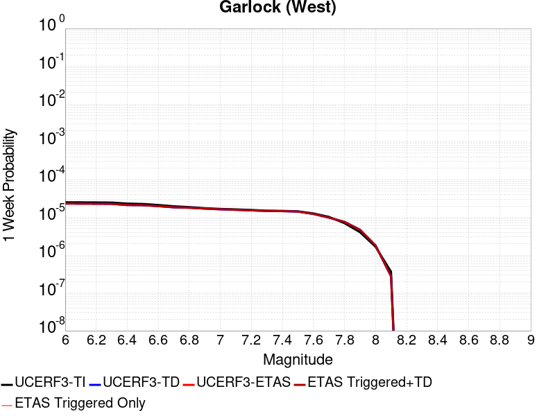 | 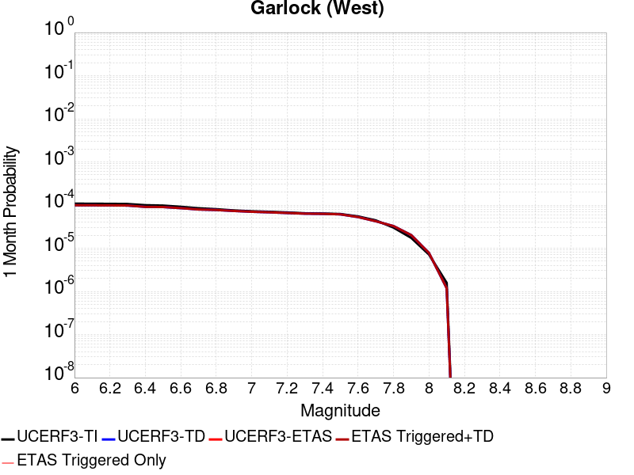 | 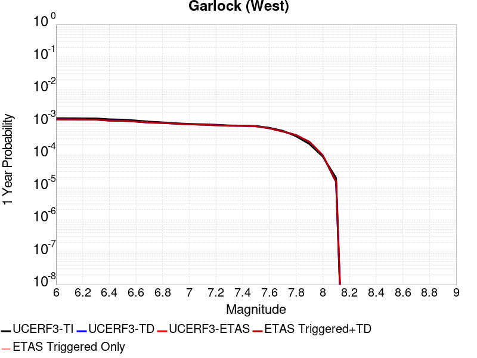 |  |

| Magnitude | 1 wk TI Prob | 1 wk TD Prob | 1 wk ETAS Prob | 1 wk ETAS/TD Gain | 1 wk ETAS Triggered+TD | 1 wk ETAS Triggered Only | 1 mo TI Prob | 1 mo TD Prob | 1 mo ETAS Prob | 1 mo ETAS/TD Gain | 1 mo ETAS Triggered+TD | 1 mo ETAS Triggered Only | 1 yr TI Prob | 1 yr TD Prob | 1 yr ETAS Prob | 1 yr ETAS/TD Gain | 1 yr ETAS Triggered+TD | 1 yr ETAS Triggered Only | 500 yr TI Prob | 500 yr TD Prob | 500 yr ETAS Prob | 500 yr ETAS/TD Gain | 500 yr ETAS Triggered+TD | 500 yr ETAS Triggered Only |
|-----|-----|-----|-----|-----|-----|-----|-----|-----|-----|-----|-----|-----|-----|-----|-----|-----|-----|-----|-----|-----|-----|-----|-----|-----|
| 6.0 | 2.5181727E-5 | 2.3218332E-5 | 0.0 | 0.0 | 2.3218332E-5 | 0.0 | 1.0791722E-4 | 9.950336E-5 | 0.0 | 0.0 | 9.950336E-5 | 0.0 | 0.0013131002 | 0.0012107834 | 0.0 | 0.0 | 0.0012107834 | 0.0 | 0.48158622 | 0.5361891 | 0.407 | 0.75906056 | 0.54732054 | 0.024 |
| 6.1 | 2.5077732E-5 | 2.3120718E-5 | 0.0 | 0.0 | 2.3120718E-5 | 0.0 | 1.0747157E-4 | 9.9085046E-5 | 0.0 | 0.0 | 9.9085046E-5 | 0.0 | 0.001307681 | 0.001205696 | 0.0 | 0.0 | 0.001205696 | 0.0 | 0.48017773 | 0.5348801 | 0.403 | 0.75343984 | 0.5455779 | 0.023 |
| 6.2 | 2.494612E-5 | 2.3003724E-5 | 0.0 | 0.0 | 2.3003724E-5 | 0.0 | 1.0690756E-4 | 9.858368E-5 | 0.0 | 0.0 | 9.858368E-5 | 0.0 | 0.0013008224 | 0.0011995987 | 0.0 | 0.0 | 0.0011995987 | 0.0 | 0.47838974 | 0.53326344 | 0.402 | 0.7538488 | 0.54399836 | 0.023 |
| 6.3 | 2.4733758E-5 | 2.2825854E-5 | 0.0 | 0.0 | 2.2825854E-5 | 0.0 | 1.0599751E-4 | 9.782144E-5 | 0.0 | 0.0 | 9.782144E-5 | 0.0 | 0.0012897556 | 0.0011903285 | 0.0 | 0.0 | 0.0011903285 | 0.0 | 0.4754917 | 0.5306604 | 0.398 | 0.7500088 | 0.5414552 | 0.023 |
| 6.4 | 2.3237335E-5 | 2.12189E-5 | 0.0 | 0.0 | 2.12189E-5 | 0.0 | 9.958477E-5 | 9.093499E-5 | 0.0 | 0.0 | 9.093499E-5 | 0.0 | 0.0012117702 | 0.0011065737 | 0.0 | 0.0 | 0.0011065737 | 0.0 | 0.45460913 | 0.5105049 | 0.374 | 0.732608 | 0.51931584 | 0.018 |
| 6.5 | 2.2732203E-5 | 2.1043072E-5 | 0.0 | 0.0 | 2.1043072E-5 | 0.0 | 9.742009E-5 | 9.018149E-5 | 0.0 | 0.0 | 9.018149E-5 | 0.0 | 0.0011854442 | 0.0010974092 | 0.0 | 0.0 | 0.0010974092 | 0.0 | 0.44737393 | 0.50501853 | 0.365 | 0.7227458 | 0.5134332 | 0.017 |
| 6.6 | 2.1319436E-5 | 1.9839554E-5 | 0.0 | 0.0 | 1.9839554E-5 | 0.0 | 9.136581E-5 | 8.50239E-5 | 0.0 | 0.0 | 8.50239E-5 | 0.0 | 0.001111811 | 0.0010346764 | 0.0 | 0.0 | 0.0010346764 | 0.0 | 0.4266247 | 0.48630366 | 0.335 | 0.68887 | 0.49503648 | 0.017 |
| 6.7 | 1.970802E-5 | 1.8480101E-5 | 0.0 | 0.0 | 1.8480101E-5 | 0.0 | 8.446021E-5 | 7.919804E-5 | 0.0 | 0.0 | 7.919804E-5 | 0.0 | 0.001027818 | 9.638111E-4 | 0.0 | 0.0 | 9.638111E-4 | 0.0 | 0.40200523 | 0.46373516 | 0.309 | 0.6663286 | 0.4717791 | 0.015 |
| 6.8 | 1.8744462E-5 | 1.799993E-5 | 0.0 | 0.0 | 1.799993E-5 | 0.0 | 8.033094E-5 | 7.7140285E-5 | 0.0 | 0.0 | 7.7140285E-5 | 0.0 | 9.775903E-4 | 9.387798E-4 | 0.0 | 0.0 | 9.387798E-4 | 0.0 | 0.38678166 | 0.4512162 | 0.302 | 0.6693022 | 0.45944795 | 0.015 |
| 6.9 | 1.7559682E-5 | 1.7071618E-5 | 0.0 | 0.0 | 1.7071618E-5 | 0.0 | 7.5253614E-5 | 7.316203E-5 | 0.0 | 0.0 | 7.316203E-5 | 0.0 | 9.158276E-4 | 8.9038495E-4 | 0.0 | 0.0 | 8.9038495E-4 | 0.0 | 0.3675307 | 0.43372378 | 0.287 | 0.6617115 | 0.44165164 | 0.014 |
| 7.0 | 1.6794445E-5 | 1.6352138E-5 | 0.0 | 0.0 | 1.6352138E-5 | 0.0 | 7.197421E-5 | 7.007871E-5 | 0.0 | 0.0 | 7.007871E-5 | 0.0 | 8.759337E-4 | 8.528756E-4 | 0.0 | 0.0 | 8.528756E-4 | 0.0 | 0.35477665 | 0.4215564 | 0.275 | 0.65234447 | 0.4279193 | 0.011 |
| 7.1 | 1.6337795E-5 | 1.586701E-5 | 0.0 | 0.0 | 1.586701E-5 | 0.0 | 7.0017246E-5 | 6.799971E-5 | 0.0 | 0.0 | 6.799971E-5 | 0.0 | 8.521265E-4 | 8.2758314E-4 | 0.0 | 0.0 | 8.2758314E-4 | 0.0 | 0.34704357 | 0.41375577 | 0.272 | 0.6573927 | 0.42020446 | 0.011 |
| 7.2 | 1.5780008E-5 | 1.5324238E-5 | 0.0 | 0.0 | 1.5324238E-5 | 0.0 | 6.762685E-5 | 6.567366E-5 | 0.0 | 0.0 | 6.567366E-5 | 0.0 | 8.2304585E-4 | 7.9928455E-4 | 0.0 | 0.0 | 7.9928455E-4 | 0.0 | 0.33747193 | 0.40434048 | 0.266 | 0.6578614 | 0.41029707 | 0.01 |
| 7.3 | 1.5058865E-5 | 1.4791435E-5 | 0.0 | 0.0 | 1.4791435E-5 | 0.0 | 6.45364E-5 | 6.339033E-5 | 0.0 | 0.0 | 6.339033E-5 | 0.0 | 7.854473E-4 | 7.7150506E-4 | 0.0 | 0.0 | 7.7150506E-4 | 0.0 | 0.32488889 | 0.39194316 | 0.258 | 0.65825874 | 0.39741567 | 0.009 |
| 7.4 | 1.4887923E-5 | 1.46337625E-5 | 0.0 | 0.0 | 1.46337625E-5 | 0.0 | 6.380382E-5 | 6.271462E-5 | 0.0 | 0.0 | 6.271462E-5 | 0.0 | 7.7653467E-4 | 7.632841E-4 | 0.0 | 0.0 | 7.632841E-4 | 0.0 | 0.32187128 | 0.38876686 | 0.254 | 0.65334785 | 0.39426798 | 0.009 |
| 7.5 | 1.4509299E-5 | 1.4240884E-5 | 0.0 | 0.0 | 1.4240884E-5 | 0.0 | 6.218123E-5 | 6.103094E-5 | 0.0 | 0.0 | 6.103094E-5 | 0.0 | 7.567935E-4 | 7.4279937E-4 | 0.0 | 0.0 | 7.4279937E-4 | 0.0 | 0.3151394 | 0.38117647 | 0.249 | 0.65324074 | 0.38674587 | 0.009 |
| 7.6 | 1.2756717E-5 | 1.2327586E-5 | 0.0 | 0.0 | 1.2327586E-5 | 0.0 | 5.4670498E-5 | 5.2831445E-5 | 0.0 | 0.0 | 5.2831445E-5 | 0.0 | 6.6541E-4 | 6.4303353E-4 | 0.0 | 0.0 | 6.4303353E-4 | 0.0 | 0.28309774 | 0.3447606 | 0.206 | 0.59751606 | 0.34934726 | 0.007 |
| 7.7 | 1.0328985E-5 | 9.861966E-6 | 0.0 | 0.0 | 9.861966E-6 | 0.0 | 4.4266326E-5 | 4.2264885E-5 | 0.0 | 0.0 | 4.2264885E-5 | 0.0 | 5.388092E-4 | 5.1445374E-4 | 0.0 | 0.0 | 5.1445374E-4 | 0.0 | 0.23622133 | 0.2924538 | 0.164 | 0.56077236 | 0.29599154 | 0.005 |
| 7.8 | 7.0306583E-6 | 7.621586E-6 | 0.0 | 0.0 | 7.621586E-6 | 0.0 | 3.0131043E-5 | 3.266353E-5 | 0.0 | 0.0 | 3.266353E-5 | 0.0 | 3.667837E-4 | 3.9760605E-4 | 0.0 | 0.0 | 3.9760605E-4 | 0.0 | 0.1675861 | 0.2071775 | 0.125 | 0.60334736 | 0.20955597 | 0.003 |
| 7.9 | 4.060633E-6 | 4.711601E-6 | 0.0 | 0.0 | 4.711601E-6 | 0.0 | 1.7402595E-5 | 2.019242E-5 | 0.0 | 0.0 | 2.019242E-5 | 0.0 | 2.11856E-4 | 2.4581503E-4 | 0.0 | 0.0 | 2.4581503E-4 | 0.0 | 0.100520685 | 0.12550244 | 0.072 | 0.57369405 | 0.12725143 | 0.002 |
| 8.0 | 1.6729537E-6 | 1.8167547E-6 | 0.0 | 0.0 | 1.8167547E-6 | 0.0 | 7.169782E-6 | 7.786068E-6 | 0.0 | 0.0 | 7.786068E-6 | 0.0 | 8.7288594E-5 | 9.4791285E-5 | 0.0 | 0.0 | 9.4791285E-5 | 0.0 | 0.042707413 | 0.053176258 | 0.026 | 0.48894 | 0.05412308 | 0.001 |
| 8.1 | 3.6733252E-7 | 2.768798E-7 | 0.0 | 0.0 | 2.768798E-7 | 0.0 | 1.5742813E-6 | 1.1866272E-6 | 0.0 | 0.0 | 1.1866272E-6 | 0.0 | 1.9166706E-5 | 1.4447103E-5 | 0.0 | 0.0 | 1.4447103E-5 | 0.0 | 0.00953767 | 0.012358525 | 0.004 | 0.32366323 | 0.012358525 | 0.0 |

## Robinson Creek
*[(top)](#table-of-contents)*

| 1 Week | 1 Month | 1 Year | 500 Year |
|-----|-----|-----|-----|
| 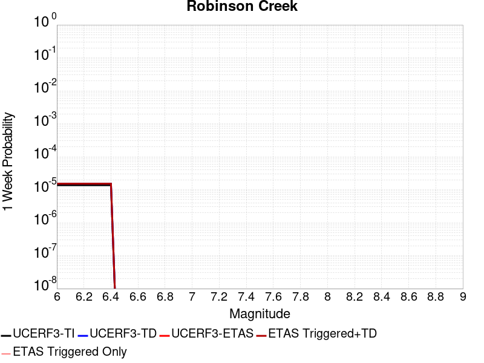 | 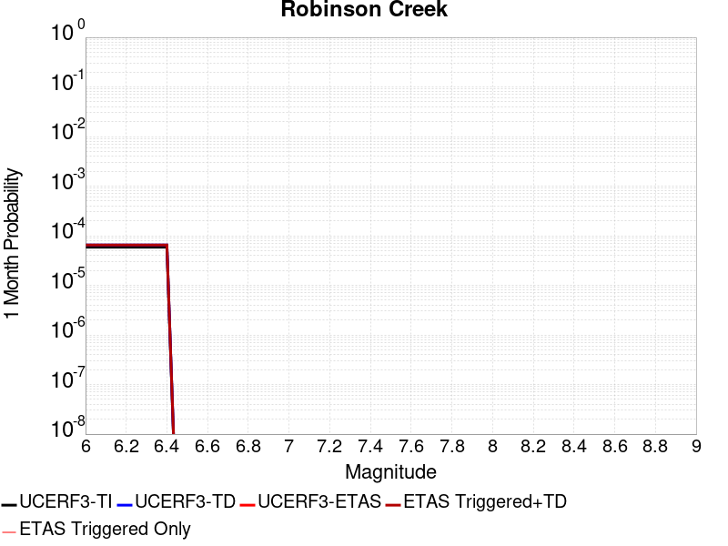 | 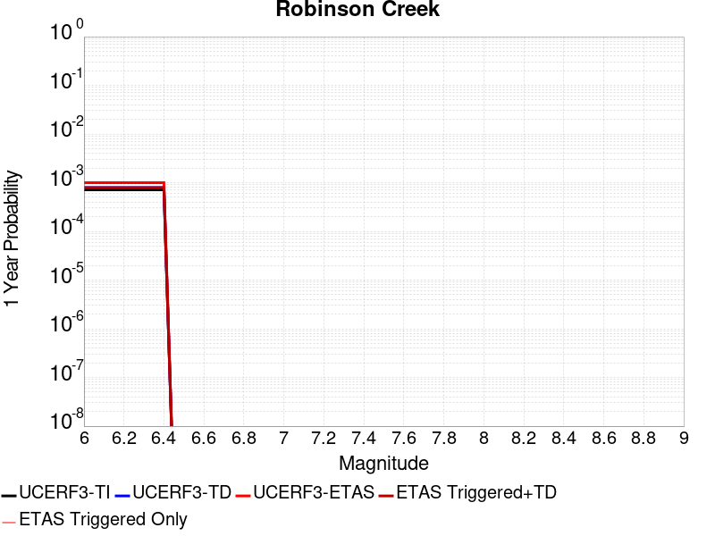 | 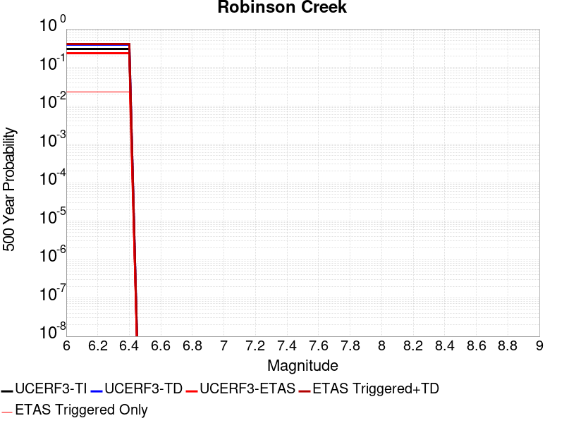 |

| Magnitude | 1 wk TI Prob | 1 wk TD Prob | 1 wk ETAS Prob | 1 wk ETAS/TD Gain | 1 wk ETAS Triggered+TD | 1 wk ETAS Triggered Only | 1 mo TI Prob | 1 mo TD Prob | 1 mo ETAS Prob | 1 mo ETAS/TD Gain | 1 mo ETAS Triggered+TD | 1 mo ETAS Triggered Only | 1 yr TI Prob | 1 yr TD Prob | 1 yr ETAS Prob | 1 yr ETAS/TD Gain | 1 yr ETAS Triggered+TD | 1 yr ETAS Triggered Only | 500 yr TI Prob | 500 yr TD Prob | 500 yr ETAS Prob | 500 yr ETAS/TD Gain | 500 yr ETAS Triggered+TD | 500 yr ETAS Triggered Only |
|-----|-----|-----|-----|-----|-----|-----|-----|-----|-----|-----|-----|-----|-----|-----|-----|-----|-----|-----|-----|-----|-----|-----|-----|-----|
| 6.0 | 1.3705327E-5 | 1.5194004E-5 | 0.0 | 0.0 | 1.5194004E-5 | 0.0 | 5.8735794E-5 | 6.511716E-5 | 0.0 | 0.0 | 6.511716E-5 | 0.0 | 7.1487366E-4 | 7.9280144E-4 | 0.001 | 1.2613499 | 7.9280144E-4 | 0.0 | 0.30062252 | 0.38987732 | 0.233 | 0.5976239 | 0.40391013 | 0.023 |
| 6.1 | 1.3705327E-5 | 1.5194004E-5 | 0.0 | 0.0 | 1.5194004E-5 | 0.0 | 5.8735794E-5 | 6.511716E-5 | 0.0 | 0.0 | 6.511716E-5 | 0.0 | 7.1487366E-4 | 7.9280144E-4 | 0.001 | 1.2613499 | 7.9280144E-4 | 0.0 | 0.30062252 | 0.38987732 | 0.233 | 0.5976239 | 0.40391013 | 0.023 |
| 6.2 | 1.3705327E-5 | 1.5194004E-5 | 0.0 | 0.0 | 1.5194004E-5 | 0.0 | 5.8735794E-5 | 6.511716E-5 | 0.0 | 0.0 | 6.511716E-5 | 0.0 | 7.1487366E-4 | 7.9280144E-4 | 0.001 | 1.2613499 | 7.9280144E-4 | 0.0 | 0.30062252 | 0.38987732 | 0.233 | 0.5976239 | 0.40391013 | 0.023 |
| 6.3 | 1.3705327E-5 | 1.5194004E-5 | 0.0 | 0.0 | 1.5194004E-5 | 0.0 | 5.8735794E-5 | 6.511716E-5 | 0.0 | 0.0 | 6.511716E-5 | 0.0 | 7.1487366E-4 | 7.9280144E-4 | 0.001 | 1.2613499 | 7.9280144E-4 | 0.0 | 0.30062252 | 0.38987732 | 0.233 | 0.5976239 | 0.40391013 | 0.023 |
| 6.4 | 1.3705327E-5 | 1.5194004E-5 | 0.0 | 0.0 | 1.5194004E-5 | 0.0 | 5.8735794E-5 | 6.511716E-5 | 0.0 | 0.0 | 6.511716E-5 | 0.0 | 7.1487366E-4 | 7.9280144E-4 | 0.001 | 1.2613499 | 7.9280144E-4 | 0.0 | 0.30062252 | 0.38987732 | 0.233 | 0.5976239 | 0.40391013 | 0.023 |

## Carson Range (Genoa)
*[(top)](#table-of-contents)*

| 1 Week | 1 Month | 1 Year | 500 Year |
|-----|-----|-----|-----|
|  |  | 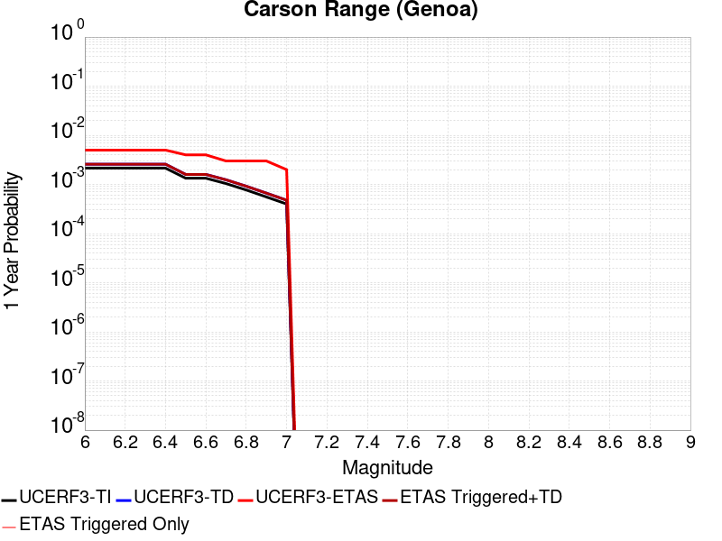 | 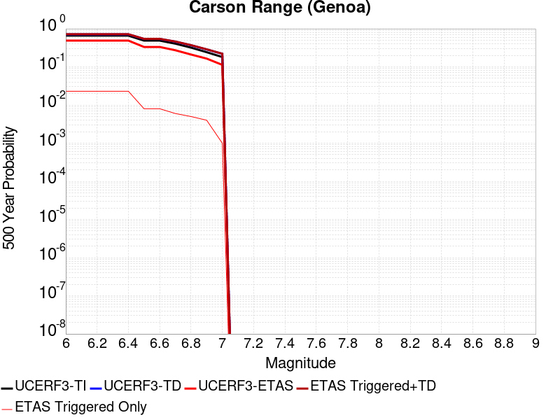 |

| Magnitude | 1 wk TI Prob | 1 wk TD Prob | 1 wk ETAS Prob | 1 wk ETAS/TD Gain | 1 wk ETAS Triggered+TD | 1 wk ETAS Triggered Only | 1 mo TI Prob | 1 mo TD Prob | 1 mo ETAS Prob | 1 mo ETAS/TD Gain | 1 mo ETAS Triggered+TD | 1 mo ETAS Triggered Only | 1 yr TI Prob | 1 yr TD Prob | 1 yr ETAS Prob | 1 yr ETAS/TD Gain | 1 yr ETAS Triggered+TD | 1 yr ETAS Triggered Only | 500 yr TI Prob | 500 yr TD Prob | 500 yr ETAS Prob | 500 yr ETAS/TD Gain | 500 yr ETAS Triggered+TD | 500 yr ETAS Triggered Only |
|-----|-----|-----|-----|-----|-----|-----|-----|-----|-----|-----|-----|-----|-----|-----|-----|-----|-----|-----|-----|-----|-----|-----|-----|-----|
| 6.0 | 4.1268457E-5 | 4.959342E-5 | 0.0 | 0.0 | 4.959342E-5 | 0.0 | 1.7685282E-4 | 2.1252809E-4 | 0.0 | 0.0 | 2.1252809E-4 | 0.0 | 0.0021510567 | 0.0025848446 | 0.005 | 1.9343523 | 0.0025848446 | 0.0 | 0.65927744 | 0.7120054 | 0.489 | 0.68679255 | 0.71862924 | 0.023 |
| 6.1 | 4.1268457E-5 | 4.959342E-5 | 0.0 | 0.0 | 4.959342E-5 | 0.0 | 1.7685282E-4 | 2.1252809E-4 | 0.0 | 0.0 | 2.1252809E-4 | 0.0 | 0.0021510567 | 0.0025848446 | 0.005 | 1.9343523 | 0.0025848446 | 0.0 | 0.65927744 | 0.7120054 | 0.489 | 0.68679255 | 0.71862924 | 0.023 |
| 6.2 | 4.1268457E-5 | 4.959342E-5 | 0.0 | 0.0 | 4.959342E-5 | 0.0 | 1.7685282E-4 | 2.1252809E-4 | 0.0 | 0.0 | 2.1252809E-4 | 0.0 | 0.0021510567 | 0.0025848446 | 0.005 | 1.9343523 | 0.0025848446 | 0.0 | 0.65927744 | 0.7120054 | 0.489 | 0.68679255 | 0.71862924 | 0.023 |
| 6.3 | 4.1268457E-5 | 4.959342E-5 | 0.0 | 0.0 | 4.959342E-5 | 0.0 | 1.7685282E-4 | 2.1252809E-4 | 0.0 | 0.0 | 2.1252809E-4 | 0.0 | 0.0021510567 | 0.0025848446 | 0.005 | 1.9343523 | 0.0025848446 | 0.0 | 0.65927744 | 0.7120054 | 0.489 | 0.68679255 | 0.71862924 | 0.023 |
| 6.4 | 4.1268457E-5 | 4.959342E-5 | 0.0 | 0.0 | 4.959342E-5 | 0.0 | 1.7685282E-4 | 2.1252809E-4 | 0.0 | 0.0 | 2.1252809E-4 | 0.0 | 0.0021510567 | 0.0025848446 | 0.005 | 1.9343523 | 0.0025848446 | 0.0 | 0.65927744 | 0.7120054 | 0.489 | 0.68679255 | 0.71862924 | 0.023 |
| 6.5 | 2.5677185E-5 | 3.064963E-5 | 0.0 | 0.0 | 3.064963E-5 | 0.0 | 1.1004044E-4 | 1.3134992E-4 | 0.0 | 0.0 | 1.3134992E-4 | 0.0 | 0.0013389189 | 0.0015981888 | 0.004 | 2.5028334 | 0.0015981888 | 0.0 | 0.48824435 | 0.5400279 | 0.333 | 0.6166348 | 0.5437077 | 0.008 |
| 6.6 | 2.5677185E-5 | 3.064963E-5 | 0.0 | 0.0 | 3.064963E-5 | 0.0 | 1.1004044E-4 | 1.3134992E-4 | 0.0 | 0.0 | 1.3134992E-4 | 0.0 | 0.0013389189 | 0.0015981888 | 0.004 | 2.5028334 | 0.0015981888 | 0.0 | 0.48824435 | 0.5400279 | 0.333 | 0.6166348 | 0.5437077 | 0.008 |
| 6.7 | 1.9969408E-5 | 2.380978E-5 | 0.0 | 0.0 | 2.380978E-5 | 0.0 | 8.558037E-5 | 1.0203877E-4 | 0.0 | 0.0 | 1.0203877E-4 | 0.0 | 0.0010414429 | 0.0012417644 | 0.003 | 2.4159174 | 0.0012417644 | 0.0 | 0.4060694 | 0.4590996 | 0.273 | 0.5946422 | 0.462345 | 0.006 |
| 6.8 | 1.4783156E-5 | 1.7629502E-5 | 0.0 | 0.0 | 1.7629502E-5 | 0.0 | 6.335485E-5 | 7.5553544E-5 | 0.0 | 0.0 | 7.5553544E-5 | 0.0 | 7.710722E-4 | 9.1960357E-4 | 0.003 | 3.2622752 | 9.1960357E-4 | 0.0 | 0.3200152 | 0.3684246 | 0.211 | 0.5727088 | 0.37158248 | 0.005 |
| 6.9 | 1.06660555E-5 | 1.2739785E-5 | 0.0 | 0.0 | 1.2739785E-5 | 0.0 | 4.5710865E-5 | 5.4598575E-5 | 0.0 | 0.0 | 5.4598575E-5 | 0.0 | 5.5638765E-4 | 6.6464767E-4 | 0.003 | 4.5136695 | 6.6464767E-4 | 0.0 | 0.24290857 | 0.28616783 | 0.165 | 0.57658476 | 0.28902316 | 0.004 |
| 7.0 | 7.664838E-6 | 9.15935E-6 | 0.0 | 0.0 | 9.15935E-6 | 0.0 | 3.2848893E-5 | 3.9254355E-5 | 0.0 | 0.0 | 3.9254355E-5 | 0.0 | 3.998619E-4 | 4.779218E-4 | 0.002 | 4.1847854 | 4.779218E-4 | 0.0 | 0.18124545 | 0.2202878 | 0.113 | 0.5129653 | 0.2210675 | 0.001 |

## Little Salmon (Offshore)
*[(top)](#table-of-contents)*

| 1 Week | 1 Month | 1 Year | 500 Year |
|-----|-----|-----|-----|
| 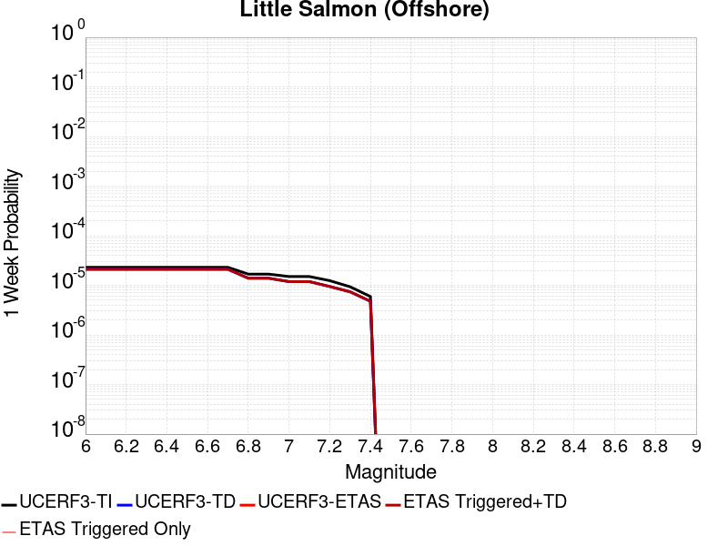 |  | 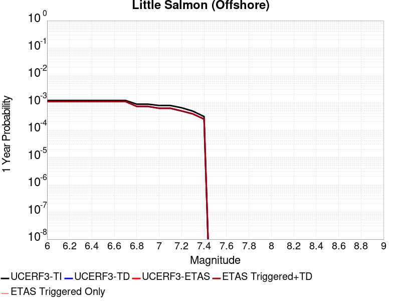 | 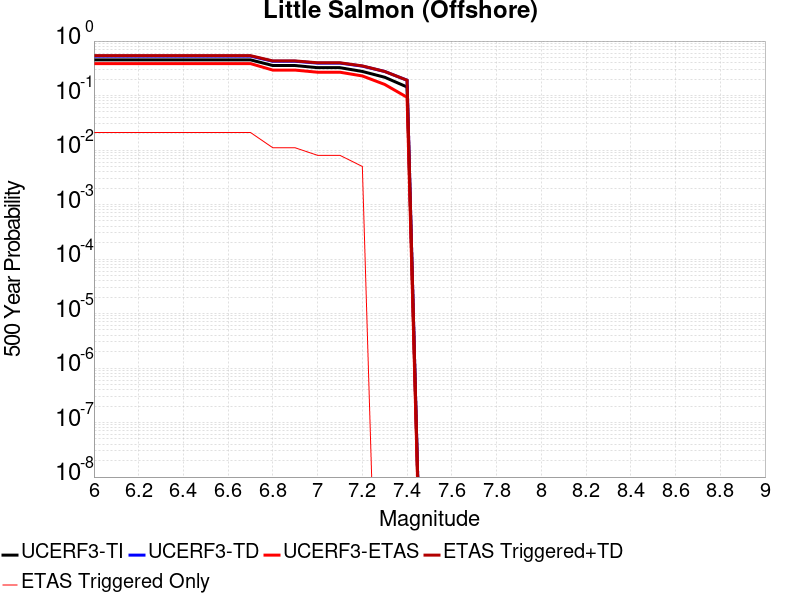 |

| Magnitude | 1 wk TI Prob | 1 wk TD Prob | 1 wk ETAS Prob | 1 wk ETAS/TD Gain | 1 wk ETAS Triggered+TD | 1 wk ETAS Triggered Only | 1 mo TI Prob | 1 mo TD Prob | 1 mo ETAS Prob | 1 mo ETAS/TD Gain | 1 mo ETAS Triggered+TD | 1 mo ETAS Triggered Only | 1 yr TI Prob | 1 yr TD Prob | 1 yr ETAS Prob | 1 yr ETAS/TD Gain | 1 yr ETAS Triggered+TD | 1 yr ETAS Triggered Only | 500 yr TI Prob | 500 yr TD Prob | 500 yr ETAS Prob | 500 yr ETAS/TD Gain | 500 yr ETAS Triggered+TD | 500 yr ETAS Triggered Only |
|-----|-----|-----|-----|-----|-----|-----|-----|-----|-----|-----|-----|-----|-----|-----|-----|-----|-----|-----|-----|-----|-----|-----|-----|-----|
| 6.0 | 2.3052053E-5 | 2.1078806E-5 | 0.0 | 0.0 | 2.1078806E-5 | 0.0 | 9.879077E-5 | 9.0335234E-5 | 0.0 | 0.0 | 9.0335234E-5 | 0.0 | 0.0012021139 | 0.0010993871 | 0.0 | 0.0 | 0.0010993871 | 0.0 | 0.45196632 | 0.529412 | 0.386 | 0.72911084 | 0.5392943 | 0.021 |
| 6.1 | 2.3052053E-5 | 2.1078806E-5 | 0.0 | 0.0 | 2.1078806E-5 | 0.0 | 9.879077E-5 | 9.0335234E-5 | 0.0 | 0.0 | 9.0335234E-5 | 0.0 | 0.0012021139 | 0.0010993871 | 0.0 | 0.0 | 0.0010993871 | 0.0 | 0.45196632 | 0.529412 | 0.386 | 0.72911084 | 0.5392943 | 0.021 |
| 6.2 | 2.3052053E-5 | 2.1078806E-5 | 0.0 | 0.0 | 2.1078806E-5 | 0.0 | 9.879077E-5 | 9.0335234E-5 | 0.0 | 0.0 | 9.0335234E-5 | 0.0 | 0.0012021139 | 0.0010993871 | 0.0 | 0.0 | 0.0010993871 | 0.0 | 0.45196632 | 0.529412 | 0.386 | 0.72911084 | 0.5392943 | 0.021 |
| 6.3 | 2.3052053E-5 | 2.1078806E-5 | 0.0 | 0.0 | 2.1078806E-5 | 0.0 | 9.879077E-5 | 9.0335234E-5 | 0.0 | 0.0 | 9.0335234E-5 | 0.0 | 0.0012021139 | 0.0010993871 | 0.0 | 0.0 | 0.0010993871 | 0.0 | 0.45196632 | 0.529412 | 0.386 | 0.72911084 | 0.5392943 | 0.021 |
| 6.4 | 2.3052053E-5 | 2.1078806E-5 | 0.0 | 0.0 | 2.1078806E-5 | 0.0 | 9.879077E-5 | 9.0335234E-5 | 0.0 | 0.0 | 9.0335234E-5 | 0.0 | 0.0012021139 | 0.0010993871 | 0.0 | 0.0 | 0.0010993871 | 0.0 | 0.45196632 | 0.529412 | 0.386 | 0.72911084 | 0.5392943 | 0.021 |
| 6.5 | 2.3052053E-5 | 2.1078806E-5 | 0.0 | 0.0 | 2.1078806E-5 | 0.0 | 9.879077E-5 | 9.0335234E-5 | 0.0 | 0.0 | 9.0335234E-5 | 0.0 | 0.0012021139 | 0.0010993871 | 0.0 | 0.0 | 0.0010993871 | 0.0 | 0.45196632 | 0.529412 | 0.386 | 0.72911084 | 0.5392943 | 0.021 |
| 6.6 | 2.3052053E-5 | 2.1078806E-5 | 0.0 | 0.0 | 2.1078806E-5 | 0.0 | 9.879077E-5 | 9.0335234E-5 | 0.0 | 0.0 | 9.0335234E-5 | 0.0 | 0.0012021139 | 0.0010993871 | 0.0 | 0.0 | 0.0010993871 | 0.0 | 0.45196632 | 0.529412 | 0.386 | 0.72911084 | 0.5392943 | 0.021 |
| 6.7 | 2.3052053E-5 | 2.1078806E-5 | 0.0 | 0.0 | 2.1078806E-5 | 0.0 | 9.879077E-5 | 9.0335234E-5 | 0.0 | 0.0 | 9.0335234E-5 | 0.0 | 0.0012021139 | 0.0010993871 | 0.0 | 0.0 | 0.0010993871 | 0.0 | 0.45196632 | 0.529412 | 0.386 | 0.72911084 | 0.5392943 | 0.021 |
| 6.8 | 1.683878E-5 | 1.3921163E-5 | 0.0 | 0.0 | 1.3921163E-5 | 0.0 | 7.21642E-5 | 5.9661033E-5 | 0.0 | 0.0 | 5.9661033E-5 | 0.0 | 8.78245E-4 | 7.2617864E-4 | 0.0 | 0.0 | 7.2617864E-4 | 0.0 | 0.35552254 | 0.4258883 | 0.293 | 0.68797386 | 0.43220353 | 0.011 |
| 6.9 | 1.683878E-5 | 1.3921163E-5 | 0.0 | 0.0 | 1.3921163E-5 | 0.0 | 7.21642E-5 | 5.9661033E-5 | 0.0 | 0.0 | 5.9661033E-5 | 0.0 | 8.78245E-4 | 7.2617864E-4 | 0.0 | 0.0 | 7.2617864E-4 | 0.0 | 0.35552254 | 0.4258883 | 0.293 | 0.68797386 | 0.43220353 | 0.011 |
| 7.0 | 1.5051273E-5 | 1.1886083E-5 | 0.0 | 0.0 | 1.1886083E-5 | 0.0 | 6.450386E-5 | 5.09396E-5 | 0.0 | 0.0 | 5.09396E-5 | 0.0 | 7.8505155E-4 | 6.200559E-4 | 0.0 | 0.0 | 6.200559E-4 | 0.0 | 0.32475516 | 0.3944723 | 0.268 | 0.67938864 | 0.39931652 | 0.008 |
| 7.1 | 1.5051273E-5 | 1.1886083E-5 | 0.0 | 0.0 | 1.1886083E-5 | 0.0 | 6.450386E-5 | 5.09396E-5 | 0.0 | 0.0 | 5.09396E-5 | 0.0 | 7.8505155E-4 | 6.200559E-4 | 0.0 | 0.0 | 6.200559E-4 | 0.0 | 0.32475516 | 0.3944723 | 0.268 | 0.67938864 | 0.39931652 | 0.008 |
| 7.2 | 1.24301405E-5 | 9.474883E-6 | 0.0 | 0.0 | 9.474883E-6 | 0.0 | 5.3270942E-5 | 4.0606217E-5 | 0.0 | 0.0 | 4.0606217E-5 | 0.0 | 6.483807E-4 | 4.943054E-4 | 0.0 | 0.0 | 4.943054E-4 | 0.0 | 0.27696344 | 0.34685346 | 0.229 | 0.66022116 | 0.35011917 | 0.005 |
| 7.3 | 9.3599865E-6 | 7.4105787E-6 | 0.0 | 0.0 | 7.4105787E-6 | 0.0 | 4.011361E-5 | 3.175942E-5 | 0.0 | 0.0 | 3.175942E-5 | 0.0 | 4.8827377E-4 | 3.8663542E-4 | 0.0 | 0.0 | 3.8663542E-4 | 0.0 | 0.21666631 | 0.27671874 | 0.16 | 0.5782044 | 0.27671874 | 0.0 |
| 7.4 | 5.941556E-6 | 4.7668054E-6 | 0.0 | 0.0 | 4.7668054E-6 | 0.0 | 2.5463563E-5 | 2.0429166E-5 | 0.0 | 0.0 | 2.0429166E-5 | 0.0 | 3.0997477E-4 | 2.4872512E-4 | 0.0 | 0.0 | 2.4872512E-4 | 0.0 | 0.1435946 | 0.1909971 | 0.093 | 0.48691842 | 0.1909971 | 0.0 |

## Ventura-Pitas Point
*[(top)](#table-of-contents)*

| 1 Week | 1 Month | 1 Year | 500 Year |
|-----|-----|-----|-----|
| 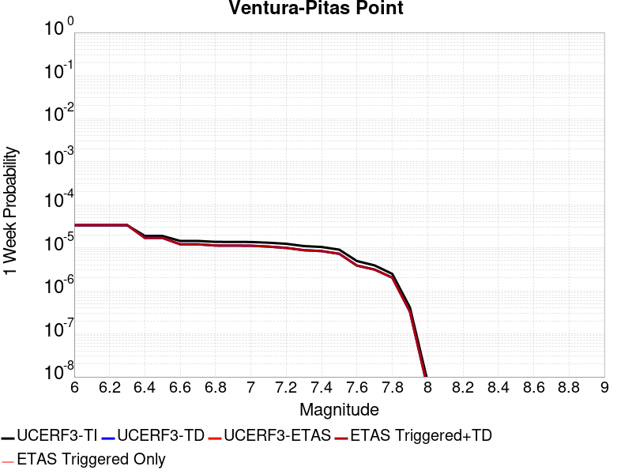 |  | 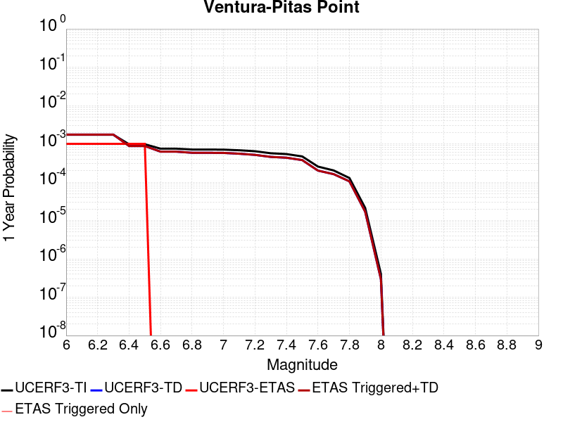 | 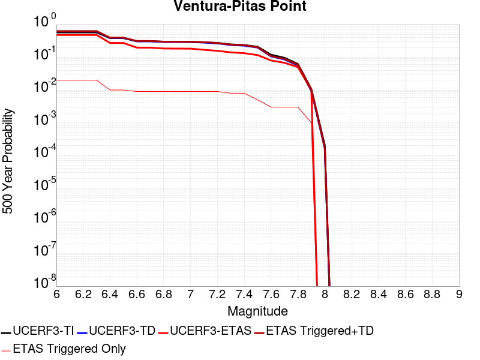 |

| Magnitude | 1 wk TI Prob | 1 wk TD Prob | 1 wk ETAS Prob | 1 wk ETAS/TD Gain | 1 wk ETAS Triggered+TD | 1 wk ETAS Triggered Only | 1 mo TI Prob | 1 mo TD Prob | 1 mo ETAS Prob | 1 mo ETAS/TD Gain | 1 mo ETAS Triggered+TD | 1 mo ETAS Triggered Only | 1 yr TI Prob | 1 yr TD Prob | 1 yr ETAS Prob | 1 yr ETAS/TD Gain | 1 yr ETAS Triggered+TD | 1 yr ETAS Triggered Only | 500 yr TI Prob | 500 yr TD Prob | 500 yr ETAS Prob | 500 yr ETAS/TD Gain | 500 yr ETAS Triggered+TD | 500 yr ETAS Triggered Only |
|-----|-----|-----|-----|-----|-----|-----|-----|-----|-----|-----|-----|-----|-----|-----|-----|-----|-----|-----|-----|-----|-----|-----|-----|-----|
| 6.0 | 3.3179622E-5 | 3.3454486E-5 | 0.0 | 0.0 | 3.3454486E-5 | 0.0 | 1.4219063E-4 | 1.433699E-4 | 0.0 | 0.0 | 1.433699E-4 | 0.0 | 0.0017297962 | 0.0017443836 | 0.001 | 0.5732684 | 0.0017443836 | 0.0 | 0.5792208 | 0.623452 | 0.483 | 0.7747188 | 0.630983 | 0.02 |
| 6.1 | 3.3179622E-5 | 3.3454486E-5 | 0.0 | 0.0 | 3.3454486E-5 | 0.0 | 1.4219063E-4 | 1.433699E-4 | 0.0 | 0.0 | 1.433699E-4 | 0.0 | 0.0017297962 | 0.0017443836 | 0.001 | 0.5732684 | 0.0017443836 | 0.0 | 0.5792208 | 0.623452 | 0.483 | 0.7747188 | 0.630983 | 0.02 |
| 6.2 | 3.3179622E-5 | 3.3454486E-5 | 0.0 | 0.0 | 3.3454486E-5 | 0.0 | 1.4219063E-4 | 1.433699E-4 | 0.0 | 0.0 | 1.433699E-4 | 0.0 | 0.0017297962 | 0.0017443836 | 0.001 | 0.5732684 | 0.0017443836 | 0.0 | 0.5792208 | 0.623452 | 0.483 | 0.7747188 | 0.630983 | 0.02 |
| 6.3 | 3.3179622E-5 | 3.3454486E-5 | 0.0 | 0.0 | 3.3454486E-5 | 0.0 | 1.4219063E-4 | 1.433699E-4 | 0.0 | 0.0 | 1.433699E-4 | 0.0 | 0.0017297962 | 0.0017443836 | 0.001 | 0.5732684 | 0.0017443836 | 0.0 | 0.5792208 | 0.623452 | 0.483 | 0.7747188 | 0.630983 | 0.02 |
| 6.4 | 1.8754668E-5 | 1.6876033E-5 | 0.0 | 0.0 | 1.6876033E-5 | 0.0 | 8.037467E-5 | 7.232398E-5 | 0.0 | 0.0 | 7.232398E-5 | 0.0 | 9.781223E-4 | 8.8021153E-4 | 0.001 | 1.1360905 | 8.8021153E-4 | 0.0 | 0.38694492 | 0.3935234 | 0.275 | 0.69881487 | 0.39958817 | 0.01 |
| 6.5 | 1.8754668E-5 | 1.6876033E-5 | 0.0 | 0.0 | 1.6876033E-5 | 0.0 | 8.037467E-5 | 7.232398E-5 | 0.0 | 0.0 | 7.232398E-5 | 0.0 | 9.781223E-4 | 8.8021153E-4 | 0.001 | 1.1360905 | 8.8021153E-4 | 0.0 | 0.38694492 | 0.3935234 | 0.275 | 0.69881487 | 0.39958817 | 0.01 |
| 6.6 | 1.4361558E-5 | 1.2007748E-5 | 0.0 | 0.0 | 1.2007748E-5 | 0.0 | 6.154808E-5 | 5.1460775E-5 | 0.0 | 0.0 | 5.1460775E-5 | 0.0 | 7.490902E-4 | 6.263571E-4 | 0.0 | 0.0 | 6.263571E-4 | 0.0 | 0.31249452 | 0.30882037 | 0.198 | 0.64114946 | 0.31504098 | 0.009 |
| 6.7 | 1.4361558E-5 | 1.2007748E-5 | 0.0 | 0.0 | 1.2007748E-5 | 0.0 | 6.154808E-5 | 5.1460775E-5 | 0.0 | 0.0 | 5.1460775E-5 | 0.0 | 7.490902E-4 | 6.263571E-4 | 0.0 | 0.0 | 6.263571E-4 | 0.0 | 0.31249452 | 0.30882037 | 0.198 | 0.64114946 | 0.31504098 | 0.009 |
| 6.8 | 1.3663846E-5 | 1.1234509E-5 | 0.0 | 0.0 | 1.1234509E-5 | 0.0 | 5.8558027E-5 | 4.8147016E-5 | 0.0 | 0.0 | 4.8147016E-5 | 0.0 | 7.127108E-4 | 5.8603415E-4 | 0.0 | 0.0 | 5.8603415E-4 | 0.0 | 0.29986522 | 0.29473695 | 0.186 | 0.6310712 | 0.3010843 | 0.009 |
| 6.9 | 1.3644157E-5 | 1.1212736E-5 | 0.0 | 0.0 | 1.1212736E-5 | 0.0 | 5.8473648E-5 | 4.805371E-5 | 0.0 | 0.0 | 4.805371E-5 | 0.0 | 7.116841E-4 | 5.8489875E-4 | 0.0 | 0.0 | 5.8489875E-4 | 0.0 | 0.29950547 | 0.29433814 | 0.185 | 0.62852883 | 0.3006891 | 0.009 |
| 7.0 | 1.3568845E-5 | 1.11330855E-5 | 0.0 | 0.0 | 1.11330855E-5 | 0.0 | 5.8150898E-5 | 4.7712365E-5 | 0.0 | 0.0 | 4.7712365E-5 | 0.0 | 7.077572E-4 | 5.807451E-4 | 0.0 | 0.0 | 5.807451E-4 | 0.0 | 0.29812777 | 0.29280934 | 0.184 | 0.62839526 | 0.29917407 | 0.009 |
| 7.1 | 1.306572E-5 | 1.061538E-5 | 0.0 | 0.0 | 1.061538E-5 | 0.0 | 5.599474E-5 | 4.5493704E-5 | 0.0 | 0.0 | 4.5493704E-5 | 0.0 | 6.815227E-4 | 5.5374694E-4 | 0.0 | 0.0 | 5.5374694E-4 | 0.0 | 0.288854 | 0.28253394 | 0.17 | 0.6016976 | 0.28899112 | 0.009 |
| 7.2 | 1.232604E-5 | 9.897462E-6 | 0.0 | 0.0 | 9.897462E-6 | 0.0 | 5.2824813E-5 | 4.2417014E-5 | 0.0 | 0.0 | 4.2417014E-5 | 0.0 | 6.429523E-4 | 5.163065E-4 | 0.0 | 0.0 | 5.163065E-4 | 0.0 | 0.27499706 | 0.267333 | 0.158 | 0.59102315 | 0.273927 | 0.009 |
| 7.3 | 1.0917261E-5 | 8.759807E-6 | 0.0 | 0.0 | 8.759807E-6 | 0.0 | 4.678742E-5 | 3.75415E-5 | 0.0 | 0.0 | 3.75415E-5 | 0.0 | 5.69488E-4 | 4.5697342E-4 | 0.0 | 0.0 | 4.5697342E-4 | 0.0 | 0.2478542 | 0.23858012 | 0.142 | 0.5951879 | 0.2446715 | 0.008 |
| 7.4 | 1.039959E-5 | 8.345574E-6 | 0.0 | 0.0 | 8.345574E-6 | 0.0 | 4.456891E-5 | 3.5766265E-5 | 0.0 | 0.0 | 3.5766265E-5 | 0.0 | 5.424914E-4 | 4.3536877E-4 | 0.0 | 0.0 | 4.3536877E-4 | 0.0 | 0.23762695 | 0.22798744 | 0.134 | 0.5877517 | 0.23416354 | 0.008 |
| 7.5 | 9.015877E-6 | 7.232431E-6 | 0.0 | 0.0 | 7.232431E-6 | 0.0 | 3.86389E-5 | 3.0995772E-5 | 0.0 | 0.0 | 3.0995772E-5 | 0.0 | 4.7032707E-4 | 3.7730954E-4 | 0.0 | 0.0 | 3.7730954E-4 | 0.0 | 0.20960215 | 0.19938219 | 0.117 | 0.5868127 | 0.20338528 | 0.005 |
| 7.6 | 4.900162E-6 | 3.8480193E-6 | 0.0 | 0.0 | 3.8480193E-6 | 0.0 | 2.1000526E-5 | 1.6491407E-5 | 0.0 | 0.0 | 1.6491407E-5 | 0.0 | 2.556514E-4 | 2.0076452E-4 | 0.0 | 0.0 | 2.0076452E-4 | 0.0 | 0.12000763 | 0.10678524 | 0.08 | 0.7491672 | 0.109464884 | 0.003 |
| 7.7 | 3.8850626E-6 | 3.106971E-6 | 0.0 | 0.0 | 3.106971E-6 | 0.0 | 1.6650163E-5 | 1.3315523E-5 | 0.0 | 0.0 | 1.3315523E-5 | 0.0 | 2.0269687E-4 | 1.6210452E-4 | 0.0 | 0.0 | 1.6210452E-4 | 0.0 | 0.09639116 | 0.08633859 | 0.068 | 0.7875969 | 0.089079574 | 0.003 |
| 7.8 | 2.4654719E-6 | 2.0181064E-6 | 0.0 | 0.0 | 2.0181064E-6 | 0.0 | 1.0566265E-5 | 8.648999E-6 | 0.0 | 0.0 | 8.648999E-6 | 0.0 | 1.2863669E-4 | 1.0529652E-4 | 0.0 | 0.0 | 1.0529652E-4 | 0.0 | 0.062297437 | 0.05651551 | 0.05 | 0.8847129 | 0.059345964 | 0.003 |
| 7.9 | 4.095894E-7 | 3.2583714E-7 | 0.0 | 0.0 | 3.2583714E-7 | 0.0 | 1.7553821E-6 | 1.3964441E-6 | 0.0 | 0.0 | 1.3964441E-6 | 0.0 | 2.1371567E-5 | 1.7001577E-5 | 0.0 | 0.0 | 1.7001577E-5 | 0.0 | 0.010629006 | 0.00935669 | 0.01 | 1.0687541 | 0.010347333 | 0.001 |
| 8.0 | 7.791402E-9 | 5.6176805E-9 | 0.0 | 0.0 | 5.6176805E-9 | 0.0 | 3.3391725E-8 | 2.4075774E-8 | 0.0 | 0.0 | 2.4075774E-8 | 0.0 | 4.0654416E-7 | 2.9312253E-7 | 0.0 | 0.0 | 2.9312253E-7 | 0.0 | 2.0325146E-4 | 1.6884092E-4 | 0.0 | 0.0 | 1.6884092E-4 | 0.0 |

## San Diego Trough north alt1
*[(top)](#table-of-contents)*

| 1 Week | 1 Month | 1 Year | 500 Year |
|-----|-----|-----|-----|
| 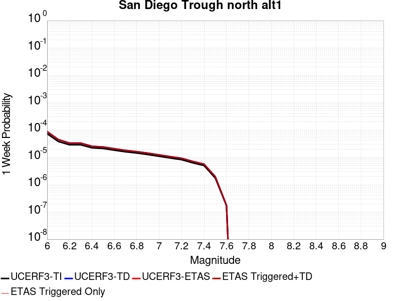 |  | 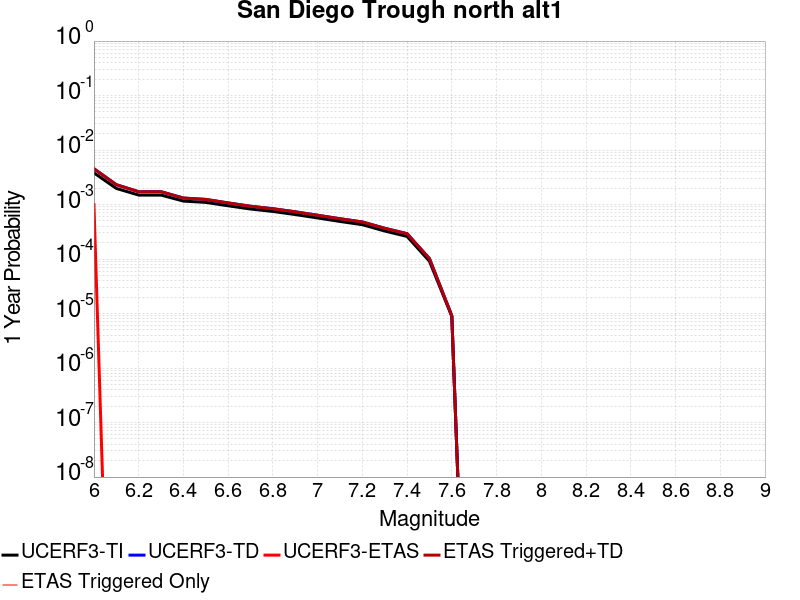 | 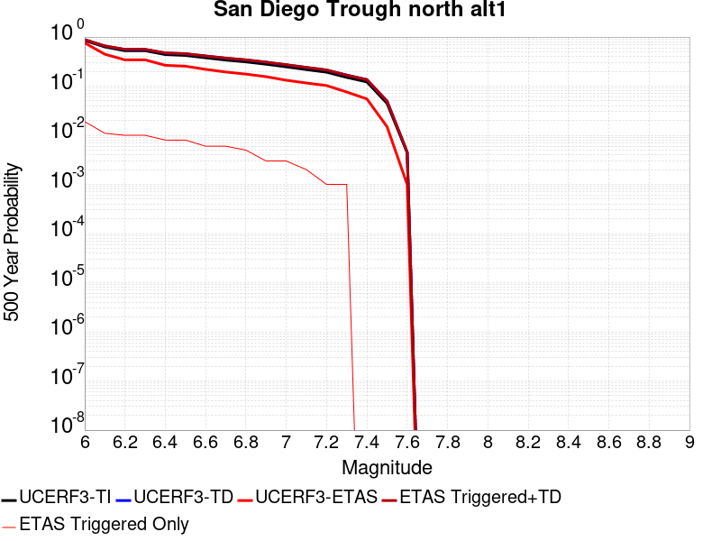 |

| Magnitude | 1 wk TI Prob | 1 wk TD Prob | 1 wk ETAS Prob | 1 wk ETAS/TD Gain | 1 wk ETAS Triggered+TD | 1 wk ETAS Triggered Only | 1 mo TI Prob | 1 mo TD Prob | 1 mo ETAS Prob | 1 mo ETAS/TD Gain | 1 mo ETAS Triggered+TD | 1 mo ETAS Triggered Only | 1 yr TI Prob | 1 yr TD Prob | 1 yr ETAS Prob | 1 yr ETAS/TD Gain | 1 yr ETAS Triggered+TD | 1 yr ETAS Triggered Only | 500 yr TI Prob | 500 yr TD Prob | 500 yr ETAS Prob | 500 yr ETAS/TD Gain | 500 yr ETAS Triggered+TD | 500 yr ETAS Triggered Only |
|-----|-----|-----|-----|-----|-----|-----|-----|-----|-----|-----|-----|-----|-----|-----|-----|-----|-----|-----|-----|-----|-----|-----|-----|-----|
| 6.0 | 7.329252E-5 | 8.728173E-5 | 0.0 | 0.0 | 8.728173E-5 | 0.0 | 3.14073E-4 | 3.7401335E-4 | 0.0 | 0.0 | 3.7401335E-4 | 0.0 | 0.0038171355 | 0.0045446823 | 0.001 | 0.22003739 | 0.0045446823 | 0.0 | 0.85224795 | 0.8798295 | 0.76 | 0.8638037 | 0.8821128 | 0.019 |
| 6.1 | 3.7940346E-5 | 4.4456465E-5 | 0.0 | 0.0 | 4.4456465E-5 | 0.0 | 1.6259136E-4 | 1.9051433E-4 | 0.0 | 0.0 | 1.9051433E-4 | 0.0 | 0.0019777524 | 0.0023171268 | 0.0 | 0.0 | 0.0023171268 | 0.0 | 0.62836957 | 0.65646154 | 0.447 | 0.68092334 | 0.6602405 | 0.011 |
| 6.2 | 2.8645263E-5 | 3.301441E-5 | 0.0 | 0.0 | 3.301441E-5 | 0.0 | 1.2275964E-4 | 1.414828E-4 | 0.0 | 0.0 | 1.414828E-4 | 0.0 | 0.0014935739 | 0.0017212157 | 0.0 | 0.0 | 0.0017212157 | 0.0 | 0.52637774 | 0.5569179 | 0.343 | 0.61588967 | 0.56134874 | 0.01 |
| 6.3 | 2.8645263E-5 | 3.301441E-5 | 0.0 | 0.0 | 3.301441E-5 | 0.0 | 1.2275964E-4 | 1.414828E-4 | 0.0 | 0.0 | 1.414828E-4 | 0.0 | 0.0014935739 | 0.0017212157 | 0.0 | 0.0 | 0.0017212157 | 0.0 | 0.52637774 | 0.5569179 | 0.343 | 0.61588967 | 0.56134874 | 0.01 |
| 6.4 | 2.2204576E-5 | 2.525458E-5 | 0.0 | 0.0 | 2.525458E-5 | 0.0 | 9.5159E-5 | 1.0822948E-4 | 0.0 | 0.0 | 1.0822948E-4 | 0.0 | 0.001157945 | 0.0013169069 | 0.0 | 0.0 | 0.0013169069 | 0.0 | 0.43971404 | 0.47181576 | 0.266 | 0.5637794 | 0.47604123 | 0.008 |
| 6.5 | 2.1004838E-5 | 2.3844752E-5 | 0.0 | 0.0 | 2.3844752E-5 | 0.0 | 9.0017624E-5 | 1.0218784E-4 | 0.0 | 0.0 | 1.0218784E-4 | 0.0 | 0.0010954136 | 0.0012434358 | 0.0 | 0.0 | 0.0012434358 | 0.0 | 0.42189917 | 0.4540104 | 0.255 | 0.5616611 | 0.45837831 | 0.008 |
| 6.6 | 1.820557E-5 | 2.0556836E-5 | 0.0 | 0.0 | 2.0556836E-5 | 0.0 | 7.802154E-5 | 8.8097775E-5 | 0.0 | 0.0 | 8.8097775E-5 | 0.0 | 9.4949827E-4 | 0.001072068 | 0.0 | 0.0 | 0.001072068 | 0.0 | 0.37809917 | 0.4096598 | 0.22 | 0.53703094 | 0.41320184 | 0.006 |
| 6.7 | 1.5884485E-5 | 1.7859973E-5 | 0.0 | 0.0 | 1.7859973E-5 | 0.0 | 6.807459E-5 | 7.6540506E-5 | 0.0 | 0.0 | 7.6540506E-5 | 0.0 | 8.284929E-4 | 9.31485E-4 | 0.0 | 0.0 | 9.31485E-4 | 0.0 | 0.3392754 | 0.36975294 | 0.194 | 0.52467465 | 0.37353444 | 0.006 |
| 6.8 | 1.4331171E-5 | 1.6091146E-5 | 0.0 | 0.0 | 1.6091146E-5 | 0.0 | 6.141786E-5 | 6.896024E-5 | 0.0 | 0.0 | 6.896024E-5 | 0.0 | 7.4750587E-4 | 8.392695E-4 | 0.0 | 0.0 | 8.392695E-4 | 0.0 | 0.31194925 | 0.34083 | 0.176 | 0.51638645 | 0.34412587 | 0.005 |
| 6.9 | 1.2574203E-5 | 1.4110054E-5 | 0.0 | 0.0 | 1.4110054E-5 | 0.0 | 5.3888325E-5 | 6.0470265E-5 | 0.0 | 0.0 | 6.0470265E-5 | 0.0 | 6.558929E-4 | 7.359782E-4 | 0.0 | 0.0 | 7.359782E-4 | 0.0 | 0.2796759 | 0.30654407 | 0.156 | 0.5088991 | 0.30862445 | 0.003 |
| 7.0 | 1.0883844E-5 | 1.2206801E-5 | 0.0 | 0.0 | 1.2206801E-5 | 0.0 | 4.664421E-5 | 5.231382E-5 | 0.0 | 0.0 | 5.231382E-5 | 0.0 | 5.677453E-4 | 6.367356E-4 | 0.0 | 0.0 | 6.367356E-4 | 0.0 | 0.24719818 | 0.2717477 | 0.132 | 0.48574466 | 0.27393246 | 0.003 |
| 7.1 | 9.393088E-6 | 1.0535752E-5 | 0.0 | 0.0 | 1.0535752E-5 | 0.0 | 4.025547E-5 | 4.5152447E-5 | 0.0 | 0.0 | 4.5152447E-5 | 0.0 | 4.900001E-4 | 5.495931E-4 | 0.0 | 0.0 | 5.495931E-4 | 0.0 | 0.21734251 | 0.2396342 | 0.116 | 0.48407114 | 0.24115494 | 0.002 |
| 7.2 | 8.190791E-6 | 9.195855E-6 | 0.0 | 0.0 | 9.195855E-6 | 0.0 | 3.510292E-5 | 3.9410214E-5 | 0.0 | 0.0 | 3.9410214E-5 | 0.0 | 4.2729423E-4 | 4.7971436E-4 | 0.0 | 0.0 | 4.7971436E-4 | 0.0 | 0.19240354 | 0.21280527 | 0.103 | 0.48401058 | 0.21359247 | 0.001 |
| 7.3 | 6.268162E-6 | 7.041428E-6 | 0.0 | 0.0 | 7.041428E-6 | 0.0 | 2.6863276E-5 | 3.0177202E-5 | 0.0 | 0.0 | 3.0177202E-5 | 0.0 | 3.2701128E-4 | 3.6734587E-4 | 0.0 | 0.0 | 3.6734587E-4 | 0.0 | 0.150861 | 0.16742823 | 0.076 | 0.45392585 | 0.1682608 | 0.001 |
| 7.4 | 4.985186E-6 | 5.6040244E-6 | 0.0 | 0.0 | 5.6040244E-6 | 0.0 | 2.1364907E-5 | 2.4017028E-5 | 0.0 | 0.0 | 2.4017028E-5 | 0.0 | 2.600867E-4 | 2.9236847E-4 | 0.0 | 0.0 | 2.9236847E-4 | 0.0 | 0.12195748 | 0.13570751 | 0.055 | 0.4052834 | 0.13570751 | 0.0 |
| 7.5 | 1.7489613E-6 | 1.956684E-6 | 0.0 | 0.0 | 1.956684E-6 | 0.0 | 7.495527E-6 | 8.385762E-6 | 0.0 | 0.0 | 8.385762E-6 | 0.0 | 9.125422E-5 | 1.020921E-4 | 0.0 | 0.0 | 1.020921E-4 | 0.0 | 0.044603836 | 0.04964654 | 0.015 | 0.30213585 | 0.04964654 | 0.0 |
| 7.6 | 1.6988751E-7 | 1.7504632E-7 | 0.0 | 0.0 | 1.7504632E-7 | 0.0 | 7.2808916E-7 | 7.5019835E-7 | 0.0 | 0.0 | 7.5019835E-7 | 0.0 | 8.864449E-6 | 9.133629E-6 | 0.0 | 0.0 | 9.133629E-6 | 0.0 | 0.0044224365 | 0.0045569655 | 0.001 | 0.21944429 | 0.0045569655 | 0.0 |

## Mission Hills 2011
*[(top)](#table-of-contents)*

| 1 Week | 1 Month | 1 Year | 500 Year |
|-----|-----|-----|-----|
|  | 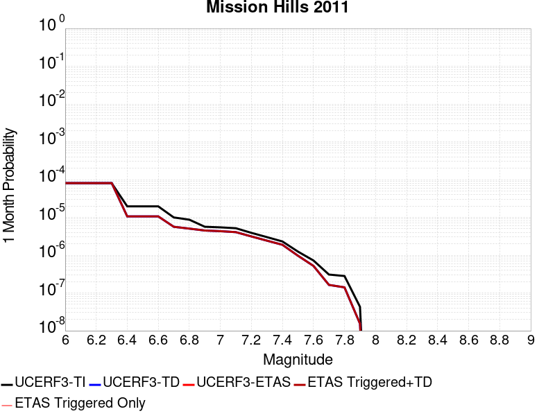 | 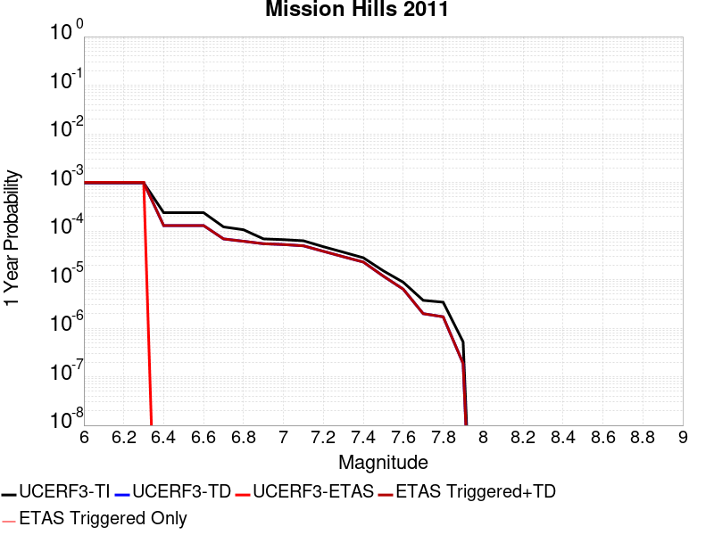 | 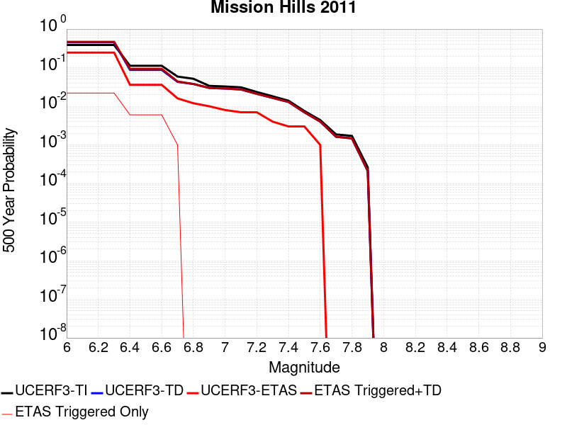 |

| Magnitude | 1 wk TI Prob | 1 wk TD Prob | 1 wk ETAS Prob | 1 wk ETAS/TD Gain | 1 wk ETAS Triggered+TD | 1 wk ETAS Triggered Only | 1 mo TI Prob | 1 mo TD Prob | 1 mo ETAS Prob | 1 mo ETAS/TD Gain | 1 mo ETAS Triggered+TD | 1 mo ETAS Triggered Only | 1 yr TI Prob | 1 yr TD Prob | 1 yr ETAS Prob | 1 yr ETAS/TD Gain | 1 yr ETAS Triggered+TD | 1 yr ETAS Triggered Only | 500 yr TI Prob | 500 yr TD Prob | 500 yr ETAS Prob | 500 yr ETAS/TD Gain | 500 yr ETAS Triggered+TD | 500 yr ETAS Triggered Only |
|-----|-----|-----|-----|-----|-----|-----|-----|-----|-----|-----|-----|-----|-----|-----|-----|-----|-----|-----|-----|-----|-----|-----|-----|-----|
| 6.0 | 1.8765717E-5 | 1.8876279E-5 | 0.0 | 0.0 | 1.8876279E-5 | 0.0 | 8.0422025E-5 | 8.089773E-5 | 0.0 | 0.0 | 8.089773E-5 | 0.0 | 9.786983E-4 | 9.848224E-4 | 0.001 | 1.0154116 | 9.848224E-4 | 0.0 | 0.38712162 | 0.45349577 | 0.246 | 0.5424527 | 0.46551886 | 0.022 |
| 6.1 | 1.8765717E-5 | 1.8876279E-5 | 0.0 | 0.0 | 1.8876279E-5 | 0.0 | 8.0422025E-5 | 8.089773E-5 | 0.0 | 0.0 | 8.089773E-5 | 0.0 | 9.786983E-4 | 9.848224E-4 | 0.001 | 1.0154116 | 9.848224E-4 | 0.0 | 0.38712162 | 0.45349577 | 0.246 | 0.5424527 | 0.46551886 | 0.022 |
| 6.2 | 1.8765717E-5 | 1.8876279E-5 | 0.0 | 0.0 | 1.8876279E-5 | 0.0 | 8.0422025E-5 | 8.089773E-5 | 0.0 | 0.0 | 8.089773E-5 | 0.0 | 9.786983E-4 | 9.848224E-4 | 0.001 | 1.0154116 | 9.848224E-4 | 0.0 | 0.38712162 | 0.45349577 | 0.246 | 0.5424527 | 0.46551886 | 0.022 |
| 6.3 | 1.8765717E-5 | 1.8876279E-5 | 0.0 | 0.0 | 1.8876279E-5 | 0.0 | 8.0422025E-5 | 8.089773E-5 | 0.0 | 0.0 | 8.089773E-5 | 0.0 | 9.786983E-4 | 9.848224E-4 | 0.001 | 1.0154116 | 9.848224E-4 | 0.0 | 0.38712162 | 0.45349577 | 0.246 | 0.5424527 | 0.46551886 | 0.022 |
| 6.4 | 4.566357E-6 | 2.4769063E-6 | 0.0 | 0.0 | 2.4769063E-6 | 0.0 | 1.9569954E-5 | 1.0615279E-5 | 0.0 | 0.0 | 1.0615279E-5 | 0.0 | 2.3823815E-4 | 1.2923511E-4 | 0.0 | 0.0 | 1.2923511E-4 | 0.0 | 0.11231051 | 0.08783283 | 0.036 | 0.4098695 | 0.09330583 | 0.006 |
| 6.5 | 4.566357E-6 | 2.4769063E-6 | 0.0 | 0.0 | 2.4769063E-6 | 0.0 | 1.9569954E-5 | 1.0615279E-5 | 0.0 | 0.0 | 1.0615279E-5 | 0.0 | 2.3823815E-4 | 1.2923511E-4 | 0.0 | 0.0 | 1.2923511E-4 | 0.0 | 0.11231051 | 0.08783283 | 0.036 | 0.4098695 | 0.09330583 | 0.006 |
| 6.6 | 4.566357E-6 | 2.4769063E-6 | 0.0 | 0.0 | 2.4769063E-6 | 0.0 | 1.9569954E-5 | 1.0615279E-5 | 0.0 | 0.0 | 1.0615279E-5 | 0.0 | 2.3823815E-4 | 1.2923511E-4 | 0.0 | 0.0 | 1.2923511E-4 | 0.0 | 0.11231051 | 0.08783283 | 0.036 | 0.4098695 | 0.09330583 | 0.006 |
| 6.7 | 2.3266773E-6 | 1.3168783E-6 | 0.0 | 0.0 | 1.3168783E-6 | 0.0 | 9.971435E-6 | 5.6437525E-6 | 0.0 | 0.0 | 5.6437525E-6 | 0.0 | 1.2139547E-4 | 6.871058E-5 | 0.0 | 0.0 | 6.871058E-5 | 0.0 | 0.058895804 | 0.042964935 | 0.016 | 0.3723967 | 0.04392197 | 0.001 |
| 6.8 | 2.032735E-6 | 1.1785047E-6 | 0.0 | 0.0 | 1.1785047E-6 | 0.0 | 8.711692E-6 | 5.0507247E-6 | 0.0 | 0.0 | 5.0507247E-6 | 0.0 | 1.06059684E-4 | 6.1490886E-5 | 0.0 | 0.0 | 6.1490886E-5 | 0.0 | 0.051650956 | 0.0378226 | 0.012 | 0.31727064 | 0.0378226 | 0.0 |
| 6.9 | 1.3186259E-6 | 1.0487524E-6 | 0.0 | 0.0 | 1.0487524E-6 | 0.0 | 5.6512413E-6 | 4.4946455E-6 | 0.0 | 0.0 | 4.4946455E-6 | 0.0 | 6.8801695E-5 | 5.4720964E-5 | 0.0 | 0.0 | 5.4720964E-5 | 0.0 | 0.03381701 | 0.029899076 | 0.01 | 0.3344585 | 0.029899076 | 0.0 |
| 7.0 | 1.2726016E-6 | 1.0086063E-6 | 0.0 | 0.0 | 1.0086063E-6 | 0.0 | 5.4539955E-6 | 4.3225914E-6 | 0.0 | 0.0 | 4.3225914E-6 | 0.0 | 6.6400375E-5 | 5.262631E-5 | 0.0 | 0.0 | 5.262631E-5 | 0.0 | 0.032656174 | 0.028837612 | 0.008 | 0.27741548 | 0.028837612 | 0.0 |
| 7.1 | 1.2063913E-6 | 9.499584E-7 | 0.0 | 0.0 | 9.499584E-7 | 0.0 | 5.170238E-6 | 4.0712443E-6 | 0.0 | 0.0 | 4.0712443E-6 | 0.0 | 6.294583E-5 | 4.9566297E-5 | 0.0 | 0.0 | 4.9566297E-5 | 0.0 | 0.030983757 | 0.027270611 | 0.007 | 0.2566866 | 0.027270611 | 0.0 |
| 7.2 | 9.105806E-7 | 7.316769E-7 | 0.0 | 0.0 | 7.316769E-7 | 0.0 | 3.9024826E-6 | 3.1357545E-6 | 0.0 | 0.0 | 3.1357545E-6 | 0.0 | 4.7511687E-5 | 3.8177157E-5 | 0.0 | 0.0 | 3.8177157E-5 | 0.0 | 0.023476446 | 0.021041458 | 0.007 | 0.33267656 | 0.021041458 | 0.0 |
| 7.3 | 7.020432E-7 | 5.6605444E-7 | 0.0 | 0.0 | 5.6605444E-7 | 0.0 | 3.0087533E-6 | 2.4259455E-6 | 0.0 | 0.0 | 2.4259455E-6 | 0.0 | 3.6630954E-5 | 2.9535498E-5 | 0.0 | 0.0 | 2.9535498E-5 | 0.0 | 0.018149098 | 0.016488206 | 0.004 | 0.24259765 | 0.016488206 | 0.0 |
| 7.4 | 5.3900635E-7 | 4.4035158E-7 | 0.0 | 0.0 | 4.4035158E-7 | 0.0 | 2.3100251E-6 | 1.8872197E-6 | 0.0 | 0.0 | 1.8872197E-6 | 0.0 | 2.8124194E-5 | 2.297667E-5 | 0.0 | 0.0 | 2.297667E-5 | 0.0 | 0.013963882 | 0.012952794 | 0.003 | 0.23161025 | 0.012952794 | 0.0 |
| 7.5 | 2.907075E-7 | 2.2620071E-7 | 0.0 | 0.0 | 2.2620071E-7 | 0.0 | 1.2458887E-6 | 9.694313E-7 | 0.0 | 0.0 | 9.694313E-7 | 0.0 | 1.5168589E-5 | 1.1802764E-5 | 0.0 | 0.0 | 1.1802764E-5 | 0.0 | 0.007555663 | 0.006985586 | 0.003 | 0.42945573 | 0.006985586 | 0.0 |
| 7.6 | 1.6903675E-7 | 1.2164035E-7 | 0.0 | 0.0 | 1.2164035E-7 | 0.0 | 7.2444305E-7 | 5.213157E-7 | 0.0 | 0.0 | 5.213157E-7 | 0.0 | 8.820059E-6 | 6.347002E-6 | 0.0 | 0.0 | 6.347002E-6 | 0.0 | 0.0044003385 | 0.004023852 | 0.001 | 0.2485181 | 0.004023852 | 0.0 |
| 7.7 | 7.168073E-8 | 3.8153765E-8 | 0.0 | 0.0 | 3.8153765E-8 | 0.0 | 3.072031E-7 | 1.6351612E-7 | 0.0 | 0.0 | 1.6351612E-7 | 0.0 | 3.7401915E-6 | 1.990807E-6 | 0.0 | 0.0 | 1.990807E-6 | 0.0 | 0.0018683517 | 0.0016257712 | 0.0 | 0.0 | 0.0016257712 | 0.0 |
| 7.8 | 6.564101E-8 | 3.2881434E-8 | 0.0 | 0.0 | 3.2881434E-8 | 0.0 | 2.813186E-7 | 1.4092042E-7 | 0.0 | 0.0 | 1.4092042E-7 | 0.0 | 3.4250486E-6 | 1.7157049E-6 | 0.0 | 0.0 | 1.7157049E-6 | 0.0 | 0.0017110617 | 0.0014730797 | 0.0 | 0.0 | 0.0014730797 | 0.0 |
| 7.9 | 1.0029074E-8 | 3.5951118E-9 | 0.0 | 0.0 | 3.5951118E-9 | 0.0 | 4.2981743E-8 | 1.5407622E-8 | 0.0 | 0.0 | 1.5407622E-8 | 0.0 | 5.2330256E-7 | 1.8758779E-7 | 0.0 | 0.0 | 1.8758779E-7 | 0.0 | 2.6161713E-4 | 2.101505E-4 | 0.0 | 0.0 | 2.101505E-4 | 0.0 |

## Butano 2011 CFM
*[(top)](#table-of-contents)*

| 1 Week | 1 Month | 1 Year | 500 Year |
|-----|-----|-----|-----|
|  |  | 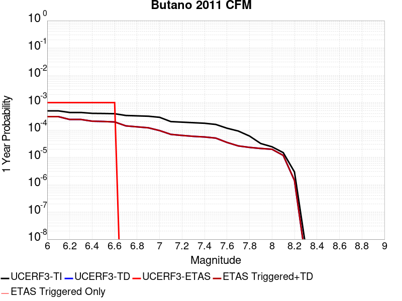 | 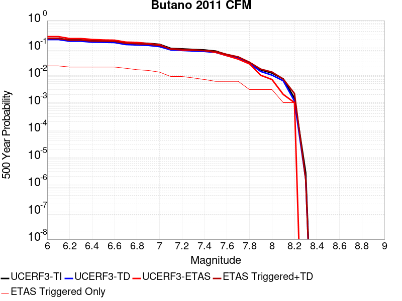 |

| Magnitude | 1 wk TI Prob | 1 wk TD Prob | 1 wk ETAS Prob | 1 wk ETAS/TD Gain | 1 wk ETAS Triggered+TD | 1 wk ETAS Triggered Only | 1 mo TI Prob | 1 mo TD Prob | 1 mo ETAS Prob | 1 mo ETAS/TD Gain | 1 mo ETAS Triggered+TD | 1 mo ETAS Triggered Only | 1 yr TI Prob | 1 yr TD Prob | 1 yr ETAS Prob | 1 yr ETAS/TD Gain | 1 yr ETAS Triggered+TD | 1 yr ETAS Triggered Only | 500 yr TI Prob | 500 yr TD Prob | 500 yr ETAS Prob | 500 yr ETAS/TD Gain | 500 yr ETAS Triggered+TD | 500 yr ETAS Triggered Only |
|-----|-----|-----|-----|-----|-----|-----|-----|-----|-----|-----|-----|-----|-----|-----|-----|-----|-----|-----|-----|-----|-----|-----|-----|-----|
| 6.0 | 9.561135E-6 | 5.8797173E-6 | 0.0 | 0.0 | 5.8797173E-6 | 0.0 | 4.097565E-5 | 2.5198557E-5 | 0.0 | 0.0 | 2.5198557E-5 | 0.0 | 4.9876433E-4 | 3.0675143E-4 | 0.001 | 3.2599685 | 3.0675143E-4 | 0.0 | 0.22076638 | 0.20274627 | 0.259 | 1.2774587 | 0.22028586 | 0.022 |
| 6.1 | 9.561135E-6 | 5.8797173E-6 | 0.0 | 0.0 | 5.8797173E-6 | 0.0 | 4.097565E-5 | 2.5198557E-5 | 0.0 | 0.0 | 2.5198557E-5 | 0.0 | 4.9876433E-4 | 3.0675143E-4 | 0.001 | 3.2599685 | 3.0675143E-4 | 0.0 | 0.22076638 | 0.20274627 | 0.259 | 1.2774587 | 0.22028586 | 0.022 |
| 6.2 | 8.364741E-6 | 4.6355326E-6 | 0.0 | 0.0 | 4.6355326E-6 | 0.0 | 3.5848396E-5 | 1.9866426E-5 | 0.0 | 0.0 | 1.9866426E-5 | 0.0 | 4.3636683E-4 | 2.4184844E-4 | 0.001 | 4.134821 | 2.4184844E-4 | 0.0 | 0.19606031 | 0.17630145 | 0.22 | 1.2478627 | 0.19277541 | 0.02 |
| 6.3 | 8.364741E-6 | 4.6355326E-6 | 0.0 | 0.0 | 4.6355326E-6 | 0.0 | 3.5848396E-5 | 1.9866426E-5 | 0.0 | 0.0 | 1.9866426E-5 | 0.0 | 4.3636683E-4 | 2.4184844E-4 | 0.001 | 4.134821 | 2.4184844E-4 | 0.0 | 0.19606031 | 0.17630145 | 0.22 | 1.2478627 | 0.19277541 | 0.02 |
| 6.4 | 7.768282E-6 | 4.014864E-6 | 0.0 | 0.0 | 4.014864E-6 | 0.0 | 3.329221E-5 | 1.7206454E-5 | 0.0 | 0.0 | 1.7206454E-5 | 0.0 | 4.0525728E-4 | 2.0946978E-4 | 0.001 | 4.773958 | 2.0946978E-4 | 0.0 | 0.1834521 | 0.16280764 | 0.204 | 1.2530124 | 0.17955148 | 0.02 |
| 6.5 | 7.673437E-6 | 3.914734E-6 | 0.0 | 0.0 | 3.914734E-6 | 0.0 | 3.2885746E-5 | 1.677733E-5 | 0.0 | 0.0 | 1.677733E-5 | 0.0 | 4.0031038E-4 | 2.0424619E-4 | 0.001 | 4.896052 | 2.0424619E-4 | 0.0 | 0.1814291 | 0.16061541 | 0.195 | 1.2140802 | 0.1774031 | 0.02 |
| 6.6 | 7.5244197E-6 | 3.7601944E-6 | 0.0 | 0.0 | 3.7601944E-6 | 0.0 | 3.2247113E-5 | 1.6115026E-5 | 0.0 | 0.0 | 1.6115026E-5 | 0.0 | 3.9253788E-4 | 1.961841E-4 | 0.001 | 5.097253 | 1.961841E-4 | 0.0 | 0.17824048 | 0.15720804 | 0.192 | 1.2213117 | 0.17406388 | 0.02 |
| 6.7 | 6.4921405E-6 | 2.7041724E-6 | 0.0 | 0.0 | 2.7041724E-6 | 0.0 | 2.7823162E-5 | 1.1589259E-5 | 0.0 | 0.0 | 1.1589259E-5 | 0.0 | 3.3869434E-4 | 1.4109018E-4 | 0.0 | 0.0 | 1.4109018E-4 | 0.0 | 0.15580845 | 0.13318859 | 0.163 | 1.2238287 | 0.1487912 | 0.018 |
| 6.8 | 6.2890294E-6 | 2.4918081E-6 | 0.0 | 0.0 | 2.4918081E-6 | 0.0 | 2.6952705E-5 | 1.0679133E-5 | 0.0 | 0.0 | 1.0679133E-5 | 0.0 | 3.2809976E-4 | 1.3001077E-4 | 0.0 | 0.0 | 1.3001077E-4 | 0.0 | 0.15132317 | 0.12833574 | 0.159 | 1.2389377 | 0.14228238 | 0.016 |
| 6.9 | 6.0965517E-6 | 2.2993577E-6 | 0.0 | 0.0 | 2.2993577E-6 | 0.0 | 2.6127816E-5 | 9.854353E-6 | 0.0 | 0.0 | 9.854353E-6 | 0.0 | 3.1805973E-4 | 1.1997021E-4 | 0.0 | 0.0 | 1.1997021E-4 | 0.0 | 0.1470507 | 0.12383047 | 0.143 | 1.1548046 | 0.13697301 | 0.015 |
| 7.0 | 5.566252E-6 | 1.8210723E-6 | 0.0 | 0.0 | 1.8210723E-6 | 0.0 | 2.3855147E-5 | 7.804571E-6 | 0.0 | 0.0 | 7.804571E-6 | 0.0 | 2.9039773E-4 | 9.5016556E-5 | 0.0 | 0.0 | 9.5016556E-5 | 0.0 | 0.13516794 | 0.111718364 | 0.131 | 1.1725914 | 0.12326603 | 0.013 |
| 7.1 | 3.878588E-6 | 1.3227075E-6 | 0.0 | 0.0 | 1.3227075E-6 | 0.0 | 1.6622414E-5 | 5.6687336E-6 | 0.0 | 0.0 | 5.6687336E-6 | 0.0 | 2.023591E-4 | 6.901465E-5 | 0.0 | 0.0 | 6.901465E-5 | 0.0 | 0.09623851 | 0.08449398 | 0.09 | 1.0651647 | 0.09273353 | 0.009 |
| 7.2 | 3.7038085E-6 | 1.2080728E-6 | 0.0 | 0.0 | 1.2080728E-6 | 0.0 | 1.587337E-5 | 5.1774446E-6 | 0.0 | 0.0 | 5.1774446E-6 | 0.0 | 1.9324113E-4 | 6.303356E-5 | 0.0 | 0.0 | 6.303356E-5 | 0.0 | 0.09210804 | 0.08085329 | 0.085 | 1.0512868 | 0.08912561 | 0.009 |
| 7.3 | 3.5277278E-6 | 1.1202883E-6 | 0.0 | 0.0 | 1.1202883E-6 | 0.0 | 1.5118746E-5 | 4.8012266E-6 | 0.0 | 0.0 | 4.8012266E-6 | 0.0 | 1.8405518E-4 | 5.8453366E-5 | 0.0 | 0.0 | 5.8453366E-5 | 0.0 | 0.087927744 | 0.077386595 | 0.082 | 1.059615 | 0.084767506 | 0.008 |
| 7.4 | 3.3711294E-6 | 1.0626001E-6 | 0.0 | 0.0 | 1.0626001E-6 | 0.0 | 1.4447617E-5 | 4.5539923E-6 | 0.0 | 0.0 | 4.5539923E-6 | 0.0 | 1.7588554E-4 | 5.5443445E-5 | 0.0 | 0.0 | 5.5443445E-5 | 0.0 | 0.084193796 | 0.074411616 | 0.08 | 1.0751009 | 0.08089074 | 0.007 |
| 7.5 | 3.0496426E-6 | 9.648201E-7 | 0.0 | 0.0 | 9.648201E-7 | 0.0 | 1.3069831E-5 | 4.1349363E-6 | 0.0 | 0.0 | 4.1349363E-6 | 0.0 | 1.5911358E-4 | 5.034169E-5 | 0.0 | 0.0 | 5.034169E-5 | 0.0 | 0.07648027 | 0.068326145 | 0.069 | 1.0098623 | 0.07391619 | 0.006 |
| 7.6 | 2.2179781E-6 | 6.6990003E-7 | 0.0 | 0.0 | 6.6990003E-7 | 0.0 | 9.505586E-6 | 2.870997E-6 | 0.0 | 0.0 | 2.870997E-6 | 0.0 | 1.1572436E-4 | 3.4953828E-5 | 0.0 | 0.0 | 3.4953828E-5 | 0.0 | 0.05622315 | 0.052019577 | 0.052 | 0.99962366 | 0.057707462 | 0.006 |
| 7.7 | 1.7519328E-6 | 5.0036607E-7 | 0.0 | 0.0 | 5.0036607E-7 | 0.0 | 7.508262E-6 | 2.1444243E-6 | 0.0 | 0.0 | 2.1444243E-6 | 0.0 | 9.140925E-5 | 2.6108051E-5 | 0.0 | 0.0 | 2.6108051E-5 | 0.0 | 0.0446779 | 0.041279808 | 0.039 | 0.9447718 | 0.04703213 | 0.006 |
| 7.8 | 1.1478974E-6 | 4.412198E-7 | 0.0 | 0.0 | 4.412198E-7 | 0.0 | 4.9195505E-6 | 1.8909407E-6 | 0.0 | 0.0 | 1.8909407E-6 | 0.0 | 5.9893882E-5 | 2.3021958E-5 | 0.0 | 0.0 | 2.3021958E-5 | 0.0 | 0.029503845 | 0.026923506 | 0.026 | 0.96569896 | 0.029842734 | 0.003 |
| 7.9 | 6.1154634E-7 | 4.0326466E-7 | 0.0 | 0.0 | 4.0326466E-7 | 0.0 | 2.6209104E-6 | 1.728276E-6 | 0.0 | 0.0 | 1.728276E-6 | 0.0 | 3.1909116E-5 | 2.1041556E-5 | 0.0 | 0.0 | 2.1041556E-5 | 0.0 | 0.015828209 | 0.013792064 | 0.01 | 0.7250546 | 0.016750688 | 0.003 |
| 8.0 | 4.6520046E-7 | 3.7701724E-7 | 0.0 | 0.0 | 3.7701724E-7 | 0.0 | 1.9937147E-6 | 1.6157871E-6 | 0.0 | 0.0 | 1.6157871E-6 | 0.0 | 2.4273206E-5 | 1.967203E-5 | 0.0 | 0.0 | 1.967203E-5 | 0.0 | 0.012063397 | 0.010143676 | 0.007 | 0.6900852 | 0.013113244 | 0.003 |
| 8.1 | 2.8425194E-7 | 2.2511789E-7 | 0.0 | 0.0 | 2.2511789E-7 | 0.0 | 1.218222E-6 | 9.647906E-7 | 0.0 | 0.0 | 9.647906E-7 | 0.0 | 1.4831752E-5 | 1.1746261E-5 | 0.0 | 0.0 | 1.1746261E-5 | 0.0 | 0.007388501 | 0.0063085174 | 0.002 | 0.3170317 | 0.007302209 | 0.001 |
| 8.2 | 5.585778E-8 | 2.736209E-8 | 0.0 | 0.0 | 2.736209E-8 | 0.0 | 2.3939046E-7 | 1.172661E-7 | 0.0 | 0.0 | 1.172661E-7 | 0.0 | 2.914575E-6 | 1.4277138E-6 | 0.0 | 0.0 | 1.4277138E-6 | 0.0 | 0.0014562283 | 0.0011449059 | 0.001 | 0.8734342 | 0.0021437611 | 0.001 |
| 8.3 | 1.0371215E-10 | 3.399714E-11 | 0.0 | 0.0 | 3.399714E-11 | 0.0 | 4.4448079E-10 | 1.4570212E-10 | 0.0 | 0.0 | 1.4570212E-10 | 0.0 | 5.4115543E-9 | 1.7739231E-9 | 0.0 | 0.0 | 1.7739231E-9 | 0.0 | 2.7057733E-6 | 1.5769889E-6 | 0.0 | 0.0 | 1.5769889E-6 | 0.0 |

## San Jacinto (Coyote Creek)
*[(top)](#table-of-contents)*

| 1 Week | 1 Month | 1 Year | 500 Year |
|-----|-----|-----|-----|
| 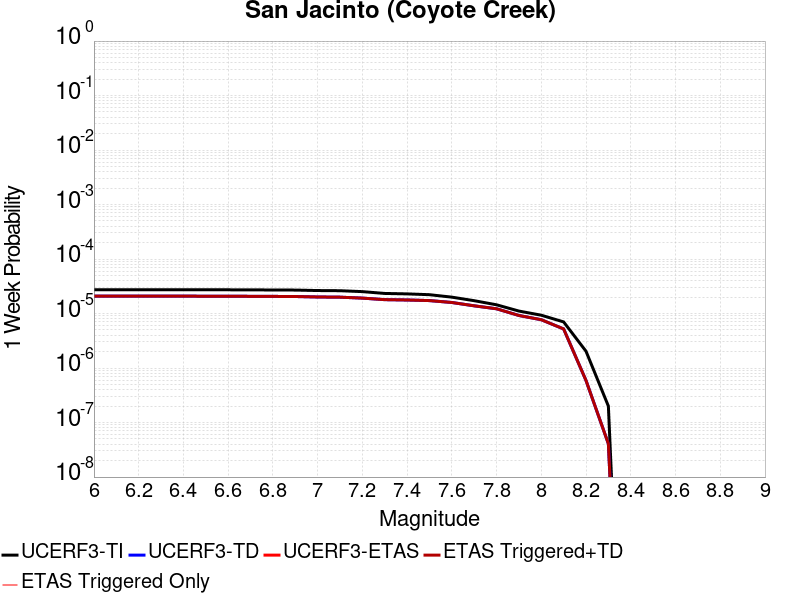 | 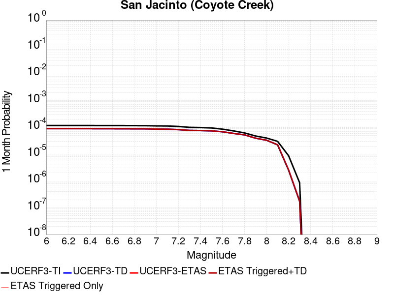 | 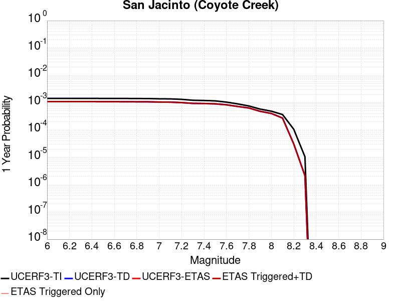 | 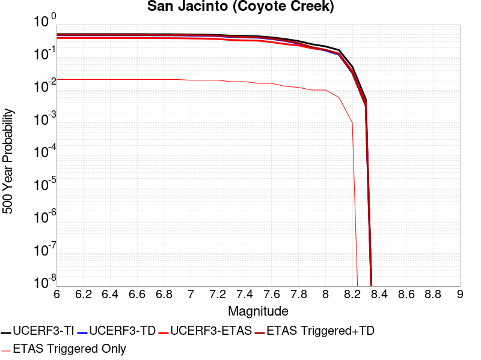 |

| Magnitude | 1 wk TI Prob | 1 wk TD Prob | 1 wk ETAS Prob | 1 wk ETAS/TD Gain | 1 wk ETAS Triggered+TD | 1 wk ETAS Triggered Only | 1 mo TI Prob | 1 mo TD Prob | 1 mo ETAS Prob | 1 mo ETAS/TD Gain | 1 mo ETAS Triggered+TD | 1 mo ETAS Triggered Only | 1 yr TI Prob | 1 yr TD Prob | 1 yr ETAS Prob | 1 yr ETAS/TD Gain | 1 yr ETAS Triggered+TD | 1 yr ETAS Triggered Only | 500 yr TI Prob | 500 yr TD Prob | 500 yr ETAS Prob | 500 yr ETAS/TD Gain | 500 yr ETAS Triggered+TD | 500 yr ETAS Triggered Only |
|-----|-----|-----|-----|-----|-----|-----|-----|-----|-----|-----|-----|-----|-----|-----|-----|-----|-----|-----|-----|-----|-----|-----|-----|-----|
| 6.0 | 2.7374346E-5 | 2.0901334E-5 | 0.0 | 0.0 | 2.0901334E-5 | 0.0 | 1.1731335E-4 | 8.957408E-5 | 0.0 | 0.0 | 8.957408E-5 | 0.0 | 0.0014273542 | 0.0010900211 | 0.0 | 0.0 | 0.0010900211 | 0.0 | 0.51040995 | 0.47473246 | 0.39 | 0.8215154 | 0.48576307 | 0.021 |
| 6.1 | 2.7374346E-5 | 2.0901334E-5 | 0.0 | 0.0 | 2.0901334E-5 | 0.0 | 1.1731335E-4 | 8.957408E-5 | 0.0 | 0.0 | 8.957408E-5 | 0.0 | 0.0014273542 | 0.0010900211 | 0.0 | 0.0 | 0.0010900211 | 0.0 | 0.51040995 | 0.47473246 | 0.39 | 0.8215154 | 0.48576307 | 0.021 |
| 6.2 | 2.7374346E-5 | 2.0901334E-5 | 0.0 | 0.0 | 2.0901334E-5 | 0.0 | 1.1731335E-4 | 8.957408E-5 | 0.0 | 0.0 | 8.957408E-5 | 0.0 | 0.0014273542 | 0.0010900211 | 0.0 | 0.0 | 0.0010900211 | 0.0 | 0.51040995 | 0.47473246 | 0.39 | 0.8215154 | 0.48576307 | 0.021 |
| 6.3 | 2.7374346E-5 | 2.0901334E-5 | 0.0 | 0.0 | 2.0901334E-5 | 0.0 | 1.1731335E-4 | 8.957408E-5 | 0.0 | 0.0 | 8.957408E-5 | 0.0 | 0.0014273542 | 0.0010900211 | 0.0 | 0.0 | 0.0010900211 | 0.0 | 0.51040995 | 0.47473246 | 0.39 | 0.8215154 | 0.48576307 | 0.021 |
| 6.4 | 2.7374346E-5 | 2.0901334E-5 | 0.0 | 0.0 | 2.0901334E-5 | 0.0 | 1.1731335E-4 | 8.957408E-5 | 0.0 | 0.0 | 8.957408E-5 | 0.0 | 0.0014273542 | 0.0010900211 | 0.0 | 0.0 | 0.0010900211 | 0.0 | 0.51040995 | 0.47473246 | 0.39 | 0.8215154 | 0.48576307 | 0.021 |
| 6.5 | 2.7282445E-5 | 2.0788804E-5 | 0.0 | 0.0 | 2.0788804E-5 | 0.0 | 1.16919524E-4 | 8.9091845E-5 | 0.0 | 0.0 | 8.9091845E-5 | 0.0 | 0.0014225657 | 0.0010841556 | 0.0 | 0.0 | 0.0010841556 | 0.0 | 0.50923467 | 0.47344306 | 0.389 | 0.8216405 | 0.48450077 | 0.021 |
| 6.6 | 2.7282445E-5 | 2.0788804E-5 | 0.0 | 0.0 | 2.0788804E-5 | 0.0 | 1.16919524E-4 | 8.9091845E-5 | 0.0 | 0.0 | 8.9091845E-5 | 0.0 | 0.0014225657 | 0.0010841556 | 0.0 | 0.0 | 0.0010841556 | 0.0 | 0.50923467 | 0.47344306 | 0.389 | 0.8216405 | 0.48450077 | 0.021 |
| 6.7 | 2.7216198E-5 | 2.0715013E-5 | 0.0 | 0.0 | 2.0715013E-5 | 0.0 | 1.1663563E-4 | 8.8775625E-5 | 0.0 | 0.0 | 8.8775625E-5 | 0.0 | 0.0014191137 | 0.0010803095 | 0.0 | 0.0 | 0.0010803095 | 0.0 | 0.5083857 | 0.47253427 | 0.387 | 0.8189882 | 0.48361105 | 0.021 |
| 6.8 | 2.7078617E-5 | 2.0634801E-5 | 0.0 | 0.0 | 2.0634801E-5 | 0.0 | 1.1604605E-4 | 8.843188E-5 | 0.0 | 0.0 | 8.843188E-5 | 0.0 | 0.001411945 | 0.0010761286 | 0.0 | 0.0 | 0.0010761286 | 0.0 | 0.5066179 | 0.47079453 | 0.385 | 0.8177665 | 0.48190784 | 0.021 |
| 6.9 | 2.6982952E-5 | 2.0557032E-5 | 0.0 | 0.0 | 2.0557032E-5 | 0.0 | 1.15636096E-4 | 8.8098604E-5 | 0.0 | 0.0 | 8.8098604E-5 | 0.0 | 0.0014069602 | 0.0010720749 | 0.0 | 0.0 | 0.0010720749 | 0.0 | 0.5053849 | 0.46953362 | 0.384 | 0.8178328 | 0.4806734 | 0.021 |
| 7.0 | 2.6449972E-5 | 2.0144307E-5 | 0.0 | 0.0 | 2.0144307E-5 | 0.0 | 1.1335209E-4 | 8.63299E-5 | 0.0 | 0.0 | 8.63299E-5 | 0.0 | 0.001379188 | 0.0010505619 | 0.0 | 0.0 | 0.0010505619 | 0.0 | 0.49845904 | 0.46231505 | 0.378 | 0.8176243 | 0.47306874 | 0.02 |
| 7.1 | 2.6257849E-5 | 1.9976382E-5 | 0.0 | 0.0 | 1.9976382E-5 | 0.0 | 1.1252879E-4 | 8.561027E-5 | 0.0 | 0.0 | 8.561027E-5 | 0.0 | 0.0013691769 | 0.0010418087 | 0.0 | 0.0 | 0.0010418087 | 0.0 | 0.49593878 | 0.4596763 | 0.374 | 0.81361604 | 0.47048277 | 0.02 |
| 7.2 | 2.5270041E-5 | 1.920903E-5 | 0.0 | 0.0 | 1.920903E-5 | 0.0 | 1.0829568E-4 | 8.232183E-5 | 0.0 | 0.0 | 8.232183E-5 | 0.0 | 0.0013177024 | 0.0010018094 | 0.0 | 0.0 | 0.0010018094 | 0.0 | 0.48277932 | 0.4461374 | 0.363 | 0.81365067 | 0.45721465 | 0.02 |
| 7.3 | 2.339701E-5 | 1.8001581E-5 | 0.0 | 0.0 | 1.8001581E-5 | 0.0 | 1.0026905E-4 | 7.714736E-5 | 0.0 | 0.0 | 7.714736E-5 | 0.0 | 0.001220092 | 9.3886605E-4 | 0.0 | 0.0 | 9.3886605E-4 | 0.0 | 0.45687643 | 0.4173525 | 0.339 | 0.8122631 | 0.42784014 | 0.018 |
| 7.4 | 2.296333E-5 | 1.7746606E-5 | 0.0 | 0.0 | 1.7746606E-5 | 0.0 | 9.841056E-5 | 7.6054675E-5 | 0.0 | 0.0 | 7.6054675E-5 | 0.0 | 0.0011974899 | 9.2557404E-4 | 0.0 | 0.0 | 9.2557404E-4 | 0.0 | 0.45069626 | 0.41063496 | 0.33 | 0.80363345 | 0.42124355 | 0.018 |
| 7.5 | 2.2188895E-5 | 1.7300834E-5 | 0.0 | 0.0 | 1.7300834E-5 | 0.0 | 9.50918E-5 | 7.414434E-5 | 0.0 | 0.0 | 7.414434E-5 | 0.0 | 0.0011571277 | 9.023351E-4 | 0.0 | 0.0 | 9.023351E-4 | 0.0 | 0.43948475 | 0.39870268 | 0.324 | 0.8126356 | 0.40832344 | 0.016 |
| 7.6 | 2.0013189E-5 | 1.5972628E-5 | 0.0 | 0.0 | 1.5972628E-5 | 0.0 | 8.5767984E-5 | 6.845233E-5 | 0.0 | 0.0 | 6.845233E-5 | 0.0 | 0.001043725 | 8.3308987E-4 | 0.0 | 0.0 | 8.3308987E-4 | 0.0 | 0.4067474 | 0.3644153 | 0.293 | 0.80402774 | 0.37458465 | 0.016 |
| 7.7 | 1.7230794E-5 | 1.3867543E-5 | 0.0 | 0.0 | 1.3867543E-5 | 0.0 | 7.384417E-5 | 5.9430975E-5 | 0.0 | 0.0 | 5.9430975E-5 | 0.0 | 8.986819E-4 | 7.233325E-4 | 0.0 | 0.0 | 7.233325E-4 | 0.0 | 0.36208037 | 0.31760207 | 0.254 | 0.7997429 | 0.32647324 | 0.013 |
| 7.8 | 1.4478809E-5 | 1.2237759E-5 | 0.0 | 0.0 | 1.2237759E-5 | 0.0 | 6.205057E-5 | 5.2446485E-5 | 0.0 | 0.0 | 5.2446485E-5 | 0.0 | 7.552038E-4 | 6.3834933E-4 | 0.0 | 0.0 | 6.3834933E-4 | 0.0 | 0.31459442 | 0.26331124 | 0.232 | 0.88108665 | 0.2721515 | 0.012 |
| 7.9 | 1.1114467E-5 | 9.223798E-6 | 0.0 | 0.0 | 9.223798E-6 | 0.0 | 4.7632562E-5 | 3.9529965E-5 | 0.0 | 0.0 | 3.9529965E-5 | 0.0 | 5.797721E-4 | 4.8117142E-4 | 0.0 | 0.0 | 4.8117142E-4 | 0.0 | 0.25171408 | 0.19639596 | 0.189 | 0.96234155 | 0.20443201 | 0.01 |
| 8.0 | 9.327402E-6 | 7.708679E-6 | 0.0 | 0.0 | 7.708679E-6 | 0.0 | 3.9973966E-5 | 3.3036777E-5 | 0.0 | 0.0 | 3.3036777E-5 | 0.0 | 4.8657437E-4 | 4.0214887E-4 | 0.0 | 0.0 | 4.0214887E-4 | 0.0 | 0.2160001 | 0.16203415 | 0.169 | 1.04299 | 0.1704138 | 0.01 |
| 8.1 | 7.0235833E-6 | 5.2186706E-6 | 0.0 | 0.0 | 5.2186706E-6 | 0.0 | 3.0100724E-5 | 2.236554E-5 | 0.0 | 0.0 | 2.236554E-5 | 0.0 | 3.664147E-4 | 2.7226674E-4 | 0.0 | 0.0 | 2.7226674E-4 | 0.0 | 0.16743244 | 0.12116151 | 0.131 | 1.0812014 | 0.12643453 | 0.006 |
| 8.2 | 2.0358202E-6 | 5.915163E-7 | 0.0 | 0.0 | 5.915163E-7 | 0.0 | 8.724915E-6 | 2.5350673E-6 | 0.0 | 0.0 | 2.5350673E-6 | 0.0 | 1.06220665E-4 | 3.086402E-5 | 0.0 | 0.0 | 3.086402E-5 | 0.0 | 0.05172729 | 0.032978497 | 0.038 | 1.152266 | 0.03394552 | 0.001 |
| 8.3 | 2.0051264E-7 | 4.078499E-8 | 0.0 | 0.0 | 4.078499E-8 | 0.0 | 8.5933965E-7 | 1.747928E-7 | 0.0 | 0.0 | 1.747928E-7 | 0.0 | 1.046241E-5 | 2.1281005E-6 | 0.0 | 0.0 | 2.1281005E-6 | 0.0 | 0.005217573 | 0.0032657725 | 0.004 | 1.224825 | 0.0032657725 | 0.0 |

## Great Valley 09 (Laguna Seca)
*[(top)](#table-of-contents)*

| 1 Week | 1 Month | 1 Year | 500 Year |
|-----|-----|-----|-----|
|  | 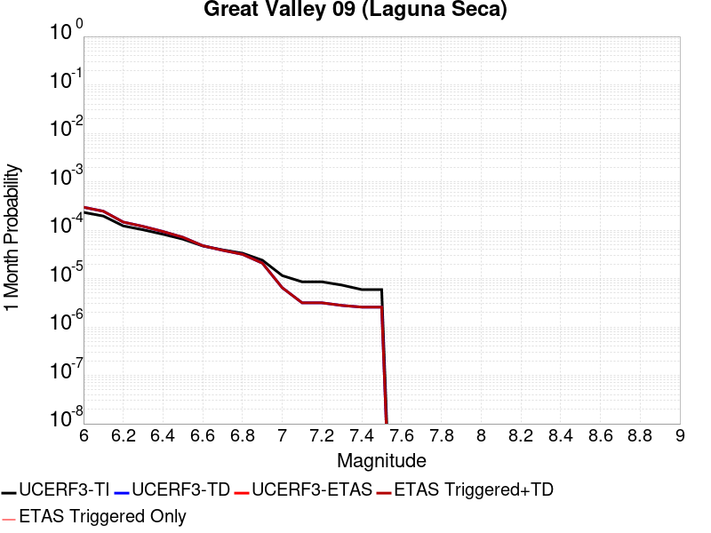 | 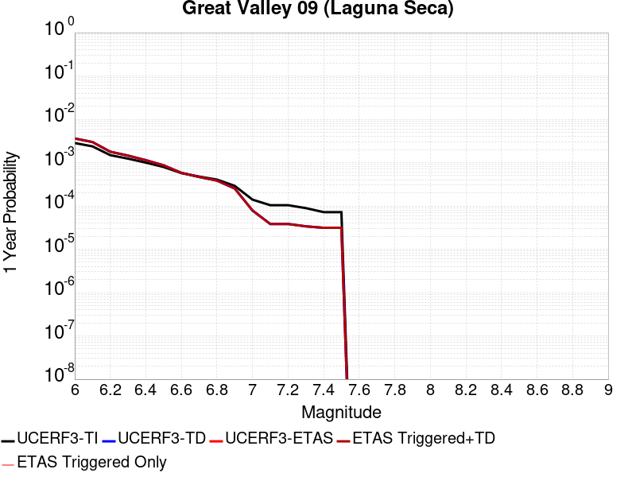 | 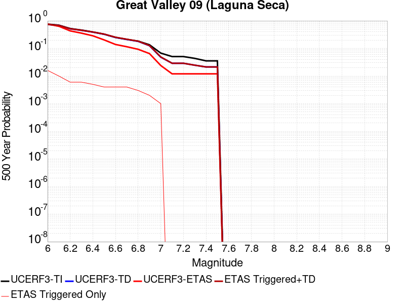 |

| Magnitude | 1 wk TI Prob | 1 wk TD Prob | 1 wk ETAS Prob | 1 wk ETAS/TD Gain | 1 wk ETAS Triggered+TD | 1 wk ETAS Triggered Only | 1 mo TI Prob | 1 mo TD Prob | 1 mo ETAS Prob | 1 mo ETAS/TD Gain | 1 mo ETAS Triggered+TD | 1 mo ETAS Triggered Only | 1 yr TI Prob | 1 yr TD Prob | 1 yr ETAS Prob | 1 yr ETAS/TD Gain | 1 yr ETAS Triggered+TD | 1 yr ETAS Triggered Only | 500 yr TI Prob | 500 yr TD Prob | 500 yr ETAS Prob | 500 yr ETAS/TD Gain | 500 yr ETAS Triggered+TD | 500 yr ETAS Triggered Only |
|-----|-----|-----|-----|-----|-----|-----|-----|-----|-----|-----|-----|-----|-----|-----|-----|-----|-----|-----|-----|-----|-----|-----|-----|-----|
| 6.0 | 5.4353277E-5 | 6.936699E-5 | 0.0 | 0.0 | 6.936699E-5 | 0.0 | 2.3292181E-4 | 2.972547E-4 | 0.0 | 0.0 | 2.972547E-4 | 0.0 | 0.0028321352 | 0.003613152 | 0.0 | 0.0 | 0.003613152 | 0.0 | 0.75782067 | 0.73740554 | 0.761 | 1.0319966 | 0.741607 | 0.016 |
| 6.1 | 4.5578287E-5 | 5.7314446E-5 | 0.0 | 0.0 | 5.7314446E-5 | 0.0 | 1.953209E-4 | 2.4561107E-4 | 0.0 | 0.0 | 2.4561107E-4 | 0.0 | 0.0023754383 | 0.002986259 | 0.0 | 0.0 | 0.002986259 | 0.0 | 0.69551456 | 0.67674136 | 0.634 | 0.9368424 | 0.67997396 | 0.01 |
| 6.2 | 2.8536782E-5 | 3.4248456E-5 | 0.0 | 0.0 | 3.4248456E-5 | 0.0 | 1.2229476E-4 | 1.4677084E-4 | 0.0 | 0.0 | 1.4677084E-4 | 0.0 | 0.0014879217 | 0.0017854729 | 0.0 | 0.0 | 0.0017854729 | 0.0 | 0.5250353 | 0.51231986 | 0.432 | 0.84322315 | 0.515246 | 0.006 |
| 6.3 | 2.3698774E-5 | 2.783494E-5 | 0.0 | 0.0 | 2.783494E-5 | 0.0 | 1.01562226E-4 | 1.1928709E-4 | 0.0 | 0.0 | 1.1928709E-4 | 0.0 | 0.0012358186 | 0.0014513574 | 0.0 | 0.0 | 0.0014513574 | 0.0 | 0.46113566 | 0.45170853 | 0.357 | 0.7903326 | 0.45499828 | 0.006 |
| 6.4 | 1.9191197E-5 | 2.1847753E-5 | 0.0 | 0.0 | 2.1847753E-5 | 0.0 | 8.2245395E-5 | 9.362974E-5 | 0.0 | 0.0 | 9.362974E-5 | 0.0 | 0.0010008777 | 0.0011393584 | 0.0 | 0.0 | 0.0011393584 | 0.0 | 0.39388737 | 0.38919148 | 0.286 | 0.7348568 | 0.3922455 | 0.005 |
| 6.5 | 1.5203241E-5 | 1.661296E-5 | 0.0 | 0.0 | 1.661296E-5 | 0.0 | 6.5155116E-5 | 7.1196395E-5 | 0.0 | 0.0 | 7.1196395E-5 | 0.0 | 7.9297484E-4 | 8.6648815E-4 | 0.0 | 0.0 | 8.6648815E-4 | 0.0 | 0.32742706 | 0.32683006 | 0.203 | 0.62111795 | 0.32952273 | 0.004 |
| 6.6 | 1.0984925E-5 | 1.1141368E-5 | 0.0 | 0.0 | 1.1141368E-5 | 0.0 | 4.70774E-5 | 4.774787E-5 | 0.0 | 0.0 | 4.774787E-5 | 0.0 | 5.730166E-4 | 5.811791E-4 | 0.0 | 0.0 | 5.811791E-4 | 0.0 | 0.24918081 | 0.25097656 | 0.139 | 0.5538366 | 0.25397265 | 0.004 |
| 6.7 | 9.134616E-6 | 8.941698E-6 | 0.0 | 0.0 | 8.941698E-6 | 0.0 | 3.9147766E-5 | 3.8321014E-5 | 0.0 | 0.0 | 3.8321014E-5 | 0.0 | 4.7651984E-4 | 4.6646083E-4 | 0.0 | 0.0 | 4.6646083E-4 | 0.0 | 0.21204689 | 0.21159527 | 0.115 | 0.5434904 | 0.21474887 | 0.004 |
| 6.8 | 7.785589E-6 | 7.3868778E-6 | 0.0 | 0.0 | 7.3868778E-6 | 0.0 | 3.3366385E-5 | 3.1657673E-5 | 0.0 | 0.0 | 3.1657673E-5 | 0.0 | 4.0616E-4 | 3.85366E-4 | 0.0 | 0.0 | 3.85366E-4 | 0.0 | 0.18382072 | 0.17994426 | 0.093 | 0.5168267 | 0.18240443 | 0.003 |
| 6.9 | 5.579095E-6 | 4.854131E-6 | 0.0 | 0.0 | 4.854131E-6 | 0.0 | 2.3910188E-5 | 2.080326E-5 | 0.0 | 0.0 | 2.080326E-5 | 0.0 | 2.9106764E-4 | 2.532516E-4 | 0.0 | 0.0 | 2.532516E-4 | 0.0 | 0.13545766 | 0.1253398 | 0.065 | 0.5185903 | 0.12708913 | 0.002 |
| 7.0 | 2.6816688E-6 | 1.5060886E-6 | 0.0 | 0.0 | 1.5060886E-6 | 0.0 | 1.1492816E-5 | 6.45465E-6 | 0.0 | 0.0 | 6.45465E-6 | 0.0 | 1.3991605E-4 | 7.858261E-5 | 0.0 | 0.0 | 7.858261E-5 | 0.0 | 0.0675716 | 0.048119616 | 0.024 | 0.49875712 | 0.049071494 | 0.001 |
| 7.1 | 1.9951021E-6 | 7.350953E-7 | 0.0 | 0.0 | 7.350953E-7 | 0.0 | 8.55041E-6 | 3.1504048E-6 | 0.0 | 0.0 | 3.1504048E-6 | 0.0 | 1.0409627E-4 | 3.8355545E-5 | 0.0 | 0.0 | 3.8355545E-5 | 0.0 | 0.0507194 | 0.02898313 | 0.012 | 0.41403398 | 0.02898313 | 0.0 |
| 7.2 | 1.9951021E-6 | 7.350953E-7 | 0.0 | 0.0 | 7.350953E-7 | 0.0 | 8.55041E-6 | 3.1504048E-6 | 0.0 | 0.0 | 3.1504048E-6 | 0.0 | 1.0409627E-4 | 3.8355545E-5 | 0.0 | 0.0 | 3.8355545E-5 | 0.0 | 0.0507194 | 0.02898313 | 0.012 | 0.41403398 | 0.02898313 | 0.0 |
| 7.3 | 1.7087556E-6 | 6.49186E-7 | 0.0 | 0.0 | 6.49186E-7 | 0.0 | 7.3232177E-6 | 2.782223E-6 | 0.0 | 0.0 | 2.782223E-6 | 0.0 | 8.915652E-5 | 3.387308E-5 | 0.0 | 0.0 | 3.387308E-5 | 0.0 | 0.043601155 | 0.0247033 | 0.012 | 0.48576507 | 0.0247033 | 0.0 |
| 7.4 | 1.3804846E-6 | 5.9989543E-7 | 0.0 | 0.0 | 5.9989543E-7 | 0.0 | 5.916349E-6 | 2.570978E-6 | 0.0 | 0.0 | 2.570978E-6 | 0.0 | 7.2029165E-5 | 3.1301246E-5 | 0.0 | 0.0 | 3.1301246E-5 | 0.0 | 0.035375025 | 0.021321496 | 0.012 | 0.5628123 | 0.021321496 | 0.0 |
| 7.5 | 1.3804846E-6 | 5.9989543E-7 | 0.0 | 0.0 | 5.9989543E-7 | 0.0 | 5.916349E-6 | 2.570978E-6 | 0.0 | 0.0 | 2.570978E-6 | 0.0 | 7.2029165E-5 | 3.1301246E-5 | 0.0 | 0.0 | 3.1301246E-5 | 0.0 | 0.035375025 | 0.021321496 | 0.012 | 0.5628123 | 0.021321496 | 0.0 |

## Coyote Canyon
*[(top)](#table-of-contents)*

| 1 Week | 1 Month | 1 Year | 500 Year |
|-----|-----|-----|-----|
| 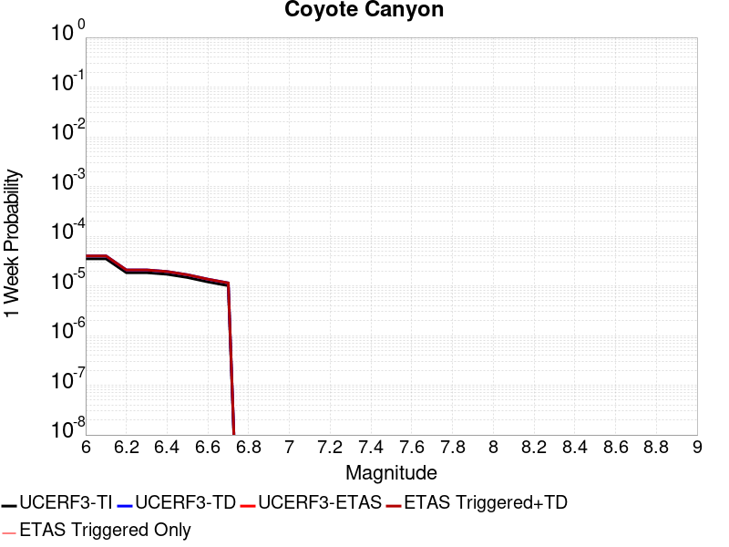 |  | 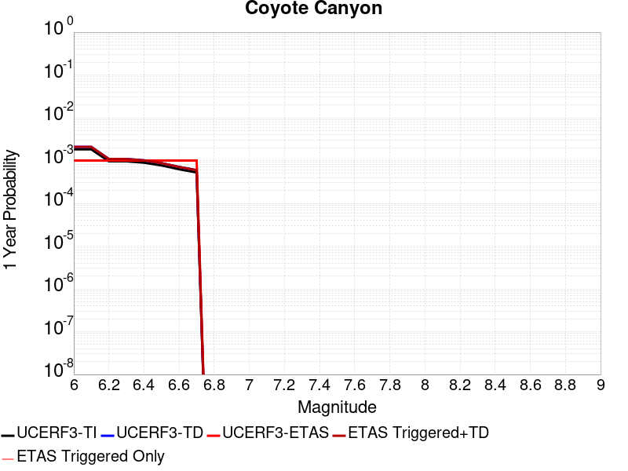 | 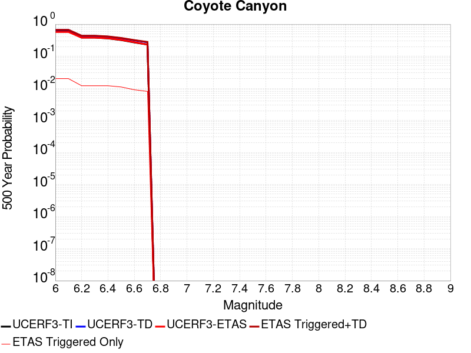 |

| Magnitude | 1 wk TI Prob | 1 wk TD Prob | 1 wk ETAS Prob | 1 wk ETAS/TD Gain | 1 wk ETAS Triggered+TD | 1 wk ETAS Triggered Only | 1 mo TI Prob | 1 mo TD Prob | 1 mo ETAS Prob | 1 mo ETAS/TD Gain | 1 mo ETAS Triggered+TD | 1 mo ETAS Triggered Only | 1 yr TI Prob | 1 yr TD Prob | 1 yr ETAS Prob | 1 yr ETAS/TD Gain | 1 yr ETAS Triggered+TD | 1 yr ETAS Triggered Only | 500 yr TI Prob | 500 yr TD Prob | 500 yr ETAS Prob | 500 yr ETAS/TD Gain | 500 yr ETAS Triggered+TD | 500 yr ETAS Triggered Only |
|-----|-----|-----|-----|-----|-----|-----|-----|-----|-----|-----|-----|-----|-----|-----|-----|-----|-----|-----|-----|-----|-----|-----|-----|-----|
| 6.0 | 3.5090034E-5 | 4.005118E-5 | 0.0 | 0.0 | 4.005118E-5 | 0.0 | 1.503772E-4 | 1.7163805E-4 | 0.0 | 0.0 | 1.7163805E-4 | 0.0 | 0.0018293047 | 0.0020879437 | 0.001 | 0.4789401 | 0.0020879437 | 0.0 | 0.5996796 | 0.65790313 | 0.571 | 0.86790895 | 0.66474503 | 0.02 |
| 6.1 | 3.5090034E-5 | 4.005118E-5 | 0.0 | 0.0 | 4.005118E-5 | 0.0 | 1.503772E-4 | 1.7163805E-4 | 0.0 | 0.0 | 1.7163805E-4 | 0.0 | 0.0018293047 | 0.0020879437 | 0.001 | 0.4789401 | 0.0020879437 | 0.0 | 0.5996796 | 0.65790313 | 0.571 | 0.86790895 | 0.66474503 | 0.02 |
| 6.2 | 1.841879E-5 | 2.0903959E-5 | 0.0 | 0.0 | 2.0903959E-5 | 0.0 | 7.8935285E-5 | 8.958588E-5 | 0.0 | 0.0 | 8.958588E-5 | 0.0 | 9.606133E-4 | 0.0010902629 | 0.001 | 0.91721 | 0.0010902629 | 0.0 | 0.38154912 | 0.42837238 | 0.379 | 0.8847442 | 0.43523192 | 0.012 |
| 6.3 | 1.841879E-5 | 2.0903959E-5 | 0.0 | 0.0 | 2.0903959E-5 | 0.0 | 7.8935285E-5 | 8.958588E-5 | 0.0 | 0.0 | 8.958588E-5 | 0.0 | 9.606133E-4 | 0.0010902629 | 0.001 | 0.91721 | 0.0010902629 | 0.0 | 0.38154912 | 0.42837238 | 0.379 | 0.8847442 | 0.43523192 | 0.012 |
| 6.4 | 1.712201E-5 | 1.9421133E-5 | 0.0 | 0.0 | 1.9421133E-5 | 0.0 | 7.337798E-5 | 8.323133E-5 | 0.0 | 0.0 | 8.323133E-5 | 0.0 | 8.930107E-4 | 0.0010129694 | 0.001 | 0.9871966 | 0.0010129694 | 0.0 | 0.36026728 | 0.40673885 | 0.363 | 0.8924646 | 0.41385797 | 0.012 |
| 6.5 | 1.4744935E-5 | 1.6713679E-5 | 0.0 | 0.0 | 1.6713679E-5 | 0.0 | 6.3191044E-5 | 7.162861E-5 | 0.0 | 0.0 | 7.162861E-5 | 0.0 | 7.6907943E-4 | 8.718215E-4 | 0.001 | 1.1470238 | 8.718215E-4 | 0.0 | 0.3193368 | 0.3641449 | 0.323 | 0.8870095 | 0.37113932 | 0.011 |
| 6.6 | 1.2017839E-5 | 1.362352E-5 | 0.0 | 0.0 | 1.362352E-5 | 0.0 | 5.150401E-5 | 5.83857E-5 | 0.0 | 0.0 | 5.83857E-5 | 0.0 | 6.268809E-4 | 7.1070134E-4 | 0.001 | 1.4070607 | 7.1070134E-4 | 0.0 | 0.26914394 | 0.31200135 | 0.274 | 0.8782013 | 0.31819335 | 0.009 |
| 6.7 | 1.00956095E-5 | 1.1448734E-5 | 0.0 | 0.0 | 1.1448734E-5 | 0.0 | 4.326618E-5 | 4.9065562E-5 | 0.0 | 0.0 | 4.9065562E-5 | 0.0 | 5.266384E-4 | 5.972952E-4 | 0.001 | 1.674214 | 5.972952E-4 | 0.0 | 0.23155676 | 0.27304366 | 0.231 | 0.84601855 | 0.27885932 | 0.008 |

## San Juan
*[(top)](#table-of-contents)*

| 1 Week | 1 Month | 1 Year | 500 Year |
|-----|-----|-----|-----|
|  |  | 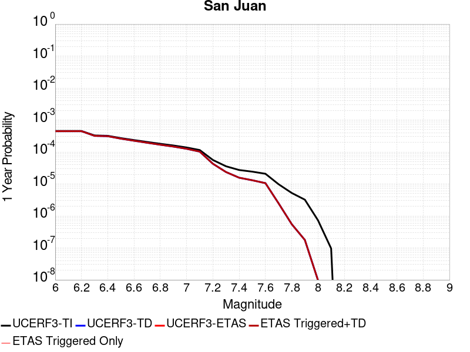 | 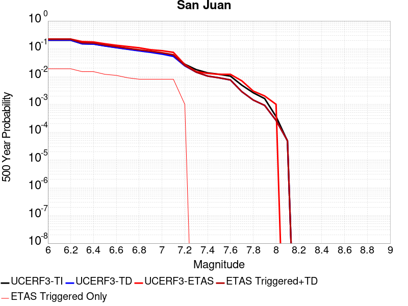 |

| Magnitude | 1 wk TI Prob | 1 wk TD Prob | 1 wk ETAS Prob | 1 wk ETAS/TD Gain | 1 wk ETAS Triggered+TD | 1 wk ETAS Triggered Only | 1 mo TI Prob | 1 mo TD Prob | 1 mo ETAS Prob | 1 mo ETAS/TD Gain | 1 mo ETAS Triggered+TD | 1 mo ETAS Triggered Only | 1 yr TI Prob | 1 yr TD Prob | 1 yr ETAS Prob | 1 yr ETAS/TD Gain | 1 yr ETAS Triggered+TD | 1 yr ETAS Triggered Only | 500 yr TI Prob | 500 yr TD Prob | 500 yr ETAS Prob | 500 yr ETAS/TD Gain | 500 yr ETAS Triggered+TD | 500 yr ETAS Triggered Only |
|-----|-----|-----|-----|-----|-----|-----|-----|-----|-----|-----|-----|-----|-----|-----|-----|-----|-----|-----|-----|-----|-----|-----|-----|-----|
| 6.0 | 8.682808E-6 | 8.583667E-6 | 0.0 | 0.0 | 8.583667E-6 | 0.0 | 3.72115E-5 | 3.6786656E-5 | 0.0 | 0.0 | 3.6786656E-5 | 0.0 | 4.5295584E-4 | 4.4779028E-4 | 0.0 | 0.0 | 4.4779028E-4 | 0.0 | 0.20270395 | 0.204686 | 0.222 | 1.0845882 | 0.21979696 | 0.019 |
| 6.1 | 8.682808E-6 | 8.583667E-6 | 0.0 | 0.0 | 8.583667E-6 | 0.0 | 3.72115E-5 | 3.6786656E-5 | 0.0 | 0.0 | 3.6786656E-5 | 0.0 | 4.5295584E-4 | 4.4779028E-4 | 0.0 | 0.0 | 4.4779028E-4 | 0.0 | 0.20270395 | 0.204686 | 0.222 | 1.0845882 | 0.21979696 | 0.019 |
| 6.2 | 8.682808E-6 | 8.583667E-6 | 0.0 | 0.0 | 8.583667E-6 | 0.0 | 3.72115E-5 | 3.6786656E-5 | 0.0 | 0.0 | 3.6786656E-5 | 0.0 | 4.5295584E-4 | 4.4779028E-4 | 0.0 | 0.0 | 4.4779028E-4 | 0.0 | 0.20270395 | 0.204686 | 0.222 | 1.0845882 | 0.21979696 | 0.019 |
| 6.3 | 6.3054235E-6 | 6.1218916E-6 | 0.0 | 0.0 | 6.1218916E-6 | 0.0 | 2.7022963E-5 | 2.6236421E-5 | 0.0 | 0.0 | 2.6236421E-5 | 0.0 | 3.2895492E-4 | 3.19383E-4 | 0.0 | 0.0 | 3.19383E-4 | 0.0 | 0.15168607 | 0.15112275 | 0.181 | 1.1977018 | 0.16385591 | 0.015 |
| 6.4 | 6.1490473E-6 | 5.97573E-6 | 0.0 | 0.0 | 5.97573E-6 | 0.0 | 2.6352795E-5 | 2.5610027E-5 | 0.0 | 0.0 | 2.5610027E-5 | 0.0 | 3.2079802E-4 | 3.1175883E-4 | 0.0 | 0.0 | 3.1175883E-4 | 0.0 | 0.14821808 | 0.14775078 | 0.175 | 1.1844269 | 0.16053453 | 0.015 |
| 6.5 | 5.204848E-6 | 5.002827E-6 | 0.0 | 0.0 | 5.002827E-6 | 0.0 | 2.23063E-5 | 2.1440517E-5 | 0.0 | 0.0 | 2.1440517E-5 | 0.0 | 2.7154534E-4 | 2.6100798E-4 | 0.0 | 0.0 | 2.6100798E-4 | 0.0 | 0.12697503 | 0.12572601 | 0.151 | 1.2010243 | 0.13621731 | 0.012 |
| 6.6 | 4.5179986E-6 | 4.314095E-6 | 0.0 | 0.0 | 4.314095E-6 | 0.0 | 1.9362706E-5 | 1.8488852E-5 | 0.0 | 0.0 | 1.8488852E-5 | 0.0 | 2.3571544E-4 | 2.250793E-4 | 0.0 | 0.0 | 2.250793E-4 | 0.0 | 0.11118985 | 0.109610654 | 0.133 | 1.2133857 | 0.119404934 | 0.011 |
| 6.7 | 3.9442616E-6 | 3.7294471E-6 | 0.0 | 0.0 | 3.7294471E-6 | 0.0 | 1.6903869E-5 | 1.598325E-5 | 0.0 | 0.0 | 1.598325E-5 | 0.0 | 2.0578515E-4 | 1.9457936E-4 | 0.0 | 0.0 | 1.9457936E-4 | 0.0 | 0.09778567 | 0.09583674 | 0.12 | 1.2521293 | 0.103974216 | 0.009 |
| 6.8 | 3.4536245E-6 | 3.2296232E-6 | 0.0 | 0.0 | 3.2296232E-6 | 0.0 | 1.4801163E-5 | 1.38411715E-5 | 0.0 | 0.0 | 1.38411715E-5 | 0.0 | 1.8018926E-4 | 1.6850384E-4 | 0.0 | 0.0 | 1.6850384E-4 | 0.0 | 0.086162716 | 0.08393259 | 0.108 | 1.2867469 | 0.09126113 | 0.008 |
| 6.9 | 3.059865E-6 | 2.829176E-6 | 0.0 | 0.0 | 2.829176E-6 | 0.0 | 1.3113641E-5 | 1.2124988E-5 | 0.0 | 0.0 | 1.2124988E-5 | 0.0 | 1.596469E-4 | 1.4761229E-4 | 0.0 | 0.0 | 1.4761229E-4 | 0.0 | 0.07672654 | 0.074279524 | 0.092 | 1.2385647 | 0.08168529 | 0.008 |
| 7.0 | 2.6504351E-6 | 2.41373E-6 | 0.0 | 0.0 | 2.41373E-6 | 0.0 | 1.1358958E-5 | 1.0344519E-5 | 0.0 | 0.0 | 1.0344519E-5 | 0.0 | 1.3828653E-4 | 1.2593779E-4 | 0.0 | 0.0 | 1.2593779E-4 | 0.0 | 0.06681149 | 0.06416029 | 0.085 | 1.324807 | 0.071647 | 0.008 |
| 7.1 | 2.2039317E-6 | 1.9696577E-6 | 0.0 | 0.0 | 1.9696577E-6 | 0.0 | 9.445387E-6 | 8.441366E-6 | 0.0 | 0.0 | 8.441366E-6 | 0.0 | 1.1499152E-4 | 1.0276931E-4 | 0.0 | 0.0 | 1.0276931E-4 | 0.0 | 0.055877227 | 0.0531741 | 0.074 | 1.3916548 | 0.06074871 | 0.008 |
| 7.2 | 1.0786707E-6 | 8.2191525E-7 | 0.0 | 0.0 | 8.2191525E-7 | 0.0 | 4.622866E-6 | 3.5224891E-6 | 0.0 | 0.0 | 3.5224891E-6 | 0.0 | 5.628194E-5 | 4.288547E-5 | 0.0 | 0.0 | 4.288547E-5 | 0.0 | 0.027749471 | 0.02420707 | 0.027 | 1.1153766 | 0.025182864 | 0.001 |
| 7.3 | 6.846433E-7 | 4.5192408E-7 | 0.0 | 0.0 | 4.5192408E-7 | 0.0 | 2.9341822E-6 | 1.936816E-6 | 0.0 | 0.0 | 1.936816E-6 | 0.0 | 3.5723086E-5 | 2.358048E-5 | 0.0 | 0.0 | 2.358048E-5 | 0.0 | 0.017703284 | 0.014375263 | 0.015 | 1.0434592 | 0.014375263 | 0.0 |
| 7.4 | 5.23043E-7 | 3.0052774E-7 | 0.0 | 0.0 | 3.0052774E-7 | 0.0 | 2.2416111E-6 | 1.2879754E-6 | 0.0 | 0.0 | 1.2879754E-6 | 0.0 | 2.7291273E-5 | 1.5680987E-5 | 0.0 | 0.0 | 1.5680987E-5 | 0.0 | 0.013553141 | 0.010393369 | 0.013 | 1.2507975 | 0.010393369 | 0.0 |
| 7.5 | 4.648444E-7 | 2.5020492E-7 | 0.0 | 0.0 | 2.5020492E-7 | 0.0 | 1.9921886E-6 | 1.0723064E-6 | 0.0 | 0.0 | 1.0723064E-6 | 0.0 | 2.4254627E-5 | 1.3055253E-5 | 0.0 | 0.0 | 1.3055253E-5 | 0.0 | 0.01205422 | 0.00899329 | 0.012 | 1.334328 | 0.00899329 | 0.0 |
| 7.6 | 3.9906567E-7 | 2.0310772E-7 | 0.0 | 0.0 | 2.0310772E-7 | 0.0 | 1.7102802E-6 | 8.7046135E-7 | 0.0 | 0.0 | 8.7046135E-7 | 0.0 | 2.0822463E-5 | 1.0597816E-5 | 0.0 | 0.0 | 1.0597816E-5 | 0.0 | 0.01035733 | 0.0075330194 | 0.012 | 1.5929867 | 0.0075330194 | 0.0 |
| 7.7 | 1.8784601E-7 | 4.7535863E-8 | 0.0 | 0.0 | 4.7535863E-8 | 0.0 | 8.0505407E-7 | 2.0372511E-7 | 0.0 | 0.0 | 2.0372511E-7 | 0.0 | 9.80149E-6 | 2.4803503E-6 | 0.0 | 0.0 | 2.4803503E-6 | 0.0 | 0.0048887795 | 0.00285196 | 0.007 | 2.4544525 | 0.00285196 | 0.0 |
| 7.8 | 1.00154914E-7 | 1.0607428E-8 | 0.0 | 0.0 | 1.0607428E-8 | 0.0 | 4.2923529E-7 | 4.5460393E-8 | 0.0 | 0.0 | 4.5460393E-8 | 0.0 | 5.225927E-6 | 5.5348016E-7 | 0.0 | 0.0 | 5.5348016E-7 | 0.0 | 0.0026095596 | 0.0014279903 | 0.003 | 2.1008546 | 0.0014279903 | 0.0 |
| 7.9 | 6.171429E-8 | 3.3936454E-9 | 0.0 | 0.0 | 3.3936454E-9 | 0.0 | 2.6448978E-7 | 1.4544185E-8 | 0.0 | 0.0 | 1.4544185E-8 | 0.0 | 3.2201583E-6 | 1.7707548E-7 | 0.0 | 0.0 | 1.7707548E-7 | 0.0 | 0.0016087863 | 9.1604865E-4 | 0.002 | 2.1832902 | 9.1604865E-4 | 0.0 |
| 8.0 | 1.3974572E-8 | 1.8622981E-10 | 0.0 | 0.0 | 1.8622981E-10 | 0.0 | 5.989102E-8 | 7.9812856E-10 | 0.0 | 0.0 | 7.9812856E-10 | 0.0 | 7.2917294E-7 | 9.717223E-9 | 0.0 | 0.0 | 9.717223E-9 | 0.0 | 3.6452015E-4 | 2.652854E-4 | 0.001 | 3.769525 | 2.652854E-4 | 0.0 |
| 8.1 | 1.8403477E-9 | 7.215484E-11 | 0.0 | 0.0 | 7.215484E-11 | 0.0 | 7.887204E-9 | 3.092353E-10 | 0.0 | 0.0 | 3.092353E-10 | 0.0 | 9.602671E-8 | 3.764937E-9 | 0.0 | 0.0 | 3.764937E-9 | 0.0 | 4.8012203E-5 | 4.9118662E-5 | 0.0 | 0.0 | 4.9118662E-5 | 0.0 |

## San Jacinto (Clark) rev
*[(top)](#table-of-contents)*

| 1 Week | 1 Month | 1 Year | 500 Year |
|-----|-----|-----|-----|
| 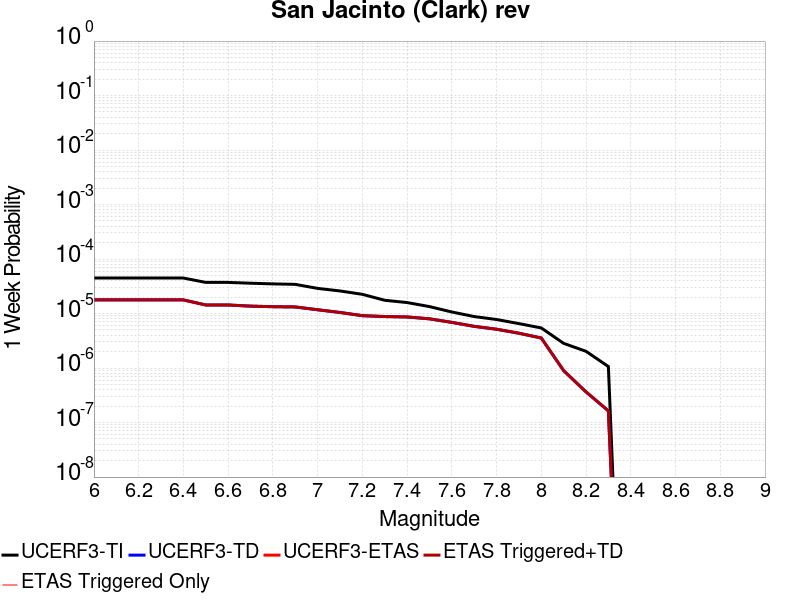 | 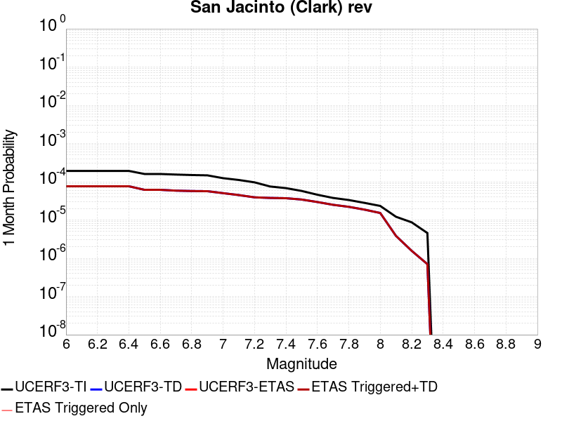 | 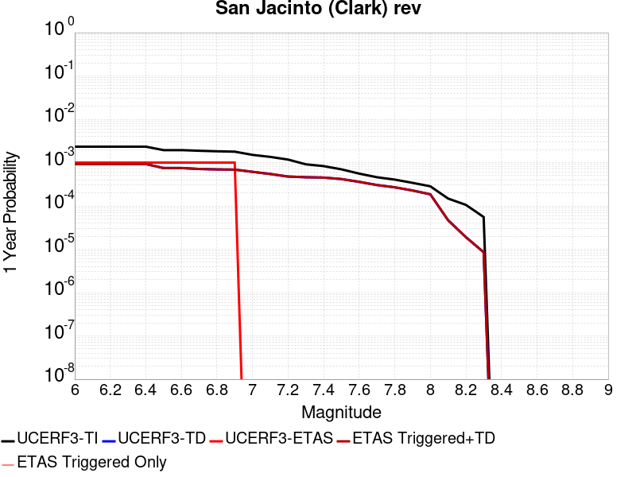 | 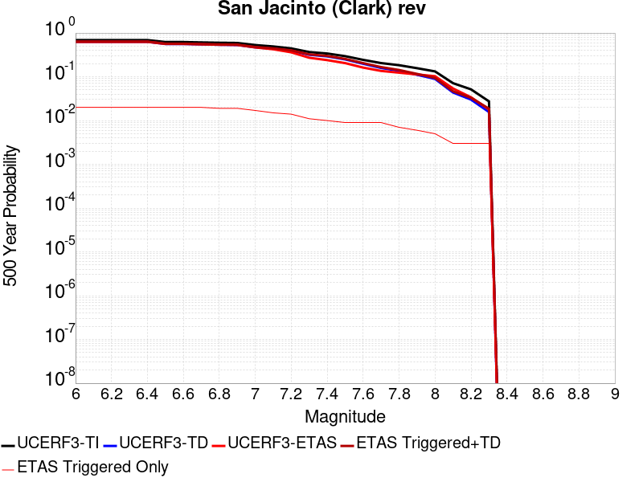 |

| Magnitude | 1 wk TI Prob | 1 wk TD Prob | 1 wk ETAS Prob | 1 wk ETAS/TD Gain | 1 wk ETAS Triggered+TD | 1 wk ETAS Triggered Only | 1 mo TI Prob | 1 mo TD Prob | 1 mo ETAS Prob | 1 mo ETAS/TD Gain | 1 mo ETAS Triggered+TD | 1 mo ETAS Triggered Only | 1 yr TI Prob | 1 yr TD Prob | 1 yr ETAS Prob | 1 yr ETAS/TD Gain | 1 yr ETAS Triggered+TD | 1 yr ETAS Triggered Only | 500 yr TI Prob | 500 yr TD Prob | 500 yr ETAS Prob | 500 yr ETAS/TD Gain | 500 yr ETAS Triggered+TD | 500 yr ETAS Triggered Only |
|-----|-----|-----|-----|-----|-----|-----|-----|-----|-----|-----|-----|-----|-----|-----|-----|-----|-----|-----|-----|-----|-----|-----|-----|-----|
| 6.0 | 4.482615E-5 | 1.7802082E-5 | 0.0 | 0.0 | 1.7802082E-5 | 0.0 | 1.9209793E-4 | 7.629244E-5 | 0.0 | 0.0 | 7.629244E-5 | 0.0 | 0.0023362834 | 9.284719E-4 | 0.001 | 1.0770385 | 9.284719E-4 | 0.0 | 0.6894805 | 0.62929887 | 0.628 | 0.997936 | 0.63671285 | 0.02 |
| 6.1 | 4.482615E-5 | 1.7802082E-5 | 0.0 | 0.0 | 1.7802082E-5 | 0.0 | 1.9209793E-4 | 7.629244E-5 | 0.0 | 0.0 | 7.629244E-5 | 0.0 | 0.0023362834 | 9.284719E-4 | 0.001 | 1.0770385 | 9.284719E-4 | 0.0 | 0.6894805 | 0.62929887 | 0.628 | 0.997936 | 0.63671285 | 0.02 |
| 6.2 | 4.482615E-5 | 1.7802082E-5 | 0.0 | 0.0 | 1.7802082E-5 | 0.0 | 1.9209793E-4 | 7.629244E-5 | 0.0 | 0.0 | 7.629244E-5 | 0.0 | 0.0023362834 | 9.284719E-4 | 0.001 | 1.0770385 | 9.284719E-4 | 0.0 | 0.6894805 | 0.62929887 | 0.628 | 0.997936 | 0.63671285 | 0.02 |
| 6.3 | 4.482615E-5 | 1.7802082E-5 | 0.0 | 0.0 | 1.7802082E-5 | 0.0 | 1.9209793E-4 | 7.629244E-5 | 0.0 | 0.0 | 7.629244E-5 | 0.0 | 0.0023362834 | 9.284719E-4 | 0.001 | 1.0770385 | 9.284719E-4 | 0.0 | 0.6894805 | 0.62929887 | 0.628 | 0.997936 | 0.63671285 | 0.02 |
| 6.4 | 4.482615E-5 | 1.7802082E-5 | 0.0 | 0.0 | 1.7802082E-5 | 0.0 | 1.9209793E-4 | 7.629244E-5 | 0.0 | 0.0 | 7.629244E-5 | 0.0 | 0.0023362834 | 9.284719E-4 | 0.001 | 1.0770385 | 9.284719E-4 | 0.0 | 0.6894805 | 0.62929887 | 0.628 | 0.997936 | 0.63671285 | 0.02 |
| 6.5 | 3.7294863E-5 | 1.4368535E-5 | 0.0 | 0.0 | 1.4368535E-5 | 0.0 | 1.5982533E-4 | 6.1578E-5 | 0.0 | 0.0 | 6.1578E-5 | 0.0 | 0.0019441366 | 7.494576E-4 | 0.001 | 1.3342983 | 7.494576E-4 | 0.0 | 0.622058 | 0.5618667 | 0.563 | 1.002017 | 0.57062936 | 0.02 |
| 6.6 | 3.7294863E-5 | 1.4368535E-5 | 0.0 | 0.0 | 1.4368535E-5 | 0.0 | 1.5982533E-4 | 6.1578E-5 | 0.0 | 0.0 | 6.1578E-5 | 0.0 | 0.0019441366 | 7.494576E-4 | 0.001 | 1.3342983 | 7.494576E-4 | 0.0 | 0.622058 | 0.5618667 | 0.563 | 1.002017 | 0.57062936 | 0.02 |
| 6.7 | 3.6039248E-5 | 1.3684212E-5 | 0.0 | 0.0 | 1.3684212E-5 | 0.0 | 1.5444479E-4 | 5.864532E-5 | 0.0 | 0.0 | 5.864532E-5 | 0.0 | 0.0018787434 | 7.137759E-4 | 0.001 | 1.4009999 | 7.137759E-4 | 0.0 | 0.60947186 | 0.5496436 | 0.551 | 1.0024679 | 0.5586507 | 0.02 |
| 6.8 | 3.5031844E-5 | 1.3363255E-5 | 0.0 | 0.0 | 1.3363255E-5 | 0.0 | 1.5012783E-4 | 5.7269852E-5 | 0.0 | 0.0 | 5.7269852E-5 | 0.0 | 0.0018262739 | 6.9704035E-4 | 0.001 | 1.4346372 | 6.9704035E-4 | 0.0 | 0.5990713 | 0.5392437 | 0.539 | 0.9995481 | 0.5479981 | 0.019 |
| 6.9 | 3.435112E-5 | 1.3220383E-5 | 0.0 | 0.0 | 1.3220383E-5 | 0.0 | 1.4721078E-4 | 5.6657573E-5 | 0.0 | 0.0 | 5.6657573E-5 | 0.0 | 0.0017908178 | 6.8959064E-4 | 0.001 | 1.4501357 | 6.8959064E-4 | 0.0 | 0.5918872 | 0.53194964 | 0.534 | 1.0038544 | 0.5408426 | 0.019 |
| 7.0 | 2.8959772E-5 | 1.1754417E-5 | 0.0 | 0.0 | 1.1754417E-5 | 0.0 | 1.241074E-4 | 5.037511E-5 | 0.0 | 0.0 | 5.037511E-5 | 0.0 | 0.0015099603 | 6.1314646E-4 | 0.0 | 0.0 | 6.1314646E-4 | 0.0 | 0.53024817 | 0.4697164 | 0.468 | 0.9963459 | 0.47873122 | 0.017 |
| 7.1 | 2.6002877E-5 | 1.047189E-5 | 0.0 | 0.0 | 1.047189E-5 | 0.0 | 1.11436144E-4 | 4.4878765E-5 | 0.0 | 0.0 | 4.4878765E-5 | 0.0 | 0.0013558907 | 5.462636E-4 | 0.0 | 0.0 | 5.462636E-4 | 0.0 | 0.49257448 | 0.43641263 | 0.425 | 0.973849 | 0.44486645 | 0.015 |
| 7.2 | 2.2544838E-5 | 9.144438E-6 | 0.0 | 0.0 | 9.144438E-6 | 0.0 | 9.661716E-5 | 3.918987E-5 | 0.0 | 0.0 | 3.918987E-5 | 0.0 | 0.001175679 | 4.7703326E-4 | 0.0 | 0.0 | 4.7703326E-4 | 0.0 | 0.44466588 | 0.39323992 | 0.362 | 0.9205576 | 0.40173456 | 0.014 |
| 7.3 | 1.75334E-5 | 8.818897E-6 | 0.0 | 0.0 | 8.818897E-6 | 0.0 | 7.514098E-5 | 3.7794733E-5 | 0.0 | 0.0 | 3.7794733E-5 | 0.0 | 9.144575E-4 | 4.6005478E-4 | 0.0 | 0.0 | 4.6005478E-4 | 0.0 | 0.3670969 | 0.31796056 | 0.272 | 0.855452 | 0.325463 | 0.011 |
| 7.4 | 1.5924552E-5 | 8.662667E-6 | 0.0 | 0.0 | 8.662667E-6 | 0.0 | 6.82463E-5 | 3.712519E-5 | 0.0 | 0.0 | 3.712519E-5 | 0.0 | 8.305819E-4 | 4.5190653E-4 | 0.0 | 0.0 | 4.5190653E-4 | 0.0 | 0.33996573 | 0.29207805 | 0.24 | 0.8216982 | 0.29915726 | 0.01 |
| 7.5 | 1.3428931E-5 | 8.007553E-6 | 0.0 | 0.0 | 8.007553E-6 | 0.0 | 5.7551293E-5 | 3.431764E-5 | 0.0 | 0.0 | 3.431764E-5 | 0.0 | 7.004617E-4 | 4.1773802E-4 | 0.0 | 0.0 | 4.1773802E-4 | 0.0 | 0.29556102 | 0.24896549 | 0.205 | 0.8234073 | 0.2557248 | 0.009 |
| 7.6 | 1.0688787E-5 | 6.893439E-6 | 0.0 | 0.0 | 6.893439E-6 | 0.0 | 4.5808283E-5 | 2.9542978E-5 | 0.0 | 0.0 | 2.9542978E-5 | 0.0 | 5.5757316E-4 | 3.5962675E-4 | 0.0 | 0.0 | 3.5962675E-4 | 0.0 | 0.24335745 | 0.19786897 | 0.162 | 0.8187236 | 0.20508815 | 0.009 |
| 7.7 | 8.81236E-6 | 5.8280957E-6 | 0.0 | 0.0 | 5.8280957E-6 | 0.0 | 3.776671E-5 | 2.4977315E-5 | 0.0 | 0.0 | 2.4977315E-5 | 0.0 | 4.597127E-4 | 3.0405648E-4 | 0.0 | 0.0 | 3.0405648E-4 | 0.0 | 0.20539424 | 0.15872069 | 0.136 | 0.85685116 | 0.16629219 | 0.009 |
| 7.8 | 7.780431E-6 | 5.1602065E-6 | 0.0 | 0.0 | 5.1602065E-6 | 0.0 | 3.3344273E-5 | 2.2114982E-5 | 0.0 | 0.0 | 2.2114982E-5 | 0.0 | 4.0589093E-4 | 2.6921675E-4 | 0.0 | 0.0 | 2.6921675E-4 | 0.0 | 0.18371087 | 0.13669434 | 0.124 | 0.9071334 | 0.14273748 | 0.007 |
| 7.9 | 6.5437994E-6 | 4.358324E-6 | 0.0 | 0.0 | 4.358324E-6 | 0.0 | 2.8044553E-5 | 1.8678398E-5 | 0.0 | 0.0 | 1.8678398E-5 | 0.0 | 3.4138895E-4 | 2.2738587E-4 | 0.0 | 0.0 | 2.2738587E-4 | 0.0 | 0.15694545 | 0.11092845 | 0.113 | 1.0186746 | 0.11626288 | 0.006 |
| 8.0 | 5.4488164E-6 | 3.5605376E-6 | 0.0 | 0.0 | 3.5605376E-6 | 0.0 | 2.3351862E-5 | 1.5259358E-5 | 0.0 | 0.0 | 1.5259358E-5 | 0.0 | 2.8427184E-4 | 1.8576693E-4 | 0.0 | 0.0 | 1.8576693E-4 | 0.0 | 0.13251418 | 0.08926268 | 0.103 | 1.1538976 | 0.09381637 | 0.005 |
| 8.1 | 2.8397242E-6 | 8.978762E-7 | 0.0 | 0.0 | 8.978762E-7 | 0.0 | 1.217019E-5 | 3.8480352E-6 | 0.0 | 0.0 | 3.8480352E-6 | 0.0 | 1.4816198E-4 | 4.6848825E-5 | 0.0 | 0.0 | 4.6848825E-5 | 0.0 | 0.071408615 | 0.043732084 | 0.054 | 1.2347913 | 0.04660089 | 0.003 |
| 8.2 | 2.030244E-6 | 3.655725E-7 | 0.0 | 0.0 | 3.655725E-7 | 0.0 | 8.701017E-6 | 1.5667383E-6 | 0.0 | 0.0 | 1.5667383E-6 | 0.0 | 1.05929736E-4 | 1.9074874E-5 | 0.0 | 0.0 | 1.9074874E-5 | 0.0 | 0.05158933 | 0.030113712 | 0.034 | 1.1290537 | 0.033023372 | 0.003 |
| 8.3 | 1.0659804E-6 | 1.6393396E-7 | 0.0 | 0.0 | 1.6393396E-7 | 0.0 | 4.568479E-6 | 7.025739E-7 | 0.0 | 0.0 | 7.025739E-7 | 0.0 | 5.5619817E-5 | 8.553805E-6 | 0.0 | 0.0 | 8.553805E-6 | 0.0 | 0.027427524 | 0.015671061 | 0.018 | 1.148614 | 0.018624049 | 0.003 |

## Monterey Bay-Tularcitos
*[(top)](#table-of-contents)*

| 1 Week | 1 Month | 1 Year | 500 Year |
|-----|-----|-----|-----|
|  | 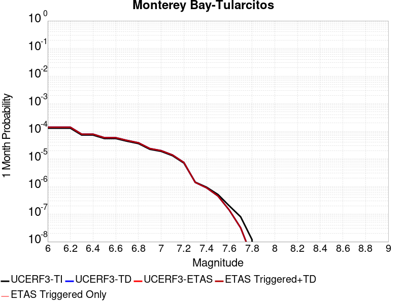 | 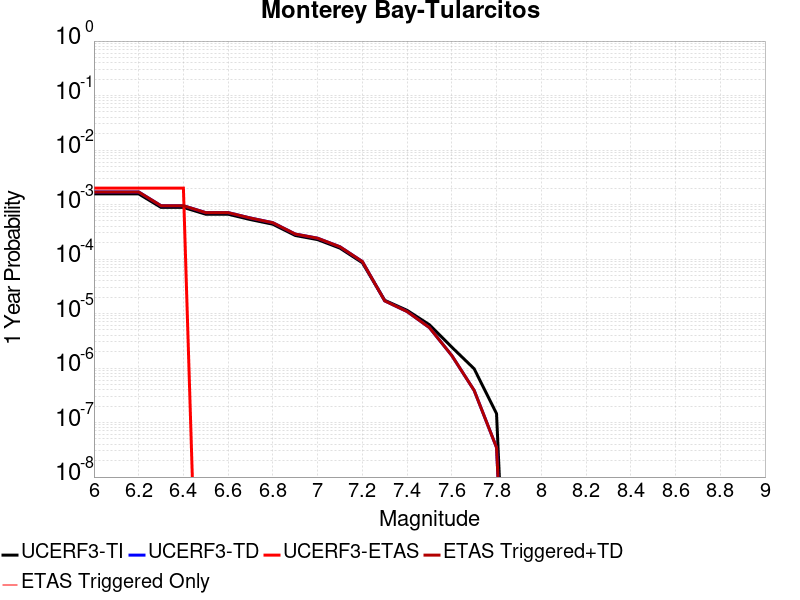 | 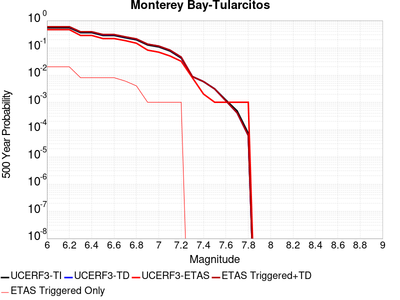 |

| Magnitude | 1 wk TI Prob | 1 wk TD Prob | 1 wk ETAS Prob | 1 wk ETAS/TD Gain | 1 wk ETAS Triggered+TD | 1 wk ETAS Triggered Only | 1 mo TI Prob | 1 mo TD Prob | 1 mo ETAS Prob | 1 mo ETAS/TD Gain | 1 mo ETAS Triggered+TD | 1 mo ETAS Triggered Only | 1 yr TI Prob | 1 yr TD Prob | 1 yr ETAS Prob | 1 yr ETAS/TD Gain | 1 yr ETAS Triggered+TD | 1 yr ETAS Triggered Only | 500 yr TI Prob | 500 yr TD Prob | 500 yr ETAS Prob | 500 yr ETAS/TD Gain | 500 yr ETAS Triggered+TD | 500 yr ETAS Triggered Only |
|-----|-----|-----|-----|-----|-----|-----|-----|-----|-----|-----|-----|-----|-----|-----|-----|-----|-----|-----|-----|-----|-----|-----|-----|-----|
| 6.0 | 3.0131365E-5 | 3.2646156E-5 | 0.0 | 0.0 | 3.2646156E-5 | 0.0 | 1.2912804E-4 | 1.3990517E-4 | 0.0 | 0.0 | 1.3990517E-4 | 0.0 | 0.001571 | 0.001702119 | 0.002 | 1.1750059 | 0.001702119 | 0.0 | 0.5443898 | 0.5842065 | 0.464 | 0.79423964 | 0.5925224 | 0.02 |
| 6.1 | 3.0131365E-5 | 3.2646156E-5 | 0.0 | 0.0 | 3.2646156E-5 | 0.0 | 1.2912804E-4 | 1.3990517E-4 | 0.0 | 0.0 | 1.3990517E-4 | 0.0 | 0.001571 | 0.001702119 | 0.002 | 1.1750059 | 0.001702119 | 0.0 | 0.5443898 | 0.5842065 | 0.464 | 0.79423964 | 0.5925224 | 0.02 |
| 6.2 | 3.0131365E-5 | 3.2646156E-5 | 0.0 | 0.0 | 3.2646156E-5 | 0.0 | 1.2912804E-4 | 1.3990517E-4 | 0.0 | 0.0 | 1.3990517E-4 | 0.0 | 0.001571 | 0.001702119 | 0.002 | 1.1750059 | 0.001702119 | 0.0 | 0.5443898 | 0.5842065 | 0.464 | 0.79423964 | 0.5925224 | 0.02 |
| 6.3 | 1.6998249E-5 | 1.8254348E-5 | 0.0 | 0.0 | 1.8254348E-5 | 0.0 | 7.28476E-5 | 7.8230674E-5 | 0.0 | 0.0 | 7.8230674E-5 | 0.0 | 8.865586E-4 | 9.5206086E-4 | 0.002 | 2.100706 | 9.5206086E-4 | 0.0 | 0.35819831 | 0.38163257 | 0.284 | 0.7441713 | 0.3865795 | 0.008 |
| 6.4 | 1.6998249E-5 | 1.8254348E-5 | 0.0 | 0.0 | 1.8254348E-5 | 0.0 | 7.28476E-5 | 7.8230674E-5 | 0.0 | 0.0 | 7.8230674E-5 | 0.0 | 8.865586E-4 | 9.5206086E-4 | 0.002 | 2.100706 | 9.5206086E-4 | 0.0 | 0.35819831 | 0.38163257 | 0.284 | 0.7441713 | 0.3865795 | 0.008 |
| 6.5 | 1.27470785E-5 | 1.3638691E-5 | 0.0 | 0.0 | 1.3638691E-5 | 0.0 | 5.4629192E-5 | 5.8450278E-5 | 0.0 | 0.0 | 5.8450278E-5 | 0.0 | 6.649074E-4 | 7.114101E-4 | 0.0 | 0.0 | 7.114101E-4 | 0.0 | 0.28291744 | 0.30138218 | 0.218 | 0.7233341 | 0.30697113 | 0.008 |
| 6.6 | 1.2739422E-5 | 1.3630791E-5 | 0.0 | 0.0 | 1.3630791E-5 | 0.0 | 5.4596385E-5 | 5.8416426E-5 | 0.0 | 0.0 | 5.8416426E-5 | 0.0 | 6.645082E-4 | 7.1099814E-4 | 0.0 | 0.0 | 7.1099814E-4 | 0.0 | 0.28277418 | 0.30123818 | 0.218 | 0.72367984 | 0.3068283 | 0.008 |
| 6.7 | 1.0160109E-5 | 1.0843529E-5 | 0.0 | 0.0 | 1.0843529E-5 | 0.0 | 4.35426E-5 | 4.647148E-5 | 0.0 | 0.0 | 4.647148E-5 | 0.0 | 5.300022E-4 | 5.656504E-4 | 0.0 | 0.0 | 5.656504E-4 | 0.0 | 0.23284878 | 0.24806741 | 0.183 | 0.73770267 | 0.252579 | 0.006 |
| 6.8 | 8.349859E-6 | 8.898351E-6 | 0.0 | 0.0 | 8.898351E-6 | 0.0 | 3.578462E-5 | 3.8135262E-5 | 0.0 | 0.0 | 3.8135262E-5 | 0.0 | 4.3559066E-4 | 4.642035E-4 | 0.0 | 0.0 | 4.642035E-4 | 0.0 | 0.19574812 | 0.20863166 | 0.147 | 0.70459104 | 0.21179713 | 0.004 |
| 6.9 | 5.193639E-6 | 5.515565E-6 | 0.0 | 0.0 | 5.515565E-6 | 0.0 | 2.2258262E-5 | 2.363794E-5 | 0.0 | 0.0 | 2.363794E-5 | 0.0 | 2.7096065E-4 | 2.8775714E-4 | 0.0 | 0.0 | 2.8775714E-4 | 0.0 | 0.12671968 | 0.13506037 | 0.082 | 0.6071359 | 0.13592531 | 0.001 |
| 7.0 | 4.359381E-6 | 4.6257665E-6 | 0.0 | 0.0 | 4.6257665E-6 | 0.0 | 1.8682927E-5 | 1.982458E-5 | 0.0 | 0.0 | 1.982458E-5 | 0.0 | 2.274409E-4 | 2.4134049E-4 | 0.0 | 0.0 | 2.4134049E-4 | 0.0 | 0.10750412 | 0.11468252 | 0.069 | 0.601661 | 0.11556783 | 0.001 |
| 7.1 | 3.0398533E-6 | 3.2185933E-6 | 0.0 | 0.0 | 3.2185933E-6 | 0.0 | 1.3027877E-5 | 1.3793912E-5 | 0.0 | 0.0 | 1.3793912E-5 | 0.0 | 1.5860285E-4 | 1.6793054E-4 | 0.0 | 0.0 | 1.6793054E-4 | 0.0 | 0.07624438 | 0.08149264 | 0.05 | 0.61355233 | 0.08241115 | 0.001 |
| 7.2 | 1.642335E-6 | 1.7264364E-6 | 0.0 | 0.0 | 1.7264364E-6 | 0.0 | 7.0385595E-6 | 7.3990036E-6 | 0.0 | 0.0 | 7.3990036E-6 | 0.0 | 8.569109E-5 | 9.0081194E-5 | 0.0 | 0.0 | 9.0081194E-5 | 0.0 | 0.041942406 | 0.04489127 | 0.032 | 0.71283346 | 0.04584638 | 0.001 |
| 7.3 | 3.356842E-7 | 3.2805815E-7 | 0.0 | 0.0 | 3.2805815E-7 | 0.0 | 1.4386458E-6 | 1.4059627E-6 | 0.0 | 0.0 | 1.4059627E-6 | 0.0 | 1.7515373E-5 | 1.7117463E-5 | 0.0 | 0.0 | 1.7117463E-5 | 0.0 | 0.008719525 | 0.008837188 | 0.008 | 0.90526533 | 0.008837188 | 0.0 |
| 7.4 | 2.1973483E-7 | 2.0878728E-7 | 0.0 | 0.0 | 2.0878728E-7 | 0.0 | 9.417204E-7 | 8.948024E-7 | 0.0 | 0.0 | 8.948024E-7 | 0.0 | 1.1465385E-5 | 1.0894165E-5 | 0.0 | 0.0 | 1.0894165E-5 | 0.0 | 0.005716325 | 0.0057479828 | 0.002 | 0.34794816 | 0.0057479828 | 0.0 |
| 7.5 | 1.1944135E-7 | 1.05871536E-7 | 0.0 | 0.0 | 1.05871536E-7 | 0.0 | 5.118914E-7 | 4.5373508E-7 | 0.0 | 0.0 | 4.5373508E-7 | 0.0 | 6.23226E-6 | 5.524211E-6 | 0.0 | 0.0 | 5.524211E-6 | 0.0 | 0.0031112898 | 0.0030688348 | 0.001 | 0.32585657 | 0.0030688348 | 0.0 |
| 7.6 | 4.636058E-8 | 3.2520838E-8 | 0.0 | 0.0 | 3.2520838E-8 | 0.0 | 1.9868818E-7 | 1.3937502E-7 | 0.0 | 0.0 | 1.3937502E-7 | 0.0 | 2.419026E-6 | 1.6968895E-6 | 0.0 | 0.0 | 1.6968895E-6 | 0.0 | 0.0012087834 | 0.0011295051 | 0.001 | 0.88534355 | 0.0011295051 | 0.0 |
| 7.7 | 1.8588572E-8 | 7.444725E-9 | 0.0 | 0.0 | 7.444725E-9 | 0.0 | 7.9665305E-8 | 3.1905966E-8 | 0.0 | 0.0 | 3.1905966E-8 | 0.0 | 9.699246E-7 | 3.8845505E-7 | 0.0 | 0.0 | 3.8845505E-7 | 0.0 | 4.84845E-4 | 4.102405E-4 | 0.001 | 2.4375947 | 4.102405E-4 | 0.0 |
| 7.8 | 2.7960154E-9 | 6.684968E-10 | 0.0 | 0.0 | 6.684968E-10 | 0.0 | 1.1982923E-8 | 2.8649862E-9 | 0.0 | 0.0 | 2.8649862E-9 | 0.0 | 1.4589209E-7 | 3.4881207E-8 | 0.0 | 0.0 | 3.4881207E-8 | 0.0 | 7.294339E-5 | 6.0420003E-5 | 0.001 | 16.55081 | 6.0420003E-5 | 0.0 |

## Santa Ynez (East)
*[(top)](#table-of-contents)*

| 1 Week | 1 Month | 1 Year | 500 Year |
|-----|-----|-----|-----|
|  |  | 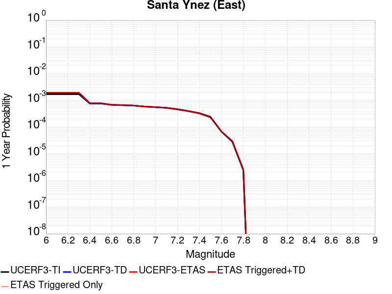 | 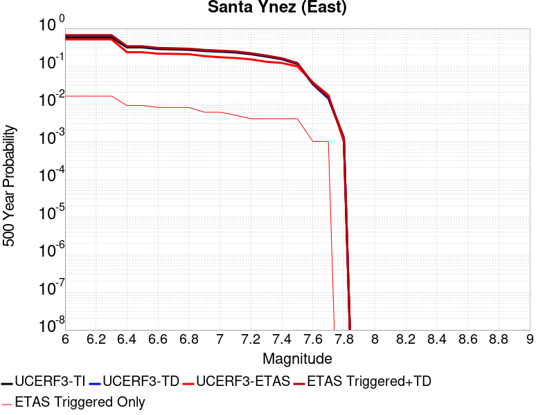 |

| Magnitude | 1 wk TI Prob | 1 wk TD Prob | 1 wk ETAS Prob | 1 wk ETAS/TD Gain | 1 wk ETAS Triggered+TD | 1 wk ETAS Triggered Only | 1 mo TI Prob | 1 mo TD Prob | 1 mo ETAS Prob | 1 mo ETAS/TD Gain | 1 mo ETAS Triggered+TD | 1 mo ETAS Triggered Only | 1 yr TI Prob | 1 yr TD Prob | 1 yr ETAS Prob | 1 yr ETAS/TD Gain | 1 yr ETAS Triggered+TD | 1 yr ETAS Triggered Only | 500 yr TI Prob | 500 yr TD Prob | 500 yr ETAS Prob | 500 yr ETAS/TD Gain | 500 yr ETAS Triggered+TD | 500 yr ETAS Triggered Only |
|-----|-----|-----|-----|-----|-----|-----|-----|-----|-----|-----|-----|-----|-----|-----|-----|-----|-----|-----|-----|-----|-----|-----|-----|-----|
| 6.0 | 3.2269712E-5 | 3.64127E-5 | 0.0 | 0.0 | 3.64127E-5 | 0.0 | 1.3829143E-4 | 1.5604835E-4 | 0.0 | 0.0 | 1.5604835E-4 | 0.0 | 0.0016823979 | 0.0018988064 | 0.0 | 0.0 | 0.0018988064 | 0.0 | 0.5691121 | 0.6504694 | 0.511 | 0.78558654 | 0.6560619 | 0.016 |
| 6.1 | 3.2269712E-5 | 3.64127E-5 | 0.0 | 0.0 | 3.64127E-5 | 0.0 | 1.3829143E-4 | 1.5604835E-4 | 0.0 | 0.0 | 1.5604835E-4 | 0.0 | 0.0016823979 | 0.0018988064 | 0.0 | 0.0 | 0.0018988064 | 0.0 | 0.5691121 | 0.6504694 | 0.511 | 0.78558654 | 0.6560619 | 0.016 |
| 6.2 | 3.2269712E-5 | 3.64127E-5 | 0.0 | 0.0 | 3.64127E-5 | 0.0 | 1.3829143E-4 | 1.5604835E-4 | 0.0 | 0.0 | 1.5604835E-4 | 0.0 | 0.0016823979 | 0.0018988064 | 0.0 | 0.0 | 0.0018988064 | 0.0 | 0.5691121 | 0.6504694 | 0.511 | 0.78558654 | 0.6560619 | 0.016 |
| 6.3 | 3.2269712E-5 | 3.64127E-5 | 0.0 | 0.0 | 3.64127E-5 | 0.0 | 1.3829143E-4 | 1.5604835E-4 | 0.0 | 0.0 | 1.5604835E-4 | 0.0 | 0.0016823979 | 0.0018988064 | 0.0 | 0.0 | 0.0018988064 | 0.0 | 0.5691121 | 0.6504694 | 0.511 | 0.78558654 | 0.6560619 | 0.016 |
| 6.4 | 1.4404779E-5 | 1.4764537E-5 | 0.0 | 0.0 | 1.4764537E-5 | 0.0 | 6.1733306E-5 | 6.327508E-5 | 0.0 | 0.0 | 6.327508E-5 | 0.0 | 7.513438E-4 | 7.701068E-4 | 0.0 | 0.0 | 7.701068E-4 | 0.0 | 0.31326932 | 0.32933488 | 0.233 | 0.7074865 | 0.3353709 | 0.009 |
| 6.5 | 1.4404779E-5 | 1.4764537E-5 | 0.0 | 0.0 | 1.4764537E-5 | 0.0 | 6.1733306E-5 | 6.327508E-5 | 0.0 | 0.0 | 6.327508E-5 | 0.0 | 7.513438E-4 | 7.701068E-4 | 0.0 | 0.0 | 7.701068E-4 | 0.0 | 0.31326932 | 0.32933488 | 0.233 | 0.7074865 | 0.3353709 | 0.009 |
| 6.6 | 1.280208E-5 | 1.2941027E-5 | 0.0 | 0.0 | 1.2941027E-5 | 0.0 | 5.4864904E-5 | 5.5460376E-5 | 0.0 | 0.0 | 5.5460376E-5 | 0.0 | 6.6777546E-4 | 6.7502266E-4 | 0.0 | 0.0 | 6.7502266E-4 | 0.0 | 0.2839457 | 0.29763857 | 0.214 | 0.7189928 | 0.30325747 | 0.008 |
| 6.7 | 1.2457027E-5 | 1.2559761E-5 | 0.0 | 0.0 | 1.2559761E-5 | 0.0 | 5.3386164E-5 | 5.3826443E-5 | 0.0 | 0.0 | 5.3826443E-5 | 0.0 | 6.497827E-4 | 6.5514154E-4 | 0.0 | 0.0 | 6.5514154E-4 | 0.0 | 0.27747044 | 0.2907164 | 0.211 | 0.7257932 | 0.29639068 | 0.008 |
| 6.8 | 1.2095134E-5 | 1.2164236E-5 | 0.0 | 0.0 | 1.2164236E-5 | 0.0 | 5.1835254E-5 | 5.2131407E-5 | 0.0 | 0.0 | 5.2131407E-5 | 0.0 | 6.309115E-4 | 6.3451665E-4 | 0.0 | 0.0 | 6.3451665E-4 | 0.0 | 0.27061626 | 0.28336376 | 0.207 | 0.7305098 | 0.28909683 | 0.008 |
| 6.9 | 1.1104036E-5 | 1.1095357E-5 | 0.0 | 0.0 | 1.1095357E-5 | 0.0 | 4.758786E-5 | 4.755067E-5 | 0.0 | 0.0 | 4.755067E-5 | 0.0 | 5.7922816E-4 | 5.787769E-4 | 0.0 | 0.0 | 5.787769E-4 | 0.0 | 0.2515104 | 0.2630847 | 0.184 | 0.6993945 | 0.26750618 | 0.006 |
| 7.0 | 1.0577444E-5 | 1.05224735E-5 | 0.0 | 0.0 | 1.05224735E-5 | 0.0 | 4.5331115E-5 | 4.509554E-5 | 0.0 | 0.0 | 4.509554E-5 | 0.0 | 5.5176654E-4 | 5.489011E-4 | 0.0 | 0.0 | 5.489011E-4 | 0.0 | 0.24115628 | 0.25200018 | 0.172 | 0.68253917 | 0.2564882 | 0.006 |
| 7.1 | 1.0021775E-5 | 9.924358E-6 | 0.0 | 0.0 | 9.924358E-6 | 0.0 | 4.294976E-5 | 4.2532276E-5 | 0.0 | 0.0 | 4.2532276E-5 | 0.0 | 5.2278786E-4 | 5.177086E-4 | 0.0 | 0.0 | 5.177086E-4 | 0.0 | 0.23007508 | 0.2402415 | 0.164 | 0.6826464 | 0.2440403 | 0.005 |
| 7.2 | 8.874109E-6 | 8.69794E-6 | 0.0 | 0.0 | 8.69794E-6 | 0.0 | 3.8031343E-5 | 3.727636E-5 | 0.0 | 0.0 | 3.727636E-5 | 0.0 | 4.629332E-4 | 4.5374624E-4 | 0.0 | 0.0 | 4.5374624E-4 | 0.0 | 0.20667332 | 0.21539454 | 0.151 | 0.70103914 | 0.21853296 | 0.004 |
| 7.3 | 7.5504267E-6 | 7.464868E-6 | 0.0 | 0.0 | 7.464868E-6 | 0.0 | 3.235857E-5 | 3.1991905E-5 | 0.0 | 0.0 | 3.1991905E-5 | 0.0 | 3.9389438E-4 | 3.8943283E-4 | 0.0 | 0.0 | 3.8943283E-4 | 0.0 | 0.17879786 | 0.18659757 | 0.13 | 0.69668645 | 0.18985118 | 0.004 |
| 7.4 | 6.309394E-6 | 6.1491446E-6 | 0.0 | 0.0 | 6.1491446E-6 | 0.0 | 2.703998E-5 | 2.6353217E-5 | 0.0 | 0.0 | 2.6353217E-5 | 0.0 | 3.2916202E-4 | 3.208041E-4 | 0.0 | 0.0 | 3.208041E-4 | 0.0 | 0.15177394 | 0.15781854 | 0.121 | 0.76670337 | 0.16118726 | 0.004 |
| 7.5 | 4.6103073E-6 | 4.416138E-6 | 0.0 | 0.0 | 4.416138E-6 | 0.0 | 1.975831E-5 | 1.8926172E-5 | 0.0 | 0.0 | 1.8926172E-5 | 0.0 | 2.4053088E-4 | 2.3040247E-4 | 0.0 | 0.0 | 2.3040247E-4 | 0.0 | 0.11332779 | 0.11724988 | 0.098 | 0.83582175 | 0.120780885 | 0.004 |
| 7.6 | 1.2858658E-6 | 1.2951176E-6 | 0.0 | 0.0 | 1.2951176E-6 | 0.0 | 5.5108417E-6 | 5.550493E-6 | 0.0 | 0.0 | 5.550493E-6 | 0.0 | 6.7092435E-5 | 6.757522E-5 | 0.0 | 0.0 | 6.757522E-5 | 0.0 | 0.03299087 | 0.0338294 | 0.037 | 1.0937232 | 0.03479557 | 0.001 |
| 7.7 | 5.3302307E-7 | 5.596667E-7 | 0.0 | 0.0 | 5.596667E-7 | 0.0 | 2.2843826E-6 | 2.3985697E-6 | 0.0 | 0.0 | 2.3985697E-6 | 0.0 | 2.7812002E-5 | 2.920223E-5 | 0.0 | 0.0 | 2.920223E-5 | 0.0 | 0.01380995 | 0.014506465 | 0.017 | 1.1718913 | 0.015491959 | 0.001 |
| 7.8 | 4.613933E-8 | 4.7927973E-8 | 0.0 | 0.0 | 4.7927973E-8 | 0.0 | 1.9773998E-7 | 2.0540558E-7 | 0.0 | 0.0 | 2.0540558E-7 | 0.0 | 2.4074816E-6 | 2.5008103E-6 | 0.0 | 0.0 | 2.5008103E-6 | 0.0 | 0.001203018 | 0.0012496525 | 0.001 | 0.80022246 | 0.0012496525 | 0.0 |

## Emerson-Copper Mtn 2011
*[(top)](#table-of-contents)*

| 1 Week | 1 Month | 1 Year | 500 Year |
|-----|-----|-----|-----|
|  |  | 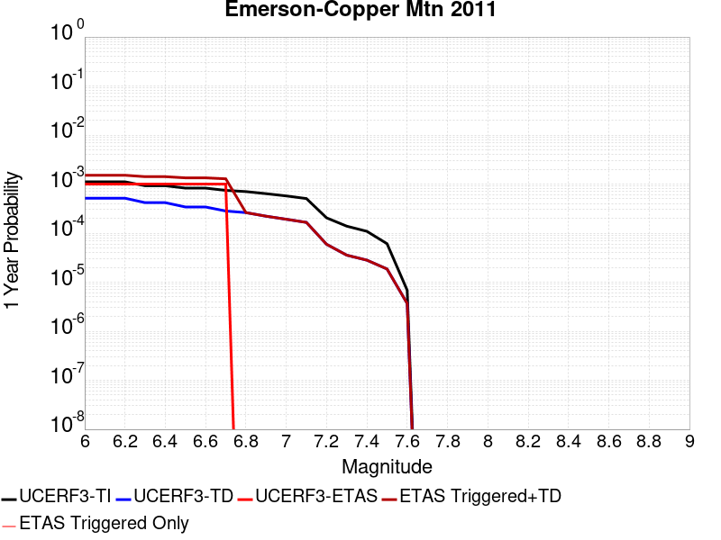 | 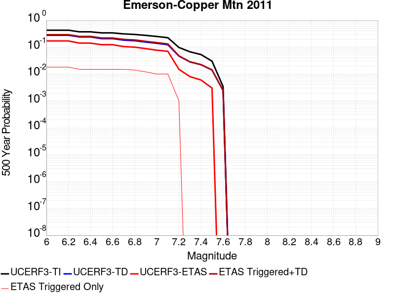 |

| Magnitude | 1 wk TI Prob | 1 wk TD Prob | 1 wk ETAS Prob | 1 wk ETAS/TD Gain | 1 wk ETAS Triggered+TD | 1 wk ETAS Triggered Only | 1 mo TI Prob | 1 mo TD Prob | 1 mo ETAS Prob | 1 mo ETAS/TD Gain | 1 mo ETAS Triggered+TD | 1 mo ETAS Triggered Only | 1 yr TI Prob | 1 yr TD Prob | 1 yr ETAS Prob | 1 yr ETAS/TD Gain | 1 yr ETAS Triggered+TD | 1 yr ETAS Triggered Only | 500 yr TI Prob | 500 yr TD Prob | 500 yr ETAS Prob | 500 yr ETAS/TD Gain | 500 yr ETAS Triggered+TD | 500 yr ETAS Triggered Only |
|-----|-----|-----|-----|-----|-----|-----|-----|-----|-----|-----|-----|-----|-----|-----|-----|-----|-----|-----|-----|-----|-----|-----|-----|-----|
| 6.0 | 2.1364202E-5 | 9.892192E-6 | 0.0 | 0.0 | 9.892192E-6 | 0.0 | 9.1557646E-5 | 4.2394466E-5 | 0.0 | 0.0 | 4.2394466E-5 | 0.0 | 0.0011141442 | 5.1603897E-4 | 0.001 | 1.9378381 | 0.001515523 | 0.001 | 0.42729396 | 0.27702215 | 0.17 | 0.61366934 | 0.29003575 | 0.018 |
| 6.1 | 2.1364202E-5 | 9.892192E-6 | 0.0 | 0.0 | 9.892192E-6 | 0.0 | 9.1557646E-5 | 4.2394466E-5 | 0.0 | 0.0 | 4.2394466E-5 | 0.0 | 0.0011141442 | 5.1603897E-4 | 0.001 | 1.9378381 | 0.001515523 | 0.001 | 0.42729396 | 0.27702215 | 0.17 | 0.61366934 | 0.29003575 | 0.018 |
| 6.2 | 2.1364202E-5 | 9.892192E-6 | 0.0 | 0.0 | 9.892192E-6 | 0.0 | 9.1557646E-5 | 4.2394466E-5 | 0.0 | 0.0 | 4.2394466E-5 | 0.0 | 0.0011141442 | 5.1603897E-4 | 0.001 | 1.9378381 | 0.001515523 | 0.001 | 0.42729396 | 0.27702215 | 0.17 | 0.61366934 | 0.29003575 | 0.018 |
| 6.3 | 1.7751237E-5 | 8.023288E-6 | 0.0 | 0.0 | 8.023288E-6 | 0.0 | 7.607452E-5 | 3.43851E-5 | 0.0 | 0.0 | 3.43851E-5 | 0.0 | 9.258136E-4 | 4.1856433E-4 | 0.001 | 2.389119 | 0.0014181457 | 0.001 | 0.37068367 | 0.23894945 | 0.141 | 0.59008294 | 0.2503652 | 0.015 |
| 6.4 | 1.7751237E-5 | 8.023288E-6 | 0.0 | 0.0 | 8.023288E-6 | 0.0 | 7.607452E-5 | 3.43851E-5 | 0.0 | 0.0 | 3.43851E-5 | 0.0 | 9.258136E-4 | 4.1856433E-4 | 0.001 | 2.389119 | 0.0014181457 | 0.001 | 0.37068367 | 0.23894945 | 0.141 | 0.59008294 | 0.2503652 | 0.015 |
| 6.5 | 1.5886664E-5 | 6.5475647E-6 | 0.0 | 0.0 | 6.5475647E-6 | 0.0 | 6.808392E-5 | 2.8060716E-5 | 0.0 | 0.0 | 2.8060716E-5 | 0.0 | 8.286065E-4 | 3.415903E-4 | 0.001 | 2.9274838 | 0.0013412487 | 0.001 | 0.33931294 | 0.20688109 | 0.123 | 0.5945445 | 0.21877787 | 0.015 |
| 6.6 | 1.5886664E-5 | 6.5475647E-6 | 0.0 | 0.0 | 6.5475647E-6 | 0.0 | 6.808392E-5 | 2.8060716E-5 | 0.0 | 0.0 | 2.8060716E-5 | 0.0 | 8.286065E-4 | 3.415903E-4 | 0.001 | 2.9274838 | 0.0013412487 | 0.001 | 0.33931294 | 0.20688109 | 0.123 | 0.5945445 | 0.21877787 | 0.015 |
| 6.7 | 1.428471E-5 | 5.421505E-6 | 0.0 | 0.0 | 5.421505E-6 | 0.0 | 6.121875E-5 | 2.3234837E-5 | 0.0 | 0.0 | 2.3234837E-5 | 0.0 | 7.450834E-4 | 2.8285128E-4 | 0.001 | 3.5354269 | 0.0012825684 | 0.001 | 0.31111473 | 0.18196724 | 0.105 | 0.57702696 | 0.19423772 | 0.015 |
| 6.8 | 1.3490684E-5 | 5.027592E-6 | 0.0 | 0.0 | 5.027592E-6 | 0.0 | 5.7815934E-5 | 2.1546668E-5 | 0.0 | 0.0 | 2.1546668E-5 | 0.0 | 7.0368167E-4 | 2.623029E-4 | 0.0 | 0.0 | 2.623029E-4 | 0.0 | 0.29669505 | 0.17306122 | 0.1 | 0.5778302 | 0.18463837 | 0.014 |
| 6.9 | 1.2235421E-5 | 4.2470087E-6 | 0.0 | 0.0 | 4.2470087E-6 | 0.0 | 5.2436466E-5 | 1.820136E-5 | 0.0 | 0.0 | 1.820136E-5 | 0.0 | 6.38227E-4 | 2.2158254E-4 | 0.0 | 0.0 | 2.2158254E-4 | 0.0 | 0.27328098 | 0.15397483 | 0.088 | 0.57152194 | 0.16412714 | 0.012 |
| 7.0 | 1.1009851E-5 | 3.6793226E-6 | 0.0 | 0.0 | 3.6793226E-6 | 0.0 | 4.7184225E-5 | 1.576845E-5 | 0.0 | 0.0 | 1.576845E-5 | 0.0 | 5.743165E-4 | 1.9196732E-4 | 0.0 | 0.0 | 1.9196732E-4 | 0.0 | 0.24966893 | 0.13877231 | 0.077 | 0.5548658 | 0.14738458 | 0.01 |
| 7.1 | 9.726373E-6 | 3.1759514E-6 | 0.0 | 0.0 | 3.1759514E-6 | 0.0 | 4.168379E-5 | 1.3611168E-5 | 0.0 | 0.0 | 1.3611168E-5 | 0.0 | 5.07382E-4 | 1.6570668E-4 | 0.0 | 0.0 | 1.6570668E-4 | 0.0 | 0.22411841 | 0.12265427 | 0.07 | 0.5707099 | 0.13142772 | 0.01 |
| 7.2 | 3.9335127E-6 | 1.1369293E-6 | 0.0 | 0.0 | 1.1369293E-6 | 0.0 | 1.6857803E-5 | 4.8725456E-6 | 0.0 | 0.0 | 4.8725456E-6 | 0.0 | 2.0522442E-4 | 5.9321686E-5 | 0.0 | 0.0 | 5.9321686E-5 | 0.0 | 0.09753263 | 0.046661884 | 0.015 | 0.32146153 | 0.047615223 | 0.001 |
| 7.3 | 2.661632E-6 | 6.823679E-7 | 0.0 | 0.0 | 6.823679E-7 | 0.0 | 1.14069435E-5 | 2.9244306E-6 | 0.0 | 0.0 | 2.9244306E-6 | 0.0 | 1.3887069E-4 | 3.560437E-5 | 0.0 | 0.0 | 3.560437E-5 | 0.0 | 0.067084044 | 0.028366249 | 0.008 | 0.2820253 | 0.028366249 | 0.0 |
| 7.4 | 2.0893426E-6 | 5.397538E-7 | 0.0 | 0.0 | 5.397538E-7 | 0.0 | 8.954295E-6 | 2.3132284E-6 | 0.0 | 0.0 | 2.3132284E-6 | 0.0 | 1.0901308E-4 | 2.8163198E-5 | 0.0 | 0.0 | 2.8163198E-5 | 0.0 | 0.0530505 | 0.022326112 | 0.006 | 0.2687436 | 0.022326112 | 0.0 |
| 7.5 | 1.1681728E-6 | 3.5635094E-7 | 0.0 | 0.0 | 3.5635094E-7 | 0.0 | 5.0064455E-6 | 1.5272175E-6 | 0.0 | 0.0 | 1.5272175E-6 | 0.0 | 6.0951766E-5 | 1.8593719E-5 | 0.0 | 0.0 | 1.8593719E-5 | 0.0 | 0.030017076 | 0.014101648 | 0.003 | 0.21274109 | 0.014101648 | 0.0 |
| 7.6 | 1.3154387E-7 | 7.061878E-8 | 0.0 | 0.0 | 7.061878E-8 | 0.0 | 5.6375933E-7 | 3.026519E-7 | 0.0 | 0.0 | 3.026519E-7 | 0.0 | 6.863748E-6 | 3.6847823E-6 | 0.0 | 0.0 | 3.6847823E-6 | 0.0 | 0.0034260035 | 0.0024528948 | 0.0 | 0.0 | 0.0024528948 | 0.0 |

## Garlock (Central)
*[(top)](#table-of-contents)*

| 1 Week | 1 Month | 1 Year | 500 Year |
|-----|-----|-----|-----|
| 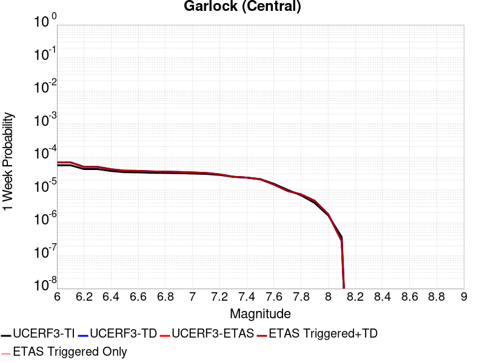 | 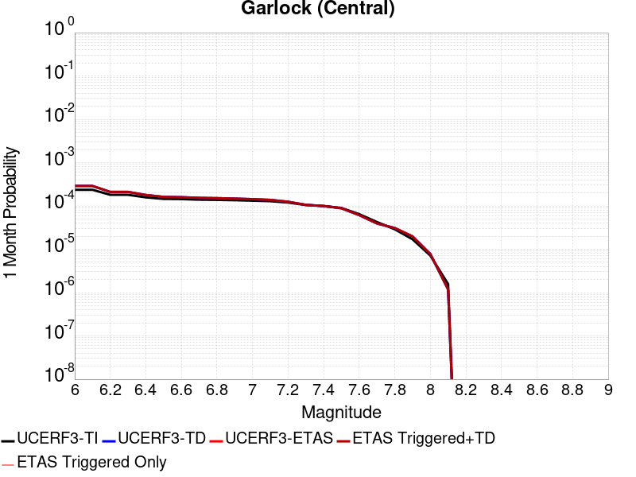 | 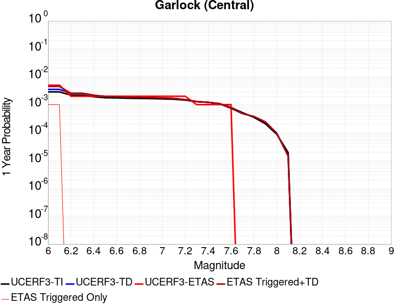 |  |

| Magnitude | 1 wk TI Prob | 1 wk TD Prob | 1 wk ETAS Prob | 1 wk ETAS/TD Gain | 1 wk ETAS Triggered+TD | 1 wk ETAS Triggered Only | 1 mo TI Prob | 1 mo TD Prob | 1 mo ETAS Prob | 1 mo ETAS/TD Gain | 1 mo ETAS Triggered+TD | 1 mo ETAS Triggered Only | 1 yr TI Prob | 1 yr TD Prob | 1 yr ETAS Prob | 1 yr ETAS/TD Gain | 1 yr ETAS Triggered+TD | 1 yr ETAS Triggered Only | 500 yr TI Prob | 500 yr TD Prob | 500 yr ETAS Prob | 500 yr ETAS/TD Gain | 500 yr ETAS Triggered+TD | 500 yr ETAS Triggered Only |
|-----|-----|-----|-----|-----|-----|-----|-----|-----|-----|-----|-----|-----|-----|-----|-----|-----|-----|-----|-----|-----|-----|-----|-----|-----|
| 6.0 | 5.5131142E-5 | 6.754531E-5 | 0.0 | 0.0 | 6.754531E-5 | 0.0 | 2.3625491E-4 | 2.8944813E-4 | 0.0 | 0.0 | 2.8944813E-4 | 0.0 | 0.0028726095 | 0.0035183986 | 0.005 | 1.4211011 | 0.00451488 | 0.001 | 0.76268613 | 0.8182136 | 0.761 | 0.930075 | 0.82130396 | 0.017 |
| 6.1 | 5.5131142E-5 | 6.754531E-5 | 0.0 | 0.0 | 6.754531E-5 | 0.0 | 2.3625491E-4 | 2.8944813E-4 | 0.0 | 0.0 | 2.8944813E-4 | 0.0 | 0.0028726095 | 0.0035183986 | 0.005 | 1.4211011 | 0.00451488 | 0.001 | 0.76268613 | 0.8182136 | 0.761 | 0.930075 | 0.82130396 | 0.017 |
| 6.2 | 4.216245E-5 | 4.92136E-5 | 0.0 | 0.0 | 4.92136E-5 | 0.0 | 1.806837E-4 | 2.1089854E-4 | 0.0 | 0.0 | 2.1089854E-4 | 0.0 | 0.0021976046 | 0.002564696 | 0.002 | 0.77981955 | 0.002564696 | 0.0 | 0.66713274 | 0.7394033 | 0.662 | 0.89531654 | 0.74305165 | 0.014 |
| 6.3 | 4.216245E-5 | 4.92136E-5 | 0.0 | 0.0 | 4.92136E-5 | 0.0 | 1.806837E-4 | 2.1089854E-4 | 0.0 | 0.0 | 2.1089854E-4 | 0.0 | 0.0021976046 | 0.002564696 | 0.002 | 0.77981955 | 0.002564696 | 0.0 | 0.66713274 | 0.7394033 | 0.662 | 0.89531654 | 0.74305165 | 0.014 |
| 6.4 | 3.6858168E-5 | 4.176726E-5 | 0.0 | 0.0 | 4.176726E-5 | 0.0 | 1.5795401E-4 | 1.7899039E-4 | 0.0 | 0.0 | 1.7899039E-4 | 0.0 | 0.0019213937 | 0.0021770536 | 0.002 | 0.9186728 | 0.0021770536 | 0.0 | 0.6177273 | 0.698179 | 0.611 | 0.87513375 | 0.7018009 | 0.012 |
| 6.5 | 3.39199E-5 | 3.7736296E-5 | 0.0 | 0.0 | 3.7736296E-5 | 0.0 | 1.453629E-4 | 1.6171706E-4 | 0.0 | 0.0 | 1.6171706E-4 | 0.0 | 0.0017683565 | 0.0019671477 | 0.002 | 1.0167005 | 0.0019671477 | 0.0 | 0.5872697 | 0.67230827 | 0.58 | 0.8626995 | 0.67624056 | 0.012 |
| 6.6 | 3.3571985E-5 | 3.7196976E-5 | 0.0 | 0.0 | 3.7196976E-5 | 0.0 | 1.4387199E-4 | 1.5940599E-4 | 0.0 | 0.0 | 1.5940599E-4 | 0.0 | 0.0017502342 | 0.0019390606 | 0.002 | 1.0314273 | 0.0019390606 | 0.0 | 0.5835062 | 0.6690577 | 0.575 | 0.8594176 | 0.673029 | 0.012 |
| 6.7 | 3.2580007E-5 | 3.583405E-5 | 0.0 | 0.0 | 3.583405E-5 | 0.0 | 1.3962112E-4 | 1.5356559E-4 | 0.0 | 0.0 | 1.5356559E-4 | 0.0 | 0.0016985617 | 0.0018680778 | 0.002 | 1.0706192 | 0.0018680778 | 0.0 | 0.5725863 | 0.65971667 | 0.565 | 0.85642827 | 0.6634598 | 0.011 |
| 6.8 | 3.2185937E-5 | 3.527131E-5 | 0.0 | 0.0 | 3.527131E-5 | 0.0 | 1.3793244E-4 | 1.5115412E-4 | 0.0 | 0.0 | 1.5115412E-4 | 0.0 | 0.0016780337 | 0.0018387681 | 0.002 | 1.0876848 | 0.0018387681 | 0.0 | 0.5681693 | 0.6556885 | 0.56 | 0.85406405 | 0.659476 | 0.011 |
| 6.9 | 3.165394E-5 | 3.4490935E-5 | 0.0 | 0.0 | 3.4490935E-5 | 0.0 | 1.3565269E-4 | 1.4781003E-4 | 0.0 | 0.0 | 1.4781003E-4 | 0.0 | 0.0016503202 | 0.0017981218 | 0.002 | 1.1122717 | 0.0017981218 | 0.0 | 0.5621337 | 0.6501829 | 0.552 | 0.8489919 | 0.6540309 | 0.011 |
| 7.0 | 3.0903822E-5 | 3.3416105E-5 | 0.0 | 0.0 | 3.3416105E-5 | 0.0 | 1.3243823E-4 | 1.4320412E-4 | 0.0 | 0.0 | 1.4320412E-4 | 0.0 | 0.0016112428 | 0.0017421357 | 0.002 | 1.1480161 | 0.0017421357 | 0.0 | 0.55348 | 0.64223766 | 0.544 | 0.8470385 | 0.64581525 | 0.01 |
| 7.1 | 3.0069863E-5 | 3.2205542E-5 | 0.0 | 0.0 | 3.2205542E-5 | 0.0 | 1.2886449E-4 | 1.3801656E-4 | 0.0 | 0.0 | 1.3801656E-4 | 0.0 | 0.0015677959 | 0.0016790763 | 0.002 | 1.1911311 | 0.0016790763 | 0.0 | 0.54365814 | 0.63318545 | 0.531 | 0.83861685 | 0.6368536 | 0.01 |
| 7.2 | 2.7957109E-5 | 2.9151544E-5 | 0.0 | 0.0 | 2.9151544E-5 | 0.0 | 1.1981068E-4 | 1.2492931E-4 | 0.0 | 0.0 | 1.2492931E-4 | 0.0 | 0.0014577188 | 0.0015199713 | 0.002 | 1.3158143 | 0.0015199713 | 0.0 | 0.5177975 | 0.6092336 | 0.492 | 0.807572 | 0.61314124 | 0.01 |
| 7.3 | 2.4519275E-5 | 2.4731951E-5 | 0.0 | 0.0 | 2.4731951E-5 | 0.0 | 1.0507837E-4 | 1.0598985E-4 | 0.0 | 0.0 | 1.0598985E-4 | 0.0 | 0.0012785783 | 0.0012896763 | 0.001 | 0.77538836 | 0.0012896763 | 0.0 | 0.47254843 | 0.56337255 | 0.424 | 0.7526103 | 0.56730217 | 0.009 |
| 7.4 | 2.3225532E-5 | 2.326388E-5 | 0.0 | 0.0 | 2.326388E-5 | 0.0 | 9.95342E-5 | 9.9698605E-5 | 0.0 | 0.0 | 9.9698605E-5 | 0.0 | 0.0012111551 | 0.0012131681 | 0.001 | 0.8242881 | 0.0012131681 | 0.0 | 0.45444113 | 0.5444746 | 0.399 | 0.7328166 | 0.5485743 | 0.009 |
| 7.5 | 2.097765E-5 | 2.0656777E-5 | 0.0 | 0.0 | 2.0656777E-5 | 0.0 | 8.9901114E-5 | 8.8526096E-5 | 0.0 | 0.0 | 8.8526096E-5 | 0.0 | 0.0010939965 | 0.0010772834 | 0.001 | 0.9282608 | 0.0010772834 | 0.0 | 0.42148894 | 0.5082041 | 0.354 | 0.6965705 | 0.5126303 | 0.009 |
| 7.6 | 1.511254E-5 | 1.4345091E-5 | 0.0 | 0.0 | 1.4345091E-5 | 0.0 | 6.476642E-5 | 6.147755E-5 | 0.0 | 0.0 | 6.147755E-5 | 0.0 | 7.882459E-4 | 7.4823946E-4 | 0.001 | 1.3364705 | 7.4823946E-4 | 0.0 | 0.32583362 | 0.40005645 | 0.244 | 0.60991395 | 0.40425605 | 0.007 |
| 7.7 | 9.934069E-6 | 9.199525E-6 | 0.0 | 0.0 | 9.199525E-6 | 0.0 | 4.2573887E-5 | 3.9425944E-5 | 0.0 | 0.0 | 3.9425944E-5 | 0.0 | 5.182138E-4 | 4.7990543E-4 | 0.0 | 0.0 | 4.7990543E-4 | 0.0 | 0.2283113 | 0.2846835 | 0.157 | 0.55148965 | 0.28826007 | 0.005 |
| 7.8 | 6.7562896E-6 | 7.2233524E-6 | 0.0 | 0.0 | 7.2233524E-6 | 0.0 | 2.8955206E-5 | 3.0956857E-5 | 0.0 | 0.0 | 3.0956857E-5 | 0.0 | 3.5247262E-4 | 3.7683468E-4 | 0.0 | 0.0 | 3.7683468E-4 | 0.0 | 0.16160621 | 0.20098191 | 0.121 | 0.6020442 | 0.20337898 | 0.003 |
| 7.9 | 3.975453E-6 | 4.631255E-6 | 0.0 | 0.0 | 4.631255E-6 | 0.0 | 1.7037546E-5 | 1.9848083E-5 | 0.0 | 0.0 | 1.9848083E-5 | 0.0 | 2.0741238E-4 | 2.416237E-4 | 0.0 | 0.0 | 2.416237E-4 | 0.0 | 0.09851957 | 0.1237048 | 0.072 | 0.5820308 | 0.12545739 | 0.002 |
| 8.0 | 1.6729537E-6 | 1.8167547E-6 | 0.0 | 0.0 | 1.8167547E-6 | 0.0 | 7.169782E-6 | 7.786068E-6 | 0.0 | 0.0 | 7.786068E-6 | 0.0 | 8.7288594E-5 | 9.4791285E-5 | 0.0 | 0.0 | 9.4791285E-5 | 0.0 | 0.042707413 | 0.053176258 | 0.026 | 0.48894 | 0.05412308 | 0.001 |
| 8.1 | 3.6733252E-7 | 2.768798E-7 | 0.0 | 0.0 | 2.768798E-7 | 0.0 | 1.5742813E-6 | 1.1866272E-6 | 0.0 | 0.0 | 1.1866272E-6 | 0.0 | 1.9166706E-5 | 1.4447103E-5 | 0.0 | 0.0 | 1.4447103E-5 | 0.0 | 0.00953767 | 0.012358525 | 0.004 | 0.32366323 | 0.012358525 | 0.0 |

## Hosgri
*[(top)](#table-of-contents)*

| 1 Week | 1 Month | 1 Year | 500 Year |
|-----|-----|-----|-----|
|  |  | 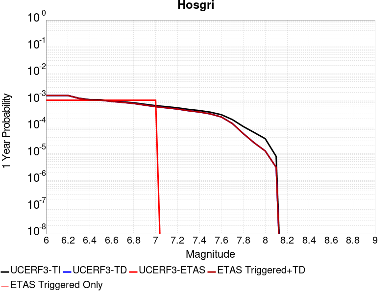 | 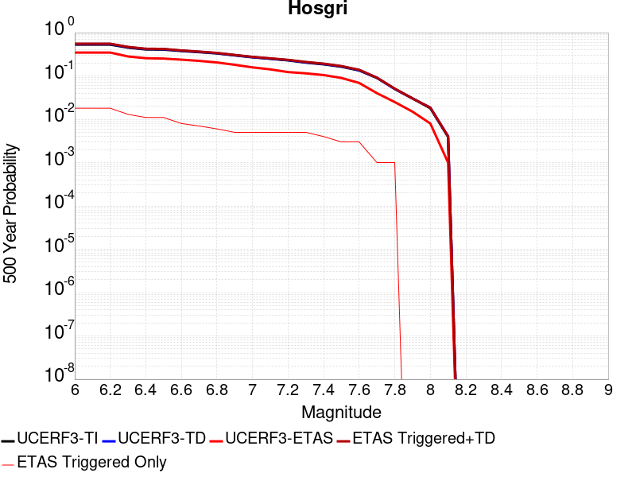 |

| Magnitude | 1 wk TI Prob | 1 wk TD Prob | 1 wk ETAS Prob | 1 wk ETAS/TD Gain | 1 wk ETAS Triggered+TD | 1 wk ETAS Triggered Only | 1 mo TI Prob | 1 mo TD Prob | 1 mo ETAS Prob | 1 mo ETAS/TD Gain | 1 mo ETAS Triggered+TD | 1 mo ETAS Triggered Only | 1 yr TI Prob | 1 yr TD Prob | 1 yr ETAS Prob | 1 yr ETAS/TD Gain | 1 yr ETAS Triggered+TD | 1 yr ETAS Triggered Only | 500 yr TI Prob | 500 yr TD Prob | 500 yr ETAS Prob | 500 yr ETAS/TD Gain | 500 yr ETAS Triggered+TD | 500 yr ETAS Triggered Only |
|-----|-----|-----|-----|-----|-----|-----|-----|-----|-----|-----|-----|-----|-----|-----|-----|-----|-----|-----|-----|-----|-----|-----|-----|-----|
| 6.0 | 2.883978E-5 | 2.8951416E-5 | 0.0 | 0.0 | 2.8951416E-5 | 0.0 | 1.235932E-4 | 1.2407175E-4 | 0.0 | 0.0 | 1.2407175E-4 | 0.0 | 0.0015037085 | 0.0015095538 | 0.001 | 0.66244745 | 0.0015095538 | 0.0 | 0.5287752 | 0.5475777 | 0.347 | 0.6337 | 0.5557213 | 0.018 |
| 6.1 | 2.883978E-5 | 2.8951416E-5 | 0.0 | 0.0 | 2.8951416E-5 | 0.0 | 1.235932E-4 | 1.2407175E-4 | 0.0 | 0.0 | 1.2407175E-4 | 0.0 | 0.0015037085 | 0.0015095538 | 0.001 | 0.66244745 | 0.0015095538 | 0.0 | 0.5287752 | 0.5475777 | 0.347 | 0.6337 | 0.5557213 | 0.018 |
| 6.2 | 2.883978E-5 | 2.8951416E-5 | 0.0 | 0.0 | 2.8951416E-5 | 0.0 | 1.235932E-4 | 1.2407175E-4 | 0.0 | 0.0 | 1.2407175E-4 | 0.0 | 0.0015037085 | 0.0015095538 | 0.001 | 0.66244745 | 0.0015095538 | 0.0 | 0.5287752 | 0.5475777 | 0.347 | 0.6337 | 0.5557213 | 0.018 |
| 6.3 | 2.2914428E-5 | 2.2496839E-5 | 0.0 | 0.0 | 2.2496839E-5 | 0.0 | 9.8200995E-5 | 9.641149E-5 | 0.0 | 0.0 | 9.641149E-5 | 0.0 | 0.0011949413 | 0.0011731827 | 0.001 | 0.8523821 | 0.0011731827 | 0.0 | 0.449995 | 0.46200565 | 0.282 | 0.61038214 | 0.4689996 | 0.013 |
| 6.4 | 2.0195741E-5 | 1.9564171E-5 | 0.0 | 0.0 | 1.9564171E-5 | 0.0 | 8.65503E-5 | 8.384376E-5 | 0.0 | 0.0 | 8.384376E-5 | 0.0 | 0.0010532405 | 0.0010203217 | 0.001 | 0.98008305 | 0.0010203217 | 0.0 | 0.4095662 | 0.41894662 | 0.257 | 0.6134433 | 0.4253382 | 0.011 |
| 6.5 | 1.9924333E-5 | 1.9277551E-5 | 0.0 | 0.0 | 1.9277551E-5 | 0.0 | 8.53872E-5 | 8.261547E-5 | 0.0 | 0.0 | 8.261547E-5 | 0.0 | 0.0010390934 | 0.0010053811 | 0.001 | 0.9946477 | 0.0010053811 | 0.0 | 0.4053705 | 0.41457266 | 0.252 | 0.60785484 | 0.42101237 | 0.011 |
| 6.6 | 1.809694E-5 | 1.7334127E-5 | 0.0 | 0.0 | 1.7334127E-5 | 0.0 | 7.7556004E-5 | 7.428701E-5 | 0.0 | 0.0 | 7.428701E-5 | 0.0 | 9.438353E-4 | 9.0407033E-4 | 0.001 | 1.1061087 | 9.0407033E-4 | 0.0 | 0.3763341 | 0.38404456 | 0.238 | 0.61971974 | 0.3889722 | 0.008 |
| 6.7 | 1.675989E-5 | 1.5923622E-5 | 0.0 | 0.0 | 1.5923622E-5 | 0.0 | 7.182612E-5 | 6.824232E-5 | 0.0 | 0.0 | 6.824232E-5 | 0.0 | 8.7413215E-4 | 8.305346E-4 | 0.001 | 1.2040437 | 8.305346E-4 | 0.0 | 0.3541947 | 0.3608996 | 0.223 | 0.6179004 | 0.3653733 | 0.007 |
| 6.8 | 1.5401129E-5 | 1.4499988E-5 | 0.0 | 0.0 | 1.4499988E-5 | 0.0 | 6.6003166E-5 | 6.214133E-5 | 0.0 | 0.0 | 6.214133E-5 | 0.0 | 8.032922E-4 | 7.563089E-4 | 0.001 | 1.322211 | 7.563089E-4 | 0.0 | 0.33089048 | 0.33659637 | 0.205 | 0.60903805 | 0.3405768 | 0.006 |
| 6.9 | 1.356559E-5 | 1.2582801E-5 | 0.0 | 0.0 | 1.2582801E-5 | 0.0 | 5.8136946E-5 | 5.3925178E-5 | 0.0 | 0.0 | 5.3925178E-5 | 0.0 | 7.0758746E-4 | 6.5634167E-4 | 0.001 | 1.5235966 | 6.5634167E-4 | 0.0 | 0.29806814 | 0.30236518 | 0.181 | 0.59861386 | 0.30585337 | 0.005 |
| 7.0 | 1.2030819E-5 | 1.0994353E-5 | 0.0 | 0.0 | 1.0994353E-5 | 0.0 | 5.155963E-5 | 4.7117806E-5 | 0.0 | 0.0 | 4.7117806E-5 | 0.0 | 6.275577E-4 | 5.735084E-4 | 0.001 | 1.7436537 | 5.735084E-4 | 0.0 | 0.26939136 | 0.2726187 | 0.158 | 0.57956403 | 0.27625564 | 0.005 |
| 7.1 | 1.0972698E-5 | 9.923811E-6 | 0.0 | 0.0 | 9.923811E-6 | 0.0 | 4.7025E-5 | 4.252993E-5 | 0.0 | 0.0 | 4.252993E-5 | 0.0 | 5.72379E-4 | 5.176789E-4 | 0.0 | 0.0 | 5.176789E-4 | 0.0 | 0.24894127 | 0.2518081 | 0.142 | 0.5639215 | 0.25554904 | 0.005 |
| 7.2 | 9.961926E-6 | 8.939055E-6 | 0.0 | 0.0 | 8.939055E-6 | 0.0 | 4.2693267E-5 | 3.8309674E-5 | 0.0 | 0.0 | 3.8309674E-5 | 0.0 | 5.1966653E-4 | 4.6632052E-4 | 0.0 | 0.0 | 4.6632052E-4 | 0.0 | 0.22887193 | 0.23194674 | 0.123 | 0.5302942 | 0.235787 | 0.005 |
| 7.3 | 8.700929E-6 | 7.7367395E-6 | 0.0 | 0.0 | 7.7367395E-6 | 0.0 | 3.7289166E-5 | 3.3157034E-5 | 0.0 | 0.0 | 3.3157034E-5 | 0.0 | 4.53901E-4 | 4.0361212E-4 | 0.0 | 0.0 | 4.0361212E-4 | 0.0 | 0.20308083 | 0.2068293 | 0.115 | 0.55601406 | 0.21079515 | 0.005 |
| 7.4 | 7.866285E-6 | 6.909455E-6 | 0.0 | 0.0 | 6.909455E-6 | 0.0 | 3.3712215E-5 | 2.9611612E-5 | 0.0 | 0.0 | 2.9611612E-5 | 0.0 | 4.103689E-4 | 3.6046177E-4 | 0.0 | 0.0 | 3.6046177E-4 | 0.0 | 0.18553723 | 0.18927863 | 0.105 | 0.5547377 | 0.19252153 | 0.004 |
| 7.5 | 6.8381305E-6 | 5.873487E-6 | 0.0 | 0.0 | 5.873487E-6 | 0.0 | 2.9305946E-5 | 2.5171847E-5 | 0.0 | 0.0 | 2.5171847E-5 | 0.0 | 3.5674145E-4 | 3.0642416E-4 | 0.0 | 0.0 | 3.0642416E-4 | 0.0 | 0.16339442 | 0.16681582 | 0.09 | 0.5395172 | 0.16931537 | 0.003 |
| 7.6 | 5.503376E-6 | 4.5139827E-6 | 0.0 | 0.0 | 4.5139827E-6 | 0.0 | 2.3585684E-5 | 1.9345498E-5 | 0.0 | 0.0 | 1.9345498E-5 | 0.0 | 2.8711787E-4 | 2.35506E-4 | 0.0 | 0.0 | 2.35506E-4 | 0.0 | 0.13374811 | 0.13632402 | 0.069 | 0.5061471 | 0.13891505 | 0.003 |
| 7.7 | 3.6144982E-6 | 2.579593E-6 | 0.0 | 0.0 | 2.579593E-6 | 0.0 | 1.5490614E-5 | 1.1055352E-5 | 0.0 | 0.0 | 1.1055352E-5 | 0.0 | 1.8858191E-4 | 1.3459059E-4 | 0.0 | 0.0 | 1.3459059E-4 | 0.0 | 0.08999014 | 0.09059657 | 0.04 | 0.4415178 | 0.091505975 | 0.001 |
| 7.8 | 1.9853494E-6 | 1.0774945E-6 | 0.0 | 0.0 | 1.0774945E-6 | 0.0 | 8.508612E-6 | 4.617825E-6 | 0.0 | 0.0 | 4.617825E-6 | 0.0 | 1.0358743E-4 | 5.622057E-5 | 0.0 | 0.0 | 5.622057E-5 | 0.0 | 0.05047783 | 0.050117135 | 0.025 | 0.4988314 | 0.051067017 | 0.001 |
| 7.9 | 1.1818757E-6 | 4.851748E-7 | 0.0 | 0.0 | 4.851748E-7 | 0.0 | 5.0651715E-6 | 2.0793188E-6 | 0.0 | 0.0 | 2.0793188E-6 | 0.0 | 6.1666724E-5 | 2.5315412E-5 | 0.0 | 0.0 | 2.5315412E-5 | 0.0 | 0.030363783 | 0.030198913 | 0.015 | 0.49670663 | 0.030198913 | 0.0 |
| 8.0 | 6.962958E-7 | 2.4184865E-7 | 0.0 | 0.0 | 2.4184865E-7 | 0.0 | 2.9841215E-6 | 1.0364937E-6 | 0.0 | 0.0 | 1.0364937E-6 | 0.0 | 3.6331072E-5 | 1.2619238E-5 | 0.0 | 0.0 | 1.2619238E-5 | 0.0 | 0.018001862 | 0.018598242 | 0.008 | 0.43014818 | 0.018598242 | 0.0 |
| 8.1 | 1.5033264E-7 | 5.8850656E-8 | 0.0 | 0.0 | 5.8850656E-8 | 0.0 | 6.442826E-7 | 2.5221706E-7 | 0.0 | 0.0 | 2.5221706E-7 | 0.0 | 7.844113E-6 | 3.0707386E-6 | 0.0 | 0.0 | 3.0707386E-6 | 0.0 | 0.00391439 | 0.004045108 | 0.001 | 0.24721222 | 0.004045108 | 0.0 |

## Blue Cut
*[(top)](#table-of-contents)*

| 1 Week | 1 Month | 1 Year | 500 Year |
|-----|-----|-----|-----|
| 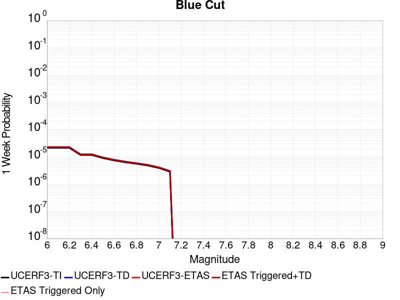 |  | 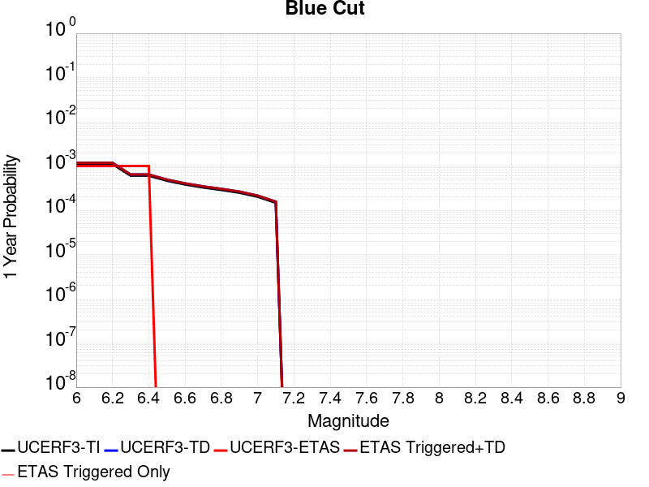 | 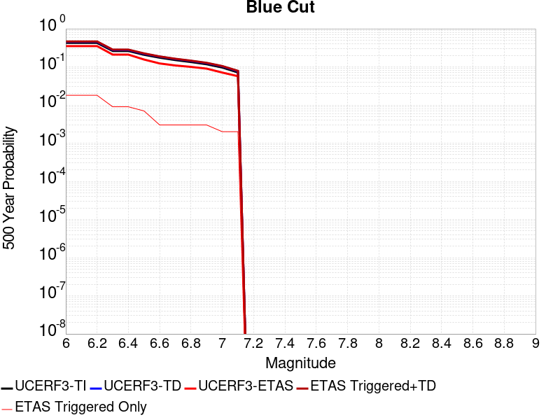 |

| Magnitude | 1 wk TI Prob | 1 wk TD Prob | 1 wk ETAS Prob | 1 wk ETAS/TD Gain | 1 wk ETAS Triggered+TD | 1 wk ETAS Triggered Only | 1 mo TI Prob | 1 mo TD Prob | 1 mo ETAS Prob | 1 mo ETAS/TD Gain | 1 mo ETAS Triggered+TD | 1 mo ETAS Triggered Only | 1 yr TI Prob | 1 yr TD Prob | 1 yr ETAS Prob | 1 yr ETAS/TD Gain | 1 yr ETAS Triggered+TD | 1 yr ETAS Triggered Only | 500 yr TI Prob | 500 yr TD Prob | 500 yr ETAS Prob | 500 yr ETAS/TD Gain | 500 yr ETAS Triggered+TD | 500 yr ETAS Triggered Only |
|-----|-----|-----|-----|-----|-----|-----|-----|-----|-----|-----|-----|-----|-----|-----|-----|-----|-----|-----|-----|-----|-----|-----|-----|-----|
| 6.0 | 2.1227985E-5 | 2.2636783E-5 | 0.0 | 0.0 | 2.2636783E-5 | 0.0 | 9.097391E-5 | 9.70115E-5 | 0.0 | 0.0 | 9.70115E-5 | 0.0 | 0.0011070445 | 0.0011805326 | 0.001 | 0.8470752 | 0.0011805326 | 0.0 | 0.42525503 | 0.4547409 | 0.351 | 0.7718681 | 0.4645556 | 0.018 |
| 6.1 | 2.1227985E-5 | 2.2636783E-5 | 0.0 | 0.0 | 2.2636783E-5 | 0.0 | 9.097391E-5 | 9.70115E-5 | 0.0 | 0.0 | 9.70115E-5 | 0.0 | 0.0011070445 | 0.0011805326 | 0.001 | 0.8470752 | 0.0011805326 | 0.0 | 0.42525503 | 0.4547409 | 0.351 | 0.7718681 | 0.4645556 | 0.018 |
| 6.2 | 2.1227985E-5 | 2.2636783E-5 | 0.0 | 0.0 | 2.2636783E-5 | 0.0 | 9.097391E-5 | 9.70115E-5 | 0.0 | 0.0 | 9.70115E-5 | 0.0 | 0.0011070445 | 0.0011805326 | 0.001 | 0.8470752 | 0.0011805326 | 0.0 | 0.42525503 | 0.4547409 | 0.351 | 0.7718681 | 0.4645556 | 0.018 |
| 6.3 | 1.1613981E-5 | 1.2312769E-5 | 0.0 | 0.0 | 1.2312769E-5 | 0.0 | 4.9773254E-5 | 5.2768013E-5 | 0.0 | 0.0 | 5.2768013E-5 | 0.0 | 6.0582085E-4 | 6.422736E-4 | 0.001 | 1.5569689 | 6.422736E-4 | 0.0 | 0.26140255 | 0.27715406 | 0.21 | 0.75770134 | 0.28365967 | 0.009 |
| 6.4 | 1.1613981E-5 | 1.2312769E-5 | 0.0 | 0.0 | 1.2312769E-5 | 0.0 | 4.9773254E-5 | 5.2768013E-5 | 0.0 | 0.0 | 5.2768013E-5 | 0.0 | 6.0582085E-4 | 6.422736E-4 | 0.001 | 1.5569689 | 6.422736E-4 | 0.0 | 0.26140255 | 0.27715406 | 0.21 | 0.75770134 | 0.28365967 | 0.009 |
| 6.5 | 8.931326E-6 | 9.451329E-6 | 0.0 | 0.0 | 9.451329E-6 | 0.0 | 3.8276554E-5 | 4.0505118E-5 | 0.0 | 0.0 | 4.0505118E-5 | 0.0 | 4.6591737E-4 | 4.930473E-4 | 0.0 | 0.0 | 4.930473E-4 | 0.0 | 0.2078567 | 0.22048688 | 0.156 | 0.7075251 | 0.22594346 | 0.007 |
| 6.6 | 7.345353E-6 | 7.76583E-6 | 0.0 | 0.0 | 7.76583E-6 | 0.0 | 3.1479703E-5 | 3.3281747E-5 | 0.0 | 0.0 | 3.3281747E-5 | 0.0 | 3.83198E-4 | 4.051379E-4 | 0.0 | 0.0 | 4.051379E-4 | 0.0 | 0.17439243 | 0.18521431 | 0.123 | 0.6640956 | 0.18765867 | 0.003 |
| 6.7 | 6.2775666E-6 | 6.634409E-6 | 0.0 | 0.0 | 6.634409E-6 | 0.0 | 2.690358E-5 | 2.8432914E-5 | 0.0 | 0.0 | 2.8432914E-5 | 0.0 | 3.2750185E-4 | 3.461232E-4 | 0.0 | 0.0 | 3.461232E-4 | 0.0 | 0.15106933 | 0.1607041 | 0.109 | 0.67826515 | 0.163222 | 0.003 |
| 6.8 | 5.5234095E-6 | 5.8368933E-6 | 0.0 | 0.0 | 5.8368933E-6 | 0.0 | 2.367154E-5 | 2.5015057E-5 | 0.0 | 0.0 | 2.5015057E-5 | 0.0 | 2.8816288E-4 | 3.0452298E-4 | 0.0 | 0.0 | 3.0452298E-4 | 0.0 | 0.13420075 | 0.14300202 | 0.1 | 0.6992908 | 0.14557302 | 0.003 |
| 6.9 | 4.7780054E-6 | 5.0496337E-6 | 0.0 | 0.0 | 5.0496337E-6 | 0.0 | 2.0477004E-5 | 2.1641146E-5 | 0.0 | 0.0 | 2.1641146E-5 | 0.0 | 2.4927902E-4 | 2.634561E-4 | 0.0 | 0.0 | 2.634561E-4 | 0.0 | 0.11719862 | 0.12516233 | 0.09 | 0.7190662 | 0.12778684 | 0.003 |
| 7.0 | 3.883171E-6 | 4.105557E-6 | 0.0 | 0.0 | 4.105557E-6 | 0.0 | 1.6642054E-5 | 1.7595165E-5 | 0.0 | 0.0 | 1.7595165E-5 | 0.0 | 2.0259817E-4 | 2.142069E-4 | 0.0 | 0.0 | 2.142069E-4 | 0.0 | 0.09634655 | 0.10330799 | 0.071 | 0.68726534 | 0.10510138 | 0.002 |
| 7.1 | 2.8358215E-6 | 3.0001547E-6 | 0.0 | 0.0 | 3.0001547E-6 | 0.0 | 1.2153464E-5 | 1.2857779E-5 | 0.0 | 0.0 | 1.2857779E-5 | 0.0 | 1.4795837E-4 | 1.5653876E-4 | 0.0 | 0.0 | 1.5653876E-4 | 0.0 | 0.07131406 | 0.07699443 | 0.057 | 0.7403133 | 0.07884044 | 0.002 |

## Raymond
*[(top)](#table-of-contents)*

| 1 Week | 1 Month | 1 Year | 500 Year |
|-----|-----|-----|-----|
| 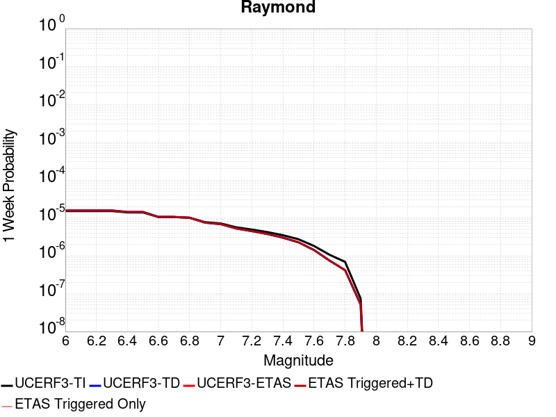 |  | 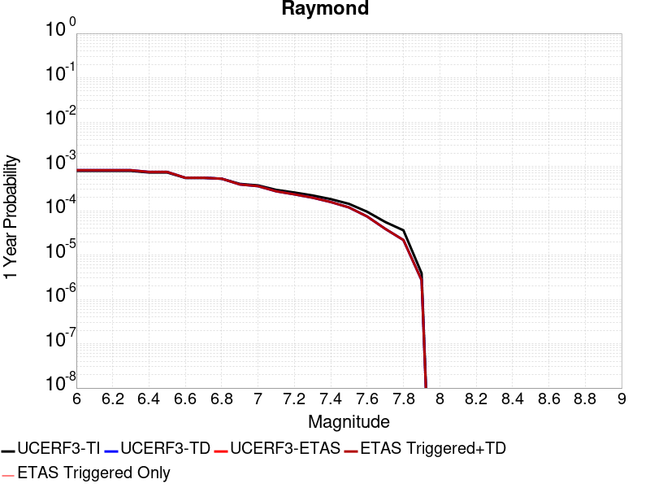 | 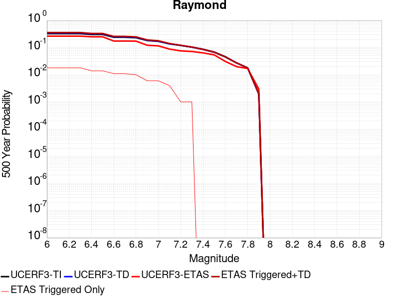 |

| Magnitude | 1 wk TI Prob | 1 wk TD Prob | 1 wk ETAS Prob | 1 wk ETAS/TD Gain | 1 wk ETAS Triggered+TD | 1 wk ETAS Triggered Only | 1 mo TI Prob | 1 mo TD Prob | 1 mo ETAS Prob | 1 mo ETAS/TD Gain | 1 mo ETAS Triggered+TD | 1 mo ETAS Triggered Only | 1 yr TI Prob | 1 yr TD Prob | 1 yr ETAS Prob | 1 yr ETAS/TD Gain | 1 yr ETAS Triggered+TD | 1 yr ETAS Triggered Only | 500 yr TI Prob | 500 yr TD Prob | 500 yr ETAS Prob | 500 yr ETAS/TD Gain | 500 yr ETAS Triggered+TD | 500 yr ETAS Triggered Only |
|-----|-----|-----|-----|-----|-----|-----|-----|-----|-----|-----|-----|-----|-----|-----|-----|-----|-----|-----|-----|-----|-----|-----|-----|-----|
| 6.0 | 1.5157413E-5 | 1.570766E-5 | 0.0 | 0.0 | 1.570766E-5 | 0.0 | 6.4958724E-5 | 6.731695E-5 | 0.0 | 0.0 | 6.731695E-5 | 0.0 | 7.905855E-4 | 8.193004E-4 | 0.0 | 0.0 | 8.193004E-4 | 0.0 | 0.32662243 | 0.3464497 | 0.265 | 0.76490176 | 0.3582136 | 0.018 |
| 6.1 | 1.5157413E-5 | 1.570766E-5 | 0.0 | 0.0 | 1.570766E-5 | 0.0 | 6.4958724E-5 | 6.731695E-5 | 0.0 | 0.0 | 6.731695E-5 | 0.0 | 7.905855E-4 | 8.193004E-4 | 0.0 | 0.0 | 8.193004E-4 | 0.0 | 0.32662243 | 0.3464497 | 0.265 | 0.76490176 | 0.3582136 | 0.018 |
| 6.2 | 1.5157413E-5 | 1.570766E-5 | 0.0 | 0.0 | 1.570766E-5 | 0.0 | 6.4958724E-5 | 6.731695E-5 | 0.0 | 0.0 | 6.731695E-5 | 0.0 | 7.905855E-4 | 8.193004E-4 | 0.0 | 0.0 | 8.193004E-4 | 0.0 | 0.32662243 | 0.3464497 | 0.265 | 0.76490176 | 0.3582136 | 0.018 |
| 6.3 | 1.5157413E-5 | 1.570766E-5 | 0.0 | 0.0 | 1.570766E-5 | 0.0 | 6.4958724E-5 | 6.731695E-5 | 0.0 | 0.0 | 6.731695E-5 | 0.0 | 7.905855E-4 | 8.193004E-4 | 0.0 | 0.0 | 8.193004E-4 | 0.0 | 0.32662243 | 0.3464497 | 0.265 | 0.76490176 | 0.3582136 | 0.018 |
| 6.4 | 1.3941944E-5 | 1.43602865E-5 | 0.0 | 0.0 | 1.43602865E-5 | 0.0 | 5.9749822E-5 | 6.154276E-5 | 0.0 | 0.0 | 6.154276E-5 | 0.0 | 7.2721124E-4 | 7.490486E-4 | 0.0 | 0.0 | 7.490486E-4 | 0.0 | 0.30492666 | 0.32314244 | 0.25 | 0.7736527 | 0.33261845 | 0.014 |
| 6.5 | 1.3941944E-5 | 1.43602865E-5 | 0.0 | 0.0 | 1.43602865E-5 | 0.0 | 5.9749822E-5 | 6.154276E-5 | 0.0 | 0.0 | 6.154276E-5 | 0.0 | 7.2721124E-4 | 7.490486E-4 | 0.0 | 0.0 | 7.490486E-4 | 0.0 | 0.30492666 | 0.32314244 | 0.25 | 0.7736527 | 0.33261845 | 0.014 |
| 6.6 | 1.0542609E-5 | 1.0598805E-5 | 0.0 | 0.0 | 1.0598805E-5 | 0.0 | 4.5181827E-5 | 4.542269E-5 | 0.0 | 0.0 | 4.542269E-5 | 0.0 | 5.499499E-4 | 5.528863E-4 | 0.0 | 0.0 | 5.528863E-4 | 0.0 | 0.2404663 | 0.25071988 | 0.175 | 0.6979902 | 0.25896195 | 0.011 |
| 6.7 | 1.0542609E-5 | 1.0598805E-5 | 0.0 | 0.0 | 1.0598805E-5 | 0.0 | 4.5181827E-5 | 4.542269E-5 | 0.0 | 0.0 | 4.542269E-5 | 0.0 | 5.499499E-4 | 5.528863E-4 | 0.0 | 0.0 | 5.528863E-4 | 0.0 | 0.2404663 | 0.25071988 | 0.175 | 0.6979902 | 0.25896195 | 0.011 |
| 6.8 | 1.0079132E-5 | 1.0106087E-5 | 0.0 | 0.0 | 1.0106087E-5 | 0.0 | 4.3195567E-5 | 4.331111E-5 | 0.0 | 0.0 | 4.331111E-5 | 0.0 | 5.257791E-4 | 5.271905E-4 | 0.0 | 0.0 | 5.271905E-4 | 0.0 | 0.23122635 | 0.2410435 | 0.173 | 0.7177128 | 0.24863306 | 0.01 |
| 6.9 | 7.721598E-6 | 7.494057E-6 | 0.0 | 0.0 | 7.494057E-6 | 0.0 | 3.3092143E-5 | 3.2116997E-5 | 0.0 | 0.0 | 3.2116997E-5 | 0.0 | 4.0282236E-4 | 3.909555E-4 | 0.0 | 0.0 | 3.909555E-4 | 0.0 | 0.18245699 | 0.1871464 | 0.122 | 0.65189606 | 0.19202352 | 0.006 |
| 7.0 | 7.137566E-6 | 6.859505E-6 | 0.0 | 0.0 | 6.859505E-6 | 0.0 | 3.058921E-5 | 2.9397554E-5 | 0.0 | 0.0 | 2.9397554E-5 | 0.0 | 3.7236E-4 | 3.578575E-4 | 0.0 | 0.0 | 3.578575E-4 | 0.0 | 0.16990462 | 0.1735814 | 0.116 | 0.66827434 | 0.17853992 | 0.006 |
| 7.1 | 5.654976E-6 | 5.2550295E-6 | 0.0 | 0.0 | 5.2550295E-6 | 0.0 | 2.4235387E-5 | 2.252136E-5 | 0.0 | 0.0 | 2.252136E-5 | 0.0 | 2.9502588E-4 | 2.741633E-4 | 0.0 | 0.0 | 2.741633E-4 | 0.0 | 0.13716751 | 0.13809274 | 0.088 | 0.6372529 | 0.14154036 | 0.004 |
| 7.2 | 4.9358455E-6 | 4.4855933E-6 | 0.0 | 0.0 | 4.4855933E-6 | 0.0 | 2.1153453E-5 | 1.9223831E-5 | 0.0 | 0.0 | 1.9223831E-5 | 0.0 | 2.5751285E-4 | 2.3402514E-4 | 0.0 | 0.0 | 2.3402514E-4 | 0.0 | 0.12082649 | 0.12059724 | 0.076 | 0.6301968 | 0.12147664 | 0.001 |
| 7.3 | 4.2368597E-6 | 3.7674515E-6 | 0.0 | 0.0 | 3.7674515E-6 | 0.0 | 1.8157843E-5 | 1.6146121E-5 | 0.0 | 0.0 | 1.6146121E-5 | 0.0 | 2.2104931E-4 | 1.965614E-4 | 0.0 | 0.0 | 1.965614E-4 | 0.0 | 0.10464668 | 0.10382633 | 0.072 | 0.6934657 | 0.1047225 | 0.001 |
| 7.4 | 3.4999923E-6 | 3.009224E-6 | 0.0 | 0.0 | 3.009224E-6 | 0.0 | 1.49998805E-5 | 1.2896611E-5 | 0.0 | 0.0 | 1.2896611E-5 | 0.0 | 1.8260824E-4 | 1.5700501E-4 | 0.0 | 0.0 | 1.5700501E-4 | 0.0 | 0.087267525 | 0.08573516 | 0.064 | 0.7464849 | 0.08573516 | 0.0 |
| 7.5 | 2.738017E-6 | 2.2724207E-6 | 0.0 | 0.0 | 2.2724207E-6 | 0.0 | 1.1734306E-5 | 9.73891E-6 | 0.0 | 0.0 | 9.73891E-6 | 0.0 | 1.428558E-4 | 1.1856484E-4 | 0.0 | 0.0 | 1.1856484E-4 | 0.0 | 0.06894135 | 0.06745837 | 0.054 | 0.8004937 | 0.06745837 | 0.0 |
| 7.6 | 1.8186392E-6 | 1.420472E-6 | 0.0 | 0.0 | 1.420472E-6 | 0.0 | 7.794145E-6 | 6.0877232E-6 | 0.0 | 0.0 | 6.0877232E-6 | 0.0 | 9.488958E-5 | 7.411555E-5 | 0.0 | 0.0 | 7.411555E-5 | 0.0 | 0.046339024 | 0.04530407 | 0.031 | 0.6842652 | 0.04530407 | 0.0 |
| 7.7 | 1.0660348E-6 | 7.468781E-7 | 0.0 | 0.0 | 7.468781E-7 | 0.0 | 4.5687125E-6 | 3.200902E-6 | 0.0 | 0.0 | 3.200902E-6 | 0.0 | 5.5622655E-5 | 3.8970302E-5 | 0.0 | 0.0 | 3.8970302E-5 | 0.0 | 0.027428905 | 0.02738879 | 0.02 | 0.73022574 | 0.02738879 | 0.0 |
| 7.8 | 6.913602E-7 | 4.173401E-7 | 0.0 | 0.0 | 4.173401E-7 | 0.0 | 2.962969E-6 | 1.7885992E-6 | 0.0 | 0.0 | 1.7885992E-6 | 0.0 | 3.607355E-5 | 2.1775984E-5 | 0.0 | 0.0 | 2.1775984E-5 | 0.0 | 0.017875405 | 0.017941946 | 0.017 | 0.94750035 | 0.017941946 | 0.0 |
| 7.9 | 7.425201E-8 | 5.1892066E-8 | 0.0 | 0.0 | 5.1892066E-8 | 0.0 | 3.1822285E-7 | 2.2239455E-7 | 0.0 | 0.0 | 2.2239455E-7 | 0.0 | 3.874356E-6 | 2.7076517E-6 | 0.0 | 0.0 | 2.7076517E-6 | 0.0 | 0.0019353067 | 0.0020209088 | 0.003 | 1.4844806 | 0.0020209088 | 0.0 |

## Great Valley 07 (Orestimba)
*[(top)](#table-of-contents)*

| 1 Week | 1 Month | 1 Year | 500 Year |
|-----|-----|-----|-----|
|  |  | 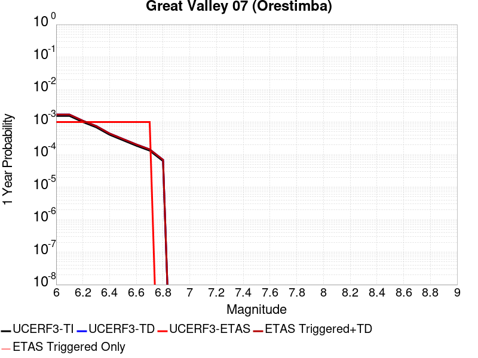 | 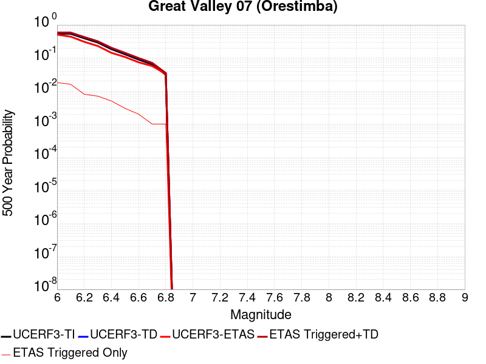 |

| Magnitude | 1 wk TI Prob | 1 wk TD Prob | 1 wk ETAS Prob | 1 wk ETAS/TD Gain | 1 wk ETAS Triggered+TD | 1 wk ETAS Triggered Only | 1 mo TI Prob | 1 mo TD Prob | 1 mo ETAS Prob | 1 mo ETAS/TD Gain | 1 mo ETAS Triggered+TD | 1 mo ETAS Triggered Only | 1 yr TI Prob | 1 yr TD Prob | 1 yr ETAS Prob | 1 yr ETAS/TD Gain | 1 yr ETAS Triggered+TD | 1 yr ETAS Triggered Only | 500 yr TI Prob | 500 yr TD Prob | 500 yr ETAS Prob | 500 yr ETAS/TD Gain | 500 yr ETAS Triggered+TD | 500 yr ETAS Triggered Only |
|-----|-----|-----|-----|-----|-----|-----|-----|-----|-----|-----|-----|-----|-----|-----|-----|-----|-----|-----|-----|-----|-----|-----|-----|-----|
| 6.0 | 2.9687902E-5 | 3.258226E-5 | 0.0 | 0.0 | 3.258226E-5 | 0.0 | 1.2722766E-4 | 1.3963117E-4 | 0.0 | 0.0 | 1.3963117E-4 | 0.0 | 0.0015478961 | 0.001698755 | 0.001 | 0.58866644 | 0.001698755 | 0.0 | 0.5390878 | 0.5774475 | 0.507 | 0.878002 | 0.5850534 | 0.018 |
| 6.1 | 2.9687902E-5 | 3.258226E-5 | 0.0 | 0.0 | 3.258226E-5 | 0.0 | 1.2722766E-4 | 1.3963117E-4 | 0.0 | 0.0 | 1.3963117E-4 | 0.0 | 0.0015478961 | 0.001698755 | 0.001 | 0.58866644 | 0.001698755 | 0.0 | 0.5390878 | 0.5774475 | 0.442 | 0.7654376 | 0.5842083 | 0.016 |
| 6.2 | 1.9231524E-5 | 2.1049447E-5 | 0.0 | 0.0 | 2.1049447E-5 | 0.0 | 8.2418206E-5 | 9.020893E-5 | 0.0 | 0.0 | 9.020893E-5 | 0.0 | 0.0010029797 | 0.0010977632 | 0.001 | 0.91094327 | 0.0010977632 | 0.0 | 0.39452472 | 0.42361048 | 0.308 | 0.727083 | 0.4282216 | 0.008 |
| 6.3 | 1.324766E-5 | 1.4474637E-5 | 0.0 | 0.0 | 1.4474637E-5 | 0.0 | 5.6774446E-5 | 6.203274E-5 | 0.0 | 0.0 | 6.203274E-5 | 0.0 | 6.910097E-4 | 7.5499597E-4 | 0.001 | 1.3245105 | 7.5499597E-4 | 0.0 | 0.29222164 | 0.314465 | 0.23 | 0.73140097 | 0.31926376 | 0.007 |
| 6.4 | 7.818645E-6 | 8.530072E-6 | 0.0 | 0.0 | 8.530072E-6 | 0.0 | 3.3508048E-5 | 3.6556958E-5 | 0.0 | 0.0 | 3.6556958E-5 | 0.0 | 4.078841E-4 | 4.449934E-4 | 0.001 | 2.2472243 | 4.449934E-4 | 0.0 | 0.18452431 | 0.19933817 | 0.143 | 0.7173739 | 0.20334148 | 0.005 |
| 6.5 | 5.3076565E-6 | 5.788883E-6 | 0.0 | 0.0 | 5.788883E-6 | 0.0 | 2.27469E-5 | 2.4809273E-5 | 0.0 | 0.0 | 2.4809273E-5 | 0.0 | 2.7690834E-4 | 3.0201313E-4 | 0.001 | 3.3111145 | 3.0201313E-4 | 0.0 | 0.12931353 | 0.14014192 | 0.107 | 0.7635118 | 0.14272149 | 0.003 |
| 6.6 | 3.6003578E-6 | 3.9287515E-6 | 0.0 | 0.0 | 3.9287515E-6 | 0.0 | 1.5430012E-5 | 1.6837406E-5 | 0.0 | 0.0 | 1.6837406E-5 | 0.0 | 1.8784421E-4 | 2.0497768E-4 | 0.001 | 4.87858 | 2.0497768E-4 | 0.0 | 0.08965436 | 0.09753196 | 0.074 | 0.75872564 | 0.0993369 | 0.002 |
| 6.7 | 2.5361826E-6 | 2.7694339E-6 | 0.0 | 0.0 | 2.7694339E-6 | 0.0 | 1.0869308E-5 | 1.1868956E-5 | 0.0 | 0.0 | 1.1868956E-5 | 0.0 | 1.3232579E-4 | 1.4449627E-4 | 0.001 | 6.9205937 | 1.4449627E-4 | 0.0 | 0.064025715 | 0.06993569 | 0.057 | 0.8150345 | 0.07086575 | 0.001 |
| 6.8 | 1.2115831E-6 | 1.3245732E-6 | 0.0 | 0.0 | 1.3245732E-6 | 0.0 | 5.1924885E-6 | 5.6767353E-6 | 0.0 | 0.0 | 5.6767353E-6 | 0.0 | 6.3216714E-5 | 6.911302E-5 | 0.0 | 0.0 | 6.911302E-5 | 0.0 | 0.031115005 | 0.03416537 | 0.033 | 0.9658902 | 0.03513121 | 0.001 |

## South Klamath Lake West
*[(top)](#table-of-contents)*

| 1 Week | 1 Month | 1 Year | 500 Year |
|-----|-----|-----|-----|
| 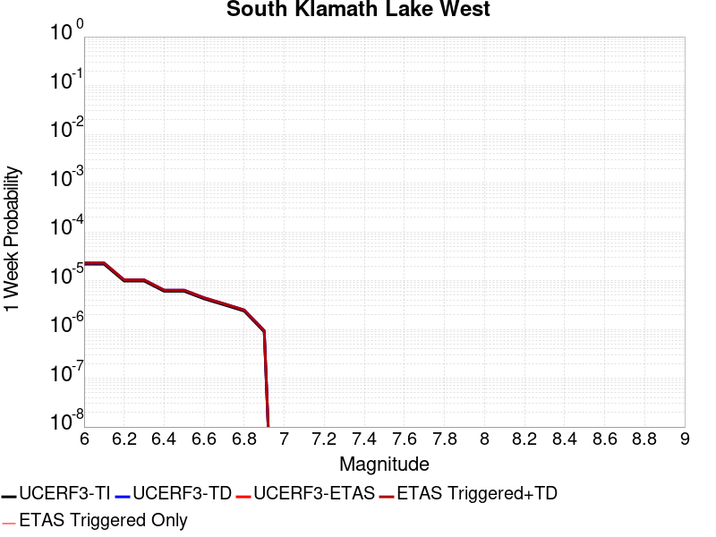 | 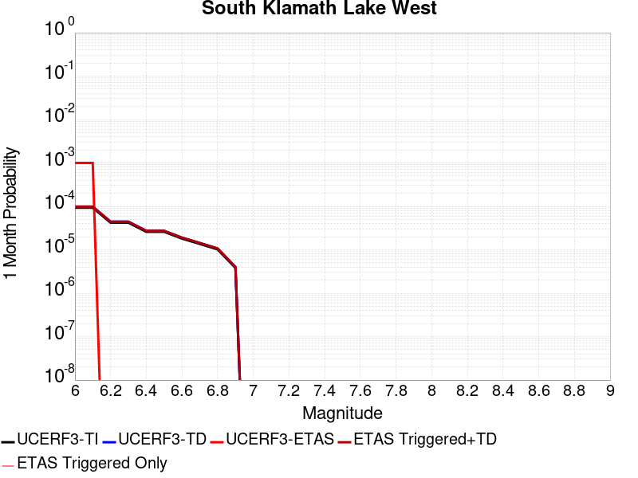 | 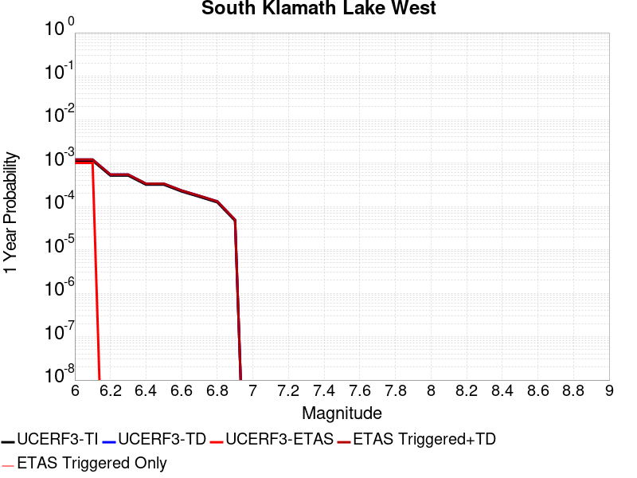 | 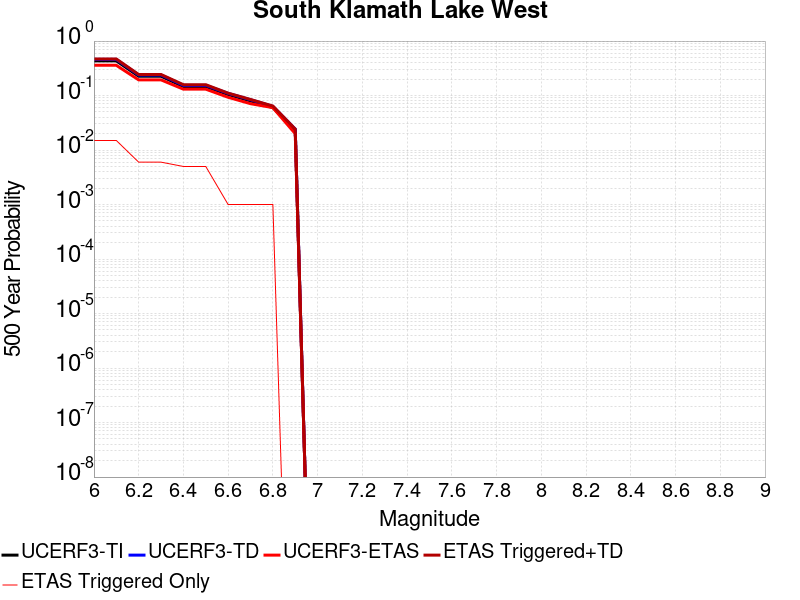 |

| Magnitude | 1 wk TI Prob | 1 wk TD Prob | 1 wk ETAS Prob | 1 wk ETAS/TD Gain | 1 wk ETAS Triggered+TD | 1 wk ETAS Triggered Only | 1 mo TI Prob | 1 mo TD Prob | 1 mo ETAS Prob | 1 mo ETAS/TD Gain | 1 mo ETAS Triggered+TD | 1 mo ETAS Triggered Only | 1 yr TI Prob | 1 yr TD Prob | 1 yr ETAS Prob | 1 yr ETAS/TD Gain | 1 yr ETAS Triggered+TD | 1 yr ETAS Triggered Only | 500 yr TI Prob | 500 yr TD Prob | 500 yr ETAS Prob | 500 yr ETAS/TD Gain | 500 yr ETAS Triggered+TD | 500 yr ETAS Triggered Only |
|-----|-----|-----|-----|-----|-----|-----|-----|-----|-----|-----|-----|-----|-----|-----|-----|-----|-----|-----|-----|-----|-----|-----|-----|-----|
| 6.0 | 2.174025E-5 | 2.2970498E-5 | 0.0 | 0.0 | 2.2970498E-5 | 0.0 | 9.3169176E-5 | 9.844165E-5 | 0.001 | 10.158302 | 9.844165E-5 | 0.0 | 0.0011337444 | 0.0011979335 | 0.001 | 0.8347709 | 0.0011979335 | 0.0 | 0.43288535 | 0.4610614 | 0.359 | 0.7786382 | 0.46914548 | 0.015 |
| 6.1 | 2.174025E-5 | 2.2970498E-5 | 0.0 | 0.0 | 2.2970498E-5 | 0.0 | 9.3169176E-5 | 9.844165E-5 | 0.001 | 10.158302 | 9.844165E-5 | 0.0 | 0.0011337444 | 0.0011979335 | 0.001 | 0.8347709 | 0.0011979335 | 0.0 | 0.43288535 | 0.4610614 | 0.359 | 0.7786382 | 0.46914548 | 0.015 |
| 6.2 | 9.834929E-6 | 1.0363225E-5 | 0.0 | 0.0 | 1.0363225E-5 | 0.0 | 4.2149015E-5 | 4.441311E-5 | 0.0 | 0.0 | 4.441311E-5 | 0.0 | 5.1304343E-4 | 5.4060447E-4 | 0.0 | 0.0 | 5.4060447E-4 | 0.0 | 0.22631274 | 0.23877591 | 0.194 | 0.8124773 | 0.24334325 | 0.006 |
| 6.3 | 9.834929E-6 | 1.0363225E-5 | 0.0 | 0.0 | 1.0363225E-5 | 0.0 | 4.2149015E-5 | 4.441311E-5 | 0.0 | 0.0 | 4.441311E-5 | 0.0 | 5.1304343E-4 | 5.4060447E-4 | 0.0 | 0.0 | 5.4060447E-4 | 0.0 | 0.22631274 | 0.23877591 | 0.194 | 0.8124773 | 0.24334325 | 0.006 |
| 6.4 | 6.066321E-6 | 6.3821594E-6 | 0.0 | 0.0 | 6.3821594E-6 | 0.0 | 2.5998259E-5 | 2.735184E-5 | 0.0 | 0.0 | 2.735184E-5 | 0.0 | 3.1648282E-4 | 3.3296048E-4 | 0.0 | 0.0 | 3.3296048E-4 | 0.0 | 0.1463777 | 0.15400134 | 0.131 | 0.85064197 | 0.15823133 | 0.005 |
| 6.5 | 6.066321E-6 | 6.3821594E-6 | 0.0 | 0.0 | 6.3821594E-6 | 0.0 | 2.5998259E-5 | 2.735184E-5 | 0.0 | 0.0 | 2.735184E-5 | 0.0 | 3.1648282E-4 | 3.3296048E-4 | 0.0 | 0.0 | 3.3296048E-4 | 0.0 | 0.1463777 | 0.15400134 | 0.131 | 0.85064197 | 0.15823133 | 0.005 |
| 6.6 | 4.2321803E-6 | 4.4487742E-6 | 0.0 | 0.0 | 4.4487742E-6 | 0.0 | 1.8137789E-5 | 1.9066041E-5 | 0.0 | 0.0 | 1.9066041E-5 | 0.0 | 2.208052E-4 | 2.3210535E-4 | 0.0 | 0.0 | 2.3210535E-4 | 0.0 | 0.104537375 | 0.109829076 | 0.093 | 0.84677035 | 0.11071924 | 0.001 |
| 6.7 | 3.186646E-6 | 3.3508147E-6 | 0.0 | 0.0 | 3.3508147E-6 | 0.0 | 1.3656982E-5 | 1.4360558E-5 | 0.0 | 0.0 | 1.4360558E-5 | 0.0 | 1.6626107E-4 | 1.7482645E-4 | 0.0 | 0.0 | 1.7482645E-4 | 0.0 | 0.07977535 | 0.08387721 | 0.071 | 0.8464754 | 0.08479334 | 0.001 |
| 6.8 | 2.380121E-6 | 2.5037566E-6 | 0.0 | 0.0 | 2.5037566E-6 | 0.0 | 1.0200479E-5 | 1.0730344E-5 | 0.0 | 0.0 | 1.0730344E-5 | 0.0 | 1.2418375E-4 | 1.3063457E-4 | 0.0 | 0.0 | 1.3063457E-4 | 0.0 | 0.060207084 | 0.06335176 | 0.06 | 0.94709295 | 0.06428841 | 0.001 |
| 6.9 | 8.928287E-7 | 9.4027763E-7 | 0.0 | 0.0 | 9.4027763E-7 | 0.0 | 3.826403E-6 | 4.0297564E-6 | 0.0 | 0.0 | 4.0297564E-6 | 0.0 | 4.658546E-5 | 4.9061397E-5 | 0.0 | 0.0 | 4.9061397E-5 | 0.0 | 0.023024078 | 0.024291145 | 0.02 | 0.8233453 | 0.024291145 | 0.0 |

## Big Pine (Central)
*[(top)](#table-of-contents)*

| 1 Week | 1 Month | 1 Year | 500 Year |
|-----|-----|-----|-----|
| 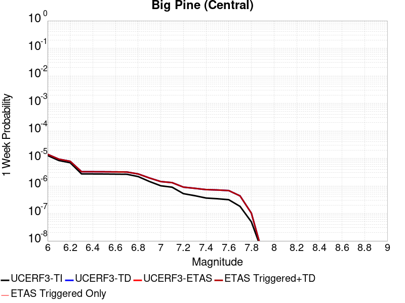 |  | 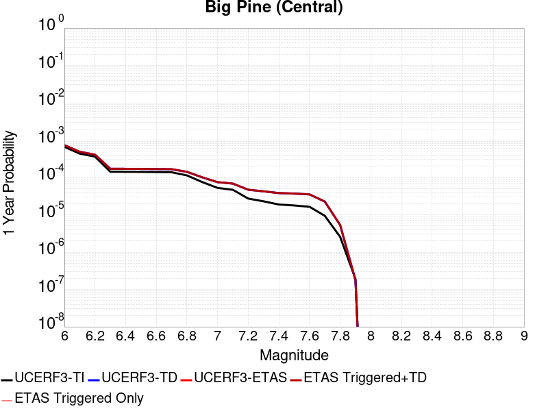 | 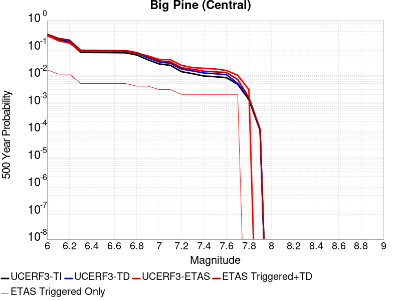 |

| Magnitude | 1 wk TI Prob | 1 wk TD Prob | 1 wk ETAS Prob | 1 wk ETAS/TD Gain | 1 wk ETAS Triggered+TD | 1 wk ETAS Triggered Only | 1 mo TI Prob | 1 mo TD Prob | 1 mo ETAS Prob | 1 mo ETAS/TD Gain | 1 mo ETAS Triggered+TD | 1 mo ETAS Triggered Only | 1 yr TI Prob | 1 yr TD Prob | 1 yr ETAS Prob | 1 yr ETAS/TD Gain | 1 yr ETAS Triggered+TD | 1 yr ETAS Triggered Only | 500 yr TI Prob | 500 yr TD Prob | 500 yr ETAS Prob | 500 yr ETAS/TD Gain | 500 yr ETAS Triggered+TD | 500 yr ETAS Triggered Only |
|-----|-----|-----|-----|-----|-----|-----|-----|-----|-----|-----|-----|-----|-----|-----|-----|-----|-----|-----|-----|-----|-----|-----|-----|-----|
| 6.0 | 1.2706755E-5 | 1.4060651E-5 | 0.0 | 0.0 | 1.4060651E-5 | 0.0 | 5.4456385E-5 | 6.0258742E-5 | 0.0 | 0.0 | 6.0258742E-5 | 0.0 | 6.628048E-4 | 7.3343946E-4 | 0.0 | 0.0 | 7.3343946E-4 | 0.0 | 0.28216267 | 0.30989745 | 0.292 | 0.9422472 | 0.3209391 | 0.016 |
| 6.1 | 8.342579E-6 | 9.341995E-6 | 0.0 | 0.0 | 9.341995E-6 | 0.0 | 3.5753423E-5 | 4.0036626E-5 | 0.0 | 0.0 | 4.0036626E-5 | 0.0 | 4.3521097E-4 | 4.8735843E-4 | 0.0 | 0.0 | 4.8735843E-4 | 0.0 | 0.19559535 | 0.21659273 | 0.184 | 0.8495207 | 0.2252102 | 0.011 |
| 6.2 | 6.923899E-6 | 7.805413E-6 | 0.0 | 0.0 | 7.805413E-6 | 0.0 | 2.9673516E-5 | 3.3451448E-5 | 0.0 | 0.0 | 3.3451448E-5 | 0.0 | 3.6121515E-4 | 4.0721433E-4 | 0.0 | 0.0 | 4.0721433E-4 | 0.0 | 0.16526437 | 0.18412776 | 0.15 | 0.8146517 | 0.19310236 | 0.011 |
| 6.3 | 2.728396E-6 | 3.2820192E-6 | 0.0 | 0.0 | 3.2820192E-6 | 0.0 | 1.1693074E-5 | 1.4065725E-5 | 0.0 | 0.0 | 1.4065725E-5 | 0.0 | 1.4235388E-4 | 1.712376E-4 | 0.0 | 0.0 | 1.712376E-4 | 0.0 | 0.06870762 | 0.07739355 | 0.076 | 0.98199403 | 0.08200657 | 0.005 |
| 6.4 | 2.7136944E-6 | 3.2663681E-6 | 0.0 | 0.0 | 3.2663681E-6 | 0.0 | 1.1630066E-5 | 1.399865E-5 | 0.0 | 0.0 | 1.399865E-5 | 0.0 | 1.4158686E-4 | 1.7042109E-4 | 0.0 | 0.0 | 1.7042109E-4 | 0.0 | 0.068350345 | 0.07701696 | 0.076 | 0.9867956 | 0.08163188 | 0.005 |
| 6.5 | 2.6971882E-6 | 3.2487767E-6 | 0.0 | 0.0 | 3.2487767E-6 | 0.0 | 1.1559327E-5 | 1.392326E-5 | 0.0 | 0.0 | 1.392326E-5 | 0.0 | 1.4072572E-4 | 1.6950334E-4 | 0.0 | 0.0 | 1.6950334E-4 | 0.0 | 0.06794906 | 0.07659359 | 0.076 | 0.9922501 | 0.08121063 | 0.005 |
| 6.6 | 2.669092E-6 | 3.2189014E-6 | 0.0 | 0.0 | 3.2189014E-6 | 0.0 | 1.1438916E-5 | 1.3795223E-5 | 0.0 | 0.0 | 1.3795223E-5 | 0.0 | 1.3925991E-4 | 1.6794475E-4 | 0.0 | 0.0 | 1.6794475E-4 | 0.0 | 0.06726561 | 0.075873956 | 0.075 | 0.9884815 | 0.08049458 | 0.005 |
| 6.7 | 2.6408059E-6 | 3.1890197E-6 | 0.0 | 0.0 | 3.1890197E-6 | 0.0 | 1.1317691E-5 | 1.3667161E-5 | 0.0 | 0.0 | 1.3667161E-5 | 0.0 | 1.3778417E-4 | 1.6638581E-4 | 0.0 | 0.0 | 1.6638581E-4 | 0.0 | 0.066577025 | 0.07515335 | 0.075 | 0.99795943 | 0.07977759 | 0.005 |
| 6.8 | 2.1786943E-6 | 2.7132503E-6 | 0.0 | 0.0 | 2.7132503E-6 | 0.0 | 9.337228E-6 | 1.1628167E-5 | 0.0 | 0.0 | 1.1628167E-5 | 0.0 | 1.1367482E-4 | 1.4156445E-4 | 0.0 | 0.0 | 1.4156445E-4 | 0.0 | 0.055255387 | 0.063566595 | 0.064 | 1.0068182 | 0.06731233 | 0.004 |
| 6.9 | 1.4411696E-6 | 1.9335475E-6 | 0.0 | 0.0 | 1.9335475E-6 | 0.0 | 6.1764263E-6 | 8.286607E-6 | 0.0 | 0.0 | 8.286607E-6 | 0.0 | 7.51954E-5 | 1.0088502E-4 | 0.0 | 0.0 | 1.0088502E-4 | 0.0 | 0.036901042 | 0.04396648 | 0.051 | 1.1599747 | 0.047790613 | 0.004 |
| 7.0 | 1.0073411E-6 | 1.4336731E-6 | 0.0 | 0.0 | 1.4336731E-6 | 0.0 | 4.317169E-6 | 6.1442997E-6 | 0.0 | 0.0 | 6.1442997E-6 | 0.0 | 5.2560266E-5 | 7.480442E-5 | 0.0 | 0.0 | 7.480442E-5 | 0.0 | 0.025938489 | 0.030655589 | 0.038 | 1.2395782 | 0.03356362 | 0.003 |
| 7.1 | 8.947104E-7 | 1.3113844E-6 | 0.0 | 0.0 | 1.3113844E-6 | 0.0 | 3.834468E-6 | 5.6202075E-6 | 0.0 | 0.0 | 5.6202075E-6 | 0.0 | 4.6683643E-5 | 6.8424015E-5 | 0.0 | 0.0 | 6.8424015E-5 | 0.0 | 0.023072042 | 0.027553055 | 0.037 | 1.3428638 | 0.030470395 | 0.003 |
| 7.2 | 5.215166E-7 | 9.0022706E-7 | 0.0 | 0.0 | 9.0022706E-7 | 0.0 | 2.2350691E-6 | 3.8581106E-6 | 0.0 | 0.0 | 3.8581106E-6 | 0.0 | 2.7211627E-5 | 4.697152E-5 | 0.0 | 0.0 | 4.697152E-5 | 0.0 | 0.013513856 | 0.016794253 | 0.023 | 1.369516 | 0.018760664 | 0.002 |
| 7.3 | 4.4024807E-7 | 8.142673E-7 | 0.0 | 0.0 | 8.142673E-7 | 0.0 | 1.8867761E-6 | 3.4897125E-6 | 0.0 | 0.0 | 3.4897125E-6 | 0.0 | 2.2971257E-5 | 4.2486456E-5 | 0.0 | 0.0 | 4.2486456E-5 | 0.0 | 0.011420051 | 0.014398006 | 0.019 | 1.3196272 | 0.01636921 | 0.002 |
| 7.4 | 3.6130905E-7 | 7.3145395E-7 | 0.0 | 0.0 | 7.3145395E-7 | 0.0 | 1.5484665E-6 | 3.134799E-6 | 0.0 | 0.0 | 3.134799E-6 | 0.0 | 1.8852415E-5 | 3.816554E-5 | 0.0 | 0.0 | 3.816554E-5 | 0.0 | 0.009382009 | 0.0120777795 | 0.018 | 1.4903402 | 0.014053623 | 0.002 |
| 7.5 | 3.408184E-7 | 7.086682E-7 | 0.0 | 0.0 | 7.086682E-7 | 0.0 | 1.4606494E-6 | 3.0371461E-6 | 0.0 | 0.0 | 3.0371461E-6 | 0.0 | 1.7783263E-5 | 3.697666E-5 | 0.0 | 0.0 | 3.697666E-5 | 0.0 | 0.008852296 | 0.0113933 | 0.017 | 1.492105 | 0.013370514 | 0.002 |
| 7.6 | 3.1428627E-7 | 6.7461457E-7 | 0.0 | 0.0 | 6.7461457E-7 | 0.0 | 1.3469405E-6 | 2.8912023E-6 | 0.0 | 0.0 | 2.8912023E-6 | 0.0 | 1.6398877E-5 | 3.519985E-5 | 0.0 | 0.0 | 3.519985E-5 | 0.0 | 0.008165982 | 0.010492504 | 0.015 | 1.4295921 | 0.0124715185 | 0.002 |
| 7.7 | 1.7972785E-7 | 4.326581E-7 | 0.0 | 0.0 | 4.326581E-7 | 0.0 | 7.70262E-7 | 1.8542478E-6 | 0.0 | 0.0 | 1.8542478E-6 | 0.0 | 9.377899E-6 | 2.2575241E-5 | 0.0 | 0.0 | 2.2575241E-5 | 0.0 | 0.0046779956 | 0.0050088647 | 0.01 | 1.9964604 | 0.006998847 | 0.002 |
| 7.8 | 4.9230927E-8 | 1.0200427E-7 | 0.0 | 0.0 | 1.0200427E-7 | 0.0 | 2.1098968E-7 | 4.3716108E-7 | 0.0 | 0.0 | 4.3716108E-7 | 0.0 | 2.5687964E-6 | 5.3224244E-6 | 0.0 | 0.0 | 5.3224244E-6 | 0.0 | 0.0012835753 | 0.0015274836 | 0.003 | 1.9640145 | 0.0015274836 | 0.0 |
| 7.9 | 3.6805972E-9 | 3.4169674E-9 | 0.0 | 0.0 | 3.4169674E-9 | 0.0 | 1.5773987E-8 | 1.4644146E-8 | 0.0 | 0.0 | 1.4644146E-8 | 0.0 | 1.9204828E-7 | 1.7829247E-7 | 0.0 | 0.0 | 1.7829247E-7 | 0.0 | 9.601954E-5 | 1.0520086E-4 | 0.0 | 0.0 | 1.0520086E-4 | 0.0 |

## Big Lagoon - Bald Mtn 2011 CFM
*[(top)](#table-of-contents)*

| 1 Week | 1 Month | 1 Year | 500 Year |
|-----|-----|-----|-----|
|  |  | 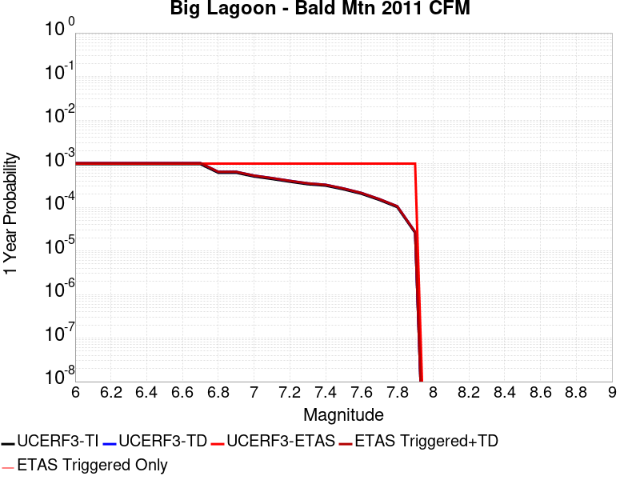 | 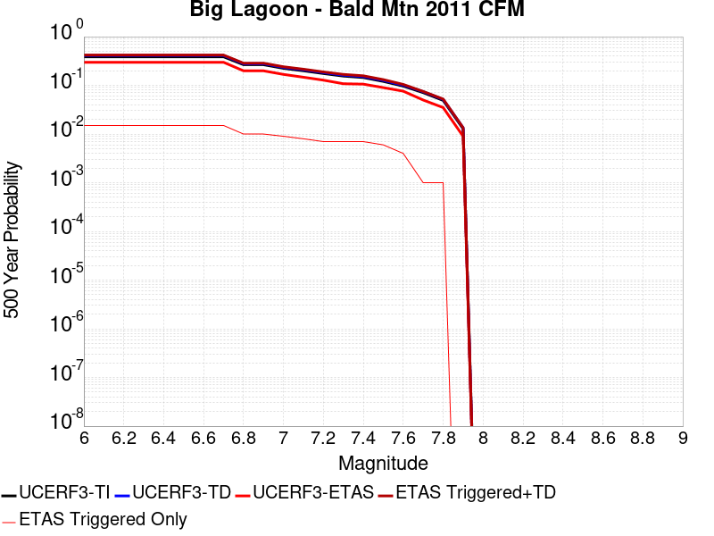 |

| Magnitude | 1 wk TI Prob | 1 wk TD Prob | 1 wk ETAS Prob | 1 wk ETAS/TD Gain | 1 wk ETAS Triggered+TD | 1 wk ETAS Triggered Only | 1 mo TI Prob | 1 mo TD Prob | 1 mo ETAS Prob | 1 mo ETAS/TD Gain | 1 mo ETAS Triggered+TD | 1 mo ETAS Triggered Only | 1 yr TI Prob | 1 yr TD Prob | 1 yr ETAS Prob | 1 yr ETAS/TD Gain | 1 yr ETAS Triggered+TD | 1 yr ETAS Triggered Only | 500 yr TI Prob | 500 yr TD Prob | 500 yr ETAS Prob | 500 yr ETAS/TD Gain | 500 yr ETAS Triggered+TD | 500 yr ETAS Triggered Only |
|-----|-----|-----|-----|-----|-----|-----|-----|-----|-----|-----|-----|-----|-----|-----|-----|-----|-----|-----|-----|-----|-----|-----|-----|-----|
| 6.0 | 1.8699735E-5 | 1.9786647E-5 | 0.0 | 0.0 | 1.9786647E-5 | 0.0 | 8.013926E-5 | 8.479737E-5 | 0.0 | 0.0 | 8.479737E-5 | 0.0 | 9.752587E-4 | 0.0010319565 | 0.001 | 0.9690331 | 0.0010319565 | 0.0 | 0.38606566 | 0.4097544 | 0.298 | 0.7272649 | 0.4186081 | 0.015 |
| 6.1 | 1.8699735E-5 | 1.9786647E-5 | 0.0 | 0.0 | 1.9786647E-5 | 0.0 | 8.013926E-5 | 8.479737E-5 | 0.0 | 0.0 | 8.479737E-5 | 0.0 | 9.752587E-4 | 0.0010319565 | 0.001 | 0.9690331 | 0.0010319565 | 0.0 | 0.38606566 | 0.4097544 | 0.298 | 0.7272649 | 0.4186081 | 0.015 |
| 6.2 | 1.8699735E-5 | 1.9786647E-5 | 0.0 | 0.0 | 1.9786647E-5 | 0.0 | 8.013926E-5 | 8.479737E-5 | 0.0 | 0.0 | 8.479737E-5 | 0.0 | 9.752587E-4 | 0.0010319565 | 0.001 | 0.9690331 | 0.0010319565 | 0.0 | 0.38606566 | 0.4097544 | 0.298 | 0.7272649 | 0.4186081 | 0.015 |
| 6.3 | 1.8699735E-5 | 1.9786647E-5 | 0.0 | 0.0 | 1.9786647E-5 | 0.0 | 8.013926E-5 | 8.479737E-5 | 0.0 | 0.0 | 8.479737E-5 | 0.0 | 9.752587E-4 | 0.0010319565 | 0.001 | 0.9690331 | 0.0010319565 | 0.0 | 0.38606566 | 0.4097544 | 0.298 | 0.7272649 | 0.4186081 | 0.015 |
| 6.4 | 1.8699735E-5 | 1.9786647E-5 | 0.0 | 0.0 | 1.9786647E-5 | 0.0 | 8.013926E-5 | 8.479737E-5 | 0.0 | 0.0 | 8.479737E-5 | 0.0 | 9.752587E-4 | 0.0010319565 | 0.001 | 0.9690331 | 0.0010319565 | 0.0 | 0.38606566 | 0.4097544 | 0.298 | 0.7272649 | 0.4186081 | 0.015 |
| 6.5 | 1.8699735E-5 | 1.9786647E-5 | 0.0 | 0.0 | 1.9786647E-5 | 0.0 | 8.013926E-5 | 8.479737E-5 | 0.0 | 0.0 | 8.479737E-5 | 0.0 | 9.752587E-4 | 0.0010319565 | 0.001 | 0.9690331 | 0.0010319565 | 0.0 | 0.38606566 | 0.4097544 | 0.298 | 0.7272649 | 0.4186081 | 0.015 |
| 6.6 | 1.8699735E-5 | 1.9786647E-5 | 0.0 | 0.0 | 1.9786647E-5 | 0.0 | 8.013926E-5 | 8.479737E-5 | 0.0 | 0.0 | 8.479737E-5 | 0.0 | 9.752587E-4 | 0.0010319565 | 0.001 | 0.9690331 | 0.0010319565 | 0.0 | 0.38606566 | 0.4097544 | 0.298 | 0.7272649 | 0.4186081 | 0.015 |
| 6.7 | 1.8699735E-5 | 1.9786647E-5 | 0.0 | 0.0 | 1.9786647E-5 | 0.0 | 8.013926E-5 | 8.479737E-5 | 0.0 | 0.0 | 8.479737E-5 | 0.0 | 9.752587E-4 | 0.0010319565 | 0.001 | 0.9690331 | 0.0010319565 | 0.0 | 0.38606566 | 0.4097544 | 0.298 | 0.7272649 | 0.4186081 | 0.015 |
| 6.8 | 1.18505095E-5 | 1.2464219E-5 | 0.0 | 0.0 | 1.2464219E-5 | 0.0 | 5.078691E-5 | 5.3417018E-5 | 0.0 | 0.0 | 5.3417018E-5 | 0.0 | 6.181552E-4 | 6.501629E-4 | 0.001 | 1.538076 | 6.501629E-4 | 0.0 | 0.26594636 | 0.27856055 | 0.199 | 0.7143869 | 0.28577495 | 0.01 |
| 6.9 | 1.18505095E-5 | 1.2464219E-5 | 0.0 | 0.0 | 1.2464219E-5 | 0.0 | 5.078691E-5 | 5.3417018E-5 | 0.0 | 0.0 | 5.3417018E-5 | 0.0 | 6.181552E-4 | 6.501629E-4 | 0.001 | 1.538076 | 6.501629E-4 | 0.0 | 0.26594636 | 0.27856055 | 0.199 | 0.7143869 | 0.28577495 | 0.01 |
| 7.0 | 9.719786E-6 | 1.0207277E-5 | 0.0 | 0.0 | 1.0207277E-5 | 0.0 | 4.1655563E-5 | 4.3744756E-5 | 0.0 | 0.0 | 4.3744756E-5 | 0.0 | 5.0703844E-4 | 5.3246453E-4 | 0.001 | 1.8780593 | 5.3246453E-4 | 0.0 | 0.22398506 | 0.23428091 | 0.168 | 0.71708786 | 0.24117239 | 0.009 |
| 7.1 | 8.523418E-6 | 8.9450805E-6 | 0.0 | 0.0 | 8.9450805E-6 | 0.0 | 3.652842E-5 | 3.8335504E-5 | 0.0 | 0.0 | 3.8335504E-5 | 0.0 | 4.4464276E-4 | 4.6663635E-4 | 0.001 | 2.1429963 | 4.6663635E-4 | 0.0 | 0.19938157 | 0.20847525 | 0.147 | 0.70511967 | 0.21480745 | 0.008 |
| 7.2 | 7.378894E-6 | 7.7402265E-6 | 0.0 | 0.0 | 7.7402265E-6 | 0.0 | 3.162345E-5 | 3.3171982E-5 | 0.0 | 0.0 | 3.3171982E-5 | 0.0 | 3.8494746E-4 | 4.0379495E-4 | 0.001 | 2.4765046 | 4.0379495E-4 | 0.0 | 0.17511459 | 0.1830544 | 0.128 | 0.6992457 | 0.18877302 | 0.007 |
| 7.3 | 6.4640294E-6 | 6.77452E-6 | 0.0 | 0.0 | 6.77452E-6 | 0.0 | 2.7702688E-5 | 2.903334E-5 | 0.0 | 0.0 | 2.903334E-5 | 0.0 | 3.3722803E-4 | 3.5342423E-4 | 0.001 | 2.8294609 | 3.5342423E-4 | 0.0 | 0.1551891 | 0.16215582 | 0.108 | 0.66602606 | 0.16802073 | 0.007 |
| 7.4 | 5.9959093E-6 | 6.282275E-6 | 0.0 | 0.0 | 6.282275E-6 | 0.0 | 2.5696501E-5 | 2.692376E-5 | 0.0 | 0.0 | 2.692376E-5 | 0.0 | 3.1280998E-4 | 3.2774807E-4 | 0.001 | 3.051124 | 3.2774807E-4 | 0.0 | 0.14480816 | 0.15131003 | 0.106 | 0.7005484 | 0.15725085 | 0.007 |
| 7.5 | 4.929265E-6 | 5.162924E-6 | 0.0 | 0.0 | 5.162924E-6 | 0.0 | 2.112525E-5 | 2.2126631E-5 | 0.0 | 0.0 | 2.2126631E-5 | 0.0 | 2.5716957E-4 | 2.6935883E-4 | 0.001 | 3.71252 | 2.6935883E-4 | 0.0 | 0.12067553 | 0.12611298 | 0.09 | 0.71364576 | 0.13135631 | 0.006 |
| 7.6 | 3.8982403E-6 | 4.078551E-6 | 0.0 | 0.0 | 4.078551E-6 | 0.0 | 1.6706637E-5 | 1.7479388E-5 | 0.0 | 0.0 | 1.7479388E-5 | 0.0 | 2.0338432E-4 | 2.1279103E-4 | 0.001 | 4.699446 | 2.1279103E-4 | 0.0 | 0.09670176 | 0.10100765 | 0.076 | 0.7524183 | 0.10460362 | 0.004 |
| 7.7 | 2.820968E-6 | 2.949805E-6 | 0.0 | 0.0 | 2.949805E-6 | 0.0 | 1.2089806E-5 | 1.2641962E-5 | 0.0 | 0.0 | 1.2641962E-5 | 0.0 | 1.4718344E-4 | 1.5390519E-4 | 0.001 | 6.4975066 | 1.5390519E-4 | 0.0 | 0.07095411 | 0.074116014 | 0.05 | 0.674618 | 0.0750419 | 0.001 |
| 7.8 | 1.9314455E-6 | 2.0208747E-6 | 0.0 | 0.0 | 2.0208747E-6 | 0.0 | 8.277597E-6 | 8.660863E-6 | 0.0 | 0.0 | 8.660863E-6 | 0.0 | 1.0077508E-4 | 1.0544104E-4 | 0.001 | 9.4839735 | 1.0544104E-4 | 0.0 | 0.04914156 | 0.051391006 | 0.035 | 0.681053 | 0.052339617 | 0.001 |
| 7.9 | 4.9586197E-7 | 5.204721E-7 | 0.0 | 0.0 | 5.204721E-7 | 0.0 | 2.125121E-6 | 2.2305928E-6 | 0.0 | 0.0 | 2.2305928E-6 | 0.0 | 2.5873042E-5 | 2.7157152E-5 | 0.001 | 36.822716 | 2.7157152E-5 | 0.0 | 0.012853368 | 0.013492676 | 0.009 | 0.66702855 | 0.013492676 | 0.0 |

## Elsinore (Coyote Mountains)
*[(top)](#table-of-contents)*

| 1 Week | 1 Month | 1 Year | 500 Year |
|-----|-----|-----|-----|
| 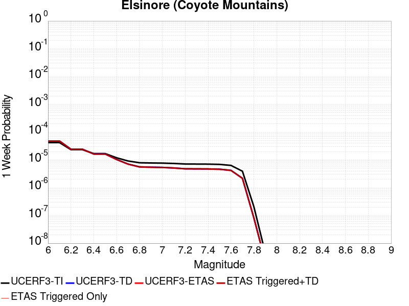 | 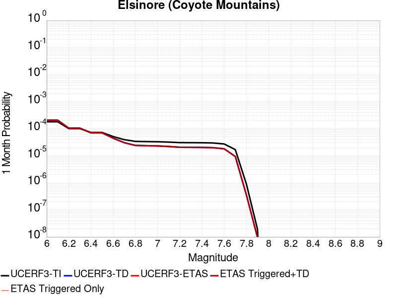 | 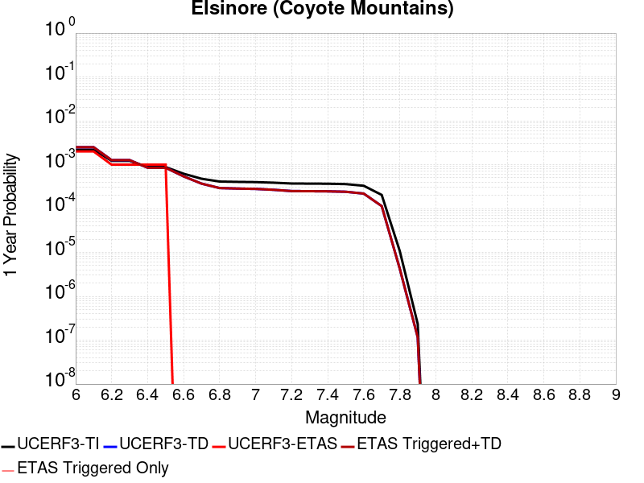 | 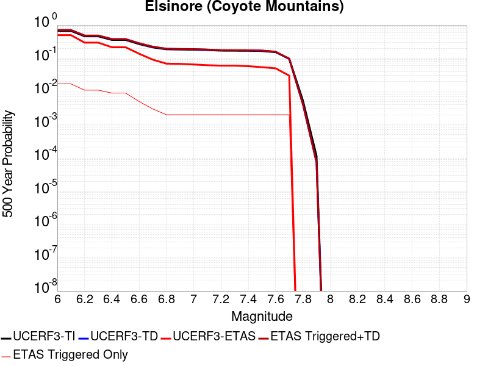 |

| Magnitude | 1 wk TI Prob | 1 wk TD Prob | 1 wk ETAS Prob | 1 wk ETAS/TD Gain | 1 wk ETAS Triggered+TD | 1 wk ETAS Triggered Only | 1 mo TI Prob | 1 mo TD Prob | 1 mo ETAS Prob | 1 mo ETAS/TD Gain | 1 mo ETAS Triggered+TD | 1 mo ETAS Triggered Only | 1 yr TI Prob | 1 yr TD Prob | 1 yr ETAS Prob | 1 yr ETAS/TD Gain | 1 yr ETAS Triggered+TD | 1 yr ETAS Triggered Only | 500 yr TI Prob | 500 yr TD Prob | 500 yr ETAS Prob | 500 yr ETAS/TD Gain | 500 yr ETAS Triggered+TD | 500 yr ETAS Triggered Only |
|-----|-----|-----|-----|-----|-----|-----|-----|-----|-----|-----|-----|-----|-----|-----|-----|-----|-----|-----|-----|-----|-----|-----|-----|-----|
| 6.0 | 4.20513E-5 | 4.795771E-5 | 0.0 | 0.0 | 4.795771E-5 | 0.0 | 1.8020741E-4 | 2.0551945E-4 | 0.0 | 0.0 | 2.0551945E-4 | 0.0 | 0.0021918174 | 0.002499846 | 0.002 | 0.8000493 | 0.002499846 | 0.0 | 0.666166 | 0.7023899 | 0.497 | 0.7075842 | 0.70744926 | 0.017 |
| 6.1 | 4.20513E-5 | 4.795771E-5 | 0.0 | 0.0 | 4.795771E-5 | 0.0 | 1.8020741E-4 | 2.0551945E-4 | 0.0 | 0.0 | 2.0551945E-4 | 0.0 | 0.0021918174 | 0.002499846 | 0.002 | 0.8000493 | 0.002499846 | 0.0 | 0.666166 | 0.7023899 | 0.497 | 0.7075842 | 0.70744926 | 0.017 |
| 6.2 | 2.3413893E-5 | 2.4363972E-5 | 0.0 | 0.0 | 2.4363972E-5 | 0.0 | 1.0034139E-4 | 1.04413324E-4 | 0.0 | 0.0 | 1.04413324E-4 | 0.0 | 0.0012209718 | 0.0012705798 | 0.001 | 0.78704226 | 0.0012705798 | 0.0 | 0.4571156 | 0.47866318 | 0.296 | 0.61838895 | 0.48439786 | 0.011 |
| 6.3 | 2.3413893E-5 | 2.4363972E-5 | 0.0 | 0.0 | 2.4363972E-5 | 0.0 | 1.0034139E-4 | 1.04413324E-4 | 0.0 | 0.0 | 1.04413324E-4 | 0.0 | 0.0012209718 | 0.0012705798 | 0.001 | 0.78704226 | 0.0012705798 | 0.0 | 0.4571156 | 0.47866318 | 0.296 | 0.61838895 | 0.48439786 | 0.011 |
| 6.4 | 1.6894814E-5 | 1.6339094E-5 | 0.0 | 0.0 | 1.6339094E-5 | 0.0 | 7.240433E-5 | 7.002298E-5 | 0.0 | 0.0 | 7.002298E-5 | 0.0 | 8.811662E-4 | 8.522334E-4 | 0.001 | 1.1733875 | 8.522334E-4 | 0.0 | 0.356464 | 0.37443563 | 0.215 | 0.5741975 | 0.38006574 | 0.009 |
| 6.5 | 1.6894814E-5 | 1.6339094E-5 | 0.0 | 0.0 | 1.6339094E-5 | 0.0 | 7.240433E-5 | 7.002298E-5 | 0.0 | 0.0 | 7.002298E-5 | 0.0 | 8.811662E-4 | 8.522334E-4 | 0.001 | 1.1733875 | 8.522334E-4 | 0.0 | 0.356464 | 0.37443563 | 0.215 | 0.5741975 | 0.38006574 | 0.009 |
| 6.6 | 1.1910969E-5 | 1.0367059E-5 | 0.0 | 0.0 | 1.0367059E-5 | 0.0 | 5.1046012E-5 | 4.4429562E-5 | 0.0 | 0.0 | 4.4429562E-5 | 0.0 | 6.21308E-4 | 5.408087E-4 | 0.0 | 0.0 | 5.408087E-4 | 0.0 | 0.2671033 | 0.27966446 | 0.137 | 0.48987275 | 0.28326613 | 0.005 |
| 6.7 | 9.1486E-6 | 7.074146E-6 | 0.0 | 0.0 | 7.074146E-6 | 0.0 | 3.9207694E-5 | 3.0317438E-5 | 0.0 | 0.0 | 3.0317438E-5 | 0.0 | 4.7724912E-4 | 3.69056E-4 | 0.0 | 0.0 | 3.69056E-4 | 0.0 | 0.2123343 | 0.22119235 | 0.091 | 0.41140664 | 0.22352877 | 0.003 |
| 6.8 | 7.90441E-6 | 5.614343E-6 | 0.0 | 0.0 | 5.614343E-6 | 0.0 | 3.3875604E-5 | 2.4061255E-5 | 0.0 | 0.0 | 2.4061255E-5 | 0.0 | 4.1235742E-4 | 2.929076E-4 | 0.0 | 0.0 | 2.929076E-4 | 0.0 | 0.18634695 | 0.19211696 | 0.069 | 0.35915622 | 0.19373272 | 0.002 |
| 6.9 | 7.77015E-6 | 5.468961E-6 | 0.0 | 0.0 | 5.468961E-6 | 0.0 | 3.3300217E-5 | 2.3438199E-5 | 0.0 | 0.0 | 2.3438199E-5 | 0.0 | 4.0535472E-4 | 2.853239E-4 | 0.0 | 0.0 | 2.853239E-4 | 0.0 | 0.1834919 | 0.18904598 | 0.068 | 0.35970086 | 0.19066788 | 0.002 |
| 7.0 | 7.675798E-6 | 5.366317E-6 | 0.0 | 0.0 | 5.366317E-6 | 0.0 | 3.289586E-5 | 2.2998305E-5 | 0.0 | 0.0 | 2.2998305E-5 | 0.0 | 4.004335E-4 | 2.799696E-4 | 0.0 | 0.0 | 2.799696E-4 | 0.0 | 0.1814795 | 0.1868739 | 0.065 | 0.34782815 | 0.18850014 | 0.002 |
| 7.1 | 7.447814E-6 | 5.1265406E-6 | 0.0 | 0.0 | 5.1265406E-6 | 0.0 | 3.191881E-5 | 2.197071E-5 | 0.0 | 0.0 | 2.197071E-5 | 0.0 | 3.8854225E-4 | 2.6746176E-4 | 0.0 | 0.0 | 2.6746176E-4 | 0.0 | 0.17659646 | 0.18160923 | 0.062 | 0.34139237 | 0.183246 | 0.002 |
| 7.2 | 7.128185E-6 | 4.794547E-6 | 0.0 | 0.0 | 4.794547E-6 | 0.0 | 3.0549007E-5 | 2.0547903E-5 | 0.0 | 0.0 | 2.0547903E-5 | 0.0 | 3.7187067E-4 | 2.5014312E-4 | 0.0 | 0.0 | 2.5014312E-4 | 0.0 | 0.16970143 | 0.17407462 | 0.06 | 0.34467974 | 0.17572647 | 0.002 |
| 7.3 | 7.0913875E-6 | 4.7635162E-6 | 0.0 | 0.0 | 4.7635162E-6 | 0.0 | 3.0391306E-5 | 2.0414916E-5 | 0.0 | 0.0 | 2.0414916E-5 | 0.0 | 3.6995133E-4 | 2.485244E-4 | 0.0 | 0.0 | 2.485244E-4 | 0.0 | 0.16890393 | 0.17324838 | 0.06 | 0.3463236 | 0.17490187 | 0.002 |
| 7.4 | 7.051521E-6 | 4.727735E-6 | 0.0 | 0.0 | 4.727735E-6 | 0.0 | 3.0220453E-5 | 2.026157E-5 | 0.0 | 0.0 | 2.026157E-5 | 0.0 | 3.6787192E-4 | 2.4665784E-4 | 0.0 | 0.0 | 2.4665784E-4 | 0.0 | 0.16803907 | 0.1723315 | 0.058 | 0.33656064 | 0.17398684 | 0.002 |
| 7.5 | 6.910666E-6 | 4.62465E-6 | 0.0 | 0.0 | 4.62465E-6 | 0.0 | 2.9616802E-5 | 1.9819785E-5 | 0.0 | 0.0 | 1.9819785E-5 | 0.0 | 3.605249E-4 | 2.4128029E-4 | 0.0 | 0.0 | 2.4128029E-4 | 0.0 | 0.16497612 | 0.1692309 | 0.054 | 0.31909066 | 0.17089243 | 0.002 |
| 7.6 | 6.341753E-6 | 4.203316E-6 | 0.0 | 0.0 | 4.203316E-6 | 0.0 | 2.7178658E-5 | 1.8014094E-5 | 0.0 | 0.0 | 1.8014094E-5 | 0.0 | 3.3084993E-4 | 2.1930064E-4 | 0.0 | 0.0 | 2.1930064E-4 | 0.0 | 0.15248974 | 0.15637077 | 0.05 | 0.31975284 | 0.15805803 | 0.002 |
| 7.7 | 3.9205916E-6 | 2.182807E-6 | 0.0 | 0.0 | 2.182807E-6 | 0.0 | 1.6802427E-5 | 9.354858E-6 | 0.0 | 0.0 | 9.354858E-6 | 0.0 | 2.0455034E-4 | 1.1389014E-4 | 0.0 | 0.0 | 1.1389014E-4 | 0.0 | 0.09722835 | 0.0950139 | 0.03 | 0.31574327 | 0.09682387 | 0.002 |
| 7.8 | 2.0846227E-7 | 8.2368544E-8 | 0.0 | 0.0 | 8.2368544E-8 | 0.0 | 8.9340944E-7 | 3.5300803E-7 | 0.0 | 0.0 | 3.5300803E-7 | 0.0 | 1.0877206E-5 | 4.2978672E-6 | 0.0 | 0.0 | 4.2978672E-6 | 0.0 | 0.00542387 | 0.0042083585 | 0.0 | 0.0 | 0.0042083585 | 0.0 |
| 7.9 | 4.4969806E-9 | 2.2314781E-9 | 0.0 | 0.0 | 2.2314781E-9 | 0.0 | 1.9272775E-8 | 9.563477E-9 | 0.0 | 0.0 | 9.563477E-9 | 0.0 | 2.3464601E-7 | 1.1643533E-7 | 0.0 | 0.0 | 1.1643533E-7 | 0.0 | 1.17316136E-4 | 7.4963275E-5 | 0.0 | 0.0 | 7.4963275E-5 | 0.0 |

## Whittier alt 1
*[(top)](#table-of-contents)*

| 1 Week | 1 Month | 1 Year | 500 Year |
|-----|-----|-----|-----|
|  | 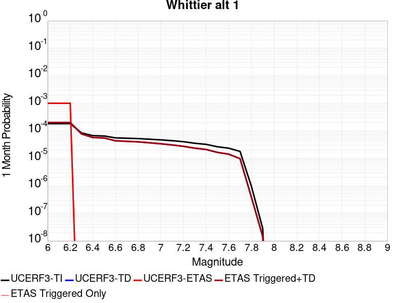 |  | 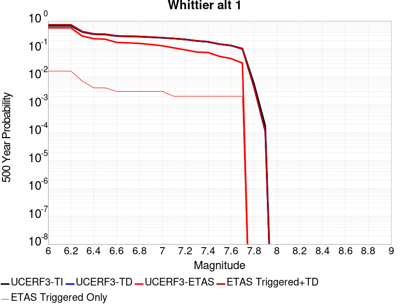 |

| Magnitude | 1 wk TI Prob | 1 wk TD Prob | 1 wk ETAS Prob | 1 wk ETAS/TD Gain | 1 wk ETAS Triggered+TD | 1 wk ETAS Triggered Only | 1 mo TI Prob | 1 mo TD Prob | 1 mo ETAS Prob | 1 mo ETAS/TD Gain | 1 mo ETAS Triggered+TD | 1 mo ETAS Triggered Only | 1 yr TI Prob | 1 yr TD Prob | 1 yr ETAS Prob | 1 yr ETAS/TD Gain | 1 yr ETAS Triggered+TD | 1 yr ETAS Triggered Only | 500 yr TI Prob | 500 yr TD Prob | 500 yr ETAS Prob | 500 yr ETAS/TD Gain | 500 yr ETAS Triggered+TD | 500 yr ETAS Triggered Only |
|-----|-----|-----|-----|-----|-----|-----|-----|-----|-----|-----|-----|-----|-----|-----|-----|-----|-----|-----|-----|-----|-----|-----|-----|-----|
| 6.0 | 4.2554693E-5 | 4.671574E-5 | 0.0 | 0.0 | 4.671574E-5 | 0.0 | 1.8236451E-4 | 2.0019675E-4 | 0.001 | 4.995086 | 2.0019675E-4 | 0.0 | 0.002218027 | 0.0024349876 | 0.002 | 0.82135946 | 0.0024349876 | 0.0 | 0.67052186 | 0.7244272 | 0.569 | 0.7854481 | 0.7288364 | 0.016 |
| 6.1 | 4.2554693E-5 | 4.671574E-5 | 0.0 | 0.0 | 4.671574E-5 | 0.0 | 1.8236451E-4 | 2.0019675E-4 | 0.001 | 4.995086 | 2.0019675E-4 | 0.0 | 0.002218027 | 0.0024349876 | 0.002 | 0.82135946 | 0.0024349876 | 0.0 | 0.67052186 | 0.7244272 | 0.569 | 0.7854481 | 0.7288364 | 0.016 |
| 6.2 | 4.2554693E-5 | 4.671574E-5 | 0.0 | 0.0 | 4.671574E-5 | 0.0 | 1.8236451E-4 | 2.0019675E-4 | 0.001 | 4.995086 | 2.0019675E-4 | 0.0 | 0.002218027 | 0.0024349876 | 0.002 | 0.82135946 | 0.0024349876 | 0.0 | 0.67052186 | 0.7244272 | 0.569 | 0.7854481 | 0.7288364 | 0.016 |
| 6.3 | 1.9617712E-5 | 1.7951534E-5 | 0.0 | 0.0 | 1.7951534E-5 | 0.0 | 8.40732E-5 | 7.6932985E-5 | 0.0 | 0.0 | 7.6932985E-5 | 0.0 | 0.0010231105 | 9.362752E-4 | 0.0 | 0.0 | 9.362752E-4 | 0.0 | 0.4005946 | 0.41483462 | 0.288 | 0.6942526 | 0.41893077 | 0.007 |
| 6.4 | 1.5611336E-5 | 1.332587E-5 | 0.0 | 0.0 | 1.332587E-5 | 0.0 | 6.690401E-5 | 5.7109653E-5 | 0.0 | 0.0 | 5.7109653E-5 | 0.0 | 8.142519E-4 | 6.9509394E-4 | 0.0 | 0.0 | 6.9509394E-4 | 0.0 | 0.33455 | 0.34259272 | 0.232 | 0.67718893 | 0.34522232 | 0.004 |
| 6.5 | 1.5150166E-5 | 1.2824994E-5 | 0.0 | 0.0 | 1.2824994E-5 | 0.0 | 6.492767E-5 | 5.4963133E-5 | 0.0 | 0.0 | 5.4963133E-5 | 0.0 | 7.9020765E-4 | 6.6897634E-4 | 0.0 | 0.0 | 6.6897634E-4 | 0.0 | 0.3264951 | 0.33415255 | 0.223 | 0.6673599 | 0.33681592 | 0.004 |
| 6.6 | 1.295588E-5 | 1.0151979E-5 | 0.0 | 0.0 | 1.0151979E-5 | 0.0 | 5.552402E-5 | 4.3507767E-5 | 0.0 | 0.0 | 4.3507767E-5 | 0.0 | 6.7579525E-4 | 5.2958017E-4 | 0.0 | 0.0 | 5.2958017E-4 | 0.0 | 0.28681317 | 0.29208854 | 0.171 | 0.5854389 | 0.29421228 | 0.003 |
| 6.7 | 1.2542085E-5 | 9.677788E-6 | 0.0 | 0.0 | 9.677788E-6 | 0.0 | 5.3750682E-5 | 4.147558E-5 | 0.0 | 0.0 | 4.147558E-5 | 0.0 | 6.542181E-4 | 5.0485E-4 | 0.0 | 0.0 | 5.0485E-4 | 0.0 | 0.27907205 | 0.28420368 | 0.165 | 0.5805695 | 0.28635108 | 0.003 |
| 6.8 | 1.2195878E-5 | 9.282353E-6 | 0.0 | 0.0 | 9.282353E-6 | 0.0 | 5.2267E-5 | 3.9780916E-5 | 0.0 | 0.0 | 3.9780916E-5 | 0.0 | 6.36165E-4 | 4.842268E-4 | 0.0 | 0.0 | 4.842268E-4 | 0.0 | 0.27253085 | 0.2771818 | 0.157 | 0.56641525 | 0.27935028 | 0.003 |
| 6.9 | 1.1580298E-5 | 8.571092E-6 | 0.0 | 0.0 | 8.571092E-6 | 0.0 | 4.9628903E-5 | 3.673274E-5 | 0.0 | 0.0 | 3.673274E-5 | 0.0 | 6.040644E-4 | 4.471309E-4 | 0.0 | 0.0 | 4.471309E-4 | 0.0 | 0.26075318 | 0.26394835 | 0.144 | 0.5455613 | 0.2661565 | 0.003 |
| 7.0 | 1.0964795E-5 | 7.8918E-6 | 0.0 | 0.0 | 7.8918E-6 | 0.0 | 4.6991136E-5 | 3.382157E-5 | 0.0 | 0.0 | 3.382157E-5 | 0.0 | 5.7196687E-4 | 4.1170124E-4 | 0.0 | 0.0 | 4.1170124E-4 | 0.0 | 0.2487864 | 0.25096557 | 0.129 | 0.5140147 | 0.25321266 | 0.003 |
| 7.1 | 1.0230601E-5 | 7.1543363E-6 | 0.0 | 0.0 | 7.1543363E-6 | 0.0 | 4.3844695E-5 | 3.066109E-5 | 0.0 | 0.0 | 3.066109E-5 | 0.0 | 5.336784E-4 | 3.7323605E-4 | 0.0 | 0.0 | 3.7323605E-4 | 0.0 | 0.23425835 | 0.23526865 | 0.109 | 0.46330014 | 0.23679811 | 0.002 |
| 7.2 | 9.40865E-6 | 6.388716E-6 | 0.0 | 0.0 | 6.388716E-6 | 0.0 | 4.032216E-5 | 2.737993E-5 | 0.0 | 0.0 | 2.737993E-5 | 0.0 | 4.908117E-4 | 3.3330082E-4 | 0.0 | 0.0 | 3.3330082E-4 | 0.0 | 0.2176602 | 0.21833466 | 0.092 | 0.4213715 | 0.21989799 | 0.002 |
| 7.3 | 8.237384E-6 | 5.4685015E-6 | 0.0 | 0.0 | 5.4685015E-6 | 0.0 | 3.5302593E-5 | 2.3436229E-5 | 0.0 | 0.0 | 2.3436229E-5 | 0.0 | 4.2972428E-4 | 2.8529973E-4 | 0.0 | 0.0 | 2.8529973E-4 | 0.0 | 0.19338462 | 0.19413058 | 0.077 | 0.39664024 | 0.19574232 | 0.002 |
| 7.4 | 7.5316966E-6 | 4.9096684E-6 | 0.0 | 0.0 | 4.9096684E-6 | 0.0 | 3.2278298E-5 | 2.104127E-5 | 0.0 | 0.0 | 2.104127E-5 | 0.0 | 3.9291743E-4 | 2.5614834E-4 | 0.0 | 0.0 | 2.5614834E-4 | 0.0 | 0.17839646 | 0.1792286 | 0.074 | 0.41288054 | 0.18087015 | 0.002 |
| 7.5 | 6.149649E-6 | 3.838296E-6 | 0.0 | 0.0 | 3.838296E-6 | 0.0 | 2.6355372E-5 | 1.644974E-5 | 0.0 | 0.0 | 1.644974E-5 | 0.0 | 3.208294E-4 | 2.0025803E-4 | 0.0 | 0.0 | 2.0025803E-4 | 0.0 | 0.14823145 | 0.14744377 | 0.054 | 0.3662413 | 0.14914888 | 0.002 |
| 7.6 | 5.457711E-6 | 3.3097556E-6 | 0.0 | 0.0 | 3.3097556E-6 | 0.0 | 2.338998E-5 | 1.4184594E-5 | 0.0 | 0.0 | 1.4184594E-5 | 0.0 | 2.8473578E-4 | 1.7268451E-4 | 0.0 | 0.0 | 1.7268451E-4 | 0.0 | 0.13271546 | 0.13113354 | 0.045 | 0.3431616 | 0.13287129 | 0.002 |
| 7.7 | 4.1676276E-6 | 2.2697484E-6 | 0.0 | 0.0 | 2.2697484E-6 | 0.0 | 1.7861139E-5 | 9.727461E-6 | 0.0 | 0.0 | 9.727461E-6 | 0.0 | 2.1743766E-4 | 1.184261E-4 | 0.0 | 0.0 | 1.184261E-4 | 0.0 | 0.103028014 | 0.099151365 | 0.031 | 0.3126533 | 0.10095306 | 0.002 |
| 7.8 | 2.2692414E-7 | 9.1199695E-8 | 0.0 | 0.0 | 9.1199695E-8 | 0.0 | 9.725317E-7 | 3.908558E-7 | 0.0 | 0.0 | 3.908558E-7 | 0.0 | 1.1840509E-5 | 4.7586623E-6 | 0.0 | 0.0 | 4.7586623E-6 | 0.0 | 0.005902799 | 0.0045152768 | 0.0 | 0.0 | 0.0045152768 | 0.0 |
| 7.9 | 6.676829E-9 | 3.3860155E-9 | 0.0 | 0.0 | 3.3860155E-9 | 0.0 | 2.861498E-8 | 1.4511495E-8 | 0.0 | 0.0 | 1.4511495E-8 | 0.0 | 3.4838732E-7 | 1.7667745E-7 | 0.0 | 0.0 | 1.7667745E-7 | 0.0 | 1.7417852E-4 | 1.0980361E-4 | 0.0 | 0.0 | 1.0980361E-4 | 0.0 |

## Great Valley 04a Trout Creek
*[(top)](#table-of-contents)*

| 1 Week | 1 Month | 1 Year | 500 Year |
|-----|-----|-----|-----|
|  |  | 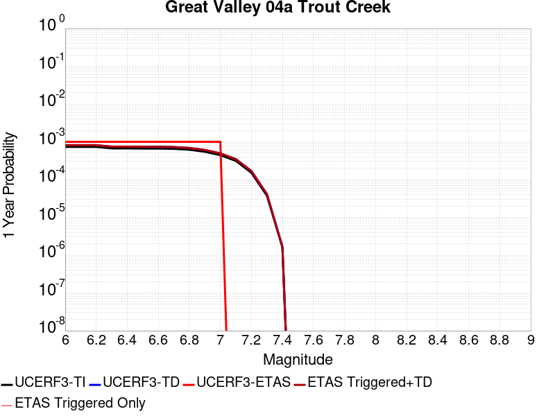 | 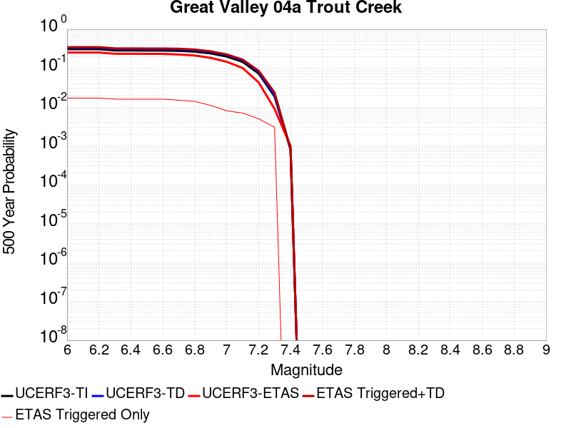 |

| Magnitude | 1 wk TI Prob | 1 wk TD Prob | 1 wk ETAS Prob | 1 wk ETAS/TD Gain | 1 wk ETAS Triggered+TD | 1 wk ETAS Triggered Only | 1 mo TI Prob | 1 mo TD Prob | 1 mo ETAS Prob | 1 mo ETAS/TD Gain | 1 mo ETAS Triggered+TD | 1 mo ETAS Triggered Only | 1 yr TI Prob | 1 yr TD Prob | 1 yr ETAS Prob | 1 yr ETAS/TD Gain | 1 yr ETAS Triggered+TD | 1 yr ETAS Triggered Only | 500 yr TI Prob | 500 yr TD Prob | 500 yr ETAS Prob | 500 yr ETAS/TD Gain | 500 yr ETAS Triggered+TD | 500 yr ETAS Triggered Only |
|-----|-----|-----|-----|-----|-----|-----|-----|-----|-----|-----|-----|-----|-----|-----|-----|-----|-----|-----|-----|-----|-----|-----|-----|-----|
| 6.0 | 1.4088538E-5 | 1.562544E-5 | 0.0 | 0.0 | 1.562544E-5 | 0.0 | 6.037805E-5 | 6.696452E-5 | 0.0 | 0.0 | 6.696452E-5 | 0.0 | 7.3485484E-4 | 8.150004E-4 | 0.001 | 1.2269932 | 8.150004E-4 | 0.0 | 0.30757993 | 0.3355239 | 0.253 | 0.75404465 | 0.34682 | 0.017 |
| 6.1 | 1.4088538E-5 | 1.562544E-5 | 0.0 | 0.0 | 1.562544E-5 | 0.0 | 6.037805E-5 | 6.696452E-5 | 0.0 | 0.0 | 6.696452E-5 | 0.0 | 7.3485484E-4 | 8.150004E-4 | 0.001 | 1.2269932 | 8.150004E-4 | 0.0 | 0.30757993 | 0.3355239 | 0.253 | 0.75404465 | 0.34682 | 0.017 |
| 6.2 | 1.4088538E-5 | 1.562544E-5 | 0.0 | 0.0 | 1.562544E-5 | 0.0 | 6.037805E-5 | 6.696452E-5 | 0.0 | 0.0 | 6.696452E-5 | 0.0 | 7.3485484E-4 | 8.150004E-4 | 0.001 | 1.2269932 | 8.150004E-4 | 0.0 | 0.30757993 | 0.3355239 | 0.253 | 0.75404465 | 0.34682 | 0.017 |
| 6.3 | 1.2882862E-5 | 1.4292263E-5 | 0.0 | 0.0 | 1.4292263E-5 | 0.0 | 5.5211098E-5 | 6.125117E-5 | 0.0 | 0.0 | 6.125117E-5 | 0.0 | 6.7198783E-4 | 7.4548816E-4 | 0.001 | 1.341403 | 7.4548816E-4 | 0.0 | 0.28545323 | 0.31196362 | 0.235 | 0.753293 | 0.3229722 | 0.016 |
| 6.4 | 1.2882862E-5 | 1.4292263E-5 | 0.0 | 0.0 | 1.4292263E-5 | 0.0 | 5.5211098E-5 | 6.125117E-5 | 0.0 | 0.0 | 6.125117E-5 | 0.0 | 6.7198783E-4 | 7.4548816E-4 | 0.001 | 1.341403 | 7.4548816E-4 | 0.0 | 0.28545323 | 0.31196362 | 0.235 | 0.753293 | 0.3229722 | 0.016 |
| 6.5 | 1.2762329E-5 | 1.4159558E-5 | 0.0 | 0.0 | 1.4159558E-5 | 0.0 | 5.469455E-5 | 6.0682465E-5 | 0.0 | 0.0 | 6.0682465E-5 | 0.0 | 6.657027E-4 | 7.3856884E-4 | 0.001 | 1.3539699 | 7.3856884E-4 | 0.0 | 0.2832027 | 0.3096013 | 0.233 | 0.75258076 | 0.3206477 | 0.016 |
| 6.6 | 1.2762329E-5 | 1.4159558E-5 | 0.0 | 0.0 | 1.4159558E-5 | 0.0 | 5.469455E-5 | 6.0682465E-5 | 0.0 | 0.0 | 6.0682465E-5 | 0.0 | 6.657027E-4 | 7.3856884E-4 | 0.001 | 1.3539699 | 7.3856884E-4 | 0.0 | 0.2832027 | 0.3096013 | 0.233 | 0.75258076 | 0.3206477 | 0.016 |
| 6.7 | 1.2557959E-5 | 1.3935015E-5 | 0.0 | 0.0 | 1.3935015E-5 | 0.0 | 5.3818712E-5 | 5.9720183E-5 | 0.0 | 0.0 | 5.9720183E-5 | 0.0 | 6.5504585E-4 | 7.268609E-4 | 0.001 | 1.375779 | 7.268609E-4 | 0.0 | 0.27937058 | 0.30558127 | 0.225 | 0.73630166 | 0.31599757 | 0.015 |
| 6.8 | 1.1871544E-5 | 1.317869E-5 | 0.0 | 0.0 | 1.317869E-5 | 0.0 | 5.0877054E-5 | 5.6478933E-5 | 0.0 | 0.0 | 5.6478933E-5 | 0.0 | 6.1925204E-4 | 6.87424E-4 | 0.001 | 1.4547063 | 6.87424E-4 | 0.0 | 0.26634908 | 0.29172894 | 0.212 | 0.726702 | 0.30164474 | 0.014 |
| 6.9 | 1.0500373E-5 | 1.166013E-5 | 0.0 | 0.0 | 1.166013E-5 | 0.0 | 4.5000823E-5 | 4.9971077E-5 | 0.0 | 0.0 | 4.9971077E-5 | 0.0 | 5.4774724E-4 | 6.082365E-4 | 0.001 | 1.6440973 | 6.082365E-4 | 0.0 | 0.2396289 | 0.26295277 | 0.184 | 0.6997454 | 0.27106032 | 0.011 |
| 7.0 | 8.524332E-6 | 9.475097E-6 | 0.0 | 0.0 | 9.475097E-6 | 0.0 | 3.653234E-5 | 4.0606967E-5 | 0.0 | 0.0 | 4.0606967E-5 | 0.0 | 4.4469046E-4 | 4.942849E-4 | 0.001 | 2.0231247 | 4.942849E-4 | 0.0 | 0.19940068 | 0.21963671 | 0.146 | 0.66473407 | 0.22587962 | 0.008 |
| 7.1 | 6.006849E-6 | 6.6708058E-6 | 0.0 | 0.0 | 6.6708058E-6 | 0.0 | 2.5743384E-5 | 2.8588885E-5 | 0.0 | 0.0 | 2.8588885E-5 | 0.0 | 3.1338062E-4 | 3.480196E-4 | 0.0 | 0.0 | 3.480196E-4 | 0.0 | 0.14505221 | 0.16043742 | 0.101 | 0.62952894 | 0.16631436 | 0.007 |
| 7.2 | 2.9122193E-6 | 3.2272155E-6 | 0.0 | 0.0 | 3.2272155E-6 | 0.0 | 1.248088E-5 | 1.383086E-5 | 0.0 | 0.0 | 1.383086E-5 | 0.0 | 1.5194413E-4 | 1.6837944E-4 | 0.0 | 0.0 | 1.6837944E-4 | 0.0 | 0.07316325 | 0.0811235 | 0.043 | 0.53005606 | 0.08571788 | 0.005 |
| 7.3 | 7.2194007E-7 | 7.9443777E-7 | 0.0 | 0.0 | 7.9443777E-7 | 0.0 | 3.0940253E-6 | 3.4047314E-6 | 0.0 | 0.0 | 3.4047314E-6 | 0.0 | 3.7669106E-5 | 4.145227E-5 | 0.0 | 0.0 | 4.145227E-5 | 0.0 | 0.01865864 | 0.020617085 | 0.009 | 0.43653116 | 0.023555234 | 0.003 |
| 7.4 | 3.112171E-8 | 3.2017713E-8 | 0.0 | 0.0 | 3.2017713E-8 | 0.0 | 1.3337875E-7 | 1.3721876E-7 | 0.0 | 0.0 | 1.3721876E-7 | 0.0 | 1.6238852E-6 | 1.6706372E-6 | 0.0 | 0.0 | 1.6706372E-6 | 0.0 | 8.116137E-4 | 8.3499384E-4 | 0.001 | 1.1976136 | 8.3499384E-4 | 0.0 |

## Manix-Afton Hills
*[(top)](#table-of-contents)*

| 1 Week | 1 Month | 1 Year | 500 Year |
|-----|-----|-----|-----|
|  |  | 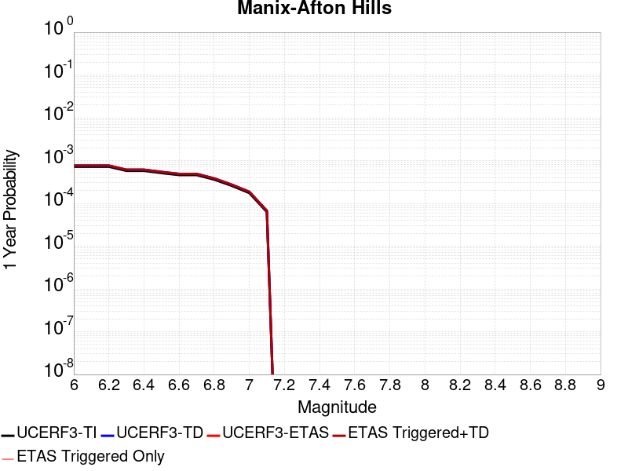 | 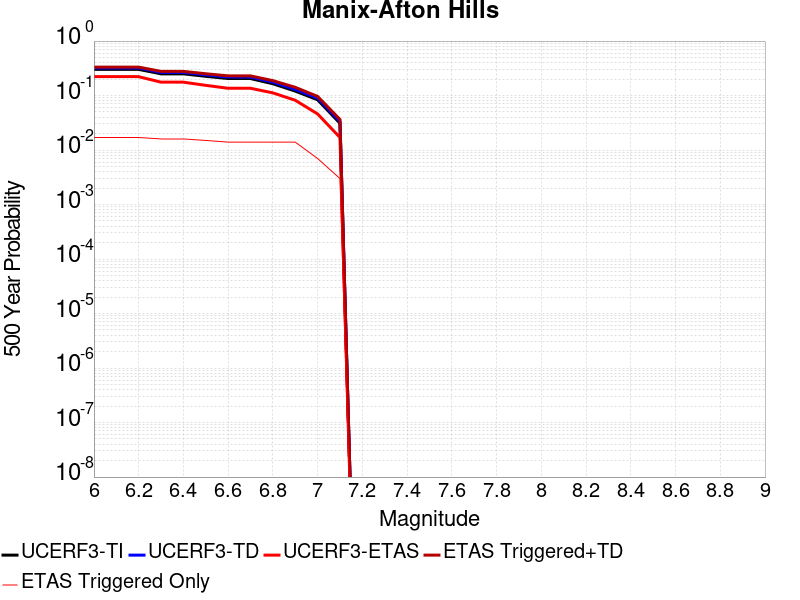 |

| Magnitude | 1 wk TI Prob | 1 wk TD Prob | 1 wk ETAS Prob | 1 wk ETAS/TD Gain | 1 wk ETAS Triggered+TD | 1 wk ETAS Triggered Only | 1 mo TI Prob | 1 mo TD Prob | 1 mo ETAS Prob | 1 mo ETAS/TD Gain | 1 mo ETAS Triggered+TD | 1 mo ETAS Triggered Only | 1 yr TI Prob | 1 yr TD Prob | 1 yr ETAS Prob | 1 yr ETAS/TD Gain | 1 yr ETAS Triggered+TD | 1 yr ETAS Triggered Only | 500 yr TI Prob | 500 yr TD Prob | 500 yr ETAS Prob | 500 yr ETAS/TD Gain | 500 yr ETAS Triggered+TD | 500 yr ETAS Triggered Only |
|-----|-----|-----|-----|-----|-----|-----|-----|-----|-----|-----|-----|-----|-----|-----|-----|-----|-----|-----|-----|-----|-----|-----|-----|-----|
| 6.0 | 1.3783202E-5 | 1.4659707E-5 | 0.0 | 0.0 | 1.4659707E-5 | 0.0 | 5.906953E-5 | 6.28259E-5 | 0.0 | 0.0 | 6.28259E-5 | 0.0 | 7.189342E-4 | 7.646542E-4 | 0.0 | 0.0 | 7.646542E-4 | 0.0 | 0.30204204 | 0.32101998 | 0.222 | 0.6915457 | 0.33256266 | 0.017 |
| 6.1 | 1.3783202E-5 | 1.4659707E-5 | 0.0 | 0.0 | 1.4659707E-5 | 0.0 | 5.906953E-5 | 6.28259E-5 | 0.0 | 0.0 | 6.28259E-5 | 0.0 | 7.189342E-4 | 7.646542E-4 | 0.0 | 0.0 | 7.646542E-4 | 0.0 | 0.30204204 | 0.32101998 | 0.222 | 0.6915457 | 0.33256266 | 0.017 |
| 6.2 | 1.3783202E-5 | 1.4659707E-5 | 0.0 | 0.0 | 1.4659707E-5 | 0.0 | 5.906953E-5 | 6.28259E-5 | 0.0 | 0.0 | 6.28259E-5 | 0.0 | 7.189342E-4 | 7.646542E-4 | 0.0 | 0.0 | 7.646542E-4 | 0.0 | 0.30204204 | 0.32101998 | 0.222 | 0.6915457 | 0.33256266 | 0.017 |
| 6.3 | 1.10494875E-5 | 1.1751942E-5 | 0.0 | 0.0 | 1.1751942E-5 | 0.0 | 4.7354086E-5 | 5.0364553E-5 | 0.0 | 0.0 | 5.0364553E-5 | 0.0 | 5.763835E-4 | 6.130262E-4 | 0.0 | 0.0 | 6.130262E-4 | 0.0 | 0.25044444 | 0.2660874 | 0.176 | 0.66143674 | 0.27783 | 0.016 |
| 6.4 | 1.10494875E-5 | 1.1751942E-5 | 0.0 | 0.0 | 1.1751942E-5 | 0.0 | 4.7354086E-5 | 5.0364553E-5 | 0.0 | 0.0 | 5.0364553E-5 | 0.0 | 5.763835E-4 | 6.130262E-4 | 0.0 | 0.0 | 6.130262E-4 | 0.0 | 0.25044444 | 0.2660874 | 0.176 | 0.66143674 | 0.27783 | 0.016 |
| 6.5 | 9.788949E-6 | 1.0417435E-5 | 0.0 | 0.0 | 1.0417435E-5 | 0.0 | 4.1951964E-5 | 4.4645436E-5 | 0.0 | 0.0 | 4.4645436E-5 | 0.0 | 5.1064545E-4 | 5.4343184E-4 | 0.0 | 0.0 | 5.4343184E-4 | 0.0 | 0.22538407 | 0.23986933 | 0.154 | 0.64201623 | 0.25127128 | 0.015 |
| 6.6 | 8.810006E-6 | 9.3801455E-6 | 0.0 | 0.0 | 9.3801455E-6 | 0.0 | 3.775662E-5 | 4.0200055E-5 | 0.0 | 0.0 | 4.0200055E-5 | 0.0 | 4.5958988E-4 | 4.893346E-4 | 0.0 | 0.0 | 4.893346E-4 | 0.0 | 0.20534544 | 0.21894215 | 0.136 | 0.6211686 | 0.22987697 | 0.014 |
| 6.7 | 8.80128E-6 | 9.37067E-6 | 0.0 | 0.0 | 9.37067E-6 | 0.0 | 3.7719226E-5 | 4.0159448E-5 | 0.0 | 0.0 | 4.0159448E-5 | 0.0 | 4.591348E-4 | 4.888404E-4 | 0.0 | 0.0 | 4.888404E-4 | 0.0 | 0.20516452 | 0.21875 | 0.136 | 0.6217143 | 0.2296875 | 0.014 |
| 6.8 | 6.8994877E-6 | 7.3533874E-6 | 0.0 | 0.0 | 7.3533874E-6 | 0.0 | 2.9568899E-5 | 3.1514184E-5 | 0.0 | 0.0 | 3.1514184E-5 | 0.0 | 3.5994186E-4 | 3.8362574E-4 | 0.0 | 0.0 | 3.8362574E-4 | 0.0 | 0.16473258 | 0.1763739 | 0.112 | 0.6350146 | 0.18790466 | 0.014 |
| 6.9 | 4.9328037E-6 | 5.2521987E-6 | 0.0 | 0.0 | 5.2521987E-6 | 0.0 | 2.1140417E-5 | 2.2509263E-5 | 0.0 | 0.0 | 2.2509263E-5 | 0.0 | 2.5735417E-4 | 2.7402194E-4 | 0.0 | 0.0 | 2.7402194E-4 | 0.0 | 0.120756716 | 0.12949699 | 0.082 | 0.63321936 | 0.14168403 | 0.014 |
| 7.0 | 3.347973E-6 | 3.5765534E-6 | 0.0 | 0.0 | 3.5765534E-6 | 0.0 | 1.4348378E-5 | 1.532802E-5 | 0.0 | 0.0 | 1.532802E-5 | 0.0 | 1.746775E-4 | 1.8660673E-4 | 0.0 | 0.0 | 1.8660673E-4 | 0.0 | 0.08364036 | 0.09008356 | 0.046 | 0.510637 | 0.09645298 | 0.007 |
| 7.1 | 1.2073567E-6 | 1.2887044E-6 | 0.0 | 0.0 | 1.2887044E-6 | 0.0 | 5.1743755E-6 | 5.523016E-6 | 0.0 | 0.0 | 5.523016E-6 | 0.0 | 6.29962E-5 | 6.724227E-5 | 0.0 | 0.0 | 6.724227E-5 | 0.0 | 0.031008165 | 0.033494838 | 0.017 | 0.50754094 | 0.03639435 | 0.003 |

## Reliz 2011 CFM
*[(top)](#table-of-contents)*

| 1 Week | 1 Month | 1 Year | 500 Year |
|-----|-----|-----|-----|
| 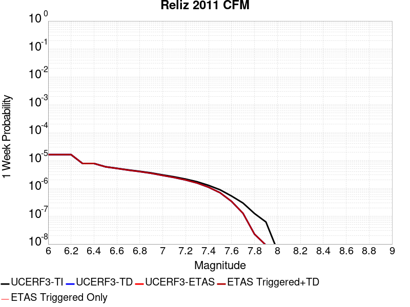 | 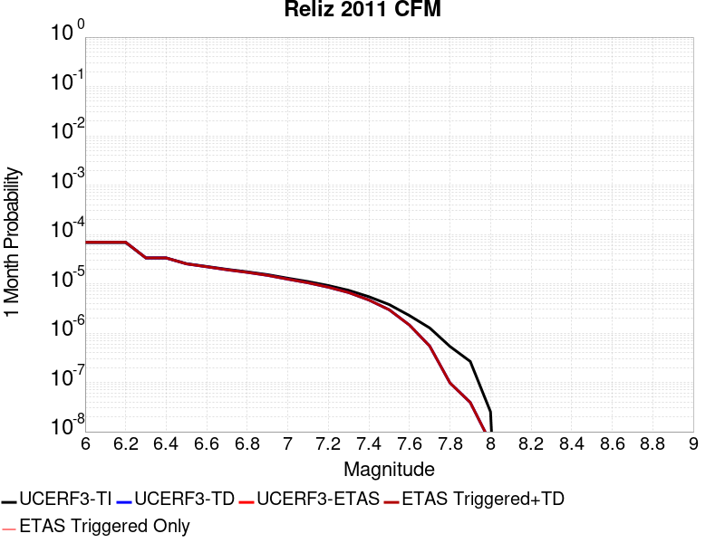 | 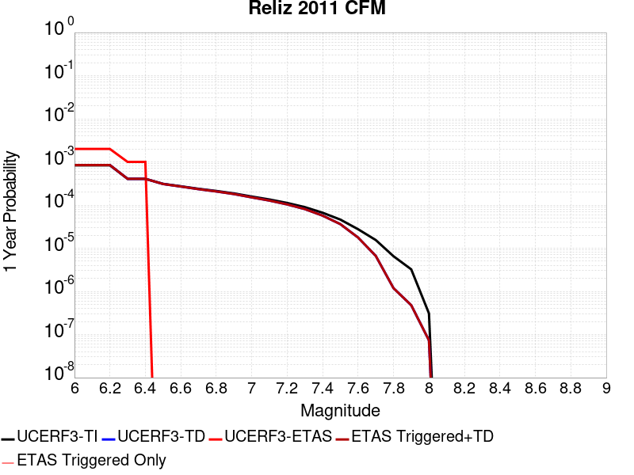 | 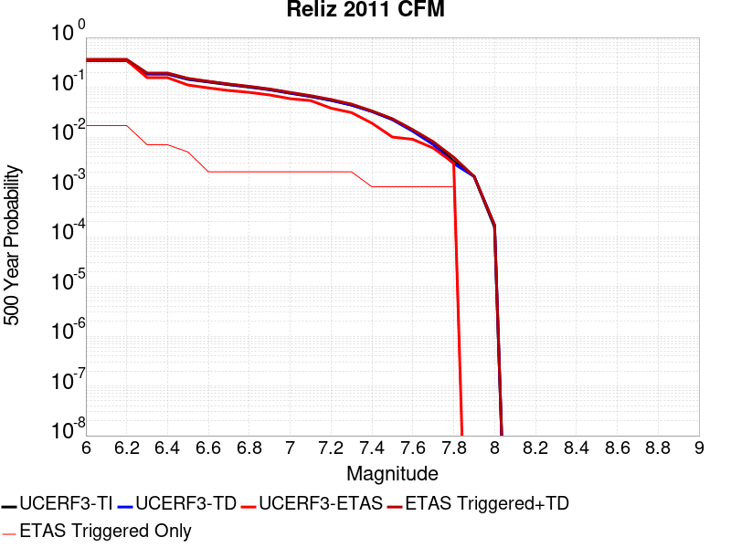 |

| Magnitude | 1 wk TI Prob | 1 wk TD Prob | 1 wk ETAS Prob | 1 wk ETAS/TD Gain | 1 wk ETAS Triggered+TD | 1 wk ETAS Triggered Only | 1 mo TI Prob | 1 mo TD Prob | 1 mo ETAS Prob | 1 mo ETAS/TD Gain | 1 mo ETAS Triggered+TD | 1 mo ETAS Triggered Only | 1 yr TI Prob | 1 yr TD Prob | 1 yr ETAS Prob | 1 yr ETAS/TD Gain | 1 yr ETAS Triggered+TD | 1 yr ETAS Triggered Only | 500 yr TI Prob | 500 yr TD Prob | 500 yr ETAS Prob | 500 yr ETAS/TD Gain | 500 yr ETAS Triggered+TD | 500 yr ETAS Triggered Only |
|-----|-----|-----|-----|-----|-----|-----|-----|-----|-----|-----|-----|-----|-----|-----|-----|-----|-----|-----|-----|-----|-----|-----|-----|-----|
| 6.0 | 1.6002472E-5 | 1.6245856E-5 | 0.0 | 0.0 | 1.6245856E-5 | 0.0 | 6.8580215E-5 | 6.9623355E-5 | 0.0 | 0.0 | 6.9623355E-5 | 0.0 | 8.3464425E-4 | 8.473544E-4 | 0.002 | 2.3602874 | 8.473544E-4 | 0.0 | 0.34130612 | 0.3521551 | 0.348 | 0.98820096 | 0.36316845 | 0.017 |
| 6.1 | 1.6002472E-5 | 1.6245856E-5 | 0.0 | 0.0 | 1.6245856E-5 | 0.0 | 6.8580215E-5 | 6.9623355E-5 | 0.0 | 0.0 | 6.9623355E-5 | 0.0 | 8.3464425E-4 | 8.473544E-4 | 0.002 | 2.3602874 | 8.473544E-4 | 0.0 | 0.34130612 | 0.3521551 | 0.348 | 0.98820096 | 0.36316845 | 0.017 |
| 6.2 | 1.6002472E-5 | 1.6245856E-5 | 0.0 | 0.0 | 1.6245856E-5 | 0.0 | 6.8580215E-5 | 6.9623355E-5 | 0.0 | 0.0 | 6.9623355E-5 | 0.0 | 8.3464425E-4 | 8.473544E-4 | 0.002 | 2.3602874 | 8.473544E-4 | 0.0 | 0.34130612 | 0.3521551 | 0.348 | 0.98820096 | 0.36316845 | 0.017 |
| 6.3 | 7.792404E-6 | 7.7812965E-6 | 0.0 | 0.0 | 7.7812965E-6 | 0.0 | 3.339559E-5 | 3.334799E-5 | 0.0 | 0.0 | 3.334799E-5 | 0.0 | 4.0651546E-4 | 4.059369E-4 | 0.001 | 2.463437 | 4.059369E-4 | 0.0 | 0.18396583 | 0.1876287 | 0.156 | 0.8314293 | 0.1933153 | 0.007 |
| 6.4 | 7.792404E-6 | 7.7812965E-6 | 0.0 | 0.0 | 7.7812965E-6 | 0.0 | 3.339559E-5 | 3.334799E-5 | 0.0 | 0.0 | 3.334799E-5 | 0.0 | 4.0651546E-4 | 4.059369E-4 | 0.001 | 2.463437 | 4.059369E-4 | 0.0 | 0.18396583 | 0.1876287 | 0.156 | 0.8314293 | 0.1933153 | 0.007 |
| 6.5 | 5.9659374E-6 | 5.9088234E-6 | 0.0 | 0.0 | 5.9088234E-6 | 0.0 | 2.5568053E-5 | 2.5323283E-5 | 0.0 | 0.0 | 2.5323283E-5 | 0.0 | 3.1124658E-4 | 3.0826757E-4 | 0.0 | 0.0 | 3.0826757E-4 | 0.0 | 0.14413919 | 0.14682738 | 0.111 | 0.7559898 | 0.15109324 | 0.005 |
| 6.6 | 5.2350692E-6 | 5.1600773E-6 | 0.0 | 0.0 | 5.1600773E-6 | 0.0 | 2.2435817E-5 | 2.211443E-5 | 0.0 | 0.0 | 2.211443E-5 | 0.0 | 2.7312184E-4 | 2.6921005E-4 | 0.0 | 0.0 | 2.6921005E-4 | 0.0 | 0.12766309 | 0.12998109 | 0.097 | 0.7462624 | 0.13172112 | 0.002 |
| 6.7 | 4.580206E-6 | 4.4881726E-6 | 0.0 | 0.0 | 4.4881726E-6 | 0.0 | 1.9629308E-5 | 1.9234883E-5 | 0.0 | 0.0 | 1.9234883E-5 | 0.0 | 2.389606E-4 | 2.3415963E-4 | 0.0 | 0.0 | 2.3415963E-4 | 0.0 | 0.11263118 | 0.114577234 | 0.086 | 0.75058544 | 0.11634807 | 0.002 |
| 6.8 | 4.0765017E-6 | 3.971048E-6 | 0.0 | 0.0 | 3.971048E-6 | 0.0 | 1.7470604E-5 | 1.7018667E-5 | 0.0 | 0.0 | 1.7018667E-5 | 0.0 | 2.1268385E-4 | 2.071826E-4 | 0.0 | 0.0 | 2.071826E-4 | 0.0 | 0.100893006 | 0.10254219 | 0.079 | 0.7704146 | 0.10433711 | 0.002 |
| 6.9 | 3.5752896E-6 | 3.4561062E-6 | 0.0 | 0.0 | 3.4561062E-6 | 0.0 | 1.532258E-5 | 1.48118E-5 | 0.0 | 0.0 | 1.48118E-5 | 0.0 | 1.8653645E-4 | 1.8031876E-4 | 0.0 | 0.0 | 1.8031876E-4 | 0.0 | 0.089058794 | 0.09040041 | 0.07 | 0.7743327 | 0.09221961 | 0.002 |
| 7.0 | 3.0259848E-6 | 2.8923475E-6 | 0.0 | 0.0 | 2.8923475E-6 | 0.0 | 1.2968442E-5 | 1.2395717E-5 | 0.0 | 0.0 | 1.2395717E-5 | 0.0 | 1.5787935E-4 | 1.509074E-4 | 0.0 | 0.0 | 1.509074E-4 | 0.0 | 0.075910084 | 0.07692057 | 0.059 | 0.767025 | 0.078766726 | 0.002 |
| 7.1 | 2.5861116E-6 | 2.440265E-6 | 0.0 | 0.0 | 2.440265E-6 | 0.0 | 1.1083288E-5 | 1.0458237E-5 | 0.0 | 0.0 | 1.0458237E-5 | 0.0 | 1.3493067E-4 | 1.273216E-4 | 0.0 | 0.0 | 1.273216E-4 | 0.0 | 0.06524413 | 0.065967746 | 0.054 | 0.8185818 | 0.067835815 | 0.002 |
| 7.2 | 2.1482588E-6 | 1.9890927E-6 | 0.0 | 0.0 | 1.9890927E-6 | 0.0 | 9.20679E-6 | 8.524655E-6 | 0.0 | 0.0 | 8.524655E-6 | 0.0 | 1.12086906E-4 | 1.0378273E-4 | 0.0 | 0.0 | 1.0378273E-4 | 0.0 | 0.05450492 | 0.054907832 | 0.038 | 0.6920688 | 0.05679802 | 0.002 |
| 7.3 | 1.7194744E-6 | 1.5477248E-6 | 0.0 | 0.0 | 1.5477248E-6 | 0.0 | 7.3691554E-6 | 6.633089E-6 | 0.0 | 0.0 | 6.633089E-6 | 0.0 | 8.971577E-5 | 8.075487E-5 | 0.0 | 0.0 | 8.075487E-5 | 0.0 | 0.04386857 | 0.043957632 | 0.031 | 0.7052246 | 0.045869716 | 0.002 |
| 7.4 | 1.2755178E-6 | 1.0930394E-6 | 0.0 | 0.0 | 1.0930394E-6 | 0.0 | 5.4664933E-6 | 4.6844457E-6 | 0.0 | 0.0 | 4.6844457E-6 | 0.0 | 6.655252E-5 | 5.7031637E-5 | 0.0 | 0.0 | 5.7031637E-5 | 0.0 | 0.032729767 | 0.032514226 | 0.019 | 0.5843596 | 0.03348171 | 0.001 |
| 7.5 | 8.8463224E-7 | 6.939471E-7 | 0.0 | 0.0 | 6.939471E-7 | 0.0 | 3.7912755E-6 | 2.9740554E-6 | 0.0 | 0.0 | 2.9740554E-6 | 0.0 | 4.6157802E-5 | 3.6208523E-5 | 0.0 | 0.0 | 3.6208523E-5 | 0.0 | 0.02281514 | 0.022341201 | 0.01 | 0.44760352 | 0.023318859 | 0.001 |
| 7.6 | 5.291355E-7 | 3.3963383E-7 | 0.0 | 0.0 | 3.3963383E-7 | 0.0 | 2.2677216E-6 | 1.4555727E-6 | 0.0 | 0.0 | 1.4555727E-6 | 0.0 | 2.760916E-5 | 1.7721453E-5 | 0.0 | 0.0 | 1.7721453E-5 | 0.0 | 0.013709921 | 0.013062623 | 0.009 | 0.68898875 | 0.014049561 | 0.001 |
| 7.7 | 2.9663357E-7 | 1.2707876E-7 | 0.0 | 0.0 | 1.2707876E-7 | 0.0 | 1.2712861E-6 | 5.4462316E-7 | 0.0 | 0.0 | 5.4462316E-7 | 0.0 | 1.5477797E-5 | 6.630767E-6 | 0.0 | 0.0 | 6.630767E-6 | 0.0 | 0.00770909 | 0.0070569613 | 0.006 | 0.8502243 | 0.008049904 | 0.001 |
| 7.8 | 1.2509386E-7 | 2.2767216E-8 | 0.0 | 0.0 | 2.2767216E-8 | 0.0 | 5.3611643E-7 | 9.757378E-8 | 0.0 | 0.0 | 9.757378E-8 | 0.0 | 6.527198E-6 | 1.1879602E-6 | 0.0 | 0.0 | 1.1879602E-6 | 0.0 | 0.00325829 | 0.0029239857 | 0.003 | 1.0259968 | 0.0039210618 | 0.001 |
| 7.9 | 6.213493E-8 | 9.160867E-9 | 0.0 | 0.0 | 9.160867E-9 | 0.0 | 2.6629255E-7 | 3.9260858E-8 | 0.0 | 0.0 | 3.9260858E-8 | 0.0 | 3.242107E-6 | 4.7800086E-7 | 0.0 | 0.0 | 4.7800086E-7 | 0.0 | 0.0016197428 | 0.0016152079 | 0.0 | 0.0 | 0.0016152079 | 0.0 |
| 8.0 | 5.92383E-9 | 1.4043909E-9 | 0.0 | 0.0 | 1.4043909E-9 | 0.0 | 2.5387841E-8 | 6.018818E-9 | 0.0 | 0.0 | 6.018818E-9 | 0.0 | 3.0909692E-7 | 7.3279104E-8 | 0.0 | 0.0 | 7.3279104E-8 | 0.0 | 1.5453655E-4 | 1.7007346E-4 | 0.0 | 0.0 | 1.7007346E-4 | 0.0 |

## San Gregorio (South) 2011 CFM
*[(top)](#table-of-contents)*

| 1 Week | 1 Month | 1 Year | 500 Year |
|-----|-----|-----|-----|
|  |  | 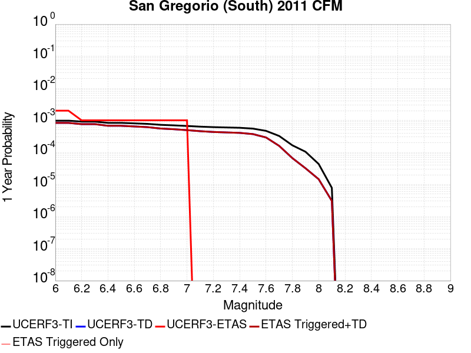 | 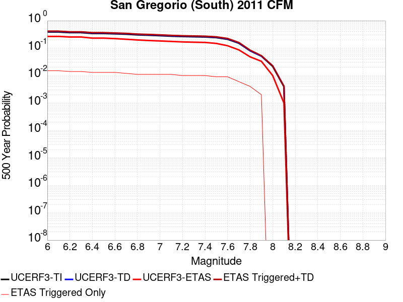 |

| Magnitude | 1 wk TI Prob | 1 wk TD Prob | 1 wk ETAS Prob | 1 wk ETAS/TD Gain | 1 wk ETAS Triggered+TD | 1 wk ETAS Triggered Only | 1 mo TI Prob | 1 mo TD Prob | 1 mo ETAS Prob | 1 mo ETAS/TD Gain | 1 mo ETAS Triggered+TD | 1 mo ETAS Triggered Only | 1 yr TI Prob | 1 yr TD Prob | 1 yr ETAS Prob | 1 yr ETAS/TD Gain | 1 yr ETAS Triggered+TD | 1 yr ETAS Triggered Only | 500 yr TI Prob | 500 yr TD Prob | 500 yr ETAS Prob | 500 yr ETAS/TD Gain | 500 yr ETAS Triggered+TD | 500 yr ETAS Triggered Only |
|-----|-----|-----|-----|-----|-----|-----|-----|-----|-----|-----|-----|-----|-----|-----|-----|-----|-----|-----|-----|-----|-----|-----|-----|-----|
| 6.0 | 1.8770423E-5 | 1.5990476E-5 | 0.0 | 0.0 | 1.5990476E-5 | 0.0 | 8.044219E-5 | 6.8528825E-5 | 0.0 | 0.0 | 6.8528825E-5 | 0.0 | 9.789435E-4 | 8.340228E-4 | 0.002 | 2.3980157 | 8.340228E-4 | 0.0 | 0.38719684 | 0.40530035 | 0.267 | 0.6587707 | 0.41422084 | 0.015 |
| 6.1 | 1.8770423E-5 | 1.5990476E-5 | 0.0 | 0.0 | 1.5990476E-5 | 0.0 | 8.044219E-5 | 6.8528825E-5 | 0.0 | 0.0 | 6.8528825E-5 | 0.0 | 9.789435E-4 | 8.340228E-4 | 0.002 | 2.3980157 | 8.340228E-4 | 0.0 | 0.38719684 | 0.40530035 | 0.267 | 0.6587707 | 0.41422084 | 0.015 |
| 6.2 | 1.7508692E-5 | 1.4616704E-5 | 0.0 | 0.0 | 1.4616704E-5 | 0.0 | 7.5035096E-5 | 6.264153E-5 | 0.0 | 0.0 | 6.264153E-5 | 0.0 | 9.1316935E-4 | 7.623968E-4 | 0.001 | 1.311653 | 7.623968E-4 | 0.0 | 0.36668876 | 0.38361385 | 0.254 | 0.66212416 | 0.39224327 | 0.014 |
| 6.3 | 1.7508692E-5 | 1.4616704E-5 | 0.0 | 0.0 | 1.4616704E-5 | 0.0 | 7.5035096E-5 | 6.264153E-5 | 0.0 | 0.0 | 6.264153E-5 | 0.0 | 9.1316935E-4 | 7.623968E-4 | 0.001 | 1.311653 | 7.623968E-4 | 0.0 | 0.36668876 | 0.38361385 | 0.254 | 0.66212416 | 0.39224327 | 0.014 |
| 6.4 | 1.6004591E-5 | 1.297483E-5 | 0.0 | 0.0 | 1.297483E-5 | 0.0 | 6.85893E-5 | 5.5605233E-5 | 0.0 | 0.0 | 5.5605233E-5 | 0.0 | 8.347548E-4 | 6.7678443E-4 | 0.001 | 1.4775753 | 6.7678443E-4 | 0.0 | 0.34134257 | 0.35649124 | 0.231 | 0.64798224 | 0.36485687 | 0.013 |
| 6.5 | 1.6004591E-5 | 1.297483E-5 | 0.0 | 0.0 | 1.297483E-5 | 0.0 | 6.85893E-5 | 5.5605233E-5 | 0.0 | 0.0 | 5.5605233E-5 | 0.0 | 8.347548E-4 | 6.7678443E-4 | 0.001 | 1.4775753 | 6.7678443E-4 | 0.0 | 0.34134257 | 0.35649124 | 0.231 | 0.64798224 | 0.36485687 | 0.013 |
| 6.6 | 1.5442201E-5 | 1.236246E-5 | 0.0 | 0.0 | 1.236246E-5 | 0.0 | 6.617918E-5 | 5.29809E-5 | 0.0 | 0.0 | 5.29809E-5 | 0.0 | 8.0543366E-4 | 6.448524E-4 | 0.001 | 1.5507424 | 6.448524E-4 | 0.0 | 0.3316071 | 0.34616566 | 0.222 | 0.64131147 | 0.3546655 | 0.013 |
| 6.7 | 1.489921E-5 | 1.1773709E-5 | 0.0 | 0.0 | 1.1773709E-5 | 0.0 | 6.3852196E-5 | 5.045778E-5 | 0.0 | 0.0 | 5.045778E-5 | 0.0 | 7.7712315E-4 | 6.14151E-4 | 0.001 | 1.628264 | 6.14151E-4 | 0.0 | 0.32207096 | 0.33607918 | 0.21 | 0.6248528 | 0.34404624 | 0.012 |
| 6.8 | 1.3876024E-5 | 1.0658232E-5 | 0.0 | 0.0 | 1.0658232E-5 | 0.0 | 5.9467322E-5 | 4.567734E-5 | 0.0 | 0.0 | 4.567734E-5 | 0.0 | 7.237741E-4 | 5.559801E-4 | 0.001 | 1.7986256 | 5.559801E-4 | 0.0 | 0.30373022 | 0.31648767 | 0.198 | 0.6256168 | 0.32400632 | 0.011 |
| 6.9 | 1.33922495E-5 | 1.01322885E-5 | 0.0 | 0.0 | 1.01322885E-5 | 0.0 | 5.7394092E-5 | 4.3423373E-5 | 0.0 | 0.0 | 4.3423373E-5 | 0.0 | 6.9854903E-4 | 5.285516E-4 | 0.001 | 1.891963 | 5.285516E-4 | 0.0 | 0.29488656 | 0.30708563 | 0.189 | 0.61546355 | 0.31470767 | 0.011 |
| 7.0 | 1.2807324E-5 | 9.495397E-6 | 0.0 | 0.0 | 9.495397E-6 | 0.0 | 5.4887376E-5 | 4.0693925E-5 | 0.0 | 0.0 | 4.0693925E-5 | 0.0 | 6.680489E-4 | 4.953361E-4 | 0.001 | 2.0188313 | 4.953361E-4 | 0.0 | 0.28404364 | 0.29553002 | 0.182 | 0.6158427 | 0.3032792 | 0.011 |
| 7.1 | 1.2191438E-5 | 8.808732E-6 | 0.0 | 0.0 | 8.808732E-6 | 0.0 | 5.224797E-5 | 3.775116E-5 | 0.0 | 0.0 | 3.775116E-5 | 0.0 | 6.3593336E-4 | 4.5952355E-4 | 0.0 | 0.0 | 4.5952355E-4 | 0.0 | 0.27244657 | 0.2830844 | 0.175 | 0.61819017 | 0.29097047 | 0.011 |
| 7.2 | 1.1769438E-5 | 8.332393E-6 | 0.0 | 0.0 | 8.332393E-6 | 0.0 | 5.0439474E-5 | 3.5709767E-5 | 0.0 | 0.0 | 3.5709767E-5 | 0.0 | 6.1392755E-4 | 4.3467974E-4 | 0.0 | 0.0 | 4.3467974E-4 | 0.0 | 0.2643921 | 0.2744237 | 0.168 | 0.61219203 | 0.28167945 | 0.01 |
| 7.3 | 1.150374E-5 | 8.050094E-6 | 0.0 | 0.0 | 8.050094E-6 | 0.0 | 4.9300812E-5 | 3.4499946E-5 | 0.0 | 0.0 | 3.4499946E-5 | 0.0 | 6.0007203E-4 | 4.1995596E-4 | 0.0 | 0.0 | 4.1995596E-4 | 0.0 | 0.25927517 | 0.26892337 | 0.164 | 0.60983914 | 0.27623412 | 0.01 |
| 7.4 | 1.12514E-5 | 7.797563E-6 | 0.0 | 0.0 | 7.797563E-6 | 0.0 | 4.8219394E-5 | 3.34177E-5 | 0.0 | 0.0 | 3.34177E-5 | 0.0 | 5.8691297E-4 | 4.0678456E-4 | 0.0 | 0.0 | 4.0678456E-4 | 0.0 | 0.25438258 | 0.26385906 | 0.161 | 0.6101742 | 0.27122048 | 0.01 |
| 7.5 | 1.059696E-5 | 7.1541867E-6 | 0.0 | 0.0 | 7.1541867E-6 | 0.0 | 4.5414752E-5 | 3.066044E-5 | 0.0 | 0.0 | 3.066044E-5 | 0.0 | 5.5278436E-4 | 3.7322697E-4 | 0.0 | 0.0 | 3.7322697E-4 | 0.0 | 0.24154256 | 0.2504859 | 0.148 | 0.5908516 | 0.25723153 | 0.009 |
| 7.6 | 9.018592E-6 | 5.614931E-6 | 0.0 | 0.0 | 5.614931E-6 | 0.0 | 3.8650534E-5 | 2.4063767E-5 | 0.0 | 0.0 | 2.4063767E-5 | 0.0 | 4.7046866E-4 | 2.92937E-4 | 0.0 | 0.0 | 2.92937E-4 | 0.0 | 0.20965813 | 0.2171226 | 0.122 | 0.56189454 | 0.2241685 | 0.009 |
| 7.7 | 6.243489E-6 | 3.0647745E-6 | 0.0 | 0.0 | 3.0647745E-6 | 0.0 | 2.6757538E-5 | 1.31346815E-5 | 0.0 | 0.0 | 1.31346815E-5 | 0.0 | 3.257243E-4 | 1.5990302E-4 | 0.0 | 0.0 | 1.5990302E-4 | 0.0 | 0.15031424 | 0.1545746 | 0.086 | 0.55636567 | 0.15964715 | 0.006 |
| 7.8 | 3.1941963E-6 | 1.2749279E-6 | 0.0 | 0.0 | 1.2749279E-6 | 0.0 | 1.368934E-5 | 5.463965E-6 | 0.0 | 0.0 | 5.463965E-6 | 0.0 | 1.6665498E-4 | 6.6521745E-5 | 0.0 | 0.0 | 6.6521745E-5 | 0.0 | 0.0799566 | 0.08032605 | 0.048 | 0.5975646 | 0.084004745 | 0.004 |
| 7.9 | 2.0098398E-6 | 6.1368735E-7 | 0.0 | 0.0 | 6.1368735E-7 | 0.0 | 8.6135715E-6 | 2.6300859E-6 | 0.0 | 0.0 | 2.6300859E-6 | 0.0 | 1.0486518E-4 | 3.2020824E-5 | 0.0 | 0.0 | 3.2020824E-5 | 0.0 | 0.051084325 | 0.050969016 | 0.033 | 0.6474522 | 0.052867077 | 0.002 |
| 8.0 | 8.353119E-7 | 2.800891E-7 | 0.0 | 0.0 | 2.800891E-7 | 0.0 | 3.579903E-6 | 1.2003812E-6 | 0.0 | 0.0 | 1.2003812E-6 | 0.0 | 4.358445E-5 | 1.4614543E-5 | 0.0 | 0.0 | 1.4614543E-5 | 0.0 | 0.021556953 | 0.022505552 | 0.01 | 0.4443348 | 0.022505552 | 0.0 |
| 8.1 | 1.5033264E-7 | 5.8850656E-8 | 0.0 | 0.0 | 5.8850656E-8 | 0.0 | 6.442826E-7 | 2.5221706E-7 | 0.0 | 0.0 | 2.5221706E-7 | 0.0 | 7.844113E-6 | 3.0707386E-6 | 0.0 | 0.0 | 3.0707386E-6 | 0.0 | 0.00391439 | 0.004045108 | 0.001 | 0.24721222 | 0.004045108 | 0.0 |

## Gravel Hills-Harper Lk
*[(top)](#table-of-contents)*

| 1 Week | 1 Month | 1 Year | 500 Year |
|-----|-----|-----|-----|
| 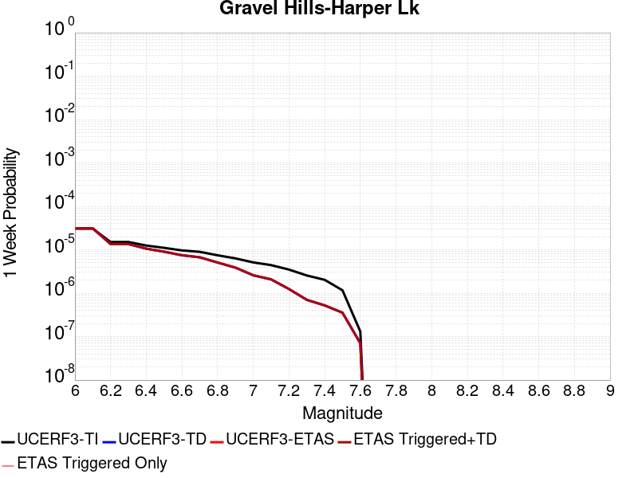 | 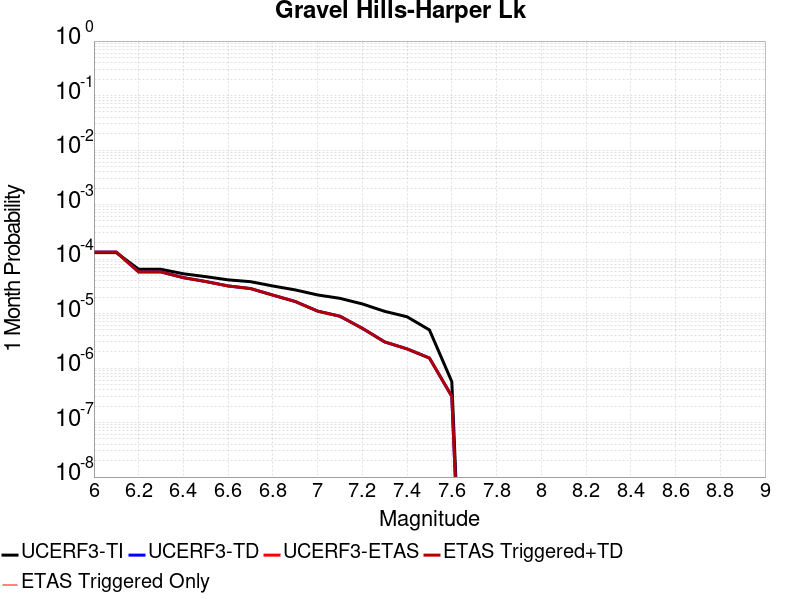 | 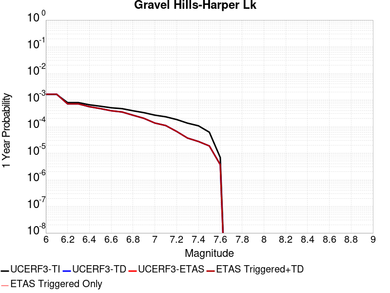 | 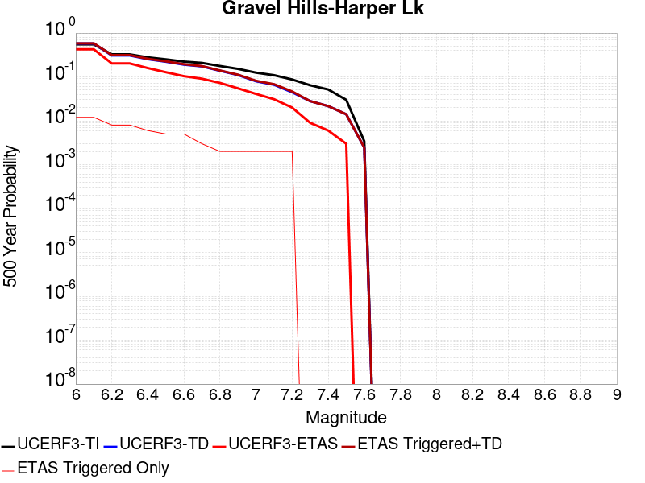 |

| Magnitude | 1 wk TI Prob | 1 wk TD Prob | 1 wk ETAS Prob | 1 wk ETAS/TD Gain | 1 wk ETAS Triggered+TD | 1 wk ETAS Triggered Only | 1 mo TI Prob | 1 mo TD Prob | 1 mo ETAS Prob | 1 mo ETAS/TD Gain | 1 mo ETAS Triggered+TD | 1 mo ETAS Triggered Only | 1 yr TI Prob | 1 yr TD Prob | 1 yr ETAS Prob | 1 yr ETAS/TD Gain | 1 yr ETAS Triggered+TD | 1 yr ETAS Triggered Only | 500 yr TI Prob | 500 yr TD Prob | 500 yr ETAS Prob | 500 yr ETAS/TD Gain | 500 yr ETAS Triggered+TD | 500 yr ETAS Triggered Only |
|-----|-----|-----|-----|-----|-----|-----|-----|-----|-----|-----|-----|-----|-----|-----|-----|-----|-----|-----|-----|-----|-----|-----|-----|-----|
| 6.0 | 3.0679566E-5 | 3.1250333E-5 | 0.0 | 0.0 | 3.1250333E-5 | 0.0 | 1.3147724E-4 | 1.3392432E-4 | 0.0 | 0.0 | 1.3392432E-4 | 0.0 | 0.0015995599 | 0.0016295223 | 0.0 | 0.0 | 0.0016295223 | 0.0 | 0.5508598 | 0.5783665 | 0.426 | 0.7365571 | 0.5834261 | 0.012 |
| 6.1 | 3.0679566E-5 | 3.1250333E-5 | 0.0 | 0.0 | 3.1250333E-5 | 0.0 | 1.3147724E-4 | 1.3392432E-4 | 0.0 | 0.0 | 1.3392432E-4 | 0.0 | 0.0015995599 | 0.0016295223 | 0.0 | 0.0 | 0.0016295223 | 0.0 | 0.5508598 | 0.5783665 | 0.426 | 0.7365571 | 0.5834261 | 0.012 |
| 6.2 | 1.514536E-5 | 1.3558058E-5 | 0.0 | 0.0 | 1.3558058E-5 | 0.0 | 6.490707E-5 | 5.810473E-5 | 0.0 | 0.0 | 5.810473E-5 | 0.0 | 7.8995706E-4 | 7.0720725E-4 | 0.0 | 0.0 | 7.0720725E-4 | 0.0 | 0.32641065 | 0.30818638 | 0.203 | 0.6586923 | 0.3137209 | 0.008 |
| 6.3 | 1.514536E-5 | 1.3558058E-5 | 0.0 | 0.0 | 1.3558058E-5 | 0.0 | 6.490707E-5 | 5.810473E-5 | 0.0 | 0.0 | 5.810473E-5 | 0.0 | 7.8995706E-4 | 7.0720725E-4 | 0.0 | 0.0 | 7.0720725E-4 | 0.0 | 0.32641065 | 0.30818638 | 0.203 | 0.6586923 | 0.3137209 | 0.008 |
| 6.4 | 1.2532521E-5 | 1.0632015E-5 | 0.0 | 0.0 | 1.0632015E-5 | 0.0 | 5.37097E-5 | 4.5565015E-5 | 0.0 | 0.0 | 4.5565015E-5 | 0.0 | 6.537194E-4 | 5.546186E-4 | 0.0 | 0.0 | 5.546186E-4 | 0.0 | 0.27889216 | 0.2539299 | 0.159 | 0.626157 | 0.25840634 | 0.006 |
| 6.5 | 1.1094058E-5 | 9.03569E-6 | 0.0 | 0.0 | 9.03569E-6 | 0.0 | 4.7545094E-5 | 3.8723832E-5 | 0.0 | 0.0 | 3.8723832E-5 | 0.0 | 5.787078E-4 | 4.7136468E-4 | 0.0 | 0.0 | 4.7136468E-4 | 0.0 | 0.25131553 | 0.22252294 | 0.128 | 0.5752216 | 0.22641033 | 0.005 |
| 6.6 | 9.688328E-6 | 7.4920977E-6 | 0.0 | 0.0 | 7.4920977E-6 | 0.0 | 4.1520743E-5 | 3.2108608E-5 | 0.0 | 0.0 | 3.2108608E-5 | 0.0 | 5.053978E-4 | 3.9085472E-4 | 0.0 | 0.0 | 3.9085472E-4 | 0.0 | 0.2233479 | 0.19068238 | 0.104 | 0.5454096 | 0.19472896 | 0.005 |
| 6.7 | 8.974824E-6 | 6.713726E-6 | 0.0 | 0.0 | 6.713726E-6 | 0.0 | 3.8462964E-5 | 2.8772807E-5 | 0.0 | 0.0 | 2.8772807E-5 | 0.0 | 4.6818596E-4 | 3.502548E-4 | 0.0 | 0.0 | 3.502548E-4 | 0.0 | 0.20875514 | 0.1741518 | 0.091 | 0.5225327 | 0.17662933 | 0.003 |
| 6.8 | 7.4780046E-6 | 5.0882177E-6 | 0.0 | 0.0 | 5.0882177E-6 | 0.0 | 3.20482E-5 | 2.1806472E-5 | 0.0 | 0.0 | 2.1806472E-5 | 0.0 | 3.9011694E-4 | 2.6546285E-4 | 0.0 | 0.0 | 2.6546285E-4 | 0.0 | 0.17724477 | 0.13823137 | 0.073 | 0.5281001 | 0.13995491 | 0.002 |
| 6.9 | 6.3409307E-6 | 3.8846215E-6 | 0.0 | 0.0 | 3.8846215E-6 | 0.0 | 2.7175134E-5 | 1.6648277E-5 | 0.0 | 0.0 | 1.6648277E-5 | 0.0 | 3.3080703E-4 | 2.026749E-4 | 0.0 | 0.0 | 2.026749E-4 | 0.0 | 0.15247156 | 0.11053907 | 0.055 | 0.49756163 | 0.112317994 | 0.002 |
| 7.0 | 5.1239335E-6 | 2.5883926E-6 | 0.0 | 0.0 | 2.5883926E-6 | 0.0 | 2.195953E-5 | 1.1093066E-5 | 0.0 | 0.0 | 1.1093066E-5 | 0.0 | 2.6732447E-4 | 1.3504995E-4 | 0.0 | 0.0 | 1.3504995E-4 | 0.0 | 0.12513012 | 0.07968984 | 0.041 | 0.5144947 | 0.08153046 | 0.002 |
| 7.1 | 4.438899E-6 | 2.0831342E-6 | 0.0 | 0.0 | 2.0831342E-6 | 0.0 | 1.9023713E-5 | 8.927689E-6 | 0.0 | 0.0 | 8.927689E-6 | 0.0 | 2.315891E-4 | 1.0868941E-4 | 0.0 | 0.0 | 1.0868941E-4 | 0.0 | 0.10935375 | 0.066261955 | 0.031 | 0.46784008 | 0.068129435 | 0.002 |
| 7.2 | 3.50367E-6 | 1.2504956E-6 | 0.0 | 0.0 | 1.2504956E-6 | 0.0 | 1.5015643E-5 | 5.3592566E-6 | 0.0 | 0.0 | 5.3592566E-6 | 0.0 | 1.8280011E-4 | 6.524708E-5 | 0.0 | 0.0 | 6.524708E-5 | 0.0 | 0.0873551 | 0.044724714 | 0.02 | 0.44718006 | 0.046635266 | 0.002 |
| 7.3 | 2.561638E-6 | 7.04256E-7 | 0.0 | 0.0 | 7.04256E-7 | 0.0 | 1.0978401E-5 | 3.0182366E-6 | 0.0 | 0.0 | 3.0182366E-6 | 0.0 | 1.3365384E-4 | 3.674643E-5 | 0.0 | 0.0 | 3.674643E-5 | 0.0 | 0.0646471 | 0.028103275 | 0.009 | 0.32024735 | 0.028103275 | 0.0 |
| 7.4 | 2.0368864E-6 | 5.243382E-7 | 0.0 | 0.0 | 5.243382E-7 | 0.0 | 8.729483E-6 | 2.2471615E-6 | 0.0 | 0.0 | 2.2471615E-6 | 0.0 | 1.06276275E-4 | 2.7358856E-5 | 0.0 | 0.0 | 2.7358856E-5 | 0.0 | 0.051753663 | 0.021613652 | 0.006 | 0.27760234 | 0.021613652 | 0.0 |
| 7.5 | 1.1681728E-6 | 3.5635094E-7 | 0.0 | 0.0 | 3.5635094E-7 | 0.0 | 5.0064455E-6 | 1.5272175E-6 | 0.0 | 0.0 | 1.5272175E-6 | 0.0 | 6.0951766E-5 | 1.8593719E-5 | 0.0 | 0.0 | 1.8593719E-5 | 0.0 | 0.030017076 | 0.014101648 | 0.003 | 0.21274109 | 0.014101648 | 0.0 |
| 7.6 | 1.3154387E-7 | 7.061878E-8 | 0.0 | 0.0 | 7.061878E-8 | 0.0 | 5.6375933E-7 | 3.026519E-7 | 0.0 | 0.0 | 3.026519E-7 | 0.0 | 6.863748E-6 | 3.6847823E-6 | 0.0 | 0.0 | 3.6847823E-6 | 0.0 | 0.0034260035 | 0.0024528948 | 0.0 | 0.0 | 0.0024528948 | 0.0 |

## Pilarcitos 2011 CFM
*[(top)](#table-of-contents)*

| 1 Week | 1 Month | 1 Year | 500 Year |
|-----|-----|-----|-----|
| 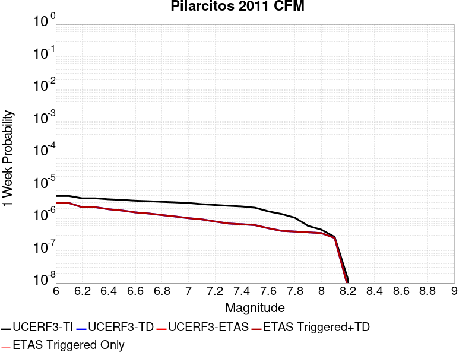 | 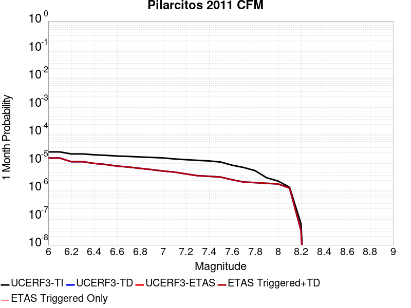 | 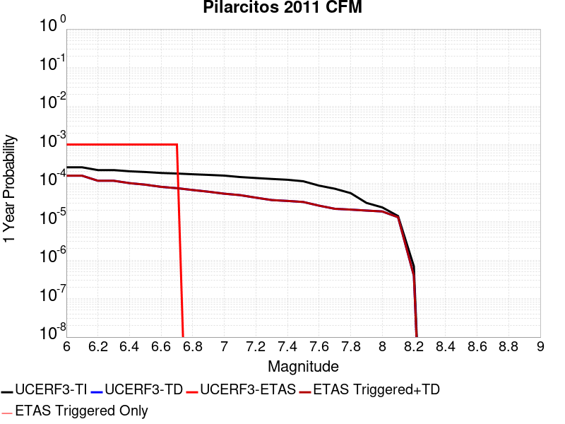 | 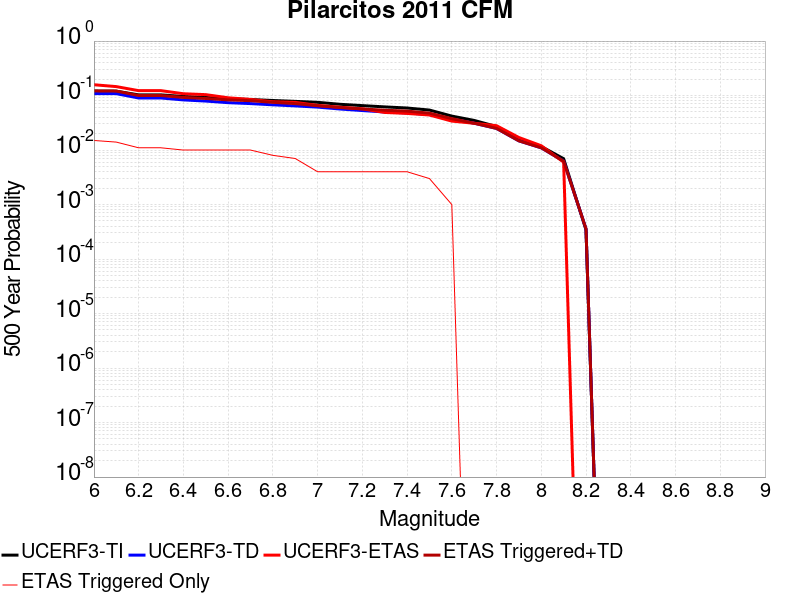 |

| Magnitude | 1 wk TI Prob | 1 wk TD Prob | 1 wk ETAS Prob | 1 wk ETAS/TD Gain | 1 wk ETAS Triggered+TD | 1 wk ETAS Triggered Only | 1 mo TI Prob | 1 mo TD Prob | 1 mo ETAS Prob | 1 mo ETAS/TD Gain | 1 mo ETAS Triggered+TD | 1 mo ETAS Triggered Only | 1 yr TI Prob | 1 yr TD Prob | 1 yr ETAS Prob | 1 yr ETAS/TD Gain | 1 yr ETAS Triggered+TD | 1 yr ETAS Triggered Only | 500 yr TI Prob | 500 yr TD Prob | 500 yr ETAS Prob | 500 yr ETAS/TD Gain | 500 yr ETAS Triggered+TD | 500 yr ETAS Triggered Only |
|-----|-----|-----|-----|-----|-----|-----|-----|-----|-----|-----|-----|-----|-----|-----|-----|-----|-----|-----|-----|-----|-----|-----|-----|-----|
| 6.0 | 4.9150476E-6 | 2.9716562E-6 | 0.0 | 0.0 | 2.9716562E-6 | 0.0 | 2.1064321E-5 | 1.2735608E-5 | 0.0 | 0.0 | 1.2735608E-5 | 0.0 | 2.564279E-4 | 1.550453E-4 | 0.001 | 6.4497275 | 1.550453E-4 | 0.0 | 0.12034932 | 0.10837007 | 0.158 | 1.457967 | 0.12174452 | 0.015 |
| 6.1 | 4.9150476E-6 | 2.9716562E-6 | 0.0 | 0.0 | 2.9716562E-6 | 0.0 | 2.1064321E-5 | 1.2735608E-5 | 0.0 | 0.0 | 1.2735608E-5 | 0.0 | 2.564279E-4 | 1.550453E-4 | 0.001 | 6.4497275 | 1.550453E-4 | 0.0 | 0.12034932 | 0.10837007 | 0.146 | 1.3472354 | 0.120852895 | 0.014 |
| 6.2 | 4.162343E-6 | 2.201052E-6 | 0.0 | 0.0 | 2.201052E-6 | 0.0 | 1.783849E-5 | 9.433046E-6 | 0.0 | 0.0 | 9.433046E-6 | 0.0 | 2.1716199E-4 | 1.1484136E-4 | 0.001 | 8.7076645 | 1.1484136E-4 | 0.0 | 0.10290434 | 0.09020494 | 0.123 | 1.3635617 | 0.100212686 | 0.011 |
| 6.3 | 4.162343E-6 | 2.201052E-6 | 0.0 | 0.0 | 2.201052E-6 | 0.0 | 1.783849E-5 | 9.433046E-6 | 0.0 | 0.0 | 9.433046E-6 | 0.0 | 2.1716199E-4 | 1.1484136E-4 | 0.001 | 8.7076645 | 1.1484136E-4 | 0.0 | 0.10290434 | 0.09020494 | 0.123 | 1.3635617 | 0.100212686 | 0.011 |
| 6.4 | 3.8768926E-6 | 1.9088507E-6 | 0.0 | 0.0 | 1.9088507E-6 | 0.0 | 1.6615148E-5 | 8.180763E-6 | 0.0 | 0.0 | 8.180763E-6 | 0.0 | 2.0227065E-4 | 9.959628E-5 | 0.001 | 10.040536 | 9.959628E-5 | 0.0 | 0.09619853 | 0.08323356 | 0.108 | 1.2975537 | 0.09240122 | 0.01 |
| 6.5 | 3.7137002E-6 | 1.7425905E-6 | 0.0 | 0.0 | 1.7425905E-6 | 0.0 | 1.591576E-5 | 7.4682234E-6 | 0.0 | 0.0 | 7.4682234E-6 | 0.0 | 1.9375715E-4 | 9.092186E-5 | 0.001 | 10.998455 | 9.092186E-5 | 0.0 | 0.09234231 | 0.07923175 | 0.104 | 1.3126051 | 0.08843943 | 0.01 |
| 6.6 | 3.5048733E-6 | 1.5279321E-6 | 0.0 | 0.0 | 1.5279321E-6 | 0.0 | 1.5020799E-5 | 6.548264E-6 | 0.0 | 0.0 | 6.548264E-6 | 0.0 | 1.8286289E-4 | 7.9722224E-5 | 0.001 | 12.543554 | 7.9722224E-5 | 0.0 | 0.08738375 | 0.074055426 | 0.091 | 1.2288094 | 0.08331487 | 0.01 |
| 6.7 | 3.3908584E-6 | 1.4120271E-6 | 0.0 | 0.0 | 1.4120271E-6 | 0.0 | 1.453217E-5 | 6.051531E-6 | 0.0 | 0.0 | 6.051531E-6 | 0.0 | 1.7691481E-4 | 7.367491E-5 | 0.001 | 13.573141 | 7.367491E-5 | 0.0 | 0.08466506 | 0.071230665 | 0.085 | 1.1933063 | 0.08051836 | 0.01 |
| 6.8 | 3.2451449E-6 | 1.2658269E-6 | 0.0 | 0.0 | 1.2658269E-6 | 0.0 | 1.3907689E-5 | 5.4249613E-6 | 0.0 | 0.0 | 5.4249613E-6 | 0.0 | 1.6931296E-4 | 6.604691E-5 | 0.0 | 0.0 | 6.604691E-5 | 0.0 | 0.08117872 | 0.06763544 | 0.077 | 1.1384565 | 0.07509436 | 0.008 |
| 6.9 | 3.1239128E-6 | 1.142849E-6 | 0.0 | 0.0 | 1.142849E-6 | 0.0 | 1.3388129E-5 | 4.897915E-6 | 0.0 | 0.0 | 4.897915E-6 | 0.0 | 1.6298829E-4 | 5.963049E-5 | 0.0 | 0.0 | 5.963049E-5 | 0.0 | 0.078268014 | 0.06461061 | 0.075 | 1.1608001 | 0.071158335 | 0.007 |
| 7.0 | 2.9940109E-6 | 1.0149901E-6 | 0.0 | 0.0 | 1.0149901E-6 | 0.0 | 1.2831412E-5 | 4.3499504E-6 | 0.0 | 0.0 | 4.3499504E-6 | 0.0 | 1.5621124E-4 | 5.295936E-5 | 0.0 | 0.0 | 5.295936E-5 | 0.0 | 0.07513891 | 0.061401308 | 0.066 | 1.0748956 | 0.0651557 | 0.004 |
| 7.1 | 2.7471217E-6 | 9.319515E-7 | 0.0 | 0.0 | 9.319515E-7 | 0.0 | 1.1773326E-5 | 3.9940714E-6 | 0.0 | 0.0 | 3.9940714E-6 | 0.0 | 1.4333082E-4 | 4.8626738E-5 | 0.0 | 0.0 | 4.8626738E-5 | 0.0 | 0.06916249 | 0.05666527 | 0.061 | 1.0764971 | 0.06043861 | 0.004 |
| 7.2 | 2.592675E-6 | 8.0081E-7 | 0.0 | 0.0 | 8.0081E-7 | 0.0 | 1.1111417E-5 | 3.4320385E-6 | 0.0 | 0.0 | 3.4320385E-6 | 0.0 | 1.3527309E-4 | 4.1784268E-5 | 0.0 | 0.0 | 4.1784268E-5 | 0.0 | 0.065404184 | 0.05307192 | 0.057 | 1.0740143 | 0.056859635 | 0.004 |
| 7.3 | 2.4518663E-6 | 6.940344E-7 | 0.0 | 0.0 | 6.940344E-7 | 0.0 | 1.0507956E-5 | 2.9744297E-6 | 0.0 | 0.0 | 2.9744297E-6 | 0.0 | 1.2792686E-4 | 3.6213078E-5 | 0.0 | 0.0 | 3.6213078E-5 | 0.0 | 0.061964534 | 0.05000329 | 0.049 | 0.9799355 | 0.053803276 | 0.004 |
| 7.4 | 2.3349535E-6 | 6.589388E-7 | 0.0 | 0.0 | 6.589388E-7 | 0.0 | 1.0006905E-5 | 2.8240204E-6 | 0.0 | 0.0 | 2.8240204E-6 | 0.0 | 1.2182725E-4 | 3.4381905E-5 | 0.0 | 0.0 | 3.4381905E-5 | 0.0 | 0.05909899 | 0.048088655 | 0.047 | 0.9773615 | 0.0518963 | 0.004 |
| 7.5 | 2.1358665E-6 | 6.184071E-7 | 0.0 | 0.0 | 6.184071E-7 | 0.0 | 9.15368E-6 | 2.6503135E-6 | 0.0 | 0.0 | 2.6503135E-6 | 0.0 | 1.11440364E-4 | 3.226709E-5 | 0.0 | 0.0 | 3.226709E-5 | 0.0 | 0.054199185 | 0.04473688 | 0.044 | 0.98352855 | 0.047602672 | 0.003 |
| 7.6 | 1.6445446E-6 | 4.963279E-7 | 0.0 | 0.0 | 4.963279E-7 | 0.0 | 7.048029E-6 | 2.1271178E-6 | 0.0 | 0.0 | 2.1271178E-6 | 0.0 | 8.580638E-5 | 2.589735E-5 | 0.0 | 0.0 | 2.589735E-5 | 0.0 | 0.041997634 | 0.03677578 | 0.034 | 0.92452157 | 0.037739 | 0.001 |
| 7.7 | 1.3650961E-6 | 4.1183384E-7 | 0.0 | 0.0 | 4.1183384E-7 | 0.0 | 5.850399E-6 | 1.765001E-6 | 0.0 | 0.0 | 1.765001E-6 | 0.0 | 7.122628E-5 | 2.1488675E-5 | 0.0 | 0.0 | 2.1488675E-5 | 0.0 | 0.034987677 | 0.031088626 | 0.031 | 0.9971492 | 0.031088626 | 0.0 |
| 7.8 | 1.0500993E-6 | 3.920507E-7 | 0.0 | 0.0 | 3.920507E-7 | 0.0 | 4.5004176E-6 | 1.6802162E-6 | 0.0 | 0.0 | 1.6802162E-6 | 0.0 | 5.4791206E-5 | 2.045644E-5 | 0.0 | 0.0 | 2.045644E-5 | 0.0 | 0.027024478 | 0.024964284 | 0.028 | 1.1216024 | 0.024964284 | 0.0 |
| 7.9 | 5.856431E-7 | 3.7046294E-7 | 0.0 | 0.0 | 3.7046294E-7 | 0.0 | 2.5098966E-6 | 1.5876974E-6 | 0.0 | 0.0 | 1.5876974E-6 | 0.0 | 3.0557563E-5 | 1.9330044E-5 | 0.0 | 0.0 | 1.9330044E-5 | 0.0 | 0.015162882 | 0.014758533 | 0.017 | 1.151876 | 0.014758533 | 0.0 |
| 8.0 | 4.4768265E-7 | 3.5119132E-7 | 0.0 | 0.0 | 3.5119132E-7 | 0.0 | 1.9186384E-6 | 1.5051048E-6 | 0.0 | 0.0 | 1.5051048E-6 | 0.0 | 2.3359173E-5 | 1.8324497E-5 | 0.0 | 0.0 | 1.8324497E-5 | 0.0 | 0.01161178 | 0.010994465 | 0.012 | 1.0914582 | 0.010994465 | 0.0 |
| 8.1 | 2.6692538E-7 | 2.4884346E-7 | 0.0 | 0.0 | 2.4884346E-7 | 0.0 | 1.1439654E-6 | 1.0664716E-6 | 0.0 | 0.0 | 1.0664716E-6 | 0.0 | 1.392769E-5 | 1.2984214E-5 | 0.0 | 0.0 | 1.2984214E-5 | 0.0 | 0.0069397017 | 0.0062533887 | 0.006 | 0.95947975 | 0.0062533887 | 0.0 |
| 8.2 | 1.3198862E-8 | 7.565155E-9 | 0.0 | 0.0 | 7.565155E-9 | 0.0 | 5.656655E-8 | 3.2422093E-8 | 0.0 | 0.0 | 3.2422093E-8 | 0.0 | 6.886975E-7 | 3.9473892E-7 | 0.0 | 0.0 | 3.9473892E-7 | 0.0 | 3.4428958E-4 | 3.5895963E-4 | 0.0 | 0.0 | 3.5895963E-4 | 0.0 |

## Maacama 2011 CFM
*[(top)](#table-of-contents)*

| 1 Week | 1 Month | 1 Year | 500 Year |
|-----|-----|-----|-----|
|  |  | 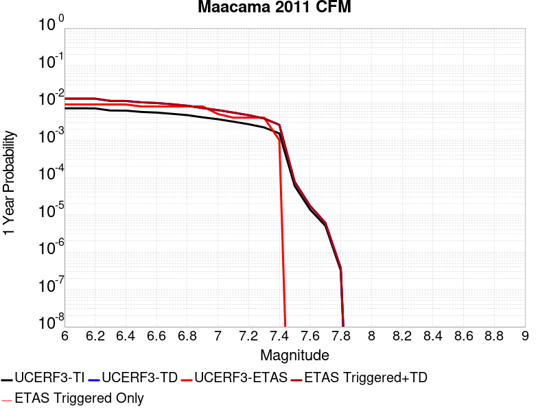 | 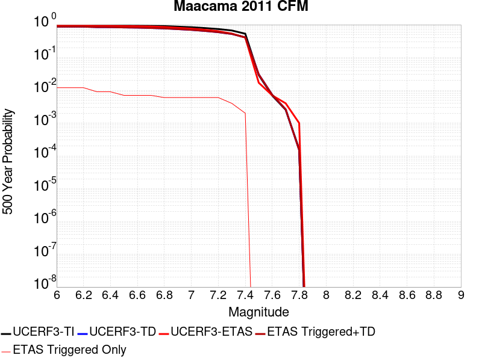 |

| Magnitude | 1 wk TI Prob | 1 wk TD Prob | 1 wk ETAS Prob | 1 wk ETAS/TD Gain | 1 wk ETAS Triggered+TD | 1 wk ETAS Triggered Only | 1 mo TI Prob | 1 mo TD Prob | 1 mo ETAS Prob | 1 mo ETAS/TD Gain | 1 mo ETAS Triggered+TD | 1 mo ETAS Triggered Only | 1 yr TI Prob | 1 yr TD Prob | 1 yr ETAS Prob | 1 yr ETAS/TD Gain | 1 yr ETAS Triggered+TD | 1 yr ETAS Triggered Only | 500 yr TI Prob | 500 yr TD Prob | 500 yr ETAS Prob | 500 yr ETAS/TD Gain | 500 yr ETAS Triggered+TD | 500 yr ETAS Triggered Only |
|-----|-----|-----|-----|-----|-----|-----|-----|-----|-----|-----|-----|-----|-----|-----|-----|-----|-----|-----|-----|-----|-----|-----|-----|-----|
| 6.0 | 1.368203E-4 | 2.501435E-4 | 0.0 | 0.0 | 2.501435E-4 | 0.0 | 5.862409E-4 | 0.0010715536 | 0.0 | 0.0 | 0.0010715536 | 0.0 | 0.0071141496 | 0.012953145 | 0.009 | 0.69481194 | 0.012953145 | 0.0 | 0.9718382 | 0.87405276 | 0.949 | 1.0857468 | 0.87556416 | 0.012 |
| 6.1 | 1.368203E-4 | 2.501435E-4 | 0.0 | 0.0 | 2.501435E-4 | 0.0 | 5.862409E-4 | 0.0010715536 | 0.0 | 0.0 | 0.0010715536 | 0.0 | 0.0071141496 | 0.012953145 | 0.009 | 0.69481194 | 0.012953145 | 0.0 | 0.9718382 | 0.87405276 | 0.949 | 1.0857468 | 0.87556416 | 0.012 |
| 6.2 | 1.360743E-4 | 2.4891802E-4 | 0.0 | 0.0 | 2.4891802E-4 | 0.0 | 5.8304524E-4 | 0.001066306 | 0.0 | 0.0 | 0.001066306 | 0.0 | 0.007075496 | 0.012890077 | 0.009 | 0.6982115 | 0.012890077 | 0.0 | 0.9712846 | 0.8725463 | 0.948 | 1.0864753 | 0.8740758 | 0.012 |
| 6.3 | 1.1917239E-4 | 2.1641025E-4 | 0.0 | 0.0 | 2.1641025E-4 | 0.0 | 5.1063887E-4 | 9.2709524E-4 | 0.0 | 0.0 | 9.2709524E-4 | 0.0 | 0.0061993203 | 0.011218407 | 0.009 | 0.8022529 | 0.011218407 | 0.0 | 0.95536816 | 0.8441874 | 0.925 | 1.0957283 | 0.8455897 | 0.009 |
| 6.4 | 1.1859289E-4 | 2.1546737E-4 | 0.0 | 0.0 | 2.1546737E-4 | 0.0 | 5.0815626E-4 | 9.230573E-4 | 0.0 | 0.0 | 9.230573E-4 | 0.0 | 0.006169266 | 0.011169796 | 0.009 | 0.80574435 | 0.011169796 | 0.0 | 0.9546882 | 0.842712 | 0.924 | 1.09646 | 0.8441276 | 0.009 |
| 6.5 | 1.09512424E-4 | 1.9830727E-4 | 0.0 | 0.0 | 1.9830727E-4 | 0.0 | 4.6925453E-4 | 8.4956305E-4 | 0.0 | 0.0 | 8.4956305E-4 | 0.0 | 0.005698218 | 0.010286206 | 0.008 | 0.7777406 | 0.010286206 | 0.0 | 0.94257396 | 0.82458425 | 0.908 | 1.101161 | 0.82581216 | 0.007 |
| 6.6 | 1.0502928E-4 | 1.900326E-4 | 0.0 | 0.0 | 1.900326E-4 | 0.0 | 4.500478E-4 | 8.141316E-4 | 0.0 | 0.0 | 8.141316E-4 | 0.0 | 0.0054655746 | 0.009859891 | 0.008 | 0.811368 | 0.009859891 | 0.0 | 0.93544793 | 0.81444573 | 0.898 | 1.1025903 | 0.8157446 | 0.007 |
| 6.7 | 9.739358E-5 | 1.7613654E-4 | 0.0 | 0.0 | 1.7613654E-4 | 0.0 | 4.173343E-4 | 7.546236E-4 | 0.0 | 0.0 | 7.546236E-4 | 0.0 | 0.0050692135 | 0.009143232 | 0.008 | 0.87496406 | 0.009143232 | 0.0 | 0.9212166 | 0.79497564 | 0.881 | 1.1082101 | 0.7964108 | 0.007 |
| 6.8 | 8.969524E-5 | 1.6063407E-4 | 0.0 | 0.0 | 1.6063407E-4 | 0.0 | 3.8435153E-4 | 6.882233E-4 | 0.0 | 0.0 | 6.882233E-4 | 0.0 | 0.0046694432 | 0.00834268 | 0.008 | 0.9589246 | 0.00834268 | 0.0 | 0.90369064 | 0.77263063 | 0.851 | 1.101432 | 0.7739948 | 0.006 |
| 6.9 | 7.838291E-5 | 1.3895141E-4 | 0.0 | 0.0 | 1.3895141E-4 | 0.0 | 3.358835E-4 | 5.953468E-4 | 0.0 | 0.0 | 5.953468E-4 | 0.0 | 0.0040817154 | 0.0072213644 | 0.008 | 1.1078238 | 0.0072213644 | 0.0 | 0.87062424 | 0.731966 | 0.803 | 1.0970454 | 0.7335742 | 0.006 |
| 7.0 | 6.961957E-5 | 1.2238452E-4 | 0.0 | 0.0 | 1.2238452E-4 | 0.0 | 2.9833548E-4 | 5.2438787E-4 | 0.0 | 0.0 | 5.2438787E-4 | 0.0 | 0.0036261857 | 0.006363908 | 0.005 | 0.7856808 | 0.006363908 | 0.0 | 0.837388 | 0.69493735 | 0.758 | 1.0907458 | 0.69676775 | 0.006 |
| 7.1 | 5.999398E-5 | 1.0492263E-4 | 0.0 | 0.0 | 1.0492263E-4 | 0.0 | 2.570917E-4 | 4.4958323E-4 | 0.0 | 0.0 | 4.4958323E-4 | 0.0 | 0.0031255994 | 0.0054589873 | 0.004 | 0.73273665 | 0.0054589873 | 0.0 | 0.79096365 | 0.64529914 | 0.7 | 1.0847683 | 0.6474273 | 0.006 |
| 7.2 | 5.116532E-5 | 8.941721E-5 | 0.0 | 0.0 | 8.941721E-5 | 0.0 | 2.1926152E-4 | 3.831582E-4 | 0.0 | 0.0 | 3.831582E-4 | 0.0 | 0.002666241 | 0.0046546403 | 0.004 | 0.8593574 | 0.0046546403 | 0.0 | 0.73681575 | 0.59009 | 0.633 | 1.0727178 | 0.59254944 | 0.006 |
| 7.3 | 4.2087835E-5 | 7.321334E-5 | 0.0 | 0.0 | 7.321334E-5 | 0.0 | 1.8036396E-4 | 3.137335E-4 | 0.0 | 0.0 | 3.137335E-4 | 0.0 | 0.0021937196 | 0.0038128495 | 0.004 | 1.0490842 | 0.0038128495 | 0.0 | 0.66648406 | 0.5223726 | 0.536 | 1.0260875 | 0.5242831 | 0.004 |
| 7.4 | 2.8991652E-5 | 4.925673E-5 | 0.0 | 0.0 | 4.925673E-5 | 0.0 | 1.2424402E-4 | 2.1108465E-4 | 0.0 | 0.0 | 2.1108465E-4 | 0.0 | 0.0015116213 | 0.0025670165 | 0.001 | 0.38955727 | 0.0025670165 | 0.0 | 0.5306387 | 0.41027185 | 0.406 | 0.9895877 | 0.4114513 | 0.002 |
| 7.5 | 1.1292299E-6 | 1.4615135E-6 | 0.0 | 0.0 | 1.4615135E-6 | 0.0 | 4.8395473E-6 | 6.2636213E-6 | 0.0 | 0.0 | 6.2636213E-6 | 0.0 | 5.8919897E-5 | 7.6258126E-5 | 0.0 | 0.0 | 7.6258126E-5 | 0.0 | 0.029031077 | 0.030613579 | 0.017 | 0.5553091 | 0.030613579 | 0.0 |
| 7.6 | 2.6535366E-7 | 3.340891E-7 | 0.0 | 0.0 | 3.340891E-7 | 0.0 | 1.1372296E-6 | 1.4318097E-6 | 0.0 | 0.0 | 1.4318097E-6 | 0.0 | 1.3845682E-5 | 1.7432145E-5 | 0.0 | 0.0 | 1.7432145E-5 | 0.0 | 0.0068989806 | 0.007272827 | 0.007 | 0.96248686 | 0.007272827 | 0.0 |
| 7.7 | 9.727789E-8 | 1.16126834E-7 | 0.0 | 0.0 | 1.16126834E-7 | 0.0 | 4.1690518E-7 | 4.9768636E-7 | 0.0 | 0.0 | 4.9768636E-7 | 0.0 | 5.0758085E-6 | 6.0593147E-6 | 0.0 | 0.0 | 6.0593147E-6 | 0.0 | 0.0025346929 | 0.0026158753 | 0.004 | 1.5291249 | 0.0026158753 | 0.0 |
| 7.8 | 6.1939325E-9 | 7.227671E-9 | 0.0 | 0.0 | 7.227671E-9 | 0.0 | 2.6545425E-8 | 3.0975734E-8 | 0.0 | 0.0 | 3.0975734E-8 | 0.0 | 3.231905E-7 | 3.771295E-7 | 0.0 | 0.0 | 3.771295E-7 | 0.0 | 1.6158223E-4 | 1.5046369E-4 | 0.001 | 6.6461215 | 1.5046369E-4 | 0.0 |

## Lenwood-Lockhart-Old Woman Springs
*[(top)](#table-of-contents)*

| 1 Week | 1 Month | 1 Year | 500 Year |
|-----|-----|-----|-----|
|  |  | 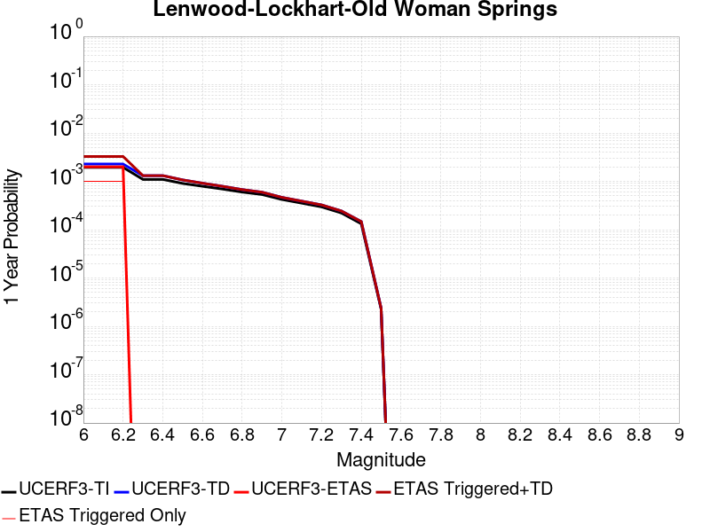 | 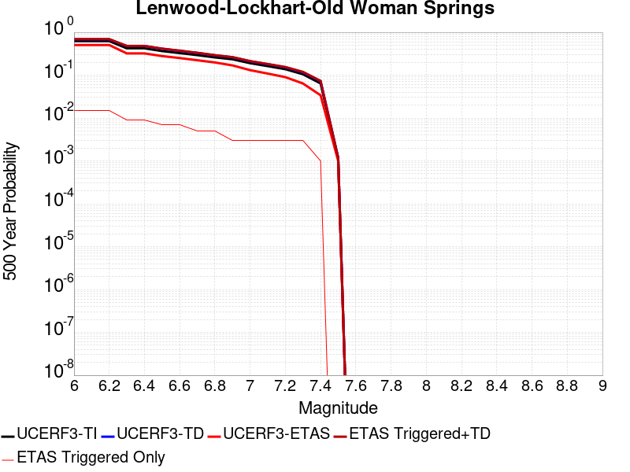 |

| Magnitude | 1 wk TI Prob | 1 wk TD Prob | 1 wk ETAS Prob | 1 wk ETAS/TD Gain | 1 wk ETAS Triggered+TD | 1 wk ETAS Triggered Only | 1 mo TI Prob | 1 mo TD Prob | 1 mo ETAS Prob | 1 mo ETAS/TD Gain | 1 mo ETAS Triggered+TD | 1 mo ETAS Triggered Only | 1 yr TI Prob | 1 yr TD Prob | 1 yr ETAS Prob | 1 yr ETAS/TD Gain | 1 yr ETAS Triggered+TD | 1 yr ETAS Triggered Only | 500 yr TI Prob | 500 yr TD Prob | 500 yr ETAS Prob | 500 yr ETAS/TD Gain | 500 yr ETAS Triggered+TD | 500 yr ETAS Triggered Only |
|-----|-----|-----|-----|-----|-----|-----|-----|-----|-----|-----|-----|-----|-----|-----|-----|-----|-----|-----|-----|-----|-----|-----|-----|-----|
| 6.0 | 3.744542E-5 | 4.3728294E-5 | 0.0 | 0.0 | 4.3728294E-5 | 0.0 | 1.604705E-4 | 1.8739447E-4 | 0.0 | 0.0 | 1.8739447E-4 | 0.0 | 0.0019519776 | 0.0022793103 | 0.002 | 0.87745845 | 0.003277031 | 0.001 | 0.6235397 | 0.68715537 | 0.505 | 0.7349138 | 0.69184804 | 0.015 |
| 6.1 | 3.744542E-5 | 4.3728294E-5 | 0.0 | 0.0 | 4.3728294E-5 | 0.0 | 1.604705E-4 | 1.8739447E-4 | 0.0 | 0.0 | 1.8739447E-4 | 0.0 | 0.0019519776 | 0.0022793103 | 0.002 | 0.87745845 | 0.003277031 | 0.001 | 0.6235397 | 0.68715537 | 0.505 | 0.7349138 | 0.69184804 | 0.015 |
| 6.2 | 3.744542E-5 | 4.3728294E-5 | 0.0 | 0.0 | 4.3728294E-5 | 0.0 | 1.604705E-4 | 1.8739447E-4 | 0.0 | 0.0 | 1.8739447E-4 | 0.0 | 0.0019519776 | 0.0022793103 | 0.002 | 0.87745845 | 0.003277031 | 0.001 | 0.6235397 | 0.68715537 | 0.505 | 0.7349138 | 0.69184804 | 0.015 |
| 6.3 | 2.1079984E-5 | 2.5230029E-5 | 0.0 | 0.0 | 2.5230029E-5 | 0.0 | 9.0339665E-5 | 1.08124324E-4 | 0.0 | 0.0 | 1.08124324E-4 | 0.0 | 0.0010993304 | 0.0013156384 | 0.0 | 0.0 | 0.0013156384 | 0.0 | 0.42303148 | 0.47676817 | 0.322 | 0.67538065 | 0.48147726 | 0.009 |
| 6.4 | 2.1079984E-5 | 2.5230029E-5 | 0.0 | 0.0 | 2.5230029E-5 | 0.0 | 9.0339665E-5 | 1.08124324E-4 | 0.0 | 0.0 | 1.08124324E-4 | 0.0 | 0.0010993304 | 0.0013156384 | 0.0 | 0.0 | 0.0013156384 | 0.0 | 0.42303148 | 0.47676817 | 0.322 | 0.67538065 | 0.48147726 | 0.009 |
| 6.5 | 1.7397282E-5 | 2.0553978E-5 | 0.0 | 0.0 | 2.0553978E-5 | 0.0 | 7.455765E-5 | 8.808557E-5 | 0.0 | 0.0 | 8.808557E-5 | 0.0 | 9.073613E-4 | 0.0010719259 | 0.0 | 0.0 | 0.0010719259 | 0.0 | 0.36484525 | 0.4124342 | 0.279 | 0.6764716 | 0.41654715 | 0.007 |
| 6.6 | 1.52050325E-5 | 1.7579432E-5 | 0.0 | 0.0 | 1.7579432E-5 | 0.0 | 6.51628E-5 | 7.533829E-5 | 0.0 | 0.0 | 7.533829E-5 | 0.0 | 7.9306826E-4 | 9.168655E-4 | 0.0 | 0.0 | 9.168655E-4 | 0.0 | 0.3274585 | 0.36879644 | 0.251 | 0.68059224 | 0.37321487 | 0.007 |
| 6.7 | 1.332523E-5 | 1.5177619E-5 | 0.0 | 0.0 | 1.5177619E-5 | 0.0 | 5.7106878E-5 | 6.504535E-5 | 0.0 | 0.0 | 6.504535E-5 | 0.0 | 6.950544E-4 | 7.9164514E-4 | 0.0 | 0.0 | 7.9164514E-4 | 0.0 | 0.29365256 | 0.32991457 | 0.223 | 0.6759326 | 0.33326498 | 0.005 |
| 6.8 | 1.1525329E-5 | 1.29617165E-5 | 0.0 | 0.0 | 1.29617165E-5 | 0.0 | 4.9393333E-5 | 5.554905E-5 | 0.0 | 0.0 | 5.554905E-5 | 0.0 | 6.011979E-4 | 6.7610404E-4 | 0.0 | 0.0 | 6.7610404E-4 | 0.0 | 0.25969228 | 0.29000655 | 0.198 | 0.6827432 | 0.2935565 | 0.005 |
| 6.9 | 1.0253909E-5 | 1.14496015E-5 | 0.0 | 0.0 | 1.14496015E-5 | 0.0 | 4.3944583E-5 | 4.9068818E-5 | 0.0 | 0.0 | 4.9068818E-5 | 0.0 | 5.3489394E-4 | 5.972527E-4 | 0.0 | 0.0 | 5.972527E-4 | 0.0 | 0.23472385 | 0.26127073 | 0.169 | 0.6468386 | 0.26348692 | 0.003 |
| 7.0 | 8.104563E-6 | 8.941856E-6 | 0.0 | 0.0 | 8.941856E-6 | 0.0 | 3.4733377E-5 | 3.8321694E-5 | 0.0 | 0.0 | 3.8321694E-5 | 0.0 | 4.2279682E-4 | 4.664691E-4 | 0.0 | 0.0 | 4.664691E-4 | 0.0 | 0.19058467 | 0.21071507 | 0.131 | 0.6216926 | 0.21308292 | 0.003 |
| 7.1 | 6.7986157E-6 | 7.471985E-6 | 0.0 | 0.0 | 7.471985E-6 | 0.0 | 2.91366E-5 | 3.202241E-5 | 0.0 | 0.0 | 3.202241E-5 | 0.0 | 3.5468035E-4 | 3.898052E-4 | 0.0 | 0.0 | 3.898052E-4 | 0.0 | 0.16253151 | 0.17953545 | 0.109 | 0.6071224 | 0.18199684 | 0.003 |
| 7.2 | 5.6893327E-6 | 6.2429185E-6 | 0.0 | 0.0 | 6.2429185E-6 | 0.0 | 2.4382627E-5 | 2.6755102E-5 | 0.0 | 0.0 | 2.6755102E-5 | 0.0 | 2.9681803E-4 | 3.2569663E-4 | 0.0 | 0.0 | 3.2569663E-4 | 0.0 | 0.13794056 | 0.1525626 | 0.09 | 0.5899218 | 0.15510492 | 0.003 |
| 7.3 | 4.253348E-6 | 4.6733326E-6 | 0.0 | 0.0 | 4.6733326E-6 | 0.0 | 1.8228506E-5 | 2.0028425E-5 | 0.0 | 0.0 | 2.0028425E-5 | 0.0 | 2.2190946E-4 | 2.4382057E-4 | 0.0 | 0.0 | 2.4382057E-4 | 0.0 | 0.10503176 | 0.11669268 | 0.064 | 0.54844916 | 0.1193426 | 0.003 |
| 7.4 | 2.5448119E-6 | 2.8224013E-6 | 0.0 | 0.0 | 2.8224013E-6 | 0.0 | 1.0906291E-5 | 1.20959585E-5 | 0.0 | 0.0 | 1.20959585E-5 | 0.0 | 1.3277601E-4 | 1.4725995E-4 | 0.0 | 0.0 | 1.4725995E-4 | 0.0 | 0.06423641 | 0.07250617 | 0.034 | 0.4689256 | 0.07343367 | 0.001 |
| 7.5 | 4.3706837E-8 | 4.5525034E-8 | 0.0 | 0.0 | 4.5525034E-8 | 0.0 | 1.8731501E-7 | 1.9510728E-7 | 0.0 | 0.0 | 1.9510728E-7 | 0.0 | 2.2805577E-6 | 2.375429E-6 | 0.0 | 0.0 | 2.375429E-6 | 0.0 | 0.0011396303 | 0.0011871624 | 0.001 | 0.84234476 | 0.0011871624 | 0.0 |

## Coronado Bank alt1
*[(top)](#table-of-contents)*

| 1 Week | 1 Month | 1 Year | 500 Year |
|-----|-----|-----|-----|
|  |  | 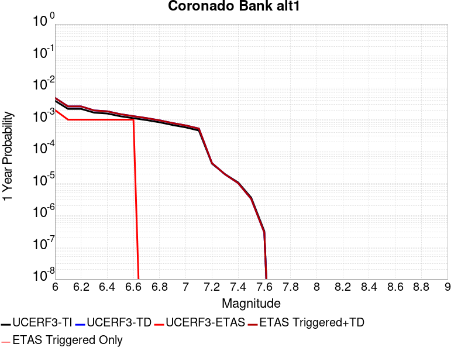 | 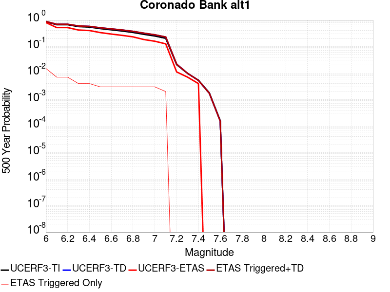 |

| Magnitude | 1 wk TI Prob | 1 wk TD Prob | 1 wk ETAS Prob | 1 wk ETAS/TD Gain | 1 wk ETAS Triggered+TD | 1 wk ETAS Triggered Only | 1 mo TI Prob | 1 mo TD Prob | 1 mo ETAS Prob | 1 mo ETAS/TD Gain | 1 mo ETAS Triggered+TD | 1 mo ETAS Triggered Only | 1 yr TI Prob | 1 yr TD Prob | 1 yr ETAS Prob | 1 yr ETAS/TD Gain | 1 yr ETAS Triggered+TD | 1 yr ETAS Triggered Only | 500 yr TI Prob | 500 yr TD Prob | 500 yr ETAS Prob | 500 yr ETAS/TD Gain | 500 yr ETAS Triggered+TD | 500 yr ETAS Triggered Only |
|-----|-----|-----|-----|-----|-----|-----|-----|-----|-----|-----|-----|-----|-----|-----|-----|-----|-----|-----|-----|-----|-----|-----|-----|-----|
| 6.0 | 7.533492E-5 | 9.276555E-5 | 0.0 | 0.0 | 9.276555E-5 | 0.0 | 3.22824E-4 | 3.9751007E-4 | 0.0 | 0.0 | 3.9751007E-4 | 0.0 | 0.0039233007 | 0.0048295897 | 0.002 | 0.41411385 | 0.0048295897 | 0.0 | 0.8599154 | 0.8787818 | 0.805 | 0.91604084 | 0.88060004 | 0.015 |
| 6.1 | 4.1807285E-5 | 4.9949453E-5 | 0.0 | 0.0 | 4.9949453E-5 | 0.0 | 1.7916178E-4 | 2.1405205E-4 | 0.0 | 0.0 | 2.1405205E-4 | 0.0 | 0.0021791123 | 0.0026030529 | 0.001 | 0.3841643 | 0.0026030529 | 0.0 | 0.6640339 | 0.68950427 | 0.517 | 0.7498141 | 0.6916777 | 0.007 |
| 6.2 | 4.1807285E-5 | 4.9949453E-5 | 0.0 | 0.0 | 4.9949453E-5 | 0.0 | 1.7916178E-4 | 2.1405205E-4 | 0.0 | 0.0 | 2.1405205E-4 | 0.0 | 0.0021791123 | 0.0026030529 | 0.001 | 0.3841643 | 0.0026030529 | 0.0 | 0.6640339 | 0.68950427 | 0.517 | 0.7498141 | 0.6916777 | 0.007 |
| 6.3 | 3.1793104E-5 | 3.7345802E-5 | 0.0 | 0.0 | 3.7345802E-5 | 0.0 | 1.3624904E-4 | 1.6004378E-4 | 0.0 | 0.0 | 1.6004378E-4 | 0.0 | 0.0016575698 | 0.0019468247 | 0.001 | 0.5136569 | 0.0019468247 | 0.0 | 0.56372064 | 0.5947757 | 0.418 | 0.7027859 | 0.5963966 | 0.004 |
| 6.4 | 2.9878007E-5 | 3.4999695E-5 | 0.0 | 0.0 | 3.4999695E-5 | 0.0 | 1.2804232E-4 | 1.4999024E-4 | 0.0 | 0.0 | 1.4999024E-4 | 0.0 | 0.0015578003 | 0.0018246344 | 0.001 | 0.548055 | 0.0018246344 | 0.0 | 0.5413682 | 0.5736076 | 0.4 | 0.6973408 | 0.5753132 | 0.004 |
| 6.5 | 2.4512565E-5 | 2.850383E-5 | 0.0 | 0.0 | 2.850383E-5 | 0.0 | 1.0504962E-4 | 1.2215371E-4 | 0.0 | 0.0 | 1.2215371E-4 | 0.0 | 0.0012782287 | 0.0014862334 | 0.001 | 0.67284185 | 0.0014862334 | 0.0 | 0.47245607 | 0.50669765 | 0.335 | 0.6611438 | 0.5081776 | 0.003 |
| 6.6 | 2.1317413E-5 | 2.4687593E-5 | 0.0 | 0.0 | 2.4687593E-5 | 0.0 | 9.135714E-5 | 1.0579981E-4 | 0.0 | 0.0 | 1.0579981E-4 | 0.0 | 0.0011117056 | 0.0012873735 | 0.001 | 0.77677536 | 0.0012873735 | 0.0 | 0.42659444 | 0.46121284 | 0.295 | 0.6396179 | 0.4628292 | 0.003 |
| 6.7 | 1.8585655E-5 | 2.1449168E-5 | 0.0 | 0.0 | 2.1449168E-5 | 0.0 | 7.9650374E-5 | 9.192188E-5 | 0.0 | 0.0 | 9.192188E-5 | 0.0 | 9.6931186E-4 | 0.0011185944 | 0.0 | 0.0 | 0.0011185944 | 0.0 | 0.38423568 | 0.418933 | 0.263 | 0.6277854 | 0.4206762 | 0.003 |
| 6.8 | 1.5862879E-5 | 1.826386E-5 | 0.0 | 0.0 | 1.826386E-5 | 0.0 | 6.798199E-5 | 7.827144E-5 | 0.0 | 0.0 | 7.827144E-5 | 0.0 | 8.273665E-4 | 9.525571E-4 | 0.0 | 0.0 | 9.525571E-4 | 0.0 | 0.33890283 | 0.37119853 | 0.231 | 0.6223085 | 0.37308493 | 0.003 |
| 6.9 | 1.3021509E-5 | 1.4968866E-5 | 0.0 | 0.0 | 1.4968866E-5 | 0.0 | 5.5805274E-5 | 6.415081E-5 | 0.0 | 0.0 | 6.415081E-5 | 0.0 | 6.792174E-4 | 7.80774E-4 | 0.0 | 0.0 | 7.80774E-4 | 0.0 | 0.28803328 | 0.31700322 | 0.183 | 0.5772812 | 0.31905222 | 0.003 |
| 7.0 | 1.0974371E-5 | 1.2613412E-5 | 0.0 | 0.0 | 1.2613412E-5 | 0.0 | 4.7032172E-5 | 5.4056454E-5 | 0.0 | 0.0 | 5.4056454E-5 | 0.0 | 5.7246623E-4 | 6.579559E-4 | 0.0 | 0.0 | 6.579559E-4 | 0.0 | 0.24897406 | 0.27511498 | 0.158 | 0.5743053 | 0.27728966 | 0.003 |
| 7.1 | 8.766221E-6 | 1.0077999E-5 | 0.0 | 0.0 | 1.0077999E-5 | 0.0 | 3.7568978E-5 | 4.3190805E-5 | 0.0 | 0.0 | 4.3190805E-5 | 0.0 | 4.573063E-4 | 5.2573805E-4 | 0.0 | 0.0 | 5.2573805E-4 | 0.0 | 0.20443717 | 0.2270592 | 0.126 | 0.5549214 | 0.22860508 | 0.002 |
| 7.2 | 8.026024E-7 | 8.300308E-7 | 0.0 | 0.0 | 8.300308E-7 | 0.0 | 3.43972E-6 | 3.55727E-6 | 0.0 | 0.0 | 3.55727E-6 | 0.0 | 4.1877785E-5 | 4.330891E-5 | 0.0 | 0.0 | 4.330891E-5 | 0.0 | 0.020721626 | 0.021616254 | 0.011 | 0.5088763 | 0.021616254 | 0.0 |
| 7.3 | 3.7293114E-7 | 3.6876415E-7 | 0.0 | 0.0 | 3.6876415E-7 | 0.0 | 1.5982754E-6 | 1.5804168E-6 | 0.0 | 0.0 | 1.5804168E-6 | 0.0 | 1.9458828E-5 | 1.9241406E-5 | 0.0 | 0.0 | 1.9241406E-5 | 0.0 | 0.00968233 | 0.009766096 | 0.007 | 0.71676546 | 0.009766096 | 0.0 |
| 7.4 | 2.0557036E-7 | 1.960979E-7 | 0.0 | 0.0 | 1.960979E-7 | 0.0 | 8.810155E-7 | 8.404193E-7 | 0.0 | 0.0 | 8.404193E-7 | 0.0 | 1.0726311E-5 | 1.0232057E-5 | 0.0 | 0.0 | 1.0232057E-5 | 0.0 | 0.005348828 | 0.0052672415 | 0.004 | 0.7594108 | 0.0052672415 | 0.0 |
| 7.5 | 6.845446E-8 | 6.257904E-8 | 0.0 | 0.0 | 6.257904E-8 | 0.0 | 2.9337625E-7 | 2.6819586E-7 | 0.0 | 0.0 | 2.6819586E-7 | 0.0 | 3.5718497E-6 | 3.2652797E-6 | 0.0 | 0.0 | 3.2652797E-6 | 0.0 | 0.0017843343 | 0.0017125087 | 0.0 | 0.0 | 0.0017125087 | 0.0 |
| 7.6 | 6.0975145E-9 | 5.5275637E-9 | 0.0 | 0.0 | 5.5275637E-9 | 0.0 | 2.6132206E-8 | 2.3689559E-8 | 0.0 | 0.0 | 2.3689559E-8 | 0.0 | 3.1815955E-7 | 2.8842035E-7 | 0.0 | 0.0 | 2.8842035E-7 | 0.0 | 1.5906715E-4 | 1.5283751E-4 | 0.0 | 0.0 | 1.5283751E-4 | 0.0 |

## Lost Hills
*[(top)](#table-of-contents)*

| 1 Week | 1 Month | 1 Year | 500 Year |
|-----|-----|-----|-----|
|  |  | 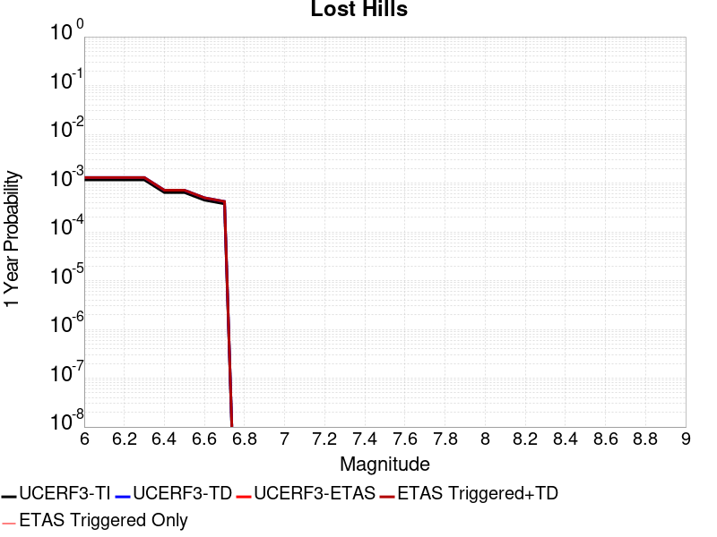 | 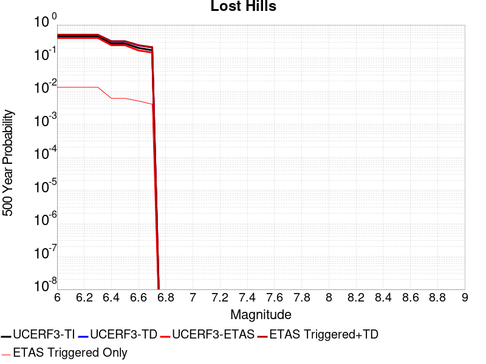 |

| Magnitude | 1 wk TI Prob | 1 wk TD Prob | 1 wk ETAS Prob | 1 wk ETAS/TD Gain | 1 wk ETAS Triggered+TD | 1 wk ETAS Triggered Only | 1 mo TI Prob | 1 mo TD Prob | 1 mo ETAS Prob | 1 mo ETAS/TD Gain | 1 mo ETAS Triggered+TD | 1 mo ETAS Triggered Only | 1 yr TI Prob | 1 yr TD Prob | 1 yr ETAS Prob | 1 yr ETAS/TD Gain | 1 yr ETAS Triggered+TD | 1 yr ETAS Triggered Only | 500 yr TI Prob | 500 yr TD Prob | 500 yr ETAS Prob | 500 yr ETAS/TD Gain | 500 yr ETAS Triggered+TD | 500 yr ETAS Triggered Only |
|-----|-----|-----|-----|-----|-----|-----|-----|-----|-----|-----|-----|-----|-----|-----|-----|-----|-----|-----|-----|-----|-----|-----|-----|-----|
| 6.0 | 2.233523E-5 | 2.494571E-5 | 0.0 | 0.0 | 2.494571E-5 | 0.0 | 9.571891E-5 | 1.06906744E-4 | 0.0 | 0.0 | 1.06906744E-4 | 0.0 | 0.0011647546 | 0.0013009784 | 0.0 | 0.0 | 0.0013009784 | 0.0 | 0.44162068 | 0.49766907 | 0.403 | 0.80977505 | 0.5041994 | 0.013 |
| 6.1 | 2.233523E-5 | 2.494571E-5 | 0.0 | 0.0 | 2.494571E-5 | 0.0 | 9.571891E-5 | 1.06906744E-4 | 0.0 | 0.0 | 1.06906744E-4 | 0.0 | 0.0011647546 | 0.0013009784 | 0.0 | 0.0 | 0.0013009784 | 0.0 | 0.44162068 | 0.49766907 | 0.403 | 0.80977505 | 0.5041994 | 0.013 |
| 6.2 | 2.233523E-5 | 2.494571E-5 | 0.0 | 0.0 | 2.494571E-5 | 0.0 | 9.571891E-5 | 1.06906744E-4 | 0.0 | 0.0 | 1.06906744E-4 | 0.0 | 0.0011647546 | 0.0013009784 | 0.0 | 0.0 | 0.0013009784 | 0.0 | 0.44162068 | 0.49766907 | 0.403 | 0.80977505 | 0.5041994 | 0.013 |
| 6.3 | 2.233523E-5 | 2.494571E-5 | 0.0 | 0.0 | 2.494571E-5 | 0.0 | 9.571891E-5 | 1.06906744E-4 | 0.0 | 0.0 | 1.06906744E-4 | 0.0 | 0.0011647546 | 0.0013009784 | 0.0 | 0.0 | 0.0013009784 | 0.0 | 0.44162068 | 0.49766907 | 0.403 | 0.80977505 | 0.5041994 | 0.013 |
| 6.4 | 1.2288092E-5 | 1.3694633E-5 | 0.0 | 0.0 | 1.3694633E-5 | 0.0 | 5.2662188E-5 | 5.8690486E-5 | 0.0 | 0.0 | 5.8690486E-5 | 0.0 | 6.409735E-4 | 7.14415E-4 | 0.0 | 0.0 | 7.14415E-4 | 0.0 | 0.2742789 | 0.3170677 | 0.243 | 0.7663978 | 0.32116532 | 0.006 |
| 6.5 | 1.2288092E-5 | 1.3694633E-5 | 0.0 | 0.0 | 1.3694633E-5 | 0.0 | 5.2662188E-5 | 5.8690486E-5 | 0.0 | 0.0 | 5.8690486E-5 | 0.0 | 6.409735E-4 | 7.14415E-4 | 0.0 | 0.0 | 7.14415E-4 | 0.0 | 0.2742789 | 0.3170677 | 0.243 | 0.7663978 | 0.32116532 | 0.006 |
| 6.6 | 8.58281E-6 | 9.572852E-6 | 0.0 | 0.0 | 9.572852E-6 | 0.0 | 3.6782953E-5 | 4.1026324E-5 | 0.0 | 0.0 | 4.1026324E-5 | 0.0 | 4.4774043E-4 | 4.994632E-4 | 0.0 | 0.0 | 4.994632E-4 | 0.0 | 0.20062119 | 0.23893377 | 0.169 | 0.70730895 | 0.24273911 | 0.005 |
| 6.7 | 7.205685E-6 | 8.03714E-6 | 0.0 | 0.0 | 8.03714E-6 | 0.0 | 3.088114E-5 | 3.4444885E-5 | 0.0 | 0.0 | 3.4444885E-5 | 0.0 | 3.7591302E-4 | 4.1936646E-4 | 0.0 | 0.0 | 4.1936646E-4 | 0.0 | 0.17137854 | 0.20818757 | 0.146 | 0.7012907 | 0.2113548 | 0.004 |

## Mission Creek
*[(top)](#table-of-contents)*

| 1 Week | 1 Month | 1 Year | 500 Year |
|-----|-----|-----|-----|
|  | 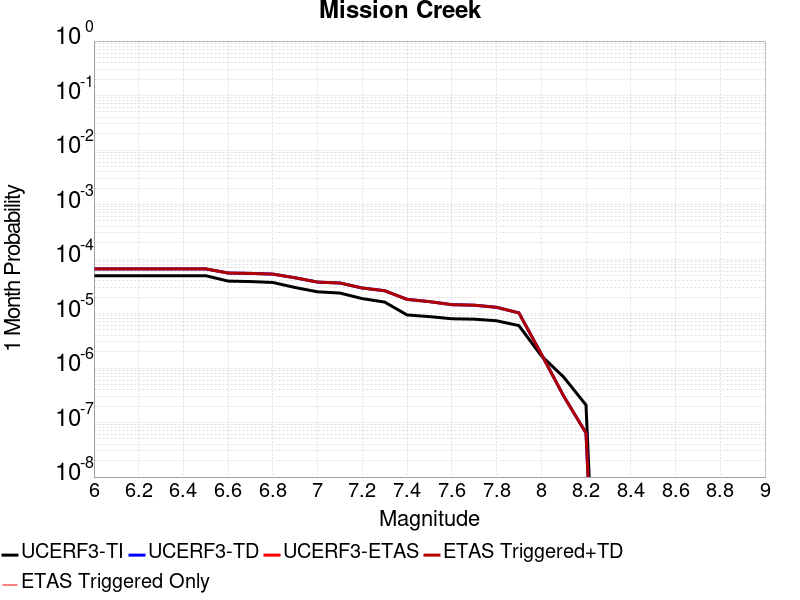 | 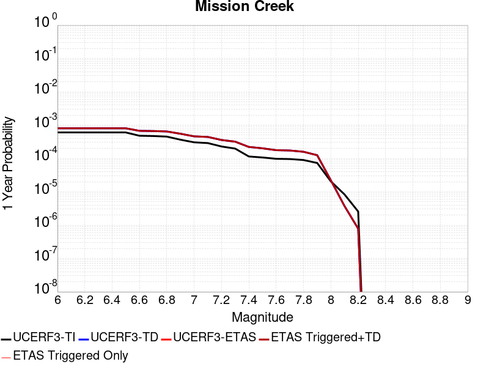 | 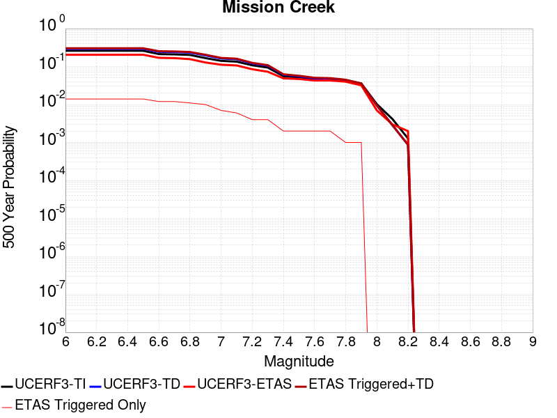 |

| Magnitude | 1 wk TI Prob | 1 wk TD Prob | 1 wk ETAS Prob | 1 wk ETAS/TD Gain | 1 wk ETAS Triggered+TD | 1 wk ETAS Triggered Only | 1 mo TI Prob | 1 mo TD Prob | 1 mo ETAS Prob | 1 mo ETAS/TD Gain | 1 mo ETAS Triggered+TD | 1 mo ETAS Triggered Only | 1 yr TI Prob | 1 yr TD Prob | 1 yr ETAS Prob | 1 yr ETAS/TD Gain | 1 yr ETAS Triggered+TD | 1 yr ETAS Triggered Only | 500 yr TI Prob | 500 yr TD Prob | 500 yr ETAS Prob | 500 yr ETAS/TD Gain | 500 yr ETAS Triggered+TD | 500 yr ETAS Triggered Only |
|-----|-----|-----|-----|-----|-----|-----|-----|-----|-----|-----|-----|-----|-----|-----|-----|-----|-----|-----|-----|-----|-----|-----|-----|-----|
| 6.0 | 1.1549387E-5 | 1.5397878E-5 | 0.0 | 0.0 | 1.5397878E-5 | 0.0 | 4.9496433E-5 | 6.598932E-5 | 0.0 | 0.0 | 6.598932E-5 | 0.0 | 6.0245243E-4 | 8.031385E-4 | 0.0 | 0.0 | 8.031385E-4 | 0.0 | 0.26015678 | 0.29335016 | 0.205 | 0.6988236 | 0.30324325 | 0.014 |
| 6.1 | 1.1549387E-5 | 1.5397878E-5 | 0.0 | 0.0 | 1.5397878E-5 | 0.0 | 4.9496433E-5 | 6.598932E-5 | 0.0 | 0.0 | 6.598932E-5 | 0.0 | 6.0245243E-4 | 8.031385E-4 | 0.0 | 0.0 | 8.031385E-4 | 0.0 | 0.26015678 | 0.29335016 | 0.205 | 0.6988236 | 0.30324325 | 0.014 |
| 6.2 | 1.1549387E-5 | 1.5397878E-5 | 0.0 | 0.0 | 1.5397878E-5 | 0.0 | 4.9496433E-5 | 6.598932E-5 | 0.0 | 0.0 | 6.598932E-5 | 0.0 | 6.0245243E-4 | 8.031385E-4 | 0.0 | 0.0 | 8.031385E-4 | 0.0 | 0.26015678 | 0.29335016 | 0.205 | 0.6988236 | 0.30324325 | 0.014 |
| 6.3 | 1.1549387E-5 | 1.5397878E-5 | 0.0 | 0.0 | 1.5397878E-5 | 0.0 | 4.9496433E-5 | 6.598932E-5 | 0.0 | 0.0 | 6.598932E-5 | 0.0 | 6.0245243E-4 | 8.031385E-4 | 0.0 | 0.0 | 8.031385E-4 | 0.0 | 0.26015678 | 0.29335016 | 0.205 | 0.6988236 | 0.30324325 | 0.014 |
| 6.4 | 1.1549387E-5 | 1.5397878E-5 | 0.0 | 0.0 | 1.5397878E-5 | 0.0 | 4.9496433E-5 | 6.598932E-5 | 0.0 | 0.0 | 6.598932E-5 | 0.0 | 6.0245243E-4 | 8.031385E-4 | 0.0 | 0.0 | 8.031385E-4 | 0.0 | 0.26015678 | 0.29335016 | 0.205 | 0.6988236 | 0.30324325 | 0.014 |
| 6.5 | 1.1549387E-5 | 1.5397878E-5 | 0.0 | 0.0 | 1.5397878E-5 | 0.0 | 4.9496433E-5 | 6.598932E-5 | 0.0 | 0.0 | 6.598932E-5 | 0.0 | 6.0245243E-4 | 8.031385E-4 | 0.0 | 0.0 | 8.031385E-4 | 0.0 | 0.26015678 | 0.29335016 | 0.205 | 0.6988236 | 0.30324325 | 0.014 |
| 6.6 | 9.202681E-6 | 1.2928264E-5 | 0.0 | 0.0 | 1.2928264E-5 | 0.0 | 3.9439463E-5 | 5.540572E-5 | 0.0 | 0.0 | 5.540572E-5 | 0.0 | 4.800697E-4 | 6.7436456E-4 | 0.0 | 0.0 | 6.7436456E-4 | 0.0 | 0.21344487 | 0.24505655 | 0.17 | 0.6937174 | 0.25411588 | 0.012 |
| 6.7 | 9.019164E-6 | 1.27345265E-5 | 0.0 | 0.0 | 1.27345265E-5 | 0.0 | 3.8652986E-5 | 5.4575452E-5 | 0.0 | 0.0 | 5.4575452E-5 | 0.0 | 4.7049852E-4 | 6.642623E-4 | 0.0 | 0.0 | 6.642623E-4 | 0.0 | 0.20966993 | 0.24122603 | 0.167 | 0.69229674 | 0.2503313 | 0.012 |
| 6.8 | 8.673558E-6 | 1.2358698E-5 | 0.0 | 0.0 | 1.2358698E-5 | 0.0 | 3.717186E-5 | 5.296482E-5 | 0.0 | 0.0 | 5.296482E-5 | 0.0 | 4.524734E-4 | 6.446644E-4 | 0.0 | 0.0 | 6.446644E-4 | 0.0 | 0.20251153 | 0.2337238 | 0.157 | 0.671733 | 0.24215284 | 0.011 |
| 6.9 | 7.002255E-6 | 1.0569951E-5 | 0.0 | 0.0 | 1.0569951E-5 | 0.0 | 3.000932E-5 | 4.529904E-5 | 0.0 | 0.0 | 4.529904E-5 | 0.0 | 3.653022E-4 | 5.5138284E-4 | 0.0 | 0.0 | 5.5138284E-4 | 0.0 | 0.16696905 | 0.19669572 | 0.128 | 0.6507513 | 0.20472877 | 0.01 |
| 7.0 | 5.84644E-6 | 8.819335E-6 | 0.0 | 0.0 | 8.819335E-6 | 0.0 | 2.5055931E-5 | 3.7796624E-5 | 0.0 | 0.0 | 3.7796624E-5 | 0.0 | 3.0501327E-4 | 4.6008118E-4 | 0.0 | 0.0 | 4.6008118E-4 | 0.0 | 0.14146677 | 0.16359383 | 0.112 | 0.6846224 | 0.16944867 | 0.007 |
| 7.1 | 5.54703E-6 | 8.476934E-6 | 0.0 | 0.0 | 8.476934E-6 | 0.0 | 2.377277E-5 | 3.632924E-5 | 0.0 | 0.0 | 3.632924E-5 | 0.0 | 2.8939504E-4 | 4.4222304E-4 | 0.0 | 0.0 | 4.4222304E-4 | 0.0 | 0.13473414 | 0.15615205 | 0.107 | 0.68522954 | 0.16121514 | 0.006 |
| 7.2 | 4.384709E-6 | 6.8676727E-6 | 0.0 | 0.0 | 6.8676727E-6 | 0.0 | 1.8791474E-5 | 2.9432571E-5 | 0.0 | 0.0 | 2.9432571E-5 | 0.0 | 2.2876218E-4 | 3.582862E-4 | 0.0 | 0.0 | 3.582862E-4 | 0.0 | 0.10809368 | 0.121857665 | 0.085 | 0.6975351 | 0.12537023 | 0.004 |
| 7.3 | 3.7888456E-6 | 6.117762E-6 | 0.0 | 0.0 | 6.117762E-6 | 0.0 | 1.623781E-5 | 2.6218735E-5 | 0.0 | 0.0 | 2.6218735E-5 | 0.0 | 1.9767738E-4 | 3.191696E-4 | 0.0 | 0.0 | 3.191696E-4 | 0.0 | 0.094120026 | 0.10529553 | 0.073 | 0.6932868 | 0.10887434 | 0.004 |
| 7.4 | 2.1982462E-6 | 4.249858E-6 | 0.0 | 0.0 | 4.249858E-6 | 0.0 | 9.421021E-6 | 1.8213552E-5 | 0.0 | 0.0 | 1.8213552E-5 | 0.0 | 1.1469489E-4 | 2.2172758E-4 | 0.0 | 0.0 | 2.2172758E-4 | 0.0 | 0.055737175 | 0.060745865 | 0.049 | 0.80663925 | 0.06262437 | 0.002 |
| 7.5 | 2.051923E-6 | 3.8629523E-6 | 0.0 | 0.0 | 3.8629523E-6 | 0.0 | 8.793926E-6 | 1.6555405E-5 | 0.0 | 0.0 | 1.6555405E-5 | 0.0 | 1.0706078E-4 | 2.0154353E-4 | 0.0 | 0.0 | 2.0154353E-4 | 0.0 | 0.052125584 | 0.055261474 | 0.047 | 0.8505021 | 0.057150953 | 0.002 |
| 7.6 | 1.8733427E-6 | 3.3981837E-6 | 0.0 | 0.0 | 3.3981837E-6 | 0.0 | 8.028587E-6 | 1.4563563E-5 | 0.0 | 0.0 | 1.4563563E-5 | 0.0 | 9.774366E-5 | 1.7729701E-4 | 0.0 | 0.0 | 1.7729701E-4 | 0.0 | 0.047699098 | 0.048780497 | 0.043 | 0.8814998 | 0.050682936 | 0.002 |
| 7.7 | 1.8411953E-6 | 3.322939E-6 | 0.0 | 0.0 | 3.322939E-6 | 0.0 | 7.890813E-6 | 1.4241089E-5 | 0.0 | 0.0 | 1.4241089E-5 | 0.0 | 9.606641E-5 | 1.7337152E-4 | 0.0 | 0.0 | 1.7337152E-4 | 0.0 | 0.046900064 | 0.04776597 | 0.043 | 0.9002224 | 0.04967044 | 0.002 |
| 7.8 | 1.7194251E-6 | 3.0399385E-6 | 0.0 | 0.0 | 3.0399385E-6 | 0.0 | 7.368944E-6 | 1.3028243E-5 | 0.0 | 0.0 | 1.3028243E-5 | 0.0 | 8.97132E-5 | 1.5860736E-4 | 0.0 | 0.0 | 1.5860736E-4 | 0.0 | 0.043867342 | 0.044102613 | 0.04 | 0.9069757 | 0.04505851 | 0.001 |
| 7.9 | 1.4035052E-6 | 2.4009016E-6 | 0.0 | 0.0 | 2.4009016E-6 | 0.0 | 6.0150082E-6 | 1.0289537E-5 | 0.0 | 0.0 | 1.0289537E-5 | 0.0 | 7.3230265E-5 | 1.2526796E-4 | 0.0 | 0.0 | 1.2526796E-4 | 0.0 | 0.035954196 | 0.03486364 | 0.032 | 0.9178617 | 0.035828777 | 0.001 |
| 8.0 | 3.9318823E-7 | 4.2340508E-7 | 0.0 | 0.0 | 4.2340508E-7 | 0.0 | 1.6850913E-6 | 1.814592E-6 | 0.0 | 0.0 | 1.814592E-6 | 0.0 | 2.0515794E-5 | 2.2092438E-5 | 0.0 | 0.0 | 2.2092438E-5 | 0.0 | 0.010205568 | 0.009443607 | 0.007 | 0.7412422 | 0.009443607 | 0.0 |
| 8.1 | 1.596793E-7 | 7.1493496E-8 | 0.0 | 0.0 | 7.1493496E-8 | 0.0 | 6.8433974E-7 | 3.0640066E-7 | 0.0 | 0.0 | 3.0640066E-7 | 0.0 | 8.331805E-6 | 3.7304217E-6 | 0.0 | 0.0 | 3.7304217E-6 | 0.0 | 0.004157254 | 0.002859705 | 0.003 | 1.0490593 | 0.002859705 | 0.0 |
| 8.2 | 4.9003038E-8 | 1.4997159E-8 | 0.0 | 0.0 | 1.4997159E-8 | 0.0 | 2.10013E-7 | 6.4273536E-8 | 0.0 | 0.0 | 6.4273536E-8 | 0.0 | 2.5569052E-6 | 7.8253004E-7 | 0.0 | 0.0 | 7.8253004E-7 | 0.0 | 0.0012776374 | 8.707076E-4 | 0.002 | 2.2969823 | 8.707076E-4 | 0.0 |

## South Klamath Lake East
*[(top)](#table-of-contents)*

| 1 Week | 1 Month | 1 Year | 500 Year |
|-----|-----|-----|-----|
|  |  | 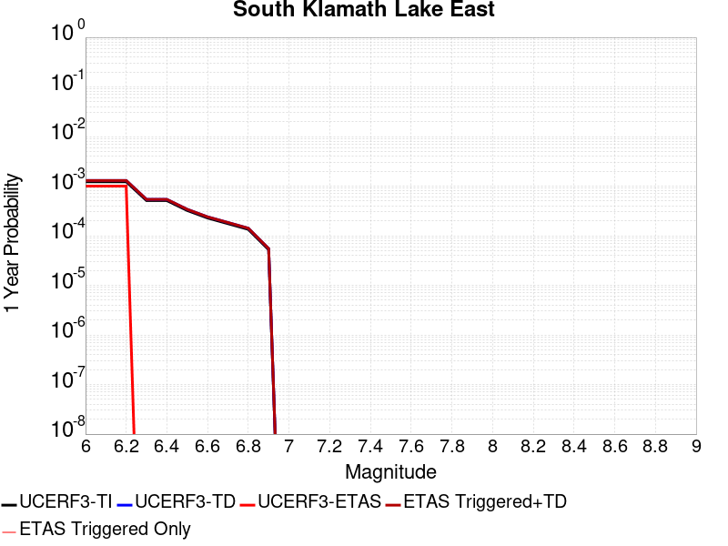 | 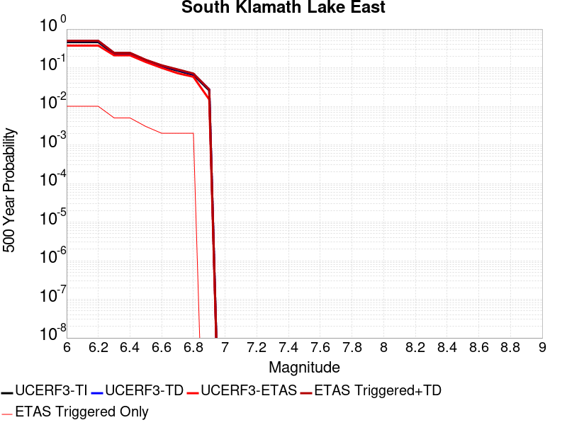 |

| Magnitude | 1 wk TI Prob | 1 wk TD Prob | 1 wk ETAS Prob | 1 wk ETAS/TD Gain | 1 wk ETAS Triggered+TD | 1 wk ETAS Triggered Only | 1 mo TI Prob | 1 mo TD Prob | 1 mo ETAS Prob | 1 mo ETAS/TD Gain | 1 mo ETAS Triggered+TD | 1 mo ETAS Triggered Only | 1 yr TI Prob | 1 yr TD Prob | 1 yr ETAS Prob | 1 yr ETAS/TD Gain | 1 yr ETAS Triggered+TD | 1 yr ETAS Triggered Only | 500 yr TI Prob | 500 yr TD Prob | 500 yr ETAS Prob | 500 yr ETAS/TD Gain | 500 yr ETAS Triggered+TD | 500 yr ETAS Triggered Only |
|-----|-----|-----|-----|-----|-----|-----|-----|-----|-----|-----|-----|-----|-----|-----|-----|-----|-----|-----|-----|-----|-----|-----|-----|-----|
| 6.0 | 2.3539369E-5 | 2.4964129E-5 | 0.0 | 0.0 | 2.4964129E-5 | 0.0 | 1.0087911E-4 | 1.069852E-4 | 0.0 | 0.0 | 1.069852E-4 | 0.0 | 0.0012275111 | 0.0013018491 | 0.001 | 0.7681382 | 0.0013018491 | 0.0 | 0.45888993 | 0.49098733 | 0.374 | 0.76173043 | 0.49607745 | 0.01 |
| 6.1 | 2.3539369E-5 | 2.4964129E-5 | 0.0 | 0.0 | 2.4964129E-5 | 0.0 | 1.0087911E-4 | 1.069852E-4 | 0.0 | 0.0 | 1.069852E-4 | 0.0 | 0.0012275111 | 0.0013018491 | 0.001 | 0.7681382 | 0.0013018491 | 0.0 | 0.45888993 | 0.49098733 | 0.374 | 0.76173043 | 0.49607745 | 0.01 |
| 6.2 | 2.3539369E-5 | 2.4964129E-5 | 0.0 | 0.0 | 2.4964129E-5 | 0.0 | 1.0087911E-4 | 1.069852E-4 | 0.0 | 0.0 | 1.069852E-4 | 0.0 | 0.0012275111 | 0.0013018491 | 0.001 | 0.7681382 | 0.0013018491 | 0.0 | 0.45888993 | 0.49098733 | 0.374 | 0.76173043 | 0.49607745 | 0.01 |
| 6.3 | 9.807823E-6 | 1.0363727E-5 | 0.0 | 0.0 | 1.0363727E-5 | 0.0 | 4.2032847E-5 | 4.441526E-5 | 0.0 | 0.0 | 4.441526E-5 | 0.0 | 5.1162974E-4 | 5.4062996E-4 | 0.0 | 0.0 | 5.4062996E-4 | 0.0 | 0.22576539 | 0.23861776 | 0.209 | 0.8758778 | 0.24242468 | 0.005 |
| 6.4 | 9.807823E-6 | 1.0363727E-5 | 0.0 | 0.0 | 1.0363727E-5 | 0.0 | 4.2032847E-5 | 4.441526E-5 | 0.0 | 0.0 | 4.441526E-5 | 0.0 | 5.1162974E-4 | 5.4062996E-4 | 0.0 | 0.0 | 5.4062996E-4 | 0.0 | 0.22576539 | 0.23861776 | 0.209 | 0.8758778 | 0.24242468 | 0.005 |
| 6.5 | 6.191981E-6 | 6.5311638E-6 | 0.0 | 0.0 | 6.5311638E-6 | 0.0 | 2.653679E-5 | 2.7990416E-5 | 0.0 | 0.0 | 2.7990416E-5 | 0.0 | 3.2303753E-4 | 3.407328E-4 | 0.0 | 0.0 | 3.407328E-4 | 0.0 | 0.14917164 | 0.15729214 | 0.14 | 0.8900636 | 0.15982026 | 0.003 |
| 6.6 | 4.3693776E-6 | 4.6030227E-6 | 0.0 | 0.0 | 4.6030227E-6 | 0.0 | 1.8725768E-5 | 1.9727097E-5 | 0.0 | 0.0 | 1.9727097E-5 | 0.0 | 2.2796239E-4 | 2.4015206E-4 | 0.0 | 0.0 | 2.4015206E-4 | 0.0 | 0.107736856 | 0.113427825 | 0.099 | 0.8728017 | 0.115200974 | 0.002 |
| 6.7 | 3.360834E-6 | 3.5408136E-6 | 0.0 | 0.0 | 3.5408136E-6 | 0.0 | 1.4403494E-5 | 1.5174832E-5 | 0.0 | 0.0 | 1.5174832E-5 | 0.0 | 1.7534842E-4 | 1.8473872E-4 | 0.0 | 0.0 | 1.8473872E-4 | 0.0 | 0.08394778 | 0.08843917 | 0.072 | 0.8141189 | 0.09026229 | 0.002 |
| 6.8 | 2.57873E-6 | 2.717151E-6 | 0.0 | 0.0 | 2.717151E-6 | 0.0 | 1.1051653E-5 | 1.1644884E-5 | 0.0 | 0.0 | 1.1644884E-5 | 0.0 | 1.3454557E-4 | 1.4176784E-4 | 0.0 | 0.0 | 1.4176784E-4 | 0.0 | 0.0650641 | 0.06859009 | 0.058 | 0.8456032 | 0.070452906 | 0.002 |
| 6.9 | 9.987825E-7 | 1.0534505E-6 | 0.0 | 0.0 | 1.0534505E-6 | 0.0 | 4.2804895E-6 | 4.514782E-6 | 0.0 | 0.0 | 4.514782E-6 | 0.0 | 5.211371E-5 | 5.496641E-5 | 0.0 | 0.0 | 5.496641E-5 | 0.0 | 0.025720967 | 0.02719623 | 0.015 | 0.551547 | 0.02719623 | 0.0 |

## Bennett Valley 2011 CFM
*[(top)](#table-of-contents)*

| 1 Week | 1 Month | 1 Year | 500 Year |
|-----|-----|-----|-----|
| 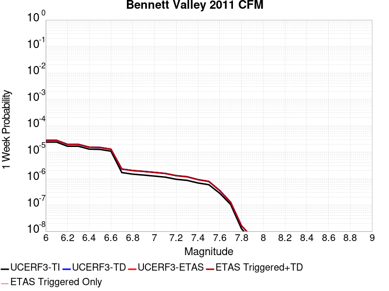 | 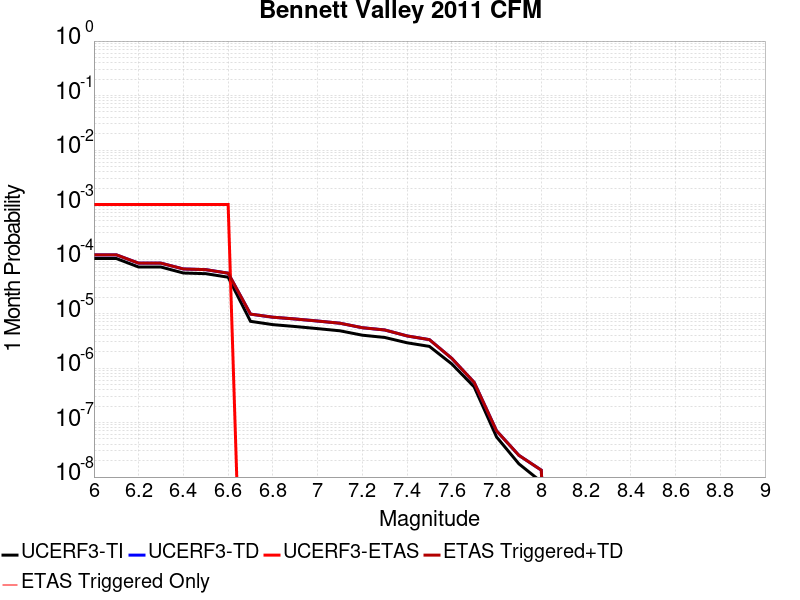 | 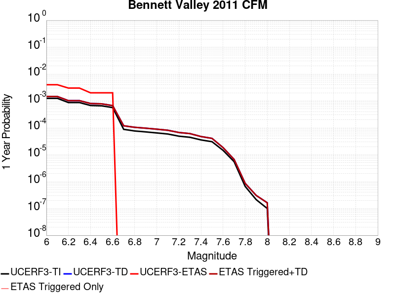 | 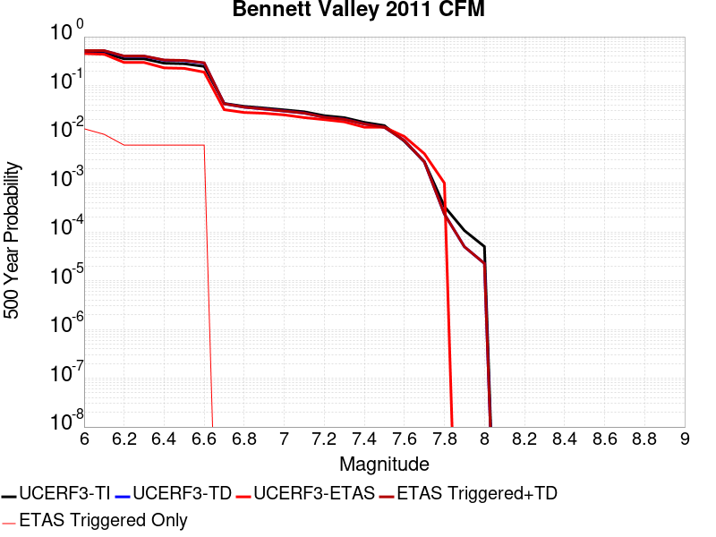 |

| Magnitude | 1 wk TI Prob | 1 wk TD Prob | 1 wk ETAS Prob | 1 wk ETAS/TD Gain | 1 wk ETAS Triggered+TD | 1 wk ETAS Triggered Only | 1 mo TI Prob | 1 mo TD Prob | 1 mo ETAS Prob | 1 mo ETAS/TD Gain | 1 mo ETAS Triggered+TD | 1 mo ETAS Triggered Only | 1 yr TI Prob | 1 yr TD Prob | 1 yr ETAS Prob | 1 yr ETAS/TD Gain | 1 yr ETAS Triggered+TD | 1 yr ETAS Triggered Only | 500 yr TI Prob | 500 yr TD Prob | 500 yr ETAS Prob | 500 yr ETAS/TD Gain | 500 yr ETAS Triggered+TD | 500 yr ETAS Triggered Only |
|-----|-----|-----|-----|-----|-----|-----|-----|-----|-----|-----|-----|-----|-----|-----|-----|-----|-----|-----|-----|-----|-----|-----|-----|-----|
| 6.0 | 2.3893934E-5 | 2.7920254E-5 | 0.0 | 0.0 | 2.7920254E-5 | 0.0 | 1.0239855E-4 | 1.1965378E-4 | 0.001 | 8.357447 | 1.1965378E-4 | 0.0 | 0.0012459893 | 0.0014559932 | 0.004 | 2.7472656 | 0.0014559932 | 0.0 | 0.4638724 | 0.5150919 | 0.453 | 0.87945473 | 0.5213957 | 0.013 |
| 6.1 | 2.3893934E-5 | 2.7920254E-5 | 0.0 | 0.0 | 2.7920254E-5 | 0.0 | 1.0239855E-4 | 1.1965378E-4 | 0.001 | 8.357447 | 1.1965378E-4 | 0.0 | 0.0012459893 | 0.0014559932 | 0.004 | 2.7472656 | 0.0014559932 | 0.0 | 0.4638724 | 0.5150919 | 0.438 | 0.8503337 | 0.519941 | 0.01 |
| 6.2 | 1.6657146E-5 | 1.9603729E-5 | 0.0 | 0.0 | 1.9603729E-5 | 0.0 | 7.138582E-5 | 8.4014064E-5 | 0.001 | 11.902769 | 8.4014064E-5 | 0.0 | 8.6877577E-4 | 0.0010225305 | 0.003 | 2.933898 | 0.0010225305 | 0.0 | 0.35246128 | 0.39820102 | 0.297 | 0.74585444 | 0.4018118 | 0.006 |
| 6.3 | 1.6657146E-5 | 1.9603729E-5 | 0.0 | 0.0 | 1.9603729E-5 | 0.0 | 7.138582E-5 | 8.4014064E-5 | 0.001 | 11.902769 | 8.4014064E-5 | 0.0 | 8.6877577E-4 | 0.0010225305 | 0.003 | 2.933898 | 0.0010225305 | 0.0 | 0.35246128 | 0.39820102 | 0.297 | 0.74585444 | 0.4018118 | 0.006 |
| 6.4 | 1.29418495E-5 | 1.5351412E-5 | 0.0 | 0.0 | 1.5351412E-5 | 0.0 | 5.546389E-5 | 6.579083E-5 | 0.001 | 15.199686 | 6.579083E-5 | 0.0 | 6.7506364E-4 | 8.008372E-4 | 0.002 | 2.4973865 | 8.008372E-4 | 0.0 | 0.28655204 | 0.32945222 | 0.23 | 0.6981286 | 0.3334755 | 0.006 |
| 6.5 | 1.2582504E-5 | 1.492275E-5 | 0.0 | 0.0 | 1.492275E-5 | 0.0 | 5.39239E-5 | 6.39538E-5 | 0.001 | 15.636289 | 6.39538E-5 | 0.0 | 6.563257E-4 | 7.784874E-4 | 0.002 | 2.5690846 | 7.784874E-4 | 0.0 | 0.2798319 | 0.32265726 | 0.225 | 0.6973344 | 0.3267213 | 0.006 |
| 6.6 | 1.0846706E-5 | 1.2847499E-5 | 0.0 | 0.0 | 1.2847499E-5 | 0.0 | 4.6485053E-5 | 5.5060264E-5 | 0.001 | 18.161919 | 5.5060264E-5 | 0.0 | 5.6580856E-4 | 6.702788E-4 | 0.002 | 2.983833 | 6.702788E-4 | 0.0 | 0.24646841 | 0.28838244 | 0.188 | 0.6519121 | 0.29265216 | 0.006 |
| 6.7 | 1.6803231E-6 | 2.2788074E-6 | 0.0 | 0.0 | 2.2788074E-6 | 0.0 | 7.2013645E-6 | 9.766281E-6 | 0.0 | 0.0 | 9.766281E-6 | 0.0 | 8.7673085E-5 | 1.1889811E-4 | 0.0 | 0.0 | 1.1889811E-4 | 0.0 | 0.042891447 | 0.0422595 | 0.032 | 0.7572262 | 0.0422595 | 0.0 |
| 6.8 | 1.4609833E-6 | 2.000459E-6 | 0.0 | 0.0 | 2.000459E-6 | 0.0 | 6.261342E-6 | 8.573368E-6 | 0.0 | 0.0 | 8.573368E-6 | 0.0 | 7.6229175E-5 | 1.04375824E-4 | 0.0 | 0.0 | 1.04375824E-4 | 0.0 | 0.037398763 | 0.03594199 | 0.028 | 0.7790331 | 0.03594199 | 0.0 |
| 6.9 | 1.3492396E-6 | 1.8551791E-6 | 0.0 | 0.0 | 1.8551791E-6 | 0.0 | 5.7824427E-6 | 7.950744E-6 | 0.0 | 0.0 | 7.950744E-6 | 0.0 | 7.0398964E-5 | 9.6796066E-5 | 0.0 | 0.0 | 9.6796066E-5 | 0.0 | 0.03458838 | 0.032944318 | 0.027 | 0.8195647 | 0.032944318 | 0.0 |
| 7.0 | 1.2347921E-6 | 1.7015099E-6 | 0.0 | 0.0 | 1.7015099E-6 | 0.0 | 5.291955E-6 | 7.292165E-6 | 0.0 | 0.0 | 7.292165E-6 | 0.0 | 6.442765E-5 | 8.877854E-5 | 0.0 | 0.0 | 8.877854E-5 | 0.0 | 0.03170149 | 0.029974105 | 0.025 | 0.8340533 | 0.029974105 | 0.0 |
| 7.1 | 1.1262973E-6 | 1.5514904E-6 | 0.0 | 0.0 | 1.5514904E-6 | 0.0 | 4.8269794E-6 | 6.649228E-6 | 0.0 | 0.0 | 6.649228E-6 | 0.0 | 5.876689E-5 | 8.0951395E-5 | 0.0 | 0.0 | 8.0951395E-5 | 0.0 | 0.028956788 | 0.027195353 | 0.022 | 0.80896175 | 0.027195353 | 0.0 |
| 7.2 | 9.351744E-7 | 1.2827785E-6 | 0.0 | 0.0 | 1.2827785E-6 | 0.0 | 4.007884E-6 | 5.497611E-6 | 0.0 | 0.0 | 5.497611E-6 | 0.0 | 4.8794896E-5 | 6.6931374E-5 | 0.0 | 0.0 | 6.6931374E-5 | 0.0 | 0.024102816 | 0.022364927 | 0.02 | 0.8942573 | 0.022364927 | 0.0 |
| 7.3 | 8.5039534E-7 | 1.1666415E-6 | 0.0 | 0.0 | 1.1666415E-6 | 0.0 | 3.6445463E-6 | 4.9998825E-6 | 0.0 | 0.0 | 4.9998825E-6 | 0.0 | 4.437145E-5 | 6.087189E-5 | 0.0 | 0.0 | 6.087189E-5 | 0.0 | 0.021941911 | 0.020314394 | 0.018 | 0.8860712 | 0.020314394 | 0.0 |
| 7.4 | 6.7875015E-7 | 9.0731476E-7 | 0.0 | 0.0 | 9.0731476E-7 | 0.0 | 2.908926E-6 | 3.888486E-6 | 0.0 | 0.0 | 3.888486E-6 | 0.0 | 3.54156E-5 | 4.73413E-5 | 0.0 | 0.0 | 4.73413E-5 | 0.0 | 0.017552245 | 0.016301492 | 0.014 | 0.8588171 | 0.016301492 | 0.0 |
| 7.5 | 5.826867E-7 | 7.747519E-7 | 0.0 | 0.0 | 7.747519E-7 | 0.0 | 2.4972264E-6 | 3.3203612E-6 | 0.0 | 0.0 | 3.3203612E-6 | 0.0 | 3.0403306E-5 | 4.0424657E-5 | 0.0 | 0.0 | 4.0424657E-5 | 0.0 | 0.015086919 | 0.013956057 | 0.014 | 1.0031487 | 0.013956057 | 0.0 |
| 7.6 | 2.7734902E-7 | 3.5112055E-7 | 0.0 | 0.0 | 3.5112055E-7 | 0.0 | 1.1886381E-6 | 1.5048015E-6 | 0.0 | 0.0 | 1.5048015E-6 | 0.0 | 1.4471572E-5 | 1.8320805E-5 | 0.0 | 0.0 | 1.8320805E-5 | 0.0 | 0.007209723 | 0.007438423 | 0.009 | 1.2099339 | 0.007438423 | 0.0 |
| 7.7 | 1.0530888E-7 | 1.2736675E-7 | 0.0 | 0.0 | 1.2736675E-7 | 0.0 | 4.513237E-7 | 5.4585735E-7 | 0.0 | 0.0 | 5.4585735E-7 | 0.0 | 5.4948523E-6 | 6.6457933E-6 | 0.0 | 0.0 | 6.6457933E-6 | 0.0 | 0.0027436628 | 0.002717799 | 0.004 | 1.4717791 | 0.002717799 | 0.0 |
| 7.8 | 1.2714258E-8 | 1.6465126E-8 | 0.0 | 0.0 | 1.6465126E-8 | 0.0 | 5.448968E-8 | 7.056482E-8 | 0.0 | 0.0 | 7.056482E-8 | 0.0 | 6.6341164E-7 | 8.591264E-7 | 0.0 | 0.0 | 8.591264E-7 | 0.0 | 3.3165092E-4 | 2.3183464E-4 | 0.001 | 4.3134193 | 2.3183464E-4 | 0.0 |
| 7.9 | 4.075888E-9 | 5.843391E-9 | 0.0 | 0.0 | 5.843391E-9 | 0.0 | 1.7468091E-8 | 2.5043104E-8 | 0.0 | 0.0 | 2.5043104E-8 | 0.0 | 2.12674E-7 | 3.0489974E-7 | 0.0 | 0.0 | 3.0489974E-7 | 0.0 | 1.06331354E-4 | 4.9506478E-5 | 0.0 | 0.0 | 4.9506478E-5 | 0.0 |
| 8.0 | 1.9126138E-9 | 3.1275842E-9 | 0.0 | 0.0 | 3.1275842E-9 | 0.0 | 8.196917E-9 | 1.3403931E-8 | 0.0 | 0.0 | 1.3403931E-8 | 0.0 | 9.9797454E-8 | 1.6319285E-7 | 0.0 | 0.0 | 1.6319285E-7 | 0.0 | 4.9897484E-5 | 2.2482835E-5 | 0.0 | 0.0 | 2.2482835E-5 | 0.0 |

## Little Salmon (Onshore)
*[(top)](#table-of-contents)*

| 1 Week | 1 Month | 1 Year | 500 Year |
|-----|-----|-----|-----|
|  |  | 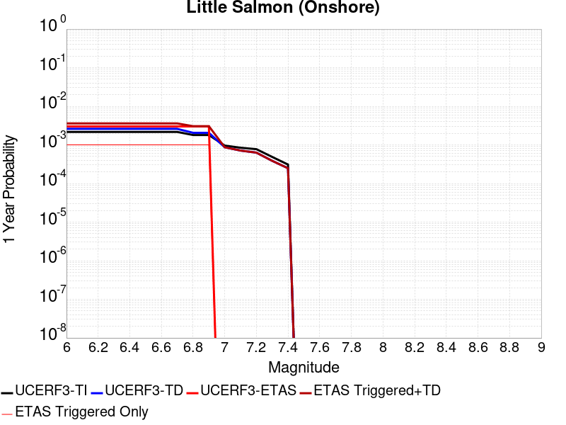 | 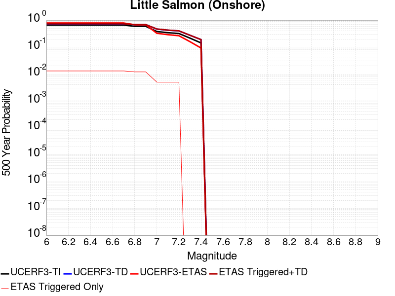 |

| Magnitude | 1 wk TI Prob | 1 wk TD Prob | 1 wk ETAS Prob | 1 wk ETAS/TD Gain | 1 wk ETAS Triggered+TD | 1 wk ETAS Triggered Only | 1 mo TI Prob | 1 mo TD Prob | 1 mo ETAS Prob | 1 mo ETAS/TD Gain | 1 mo ETAS Triggered+TD | 1 mo ETAS Triggered Only | 1 yr TI Prob | 1 yr TD Prob | 1 yr ETAS Prob | 1 yr ETAS/TD Gain | 1 yr ETAS Triggered+TD | 1 yr ETAS Triggered Only | 500 yr TI Prob | 500 yr TD Prob | 500 yr ETAS Prob | 500 yr ETAS/TD Gain | 500 yr ETAS Triggered+TD | 500 yr ETAS Triggered Only |
|-----|-----|-----|-----|-----|-----|-----|-----|-----|-----|-----|-----|-----|-----|-----|-----|-----|-----|-----|-----|-----|-----|-----|-----|-----|
| 6.0 | 4.1582247E-5 | 4.9943625E-5 | 0.0 | 0.0 | 4.9943625E-5 | 0.0 | 1.7819746E-4 | 2.1403088E-4 | 0.0 | 0.0 | 2.1403088E-4 | 0.0 | 0.0021673953 | 0.0026034785 | 0.003 | 1.1523045 | 0.003600875 | 0.001 | 0.66205555 | 0.736742 | 0.789 | 1.0709312 | 0.7401644 | 0.013 |
| 6.1 | 4.1582247E-5 | 4.9943625E-5 | 0.0 | 0.0 | 4.9943625E-5 | 0.0 | 1.7819746E-4 | 2.1403088E-4 | 0.0 | 0.0 | 2.1403088E-4 | 0.0 | 0.0021673953 | 0.0026034785 | 0.003 | 1.1523045 | 0.003600875 | 0.001 | 0.66205555 | 0.736742 | 0.789 | 1.0709312 | 0.7401644 | 0.013 |
| 6.2 | 4.1582247E-5 | 4.9943625E-5 | 0.0 | 0.0 | 4.9943625E-5 | 0.0 | 1.7819746E-4 | 2.1403088E-4 | 0.0 | 0.0 | 2.1403088E-4 | 0.0 | 0.0021673953 | 0.0026034785 | 0.003 | 1.1523045 | 0.003600875 | 0.001 | 0.66205555 | 0.736742 | 0.789 | 1.0709312 | 0.7401644 | 0.013 |
| 6.3 | 4.1582247E-5 | 4.9943625E-5 | 0.0 | 0.0 | 4.9943625E-5 | 0.0 | 1.7819746E-4 | 2.1403088E-4 | 0.0 | 0.0 | 2.1403088E-4 | 0.0 | 0.0021673953 | 0.0026034785 | 0.003 | 1.1523045 | 0.003600875 | 0.001 | 0.66205555 | 0.736742 | 0.789 | 1.0709312 | 0.7401644 | 0.013 |
| 6.4 | 4.1582247E-5 | 4.9943625E-5 | 0.0 | 0.0 | 4.9943625E-5 | 0.0 | 1.7819746E-4 | 2.1403088E-4 | 0.0 | 0.0 | 2.1403088E-4 | 0.0 | 0.0021673953 | 0.0026034785 | 0.003 | 1.1523045 | 0.003600875 | 0.001 | 0.66205555 | 0.736742 | 0.789 | 1.0709312 | 0.7401644 | 0.013 |
| 6.5 | 4.1582247E-5 | 4.9943625E-5 | 0.0 | 0.0 | 4.9943625E-5 | 0.0 | 1.7819746E-4 | 2.1403088E-4 | 0.0 | 0.0 | 2.1403088E-4 | 0.0 | 0.0021673953 | 0.0026034785 | 0.003 | 1.1523045 | 0.003600875 | 0.001 | 0.66205555 | 0.736742 | 0.789 | 1.0709312 | 0.7401644 | 0.013 |
| 6.6 | 4.1582247E-5 | 4.9943625E-5 | 0.0 | 0.0 | 4.9943625E-5 | 0.0 | 1.7819746E-4 | 2.1403088E-4 | 0.0 | 0.0 | 2.1403088E-4 | 0.0 | 0.0021673953 | 0.0026034785 | 0.003 | 1.1523045 | 0.003600875 | 0.001 | 0.66205555 | 0.736742 | 0.789 | 1.0709312 | 0.7401644 | 0.013 |
| 6.7 | 4.1582247E-5 | 4.9943625E-5 | 0.0 | 0.0 | 4.9943625E-5 | 0.0 | 1.7819746E-4 | 2.1403088E-4 | 0.0 | 0.0 | 2.1403088E-4 | 0.0 | 0.0021673953 | 0.0026034785 | 0.003 | 1.1523045 | 0.003600875 | 0.001 | 0.66205555 | 0.736742 | 0.789 | 1.0709312 | 0.7401644 | 0.013 |
| 6.8 | 3.4607925E-5 | 3.9451108E-5 | 0.0 | 0.0 | 3.9451108E-5 | 0.0 | 1.4831126E-4 | 1.6906916E-4 | 0.0 | 0.0 | 1.6906916E-4 | 0.0 | 0.001804194 | 0.0020571705 | 0.003 | 1.4583138 | 0.0030551134 | 0.001 | 0.5946124 | 0.6851993 | 0.68 | 0.9924119 | 0.68897694 | 0.012 |
| 6.9 | 3.4607925E-5 | 3.9451108E-5 | 0.0 | 0.0 | 3.9451108E-5 | 0.0 | 1.4831126E-4 | 1.6906916E-4 | 0.0 | 0.0 | 1.6906916E-4 | 0.0 | 0.001804194 | 0.0020571705 | 0.003 | 1.4583138 | 0.0030551134 | 0.001 | 0.5946124 | 0.6851993 | 0.68 | 0.9924119 | 0.68897694 | 0.012 |
| 7.0 | 1.8411014E-5 | 1.6676933E-5 | 0.0 | 0.0 | 1.6676933E-5 | 0.0 | 7.8901954E-5 | 7.1470895E-5 | 0.0 | 0.0 | 7.1470895E-5 | 0.0 | 9.6020795E-4 | 8.698604E-4 | 0.0 | 0.0 | 8.698604E-4 | 0.0 | 0.38142362 | 0.46976256 | 0.328 | 0.6982251 | 0.47241375 | 0.005 |
| 7.1 | 1.6183103E-5 | 1.36756835E-5 | 0.0 | 0.0 | 1.36756835E-5 | 0.0 | 6.935431E-5 | 5.8609003E-5 | 0.0 | 0.0 | 5.8609003E-5 | 0.0 | 8.440616E-4 | 7.13375E-4 | 0.0 | 0.0 | 7.13375E-4 | 0.0 | 0.344403 | 0.42649904 | 0.291 | 0.6822993 | 0.42936653 | 0.005 |
| 7.2 | 1.4868988E-5 | 1.209355E-5 | 0.0 | 0.0 | 1.209355E-5 | 0.0 | 6.372268E-5 | 5.1828705E-5 | 0.0 | 0.0 | 5.1828705E-5 | 0.0 | 7.755474E-4 | 6.308735E-4 | 0.0 | 0.0 | 6.308735E-4 | 0.0 | 0.32153618 | 0.4003715 | 0.266 | 0.664383 | 0.40336964 | 0.005 |
| 7.3 | 9.3599865E-6 | 7.4105787E-6 | 0.0 | 0.0 | 7.4105787E-6 | 0.0 | 4.011361E-5 | 3.175942E-5 | 0.0 | 0.0 | 3.175942E-5 | 0.0 | 4.8827377E-4 | 3.8663542E-4 | 0.0 | 0.0 | 3.8663542E-4 | 0.0 | 0.21666631 | 0.27671874 | 0.16 | 0.5782044 | 0.27671874 | 0.0 |
| 7.4 | 5.941556E-6 | 4.7668054E-6 | 0.0 | 0.0 | 4.7668054E-6 | 0.0 | 2.5463563E-5 | 2.0429166E-5 | 0.0 | 0.0 | 2.0429166E-5 | 0.0 | 3.0997477E-4 | 2.4872512E-4 | 0.0 | 0.0 | 2.4872512E-4 | 0.0 | 0.1435946 | 0.1909971 | 0.093 | 0.48691842 | 0.1909971 | 0.0 |

## Franklin 2011 CFM
*[(top)](#table-of-contents)*

| 1 Week | 1 Month | 1 Year | 500 Year |
|-----|-----|-----|-----|
| 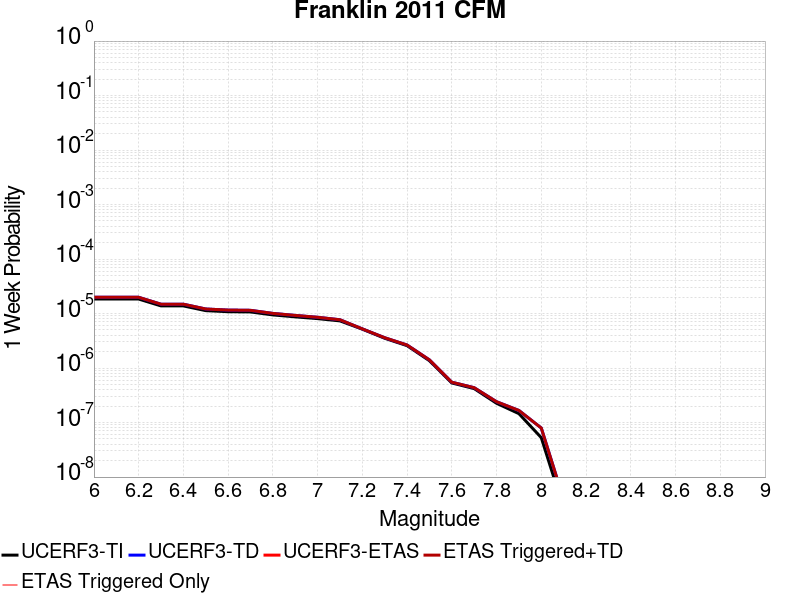 | 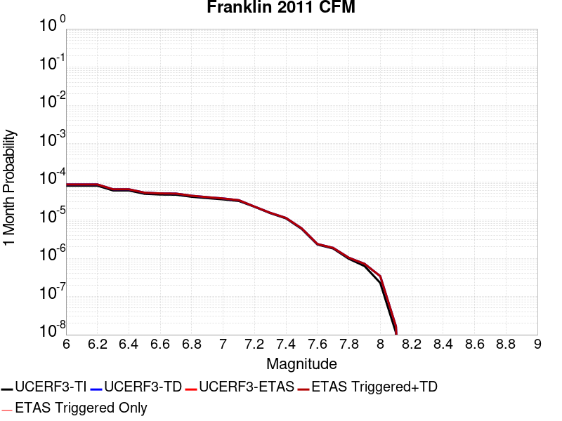 | 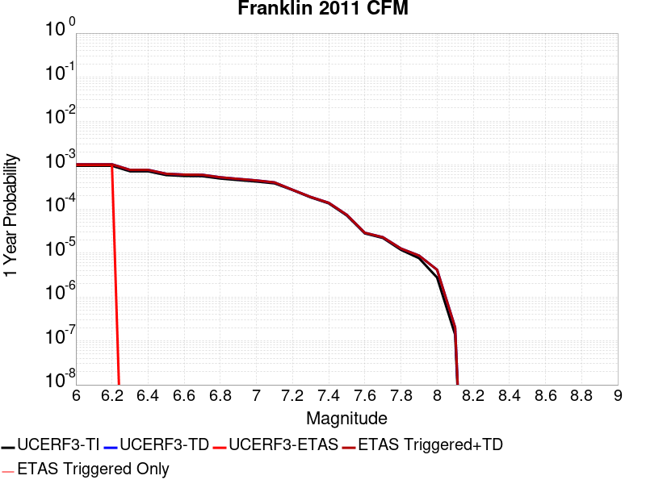 |  |

| Magnitude | 1 wk TI Prob | 1 wk TD Prob | 1 wk ETAS Prob | 1 wk ETAS/TD Gain | 1 wk ETAS Triggered+TD | 1 wk ETAS Triggered Only | 1 mo TI Prob | 1 mo TD Prob | 1 mo ETAS Prob | 1 mo ETAS/TD Gain | 1 mo ETAS Triggered+TD | 1 mo ETAS Triggered Only | 1 yr TI Prob | 1 yr TD Prob | 1 yr ETAS Prob | 1 yr ETAS/TD Gain | 1 yr ETAS Triggered+TD | 1 yr ETAS Triggered Only | 500 yr TI Prob | 500 yr TD Prob | 500 yr ETAS Prob | 500 yr ETAS/TD Gain | 500 yr ETAS Triggered+TD | 500 yr ETAS Triggered Only |
|-----|-----|-----|-----|-----|-----|-----|-----|-----|-----|-----|-----|-----|-----|-----|-----|-----|-----|-----|-----|-----|-----|-----|-----|-----|
| 6.0 | 1.845602E-5 | 1.9881021E-5 | 0.0 | 0.0 | 1.9881021E-5 | 0.0 | 7.9094825E-5 | 8.5201755E-5 | 0.0 | 0.0 | 8.5201755E-5 | 0.0 | 9.6255407E-4 | 0.0010368665 | 0.001 | 0.96444434 | 0.0010368665 | 0.0 | 0.38214952 | 0.41034693 | 0.325 | 0.79201275 | 0.4180124 | 0.013 |
| 6.1 | 1.845602E-5 | 1.9881021E-5 | 0.0 | 0.0 | 1.9881021E-5 | 0.0 | 7.9094825E-5 | 8.5201755E-5 | 0.0 | 0.0 | 8.5201755E-5 | 0.0 | 9.6255407E-4 | 0.0010368665 | 0.001 | 0.96444434 | 0.0010368665 | 0.0 | 0.38214952 | 0.41034693 | 0.325 | 0.79201275 | 0.4180124 | 0.013 |
| 6.2 | 1.845602E-5 | 1.9881021E-5 | 0.0 | 0.0 | 1.9881021E-5 | 0.0 | 7.9094825E-5 | 8.5201755E-5 | 0.0 | 0.0 | 8.5201755E-5 | 0.0 | 9.6255407E-4 | 0.0010368665 | 0.001 | 0.96444434 | 0.0010368665 | 0.0 | 0.38214952 | 0.41034693 | 0.325 | 0.79201275 | 0.4180124 | 0.013 |
| 6.3 | 1.3813506E-5 | 1.4846637E-5 | 0.0 | 0.0 | 1.4846637E-5 | 0.0 | 5.9199396E-5 | 6.362693E-5 | 0.0 | 0.0 | 6.362693E-5 | 0.0 | 7.205143E-4 | 7.743902E-4 | 0.0 | 0.0 | 7.743902E-4 | 0.0 | 0.30259362 | 0.32386056 | 0.244 | 0.7534107 | 0.33129808 | 0.011 |
| 6.4 | 1.3813506E-5 | 1.4846637E-5 | 0.0 | 0.0 | 1.4846637E-5 | 0.0 | 5.9199396E-5 | 6.362693E-5 | 0.0 | 0.0 | 6.362693E-5 | 0.0 | 7.205143E-4 | 7.743902E-4 | 0.0 | 0.0 | 7.743902E-4 | 0.0 | 0.30259362 | 0.32386056 | 0.244 | 0.7534107 | 0.33129808 | 0.011 |
| 6.5 | 1.1308949E-5 | 1.21227495E-5 | 0.0 | 0.0 | 1.21227495E-5 | 0.0 | 4.8466023E-5 | 5.1953615E-5 | 0.0 | 0.0 | 5.1953615E-5 | 0.0 | 5.899141E-4 | 6.323537E-4 | 0.0 | 0.0 | 6.323537E-4 | 0.0 | 0.25550124 | 0.27322212 | 0.194 | 0.710045 | 0.28121668 | 0.011 |
| 6.6 | 1.0813164E-5 | 1.1583573E-5 | 0.0 | 0.0 | 1.1583573E-5 | 0.0 | 4.6341313E-5 | 4.964295E-5 | 0.0 | 0.0 | 4.964295E-5 | 0.0 | 5.640594E-4 | 6.0423714E-4 | 0.0 | 0.0 | 6.0423714E-4 | 0.0 | 0.24580874 | 0.2629565 | 0.186 | 0.7073413 | 0.27106398 | 0.011 |
| 6.7 | 1.0706348E-5 | 1.1465992E-5 | 0.0 | 0.0 | 1.1465992E-5 | 0.0 | 4.5883542E-5 | 4.9139053E-5 | 0.0 | 0.0 | 4.9139053E-5 | 0.0 | 5.5848894E-4 | 5.981056E-4 | 0.0 | 0.0 | 5.981056E-4 | 0.0 | 0.24370402 | 0.26072565 | 0.185 | 0.70955807 | 0.2688577 | 0.011 |
| 6.8 | 9.443655E-6 | 1.0065806E-5 | 0.0 | 0.0 | 1.0065806E-5 | 0.0 | 4.0472176E-5 | 4.313846E-5 | 0.0 | 0.0 | 4.313846E-5 | 0.0 | 4.9263734E-4 | 5.2508555E-4 | 0.0 | 0.0 | 5.2508555E-4 | 0.0 | 0.21837436 | 0.23345281 | 0.163 | 0.6982139 | 0.24035174 | 0.009 |
| 6.9 | 8.7001645E-6 | 9.243877E-6 | 0.0 | 0.0 | 9.243877E-6 | 0.0 | 3.728589E-5 | 3.9616018E-5 | 0.0 | 0.0 | 3.9616018E-5 | 0.0 | 4.538611E-4 | 4.8221948E-4 | 0.0 | 0.0 | 4.8221948E-4 | 0.0 | 0.20306493 | 0.21698835 | 0.147 | 0.6774557 | 0.22325245 | 0.008 |
| 7.0 | 8.074731E-6 | 8.542339E-6 | 0.0 | 0.0 | 8.542339E-6 | 0.0 | 3.460553E-5 | 3.6609516E-5 | 0.0 | 0.0 | 3.6609516E-5 | 0.0 | 4.212409E-4 | 4.4563078E-4 | 0.0 | 0.0 | 4.4563078E-4 | 0.0 | 0.18995447 | 0.2027086 | 0.139 | 0.6857134 | 0.20828964 | 0.007 |
| 7.1 | 7.3370957E-6 | 7.699953E-6 | 0.0 | 0.0 | 7.699953E-6 | 0.0 | 3.1444317E-5 | 3.2999385E-5 | 0.0 | 0.0 | 3.2999385E-5 | 0.0 | 3.8276732E-4 | 4.0169444E-4 | 0.0 | 0.0 | 4.0169444E-4 | 0.0 | 0.17421456 | 0.18570744 | 0.13 | 0.7000258 | 0.19140749 | 0.007 |
| 7.2 | 5.1750103E-6 | 5.2318514E-6 | 0.0 | 0.0 | 5.2318514E-6 | 0.0 | 2.2178427E-5 | 2.242203E-5 | 0.0 | 0.0 | 2.242203E-5 | 0.0 | 2.699889E-4 | 2.729543E-4 | 0.0 | 0.0 | 2.729543E-4 | 0.0 | 0.12629516 | 0.13327825 | 0.085 | 0.6377635 | 0.13674513 | 0.004 |
| 7.3 | 3.5221371E-6 | 3.6026702E-6 | 0.0 | 0.0 | 3.6026702E-6 | 0.0 | 1.5094786E-5 | 1.5439924E-5 | 0.0 | 0.0 | 1.5439924E-5 | 0.0 | 1.8376352E-4 | 1.8796496E-4 | 0.0 | 0.0 | 1.8796496E-4 | 0.0 | 0.0877947 | 0.090878524 | 0.054 | 0.5941998 | 0.09269677 | 0.002 |
| 7.4 | 2.5749775E-6 | 2.649414E-6 | 0.0 | 0.0 | 2.649414E-6 | 0.0 | 1.1035571E-5 | 1.1354582E-5 | 0.0 | 0.0 | 1.1354582E-5 | 0.0 | 1.343498E-4 | 1.3823333E-4 | 0.0 | 0.0 | 1.3823333E-4 | 0.0 | 0.06497257 | 0.06731622 | 0.038 | 0.5644999 | 0.06731622 | 0.0 |
| 7.5 | 1.3642131E-6 | 1.4123566E-6 | 0.0 | 0.0 | 1.4123566E-6 | 0.0 | 5.8466144E-6 | 6.052943E-6 | 0.0 | 0.0 | 6.052943E-6 | 0.0 | 7.1180206E-5 | 7.369211E-5 | 0.0 | 0.0 | 7.369211E-5 | 0.0 | 0.034965444 | 0.035446603 | 0.021 | 0.5924404 | 0.035446603 | 0.0 |
| 7.6 | 5.329124E-7 | 5.504152E-7 | 0.0 | 0.0 | 5.504152E-7 | 0.0 | 2.2839083E-6 | 2.3589203E-6 | 0.0 | 0.0 | 2.3589203E-6 | 0.0 | 2.7806227E-5 | 2.871948E-5 | 0.0 | 0.0 | 2.871948E-5 | 0.0 | 0.013807103 | 0.0119794505 | 0.006 | 0.5008577 | 0.0119794505 | 0.0 |
| 7.7 | 4.199127E-7 | 4.3634395E-7 | 0.0 | 0.0 | 4.3634395E-7 | 0.0 | 1.7996247E-6 | 1.8700441E-6 | 0.0 | 0.0 | 1.8700441E-6 | 0.0 | 2.191021E-5 | 2.2767552E-5 | 0.0 | 0.0 | 2.2767552E-5 | 0.0 | 0.010895435 | 0.009126688 | 0.002 | 0.21913755 | 0.009126688 | 0.0 |
| 7.8 | 2.2586491E-7 | 2.4124486E-7 | 0.0 | 0.0 | 2.4124486E-7 | 0.0 | 9.67992E-7 | 1.0339062E-6 | 0.0 | 0.0 | 1.0339062E-6 | 0.0 | 1.178524E-5 | 1.2587735E-5 | 0.0 | 0.0 | 1.2587735E-5 | 0.0 | 0.005875327 | 0.0049422667 | 0.001 | 0.20233631 | 0.0049422667 | 0.0 |
| 7.9 | 1.4568845E-7 | 1.6678369E-7 | 0.0 | 0.0 | 1.6678369E-7 | 0.0 | 6.243789E-7 | 7.1478706E-7 | 0.0 | 0.0 | 7.1478706E-7 | 0.0 | 7.601787E-6 | 8.702498E-6 | 0.0 | 0.0 | 8.702498E-6 | 0.0 | 0.0037936936 | 0.0031462712 | 0.001 | 0.31783655 | 0.0031462712 | 0.0 |
| 8.0 | 5.2868224E-8 | 7.942098E-8 | 0.0 | 0.0 | 7.942098E-8 | 0.0 | 2.2657808E-7 | 3.4037558E-7 | 0.0 | 0.0 | 3.4037558E-7 | 0.0 | 2.7585847E-6 | 4.144065E-6 | 0.0 | 0.0 | 4.144065E-6 | 0.0 | 0.0013783434 | 9.5261534E-4 | 0.0 | 0.0 | 9.5261534E-4 | 0.0 |
| 8.1 | 2.654434E-9 | 3.854872E-9 | 0.0 | 0.0 | 3.854872E-9 | 0.0 | 1.1376145E-8 | 1.652088E-8 | 0.0 | 0.0 | 1.652088E-8 | 0.0 | 1.3850456E-7 | 2.0114172E-7 | 0.0 | 0.0 | 2.0114172E-7 | 0.0 | 6.924989E-5 | 5.5779576E-5 | 0.0 | 0.0 | 5.5779576E-5 | 0.0 |

## Hunting Creek - Bartlett Springs connector 2011
*[(top)](#table-of-contents)*

| 1 Week | 1 Month | 1 Year | 500 Year |
|-----|-----|-----|-----|
|  | 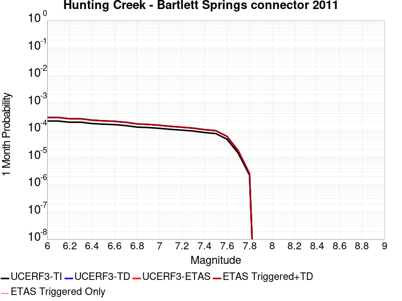 | 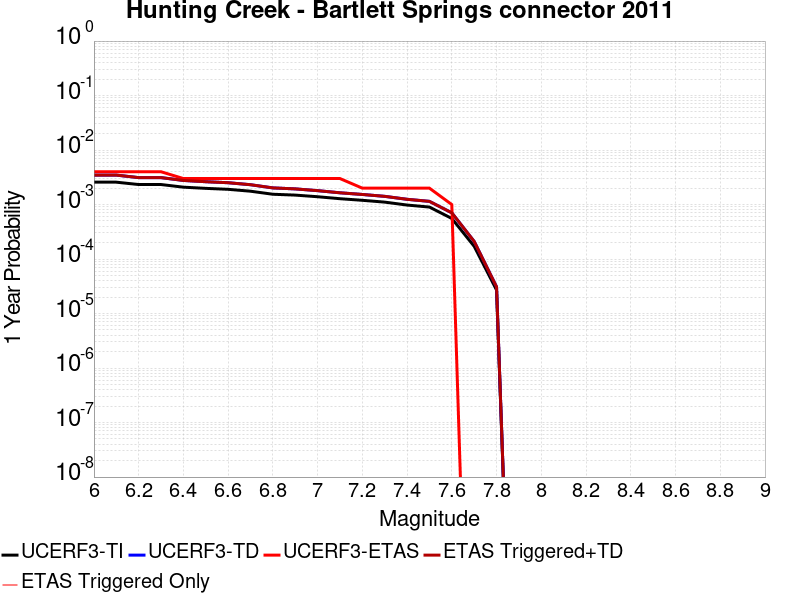 | 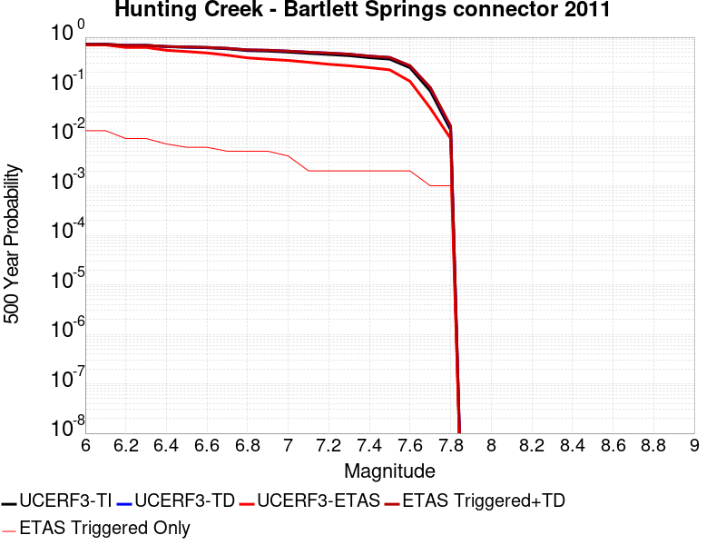 |

| Magnitude | 1 wk TI Prob | 1 wk TD Prob | 1 wk ETAS Prob | 1 wk ETAS/TD Gain | 1 wk ETAS Triggered+TD | 1 wk ETAS Triggered Only | 1 mo TI Prob | 1 mo TD Prob | 1 mo ETAS Prob | 1 mo ETAS/TD Gain | 1 mo ETAS Triggered+TD | 1 mo ETAS Triggered Only | 1 yr TI Prob | 1 yr TD Prob | 1 yr ETAS Prob | 1 yr ETAS/TD Gain | 1 yr ETAS Triggered+TD | 1 yr ETAS Triggered Only | 500 yr TI Prob | 500 yr TD Prob | 500 yr ETAS Prob | 500 yr ETAS/TD Gain | 500 yr ETAS Triggered+TD | 500 yr ETAS Triggered Only |
|-----|-----|-----|-----|-----|-----|-----|-----|-----|-----|-----|-----|-----|-----|-----|-----|-----|-----|-----|-----|-----|-----|-----|-----|-----|
| 6.0 | 4.940016E-5 | 6.665498E-5 | 0.0 | 0.0 | 6.665498E-5 | 0.0 | 2.1169778E-4 | 2.856337E-4 | 0.0 | 0.0 | 2.856337E-4 | 0.0 | 0.002574374 | 0.003471969 | 0.004 | 1.152084 | 0.003471969 | 0.0 | 0.72441155 | 0.7141654 | 0.701 | 0.98156536 | 0.7178812 | 0.013 |
| 6.1 | 4.940016E-5 | 6.665498E-5 | 0.0 | 0.0 | 6.665498E-5 | 0.0 | 2.1169778E-4 | 2.856337E-4 | 0.0 | 0.0 | 2.856337E-4 | 0.0 | 0.002574374 | 0.003471969 | 0.004 | 1.152084 | 0.003471969 | 0.0 | 0.72441155 | 0.7141654 | 0.701 | 0.98156536 | 0.7178812 | 0.013 |
| 6.2 | 4.472471E-5 | 5.9930117E-5 | 0.0 | 0.0 | 5.9930117E-5 | 0.0 | 1.9166325E-4 | 2.5681857E-4 | 0.0 | 0.0 | 2.5681857E-4 | 0.0 | 0.0023310026 | 0.003122233 | 0.004 | 1.2811344 | 0.003122233 | 0.0 | 0.6886575 | 0.6840037 | 0.624 | 0.9122758 | 0.6868477 | 0.009 |
| 6.3 | 4.472471E-5 | 5.9930117E-5 | 0.0 | 0.0 | 5.9930117E-5 | 0.0 | 1.9166325E-4 | 2.5681857E-4 | 0.0 | 0.0 | 2.5681857E-4 | 0.0 | 0.0023310026 | 0.003122233 | 0.004 | 1.2811344 | 0.003122233 | 0.0 | 0.6886575 | 0.6840037 | 0.624 | 0.9122758 | 0.6868477 | 0.009 |
| 6.4 | 4.0001003E-5 | 5.3168962E-5 | 0.0 | 0.0 | 5.3168962E-5 | 0.0 | 1.714216E-4 | 2.2784728E-4 | 0.0 | 0.0 | 2.2784728E-4 | 0.0 | 0.0020850603 | 0.0027704947 | 0.003 | 1.0828391 | 0.0027704947 | 0.0 | 0.64782196 | 0.64982104 | 0.546 | 0.84023136 | 0.6522723 | 0.007 |
| 6.5 | 3.8033053E-5 | 5.0386647E-5 | 0.0 | 0.0 | 5.0386647E-5 | 0.0 | 1.6298861E-4 | 2.1592506E-4 | 0.0 | 0.0 | 2.1592506E-4 | 0.0 | 0.0019825802 | 0.0026257173 | 0.003 | 1.1425449 | 0.0026257173 | 0.0 | 0.62926733 | 0.6346135 | 0.515 | 0.81151754 | 0.63680583 | 0.006 |
| 6.6 | 3.653754E-5 | 4.8291196E-5 | 0.0 | 0.0 | 4.8291196E-5 | 0.0 | 1.5658008E-4 | 2.0694612E-4 | 0.0 | 0.0 | 2.0694612E-4 | 0.0 | 0.0019046954 | 0.0025166715 | 0.003 | 1.1920507 | 0.0025166715 | 0.0 | 0.6145161 | 0.62247294 | 0.483 | 0.7759374 | 0.6247381 | 0.006 |
| 6.7 | 3.372024E-5 | 4.4377877E-5 | 0.0 | 0.0 | 4.4377877E-5 | 0.0 | 1.4450731E-4 | 1.9017726E-4 | 0.0 | 0.0 | 1.9017726E-4 | 0.0 | 0.0017579567 | 0.0023129762 | 0.003 | 1.2970302 | 0.0023129762 | 0.0 | 0.5851141 | 0.59781116 | 0.435 | 0.7276545 | 0.5998221 | 0.005 |
| 6.8 | 2.9650024E-5 | 3.8766408E-5 | 0.0 | 0.0 | 3.8766408E-5 | 0.0 | 1.2706534E-4 | 1.661312E-4 | 0.0 | 0.0 | 1.661312E-4 | 0.0 | 0.0015459227 | 0.0020207677 | 0.003 | 1.4845843 | 0.0020207677 | 0.0 | 0.53863204 | 0.5553699 | 0.384 | 0.69143105 | 0.55759305 | 0.005 |
| 6.9 | 2.860775E-5 | 3.7207225E-5 | 0.0 | 0.0 | 3.7207225E-5 | 0.0 | 1.2259888E-4 | 1.5944982E-4 | 0.0 | 0.0 | 1.5944982E-4 | 0.0 | 0.0014916194 | 0.0019395817 | 0.003 | 1.5467253 | 0.0019395817 | 0.0 | 0.52591395 | 0.5454962 | 0.36 | 0.65994954 | 0.5477688 | 0.005 |
| 7.0 | 2.6696067E-5 | 3.452205E-5 | 0.0 | 0.0 | 3.452205E-5 | 0.0 | 1.144067E-4 | 1.479433E-4 | 0.0 | 0.0 | 1.479433E-4 | 0.0 | 0.0013920115 | 0.0017997307 | 0.003 | 1.666916 | 0.0017997307 | 0.0 | 0.50166893 | 0.52464145 | 0.341 | 0.64996773 | 0.52654284 | 0.004 |
| 7.1 | 2.456087E-5 | 3.1533124E-5 | 0.0 | 0.0 | 3.1533124E-5 | 0.0 | 1.0525662E-4 | 1.3513501E-4 | 0.0 | 0.0 | 1.3513501E-4 | 0.0 | 0.001280746 | 0.001644036 | 0.003 | 1.8247775 | 0.001644036 | 0.0 | 0.4731205 | 0.50009894 | 0.313 | 0.6258762 | 0.50109875 | 0.002 |
| 7.2 | 2.295761E-5 | 2.9385523E-5 | 0.0 | 0.0 | 2.9385523E-5 | 0.0 | 9.8386045E-5 | 1.2593193E-4 | 0.0 | 0.0 | 1.2593193E-4 | 0.0 | 0.0011971919 | 0.0015321518 | 0.002 | 1.3053536 | 0.0015321518 | 0.0 | 0.4506143 | 0.4796804 | 0.285 | 0.59414566 | 0.48072103 | 0.002 |
| 7.3 | 2.1256936E-5 | 2.7139993E-5 | 0.0 | 0.0 | 2.7139993E-5 | 0.0 | 9.109797E-5 | 1.1630912E-4 | 0.0 | 0.0 | 1.1630912E-4 | 0.0 | 0.0011085535 | 0.0014151523 | 0.002 | 1.4132755 | 0.0014151523 | 0.0 | 0.42568898 | 0.45515564 | 0.266 | 0.5844155 | 0.45624533 | 0.002 |
| 7.4 | 1.8784336E-5 | 2.3954663E-5 | 0.0 | 0.0 | 2.3954663E-5 | 0.0 | 8.050181E-5 | 1.0265884E-4 | 0.0 | 0.0 | 1.0265884E-4 | 0.0 | 9.796688E-4 | 0.0012491621 | 0.002 | 1.6010731 | 0.0012491621 | 0.0 | 0.38741925 | 0.41612315 | 0.244 | 0.58636487 | 0.4172909 | 0.002 |
| 7.5 | 1.7248298E-5 | 2.1948523E-5 | 0.0 | 0.0 | 2.1948523E-5 | 0.0 | 7.391918E-5 | 9.406175E-5 | 0.0 | 0.0 | 9.406175E-5 | 0.0 | 8.9959445E-4 | 0.0011446074 | 0.002 | 1.747324 | 0.0011446074 | 0.0 | 0.36237162 | 0.39084533 | 0.22 | 0.56288254 | 0.39206365 | 0.002 |
| 7.6 | 1.0653709E-5 | 1.3528217E-5 | 0.0 | 0.0 | 1.3528217E-5 | 0.0 | 4.5657955E-5 | 5.7976802E-5 | 0.0 | 0.0 | 5.7976802E-5 | 0.0 | 5.557438E-4 | 7.056416E-4 | 0.001 | 1.41715 | 7.056416E-4 | 0.0 | 0.24266466 | 0.26500306 | 0.129 | 0.48678684 | 0.26647305 | 0.002 |
| 7.7 | 3.286316E-6 | 4.039667E-6 | 0.0 | 0.0 | 4.039667E-6 | 0.0 | 1.4084137E-5 | 1.7312746E-5 | 0.0 | 0.0 | 1.7312746E-5 | 0.0 | 1.7146087E-4 | 2.1076245E-4 | 0.0 | 0.0 | 2.1076245E-4 | 0.0 | 0.08216513 | 0.09548886 | 0.037 | 0.38747975 | 0.09639338 | 0.001 |
| 7.8 | 5.1855085E-7 | 5.92518E-7 | 0.0 | 0.0 | 5.92518E-7 | 0.0 | 2.222359E-6 | 2.5393606E-6 | 0.0 | 0.0 | 2.5393606E-6 | 0.0 | 2.7056883E-5 | 3.0916286E-5 | 0.0 | 0.0 | 3.0916286E-5 | 0.0 | 0.013437524 | 0.015270255 | 0.009 | 0.58938116 | 0.016254984 | 0.001 |

## Burnt Mtn
*[(top)](#table-of-contents)*

| 1 Week | 1 Month | 1 Year | 500 Year |
|-----|-----|-----|-----|
|  |  | 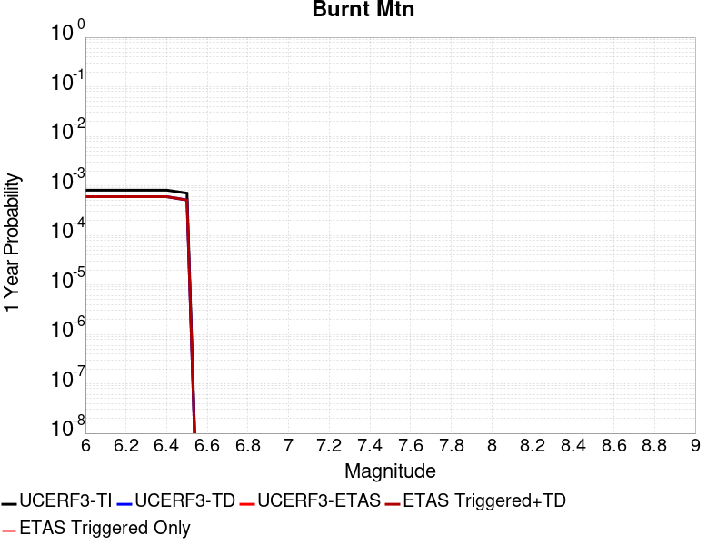 | 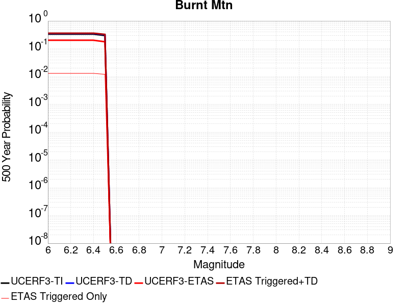 |

| Magnitude | 1 wk TI Prob | 1 wk TD Prob | 1 wk ETAS Prob | 1 wk ETAS/TD Gain | 1 wk ETAS Triggered+TD | 1 wk ETAS Triggered Only | 1 mo TI Prob | 1 mo TD Prob | 1 mo ETAS Prob | 1 mo ETAS/TD Gain | 1 mo ETAS Triggered+TD | 1 mo ETAS Triggered Only | 1 yr TI Prob | 1 yr TD Prob | 1 yr ETAS Prob | 1 yr ETAS/TD Gain | 1 yr ETAS Triggered+TD | 1 yr ETAS Triggered Only | 500 yr TI Prob | 500 yr TD Prob | 500 yr ETAS Prob | 500 yr ETAS/TD Gain | 500 yr ETAS Triggered+TD | 500 yr ETAS Triggered Only |
|-----|-----|-----|-----|-----|-----|-----|-----|-----|-----|-----|-----|-----|-----|-----|-----|-----|-----|-----|-----|-----|-----|-----|-----|-----|
| 6.0 | 1.5673151E-5 | 1.1571984E-5 | 0.0 | 0.0 | 1.1571984E-5 | 0.0 | 6.716892E-5 | 4.959398E-5 | 0.0 | 0.0 | 4.959398E-5 | 0.0 | 8.1747473E-4 | 6.037642E-4 | 0.0 | 0.0 | 6.037642E-4 | 0.0 | 0.33562234 | 0.35408908 | 0.202 | 0.5704779 | 0.36248592 | 0.013 |
| 6.1 | 1.5673151E-5 | 1.1571984E-5 | 0.0 | 0.0 | 1.1571984E-5 | 0.0 | 6.716892E-5 | 4.959398E-5 | 0.0 | 0.0 | 4.959398E-5 | 0.0 | 8.1747473E-4 | 6.037642E-4 | 0.0 | 0.0 | 6.037642E-4 | 0.0 | 0.33562234 | 0.35408908 | 0.202 | 0.5704779 | 0.36248592 | 0.013 |
| 6.2 | 1.5673151E-5 | 1.1571984E-5 | 0.0 | 0.0 | 1.1571984E-5 | 0.0 | 6.716892E-5 | 4.959398E-5 | 0.0 | 0.0 | 4.959398E-5 | 0.0 | 8.1747473E-4 | 6.037642E-4 | 0.0 | 0.0 | 6.037642E-4 | 0.0 | 0.33562234 | 0.35408908 | 0.202 | 0.5704779 | 0.36248592 | 0.013 |
| 6.3 | 1.5673151E-5 | 1.1571984E-5 | 0.0 | 0.0 | 1.1571984E-5 | 0.0 | 6.716892E-5 | 4.959398E-5 | 0.0 | 0.0 | 4.959398E-5 | 0.0 | 8.1747473E-4 | 6.037642E-4 | 0.0 | 0.0 | 6.037642E-4 | 0.0 | 0.33562234 | 0.35408908 | 0.202 | 0.5704779 | 0.36248592 | 0.013 |
| 6.4 | 1.5673151E-5 | 1.1571984E-5 | 0.0 | 0.0 | 1.1571984E-5 | 0.0 | 6.716892E-5 | 4.959398E-5 | 0.0 | 0.0 | 4.959398E-5 | 0.0 | 8.1747473E-4 | 6.037642E-4 | 0.0 | 0.0 | 6.037642E-4 | 0.0 | 0.33562234 | 0.35408908 | 0.202 | 0.5704779 | 0.36248592 | 0.013 |
| 6.5 | 1.36191375E-5 | 9.91459E-6 | 0.0 | 0.0 | 9.91459E-6 | 0.0 | 5.8366426E-5 | 4.24911E-5 | 0.0 | 0.0 | 4.24911E-5 | 0.0 | 7.103795E-4 | 5.1732914E-4 | 0.0 | 0.0 | 5.1732914E-4 | 0.0 | 0.29904807 | 0.32052833 | 0.178 | 0.55533314 | 0.328682 | 0.012 |

## Johnson Valley (No) 2011 rev
*[(top)](#table-of-contents)*

| 1 Week | 1 Month | 1 Year | 500 Year |
|-----|-----|-----|-----|
|  | 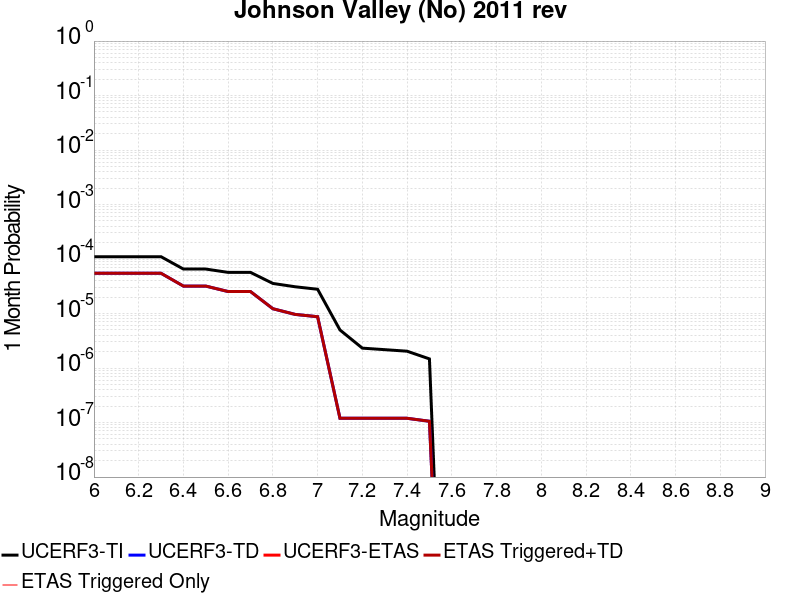 |  | 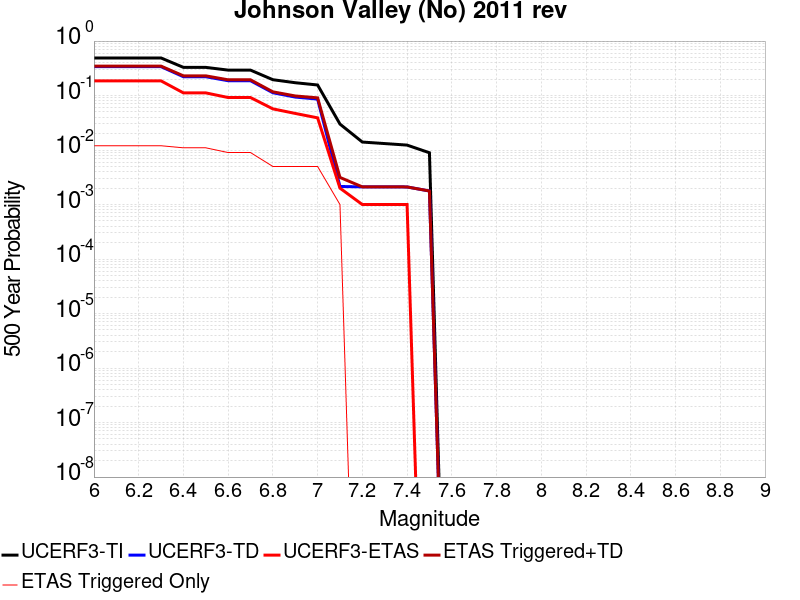 |

| Magnitude | 1 wk TI Prob | 1 wk TD Prob | 1 wk ETAS Prob | 1 wk ETAS/TD Gain | 1 wk ETAS Triggered+TD | 1 wk ETAS Triggered Only | 1 mo TI Prob | 1 mo TD Prob | 1 mo ETAS Prob | 1 mo ETAS/TD Gain | 1 mo ETAS Triggered+TD | 1 mo ETAS Triggered Only | 1 yr TI Prob | 1 yr TD Prob | 1 yr ETAS Prob | 1 yr ETAS/TD Gain | 1 yr ETAS Triggered+TD | 1 yr ETAS Triggered Only | 500 yr TI Prob | 500 yr TD Prob | 500 yr ETAS Prob | 500 yr ETAS/TD Gain | 500 yr ETAS Triggered+TD | 500 yr ETAS Triggered Only |
|-----|-----|-----|-----|-----|-----|-----|-----|-----|-----|-----|-----|-----|-----|-----|-----|-----|-----|-----|-----|-----|-----|-----|-----|-----|
| 6.0 | 2.577707E-5 | 1.2784872E-5 | 0.0 | 0.0 | 1.2784872E-5 | 0.0 | 1.1046848E-4 | 5.4791377E-5 | 0.0 | 0.0 | 5.4791377E-5 | 0.0 | 0.0013441239 | 6.6691986E-4 | 0.0 | 0.0 | 6.6691986E-4 | 0.0 | 0.48957625 | 0.3389833 | 0.186 | 0.5486996 | 0.3469155 | 0.012 |
| 6.1 | 2.577707E-5 | 1.2784872E-5 | 0.0 | 0.0 | 1.2784872E-5 | 0.0 | 1.1046848E-4 | 5.4791377E-5 | 0.0 | 0.0 | 5.4791377E-5 | 0.0 | 0.0013441239 | 6.6691986E-4 | 0.0 | 0.0 | 6.6691986E-4 | 0.0 | 0.48957625 | 0.3389833 | 0.186 | 0.5486996 | 0.3469155 | 0.012 |
| 6.2 | 2.577707E-5 | 1.2784872E-5 | 0.0 | 0.0 | 1.2784872E-5 | 0.0 | 1.1046848E-4 | 5.4791377E-5 | 0.0 | 0.0 | 5.4791377E-5 | 0.0 | 0.0013441239 | 6.6691986E-4 | 0.0 | 0.0 | 6.6691986E-4 | 0.0 | 0.48957625 | 0.3389833 | 0.186 | 0.5486996 | 0.3469155 | 0.012 |
| 6.3 | 2.577707E-5 | 1.2784872E-5 | 0.0 | 0.0 | 1.2784872E-5 | 0.0 | 1.1046848E-4 | 5.4791377E-5 | 0.0 | 0.0 | 5.4791377E-5 | 0.0 | 0.0013441239 | 6.6691986E-4 | 0.0 | 0.0 | 6.6691986E-4 | 0.0 | 0.48957625 | 0.3389833 | 0.186 | 0.5486996 | 0.3469155 | 0.012 |
| 6.4 | 1.5296591E-5 | 7.451166E-6 | 0.0 | 0.0 | 7.451166E-6 | 0.0 | 6.555518E-5 | 3.193328E-5 | 0.0 | 0.0 | 3.193328E-5 | 0.0 | 7.97842E-4 | 3.887367E-4 | 0.0 | 0.0 | 3.887367E-4 | 0.0 | 0.32906312 | 0.2214956 | 0.112 | 0.5056534 | 0.23005915 | 0.011 |
| 6.5 | 1.5296591E-5 | 7.451166E-6 | 0.0 | 0.0 | 7.451166E-6 | 0.0 | 6.555518E-5 | 3.193328E-5 | 0.0 | 0.0 | 3.193328E-5 | 0.0 | 7.97842E-4 | 3.887367E-4 | 0.0 | 0.0 | 3.887367E-4 | 0.0 | 0.32906312 | 0.2214956 | 0.112 | 0.5056534 | 0.23005915 | 0.011 |
| 6.6 | 1.3289383E-5 | 5.914552E-6 | 0.0 | 0.0 | 5.914552E-6 | 0.0 | 5.6953253E-5 | 2.5347928E-5 | 0.0 | 0.0 | 2.5347928E-5 | 0.0 | 6.9318525E-4 | 3.0858393E-4 | 0.0 | 0.0 | 3.0858393E-4 | 0.0 | 0.29299167 | 0.1872319 | 0.092 | 0.49136928 | 0.1945468 | 0.009 |
| 6.7 | 1.3289383E-5 | 5.914552E-6 | 0.0 | 0.0 | 5.914552E-6 | 0.0 | 5.6953253E-5 | 2.5347928E-5 | 0.0 | 0.0 | 2.5347928E-5 | 0.0 | 6.9318525E-4 | 3.0858393E-4 | 0.0 | 0.0 | 3.0858393E-4 | 0.0 | 0.29299167 | 0.1872319 | 0.092 | 0.49136928 | 0.1945468 | 0.009 |
| 6.8 | 8.330789E-6 | 2.8617726E-6 | 0.0 | 0.0 | 2.8617726E-6 | 0.0 | 3.570289E-5 | 1.2264713E-5 | 0.0 | 0.0 | 1.2264713E-5 | 0.0 | 4.34596E-4 | 1.4931812E-4 | 0.0 | 0.0 | 1.4931812E-4 | 0.0 | 0.19534788 | 0.11262981 | 0.057 | 0.5060827 | 0.11706666 | 0.005 |
| 6.9 | 7.2359003E-6 | 2.2509769E-6 | 0.0 | 0.0 | 2.2509769E-6 | 0.0 | 3.1010633E-5 | 9.647037E-6 | 0.0 | 0.0 | 9.647037E-6 | 0.0 | 3.7748902E-4 | 1.1745144E-4 | 0.0 | 0.0 | 1.1745144E-4 | 0.0 | 0.17203148 | 0.09381754 | 0.047 | 0.50097245 | 0.098348446 | 0.005 |
| 7.0 | 6.5149957E-6 | 2.0425462E-6 | 0.0 | 0.0 | 2.0425462E-6 | 0.0 | 2.792111E-5 | 8.753768E-6 | 0.0 | 0.0 | 8.753768E-6 | 0.0 | 3.398865E-4 | 1.0657699E-4 | 0.0 | 0.0 | 1.0657699E-4 | 0.0 | 0.15631168 | 0.08620643 | 0.039 | 0.45240247 | 0.09077539 | 0.005 |
| 7.1 | 1.1662233E-6 | 2.7962109E-8 | 0.0 | 0.0 | 2.7962109E-8 | 0.0 | 4.9980904E-6 | 1.1983761E-7 | 0.0 | 0.0 | 1.1983761E-7 | 0.0 | 6.0850052E-5 | 1.4590221E-6 | 0.0 | 0.0 | 1.4590221E-6 | 0.0 | 0.029967742 | 0.0021474008 | 0.002 | 0.9313586 | 0.0031452533 | 0.001 |
| 7.2 | 5.413881E-7 | 2.7962109E-8 | 0.0 | 0.0 | 2.7962109E-8 | 0.0 | 2.3202326E-6 | 1.1983761E-7 | 0.0 | 0.0 | 1.1983761E-7 | 0.0 | 2.8248465E-5 | 1.4590221E-6 | 0.0 | 0.0 | 1.4590221E-6 | 0.0 | 0.014025151 | 0.0021116731 | 0.001 | 0.47355813 | 0.0021116731 | 0.0 |
| 7.3 | 5.076821E-7 | 2.7962109E-8 | 0.0 | 0.0 | 2.7962109E-8 | 0.0 | 2.1757785E-6 | 1.1983761E-7 | 0.0 | 0.0 | 1.1983761E-7 | 0.0 | 2.648978E-5 | 1.4590221E-6 | 0.0 | 0.0 | 1.4590221E-6 | 0.0 | 0.0131577365 | 0.0021115534 | 0.001 | 0.473585 | 0.0021115534 | 0.0 |
| 7.4 | 4.7568687E-7 | 2.7945287E-8 | 0.0 | 0.0 | 2.7945287E-8 | 0.0 | 2.0386565E-6 | 1.1976552E-7 | 0.0 | 0.0 | 1.1976552E-7 | 0.0 | 2.482036E-5 | 1.4581443E-6 | 0.0 | 0.0 | 1.4581443E-6 | 0.0 | 0.012333644 | 0.0021049194 | 0.001 | 0.47507757 | 0.0021049194 | 0.0 |
| 7.5 | 3.435626E-7 | 2.464804E-8 | 0.0 | 0.0 | 2.464804E-8 | 0.0 | 1.4724103E-6 | 1.0563445E-7 | 0.0 | 0.0 | 1.0563445E-7 | 0.0 | 1.7926448E-5 | 1.2860988E-6 | 0.0 | 0.0 | 1.2860988E-6 | 0.0 | 0.008923254 | 0.001773915 | 0.0 | 0.0 | 0.001773915 | 0.0 |

## Palos Verdes
*[(top)](#table-of-contents)*

| 1 Week | 1 Month | 1 Year | 500 Year |
|-----|-----|-----|-----|
|  |  | 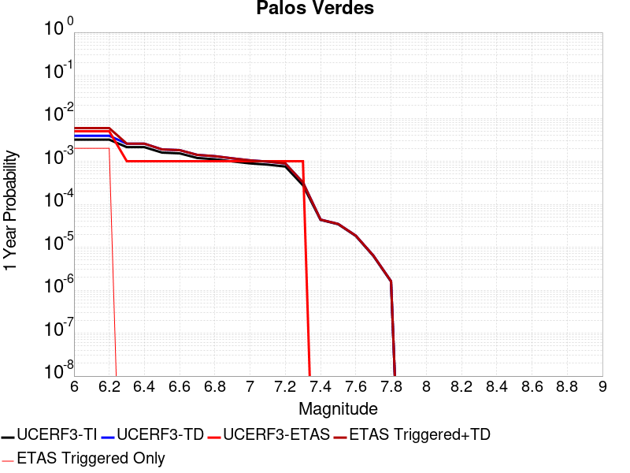 | 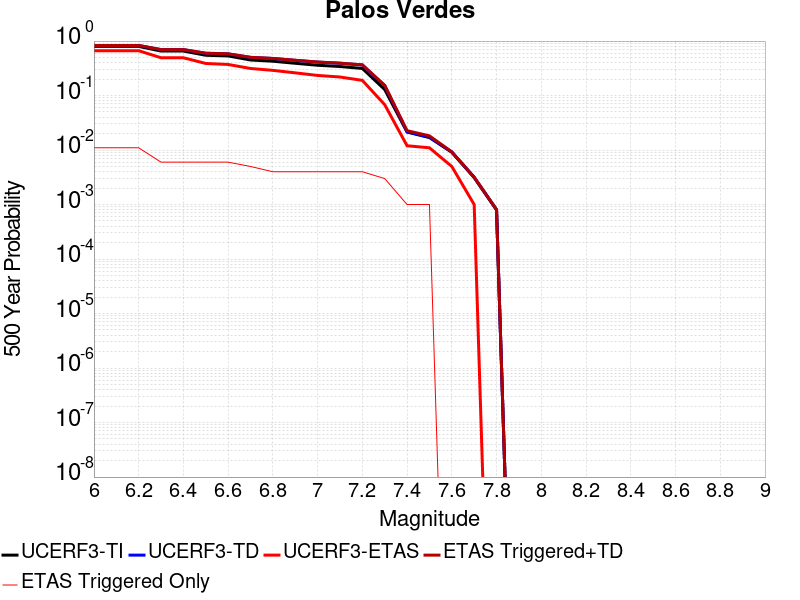 |

| Magnitude | 1 wk TI Prob | 1 wk TD Prob | 1 wk ETAS Prob | 1 wk ETAS/TD Gain | 1 wk ETAS Triggered+TD | 1 wk ETAS Triggered Only | 1 mo TI Prob | 1 mo TD Prob | 1 mo ETAS Prob | 1 mo ETAS/TD Gain | 1 mo ETAS Triggered+TD | 1 mo ETAS Triggered Only | 1 yr TI Prob | 1 yr TD Prob | 1 yr ETAS Prob | 1 yr ETAS/TD Gain | 1 yr ETAS Triggered+TD | 1 yr ETAS Triggered Only | 500 yr TI Prob | 500 yr TD Prob | 500 yr ETAS Prob | 500 yr ETAS/TD Gain | 500 yr ETAS Triggered+TD | 500 yr ETAS Triggered Only |
|-----|-----|-----|-----|-----|-----|-----|-----|-----|-----|-----|-----|-----|-----|-----|-----|-----|-----|-----|-----|-----|-----|-----|-----|-----|
| 6.0 | 6.126063E-5 | 7.527383E-5 | 0.0 | 0.0 | 7.527383E-5 | 0.0 | 2.6251914E-4 | 3.2256512E-4 | 0.0 | 0.0 | 3.2256512E-4 | 0.0 | 0.0031914865 | 0.0039206906 | 0.005 | 1.2752855 | 0.005912849 | 0.002 | 0.79775894 | 0.82913417 | 0.665 | 0.8020415 | 0.8310137 | 0.011 |
| 6.1 | 6.126063E-5 | 7.527383E-5 | 0.0 | 0.0 | 7.527383E-5 | 0.0 | 2.6251914E-4 | 3.2256512E-4 | 0.0 | 0.0 | 3.2256512E-4 | 0.0 | 0.0031914865 | 0.0039206906 | 0.005 | 1.2752855 | 0.005912849 | 0.002 | 0.79775894 | 0.82913417 | 0.665 | 0.8020415 | 0.8310137 | 0.011 |
| 6.2 | 6.126063E-5 | 7.527383E-5 | 0.0 | 0.0 | 7.527383E-5 | 0.0 | 2.6251914E-4 | 3.2256512E-4 | 0.0 | 0.0 | 3.2256512E-4 | 0.0 | 0.0031914865 | 0.0039206906 | 0.005 | 1.2752855 | 0.005912849 | 0.002 | 0.79775894 | 0.82913417 | 0.665 | 0.8020415 | 0.8310137 | 0.011 |
| 6.3 | 4.0838047E-5 | 4.9189366E-5 | 0.0 | 0.0 | 4.9189366E-5 | 0.0 | 1.7500846E-4 | 2.1079577E-4 | 0.0 | 0.0 | 2.1079577E-4 | 0.0 | 0.0021286458 | 0.002563625 | 0.001 | 0.39007264 | 0.002563625 | 0.0 | 0.6554297 | 0.69595516 | 0.494 | 0.70981586 | 0.6977794 | 0.006 |
| 6.4 | 4.0838047E-5 | 4.9189366E-5 | 0.0 | 0.0 | 4.9189366E-5 | 0.0 | 1.7500846E-4 | 2.1079577E-4 | 0.0 | 0.0 | 2.1079577E-4 | 0.0 | 0.0021286458 | 0.002563625 | 0.001 | 0.39007264 | 0.002563625 | 0.0 | 0.6554297 | 0.69595516 | 0.494 | 0.70981586 | 0.6977794 | 0.006 |
| 6.5 | 3.0512005E-5 | 3.618618E-5 | 0.0 | 0.0 | 3.618618E-5 | 0.0 | 1.3075917E-4 | 1.5507506E-4 | 0.0 | 0.0 | 1.5507506E-4 | 0.0 | 0.0015908304 | 0.0018865186 | 0.001 | 0.5300769 | 0.0018865186 | 0.0 | 0.548892 | 0.5962391 | 0.388 | 0.6507457 | 0.59866166 | 0.006 |
| 6.6 | 2.9255087E-5 | 3.4787667E-5 | 0.0 | 0.0 | 3.4787667E-5 | 0.0 | 1.2537291E-4 | 1.4908212E-4 | 0.0 | 0.0 | 1.4908212E-4 | 0.0 | 0.0015253464 | 0.001813676 | 0.001 | 0.5513664 | 0.001813676 | 0.0 | 0.5338536 | 0.5812557 | 0.372 | 0.6399937 | 0.5837681 | 0.006 |
| 6.7 | 2.287198E-5 | 2.6977896E-5 | 0.0 | 0.0 | 2.6977896E-5 | 0.0 | 9.801909E-5 | 1.1561494E-4 | 0.0 | 0.0 | 1.1561494E-4 | 0.0 | 0.001192729 | 0.0014067927 | 0.001 | 0.71083677 | 0.0014067927 | 0.0 | 0.44938555 | 0.50129086 | 0.314 | 0.6263828 | 0.5037844 | 0.005 |
| 6.8 | 2.1325764E-5 | 2.5178037E-5 | 0.0 | 0.0 | 2.5178037E-5 | 0.0 | 9.139293E-5 | 1.07901906E-4 | 0.0 | 0.0 | 1.07901906E-4 | 0.0 | 0.001112141 | 0.0013130023 | 0.001 | 0.76161325 | 0.0013130023 | 0.0 | 0.42671937 | 0.47849444 | 0.29 | 0.60606766 | 0.48058045 | 0.004 |
| 6.9 | 1.9009392E-5 | 2.239111E-5 | 0.0 | 0.0 | 2.239111E-5 | 0.0 | 8.1466285E-5 | 9.595885E-5 | 0.0 | 0.0 | 9.595885E-5 | 0.0 | 9.914007E-4 | 0.0011677584 | 0.001 | 0.85634154 | 0.0011677584 | 0.0 | 0.3910056 | 0.44245815 | 0.261 | 0.5898863 | 0.44468832 | 0.004 |
| 7.0 | 1.7098473E-5 | 2.0120595E-5 | 0.0 | 0.0 | 2.0120595E-5 | 0.0 | 7.3277115E-5 | 8.622874E-5 | 0.0 | 0.0 | 8.622874E-5 | 0.0 | 8.917837E-4 | 0.0010494128 | 0.001 | 0.9529139 | 0.0010494128 | 0.0 | 0.35987434 | 0.41058648 | 0.234 | 0.5699165 | 0.41294414 | 0.004 |
| 7.1 | 1.5982785E-5 | 1.8808863E-5 | 0.0 | 0.0 | 1.8808863E-5 | 0.0 | 6.849585E-5 | 8.060739E-5 | 0.0 | 0.0 | 8.060739E-5 | 0.0 | 8.336179E-4 | 9.81036E-4 | 0.001 | 1.0193305 | 9.81036E-4 | 0.0 | 0.3409677 | 0.39129165 | 0.219 | 0.5596849 | 0.39372647 | 0.004 |
| 7.2 | 1.4468002E-5 | 1.702869E-5 | 0.0 | 0.0 | 1.702869E-5 | 0.0 | 6.200425E-5 | 7.297852E-5 | 0.0 | 0.0 | 7.297852E-5 | 0.0 | 7.546402E-4 | 8.882335E-4 | 0.001 | 1.1258302 | 8.882335E-4 | 0.0 | 0.31440112 | 0.36397675 | 0.19 | 0.5220114 | 0.36652082 | 0.004 |
| 7.3 | 5.288233E-6 | 6.147036E-6 | 0.0 | 0.0 | 6.147036E-6 | 0.0 | 2.2663658E-5 | 2.6344365E-5 | 0.0 | 0.0 | 2.6344365E-5 | 0.0 | 2.7589512E-4 | 3.2072962E-4 | 0.001 | 3.117891 | 3.2072962E-4 | 0.0 | 0.1288722 | 0.15180042 | 0.068 | 0.44795656 | 0.15434504 | 0.003 |
| 7.4 | 8.279556E-7 | 8.401553E-7 | 0.0 | 0.0 | 8.401553E-7 | 0.0 | 3.5483763E-6 | 3.6006609E-6 | 0.0 | 0.0 | 3.6006609E-6 | 0.0 | 4.3200624E-5 | 4.3837237E-5 | 0.0 | 0.0 | 4.3837237E-5 | 0.0 | 0.021369152 | 0.021700203 | 0.012 | 0.5529902 | 0.022678504 | 0.001 |
| 7.5 | 6.559831E-7 | 6.66156E-7 | 0.0 | 0.0 | 6.66156E-7 | 0.0 | 2.8113532E-6 | 2.8549514E-6 | 0.0 | 0.0 | 2.8549514E-6 | 0.0 | 3.4227687E-5 | 3.475855E-5 | 0.0 | 0.0 | 3.475855E-5 | 0.0 | 0.016968522 | 0.0172475 | 0.011 | 0.63777363 | 0.018230252 | 0.001 |
| 7.6 | 3.5018968E-7 | 3.558828E-7 | 0.0 | 0.0 | 3.558828E-7 | 0.0 | 1.500812E-6 | 1.5252114E-6 | 0.0 | 0.0 | 1.5252114E-6 | 0.0 | 1.8272232E-5 | 1.8569337E-5 | 0.0 | 0.0 | 1.8569337E-5 | 0.0 | 0.009094592 | 0.009254434 | 0.005 | 0.54028153 | 0.009254434 | 0.0 |
| 7.7 | 1.1986104E-7 | 1.218716E-7 | 0.0 | 0.0 | 1.218716E-7 | 0.0 | 5.1369005E-7 | 5.223067E-7 | 0.0 | 0.0 | 5.223067E-7 | 0.0 | 6.2541585E-6 | 6.359066E-6 | 0.0 | 0.0 | 6.359066E-6 | 0.0 | 0.0031222047 | 0.0031746076 | 0.001 | 0.31499955 | 0.0031746076 | 0.0 |
| 7.8 | 3.0445005E-8 | 3.099676E-8 | 0.0 | 0.0 | 3.099676E-8 | 0.0 | 1.3047858E-7 | 1.3284324E-7 | 0.0 | 0.0 | 1.3284324E-7 | 0.0 | 1.5885756E-6 | 1.6173655E-6 | 0.0 | 0.0 | 1.6173655E-6 | 0.0 | 7.939731E-4 | 8.084138E-4 | 0.0 | 0.0 | 8.084138E-4 | 0.0 |

## Garlock (East)
*[(top)](#table-of-contents)*

| 1 Week | 1 Month | 1 Year | 500 Year |
|-----|-----|-----|-----|
|  |  | 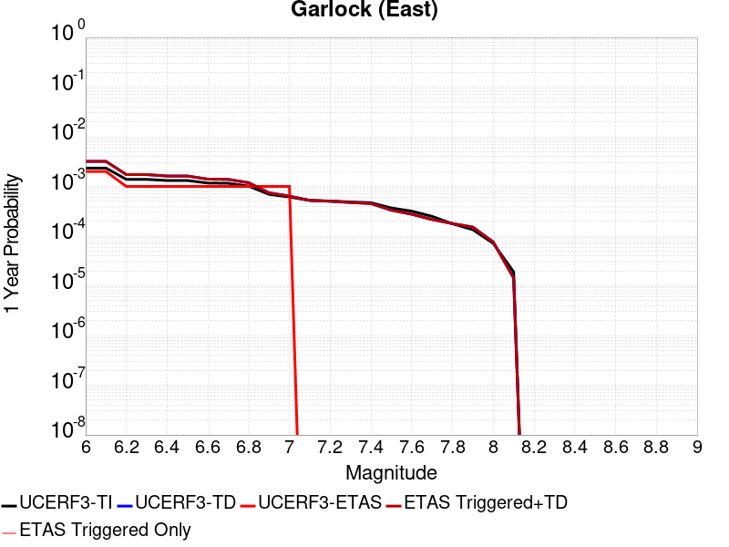 | 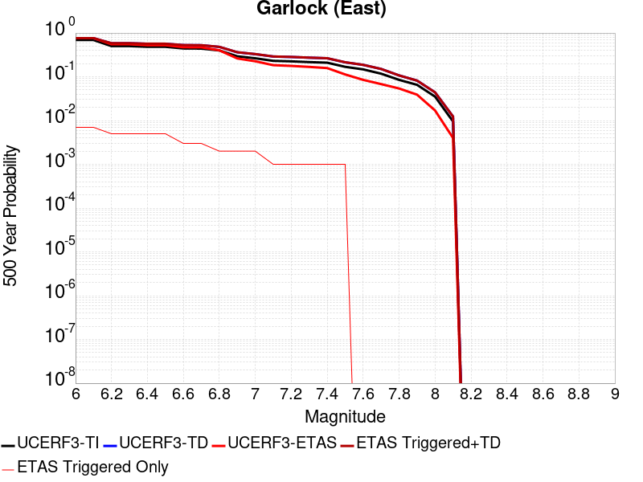 |

| Magnitude | 1 wk TI Prob | 1 wk TD Prob | 1 wk ETAS Prob | 1 wk ETAS/TD Gain | 1 wk ETAS Triggered+TD | 1 wk ETAS Triggered Only | 1 mo TI Prob | 1 mo TD Prob | 1 mo ETAS Prob | 1 mo ETAS/TD Gain | 1 mo ETAS Triggered+TD | 1 mo ETAS Triggered Only | 1 yr TI Prob | 1 yr TD Prob | 1 yr ETAS Prob | 1 yr ETAS/TD Gain | 1 yr ETAS Triggered+TD | 1 yr ETAS Triggered Only | 500 yr TI Prob | 500 yr TD Prob | 500 yr ETAS Prob | 500 yr ETAS/TD Gain | 500 yr ETAS Triggered+TD | 500 yr ETAS Triggered Only |
|-----|-----|-----|-----|-----|-----|-----|-----|-----|-----|-----|-----|-----|-----|-----|-----|-----|-----|-----|-----|-----|-----|-----|-----|-----|
| 6.0 | 4.5092507E-5 | 6.1358485E-5 | 0.0 | 0.0 | 6.1358485E-5 | 0.0 | 1.9323928E-4 | 2.629409E-4 | 0.0 | 0.0 | 2.629409E-4 | 0.0 | 0.0023501497 | 0.0031970427 | 0.002 | 0.6255781 | 0.0031970427 | 0.0 | 0.6916309 | 0.76052326 | 0.763 | 1.0032567 | 0.7621996 | 0.007 |
| 6.1 | 4.5092507E-5 | 6.1358485E-5 | 0.0 | 0.0 | 6.1358485E-5 | 0.0 | 1.9323928E-4 | 2.629409E-4 | 0.0 | 0.0 | 2.629409E-4 | 0.0 | 0.0023501497 | 0.0031970427 | 0.002 | 0.6255781 | 0.0031970427 | 0.0 | 0.6916309 | 0.76052326 | 0.763 | 1.0032567 | 0.7621996 | 0.007 |
| 6.2 | 2.6674514E-5 | 3.32687E-5 | 0.0 | 0.0 | 3.32687E-5 | 0.0 | 1.1431433E-4 | 1.4257253E-4 | 0.0 | 0.0 | 1.4257253E-4 | 0.0 | 0.0013908884 | 0.0017344704 | 0.001 | 0.5765449 | 0.0017344704 | 0.0 | 0.5013886 | 0.5826335 | 0.554 | 0.9508551 | 0.5847203 | 0.005 |
| 6.3 | 2.6674514E-5 | 3.32687E-5 | 0.0 | 0.0 | 3.32687E-5 | 0.0 | 1.1431433E-4 | 1.4257253E-4 | 0.0 | 0.0 | 1.4257253E-4 | 0.0 | 0.0013908884 | 0.0017344704 | 0.001 | 0.5765449 | 0.0017344704 | 0.0 | 0.5013886 | 0.5826335 | 0.554 | 0.9508551 | 0.5847203 | 0.005 |
| 6.4 | 2.5312667E-5 | 3.1123604E-5 | 0.0 | 0.0 | 3.1123604E-5 | 0.0 | 1.0847834E-4 | 1.3338022E-4 | 0.0 | 0.0 | 1.3338022E-4 | 0.0 | 0.0013199237 | 0.0016227227 | 0.001 | 0.61624825 | 0.0016227227 | 0.0 | 0.4833542 | 0.5663105 | 0.527 | 0.93058485 | 0.56847894 | 0.005 |
| 6.5 | 2.5312667E-5 | 3.1123604E-5 | 0.0 | 0.0 | 3.1123604E-5 | 0.0 | 1.0847834E-4 | 1.3338022E-4 | 0.0 | 0.0 | 1.3338022E-4 | 0.0 | 0.0013199237 | 0.0016227227 | 0.001 | 0.61624825 | 0.0016227227 | 0.0 | 0.4833542 | 0.5663105 | 0.527 | 0.93058485 | 0.56847894 | 0.005 |
| 6.6 | 2.246556E-5 | 2.6968617E-5 | 0.0 | 0.0 | 2.6968617E-5 | 0.0 | 9.627742E-5 | 1.15574796E-4 | 0.0 | 0.0 | 1.15574796E-4 | 0.0 | 0.0011715472 | 0.0014062374 | 0.001 | 0.7111175 | 0.0014062374 | 0.0 | 0.44351608 | 0.5280655 | 0.473 | 0.89572215 | 0.52948135 | 0.003 |
| 6.7 | 2.2241198E-5 | 2.664262E-5 | 0.0 | 0.0 | 2.664262E-5 | 0.0 | 9.531594E-5 | 1.1417778E-4 | 0.0 | 0.0 | 1.1417778E-4 | 0.0 | 0.0011598538 | 0.0013892505 | 0.001 | 0.7198126 | 0.0013892505 | 0.0 | 0.44024912 | 0.5248479 | 0.471 | 0.8974028 | 0.52627337 | 0.003 |
| 6.8 | 1.9528685E-5 | 2.2822274E-5 | 0.0 | 0.0 | 2.2822274E-5 | 0.0 | 8.369167E-5 | 9.780619E-5 | 0.0 | 0.0 | 9.780619E-5 | 0.0 | 0.0010184698 | 0.0011901585 | 0.001 | 0.8402242 | 0.0011901585 | 0.0 | 0.39920074 | 0.4812782 | 0.402 | 0.8352757 | 0.48231563 | 0.002 |
| 6.9 | 1.3318621E-5 | 1.4291096E-5 | 0.0 | 0.0 | 1.4291096E-5 | 0.0 | 5.7078556E-5 | 6.1246144E-5 | 0.0 | 0.0 | 6.1246144E-5 | 0.0 | 6.9470983E-4 | 7.4542203E-4 | 0.001 | 1.3415219 | 7.4542203E-4 | 0.0 | 0.29353076 | 0.36214966 | 0.262 | 0.7234578 | 0.36342534 | 0.002 |
| 7.0 | 1.1760853E-5 | 1.2242096E-5 | 0.0 | 0.0 | 1.2242096E-5 | 0.0 | 5.0402683E-5 | 5.2465097E-5 | 0.0 | 0.0 | 5.2465097E-5 | 0.0 | 6.134799E-4 | 6.3858E-4 | 0.001 | 1.5659745 | 6.3858E-4 | 0.0 | 0.26422733 | 0.32856277 | 0.226 | 0.6878442 | 0.32990563 | 0.002 |
| 7.1 | 1.0064758E-5 | 1.0065879E-5 | 0.0 | 0.0 | 1.0065879E-5 | 0.0 | 4.3133965E-5 | 4.3138785E-5 | 0.0 | 0.0 | 4.3138785E-5 | 0.0 | 5.2502943E-4 | 5.2509137E-4 | 0.0 | 0.0 | 5.2509137E-4 | 0.0 | 0.23093799 | 0.28999272 | 0.184 | 0.63449866 | 0.29070273 | 0.001 |
| 7.2 | 9.768808E-6 | 9.669271E-6 | 0.0 | 0.0 | 9.669271E-6 | 0.0 | 4.186565E-5 | 4.1439092E-5 | 0.0 | 0.0 | 4.1439092E-5 | 0.0 | 5.095951E-4 | 5.0440733E-4 | 0.0 | 0.0 | 5.0440733E-4 | 0.0 | 0.22497693 | 0.2831393 | 0.177 | 0.625134 | 0.28385615 | 0.001 |
| 7.3 | 9.344516E-6 | 9.131895E-6 | 0.0 | 0.0 | 9.131895E-6 | 0.0 | 4.004731E-5 | 3.9136125E-5 | 0.0 | 0.0 | 3.9136125E-5 | 0.0 | 4.8746695E-4 | 4.763813E-4 | 0.0 | 0.0 | 4.763813E-4 | 0.0 | 0.2163501 | 0.27255252 | 0.168 | 0.61639494 | 0.27327996 | 0.001 |
| 7.4 | 9.023491E-6 | 8.693872E-6 | 0.0 | 0.0 | 8.693872E-6 | 0.0 | 3.867153E-5 | 3.7258935E-5 | 0.0 | 0.0 | 3.7258935E-5 | 0.0 | 4.7072413E-4 | 4.5353617E-4 | 0.0 | 0.0 | 4.5353617E-4 | 0.0 | 0.20975913 | 0.2645292 | 0.158 | 0.59728754 | 0.2652647 | 0.001 |
| 7.5 | 7.081253E-6 | 6.3903663E-6 | 0.0 | 0.0 | 6.3903663E-6 | 0.0 | 3.0347876E-5 | 2.7387001E-5 | 0.0 | 0.0 | 2.7387001E-5 | 0.0 | 3.6942272E-4 | 3.333864E-4 | 0.0 | 0.0 | 3.333864E-4 | 0.0 | 0.16868417 | 0.21370567 | 0.113 | 0.5287646 | 0.21449196 | 0.001 |
| 7.6 | 6.116396E-6 | 5.302089E-6 | 0.0 | 0.0 | 5.302089E-6 | 0.0 | 2.6212863E-5 | 2.2723043E-5 | 0.0 | 0.0 | 2.2723043E-5 | 0.0 | 3.1909486E-4 | 2.7661814E-4 | 0.0 | 0.0 | 2.7661814E-4 | 0.0 | 0.14749219 | 0.18719752 | 0.085 | 0.45406583 | 0.18719752 | 0.0 |
| 7.7 | 4.797145E-6 | 4.14505E-6 | 0.0 | 0.0 | 4.14505E-6 | 0.0 | 2.055903E-5 | 1.7764378E-5 | 0.0 | 0.0 | 1.7764378E-5 | 0.0 | 2.5027743E-4 | 2.1625994E-4 | 0.0 | 0.0 | 2.1625994E-4 | 0.0 | 0.117639326 | 0.15080802 | 0.068 | 0.45090443 | 0.15080802 | 0.0 |
| 7.8 | 3.4028885E-6 | 3.4368552E-6 | 0.0 | 0.0 | 3.4368552E-6 | 0.0 | 1.4583726E-5 | 1.4729297E-5 | 0.0 | 0.0 | 1.4729297E-5 | 0.0 | 1.775424E-4 | 1.7931449E-4 | 0.0 | 0.0 | 1.7931449E-4 | 0.0 | 0.084952295 | 0.10729544 | 0.054 | 0.50328326 | 0.10729544 | 0.0 |
| 7.9 | 2.5928412E-6 | 2.9152507E-6 | 0.0 | 0.0 | 2.9152507E-6 | 0.0 | 1.1112129E-5 | 1.2493872E-5 | 0.0 | 0.0 | 1.2493872E-5 | 0.0 | 1.3528178E-4 | 1.5210232E-4 | 0.0 | 0.0 | 1.5210232E-4 | 0.0 | 0.06540824 | 0.081729 | 0.039 | 0.47718677 | 0.081729 | 0.0 |
| 8.0 | 1.3743648E-6 | 1.4637619E-6 | 0.0 | 0.0 | 1.4637619E-6 | 0.0 | 5.8901214E-6 | 6.27325E-6 | 0.0 | 0.0 | 6.27325E-6 | 0.0 | 7.1709874E-5 | 7.637417E-5 | 0.0 | 0.0 | 7.637417E-5 | 0.0 | 0.035221003 | 0.044060826 | 0.017 | 0.38583025 | 0.044060826 | 0.0 |
| 8.1 | 3.6733252E-7 | 2.768798E-7 | 0.0 | 0.0 | 2.768798E-7 | 0.0 | 1.5742813E-6 | 1.1866272E-6 | 0.0 | 0.0 | 1.1866272E-6 | 0.0 | 1.9166706E-5 | 1.4447103E-5 | 0.0 | 0.0 | 1.4447103E-5 | 0.0 | 0.00953767 | 0.012358525 | 0.004 | 0.32366323 | 0.012358525 | 0.0 |

## West Napa 2011 CFM
*[(top)](#table-of-contents)*

| 1 Week | 1 Month | 1 Year | 500 Year |
|-----|-----|-----|-----|
|  | 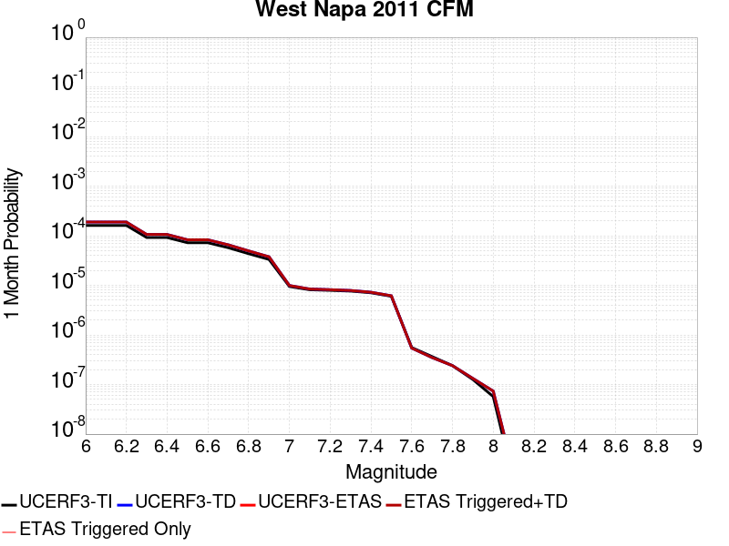 | 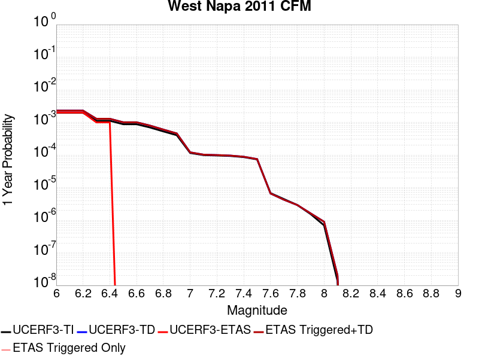 | 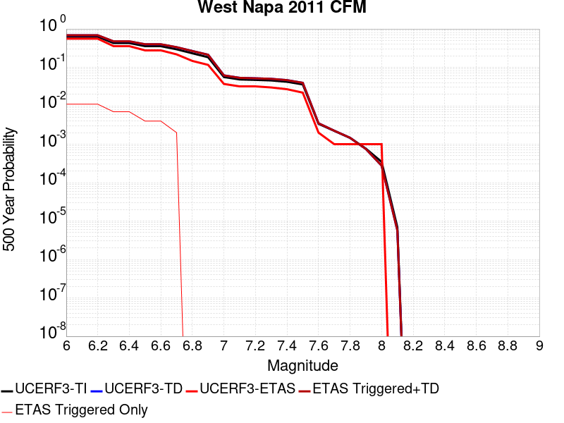 |

| Magnitude | 1 wk TI Prob | 1 wk TD Prob | 1 wk ETAS Prob | 1 wk ETAS/TD Gain | 1 wk ETAS Triggered+TD | 1 wk ETAS Triggered Only | 1 mo TI Prob | 1 mo TD Prob | 1 mo ETAS Prob | 1 mo ETAS/TD Gain | 1 mo ETAS Triggered+TD | 1 mo ETAS Triggered Only | 1 yr TI Prob | 1 yr TD Prob | 1 yr ETAS Prob | 1 yr ETAS/TD Gain | 1 yr ETAS Triggered+TD | 1 yr ETAS Triggered Only | 500 yr TI Prob | 500 yr TD Prob | 500 yr ETAS Prob | 500 yr ETAS/TD Gain | 500 yr ETAS Triggered+TD | 500 yr ETAS Triggered Only |
|-----|-----|-----|-----|-----|-----|-----|-----|-----|-----|-----|-----|-----|-----|-----|-----|-----|-----|-----|-----|-----|-----|-----|-----|-----|
| 6.0 | 3.773104E-5 | 4.407041E-5 | 0.0 | 0.0 | 4.407041E-5 | 0.0 | 1.6169442E-4 | 1.8886128E-4 | 0.0 | 0.0 | 1.8886128E-4 | 0.0 | 0.001966852 | 0.002297273 | 0.002 | 0.87059754 | 0.002297273 | 0.0 | 0.62633455 | 0.68149966 | 0.557 | 0.81731516 | 0.68500316 | 0.011 |
| 6.1 | 3.773104E-5 | 4.407041E-5 | 0.0 | 0.0 | 4.407041E-5 | 0.0 | 1.6169442E-4 | 1.8886128E-4 | 0.0 | 0.0 | 1.8886128E-4 | 0.0 | 0.001966852 | 0.002297273 | 0.002 | 0.87059754 | 0.002297273 | 0.0 | 0.62633455 | 0.68149966 | 0.557 | 0.81731516 | 0.68500316 | 0.011 |
| 6.2 | 3.773104E-5 | 4.407041E-5 | 0.0 | 0.0 | 4.407041E-5 | 0.0 | 1.6169442E-4 | 1.8886128E-4 | 0.0 | 0.0 | 1.8886128E-4 | 0.0 | 0.001966852 | 0.002297273 | 0.002 | 0.87059754 | 0.002297273 | 0.0 | 0.62633455 | 0.68149966 | 0.557 | 0.81731516 | 0.68500316 | 0.011 |
| 6.3 | 2.147964E-5 | 2.4732102E-5 | 0.0 | 0.0 | 2.4732102E-5 | 0.0 | 9.2052345E-5 | 1.0599093E-4 | 0.0 | 0.0 | 1.0599093E-4 | 0.0 | 0.001120161 | 0.0012897657 | 0.001 | 0.7753346 | 0.0012897657 | 0.0 | 0.4290162 | 0.47266138 | 0.357 | 0.7552976 | 0.47635275 | 0.007 |
| 6.4 | 2.147964E-5 | 2.4732102E-5 | 0.0 | 0.0 | 2.4732102E-5 | 0.0 | 9.2052345E-5 | 1.0599093E-4 | 0.0 | 0.0 | 1.0599093E-4 | 0.0 | 0.001120161 | 0.0012897657 | 0.001 | 0.7753346 | 0.0012897657 | 0.0 | 0.4290162 | 0.47266138 | 0.357 | 0.7552976 | 0.47635275 | 0.007 |
| 6.5 | 1.688201E-5 | 1.934367E-5 | 0.0 | 0.0 | 1.934367E-5 | 0.0 | 7.234947E-5 | 8.289921E-5 | 0.0 | 0.0 | 8.289921E-5 | 0.0 | 8.804988E-4 | 0.0010089021 | 0.0 | 0.0 | 0.0010089021 | 0.0 | 0.35624903 | 0.39768952 | 0.277 | 0.69652325 | 0.40009877 | 0.004 |
| 6.6 | 1.6846381E-5 | 1.9303636E-5 | 0.0 | 0.0 | 1.9303636E-5 | 0.0 | 7.219678E-5 | 8.272765E-5 | 0.0 | 0.0 | 8.272765E-5 | 0.0 | 8.7864127E-4 | 0.0010068152 | 0.0 | 0.0 | 0.0010068152 | 0.0 | 0.35565034 | 0.39707768 | 0.277 | 0.6975965 | 0.39948937 | 0.004 |
| 6.7 | 1.3396501E-5 | 1.529981E-5 | 0.0 | 0.0 | 1.529981E-5 | 0.0 | 5.7412315E-5 | 6.556931E-5 | 0.0 | 0.0 | 6.556931E-5 | 0.0 | 6.9877075E-4 | 7.9807633E-4 | 0.0 | 0.0 | 7.9807633E-4 | 0.0 | 0.29496476 | 0.33413994 | 0.218 | 0.65242124 | 0.33547166 | 0.002 |
| 6.8 | 1.0139058E-5 | 1.153662E-5 | 0.0 | 0.0 | 1.153662E-5 | 0.0 | 4.3452383E-5 | 4.9442027E-5 | 0.0 | 0.0 | 4.9442027E-5 | 0.0 | 5.289043E-4 | 6.018449E-4 | 0.0 | 0.0 | 6.018449E-4 | 0.0 | 0.23242733 | 0.2663339 | 0.147 | 0.5519387 | 0.2663339 | 0.0 |
| 6.9 | 7.761281E-6 | 8.779508E-6 | 0.0 | 0.0 | 8.779508E-6 | 0.0 | 3.326221E-5 | 3.7626203E-5 | 0.0 | 0.0 | 3.7626203E-5 | 0.0 | 4.0489217E-4 | 4.580532E-4 | 0.0 | 0.0 | 4.580532E-4 | 0.0 | 0.18330297 | 0.21294098 | 0.116 | 0.5447519 | 0.21294098 | 0.0 |
| 7.0 | 2.2109202E-6 | 2.3143762E-6 | 0.0 | 0.0 | 2.3143762E-6 | 0.0 | 9.475338E-6 | 9.918717E-6 | 0.0 | 0.0 | 9.918717E-6 | 0.0 | 1.1535613E-4 | 1.2075377E-4 | 0.0 | 0.0 | 1.2075377E-4 | 0.0 | 0.05604935 | 0.06187012 | 0.037 | 0.598027 | 0.06187012 | 0.0 |
| 7.1 | 1.9008926E-6 | 1.9636132E-6 | 0.0 | 0.0 | 1.9636132E-6 | 0.0 | 8.146657E-6 | 8.415458E-6 | 0.0 | 0.0 | 8.415458E-6 | 0.0 | 9.918104E-5 | 1.0245341E-4 | 0.0 | 0.0 | 1.0245341E-4 | 0.0 | 0.048383325 | 0.053371962 | 0.032 | 0.59956574 | 0.053371962 | 0.0 |
| 7.2 | 1.8495944E-6 | 1.9067595E-6 | 0.0 | 0.0 | 1.9067595E-6 | 0.0 | 7.926808E-6 | 8.171801E-6 | 0.0 | 0.0 | 8.171801E-6 | 0.0 | 9.650462E-5 | 9.948716E-5 | 0.0 | 0.0 | 9.948716E-5 | 0.0 | 0.04710889 | 0.051974766 | 0.032 | 0.6156834 | 0.051974766 | 0.0 |
| 7.3 | 1.7883189E-6 | 1.8392346E-6 | 0.0 | 0.0 | 1.8392346E-6 | 0.0 | 7.664201E-6 | 7.8824105E-6 | 0.0 | 0.0 | 7.8824105E-6 | 0.0 | 9.330765E-5 | 9.596415E-5 | 0.0 | 0.0 | 9.596415E-5 | 0.0 | 0.045584343 | 0.050281297 | 0.03 | 0.5966433 | 0.050281297 | 0.0 |
| 7.4 | 1.6520572E-6 | 1.6943862E-6 | 0.0 | 0.0 | 1.6943862E-6 | 0.0 | 7.0802257E-6 | 7.2616353E-6 | 0.0 | 0.0 | 7.2616353E-6 | 0.0 | 8.6198335E-5 | 8.840685E-5 | 0.0 | 0.0 | 8.840685E-5 | 0.0 | 0.04218538 | 0.04649541 | 0.027 | 0.5807025 | 0.04649541 | 0.0 |
| 7.5 | 1.4040345E-6 | 1.4366891E-6 | 0.0 | 0.0 | 1.4366891E-6 | 0.0 | 6.0172765E-6 | 6.157224E-6 | 0.0 | 0.0 | 6.157224E-6 | 0.0 | 7.325788E-5 | 7.496165E-5 | 0.0 | 0.0 | 7.496165E-5 | 0.0 | 0.03596751 | 0.039612856 | 0.022 | 0.5553752 | 0.039612856 | 0.0 |
| 7.6 | 1.3013842E-7 | 1.2661302E-7 | 0.0 | 0.0 | 1.2661302E-7 | 0.0 | 5.57736E-7 | 5.426271E-7 | 0.0 | 0.0 | 5.426271E-7 | 0.0 | 6.790414E-6 | 6.606465E-6 | 0.0 | 0.0 | 6.606465E-6 | 0.0 | 0.0033894612 | 0.0035116337 | 0.002 | 0.5695355 | 0.0035116337 | 0.0 |
| 7.7 | 8.541512E-8 | 8.1536854E-8 | 0.0 | 0.0 | 8.1536854E-8 | 0.0 | 3.6606474E-7 | 3.494436E-7 | 0.0 | 0.0 | 3.494436E-7 | 0.0 | 4.456829E-6 | 4.2544675E-6 | 0.0 | 0.0 | 4.2544675E-6 | 0.0 | 0.0022259385 | 0.0022432029 | 0.001 | 0.44579116 | 0.0022432029 | 0.0 |
| 7.8 | 5.6074793E-8 | 5.6110135E-8 | 0.0 | 0.0 | 5.6110135E-8 | 0.0 | 2.403205E-7 | 2.40472E-7 | 0.0 | 0.0 | 2.40472E-7 | 0.0 | 2.9258983E-6 | 2.9277423E-6 | 0.0 | 0.0 | 2.9277423E-6 | 0.0 | 0.0014618817 | 0.0014682073 | 0.001 | 0.6811027 | 0.0014682073 | 0.0 |
| 7.9 | 2.9475839E-8 | 3.101046E-8 | 0.0 | 0.0 | 3.101046E-8 | 0.0 | 1.2632502E-7 | 1.3290197E-7 | 0.0 | 0.0 | 1.3290197E-7 | 0.0 | 1.538006E-6 | 1.6180803E-6 | 0.0 | 0.0 | 1.6180803E-6 | 0.0 | 7.68708E-4 | 7.5164327E-4 | 0.001 | 1.3304183 | 7.5164327E-4 | 0.0 |
| 8.0 | 1.3337122E-8 | 1.7214626E-8 | 0.0 | 0.0 | 1.7214626E-8 | 0.0 | 5.7159088E-8 | 7.377697E-8 | 0.0 | 0.0 | 7.377697E-8 | 0.0 | 6.959117E-7 | 8.982342E-7 | 0.0 | 0.0 | 8.982342E-7 | 0.0 | 3.4789543E-4 | 2.7703715E-4 | 0.001 | 3.6096241 | 2.7703715E-4 | 0.0 |
| 8.1 | 2.6589986E-10 | 3.9281278E-10 | 0.0 | 0.0 | 3.9281278E-10 | 0.0 | 1.1395708E-9 | 1.6834841E-9 | 0.0 | 0.0 | 1.6834841E-9 | 0.0 | 1.3874274E-8 | 2.049642E-8 | 0.0 | 0.0 | 2.049642E-8 | 0.0 | 6.937113E-6 | 5.7336574E-6 | 0.0 | 0.0 | 5.7336574E-6 | 0.0 |

## Greenville (So) 2011 CFM
*[(top)](#table-of-contents)*

| 1 Week | 1 Month | 1 Year | 500 Year |
|-----|-----|-----|-----|
| 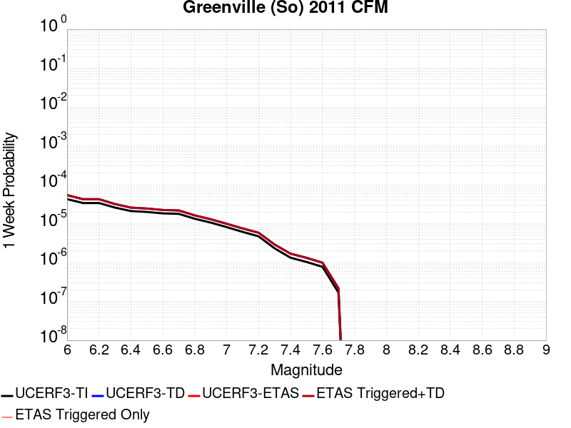 |  | 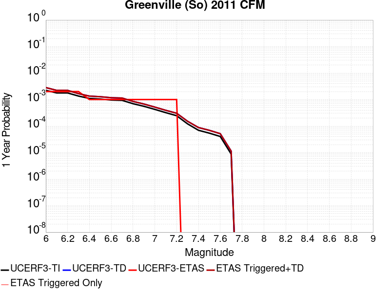 |  |

| Magnitude | 1 wk TI Prob | 1 wk TD Prob | 1 wk ETAS Prob | 1 wk ETAS/TD Gain | 1 wk ETAS Triggered+TD | 1 wk ETAS Triggered Only | 1 mo TI Prob | 1 mo TD Prob | 1 mo ETAS Prob | 1 mo ETAS/TD Gain | 1 mo ETAS Triggered+TD | 1 mo ETAS Triggered Only | 1 yr TI Prob | 1 yr TD Prob | 1 yr ETAS Prob | 1 yr ETAS/TD Gain | 1 yr ETAS Triggered+TD | 1 yr ETAS Triggered Only | 500 yr TI Prob | 500 yr TD Prob | 500 yr ETAS Prob | 500 yr ETAS/TD Gain | 500 yr ETAS Triggered+TD | 500 yr ETAS Triggered Only |
|-----|-----|-----|-----|-----|-----|-----|-----|-----|-----|-----|-----|-----|-----|-----|-----|-----|-----|-----|-----|-----|-----|-----|-----|-----|
| 6.0 | 4.279693E-5 | 5.425248E-5 | 0.0 | 0.0 | 5.425248E-5 | 0.0 | 1.8340252E-4 | 2.3249128E-4 | 0.0 | 0.0 | 2.3249128E-4 | 0.0 | 0.0022306389 | 0.0028271838 | 0.002 | 0.7074177 | 0.0028271838 | 0.0 | 0.6725976 | 0.691802 | 0.503 | 0.7270866 | 0.69550043 | 0.012 |
| 6.1 | 3.4037297E-5 | 4.2606185E-5 | 0.0 | 0.0 | 4.2606185E-5 | 0.0 | 1.4586597E-4 | 1.8258631E-4 | 0.0 | 0.0 | 1.8258631E-4 | 0.0 | 0.0017744715 | 0.002220895 | 0.002 | 0.9005379 | 0.002220895 | 0.0 | 0.5885319 | 0.6133695 | 0.417 | 0.67985123 | 0.6172358 | 0.01 |
| 6.2 | 3.4037297E-5 | 4.2606185E-5 | 0.0 | 0.0 | 4.2606185E-5 | 0.0 | 1.4586597E-4 | 1.8258631E-4 | 0.0 | 0.0 | 1.8258631E-4 | 0.0 | 0.0017744715 | 0.002220895 | 0.002 | 0.9005379 | 0.002220895 | 0.0 | 0.5885319 | 0.6133695 | 0.417 | 0.67985123 | 0.6172358 | 0.01 |
| 6.3 | 2.5956324E-5 | 3.2018495E-5 | 0.0 | 0.0 | 3.2018495E-5 | 0.0 | 1.11236644E-4 | 1.3721532E-4 | 0.0 | 0.0 | 1.3721532E-4 | 0.0 | 0.0013534647 | 0.0016693829 | 0.002 | 1.1980475 | 0.0016693829 | 0.0 | 0.49195778 | 0.5205809 | 0.323 | 0.62046075 | 0.5244162 | 0.008 |
| 6.4 | 2.1145053E-5 | 2.5878948E-5 | 0.0 | 0.0 | 2.5878948E-5 | 0.0 | 9.061851E-5 | 1.1090523E-4 | 0.0 | 0.0 | 1.1090523E-4 | 0.0 | 0.0011027219 | 0.0013494663 | 0.001 | 0.74103373 | 0.0013494663 | 0.0 | 0.42401013 | 0.45507342 | 0.272 | 0.5977058 | 0.45943284 | 0.008 |
| 6.5 | 2.0030959E-5 | 2.4495455E-5 | 0.0 | 0.0 | 2.4495455E-5 | 0.0 | 8.584414E-5 | 1.0497647E-4 | 0.0 | 0.0 | 1.0497647E-4 | 0.0 | 0.0010446513 | 0.00127737 | 0.001 | 0.78285855 | 0.00127737 | 0.0 | 0.4070224 | 0.43882418 | 0.256 | 0.5833772 | 0.4427524 | 0.007 |
| 6.6 | 1.8395405E-5 | 2.2479893E-5 | 0.0 | 0.0 | 2.2479893E-5 | 0.0 | 7.8835066E-5 | 9.6339005E-5 | 0.0 | 0.0 | 9.6339005E-5 | 0.0 | 9.5939427E-4 | 0.0011723242 | 0.001 | 0.85300636 | 0.0011723242 | 0.0 | 0.38117167 | 0.41362482 | 0.24 | 0.58023596 | 0.41772947 | 0.007 |
| 6.7 | 1.7883482E-5 | 2.185829E-5 | 0.0 | 0.0 | 2.185829E-5 | 0.0 | 7.664124E-5 | 9.3675175E-5 | 0.0 | 0.0 | 9.3675175E-5 | 0.0 | 9.3270757E-4 | 0.0011399265 | 0.001 | 0.87724954 | 0.0011399265 | 0.0 | 0.3728512 | 0.40547046 | 0.234 | 0.5771074 | 0.40963215 | 0.007 |
| 6.8 | 1.3373564E-5 | 1.6309701E-5 | 0.0 | 0.0 | 1.6309701E-5 | 0.0 | 5.7314013E-5 | 6.989692E-5 | 0.0 | 0.0 | 6.989692E-5 | 0.0 | 6.975747E-4 | 8.506773E-4 | 0.001 | 1.1755339 | 8.506773E-4 | 0.0 | 0.29454273 | 0.32363883 | 0.177 | 0.54690593 | 0.327697 | 0.006 |
| 6.9 | 1.06692905E-5 | 1.2997646E-5 | 0.0 | 0.0 | 1.2997646E-5 | 0.0 | 4.5724726E-5 | 5.570307E-5 | 0.0 | 0.0 | 5.570307E-5 | 0.0 | 5.5655633E-4 | 6.7798485E-4 | 0.001 | 1.4749591 | 6.7798485E-4 | 0.0 | 0.24297246 | 0.26972222 | 0.135 | 0.5005149 | 0.27410388 | 0.006 |
| 7.0 | 8.157512E-6 | 9.944288E-6 | 0.0 | 0.0 | 9.944288E-6 | 0.0 | 3.4960296E-5 | 4.26177E-5 | 0.0 | 0.0 | 4.26177E-5 | 0.0 | 4.2555845E-4 | 5.1875063E-4 | 0.001 | 1.9277086 | 5.1875063E-4 | 0.0 | 0.19170204 | 0.21473494 | 0.1 | 0.4656904 | 0.21944652 | 0.006 |
| 7.1 | 6.1467113E-6 | 7.5356224E-6 | 0.0 | 0.0 | 7.5356224E-6 | 0.0 | 2.6342783E-5 | 3.2295127E-5 | 0.0 | 0.0 | 3.2295127E-5 | 0.0 | 3.206762E-4 | 3.9312307E-4 | 0.001 | 2.5437326 | 3.9312307E-4 | 0.0 | 0.14816616 | 0.16788915 | 0.069 | 0.41098547 | 0.1720497 | 0.005 |
| 7.2 | 4.713467E-6 | 5.8397814E-6 | 0.0 | 0.0 | 5.8397814E-6 | 0.0 | 2.0200418E-5 | 2.5027399E-5 | 0.0 | 0.0 | 2.5027399E-5 | 0.0 | 2.4591232E-4 | 3.0466655E-4 | 0.001 | 3.2822769 | 3.0466655E-4 | 0.0 | 0.115710944 | 0.13225645 | 0.047 | 0.3553702 | 0.13572742 | 0.004 |
| 7.3 | 2.3266216E-6 | 2.9113774E-6 | 0.0 | 0.0 | 2.9113774E-6 | 0.0 | 9.971197E-6 | 1.2477273E-5 | 0.0 | 0.0 | 1.2477273E-5 | 0.0 | 1.2139256E-4 | 1.5190036E-4 | 0.0 | 0.0 | 1.5190036E-4 | 0.0 | 0.058894437 | 0.06677859 | 0.03 | 0.44924575 | 0.070511475 | 0.004 |
| 7.4 | 1.3314E-6 | 1.6907812E-6 | 0.0 | 0.0 | 1.6907812E-6 | 0.0 | 5.7059874E-6 | 7.2461853E-6 | 0.0 | 0.0 | 7.2461853E-6 | 0.0 | 6.946818E-5 | 8.821878E-5 | 0.0 | 0.0 | 8.821878E-5 | 0.0 | 0.03413895 | 0.03833548 | 0.012 | 0.31302595 | 0.039297145 | 0.001 |
| 7.5 | 1.0362941E-6 | 1.3243024E-6 | 0.0 | 0.0 | 1.3243024E-6 | 0.0 | 4.4412527E-6 | 5.67557E-6 | 0.0 | 0.0 | 5.67557E-6 | 0.0 | 5.407091E-5 | 6.9097914E-5 | 0.0 | 0.0 | 6.9097914E-5 | 0.0 | 0.026673982 | 0.02999755 | 0.012 | 0.40003267 | 0.030967552 | 0.001 |
| 7.6 | 7.764784E-7 | 9.915861E-7 | 0.0 | 0.0 | 9.915861E-7 | 0.0 | 3.3277602E-6 | 4.249648E-6 | 0.0 | 0.0 | 4.249648E-6 | 0.0 | 4.0514726E-5 | 5.1738276E-5 | 0.0 | 0.0 | 5.1738276E-5 | 0.0 | 0.020053962 | 0.02264078 | 0.008 | 0.35334474 | 0.02361814 | 0.001 |
| 7.7 | 1.6927763E-7 | 2.1781844E-7 | 0.0 | 0.0 | 2.1781844E-7 | 0.0 | 7.2547533E-7 | 9.3350724E-7 | 0.0 | 0.0 | 9.3350724E-7 | 0.0 | 8.832627E-6 | 1.1365394E-5 | 0.0 | 0.0 | 1.1365394E-5 | 0.0 | 0.004406595 | 0.005202325 | 0.001 | 0.19222175 | 0.005202325 | 0.0 |

## San Gabriel
*[(top)](#table-of-contents)*

| 1 Week | 1 Month | 1 Year | 500 Year |
|-----|-----|-----|-----|
| 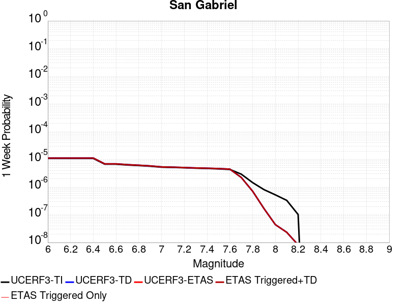 |  | 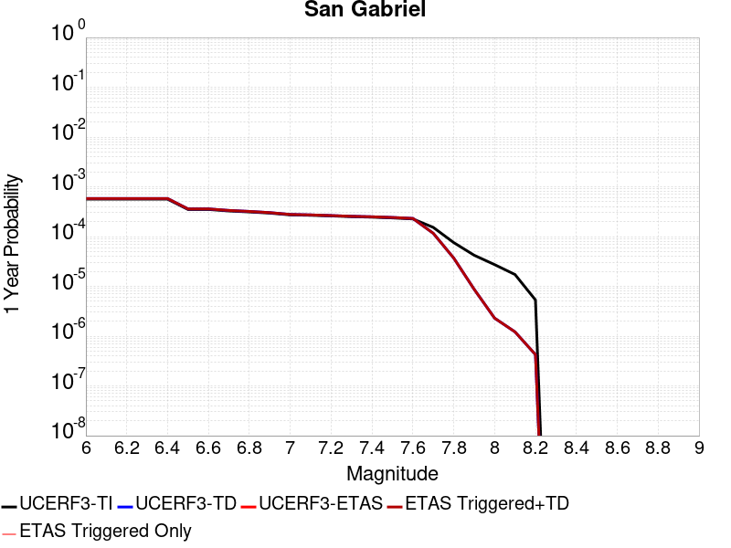 | 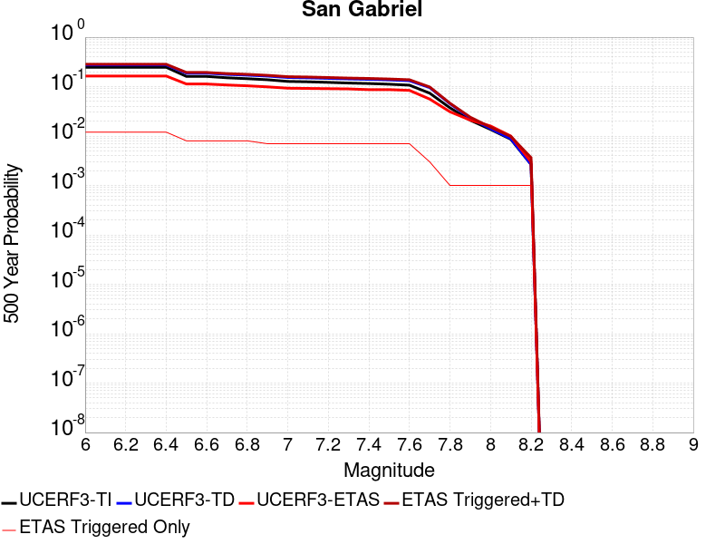 |

| Magnitude | 1 wk TI Prob | 1 wk TD Prob | 1 wk ETAS Prob | 1 wk ETAS/TD Gain | 1 wk ETAS Triggered+TD | 1 wk ETAS Triggered Only | 1 mo TI Prob | 1 mo TD Prob | 1 mo ETAS Prob | 1 mo ETAS/TD Gain | 1 mo ETAS Triggered+TD | 1 mo ETAS Triggered Only | 1 yr TI Prob | 1 yr TD Prob | 1 yr ETAS Prob | 1 yr ETAS/TD Gain | 1 yr ETAS Triggered+TD | 1 yr ETAS Triggered Only | 500 yr TI Prob | 500 yr TD Prob | 500 yr ETAS Prob | 500 yr ETAS/TD Gain | 500 yr ETAS Triggered+TD | 500 yr ETAS Triggered Only |
|-----|-----|-----|-----|-----|-----|-----|-----|-----|-----|-----|-----|-----|-----|-----|-----|-----|-----|-----|-----|-----|-----|-----|-----|-----|
| 6.0 | 1.083775E-5 | 1.1164186E-5 | 0.0 | 0.0 | 1.1164186E-5 | 0.0 | 4.6446676E-5 | 4.7845697E-5 | 0.0 | 0.0 | 4.7845697E-5 | 0.0 | 5.653415E-4 | 5.823768E-4 | 0.0 | 0.0 | 5.823768E-4 | 0.0 | 0.24629234 | 0.27469337 | 0.164 | 0.5970293 | 0.28339705 | 0.012 |
| 6.1 | 1.083775E-5 | 1.1164186E-5 | 0.0 | 0.0 | 1.1164186E-5 | 0.0 | 4.6446676E-5 | 4.7845697E-5 | 0.0 | 0.0 | 4.7845697E-5 | 0.0 | 5.653415E-4 | 5.823768E-4 | 0.0 | 0.0 | 5.823768E-4 | 0.0 | 0.24629234 | 0.27469337 | 0.164 | 0.5970293 | 0.28339705 | 0.012 |
| 6.2 | 1.083775E-5 | 1.1164186E-5 | 0.0 | 0.0 | 1.1164186E-5 | 0.0 | 4.6446676E-5 | 4.7845697E-5 | 0.0 | 0.0 | 4.7845697E-5 | 0.0 | 5.653415E-4 | 5.823768E-4 | 0.0 | 0.0 | 5.823768E-4 | 0.0 | 0.24629234 | 0.27469337 | 0.164 | 0.5970293 | 0.28339705 | 0.012 |
| 6.3 | 1.083775E-5 | 1.1164186E-5 | 0.0 | 0.0 | 1.1164186E-5 | 0.0 | 4.6446676E-5 | 4.7845697E-5 | 0.0 | 0.0 | 4.7845697E-5 | 0.0 | 5.653415E-4 | 5.823768E-4 | 0.0 | 0.0 | 5.823768E-4 | 0.0 | 0.24629234 | 0.27469337 | 0.164 | 0.5970293 | 0.28339705 | 0.012 |
| 6.4 | 1.083775E-5 | 1.1164186E-5 | 0.0 | 0.0 | 1.1164186E-5 | 0.0 | 4.6446676E-5 | 4.7845697E-5 | 0.0 | 0.0 | 4.7845697E-5 | 0.0 | 5.653415E-4 | 5.823768E-4 | 0.0 | 0.0 | 5.823768E-4 | 0.0 | 0.24629234 | 0.27469337 | 0.164 | 0.5970293 | 0.28339705 | 0.012 |
| 6.5 | 6.7317824E-6 | 6.904698E-6 | 0.0 | 0.0 | 6.904698E-6 | 0.0 | 2.8850178E-5 | 2.959123E-5 | 0.0 | 0.0 | 2.959123E-5 | 0.0 | 3.511943E-4 | 3.6021456E-4 | 0.0 | 0.0 | 3.6021456E-4 | 0.0 | 0.16106999 | 0.18707788 | 0.113 | 0.60402656 | 0.19358125 | 0.008 |
| 6.6 | 6.7317824E-6 | 6.904698E-6 | 0.0 | 0.0 | 6.904698E-6 | 0.0 | 2.8850178E-5 | 2.959123E-5 | 0.0 | 0.0 | 2.959123E-5 | 0.0 | 3.511943E-4 | 3.6021456E-4 | 0.0 | 0.0 | 3.6021456E-4 | 0.0 | 0.16106999 | 0.18707788 | 0.113 | 0.60402656 | 0.19358125 | 0.008 |
| 6.7 | 6.274881E-6 | 6.4343767E-6 | 0.0 | 0.0 | 6.4343767E-6 | 0.0 | 2.6892068E-5 | 2.7575612E-5 | 0.0 | 0.0 | 2.7575612E-5 | 0.0 | 3.2736175E-4 | 3.3568215E-4 | 0.0 | 0.0 | 3.3568215E-4 | 0.0 | 0.15100983 | 0.17702271 | 0.108 | 0.6100912 | 0.18360652 | 0.008 |
| 6.8 | 5.996209E-6 | 6.147557E-6 | 0.0 | 0.0 | 6.147557E-6 | 0.0 | 2.5697784E-5 | 2.6346412E-5 | 0.0 | 0.0 | 2.6346412E-5 | 0.0 | 3.128256E-4 | 3.2072113E-4 | 0.0 | 0.0 | 3.2072113E-4 | 0.0 | 0.14481483 | 0.17083372 | 0.104 | 0.60877913 | 0.17746705 | 0.008 |
| 6.9 | 5.686331E-6 | 5.8159326E-6 | 0.0 | 0.0 | 5.8159326E-6 | 0.0 | 2.4369761E-5 | 2.4925192E-5 | 0.0 | 0.0 | 2.4925192E-5 | 0.0 | 2.9666146E-4 | 3.0342268E-4 | 0.0 | 0.0 | 3.0342268E-4 | 0.0 | 0.13787304 | 0.1635761 | 0.099 | 0.60522294 | 0.16943106 | 0.007 |
| 7.0 | 5.2329838E-6 | 5.3419185E-6 | 0.0 | 0.0 | 5.3419185E-6 | 0.0 | 2.242688E-5 | 2.2893739E-5 | 0.0 | 0.0 | 2.2893739E-5 | 0.0 | 2.7301308E-4 | 2.786962E-4 | 0.0 | 0.0 | 2.786962E-4 | 0.0 | 0.12761565 | 0.15311235 | 0.093 | 0.6073971 | 0.15904057 | 0.007 |
| 7.1 | 5.135671E-6 | 5.234222E-6 | 0.0 | 0.0 | 5.234222E-6 | 0.0 | 2.2009834E-5 | 2.2432192E-5 | 0.0 | 0.0 | 2.2432192E-5 | 0.0 | 2.6793676E-4 | 2.730783E-4 | 0.0 | 0.0 | 2.730783E-4 | 0.0 | 0.12539798 | 0.15068242 | 0.092 | 0.61055565 | 0.15662764 | 0.007 |
| 7.2 | 4.989062E-6 | 5.0713243E-6 | 0.0 | 0.0 | 5.0713243E-6 | 0.0 | 2.1381518E-5 | 2.173407E-5 | 0.0 | 0.0 | 2.173407E-5 | 0.0 | 2.6028889E-4 | 2.6458077E-4 | 0.0 | 0.0 | 2.6458077E-4 | 0.0 | 0.12204627 | 0.14696182 | 0.091 | 0.6192084 | 0.15293309 | 0.007 |
| 7.3 | 4.8219395E-6 | 4.906184E-6 | 0.0 | 0.0 | 4.906184E-6 | 0.0 | 2.0665291E-5 | 2.1026339E-5 | 0.0 | 0.0 | 2.1026339E-5 | 0.0 | 2.5157086E-4 | 2.5596618E-4 | 0.0 | 0.0 | 2.5596618E-4 | 0.0 | 0.11820992 | 0.1430889 | 0.09 | 0.6289796 | 0.14908728 | 0.007 |
| 7.4 | 4.7118383E-6 | 4.797856E-6 | 0.0 | 0.0 | 4.797856E-6 | 0.0 | 2.0193436E-5 | 2.0562082E-5 | 0.0 | 0.0 | 2.0562082E-5 | 0.0 | 2.4582737E-4 | 2.5031518E-4 | 0.0 | 0.0 | 2.5031518E-4 | 0.0 | 0.11567336 | 0.14048478 | 0.087 | 0.61928415 | 0.14650139 | 0.007 |
| 7.5 | 4.5506545E-6 | 4.6475043E-6 | 0.0 | 0.0 | 4.6475043E-6 | 0.0 | 1.9502659E-5 | 1.9917727E-5 | 0.0 | 0.0 | 1.9917727E-5 | 0.0 | 2.37419E-4 | 2.4247193E-4 | 0.0 | 0.0 | 2.4247193E-4 | 0.0 | 0.11194677 | 0.13677597 | 0.087 | 0.6360766 | 0.14281854 | 0.007 |
| 7.6 | 4.343636E-6 | 4.4474955E-6 | 0.0 | 0.0 | 4.4474955E-6 | 0.0 | 1.861545E-5 | 1.9060559E-5 | 0.0 | 0.0 | 1.9060559E-5 | 0.0 | 2.2661954E-4 | 2.3203818E-4 | 0.0 | 0.0 | 2.3203818E-4 | 0.0 | 0.107137434 | 0.13184792 | 0.084 | 0.6370977 | 0.13792497 | 0.007 |
| 7.7 | 2.936235E-6 | 2.2323434E-6 | 0.0 | 0.0 | 2.2323434E-6 | 0.0 | 1.2583803E-5 | 9.56715E-6 | 0.0 | 0.0 | 9.56715E-6 | 0.0 | 1.5319703E-4 | 1.1647386E-4 | 0.0 | 0.0 | 1.1647386E-4 | 0.0 | 0.073743775 | 0.09567165 | 0.056 | 0.5853354 | 0.098384626 | 0.003 |
| 7.8 | 1.4541639E-6 | 7.1126897E-7 | 0.0 | 0.0 | 7.1126897E-7 | 0.0 | 6.232116E-6 | 3.048292E-6 | 0.0 | 0.0 | 3.048292E-6 | 0.0 | 7.587337E-5 | 3.7112324E-5 | 0.0 | 0.0 | 3.7112324E-5 | 0.0 | 0.03722749 | 0.04516158 | 0.031 | 0.6864242 | 0.046116415 | 0.001 |
| 7.9 | 8.098958E-7 | 1.6771666E-7 | 0.0 | 0.0 | 1.6771666E-7 | 0.0 | 3.4709774E-6 | 7.1878543E-7 | 0.0 | 0.0 | 7.1878543E-7 | 0.0 | 4.225833E-5 | 8.751178E-6 | 0.0 | 0.0 | 8.751178E-6 | 0.0 | 0.020907946 | 0.023126725 | 0.021 | 0.9080404 | 0.024103599 | 0.001 |
| 8.0 | 5.2473234E-7 | 4.4137792E-8 | 0.0 | 0.0 | 4.4137792E-8 | 0.0 | 2.248851E-6 | 1.8916197E-7 | 0.0 | 0.0 | 1.8916197E-7 | 0.0 | 2.7379416E-5 | 2.3030445E-6 | 0.0 | 0.0 | 2.3030445E-6 | 0.0 | 0.013596615 | 0.014120071 | 0.016 | 1.1331388 | 0.015105952 | 0.001 |
| 8.1 | 3.3162388E-7 | 2.3352692E-8 | 0.0 | 0.0 | 2.3352692E-8 | 0.0 | 1.4212444E-6 | 1.0008297E-7 | 0.0 | 0.0 | 1.0008297E-7 | 0.0 | 1.7303513E-5 | 1.2185094E-6 | 0.0 | 0.0 | 1.2185094E-6 | 0.0 | 0.008614512 | 0.008828867 | 0.01 | 1.1326481 | 0.009820038 | 0.001 |
| 8.2 | 1.0235345E-7 | 8.165797E-9 | 0.0 | 0.0 | 8.165797E-9 | 0.0 | 4.3865757E-7 | 3.499627E-8 | 0.0 | 0.0 | 3.499627E-8 | 0.0 | 5.340643E-6 | 4.260795E-7 | 0.0 | 0.0 | 4.260795E-7 | 0.0 | 0.0026667663 | 0.002661106 | 0.003 | 1.1273508 | 0.0036584449 | 0.001 |

## Great Valley 03 Mysterious Ridge
*[(top)](#table-of-contents)*

| 1 Week | 1 Month | 1 Year | 500 Year |
|-----|-----|-----|-----|
| 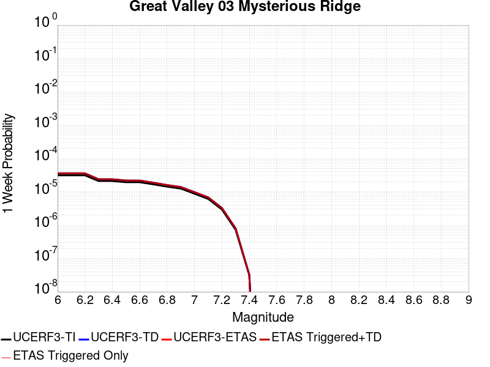 |  | 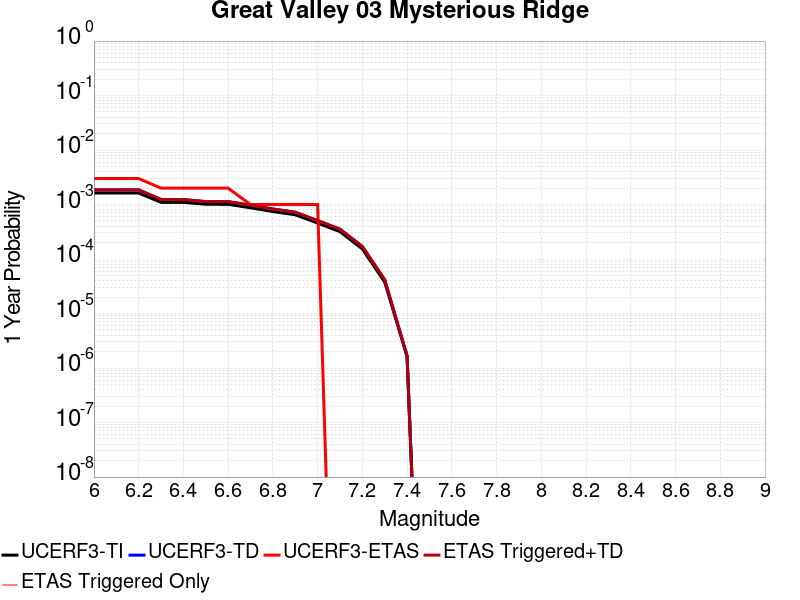 | 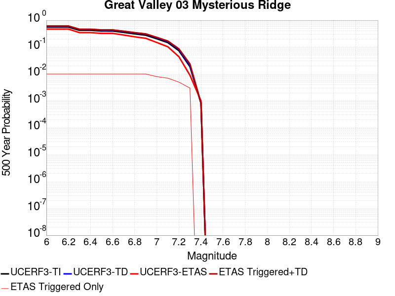 |

| Magnitude | 1 wk TI Prob | 1 wk TD Prob | 1 wk ETAS Prob | 1 wk ETAS/TD Gain | 1 wk ETAS Triggered+TD | 1 wk ETAS Triggered Only | 1 mo TI Prob | 1 mo TD Prob | 1 mo ETAS Prob | 1 mo ETAS/TD Gain | 1 mo ETAS Triggered+TD | 1 mo ETAS Triggered Only | 1 yr TI Prob | 1 yr TD Prob | 1 yr ETAS Prob | 1 yr ETAS/TD Gain | 1 yr ETAS Triggered+TD | 1 yr ETAS Triggered Only | 500 yr TI Prob | 500 yr TD Prob | 500 yr ETAS Prob | 500 yr ETAS/TD Gain | 500 yr ETAS Triggered+TD | 500 yr ETAS Triggered Only |
|-----|-----|-----|-----|-----|-----|-----|-----|-----|-----|-----|-----|-----|-----|-----|-----|-----|-----|-----|-----|-----|-----|-----|-----|-----|
| 6.0 | 3.1182444E-5 | 3.574245E-5 | 0.0 | 0.0 | 3.574245E-5 | 0.0 | 1.336322E-4 | 1.5317398E-4 | 0.0 | 0.0 | 1.5317398E-4 | 0.0 | 0.0016257578 | 0.0018634805 | 0.003 | 1.6098907 | 0.0018634805 | 0.0 | 0.5567141 | 0.6050094 | 0.468 | 0.77354175 | 0.60895926 | 0.01 |
| 6.1 | 3.1182444E-5 | 3.574245E-5 | 0.0 | 0.0 | 3.574245E-5 | 0.0 | 1.336322E-4 | 1.5317398E-4 | 0.0 | 0.0 | 1.5317398E-4 | 0.0 | 0.0016257578 | 0.0018634805 | 0.003 | 1.6098907 | 0.0018634805 | 0.0 | 0.5567141 | 0.6050094 | 0.468 | 0.77354175 | 0.60895926 | 0.01 |
| 6.2 | 3.1182444E-5 | 3.574245E-5 | 0.0 | 0.0 | 3.574245E-5 | 0.0 | 1.336322E-4 | 1.5317398E-4 | 0.0 | 0.0 | 1.5317398E-4 | 0.0 | 0.0016257578 | 0.0018634805 | 0.003 | 1.6098907 | 0.0018634805 | 0.0 | 0.5567141 | 0.6050094 | 0.468 | 0.77354175 | 0.60895926 | 0.01 |
| 6.3 | 2.106934E-5 | 2.368687E-5 | 0.0 | 0.0 | 2.368687E-5 | 0.0 | 9.0294045E-5 | 1.01511374E-4 | 0.0 | 0.0 | 1.01511374E-4 | 0.0 | 0.0010987755 | 0.001235231 | 0.002 | 1.6191305 | 0.001235231 | 0.0 | 0.4228712 | 0.4581366 | 0.347 | 0.757416 | 0.46355522 | 0.01 |
| 6.4 | 2.106934E-5 | 2.368687E-5 | 0.0 | 0.0 | 2.368687E-5 | 0.0 | 9.0294045E-5 | 1.01511374E-4 | 0.0 | 0.0 | 1.01511374E-4 | 0.0 | 0.0010987755 | 0.001235231 | 0.002 | 1.6191305 | 0.001235231 | 0.0 | 0.4228712 | 0.4581366 | 0.347 | 0.757416 | 0.46355522 | 0.01 |
| 6.5 | 1.9389783E-5 | 2.1738835E-5 | 0.0 | 0.0 | 2.1738835E-5 | 0.0 | 8.309642E-5 | 9.316326E-5 | 0.0 | 0.0 | 9.316326E-5 | 0.0 | 0.0010112294 | 0.0011336999 | 0.002 | 1.7641354 | 0.0011336999 | 0.0 | 0.39701954 | 0.43158987 | 0.325 | 0.7530297 | 0.43727398 | 0.01 |
| 6.6 | 1.9370193E-5 | 2.1718783E-5 | 0.0 | 0.0 | 2.1718783E-5 | 0.0 | 8.301247E-5 | 9.307733E-5 | 0.0 | 0.0 | 9.307733E-5 | 0.0 | 0.0010102082 | 0.0011326547 | 0.002 | 1.7657632 | 0.0011326547 | 0.0 | 0.3967113 | 0.43129236 | 0.325 | 0.7535492 | 0.4369794 | 0.01 |
| 6.7 | 1.6723505E-5 | 1.867827E-5 | 0.0 | 0.0 | 1.867827E-5 | 0.0 | 7.16702E-5 | 8.0047386E-5 | 0.0 | 0.0 | 8.0047386E-5 | 0.0 | 8.722353E-4 | 9.741604E-4 | 0.001 | 1.026525 | 9.741604E-4 | 0.0 | 0.35358137 | 0.38603425 | 0.282 | 0.7305051 | 0.39217392 | 0.01 |
| 6.8 | 1.426937E-5 | 1.5896796E-5 | 0.0 | 0.0 | 1.5896796E-5 | 0.0 | 6.115301E-5 | 6.8127425E-5 | 0.0 | 0.0 | 6.8127425E-5 | 0.0 | 7.4428355E-4 | 8.2915E-4 | 0.001 | 1.2060543 | 8.2915E-4 | 0.0 | 0.31083897 | 0.33992776 | 0.242 | 0.71191597 | 0.34652847 | 0.01 |
| 6.9 | 1.2469891E-5 | 1.3870674E-5 | 0.0 | 0.0 | 1.3870674E-5 | 0.0 | 5.3441294E-5 | 5.9444457E-5 | 0.0 | 0.0 | 5.9444457E-5 | 0.0 | 6.504535E-4 | 7.2350784E-4 | 0.001 | 1.3821551 | 7.2350784E-4 | 0.0 | 0.2777129 | 0.30422914 | 0.213 | 0.70013016 | 0.31118685 | 0.01 |
| 7.0 | 8.7746275E-6 | 9.732918E-6 | 0.0 | 0.0 | 9.732918E-6 | 0.0 | 3.7605005E-5 | 4.171188E-5 | 0.0 | 0.0 | 4.171188E-5 | 0.0 | 4.5774475E-4 | 5.0773105E-4 | 0.001 | 1.9695467 | 5.0773105E-4 | 0.0 | 0.20461163 | 0.22486891 | 0.149 | 0.66260827 | 0.23106997 | 0.008 |
| 7.1 | 6.1067153E-6 | 6.7728492E-6 | 0.0 | 0.0 | 6.7728492E-6 | 0.0 | 2.6171374E-5 | 2.9026205E-5 | 0.0 | 0.0 | 2.9026205E-5 | 0.0 | 3.1858988E-4 | 3.5334224E-4 | 0.0 | 0.0 | 3.5334224E-4 | 0.0 | 0.14727683 | 0.16266975 | 0.103 | 0.6331847 | 0.16853106 | 0.007 |
| 7.2 | 2.939283E-6 | 3.2547637E-6 | 0.0 | 0.0 | 3.2547637E-6 | 0.0 | 1.2596866E-5 | 1.3948923E-5 | 0.0 | 0.0 | 1.3948923E-5 | 0.0 | 1.5335606E-4 | 1.6981663E-4 | 0.0 | 0.0 | 1.6981663E-4 | 0.0 | 0.07381743 | 0.08178369 | 0.044 | 0.5380046 | 0.086374775 | 0.005 |
| 7.3 | 7.2387763E-7 | 7.964102E-7 | 0.0 | 0.0 | 7.964102E-7 | 0.0 | 3.102329E-6 | 3.4131847E-6 | 0.0 | 0.0 | 3.4131847E-6 | 0.0 | 3.77702E-5 | 4.1555184E-5 | 0.0 | 0.0 | 4.1555184E-5 | 0.0 | 0.018708244 | 0.020667484 | 0.009 | 0.43546665 | 0.02360548 | 0.003 |
| 7.4 | 3.112171E-8 | 3.2017713E-8 | 0.0 | 0.0 | 3.2017713E-8 | 0.0 | 1.3337875E-7 | 1.3721876E-7 | 0.0 | 0.0 | 1.3721876E-7 | 0.0 | 1.6238852E-6 | 1.6706372E-6 | 0.0 | 0.0 | 1.6706372E-6 | 0.0 | 8.116137E-4 | 8.3499384E-4 | 0.001 | 1.1976136 | 8.3499384E-4 | 0.0 |

## San Andreas (North Branch Mill Creek)
*[(top)](#table-of-contents)*

| 1 Week | 1 Month | 1 Year | 500 Year |
|-----|-----|-----|-----|
| 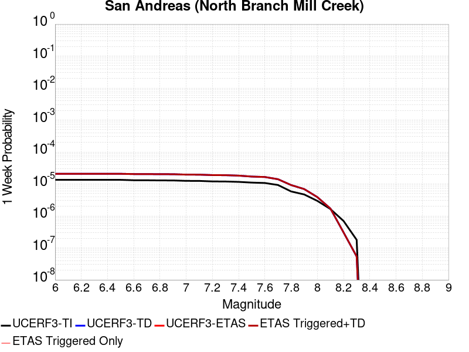 |  | 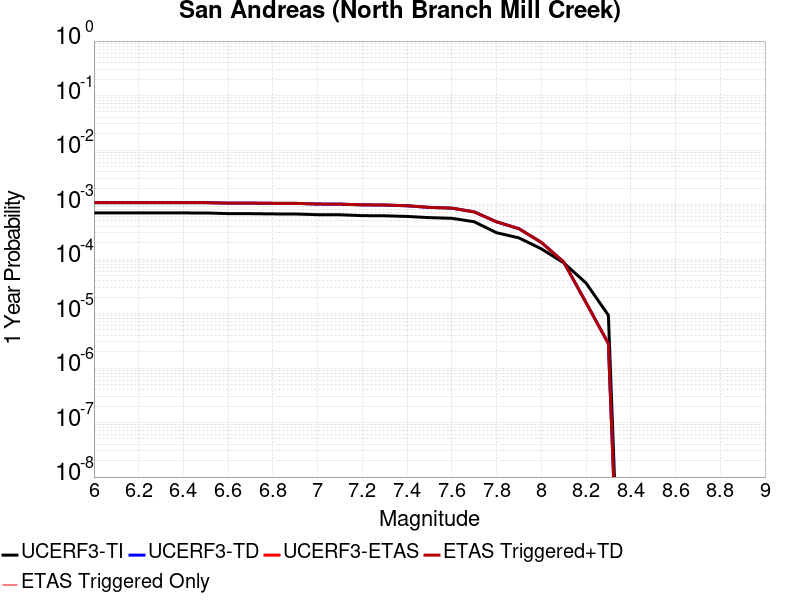 | 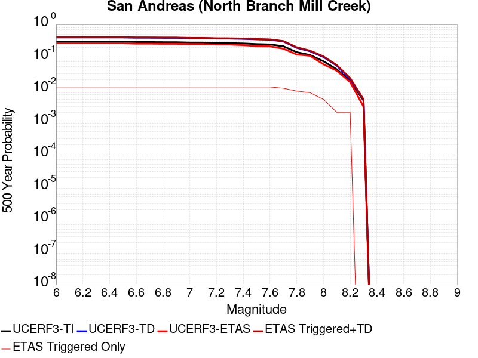 |

| Magnitude | 1 wk TI Prob | 1 wk TD Prob | 1 wk ETAS Prob | 1 wk ETAS/TD Gain | 1 wk ETAS Triggered+TD | 1 wk ETAS Triggered Only | 1 mo TI Prob | 1 mo TD Prob | 1 mo ETAS Prob | 1 mo ETAS/TD Gain | 1 mo ETAS Triggered+TD | 1 mo ETAS Triggered Only | 1 yr TI Prob | 1 yr TD Prob | 1 yr ETAS Prob | 1 yr ETAS/TD Gain | 1 yr ETAS Triggered+TD | 1 yr ETAS Triggered Only | 500 yr TI Prob | 500 yr TD Prob | 500 yr ETAS Prob | 500 yr ETAS/TD Gain | 500 yr ETAS Triggered+TD | 500 yr ETAS Triggered Only |
|-----|-----|-----|-----|-----|-----|-----|-----|-----|-----|-----|-----|-----|-----|-----|-----|-----|-----|-----|-----|-----|-----|-----|-----|-----|
| 6.0 | 1.3461156E-5 | 2.0785847E-5 | 0.0 | 0.0 | 2.0785847E-5 | 0.0 | 5.7689394E-5 | 8.907918E-5 | 0.0 | 0.0 | 8.907918E-5 | 0.0 | 7.02142E-4 | 0.0010840022 | 0.0 | 0.0 | 0.0010840022 | 0.0 | 0.29615304 | 0.39947355 | 0.265 | 0.66337305 | 0.40667987 | 0.012 |
| 6.1 | 1.3461156E-5 | 2.0785847E-5 | 0.0 | 0.0 | 2.0785847E-5 | 0.0 | 5.7689394E-5 | 8.907918E-5 | 0.0 | 0.0 | 8.907918E-5 | 0.0 | 7.02142E-4 | 0.0010840022 | 0.0 | 0.0 | 0.0010840022 | 0.0 | 0.29615304 | 0.39947355 | 0.265 | 0.66337305 | 0.40667987 | 0.012 |
| 6.2 | 1.3461156E-5 | 2.0785847E-5 | 0.0 | 0.0 | 2.0785847E-5 | 0.0 | 5.7689394E-5 | 8.907918E-5 | 0.0 | 0.0 | 8.907918E-5 | 0.0 | 7.02142E-4 | 0.0010840022 | 0.0 | 0.0 | 0.0010840022 | 0.0 | 0.29615304 | 0.39947355 | 0.265 | 0.66337305 | 0.40667987 | 0.012 |
| 6.3 | 1.3461156E-5 | 2.0785847E-5 | 0.0 | 0.0 | 2.0785847E-5 | 0.0 | 5.7689394E-5 | 8.907918E-5 | 0.0 | 0.0 | 8.907918E-5 | 0.0 | 7.02142E-4 | 0.0010840022 | 0.0 | 0.0 | 0.0010840022 | 0.0 | 0.29615304 | 0.39947355 | 0.265 | 0.66337305 | 0.40667987 | 0.012 |
| 6.4 | 1.3461156E-5 | 2.0785847E-5 | 0.0 | 0.0 | 2.0785847E-5 | 0.0 | 5.7689394E-5 | 8.907918E-5 | 0.0 | 0.0 | 8.907918E-5 | 0.0 | 7.02142E-4 | 0.0010840022 | 0.0 | 0.0 | 0.0010840022 | 0.0 | 0.29615304 | 0.39947355 | 0.265 | 0.66337305 | 0.40667987 | 0.012 |
| 6.5 | 1.3450706E-5 | 2.077484E-5 | 0.0 | 0.0 | 2.077484E-5 | 0.0 | 5.764461E-5 | 8.9032E-5 | 0.0 | 0.0 | 8.9032E-5 | 0.0 | 7.0159714E-4 | 0.0010834285 | 0.0 | 0.0 | 0.0010834285 | 0.0 | 0.2959611 | 0.39930108 | 0.265 | 0.66365963 | 0.40650946 | 0.012 |
| 6.6 | 1.3074523E-5 | 2.039014E-5 | 0.0 | 0.0 | 2.039014E-5 | 0.0 | 5.6032466E-5 | 8.73834E-5 | 0.0 | 0.0 | 8.73834E-5 | 0.0 | 6.8198174E-4 | 0.0010633764 | 0.0 | 0.0 | 0.0010633764 | 0.0 | 0.28901732 | 0.3932121 | 0.258 | 0.6561344 | 0.40049356 | 0.012 |
| 6.7 | 1.3050216E-5 | 2.0365636E-5 | 0.0 | 0.0 | 2.0365636E-5 | 0.0 | 5.59283E-5 | 8.727839E-5 | 0.0 | 0.0 | 8.727839E-5 | 0.0 | 6.8071426E-4 | 0.0010620992 | 0.0 | 0.0 | 0.0010620992 | 0.0 | 0.2885663 | 0.39281267 | 0.258 | 0.65680164 | 0.40009892 | 0.012 |
| 6.8 | 1.29049395E-5 | 2.0214608E-5 | 0.0 | 0.0 | 2.0214608E-5 | 0.0 | 5.530571E-5 | 8.663117E-5 | 0.0 | 0.0 | 8.663117E-5 | 0.0 | 6.73139E-4 | 0.0010542269 | 0.0 | 0.0 | 0.0010542269 | 0.0 | 0.28586468 | 0.39040163 | 0.255 | 0.6531735 | 0.39771682 | 0.012 |
| 6.9 | 1.2867369E-5 | 2.0174451E-5 | 0.0 | 0.0 | 2.0174451E-5 | 0.0 | 5.51447E-5 | 8.645909E-5 | 0.0 | 0.0 | 8.645909E-5 | 0.0 | 6.711799E-4 | 0.0010521339 | 0.0 | 0.0 | 0.0010521339 | 0.0 | 0.28516436 | 0.3897553 | 0.255 | 0.65425664 | 0.39707825 | 0.012 |
| 7.0 | 1.2495996E-5 | 1.9593504E-5 | 0.0 | 0.0 | 1.9593504E-5 | 0.0 | 5.3553173E-5 | 8.396947E-5 | 0.0 | 0.0 | 8.396947E-5 | 0.0 | 6.518148E-4 | 0.0010218512 | 0.0 | 0.0 | 0.0010218512 | 0.0 | 0.27820468 | 0.38119325 | 0.25 | 0.65583533 | 0.38861892 | 0.012 |
| 7.1 | 1.2452067E-5 | 1.9539473E-5 | 0.0 | 0.0 | 1.9539473E-5 | 0.0 | 5.3364907E-5 | 8.373793E-5 | 0.0 | 0.0 | 8.373793E-5 | 0.0 | 6.4952404E-4 | 0.0010190349 | 0.0 | 0.0 | 0.0010190349 | 0.0 | 0.27737692 | 0.38034293 | 0.25 | 0.65730155 | 0.38777882 | 0.012 |
| 7.2 | 1.2002777E-5 | 1.8932496E-5 | 0.0 | 0.0 | 1.8932496E-5 | 0.0 | 5.143946E-5 | 8.1136764E-5 | 0.0 | 0.0 | 8.1136764E-5 | 0.0 | 6.2609545E-4 | 9.873946E-4 | 0.0 | 0.0 | 9.873946E-4 | 0.0 | 0.26885667 | 0.37049836 | 0.242 | 0.6531743 | 0.37805238 | 0.012 |
| 7.3 | 1.1923425E-5 | 1.8805411E-5 | 0.0 | 0.0 | 1.8805411E-5 | 0.0 | 5.109939E-5 | 8.0592145E-5 | 0.0 | 0.0 | 8.0592145E-5 | 0.0 | 6.219575E-4 | 9.807699E-4 | 0.0 | 0.0 | 9.807699E-4 | 0.0 | 0.26734143 | 0.3687653 | 0.242 | 0.656244 | 0.37634012 | 0.012 |
| 7.4 | 1.16105175E-5 | 1.821053E-5 | 0.0 | 0.0 | 1.821053E-5 | 0.0 | 4.975841E-5 | 7.804281E-5 | 0.0 | 0.0 | 7.804281E-5 | 0.0 | 6.0564023E-4 | 9.4975915E-4 | 0.0 | 0.0 | 9.4975915E-4 | 0.0 | 0.2613358 | 0.3623091 | 0.233 | 0.64309734 | 0.36996138 | 0.012 |
| 7.5 | 1.1037265E-5 | 1.70173E-5 | 0.0 | 0.0 | 1.70173E-5 | 0.0 | 4.7301706E-5 | 7.292926E-5 | 0.0 | 0.0 | 7.292926E-5 | 0.0 | 5.757461E-4 | 8.875539E-4 | 0.0 | 0.0 | 8.875539E-4 | 0.0 | 0.2502054 | 0.3493346 | 0.216 | 0.6183184 | 0.35714257 | 0.012 |
| 7.6 | 1.0720915E-5 | 1.6494121E-5 | 0.0 | 0.0 | 1.6494121E-5 | 0.0 | 4.5945973E-5 | 7.068718E-5 | 0.0 | 0.0 | 7.068718E-5 | 0.0 | 5.592486E-4 | 8.602785E-4 | 0.0 | 0.0 | 8.602785E-4 | 0.0 | 0.2439914 | 0.3408647 | 0.214 | 0.6278151 | 0.34877428 | 0.012 |
| 7.7 | 9.276279E-6 | 1.4067131E-5 | 0.0 | 0.0 | 1.4067131E-5 | 0.0 | 3.9754876E-5 | 6.028632E-5 | 0.0 | 0.0 | 6.028632E-5 | 0.0 | 4.839081E-4 | 7.337401E-4 | 0.0 | 0.0 | 7.337401E-4 | 0.0 | 0.21495374 | 0.3019164 | 0.181 | 0.5995037 | 0.30959532 | 0.011 |
| 7.8 | 5.8346777E-6 | 9.245552E-6 | 0.0 | 0.0 | 9.245552E-6 | 0.0 | 2.5005522E-5 | 3.962319E-5 | 0.0 | 0.0 | 3.962319E-5 | 0.0 | 3.043997E-4 | 4.8230565E-4 | 0.0 | 0.0 | 4.8230565E-4 | 0.0 | 0.14120327 | 0.19266054 | 0.12 | 0.6228572 | 0.19992658 | 0.009 |
| 7.9 | 4.690204E-6 | 6.919156E-6 | 0.0 | 0.0 | 6.919156E-6 | 0.0 | 2.0100719E-5 | 2.9653189E-5 | 0.0 | 0.0 | 2.9653189E-5 | 0.0 | 2.4469878E-4 | 3.6096782E-4 | 0.0 | 0.0 | 3.6096782E-4 | 0.0 | 0.115174085 | 0.15047905 | 0.109 | 0.7243533 | 0.15727523 | 0.008 |
| 8.0 | 2.9570454E-6 | 3.882981E-6 | 0.0 | 0.0 | 3.882981E-6 | 0.0 | 1.267299E-5 | 1.6641243E-5 | 0.0 | 0.0 | 1.6641243E-5 | 0.0 | 1.5428272E-4 | 2.025883E-4 | 0.0 | 0.0 | 2.025883E-4 | 0.0 | 0.07424653 | 0.10024746 | 0.06 | 0.5985189 | 0.10474622 | 0.005 |
| 8.1 | 1.6376824E-6 | 1.6971555E-6 | 0.0 | 0.0 | 1.6971555E-6 | 0.0 | 7.01862E-6 | 7.2735033E-6 | 0.0 | 0.0 | 7.2735033E-6 | 0.0 | 8.544835E-5 | 8.8551315E-5 | 0.0 | 0.0 | 8.8551315E-5 | 0.0 | 0.041826107 | 0.054443438 | 0.038 | 0.69797206 | 0.05633455 | 0.002 |
| 8.2 | 6.9631557E-7 | 3.049896E-7 | 0.0 | 0.0 | 3.049896E-7 | 0.0 | 2.984206E-6 | 1.3070977E-6 | 0.0 | 0.0 | 1.3070977E-6 | 0.0 | 3.63321E-5 | 1.5913798E-5 | 0.0 | 0.0 | 1.5913798E-5 | 0.0 | 0.018002367 | 0.020613851 | 0.017 | 0.8246882 | 0.022572624 | 0.002 |
| 8.3 | 1.7876137E-7 | 5.4000544E-8 | 0.0 | 0.0 | 5.4000544E-8 | 0.0 | 7.661199E-7 | 2.3143087E-7 | 0.0 | 0.0 | 2.3143087E-7 | 0.0 | 9.32747E-6 | 2.8176673E-6 | 0.0 | 0.0 | 2.8176673E-6 | 0.0 | 0.0046528983 | 0.004977201 | 0.003 | 0.6027484 | 0.004977201 | 0.0 |

## Death Valley (Fish Lake Valley)
*[(top)](#table-of-contents)*

| 1 Week | 1 Month | 1 Year | 500 Year |
|-----|-----|-----|-----|
| 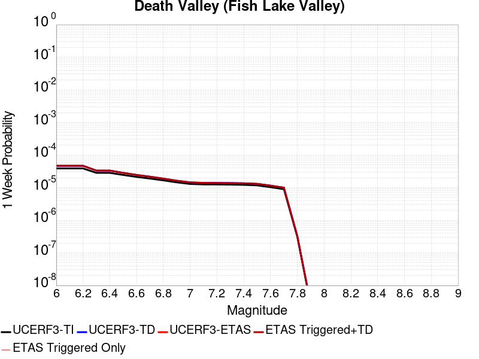 | 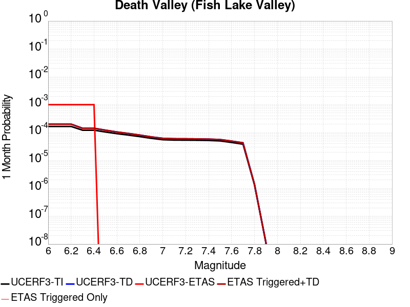 | 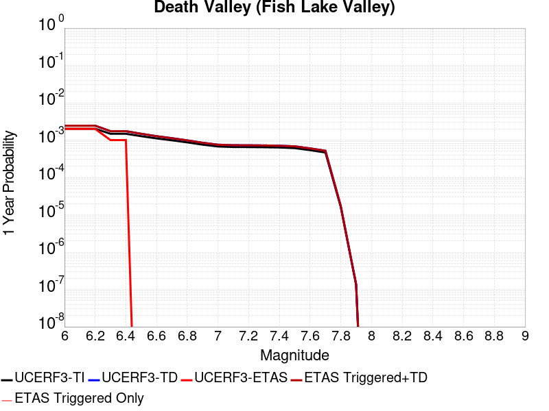 | 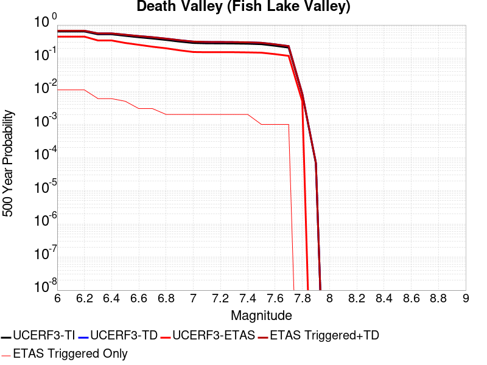 |

| Magnitude | 1 wk TI Prob | 1 wk TD Prob | 1 wk ETAS Prob | 1 wk ETAS/TD Gain | 1 wk ETAS Triggered+TD | 1 wk ETAS Triggered Only | 1 mo TI Prob | 1 mo TD Prob | 1 mo ETAS Prob | 1 mo ETAS/TD Gain | 1 mo ETAS Triggered+TD | 1 mo ETAS Triggered Only | 1 yr TI Prob | 1 yr TD Prob | 1 yr ETAS Prob | 1 yr ETAS/TD Gain | 1 yr ETAS Triggered+TD | 1 yr ETAS Triggered Only | 500 yr TI Prob | 500 yr TD Prob | 500 yr ETAS Prob | 500 yr ETAS/TD Gain | 500 yr ETAS Triggered+TD | 500 yr ETAS Triggered Only |
|-----|-----|-----|-----|-----|-----|-----|-----|-----|-----|-----|-----|-----|-----|-----|-----|-----|-----|-----|-----|-----|-----|-----|-----|-----|
| 6.0 | 3.872328E-5 | 4.672736E-5 | 0.0 | 0.0 | 4.672736E-5 | 0.0 | 1.6594635E-4 | 2.0024639E-4 | 0.001 | 4.993848 | 2.0024639E-4 | 0.0 | 0.0020185246 | 0.0024355324 | 0.002 | 0.8211757 | 0.0024355324 | 0.0 | 0.6358838 | 0.6674607 | 0.445 | 0.66670597 | 0.6711186 | 0.011 |
| 6.1 | 3.872328E-5 | 4.672736E-5 | 0.0 | 0.0 | 4.672736E-5 | 0.0 | 1.6594635E-4 | 2.0024639E-4 | 0.001 | 4.993848 | 2.0024639E-4 | 0.0 | 0.0020185246 | 0.0024355324 | 0.002 | 0.8211757 | 0.0024355324 | 0.0 | 0.6358838 | 0.6674607 | 0.445 | 0.66670597 | 0.6711186 | 0.011 |
| 6.2 | 3.872328E-5 | 4.672736E-5 | 0.0 | 0.0 | 4.672736E-5 | 0.0 | 1.6594635E-4 | 2.0024639E-4 | 0.001 | 4.993848 | 2.0024639E-4 | 0.0 | 0.0020185246 | 0.0024355324 | 0.002 | 0.8211757 | 0.0024355324 | 0.0 | 0.6358838 | 0.6674607 | 0.445 | 0.66670597 | 0.6711186 | 0.011 |
| 6.3 | 2.8356371E-5 | 3.3285603E-5 | 0.0 | 0.0 | 3.3285603E-5 | 0.0 | 1.2152165E-4 | 1.4264522E-4 | 0.001 | 7.0103993 | 1.4264522E-4 | 0.0 | 0.0014785219 | 0.0017353933 | 0.001 | 0.5762383 | 0.0017353933 | 0.0 | 0.5227945 | 0.55528927 | 0.341 | 0.6140944 | 0.55795753 | 0.006 |
| 6.4 | 2.8356371E-5 | 3.3285603E-5 | 0.0 | 0.0 | 3.3285603E-5 | 0.0 | 1.2152165E-4 | 1.4264522E-4 | 0.001 | 7.0103993 | 1.4264522E-4 | 0.0 | 0.0014785219 | 0.0017353933 | 0.001 | 0.5762383 | 0.0017353933 | 0.0 | 0.5227945 | 0.55528927 | 0.341 | 0.6140944 | 0.55795753 | 0.006 |
| 6.5 | 2.4448687E-5 | 2.8354E-5 | 0.0 | 0.0 | 2.8354E-5 | 0.0 | 1.0477588E-4 | 1.2151176E-4 | 0.0 | 0.0 | 1.2151176E-4 | 0.0 | 0.0012748998 | 0.0014784486 | 0.0 | 0.0 | 0.0014784486 | 0.0 | 0.47157615 | 0.5062746 | 0.287 | 0.56688607 | 0.5087432 | 0.005 |
| 6.6 | 2.1298161E-5 | 2.445728E-5 | 0.0 | 0.0 | 2.445728E-5 | 0.0 | 9.127464E-5 | 1.0481289E-4 | 0.0 | 0.0 | 1.0481289E-4 | 0.0 | 0.0011107022 | 0.0012753824 | 0.0 | 0.0 | 0.0012753824 | 0.0 | 0.42630634 | 0.46204057 | 0.252 | 0.54540664 | 0.46365446 | 0.003 |
| 6.7 | 1.8959729E-5 | 2.1612272E-5 | 0.0 | 0.0 | 2.1612272E-5 | 0.0 | 8.125345E-5 | 9.2620874E-5 | 0.0 | 0.0 | 9.2620874E-5 | 0.0 | 9.888117E-4 | 0.0011271009 | 0.0 | 0.0 | 0.0011271009 | 0.0 | 0.390216 | 0.42627832 | 0.221 | 0.5184406 | 0.4279995 | 0.003 |
| 6.8 | 1.6691629E-5 | 1.8880579E-5 | 0.0 | 0.0 | 1.8880579E-5 | 0.0 | 7.153359E-5 | 8.0914346E-5 | 0.0 | 0.0 | 8.0914346E-5 | 0.0 | 8.7057345E-4 | 9.847035E-4 | 0.0 | 0.0 | 9.847035E-4 | 0.0 | 0.35304356 | 0.3867082 | 0.198 | 0.512014 | 0.38793477 | 0.002 |
| 6.9 | 1.450505E-5 | 1.6279122E-5 | 0.0 | 0.0 | 1.6279122E-5 | 0.0 | 6.216302E-5 | 6.976585E-5 | 0.0 | 0.0 | 6.976585E-5 | 0.0 | 7.5657194E-4 | 8.4907684E-4 | 0.0 | 0.0 | 8.4907684E-4 | 0.0 | 0.3150635 | 0.34557253 | 0.172 | 0.49772477 | 0.3468814 | 0.002 |
| 7.0 | 1.2940855E-5 | 1.4445074E-5 | 0.0 | 0.0 | 1.4445074E-5 | 0.0 | 5.545963E-5 | 6.190602E-5 | 0.0 | 0.0 | 6.190602E-5 | 0.0 | 6.750118E-4 | 7.5345096E-4 | 0.0 | 0.0 | 7.5345096E-4 | 0.0 | 0.28653353 | 0.3146725 | 0.153 | 0.4862198 | 0.31604317 | 0.002 |
| 7.1 | 1.2544658E-5 | 1.3989114E-5 | 0.0 | 0.0 | 1.3989114E-5 | 0.0 | 5.3761712E-5 | 5.9952E-5 | 0.0 | 0.0 | 5.9952E-5 | 0.0 | 6.5435225E-4 | 7.296767E-4 | 0.0 | 0.0 | 7.296767E-4 | 0.0 | 0.27912045 | 0.3066796 | 0.151 | 0.49237052 | 0.30806625 | 0.002 |
| 7.2 | 1.2489416E-5 | 1.3927008E-5 | 0.0 | 0.0 | 1.3927008E-5 | 0.0 | 5.3524967E-5 | 5.9685844E-5 | 0.0 | 0.0 | 5.9685844E-5 | 0.0 | 6.514716E-4 | 7.2643836E-4 | 0.0 | 0.0 | 7.2643836E-4 | 0.0 | 0.27808073 | 0.30557033 | 0.151 | 0.49415794 | 0.30695918 | 0.002 |
| 7.3 | 1.2368307E-5 | 1.3792011E-5 | 0.0 | 0.0 | 1.3792011E-5 | 0.0 | 5.3005948E-5 | 5.9107308E-5 | 0.0 | 0.0 | 5.9107308E-5 | 0.0 | 6.451563E-4 | 7.1939937E-4 | 0.0 | 0.0 | 7.1939937E-4 | 0.0 | 0.2757961 | 0.30312702 | 0.151 | 0.49814102 | 0.30452076 | 0.002 |
| 7.4 | 1.2161707E-5 | 1.3561547E-5 | 0.0 | 0.0 | 1.3561547E-5 | 0.0 | 5.212056E-5 | 5.811965E-5 | 0.0 | 0.0 | 5.811965E-5 | 0.0 | 6.3438306E-4 | 7.0738257E-4 | 0.0 | 0.0 | 7.0738257E-4 | 0.0 | 0.27188203 | 0.29893434 | 0.149 | 0.49843723 | 0.30033648 | 0.002 |
| 7.5 | 1.1707948E-5 | 1.3062013E-5 | 0.0 | 0.0 | 1.3062013E-5 | 0.0 | 5.0175953E-5 | 5.5978882E-5 | 0.0 | 0.0 | 5.5978882E-5 | 0.0 | 6.10721E-4 | 6.813353E-4 | 0.0 | 0.0 | 6.813353E-4 | 0.0 | 0.26321104 | 0.28975204 | 0.146 | 0.50387913 | 0.2904623 | 0.001 |
| 7.6 | 1.0319538E-5 | 1.1506506E-5 | 0.0 | 0.0 | 1.1506506E-5 | 0.0 | 4.4225842E-5 | 4.9312694E-5 | 0.0 | 0.0 | 4.9312694E-5 | 0.0 | 5.383166E-4 | 6.0022174E-4 | 0.0 | 0.0 | 6.0022174E-4 | 0.0 | 0.23603307 | 0.26032722 | 0.132 | 0.50705415 | 0.26106688 | 0.001 |
| 7.7 | 8.937764E-6 | 9.959848E-6 | 0.0 | 0.0 | 9.959848E-6 | 0.0 | 3.830414E-5 | 4.2684394E-5 | 0.0 | 0.0 | 4.2684394E-5 | 0.0 | 4.6625308E-4 | 5.1956356E-4 | 0.0 | 0.0 | 5.1956356E-4 | 0.0 | 0.20798972 | 0.2298846 | 0.117 | 0.508951 | 0.2306547 | 0.001 |
| 7.8 | 3.108007E-7 | 3.274935E-7 | 0.0 | 0.0 | 3.274935E-7 | 0.0 | 1.3320023E-6 | 1.4035428E-6 | 0.0 | 0.0 | 1.4035428E-6 | 0.0 | 1.6217007E-5 | 1.7088003E-5 | 0.0 | 0.0 | 1.7088003E-5 | 0.0 | 0.008075784 | 0.008508719 | 0.005 | 0.5876326 | 0.008508719 | 0.0 |
| 7.9 | 2.5591178E-9 | 2.6636915E-9 | 0.0 | 0.0 | 2.6636915E-9 | 0.0 | 1.0967647E-8 | 1.141582E-8 | 0.0 | 0.0 | 1.141582E-8 | 0.0 | 1.335311E-7 | 1.3898762E-7 | 0.0 | 0.0 | 1.3898762E-7 | 0.0 | 6.676333E-5 | 6.9493806E-5 | 0.0 | 0.0 | 6.9493806E-5 | 0.0 |

## Helendale-So Lockhart
*[(top)](#table-of-contents)*

| 1 Week | 1 Month | 1 Year | 500 Year |
|-----|-----|-----|-----|
| 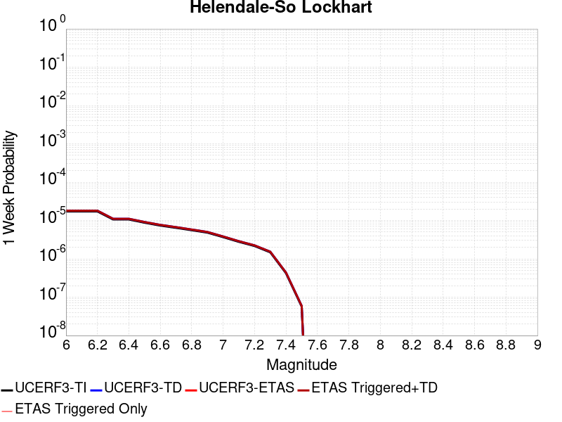 | 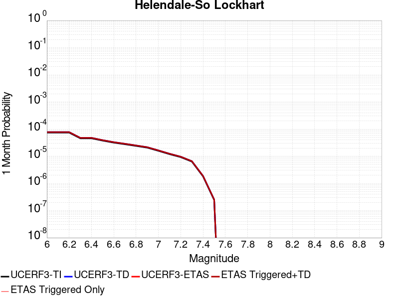 | 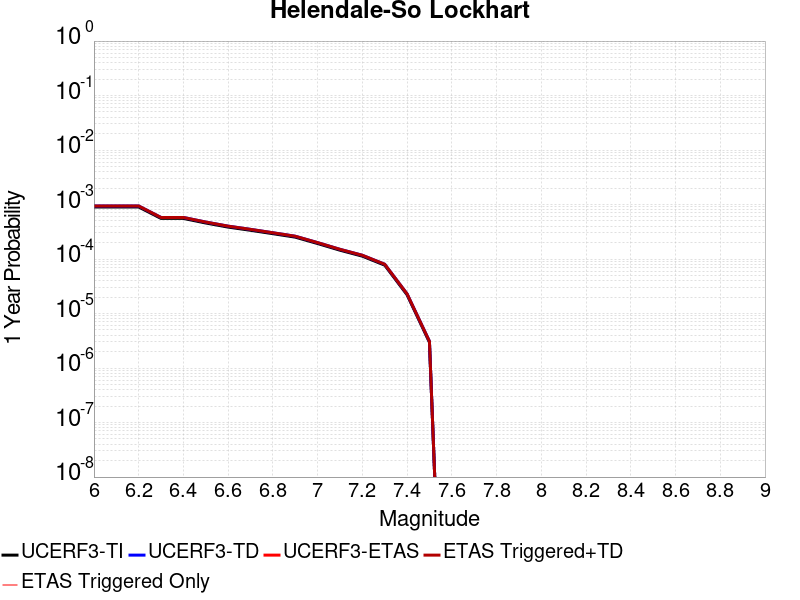 | 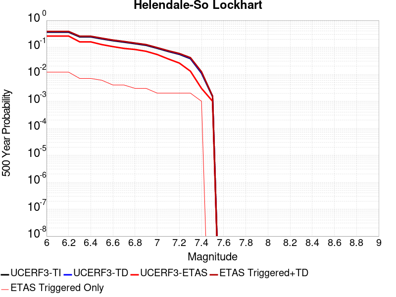 |

| Magnitude | 1 wk TI Prob | 1 wk TD Prob | 1 wk ETAS Prob | 1 wk ETAS/TD Gain | 1 wk ETAS Triggered+TD | 1 wk ETAS Triggered Only | 1 mo TI Prob | 1 mo TD Prob | 1 mo ETAS Prob | 1 mo ETAS/TD Gain | 1 mo ETAS Triggered+TD | 1 mo ETAS Triggered Only | 1 yr TI Prob | 1 yr TD Prob | 1 yr ETAS Prob | 1 yr ETAS/TD Gain | 1 yr ETAS Triggered+TD | 1 yr ETAS Triggered Only | 500 yr TI Prob | 500 yr TD Prob | 500 yr ETAS Prob | 500 yr ETAS/TD Gain | 500 yr ETAS Triggered+TD | 500 yr ETAS Triggered Only |
|-----|-----|-----|-----|-----|-----|-----|-----|-----|-----|-----|-----|-----|-----|-----|-----|-----|-----|-----|-----|-----|-----|-----|-----|-----|
| 6.0 | 1.7296055E-5 | 1.8059809E-5 | 0.0 | 0.0 | 1.8059809E-5 | 0.0 | 7.412385E-5 | 7.7397E-5 | 0.0 | 0.0 | 7.7397E-5 | 0.0 | 9.0208417E-4 | 9.419218E-4 | 0.0 | 0.0 | 9.419218E-4 | 0.0 | 0.36316562 | 0.3793718 | 0.261 | 0.68797946 | 0.38681933 | 0.012 |
| 6.1 | 1.7296055E-5 | 1.8059809E-5 | 0.0 | 0.0 | 1.8059809E-5 | 0.0 | 7.412385E-5 | 7.7397E-5 | 0.0 | 0.0 | 7.7397E-5 | 0.0 | 9.0208417E-4 | 9.419218E-4 | 0.0 | 0.0 | 9.419218E-4 | 0.0 | 0.36316562 | 0.3793718 | 0.261 | 0.68797946 | 0.38681933 | 0.012 |
| 6.2 | 1.7296055E-5 | 1.8059809E-5 | 0.0 | 0.0 | 1.8059809E-5 | 0.0 | 7.412385E-5 | 7.7397E-5 | 0.0 | 0.0 | 7.7397E-5 | 0.0 | 9.0208417E-4 | 9.419218E-4 | 0.0 | 0.0 | 9.419218E-4 | 0.0 | 0.36316562 | 0.3793718 | 0.261 | 0.68797946 | 0.38681933 | 0.012 |
| 6.3 | 1.0669118E-5 | 1.1110151E-5 | 0.0 | 0.0 | 1.1110151E-5 | 0.0 | 4.5723988E-5 | 4.7614078E-5 | 0.0 | 0.0 | 4.7614078E-5 | 0.0 | 5.5654737E-4 | 5.7955E-4 | 0.0 | 0.0 | 5.7955E-4 | 0.0 | 0.24296905 | 0.25219828 | 0.159 | 0.6304563 | 0.2574329 | 0.007 |
| 6.4 | 1.0669118E-5 | 1.1110151E-5 | 0.0 | 0.0 | 1.1110151E-5 | 0.0 | 4.5723988E-5 | 4.7614078E-5 | 0.0 | 0.0 | 4.7614078E-5 | 0.0 | 5.5654737E-4 | 5.7955E-4 | 0.0 | 0.0 | 5.7955E-4 | 0.0 | 0.24296905 | 0.25219828 | 0.159 | 0.6304563 | 0.2574329 | 0.007 |
| 6.5 | 8.790038E-6 | 9.149601E-6 | 0.0 | 0.0 | 9.149601E-6 | 0.0 | 3.767105E-5 | 3.9211995E-5 | 0.0 | 0.0 | 3.9211995E-5 | 0.0 | 4.585485E-4 | 4.77303E-4 | 0.0 | 0.0 | 4.77303E-4 | 0.0 | 0.20493136 | 0.21268529 | 0.126 | 0.59242463 | 0.21740918 | 0.006 |
| 6.6 | 7.396949E-6 | 7.69828E-6 | 0.0 | 0.0 | 7.69828E-6 | 0.0 | 3.1700827E-5 | 3.2992215E-5 | 0.0 | 0.0 | 3.2992215E-5 | 0.0 | 3.858892E-4 | 4.016072E-4 | 0.0 | 0.0 | 4.016072E-4 | 0.0 | 0.17550305 | 0.18218426 | 0.106 | 0.58182853 | 0.18545553 | 0.004 |
| 6.7 | 6.4600285E-6 | 6.722972E-6 | 0.0 | 0.0 | 6.722972E-6 | 0.0 | 2.7685543E-5 | 2.8812425E-5 | 0.0 | 0.0 | 2.8812425E-5 | 0.0 | 3.3701936E-4 | 3.507356E-4 | 0.0 | 0.0 | 3.507356E-4 | 0.0 | 0.15510091 | 0.16105549 | 0.091 | 0.56502265 | 0.16441128 | 0.004 |
| 6.8 | 5.600104E-6 | 5.823248E-6 | 0.0 | 0.0 | 5.823248E-6 | 0.0 | 2.4000226E-5 | 2.4956542E-5 | 0.0 | 0.0 | 2.4956542E-5 | 0.0 | 2.9216358E-4 | 3.0380412E-4 | 0.0 | 0.0 | 3.0380412E-4 | 0.0 | 0.13593142 | 0.14108615 | 0.083 | 0.5882931 | 0.14366288 | 0.003 |
| 6.9 | 4.839122E-6 | 5.028679E-6 | 0.0 | 0.0 | 5.028679E-6 | 0.0 | 2.0738931E-5 | 2.1551306E-5 | 0.0 | 0.0 | 2.1551306E-5 | 0.0 | 2.5246723E-4 | 2.62356E-4 | 0.0 | 0.0 | 2.62356E-4 | 0.0 | 0.11860513 | 0.12306405 | 0.071 | 0.57693535 | 0.12569486 | 0.003 |
| 7.0 | 3.6937633E-6 | 3.8370276E-6 | 0.0 | 0.0 | 3.8370276E-6 | 0.0 | 1.5830317E-5 | 1.6444303E-5 | 0.0 | 0.0 | 1.6444303E-5 | 0.0 | 1.9271708E-4 | 2.001913E-4 | 0.0 | 0.0 | 2.001913E-4 | 0.0 | 0.09187008 | 0.09533482 | 0.054 | 0.5664247 | 0.09714415 | 0.002 |
| 7.1 | 2.7858857E-6 | 2.8918118E-6 | 0.0 | 0.0 | 2.8918118E-6 | 0.0 | 1.1939455E-5 | 1.23934215E-5 | 0.0 | 0.0 | 1.23934215E-5 | 0.0 | 1.4535317E-4 | 1.5087967E-4 | 0.0 | 0.0 | 1.5087967E-4 | 0.0 | 0.07010339 | 0.07272402 | 0.037 | 0.50877273 | 0.074578576 | 0.002 |
| 7.2 | 2.1672065E-6 | 2.2493298E-6 | 0.0 | 0.0 | 2.2493298E-6 | 0.0 | 9.2879945E-6 | 9.63995E-6 | 0.0 | 0.0 | 9.63995E-6 | 0.0 | 1.1307546E-4 | 1.1736025E-4 | 0.0 | 0.0 | 1.1736025E-4 | 0.0 | 0.054972194 | 0.057041954 | 0.026 | 0.45580485 | 0.058927868 | 0.002 |
| 7.3 | 1.4823496E-6 | 1.5389801E-6 | 0.0 | 0.0 | 1.5389801E-6 | 0.0 | 6.3529114E-6 | 6.595613E-6 | 0.0 | 0.0 | 6.595613E-6 | 0.0 | 7.734395E-5 | 8.0298785E-5 | 0.0 | 0.0 | 8.0298785E-5 | 0.0 | 0.0379352 | 0.039395653 | 0.013 | 0.32998565 | 0.04131686 | 0.002 |
| 7.4 | 4.2321457E-7 | 4.4012165E-7 | 0.0 | 0.0 | 4.4012165E-7 | 0.0 | 1.8137755E-6 | 1.8862345E-6 | 0.0 | 0.0 | 1.8862345E-6 | 0.0 | 2.2082493E-5 | 2.2964708E-5 | 0.0 | 0.0 | 2.2964708E-5 | 0.0 | 0.010980636 | 0.011429191 | 0.003 | 0.26248577 | 0.012417762 | 0.001 |
| 7.5 | 5.6942316E-8 | 5.928182E-8 | 0.0 | 0.0 | 5.928182E-8 | 0.0 | 2.440385E-7 | 2.5406493E-7 | 0.0 | 0.0 | 2.5406493E-7 | 0.0 | 2.9711643E-6 | 3.0932367E-6 | 0.0 | 0.0 | 3.0932367E-6 | 0.0 | 0.0014844815 | 0.0015456411 | 0.001 | 0.64698076 | 0.0015456411 | 0.0 |

## Homestead Valley 2011
*[(top)](#table-of-contents)*

| 1 Week | 1 Month | 1 Year | 500 Year |
|-----|-----|-----|-----|
|  | 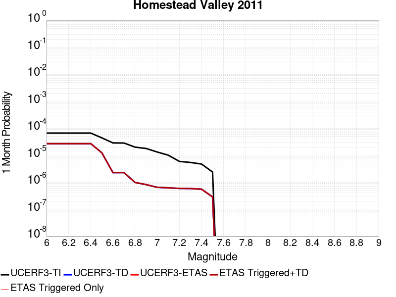 | 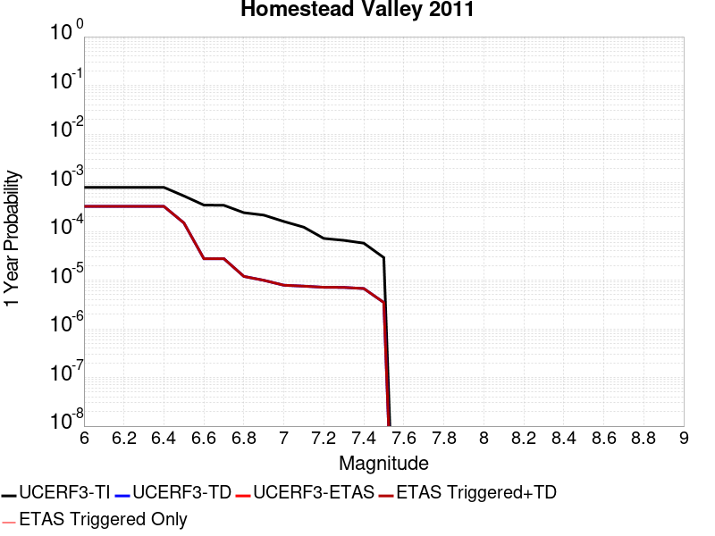 | 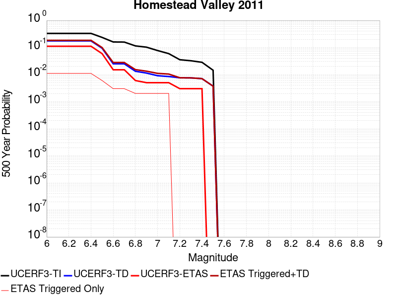 |

| Magnitude | 1 wk TI Prob | 1 wk TD Prob | 1 wk ETAS Prob | 1 wk ETAS/TD Gain | 1 wk ETAS Triggered+TD | 1 wk ETAS Triggered Only | 1 mo TI Prob | 1 mo TD Prob | 1 mo ETAS Prob | 1 mo ETAS/TD Gain | 1 mo ETAS Triggered+TD | 1 mo ETAS Triggered Only | 1 yr TI Prob | 1 yr TD Prob | 1 yr ETAS Prob | 1 yr ETAS/TD Gain | 1 yr ETAS Triggered+TD | 1 yr ETAS Triggered Only | 500 yr TI Prob | 500 yr TD Prob | 500 yr ETAS Prob | 500 yr ETAS/TD Gain | 500 yr ETAS Triggered+TD | 500 yr ETAS Triggered Only |
|-----|-----|-----|-----|-----|-----|-----|-----|-----|-----|-----|-----|-----|-----|-----|-----|-----|-----|-----|-----|-----|-----|-----|-----|-----|
| 6.0 | 1.539795E-5 | 6.258738E-6 | 0.0 | 0.0 | 6.258738E-6 | 0.0 | 6.5989545E-5 | 2.6823001E-5 | 0.0 | 0.0 | 2.6823001E-5 | 0.0 | 8.0312655E-4 | 3.2654157E-4 | 0.0 | 0.0 | 3.2654157E-4 | 0.0 | 0.33083498 | 0.1743484 | 0.111 | 0.6366563 | 0.18343057 | 0.011 |
| 6.1 | 1.539795E-5 | 6.258738E-6 | 0.0 | 0.0 | 6.258738E-6 | 0.0 | 6.5989545E-5 | 2.6823001E-5 | 0.0 | 0.0 | 2.6823001E-5 | 0.0 | 8.0312655E-4 | 3.2654157E-4 | 0.0 | 0.0 | 3.2654157E-4 | 0.0 | 0.33083498 | 0.1743484 | 0.111 | 0.6366563 | 0.18343057 | 0.011 |
| 6.2 | 1.539795E-5 | 6.258738E-6 | 0.0 | 0.0 | 6.258738E-6 | 0.0 | 6.5989545E-5 | 2.6823001E-5 | 0.0 | 0.0 | 2.6823001E-5 | 0.0 | 8.0312655E-4 | 3.2654157E-4 | 0.0 | 0.0 | 3.2654157E-4 | 0.0 | 0.33083498 | 0.1743484 | 0.111 | 0.6366563 | 0.18343057 | 0.011 |
| 6.3 | 1.539795E-5 | 6.258738E-6 | 0.0 | 0.0 | 6.258738E-6 | 0.0 | 6.5989545E-5 | 2.6823001E-5 | 0.0 | 0.0 | 2.6823001E-5 | 0.0 | 8.0312655E-4 | 3.2654157E-4 | 0.0 | 0.0 | 3.2654157E-4 | 0.0 | 0.33083498 | 0.1743484 | 0.111 | 0.6366563 | 0.18343057 | 0.011 |
| 6.4 | 1.539795E-5 | 6.258738E-6 | 0.0 | 0.0 | 6.258738E-6 | 0.0 | 6.5989545E-5 | 2.6823001E-5 | 0.0 | 0.0 | 2.6823001E-5 | 0.0 | 8.0312655E-4 | 3.2654157E-4 | 0.0 | 0.0 | 3.2654157E-4 | 0.0 | 0.33083498 | 0.1743484 | 0.111 | 0.6366563 | 0.18343057 | 0.011 |
| 6.5 | 1.0265258E-5 | 2.8654897E-6 | 0.0 | 0.0 | 2.8654897E-6 | 0.0 | 4.3993223E-5 | 1.2280651E-5 | 0.0 | 0.0 | 1.2280651E-5 | 0.0 | 5.3548586E-4 | 1.4951358E-4 | 0.0 | 0.0 | 1.4951358E-4 | 0.0 | 0.23495042 | 0.093658544 | 0.059 | 0.6299479 | 0.09909659 | 0.006 |
| 6.6 | 6.664671E-6 | 5.278518E-7 | 0.0 | 0.0 | 5.278518E-7 | 0.0 | 2.8562565E-5 | 2.2622207E-6 | 0.0 | 0.0 | 2.2622207E-6 | 0.0 | 3.476937E-4 | 2.7542304E-5 | 0.0 | 0.0 | 2.7542304E-5 | 0.0 | 0.15959981 | 0.02484521 | 0.015 | 0.60373807 | 0.027770676 | 0.003 |
| 6.7 | 6.5954046E-6 | 5.278518E-7 | 0.0 | 0.0 | 5.278518E-7 | 0.0 | 2.8265715E-5 | 2.2622207E-6 | 0.0 | 0.0 | 2.2622207E-6 | 0.0 | 3.4408073E-4 | 2.7542304E-5 | 0.0 | 0.0 | 2.7542304E-5 | 0.0 | 0.15807973 | 0.024835559 | 0.015 | 0.60397273 | 0.027761051 | 0.003 |
| 6.8 | 4.648189E-6 | 2.2839835E-7 | 0.0 | 0.0 | 2.2839835E-7 | 0.0 | 1.9920659E-5 | 9.788497E-7 | 0.0 | 0.0 | 9.788497E-7 | 0.0 | 2.4250703E-4 | 1.1917435E-5 | 0.0 | 0.0 | 1.1917435E-5 | 0.0 | 0.114203654 | 0.013200231 | 0.006 | 0.45453748 | 0.015173831 | 0.002 |
| 6.9 | 4.1428534E-6 | 1.8967846E-7 | 0.0 | 0.0 | 1.8967846E-7 | 0.0 | 1.7754966E-5 | 8.1290744E-7 | 0.0 | 0.0 | 8.1290744E-7 | 0.0 | 2.1614527E-4 | 9.897107E-6 | 0.0 | 0.0 | 9.897107E-6 | 0.0 | 0.10244808 | 0.011312353 | 0.005 | 0.44199467 | 0.013289729 | 0.002 |
| 7.0 | 3.0673707E-6 | 1.5057797E-7 | 0.0 | 0.0 | 1.5057797E-7 | 0.0 | 1.3145808E-5 | 6.45334E-7 | 0.0 | 0.0 | 6.45334E-7 | 0.0 | 1.6003846E-4 | 7.856915E-6 | 0.0 | 0.0 | 7.856915E-6 | 0.0 | 0.076907314 | 0.009045867 | 0.005 | 0.5527386 | 0.011027776 | 0.002 |
| 7.1 | 2.340854E-6 | 1.4398124E-7 | 0.0 | 0.0 | 1.4398124E-7 | 0.0 | 1.0032193E-5 | 6.170623E-7 | 0.0 | 0.0 | 6.170623E-7 | 0.0 | 1.221351E-4 | 7.5127086E-6 | 0.0 | 0.0 | 7.5127086E-6 | 0.0 | 0.05924382 | 0.008435723 | 0.005 | 0.59271735 | 0.010418852 | 0.002 |
| 7.2 | 1.3754182E-6 | 1.3660409E-7 | 0.0 | 0.0 | 1.3660409E-7 | 0.0 | 5.8946357E-6 | 5.85446E-7 | 0.0 | 0.0 | 5.85446E-7 | 0.0 | 7.176483E-5 | 7.1277823E-6 | 0.0 | 0.0 | 7.1277823E-6 | 0.0 | 0.035247512 | 0.007598642 | 0.003 | 0.3948074 | 0.007598642 | 0.0 |
| 7.3 | 1.2573237E-6 | 1.3567652E-7 | 0.0 | 0.0 | 1.3567652E-7 | 0.0 | 5.388519E-6 | 5.8147066E-7 | 0.0 | 0.0 | 5.8147066E-7 | 0.0 | 6.560324E-5 | 7.0793835E-6 | 0.0 | 0.0 | 7.0793835E-6 | 0.0 | 0.032270525 | 0.0075125215 | 0.003 | 0.3993333 | 0.0075125215 | 0.0 |
| 7.4 | 1.0994207E-6 | 1.2863335E-7 | 0.0 | 0.0 | 1.2863335E-7 | 0.0 | 4.7117946E-6 | 5.512856E-7 | 0.0 | 0.0 | 5.512856E-7 | 0.0 | 5.736459E-5 | 6.7118826E-6 | 0.0 | 0.0 | 6.7118826E-6 | 0.0 | 0.028275661 | 0.0070406734 | 0.003 | 0.4260956 | 0.0070406734 | 0.0 |
| 7.5 | 5.5569126E-7 | 6.6482926E-8 | 0.0 | 0.0 | 6.6482926E-8 | 0.0 | 2.3815317E-6 | 2.849268E-7 | 0.0 | 0.0 | 2.849268E-7 | 0.0 | 2.8994764E-5 | 3.4689788E-6 | 0.0 | 0.0 | 3.4689788E-6 | 0.0 | 0.014393007 | 0.0037104539 | 0.0 | 0.0 | 0.0037104539 | 0.0 |

## San Cayetano
*[(top)](#table-of-contents)*

| 1 Week | 1 Month | 1 Year | 500 Year |
|-----|-----|-----|-----|
| 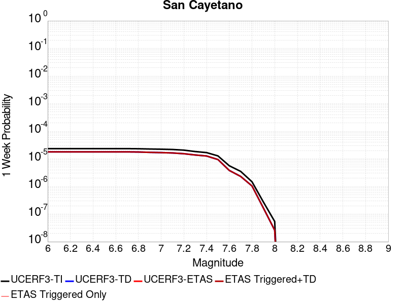 |  |  | 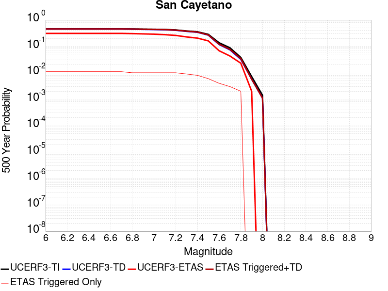 |

| Magnitude | 1 wk TI Prob | 1 wk TD Prob | 1 wk ETAS Prob | 1 wk ETAS/TD Gain | 1 wk ETAS Triggered+TD | 1 wk ETAS Triggered Only | 1 mo TI Prob | 1 mo TD Prob | 1 mo ETAS Prob | 1 mo ETAS/TD Gain | 1 mo ETAS Triggered+TD | 1 mo ETAS Triggered Only | 1 yr TI Prob | 1 yr TD Prob | 1 yr ETAS Prob | 1 yr ETAS/TD Gain | 1 yr ETAS Triggered+TD | 1 yr ETAS Triggered Only | 500 yr TI Prob | 500 yr TD Prob | 500 yr ETAS Prob | 500 yr ETAS/TD Gain | 500 yr ETAS Triggered+TD | 500 yr ETAS Triggered Only |
|-----|-----|-----|-----|-----|-----|-----|-----|-----|-----|-----|-----|-----|-----|-----|-----|-----|-----|-----|-----|-----|-----|-----|-----|-----|
| 6.0 | 2.3476267E-5 | 1.7941195E-5 | 0.0 | 0.0 | 1.7941195E-5 | 0.0 | 1.0060869E-4 | 7.688859E-5 | 0.0 | 0.0 | 7.688859E-5 | 0.0 | 0.0012242225 | 9.3572005E-4 | 0.0 | 0.0 | 9.3572005E-4 | 0.0 | 0.45799834 | 0.44891512 | 0.309 | 0.6883261 | 0.45497707 | 0.011 |
| 6.1 | 2.3476267E-5 | 1.7941195E-5 | 0.0 | 0.0 | 1.7941195E-5 | 0.0 | 1.0060869E-4 | 7.688859E-5 | 0.0 | 0.0 | 7.688859E-5 | 0.0 | 0.0012242225 | 9.3572005E-4 | 0.0 | 0.0 | 9.3572005E-4 | 0.0 | 0.45799834 | 0.44891512 | 0.309 | 0.6883261 | 0.45497707 | 0.011 |
| 6.2 | 2.3476267E-5 | 1.7941195E-5 | 0.0 | 0.0 | 1.7941195E-5 | 0.0 | 1.0060869E-4 | 7.688859E-5 | 0.0 | 0.0 | 7.688859E-5 | 0.0 | 0.0012242225 | 9.3572005E-4 | 0.0 | 0.0 | 9.3572005E-4 | 0.0 | 0.45799834 | 0.44891512 | 0.309 | 0.6883261 | 0.45497707 | 0.011 |
| 6.3 | 2.3476267E-5 | 1.7941195E-5 | 0.0 | 0.0 | 1.7941195E-5 | 0.0 | 1.0060869E-4 | 7.688859E-5 | 0.0 | 0.0 | 7.688859E-5 | 0.0 | 0.0012242225 | 9.3572005E-4 | 0.0 | 0.0 | 9.3572005E-4 | 0.0 | 0.45799834 | 0.44891512 | 0.309 | 0.6883261 | 0.45497707 | 0.011 |
| 6.4 | 2.3476267E-5 | 1.7941195E-5 | 0.0 | 0.0 | 1.7941195E-5 | 0.0 | 1.0060869E-4 | 7.688859E-5 | 0.0 | 0.0 | 7.688859E-5 | 0.0 | 0.0012242225 | 9.3572005E-4 | 0.0 | 0.0 | 9.3572005E-4 | 0.0 | 0.45799834 | 0.44891512 | 0.309 | 0.6883261 | 0.45497707 | 0.011 |
| 6.5 | 2.3476267E-5 | 1.7941195E-5 | 0.0 | 0.0 | 1.7941195E-5 | 0.0 | 1.0060869E-4 | 7.688859E-5 | 0.0 | 0.0 | 7.688859E-5 | 0.0 | 0.0012242225 | 9.3572005E-4 | 0.0 | 0.0 | 9.3572005E-4 | 0.0 | 0.45799834 | 0.44891512 | 0.309 | 0.6883261 | 0.45497707 | 0.011 |
| 6.6 | 2.3476267E-5 | 1.7941195E-5 | 0.0 | 0.0 | 1.7941195E-5 | 0.0 | 1.0060869E-4 | 7.688859E-5 | 0.0 | 0.0 | 7.688859E-5 | 0.0 | 0.0012242225 | 9.3572005E-4 | 0.0 | 0.0 | 9.3572005E-4 | 0.0 | 0.45799834 | 0.44891512 | 0.309 | 0.6883261 | 0.45497707 | 0.011 |
| 6.7 | 2.3476267E-5 | 1.7941195E-5 | 0.0 | 0.0 | 1.7941195E-5 | 0.0 | 1.0060869E-4 | 7.688859E-5 | 0.0 | 0.0 | 7.688859E-5 | 0.0 | 0.0012242225 | 9.3572005E-4 | 0.0 | 0.0 | 9.3572005E-4 | 0.0 | 0.45799834 | 0.44891512 | 0.309 | 0.6883261 | 0.45497707 | 0.011 |
| 6.8 | 2.3241924E-5 | 1.7711567E-5 | 0.0 | 0.0 | 1.7711567E-5 | 0.0 | 9.960445E-5 | 7.590453E-5 | 0.0 | 0.0 | 7.590453E-5 | 0.0 | 0.0012120095 | 9.237493E-4 | 0.0 | 0.0 | 9.237493E-4 | 0.0 | 0.45467442 | 0.4452626 | 0.303 | 0.6804973 | 0.45081 | 0.01 |
| 6.9 | 2.2761007E-5 | 1.7211214E-5 | 0.0 | 0.0 | 1.7211214E-5 | 0.0 | 9.7543525E-5 | 7.3760275E-5 | 0.0 | 0.0 | 7.3760275E-5 | 0.0 | 0.0011869454 | 8.9766475E-4 | 0.0 | 0.0 | 8.9766475E-4 | 0.0 | 0.44778907 | 0.43760502 | 0.296 | 0.676409 | 0.443229 | 0.01 |
| 7.0 | 2.240283E-5 | 1.6848964E-5 | 0.0 | 0.0 | 1.6848964E-5 | 0.0 | 9.600859E-5 | 7.220787E-5 | 0.0 | 0.0 | 7.220787E-5 | 0.0 | 0.0011682777 | 8.7877957E-4 | 0.0 | 0.0 | 8.7877957E-4 | 0.0 | 0.44260457 | 0.4318396 | 0.289 | 0.66923 | 0.4375212 | 0.01 |
| 7.1 | 2.1871154E-5 | 1.6374815E-5 | 0.0 | 0.0 | 1.6374815E-5 | 0.0 | 9.373015E-5 | 7.017591E-5 | 0.0 | 0.0 | 7.017591E-5 | 0.0 | 0.0011405671 | 8.5406005E-4 | 0.0 | 0.0 | 8.5406005E-4 | 0.0 | 0.4348189 | 0.42336175 | 0.276 | 0.6519248 | 0.4291281 | 0.01 |
| 7.2 | 2.0714133E-5 | 1.5366806E-5 | 0.0 | 0.0 | 1.5366806E-5 | 0.0 | 8.8771834E-5 | 6.585609E-5 | 0.0 | 0.0 | 6.585609E-5 | 0.0 | 0.0010802611 | 8.0150616E-4 | 0.0 | 0.0 | 8.0150616E-4 | 0.0 | 0.4174979 | 0.40479055 | 0.259 | 0.6398371 | 0.41074264 | 0.01 |
| 7.3 | 1.8408395E-5 | 1.3825303E-5 | 0.0 | 0.0 | 1.3825303E-5 | 0.0 | 7.8890735E-5 | 5.9249967E-5 | 0.0 | 0.0 | 5.9249967E-5 | 0.0 | 9.600714E-4 | 7.211325E-4 | 0.0 | 0.0 | 7.211325E-4 | 0.0 | 0.38138136 | 0.36800146 | 0.227 | 0.6168454 | 0.37368944 | 0.009 |
| 7.4 | 1.6856795E-5 | 1.2696838E-5 | 0.0 | 0.0 | 1.2696838E-5 | 0.0 | 7.2241404E-5 | 5.44139E-5 | 0.0 | 0.0 | 5.44139E-5 | 0.0 | 8.7918417E-4 | 6.622906E-4 | 0.0 | 0.0 | 6.622906E-4 | 0.0 | 0.3558254 | 0.34179023 | 0.205 | 0.5997831 | 0.3470559 | 0.008 |
| 7.5 | 1.2822778E-5 | 9.472743E-6 | 0.0 | 0.0 | 9.472743E-6 | 0.0 | 5.495361E-5 | 4.0596846E-5 | 0.0 | 0.0 | 4.0596846E-5 | 0.0 | 6.688548E-4 | 4.941561E-4 | 0.0 | 0.0 | 4.941561E-4 | 0.0 | 0.28433228 | 0.26604557 | 0.161 | 0.60515946 | 0.2704493 | 0.006 |
| 7.6 | 5.6272684E-6 | 3.8131511E-6 | 0.0 | 0.0 | 3.8131511E-6 | 0.0 | 2.4116642E-5 | 1.6341975E-5 | 0.0 | 0.0 | 1.6341975E-5 | 0.0 | 2.9358055E-4 | 1.9894548E-4 | 0.0 | 0.0 | 1.9894548E-4 | 0.0 | 0.13654356 | 0.117183305 | 0.068 | 0.58028746 | 0.12071457 | 0.004 |
| 7.7 | 3.5261346E-6 | 2.3159323E-6 | 0.0 | 0.0 | 2.3159323E-6 | 0.0 | 1.5111918E-5 | 9.925387E-6 | 0.0 | 0.0 | 9.925387E-6 | 0.0 | 1.8397206E-4 | 1.2083495E-4 | 0.0 | 0.0 | 1.2083495E-4 | 0.0 | 0.08788983 | 0.07381611 | 0.043 | 0.58252865 | 0.076594666 | 0.003 |
| 7.8 | 1.4826929E-6 | 1.0464933E-6 | 0.0 | 0.0 | 1.0464933E-6 | 0.0 | 6.354383E-6 | 4.4849635E-6 | 0.0 | 0.0 | 4.4849635E-6 | 0.0 | 7.736187E-5 | 5.460308E-5 | 0.0 | 0.0 | 5.460308E-5 | 0.0 | 0.037943818 | 0.032257095 | 0.023 | 0.7130214 | 0.03419258 | 0.002 |
| 7.9 | 2.7568166E-7 | 1.6737656E-7 | 0.0 | 0.0 | 1.6737656E-7 | 0.0 | 1.1814923E-6 | 7.173279E-7 | 0.0 | 0.0 | 7.173279E-7 | 0.0 | 1.4384574E-5 | 8.733433E-6 | 0.0 | 0.0 | 8.733433E-6 | 0.0 | 0.0071665356 | 0.0057338877 | 0.002 | 0.3488035 | 0.0057338877 | 0.0 |
| 8.0 | 5.407832E-8 | 2.6114748E-8 | 0.0 | 0.0 | 2.6114748E-8 | 0.0 | 2.3176422E-7 | 1.1192034E-7 | 0.0 | 0.0 | 1.1192034E-7 | 0.0 | 2.8217257E-6 | 1.3626294E-6 | 0.0 | 0.0 | 1.3626294E-6 | 0.0 | 0.00140987 | 0.0011053665 | 0.0 | 0.0 | 0.0011053665 | 0.0 |

## Point Reyes 2011 CFM
*[(top)](#table-of-contents)*

| 1 Week | 1 Month | 1 Year | 500 Year |
|-----|-----|-----|-----|
| 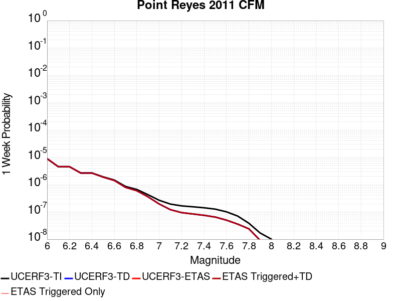 | 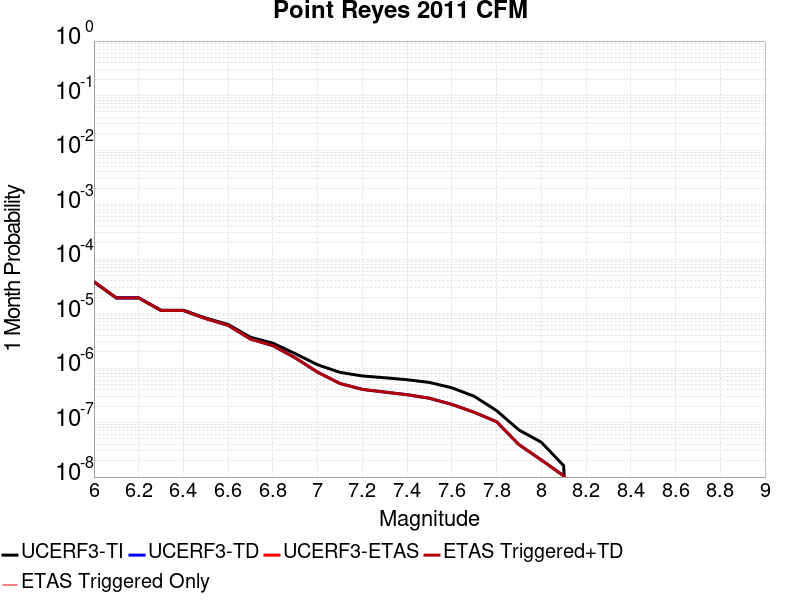 | 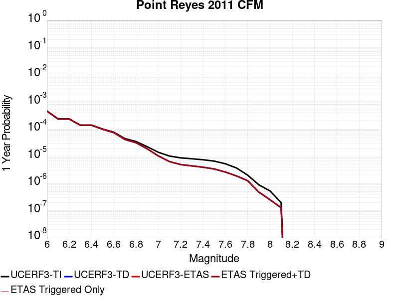 | 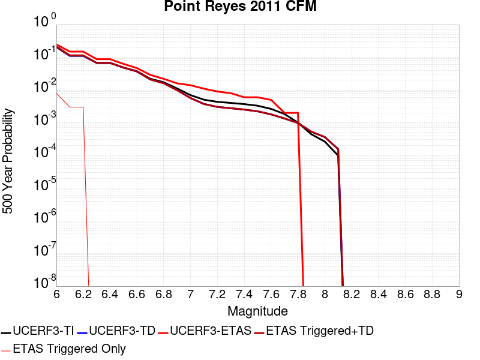 |

| Magnitude | 1 wk TI Prob | 1 wk TD Prob | 1 wk ETAS Prob | 1 wk ETAS/TD Gain | 1 wk ETAS Triggered+TD | 1 wk ETAS Triggered Only | 1 mo TI Prob | 1 mo TD Prob | 1 mo ETAS Prob | 1 mo ETAS/TD Gain | 1 mo ETAS Triggered+TD | 1 mo ETAS Triggered Only | 1 yr TI Prob | 1 yr TD Prob | 1 yr ETAS Prob | 1 yr ETAS/TD Gain | 1 yr ETAS Triggered+TD | 1 yr ETAS Triggered Only | 500 yr TI Prob | 500 yr TD Prob | 500 yr ETAS Prob | 500 yr ETAS/TD Gain | 500 yr ETAS Triggered+TD | 500 yr ETAS Triggered Only |
|-----|-----|-----|-----|-----|-----|-----|-----|-----|-----|-----|-----|-----|-----|-----|-----|-----|-----|-----|-----|-----|-----|-----|-----|-----|
| 6.0 | 8.8644965E-6 | 8.95244E-6 | 0.0 | 0.0 | 8.95244E-6 | 0.0 | 3.7990147E-5 | 3.8367074E-5 | 0.0 | 0.0 | 3.8367074E-5 | 0.0 | 4.624319E-4 | 4.6702527E-4 | 0.0 | 0.0 | 4.6702527E-4 | 0.0 | 0.20647435 | 0.21013433 | 0.248 | 1.1801975 | 0.21645325 | 0.008 |
| 6.1 | 4.526405E-6 | 4.529259E-6 | 0.0 | 0.0 | 4.529259E-6 | 0.0 | 1.9398734E-5 | 1.9410973E-5 | 0.0 | 0.0 | 1.9410973E-5 | 0.0 | 2.36154E-4 | 2.36304E-4 | 0.0 | 0.0 | 2.36304E-4 | 0.0 | 0.11138476 | 0.11222062 | 0.15 | 1.3366528 | 0.11488396 | 0.003 |
| 6.2 | 4.526405E-6 | 4.529259E-6 | 0.0 | 0.0 | 4.529259E-6 | 0.0 | 1.9398734E-5 | 1.9410973E-5 | 0.0 | 0.0 | 1.9410973E-5 | 0.0 | 2.36154E-4 | 2.36304E-4 | 0.0 | 0.0 | 2.36304E-4 | 0.0 | 0.11138476 | 0.11222062 | 0.15 | 1.3366528 | 0.11488396 | 0.003 |
| 6.3 | 2.6842322E-6 | 2.652643E-6 | 0.0 | 0.0 | 2.652643E-6 | 0.0 | 1.1503801E-5 | 1.1368421E-5 | 0.0 | 0.0 | 1.1368421E-5 | 0.0 | 1.4004979E-4 | 1.3840193E-4 | 0.0 | 0.0 | 1.3840193E-4 | 0.0 | 0.06763396 | 0.06745613 | 0.088 | 1.3045515 | 0.06745613 | 0.0 |
| 6.4 | 2.6842322E-6 | 2.652643E-6 | 0.0 | 0.0 | 2.652643E-6 | 0.0 | 1.1503801E-5 | 1.1368421E-5 | 0.0 | 0.0 | 1.1368421E-5 | 0.0 | 1.4004979E-4 | 1.3840193E-4 | 0.0 | 0.0 | 1.3840193E-4 | 0.0 | 0.06763396 | 0.06745613 | 0.088 | 1.3045515 | 0.06745613 | 0.0 |
| 6.5 | 1.9281833E-6 | 1.8833338E-6 | 0.0 | 0.0 | 1.8833338E-6 | 0.0 | 8.263617E-6 | 8.071405E-6 | 0.0 | 0.0 | 8.071405E-6 | 0.0 | 1.0060489E-4 | 9.8265016E-5 | 0.0 | 0.0 | 9.8265016E-5 | 0.0 | 0.049060635 | 0.04852158 | 0.063 | 1.2983913 | 0.04852158 | 0.0 |
| 6.6 | 1.4726726E-6 | 1.4200964E-6 | 0.0 | 0.0 | 1.4200964E-6 | 0.0 | 6.3114385E-6 | 6.0861134E-6 | 0.0 | 0.0 | 6.0861134E-6 | 0.0 | 7.683905E-5 | 7.4095966E-5 | 0.0 | 0.0 | 7.4095966E-5 | 0.0 | 0.03769228 | 0.036942977 | 0.047 | 1.272231 | 0.036942977 | 0.0 |
| 6.7 | 8.572307E-7 | 7.9443043E-7 | 0.0 | 0.0 | 7.9443043E-7 | 0.0 | 3.6738406E-6 | 3.4046975E-6 | 0.0 | 0.0 | 3.4046975E-6 | 0.0 | 4.472809E-5 | 4.1451418E-5 | 0.0 | 0.0 | 4.1451418E-5 | 0.0 | 0.022116313 | 0.021085104 | 0.029 | 1.3753786 | 0.021085104 | 0.0 |
| 6.8 | 6.6745434E-7 | 6.0160903E-7 | 0.0 | 0.0 | 6.0160903E-7 | 0.0 | 2.8605155E-6 | 2.5783218E-6 | 0.0 | 0.0 | 2.5783218E-6 | 0.0 | 3.482622E-5 | 3.1390628E-5 | 0.0 | 0.0 | 3.1390628E-5 | 0.0 | 0.017262675 | 0.016146531 | 0.022 | 1.3625218 | 0.016146531 | 0.0 |
| 6.9 | 4.291521E-7 | 3.5945334E-7 | 0.0 | 0.0 | 3.5945334E-7 | 0.0 | 1.839222E-6 | 1.5405134E-6 | 0.0 | 0.0 | 1.5405134E-6 | 0.0 | 2.2392298E-5 | 1.8755592E-5 | 0.0 | 0.0 | 1.8755592E-5 | 0.0 | 0.011133829 | 0.009909415 | 0.016 | 1.6146262 | 0.009909415 | 0.0 |
| 7.0 | 2.6812808E-7 | 1.961178E-7 | 0.0 | 0.0 | 1.961178E-7 | 0.0 | 1.1491198E-6 | 8.405046E-7 | 0.0 | 0.0 | 8.405046E-7 | 0.0 | 1.3990444E-5 | 1.0233096E-5 | 0.0 | 0.0 | 1.0233096E-5 | 0.0 | 0.006970861 | 0.0056800586 | 0.014 | 2.4647634 | 0.0056800586 | 0.0 |
| 7.1 | 1.9451231E-7 | 1.2156974E-7 | 0.0 | 0.0 | 1.2156974E-7 | 0.0 | 8.336239E-7 | 5.210131E-7 | 0.0 | 0.0 | 5.210131E-7 | 0.0 | 1.0149324E-5 | 6.3433154E-6 | 0.0 | 0.0 | 6.3433154E-6 | 0.0 | 0.005061833 | 0.0037436206 | 0.011 | 2.9383318 | 0.0037436206 | 0.0 |
| 7.2 | 1.6715143E-7 | 9.483283E-8 | 0.0 | 0.0 | 9.483283E-8 | 0.0 | 7.1636305E-7 | 4.0642635E-7 | 0.0 | 0.0 | 4.0642635E-7 | 0.0 | 8.721685E-6 | 4.9482296E-6 | 0.0 | 0.0 | 4.9482296E-6 | 0.0 | 0.004351367 | 0.0030450313 | 0.009 | 2.9556346 | 0.0030450313 | 0.0 |
| 7.3 | 1.5503173E-7 | 8.462522E-8 | 0.0 | 0.0 | 8.462522E-8 | 0.0 | 6.644215E-7 | 3.626795E-7 | 0.0 | 0.0 | 3.626795E-7 | 0.0 | 8.089301E-6 | 4.4156136E-6 | 0.0 | 0.0 | 4.4156136E-6 | 0.0 | 0.0040364987 | 0.002773256 | 0.008 | 2.8846958 | 0.002773256 | 0.0 |
| 7.4 | 1.4251614E-7 | 7.563617E-8 | 0.0 | 0.0 | 7.563617E-8 | 0.0 | 6.1078333E-7 | 3.24155E-7 | 0.0 | 0.0 | 3.24155E-7 | 0.0 | 7.4362615E-6 | 3.94658E-6 | 0.0 | 0.0 | 3.94658E-6 | 0.0 | 0.0037112408 | 0.0025265443 | 0.006 | 2.3747852 | 0.0025265443 | 0.0 |
| 7.5 | 1.2710186E-7 | 6.5184715E-8 | 0.0 | 0.0 | 6.5184715E-8 | 0.0 | 5.447221E-7 | 2.7936304E-7 | 0.0 | 0.0 | 2.7936304E-7 | 0.0 | 6.6319717E-6 | 3.4012396E-6 | 0.0 | 0.0 | 3.4012396E-6 | 0.0 | 0.003310505 | 0.0022333462 | 0.006 | 2.6865518 | 0.0022333462 | 0.0 |
| 7.6 | 1.0144708E-7 | 5.0324225E-8 | 0.0 | 0.0 | 5.0324225E-8 | 0.0 | 4.347731E-7 | 2.1567526E-7 | 0.0 | 0.0 | 2.1567526E-7 | 0.0 | 5.2933497E-6 | 2.6258429E-6 | 0.0 | 0.0 | 2.6258429E-6 | 0.0 | 0.0026431826 | 0.0018010011 | 0.005 | 2.7762337 | 0.0018010011 | 0.0 |
| 7.7 | 7.090527E-8 | 3.601758E-8 | 0.0 | 0.0 | 3.601758E-8 | 0.0 | 3.038797E-7 | 1.5436105E-7 | 0.0 | 0.0 | 1.5436105E-7 | 0.0 | 3.699729E-6 | 1.879344E-6 | 0.0 | 0.0 | 1.879344E-6 | 0.0 | 0.001848158 | 0.0013504494 | 0.002 | 1.4809885 | 0.0013504494 | 0.0 |
| 7.8 | 3.8712045E-8 | 2.4210726E-8 | 0.0 | 0.0 | 2.4210726E-8 | 0.0 | 1.6590876E-7 | 1.0376025E-7 | 0.0 | 0.0 | 1.0376025E-7 | 0.0 | 2.0199373E-6 | 1.2632803E-6 | 0.0 | 0.0 | 1.2632803E-6 | 0.0 | 0.0010094597 | 9.810446E-4 | 0.002 | 2.0386431 | 9.810446E-4 | 0.0 |
| 7.9 | 1.7068782E-8 | 9.197411E-9 | 0.0 | 0.0 | 9.197411E-9 | 0.0 | 7.315192E-8 | 3.9417476E-8 | 0.0 | 0.0 | 3.9417476E-8 | 0.0 | 8.906242E-7 | 4.7990767E-7 | 0.0 | 0.0 | 4.7990767E-7 | 0.0 | 4.452132E-4 | 5.324492E-4 | 0.0 | 0.0 | 5.324492E-4 | 0.0 |
| 8.0 | 1.0172592E-8 | 4.8130175E-9 | 0.0 | 0.0 | 4.8130175E-9 | 0.0 | 4.359682E-8 | 2.0627215E-8 | 0.0 | 0.0 | 2.0627215E-8 | 0.0 | 5.3079117E-7 | 2.511363E-7 | 0.0 | 0.0 | 2.511363E-7 | 0.0 | 2.6536043E-4 | 3.6538666E-4 | 0.0 | 0.0 | 3.6538666E-4 | 0.0 |
| 8.1 | 3.7861243E-9 | 2.4580196E-9 | 0.0 | 0.0 | 2.4580196E-9 | 0.0 | 1.6226247E-8 | 1.05343725E-8 | 0.0 | 0.0 | 1.05343725E-8 | 0.0 | 1.9755454E-7 | 1.2825598E-7 | 0.0 | 0.0 | 1.2825598E-7 | 0.0 | 9.8772405E-5 | 1.5555635E-4 | 0.0 | 0.0 | 1.5555635E-4 | 0.0 |

## Oak Ridge (Onshore)
*[(top)](#table-of-contents)*

| 1 Week | 1 Month | 1 Year | 500 Year |
|-----|-----|-----|-----|
| 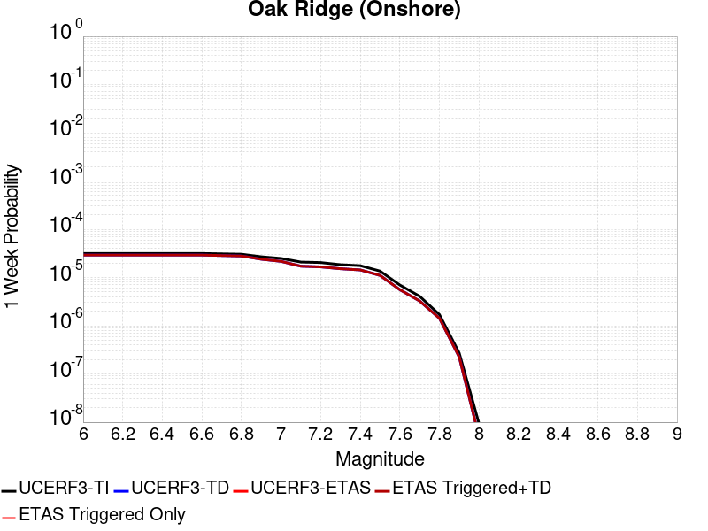 | 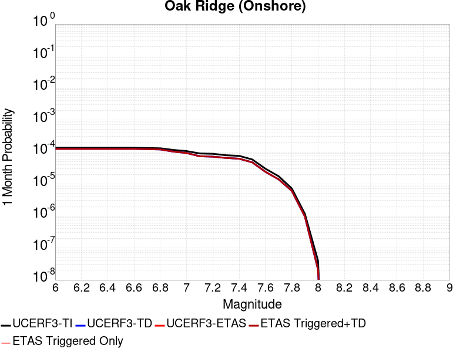 | 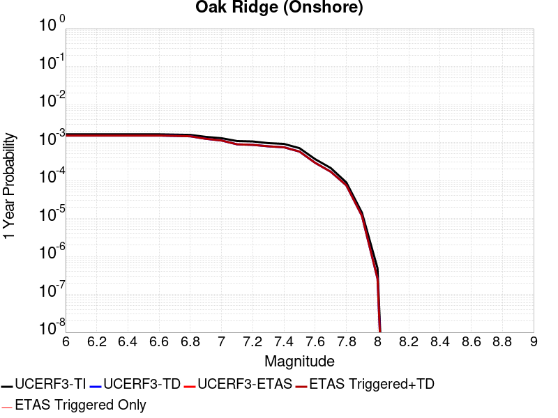 | 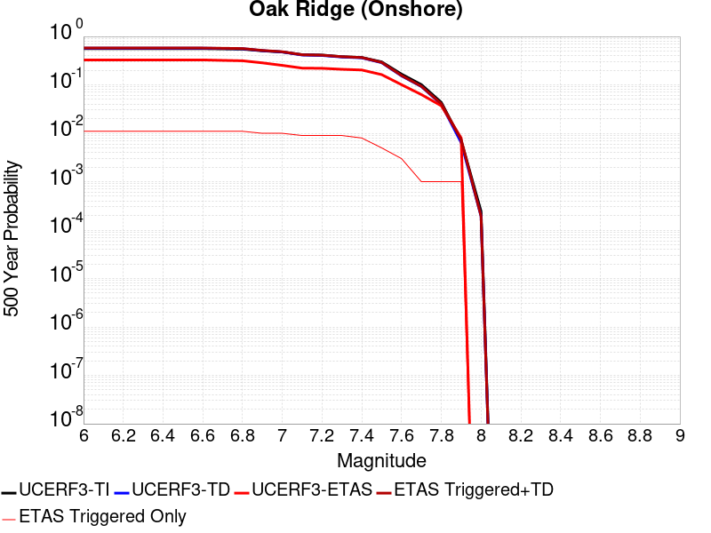 |

| Magnitude | 1 wk TI Prob | 1 wk TD Prob | 1 wk ETAS Prob | 1 wk ETAS/TD Gain | 1 wk ETAS Triggered+TD | 1 wk ETAS Triggered Only | 1 mo TI Prob | 1 mo TD Prob | 1 mo ETAS Prob | 1 mo ETAS/TD Gain | 1 mo ETAS Triggered+TD | 1 mo ETAS Triggered Only | 1 yr TI Prob | 1 yr TD Prob | 1 yr ETAS Prob | 1 yr ETAS/TD Gain | 1 yr ETAS Triggered+TD | 1 yr ETAS Triggered Only | 500 yr TI Prob | 500 yr TD Prob | 500 yr ETAS Prob | 500 yr ETAS/TD Gain | 500 yr ETAS Triggered+TD | 500 yr ETAS Triggered Only |
|-----|-----|-----|-----|-----|-----|-----|-----|-----|-----|-----|-----|-----|-----|-----|-----|-----|-----|-----|-----|-----|-----|-----|-----|-----|
| 6.0 | 3.155064E-5 | 2.9252034E-5 | 0.0 | 0.0 | 2.9252034E-5 | 0.0 | 1.3521002E-4 | 1.2536005E-4 | 0.0 | 0.0 | 1.2536005E-4 | 0.0 | 0.001644939 | 0.0015252276 | 0.0 | 0.0 | 0.0015252276 | 0.0 | 0.56095207 | 0.57282764 | 0.328 | 0.5725981 | 0.5775265 | 0.011 |
| 6.1 | 3.155064E-5 | 2.9252034E-5 | 0.0 | 0.0 | 2.9252034E-5 | 0.0 | 1.3521002E-4 | 1.2536005E-4 | 0.0 | 0.0 | 1.2536005E-4 | 0.0 | 0.001644939 | 0.0015252276 | 0.0 | 0.0 | 0.0015252276 | 0.0 | 0.56095207 | 0.57282764 | 0.328 | 0.5725981 | 0.5775265 | 0.011 |
| 6.2 | 3.155064E-5 | 2.9252034E-5 | 0.0 | 0.0 | 2.9252034E-5 | 0.0 | 1.3521002E-4 | 1.2536005E-4 | 0.0 | 0.0 | 1.2536005E-4 | 0.0 | 0.001644939 | 0.0015252276 | 0.0 | 0.0 | 0.0015252276 | 0.0 | 0.56095207 | 0.57282764 | 0.328 | 0.5725981 | 0.5775265 | 0.011 |
| 6.3 | 3.155064E-5 | 2.9252034E-5 | 0.0 | 0.0 | 2.9252034E-5 | 0.0 | 1.3521002E-4 | 1.2536005E-4 | 0.0 | 0.0 | 1.2536005E-4 | 0.0 | 0.001644939 | 0.0015252276 | 0.0 | 0.0 | 0.0015252276 | 0.0 | 0.56095207 | 0.57282764 | 0.328 | 0.5725981 | 0.5775265 | 0.011 |
| 6.4 | 3.155064E-5 | 2.9252034E-5 | 0.0 | 0.0 | 2.9252034E-5 | 0.0 | 1.3521002E-4 | 1.2536005E-4 | 0.0 | 0.0 | 1.2536005E-4 | 0.0 | 0.001644939 | 0.0015252276 | 0.0 | 0.0 | 0.0015252276 | 0.0 | 0.56095207 | 0.57282764 | 0.328 | 0.5725981 | 0.5775265 | 0.011 |
| 6.5 | 3.155064E-5 | 2.9252034E-5 | 0.0 | 0.0 | 2.9252034E-5 | 0.0 | 1.3521002E-4 | 1.2536005E-4 | 0.0 | 0.0 | 1.2536005E-4 | 0.0 | 0.001644939 | 0.0015252276 | 0.0 | 0.0 | 0.0015252276 | 0.0 | 0.56095207 | 0.57282764 | 0.328 | 0.5725981 | 0.5775265 | 0.011 |
| 6.6 | 3.155064E-5 | 2.9252034E-5 | 0.0 | 0.0 | 2.9252034E-5 | 0.0 | 1.3521002E-4 | 1.2536005E-4 | 0.0 | 0.0 | 1.2536005E-4 | 0.0 | 0.001644939 | 0.0015252276 | 0.0 | 0.0 | 0.0015252276 | 0.0 | 0.56095207 | 0.57282764 | 0.328 | 0.5725981 | 0.5775265 | 0.011 |
| 6.7 | 3.098897E-5 | 2.859631E-5 | 0.0 | 0.0 | 2.859631E-5 | 0.0 | 1.328031E-4 | 1.2255006E-4 | 0.0 | 0.0 | 1.2255006E-4 | 0.0 | 0.0016156785 | 0.0014910629 | 0.0 | 0.0 | 0.0014910629 | 0.0 | 0.55447084 | 0.5660122 | 0.321 | 0.56712556 | 0.57078606 | 0.011 |
| 6.8 | 3.0449872E-5 | 2.7976628E-5 | 0.0 | 0.0 | 2.7976628E-5 | 0.0 | 1.3049292E-4 | 1.1989453E-4 | 0.0 | 0.0 | 1.1989453E-4 | 0.0 | 0.0015875935 | 0.001458775 | 0.0 | 0.0 | 0.001458775 | 0.0 | 0.54816014 | 0.55908155 | 0.315 | 0.56342405 | 0.56393164 | 0.011 |
| 6.9 | 2.697928E-5 | 2.3989905E-5 | 0.0 | 0.0 | 2.3989905E-5 | 0.0 | 1.15620365E-4 | 1.0280994E-4 | 0.0 | 0.0 | 1.0280994E-4 | 0.0 | 0.0014067689 | 0.0012510135 | 0.0 | 0.0 | 0.0012510135 | 0.0 | 0.50533754 | 0.51007694 | 0.285 | 0.55873924 | 0.51497614 | 0.01 |
| 7.0 | 2.4893961E-5 | 2.16502E-5 | 0.0 | 0.0 | 2.16502E-5 | 0.0 | 1.0668404E-4 | 9.278337E-5 | 0.0 | 0.0 | 9.278337E-5 | 0.0 | 0.0012981043 | 0.0011290695 | 0.0 | 0.0 | 0.0011290695 | 0.0 | 0.47767943 | 0.479142 | 0.253 | 0.5280272 | 0.4843506 | 0.01 |
| 7.1 | 2.0945363E-5 | 1.7176324E-5 | 0.0 | 0.0 | 1.7176324E-5 | 0.0 | 8.976275E-5 | 7.361077E-5 | 0.0 | 0.0 | 7.361077E-5 | 0.0 | 0.0010923136 | 8.958472E-4 | 0.0 | 0.0 | 8.958472E-4 | 0.0 | 0.42100143 | 0.41374493 | 0.222 | 0.53656244 | 0.41902122 | 0.009 |
| 7.2 | 2.0439404E-5 | 1.663534E-5 | 0.0 | 0.0 | 1.663534E-5 | 0.0 | 8.7594504E-5 | 7.129239E-5 | 0.0 | 0.0 | 7.129239E-5 | 0.0 | 0.0010659413 | 8.6764374E-4 | 0.0 | 0.0 | 8.6764374E-4 | 0.0 | 0.4133078 | 0.40529764 | 0.22 | 0.542811 | 0.41064996 | 0.009 |
| 7.3 | 1.8463334E-5 | 1.522412E-5 | 0.0 | 0.0 | 1.522412E-5 | 0.0 | 7.912617E-5 | 6.524462E-5 | 0.0 | 0.0 | 6.524462E-5 | 0.0 | 9.6293533E-4 | 7.94068E-4 | 0.0 | 0.0 | 7.94068E-4 | 0.0 | 0.38226742 | 0.37673995 | 0.21 | 0.5574137 | 0.38234928 | 0.009 |
| 7.4 | 1.763139E-5 | 1.4367312E-5 | 0.0 | 0.0 | 1.4367312E-5 | 0.0 | 7.556091E-5 | 6.157276E-5 | 0.0 | 0.0 | 6.157276E-5 | 0.0 | 9.1956573E-4 | 7.493945E-4 | 0.0 | 0.0 | 7.493945E-4 | 0.0 | 0.3687128 | 0.36187947 | 0.203 | 0.56096023 | 0.36698446 | 0.008 |
| 7.5 | 1.3594944E-5 | 1.1062183E-5 | 0.0 | 0.0 | 1.1062183E-5 | 0.0 | 5.8262744E-5 | 4.7408506E-5 | 0.0 | 0.0 | 4.7408506E-5 | 0.0 | 7.0911803E-4 | 5.7704817E-4 | 0.0 | 0.0 | 5.7704817E-4 | 0.0 | 0.2986055 | 0.2878675 | 0.163 | 0.56623274 | 0.29142815 | 0.005 |
| 7.6 | 6.9889534E-6 | 5.59344E-6 | 0.0 | 0.0 | 5.59344E-6 | 0.0 | 2.9952313E-5 | 2.3971668E-5 | 0.0 | 0.0 | 2.3971668E-5 | 0.0 | 3.646084E-4 | 2.9181637E-4 | 0.0 | 0.0 | 2.9181637E-4 | 0.0 | 0.1666799 | 0.15360385 | 0.101 | 0.6575356 | 0.15614304 | 0.003 |
| 7.7 | 4.0824193E-6 | 3.2607168E-6 | 0.0 | 0.0 | 3.2607168E-6 | 0.0 | 1.7495966E-5 | 1.3974426E-5 | 0.0 | 0.0 | 1.3974426E-5 | 0.0 | 2.1299256E-4 | 1.7012548E-4 | 0.0 | 0.0 | 1.7012548E-4 | 0.0 | 0.1010318 | 0.09239729 | 0.063 | 0.6818382 | 0.09330489 | 0.001 |
| 7.8 | 1.7023609E-6 | 1.4293811E-6 | 0.0 | 0.0 | 1.4293811E-6 | 0.0 | 7.295812E-6 | 6.1259047E-6 | 0.0 | 0.0 | 6.1259047E-6 | 0.0 | 8.882289E-5 | 7.458036E-5 | 0.0 | 0.0 | 7.458036E-5 | 0.0 | 0.043441582 | 0.0398313 | 0.037 | 0.9289177 | 0.04079147 | 0.001 |
| 7.9 | 2.721225E-7 | 2.2493738E-7 | 0.0 | 0.0 | 2.2493738E-7 | 0.0 | 1.1662388E-6 | 9.64017E-7 | 0.0 | 0.0 | 9.64017E-7 | 0.0 | 1.4198865E-5 | 1.1736847E-5 | 0.0 | 0.0 | 1.1736847E-5 | 0.0 | 0.0070743407 | 0.0064320676 | 0.008 | 1.243768 | 0.0074256356 | 0.001 |
| 8.0 | 9.364255E-9 | 5.00061E-9 | 0.0 | 0.0 | 5.00061E-9 | 0.0 | 4.0132523E-8 | 2.143119E-8 | 0.0 | 0.0 | 2.143119E-8 | 0.0 | 4.8861335E-7 | 2.609247E-7 | 0.0 | 0.0 | 2.609247E-7 | 0.0 | 2.442769E-4 | 1.9441321E-4 | 0.0 | 0.0 | 1.9441321E-4 | 0.0 |

## West Tahoe
*[(top)](#table-of-contents)*

| 1 Week | 1 Month | 1 Year | 500 Year |
|-----|-----|-----|-----|
|  |  | 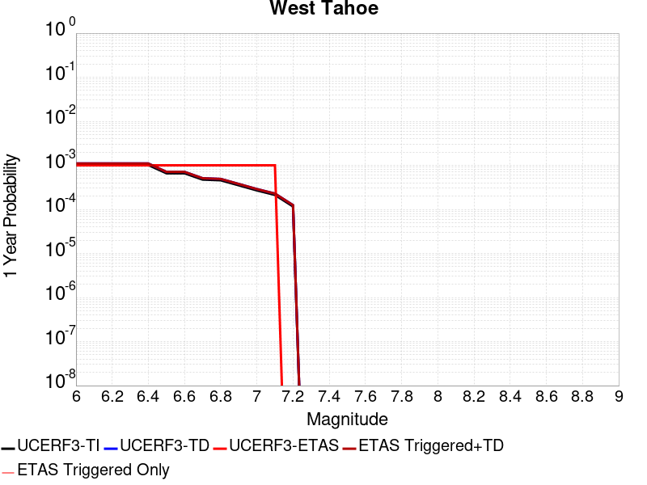 | 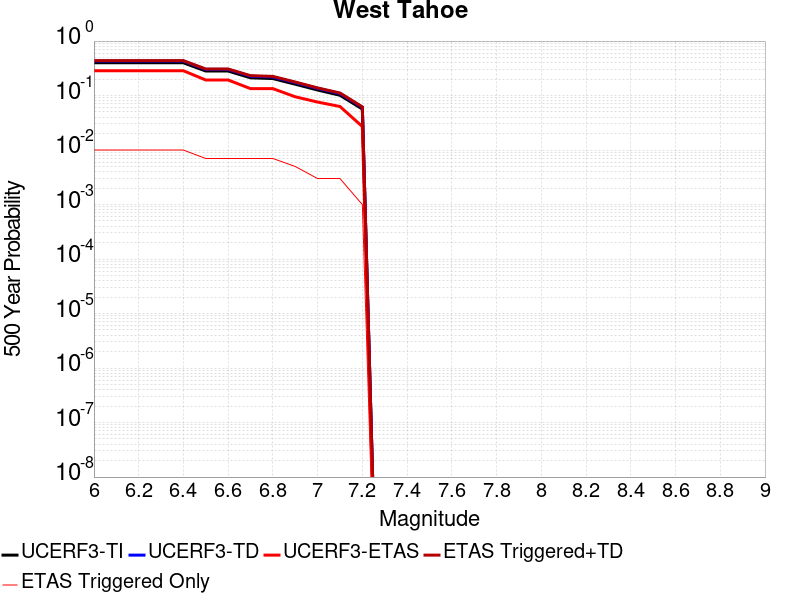 |

| Magnitude | 1 wk TI Prob | 1 wk TD Prob | 1 wk ETAS Prob | 1 wk ETAS/TD Gain | 1 wk ETAS Triggered+TD | 1 wk ETAS Triggered Only | 1 mo TI Prob | 1 mo TD Prob | 1 mo ETAS Prob | 1 mo ETAS/TD Gain | 1 mo ETAS Triggered+TD | 1 mo ETAS Triggered Only | 1 yr TI Prob | 1 yr TD Prob | 1 yr ETAS Prob | 1 yr ETAS/TD Gain | 1 yr ETAS Triggered+TD | 1 yr ETAS Triggered Only | 500 yr TI Prob | 500 yr TD Prob | 500 yr ETAS Prob | 500 yr ETAS/TD Gain | 500 yr ETAS Triggered+TD | 500 yr ETAS Triggered Only |
|-----|-----|-----|-----|-----|-----|-----|-----|-----|-----|-----|-----|-----|-----|-----|-----|-----|-----|-----|-----|-----|-----|-----|-----|-----|
| 6.0 | 1.952444E-5 | 2.1089874E-5 | 0.0 | 0.0 | 2.1089874E-5 | 0.0 | 8.367348E-5 | 9.0382346E-5 | 0.0 | 0.0 | 9.0382346E-5 | 0.0 | 0.0010182485 | 0.0010999037 | 0.001 | 0.90917045 | 0.0010999037 | 0.0 | 0.3991342 | 0.43099198 | 0.285 | 0.6612652 | 0.43668205 | 0.01 |
| 6.1 | 1.952444E-5 | 2.1089874E-5 | 0.0 | 0.0 | 2.1089874E-5 | 0.0 | 8.367348E-5 | 9.0382346E-5 | 0.0 | 0.0 | 9.0382346E-5 | 0.0 | 0.0010182485 | 0.0010999037 | 0.001 | 0.90917045 | 0.0010999037 | 0.0 | 0.3991342 | 0.43099198 | 0.285 | 0.6612652 | 0.43668205 | 0.01 |
| 6.2 | 1.952444E-5 | 2.1089874E-5 | 0.0 | 0.0 | 2.1089874E-5 | 0.0 | 8.367348E-5 | 9.0382346E-5 | 0.0 | 0.0 | 9.0382346E-5 | 0.0 | 0.0010182485 | 0.0010999037 | 0.001 | 0.90917045 | 0.0010999037 | 0.0 | 0.3991342 | 0.43099198 | 0.285 | 0.6612652 | 0.43668205 | 0.01 |
| 6.3 | 1.952444E-5 | 2.1089874E-5 | 0.0 | 0.0 | 2.1089874E-5 | 0.0 | 8.367348E-5 | 9.0382346E-5 | 0.0 | 0.0 | 9.0382346E-5 | 0.0 | 0.0010182485 | 0.0010999037 | 0.001 | 0.90917045 | 0.0010999037 | 0.0 | 0.3991342 | 0.43099198 | 0.285 | 0.6612652 | 0.43668205 | 0.01 |
| 6.4 | 1.952444E-5 | 2.1089874E-5 | 0.0 | 0.0 | 2.1089874E-5 | 0.0 | 8.367348E-5 | 9.0382346E-5 | 0.0 | 0.0 | 9.0382346E-5 | 0.0 | 0.0010182485 | 0.0010999037 | 0.001 | 0.90917045 | 0.0010999037 | 0.0 | 0.3991342 | 0.43099198 | 0.285 | 0.6612652 | 0.43668205 | 0.01 |
| 6.5 | 1.2685271E-5 | 1.3634411E-5 | 0.0 | 0.0 | 1.3634411E-5 | 0.0 | 5.4364315E-5 | 5.843197E-5 | 0.0 | 0.0 | 5.843197E-5 | 0.0 | 6.616845E-4 | 7.1119337E-4 | 0.001 | 1.4060874 | 7.1119337E-4 | 0.0 | 0.2817602 | 0.3021454 | 0.193 | 0.63876534 | 0.30703038 | 0.007 |
| 6.6 | 1.2685271E-5 | 1.3634411E-5 | 0.0 | 0.0 | 1.3634411E-5 | 0.0 | 5.4364315E-5 | 5.843197E-5 | 0.0 | 0.0 | 5.843197E-5 | 0.0 | 6.616845E-4 | 7.1119337E-4 | 0.001 | 1.4060874 | 7.1119337E-4 | 0.0 | 0.2817602 | 0.3021454 | 0.193 | 0.63876534 | 0.30703038 | 0.007 |
| 6.7 | 9.117886E-6 | 9.771285E-6 | 0.0 | 0.0 | 9.771285E-6 | 0.0 | 3.9076072E-5 | 4.1876305E-5 | 0.0 | 0.0 | 4.1876305E-5 | 0.0 | 4.756473E-4 | 5.097319E-4 | 0.001 | 1.9618158 | 5.097319E-4 | 0.0 | 0.2117029 | 0.22651233 | 0.134 | 0.59157926 | 0.23192674 | 0.007 |
| 6.8 | 8.786828E-6 | 9.420454E-6 | 0.0 | 0.0 | 9.420454E-6 | 0.0 | 3.7657293E-5 | 4.037279E-5 | 0.0 | 0.0 | 4.037279E-5 | 0.0 | 4.5838108E-4 | 4.914348E-4 | 0.001 | 2.034858 | 4.914348E-4 | 0.0 | 0.20486477 | 0.21936736 | 0.134 | 0.61084753 | 0.22483177 | 0.007 |
| 6.9 | 6.7562123E-6 | 7.2355474E-6 | 0.0 | 0.0 | 7.2355474E-6 | 0.0 | 2.8954875E-5 | 3.1009145E-5 | 0.0 | 0.0 | 3.1009145E-5 | 0.0 | 3.5246857E-4 | 3.774757E-4 | 0.001 | 2.6491773 | 3.774757E-4 | 0.0 | 0.16160451 | 0.1730795 | 0.095 | 0.5488807 | 0.1772141 | 0.005 |
| 7.0 | 5.1792854E-6 | 5.545739E-6 | 0.0 | 0.0 | 5.545739E-6 | 0.0 | 2.2196748E-5 | 2.3767258E-5 | 0.0 | 0.0 | 2.3767258E-5 | 0.0 | 2.702119E-4 | 2.893317E-4 | 0.001 | 3.4562407 | 2.893317E-4 | 0.0 | 0.1263926 | 0.13559148 | 0.076 | 0.56050724 | 0.1381847 | 0.003 |
| 7.1 | 4.090765E-6 | 4.3803543E-6 | 0.0 | 0.0 | 4.3803543E-6 | 0.0 | 1.7531731E-5 | 1.8772831E-5 | 0.0 | 0.0 | 1.8772831E-5 | 0.0 | 2.134279E-4 | 2.2853863E-4 | 0.001 | 4.375628 | 2.2853863E-4 | 0.0 | 0.10122751 | 0.10881369 | 0.063 | 0.57897127 | 0.11148725 | 0.003 |
| 7.2 | 2.2356758E-6 | 2.393095E-6 | 0.0 | 0.0 | 2.393095E-6 | 0.0 | 9.581432E-6 | 1.0256092E-5 | 0.0 | 0.0 | 1.0256092E-5 | 0.0 | 1.1664769E-4 | 1.2486265E-4 | 0.0 | 0.0 | 1.2486265E-4 | 0.0 | 0.05665881 | 0.061011527 | 0.027 | 0.44253933 | 0.061950516 | 0.001 |

## Mount Diablo Thrust North CFM
*[(top)](#table-of-contents)*

| 1 Week | 1 Month | 1 Year | 500 Year |
|-----|-----|-----|-----|
|  | 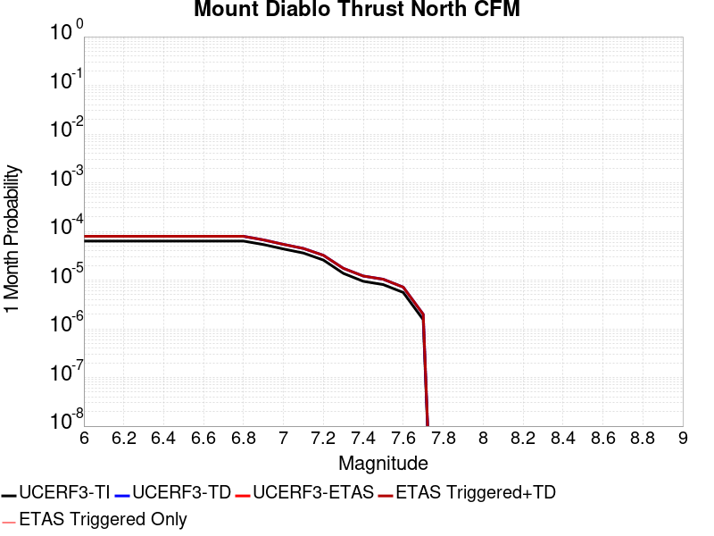 | 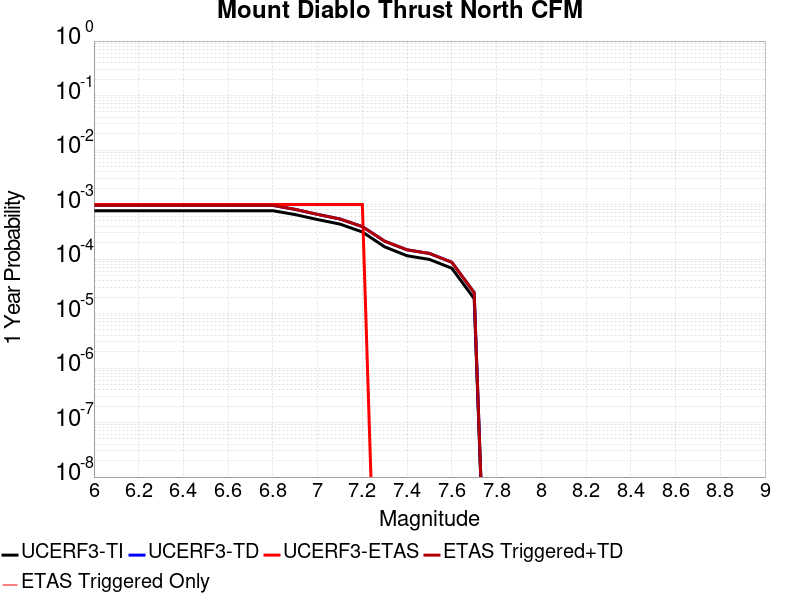 | 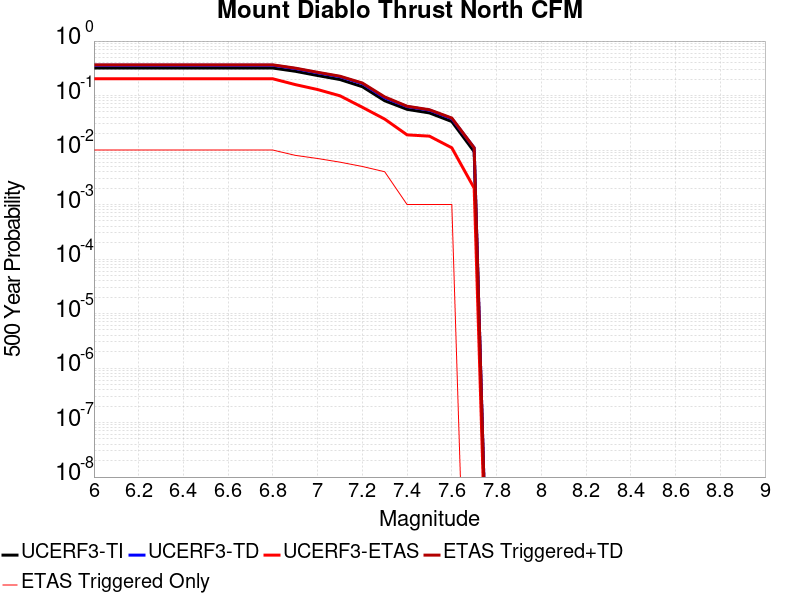 |

| Magnitude | 1 wk TI Prob | 1 wk TD Prob | 1 wk ETAS Prob | 1 wk ETAS/TD Gain | 1 wk ETAS Triggered+TD | 1 wk ETAS Triggered Only | 1 mo TI Prob | 1 mo TD Prob | 1 mo ETAS Prob | 1 mo ETAS/TD Gain | 1 mo ETAS Triggered+TD | 1 mo ETAS Triggered Only | 1 yr TI Prob | 1 yr TD Prob | 1 yr ETAS Prob | 1 yr ETAS/TD Gain | 1 yr ETAS Triggered+TD | 1 yr ETAS Triggered Only | 500 yr TI Prob | 500 yr TD Prob | 500 yr ETAS Prob | 500 yr ETAS/TD Gain | 500 yr ETAS Triggered+TD | 500 yr ETAS Triggered Only |
|-----|-----|-----|-----|-----|-----|-----|-----|-----|-----|-----|-----|-----|-----|-----|-----|-----|-----|-----|-----|-----|-----|-----|-----|-----|
| 6.0 | 1.479628E-5 | 1.8554318E-5 | 0.0 | 0.0 | 1.8554318E-5 | 0.0 | 6.341109E-5 | 7.951613E-5 | 0.0 | 0.0 | 7.951613E-5 | 0.0 | 7.717565E-4 | 9.6768833E-4 | 0.001 | 1.0333905 | 9.6768833E-4 | 0.0 | 0.320248 | 0.35991815 | 0.204 | 0.5667955 | 0.36631897 | 0.01 |
| 6.1 | 1.479628E-5 | 1.8554318E-5 | 0.0 | 0.0 | 1.8554318E-5 | 0.0 | 6.341109E-5 | 7.951613E-5 | 0.0 | 0.0 | 7.951613E-5 | 0.0 | 7.717565E-4 | 9.6768833E-4 | 0.001 | 1.0333905 | 9.6768833E-4 | 0.0 | 0.320248 | 0.35991815 | 0.204 | 0.5667955 | 0.36631897 | 0.01 |
| 6.2 | 1.479628E-5 | 1.8554318E-5 | 0.0 | 0.0 | 1.8554318E-5 | 0.0 | 6.341109E-5 | 7.951613E-5 | 0.0 | 0.0 | 7.951613E-5 | 0.0 | 7.717565E-4 | 9.6768833E-4 | 0.001 | 1.0333905 | 9.6768833E-4 | 0.0 | 0.320248 | 0.35991815 | 0.204 | 0.5667955 | 0.36631897 | 0.01 |
| 6.3 | 1.479628E-5 | 1.8554318E-5 | 0.0 | 0.0 | 1.8554318E-5 | 0.0 | 6.341109E-5 | 7.951613E-5 | 0.0 | 0.0 | 7.951613E-5 | 0.0 | 7.717565E-4 | 9.6768833E-4 | 0.001 | 1.0333905 | 9.6768833E-4 | 0.0 | 0.320248 | 0.35991815 | 0.204 | 0.5667955 | 0.36631897 | 0.01 |
| 6.4 | 1.479628E-5 | 1.8554318E-5 | 0.0 | 0.0 | 1.8554318E-5 | 0.0 | 6.341109E-5 | 7.951613E-5 | 0.0 | 0.0 | 7.951613E-5 | 0.0 | 7.717565E-4 | 9.6768833E-4 | 0.001 | 1.0333905 | 9.6768833E-4 | 0.0 | 0.320248 | 0.35991815 | 0.204 | 0.5667955 | 0.36631897 | 0.01 |
| 6.5 | 1.479628E-5 | 1.8554318E-5 | 0.0 | 0.0 | 1.8554318E-5 | 0.0 | 6.341109E-5 | 7.951613E-5 | 0.0 | 0.0 | 7.951613E-5 | 0.0 | 7.717565E-4 | 9.6768833E-4 | 0.001 | 1.0333905 | 9.6768833E-4 | 0.0 | 0.320248 | 0.35991815 | 0.204 | 0.5667955 | 0.36631897 | 0.01 |
| 6.6 | 1.479016E-5 | 1.8547473E-5 | 0.0 | 0.0 | 1.8547473E-5 | 0.0 | 6.338486E-5 | 7.94868E-5 | 0.0 | 0.0 | 7.94868E-5 | 0.0 | 7.714374E-4 | 9.673316E-4 | 0.001 | 1.0337718 | 9.673316E-4 | 0.0 | 0.32013944 | 0.35980654 | 0.204 | 0.56697136 | 0.3662085 | 0.01 |
| 6.7 | 1.479016E-5 | 1.8547473E-5 | 0.0 | 0.0 | 1.8547473E-5 | 0.0 | 6.338486E-5 | 7.94868E-5 | 0.0 | 0.0 | 7.94868E-5 | 0.0 | 7.714374E-4 | 9.673316E-4 | 0.001 | 1.0337718 | 9.673316E-4 | 0.0 | 0.32013944 | 0.35980654 | 0.204 | 0.56697136 | 0.3662085 | 0.01 |
| 6.8 | 1.4771667E-5 | 1.8526407E-5 | 0.0 | 0.0 | 1.8526407E-5 | 0.0 | 6.330561E-5 | 7.939652E-5 | 0.0 | 0.0 | 7.939652E-5 | 0.0 | 7.704732E-4 | 9.662334E-4 | 0.001 | 1.0349467 | 9.662334E-4 | 0.0 | 0.31981134 | 0.35946256 | 0.203 | 0.56473196 | 0.36586794 | 0.01 |
| 6.9 | 1.2548234E-5 | 1.5627647E-5 | 0.0 | 0.0 | 1.5627647E-5 | 0.0 | 5.3777036E-5 | 6.697393E-5 | 0.0 | 0.0 | 6.697393E-5 | 0.0 | 6.545387E-4 | 8.1510603E-4 | 0.001 | 1.2268343 | 8.1510603E-4 | 0.0 | 0.2791877 | 0.3131381 | 0.159 | 0.5077632 | 0.318633 | 0.008 |
| 7.0 | 1.01754185E-5 | 1.2652958E-5 | 0.0 | 0.0 | 1.2652958E-5 | 0.0 | 4.360821E-5 | 5.4225842E-5 | 0.0 | 0.0 | 5.4225842E-5 | 0.0 | 5.308006E-4 | 6.600013E-4 | 0.001 | 1.5151486 | 6.600013E-4 | 0.0 | 0.23315513 | 0.26200196 | 0.129 | 0.4923627 | 0.26716796 | 0.007 |
| 7.1 | 8.398341E-6 | 1.04242E-5 | 0.0 | 0.0 | 1.04242E-5 | 0.0 | 3.5992394E-5 | 4.4674383E-5 | 0.0 | 0.0 | 4.4674383E-5 | 0.0 | 4.3811928E-4 | 5.4377597E-4 | 0.001 | 1.8389927 | 5.4377597E-4 | 0.0 | 0.19676475 | 0.22174996 | 0.099 | 0.44644877 | 0.22641946 | 0.006 |
| 7.2 | 6.024759E-6 | 7.551028E-6 | 0.0 | 0.0 | 7.551028E-6 | 0.0 | 2.582014E-5 | 3.236115E-5 | 0.0 | 0.0 | 3.236115E-5 | 0.0 | 3.1431485E-4 | 3.9392646E-4 | 0.001 | 2.538545 | 3.9392646E-4 | 0.0 | 0.14545159 | 0.1657346 | 0.061 | 0.36805832 | 0.16990593 | 0.005 |
| 7.3 | 3.2099704E-6 | 4.075354E-6 | 0.0 | 0.0 | 4.075354E-6 | 0.0 | 1.3756943E-5 | 1.7465687E-5 | 0.0 | 0.0 | 1.7465687E-5 | 0.0 | 1.674779E-4 | 2.1262415E-4 | 0.0 | 0.0 | 2.1262415E-4 | 0.0 | 0.08033515 | 0.09083773 | 0.037 | 0.40731972 | 0.094474375 | 0.004 |
| 7.4 | 2.2041513E-6 | 2.8295672E-6 | 0.0 | 0.0 | 2.8295672E-6 | 0.0 | 9.4463285E-6 | 1.2126661E-5 | 0.0 | 0.0 | 1.2126661E-5 | 0.0 | 1.1500298E-4 | 1.4763216E-4 | 0.0 | 0.0 | 1.4763216E-4 | 0.0 | 0.055882636 | 0.06274963 | 0.019 | 0.30279064 | 0.06368688 | 0.001 |
| 7.5 | 1.8869501E-6 | 2.4310805E-6 | 0.0 | 0.0 | 2.4310805E-6 | 0.0 | 8.086904E-6 | 1.0418875E-5 | 0.0 | 0.0 | 1.0418875E-5 | 0.0 | 9.845361E-5 | 1.268425E-4 | 0.0 | 0.0 | 1.268425E-4 | 0.0 | 0.04803711 | 0.053986195 | 0.018 | 0.33341858 | 0.054932207 | 0.001 |
| 7.6 | 1.3012458E-6 | 1.6733626E-6 | 0.0 | 0.0 | 1.6733626E-6 | 0.0 | 5.576756E-6 | 7.171535E-6 | 0.0 | 0.0 | 7.171535E-6 | 0.0 | 6.7894885E-5 | 8.7309985E-5 | 0.0 | 0.0 | 8.7309985E-5 | 0.0 | 0.03337881 | 0.037740063 | 0.011 | 0.29146743 | 0.038702324 | 0.001 |
| 7.7 | 3.603383E-7 | 4.6452612E-7 | 0.0 | 0.0 | 4.6452612E-7 | 0.0 | 1.5443061E-6 | 1.9908248E-6 | 0.0 | 0.0 | 1.9908248E-6 | 0.0 | 1.8801764E-5 | 2.4238028E-5 | 0.0 | 0.0 | 2.4238028E-5 | 0.0 | 0.00935692 | 0.0109882215 | 0.002 | 0.18201306 | 0.0109882215 | 0.0 |

## Swain Ravine - Spenceville
*[(top)](#table-of-contents)*

| 1 Week | 1 Month | 1 Year | 500 Year |
|-----|-----|-----|-----|
| 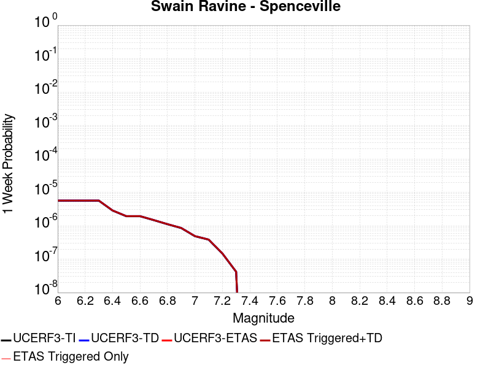 |  | 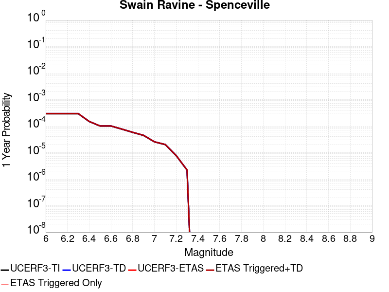 | 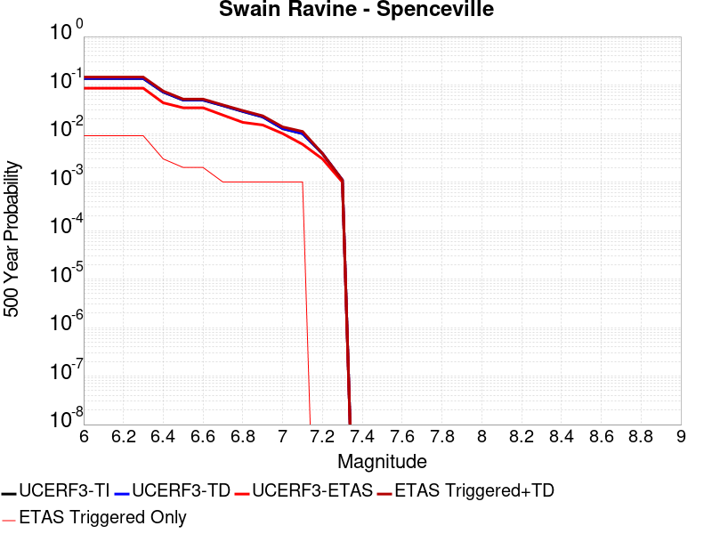 |

| Magnitude | 1 wk TI Prob | 1 wk TD Prob | 1 wk ETAS Prob | 1 wk ETAS/TD Gain | 1 wk ETAS Triggered+TD | 1 wk ETAS Triggered Only | 1 mo TI Prob | 1 mo TD Prob | 1 mo ETAS Prob | 1 mo ETAS/TD Gain | 1 mo ETAS Triggered+TD | 1 mo ETAS Triggered Only | 1 yr TI Prob | 1 yr TD Prob | 1 yr ETAS Prob | 1 yr ETAS/TD Gain | 1 yr ETAS Triggered+TD | 1 yr ETAS Triggered Only | 500 yr TI Prob | 500 yr TD Prob | 500 yr ETAS Prob | 500 yr ETAS/TD Gain | 500 yr ETAS Triggered+TD | 500 yr ETAS Triggered Only |
|-----|-----|-----|-----|-----|-----|-----|-----|-----|-----|-----|-----|-----|-----|-----|-----|-----|-----|-----|-----|-----|-----|-----|-----|-----|
| 6.0 | 5.596169E-6 | 5.6602385E-6 | 0.0 | 0.0 | 5.6602385E-6 | 0.0 | 2.398336E-5 | 2.4257954E-5 | 0.0 | 0.0 | 2.4257954E-5 | 0.0 | 2.9195828E-4 | 2.9530327E-4 | 0.0 | 0.0 | 2.9530327E-4 | 0.0 | 0.1358427 | 0.13793351 | 0.086 | 0.6234888 | 0.14569211 | 0.009 |
| 6.1 | 5.596169E-6 | 5.6602385E-6 | 0.0 | 0.0 | 5.6602385E-6 | 0.0 | 2.398336E-5 | 2.4257954E-5 | 0.0 | 0.0 | 2.4257954E-5 | 0.0 | 2.9195828E-4 | 2.9530327E-4 | 0.0 | 0.0 | 2.9530327E-4 | 0.0 | 0.1358427 | 0.13793351 | 0.086 | 0.6234888 | 0.14569211 | 0.009 |
| 6.2 | 5.596169E-6 | 5.6602385E-6 | 0.0 | 0.0 | 5.6602385E-6 | 0.0 | 2.398336E-5 | 2.4257954E-5 | 0.0 | 0.0 | 2.4257954E-5 | 0.0 | 2.9195828E-4 | 2.9530327E-4 | 0.0 | 0.0 | 2.9530327E-4 | 0.0 | 0.1358427 | 0.13793351 | 0.086 | 0.6234888 | 0.14569211 | 0.009 |
| 6.3 | 5.596169E-6 | 5.6602385E-6 | 0.0 | 0.0 | 5.6602385E-6 | 0.0 | 2.398336E-5 | 2.4257954E-5 | 0.0 | 0.0 | 2.4257954E-5 | 0.0 | 2.9195828E-4 | 2.9530327E-4 | 0.0 | 0.0 | 2.9530327E-4 | 0.0 | 0.1358427 | 0.13793351 | 0.086 | 0.6234888 | 0.14569211 | 0.009 |
| 6.4 | 2.8426775E-6 | 2.8724912E-6 | 0.0 | 0.0 | 2.8724912E-6 | 0.0 | 1.2182847E-5 | 1.231062E-5 | 0.0 | 0.0 | 1.231062E-5 | 0.0 | 1.4831607E-4 | 1.4987188E-4 | 0.0 | 0.0 | 1.4987188E-4 | 0.0 | 0.07148016 | 0.07230063 | 0.043 | 0.59473896 | 0.075083725 | 0.003 |
| 6.5 | 1.9210793E-6 | 1.9403471E-6 | 0.0 | 0.0 | 1.9403471E-6 | 0.0 | 8.233172E-6 | 8.315747E-6 | 0.0 | 0.0 | 8.315747E-6 | 0.0 | 1.0023425E-4 | 1.0123966E-4 | 0.0 | 0.0 | 1.0123966E-4 | 0.0 | 0.04888437 | 0.049397543 | 0.034 | 0.68829334 | 0.05129875 | 0.002 |
| 6.6 | 1.9210793E-6 | 1.9403471E-6 | 0.0 | 0.0 | 1.9403471E-6 | 0.0 | 8.233172E-6 | 8.315747E-6 | 0.0 | 0.0 | 8.315747E-6 | 0.0 | 1.0023425E-4 | 1.0123966E-4 | 0.0 | 0.0 | 1.0123966E-4 | 0.0 | 0.04888437 | 0.049397543 | 0.034 | 0.68829334 | 0.05129875 | 0.002 |
| 6.7 | 1.4667394E-6 | 1.481098E-6 | 0.0 | 0.0 | 1.481098E-6 | 0.0 | 6.286011E-6 | 6.347548E-6 | 0.0 | 0.0 | 6.347548E-6 | 0.0 | 7.65295E-5 | 7.727873E-5 | 0.0 | 0.0 | 7.727873E-5 | 0.0 | 0.03754331 | 0.037924312 | 0.024 | 0.63283944 | 0.038886387 | 0.001 |
| 6.8 | 1.1076943E-6 | 1.1183627E-6 | 0.0 | 0.0 | 1.1183627E-6 | 0.0 | 4.747252E-6 | 4.7929743E-6 | 0.0 | 0.0 | 4.7929743E-6 | 0.0 | 5.7796264E-5 | 5.8352944E-5 | 0.0 | 0.0 | 5.8352944E-5 | 0.0 | 0.028485386 | 0.02876766 | 0.017 | 0.59094137 | 0.029738892 | 0.001 |
| 6.9 | 8.514296E-7 | 8.595593E-7 | 0.0 | 0.0 | 8.595593E-7 | 0.0 | 3.648979E-6 | 3.6838205E-6 | 0.0 | 0.0 | 3.6838205E-6 | 0.0 | 4.442541E-5 | 4.484962E-5 | 0.0 | 0.0 | 4.484962E-5 | 0.0 | 0.021968303 | 0.02218347 | 0.015 | 0.6761792 | 0.023161286 | 0.001 |
| 7.0 | 4.8544706E-7 | 4.9007383E-7 | 0.0 | 0.0 | 4.9007383E-7 | 0.0 | 2.0804857E-6 | 2.1003148E-6 | 0.0 | 0.0 | 2.1003148E-6 | 0.0 | 2.532962E-5 | 2.5571046E-5 | 0.0 | 0.0 | 2.5571046E-5 | 0.0 | 0.012585107 | 0.012707846 | 0.01 | 0.7869154 | 0.0136951385 | 0.001 |
| 7.1 | 3.829186E-7 | 3.8658482E-7 | 0.0 | 0.0 | 3.8658482E-7 | 0.0 | 1.6410787E-6 | 1.656791E-6 | 0.0 | 0.0 | 1.656791E-6 | 0.0 | 1.997995E-5 | 2.0171256E-5 | 0.0 | 0.0 | 2.0171256E-5 | 0.0 | 0.009940339 | 0.010037949 | 0.006 | 0.59773165 | 0.011027912 | 0.001 |
| 7.2 | 1.4726595E-7 | 1.4871416E-7 | 0.0 | 0.0 | 1.4871416E-7 | 0.0 | 6.3113964E-7 | 6.3734626E-7 | 0.0 | 0.0 | 6.3734626E-7 | 0.0 | 7.684098E-6 | 7.759669E-6 | 0.0 | 0.0 | 7.759669E-6 | 0.0 | 0.0038346925 | 0.0038738048 | 0.003 | 0.7744324 | 0.0038738048 | 0.0 |
| 7.3 | 4.1880604E-8 | 4.2301014E-8 | 0.0 | 0.0 | 4.2301014E-8 | 0.0 | 1.7948828E-7 | 1.8129006E-7 | 0.0 | 0.0 | 1.8129006E-7 | 0.0 | 2.1852677E-6 | 2.2072065E-6 | 0.0 | 0.0 | 2.2072065E-6 | 0.0 | 0.0010920384 | 0.0011036033 | 0.001 | 0.90612274 | 0.0011036033 | 0.0 |

## Paradise
*[(top)](#table-of-contents)*

| 1 Week | 1 Month | 1 Year | 500 Year |
|-----|-----|-----|-----|
|  |  |  | 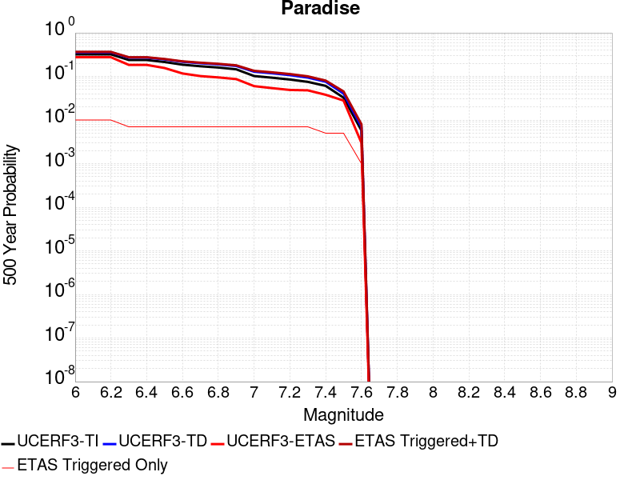 |

| Magnitude | 1 wk TI Prob | 1 wk TD Prob | 1 wk ETAS Prob | 1 wk ETAS/TD Gain | 1 wk ETAS Triggered+TD | 1 wk ETAS Triggered Only | 1 mo TI Prob | 1 mo TD Prob | 1 mo ETAS Prob | 1 mo ETAS/TD Gain | 1 mo ETAS Triggered+TD | 1 mo ETAS Triggered Only | 1 yr TI Prob | 1 yr TD Prob | 1 yr ETAS Prob | 1 yr ETAS/TD Gain | 1 yr ETAS Triggered+TD | 1 yr ETAS Triggered Only | 500 yr TI Prob | 500 yr TD Prob | 500 yr ETAS Prob | 500 yr ETAS/TD Gain | 500 yr ETAS Triggered+TD | 500 yr ETAS Triggered Only |
|-----|-----|-----|-----|-----|-----|-----|-----|-----|-----|-----|-----|-----|-----|-----|-----|-----|-----|-----|-----|-----|-----|-----|-----|-----|
| 6.0 | 1.4851273E-5 | 1.6619919E-5 | 0.0 | 0.0 | 1.6619919E-5 | 0.0 | 6.364676E-5 | 7.1226415E-5 | 0.0 | 0.0 | 7.1226415E-5 | 0.0 | 7.7462377E-4 | 8.6686E-4 | 0.0 | 0.0 | 8.6686E-4 | 0.0 | 0.32122254 | 0.35891065 | 0.276 | 0.7689937 | 0.36532152 | 0.01 |
| 6.1 | 1.4851273E-5 | 1.6619919E-5 | 0.0 | 0.0 | 1.6619919E-5 | 0.0 | 6.364676E-5 | 7.1226415E-5 | 0.0 | 0.0 | 7.1226415E-5 | 0.0 | 7.7462377E-4 | 8.6686E-4 | 0.0 | 0.0 | 8.6686E-4 | 0.0 | 0.32122254 | 0.35891065 | 0.276 | 0.7689937 | 0.36532152 | 0.01 |
| 6.2 | 1.4851273E-5 | 1.6619919E-5 | 0.0 | 0.0 | 1.6619919E-5 | 0.0 | 6.364676E-5 | 7.1226415E-5 | 0.0 | 0.0 | 7.1226415E-5 | 0.0 | 7.7462377E-4 | 8.6686E-4 | 0.0 | 0.0 | 8.6686E-4 | 0.0 | 0.32122254 | 0.35891065 | 0.276 | 0.7689937 | 0.36532152 | 0.01 |
| 6.3 | 1.0426831E-5 | 1.1835328E-5 | 0.0 | 0.0 | 1.1835328E-5 | 0.0 | 4.4685654E-5 | 5.0721883E-5 | 0.0 | 0.0 | 5.0721883E-5 | 0.0 | 5.43912E-4 | 6.1736983E-4 | 0.0 | 0.0 | 6.1736983E-4 | 0.0 | 0.23816858 | 0.27040565 | 0.184 | 0.6804592 | 0.2755128 | 0.007 |
| 6.4 | 1.0426831E-5 | 1.1835328E-5 | 0.0 | 0.0 | 1.1835328E-5 | 0.0 | 4.4685654E-5 | 5.0721883E-5 | 0.0 | 0.0 | 5.0721883E-5 | 0.0 | 5.43912E-4 | 6.1736983E-4 | 0.0 | 0.0 | 6.1736983E-4 | 0.0 | 0.23816858 | 0.27040565 | 0.184 | 0.6804592 | 0.2755128 | 0.007 |
| 6.5 | 9.25027E-6 | 1.05718145E-5 | 0.0 | 0.0 | 1.05718145E-5 | 0.0 | 3.964341E-5 | 4.5307017E-5 | 0.0 | 0.0 | 4.5307017E-5 | 0.0 | 4.8255164E-4 | 5.514782E-4 | 0.0 | 0.0 | 5.514782E-4 | 0.0 | 0.21442084 | 0.24580371 | 0.156 | 0.63465273 | 0.25108308 | 0.007 |
| 6.6 | 7.904275E-6 | 9.117823E-6 | 0.0 | 0.0 | 9.117823E-6 | 0.0 | 3.3875025E-5 | 3.907582E-5 | 0.0 | 0.0 | 3.907582E-5 | 0.0 | 4.1235037E-4 | 4.7564818E-4 | 0.0 | 0.0 | 4.7564818E-4 | 0.0 | 0.18634407 | 0.2165852 | 0.117 | 0.5402031 | 0.2220691 | 0.007 |
| 6.7 | 7.2061953E-6 | 8.3685745E-6 | 0.0 | 0.0 | 8.3685745E-6 | 0.0 | 3.088333E-5 | 3.5864847E-5 | 0.0 | 0.0 | 3.5864847E-5 | 0.0 | 3.7593965E-4 | 4.365707E-4 | 0.0 | 0.0 | 4.365707E-4 | 0.0 | 0.17138958 | 0.20110735 | 0.102 | 0.5071918 | 0.2066996 | 0.007 |
| 6.8 | 6.6948724E-6 | 7.805637E-6 | 0.0 | 0.0 | 7.805637E-6 | 0.0 | 2.8691995E-5 | 3.345232E-5 | 0.0 | 0.0 | 3.345232E-5 | 0.0 | 3.4926904E-4 | 4.0720945E-4 | 0.0 | 0.0 | 4.0720945E-4 | 0.0 | 0.16026174 | 0.1892619 | 0.095 | 0.50194997 | 0.19493707 | 0.007 |
| 6.9 | 6.0421025E-6 | 7.096791E-6 | 0.0 | 0.0 | 7.096791E-6 | 0.0 | 2.5894467E-5 | 3.0414481E-5 | 0.0 | 0.0 | 3.0414481E-5 | 0.0 | 3.1521954E-4 | 3.7023678E-4 | 0.0 | 0.0 | 3.7023678E-4 | 0.0 | 0.14583817 | 0.17410111 | 0.087 | 0.4997096 | 0.1798824 | 0.007 |
| 7.0 | 4.134091E-6 | 5.0539497E-6 | 0.0 | 0.0 | 5.0539497E-6 | 0.0 | 1.7717413E-5 | 2.1659613E-5 | 0.0 | 0.0 | 2.1659613E-5 | 0.0 | 2.1568815E-4 | 2.636754E-4 | 0.0 | 0.0 | 2.636754E-4 | 0.0 | 0.10224287 | 0.12844154 | 0.06 | 0.46713856 | 0.13454247 | 0.007 |
| 7.1 | 3.7674888E-6 | 4.6076893E-6 | 0.0 | 0.0 | 4.6076893E-6 | 0.0 | 1.6146281E-5 | 1.9747098E-5 | 0.0 | 0.0 | 1.9747098E-5 | 0.0 | 1.9656324E-4 | 2.4039591E-4 | 0.0 | 0.0 | 2.4039591E-4 | 0.0 | 0.093615144 | 0.11826517 | 0.054 | 0.45660105 | 0.12443731 | 0.007 |
| 7.2 | 3.4065345E-6 | 4.134937E-6 | 0.0 | 0.0 | 4.134937E-6 | 0.0 | 1.4599351E-5 | 1.7721048E-5 | 0.0 | 0.0 | 1.7721048E-5 | 0.0 | 1.777326E-4 | 2.1573387E-4 | 0.0 | 0.0 | 2.1573387E-4 | 0.0 | 0.08503933 | 0.10726259 | 0.049 | 0.45682284 | 0.11351175 | 0.007 |
| 7.3 | 2.9934936E-6 | 3.6110762E-6 | 0.0 | 0.0 | 3.6110762E-6 | 0.0 | 1.2829195E-5 | 1.5475958E-5 | 0.0 | 0.0 | 1.5475958E-5 | 0.0 | 1.5618425E-4 | 1.8840496E-4 | 0.0 | 0.0 | 1.8840496E-4 | 0.0 | 0.075126424 | 0.09426828 | 0.048 | 0.5091851 | 0.1006084 | 0.007 |
| 7.4 | 2.4049796E-6 | 2.8779734E-6 | 0.0 | 0.0 | 2.8779734E-6 | 0.0 | 1.0307015E-5 | 1.2334122E-5 | 0.0 | 0.0 | 1.2334122E-5 | 0.0 | 1.2548068E-4 | 1.5015902E-4 | 0.0 | 0.0 | 1.5015902E-4 | 0.0 | 0.060816385 | 0.075771555 | 0.038 | 0.50150746 | 0.080392696 | 0.005 |
| 7.5 | 1.2710091E-6 | 1.5079612E-6 | 0.0 | 0.0 | 1.5079612E-6 | 0.0 | 5.44717E-6 | 6.4626815E-6 | 0.0 | 0.0 | 6.4626815E-6 | 0.0 | 6.631728E-5 | 7.868155E-5 | 0.0 | 0.0 | 7.868155E-5 | 0.0 | 0.032615982 | 0.04047556 | 0.028 | 0.69177556 | 0.045273177 | 0.005 |
| 7.6 | 2.21172E-7 | 2.5988282E-7 | 0.0 | 0.0 | 2.5988282E-7 | 0.0 | 9.478797E-7 | 1.1137832E-6 | 0.0 | 0.0 | 1.1137832E-6 | 0.0 | 1.1540374E-5 | 1.3560255E-5 | 0.0 | 0.0 | 1.3560255E-5 | 0.0 | 0.0057536047 | 0.0069991336 | 0.003 | 0.42862448 | 0.007992134 | 0.001 |

## Owl Lake
*[(top)](#table-of-contents)*

| 1 Week | 1 Month | 1 Year | 500 Year |
|-----|-----|-----|-----|
| 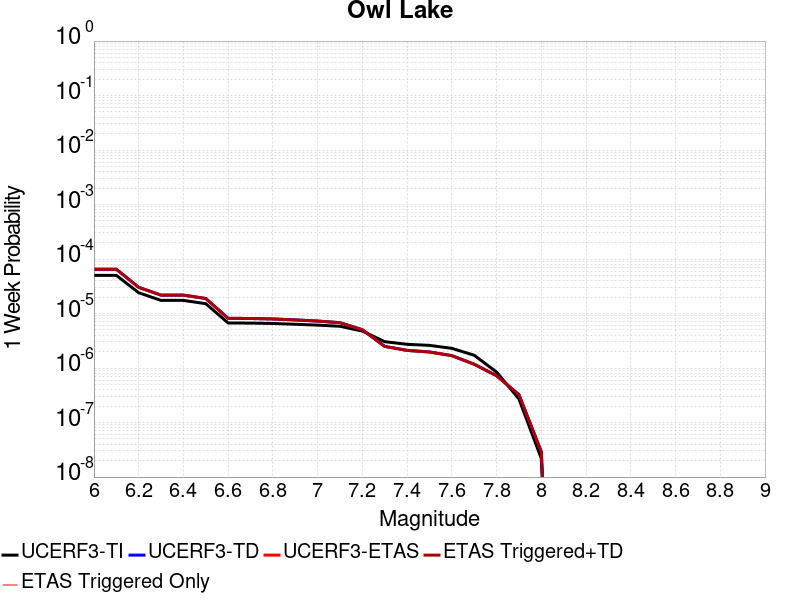 | 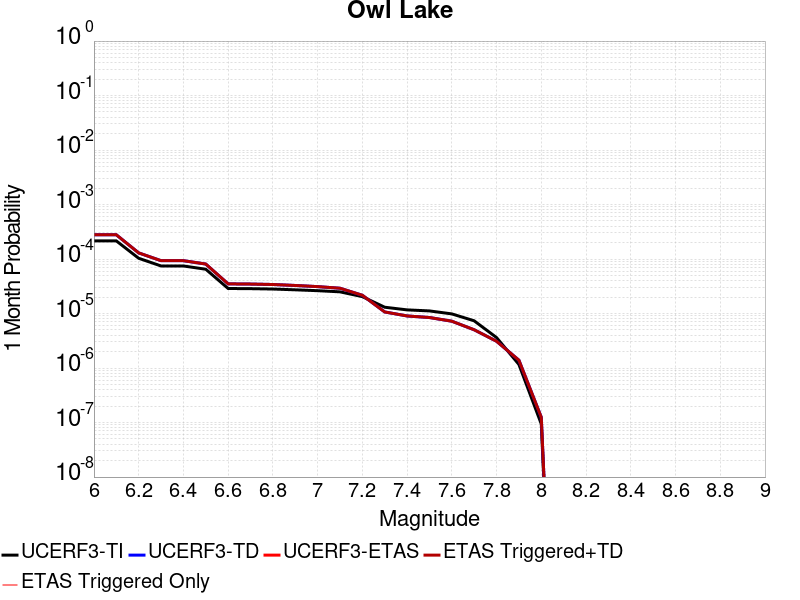 | 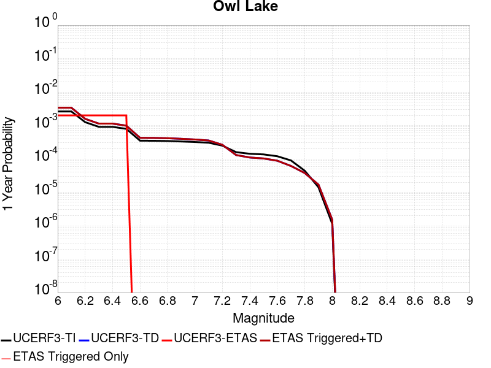 | 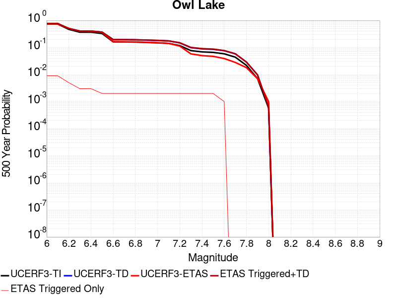 |

| Magnitude | 1 wk TI Prob | 1 wk TD Prob | 1 wk ETAS Prob | 1 wk ETAS/TD Gain | 1 wk ETAS Triggered+TD | 1 wk ETAS Triggered Only | 1 mo TI Prob | 1 mo TD Prob | 1 mo ETAS Prob | 1 mo ETAS/TD Gain | 1 mo ETAS Triggered+TD | 1 mo ETAS Triggered Only | 1 yr TI Prob | 1 yr TD Prob | 1 yr ETAS Prob | 1 yr ETAS/TD Gain | 1 yr ETAS Triggered+TD | 1 yr ETAS Triggered Only | 500 yr TI Prob | 500 yr TD Prob | 500 yr ETAS Prob | 500 yr ETAS/TD Gain | 500 yr ETAS Triggered+TD | 500 yr ETAS Triggered Only |
|-----|-----|-----|-----|-----|-----|-----|-----|-----|-----|-----|-----|-----|-----|-----|-----|-----|-----|-----|-----|-----|-----|-----|-----|-----|
| 6.0 | 5.0320643E-5 | 6.507134E-5 | 0.0 | 0.0 | 6.507134E-5 | 0.0 | 2.1564208E-4 | 2.788533E-4 | 0.0 | 0.0 | 2.788533E-4 | 0.0 | 0.0026222812 | 0.0033906817 | 0.002 | 0.58985186 | 0.0033906817 | 0.0 | 0.73095125 | 0.76536375 | 0.726 | 0.9485686 | 0.7674754 | 0.009 |
| 6.1 | 5.0320643E-5 | 6.507134E-5 | 0.0 | 0.0 | 6.507134E-5 | 0.0 | 2.1564208E-4 | 2.788533E-4 | 0.0 | 0.0 | 2.788533E-4 | 0.0 | 0.0026222812 | 0.0033906817 | 0.002 | 0.58985186 | 0.0033906817 | 0.0 | 0.73095125 | 0.76536375 | 0.726 | 0.9485686 | 0.7674754 | 0.009 |
| 6.2 | 2.4125871E-5 | 3.0290528E-5 | 0.0 | 0.0 | 3.0290528E-5 | 0.0 | 1.0339249E-4 | 1.2981107E-4 | 0.0 | 0.0 | 1.2981107E-4 | 0.0 | 0.0012580766 | 0.0015794813 | 0.002 | 1.2662385 | 0.0015794813 | 0.0 | 0.46710685 | 0.5001169 | 0.509 | 1.0177621 | 0.5026163 | 0.005 |
| 6.3 | 1.7433485E-5 | 2.1790278E-5 | 0.0 | 0.0 | 2.1790278E-5 | 0.0 | 7.471279E-5 | 9.338443E-5 | 0.0 | 0.0 | 9.338443E-5 | 0.0 | 9.0924866E-4 | 0.0011365036 | 0.002 | 1.7597831 | 0.0011365036 | 0.0 | 0.36544487 | 0.40319157 | 0.397 | 0.98464364 | 0.404982 | 0.003 |
| 6.4 | 1.7433485E-5 | 2.1790278E-5 | 0.0 | 0.0 | 2.1790278E-5 | 0.0 | 7.471279E-5 | 9.338443E-5 | 0.0 | 0.0 | 9.338443E-5 | 0.0 | 9.0924866E-4 | 0.0011365036 | 0.002 | 1.7597831 | 0.0011365036 | 0.0 | 0.36544487 | 0.40319157 | 0.397 | 0.98464364 | 0.404982 | 0.003 |
| 6.5 | 1.5182742E-5 | 1.890725E-5 | 0.0 | 0.0 | 1.890725E-5 | 0.0 | 6.506727E-5 | 8.1029386E-5 | 0.0 | 0.0 | 8.1029386E-5 | 0.0 | 7.919061E-4 | 9.862238E-4 | 0.002 | 2.0279374 | 9.862238E-4 | 0.0 | 0.32706726 | 0.36772835 | 0.36 | 0.9789835 | 0.3689929 | 0.002 |
| 6.6 | 6.7271576E-6 | 8.181578E-6 | 0.0 | 0.0 | 8.181578E-6 | 0.0 | 2.8830356E-5 | 3.5063462E-5 | 0.0 | 0.0 | 3.5063462E-5 | 0.0 | 3.5095305E-4 | 4.2681937E-4 | 0.0 | 0.0 | 4.2681937E-4 | 0.0 | 0.16096875 | 0.19476612 | 0.165 | 0.84716994 | 0.19637658 | 0.002 |
| 6.7 | 6.682835E-6 | 8.114888E-6 | 0.0 | 0.0 | 8.114888E-6 | 0.0 | 2.8640408E-5 | 3.477766E-5 | 0.0 | 0.0 | 3.477766E-5 | 0.0 | 3.4864116E-4 | 4.2334106E-4 | 0.0 | 0.0 | 4.2334106E-4 | 0.0 | 0.15999798 | 0.19378339 | 0.162 | 0.835985 | 0.19539581 | 0.002 |
| 6.8 | 6.5774975E-6 | 7.9643005E-6 | 0.0 | 0.0 | 7.9643005E-6 | 0.0 | 2.8188972E-5 | 3.41323E-5 | 0.0 | 0.0 | 3.41323E-5 | 0.0 | 3.4314668E-4 | 4.154868E-4 | 0.0 | 0.0 | 4.154868E-4 | 0.0 | 0.15768631 | 0.19134046 | 0.16 | 0.8362058 | 0.19295777 | 0.002 |
| 6.9 | 6.363419E-6 | 7.64394E-6 | 0.0 | 0.0 | 7.64394E-6 | 0.0 | 2.727151E-5 | 3.275936E-5 | 0.0 | 0.0 | 3.275936E-5 | 0.0 | 3.3198006E-4 | 3.9877748E-4 | 0.0 | 0.0 | 3.9877748E-4 | 0.0 | 0.15296866 | 0.1863125 | 0.155 | 0.83193564 | 0.18793987 | 0.002 |
| 7.0 | 6.1342453E-6 | 7.283425E-6 | 0.0 | 0.0 | 7.283425E-6 | 0.0 | 2.6289357E-5 | 3.1214335E-5 | 0.0 | 0.0 | 3.1214335E-5 | 0.0 | 3.2002592E-4 | 3.7997344E-4 | 0.0 | 0.0 | 3.7997344E-4 | 0.0 | 0.14788908 | 0.18085843 | 0.15 | 0.82937795 | 0.18249671 | 0.002 |
| 7.1 | 5.842926E-6 | 6.8035574E-6 | 0.0 | 0.0 | 6.8035574E-6 | 0.0 | 2.504087E-5 | 2.9157805E-5 | 0.0 | 0.0 | 2.9157805E-5 | 0.0 | 3.0482994E-4 | 3.5494354E-4 | 0.0 | 0.0 | 3.5494354E-4 | 0.0 | 0.14138806 | 0.17383476 | 0.141 | 0.81111515 | 0.17548709 | 0.002 |
| 7.2 | 4.77173E-6 | 5.055286E-6 | 0.0 | 0.0 | 5.055286E-6 | 0.0 | 2.045011E-5 | 2.1665352E-5 | 0.0 | 0.0 | 2.1665352E-5 | 0.0 | 2.4895166E-4 | 2.637475E-4 | 0.0 | 0.0 | 2.637475E-4 | 0.0 | 0.117054075 | 0.14720869 | 0.112 | 0.7608247 | 0.14891426 | 0.002 |
| 7.3 | 3.0494948E-6 | 2.4983942E-6 | 0.0 | 0.0 | 2.4983942E-6 | 0.0 | 1.3069198E-5 | 1.0707361E-5 | 0.0 | 0.0 | 1.0707361E-5 | 0.0 | 1.5910587E-4 | 1.3035447E-4 | 0.0 | 0.0 | 1.3035447E-4 | 0.0 | 0.07647671 | 0.09840169 | 0.058 | 0.5894208 | 0.100204885 | 0.002 |
| 7.4 | 2.7263884E-6 | 2.1092205E-6 | 0.0 | 0.0 | 2.1092205E-6 | 0.0 | 1.1684469E-5 | 9.039486E-6 | 0.0 | 0.0 | 9.039486E-6 | 0.0 | 1.4224913E-4 | 1.1005027E-4 | 0.0 | 0.0 | 1.1005027E-4 | 0.0 | 0.06865884 | 0.088767104 | 0.05 | 0.5632717 | 0.090589575 | 0.002 |
| 7.5 | 2.6090431E-6 | 1.973904E-6 | 0.0 | 0.0 | 1.973904E-6 | 0.0 | 1.1181565E-5 | 8.459561E-6 | 0.0 | 0.0 | 8.459561E-6 | 0.0 | 1.3612706E-4 | 1.0299038E-4 | 0.0 | 0.0 | 1.0299038E-4 | 0.0 | 0.06580321 | 0.08518713 | 0.047 | 0.5517265 | 0.08701676 | 0.002 |
| 7.6 | 2.3008756E-6 | 1.689434E-6 | 0.0 | 0.0 | 1.689434E-6 | 0.0 | 9.860858E-6 | 7.240412E-6 | 0.0 | 0.0 | 7.240412E-6 | 0.0 | 1.20049335E-4 | 8.814852E-5 | 0.0 | 0.0 | 8.814852E-5 | 0.0 | 0.05826209 | 0.07587056 | 0.039 | 0.5140334 | 0.076794684 | 0.001 |
| 7.7 | 1.7184348E-6 | 1.1763431E-6 | 0.0 | 0.0 | 1.1763431E-6 | 0.0 | 7.3646997E-6 | 5.0414606E-6 | 0.0 | 0.0 | 5.0414606E-6 | 0.0 | 8.966153E-5 | 6.137809E-5 | 0.0 | 0.0 | 6.137809E-5 | 0.0 | 0.043842636 | 0.058239345 | 0.028 | 0.48077467 | 0.058239345 | 0.0 |
| 7.8 | 8.4612907E-7 | 7.241811E-7 | 0.0 | 0.0 | 7.241811E-7 | 0.0 | 3.6262625E-6 | 3.10363E-6 | 0.0 | 0.0 | 3.10363E-6 | 0.0 | 4.4148852E-5 | 3.7786056E-5 | 0.0 | 0.0 | 3.7786056E-5 | 0.0 | 0.021833045 | 0.02891925 | 0.018 | 0.62242275 | 0.02891925 | 0.0 |
| 7.9 | 2.716738E-7 | 3.2538202E-7 | 0.0 | 0.0 | 3.2538202E-7 | 0.0 | 1.1643157E-6 | 1.3944937E-6 | 0.0 | 0.0 | 1.3944937E-6 | 0.0 | 1.4175452E-5 | 1.6977836E-5 | 0.0 | 0.0 | 1.6977836E-5 | 0.0 | 0.007062717 | 0.009755318 | 0.007 | 0.7175573 | 0.009755318 | 0.0 |
| 8.0 | 2.1995428E-8 | 2.9187852E-8 | 0.0 | 0.0 | 2.9187852E-8 | 0.0 | 9.426611E-8 | 1.2509079E-7 | 0.0 | 0.0 | 1.2509079E-7 | 0.0 | 1.1476893E-6 | 1.5229798E-6 | 0.0 | 0.0 | 1.5229798E-6 | 0.0 | 5.736804E-4 | 6.287864E-4 | 0.001 | 1.5903652 | 6.287864E-4 | 0.0 |

## Tank Canyon
*[(top)](#table-of-contents)*

| 1 Week | 1 Month | 1 Year | 500 Year |
|-----|-----|-----|-----|
|  | 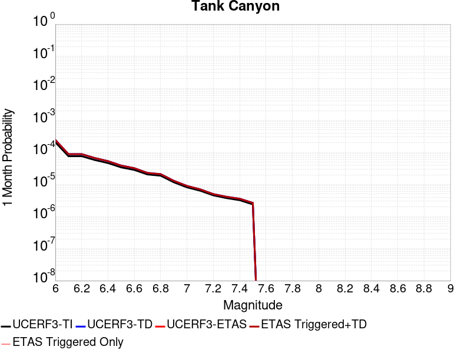 | 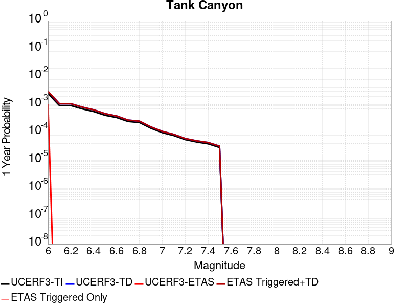 | 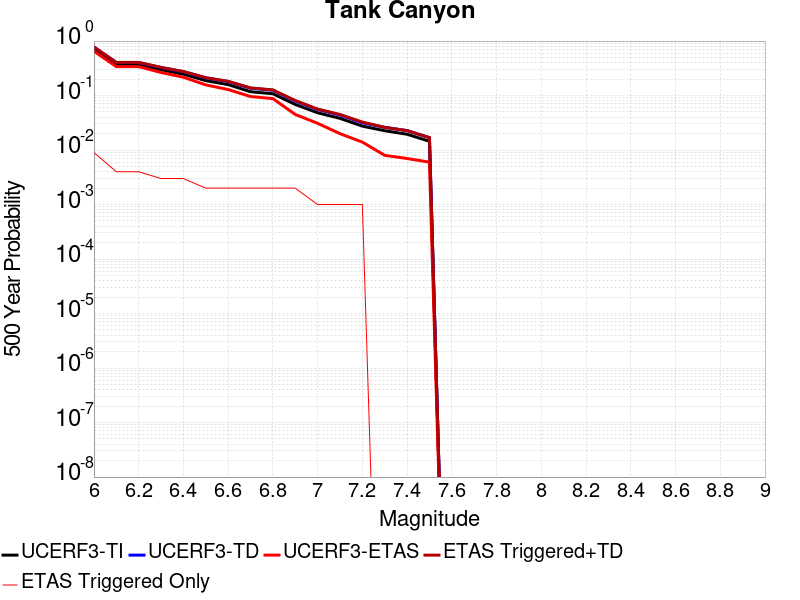 |

| Magnitude | 1 wk TI Prob | 1 wk TD Prob | 1 wk ETAS Prob | 1 wk ETAS/TD Gain | 1 wk ETAS Triggered+TD | 1 wk ETAS Triggered Only | 1 mo TI Prob | 1 mo TD Prob | 1 mo ETAS Prob | 1 mo ETAS/TD Gain | 1 mo ETAS Triggered+TD | 1 mo ETAS Triggered Only | 1 yr TI Prob | 1 yr TD Prob | 1 yr ETAS Prob | 1 yr ETAS/TD Gain | 1 yr ETAS Triggered+TD | 1 yr ETAS Triggered Only | 500 yr TI Prob | 500 yr TD Prob | 500 yr ETAS Prob | 500 yr ETAS/TD Gain | 500 yr ETAS Triggered+TD | 500 yr ETAS Triggered Only |
|-----|-----|-----|-----|-----|-----|-----|-----|-----|-----|-----|-----|-----|-----|-----|-----|-----|-----|-----|-----|-----|-----|-----|-----|-----|
| 6.0 | 4.8284557E-5 | 5.7329697E-5 | 0.0 | 0.0 | 5.7329697E-5 | 0.0 | 2.0691741E-4 | 2.4567932E-4 | 0.0 | 0.0 | 2.4567932E-4 | 0.0 | 0.0025163088 | 0.0029876956 | 0.001 | 0.33470613 | 0.0029876956 | 0.0 | 0.71627223 | 0.7771012 | 0.651 | 0.8377287 | 0.77910733 | 0.009 |
| 6.1 | 1.7796336E-5 | 2.0651674E-5 | 0.0 | 0.0 | 2.0651674E-5 | 0.0 | 7.626778E-5 | 8.8504385E-5 | 0.0 | 0.0 | 8.8504385E-5 | 0.0 | 9.281647E-4 | 0.0010770458 | 0.0 | 0.0 | 0.0010770458 | 0.0 | 0.3714237 | 0.40379223 | 0.34 | 0.8420172 | 0.40617707 | 0.004 |
| 6.2 | 1.7796336E-5 | 2.0651674E-5 | 0.0 | 0.0 | 2.0651674E-5 | 0.0 | 7.626778E-5 | 8.8504385E-5 | 0.0 | 0.0 | 8.8504385E-5 | 0.0 | 9.281647E-4 | 0.0010770458 | 0.0 | 0.0 | 0.0010770458 | 0.0 | 0.3714237 | 0.40379223 | 0.34 | 0.8420172 | 0.40617707 | 0.004 |
| 6.3 | 1.3515912E-5 | 1.5589225E-5 | 0.0 | 0.0 | 1.5589225E-5 | 0.0 | 5.792405E-5 | 6.6809385E-5 | 0.0 | 0.0 | 6.6809385E-5 | 0.0 | 7.049971E-4 | 8.1312394E-4 | 0.0 | 0.0 | 8.1312394E-4 | 0.0 | 0.2971578 | 0.32672575 | 0.265 | 0.8110778 | 0.32874557 | 0.003 |
| 6.4 | 1.0870146E-5 | 1.2477996E-5 | 0.0 | 0.0 | 1.2477996E-5 | 0.0 | 4.658551E-5 | 5.347613E-5 | 0.0 | 0.0 | 5.347613E-5 | 0.0 | 5.67031E-4 | 6.5089477E-4 | 0.0 | 0.0 | 6.5089477E-4 | 0.0 | 0.2469291 | 0.2743093 | 0.217 | 0.7910778 | 0.27648637 | 0.003 |
| 6.5 | 7.964826E-6 | 9.087502E-6 | 0.0 | 0.0 | 9.087502E-6 | 0.0 | 3.4134522E-5 | 3.8945913E-5 | 0.0 | 0.0 | 3.8945913E-5 | 0.0 | 4.1550855E-4 | 4.740737E-4 | 0.0 | 0.0 | 4.740737E-4 | 0.0 | 0.18762843 | 0.21133713 | 0.157 | 0.7428888 | 0.21291447 | 0.002 |
| 6.6 | 6.6317E-6 | 7.5194957E-6 | 0.0 | 0.0 | 7.5194957E-6 | 0.0 | 2.8421264E-5 | 3.2226064E-5 | 0.0 | 0.0 | 3.2226064E-5 | 0.0 | 3.4597394E-4 | 3.9229056E-4 | 0.0 | 0.0 | 3.9229056E-4 | 0.0 | 0.1588766 | 0.18089607 | 0.129 | 0.71311665 | 0.18253429 | 0.002 |
| 6.7 | 4.793663E-6 | 5.3588938E-6 | 0.0 | 0.0 | 5.3588938E-6 | 0.0 | 2.0544108E-5 | 2.296651E-5 | 0.0 | 0.0 | 2.296651E-5 | 0.0 | 2.500958E-4 | 2.7958563E-4 | 0.0 | 0.0 | 2.7958563E-4 | 0.0 | 0.11755917 | 0.13640557 | 0.096 | 0.7037835 | 0.13813277 | 0.002 |
| 6.8 | 4.382823E-6 | 4.9033274E-6 | 0.0 | 0.0 | 4.9033274E-6 | 0.0 | 1.8783392E-5 | 2.1014113E-5 | 0.0 | 0.0 | 2.1014113E-5 | 0.0 | 2.286638E-4 | 2.5582095E-4 | 0.0 | 0.0 | 2.5582095E-4 | 0.0 | 0.1080498 | 0.12535119 | 0.088 | 0.7020277 | 0.12710048 | 0.002 |
| 6.9 | 2.729601E-6 | 3.0413264E-6 | 0.0 | 0.0 | 3.0413264E-6 | 0.0 | 1.1698237E-5 | 1.3034198E-5 | 0.0 | 0.0 | 1.3034198E-5 | 0.0 | 1.4241673E-4 | 1.5868101E-4 | 0.0 | 0.0 | 1.5868101E-4 | 0.0 | 0.068736896 | 0.0793259 | 0.045 | 0.56728005 | 0.08116724 | 0.002 |
| 7.0 | 1.8987357E-6 | 2.102971E-6 | 0.0 | 0.0 | 2.102971E-6 | 0.0 | 8.137413E-6 | 9.012705E-6 | 0.0 | 0.0 | 9.012705E-6 | 0.0 | 9.90685E-5 | 1.09724846E-4 | 0.0 | 0.0 | 1.09724846E-4 | 0.0 | 0.048329774 | 0.055638567 | 0.031 | 0.5571675 | 0.056582928 | 0.001 |
| 7.1 | 1.4928986E-6 | 1.6462965E-6 | 0.0 | 0.0 | 1.6462965E-6 | 0.0 | 6.398121E-6 | 7.0555407E-6 | 0.0 | 0.0 | 7.0555407E-6 | 0.0 | 7.789434E-5 | 8.589839E-5 | 0.0 | 0.0 | 8.589839E-5 | 0.0 | 0.03819994 | 0.043967437 | 0.02 | 0.45488212 | 0.04492347 | 0.001 |
| 7.2 | 1.069082E-6 | 1.1682298E-6 | 0.0 | 0.0 | 1.1682298E-6 | 0.0 | 4.581772E-6 | 5.006693E-6 | 0.0 | 0.0 | 5.006693E-6 | 0.0 | 5.5781646E-5 | 6.0955295E-5 | 0.0 | 0.0 | 6.0955295E-5 | 0.0 | 0.027506221 | 0.03169516 | 0.014 | 0.44170782 | 0.032663465 | 0.001 |
| 7.3 | 8.776551E-7 | 9.651428E-7 | 0.0 | 0.0 | 9.651428E-7 | 0.0 | 3.7613736E-6 | 4.1363223E-6 | 0.0 | 0.0 | 4.1363223E-6 | 0.0 | 4.579376E-5 | 5.0359067E-5 | 0.0 | 0.0 | 5.0359067E-5 | 0.0 | 0.02263725 | 0.026079962 | 0.008 | 0.30674893 | 0.026079962 | 0.0 |
| 7.4 | 7.55721E-7 | 8.400313E-7 | 0.0 | 0.0 | 8.400313E-7 | 0.0 | 3.2388E-6 | 3.600132E-6 | 0.0 | 0.0 | 3.600132E-6 | 0.0 | 3.9431678E-5 | 4.383123E-5 | 0.0 | 0.0 | 4.383123E-5 | 0.0 | 0.019523134 | 0.02275028 | 0.007 | 0.3076885 | 0.02275028 | 0.0 |
| 7.5 | 5.587665E-7 | 6.221743E-7 | 0.0 | 0.0 | 6.221743E-7 | 0.0 | 2.3947114E-6 | 2.6664611E-6 | 0.0 | 0.0 | 2.6664611E-6 | 0.0 | 2.915522E-5 | 3.2464166E-5 | 0.0 | 0.0 | 3.2464166E-5 | 0.0 | 0.01447208 | 0.016905947 | 0.006 | 0.35490468 | 0.016905947 | 0.0 |

## Channel Islands Thrust
*[(top)](#table-of-contents)*

| 1 Week | 1 Month | 1 Year | 500 Year |
|-----|-----|-----|-----|
|  |  | 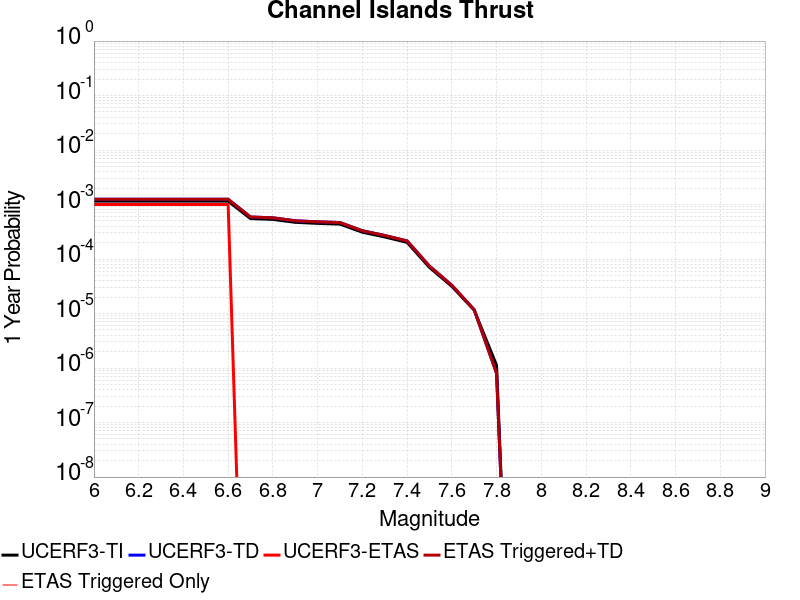 | 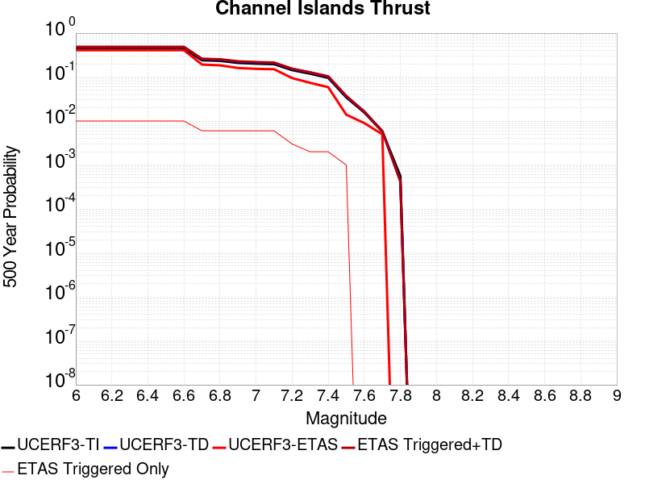 |

| Magnitude | 1 wk TI Prob | 1 wk TD Prob | 1 wk ETAS Prob | 1 wk ETAS/TD Gain | 1 wk ETAS Triggered+TD | 1 wk ETAS Triggered Only | 1 mo TI Prob | 1 mo TD Prob | 1 mo ETAS Prob | 1 mo ETAS/TD Gain | 1 mo ETAS Triggered+TD | 1 mo ETAS Triggered Only | 1 yr TI Prob | 1 yr TD Prob | 1 yr ETAS Prob | 1 yr ETAS/TD Gain | 1 yr ETAS Triggered+TD | 1 yr ETAS Triggered Only | 500 yr TI Prob | 500 yr TD Prob | 500 yr ETAS Prob | 500 yr ETAS/TD Gain | 500 yr ETAS Triggered+TD | 500 yr ETAS Triggered Only |
|-----|-----|-----|-----|-----|-----|-----|-----|-----|-----|-----|-----|-----|-----|-----|-----|-----|-----|-----|-----|-----|-----|-----|-----|-----|
| 6.0 | 2.2156251E-5 | 2.3982326E-5 | 0.0 | 0.0 | 2.3982326E-5 | 0.0 | 9.495191E-5 | 1.0277794E-4 | 0.0 | 0.0 | 1.0277794E-4 | 0.0 | 0.0011554264 | 0.0012507086 | 0.001 | 0.7995467 | 0.0012507086 | 0.0 | 0.4390072 | 0.48035893 | 0.408 | 0.8493649 | 0.48555532 | 0.01 |
| 6.1 | 2.2156251E-5 | 2.3982326E-5 | 0.0 | 0.0 | 2.3982326E-5 | 0.0 | 9.495191E-5 | 1.0277794E-4 | 0.0 | 0.0 | 1.0277794E-4 | 0.0 | 0.0011554264 | 0.0012507086 | 0.001 | 0.7995467 | 0.0012507086 | 0.0 | 0.4390072 | 0.48035893 | 0.408 | 0.8493649 | 0.48555532 | 0.01 |
| 6.2 | 2.2156251E-5 | 2.3982326E-5 | 0.0 | 0.0 | 2.3982326E-5 | 0.0 | 9.495191E-5 | 1.0277794E-4 | 0.0 | 0.0 | 1.0277794E-4 | 0.0 | 0.0011554264 | 0.0012507086 | 0.001 | 0.7995467 | 0.0012507086 | 0.0 | 0.4390072 | 0.48035893 | 0.408 | 0.8493649 | 0.48555532 | 0.01 |
| 6.3 | 2.2156251E-5 | 2.3982326E-5 | 0.0 | 0.0 | 2.3982326E-5 | 0.0 | 9.495191E-5 | 1.0277794E-4 | 0.0 | 0.0 | 1.0277794E-4 | 0.0 | 0.0011554264 | 0.0012507086 | 0.001 | 0.7995467 | 0.0012507086 | 0.0 | 0.4390072 | 0.48035893 | 0.408 | 0.8493649 | 0.48555532 | 0.01 |
| 6.4 | 2.2156251E-5 | 2.3982326E-5 | 0.0 | 0.0 | 2.3982326E-5 | 0.0 | 9.495191E-5 | 1.0277794E-4 | 0.0 | 0.0 | 1.0277794E-4 | 0.0 | 0.0011554264 | 0.0012507086 | 0.001 | 0.7995467 | 0.0012507086 | 0.0 | 0.4390072 | 0.48035893 | 0.408 | 0.8493649 | 0.48555532 | 0.01 |
| 6.5 | 2.2156251E-5 | 2.3982326E-5 | 0.0 | 0.0 | 2.3982326E-5 | 0.0 | 9.495191E-5 | 1.0277794E-4 | 0.0 | 0.0 | 1.0277794E-4 | 0.0 | 0.0011554264 | 0.0012507086 | 0.001 | 0.7995467 | 0.0012507086 | 0.0 | 0.4390072 | 0.48035893 | 0.408 | 0.8493649 | 0.48555532 | 0.01 |
| 6.6 | 2.2156251E-5 | 2.3982326E-5 | 0.0 | 0.0 | 2.3982326E-5 | 0.0 | 9.495191E-5 | 1.0277794E-4 | 0.0 | 0.0 | 1.0277794E-4 | 0.0 | 0.0011554264 | 0.0012507086 | 0.001 | 0.7995467 | 0.0012507086 | 0.0 | 0.4390072 | 0.48035893 | 0.408 | 0.8493649 | 0.48555532 | 0.01 |
| 6.7 | 1.0601296E-5 | 1.1335699E-5 | 0.0 | 0.0 | 1.1335699E-5 | 0.0 | 4.5433335E-5 | 4.858069E-5 | 0.0 | 0.0 | 4.858069E-5 | 0.0 | 5.5301044E-4 | 5.913142E-4 | 0.0 | 0.0 | 5.913142E-4 | 0.0 | 0.24162835 | 0.25700834 | 0.193 | 0.7509484 | 0.2614663 | 0.006 |
| 6.8 | 1.0246747E-5 | 1.0954407E-5 | 0.0 | 0.0 | 1.0954407E-5 | 0.0 | 4.391389E-5 | 4.6946643E-5 | 0.0 | 0.0 | 4.6946643E-5 | 0.0 | 5.345204E-4 | 5.714302E-4 | 0.0 | 0.0 | 5.714302E-4 | 0.0 | 0.23458084 | 0.24956256 | 0.185 | 0.7412971 | 0.2540652 | 0.006 |
| 6.9 | 9.049551E-6 | 9.662983E-6 | 0.0 | 0.0 | 9.662983E-6 | 0.0 | 3.878322E-5 | 4.141215E-5 | 0.0 | 0.0 | 4.141215E-5 | 0.0 | 4.7208337E-4 | 5.040804E-4 | 0.0 | 0.0 | 5.040804E-4 | 0.0 | 0.21029626 | 0.22371742 | 0.161 | 0.71965784 | 0.22837512 | 0.006 |
| 7.0 | 8.6542195E-6 | 9.239596E-6 | 0.0 | 0.0 | 9.239596E-6 | 0.0 | 3.7088983E-5 | 3.959769E-5 | 0.0 | 0.0 | 3.959769E-5 | 0.0 | 4.5146482E-4 | 4.8199928E-4 | 0.0 | 0.0 | 4.8199928E-4 | 0.0 | 0.20210907 | 0.21508926 | 0.154 | 0.71598184 | 0.21979871 | 0.006 |
| 7.1 | 8.391028E-6 | 8.958943E-6 | 0.0 | 0.0 | 8.958943E-6 | 0.0 | 3.5961057E-5 | 3.8394926E-5 | 0.0 | 0.0 | 3.8394926E-5 | 0.0 | 4.3773788E-4 | 4.67362E-4 | 0.0 | 0.0 | 4.67362E-4 | 0.0 | 0.1966115 | 0.20932008 | 0.151 | 0.7213832 | 0.21406417 | 0.006 |
| 7.2 | 5.965188E-6 | 6.348658E-6 | 0.0 | 0.0 | 6.348658E-6 | 0.0 | 2.556484E-5 | 2.7208254E-5 | 0.0 | 0.0 | 2.7208254E-5 | 0.0 | 3.1120746E-4 | 3.312107E-4 | 0.0 | 0.0 | 3.312107E-4 | 0.0 | 0.14412244 | 0.15279576 | 0.095 | 0.621745 | 0.15533738 | 0.003 |
| 7.3 | 4.877518E-6 | 5.187305E-6 | 0.0 | 0.0 | 5.187305E-6 | 0.0 | 2.0903482E-5 | 2.223112E-5 | 0.0 | 0.0 | 2.223112E-5 | 0.0 | 2.5447016E-4 | 2.706307E-4 | 0.0 | 0.0 | 2.706307E-4 | 0.0 | 0.119487606 | 0.1267096 | 0.074 | 0.5840126 | 0.12845618 | 0.002 |
| 7.4 | 3.8829853E-6 | 4.127022E-6 | 0.0 | 0.0 | 4.127022E-6 | 0.0 | 1.664126E-5 | 1.7687118E-5 | 0.0 | 0.0 | 1.7687118E-5 | 0.0 | 2.0258849E-4 | 2.153198E-4 | 0.0 | 0.0 | 2.153198E-4 | 0.0 | 0.096342176 | 0.10220687 | 0.059 | 0.5772606 | 0.10400246 | 0.002 |
| 7.5 | 1.3489616E-6 | 1.4229473E-6 | 0.0 | 0.0 | 1.4229473E-6 | 0.0 | 5.7812517E-6 | 6.0983316E-6 | 0.0 | 0.0 | 6.0983316E-6 | 0.0 | 7.038446E-5 | 7.42447E-5 | 0.0 | 0.0 | 7.42447E-5 | 0.0 | 0.03458138 | 0.03648416 | 0.014 | 0.38372818 | 0.037447676 | 0.001 |
| 7.6 | 6.058192E-7 | 6.332669E-7 | 0.0 | 0.0 | 6.332669E-7 | 0.0 | 2.5963652E-6 | 2.7139981E-6 | 0.0 | 0.0 | 2.7139981E-6 | 0.0 | 3.161029E-5 | 3.3042445E-5 | 0.0 | 0.0 | 3.3042445E-5 | 0.0 | 0.015681144 | 0.016421307 | 0.009 | 0.5480684 | 0.016421307 | 0.0 |
| 7.7 | 2.2170494E-7 | 2.2538269E-7 | 0.0 | 0.0 | 2.2538269E-7 | 0.0 | 9.5016367E-7 | 9.659256E-7 | 0.0 | 0.0 | 9.659256E-7 | 0.0 | 1.1568181E-5 | 1.1760091E-5 | 0.0 | 0.0 | 1.1760091E-5 | 0.0 | 0.0057674283 | 0.0058965846 | 0.005 | 0.8479485 | 0.0058965846 | 0.0 |
| 7.8 | 2.1613102E-8 | 1.5419797E-8 | 0.0 | 0.0 | 1.5419797E-8 | 0.0 | 9.262757E-8 | 6.6084844E-8 | 0.0 | 0.0 | 6.6084844E-8 | 0.0 | 1.1277401E-6 | 8.045827E-7 | 0.0 | 0.0 | 8.045827E-7 | 0.0 | 5.6371145E-4 | 4.2868152E-4 | 0.0 | 0.0 | 4.2868152E-4 | 0.0 |

## Earthquake Valley (So Extension)
*[(top)](#table-of-contents)*

| 1 Week | 1 Month | 1 Year | 500 Year |
|-----|-----|-----|-----|
| 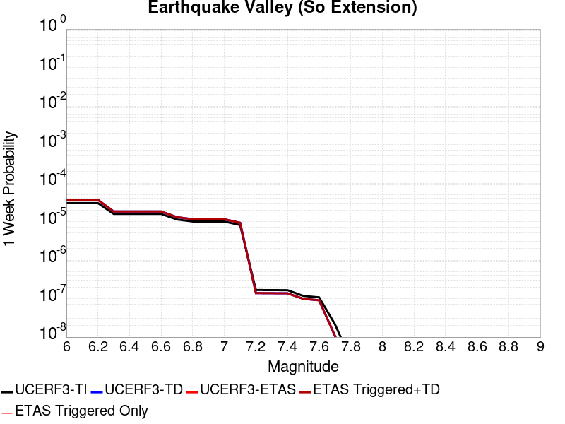 | 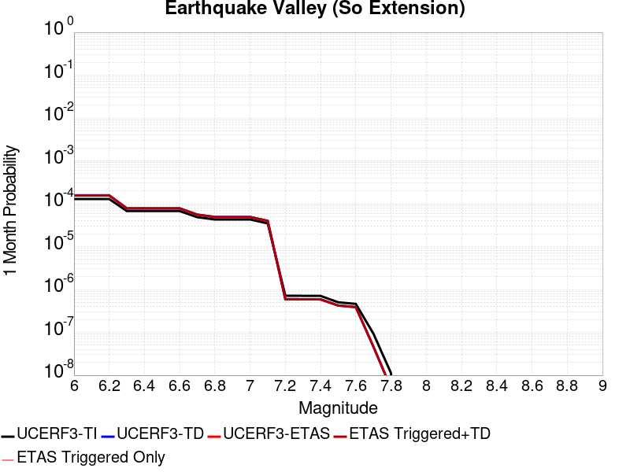 | 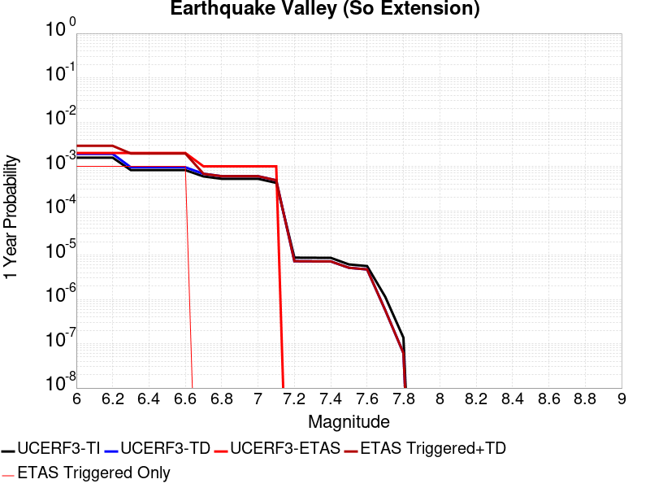 | 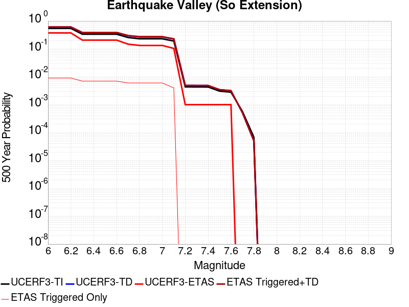 |

| Magnitude | 1 wk TI Prob | 1 wk TD Prob | 1 wk ETAS Prob | 1 wk ETAS/TD Gain | 1 wk ETAS Triggered+TD | 1 wk ETAS Triggered Only | 1 mo TI Prob | 1 mo TD Prob | 1 mo ETAS Prob | 1 mo ETAS/TD Gain | 1 mo ETAS Triggered+TD | 1 mo ETAS Triggered Only | 1 yr TI Prob | 1 yr TD Prob | 1 yr ETAS Prob | 1 yr ETAS/TD Gain | 1 yr ETAS Triggered+TD | 1 yr ETAS Triggered Only | 500 yr TI Prob | 500 yr TD Prob | 500 yr ETAS Prob | 500 yr ETAS/TD Gain | 500 yr ETAS Triggered+TD | 500 yr ETAS Triggered Only |
|-----|-----|-----|-----|-----|-----|-----|-----|-----|-----|-----|-----|-----|-----|-----|-----|-----|-----|-----|-----|-----|-----|-----|-----|-----|
| 6.0 | 3.0194888E-5 | 3.6634283E-5 | 0.0 | 0.0 | 3.6634283E-5 | 0.0 | 1.2940024E-4 | 1.5699762E-4 | 0.0 | 0.0 | 1.5699762E-4 | 0.0 | 0.0015743093 | 0.0019102766 | 0.002 | 1.0469688 | 0.0029083663 | 0.001 | 0.54514426 | 0.6072142 | 0.374 | 0.61592764 | 0.6107493 | 0.009 |
| 6.1 | 3.0194888E-5 | 3.6634283E-5 | 0.0 | 0.0 | 3.6634283E-5 | 0.0 | 1.2940024E-4 | 1.5699762E-4 | 0.0 | 0.0 | 1.5699762E-4 | 0.0 | 0.0015743093 | 0.0019102766 | 0.002 | 1.0469688 | 0.0029083663 | 0.001 | 0.54514426 | 0.6072142 | 0.374 | 0.61592764 | 0.6107493 | 0.009 |
| 6.2 | 3.0194888E-5 | 3.6634283E-5 | 0.0 | 0.0 | 3.6634283E-5 | 0.0 | 1.2940024E-4 | 1.5699762E-4 | 0.0 | 0.0 | 1.5699762E-4 | 0.0 | 0.0015743093 | 0.0019102766 | 0.002 | 1.0469688 | 0.0029083663 | 0.001 | 0.54514426 | 0.6072142 | 0.374 | 0.61592764 | 0.6107493 | 0.009 |
| 6.3 | 1.5795305E-5 | 1.828247E-5 | 0.0 | 0.0 | 1.828247E-5 | 0.0 | 6.769241E-5 | 7.83517E-5 | 0.0 | 0.0 | 7.83517E-5 | 0.0 | 8.238434E-4 | 9.536237E-4 | 0.002 | 2.0972633 | 0.00195267 | 0.001 | 0.3377363 | 0.38343018 | 0.207 | 0.5398636 | 0.38774619 | 0.007 |
| 6.4 | 1.5795305E-5 | 1.828247E-5 | 0.0 | 0.0 | 1.828247E-5 | 0.0 | 6.769241E-5 | 7.83517E-5 | 0.0 | 0.0 | 7.83517E-5 | 0.0 | 8.238434E-4 | 9.536237E-4 | 0.002 | 2.0972633 | 0.00195267 | 0.001 | 0.3377363 | 0.38343018 | 0.207 | 0.5398636 | 0.38774619 | 0.007 |
| 6.5 | 1.5795305E-5 | 1.828247E-5 | 0.0 | 0.0 | 1.828247E-5 | 0.0 | 6.769241E-5 | 7.83517E-5 | 0.0 | 0.0 | 7.83517E-5 | 0.0 | 8.238434E-4 | 9.536237E-4 | 0.002 | 2.0972633 | 0.00195267 | 0.001 | 0.3377363 | 0.38343018 | 0.207 | 0.5398636 | 0.38774619 | 0.007 |
| 6.6 | 1.5795305E-5 | 1.828247E-5 | 0.0 | 0.0 | 1.828247E-5 | 0.0 | 6.769241E-5 | 7.83517E-5 | 0.0 | 0.0 | 7.83517E-5 | 0.0 | 8.238434E-4 | 9.536237E-4 | 0.002 | 2.0972633 | 0.00195267 | 0.001 | 0.3377363 | 0.38343018 | 0.207 | 0.5398636 | 0.38774619 | 0.007 |
| 6.7 | 1.1363076E-5 | 1.3028042E-5 | 0.0 | 0.0 | 1.3028042E-5 | 0.0 | 4.8697988E-5 | 5.5833694E-5 | 0.0 | 0.0 | 5.5833694E-5 | 0.0 | 5.927367E-4 | 6.7963806E-4 | 0.001 | 1.4713713 | 6.7963806E-4 | 0.0 | 0.25655183 | 0.2972608 | 0.148 | 0.4978793 | 0.30147722 | 0.006 |
| 6.8 | 1.0049611E-5 | 1.1498036E-5 | 0.0 | 0.0 | 1.1498036E-5 | 0.0 | 4.306905E-5 | 4.9276772E-5 | 0.0 | 0.0 | 4.9276772E-5 | 0.0 | 5.242395E-4 | 5.998515E-4 | 0.001 | 1.6670792 | 5.998515E-4 | 0.0 | 0.230634 | 0.26932582 | 0.133 | 0.49382564 | 0.27370986 | 0.006 |
| 6.9 | 1.0049611E-5 | 1.1498036E-5 | 0.0 | 0.0 | 1.1498036E-5 | 0.0 | 4.306905E-5 | 4.9276772E-5 | 0.0 | 0.0 | 4.9276772E-5 | 0.0 | 5.242395E-4 | 5.998515E-4 | 0.001 | 1.6670792 | 5.998515E-4 | 0.0 | 0.230634 | 0.26932582 | 0.133 | 0.49382564 | 0.27370986 | 0.006 |
| 7.0 | 1.0049611E-5 | 1.1498036E-5 | 0.0 | 0.0 | 1.1498036E-5 | 0.0 | 4.306905E-5 | 4.9276772E-5 | 0.0 | 0.0 | 4.9276772E-5 | 0.0 | 5.242395E-4 | 5.998515E-4 | 0.001 | 1.6670792 | 5.998515E-4 | 0.0 | 0.230634 | 0.26932582 | 0.133 | 0.49382564 | 0.27370986 | 0.006 |
| 7.1 | 8.140254E-6 | 9.305157E-6 | 0.0 | 0.0 | 9.305157E-6 | 0.0 | 3.4886336E-5 | 3.9879003E-5 | 0.0 | 0.0 | 3.9879003E-5 | 0.0 | 4.2465836E-4 | 4.854847E-4 | 0.001 | 2.0597973 | 4.854847E-4 | 0.0 | 0.19133802 | 0.22625107 | 0.104 | 0.45966634 | 0.22934607 | 0.004 |
| 7.2 | 1.673835E-7 | 1.3910177E-7 | 0.0 | 0.0 | 1.3910177E-7 | 0.0 | 7.173577E-7 | 5.9615036E-7 | 0.0 | 0.0 | 5.9615036E-7 | 0.0 | 8.733795E-6 | 7.25811E-6 | 0.0 | 0.0 | 7.25811E-6 | 0.0 | 0.004357395 | 0.0049036914 | 0.001 | 0.20392801 | 0.0049036914 | 0.0 |
| 7.3 | 1.6632116E-7 | 1.3810144E-7 | 0.0 | 0.0 | 1.3810144E-7 | 0.0 | 7.1280476E-7 | 5.918632E-7 | 0.0 | 0.0 | 5.918632E-7 | 0.0 | 8.678364E-6 | 7.2059142E-6 | 0.0 | 0.0 | 7.2059142E-6 | 0.0 | 0.0043297997 | 0.004870281 | 0.001 | 0.20532696 | 0.004870281 | 0.0 |
| 7.4 | 1.6569169E-7 | 1.3755789E-7 | 0.0 | 0.0 | 1.3755789E-7 | 0.0 | 7.1010703E-7 | 5.895337E-7 | 0.0 | 0.0 | 5.895337E-7 | 0.0 | 8.645519E-6 | 7.177553E-6 | 0.0 | 0.0 | 7.177553E-6 | 0.0 | 0.0043134484 | 0.004851505 | 0.001 | 0.2061216 | 0.004851505 | 0.0 |
| 7.5 | 1.1764555E-7 | 9.891633E-8 | 0.0 | 0.0 | 9.891633E-8 | 0.0 | 5.041951E-7 | 4.2392708E-7 | 0.0 | 0.0 | 4.2392708E-7 | 0.0 | 6.138558E-6 | 5.161302E-6 | 0.0 | 0.0 | 5.161302E-6 | 0.0 | 0.003064583 | 0.0034483303 | 0.001 | 0.28999543 | 0.0034483303 | 0.0 |
| 7.6 | 1.07927605E-7 | 9.073261E-8 | 0.0 | 0.0 | 9.073261E-8 | 0.0 | 4.6254678E-7 | 3.88854E-7 | 0.0 | 0.0 | 3.88854E-7 | 0.0 | 5.6314925E-6 | 4.7342896E-6 | 0.0 | 0.0 | 4.7342896E-6 | 0.0 | 0.0028117937 | 0.0031608578 | 0.001 | 0.3163698 | 0.0031608578 | 0.0 |
| 7.7 | 2.1826905E-8 | 1.0883444E-8 | 0.0 | 0.0 | 1.0883444E-8 | 0.0 | 9.3543875E-8 | 4.6643333E-8 | 0.0 | 0.0 | 4.6643333E-8 | 0.0 | 1.1388961E-6 | 5.6788247E-7 | 0.0 | 0.0 | 5.6788247E-7 | 0.0 | 5.6928623E-4 | 5.1572407E-4 | 0.0 | 0.0 | 5.1572407E-4 | 0.0 |
| 7.8 | 2.6169649E-9 | 1.1740066E-9 | 0.0 | 0.0 | 1.1740066E-9 | 0.0 | 1.1215564E-8 | 5.0314566E-9 | 0.0 | 0.0 | 5.0314566E-9 | 0.0 | 1.3654947E-7 | 6.1257985E-8 | 0.0 | 0.0 | 6.1257985E-8 | 0.0 | 6.827241E-5 | 5.1025447E-5 | 0.0 | 0.0 | 5.1025447E-5 | 0.0 |

## Round Valley
*[(top)](#table-of-contents)*

| 1 Week | 1 Month | 1 Year | 500 Year |
|-----|-----|-----|-----|
| 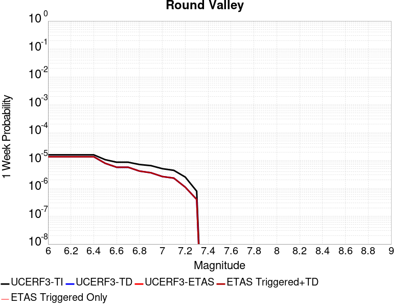 |  | 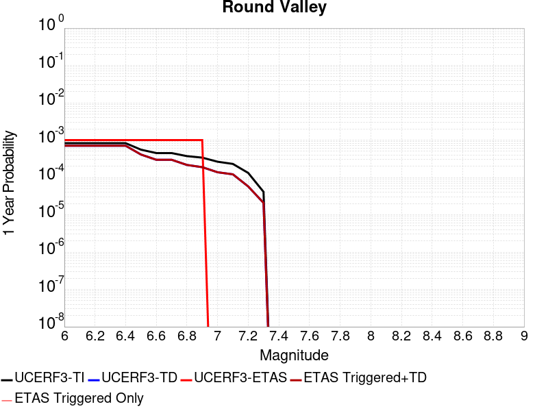 | 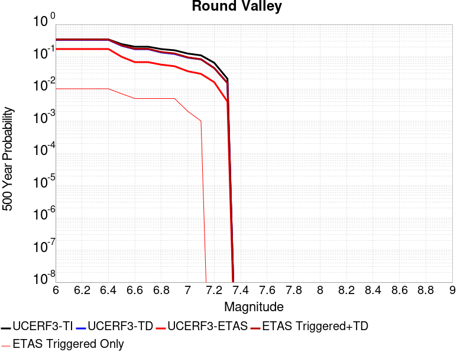 |

| Magnitude | 1 wk TI Prob | 1 wk TD Prob | 1 wk ETAS Prob | 1 wk ETAS/TD Gain | 1 wk ETAS Triggered+TD | 1 wk ETAS Triggered Only | 1 mo TI Prob | 1 mo TD Prob | 1 mo ETAS Prob | 1 mo ETAS/TD Gain | 1 mo ETAS Triggered+TD | 1 mo ETAS Triggered Only | 1 yr TI Prob | 1 yr TD Prob | 1 yr ETAS Prob | 1 yr ETAS/TD Gain | 1 yr ETAS Triggered+TD | 1 yr ETAS Triggered Only | 500 yr TI Prob | 500 yr TD Prob | 500 yr ETAS Prob | 500 yr ETAS/TD Gain | 500 yr ETAS Triggered+TD | 500 yr ETAS Triggered Only |
|-----|-----|-----|-----|-----|-----|-----|-----|-----|-----|-----|-----|-----|-----|-----|-----|-----|-----|-----|-----|-----|-----|-----|-----|-----|
| 6.0 | 1.588152E-5 | 1.3572055E-5 | 0.0 | 0.0 | 1.3572055E-5 | 0.0 | 6.806188E-5 | 5.816487E-5 | 0.0 | 0.0 | 5.816487E-5 | 0.0 | 8.283384E-4 | 7.079662E-4 | 0.001 | 1.4124968 | 7.079662E-4 | 0.0 | 0.3392243 | 0.32959917 | 0.171 | 0.518812 | 0.33630317 | 0.01 |
| 6.1 | 1.588152E-5 | 1.3572055E-5 | 0.0 | 0.0 | 1.3572055E-5 | 0.0 | 6.806188E-5 | 5.816487E-5 | 0.0 | 0.0 | 5.816487E-5 | 0.0 | 8.283384E-4 | 7.079662E-4 | 0.001 | 1.4124968 | 7.079662E-4 | 0.0 | 0.3392243 | 0.32959917 | 0.171 | 0.518812 | 0.33630317 | 0.01 |
| 6.2 | 1.588152E-5 | 1.3572055E-5 | 0.0 | 0.0 | 1.3572055E-5 | 0.0 | 6.806188E-5 | 5.816487E-5 | 0.0 | 0.0 | 5.816487E-5 | 0.0 | 8.283384E-4 | 7.079662E-4 | 0.001 | 1.4124968 | 7.079662E-4 | 0.0 | 0.3392243 | 0.32959917 | 0.171 | 0.518812 | 0.33630317 | 0.01 |
| 6.3 | 1.588152E-5 | 1.3572055E-5 | 0.0 | 0.0 | 1.3572055E-5 | 0.0 | 6.806188E-5 | 5.816487E-5 | 0.0 | 0.0 | 5.816487E-5 | 0.0 | 8.283384E-4 | 7.079662E-4 | 0.001 | 1.4124968 | 7.079662E-4 | 0.0 | 0.3392243 | 0.32959917 | 0.171 | 0.518812 | 0.33630317 | 0.01 |
| 6.4 | 1.588152E-5 | 1.3572055E-5 | 0.0 | 0.0 | 1.3572055E-5 | 0.0 | 6.806188E-5 | 5.816487E-5 | 0.0 | 0.0 | 5.816487E-5 | 0.0 | 8.283384E-4 | 7.079662E-4 | 0.001 | 1.4124968 | 7.079662E-4 | 0.0 | 0.3392243 | 0.32959917 | 0.171 | 0.518812 | 0.33630317 | 0.01 |
| 6.5 | 1.0646776E-5 | 7.881684E-6 | 0.0 | 0.0 | 7.881684E-6 | 0.0 | 4.5628243E-5 | 3.3778255E-5 | 0.0 | 0.0 | 3.3778255E-5 | 0.0 | 5.553823E-4 | 4.1118092E-4 | 0.001 | 2.4320195 | 4.1118092E-4 | 0.0 | 0.24252766 | 0.21594936 | 0.098 | 0.45381013 | 0.22143771 | 0.007 |
| 6.6 | 8.632956E-6 | 5.7069606E-6 | 0.0 | 0.0 | 5.7069606E-6 | 0.0 | 3.6997862E-5 | 2.4458195E-5 | 0.0 | 0.0 | 2.4458195E-5 | 0.0 | 4.5035584E-4 | 2.9774162E-4 | 0.001 | 3.3586168 | 2.9774162E-4 | 0.0 | 0.20166634 | 0.16929604 | 0.067 | 0.39575645 | 0.17344956 | 0.005 |
| 6.7 | 8.632956E-6 | 5.7069606E-6 | 0.0 | 0.0 | 5.7069606E-6 | 0.0 | 3.6997862E-5 | 2.4458195E-5 | 0.0 | 0.0 | 2.4458195E-5 | 0.0 | 4.5035584E-4 | 2.9774162E-4 | 0.001 | 3.3586168 | 2.9774162E-4 | 0.0 | 0.20166634 | 0.16929604 | 0.067 | 0.39575645 | 0.17344956 | 0.005 |
| 6.8 | 7.143895E-6 | 4.146749E-6 | 0.0 | 0.0 | 4.146749E-6 | 0.0 | 3.0616335E-5 | 1.7771668E-5 | 0.0 | 0.0 | 1.7771668E-5 | 0.0 | 3.726901E-4 | 2.1635022E-4 | 0.001 | 4.622135 | 2.1635022E-4 | 0.0 | 0.17004167 | 0.13391909 | 0.056 | 0.41816294 | 0.1382495 | 0.005 |
| 6.9 | 6.5120694E-6 | 3.6136073E-6 | 0.0 | 0.0 | 3.6136073E-6 | 0.0 | 2.790857E-5 | 1.5486805E-5 | 0.0 | 0.0 | 1.5486805E-5 | 0.0 | 3.3973387E-4 | 1.8853701E-4 | 0.001 | 5.3039985 | 1.8853701E-4 | 0.0 | 0.15624727 | 0.12046128 | 0.05 | 0.41507113 | 0.124858975 | 0.005 |
| 7.0 | 5.0614435E-6 | 2.64374E-6 | 0.0 | 0.0 | 2.64374E-6 | 0.0 | 2.169172E-5 | 1.133027E-5 | 0.0 | 0.0 | 1.133027E-5 | 0.0 | 2.6406467E-4 | 1.379383E-4 | 0.0 | 0.0 | 1.379383E-4 | 0.0 | 0.12370262 | 0.09250098 | 0.035 | 0.37837437 | 0.094315976 | 0.002 |
| 7.1 | 4.41728E-6 | 2.3244716E-6 | 0.0 | 0.0 | 2.3244716E-6 | 0.0 | 1.8931061E-5 | 9.961988E-6 | 0.0 | 0.0 | 9.961988E-6 | 0.0 | 2.304613E-4 | 1.2128141E-4 | 0.0 | 0.0 | 1.2128141E-4 | 0.0 | 0.10885126 | 0.08157639 | 0.029 | 0.355495 | 0.08249482 | 0.001 |
| 7.2 | 2.535495E-6 | 1.1009048E-6 | 0.0 | 0.0 | 1.1009048E-6 | 0.0 | 1.0866362E-5 | 4.7181575E-6 | 0.0 | 0.0 | 4.7181575E-6 | 0.0 | 1.3228992E-4 | 5.7442558E-5 | 0.0 | 0.0 | 5.7442558E-5 | 0.0 | 0.06400892 | 0.04390238 | 0.016 | 0.36444494 | 0.04390238 | 0.0 |
| 7.3 | 7.900015E-7 | 3.9985227E-7 | 0.0 | 0.0 | 3.9985227E-7 | 0.0 | 3.3857161E-6 | 1.7136526E-6 | 0.0 | 0.0 | 1.7136526E-6 | 0.0 | 4.1220315E-5 | 2.0863721E-5 | 0.0 | 0.0 | 2.0863721E-5 | 0.0 | 0.020399636 | 0.015040802 | 0.004 | 0.26594326 | 0.015040802 | 0.0 |

## Santa Ynez River
*[(top)](#table-of-contents)*

| 1 Week | 1 Month | 1 Year | 500 Year |
|-----|-----|-----|-----|
| 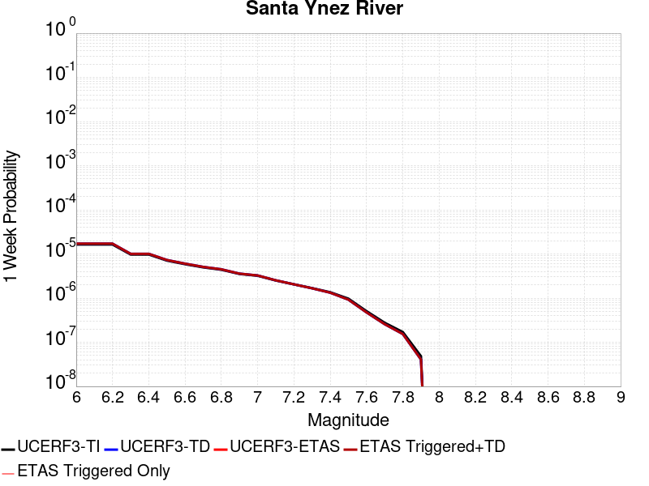 |  | 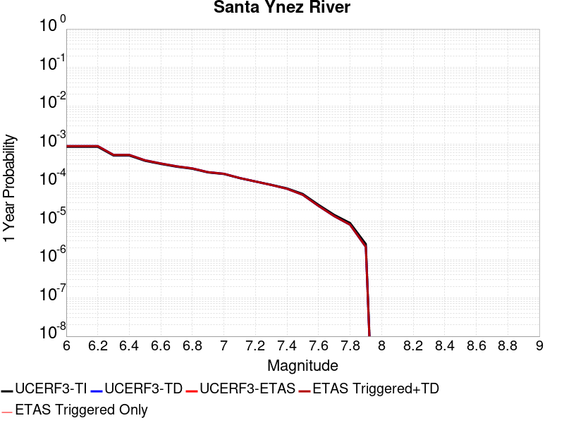 | 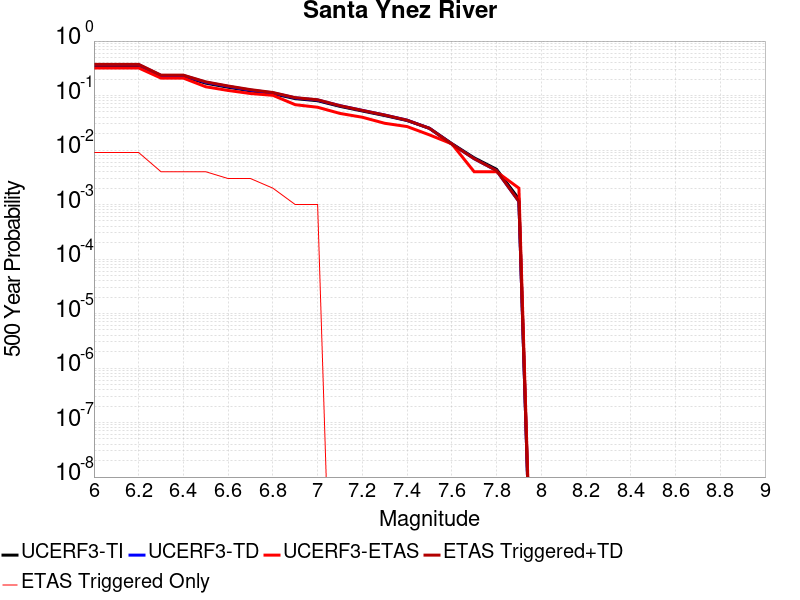 |

| Magnitude | 1 wk TI Prob | 1 wk TD Prob | 1 wk ETAS Prob | 1 wk ETAS/TD Gain | 1 wk ETAS Triggered+TD | 1 wk ETAS Triggered Only | 1 mo TI Prob | 1 mo TD Prob | 1 mo ETAS Prob | 1 mo ETAS/TD Gain | 1 mo ETAS Triggered+TD | 1 mo ETAS Triggered Only | 1 yr TI Prob | 1 yr TD Prob | 1 yr ETAS Prob | 1 yr ETAS/TD Gain | 1 yr ETAS Triggered+TD | 1 yr ETAS Triggered Only | 500 yr TI Prob | 500 yr TD Prob | 500 yr ETAS Prob | 500 yr ETAS/TD Gain | 500 yr ETAS Triggered+TD | 500 yr ETAS Triggered Only |
|-----|-----|-----|-----|-----|-----|-----|-----|-----|-----|-----|-----|-----|-----|-----|-----|-----|-----|-----|-----|-----|-----|-----|-----|-----|
| 6.0 | 1.6396456E-5 | 1.7156844E-5 | 0.0 | 0.0 | 1.7156844E-5 | 0.0 | 7.026863E-5 | 7.352746E-5 | 0.0 | 0.0 | 7.352746E-5 | 0.0 | 8.551848E-4 | 8.9486444E-4 | 0.0 | 0.0 | 8.9486444E-4 | 0.0 | 0.34804213 | 0.36813796 | 0.321 | 0.87195575 | 0.37382472 | 0.009 |
| 6.1 | 1.6396456E-5 | 1.7156844E-5 | 0.0 | 0.0 | 1.7156844E-5 | 0.0 | 7.026863E-5 | 7.352746E-5 | 0.0 | 0.0 | 7.352746E-5 | 0.0 | 8.551848E-4 | 8.9486444E-4 | 0.0 | 0.0 | 8.9486444E-4 | 0.0 | 0.34804213 | 0.36813796 | 0.321 | 0.87195575 | 0.37382472 | 0.009 |
| 6.2 | 1.6396456E-5 | 1.7156844E-5 | 0.0 | 0.0 | 1.7156844E-5 | 0.0 | 7.026863E-5 | 7.352746E-5 | 0.0 | 0.0 | 7.352746E-5 | 0.0 | 8.551848E-4 | 8.9486444E-4 | 0.0 | 0.0 | 8.9486444E-4 | 0.0 | 0.34804213 | 0.36813796 | 0.321 | 0.87195575 | 0.37382472 | 0.009 |
| 6.3 | 9.736976E-6 | 1.0093393E-5 | 0.0 | 0.0 | 1.0093393E-5 | 0.0 | 4.172923E-5 | 4.325671E-5 | 0.0 | 0.0 | 4.325671E-5 | 0.0 | 5.0793495E-4 | 5.2652817E-4 | 0.0 | 0.0 | 5.2652817E-4 | 0.0 | 0.22433302 | 0.23357147 | 0.209 | 0.8948011 | 0.23663718 | 0.004 |
| 6.4 | 9.736976E-6 | 1.0093393E-5 | 0.0 | 0.0 | 1.0093393E-5 | 0.0 | 4.172923E-5 | 4.325671E-5 | 0.0 | 0.0 | 4.325671E-5 | 0.0 | 5.0793495E-4 | 5.2652817E-4 | 0.0 | 0.0 | 5.2652817E-4 | 0.0 | 0.22433302 | 0.23357147 | 0.209 | 0.8948011 | 0.23663718 | 0.004 |
| 6.5 | 7.081964E-6 | 7.308471E-6 | 0.0 | 0.0 | 7.308471E-6 | 0.0 | 3.035092E-5 | 3.132165E-5 | 0.0 | 0.0 | 3.132165E-5 | 0.0 | 3.694598E-4 | 3.8127595E-4 | 0.0 | 0.0 | 3.8127595E-4 | 0.0 | 0.16869958 | 0.17504849 | 0.145 | 0.8283419 | 0.17834829 | 0.004 |
| 6.6 | 5.873247E-6 | 6.041669E-6 | 0.0 | 0.0 | 6.041669E-6 | 0.0 | 2.5170815E-5 | 2.5892617E-5 | 0.0 | 0.0 | 2.5892617E-5 | 0.0 | 3.064116E-4 | 3.1519786E-4 | 0.0 | 0.0 | 3.1519786E-4 | 0.0 | 0.142067 | 0.14716098 | 0.124 | 0.8426147 | 0.14971949 | 0.003 |
| 6.7 | 4.973277E-6 | 5.1002153E-6 | 0.0 | 0.0 | 5.1002153E-6 | 0.0 | 2.1313872E-5 | 2.1857884E-5 | 0.0 | 0.0 | 2.1857884E-5 | 0.0 | 2.5946548E-4 | 2.6608774E-4 | 0.0 | 0.0 | 2.6608774E-4 | 0.0 | 0.12168464 | 0.12586553 | 0.109 | 0.86600363 | 0.12848793 | 0.003 |
| 6.8 | 4.396492E-6 | 4.4968233E-6 | 0.0 | 0.0 | 4.4968233E-6 | 0.0 | 1.884197E-5 | 1.927196E-5 | 0.0 | 0.0 | 1.927196E-5 | 0.0 | 2.2937685E-4 | 2.3461119E-4 | 0.0 | 0.0 | 2.3461119E-4 | 0.0 | 0.108367816 | 0.11196394 | 0.101 | 0.9020761 | 0.11374002 | 0.002 |
| 6.9 | 3.5255632E-6 | 3.5892774E-6 | 0.0 | 0.0 | 3.5892774E-6 | 0.0 | 1.5109469E-5 | 1.5382528E-5 | 0.0 | 0.0 | 1.5382528E-5 | 0.0 | 1.8394225E-4 | 1.8726633E-4 | 0.0 | 0.0 | 1.8726633E-4 | 0.0 | 0.08787623 | 0.090639986 | 0.068 | 0.7502208 | 0.091549344 | 0.001 |
| 7.0 | 3.211603E-6 | 3.2623418E-6 | 0.0 | 0.0 | 3.2623418E-6 | 0.0 | 1.376394E-5 | 1.398139E-5 | 0.0 | 0.0 | 1.398139E-5 | 0.0 | 1.6756308E-4 | 1.7021027E-4 | 0.0 | 0.0 | 1.7021027E-4 | 0.0 | 0.08037432 | 0.082845785 | 0.061 | 0.73630786 | 0.08376294 | 0.001 |
| 7.1 | 2.5094619E-6 | 2.5312654E-6 | 0.0 | 0.0 | 2.5312654E-6 | 0.0 | 1.0754793E-5 | 1.0848235E-5 | 0.0 | 0.0 | 1.0848235E-5 | 0.0 | 1.3093173E-4 | 1.3206933E-4 | 0.0 | 0.0 | 1.3206933E-4 | 0.0 | 0.063373 | 0.06516439 | 0.047 | 0.7212528 | 0.06516439 | 0.0 |
| 7.2 | 2.0515774E-6 | 2.0534287E-6 | 0.0 | 0.0 | 2.0534287E-6 | 0.0 | 8.792445E-6 | 8.800379E-6 | 0.0 | 0.0 | 8.800379E-6 | 0.0 | 1.0704277E-4 | 1.07139385E-4 | 0.0 | 0.0 | 1.07139385E-4 | 0.0 | 0.052117042 | 0.05343328 | 0.04 | 0.74859715 | 0.05343328 | 0.0 |
| 7.3 | 1.6845745E-6 | 1.6698368E-6 | 0.0 | 0.0 | 1.6698368E-6 | 0.0 | 7.219585E-6 | 7.1564236E-6 | 0.0 | 0.0 | 7.1564236E-6 | 0.0 | 8.78949E-5 | 8.7126005E-5 | 0.0 | 0.0 | 8.7126005E-5 | 0.0 | 0.042997602 | 0.04390916 | 0.031 | 0.706003 | 0.04390916 | 0.0 |
| 7.4 | 1.3600285E-6 | 1.3268558E-6 | 0.0 | 0.0 | 1.3268558E-6 | 0.0 | 5.82868E-6 | 5.6865124E-6 | 0.0 | 0.0 | 5.6865124E-6 | 0.0 | 7.096187E-5 | 6.9231115E-5 | 0.0 | 0.0 | 6.9231115E-5 | 0.0 | 0.034860082 | 0.035313934 | 0.027 | 0.7645707 | 0.035313934 | 0.0 |
| 7.5 | 9.735342E-7 | 9.238426E-7 | 0.0 | 0.0 | 9.238426E-7 | 0.0 | 4.172283E-6 | 3.9593197E-6 | 0.0 | 0.0 | 3.9593197E-6 | 0.0 | 5.079636E-5 | 4.8203667E-5 | 0.0 | 0.0 | 4.8203667E-5 | 0.0 | 0.025078988 | 0.025040774 | 0.019 | 0.7587625 | 0.025040774 | 0.0 |
| 7.6 | 5.067187E-7 | 4.7485995E-7 | 0.0 | 0.0 | 4.7485995E-7 | 0.0 | 2.1716498E-6 | 2.0351124E-6 | 0.0 | 0.0 | 2.0351124E-6 | 0.0 | 2.6439517E-5 | 2.477722E-5 | 0.0 | 0.0 | 2.477722E-5 | 0.0 | 0.0131329335 | 0.012873885 | 0.013 | 1.0097961 | 0.012873885 | 0.0 |
| 7.7 | 2.769089E-7 | 2.5666833E-7 | 0.0 | 0.0 | 2.5666833E-7 | 0.0 | 1.1867519E-6 | 1.1000067E-6 | 0.0 | 0.0 | 1.1000067E-6 | 0.0 | 1.4448608E-5 | 1.3392499E-5 | 0.0 | 0.0 | 1.3392499E-5 | 0.0 | 0.0071983235 | 0.006940393 | 0.004 | 0.57633626 | 0.006940393 | 0.0 |
| 7.8 | 1.7044663E-7 | 1.538708E-7 | 0.0 | 0.0 | 1.538708E-7 | 0.0 | 7.3048534E-7 | 6.594461E-7 | 0.0 | 0.0 | 6.594461E-7 | 0.0 | 8.893623E-6 | 8.028726E-6 | 0.0 | 0.0 | 8.028726E-6 | 0.0 | 0.0044369586 | 0.0042052763 | 0.004 | 0.951186 | 0.0042052763 | 0.0 |
| 7.9 | 4.8344287E-8 | 4.0723986E-8 | 0.0 | 0.0 | 4.0723986E-8 | 0.0 | 2.0718979E-7 | 1.7453135E-7 | 0.0 | 0.0 | 1.7453135E-7 | 0.0 | 2.5225327E-6 | 2.1249173E-6 | 0.0 | 0.0 | 2.1249173E-6 | 0.0 | 0.0012604729 | 0.001138984 | 0.002 | 1.7559509 | 0.001138984 | 0.0 |

## Sierra Madre
*[(top)](#table-of-contents)*

| 1 Week | 1 Month | 1 Year | 500 Year |
|-----|-----|-----|-----|
|  | 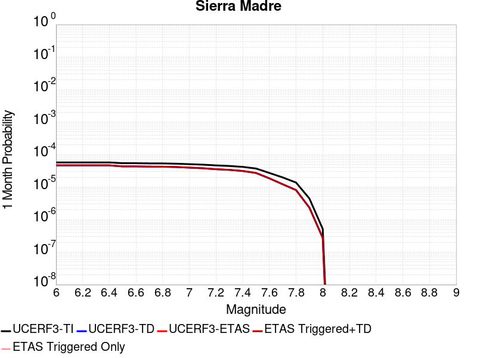 | 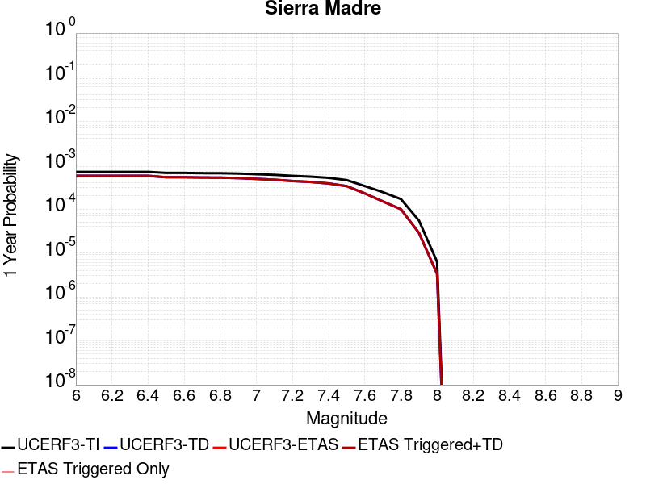 | 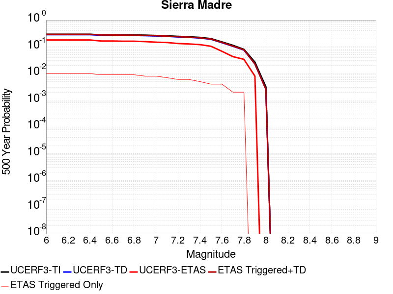 |

| Magnitude | 1 wk TI Prob | 1 wk TD Prob | 1 wk ETAS Prob | 1 wk ETAS/TD Gain | 1 wk ETAS Triggered+TD | 1 wk ETAS Triggered Only | 1 mo TI Prob | 1 mo TD Prob | 1 mo ETAS Prob | 1 mo ETAS/TD Gain | 1 mo ETAS Triggered+TD | 1 mo ETAS Triggered Only | 1 yr TI Prob | 1 yr TD Prob | 1 yr ETAS Prob | 1 yr ETAS/TD Gain | 1 yr ETAS Triggered+TD | 1 yr ETAS Triggered Only | 500 yr TI Prob | 500 yr TD Prob | 500 yr ETAS Prob | 500 yr ETAS/TD Gain | 500 yr ETAS Triggered+TD | 500 yr ETAS Triggered Only |
|-----|-----|-----|-----|-----|-----|-----|-----|-----|-----|-----|-----|-----|-----|-----|-----|-----|-----|-----|-----|-----|-----|-----|-----|-----|
| 6.0 | 1.3379373E-5 | 1.0856789E-5 | 0.0 | 0.0 | 1.0856789E-5 | 0.0 | 5.7338908E-5 | 4.6528272E-5 | 0.0 | 0.0 | 4.6528272E-5 | 0.0 | 6.978776E-4 | 5.663359E-4 | 0.0 | 0.0 | 5.663359E-4 | 0.0 | 0.29464963 | 0.28517804 | 0.18 | 0.63118464 | 0.29232627 | 0.01 |
| 6.1 | 1.3379373E-5 | 1.0856789E-5 | 0.0 | 0.0 | 1.0856789E-5 | 0.0 | 5.7338908E-5 | 4.6528272E-5 | 0.0 | 0.0 | 4.6528272E-5 | 0.0 | 6.978776E-4 | 5.663359E-4 | 0.0 | 0.0 | 5.663359E-4 | 0.0 | 0.29464963 | 0.28517804 | 0.18 | 0.63118464 | 0.29232627 | 0.01 |
| 6.2 | 1.3379373E-5 | 1.0856789E-5 | 0.0 | 0.0 | 1.0856789E-5 | 0.0 | 5.7338908E-5 | 4.6528272E-5 | 0.0 | 0.0 | 4.6528272E-5 | 0.0 | 6.978776E-4 | 5.663359E-4 | 0.0 | 0.0 | 5.663359E-4 | 0.0 | 0.29464963 | 0.28517804 | 0.18 | 0.63118464 | 0.29232627 | 0.01 |
| 6.3 | 1.3379373E-5 | 1.0856789E-5 | 0.0 | 0.0 | 1.0856789E-5 | 0.0 | 5.7338908E-5 | 4.6528272E-5 | 0.0 | 0.0 | 4.6528272E-5 | 0.0 | 6.978776E-4 | 5.663359E-4 | 0.0 | 0.0 | 5.663359E-4 | 0.0 | 0.29464963 | 0.28517804 | 0.18 | 0.63118464 | 0.29232627 | 0.01 |
| 6.4 | 1.3379373E-5 | 1.0856789E-5 | 0.0 | 0.0 | 1.0856789E-5 | 0.0 | 5.7338908E-5 | 4.6528272E-5 | 0.0 | 0.0 | 4.6528272E-5 | 0.0 | 6.978776E-4 | 5.663359E-4 | 0.0 | 0.0 | 5.663359E-4 | 0.0 | 0.29464963 | 0.28517804 | 0.18 | 0.63118464 | 0.29232627 | 0.01 |
| 6.5 | 1.26563245E-5 | 1.00888665E-5 | 0.0 | 0.0 | 1.00888665E-5 | 0.0 | 5.4240263E-5 | 4.3237287E-5 | 0.0 | 0.0 | 4.3237287E-5 | 0.0 | 6.601751E-4 | 5.262879E-4 | 0.0 | 0.0 | 5.262879E-4 | 0.0 | 0.28121755 | 0.27064288 | 0.165 | 0.6096595 | 0.27720708 | 0.009 |
| 6.6 | 1.26563245E-5 | 1.00888665E-5 | 0.0 | 0.0 | 1.00888665E-5 | 0.0 | 5.4240263E-5 | 4.3237287E-5 | 0.0 | 0.0 | 4.3237287E-5 | 0.0 | 6.601751E-4 | 5.262879E-4 | 0.0 | 0.0 | 5.262879E-4 | 0.0 | 0.28121755 | 0.27064288 | 0.165 | 0.6096595 | 0.27720708 | 0.009 |
| 6.7 | 1.2502474E-5 | 9.925562E-6 | 0.0 | 0.0 | 9.925562E-6 | 0.0 | 5.3580934E-5 | 4.2537435E-5 | 0.0 | 0.0 | 4.2537435E-5 | 0.0 | 6.521526E-4 | 5.177713E-4 | 0.0 | 0.0 | 5.177713E-4 | 0.0 | 0.27832666 | 0.26752713 | 0.162 | 0.60554606 | 0.27411938 | 0.009 |
| 6.8 | 1.2454966E-5 | 9.878033E-6 | 0.0 | 0.0 | 9.878033E-6 | 0.0 | 5.3377335E-5 | 4.2333744E-5 | 0.0 | 0.0 | 4.2333744E-5 | 0.0 | 6.4967526E-4 | 5.152925E-4 | 0.0 | 0.0 | 5.152925E-4 | 0.0 | 0.2774316 | 0.2666041 | 0.162 | 0.6076426 | 0.27320465 | 0.009 |
| 6.9 | 1.2225574E-5 | 9.652762E-6 | 0.0 | 0.0 | 9.652762E-6 | 0.0 | 5.2394265E-5 | 4.136833E-5 | 0.0 | 0.0 | 4.136833E-5 | 0.0 | 6.3771347E-4 | 5.0354406E-4 | 0.0 | 0.0 | 5.0354406E-4 | 0.0 | 0.27309424 | 0.26219776 | 0.157 | 0.5987847 | 0.26810017 | 0.008 |
| 7.0 | 1.182946E-5 | 9.2608125E-6 | 0.0 | 0.0 | 9.2608125E-6 | 0.0 | 5.06967E-5 | 3.96886E-5 | 0.0 | 0.0 | 3.96886E-5 | 0.0 | 6.1705755E-4 | 4.8310254E-4 | 0.0 | 0.0 | 4.8310254E-4 | 0.0 | 0.26554313 | 0.2544617 | 0.149 | 0.5855498 | 0.260426 | 0.008 |
| 7.1 | 1.14369095E-5 | 8.851167E-6 | 0.0 | 0.0 | 8.851167E-6 | 0.0 | 4.9014405E-5 | 3.7933027E-5 | 0.0 | 0.0 | 3.7933027E-5 | 0.0 | 5.9658696E-4 | 4.6173768E-4 | 0.0 | 0.0 | 4.6173768E-4 | 0.0 | 0.25798255 | 0.24627584 | 0.145 | 0.5887707 | 0.2515519 | 0.007 |
| 7.2 | 1.0836419E-5 | 8.268265E-6 | 0.0 | 0.0 | 8.268265E-6 | 0.0 | 4.644097E-5 | 3.5434947E-5 | 0.0 | 0.0 | 3.5434947E-5 | 0.0 | 5.652721E-4 | 4.3133597E-4 | 0.0 | 0.0 | 4.3133597E-4 | 0.0 | 0.24626617 | 0.23427749 | 0.133 | 0.56770283 | 0.23887183 | 0.006 |
| 7.3 | 1.0403439E-5 | 7.892239E-6 | 0.0 | 0.0 | 7.892239E-6 | 0.0 | 4.4585406E-5 | 3.382345E-5 | 0.0 | 0.0 | 3.382345E-5 | 0.0 | 5.426921E-4 | 4.117236E-4 | 0.0 | 0.0 | 4.117236E-4 | 0.0 | 0.23770352 | 0.22611506 | 0.128 | 0.5660835 | 0.23075837 | 0.006 |
| 7.4 | 9.768864E-6 | 7.290027E-6 | 0.0 | 0.0 | 7.290027E-6 | 0.0 | 4.186589E-5 | 3.1242605E-5 | 0.0 | 0.0 | 3.1242605E-5 | 0.0 | 5.09598E-4 | 3.803132E-4 | 0.0 | 0.0 | 3.803132E-4 | 0.0 | 0.22497806 | 0.21327485 | 0.121 | 0.56734306 | 0.21720847 | 0.005 |
| 7.5 | 8.687089E-6 | 6.3331727E-6 | 0.0 | 0.0 | 6.3331727E-6 | 0.0 | 3.722985E-5 | 2.7141892E-5 | 0.0 | 0.0 | 2.7141892E-5 | 0.0 | 4.5317915E-4 | 3.3040327E-4 | 0.0 | 0.0 | 3.3040327E-4 | 0.0 | 0.20279302 | 0.19174036 | 0.105 | 0.5476155 | 0.1949734 | 0.004 |
| 7.6 | 6.3506063E-6 | 4.330014E-6 | 0.0 | 0.0 | 4.330014E-6 | 0.0 | 2.72166E-5 | 1.8557072E-5 | 0.0 | 0.0 | 1.8557072E-5 | 0.0 | 3.3131172E-4 | 2.2590917E-4 | 0.0 | 0.0 | 2.2590917E-4 | 0.0 | 0.15268546 | 0.14236566 | 0.068 | 0.47764328 | 0.1457962 | 0.004 |
| 7.7 | 4.62223E-6 | 2.8472616E-6 | 0.0 | 0.0 | 2.8472616E-6 | 0.0 | 1.9809406E-5 | 1.2202493E-5 | 0.0 | 0.0 | 1.2202493E-5 | 0.0 | 2.4115283E-4 | 1.4855523E-4 | 0.0 | 0.0 | 1.4855523E-4 | 0.0 | 0.11360354 | 0.10488378 | 0.043 | 0.40997759 | 0.106674016 | 0.002 |
| 7.8 | 3.2145008E-6 | 1.8883611E-6 | 0.0 | 0.0 | 1.8883611E-6 | 0.0 | 1.3776359E-5 | 8.092951E-6 | 0.0 | 0.0 | 8.092951E-6 | 0.0 | 1.6771426E-4 | 9.852724E-5 | 0.0 | 0.0 | 9.852724E-5 | 0.0 | 0.080443844 | 0.07567736 | 0.034 | 0.4492757 | 0.077526 | 0.002 |
| 7.9 | 1.0391769E-6 | 5.4457837E-7 | 0.0 | 0.0 | 5.4457837E-7 | 0.0 | 4.4536077E-6 | 2.3339053E-6 | 0.0 | 0.0 | 2.3339053E-6 | 0.0 | 5.4221324E-5 | 2.841493E-5 | 0.0 | 0.0 | 2.841493E-5 | 0.0 | 0.026747182 | 0.022960776 | 0.008 | 0.34842026 | 0.022960776 | 0.0 |
| 8.0 | 1.210983E-7 | 6.416017E-8 | 0.0 | 0.0 | 6.416017E-8 | 0.0 | 5.1899264E-7 | 2.7497214E-7 | 0.0 | 0.0 | 2.7497214E-7 | 0.0 | 6.3187167E-6 | 3.3477806E-6 | 0.0 | 0.0 | 3.3477806E-6 | 0.0 | 0.0031543828 | 0.0025977797 | 0.0 | 0.0 | 0.0025977797 | 0.0 |

## Ortigalita (South)
*[(top)](#table-of-contents)*

| 1 Week | 1 Month | 1 Year | 500 Year |
|-----|-----|-----|-----|
|  | 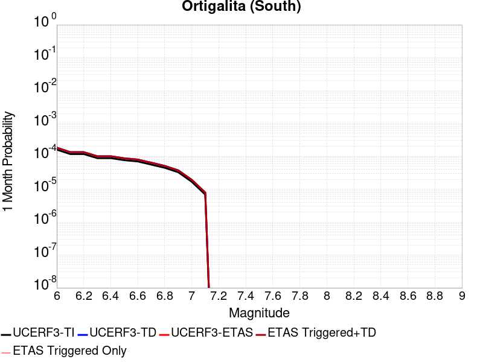 | 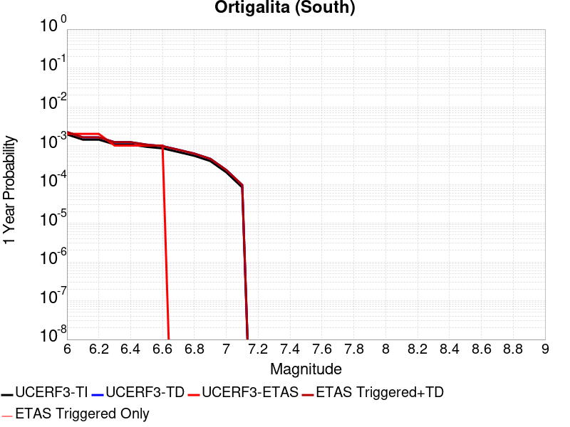 |  |

| Magnitude | 1 wk TI Prob | 1 wk TD Prob | 1 wk ETAS Prob | 1 wk ETAS/TD Gain | 1 wk ETAS Triggered+TD | 1 wk ETAS Triggered Only | 1 mo TI Prob | 1 mo TD Prob | 1 mo ETAS Prob | 1 mo ETAS/TD Gain | 1 mo ETAS Triggered+TD | 1 mo ETAS Triggered Only | 1 yr TI Prob | 1 yr TD Prob | 1 yr ETAS Prob | 1 yr ETAS/TD Gain | 1 yr ETAS Triggered+TD | 1 yr ETAS Triggered Only | 500 yr TI Prob | 500 yr TD Prob | 500 yr ETAS Prob | 500 yr ETAS/TD Gain | 500 yr ETAS Triggered+TD | 500 yr ETAS Triggered Only |
|-----|-----|-----|-----|-----|-----|-----|-----|-----|-----|-----|-----|-----|-----|-----|-----|-----|-----|-----|-----|-----|-----|-----|-----|-----|
| 6.0 | 3.72394E-5 | 4.289404E-5 | 0.0 | 0.0 | 4.289404E-5 | 0.0 | 1.5958765E-4 | 1.8381952E-4 | 0.0 | 0.0 | 1.8381952E-4 | 0.0 | 0.0019412481 | 0.0022358592 | 0.002 | 0.89451075 | 0.0022358592 | 0.0 | 0.6215107 | 0.66595113 | 0.61 | 0.91598314 | 0.6686235 | 0.008 |
| 6.1 | 2.7299884E-5 | 3.124192E-5 | 0.0 | 0.0 | 3.124192E-5 | 0.0 | 1.16994255E-4 | 1.338874E-4 | 0.0 | 0.0 | 1.338874E-4 | 0.0 | 0.0014234743 | 0.0016289152 | 0.002 | 1.227811 | 0.0016289152 | 0.0 | 0.50945795 | 0.5485438 | 0.499 | 0.9096812 | 0.55215544 | 0.008 |
| 6.2 | 2.7299884E-5 | 3.124192E-5 | 0.0 | 0.0 | 3.124192E-5 | 0.0 | 1.16994255E-4 | 1.338874E-4 | 0.0 | 0.0 | 1.338874E-4 | 0.0 | 0.0014234743 | 0.0016289152 | 0.002 | 1.227811 | 0.0016289152 | 0.0 | 0.50945795 | 0.5485438 | 0.499 | 0.9096812 | 0.55215544 | 0.008 |
| 6.3 | 2.0546433E-5 | 2.3447927E-5 | 0.0 | 0.0 | 2.3447927E-5 | 0.0 | 8.805317E-5 | 1.00487356E-4 | 0.0 | 0.0 | 1.00487356E-4 | 0.0 | 0.00107152 | 0.0012227655 | 0.001 | 0.8178183 | 0.0012227655 | 0.0 | 0.41494375 | 0.44906434 | 0.406 | 0.9041021 | 0.45292088 | 0.007 |
| 6.4 | 2.0546433E-5 | 2.3447927E-5 | 0.0 | 0.0 | 2.3447927E-5 | 0.0 | 8.805317E-5 | 1.00487356E-4 | 0.0 | 0.0 | 1.00487356E-4 | 0.0 | 0.00107152 | 0.0012227655 | 0.001 | 0.8178183 | 0.0012227655 | 0.0 | 0.41494375 | 0.44906434 | 0.406 | 0.9041021 | 0.45292088 | 0.007 |
| 6.5 | 1.7779594E-5 | 2.0288278E-5 | 0.0 | 0.0 | 2.0288278E-5 | 0.0 | 7.619603E-5 | 8.6946944E-5 | 0.0 | 0.0 | 8.6946944E-5 | 0.0 | 9.272918E-4 | 0.0010580784 | 0.001 | 0.9451096 | 0.0010580784 | 0.0 | 0.37114903 | 0.40337062 | 0.362 | 0.8974377 | 0.40754703 | 0.007 |
| 6.6 | 1.6272212E-5 | 1.8569608E-5 | 0.0 | 0.0 | 1.8569608E-5 | 0.0 | 6.973618E-5 | 7.9581674E-5 | 0.0 | 0.0 | 7.9581674E-5 | 0.0 | 8.487073E-4 | 9.684883E-4 | 0.001 | 1.032537 | 9.684883E-4 | 0.0 | 0.34592536 | 0.37712964 | 0.34 | 0.9015467 | 0.3808669 | 0.006 |
| 6.7 | 1.3051484E-5 | 1.4920259E-5 | 0.0 | 0.0 | 1.4920259E-5 | 0.0 | 5.593373E-5 | 6.394245E-5 | 0.0 | 0.0 | 6.394245E-5 | 0.0 | 6.807804E-4 | 7.782306E-4 | 0.0 | 0.0 | 7.782306E-4 | 0.0 | 0.28858984 | 0.31699142 | 0.271 | 0.85491276 | 0.32108945 | 0.006 |
| 6.8 | 1.04277415E-5 | 1.189459E-5 | 0.0 | 0.0 | 1.189459E-5 | 0.0 | 4.4689557E-5 | 5.097586E-5 | 0.0 | 0.0 | 5.097586E-5 | 0.0 | 5.439595E-4 | 6.2046165E-4 | 0.0 | 0.0 | 6.2046165E-4 | 0.0 | 0.23818669 | 0.2628932 | 0.228 | 0.8672724 | 0.26657873 | 0.005 |
| 6.9 | 7.639968E-6 | 8.723063E-6 | 0.0 | 0.0 | 8.723063E-6 | 0.0 | 3.274231E-5 | 3.7384052E-5 | 0.0 | 0.0 | 3.7384052E-5 | 0.0 | 3.9856473E-4 | 4.5506156E-4 | 0.0 | 0.0 | 4.5506156E-4 | 0.0 | 0.18071403 | 0.20048852 | 0.174 | 0.8678801 | 0.20288706 | 0.003 |
| 7.0 | 3.919831E-6 | 4.4967746E-6 | 0.0 | 0.0 | 4.4967746E-6 | 0.0 | 1.679917E-5 | 1.927176E-5 | 0.0 | 0.0 | 1.927176E-5 | 0.0 | 2.045107E-4 | 2.346105E-4 | 0.0 | 0.0 | 2.346105E-4 | 0.0 | 0.097210445 | 0.10831558 | 0.086 | 0.79397625 | 0.109207265 | 0.001 |
| 7.1 | 1.6017933E-6 | 1.8417686E-6 | 0.0 | 0.0 | 1.8417686E-6 | 0.0 | 6.8648105E-6 | 7.893276E-6 | 0.0 | 0.0 | 7.893276E-6 | 0.0 | 8.357586E-5 | 9.609745E-5 | 0.0 | 0.0 | 9.609745E-5 | 0.0 | 0.040928528 | 0.04581083 | 0.033 | 0.72035366 | 0.04581083 | 0.0 |

## Bear River fault zone
*[(top)](#table-of-contents)*

| 1 Week | 1 Month | 1 Year | 500 Year |
|-----|-----|-----|-----|
|  |  | 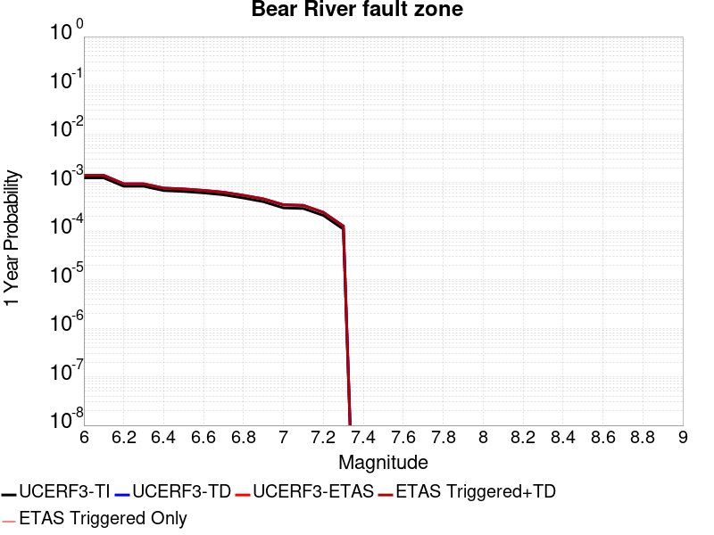 | 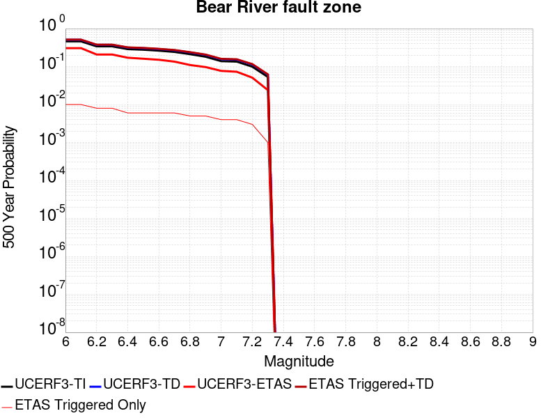 |

| Magnitude | 1 wk TI Prob | 1 wk TD Prob | 1 wk ETAS Prob | 1 wk ETAS/TD Gain | 1 wk ETAS Triggered+TD | 1 wk ETAS Triggered Only | 1 mo TI Prob | 1 mo TD Prob | 1 mo ETAS Prob | 1 mo ETAS/TD Gain | 1 mo ETAS Triggered+TD | 1 mo ETAS Triggered Only | 1 yr TI Prob | 1 yr TD Prob | 1 yr ETAS Prob | 1 yr ETAS/TD Gain | 1 yr ETAS Triggered+TD | 1 yr ETAS Triggered Only | 500 yr TI Prob | 500 yr TD Prob | 500 yr ETAS Prob | 500 yr ETAS/TD Gain | 500 yr ETAS Triggered+TD | 500 yr ETAS Triggered Only |
|-----|-----|-----|-----|-----|-----|-----|-----|-----|-----|-----|-----|-----|-----|-----|-----|-----|-----|-----|-----|-----|-----|-----|-----|-----|
| 6.0 | 2.3773342E-5 | 2.6791431E-5 | 0.0 | 0.0 | 2.6791431E-5 | 0.0 | 1.0188177E-4 | 1.1481589E-4 | 0.0 | 0.0 | 1.1481589E-4 | 0.0 | 0.0012397047 | 0.0013970792 | 0.0 | 0.0 | 0.0013970792 | 0.0 | 0.46218297 | 0.50653976 | 0.306 | 0.6040987 | 0.5114744 | 0.01 |
| 6.1 | 2.3773342E-5 | 2.6791431E-5 | 0.0 | 0.0 | 2.6791431E-5 | 0.0 | 1.0188177E-4 | 1.1481589E-4 | 0.0 | 0.0 | 1.1481589E-4 | 0.0 | 0.0012397047 | 0.0013970792 | 0.0 | 0.0 | 0.0013970792 | 0.0 | 0.46218297 | 0.50653976 | 0.306 | 0.6040987 | 0.5114744 | 0.01 |
| 6.2 | 1.5973403E-5 | 1.7939095E-5 | 0.0 | 0.0 | 1.7939095E-5 | 0.0 | 6.845564E-5 | 7.68797E-5 | 0.0 | 0.0 | 7.68797E-5 | 0.0 | 8.3312875E-4 | 9.356317E-4 | 0.0 | 0.0 | 9.356317E-4 | 0.0 | 0.3408064 | 0.3726019 | 0.208 | 0.55823654 | 0.37762108 | 0.008 |
| 6.3 | 1.5973403E-5 | 1.7939095E-5 | 0.0 | 0.0 | 1.7939095E-5 | 0.0 | 6.845564E-5 | 7.68797E-5 | 0.0 | 0.0 | 7.68797E-5 | 0.0 | 8.3312875E-4 | 9.356317E-4 | 0.0 | 0.0 | 9.356317E-4 | 0.0 | 0.3408064 | 0.3726019 | 0.208 | 0.55823654 | 0.37762108 | 0.008 |
| 6.4 | 1.3027338E-5 | 1.4639869E-5 | 0.0 | 0.0 | 1.4639869E-5 | 0.0 | 5.5830256E-5 | 6.2740866E-5 | 0.0 | 0.0 | 6.2740866E-5 | 0.0 | 6.7952136E-4 | 7.6361594E-4 | 0.0 | 0.0 | 7.6361594E-4 | 0.0 | 0.28814155 | 0.31606102 | 0.171 | 0.54103476 | 0.32016465 | 0.006 |
| 6.5 | 1.2489152E-5 | 1.4045946E-5 | 0.0 | 0.0 | 1.4045946E-5 | 0.0 | 5.352384E-5 | 6.0195598E-5 | 0.0 | 0.0 | 6.0195598E-5 | 0.0 | 6.514579E-4 | 7.326484E-4 | 0.0 | 0.0 | 7.326484E-4 | 0.0 | 0.27807578 | 0.30550665 | 0.161 | 0.52699345 | 0.3096736 | 0.006 |
| 6.6 | 1.1662849E-5 | 1.313551E-5 | 0.0 | 0.0 | 1.313551E-5 | 0.0 | 4.9982682E-5 | 5.62939E-5 | 0.0 | 0.0 | 5.62939E-5 | 0.0 | 6.083692E-4 | 6.851755E-4 | 0.0 | 0.0 | 6.851755E-4 | 0.0 | 0.26234362 | 0.28890577 | 0.151 | 0.52266175 | 0.29317233 | 0.006 |
| 6.7 | 1.0667623E-5 | 1.204142E-5 | 0.0 | 0.0 | 1.204142E-5 | 0.0 | 4.5717585E-5 | 5.160513E-5 | 0.0 | 0.0 | 5.160513E-5 | 0.0 | 5.5646943E-4 | 6.28123E-4 | 0.0 | 0.0 | 6.28123E-4 | 0.0 | 0.24293955 | 0.26833057 | 0.135 | 0.50311077 | 0.2727206 | 0.006 |
| 6.8 | 9.154534E-6 | 1.0381568E-5 | 0.0 | 0.0 | 1.0381568E-5 | 0.0 | 3.923313E-5 | 4.4491735E-5 | 0.0 | 0.0 | 4.4491735E-5 | 0.0 | 4.7755867E-4 | 5.415626E-4 | 0.0 | 0.0 | 5.415626E-4 | 0.0 | 0.21245626 | 0.23579246 | 0.11 | 0.46651193 | 0.2396135 | 0.005 |
| 6.9 | 7.68501E-6 | 8.776355E-6 | 0.0 | 0.0 | 8.776355E-6 | 0.0 | 3.2935342E-5 | 3.761246E-5 | 0.0 | 0.0 | 3.761246E-5 | 0.0 | 4.0091402E-4 | 4.5784464E-4 | 0.0 | 0.0 | 4.5784464E-4 | 0.0 | 0.18167622 | 0.20292243 | 0.097 | 0.47801518 | 0.20690782 | 0.005 |
| 7.0 | 5.7315733E-6 | 6.644876E-6 | 0.0 | 0.0 | 6.644876E-6 | 0.0 | 2.4563653E-5 | 2.8477752E-5 | 0.0 | 0.0 | 2.8477752E-5 | 0.0 | 2.9902143E-4 | 3.4666565E-4 | 0.0 | 0.0 | 3.4666565E-4 | 0.0 | 0.13889004 | 0.15632248 | 0.077 | 0.4925715 | 0.15969719 | 0.004 |
| 7.1 | 5.566844E-6 | 6.454962E-6 | 0.0 | 0.0 | 6.454962E-6 | 0.0 | 2.3857683E-5 | 2.7663855E-5 | 0.0 | 0.0 | 2.7663855E-5 | 0.0 | 2.9042858E-4 | 3.3675955E-4 | 0.0 | 0.0 | 3.3675955E-4 | 0.0 | 0.1351813 | 0.1523027 | 0.073 | 0.47930863 | 0.15569349 | 0.004 |
| 7.2 | 4.011353E-6 | 4.63476E-6 | 0.0 | 0.0 | 4.63476E-6 | 0.0 | 1.7191402E-5 | 1.9863124E-5 | 0.0 | 0.0 | 1.9863124E-5 | 0.0 | 2.0928521E-4 | 2.4181008E-4 | 0.0 | 0.0 | 2.4181008E-4 | 0.0 | 0.09936351 | 0.11344572 | 0.051 | 0.44955418 | 0.116105385 | 0.003 |
| 7.3 | 2.0974871E-6 | 2.419084E-6 | 0.0 | 0.0 | 2.419084E-6 | 0.0 | 8.989199E-6 | 1.0367476E-5 | 0.0 | 0.0 | 1.0367476E-5 | 0.0 | 1.09438006E-4 | 1.2621917E-4 | 0.0 | 0.0 | 1.2621917E-4 | 0.0 | 0.05325169 | 0.06120638 | 0.024 | 0.39211598 | 0.062145174 | 0.001 |

## Oceanic - West Huasna
*[(top)](#table-of-contents)*

| 1 Week | 1 Month | 1 Year | 500 Year |
|-----|-----|-----|-----|
| 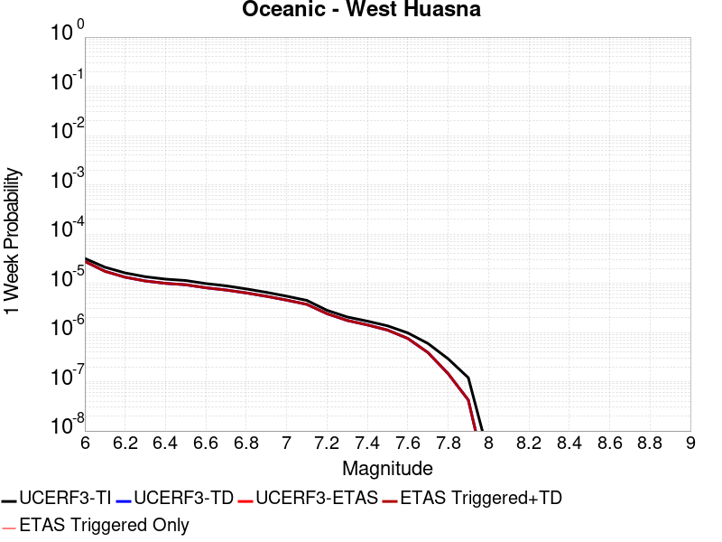 | 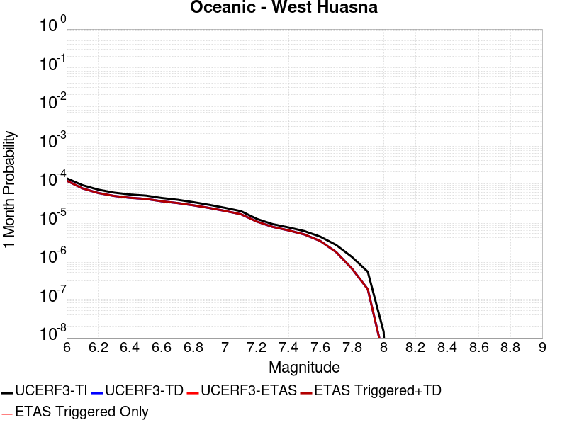 | 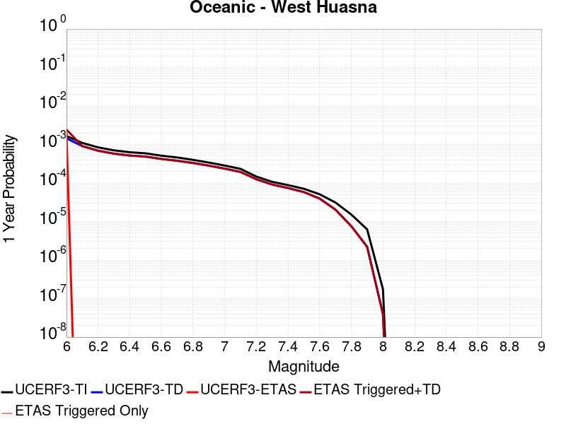 | 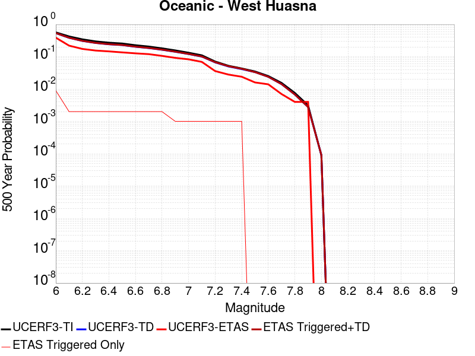 |

| Magnitude | 1 wk TI Prob | 1 wk TD Prob | 1 wk ETAS Prob | 1 wk ETAS/TD Gain | 1 wk ETAS Triggered+TD | 1 wk ETAS Triggered Only | 1 mo TI Prob | 1 mo TD Prob | 1 mo ETAS Prob | 1 mo ETAS/TD Gain | 1 mo ETAS Triggered+TD | 1 mo ETAS Triggered Only | 1 yr TI Prob | 1 yr TD Prob | 1 yr ETAS Prob | 1 yr ETAS/TD Gain | 1 yr ETAS Triggered+TD | 1 yr ETAS Triggered Only | 500 yr TI Prob | 500 yr TD Prob | 500 yr ETAS Prob | 500 yr ETAS/TD Gain | 500 yr ETAS Triggered+TD | 500 yr ETAS Triggered Only |
|-----|-----|-----|-----|-----|-----|-----|-----|-----|-----|-----|-----|-----|-----|-----|-----|-----|-----|-----|-----|-----|-----|-----|-----|-----|
| 6.0 | 3.195567E-5 | 2.779741E-5 | 0.0 | 0.0 | 2.779741E-5 | 0.0 | 1.3694567E-4 | 1.1912656E-4 | 0.0 | 0.0 | 1.1912656E-4 | 0.0 | 0.0016660384 | 0.0014494436 | 0.002 | 1.3798398 | 0.0024479942 | 0.001 | 0.56556714 | 0.5349159 | 0.388 | 0.7253476 | 0.5391017 | 0.009 |
| 6.1 | 2.1156782E-5 | 1.7490493E-5 | 0.0 | 0.0 | 1.7490493E-5 | 0.0 | 9.066878E-5 | 7.495715E-5 | 0.0 | 0.0 | 7.495715E-5 | 0.0 | 0.0011033333 | 9.122305E-4 | 0.0 | 0.0 | 9.122305E-4 | 0.0 | 0.42418635 | 0.38415182 | 0.22 | 0.57269025 | 0.38538352 | 0.002 |
| 6.2 | 1.6195117E-5 | 1.3264312E-5 | 0.0 | 0.0 | 1.3264312E-5 | 0.0 | 6.9405796E-5 | 5.6845824E-5 | 0.0 | 0.0 | 5.6845824E-5 | 0.0 | 8.44688E-4 | 6.918807E-4 | 0.0 | 0.0 | 6.918807E-4 | 0.0 | 0.34460846 | 0.30790675 | 0.174 | 0.56510615 | 0.30929092 | 0.002 |
| 6.3 | 1.3559345E-5 | 1.1126822E-5 | 0.0 | 0.0 | 1.1126822E-5 | 0.0 | 5.811018E-5 | 4.7685513E-5 | 0.0 | 0.0 | 4.7685513E-5 | 0.0 | 7.072618E-4 | 5.804174E-4 | 0.0 | 0.0 | 5.804174E-4 | 0.0 | 0.29795375 | 0.26578307 | 0.155 | 0.5831824 | 0.2672515 | 0.002 |
| 6.4 | 1.2120619E-5 | 9.954143E-6 | 0.0 | 0.0 | 9.954143E-6 | 0.0 | 5.1944477E-5 | 4.2659918E-5 | 0.0 | 0.0 | 4.2659918E-5 | 0.0 | 6.322405E-4 | 5.1926123E-4 | 0.0 | 0.0 | 5.1926123E-4 | 0.0 | 0.2711011 | 0.24188182 | 0.146 | 0.60360056 | 0.24339806 | 0.002 |
| 6.5 | 1.13511915E-5 | 9.323354E-6 | 0.0 | 0.0 | 9.323354E-6 | 0.0 | 4.8647056E-5 | 3.9956623E-5 | 0.0 | 0.0 | 3.9956623E-5 | 0.0 | 5.9211696E-4 | 4.8636372E-4 | 0.0 | 0.0 | 4.8636372E-4 | 0.0 | 0.25632128 | 0.22882207 | 0.136 | 0.59434825 | 0.23036443 | 0.002 |
| 6.6 | 9.850605E-6 | 8.09656E-6 | 0.0 | 0.0 | 8.09656E-6 | 0.0 | 4.2216197E-5 | 3.4699086E-5 | 0.0 | 0.0 | 3.4699086E-5 | 0.0 | 5.1386096E-4 | 4.2237967E-4 | 0.0 | 0.0 | 4.2237967E-4 | 0.0 | 0.2266291 | 0.20275265 | 0.127 | 0.62637895 | 0.20434715 | 0.002 |
| 6.7 | 8.8558645E-6 | 7.28296E-6 | 0.0 | 0.0 | 7.28296E-6 | 0.0 | 3.7953152E-5 | 3.1212312E-5 | 0.0 | 0.0 | 3.1212312E-5 | 0.0 | 4.6198163E-4 | 3.799438E-4 | 0.0 | 0.0 | 3.799438E-4 | 0.0 | 0.20629561 | 0.18480429 | 0.12 | 0.64933556 | 0.18643469 | 0.002 |
| 6.8 | 7.67136E-6 | 6.3597186E-6 | 0.0 | 0.0 | 6.3597186E-6 | 0.0 | 3.2876844E-5 | 2.7255652E-5 | 0.0 | 0.0 | 2.7255652E-5 | 0.0 | 4.0020206E-4 | 3.317872E-4 | 0.0 | 0.0 | 3.317872E-4 | 0.0 | 0.18138474 | 0.16375293 | 0.106 | 0.6473167 | 0.16542542 | 0.002 |
| 6.9 | 6.534529E-6 | 5.429413E-6 | 0.0 | 0.0 | 5.429413E-6 | 0.0 | 2.8004823E-5 | 2.3268705E-5 | 0.0 | 0.0 | 2.3268705E-5 | 0.0 | 3.4090536E-4 | 2.8325978E-4 | 0.0 | 0.0 | 2.8325978E-4 | 0.0 | 0.15674151 | 0.1420641 | 0.092 | 0.647595 | 0.14292203 | 0.001 |
| 7.0 | 5.460525E-6 | 4.543684E-6 | 0.0 | 0.0 | 4.543684E-6 | 0.0 | 2.3402039E-5 | 1.9472787E-5 | 0.0 | 0.0 | 1.9472787E-5 | 0.0 | 2.8488258E-4 | 2.370555E-4 | 0.0 | 0.0 | 2.370555E-4 | 0.0 | 0.13277912 | 0.12083057 | 0.083 | 0.68691224 | 0.12170974 | 0.001 |
| 7.1 | 4.4825083E-6 | 3.729425E-6 | 0.0 | 0.0 | 3.729425E-6 | 0.0 | 1.9210609E-5 | 1.5983152E-5 | 0.0 | 0.0 | 1.5983152E-5 | 0.0 | 2.3386406E-4 | 1.9457762E-4 | 0.0 | 0.0 | 1.9457762E-4 | 0.0 | 0.11036651 | 0.10079854 | 0.069 | 0.6845337 | 0.101697735 | 0.001 |
| 7.2 | 2.821708E-6 | 2.4091169E-6 | 0.0 | 0.0 | 2.4091169E-6 | 0.0 | 1.2092979E-5 | 1.0324746E-5 | 0.0 | 0.0 | 1.0324746E-5 | 0.0 | 1.4722206E-4 | 1.2569653E-4 | 0.0 | 0.0 | 1.2569653E-4 | 0.0 | 0.07097205 | 0.06674755 | 0.036 | 0.5393456 | 0.067680806 | 0.001 |
| 7.3 | 2.0644757E-6 | 1.7553328E-6 | 0.0 | 0.0 | 1.7553328E-6 | 0.0 | 8.847723E-6 | 7.5228336E-6 | 0.0 | 0.0 | 7.5228336E-6 | 0.0 | 1.0771569E-4 | 9.1586655E-5 | 0.0 | 0.0 | 9.1586655E-5 | 0.0 | 0.052435953 | 0.049886912 | 0.028 | 0.56126946 | 0.050837025 | 0.001 |
| 7.4 | 1.6980367E-6 | 1.4253033E-6 | 0.0 | 0.0 | 1.4253033E-6 | 0.0 | 7.27728E-6 | 6.1084284E-6 | 0.0 | 0.0 | 6.1084284E-6 | 0.0 | 8.8597284E-5 | 7.436758E-5 | 0.0 | 0.0 | 7.436758E-5 | 0.0 | 0.043333665 | 0.041369285 | 0.024 | 0.5801406 | 0.042327914 | 0.001 |
| 7.5 | 1.3637683E-6 | 1.1185914E-6 | 0.0 | 0.0 | 1.1185914E-6 | 0.0 | 5.844708E-6 | 4.7939543E-6 | 0.0 | 0.0 | 4.7939543E-6 | 0.0 | 7.1156996E-5 | 5.8364833E-5 | 0.0 | 0.0 | 5.8364833E-5 | 0.0 | 0.034954246 | 0.033376325 | 0.016 | 0.47938168 | 0.033376325 | 0.0 |
| 7.6 | 9.802994E-7 | 7.573017E-7 | 0.0 | 0.0 | 7.573017E-7 | 0.0 | 4.2012766E-6 | 3.2455746E-6 | 0.0 | 0.0 | 3.2455746E-6 | 0.0 | 5.1149345E-5 | 3.9514154E-5 | 0.0 | 0.0 | 3.9514154E-5 | 0.0 | 0.025251048 | 0.023917645 | 0.014 | 0.5853419 | 0.023917645 | 0.0 |
| 7.7 | 5.986191E-7 | 3.9143046E-7 | 0.0 | 0.0 | 3.9143046E-7 | 0.0 | 2.5655079E-6 | 1.677558E-6 | 0.0 | 0.0 | 1.677558E-6 | 0.0 | 3.1234613E-5 | 2.0424077E-5 | 0.0 | 0.0 | 2.0424077E-5 | 0.0 | 0.015496228 | 0.0142137315 | 0.007 | 0.49248153 | 0.0142137315 | 0.0 |
| 7.8 | 2.9189815E-7 | 1.4570794E-7 | 0.0 | 0.0 | 1.4570794E-7 | 0.0 | 1.2509914E-6 | 6.244625E-7 | 0.0 | 0.0 | 6.244625E-7 | 0.0 | 1.5230714E-5 | 7.602804E-6 | 0.0 | 0.0 | 7.602804E-6 | 0.0 | 0.0075864913 | 0.006792661 | 0.004 | 0.5888709 | 0.006792661 | 0.0 |
| 7.9 | 1.2057845E-7 | 4.251261E-8 | 0.0 | 0.0 | 4.251261E-8 | 0.0 | 5.1676466E-7 | 1.821969E-7 | 0.0 | 0.0 | 1.821969E-7 | 0.0 | 6.2915915E-6 | 2.218245E-6 | 0.0 | 0.0 | 2.218245E-6 | 0.0 | 0.0031408628 | 0.0027833914 | 0.004 | 1.4370958 | 0.0027833914 | 0.0 |
| 8.0 | 3.3806387E-9 | 7.636012E-10 | 0.0 | 0.0 | 7.636012E-10 | 0.0 | 1.4488451E-8 | 3.2725778E-9 | 0.0 | 0.0 | 3.2725778E-9 | 0.0 | 1.7639688E-7 | 3.9843638E-8 | 0.0 | 0.0 | 3.9843638E-8 | 0.0 | 8.819456E-5 | 9.1302674E-5 | 0.0 | 0.0 | 9.1302674E-5 | 0.0 |

## McKinleyville (alt1)
*[(top)](#table-of-contents)*

| 1 Week | 1 Month | 1 Year | 500 Year |
|-----|-----|-----|-----|
| 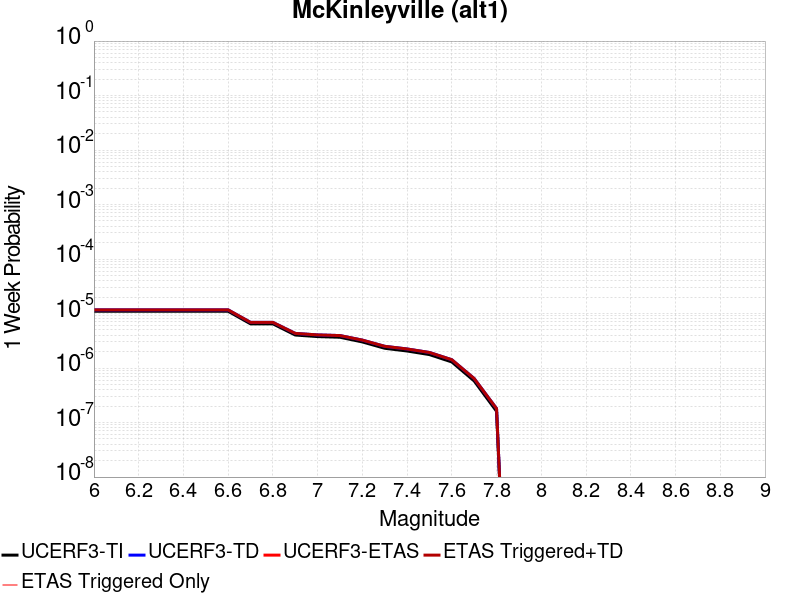 |  |  | 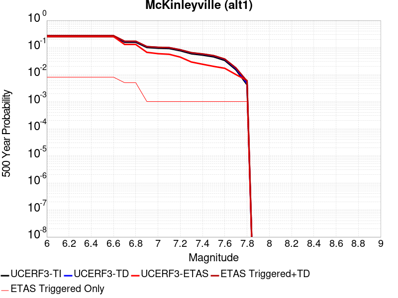 |

| Magnitude | 1 wk TI Prob | 1 wk TD Prob | 1 wk ETAS Prob | 1 wk ETAS/TD Gain | 1 wk ETAS Triggered+TD | 1 wk ETAS Triggered Only | 1 mo TI Prob | 1 mo TD Prob | 1 mo ETAS Prob | 1 mo ETAS/TD Gain | 1 mo ETAS Triggered+TD | 1 mo ETAS Triggered Only | 1 yr TI Prob | 1 yr TD Prob | 1 yr ETAS Prob | 1 yr ETAS/TD Gain | 1 yr ETAS Triggered+TD | 1 yr ETAS Triggered Only | 500 yr TI Prob | 500 yr TD Prob | 500 yr ETAS Prob | 500 yr ETAS/TD Gain | 500 yr ETAS Triggered+TD | 500 yr ETAS Triggered Only |
|-----|-----|-----|-----|-----|-----|-----|-----|-----|-----|-----|-----|-----|-----|-----|-----|-----|-----|-----|-----|-----|-----|-----|-----|-----|
| 6.0 | 1.1028524E-5 | 1.168904E-5 | 0.0 | 0.0 | 1.168904E-5 | 0.0 | 4.7264242E-5 | 5.0095066E-5 | 0.0 | 0.0 | 5.0095066E-5 | 0.0 | 5.7529024E-4 | 6.09762E-4 | 0.0 | 0.0 | 6.09762E-4 | 0.0 | 0.25003436 | 0.2681691 | 0.253 | 0.94343454 | 0.27402377 | 0.008 |
| 6.1 | 1.1028524E-5 | 1.168904E-5 | 0.0 | 0.0 | 1.168904E-5 | 0.0 | 4.7264242E-5 | 5.0095066E-5 | 0.0 | 0.0 | 5.0095066E-5 | 0.0 | 5.7529024E-4 | 6.09762E-4 | 0.0 | 0.0 | 6.09762E-4 | 0.0 | 0.25003436 | 0.2681691 | 0.253 | 0.94343454 | 0.27402377 | 0.008 |
| 6.2 | 1.1028524E-5 | 1.168904E-5 | 0.0 | 0.0 | 1.168904E-5 | 0.0 | 4.7264242E-5 | 5.0095066E-5 | 0.0 | 0.0 | 5.0095066E-5 | 0.0 | 5.7529024E-4 | 6.09762E-4 | 0.0 | 0.0 | 6.09762E-4 | 0.0 | 0.25003436 | 0.2681691 | 0.253 | 0.94343454 | 0.27402377 | 0.008 |
| 6.3 | 1.1028524E-5 | 1.168904E-5 | 0.0 | 0.0 | 1.168904E-5 | 0.0 | 4.7264242E-5 | 5.0095066E-5 | 0.0 | 0.0 | 5.0095066E-5 | 0.0 | 5.7529024E-4 | 6.09762E-4 | 0.0 | 0.0 | 6.09762E-4 | 0.0 | 0.25003436 | 0.2681691 | 0.253 | 0.94343454 | 0.27402377 | 0.008 |
| 6.4 | 1.1028524E-5 | 1.168904E-5 | 0.0 | 0.0 | 1.168904E-5 | 0.0 | 4.7264242E-5 | 5.0095066E-5 | 0.0 | 0.0 | 5.0095066E-5 | 0.0 | 5.7529024E-4 | 6.09762E-4 | 0.0 | 0.0 | 6.09762E-4 | 0.0 | 0.25003436 | 0.2681691 | 0.253 | 0.94343454 | 0.27402377 | 0.008 |
| 6.5 | 1.1028524E-5 | 1.168904E-5 | 0.0 | 0.0 | 1.168904E-5 | 0.0 | 4.7264242E-5 | 5.0095066E-5 | 0.0 | 0.0 | 5.0095066E-5 | 0.0 | 5.7529024E-4 | 6.09762E-4 | 0.0 | 0.0 | 6.09762E-4 | 0.0 | 0.25003436 | 0.2681691 | 0.253 | 0.94343454 | 0.27402377 | 0.008 |
| 6.6 | 1.1028524E-5 | 1.168904E-5 | 0.0 | 0.0 | 1.168904E-5 | 0.0 | 4.7264242E-5 | 5.0095066E-5 | 0.0 | 0.0 | 5.0095066E-5 | 0.0 | 5.7529024E-4 | 6.09762E-4 | 0.0 | 0.0 | 6.09762E-4 | 0.0 | 0.25003436 | 0.2681691 | 0.253 | 0.94343454 | 0.27402377 | 0.008 |
| 6.7 | 6.483374E-6 | 6.8929467E-6 | 0.0 | 0.0 | 6.8929467E-6 | 0.0 | 2.7785592E-5 | 2.9540899E-5 | 0.0 | 0.0 | 2.9540899E-5 | 0.0 | 3.3823706E-4 | 3.5960728E-4 | 0.0 | 0.0 | 3.5960728E-4 | 0.0 | 0.15561534 | 0.166036 | 0.129 | 0.77694 | 0.17020582 | 0.005 |
| 6.8 | 6.483374E-6 | 6.8929467E-6 | 0.0 | 0.0 | 6.8929467E-6 | 0.0 | 2.7785592E-5 | 2.9540899E-5 | 0.0 | 0.0 | 2.9540899E-5 | 0.0 | 3.3823706E-4 | 3.5960728E-4 | 0.0 | 0.0 | 3.5960728E-4 | 0.0 | 0.15561534 | 0.166036 | 0.129 | 0.77694 | 0.17020582 | 0.005 |
| 6.9 | 4.0394048E-6 | 4.328179E-6 | 0.0 | 0.0 | 4.328179E-6 | 0.0 | 1.731162E-5 | 1.854921E-5 | 0.0 | 0.0 | 1.854921E-5 | 0.0 | 2.1074859E-4 | 2.2581377E-4 | 0.0 | 0.0 | 2.2581377E-4 | 0.0 | 0.10002239 | 0.1069054 | 0.066 | 0.6173683 | 0.107798494 | 0.001 |
| 7.0 | 3.7791233E-6 | 4.055735E-6 | 0.0 | 0.0 | 4.055735E-6 | 0.0 | 1.6196142E-5 | 1.738161E-5 | 0.0 | 0.0 | 1.738161E-5 | 0.0 | 1.9717019E-4 | 2.1160104E-4 | 0.0 | 0.0 | 2.1160104E-4 | 0.0 | 0.09389022 | 0.10052286 | 0.059 | 0.58693117 | 0.10142233 | 0.001 |
| 7.1 | 3.675443E-6 | 3.9473084E-6 | 0.0 | 0.0 | 3.9473084E-6 | 0.0 | 1.5751802E-5 | 1.6916929E-5 | 0.0 | 0.0 | 1.6916929E-5 | 0.0 | 1.9176133E-4 | 2.0594464E-4 | 0.0 | 0.0 | 2.0594464E-4 | 0.0 | 0.09143592 | 0.09797423 | 0.056 | 0.57157886 | 0.09887626 | 0.001 |
| 7.2 | 3.0165843E-6 | 3.2576804E-6 | 0.0 | 0.0 | 3.2576804E-6 | 0.0 | 1.2928153E-5 | 1.3961414E-5 | 0.0 | 0.0 | 1.3961414E-5 | 0.0 | 1.573889E-4 | 1.6996714E-4 | 0.0 | 0.0 | 1.6996714E-4 | 0.0 | 0.075683415 | 0.08152037 | 0.044 | 0.53974235 | 0.08243886 | 0.001 |
| 7.3 | 2.307633E-6 | 2.5069357E-6 | 0.0 | 0.0 | 2.5069357E-6 | 0.0 | 9.889818E-6 | 1.0743967E-5 | 0.0 | 0.0 | 1.0743967E-5 | 0.0 | 1.2040188E-4 | 1.3080002E-4 | 0.0 | 0.0 | 1.3080002E-4 | 0.0 | 0.058428098 | 0.0633272 | 0.029 | 0.45793906 | 0.06426387 | 0.001 |
| 7.4 | 2.0568484E-6 | 2.2406507E-6 | 0.0 | 0.0 | 2.2406507E-6 | 0.0 | 8.8150355E-6 | 9.602754E-6 | 0.0 | 0.0 | 9.602754E-6 | 0.0 | 1.0731777E-4 | 1.1690734E-4 | 0.0 | 0.0 | 1.1690734E-4 | 0.0 | 0.052247383 | 0.0567954 | 0.024 | 0.42256942 | 0.057738606 | 0.001 |
| 7.5 | 1.7674889E-6 | 1.931517E-6 | 0.0 | 0.0 | 1.931517E-6 | 0.0 | 7.5749304E-6 | 8.277905E-6 | 0.0 | 0.0 | 8.277905E-6 | 0.0 | 9.222087E-5 | 1.00778896E-4 | 0.0 | 0.0 | 1.00778896E-4 | 0.0 | 0.045065533 | 0.049155258 | 0.02 | 0.40687406 | 0.0501061 | 0.001 |
| 7.6 | 1.2944297E-6 | 1.4219019E-6 | 0.0 | 0.0 | 1.4219019E-6 | 0.0 | 5.547544E-6 | 6.0938514E-6 | 0.0 | 0.0 | 6.0938514E-6 | 0.0 | 6.753925E-5 | 7.419016E-5 | 0.0 | 0.0 | 7.419016E-5 | 0.0 | 0.0332069 | 0.036424868 | 0.017 | 0.46671414 | 0.03738844 | 0.001 |
| 7.7 | 5.806243E-7 | 6.4232927E-7 | 0.0 | 0.0 | 6.4232927E-7 | 0.0 | 2.4883875E-6 | 2.752837E-6 | 0.0 | 0.0 | 2.752837E-6 | 0.0 | 3.0295698E-5 | 3.351529E-5 | 0.0 | 0.0 | 3.351529E-5 | 0.0 | 0.015033923 | 0.016622365 | 0.01 | 0.60159916 | 0.01760574 | 0.001 |
| 7.8 | 1.6121008E-7 | 1.8063227E-7 | 0.0 | 0.0 | 1.8063227E-7 | 0.0 | 6.909002E-7 | 7.741381E-7 | 0.0 | 0.0 | 7.741381E-7 | 0.0 | 8.411677E-6 | 9.425093E-6 | 0.0 | 0.0 | 9.425093E-6 | 0.0 | 0.0041970243 | 0.004701807 | 0.006 | 1.276105 | 0.0056971055 | 0.001 |

## Great Valley 06 (Midland) 2011 CFM alt1
*[(top)](#table-of-contents)*

| 1 Week | 1 Month | 1 Year | 500 Year |
|-----|-----|-----|-----|
| 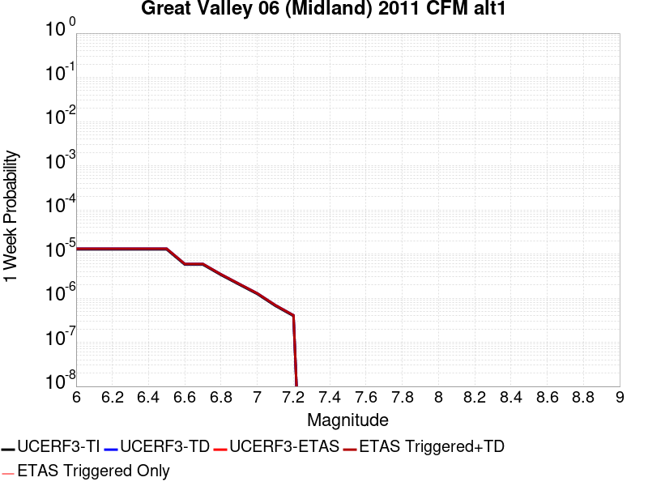 |  | 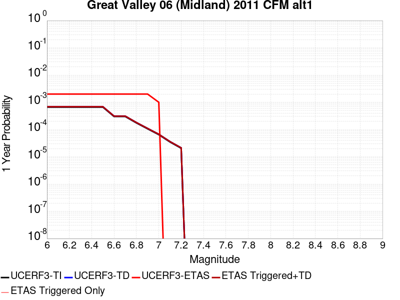 | 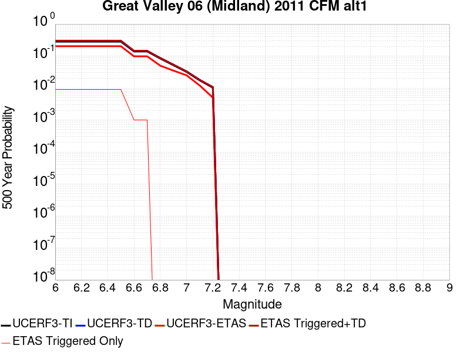 |

| Magnitude | 1 wk TI Prob | 1 wk TD Prob | 1 wk ETAS Prob | 1 wk ETAS/TD Gain | 1 wk ETAS Triggered+TD | 1 wk ETAS Triggered Only | 1 mo TI Prob | 1 mo TD Prob | 1 mo ETAS Prob | 1 mo ETAS/TD Gain | 1 mo ETAS Triggered+TD | 1 mo ETAS Triggered Only | 1 yr TI Prob | 1 yr TD Prob | 1 yr ETAS Prob | 1 yr ETAS/TD Gain | 1 yr ETAS Triggered+TD | 1 yr ETAS Triggered Only | 500 yr TI Prob | 500 yr TD Prob | 500 yr ETAS Prob | 500 yr ETAS/TD Gain | 500 yr ETAS Triggered+TD | 500 yr ETAS Triggered Only |
|-----|-----|-----|-----|-----|-----|-----|-----|-----|-----|-----|-----|-----|-----|-----|-----|-----|-----|-----|-----|-----|-----|-----|-----|-----|
| 6.0 | 1.2712525E-5 | 1.3183723E-5 | 0.0 | 0.0 | 1.3183723E-5 | 0.0 | 5.4481112E-5 | 5.650059E-5 | 0.0 | 0.0 | 5.650059E-5 | 0.0 | 6.6310563E-4 | 6.8770285E-4 | 0.002 | 2.9082327 | 6.8770285E-4 | 0.0 | 0.2822707 | 0.29612532 | 0.203 | 0.6855205 | 0.3024602 | 0.009 |
| 6.1 | 1.2712525E-5 | 1.3183723E-5 | 0.0 | 0.0 | 1.3183723E-5 | 0.0 | 5.4481112E-5 | 5.650059E-5 | 0.0 | 0.0 | 5.650059E-5 | 0.0 | 6.6310563E-4 | 6.8770285E-4 | 0.002 | 2.9082327 | 6.8770285E-4 | 0.0 | 0.2822707 | 0.29612532 | 0.203 | 0.6855205 | 0.3024602 | 0.009 |
| 6.2 | 1.2712525E-5 | 1.3183723E-5 | 0.0 | 0.0 | 1.3183723E-5 | 0.0 | 5.4481112E-5 | 5.650059E-5 | 0.0 | 0.0 | 5.650059E-5 | 0.0 | 6.6310563E-4 | 6.8770285E-4 | 0.002 | 2.9082327 | 6.8770285E-4 | 0.0 | 0.2822707 | 0.29612532 | 0.203 | 0.6855205 | 0.3024602 | 0.009 |
| 6.3 | 1.2712525E-5 | 1.3183723E-5 | 0.0 | 0.0 | 1.3183723E-5 | 0.0 | 5.4481112E-5 | 5.650059E-5 | 0.0 | 0.0 | 5.650059E-5 | 0.0 | 6.6310563E-4 | 6.8770285E-4 | 0.002 | 2.9082327 | 6.8770285E-4 | 0.0 | 0.2822707 | 0.29612532 | 0.203 | 0.6855205 | 0.3024602 | 0.009 |
| 6.4 | 1.2712525E-5 | 1.3183723E-5 | 0.0 | 0.0 | 1.3183723E-5 | 0.0 | 5.4481112E-5 | 5.650059E-5 | 0.0 | 0.0 | 5.650059E-5 | 0.0 | 6.6310563E-4 | 6.8770285E-4 | 0.002 | 2.9082327 | 6.8770285E-4 | 0.0 | 0.2822707 | 0.29612532 | 0.203 | 0.6855205 | 0.3024602 | 0.009 |
| 6.5 | 1.2712525E-5 | 1.3183723E-5 | 0.0 | 0.0 | 1.3183723E-5 | 0.0 | 5.4481112E-5 | 5.650059E-5 | 0.0 | 0.0 | 5.650059E-5 | 0.0 | 6.6310563E-4 | 6.8770285E-4 | 0.002 | 2.9082327 | 6.8770285E-4 | 0.0 | 0.2822707 | 0.29612532 | 0.203 | 0.6855205 | 0.3024602 | 0.009 |
| 6.6 | 5.7574384E-6 | 5.959176E-6 | 0.0 | 0.0 | 5.959176E-6 | 0.0 | 2.4674504E-5 | 2.5539099E-5 | 0.0 | 0.0 | 2.5539099E-5 | 0.0 | 3.0037065E-4 | 3.1089806E-4 | 0.002 | 6.4329767 | 3.1089806E-4 | 0.0 | 0.13947093 | 0.14490916 | 0.098 | 0.67628574 | 0.14576425 | 0.001 |
| 6.7 | 5.7574384E-6 | 5.959176E-6 | 0.0 | 0.0 | 5.959176E-6 | 0.0 | 2.4674504E-5 | 2.5539099E-5 | 0.0 | 0.0 | 2.5539099E-5 | 0.0 | 3.0037065E-4 | 3.1089806E-4 | 0.002 | 6.4329767 | 3.1089806E-4 | 0.0 | 0.13947093 | 0.14490916 | 0.098 | 0.67628574 | 0.14576425 | 0.001 |
| 6.8 | 3.3474828E-6 | 3.4628308E-6 | 0.0 | 0.0 | 3.4628308E-6 | 0.0 | 1.4346277E-5 | 1.4840628E-5 | 0.0 | 0.0 | 1.4840628E-5 | 0.0 | 1.7465191E-4 | 1.8067115E-4 | 0.002 | 11.069836 | 1.8067115E-4 | 0.0 | 0.08362864 | 0.08675541 | 0.05 | 0.5763329 | 0.08675541 | 0.0 |
| 6.9 | 2.035106E-6 | 2.1050612E-6 | 0.0 | 0.0 | 2.1050612E-6 | 0.0 | 8.721853E-6 | 9.0216645E-6 | 0.0 | 0.0 | 9.0216645E-6 | 0.0 | 1.0618339E-4 | 1.09833956E-4 | 0.002 | 18.209305 | 1.09833956E-4 | 0.0 | 0.05170962 | 0.0536288 | 0.035 | 0.65263444 | 0.0536288 | 0.0 |
| 7.0 | 1.2424716E-6 | 1.2854348E-6 | 0.0 | 0.0 | 1.2854348E-6 | 0.0 | 5.3248673E-6 | 5.508997E-6 | 0.0 | 0.0 | 5.508997E-6 | 0.0 | 6.482833E-5 | 6.7070425E-5 | 0.001 | 14.9097 | 6.7070425E-5 | 0.0 | 0.031895474 | 0.033099234 | 0.025 | 0.75530446 | 0.033099234 | 0.0 |
| 7.1 | 6.6904556E-7 | 6.925662E-7 | 0.0 | 0.0 | 6.925662E-7 | 0.0 | 2.867335E-6 | 2.9681387E-6 | 0.0 | 0.0 | 2.9681387E-6 | 0.0 | 3.4909244E-5 | 3.613675E-5 | 0.0 | 0.0 | 3.613675E-5 | 0.0 | 0.017303472 | 0.01797605 | 0.012 | 0.6675549 | 0.01797605 | 0.0 |
| 7.2 | 3.948168E-7 | 4.0877663E-7 | 0.0 | 0.0 | 4.0877663E-7 | 0.0 | 1.6920709E-6 | 1.7518998E-6 | 0.0 | 0.0 | 1.7518998E-6 | 0.0 | 2.0600768E-5 | 2.132938E-5 | 0.0 | 0.0 | 2.132938E-5 | 0.0 | 0.010247622 | 0.01066469 | 0.005 | 0.46883687 | 0.01066469 | 0.0 |

## Sheephole
*[(top)](#table-of-contents)*

| 1 Week | 1 Month | 1 Year | 500 Year |
|-----|-----|-----|-----|
|  | 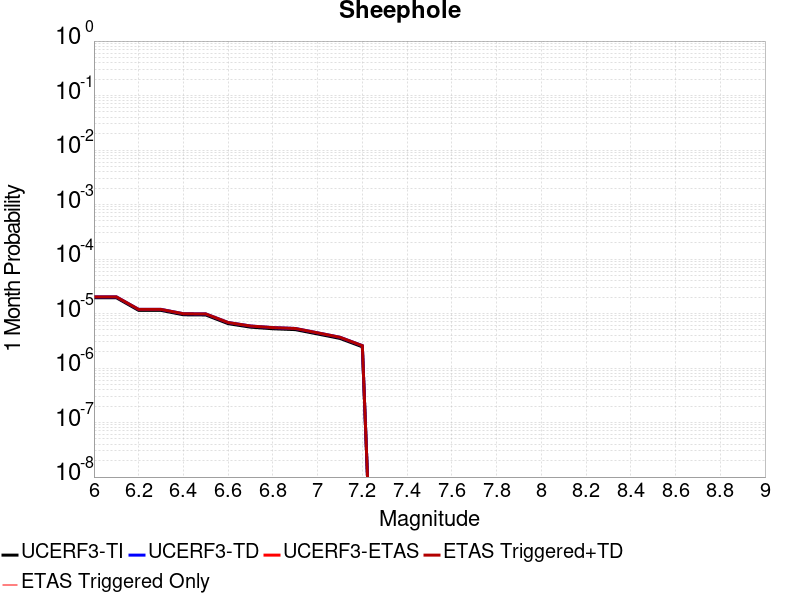 | 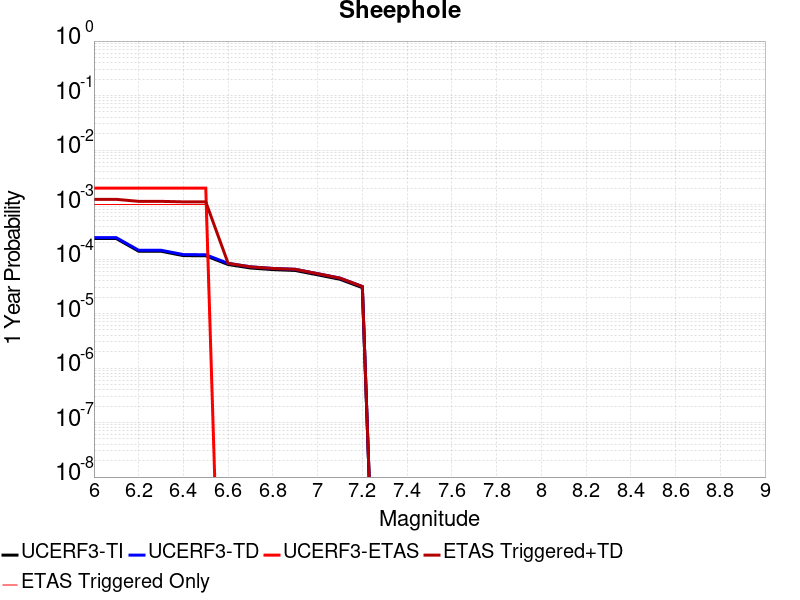 | 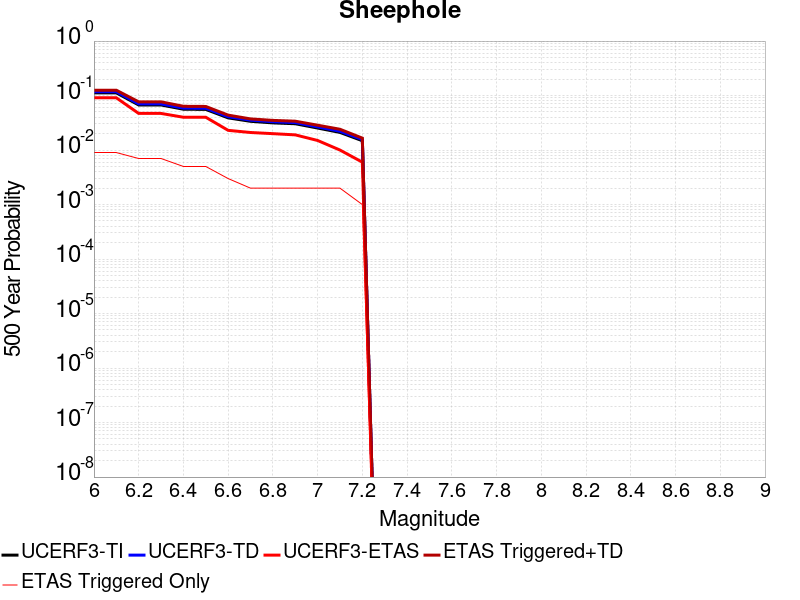 |

| Magnitude | 1 wk TI Prob | 1 wk TD Prob | 1 wk ETAS Prob | 1 wk ETAS/TD Gain | 1 wk ETAS Triggered+TD | 1 wk ETAS Triggered Only | 1 mo TI Prob | 1 mo TD Prob | 1 mo ETAS Prob | 1 mo ETAS/TD Gain | 1 mo ETAS Triggered+TD | 1 mo ETAS Triggered Only | 1 yr TI Prob | 1 yr TD Prob | 1 yr ETAS Prob | 1 yr ETAS/TD Gain | 1 yr ETAS Triggered+TD | 1 yr ETAS Triggered Only | 500 yr TI Prob | 500 yr TD Prob | 500 yr ETAS Prob | 500 yr ETAS/TD Gain | 500 yr ETAS Triggered+TD | 500 yr ETAS Triggered Only |
|-----|-----|-----|-----|-----|-----|-----|-----|-----|-----|-----|-----|-----|-----|-----|-----|-----|-----|-----|-----|-----|-----|-----|-----|-----|
| 6.0 | 4.5579695E-6 | 4.7313565E-6 | 0.0 | 0.0 | 4.7313565E-6 | 0.0 | 1.9534009E-5 | 2.0277117E-5 | 0.0 | 0.0 | 2.0277117E-5 | 0.0 | 2.3780059E-4 | 2.4685144E-4 | 0.002 | 8.102038 | 0.0012466046 | 0.001 | 0.11211623 | 0.11749127 | 0.091 | 0.77452564 | 0.12543385 | 0.009 |
| 6.1 | 4.5579695E-6 | 4.7313565E-6 | 0.0 | 0.0 | 4.7313565E-6 | 0.0 | 1.9534009E-5 | 2.0277117E-5 | 0.0 | 0.0 | 2.0277117E-5 | 0.0 | 2.3780059E-4 | 2.4685144E-4 | 0.002 | 8.102038 | 0.0012466046 | 0.001 | 0.11211623 | 0.11749127 | 0.091 | 0.77452564 | 0.12543385 | 0.009 |
| 6.2 | 2.6677674E-6 | 2.7809026E-6 | 0.0 | 0.0 | 2.7809026E-6 | 0.0 | 1.1433239E-5 | 1.1918106E-5 | 0.0 | 0.0 | 1.1918106E-5 | 0.0 | 1.3919079E-4 | 1.4509435E-4 | 0.002 | 13.784134 | 0.0011449492 | 0.001 | 0.06723337 | 0.07025667 | 0.047 | 0.66897565 | 0.076764874 | 0.007 |
| 6.3 | 2.6677674E-6 | 2.7809026E-6 | 0.0 | 0.0 | 2.7809026E-6 | 0.0 | 1.1433239E-5 | 1.1918106E-5 | 0.0 | 0.0 | 1.1918106E-5 | 0.0 | 1.3919079E-4 | 1.4509435E-4 | 0.002 | 13.784134 | 0.0011449492 | 0.001 | 0.06723337 | 0.07025667 | 0.047 | 0.66897565 | 0.076764874 | 0.007 |
| 6.4 | 2.2159759E-6 | 2.317066E-6 | 0.0 | 0.0 | 2.317066E-6 | 0.0 | 9.497005E-6 | 9.93025E-6 | 0.0 | 0.0 | 9.93025E-6 | 0.0 | 1.156199E-4 | 1.2089489E-4 | 0.002 | 16.543297 | 0.001120774 | 0.001 | 0.056173846 | 0.05886785 | 0.04 | 0.67948806 | 0.06357351 | 0.005 |
| 6.5 | 2.1986082E-6 | 2.298987E-6 | 0.0 | 0.0 | 2.298987E-6 | 0.0 | 9.4225725E-6 | 9.852769E-6 | 0.0 | 0.0 | 9.852769E-6 | 0.0 | 1.1471378E-4 | 1.1995166E-4 | 0.002 | 16.673382 | 0.0011198317 | 0.001 | 0.055746093 | 0.05842374 | 0.04 | 0.68465316 | 0.06313162 | 0.005 |
| 6.6 | 1.5232331E-6 | 1.5976037E-6 | 0.0 | 0.0 | 1.5976037E-6 | 0.0 | 6.5281256E-6 | 6.846856E-6 | 0.0 | 0.0 | 6.846856E-6 | 0.0 | 7.947703E-5 | 8.3357474E-5 | 0.0 | 0.0 | 8.3357474E-5 | 0.0 | 0.038960814 | 0.040873136 | 0.023 | 0.5627168 | 0.043750517 | 0.003 |
| 6.7 | 1.3137362E-6 | 1.3790501E-6 | 0.0 | 0.0 | 1.3790501E-6 | 0.0 | 5.6302856E-6 | 5.910202E-6 | 0.0 | 0.0 | 5.910202E-6 | 0.0 | 6.854657E-5 | 7.195448E-5 | 0.0 | 0.0 | 7.195448E-5 | 0.0 | 0.033693746 | 0.03537591 | 0.021 | 0.5936243 | 0.037305158 | 0.002 |
| 6.8 | 1.2275751E-6 | 1.2887539E-6 | 0.0 | 0.0 | 1.2887539E-6 | 0.0 | 5.2610258E-6 | 5.5232204E-6 | 0.0 | 0.0 | 5.5232204E-6 | 0.0 | 6.4051106E-5 | 6.7243265E-5 | 0.0 | 0.0 | 6.7243265E-5 | 0.0 | 0.03151916 | 0.03309936 | 0.02 | 0.60424125 | 0.035033163 | 0.002 |
| 6.9 | 1.1837088E-6 | 1.2426977E-6 | 0.0 | 0.0 | 1.2426977E-6 | 0.0 | 5.0730278E-6 | 5.3258373E-6 | 0.0 | 0.0 | 5.3258373E-6 | 0.0 | 6.176237E-5 | 6.484027E-5 | 0.0 | 0.0 | 6.484027E-5 | 0.0 | 0.030410154 | 0.03193634 | 0.019 | 0.59493357 | 0.033872467 | 0.002 |
| 7.0 | 9.849371E-7 | 1.033809E-6 | 0.0 | 0.0 | 1.033809E-6 | 0.0 | 4.2211523E-6 | 4.430603E-6 | 0.0 | 0.0 | 4.430603E-6 | 0.0 | 5.1391315E-5 | 5.394136E-5 | 0.0 | 0.0 | 5.394136E-5 | 0.0 | 0.025368977 | 0.026637996 | 0.015 | 0.56310546 | 0.028584719 | 0.002 |
| 7.1 | 8.1643645E-7 | 8.568362E-7 | 0.0 | 0.0 | 8.568362E-7 | 0.0 | 3.4990085E-6 | 3.6721506E-6 | 0.0 | 0.0 | 3.6721506E-6 | 0.0 | 4.2599597E-5 | 4.47076E-5 | 0.0 | 0.0 | 4.47076E-5 | 0.0 | 0.021075003 | 0.022129577 | 0.01 | 0.4518839 | 0.024085319 | 0.002 |
| 7.2 | 5.7295756E-7 | 6.013143E-7 | 0.0 | 0.0 | 6.013143E-7 | 0.0 | 2.45553E-6 | 2.577059E-6 | 0.0 | 0.0 | 2.577059E-6 | 0.0 | 2.9895667E-5 | 3.1375308E-5 | 0.0 | 0.0 | 3.1375308E-5 | 0.0 | 0.01483689 | 0.015583671 | 0.006 | 0.3850184 | 0.016568087 | 0.001 |

## Hector Mine
*[(top)](#table-of-contents)*

| 1 Week | 1 Month | 1 Year | 500 Year |
|-----|-----|-----|-----|
| 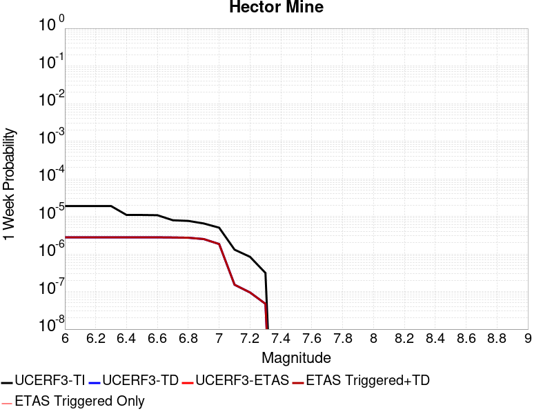 |  | 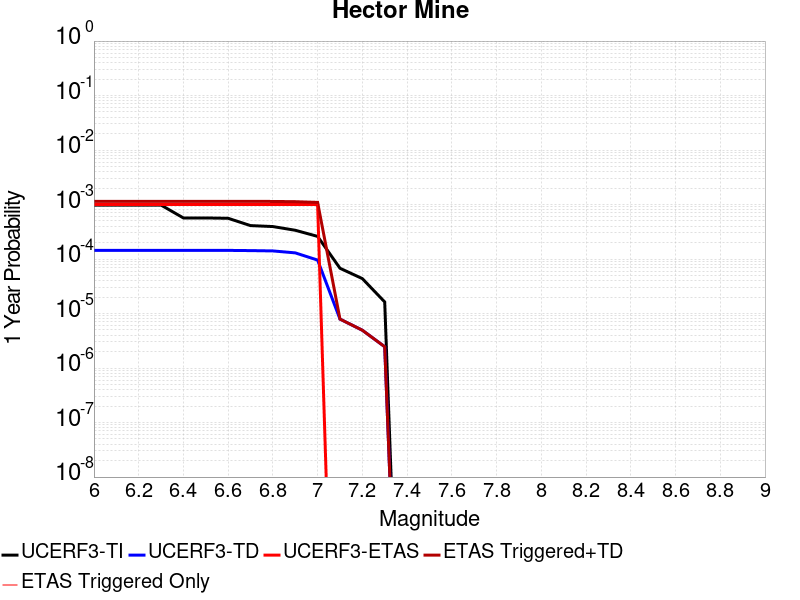 | 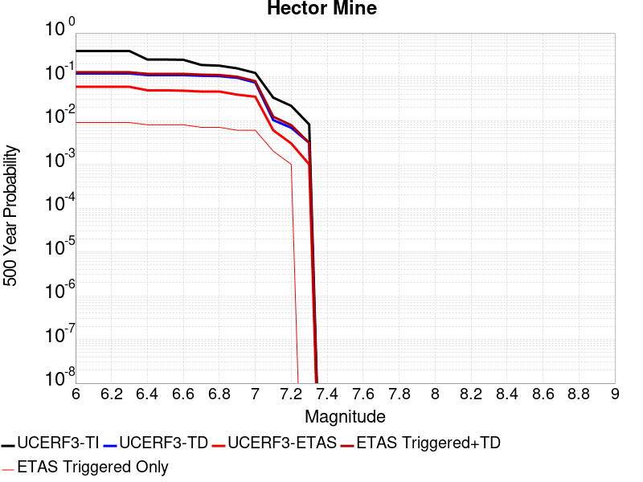 |

| Magnitude | 1 wk TI Prob | 1 wk TD Prob | 1 wk ETAS Prob | 1 wk ETAS/TD Gain | 1 wk ETAS Triggered+TD | 1 wk ETAS Triggered Only | 1 mo TI Prob | 1 mo TD Prob | 1 mo ETAS Prob | 1 mo ETAS/TD Gain | 1 mo ETAS Triggered+TD | 1 mo ETAS Triggered Only | 1 yr TI Prob | 1 yr TD Prob | 1 yr ETAS Prob | 1 yr ETAS/TD Gain | 1 yr ETAS Triggered+TD | 1 yr ETAS Triggered Only | 500 yr TI Prob | 500 yr TD Prob | 500 yr ETAS Prob | 500 yr ETAS/TD Gain | 500 yr ETAS Triggered+TD | 500 yr ETAS Triggered Only |
|-----|-----|-----|-----|-----|-----|-----|-----|-----|-----|-----|-----|-----|-----|-----|-----|-----|-----|-----|-----|-----|-----|-----|-----|-----|
| 6.0 | 1.8760093E-5 | 2.7649673E-6 | 0.0 | 0.0 | 2.7649673E-6 | 0.0 | 8.039792E-5 | 1.1849828E-5 | 0.0 | 0.0 | 1.1849828E-5 | 0.0 | 9.78405E-4 | 1.4426603E-4 | 0.001 | 6.9316387 | 0.0011441218 | 0.001 | 0.38703167 | 0.118914954 | 0.059 | 0.4961529 | 0.12684472 | 0.009 |
| 6.1 | 1.8760093E-5 | 2.7649673E-6 | 0.0 | 0.0 | 2.7649673E-6 | 0.0 | 8.039792E-5 | 1.1849828E-5 | 0.0 | 0.0 | 1.1849828E-5 | 0.0 | 9.78405E-4 | 1.4426603E-4 | 0.001 | 6.9316387 | 0.0011441218 | 0.001 | 0.38703167 | 0.118914954 | 0.059 | 0.4961529 | 0.12684472 | 0.009 |
| 6.2 | 1.8760093E-5 | 2.7649673E-6 | 0.0 | 0.0 | 2.7649673E-6 | 0.0 | 8.039792E-5 | 1.1849828E-5 | 0.0 | 0.0 | 1.1849828E-5 | 0.0 | 9.78405E-4 | 1.4426603E-4 | 0.001 | 6.9316387 | 0.0011441218 | 0.001 | 0.38703167 | 0.118914954 | 0.059 | 0.4961529 | 0.12684472 | 0.009 |
| 6.3 | 1.8760093E-5 | 2.7649673E-6 | 0.0 | 0.0 | 2.7649673E-6 | 0.0 | 8.039792E-5 | 1.1849828E-5 | 0.0 | 0.0 | 1.1849828E-5 | 0.0 | 9.78405E-4 | 1.4426603E-4 | 0.001 | 6.9316387 | 0.0011441218 | 0.001 | 0.38703167 | 0.118914954 | 0.059 | 0.4961529 | 0.12684472 | 0.009 |
| 6.4 | 1.0888055E-5 | 2.7649673E-6 | 0.0 | 0.0 | 2.7649673E-6 | 0.0 | 4.666226E-5 | 1.1849828E-5 | 0.0 | 0.0 | 1.1849828E-5 | 0.0 | 5.679649E-4 | 1.4426603E-4 | 0.001 | 6.9316387 | 0.0011441218 | 0.001 | 0.24728088 | 0.10938283 | 0.049 | 0.44796792 | 0.11650777 | 0.008 |
| 6.5 | 1.0888055E-5 | 2.7649673E-6 | 0.0 | 0.0 | 2.7649673E-6 | 0.0 | 4.666226E-5 | 1.1849828E-5 | 0.0 | 0.0 | 1.1849828E-5 | 0.0 | 5.679649E-4 | 1.4426603E-4 | 0.001 | 6.9316387 | 0.0011441218 | 0.001 | 0.24728088 | 0.10938283 | 0.049 | 0.44796792 | 0.11650777 | 0.008 |
| 6.6 | 1.0730738E-5 | 2.7649673E-6 | 0.0 | 0.0 | 2.7649673E-6 | 0.0 | 4.5988065E-5 | 1.1849828E-5 | 0.0 | 0.0 | 1.1849828E-5 | 0.0 | 5.5976084E-4 | 1.4426603E-4 | 0.001 | 6.9316387 | 0.0011441218 | 0.001 | 0.2441851 | 0.109166935 | 0.048 | 0.43969357 | 0.1162936 | 0.008 |
| 6.7 | 7.881326E-6 | 2.740313E-6 | 0.0 | 0.0 | 2.740313E-6 | 0.0 | 3.3776672E-5 | 1.1744168E-5 | 0.0 | 0.0 | 1.1744168E-5 | 0.0 | 4.111534E-4 | 1.429798E-4 | 0.001 | 6.993995 | 0.0011428368 | 0.001 | 0.18585677 | 0.105412774 | 0.046 | 0.43637973 | 0.11167489 | 0.007 |
| 6.8 | 7.5683483E-6 | 2.703224E-6 | 0.0 | 0.0 | 2.703224E-6 | 0.0 | 3.2435375E-5 | 1.1585217E-5 | 0.0 | 0.0 | 1.1585217E-5 | 0.0 | 3.9482914E-4 | 1.4104482E-4 | 0.001 | 7.0899453 | 0.0011409038 | 0.001 | 0.17918172 | 0.10342354 | 0.046 | 0.444773 | 0.10969958 | 0.007 |
| 6.9 | 6.473048E-6 | 2.4894905E-6 | 0.0 | 0.0 | 2.4894905E-6 | 0.0 | 2.7741338E-5 | 1.0669223E-5 | 0.0 | 0.0 | 1.0669223E-5 | 0.0 | 3.3769844E-4 | 1.2989396E-4 | 0.001 | 7.6985874 | 0.001129764 | 0.001 | 0.15538783 | 0.094592206 | 0.039 | 0.41229612 | 0.100024655 | 0.006 |
| 7.0 | 4.9959954E-6 | 1.8365778E-6 | 0.0 | 0.0 | 1.8365778E-6 | 0.0 | 2.1411232E-5 | 7.871044E-6 | 0.0 | 0.0 | 7.871044E-6 | 0.0 | 2.6065056E-4 | 9.5829244E-5 | 0.001 | 10.435227 | 0.0010957334 | 0.001 | 0.12220506 | 0.073748946 | 0.035 | 0.47458306 | 0.079306446 | 0.006 |
| 7.1 | 1.2997541E-6 | 1.5179111E-7 | 0.0 | 0.0 | 1.5179111E-7 | 0.0 | 5.5703626E-6 | 6.505332E-7 | 0.0 | 0.0 | 6.505332E-7 | 0.0 | 6.7817055E-5 | 7.920216E-6 | 0.0 | 0.0 | 7.920216E-6 | 0.0 | 0.033341188 | 0.010249173 | 0.006 | 0.5854131 | 0.012228675 | 0.002 |
| 7.2 | 8.392699E-7 | 9.476205E-8 | 0.0 | 0.0 | 9.476205E-8 | 0.0 | 3.596866E-6 | 4.06123E-7 | 0.0 | 0.0 | 4.06123E-7 | 0.0 | 4.3790962E-5 | 4.9445384E-6 | 0.0 | 0.0 | 4.9445384E-6 | 0.0 | 0.021657985 | 0.0068548713 | 0.003 | 0.437645 | 0.007848017 | 0.001 |
| 7.3 | 3.13015E-7 | 4.720324E-8 | 0.0 | 0.0 | 4.720324E-8 | 0.0 | 1.3414921E-6 | 2.0229959E-7 | 0.0 | 0.0 | 2.0229959E-7 | 0.0 | 1.6332544E-5 | 2.4629956E-6 | 0.0 | 0.0 | 2.4629956E-6 | 0.0 | 0.0081330845 | 0.0030903684 | 0.001 | 0.32358602 | 0.0030903684 | 0.0 |

## North Tahoe 2011 CFM
*[(top)](#table-of-contents)*

| 1 Week | 1 Month | 1 Year | 500 Year |
|-----|-----|-----|-----|
|  | 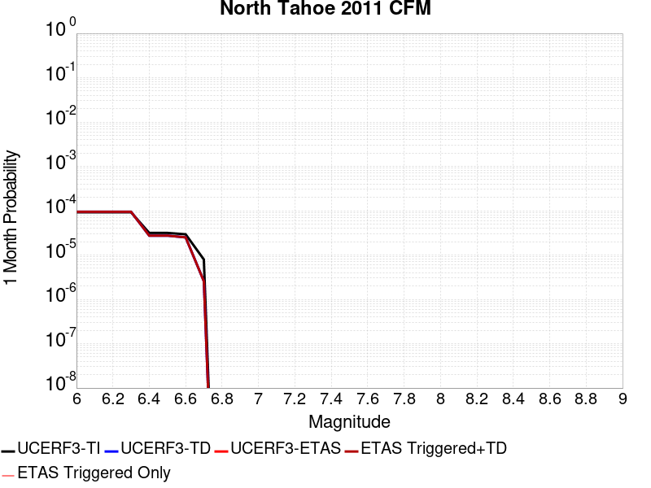 |  | 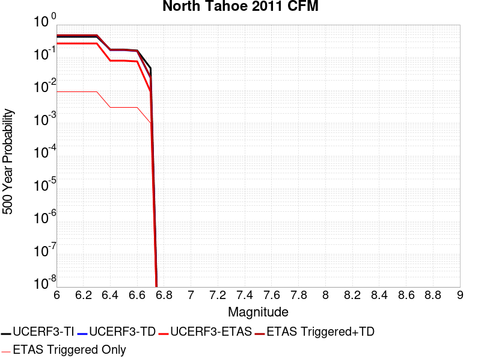 |

| Magnitude | 1 wk TI Prob | 1 wk TD Prob | 1 wk ETAS Prob | 1 wk ETAS/TD Gain | 1 wk ETAS Triggered+TD | 1 wk ETAS Triggered Only | 1 mo TI Prob | 1 mo TD Prob | 1 mo ETAS Prob | 1 mo ETAS/TD Gain | 1 mo ETAS Triggered+TD | 1 mo ETAS Triggered Only | 1 yr TI Prob | 1 yr TD Prob | 1 yr ETAS Prob | 1 yr ETAS/TD Gain | 1 yr ETAS Triggered+TD | 1 yr ETAS Triggered Only | 500 yr TI Prob | 500 yr TD Prob | 500 yr ETAS Prob | 500 yr ETAS/TD Gain | 500 yr ETAS Triggered+TD | 500 yr ETAS Triggered Only |
|-----|-----|-----|-----|-----|-----|-----|-----|-----|-----|-----|-----|-----|-----|-----|-----|-----|-----|-----|-----|-----|-----|-----|-----|-----|
| 6.0 | 2.150391E-5 | 2.2027067E-5 | 0.0 | 0.0 | 2.2027067E-5 | 0.0 | 9.215636E-5 | 9.439939E-5 | 0.0 | 0.0 | 9.439939E-5 | 0.0 | 0.0011214261 | 0.0011489002 | 0.0 | 0.0 | 0.0011489002 | 0.0 | 0.42937768 | 0.47161955 | 0.268 | 0.56825465 | 0.47637498 | 0.009 |
| 6.1 | 2.150391E-5 | 2.2027067E-5 | 0.0 | 0.0 | 2.2027067E-5 | 0.0 | 9.215636E-5 | 9.439939E-5 | 0.0 | 0.0 | 9.439939E-5 | 0.0 | 0.0011214261 | 0.0011489002 | 0.0 | 0.0 | 0.0011489002 | 0.0 | 0.42937768 | 0.47161955 | 0.268 | 0.56825465 | 0.47637498 | 0.009 |
| 6.2 | 2.150391E-5 | 2.2027067E-5 | 0.0 | 0.0 | 2.2027067E-5 | 0.0 | 9.215636E-5 | 9.439939E-5 | 0.0 | 0.0 | 9.439939E-5 | 0.0 | 0.0011214261 | 0.0011489002 | 0.0 | 0.0 | 0.0011489002 | 0.0 | 0.42937768 | 0.47161955 | 0.268 | 0.56825465 | 0.47637498 | 0.009 |
| 6.3 | 2.150391E-5 | 2.2027067E-5 | 0.0 | 0.0 | 2.2027067E-5 | 0.0 | 9.215636E-5 | 9.439939E-5 | 0.0 | 0.0 | 9.439939E-5 | 0.0 | 0.0011214261 | 0.0011489002 | 0.0 | 0.0 | 0.0011489002 | 0.0 | 0.42937768 | 0.47161955 | 0.268 | 0.56825465 | 0.47637498 | 0.009 |
| 6.4 | 7.3563056E-6 | 6.39724E-6 | 0.0 | 0.0 | 6.39724E-6 | 0.0 | 3.1526644E-5 | 2.7416625E-5 | 0.0 | 0.0 | 2.7416625E-5 | 0.0 | 3.8376928E-4 | 3.337765E-4 | 0.0 | 0.0 | 3.337765E-4 | 0.0 | 0.17462832 | 0.16862474 | 0.08 | 0.4744262 | 0.17111887 | 0.003 |
| 6.5 | 7.3563056E-6 | 6.39724E-6 | 0.0 | 0.0 | 6.39724E-6 | 0.0 | 3.1526644E-5 | 2.7416625E-5 | 0.0 | 0.0 | 2.7416625E-5 | 0.0 | 3.8376928E-4 | 3.337765E-4 | 0.0 | 0.0 | 3.337765E-4 | 0.0 | 0.17462832 | 0.16862474 | 0.08 | 0.4744262 | 0.17111887 | 0.003 |
| 6.6 | 6.8508816E-6 | 5.839588E-6 | 0.0 | 0.0 | 5.839588E-6 | 0.0 | 2.936059E-5 | 2.5026735E-5 | 0.0 | 0.0 | 2.5026735E-5 | 0.0 | 3.5740656E-4 | 3.0468788E-4 | 0.0 | 0.0 | 3.0468788E-4 | 0.0 | 0.16367269 | 0.15655796 | 0.076 | 0.48544323 | 0.15908828 | 0.003 |
| 6.7 | 1.8511148E-6 | 5.988094E-7 | 0.0 | 0.0 | 5.988094E-7 | 0.0 | 7.933325E-6 | 2.566326E-6 | 0.0 | 0.0 | 2.566326E-6 | 0.0 | 9.658395E-5 | 3.1245017E-5 | 0.0 | 0.0 | 3.1245017E-5 | 0.0 | 0.04714669 | 0.023939142 | 0.009 | 0.37595332 | 0.024915203 | 0.001 |

## Rinconada 2011 CFM
*[(top)](#table-of-contents)*

| 1 Week | 1 Month | 1 Year | 500 Year |
|-----|-----|-----|-----|
|  |  | 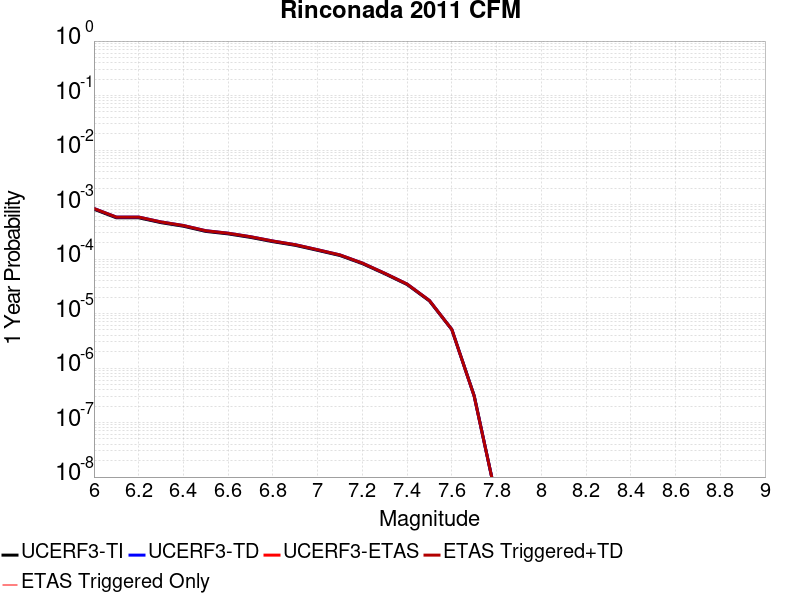 | 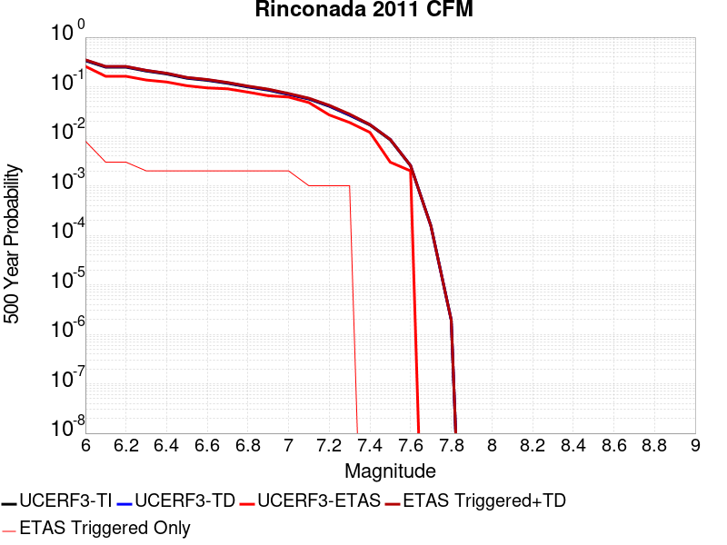 |

| Magnitude | 1 wk TI Prob | 1 wk TD Prob | 1 wk ETAS Prob | 1 wk ETAS/TD Gain | 1 wk ETAS Triggered+TD | 1 wk ETAS Triggered Only | 1 mo TI Prob | 1 mo TD Prob | 1 mo ETAS Prob | 1 mo ETAS/TD Gain | 1 mo ETAS Triggered+TD | 1 mo ETAS Triggered Only | 1 yr TI Prob | 1 yr TD Prob | 1 yr ETAS Prob | 1 yr ETAS/TD Gain | 1 yr ETAS Triggered+TD | 1 yr ETAS Triggered Only | 500 yr TI Prob | 500 yr TD Prob | 500 yr ETAS Prob | 500 yr ETAS/TD Gain | 500 yr ETAS Triggered+TD | 500 yr ETAS Triggered Only |
|-----|-----|-----|-----|-----|-----|-----|-----|-----|-----|-----|-----|-----|-----|-----|-----|-----|-----|-----|-----|-----|-----|-----|-----|-----|
| 6.0 | 1.5752368E-5 | 1.6246588E-5 | 0.0 | 0.0 | 1.6246588E-5 | 0.0 | 6.75084E-5 | 6.962639E-5 | 0.0 | 0.0 | 6.962639E-5 | 0.0 | 8.2160486E-4 | 8.4737473E-4 | 0.0 | 0.0 | 8.4737473E-4 | 0.0 | 0.33699402 | 0.34606397 | 0.259 | 0.7484165 | 0.35129547 | 0.008 |
| 6.1 | 1.0966133E-5 | 1.1303782E-5 | 0.0 | 0.0 | 1.1303782E-5 | 0.0 | 4.6996865E-5 | 4.8443886E-5 | 0.0 | 0.0 | 4.8443886E-5 | 0.0 | 5.720366E-4 | 5.896454E-4 | 0.0 | 0.0 | 5.896454E-4 | 0.0 | 0.24881262 | 0.25555968 | 0.163 | 0.6378158 | 0.257793 | 0.003 |
| 6.2 | 1.0966133E-5 | 1.1303782E-5 | 0.0 | 0.0 | 1.1303782E-5 | 0.0 | 4.6996865E-5 | 4.8443886E-5 | 0.0 | 0.0 | 4.8443886E-5 | 0.0 | 5.720366E-4 | 5.896454E-4 | 0.0 | 0.0 | 5.896454E-4 | 0.0 | 0.24881262 | 0.25555968 | 0.163 | 0.6378158 | 0.257793 | 0.003 |
| 6.3 | 8.926149E-6 | 9.197298E-6 | 0.0 | 0.0 | 9.197298E-6 | 0.0 | 3.8254362E-5 | 3.9416394E-5 | 0.0 | 0.0 | 3.9416394E-5 | 0.0 | 4.6564735E-4 | 4.7978928E-4 | 0.0 | 0.0 | 4.7978928E-4 | 0.0 | 0.2077497 | 0.21341398 | 0.137 | 0.6419448 | 0.21498716 | 0.002 |
| 6.4 | 7.676955E-6 | 7.907047E-6 | 0.0 | 0.0 | 7.907047E-6 | 0.0 | 3.290082E-5 | 3.3886903E-5 | 0.0 | 0.0 | 3.3886903E-5 | 0.0 | 4.0049385E-4 | 4.1249514E-4 | 0.0 | 0.0 | 4.1249514E-4 | 0.0 | 0.18150422 | 0.18645379 | 0.125 | 0.67040735 | 0.18808089 | 0.002 |
| 6.5 | 6.1671026E-6 | 6.3485686E-6 | 0.0 | 0.0 | 6.3485686E-6 | 0.0 | 2.6430173E-5 | 2.7207867E-5 | 0.0 | 0.0 | 2.7207867E-5 | 0.0 | 3.2173982E-4 | 3.3120552E-4 | 0.0 | 0.0 | 3.3120552E-4 | 0.0 | 0.14861922 | 0.15266947 | 0.105 | 0.68776023 | 0.15436414 | 0.002 |
| 6.6 | 5.553456E-6 | 5.715527E-6 | 0.0 | 0.0 | 5.715527E-6 | 0.0 | 2.3800309E-5 | 2.4494886E-5 | 0.0 | 0.0 | 2.4494886E-5 | 0.0 | 2.897302E-4 | 2.981845E-4 | 0.0 | 0.0 | 2.981845E-4 | 0.0 | 0.13487917 | 0.1385537 | 0.095 | 0.68565476 | 0.14027658 | 0.002 |
| 6.7 | 4.787857E-6 | 4.9254154E-6 | 0.0 | 0.0 | 4.9254154E-6 | 0.0 | 2.0519226E-5 | 2.1108752E-5 | 0.0 | 0.0 | 2.1108752E-5 | 0.0 | 2.4979294E-4 | 2.5696878E-4 | 0.0 | 0.0 | 2.5696878E-4 | 0.0 | 0.1174255 | 0.12060771 | 0.091 | 0.75451225 | 0.122366495 | 0.002 |
| 6.8 | 3.9955166E-6 | 4.107061E-6 | 0.0 | 0.0 | 4.107061E-6 | 0.0 | 1.7123532E-5 | 1.7601573E-5 | 0.0 | 0.0 | 1.7601573E-5 | 0.0 | 2.0845905E-4 | 2.1427809E-4 | 0.0 | 0.0 | 2.1427809E-4 | 0.0 | 0.09899132 | 0.101627216 | 0.078 | 0.76751095 | 0.10342396 | 0.002 |
| 6.9 | 3.4250072E-6 | 3.5171379E-6 | 0.0 | 0.0 | 3.5171379E-6 | 0.0 | 1.46785205E-5 | 1.5073361E-5 | 0.0 | 0.0 | 1.5073361E-5 | 0.0 | 1.7869633E-4 | 1.8350274E-4 | 0.0 | 0.0 | 1.8350274E-4 | 0.0 | 0.08548019 | 0.08769182 | 0.066 | 0.7526357 | 0.08951644 | 0.002 |
| 7.0 | 2.7712713E-6 | 2.842575E-6 | 0.0 | 0.0 | 2.842575E-6 | 0.0 | 1.1876823E-5 | 1.2182408E-5 | 0.0 | 0.0 | 1.2182408E-5 | 0.0 | 1.4459073E-4 | 1.4831073E-4 | 0.0 | 0.0 | 1.4831073E-4 | 0.0 | 0.06974877 | 0.07149258 | 0.062 | 0.86722285 | 0.073349595 | 0.002 |
| 7.1 | 2.227358E-6 | 2.28249E-6 | 0.0 | 0.0 | 2.28249E-6 | 0.0 | 9.545785E-6 | 9.782064E-6 | 0.0 | 0.0 | 9.782064E-6 | 0.0 | 1.16213734E-4 | 1.19090124E-4 | 0.0 | 0.0 | 1.19090124E-4 | 0.0 | 0.05645408 | 0.057824537 | 0.048 | 0.83009744 | 0.05876671 | 0.001 |
| 7.2 | 1.581796E-6 | 1.6187238E-6 | 0.0 | 0.0 | 1.6187238E-6 | 0.0 | 6.779108E-6 | 6.937369E-6 | 0.0 | 0.0 | 6.937369E-6 | 0.0 | 8.253252E-5 | 8.44592E-5 | 0.0 | 0.0 | 8.44592E-5 | 0.0 | 0.04042803 | 0.04136553 | 0.027 | 0.65271735 | 0.042324163 | 0.001 |
| 7.3 | 1.0306567E-6 | 1.0532791E-6 | 0.0 | 0.0 | 1.0532791E-6 | 0.0 | 4.4170924E-6 | 4.5140455E-6 | 0.0 | 0.0 | 4.5140455E-6 | 0.0 | 5.3776774E-5 | 5.495712E-5 | 0.0 | 0.0 | 5.495712E-5 | 0.0 | 0.026530817 | 0.027118156 | 0.019 | 0.7006376 | 0.028091038 | 0.001 |
| 7.4 | 6.535541E-7 | 6.6739966E-7 | 0.0 | 0.0 | 6.6739966E-7 | 0.0 | 2.800943E-6 | 2.860281E-6 | 0.0 | 0.0 | 2.860281E-6 | 0.0 | 3.4100947E-5 | 3.4823366E-5 | 0.0 | 0.0 | 3.4823366E-5 | 0.0 | 0.016906222 | 0.017274074 | 0.012 | 0.6946827 | 0.017274074 | 0.0 |
| 7.5 | 3.2656962E-7 | 3.3272497E-7 | 0.0 | 0.0 | 3.3272497E-7 | 0.0 | 1.3995833E-6 | 1.4259634E-6 | 0.0 | 0.0 | 1.4259634E-6 | 0.0 | 1.7039794E-5 | 1.7360966E-5 | 0.0 | 0.0 | 1.7360966E-5 | 0.0 | 0.008483777 | 0.008655687 | 0.003 | 0.34659293 | 0.008655687 | 0.0 |
| 7.6 | 9.754343E-8 | 9.808446E-8 | 0.0 | 0.0 | 9.808446E-8 | 0.0 | 4.180432E-7 | 4.203619E-7 | 0.0 | 0.0 | 4.203619E-7 | 0.0 | 5.089664E-6 | 5.1178945E-6 | 0.0 | 0.0 | 5.1178945E-6 | 0.0 | 0.002541603 | 0.0025682806 | 0.002 | 0.7787311 | 0.0025682806 | 0.0 |
| 7.7 | 6.0001453E-9 | 5.8387544E-9 | 0.0 | 0.0 | 5.8387544E-9 | 0.0 | 2.5714908E-8 | 2.5023233E-8 | 0.0 | 0.0 | 2.5023233E-8 | 0.0 | 3.1307894E-7 | 3.0465782E-7 | 0.0 | 0.0 | 3.0465782E-7 | 0.0 | 1.5652725E-4 | 1.5433713E-4 | 0.0 | 0.0 | 1.5433713E-4 | 0.0 |
| 7.8 | 7.400003E-11 | 7.46202E-11 | 0.0 | 0.0 | 7.46202E-11 | 0.0 | 3.171432E-10 | 3.1980074E-10 | 0.0 | 0.0 | 3.1980074E-10 | 0.0 | 3.861218E-9 | 3.8935735E-9 | 0.0 | 0.0 | 3.8935735E-9 | 0.0 | 1.9306071E-6 | 1.9467868E-6 | 0.0 | 0.0 | 1.9467868E-6 | 0.0 |

## Ash Hill
*[(top)](#table-of-contents)*

| 1 Week | 1 Month | 1 Year | 500 Year |
|-----|-----|-----|-----|
|  | 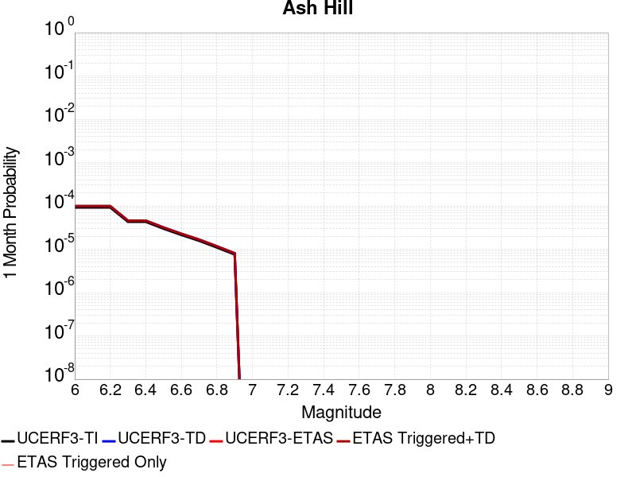 | 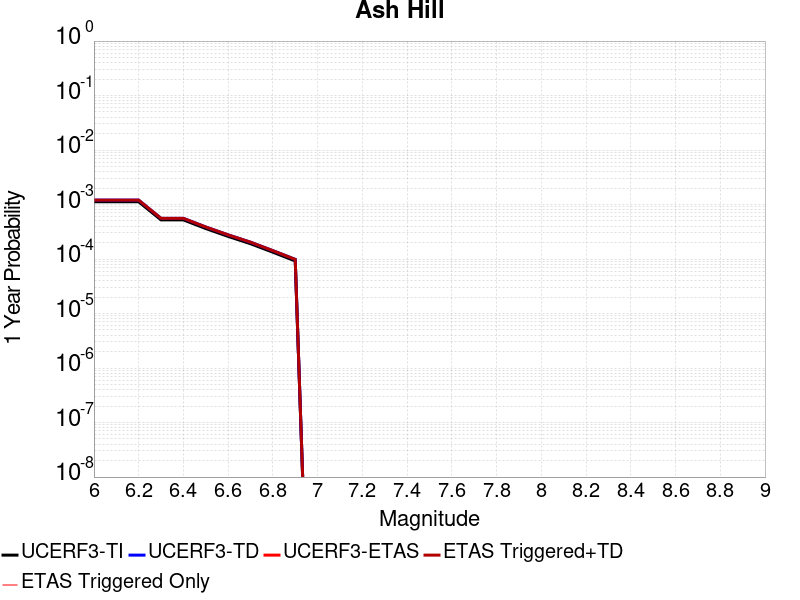 | 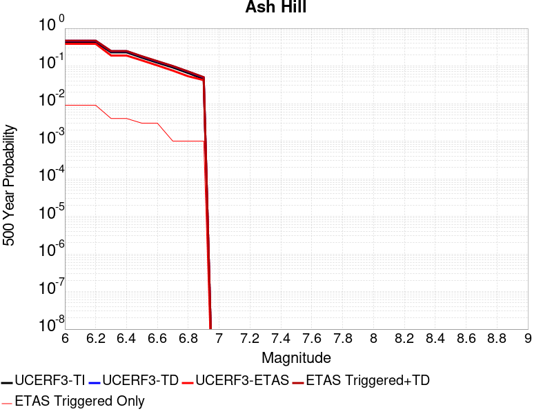 |

| Magnitude | 1 wk TI Prob | 1 wk TD Prob | 1 wk ETAS Prob | 1 wk ETAS/TD Gain | 1 wk ETAS Triggered+TD | 1 wk ETAS Triggered Only | 1 mo TI Prob | 1 mo TD Prob | 1 mo ETAS Prob | 1 mo ETAS/TD Gain | 1 mo ETAS Triggered+TD | 1 mo ETAS Triggered Only | 1 yr TI Prob | 1 yr TD Prob | 1 yr ETAS Prob | 1 yr ETAS/TD Gain | 1 yr ETAS Triggered+TD | 1 yr ETAS Triggered Only | 500 yr TI Prob | 500 yr TD Prob | 500 yr ETAS Prob | 500 yr ETAS/TD Gain | 500 yr ETAS Triggered+TD | 500 yr ETAS Triggered Only |
|-----|-----|-----|-----|-----|-----|-----|-----|-----|-----|-----|-----|-----|-----|-----|-----|-----|-----|-----|-----|-----|-----|-----|-----|-----|
| 6.0 | 2.1545662E-5 | 2.3102508E-5 | 0.0 | 0.0 | 2.3102508E-5 | 0.0 | 9.2335285E-5 | 9.900743E-5 | 0.0 | 0.0 | 9.900743E-5 | 0.0 | 0.0011236023 | 0.0012048283 | 0.0 | 0.0 | 0.0012048283 | 0.0 | 0.4299989 | 0.46470296 | 0.387 | 0.8327901 | 0.46952063 | 0.009 |
| 6.1 | 2.1545662E-5 | 2.3102508E-5 | 0.0 | 0.0 | 2.3102508E-5 | 0.0 | 9.2335285E-5 | 9.900743E-5 | 0.0 | 0.0 | 9.900743E-5 | 0.0 | 0.0011236023 | 0.0012048283 | 0.0 | 0.0 | 0.0012048283 | 0.0 | 0.4299989 | 0.46470296 | 0.387 | 0.8327901 | 0.46952063 | 0.009 |
| 6.2 | 2.1545662E-5 | 2.3102508E-5 | 0.0 | 0.0 | 2.3102508E-5 | 0.0 | 9.2335285E-5 | 9.900743E-5 | 0.0 | 0.0 | 9.900743E-5 | 0.0 | 0.0011236023 | 0.0012048283 | 0.0 | 0.0 | 0.0012048283 | 0.0 | 0.4299989 | 0.46470296 | 0.387 | 0.8327901 | 0.46952063 | 0.009 |
| 6.3 | 1.0025529E-5 | 1.0706888E-5 | 0.0 | 0.0 | 1.0706888E-5 | 0.0 | 4.2965847E-5 | 4.5885932E-5 | 0.0 | 0.0 | 4.5885932E-5 | 0.0 | 5.229836E-4 | 5.5853114E-4 | 0.0 | 0.0 | 5.5853114E-4 | 0.0 | 0.23015048 | 0.24630253 | 0.189 | 0.767349 | 0.24931732 | 0.004 |
| 6.4 | 1.0025529E-5 | 1.0706888E-5 | 0.0 | 0.0 | 1.0706888E-5 | 0.0 | 4.2965847E-5 | 4.5885932E-5 | 0.0 | 0.0 | 4.5885932E-5 | 0.0 | 5.229836E-4 | 5.5853114E-4 | 0.0 | 0.0 | 5.5853114E-4 | 0.0 | 0.23015048 | 0.24630253 | 0.189 | 0.767349 | 0.24931732 | 0.004 |
| 6.5 | 6.9617327E-6 | 7.429185E-6 | 0.0 | 0.0 | 7.429185E-6 | 0.0 | 2.9835655E-5 | 3.1839027E-5 | 0.0 | 0.0 | 3.1839027E-5 | 0.0 | 3.6318856E-4 | 3.8757978E-4 | 0.0 | 0.0 | 3.8757978E-4 | 0.0 | 0.1660879 | 0.17808363 | 0.14 | 0.7861475 | 0.18054938 | 0.003 |
| 6.6 | 4.9919777E-6 | 5.327016E-6 | 0.0 | 0.0 | 5.327016E-6 | 0.0 | 2.1394015E-5 | 2.2829907E-5 | 0.0 | 0.0 | 2.2829907E-5 | 0.0 | 2.60441E-4 | 2.779253E-4 | 0.0 | 0.0 | 2.779253E-4 | 0.0 | 0.12211306 | 0.13133115 | 0.103 | 0.78427696 | 0.13393717 | 0.003 |
| 6.7 | 3.6630722E-6 | 3.9101137E-6 | 0.0 | 0.0 | 3.9101137E-6 | 0.0 | 1.5698786E-5 | 1.6757554E-5 | 0.0 | 0.0 | 1.6757554E-5 | 0.0 | 1.9111596E-4 | 2.0400982E-4 | 0.0 | 0.0 | 2.0400982E-4 | 0.0 | 0.09114263 | 0.09841301 | 0.075 | 0.7620943 | 0.0993146 | 0.001 |
| 6.8 | 2.5599613E-6 | 2.7346564E-6 | 0.0 | 0.0 | 2.7346564E-6 | 0.0 | 1.0971216E-5 | 1.1719931E-5 | 0.0 | 0.0 | 1.1719931E-5 | 0.0 | 1.3356637E-4 | 1.4268572E-4 | 0.0 | 0.0 | 1.4268572E-4 | 0.0 | 0.06460619 | 0.07013614 | 0.053 | 0.75567317 | 0.07106601 | 0.001 |
| 6.9 | 1.7684905E-6 | 1.8897413E-6 | 0.0 | 0.0 | 1.8897413E-6 | 0.0 | 7.579223E-6 | 8.098891E-6 | 0.0 | 0.0 | 8.098891E-6 | 0.0 | 9.2273134E-5 | 9.8604E-5 | 0.0 | 0.0 | 9.8604E-5 | 0.0 | 0.04509049 | 0.049296606 | 0.042 | 0.85198563 | 0.05024731 | 0.001 |

## Kickapoo
*[(top)](#table-of-contents)*

| 1 Week | 1 Month | 1 Year | 500 Year |
|-----|-----|-----|-----|
| 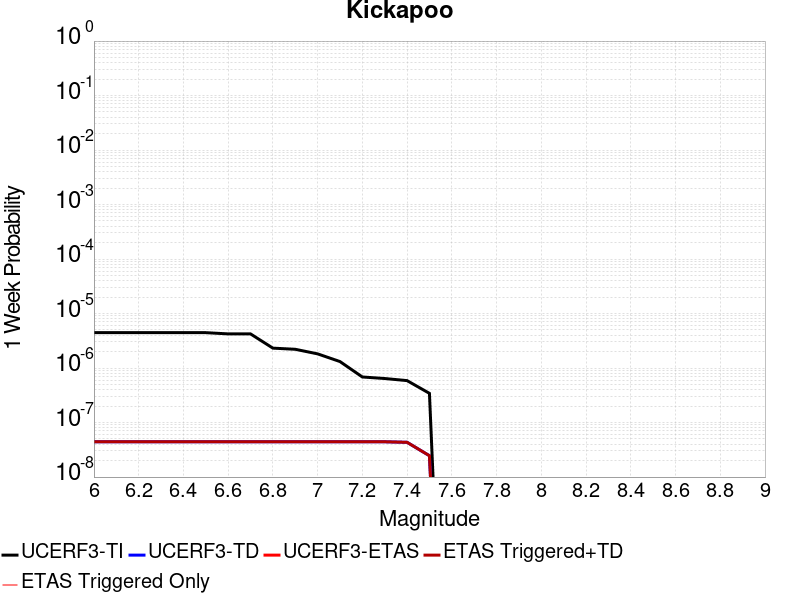 | 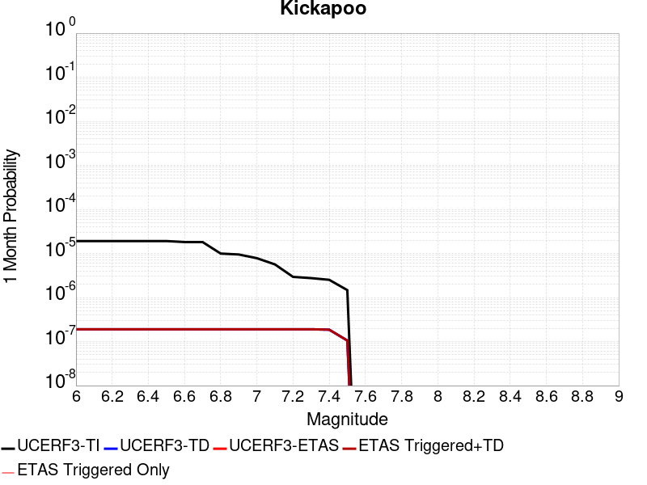 |  | 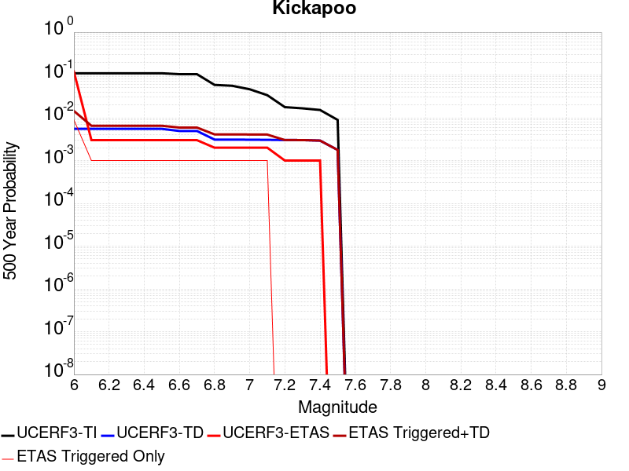 |

| Magnitude | 1 wk TI Prob | 1 wk TD Prob | 1 wk ETAS Prob | 1 wk ETAS/TD Gain | 1 wk ETAS Triggered+TD | 1 wk ETAS Triggered Only | 1 mo TI Prob | 1 mo TD Prob | 1 mo ETAS Prob | 1 mo ETAS/TD Gain | 1 mo ETAS Triggered+TD | 1 mo ETAS Triggered Only | 1 yr TI Prob | 1 yr TD Prob | 1 yr ETAS Prob | 1 yr ETAS/TD Gain | 1 yr ETAS Triggered+TD | 1 yr ETAS Triggered Only | 500 yr TI Prob | 500 yr TD Prob | 500 yr ETAS Prob | 500 yr ETAS/TD Gain | 500 yr ETAS Triggered+TD | 500 yr ETAS Triggered Only |
|-----|-----|-----|-----|-----|-----|-----|-----|-----|-----|-----|-----|-----|-----|-----|-----|-----|-----|-----|-----|-----|-----|-----|-----|-----|
| 6.0 | 4.4610633E-6 | 4.4427285E-8 | 0.0 | 0.0 | 4.4427285E-8 | 0.0 | 1.9118703E-5 | 1.9040264E-7 | 0.0 | 0.0 | 1.9040264E-7 | 0.0 | 2.3274534E-4 | 2.3181499E-6 | 0.0 | 0.0 | 2.3181499E-6 | 0.0 | 0.10986862 | 0.0055153486 | 0.121 | 21.938776 | 0.01446571 | 0.009 |
| 6.1 | 4.4610633E-6 | 4.4427285E-8 | 0.0 | 0.0 | 4.4427285E-8 | 0.0 | 1.9118703E-5 | 1.9040264E-7 | 0.0 | 0.0 | 1.9040264E-7 | 0.0 | 2.3274534E-4 | 2.3181499E-6 | 0.0 | 0.0 | 2.3181499E-6 | 0.0 | 0.10986862 | 0.0055153486 | 0.003 | 0.5439366 | 0.006509833 | 0.001 |
| 6.2 | 4.4610633E-6 | 4.4427285E-8 | 0.0 | 0.0 | 4.4427285E-8 | 0.0 | 1.9118703E-5 | 1.9040264E-7 | 0.0 | 0.0 | 1.9040264E-7 | 0.0 | 2.3274534E-4 | 2.3181499E-6 | 0.0 | 0.0 | 2.3181499E-6 | 0.0 | 0.10986862 | 0.0055153486 | 0.003 | 0.5439366 | 0.006509833 | 0.001 |
| 6.3 | 4.4610633E-6 | 4.4427285E-8 | 0.0 | 0.0 | 4.4427285E-8 | 0.0 | 1.9118703E-5 | 1.9040264E-7 | 0.0 | 0.0 | 1.9040264E-7 | 0.0 | 2.3274534E-4 | 2.3181499E-6 | 0.0 | 0.0 | 2.3181499E-6 | 0.0 | 0.10986862 | 0.0055153486 | 0.003 | 0.5439366 | 0.006509833 | 0.001 |
| 6.4 | 4.4610633E-6 | 4.4427285E-8 | 0.0 | 0.0 | 4.4427285E-8 | 0.0 | 1.9118703E-5 | 1.9040264E-7 | 0.0 | 0.0 | 1.9040264E-7 | 0.0 | 2.3274534E-4 | 2.3181499E-6 | 0.0 | 0.0 | 2.3181499E-6 | 0.0 | 0.10986862 | 0.0055153486 | 0.003 | 0.5439366 | 0.006509833 | 0.001 |
| 6.5 | 4.4610633E-6 | 4.4427285E-8 | 0.0 | 0.0 | 4.4427285E-8 | 0.0 | 1.9118703E-5 | 1.9040264E-7 | 0.0 | 0.0 | 1.9040264E-7 | 0.0 | 2.3274534E-4 | 2.3181499E-6 | 0.0 | 0.0 | 2.3181499E-6 | 0.0 | 0.10986862 | 0.0055153486 | 0.003 | 0.5439366 | 0.006509833 | 0.001 |
| 6.6 | 4.236531E-6 | 4.4427285E-8 | 0.0 | 0.0 | 4.4427285E-8 | 0.0 | 1.8156434E-5 | 1.9040264E-7 | 0.0 | 0.0 | 1.9040264E-7 | 0.0 | 2.2103215E-4 | 2.3181499E-6 | 0.0 | 0.0 | 2.3181499E-6 | 0.0 | 0.10463901 | 0.0049184496 | 0.003 | 0.60994834 | 0.005913531 | 0.001 |
| 6.7 | 4.236531E-6 | 4.4427285E-8 | 0.0 | 0.0 | 4.4427285E-8 | 0.0 | 1.8156434E-5 | 1.9040264E-7 | 0.0 | 0.0 | 1.9040264E-7 | 0.0 | 2.2103215E-4 | 2.3181499E-6 | 0.0 | 0.0 | 2.3181499E-6 | 0.0 | 0.10463901 | 0.0049184496 | 0.003 | 0.60994834 | 0.005913531 | 0.001 |
| 6.8 | 2.3202913E-6 | 4.4427285E-8 | 0.0 | 0.0 | 4.4427285E-8 | 0.0 | 9.944068E-6 | 1.9040264E-7 | 0.0 | 0.0 | 1.9040264E-7 | 0.0 | 1.210623E-4 | 2.3181499E-6 | 0.0 | 0.0 | 2.3181499E-6 | 0.0 | 0.058739003 | 0.0030956997 | 0.002 | 0.64605755 | 0.004092604 | 0.001 |
| 6.9 | 2.2111808E-6 | 4.4427285E-8 | 0.0 | 0.0 | 4.4427285E-8 | 0.0 | 9.4764555E-6 | 1.9040264E-7 | 0.0 | 0.0 | 1.9040264E-7 | 0.0 | 1.1536973E-4 | 2.3181499E-6 | 0.0 | 0.0 | 2.3181499E-6 | 0.0 | 0.056055773 | 0.0030934303 | 0.002 | 0.64653146 | 0.0040903366 | 0.001 |
| 7.0 | 1.8222031E-6 | 4.4427285E-8 | 0.0 | 0.0 | 4.4427285E-8 | 0.0 | 7.809419E-6 | 1.9040264E-7 | 0.0 | 0.0 | 1.9040264E-7 | 0.0 | 9.507552E-5 | 2.3181499E-6 | 0.0 | 0.0 | 2.3181499E-6 | 0.0 | 0.04642769 | 0.0030749168 | 0.002 | 0.6504241 | 0.004071842 | 0.001 |
| 7.1 | 1.3163254E-6 | 4.4427285E-8 | 0.0 | 0.0 | 4.4427285E-8 | 0.0 | 5.6413824E-6 | 1.9040264E-7 | 0.0 | 0.0 | 1.9040264E-7 | 0.0 | 6.868167E-5 | 2.3181499E-6 | 0.0 | 0.0 | 2.3181499E-6 | 0.0 | 0.03375902 | 0.0030560489 | 0.002 | 0.6544398 | 0.004052993 | 0.001 |
| 7.2 | 6.8603634E-7 | 4.442648E-8 | 0.0 | 0.0 | 4.442648E-8 | 0.0 | 2.9401524E-6 | 1.9039918E-7 | 0.0 | 0.0 | 1.9039918E-7 | 0.0 | 3.579577E-5 | 2.3181078E-6 | 0.0 | 0.0 | 2.3181078E-6 | 0.0 | 0.017738983 | 0.0030185073 | 0.001 | 0.3312896 | 0.0030185073 | 0.0 |
| 7.3 | 6.4299127E-7 | 4.4411447E-8 | 0.0 | 0.0 | 4.4411447E-8 | 0.0 | 2.755674E-6 | 1.9033476E-7 | 0.0 | 0.0 | 1.9033476E-7 | 0.0 | 3.3549815E-5 | 2.3173234E-6 | 0.0 | 0.0 | 2.3173234E-6 | 0.0 | 0.016635269 | 0.0030141892 | 0.001 | 0.3317642 | 0.0030141892 | 0.0 |
| 7.4 | 5.8856347E-7 | 4.3417277E-8 | 0.0 | 0.0 | 4.3417277E-8 | 0.0 | 2.5224124E-6 | 1.8607402E-7 | 0.0 | 0.0 | 1.8607402E-7 | 0.0 | 3.070994E-5 | 2.2654492E-6 | 0.0 | 0.0 | 2.2654492E-6 | 0.0 | 0.015237915 | 0.0029320295 | 0.001 | 0.34106067 | 0.0029320295 | 0.0 |
| 7.5 | 3.435626E-7 | 2.464804E-8 | 0.0 | 0.0 | 2.464804E-8 | 0.0 | 1.4724103E-6 | 1.0563445E-7 | 0.0 | 0.0 | 1.0563445E-7 | 0.0 | 1.7926448E-5 | 1.2860988E-6 | 0.0 | 0.0 | 1.2860988E-6 | 0.0 | 0.008923254 | 0.001773915 | 0.0 | 0.0 | 0.001773915 | 0.0 |

## Great Valley 11
*[(top)](#table-of-contents)*

| 1 Week | 1 Month | 1 Year | 500 Year |
|-----|-----|-----|-----|
|  | 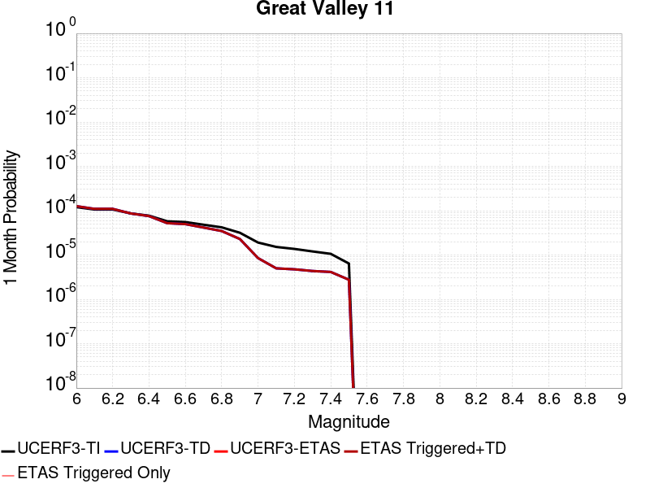 | 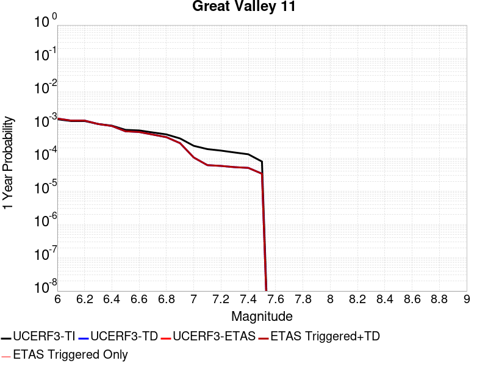 | 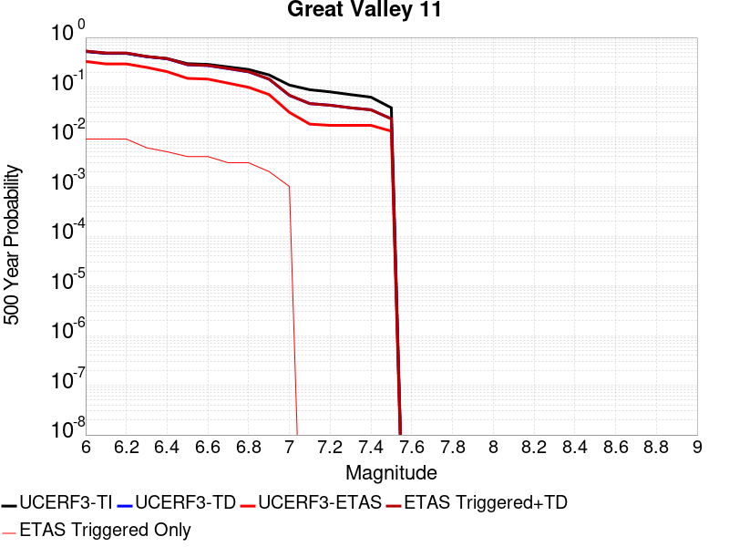 |

| Magnitude | 1 wk TI Prob | 1 wk TD Prob | 1 wk ETAS Prob | 1 wk ETAS/TD Gain | 1 wk ETAS Triggered+TD | 1 wk ETAS Triggered Only | 1 mo TI Prob | 1 mo TD Prob | 1 mo ETAS Prob | 1 mo ETAS/TD Gain | 1 mo ETAS Triggered+TD | 1 mo ETAS Triggered Only | 1 yr TI Prob | 1 yr TD Prob | 1 yr ETAS Prob | 1 yr ETAS/TD Gain | 1 yr ETAS Triggered+TD | 1 yr ETAS Triggered Only | 500 yr TI Prob | 500 yr TD Prob | 500 yr ETAS Prob | 500 yr ETAS/TD Gain | 500 yr ETAS Triggered+TD | 500 yr ETAS Triggered Only |
|-----|-----|-----|-----|-----|-----|-----|-----|-----|-----|-----|-----|-----|-----|-----|-----|-----|-----|-----|-----|-----|-----|-----|-----|-----|
| 6.0 | 2.8099583E-5 | 2.955213E-5 | 0.0 | 0.0 | 2.955213E-5 | 0.0 | 1.20421224E-4 | 1.2664625E-4 | 0.0 | 0.0 | 1.2664625E-4 | 0.0 | 0.0014651422 | 0.0015408999 | 0.0 | 0.0 | 0.0015408999 | 0.0 | 0.5195866 | 0.5278428 | 0.329 | 0.6232916 | 0.5320923 | 0.009 |
| 6.1 | 2.483194E-5 | 2.566769E-5 | 0.0 | 0.0 | 2.566769E-5 | 0.0 | 1.0641825E-4 | 1.100001E-4 | 0.0 | 0.0 | 1.100001E-4 | 0.0 | 0.0012948721 | 0.0013384908 | 0.0 | 0.0 | 0.0013384908 | 0.0 | 0.47683355 | 0.48213428 | 0.293 | 0.60771453 | 0.48679507 | 0.009 |
| 6.2 | 2.483194E-5 | 2.566769E-5 | 0.0 | 0.0 | 2.566769E-5 | 0.0 | 1.0641825E-4 | 1.100001E-4 | 0.0 | 0.0 | 1.100001E-4 | 0.0 | 0.0012948721 | 0.0013384908 | 0.0 | 0.0 | 0.0013384908 | 0.0 | 0.47683355 | 0.48213428 | 0.293 | 0.60771453 | 0.48679507 | 0.009 |
| 6.3 | 2.0257901E-5 | 2.021721E-5 | 0.0 | 0.0 | 2.021721E-5 | 0.0 | 8.681669E-5 | 8.664254E-5 | 0.0 | 0.0 | 8.664254E-5 | 0.0 | 0.0010564806 | 0.0010544034 | 0.0 | 0.0 | 0.0010544034 | 0.0 | 0.41052297 | 0.40977928 | 0.249 | 0.6076442 | 0.4133206 | 0.006 |
| 6.4 | 1.8054898E-5 | 1.7624612E-5 | 0.0 | 0.0 | 1.7624612E-5 | 0.0 | 7.737584E-5 | 7.553207E-5 | 0.0 | 0.0 | 7.553207E-5 | 0.0 | 9.416436E-4 | 9.192518E-4 | 0.0 | 0.0 | 9.192518E-4 | 0.0 | 0.37564966 | 0.37208006 | 0.205 | 0.5509567 | 0.37521964 | 0.005 |
| 6.5 | 1.34804895E-5 | 1.2219129E-5 | 0.0 | 0.0 | 1.2219129E-5 | 0.0 | 5.777225E-5 | 5.2366668E-5 | 0.0 | 0.0 | 5.2366668E-5 | 0.0 | 7.031501E-4 | 6.3738175E-4 | 0.0 | 0.0 | 6.3738175E-4 | 0.0 | 0.29650795 | 0.28162357 | 0.15 | 0.53262585 | 0.28449708 | 0.004 |
| 6.6 | 1.294883E-5 | 1.1633667E-5 | 0.0 | 0.0 | 1.1633667E-5 | 0.0 | 5.5493805E-5 | 4.9857645E-5 | 0.0 | 0.0 | 4.9857645E-5 | 0.0 | 6.754276E-4 | 6.0685177E-4 | 0.0 | 0.0 | 6.0685177E-4 | 0.0 | 0.28668198 | 0.2707292 | 0.145 | 0.5355905 | 0.2736463 | 0.004 |
| 6.7 | 1.1272237E-5 | 9.7276725E-6 | 0.0 | 0.0 | 9.7276725E-6 | 0.0 | 4.8308695E-5 | 4.168937E-5 | 0.0 | 0.0 | 4.168937E-5 | 0.0 | 5.879996E-4 | 5.074526E-4 | 0.0 | 0.0 | 5.074526E-4 | 0.0 | 0.2547878 | 0.2349612 | 0.12 | 0.51072264 | 0.23725632 | 0.003 |
| 6.8 | 9.8337505E-6 | 8.120017E-6 | 0.0 | 0.0 | 8.120017E-6 | 0.0 | 4.2143965E-5 | 3.479962E-5 | 0.0 | 0.0 | 3.479962E-5 | 0.0 | 5.1298196E-4 | 4.23605E-4 | 0.0 | 0.0 | 4.23605E-4 | 0.0 | 0.22628894 | 0.20238687 | 0.099 | 0.48916218 | 0.20477971 | 0.003 |
| 6.9 | 7.4224813E-6 | 5.3613717E-6 | 0.0 | 0.0 | 5.3613717E-6 | 0.0 | 3.1810247E-5 | 2.2977114E-5 | 0.0 | 0.0 | 2.2977114E-5 | 0.0 | 3.872209E-4 | 2.7971182E-4 | 0.0 | 0.0 | 2.7971182E-4 | 0.0 | 0.17605208 | 0.14426431 | 0.071 | 0.49215224 | 0.14597578 | 0.002 |
| 7.0 | 4.4628923E-6 | 1.9883942E-6 | 0.0 | 0.0 | 1.9883942E-6 | 0.0 | 1.912654E-5 | 8.5216625E-6 | 0.0 | 0.0 | 8.5216625E-6 | 0.0 | 2.3284076E-4 | 1.0374641E-4 | 0.0 | 0.0 | 1.0374641E-4 | 0.0 | 0.1099111 | 0.06788212 | 0.031 | 0.456674 | 0.06881424 | 0.001 |
| 7.1 | 3.5546527E-6 | 1.1694323E-6 | 0.0 | 0.0 | 1.1694323E-6 | 0.0 | 1.5234136E-5 | 5.0118433E-6 | 0.0 | 0.0 | 5.0118433E-6 | 0.0 | 1.8545982E-4 | 6.1017552E-5 | 0.0 | 0.0 | 6.1017552E-5 | 0.0 | 0.0885682 | 0.046558622 | 0.018 | 0.38660938 | 0.046558622 | 0.0 |
| 7.2 | 3.2039936E-6 | 1.1108255E-6 | 0.0 | 0.0 | 1.1108255E-6 | 0.0 | 1.3731329E-5 | 4.7606723E-6 | 0.0 | 0.0 | 4.7606723E-6 | 0.0 | 1.671661E-4 | 5.7959707E-5 | 0.0 | 0.0 | 5.7959707E-5 | 0.0 | 0.08019173 | 0.04319305 | 0.017 | 0.39358184 | 0.04319305 | 0.0 |
| 7.3 | 2.8120473E-6 | 1.0178035E-6 | 0.0 | 0.0 | 1.0178035E-6 | 0.0 | 1.2051575E-5 | 4.362008E-6 | 0.0 | 0.0 | 4.362008E-6 | 0.0 | 1.4671806E-4 | 5.3106218E-5 | 0.0 | 0.0 | 5.3106218E-5 | 0.0 | 0.07073786 | 0.038305502 | 0.017 | 0.44380048 | 0.038305502 | 0.0 |
| 7.4 | 2.4837766E-6 | 9.685128E-7 | 0.0 | 0.0 | 9.685128E-7 | 0.0 | 1.0644713E-5 | 4.1507633E-6 | 0.0 | 0.0 | 4.1507633E-6 | 0.0 | 1.2959167E-4 | 5.0534436E-5 | 0.0 | 0.0 | 5.0534436E-5 | 0.0 | 0.06274514 | 0.034970865 | 0.017 | 0.48611897 | 0.034970865 | 0.0 |
| 7.5 | 1.5002679E-6 | 6.4676163E-7 | 0.0 | 0.0 | 6.4676163E-7 | 0.0 | 6.4297037E-6 | 2.771833E-6 | 0.0 | 0.0 | 2.771833E-6 | 0.0 | 7.827883E-5 | 3.3746586E-5 | 0.0 | 0.0 | 3.3746586E-5 | 0.0 | 0.038384836 | 0.023000443 | 0.013 | 0.5652065 | 0.023000443 | 0.0 |

## Santa Rosa Island
*[(top)](#table-of-contents)*

| 1 Week | 1 Month | 1 Year | 500 Year |
|-----|-----|-----|-----|
| 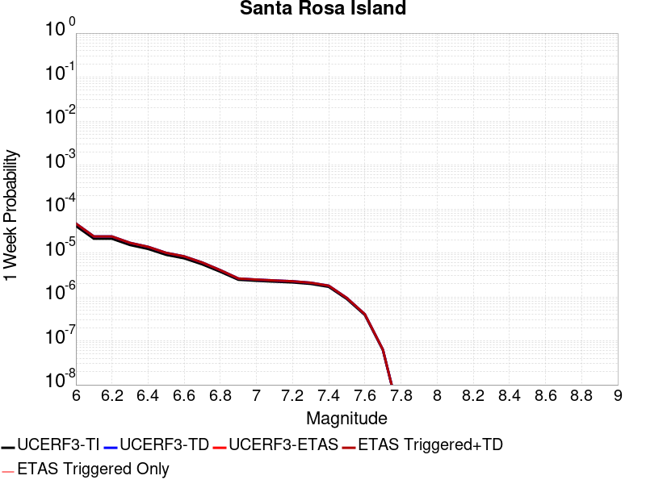 |  | 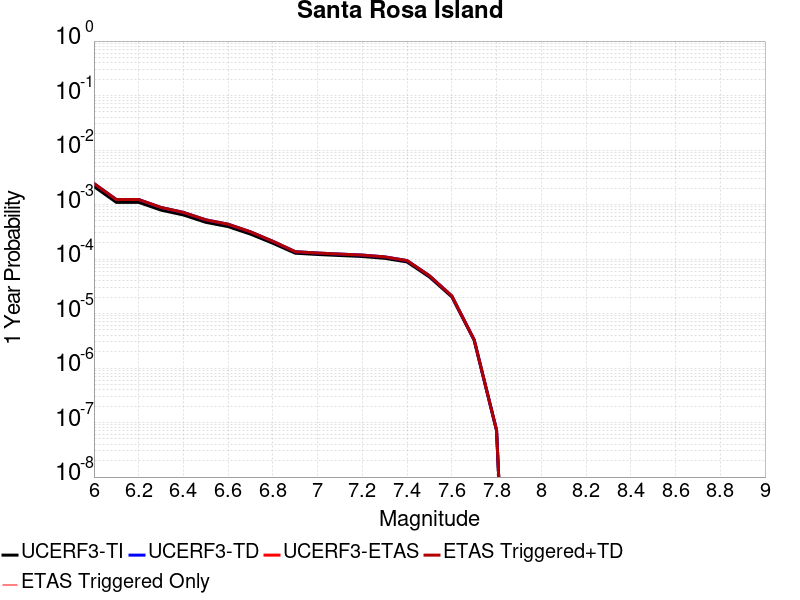 | 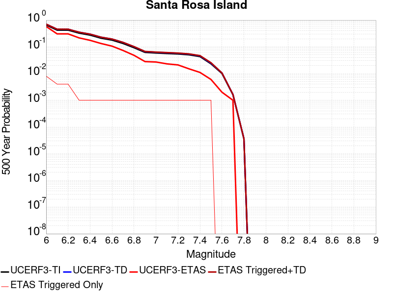 |

| Magnitude | 1 wk TI Prob | 1 wk TD Prob | 1 wk ETAS Prob | 1 wk ETAS/TD Gain | 1 wk ETAS Triggered+TD | 1 wk ETAS Triggered Only | 1 mo TI Prob | 1 mo TD Prob | 1 mo ETAS Prob | 1 mo ETAS/TD Gain | 1 mo ETAS Triggered+TD | 1 mo ETAS Triggered Only | 1 yr TI Prob | 1 yr TD Prob | 1 yr ETAS Prob | 1 yr ETAS/TD Gain | 1 yr ETAS Triggered+TD | 1 yr ETAS Triggered Only | 500 yr TI Prob | 500 yr TD Prob | 500 yr ETAS Prob | 500 yr ETAS/TD Gain | 500 yr ETAS Triggered+TD | 500 yr ETAS Triggered Only |
|-----|-----|-----|-----|-----|-----|-----|-----|-----|-----|-----|-----|-----|-----|-----|-----|-----|-----|-----|-----|-----|-----|-----|-----|-----|
| 6.0 | 4.1143165E-5 | 4.6738158E-5 | 0.0 | 0.0 | 4.6738158E-5 | 0.0 | 1.7631594E-4 | 2.0029211E-4 | 0.0 | 0.0 | 2.0029211E-4 | 0.0 | 0.002144533 | 0.0024360225 | 0.0 | 0.0 | 0.0024360225 | 0.0 | 0.6581619 | 0.70370454 | 0.579 | 0.82278854 | 0.7060749 | 0.008 |
| 6.1 | 2.1061249E-5 | 2.3700111E-5 | 0.0 | 0.0 | 2.3700111E-5 | 0.0 | 9.0259375E-5 | 1.0156811E-4 | 0.0 | 0.0 | 1.0156811E-4 | 0.0 | 0.0010983539 | 0.0012359188 | 0.0 | 0.0 | 0.0012359188 | 0.0 | 0.42274937 | 0.45429817 | 0.305 | 0.6713652 | 0.45648098 | 0.004 |
| 6.2 | 2.1061249E-5 | 2.3700111E-5 | 0.0 | 0.0 | 2.3700111E-5 | 0.0 | 9.0259375E-5 | 1.0156811E-4 | 0.0 | 0.0 | 1.0156811E-4 | 0.0 | 0.0010983539 | 0.0012359188 | 0.0 | 0.0 | 0.0012359188 | 0.0 | 0.42274937 | 0.45429817 | 0.305 | 0.6713652 | 0.45648098 | 0.004 |
| 6.3 | 1.5158236E-5 | 1.696234E-5 | 0.0 | 0.0 | 1.696234E-5 | 0.0 | 6.496225E-5 | 7.269379E-5 | 0.0 | 0.0 | 7.269379E-5 | 0.0 | 7.906284E-4 | 8.846993E-4 | 0.0 | 0.0 | 8.846993E-4 | 0.0 | 0.32663688 | 0.35232887 | 0.216 | 0.61306363 | 0.35297653 | 0.001 |
| 6.4 | 1.2341918E-5 | 1.3764782E-5 | 0.0 | 0.0 | 1.3764782E-5 | 0.0 | 5.2892858E-5 | 5.8990634E-5 | 0.0 | 0.0 | 5.8990634E-5 | 0.0 | 6.437803E-4 | 7.1798236E-4 | 0.0 | 0.0 | 7.1798236E-4 | 0.0 | 0.2752973 | 0.29775116 | 0.175 | 0.5877391 | 0.2984534 | 0.001 |
| 6.5 | 9.061158E-6 | 1.0055662E-5 | 0.0 | 0.0 | 1.0055662E-5 | 0.0 | 3.883296E-5 | 4.309501E-5 | 0.0 | 0.0 | 4.309501E-5 | 0.0 | 4.726887E-4 | 5.245607E-4 | 0.0 | 0.0 | 5.245607E-4 | 0.0 | 0.21053536 | 0.22855076 | 0.133 | 0.58192766 | 0.22932221 | 0.001 |
| 6.6 | 7.5461685E-6 | 8.35114E-6 | 0.0 | 0.0 | 8.35114E-6 | 0.0 | 3.2340322E-5 | 3.5790134E-5 | 0.0 | 0.0 | 3.5790134E-5 | 0.0 | 3.936723E-4 | 4.35662E-4 | 0.0 | 0.0 | 4.35662E-4 | 0.0 | 0.17870663 | 0.194343 | 0.106 | 0.54542744 | 0.19514865 | 0.001 |
| 6.7 | 5.5023775E-6 | 6.0535394E-6 | 0.0 | 0.0 | 6.0535394E-6 | 0.0 | 2.3581404E-5 | 2.59435E-5 | 0.0 | 0.0 | 2.59435E-5 | 0.0 | 2.8706578E-4 | 3.1581955E-4 | 0.0 | 0.0 | 3.1581955E-4 | 0.0 | 0.13372554 | 0.14583875 | 0.073 | 0.50055283 | 0.14669292 | 0.001 |
| 6.8 | 3.7351679E-6 | 4.0631758E-6 | 0.0 | 0.0 | 4.0631758E-6 | 0.0 | 1.6007763E-5 | 1.7413508E-5 | 0.0 | 0.0 | 1.7413508E-5 | 0.0 | 1.948771E-4 | 2.1199128E-4 | 0.0 | 0.0 | 2.1199128E-4 | 0.0 | 0.09285053 | 0.10069853 | 0.048 | 0.4766703 | 0.10159783 | 0.001 |
| 6.9 | 2.456366E-6 | 2.6195792E-6 | 0.0 | 0.0 | 2.6195792E-6 | 0.0 | 1.0527241E-5 | 1.122672E-5 | 0.0 | 0.0 | 1.122672E-5 | 0.0 | 1.2816161E-4 | 1.3667677E-4 | 0.0 | 0.0 | 1.3667677E-4 | 0.0 | 0.06207465 | 0.06604507 | 0.028 | 0.4239529 | 0.06697902 | 0.001 |
| 7.0 | 2.3245157E-6 | 2.4739288E-6 | 0.0 | 0.0 | 2.4739288E-6 | 0.0 | 9.962172E-6 | 1.0602509E-5 | 0.0 | 0.0 | 1.0602509E-5 | 0.0 | 1.2128269E-4 | 1.2907792E-4 | 0.0 | 0.0 | 1.2907792E-4 | 0.0 | 0.05884273 | 0.06250435 | 0.027 | 0.43196994 | 0.06344184 | 0.001 |
| 7.1 | 2.2248344E-6 | 2.364961E-6 | 0.0 | 0.0 | 2.364961E-6 | 0.0 | 9.53497E-6 | 1.0135507E-5 | 0.0 | 0.0 | 1.0135507E-5 | 0.0 | 1.1608207E-4 | 1.2339283E-4 | 0.0 | 0.0 | 1.2339283E-4 | 0.0 | 0.05639195 | 0.05984095 | 0.023 | 0.38435218 | 0.06078111 | 0.001 |
| 7.2 | 2.1350402E-6 | 2.268274E-6 | 0.0 | 0.0 | 2.268274E-6 | 0.0 | 9.150141E-6 | 9.721139E-6 | 0.0 | 0.0 | 9.721139E-6 | 0.0 | 1.1139726E-4 | 1.1834846E-4 | 0.0 | 0.0 | 1.1834846E-4 | 0.0 | 0.0541788 | 0.057467543 | 0.021 | 0.36542365 | 0.05841008 | 0.001 |
| 7.3 | 1.9793572E-6 | 2.1014953E-6 | 0.0 | 0.0 | 2.1014953E-6 | 0.0 | 8.482932E-6 | 9.006377E-6 | 0.0 | 0.0 | 9.006377E-6 | 0.0 | 1.032748E-4 | 1.0964714E-4 | 0.0 | 0.0 | 1.0964714E-4 | 0.0 | 0.050329376 | 0.053357344 | 0.015 | 0.28112343 | 0.05430399 | 0.001 |
| 7.4 | 1.6951194E-6 | 1.7984552E-6 | 0.0 | 0.0 | 1.7984552E-6 | 0.0 | 7.264777E-6 | 7.707643E-6 | 0.0 | 0.0 | 7.707643E-6 | 0.0 | 8.844508E-5 | 9.383652E-5 | 0.0 | 0.0 | 9.383652E-5 | 0.0 | 0.043260846 | 0.04584323 | 0.011 | 0.2399482 | 0.046797384 | 0.001 |
| 7.5 | 8.987207E-7 | 9.4826817E-7 | 0.0 | 0.0 | 9.4826817E-7 | 0.0 | 3.8516546E-6 | 4.064E-6 | 0.0 | 0.0 | 4.064E-6 | 0.0 | 4.6892885E-5 | 4.9478087E-5 | 0.0 | 0.0 | 4.9478087E-5 | 0.0 | 0.023174247 | 0.024441727 | 0.006 | 0.24548185 | 0.025417285 | 0.001 |
| 7.6 | 3.8783037E-7 | 4.0428492E-7 | 0.0 | 0.0 | 4.0428492E-7 | 0.0 | 1.6621291E-6 | 1.7326486E-6 | 0.0 | 0.0 | 1.7326486E-6 | 0.0 | 2.0236233E-5 | 2.1094798E-5 | 0.0 | 0.0 | 2.1094798E-5 | 0.0 | 0.010067202 | 0.0104963975 | 0.002 | 0.19054157 | 0.0104963975 | 0.0 |
| 7.7 | 6.181804E-8 | 6.3268374E-8 | 0.0 | 0.0 | 6.3268374E-8 | 0.0 | 2.6493444E-7 | 2.7115013E-7 | 0.0 | 0.0 | 2.7115013E-7 | 0.0 | 3.225572E-6 | 3.301248E-6 | 0.0 | 0.0 | 3.301248E-6 | 0.0 | 0.0016114889 | 0.0016510561 | 0.001 | 0.60567296 | 0.0016510561 | 0.0 |
| 7.8 | 1.3704449E-9 | 1.3950413E-9 | 0.0 | 0.0 | 1.3950413E-9 | 0.0 | 5.873335E-9 | 5.9787486E-9 | 0.0 | 0.0 | 5.9787486E-9 | 0.0 | 7.1507856E-8 | 7.2791266E-8 | 0.0 | 0.0 | 7.2791266E-8 | 0.0 | 3.5753288E-5 | 3.639521E-5 | 0.0 | 0.0 | 3.639521E-5 | 0.0 |

## Cedar Mtn-Mahogany Mtn
*[(top)](#table-of-contents)*

| 1 Week | 1 Month | 1 Year | 500 Year |
|-----|-----|-----|-----|
|  | 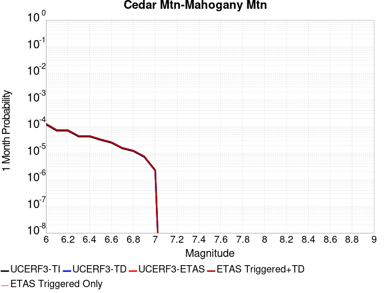 | 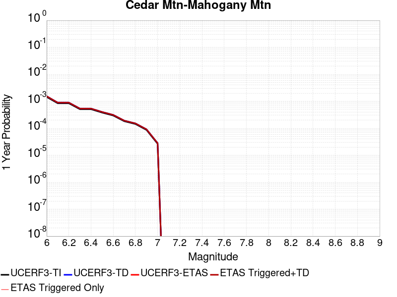 | 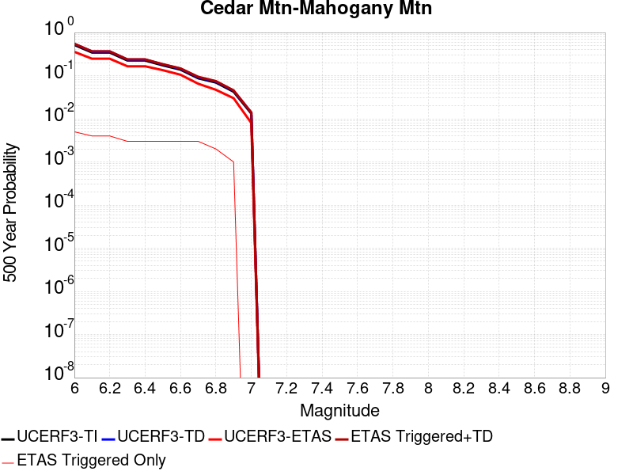 |

| Magnitude | 1 wk TI Prob | 1 wk TD Prob | 1 wk ETAS Prob | 1 wk ETAS/TD Gain | 1 wk ETAS Triggered+TD | 1 wk ETAS Triggered Only | 1 mo TI Prob | 1 mo TD Prob | 1 mo ETAS Prob | 1 mo ETAS/TD Gain | 1 mo ETAS Triggered+TD | 1 mo ETAS Triggered Only | 1 yr TI Prob | 1 yr TD Prob | 1 yr ETAS Prob | 1 yr ETAS/TD Gain | 1 yr ETAS Triggered+TD | 1 yr ETAS Triggered Only | 500 yr TI Prob | 500 yr TD Prob | 500 yr ETAS Prob | 500 yr ETAS/TD Gain | 500 yr ETAS Triggered+TD | 500 yr ETAS Triggered Only |
|-----|-----|-----|-----|-----|-----|-----|-----|-----|-----|-----|-----|-----|-----|-----|-----|-----|-----|-----|-----|-----|-----|-----|-----|-----|
| 6.0 | 2.7763876E-5 | 2.9487921E-5 | 0.0 | 0.0 | 2.9487921E-5 | 0.0 | 1.1898261E-4 | 1.2637107E-4 | 0.0 | 0.0 | 1.2637107E-4 | 0.0 | 0.0014476506 | 0.0015375514 | 0.0 | 0.0 | 0.0015375514 | 0.0 | 0.5153604 | 0.54558337 | 0.357 | 0.65434545 | 0.54785544 | 0.005 |
| 6.1 | 1.6162443E-5 | 1.7089014E-5 | 0.0 | 0.0 | 1.7089014E-5 | 0.0 | 6.926578E-5 | 7.3236675E-5 | 0.0 | 0.0 | 7.3236675E-5 | 0.0 | 8.4298453E-4 | 8.9130935E-4 | 0.0 | 0.0 | 8.9130935E-4 | 0.0 | 0.34404954 | 0.3627346 | 0.247 | 0.68093866 | 0.36528364 | 0.004 |
| 6.2 | 1.6162443E-5 | 1.7089014E-5 | 0.0 | 0.0 | 1.7089014E-5 | 0.0 | 6.926578E-5 | 7.3236675E-5 | 0.0 | 0.0 | 7.3236675E-5 | 0.0 | 8.4298453E-4 | 8.9130935E-4 | 0.0 | 0.0 | 8.9130935E-4 | 0.0 | 0.34404954 | 0.3627346 | 0.247 | 0.68093866 | 0.36528364 | 0.004 |
| 6.3 | 9.746053E-6 | 1.02726135E-5 | 0.0 | 0.0 | 1.02726135E-5 | 0.0 | 4.1768133E-5 | 4.4024768E-5 | 0.0 | 0.0 | 4.4024768E-5 | 0.0 | 5.0840835E-4 | 5.358738E-4 | 0.0 | 0.0 | 5.358738E-4 | 0.0 | 0.22451669 | 0.23590848 | 0.165 | 0.6994238 | 0.23820075 | 0.003 |
| 6.4 | 9.746053E-6 | 1.02726135E-5 | 0.0 | 0.0 | 1.02726135E-5 | 0.0 | 4.1768133E-5 | 4.4024768E-5 | 0.0 | 0.0 | 4.4024768E-5 | 0.0 | 5.0840835E-4 | 5.358738E-4 | 0.0 | 0.0 | 5.358738E-4 | 0.0 | 0.22451669 | 0.23590848 | 0.165 | 0.6994238 | 0.23820075 | 0.003 |
| 6.5 | 7.290083E-6 | 7.6731485E-6 | 0.0 | 0.0 | 7.6731485E-6 | 0.0 | 3.124284E-5 | 3.288452E-5 | 0.0 | 0.0 | 3.288452E-5 | 0.0 | 3.8031515E-4 | 4.0029763E-4 | 0.0 | 0.0 | 4.0029763E-4 | 0.0 | 0.17320107 | 0.18188676 | 0.134 | 0.7367221 | 0.1843411 | 0.003 |
| 6.6 | 5.67907E-6 | 5.972202E-6 | 0.0 | 0.0 | 5.972202E-6 | 0.0 | 2.4338644E-5 | 2.5594907E-5 | 0.0 | 0.0 | 2.5594907E-5 | 0.0 | 2.962827E-4 | 3.1157478E-4 | 0.0 | 0.0 | 3.1157478E-4 | 0.0 | 0.1377097 | 0.14458469 | 0.105 | 0.726218 | 0.14715093 | 0.003 |
| 6.7 | 3.4853963E-6 | 3.6624053E-6 | 0.0 | 0.0 | 3.6624053E-6 | 0.0 | 1.4937327E-5 | 1.5695932E-5 | 0.0 | 0.0 | 1.5695932E-5 | 0.0 | 1.8184677E-4 | 1.9108182E-4 | 0.0 | 0.0 | 1.9108182E-4 | 0.0 | 0.08691989 | 0.091280945 | 0.065 | 0.7120873 | 0.094007105 | 0.003 |
| 6.8 | 2.7535168E-6 | 2.8934899E-6 | 0.0 | 0.0 | 2.8934899E-6 | 0.0 | 1.1800733E-5 | 1.2400615E-5 | 0.0 | 0.0 | 1.2400615E-5 | 0.0 | 1.4366445E-4 | 1.509675E-4 | 0.0 | 0.0 | 1.509675E-4 | 0.0 | 0.06931777 | 0.07283051 | 0.047 | 0.6453339 | 0.07468485 | 0.002 |
| 6.9 | 1.6594106E-6 | 1.7447646E-6 | 0.0 | 0.0 | 1.7447646E-6 | 0.0 | 7.1117406E-6 | 7.477543E-6 | 0.0 | 0.0 | 7.477543E-6 | 0.0 | 8.6582E-5 | 9.1035596E-5 | 0.0 | 0.0 | 9.1035596E-5 | 0.0 | 0.042369116 | 0.04457954 | 0.03 | 0.67295444 | 0.04553496 | 0.001 |
| 7.0 | 5.10215E-7 | 5.373539E-7 | 0.0 | 0.0 | 5.373539E-7 | 0.0 | 2.186634E-6 | 2.302944E-6 | 0.0 | 0.0 | 2.302944E-6 | 0.0 | 2.6621943E-5 | 2.8038108E-5 | 0.0 | 0.0 | 2.8038108E-5 | 0.0 | 0.013222947 | 0.013955587 | 0.008 | 0.57324713 | 0.013955587 | 0.0 |

## Blackwater
*[(top)](#table-of-contents)*

| 1 Week | 1 Month | 1 Year | 500 Year |
|-----|-----|-----|-----|
|  | 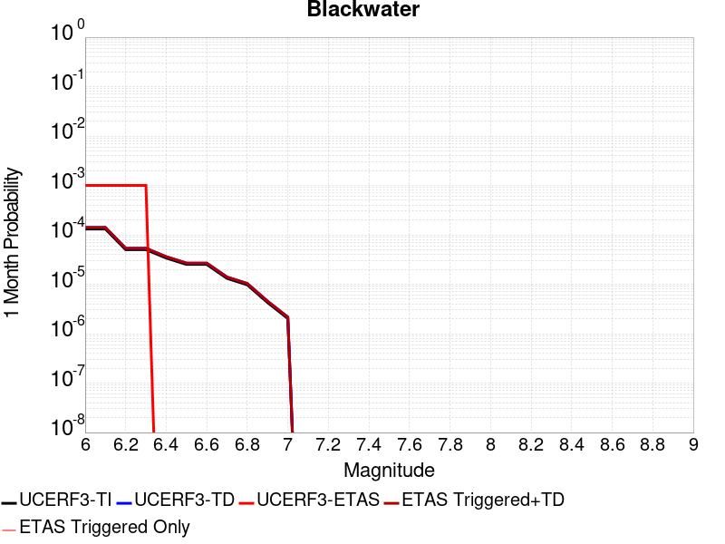 | 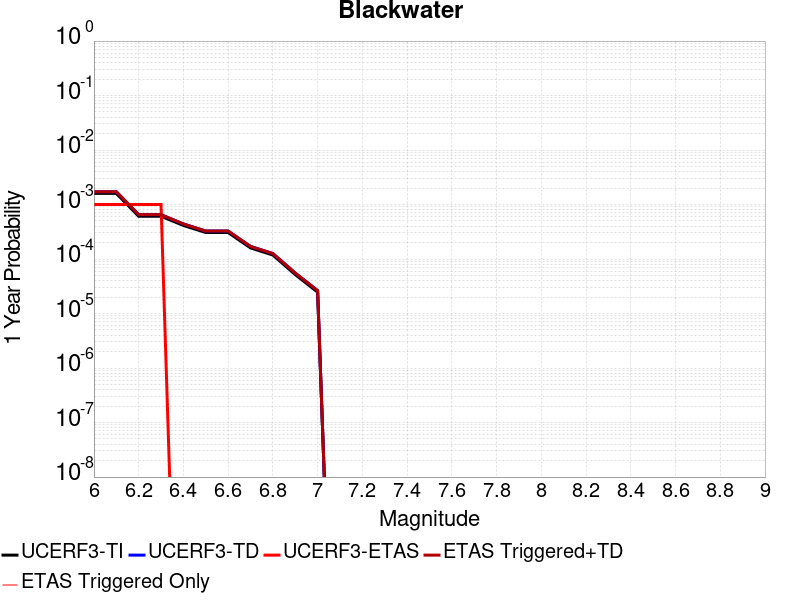 | 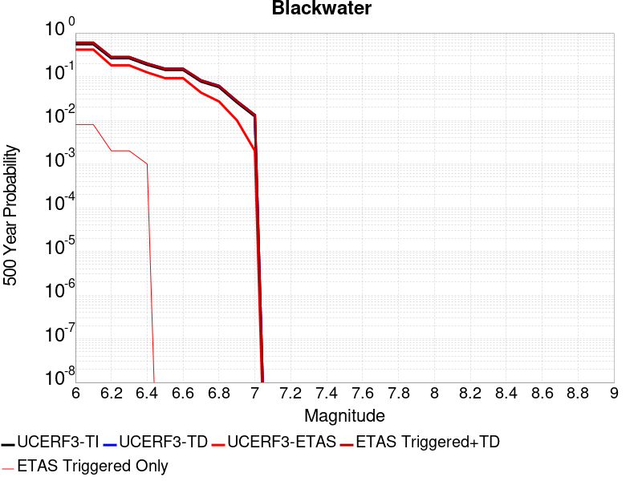 |

| Magnitude | 1 wk TI Prob | 1 wk TD Prob | 1 wk ETAS Prob | 1 wk ETAS/TD Gain | 1 wk ETAS Triggered+TD | 1 wk ETAS Triggered Only | 1 mo TI Prob | 1 mo TD Prob | 1 mo ETAS Prob | 1 mo ETAS/TD Gain | 1 mo ETAS Triggered+TD | 1 mo ETAS Triggered Only | 1 yr TI Prob | 1 yr TD Prob | 1 yr ETAS Prob | 1 yr ETAS/TD Gain | 1 yr ETAS Triggered+TD | 1 yr ETAS Triggered Only | 500 yr TI Prob | 500 yr TD Prob | 500 yr ETAS Prob | 500 yr ETAS/TD Gain | 500 yr ETAS Triggered+TD | 500 yr ETAS Triggered Only |
|-----|-----|-----|-----|-----|-----|-----|-----|-----|-----|-----|-----|-----|-----|-----|-----|-----|-----|-----|-----|-----|-----|-----|-----|-----|
| 6.0 | 3.0708583E-5 | 3.2962467E-5 | 0.0 | 0.0 | 3.2962467E-5 | 0.0 | 1.3160157E-4 | 1.4126083E-4 | 0.001 | 7.0791035 | 1.4126083E-4 | 0.0 | 0.0016010714 | 0.0017186293 | 0.001 | 0.58185905 | 0.0017186293 | 0.0 | 0.55119973 | 0.59291905 | 0.416 | 0.7016135 | 0.5961757 | 0.008 |
| 6.1 | 3.0708583E-5 | 3.2962467E-5 | 0.0 | 0.0 | 3.2962467E-5 | 0.0 | 1.3160157E-4 | 1.4126083E-4 | 0.001 | 7.0791035 | 1.4126083E-4 | 0.0 | 0.0016010714 | 0.0017186293 | 0.001 | 0.58185905 | 0.0017186293 | 0.0 | 0.55119973 | 0.59291905 | 0.416 | 0.7016135 | 0.5961757 | 0.008 |
| 6.2 | 1.1707779E-5 | 1.2498638E-5 | 0.0 | 0.0 | 1.2498638E-5 | 0.0 | 5.017523E-5 | 5.3564545E-5 | 0.001 | 18.669065 | 5.3564545E-5 | 0.0 | 6.107122E-4 | 6.5196276E-4 | 0.001 | 1.5338299 | 6.5196276E-4 | 0.0 | 0.2632078 | 0.27990264 | 0.181 | 0.6466534 | 0.28134283 | 0.002 |
| 6.3 | 1.1707779E-5 | 1.2498638E-5 | 0.0 | 0.0 | 1.2498638E-5 | 0.0 | 5.017523E-5 | 5.3564545E-5 | 0.001 | 18.669065 | 5.3564545E-5 | 0.0 | 6.107122E-4 | 6.5196276E-4 | 0.001 | 1.5338299 | 6.5196276E-4 | 0.0 | 0.2632078 | 0.27990264 | 0.181 | 0.6466534 | 0.28134283 | 0.002 |
| 6.4 | 7.929244E-6 | 8.449582E-6 | 0.0 | 0.0 | 8.449582E-6 | 0.0 | 3.3982033E-5 | 3.6212015E-5 | 0.0 | 0.0 | 3.6212015E-5 | 0.0 | 4.136527E-4 | 4.407961E-4 | 0.0 | 0.0 | 4.407961E-4 | 0.0 | 0.18687396 | 0.19860156 | 0.125 | 0.6294009 | 0.19940296 | 0.001 |
| 6.5 | 5.8832115E-6 | 6.2637014E-6 | 0.0 | 0.0 | 6.2637014E-6 | 0.0 | 2.521352E-5 | 2.6844173E-5 | 0.0 | 0.0 | 2.6844173E-5 | 0.0 | 3.0693135E-4 | 3.267813E-4 | 0.0 | 0.0 | 3.267813E-4 | 0.0 | 0.14229001 | 0.15128963 | 0.092 | 0.6081051 | 0.15128963 | 0.0 |
| 6.6 | 5.8832115E-6 | 6.2637014E-6 | 0.0 | 0.0 | 6.2637014E-6 | 0.0 | 2.521352E-5 | 2.6844173E-5 | 0.0 | 0.0 | 2.6844173E-5 | 0.0 | 3.0693135E-4 | 3.267813E-4 | 0.0 | 0.0 | 3.267813E-4 | 0.0 | 0.14229001 | 0.15128963 | 0.092 | 0.6081051 | 0.15128963 | 0.0 |
| 6.7 | 3.0715053E-6 | 3.269849E-6 | 0.0 | 0.0 | 3.269849E-6 | 0.0 | 1.3163528E-5 | 1.401357E-5 | 0.0 | 0.0 | 1.401357E-5 | 0.0 | 1.6025416E-4 | 1.7060302E-4 | 0.0 | 0.0 | 1.7060302E-4 | 0.0 | 0.077006884 | 0.0820568 | 0.043 | 0.5240273 | 0.0820568 | 0.0 |
| 6.8 | 2.2722281E-6 | 2.4200892E-6 | 0.0 | 0.0 | 2.4200892E-6 | 0.0 | 9.738084E-6 | 1.0371775E-5 | 0.0 | 0.0 | 1.0371775E-5 | 0.0 | 1.1855473E-4 | 1.2626995E-4 | 0.0 | 0.0 | 1.2626995E-4 | 0.0 | 0.05755798 | 0.061417244 | 0.027 | 0.43961594 | 0.061417244 | 0.0 |
| 6.9 | 9.952399E-7 | 1.0614627E-6 | 0.0 | 0.0 | 1.0614627E-6 | 0.0 | 4.265307E-6 | 4.549121E-6 | 0.0 | 0.0 | 4.549121E-6 | 0.0 | 5.1928873E-5 | 5.5384655E-5 | 0.0 | 0.0 | 5.5384655E-5 | 0.0 | 0.025630916 | 0.02744747 | 0.01 | 0.36433232 | 0.02744747 | 0.0 |
| 7.0 | 4.7385504E-7 | 5.0568684E-7 | 0.0 | 0.0 | 5.0568684E-7 | 0.0 | 2.0308057E-6 | 2.1672292E-6 | 0.0 | 0.0 | 2.1672292E-6 | 0.0 | 2.4724779E-5 | 2.6386017E-5 | 0.0 | 0.0 | 2.6386017E-5 | 0.0 | 0.01228644 | 0.0131918425 | 0.002 | 0.15160885 | 0.0131918425 | 0.0 |

## Earthquake Valley
*[(top)](#table-of-contents)*

| 1 Week | 1 Month | 1 Year | 500 Year |
|-----|-----|-----|-----|
| 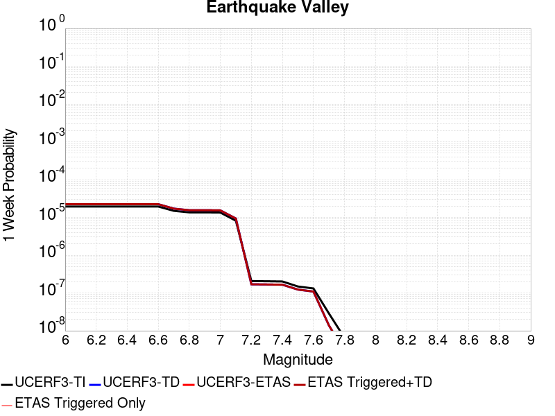 | 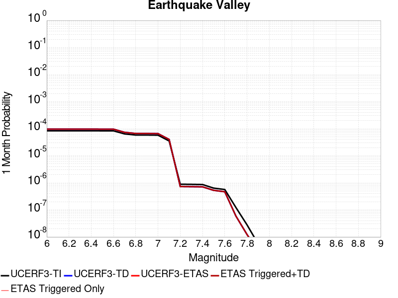 | 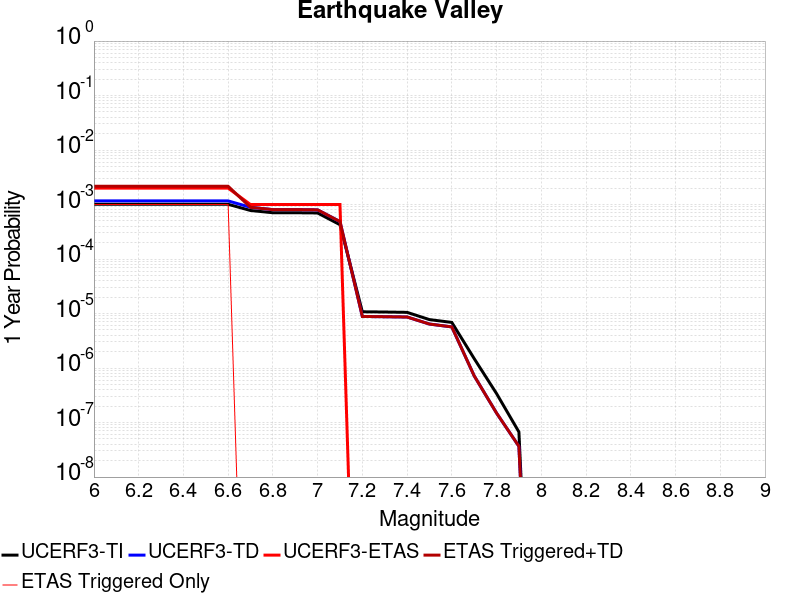 | 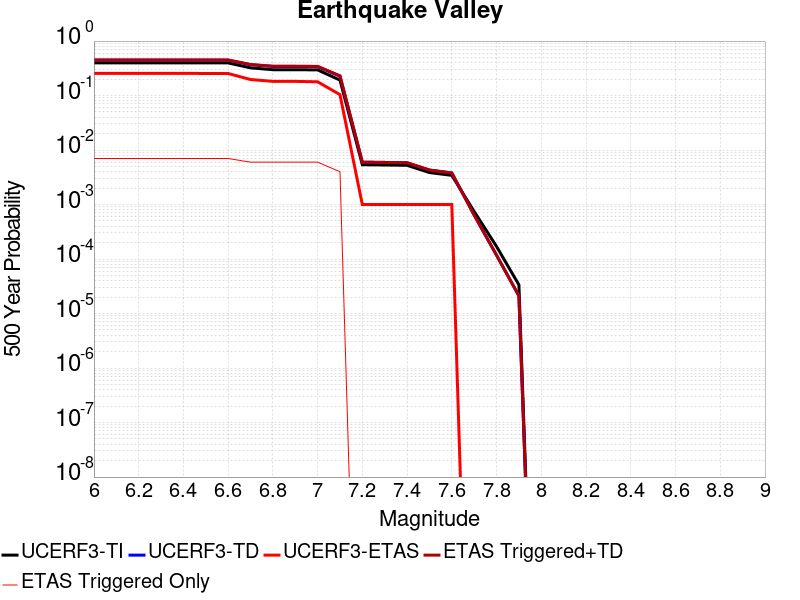 |

| Magnitude | 1 wk TI Prob | 1 wk TD Prob | 1 wk ETAS Prob | 1 wk ETAS/TD Gain | 1 wk ETAS Triggered+TD | 1 wk ETAS Triggered Only | 1 mo TI Prob | 1 mo TD Prob | 1 mo ETAS Prob | 1 mo ETAS/TD Gain | 1 mo ETAS Triggered+TD | 1 mo ETAS Triggered Only | 1 yr TI Prob | 1 yr TD Prob | 1 yr ETAS Prob | 1 yr ETAS/TD Gain | 1 yr ETAS Triggered+TD | 1 yr ETAS Triggered Only | 500 yr TI Prob | 500 yr TD Prob | 500 yr ETAS Prob | 500 yr ETAS/TD Gain | 500 yr ETAS Triggered+TD | 500 yr ETAS Triggered Only |
|-----|-----|-----|-----|-----|-----|-----|-----|-----|-----|-----|-----|-----|-----|-----|-----|-----|-----|-----|-----|-----|-----|-----|-----|-----|
| 6.0 | 1.9416384E-5 | 2.2388325E-5 | 0.0 | 0.0 | 2.2388325E-5 | 0.0 | 8.321042E-5 | 9.594709E-5 | 0.0 | 0.0 | 9.594709E-5 | 0.0 | 0.001012616 | 0.0011676478 | 0.002 | 1.7128452 | 0.00216648 | 0.001 | 0.39743787 | 0.4464198 | 0.256 | 0.5734513 | 0.45029485 | 0.007 |
| 6.1 | 1.9416384E-5 | 2.2388325E-5 | 0.0 | 0.0 | 2.2388325E-5 | 0.0 | 8.321042E-5 | 9.594709E-5 | 0.0 | 0.0 | 9.594709E-5 | 0.0 | 0.001012616 | 0.0011676478 | 0.002 | 1.7128452 | 0.00216648 | 0.001 | 0.39743787 | 0.4464198 | 0.256 | 0.5734513 | 0.45029485 | 0.007 |
| 6.2 | 1.9416384E-5 | 2.2388325E-5 | 0.0 | 0.0 | 2.2388325E-5 | 0.0 | 8.321042E-5 | 9.594709E-5 | 0.0 | 0.0 | 9.594709E-5 | 0.0 | 0.001012616 | 0.0011676478 | 0.002 | 1.7128452 | 0.00216648 | 0.001 | 0.39743787 | 0.4464198 | 0.256 | 0.5734513 | 0.45029485 | 0.007 |
| 6.3 | 1.9416384E-5 | 2.2388325E-5 | 0.0 | 0.0 | 2.2388325E-5 | 0.0 | 8.321042E-5 | 9.594709E-5 | 0.0 | 0.0 | 9.594709E-5 | 0.0 | 0.001012616 | 0.0011676478 | 0.002 | 1.7128452 | 0.00216648 | 0.001 | 0.39743787 | 0.4464198 | 0.256 | 0.5734513 | 0.45029485 | 0.007 |
| 6.4 | 1.9416384E-5 | 2.2388325E-5 | 0.0 | 0.0 | 2.2388325E-5 | 0.0 | 8.321042E-5 | 9.594709E-5 | 0.0 | 0.0 | 9.594709E-5 | 0.0 | 0.001012616 | 0.0011676478 | 0.002 | 1.7128452 | 0.00216648 | 0.001 | 0.39743787 | 0.4464198 | 0.256 | 0.5734513 | 0.45029485 | 0.007 |
| 6.5 | 1.9389157E-5 | 2.2357162E-5 | 0.0 | 0.0 | 2.2357162E-5 | 0.0 | 8.309374E-5 | 9.581356E-5 | 0.0 | 0.0 | 9.581356E-5 | 0.0 | 0.0010111968 | 0.0011660237 | 0.002 | 1.7152311 | 0.0021648577 | 0.001 | 0.3970097 | 0.44599226 | 0.254 | 0.5695166 | 0.44987032 | 0.007 |
| 6.6 | 1.9389157E-5 | 2.2357162E-5 | 0.0 | 0.0 | 2.2357162E-5 | 0.0 | 8.309374E-5 | 9.581356E-5 | 0.0 | 0.0 | 9.581356E-5 | 0.0 | 0.0010111968 | 0.0011660237 | 0.002 | 1.7152311 | 0.0021648577 | 0.001 | 0.3970097 | 0.44599226 | 0.254 | 0.5695166 | 0.44987032 | 0.007 |
| 6.7 | 1.4925434E-5 | 1.7066855E-5 | 0.0 | 0.0 | 1.7066855E-5 | 0.0 | 6.396457E-5 | 7.314209E-5 | 0.0 | 0.0 | 7.314209E-5 | 0.0 | 7.7849044E-4 | 8.9022476E-4 | 0.001 | 1.1233118 | 8.9022476E-4 | 0.0 | 0.3225346 | 0.3680006 | 0.197 | 0.5353252 | 0.37179258 | 0.006 |
| 6.8 | 1.3570335E-5 | 1.5489766E-5 | 0.0 | 0.0 | 1.5489766E-5 | 0.0 | 5.8157282E-5 | 6.638348E-5 | 0.0 | 0.0 | 6.638348E-5 | 0.0 | 7.0783484E-4 | 8.079999E-4 | 0.001 | 1.2376239 | 8.079999E-4 | 0.0 | 0.29815504 | 0.3420811 | 0.182 | 0.53203756 | 0.3460286 | 0.006 |
| 6.9 | 1.3570335E-5 | 1.5489766E-5 | 0.0 | 0.0 | 1.5489766E-5 | 0.0 | 5.8157282E-5 | 6.638348E-5 | 0.0 | 0.0 | 6.638348E-5 | 0.0 | 7.0783484E-4 | 8.079999E-4 | 0.001 | 1.2376239 | 8.079999E-4 | 0.0 | 0.29815504 | 0.3420811 | 0.182 | 0.53203756 | 0.3460286 | 0.006 |
| 7.0 | 1.3433392E-5 | 1.5334459E-5 | 0.0 | 0.0 | 1.5334459E-5 | 0.0 | 5.757041E-5 | 6.571791E-5 | 0.0 | 0.0 | 6.571791E-5 | 0.0 | 7.0069433E-4 | 7.999026E-4 | 0.001 | 1.2501522 | 7.999026E-4 | 0.0 | 0.295643 | 0.33945093 | 0.179 | 0.5273222 | 0.34341422 | 0.006 |
| 7.1 | 8.181609E-6 | 9.337926E-6 | 0.0 | 0.0 | 9.337926E-6 | 0.0 | 3.5063567E-5 | 4.001944E-5 | 0.0 | 0.0 | 4.001944E-5 | 0.0 | 4.268153E-4 | 4.8719373E-4 | 0.001 | 2.0525715 | 4.8719373E-4 | 0.0 | 0.19221005 | 0.22714844 | 0.104 | 0.45785037 | 0.23023985 | 0.004 |
| 7.2 | 2.0663983E-7 | 1.6960043E-7 | 0.0 | 0.0 | 1.6960043E-7 | 0.0 | 8.855989E-7 | 7.268588E-7 | 0.0 | 0.0 | 7.268588E-7 | 0.0 | 1.0782113E-5 | 8.8494735E-6 | 0.0 | 0.0 | 8.8494735E-6 | 0.0 | 0.00537658 | 0.005991725 | 0.001 | 0.16689685 | 0.005991725 | 0.0 |
| 7.3 | 2.0462376E-7 | 1.6778276E-7 | 0.0 | 0.0 | 1.6778276E-7 | 0.0 | 8.7695867E-7 | 7.190688E-7 | 0.0 | 0.0 | 7.190688E-7 | 0.0 | 1.0676919E-5 | 8.7546305E-6 | 0.0 | 0.0 | 8.7546305E-6 | 0.0 | 0.005324264 | 0.0059298603 | 0.001 | 0.16863804 | 0.0059298603 | 0.0 |
| 7.4 | 2.0171088E-7 | 1.6564958E-7 | 0.0 | 0.0 | 1.6564958E-7 | 0.0 | 8.644749E-7 | 7.099266E-7 | 0.0 | 0.0 | 7.099266E-7 | 0.0 | 1.0524931E-5 | 8.643326E-6 | 0.0 | 0.0 | 8.643326E-6 | 0.0 | 0.0052486705 | 0.0058472534 | 0.001 | 0.17102046 | 0.0058472534 | 0.0 |
| 7.5 | 1.4847944E-7 | 1.2307602E-7 | 0.0 | 0.0 | 1.2307602E-7 | 0.0 | 6.363403E-7 | 5.2746856E-7 | 0.0 | 0.0 | 5.2746856E-7 | 0.0 | 7.747416E-6 | 6.4219134E-6 | 0.0 | 0.0 | 6.4219134E-6 | 0.0 | 0.0038662297 | 0.0042972276 | 0.001 | 0.23270817 | 0.0042972276 | 0.0 |
| 7.6 | 1.3185847E-7 | 1.0903665E-7 | 0.0 | 0.0 | 1.0903665E-7 | 0.0 | 5.6510765E-7 | 4.6729986E-7 | 0.0 | 0.0 | 4.6729986E-7 | 0.0 | 6.8801637E-6 | 5.6893628E-6 | 0.0 | 0.0 | 5.6893628E-6 | 0.0 | 0.0034341833 | 0.003801642 | 0.001 | 0.26304424 | 0.003801642 | 0.0 |
| 7.7 | 2.8609954E-8 | 1.3808155E-8 | 0.0 | 0.0 | 1.3808155E-8 | 0.0 | 1.2261408E-7 | 5.9177808E-8 | 0.0 | 0.0 | 5.9177808E-8 | 0.0 | 1.4928254E-6 | 7.204896E-7 | 0.0 | 0.0 | 7.204896E-7 | 0.0 | 7.461348E-4 | 6.418205E-4 | 0.0 | 0.0 | 6.418205E-4 | 0.0 |
| 7.8 | 6.527266E-9 | 2.8638503E-9 | 0.0 | 0.0 | 2.8638503E-9 | 0.0 | 2.7973995E-8 | 1.2273644E-8 | 0.0 | 0.0 | 1.2273644E-8 | 0.0 | 3.4058334E-7 | 1.4943161E-7 | 0.0 | 0.0 | 1.4943161E-7 | 0.0 | 1.702772E-4 | 1.1767921E-4 | 0.0 | 0.0 | 1.1767921E-4 | 0.0 |
| 7.9 | 1.2898267E-9 | 7.033395E-10 | 0.0 | 0.0 | 7.033395E-10 | 0.0 | 5.527829E-9 | 3.0143121E-9 | 0.0 | 0.0 | 3.0143121E-9 | 0.0 | 6.7301315E-8 | 3.669925E-8 | 0.0 | 0.0 | 3.669925E-8 | 0.0 | 3.3650093E-5 | 2.1120539E-5 | 0.0 | 0.0 | 2.1120539E-5 | 0.0 |

## Del Valle
*[(top)](#table-of-contents)*

| 1 Week | 1 Month | 1 Year | 500 Year |
|-----|-----|-----|-----|
| 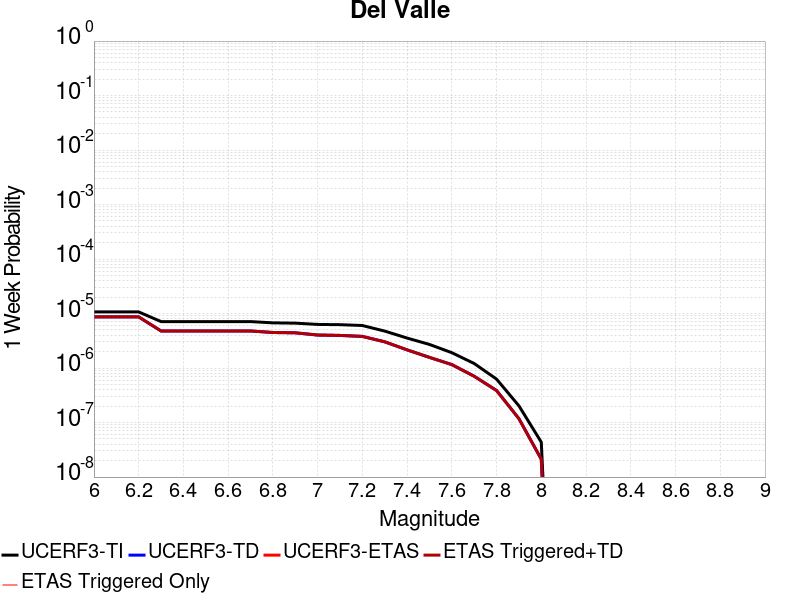 |  |  | 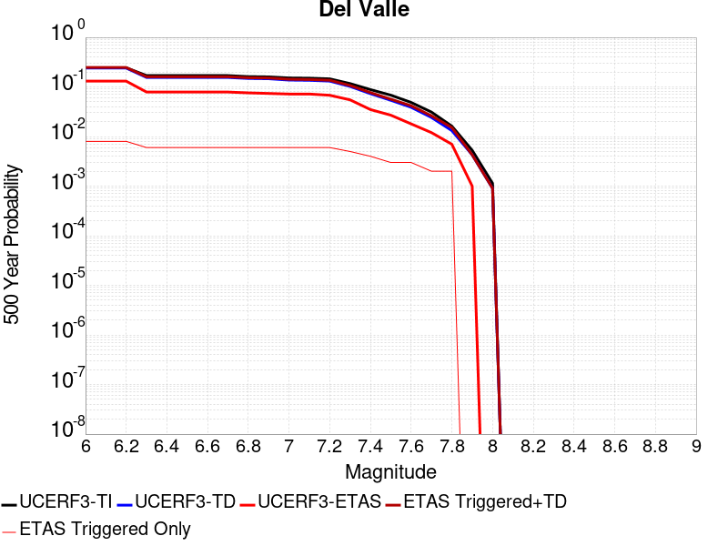 |

| Magnitude | 1 wk TI Prob | 1 wk TD Prob | 1 wk ETAS Prob | 1 wk ETAS/TD Gain | 1 wk ETAS Triggered+TD | 1 wk ETAS Triggered Only | 1 mo TI Prob | 1 mo TD Prob | 1 mo ETAS Prob | 1 mo ETAS/TD Gain | 1 mo ETAS Triggered+TD | 1 mo ETAS Triggered Only | 1 yr TI Prob | 1 yr TD Prob | 1 yr ETAS Prob | 1 yr ETAS/TD Gain | 1 yr ETAS Triggered+TD | 1 yr ETAS Triggered Only | 500 yr TI Prob | 500 yr TD Prob | 500 yr ETAS Prob | 500 yr ETAS/TD Gain | 500 yr ETAS Triggered+TD | 500 yr ETAS Triggered Only |
|-----|-----|-----|-----|-----|-----|-----|-----|-----|-----|-----|-----|-----|-----|-----|-----|-----|-----|-----|-----|-----|-----|-----|-----|-----|
| 6.0 | 1.0716125E-5 | 8.679452E-6 | 0.0 | 0.0 | 8.679452E-6 | 0.0 | 4.592544E-5 | 3.719723E-5 | 0.0 | 0.0 | 3.719723E-5 | 0.0 | 5.589988E-4 | 4.5280173E-4 | 0.0 | 0.0 | 4.5280173E-4 | 0.0 | 0.2438969 | 0.24068224 | 0.131 | 0.5442861 | 0.24675679 | 0.008 |
| 6.1 | 1.0716125E-5 | 8.679452E-6 | 0.0 | 0.0 | 8.679452E-6 | 0.0 | 4.592544E-5 | 3.719723E-5 | 0.0 | 0.0 | 3.719723E-5 | 0.0 | 5.589988E-4 | 4.5280173E-4 | 0.0 | 0.0 | 4.5280173E-4 | 0.0 | 0.2438969 | 0.24068224 | 0.131 | 0.5442861 | 0.24675679 | 0.008 |
| 6.2 | 1.0716125E-5 | 8.679452E-6 | 0.0 | 0.0 | 8.679452E-6 | 0.0 | 4.592544E-5 | 3.719723E-5 | 0.0 | 0.0 | 3.719723E-5 | 0.0 | 5.589988E-4 | 4.5280173E-4 | 0.0 | 0.0 | 4.5280173E-4 | 0.0 | 0.2438969 | 0.24068224 | 0.131 | 0.5442861 | 0.24675679 | 0.008 |
| 6.3 | 7.1293784E-6 | 4.7951385E-6 | 0.0 | 0.0 | 4.7951385E-6 | 0.0 | 3.055412E-5 | 2.0550435E-5 | 0.0 | 0.0 | 2.0550435E-5 | 0.0 | 3.7193293E-4 | 2.5017356E-4 | 0.0 | 0.0 | 2.5017356E-4 | 0.0 | 0.16972728 | 0.15544744 | 0.079 | 0.50821036 | 0.16051476 | 0.006 |
| 6.4 | 7.1293784E-6 | 4.7951385E-6 | 0.0 | 0.0 | 4.7951385E-6 | 0.0 | 3.055412E-5 | 2.0550435E-5 | 0.0 | 0.0 | 2.0550435E-5 | 0.0 | 3.7193293E-4 | 2.5017356E-4 | 0.0 | 0.0 | 2.5017356E-4 | 0.0 | 0.16972728 | 0.15544744 | 0.079 | 0.50821036 | 0.16051476 | 0.006 |
| 6.5 | 7.1293784E-6 | 4.7951385E-6 | 0.0 | 0.0 | 4.7951385E-6 | 0.0 | 3.055412E-5 | 2.0550435E-5 | 0.0 | 0.0 | 2.0550435E-5 | 0.0 | 3.7193293E-4 | 2.5017356E-4 | 0.0 | 0.0 | 2.5017356E-4 | 0.0 | 0.16972728 | 0.15544744 | 0.079 | 0.50821036 | 0.16051476 | 0.006 |
| 6.6 | 7.1293784E-6 | 4.7951385E-6 | 0.0 | 0.0 | 4.7951385E-6 | 0.0 | 3.055412E-5 | 2.0550435E-5 | 0.0 | 0.0 | 2.0550435E-5 | 0.0 | 3.7193293E-4 | 2.5017356E-4 | 0.0 | 0.0 | 2.5017356E-4 | 0.0 | 0.16972728 | 0.15544744 | 0.079 | 0.50821036 | 0.16051476 | 0.006 |
| 6.7 | 7.12272E-6 | 4.792569E-6 | 0.0 | 0.0 | 4.792569E-6 | 0.0 | 3.0525585E-5 | 2.0539424E-5 | 0.0 | 0.0 | 2.0539424E-5 | 0.0 | 3.7158563E-4 | 2.500395E-4 | 0.0 | 0.0 | 2.500395E-4 | 0.0 | 0.16958304 | 0.15535939 | 0.079 | 0.5084984 | 0.16042723 | 0.006 |
| 6.8 | 6.7558703E-6 | 4.491305E-6 | 0.0 | 0.0 | 4.491305E-6 | 0.0 | 2.895341E-5 | 1.9248311E-5 | 0.0 | 0.0 | 1.9248311E-5 | 0.0 | 3.5245073E-4 | 2.3432361E-4 | 0.0 | 0.0 | 2.3432361E-4 | 0.0 | 0.16159704 | 0.14830758 | 0.076 | 0.51244855 | 0.15341772 | 0.006 |
| 6.9 | 6.6700386E-6 | 4.435747E-6 | 0.0 | 0.0 | 4.435747E-6 | 0.0 | 2.8585566E-5 | 1.901021E-5 | 0.0 | 0.0 | 1.901021E-5 | 0.0 | 3.479737E-4 | 2.3142534E-4 | 0.0 | 0.0 | 2.3142534E-4 | 0.0 | 0.15971749 | 0.1464743 | 0.074 | 0.5052081 | 0.15159544 | 0.006 |
| 7.0 | 6.3181424E-6 | 4.0351833E-6 | 0.0 | 0.0 | 4.0351833E-6 | 0.0 | 2.7077473E-5 | 1.729353E-5 | 0.0 | 0.0 | 1.729353E-5 | 0.0 | 3.2961834E-4 | 2.105288E-4 | 0.0 | 0.0 | 2.105288E-4 | 0.0 | 0.15196753 | 0.13769035 | 0.072 | 0.52291244 | 0.14286421 | 0.006 |
| 7.1 | 6.248759E-6 | 3.97124E-6 | 0.0 | 0.0 | 3.97124E-6 | 0.0 | 2.678012E-5 | 1.701949E-5 | 0.0 | 0.0 | 1.701949E-5 | 0.0 | 3.2599916E-4 | 2.07193E-4 | 0.0 | 0.0 | 2.07193E-4 | 0.0 | 0.15043104 | 0.1360792 | 0.072 | 0.52910364 | 0.14126272 | 0.006 |
| 7.2 | 6.0411944E-6 | 3.810468E-6 | 0.0 | 0.0 | 3.810468E-6 | 0.0 | 2.5890577E-5 | 1.6330476E-5 | 0.0 | 0.0 | 1.6330476E-5 | 0.0 | 3.1517216E-4 | 1.988058E-4 | 0.0 | 0.0 | 1.988058E-4 | 0.0 | 0.14581795 | 0.13131928 | 0.068 | 0.5178219 | 0.13653137 | 0.006 |
| 7.3 | 4.7691183E-6 | 3.032007E-6 | 0.0 | 0.0 | 3.032007E-6 | 0.0 | 2.0438918E-5 | 1.2994253E-5 | 0.0 | 0.0 | 1.2994253E-5 | 0.0 | 2.488154E-4 | 1.5819375E-4 | 0.0 | 0.0 | 1.5819375E-4 | 0.0 | 0.11699391 | 0.10251133 | 0.055 | 0.536526 | 0.10699878 | 0.005 |
| 7.4 | 3.5524722E-6 | 2.1583935E-6 | 0.0 | 0.0 | 2.1583935E-6 | 0.0 | 1.5224792E-5 | 9.250225E-6 | 0.0 | 0.0 | 9.250225E-6 | 0.0 | 1.8534607E-4 | 1.1261575E-4 | 0.0 | 0.0 | 1.1261575E-4 | 0.0 | 0.088516355 | 0.073246084 | 0.035 | 0.47784123 | 0.076953106 | 0.004 |
| 7.5 | 2.7133442E-6 | 1.5703483E-6 | 0.0 | 0.0 | 1.5703483E-6 | 0.0 | 1.1628566E-5 | 6.7300466E-6 | 0.0 | 0.0 | 6.7300466E-6 | 0.0 | 1.415686E-4 | 8.193526E-5 | 0.0 | 0.0 | 8.193526E-5 | 0.0 | 0.06834184 | 0.053902593 | 0.027 | 0.50090355 | 0.056740884 | 0.003 |
| 7.6 | 1.915338E-6 | 1.1581847E-6 | 0.0 | 0.0 | 1.1581847E-6 | 0.0 | 8.208566E-6 | 4.9636387E-6 | 0.0 | 0.0 | 4.9636387E-6 | 0.0 | 9.993471E-5 | 6.0430637E-5 | 0.0 | 0.0 | 6.0430637E-5 | 0.0 | 0.0487419 | 0.038904715 | 0.018 | 0.46266884 | 0.041788 | 0.003 |
| 7.7 | 1.2120448E-6 | 7.080211E-7 | 0.0 | 0.0 | 7.080211E-7 | 0.0 | 5.194467E-6 | 3.0343726E-6 | 0.0 | 0.0 | 3.0343726E-6 | 0.0 | 6.3240805E-5 | 3.6942864E-5 | 0.0 | 0.0 | 3.6942864E-5 | 0.0 | 0.031126674 | 0.024232972 | 0.012 | 0.4951931 | 0.026184505 | 0.002 |
| 7.8 | 6.272381E-7 | 3.8752754E-7 | 0.0 | 0.0 | 3.8752754E-7 | 0.0 | 2.6881603E-6 | 1.6608312E-6 | 0.0 | 0.0 | 1.6608312E-6 | 0.0 | 3.272786E-5 | 2.0220434E-5 | 0.0 | 0.0 | 2.0220434E-5 | 0.0 | 0.016231032 | 0.013185049 | 0.007 | 0.53090435 | 0.015158679 | 0.002 |
| 7.9 | 2.0292627E-7 | 1.1793699E-7 | 0.0 | 0.0 | 1.1793699E-7 | 0.0 | 8.6968373E-7 | 5.054441E-7 | 0.0 | 0.0 | 5.054441E-7 | 0.0 | 1.0588348E-5 | 6.1537653E-6 | 0.0 | 0.0 | 6.1537653E-6 | 0.0 | 0.0052802125 | 0.0042741573 | 0.001 | 0.23396423 | 0.0042741573 | 0.0 |
| 8.0 | 4.374492E-8 | 2.126395E-8 | 0.0 | 0.0 | 2.126395E-8 | 0.0 | 1.8747821E-7 | 9.113121E-8 | 0.0 | 0.0 | 9.113121E-8 | 0.0 | 2.2825448E-6 | 1.109522E-6 | 0.0 | 0.0 | 1.109522E-6 | 0.0 | 0.0011406228 | 9.0423884E-4 | 0.0 | 0.0 | 9.0423884E-4 | 0.0 |

## Hunter Mountain-Saline Valley
*[(top)](#table-of-contents)*

| 1 Week | 1 Month | 1 Year | 500 Year |
|-----|-----|-----|-----|
| 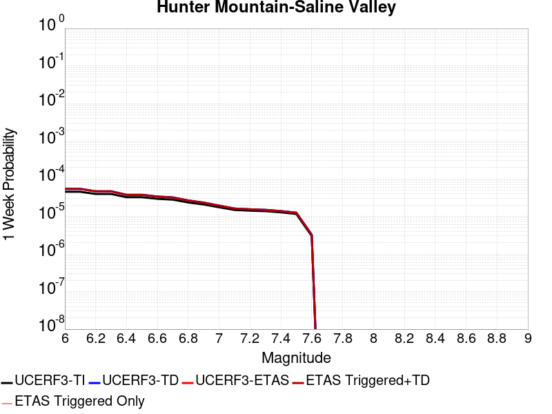 | 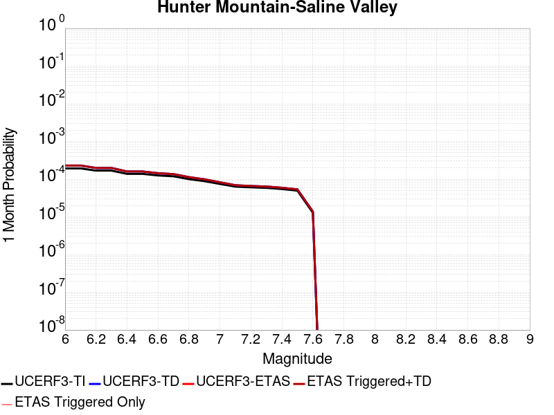 | 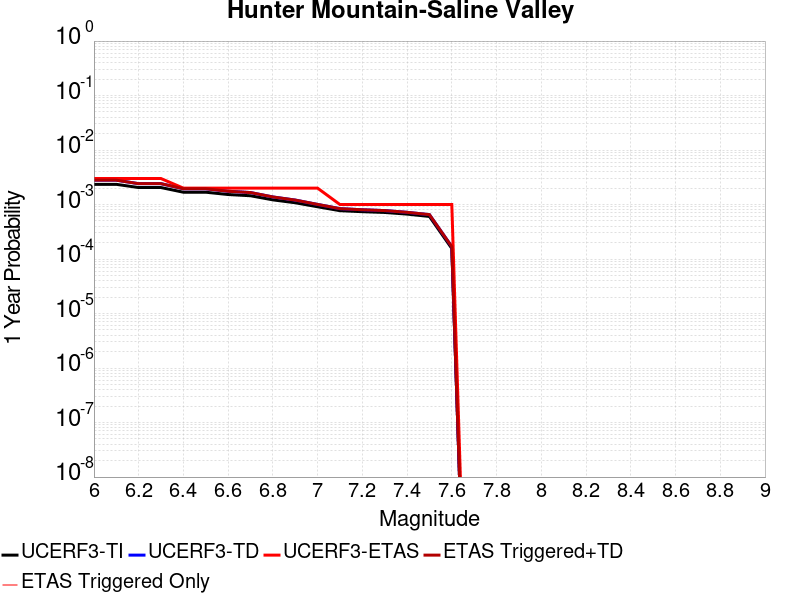 | 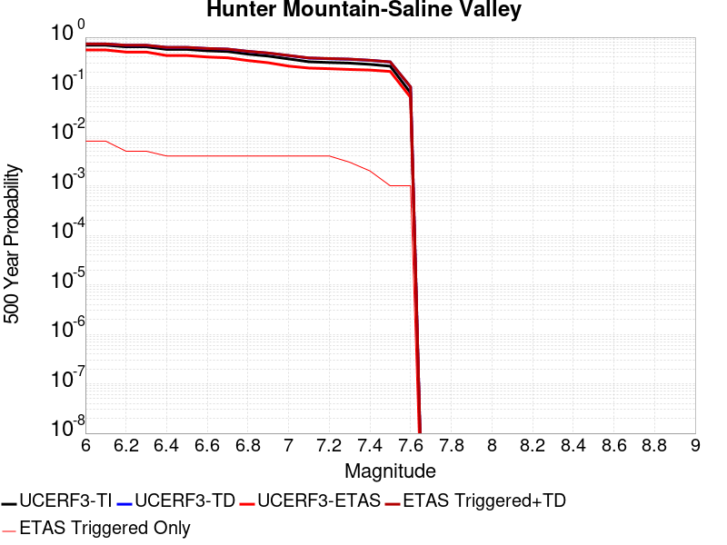 |

| Magnitude | 1 wk TI Prob | 1 wk TD Prob | 1 wk ETAS Prob | 1 wk ETAS/TD Gain | 1 wk ETAS Triggered+TD | 1 wk ETAS Triggered Only | 1 mo TI Prob | 1 mo TD Prob | 1 mo ETAS Prob | 1 mo ETAS/TD Gain | 1 mo ETAS Triggered+TD | 1 mo ETAS Triggered Only | 1 yr TI Prob | 1 yr TD Prob | 1 yr ETAS Prob | 1 yr ETAS/TD Gain | 1 yr ETAS Triggered+TD | 1 yr ETAS Triggered Only | 500 yr TI Prob | 500 yr TD Prob | 500 yr ETAS Prob | 500 yr ETAS/TD Gain | 500 yr ETAS Triggered+TD | 500 yr ETAS Triggered Only |
|-----|-----|-----|-----|-----|-----|-----|-----|-----|-----|-----|-----|-----|-----|-----|-----|-----|-----|-----|-----|-----|-----|-----|-----|-----|
| 6.0 | 4.5103672E-5 | 5.375156E-5 | 0.0 | 0.0 | 5.375156E-5 | 0.0 | 1.9328714E-4 | 2.3034465E-4 | 0.0 | 0.0 | 2.3034465E-4 | 0.0 | 0.002350731 | 0.0028010209 | 0.003 | 1.0710381 | 0.0028010209 | 0.0 | 0.6917207 | 0.73330504 | 0.555 | 0.7568474 | 0.7354386 | 0.008 |
| 6.1 | 4.5103672E-5 | 5.375156E-5 | 0.0 | 0.0 | 5.375156E-5 | 0.0 | 1.9328714E-4 | 2.3034465E-4 | 0.0 | 0.0 | 2.3034465E-4 | 0.0 | 0.002350731 | 0.0028010209 | 0.003 | 1.0710381 | 0.0028010209 | 0.0 | 0.6917207 | 0.73330504 | 0.555 | 0.7568474 | 0.7354386 | 0.008 |
| 6.2 | 3.9363465E-5 | 4.6360066E-5 | 0.0 | 0.0 | 4.6360066E-5 | 0.0 | 1.6868966E-4 | 1.9867171E-4 | 0.0 | 0.0 | 1.9867171E-4 | 0.0 | 0.002051862 | 0.0024162827 | 0.003 | 1.2415766 | 0.0024162827 | 0.0 | 0.641915 | 0.689827 | 0.503 | 0.7291683 | 0.6913779 | 0.005 |
| 6.3 | 3.9363465E-5 | 4.6360066E-5 | 0.0 | 0.0 | 4.6360066E-5 | 0.0 | 1.6868966E-4 | 1.9867171E-4 | 0.0 | 0.0 | 1.9867171E-4 | 0.0 | 0.002051862 | 0.0024162827 | 0.003 | 1.2415766 | 0.0024162827 | 0.0 | 0.641915 | 0.689827 | 0.503 | 0.7291683 | 0.6913779 | 0.005 |
| 6.4 | 3.2311684E-5 | 3.7381855E-5 | 0.0 | 0.0 | 3.7381855E-5 | 0.0 | 1.384713E-4 | 1.6019851E-4 | 0.0 | 0.0 | 1.6019851E-4 | 0.0 | 0.0016845843 | 0.0019487399 | 0.002 | 1.0263042 | 0.0019487399 | 0.0 | 0.5695837 | 0.62445086 | 0.428 | 0.6854022 | 0.625953 | 0.004 |
| 6.5 | 3.2311684E-5 | 3.7381855E-5 | 0.0 | 0.0 | 3.7381855E-5 | 0.0 | 1.384713E-4 | 1.6019851E-4 | 0.0 | 0.0 | 1.6019851E-4 | 0.0 | 0.0016845843 | 0.0019487399 | 0.002 | 1.0263042 | 0.0019487399 | 0.0 | 0.5695837 | 0.62445086 | 0.428 | 0.6854022 | 0.625953 | 0.004 |
| 6.6 | 2.9305844E-5 | 3.366136E-5 | 0.0 | 0.0 | 3.366136E-5 | 0.0 | 1.2559042E-4 | 1.4425533E-4 | 0.0 | 0.0 | 1.4425533E-4 | 0.0 | 0.0015279909 | 0.0017549542 | 0.002 | 1.1396309 | 0.0017549542 | 0.0 | 0.53447044 | 0.59294313 | 0.4 | 0.67460096 | 0.59457135 | 0.004 |
| 6.7 | 2.7826512E-5 | 3.184646E-5 | 0.0 | 0.0 | 3.184646E-5 | 0.0 | 1.19251024E-4 | 1.36478E-4 | 0.0 | 0.0 | 1.36478E-4 | 0.0 | 0.0014509142 | 0.0016604118 | 0.002 | 1.2045205 | 0.0016604118 | 0.0 | 0.5161517 | 0.57644624 | 0.385 | 0.66788536 | 0.57814044 | 0.004 |
| 6.8 | 2.3389874E-5 | 2.6434924E-5 | 0.0 | 0.0 | 2.6434924E-5 | 0.0 | 1.0023846E-4 | 1.13287875E-4 | 0.0 | 0.0 | 1.13287875E-4 | 0.0 | 0.00121972 | 0.0013784531 | 0.002 | 1.4509017 | 0.0013784531 | 0.0 | 0.4567753 | 0.51866627 | 0.339 | 0.6535995 | 0.5205916 | 0.004 |
| 6.9 | 2.069209E-5 | 2.317587E-5 | 0.0 | 0.0 | 2.317587E-5 | 0.0 | 8.867737E-5 | 9.9321565E-5 | 0.0 | 0.0 | 9.9321565E-5 | 0.0 | 0.0010791123 | 0.0012086043 | 0.002 | 1.6548014 | 0.0012086043 | 0.0 | 0.41716284 | 0.47894084 | 0.306 | 0.6389098 | 0.4810251 | 0.004 |
| 7.0 | 1.7462342E-5 | 1.928366E-5 | 0.0 | 0.0 | 1.928366E-5 | 0.0 | 7.483646E-5 | 8.264176E-5 | 0.0 | 0.0 | 8.264176E-5 | 0.0 | 9.1075303E-4 | 0.0010057208 | 0.002 | 1.9886235 | 0.0010057208 | 0.0 | 0.36592245 | 0.42686448 | 0.262 | 0.61377794 | 0.42915702 | 0.004 |
| 7.1 | 1.4807709E-5 | 1.6125088E-5 | 0.0 | 0.0 | 1.6125088E-5 | 0.0 | 6.3460066E-5 | 6.910578E-5 | 0.0 | 0.0 | 6.910578E-5 | 0.0 | 7.723524E-4 | 8.4105384E-4 | 0.001 | 1.1889845 | 8.4105384E-4 | 0.0 | 0.32045063 | 0.3804072 | 0.239 | 0.6282741 | 0.3828856 | 0.004 |
| 7.2 | 1.4180048E-5 | 1.538875E-5 | 0.0 | 0.0 | 1.538875E-5 | 0.0 | 6.077022E-5 | 6.5950204E-5 | 0.0 | 0.0 | 6.5950204E-5 | 0.0 | 7.396263E-4 | 8.0266345E-4 | 0.001 | 1.2458521 | 8.0266345E-4 | 0.0 | 0.3092311 | 0.368975 | 0.232 | 0.62876886 | 0.37149912 | 0.004 |
| 7.3 | 1.3730402E-5 | 1.48671925E-5 | 0.0 | 0.0 | 1.48671925E-5 | 0.0 | 5.8843252E-5 | 6.371507E-5 | 0.0 | 0.0 | 6.371507E-5 | 0.0 | 7.161811E-4 | 7.754703E-4 | 0.001 | 1.28954 | 7.754703E-4 | 0.0 | 0.3010799 | 0.36039722 | 0.224 | 0.62153643 | 0.362316 | 0.003 |
| 7.4 | 1.2810095E-5 | 1.38140285E-5 | 0.0 | 0.0 | 1.38140285E-5 | 0.0 | 5.489925E-5 | 5.920172E-5 | 0.0 | 0.0 | 5.920172E-5 | 0.0 | 6.681934E-4 | 7.205577E-4 | 0.001 | 1.3878139 | 7.205577E-4 | 0.0 | 0.2840954 | 0.34247342 | 0.218 | 0.6365457 | 0.34378847 | 0.002 |
| 7.5 | 1.1595659E-5 | 1.2523247E-5 | 0.0 | 0.0 | 1.2523247E-5 | 0.0 | 4.9694736E-5 | 5.367004E-5 | 0.0 | 0.0 | 5.367004E-5 | 0.0 | 6.0486543E-4 | 6.532518E-4 | 0.001 | 1.5308033 | 6.532518E-4 | 0.0 | 0.2610494 | 0.31772178 | 0.204 | 0.6420712 | 0.31840405 | 0.001 |
| 7.6 | 2.997694E-6 | 3.2348607E-6 | 0.0 | 0.0 | 3.2348607E-6 | 0.0 | 1.28471975E-5 | 1.3863654E-5 | 0.0 | 0.0 | 1.3863654E-5 | 0.0 | 1.564034E-4 | 1.6878381E-4 | 0.001 | 5.924739 | 1.6878381E-4 | 0.0 | 0.075227775 | 0.09891461 | 0.061 | 0.61669356 | 0.09981569 | 0.001 |

## Simi-Santa Rosa
*[(top)](#table-of-contents)*

| 1 Week | 1 Month | 1 Year | 500 Year |
|-----|-----|-----|-----|
|  | 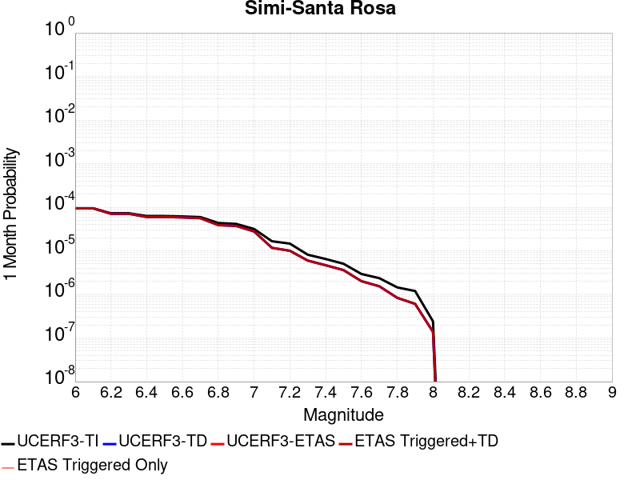 | 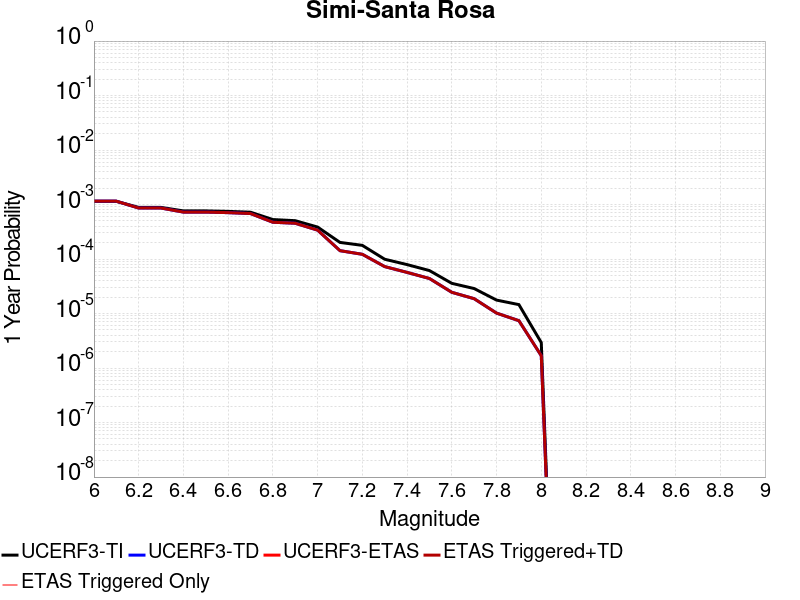 | 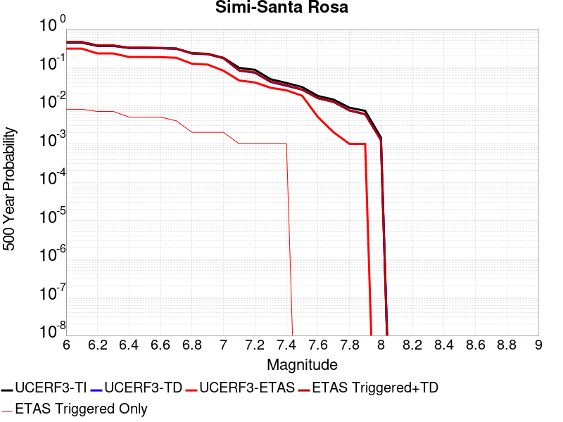 |

| Magnitude | 1 wk TI Prob | 1 wk TD Prob | 1 wk ETAS Prob | 1 wk ETAS/TD Gain | 1 wk ETAS Triggered+TD | 1 wk ETAS Triggered Only | 1 mo TI Prob | 1 mo TD Prob | 1 mo ETAS Prob | 1 mo ETAS/TD Gain | 1 mo ETAS Triggered+TD | 1 mo ETAS Triggered Only | 1 yr TI Prob | 1 yr TD Prob | 1 yr ETAS Prob | 1 yr ETAS/TD Gain | 1 yr ETAS Triggered+TD | 1 yr ETAS Triggered Only | 500 yr TI Prob | 500 yr TD Prob | 500 yr ETAS Prob | 500 yr ETAS/TD Gain | 500 yr ETAS Triggered+TD | 500 yr ETAS Triggered Only |
|-----|-----|-----|-----|-----|-----|-----|-----|-----|-----|-----|-----|-----|-----|-----|-----|-----|-----|-----|-----|-----|-----|-----|-----|-----|
| 6.0 | 2.198912E-5 | 2.211658E-5 | 0.0 | 0.0 | 2.211658E-5 | 0.0 | 9.4235686E-5 | 9.478214E-5 | 0.0 | 0.0 | 9.478214E-5 | 0.0 | 0.0011467156 | 0.0011534048 | 0.0 | 0.0 | 0.0011534048 | 0.0 | 0.43655568 | 0.4512112 | 0.305 | 0.67595834 | 0.45560154 | 0.008 |
| 6.1 | 2.198912E-5 | 2.211658E-5 | 0.0 | 0.0 | 2.211658E-5 | 0.0 | 9.4235686E-5 | 9.478214E-5 | 0.0 | 0.0 | 9.478214E-5 | 0.0 | 0.0011467156 | 0.0011534048 | 0.0 | 0.0 | 0.0011534048 | 0.0 | 0.43655568 | 0.4512112 | 0.305 | 0.67595834 | 0.45560154 | 0.008 |
| 6.2 | 1.69983E-5 | 1.6545442E-5 | 0.0 | 0.0 | 1.6545442E-5 | 0.0 | 7.284782E-5 | 7.090728E-5 | 0.0 | 0.0 | 7.090728E-5 | 0.0 | 8.865613E-4 | 8.6298294E-4 | 0.0 | 0.0 | 8.6298294E-4 | 0.0 | 0.35819918 | 0.36491972 | 0.228 | 0.62479496 | 0.36936527 | 0.007 |
| 6.3 | 1.69983E-5 | 1.6545442E-5 | 0.0 | 0.0 | 1.6545442E-5 | 0.0 | 7.284782E-5 | 7.090728E-5 | 0.0 | 0.0 | 7.090728E-5 | 0.0 | 8.865613E-4 | 8.6298294E-4 | 0.0 | 0.0 | 8.6298294E-4 | 0.0 | 0.35819918 | 0.36491972 | 0.228 | 0.62479496 | 0.36936527 | 0.007 |
| 6.4 | 1.4666188E-5 | 1.3945874E-5 | 0.0 | 0.0 | 1.3945874E-5 | 0.0 | 6.285358E-5 | 5.9766804E-5 | 0.0 | 0.0 | 5.9766804E-5 | 0.0 | 7.6497364E-4 | 7.2744244E-4 | 0.0 | 0.0 | 7.2744244E-4 | 0.0 | 0.31793696 | 0.3205484 | 0.185 | 0.577136 | 0.32394564 | 0.005 |
| 6.5 | 1.4666188E-5 | 1.3945874E-5 | 0.0 | 0.0 | 1.3945874E-5 | 0.0 | 6.285358E-5 | 5.9766804E-5 | 0.0 | 0.0 | 5.9766804E-5 | 0.0 | 7.6497364E-4 | 7.2744244E-4 | 0.0 | 0.0 | 7.2744244E-4 | 0.0 | 0.31793696 | 0.3205484 | 0.185 | 0.577136 | 0.32394564 | 0.005 |
| 6.6 | 1.4377586E-5 | 1.36249E-5 | 0.0 | 0.0 | 1.36249E-5 | 0.0 | 6.1616774E-5 | 5.839126E-5 | 0.0 | 0.0 | 5.839126E-5 | 0.0 | 7.4992597E-4 | 7.107062E-4 | 0.0 | 0.0 | 7.107062E-4 | 0.0 | 0.31278196 | 0.31493604 | 0.183 | 0.58107036 | 0.31836137 | 0.005 |
| 6.7 | 1.3881404E-5 | 1.3106356E-5 | 0.0 | 0.0 | 1.3106356E-5 | 0.0 | 5.9490372E-5 | 5.6169025E-5 | 0.0 | 0.0 | 5.6169025E-5 | 0.0 | 7.240546E-4 | 6.8366766E-4 | 0.0 | 0.0 | 6.8366766E-4 | 0.0 | 0.30382794 | 0.3055391 | 0.176 | 0.57603097 | 0.30831695 | 0.004 |
| 6.8 | 1.0176516E-5 | 9.0795165E-6 | 0.0 | 0.0 | 9.0795165E-6 | 0.0 | 4.3612912E-5 | 3.8911727E-5 | 0.0 | 0.0 | 3.8911727E-5 | 0.0 | 5.308578E-4 | 4.7366362E-4 | 0.0 | 0.0 | 4.7366362E-4 | 0.0 | 0.23317708 | 0.22718404 | 0.123 | 0.5414113 | 0.22872968 | 0.002 |
| 6.9 | 9.699797E-6 | 8.703452E-6 | 0.0 | 0.0 | 8.703452E-6 | 0.0 | 4.15699E-5 | 3.7300066E-5 | 0.0 | 0.0 | 3.7300066E-5 | 0.0 | 5.05996E-4 | 4.5404988E-4 | 0.0 | 0.0 | 4.5404988E-4 | 0.0 | 0.22358027 | 0.21881758 | 0.117 | 0.534692 | 0.22037993 | 0.002 |
| 7.0 | 7.4049476E-6 | 6.5050576E-6 | 0.0 | 0.0 | 6.5050576E-6 | 0.0 | 3.1735104E-5 | 2.787859E-5 | 0.0 | 0.0 | 2.787859E-5 | 0.0 | 3.8630638E-4 | 3.3938143E-4 | 0.0 | 0.0 | 3.3938143E-4 | 0.0 | 0.17567508 | 0.17104754 | 0.081 | 0.47355255 | 0.17270544 | 0.002 |
| 7.1 | 3.873439E-6 | 2.7331016E-6 | 0.0 | 0.0 | 2.7331016E-6 | 0.0 | 1.6600346E-5 | 1.1713241E-5 | 0.0 | 0.0 | 1.1713241E-5 | 0.0 | 2.0209046E-4 | 1.4259962E-4 | 0.0 | 0.0 | 1.4259962E-4 | 0.0 | 0.09611708 | 0.08197835 | 0.045 | 0.5489254 | 0.082896374 | 0.001 |
| 7.2 | 3.417706E-6 | 2.3435173E-6 | 0.0 | 0.0 | 2.3435173E-6 | 0.0 | 1.4647229E-5 | 1.0043608E-5 | 0.0 | 0.0 | 1.0043608E-5 | 0.0 | 1.7831543E-4 | 1.2227429E-4 | 0.0 | 0.0 | 1.2227429E-4 | 0.0 | 0.085305974 | 0.07184302 | 0.04 | 0.55676943 | 0.07277118 | 0.001 |
| 7.3 | 1.90225E-6 | 1.3940758E-6 | 0.0 | 0.0 | 1.3940758E-6 | 0.0 | 8.152474E-6 | 5.974597E-6 | 0.0 | 0.0 | 5.974597E-6 | 0.0 | 9.9251854E-5 | 7.273831E-5 | 0.0 | 0.0 | 7.273831E-5 | 0.0 | 0.048417024 | 0.041169424 | 0.029 | 0.70440626 | 0.042128254 | 0.001 |
| 7.4 | 1.5170556E-6 | 1.0909395E-6 | 0.0 | 0.0 | 1.0909395E-6 | 0.0 | 6.5016507E-6 | 4.6754462E-6 | 0.0 | 0.0 | 4.6754462E-6 | 0.0 | 7.915472E-5 | 5.6922083E-5 | 0.0 | 0.0 | 5.6922083E-5 | 0.0 | 0.038805913 | 0.032837212 | 0.025 | 0.7613314 | 0.033804372 | 0.001 |
| 7.5 | 1.178732E-6 | 8.431773E-7 | 0.0 | 0.0 | 8.431773E-7 | 0.0 | 5.0516987E-6 | 3.613612E-6 | 0.0 | 0.0 | 3.613612E-6 | 0.0 | 6.1502695E-5 | 4.399485E-5 | 0.0 | 0.0 | 4.399485E-5 | 0.0 | 0.03028425 | 0.025934303 | 0.018 | 0.69406146 | 0.025934303 | 0.0 |
| 7.6 | 6.8722386E-7 | 4.7047183E-7 | 0.0 | 0.0 | 4.7047183E-7 | 0.0 | 2.9452417E-6 | 2.0163063E-6 | 0.0 | 0.0 | 2.0163063E-6 | 0.0 | 3.5857727E-5 | 2.4548255E-5 | 0.0 | 0.0 | 2.4548255E-5 | 0.0 | 0.017769413 | 0.015543391 | 0.005 | 0.32168013 | 0.015543391 | 0.0 |
| 7.7 | 5.5126515E-7 | 3.5899637E-7 | 0.0 | 0.0 | 3.5899637E-7 | 0.0 | 2.3625628E-6 | 1.538555E-6 | 0.0 | 0.0 | 1.538555E-6 | 0.0 | 2.8763823E-5 | 1.8731747E-5 | 0.0 | 0.0 | 1.8731747E-5 | 0.0 | 0.0142791895 | 0.012468801 | 0.002 | 0.16040035 | 0.012468801 | 0.0 |
| 7.8 | 3.3860243E-7 | 1.9540614E-7 | 0.0 | 0.0 | 1.9540614E-7 | 0.0 | 1.4511525E-6 | 8.3745465E-7 | 0.0 | 0.0 | 8.3745465E-7 | 0.0 | 1.7667637E-5 | 1.0195963E-5 | 0.0 | 0.0 | 1.0195963E-5 | 0.0 | 0.008794992 | 0.0074689873 | 0.001 | 0.13388696 | 0.0074689873 | 0.0 |
| 7.9 | 2.7955386E-7 | 1.4183745E-7 | 0.0 | 0.0 | 1.4183745E-7 | 0.0 | 1.1980875E-6 | 6.0787465E-7 | 0.0 | 0.0 | 6.0787465E-7 | 0.0 | 1.4586617E-5 | 7.400849E-6 | 0.0 | 0.0 | 7.400849E-6 | 0.0 | 0.0072668297 | 0.005942685 | 0.001 | 0.1682741 | 0.005942685 | 0.0 |
| 8.0 | 5.6259015E-8 | 3.2297482E-8 | 0.0 | 0.0 | 3.2297482E-8 | 0.0 | 2.4111003E-7 | 1.3841778E-7 | 0.0 | 0.0 | 1.3841778E-7 | 0.0 | 2.9355108E-6 | 1.6852352E-6 | 0.0 | 0.0 | 1.6852352E-6 | 0.0 | 0.0014666809 | 0.0012704054 | 0.0 | 0.0 | 0.0012704054 | 0.0 |

## San Jacinto (Lytle Creek connector)
*[(top)](#table-of-contents)*

| 1 Week | 1 Month | 1 Year | 500 Year |
|-----|-----|-----|-----|
| 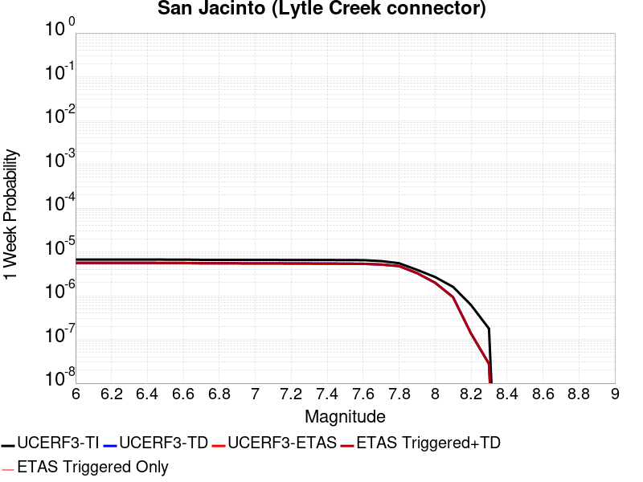 |  | 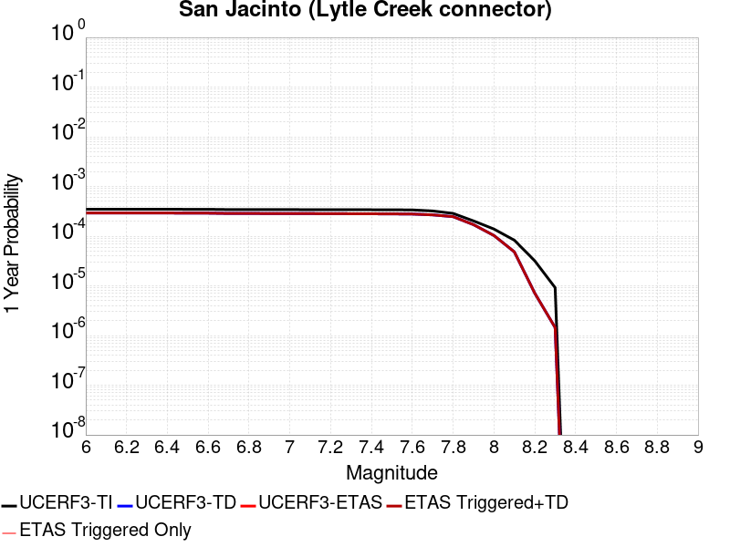 | 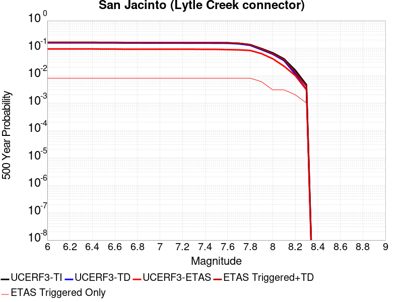 |

| Magnitude | 1 wk TI Prob | 1 wk TD Prob | 1 wk ETAS Prob | 1 wk ETAS/TD Gain | 1 wk ETAS Triggered+TD | 1 wk ETAS Triggered Only | 1 mo TI Prob | 1 mo TD Prob | 1 mo ETAS Prob | 1 mo ETAS/TD Gain | 1 mo ETAS Triggered+TD | 1 mo ETAS Triggered Only | 1 yr TI Prob | 1 yr TD Prob | 1 yr ETAS Prob | 1 yr ETAS/TD Gain | 1 yr ETAS Triggered+TD | 1 yr ETAS Triggered Only | 500 yr TI Prob | 500 yr TD Prob | 500 yr ETAS Prob | 500 yr ETAS/TD Gain | 500 yr ETAS Triggered+TD | 500 yr ETAS Triggered Only |
|-----|-----|-----|-----|-----|-----|-----|-----|-----|-----|-----|-----|-----|-----|-----|-----|-----|-----|-----|-----|-----|-----|-----|-----|-----|
| 6.0 | 6.693995E-6 | 5.6128433E-6 | 0.0 | 0.0 | 5.6128433E-6 | 0.0 | 2.8688235E-5 | 2.4054822E-5 | 0.0 | 0.0 | 2.4054822E-5 | 0.0 | 3.492233E-4 | 2.9282816E-4 | 0.0 | 0.0 | 2.9282816E-4 | 0.0 | 0.16024251 | 0.15540381 | 0.093 | 0.59844095 | 0.16216058 | 0.008 |
| 6.1 | 6.693995E-6 | 5.6128433E-6 | 0.0 | 0.0 | 5.6128433E-6 | 0.0 | 2.8688235E-5 | 2.4054822E-5 | 0.0 | 0.0 | 2.4054822E-5 | 0.0 | 3.492233E-4 | 2.9282816E-4 | 0.0 | 0.0 | 2.9282816E-4 | 0.0 | 0.16024251 | 0.15540381 | 0.093 | 0.59844095 | 0.16216058 | 0.008 |
| 6.2 | 6.693995E-6 | 5.6128433E-6 | 0.0 | 0.0 | 5.6128433E-6 | 0.0 | 2.8688235E-5 | 2.4054822E-5 | 0.0 | 0.0 | 2.4054822E-5 | 0.0 | 3.492233E-4 | 2.9282816E-4 | 0.0 | 0.0 | 2.9282816E-4 | 0.0 | 0.16024251 | 0.15540381 | 0.093 | 0.59844095 | 0.16216058 | 0.008 |
| 6.3 | 6.693995E-6 | 5.6128433E-6 | 0.0 | 0.0 | 5.6128433E-6 | 0.0 | 2.8688235E-5 | 2.4054822E-5 | 0.0 | 0.0 | 2.4054822E-5 | 0.0 | 3.492233E-4 | 2.9282816E-4 | 0.0 | 0.0 | 2.9282816E-4 | 0.0 | 0.16024251 | 0.15540381 | 0.093 | 0.59844095 | 0.16216058 | 0.008 |
| 6.4 | 6.693995E-6 | 5.6128433E-6 | 0.0 | 0.0 | 5.6128433E-6 | 0.0 | 2.8688235E-5 | 2.4054822E-5 | 0.0 | 0.0 | 2.4054822E-5 | 0.0 | 3.492233E-4 | 2.9282816E-4 | 0.0 | 0.0 | 2.9282816E-4 | 0.0 | 0.16024251 | 0.15540381 | 0.093 | 0.59844095 | 0.16216058 | 0.008 |
| 6.5 | 6.6561875E-6 | 5.573169E-6 | 0.0 | 0.0 | 5.573169E-6 | 0.0 | 2.8526205E-5 | 2.3884792E-5 | 0.0 | 0.0 | 2.3884792E-5 | 0.0 | 3.472512E-4 | 2.907586E-4 | 0.0 | 0.0 | 2.907586E-4 | 0.0 | 0.15941378 | 0.15452887 | 0.092 | 0.595358 | 0.16129264 | 0.008 |
| 6.6 | 6.6561875E-6 | 5.573169E-6 | 0.0 | 0.0 | 5.573169E-6 | 0.0 | 2.8526205E-5 | 2.3884792E-5 | 0.0 | 0.0 | 2.3884792E-5 | 0.0 | 3.472512E-4 | 2.907586E-4 | 0.0 | 0.0 | 2.907586E-4 | 0.0 | 0.15941378 | 0.15452887 | 0.092 | 0.595358 | 0.16129264 | 0.008 |
| 6.7 | 6.5802237E-6 | 5.4925995E-6 | 0.0 | 0.0 | 5.4925995E-6 | 0.0 | 2.8200653E-5 | 2.35395E-5 | 0.0 | 0.0 | 2.35395E-5 | 0.0 | 3.4328885E-4 | 2.865558E-4 | 0.0 | 0.0 | 2.865558E-4 | 0.0 | 0.15774621 | 0.15275498 | 0.091 | 0.5957253 | 0.15953293 | 0.008 |
| 6.8 | 6.575632E-6 | 5.487149E-6 | 0.0 | 0.0 | 5.487149E-6 | 0.0 | 2.8180975E-5 | 2.351614E-5 | 0.0 | 0.0 | 2.351614E-5 | 0.0 | 3.4304935E-4 | 2.8627148E-4 | 0.0 | 0.0 | 2.8627148E-4 | 0.0 | 0.15764531 | 0.15263593 | 0.091 | 0.5961899 | 0.15941484 | 0.008 |
| 6.9 | 6.570433E-6 | 5.4787024E-6 | 0.0 | 0.0 | 5.4787024E-6 | 0.0 | 2.8158694E-5 | 2.3479943E-5 | 0.0 | 0.0 | 2.3479943E-5 | 0.0 | 3.4277816E-4 | 2.8583084E-4 | 0.0 | 0.0 | 2.8583084E-4 | 0.0 | 0.15753104 | 0.15248401 | 0.091 | 0.5967839 | 0.15926415 | 0.008 |
| 7.0 | 6.5643826E-6 | 5.469018E-6 | 0.0 | 0.0 | 5.469018E-6 | 0.0 | 2.8132765E-5 | 2.3438439E-5 | 0.0 | 0.0 | 2.3438439E-5 | 0.0 | 3.424626E-4 | 2.853257E-4 | 0.0 | 0.0 | 2.853257E-4 | 0.0 | 0.15739806 | 0.15230641 | 0.091 | 0.5974798 | 0.15908796 | 0.008 |
| 7.1 | 6.557402E-6 | 5.4579214E-6 | 0.0 | 0.0 | 5.4579214E-6 | 0.0 | 2.8102848E-5 | 2.3390883E-5 | 0.0 | 0.0 | 2.3390883E-5 | 0.0 | 3.4209844E-4 | 2.8474684E-4 | 0.0 | 0.0 | 2.8474684E-4 | 0.0 | 0.15724458 | 0.15211052 | 0.091 | 0.5982492 | 0.15889363 | 0.008 |
| 7.2 | 6.546394E-6 | 5.4402917E-6 | 0.0 | 0.0 | 5.4402917E-6 | 0.0 | 2.8055672E-5 | 2.3315328E-5 | 0.0 | 0.0 | 2.3315328E-5 | 0.0 | 3.4152428E-4 | 2.838272E-4 | 0.0 | 0.0 | 2.838272E-4 | 0.0 | 0.15700251 | 0.15179642 | 0.091 | 0.5994871 | 0.15858205 | 0.008 |
| 7.3 | 6.5364216E-6 | 5.421794E-6 | 0.0 | 0.0 | 5.421794E-6 | 0.0 | 2.8012933E-5 | 2.3236053E-5 | 0.0 | 0.0 | 2.3236053E-5 | 0.0 | 3.4100408E-4 | 2.8286228E-4 | 0.0 | 0.0 | 2.8286228E-4 | 0.0 | 0.15678315 | 0.15150397 | 0.091 | 0.60064435 | 0.15829194 | 0.008 |
| 7.4 | 6.5269523E-6 | 5.4037105E-6 | 0.0 | 0.0 | 5.4037105E-6 | 0.0 | 2.7972354E-5 | 2.3158553E-5 | 0.0 | 0.0 | 2.3158553E-5 | 0.0 | 3.4051016E-4 | 2.8191897E-4 | 0.0 | 0.0 | 2.8191897E-4 | 0.0 | 0.15657482 | 0.15123223 | 0.09 | 0.59511125 | 0.15802237 | 0.008 |
| 7.5 | 6.5111835E-6 | 5.3809044E-6 | 0.0 | 0.0 | 5.3809044E-6 | 0.0 | 2.7904773E-5 | 2.3060817E-5 | 0.0 | 0.0 | 2.3060817E-5 | 0.0 | 3.3968766E-4 | 2.8072932E-4 | 0.0 | 0.0 | 2.8072932E-4 | 0.0 | 0.15622775 | 0.1508231 | 0.09 | 0.5967256 | 0.15761651 | 0.008 |
| 7.6 | 6.4768806E-6 | 5.341448E-6 | 0.0 | 0.0 | 5.341448E-6 | 0.0 | 2.7757764E-5 | 2.2891718E-5 | 0.0 | 0.0 | 2.2891718E-5 | 0.0 | 3.3789838E-4 | 2.7867107E-4 | 0.0 | 0.0 | 2.7867107E-4 | 0.0 | 0.1554723 | 0.14999226 | 0.088 | 0.5866969 | 0.15679233 | 0.008 |
| 7.7 | 6.1655364E-6 | 5.143958E-6 | 0.0 | 0.0 | 5.143958E-6 | 0.0 | 2.642346E-5 | 2.2045348E-5 | 0.0 | 0.0 | 2.2045348E-5 | 0.0 | 3.2165812E-4 | 2.683691E-4 | 0.0 | 0.0 | 2.683691E-4 | 0.0 | 0.14858443 | 0.14260514 | 0.086 | 0.6030638 | 0.14946431 | 0.008 |
| 7.8 | 5.5043524E-6 | 4.7374483E-6 | 0.0 | 0.0 | 4.7374483E-6 | 0.0 | 2.3589868E-5 | 2.030319E-5 | 0.0 | 0.0 | 2.030319E-5 | 0.0 | 2.871688E-4 | 2.4716335E-4 | 0.0 | 0.0 | 2.4716335E-4 | 0.0 | 0.13377017 | 0.12605639 | 0.082 | 0.65050256 | 0.13304794 | 0.008 |
| 7.9 | 3.889249E-6 | 3.270793E-6 | 0.0 | 0.0 | 3.270793E-6 | 0.0 | 1.6668104E-5 | 1.4017609E-5 | 0.0 | 0.0 | 1.4017609E-5 | 0.0 | 2.0291525E-4 | 1.7065105E-4 | 0.0 | 0.0 | 1.7065105E-4 | 0.0 | 0.09648984 | 0.08785984 | 0.063 | 0.71705115 | 0.09333268 | 0.006 |
| 8.0 | 2.668535E-6 | 1.9782406E-6 | 0.0 | 0.0 | 1.9782406E-6 | 0.0 | 1.1436528E-5 | 8.478146E-6 | 0.0 | 0.0 | 8.478146E-6 | 0.0 | 1.3923083E-4 | 1.0321656E-4 | 0.0 | 0.0 | 1.0321656E-4 | 0.0 | 0.06725205 | 0.06011593 | 0.041 | 0.6820156 | 0.06293558 | 0.003 |
| 8.1 | 1.5911459E-6 | 9.277629E-7 | 0.0 | 0.0 | 9.277629E-7 | 0.0 | 6.8191785E-6 | 3.9761208E-6 | 0.0 | 0.0 | 3.9761208E-6 | 0.0 | 8.3020335E-5 | 4.840821E-5 | 0.0 | 0.0 | 4.840821E-5 | 0.0 | 0.040662073 | 0.03522792 | 0.022 | 0.6245046 | 0.038122237 | 0.003 |
| 8.2 | 6.1294963E-7 | 1.3697584E-7 | 0.0 | 0.0 | 1.3697584E-7 | 0.0 | 2.6269242E-6 | 5.870392E-7 | 0.0 | 0.0 | 5.870392E-7 | 0.0 | 3.1982334E-5 | 7.1471786E-6 | 0.0 | 0.0 | 7.1471786E-6 | 0.0 | 0.015864238 | 0.011317163 | 0.01 | 0.88361365 | 0.013294528 | 0.002 |
| 8.3 | 1.762871E-7 | 2.7753703E-8 | 0.0 | 0.0 | 2.7753703E-8 | 0.0 | 7.5551594E-7 | 1.18944435E-7 | 0.0 | 0.0 | 1.18944435E-7 | 0.0 | 9.1983675E-6 | 1.4481475E-6 | 0.0 | 0.0 | 1.4481475E-6 | 0.0 | 0.004588645 | 0.0031212743 | 0.003 | 0.96114594 | 0.004118153 | 0.001 |

## Las Positas
*[(top)](#table-of-contents)*

| 1 Week | 1 Month | 1 Year | 500 Year |
|-----|-----|-----|-----|
|  | 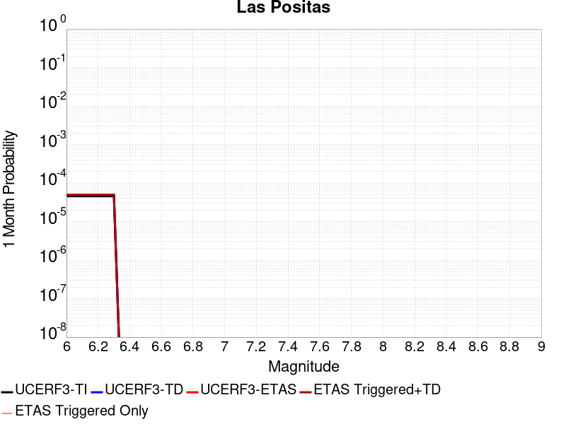 | 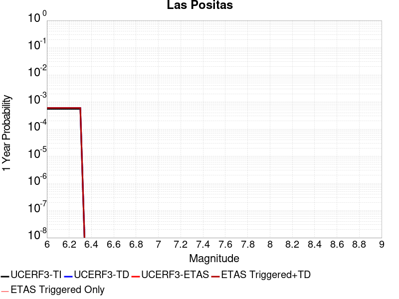 | 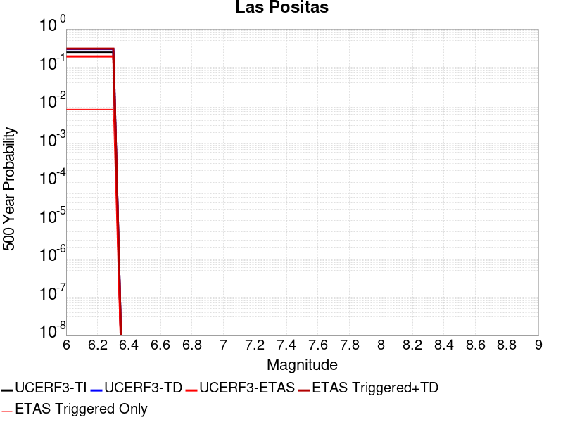 |

| Magnitude | 1 wk TI Prob | 1 wk TD Prob | 1 wk ETAS Prob | 1 wk ETAS/TD Gain | 1 wk ETAS Triggered+TD | 1 wk ETAS Triggered Only | 1 mo TI Prob | 1 mo TD Prob | 1 mo ETAS Prob | 1 mo ETAS/TD Gain | 1 mo ETAS Triggered+TD | 1 mo ETAS Triggered Only | 1 yr TI Prob | 1 yr TD Prob | 1 yr ETAS Prob | 1 yr ETAS/TD Gain | 1 yr ETAS Triggered+TD | 1 yr ETAS Triggered Only | 500 yr TI Prob | 500 yr TD Prob | 500 yr ETAS Prob | 500 yr ETAS/TD Gain | 500 yr ETAS Triggered+TD | 500 yr ETAS Triggered Only |
|-----|-----|-----|-----|-----|-----|-----|-----|-----|-----|-----|-----|-----|-----|-----|-----|-----|-----|-----|-----|-----|-----|-----|-----|-----|
| 6.0 | 1.0659424E-5 | 1.153871E-5 | 0.0 | 0.0 | 1.153871E-5 | 0.0 | 4.568245E-5 | 4.9451613E-5 | 0.0 | 0.0 | 4.9451613E-5 | 0.0 | 5.560419E-4 | 6.020734E-4 | 0.0 | 0.0 | 6.020734E-4 | 0.0 | 0.24277759 | 0.29984075 | 0.192 | 0.6403399 | 0.30544204 | 0.008 |
| 6.1 | 1.0659424E-5 | 1.153871E-5 | 0.0 | 0.0 | 1.153871E-5 | 0.0 | 4.568245E-5 | 4.9451613E-5 | 0.0 | 0.0 | 4.9451613E-5 | 0.0 | 5.560419E-4 | 6.020734E-4 | 0.0 | 0.0 | 6.020734E-4 | 0.0 | 0.24277759 | 0.29984075 | 0.192 | 0.6403399 | 0.30544204 | 0.008 |
| 6.2 | 1.0659424E-5 | 1.153871E-5 | 0.0 | 0.0 | 1.153871E-5 | 0.0 | 4.568245E-5 | 4.9451613E-5 | 0.0 | 0.0 | 4.9451613E-5 | 0.0 | 5.560419E-4 | 6.020734E-4 | 0.0 | 0.0 | 6.020734E-4 | 0.0 | 0.24277759 | 0.29984075 | 0.192 | 0.6403399 | 0.30544204 | 0.008 |
| 6.3 | 1.0659424E-5 | 1.153871E-5 | 0.0 | 0.0 | 1.153871E-5 | 0.0 | 4.568245E-5 | 4.9451613E-5 | 0.0 | 0.0 | 4.9451613E-5 | 0.0 | 5.560419E-4 | 6.020734E-4 | 0.0 | 0.0 | 6.020734E-4 | 0.0 | 0.24277759 | 0.29984075 | 0.192 | 0.6403399 | 0.30544204 | 0.008 |

## Rocky Ledge 2011 CFM
*[(top)](#table-of-contents)*

| 1 Week | 1 Month | 1 Year | 500 Year |
|-----|-----|-----|-----|
|  |  | 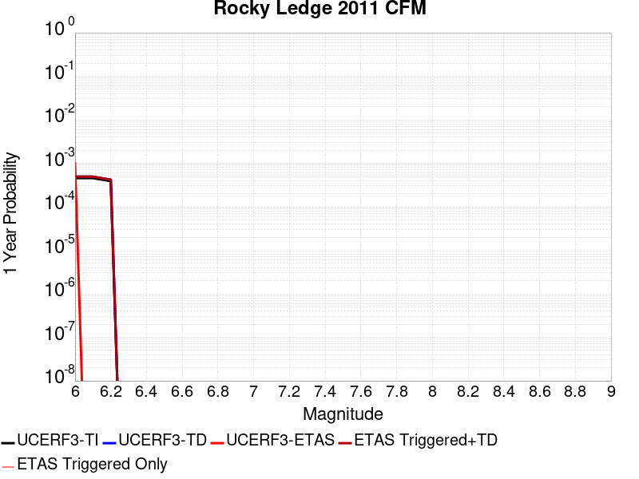 | 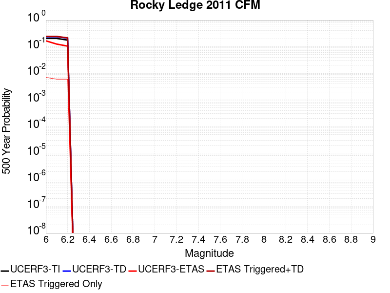 |

| Magnitude | 1 wk TI Prob | 1 wk TD Prob | 1 wk ETAS Prob | 1 wk ETAS/TD Gain | 1 wk ETAS Triggered+TD | 1 wk ETAS Triggered Only | 1 mo TI Prob | 1 mo TD Prob | 1 mo ETAS Prob | 1 mo ETAS/TD Gain | 1 mo ETAS Triggered+TD | 1 mo ETAS Triggered Only | 1 yr TI Prob | 1 yr TD Prob | 1 yr ETAS Prob | 1 yr ETAS/TD Gain | 1 yr ETAS Triggered+TD | 1 yr ETAS Triggered Only | 500 yr TI Prob | 500 yr TD Prob | 500 yr ETAS Prob | 500 yr ETAS/TD Gain | 500 yr ETAS Triggered+TD | 500 yr ETAS Triggered Only |
|-----|-----|-----|-----|-----|-----|-----|-----|-----|-----|-----|-----|-----|-----|-----|-----|-----|-----|-----|-----|-----|-----|-----|-----|-----|
| 6.0 | 8.7550525E-6 | 9.445589E-6 | 0.0 | 0.0 | 9.445589E-6 | 0.0 | 3.7521113E-5 | 4.048093E-5 | 0.001 | 24.702991 | 4.048093E-5 | 0.0 | 4.567238E-4 | 4.928256E-4 | 0.001 | 2.0291154 | 4.928256E-4 | 0.0 | 0.20420532 | 0.23771562 | 0.166 | 0.6983134 | 0.2430516 | 0.007 |
| 6.1 | 8.7550525E-6 | 9.445589E-6 | 0.0 | 0.0 | 9.445589E-6 | 0.0 | 3.7521113E-5 | 4.048093E-5 | 0.0 | 0.0 | 4.048093E-5 | 0.0 | 4.567238E-4 | 4.928256E-4 | 0.0 | 0.0 | 4.928256E-4 | 0.0 | 0.20420532 | 0.23771562 | 0.125 | 0.52583843 | 0.24228932 | 0.006 |
| 6.2 | 7.442295E-6 | 8.028241E-6 | 0.0 | 0.0 | 8.028241E-6 | 0.0 | 3.189516E-5 | 3.440675E-5 | 0.0 | 0.0 | 3.440675E-5 | 0.0 | 3.8825438E-4 | 4.1890214E-4 | 0.0 | 0.0 | 4.1890214E-4 | 0.0 | 0.1764779 | 0.2088226 | 0.105 | 0.5028191 | 0.21356966 | 0.006 |

## Garlic Springs
*[(top)](#table-of-contents)*

| 1 Week | 1 Month | 1 Year | 500 Year |
|-----|-----|-----|-----|
|  |  | 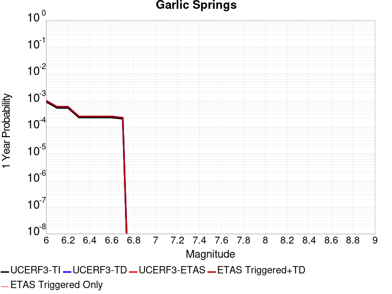 |  |

| Magnitude | 1 wk TI Prob | 1 wk TD Prob | 1 wk ETAS Prob | 1 wk ETAS/TD Gain | 1 wk ETAS Triggered+TD | 1 wk ETAS Triggered Only | 1 mo TI Prob | 1 mo TD Prob | 1 mo ETAS Prob | 1 mo ETAS/TD Gain | 1 mo ETAS Triggered+TD | 1 mo ETAS Triggered Only | 1 yr TI Prob | 1 yr TD Prob | 1 yr ETAS Prob | 1 yr ETAS/TD Gain | 1 yr ETAS Triggered+TD | 1 yr ETAS Triggered Only | 500 yr TI Prob | 500 yr TD Prob | 500 yr ETAS Prob | 500 yr ETAS/TD Gain | 500 yr ETAS Triggered+TD | 500 yr ETAS Triggered Only |
|-----|-----|-----|-----|-----|-----|-----|-----|-----|-----|-----|-----|-----|-----|-----|-----|-----|-----|-----|-----|-----|-----|-----|-----|-----|
| 6.0 | 1.6760017E-5 | 1.8660045E-5 | 0.0 | 0.0 | 1.8660045E-5 | 0.0 | 7.182667E-5 | 7.9969825E-5 | 0.0 | 0.0 | 7.9969825E-5 | 0.0 | 8.7413884E-4 | 9.7331364E-4 | 0.0 | 0.0 | 9.7331364E-4 | 0.0 | 0.35419685 | 0.40022096 | 0.385 | 0.96196866 | 0.4050192 | 0.008 |
| 6.1 | 9.852767E-6 | 1.0909075E-5 | 0.0 | 0.0 | 1.0909075E-5 | 0.0 | 4.222546E-5 | 4.6752735E-5 | 0.0 | 0.0 | 4.6752735E-5 | 0.0 | 5.139737E-4 | 5.69136E-4 | 0.0 | 0.0 | 5.69136E-4 | 0.0 | 0.22667271 | 0.26037678 | 0.225 | 0.8641324 | 0.26259565 | 0.003 |
| 6.2 | 9.852767E-6 | 1.0909075E-5 | 0.0 | 0.0 | 1.0909075E-5 | 0.0 | 4.222546E-5 | 4.6752735E-5 | 0.0 | 0.0 | 4.6752735E-5 | 0.0 | 5.139737E-4 | 5.69136E-4 | 0.0 | 0.0 | 5.69136E-4 | 0.0 | 0.22667271 | 0.26037678 | 0.225 | 0.8641324 | 0.26259565 | 0.003 |
| 6.3 | 4.3167724E-6 | 4.751642E-6 | 0.0 | 0.0 | 4.751642E-6 | 0.0 | 1.8500323E-5 | 2.0364148E-5 | 0.0 | 0.0 | 2.0364148E-5 | 0.0 | 2.2521814E-4 | 2.4792808E-4 | 0.0 | 0.0 | 2.4792808E-4 | 0.0 | 0.10651145 | 0.1220202 | 0.099 | 0.81134105 | 0.122898184 | 0.001 |
| 6.4 | 4.3167724E-6 | 4.751642E-6 | 0.0 | 0.0 | 4.751642E-6 | 0.0 | 1.8500323E-5 | 2.0364148E-5 | 0.0 | 0.0 | 2.0364148E-5 | 0.0 | 2.2521814E-4 | 2.4792808E-4 | 0.0 | 0.0 | 2.4792808E-4 | 0.0 | 0.10651145 | 0.1220202 | 0.099 | 0.81134105 | 0.122898184 | 0.001 |
| 6.5 | 4.3167724E-6 | 4.751642E-6 | 0.0 | 0.0 | 4.751642E-6 | 0.0 | 1.8500323E-5 | 2.0364148E-5 | 0.0 | 0.0 | 2.0364148E-5 | 0.0 | 2.2521814E-4 | 2.4792808E-4 | 0.0 | 0.0 | 2.4792808E-4 | 0.0 | 0.10651145 | 0.1220202 | 0.099 | 0.81134105 | 0.122898184 | 0.001 |
| 6.6 | 4.301311E-6 | 4.7346057E-6 | 0.0 | 0.0 | 4.7346057E-6 | 0.0 | 1.8434059E-5 | 2.0291138E-5 | 0.0 | 0.0 | 2.0291138E-5 | 0.0 | 2.2441156E-4 | 2.470394E-4 | 0.0 | 0.0 | 2.470394E-4 | 0.0 | 0.106150955 | 0.121634565 | 0.098 | 0.805692 | 0.12251293 | 0.001 |
| 6.7 | 3.8599724E-6 | 4.2475504E-6 | 0.0 | 0.0 | 4.2475504E-6 | 0.0 | 1.6542634E-5 | 1.8203787E-5 | 0.0 | 0.0 | 1.8203787E-5 | 0.0 | 2.0138794E-4 | 2.2163111E-4 | 0.0 | 0.0 | 2.2163111E-4 | 0.0 | 0.09579947 | 0.110495485 | 0.092 | 0.8326132 | 0.11138499 | 0.001 |

## Cleghorn
*[(top)](#table-of-contents)*

| 1 Week | 1 Month | 1 Year | 500 Year |
|-----|-----|-----|-----|
| 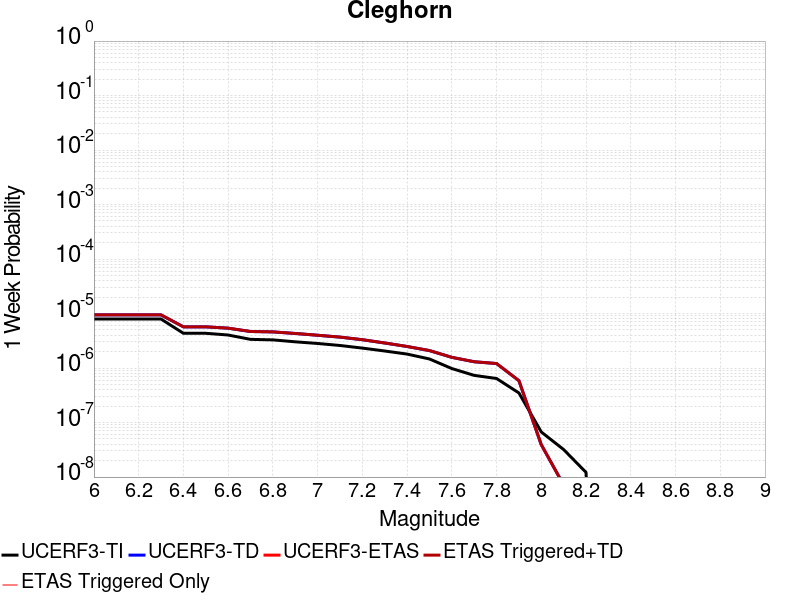 |  |  | 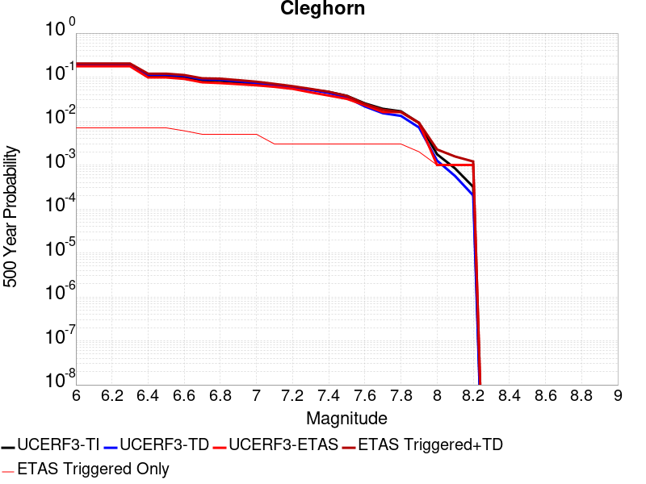 |

| Magnitude | 1 wk TI Prob | 1 wk TD Prob | 1 wk ETAS Prob | 1 wk ETAS/TD Gain | 1 wk ETAS Triggered+TD | 1 wk ETAS Triggered Only | 1 mo TI Prob | 1 mo TD Prob | 1 mo ETAS Prob | 1 mo ETAS/TD Gain | 1 mo ETAS Triggered+TD | 1 mo ETAS Triggered Only | 1 yr TI Prob | 1 yr TD Prob | 1 yr ETAS Prob | 1 yr ETAS/TD Gain | 1 yr ETAS Triggered+TD | 1 yr ETAS Triggered Only | 500 yr TI Prob | 500 yr TD Prob | 500 yr ETAS Prob | 500 yr ETAS/TD Gain | 500 yr ETAS Triggered+TD | 500 yr ETAS Triggered Only |
|-----|-----|-----|-----|-----|-----|-----|-----|-----|-----|-----|-----|-----|-----|-----|-----|-----|-----|-----|-----|-----|-----|-----|-----|-----|
| 6.0 | 7.9267165E-6 | 9.440867E-6 | 0.0 | 0.0 | 9.440867E-6 | 0.0 | 3.39712E-5 | 4.046029E-5 | 0.0 | 0.0 | 4.046029E-5 | 0.0 | 4.1352084E-4 | 4.925033E-4 | 0.0 | 0.0 | 4.925033E-4 | 0.0 | 0.18682033 | 0.19779044 | 0.176 | 0.8898307 | 0.2034059 | 0.007 |
| 6.1 | 7.9267165E-6 | 9.440867E-6 | 0.0 | 0.0 | 9.440867E-6 | 0.0 | 3.39712E-5 | 4.046029E-5 | 0.0 | 0.0 | 4.046029E-5 | 0.0 | 4.1352084E-4 | 4.925033E-4 | 0.0 | 0.0 | 4.925033E-4 | 0.0 | 0.18682033 | 0.19779044 | 0.176 | 0.8898307 | 0.2034059 | 0.007 |
| 6.2 | 7.9267165E-6 | 9.440867E-6 | 0.0 | 0.0 | 9.440867E-6 | 0.0 | 3.39712E-5 | 4.046029E-5 | 0.0 | 0.0 | 4.046029E-5 | 0.0 | 4.1352084E-4 | 4.925033E-4 | 0.0 | 0.0 | 4.925033E-4 | 0.0 | 0.18682033 | 0.19779044 | 0.176 | 0.8898307 | 0.2034059 | 0.007 |
| 6.3 | 7.9267165E-6 | 9.440867E-6 | 0.0 | 0.0 | 9.440867E-6 | 0.0 | 3.39712E-5 | 4.046029E-5 | 0.0 | 0.0 | 4.046029E-5 | 0.0 | 4.1352084E-4 | 4.925033E-4 | 0.0 | 0.0 | 4.925033E-4 | 0.0 | 0.18682033 | 0.19779044 | 0.176 | 0.8898307 | 0.2034059 | 0.007 |
| 6.4 | 4.3445207E-6 | 5.709282E-6 | 0.0 | 0.0 | 5.709282E-6 | 0.0 | 1.8619241E-5 | 2.4468127E-5 | 0.0 | 0.0 | 2.4468127E-5 | 0.0 | 2.2666567E-4 | 2.9785972E-4 | 0.0 | 0.0 | 2.9785972E-4 | 0.0 | 0.107158035 | 0.1133637 | 0.098 | 0.8644743 | 0.11957015 | 0.007 |
| 6.5 | 4.3445207E-6 | 5.709282E-6 | 0.0 | 0.0 | 5.709282E-6 | 0.0 | 1.8619241E-5 | 2.4468127E-5 | 0.0 | 0.0 | 2.4468127E-5 | 0.0 | 2.2666567E-4 | 2.9785972E-4 | 0.0 | 0.0 | 2.9785972E-4 | 0.0 | 0.107158035 | 0.1133637 | 0.098 | 0.8644743 | 0.11957015 | 0.007 |
| 6.6 | 4.040109E-6 | 5.3924027E-6 | 0.0 | 0.0 | 5.3924027E-6 | 0.0 | 1.7314638E-5 | 2.3110098E-5 | 0.0 | 0.0 | 2.3110098E-5 | 0.0 | 2.1078532E-4 | 2.8133002E-4 | 0.0 | 0.0 | 2.8133002E-4 | 0.0 | 0.10003893 | 0.105983764 | 0.091 | 0.8586221 | 0.11134786 | 0.006 |
| 6.7 | 3.3632055E-6 | 4.687479E-6 | 0.0 | 0.0 | 4.687479E-6 | 0.0 | 1.4413658E-5 | 2.008904E-5 | 0.0 | 0.0 | 2.008904E-5 | 0.0 | 1.7547216E-4 | 2.4455693E-4 | 0.0 | 0.0 | 2.4455693E-4 | 0.0 | 0.084004454 | 0.089244224 | 0.076 | 0.8515957 | 0.093798004 | 0.005 |
| 6.8 | 3.2902772E-6 | 4.609687E-6 | 0.0 | 0.0 | 4.609687E-6 | 0.0 | 1.4101111E-5 | 1.9755653E-5 | 0.0 | 0.0 | 1.9755653E-5 | 0.0 | 1.716675E-4 | 2.4049883E-4 | 0.0 | 0.0 | 2.4049883E-4 | 0.0 | 0.08225997 | 0.087395385 | 0.073 | 0.83528435 | 0.09195841 | 0.005 |
| 6.9 | 3.031547E-6 | 4.313479E-6 | 0.0 | 0.0 | 4.313479E-6 | 0.0 | 1.299228E-5 | 1.848621E-5 | 0.0 | 0.0 | 1.848621E-5 | 0.0 | 1.5816953E-4 | 2.250466E-4 | 0.0 | 0.0 | 2.250466E-4 | 0.0 | 0.07604418 | 0.08055017 | 0.069 | 0.856609 | 0.08514742 | 0.005 |
| 7.0 | 2.8259715E-6 | 3.999059E-6 | 0.0 | 0.0 | 3.999059E-6 | 0.0 | 1.211125E-5 | 1.7138715E-5 | 0.0 | 0.0 | 1.7138715E-5 | 0.0 | 1.4744449E-4 | 2.086441E-4 | 0.0 | 0.0 | 2.086441E-4 | 0.0 | 0.07107538 | 0.07384643 | 0.065 | 0.88020504 | 0.0784772 | 0.005 |
| 7.1 | 2.5962665E-6 | 3.6977824E-6 | 0.0 | 0.0 | 3.6977824E-6 | 0.0 | 1.1126809E-5 | 1.5847543E-5 | 0.0 | 0.0 | 1.5847543E-5 | 0.0 | 1.3546048E-4 | 1.9292696E-4 | 0.0 | 0.0 | 1.9292696E-4 | 0.0 | 0.06549175 | 0.067288436 | 0.06 | 0.89168364 | 0.07008657 | 0.003 |
| 7.2 | 2.3247253E-6 | 3.3138151E-6 | 0.0 | 0.0 | 3.3138151E-6 | 0.0 | 9.96307E-6 | 1.4201989E-5 | 0.0 | 0.0 | 1.4201989E-5 | 0.0 | 1.21293626E-4 | 1.7289567E-4 | 0.0 | 0.0 | 1.7289567E-4 | 0.0 | 0.058847878 | 0.0593033 | 0.054 | 0.9105733 | 0.06212539 | 0.003 |
| 7.3 | 2.056928E-6 | 2.8850313E-6 | 0.0 | 0.0 | 2.8850313E-6 | 0.0 | 8.815376E-6 | 1.2364362E-5 | 0.0 | 0.0 | 1.2364362E-5 | 0.0 | 1.0732192E-4 | 1.5052586E-4 | 0.0 | 0.0 | 1.5052586E-4 | 0.0 | 0.05224935 | 0.05100986 | 0.045 | 0.8821824 | 0.05385683 | 0.003 |
| 7.4 | 1.8055999E-6 | 2.4887247E-6 | 0.0 | 0.0 | 2.4887247E-6 | 0.0 | 7.738263E-6 | 1.066592E-5 | 0.0 | 0.0 | 1.066592E-5 | 0.0 | 9.4209274E-5 | 1.2984997E-4 | 0.0 | 0.0 | 1.2984997E-4 | 0.0 | 0.046014547 | 0.043460775 | 0.038 | 0.8743516 | 0.046330392 | 0.003 |
| 7.5 | 1.4683443E-6 | 2.0939283E-6 | 0.0 | 0.0 | 2.0939283E-6 | 0.0 | 6.292889E-6 | 8.973948E-6 | 0.0 | 0.0 | 8.973948E-6 | 0.0 | 7.661323E-5 | 1.09252425E-4 | 0.0 | 0.0 | 1.09252425E-4 | 0.0 | 0.03758361 | 0.034347657 | 0.032 | 0.9316501 | 0.037244614 | 0.003 |
| 7.6 | 9.804088E-7 | 1.5734205E-6 | 0.0 | 0.0 | 1.5734205E-6 | 0.0 | 4.201745E-6 | 6.7432134E-6 | 0.0 | 0.0 | 6.7432134E-6 | 0.0 | 5.1155046E-5 | 8.209557E-5 | 0.0 | 0.0 | 8.209557E-5 | 0.0 | 0.025253827 | 0.02148808 | 0.023 | 1.0703609 | 0.024423616 | 0.003 |
| 7.7 | 7.3434086E-7 | 1.3056807E-6 | 0.0 | 0.0 | 1.3056807E-6 | 0.0 | 3.1471714E-6 | 5.5957626E-6 | 0.0 | 0.0 | 5.5957626E-6 | 0.0 | 3.831614E-5 | 6.81263E-5 | 0.0 | 0.0 | 6.81263E-5 | 0.0 | 0.01897608 | 0.015075578 | 0.016 | 1.0613191 | 0.018030353 | 0.003 |
| 7.8 | 6.434184E-7 | 1.210572E-6 | 0.0 | 0.0 | 1.210572E-6 | 0.0 | 2.7575045E-6 | 5.1881557E-6 | 0.0 | 0.0 | 5.1881557E-6 | 0.0 | 3.35721E-5 | 6.316398E-5 | 0.0 | 0.0 | 6.316398E-5 | 0.0 | 0.016646227 | 0.013102833 | 0.016 | 1.22111 | 0.016063524 | 0.003 |
| 7.9 | 3.4943926E-7 | 5.876145E-7 | 0.0 | 0.0 | 5.876145E-7 | 0.0 | 1.497596E-6 | 2.5183456E-6 | 0.0 | 0.0 | 2.5183456E-6 | 0.0 | 1.8233079E-5 | 3.066043E-5 | 0.0 | 0.0 | 3.066043E-5 | 0.0 | 0.009075192 | 0.0071449787 | 0.009 | 1.2596259 | 0.009130688 | 0.002 |
| 8.0 | 6.717524E-8 | 3.9258996E-8 | 0.0 | 0.0 | 3.9258996E-8 | 0.0 | 2.8789387E-7 | 1.6825283E-7 | 0.0 | 0.0 | 1.6825283E-7 | 0.0 | 3.505102E-6 | 2.0484763E-6 | 0.0 | 0.0 | 2.0484763E-6 | 0.0 | 0.0017510193 | 0.0012588125 | 0.001 | 0.7943995 | 0.0022575536 | 0.001 |
| 8.1 | 3.1984914E-8 | 7.147203E-9 | 0.0 | 0.0 | 7.147203E-9 | 0.0 | 1.370782E-7 | 3.0630872E-8 | 0.0 | 0.0 | 3.0630872E-8 | 0.0 | 1.6689258E-6 | 3.7293077E-7 | 0.0 | 0.0 | 3.7293077E-7 | 0.0 | 8.3411555E-4 | 5.603166E-4 | 0.001 | 1.7847052 | 0.0015597563 | 0.001 |
| 8.2 | 1.21887656E-8 | 1.9036694E-9 | 0.0 | 0.0 | 1.9036694E-9 | 0.0 | 5.2237567E-8 | 8.158582E-9 | 0.0 | 0.0 | 8.158582E-9 | 0.0 | 6.359922E-7 | 9.933073E-8 | 0.0 | 0.0 | 9.933073E-8 | 0.0 | 3.1794564E-4 | 2.0330663E-4 | 0.001 | 4.9186788 | 0.0012031033 | 0.001 |

## San Gabriel (Extension)
*[(top)](#table-of-contents)*

| 1 Week | 1 Month | 1 Year | 500 Year |
|-----|-----|-----|-----|
| 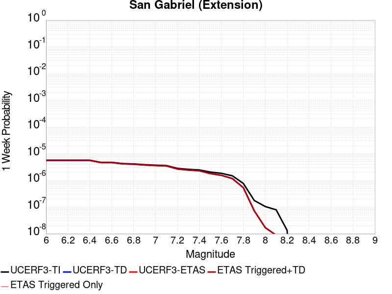 | 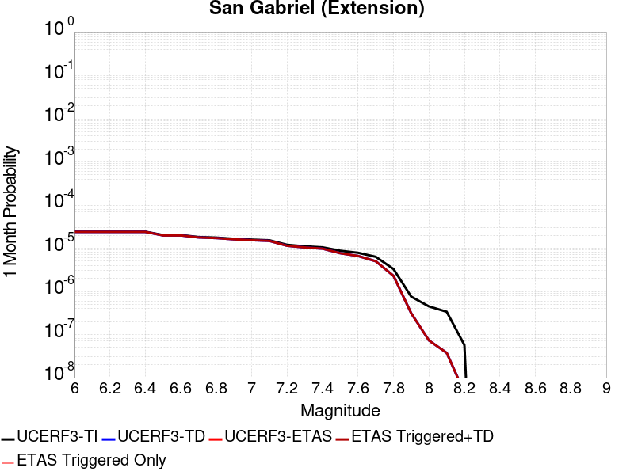 | 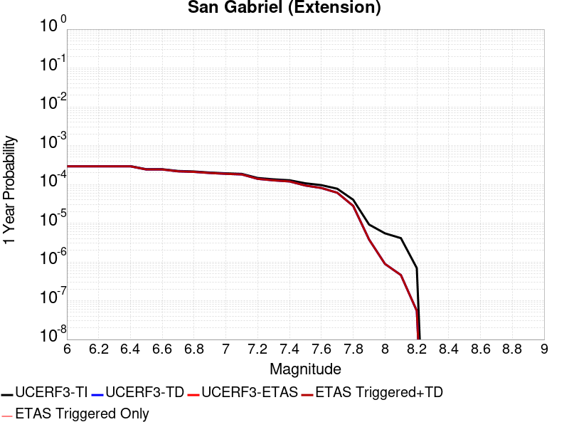 |  |

| Magnitude | 1 wk TI Prob | 1 wk TD Prob | 1 wk ETAS Prob | 1 wk ETAS/TD Gain | 1 wk ETAS Triggered+TD | 1 wk ETAS Triggered Only | 1 mo TI Prob | 1 mo TD Prob | 1 mo ETAS Prob | 1 mo ETAS/TD Gain | 1 mo ETAS Triggered+TD | 1 mo ETAS Triggered Only | 1 yr TI Prob | 1 yr TD Prob | 1 yr ETAS Prob | 1 yr ETAS/TD Gain | 1 yr ETAS Triggered+TD | 1 yr ETAS Triggered Only | 500 yr TI Prob | 500 yr TD Prob | 500 yr ETAS Prob | 500 yr ETAS/TD Gain | 500 yr ETAS Triggered+TD | 500 yr ETAS Triggered Only |
|-----|-----|-----|-----|-----|-----|-----|-----|-----|-----|-----|-----|-----|-----|-----|-----|-----|-----|-----|-----|-----|-----|-----|-----|-----|
| 6.0 | 5.6486106E-6 | 5.5938667E-6 | 0.0 | 0.0 | 5.5938667E-6 | 0.0 | 2.4208108E-5 | 2.3973502E-5 | 0.0 | 0.0 | 2.3973502E-5 | 0.0 | 2.9469383E-4 | 2.9183953E-4 | 0.0 | 0.0 | 2.9183953E-4 | 0.0 | 0.13702421 | 0.14605193 | 0.103 | 0.7052286 | 0.15288351 | 0.008 |
| 6.1 | 5.6486106E-6 | 5.5938667E-6 | 0.0 | 0.0 | 5.5938667E-6 | 0.0 | 2.4208108E-5 | 2.3973502E-5 | 0.0 | 0.0 | 2.3973502E-5 | 0.0 | 2.9469383E-4 | 2.9183953E-4 | 0.0 | 0.0 | 2.9183953E-4 | 0.0 | 0.13702421 | 0.14605193 | 0.103 | 0.7052286 | 0.15288351 | 0.008 |
| 6.2 | 5.6486106E-6 | 5.5938667E-6 | 0.0 | 0.0 | 5.5938667E-6 | 0.0 | 2.4208108E-5 | 2.3973502E-5 | 0.0 | 0.0 | 2.3973502E-5 | 0.0 | 2.9469383E-4 | 2.9183953E-4 | 0.0 | 0.0 | 2.9183953E-4 | 0.0 | 0.13702421 | 0.14605193 | 0.103 | 0.7052286 | 0.15288351 | 0.008 |
| 6.3 | 5.6486106E-6 | 5.5938667E-6 | 0.0 | 0.0 | 5.5938667E-6 | 0.0 | 2.4208108E-5 | 2.3973502E-5 | 0.0 | 0.0 | 2.3973502E-5 | 0.0 | 2.9469383E-4 | 2.9183953E-4 | 0.0 | 0.0 | 2.9183953E-4 | 0.0 | 0.13702421 | 0.14605193 | 0.103 | 0.7052286 | 0.15288351 | 0.008 |
| 6.4 | 5.6486106E-6 | 5.5938667E-6 | 0.0 | 0.0 | 5.5938667E-6 | 0.0 | 2.4208108E-5 | 2.3973502E-5 | 0.0 | 0.0 | 2.3973502E-5 | 0.0 | 2.9469383E-4 | 2.9183953E-4 | 0.0 | 0.0 | 2.9183953E-4 | 0.0 | 0.13702421 | 0.14605193 | 0.103 | 0.7052286 | 0.15288351 | 0.008 |
| 6.5 | 4.7134554E-6 | 4.6327555E-6 | 0.0 | 0.0 | 4.6327555E-6 | 0.0 | 2.0200367E-5 | 1.985452E-5 | 0.0 | 0.0 | 1.985452E-5 | 0.0 | 2.459117E-4 | 2.417028E-4 | 0.0 | 0.0 | 2.417028E-4 | 0.0 | 0.11571067 | 0.12426839 | 0.086 | 0.6920505 | 0.13039851 | 0.007 |
| 6.6 | 4.7134554E-6 | 4.6327555E-6 | 0.0 | 0.0 | 4.6327555E-6 | 0.0 | 2.0200367E-5 | 1.985452E-5 | 0.0 | 0.0 | 1.985452E-5 | 0.0 | 2.459117E-4 | 2.417028E-4 | 0.0 | 0.0 | 2.417028E-4 | 0.0 | 0.11571067 | 0.12426839 | 0.086 | 0.6920505 | 0.13039851 | 0.007 |
| 6.7 | 4.2468837E-6 | 4.1532994E-6 | 0.0 | 0.0 | 4.1532994E-6 | 0.0 | 1.8200803E-5 | 1.7799737E-5 | 0.0 | 0.0 | 1.7799737E-5 | 0.0 | 2.2157225E-4 | 2.1669098E-4 | 0.0 | 0.0 | 2.1669098E-4 | 0.0 | 0.10488081 | 0.11321591 | 0.077 | 0.6801164 | 0.118536614 | 0.006 |
| 6.8 | 4.1180615E-6 | 4.0208915E-6 | 0.0 | 0.0 | 4.0208915E-6 | 0.0 | 1.7648716E-5 | 1.7232283E-5 | 0.0 | 0.0 | 1.7232283E-5 | 0.0 | 2.1485193E-4 | 2.0978355E-4 | 0.0 | 0.0 | 2.0978355E-4 | 0.0 | 0.10186735 | 0.11014561 | 0.076 | 0.6899957 | 0.115484744 | 0.006 |
| 6.9 | 3.863861E-6 | 3.7596067E-6 | 0.0 | 0.0 | 3.7596067E-6 | 0.0 | 1.65593E-5 | 1.6112504E-5 | 0.0 | 0.0 | 1.6112504E-5 | 0.0 | 2.0159081E-4 | 1.9615276E-4 | 0.0 | 0.0 | 1.9615276E-4 | 0.0 | 0.0958912 | 0.104050346 | 0.069 | 0.66314054 | 0.10853009 | 0.005 |
| 7.0 | 3.6947372E-6 | 3.5857718E-6 | 0.0 | 0.0 | 3.5857718E-6 | 0.0 | 1.5834492E-5 | 1.5367506E-5 | 0.0 | 0.0 | 1.5367506E-5 | 0.0 | 1.9276788E-4 | 1.8708399E-4 | 0.0 | 0.0 | 1.8708399E-4 | 0.0 | 0.09189315 | 0.09997502 | 0.065 | 0.6501624 | 0.103575125 | 0.004 |
| 7.1 | 3.5686835E-6 | 3.4534044E-6 | 0.0 | 0.0 | 3.4534044E-6 | 0.0 | 1.5294268E-5 | 1.4800224E-5 | 0.0 | 0.0 | 1.4800224E-5 | 0.0 | 1.861918E-4 | 1.8017848E-4 | 0.0 | 0.0 | 1.8017848E-4 | 0.0 | 0.08890177 | 0.09685962 | 0.063 | 0.65042585 | 0.10047218 | 0.004 |
| 7.2 | 2.8023446E-6 | 2.6590628E-6 | 0.0 | 0.0 | 2.6590628E-6 | 0.0 | 1.2009994E-5 | 1.1395935E-5 | 0.0 | 0.0 | 1.1395935E-5 | 0.0 | 1.4621185E-4 | 1.3873678E-4 | 0.0 | 0.0 | 1.3873678E-4 | 0.0 | 0.0705026 | 0.07781179 | 0.046 | 0.59117 | 0.081500545 | 0.004 |
| 7.3 | 2.5843012E-6 | 2.4294172E-6 | 0.0 | 0.0 | 2.4294172E-6 | 0.0 | 1.1075529E-5 | 1.0411747E-5 | 0.0 | 0.0 | 1.0411747E-5 | 0.0 | 1.3483623E-4 | 1.2675574E-4 | 0.0 | 0.0 | 1.2675574E-4 | 0.0 | 0.06519998 | 0.072253935 | 0.041 | 0.56744313 | 0.07596492 | 0.004 |
| 7.4 | 2.4464468E-6 | 2.2817992E-6 | 0.0 | 0.0 | 2.2817992E-6 | 0.0 | 1.04847295E-5 | 9.779103E-6 | 0.0 | 0.0 | 9.779103E-6 | 0.0 | 1.276441E-4 | 1.19054166E-4 | 0.0 | 0.0 | 1.19054166E-4 | 0.0 | 0.061831895 | 0.0686215 | 0.037 | 0.53918964 | 0.07141563 | 0.003 |
| 7.5 | 2.0420266E-6 | 1.7896255E-6 | 0.0 | 0.0 | 1.7896255E-6 | 0.0 | 8.751514E-6 | 7.669801E-6 | 0.0 | 0.0 | 7.669801E-6 | 0.0 | 1.0654447E-4 | 9.337586E-5 | 0.0 | 0.0 | 9.337586E-5 | 0.0 | 0.05188082 | 0.0561424 | 0.027 | 0.48091996 | 0.05708626 | 0.001 |
| 7.6 | 1.8326596E-6 | 1.5452508E-6 | 0.0 | 0.0 | 1.5452508E-6 | 0.0 | 7.854232E-6 | 6.622487E-6 | 0.0 | 0.0 | 6.622487E-6 | 0.0 | 9.562107E-5 | 8.062582E-5 | 0.0 | 0.0 | 8.062582E-5 | 0.0 | 0.046687793 | 0.04984609 | 0.022 | 0.4413586 | 0.050796244 | 0.001 |
| 7.7 | 1.4786998E-6 | 1.1661248E-6 | 0.0 | 0.0 | 1.1661248E-6 | 0.0 | 6.3372695E-6 | 4.997668E-6 | 0.0 | 0.0 | 4.997668E-6 | 0.0 | 7.715353E-5 | 6.0844923E-5 | 0.0 | 0.0 | 6.0844923E-5 | 0.0 | 0.03784359 | 0.04004132 | 0.02 | 0.499484 | 0.04100128 | 0.001 |
| 7.8 | 7.6975533E-7 | 5.348142E-7 | 0.0 | 0.0 | 5.348142E-7 | 0.0 | 3.2989474E-6 | 2.292059E-6 | 0.0 | 0.0 | 2.292059E-6 | 0.0 | 4.0163945E-5 | 2.7905462E-5 | 0.0 | 0.0 | 2.7905462E-5 | 0.0 | 0.019882068 | 0.022329338 | 0.008 | 0.35827306 | 0.022329338 | 0.0 |
| 7.9 | 1.7645915E-7 | 7.2521935E-8 | 0.0 | 0.0 | 7.2521935E-8 | 0.0 | 7.562533E-7 | 3.1080825E-7 | 0.0 | 0.0 | 3.1080825E-7 | 0.0 | 9.207345E-6 | 3.784084E-6 | 0.0 | 0.0 | 3.784084E-6 | 0.0 | 0.004593113 | 0.0051592914 | 0.004 | 0.77530026 | 0.0051592914 | 0.0 |
| 8.0 | 1.0463461E-7 | 1.703631E-8 | 0.0 | 0.0 | 1.703631E-8 | 0.0 | 4.4843398E-7 | 7.301276E-8 | 0.0 | 0.0 | 7.301276E-8 | 0.0 | 5.45967E-6 | 8.889299E-7 | 0.0 | 0.0 | 8.889299E-7 | 0.0 | 0.0027261197 | 0.0027308231 | 0.004 | 1.4647598 | 0.0027308231 | 0.0 |
| 8.1 | 7.875717E-8 | 8.797534E-9 | 0.0 | 0.0 | 8.797534E-9 | 0.0 | 3.3753068E-7 | 3.7703717E-8 | 0.0 | 0.0 | 3.7703717E-8 | 0.0 | 4.109428E-6 | 4.5904267E-7 | 0.0 | 0.0 | 4.5904267E-7 | 0.0 | 0.0020526089 | 0.0020458847 | 0.003 | 1.4663582 | 0.0020458847 | 0.0 |
| 8.2 | 1.33163E-8 | 1.0510991E-9 | 0.0 | 0.0 | 1.0510991E-9 | 0.0 | 5.7069855E-8 | 4.50471E-9 | 0.0 | 0.0 | 4.50471E-9 | 0.0 | 6.9482525E-7 | 5.484484E-8 | 0.0 | 0.0 | 5.484484E-8 | 0.0 | 3.473524E-4 | 3.7874203E-4 | 0.0 | 0.0 | 3.7874203E-4 | 0.0 |

## Great Valley 08 (Quinto)
*[(top)](#table-of-contents)*

| 1 Week | 1 Month | 1 Year | 500 Year |
|-----|-----|-----|-----|
|  | 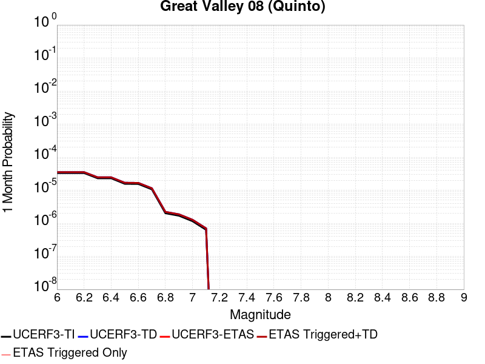 | 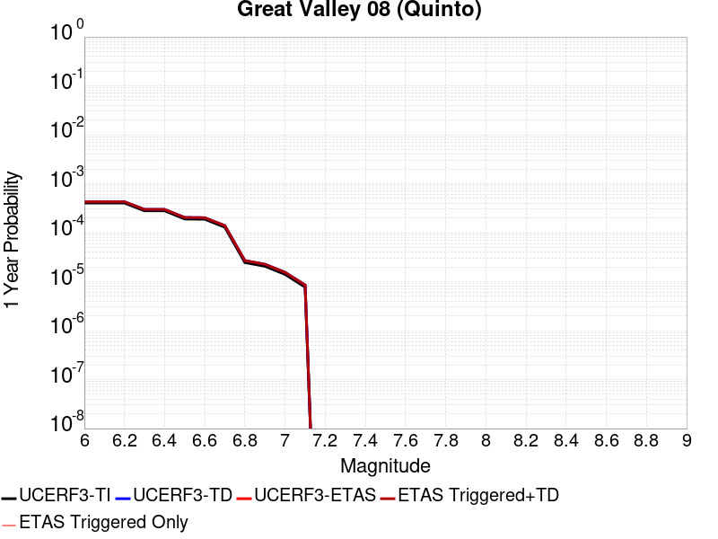 | 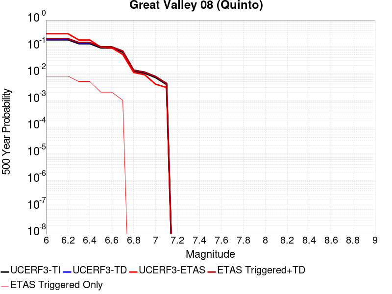 |

| Magnitude | 1 wk TI Prob | 1 wk TD Prob | 1 wk ETAS Prob | 1 wk ETAS/TD Gain | 1 wk ETAS Triggered+TD | 1 wk ETAS Triggered Only | 1 mo TI Prob | 1 mo TD Prob | 1 mo ETAS Prob | 1 mo ETAS/TD Gain | 1 mo ETAS Triggered+TD | 1 mo ETAS Triggered Only | 1 yr TI Prob | 1 yr TD Prob | 1 yr ETAS Prob | 1 yr ETAS/TD Gain | 1 yr ETAS Triggered+TD | 1 yr ETAS Triggered Only | 500 yr TI Prob | 500 yr TD Prob | 500 yr ETAS Prob | 500 yr ETAS/TD Gain | 500 yr ETAS Triggered+TD | 500 yr ETAS Triggered Only |
|-----|-----|-----|-----|-----|-----|-----|-----|-----|-----|-----|-----|-----|-----|-----|-----|-----|-----|-----|-----|-----|-----|-----|-----|-----|
| 6.0 | 7.737697E-6 | 8.224501E-6 | 0.0 | 0.0 | 8.224501E-6 | 0.0 | 3.3161137E-5 | 3.524749E-5 | 0.0 | 0.0 | 3.524749E-5 | 0.0 | 4.0366207E-4 | 4.2907242E-4 | 0.0 | 0.0 | 4.2907242E-4 | 0.0 | 0.1828003 | 0.1972964 | 0.311 | 1.5763086 | 0.20371802 | 0.008 |
| 6.1 | 7.737697E-6 | 8.224501E-6 | 0.0 | 0.0 | 8.224501E-6 | 0.0 | 3.3161137E-5 | 3.524749E-5 | 0.0 | 0.0 | 3.524749E-5 | 0.0 | 4.0366207E-4 | 4.2907242E-4 | 0.0 | 0.0 | 4.2907242E-4 | 0.0 | 0.1828003 | 0.1972964 | 0.311 | 1.5763086 | 0.20371802 | 0.008 |
| 6.2 | 7.737697E-6 | 8.224501E-6 | 0.0 | 0.0 | 8.224501E-6 | 0.0 | 3.3161137E-5 | 3.524749E-5 | 0.0 | 0.0 | 3.524749E-5 | 0.0 | 4.0366207E-4 | 4.2907242E-4 | 0.0 | 0.0 | 4.2907242E-4 | 0.0 | 0.1828003 | 0.1972964 | 0.311 | 1.5763086 | 0.20371802 | 0.008 |
| 6.3 | 5.374012E-6 | 5.729649E-6 | 0.0 | 0.0 | 5.729649E-6 | 0.0 | 2.3031276E-5 | 2.455547E-5 | 0.0 | 0.0 | 2.455547E-5 | 0.0 | 2.803697E-4 | 2.9893286E-4 | 0.0 | 0.0 | 2.9893286E-4 | 0.0 | 0.13081953 | 0.14145029 | 0.18 | 1.2725319 | 0.14574304 | 0.005 |
| 6.4 | 5.374012E-6 | 5.729649E-6 | 0.0 | 0.0 | 5.729649E-6 | 0.0 | 2.3031276E-5 | 2.455547E-5 | 0.0 | 0.0 | 2.455547E-5 | 0.0 | 2.803697E-4 | 2.9893286E-4 | 0.0 | 0.0 | 2.9893286E-4 | 0.0 | 0.13081953 | 0.14145029 | 0.18 | 1.2725319 | 0.14574304 | 0.005 |
| 6.5 | 3.65427E-6 | 3.9252795E-6 | 0.0 | 0.0 | 3.9252795E-6 | 0.0 | 1.5661062E-5 | 1.6822558E-5 | 0.0 | 0.0 | 1.6822558E-5 | 0.0 | 1.9065675E-4 | 2.0480239E-4 | 0.0 | 0.0 | 2.0480239E-4 | 0.0 | 0.0909339 | 0.099041045 | 0.097 | 0.97939193 | 0.10084296 | 0.002 |
| 6.6 | 3.6143538E-6 | 3.8826274E-6 | 0.0 | 0.0 | 3.8826274E-6 | 0.0 | 1.5489995E-5 | 1.6639764E-5 | 0.0 | 0.0 | 1.6639764E-5 | 0.0 | 1.8857437E-4 | 2.0257728E-4 | 0.0 | 0.0 | 2.0257728E-4 | 0.0 | 0.08998671 | 0.09803882 | 0.092 | 0.9384037 | 0.09984275 | 0.002 |
| 6.7 | 2.4821015E-6 | 2.6742928E-6 | 0.0 | 0.0 | 2.6742928E-6 | 0.0 | 1.0637535E-5 | 1.1461236E-5 | 0.0 | 0.0 | 1.1461236E-5 | 0.0 | 1.2950429E-4 | 1.3953722E-4 | 0.0 | 0.0 | 1.3953722E-4 | 0.0 | 0.06270418 | 0.06882999 | 0.052 | 0.75548464 | 0.069761164 | 0.001 |
| 6.8 | 4.7110538E-7 | 5.1655434E-7 | 0.0 | 0.0 | 5.1655434E-7 | 0.0 | 2.0190216E-6 | 2.2138026E-6 | 0.0 | 0.0 | 2.2138026E-6 | 0.0 | 2.458131E-5 | 2.695273E-5 | 0.0 | 0.0 | 2.695273E-5 | 0.0 | 0.012215583 | 0.013359281 | 0.011 | 0.8233976 | 0.013359281 | 0.0 |
| 6.9 | 3.958685E-7 | 4.346845E-7 | 0.0 | 0.0 | 4.346845E-7 | 0.0 | 1.6965782E-6 | 1.8629322E-6 | 0.0 | 0.0 | 1.8629322E-6 | 0.0 | 2.0655643E-5 | 2.268098E-5 | 0.0 | 0.0 | 2.268098E-5 | 0.0 | 0.010274779 | 0.011251592 | 0.009 | 0.7998868 | 0.011251592 | 0.0 |
| 7.0 | 2.70294E-7 | 2.9754602E-7 | 0.0 | 0.0 | 2.9754602E-7 | 0.0 | 1.1584025E-6 | 1.2751967E-6 | 0.0 | 0.0 | 1.2751967E-6 | 0.0 | 1.4103458E-5 | 1.5525422E-5 | 0.0 | 0.0 | 1.5525422E-5 | 0.0 | 0.0070269736 | 0.0077124774 | 0.004 | 0.5186401 | 0.0077124774 | 0.0 |
| 7.1 | 1.4828602E-7 | 1.6374953E-7 | 0.0 | 0.0 | 1.6374953E-7 | 0.0 | 6.3551136E-7 | 7.0178356E-7 | 0.0 | 0.0 | 7.0178356E-7 | 0.0 | 7.737323E-6 | 8.544189E-6 | 0.0 | 0.0 | 8.544189E-6 | 0.0 | 0.0038612029 | 0.0042491136 | 0.003 | 0.7060296 | 0.0042491136 | 0.0 |

## Cucamonga
*[(top)](#table-of-contents)*

| 1 Week | 1 Month | 1 Year | 500 Year |
|-----|-----|-----|-----|
|  | 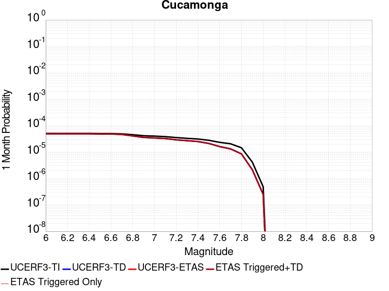 | 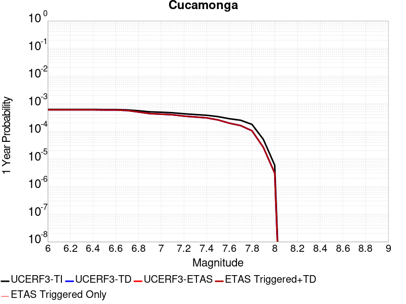 | 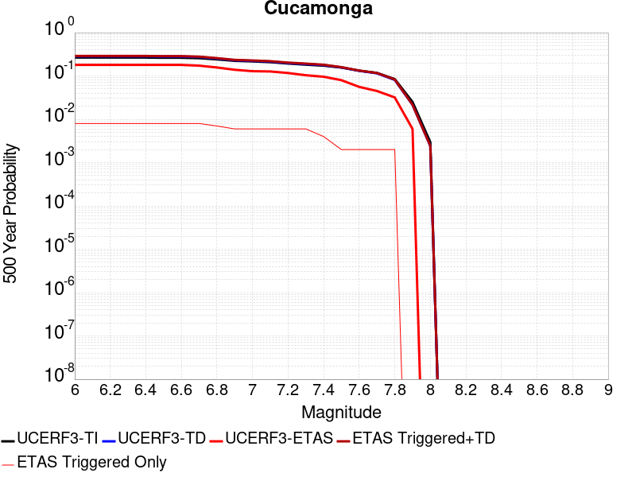 |

| Magnitude | 1 wk TI Prob | 1 wk TD Prob | 1 wk ETAS Prob | 1 wk ETAS/TD Gain | 1 wk ETAS Triggered+TD | 1 wk ETAS Triggered Only | 1 mo TI Prob | 1 mo TD Prob | 1 mo ETAS Prob | 1 mo ETAS/TD Gain | 1 mo ETAS Triggered+TD | 1 mo ETAS Triggered Only | 1 yr TI Prob | 1 yr TD Prob | 1 yr ETAS Prob | 1 yr ETAS/TD Gain | 1 yr ETAS Triggered+TD | 1 yr ETAS Triggered Only | 500 yr TI Prob | 500 yr TD Prob | 500 yr ETAS Prob | 500 yr ETAS/TD Gain | 500 yr ETAS Triggered+TD | 500 yr ETAS Triggered Only |
|-----|-----|-----|-----|-----|-----|-----|-----|-----|-----|-----|-----|-----|-----|-----|-----|-----|-----|-----|-----|-----|-----|-----|-----|-----|
| 6.0 | 1.1848348E-5 | 1.1456987E-5 | 0.0 | 0.0 | 1.1456987E-5 | 0.0 | 5.0777642E-5 | 4.910046E-5 | 0.0 | 0.0 | 4.910046E-5 | 0.0 | 6.180424E-4 | 5.9763674E-4 | 0.0 | 0.0 | 5.9763674E-4 | 0.0 | 0.26590493 | 0.28373367 | 0.18 | 0.63439775 | 0.28946382 | 0.008 |
| 6.1 | 1.1848348E-5 | 1.1456987E-5 | 0.0 | 0.0 | 1.1456987E-5 | 0.0 | 5.0777642E-5 | 4.910046E-5 | 0.0 | 0.0 | 4.910046E-5 | 0.0 | 6.180424E-4 | 5.9763674E-4 | 0.0 | 0.0 | 5.9763674E-4 | 0.0 | 0.26590493 | 0.28373367 | 0.18 | 0.63439775 | 0.28946382 | 0.008 |
| 6.2 | 1.1848348E-5 | 1.1456987E-5 | 0.0 | 0.0 | 1.1456987E-5 | 0.0 | 5.0777642E-5 | 4.910046E-5 | 0.0 | 0.0 | 4.910046E-5 | 0.0 | 6.180424E-4 | 5.9763674E-4 | 0.0 | 0.0 | 5.9763674E-4 | 0.0 | 0.26590493 | 0.28373367 | 0.18 | 0.63439775 | 0.28946382 | 0.008 |
| 6.3 | 1.1848348E-5 | 1.1456987E-5 | 0.0 | 0.0 | 1.1456987E-5 | 0.0 | 5.0777642E-5 | 4.910046E-5 | 0.0 | 0.0 | 4.910046E-5 | 0.0 | 6.180424E-4 | 5.9763674E-4 | 0.0 | 0.0 | 5.9763674E-4 | 0.0 | 0.26590493 | 0.28373367 | 0.18 | 0.63439775 | 0.28946382 | 0.008 |
| 6.4 | 1.1848348E-5 | 1.1456987E-5 | 0.0 | 0.0 | 1.1456987E-5 | 0.0 | 5.0777642E-5 | 4.910046E-5 | 0.0 | 0.0 | 4.910046E-5 | 0.0 | 6.180424E-4 | 5.9763674E-4 | 0.0 | 0.0 | 5.9763674E-4 | 0.0 | 0.26590493 | 0.28373367 | 0.18 | 0.63439775 | 0.28946382 | 0.008 |
| 6.5 | 1.16988695E-5 | 1.1296658E-5 | 0.0 | 0.0 | 1.1296658E-5 | 0.0 | 5.013705E-5 | 4.8413363E-5 | 0.0 | 0.0 | 4.8413363E-5 | 0.0 | 6.102476E-4 | 5.8927585E-4 | 0.0 | 0.0 | 5.8927585E-4 | 0.0 | 0.26303652 | 0.28073198 | 0.18 | 0.641181 | 0.28648612 | 0.008 |
| 6.6 | 1.16988695E-5 | 1.1296658E-5 | 0.0 | 0.0 | 1.1296658E-5 | 0.0 | 5.013705E-5 | 4.8413363E-5 | 0.0 | 0.0 | 4.8413363E-5 | 0.0 | 6.102476E-4 | 5.8927585E-4 | 0.0 | 0.0 | 5.8927585E-4 | 0.0 | 0.26303652 | 0.28073198 | 0.18 | 0.641181 | 0.28648612 | 0.008 |
| 6.7 | 1.1397107E-5 | 1.0842448E-5 | 0.0 | 0.0 | 1.0842448E-5 | 0.0 | 4.884383E-5 | 4.6466823E-5 | 0.0 | 0.0 | 4.6466823E-5 | 0.0 | 5.9451134E-4 | 5.6558906E-4 | 0.0 | 0.0 | 5.6558906E-4 | 0.0 | 0.2572116 | 0.27349642 | 0.173 | 0.63254946 | 0.27930844 | 0.008 |
| 6.8 | 1.058387E-5 | 9.544083E-6 | 0.0 | 0.0 | 9.544083E-6 | 0.0 | 4.5358654E-5 | 4.0902574E-5 | 0.0 | 0.0 | 4.0902574E-5 | 0.0 | 5.521017E-4 | 4.9787614E-4 | 0.0 | 0.0 | 4.9787614E-4 | 0.0 | 0.24128349 | 0.2528771 | 0.157 | 0.620855 | 0.25810695 | 0.007 |
| 6.9 | 9.690046E-6 | 8.359003E-6 | 0.0 | 0.0 | 8.359003E-6 | 0.0 | 4.1528107E-5 | 3.582381E-5 | 0.0 | 0.0 | 3.582381E-5 | 0.0 | 5.054874E-4 | 4.3606796E-4 | 0.0 | 0.0 | 4.3606796E-4 | 0.0 | 0.22338271 | 0.2307152 | 0.139 | 0.6024744 | 0.23533091 | 0.006 |
| 7.0 | 9.381461E-6 | 7.973985E-6 | 0.0 | 0.0 | 7.973985E-6 | 0.0 | 4.020564E-5 | 3.4173776E-5 | 0.0 | 0.0 | 3.4173776E-5 | 0.0 | 4.893937E-4 | 4.1598664E-4 | 0.0 | 0.0 | 4.1598664E-4 | 0.0 | 0.21710505 | 0.22321066 | 0.129 | 0.5779294 | 0.2278714 | 0.006 |
| 7.1 | 8.946492E-6 | 7.572795E-6 | 0.0 | 0.0 | 7.572795E-6 | 0.0 | 3.8341543E-5 | 3.2454434E-5 | 0.0 | 0.0 | 3.2454434E-5 | 0.0 | 4.667083E-4 | 3.950614E-4 | 0.0 | 0.0 | 3.950614E-4 | 0.0 | 0.20817006 | 0.21472153 | 0.127 | 0.59146374 | 0.2194332 | 0.006 |
| 7.2 | 8.251016E-6 | 6.7833444E-6 | 0.0 | 0.0 | 6.7833444E-6 | 0.0 | 3.5361016E-5 | 2.9071152E-5 | 0.0 | 0.0 | 2.9071152E-5 | 0.0 | 4.3043532E-4 | 3.5388404E-4 | 0.0 | 0.0 | 3.5388404E-4 | 0.0 | 0.19367145 | 0.19869833 | 0.117 | 0.5888324 | 0.20350613 | 0.006 |
| 7.3 | 7.717881E-6 | 6.30119E-6 | 0.0 | 0.0 | 6.30119E-6 | 0.0 | 3.3076216E-5 | 2.700482E-5 | 0.0 | 0.0 | 2.700482E-5 | 0.0 | 4.026285E-4 | 3.287343E-4 | 0.0 | 0.0 | 3.287343E-4 | 0.0 | 0.1823777 | 0.18816075 | 0.104 | 0.5527189 | 0.19303177 | 0.006 |
| 7.4 | 7.275623E-6 | 5.854775E-6 | 0.0 | 0.0 | 5.854775E-6 | 0.0 | 3.118087E-5 | 2.5091651E-5 | 0.0 | 0.0 | 2.5091651E-5 | 0.0 | 3.7956095E-4 | 3.0544822E-4 | 0.0 | 0.0 | 3.0544822E-4 | 0.0 | 0.1728891 | 0.17833567 | 0.096 | 0.5383107 | 0.18162231 | 0.004 |
| 7.5 | 6.5109502E-6 | 4.943169E-6 | 0.0 | 0.0 | 4.943169E-6 | 0.0 | 2.7903774E-5 | 2.118484E-5 | 0.0 | 0.0 | 2.118484E-5 | 0.0 | 3.3967546E-4 | 2.5789504E-4 | 0.0 | 0.0 | 2.5789504E-4 | 0.0 | 0.15622263 | 0.15814367 | 0.08 | 0.5058691 | 0.15982738 | 0.002 |
| 7.6 | 5.4495326E-6 | 3.7691873E-6 | 0.0 | 0.0 | 3.7691873E-6 | 0.0 | 2.335493E-5 | 1.615356E-5 | 0.0 | 0.0 | 1.615356E-5 | 0.0 | 2.8430918E-4 | 1.966519E-4 | 0.0 | 0.0 | 1.966519E-4 | 0.0 | 0.13253039 | 0.13142054 | 0.056 | 0.426113 | 0.1331577 | 0.002 |
| 7.7 | 4.7997164E-6 | 3.0756241E-6 | 0.0 | 0.0 | 3.0756241E-6 | 0.0 | 2.057005E-5 | 1.318118E-5 | 0.0 | 0.0 | 1.318118E-5 | 0.0 | 2.504116E-4 | 1.6046908E-4 | 0.0 | 0.0 | 1.6046908E-4 | 0.0 | 0.11769853 | 0.11515285 | 0.045 | 0.39078495 | 0.11692255 | 0.002 |
| 7.8 | 3.3941733E-6 | 1.994513E-6 | 0.0 | 0.0 | 1.994513E-6 | 0.0 | 1.4546376E-5 | 8.547885E-6 | 0.0 | 0.0 | 8.547885E-6 | 0.0 | 1.7708774E-4 | 1.0406554E-4 | 0.0 | 0.0 | 1.0406554E-4 | 0.0 | 0.084744215 | 0.081122115 | 0.032 | 0.39446703 | 0.08295987 | 0.002 |
| 7.9 | 9.750552E-7 | 5.002752E-7 | 0.0 | 0.0 | 5.002752E-7 | 0.0 | 4.178801E-6 | 2.1440346E-6 | 0.0 | 0.0 | 2.1440346E-6 | 0.0 | 5.0875715E-5 | 2.6103313E-5 | 0.0 | 0.0 | 2.6103313E-5 | 0.0 | 0.025117673 | 0.021636445 | 0.006 | 0.2773099 | 0.021636445 | 0.0 |
| 8.0 | 1.133857E-7 | 5.862465E-8 | 0.0 | 0.0 | 5.862465E-8 | 0.0 | 4.8593864E-7 | 2.5124848E-7 | 0.0 | 0.0 | 2.5124848E-7 | 0.0 | 5.9162867E-6 | 3.058946E-6 | 0.0 | 0.0 | 3.058946E-6 | 0.0 | 0.002953781 | 0.0024314874 | 0.0 | 0.0 | 0.0024314874 | 0.0 |

## Mono Lake 2011 CFM
*[(top)](#table-of-contents)*

| 1 Week | 1 Month | 1 Year | 500 Year |
|-----|-----|-----|-----|
|  |  | 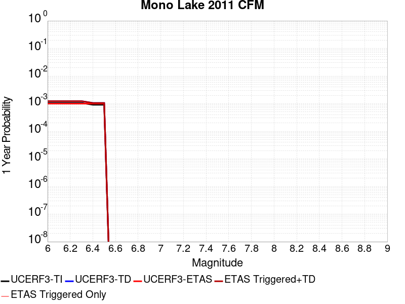 | 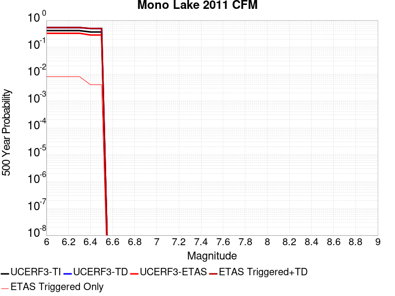 |

| Magnitude | 1 wk TI Prob | 1 wk TD Prob | 1 wk ETAS Prob | 1 wk ETAS/TD Gain | 1 wk ETAS Triggered+TD | 1 wk ETAS Triggered Only | 1 mo TI Prob | 1 mo TD Prob | 1 mo ETAS Prob | 1 mo ETAS/TD Gain | 1 mo ETAS Triggered+TD | 1 mo ETAS Triggered Only | 1 yr TI Prob | 1 yr TD Prob | 1 yr ETAS Prob | 1 yr ETAS/TD Gain | 1 yr ETAS Triggered+TD | 1 yr ETAS Triggered Only | 500 yr TI Prob | 500 yr TD Prob | 500 yr ETAS Prob | 500 yr ETAS/TD Gain | 500 yr ETAS Triggered+TD | 500 yr ETAS Triggered Only |
|-----|-----|-----|-----|-----|-----|-----|-----|-----|-----|-----|-----|-----|-----|-----|-----|-----|-----|-----|-----|-----|-----|-----|-----|-----|
| 6.0 | 2.0341662E-5 | 2.3617902E-5 | 0.0 | 0.0 | 2.3617902E-5 | 0.0 | 8.717564E-5 | 1.0121859E-4 | 0.0 | 0.0 | 1.0121859E-4 | 0.0 | 0.0010608466 | 0.0012321617 | 0.001 | 0.81158185 | 0.0012321617 | 0.0 | 0.41180977 | 0.5322533 | 0.328 | 0.61624795 | 0.5359953 | 0.008 |
| 6.1 | 2.0341662E-5 | 2.3617902E-5 | 0.0 | 0.0 | 2.3617902E-5 | 0.0 | 8.717564E-5 | 1.0121859E-4 | 0.0 | 0.0 | 1.0121859E-4 | 0.0 | 0.0010608466 | 0.0012321617 | 0.001 | 0.81158185 | 0.0012321617 | 0.0 | 0.41180977 | 0.5322533 | 0.328 | 0.61624795 | 0.5359953 | 0.008 |
| 6.2 | 2.0341662E-5 | 2.3617902E-5 | 0.0 | 0.0 | 2.3617902E-5 | 0.0 | 8.717564E-5 | 1.0121859E-4 | 0.0 | 0.0 | 1.0121859E-4 | 0.0 | 0.0010608466 | 0.0012321617 | 0.001 | 0.81158185 | 0.0012321617 | 0.0 | 0.41180977 | 0.5322533 | 0.328 | 0.61624795 | 0.5359953 | 0.008 |
| 6.3 | 2.0341662E-5 | 2.3617902E-5 | 0.0 | 0.0 | 2.3617902E-5 | 0.0 | 8.717564E-5 | 1.0121859E-4 | 0.0 | 0.0 | 1.0121859E-4 | 0.0 | 0.0010608466 | 0.0012321617 | 0.001 | 0.81158185 | 0.0012321617 | 0.0 | 0.41180977 | 0.5322533 | 0.328 | 0.61624795 | 0.5359953 | 0.008 |
| 6.4 | 1.749821E-5 | 2.0310554E-5 | 0.0 | 0.0 | 2.0310554E-5 | 0.0 | 7.499018E-5 | 8.704523E-5 | 0.0 | 0.0 | 8.704523E-5 | 0.0 | 9.1262296E-4 | 0.0010597755 | 0.001 | 0.9435961 | 0.0010597755 | 0.0 | 0.36651555 | 0.4924866 | 0.282 | 0.5726044 | 0.49451664 | 0.004 |
| 6.5 | 1.749821E-5 | 2.0310554E-5 | 0.0 | 0.0 | 2.0310554E-5 | 0.0 | 7.499018E-5 | 8.704523E-5 | 0.0 | 0.0 | 8.704523E-5 | 0.0 | 9.1262296E-4 | 0.0010597755 | 0.001 | 0.9435961 | 0.0010597755 | 0.0 | 0.36651555 | 0.4924866 | 0.282 | 0.5726044 | 0.49451664 | 0.004 |

## Bicycle Lake
*[(top)](#table-of-contents)*

| 1 Week | 1 Month | 1 Year | 500 Year |
|-----|-----|-----|-----|
|  | 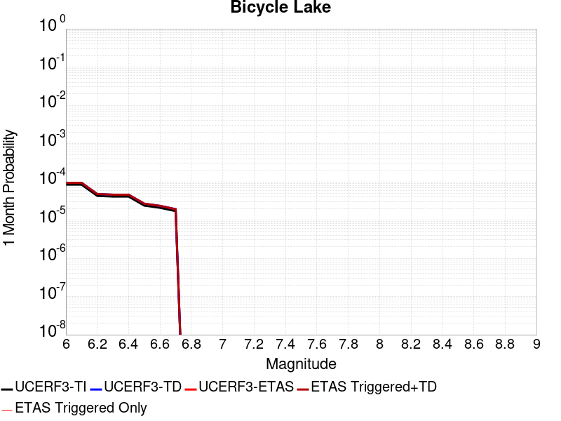 | 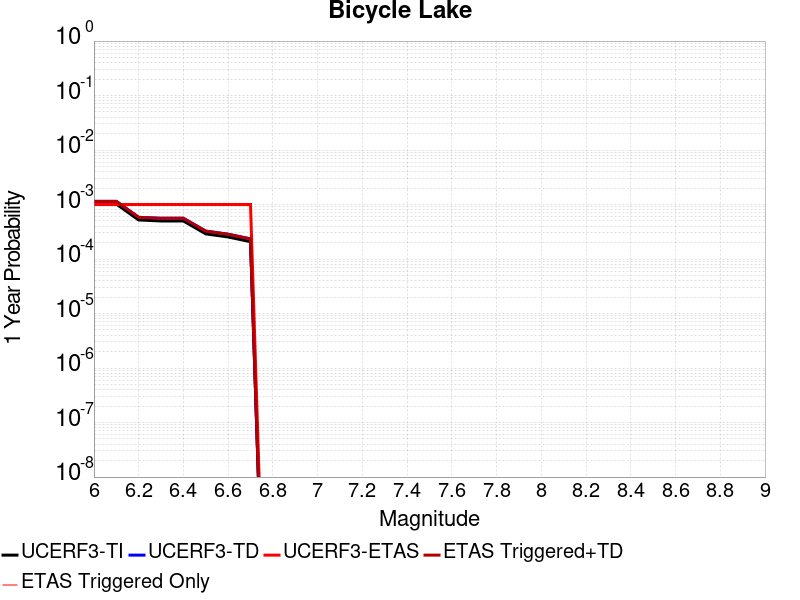 | 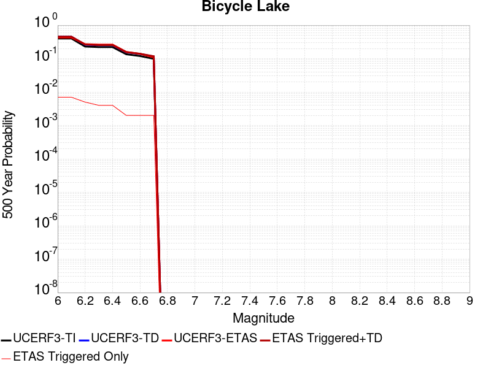 |

| Magnitude | 1 wk TI Prob | 1 wk TD Prob | 1 wk ETAS Prob | 1 wk ETAS/TD Gain | 1 wk ETAS Triggered+TD | 1 wk ETAS Triggered Only | 1 mo TI Prob | 1 mo TD Prob | 1 mo ETAS Prob | 1 mo ETAS/TD Gain | 1 mo ETAS Triggered+TD | 1 mo ETAS Triggered Only | 1 yr TI Prob | 1 yr TD Prob | 1 yr ETAS Prob | 1 yr ETAS/TD Gain | 1 yr ETAS Triggered+TD | 1 yr ETAS Triggered Only | 500 yr TI Prob | 500 yr TD Prob | 500 yr ETAS Prob | 500 yr ETAS/TD Gain | 500 yr ETAS Triggered+TD | 500 yr ETAS Triggered Only |
|-----|-----|-----|-----|-----|-----|-----|-----|-----|-----|-----|-----|-----|-----|-----|-----|-----|-----|-----|-----|-----|-----|-----|-----|-----|
| 6.0 | 1.9621975E-5 | 2.1953072E-5 | 0.0 | 0.0 | 2.1953072E-5 | 0.0 | 8.4091465E-5 | 9.408195E-5 | 0.0 | 0.0 | 9.408195E-5 | 0.0 | 0.0010233327 | 0.001144979 | 0.001 | 0.8733784 | 0.001144979 | 0.0 | 0.40066126 | 0.4507012 | 0.429 | 0.9518501 | 0.4545463 | 0.007 |
| 6.1 | 1.9621975E-5 | 2.1953072E-5 | 0.0 | 0.0 | 2.1953072E-5 | 0.0 | 8.4091465E-5 | 9.408195E-5 | 0.0 | 0.0 | 9.408195E-5 | 0.0 | 0.0010233327 | 0.001144979 | 0.001 | 0.8733784 | 0.001144979 | 0.0 | 0.40066126 | 0.4507012 | 0.429 | 0.9518501 | 0.4545463 | 0.007 |
| 6.2 | 9.9971285E-6 | 1.1182463E-5 | 0.0 | 0.0 | 1.1182463E-5 | 0.0 | 4.2844134E-5 | 4.792425E-5 | 0.0 | 0.0 | 4.792425E-5 | 0.0 | 5.2150246E-4 | 5.833729E-4 | 0.001 | 1.7141695 | 5.833729E-4 | 0.0 | 0.22957984 | 0.26024303 | 0.27 | 1.0374918 | 0.2639418 | 0.005 |
| 6.3 | 9.589428E-6 | 1.0728043E-5 | 0.0 | 0.0 | 1.0728043E-5 | 0.0 | 4.10969E-5 | 4.5976805E-5 | 0.0 | 0.0 | 4.5976805E-5 | 0.0 | 5.002399E-4 | 5.5967504E-4 | 0.001 | 1.7867512 | 5.5967504E-4 | 0.0 | 0.22134136 | 0.25157884 | 0.262 | 1.0414231 | 0.25457254 | 0.004 |
| 6.4 | 9.589428E-6 | 1.0728043E-5 | 0.0 | 0.0 | 1.0728043E-5 | 0.0 | 4.10969E-5 | 4.5976805E-5 | 0.0 | 0.0 | 4.5976805E-5 | 0.0 | 5.002399E-4 | 5.5967504E-4 | 0.001 | 1.7867512 | 5.5967504E-4 | 0.0 | 0.22134136 | 0.25157884 | 0.262 | 1.0414231 | 0.25457254 | 0.004 |
| 6.5 | 5.557707E-6 | 6.2431072E-6 | 0.0 | 0.0 | 6.2431072E-6 | 0.0 | 2.3818526E-5 | 2.6756048E-5 | 0.0 | 0.0 | 2.6756048E-5 | 0.0 | 2.8995197E-4 | 3.2573272E-4 | 0.001 | 3.0700018 | 3.2573272E-4 | 0.0 | 0.13497512 | 0.15465532 | 0.158 | 1.0216267 | 0.15634601 | 0.002 |
| 6.6 | 4.8742945E-6 | 5.475981E-6 | 0.0 | 0.0 | 5.475981E-6 | 0.0 | 2.0889667E-5 | 2.3468427E-5 | 0.0 | 0.0 | 2.3468427E-5 | 0.0 | 2.54302E-4 | 2.8571647E-4 | 0.001 | 3.4999733 | 2.8571647E-4 | 0.0 | 0.11941355 | 0.13788687 | 0.139 | 1.0080729 | 0.1396111 | 0.002 |
| 6.7 | 3.991108E-6 | 4.485259E-6 | 0.0 | 0.0 | 4.485259E-6 | 0.0 | 1.7104636E-5 | 1.922254E-5 | 0.0 | 0.0 | 1.922254E-5 | 0.0 | 2.0822904E-4 | 2.3403442E-4 | 0.001 | 4.272876 | 2.3403442E-4 | 0.0 | 0.098887675 | 0.11576053 | 0.11 | 0.9502375 | 0.11752901 | 0.002 |

## Earthquake Valley (No  Extension)
*[(top)](#table-of-contents)*

| 1 Week | 1 Month | 1 Year | 500 Year |
|-----|-----|-----|-----|
| 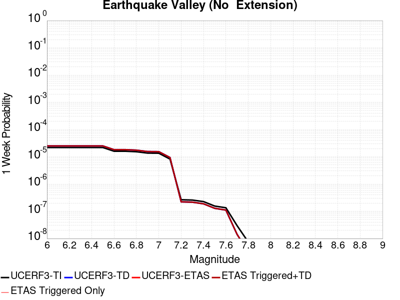 | 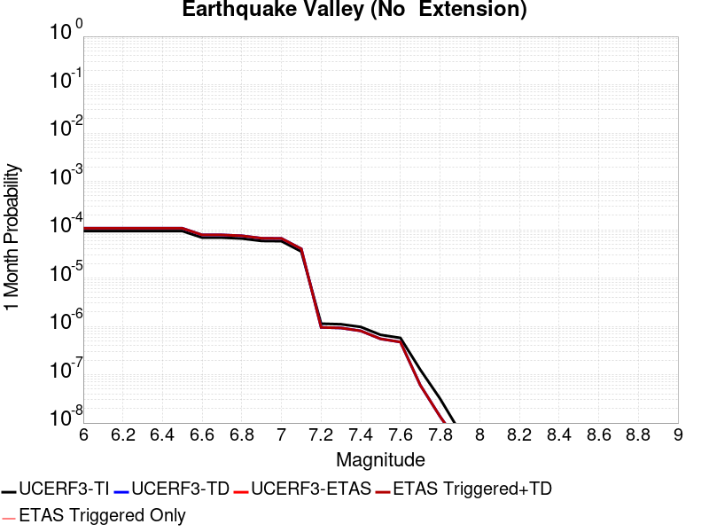 | 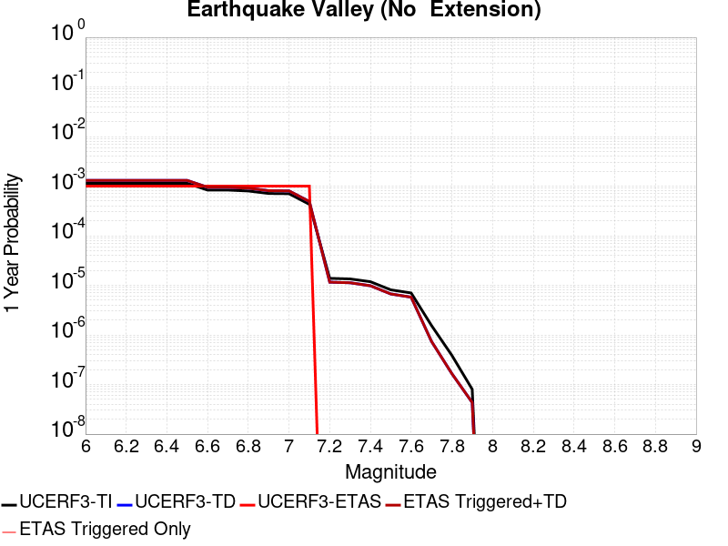 | 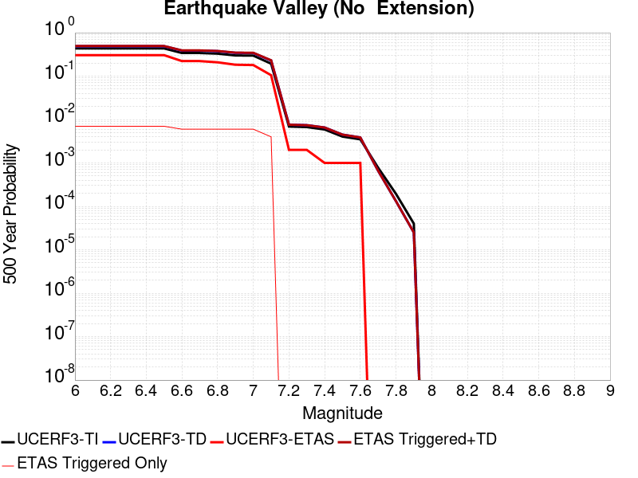 |

| Magnitude | 1 wk TI Prob | 1 wk TD Prob | 1 wk ETAS Prob | 1 wk ETAS/TD Gain | 1 wk ETAS Triggered+TD | 1 wk ETAS Triggered Only | 1 mo TI Prob | 1 mo TD Prob | 1 mo ETAS Prob | 1 mo ETAS/TD Gain | 1 mo ETAS Triggered+TD | 1 mo ETAS Triggered Only | 1 yr TI Prob | 1 yr TD Prob | 1 yr ETAS Prob | 1 yr ETAS/TD Gain | 1 yr ETAS Triggered+TD | 1 yr ETAS Triggered Only | 500 yr TI Prob | 500 yr TD Prob | 500 yr ETAS Prob | 500 yr ETAS/TD Gain | 500 yr ETAS Triggered+TD | 500 yr ETAS Triggered Only |
|-----|-----|-----|-----|-----|-----|-----|-----|-----|-----|-----|-----|-----|-----|-----|-----|-----|-----|-----|-----|-----|-----|-----|-----|-----|
| 6.0 | 2.1859703E-5 | 2.4993193E-5 | 0.0 | 0.0 | 2.4993193E-5 | 0.0 | 9.3681076E-5 | 1.0711009E-4 | 0.0 | 0.0 | 1.0711009E-4 | 0.0 | 0.0011399703 | 0.0013034281 | 0.001 | 0.7672077 | 0.0013034281 | 0.0 | 0.43465 | 0.48925254 | 0.304 | 0.621356 | 0.49282777 | 0.007 |
| 6.1 | 2.1859703E-5 | 2.4993193E-5 | 0.0 | 0.0 | 2.4993193E-5 | 0.0 | 9.3681076E-5 | 1.0711009E-4 | 0.0 | 0.0 | 1.0711009E-4 | 0.0 | 0.0011399703 | 0.0013034281 | 0.001 | 0.7672077 | 0.0013034281 | 0.0 | 0.43465 | 0.48925254 | 0.304 | 0.621356 | 0.49282777 | 0.007 |
| 6.2 | 2.1859703E-5 | 2.4993193E-5 | 0.0 | 0.0 | 2.4993193E-5 | 0.0 | 9.3681076E-5 | 1.0711009E-4 | 0.0 | 0.0 | 1.0711009E-4 | 0.0 | 0.0011399703 | 0.0013034281 | 0.001 | 0.7672077 | 0.0013034281 | 0.0 | 0.43465 | 0.48925254 | 0.304 | 0.621356 | 0.49282777 | 0.007 |
| 6.3 | 2.1859703E-5 | 2.4993193E-5 | 0.0 | 0.0 | 2.4993193E-5 | 0.0 | 9.3681076E-5 | 1.0711009E-4 | 0.0 | 0.0 | 1.0711009E-4 | 0.0 | 0.0011399703 | 0.0013034281 | 0.001 | 0.7672077 | 0.0013034281 | 0.0 | 0.43465 | 0.48925254 | 0.304 | 0.621356 | 0.49282777 | 0.007 |
| 6.4 | 2.1859703E-5 | 2.4993193E-5 | 0.0 | 0.0 | 2.4993193E-5 | 0.0 | 9.3681076E-5 | 1.0711009E-4 | 0.0 | 0.0 | 1.0711009E-4 | 0.0 | 0.0011399703 | 0.0013034281 | 0.001 | 0.7672077 | 0.0013034281 | 0.0 | 0.43465 | 0.48925254 | 0.304 | 0.621356 | 0.49282777 | 0.007 |
| 6.5 | 2.1859703E-5 | 2.4993193E-5 | 0.0 | 0.0 | 2.4993193E-5 | 0.0 | 9.3681076E-5 | 1.0711009E-4 | 0.0 | 0.0 | 1.0711009E-4 | 0.0 | 0.0011399703 | 0.0013034281 | 0.001 | 0.7672077 | 0.0013034281 | 0.0 | 0.43465 | 0.48925254 | 0.304 | 0.621356 | 0.49282777 | 0.007 |
| 6.6 | 1.597E-5 | 1.820812E-5 | 0.0 | 0.0 | 1.820812E-5 | 0.0 | 6.8441055E-5 | 7.803295E-5 | 0.0 | 0.0 | 7.803295E-5 | 0.0 | 8.329513E-4 | 9.4972295E-4 | 0.001 | 1.0529387 | 9.4972295E-4 | 0.0 | 0.34074783 | 0.38731205 | 0.222 | 0.5731812 | 0.39098817 | 0.006 |
| 6.7 | 1.597E-5 | 1.820812E-5 | 0.0 | 0.0 | 1.820812E-5 | 0.0 | 6.8441055E-5 | 7.803295E-5 | 0.0 | 0.0 | 7.803295E-5 | 0.0 | 8.329513E-4 | 9.4972295E-4 | 0.001 | 1.0529387 | 9.4972295E-4 | 0.0 | 0.34074783 | 0.38731205 | 0.222 | 0.5731812 | 0.39098817 | 0.006 |
| 6.8 | 1.5315149E-5 | 1.7459835E-5 | 0.0 | 0.0 | 1.7459835E-5 | 0.0 | 6.5634704E-5 | 7.48262E-5 | 0.0 | 0.0 | 7.48262E-5 | 0.0 | 7.988095E-4 | 9.107135E-4 | 0.001 | 1.0980401 | 9.107135E-4 | 0.0 | 0.32938787 | 0.37540826 | 0.208 | 0.5540635 | 0.3791558 | 0.006 |
| 6.9 | 1.3634728E-5 | 1.5548127E-5 | 0.0 | 0.0 | 1.5548127E-5 | 0.0 | 5.8433237E-5 | 6.663358E-5 | 0.0 | 0.0 | 6.663358E-5 | 0.0 | 7.1119244E-4 | 8.110427E-4 | 0.001 | 1.2329807 | 8.110427E-4 | 0.0 | 0.29933313 | 0.34326643 | 0.183 | 0.5331136 | 0.34720683 | 0.006 |
| 7.0 | 1.3496271E-5 | 1.5391333E-5 | 0.0 | 0.0 | 1.5391333E-5 | 0.0 | 5.783988E-5 | 6.596164E-5 | 0.0 | 0.0 | 6.596164E-5 | 0.0 | 7.03973E-4 | 8.028678E-4 | 0.001 | 1.245535 | 8.028678E-4 | 0.0 | 0.29679754 | 0.34061083 | 0.18 | 0.52846235 | 0.34456718 | 0.006 |
| 7.1 | 8.242798E-6 | 9.393103E-6 | 0.0 | 0.0 | 9.393103E-6 | 0.0 | 3.53258E-5 | 4.025591E-5 | 0.0 | 0.0 | 4.025591E-5 | 0.0 | 4.300067E-4 | 4.900714E-4 | 0.001 | 2.040519 | 4.900714E-4 | 0.0 | 0.19349857 | 0.22846608 | 0.105 | 0.45958683 | 0.23155221 | 0.004 |
| 7.2 | 2.6506527E-7 | 2.220317E-7 | 0.0 | 0.0 | 2.220317E-7 | 0.0 | 1.1359936E-6 | 9.5156406E-7 | 0.0 | 0.0 | 9.5156406E-7 | 0.0 | 1.3830633E-5 | 1.1585235E-5 | 0.0 | 0.0 | 1.1585235E-5 | 0.0 | 0.006891508 | 0.0076050498 | 0.002 | 0.26298314 | 0.0076050498 | 0.0 |
| 7.3 | 2.5810488E-7 | 2.1606105E-7 | 0.0 | 0.0 | 2.1606105E-7 | 0.0 | 1.1061633E-6 | 9.2597566E-7 | 0.0 | 0.0 | 9.2597566E-7 | 0.0 | 1.3467455E-5 | 1.1273699E-5 | 0.0 | 0.0 | 1.1273699E-5 | 0.0 | 0.0067111515 | 0.0074112085 | 0.002 | 0.26986152 | 0.0074112085 | 0.0 |
| 7.4 | 2.2676066E-7 | 1.8795939E-7 | 0.0 | 0.0 | 1.8795939E-7 | 0.0 | 9.71831E-7 | 8.0553997E-7 | 0.0 | 0.0 | 8.0553997E-7 | 0.0 | 1.1831979E-5 | 9.807409E-6 | 0.0 | 0.0 | 9.807409E-6 | 0.0 | 0.005898559 | 0.0065475027 | 0.001 | 0.15272999 | 0.0065475027 | 0.0 |
| 7.5 | 1.5553917E-7 | 1.2846637E-7 | 0.0 | 0.0 | 1.2846637E-7 | 0.0 | 6.6659624E-7 | 5.5057E-7 | 0.0 | 0.0 | 5.5057E-7 | 0.0 | 8.115779E-6 | 6.7031715E-6 | 0.0 | 0.0 | 6.7031715E-6 | 0.0 | 0.004049684 | 0.004491956 | 0.001 | 0.22262017 | 0.004491956 | 0.0 |
| 7.6 | 1.3448629E-7 | 1.1064938E-7 | 0.0 | 0.0 | 1.1064938E-7 | 0.0 | 5.7636964E-7 | 4.7421156E-7 | 0.0 | 0.0 | 4.7421156E-7 | 0.0 | 7.017278E-6 | 5.7735124E-6 | 0.0 | 0.0 | 5.7735124E-6 | 0.0 | 0.0035025033 | 0.003861755 | 0.001 | 0.25894964 | 0.003861755 | 0.0 |
| 7.7 | 2.9719402E-8 | 1.4210125E-8 | 0.0 | 0.0 | 1.4210125E-8 | 0.0 | 1.2736886E-7 | 6.090053E-8 | 0.0 | 0.0 | 6.090053E-8 | 0.0 | 1.5507147E-6 | 7.4146374E-7 | 0.0 | 0.0 | 7.4146374E-7 | 0.0 | 7.750575E-4 | 6.592855E-4 | 0.0 | 0.0 | 6.592855E-4 | 0.0 |
| 7.8 | 7.4390196E-9 | 3.1834295E-9 | 0.0 | 0.0 | 3.1834295E-9 | 0.0 | 3.1881513E-8 | 1.3643269E-8 | 0.0 | 0.0 | 1.3643269E-8 | 0.0 | 3.8815733E-7 | 1.6610679E-7 | 0.0 | 0.0 | 1.6610679E-7 | 0.0 | 1.9405987E-4 | 1.315615E-4 | 0.0 | 0.0 | 1.315615E-4 | 0.0 |
| 7.9 | 1.5373532E-9 | 8.3271434E-10 | 0.0 | 0.0 | 8.3271434E-10 | 0.0 | 6.5886567E-9 | 3.568776E-9 | 0.0 | 0.0 | 3.568776E-9 | 0.0 | 8.021689E-8 | 4.3449848E-8 | 0.0 | 0.0 | 4.3449848E-8 | 0.0 | 4.0107643E-5 | 2.5018542E-5 | 0.0 | 0.0 | 2.5018542E-5 | 0.0 |

## Eaton Roughs 2011 CFM
*[(top)](#table-of-contents)*

| 1 Week | 1 Month | 1 Year | 500 Year |
|-----|-----|-----|-----|
| 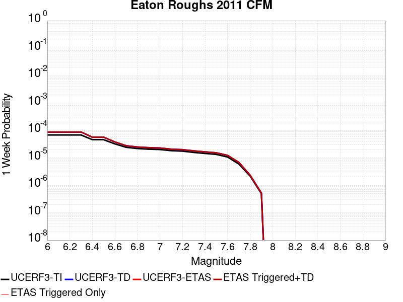 |  | 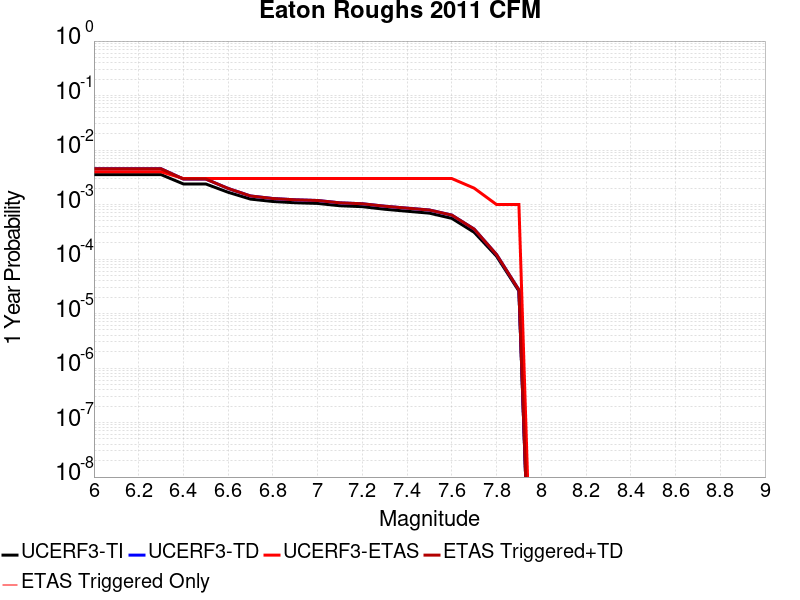 | 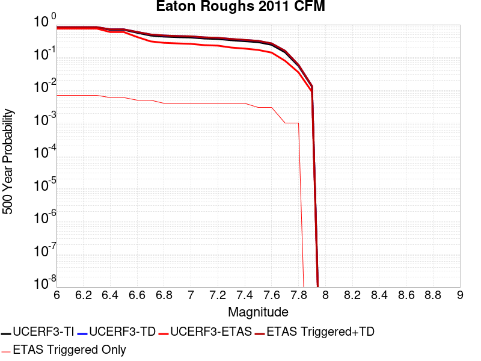 |

| Magnitude | 1 wk TI Prob | 1 wk TD Prob | 1 wk ETAS Prob | 1 wk ETAS/TD Gain | 1 wk ETAS Triggered+TD | 1 wk ETAS Triggered Only | 1 mo TI Prob | 1 mo TD Prob | 1 mo ETAS Prob | 1 mo ETAS/TD Gain | 1 mo ETAS Triggered+TD | 1 mo ETAS Triggered Only | 1 yr TI Prob | 1 yr TD Prob | 1 yr ETAS Prob | 1 yr ETAS/TD Gain | 1 yr ETAS Triggered+TD | 1 yr ETAS Triggered Only | 500 yr TI Prob | 500 yr TD Prob | 500 yr ETAS Prob | 500 yr ETAS/TD Gain | 500 yr ETAS Triggered+TD | 500 yr ETAS Triggered Only |
|-----|-----|-----|-----|-----|-----|-----|-----|-----|-----|-----|-----|-----|-----|-----|-----|-----|-----|-----|-----|-----|-----|-----|-----|-----|
| 6.0 | 6.8044945E-5 | 8.712718E-5 | 0.0 | 0.0 | 8.712718E-5 | 0.0 | 2.9158857E-4 | 3.7335508E-4 | 0.0 | 0.0 | 3.7335508E-4 | 0.0 | 0.0035443127 | 0.004536863 | 0.004 | 0.8816665 | 0.004536863 | 0.0 | 0.83056813 | 0.8403543 | 0.761 | 0.9055704 | 0.84147185 | 0.007 |
| 6.1 | 6.8044945E-5 | 8.712718E-5 | 0.0 | 0.0 | 8.712718E-5 | 0.0 | 2.9158857E-4 | 3.7335508E-4 | 0.0 | 0.0 | 3.7335508E-4 | 0.0 | 0.0035443127 | 0.004536863 | 0.004 | 0.8816665 | 0.004536863 | 0.0 | 0.83056813 | 0.8403543 | 0.761 | 0.9055704 | 0.84147185 | 0.007 |
| 6.2 | 6.8044945E-5 | 8.712718E-5 | 0.0 | 0.0 | 8.712718E-5 | 0.0 | 2.9158857E-4 | 3.7335508E-4 | 0.0 | 0.0 | 3.7335508E-4 | 0.0 | 0.0035443127 | 0.004536863 | 0.004 | 0.8816665 | 0.004536863 | 0.0 | 0.83056813 | 0.8403543 | 0.761 | 0.9055704 | 0.84147185 | 0.007 |
| 6.3 | 6.8044945E-5 | 8.712718E-5 | 0.0 | 0.0 | 8.712718E-5 | 0.0 | 2.9158857E-4 | 3.7335508E-4 | 0.0 | 0.0 | 3.7335508E-4 | 0.0 | 0.0035443127 | 0.004536863 | 0.004 | 0.8816665 | 0.004536863 | 0.0 | 0.83056813 | 0.8403543 | 0.761 | 0.9055704 | 0.84147185 | 0.007 |
| 6.4 | 4.5830013E-5 | 5.6433157E-5 | 0.0 | 0.0 | 5.6433157E-5 | 0.0 | 1.9639956E-4 | 2.418369E-4 | 0.0 | 0.0 | 2.418369E-4 | 0.0 | 0.0023885423 | 0.0029407907 | 0.003 | 1.0201339 | 0.0029407907 | 0.0 | 0.6975078 | 0.720969 | 0.597 | 0.8280522 | 0.7226432 | 0.006 |
| 6.5 | 4.5830013E-5 | 5.6433157E-5 | 0.0 | 0.0 | 5.6433157E-5 | 0.0 | 1.9639956E-4 | 2.418369E-4 | 0.0 | 0.0 | 2.418369E-4 | 0.0 | 0.0023885423 | 0.0029407907 | 0.003 | 1.0201339 | 0.0029407907 | 0.0 | 0.6975078 | 0.720969 | 0.597 | 0.8280522 | 0.7226432 | 0.006 |
| 6.6 | 3.222194E-5 | 3.788544E-5 | 0.0 | 0.0 | 3.788544E-5 | 0.0 | 1.3808672E-4 | 1.623567E-4 | 0.0 | 0.0 | 1.623567E-4 | 0.0 | 0.0016799092 | 0.001974997 | 0.003 | 1.5189896 | 0.001974997 | 0.0 | 0.5685747 | 0.59894454 | 0.421 | 0.70290315 | 0.6009498 | 0.005 |
| 6.7 | 2.4155654E-5 | 2.7565144E-5 | 0.0 | 0.0 | 2.7565144E-5 | 0.0 | 1.0352012E-4 | 1.1813102E-4 | 0.0 | 0.0 | 1.1813102E-4 | 0.0 | 0.0012596287 | 0.0014373044 | 0.003 | 2.0872407 | 0.0014373044 | 0.0 | 0.46752074 | 0.50145 | 0.31 | 0.61820716 | 0.5039428 | 0.005 |
| 6.8 | 2.1814667E-5 | 2.4751547E-5 | 0.0 | 0.0 | 2.4751547E-5 | 0.0 | 9.348808E-5 | 1.0607377E-4 | 0.0 | 0.0 | 1.0607377E-4 | 0.0 | 0.001137623 | 0.0012906868 | 0.003 | 2.3243442 | 0.0012906868 | 0.0 | 0.43398535 | 0.46681288 | 0.28 | 0.5998121 | 0.46894562 | 0.004 |
| 6.9 | 2.0700467E-5 | 2.3451717E-5 | 0.0 | 0.0 | 2.3451717E-5 | 0.0 | 8.871327E-5 | 1.0050351E-4 | 0.0 | 0.0 | 1.0050351E-4 | 0.0 | 0.0010795488 | 0.0012229464 | 0.003 | 2.4530919 | 0.0012229464 | 0.0 | 0.41729018 | 0.44939086 | 0.269 | 0.59858805 | 0.45159328 | 0.004 |
| 7.0 | 2.0104066E-5 | 2.2765107E-5 | 0.0 | 0.0 | 2.2765107E-5 | 0.0 | 8.615744E-5 | 9.756112E-5 | 0.0 | 0.0 | 9.756112E-5 | 0.0 | 0.0010484619 | 0.0011871624 | 0.003 | 2.5270343 | 0.0011871624 | 0.0 | 0.4081523 | 0.439865 | 0.26 | 0.59109044 | 0.44210553 | 0.004 |
| 7.1 | 1.8225232E-5 | 2.0618672E-5 | 0.0 | 0.0 | 2.0618672E-5 | 0.0 | 7.81058E-5 | 8.836276E-5 | 0.0 | 0.0 | 8.836276E-5 | 0.0 | 9.5052324E-4 | 0.0010752871 | 0.003 | 2.7899525 | 0.0010752871 | 0.0 | 0.37841812 | 0.4083387 | 0.238 | 0.5828495 | 0.41070536 | 0.004 |
| 7.2 | 1.7526572E-5 | 1.9843907E-5 | 0.0 | 0.0 | 1.9843907E-5 | 0.0 | 7.511172E-5 | 8.504255E-5 | 0.0 | 0.0 | 8.504255E-5 | 0.0 | 9.141015E-4 | 0.0010349026 | 0.003 | 2.8988233 | 0.0010349026 | 0.0 | 0.36698413 | 0.39654472 | 0.23 | 0.58001024 | 0.39895856 | 0.004 |
| 7.3 | 1.5727232E-5 | 1.7881946E-5 | 0.0 | 0.0 | 1.7881946E-5 | 0.0 | 6.740067E-5 | 7.663467E-5 | 0.0 | 0.0 | 7.663467E-5 | 0.0 | 8.2029426E-4 | 9.32629E-4 | 0.003 | 3.2167132 | 9.32629E-4 | 0.0 | 0.33655906 | 0.36503488 | 0.201 | 0.5506323 | 0.36757475 | 0.004 |
| 7.4 | 1.4457361E-5 | 1.6467904E-5 | 0.0 | 0.0 | 1.6467904E-5 | 0.0 | 6.195865E-5 | 7.0574824E-5 | 0.0 | 0.0 | 7.0574824E-5 | 0.0 | 7.540854E-4 | 8.589107E-4 | 0.003 | 3.4927962 | 8.589107E-4 | 0.0 | 0.31421077 | 0.34140024 | 0.187 | 0.5477442 | 0.3440346 | 0.004 |
| 7.5 | 1.33280955E-5 | 1.5222283E-5 | 0.0 | 0.0 | 1.5222283E-5 | 0.0 | 5.711916E-5 | 6.523673E-5 | 0.0 | 0.0 | 6.523673E-5 | 0.0 | 6.9520384E-4 | 7.9396856E-4 | 0.003 | 3.7784872 | 7.9396856E-4 | 0.0 | 0.29370537 | 0.3199189 | 0.17 | 0.53138465 | 0.32195914 | 0.003 |
| 7.6 | 1.0699478E-5 | 1.2284308E-5 | 0.0 | 0.0 | 1.2284308E-5 | 0.0 | 4.5854096E-5 | 5.2645973E-5 | 0.0 | 0.0 | 5.2645973E-5 | 0.0 | 5.581306E-4 | 6.4077677E-4 | 0.003 | 4.6818175 | 6.4077677E-4 | 0.0 | 0.24356844 | 0.266637 | 0.141 | 0.52880883 | 0.26883706 | 0.003 |
| 7.7 | 5.9390236E-6 | 6.79693E-6 | 0.0 | 0.0 | 6.79693E-6 | 0.0 | 2.545271E-5 | 2.9129375E-5 | 0.0 | 0.0 | 2.9129375E-5 | 0.0 | 3.0984267E-4 | 3.5459266E-4 | 0.002 | 5.6402745 | 3.5459266E-4 | 0.0 | 0.14353801 | 0.1591799 | 0.079 | 0.4962938 | 0.16002072 | 0.001 |
| 7.8 | 2.1622036E-6 | 2.3201349E-6 | 0.0 | 0.0 | 2.3201349E-6 | 0.0 | 9.266554E-6 | 9.943397E-6 | 0.0 | 0.0 | 9.943397E-6 | 0.0 | 1.1281446E-4 | 1.2105421E-4 | 0.001 | 8.260762 | 1.2105421E-4 | 0.0 | 0.054848842 | 0.058685277 | 0.035 | 0.59640175 | 0.05962659 | 0.001 |
| 7.9 | 4.9586197E-7 | 5.204721E-7 | 0.0 | 0.0 | 5.204721E-7 | 0.0 | 2.125121E-6 | 2.2305928E-6 | 0.0 | 0.0 | 2.2305928E-6 | 0.0 | 2.5873042E-5 | 2.7157152E-5 | 0.001 | 36.822716 | 2.7157152E-5 | 0.0 | 0.012853368 | 0.013492676 | 0.009 | 0.66702855 | 0.013492676 | 0.0 |

## Newport-Inglewood alt 1
*[(top)](#table-of-contents)*

| 1 Week | 1 Month | 1 Year | 500 Year |
|-----|-----|-----|-----|
|  |  | 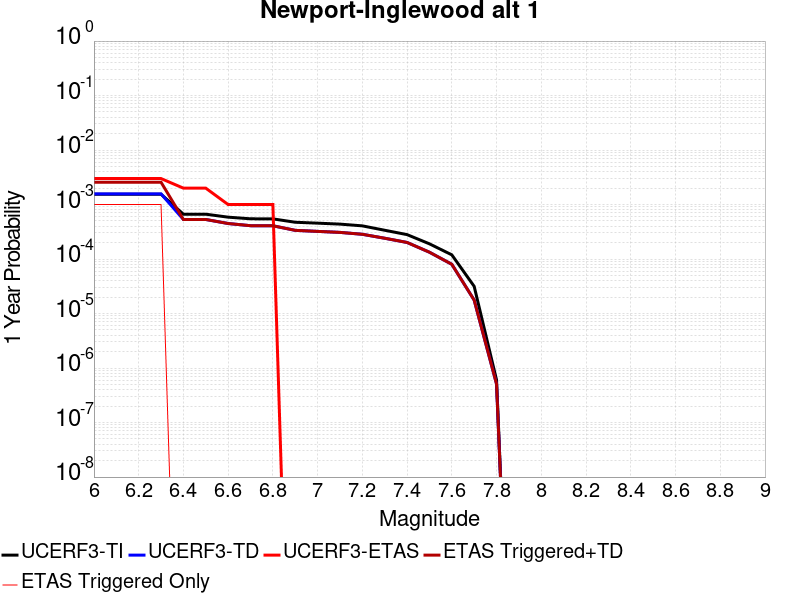 | 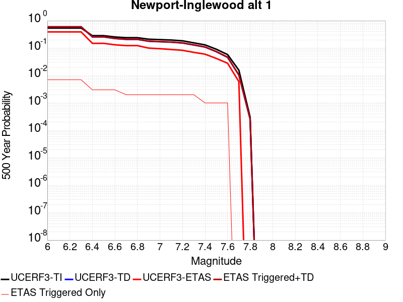 |

| Magnitude | 1 wk TI Prob | 1 wk TD Prob | 1 wk ETAS Prob | 1 wk ETAS/TD Gain | 1 wk ETAS Triggered+TD | 1 wk ETAS Triggered Only | 1 mo TI Prob | 1 mo TD Prob | 1 mo ETAS Prob | 1 mo ETAS/TD Gain | 1 mo ETAS Triggered+TD | 1 mo ETAS Triggered Only | 1 yr TI Prob | 1 yr TD Prob | 1 yr ETAS Prob | 1 yr ETAS/TD Gain | 1 yr ETAS Triggered+TD | 1 yr ETAS Triggered Only | 500 yr TI Prob | 500 yr TD Prob | 500 yr ETAS Prob | 500 yr ETAS/TD Gain | 500 yr ETAS Triggered+TD | 500 yr ETAS Triggered Only |
|-----|-----|-----|-----|-----|-----|-----|-----|-----|-----|-----|-----|-----|-----|-----|-----|-----|-----|-----|-----|-----|-----|-----|-----|-----|
| 6.0 | 2.9668912E-5 | 3.0132573E-5 | 0.0 | 0.0 | 3.0132573E-5 | 0.0 | 1.2714628E-4 | 1.291359E-4 | 0.0 | 0.0 | 1.291359E-4 | 0.0 | 0.0015469068 | 0.001571571 | 0.003 | 1.9089179 | 0.0025699995 | 0.001 | 0.53885937 | 0.59585565 | 0.389 | 0.65284264 | 0.59868467 | 0.007 |
| 6.1 | 2.9668912E-5 | 3.0132573E-5 | 0.0 | 0.0 | 3.0132573E-5 | 0.0 | 1.2714628E-4 | 1.291359E-4 | 0.0 | 0.0 | 1.291359E-4 | 0.0 | 0.0015469068 | 0.001571571 | 0.003 | 1.9089179 | 0.0025699995 | 0.001 | 0.53885937 | 0.59585565 | 0.389 | 0.65284264 | 0.59868467 | 0.007 |
| 6.2 | 2.9668912E-5 | 3.0132573E-5 | 0.0 | 0.0 | 3.0132573E-5 | 0.0 | 1.2714628E-4 | 1.291359E-4 | 0.0 | 0.0 | 1.291359E-4 | 0.0 | 0.0015469068 | 0.001571571 | 0.003 | 1.9089179 | 0.0025699995 | 0.001 | 0.53885937 | 0.59585565 | 0.389 | 0.65284264 | 0.59868467 | 0.007 |
| 6.3 | 2.9668912E-5 | 3.0132573E-5 | 0.0 | 0.0 | 3.0132573E-5 | 0.0 | 1.2714628E-4 | 1.291359E-4 | 0.0 | 0.0 | 1.291359E-4 | 0.0 | 0.0015469068 | 0.001571571 | 0.003 | 1.9089179 | 0.0025699995 | 0.001 | 0.53885937 | 0.59585565 | 0.389 | 0.65284264 | 0.59868467 | 0.007 |
| 6.4 | 1.275942E-5 | 1.0208385E-5 | 0.0 | 0.0 | 1.0208385E-5 | 0.0 | 5.4682085E-5 | 4.374951E-5 | 0.0 | 0.0 | 4.374951E-5 | 0.0 | 6.65551E-4 | 5.3252425E-4 | 0.002 | 3.7556975 | 5.3252425E-4 | 0.0 | 0.2831483 | 0.25558922 | 0.149 | 0.5829667 | 0.25782245 | 0.003 |
| 6.5 | 1.275942E-5 | 1.0208385E-5 | 0.0 | 0.0 | 1.0208385E-5 | 0.0 | 5.4682085E-5 | 4.374951E-5 | 0.0 | 0.0 | 4.374951E-5 | 0.0 | 6.65551E-4 | 5.3252425E-4 | 0.002 | 3.7556975 | 5.3252425E-4 | 0.0 | 0.2831483 | 0.25558922 | 0.149 | 0.5829667 | 0.25782245 | 0.003 |
| 6.6 | 1.1255358E-5 | 8.608755E-6 | 0.0 | 0.0 | 8.608755E-6 | 0.0 | 4.8236358E-5 | 3.689415E-5 | 0.0 | 0.0 | 3.689415E-5 | 0.0 | 5.871194E-4 | 4.4909542E-4 | 0.001 | 2.2266984 | 4.4909542E-4 | 0.0 | 0.25445956 | 0.2239473 | 0.132 | 0.5894244 | 0.22627546 | 0.003 |
| 6.7 | 1.0504745E-5 | 7.8508465E-6 | 0.0 | 0.0 | 7.8508465E-6 | 0.0 | 4.5019555E-5 | 3.3646058E-5 | 0.0 | 0.0 | 3.3646058E-5 | 0.0 | 5.4797524E-4 | 4.0956496E-4 | 0.001 | 2.441615 | 4.0956496E-4 | 0.0 | 0.2397156 | 0.20816135 | 0.123 | 0.5908878 | 0.20974503 | 0.002 |
| 6.8 | 1.0476007E-5 | 7.832282E-6 | 0.0 | 0.0 | 7.832282E-6 | 0.0 | 4.4896402E-5 | 3.35665E-5 | 0.0 | 0.0 | 3.35665E-5 | 0.0 | 5.464766E-4 | 4.085967E-4 | 0.001 | 2.447401 | 4.085967E-4 | 0.0 | 0.2391454 | 0.20771326 | 0.123 | 0.5921625 | 0.20929784 | 0.002 |
| 6.9 | 9.076797E-6 | 6.4476476E-6 | 0.0 | 0.0 | 6.4476476E-6 | 0.0 | 3.889998E-5 | 2.7632484E-5 | 0.0 | 0.0 | 2.7632484E-5 | 0.0 | 4.7350433E-4 | 3.363739E-4 | 0.0 | 0.0 | 3.363739E-4 | 0.0 | 0.21085739 | 0.1776565 | 0.1 | 0.562884 | 0.17930119 | 0.002 |
| 7.0 | 8.73795E-6 | 6.1707033E-6 | 0.0 | 0.0 | 6.1707033E-6 | 0.0 | 3.7447822E-5 | 2.6445605E-5 | 0.0 | 0.0 | 2.6445605E-5 | 0.0 | 4.5583185E-4 | 3.2192795E-4 | 0.0 | 0.0 | 3.2192795E-4 | 0.0 | 0.20385017 | 0.17105341 | 0.095 | 0.55538213 | 0.1727113 | 0.002 |
| 7.1 | 8.391299E-6 | 5.9158683E-6 | 0.0 | 0.0 | 5.9158683E-6 | 0.0 | 3.5962214E-5 | 2.5353476E-5 | 0.0 | 0.0 | 2.5353476E-5 | 0.0 | 4.37752E-4 | 3.0863512E-4 | 0.0 | 0.0 | 3.0863512E-4 | 0.0 | 0.19661716 | 0.1646468 | 0.089 | 0.540551 | 0.16631751 | 0.002 |
| 7.2 | 7.796882E-6 | 5.4606476E-6 | 0.0 | 0.0 | 5.4606476E-6 | 0.0 | 3.341478E-5 | 2.3402568E-5 | 0.0 | 0.0 | 2.3402568E-5 | 0.0 | 4.06749E-4 | 2.8488922E-4 | 0.0 | 0.0 | 2.8488922E-4 | 0.0 | 0.18406115 | 0.15325178 | 0.083 | 0.5415924 | 0.15494527 | 0.002 |
| 7.3 | 6.4738833E-6 | 4.620223E-6 | 0.0 | 0.0 | 4.620223E-6 | 0.0 | 2.774492E-5 | 1.9800807E-5 | 0.0 | 0.0 | 1.9800807E-5 | 0.0 | 3.3774204E-4 | 2.4104831E-4 | 0.0 | 0.0 | 2.4104831E-4 | 0.0 | 0.15540625 | 0.12963498 | 0.07 | 0.5399777 | 0.13137572 | 0.002 |
| 7.4 | 5.382145E-6 | 3.864809E-6 | 0.0 | 0.0 | 3.864809E-6 | 0.0 | 2.3066134E-5 | 1.6563363E-5 | 0.0 | 0.0 | 1.6563363E-5 | 0.0 | 2.8079396E-4 | 2.016404E-4 | 0.0 | 0.0 | 2.016404E-4 | 0.0 | 0.13100395 | 0.109203316 | 0.06 | 0.5494338 | 0.110094115 | 0.001 |
| 7.5 | 3.648244E-6 | 2.5594666E-6 | 0.0 | 0.0 | 2.5594666E-6 | 0.0 | 1.5635238E-5 | 1.0969097E-5 | 0.0 | 0.0 | 1.0969097E-5 | 0.0 | 1.9034238E-4 | 1.3354067E-4 | 0.0 | 0.0 | 1.3354067E-4 | 0.0 | 0.090790965 | 0.07397447 | 0.042 | 0.5677635 | 0.07490049 | 0.001 |
| 7.6 | 2.2906888E-6 | 1.537412E-6 | 0.0 | 0.0 | 1.537412E-6 | 0.0 | 9.817201E-6 | 6.5888926E-6 | 0.0 | 0.0 | 6.5888926E-6 | 0.0 | 1.1951787E-4 | 8.021688E-5 | 0.0 | 0.0 | 8.021688E-5 | 0.0 | 0.058011778 | 0.045910746 | 0.028 | 0.609879 | 0.046864837 | 0.001 |
| 7.7 | 6.0479874E-7 | 3.383456E-7 | 0.0 | 0.0 | 3.383456E-7 | 0.0 | 2.5919921E-6 | 1.4500519E-6 | 0.0 | 0.0 | 1.4500519E-6 | 0.0 | 3.1557047E-5 | 1.765425E-5 | 0.0 | 0.0 | 1.765425E-5 | 0.0 | 0.01565494 | 0.010485914 | 0.006 | 0.5721962 | 0.010485914 | 0.0 |
| 7.8 | 1.16056995E-8 | 9.775291E-9 | 0.0 | 0.0 | 9.775291E-9 | 0.0 | 4.9738713E-8 | 4.1894104E-8 | 0.0 | 0.0 | 4.1894104E-8 | 0.0 | 6.0556863E-7 | 5.100607E-7 | 0.0 | 0.0 | 5.100607E-7 | 0.0 | 3.027386E-4 | 2.6043522E-4 | 0.0 | 0.0 | 2.6043522E-4 | 0.0 |

## Santa Cruz Island
*[(top)](#table-of-contents)*

| 1 Week | 1 Month | 1 Year | 500 Year |
|-----|-----|-----|-----|
| 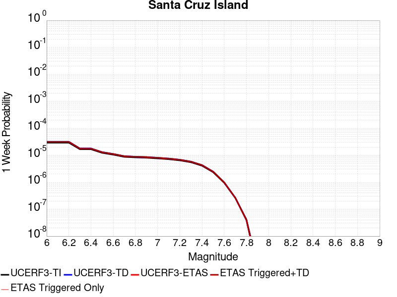 |  | 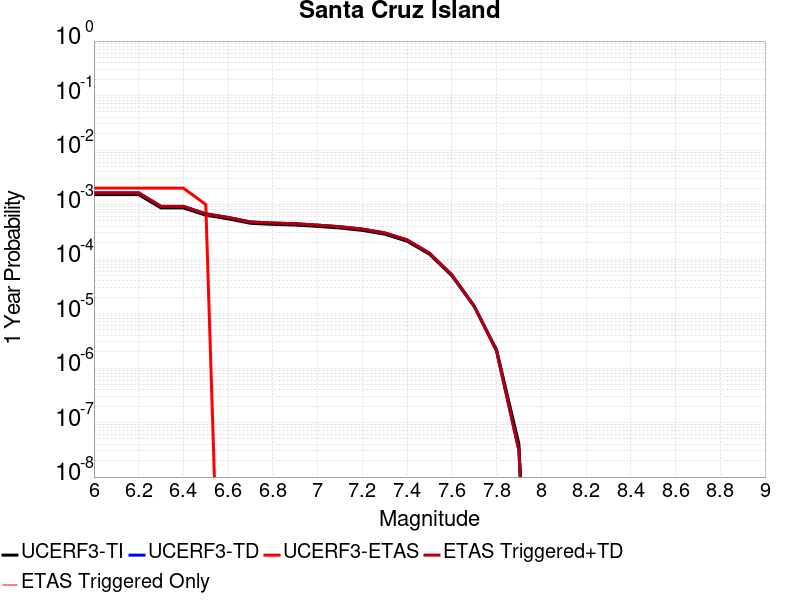 | 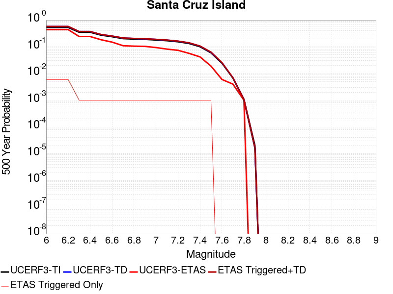 |

| Magnitude | 1 wk TI Prob | 1 wk TD Prob | 1 wk ETAS Prob | 1 wk ETAS/TD Gain | 1 wk ETAS Triggered+TD | 1 wk ETAS Triggered Only | 1 mo TI Prob | 1 mo TD Prob | 1 mo ETAS Prob | 1 mo ETAS/TD Gain | 1 mo ETAS Triggered+TD | 1 mo ETAS Triggered Only | 1 yr TI Prob | 1 yr TD Prob | 1 yr ETAS Prob | 1 yr ETAS/TD Gain | 1 yr ETAS Triggered+TD | 1 yr ETAS Triggered Only | 500 yr TI Prob | 500 yr TD Prob | 500 yr ETAS Prob | 500 yr ETAS/TD Gain | 500 yr ETAS Triggered+TD | 500 yr ETAS Triggered Only |
|-----|-----|-----|-----|-----|-----|-----|-----|-----|-----|-----|-----|-----|-----|-----|-----|-----|-----|-----|-----|-----|-----|-----|-----|-----|
| 6.0 | 2.9164563E-5 | 3.146219E-5 | 0.0 | 0.0 | 3.146219E-5 | 0.0 | 1.2498499E-4 | 1.3483175E-4 | 0.0 | 0.0 | 1.3483175E-4 | 0.0 | 0.0015206301 | 0.0016404751 | 0.002 | 1.219159 | 0.0016404751 | 0.0 | 0.5327513 | 0.57615304 | 0.443 | 0.76889294 | 0.5786961 | 0.006 |
| 6.1 | 2.9164563E-5 | 3.146219E-5 | 0.0 | 0.0 | 3.146219E-5 | 0.0 | 1.2498499E-4 | 1.3483175E-4 | 0.0 | 0.0 | 1.3483175E-4 | 0.0 | 0.0015206301 | 0.0016404751 | 0.002 | 1.219159 | 0.0016404751 | 0.0 | 0.5327513 | 0.57615304 | 0.443 | 0.76889294 | 0.5786961 | 0.006 |
| 6.2 | 2.9164563E-5 | 3.146219E-5 | 0.0 | 0.0 | 3.146219E-5 | 0.0 | 1.2498499E-4 | 1.3483175E-4 | 0.0 | 0.0 | 1.3483175E-4 | 0.0 | 0.0015206301 | 0.0016404751 | 0.002 | 1.219159 | 0.0016404751 | 0.0 | 0.5327513 | 0.57615304 | 0.443 | 0.76889294 | 0.5786961 | 0.006 |
| 6.3 | 1.6635553E-5 | 1.7739021E-5 | 0.0 | 0.0 | 1.7739021E-5 | 0.0 | 7.1293274E-5 | 7.602226E-5 | 0.0 | 0.0 | 7.602226E-5 | 0.0 | 8.6765E-4 | 9.251961E-4 | 0.002 | 2.1617038 | 9.251961E-4 | 0.0 | 0.35209635 | 0.37334165 | 0.243 | 0.6508783 | 0.37396833 | 0.001 |
| 6.4 | 1.6635553E-5 | 1.7739021E-5 | 0.0 | 0.0 | 1.7739021E-5 | 0.0 | 7.1293274E-5 | 7.602226E-5 | 0.0 | 0.0 | 7.602226E-5 | 0.0 | 8.6765E-4 | 9.251961E-4 | 0.002 | 2.1617038 | 9.251961E-4 | 0.0 | 0.35209635 | 0.37334165 | 0.243 | 0.6508783 | 0.37396833 | 0.001 |
| 6.5 | 1.2238748E-5 | 1.2998098E-5 | 0.0 | 0.0 | 1.2998098E-5 | 0.0 | 5.2450723E-5 | 5.5704968E-5 | 0.0 | 0.0 | 5.5704968E-5 | 0.0 | 6.3840044E-4 | 6.780006E-4 | 0.001 | 1.4749249 | 6.780006E-4 | 0.0 | 0.27334404 | 0.2881792 | 0.184 | 0.63849163 | 0.28889102 | 0.001 |
| 6.6 | 1.0489767E-5 | 1.1119412E-5 | 0.0 | 0.0 | 1.1119412E-5 | 0.0 | 4.495537E-5 | 4.7653768E-5 | 0.0 | 0.0 | 4.7653768E-5 | 0.0 | 5.4719415E-4 | 5.8003236E-4 | 0.0 | 0.0 | 5.8003236E-4 | 0.0 | 0.23941846 | 0.25220543 | 0.15 | 0.59475327 | 0.25295323 | 0.001 |
| 6.7 | 8.699222E-6 | 9.20674E-6 | 0.0 | 0.0 | 9.20674E-6 | 0.0 | 3.7281847E-5 | 3.9456863E-5 | 0.0 | 0.0 | 3.9456863E-5 | 0.0 | 4.5381195E-4 | 4.8028197E-4 | 0.0 | 0.0 | 4.8028197E-4 | 0.0 | 0.20304534 | 0.21363391 | 0.11 | 0.51489955 | 0.21442027 | 0.001 |
| 6.8 | 8.307732E-6 | 8.78844E-6 | 0.0 | 0.0 | 8.78844E-6 | 0.0 | 3.560408E-5 | 3.7664202E-5 | 0.0 | 0.0 | 3.7664202E-5 | 0.0 | 4.3339343E-4 | 4.5846557E-4 | 0.0 | 0.0 | 4.5846557E-4 | 0.0 | 0.19486369 | 0.20497918 | 0.106 | 0.51712567 | 0.2057742 | 0.001 |
| 6.9 | 8.073121E-6 | 8.537443E-6 | 0.0 | 0.0 | 8.537443E-6 | 0.0 | 3.459863E-5 | 3.658853E-5 | 0.0 | 0.0 | 3.658853E-5 | 0.0 | 4.2115687E-4 | 4.4537475E-4 | 0.0 | 0.0 | 4.4537475E-4 | 0.0 | 0.18992043 | 0.19975723 | 0.104 | 0.52063197 | 0.20055749 | 0.001 |
| 7.0 | 7.617019E-6 | 8.049088E-6 | 0.0 | 0.0 | 8.049088E-6 | 0.0 | 3.264396E-5 | 3.449564E-5 | 0.0 | 0.0 | 3.449564E-5 | 0.0 | 3.9736772E-4 | 4.1990384E-4 | 0.0 | 0.0 | 4.1990384E-4 | 0.0 | 0.18022335 | 0.1895059 | 0.094 | 0.49602675 | 0.19031641 | 0.001 |
| 7.1 | 7.1224836E-6 | 7.5221255E-6 | 0.0 | 0.0 | 7.5221255E-6 | 0.0 | 3.052457E-5 | 3.2237283E-5 | 0.0 | 0.0 | 3.2237283E-5 | 0.0 | 3.715733E-4 | 3.9241862E-4 | 0.0 | 0.0 | 3.9241862E-4 | 0.0 | 0.16957791 | 0.17828558 | 0.082 | 0.45993623 | 0.17910731 | 0.001 |
| 7.2 | 6.441115E-6 | 6.8057575E-6 | 0.0 | 0.0 | 6.8057575E-6 | 0.0 | 2.7604487E-5 | 2.9167208E-5 | 0.0 | 0.0 | 2.9167208E-5 | 0.0 | 3.360328E-4 | 3.5505314E-4 | 0.0 | 0.0 | 3.5505314E-4 | 0.0 | 0.1546839 | 0.16275589 | 0.074 | 0.45466864 | 0.16359314 | 0.001 |
| 7.3 | 5.494274E-6 | 5.8017163E-6 | 0.0 | 0.0 | 5.8017163E-6 | 0.0 | 2.3546674E-5 | 2.4864263E-5 | 0.0 | 0.0 | 2.4864263E-5 | 0.0 | 2.8664304E-4 | 3.0268054E-4 | 0.0 | 0.0 | 3.0268054E-4 | 0.0 | 0.13354237 | 0.14052668 | 0.057 | 0.4056169 | 0.14138617 | 0.001 |
| 7.4 | 4.0802624E-6 | 4.2991637E-6 | 0.0 | 0.0 | 4.2991637E-6 | 0.0 | 1.7486722E-5 | 1.8424857E-5 | 0.0 | 0.0 | 1.8424857E-5 | 0.0 | 2.1288003E-4 | 2.2429961E-4 | 0.0 | 0.0 | 2.2429961E-4 | 0.0 | 0.10098121 | 0.106135376 | 0.042 | 0.39572102 | 0.107029244 | 0.001 |
| 7.5 | 2.3584746E-6 | 2.4685962E-6 | 0.0 | 0.0 | 2.4685962E-6 | 0.0 | 1.0107709E-5 | 1.0579655E-5 | 0.0 | 0.0 | 1.0579655E-5 | 0.0 | 1.2305441E-4 | 1.2879973E-4 | 0.0 | 0.0 | 1.2879973E-4 | 0.0 | 0.059676196 | 0.062402643 | 0.019 | 0.3044743 | 0.06334024 | 0.001 |
| 7.6 | 9.4981914E-7 | 9.838357E-7 | 0.0 | 0.0 | 9.838357E-7 | 0.0 | 4.0706473E-6 | 4.216432E-6 | 0.0 | 0.0 | 4.216432E-6 | 0.0 | 4.9559E-5 | 5.1333864E-5 | 0.0 | 0.0 | 5.1333864E-5 | 0.0 | 0.024475608 | 0.025360735 | 0.006 | 0.23658621 | 0.025360735 | 0.0 |
| 7.7 | 2.6013532E-7 | 2.6371418E-7 | 0.0 | 0.0 | 2.6371418E-7 | 0.0 | 1.1148652E-6 | 1.1302031E-6 | 0.0 | 0.0 | 1.1302031E-6 | 0.0 | 1.3573399E-5 | 1.3760137E-5 | 0.0 | 0.0 | 1.3760137E-5 | 0.0 | 0.0067637675 | 0.006871333 | 0.004 | 0.5821287 | 0.006871333 | 0.0 |
| 7.8 | 4.1522263E-8 | 3.960639E-8 | 0.0 | 0.0 | 3.960639E-8 | 0.0 | 1.7795254E-7 | 1.6974165E-7 | 0.0 | 0.0 | 1.6974165E-7 | 0.0 | 2.16657E-6 | 2.066603E-6 | 0.0 | 0.0 | 2.066603E-6 | 0.0 | 0.0010826996 | 0.0010432141 | 0.001 | 0.95857596 | 0.0010432141 | 0.0 |
| 7.9 | 7.7242046E-10 | 5.934556E-10 | 0.0 | 0.0 | 5.934556E-10 | 0.0 | 3.3103735E-9 | 2.543381E-9 | 0.0 | 0.0 | 2.543381E-9 | 0.0 | 4.0303796E-8 | 3.0965662E-8 | 0.0 | 0.0 | 3.0965662E-8 | 0.0 | 2.0151696E-5 | 1.6304155E-5 | 0.0 | 0.0 | 1.6304155E-5 | 0.0 |

## Northridge
*[(top)](#table-of-contents)*

| 1 Week | 1 Month | 1 Year | 500 Year |
|-----|-----|-----|-----|
|  |  |  | 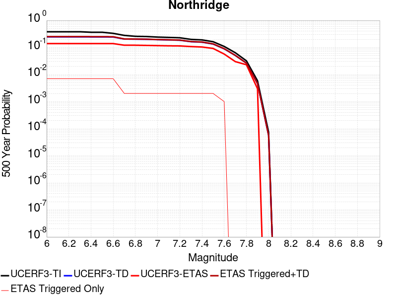 |

| Magnitude | 1 wk TI Prob | 1 wk TD Prob | 1 wk ETAS Prob | 1 wk ETAS/TD Gain | 1 wk ETAS Triggered+TD | 1 wk ETAS Triggered Only | 1 mo TI Prob | 1 mo TD Prob | 1 mo ETAS Prob | 1 mo ETAS/TD Gain | 1 mo ETAS Triggered+TD | 1 mo ETAS Triggered Only | 1 yr TI Prob | 1 yr TD Prob | 1 yr ETAS Prob | 1 yr ETAS/TD Gain | 1 yr ETAS Triggered+TD | 1 yr ETAS Triggered Only | 500 yr TI Prob | 500 yr TD Prob | 500 yr ETAS Prob | 500 yr ETAS/TD Gain | 500 yr ETAS Triggered+TD | 500 yr ETAS Triggered Only |
|-----|-----|-----|-----|-----|-----|-----|-----|-----|-----|-----|-----|-----|-----|-----|-----|-----|-----|-----|-----|-----|-----|-----|-----|-----|
| 6.0 | 1.8340852E-5 | 7.489204E-6 | 0.0 | 0.0 | 7.489204E-6 | 0.0 | 7.860128E-5 | 3.2096206E-5 | 0.0 | 0.0 | 3.2096206E-5 | 0.0 | 9.565505E-4 | 3.9070335E-4 | 0.0 | 0.0 | 3.9070335E-4 | 0.0 | 0.3802903 | 0.2462852 | 0.139 | 0.56438637 | 0.2515612 | 0.007 |
| 6.1 | 1.8340852E-5 | 7.489204E-6 | 0.0 | 0.0 | 7.489204E-6 | 0.0 | 7.860128E-5 | 3.2096206E-5 | 0.0 | 0.0 | 3.2096206E-5 | 0.0 | 9.565505E-4 | 3.9070335E-4 | 0.0 | 0.0 | 3.9070335E-4 | 0.0 | 0.3802903 | 0.2462852 | 0.139 | 0.56438637 | 0.2515612 | 0.007 |
| 6.2 | 1.8340852E-5 | 7.489204E-6 | 0.0 | 0.0 | 7.489204E-6 | 0.0 | 7.860128E-5 | 3.2096206E-5 | 0.0 | 0.0 | 3.2096206E-5 | 0.0 | 9.565505E-4 | 3.9070335E-4 | 0.0 | 0.0 | 3.9070335E-4 | 0.0 | 0.3802903 | 0.2462852 | 0.139 | 0.56438637 | 0.2515612 | 0.007 |
| 6.3 | 1.8340852E-5 | 7.489204E-6 | 0.0 | 0.0 | 7.489204E-6 | 0.0 | 7.860128E-5 | 3.2096206E-5 | 0.0 | 0.0 | 3.2096206E-5 | 0.0 | 9.565505E-4 | 3.9070335E-4 | 0.0 | 0.0 | 3.9070335E-4 | 0.0 | 0.3802903 | 0.2462852 | 0.139 | 0.56438637 | 0.2515612 | 0.007 |
| 6.4 | 1.7361892E-5 | 7.489204E-6 | 0.0 | 0.0 | 7.489204E-6 | 0.0 | 7.440598E-5 | 3.2096206E-5 | 0.0 | 0.0 | 3.2096206E-5 | 0.0 | 9.055163E-4 | 3.9070335E-4 | 0.0 | 0.0 | 3.9070335E-4 | 0.0 | 0.36425853 | 0.24528359 | 0.139 | 0.566691 | 0.2505666 | 0.007 |
| 6.5 | 1.7361892E-5 | 7.489204E-6 | 0.0 | 0.0 | 7.489204E-6 | 0.0 | 7.440598E-5 | 3.2096206E-5 | 0.0 | 0.0 | 3.2096206E-5 | 0.0 | 9.055163E-4 | 3.9070335E-4 | 0.0 | 0.0 | 3.9070335E-4 | 0.0 | 0.36425853 | 0.24528359 | 0.139 | 0.566691 | 0.2505666 | 0.007 |
| 6.6 | 1.5458201E-5 | 7.489204E-6 | 0.0 | 0.0 | 7.489204E-6 | 0.0 | 6.624775E-5 | 3.2096206E-5 | 0.0 | 0.0 | 3.2096206E-5 | 0.0 | 8.0626784E-4 | 3.9070335E-4 | 0.0 | 0.0 | 3.9070335E-4 | 0.0 | 0.33188605 | 0.24323817 | 0.139 | 0.5714564 | 0.2485355 | 0.007 |
| 6.7 | 1.2538368E-5 | 6.3084394E-6 | 0.0 | 0.0 | 6.3084394E-6 | 0.0 | 5.3734755E-5 | 2.703589E-5 | 0.0 | 0.0 | 2.703589E-5 | 0.0 | 6.5402425E-4 | 3.291127E-4 | 0.0 | 0.0 | 3.291127E-4 | 0.0 | 0.27900213 | 0.20467845 | 0.121 | 0.5911712 | 0.20626909 | 0.002 |
| 6.8 | 1.1438097E-5 | 6.2779436E-6 | 0.0 | 0.0 | 6.2779436E-6 | 0.0 | 4.9019498E-5 | 2.6905198E-5 | 0.0 | 0.0 | 2.6905198E-5 | 0.0 | 5.9664896E-4 | 3.2752196E-4 | 0.0 | 0.0 | 3.2752196E-4 | 0.0 | 0.25800553 | 0.20298111 | 0.121 | 0.5961146 | 0.20457515 | 0.002 |
| 6.9 | 1.1204891E-5 | 6.215536E-6 | 0.0 | 0.0 | 6.215536E-6 | 0.0 | 4.8020076E-5 | 2.6637741E-5 | 0.0 | 0.0 | 2.6637741E-5 | 0.0 | 5.8448757E-4 | 3.2426667E-4 | 0.0 | 0.0 | 3.2426667E-4 | 0.0 | 0.25347728 | 0.20051518 | 0.119 | 0.5934713 | 0.20211415 | 0.002 |
| 7.0 | 1.061046E-5 | 6.046395E-6 | 0.0 | 0.0 | 6.046395E-6 | 0.0 | 4.5472607E-5 | 2.5912866E-5 | 0.0 | 0.0 | 2.5912866E-5 | 0.0 | 5.534883E-4 | 3.154439E-4 | 0.0 | 0.0 | 3.154439E-4 | 0.0 | 0.24180964 | 0.19451523 | 0.117 | 0.6014953 | 0.19612621 | 0.002 |
| 7.1 | 1.0266979E-5 | 5.9365666E-6 | 0.0 | 0.0 | 5.9365666E-6 | 0.0 | 4.40006E-5 | 2.5442181E-5 | 0.0 | 0.0 | 2.5442181E-5 | 0.0 | 5.355756E-4 | 3.0971496E-4 | 0.0 | 0.0 | 3.0971496E-4 | 0.0 | 0.23498477 | 0.19054058 | 0.115 | 0.60354596 | 0.19215949 | 0.002 |
| 7.2 | 9.91273E-6 | 5.753889E-6 | 0.0 | 0.0 | 5.753889E-6 | 0.0 | 4.248244E-5 | 2.4659294E-5 | 0.0 | 0.0 | 2.4659294E-5 | 0.0 | 5.171009E-4 | 3.0018593E-4 | 0.0 | 0.0 | 3.0018593E-4 | 0.0 | 0.22788157 | 0.18539722 | 0.114 | 0.61489594 | 0.18702643 | 0.002 |
| 7.3 | 8.4959265E-6 | 5.1376524E-6 | 0.0 | 0.0 | 5.1376524E-6 | 0.0 | 3.6410605E-5 | 2.2018325E-5 | 0.0 | 0.0 | 2.2018325E-5 | 0.0 | 4.4320893E-4 | 2.6804037E-4 | 0.0 | 0.0 | 2.6804037E-4 | 0.0 | 0.19880714 | 0.16357899 | 0.108 | 0.6602315 | 0.16525184 | 0.002 |
| 7.4 | 8.0847185E-6 | 4.9285527E-6 | 0.0 | 0.0 | 4.9285527E-6 | 0.0 | 3.4648332E-5 | 2.1122198E-5 | 0.0 | 0.0 | 2.1122198E-5 | 0.0 | 4.2176177E-4 | 2.5713266E-4 | 0.0 | 0.0 | 2.5713266E-4 | 0.0 | 0.1901655 | 0.15714188 | 0.104 | 0.66182226 | 0.1588276 | 0.002 |
| 7.5 | 6.8220684E-6 | 4.209902E-6 | 0.0 | 0.0 | 4.209902E-6 | 0.0 | 2.9237108E-5 | 1.8042314E-5 | 0.0 | 0.0 | 1.8042314E-5 | 0.0 | 3.5590364E-4 | 2.1964322E-4 | 0.0 | 0.0 | 2.1964322E-4 | 0.0 | 0.16304377 | 0.13392292 | 0.092 | 0.6869623 | 0.13565508 | 0.002 |
| 7.6 | 4.4224143E-6 | 2.8725656E-6 | 0.0 | 0.0 | 2.8725656E-6 | 0.0 | 1.8953066E-5 | 1.2310938E-5 | 0.0 | 0.0 | 1.2310938E-5 | 0.0 | 2.3072914E-4 | 1.4987547E-4 | 0.0 | 0.0 | 1.4987547E-4 | 0.0 | 0.10897063 | 0.08913878 | 0.057 | 0.6394523 | 0.09004965 | 0.001 |
| 7.7 | 2.5297056E-6 | 1.5897024E-6 | 0.0 | 0.0 | 1.5897024E-6 | 0.0 | 1.0841551E-5 | 6.8129925E-6 | 0.0 | 0.0 | 6.8129925E-6 | 0.0 | 1.319879E-4 | 8.294507E-5 | 0.0 | 0.0 | 8.294507E-5 | 0.0 | 0.06386755 | 0.0508656 | 0.03 | 0.58978957 | 0.0508656 | 0.0 |
| 7.8 | 1.2508156E-6 | 8.7164085E-7 | 0.0 | 0.0 | 8.7164085E-7 | 0.0 | 5.3606273E-6 | 3.7355983E-6 | 0.0 | 0.0 | 3.7355983E-6 | 0.0 | 6.526368E-5 | 4.5479974E-5 | 0.0 | 0.0 | 4.5479974E-5 | 0.0 | 0.0321062 | 0.026424956 | 0.023 | 0.87038934 | 0.026424956 | 0.0 |
| 7.9 | 2.262199E-7 | 1.4537095E-7 | 0.0 | 0.0 | 1.4537095E-7 | 0.0 | 9.695135E-7 | 6.230182E-7 | 0.0 | 0.0 | 6.230182E-7 | 0.0 | 1.1803763E-5 | 7.5852204E-6 | 0.0 | 0.0 | 7.5852204E-6 | 0.0 | 0.005884534 | 0.004664277 | 0.003 | 0.64318645 | 0.004664277 | 0.0 |
| 8.0 | 2.865362E-9 | 1.2415886E-9 | 0.0 | 0.0 | 1.2415886E-9 | 0.0 | 1.2280123E-8 | 5.3210942E-9 | 0.0 | 0.0 | 5.3210942E-9 | 0.0 | 1.4951048E-7 | 6.4784324E-8 | 0.0 | 0.0 | 6.4784324E-8 | 0.0 | 7.4752454E-5 | 5.6647088E-5 | 0.0 | 0.0 | 5.6647088E-5 | 0.0 |

## Table Bluff
*[(top)](#table-of-contents)*

| 1 Week | 1 Month | 1 Year | 500 Year |
|-----|-----|-----|-----|
| 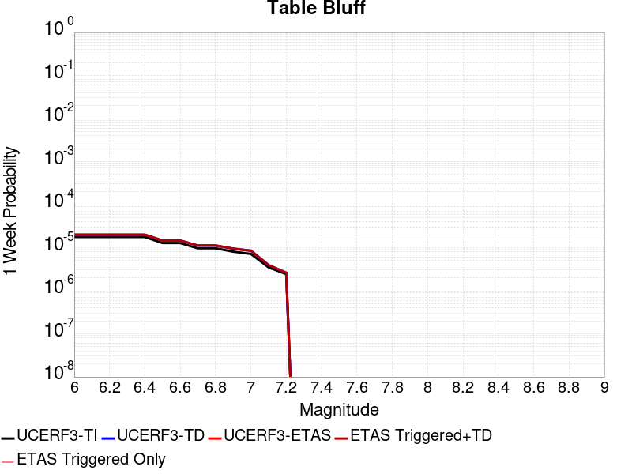 |  |  | 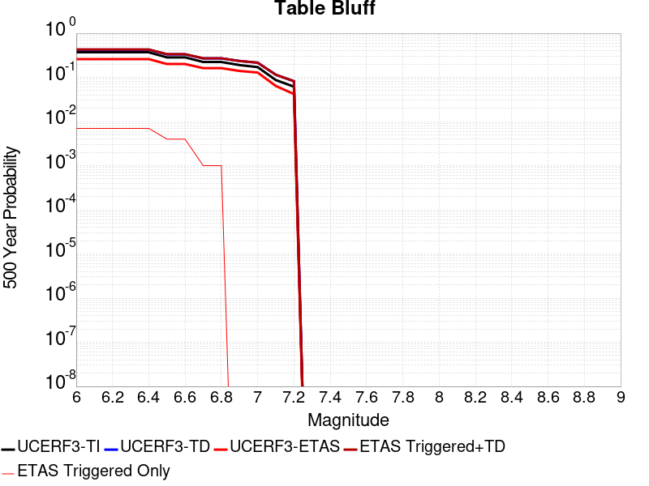 |

| Magnitude | 1 wk TI Prob | 1 wk TD Prob | 1 wk ETAS Prob | 1 wk ETAS/TD Gain | 1 wk ETAS Triggered+TD | 1 wk ETAS Triggered Only | 1 mo TI Prob | 1 mo TD Prob | 1 mo ETAS Prob | 1 mo ETAS/TD Gain | 1 mo ETAS Triggered+TD | 1 mo ETAS Triggered Only | 1 yr TI Prob | 1 yr TD Prob | 1 yr ETAS Prob | 1 yr ETAS/TD Gain | 1 yr ETAS Triggered+TD | 1 yr ETAS Triggered Only | 500 yr TI Prob | 500 yr TD Prob | 500 yr ETAS Prob | 500 yr ETAS/TD Gain | 500 yr ETAS Triggered+TD | 500 yr ETAS Triggered Only |
|-----|-----|-----|-----|-----|-----|-----|-----|-----|-----|-----|-----|-----|-----|-----|-----|-----|-----|-----|-----|-----|-----|-----|-----|-----|
| 6.0 | 1.7744695E-5 | 2.0045982E-5 | 0.0 | 0.0 | 2.0045982E-5 | 0.0 | 7.6046475E-5 | 8.590885E-5 | 0.0 | 0.0 | 8.590885E-5 | 0.0 | 9.2547253E-4 | 0.0010454969 | 0.001 | 0.95648307 | 0.0010454969 | 0.0 | 0.37057623 | 0.42502064 | 0.26 | 0.611735 | 0.42904547 | 0.007 |
| 6.1 | 1.7744695E-5 | 2.0045982E-5 | 0.0 | 0.0 | 2.0045982E-5 | 0.0 | 7.6046475E-5 | 8.590885E-5 | 0.0 | 0.0 | 8.590885E-5 | 0.0 | 9.2547253E-4 | 0.0010454969 | 0.001 | 0.95648307 | 0.0010454969 | 0.0 | 0.37057623 | 0.42502064 | 0.26 | 0.611735 | 0.42904547 | 0.007 |
| 6.2 | 1.7744695E-5 | 2.0045982E-5 | 0.0 | 0.0 | 2.0045982E-5 | 0.0 | 7.6046475E-5 | 8.590885E-5 | 0.0 | 0.0 | 8.590885E-5 | 0.0 | 9.2547253E-4 | 0.0010454969 | 0.001 | 0.95648307 | 0.0010454969 | 0.0 | 0.37057623 | 0.42502064 | 0.26 | 0.611735 | 0.42904547 | 0.007 |
| 6.3 | 1.7744695E-5 | 2.0045982E-5 | 0.0 | 0.0 | 2.0045982E-5 | 0.0 | 7.6046475E-5 | 8.590885E-5 | 0.0 | 0.0 | 8.590885E-5 | 0.0 | 9.2547253E-4 | 0.0010454969 | 0.001 | 0.95648307 | 0.0010454969 | 0.0 | 0.37057623 | 0.42502064 | 0.26 | 0.611735 | 0.42904547 | 0.007 |
| 6.4 | 1.7744695E-5 | 2.0045982E-5 | 0.0 | 0.0 | 2.0045982E-5 | 0.0 | 7.6046475E-5 | 8.590885E-5 | 0.0 | 0.0 | 8.590885E-5 | 0.0 | 9.2547253E-4 | 0.0010454969 | 0.001 | 0.95648307 | 0.0010454969 | 0.0 | 0.37057623 | 0.42502064 | 0.26 | 0.611735 | 0.42904547 | 0.007 |
| 6.5 | 1.2822383E-5 | 1.4648991E-5 | 0.0 | 0.0 | 1.4648991E-5 | 0.0 | 5.4951914E-5 | 6.278005E-5 | 0.0 | 0.0 | 6.278005E-5 | 0.0 | 6.6883414E-4 | 7.641079E-4 | 0.001 | 1.3087156 | 7.641079E-4 | 0.0 | 0.28432488 | 0.33327425 | 0.201 | 0.6031069 | 0.33594117 | 0.004 |
| 6.6 | 1.2822383E-5 | 1.4648991E-5 | 0.0 | 0.0 | 1.4648991E-5 | 0.0 | 5.4951914E-5 | 6.278005E-5 | 0.0 | 0.0 | 6.278005E-5 | 0.0 | 6.6883414E-4 | 7.641079E-4 | 0.001 | 1.3087156 | 7.641079E-4 | 0.0 | 0.28432488 | 0.33327425 | 0.201 | 0.6031069 | 0.33594117 | 0.004 |
| 6.7 | 9.690175E-6 | 1.1242029E-5 | 0.0 | 0.0 | 1.1242029E-5 | 0.0 | 4.1528663E-5 | 4.8179343E-5 | 0.0 | 0.0 | 4.8179343E-5 | 0.0 | 5.054941E-4 | 5.864451E-4 | 0.0 | 0.0 | 5.864451E-4 | 0.0 | 0.22338533 | 0.26974812 | 0.162 | 0.60056025 | 0.27047837 | 0.001 |
| 6.8 | 9.690175E-6 | 1.1242029E-5 | 0.0 | 0.0 | 1.1242029E-5 | 0.0 | 4.1528663E-5 | 4.8179343E-5 | 0.0 | 0.0 | 4.8179343E-5 | 0.0 | 5.054941E-4 | 5.864451E-4 | 0.0 | 0.0 | 5.864451E-4 | 0.0 | 0.22338533 | 0.26974812 | 0.162 | 0.60056025 | 0.27047837 | 0.001 |
| 6.9 | 8.096043E-6 | 9.514388E-6 | 0.0 | 0.0 | 9.514388E-6 | 0.0 | 3.4696863E-5 | 4.0775405E-5 | 0.0 | 0.0 | 4.0775405E-5 | 0.0 | 4.223524E-4 | 4.9634423E-4 | 0.0 | 0.0 | 4.9634423E-4 | 0.0 | 0.19040473 | 0.23553626 | 0.14 | 0.5943883 | 0.23553626 | 0.0 |
| 7.0 | 7.185906E-6 | 8.53022E-6 | 0.0 | 0.0 | 8.53022E-6 | 0.0 | 3.0796375E-5 | 3.6557663E-5 | 0.0 | 0.0 | 3.6557663E-5 | 0.0 | 3.7488135E-4 | 4.4501454E-4 | 0.0 | 0.0 | 4.4501454E-4 | 0.0 | 0.17095083 | 0.21547347 | 0.129 | 0.59868157 | 0.21547347 | 0.0 |
| 7.1 | 3.4937343E-6 | 3.950274E-6 | 0.0 | 0.0 | 3.950274E-6 | 0.0 | 1.497306E-5 | 1.6929675E-5 | 0.0 | 0.0 | 1.6929675E-5 | 0.0 | 1.8228177E-4 | 2.0610637E-4 | 0.0 | 0.0 | 2.0610637E-4 | 0.0 | 0.08711849 | 0.11502699 | 0.064 | 0.5563911 | 0.11502699 | 0.0 |
| 7.2 | 2.4388776E-6 | 2.618692E-6 | 0.0 | 0.0 | 2.618692E-6 | 0.0 | 1.0452291E-5 | 1.12229445E-5 | 0.0 | 0.0 | 1.12229445E-5 | 0.0 | 1.2724921E-4 | 1.3663564E-4 | 0.0 | 0.0 | 1.3663564E-4 | 0.0 | 0.061646607 | 0.081938766 | 0.042 | 0.5125779 | 0.081938766 | 0.0 |

## Channel Islands Western Deep Ramp
*[(top)](#table-of-contents)*

| 1 Week | 1 Month | 1 Year | 500 Year |
|-----|-----|-----|-----|
|  | 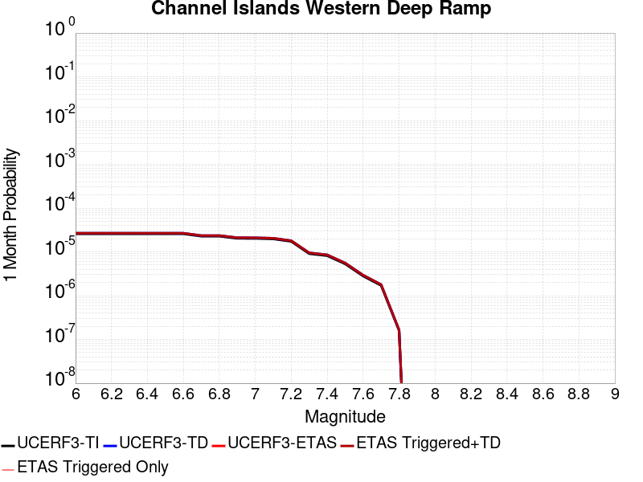 | 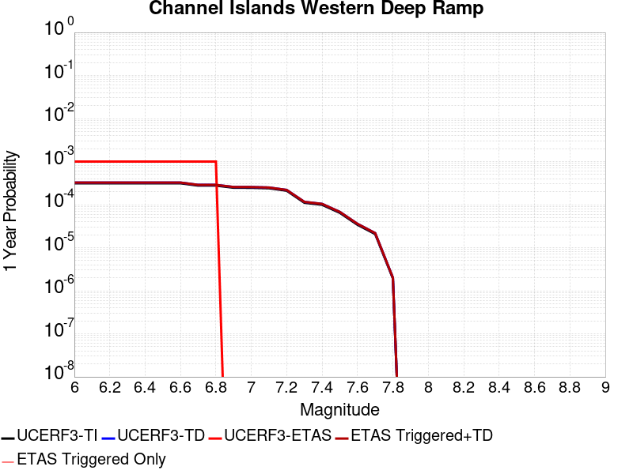 | 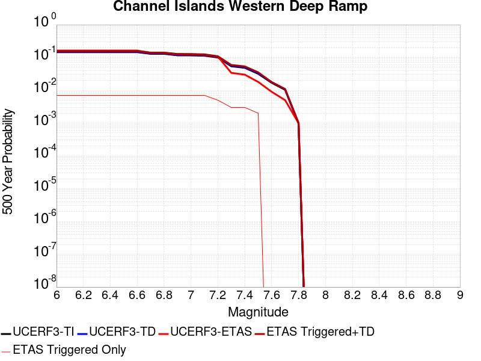 |

| Magnitude | 1 wk TI Prob | 1 wk TD Prob | 1 wk ETAS Prob | 1 wk ETAS/TD Gain | 1 wk ETAS Triggered+TD | 1 wk ETAS Triggered Only | 1 mo TI Prob | 1 mo TD Prob | 1 mo ETAS Prob | 1 mo ETAS/TD Gain | 1 mo ETAS Triggered+TD | 1 mo ETAS Triggered Only | 1 yr TI Prob | 1 yr TD Prob | 1 yr ETAS Prob | 1 yr ETAS/TD Gain | 1 yr ETAS Triggered+TD | 1 yr ETAS Triggered Only | 500 yr TI Prob | 500 yr TD Prob | 500 yr ETAS Prob | 500 yr ETAS/TD Gain | 500 yr ETAS Triggered+TD | 500 yr ETAS Triggered Only |
|-----|-----|-----|-----|-----|-----|-----|-----|-----|-----|-----|-----|-----|-----|-----|-----|-----|-----|-----|-----|-----|-----|-----|-----|-----|
| 6.0 | 6.0213506E-6 | 6.2422564E-6 | 0.0 | 0.0 | 6.2422564E-6 | 0.0 | 2.5805533E-5 | 2.6752277E-5 | 0.0 | 0.0 | 2.6752277E-5 | 0.0 | 3.1413708E-4 | 3.2566476E-4 | 0.001 | 3.0706425 | 3.2566476E-4 | 0.0 | 0.14537561 | 0.15134454 | 0.163 | 1.0770128 | 0.15728512 | 0.007 |
| 6.1 | 6.0213506E-6 | 6.2422564E-6 | 0.0 | 0.0 | 6.2422564E-6 | 0.0 | 2.5805533E-5 | 2.6752277E-5 | 0.0 | 0.0 | 2.6752277E-5 | 0.0 | 3.1413708E-4 | 3.2566476E-4 | 0.001 | 3.0706425 | 3.2566476E-4 | 0.0 | 0.14537561 | 0.15134454 | 0.163 | 1.0770128 | 0.15728512 | 0.007 |
| 6.2 | 6.0213506E-6 | 6.2422564E-6 | 0.0 | 0.0 | 6.2422564E-6 | 0.0 | 2.5805533E-5 | 2.6752277E-5 | 0.0 | 0.0 | 2.6752277E-5 | 0.0 | 3.1413708E-4 | 3.2566476E-4 | 0.001 | 3.0706425 | 3.2566476E-4 | 0.0 | 0.14537561 | 0.15134454 | 0.163 | 1.0770128 | 0.15728512 | 0.007 |
| 6.3 | 6.0213506E-6 | 6.2422564E-6 | 0.0 | 0.0 | 6.2422564E-6 | 0.0 | 2.5805533E-5 | 2.6752277E-5 | 0.0 | 0.0 | 2.6752277E-5 | 0.0 | 3.1413708E-4 | 3.2566476E-4 | 0.001 | 3.0706425 | 3.2566476E-4 | 0.0 | 0.14537561 | 0.15134454 | 0.163 | 1.0770128 | 0.15728512 | 0.007 |
| 6.4 | 6.0213506E-6 | 6.2422564E-6 | 0.0 | 0.0 | 6.2422564E-6 | 0.0 | 2.5805533E-5 | 2.6752277E-5 | 0.0 | 0.0 | 2.6752277E-5 | 0.0 | 3.1413708E-4 | 3.2566476E-4 | 0.001 | 3.0706425 | 3.2566476E-4 | 0.0 | 0.14537561 | 0.15134454 | 0.163 | 1.0770128 | 0.15728512 | 0.007 |
| 6.5 | 6.0213506E-6 | 6.2422564E-6 | 0.0 | 0.0 | 6.2422564E-6 | 0.0 | 2.5805533E-5 | 2.6752277E-5 | 0.0 | 0.0 | 2.6752277E-5 | 0.0 | 3.1413708E-4 | 3.2566476E-4 | 0.001 | 3.0706425 | 3.2566476E-4 | 0.0 | 0.14537561 | 0.15134454 | 0.163 | 1.0770128 | 0.15728512 | 0.007 |
| 6.6 | 6.0213506E-6 | 6.2422564E-6 | 0.0 | 0.0 | 6.2422564E-6 | 0.0 | 2.5805533E-5 | 2.6752277E-5 | 0.0 | 0.0 | 2.6752277E-5 | 0.0 | 3.1413708E-4 | 3.2566476E-4 | 0.001 | 3.0706425 | 3.2566476E-4 | 0.0 | 0.14537561 | 0.15134454 | 0.163 | 1.0770128 | 0.15728512 | 0.007 |
| 6.7 | 5.313309E-6 | 5.5137825E-6 | 0.0 | 0.0 | 5.5137825E-6 | 0.0 | 2.2771126E-5 | 2.3630306E-5 | 0.0 | 0.0 | 2.3630306E-5 | 0.0 | 2.772032E-4 | 2.8766505E-4 | 0.001 | 3.476265 | 2.8766505E-4 | 0.0 | 0.12944193 | 0.13497077 | 0.139 | 1.0298526 | 0.14102598 | 0.007 |
| 6.8 | 5.313309E-6 | 5.5137825E-6 | 0.0 | 0.0 | 5.5137825E-6 | 0.0 | 2.2771126E-5 | 2.3630306E-5 | 0.0 | 0.0 | 2.3630306E-5 | 0.0 | 2.772032E-4 | 2.8766505E-4 | 0.001 | 3.476265 | 2.8766505E-4 | 0.0 | 0.12944193 | 0.13497077 | 0.139 | 1.0298526 | 0.14102598 | 0.007 |
| 6.9 | 4.744377E-6 | 4.928874E-6 | 0.0 | 0.0 | 4.928874E-6 | 0.0 | 2.0332885E-5 | 2.1123597E-5 | 0.0 | 0.0 | 2.1123597E-5 | 0.0 | 2.4752476E-4 | 2.5715315E-4 | 0.0 | 0.0 | 2.5715315E-4 | 0.0 | 0.116423756 | 0.12158304 | 0.127 | 1.0445536 | 0.12773195 | 0.007 |
| 7.0 | 4.722209E-6 | 4.9059595E-6 | 0.0 | 0.0 | 4.9059595E-6 | 0.0 | 2.0237881E-5 | 2.1025391E-5 | 0.0 | 0.0 | 2.1025391E-5 | 0.0 | 2.4636835E-4 | 2.559578E-4 | 0.0 | 0.0 | 2.559578E-4 | 0.0 | 0.1159126 | 0.12105769 | 0.126 | 1.0408261 | 0.12721029 | 0.007 |
| 7.1 | 4.611174E-6 | 4.791112E-6 | 0.0 | 0.0 | 4.791112E-6 | 0.0 | 1.9762025E-5 | 2.0533196E-5 | 0.0 | 0.0 | 2.0533196E-5 | 0.0 | 2.4057609E-4 | 2.4996672E-4 | 0.0 | 0.0 | 2.4996672E-4 | 0.0 | 0.11334783 | 0.11841943 | 0.122 | 1.0302364 | 0.124590494 | 0.007 |
| 7.2 | 4.043994E-6 | 4.2029264E-6 | 0.0 | 0.0 | 4.2029264E-6 | 0.0 | 1.7331287E-5 | 1.8012439E-5 | 0.0 | 0.0 | 1.8012439E-5 | 0.0 | 2.10988E-4 | 2.1928293E-4 | 0.0 | 0.0 | 2.1928293E-4 | 0.0 | 0.10013014 | 0.10474763 | 0.107 | 1.0215029 | 0.10922389 | 0.005 |
| 7.3 | 2.1233036E-6 | 2.2239856E-6 | 0.0 | 0.0 | 2.2239856E-6 | 0.0 | 9.099841E-6 | 9.531332E-6 | 0.0 | 0.0 | 9.531332E-6 | 0.0 | 1.1078493E-4 | 1.16037845E-4 | 0.0 | 0.0 | 1.16037845E-4 | 0.0 | 0.053889144 | 0.05638515 | 0.034 | 0.6029957 | 0.059215993 | 0.003 |
| 7.4 | 1.9051884E-6 | 1.9962479E-6 | 0.0 | 0.0 | 1.9962479E-6 | 0.0 | 8.165067E-6 | 8.555321E-6 | 0.0 | 0.0 | 8.555321E-6 | 0.0 | 9.940516E-5 | 1.04156104E-4 | 0.0 | 0.0 | 1.04156104E-4 | 0.0 | 0.04848997 | 0.050761346 | 0.03 | 0.5910009 | 0.053609062 | 0.003 |
| 7.5 | 1.2408497E-6 | 1.3004465E-6 | 0.0 | 0.0 | 1.3004465E-6 | 0.0 | 5.317916E-6 | 5.5733303E-6 | 0.0 | 0.0 | 5.5733303E-6 | 0.0 | 6.4743705E-5 | 6.78532E-5 | 0.0 | 0.0 | 6.78532E-5 | 0.0 | 0.031854507 | 0.0333644 | 0.018 | 0.5394972 | 0.035297673 | 0.002 |
| 7.6 | 6.5440025E-7 | 6.867996E-7 | 0.0 | 0.0 | 6.867996E-7 | 0.0 | 2.8045695E-6 | 2.9434236E-6 | 0.0 | 0.0 | 2.9434236E-6 | 0.0 | 3.4145098E-5 | 3.583561E-5 | 0.0 | 0.0 | 3.583561E-5 | 0.0 | 0.016927926 | 0.017762374 | 0.009 | 0.506689 | 0.017762374 | 0.0 |
| 7.7 | 3.985963E-7 | 4.181771E-7 | 0.0 | 0.0 | 4.181771E-7 | 0.0 | 1.7082689E-6 | 1.7921865E-6 | 0.0 | 0.0 | 1.7921865E-6 | 0.0 | 2.0797976E-5 | 2.1819664E-5 | 0.0 | 0.0 | 2.1819664E-5 | 0.0 | 0.010345212 | 0.010853845 | 0.005 | 0.46066627 | 0.010853845 | 0.0 |
| 7.8 | 3.706329E-8 | 3.8509242E-8 | 0.0 | 0.0 | 3.8509242E-8 | 0.0 | 1.5884267E-7 | 1.650396E-7 | 0.0 | 0.0 | 1.650396E-7 | 0.0 | 1.9339077E-6 | 2.0093553E-6 | 0.0 | 0.0 | 2.0093553E-6 | 0.0 | 9.6648745E-4 | 0.0010042074 | 0.001 | 0.9958102 | 0.0010042074 | 0.0 |

## Malibu Coast alt 1
*[(top)](#table-of-contents)*

| 1 Week | 1 Month | 1 Year | 500 Year |
|-----|-----|-----|-----|
|  | 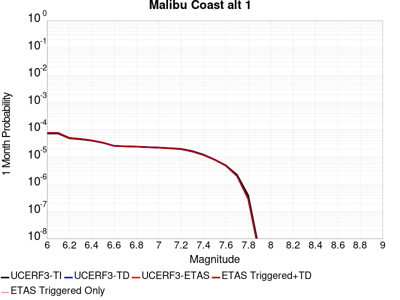 | 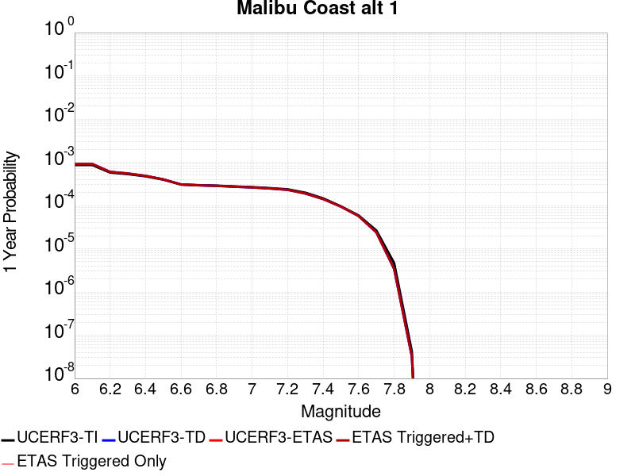 | 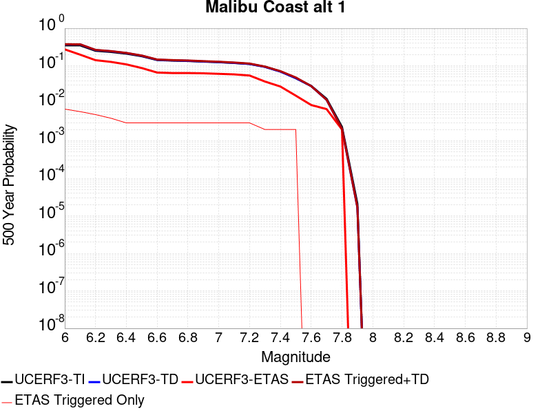 |

| Magnitude | 1 wk TI Prob | 1 wk TD Prob | 1 wk ETAS Prob | 1 wk ETAS/TD Gain | 1 wk ETAS Triggered+TD | 1 wk ETAS Triggered Only | 1 mo TI Prob | 1 mo TD Prob | 1 mo ETAS Prob | 1 mo ETAS/TD Gain | 1 mo ETAS Triggered+TD | 1 mo ETAS Triggered Only | 1 yr TI Prob | 1 yr TD Prob | 1 yr ETAS Prob | 1 yr ETAS/TD Gain | 1 yr ETAS Triggered+TD | 1 yr ETAS Triggered Only | 500 yr TI Prob | 500 yr TD Prob | 500 yr ETAS Prob | 500 yr ETAS/TD Gain | 500 yr ETAS Triggered+TD | 500 yr ETAS Triggered Only |
|-----|-----|-----|-----|-----|-----|-----|-----|-----|-----|-----|-----|-----|-----|-----|-----|-----|-----|-----|-----|-----|-----|-----|-----|-----|
| 6.0 | 1.6572556E-5 | 1.7513035E-5 | 0.0 | 0.0 | 1.7513035E-5 | 0.0 | 7.102331E-5 | 7.505382E-5 | 0.0 | 0.0 | 7.505382E-5 | 0.0 | 8.6436566E-4 | 9.134158E-4 | 0.0 | 0.0 | 9.134158E-4 | 0.0 | 0.35103062 | 0.37032267 | 0.274 | 0.7398953 | 0.3747304 | 0.007 |
| 6.1 | 1.6572556E-5 | 1.7513035E-5 | 0.0 | 0.0 | 1.7513035E-5 | 0.0 | 7.102331E-5 | 7.505382E-5 | 0.0 | 0.0 | 7.505382E-5 | 0.0 | 8.6436566E-4 | 9.134158E-4 | 0.0 | 0.0 | 9.134158E-4 | 0.0 | 0.35103062 | 0.37032267 | 0.198 | 0.53466886 | 0.37410074 | 0.006 |
| 6.2 | 1.1085717E-5 | 1.1503756E-5 | 0.0 | 0.0 | 1.1503756E-5 | 0.0 | 4.750935E-5 | 4.9300896E-5 | 0.0 | 0.0 | 4.9300896E-5 | 0.0 | 5.782728E-4 | 6.0007663E-4 | 0.0 | 0.0 | 6.0007663E-4 | 0.0 | 0.2511526 | 0.26162386 | 0.141 | 0.5389417 | 0.26531574 | 0.005 |
| 6.3 | 1.0208568E-5 | 1.0543856E-5 | 0.0 | 0.0 | 1.0543856E-5 | 0.0 | 4.375027E-5 | 4.5187186E-5 | 0.0 | 0.0 | 4.5187186E-5 | 0.0 | 5.325294E-4 | 5.5001804E-4 | 0.0 | 0.0 | 5.5001804E-4 | 0.0 | 0.23381805 | 0.24298768 | 0.127 | 0.52266026 | 0.24601573 | 0.004 |
| 6.4 | 9.0682315E-6 | 9.300461E-6 | 0.0 | 0.0 | 9.300461E-6 | 0.0 | 3.8863272E-5 | 3.985852E-5 | 0.0 | 0.0 | 3.985852E-5 | 0.0 | 4.730576E-4 | 4.8517148E-4 | 0.0 | 0.0 | 4.8517148E-4 | 0.0 | 0.21068102 | 0.21804665 | 0.109 | 0.49989304 | 0.22039251 | 0.003 |
| 6.5 | 7.605796E-6 | 7.713852E-6 | 0.0 | 0.0 | 7.713852E-6 | 0.0 | 3.259586E-5 | 3.3058954E-5 | 0.0 | 0.0 | 3.3058954E-5 | 0.0 | 3.9678233E-4 | 4.0241974E-4 | 0.0 | 0.0 | 4.0241974E-4 | 0.0 | 0.17998327 | 0.18505119 | 0.087 | 0.4701402 | 0.18749604 | 0.003 |
| 6.6 | 5.889873E-6 | 5.853447E-6 | 0.0 | 0.0 | 5.853447E-6 | 0.0 | 2.5242069E-5 | 2.508596E-5 | 0.0 | 0.0 | 2.508596E-5 | 0.0 | 3.0727885E-4 | 3.0537887E-4 | 0.0 | 0.0 | 3.0537887E-4 | 0.0 | 0.14243905 | 0.14446066 | 0.066 | 0.45687178 | 0.14702728 | 0.003 |
| 6.7 | 5.66586E-6 | 5.616316E-6 | 0.0 | 0.0 | 5.616316E-6 | 0.0 | 2.428203E-5 | 2.4069703E-5 | 0.0 | 0.0 | 2.4069703E-5 | 0.0 | 2.955936E-4 | 2.930093E-4 | 0.0 | 0.0 | 2.930093E-4 | 0.0 | 0.13741247 | 0.13915536 | 0.064 | 0.45991758 | 0.1417379 | 0.003 |
| 6.8 | 5.521556E-6 | 5.464536E-6 | 0.0 | 0.0 | 5.464536E-6 | 0.0 | 2.3663597E-5 | 2.341923E-5 | 0.0 | 0.0 | 2.341923E-5 | 0.0 | 2.880662E-4 | 2.8509193E-4 | 0.0 | 0.0 | 2.8509193E-4 | 0.0 | 0.13415888 | 0.13573976 | 0.064 | 0.47149044 | 0.13833255 | 0.003 |
| 6.9 | 5.29752E-6 | 5.225902E-6 | 0.0 | 0.0 | 5.225902E-6 | 0.0 | 2.270346E-5 | 2.239653E-5 | 0.0 | 0.0 | 2.239653E-5 | 0.0 | 2.7637955E-4 | 2.7264372E-4 | 0.0 | 0.0 | 2.7264372E-4 | 0.0 | 0.12908325 | 0.13034172 | 0.063 | 0.48334482 | 0.13295071 | 0.003 |
| 7.0 | 5.106743E-6 | 5.0242843E-6 | 0.0 | 0.0 | 5.0242843E-6 | 0.0 | 2.1885859E-5 | 2.153247E-5 | 0.0 | 0.0 | 2.153247E-5 | 0.0 | 2.6642776E-4 | 2.6212636E-4 | 0.0 | 0.0 | 2.6212636E-4 | 0.0 | 0.124737665 | 0.12575465 | 0.061 | 0.4850715 | 0.1283774 | 0.003 |
| 7.1 | 4.8469647E-6 | 4.747954E-6 | 0.0 | 0.0 | 4.747954E-6 | 0.0 | 2.0772539E-5 | 2.0348216E-5 | 0.0 | 0.0 | 2.0348216E-5 | 0.0 | 2.528763E-4 | 2.4771143E-4 | 0.0 | 0.0 | 2.4771143E-4 | 0.0 | 0.11878545 | 0.11942786 | 0.059 | 0.4940221 | 0.122069575 | 0.003 |
| 7.2 | 4.545514E-6 | 4.426936E-6 | 0.0 | 0.0 | 4.426936E-6 | 0.0 | 1.9480629E-5 | 1.8972445E-5 | 0.0 | 0.0 | 1.8972445E-5 | 0.0 | 2.3715083E-4 | 2.3096509E-4 | 0.0 | 0.0 | 2.3096509E-4 | 0.0 | 0.11182766 | 0.11202677 | 0.055 | 0.49095407 | 0.11469069 | 0.003 |
| 7.3 | 3.794097E-6 | 3.6345275E-6 | 0.0 | 0.0 | 3.6345275E-6 | 0.0 | 1.6260314E-5 | 1.5576454E-5 | 0.0 | 0.0 | 1.5576454E-5 | 0.0 | 1.9795135E-4 | 1.8962685E-4 | 0.0 | 0.0 | 1.8962685E-4 | 0.0 | 0.09424413 | 0.093320176 | 0.038 | 0.40720028 | 0.095133536 | 0.002 |
| 7.4 | 2.808217E-6 | 2.7075541E-6 | 0.0 | 0.0 | 2.7075541E-6 | 0.0 | 1.203516E-5 | 1.1603752E-5 | 0.0 | 0.0 | 1.1603752E-5 | 0.0 | 1.4651821E-4 | 1.4126654E-4 | 0.0 | 0.0 | 1.4126654E-4 | 0.0 | 0.070645 | 0.07002917 | 0.028 | 0.3998334 | 0.07188911 | 0.002 |
| 7.5 | 1.83809E-6 | 1.8119547E-6 | 0.0 | 0.0 | 1.8119547E-6 | 0.0 | 7.877505E-6 | 7.765497E-6 | 0.0 | 0.0 | 7.765497E-6 | 0.0 | 9.59044E-5 | 9.454085E-5 | 0.0 | 0.0 | 9.454085E-5 | 0.0 | 0.046822842 | 0.046934057 | 0.016 | 0.34090385 | 0.048840187 | 0.002 |
| 7.6 | 1.1292672E-6 | 1.095597E-6 | 0.0 | 0.0 | 1.095597E-6 | 0.0 | 4.839708E-6 | 4.695407E-6 | 0.0 | 0.0 | 4.695407E-6 | 0.0 | 5.8921847E-5 | 5.7165096E-5 | 0.0 | 0.0 | 5.7165096E-5 | 0.0 | 0.029032024 | 0.028739478 | 0.009 | 0.31315807 | 0.028739478 | 0.0 |
| 7.7 | 5.065272E-7 | 4.5839835E-7 | 0.0 | 0.0 | 4.5839835E-7 | 0.0 | 2.170829E-6 | 1.964563E-6 | 0.0 | 0.0 | 1.964563E-6 | 0.0 | 2.6429525E-5 | 2.3918303E-5 | 0.0 | 0.0 | 2.3918303E-5 | 0.0 | 0.013128003 | 0.012394151 | 0.007 | 0.56478256 | 0.012394151 | 0.0 |
| 7.8 | 8.952991E-8 | 6.586264E-8 | 0.0 | 0.0 | 6.586264E-8 | 0.0 | 3.8369956E-7 | 2.8226845E-7 | 0.0 | 0.0 | 2.8226845E-7 | 0.0 | 4.671532E-6 | 3.436613E-6 | 0.0 | 0.0 | 3.436613E-6 | 0.0 | 0.0023330457 | 0.0020811306 | 0.002 | 0.9610161 | 0.0020811306 | 0.0 |
| 7.9 | 8.007447E-10 | 6.1465133E-10 | 0.0 | 0.0 | 6.1465133E-10 | 0.0 | 3.4317629E-9 | 2.6342197E-9 | 0.0 | 0.0 | 2.6342197E-9 | 0.0 | 4.1781714E-8 | 3.2071625E-8 | 0.0 | 0.0 | 3.2071625E-8 | 0.0 | 2.0890639E-5 | 1.6903754E-5 | 0.0 | 0.0 | 1.6903754E-5 | 0.0 |

## San Pedro Basin
*[(top)](#table-of-contents)*

| 1 Week | 1 Month | 1 Year | 500 Year |
|-----|-----|-----|-----|
| 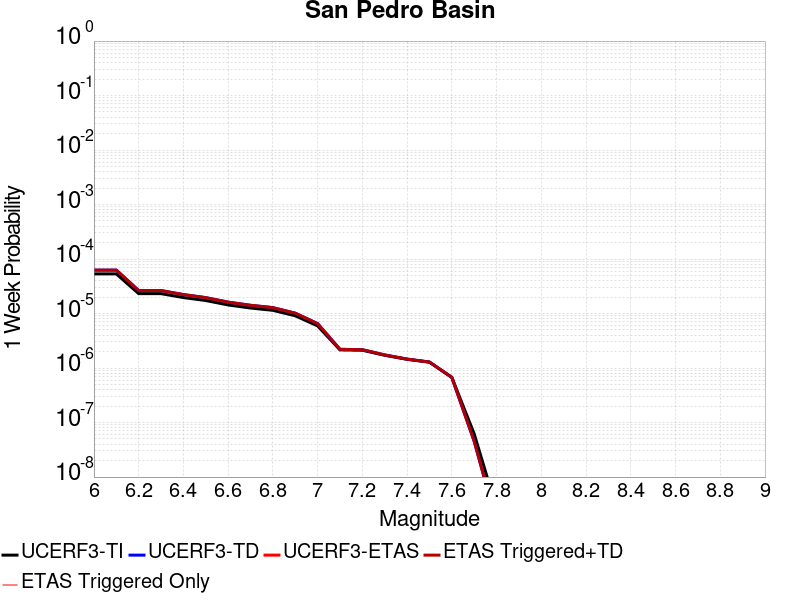 |  | 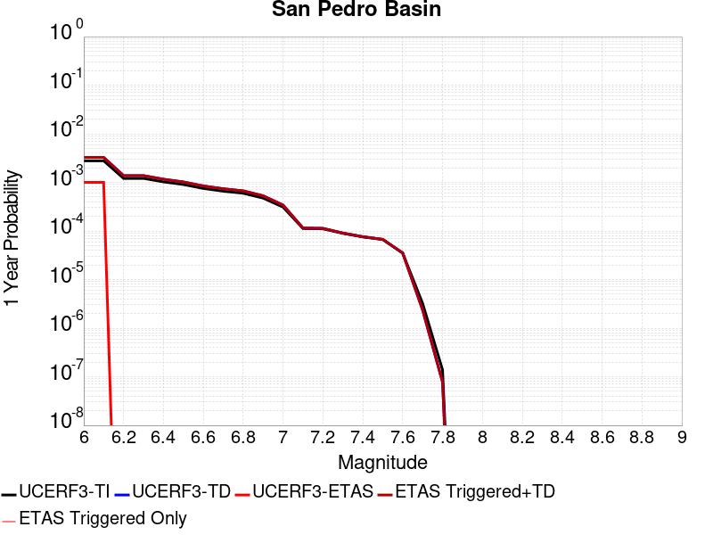 | 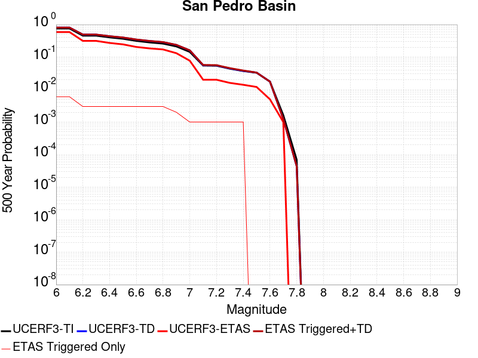 |

| Magnitude | 1 wk TI Prob | 1 wk TD Prob | 1 wk ETAS Prob | 1 wk ETAS/TD Gain | 1 wk ETAS Triggered+TD | 1 wk ETAS Triggered Only | 1 mo TI Prob | 1 mo TD Prob | 1 mo ETAS Prob | 1 mo ETAS/TD Gain | 1 mo ETAS Triggered+TD | 1 mo ETAS Triggered Only | 1 yr TI Prob | 1 yr TD Prob | 1 yr ETAS Prob | 1 yr ETAS/TD Gain | 1 yr ETAS Triggered+TD | 1 yr ETAS Triggered Only | 500 yr TI Prob | 500 yr TD Prob | 500 yr ETAS Prob | 500 yr ETAS/TD Gain | 500 yr ETAS Triggered+TD | 500 yr ETAS Triggered Only |
|-----|-----|-----|-----|-----|-----|-----|-----|-----|-----|-----|-----|-----|-----|-----|-----|-----|-----|-----|-----|-----|-----|-----|-----|-----|
| 6.0 | 5.3449043E-5 | 6.275728E-5 | 0.0 | 0.0 | 6.275728E-5 | 0.0 | 2.2904722E-4 | 2.6893543E-4 | 0.0 | 0.0 | 2.6893543E-4 | 0.0 | 0.0027850836 | 0.003269966 | 0.001 | 0.30581358 | 0.003269966 | 0.0 | 0.7520392 | 0.80391306 | 0.586 | 0.7289345 | 0.8050896 | 0.006 |
| 6.1 | 5.3449043E-5 | 6.275728E-5 | 0.0 | 0.0 | 6.275728E-5 | 0.0 | 2.2904722E-4 | 2.6893543E-4 | 0.0 | 0.0 | 2.6893543E-4 | 0.0 | 0.0027850836 | 0.003269966 | 0.001 | 0.30581358 | 0.003269966 | 0.0 | 0.7520392 | 0.80391306 | 0.586 | 0.7289345 | 0.8050896 | 0.006 |
| 6.2 | 2.3189454E-5 | 2.6433949E-5 | 0.0 | 0.0 | 2.6433949E-5 | 0.0 | 9.9379584E-5 | 1.1328369E-4 | 0.0 | 0.0 | 1.1328369E-4 | 0.0 | 0.0012092749 | 0.0013784027 | 0.0 | 0.0 | 0.0013784027 | 0.0 | 0.45392737 | 0.4888566 | 0.313 | 0.6402696 | 0.49039003 | 0.003 |
| 6.3 | 2.3189454E-5 | 2.6433949E-5 | 0.0 | 0.0 | 2.6433949E-5 | 0.0 | 9.9379584E-5 | 1.1328369E-4 | 0.0 | 0.0 | 1.1328369E-4 | 0.0 | 0.0012092749 | 0.0013784027 | 0.0 | 0.0 | 0.0013784027 | 0.0 | 0.45392737 | 0.4888566 | 0.313 | 0.6402696 | 0.49039003 | 0.003 |
| 6.4 | 1.966056E-5 | 2.2294289E-5 | 0.0 | 0.0 | 2.2294289E-5 | 0.0 | 8.425682E-5 | 9.554368E-5 | 0.0 | 0.0 | 9.554368E-5 | 0.0 | 0.001025344 | 0.0011626631 | 0.0 | 0.0 | 0.0011626631 | 0.0 | 0.40126428 | 0.4352543 | 0.271 | 0.6226245 | 0.43694854 | 0.003 |
| 6.5 | 1.7342953E-5 | 1.960026E-5 | 0.0 | 0.0 | 1.960026E-5 | 0.0 | 7.4324824E-5 | 8.399861E-5 | 0.0 | 0.0 | 8.399861E-5 | 0.0 | 9.04529E-4 | 0.0010222397 | 0.0 | 0.0 | 0.0010222397 | 0.0 | 0.36394432 | 0.39686552 | 0.245 | 0.6173376 | 0.39867494 | 0.003 |
| 6.6 | 1.439804E-5 | 1.6206452E-5 | 0.0 | 0.0 | 1.6206452E-5 | 0.0 | 6.170443E-5 | 6.945455E-5 | 0.0 | 0.0 | 6.945455E-5 | 0.0 | 7.509924E-4 | 8.453127E-4 | 0.0 | 0.0 | 8.453127E-4 | 0.0 | 0.3131486 | 0.3438282 | 0.204 | 0.5933196 | 0.3457967 | 0.003 |
| 6.7 | 1.2634884E-5 | 1.4185382E-5 | 0.0 | 0.0 | 1.4185382E-5 | 0.0 | 5.414838E-5 | 6.0793245E-5 | 0.0 | 0.0 | 6.0793245E-5 | 0.0 | 6.590571E-4 | 7.3993637E-4 | 0.0 | 0.0 | 7.3993637E-4 | 0.0 | 0.2808154 | 0.30996004 | 0.184 | 0.5936249 | 0.31203017 | 0.003 |
| 6.8 | 1.146091E-5 | 1.284386E-5 | 0.0 | 0.0 | 1.284386E-5 | 0.0 | 4.911726E-5 | 5.504412E-5 | 0.0 | 0.0 | 5.504412E-5 | 0.0 | 5.9783855E-4 | 6.699853E-4 | 0.0 | 0.0 | 6.699853E-4 | 0.0 | 0.25844702 | 0.28582242 | 0.171 | 0.5982736 | 0.28796497 | 0.003 |
| 6.9 | 9.109035E-6 | 1.0166197E-5 | 0.0 | 0.0 | 1.0166197E-5 | 0.0 | 3.9038136E-5 | 4.3568845E-5 | 0.0 | 0.0 | 4.3568845E-5 | 0.0 | 4.7518566E-4 | 5.303491E-4 | 0.0 | 0.0 | 5.303491E-4 | 0.0 | 0.21152084 | 0.23489259 | 0.131 | 0.5577017 | 0.2364228 | 0.002 |
| 7.0 | 5.9351028E-6 | 6.5434783E-6 | 0.0 | 0.0 | 6.5434783E-6 | 0.0 | 2.5435906E-5 | 2.8043307E-5 | 0.0 | 0.0 | 2.8043307E-5 | 0.0 | 3.0963816E-4 | 3.41397E-4 | 0.0 | 0.0 | 3.41397E-4 | 0.0 | 0.1434504 | 0.15985027 | 0.077 | 0.48170078 | 0.16069043 | 0.001 |
| 7.1 | 2.1557585E-6 | 2.2046897E-6 | 0.0 | 0.0 | 2.2046897E-6 | 0.0 | 9.238933E-6 | 9.448637E-6 | 0.0 | 0.0 | 9.448637E-6 | 0.0 | 1.1247819E-4 | 1.1503124E-4 | 0.0 | 0.0 | 1.1503124E-4 | 0.0 | 0.054689903 | 0.056021728 | 0.02 | 0.35700434 | 0.05696571 | 0.001 |
| 7.2 | 2.1251979E-6 | 2.1730948E-6 | 0.0 | 0.0 | 2.1730948E-6 | 0.0 | 9.107958E-6 | 9.313231E-6 | 0.0 | 0.0 | 9.313231E-6 | 0.0 | 1.1088375E-4 | 1.1338284E-4 | 0.0 | 0.0 | 1.1338284E-4 | 0.0 | 0.053935897 | 0.055243198 | 0.02 | 0.3620355 | 0.056187958 | 0.001 |
| 7.3 | 1.7145798E-6 | 1.7406539E-6 | 0.0 | 0.0 | 1.7406539E-6 | 0.0 | 7.3481783E-6 | 7.4599243E-6 | 0.0 | 0.0 | 7.4599243E-6 | 0.0 | 8.94604E-5 | 9.082089E-5 | 0.0 | 0.0 | 9.082089E-5 | 0.0 | 0.043746468 | 0.044507805 | 0.016 | 0.3594875 | 0.045463298 | 0.001 |
| 7.4 | 1.4467993E-6 | 1.4612232E-6 | 0.0 | 0.0 | 1.4612232E-6 | 0.0 | 6.200554E-6 | 6.262371E-6 | 0.0 | 0.0 | 6.262371E-6 | 0.0 | 7.548913E-5 | 7.624177E-5 | 0.0 | 0.0 | 7.624177E-5 | 0.0 | 0.037042487 | 0.03751187 | 0.014 | 0.3732152 | 0.03847436 | 0.001 |
| 7.5 | 1.2803735E-6 | 1.2905342E-6 | 0.0 | 0.0 | 1.2905342E-6 | 0.0 | 5.487303E-6 | 5.5308496E-6 | 0.0 | 0.0 | 5.5308496E-6 | 0.0 | 6.680587E-5 | 6.7336085E-5 | 0.0 | 0.0 | 6.7336085E-5 | 0.0 | 0.032852296 | 0.03321264 | 0.012 | 0.36130825 | 0.03321264 | 0.0 |
| 7.6 | 6.755009E-7 | 6.7556357E-7 | 0.0 | 0.0 | 6.7556357E-7 | 0.0 | 2.8950008E-6 | 2.8952695E-6 | 0.0 | 0.0 | 2.8952695E-6 | 0.0 | 3.5246063E-5 | 3.5249395E-5 | 0.0 | 0.0 | 3.5249395E-5 | 0.0 | 0.01746896 | 0.017547062 | 0.005 | 0.284948 | 0.017547062 | 0.0 |
| 7.7 | 6.211885E-8 | 4.5569205E-8 | 0.0 | 0.0 | 4.5569205E-8 | 0.0 | 2.6622362E-7 | 1.9529658E-7 | 0.0 | 0.0 | 1.9529658E-7 | 0.0 | 3.2412677E-6 | 2.3777334E-6 | 0.0 | 0.0 | 2.3777334E-6 | 0.0 | 0.001619324 | 0.001238695 | 0.001 | 0.8073012 | 0.001238695 | 0.0 |
| 7.8 | 2.6580573E-9 | 1.4935976E-9 | 0.0 | 0.0 | 1.4935976E-9 | 0.0 | 1.1391674E-8 | 6.4011325E-9 | 0.0 | 0.0 | 6.4011325E-9 | 0.0 | 1.3869362E-7 | 7.793379E-8 | 0.0 | 0.0 | 7.793379E-8 | 0.0 | 6.9344416E-5 | 4.369537E-5 | 0.0 | 0.0 | 4.369537E-5 | 0.0 |

## McLean Lake
*[(top)](#table-of-contents)*

| 1 Week | 1 Month | 1 Year | 500 Year |
|-----|-----|-----|-----|
| 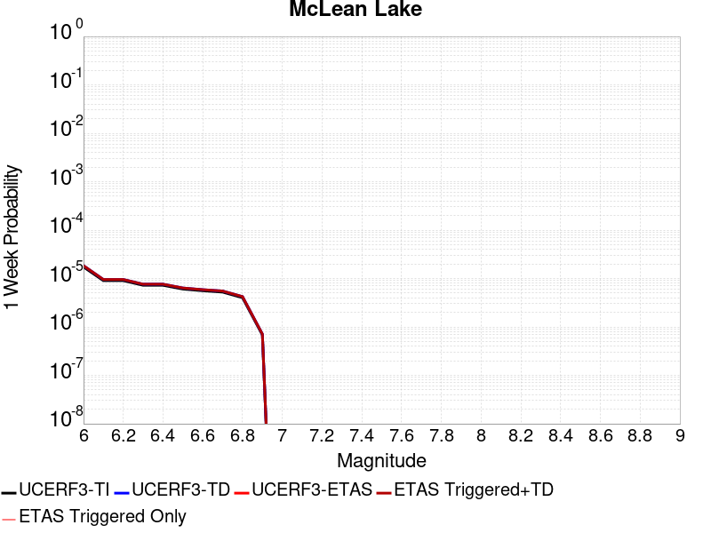 |  | 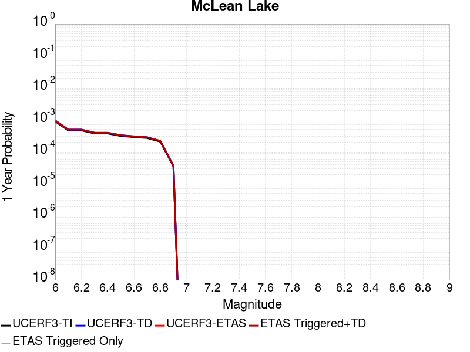 | 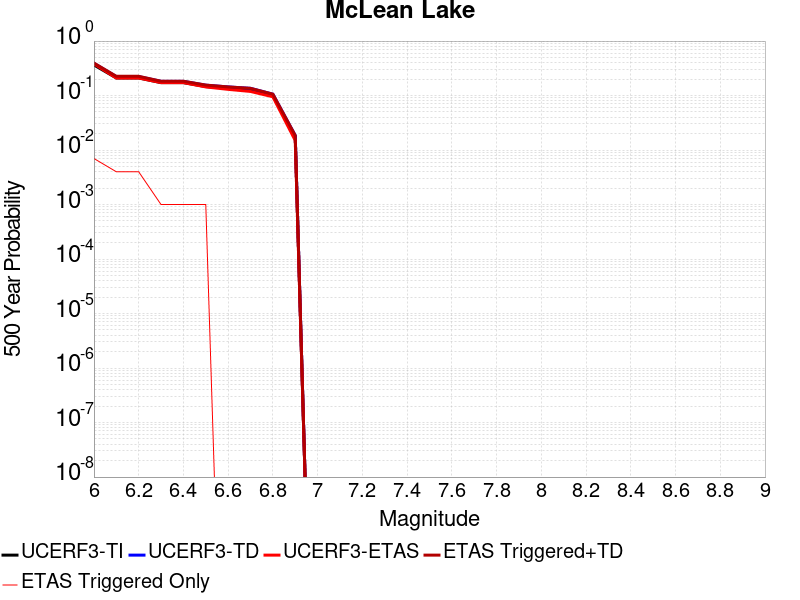 |

| Magnitude | 1 wk TI Prob | 1 wk TD Prob | 1 wk ETAS Prob | 1 wk ETAS/TD Gain | 1 wk ETAS Triggered+TD | 1 wk ETAS Triggered Only | 1 mo TI Prob | 1 mo TD Prob | 1 mo ETAS Prob | 1 mo ETAS/TD Gain | 1 mo ETAS Triggered+TD | 1 mo ETAS Triggered Only | 1 yr TI Prob | 1 yr TD Prob | 1 yr ETAS Prob | 1 yr ETAS/TD Gain | 1 yr ETAS Triggered+TD | 1 yr ETAS Triggered Only | 500 yr TI Prob | 500 yr TD Prob | 500 yr ETAS Prob | 500 yr ETAS/TD Gain | 500 yr ETAS Triggered+TD | 500 yr ETAS Triggered Only |
|-----|-----|-----|-----|-----|-----|-----|-----|-----|-----|-----|-----|-----|-----|-----|-----|-----|-----|-----|-----|-----|-----|-----|-----|-----|
| 6.0 | 1.7360222E-5 | 1.8438514E-5 | 0.0 | 0.0 | 1.8438514E-5 | 0.0 | 7.439883E-5 | 7.902008E-5 | 0.0 | 0.0 | 7.902008E-5 | 0.0 | 9.0542925E-4 | 9.6169306E-4 | 0.0 | 0.0 | 9.6169306E-4 | 0.0 | 0.3642308 | 0.3901933 | 0.382 | 0.97900194 | 0.39446196 | 0.007 |
| 6.1 | 9.062689E-6 | 9.563124E-6 | 0.0 | 0.0 | 9.563124E-6 | 0.0 | 3.8839516E-5 | 4.0984225E-5 | 0.0 | 0.0 | 4.0984225E-5 | 0.0 | 4.727685E-4 | 4.988775E-4 | 0.0 | 0.0 | 4.988775E-4 | 0.0 | 0.21056688 | 0.2226793 | 0.21 | 0.9430602 | 0.2257886 | 0.004 |
| 6.2 | 9.062689E-6 | 9.563124E-6 | 0.0 | 0.0 | 9.563124E-6 | 0.0 | 3.8839516E-5 | 4.0984225E-5 | 0.0 | 0.0 | 4.0984225E-5 | 0.0 | 4.727685E-4 | 4.988775E-4 | 0.0 | 0.0 | 4.988775E-4 | 0.0 | 0.21056688 | 0.2226793 | 0.21 | 0.9430602 | 0.2257886 | 0.004 |
| 6.3 | 7.2575485E-6 | 7.645233E-6 | 0.0 | 0.0 | 7.645233E-6 | 0.0 | 3.110341E-5 | 3.2764914E-5 | 0.0 | 0.0 | 3.2764914E-5 | 0.0 | 3.786182E-4 | 3.9884693E-4 | 0.0 | 0.0 | 3.9884693E-4 | 0.0 | 0.17249899 | 0.18243085 | 0.173 | 0.94830453 | 0.18324842 | 0.001 |
| 6.4 | 7.2575485E-6 | 7.645233E-6 | 0.0 | 0.0 | 7.645233E-6 | 0.0 | 3.110341E-5 | 3.2764914E-5 | 0.0 | 0.0 | 3.2764914E-5 | 0.0 | 3.786182E-4 | 3.9884693E-4 | 0.0 | 0.0 | 3.9884693E-4 | 0.0 | 0.17249899 | 0.18243085 | 0.173 | 0.94830453 | 0.18324842 | 0.001 |
| 6.5 | 6.06582E-6 | 6.3853668E-6 | 0.0 | 0.0 | 6.3853668E-6 | 0.0 | 2.5996113E-5 | 2.7365608E-5 | 0.0 | 0.0 | 2.7365608E-5 | 0.0 | 3.164567E-4 | 3.331318E-4 | 0.0 | 0.0 | 3.331318E-4 | 0.0 | 0.14636655 | 0.15497303 | 0.144 | 0.929194 | 0.15581805 | 0.001 |
| 6.6 | 5.598744E-6 | 5.893207E-6 | 0.0 | 0.0 | 5.893207E-6 | 0.0 | 2.3994397E-5 | 2.5256393E-5 | 0.0 | 0.0 | 2.5256393E-5 | 0.0 | 2.9209262E-4 | 3.0745956E-4 | 0.0 | 0.0 | 3.0745956E-4 | 0.0 | 0.13590075 | 0.14403483 | 0.13 | 0.90255946 | 0.14403483 | 0.0 |
| 6.7 | 5.246996E-6 | 5.523166E-6 | 0.0 | 0.0 | 5.523166E-6 | 0.0 | 2.2486933E-5 | 2.3670533E-5 | 0.0 | 0.0 | 2.3670533E-5 | 0.0 | 2.73744E-4 | 2.8815694E-4 | 0.0 | 0.0 | 2.8815694E-4 | 0.0 | 0.1279345 | 0.1357214 | 0.119 | 0.8767961 | 0.1357214 | 0.0 |
| 6.8 | 4.02324E-6 | 4.2346587E-6 | 0.0 | 0.0 | 4.2346587E-6 | 0.0 | 1.7242342E-5 | 1.8148445E-5 | 0.0 | 0.0 | 1.8148445E-5 | 0.0 | 2.099053E-4 | 2.2094083E-4 | 0.0 | 0.0 | 2.2094083E-4 | 0.0 | 0.09964277 | 0.10607833 | 0.095 | 0.8955646 | 0.10607833 | 0.0 |
| 6.9 | 6.835972E-7 | 7.1234666E-7 | 0.0 | 0.0 | 7.1234666E-7 | 0.0 | 2.9296991E-6 | 3.0529125E-6 | 0.0 | 0.0 | 3.0529125E-6 | 0.0 | 3.56685E-5 | 3.7168895E-5 | 0.0 | 0.0 | 3.7168895E-5 | 0.0 | 0.017676475 | 0.018498356 | 0.015 | 0.8108829 | 0.018498356 | 0.0 |

## Pitas Point (Lower West)
*[(top)](#table-of-contents)*

| 1 Week | 1 Month | 1 Year | 500 Year |
|-----|-----|-----|-----|
| 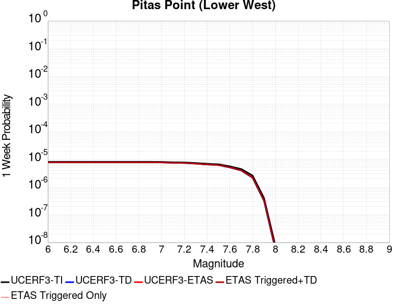 | 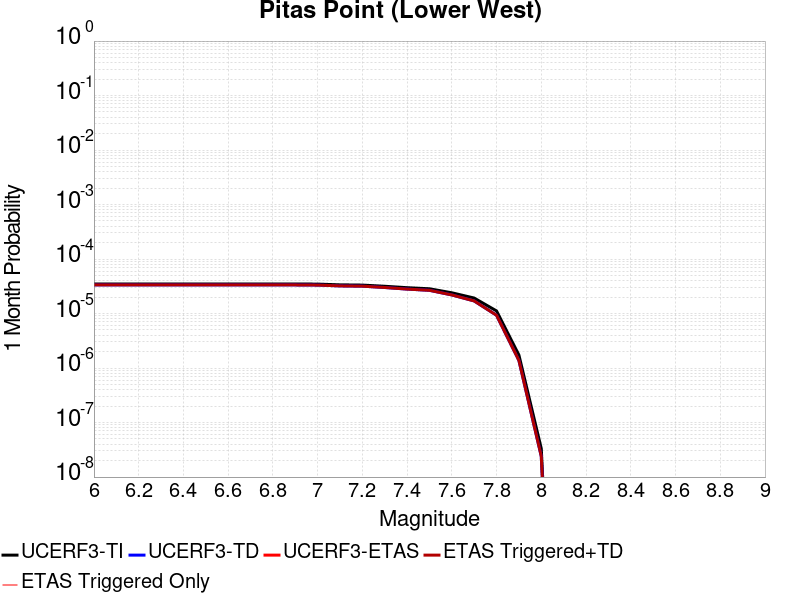 |  | 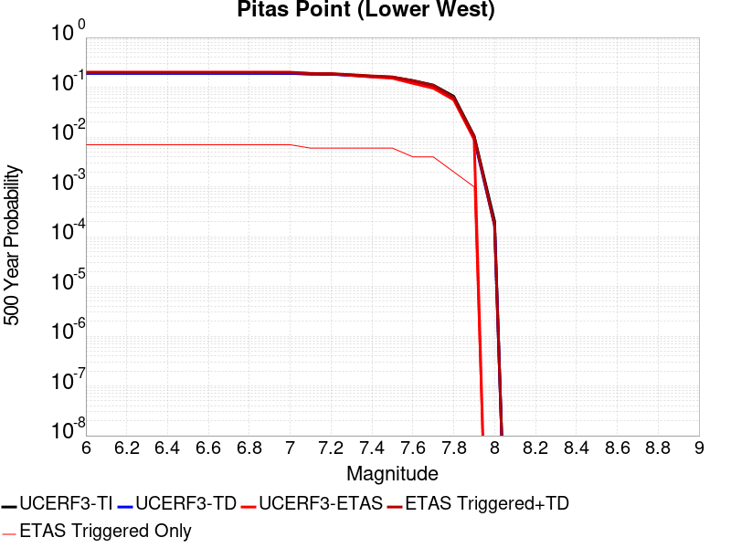 |

| Magnitude | 1 wk TI Prob | 1 wk TD Prob | 1 wk ETAS Prob | 1 wk ETAS/TD Gain | 1 wk ETAS Triggered+TD | 1 wk ETAS Triggered Only | 1 mo TI Prob | 1 mo TD Prob | 1 mo ETAS Prob | 1 mo ETAS/TD Gain | 1 mo ETAS Triggered+TD | 1 mo ETAS Triggered Only | 1 yr TI Prob | 1 yr TD Prob | 1 yr ETAS Prob | 1 yr ETAS/TD Gain | 1 yr ETAS Triggered+TD | 1 yr ETAS Triggered Only | 500 yr TI Prob | 500 yr TD Prob | 500 yr ETAS Prob | 500 yr ETAS/TD Gain | 500 yr ETAS Triggered+TD | 500 yr ETAS Triggered Only |
|-----|-----|-----|-----|-----|-----|-----|-----|-----|-----|-----|-----|-----|-----|-----|-----|-----|-----|-----|-----|-----|-----|-----|-----|-----|
| 6.0 | 8.151497E-6 | 7.823098E-6 | 0.0 | 0.0 | 7.823098E-6 | 0.0 | 3.493452E-5 | 3.3527136E-5 | 0.0 | 0.0 | 3.3527136E-5 | 0.0 | 4.252448E-4 | 4.0811716E-4 | 0.0 | 0.0 | 4.0811716E-4 | 0.0 | 0.1915752 | 0.19099484 | 0.201 | 1.0523845 | 0.19665788 | 0.007 |
| 6.1 | 8.151497E-6 | 7.823098E-6 | 0.0 | 0.0 | 7.823098E-6 | 0.0 | 3.493452E-5 | 3.3527136E-5 | 0.0 | 0.0 | 3.3527136E-5 | 0.0 | 4.252448E-4 | 4.0811716E-4 | 0.0 | 0.0 | 4.0811716E-4 | 0.0 | 0.1915752 | 0.19099484 | 0.201 | 1.0523845 | 0.19665788 | 0.007 |
| 6.2 | 8.151497E-6 | 7.823098E-6 | 0.0 | 0.0 | 7.823098E-6 | 0.0 | 3.493452E-5 | 3.3527136E-5 | 0.0 | 0.0 | 3.3527136E-5 | 0.0 | 4.252448E-4 | 4.0811716E-4 | 0.0 | 0.0 | 4.0811716E-4 | 0.0 | 0.1915752 | 0.19099484 | 0.201 | 1.0523845 | 0.19665788 | 0.007 |
| 6.3 | 8.151497E-6 | 7.823098E-6 | 0.0 | 0.0 | 7.823098E-6 | 0.0 | 3.493452E-5 | 3.3527136E-5 | 0.0 | 0.0 | 3.3527136E-5 | 0.0 | 4.252448E-4 | 4.0811716E-4 | 0.0 | 0.0 | 4.0811716E-4 | 0.0 | 0.1915752 | 0.19099484 | 0.201 | 1.0523845 | 0.19665788 | 0.007 |
| 6.4 | 8.151497E-6 | 7.823098E-6 | 0.0 | 0.0 | 7.823098E-6 | 0.0 | 3.493452E-5 | 3.3527136E-5 | 0.0 | 0.0 | 3.3527136E-5 | 0.0 | 4.252448E-4 | 4.0811716E-4 | 0.0 | 0.0 | 4.0811716E-4 | 0.0 | 0.1915752 | 0.19099484 | 0.201 | 1.0523845 | 0.19665788 | 0.007 |
| 6.5 | 8.151497E-6 | 7.823098E-6 | 0.0 | 0.0 | 7.823098E-6 | 0.0 | 3.493452E-5 | 3.3527136E-5 | 0.0 | 0.0 | 3.3527136E-5 | 0.0 | 4.252448E-4 | 4.0811716E-4 | 0.0 | 0.0 | 4.0811716E-4 | 0.0 | 0.1915752 | 0.19099484 | 0.201 | 1.0523845 | 0.19665788 | 0.007 |
| 6.6 | 8.151497E-6 | 7.823098E-6 | 0.0 | 0.0 | 7.823098E-6 | 0.0 | 3.493452E-5 | 3.3527136E-5 | 0.0 | 0.0 | 3.3527136E-5 | 0.0 | 4.252448E-4 | 4.0811716E-4 | 0.0 | 0.0 | 4.0811716E-4 | 0.0 | 0.1915752 | 0.19099484 | 0.201 | 1.0523845 | 0.19665788 | 0.007 |
| 6.7 | 8.151497E-6 | 7.823098E-6 | 0.0 | 0.0 | 7.823098E-6 | 0.0 | 3.493452E-5 | 3.3527136E-5 | 0.0 | 0.0 | 3.3527136E-5 | 0.0 | 4.252448E-4 | 4.0811716E-4 | 0.0 | 0.0 | 4.0811716E-4 | 0.0 | 0.1915752 | 0.19099484 | 0.201 | 1.0523845 | 0.19665788 | 0.007 |
| 6.8 | 8.151497E-6 | 7.823098E-6 | 0.0 | 0.0 | 7.823098E-6 | 0.0 | 3.493452E-5 | 3.3527136E-5 | 0.0 | 0.0 | 3.3527136E-5 | 0.0 | 4.252448E-4 | 4.0811716E-4 | 0.0 | 0.0 | 4.0811716E-4 | 0.0 | 0.1915752 | 0.19099484 | 0.201 | 1.0523845 | 0.19665788 | 0.007 |
| 6.9 | 8.151497E-6 | 7.823098E-6 | 0.0 | 0.0 | 7.823098E-6 | 0.0 | 3.493452E-5 | 3.3527136E-5 | 0.0 | 0.0 | 3.3527136E-5 | 0.0 | 4.252448E-4 | 4.0811716E-4 | 0.0 | 0.0 | 4.0811716E-4 | 0.0 | 0.1915752 | 0.19099484 | 0.201 | 1.0523845 | 0.19665788 | 0.007 |
| 7.0 | 8.103535E-6 | 7.77267E-6 | 0.0 | 0.0 | 7.77267E-6 | 0.0 | 3.4728975E-5 | 3.3311022E-5 | 0.0 | 0.0 | 3.3311022E-5 | 0.0 | 4.2274324E-4 | 4.0548696E-4 | 0.0 | 0.0 | 4.0548696E-4 | 0.0 | 0.19056298 | 0.18992937 | 0.201 | 1.0582882 | 0.19559985 | 0.007 |
| 7.1 | 7.853298E-6 | 7.5091316E-6 | 0.0 | 0.0 | 7.5091316E-6 | 0.0 | 3.3656554E-5 | 3.21816E-5 | 0.0 | 0.0 | 3.21816E-5 | 0.0 | 4.096915E-4 | 3.9174123E-4 | 0.0 | 0.0 | 3.9174123E-4 | 0.0 | 0.1852612 | 0.18433274 | 0.19 | 1.0307447 | 0.18922675 | 0.006 |
| 7.2 | 7.771102E-6 | 7.4217187E-6 | 0.0 | 0.0 | 7.4217187E-6 | 0.0 | 3.33043E-5 | 3.1806983E-5 | 0.0 | 0.0 | 3.1806983E-5 | 0.0 | 4.0540437E-4 | 3.871819E-4 | 0.0 | 0.0 | 3.871819E-4 | 0.0 | 0.18351218 | 0.18246995 | 0.187 | 1.0248263 | 0.18737513 | 0.006 |
| 7.3 | 7.3945344E-6 | 7.0193414E-6 | 0.0 | 0.0 | 7.0193414E-6 | 0.0 | 3.1690477E-5 | 3.0082549E-5 | 0.0 | 0.0 | 3.0082549E-5 | 0.0 | 3.8576324E-4 | 3.661941E-4 | 0.0 | 0.0 | 3.661941E-4 | 0.0 | 0.1754511 | 0.17382658 | 0.173 | 0.9952448 | 0.17878363 | 0.006 |
| 7.4 | 6.964645E-6 | 6.56181E-6 | 0.0 | 0.0 | 6.56181E-6 | 0.0 | 2.9848137E-5 | 2.8121742E-5 | 0.0 | 0.0 | 2.8121742E-5 | 0.0 | 3.6334046E-4 | 3.4232892E-4 | 0.0 | 0.0 | 3.4232892E-4 | 0.0 | 0.16615124 | 0.16387467 | 0.161 | 0.98245806 | 0.16889143 | 0.006 |
| 7.5 | 6.6525035E-6 | 6.231891E-6 | 0.0 | 0.0 | 6.231891E-6 | 0.0 | 2.851042E-5 | 2.6707832E-5 | 0.0 | 0.0 | 2.6707832E-5 | 0.0 | 3.4705905E-4 | 3.2511982E-4 | 0.0 | 0.0 | 3.2511982E-4 | 0.0 | 0.15933299 | 0.15664315 | 0.152 | 0.97035843 | 0.16170329 | 0.006 |
| 7.6 | 5.613338E-6 | 5.128283E-6 | 0.0 | 0.0 | 5.128283E-6 | 0.0 | 2.405694E-5 | 2.1978174E-5 | 0.0 | 0.0 | 2.1978174E-5 | 0.0 | 2.928539E-4 | 2.6755172E-4 | 0.0 | 0.0 | 2.6755172E-4 | 0.0 | 0.1362297 | 0.1319109 | 0.12 | 0.909705 | 0.13538326 | 0.004 |
| 7.7 | 4.494704E-6 | 3.977624E-6 | 0.0 | 0.0 | 3.977624E-6 | 0.0 | 1.9262876E-5 | 1.704685E-5 | 0.0 | 0.0 | 1.704685E-5 | 0.0 | 2.3450027E-4 | 2.0752587E-4 | 0.0 | 0.0 | 2.0752587E-4 | 0.0 | 0.11064952 | 0.105146945 | 0.096 | 0.913008 | 0.10872636 | 0.004 |
| 7.8 | 2.6075882E-6 | 2.1712824E-6 | 0.0 | 0.0 | 2.1712824E-6 | 0.0 | 1.117533E-5 | 9.305463E-6 | 0.0 | 0.0 | 9.305463E-6 | 0.0 | 1.3605114E-4 | 1.13288166E-4 | 0.0 | 0.0 | 1.13288166E-4 | 0.0 | 0.06576774 | 0.060229175 | 0.056 | 0.929782 | 0.062108714 | 0.002 |
| 7.9 | 4.045984E-7 | 3.224166E-7 | 0.0 | 0.0 | 3.224166E-7 | 0.0 | 1.733992E-6 | 1.3817847E-6 | 0.0 | 0.0 | 1.3817847E-6 | 0.0 | 2.1111147E-5 | 1.6823102E-5 | 0.0 | 0.0 | 1.6823102E-5 | 0.0 | 0.010500169 | 0.009251348 | 0.009 | 0.9728312 | 0.010242097 | 0.001 |
| 8.0 | 7.791402E-9 | 5.6176805E-9 | 0.0 | 0.0 | 5.6176805E-9 | 0.0 | 3.3391725E-8 | 2.4075774E-8 | 0.0 | 0.0 | 2.4075774E-8 | 0.0 | 4.0654416E-7 | 2.9312253E-7 | 0.0 | 0.0 | 2.9312253E-7 | 0.0 | 2.0325146E-4 | 1.6884092E-4 | 0.0 | 0.0 | 1.6884092E-4 | 0.0 |

## Clayton
*[(top)](#table-of-contents)*

| 1 Week | 1 Month | 1 Year | 500 Year |
|-----|-----|-----|-----|
|  |  | 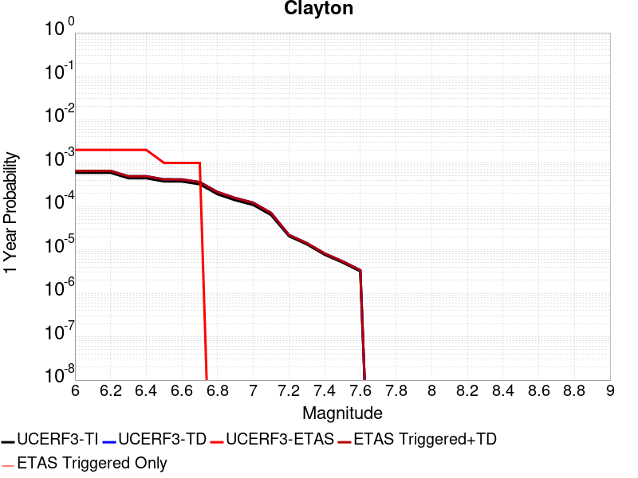 | 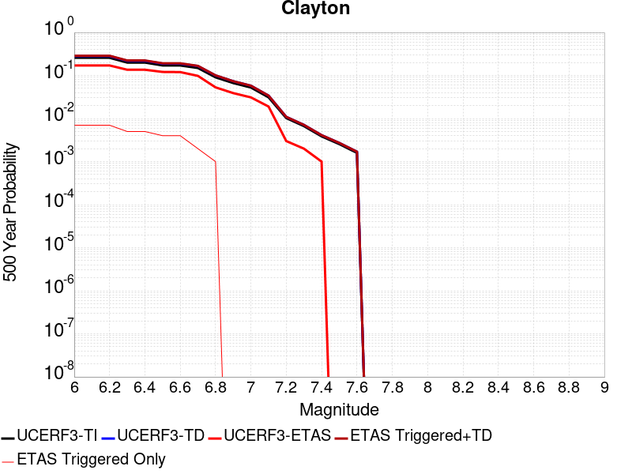 |

| Magnitude | 1 wk TI Prob | 1 wk TD Prob | 1 wk ETAS Prob | 1 wk ETAS/TD Gain | 1 wk ETAS Triggered+TD | 1 wk ETAS Triggered Only | 1 mo TI Prob | 1 mo TD Prob | 1 mo ETAS Prob | 1 mo ETAS/TD Gain | 1 mo ETAS Triggered+TD | 1 mo ETAS Triggered Only | 1 yr TI Prob | 1 yr TD Prob | 1 yr ETAS Prob | 1 yr ETAS/TD Gain | 1 yr ETAS Triggered+TD | 1 yr ETAS Triggered Only | 500 yr TI Prob | 500 yr TD Prob | 500 yr ETAS Prob | 500 yr ETAS/TD Gain | 500 yr ETAS Triggered+TD | 500 yr ETAS Triggered Only |
|-----|-----|-----|-----|-----|-----|-----|-----|-----|-----|-----|-----|-----|-----|-----|-----|-----|-----|-----|-----|-----|-----|-----|-----|-----|
| 6.0 | 1.1413061E-5 | 1.25952065E-5 | 0.0 | 0.0 | 1.25952065E-5 | 0.0 | 4.89122E-5 | 5.3978463E-5 | 0.0 | 0.0 | 5.3978463E-5 | 0.0 | 5.953433E-4 | 6.5701164E-4 | 0.002 | 3.0440862 | 6.5701164E-4 | 0.0 | 0.2575207 | 0.2823607 | 0.171 | 0.60560834 | 0.28738418 | 0.007 |
| 6.1 | 1.1413061E-5 | 1.25952065E-5 | 0.0 | 0.0 | 1.25952065E-5 | 0.0 | 4.89122E-5 | 5.3978463E-5 | 0.0 | 0.0 | 5.3978463E-5 | 0.0 | 5.953433E-4 | 6.5701164E-4 | 0.002 | 3.0440862 | 6.5701164E-4 | 0.0 | 0.2575207 | 0.2823607 | 0.171 | 0.60560834 | 0.28738418 | 0.007 |
| 6.2 | 1.1413061E-5 | 1.25952065E-5 | 0.0 | 0.0 | 1.25952065E-5 | 0.0 | 4.89122E-5 | 5.3978463E-5 | 0.0 | 0.0 | 5.3978463E-5 | 0.0 | 5.953433E-4 | 6.5701164E-4 | 0.002 | 3.0440862 | 6.5701164E-4 | 0.0 | 0.2575207 | 0.2823607 | 0.171 | 0.60560834 | 0.28738418 | 0.007 |
| 6.3 | 8.538689E-6 | 9.475562E-6 | 0.0 | 0.0 | 9.475562E-6 | 0.0 | 3.659387E-5 | 4.0608982E-5 | 0.0 | 0.0 | 4.0608982E-5 | 0.0 | 4.4543925E-4 | 4.9431284E-4 | 0.002 | 4.046021 | 4.9431284E-4 | 0.0 | 0.1997005 | 0.2192953 | 0.136 | 0.6201683 | 0.22319883 | 0.005 |
| 6.4 | 8.538689E-6 | 9.475562E-6 | 0.0 | 0.0 | 9.475562E-6 | 0.0 | 3.659387E-5 | 4.0608982E-5 | 0.0 | 0.0 | 4.0608982E-5 | 0.0 | 4.4543925E-4 | 4.9431284E-4 | 0.002 | 4.046021 | 4.9431284E-4 | 0.0 | 0.1997005 | 0.2192953 | 0.136 | 0.6201683 | 0.22319883 | 0.005 |
| 6.5 | 7.197462E-6 | 8.029956E-6 | 0.0 | 0.0 | 8.029956E-6 | 0.0 | 3.08459E-5 | 3.441369E-5 | 0.0 | 0.0 | 3.441369E-5 | 0.0 | 3.7548412E-4 | 4.1891422E-4 | 0.001 | 2.3871236 | 4.1891422E-4 | 0.0 | 0.17120075 | 0.1888071 | 0.121 | 0.64086574 | 0.19205187 | 0.004 |
| 6.6 | 7.1760483E-6 | 8.006121E-6 | 0.0 | 0.0 | 8.006121E-6 | 0.0 | 3.075413E-5 | 3.431154E-5 | 0.0 | 0.0 | 3.431154E-5 | 0.0 | 3.743672E-4 | 4.1767105E-4 | 0.001 | 2.3942287 | 4.1767105E-4 | 0.0 | 0.1707376 | 0.18831228 | 0.12 | 0.6372394 | 0.19155903 | 0.004 |
| 6.7 | 6.202582E-6 | 6.931974E-6 | 0.0 | 0.0 | 6.931974E-6 | 0.0 | 2.6582224E-5 | 2.9708166E-5 | 0.0 | 0.0 | 2.9708166E-5 | 0.0 | 3.235905E-4 | 3.6164446E-4 | 0.001 | 2.7651467 | 3.6164446E-4 | 0.0 | 0.14940692 | 0.16544092 | 0.098 | 0.5923565 | 0.16711003 | 0.002 |
| 6.8 | 3.6417277E-6 | 4.093548E-6 | 0.0 | 0.0 | 4.093548E-6 | 0.0 | 1.5607311E-5 | 1.7543662E-5 | 0.0 | 0.0 | 1.7543662E-5 | 0.0 | 1.9000245E-4 | 2.135739E-4 | 0.0 | 0.0 | 2.135739E-4 | 0.0 | 0.09063639 | 0.09990383 | 0.053 | 0.5305102 | 0.10080393 | 0.001 |
| 6.9 | 2.6498485E-6 | 2.9793416E-6 | 0.0 | 0.0 | 2.9793416E-6 | 0.0 | 1.1356444E-5 | 1.2768547E-5 | 0.0 | 0.0 | 1.2768547E-5 | 0.0 | 1.3825593E-4 | 1.5544635E-4 | 0.0 | 0.0 | 1.5544635E-4 | 0.0 | 0.066797204 | 0.07357521 | 0.039 | 0.5300698 | 0.07357521 | 0.0 |
| 7.0 | 2.070442E-6 | 2.3255254E-6 | 0.0 | 0.0 | 2.3255254E-6 | 0.0 | 8.873292E-6 | 9.966501E-6 | 0.0 | 0.0 | 9.966501E-6 | 0.0 | 1.0802698E-4 | 1.21335695E-4 | 0.0 | 0.0 | 1.21335695E-4 | 0.0 | 0.052583437 | 0.057854284 | 0.031 | 0.53582895 | 0.057854284 | 0.0 |
| 7.1 | 1.2111691E-6 | 1.3507039E-6 | 0.0 | 0.0 | 1.3507039E-6 | 0.0 | 5.190714E-6 | 5.7887187E-6 | 0.0 | 0.0 | 5.7887187E-6 | 0.0 | 6.319511E-5 | 7.047554E-5 | 0.0 | 0.0 | 7.047554E-5 | 0.0 | 0.031104539 | 0.034067113 | 0.019 | 0.5577226 | 0.034067113 | 0.0 |
| 7.2 | 3.9541607E-7 | 4.2103312E-7 | 0.0 | 0.0 | 4.2103312E-7 | 0.0 | 1.6946392E-6 | 1.8044265E-6 | 0.0 | 0.0 | 1.8044265E-6 | 0.0 | 2.0632036E-5 | 2.1968672E-5 | 0.0 | 0.0 | 2.1968672E-5 | 0.0 | 0.010263096 | 0.010933545 | 0.003 | 0.27438492 | 0.010933545 | 0.0 |
| 7.3 | 2.5685637E-7 | 2.7365834E-7 | 0.0 | 0.0 | 2.7365834E-7 | 0.0 | 1.1008126E-6 | 1.172821E-6 | 0.0 | 0.0 | 1.172821E-6 | 0.0 | 1.3402311E-5 | 1.4279003E-5 | 0.0 | 0.0 | 1.4279003E-5 | 0.0 | 0.0066787973 | 0.0071204514 | 0.002 | 0.28088105 | 0.0071204514 | 0.0 |
| 7.4 | 1.482299E-7 | 1.5776939E-7 | 0.0 | 0.0 | 1.5776939E-7 | 0.0 | 6.3527085E-7 | 6.7615434E-7 | 0.0 | 0.0 | 6.7615434E-7 | 0.0 | 7.734395E-6 | 8.2321485E-6 | 0.0 | 0.0 | 8.2321485E-6 | 0.0 | 0.0038597444 | 0.004111116 | 0.001 | 0.24324296 | 0.004111116 | 0.0 |
| 7.5 | 9.7969505E-8 | 1.0416784E-7 | 0.0 | 0.0 | 1.0416784E-7 | 0.0 | 4.1986925E-7 | 4.4643352E-7 | 0.0 | 0.0 | 4.4643352E-7 | 0.0 | 5.111896E-6 | 5.4353145E-6 | 0.0 | 0.0 | 5.4353145E-6 | 0.0 | 0.002552691 | 0.0027161683 | 0.0 | 0.0 | 0.0027161683 | 0.0 |
| 7.6 | 6.125415E-8 | 6.515377E-8 | 0.0 | 0.0 | 6.515377E-8 | 0.0 | 2.6251774E-7 | 2.7923042E-7 | 0.0 | 0.0 | 2.7923042E-7 | 0.0 | 3.196149E-6 | 3.399625E-6 | 0.0 | 0.0 | 3.399625E-6 | 0.0 | 0.0015968008 | 0.0016997092 | 0.0 | 0.0 | 0.0016997092 | 0.0 |

## Hartley Springs 2011 CFM
*[(top)](#table-of-contents)*

| 1 Week | 1 Month | 1 Year | 500 Year |
|-----|-----|-----|-----|
|  | 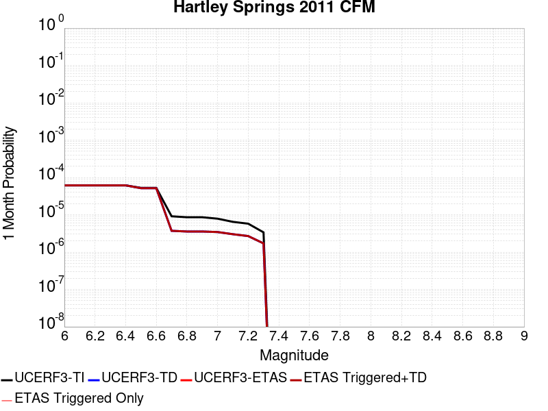 | 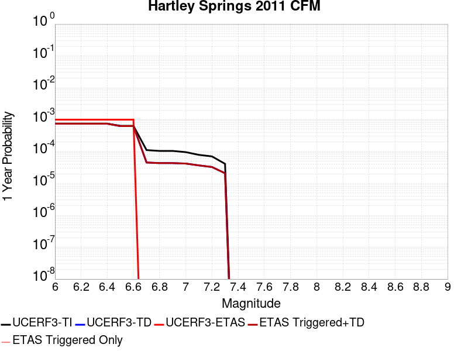 | 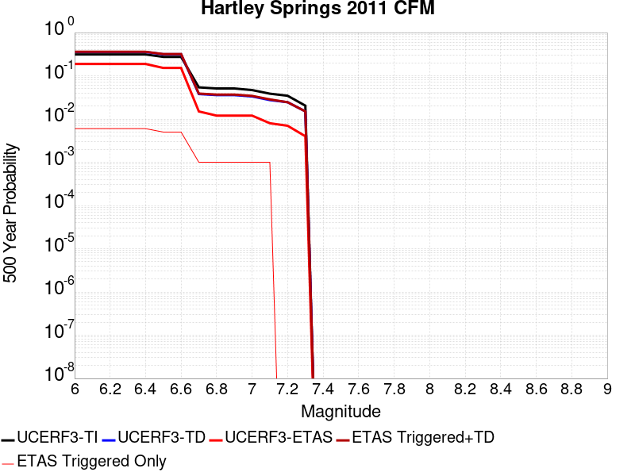 |

| Magnitude | 1 wk TI Prob | 1 wk TD Prob | 1 wk ETAS Prob | 1 wk ETAS/TD Gain | 1 wk ETAS Triggered+TD | 1 wk ETAS Triggered Only | 1 mo TI Prob | 1 mo TD Prob | 1 mo ETAS Prob | 1 mo ETAS/TD Gain | 1 mo ETAS Triggered+TD | 1 mo ETAS Triggered Only | 1 yr TI Prob | 1 yr TD Prob | 1 yr ETAS Prob | 1 yr ETAS/TD Gain | 1 yr ETAS Triggered+TD | 1 yr ETAS Triggered Only | 500 yr TI Prob | 500 yr TD Prob | 500 yr ETAS Prob | 500 yr ETAS/TD Gain | 500 yr ETAS Triggered+TD | 500 yr ETAS Triggered Only |
|-----|-----|-----|-----|-----|-----|-----|-----|-----|-----|-----|-----|-----|-----|-----|-----|-----|-----|-----|-----|-----|-----|-----|-----|-----|
| 6.0 | 1.4352418E-5 | 1.43375155E-5 | 0.0 | 0.0 | 1.43375155E-5 | 0.0 | 6.1508916E-5 | 6.1445964E-5 | 0.0 | 0.0 | 6.1445964E-5 | 0.0 | 7.486137E-4 | 7.480104E-4 | 0.001 | 1.3368798 | 7.480104E-4 | 0.0 | 0.31233054 | 0.3554376 | 0.188 | 0.5289255 | 0.359305 | 0.006 |
| 6.1 | 1.4352418E-5 | 1.43375155E-5 | 0.0 | 0.0 | 1.43375155E-5 | 0.0 | 6.1508916E-5 | 6.1445964E-5 | 0.0 | 0.0 | 6.1445964E-5 | 0.0 | 7.486137E-4 | 7.480104E-4 | 0.001 | 1.3368798 | 7.480104E-4 | 0.0 | 0.31233054 | 0.3554376 | 0.188 | 0.5289255 | 0.359305 | 0.006 |
| 6.2 | 1.4352418E-5 | 1.43375155E-5 | 0.0 | 0.0 | 1.43375155E-5 | 0.0 | 6.1508916E-5 | 6.1445964E-5 | 0.0 | 0.0 | 6.1445964E-5 | 0.0 | 7.486137E-4 | 7.480104E-4 | 0.001 | 1.3368798 | 7.480104E-4 | 0.0 | 0.31233054 | 0.3554376 | 0.188 | 0.5289255 | 0.359305 | 0.006 |
| 6.3 | 1.4352418E-5 | 1.43375155E-5 | 0.0 | 0.0 | 1.43375155E-5 | 0.0 | 6.1508916E-5 | 6.1445964E-5 | 0.0 | 0.0 | 6.1445964E-5 | 0.0 | 7.486137E-4 | 7.480104E-4 | 0.001 | 1.3368798 | 7.480104E-4 | 0.0 | 0.31233054 | 0.3554376 | 0.188 | 0.5289255 | 0.359305 | 0.006 |
| 6.4 | 1.4352418E-5 | 1.43375155E-5 | 0.0 | 0.0 | 1.43375155E-5 | 0.0 | 6.1508916E-5 | 6.1445964E-5 | 0.0 | 0.0 | 6.1445964E-5 | 0.0 | 7.486137E-4 | 7.480104E-4 | 0.001 | 1.3368798 | 7.480104E-4 | 0.0 | 0.31233054 | 0.3554376 | 0.188 | 0.5289255 | 0.359305 | 0.006 |
| 6.5 | 1.2279858E-5 | 1.2049551E-5 | 0.0 | 0.0 | 1.2049551E-5 | 0.0 | 5.26269E-5 | 5.164079E-5 | 0.0 | 0.0 | 5.164079E-5 | 0.0 | 6.4054417E-4 | 6.2870164E-4 | 0.001 | 1.5905796 | 6.2870164E-4 | 0.0 | 0.27412298 | 0.315177 | 0.152 | 0.4822687 | 0.3186011 | 0.005 |
| 6.6 | 1.2279858E-5 | 1.2049551E-5 | 0.0 | 0.0 | 1.2049551E-5 | 0.0 | 5.26269E-5 | 5.164079E-5 | 0.0 | 0.0 | 5.164079E-5 | 0.0 | 6.4054417E-4 | 6.2870164E-4 | 0.001 | 1.5905796 | 6.2870164E-4 | 0.0 | 0.27412298 | 0.315177 | 0.152 | 0.4822687 | 0.3186011 | 0.005 |
| 6.7 | 2.1282601E-6 | 8.6843244E-7 | 0.0 | 0.0 | 8.6843244E-7 | 0.0 | 9.121083E-6 | 3.7218495E-6 | 0.0 | 0.0 | 3.7218495E-6 | 0.0 | 1.11043526E-4 | 4.531282E-5 | 0.0 | 0.0 | 4.531282E-5 | 0.0 | 0.054011483 | 0.037872937 | 0.015 | 0.39606118 | 0.038835064 | 0.001 |
| 6.8 | 2.00516E-6 | 8.320841E-7 | 0.0 | 0.0 | 8.320841E-7 | 0.0 | 8.593515E-6 | 3.566071E-6 | 0.0 | 0.0 | 3.566071E-6 | 0.0 | 1.04621024E-4 | 4.3416294E-5 | 0.0 | 0.0 | 4.3416294E-5 | 0.0 | 0.05096846 | 0.03580392 | 0.012 | 0.33515882 | 0.036768116 | 0.001 |
| 6.9 | 2.00516E-6 | 8.320841E-7 | 0.0 | 0.0 | 8.320841E-7 | 0.0 | 8.593515E-6 | 3.566071E-6 | 0.0 | 0.0 | 3.566071E-6 | 0.0 | 1.04621024E-4 | 4.3416294E-5 | 0.0 | 0.0 | 4.3416294E-5 | 0.0 | 0.05096846 | 0.03580392 | 0.012 | 0.33515882 | 0.036768116 | 0.001 |
| 7.0 | 1.8366732E-6 | 8.0549006E-7 | 0.0 | 0.0 | 8.0549006E-7 | 0.0 | 7.871433E-6 | 3.452097E-6 | 0.0 | 0.0 | 3.452097E-6 | 0.0 | 9.583048E-5 | 4.2028714E-5 | 0.0 | 0.0 | 4.2028714E-5 | 0.0 | 0.04678761 | 0.03336279 | 0.012 | 0.35968214 | 0.034329426 | 0.001 |
| 7.1 | 1.5097997E-6 | 7.04544E-7 | 0.0 | 0.0 | 7.04544E-7 | 0.0 | 6.470554E-6 | 3.019472E-6 | 0.0 | 0.0 | 3.019472E-6 | 0.0 | 7.877615E-5 | 3.676168E-5 | 0.0 | 0.0 | 3.676168E-5 | 0.0 | 0.03862394 | 0.0274831 | 0.008 | 0.29108799 | 0.028455617 | 0.001 |
| 7.2 | 1.3490993E-6 | 6.2804526E-7 | 0.0 | 0.0 | 6.2804526E-7 | 0.0 | 5.7818415E-6 | 2.691621E-6 | 0.0 | 0.0 | 2.691621E-6 | 0.0 | 7.0391645E-5 | 3.2770215E-5 | 0.0 | 0.0 | 3.2770215E-5 | 0.0 | 0.03458485 | 0.024491003 | 0.007 | 0.28581923 | 0.024491003 | 0.0 |
| 7.3 | 7.900015E-7 | 3.9985227E-7 | 0.0 | 0.0 | 3.9985227E-7 | 0.0 | 3.3857161E-6 | 1.7136526E-6 | 0.0 | 0.0 | 1.7136526E-6 | 0.0 | 4.1220315E-5 | 2.0863721E-5 | 0.0 | 0.0 | 2.0863721E-5 | 0.0 | 0.020399636 | 0.015040802 | 0.004 | 0.26594326 | 0.015040802 | 0.0 |

## Mohawk Valley 2011 CFM
*[(top)](#table-of-contents)*

| 1 Week | 1 Month | 1 Year | 500 Year |
|-----|-----|-----|-----|
| 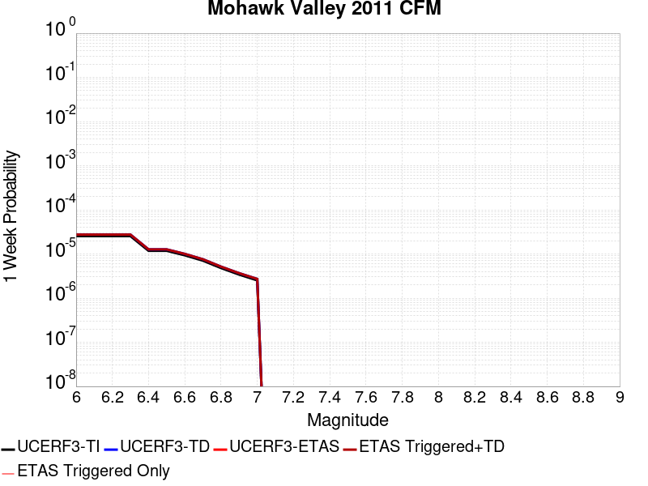 |  | 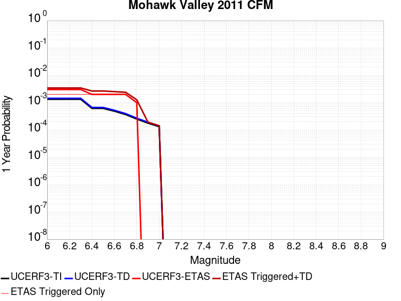 | 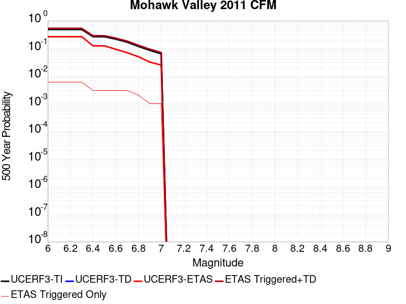 |

| Magnitude | 1 wk TI Prob | 1 wk TD Prob | 1 wk ETAS Prob | 1 wk ETAS/TD Gain | 1 wk ETAS Triggered+TD | 1 wk ETAS Triggered Only | 1 mo TI Prob | 1 mo TD Prob | 1 mo ETAS Prob | 1 mo ETAS/TD Gain | 1 mo ETAS Triggered+TD | 1 mo ETAS Triggered Only | 1 yr TI Prob | 1 yr TD Prob | 1 yr ETAS Prob | 1 yr ETAS/TD Gain | 1 yr ETAS Triggered+TD | 1 yr ETAS Triggered Only | 500 yr TI Prob | 500 yr TD Prob | 500 yr ETAS Prob | 500 yr ETAS/TD Gain | 500 yr ETAS Triggered+TD | 500 yr ETAS Triggered Only |
|-----|-----|-----|-----|-----|-----|-----|-----|-----|-----|-----|-----|-----|-----|-----|-----|-----|-----|-----|-----|-----|-----|-----|-----|-----|
| 6.0 | 2.5425423E-5 | 2.7519804E-5 | 0.0 | 0.0 | 2.7519804E-5 | 0.0 | 1.0896155E-4 | 1.17937285E-4 | 0.001 | 8.479083 | 0.0011178193 | 0.001 | 0.0013257994 | 0.0014350481 | 0.003 | 2.0905223 | 0.003432178 | 0.002 | 0.48487183 | 0.52617997 | 0.265 | 0.50363 | 0.5290229 | 0.006 |
| 6.1 | 2.5425423E-5 | 2.7519804E-5 | 0.0 | 0.0 | 2.7519804E-5 | 0.0 | 1.0896155E-4 | 1.17937285E-4 | 0.001 | 8.479083 | 0.0011178193 | 0.001 | 0.0013257994 | 0.0014350481 | 0.003 | 2.0905223 | 0.003432178 | 0.002 | 0.48487183 | 0.52617997 | 0.265 | 0.50363 | 0.5290229 | 0.006 |
| 6.2 | 2.5425423E-5 | 2.7519804E-5 | 0.0 | 0.0 | 2.7519804E-5 | 0.0 | 1.0896155E-4 | 1.17937285E-4 | 0.001 | 8.479083 | 0.0011178193 | 0.001 | 0.0013257994 | 0.0014350481 | 0.003 | 2.0905223 | 0.003432178 | 0.002 | 0.48487183 | 0.52617997 | 0.265 | 0.50363 | 0.5290229 | 0.006 |
| 6.3 | 2.5425423E-5 | 2.7519804E-5 | 0.0 | 0.0 | 2.7519804E-5 | 0.0 | 1.0896155E-4 | 1.17937285E-4 | 0.001 | 8.479083 | 0.0011178193 | 0.001 | 0.0013257994 | 0.0014350481 | 0.003 | 2.0905223 | 0.003432178 | 0.002 | 0.48487183 | 0.52617997 | 0.265 | 0.50363 | 0.5290229 | 0.006 |
| 6.4 | 1.1812642E-5 | 1.2710397E-5 | 0.0 | 0.0 | 1.2710397E-5 | 0.0 | 5.0624625E-5 | 5.4472075E-5 | 0.001 | 18.35803 | 0.0010544176 | 0.001 | 6.161805E-4 | 6.6301035E-4 | 0.002 | 3.0165443 | 0.0026616843 | 0.002 | 0.2652208 | 0.28481266 | 0.124 | 0.4353739 | 0.28695822 | 0.003 |
| 6.5 | 1.1812642E-5 | 1.2710397E-5 | 0.0 | 0.0 | 1.2710397E-5 | 0.0 | 5.0624625E-5 | 5.4472075E-5 | 0.001 | 18.35803 | 0.0010544176 | 0.001 | 6.161805E-4 | 6.6301035E-4 | 0.002 | 3.0165443 | 0.0026616843 | 0.002 | 0.2652208 | 0.28481266 | 0.124 | 0.4353739 | 0.28695822 | 0.003 |
| 6.6 | 9.34204E-6 | 1.0043663E-5 | 0.0 | 0.0 | 1.0043663E-5 | 0.0 | 4.0036703E-5 | 4.3043623E-5 | 0.001 | 23.232244 | 0.0010430006 | 0.001 | 4.873378E-4 | 5.239418E-4 | 0.002 | 3.8172178 | 0.002522894 | 0.002 | 0.21629946 | 0.23284379 | 0.093 | 0.3994094 | 0.23514526 | 0.003 |
| 6.7 | 7.0661854E-6 | 7.5930357E-6 | 0.0 | 0.0 | 7.5930357E-6 | 0.0 | 3.02833E-5 | 3.2541226E-5 | 0.001 | 30.73025 | 0.0010325087 | 0.001 | 3.686368E-4 | 3.9612642E-4 | 0.002 | 5.0488935 | 0.0023953342 | 0.002 | 0.1683573 | 0.18172662 | 0.07 | 0.385194 | 0.18418144 | 0.003 |
| 6.8 | 4.806676E-6 | 5.16596E-6 | 0.0 | 0.0 | 5.16596E-6 | 0.0 | 2.0599877E-5 | 2.2139677E-5 | 0.0 | 0.0 | 2.2139677E-5 | 0.0 | 2.507746E-4 | 2.6952353E-4 | 0.001 | 3.710251 | 0.001269254 | 0.001 | 0.1178587 | 0.12760173 | 0.05 | 0.3918442 | 0.12934653 | 0.002 |
| 6.9 | 3.4163209E-6 | 3.673664E-6 | 0.0 | 0.0 | 3.673664E-6 | 0.0 | 1.4641293E-5 | 1.574421E-5 | 0.0 | 0.0 | 1.574421E-5 | 0.0 | 1.7824316E-4 | 1.9167428E-4 | 0.0 | 0.0 | 1.9167428E-4 | 0.0 | 0.085272916 | 0.09273783 | 0.032 | 0.34505874 | 0.093645096 | 0.001 |
| 7.0 | 2.5271734E-6 | 2.7196122E-6 | 0.0 | 0.0 | 2.7196122E-6 | 0.0 | 1.0830699E-5 | 1.1655457E-5 | 0.0 | 0.0 | 1.1655457E-5 | 0.0 | 1.3185578E-4 | 1.4190083E-4 | 0.0 | 0.0 | 1.4190083E-4 | 0.0 | 0.06380569 | 0.06975247 | 0.025 | 0.35841024 | 0.07068272 | 0.001 |

## Panamint Valley
*[(top)](#table-of-contents)*

| 1 Week | 1 Month | 1 Year | 500 Year |
|-----|-----|-----|-----|
| 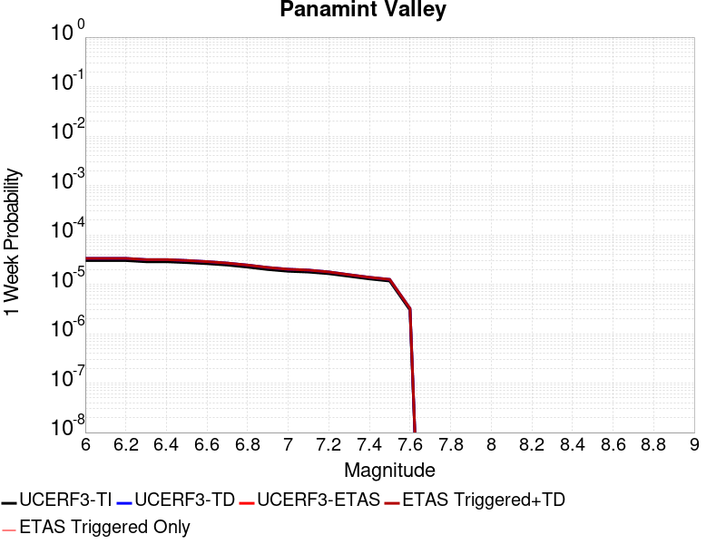 | 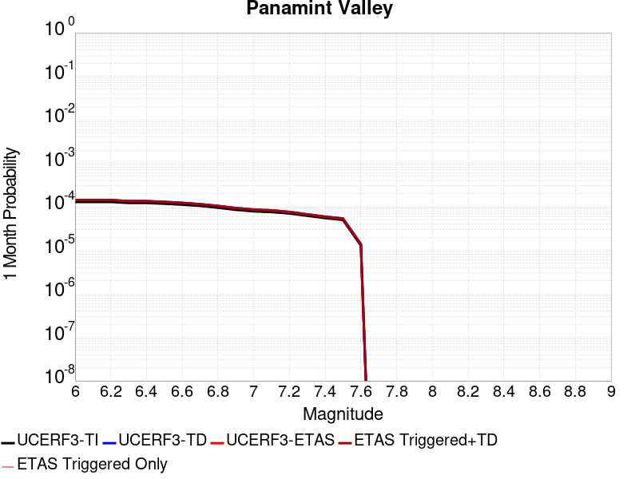 | 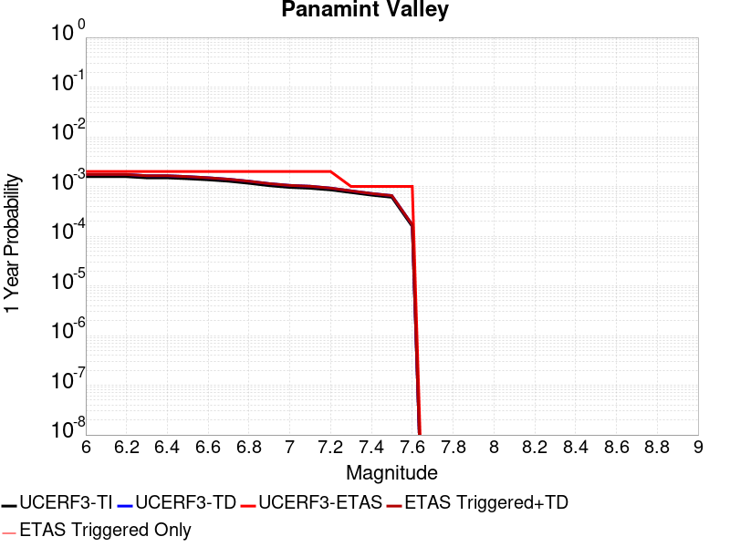 | 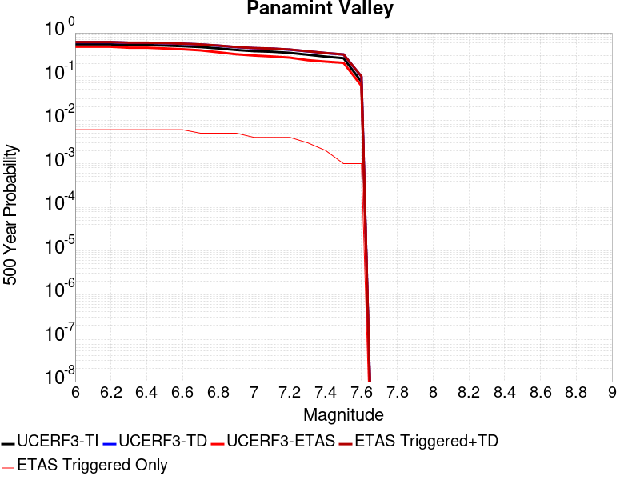 |

| Magnitude | 1 wk TI Prob | 1 wk TD Prob | 1 wk ETAS Prob | 1 wk ETAS/TD Gain | 1 wk ETAS Triggered+TD | 1 wk ETAS Triggered Only | 1 mo TI Prob | 1 mo TD Prob | 1 mo ETAS Prob | 1 mo ETAS/TD Gain | 1 mo ETAS Triggered+TD | 1 mo ETAS Triggered Only | 1 yr TI Prob | 1 yr TD Prob | 1 yr ETAS Prob | 1 yr ETAS/TD Gain | 1 yr ETAS Triggered+TD | 1 yr ETAS Triggered Only | 500 yr TI Prob | 500 yr TD Prob | 500 yr ETAS Prob | 500 yr ETAS/TD Gain | 500 yr ETAS Triggered+TD | 500 yr ETAS Triggered Only |
|-----|-----|-----|-----|-----|-----|-----|-----|-----|-----|-----|-----|-----|-----|-----|-----|-----|-----|-----|-----|-----|-----|-----|-----|-----|
| 6.0 | 3.0211835E-5 | 3.34487E-5 | 0.0 | 0.0 | 3.34487E-5 | 0.0 | 1.2947287E-4 | 1.4334386E-4 | 0.0 | 0.0 | 1.4334386E-4 | 0.0 | 0.0015751923 | 0.0017438428 | 0.002 | 1.1468923 | 0.0017438428 | 0.0 | 0.5453453 | 0.61077243 | 0.48 | 0.7858901 | 0.6131078 | 0.006 |
| 6.1 | 3.0211835E-5 | 3.34487E-5 | 0.0 | 0.0 | 3.34487E-5 | 0.0 | 1.2947287E-4 | 1.4334386E-4 | 0.0 | 0.0 | 1.4334386E-4 | 0.0 | 0.0015751923 | 0.0017438428 | 0.002 | 1.1468923 | 0.0017438428 | 0.0 | 0.5453453 | 0.61077243 | 0.48 | 0.7858901 | 0.6131078 | 0.006 |
| 6.2 | 3.0211835E-5 | 3.34487E-5 | 0.0 | 0.0 | 3.34487E-5 | 0.0 | 1.2947287E-4 | 1.4334386E-4 | 0.0 | 0.0 | 1.4334386E-4 | 0.0 | 0.0015751923 | 0.0017438428 | 0.002 | 1.1468923 | 0.0017438428 | 0.0 | 0.5453453 | 0.61077243 | 0.48 | 0.7858901 | 0.6131078 | 0.006 |
| 6.3 | 2.8573924E-5 | 3.1585114E-5 | 0.0 | 0.0 | 3.1585114E-5 | 0.0 | 1.2245393E-4 | 1.353579E-4 | 0.0 | 0.0 | 1.353579E-4 | 0.0 | 0.001489857 | 0.0016467635 | 0.002 | 1.2145034 | 0.0016467635 | 0.0 | 0.5254954 | 0.5920091 | 0.457 | 0.77194756 | 0.5944571 | 0.006 |
| 6.4 | 2.8573924E-5 | 3.1585114E-5 | 0.0 | 0.0 | 3.1585114E-5 | 0.0 | 1.2245393E-4 | 1.353579E-4 | 0.0 | 0.0 | 1.353579E-4 | 0.0 | 0.001489857 | 0.0016467635 | 0.002 | 1.2145034 | 0.0016467635 | 0.0 | 0.5254954 | 0.5920091 | 0.457 | 0.77194756 | 0.5944571 | 0.006 |
| 6.5 | 2.7468774E-5 | 3.0324882E-5 | 0.0 | 0.0 | 3.0324882E-5 | 0.0 | 1.1771801E-4 | 1.2995745E-4 | 0.0 | 0.0 | 1.2995745E-4 | 0.0 | 0.0014322745 | 0.00158111 | 0.002 | 1.2649342 | 0.00158111 | 0.0 | 0.5116147 | 0.57876873 | 0.439 | 0.7585068 | 0.5812961 | 0.006 |
| 6.6 | 2.6135967E-5 | 2.8764383E-5 | 0.0 | 0.0 | 2.8764383E-5 | 0.0 | 1.1200648E-4 | 1.2327025E-4 | 0.0 | 0.0 | 1.2327025E-4 | 0.0 | 0.0013628257 | 0.0014998076 | 0.002 | 1.3335044 | 0.0014998076 | 0.0 | 0.49433336 | 0.56220514 | 0.421 | 0.748837 | 0.5648319 | 0.006 |
| 6.7 | 2.4498746E-5 | 2.686457E-5 | 0.0 | 0.0 | 2.686457E-5 | 0.0 | 1.04990395E-4 | 1.1512893E-4 | 0.0 | 0.0 | 1.1512893E-4 | 0.0 | 0.0012775084 | 0.0014008175 | 0.002 | 1.4277377 | 0.0014008175 | 0.0 | 0.47226584 | 0.5407152 | 0.397 | 0.73421276 | 0.5430116 | 0.005 |
| 6.8 | 2.2244329E-5 | 2.4478455E-5 | 0.0 | 0.0 | 2.4478455E-5 | 0.0 | 9.532935E-5 | 1.0490356E-4 | 0.0 | 0.0 | 1.0490356E-4 | 0.0 | 0.0011600169 | 0.0012764735 | 0.002 | 1.5668167 | 0.0012764735 | 0.0 | 0.4402948 | 0.5078389 | 0.359 | 0.70691705 | 0.51029974 | 0.005 |
| 6.9 | 1.9902658E-5 | 2.187497E-5 | 0.0 | 0.0 | 2.187497E-5 | 0.0 | 8.529431E-5 | 9.37466E-5 | 0.0 | 0.0 | 9.37466E-5 | 0.0 | 0.0010379635 | 0.0011407849 | 0.002 | 1.7531788 | 0.0011407849 | 0.0 | 0.40503415 | 0.47093558 | 0.323 | 0.68586874 | 0.4735809 | 0.005 |
| 7.0 | 1.8353881E-5 | 2.0168445E-5 | 0.0 | 0.0 | 2.0168445E-5 | 0.0 | 7.865712E-5 | 8.643343E-5 | 0.0 | 0.0 | 8.643343E-5 | 0.0 | 9.5722964E-4 | 0.0010518358 | 0.002 | 1.9014374 | 0.0010518358 | 0.0 | 0.3805009 | 0.44526565 | 0.302 | 0.6782468 | 0.4474846 | 0.004 |
| 7.1 | 1.7667631E-5 | 1.938497E-5 | 0.0 | 0.0 | 1.938497E-5 | 0.0 | 7.571623E-5 | 8.3075895E-5 | 0.0 | 0.0 | 8.3075895E-5 | 0.0 | 9.2145515E-4 | 0.0010109964 | 0.002 | 1.9782463 | 0.0010109964 | 0.0 | 0.36930946 | 0.43370688 | 0.287 | 0.66173726 | 0.43597203 | 0.004 |
| 7.2 | 1.6381597E-5 | 1.7789538E-5 | 0.0 | 0.0 | 1.7789538E-5 | 0.0 | 7.020495E-5 | 7.623874E-5 | 0.0 | 0.0 | 7.623874E-5 | 0.0 | 8.544101E-4 | 9.278279E-4 | 0.002 | 2.1555722 | 9.278279E-4 | 0.0 | 0.34778935 | 0.4114346 | 0.27 | 0.6562404 | 0.41378886 | 0.004 |
| 7.3 | 1.4520491E-5 | 1.5645279E-5 | 0.0 | 0.0 | 1.5645279E-5 | 0.0 | 6.222919E-5 | 6.704956E-5 | 0.0 | 0.0 | 6.704956E-5 | 0.0 | 7.57377E-4 | 8.1603817E-4 | 0.001 | 1.2254329 | 8.1603817E-4 | 0.0 | 0.31533936 | 0.37589103 | 0.236 | 0.62784153 | 0.37776336 | 0.003 |
| 7.4 | 1.2852287E-5 | 1.3848942E-5 | 0.0 | 0.0 | 1.3848942E-5 | 0.0 | 5.5080065E-5 | 5.9351343E-5 | 0.0 | 0.0 | 5.9351343E-5 | 0.0 | 6.7039346E-4 | 7.2237814E-4 | 0.001 | 1.3843166 | 7.2237814E-4 | 0.0 | 0.28488302 | 0.34337652 | 0.219 | 0.6377839 | 0.34468976 | 0.002 |
| 7.5 | 1.1637851E-5 | 1.255816E-5 | 0.0 | 0.0 | 1.255816E-5 | 0.0 | 4.987555E-5 | 5.3819662E-5 | 0.0 | 0.0 | 5.3819662E-5 | 0.0 | 6.070656E-4 | 6.5507233E-4 | 0.001 | 1.526549 | 6.5507233E-4 | 0.0 | 0.26186237 | 0.31865886 | 0.205 | 0.6433212 | 0.3193402 | 0.001 |
| 7.6 | 3.0068115E-6 | 3.2425442E-6 | 0.0 | 0.0 | 3.2425442E-6 | 0.0 | 1.2886271E-5 | 1.38965825E-5 | 0.0 | 0.0 | 1.38965825E-5 | 0.0 | 1.5687906E-4 | 1.6918464E-4 | 0.001 | 5.9107018 | 1.6918464E-4 | 0.0 | 0.07544772 | 0.09918182 | 0.061 | 0.615032 | 0.10008264 | 0.001 |

## Los Alamos 2011 CFM
*[(top)](#table-of-contents)*

| 1 Week | 1 Month | 1 Year | 500 Year |
|-----|-----|-----|-----|
| 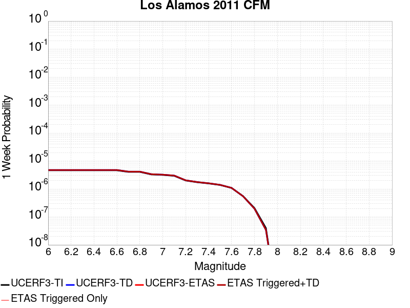 |  | 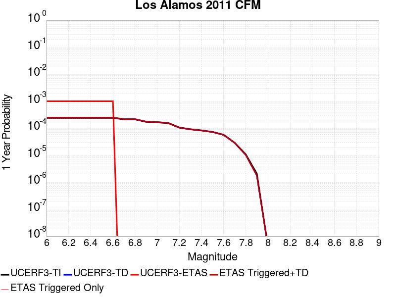 | 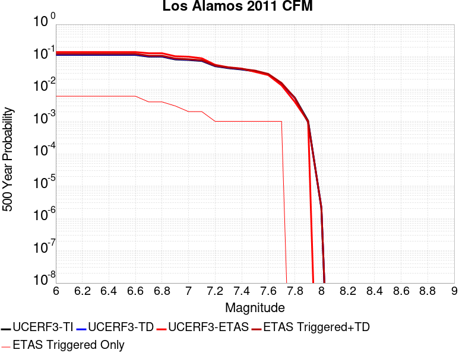 |

| Magnitude | 1 wk TI Prob | 1 wk TD Prob | 1 wk ETAS Prob | 1 wk ETAS/TD Gain | 1 wk ETAS Triggered+TD | 1 wk ETAS Triggered Only | 1 mo TI Prob | 1 mo TD Prob | 1 mo ETAS Prob | 1 mo ETAS/TD Gain | 1 mo ETAS Triggered+TD | 1 mo ETAS Triggered Only | 1 yr TI Prob | 1 yr TD Prob | 1 yr ETAS Prob | 1 yr ETAS/TD Gain | 1 yr ETAS Triggered+TD | 1 yr ETAS Triggered Only | 500 yr TI Prob | 500 yr TD Prob | 500 yr ETAS Prob | 500 yr ETAS/TD Gain | 500 yr ETAS Triggered+TD | 500 yr ETAS Triggered Only |
|-----|-----|-----|-----|-----|-----|-----|-----|-----|-----|-----|-----|-----|-----|-----|-----|-----|-----|-----|-----|-----|-----|-----|-----|-----|
| 6.0 | 4.6284417E-6 | 4.74282E-6 | 0.0 | 0.0 | 4.74282E-6 | 0.0 | 1.9836029E-5 | 2.0326223E-5 | 0.0 | 0.0 | 2.0326223E-5 | 0.0 | 2.4147688E-4 | 2.4744542E-4 | 0.001 | 4.0412955 | 2.4744542E-4 | 0.0 | 0.11374718 | 0.11708576 | 0.139 | 1.187164 | 0.12238325 | 0.006 |
| 6.1 | 4.6284417E-6 | 4.74282E-6 | 0.0 | 0.0 | 4.74282E-6 | 0.0 | 1.9836029E-5 | 2.0326223E-5 | 0.0 | 0.0 | 2.0326223E-5 | 0.0 | 2.4147688E-4 | 2.4744542E-4 | 0.001 | 4.0412955 | 2.4744542E-4 | 0.0 | 0.11374718 | 0.11708576 | 0.139 | 1.187164 | 0.12238325 | 0.006 |
| 6.2 | 4.6284417E-6 | 4.74282E-6 | 0.0 | 0.0 | 4.74282E-6 | 0.0 | 1.9836029E-5 | 2.0326223E-5 | 0.0 | 0.0 | 2.0326223E-5 | 0.0 | 2.4147688E-4 | 2.4744542E-4 | 0.001 | 4.0412955 | 2.4744542E-4 | 0.0 | 0.11374718 | 0.11708576 | 0.139 | 1.187164 | 0.12238325 | 0.006 |
| 6.3 | 4.6284417E-6 | 4.74282E-6 | 0.0 | 0.0 | 4.74282E-6 | 0.0 | 1.9836029E-5 | 2.0326223E-5 | 0.0 | 0.0 | 2.0326223E-5 | 0.0 | 2.4147688E-4 | 2.4744542E-4 | 0.001 | 4.0412955 | 2.4744542E-4 | 0.0 | 0.11374718 | 0.11708576 | 0.139 | 1.187164 | 0.12238325 | 0.006 |
| 6.4 | 4.6284417E-6 | 4.74282E-6 | 0.0 | 0.0 | 4.74282E-6 | 0.0 | 1.9836029E-5 | 2.0326223E-5 | 0.0 | 0.0 | 2.0326223E-5 | 0.0 | 2.4147688E-4 | 2.4744542E-4 | 0.001 | 4.0412955 | 2.4744542E-4 | 0.0 | 0.11374718 | 0.11708576 | 0.139 | 1.187164 | 0.12238325 | 0.006 |
| 6.5 | 4.6284417E-6 | 4.74282E-6 | 0.0 | 0.0 | 4.74282E-6 | 0.0 | 1.9836029E-5 | 2.0326223E-5 | 0.0 | 0.0 | 2.0326223E-5 | 0.0 | 2.4147688E-4 | 2.4744542E-4 | 0.001 | 4.0412955 | 2.4744542E-4 | 0.0 | 0.11374718 | 0.11708576 | 0.139 | 1.187164 | 0.12238325 | 0.006 |
| 6.6 | 4.6284417E-6 | 4.74282E-6 | 0.0 | 0.0 | 4.74282E-6 | 0.0 | 1.9836029E-5 | 2.0326223E-5 | 0.0 | 0.0 | 2.0326223E-5 | 0.0 | 2.4147688E-4 | 2.4744542E-4 | 0.001 | 4.0412955 | 2.4744542E-4 | 0.0 | 0.11374718 | 0.11708576 | 0.139 | 1.187164 | 0.12238325 | 0.006 |
| 6.7 | 4.062321E-6 | 4.158471E-6 | 0.0 | 0.0 | 4.158471E-6 | 0.0 | 1.7409831E-5 | 1.7821903E-5 | 0.0 | 0.0 | 1.7821903E-5 | 0.0 | 2.1194408E-4 | 2.1696159E-4 | 0.0 | 0.0 | 2.1696159E-4 | 0.0 | 0.1005603 | 0.10346238 | 0.128 | 1.2371646 | 0.107048534 | 0.004 |
| 6.8 | 4.062321E-6 | 4.158471E-6 | 0.0 | 0.0 | 4.158471E-6 | 0.0 | 1.7409831E-5 | 1.7821903E-5 | 0.0 | 0.0 | 1.7821903E-5 | 0.0 | 2.1194408E-4 | 2.1696159E-4 | 0.0 | 0.0 | 2.1696159E-4 | 0.0 | 0.1005603 | 0.10346238 | 0.128 | 1.2371646 | 0.107048534 | 0.004 |
| 6.9 | 3.2936077E-6 | 3.3664016E-6 | 0.0 | 0.0 | 3.3664016E-6 | 0.0 | 1.4115385E-5 | 1.4427361E-5 | 0.0 | 0.0 | 1.4427361E-5 | 0.0 | 1.7184127E-4 | 1.756399E-4 | 0.0 | 0.0 | 1.756399E-4 | 0.0 | 0.08233971 | 0.08459782 | 0.103 | 1.2175255 | 0.08734402 | 0.003 |
| 7.0 | 3.1687898E-6 | 3.2384364E-6 | 0.0 | 0.0 | 3.2384364E-6 | 0.0 | 1.3580457E-5 | 1.3878945E-5 | 0.0 | 0.0 | 1.3878945E-5 | 0.0 | 1.6532952E-4 | 1.6896398E-4 | 0.0 | 0.0 | 1.6896398E-4 | 0.0 | 0.07934655 | 0.081534155 | 0.1 | 1.2264799 | 0.08337109 | 0.002 |
| 7.1 | 2.9379228E-6 | 3.0013002E-6 | 0.0 | 0.0 | 3.0013002E-6 | 0.0 | 1.25910365E-5 | 1.2862657E-5 | 0.0 | 0.0 | 1.2862657E-5 | 0.0 | 1.5328509E-4 | 1.565925E-4 | 0.0 | 0.0 | 1.565925E-4 | 0.0 | 0.07378457 | 0.07582826 | 0.089 | 1.1737049 | 0.0776766 | 0.002 |
| 7.2 | 2.0020686E-6 | 2.0372022E-6 | 0.0 | 0.0 | 2.0372022E-6 | 0.0 | 8.580266E-6 | 8.730838E-6 | 0.0 | 0.0 | 8.730838E-6 | 0.0 | 1.0445973E-4 | 1.06292806E-4 | 0.0 | 0.0 | 1.06292806E-4 | 0.0 | 0.050891913 | 0.052063078 | 0.056 | 1.0756184 | 0.053011015 | 0.001 |
| 7.3 | 1.7364243E-6 | 1.7638863E-6 | 0.0 | 0.0 | 1.7638863E-6 | 0.0 | 7.441797E-6 | 7.559491E-6 | 0.0 | 0.0 | 7.559491E-6 | 0.0 | 9.0600115E-5 | 9.203295E-5 | 0.0 | 0.0 | 9.203295E-5 | 0.0 | 0.04429129 | 0.045276206 | 0.047 | 1.0380728 | 0.04623093 | 0.001 |
| 7.4 | 1.5718434E-6 | 1.5945903E-6 | 0.0 | 0.0 | 1.5945903E-6 | 0.0 | 6.7364545E-6 | 6.833941E-6 | 0.0 | 0.0 | 6.833941E-6 | 0.0 | 8.201325E-5 | 8.320008E-5 | 0.0 | 0.0 | 8.320008E-5 | 0.0 | 0.040178843 | 0.041049697 | 0.043 | 1.0475107 | 0.042008646 | 0.001 |
| 7.5 | 1.3841119E-6 | 1.4008906E-6 | 0.0 | 0.0 | 1.4008906E-6 | 0.0 | 5.9318945E-6 | 6.0038033E-6 | 0.0 | 0.0 | 6.0038033E-6 | 0.0 | 7.221842E-5 | 7.309388E-5 | 0.0 | 0.0 | 7.309388E-5 | 0.0 | 0.035466306 | 0.0361911 | 0.034 | 0.93945754 | 0.037154905 | 0.001 |
| 7.6 | 1.0843726E-6 | 1.0906513E-6 | 0.0 | 0.0 | 1.0906513E-6 | 0.0 | 4.647303E-6 | 4.6742116E-6 | 0.0 | 0.0 | 4.6742116E-6 | 0.0 | 5.6579443E-5 | 5.690707E-5 | 0.0 | 0.0 | 5.690707E-5 | 0.0 | 0.027894093 | 0.028357718 | 0.027 | 0.95212173 | 0.02932936 | 0.001 |
| 7.7 | 5.544814E-7 | 5.4881383E-7 | 0.0 | 0.0 | 5.4881383E-7 | 0.0 | 2.3763469E-6 | 2.3520572E-6 | 0.0 | 0.0 | 2.3520572E-6 | 0.0 | 2.8931638E-5 | 2.8635923E-5 | 0.0 | 0.0 | 2.8635923E-5 | 0.0 | 0.014361898 | 0.014428684 | 0.013 | 0.9009831 | 0.015414255 | 0.001 |
| 7.8 | 2.0707465E-7 | 1.9722242E-7 | 0.0 | 0.0 | 1.9722242E-7 | 0.0 | 8.874625E-7 | 8.452387E-7 | 0.0 | 0.0 | 8.452387E-7 | 0.0 | 1.08048025E-5 | 1.02907325E-5 | 0.0 | 0.0 | 1.02907325E-5 | 0.0 | 0.0053878636 | 0.0052762316 | 0.004 | 0.75811684 | 0.0052762316 | 0.0 |
| 7.9 | 3.9821284E-8 | 3.421238E-8 | 0.0 | 0.0 | 3.421238E-8 | 0.0 | 1.7066264E-7 | 1.4662447E-7 | 0.0 | 0.0 | 1.4662447E-7 | 0.0 | 2.0778157E-6 | 1.7851517E-6 | 0.0 | 0.0 | 1.7851517E-6 | 0.0 | 0.0010383694 | 9.480624E-4 | 0.001 | 1.0547829 | 9.480624E-4 | 0.0 |
| 8.0 | 7.880441E-11 | 8.2160834E-11 | 0.0 | 0.0 | 8.2160834E-11 | 0.0 | 3.3773329E-10 | 3.52118E-10 | 0.0 | 0.0 | 3.52118E-10 | 0.0 | 4.1119033E-9 | 4.2870365E-9 | 0.0 | 0.0 | 4.2870365E-9 | 0.0 | 2.0559496E-6 | 2.1435183E-6 | 0.0 | 0.0 | 2.1435183E-6 | 0.0 |

## San Gorgonio Pass
*[(top)](#table-of-contents)*

| 1 Week | 1 Month | 1 Year | 500 Year |
|-----|-----|-----|-----|
|  | 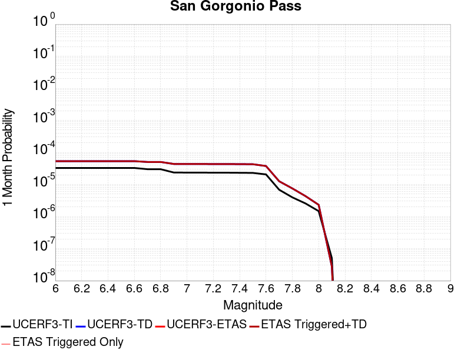 |  | 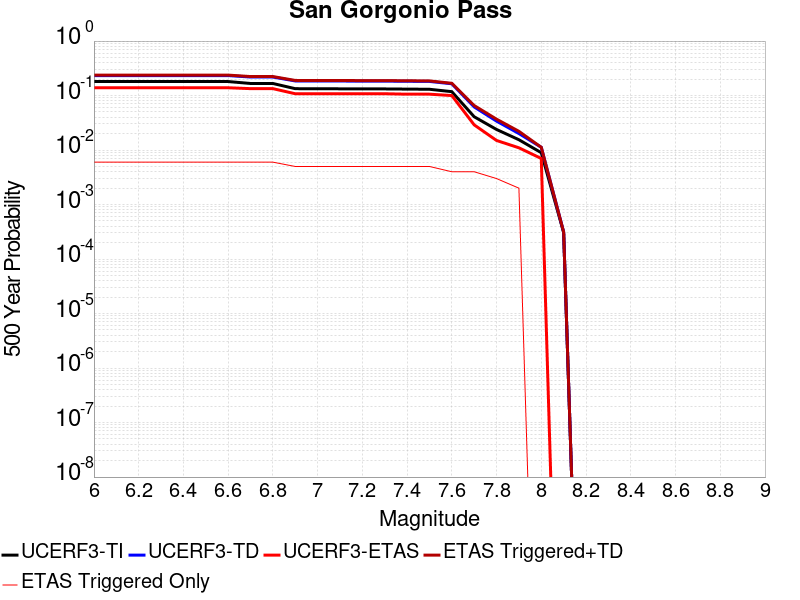 |

| Magnitude | 1 wk TI Prob | 1 wk TD Prob | 1 wk ETAS Prob | 1 wk ETAS/TD Gain | 1 wk ETAS Triggered+TD | 1 wk ETAS Triggered Only | 1 mo TI Prob | 1 mo TD Prob | 1 mo ETAS Prob | 1 mo ETAS/TD Gain | 1 mo ETAS Triggered+TD | 1 mo ETAS Triggered Only | 1 yr TI Prob | 1 yr TD Prob | 1 yr ETAS Prob | 1 yr ETAS/TD Gain | 1 yr ETAS Triggered+TD | 1 yr ETAS Triggered Only | 500 yr TI Prob | 500 yr TD Prob | 500 yr ETAS Prob | 500 yr ETAS/TD Gain | 500 yr ETAS Triggered+TD | 500 yr ETAS Triggered Only |
|-----|-----|-----|-----|-----|-----|-----|-----|-----|-----|-----|-----|-----|-----|-----|-----|-----|-----|-----|-----|-----|-----|-----|-----|-----|
| 6.0 | 7.644328E-6 | 1.2435077E-5 | 0.0 | 0.0 | 1.2435077E-5 | 0.0 | 3.2760996E-5 | 5.3292144E-5 | 0.0 | 0.0 | 5.3292144E-5 | 0.0 | 3.987921E-4 | 6.486466E-4 | 0.001 | 1.5416715 | 6.486466E-4 | 0.0 | 0.1808072 | 0.23277317 | 0.139 | 0.5971479 | 0.23737653 | 0.006 |
| 6.1 | 7.644328E-6 | 1.2435077E-5 | 0.0 | 0.0 | 1.2435077E-5 | 0.0 | 3.2760996E-5 | 5.3292144E-5 | 0.0 | 0.0 | 5.3292144E-5 | 0.0 | 3.987921E-4 | 6.486466E-4 | 0.001 | 1.5416715 | 6.486466E-4 | 0.0 | 0.1808072 | 0.23277317 | 0.139 | 0.5971479 | 0.23737653 | 0.006 |
| 6.2 | 7.644328E-6 | 1.2435077E-5 | 0.0 | 0.0 | 1.2435077E-5 | 0.0 | 3.2760996E-5 | 5.3292144E-5 | 0.0 | 0.0 | 5.3292144E-5 | 0.0 | 3.987921E-4 | 6.486466E-4 | 0.001 | 1.5416715 | 6.486466E-4 | 0.0 | 0.1808072 | 0.23277317 | 0.139 | 0.5971479 | 0.23737653 | 0.006 |
| 6.3 | 7.644328E-6 | 1.2435077E-5 | 0.0 | 0.0 | 1.2435077E-5 | 0.0 | 3.2760996E-5 | 5.3292144E-5 | 0.0 | 0.0 | 5.3292144E-5 | 0.0 | 3.987921E-4 | 6.486466E-4 | 0.001 | 1.5416715 | 6.486466E-4 | 0.0 | 0.1808072 | 0.23277317 | 0.139 | 0.5971479 | 0.23737653 | 0.006 |
| 6.4 | 7.644328E-6 | 1.2435077E-5 | 0.0 | 0.0 | 1.2435077E-5 | 0.0 | 3.2760996E-5 | 5.3292144E-5 | 0.0 | 0.0 | 5.3292144E-5 | 0.0 | 3.987921E-4 | 6.486466E-4 | 0.001 | 1.5416715 | 6.486466E-4 | 0.0 | 0.1808072 | 0.23277317 | 0.139 | 0.5971479 | 0.23737653 | 0.006 |
| 6.5 | 7.644328E-6 | 1.2435077E-5 | 0.0 | 0.0 | 1.2435077E-5 | 0.0 | 3.2760996E-5 | 5.3292144E-5 | 0.0 | 0.0 | 5.3292144E-5 | 0.0 | 3.987921E-4 | 6.486466E-4 | 0.001 | 1.5416715 | 6.486466E-4 | 0.0 | 0.1808072 | 0.23277317 | 0.139 | 0.5971479 | 0.23737653 | 0.006 |
| 6.6 | 7.644328E-6 | 1.2435077E-5 | 0.0 | 0.0 | 1.2435077E-5 | 0.0 | 3.2760996E-5 | 5.3292144E-5 | 0.0 | 0.0 | 5.3292144E-5 | 0.0 | 3.987921E-4 | 6.486466E-4 | 0.001 | 1.5416715 | 6.486466E-4 | 0.0 | 0.1808072 | 0.23277317 | 0.139 | 0.5971479 | 0.23737653 | 0.006 |
| 6.7 | 6.987586E-6 | 1.1741491E-5 | 0.0 | 0.0 | 1.1741491E-5 | 0.0 | 2.9946454E-5 | 5.0319748E-5 | 0.0 | 0.0 | 5.0319748E-5 | 0.0 | 3.645371E-4 | 6.124781E-4 | 0.001 | 1.6327114 | 6.124781E-4 | 0.0 | 0.16665018 | 0.21866894 | 0.134 | 0.6127985 | 0.22335692 | 0.006 |
| 6.8 | 6.987586E-6 | 1.1741491E-5 | 0.0 | 0.0 | 1.1741491E-5 | 0.0 | 2.9946454E-5 | 5.0319748E-5 | 0.0 | 0.0 | 5.0319748E-5 | 0.0 | 3.645371E-4 | 6.124781E-4 | 0.001 | 1.6327114 | 6.124781E-4 | 0.0 | 0.16665018 | 0.21866894 | 0.134 | 0.6127985 | 0.22335692 | 0.006 |
| 6.9 | 5.504702E-6 | 1.0177083E-5 | 0.0 | 0.0 | 1.0177083E-5 | 0.0 | 2.3591367E-5 | 4.3615364E-5 | 0.0 | 0.0 | 4.3615364E-5 | 0.0 | 2.8718702E-4 | 5.3089205E-4 | 0.001 | 1.883622 | 5.3089205E-4 | 0.0 | 0.13377808 | 0.18542744 | 0.108 | 0.58243805 | 0.1895003 | 0.005 |
| 7.0 | 5.4825764E-6 | 1.0153509E-5 | 0.0 | 0.0 | 1.0153509E-5 | 0.0 | 2.3496545E-5 | 4.3514334E-5 | 0.0 | 0.0 | 4.3514334E-5 | 0.0 | 2.8603288E-4 | 5.2966265E-4 | 0.001 | 1.8879942 | 5.2966265E-4 | 0.0 | 0.13327791 | 0.18492632 | 0.108 | 0.5840164 | 0.18900168 | 0.005 |
| 7.1 | 5.4692787E-6 | 1.0139273E-5 | 0.0 | 0.0 | 1.0139273E-5 | 0.0 | 2.3439556E-5 | 4.3453332E-5 | 0.0 | 0.0 | 4.3453332E-5 | 0.0 | 2.8533922E-4 | 5.2892027E-4 | 0.001 | 1.8906441 | 5.2892027E-4 | 0.0 | 0.13297717 | 0.18462375 | 0.108 | 0.5849735 | 0.18870063 | 0.005 |
| 7.2 | 5.453661E-6 | 1.0122377E-5 | 0.0 | 0.0 | 1.0122377E-5 | 0.0 | 2.3372622E-5 | 4.338092E-5 | 0.0 | 0.0 | 4.338092E-5 | 0.0 | 2.8452452E-4 | 5.2803906E-4 | 0.001 | 1.8937992 | 5.2803906E-4 | 0.0 | 0.13262382 | 0.18426472 | 0.108 | 0.58611333 | 0.18834339 | 0.005 |
| 7.3 | 5.4422303E-6 | 1.0109437E-5 | 0.0 | 0.0 | 1.0109437E-5 | 0.0 | 2.3323635E-5 | 4.3325468E-5 | 0.0 | 0.0 | 4.3325468E-5 | 0.0 | 2.8392827E-4 | 5.273643E-4 | 0.001 | 1.8962225 | 5.273643E-4 | 0.0 | 0.13236511 | 0.18398649 | 0.108 | 0.58699965 | 0.18806656 | 0.005 |
| 7.4 | 5.398595E-6 | 1.0057313E-5 | 0.0 | 0.0 | 1.0057313E-5 | 0.0 | 2.313663E-5 | 4.3102085E-5 | 0.0 | 0.0 | 4.3102085E-5 | 0.0 | 2.8165206E-4 | 5.246459E-4 | 0.001 | 1.9060473 | 5.246459E-4 | 0.0 | 0.13137682 | 0.18289024 | 0.106 | 0.57958263 | 0.18697578 | 0.005 |
| 7.5 | 5.3578788E-6 | 9.985813E-6 | 0.0 | 0.0 | 9.985813E-6 | 0.0 | 2.2962136E-5 | 4.2795666E-5 | 0.0 | 0.0 | 4.2795666E-5 | 0.0 | 2.7952815E-4 | 5.2091706E-4 | 0.001 | 1.9196913 | 5.2091706E-4 | 0.0 | 0.13045362 | 0.18169771 | 0.106 | 0.58338654 | 0.18578923 | 0.005 |
| 7.6 | 4.8091474E-6 | 8.785379E-6 | 0.0 | 0.0 | 8.785379E-6 | 0.0 | 2.0610469E-5 | 3.76511E-5 | 0.0 | 0.0 | 3.76511E-5 | 0.0 | 2.5090357E-4 | 4.5830992E-4 | 0.001 | 2.1819296 | 4.5830992E-4 | 0.0 | 0.117915586 | 0.16455577 | 0.1 | 0.6076967 | 0.16789755 | 0.004 |
| 7.7 | 1.5991155E-6 | 2.9392208E-6 | 0.0 | 0.0 | 2.9392208E-6 | 0.0 | 6.853334E-6 | 1.2596601E-5 | 0.0 | 0.0 | 1.2596601E-5 | 0.0 | 8.343615E-5 | 1.5335303E-4 | 0.0 | 0.0 | 1.5335303E-4 | 0.0 | 0.04086152 | 0.061871212 | 0.029 | 0.46871555 | 0.06562373 | 0.004 |
| 7.8 | 9.258398E-7 | 1.7571195E-6 | 0.0 | 0.0 | 1.7571195E-6 | 0.0 | 3.967879E-6 | 7.5304906E-6 | 0.0 | 0.0 | 7.5304906E-6 | 0.0 | 4.8307855E-5 | 9.167988E-5 | 0.0 | 0.0 | 9.167988E-5 | 0.0 | 0.023865124 | 0.033977494 | 0.015 | 0.4414687 | 0.03687556 | 0.003 |
| 7.9 | 5.975575E-7 | 1.0115525E-6 | 0.0 | 0.0 | 1.0115525E-6 | 0.0 | 2.5609581E-6 | 4.335218E-6 | 0.0 | 0.0 | 4.335218E-6 | 0.0 | 3.117922E-5 | 5.2780008E-5 | 0.0 | 0.0 | 5.2780008E-5 | 0.0 | 0.015468961 | 0.02011322 | 0.011 | 0.54690397 | 0.022072993 | 0.002 |
| 8.0 | 3.4413725E-7 | 5.412608E-7 | 0.0 | 0.0 | 5.412608E-7 | 0.0 | 1.4748731E-6 | 2.3196872E-6 | 0.0 | 0.0 | 2.3196872E-6 | 0.0 | 1.7956432E-5 | 2.8241828E-5 | 0.0 | 0.0 | 2.8241828E-5 | 0.0 | 0.008938112 | 0.011237084 | 0.007 | 0.62293744 | 0.011237084 | 0.0 |
| 8.1 | 1.1787731E-8 | 6.4734254E-9 | 0.0 | 0.0 | 6.4734254E-9 | 0.0 | 5.0518846E-8 | 2.7743253E-8 | 0.0 | 0.0 | 2.7743253E-8 | 0.0 | 6.1506677E-7 | 3.3777405E-7 | 0.0 | 0.0 | 3.3777405E-7 | 0.0 | 3.074862E-4 | 3.146364E-4 | 0.0 | 0.0 | 3.146364E-4 | 0.0 |

## Hosgri (Extension)
*[(top)](#table-of-contents)*

| 1 Week | 1 Month | 1 Year | 500 Year |
|-----|-----|-----|-----|
| 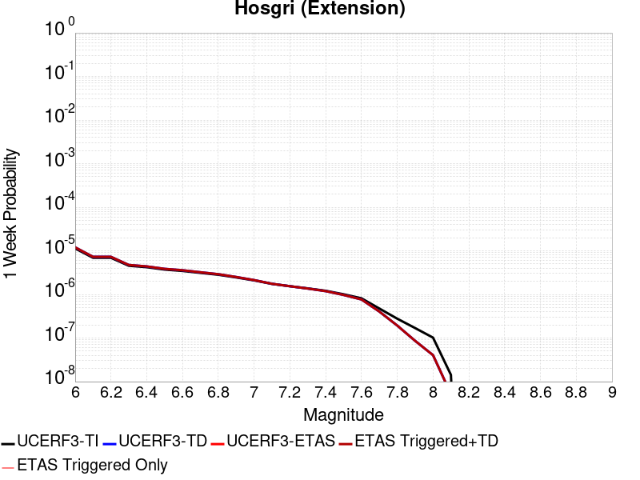 | 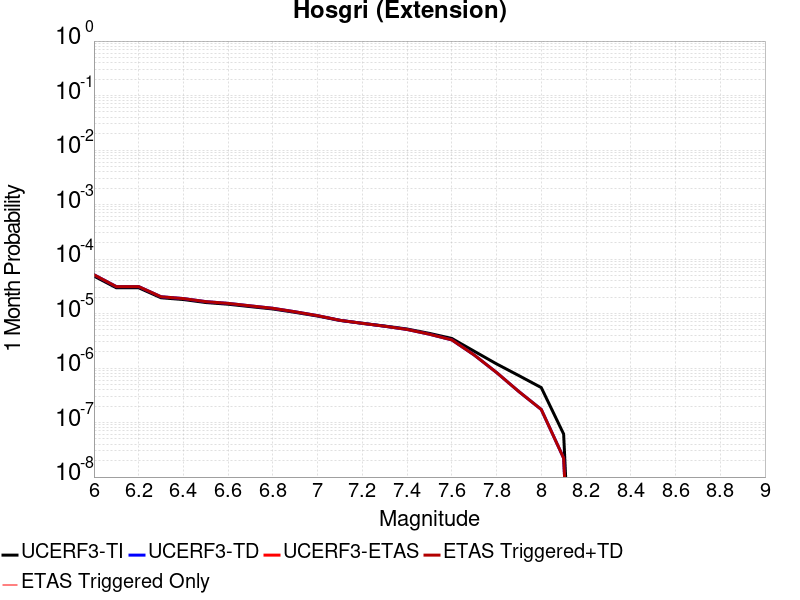 | 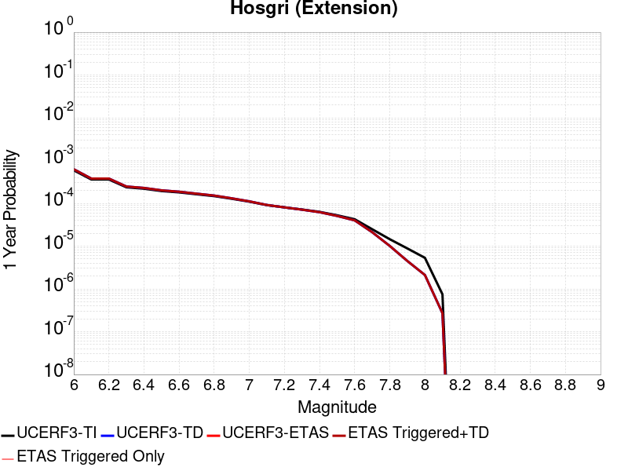 | 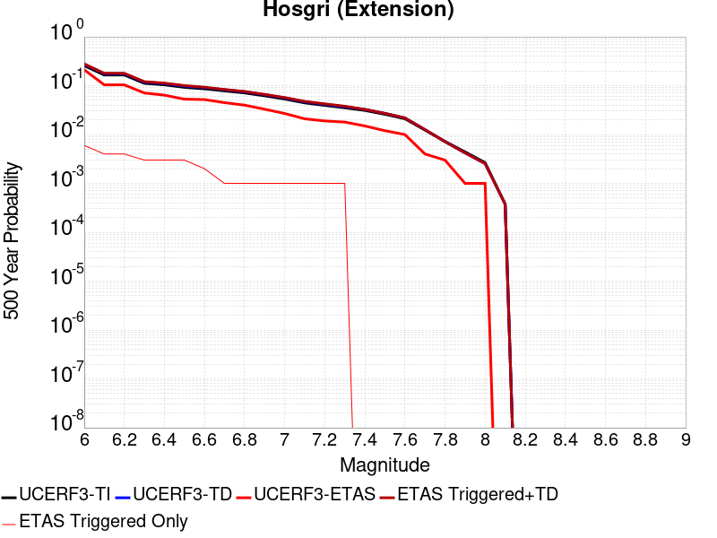 |

| Magnitude | 1 wk TI Prob | 1 wk TD Prob | 1 wk ETAS Prob | 1 wk ETAS/TD Gain | 1 wk ETAS Triggered+TD | 1 wk ETAS Triggered Only | 1 mo TI Prob | 1 mo TD Prob | 1 mo ETAS Prob | 1 mo ETAS/TD Gain | 1 mo ETAS Triggered+TD | 1 mo ETAS Triggered Only | 1 yr TI Prob | 1 yr TD Prob | 1 yr ETAS Prob | 1 yr ETAS/TD Gain | 1 yr ETAS Triggered+TD | 1 yr ETAS Triggered Only | 500 yr TI Prob | 500 yr TD Prob | 500 yr ETAS Prob | 500 yr ETAS/TD Gain | 500 yr ETAS Triggered+TD | 500 yr ETAS Triggered Only |
|-----|-----|-----|-----|-----|-----|-----|-----|-----|-----|-----|-----|-----|-----|-----|-----|-----|-----|-----|-----|-----|-----|-----|-----|-----|
| 6.0 | 1.1369135E-5 | 1.2032239E-5 | 0.0 | 0.0 | 1.2032239E-5 | 0.0 | 4.8723956E-5 | 5.156585E-5 | 0.0 | 0.0 | 5.156585E-5 | 0.0 | 5.9305265E-4 | 6.276559E-4 | 0.0 | 0.0 | 6.276559E-4 | 0.0 | 0.25666934 | 0.27547085 | 0.212 | 0.76959145 | 0.27981803 | 0.006 |
| 6.1 | 6.934979E-6 | 7.29176E-6 | 0.0 | 0.0 | 7.29176E-6 | 0.0 | 2.9721E-5 | 3.125005E-5 | 0.0 | 0.0 | 3.125005E-5 | 0.0 | 3.617931E-4 | 3.8040706E-4 | 0.0 | 0.0 | 3.8040706E-4 | 0.0 | 0.16550563 | 0.1758421 | 0.104 | 0.5914397 | 0.17913873 | 0.004 |
| 6.2 | 6.934979E-6 | 7.29176E-6 | 0.0 | 0.0 | 7.29176E-6 | 0.0 | 2.9721E-5 | 3.125005E-5 | 0.0 | 0.0 | 3.125005E-5 | 0.0 | 3.617931E-4 | 3.8040706E-4 | 0.0 | 0.0 | 3.8040706E-4 | 0.0 | 0.16550563 | 0.1758421 | 0.104 | 0.5914397 | 0.17913873 | 0.004 |
| 6.3 | 4.5484676E-6 | 4.7458925E-6 | 0.0 | 0.0 | 4.7458925E-6 | 0.0 | 1.9493287E-5 | 2.0339383E-5 | 0.0 | 0.0 | 2.0339383E-5 | 0.0 | 2.3730492E-4 | 2.4760424E-4 | 0.0 | 0.0 | 2.4760424E-4 | 0.0 | 0.111896105 | 0.118396334 | 0.071 | 0.5996807 | 0.12104115 | 0.003 |
| 6.4 | 4.218095E-6 | 4.394645E-6 | 0.0 | 0.0 | 4.394645E-6 | 0.0 | 1.8077424E-5 | 1.8834058E-5 | 0.0 | 0.0 | 1.8834058E-5 | 0.0 | 2.2007042E-4 | 2.2928086E-4 | 0.0 | 0.0 | 2.2928086E-4 | 0.0 | 0.10420825 | 0.11026484 | 0.064 | 0.58042073 | 0.112934045 | 0.003 |
| 6.5 | 3.717374E-6 | 3.8634407E-6 | 0.0 | 0.0 | 3.8634407E-6 | 0.0 | 1.5931506E-5 | 1.65575E-5 | 0.0 | 0.0 | 1.65575E-5 | 0.0 | 1.9394881E-4 | 2.0156908E-4 | 0.0 | 0.0 | 2.0156908E-4 | 0.0 | 0.0924293 | 0.09782029 | 0.053 | 0.54180986 | 0.10052683 | 0.003 |
| 6.6 | 3.4605036E-6 | 3.5889082E-6 | 0.0 | 0.0 | 3.5889082E-6 | 0.0 | 1.4830645E-5 | 1.5380945E-5 | 0.0 | 0.0 | 1.5380945E-5 | 0.0 | 1.8054814E-4 | 1.8724705E-4 | 0.0 | 0.0 | 1.8724705E-4 | 0.0 | 0.08632671 | 0.09133354 | 0.052 | 0.5693418 | 0.09315088 | 0.002 |
| 6.7 | 3.123439E-6 | 3.2285416E-6 | 0.0 | 0.0 | 3.2285416E-6 | 0.0 | 1.33860985E-5 | 1.3836534E-5 | 0.0 | 0.0 | 1.3836534E-5 | 0.0 | 1.6296357E-4 | 1.6844689E-4 | 0.0 | 0.0 | 1.6844689E-4 | 0.0 | 0.078256615 | 0.0827523 | 0.045 | 0.54379153 | 0.08366954 | 0.001 |
| 6.8 | 2.8290783E-6 | 2.9137177E-6 | 0.0 | 0.0 | 2.9137177E-6 | 0.0 | 1.2124565E-5 | 1.2487302E-5 | 0.0 | 0.0 | 1.2487302E-5 | 0.0 | 1.4760658E-4 | 1.5202237E-4 | 0.0 | 0.0 | 1.5202237E-4 | 0.0 | 0.07115067 | 0.075183 | 0.04 | 0.5320352 | 0.076107815 | 0.001 |
| 6.9 | 2.454112E-6 | 2.5130105E-6 | 0.0 | 0.0 | 2.5130105E-6 | 0.0 | 1.0517581E-5 | 1.0770001E-5 | 0.0 | 0.0 | 1.0770001E-5 | 0.0 | 1.2804402E-4 | 1.3111693E-4 | 0.0 | 0.0 | 1.3111693E-4 | 0.0 | 0.062019493 | 0.06545882 | 0.033 | 0.5041337 | 0.06639336 | 0.001 |
| 7.0 | 2.1008145E-6 | 2.1359565E-6 | 0.0 | 0.0 | 2.1359565E-6 | 0.0 | 9.003459E-6 | 9.154067E-6 | 0.0 | 0.0 | 9.154067E-6 | 0.0 | 1.096116E-4 | 1.114451E-4 | 0.0 | 0.0 | 1.114451E-4 | 0.0 | 0.05333387 | 0.056215208 | 0.027 | 0.4802971 | 0.05715899 | 0.001 |
| 7.1 | 1.744384E-6 | 1.7560952E-6 | 0.0 | 0.0 | 1.7560952E-6 | 0.0 | 7.47591E-6 | 7.5261005E-6 | 0.0 | 0.0 | 7.5261005E-6 | 0.0 | 9.1015405E-5 | 9.162644E-5 | 0.0 | 0.0 | 9.162644E-5 | 0.0 | 0.044489734 | 0.04681107 | 0.021 | 0.44861183 | 0.04776426 | 0.001 |
| 7.2 | 1.5456587E-6 | 1.544502E-6 | 0.0 | 0.0 | 1.544502E-6 | 0.0 | 6.6242346E-6 | 6.6192774E-6 | 0.0 | 0.0 | 6.6192774E-6 | 0.0 | 8.064707E-5 | 8.058673E-5 | 0.0 | 0.0 | 8.058673E-5 | 0.0 | 0.039522924 | 0.04153372 | 0.019 | 0.45745963 | 0.042492185 | 0.001 |
| 7.3 | 1.3775123E-6 | 1.3654602E-6 | 0.0 | 0.0 | 1.3654602E-6 | 0.0 | 5.9036106E-6 | 5.851959E-6 | 0.0 | 0.0 | 5.851959E-6 | 0.0 | 7.187409E-5 | 7.124528E-5 | 0.0 | 0.0 | 7.124528E-5 | 0.0 | 0.03530022 | 0.037045587 | 0.018 | 0.48588786 | 0.03800854 | 0.001 |
| 7.4 | 1.214491E-6 | 1.1918203E-6 | 0.0 | 0.0 | 1.1918203E-6 | 0.0 | 5.2049513E-6 | 5.1077914E-6 | 0.0 | 0.0 | 5.1077914E-6 | 0.0 | 6.336844E-5 | 6.2185594E-5 | 0.0 | 0.0 | 6.2185594E-5 | 0.0 | 0.031188505 | 0.0326729 | 0.015 | 0.45909607 | 0.0326729 | 0.0 |
| 7.5 | 1.0101123E-6 | 9.744584E-7 | 0.0 | 0.0 | 9.744584E-7 | 0.0 | 4.3290456E-6 | 4.1762437E-6 | 0.0 | 0.0 | 4.1762437E-6 | 0.0 | 5.2704854E-5 | 5.0844585E-5 | 0.0 | 0.0 | 5.0844585E-5 | 0.0 | 0.02600891 | 0.02717119 | 0.012 | 0.44164422 | 0.02717119 | 0.0 |
| 7.6 | 8.1558215E-7 | 7.6755447E-7 | 0.0 | 0.0 | 7.6755447E-7 | 0.0 | 3.4953473E-6 | 3.289515E-6 | 0.0 | 0.0 | 3.289515E-6 | 0.0 | 4.255502E-5 | 4.0049115E-5 | 0.0 | 0.0 | 4.0049115E-5 | 0.0 | 0.021053186 | 0.021905301 | 0.01 | 0.45651048 | 0.021905301 | 0.0 |
| 7.7 | 4.757816E-7 | 4.0536003E-7 | 0.0 | 0.0 | 4.0536003E-7 | 0.0 | 2.0390623E-6 | 1.7372561E-6 | 0.0 | 0.0 | 1.7372561E-6 | 0.0 | 2.4825302E-5 | 2.1150889E-5 | 0.0 | 0.0 | 2.1150889E-5 | 0.0 | 0.012336085 | 0.01261824 | 0.004 | 0.31700143 | 0.01261824 | 0.0 |
| 7.8 | 2.782787E-7 | 1.9359068E-7 | 0.0 | 0.0 | 1.9359068E-7 | 0.0 | 1.1926223E-6 | 8.2967404E-7 | 0.0 | 0.0 | 8.2967404E-7 | 0.0 | 1.452008E-5 | 1.0101235E-5 | 0.0 | 0.0 | 1.0101235E-5 | 0.0 | 0.007233802 | 0.007147696 | 0.003 | 0.41971567 | 0.007147696 | 0.0 |
| 7.9 | 1.6948086E-7 | 8.629991E-8 | 0.0 | 0.0 | 8.629991E-8 | 0.0 | 7.2634634E-7 | 3.698567E-7 | 0.0 | 0.0 | 3.698567E-7 | 0.0 | 8.843231E-6 | 4.502996E-6 | 0.0 | 0.0 | 4.502996E-6 | 0.0 | 0.004411874 | 0.0042111115 | 0.001 | 0.237467 | 0.0042111115 | 0.0 |
| 8.0 | 1.0225492E-7 | 4.055807E-8 | 0.0 | 0.0 | 4.055807E-8 | 0.0 | 4.382353E-7 | 1.7382028E-7 | 0.0 | 0.0 | 1.7382028E-7 | 0.0 | 5.335502E-6 | 2.11626E-6 | 0.0 | 0.0 | 2.11626E-6 | 0.0 | 0.0026642028 | 0.00254334 | 0.001 | 0.3931838 | 0.00254334 | 0.0 |
| 8.1 | 1.43711345E-8 | 5.198073E-9 | 0.0 | 0.0 | 5.198073E-9 | 0.0 | 6.1590576E-8 | 2.2277455E-8 | 0.0 | 0.0 | 2.2277455E-8 | 0.0 | 7.4986497E-7 | 2.7122798E-7 | 0.0 | 0.0 | 2.7122798E-7 | 0.0 | 3.7486234E-4 | 3.7811787E-4 | 0.0 | 0.0 | 3.7811787E-4 | 0.0 |

## Malibu Coast (Extension) alt 1
*[(top)](#table-of-contents)*

| 1 Week | 1 Month | 1 Year | 500 Year |
|-----|-----|-----|-----|
|  |  | 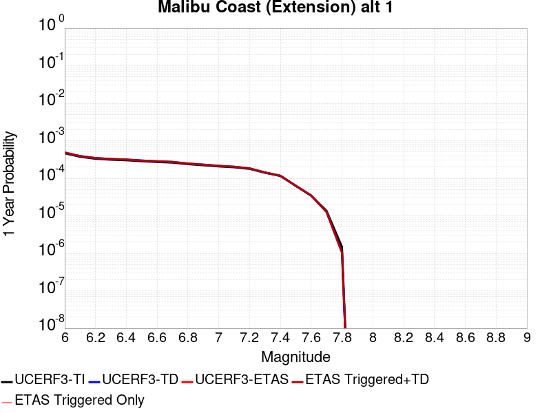 | 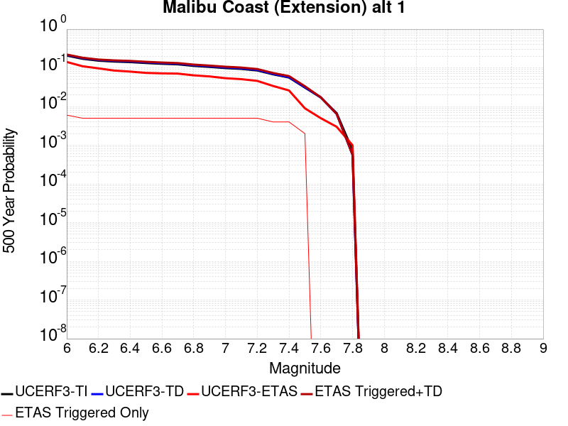 |

| Magnitude | 1 wk TI Prob | 1 wk TD Prob | 1 wk ETAS Prob | 1 wk ETAS/TD Gain | 1 wk ETAS Triggered+TD | 1 wk ETAS Triggered Only | 1 mo TI Prob | 1 mo TD Prob | 1 mo ETAS Prob | 1 mo ETAS/TD Gain | 1 mo ETAS Triggered+TD | 1 mo ETAS Triggered Only | 1 yr TI Prob | 1 yr TD Prob | 1 yr ETAS Prob | 1 yr ETAS/TD Gain | 1 yr ETAS Triggered+TD | 1 yr ETAS Triggered Only | 500 yr TI Prob | 500 yr TD Prob | 500 yr ETAS Prob | 500 yr ETAS/TD Gain | 500 yr ETAS Triggered+TD | 500 yr ETAS Triggered Only |
|-----|-----|-----|-----|-----|-----|-----|-----|-----|-----|-----|-----|-----|-----|-----|-----|-----|-----|-----|-----|-----|-----|-----|-----|-----|
| 6.0 | 8.930738E-6 | 9.301392E-6 | 0.0 | 0.0 | 9.301392E-6 | 0.0 | 3.827403E-5 | 3.9862512E-5 | 0.0 | 0.0 | 3.9862512E-5 | 0.0 | 4.6588664E-4 | 4.852197E-4 | 0.0 | 0.0 | 4.852197E-4 | 0.0 | 0.20784453 | 0.21637623 | 0.142 | 0.6562643 | 0.22107796 | 0.006 |
| 6.1 | 7.199952E-6 | 7.50609E-6 | 0.0 | 0.0 | 7.50609E-6 | 0.0 | 3.0856572E-5 | 3.2168566E-5 | 0.0 | 0.0 | 3.2168566E-5 | 0.0 | 3.75614E-4 | 3.915825E-4 | 0.0 | 0.0 | 3.915825E-4 | 0.0 | 0.17125459 | 0.17854528 | 0.11 | 0.61609024 | 0.18265255 | 0.005 |
| 6.2 | 6.3721413E-6 | 6.6445173E-6 | 0.0 | 0.0 | 6.6445173E-6 | 0.0 | 2.7308892E-5 | 2.8476194E-5 | 0.0 | 0.0 | 2.8476194E-5 | 0.0 | 3.3243504E-4 | 3.4664286E-4 | 0.0 | 0.0 | 3.4664286E-4 | 0.0 | 0.15316139 | 0.15981577 | 0.097 | 0.60694885 | 0.1640167 | 0.005 |
| 6.3 | 6.016345E-6 | 6.273743E-6 | 0.0 | 0.0 | 6.273743E-6 | 0.0 | 2.578408E-5 | 2.6887195E-5 | 0.0 | 0.0 | 2.6887195E-5 | 0.0 | 3.1387596E-4 | 3.2730275E-4 | 0.0 | 0.0 | 3.2730275E-4 | 0.0 | 0.14526398 | 0.15164222 | 0.085 | 0.5605299 | 0.15588401 | 0.005 |
| 6.4 | 5.8104883E-6 | 6.0586603E-6 | 0.0 | 0.0 | 6.0586603E-6 | 0.0 | 2.4901856E-5 | 2.5965432E-5 | 0.0 | 0.0 | 2.5965432E-5 | 0.0 | 3.031379E-4 | 3.1608358E-4 | 0.0 | 0.0 | 3.1608358E-4 | 0.0 | 0.14066112 | 0.14686644 | 0.08 | 0.5447126 | 0.1511321 | 0.005 |
| 6.5 | 5.476925E-6 | 5.7076413E-6 | 0.0 | 0.0 | 5.7076413E-6 | 0.0 | 2.3472323E-5 | 2.4461091E-5 | 0.0 | 0.0 | 2.4461091E-5 | 0.0 | 2.8573806E-4 | 2.9777337E-4 | 0.0 | 0.0 | 2.9777337E-4 | 0.0 | 0.1331501 | 0.13901515 | 0.074 | 0.5323161 | 0.14332007 | 0.005 |
| 6.6 | 5.222387E-6 | 5.439497E-6 | 0.0 | 0.0 | 5.439497E-6 | 0.0 | 2.2381464E-5 | 2.3311923E-5 | 0.0 | 0.0 | 2.3311923E-5 | 0.0 | 2.7246025E-4 | 2.8378598E-4 | 0.0 | 0.0 | 2.8378598E-4 | 0.0 | 0.12737441 | 0.13297075 | 0.072 | 0.54147243 | 0.1373059 | 0.005 |
| 6.7 | 5.0337076E-6 | 5.2406126E-6 | 0.0 | 0.0 | 5.2406126E-6 | 0.0 | 2.1572854E-5 | 2.2459577E-5 | 0.0 | 0.0 | 2.2459577E-5 | 0.0 | 2.6261783E-4 | 2.734113E-4 | 0.0 | 0.0 | 2.734113E-4 | 0.0 | 0.123068295 | 0.12846102 | 0.071 | 0.5526969 | 0.13281871 | 0.005 |
| 6.8 | 4.5675624E-6 | 4.7421327E-6 | 0.0 | 0.0 | 4.7421327E-6 | 0.0 | 1.9575122E-5 | 2.0323268E-5 | 0.0 | 0.0 | 2.0323268E-5 | 0.0 | 2.3830103E-4 | 2.4740788E-4 | 0.0 | 0.0 | 2.4740788E-4 | 0.0 | 0.112338424 | 0.11703138 | 0.064 | 0.5468619 | 0.12144622 | 0.005 |
| 6.9 | 4.2802412E-6 | 4.436509E-6 | 0.0 | 0.0 | 4.436509E-6 | 0.0 | 1.8343762E-5 | 1.901347E-5 | 0.0 | 0.0 | 1.901347E-5 | 0.0 | 2.2331243E-4 | 2.3146458E-4 | 0.0 | 0.0 | 2.3146458E-4 | 0.0 | 0.10565948 | 0.109956704 | 0.06 | 0.5456693 | 0.11440692 | 0.005 |
| 7.0 | 3.9794063E-6 | 4.115758E-6 | 0.0 | 0.0 | 4.115758E-6 | 0.0 | 1.7054486E-5 | 1.7638844E-5 | 0.0 | 0.0 | 1.7638844E-5 | 0.0 | 2.0761859E-4 | 2.1473189E-4 | 0.0 | 0.0 | 2.1473189E-4 | 0.0 | 0.09861253 | 0.10247116 | 0.054 | 0.52697754 | 0.1069588 | 0.005 |
| 7.1 | 3.7730424E-6 | 3.8975663E-6 | 0.0 | 0.0 | 3.8975663E-6 | 0.0 | 1.6170083E-5 | 1.670375E-5 | 0.0 | 0.0 | 1.670375E-5 | 0.0 | 1.9685295E-4 | 2.033493E-4 | 0.0 | 0.0 | 2.033493E-4 | 0.0 | 0.09374646 | 0.09734653 | 0.051 | 0.5239016 | 0.10185979 | 0.005 |
| 7.2 | 3.424985E-6 | 3.528892E-6 | 0.0 | 0.0 | 3.528892E-6 | 0.0 | 1.4678424E-5 | 1.51237355E-5 | 0.0 | 0.0 | 1.51237355E-5 | 0.0 | 1.7869516E-4 | 1.8411603E-4 | 0.0 | 0.0 | 1.8411603E-4 | 0.0 | 0.085479654 | 0.088621706 | 0.046 | 0.5190602 | 0.0931786 | 0.005 |
| 7.3 | 2.6966375E-6 | 2.750177E-6 | 0.0 | 0.0 | 2.750177E-6 | 0.0 | 1.15569665E-5 | 1.178642E-5 | 0.0 | 0.0 | 1.178642E-5 | 0.0 | 1.4069698E-4 | 1.4349025E-4 | 0.0 | 0.0 | 1.4349025E-4 | 0.0 | 0.06793567 | 0.06989726 | 0.034 | 0.48642823 | 0.073617674 | 0.004 |
| 7.4 | 2.215957E-6 | 2.2416323E-6 | 0.0 | 0.0 | 2.2416323E-6 | 0.0 | 9.496924E-6 | 9.60696E-6 | 0.0 | 0.0 | 9.60696E-6 | 0.0 | 1.1561892E-4 | 1.16958494E-4 | 0.0 | 0.0 | 1.16958494E-4 | 0.0 | 0.056173384 | 0.05745754 | 0.026 | 0.45250806 | 0.06122771 | 0.004 |
| 7.5 | 1.2040218E-6 | 1.2176179E-6 | 0.0 | 0.0 | 1.2176179E-6 | 0.0 | 5.160083E-6 | 5.218352E-6 | 0.0 | 0.0 | 5.218352E-6 | 0.0 | 6.2822204E-5 | 6.35316E-5 | 0.0 | 0.0 | 6.35316E-5 | 0.0 | 0.030923855 | 0.031539854 | 0.009 | 0.28535324 | 0.033476774 | 0.002 |
| 7.6 | 6.6157446E-7 | 6.656009E-7 | 0.0 | 0.0 | 6.656009E-7 | 0.0 | 2.835316E-6 | 2.8525722E-6 | 0.0 | 0.0 | 2.8525722E-6 | 0.0 | 3.4519428E-5 | 3.4729528E-5 | 0.0 | 0.0 | 3.4729528E-5 | 0.0 | 0.01711191 | 0.017329762 | 0.005 | 0.28852096 | 0.017329762 | 0.0 |
| 7.7 | 2.6012302E-7 | 2.4277335E-7 | 0.0 | 0.0 | 2.4277335E-7 | 0.0 | 1.1148124E-6 | 1.0404568E-6 | 0.0 | 0.0 | 1.0404568E-6 | 0.0 | 1.3572758E-5 | 1.26674995E-5 | 0.0 | 0.0 | 1.26674995E-5 | 0.0 | 0.006763449 | 0.0064177355 | 0.003 | 0.4674546 | 0.0064177355 | 0.0 |
| 7.8 | 2.8323132E-8 | 2.0183657E-8 | 0.0 | 0.0 | 2.0183657E-8 | 0.0 | 1.2138484E-7 | 8.650139E-8 | 0.0 | 0.0 | 8.650139E-8 | 0.0 | 1.4778595E-6 | 1.0531539E-6 | 0.0 | 0.0 | 1.0531539E-6 | 0.0 | 7.3865737E-4 | 5.620693E-4 | 0.001 | 1.77914 | 5.620693E-4 | 0.0 |

## Antelope Valley 2011
*[(top)](#table-of-contents)*

| 1 Week | 1 Month | 1 Year | 500 Year |
|-----|-----|-----|-----|
|  | 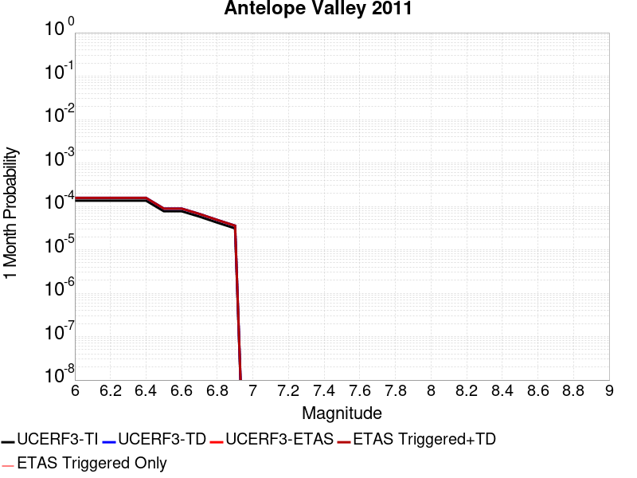 | 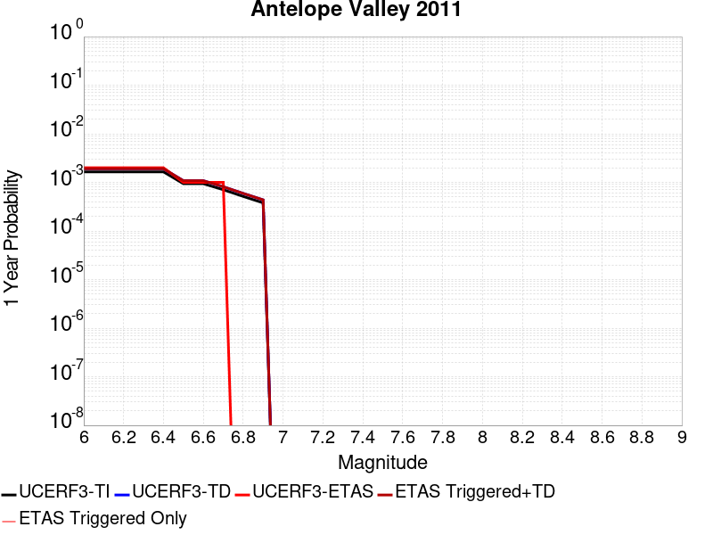 | 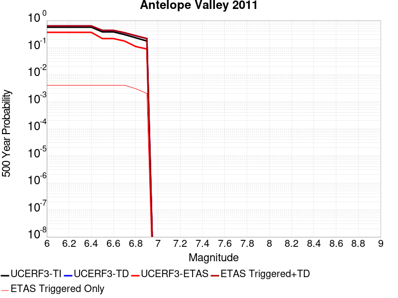 |

| Magnitude | 1 wk TI Prob | 1 wk TD Prob | 1 wk ETAS Prob | 1 wk ETAS/TD Gain | 1 wk ETAS Triggered+TD | 1 wk ETAS Triggered Only | 1 mo TI Prob | 1 mo TD Prob | 1 mo ETAS Prob | 1 mo ETAS/TD Gain | 1 mo ETAS Triggered+TD | 1 mo ETAS Triggered Only | 1 yr TI Prob | 1 yr TD Prob | 1 yr ETAS Prob | 1 yr ETAS/TD Gain | 1 yr ETAS Triggered+TD | 1 yr ETAS Triggered Only | 500 yr TI Prob | 500 yr TD Prob | 500 yr ETAS Prob | 500 yr ETAS/TD Gain | 500 yr ETAS Triggered+TD | 500 yr ETAS Triggered Only |
|-----|-----|-----|-----|-----|-----|-----|-----|-----|-----|-----|-----|-----|-----|-----|-----|-----|-----|-----|-----|-----|-----|-----|-----|-----|
| 6.0 | 3.1646934E-5 | 3.658848E-5 | 0.0 | 0.0 | 3.658848E-5 | 0.0 | 1.3562266E-4 | 1.5679981E-4 | 0.0 | 0.0 | 1.5679981E-4 | 0.0 | 0.0016499552 | 0.0019076264 | 0.002 | 1.0484233 | 0.0019076264 | 0.0 | 0.5620537 | 0.62337697 | 0.362 | 0.580708 | 0.6248834 | 0.004 |
| 6.1 | 3.1646934E-5 | 3.658848E-5 | 0.0 | 0.0 | 3.658848E-5 | 0.0 | 1.3562266E-4 | 1.5679981E-4 | 0.0 | 0.0 | 1.5679981E-4 | 0.0 | 0.0016499552 | 0.0019076264 | 0.002 | 1.0484233 | 0.0019076264 | 0.0 | 0.5620537 | 0.62337697 | 0.362 | 0.580708 | 0.6248834 | 0.004 |
| 6.2 | 3.1646934E-5 | 3.658848E-5 | 0.0 | 0.0 | 3.658848E-5 | 0.0 | 1.3562266E-4 | 1.5679981E-4 | 0.0 | 0.0 | 1.5679981E-4 | 0.0 | 0.0016499552 | 0.0019076264 | 0.002 | 1.0484233 | 0.0019076264 | 0.0 | 0.5620537 | 0.62337697 | 0.362 | 0.580708 | 0.6248834 | 0.004 |
| 6.3 | 3.1646934E-5 | 3.658848E-5 | 0.0 | 0.0 | 3.658848E-5 | 0.0 | 1.3562266E-4 | 1.5679981E-4 | 0.0 | 0.0 | 1.5679981E-4 | 0.0 | 0.0016499552 | 0.0019076264 | 0.002 | 1.0484233 | 0.0019076264 | 0.0 | 0.5620537 | 0.62337697 | 0.362 | 0.580708 | 0.6248834 | 0.004 |
| 6.4 | 3.1646934E-5 | 3.658848E-5 | 0.0 | 0.0 | 3.658848E-5 | 0.0 | 1.3562266E-4 | 1.5679981E-4 | 0.0 | 0.0 | 1.5679981E-4 | 0.0 | 0.0016499552 | 0.0019076264 | 0.002 | 1.0484233 | 0.0019076264 | 0.0 | 0.5620537 | 0.62337697 | 0.362 | 0.580708 | 0.6248834 | 0.004 |
| 6.5 | 1.8034107E-5 | 2.0766998E-5 | 0.0 | 0.0 | 2.0766998E-5 | 0.0 | 7.7286735E-5 | 8.899906E-5 | 0.0 | 0.0 | 8.899906E-5 | 0.0 | 9.405598E-4 | 0.0010831454 | 0.001 | 0.9232371 | 0.0010831454 | 0.0 | 0.3753109 | 0.42682472 | 0.213 | 0.4990339 | 0.4291174 | 0.004 |
| 6.6 | 1.8034107E-5 | 2.0766998E-5 | 0.0 | 0.0 | 2.0766998E-5 | 0.0 | 7.7286735E-5 | 8.899906E-5 | 0.0 | 0.0 | 8.899906E-5 | 0.0 | 9.405598E-4 | 0.0010831454 | 0.001 | 0.9232371 | 0.0010831454 | 0.0 | 0.3753109 | 0.42682472 | 0.213 | 0.4990339 | 0.4291174 | 0.004 |
| 6.7 | 1.3567667E-5 | 1.561897E-5 | 0.0 | 0.0 | 1.561897E-5 | 0.0 | 5.814585E-5 | 6.693732E-5 | 0.0 | 0.0 | 6.693732E-5 | 0.0 | 7.076958E-4 | 8.147616E-4 | 0.001 | 1.2273529 | 8.147616E-4 | 0.0 | 0.2981062 | 0.347075 | 0.172 | 0.49557012 | 0.34968668 | 0.004 |
| 6.8 | 9.867387E-6 | 1.137207E-5 | 0.0 | 0.0 | 1.137207E-5 | 0.0 | 4.2288117E-5 | 4.873706E-5 | 0.0 | 0.0 | 4.873706E-5 | 0.0 | 5.1473617E-4 | 5.933055E-4 | 0.0 | 0.0 | 5.933055E-4 | 0.0 | 0.22696762 | 0.2705205 | 0.108 | 0.39923036 | 0.27270895 | 0.003 |
| 6.9 | 7.273233E-6 | 8.384075E-6 | 0.0 | 0.0 | 8.384075E-6 | 0.0 | 3.1170628E-5 | 3.5931753E-5 | 0.0 | 0.0 | 3.5931753E-5 | 0.0 | 3.794363E-4 | 4.3746908E-4 | 0.0 | 0.0 | 4.3746908E-4 | 0.0 | 0.17283754 | 0.21205035 | 0.088 | 0.4149958 | 0.21362625 | 0.002 |

## La Panza 2011
*[(top)](#table-of-contents)*

| 1 Week | 1 Month | 1 Year | 500 Year |
|-----|-----|-----|-----|
|  |  |  | 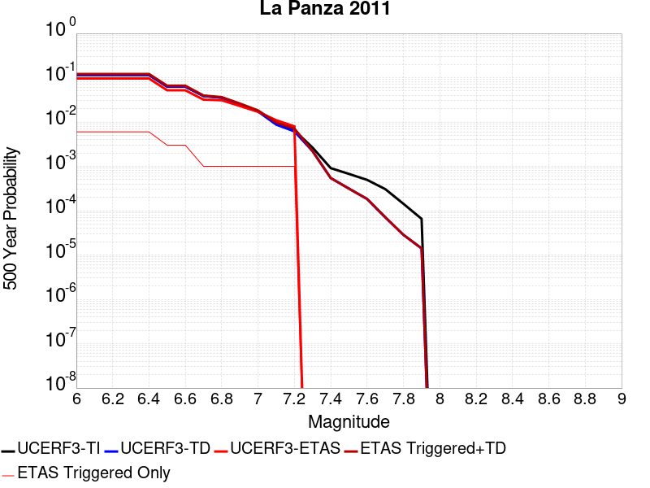 |

| Magnitude | 1 wk TI Prob | 1 wk TD Prob | 1 wk ETAS Prob | 1 wk ETAS/TD Gain | 1 wk ETAS Triggered+TD | 1 wk ETAS Triggered Only | 1 mo TI Prob | 1 mo TD Prob | 1 mo ETAS Prob | 1 mo ETAS/TD Gain | 1 mo ETAS Triggered+TD | 1 mo ETAS Triggered Only | 1 yr TI Prob | 1 yr TD Prob | 1 yr ETAS Prob | 1 yr ETAS/TD Gain | 1 yr ETAS Triggered+TD | 1 yr ETAS Triggered Only | 500 yr TI Prob | 500 yr TD Prob | 500 yr ETAS Prob | 500 yr ETAS/TD Gain | 500 yr ETAS Triggered+TD | 500 yr ETAS Triggered Only |
|-----|-----|-----|-----|-----|-----|-----|-----|-----|-----|-----|-----|-----|-----|-----|-----|-----|-----|-----|-----|-----|-----|-----|-----|-----|
| 6.0 | 4.6754544E-6 | 4.708703E-6 | 0.0 | 0.0 | 4.708703E-6 | 0.0 | 2.0037509E-5 | 2.018001E-5 | 0.0 | 0.0 | 2.018001E-5 | 0.0 | 2.4392935E-4 | 2.456659E-4 | 0.0 | 0.0 | 2.456659E-4 | 0.0 | 0.114833534 | 0.11617286 | 0.096 | 0.82635486 | 0.121475816 | 0.006 |
| 6.1 | 4.6754544E-6 | 4.708703E-6 | 0.0 | 0.0 | 4.708703E-6 | 0.0 | 2.0037509E-5 | 2.018001E-5 | 0.0 | 0.0 | 2.018001E-5 | 0.0 | 2.4392935E-4 | 2.456659E-4 | 0.0 | 0.0 | 2.456659E-4 | 0.0 | 0.114833534 | 0.11617286 | 0.096 | 0.82635486 | 0.121475816 | 0.006 |
| 6.2 | 4.6754544E-6 | 4.708703E-6 | 0.0 | 0.0 | 4.708703E-6 | 0.0 | 2.0037509E-5 | 2.018001E-5 | 0.0 | 0.0 | 2.018001E-5 | 0.0 | 2.4392935E-4 | 2.456659E-4 | 0.0 | 0.0 | 2.456659E-4 | 0.0 | 0.114833534 | 0.11617286 | 0.096 | 0.82635486 | 0.121475816 | 0.006 |
| 6.3 | 4.6754544E-6 | 4.708703E-6 | 0.0 | 0.0 | 4.708703E-6 | 0.0 | 2.0037509E-5 | 2.018001E-5 | 0.0 | 0.0 | 2.018001E-5 | 0.0 | 2.4392935E-4 | 2.456659E-4 | 0.0 | 0.0 | 2.456659E-4 | 0.0 | 0.114833534 | 0.11617286 | 0.096 | 0.82635486 | 0.121475816 | 0.006 |
| 6.4 | 4.6754544E-6 | 4.708703E-6 | 0.0 | 0.0 | 4.708703E-6 | 0.0 | 2.0037509E-5 | 2.018001E-5 | 0.0 | 0.0 | 2.018001E-5 | 0.0 | 2.4392935E-4 | 2.456659E-4 | 0.0 | 0.0 | 2.456659E-4 | 0.0 | 0.114833534 | 0.11617286 | 0.096 | 0.82635486 | 0.121475816 | 0.006 |
| 6.5 | 2.485343E-6 | 2.493128E-6 | 0.0 | 0.0 | 2.493128E-6 | 0.0 | 1.0651426E-5 | 1.0684793E-5 | 0.0 | 0.0 | 1.0684793E-5 | 0.0 | 1.296734E-4 | 1.3007998E-4 | 0.0 | 0.0 | 1.3007998E-4 | 0.0 | 0.062783435 | 0.06317165 | 0.052 | 0.8231541 | 0.06598213 | 0.003 |
| 6.6 | 2.485343E-6 | 2.493128E-6 | 0.0 | 0.0 | 2.493128E-6 | 0.0 | 1.0651426E-5 | 1.0684793E-5 | 0.0 | 0.0 | 1.0684793E-5 | 0.0 | 1.296734E-4 | 1.3007998E-4 | 0.0 | 0.0 | 1.3007998E-4 | 0.0 | 0.062783435 | 0.06317165 | 0.052 | 0.8231541 | 0.06598213 | 0.003 |
| 6.7 | 1.5108508E-6 | 1.5077693E-6 | 0.0 | 0.0 | 1.5077693E-6 | 0.0 | 6.4750584E-6 | 6.461853E-6 | 0.0 | 0.0 | 6.461853E-6 | 0.0 | 7.8830984E-5 | 7.867033E-5 | 0.0 | 0.0 | 7.867033E-5 | 0.0 | 0.038650304 | 0.038702533 | 0.032 | 0.8268193 | 0.03966383 | 0.001 |
| 6.8 | 1.3865837E-6 | 1.38174E-6 | 0.0 | 0.0 | 1.38174E-6 | 0.0 | 5.942488E-6 | 5.9217305E-6 | 0.0 | 0.0 | 5.9217305E-6 | 0.0 | 7.234739E-5 | 7.209478E-5 | 0.0 | 0.0 | 7.209478E-5 | 0.0 | 0.035528507 | 0.035533942 | 0.031 | 0.8724053 | 0.03649841 | 0.001 |
| 6.9 | 9.826583E-7 | 9.731192E-7 | 0.0 | 0.0 | 9.731192E-7 | 0.0 | 4.2113857E-6 | 4.1705043E-6 | 0.0 | 0.0 | 4.1705043E-6 | 0.0 | 5.1272415E-5 | 5.077476E-5 | 0.0 | 0.0 | 5.077476E-5 | 0.0 | 0.02531103 | 0.0251851 | 0.023 | 0.91323835 | 0.026159914 | 0.001 |
| 7.0 | 6.7797646E-7 | 6.647186E-7 | 0.0 | 0.0 | 6.647186E-7 | 0.0 | 2.9056102E-6 | 2.8487912E-6 | 0.0 | 0.0 | 2.8487912E-6 | 0.0 | 3.537523E-5 | 3.468351E-5 | 0.0 | 0.0 | 3.468351E-5 | 0.0 | 0.017532414 | 0.017303985 | 0.017 | 0.9824327 | 0.01828668 | 0.001 |
| 7.1 | 3.4979826E-7 | 3.3265187E-7 | 0.0 | 0.0 | 3.3265187E-7 | 0.0 | 1.4991346E-6 | 1.4256501E-6 | 0.0 | 0.0 | 1.4256501E-6 | 0.0 | 1.825181E-5 | 1.7357164E-5 | 0.0 | 0.0 | 1.7357164E-5 | 0.0 | 0.009084472 | 0.008748213 | 0.011 | 1.2573997 | 0.009739464 | 0.001 |
| 7.2 | 2.5088332E-7 | 2.3231148E-7 | 0.0 | 0.0 | 2.3231148E-7 | 0.0 | 1.0752137E-6 | 9.956203E-7 | 0.0 | 0.0 | 9.956203E-7 | 0.0 | 1.3090649E-5 | 1.2121618E-5 | 0.0 | 0.0 | 1.2121618E-5 | 0.0 | 0.0065239933 | 0.006149034 | 0.008 | 1.3010173 | 0.007142885 | 0.001 |
| 7.3 | 1.0159086E-7 | 8.057514E-8 | 0.0 | 0.0 | 8.057514E-8 | 0.0 | 4.3538932E-7 | 3.45322E-7 | 0.0 | 0.0 | 3.45322E-7 | 0.0 | 5.300852E-6 | 4.2042875E-6 | 0.0 | 0.0 | 4.2042875E-6 | 0.0 | 0.0026469238 | 0.002204639 | 0.0 | 0.0 | 0.002204639 | 0.0 |
| 7.4 | 3.5006252E-8 | 1.7610375E-8 | 0.0 | 0.0 | 1.7610375E-8 | 0.0 | 1.5002678E-7 | 7.547304E-8 | 0.0 | 0.0 | 7.547304E-8 | 0.0 | 1.8265745E-6 | 9.1888387E-7 | 0.0 | 0.0 | 9.1888387E-7 | 0.0 | 9.1287115E-4 | 5.4494146E-4 | 0.0 | 0.0 | 5.4494146E-4 | 0.0 |
| 7.5 | 2.592274E-8 | 8.9485255E-9 | 0.0 | 0.0 | 8.9485255E-9 | 0.0 | 1.1109746E-7 | 3.8350827E-8 | 0.0 | 0.0 | 3.8350827E-8 | 0.0 | 1.3526106E-6 | 4.669212E-7 | 0.0 | 0.0 | 4.669212E-7 | 0.0 | 6.7607715E-4 | 3.155066E-4 | 0.0 | 0.0 | 3.155066E-4 | 0.0 |
| 7.6 | 1.9016717E-8 | 4.437976E-9 | 0.0 | 0.0 | 4.437976E-9 | 0.0 | 8.150022E-8 | 1.9019899E-8 | 0.0 | 0.0 | 1.9019899E-8 | 0.0 | 9.922647E-7 | 2.3156723E-7 | 0.0 | 0.0 | 2.3156723E-7 | 0.0 | 4.9600954E-4 | 1.840748E-4 | 0.0 | 0.0 | 1.840748E-4 | 0.0 |
| 7.7 | 1.17738495E-8 | 9.0984364E-10 | 0.0 | 0.0 | 9.0984364E-10 | 0.0 | 5.0459356E-8 | 3.8993306E-9 | 0.0 | 0.0 | 3.8993306E-9 | 0.0 | 6.1434247E-7 | 4.7474348E-8 | 0.0 | 0.0 | 4.7474348E-8 | 0.0 | 3.0712417E-4 | 7.1168775E-5 | 0.0 | 0.0 | 7.1168775E-5 | 0.0 |
| 7.8 | 5.489079E-9 | 1.2127654E-10 | 0.0 | 0.0 | 1.2127654E-10 | 0.0 | 2.3524624E-8 | 5.1975646E-10 | 0.0 | 0.0 | 5.1975646E-10 | 0.0 | 2.8641225E-7 | 6.3280354E-9 | 0.0 | 0.0 | 6.3280354E-9 | 0.0 | 1.431959E-4 | 2.852099E-5 | 0.0 | 0.0 | 2.852099E-5 | 0.0 |
| 7.9 | 2.5081048E-9 | 3.7482017E-11 | 0.0 | 0.0 | 3.7482017E-11 | 0.0 | 1.0749021E-8 | 1.6063728E-10 | 0.0 | 0.0 | 1.6063728E-10 | 0.0 | 1.3086932E-7 | 1.9557593E-9 | 0.0 | 0.0 | 1.9557593E-9 | 0.0 | 6.543253E-5 | 1.4103593E-5 | 0.0 | 0.0 | 1.4103593E-5 | 0.0 |

## Polaris 2011 CFM
*[(top)](#table-of-contents)*

| 1 Week | 1 Month | 1 Year | 500 Year |
|-----|-----|-----|-----|
|  |  | 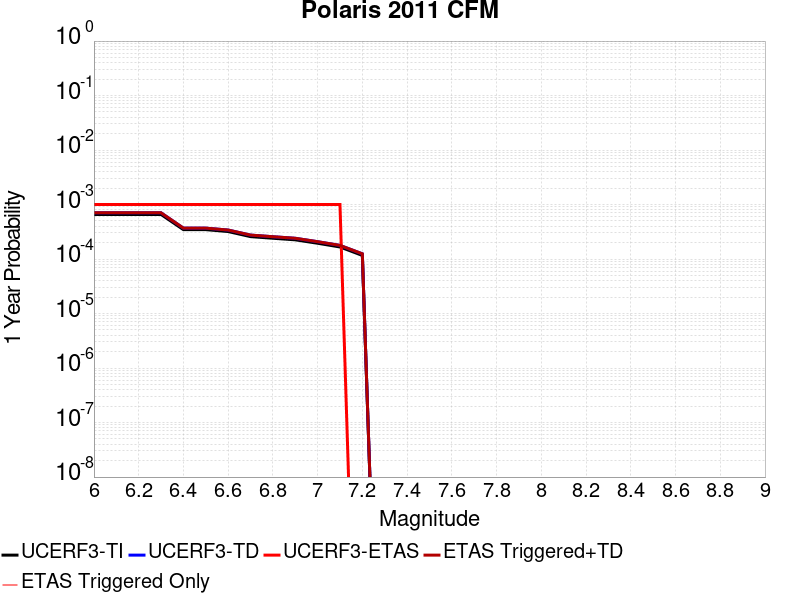 | 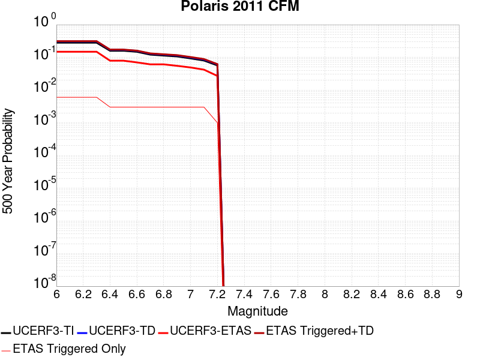 |

| Magnitude | 1 wk TI Prob | 1 wk TD Prob | 1 wk ETAS Prob | 1 wk ETAS/TD Gain | 1 wk ETAS Triggered+TD | 1 wk ETAS Triggered Only | 1 mo TI Prob | 1 mo TD Prob | 1 mo ETAS Prob | 1 mo ETAS/TD Gain | 1 mo ETAS Triggered+TD | 1 mo ETAS Triggered Only | 1 yr TI Prob | 1 yr TD Prob | 1 yr ETAS Prob | 1 yr ETAS/TD Gain | 1 yr ETAS Triggered+TD | 1 yr ETAS Triggered Only | 500 yr TI Prob | 500 yr TD Prob | 500 yr ETAS Prob | 500 yr ETAS/TD Gain | 500 yr ETAS Triggered+TD | 500 yr ETAS Triggered Only |
|-----|-----|-----|-----|-----|-----|-----|-----|-----|-----|-----|-----|-----|-----|-----|-----|-----|-----|-----|-----|-----|-----|-----|-----|-----|
| 6.0 | 1.2630823E-5 | 1.3529874E-5 | 0.0 | 0.0 | 1.3529874E-5 | 0.0 | 5.413098E-5 | 5.7984176E-5 | 0.0 | 0.0 | 5.7984176E-5 | 0.0 | 6.5884535E-4 | 7.0578017E-4 | 0.001 | 1.4168718 | 7.0578017E-4 | 0.0 | 0.2807392 | 0.30784938 | 0.148 | 0.48075458 | 0.31200227 | 0.006 |
| 6.1 | 1.2630823E-5 | 1.3529874E-5 | 0.0 | 0.0 | 1.3529874E-5 | 0.0 | 5.413098E-5 | 5.7984176E-5 | 0.0 | 0.0 | 5.7984176E-5 | 0.0 | 6.5884535E-4 | 7.0578017E-4 | 0.001 | 1.4168718 | 7.0578017E-4 | 0.0 | 0.2807392 | 0.30784938 | 0.148 | 0.48075458 | 0.31200227 | 0.006 |
| 6.2 | 1.2630823E-5 | 1.3529874E-5 | 0.0 | 0.0 | 1.3529874E-5 | 0.0 | 5.413098E-5 | 5.7984176E-5 | 0.0 | 0.0 | 5.7984176E-5 | 0.0 | 6.5884535E-4 | 7.0578017E-4 | 0.001 | 1.4168718 | 7.0578017E-4 | 0.0 | 0.2807392 | 0.30784938 | 0.148 | 0.48075458 | 0.31200227 | 0.006 |
| 6.3 | 1.2630823E-5 | 1.3529874E-5 | 0.0 | 0.0 | 1.3529874E-5 | 0.0 | 5.413098E-5 | 5.7984176E-5 | 0.0 | 0.0 | 5.7984176E-5 | 0.0 | 6.5884535E-4 | 7.0578017E-4 | 0.001 | 1.4168718 | 7.0578017E-4 | 0.0 | 0.2807392 | 0.30784938 | 0.148 | 0.48075458 | 0.31200227 | 0.006 |
| 6.4 | 6.642994E-6 | 7.0813453E-6 | 0.0 | 0.0 | 7.0813453E-6 | 0.0 | 2.8469662E-5 | 3.0348298E-5 | 0.0 | 0.0 | 3.0348298E-5 | 0.0 | 3.46563E-4 | 3.69433E-4 | 0.001 | 2.7068508 | 3.69433E-4 | 0.0 | 0.15912439 | 0.16983213 | 0.079 | 0.46516526 | 0.17232263 | 0.003 |
| 6.5 | 6.642994E-6 | 7.0813453E-6 | 0.0 | 0.0 | 7.0813453E-6 | 0.0 | 2.8469662E-5 | 3.0348298E-5 | 0.0 | 0.0 | 3.0348298E-5 | 0.0 | 3.46563E-4 | 3.69433E-4 | 0.001 | 2.7068508 | 3.69433E-4 | 0.0 | 0.15912439 | 0.16983213 | 0.079 | 0.46516526 | 0.17232263 | 0.003 |
| 6.6 | 6.1286296E-6 | 6.532482E-6 | 0.0 | 0.0 | 6.532482E-6 | 0.0 | 2.626529E-5 | 2.7996079E-5 | 0.0 | 0.0 | 2.7996079E-5 | 0.0 | 3.19733E-4 | 3.4080373E-4 | 0.001 | 2.93424 | 3.4080373E-4 | 0.0 | 0.14776422 | 0.15779087 | 0.07 | 0.44362515 | 0.1603175 | 0.003 |
| 6.7 | 4.9474666E-6 | 5.278794E-6 | 0.0 | 0.0 | 5.278794E-6 | 0.0 | 2.1203256E-5 | 2.2623222E-5 | 0.0 | 0.0 | 2.2623222E-5 | 0.0 | 2.5811905E-4 | 2.7540574E-4 | 0.001 | 3.6310065 | 2.7540574E-4 | 0.0 | 0.121093 | 0.12932809 | 0.061 | 0.4716686 | 0.13194011 | 0.003 |
| 6.8 | 4.616407E-6 | 4.9279615E-6 | 0.0 | 0.0 | 4.9279615E-6 | 0.0 | 1.978445E-5 | 2.1119678E-5 | 0.0 | 0.0 | 2.1119678E-5 | 0.0 | 2.4084905E-4 | 2.571044E-4 | 0.001 | 3.8894703 | 2.571044E-4 | 0.0 | 0.11346886 | 0.121285394 | 0.061 | 0.50294596 | 0.123921536 | 0.003 |
| 6.9 | 4.320343E-6 | 4.6136493E-6 | 0.0 | 0.0 | 4.6136493E-6 | 0.0 | 1.8515624E-5 | 1.9772646E-5 | 0.0 | 0.0 | 1.9772646E-5 | 0.0 | 2.2540441E-4 | 2.4070796E-4 | 0.001 | 4.154412 | 2.4070796E-4 | 0.0 | 0.106594674 | 0.11403256 | 0.055 | 0.4823184 | 0.11669046 | 0.003 |
| 7.0 | 3.7382292E-6 | 3.994484E-6 | 0.0 | 0.0 | 3.994484E-6 | 0.0 | 1.6020884E-5 | 1.7119119E-5 | 0.0 | 0.0 | 1.7119119E-5 | 0.0 | 1.950368E-4 | 2.084077E-4 | 0.001 | 4.798287 | 2.084077E-4 | 0.0 | 0.09292298 | 0.099553145 | 0.049 | 0.49219942 | 0.10225449 | 0.003 |
| 7.1 | 3.193576E-6 | 3.4146883E-6 | 0.0 | 0.0 | 3.4146883E-6 | 0.0 | 1.3686683E-5 | 1.4634309E-5 | 0.0 | 0.0 | 1.4634309E-5 | 0.0 | 1.6662262E-4 | 1.7816035E-4 | 0.001 | 5.612921 | 1.7816035E-4 | 0.0 | 0.07994171 | 0.085788615 | 0.042 | 0.48957548 | 0.08853125 | 0.003 |
| 7.2 | 2.2356758E-6 | 2.393095E-6 | 0.0 | 0.0 | 2.393095E-6 | 0.0 | 9.581432E-6 | 1.0256092E-5 | 0.0 | 0.0 | 1.0256092E-5 | 0.0 | 1.1664769E-4 | 1.2486265E-4 | 0.0 | 0.0 | 1.2486265E-4 | 0.0 | 0.05665881 | 0.061011527 | 0.027 | 0.44253933 | 0.061950516 | 0.001 |

## Great Valley 03a Dunnigan Hills
*[(top)](#table-of-contents)*

| 1 Week | 1 Month | 1 Year | 500 Year |
|-----|-----|-----|-----|
|  | 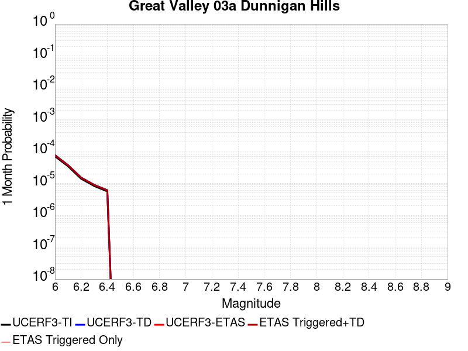 |  | 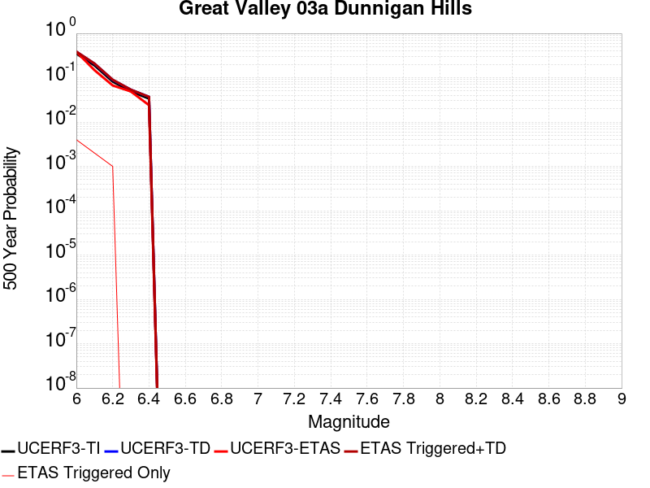 |

| Magnitude | 1 wk TI Prob | 1 wk TD Prob | 1 wk ETAS Prob | 1 wk ETAS/TD Gain | 1 wk ETAS Triggered+TD | 1 wk ETAS Triggered Only | 1 mo TI Prob | 1 mo TD Prob | 1 mo ETAS Prob | 1 mo ETAS/TD Gain | 1 mo ETAS Triggered+TD | 1 mo ETAS Triggered Only | 1 yr TI Prob | 1 yr TD Prob | 1 yr ETAS Prob | 1 yr ETAS/TD Gain | 1 yr ETAS Triggered+TD | 1 yr ETAS Triggered Only | 500 yr TI Prob | 500 yr TD Prob | 500 yr ETAS Prob | 500 yr ETAS/TD Gain | 500 yr ETAS Triggered+TD | 500 yr ETAS Triggered Only |
|-----|-----|-----|-----|-----|-----|-----|-----|-----|-----|-----|-----|-----|-----|-----|-----|-----|-----|-----|-----|-----|-----|-----|-----|-----|
| 6.0 | 1.6591328E-5 | 1.8022336E-5 | 0.0 | 0.0 | 1.8022336E-5 | 0.0 | 7.110376E-5 | 7.7236684E-5 | 0.0 | 0.0 | 7.7236684E-5 | 0.0 | 8.6534437E-4 | 9.400194E-4 | 0.002 | 2.1276157 | 9.400194E-4 | 0.0 | 0.35134837 | 0.38587394 | 0.386 | 1.0003266 | 0.38833046 | 0.004 |
| 6.1 | 8.041125E-6 | 8.7286235E-6 | 0.0 | 0.0 | 8.7286235E-6 | 0.0 | 3.4461507E-5 | 3.740796E-5 | 0.0 | 0.0 | 3.740796E-5 | 0.0 | 4.194881E-4 | 4.5536688E-4 | 0.0 | 0.0 | 4.5536688E-4 | 0.0 | 0.18924393 | 0.20726417 | 0.148 | 0.7140646 | 0.20884964 | 0.002 |
| 6.2 | 3.2807004E-6 | 3.5627013E-6 | 0.0 | 0.0 | 3.5627013E-6 | 0.0 | 1.4060069E-5 | 1.5268653E-5 | 0.0 | 0.0 | 1.5268653E-5 | 0.0 | 1.7116789E-4 | 1.8588411E-4 | 0.0 | 0.0 | 1.8588411E-4 | 0.0 | 0.08203065 | 0.08936508 | 0.067 | 0.74973357 | 0.09027571 | 0.001 |
| 6.3 | 1.9339366E-6 | 2.1004214E-6 | 0.0 | 0.0 | 2.1004214E-6 | 0.0 | 8.288273E-6 | 9.00179E-6 | 0.0 | 0.0 | 9.00179E-6 | 0.0 | 1.00905054E-4 | 1.0959412E-4 | 0.0 | 0.0 | 1.0959412E-4 | 0.0 | 0.049203355 | 0.053799134 | 0.049 | 0.91079533 | 0.053799134 | 0.0 |
| 6.4 | 1.3142635E-6 | 1.4272297E-6 | 0.0 | 0.0 | 1.4272297E-6 | 0.0 | 5.6325457E-6 | 6.116699E-6 | 0.0 | 0.0 | 6.116699E-6 | 0.0 | 6.857408E-5 | 7.447081E-5 | 0.0 | 0.0 | 7.447081E-5 | 0.0 | 0.033707038 | 0.03704775 | 0.024 | 0.6478126 | 0.03704775 | 0.0 |

## Elsinore (Temecula) rev
*[(top)](#table-of-contents)*

| 1 Week | 1 Month | 1 Year | 500 Year |
|-----|-----|-----|-----|
|  | 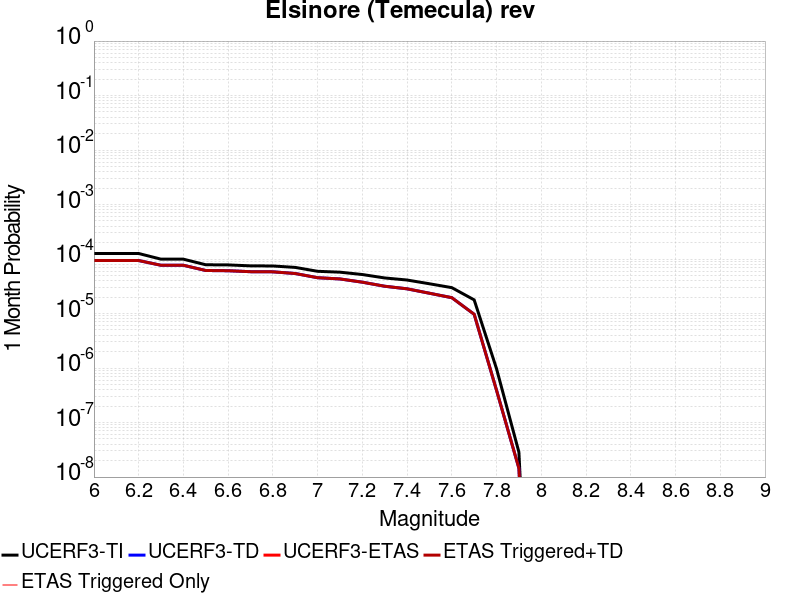 | 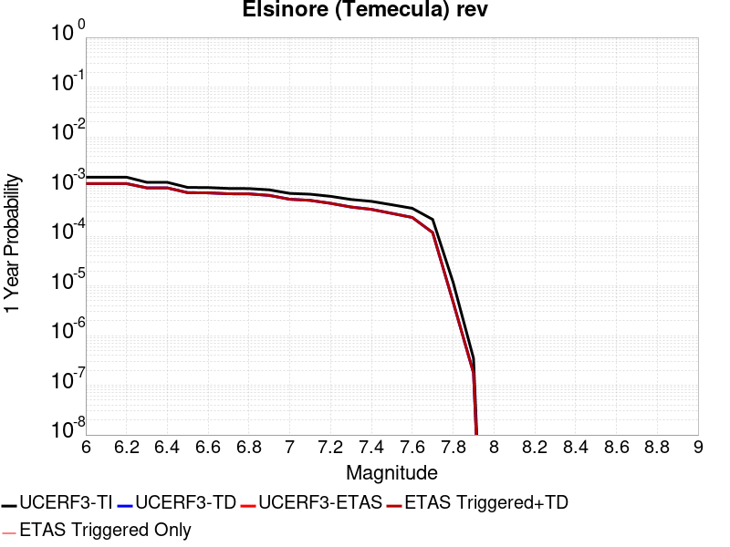 | 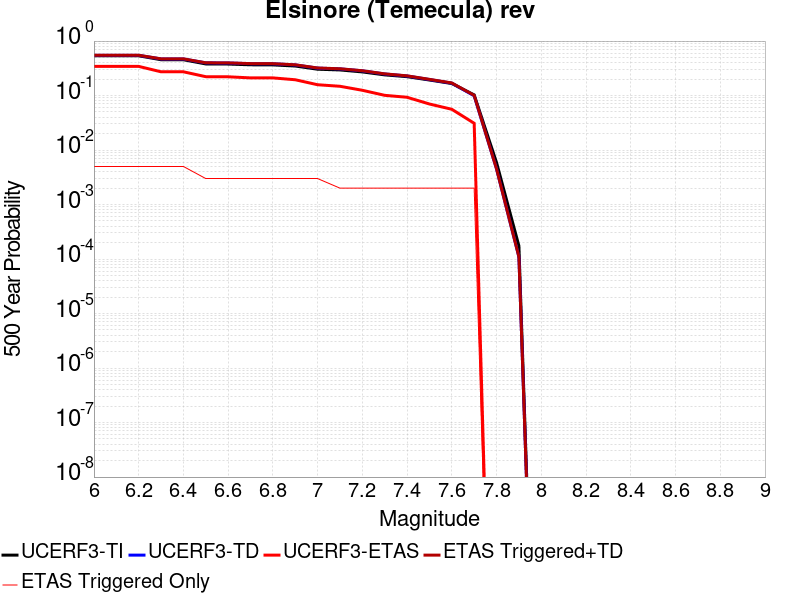 |

| Magnitude | 1 wk TI Prob | 1 wk TD Prob | 1 wk ETAS Prob | 1 wk ETAS/TD Gain | 1 wk ETAS Triggered+TD | 1 wk ETAS Triggered Only | 1 mo TI Prob | 1 mo TD Prob | 1 mo ETAS Prob | 1 mo ETAS/TD Gain | 1 mo ETAS Triggered+TD | 1 mo ETAS Triggered Only | 1 yr TI Prob | 1 yr TD Prob | 1 yr ETAS Prob | 1 yr ETAS/TD Gain | 1 yr ETAS Triggered+TD | 1 yr ETAS Triggered Only | 500 yr TI Prob | 500 yr TD Prob | 500 yr ETAS Prob | 500 yr ETAS/TD Gain | 500 yr ETAS Triggered+TD | 500 yr ETAS Triggered Only |
|-----|-----|-----|-----|-----|-----|-----|-----|-----|-----|-----|-----|-----|-----|-----|-----|-----|-----|-----|-----|-----|-----|-----|-----|-----|
| 6.0 | 2.9514995E-5 | 2.1919488E-5 | 0.0 | 0.0 | 2.1919488E-5 | 0.0 | 1.264867E-4 | 9.39374E-5 | 0.0 | 0.0 | 9.39374E-5 | 0.0 | 0.0015388876 | 0.0011431089 | 0.0 | 0.0 | 0.0011431089 | 0.0 | 0.5370038 | 0.54711175 | 0.343 | 0.62692857 | 0.5493762 | 0.005 |
| 6.1 | 2.9514995E-5 | 2.1919488E-5 | 0.0 | 0.0 | 2.1919488E-5 | 0.0 | 1.264867E-4 | 9.39374E-5 | 0.0 | 0.0 | 9.39374E-5 | 0.0 | 0.0015388876 | 0.0011431089 | 0.0 | 0.0 | 0.0011431089 | 0.0 | 0.5370038 | 0.54711175 | 0.343 | 0.62692857 | 0.5493762 | 0.005 |
| 6.2 | 2.9514995E-5 | 2.1919488E-5 | 0.0 | 0.0 | 2.1919488E-5 | 0.0 | 1.264867E-4 | 9.39374E-5 | 0.0 | 0.0 | 9.39374E-5 | 0.0 | 0.0015388876 | 0.0011431089 | 0.0 | 0.0 | 0.0011431089 | 0.0 | 0.5370038 | 0.54711175 | 0.343 | 0.62692857 | 0.5493762 | 0.005 |
| 6.3 | 2.3223649E-5 | 1.7946059E-5 | 0.0 | 0.0 | 1.7946059E-5 | 0.0 | 9.952613E-5 | 7.6909506E-5 | 0.0 | 0.0 | 7.6909506E-5 | 0.0 | 0.001211057 | 9.3598757E-4 | 0.0 | 0.0 | 9.3598757E-4 | 0.0 | 0.45441434 | 0.469341 | 0.273 | 0.5816666 | 0.4719943 | 0.005 |
| 6.4 | 2.3223649E-5 | 1.7946059E-5 | 0.0 | 0.0 | 1.7946059E-5 | 0.0 | 9.952613E-5 | 7.6909506E-5 | 0.0 | 0.0 | 7.6909506E-5 | 0.0 | 0.001211057 | 9.3598757E-4 | 0.0 | 0.0 | 9.3598757E-4 | 0.0 | 0.45441434 | 0.469341 | 0.273 | 0.5816666 | 0.4719943 | 0.005 |
| 6.5 | 1.8338875E-5 | 1.4392655E-5 | 0.0 | 0.0 | 1.4392655E-5 | 0.0 | 7.8592806E-5 | 6.16814E-5 | 0.0 | 0.0 | 6.16814E-5 | 0.0 | 9.5644733E-4 | 7.507206E-4 | 0.0 | 0.0 | 7.507206E-4 | 0.0 | 0.3802583 | 0.39773312 | 0.222 | 0.5581632 | 0.39953992 | 0.003 |
| 6.6 | 1.8223333E-5 | 1.42565505E-5 | 0.0 | 0.0 | 1.42565505E-5 | 0.0 | 7.809766E-5 | 6.109812E-5 | 0.0 | 0.0 | 6.109812E-5 | 0.0 | 9.504242E-4 | 7.4362406E-4 | 0.0 | 0.0 | 7.4362406E-4 | 0.0 | 0.3783873 | 0.39579046 | 0.221 | 0.5583763 | 0.39760306 | 0.003 |
| 6.7 | 1.7512752E-5 | 1.3686716E-5 | 0.0 | 0.0 | 1.3686716E-5 | 0.0 | 7.505249E-5 | 5.865608E-5 | 0.0 | 0.0 | 5.865608E-5 | 0.0 | 9.13381E-4 | 7.1391196E-4 | 0.0 | 0.0 | 7.1391196E-4 | 0.0 | 0.36675584 | 0.38446766 | 0.211 | 0.5488108 | 0.38631427 | 0.003 |
| 6.8 | 1.7417142E-5 | 1.3612599E-5 | 0.0 | 0.0 | 1.3612599E-5 | 0.0 | 7.4642754E-5 | 5.8338454E-5 | 0.0 | 0.0 | 5.8338454E-5 | 0.0 | 9.083966E-4 | 7.100474E-4 | 0.0 | 0.0 | 7.100474E-4 | 0.0 | 0.36517426 | 0.38286155 | 0.211 | 0.55111307 | 0.38471296 | 0.003 |
| 6.9 | 1.6402591E-5 | 1.2669731E-5 | 0.0 | 0.0 | 1.2669731E-5 | 0.0 | 7.0294926E-5 | 5.4297758E-5 | 0.0 | 0.0 | 5.4297758E-5 | 0.0 | 8.5550465E-4 | 6.60882E-4 | 0.0 | 0.0 | 6.60882E-4 | 0.0 | 0.34814647 | 0.36495715 | 0.195 | 0.5343093 | 0.36686227 | 0.003 |
| 7.0 | 1.3912486E-5 | 1.0608866E-5 | 0.0 | 0.0 | 1.0608866E-5 | 0.0 | 5.9623577E-5 | 4.5465793E-5 | 0.0 | 0.0 | 4.5465793E-5 | 0.0 | 7.2567526E-4 | 5.53408E-4 | 0.0 | 0.0 | 5.53408E-4 | 0.0 | 0.30439225 | 0.3185234 | 0.158 | 0.49603888 | 0.32056785 | 0.003 |
| 7.1 | 1.3405147E-5 | 1.007409E-5 | 0.0 | 0.0 | 1.007409E-5 | 0.0 | 5.7449364E-5 | 4.3173968E-5 | 0.0 | 0.0 | 4.3173968E-5 | 0.0 | 6.9922156E-4 | 5.255187E-4 | 0.0 | 0.0 | 5.255187E-4 | 0.0 | 0.2951238 | 0.30887923 | 0.148 | 0.47915167 | 0.3102615 | 0.002 |
| 7.2 | 1.21402E-5 | 8.783329E-6 | 0.0 | 0.0 | 8.783329E-6 | 0.0 | 5.202839E-5 | 3.7642305E-5 | 0.0 | 0.0 | 3.7642305E-5 | 0.0 | 6.332616E-4 | 4.5820037E-4 | 0.0 | 0.0 | 4.5820037E-4 | 0.0 | 0.27147335 | 0.28420117 | 0.125 | 0.4398293 | 0.28563276 | 0.002 |
| 7.3 | 1.05047775E-5 | 7.4006375E-6 | 0.0 | 0.0 | 7.4006375E-6 | 0.0 | 4.5019697E-5 | 3.171664E-5 | 0.0 | 0.0 | 3.171664E-5 | 0.0 | 5.4797693E-4 | 3.8608306E-4 | 0.0 | 0.0 | 3.8608306E-4 | 0.0 | 0.23971626 | 0.2487399 | 0.101 | 0.40604666 | 0.2502424 | 0.002 |
| 7.4 | 9.624483E-6 | 6.6362E-6 | 0.0 | 0.0 | 6.6362E-6 | 0.0 | 4.124713E-5 | 2.8440554E-5 | 0.0 | 0.0 | 2.8440554E-5 | 0.0 | 5.0206814E-4 | 3.4621006E-4 | 0.0 | 0.0 | 3.4621006E-4 | 0.0 | 0.22205317 | 0.22862096 | 0.093 | 0.40678683 | 0.23016372 | 0.002 |
| 7.5 | 8.215151E-6 | 5.5080936E-6 | 0.0 | 0.0 | 5.5080936E-6 | 0.0 | 3.5207315E-5 | 2.3605908E-5 | 0.0 | 0.0 | 2.3605908E-5 | 0.0 | 4.2856473E-4 | 2.8736523E-4 | 0.0 | 0.0 | 2.8736523E-4 | 0.0 | 0.19291662 | 0.19678764 | 0.07 | 0.3557134 | 0.19839406 | 0.002 |
| 7.6 | 6.975058E-6 | 4.5643415E-6 | 0.0 | 0.0 | 4.5643415E-6 | 0.0 | 2.9892764E-5 | 1.9561323E-5 | 0.0 | 0.0 | 1.9561323E-5 | 0.0 | 3.6388362E-4 | 2.3813418E-4 | 0.0 | 0.0 | 2.3813418E-4 | 0.0 | 0.16637775 | 0.16878243 | 0.056 | 0.3317881 | 0.17044486 | 0.002 |
| 7.7 | 4.159604E-6 | 2.2635766E-6 | 0.0 | 0.0 | 2.2635766E-6 | 0.0 | 1.7826753E-5 | 9.70101E-6 | 0.0 | 0.0 | 9.70101E-6 | 0.0 | 2.1701909E-4 | 1.181041E-4 | 0.0 | 0.0 | 1.181041E-4 | 0.0 | 0.10284023 | 0.09900041 | 0.031 | 0.31313002 | 0.10080241 | 0.002 |
| 7.8 | 2.2692414E-7 | 9.1199695E-8 | 0.0 | 0.0 | 9.1199695E-8 | 0.0 | 9.725317E-7 | 3.908558E-7 | 0.0 | 0.0 | 3.908558E-7 | 0.0 | 1.1840509E-5 | 4.7586623E-6 | 0.0 | 0.0 | 4.7586623E-6 | 0.0 | 0.005902799 | 0.0045152768 | 0.0 | 0.0 | 0.0045152768 | 0.0 |
| 7.9 | 6.676829E-9 | 3.3860155E-9 | 0.0 | 0.0 | 3.3860155E-9 | 0.0 | 2.861498E-8 | 1.4511495E-8 | 0.0 | 0.0 | 1.4511495E-8 | 0.0 | 3.4838732E-7 | 1.7667745E-7 | 0.0 | 0.0 | 1.7667745E-7 | 0.0 | 1.7417852E-4 | 1.0980361E-4 | 0.0 | 0.0 | 1.0980361E-4 | 0.0 |

## Hat Creek-McArthur-Mayfield
*[(top)](#table-of-contents)*

| 1 Week | 1 Month | 1 Year | 500 Year |
|-----|-----|-----|-----|
|  |  | 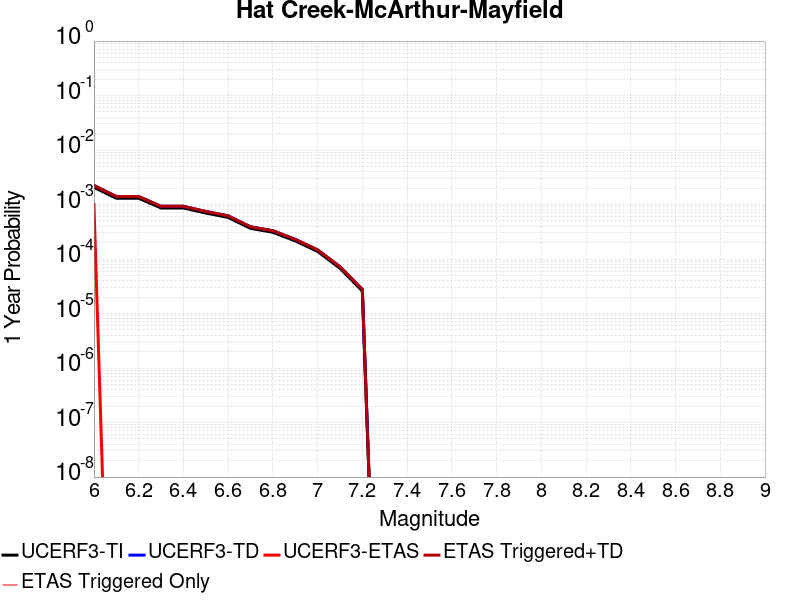 | 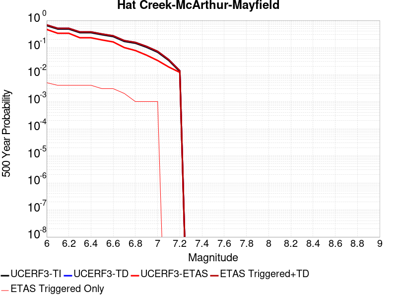 |

| Magnitude | 1 wk TI Prob | 1 wk TD Prob | 1 wk ETAS Prob | 1 wk ETAS/TD Gain | 1 wk ETAS Triggered+TD | 1 wk ETAS Triggered Only | 1 mo TI Prob | 1 mo TD Prob | 1 mo ETAS Prob | 1 mo ETAS/TD Gain | 1 mo ETAS Triggered+TD | 1 mo ETAS Triggered Only | 1 yr TI Prob | 1 yr TD Prob | 1 yr ETAS Prob | 1 yr ETAS/TD Gain | 1 yr ETAS Triggered+TD | 1 yr ETAS Triggered Only | 500 yr TI Prob | 500 yr TD Prob | 500 yr ETAS Prob | 500 yr ETAS/TD Gain | 500 yr ETAS Triggered+TD | 500 yr ETAS Triggered Only |
|-----|-----|-----|-----|-----|-----|-----|-----|-----|-----|-----|-----|-----|-----|-----|-----|-----|-----|-----|-----|-----|-----|-----|-----|-----|
| 6.0 | 3.967457E-5 | 4.296141E-5 | 0.0 | 0.0 | 4.296141E-5 | 0.0 | 1.7002279E-4 | 1.8410798E-4 | 0.0 | 0.0 | 1.8410798E-4 | 0.0 | 0.002068062 | 0.0022393232 | 0.001 | 0.44656348 | 0.0022393232 | 0.0 | 0.6448098 | 0.6821247 | 0.464 | 0.6802276 | 0.68371403 | 0.005 |
| 6.1 | 2.5044013E-5 | 2.695743E-5 | 0.0 | 0.0 | 2.695743E-5 | 0.0 | 1.0732707E-4 | 1.15526906E-4 | 0.0 | 0.0 | 1.15526906E-4 | 0.0 | 0.0013059238 | 0.001405664 | 0.0 | 0.0 | 0.001405664 | 0.0 | 0.47972023 | 0.50810593 | 0.334 | 0.65734327 | 0.5100735 | 0.004 |
| 6.2 | 2.5044013E-5 | 2.695743E-5 | 0.0 | 0.0 | 2.695743E-5 | 0.0 | 1.0732707E-4 | 1.15526906E-4 | 0.0 | 0.0 | 1.15526906E-4 | 0.0 | 0.0013059238 | 0.001405664 | 0.0 | 0.0 | 0.001405664 | 0.0 | 0.47972023 | 0.50810593 | 0.334 | 0.65734327 | 0.5100735 | 0.004 |
| 6.3 | 1.6624012E-5 | 1.782036E-5 | 0.0 | 0.0 | 1.782036E-5 | 0.0 | 7.124382E-5 | 7.637079E-5 | 0.0 | 0.0 | 7.637079E-5 | 0.0 | 8.670483E-4 | 9.2942617E-4 | 0.0 | 0.0 | 9.2942617E-4 | 0.0 | 0.35190126 | 0.37271476 | 0.228 | 0.61172783 | 0.3752239 | 0.004 |
| 6.4 | 1.6624012E-5 | 1.782036E-5 | 0.0 | 0.0 | 1.782036E-5 | 0.0 | 7.124382E-5 | 7.637079E-5 | 0.0 | 0.0 | 7.637079E-5 | 0.0 | 8.670483E-4 | 9.2942617E-4 | 0.0 | 0.0 | 9.2942617E-4 | 0.0 | 0.35190126 | 0.37271476 | 0.228 | 0.61172783 | 0.3752239 | 0.004 |
| 6.5 | 1.3394842E-5 | 1.4336593E-5 | 0.0 | 0.0 | 1.4336593E-5 | 0.0 | 5.7405203E-5 | 6.1441126E-5 | 0.0 | 0.0 | 6.1441126E-5 | 0.0 | 6.986842E-4 | 7.4779446E-4 | 0.0 | 0.0 | 7.4779446E-4 | 0.0 | 0.29493424 | 0.31274545 | 0.189 | 0.60432535 | 0.3148072 | 0.003 |
| 6.6 | 1.1137514E-5 | 1.1909097E-5 | 0.0 | 0.0 | 1.1909097E-5 | 0.0 | 4.7731326E-5 | 5.1038012E-5 | 0.0 | 0.0 | 5.1038012E-5 | 0.0 | 5.809739E-4 | 6.212146E-4 | 0.0 | 0.0 | 6.212146E-4 | 0.0 | 0.25216386 | 0.26765782 | 0.16 | 0.59777814 | 0.26985484 | 0.003 |
| 6.7 | 7.0200663E-6 | 7.496291E-6 | 0.0 | 0.0 | 7.496291E-6 | 0.0 | 3.008565E-5 | 3.2126576E-5 | 0.0 | 0.0 | 3.2126576E-5 | 0.0 | 3.6623122E-4 | 3.9107242E-4 | 0.0 | 0.0 | 3.9107242E-4 | 0.0 | 0.16735604 | 0.17797102 | 0.099 | 0.5562703 | 0.17961508 | 0.002 |
| 6.8 | 5.940172E-6 | 6.3418674E-6 | 0.0 | 0.0 | 6.3418674E-6 | 0.0 | 2.545763E-5 | 2.7179156E-5 | 0.0 | 0.0 | 2.7179156E-5 | 0.0 | 3.0990256E-4 | 3.3085723E-4 | 0.0 | 0.0 | 3.3085723E-4 | 0.0 | 0.14356367 | 0.15276803 | 0.077 | 0.50403214 | 0.15361527 | 0.001 |
| 6.9 | 4.129831E-6 | 4.4072517E-6 | 0.0 | 0.0 | 4.4072517E-6 | 0.0 | 1.7699154E-5 | 1.888809E-5 | 0.0 | 0.0 | 1.888809E-5 | 0.0 | 2.154659E-4 | 2.29939E-4 | 0.0 | 0.0 | 2.29939E-4 | 0.0 | 0.10214309 | 0.10879813 | 0.052 | 0.4779494 | 0.10968933 | 0.001 |
| 7.0 | 2.6512955E-6 | 2.8270854E-6 | 0.0 | 0.0 | 2.8270854E-6 | 0.0 | 1.1362646E-5 | 1.21160265E-5 | 0.0 | 0.0 | 1.21160265E-5 | 0.0 | 1.3833142E-4 | 1.4750306E-4 | 0.0 | 0.0 | 1.4750306E-4 | 0.0 | 0.06683244 | 0.07120638 | 0.033 | 0.4634416 | 0.07213517 | 0.001 |
| 7.1 | 1.2992575E-6 | 1.3858496E-6 | 0.0 | 0.0 | 1.3858496E-6 | 0.0 | 5.568235E-6 | 5.9393433E-6 | 0.0 | 0.0 | 5.9393433E-6 | 0.0 | 6.779115E-5 | 7.2309325E-5 | 0.0 | 0.0 | 7.2309325E-5 | 0.0 | 0.033328667 | 0.035566058 | 0.019 | 0.5342172 | 0.035566058 | 0.0 |
| 7.2 | 4.968191E-7 | 5.3072193E-7 | 0.0 | 0.0 | 5.3072193E-7 | 0.0 | 2.1292228E-6 | 2.2745212E-6 | 0.0 | 0.0 | 2.2745212E-6 | 0.0 | 2.592298E-5 | 2.769207E-5 | 0.0 | 0.0 | 2.769207E-5 | 0.0 | 0.0128780175 | 0.013784451 | 0.012 | 0.87054604 | 0.013784451 | 0.0 |

## Nelson Lake
*[(top)](#table-of-contents)*

| 1 Week | 1 Month | 1 Year | 500 Year |
|-----|-----|-----|-----|
|  |  |  | 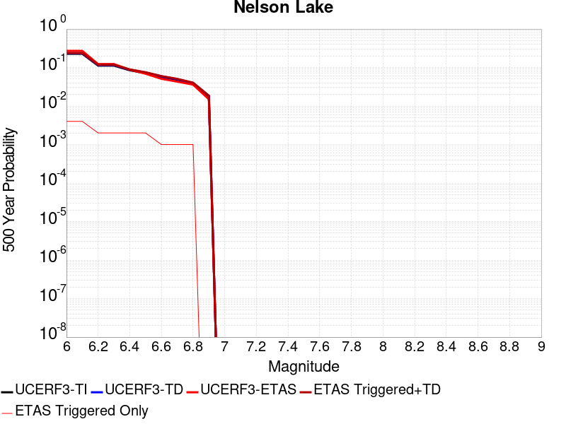 |

| Magnitude | 1 wk TI Prob | 1 wk TD Prob | 1 wk ETAS Prob | 1 wk ETAS/TD Gain | 1 wk ETAS Triggered+TD | 1 wk ETAS Triggered Only | 1 mo TI Prob | 1 mo TD Prob | 1 mo ETAS Prob | 1 mo ETAS/TD Gain | 1 mo ETAS Triggered+TD | 1 mo ETAS Triggered Only | 1 yr TI Prob | 1 yr TD Prob | 1 yr ETAS Prob | 1 yr ETAS/TD Gain | 1 yr ETAS Triggered+TD | 1 yr ETAS Triggered Only | 500 yr TI Prob | 500 yr TD Prob | 500 yr ETAS Prob | 500 yr ETAS/TD Gain | 500 yr ETAS Triggered+TD | 500 yr ETAS Triggered Only |
|-----|-----|-----|-----|-----|-----|-----|-----|-----|-----|-----|-----|-----|-----|-----|-----|-----|-----|-----|-----|-----|-----|-----|-----|-----|
| 6.0 | 9.913453E-6 | 1.0177362E-5 | 0.0 | 0.0 | 1.0177362E-5 | 0.0 | 4.2485535E-5 | 4.3616597E-5 | 0.0 | 0.0 | 4.3616597E-5 | 0.0 | 5.1713863E-4 | 5.30913E-4 | 0.0 | 0.0 | 5.30913E-4 | 0.0 | 0.22789614 | 0.2354064 | 0.27 | 1.1469526 | 0.23846477 | 0.004 |
| 6.1 | 9.913453E-6 | 1.0177362E-5 | 0.0 | 0.0 | 1.0177362E-5 | 0.0 | 4.2485535E-5 | 4.3616597E-5 | 0.0 | 0.0 | 4.3616597E-5 | 0.0 | 5.1713863E-4 | 5.30913E-4 | 0.0 | 0.0 | 5.30913E-4 | 0.0 | 0.22789614 | 0.2354064 | 0.27 | 1.1469526 | 0.23846477 | 0.004 |
| 6.2 | 4.5596407E-6 | 4.6889945E-6 | 0.0 | 0.0 | 4.6889945E-6 | 0.0 | 1.954117E-5 | 2.0095544E-5 | 0.0 | 0.0 | 2.0095544E-5 | 0.0 | 2.3788778E-4 | 2.4463705E-4 | 0.0 | 0.0 | 2.4463705E-4 | 0.0 | 0.112154946 | 0.11545312 | 0.123 | 1.0653675 | 0.11722221 | 0.002 |
| 6.3 | 4.5596407E-6 | 4.6889945E-6 | 0.0 | 0.0 | 4.6889945E-6 | 0.0 | 1.954117E-5 | 2.0095544E-5 | 0.0 | 0.0 | 2.0095544E-5 | 0.0 | 2.3788778E-4 | 2.4463705E-4 | 0.0 | 0.0 | 2.4463705E-4 | 0.0 | 0.112154946 | 0.11545312 | 0.123 | 1.0653675 | 0.11722221 | 0.002 |
| 6.4 | 3.4025713E-6 | 3.5041408E-6 | 0.0 | 0.0 | 3.5041408E-6 | 0.0 | 1.4582367E-5 | 1.5017665E-5 | 0.0 | 0.0 | 1.5017665E-5 | 0.0 | 1.7752586E-4 | 1.8282556E-4 | 0.0 | 0.0 | 1.8282556E-4 | 0.0 | 0.084944725 | 0.087575324 | 0.088 | 1.0048493 | 0.08940017 | 0.002 |
| 6.5 | 2.8352947E-6 | 2.922886E-6 | 0.0 | 0.0 | 2.922886E-6 | 0.0 | 1.2151207E-5 | 1.2526599E-5 | 0.0 | 0.0 | 1.2526599E-5 | 0.0 | 1.479309E-4 | 1.5250141E-4 | 0.0 | 0.0 | 1.5250141E-4 | 0.0 | 0.071301304 | 0.07361065 | 0.069 | 0.9373644 | 0.07546342 | 0.002 |
| 6.6 | 2.251518E-6 | 2.324897E-6 | 0.0 | 0.0 | 2.324897E-6 | 0.0 | 9.649328E-6 | 9.96381E-6 | 0.0 | 0.0 | 9.96381E-6 | 0.0 | 1.1747423E-4 | 1.2130325E-4 | 0.0 | 0.0 | 1.2130325E-4 | 0.0 | 0.057048626 | 0.059013296 | 0.051 | 0.86421204 | 0.059954282 | 0.001 |
| 6.7 | 1.8911853E-6 | 1.9554807E-6 | 0.0 | 0.0 | 1.9554807E-6 | 0.0 | 8.105055E-6 | 8.380607E-6 | 0.0 | 0.0 | 8.380607E-6 | 0.0 | 9.867457E-5 | 1.02029706E-4 | 0.0 | 0.0 | 1.02029706E-4 | 0.0 | 0.04814229 | 0.049889393 | 0.043 | 0.86190665 | 0.050839502 | 0.001 |
| 6.8 | 1.4874814E-6 | 1.5407917E-6 | 0.0 | 0.0 | 1.5407917E-6 | 0.0 | 6.374905E-6 | 6.603379E-6 | 0.0 | 0.0 | 6.603379E-6 | 0.0 | 7.76117E-5 | 8.039369E-5 | 0.0 | 0.0 | 8.039369E-5 | 0.0 | 0.038064 | 0.039537374 | 0.036 | 0.91053087 | 0.040497836 | 0.001 |
| 6.9 | 6.835972E-7 | 7.1234666E-7 | 0.0 | 0.0 | 7.1234666E-7 | 0.0 | 2.9296991E-6 | 3.0529125E-6 | 0.0 | 0.0 | 3.0529125E-6 | 0.0 | 3.56685E-5 | 3.7168895E-5 | 0.0 | 0.0 | 3.7168895E-5 | 0.0 | 0.017676475 | 0.018498356 | 0.015 | 0.8108829 | 0.018498356 | 0.0 |

## Hollywood
*[(top)](#table-of-contents)*

| 1 Week | 1 Month | 1 Year | 500 Year |
|-----|-----|-----|-----|
|  |  |  | 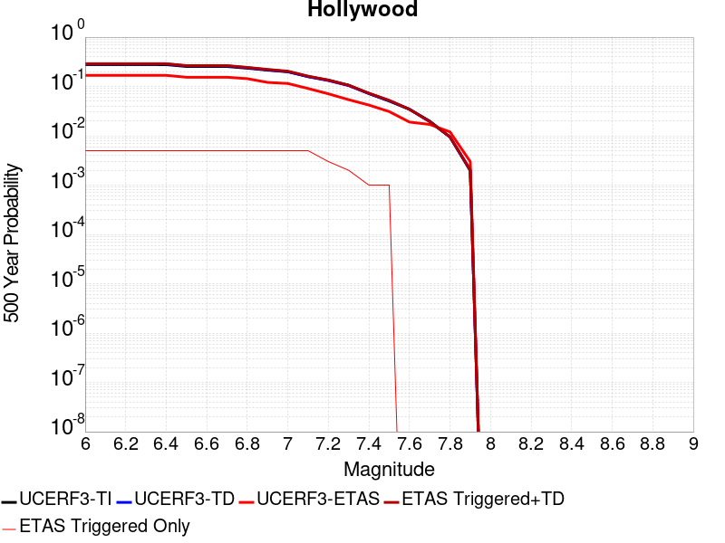 |

| Magnitude | 1 wk TI Prob | 1 wk TD Prob | 1 wk ETAS Prob | 1 wk ETAS/TD Gain | 1 wk ETAS Triggered+TD | 1 wk ETAS Triggered Only | 1 mo TI Prob | 1 mo TD Prob | 1 mo ETAS Prob | 1 mo ETAS/TD Gain | 1 mo ETAS Triggered+TD | 1 mo ETAS Triggered Only | 1 yr TI Prob | 1 yr TD Prob | 1 yr ETAS Prob | 1 yr ETAS/TD Gain | 1 yr ETAS Triggered+TD | 1 yr ETAS Triggered Only | 500 yr TI Prob | 500 yr TD Prob | 500 yr ETAS Prob | 500 yr ETAS/TD Gain | 500 yr ETAS Triggered+TD | 500 yr ETAS Triggered Only |
|-----|-----|-----|-----|-----|-----|-----|-----|-----|-----|-----|-----|-----|-----|-----|-----|-----|-----|-----|-----|-----|-----|-----|-----|-----|
| 6.0 | 1.24487615E-5 | 1.2520252E-5 | 0.0 | 0.0 | 1.2520252E-5 | 0.0 | 5.3350745E-5 | 5.3657146E-5 | 0.0 | 0.0 | 5.3657146E-5 | 0.0 | 6.4935174E-4 | 6.5308454E-4 | 0.0 | 0.0 | 6.5308454E-4 | 0.0 | 0.27731463 | 0.2859833 | 0.168 | 0.58744687 | 0.2895534 | 0.005 |
| 6.1 | 1.24487615E-5 | 1.2520252E-5 | 0.0 | 0.0 | 1.2520252E-5 | 0.0 | 5.3350745E-5 | 5.3657146E-5 | 0.0 | 0.0 | 5.3657146E-5 | 0.0 | 6.4935174E-4 | 6.5308454E-4 | 0.0 | 0.0 | 6.5308454E-4 | 0.0 | 0.27731463 | 0.2859833 | 0.168 | 0.58744687 | 0.2895534 | 0.005 |
| 6.2 | 1.24487615E-5 | 1.2520252E-5 | 0.0 | 0.0 | 1.2520252E-5 | 0.0 | 5.3350745E-5 | 5.3657146E-5 | 0.0 | 0.0 | 5.3657146E-5 | 0.0 | 6.4935174E-4 | 6.5308454E-4 | 0.0 | 0.0 | 6.5308454E-4 | 0.0 | 0.27731463 | 0.2859833 | 0.168 | 0.58744687 | 0.2895534 | 0.005 |
| 6.3 | 1.24487615E-5 | 1.2520252E-5 | 0.0 | 0.0 | 1.2520252E-5 | 0.0 | 5.3350745E-5 | 5.3657146E-5 | 0.0 | 0.0 | 5.3657146E-5 | 0.0 | 6.4935174E-4 | 6.5308454E-4 | 0.0 | 0.0 | 6.5308454E-4 | 0.0 | 0.27731463 | 0.2859833 | 0.168 | 0.58744687 | 0.2895534 | 0.005 |
| 6.4 | 1.2431024E-5 | 1.2500958E-5 | 0.0 | 0.0 | 1.2500958E-5 | 0.0 | 5.327473E-5 | 5.3574462E-5 | 0.0 | 0.0 | 5.3574462E-5 | 0.0 | 6.4842677E-4 | 6.520785E-4 | 0.0 | 0.0 | 6.520785E-4 | 0.0 | 0.2769801 | 0.2856258 | 0.168 | 0.58818215 | 0.28919765 | 0.005 |
| 6.5 | 1.1242222E-5 | 1.12486005E-5 | 0.0 | 0.0 | 1.12486005E-5 | 0.0 | 4.8180063E-5 | 4.8207414E-5 | 0.0 | 0.0 | 4.8207414E-5 | 0.0 | 5.864344E-4 | 5.8676983E-4 | 0.0 | 0.0 | 5.8676983E-4 | 0.0 | 0.25420403 | 0.26150048 | 0.154 | 0.58890903 | 0.265193 | 0.005 |
| 6.6 | 1.1234066E-5 | 1.1239756E-5 | 0.0 | 0.0 | 1.1239756E-5 | 0.0 | 4.8145106E-5 | 4.8169506E-5 | 0.0 | 0.0 | 4.8169506E-5 | 0.0 | 5.86009E-4 | 5.863086E-4 | 0.0 | 0.0 | 5.863086E-4 | 0.0 | 0.2540453 | 0.26133078 | 0.154 | 0.58929145 | 0.26502413 | 0.005 |
| 6.7 | 1.12294E-5 | 1.1234533E-5 | 0.0 | 0.0 | 1.1234533E-5 | 0.0 | 4.812511E-5 | 4.814713E-5 | 0.0 | 0.0 | 4.814713E-5 | 0.0 | 5.857657E-4 | 5.8603624E-4 | 0.0 | 0.0 | 5.8603624E-4 | 0.0 | 0.25395447 | 0.2612326 | 0.154 | 0.58951294 | 0.26492646 | 0.005 |
| 6.8 | 1.0252819E-5 | 1.0155594E-5 | 0.0 | 0.0 | 1.0155594E-5 | 0.0 | 4.3939912E-5 | 4.352326E-5 | 0.0 | 0.0 | 4.352326E-5 | 0.0 | 5.3483713E-4 | 5.29769E-4 | 0.0 | 0.0 | 5.29769E-4 | 0.0 | 0.2347021 | 0.24018581 | 0.144 | 0.5995358 | 0.24398488 | 0.005 |
| 6.9 | 9.252289E-6 | 9.053634E-6 | 0.0 | 0.0 | 9.053634E-6 | 0.0 | 3.9652066E-5 | 3.880072E-5 | 0.0 | 0.0 | 3.880072E-5 | 0.0 | 4.8265693E-4 | 4.7229798E-4 | 0.0 | 0.0 | 4.7229798E-4 | 0.0 | 0.21446222 | 0.21802379 | 0.121 | 0.5549853 | 0.22193368 | 0.005 |
| 7.0 | 8.474604E-6 | 8.20581E-6 | 0.0 | 0.0 | 8.20581E-6 | 0.0 | 3.6319227E-5 | 3.5167293E-5 | 0.0 | 0.0 | 3.5167293E-5 | 0.0 | 4.4209688E-4 | 4.280791E-4 | 0.0 | 0.0 | 4.280791E-4 | 0.0 | 0.19836134 | 0.2005287 | 0.115 | 0.573484 | 0.20452605 | 0.005 |
| 7.1 | 6.643643E-6 | 6.2263225E-6 | 0.0 | 0.0 | 6.2263225E-6 | 0.0 | 2.8472443E-5 | 2.6683969E-5 | 0.0 | 0.0 | 2.6683969E-5 | 0.0 | 3.4659685E-4 | 3.248293E-4 | 0.0 | 0.0 | 3.248293E-4 | 0.0 | 0.15913862 | 0.1578618 | 0.091 | 0.57645357 | 0.1620725 | 0.005 |
| 7.2 | 5.549002E-6 | 5.0726376E-6 | 0.0 | 0.0 | 5.0726376E-6 | 0.0 | 2.378122E-5 | 2.1739696E-5 | 0.0 | 0.0 | 2.1739696E-5 | 0.0 | 2.8949787E-4 | 2.6464878E-4 | 0.0 | 0.0 | 2.6464878E-4 | 0.0 | 0.13477863 | 0.13184395 | 0.071 | 0.5385154 | 0.13444842 | 0.003 |
| 7.3 | 4.3059727E-6 | 3.9309098E-6 | 0.0 | 0.0 | 3.9309098E-6 | 0.0 | 1.8454039E-5 | 1.6846647E-5 | 0.0 | 0.0 | 1.6846647E-5 | 0.0 | 2.2465475E-4 | 2.0508873E-4 | 0.0 | 0.0 | 2.0508873E-4 | 0.0 | 0.10625966 | 0.104184166 | 0.054 | 0.51831293 | 0.1059758 | 0.002 |
| 7.4 | 2.8550733E-6 | 2.6807008E-6 | 0.0 | 0.0 | 2.6807008E-6 | 0.0 | 1.2235971E-5 | 1.1488668E-5 | 0.0 | 0.0 | 1.1488668E-5 | 0.0 | 1.4896276E-4 | 1.398656E-4 | 0.0 | 0.0 | 1.398656E-4 | 0.0 | 0.07178039 | 0.07220922 | 0.042 | 0.58164316 | 0.07313701 | 0.001 |
| 7.5 | 1.9927045E-6 | 1.8821274E-6 | 0.0 | 0.0 | 1.8821274E-6 | 0.0 | 8.540134E-6 | 8.066236E-6 | 0.0 | 0.0 | 8.066236E-6 | 0.0 | 1.0397117E-4 | 9.820203E-5 | 0.0 | 0.0 | 9.820203E-5 | 0.0 | 0.050660014 | 0.05154259 | 0.031 | 0.60144436 | 0.052491046 | 0.001 |
| 7.6 | 1.345084E-6 | 1.2104301E-6 | 0.0 | 0.0 | 1.2104301E-6 | 0.0 | 5.764633E-6 | 5.1875477E-6 | 0.0 | 0.0 | 5.1875477E-6 | 0.0 | 7.018215E-5 | 6.315658E-5 | 0.0 | 0.0 | 6.315658E-5 | 0.0 | 0.03448371 | 0.034496192 | 0.019 | 0.5507854 | 0.034496192 | 0.0 |
| 7.7 | 7.6835164E-7 | 6.1889614E-7 | 0.0 | 0.0 | 6.1889614E-7 | 0.0 | 3.2929315E-6 | 2.6524094E-6 | 0.0 | 0.0 | 2.6524094E-6 | 0.0 | 4.00907E-5 | 3.229262E-5 | 0.0 | 0.0 | 3.229262E-5 | 0.0 | 0.019846173 | 0.019405372 | 0.017 | 0.87604606 | 0.019405372 | 0.0 |
| 7.8 | 3.6562128E-7 | 2.3776502E-7 | 0.0 | 0.0 | 2.3776502E-7 | 0.0 | 1.5669474E-6 | 1.0189926E-6 | 0.0 | 0.0 | 1.0189926E-6 | 0.0 | 1.9077417E-5 | 1.2406168E-5 | 0.0 | 0.0 | 1.2406168E-5 | 0.0 | 0.00949345 | 0.009454451 | 0.012 | 1.2692435 | 0.009454451 | 0.0 |
| 7.9 | 7.5024424E-8 | 5.248552E-8 | 0.0 | 0.0 | 5.248552E-8 | 0.0 | 3.215332E-7 | 2.2493793E-7 | 0.0 | 0.0 | 2.2493793E-7 | 0.0 | 3.91466E-6 | 2.7386172E-6 | 0.0 | 0.0 | 2.7386172E-6 | 0.0 | 0.0019554193 | 0.00203718 | 0.003 | 1.472624 | 0.00203718 | 0.0 |

## Morales (East)
*[(top)](#table-of-contents)*

| 1 Week | 1 Month | 1 Year | 500 Year |
|-----|-----|-----|-----|
| 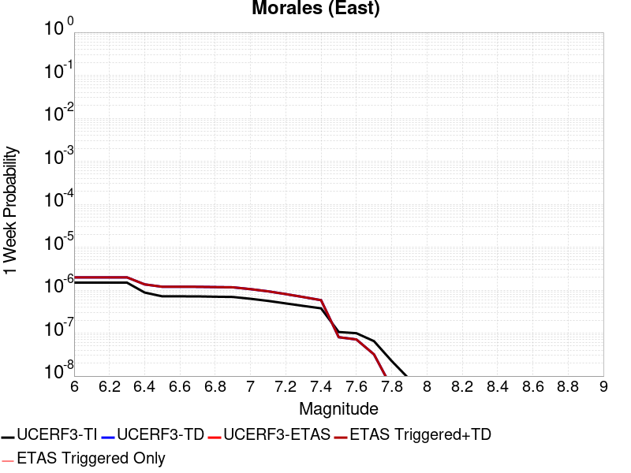 |  | 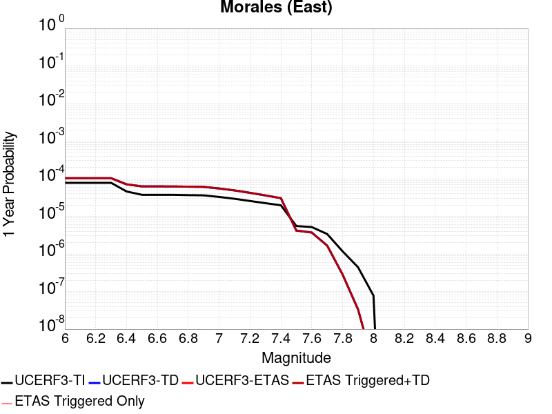 | 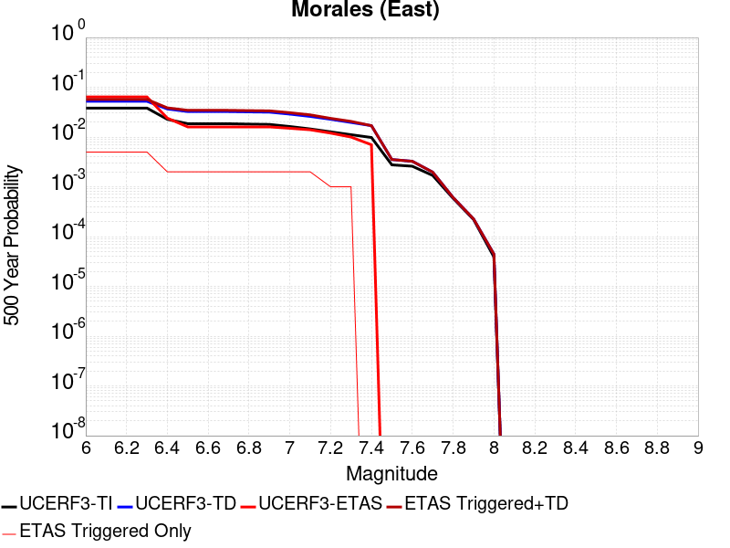 |

| Magnitude | 1 wk TI Prob | 1 wk TD Prob | 1 wk ETAS Prob | 1 wk ETAS/TD Gain | 1 wk ETAS Triggered+TD | 1 wk ETAS Triggered Only | 1 mo TI Prob | 1 mo TD Prob | 1 mo ETAS Prob | 1 mo ETAS/TD Gain | 1 mo ETAS Triggered+TD | 1 mo ETAS Triggered Only | 1 yr TI Prob | 1 yr TD Prob | 1 yr ETAS Prob | 1 yr ETAS/TD Gain | 1 yr ETAS Triggered+TD | 1 yr ETAS Triggered Only | 500 yr TI Prob | 500 yr TD Prob | 500 yr ETAS Prob | 500 yr ETAS/TD Gain | 500 yr ETAS Triggered+TD | 500 yr ETAS Triggered Only |
|-----|-----|-----|-----|-----|-----|-----|-----|-----|-----|-----|-----|-----|-----|-----|-----|-----|-----|-----|-----|-----|-----|-----|-----|-----|
| 6.0 | 1.4942771E-6 | 1.9835347E-6 | 0.0 | 0.0 | 1.9835347E-6 | 0.0 | 6.404029E-6 | 8.500839E-6 | 0.0 | 0.0 | 8.500839E-6 | 0.0 | 7.7966266E-5 | 1.0349336E-4 | 0.0 | 0.0 | 1.0349336E-4 | 0.0 | 0.03823453 | 0.05227087 | 0.064 | 1.2243913 | 0.057009514 | 0.005 |
| 6.1 | 1.4942771E-6 | 1.9835347E-6 | 0.0 | 0.0 | 1.9835347E-6 | 0.0 | 6.404029E-6 | 8.500839E-6 | 0.0 | 0.0 | 8.500839E-6 | 0.0 | 7.7966266E-5 | 1.0349336E-4 | 0.0 | 0.0 | 1.0349336E-4 | 0.0 | 0.03823453 | 0.05227087 | 0.064 | 1.2243913 | 0.057009514 | 0.005 |
| 6.2 | 1.4942771E-6 | 1.9835347E-6 | 0.0 | 0.0 | 1.9835347E-6 | 0.0 | 6.404029E-6 | 8.500839E-6 | 0.0 | 0.0 | 8.500839E-6 | 0.0 | 7.7966266E-5 | 1.0349336E-4 | 0.0 | 0.0 | 1.0349336E-4 | 0.0 | 0.03823453 | 0.05227087 | 0.064 | 1.2243913 | 0.057009514 | 0.005 |
| 6.3 | 1.4942771E-6 | 1.9835347E-6 | 0.0 | 0.0 | 1.9835347E-6 | 0.0 | 6.404029E-6 | 8.500839E-6 | 0.0 | 0.0 | 8.500839E-6 | 0.0 | 7.7966266E-5 | 1.0349336E-4 | 0.0 | 0.0 | 1.0349336E-4 | 0.0 | 0.03823453 | 0.05227087 | 0.064 | 1.2243913 | 0.057009514 | 0.005 |
| 6.4 | 8.798845E-7 | 1.3626866E-6 | 0.0 | 0.0 | 1.3626866E-6 | 0.0 | 3.7709283E-6 | 5.8400724E-6 | 0.0 | 0.0 | 5.8400724E-6 | 0.0 | 4.5910085E-5 | 7.1100665E-5 | 0.0 | 0.0 | 7.1100665E-5 | 0.0 | 0.022694094 | 0.036670066 | 0.024 | 0.65448475 | 0.038596727 | 0.002 |
| 6.5 | 7.1751725E-7 | 1.198914E-6 | 0.0 | 0.0 | 1.198914E-6 | 0.0 | 3.0750705E-6 | 5.1381935E-6 | 0.0 | 0.0 | 5.1381935E-6 | 0.0 | 3.7438338E-5 | 6.255577E-5 | 0.0 | 0.0 | 6.255577E-5 | 0.0 | 0.018545398 | 0.032536373 | 0.016 | 0.49175733 | 0.0344713 | 0.002 |
| 6.6 | 7.1751725E-7 | 1.198914E-6 | 0.0 | 0.0 | 1.198914E-6 | 0.0 | 3.0750705E-6 | 5.1381935E-6 | 0.0 | 0.0 | 5.1381935E-6 | 0.0 | 3.7438338E-5 | 6.255577E-5 | 0.0 | 0.0 | 6.255577E-5 | 0.0 | 0.018545398 | 0.032536373 | 0.016 | 0.49175733 | 0.0344713 | 0.002 |
| 6.7 | 7.159057E-7 | 1.1964572E-6 | 0.0 | 0.0 | 1.1964572E-6 | 0.0 | 3.0681638E-6 | 5.127664E-6 | 0.0 | 0.0 | 5.127664E-6 | 0.0 | 3.7354253E-5 | 6.2427585E-5 | 0.0 | 0.0 | 6.2427585E-5 | 0.0 | 0.018504132 | 0.032474954 | 0.016 | 0.4926874 | 0.034410004 | 0.002 |
| 6.8 | 7.032203E-7 | 1.1788454E-6 | 0.0 | 0.0 | 1.1788454E-6 | 0.0 | 3.0137978E-6 | 5.052185E-6 | 0.0 | 0.0 | 5.052185E-6 | 0.0 | 3.669237E-5 | 6.150868E-5 | 0.0 | 0.0 | 6.150868E-5 | 0.0 | 0.018179249 | 0.032023687 | 0.016 | 0.49963015 | 0.033959642 | 0.002 |
| 6.9 | 6.941549E-7 | 1.1646521E-6 | 0.0 | 0.0 | 1.1646521E-6 | 0.0 | 2.974946E-6 | 4.991357E-6 | 0.0 | 0.0 | 4.991357E-6 | 0.0 | 3.6219368E-5 | 6.0768143E-5 | 0.0 | 0.0 | 6.0768143E-5 | 0.0 | 0.01794701 | 0.031662468 | 0.016 | 0.50533015 | 0.033599146 | 0.002 |
| 7.0 | 6.2932247E-7 | 1.0556541E-6 | 0.0 | 0.0 | 1.0556541E-6 | 0.0 | 2.6970936E-6 | 4.5242246E-6 | 0.0 | 0.0 | 4.5242246E-6 | 0.0 | 3.283662E-5 | 5.508109E-5 | 0.0 | 0.0 | 5.508109E-5 | 0.0 | 0.01628453 | 0.028909102 | 0.015 | 0.51886773 | 0.030851284 | 0.002 |
| 7.1 | 5.6200963E-7 | 9.38168E-7 | 0.0 | 0.0 | 9.38168E-7 | 0.0 | 2.4086105E-6 | 4.020714E-6 | 0.0 | 0.0 | 4.020714E-6 | 0.0 | 2.9324437E-5 | 4.8951133E-5 | 0.0 | 0.0 | 4.8951133E-5 | 0.0 | 0.014555464 | 0.025956387 | 0.014 | 0.53936625 | 0.027904475 | 0.002 |
| 7.2 | 4.91044E-7 | 8.095025E-7 | 0.0 | 0.0 | 8.095025E-7 | 0.0 | 2.1044725E-6 | 3.469292E-6 | 0.0 | 0.0 | 3.469292E-6 | 0.0 | 2.5621652E-5 | 4.223784E-5 | 0.0 | 0.0 | 4.223784E-5 | 0.0 | 0.012729279 | 0.022761207 | 0.012 | 0.5272128 | 0.023738446 | 0.001 |
| 7.3 | 4.2978448E-7 | 6.9003886E-7 | 0.0 | 0.0 | 6.9003886E-7 | 0.0 | 1.8419321E-6 | 2.9573062E-6 | 0.0 | 0.0 | 2.9573062E-6 | 0.0 | 2.2425293E-5 | 3.600463E-5 | 0.0 | 0.0 | 3.600463E-5 | 0.0 | 0.011150143 | 0.019651884 | 0.01 | 0.5088571 | 0.020632232 | 0.001 |
| 7.4 | 3.774317E-7 | 5.838886E-7 | 0.0 | 0.0 | 5.838886E-7 | 0.0 | 1.6175634E-6 | 2.5023774E-6 | 0.0 | 0.0 | 2.5023774E-6 | 0.0 | 1.9693656E-5 | 3.046604E-5 | 0.0 | 0.0 | 3.046604E-5 | 0.0 | 0.009798602 | 0.016937938 | 0.007 | 0.41327342 | 0.016937938 | 0.0 |
| 7.5 | 1.0603232E-7 | 8.0416854E-8 | 0.0 | 0.0 | 8.0416854E-8 | 0.0 | 4.5442414E-7 | 3.446436E-7 | 0.0 | 0.0 | 3.446436E-7 | 0.0 | 5.5326E-6 | 4.196028E-6 | 0.0 | 0.0 | 4.196028E-6 | 0.0 | 0.0027624848 | 0.003535564 | 0.0 | 0.0 | 0.003535564 | 0.0 |
| 7.6 | 9.960384E-8 | 7.117131E-8 | 0.0 | 0.0 | 7.117131E-8 | 0.0 | 4.2687353E-7 | 3.0501982E-7 | 0.0 | 0.0 | 3.0501982E-7 | 0.0 | 5.197173E-6 | 3.7136103E-6 | 0.0 | 0.0 | 3.7136103E-6 | 0.0 | 0.0025952198 | 0.0032630675 | 0.0 | 0.0 | 0.0032630675 | 0.0 |
| 7.7 | 6.499468E-8 | 3.196064E-8 | 0.0 | 0.0 | 3.196064E-8 | 0.0 | 2.785486E-7 | 1.3697415E-7 | 0.0 | 0.0 | 1.3697415E-7 | 0.0 | 3.3913238E-6 | 1.667659E-6 | 0.0 | 0.0 | 1.667659E-6 | 0.0 | 0.001694228 | 0.0019739456 | 0.0 | 0.0 | 0.0019739456 | 0.0 |
| 7.8 | 2.2517119E-8 | 5.424859E-9 | 0.0 | 0.0 | 5.424859E-9 | 0.0 | 9.6501935E-8 | 2.3249394E-8 | 0.0 | 0.0 | 2.3249394E-8 | 0.0 | 1.1749105E-6 | 2.8306133E-7 | 0.0 | 0.0 | 2.8306133E-7 | 0.0 | 5.8728305E-4 | 6.097942E-4 | 0.0 | 0.0 | 6.097942E-4 | 0.0 |
| 7.9 | 8.493023E-9 | 6.429264E-10 | 0.0 | 0.0 | 6.429264E-10 | 0.0 | 3.639867E-8 | 2.7554004E-9 | 0.0 | 0.0 | 2.7554004E-9 | 0.0 | 4.4315374E-7 | 3.354699E-8 | 0.0 | 0.0 | 3.354699E-8 | 0.0 | 2.2155237E-4 | 2.2726103E-4 | 0.0 | 0.0 | 2.2726103E-4 | 0.0 |
| 8.0 | 1.4971842E-9 | 2.1300295E-11 | 0.0 | 0.0 | 2.1300295E-11 | 0.0 | 6.4165038E-9 | 9.128864E-11 | 0.0 | 0.0 | 9.128864E-11 | 0.0 | 7.812093E-8 | 1.1114366E-9 | 0.0 | 0.0 | 1.1114366E-9 | 0.0 | 3.90597E-5 | 4.4437074E-5 | 0.0 | 0.0 | 4.4437074E-5 | 0.0 |

## Puente Hills
*[(top)](#table-of-contents)*

| 1 Week | 1 Month | 1 Year | 500 Year |
|-----|-----|-----|-----|
| 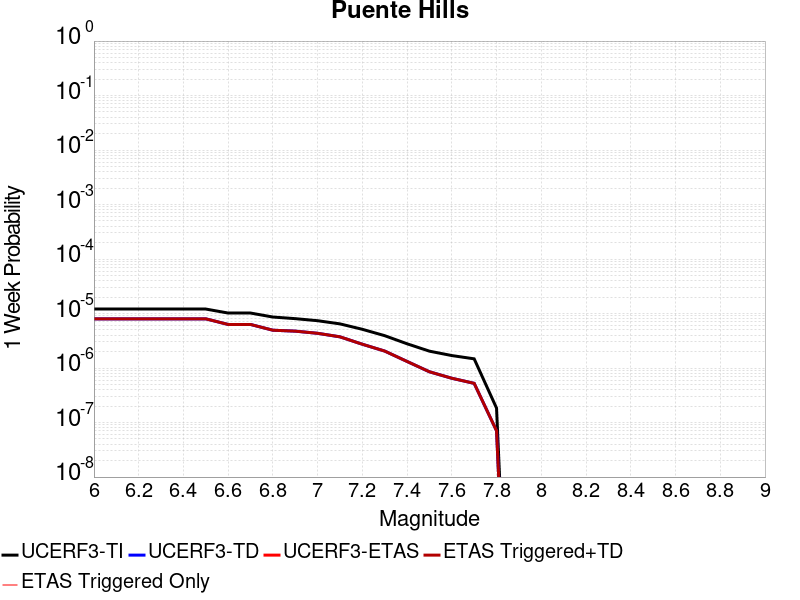 | 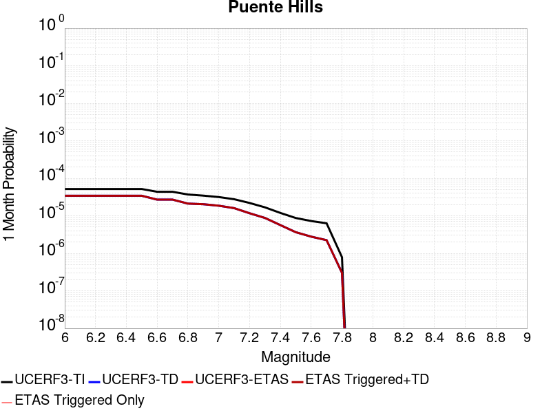 | 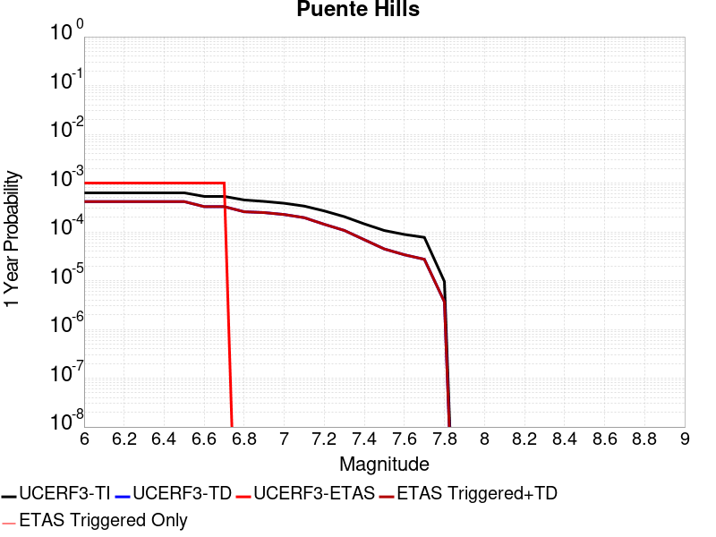 | 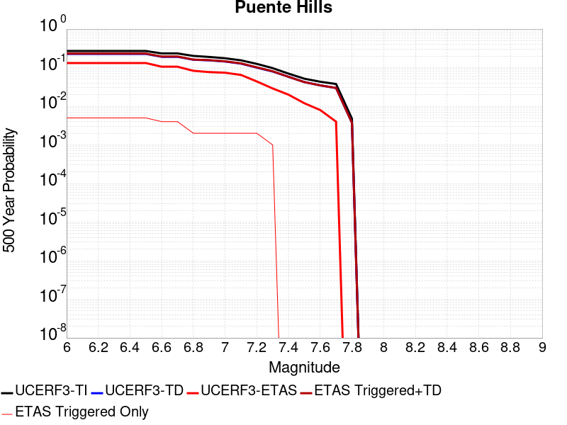 |

| Magnitude | 1 wk TI Prob | 1 wk TD Prob | 1 wk ETAS Prob | 1 wk ETAS/TD Gain | 1 wk ETAS Triggered+TD | 1 wk ETAS Triggered Only | 1 mo TI Prob | 1 mo TD Prob | 1 mo ETAS Prob | 1 mo ETAS/TD Gain | 1 mo ETAS Triggered+TD | 1 mo ETAS Triggered Only | 1 yr TI Prob | 1 yr TD Prob | 1 yr ETAS Prob | 1 yr ETAS/TD Gain | 1 yr ETAS Triggered+TD | 1 yr ETAS Triggered Only | 500 yr TI Prob | 500 yr TD Prob | 500 yr ETAS Prob | 500 yr ETAS/TD Gain | 500 yr ETAS Triggered+TD | 500 yr ETAS Triggered Only |
|-----|-----|-----|-----|-----|-----|-----|-----|-----|-----|-----|-----|-----|-----|-----|-----|-----|-----|-----|-----|-----|-----|-----|-----|-----|
| 6.0 | 1.2101656E-5 | 8.005193E-6 | 0.0 | 0.0 | 8.005193E-6 | 0.0 | 5.1863204E-5 | 3.430755E-5 | 0.0 | 0.0 | 3.430755E-5 | 0.0 | 6.312516E-4 | 4.1761997E-4 | 0.001 | 2.3945215 | 4.1761997E-4 | 0.0 | 0.27074036 | 0.22777067 | 0.132 | 0.57953024 | 0.23163182 | 0.005 |
| 6.1 | 1.2101656E-5 | 8.005193E-6 | 0.0 | 0.0 | 8.005193E-6 | 0.0 | 5.1863204E-5 | 3.430755E-5 | 0.0 | 0.0 | 3.430755E-5 | 0.0 | 6.312516E-4 | 4.1761997E-4 | 0.001 | 2.3945215 | 4.1761997E-4 | 0.0 | 0.27074036 | 0.22777067 | 0.132 | 0.57953024 | 0.23163182 | 0.005 |
| 6.2 | 1.2101656E-5 | 8.005193E-6 | 0.0 | 0.0 | 8.005193E-6 | 0.0 | 5.1863204E-5 | 3.430755E-5 | 0.0 | 0.0 | 3.430755E-5 | 0.0 | 6.312516E-4 | 4.1761997E-4 | 0.001 | 2.3945215 | 4.1761997E-4 | 0.0 | 0.27074036 | 0.22777067 | 0.132 | 0.57953024 | 0.23163182 | 0.005 |
| 6.3 | 1.2101656E-5 | 8.005193E-6 | 0.0 | 0.0 | 8.005193E-6 | 0.0 | 5.1863204E-5 | 3.430755E-5 | 0.0 | 0.0 | 3.430755E-5 | 0.0 | 6.312516E-4 | 4.1761997E-4 | 0.001 | 2.3945215 | 4.1761997E-4 | 0.0 | 0.27074036 | 0.22777067 | 0.132 | 0.57953024 | 0.23163182 | 0.005 |
| 6.4 | 1.2101656E-5 | 8.005193E-6 | 0.0 | 0.0 | 8.005193E-6 | 0.0 | 5.1863204E-5 | 3.430755E-5 | 0.0 | 0.0 | 3.430755E-5 | 0.0 | 6.312516E-4 | 4.1761997E-4 | 0.001 | 2.3945215 | 4.1761997E-4 | 0.0 | 0.27074036 | 0.22777067 | 0.132 | 0.57953024 | 0.23163182 | 0.005 |
| 6.5 | 1.2101656E-5 | 8.005193E-6 | 0.0 | 0.0 | 8.005193E-6 | 0.0 | 5.1863204E-5 | 3.430755E-5 | 0.0 | 0.0 | 3.430755E-5 | 0.0 | 6.312516E-4 | 4.1761997E-4 | 0.001 | 2.3945215 | 4.1761997E-4 | 0.0 | 0.27074036 | 0.22777067 | 0.132 | 0.57953024 | 0.23163182 | 0.005 |
| 6.6 | 1.0222488E-5 | 6.3117213E-6 | 0.0 | 0.0 | 6.3117213E-6 | 0.0 | 4.3809923E-5 | 2.7049968E-5 | 0.0 | 0.0 | 2.7049968E-5 | 0.0 | 5.332553E-4 | 3.29286E-4 | 0.001 | 3.0368736 | 3.29286E-4 | 0.0 | 0.23409624 | 0.1914257 | 0.106 | 0.55373967 | 0.19466 | 0.004 |
| 6.7 | 1.0222488E-5 | 6.3117213E-6 | 0.0 | 0.0 | 6.3117213E-6 | 0.0 | 4.3809923E-5 | 2.7049968E-5 | 0.0 | 0.0 | 2.7049968E-5 | 0.0 | 5.332553E-4 | 3.29286E-4 | 0.001 | 3.0368736 | 3.29286E-4 | 0.0 | 0.23409624 | 0.1914257 | 0.106 | 0.55373967 | 0.19466 | 0.004 |
| 6.8 | 8.6367845E-6 | 4.9484547E-6 | 0.0 | 0.0 | 4.9484547E-6 | 0.0 | 3.7014266E-5 | 2.1207494E-5 | 0.0 | 0.0 | 2.1207494E-5 | 0.0 | 4.505555E-4 | 2.5817117E-4 | 0.0 | 0.0 | 2.5817117E-4 | 0.0 | 0.20174606 | 0.16074158 | 0.083 | 0.51635677 | 0.1624201 | 0.002 |
| 6.9 | 8.066481E-6 | 4.7581843E-6 | 0.0 | 0.0 | 4.7581843E-6 | 0.0 | 3.4570177E-5 | 2.039206E-5 | 0.0 | 0.0 | 2.039206E-5 | 0.0 | 4.2081063E-4 | 2.4824557E-4 | 0.0 | 0.0 | 2.4824557E-4 | 0.0 | 0.1897801 | 0.15514165 | 0.077 | 0.4963206 | 0.15683137 | 0.002 |
| 7.0 | 7.393828E-6 | 4.3431974E-6 | 0.0 | 0.0 | 4.3431974E-6 | 0.0 | 3.168745E-5 | 1.8613571E-5 | 0.0 | 0.0 | 1.8613571E-5 | 0.0 | 3.857264E-4 | 2.2659711E-4 | 0.0 | 0.0 | 2.2659711E-4 | 0.0 | 0.17543592 | 0.14444867 | 0.074 | 0.51229274 | 0.14615977 | 0.002 |
| 7.1 | 6.4660953E-6 | 3.7412176E-6 | 0.0 | 0.0 | 3.7412176E-6 | 0.0 | 2.7711543E-5 | 1.6033693E-5 | 0.0 | 0.0 | 1.6033693E-5 | 0.0 | 3.373358E-4 | 1.9519308E-4 | 0.0 | 0.0 | 1.9519308E-4 | 0.0 | 0.15523462 | 0.12753363 | 0.065 | 0.5096695 | 0.12927857 | 0.002 |
| 7.2 | 5.143232E-6 | 2.7366516E-6 | 0.0 | 0.0 | 2.7366516E-6 | 0.0 | 2.2042237E-5 | 1.1728454E-5 | 0.0 | 0.0 | 1.1728454E-5 | 0.0 | 2.6833118E-4 | 1.4278467E-4 | 0.0 | 0.0 | 1.4278467E-4 | 0.0 | 0.12557049 | 0.10040338 | 0.044 | 0.43823224 | 0.10220257 | 0.002 |
| 7.3 | 3.928255E-6 | 2.0499658E-6 | 0.0 | 0.0 | 2.0499658E-6 | 0.0 | 1.683527E-5 | 8.785539E-6 | 0.0 | 0.0 | 8.785539E-6 | 0.0 | 2.0495013E-4 | 1.06958745E-4 | 0.0 | 0.0 | 1.06958745E-4 | 0.0 | 0.09740882 | 0.07979736 | 0.029 | 0.36342058 | 0.080717556 | 0.001 |
| 7.4 | 2.7894434E-6 | 1.3220076E-6 | 0.0 | 0.0 | 1.3220076E-6 | 0.0 | 1.1954703E-5 | 5.665735E-6 | 0.0 | 0.0 | 5.665735E-6 | 0.0 | 1.4553878E-4 | 6.897818E-5 | 0.0 | 0.0 | 6.897818E-5 | 0.0 | 0.0701897 | 0.058119766 | 0.02 | 0.344117 | 0.058119766 | 0.0 |
| 7.5 | 2.041735E-6 | 8.545939E-7 | 0.0 | 0.0 | 8.545939E-7 | 0.0 | 8.750263E-6 | 3.6625404E-6 | 0.0 | 0.0 | 3.6625404E-6 | 0.0 | 1.06529245E-4 | 4.459055E-5 | 0.0 | 0.0 | 4.459055E-5 | 0.0 | 0.05187361 | 0.042392697 | 0.012 | 0.2830676 | 0.042392697 | 0.0 |
| 7.6 | 1.6959062E-6 | 6.5017764E-7 | 0.0 | 0.0 | 6.5017764E-7 | 0.0 | 7.268149E-6 | 2.7864728E-6 | 0.0 | 0.0 | 2.7864728E-6 | 0.0 | 8.848612E-5 | 3.3924807E-5 | 0.0 | 0.0 | 3.3924807E-5 | 0.0 | 0.043280486 | 0.034839332 | 0.008 | 0.22962552 | 0.034839332 | 0.0 |
| 7.7 | 1.4767965E-6 | 5.243223E-7 | 0.0 | 0.0 | 5.243223E-7 | 0.0 | 6.3291122E-6 | 2.2470936E-6 | 0.0 | 0.0 | 2.2470936E-6 | 0.0 | 7.705422E-5 | 2.7358044E-5 | 0.0 | 0.0 | 2.7358044E-5 | 0.0 | 0.03779581 | 0.029823035 | 0.004 | 0.1341245 | 0.029823035 | 0.0 |
| 7.8 | 1.8432911E-7 | 7.0542285E-8 | 0.0 | 0.0 | 7.0542285E-8 | 0.0 | 7.8998164E-7 | 3.0232405E-7 | 0.0 | 0.0 | 3.0232405E-7 | 0.0 | 9.617985E-6 | 3.6807924E-6 | 0.0 | 0.0 | 3.6807924E-6 | 0.0 | 0.0047974703 | 0.00376117 | 0.0 | 0.0 | 0.00376117 | 0.0 |

## Red Pass
*[(top)](#table-of-contents)*

| 1 Week | 1 Month | 1 Year | 500 Year |
|-----|-----|-----|-----|
| 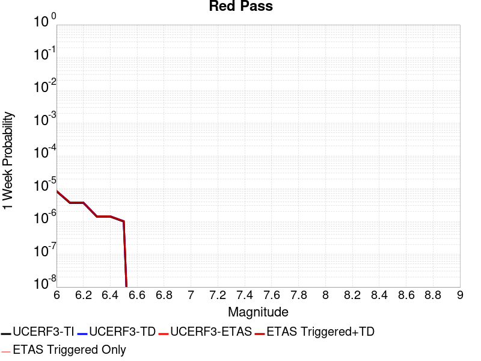 |  |  | 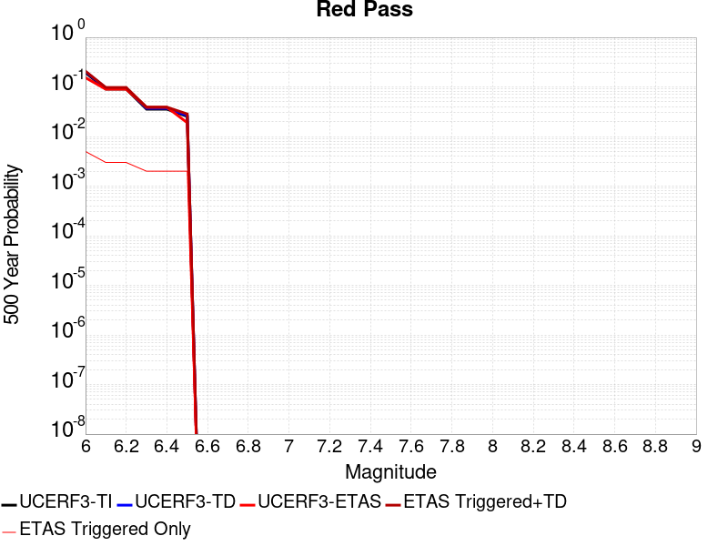 |

| Magnitude | 1 wk TI Prob | 1 wk TD Prob | 1 wk ETAS Prob | 1 wk ETAS/TD Gain | 1 wk ETAS Triggered+TD | 1 wk ETAS Triggered Only | 1 mo TI Prob | 1 mo TD Prob | 1 mo ETAS Prob | 1 mo ETAS/TD Gain | 1 mo ETAS Triggered+TD | 1 mo ETAS Triggered Only | 1 yr TI Prob | 1 yr TD Prob | 1 yr ETAS Prob | 1 yr ETAS/TD Gain | 1 yr ETAS Triggered+TD | 1 yr ETAS Triggered Only | 500 yr TI Prob | 500 yr TD Prob | 500 yr ETAS Prob | 500 yr ETAS/TD Gain | 500 yr ETAS Triggered+TD | 500 yr ETAS Triggered Only |
|-----|-----|-----|-----|-----|-----|-----|-----|-----|-----|-----|-----|-----|-----|-----|-----|-----|-----|-----|-----|-----|-----|-----|-----|-----|
| 6.0 | 8.258278E-6 | 8.535527E-6 | 0.0 | 0.0 | 8.535527E-6 | 0.0 | 3.539214E-5 | 3.6580415E-5 | 0.0 | 0.0 | 3.6580415E-5 | 0.0 | 4.308141E-4 | 4.4529335E-4 | 0.0 | 0.0 | 4.4529335E-4 | 0.0 | 0.19382422 | 0.20364721 | 0.154 | 0.75620973 | 0.20762897 | 0.005 |
| 6.1 | 3.649988E-6 | 3.7685911E-6 | 0.0 | 0.0 | 3.7685911E-6 | 0.0 | 1.5642712E-5 | 1.615103E-5 | 0.0 | 0.0 | 1.615103E-5 | 0.0 | 1.9043336E-4 | 1.9662581E-4 | 0.0 | 0.0 | 1.9662581E-4 | 0.0 | 0.09083234 | 0.09483522 | 0.09 | 0.9490145 | 0.09755071 | 0.003 |
| 6.2 | 3.649988E-6 | 3.7685911E-6 | 0.0 | 0.0 | 3.7685911E-6 | 0.0 | 1.5642712E-5 | 1.615103E-5 | 0.0 | 0.0 | 1.615103E-5 | 0.0 | 1.9043336E-4 | 1.9662581E-4 | 0.0 | 0.0 | 1.9662581E-4 | 0.0 | 0.09083234 | 0.09483522 | 0.09 | 0.9490145 | 0.09755071 | 0.003 |
| 6.3 | 1.3924937E-6 | 1.4385062E-6 | 0.0 | 0.0 | 1.4385062E-6 | 0.0 | 5.9678164E-6 | 6.16502E-6 | 0.0 | 0.0 | 6.16502E-6 | 0.0 | 7.265574E-5 | 7.505794E-5 | 0.0 | 0.0 | 7.505794E-5 | 0.0 | 0.035677206 | 0.03721023 | 0.039 | 1.0480989 | 0.03913581 | 0.002 |
| 6.4 | 1.3924937E-6 | 1.4385062E-6 | 0.0 | 0.0 | 1.4385062E-6 | 0.0 | 5.9678164E-6 | 6.16502E-6 | 0.0 | 0.0 | 6.16502E-6 | 0.0 | 7.265574E-5 | 7.505794E-5 | 0.0 | 0.0 | 7.505794E-5 | 0.0 | 0.035677206 | 0.03721023 | 0.039 | 1.0480989 | 0.03913581 | 0.002 |
| 6.5 | 9.876812E-7 | 1.0203385E-6 | 0.0 | 0.0 | 1.0203385E-6 | 0.0 | 4.2329125E-6 | 4.3728787E-6 | 0.0 | 0.0 | 4.3728787E-6 | 0.0 | 5.153449E-5 | 5.32398E-5 | 0.0 | 0.0 | 5.32398E-5 | 0.0 | 0.02543875 | 0.026619881 | 0.019 | 0.71375227 | 0.028566642 | 0.002 |

## Great Valley 10 (Panoche)
*[(top)](#table-of-contents)*

| 1 Week | 1 Month | 1 Year | 500 Year |
|-----|-----|-----|-----|
|  | 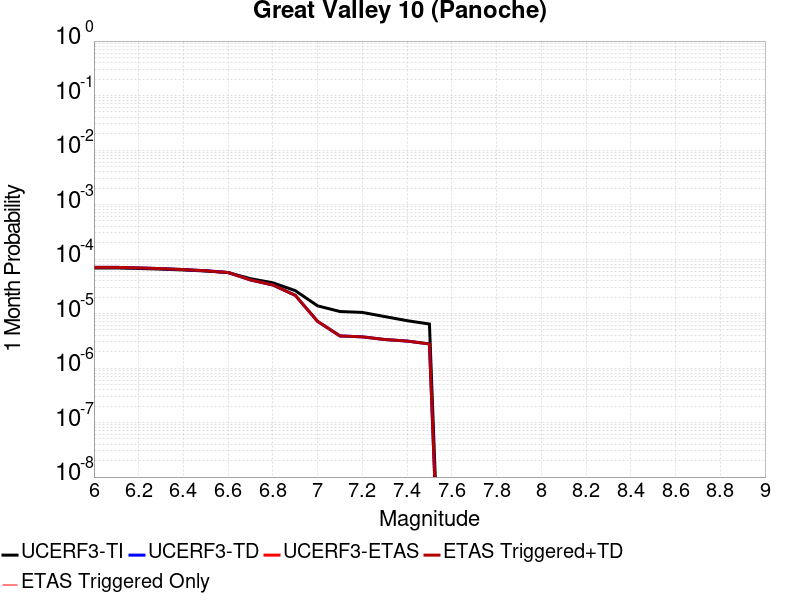 |  | 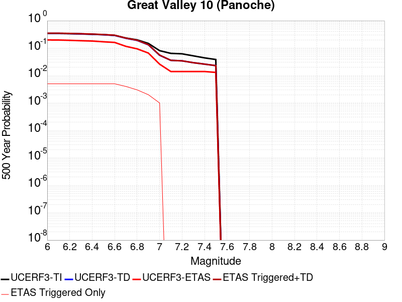 |

| Magnitude | 1 wk TI Prob | 1 wk TD Prob | 1 wk ETAS Prob | 1 wk ETAS/TD Gain | 1 wk ETAS Triggered+TD | 1 wk ETAS Triggered Only | 1 mo TI Prob | 1 mo TD Prob | 1 mo ETAS Prob | 1 mo ETAS/TD Gain | 1 mo ETAS Triggered+TD | 1 mo ETAS Triggered Only | 1 yr TI Prob | 1 yr TD Prob | 1 yr ETAS Prob | 1 yr ETAS/TD Gain | 1 yr ETAS Triggered+TD | 1 yr ETAS Triggered Only | 500 yr TI Prob | 500 yr TD Prob | 500 yr ETAS Prob | 500 yr ETAS/TD Gain | 500 yr ETAS Triggered+TD | 500 yr ETAS Triggered Only |
|-----|-----|-----|-----|-----|-----|-----|-----|-----|-----|-----|-----|-----|-----|-----|-----|-----|-----|-----|-----|-----|-----|-----|-----|-----|
| 6.0 | 1.6014626E-5 | 1.6431748E-5 | 0.0 | 0.0 | 1.6431748E-5 | 0.0 | 6.863231E-5 | 7.0419905E-5 | 0.0 | 0.0 | 7.0419905E-5 | 0.0 | 8.35278E-4 | 8.5703074E-4 | 0.0 | 0.0 | 8.5703074E-4 | 0.0 | 0.34151497 | 0.34514877 | 0.198 | 0.5736657 | 0.34842303 | 0.005 |
| 6.1 | 1.6014626E-5 | 1.6431748E-5 | 0.0 | 0.0 | 1.6431748E-5 | 0.0 | 6.863231E-5 | 7.0419905E-5 | 0.0 | 0.0 | 7.0419905E-5 | 0.0 | 8.35278E-4 | 8.5703074E-4 | 0.0 | 0.0 | 8.5703074E-4 | 0.0 | 0.34151497 | 0.34514877 | 0.197 | 0.57076836 | 0.34842303 | 0.005 |
| 6.2 | 1.56782E-5 | 1.6057145E-5 | 0.0 | 0.0 | 1.6057145E-5 | 0.0 | 6.719056E-5 | 6.881455E-5 | 0.0 | 0.0 | 6.881455E-5 | 0.0 | 8.17738E-4 | 8.375007E-4 | 0.0 | 0.0 | 8.375007E-4 | 0.0 | 0.33570984 | 0.3388476 | 0.192 | 0.56662637 | 0.34215337 | 0.005 |
| 6.3 | 1.5263338E-5 | 1.5585763E-5 | 0.0 | 0.0 | 1.5585763E-5 | 0.0 | 6.541267E-5 | 6.6794455E-5 | 0.0 | 0.0 | 6.6794455E-5 | 0.0 | 7.961082E-4 | 8.129245E-4 | 0.0 | 0.0 | 8.129245E-4 | 0.0 | 0.32848078 | 0.33100057 | 0.186 | 0.56193256 | 0.33434558 | 0.005 |
| 6.4 | 1.4720723E-5 | 1.496647E-5 | 0.0 | 0.0 | 1.496647E-5 | 0.0 | 6.308728E-5 | 6.414047E-5 | 0.0 | 0.0 | 6.414047E-5 | 0.0 | 7.67817E-4 | 7.806358E-4 | 0.0 | 0.0 | 7.806358E-4 | 0.0 | 0.3189067 | 0.32062122 | 0.181 | 0.5645291 | 0.3240181 | 0.005 |
| 6.5 | 1.408264E-5 | 1.4229403E-5 | 0.0 | 0.0 | 1.4229403E-5 | 0.0 | 6.0352773E-5 | 6.098176E-5 | 0.0 | 0.0 | 6.098176E-5 | 0.0 | 7.3454727E-4 | 7.4220524E-4 | 0.0 | 0.0 | 7.4220524E-4 | 0.0 | 0.3074734 | 0.30829397 | 0.17 | 0.55142176 | 0.3117525 | 0.005 |
| 6.6 | 1.3197086E-5 | 1.3204285E-5 | 0.0 | 0.0 | 1.3204285E-5 | 0.0 | 5.6557717E-5 | 5.6588593E-5 | 0.0 | 0.0 | 5.6588593E-5 | 0.0 | 6.8837265E-4 | 6.887535E-4 | 0.0 | 0.0 | 6.887535E-4 | 0.0 | 0.29128715 | 0.29086375 | 0.161 | 0.5535238 | 0.29440942 | 0.005 |
| 6.7 | 1.017583E-5 | 9.661707E-6 | 0.0 | 0.0 | 9.661707E-6 | 0.0 | 4.360997E-5 | 4.1406674E-5 | 0.0 | 0.0 | 4.1406674E-5 | 0.0 | 5.30822E-4 | 5.04012E-4 | 0.0 | 0.0 | 5.04012E-4 | 0.0 | 0.23316334 | 0.22816643 | 0.116 | 0.5084008 | 0.23125377 | 0.004 |
| 6.8 | 8.557912E-6 | 7.804259E-6 | 0.0 | 0.0 | 7.804259E-6 | 0.0 | 3.667625E-5 | 3.344641E-5 | 0.0 | 0.0 | 3.344641E-5 | 0.0 | 4.4644187E-4 | 4.0713593E-4 | 0.0 | 0.0 | 4.0713593E-4 | 0.0 | 0.20010178 | 0.19089201 | 0.094 | 0.492425 | 0.19331934 | 0.003 |
| 6.9 | 6.14664E-6 | 5.0456133E-6 | 0.0 | 0.0 | 5.0456133E-6 | 0.0 | 2.6342475E-5 | 2.1623886E-5 | 0.0 | 0.0 | 2.1623886E-5 | 0.0 | 3.2067244E-4 | 2.6324036E-4 | 0.0 | 0.0 | 2.6324036E-4 | 0.0 | 0.14816457 | 0.13193181 | 0.066 | 0.50025845 | 0.13366795 | 0.002 |
| 7.0 | 3.2310581E-6 | 1.6776106E-6 | 0.0 | 0.0 | 1.6776106E-6 | 0.0 | 1.3847319E-5 | 7.1897407E-6 | 0.0 | 0.0 | 7.1897407E-6 | 0.0 | 1.6857806E-4 | 8.753167E-5 | 0.0 | 0.0 | 8.753167E-5 | 0.0 | 0.08084098 | 0.05480269 | 0.026 | 0.47442928 | 0.055747885 | 0.001 |
| 7.1 | 2.544492E-6 | 9.0661746E-7 | 0.0 | 0.0 | 9.0661746E-7 | 0.0 | 1.090492E-5 | 3.885498E-6 | 0.0 | 0.0 | 3.885498E-6 | 0.0 | 1.327593E-4 | 4.730496E-5 | 0.0 | 0.0 | 4.730496E-5 | 0.0 | 0.0642286 | 0.035800558 | 0.014 | 0.39105535 | 0.035800558 | 0.0 |
| 7.2 | 2.4479045E-6 | 8.725421E-7 | 0.0 | 0.0 | 8.725421E-7 | 0.0 | 1.0490977E-5 | 3.739461E-6 | 0.0 | 0.0 | 3.739461E-6 | 0.0 | 1.2772017E-4 | 4.5527035E-5 | 0.0 | 0.0 | 4.5527035E-5 | 0.0 | 0.061867572 | 0.03433414 | 0.014 | 0.40775737 | 0.03433414 | 0.0 |
| 7.3 | 2.0559578E-6 | 7.7952006E-7 | 0.0 | 0.0 | 7.7952006E-7 | 0.0 | 8.811218E-6 | 3.3407964E-6 | 0.0 | 0.0 | 3.3407964E-6 | 0.0 | 1.072713E-4 | 4.0673483E-5 | 0.0 | 0.0 | 4.0673483E-5 | 0.0 | 0.052225363 | 0.029401343 | 0.014 | 0.47616872 | 0.029401343 | 0.0 |
| 7.4 | 1.727687E-6 | 7.302295E-7 | 0.0 | 0.0 | 7.302295E-7 | 0.0 | 7.404352E-6 | 3.1295513E-6 | 0.0 | 0.0 | 3.1295513E-6 | 0.0 | 9.0144255E-5 | 3.810167E-5 | 0.0 | 0.0 | 3.810167E-5 | 0.0 | 0.04407341 | 0.026035829 | 0.014 | 0.53772056 | 0.026035829 | 0.0 |
| 7.5 | 1.5002679E-6 | 6.4676163E-7 | 0.0 | 0.0 | 6.4676163E-7 | 0.0 | 6.4297037E-6 | 2.771833E-6 | 0.0 | 0.0 | 2.771833E-6 | 0.0 | 7.827883E-5 | 3.3746586E-5 | 0.0 | 0.0 | 3.3746586E-5 | 0.0 | 0.038384836 | 0.023000443 | 0.013 | 0.5652065 | 0.023000443 | 0.0 |

## Santa Monica alt 1
*[(top)](#table-of-contents)*

| 1 Week | 1 Month | 1 Year | 500 Year |
|-----|-----|-----|-----|
| 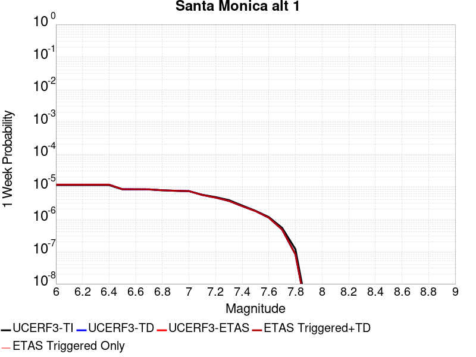 |  |  | 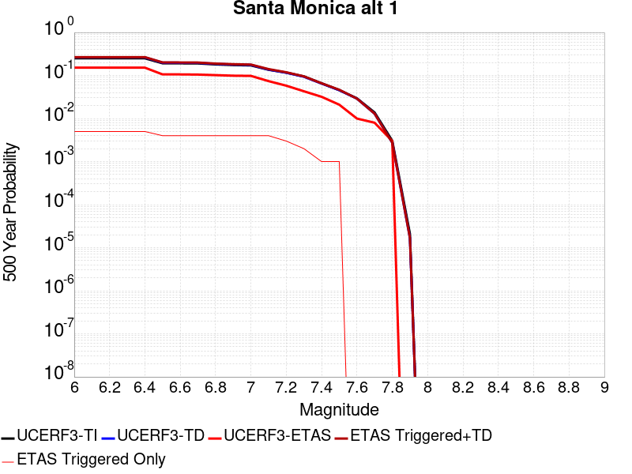 |

| Magnitude | 1 wk TI Prob | 1 wk TD Prob | 1 wk ETAS Prob | 1 wk ETAS/TD Gain | 1 wk ETAS Triggered+TD | 1 wk ETAS Triggered Only | 1 mo TI Prob | 1 mo TD Prob | 1 mo ETAS Prob | 1 mo ETAS/TD Gain | 1 mo ETAS Triggered+TD | 1 mo ETAS Triggered Only | 1 yr TI Prob | 1 yr TD Prob | 1 yr ETAS Prob | 1 yr ETAS/TD Gain | 1 yr ETAS Triggered+TD | 1 yr ETAS Triggered Only | 500 yr TI Prob | 500 yr TD Prob | 500 yr ETAS Prob | 500 yr ETAS/TD Gain | 500 yr ETAS Triggered+TD | 500 yr ETAS Triggered Only |
|-----|-----|-----|-----|-----|-----|-----|-----|-----|-----|-----|-----|-----|-----|-----|-----|-----|-----|-----|-----|-----|-----|-----|-----|-----|
| 6.0 | 1.1066008E-5 | 1.1423497E-5 | 0.0 | 0.0 | 1.1423497E-5 | 0.0 | 4.742488E-5 | 4.8957E-5 | 0.0 | 0.0 | 4.8957E-5 | 0.0 | 5.7724497E-4 | 5.959023E-4 | 0.0 | 0.0 | 5.959023E-4 | 0.0 | 0.2507674 | 0.26336336 | 0.152 | 0.5771494 | 0.26704654 | 0.005 |
| 6.1 | 1.1066008E-5 | 1.1423497E-5 | 0.0 | 0.0 | 1.1423497E-5 | 0.0 | 4.742488E-5 | 4.8957E-5 | 0.0 | 0.0 | 4.8957E-5 | 0.0 | 5.7724497E-4 | 5.959023E-4 | 0.0 | 0.0 | 5.959023E-4 | 0.0 | 0.2507674 | 0.26336336 | 0.152 | 0.5771494 | 0.26704654 | 0.005 |
| 6.2 | 1.1066008E-5 | 1.1423497E-5 | 0.0 | 0.0 | 1.1423497E-5 | 0.0 | 4.742488E-5 | 4.8957E-5 | 0.0 | 0.0 | 4.8957E-5 | 0.0 | 5.7724497E-4 | 5.959023E-4 | 0.0 | 0.0 | 5.959023E-4 | 0.0 | 0.2507674 | 0.26336336 | 0.152 | 0.5771494 | 0.26704654 | 0.005 |
| 6.3 | 1.1066008E-5 | 1.1423497E-5 | 0.0 | 0.0 | 1.1423497E-5 | 0.0 | 4.742488E-5 | 4.8957E-5 | 0.0 | 0.0 | 4.8957E-5 | 0.0 | 5.7724497E-4 | 5.959023E-4 | 0.0 | 0.0 | 5.959023E-4 | 0.0 | 0.2507674 | 0.26336336 | 0.152 | 0.5771494 | 0.26704654 | 0.005 |
| 6.4 | 1.1066008E-5 | 1.1423497E-5 | 0.0 | 0.0 | 1.1423497E-5 | 0.0 | 4.742488E-5 | 4.8957E-5 | 0.0 | 0.0 | 4.8957E-5 | 0.0 | 5.7724497E-4 | 5.959023E-4 | 0.0 | 0.0 | 5.959023E-4 | 0.0 | 0.2507674 | 0.26336336 | 0.152 | 0.5771494 | 0.26704654 | 0.005 |
| 6.5 | 8.183544E-6 | 8.2934275E-6 | 0.0 | 0.0 | 8.2934275E-6 | 0.0 | 3.5071862E-5 | 3.5542784E-5 | 0.0 | 0.0 | 3.5542784E-5 | 0.0 | 4.2691626E-4 | 4.3264907E-4 | 0.0 | 0.0 | 4.3264907E-4 | 0.0 | 0.19225083 | 0.198217 | 0.106 | 0.53476745 | 0.20142414 | 0.004 |
| 6.6 | 8.1543285E-6 | 8.261786E-6 | 0.0 | 0.0 | 8.261786E-6 | 0.0 | 3.4946657E-5 | 3.5407185E-5 | 0.0 | 0.0 | 3.5407185E-5 | 0.0 | 4.2539247E-4 | 4.3099877E-4 | 0.0 | 0.0 | 4.3099877E-4 | 0.0 | 0.19163491 | 0.19755732 | 0.106 | 0.53655314 | 0.2007671 | 0.004 |
| 6.7 | 8.110878E-6 | 8.21536E-6 | 0.0 | 0.0 | 8.21536E-6 | 0.0 | 3.4760444E-5 | 3.520822E-5 | 0.0 | 0.0 | 3.520822E-5 | 0.0 | 4.231262E-4 | 4.2857733E-4 | 0.0 | 0.0 | 4.2857733E-4 | 0.0 | 0.19071802 | 0.19658779 | 0.105 | 0.5341125 | 0.19980143 | 0.004 |
| 6.8 | 7.644036E-6 | 7.71158E-6 | 0.0 | 0.0 | 7.71158E-6 | 0.0 | 3.275974E-5 | 3.304922E-5 | 0.0 | 0.0 | 3.304922E-5 | 0.0 | 3.9877684E-4 | 4.0230138E-4 | 0.0 | 0.0 | 4.0230138E-4 | 0.0 | 0.18080094 | 0.18592745 | 0.102 | 0.5486011 | 0.18918374 | 0.004 |
| 6.9 | 7.3698293E-6 | 7.4174236E-6 | 0.0 | 0.0 | 7.4174236E-6 | 0.0 | 3.15846E-5 | 3.178858E-5 | 0.0 | 0.0 | 3.178858E-5 | 0.0 | 3.8447464E-4 | 3.869586E-4 | 0.0 | 0.0 | 3.869586E-4 | 0.0 | 0.17491947 | 0.17965478 | 0.099 | 0.55105686 | 0.18293616 | 0.004 |
| 7.0 | 7.209872E-6 | 7.247893E-6 | 0.0 | 0.0 | 7.247893E-6 | 0.0 | 3.0899086E-5 | 3.1062038E-5 | 0.0 | 0.0 | 3.1062038E-5 | 0.0 | 3.7613141E-4 | 3.7811603E-4 | 0.0 | 0.0 | 3.7811603E-4 | 0.0 | 0.17146905 | 0.17601791 | 0.098 | 0.5567615 | 0.17931384 | 0.004 |
| 7.1 | 5.603456E-6 | 5.494985E-6 | 0.0 | 0.0 | 5.494985E-6 | 0.0 | 2.4014591E-5 | 2.3549725E-5 | 0.0 | 0.0 | 2.3549725E-5 | 0.0 | 2.923384E-4 | 2.8668056E-4 | 0.0 | 0.0 | 2.8668056E-4 | 0.0 | 0.13600697 | 0.1373027 | 0.074 | 0.5389552 | 0.14075348 | 0.004 |
| 7.2 | 4.7483613E-6 | 4.566632E-6 | 0.0 | 0.0 | 4.566632E-6 | 0.0 | 2.0349962E-5 | 1.9571135E-5 | 0.0 | 0.0 | 1.9571135E-5 | 0.0 | 2.4773262E-4 | 2.3825263E-4 | 0.0 | 0.0 | 2.3825263E-4 | 0.0 | 0.11651561 | 0.116121456 | 0.058 | 0.49947703 | 0.118773095 | 0.003 |
| 7.3 | 3.829015E-6 | 3.6148308E-6 | 0.0 | 0.0 | 3.6148308E-6 | 0.0 | 1.6409962E-5 | 1.5492042E-5 | 0.0 | 0.0 | 1.5492042E-5 | 0.0 | 1.9977297E-4 | 1.8859936E-4 | 0.0 | 0.0 | 1.8859936E-4 | 0.0 | 0.095068894 | 0.09353713 | 0.043 | 0.45971048 | 0.09535006 | 0.002 |
| 7.4 | 2.610755E-6 | 2.487732E-6 | 0.0 | 0.0 | 2.487732E-6 | 0.0 | 1.1188902E-5 | 1.0661665E-5 | 0.0 | 0.0 | 1.0661665E-5 | 0.0 | 1.3621636E-4 | 1.2979808E-4 | 0.0 | 0.0 | 1.2979808E-4 | 0.0 | 0.06584492 | 0.06495447 | 0.032 | 0.49265283 | 0.06588951 | 0.001 |
| 7.5 | 1.792146E-6 | 1.7506146E-6 | 0.0 | 0.0 | 1.7506146E-6 | 0.0 | 7.680603E-6 | 7.502613E-6 | 0.0 | 0.0 | 7.502613E-6 | 0.0 | 9.3507326E-5 | 9.134051E-5 | 0.0 | 0.0 | 9.134051E-5 | 0.0 | 0.045679633 | 0.045685135 | 0.021 | 0.4596681 | 0.04663945 | 0.001 |
| 7.6 | 1.1473018E-6 | 1.0977406E-6 | 0.0 | 0.0 | 1.0977406E-6 | 0.0 | 4.9169985E-6 | 4.7045937E-6 | 0.0 | 0.0 | 4.7045937E-6 | 0.0 | 5.986281E-5 | 5.727694E-5 | 0.0 | 0.0 | 5.727694E-5 | 0.0 | 0.029488767 | 0.029072456 | 0.01 | 0.34396818 | 0.029072456 | 0.0 |
| 7.7 | 5.330919E-7 | 4.7135765E-7 | 0.0 | 0.0 | 4.7135765E-7 | 0.0 | 2.2846775E-6 | 2.0201028E-6 | 0.0 | 0.0 | 2.0201028E-6 | 0.0 | 2.7815593E-5 | 2.4594485E-5 | 0.0 | 0.0 | 2.4594485E-5 | 0.0 | 0.0138117215 | 0.013006258 | 0.008 | 0.6150885 | 0.013006258 | 0.0 |
| 7.8 | 1.1668574E-7 | 8.110443E-8 | 0.0 | 0.0 | 8.110443E-8 | 0.0 | 5.000816E-7 | 3.475904E-7 | 0.0 | 0.0 | 3.475904E-7 | 0.0 | 6.0884768E-6 | 4.231905E-6 | 0.0 | 0.0 | 4.231905E-6 | 0.0 | 0.0030396187 | 0.0027541583 | 0.003 | 1.089262 | 0.0027541583 | 0.0 |
| 7.9 | 8.007447E-10 | 6.1465133E-10 | 0.0 | 0.0 | 6.1465133E-10 | 0.0 | 3.4317629E-9 | 2.6342197E-9 | 0.0 | 0.0 | 2.6342197E-9 | 0.0 | 4.1781714E-8 | 3.2071625E-8 | 0.0 | 0.0 | 3.2071625E-8 | 0.0 | 2.0890639E-5 | 1.6903754E-5 | 0.0 | 0.0 | 1.6903754E-5 | 0.0 |

## White Wolf (Extension)
*[(top)](#table-of-contents)*

| 1 Week | 1 Month | 1 Year | 500 Year |
|-----|-----|-----|-----|
|  | 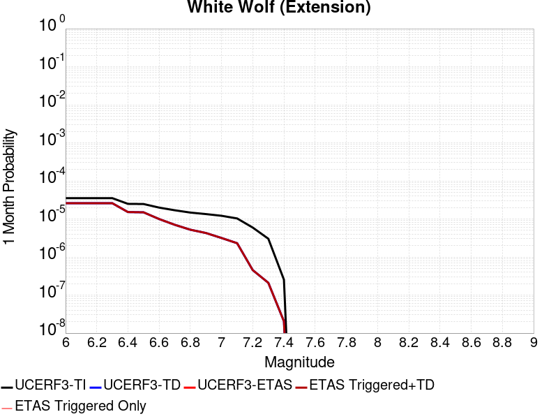 | 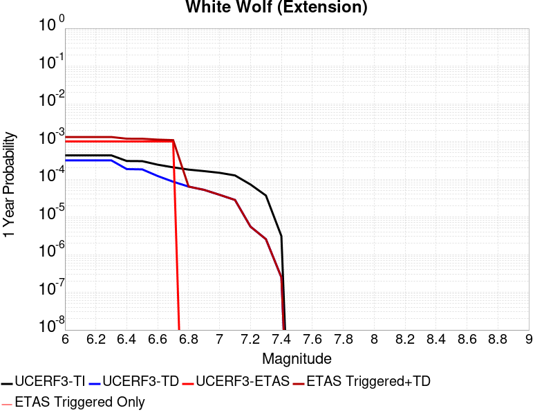 | 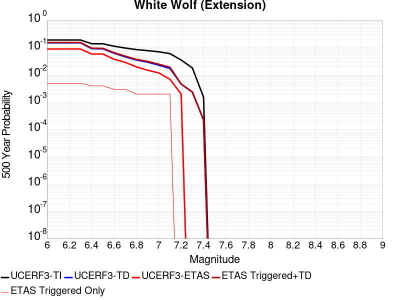 |

| Magnitude | 1 wk TI Prob | 1 wk TD Prob | 1 wk ETAS Prob | 1 wk ETAS/TD Gain | 1 wk ETAS Triggered+TD | 1 wk ETAS Triggered Only | 1 mo TI Prob | 1 mo TD Prob | 1 mo ETAS Prob | 1 mo ETAS/TD Gain | 1 mo ETAS Triggered+TD | 1 mo ETAS Triggered Only | 1 yr TI Prob | 1 yr TD Prob | 1 yr ETAS Prob | 1 yr ETAS/TD Gain | 1 yr ETAS Triggered+TD | 1 yr ETAS Triggered Only | 500 yr TI Prob | 500 yr TD Prob | 500 yr ETAS Prob | 500 yr ETAS/TD Gain | 500 yr ETAS Triggered+TD | 500 yr ETAS Triggered Only |
|-----|-----|-----|-----|-----|-----|-----|-----|-----|-----|-----|-----|-----|-----|-----|-----|-----|-----|-----|-----|-----|-----|-----|-----|-----|
| 6.0 | 8.222555E-6 | 6.0500374E-6 | 0.0 | 0.0 | 6.0500374E-6 | 0.0 | 3.5239045E-5 | 2.592851E-5 | 0.0 | 0.0 | 2.592851E-5 | 0.0 | 4.289509E-4 | 3.1564047E-4 | 0.001 | 3.1681614 | 0.0013153248 | 0.001 | 0.19307251 | 0.15162794 | 0.09 | 0.59355813 | 0.15586981 | 0.005 |
| 6.1 | 8.222555E-6 | 6.0500374E-6 | 0.0 | 0.0 | 6.0500374E-6 | 0.0 | 3.5239045E-5 | 2.592851E-5 | 0.0 | 0.0 | 2.592851E-5 | 0.0 | 4.289509E-4 | 3.1564047E-4 | 0.001 | 3.1681614 | 0.0013153248 | 0.001 | 0.19307251 | 0.15162794 | 0.09 | 0.59355813 | 0.15586981 | 0.005 |
| 6.2 | 8.222555E-6 | 6.0500374E-6 | 0.0 | 0.0 | 6.0500374E-6 | 0.0 | 3.5239045E-5 | 2.592851E-5 | 0.0 | 0.0 | 2.592851E-5 | 0.0 | 4.289509E-4 | 3.1564047E-4 | 0.001 | 3.1681614 | 0.0013153248 | 0.001 | 0.19307251 | 0.15162794 | 0.09 | 0.59355813 | 0.15586981 | 0.005 |
| 6.3 | 8.222555E-6 | 6.0500374E-6 | 0.0 | 0.0 | 6.0500374E-6 | 0.0 | 3.5239045E-5 | 2.592851E-5 | 0.0 | 0.0 | 2.592851E-5 | 0.0 | 4.289509E-4 | 3.1564047E-4 | 0.001 | 3.1681614 | 0.0013153248 | 0.001 | 0.19307251 | 0.15162794 | 0.09 | 0.59355813 | 0.15586981 | 0.005 |
| 6.4 | 5.821773E-6 | 3.5464434E-6 | 0.0 | 0.0 | 3.5464434E-6 | 0.0 | 2.4950215E-5 | 1.5198961E-5 | 0.0 | 0.0 | 1.5198961E-5 | 0.0 | 3.0372653E-4 | 1.8503272E-4 | 0.001 | 5.4044495 | 0.0011848477 | 0.001 | 0.14091408 | 0.092957966 | 0.059 | 0.6346955 | 0.09658613 | 0.004 |
| 6.5 | 5.766023E-6 | 3.4885027E-6 | 0.0 | 0.0 | 3.4885027E-6 | 0.0 | 2.4711293E-5 | 1.4950646E-5 | 0.0 | 0.0 | 1.4950646E-5 | 0.0 | 3.0081844E-4 | 1.8201E-4 | 0.001 | 5.4942036 | 0.001181828 | 0.001 | 0.13966365 | 0.091585465 | 0.059 | 0.64420706 | 0.09521912 | 0.004 |
| 6.6 | 4.643576E-6 | 2.3243902E-6 | 0.0 | 0.0 | 2.3243902E-6 | 0.0 | 1.9900888E-5 | 9.961637E-6 | 0.0 | 0.0 | 9.961637E-6 | 0.0 | 2.4226638E-4 | 1.2127661E-4 | 0.001 | 8.245613 | 0.0011211553 | 0.001 | 0.114097044 | 0.063402005 | 0.038 | 0.59935015 | 0.0662118 | 0.003 |
| 6.7 | 3.9529173E-6 | 1.6415661E-6 | 0.0 | 0.0 | 1.6415661E-6 | 0.0 | 1.6940963E-5 | 7.0352653E-6 | 0.0 | 0.0 | 7.0352653E-6 | 0.0 | 2.0623671E-4 | 8.5651176E-5 | 0.001 | 11.675263 | 0.0010855655 | 0.001 | 0.09798938 | 0.046394367 | 0.029 | 0.6250759 | 0.049255185 | 0.003 |
| 6.8 | 3.4377522E-6 | 1.2187764E-6 | 0.0 | 0.0 | 1.2187764E-6 | 0.0 | 1.473314E-5 | 5.2233177E-6 | 0.0 | 0.0 | 5.2233177E-6 | 0.0 | 1.7936122E-4 | 6.359213E-5 | 0.0 | 0.0 | 6.359213E-5 | 0.0 | 0.08578422 | 0.035545312 | 0.02 | 0.5626621 | 0.03747422 | 0.002 |
| 6.9 | 3.1367306E-6 | 9.98243E-7 | 0.0 | 0.0 | 9.98243E-7 | 0.0 | 1.3443062E-5 | 4.2781776E-6 | 0.0 | 0.0 | 4.2781776E-6 | 0.0 | 1.63657E-4 | 5.2085645E-5 | 0.0 | 0.0 | 5.2085645E-5 | 0.0 | 0.07857619 | 0.029751122 | 0.015 | 0.5041827 | 0.03169162 | 0.002 |
| 7.0 | 2.8298145E-6 | 7.383105E-7 | 0.0 | 0.0 | 7.383105E-7 | 0.0 | 1.2127721E-5 | 3.1641844E-6 | 0.0 | 0.0 | 3.1641844E-6 | 0.0 | 1.47645E-4 | 3.8523314E-5 | 0.0 | 0.0 | 3.8523314E-5 | 0.0 | 0.07116851 | 0.023001026 | 0.012 | 0.5217158 | 0.024955025 | 0.002 |
| 7.1 | 2.4091064E-6 | 5.388036E-7 | 0.0 | 0.0 | 5.388036E-7 | 0.0 | 1.03247E-5 | 2.3091566E-6 | 0.0 | 0.0 | 2.3091566E-6 | 0.0 | 1.2569598E-4 | 2.8113658E-5 | 0.0 | 0.0 | 2.8113658E-5 | 0.0 | 0.060917497 | 0.017309623 | 0.007 | 0.40439934 | 0.019275004 | 0.002 |
| 7.2 | 1.3875518E-6 | 1.0574522E-7 | 0.0 | 0.0 | 1.0574522E-7 | 0.0 | 5.9466374E-6 | 4.5319373E-7 | 0.0 | 0.0 | 4.5319373E-7 | 0.0 | 7.23979E-5 | 5.517621E-6 | 0.0 | 0.0 | 5.517621E-6 | 0.0 | 0.035552867 | 0.0046542627 | 0.002 | 0.42971358 | 0.0046542627 | 0.0 |
| 7.3 | 7.056077E-7 | 4.9060112E-8 | 0.0 | 0.0 | 4.9060112E-8 | 0.0 | 3.0240296E-6 | 2.1025761E-7 | 0.0 | 0.0 | 2.1025761E-7 | 0.0 | 3.681694E-5 | 2.5598838E-6 | 0.0 | 0.0 | 2.5598838E-6 | 0.0 | 0.018240402 | 0.0023714148 | 0.0 | 0.0 | 0.0023714148 | 0.0 |
| 7.4 | 5.9334678E-8 | 4.7764974E-9 | 0.0 | 0.0 | 4.7764974E-9 | 0.0 | 2.5429145E-7 | 2.0470702E-8 | 0.0 | 0.0 | 2.0470702E-8 | 0.0 | 3.095994E-6 | 2.492308E-7 | 0.0 | 0.0 | 2.492308E-7 | 0.0 | 0.0015468019 | 2.259758E-4 | 0.0 | 0.0 | 2.259758E-4 | 0.0 |

## Fish Slough 2011 CFM
*[(top)](#table-of-contents)*

| 1 Week | 1 Month | 1 Year | 500 Year |
|-----|-----|-----|-----|
|  | 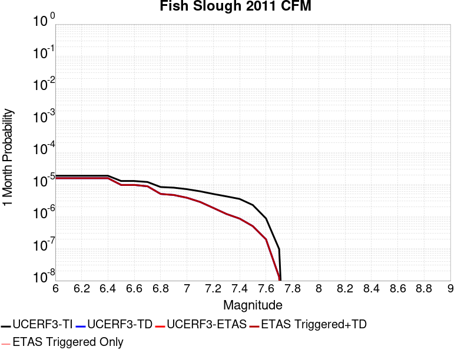 | 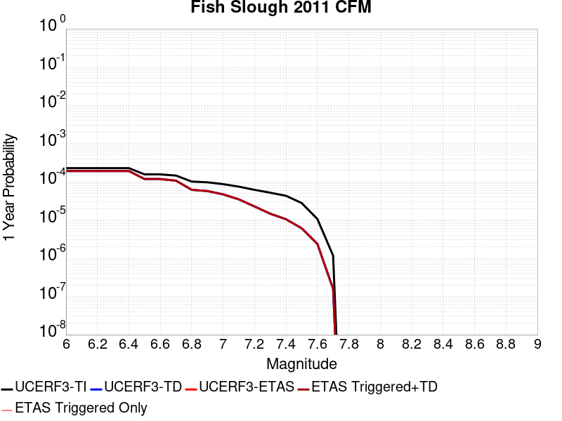 | 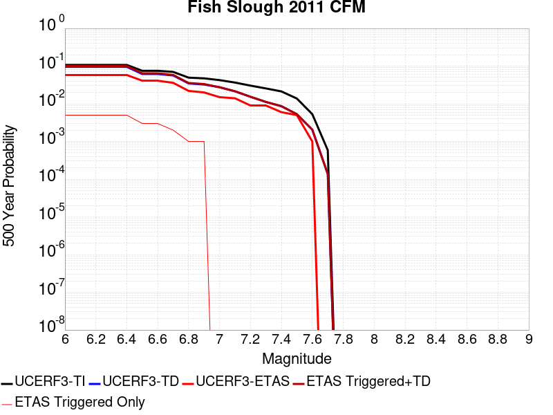 |

| Magnitude | 1 wk TI Prob | 1 wk TD Prob | 1 wk ETAS Prob | 1 wk ETAS/TD Gain | 1 wk ETAS Triggered+TD | 1 wk ETAS Triggered Only | 1 mo TI Prob | 1 mo TD Prob | 1 mo ETAS Prob | 1 mo ETAS/TD Gain | 1 mo ETAS Triggered+TD | 1 mo ETAS Triggered Only | 1 yr TI Prob | 1 yr TD Prob | 1 yr ETAS Prob | 1 yr ETAS/TD Gain | 1 yr ETAS Triggered+TD | 1 yr ETAS Triggered Only | 500 yr TI Prob | 500 yr TD Prob | 500 yr ETAS Prob | 500 yr ETAS/TD Gain | 500 yr ETAS Triggered+TD | 500 yr ETAS Triggered Only |
|-----|-----|-----|-----|-----|-----|-----|-----|-----|-----|-----|-----|-----|-----|-----|-----|-----|-----|-----|-----|-----|-----|-----|-----|-----|
| 6.0 | 4.3629925E-6 | 3.6640665E-6 | 0.0 | 0.0 | 3.6640665E-6 | 0.0 | 1.8698405E-5 | 1.5703059E-5 | 0.0 | 0.0 | 1.5703059E-5 | 0.0 | 2.276293E-4 | 1.911701E-4 | 0.0 | 0.0 | 1.911701E-4 | 0.0 | 0.10758821 | 0.09570736 | 0.058 | 0.606014 | 0.10022882 | 0.005 |
| 6.1 | 4.3629925E-6 | 3.6640665E-6 | 0.0 | 0.0 | 3.6640665E-6 | 0.0 | 1.8698405E-5 | 1.5703059E-5 | 0.0 | 0.0 | 1.5703059E-5 | 0.0 | 2.276293E-4 | 1.911701E-4 | 0.0 | 0.0 | 1.911701E-4 | 0.0 | 0.10758821 | 0.09570736 | 0.058 | 0.606014 | 0.10022882 | 0.005 |
| 6.2 | 4.3629925E-6 | 3.6640665E-6 | 0.0 | 0.0 | 3.6640665E-6 | 0.0 | 1.8698405E-5 | 1.5703059E-5 | 0.0 | 0.0 | 1.5703059E-5 | 0.0 | 2.276293E-4 | 1.911701E-4 | 0.0 | 0.0 | 1.911701E-4 | 0.0 | 0.10758821 | 0.09570736 | 0.058 | 0.606014 | 0.10022882 | 0.005 |
| 6.3 | 4.3629925E-6 | 3.6640665E-6 | 0.0 | 0.0 | 3.6640665E-6 | 0.0 | 1.8698405E-5 | 1.5703059E-5 | 0.0 | 0.0 | 1.5703059E-5 | 0.0 | 2.276293E-4 | 1.911701E-4 | 0.0 | 0.0 | 1.911701E-4 | 0.0 | 0.10758821 | 0.09570736 | 0.058 | 0.606014 | 0.10022882 | 0.005 |
| 6.4 | 4.3629925E-6 | 3.6640665E-6 | 0.0 | 0.0 | 3.6640665E-6 | 0.0 | 1.8698405E-5 | 1.5703059E-5 | 0.0 | 0.0 | 1.5703059E-5 | 0.0 | 2.276293E-4 | 1.911701E-4 | 0.0 | 0.0 | 1.911701E-4 | 0.0 | 0.10758821 | 0.09570736 | 0.058 | 0.606014 | 0.10022882 | 0.005 |
| 6.5 | 2.991715E-6 | 2.2590823E-6 | 0.0 | 0.0 | 2.2590823E-6 | 0.0 | 1.2821573E-5 | 9.68175E-6 | 0.0 | 0.0 | 9.68175E-6 | 0.0 | 1.5609147E-4 | 1.1786985E-4 | 0.0 | 0.0 | 1.1786985E-4 | 0.0 | 0.07508351 | 0.061633687 | 0.041 | 0.6652206 | 0.06444879 | 0.003 |
| 6.6 | 2.991715E-6 | 2.2590823E-6 | 0.0 | 0.0 | 2.2590823E-6 | 0.0 | 1.2821573E-5 | 9.68175E-6 | 0.0 | 0.0 | 9.68175E-6 | 0.0 | 1.5609147E-4 | 1.1786985E-4 | 0.0 | 0.0 | 1.1786985E-4 | 0.0 | 0.07508351 | 0.061633687 | 0.041 | 0.6652206 | 0.06444879 | 0.003 |
| 6.7 | 2.7890346E-6 | 2.0511723E-6 | 0.0 | 0.0 | 2.0511723E-6 | 0.0 | 1.1952951E-5 | 8.790714E-6 | 0.0 | 0.0 | 8.790714E-6 | 0.0 | 1.4551746E-4 | 1.07022584E-4 | 0.0 | 0.0 | 1.07022584E-4 | 0.0 | 0.07017978 | 0.056525182 | 0.036 | 0.6368843 | 0.05841213 | 0.002 |
| 6.8 | 1.9416723E-6 | 1.1827283E-6 | 0.0 | 0.0 | 1.1827283E-6 | 0.0 | 8.321425E-6 | 5.068826E-6 | 0.0 | 0.0 | 5.068826E-6 | 0.0 | 1.01308644E-4 | 6.171125E-5 | 0.0 | 0.0 | 6.171125E-5 | 0.0 | 0.049395222 | 0.03467646 | 0.022 | 0.6344362 | 0.035641782 | 0.001 |
| 6.9 | 1.8567416E-6 | 1.0950271E-6 | 0.0 | 0.0 | 1.0950271E-6 | 0.0 | 7.957439E-6 | 4.692965E-6 | 0.0 | 0.0 | 4.692965E-6 | 0.0 | 9.687752E-5 | 5.713539E-5 | 0.0 | 0.0 | 5.713539E-5 | 0.0 | 0.047286555 | 0.032464605 | 0.02 | 0.61605555 | 0.03343214 | 0.001 |
| 7.0 | 1.6634067E-6 | 8.981556E-7 | 0.0 | 0.0 | 8.981556E-7 | 0.0 | 7.1288664E-6 | 3.8492326E-6 | 0.0 | 0.0 | 3.8492326E-6 | 0.0 | 8.679049E-5 | 4.6863428E-5 | 0.0 | 0.0 | 4.6863428E-5 | 0.0 | 0.04246895 | 0.027464049 | 0.015 | 0.54616857 | 0.027464049 | 0.0 |
| 7.1 | 1.4281054E-6 | 6.6516617E-7 | 0.0 | 0.0 | 6.6516617E-7 | 0.0 | 6.1204373E-6 | 2.8507093E-6 | 0.0 | 0.0 | 2.8507093E-6 | 0.0 | 7.451377E-5 | 3.470685E-5 | 0.0 | 0.0 | 3.470685E-5 | 0.0 | 0.03657273 | 0.021456756 | 0.014 | 0.6524752 | 0.021456756 | 0.0 |
| 7.2 | 1.1810387E-6 | 4.3317863E-7 | 0.0 | 0.0 | 4.3317863E-7 | 0.0 | 5.0615845E-6 | 1.8564785E-6 | 0.0 | 0.0 | 1.8564785E-6 | 0.0 | 6.1623046E-5 | 2.26024E-5 | 0.0 | 0.0 | 2.26024E-5 | 0.0 | 0.030342607 | 0.015355694 | 0.009 | 0.58610183 | 0.015355694 | 0.0 |
| 7.3 | 9.918052E-7 | 2.803843E-7 | 0.0 | 0.0 | 2.803843E-7 | 0.0 | 4.2505867E-6 | 1.2016466E-6 | 0.0 | 0.0 | 1.2016466E-6 | 0.0 | 5.1749663E-5 | 1.4629949E-5 | 0.0 | 0.0 | 1.4629949E-5 | 0.0 | 0.0255436 | 0.011185014 | 0.009 | 0.8046481 | 0.011185014 | 0.0 |
| 7.4 | 8.25252E-7 | 2.0101147E-7 | 0.0 | 0.0 | 2.0101147E-7 | 0.0 | 3.5367896E-6 | 8.614775E-7 | 0.0 | 0.0 | 8.614775E-7 | 0.0 | 4.3059565E-5 | 1.0488438E-5 | 0.0 | 0.0 | 1.0488438E-5 | 0.0 | 0.021300124 | 0.008639221 | 0.006 | 0.69450706 | 0.008639221 | 0.0 |
| 7.5 | 5.3248567E-7 | 1.1665587E-7 | 0.0 | 0.0 | 1.1665587E-7 | 0.0 | 2.2820795E-6 | 4.9995367E-7 | 0.0 | 0.0 | 4.9995367E-7 | 0.0 | 2.7783964E-5 | 6.086919E-6 | 0.0 | 0.0 | 6.086919E-6 | 0.0 | 0.013796124 | 0.0052962797 | 0.005 | 0.9440589 | 0.0052962797 | 0.0 |
| 7.6 | 2.037542E-7 | 4.5419878E-8 | 0.0 | 0.0 | 4.5419878E-8 | 0.0 | 8.73232E-7 | 1.9465661E-7 | 0.0 | 0.0 | 1.9465661E-7 | 0.0 | 1.0631547E-5 | 2.369942E-6 | 0.0 | 0.0 | 2.369942E-6 | 0.0 | 0.005301698 | 0.0020567202 | 0.001 | 0.486211 | 0.0020567202 | 0.0 |
| 7.7 | 2.2501226E-8 | 3.0332492E-9 | 0.0 | 0.0 | 3.0332492E-9 | 0.0 | 9.6433816E-8 | 1.299964E-8 | 0.0 | 0.0 | 1.299964E-8 | 0.0 | 1.1740811E-6 | 1.582706E-7 | 0.0 | 0.0 | 1.582706E-7 | 0.0 | 5.868686E-4 | 1.370943E-4 | 0.0 | 0.0 | 1.370943E-4 | 0.0 |

## Elsinore (Stepovers Combined)
*[(top)](#table-of-contents)*

| 1 Week | 1 Month | 1 Year | 500 Year |
|-----|-----|-----|-----|
|  | 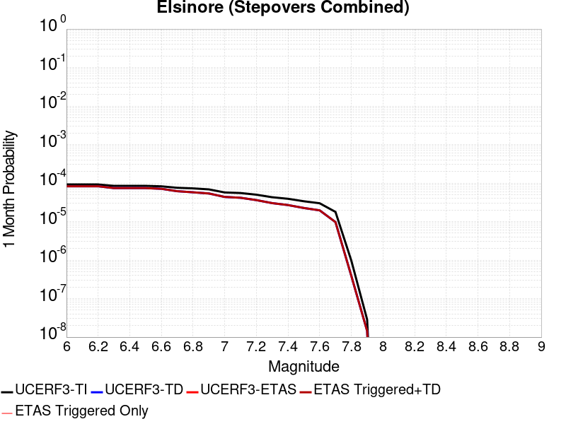 | 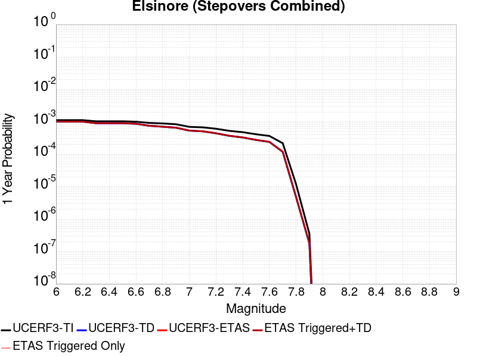 | 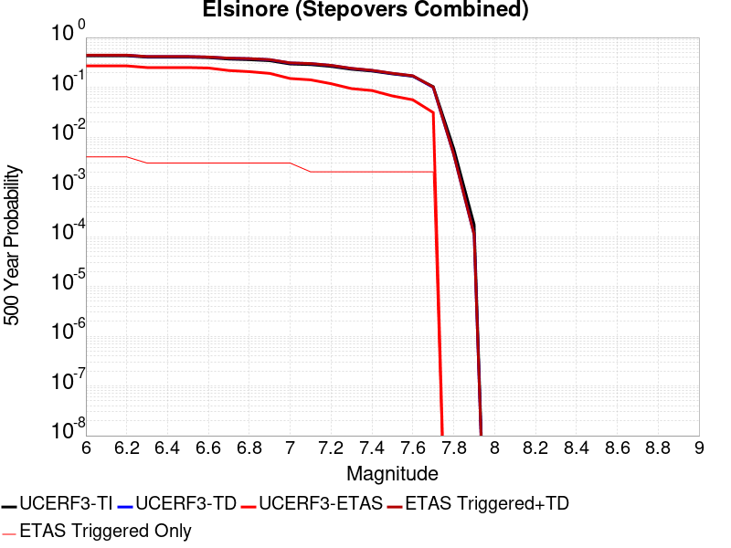 |

| Magnitude | 1 wk TI Prob | 1 wk TD Prob | 1 wk ETAS Prob | 1 wk ETAS/TD Gain | 1 wk ETAS Triggered+TD | 1 wk ETAS Triggered Only | 1 mo TI Prob | 1 mo TD Prob | 1 mo ETAS Prob | 1 mo ETAS/TD Gain | 1 mo ETAS Triggered+TD | 1 mo ETAS Triggered Only | 1 yr TI Prob | 1 yr TD Prob | 1 yr ETAS Prob | 1 yr ETAS/TD Gain | 1 yr ETAS Triggered+TD | 1 yr ETAS Triggered Only | 500 yr TI Prob | 500 yr TD Prob | 500 yr ETAS Prob | 500 yr ETAS/TD Gain | 500 yr ETAS Triggered+TD | 500 yr ETAS Triggered Only |
|-----|-----|-----|-----|-----|-----|-----|-----|-----|-----|-----|-----|-----|-----|-----|-----|-----|-----|-----|-----|-----|-----|-----|-----|-----|
| 6.0 | 2.144392E-5 | 1.9285944E-5 | 0.0 | 0.0 | 1.9285944E-5 | 0.0 | 9.189928E-5 | 8.265154E-5 | 0.0 | 0.0 | 8.265154E-5 | 0.0 | 0.0011182994 | 0.0010058373 | 0.0 | 0.0 | 0.0010058373 | 0.0 | 0.42848387 | 0.44025937 | 0.269 | 0.61100346 | 0.44249833 | 0.004 |
| 6.1 | 2.144392E-5 | 1.9285944E-5 | 0.0 | 0.0 | 1.9285944E-5 | 0.0 | 9.189928E-5 | 8.265154E-5 | 0.0 | 0.0 | 8.265154E-5 | 0.0 | 0.0011182994 | 0.0010058373 | 0.0 | 0.0 | 0.0010058373 | 0.0 | 0.42848387 | 0.44025937 | 0.269 | 0.61100346 | 0.44249833 | 0.004 |
| 6.2 | 2.144392E-5 | 1.9285944E-5 | 0.0 | 0.0 | 1.9285944E-5 | 0.0 | 9.189928E-5 | 8.265154E-5 | 0.0 | 0.0 | 8.265154E-5 | 0.0 | 0.0011182994 | 0.0010058373 | 0.0 | 0.0 | 0.0010058373 | 0.0 | 0.42848387 | 0.44025937 | 0.269 | 0.61100346 | 0.44249833 | 0.004 |
| 6.3 | 1.9751555E-5 | 1.7287208E-5 | 0.0 | 0.0 | 1.7287208E-5 | 0.0 | 8.4646774E-5 | 7.408601E-5 | 0.0 | 0.0 | 7.408601E-5 | 0.0 | 0.0010300872 | 9.016384E-4 | 0.0 | 0.0 | 9.016384E-4 | 0.0 | 0.40268403 | 0.41266277 | 0.249 | 0.60339826 | 0.41442478 | 0.003 |
| 6.4 | 1.9751555E-5 | 1.7287208E-5 | 0.0 | 0.0 | 1.7287208E-5 | 0.0 | 8.4646774E-5 | 7.408601E-5 | 0.0 | 0.0 | 7.408601E-5 | 0.0 | 0.0010300872 | 9.016384E-4 | 0.0 | 0.0 | 9.016384E-4 | 0.0 | 0.40268403 | 0.41266277 | 0.249 | 0.60339826 | 0.41442478 | 0.003 |
| 6.5 | 1.9751555E-5 | 1.7287208E-5 | 0.0 | 0.0 | 1.7287208E-5 | 0.0 | 8.4646774E-5 | 7.408601E-5 | 0.0 | 0.0 | 7.408601E-5 | 0.0 | 0.0010300872 | 9.016384E-4 | 0.0 | 0.0 | 9.016384E-4 | 0.0 | 0.40268403 | 0.41266277 | 0.249 | 0.60339826 | 0.41442478 | 0.003 |
| 6.6 | 1.9188685E-5 | 1.6560512E-5 | 0.0 | 0.0 | 1.6560512E-5 | 0.0 | 8.2234634E-5 | 7.097178E-5 | 0.0 | 0.0 | 7.097178E-5 | 0.0 | 0.0010007467 | 8.637542E-4 | 0.0 | 0.0 | 8.637542E-4 | 0.0 | 0.39384764 | 0.40441844 | 0.244 | 0.6033355 | 0.40620518 | 0.003 |
| 6.7 | 1.7608272E-5 | 1.4349555E-5 | 0.0 | 0.0 | 1.4349555E-5 | 0.0 | 7.546184E-5 | 6.149669E-5 | 0.0 | 0.0 | 6.149669E-5 | 0.0 | 9.183606E-4 | 7.484743E-4 | 0.0 | 0.0 | 7.484743E-4 | 0.0 | 0.36833197 | 0.38321298 | 0.217 | 0.56626475 | 0.38506335 | 0.003 |
| 6.8 | 1.697165E-5 | 1.3440861E-5 | 0.0 | 0.0 | 1.3440861E-5 | 0.0 | 7.273361E-5 | 5.7602465E-5 | 0.0 | 0.0 | 5.7602465E-5 | 0.0 | 8.8517193E-4 | 7.010926E-4 | 0.0 | 0.0 | 7.010926E-4 | 0.0 | 0.35775277 | 0.37482986 | 0.206 | 0.54958266 | 0.37670538 | 0.003 |
| 6.9 | 1.600365E-5 | 1.2523298E-5 | 0.0 | 0.0 | 1.2523298E-5 | 0.0 | 6.858527E-5 | 5.3670214E-5 | 0.0 | 0.0 | 5.3670214E-5 | 0.0 | 8.347058E-4 | 6.5324636E-4 | 0.0 | 0.0 | 6.5324636E-4 | 0.0 | 0.34132642 | 0.35750815 | 0.19 | 0.5314564 | 0.35943562 | 0.003 |
| 7.0 | 1.3314581E-5 | 1.0185294E-5 | 0.0 | 0.0 | 1.0185294E-5 | 0.0 | 5.7061243E-5 | 4.3650543E-5 | 0.0 | 0.0 | 4.3650543E-5 | 0.0 | 6.944992E-4 | 5.313183E-4 | 0.0 | 0.0 | 5.313183E-4 | 0.0 | 0.2934563 | 0.30704245 | 0.15 | 0.48853183 | 0.3091213 | 0.003 |
| 7.1 | 1.2865345E-5 | 9.69043E-6 | 0.0 | 0.0 | 9.69043E-6 | 0.0 | 5.5136024E-5 | 4.152976E-5 | 0.0 | 0.0 | 4.152976E-5 | 0.0 | 6.710743E-4 | 5.0550996E-4 | 0.0 | 0.0 | 5.0550996E-4 | 0.0 | 0.2851266 | 0.29845154 | 0.141 | 0.47243848 | 0.29985464 | 0.002 |
| 7.2 | 1.1650051E-5 | 8.425274E-6 | 0.0 | 0.0 | 8.425274E-6 | 0.0 | 4.9927836E-5 | 3.6107827E-5 | 0.0 | 0.0 | 3.6107827E-5 | 0.0 | 6.0770183E-4 | 4.3952581E-4 | 0.0 | 0.0 | 4.3952581E-4 | 0.0 | 0.2620973 | 0.27450517 | 0.118 | 0.4298644 | 0.27595615 | 0.002 |
| 7.3 | 1.0008533E-5 | 7.034983E-6 | 0.0 | 0.0 | 7.034983E-6 | 0.0 | 4.2893007E-5 | 3.0149586E-5 | 0.0 | 0.0 | 3.0149586E-5 | 0.0 | 5.220972E-4 | 3.6701074E-4 | 0.0 | 0.0 | 3.6701074E-4 | 0.0 | 0.22980902 | 0.23842078 | 0.094 | 0.39426094 | 0.23994394 | 0.002 |
| 7.4 | 9.116759E-6 | 6.2645904E-6 | 0.0 | 0.0 | 6.2645904E-6 | 0.0 | 3.907124E-5 | 2.6847976E-5 | 0.0 | 0.0 | 2.6847976E-5 | 0.0 | 4.7558855E-4 | 3.2682638E-4 | 0.0 | 0.0 | 3.2682638E-4 | 0.0 | 0.21167973 | 0.21785618 | 0.086 | 0.39475584 | 0.21942046 | 0.002 |
| 7.5 | 7.870524E-6 | 5.2589266E-6 | 0.0 | 0.0 | 5.2589266E-6 | 0.0 | 3.3730383E-5 | 2.2538068E-5 | 0.0 | 0.0 | 2.2538068E-5 | 0.0 | 4.1059E-4 | 2.7436763E-4 | 0.0 | 0.0 | 2.7436763E-4 | 0.0 | 0.18562731 | 0.18932758 | 0.067 | 0.35388398 | 0.19094893 | 0.002 |
| 7.6 | 6.9774537E-6 | 4.5658867E-6 | 0.0 | 0.0 | 4.5658867E-6 | 0.0 | 2.990303E-5 | 1.9567946E-5 | 0.0 | 0.0 | 1.9567946E-5 | 0.0 | 3.640086E-4 | 2.382148E-4 | 0.0 | 0.0 | 2.382148E-4 | 0.0 | 0.16642986 | 0.1688183 | 0.056 | 0.3317176 | 0.17048065 | 0.002 |
| 7.7 | 4.1616954E-6 | 2.2649097E-6 | 0.0 | 0.0 | 2.2649097E-6 | 0.0 | 1.7835715E-5 | 9.706723E-6 | 0.0 | 0.0 | 9.706723E-6 | 0.0 | 2.171282E-4 | 1.1817365E-4 | 0.0 | 0.0 | 1.1817365E-4 | 0.0 | 0.10288919 | 0.09903408 | 0.031 | 0.31302357 | 0.10083601 | 0.002 |
| 7.8 | 2.2692414E-7 | 9.1199695E-8 | 0.0 | 0.0 | 9.1199695E-8 | 0.0 | 9.725317E-7 | 3.908558E-7 | 0.0 | 0.0 | 3.908558E-7 | 0.0 | 1.1840509E-5 | 4.7586623E-6 | 0.0 | 0.0 | 4.7586623E-6 | 0.0 | 0.005902799 | 0.0045152768 | 0.0 | 0.0 | 0.0045152768 | 0.0 |
| 7.9 | 6.676829E-9 | 3.3860155E-9 | 0.0 | 0.0 | 3.3860155E-9 | 0.0 | 2.861498E-8 | 1.4511495E-8 | 0.0 | 0.0 | 1.4511495E-8 | 0.0 | 3.4838732E-7 | 1.7667745E-7 | 0.0 | 0.0 | 1.7667745E-7 | 0.0 | 1.7417852E-4 | 1.0980361E-4 | 0.0 | 0.0 | 1.0980361E-4 | 0.0 |

## Mad River (alt1)
*[(top)](#table-of-contents)*

| 1 Week | 1 Month | 1 Year | 500 Year |
|-----|-----|-----|-----|
|  | 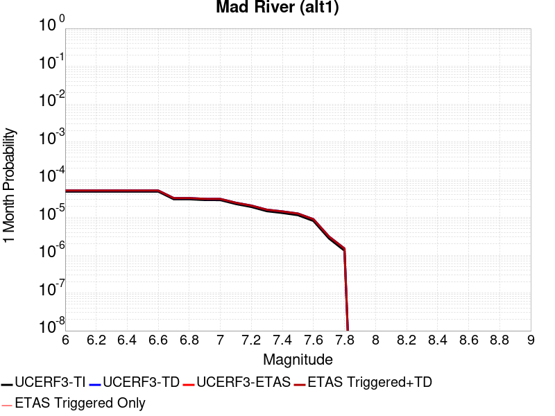 | 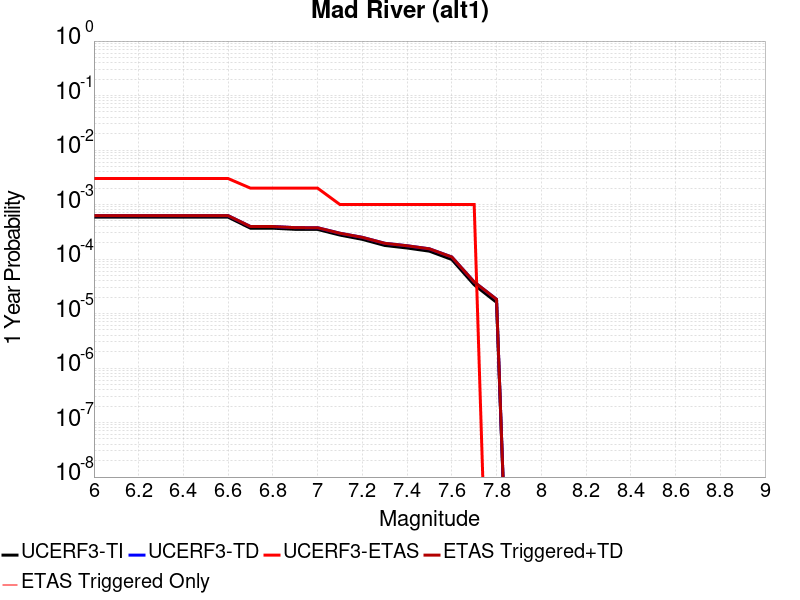 | 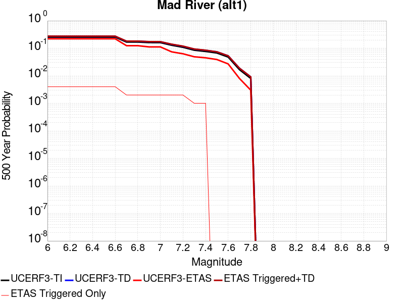 |

| Magnitude | 1 wk TI Prob | 1 wk TD Prob | 1 wk ETAS Prob | 1 wk ETAS/TD Gain | 1 wk ETAS Triggered+TD | 1 wk ETAS Triggered Only | 1 mo TI Prob | 1 mo TD Prob | 1 mo ETAS Prob | 1 mo ETAS/TD Gain | 1 mo ETAS Triggered+TD | 1 mo ETAS Triggered Only | 1 yr TI Prob | 1 yr TD Prob | 1 yr ETAS Prob | 1 yr ETAS/TD Gain | 1 yr ETAS Triggered+TD | 1 yr ETAS Triggered Only | 500 yr TI Prob | 500 yr TD Prob | 500 yr ETAS Prob | 500 yr ETAS/TD Gain | 500 yr ETAS Triggered+TD | 500 yr ETAS Triggered Only |
|-----|-----|-----|-----|-----|-----|-----|-----|-----|-----|-----|-----|-----|-----|-----|-----|-----|-----|-----|-----|-----|-----|-----|-----|-----|
| 6.0 | 1.1255216E-5 | 1.1995788E-5 | 0.0 | 0.0 | 1.1995788E-5 | 0.0 | 4.8235746E-5 | 5.1409585E-5 | 0.0 | 0.0 | 5.1409585E-5 | 0.0 | 5.87112E-4 | 6.257463E-4 | 0.003 | 4.7942753 | 6.257463E-4 | 0.0 | 0.2544568 | 0.27163506 | 0.221 | 0.8135916 | 0.2745485 | 0.004 |
| 6.1 | 1.1255216E-5 | 1.1995788E-5 | 0.0 | 0.0 | 1.1995788E-5 | 0.0 | 4.8235746E-5 | 5.1409585E-5 | 0.0 | 0.0 | 5.1409585E-5 | 0.0 | 5.87112E-4 | 6.257463E-4 | 0.003 | 4.7942753 | 6.257463E-4 | 0.0 | 0.2544568 | 0.27163506 | 0.221 | 0.8135916 | 0.2745485 | 0.004 |
| 6.2 | 1.1255216E-5 | 1.1995788E-5 | 0.0 | 0.0 | 1.1995788E-5 | 0.0 | 4.8235746E-5 | 5.1409585E-5 | 0.0 | 0.0 | 5.1409585E-5 | 0.0 | 5.87112E-4 | 6.257463E-4 | 0.003 | 4.7942753 | 6.257463E-4 | 0.0 | 0.2544568 | 0.27163506 | 0.221 | 0.8135916 | 0.2745485 | 0.004 |
| 6.3 | 1.1255216E-5 | 1.1995788E-5 | 0.0 | 0.0 | 1.1995788E-5 | 0.0 | 4.8235746E-5 | 5.1409585E-5 | 0.0 | 0.0 | 5.1409585E-5 | 0.0 | 5.87112E-4 | 6.257463E-4 | 0.003 | 4.7942753 | 6.257463E-4 | 0.0 | 0.2544568 | 0.27163506 | 0.221 | 0.8135916 | 0.2745485 | 0.004 |
| 6.4 | 1.1255216E-5 | 1.1995788E-5 | 0.0 | 0.0 | 1.1995788E-5 | 0.0 | 4.8235746E-5 | 5.1409585E-5 | 0.0 | 0.0 | 5.1409585E-5 | 0.0 | 5.87112E-4 | 6.257463E-4 | 0.003 | 4.7942753 | 6.257463E-4 | 0.0 | 0.2544568 | 0.27163506 | 0.221 | 0.8135916 | 0.2745485 | 0.004 |
| 6.5 | 1.1255216E-5 | 1.1995788E-5 | 0.0 | 0.0 | 1.1995788E-5 | 0.0 | 4.8235746E-5 | 5.1409585E-5 | 0.0 | 0.0 | 5.1409585E-5 | 0.0 | 5.87112E-4 | 6.257463E-4 | 0.003 | 4.7942753 | 6.257463E-4 | 0.0 | 0.2544568 | 0.27163506 | 0.221 | 0.8135916 | 0.2745485 | 0.004 |
| 6.6 | 1.1255216E-5 | 1.1995788E-5 | 0.0 | 0.0 | 1.1995788E-5 | 0.0 | 4.8235746E-5 | 5.1409585E-5 | 0.0 | 0.0 | 5.1409585E-5 | 0.0 | 5.87112E-4 | 6.257463E-4 | 0.003 | 4.7942753 | 6.257463E-4 | 0.0 | 0.2544568 | 0.27163506 | 0.221 | 0.8135916 | 0.2745485 | 0.004 |
| 6.7 | 7.0564884E-6 | 7.5744533E-6 | 0.0 | 0.0 | 7.5744533E-6 | 0.0 | 3.0241743E-5 | 3.246155E-5 | 0.0 | 0.0 | 3.246155E-5 | 0.0 | 3.68131E-4 | 3.951499E-4 | 0.002 | 5.0613704 | 3.951499E-4 | 0.0 | 0.16814688 | 0.17977239 | 0.124 | 0.6897611 | 0.18141285 | 0.002 |
| 6.8 | 7.0564884E-6 | 7.5744533E-6 | 0.0 | 0.0 | 7.5744533E-6 | 0.0 | 3.0241743E-5 | 3.246155E-5 | 0.0 | 0.0 | 3.246155E-5 | 0.0 | 3.68131E-4 | 3.951499E-4 | 0.002 | 5.0613704 | 3.951499E-4 | 0.0 | 0.16814688 | 0.17977239 | 0.124 | 0.6897611 | 0.18141285 | 0.002 |
| 6.9 | 6.727494E-6 | 7.2273556E-6 | 0.0 | 0.0 | 7.2273556E-6 | 0.0 | 2.8831799E-5 | 3.0974024E-5 | 0.0 | 0.0 | 3.0974024E-5 | 0.0 | 3.509706E-4 | 3.7704562E-4 | 0.002 | 5.3043976 | 3.7704562E-4 | 0.0 | 0.16097611 | 0.17229794 | 0.112 | 0.6500368 | 0.17395334 | 0.002 |
| 7.0 | 6.7021124E-6 | 7.2002945E-6 | 0.0 | 0.0 | 7.2002945E-6 | 0.0 | 2.8723021E-5 | 3.0858053E-5 | 0.0 | 0.0 | 3.0858053E-5 | 0.0 | 3.4964667E-4 | 3.7563415E-4 | 0.002 | 5.32433 | 3.7563415E-4 | 0.0 | 0.16042033 | 0.1717132 | 0.112 | 0.6522504 | 0.17336977 | 0.002 |
| 7.1 | 5.2784667E-6 | 5.7064613E-6 | 0.0 | 0.0 | 5.7064613E-6 | 0.0 | 2.2621804E-5 | 2.4456038E-5 | 0.0 | 0.0 | 2.4456038E-5 | 0.0 | 2.7538565E-4 | 2.9771248E-4 | 0.001 | 3.3589454 | 2.9771248E-4 | 0.0 | 0.1286502 | 0.13850506 | 0.074 | 0.53427655 | 0.14022805 | 0.002 |
| 7.2 | 4.4085446E-6 | 4.7961016E-6 | 0.0 | 0.0 | 4.7961016E-6 | 0.0 | 1.8893625E-5 | 2.055456E-5 | 0.0 | 0.0 | 2.055456E-5 | 0.0 | 2.3000561E-4 | 2.5022344E-4 | 0.001 | 3.9964283 | 2.5022344E-4 | 0.0 | 0.10864814 | 0.1176758 | 0.063 | 0.5353692 | 0.11944045 | 0.002 |
| 7.3 | 3.4060627E-6 | 3.733261E-6 | 0.0 | 0.0 | 3.733261E-6 | 0.0 | 1.459733E-5 | 1.5999594E-5 | 0.0 | 0.0 | 1.5999594E-5 | 0.0 | 1.77708E-4 | 1.9477788E-4 | 0.001 | 5.134053 | 1.9477788E-4 | 0.0 | 0.085028075 | 0.09282655 | 0.049 | 0.52786624 | 0.09373372 | 0.001 |
| 7.4 | 3.0570902E-6 | 3.3617084E-6 | 0.0 | 0.0 | 3.3617084E-6 | 0.0 | 1.310175E-5 | 1.4407244E-5 | 0.0 | 0.0 | 1.4407244E-5 | 0.0 | 1.5950213E-4 | 1.7539428E-4 | 0.001 | 5.70144 | 1.7539428E-4 | 0.0 | 0.0766597 | 0.08398589 | 0.045 | 0.53580433 | 0.0849019 | 0.001 |
| 7.5 | 2.674048E-6 | 2.9522396E-6 | 0.0 | 0.0 | 2.9522396E-6 | 0.0 | 1.1460155E-5 | 1.26523955E-5 | 0.0 | 0.0 | 1.26523955E-5 | 0.0 | 1.3951845E-4 | 1.5403221E-4 | 0.001 | 6.4921484 | 1.5403221E-4 | 0.0 | 0.067386195 | 0.07414376 | 0.039 | 0.52600515 | 0.07414376 | 0.0 |
| 7.6 | 1.8806261E-6 | 2.09161E-6 | 0.0 | 0.0 | 2.09161E-6 | 0.0 | 8.059801E-6 | 8.9640125E-6 | 0.0 | 0.0 | 8.9640125E-6 | 0.0 | 9.812366E-5 | 1.0913151E-4 | 0.001 | 9.163256 | 1.0913151E-4 | 0.0 | 0.047880035 | 0.053107314 | 0.027 | 0.50840455 | 0.053107314 | 0.0 |
| 7.7 | 6.461283E-7 | 7.289108E-7 | 0.0 | 0.0 | 7.289108E-7 | 0.0 | 2.7691183E-6 | 3.1238997E-6 | 0.0 | 0.0 | 3.1238997E-6 | 0.0 | 3.371349E-5 | 3.803283E-5 | 0.001 | 26.293074 | 3.803283E-5 | 0.0 | 0.016715746 | 0.018837132 | 0.008 | 0.42469314 | 0.018837132 | 0.0 |
| 7.8 | 3.0785324E-7 | 3.5023348E-7 | 0.0 | 0.0 | 3.5023348E-7 | 0.0 | 1.3193703E-6 | 1.5009997E-6 | 0.0 | 0.0 | 1.5009997E-6 | 0.0 | 1.6063215E-5 | 1.8274524E-5 | 0.0 | 0.0 | 1.8274524E-5 | 0.0 | 0.007999505 | 0.009094285 | 0.003 | 0.3298775 | 0.009094285 | 0.0 |

## Joshua Tree (Seismicity)
*[(top)](#table-of-contents)*

| 1 Week | 1 Month | 1 Year | 500 Year |
|-----|-----|-----|-----|
|  | 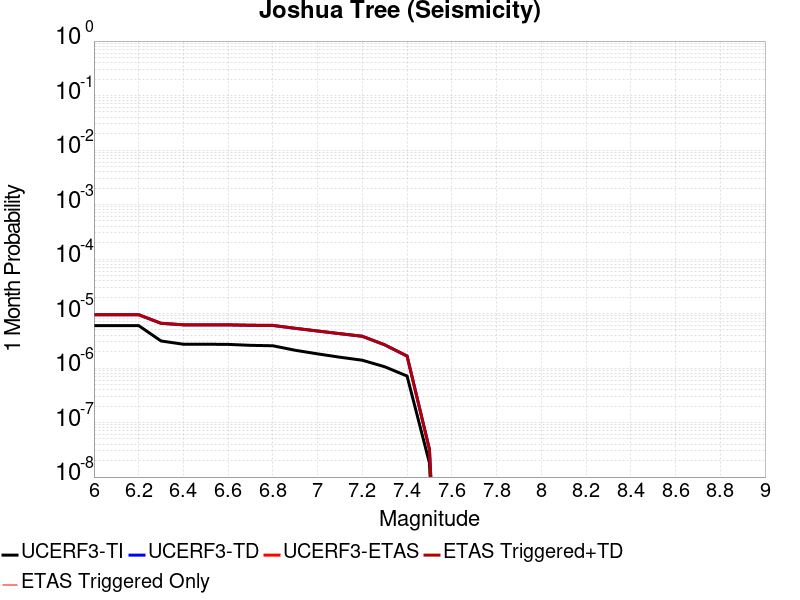 | 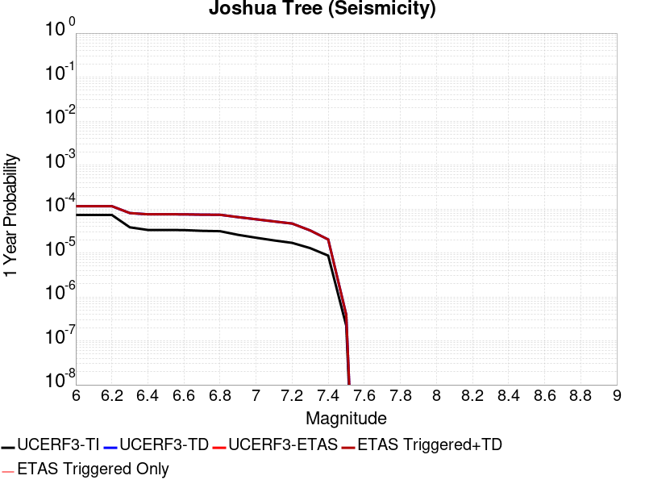 | 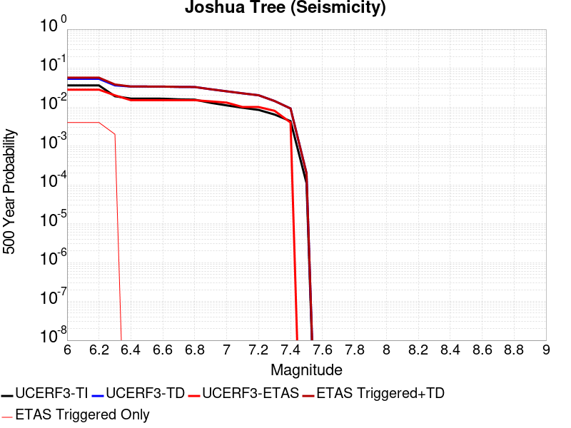 |

| Magnitude | 1 wk TI Prob | 1 wk TD Prob | 1 wk ETAS Prob | 1 wk ETAS/TD Gain | 1 wk ETAS Triggered+TD | 1 wk ETAS Triggered Only | 1 mo TI Prob | 1 mo TD Prob | 1 mo ETAS Prob | 1 mo ETAS/TD Gain | 1 mo ETAS Triggered+TD | 1 mo ETAS Triggered Only | 1 yr TI Prob | 1 yr TD Prob | 1 yr ETAS Prob | 1 yr ETAS/TD Gain | 1 yr ETAS Triggered+TD | 1 yr ETAS Triggered Only | 500 yr TI Prob | 500 yr TD Prob | 500 yr ETAS Prob | 500 yr ETAS/TD Gain | 500 yr ETAS Triggered+TD | 500 yr ETAS Triggered Only |
|-----|-----|-----|-----|-----|-----|-----|-----|-----|-----|-----|-----|-----|-----|-----|-----|-----|-----|-----|-----|-----|-----|-----|-----|-----|
| 6.0 | 1.4025588E-6 | 2.221916E-6 | 0.0 | 0.0 | 2.221916E-6 | 0.0 | 6.0109523E-6 | 9.522467E-6 | 0.0 | 0.0 | 9.522467E-6 | 0.0 | 7.318089E-5 | 1.1593051E-4 | 0.0 | 0.0 | 1.1593051E-4 | 0.0 | 0.035930395 | 0.053095005 | 0.028 | 0.52735656 | 0.056882624 | 0.004 |
| 6.1 | 1.4025588E-6 | 2.221916E-6 | 0.0 | 0.0 | 2.221916E-6 | 0.0 | 6.0109523E-6 | 9.522467E-6 | 0.0 | 0.0 | 9.522467E-6 | 0.0 | 7.318089E-5 | 1.1593051E-4 | 0.0 | 0.0 | 1.1593051E-4 | 0.0 | 0.035930395 | 0.053095005 | 0.028 | 0.52735656 | 0.056882624 | 0.004 |
| 6.2 | 1.4025588E-6 | 2.221916E-6 | 0.0 | 0.0 | 2.221916E-6 | 0.0 | 6.0109523E-6 | 9.522467E-6 | 0.0 | 0.0 | 9.522467E-6 | 0.0 | 7.318089E-5 | 1.1593051E-4 | 0.0 | 0.0 | 1.1593051E-4 | 0.0 | 0.035930395 | 0.053095005 | 0.028 | 0.52735656 | 0.056882624 | 0.004 |
| 6.3 | 7.3325685E-7 | 1.5462967E-6 | 0.0 | 0.0 | 1.5462967E-6 | 0.0 | 3.1425257E-6 | 6.62697E-6 | 0.0 | 0.0 | 6.62697E-6 | 0.0 | 3.825958E-5 | 8.068045E-5 | 0.0 | 0.0 | 8.068045E-5 | 0.0 | 0.018948335 | 0.036106046 | 0.02 | 0.55392385 | 0.038033836 | 0.002 |
| 6.4 | 6.38256E-7 | 1.4505849E-6 | 0.0 | 0.0 | 1.4505849E-6 | 0.0 | 2.7353801E-6 | 6.2167783E-6 | 0.0 | 0.0 | 6.2167783E-6 | 0.0 | 3.3302742E-5 | 7.5686716E-5 | 0.0 | 0.0 | 7.5686716E-5 | 0.0 | 0.016513776 | 0.033693124 | 0.015 | 0.4451947 | 0.033693124 | 0.0 |
| 6.5 | 6.38256E-7 | 1.4505849E-6 | 0.0 | 0.0 | 1.4505849E-6 | 0.0 | 2.7353801E-6 | 6.2167783E-6 | 0.0 | 0.0 | 6.2167783E-6 | 0.0 | 3.3302742E-5 | 7.5686716E-5 | 0.0 | 0.0 | 7.5686716E-5 | 0.0 | 0.016513776 | 0.033693124 | 0.015 | 0.4451947 | 0.033693124 | 0.0 |
| 6.6 | 6.3436806E-7 | 1.4476994E-6 | 0.0 | 0.0 | 1.4476994E-6 | 0.0 | 2.7187175E-6 | 6.204412E-6 | 0.0 | 0.0 | 6.204412E-6 | 0.0 | 3.3099885E-5 | 7.553616E-5 | 0.0 | 0.0 | 7.553616E-5 | 0.0 | 0.016414013 | 0.033618715 | 0.015 | 0.44618005 | 0.033618715 | 0.0 |
| 6.7 | 6.094856E-7 | 1.4224125E-6 | 0.0 | 0.0 | 1.4224125E-6 | 0.0 | 2.6120786E-6 | 6.0960397E-6 | 0.0 | 0.0 | 6.0960397E-6 | 0.0 | 3.1801592E-5 | 7.421683E-5 | 0.0 | 0.0 | 7.421683E-5 | 0.0 | 0.015775295 | 0.032980755 | 0.015 | 0.4548107 | 0.032980755 | 0.0 |
| 6.8 | 5.984801E-7 | 1.4138483E-6 | 0.0 | 0.0 | 1.4138483E-6 | 0.0 | 2.564912E-6 | 6.059336E-6 | 0.0 | 0.0 | 6.059336E-6 | 0.0 | 3.1227355E-5 | 7.376999E-5 | 0.0 | 0.0 | 7.376999E-5 | 0.0 | 0.015492656 | 0.032759193 | 0.015 | 0.45788673 | 0.032759193 | 0.0 |
| 6.9 | 4.94631E-7 | 1.2508117E-6 | 0.0 | 0.0 | 1.2508117E-6 | 0.0 | 2.1198455E-6 | 5.360611E-6 | 0.0 | 0.0 | 5.360611E-6 | 0.0 | 2.5808813E-5 | 6.526354E-5 | 0.0 | 0.0 | 6.526354E-5 | 0.0 | 0.012821666 | 0.028670806 | 0.014 | 0.48830158 | 0.028670806 | 0.0 |
| 7.0 | 4.250375E-7 | 1.1168374E-6 | 0.0 | 0.0 | 1.1168374E-6 | 0.0 | 1.8215881E-6 | 4.786438E-6 | 0.0 | 0.0 | 4.786438E-6 | 0.0 | 2.2177608E-5 | 5.8273366E-5 | 0.0 | 0.0 | 5.8273366E-5 | 0.0 | 0.011027672 | 0.025377406 | 0.013 | 0.5122667 | 0.025377406 | 0.0 |
| 7.1 | 3.6888565E-7 | 9.973187E-7 | 0.0 | 0.0 | 9.973187E-7 | 0.0 | 1.5809376E-6 | 4.274216E-6 | 0.0 | 0.0 | 4.274216E-6 | 0.0 | 1.9247746E-5 | 5.2037376E-5 | 0.0 | 0.0 | 5.2037376E-5 | 0.0 | 0.009577803 | 0.022505477 | 0.01 | 0.4443363 | 0.022505477 | 0.0 |
| 7.2 | 3.2473773E-7 | 8.936874E-7 | 0.0 | 0.0 | 8.936874E-7 | 0.0 | 1.3917323E-6 | 3.8300836E-6 | 0.0 | 0.0 | 3.8300836E-6 | 0.0 | 1.694421E-5 | 4.6630306E-5 | 0.0 | 0.0 | 4.6630306E-5 | 0.0 | 0.008436388 | 0.020092614 | 0.01 | 0.4976953 | 0.020092614 | 0.0 |
| 7.3 | 2.465367E-7 | 6.2273324E-7 | 0.0 | 0.0 | 6.2273324E-7 | 0.0 | 1.0565853E-6 | 2.6688542E-6 | 0.0 | 0.0 | 2.6688542E-6 | 0.0 | 1.2863851E-5 | 3.2492844E-5 | 0.0 | 0.0 | 3.2492844E-5 | 0.0 | 0.006411326 | 0.014296638 | 0.008 | 0.55957216 | 0.014296638 | 0.0 |
| 7.4 | 1.6654941E-7 | 3.8779612E-7 | 0.0 | 0.0 | 3.8779612E-7 | 0.0 | 7.13783E-7 | 1.6619824E-6 | 0.0 | 0.0 | 1.6619824E-6 | 0.0 | 8.690274E-6 | 2.0234473E-5 | 0.0 | 0.0 | 2.0234473E-5 | 0.0 | 0.004335729 | 0.009182607 | 0.004 | 0.43560612 | 0.009182607 | 0.0 |
| 7.5 | 4.24214E-9 | 7.540045E-9 | 0.0 | 0.0 | 7.540045E-9 | 0.0 | 1.81806E-8 | 3.2314478E-8 | 0.0 | 0.0 | 3.2314478E-8 | 0.0 | 2.213488E-7 | 3.9342873E-7 | 0.0 | 0.0 | 3.9342873E-7 | 0.0 | 1.1066828E-4 | 1.9890937E-4 | 0.0 | 0.0 | 1.9890937E-4 | 0.0 |

## Bartlett Springs 2011 CFM
*[(top)](#table-of-contents)*

| 1 Week | 1 Month | 1 Year | 500 Year |
|-----|-----|-----|-----|
|  |  | 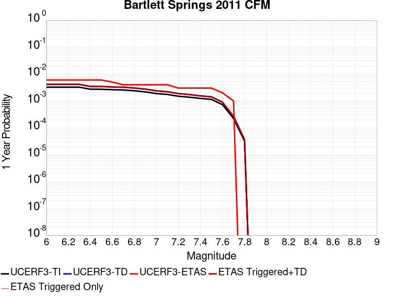 | 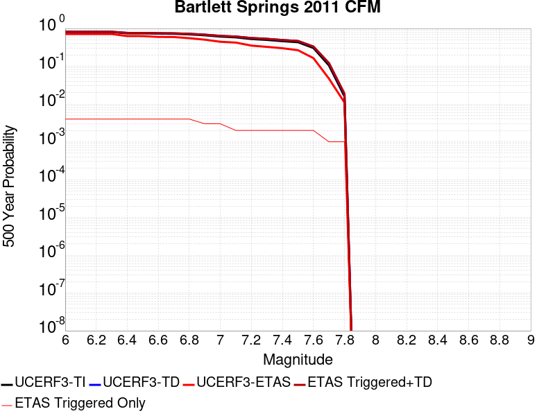 |

| Magnitude | 1 wk TI Prob | 1 wk TD Prob | 1 wk ETAS Prob | 1 wk ETAS/TD Gain | 1 wk ETAS Triggered+TD | 1 wk ETAS Triggered Only | 1 mo TI Prob | 1 mo TD Prob | 1 mo ETAS Prob | 1 mo ETAS/TD Gain | 1 mo ETAS Triggered+TD | 1 mo ETAS Triggered Only | 1 yr TI Prob | 1 yr TD Prob | 1 yr ETAS Prob | 1 yr ETAS/TD Gain | 1 yr ETAS Triggered+TD | 1 yr ETAS Triggered Only | 500 yr TI Prob | 500 yr TD Prob | 500 yr ETAS Prob | 500 yr ETAS/TD Gain | 500 yr ETAS Triggered+TD | 500 yr ETAS Triggered Only |
|-----|-----|-----|-----|-----|-----|-----|-----|-----|-----|-----|-----|-----|-----|-----|-----|-----|-----|-----|-----|-----|-----|-----|-----|-----|
| 6.0 | 6.2326144E-5 | 7.9415724E-5 | 0.0 | 0.0 | 7.9415724E-5 | 0.0 | 2.6708472E-4 | 3.4030943E-4 | 0.0 | 0.0 | 3.4030943E-4 | 0.0 | 0.003246908 | 0.004135503 | 0.006 | 1.4508513 | 0.004135503 | 0.0 | 0.8033039 | 0.81754017 | 0.712 | 0.8709052 | 0.81827 | 0.004 |
| 6.1 | 6.227657E-5 | 7.9354046E-5 | 0.0 | 0.0 | 7.9354046E-5 | 0.0 | 2.668723E-4 | 3.400452E-4 | 0.0 | 0.0 | 3.400452E-4 | 0.0 | 0.0032443295 | 0.004132298 | 0.006 | 1.4519765 | 0.004132298 | 0.0 | 0.80304927 | 0.81730384 | 0.712 | 0.87115705 | 0.8180346 | 0.004 |
| 6.2 | 6.22452E-5 | 7.931516E-5 | 0.0 | 0.0 | 7.931516E-5 | 0.0 | 2.6673786E-4 | 3.398786E-4 | 0.0 | 0.0 | 3.398786E-4 | 0.0 | 0.0032426978 | 0.0041302773 | 0.006 | 1.4526869 | 0.0041302773 | 0.0 | 0.80288804 | 0.81715333 | 0.712 | 0.8713175 | 0.81788474 | 0.004 |
| 6.3 | 6.219006E-5 | 7.924597E-5 | 0.0 | 0.0 | 7.924597E-5 | 0.0 | 2.6650162E-4 | 3.395821E-4 | 0.0 | 0.0 | 3.395821E-4 | 0.0 | 0.00323983 | 0.0041266815 | 0.006 | 1.4539528 | 0.0041266815 | 0.0 | 0.80260426 | 0.8168932 | 0.712 | 0.87159497 | 0.81762564 | 0.004 |
| 6.4 | 5.2175856E-5 | 6.627126E-5 | 0.0 | 0.0 | 6.627126E-5 | 0.0 | 2.2359163E-4 | 2.8398912E-4 | 0.0 | 0.0 | 2.8398912E-4 | 0.0 | 0.0027188298 | 0.0034521357 | 0.006 | 1.7380545 | 0.0034521357 | 0.0 | 0.743664 | 0.76299244 | 0.63 | 0.8256963 | 0.76394045 | 0.004 |
| 6.5 | 5.205166E-5 | 6.611606E-5 | 0.0 | 0.0 | 6.611606E-5 | 0.0 | 2.2305945E-4 | 2.8332407E-4 | 0.0 | 0.0 | 2.8332407E-4 | 0.0 | 0.0027123666 | 0.0034440646 | 0.006 | 1.7421275 | 0.0034440646 | 0.0 | 0.74283206 | 0.76222736 | 0.628 | 0.8239012 | 0.76317847 | 0.004 |
| 6.6 | 5.0085426E-5 | 6.355395E-5 | 0.0 | 0.0 | 6.355395E-5 | 0.0 | 2.1463417E-4 | 2.723459E-4 | 0.0 | 0.0 | 2.723459E-4 | 0.0 | 0.0026100394 | 0.003310821 | 0.005 | 1.5101994 | 0.003310821 | 0.0 | 0.729295 | 0.75039816 | 0.598 | 0.7969103 | 0.75139654 | 0.004 |
| 6.7 | 4.8930866E-5 | 6.209928E-5 | 0.0 | 0.0 | 6.209928E-5 | 0.0 | 2.0968684E-4 | 2.661129E-4 | 0.0 | 0.0 | 2.661129E-4 | 0.0 | 0.0025499484 | 0.0032351615 | 0.004 | 1.2364143 | 0.0032351615 | 0.0 | 0.72101647 | 0.742832 | 0.593 | 0.7982962 | 0.7438607 | 0.004 |
| 6.8 | 4.5679535E-5 | 5.7892543E-5 | 0.0 | 0.0 | 5.7892543E-5 | 0.0 | 1.9575475E-4 | 2.4808754E-4 | 0.0 | 0.0 | 2.4808754E-4 | 0.0 | 0.002380709 | 0.0030163203 | 0.004 | 1.3261191 | 0.0030163203 | 0.0 | 0.69631785 | 0.71950495 | 0.553 | 0.768584 | 0.7206269 | 0.004 |
| 6.9 | 4.1439176E-5 | 5.2456133E-5 | 0.0 | 0.0 | 5.2456133E-5 | 0.0 | 1.7758438E-4 | 2.2479276E-4 | 0.0 | 0.0 | 2.2479276E-4 | 0.0 | 0.002159946 | 0.002733443 | 0.004 | 1.4633559 | 0.002733443 | 0.0 | 0.6607917 | 0.6855427 | 0.505 | 0.73664266 | 0.68648607 | 0.003 |
| 7.0 | 3.5920104E-5 | 4.5357847E-5 | 0.0 | 0.0 | 4.5357847E-5 | 0.0 | 1.5393422E-4 | 1.9437638E-4 | 0.0 | 0.0 | 1.9437638E-4 | 0.0 | 0.001872538 | 0.00236398 | 0.004 | 1.6920615 | 0.00236398 | 0.0 | 0.608256 | 0.63572603 | 0.445 | 0.6999871 | 0.6368188 | 0.003 |
| 7.1 | 3.338812E-5 | 4.2091437E-5 | 0.0 | 0.0 | 4.2091437E-5 | 0.0 | 1.430841E-4 | 1.8037947E-4 | 0.0 | 0.0 | 1.8037947E-4 | 0.0 | 0.0017406568 | 0.0021939226 | 0.004 | 1.8232182 | 0.0021939226 | 0.0 | 0.5815035 | 0.61059 | 0.423 | 0.69277257 | 0.61136883 | 0.002 |
| 7.2 | 2.8619615E-5 | 3.5907964E-5 | 0.0 | 0.0 | 3.5907964E-5 | 0.0 | 1.2264973E-4 | 1.5388225E-4 | 0.0 | 0.0 | 1.5388225E-4 | 0.0 | 0.0014922376 | 0.0018719159 | 0.003 | 1.6026361 | 0.0018719159 | 0.0 | 0.5260607 | 0.5586177 | 0.352 | 0.63012683 | 0.55950046 | 0.002 |
| 7.3 | 2.6376783E-5 | 3.2974836E-5 | 0.0 | 0.0 | 3.2974836E-5 | 0.0 | 1.13038455E-4 | 1.4131312E-4 | 0.0 | 0.0 | 1.4131312E-4 | 0.0 | 0.0013753743 | 0.0017191385 | 0.003 | 1.7450601 | 0.0017191385 | 0.0 | 0.49750042 | 0.5306204 | 0.326 | 0.6143752 | 0.5315591 | 0.002 |
| 7.4 | 2.3738676E-5 | 2.9583662E-5 | 0.0 | 0.0 | 2.9583662E-5 | 0.0 | 1.0173322E-4 | 1.26781E-4 | 0.0 | 0.0 | 1.26781E-4 | 0.0 | 0.0012378981 | 0.0015424736 | 0.003 | 1.944928 | 0.0015424736 | 0.0 | 0.46169633 | 0.49455148 | 0.3 | 0.60661024 | 0.49556237 | 0.002 |
| 7.5 | 2.1789481E-5 | 2.7081589E-5 | 0.0 | 0.0 | 2.7081589E-5 | 0.0 | 9.338015E-5 | 1.1605883E-4 | 0.0 | 0.0 | 1.1605883E-4 | 0.0 | 0.0011363103 | 0.001412108 | 0.003 | 2.1244833 | 0.001412108 | 0.0 | 0.43361327 | 0.46622604 | 0.266 | 0.5705387 | 0.4672936 | 0.002 |
| 7.6 | 1.3895281E-5 | 1.7150789E-5 | 0.0 | 0.0 | 1.7150789E-5 | 0.0 | 5.9549846E-5 | 7.3501324E-5 | 0.0 | 0.0 | 7.3501324E-5 | 0.0 | 7.2477816E-4 | 8.94514E-4 | 0.002 | 2.2358508 | 8.94514E-4 | 0.0 | 0.30407995 | 0.33087906 | 0.164 | 0.4956494 | 0.3322173 | 0.002 |
| 7.7 | 4.245981E-6 | 5.105276E-6 | 0.0 | 0.0 | 5.105276E-6 | 0.0 | 1.8196934E-5 | 2.1879572E-5 | 0.0 | 0.0 | 2.1879572E-5 | 0.0 | 2.2152514E-4 | 2.6635142E-4 | 0.001 | 3.7544386 | 2.6635142E-4 | 0.0 | 0.104859725 | 0.12028151 | 0.047 | 0.39075 | 0.12116123 | 0.001 |
| 7.8 | 6.145192E-7 | 6.993446E-7 | 0.0 | 0.0 | 6.993446E-7 | 0.0 | 2.633651E-6 | 2.9971875E-6 | 0.0 | 0.0 | 2.9971875E-6 | 0.0 | 3.206423E-5 | 3.649016E-5 | 0.0 | 0.0 | 3.649016E-5 | 0.0 | 0.015904536 | 0.018011367 | 0.011 | 0.6107254 | 0.018993355 | 0.001 |

## Oceanside alt1
*[(top)](#table-of-contents)*

| 1 Week | 1 Month | 1 Year | 500 Year |
|-----|-----|-----|-----|
| 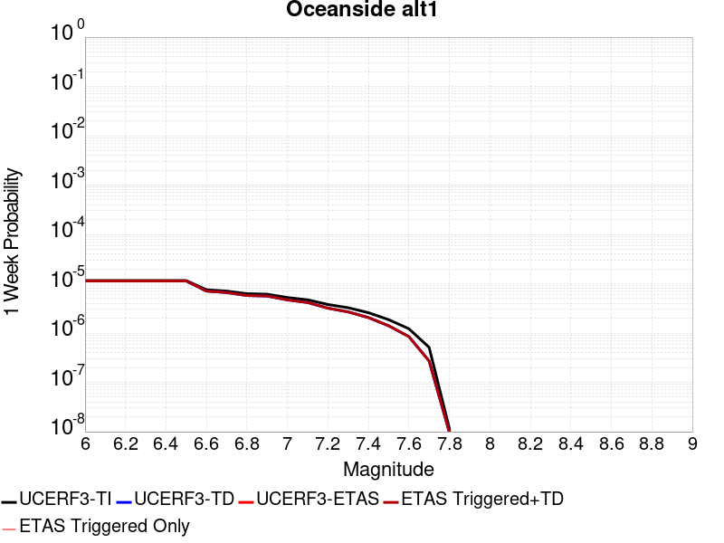 | 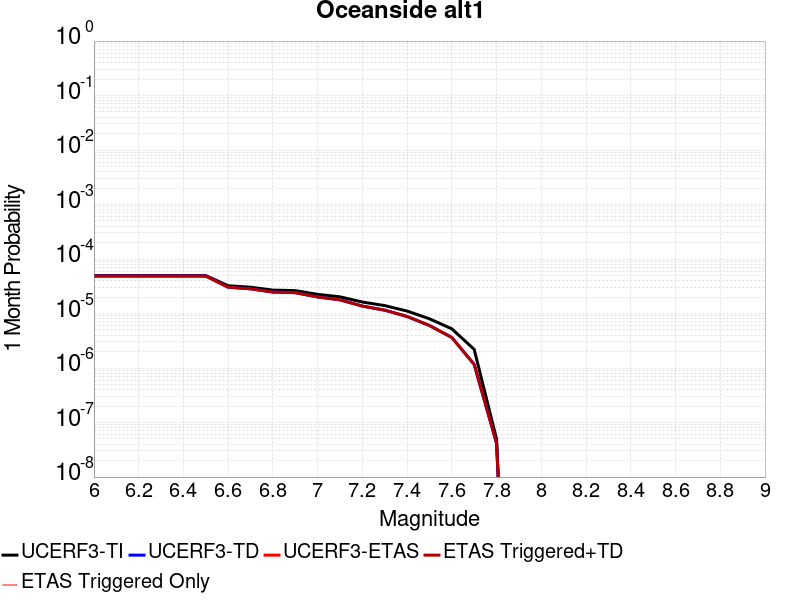 | 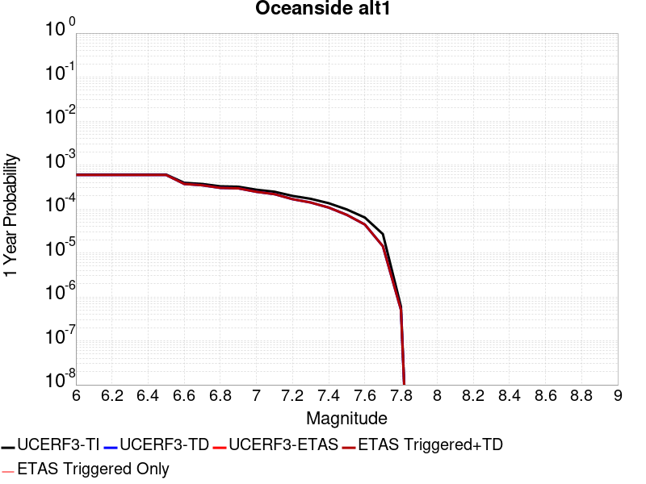 | 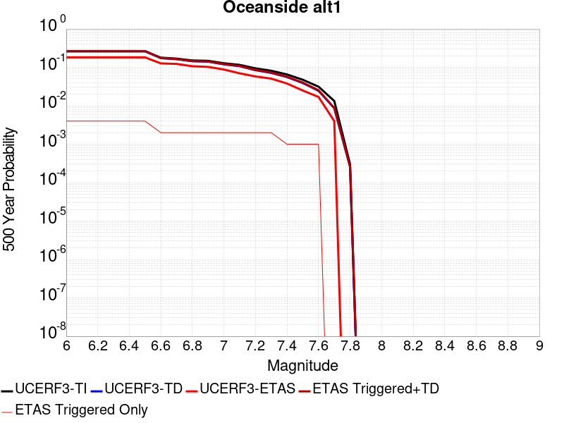 |

| Magnitude | 1 wk TI Prob | 1 wk TD Prob | 1 wk ETAS Prob | 1 wk ETAS/TD Gain | 1 wk ETAS Triggered+TD | 1 wk ETAS Triggered Only | 1 mo TI Prob | 1 mo TD Prob | 1 mo ETAS Prob | 1 mo ETAS/TD Gain | 1 mo ETAS Triggered+TD | 1 mo ETAS Triggered Only | 1 yr TI Prob | 1 yr TD Prob | 1 yr ETAS Prob | 1 yr ETAS/TD Gain | 1 yr ETAS Triggered+TD | 1 yr ETAS Triggered Only | 500 yr TI Prob | 500 yr TD Prob | 500 yr ETAS Prob | 500 yr ETAS/TD Gain | 500 yr ETAS Triggered+TD | 500 yr ETAS Triggered Only |
|-----|-----|-----|-----|-----|-----|-----|-----|-----|-----|-----|-----|-----|-----|-----|-----|-----|-----|-----|-----|-----|-----|-----|-----|-----|
| 6.0 | 1.1617542E-5 | 1.1391154E-5 | 0.0 | 0.0 | 1.1391154E-5 | 0.0 | 4.9788516E-5 | 4.881841E-5 | 0.0 | 0.0 | 4.881841E-5 | 0.0 | 6.060066E-4 | 5.94218E-4 | 0.0 | 0.0 | 5.94218E-4 | 0.0 | 0.26147115 | 0.2640604 | 0.182 | 0.6892363 | 0.26700416 | 0.004 |
| 6.1 | 1.1617542E-5 | 1.1391154E-5 | 0.0 | 0.0 | 1.1391154E-5 | 0.0 | 4.9788516E-5 | 4.881841E-5 | 0.0 | 0.0 | 4.881841E-5 | 0.0 | 6.060066E-4 | 5.94218E-4 | 0.0 | 0.0 | 5.94218E-4 | 0.0 | 0.26147115 | 0.2640604 | 0.182 | 0.6892363 | 0.26700416 | 0.004 |
| 6.2 | 1.1617542E-5 | 1.1391154E-5 | 0.0 | 0.0 | 1.1391154E-5 | 0.0 | 4.9788516E-5 | 4.881841E-5 | 0.0 | 0.0 | 4.881841E-5 | 0.0 | 6.060066E-4 | 5.94218E-4 | 0.0 | 0.0 | 5.94218E-4 | 0.0 | 0.26147115 | 0.2640604 | 0.182 | 0.6892363 | 0.26700416 | 0.004 |
| 6.3 | 1.1617542E-5 | 1.1391154E-5 | 0.0 | 0.0 | 1.1391154E-5 | 0.0 | 4.9788516E-5 | 4.881841E-5 | 0.0 | 0.0 | 4.881841E-5 | 0.0 | 6.060066E-4 | 5.94218E-4 | 0.0 | 0.0 | 5.94218E-4 | 0.0 | 0.26147115 | 0.2640604 | 0.182 | 0.6892363 | 0.26700416 | 0.004 |
| 6.4 | 1.1617542E-5 | 1.1391154E-5 | 0.0 | 0.0 | 1.1391154E-5 | 0.0 | 4.9788516E-5 | 4.881841E-5 | 0.0 | 0.0 | 4.881841E-5 | 0.0 | 6.060066E-4 | 5.94218E-4 | 0.0 | 0.0 | 5.94218E-4 | 0.0 | 0.26147115 | 0.2640604 | 0.182 | 0.6892363 | 0.26700416 | 0.004 |
| 6.5 | 1.1617542E-5 | 1.1391154E-5 | 0.0 | 0.0 | 1.1391154E-5 | 0.0 | 4.9788516E-5 | 4.881841E-5 | 0.0 | 0.0 | 4.881841E-5 | 0.0 | 6.060066E-4 | 5.94218E-4 | 0.0 | 0.0 | 5.94218E-4 | 0.0 | 0.26147115 | 0.2640604 | 0.182 | 0.6892363 | 0.26700416 | 0.004 |
| 6.6 | 7.561768E-6 | 7.114123E-6 | 0.0 | 0.0 | 7.114123E-6 | 0.0 | 3.2407173E-5 | 3.0488749E-5 | 0.0 | 0.0 | 3.0488749E-5 | 0.0 | 3.9448592E-4 | 3.7113836E-4 | 0.0 | 0.0 | 3.7113836E-4 | 0.0 | 0.1790408 | 0.17364915 | 0.127 | 0.7313598 | 0.17530185 | 0.002 |
| 6.7 | 7.1042605E-6 | 6.6372995E-6 | 0.0 | 0.0 | 6.6372995E-6 | 0.0 | 3.0446476E-5 | 2.8445264E-5 | 0.0 | 0.0 | 2.8445264E-5 | 0.0 | 3.706228E-4 | 3.4626684E-4 | 0.0 | 0.0 | 3.4626684E-4 | 0.0 | 0.16918302 | 0.16324213 | 0.123 | 0.7534819 | 0.16491565 | 0.002 |
| 6.8 | 6.285554E-6 | 5.783342E-6 | 0.0 | 0.0 | 5.783342E-6 | 0.0 | 2.693781E-5 | 2.4785519E-5 | 0.0 | 0.0 | 2.4785519E-5 | 0.0 | 3.2791847E-4 | 3.0172247E-4 | 0.0 | 0.0 | 3.0172247E-4 | 0.0 | 0.1512462 | 0.14433247 | 0.107 | 0.7413439 | 0.1460438 | 0.002 |
| 6.9 | 6.148883E-6 | 5.6405333E-6 | 0.0 | 0.0 | 5.6405333E-6 | 0.0 | 2.635209E-5 | 2.4173494E-5 | 0.0 | 0.0 | 2.4173494E-5 | 0.0 | 3.2078946E-4 | 2.9427308E-4 | 0.0 | 0.0 | 2.9427308E-4 | 0.0 | 0.14821443 | 0.14113788 | 0.103 | 0.72978276 | 0.14285561 | 0.002 |
| 7.0 | 5.253857E-6 | 4.7085346E-6 | 0.0 | 0.0 | 4.7085346E-6 | 0.0 | 2.2516335E-5 | 2.0179279E-5 | 0.0 | 0.0 | 2.0179279E-5 | 0.0 | 2.7410188E-4 | 2.4565533E-4 | 0.0 | 0.0 | 2.4565533E-4 | 0.0 | 0.12809058 | 0.11993224 | 0.088 | 0.73374766 | 0.12169238 | 0.002 |
| 7.1 | 4.730754E-6 | 4.1659564E-6 | 0.0 | 0.0 | 4.1659564E-6 | 0.0 | 2.0274503E-5 | 1.7853978E-5 | 0.0 | 0.0 | 1.7853978E-5 | 0.0 | 2.468141E-4 | 2.1735075E-4 | 0.0 | 0.0 | 2.1735075E-4 | 0.0 | 0.11610967 | 0.10733729 | 0.07 | 0.65214986 | 0.10912262 | 0.002 |
| 7.2 | 3.7998386E-6 | 3.203879E-6 | 0.0 | 0.0 | 3.203879E-6 | 0.0 | 1.6284921E-5 | 1.3730838E-5 | 0.0 | 0.0 | 1.3730838E-5 | 0.0 | 1.9825088E-4 | 1.6716025E-4 | 0.0 | 0.0 | 1.6716025E-4 | 0.0 | 0.0943798 | 0.084472954 | 0.058 | 0.68661034 | 0.08630401 | 0.002 |
| 7.3 | 3.2656465E-6 | 2.6901357E-6 | 0.0 | 0.0 | 2.6901357E-6 | 0.0 | 1.3995553E-5 | 1.1529102E-5 | 0.0 | 0.0 | 1.1529102E-5 | 0.0 | 1.7038253E-4 | 1.403579E-4 | 0.0 | 0.0 | 1.403579E-4 | 0.0 | 0.081670046 | 0.07181281 | 0.051 | 0.71017975 | 0.07366918 | 0.002 |
| 7.4 | 2.593703E-6 | 2.063004E-6 | 0.0 | 0.0 | 2.063004E-6 | 0.0 | 1.1115822E-5 | 8.841416E-6 | 0.0 | 0.0 | 8.841416E-6 | 0.0 | 1.3532673E-4 | 1.0763902E-4 | 0.0 | 0.0 | 1.0763902E-4 | 0.0 | 0.06542925 | 0.05597539 | 0.038 | 0.6788698 | 0.056919415 | 0.001 |
| 7.5 | 1.8715585E-6 | 1.4097938E-6 | 0.0 | 0.0 | 1.4097938E-6 | 0.0 | 8.020941E-6 | 6.0419598E-6 | 0.0 | 0.0 | 6.0419598E-6 | 0.0 | 9.7650576E-5 | 7.355844E-5 | 0.0 | 0.0 | 7.355844E-5 | 0.0 | 0.04765477 | 0.039221384 | 0.025 | 0.63740736 | 0.040182162 | 0.001 |
| 7.6 | 1.2246786E-6 | 8.493877E-7 | 0.0 | 0.0 | 8.493877E-7 | 0.0 | 5.248612E-6 | 3.6402282E-6 | 0.0 | 0.0 | 3.6402282E-6 | 0.0 | 6.389998E-5 | 4.431892E-5 | 0.0 | 0.0 | 4.431892E-5 | 0.0 | 0.03144597 | 0.02453433 | 0.017 | 0.6929066 | 0.025509795 | 0.001 |
| 7.7 | 5.140719E-7 | 2.7225502E-7 | 0.0 | 0.0 | 2.7225502E-7 | 0.0 | 2.2031636E-6 | 1.1668068E-6 | 0.0 | 0.0 | 1.1668068E-6 | 0.0 | 2.6823185E-5 | 1.4205793E-5 | 0.0 | 0.0 | 1.4205793E-5 | 0.0 | 0.013322236 | 0.008696287 | 0.004 | 0.45996645 | 0.008696287 | 0.0 |
| 7.8 | 1.16056995E-8 | 9.775291E-9 | 0.0 | 0.0 | 9.775291E-9 | 0.0 | 4.9738713E-8 | 4.1894104E-8 | 0.0 | 0.0 | 4.1894104E-8 | 0.0 | 6.0556863E-7 | 5.100607E-7 | 0.0 | 0.0 | 5.100607E-7 | 0.0 | 3.027386E-4 | 2.6043522E-4 | 0.0 | 0.0 | 2.6043522E-4 | 0.0 |

## Holser alt 1
*[(top)](#table-of-contents)*

| 1 Week | 1 Month | 1 Year | 500 Year |
|-----|-----|-----|-----|
|  |  | 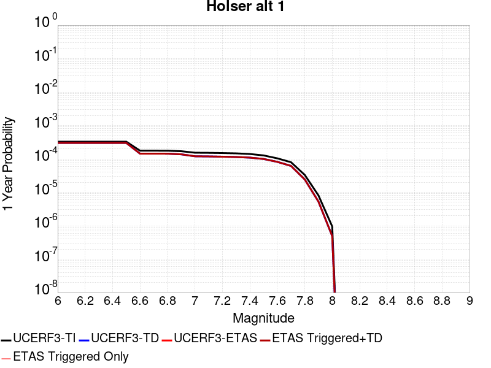 | 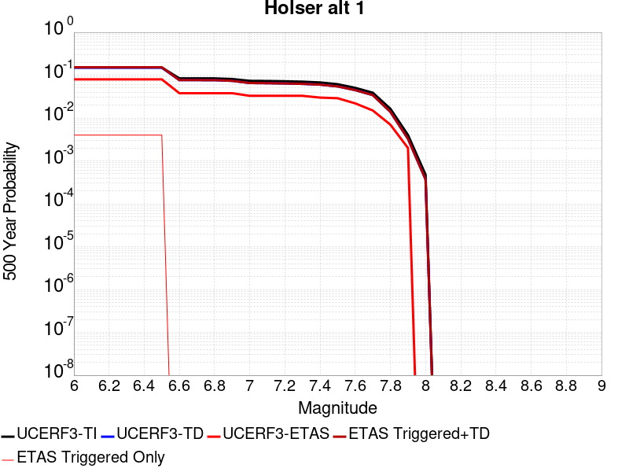 |

| Magnitude | 1 wk TI Prob | 1 wk TD Prob | 1 wk ETAS Prob | 1 wk ETAS/TD Gain | 1 wk ETAS Triggered+TD | 1 wk ETAS Triggered Only | 1 mo TI Prob | 1 mo TD Prob | 1 mo ETAS Prob | 1 mo ETAS/TD Gain | 1 mo ETAS Triggered+TD | 1 mo ETAS Triggered Only | 1 yr TI Prob | 1 yr TD Prob | 1 yr ETAS Prob | 1 yr ETAS/TD Gain | 1 yr ETAS Triggered+TD | 1 yr ETAS Triggered Only | 500 yr TI Prob | 500 yr TD Prob | 500 yr ETAS Prob | 500 yr ETAS/TD Gain | 500 yr ETAS Triggered+TD | 500 yr ETAS Triggered Only |
|-----|-----|-----|-----|-----|-----|-----|-----|-----|-----|-----|-----|-----|-----|-----|-----|-----|-----|-----|-----|-----|-----|-----|-----|-----|
| 6.0 | 6.2746653E-6 | 5.764976E-6 | 0.0 | 0.0 | 5.764976E-6 | 0.0 | 2.6891146E-5 | 2.4706871E-5 | 0.0 | 0.0 | 2.4706871E-5 | 0.0 | 3.273505E-4 | 3.0077613E-4 | 0.0 | 0.0 | 3.0077613E-4 | 0.0 | 0.15100506 | 0.14940292 | 0.08 | 0.53546476 | 0.15280531 | 0.004 |
| 6.1 | 6.2746653E-6 | 5.764976E-6 | 0.0 | 0.0 | 5.764976E-6 | 0.0 | 2.6891146E-5 | 2.4706871E-5 | 0.0 | 0.0 | 2.4706871E-5 | 0.0 | 3.273505E-4 | 3.0077613E-4 | 0.0 | 0.0 | 3.0077613E-4 | 0.0 | 0.15100506 | 0.14940292 | 0.08 | 0.53546476 | 0.15280531 | 0.004 |
| 6.2 | 6.2746653E-6 | 5.764976E-6 | 0.0 | 0.0 | 5.764976E-6 | 0.0 | 2.6891146E-5 | 2.4706871E-5 | 0.0 | 0.0 | 2.4706871E-5 | 0.0 | 3.273505E-4 | 3.0077613E-4 | 0.0 | 0.0 | 3.0077613E-4 | 0.0 | 0.15100506 | 0.14940292 | 0.08 | 0.53546476 | 0.15280531 | 0.004 |
| 6.3 | 6.2746653E-6 | 5.764976E-6 | 0.0 | 0.0 | 5.764976E-6 | 0.0 | 2.6891146E-5 | 2.4706871E-5 | 0.0 | 0.0 | 2.4706871E-5 | 0.0 | 3.273505E-4 | 3.0077613E-4 | 0.0 | 0.0 | 3.0077613E-4 | 0.0 | 0.15100506 | 0.14940292 | 0.08 | 0.53546476 | 0.15280531 | 0.004 |
| 6.4 | 6.2746653E-6 | 5.764976E-6 | 0.0 | 0.0 | 5.764976E-6 | 0.0 | 2.6891146E-5 | 2.4706871E-5 | 0.0 | 0.0 | 2.4706871E-5 | 0.0 | 3.273505E-4 | 3.0077613E-4 | 0.0 | 0.0 | 3.0077613E-4 | 0.0 | 0.15100506 | 0.14940292 | 0.08 | 0.53546476 | 0.15280531 | 0.004 |
| 6.5 | 6.2746653E-6 | 5.764976E-6 | 0.0 | 0.0 | 5.764976E-6 | 0.0 | 2.6891146E-5 | 2.4706871E-5 | 0.0 | 0.0 | 2.4706871E-5 | 0.0 | 3.273505E-4 | 3.0077613E-4 | 0.0 | 0.0 | 3.0077613E-4 | 0.0 | 0.15100506 | 0.14940292 | 0.08 | 0.53546476 | 0.15280531 | 0.004 |
| 6.6 | 3.375825E-6 | 2.7526776E-6 | 0.0 | 0.0 | 2.7526776E-6 | 0.0 | 1.4467741E-5 | 1.1797137E-5 | 0.0 | 0.0 | 1.1797137E-5 | 0.0 | 1.761305E-4 | 1.4362084E-4 | 0.0 | 0.0 | 1.4362084E-4 | 0.0 | 0.08430598 | 0.07685796 | 0.038 | 0.49441853 | 0.07685796 | 0.0 |
| 6.7 | 3.375825E-6 | 2.7526776E-6 | 0.0 | 0.0 | 2.7526776E-6 | 0.0 | 1.4467741E-5 | 1.1797137E-5 | 0.0 | 0.0 | 1.1797137E-5 | 0.0 | 1.761305E-4 | 1.4362084E-4 | 0.0 | 0.0 | 1.4362084E-4 | 0.0 | 0.08430598 | 0.07685796 | 0.038 | 0.49441853 | 0.07685796 | 0.0 |
| 6.8 | 3.366533E-6 | 2.7430935E-6 | 0.0 | 0.0 | 2.7430935E-6 | 0.0 | 1.4427919E-5 | 1.1756063E-5 | 0.0 | 0.0 | 1.1756063E-5 | 0.0 | 1.7564575E-4 | 1.4312084E-4 | 0.0 | 0.0 | 1.4312084E-4 | 0.0 | 0.084083974 | 0.07662709 | 0.038 | 0.49590817 | 0.07662709 | 0.0 |
| 6.9 | 3.253174E-6 | 2.6255539E-6 | 0.0 | 0.0 | 2.6255539E-6 | 0.0 | 1.39421E-5 | 1.1252326E-5 | 0.0 | 0.0 | 1.1252326E-5 | 0.0 | 1.6973184E-4 | 1.3698862E-4 | 0.0 | 0.0 | 1.3698862E-4 | 0.0 | 0.08137117 | 0.07378855 | 0.038 | 0.514985 | 0.07378855 | 0.0 |
| 7.0 | 2.9336593E-6 | 2.294229E-6 | 0.0 | 0.0 | 2.294229E-6 | 0.0 | 1.2572766E-5 | 9.8323735E-6 | 0.0 | 0.0 | 9.8323735E-6 | 0.0 | 1.5306266E-4 | 1.1970259E-4 | 0.0 | 0.0 | 1.1970259E-4 | 0.0 | 0.07368153 | 0.06571114 | 0.033 | 0.502198 | 0.06571114 | 0.0 |
| 7.1 | 2.9087812E-6 | 2.2701877E-6 | 0.0 | 0.0 | 2.2701877E-6 | 0.0 | 1.2466146E-5 | 9.72934E-6 | 0.0 | 0.0 | 9.72934E-6 | 0.0 | 1.5176475E-4 | 1.184483E-4 | 0.0 | 0.0 | 1.184483E-4 | 0.0 | 0.07308011 | 0.06510773 | 0.033 | 0.50685227 | 0.06510773 | 0.0 |
| 7.2 | 2.8674524E-6 | 2.2302545E-6 | 0.0 | 0.0 | 2.2302545E-6 | 0.0 | 1.2289024E-5 | 9.558199E-6 | 0.0 | 0.0 | 9.558199E-6 | 0.0 | 1.4960859E-4 | 1.1636488E-4 | 0.0 | 0.0 | 1.1636488E-4 | 0.0 | 0.07208013 | 0.064097814 | 0.033 | 0.51483816 | 0.064097814 | 0.0 |
| 7.3 | 2.8057775E-6 | 2.1785222E-6 | 0.0 | 0.0 | 2.1785222E-6 | 0.0 | 1.2024705E-5 | 9.336491E-6 | 0.0 | 0.0 | 9.336491E-6 | 0.0 | 1.4639096E-4 | 1.1366586E-4 | 0.0 | 0.0 | 1.1366586E-4 | 0.0 | 0.07058585 | 0.06270706 | 0.033 | 0.5262565 | 0.06270706 | 0.0 |
| 7.4 | 2.683666E-6 | 2.0932437E-6 | 0.0 | 0.0 | 2.0932437E-6 | 0.0 | 1.1501375E-5 | 8.971013E-6 | 0.0 | 0.0 | 8.971013E-6 | 0.0 | 1.4002025E-4 | 1.0921663E-4 | 0.0 | 0.0 | 1.0921663E-4 | 0.0 | 0.06762019 | 0.0601576 | 0.03 | 0.4986901 | 0.0601576 | 0.0 |
| 7.5 | 2.434495E-6 | 1.9054687E-6 | 0.0 | 0.0 | 1.9054687E-6 | 0.0 | 1.0433508E-5 | 8.166268E-6 | 0.0 | 0.0 | 8.166268E-6 | 0.0 | 1.2702055E-4 | 9.9419805E-5 | 0.0 | 0.0 | 9.9419805E-5 | 0.0 | 0.06153931 | 0.05472094 | 0.029 | 0.52996165 | 0.05472094 | 0.0 |
| 7.6 | 1.9914562E-6 | 1.562397E-6 | 0.0 | 0.0 | 1.562397E-6 | 0.0 | 8.534785E-6 | 6.6959697E-6 | 0.0 | 0.0 | 6.6959697E-6 | 0.0 | 1.03906044E-4 | 8.15204E-5 | 0.0 | 0.0 | 8.15204E-5 | 0.0 | 0.050629098 | 0.04488988 | 0.022 | 0.49008822 | 0.04488988 | 0.0 |
| 7.7 | 1.5229501E-6 | 1.181612E-6 | 0.0 | 0.0 | 1.181612E-6 | 0.0 | 6.526913E-6 | 5.0640415E-6 | 0.0 | 0.0 | 5.0640415E-6 | 0.0 | 7.946226E-5 | 6.165297E-5 | 0.0 | 0.0 | 6.165297E-5 | 0.0 | 0.038953718 | 0.03428349 | 0.015 | 0.43752837 | 0.03428349 | 0.0 |
| 7.8 | 6.3489426E-7 | 4.650605E-7 | 0.0 | 0.0 | 4.650605E-7 | 0.0 | 2.7209726E-6 | 1.993115E-6 | 0.0 | 0.0 | 1.993115E-6 | 0.0 | 3.312734E-5 | 2.4265906E-5 | 0.0 | 0.0 | 2.4265906E-5 | 0.0 | 0.016427515 | 0.013972832 | 0.007 | 0.50097215 | 0.013972832 | 0.0 |
| 7.9 | 1.5459432E-7 | 1.0075371E-7 | 0.0 | 0.0 | 1.0075371E-7 | 0.0 | 6.6254694E-7 | 4.318015E-7 | 0.0 | 0.0 | 4.318015E-7 | 0.0 | 8.066479E-6 | 5.257171E-6 | 0.0 | 0.0 | 5.257171E-6 | 0.0 | 0.0040251333 | 0.0032791083 | 0.002 | 0.60992193 | 0.0032791083 | 0.0 |
| 8.0 | 1.8307812E-8 | 9.439311E-9 | 0.0 | 0.0 | 9.439311E-9 | 0.0 | 7.846205E-8 | 4.045419E-8 | 0.0 | 0.0 | 4.045419E-8 | 0.0 | 9.55275E-7 | 4.9252964E-7 | 0.0 | 0.0 | 4.9252964E-7 | 0.0 | 4.7752372E-4 | 3.7072506E-4 | 0.0 | 0.0 | 3.7072506E-4 | 0.0 |

## Deep Springs
*[(top)](#table-of-contents)*

| 1 Week | 1 Month | 1 Year | 500 Year |
|-----|-----|-----|-----|
| 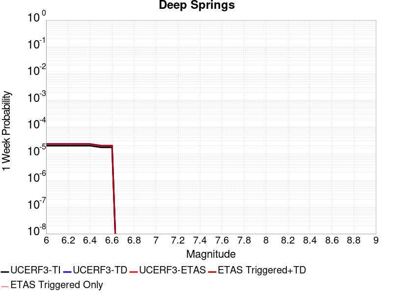 |  | 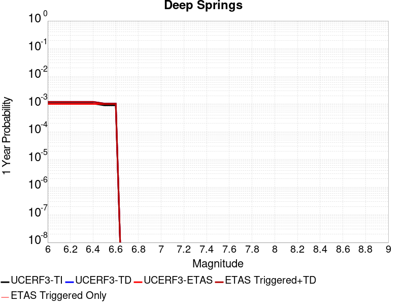 | 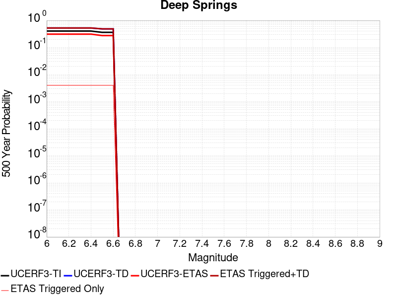 |

| Magnitude | 1 wk TI Prob | 1 wk TD Prob | 1 wk ETAS Prob | 1 wk ETAS/TD Gain | 1 wk ETAS Triggered+TD | 1 wk ETAS Triggered Only | 1 mo TI Prob | 1 mo TD Prob | 1 mo ETAS Prob | 1 mo ETAS/TD Gain | 1 mo ETAS Triggered+TD | 1 mo ETAS Triggered Only | 1 yr TI Prob | 1 yr TD Prob | 1 yr ETAS Prob | 1 yr ETAS/TD Gain | 1 yr ETAS Triggered+TD | 1 yr ETAS Triggered Only | 500 yr TI Prob | 500 yr TD Prob | 500 yr ETAS Prob | 500 yr ETAS/TD Gain | 500 yr ETAS Triggered+TD | 500 yr ETAS Triggered Only |
|-----|-----|-----|-----|-----|-----|-----|-----|-----|-----|-----|-----|-----|-----|-----|-----|-----|-----|-----|-----|-----|-----|-----|-----|-----|
| 6.0 | 1.9810619E-5 | 2.29141E-5 | 0.0 | 0.0 | 2.29141E-5 | 0.0 | 8.489989E-5 | 9.820241E-5 | 0.0 | 0.0 | 9.820241E-5 | 0.0 | 0.001033166 | 0.0011954576 | 0.001 | 0.83649975 | 0.0011954576 | 0.0 | 0.40360376 | 0.52228713 | 0.311 | 0.5954579 | 0.52419794 | 0.004 |
| 6.1 | 1.9810619E-5 | 2.29141E-5 | 0.0 | 0.0 | 2.29141E-5 | 0.0 | 8.489989E-5 | 9.820241E-5 | 0.0 | 0.0 | 9.820241E-5 | 0.0 | 0.001033166 | 0.0011954576 | 0.001 | 0.83649975 | 0.0011954576 | 0.0 | 0.40360376 | 0.52228713 | 0.311 | 0.5954579 | 0.52419794 | 0.004 |
| 6.2 | 1.9810619E-5 | 2.29141E-5 | 0.0 | 0.0 | 2.29141E-5 | 0.0 | 8.489989E-5 | 9.820241E-5 | 0.0 | 0.0 | 9.820241E-5 | 0.0 | 0.001033166 | 0.0011954576 | 0.001 | 0.83649975 | 0.0011954576 | 0.0 | 0.40360376 | 0.52228713 | 0.311 | 0.5954579 | 0.52419794 | 0.004 |
| 6.3 | 1.9810619E-5 | 2.29141E-5 | 0.0 | 0.0 | 2.29141E-5 | 0.0 | 8.489989E-5 | 9.820241E-5 | 0.0 | 0.0 | 9.820241E-5 | 0.0 | 0.001033166 | 0.0011954576 | 0.001 | 0.83649975 | 0.0011954576 | 0.0 | 0.40360376 | 0.52228713 | 0.311 | 0.5954579 | 0.52419794 | 0.004 |
| 6.4 | 1.9810619E-5 | 2.29141E-5 | 0.0 | 0.0 | 2.29141E-5 | 0.0 | 8.489989E-5 | 9.820241E-5 | 0.0 | 0.0 | 9.820241E-5 | 0.0 | 0.001033166 | 0.0011954576 | 0.001 | 0.83649975 | 0.0011954576 | 0.0 | 0.40360376 | 0.52228713 | 0.311 | 0.5954579 | 0.52419794 | 0.004 |
| 6.5 | 1.7190405E-5 | 1.9878726E-5 | 0.0 | 0.0 | 1.9878726E-5 | 0.0 | 7.367108E-5 | 8.519454E-5 | 0.0 | 0.0 | 8.519454E-5 | 0.0 | 8.9657627E-4 | 0.0010372434 | 0.001 | 0.96409386 | 0.0010372434 | 0.0 | 0.36140782 | 0.48495823 | 0.275 | 0.56705916 | 0.4870184 | 0.004 |
| 6.6 | 1.7190405E-5 | 1.9878726E-5 | 0.0 | 0.0 | 1.9878726E-5 | 0.0 | 7.367108E-5 | 8.519454E-5 | 0.0 | 0.0 | 8.519454E-5 | 0.0 | 8.9657627E-4 | 0.0010372434 | 0.001 | 0.96409386 | 0.0010372434 | 0.0 | 0.36140782 | 0.48495823 | 0.275 | 0.56705916 | 0.4870184 | 0.004 |

## Santa Cruz Catalina Ridge alt1
*[(top)](#table-of-contents)*

| 1 Week | 1 Month | 1 Year | 500 Year |
|-----|-----|-----|-----|
| 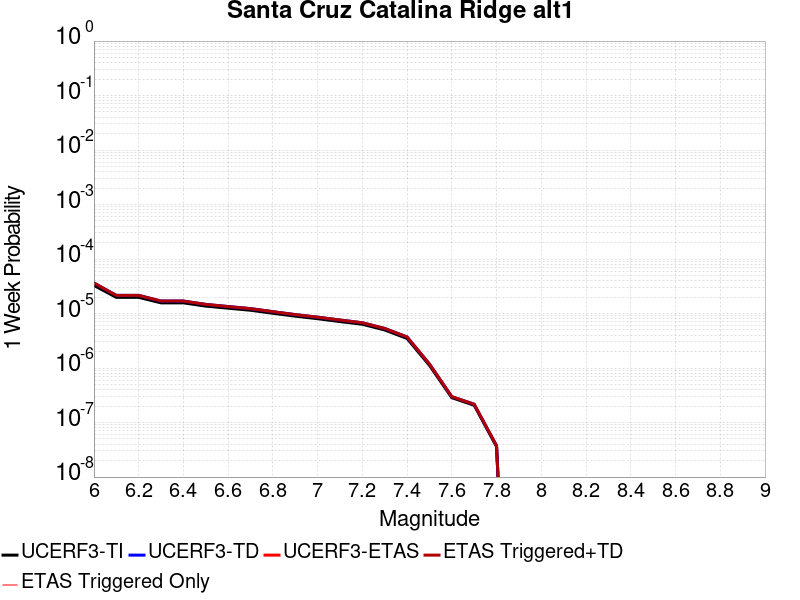 |  | 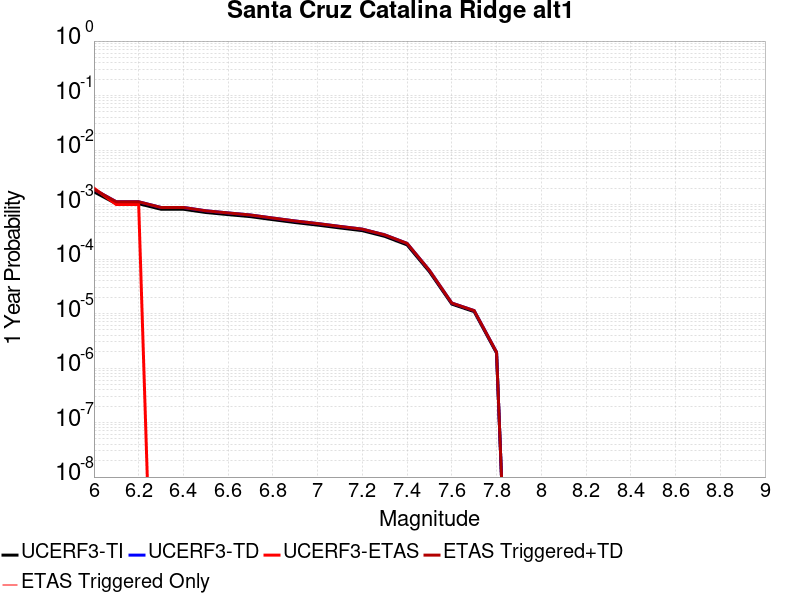 | 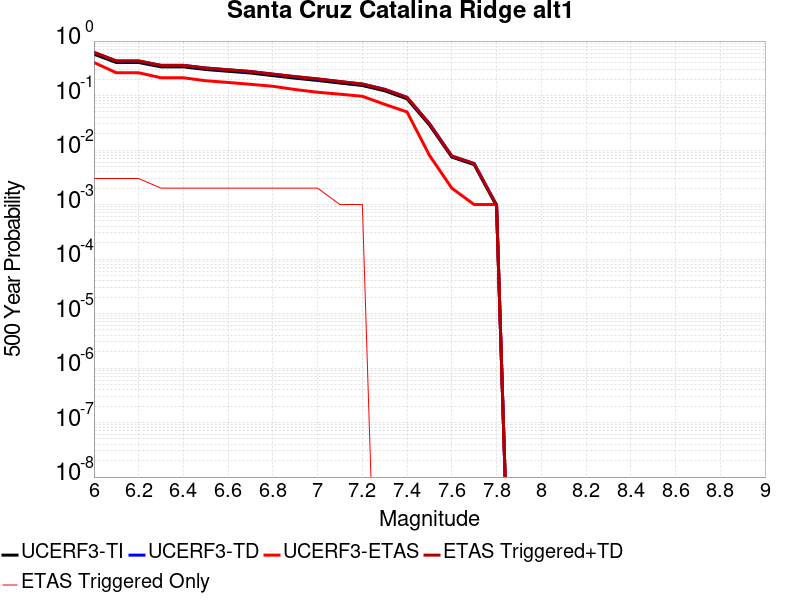 |

| Magnitude | 1 wk TI Prob | 1 wk TD Prob | 1 wk ETAS Prob | 1 wk ETAS/TD Gain | 1 wk ETAS Triggered+TD | 1 wk ETAS Triggered Only | 1 mo TI Prob | 1 mo TD Prob | 1 mo ETAS Prob | 1 mo ETAS/TD Gain | 1 mo ETAS Triggered+TD | 1 mo ETAS Triggered Only | 1 yr TI Prob | 1 yr TD Prob | 1 yr ETAS Prob | 1 yr ETAS/TD Gain | 1 yr ETAS Triggered+TD | 1 yr ETAS Triggered Only | 500 yr TI Prob | 500 yr TD Prob | 500 yr ETAS Prob | 500 yr ETAS/TD Gain | 500 yr ETAS Triggered+TD | 500 yr ETAS Triggered Only |
|-----|-----|-----|-----|-----|-----|-----|-----|-----|-----|-----|-----|-----|-----|-----|-----|-----|-----|-----|-----|-----|-----|-----|-----|-----|
| 6.0 | 3.2833184E-5 | 3.634108E-5 | 0.0 | 0.0 | 3.634108E-5 | 0.0 | 1.4070606E-4 | 1.5573912E-4 | 0.0 | 0.0 | 1.5573912E-4 | 0.0 | 0.00171175 | 0.0018946383 | 0.002 | 1.0556104 | 0.0018946383 | 0.0 | 0.5754003 | 0.6201894 | 0.405 | 0.6530263 | 0.62132883 | 0.003 |
| 6.1 | 1.9835548E-5 | 2.155569E-5 | 0.0 | 0.0 | 2.155569E-5 | 0.0 | 8.500672E-5 | 9.237837E-5 | 0.0 | 0.0 | 9.237837E-5 | 0.0 | 0.0010344655 | 0.0011241463 | 0.001 | 0.889564 | 0.0011241463 | 0.0 | 0.40399155 | 0.4301261 | 0.262 | 0.6091237 | 0.4318357 | 0.003 |
| 6.2 | 1.9835548E-5 | 2.155569E-5 | 0.0 | 0.0 | 2.155569E-5 | 0.0 | 8.500672E-5 | 9.237837E-5 | 0.0 | 0.0 | 9.237837E-5 | 0.0 | 0.0010344655 | 0.0011241463 | 0.001 | 0.889564 | 0.0011241463 | 0.0 | 0.40399155 | 0.4301261 | 0.262 | 0.6091237 | 0.4318357 | 0.003 |
| 6.3 | 1.5728183E-5 | 1.696045E-5 | 0.0 | 0.0 | 1.696045E-5 | 0.0 | 6.7404755E-5 | 7.268565E-5 | 0.0 | 0.0 | 7.268565E-5 | 0.0 | 8.2034385E-4 | 8.845946E-4 | 0.0 | 0.0 | 8.845946E-4 | 0.0 | 0.33657554 | 0.35754922 | 0.212 | 0.5929253 | 0.35883415 | 0.002 |
| 6.4 | 1.5728183E-5 | 1.696045E-5 | 0.0 | 0.0 | 1.696045E-5 | 0.0 | 6.7404755E-5 | 7.268565E-5 | 0.0 | 0.0 | 7.268565E-5 | 0.0 | 8.2034385E-4 | 8.845946E-4 | 0.0 | 0.0 | 8.845946E-4 | 0.0 | 0.33657554 | 0.35754922 | 0.212 | 0.5929253 | 0.35883415 | 0.002 |
| 6.5 | 1.3707734E-5 | 1.473363E-5 | 0.0 | 0.0 | 1.473363E-5 | 0.0 | 5.8746107E-5 | 6.314262E-5 | 0.0 | 0.0 | 6.314262E-5 | 0.0 | 7.1499916E-4 | 7.6849374E-4 | 0.0 | 0.0 | 7.6849374E-4 | 0.0 | 0.30066642 | 0.31932196 | 0.187 | 0.5856158 | 0.32068333 | 0.002 |
| 6.6 | 1.2539813E-5 | 1.3455966E-5 | 0.0 | 0.0 | 1.3455966E-5 | 0.0 | 5.3740947E-5 | 5.7667166E-5 | 0.0 | 0.0 | 5.7667166E-5 | 0.0 | 6.540996E-4 | 7.018742E-4 | 0.0 | 0.0 | 7.018742E-4 | 0.0 | 0.2790293 | 0.29634294 | 0.174 | 0.58715755 | 0.29775026 | 0.002 |
| 6.7 | 1.1504083E-5 | 1.2328627E-5 | 0.0 | 0.0 | 1.2328627E-5 | 0.0 | 4.930228E-5 | 5.2835916E-5 | 0.0 | 0.0 | 5.2835916E-5 | 0.0 | 6.0008996E-4 | 6.430894E-4 | 0.0 | 0.0 | 6.430894E-4 | 0.0 | 0.2592818 | 0.27536994 | 0.161 | 0.58466804 | 0.2768192 | 0.002 |
| 6.8 | 1.012739E-5 | 1.0835304E-5 | 0.0 | 0.0 | 1.0835304E-5 | 0.0 | 4.340238E-5 | 4.6436202E-5 | 0.0 | 0.0 | 4.6436202E-5 | 0.0 | 5.282958E-4 | 5.652156E-4 | 0.0 | 0.0 | 5.652156E-4 | 0.0 | 0.23219363 | 0.24651149 | 0.148 | 0.60037774 | 0.24801846 | 0.002 |
| 6.9 | 8.9607865E-6 | 9.5730575E-6 | 0.0 | 0.0 | 9.5730575E-6 | 0.0 | 3.8402806E-5 | 4.102675E-5 | 0.0 | 0.0 | 4.102675E-5 | 0.0 | 4.6745385E-4 | 4.993873E-4 | 0.0 | 0.0 | 4.993873E-4 | 0.0 | 0.20846531 | 0.22121419 | 0.129 | 0.5831452 | 0.22277176 | 0.002 |
| 7.0 | 8.046829E-6 | 8.5879155E-6 | 0.0 | 0.0 | 8.5879155E-6 | 0.0 | 3.4485955E-5 | 3.680484E-5 | 0.0 | 0.0 | 3.680484E-5 | 0.0 | 4.1978562E-4 | 4.4800757E-4 | 0.0 | 0.0 | 4.4800757E-4 | 0.0 | 0.18936458 | 0.20089443 | 0.115 | 0.57243997 | 0.20249265 | 0.002 |
| 7.1 | 7.136131E-6 | 7.6098145E-6 | 0.0 | 0.0 | 7.6098145E-6 | 0.0 | 3.0583058E-5 | 3.2613087E-5 | 0.0 | 0.0 | 3.2613087E-5 | 0.0 | 3.7228514E-4 | 3.969927E-4 | 0.0 | 0.0 | 3.969927E-4 | 0.0 | 0.16987354 | 0.18022269 | 0.106 | 0.58816123 | 0.18104246 | 0.001 |
| 7.2 | 6.362014E-6 | 6.7803817E-6 | 0.0 | 0.0 | 6.7803817E-6 | 0.0 | 2.726549E-5 | 2.9058458E-5 | 0.0 | 0.0 | 2.9058458E-5 | 0.0 | 3.3190678E-4 | 3.5372993E-4 | 0.0 | 0.0 | 3.5372993E-4 | 0.0 | 0.15293762 | 0.16227998 | 0.097 | 0.5977324 | 0.16311769 | 0.001 |
| 7.3 | 5.004101E-6 | 5.3324297E-6 | 0.0 | 0.0 | 5.3324297E-6 | 0.0 | 2.1445969E-5 | 2.2853072E-5 | 0.0 | 0.0 | 2.2853072E-5 | 0.0 | 2.6107338E-4 | 2.7820116E-4 | 0.0 | 0.0 | 2.7820116E-4 | 0.0 | 0.12239067 | 0.13000213 | 0.069 | 0.5307605 | 0.13000213 | 0.0 |
| 7.4 | 3.4901443E-6 | 3.7186282E-6 | 0.0 | 0.0 | 3.7186282E-6 | 0.0 | 1.4957676E-5 | 1.5936883E-5 | 0.0 | 0.0 | 1.5936883E-5 | 0.0 | 1.8209449E-4 | 1.9401466E-4 | 0.0 | 0.0 | 1.9401466E-4 | 0.0 | 0.08703299 | 0.09255389 | 0.05 | 0.5402258 | 0.09255389 | 0.0 |
| 7.5 | 1.1215045E-6 | 1.1856437E-6 | 0.0 | 0.0 | 1.1856437E-6 | 0.0 | 4.806439E-6 | 5.0813205E-6 | 0.0 | 0.0 | 5.0813205E-6 | 0.0 | 5.851682E-5 | 6.186335E-5 | 0.0 | 0.0 | 6.186335E-5 | 0.0 | 0.02883536 | 0.030467182 | 0.008 | 0.26257762 | 0.030467182 | 0.0 |
| 7.6 | 2.8599047E-7 | 2.9878487E-7 | 0.0 | 0.0 | 2.9878487E-7 | 0.0 | 1.2256729E-6 | 1.2805059E-6 | 0.0 | 0.0 | 1.2805059E-6 | 0.0 | 1.4922465E-5 | 1.5590049E-5 | 0.0 | 0.0 | 1.5590049E-5 | 0.0 | 0.007433522 | 0.0077651613 | 0.002 | 0.25756064 | 0.0077651613 | 0.0 |
| 7.7 | 2.0781519E-7 | 2.1692061E-7 | 0.0 | 0.0 | 2.1692061E-7 | 0.0 | 8.906362E-7 | 9.2965945E-7 | 0.0 | 0.0 | 9.2965945E-7 | 0.0 | 1.08434415E-5 | 1.1318546E-5 | 0.0 | 0.0 | 1.1318546E-5 | 0.0 | 0.005407079 | 0.0056435773 | 0.001 | 0.17719258 | 0.0056435773 | 0.0 |
| 7.8 | 3.614776E-8 | 3.7560365E-8 | 0.0 | 0.0 | 3.7560365E-8 | 0.0 | 1.5491896E-7 | 1.6097299E-7 | 0.0 | 0.0 | 1.6097299E-7 | 0.0 | 1.8861368E-6 | 1.9598444E-6 | 0.0 | 0.0 | 1.9598444E-6 | 0.0 | 9.4262476E-4 | 9.794764E-4 | 0.001 | 1.0209537 | 9.794764E-4 | 0.0 |

## Collayami 2011 CFM
*[(top)](#table-of-contents)*

| 1 Week | 1 Month | 1 Year | 500 Year |
|-----|-----|-----|-----|
|  | 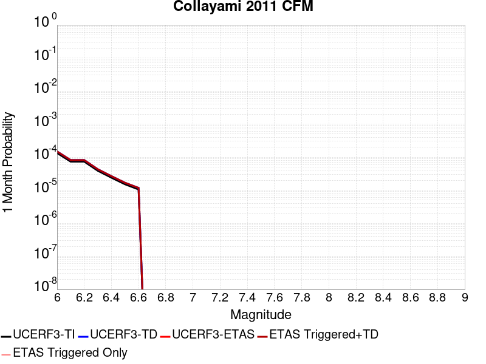 |  | 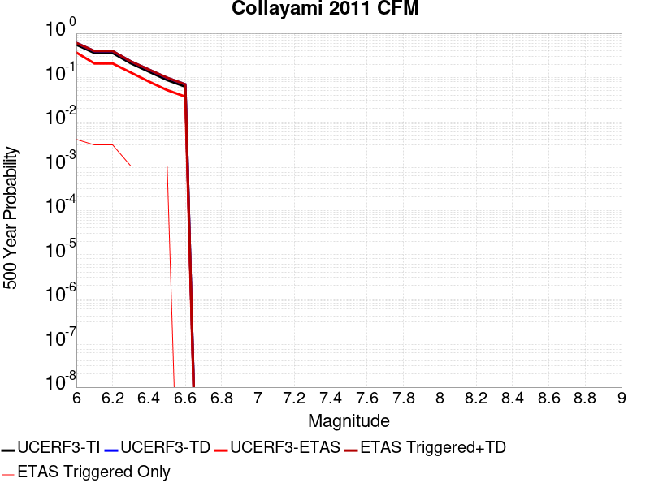 |

| Magnitude | 1 wk TI Prob | 1 wk TD Prob | 1 wk ETAS Prob | 1 wk ETAS/TD Gain | 1 wk ETAS Triggered+TD | 1 wk ETAS Triggered Only | 1 mo TI Prob | 1 mo TD Prob | 1 mo ETAS Prob | 1 mo ETAS/TD Gain | 1 mo ETAS Triggered+TD | 1 mo ETAS Triggered Only | 1 yr TI Prob | 1 yr TD Prob | 1 yr ETAS Prob | 1 yr ETAS/TD Gain | 1 yr ETAS Triggered+TD | 1 yr ETAS Triggered Only | 500 yr TI Prob | 500 yr TD Prob | 500 yr ETAS Prob | 500 yr ETAS/TD Gain | 500 yr ETAS Triggered+TD | 500 yr ETAS Triggered Only |
|-----|-----|-----|-----|-----|-----|-----|-----|-----|-----|-----|-----|-----|-----|-----|-----|-----|-----|-----|-----|-----|-----|-----|-----|-----|
| 6.0 | 3.112429E-5 | 3.4717374E-5 | 0.0 | 0.0 | 3.4717374E-5 | 0.0 | 1.33383E-4 | 1.4878123E-4 | 0.0 | 0.0 | 1.4878123E-4 | 0.0 | 0.0016227282 | 0.001810078 | 0.0 | 0.0 | 0.001810078 | 0.0 | 0.556041 | 0.6074171 | 0.369 | 0.60749024 | 0.60898745 | 0.004 |
| 6.1 | 1.7119446E-5 | 1.903886E-5 | 0.0 | 0.0 | 1.903886E-5 | 0.0 | 7.336699E-5 | 8.1592894E-5 | 0.0 | 0.0 | 8.1592894E-5 | 0.0 | 8.92877E-4 | 9.929992E-4 | 0.0 | 0.0 | 9.929992E-4 | 0.0 | 0.3602245 | 0.39552665 | 0.208 | 0.5258812 | 0.39734006 | 0.003 |
| 6.2 | 1.7119446E-5 | 1.903886E-5 | 0.0 | 0.0 | 1.903886E-5 | 0.0 | 7.336699E-5 | 8.1592894E-5 | 0.0 | 0.0 | 8.1592894E-5 | 0.0 | 8.92877E-4 | 9.929992E-4 | 0.0 | 0.0 | 9.929992E-4 | 0.0 | 0.3602245 | 0.39552665 | 0.208 | 0.5258812 | 0.39734006 | 0.003 |
| 6.3 | 9.041288E-6 | 1.0044615E-5 | 0.0 | 0.0 | 1.0044615E-5 | 0.0 | 3.87478E-5 | 4.3047763E-5 | 0.0 | 0.0 | 4.3047763E-5 | 0.0 | 4.7165234E-4 | 5.240021E-4 | 0.0 | 0.0 | 5.240021E-4 | 0.0 | 0.21012597 | 0.23141345 | 0.13 | 0.5617651 | 0.23218204 | 0.001 |
| 6.4 | 5.5972064E-6 | 6.219881E-6 | 0.0 | 0.0 | 6.219881E-6 | 0.0 | 2.3987806E-5 | 2.6656437E-5 | 0.0 | 0.0 | 2.6656437E-5 | 0.0 | 2.920124E-4 | 3.2450721E-4 | 0.0 | 0.0 | 3.2450721E-4 | 0.0 | 0.13586608 | 0.15037613 | 0.081 | 0.5386493 | 0.15122575 | 0.001 |
| 6.5 | 3.530659E-6 | 3.927686E-6 | 0.0 | 0.0 | 3.927686E-6 | 0.0 | 1.5131307E-5 | 1.683289E-5 | 0.0 | 0.0 | 1.683289E-5 | 0.0 | 1.842081E-4 | 2.0493142E-4 | 0.0 | 0.0 | 2.0493142E-4 | 0.0 | 0.08799748 | 0.09815824 | 0.052 | 0.52975684 | 0.09906008 | 0.001 |
| 6.6 | 2.4625563E-6 | 2.7402227E-6 | 0.0 | 0.0 | 2.7402227E-6 | 0.0 | 1.0553769E-5 | 1.1743811E-5 | 0.0 | 0.0 | 1.1743811E-5 | 0.0 | 1.2848456E-4 | 1.429809E-4 | 0.0 | 0.0 | 1.429809E-4 | 0.0 | 0.06222611 | 0.070102625 | 0.037 | 0.52779764 | 0.070102625 | 0.0 |

## Scodie Lineament
*[(top)](#table-of-contents)*

| 1 Week | 1 Month | 1 Year | 500 Year |
|-----|-----|-----|-----|
|  | 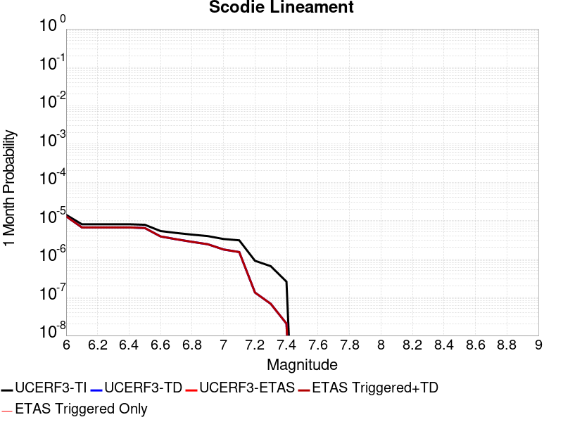 | 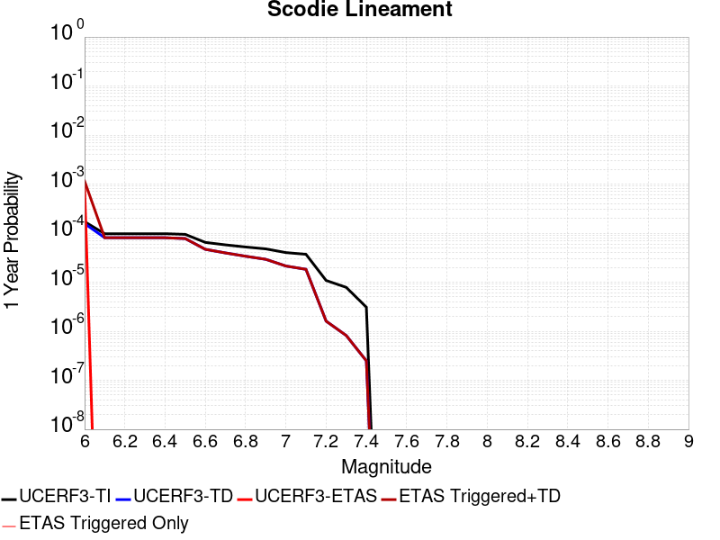 | 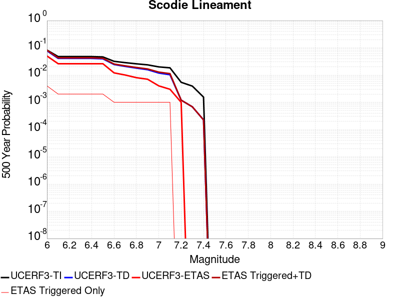 |

| Magnitude | 1 wk TI Prob | 1 wk TD Prob | 1 wk ETAS Prob | 1 wk ETAS/TD Gain | 1 wk ETAS Triggered+TD | 1 wk ETAS Triggered Only | 1 mo TI Prob | 1 mo TD Prob | 1 mo ETAS Prob | 1 mo ETAS/TD Gain | 1 mo ETAS Triggered+TD | 1 mo ETAS Triggered Only | 1 yr TI Prob | 1 yr TD Prob | 1 yr ETAS Prob | 1 yr ETAS/TD Gain | 1 yr ETAS Triggered+TD | 1 yr ETAS Triggered Only | 500 yr TI Prob | 500 yr TD Prob | 500 yr ETAS Prob | 500 yr ETAS/TD Gain | 500 yr ETAS Triggered+TD | 500 yr ETAS Triggered Only |
|-----|-----|-----|-----|-----|-----|-----|-----|-----|-----|-----|-----|-----|-----|-----|-----|-----|-----|-----|-----|-----|-----|-----|-----|-----|
| 6.0 | 3.2919327E-6 | 3.0076694E-6 | 0.0 | 0.0 | 3.0076694E-6 | 0.0 | 1.4108206E-5 | 1.2889966E-5 | 0.0 | 0.0 | 1.2889966E-5 | 0.0 | 1.7175387E-4 | 1.569272E-4 | 0.001 | 6.3723817 | 0.0011567703 | 0.001 | 0.082299605 | 0.07735918 | 0.05 | 0.6463357 | 0.08104974 | 0.004 |
| 6.1 | 1.8663811E-6 | 1.5454422E-6 | 0.0 | 0.0 | 1.5454422E-6 | 0.0 | 7.998751E-6 | 6.6233097E-6 | 0.0 | 0.0 | 6.6233097E-6 | 0.0 | 9.738045E-5 | 8.063631E-5 | 0.0 | 0.0 | 8.063631E-5 | 0.0 | 0.04752612 | 0.04076581 | 0.026 | 0.63778937 | 0.04268428 | 0.002 |
| 6.2 | 1.8663811E-6 | 1.5454422E-6 | 0.0 | 0.0 | 1.5454422E-6 | 0.0 | 7.998751E-6 | 6.6233097E-6 | 0.0 | 0.0 | 6.6233097E-6 | 0.0 | 9.738045E-5 | 8.063631E-5 | 0.0 | 0.0 | 8.063631E-5 | 0.0 | 0.04752612 | 0.04076581 | 0.026 | 0.63778937 | 0.04268428 | 0.002 |
| 6.3 | 1.8663811E-6 | 1.5454422E-6 | 0.0 | 0.0 | 1.5454422E-6 | 0.0 | 7.998751E-6 | 6.6233097E-6 | 0.0 | 0.0 | 6.6233097E-6 | 0.0 | 9.738045E-5 | 8.063631E-5 | 0.0 | 0.0 | 8.063631E-5 | 0.0 | 0.04752612 | 0.04076581 | 0.026 | 0.63778937 | 0.04268428 | 0.002 |
| 6.4 | 1.8663811E-6 | 1.5454422E-6 | 0.0 | 0.0 | 1.5454422E-6 | 0.0 | 7.998751E-6 | 6.6233097E-6 | 0.0 | 0.0 | 6.6233097E-6 | 0.0 | 9.738045E-5 | 8.063631E-5 | 0.0 | 0.0 | 8.063631E-5 | 0.0 | 0.04752612 | 0.04076581 | 0.026 | 0.63778937 | 0.04268428 | 0.002 |
| 6.5 | 1.8106311E-6 | 1.4875013E-6 | 0.0 | 0.0 | 1.4875013E-6 | 0.0 | 7.759824E-6 | 6.3749926E-6 | 0.0 | 0.0 | 6.3749926E-6 | 0.0 | 9.447177E-5 | 7.7613266E-5 | 0.0 | 0.0 | 7.7613266E-5 | 0.0 | 0.046139758 | 0.039314333 | 0.026 | 0.6613364 | 0.041235704 | 0.002 |
| 6.6 | 1.2414679E-6 | 8.974619E-7 | 0.0 | 0.0 | 8.974619E-7 | 0.0 | 5.320566E-6 | 3.84626E-6 | 0.0 | 0.0 | 3.84626E-6 | 0.0 | 6.477596E-5 | 4.68273E-5 | 0.0 | 0.0 | 4.68273E-5 | 0.0 | 0.031870123 | 0.02430239 | 0.012 | 0.49377862 | 0.025278086 | 0.001 |
| 6.7 | 1.1062215E-6 | 7.5741053E-7 | 0.0 | 0.0 | 7.5741053E-7 | 0.0 | 4.7409408E-6 | 3.2460416E-6 | 0.0 | 0.0 | 3.2460416E-6 | 0.0 | 5.7719422E-5 | 3.951991E-5 | 0.0 | 0.0 | 3.951991E-5 | 0.0 | 0.028448056 | 0.020726312 | 0.01 | 0.4824785 | 0.021705586 | 0.001 |
| 6.8 | 1.0006736E-6 | 6.4822575E-7 | 0.0 | 0.0 | 6.4822575E-7 | 0.0 | 4.288594E-6 | 2.7781077E-6 | 0.0 | 0.0 | 2.7781077E-6 | 0.0 | 5.221238E-5 | 3.3823E-5 | 0.0 | 0.0 | 3.3823E-5 | 0.0 | 0.025769034 | 0.017930346 | 0.008 | 0.446171 | 0.018912414 | 0.001 |
| 6.9 | 9.167364E-7 | 5.615064E-7 | 0.0 | 0.0 | 5.615064E-7 | 0.0 | 3.9288643E-6 | 2.406454E-6 | 0.0 | 0.0 | 2.406454E-6 | 0.0 | 4.7832873E-5 | 2.9298242E-5 | 0.0 | 0.0 | 2.9298242E-5 | 0.0 | 0.023633264 | 0.015704859 | 0.007 | 0.4457219 | 0.016689155 | 0.001 |
| 7.0 | 7.6987664E-7 | 4.0994848E-7 | 0.0 | 0.0 | 4.0994848E-7 | 0.0 | 3.2994672E-6 | 1.7569212E-6 | 0.0 | 0.0 | 1.7569212E-6 | 0.0 | 4.0170275E-5 | 2.1390344E-5 | 0.0 | 0.0 | 2.1390344E-5 | 0.0 | 0.01988517 | 0.011800231 | 0.004 | 0.3389764 | 0.012788432 | 0.001 |
| 7.1 | 7.1038727E-7 | 3.508284E-7 | 0.0 | 0.0 | 3.508284E-7 | 0.0 | 3.0445133E-6 | 1.5035496E-6 | 0.0 | 0.0 | 1.5035496E-6 | 0.0 | 3.706632E-5 | 1.8305598E-5 | 0.0 | 0.0 | 1.8305598E-5 | 0.0 | 0.018362813 | 0.010265116 | 0.003 | 0.29225194 | 0.011254851 | 0.001 |
| 7.2 | 2.0799602E-7 | 3.082956E-8 | 0.0 | 0.0 | 3.082956E-8 | 0.0 | 8.914113E-7 | 1.3212669E-7 | 0.0 | 0.0 | 1.3212669E-7 | 0.0 | 1.0852878E-5 | 1.6086412E-6 | 0.0 | 0.0 | 1.6086412E-6 | 0.0 | 0.0054117716 | 0.0011983741 | 0.001 | 0.834464 | 0.0011983741 | 0.0 |
| 7.3 | 1.5048182E-7 | 1.5702069E-8 | 0.0 | 0.0 | 1.5702069E-8 | 0.0 | 6.449219E-7 | 6.729458E-8 | 0.0 | 0.0 | 6.729458E-8 | 0.0 | 7.851896E-6 | 8.193112E-7 | 0.0 | 0.0 | 8.193112E-7 | 0.0 | 0.003918267 | 6.8159564E-4 | 0.0 | 0.0 | 6.8159564E-4 | 0.0 |
| 7.4 | 5.9334678E-8 | 4.7764974E-9 | 0.0 | 0.0 | 4.7764974E-9 | 0.0 | 2.5429145E-7 | 2.0470702E-8 | 0.0 | 0.0 | 2.0470702E-8 | 0.0 | 3.095994E-6 | 2.492308E-7 | 0.0 | 0.0 | 2.492308E-7 | 0.0 | 0.0015468019 | 2.259758E-4 | 0.0 | 0.0 | 2.259758E-4 | 0.0 |

## White Wolf
*[(top)](#table-of-contents)*

| 1 Week | 1 Month | 1 Year | 500 Year |
|-----|-----|-----|-----|
| 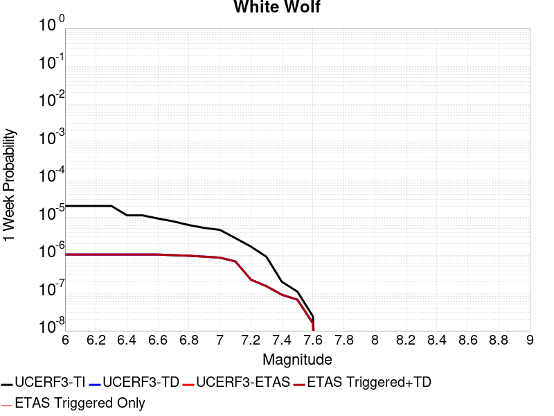 |  |  | 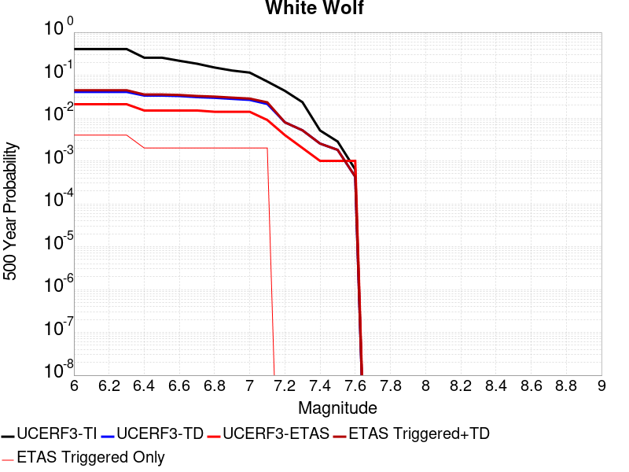 |

| Magnitude | 1 wk TI Prob | 1 wk TD Prob | 1 wk ETAS Prob | 1 wk ETAS/TD Gain | 1 wk ETAS Triggered+TD | 1 wk ETAS Triggered Only | 1 mo TI Prob | 1 mo TD Prob | 1 mo ETAS Prob | 1 mo ETAS/TD Gain | 1 mo ETAS Triggered+TD | 1 mo ETAS Triggered Only | 1 yr TI Prob | 1 yr TD Prob | 1 yr ETAS Prob | 1 yr ETAS/TD Gain | 1 yr ETAS Triggered+TD | 1 yr ETAS Triggered Only | 500 yr TI Prob | 500 yr TD Prob | 500 yr ETAS Prob | 500 yr ETAS/TD Gain | 500 yr ETAS Triggered+TD | 500 yr ETAS Triggered Only |
|-----|-----|-----|-----|-----|-----|-----|-----|-----|-----|-----|-----|-----|-----|-----|-----|-----|-----|-----|-----|-----|-----|-----|-----|-----|
| 6.0 | 2.0037822E-5 | 1.0403787E-6 | 0.0 | 0.0 | 1.0403787E-6 | 0.0 | 8.587355E-5 | 4.4587587E-6 | 0.0 | 0.0 | 4.4587587E-6 | 0.0 | 0.001045009 | 5.4284086E-5 | 0.0 | 0.0 | 5.4284086E-5 | 0.0 | 0.40712854 | 0.040684573 | 0.021 | 0.51616615 | 0.044521835 | 0.004 |
| 6.1 | 2.0037822E-5 | 1.0403787E-6 | 0.0 | 0.0 | 1.0403787E-6 | 0.0 | 8.587355E-5 | 4.4587587E-6 | 0.0 | 0.0 | 4.4587587E-6 | 0.0 | 0.001045009 | 5.4284086E-5 | 0.0 | 0.0 | 5.4284086E-5 | 0.0 | 0.40712854 | 0.040684573 | 0.021 | 0.51616615 | 0.044521835 | 0.004 |
| 6.2 | 2.0037822E-5 | 1.0403787E-6 | 0.0 | 0.0 | 1.0403787E-6 | 0.0 | 8.587355E-5 | 4.4587587E-6 | 0.0 | 0.0 | 4.4587587E-6 | 0.0 | 0.001045009 | 5.4284086E-5 | 0.0 | 0.0 | 5.4284086E-5 | 0.0 | 0.40712854 | 0.040684573 | 0.021 | 0.51616615 | 0.044521835 | 0.004 |
| 6.3 | 2.0037822E-5 | 1.0403787E-6 | 0.0 | 0.0 | 1.0403787E-6 | 0.0 | 8.587355E-5 | 4.4587587E-6 | 0.0 | 0.0 | 4.4587587E-6 | 0.0 | 0.001045009 | 5.4284086E-5 | 0.0 | 0.0 | 5.4284086E-5 | 0.0 | 0.40712854 | 0.040684573 | 0.021 | 0.51616615 | 0.044521835 | 0.004 |
| 6.4 | 1.132487E-5 | 1.0403787E-6 | 0.0 | 0.0 | 1.0403787E-6 | 0.0 | 4.8534253E-5 | 4.4587587E-6 | 0.0 | 0.0 | 4.4587587E-6 | 0.0 | 5.907443E-4 | 5.4284086E-5 | 0.0 | 0.0 | 5.4284086E-5 | 0.0 | 0.2558104 | 0.03346775 | 0.015 | 0.44819266 | 0.035400815 | 0.002 |
| 6.5 | 1.132487E-5 | 1.0403787E-6 | 0.0 | 0.0 | 1.0403787E-6 | 0.0 | 4.8534253E-5 | 4.4587587E-6 | 0.0 | 0.0 | 4.4587587E-6 | 0.0 | 5.907443E-4 | 5.4284086E-5 | 0.0 | 0.0 | 5.4284086E-5 | 0.0 | 0.2558104 | 0.03346775 | 0.015 | 0.44819266 | 0.035400815 | 0.002 |
| 6.6 | 9.347473E-6 | 1.0403787E-6 | 0.0 | 0.0 | 1.0403787E-6 | 0.0 | 4.0059982E-5 | 4.4587587E-6 | 0.0 | 0.0 | 4.4587587E-6 | 0.0 | 4.8762115E-4 | 5.4284086E-5 | 0.0 | 0.0 | 5.4284086E-5 | 0.0 | 0.21641053 | 0.032598317 | 0.015 | 0.46014646 | 0.03453312 | 0.002 |
| 6.7 | 7.842647E-6 | 9.986114E-7 | 0.0 | 0.0 | 9.986114E-7 | 0.0 | 3.361091E-5 | 4.2797565E-6 | 0.0 | 0.0 | 4.2797565E-6 | 0.0 | 4.0913603E-4 | 5.210484E-5 | 0.0 | 0.0 | 5.210484E-5 | 0.0 | 0.18503481 | 0.030755462 | 0.015 | 0.48771822 | 0.032693952 | 0.002 |
| 6.8 | 6.26597E-6 | 9.676E-7 | 0.0 | 0.0 | 9.676E-7 | 0.0 | 2.685388E-5 | 4.146851E-6 | 0.0 | 0.0 | 4.146851E-6 | 0.0 | 3.2689696E-4 | 5.0486793E-5 | 0.0 | 0.0 | 5.0486793E-5 | 0.0 | 0.15081243 | 0.029660743 | 0.014 | 0.47200435 | 0.03160142 | 0.002 |
| 6.9 | 5.258436E-6 | 9.1281964E-7 | 0.0 | 0.0 | 9.1281964E-7 | 0.0 | 2.2535958E-5 | 3.9120787E-6 | 0.0 | 0.0 | 3.9120787E-6 | 0.0 | 2.7434074E-4 | 4.7628564E-5 | 0.0 | 0.0 | 4.7628564E-5 | 0.0 | 0.12819473 | 0.027999826 | 0.014 | 0.5000031 | 0.029943826 | 0.002 |
| 7.0 | 4.675028E-6 | 8.609015E-7 | 0.0 | 0.0 | 8.609015E-7 | 0.0 | 2.003568E-5 | 3.6895728E-6 | 0.0 | 0.0 | 3.6895728E-6 | 0.0 | 2.4390711E-4 | 4.491967E-5 | 0.0 | 0.0 | 4.491967E-5 | 0.0 | 0.114823684 | 0.026493331 | 0.014 | 0.5284349 | 0.028440345 | 0.002 |
| 7.1 | 2.8270078E-6 | 6.833771E-7 | 0.0 | 0.0 | 6.833771E-7 | 0.0 | 1.2115692E-5 | 2.928756E-6 | 0.0 | 0.0 | 2.928756E-6 | 0.0 | 1.4749856E-4 | 3.5657064E-5 | 0.0 | 0.0 | 3.5657064E-5 | 0.0 | 0.071100496 | 0.021288952 | 0.009 | 0.4227545 | 0.023246374 | 0.002 |
| 7.2 | 1.6881406E-6 | 2.2497291E-7 | 0.0 | 0.0 | 2.2497291E-7 | 0.0 | 7.2348685E-6 | 9.641693E-7 | 0.0 | 0.0 | 9.641693E-7 | 0.0 | 8.808096E-5 | 1.1738699E-5 | 0.0 | 0.0 | 1.1738699E-5 | 0.0 | 0.043086637 | 0.007952913 | 0.004 | 0.5029604 | 0.007952913 | 0.0 |
| 7.3 | 9.086107E-7 | 1.5142007E-7 | 0.0 | 0.0 | 1.5142007E-7 | 0.0 | 3.8940398E-6 | 6.48943E-7 | 0.0 | 0.0 | 6.48943E-7 | 0.0 | 4.7408903E-5 | 7.900853E-6 | 0.0 | 0.0 | 7.900853E-6 | 0.0 | 0.023426257 | 0.0051741186 | 0.002 | 0.38653925 | 0.0051741186 | 0.0 |
| 7.4 | 1.9717383E-7 | 8.9749406E-8 | 0.0 | 0.0 | 8.9749406E-8 | 0.0 | 8.450304E-7 | 3.8464026E-7 | 0.0 | 0.0 | 3.8464026E-7 | 0.0 | 1.0288197E-5 | 4.6829855E-6 | 0.0 | 0.0 | 4.6829855E-6 | 0.0 | 0.0051309164 | 0.0025372724 | 0.001 | 0.39412403 | 0.0025372724 | 0.0 |
| 7.5 | 1.086975E-7 | 6.644069E-8 | 0.0 | 0.0 | 6.644069E-8 | 0.0 | 4.6584634E-7 | 2.847458E-7 | 0.0 | 0.0 | 2.847458E-7 | 0.0 | 5.6716644E-6 | 3.4667746E-6 | 0.0 | 0.0 | 3.4667746E-6 | 0.0 | 0.002831823 | 0.0018091772 | 0.001 | 0.5527375 | 0.0018091772 | 0.0 |
| 7.6 | 2.4217808E-8 | 1.5787766E-8 | 0.0 | 0.0 | 1.5787766E-8 | 0.0 | 1.03790605E-7 | 6.766185E-8 | 0.0 | 0.0 | 6.766185E-8 | 0.0 | 1.2636499E-6 | 8.237828E-7 | 0.0 | 0.0 | 8.237828E-7 | 0.0 | 6.3162576E-4 | 4.2800582E-4 | 0.001 | 2.3364167 | 4.2800582E-4 | 0.0 |

## Newport-Inglewood (Offshore)
*[(top)](#table-of-contents)*

| 1 Week | 1 Month | 1 Year | 500 Year |
|-----|-----|-----|-----|
|  | 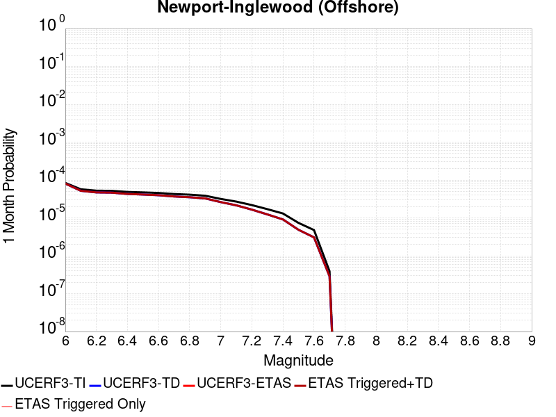 |  | 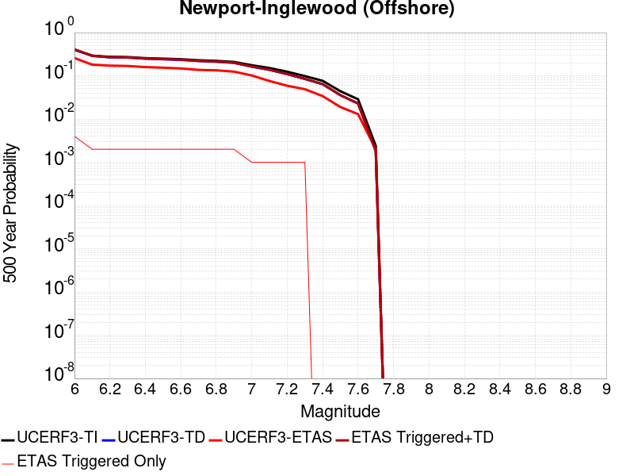 |

| Magnitude | 1 wk TI Prob | 1 wk TD Prob | 1 wk ETAS Prob | 1 wk ETAS/TD Gain | 1 wk ETAS Triggered+TD | 1 wk ETAS Triggered Only | 1 mo TI Prob | 1 mo TD Prob | 1 mo ETAS Prob | 1 mo ETAS/TD Gain | 1 mo ETAS Triggered+TD | 1 mo ETAS Triggered Only | 1 yr TI Prob | 1 yr TD Prob | 1 yr ETAS Prob | 1 yr ETAS/TD Gain | 1 yr ETAS Triggered+TD | 1 yr ETAS Triggered Only | 500 yr TI Prob | 500 yr TD Prob | 500 yr ETAS Prob | 500 yr ETAS/TD Gain | 500 yr ETAS Triggered+TD | 500 yr ETAS Triggered Only |
|-----|-----|-----|-----|-----|-----|-----|-----|-----|-----|-----|-----|-----|-----|-----|-----|-----|-----|-----|-----|-----|-----|-----|-----|-----|
| 6.0 | 1.9626508E-5 | 1.8859664E-5 | 0.0 | 0.0 | 1.8859664E-5 | 0.0 | 8.411089E-5 | 8.082469E-5 | 0.0 | 0.0 | 8.082469E-5 | 0.0 | 0.001023569 | 9.836089E-4 | 0.0 | 0.0 | 9.836089E-4 | 0.0 | 0.40073213 | 0.40526095 | 0.258 | 0.63662684 | 0.40763992 | 0.004 |
| 6.1 | 1.331886E-5 | 1.2136762E-5 | 0.0 | 0.0 | 1.2136762E-5 | 0.0 | 5.707958E-5 | 5.2013667E-5 | 0.0 | 0.0 | 5.2013667E-5 | 0.0 | 6.947222E-4 | 6.3308387E-4 | 0.0 | 0.0 | 6.3308387E-4 | 0.0 | 0.29353514 | 0.28915447 | 0.181 | 0.62596303 | 0.29057616 | 0.002 |
| 6.2 | 1.2250852E-5 | 1.0998801E-5 | 0.0 | 0.0 | 1.0998801E-5 | 0.0 | 5.2502597E-5 | 4.7136873E-5 | 0.0 | 0.0 | 4.7136873E-5 | 0.0 | 6.3903164E-4 | 5.737413E-4 | 0.0 | 0.0 | 5.737413E-4 | 0.0 | 0.2735735 | 0.26765493 | 0.172 | 0.6426185 | 0.26911962 | 0.002 |
| 6.3 | 1.2106258E-5 | 1.0842368E-5 | 0.0 | 0.0 | 1.0842368E-5 | 0.0 | 5.1882926E-5 | 4.646647E-5 | 0.0 | 0.0 | 4.646647E-5 | 0.0 | 6.3149154E-4 | 5.6558335E-4 | 0.0 | 0.0 | 5.6558335E-4 | 0.0 | 0.27082792 | 0.26466522 | 0.169 | 0.63854253 | 0.2661359 | 0.002 |
| 6.4 | 1.1348758E-5 | 1.003572E-5 | 0.0 | 0.0 | 1.003572E-5 | 0.0 | 4.8636626E-5 | 4.3009524E-5 | 0.0 | 0.0 | 4.3009524E-5 | 0.0 | 5.919901E-4 | 5.235159E-4 | 0.0 | 0.0 | 5.235159E-4 | 0.0 | 0.25627407 | 0.24900664 | 0.159 | 0.63853717 | 0.25050864 | 0.002 |
| 6.5 | 1.100837E-5 | 9.671175E-6 | 0.0 | 0.0 | 9.671175E-6 | 0.0 | 4.7177873E-5 | 4.1447238E-5 | 0.0 | 0.0 | 4.1447238E-5 | 0.0 | 5.7423924E-4 | 5.04504E-4 | 0.0 | 0.0 | 5.04504E-4 | 0.0 | 0.24963993 | 0.24184422 | 0.154 | 0.6367735 | 0.24336053 | 0.002 |
| 6.6 | 1.0634696E-5 | 9.27491E-6 | 0.0 | 0.0 | 9.27491E-6 | 0.0 | 4.557647E-5 | 3.974901E-5 | 0.0 | 0.0 | 3.974901E-5 | 0.0 | 5.5475225E-4 | 4.8383747E-4 | 0.0 | 0.0 | 4.8383747E-4 | 0.0 | 0.2422889 | 0.23395976 | 0.148 | 0.6325874 | 0.23549184 | 0.002 |
| 6.7 | 9.9780855E-6 | 8.5997835E-6 | 0.0 | 0.0 | 8.5997835E-6 | 0.0 | 4.276252E-5 | 3.6855698E-5 | 0.0 | 0.0 | 3.6855698E-5 | 0.0 | 5.205093E-4 | 4.486264E-4 | 0.0 | 0.0 | 4.486264E-4 | 0.0 | 0.22919697 | 0.2202146 | 0.137 | 0.62212044 | 0.22177418 | 0.002 |
| 6.8 | 9.59546E-6 | 8.206703E-6 | 0.0 | 0.0 | 8.206703E-6 | 0.0 | 4.1122752E-5 | 3.5171113E-5 | 0.0 | 0.0 | 3.5171113E-5 | 0.0 | 5.0055445E-4 | 4.2812483E-4 | 0.0 | 0.0 | 4.2812483E-4 | 0.0 | 0.22146389 | 0.21203646 | 0.134 | 0.63196677 | 0.21361239 | 0.002 |
| 6.9 | 9.000614E-6 | 7.64453E-6 | 0.0 | 0.0 | 7.64453E-6 | 0.0 | 3.857349E-5 | 3.2761865E-5 | 0.0 | 0.0 | 3.2761865E-5 | 0.0 | 4.6953102E-4 | 3.9880333E-4 | 0.0 | 0.0 | 3.9880333E-4 | 0.0 | 0.20928735 | 0.199508 | 0.125 | 0.62654126 | 0.20110899 | 0.002 |
| 7.0 | 7.4070194E-6 | 6.1053497E-6 | 0.0 | 0.0 | 6.1053497E-6 | 0.0 | 3.1743984E-5 | 2.6165522E-5 | 0.0 | 0.0 | 2.6165522E-5 | 0.0 | 3.8641447E-4 | 3.185188E-4 | 0.0 | 0.0 | 3.185188E-4 | 0.0 | 0.17571963 | 0.1630864 | 0.102 | 0.62543535 | 0.16392332 | 0.001 |
| 7.1 | 6.299615E-6 | 5.020647E-6 | 0.0 | 0.0 | 5.020647E-6 | 0.0 | 2.699807E-5 | 2.1516882E-5 | 0.0 | 0.0 | 2.1516882E-5 | 0.0 | 3.2865192E-4 | 2.6193666E-4 | 0.0 | 0.0 | 2.6193666E-4 | 0.0 | 0.1515575 | 0.13754585 | 0.076 | 0.55254304 | 0.1384083 | 0.001 |
| 7.2 | 5.096653E-6 | 3.864086E-6 | 0.0 | 0.0 | 3.864086E-6 | 0.0 | 2.1842614E-5 | 1.6560263E-5 | 0.0 | 0.0 | 1.6560263E-5 | 0.0 | 2.6590136E-4 | 2.0160266E-4 | 0.0 | 0.0 | 2.0160266E-4 | 0.0 | 0.12450721 | 0.10960382 | 0.059 | 0.5383024 | 0.11049422 | 0.001 |
| 7.3 | 3.9753018E-6 | 2.8880222E-6 | 0.0 | 0.0 | 2.8880222E-6 | 0.0 | 1.7036897E-5 | 1.237718E-5 | 0.0 | 0.0 | 1.237718E-5 | 0.0 | 2.0740448E-4 | 1.5068182E-4 | 0.0 | 0.0 | 1.5068182E-4 | 0.0 | 0.098516 | 0.0844605 | 0.049 | 0.58015287 | 0.08537604 | 0.001 |
| 7.4 | 3.0568392E-6 | 2.1287237E-6 | 0.0 | 0.0 | 2.1287237E-6 | 0.0 | 1.3100675E-5 | 9.12307E-6 | 0.0 | 0.0 | 9.12307E-6 | 0.0 | 1.5948903E-4 | 1.1106778E-4 | 0.0 | 0.0 | 1.1106778E-4 | 0.0 | 0.07665365 | 0.064237684 | 0.034 | 0.5292843 | 0.064237684 | 0.0 |
| 7.5 | 1.7279019E-6 | 1.1367229E-6 | 0.0 | 0.0 | 1.1367229E-6 | 0.0 | 7.405273E-6 | 4.8716606E-6 | 0.0 | 0.0 | 4.8716606E-6 | 0.0 | 9.015547E-5 | 5.931089E-5 | 0.0 | 0.0 | 5.931089E-5 | 0.0 | 0.04407877 | 0.03573939 | 0.019 | 0.5316263 | 0.03573939 | 0.0 |
| 7.6 | 1.1156416E-6 | 7.148577E-7 | 0.0 | 0.0 | 7.148577E-7 | 0.0 | 4.7813123E-6 | 3.0636725E-6 | 0.0 | 0.0 | 3.0636725E-6 | 0.0 | 5.821092E-5 | 3.7299596E-5 | 0.0 | 0.0 | 3.7299596E-5 | 0.0 | 0.0286868 | 0.022876091 | 0.013 | 0.5682789 | 0.022876091 | 0.0 |
| 7.7 | 9.117973E-8 | 6.716777E-8 | 0.0 | 0.0 | 6.716777E-8 | 0.0 | 3.907702E-7 | 2.8786184E-7 | 0.0 | 0.0 | 2.8786184E-7 | 0.0 | 4.757617E-6 | 3.5047126E-6 | 0.0 | 0.0 | 3.5047126E-6 | 0.0 | 0.002375987 | 0.0018213186 | 0.002 | 1.0981055 | 0.0018213186 | 0.0 |

## Verdugo
*[(top)](#table-of-contents)*

| 1 Week | 1 Month | 1 Year | 500 Year |
|-----|-----|-----|-----|
|  | 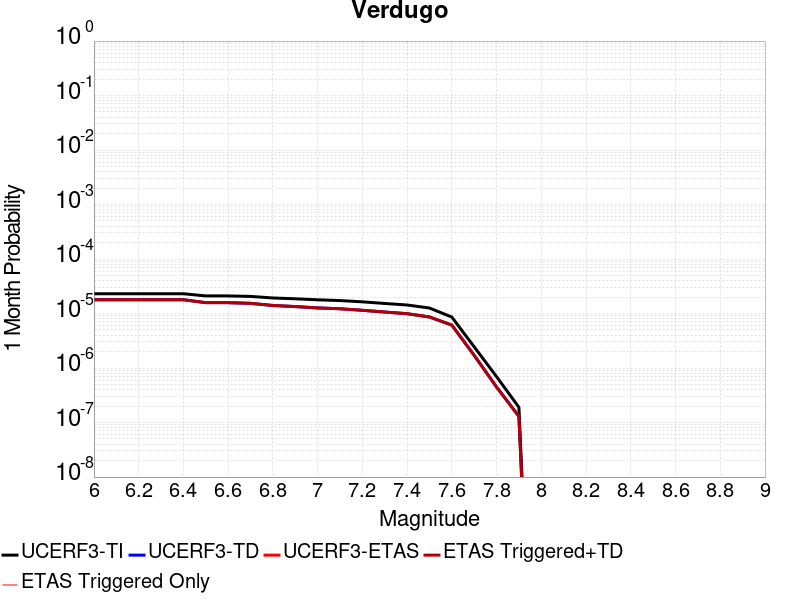 |  | 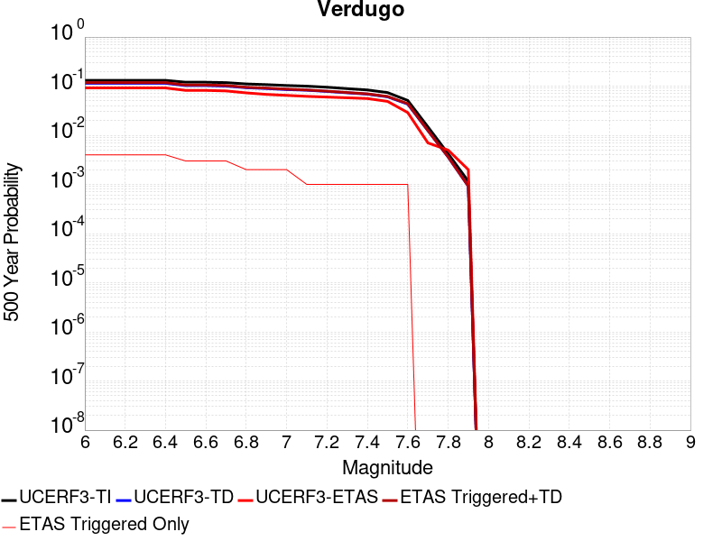 |

| Magnitude | 1 wk TI Prob | 1 wk TD Prob | 1 wk ETAS Prob | 1 wk ETAS/TD Gain | 1 wk ETAS Triggered+TD | 1 wk ETAS Triggered Only | 1 mo TI Prob | 1 mo TD Prob | 1 mo ETAS Prob | 1 mo ETAS/TD Gain | 1 mo ETAS Triggered+TD | 1 mo ETAS Triggered Only | 1 yr TI Prob | 1 yr TD Prob | 1 yr ETAS Prob | 1 yr ETAS/TD Gain | 1 yr ETAS Triggered+TD | 1 yr ETAS Triggered Only | 500 yr TI Prob | 500 yr TD Prob | 500 yr ETAS Prob | 500 yr ETAS/TD Gain | 500 yr ETAS Triggered+TD | 500 yr ETAS Triggered Only |
|-----|-----|-----|-----|-----|-----|-----|-----|-----|-----|-----|-----|-----|-----|-----|-----|-----|-----|-----|-----|-----|-----|-----|-----|-----|
| 6.0 | 5.392987E-6 | 4.190005E-6 | 0.0 | 0.0 | 4.190005E-6 | 0.0 | 2.3112598E-5 | 1.7957042E-5 | 0.0 | 0.0 | 1.7957042E-5 | 0.0 | 2.8135953E-4 | 2.1860552E-4 | 0.0 | 0.0 | 2.1860552E-4 | 0.0 | 0.13124973 | 0.11435663 | 0.092 | 0.80450076 | 0.11789921 | 0.004 |
| 6.1 | 5.392987E-6 | 4.190005E-6 | 0.0 | 0.0 | 4.190005E-6 | 0.0 | 2.3112598E-5 | 1.7957042E-5 | 0.0 | 0.0 | 1.7957042E-5 | 0.0 | 2.8135953E-4 | 2.1860552E-4 | 0.0 | 0.0 | 2.1860552E-4 | 0.0 | 0.13124973 | 0.11435663 | 0.092 | 0.80450076 | 0.11789921 | 0.004 |
| 6.2 | 5.392987E-6 | 4.190005E-6 | 0.0 | 0.0 | 4.190005E-6 | 0.0 | 2.3112598E-5 | 1.7957042E-5 | 0.0 | 0.0 | 1.7957042E-5 | 0.0 | 2.8135953E-4 | 2.1860552E-4 | 0.0 | 0.0 | 2.1860552E-4 | 0.0 | 0.13124973 | 0.11435663 | 0.092 | 0.80450076 | 0.11789921 | 0.004 |
| 6.3 | 5.392987E-6 | 4.190005E-6 | 0.0 | 0.0 | 4.190005E-6 | 0.0 | 2.3112598E-5 | 1.7957042E-5 | 0.0 | 0.0 | 1.7957042E-5 | 0.0 | 2.8135953E-4 | 2.1860552E-4 | 0.0 | 0.0 | 2.1860552E-4 | 0.0 | 0.13124973 | 0.11435663 | 0.092 | 0.80450076 | 0.11789921 | 0.004 |
| 6.4 | 5.392987E-6 | 4.190005E-6 | 0.0 | 0.0 | 4.190005E-6 | 0.0 | 2.3112598E-5 | 1.7957042E-5 | 0.0 | 0.0 | 1.7957042E-5 | 0.0 | 2.8135953E-4 | 2.1860552E-4 | 0.0 | 0.0 | 2.1860552E-4 | 0.0 | 0.13124973 | 0.11435663 | 0.092 | 0.80450076 | 0.11789921 | 0.004 |
| 6.5 | 4.9154837E-6 | 3.6968408E-6 | 0.0 | 0.0 | 3.6968408E-6 | 0.0 | 2.1066187E-5 | 1.5843509E-5 | 0.0 | 0.0 | 1.5843509E-5 | 0.0 | 2.5645064E-4 | 1.9287784E-4 | 0.0 | 0.0 | 1.9287784E-4 | 0.0 | 0.12035932 | 0.102821566 | 0.082 | 0.7974981 | 0.105513096 | 0.003 |
| 6.6 | 4.9154837E-6 | 3.6968408E-6 | 0.0 | 0.0 | 3.6968408E-6 | 0.0 | 2.1066187E-5 | 1.5843509E-5 | 0.0 | 0.0 | 1.5843509E-5 | 0.0 | 2.5645064E-4 | 1.9287784E-4 | 0.0 | 0.0 | 1.9287784E-4 | 0.0 | 0.12035932 | 0.102821566 | 0.082 | 0.7974981 | 0.105513096 | 0.003 |
| 6.7 | 4.817006E-6 | 3.5952064E-6 | 0.0 | 0.0 | 3.5952064E-6 | 0.0 | 2.0644147E-5 | 1.5407937E-5 | 0.0 | 0.0 | 1.5407937E-5 | 0.0 | 2.513135E-4 | 1.8757569E-4 | 0.0 | 0.0 | 1.8757569E-4 | 0.0 | 0.11809642 | 0.10043657 | 0.08 | 0.7965226 | 0.10313526 | 0.003 |
| 6.8 | 4.507407E-6 | 3.282579E-6 | 0.0 | 0.0 | 3.282579E-6 | 0.0 | 1.9317316E-5 | 1.406812E-5 | 0.0 | 0.0 | 1.406812E-5 | 0.0 | 2.3516294E-4 | 1.7126605E-4 | 0.0 | 0.0 | 1.7126605E-4 | 0.0 | 0.11094422 | 0.09301961 | 0.073 | 0.78478074 | 0.09483357 | 0.002 |
| 6.9 | 4.3573054E-6 | 3.1369027E-6 | 0.0 | 0.0 | 3.1369027E-6 | 0.0 | 1.8674033E-5 | 1.34438005E-5 | 0.0 | 0.0 | 1.34438005E-5 | 0.0 | 2.2733262E-4 | 1.6366609E-4 | 0.0 | 0.0 | 1.6366609E-4 | 0.0 | 0.1074558 | 0.089527175 | 0.068 | 0.7595459 | 0.09134812 | 0.002 |
| 7.0 | 4.171527E-6 | 2.960041E-6 | 0.0 | 0.0 | 2.960041E-6 | 0.0 | 1.787785E-5 | 1.2685829E-5 | 0.0 | 0.0 | 1.2685829E-5 | 0.0 | 2.1764109E-4 | 1.5443913E-4 | 0.0 | 0.0 | 1.5443913E-4 | 0.0 | 0.10311927 | 0.08524516 | 0.065 | 0.7625066 | 0.087074675 | 0.002 |
| 7.1 | 4.0405484E-6 | 2.8590518E-6 | 0.0 | 0.0 | 2.8590518E-6 | 0.0 | 1.731652E-5 | 1.2253023E-5 | 0.0 | 0.0 | 1.2253023E-5 | 0.0 | 2.1080824E-4 | 1.4917045E-4 | 0.0 | 0.0 | 1.4917045E-4 | 0.0 | 0.10004924 | 0.082712464 | 0.062 | 0.74958473 | 0.08362975 | 0.001 |
| 7.2 | 3.8306007E-6 | 2.6795292E-6 | 0.0 | 0.0 | 2.6795292E-6 | 0.0 | 1.6416758E-5 | 1.1483646E-5 | 0.0 | 0.0 | 1.1483646E-5 | 0.0 | 1.9985568E-4 | 1.3980453E-4 | 0.0 | 0.0 | 1.3980453E-4 | 0.0 | 0.095106326 | 0.07821839 | 0.06 | 0.767083 | 0.07914018 | 0.001 |
| 7.3 | 3.5750938E-6 | 2.4907213E-6 | 0.0 | 0.0 | 2.4907213E-6 | 0.0 | 1.532174E-5 | 1.06744765E-5 | 0.0 | 0.0 | 1.06744765E-5 | 0.0 | 1.8652623E-4 | 1.299541E-4 | 0.0 | 0.0 | 1.299541E-4 | 0.0 | 0.08905414 | 0.073301844 | 0.058 | 0.7912488 | 0.07422855 | 0.001 |
| 7.4 | 3.3510041E-6 | 2.3200798E-6 | 0.0 | 0.0 | 2.3200798E-6 | 0.0 | 1.4361368E-5 | 9.943162E-6 | 0.0 | 0.0 | 9.943162E-6 | 0.0 | 1.7483562E-4 | 1.2105137E-4 | 0.0 | 0.0 | 1.2105137E-4 | 0.0 | 0.08371282 | 0.068843536 | 0.056 | 0.8134387 | 0.069774695 | 0.001 |
| 7.5 | 2.948287E-6 | 2.0206899E-6 | 0.0 | 0.0 | 2.0206899E-6 | 0.0 | 1.2635454E-5 | 8.660071E-6 | 0.0 | 0.0 | 8.660071E-6 | 0.0 | 1.538258E-4 | 1.0543136E-4 | 0.0 | 0.0 | 1.0543136E-4 | 0.0 | 0.074034974 | 0.06075239 | 0.049 | 0.8065526 | 0.061691638 | 0.001 |
| 7.6 | 2.0134323E-6 | 1.4336688E-6 | 0.0 | 0.0 | 1.4336688E-6 | 0.0 | 8.628967E-6 | 6.1442806E-6 | 0.0 | 0.0 | 6.1442806E-6 | 0.0 | 1.05052604E-4 | 7.4804135E-5 | 0.0 | 0.0 | 7.4804135E-5 | 0.0 | 0.051173255 | 0.043104716 | 0.029 | 0.6727802 | 0.044061612 | 0.001 |
| 7.7 | 5.726436E-7 | 3.9966164E-7 | 0.0 | 0.0 | 3.9966164E-7 | 0.0 | 2.4541846E-6 | 1.7128347E-6 | 0.0 | 0.0 | 1.7128347E-6 | 0.0 | 2.9879287E-5 | 2.0853588E-5 | 0.0 | 0.0 | 2.0853588E-5 | 0.0 | 0.014828821 | 0.012453348 | 0.007 | 0.56209785 | 0.012453348 | 0.0 |
| 7.8 | 1.6248204E-7 | 1.0495426E-7 | 0.0 | 0.0 | 1.0495426E-7 | 0.0 | 6.963514E-7 | 4.498039E-7 | 0.0 | 0.0 | 4.498039E-7 | 0.0 | 8.478045E-6 | 5.476349E-6 | 0.0 | 0.0 | 5.476349E-6 | 0.0 | 0.0042300685 | 0.0036321543 | 0.005 | 1.3765935 | 0.0036321543 | 0.0 |
| 7.9 | 4.4475744E-8 | 3.0264765E-8 | 0.0 | 0.0 | 3.0264765E-8 | 0.0 | 1.9061031E-7 | 1.2970614E-7 | 0.0 | 0.0 | 1.2970614E-7 | 0.0 | 2.320678E-6 | 1.5791712E-6 | 0.0 | 0.0 | 1.5791712E-6 | 0.0 | 0.0011596675 | 9.2211197E-4 | 0.002 | 2.168934 | 9.2211197E-4 | 0.0 |

## Almanor 2011 CFM
*[(top)](#table-of-contents)*

| 1 Week | 1 Month | 1 Year | 500 Year |
|-----|-----|-----|-----|
| 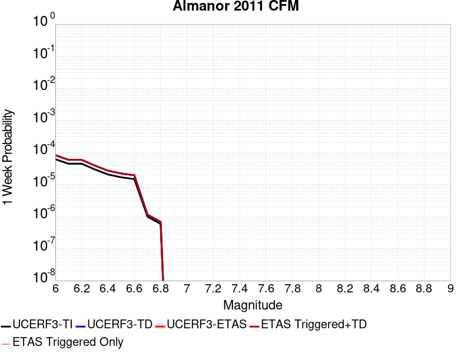 | 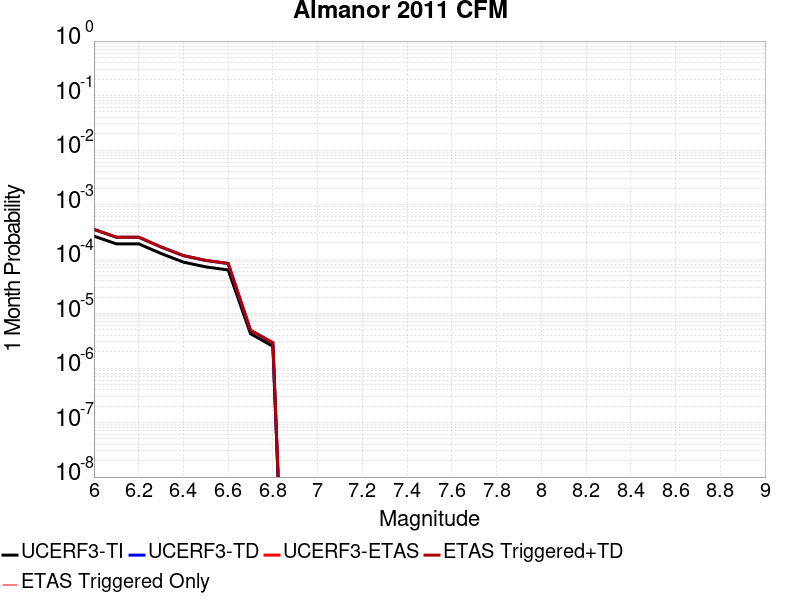 | 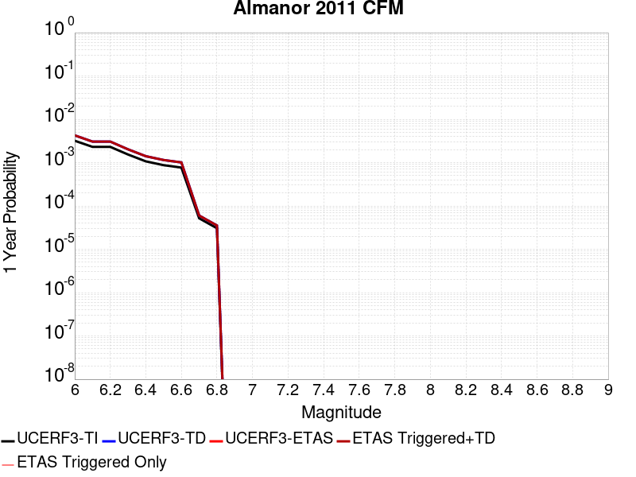 | 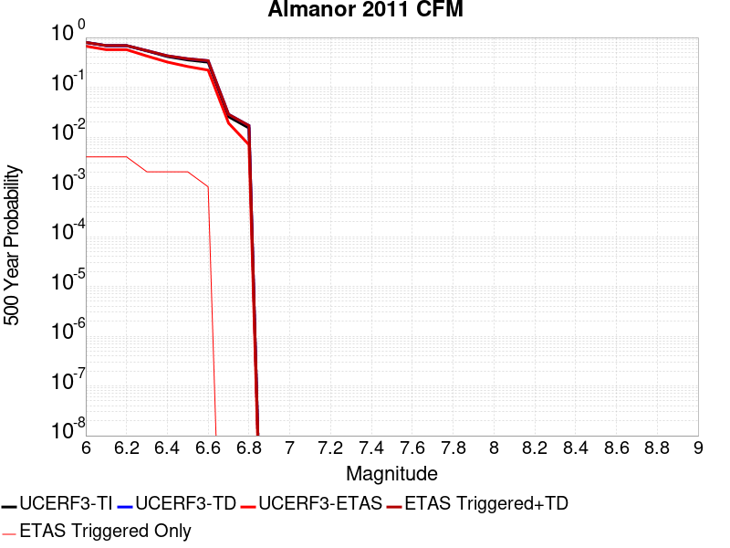 |

| Magnitude | 1 wk TI Prob | 1 wk TD Prob | 1 wk ETAS Prob | 1 wk ETAS/TD Gain | 1 wk ETAS Triggered+TD | 1 wk ETAS Triggered Only | 1 mo TI Prob | 1 mo TD Prob | 1 mo ETAS Prob | 1 mo ETAS/TD Gain | 1 mo ETAS Triggered+TD | 1 mo ETAS Triggered Only | 1 yr TI Prob | 1 yr TD Prob | 1 yr ETAS Prob | 1 yr ETAS/TD Gain | 1 yr ETAS Triggered+TD | 1 yr ETAS Triggered Only | 500 yr TI Prob | 500 yr TD Prob | 500 yr ETAS Prob | 500 yr ETAS/TD Gain | 500 yr ETAS Triggered+TD | 500 yr ETAS Triggered Only |
|-----|-----|-----|-----|-----|-----|-----|-----|-----|-----|-----|-----|-----|-----|-----|-----|-----|-----|-----|-----|-----|-----|-----|-----|-----|
| 6.0 | 6.1479834E-5 | 8.184744E-5 | 0.0 | 0.0 | 8.184744E-5 | 0.0 | 2.6345838E-4 | 3.507313E-4 | 0.0 | 0.0 | 3.507313E-4 | 0.0 | 0.0032028882 | 0.0042625396 | 0.0 | 0.0 | 0.0042625396 | 0.0 | 0.7989123 | 0.79651994 | 0.671 | 0.84241456 | 0.7973339 | 0.004 |
| 6.1 | 4.4387216E-5 | 5.8761885E-5 | 0.0 | 0.0 | 5.8761885E-5 | 0.0 | 1.9021705E-4 | 2.5181595E-4 | 0.0 | 0.0 | 2.5181595E-4 | 0.0 | 0.0023134327 | 0.0030620995 | 0.0 | 0.0 | 0.0030620995 | 0.0 | 0.68590397 | 0.6871975 | 0.57 | 0.82945585 | 0.6884487 | 0.004 |
| 6.2 | 4.4387216E-5 | 5.8761885E-5 | 0.0 | 0.0 | 5.8761885E-5 | 0.0 | 1.9021705E-4 | 2.5181595E-4 | 0.0 | 0.0 | 2.5181595E-4 | 0.0 | 0.0023134327 | 0.0030620995 | 0.0 | 0.0 | 0.0030620995 | 0.0 | 0.68590397 | 0.6871975 | 0.57 | 0.82945585 | 0.6884487 | 0.004 |
| 6.3 | 2.9523822E-5 | 3.889203E-5 | 0.0 | 0.0 | 3.889203E-5 | 0.0 | 1.2652454E-4 | 1.6667183E-4 | 0.0 | 0.0 | 1.6667183E-4 | 0.0 | 0.0015393476 | 0.0020277314 | 0.0 | 0.0 | 0.0020277314 | 0.0 | 0.53711045 | 0.5436156 | 0.424 | 0.77996296 | 0.5445283 | 0.002 |
| 6.4 | 2.0512744E-5 | 2.6978845E-5 | 0.0 | 0.0 | 2.6978845E-5 | 0.0 | 8.79088E-5 | 1.156208E-4 | 0.0 | 0.0 | 1.156208E-4 | 0.0 | 0.001069764 | 0.0014071097 | 0.0 | 0.0 | 0.0014071097 | 0.0 | 0.41442928 | 0.42783463 | 0.321 | 0.7502899 | 0.42897895 | 0.002 |
| 6.5 | 1.6750226E-5 | 2.2022077E-5 | 0.0 | 0.0 | 2.2022077E-5 | 0.0 | 7.178471E-5 | 9.4379175E-5 | 0.0 | 0.0 | 9.4379175E-5 | 0.0 | 8.7362836E-4 | 0.0011487963 | 0.0 | 0.0 | 0.0011487963 | 0.0 | 0.35403186 | 0.37275606 | 0.261 | 0.7001898 | 0.37401056 | 0.002 |
| 6.6 | 1.4745303E-5 | 1.9382906E-5 | 0.0 | 0.0 | 1.9382906E-5 | 0.0 | 6.319262E-5 | 8.306919E-5 | 0.0 | 0.0 | 8.306919E-5 | 0.0 | 7.690986E-4 | 0.0010112379 | 0.0 | 0.0 | 0.0010112379 | 0.0 | 0.31934333 | 0.34161964 | 0.221 | 0.6469183 | 0.34227803 | 0.001 |
| 6.7 | 9.951145E-7 | 1.1516091E-6 | 0.0 | 0.0 | 1.1516091E-6 | 0.0 | 4.26477E-6 | 4.9354594E-6 | 0.0 | 0.0 | 4.9354594E-6 | 0.0 | 5.1922336E-5 | 6.0087736E-5 | 0.0 | 0.0 | 6.0087736E-5 | 0.0 | 0.02562773 | 0.02858924 | 0.019 | 0.6645857 | 0.02858924 | 0.0 |
| 6.8 | 5.866312E-7 | 6.7902266E-7 | 0.0 | 0.0 | 6.7902266E-7 | 0.0 | 2.5141312E-6 | 2.9100947E-6 | 0.0 | 0.0 | 2.9100947E-6 | 0.0 | 3.0609117E-5 | 3.5429955E-5 | 0.0 | 0.0 | 3.5429955E-5 | 0.0 | 0.01518827 | 0.016975963 | 0.007 | 0.41234776 | 0.016975963 | 0.0 |

## San Jose
*[(top)](#table-of-contents)*

| 1 Week | 1 Month | 1 Year | 500 Year |
|-----|-----|-----|-----|
|  |  | 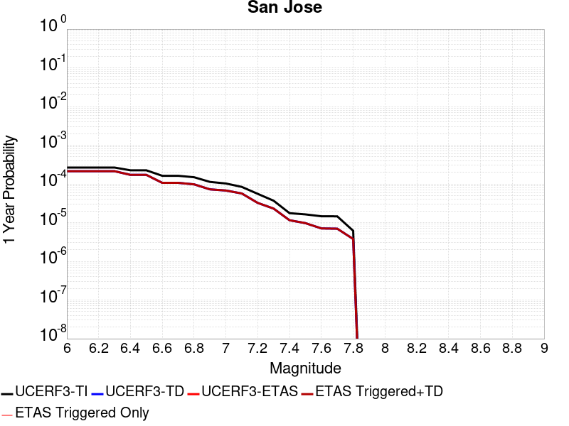 | 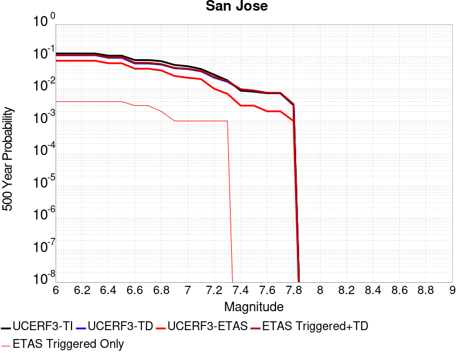 |

| Magnitude | 1 wk TI Prob | 1 wk TD Prob | 1 wk ETAS Prob | 1 wk ETAS/TD Gain | 1 wk ETAS Triggered+TD | 1 wk ETAS Triggered Only | 1 mo TI Prob | 1 mo TD Prob | 1 mo ETAS Prob | 1 mo ETAS/TD Gain | 1 mo ETAS Triggered+TD | 1 mo ETAS Triggered Only | 1 yr TI Prob | 1 yr TD Prob | 1 yr ETAS Prob | 1 yr ETAS/TD Gain | 1 yr ETAS Triggered+TD | 1 yr ETAS Triggered Only | 500 yr TI Prob | 500 yr TD Prob | 500 yr ETAS Prob | 500 yr ETAS/TD Gain | 500 yr ETAS Triggered+TD | 500 yr ETAS Triggered Only |
|-----|-----|-----|-----|-----|-----|-----|-----|-----|-----|-----|-----|-----|-----|-----|-----|-----|-----|-----|-----|-----|-----|-----|-----|-----|
| 6.0 | 5.0851277E-6 | 4.0881255E-6 | 0.0 | 0.0 | 4.0881255E-6 | 0.0 | 2.1793223E-5 | 1.7520435E-5 | 0.0 | 0.0 | 1.7520435E-5 | 0.0 | 2.653002E-4 | 2.1329302E-4 | 0.0 | 0.0 | 2.1329302E-4 | 0.0 | 0.12424394 | 0.110387236 | 0.074 | 0.67036736 | 0.113945685 | 0.004 |
| 6.1 | 5.0851277E-6 | 4.0881255E-6 | 0.0 | 0.0 | 4.0881255E-6 | 0.0 | 2.1793223E-5 | 1.7520435E-5 | 0.0 | 0.0 | 1.7520435E-5 | 0.0 | 2.653002E-4 | 2.1329302E-4 | 0.0 | 0.0 | 2.1329302E-4 | 0.0 | 0.12424394 | 0.110387236 | 0.074 | 0.67036736 | 0.113945685 | 0.004 |
| 6.2 | 5.0851277E-6 | 4.0881255E-6 | 0.0 | 0.0 | 4.0881255E-6 | 0.0 | 2.1793223E-5 | 1.7520435E-5 | 0.0 | 0.0 | 1.7520435E-5 | 0.0 | 2.653002E-4 | 2.1329302E-4 | 0.0 | 0.0 | 2.1329302E-4 | 0.0 | 0.12424394 | 0.110387236 | 0.074 | 0.67036736 | 0.113945685 | 0.004 |
| 6.3 | 5.0851277E-6 | 4.0881255E-6 | 0.0 | 0.0 | 4.0881255E-6 | 0.0 | 2.1793223E-5 | 1.7520435E-5 | 0.0 | 0.0 | 1.7520435E-5 | 0.0 | 2.653002E-4 | 2.1329302E-4 | 0.0 | 0.0 | 2.1329302E-4 | 0.0 | 0.12424394 | 0.110387236 | 0.074 | 0.67036736 | 0.113945685 | 0.004 |
| 6.4 | 4.3115124E-6 | 3.2877558E-6 | 0.0 | 0.0 | 3.2877558E-6 | 0.0 | 1.8477778E-5 | 1.40903185E-5 | 0.0 | 0.0 | 1.40903185E-5 | 0.0 | 2.2494372E-4 | 1.7153833E-4 | 0.0 | 0.0 | 1.7153833E-4 | 0.0 | 0.106388815 | 0.091511905 | 0.062 | 0.67750746 | 0.09514586 | 0.004 |
| 6.5 | 4.3115124E-6 | 3.2877558E-6 | 0.0 | 0.0 | 3.2877558E-6 | 0.0 | 1.8477778E-5 | 1.40903185E-5 | 0.0 | 0.0 | 1.40903185E-5 | 0.0 | 2.2494372E-4 | 1.7153833E-4 | 0.0 | 0.0 | 1.7153833E-4 | 0.0 | 0.106388815 | 0.091511905 | 0.062 | 0.67750746 | 0.09514586 | 0.004 |
| 6.6 | 3.110396E-6 | 2.046252E-6 | 0.0 | 0.0 | 2.046252E-6 | 0.0 | 1.33302E-5 | 8.7696235E-6 | 0.0 | 0.0 | 8.7696235E-6 | 0.0 | 1.622831E-4 | 1.06765205E-4 | 0.0 | 0.0 | 1.06765205E-4 | 0.0 | 0.07794291 | 0.06110098 | 0.042 | 0.6873867 | 0.063917674 | 0.003 |
| 6.7 | 3.110396E-6 | 2.046252E-6 | 0.0 | 0.0 | 2.046252E-6 | 0.0 | 1.33302E-5 | 8.7696235E-6 | 0.0 | 0.0 | 8.7696235E-6 | 0.0 | 1.622831E-4 | 1.06765205E-4 | 0.0 | 0.0 | 1.06765205E-4 | 0.0 | 0.07794291 | 0.06110098 | 0.042 | 0.6873867 | 0.063917674 | 0.003 |
| 6.8 | 2.856651E-6 | 1.8693759E-6 | 0.0 | 0.0 | 1.8693759E-6 | 0.0 | 1.2242733E-5 | 8.011588E-6 | 0.0 | 0.0 | 8.011588E-6 | 0.0 | 1.4904508E-4 | 9.753696E-5 | 0.0 | 0.0 | 9.753696E-5 | 0.0 | 0.0718186 | 0.056457713 | 0.037 | 0.6553578 | 0.058344796 | 0.002 |
| 6.9 | 2.1618725E-6 | 1.3873823E-6 | 0.0 | 0.0 | 1.3873823E-6 | 0.0 | 9.265135E-6 | 5.945911E-6 | 0.0 | 0.0 | 5.945911E-6 | 0.0 | 1.12797185E-4 | 7.238915E-5 | 0.0 | 0.0 | 7.238915E-5 | 0.0 | 0.05484068 | 0.04355399 | 0.025 | 0.5740002 | 0.044510435 | 0.001 |
| 7.0 | 1.9684312E-6 | 1.2948209E-6 | 0.0 | 0.0 | 1.2948209E-6 | 0.0 | 8.436106E-6 | 5.549221E-6 | 0.0 | 0.0 | 5.549221E-6 | 0.0 | 1.02704755E-4 | 6.7559755E-5 | 0.0 | 0.0 | 6.7559755E-5 | 0.0 | 0.050058633 | 0.04091935 | 0.022 | 0.53764296 | 0.04187843 | 0.001 |
| 7.1 | 1.6070337E-6 | 1.0860872E-6 | 0.0 | 0.0 | 1.0860872E-6 | 0.0 | 6.887269E-6 | 4.6546515E-6 | 0.0 | 0.0 | 4.6546515E-6 | 0.0 | 8.384928E-5 | 5.6668967E-5 | 0.0 | 0.0 | 5.6668967E-5 | 0.0 | 0.04105964 | 0.03485317 | 0.02 | 0.5738359 | 0.035818316 | 0.001 |
| 7.2 | 1.0631658E-6 | 6.1977755E-7 | 0.0 | 0.0 | 6.1977755E-7 | 0.0 | 4.556417E-6 | 2.656187E-6 | 0.0 | 0.0 | 2.656187E-6 | 0.0 | 5.5472963E-5 | 3.233861E-5 | 0.0 | 0.0 | 3.233861E-5 | 0.0 | 0.027356105 | 0.022172816 | 0.01 | 0.4510027 | 0.023150643 | 0.001 |
| 7.3 | 7.060711E-7 | 4.4197216E-7 | 0.0 | 0.0 | 4.4197216E-7 | 0.0 | 3.0260155E-6 | 1.894165E-6 | 0.0 | 0.0 | 1.894165E-6 | 0.0 | 3.6841117E-5 | 2.3061224E-5 | 0.0 | 0.0 | 2.3061224E-5 | 0.0 | 0.018252268 | 0.016516266 | 0.007 | 0.4238246 | 0.017499749 | 0.001 |
| 7.4 | 3.3677085E-7 | 2.2091672E-7 | 0.0 | 0.0 | 2.2091672E-7 | 0.0 | 1.4433028E-6 | 9.467856E-7 | 0.0 | 0.0 | 9.467856E-7 | 0.0 | 1.757207E-5 | 1.1527056E-5 | 0.0 | 0.0 | 1.1527056E-5 | 0.0 | 0.008747627 | 0.009645066 | 0.003 | 0.31103984 | 0.009645066 | 0.0 |
| 7.5 | 3.129161E-7 | 1.8593443E-7 | 0.0 | 0.0 | 1.8593443E-7 | 0.0 | 1.3410682E-6 | 7.968616E-7 | 0.0 | 0.0 | 7.968616E-7 | 0.0 | 1.6327383E-5 | 9.701749E-6 | 0.0 | 0.0 | 9.701749E-6 | 0.0 | 0.008130525 | 0.008751346 | 0.003 | 0.34280443 | 0.008751346 | 0.0 |
| 7.6 | 2.8008668E-7 | 1.3578396E-7 | 0.0 | 0.0 | 1.3578396E-7 | 0.0 | 1.2003709E-6 | 5.8193115E-7 | 0.0 | 0.0 | 5.8193115E-7 | 0.0 | 1.46144175E-5 | 7.0849906E-6 | 0.0 | 0.0 | 7.0849906E-6 | 0.0 | 0.007280629 | 0.0074479813 | 0.002 | 0.26852915 | 0.0074479813 | 0.0 |
| 7.7 | 2.7852005E-7 | 1.3362903E-7 | 0.0 | 0.0 | 1.3362903E-7 | 0.0 | 1.1936568E-6 | 5.7269574E-7 | 0.0 | 0.0 | 5.7269574E-7 | 0.0 | 1.4532674E-5 | 6.9725497E-6 | 0.0 | 0.0 | 6.9725497E-6 | 0.0 | 0.0072400537 | 0.007392509 | 0.002 | 0.27054414 | 0.007392509 | 0.0 |
| 7.8 | 1.1810797E-7 | 7.2351085E-8 | 0.0 | 0.0 | 7.2351085E-8 | 0.0 | 5.0617695E-7 | 3.1007602E-7 | 0.0 | 0.0 | 3.1007602E-7 | 0.0 | 6.1626865E-6 | 3.7751697E-6 | 0.0 | 0.0 | 3.7751697E-6 | 0.0 | 0.0030766104 | 0.0032939306 | 0.001 | 0.3035887 | 0.0032939306 | 0.0 |

## Morales (West)
*[(top)](#table-of-contents)*

| 1 Week | 1 Month | 1 Year | 500 Year |
|-----|-----|-----|-----|
|  | 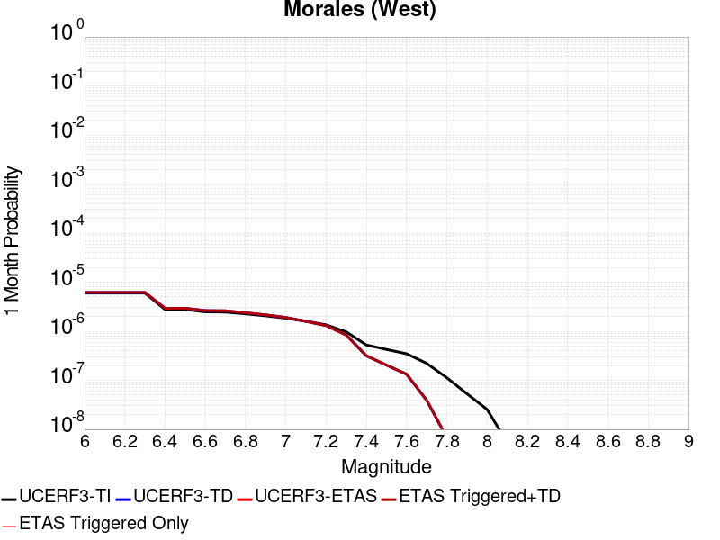 | 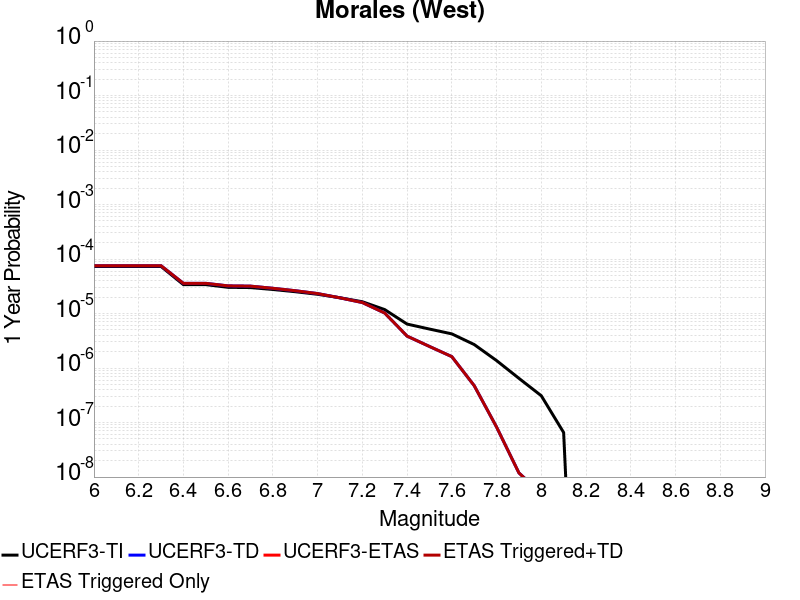 | 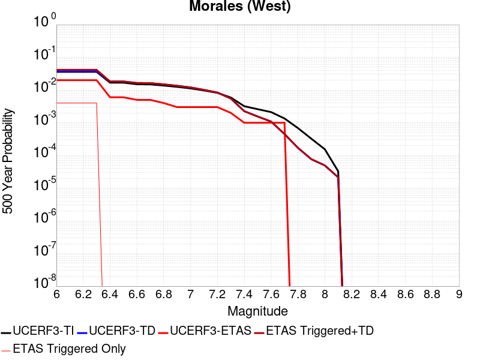 |

| Magnitude | 1 wk TI Prob | 1 wk TD Prob | 1 wk ETAS Prob | 1 wk ETAS/TD Gain | 1 wk ETAS Triggered+TD | 1 wk ETAS Triggered Only | 1 mo TI Prob | 1 mo TD Prob | 1 mo ETAS Prob | 1 mo ETAS/TD Gain | 1 mo ETAS Triggered+TD | 1 mo ETAS Triggered Only | 1 yr TI Prob | 1 yr TD Prob | 1 yr ETAS Prob | 1 yr ETAS/TD Gain | 1 yr ETAS Triggered+TD | 1 yr ETAS Triggered Only | 500 yr TI Prob | 500 yr TD Prob | 500 yr ETAS Prob | 500 yr ETAS/TD Gain | 500 yr ETAS Triggered+TD | 500 yr ETAS Triggered Only |
|-----|-----|-----|-----|-----|-----|-----|-----|-----|-----|-----|-----|-----|-----|-----|-----|-----|-----|-----|-----|-----|-----|-----|-----|-----|
| 6.0 | 1.4027072E-6 | 1.4457812E-6 | 0.0 | 0.0 | 1.4457812E-6 | 0.0 | 6.0115885E-6 | 6.1961946E-6 | 0.0 | 0.0 | 6.1961946E-6 | 0.0 | 7.318863E-5 | 7.543675E-5 | 0.0 | 0.0 | 7.543675E-5 | 0.0 | 0.035934128 | 0.03763577 | 0.02 | 0.5314093 | 0.041485228 | 0.004 |
| 6.1 | 1.4027072E-6 | 1.4457812E-6 | 0.0 | 0.0 | 1.4457812E-6 | 0.0 | 6.0115885E-6 | 6.1961946E-6 | 0.0 | 0.0 | 6.1961946E-6 | 0.0 | 7.318863E-5 | 7.543675E-5 | 0.0 | 0.0 | 7.543675E-5 | 0.0 | 0.035934128 | 0.03763577 | 0.02 | 0.5314093 | 0.041485228 | 0.004 |
| 6.2 | 1.4027072E-6 | 1.4457812E-6 | 0.0 | 0.0 | 1.4457812E-6 | 0.0 | 6.0115885E-6 | 6.1961946E-6 | 0.0 | 0.0 | 6.1961946E-6 | 0.0 | 7.318863E-5 | 7.543675E-5 | 0.0 | 0.0 | 7.543675E-5 | 0.0 | 0.035934128 | 0.03763577 | 0.02 | 0.5314093 | 0.041485228 | 0.004 |
| 6.3 | 1.4027072E-6 | 1.4457812E-6 | 0.0 | 0.0 | 1.4457812E-6 | 0.0 | 6.0115885E-6 | 6.1961946E-6 | 0.0 | 0.0 | 6.1961946E-6 | 0.0 | 7.318863E-5 | 7.543675E-5 | 0.0 | 0.0 | 7.543675E-5 | 0.0 | 0.035934128 | 0.03763577 | 0.02 | 0.5314093 | 0.041485228 | 0.004 |
| 6.4 | 6.504502E-7 | 6.87353E-7 | 0.0 | 0.0 | 6.87353E-7 | 0.0 | 2.7876408E-6 | 2.9457954E-6 | 0.0 | 0.0 | 2.9457954E-6 | 0.0 | 3.3939E-5 | 3.586448E-5 | 0.0 | 0.0 | 3.586448E-5 | 0.0 | 0.016826611 | 0.018218052 | 0.006 | 0.32934368 | 0.018218052 | 0.0 |
| 6.5 | 6.504502E-7 | 6.87353E-7 | 0.0 | 0.0 | 6.87353E-7 | 0.0 | 2.7876408E-6 | 2.9457954E-6 | 0.0 | 0.0 | 2.9457954E-6 | 0.0 | 3.3939E-5 | 3.586448E-5 | 0.0 | 0.0 | 3.586448E-5 | 0.0 | 0.016826611 | 0.018218052 | 0.006 | 0.32934368 | 0.018218052 | 0.0 |
| 6.6 | 5.8056526E-7 | 6.170046E-7 | 0.0 | 0.0 | 6.170046E-7 | 0.0 | 2.4881344E-6 | 2.6443026E-6 | 0.0 | 0.0 | 2.6443026E-6 | 0.0 | 3.0292615E-5 | 3.2193915E-5 | 0.0 | 0.0 | 3.2193915E-5 | 0.0 | 0.015032405 | 0.016412914 | 0.005 | 0.30463818 | 0.016412914 | 0.0 |
| 6.7 | 5.741448E-7 | 6.105383E-7 | 0.0 | 0.0 | 6.105383E-7 | 0.0 | 2.4606184E-6 | 2.6165899E-6 | 0.0 | 0.0 | 2.6165899E-6 | 0.0 | 2.9957617E-5 | 3.185652E-5 | 0.0 | 0.0 | 3.185652E-5 | 0.0 | 0.0148674045 | 0.016246952 | 0.005 | 0.30775002 | 0.016246952 | 0.0 |
| 6.8 | 5.299428E-7 | 5.573151E-7 | 0.0 | 0.0 | 5.573151E-7 | 0.0 | 2.2711813E-6 | 2.388491E-6 | 0.0 | 0.0 | 2.388491E-6 | 0.0 | 2.7651282E-5 | 2.9079496E-5 | 0.0 | 0.0 | 2.9079496E-5 | 0.0 | 0.013730694 | 0.014877131 | 0.004 | 0.26886904 | 0.014877131 | 0.0 |
| 6.9 | 4.82394E-7 | 5.0322444E-7 | 0.0 | 0.0 | 5.0322444E-7 | 0.0 | 2.0674013E-6 | 2.1566743E-6 | 0.0 | 0.0 | 2.1566743E-6 | 0.0 | 2.517032E-5 | 2.6257198E-5 | 0.0 | 0.0 | 2.6257198E-5 | 0.0 | 0.012506454 | 0.0134851225 | 0.003 | 0.2224674 | 0.0134851225 | 0.0 |
| 7.0 | 4.3264512E-7 | 4.4606935E-7 | 0.0 | 0.0 | 4.4606935E-7 | 0.0 | 1.8541921E-6 | 1.9117244E-6 | 0.0 | 0.0 | 1.9117244E-6 | 0.0 | 2.2574555E-5 | 2.3274999E-5 | 0.0 | 0.0 | 2.3274999E-5 | 0.0 | 0.011223941 | 0.012010656 | 0.003 | 0.24977818 | 0.012010656 | 0.0 |
| 7.1 | 3.7388565E-7 | 3.7217944E-7 | 0.0 | 0.0 | 3.7217944E-7 | 0.0 | 1.6023661E-6 | 1.5950538E-6 | 0.0 | 0.0 | 1.5950538E-6 | 0.0 | 1.9508632E-5 | 1.9419609E-5 | 0.0 | 0.0 | 1.9419609E-5 | 0.0 | 0.009706991 | 0.010100478 | 0.003 | 0.29701564 | 0.010100478 | 0.0 |
| 7.2 | 3.1592543E-7 | 3.0523623E-7 | 0.0 | 0.0 | 3.0523623E-7 | 0.0 | 1.3539654E-6 | 1.3081545E-6 | 0.0 | 0.0 | 1.3081545E-6 | 0.0 | 1.6484404E-5 | 1.5926667E-5 | 0.0 | 0.0 | 1.5926667E-5 | 0.0 | 0.008208396 | 0.008371087 | 0.003 | 0.3583764 | 0.008371087 | 0.0 |
| 7.3 | 2.2677783E-7 | 1.9596993E-7 | 0.0 | 0.0 | 1.9596993E-7 | 0.0 | 9.719047E-7 | 8.3987084E-7 | 0.0 | 0.0 | 8.3987084E-7 | 0.0 | 1.1832874E-5 | 1.022538E-5 | 0.0 | 0.0 | 1.022538E-5 | 0.0 | 0.0058990046 | 0.005508499 | 0.002 | 0.3630753 | 0.005508499 | 0.0 |
| 7.4 | 1.2295531E-7 | 7.393197E-8 | 0.0 | 0.0 | 7.393197E-8 | 0.0 | 5.269512E-7 | 3.1685127E-7 | 0.0 | 0.0 | 3.1685127E-7 | 0.0 | 6.4156125E-6 | 3.8576572E-6 | 0.0 | 0.0 | 3.8576572E-6 | 0.0 | 0.003202677 | 0.0022567208 | 0.001 | 0.44312084 | 0.0022567208 | 0.0 |
| 7.5 | 9.9632544E-8 | 4.778636E-8 | 0.0 | 0.0 | 4.778636E-8 | 0.0 | 4.2699656E-7 | 2.0479868E-7 | 0.0 | 0.0 | 2.0479868E-7 | 0.0 | 5.198671E-6 | 2.493421E-6 | 0.0 | 0.0 | 2.493421E-6 | 0.0 | 0.0025959667 | 0.0015516113 | 0.001 | 0.64449126 | 0.0015516113 | 0.0 |
| 7.6 | 8.125894E-8 | 3.1067746E-8 | 0.0 | 0.0 | 3.1067746E-8 | 0.0 | 3.4825257E-7 | 1.3314748E-7 | 0.0 | 0.0 | 1.3314748E-7 | 0.0 | 4.2399665E-6 | 1.6210694E-6 | 0.0 | 0.0 | 1.6210694E-6 | 0.0 | 0.0021177423 | 0.0010866226 | 0.001 | 0.9202827 | 0.0010866226 | 0.0 |
| 7.7 | 5.1810765E-8 | 9.132451E-9 | 0.0 | 0.0 | 9.132451E-9 | 0.0 | 2.2204613E-7 | 3.9139085E-8 | 0.0 | 0.0 | 3.9139085E-8 | 0.0 | 2.7034082E-6 | 4.7651824E-7 | 0.0 | 0.0 | 4.7651824E-7 | 0.0 | 0.0013507927 | 4.509593E-4 | 0.001 | 2.217495 | 4.509593E-4 | 0.0 |
| 7.8 | 2.6315043E-8 | 1.589426E-9 | 0.0 | 0.0 | 1.589426E-9 | 0.0 | 1.1277875E-7 | 6.811829E-9 | 0.0 | 0.0 | 6.811829E-9 | 0.0 | 1.3730804E-6 | 8.293401E-8 | 0.0 | 0.0 | 8.293401E-8 | 0.0 | 6.8630505E-4 | 1.707832E-4 | 0.0 | 0.0 | 1.707832E-4 | 0.0 |
| 7.9 | 1.24281545E-8 | 2.2864166E-10 | 0.0 | 0.0 | 2.2864166E-10 | 0.0 | 5.3263516E-8 | 9.798934E-10 | 0.0 | 0.0 | 9.798934E-10 | 0.0 | 6.4848314E-7 | 1.1930189E-8 | 0.0 | 0.0 | 1.1930189E-8 | 0.0 | 3.241891E-4 | 7.672465E-5 | 0.0 | 0.0 | 7.672465E-5 | 0.0 |
| 8.0 | 5.954214E-9 | 9.496581E-11 | 0.0 | 0.0 | 9.496581E-11 | 0.0 | 2.551806E-8 | 4.0699977E-10 | 0.0 | 0.0 | 4.0699977E-10 | 0.0 | 3.1068234E-7 | 4.955212E-9 | 0.0 | 0.0 | 4.955212E-9 | 0.0 | 1.5532914E-4 | 4.9597857E-5 | 0.0 | 0.0 | 4.9597857E-5 | 0.0 |
| 8.1 | 1.2586262E-9 | 4.6365134E-11 | 0.0 | 0.0 | 4.6365134E-11 | 0.0 | 5.3941123E-9 | 1.9870927E-10 | 0.0 | 0.0 | 1.9870927E-10 | 0.0 | 6.567332E-8 | 2.4192772E-9 | 0.0 | 0.0 | 2.4192772E-9 | 0.0 | 3.283612E-5 | 2.1397775E-5 | 0.0 | 0.0 | 2.1397775E-5 | 0.0 |

## Redondo Canyon alt 1
*[(top)](#table-of-contents)*

| 1 Week | 1 Month | 1 Year | 500 Year |
|-----|-----|-----|-----|
| 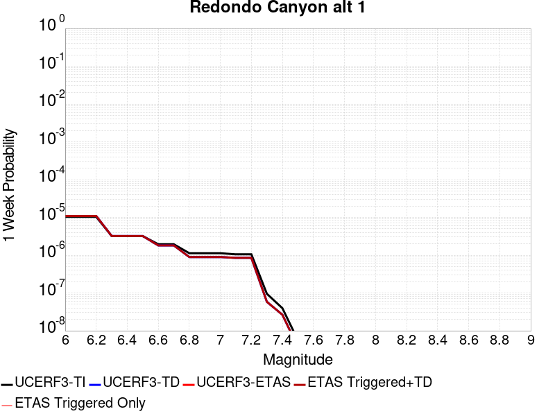 | 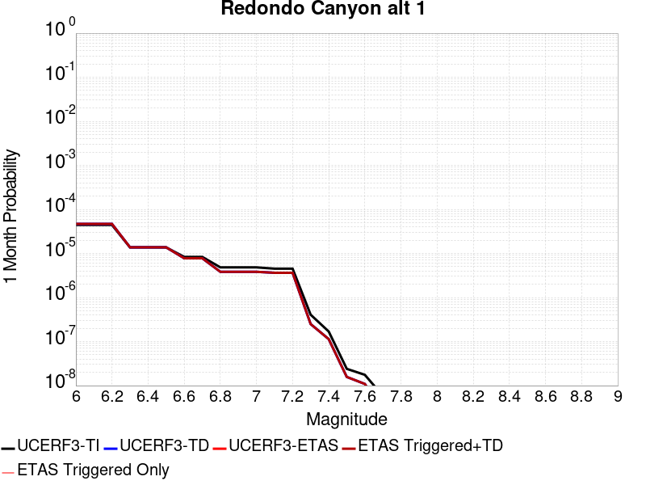 | 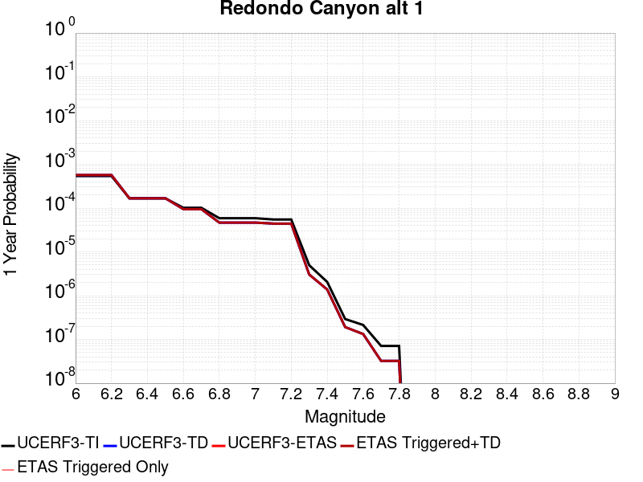 | 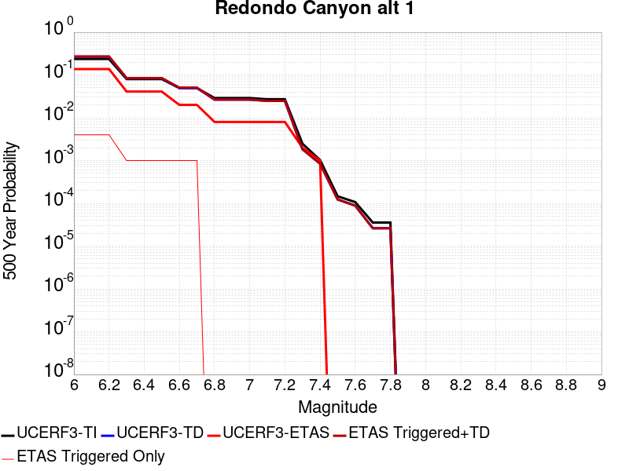 |

| Magnitude | 1 wk TI Prob | 1 wk TD Prob | 1 wk ETAS Prob | 1 wk ETAS/TD Gain | 1 wk ETAS Triggered+TD | 1 wk ETAS Triggered Only | 1 mo TI Prob | 1 mo TD Prob | 1 mo ETAS Prob | 1 mo ETAS/TD Gain | 1 mo ETAS Triggered+TD | 1 mo ETAS Triggered Only | 1 yr TI Prob | 1 yr TD Prob | 1 yr ETAS Prob | 1 yr ETAS/TD Gain | 1 yr ETAS Triggered+TD | 1 yr ETAS Triggered Only | 500 yr TI Prob | 500 yr TD Prob | 500 yr ETAS Prob | 500 yr ETAS/TD Gain | 500 yr ETAS Triggered+TD | 500 yr ETAS Triggered Only |
|-----|-----|-----|-----|-----|-----|-----|-----|-----|-----|-----|-----|-----|-----|-----|-----|-----|-----|-----|-----|-----|-----|-----|-----|-----|
| 6.0 | 1.0346246E-5 | 1.0924273E-5 | 0.0 | 0.0 | 1.0924273E-5 | 0.0 | 4.43403E-5 | 4.6817913E-5 | 0.0 | 0.0 | 4.6817913E-5 | 0.0 | 5.3970946E-4 | 5.699372E-4 | 0.0 | 0.0 | 5.699372E-4 | 0.0 | 0.23656522 | 0.26746508 | 0.138 | 0.51595515 | 0.27039525 | 0.004 |
| 6.1 | 1.0346246E-5 | 1.0924273E-5 | 0.0 | 0.0 | 1.0924273E-5 | 0.0 | 4.43403E-5 | 4.6817913E-5 | 0.0 | 0.0 | 4.6817913E-5 | 0.0 | 5.3970946E-4 | 5.699372E-4 | 0.0 | 0.0 | 5.699372E-4 | 0.0 | 0.23656522 | 0.26746508 | 0.138 | 0.51595515 | 0.27039525 | 0.004 |
| 6.2 | 1.0346246E-5 | 1.0924273E-5 | 0.0 | 0.0 | 1.0924273E-5 | 0.0 | 4.43403E-5 | 4.6817913E-5 | 0.0 | 0.0 | 4.6817913E-5 | 0.0 | 5.3970946E-4 | 5.699372E-4 | 0.0 | 0.0 | 5.699372E-4 | 0.0 | 0.23656522 | 0.26746508 | 0.138 | 0.51595515 | 0.27039525 | 0.004 |
| 6.3 | 3.2052794E-6 | 3.2129565E-6 | 0.0 | 0.0 | 3.2129565E-6 | 0.0 | 1.373684E-5 | 1.3769763E-5 | 0.0 | 0.0 | 1.3769763E-5 | 0.0 | 1.6723319E-4 | 1.6763789E-4 | 0.0 | 0.0 | 1.6763789E-4 | 0.0 | 0.08022259 | 0.08373086 | 0.041 | 0.48966414 | 0.08464713 | 0.001 |
| 6.4 | 3.2052794E-6 | 3.2129565E-6 | 0.0 | 0.0 | 3.2129565E-6 | 0.0 | 1.373684E-5 | 1.3769763E-5 | 0.0 | 0.0 | 1.3769763E-5 | 0.0 | 1.6723319E-4 | 1.6763789E-4 | 0.0 | 0.0 | 1.6763789E-4 | 0.0 | 0.08022259 | 0.08373086 | 0.041 | 0.48966414 | 0.08464713 | 0.001 |
| 6.5 | 3.2052794E-6 | 3.2129565E-6 | 0.0 | 0.0 | 3.2129565E-6 | 0.0 | 1.373684E-5 | 1.3769763E-5 | 0.0 | 0.0 | 1.3769763E-5 | 0.0 | 1.6723319E-4 | 1.6763789E-4 | 0.0 | 0.0 | 1.6763789E-4 | 0.0 | 0.08022259 | 0.08373086 | 0.041 | 0.48966414 | 0.08464713 | 0.001 |
| 6.6 | 1.948328E-6 | 1.8143983E-6 | 0.0 | 0.0 | 1.8143983E-6 | 0.0 | 8.349951E-6 | 7.775978E-6 | 0.0 | 0.0 | 7.775978E-6 | 0.0 | 1.016559E-4 | 9.466989E-5 | 0.0 | 0.0 | 9.466989E-5 | 0.0 | 0.04956028 | 0.049728494 | 0.02 | 0.4021839 | 0.050678767 | 0.001 |
| 6.7 | 1.948328E-6 | 1.8143983E-6 | 0.0 | 0.0 | 1.8143983E-6 | 0.0 | 8.349951E-6 | 7.775978E-6 | 0.0 | 0.0 | 7.775978E-6 | 0.0 | 1.016559E-4 | 9.466989E-5 | 0.0 | 0.0 | 9.466989E-5 | 0.0 | 0.04956028 | 0.049728494 | 0.02 | 0.4021839 | 0.050678767 | 0.001 |
| 6.8 | 1.1278219E-6 | 8.9495586E-7 | 0.0 | 0.0 | 8.9495586E-7 | 0.0 | 4.8335132E-6 | 3.835522E-6 | 0.0 | 0.0 | 3.835522E-6 | 0.0 | 5.8846435E-5 | 4.66969E-5 | 0.0 | 0.0 | 4.66969E-5 | 0.0 | 0.02899541 | 0.026594676 | 0.008 | 0.3008121 | 0.026594676 | 0.0 |
| 6.9 | 1.1278219E-6 | 8.9495586E-7 | 0.0 | 0.0 | 8.9495586E-7 | 0.0 | 4.8335132E-6 | 3.835522E-6 | 0.0 | 0.0 | 3.835522E-6 | 0.0 | 5.8846435E-5 | 4.66969E-5 | 0.0 | 0.0 | 4.66969E-5 | 0.0 | 0.02899541 | 0.026594676 | 0.008 | 0.3008121 | 0.026594676 | 0.0 |
| 7.0 | 1.1278219E-6 | 8.9495586E-7 | 0.0 | 0.0 | 8.9495586E-7 | 0.0 | 4.8335132E-6 | 3.835522E-6 | 0.0 | 0.0 | 3.835522E-6 | 0.0 | 5.8846435E-5 | 4.66969E-5 | 0.0 | 0.0 | 4.66969E-5 | 0.0 | 0.02899541 | 0.026594676 | 0.008 | 0.3008121 | 0.026594676 | 0.0 |
| 7.1 | 1.0545139E-6 | 8.4924096E-7 | 0.0 | 0.0 | 8.4924096E-7 | 0.0 | 4.5193374E-6 | 3.6396016E-6 | 0.0 | 0.0 | 3.6396016E-6 | 0.0 | 5.5021545E-5 | 4.4311666E-5 | 0.0 | 0.0 | 4.4311666E-5 | 0.0 | 0.027136533 | 0.024895543 | 0.008 | 0.32134265 | 0.024895543 | 0.0 |
| 7.2 | 1.0545139E-6 | 8.4924096E-7 | 0.0 | 0.0 | 8.4924096E-7 | 0.0 | 4.5193374E-6 | 3.6396016E-6 | 0.0 | 0.0 | 3.6396016E-6 | 0.0 | 5.5021545E-5 | 4.4311666E-5 | 0.0 | 0.0 | 4.4311666E-5 | 0.0 | 0.027136533 | 0.024895543 | 0.008 | 0.32134265 | 0.024895543 | 0.0 |
| 7.3 | 9.505161E-8 | 5.827641E-8 | 0.0 | 0.0 | 5.827641E-8 | 0.0 | 4.0736398E-7 | 2.4975603E-7 | 0.0 | 0.0 | 2.4975603E-7 | 0.0 | 4.959645E-6 | 3.0407764E-6 | 0.0 | 0.0 | 3.0407764E-6 | 0.0 | 0.0024767565 | 0.0018435044 | 0.002 | 1.0848902 | 0.0018435044 | 0.0 |
| 7.4 | 3.9520785E-8 | 2.654245E-8 | 0.0 | 0.0 | 2.654245E-8 | 0.0 | 1.6937479E-7 | 1.1375335E-7 | 0.0 | 0.0 | 1.1375335E-7 | 0.0 | 2.062136E-6 | 1.3849465E-6 | 0.0 | 0.0 | 1.3849465E-6 | 0.0 | 0.0010305378 | 8.4784994E-4 | 0.001 | 1.179454 | 8.4784994E-4 | 0.0 |
| 7.5 | 5.6133214E-9 | 3.6768548E-9 | 0.0 | 0.0 | 3.6768548E-9 | 0.0 | 2.4057092E-8 | 1.575795E-8 | 0.0 | 0.0 | 1.575795E-8 | 0.0 | 2.9289507E-7 | 1.9185303E-7 | 0.0 | 0.0 | 1.9185303E-7 | 0.0 | 1.4643683E-4 | 1.2337201E-4 | 0.0 | 0.0 | 1.2337201E-4 | 0.0 |
| 7.6 | 4.1064334E-9 | 2.5486635E-9 | 0.0 | 0.0 | 2.5486635E-9 | 0.0 | 1.7599E-8 | 1.0922843E-8 | 0.0 | 0.0 | 1.0922843E-8 | 0.0 | 2.142678E-7 | 1.329856E-7 | 0.0 | 0.0 | 1.329856E-7 | 0.0 | 1.0712817E-4 | 8.847634E-5 | 0.0 | 0.0 | 8.847634E-5 | 0.0 |
| 7.7 | 1.361975E-9 | 6.206823E-10 | 0.0 | 0.0 | 6.206823E-10 | 0.0 | 5.8370353E-9 | 2.6600673E-9 | 0.0 | 0.0 | 2.6600673E-9 | 0.0 | 7.1065905E-8 | 3.2386318E-8 | 0.0 | 0.0 | 3.2386318E-8 | 0.0 | 3.553232E-5 | 2.6196867E-5 | 0.0 | 0.0 | 2.6196867E-5 | 0.0 |
| 7.8 | 1.361975E-9 | 6.206823E-10 | 0.0 | 0.0 | 6.206823E-10 | 0.0 | 5.8370353E-9 | 2.6600673E-9 | 0.0 | 0.0 | 2.6600673E-9 | 0.0 | 7.1065905E-8 | 3.2386318E-8 | 0.0 | 0.0 | 3.2386318E-8 | 0.0 | 3.553232E-5 | 2.6196867E-5 | 0.0 | 0.0 | 2.6196867E-5 | 0.0 |

## Gillem - Big Crack 2011 CFM
*[(top)](#table-of-contents)*

| 1 Week | 1 Month | 1 Year | 500 Year |
|-----|-----|-----|-----|
| 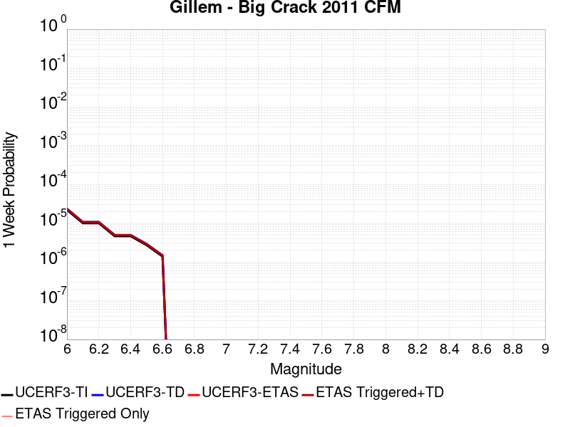 | 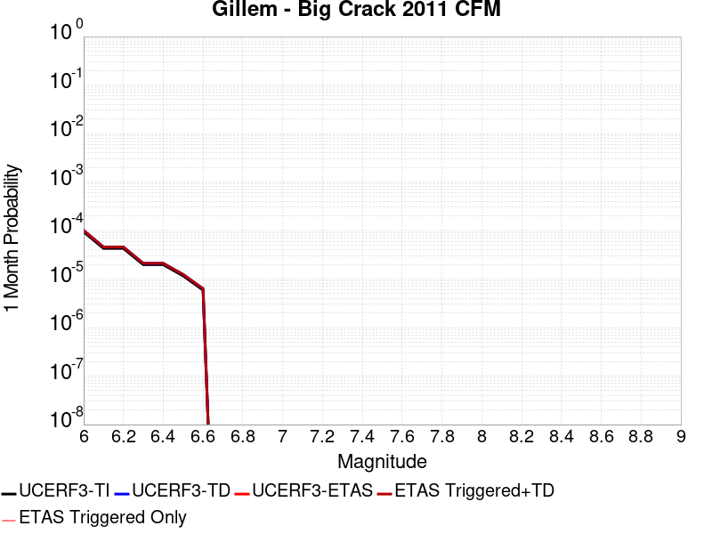 | 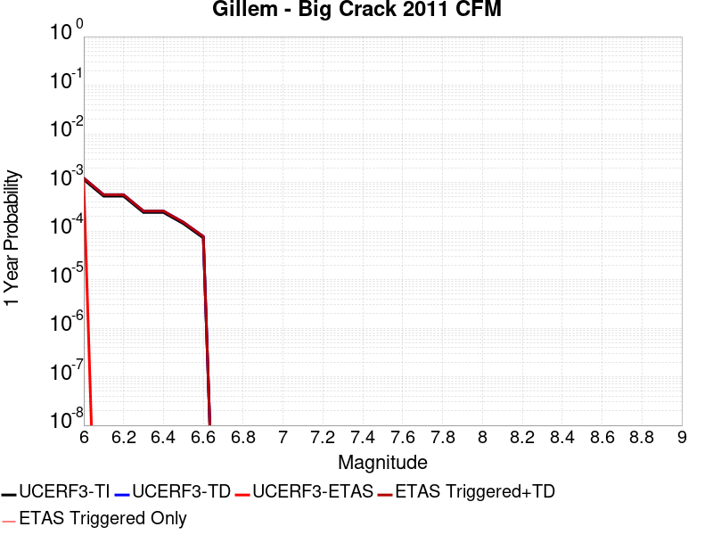 | 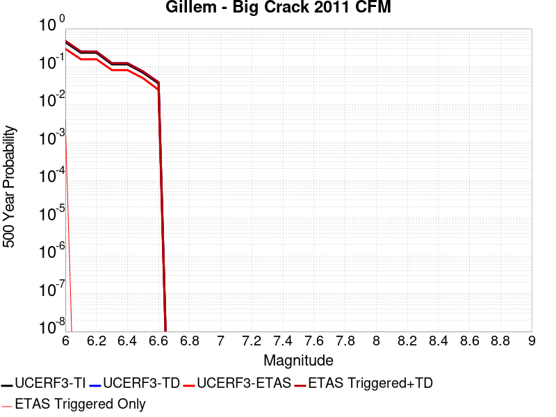 |

| Magnitude | 1 wk TI Prob | 1 wk TD Prob | 1 wk ETAS Prob | 1 wk ETAS/TD Gain | 1 wk ETAS Triggered+TD | 1 wk ETAS Triggered Only | 1 mo TI Prob | 1 mo TD Prob | 1 mo ETAS Prob | 1 mo ETAS/TD Gain | 1 mo ETAS Triggered+TD | 1 mo ETAS Triggered Only | 1 yr TI Prob | 1 yr TD Prob | 1 yr ETAS Prob | 1 yr ETAS/TD Gain | 1 yr ETAS Triggered+TD | 1 yr ETAS Triggered Only | 500 yr TI Prob | 500 yr TD Prob | 500 yr ETAS Prob | 500 yr ETAS/TD Gain | 500 yr ETAS Triggered+TD | 500 yr ETAS Triggered Only |
|-----|-----|-----|-----|-----|-----|-----|-----|-----|-----|-----|-----|-----|-----|-----|-----|-----|-----|-----|-----|-----|-----|-----|-----|-----|
| 6.0 | 2.196852E-5 | 2.351346E-5 | 0.0 | 0.0 | 2.351346E-5 | 0.0 | 9.4147406E-5 | 1.0076858E-4 | 0.0 | 0.0 | 1.0076858E-4 | 0.0 | 0.0011456419 | 0.0012262551 | 0.001 | 0.81549096 | 0.0012262551 | 0.0 | 0.43625277 | 0.47189367 | 0.291 | 0.61666435 | 0.47400612 | 0.004 |
| 6.1 | 9.992795E-6 | 1.0671974E-5 | 0.0 | 0.0 | 1.0671974E-5 | 0.0 | 4.2825563E-5 | 4.5736335E-5 | 0.0 | 0.0 | 4.5736335E-5 | 0.0 | 5.2127644E-4 | 5.567158E-4 | 0.0 | 0.0 | 5.567158E-4 | 0.0 | 0.22949272 | 0.24663527 | 0.155 | 0.6284584 | 0.24663527 | 0.0 |
| 6.2 | 9.992795E-6 | 1.0671974E-5 | 0.0 | 0.0 | 1.0671974E-5 | 0.0 | 4.2825563E-5 | 4.5736335E-5 | 0.0 | 0.0 | 4.5736335E-5 | 0.0 | 5.2127644E-4 | 5.567158E-4 | 0.0 | 0.0 | 5.567158E-4 | 0.0 | 0.22949272 | 0.24663527 | 0.155 | 0.6284584 | 0.24663527 | 0.0 |
| 6.3 | 4.6127884E-6 | 4.9243554E-6 | 0.0 | 0.0 | 4.9243554E-6 | 0.0 | 1.9768944E-5 | 2.1104233E-5 | 0.0 | 0.0 | 2.1104233E-5 | 0.0 | 2.406603E-4 | 2.5691817E-4 | 0.0 | 0.0 | 2.5691817E-4 | 0.0 | 0.11338517 | 0.12151207 | 0.08 | 0.6583708 | 0.12151207 | 0.0 |
| 6.4 | 4.6127884E-6 | 4.9243554E-6 | 0.0 | 0.0 | 4.9243554E-6 | 0.0 | 1.9768944E-5 | 2.1104233E-5 | 0.0 | 0.0 | 2.1104233E-5 | 0.0 | 2.406603E-4 | 2.5691817E-4 | 0.0 | 0.0 | 2.5691817E-4 | 0.0 | 0.11338517 | 0.12151207 | 0.08 | 0.6583708 | 0.12151207 | 0.0 |
| 6.5 | 2.716712E-6 | 2.9003254E-6 | 0.0 | 0.0 | 2.9003254E-6 | 0.0 | 1.1643E-5 | 1.24299195E-5 | 0.0 | 0.0 | 1.24299195E-5 | 0.0 | 1.417443E-4 | 1.5132617E-4 | 0.0 | 0.0 | 1.5132617E-4 | 0.0 | 0.068423696 | 0.07341349 | 0.049 | 0.6674523 | 0.07341349 | 0.0 |
| 6.6 | 1.3818255E-6 | 1.4765022E-6 | 0.0 | 0.0 | 1.4765022E-6 | 0.0 | 5.922096E-6 | 6.327858E-6 | 0.0 | 0.0 | 6.327858E-6 | 0.0 | 7.209913E-5 | 7.7040175E-5 | 0.0 | 0.0 | 7.7040175E-5 | 0.0 | 0.035408773 | 0.03806832 | 0.024 | 0.6304455 | 0.03806832 | 0.0 |

## Compton
*[(top)](#table-of-contents)*

| 1 Week | 1 Month | 1 Year | 500 Year |
|-----|-----|-----|-----|
| 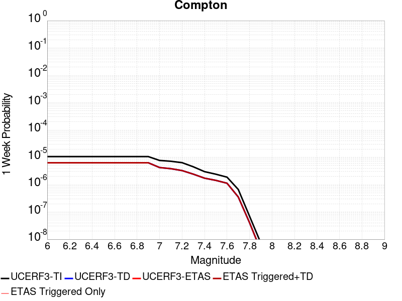 |  | 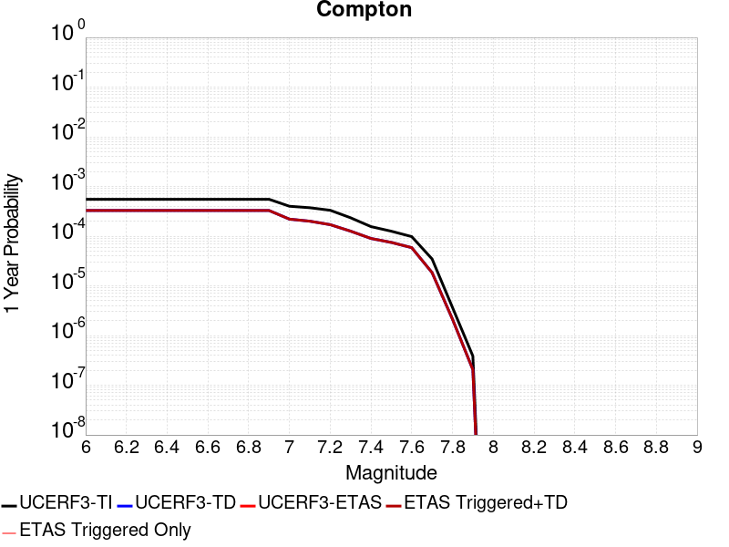 | 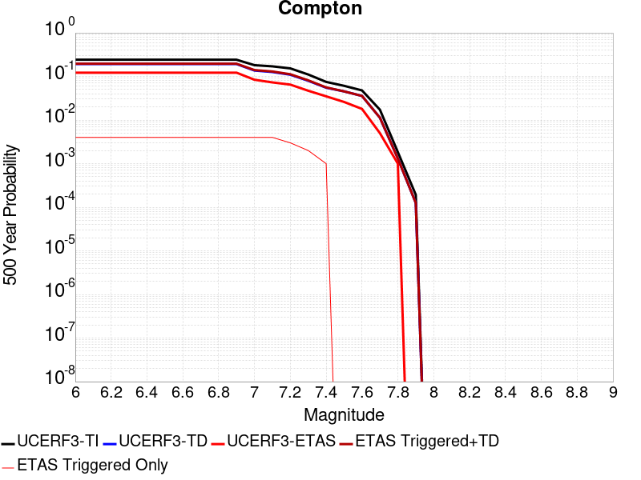 |

| Magnitude | 1 wk TI Prob | 1 wk TD Prob | 1 wk ETAS Prob | 1 wk ETAS/TD Gain | 1 wk ETAS Triggered+TD | 1 wk ETAS Triggered Only | 1 mo TI Prob | 1 mo TD Prob | 1 mo ETAS Prob | 1 mo ETAS/TD Gain | 1 mo ETAS Triggered+TD | 1 mo ETAS Triggered Only | 1 yr TI Prob | 1 yr TD Prob | 1 yr ETAS Prob | 1 yr ETAS/TD Gain | 1 yr ETAS Triggered+TD | 1 yr ETAS Triggered Only | 500 yr TI Prob | 500 yr TD Prob | 500 yr ETAS Prob | 500 yr ETAS/TD Gain | 500 yr ETAS Triggered+TD | 500 yr ETAS Triggered Only |
|-----|-----|-----|-----|-----|-----|-----|-----|-----|-----|-----|-----|-----|-----|-----|-----|-----|-----|-----|-----|-----|-----|-----|-----|-----|
| 6.0 | 1.06050875E-5 | 6.296672E-6 | 0.0 | 0.0 | 6.296672E-6 | 0.0 | 4.5449582E-5 | 2.6985474E-5 | 0.0 | 0.0 | 2.6985474E-5 | 0.0 | 5.5320817E-4 | 3.2850142E-4 | 0.0 | 0.0 | 3.2850142E-4 | 0.0 | 0.24170336 | 0.19263443 | 0.122 | 0.63332397 | 0.19586389 | 0.004 |
| 6.1 | 1.06050875E-5 | 6.296672E-6 | 0.0 | 0.0 | 6.296672E-6 | 0.0 | 4.5449582E-5 | 2.6985474E-5 | 0.0 | 0.0 | 2.6985474E-5 | 0.0 | 5.5320817E-4 | 3.2850142E-4 | 0.0 | 0.0 | 3.2850142E-4 | 0.0 | 0.24170336 | 0.19263443 | 0.122 | 0.63332397 | 0.19586389 | 0.004 |
| 6.2 | 1.06050875E-5 | 6.296672E-6 | 0.0 | 0.0 | 6.296672E-6 | 0.0 | 4.5449582E-5 | 2.6985474E-5 | 0.0 | 0.0 | 2.6985474E-5 | 0.0 | 5.5320817E-4 | 3.2850142E-4 | 0.0 | 0.0 | 3.2850142E-4 | 0.0 | 0.24170336 | 0.19263443 | 0.122 | 0.63332397 | 0.19586389 | 0.004 |
| 6.3 | 1.06050875E-5 | 6.296672E-6 | 0.0 | 0.0 | 6.296672E-6 | 0.0 | 4.5449582E-5 | 2.6985474E-5 | 0.0 | 0.0 | 2.6985474E-5 | 0.0 | 5.5320817E-4 | 3.2850142E-4 | 0.0 | 0.0 | 3.2850142E-4 | 0.0 | 0.24170336 | 0.19263443 | 0.122 | 0.63332397 | 0.19586389 | 0.004 |
| 6.4 | 1.06050875E-5 | 6.296672E-6 | 0.0 | 0.0 | 6.296672E-6 | 0.0 | 4.5449582E-5 | 2.6985474E-5 | 0.0 | 0.0 | 2.6985474E-5 | 0.0 | 5.5320817E-4 | 3.2850142E-4 | 0.0 | 0.0 | 3.2850142E-4 | 0.0 | 0.24170336 | 0.19263443 | 0.122 | 0.63332397 | 0.19586389 | 0.004 |
| 6.5 | 1.06050875E-5 | 6.296672E-6 | 0.0 | 0.0 | 6.296672E-6 | 0.0 | 4.5449582E-5 | 2.6985474E-5 | 0.0 | 0.0 | 2.6985474E-5 | 0.0 | 5.5320817E-4 | 3.2850142E-4 | 0.0 | 0.0 | 3.2850142E-4 | 0.0 | 0.24170336 | 0.19263443 | 0.122 | 0.63332397 | 0.19586389 | 0.004 |
| 6.6 | 1.06050875E-5 | 6.296672E-6 | 0.0 | 0.0 | 6.296672E-6 | 0.0 | 4.5449582E-5 | 2.6985474E-5 | 0.0 | 0.0 | 2.6985474E-5 | 0.0 | 5.5320817E-4 | 3.2850142E-4 | 0.0 | 0.0 | 3.2850142E-4 | 0.0 | 0.24170336 | 0.19263443 | 0.122 | 0.63332397 | 0.19586389 | 0.004 |
| 6.7 | 1.06050875E-5 | 6.296672E-6 | 0.0 | 0.0 | 6.296672E-6 | 0.0 | 4.5449582E-5 | 2.6985474E-5 | 0.0 | 0.0 | 2.6985474E-5 | 0.0 | 5.5320817E-4 | 3.2850142E-4 | 0.0 | 0.0 | 3.2850142E-4 | 0.0 | 0.24170336 | 0.19263443 | 0.122 | 0.63332397 | 0.19586389 | 0.004 |
| 6.8 | 1.06050875E-5 | 6.296672E-6 | 0.0 | 0.0 | 6.296672E-6 | 0.0 | 4.5449582E-5 | 2.6985474E-5 | 0.0 | 0.0 | 2.6985474E-5 | 0.0 | 5.5320817E-4 | 3.2850142E-4 | 0.0 | 0.0 | 3.2850142E-4 | 0.0 | 0.24170336 | 0.19263443 | 0.122 | 0.63332397 | 0.19586389 | 0.004 |
| 6.9 | 1.06050875E-5 | 6.296672E-6 | 0.0 | 0.0 | 6.296672E-6 | 0.0 | 4.5449582E-5 | 2.6985474E-5 | 0.0 | 0.0 | 2.6985474E-5 | 0.0 | 5.5320817E-4 | 3.2850142E-4 | 0.0 | 0.0 | 3.2850142E-4 | 0.0 | 0.24170336 | 0.19263443 | 0.122 | 0.63332397 | 0.19586389 | 0.004 |
| 7.0 | 7.672486E-6 | 4.2239226E-6 | 0.0 | 0.0 | 4.2239226E-6 | 0.0 | 3.288167E-5 | 1.8102404E-5 | 0.0 | 0.0 | 1.8102404E-5 | 0.0 | 4.0026082E-4 | 2.2037508E-4 | 0.0 | 0.0 | 2.2037508E-4 | 0.0 | 0.18140881 | 0.13659537 | 0.084 | 0.61495495 | 0.14004898 | 0.004 |
| 7.1 | 7.163992E-6 | 3.8383732E-6 | 0.0 | 0.0 | 3.8383732E-6 | 0.0 | 3.0702464E-5 | 1.645007E-5 | 0.0 | 0.0 | 1.645007E-5 | 0.0 | 3.7373835E-4 | 2.0026177E-4 | 0.0 | 0.0 | 2.0026177E-4 | 0.0 | 0.17047672 | 0.12648812 | 0.073 | 0.5771293 | 0.12998217 | 0.004 |
| 7.2 | 6.3689185E-6 | 3.270552E-6 | 0.0 | 0.0 | 3.270552E-6 | 0.0 | 2.729508E-5 | 1.40165785E-5 | 0.0 | 0.0 | 1.40165785E-5 | 0.0 | 3.322669E-4 | 1.7063889E-4 | 0.0 | 0.0 | 1.7063889E-4 | 0.0 | 0.15309018 | 0.10964879 | 0.065 | 0.5928018 | 0.11231984 | 0.003 |
| 7.3 | 4.4987873E-6 | 2.4200563E-6 | 0.0 | 0.0 | 2.4200563E-6 | 0.0 | 1.9280375E-5 | 1.037163E-5 | 0.0 | 0.0 | 1.037163E-5 | 0.0 | 2.3471327E-4 | 1.2626758E-4 | 0.0 | 0.0 | 1.2626758E-4 | 0.0 | 0.11074426 | 0.07952289 | 0.047 | 0.59102476 | 0.08136385 | 0.002 |
| 7.4 | 2.987296E-6 | 1.7241883E-6 | 0.0 | 0.0 | 1.7241883E-6 | 0.0 | 1.2802635E-5 | 7.3893584E-6 | 0.0 | 0.0 | 7.3893584E-6 | 0.0 | 1.5586092E-4 | 8.996178E-5 | 0.0 | 0.0 | 8.996178E-5 | 0.0 | 0.07497687 | 0.055119585 | 0.035 | 0.634983 | 0.056064468 | 0.001 |
| 7.5 | 2.4111696E-6 | 1.4350301E-6 | 0.0 | 0.0 | 1.4350301E-6 | 0.0 | 1.0333543E-5 | 6.1501146E-6 | 0.0 | 0.0 | 6.1501146E-6 | 0.0 | 1.2580362E-4 | 7.487512E-5 | 0.0 | 0.0 | 7.487512E-5 | 0.0 | 0.060968045 | 0.04544781 | 0.026 | 0.5720848 | 0.04544781 | 0.0 |
| 7.6 | 1.8783096E-6 | 1.126041E-6 | 0.0 | 0.0 | 1.126041E-6 | 0.0 | 8.049874E-6 | 4.825881E-6 | 0.0 | 0.0 | 4.825881E-6 | 0.0 | 9.8002805E-5 | 5.8753558E-5 | 0.0 | 0.0 | 5.8753558E-5 | 0.0 | 0.04782249 | 0.035721906 | 0.018 | 0.5038925 | 0.035721906 | 0.0 |
| 7.7 | 6.6646817E-7 | 3.5397835E-7 | 0.0 | 0.0 | 3.5397835E-7 | 0.0 | 2.856289E-6 | 1.5170493E-6 | 0.0 | 0.0 | 1.5170493E-6 | 0.0 | 3.4774763E-5 | 1.8469931E-5 | 0.0 | 0.0 | 1.8469931E-5 | 0.0 | 0.017237391 | 0.0112903025 | 0.005 | 0.44285795 | 0.0112903025 | 0.0 |
| 7.8 | 7.054689E-8 | 4.095412E-8 | 0.0 | 0.0 | 4.095412E-8 | 0.0 | 3.0234378E-7 | 1.7551766E-7 | 0.0 | 0.0 | 1.7551766E-7 | 0.0 | 3.6810293E-6 | 2.1369253E-6 | 0.0 | 0.0 | 2.1369253E-6 | 0.0 | 0.0018388254 | 0.001315136 | 0.001 | 0.76037765 | 0.001315136 | 0.0 |
| 7.9 | 7.420925E-9 | 3.9582755E-9 | 0.0 | 0.0 | 3.9582755E-9 | 0.0 | 3.1803964E-8 | 1.6964037E-8 | 0.0 | 0.0 | 1.6964037E-8 | 0.0 | 3.872132E-7 | 2.0653714E-7 | 0.0 | 0.0 | 2.0653714E-7 | 0.0 | 1.935879E-4 | 1.2550644E-4 | 0.0 | 0.0 | 1.2550644E-4 | 0.0 |

## Shoreline
*[(top)](#table-of-contents)*

| 1 Week | 1 Month | 1 Year | 500 Year |
|-----|-----|-----|-----|
|  |  | 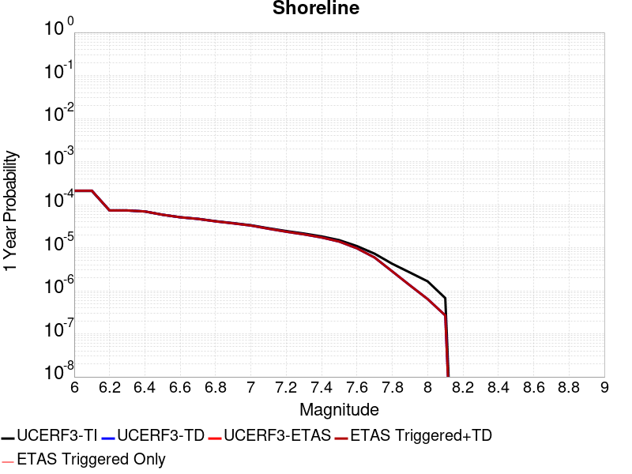 | 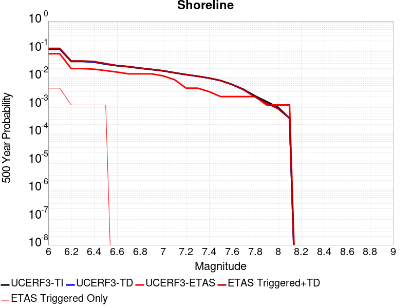 |

| Magnitude | 1 wk TI Prob | 1 wk TD Prob | 1 wk ETAS Prob | 1 wk ETAS/TD Gain | 1 wk ETAS Triggered+TD | 1 wk ETAS Triggered Only | 1 mo TI Prob | 1 mo TD Prob | 1 mo ETAS Prob | 1 mo ETAS/TD Gain | 1 mo ETAS Triggered+TD | 1 mo ETAS Triggered Only | 1 yr TI Prob | 1 yr TD Prob | 1 yr ETAS Prob | 1 yr ETAS/TD Gain | 1 yr ETAS Triggered+TD | 1 yr ETAS Triggered Only | 500 yr TI Prob | 500 yr TD Prob | 500 yr ETAS Prob | 500 yr ETAS/TD Gain | 500 yr ETAS Triggered+TD | 500 yr ETAS Triggered Only |
|-----|-----|-----|-----|-----|-----|-----|-----|-----|-----|-----|-----|-----|-----|-----|-----|-----|-----|-----|-----|-----|-----|-----|-----|-----|
| 6.0 | 3.9888673E-6 | 4.0415543E-6 | 0.0 | 0.0 | 4.0415543E-6 | 0.0 | 1.7095033E-5 | 1.7320865E-5 | 0.0 | 0.0 | 1.7320865E-5 | 0.0 | 2.0811215E-4 | 2.108667E-4 | 0.0 | 0.0 | 2.108667E-4 | 0.0 | 0.098835 | 0.10199475 | 0.068 | 0.66670096 | 0.105586775 | 0.004 |
| 6.1 | 3.9888673E-6 | 4.0415543E-6 | 0.0 | 0.0 | 4.0415543E-6 | 0.0 | 1.7095033E-5 | 1.7320865E-5 | 0.0 | 0.0 | 1.7320865E-5 | 0.0 | 2.0811215E-4 | 2.108667E-4 | 0.0 | 0.0 | 2.108667E-4 | 0.0 | 0.098835 | 0.10199475 | 0.068 | 0.66670096 | 0.105586775 | 0.004 |
| 6.2 | 1.4039653E-6 | 1.4065207E-6 | 0.0 | 0.0 | 1.4065207E-6 | 0.0 | 6.0169805E-6 | 6.027932E-6 | 0.0 | 0.0 | 6.027932E-6 | 0.0 | 7.325427E-5 | 7.338766E-5 | 0.0 | 0.0 | 7.338766E-5 | 0.0 | 0.03596577 | 0.0365921 | 0.02 | 0.54656607 | 0.037555505 | 0.001 |
| 6.3 | 1.4039653E-6 | 1.4065207E-6 | 0.0 | 0.0 | 1.4065207E-6 | 0.0 | 6.0169805E-6 | 6.027932E-6 | 0.0 | 0.0 | 6.027932E-6 | 0.0 | 7.325427E-5 | 7.338766E-5 | 0.0 | 0.0 | 7.338766E-5 | 0.0 | 0.03596577 | 0.0365921 | 0.02 | 0.54656607 | 0.037555505 | 0.001 |
| 6.4 | 1.3314152E-6 | 1.332665E-6 | 0.0 | 0.0 | 1.332665E-6 | 0.0 | 5.7060524E-6 | 5.7114094E-6 | 0.0 | 0.0 | 5.7114094E-6 | 0.0 | 6.946897E-5 | 6.9534246E-5 | 0.0 | 0.0 | 6.9534246E-5 | 0.0 | 0.034139335 | 0.03473232 | 0.019 | 0.5470409 | 0.03569759 | 0.001 |
| 6.5 | 1.1187026E-6 | 1.117031E-6 | 0.0 | 0.0 | 1.117031E-6 | 0.0 | 4.794431E-6 | 4.7872672E-6 | 0.0 | 0.0 | 4.7872672E-6 | 0.0 | 5.8370628E-5 | 5.8283444E-5 | 0.0 | 0.0 | 5.8283444E-5 | 0.0 | 0.028764363 | 0.029278975 | 0.017 | 0.5806214 | 0.030249696 | 0.001 |
| 6.6 | 9.793089E-7 | 9.752902E-7 | 0.0 | 0.0 | 9.752902E-7 | 0.0 | 4.1970316E-6 | 4.1798085E-6 | 0.0 | 0.0 | 4.1798085E-6 | 0.0 | 5.1097657E-5 | 5.0887993E-5 | 0.0 | 0.0 | 5.0887993E-5 | 0.0 | 0.025225855 | 0.025679344 | 0.015 | 0.58412707 | 0.025679344 | 0.0 |
| 6.7 | 8.995986E-7 | 8.941579E-7 | 0.0 | 0.0 | 8.941579E-7 | 0.0 | 3.8554167E-6 | 3.8320995E-6 | 0.0 | 0.0 | 3.8320995E-6 | 0.0 | 4.693869E-5 | 4.6654823E-5 | 0.0 | 0.0 | 4.6654823E-5 | 0.0 | 0.023196619 | 0.023613948 | 0.013 | 0.5505221 | 0.023613948 | 0.0 |
| 6.8 | 7.931612E-7 | 7.8506747E-7 | 0.0 | 0.0 | 7.8506747E-7 | 0.0 | 3.3992578E-6 | 3.3645706E-6 | 0.0 | 0.0 | 3.3645706E-6 | 0.0 | 4.1385178E-5 | 4.096288E-5 | 0.0 | 0.0 | 4.096288E-5 | 0.0 | 0.020480387 | 0.020830005 | 0.013 | 0.6240997 | 0.020830005 | 0.0 |
| 6.9 | 7.1465956E-7 | 7.049202E-7 | 0.0 | 0.0 | 7.049202E-7 | 0.0 | 3.062823E-6 | 3.021083E-6 | 0.0 | 0.0 | 3.021083E-6 | 0.0 | 3.7289232E-5 | 3.6781068E-5 | 0.0 | 0.0 | 3.6781068E-5 | 0.0 | 0.01847222 | 0.018779948 | 0.013 | 0.69222766 | 0.018779948 | 0.0 |
| 7.0 | 6.389046E-7 | 6.2717766E-7 | 0.0 | 0.0 | 6.2717766E-7 | 0.0 | 2.7381598E-6 | 2.6879015E-6 | 0.0 | 0.0 | 2.6879015E-6 | 0.0 | 3.3336586E-5 | 3.272471E-5 | 0.0 | 0.0 | 3.272471E-5 | 0.0 | 0.016530419 | 0.01678744 | 0.011 | 0.6552518 | 0.01678744 | 0.0 |
| 7.1 | 5.4300875E-7 | 5.285025E-7 | 0.0 | 0.0 | 5.285025E-7 | 0.0 | 2.3271782E-6 | 2.2650088E-6 | 0.0 | 0.0 | 2.2650088E-6 | 0.0 | 2.8333026E-5 | 2.7576134E-5 | 0.0 | 0.0 | 2.7576134E-5 | 0.0 | 0.014066839 | 0.014252653 | 0.008 | 0.561299 | 0.014252653 | 0.0 |
| 7.2 | 4.6768855E-7 | 4.5100242E-7 | 0.0 | 0.0 | 4.5100242E-7 | 0.0 | 2.0043778E-6 | 1.932866E-6 | 0.0 | 0.0 | 1.932866E-6 | 0.0 | 2.4403027E-5 | 2.353239E-5 | 0.0 | 0.0 | 2.353239E-5 | 0.0 | 0.012127524 | 0.0122573925 | 0.004 | 0.32633367 | 0.0122573925 | 0.0 |
| 7.3 | 4.0966103E-7 | 3.9145544E-7 | 0.0 | 0.0 | 3.9145544E-7 | 0.0 | 1.7556889E-6 | 1.6776651E-6 | 0.0 | 0.0 | 1.6776651E-6 | 0.0 | 2.1375303E-5 | 2.0425381E-5 | 0.0 | 0.0 | 2.0425381E-5 | 0.0 | 0.010630854 | 0.010721663 | 0.004 | 0.37307644 | 0.010721663 | 0.0 |
| 7.4 | 3.5105785E-7 | 3.3132508E-7 | 0.0 | 0.0 | 3.3132508E-7 | 0.0 | 1.5045327E-6 | 1.4199638E-6 | 0.0 | 0.0 | 1.4199638E-6 | 0.0 | 1.8317533E-5 | 1.7287923E-5 | 0.0 | 0.0 | 1.7287923E-5 | 0.0 | 0.009117035 | 0.009168477 | 0.003 | 0.3272081 | 0.009168477 | 0.0 |
| 7.5 | 2.8737534E-7 | 2.6598008E-7 | 0.0 | 0.0 | 2.6598008E-7 | 0.0 | 1.2316079E-6 | 1.139914E-6 | 0.0 | 0.0 | 1.139914E-6 | 0.0 | 1.4994724E-5 | 1.3878365E-5 | 0.0 | 0.0 | 1.3878365E-5 | 0.0 | 0.0074693826 | 0.0074778395 | 0.002 | 0.26745692 | 0.0074778395 | 0.0 |
| 7.6 | 2.0924051E-7 | 1.856923E-7 | 0.0 | 0.0 | 1.856923E-7 | 0.0 | 8.967448E-7 | 7.9582384E-7 | 0.0 | 0.0 | 7.9582384E-7 | 0.0 | 1.0917813E-5 | 9.689113E-6 | 0.0 | 0.0 | 9.689113E-6 | 0.0 | 0.0054440633 | 0.0053966474 | 0.002 | 0.37060046 | 0.0053966474 | 0.0 |
| 7.7 | 1.392265E-7 | 1.1346328E-7 | 0.0 | 0.0 | 1.1346328E-7 | 0.0 | 5.9668486E-7 | 4.862711E-7 | 0.0 | 0.0 | 4.862711E-7 | 0.0 | 7.2646135E-6 | 5.9203344E-6 | 0.0 | 0.0 | 5.9203344E-6 | 0.0 | 0.0036257312 | 0.0035206296 | 0.002 | 0.5680802 | 0.0035206296 | 0.0 |
| 7.8 | 8.1080074E-8 | 5.4029083E-8 | 0.0 | 0.0 | 5.4029083E-8 | 0.0 | 3.4748598E-7 | 2.315532E-7 | 0.0 | 0.0 | 2.315532E-7 | 0.0 | 4.2306337E-6 | 2.8191566E-6 | 0.0 | 0.0 | 2.8191566E-6 | 0.0 | 0.0021130857 | 0.0019607274 | 0.002 | 1.0200295 | 0.0019607274 | 0.0 |
| 7.9 | 5.0859036E-8 | 2.5594598E-8 | 0.0 | 0.0 | 2.5594598E-8 | 0.0 | 2.1796728E-7 | 1.09691136E-7 | 0.0 | 0.0 | 1.09691136E-7 | 0.0 | 2.6537484E-6 | 1.3354887E-6 | 0.0 | 0.0 | 1.3354887E-6 | 0.0 | 0.0013259961 | 0.0011806781 | 0.001 | 0.84697086 | 0.0011806781 | 0.0 |
| 8.0 | 3.1760536E-8 | 1.2322051E-8 | 0.0 | 0.0 | 1.2322051E-8 | 0.0 | 1.3611657E-7 | 5.2808787E-8 | 0.0 | 0.0 | 5.2808787E-8 | 0.0 | 1.6572179E-6 | 6.429468E-7 | 0.0 | 0.0 | 6.429468E-7 | 0.0 | 8.282665E-4 | 7.4089743E-4 | 0.001 | 1.3497144 | 7.4089743E-4 | 0.0 |
| 8.1 | 1.2947896E-8 | 5.12238E-9 | 0.0 | 0.0 | 5.12238E-9 | 0.0 | 5.5490982E-8 | 2.1953058E-8 | 0.0 | 0.0 | 2.1953058E-8 | 0.0 | 6.756025E-7 | 2.6727844E-7 | 0.0 | 0.0 | 2.6727844E-7 | 0.0 | 3.377443E-4 | 3.3688033E-4 | 0.001 | 2.968413 | 3.3688033E-4 | 0.0 |

## Sierra Madre (San Fernando)
*[(top)](#table-of-contents)*

| 1 Week | 1 Month | 1 Year | 500 Year |
|-----|-----|-----|-----|
|  |  | 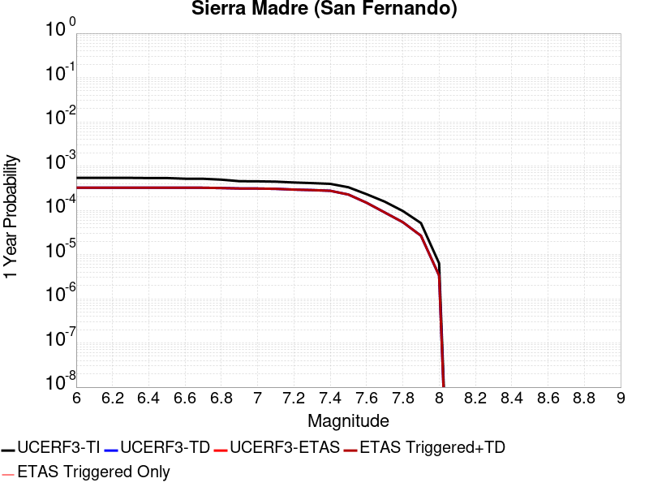 | 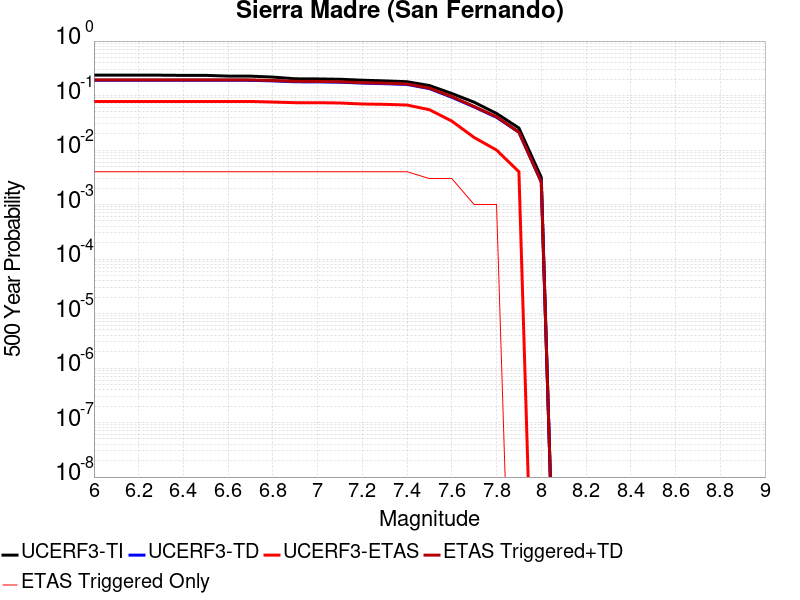 |

| Magnitude | 1 wk TI Prob | 1 wk TD Prob | 1 wk ETAS Prob | 1 wk ETAS/TD Gain | 1 wk ETAS Triggered+TD | 1 wk ETAS Triggered Only | 1 mo TI Prob | 1 mo TD Prob | 1 mo ETAS Prob | 1 mo ETAS/TD Gain | 1 mo ETAS Triggered+TD | 1 mo ETAS Triggered Only | 1 yr TI Prob | 1 yr TD Prob | 1 yr ETAS Prob | 1 yr ETAS/TD Gain | 1 yr ETAS Triggered+TD | 1 yr ETAS Triggered Only | 500 yr TI Prob | 500 yr TD Prob | 500 yr ETAS Prob | 500 yr ETAS/TD Gain | 500 yr ETAS Triggered+TD | 500 yr ETAS Triggered Only |
|-----|-----|-----|-----|-----|-----|-----|-----|-----|-----|-----|-----|-----|-----|-----|-----|-----|-----|-----|-----|-----|-----|-----|-----|-----|
| 6.0 | 1.0346413E-5 | 6.2026356E-6 | 0.0 | 0.0 | 6.2026356E-6 | 0.0 | 4.4341014E-5 | 2.6582458E-5 | 0.0 | 0.0 | 2.6582458E-5 | 0.0 | 5.3971814E-4 | 3.2359446E-4 | 0.0 | 0.0 | 3.2359446E-4 | 0.0 | 0.23656853 | 0.19105369 | 0.078 | 0.40826222 | 0.19428946 | 0.004 |
| 6.1 | 1.0346413E-5 | 6.2026356E-6 | 0.0 | 0.0 | 6.2026356E-6 | 0.0 | 4.4341014E-5 | 2.6582458E-5 | 0.0 | 0.0 | 2.6582458E-5 | 0.0 | 5.3971814E-4 | 3.2359446E-4 | 0.0 | 0.0 | 3.2359446E-4 | 0.0 | 0.23656853 | 0.19105369 | 0.078 | 0.40826222 | 0.19428946 | 0.004 |
| 6.2 | 1.0346413E-5 | 6.2026356E-6 | 0.0 | 0.0 | 6.2026356E-6 | 0.0 | 4.4341014E-5 | 2.6582458E-5 | 0.0 | 0.0 | 2.6582458E-5 | 0.0 | 5.3971814E-4 | 3.2359446E-4 | 0.0 | 0.0 | 3.2359446E-4 | 0.0 | 0.23656853 | 0.19105369 | 0.078 | 0.40826222 | 0.19428946 | 0.004 |
| 6.3 | 1.0346413E-5 | 6.2026356E-6 | 0.0 | 0.0 | 6.2026356E-6 | 0.0 | 4.4341014E-5 | 2.6582458E-5 | 0.0 | 0.0 | 2.6582458E-5 | 0.0 | 5.3971814E-4 | 3.2359446E-4 | 0.0 | 0.0 | 3.2359446E-4 | 0.0 | 0.23656853 | 0.19105369 | 0.078 | 0.40826222 | 0.19428946 | 0.004 |
| 6.4 | 1.0249558E-5 | 6.2026356E-6 | 0.0 | 0.0 | 6.2026356E-6 | 0.0 | 4.392594E-5 | 2.6582458E-5 | 0.0 | 0.0 | 2.6582458E-5 | 0.0 | 5.3466705E-4 | 3.2359446E-4 | 0.0 | 0.0 | 3.2359446E-4 | 0.0 | 0.23463698 | 0.19101253 | 0.078 | 0.40835017 | 0.19424848 | 0.004 |
| 6.5 | 1.0249558E-5 | 6.2026356E-6 | 0.0 | 0.0 | 6.2026356E-6 | 0.0 | 4.392594E-5 | 2.6582458E-5 | 0.0 | 0.0 | 2.6582458E-5 | 0.0 | 5.3466705E-4 | 3.2359446E-4 | 0.0 | 0.0 | 3.2359446E-4 | 0.0 | 0.23463698 | 0.19101253 | 0.078 | 0.40835017 | 0.19424848 | 0.004 |
| 6.6 | 9.9035515E-6 | 6.2026356E-6 | 0.0 | 0.0 | 6.2026356E-6 | 0.0 | 4.2443102E-5 | 2.6582458E-5 | 0.0 | 0.0 | 2.6582458E-5 | 0.0 | 5.166222E-4 | 3.2359446E-4 | 0.0 | 0.0 | 3.2359446E-4 | 0.0 | 0.22769664 | 0.19086549 | 0.078 | 0.40866476 | 0.19410203 | 0.004 |
| 6.7 | 9.87217E-6 | 6.19036E-6 | 0.0 | 0.0 | 6.19036E-6 | 0.0 | 4.2308613E-5 | 2.6529851E-5 | 0.0 | 0.0 | 2.6529851E-5 | 0.0 | 5.149856E-4 | 3.2295415E-4 | 0.0 | 0.0 | 3.2295415E-4 | 0.0 | 0.22706407 | 0.19039302 | 0.078 | 0.4096789 | 0.19363144 | 0.004 |
| 6.8 | 9.4359175E-6 | 6.096712E-6 | 0.0 | 0.0 | 6.096712E-6 | 0.0 | 4.043902E-5 | 2.6128508E-5 | 0.0 | 0.0 | 2.6128508E-5 | 0.0 | 4.9223384E-4 | 3.1806924E-4 | 0.0 | 0.0 | 3.1806924E-4 | 0.0 | 0.21821655 | 0.18588439 | 0.076 | 0.40885627 | 0.18914086 | 0.004 |
| 6.9 | 8.700447E-6 | 5.9615177E-6 | 0.0 | 0.0 | 5.9615177E-6 | 0.0 | 3.72871E-5 | 2.5549118E-5 | 0.0 | 0.0 | 2.5549118E-5 | 0.0 | 4.5387587E-4 | 3.1101718E-4 | 0.0 | 0.0 | 3.1101718E-4 | 0.0 | 0.20307082 | 0.17897345 | 0.074 | 0.41346914 | 0.18225756 | 0.004 |
| 7.0 | 8.648878E-6 | 5.936832E-6 | 0.0 | 0.0 | 5.936832E-6 | 0.0 | 3.7066096E-5 | 2.5443325E-5 | 0.0 | 0.0 | 2.5443325E-5 | 0.0 | 4.5118626E-4 | 3.097295E-4 | 0.0 | 0.0 | 3.097295E-4 | 0.0 | 0.20199789 | 0.1782409 | 0.074 | 0.41516846 | 0.18152794 | 0.004 |
| 7.1 | 8.505786E-6 | 5.847586E-6 | 0.0 | 0.0 | 5.847586E-6 | 0.0 | 3.645286E-5 | 2.506085E-5 | 0.0 | 0.0 | 2.506085E-5 | 0.0 | 4.437232E-4 | 3.0507418E-4 | 0.0 | 0.0 | 3.0507418E-4 | 0.0 | 0.19901322 | 0.17573239 | 0.073 | 0.41540435 | 0.17902946 | 0.004 |
| 7.2 | 8.139752E-6 | 5.624684E-6 | 0.0 | 0.0 | 5.624684E-6 | 0.0 | 3.4884186E-5 | 2.4105571E-5 | 0.0 | 0.0 | 2.4105571E-5 | 0.0 | 4.246322E-4 | 2.9344685E-4 | 0.0 | 0.0 | 2.9344685E-4 | 0.0 | 0.19132744 | 0.16922401 | 0.07 | 0.41365287 | 0.17254712 | 0.004 |
| 7.3 | 7.8816E-6 | 5.4794555E-6 | 0.0 | 0.0 | 5.4794555E-6 | 0.0 | 3.3777847E-5 | 2.3483175E-5 | 0.0 | 0.0 | 2.3483175E-5 | 0.0 | 4.111677E-4 | 2.8587118E-4 | 0.0 | 0.0 | 2.8587118E-4 | 0.0 | 0.1858626 | 0.16510753 | 0.069 | 0.41790944 | 0.1684471 | 0.004 |
| 7.4 | 7.5810603E-6 | 5.285131E-6 | 0.0 | 0.0 | 5.285131E-6 | 0.0 | 3.2489854E-5 | 2.265037E-5 | 0.0 | 0.0 | 2.265037E-5 | 0.0 | 3.9549218E-4 | 2.757344E-4 | 0.0 | 0.0 | 2.757344E-4 | 0.0 | 0.17945391 | 0.15993024 | 0.067 | 0.41893262 | 0.16329053 | 0.004 |
| 7.5 | 6.349153E-6 | 4.346994E-6 | 0.0 | 0.0 | 4.346994E-6 | 0.0 | 2.7210372E-5 | 1.8629846E-5 | 0.0 | 0.0 | 1.8629846E-5 | 0.0 | 3.312359E-4 | 2.2679557E-4 | 0.0 | 0.0 | 2.2679557E-4 | 0.0 | 0.15265335 | 0.13416778 | 0.055 | 0.4099345 | 0.13676527 | 0.003 |
| 7.6 | 4.430576E-6 | 2.840405E-6 | 0.0 | 0.0 | 2.840405E-6 | 0.0 | 1.8988047E-5 | 1.2173109E-5 | 0.0 | 0.0 | 1.2173109E-5 | 0.0 | 2.3115493E-4 | 1.4819774E-4 | 0.0 | 0.0 | 1.4819774E-4 | 0.0 | 0.10916034 | 0.093015045 | 0.034 | 0.36553228 | 0.095736 | 0.003 |
| 7.7 | 3.005066E-6 | 1.712703E-6 | 0.0 | 0.0 | 1.712703E-6 | 0.0 | 1.2878791E-5 | 7.340135E-6 | 0.0 | 0.0 | 7.340135E-6 | 0.0 | 1.56788E-4 | 8.936249E-5 | 0.0 | 0.0 | 8.936249E-5 | 0.0 | 0.07540562 | 0.06186751 | 0.017 | 0.27478075 | 0.06280564 | 0.001 |
| 7.8 | 1.8459098E-6 | 1.0309352E-6 | 0.0 | 0.0 | 1.0309352E-6 | 0.0 | 7.911018E-6 | 4.418286E-6 | 0.0 | 0.0 | 4.418286E-6 | 0.0 | 9.631238E-5 | 5.379131E-5 | 0.0 | 0.0 | 5.379131E-5 | 0.0 | 0.047017284 | 0.03988998 | 0.01 | 0.25068954 | 0.040850088 | 0.001 |
| 7.9 | 9.839262E-7 | 5.093273E-7 | 0.0 | 0.0 | 5.093273E-7 | 0.0 | 4.2168194E-6 | 2.1828296E-6 | 0.0 | 0.0 | 2.1828296E-6 | 0.0 | 5.1338568E-5 | 2.6575628E-5 | 0.0 | 0.0 | 2.6575628E-5 | 0.0 | 0.025343271 | 0.02124897 | 0.004 | 0.18824442 | 0.02124897 | 0.0 |
| 8.0 | 1.210983E-7 | 6.416017E-8 | 0.0 | 0.0 | 6.416017E-8 | 0.0 | 5.1899264E-7 | 2.7497214E-7 | 0.0 | 0.0 | 2.7497214E-7 | 0.0 | 6.3187167E-6 | 3.3477806E-6 | 0.0 | 0.0 | 3.3477806E-6 | 0.0 | 0.0031543828 | 0.0025977797 | 0.0 | 0.0 | 0.0025977797 | 0.0 |

## Airport Lake
*[(top)](#table-of-contents)*

| 1 Week | 1 Month | 1 Year | 500 Year |
|-----|-----|-----|-----|
|  |  | 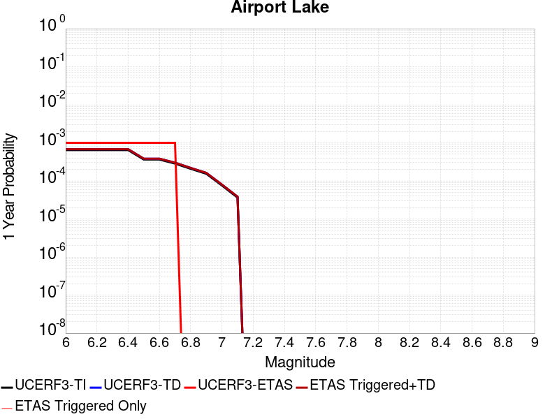 | 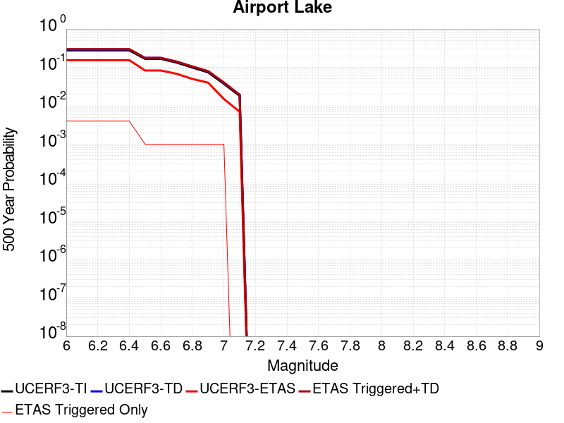 |

| Magnitude | 1 wk TI Prob | 1 wk TD Prob | 1 wk ETAS Prob | 1 wk ETAS/TD Gain | 1 wk ETAS Triggered+TD | 1 wk ETAS Triggered Only | 1 mo TI Prob | 1 mo TD Prob | 1 mo ETAS Prob | 1 mo ETAS/TD Gain | 1 mo ETAS Triggered+TD | 1 mo ETAS Triggered Only | 1 yr TI Prob | 1 yr TD Prob | 1 yr ETAS Prob | 1 yr ETAS/TD Gain | 1 yr ETAS Triggered+TD | 1 yr ETAS Triggered Only | 500 yr TI Prob | 500 yr TD Prob | 500 yr ETAS Prob | 500 yr ETAS/TD Gain | 500 yr ETAS Triggered+TD | 500 yr ETAS Triggered Only |
|-----|-----|-----|-----|-----|-----|-----|-----|-----|-----|-----|-----|-----|-----|-----|-----|-----|-----|-----|-----|-----|-----|-----|-----|-----|
| 6.0 | 1.2387061E-5 | 1.3063883E-5 | 0.0 | 0.0 | 1.3063883E-5 | 0.0 | 5.3086325E-5 | 5.5987028E-5 | 0.0 | 0.0 | 5.5987028E-5 | 0.0 | 6.461343E-4 | 6.814571E-4 | 0.001 | 1.4674438 | 6.814571E-4 | 0.0 | 0.27615035 | 0.29456028 | 0.154 | 0.5228132 | 0.29738203 | 0.004 |
| 6.1 | 1.2387061E-5 | 1.3063883E-5 | 0.0 | 0.0 | 1.3063883E-5 | 0.0 | 5.3086325E-5 | 5.5987028E-5 | 0.0 | 0.0 | 5.5987028E-5 | 0.0 | 6.461343E-4 | 6.814571E-4 | 0.001 | 1.4674438 | 6.814571E-4 | 0.0 | 0.27615035 | 0.29456028 | 0.154 | 0.5228132 | 0.29738203 | 0.004 |
| 6.2 | 1.2387061E-5 | 1.3063883E-5 | 0.0 | 0.0 | 1.3063883E-5 | 0.0 | 5.3086325E-5 | 5.5987028E-5 | 0.0 | 0.0 | 5.5987028E-5 | 0.0 | 6.461343E-4 | 6.814571E-4 | 0.001 | 1.4674438 | 6.814571E-4 | 0.0 | 0.27615035 | 0.29456028 | 0.154 | 0.5228132 | 0.29738203 | 0.004 |
| 6.3 | 1.2387061E-5 | 1.3063883E-5 | 0.0 | 0.0 | 1.3063883E-5 | 0.0 | 5.3086325E-5 | 5.5987028E-5 | 0.0 | 0.0 | 5.5987028E-5 | 0.0 | 6.461343E-4 | 6.814571E-4 | 0.001 | 1.4674438 | 6.814571E-4 | 0.0 | 0.27615035 | 0.29456028 | 0.154 | 0.5228132 | 0.29738203 | 0.004 |
| 6.4 | 1.2387061E-5 | 1.3063883E-5 | 0.0 | 0.0 | 1.3063883E-5 | 0.0 | 5.3086325E-5 | 5.5987028E-5 | 0.0 | 0.0 | 5.5987028E-5 | 0.0 | 6.461343E-4 | 6.814571E-4 | 0.001 | 1.4674438 | 6.814571E-4 | 0.0 | 0.27615035 | 0.29456028 | 0.154 | 0.5228132 | 0.29738203 | 0.004 |
| 6.5 | 6.9922594E-6 | 7.3634283E-6 | 0.0 | 0.0 | 7.3634283E-6 | 0.0 | 2.996648E-5 | 3.15572E-5 | 0.0 | 0.0 | 3.15572E-5 | 0.0 | 3.6478083E-4 | 3.8414655E-4 | 0.001 | 2.6031733 | 3.8414655E-4 | 0.0 | 0.16675177 | 0.17600296 | 0.083 | 0.47158295 | 0.17682697 | 0.001 |
| 6.6 | 6.9922594E-6 | 7.3634283E-6 | 0.0 | 0.0 | 7.3634283E-6 | 0.0 | 2.996648E-5 | 3.15572E-5 | 0.0 | 0.0 | 3.15572E-5 | 0.0 | 3.6478083E-4 | 3.8414655E-4 | 0.001 | 2.6031733 | 3.8414655E-4 | 0.0 | 0.16675177 | 0.17600296 | 0.083 | 0.47158295 | 0.17682697 | 0.001 |
| 6.7 | 5.477277E-6 | 5.7691605E-6 | 0.0 | 0.0 | 5.7691605E-6 | 0.0 | 2.3473833E-5 | 2.472476E-5 | 0.0 | 0.0 | 2.472476E-5 | 0.0 | 2.8575645E-4 | 3.0098626E-4 | 0.001 | 3.3224108 | 3.0098626E-4 | 0.0 | 0.13315807 | 0.14064929 | 0.068 | 0.48347205 | 0.14150864 | 0.001 |
| 6.8 | 3.9950432E-6 | 4.206824E-6 | 0.0 | 0.0 | 4.206824E-6 | 0.0 | 1.7121502E-5 | 1.8029137E-5 | 0.0 | 0.0 | 1.8029137E-5 | 0.0 | 2.0843433E-4 | 2.1948539E-4 | 0.0 | 0.0 | 2.1948539E-4 | 0.0 | 0.09898019 | 0.10462007 | 0.05 | 0.4779198 | 0.10551544 | 0.001 |
| 6.9 | 2.95695E-6 | 3.1139339E-6 | 0.0 | 0.0 | 3.1139339E-6 | 0.0 | 1.2672582E-5 | 1.3345375E-5 | 0.0 | 0.0 | 1.3345375E-5 | 0.0 | 1.5427776E-4 | 1.6247008E-4 | 0.0 | 0.0 | 1.6247008E-4 | 0.0 | 0.07424423 | 0.078599796 | 0.04 | 0.5089072 | 0.079521194 | 0.001 |
| 7.0 | 1.456072E-6 | 1.5361657E-6 | 0.0 | 0.0 | 1.5361657E-6 | 0.0 | 6.2402937E-6 | 6.583556E-6 | 0.0 | 0.0 | 6.583556E-6 | 0.0 | 7.597293E-5 | 8.015285E-5 | 0.0 | 0.0 | 8.015285E-5 | 0.0 | 0.037275415 | 0.0395498 | 0.015 | 0.37926868 | 0.04051025 | 0.001 |
| 7.1 | 6.995192E-7 | 7.3862674E-7 | 0.0 | 0.0 | 7.3862674E-7 | 0.0 | 2.997936E-6 | 3.1655431E-6 | 0.0 | 0.0 | 3.1655431E-6 | 0.0 | 3.649926E-5 | 3.854049E-5 | 0.0 | 0.0 | 3.854049E-5 | 0.0 | 0.01808444 | 0.019270042 | 0.007 | 0.36325815 | 0.019270042 | 0.0 |

## North Frontal  (East)
*[(top)](#table-of-contents)*

| 1 Week | 1 Month | 1 Year | 500 Year |
|-----|-----|-----|-----|
|  |  | 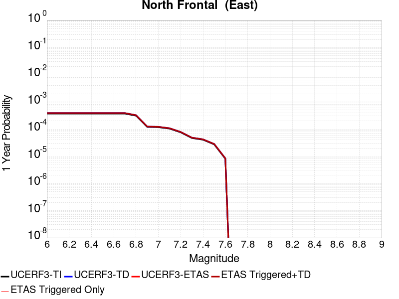 | 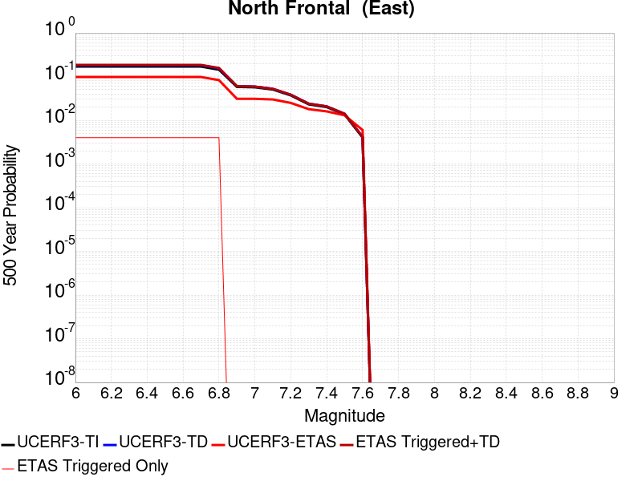 |

| Magnitude | 1 wk TI Prob | 1 wk TD Prob | 1 wk ETAS Prob | 1 wk ETAS/TD Gain | 1 wk ETAS Triggered+TD | 1 wk ETAS Triggered Only | 1 mo TI Prob | 1 mo TD Prob | 1 mo ETAS Prob | 1 mo ETAS/TD Gain | 1 mo ETAS Triggered+TD | 1 mo ETAS Triggered Only | 1 yr TI Prob | 1 yr TD Prob | 1 yr ETAS Prob | 1 yr ETAS/TD Gain | 1 yr ETAS Triggered+TD | 1 yr ETAS Triggered Only | 500 yr TI Prob | 500 yr TD Prob | 500 yr ETAS Prob | 500 yr ETAS/TD Gain | 500 yr ETAS Triggered+TD | 500 yr ETAS Triggered Only |
|-----|-----|-----|-----|-----|-----|-----|-----|-----|-----|-----|-----|-----|-----|-----|-----|-----|-----|-----|-----|-----|-----|-----|-----|-----|
| 6.0 | 7.135738E-6 | 7.458608E-6 | 0.0 | 0.0 | 7.458608E-6 | 0.0 | 3.0581377E-5 | 3.196518E-5 | 0.0 | 0.0 | 3.196518E-5 | 0.0 | 3.7226462E-4 | 3.8912642E-4 | 0.0 | 0.0 | 3.8912642E-4 | 0.0 | 0.16986503 | 0.18154797 | 0.098 | 0.5398022 | 0.18482178 | 0.004 |
| 6.1 | 7.135738E-6 | 7.458608E-6 | 0.0 | 0.0 | 7.458608E-6 | 0.0 | 3.0581377E-5 | 3.196518E-5 | 0.0 | 0.0 | 3.196518E-5 | 0.0 | 3.7226462E-4 | 3.8912642E-4 | 0.0 | 0.0 | 3.8912642E-4 | 0.0 | 0.16986503 | 0.18154797 | 0.098 | 0.5398022 | 0.18482178 | 0.004 |
| 6.2 | 7.135738E-6 | 7.458608E-6 | 0.0 | 0.0 | 7.458608E-6 | 0.0 | 3.0581377E-5 | 3.196518E-5 | 0.0 | 0.0 | 3.196518E-5 | 0.0 | 3.7226462E-4 | 3.8912642E-4 | 0.0 | 0.0 | 3.8912642E-4 | 0.0 | 0.16986503 | 0.18154797 | 0.098 | 0.5398022 | 0.18482178 | 0.004 |
| 6.3 | 7.135738E-6 | 7.458608E-6 | 0.0 | 0.0 | 7.458608E-6 | 0.0 | 3.0581377E-5 | 3.196518E-5 | 0.0 | 0.0 | 3.196518E-5 | 0.0 | 3.7226462E-4 | 3.8912642E-4 | 0.0 | 0.0 | 3.8912642E-4 | 0.0 | 0.16986503 | 0.18154797 | 0.098 | 0.5398022 | 0.18482178 | 0.004 |
| 6.4 | 7.135738E-6 | 7.458608E-6 | 0.0 | 0.0 | 7.458608E-6 | 0.0 | 3.0581377E-5 | 3.196518E-5 | 0.0 | 0.0 | 3.196518E-5 | 0.0 | 3.7226462E-4 | 3.8912642E-4 | 0.0 | 0.0 | 3.8912642E-4 | 0.0 | 0.16986503 | 0.18154797 | 0.098 | 0.5398022 | 0.18482178 | 0.004 |
| 6.5 | 7.135738E-6 | 7.458608E-6 | 0.0 | 0.0 | 7.458608E-6 | 0.0 | 3.0581377E-5 | 3.196518E-5 | 0.0 | 0.0 | 3.196518E-5 | 0.0 | 3.7226462E-4 | 3.8912642E-4 | 0.0 | 0.0 | 3.8912642E-4 | 0.0 | 0.16986503 | 0.18154797 | 0.098 | 0.5398022 | 0.18482178 | 0.004 |
| 6.6 | 7.135738E-6 | 7.458608E-6 | 0.0 | 0.0 | 7.458608E-6 | 0.0 | 3.0581377E-5 | 3.196518E-5 | 0.0 | 0.0 | 3.196518E-5 | 0.0 | 3.7226462E-4 | 3.8912642E-4 | 0.0 | 0.0 | 3.8912642E-4 | 0.0 | 0.16986503 | 0.18154797 | 0.098 | 0.5398022 | 0.18482178 | 0.004 |
| 6.7 | 7.135738E-6 | 7.458608E-6 | 0.0 | 0.0 | 7.458608E-6 | 0.0 | 3.0581377E-5 | 3.196518E-5 | 0.0 | 0.0 | 3.196518E-5 | 0.0 | 3.7226462E-4 | 3.8912642E-4 | 0.0 | 0.0 | 3.8912642E-4 | 0.0 | 0.16986503 | 0.18154797 | 0.098 | 0.5398022 | 0.18482178 | 0.004 |
| 6.8 | 5.959142E-6 | 6.2216054E-6 | 0.0 | 0.0 | 6.2216054E-6 | 0.0 | 2.553893E-5 | 2.666385E-5 | 0.0 | 0.0 | 2.666385E-5 | 0.0 | 3.108921E-4 | 3.24602E-4 | 0.0 | 0.0 | 3.24602E-4 | 0.0 | 0.14398743 | 0.15426596 | 0.083 | 0.5380319 | 0.15764889 | 0.004 |
| 6.9 | 2.2946929E-6 | 2.3777284E-6 | 0.0 | 0.0 | 2.3777284E-6 | 0.0 | 9.834361E-6 | 1.0190227E-5 | 0.0 | 0.0 | 1.0190227E-5 | 0.0 | 1.1972676E-4 | 1.2405943E-4 | 0.0 | 0.0 | 1.2405943E-4 | 0.0 | 0.058110174 | 0.06026941 | 0.031 | 0.5143571 | 0.06026941 | 0.0 |
| 7.0 | 2.2468673E-6 | 2.3275568E-6 | 0.0 | 0.0 | 2.3275568E-6 | 0.0 | 9.629396E-6 | 9.975208E-6 | 0.0 | 0.0 | 9.975208E-6 | 0.0 | 1.1723159E-4 | 1.2144186E-4 | 0.0 | 0.0 | 1.2144186E-4 | 0.0 | 0.056934208 | 0.05903815 | 0.031 | 0.5250842 | 0.05903815 | 0.0 |
| 7.1 | 1.9921076E-6 | 2.060703E-6 | 0.0 | 0.0 | 2.060703E-6 | 0.0 | 8.537577E-6 | 8.831557E-6 | 0.0 | 0.0 | 8.831557E-6 | 0.0 | 1.0394004E-4 | 1.0751934E-4 | 0.0 | 0.0 | 1.0751934E-4 | 0.0 | 0.050645236 | 0.052455056 | 0.03 | 0.5719182 | 0.052455056 | 0.0 |
| 7.2 | 1.4524545E-6 | 1.5017159E-6 | 0.0 | 0.0 | 1.5017159E-6 | 0.0 | 6.2247905E-6 | 6.4359106E-6 | 0.0 | 0.0 | 6.4359106E-6 | 0.0 | 7.5784184E-5 | 7.835464E-5 | 0.0 | 0.0 | 7.835464E-5 | 0.0 | 0.03718455 | 0.03848639 | 0.025 | 0.64958024 | 0.03848639 | 0.0 |
| 7.3 | 8.9802575E-7 | 9.291059E-7 | 0.0 | 0.0 | 9.291059E-7 | 0.0 | 3.848676E-6 | 3.981877E-6 | 0.0 | 0.0 | 3.981877E-6 | 0.0 | 4.685662E-5 | 4.847839E-5 | 0.0 | 0.0 | 4.847839E-5 | 0.0 | 0.023156535 | 0.023978889 | 0.018 | 0.7506603 | 0.023978889 | 0.0 |
| 7.4 | 7.776139E-7 | 8.0451815E-7 | 0.0 | 0.0 | 8.0451815E-7 | 0.0 | 3.3326266E-6 | 3.447931E-6 | 0.0 | 0.0 | 3.447931E-6 | 0.0 | 4.0573974E-5 | 4.197786E-5 | 0.0 | 0.0 | 4.197786E-5 | 0.0 | 0.020082993 | 0.020799806 | 0.016 | 0.7692379 | 0.020799806 | 0.0 |
| 7.5 | 5.244417E-7 | 5.4306264E-7 | 0.0 | 0.0 | 5.4306264E-7 | 0.0 | 2.2476054E-6 | 2.3274097E-6 | 0.0 | 0.0 | 2.3274097E-6 | 0.0 | 2.7364253E-5 | 2.833591E-5 | 0.0 | 0.0 | 2.833591E-5 | 0.0 | 0.013589136 | 0.01408604 | 0.013 | 0.9228996 | 0.01408604 | 0.0 |
| 7.6 | 1.5489647E-7 | 1.6057187E-7 | 0.0 | 0.0 | 1.6057187E-7 | 0.0 | 6.6384183E-7 | 6.881651E-7 | 0.0 | 0.0 | 6.881651E-7 | 0.0 | 8.082245E-6 | 8.378398E-6 | 0.0 | 0.0 | 8.378398E-6 | 0.0 | 0.004032984 | 0.0041859513 | 0.006 | 1.4333658 | 0.0041859513 | 0.0 |

## Russ 2011 CFM
*[(top)](#table-of-contents)*

| 1 Week | 1 Month | 1 Year | 500 Year |
|-----|-----|-----|-----|
| 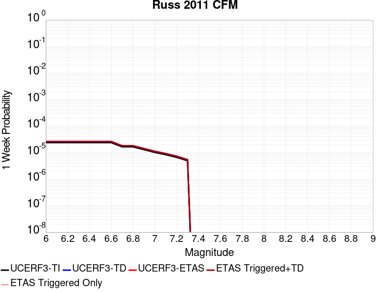 | 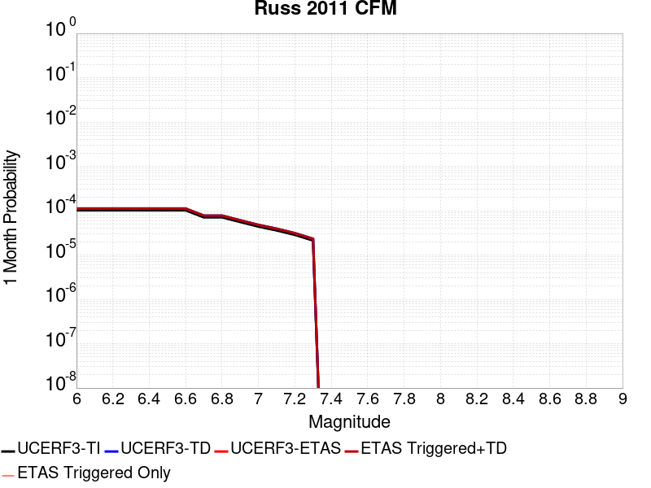 |  | 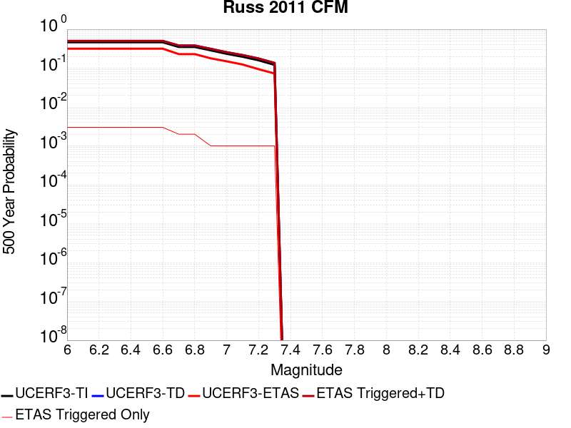 |

| Magnitude | 1 wk TI Prob | 1 wk TD Prob | 1 wk ETAS Prob | 1 wk ETAS/TD Gain | 1 wk ETAS Triggered+TD | 1 wk ETAS Triggered Only | 1 mo TI Prob | 1 mo TD Prob | 1 mo ETAS Prob | 1 mo ETAS/TD Gain | 1 mo ETAS Triggered+TD | 1 mo ETAS Triggered Only | 1 yr TI Prob | 1 yr TD Prob | 1 yr ETAS Prob | 1 yr ETAS/TD Gain | 1 yr ETAS Triggered+TD | 1 yr ETAS Triggered Only | 500 yr TI Prob | 500 yr TD Prob | 500 yr ETAS Prob | 500 yr ETAS/TD Gain | 500 yr ETAS Triggered+TD | 500 yr ETAS Triggered Only |
|-----|-----|-----|-----|-----|-----|-----|-----|-----|-----|-----|-----|-----|-----|-----|-----|-----|-----|-----|-----|-----|-----|-----|-----|-----|
| 6.0 | 2.3806366E-5 | 2.611459E-5 | 0.0 | 0.0 | 2.611459E-5 | 0.0 | 1.0202329E-4 | 1.1191522E-4 | 0.0 | 0.0 | 1.1191522E-4 | 0.0 | 0.0012414258 | 0.0013617792 | 0.0 | 0.0 | 0.0013617792 | 0.0 | 0.46264616 | 0.5014546 | 0.317 | 0.63216096 | 0.50295025 | 0.003 |
| 6.1 | 2.3806366E-5 | 2.611459E-5 | 0.0 | 0.0 | 2.611459E-5 | 0.0 | 1.0202329E-4 | 1.1191522E-4 | 0.0 | 0.0 | 1.1191522E-4 | 0.0 | 0.0012414258 | 0.0013617792 | 0.0 | 0.0 | 0.0013617792 | 0.0 | 0.46264616 | 0.5014546 | 0.317 | 0.63216096 | 0.50295025 | 0.003 |
| 6.2 | 2.3806366E-5 | 2.611459E-5 | 0.0 | 0.0 | 2.611459E-5 | 0.0 | 1.0202329E-4 | 1.1191522E-4 | 0.0 | 0.0 | 1.1191522E-4 | 0.0 | 0.0012414258 | 0.0013617792 | 0.0 | 0.0 | 0.0013617792 | 0.0 | 0.46264616 | 0.5014546 | 0.317 | 0.63216096 | 0.50295025 | 0.003 |
| 6.3 | 2.3806366E-5 | 2.611459E-5 | 0.0 | 0.0 | 2.611459E-5 | 0.0 | 1.0202329E-4 | 1.1191522E-4 | 0.0 | 0.0 | 1.1191522E-4 | 0.0 | 0.0012414258 | 0.0013617792 | 0.0 | 0.0 | 0.0013617792 | 0.0 | 0.46264616 | 0.5014546 | 0.317 | 0.63216096 | 0.50295025 | 0.003 |
| 6.4 | 2.3806366E-5 | 2.611459E-5 | 0.0 | 0.0 | 2.611459E-5 | 0.0 | 1.0202329E-4 | 1.1191522E-4 | 0.0 | 0.0 | 1.1191522E-4 | 0.0 | 0.0012414258 | 0.0013617792 | 0.0 | 0.0 | 0.0013617792 | 0.0 | 0.46264616 | 0.5014546 | 0.317 | 0.63216096 | 0.50295025 | 0.003 |
| 6.5 | 2.3806366E-5 | 2.611459E-5 | 0.0 | 0.0 | 2.611459E-5 | 0.0 | 1.0202329E-4 | 1.1191522E-4 | 0.0 | 0.0 | 1.1191522E-4 | 0.0 | 0.0012414258 | 0.0013617792 | 0.0 | 0.0 | 0.0013617792 | 0.0 | 0.46264616 | 0.5014546 | 0.317 | 0.63216096 | 0.50295025 | 0.003 |
| 6.6 | 2.3806366E-5 | 2.611459E-5 | 0.0 | 0.0 | 2.611459E-5 | 0.0 | 1.0202329E-4 | 1.1191522E-4 | 0.0 | 0.0 | 1.1191522E-4 | 0.0 | 0.0012414258 | 0.0013617792 | 0.0 | 0.0 | 0.0013617792 | 0.0 | 0.46264616 | 0.5014546 | 0.317 | 0.63216096 | 0.50295025 | 0.003 |
| 6.7 | 1.6515693E-5 | 1.8092733E-5 | 0.0 | 0.0 | 1.8092733E-5 | 0.0 | 7.077962E-5 | 7.753817E-5 | 0.0 | 0.0 | 7.753817E-5 | 0.0 | 8.6140115E-4 | 9.4365183E-4 | 0.0 | 0.0 | 9.4365183E-4 | 0.0 | 0.3500671 | 0.38172504 | 0.23 | 0.6025279 | 0.3829616 | 0.002 |
| 6.8 | 1.6515693E-5 | 1.8092733E-5 | 0.0 | 0.0 | 1.8092733E-5 | 0.0 | 7.077962E-5 | 7.753817E-5 | 0.0 | 0.0 | 7.753817E-5 | 0.0 | 8.6140115E-4 | 9.4365183E-4 | 0.0 | 0.0 | 9.4365183E-4 | 0.0 | 0.3500671 | 0.38172504 | 0.23 | 0.6025279 | 0.3829616 | 0.002 |
| 6.9 | 1.2971182E-5 | 1.4199718E-5 | 0.0 | 0.0 | 1.4199718E-5 | 0.0 | 5.5589593E-5 | 6.085466E-5 | 0.0 | 0.0 | 6.085466E-5 | 0.0 | 6.765931E-4 | 7.406793E-4 | 0.0 | 0.0 | 7.406793E-4 | 0.0 | 0.2870978 | 0.31430045 | 0.179 | 0.5695188 | 0.31498614 | 0.001 |
| 7.0 | 1.0201805E-5 | 1.1163896E-5 | 0.0 | 0.0 | 1.1163896E-5 | 0.0 | 4.3721288E-5 | 4.7844507E-5 | 0.0 | 0.0 | 4.7844507E-5 | 0.0 | 5.3217664E-4 | 5.823717E-4 | 0.0 | 0.0 | 5.823717E-4 | 0.0 | 0.23368284 | 0.25685778 | 0.15 | 0.58398074 | 0.25760093 | 0.001 |
| 7.1 | 8.3744935E-6 | 9.1649945E-6 | 0.0 | 0.0 | 9.1649945E-6 | 0.0 | 3.5890193E-5 | 3.927806E-5 | 0.0 | 0.0 | 3.927806E-5 | 0.0 | 4.368755E-4 | 4.781238E-4 | 0.0 | 0.0 | 4.781238E-4 | 0.0 | 0.19626485 | 0.21666941 | 0.124 | 0.57230043 | 0.21745275 | 0.001 |
| 7.2 | 6.649391E-6 | 7.279027E-6 | 0.0 | 0.0 | 7.279027E-6 | 0.0 | 2.8497077E-5 | 3.119555E-5 | 0.0 | 0.0 | 3.119555E-5 | 0.0 | 3.4689668E-4 | 3.7975606E-4 | 0.0 | 0.0 | 3.7975606E-4 | 0.0 | 0.15926471 | 0.17679359 | 0.094 | 0.5316935 | 0.17761679 | 0.001 |
| 7.3 | 4.9549312E-6 | 5.4261554E-6 | 0.0 | 0.0 | 5.4261554E-6 | 0.0 | 2.1235246E-5 | 2.3254828E-5 | 0.0 | 0.0 | 2.3254828E-5 | 0.0 | 2.5850846E-4 | 2.831053E-4 | 0.0 | 0.0 | 2.831053E-4 | 0.0 | 0.12126415 | 0.13558063 | 0.073 | 0.538425 | 0.13644505 | 0.001 |

## Last Chance
*[(top)](#table-of-contents)*

| 1 Week | 1 Month | 1 Year | 500 Year |
|-----|-----|-----|-----|
| 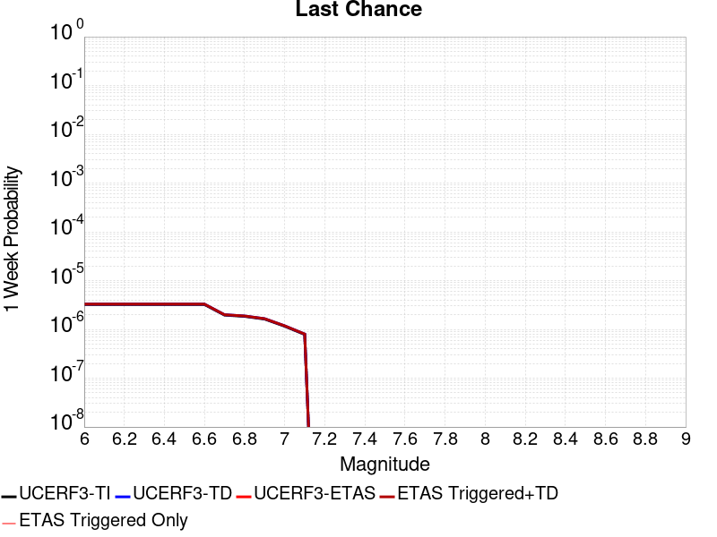 |  | 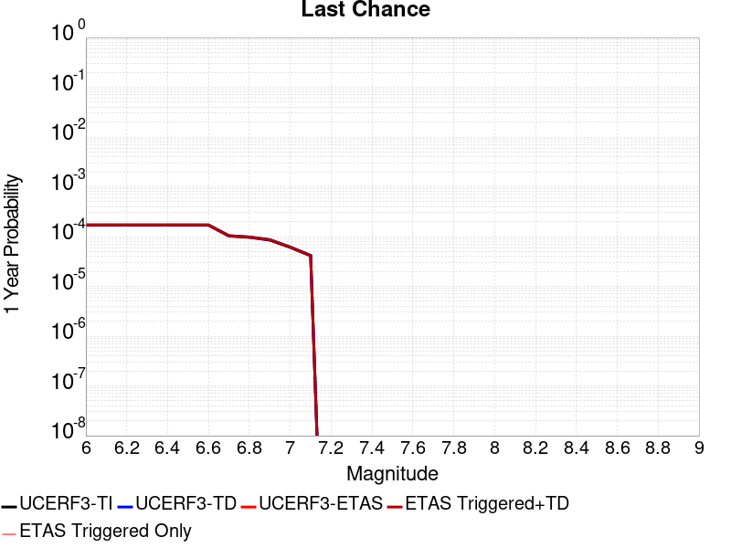 | 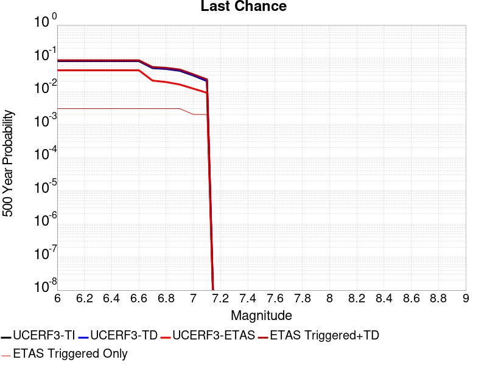 |

| Magnitude | 1 wk TI Prob | 1 wk TD Prob | 1 wk ETAS Prob | 1 wk ETAS/TD Gain | 1 wk ETAS Triggered+TD | 1 wk ETAS Triggered Only | 1 mo TI Prob | 1 mo TD Prob | 1 mo ETAS Prob | 1 mo ETAS/TD Gain | 1 mo ETAS Triggered+TD | 1 mo ETAS Triggered Only | 1 yr TI Prob | 1 yr TD Prob | 1 yr ETAS Prob | 1 yr ETAS/TD Gain | 1 yr ETAS Triggered+TD | 1 yr ETAS Triggered Only | 500 yr TI Prob | 500 yr TD Prob | 500 yr ETAS Prob | 500 yr ETAS/TD Gain | 500 yr ETAS Triggered+TD | 500 yr ETAS Triggered Only |
|-----|-----|-----|-----|-----|-----|-----|-----|-----|-----|-----|-----|-----|-----|-----|-----|-----|-----|-----|-----|-----|-----|-----|-----|-----|
| 6.0 | 3.23929E-6 | 3.301643E-6 | 0.0 | 0.0 | 3.301643E-6 | 0.0 | 1.3882597E-5 | 1.4149836E-5 | 0.0 | 0.0 | 1.4149836E-5 | 0.0 | 1.6900752E-4 | 1.722631E-4 | 0.0 | 0.0 | 1.722631E-4 | 0.0 | 0.08103836 | 0.0831618 | 0.043 | 0.5170643 | 0.08591232 | 0.003 |
| 6.1 | 3.23929E-6 | 3.301643E-6 | 0.0 | 0.0 | 3.301643E-6 | 0.0 | 1.3882597E-5 | 1.4149836E-5 | 0.0 | 0.0 | 1.4149836E-5 | 0.0 | 1.6900752E-4 | 1.722631E-4 | 0.0 | 0.0 | 1.722631E-4 | 0.0 | 0.08103836 | 0.0831618 | 0.043 | 0.5170643 | 0.08591232 | 0.003 |
| 6.2 | 3.23929E-6 | 3.301643E-6 | 0.0 | 0.0 | 3.301643E-6 | 0.0 | 1.3882597E-5 | 1.4149836E-5 | 0.0 | 0.0 | 1.4149836E-5 | 0.0 | 1.6900752E-4 | 1.722631E-4 | 0.0 | 0.0 | 1.722631E-4 | 0.0 | 0.08103836 | 0.0831618 | 0.043 | 0.5170643 | 0.08591232 | 0.003 |
| 6.3 | 3.23929E-6 | 3.301643E-6 | 0.0 | 0.0 | 3.301643E-6 | 0.0 | 1.3882597E-5 | 1.4149836E-5 | 0.0 | 0.0 | 1.4149836E-5 | 0.0 | 1.6900752E-4 | 1.722631E-4 | 0.0 | 0.0 | 1.722631E-4 | 0.0 | 0.08103836 | 0.0831618 | 0.043 | 0.5170643 | 0.08591232 | 0.003 |
| 6.4 | 3.23929E-6 | 3.301643E-6 | 0.0 | 0.0 | 3.301643E-6 | 0.0 | 1.3882597E-5 | 1.4149836E-5 | 0.0 | 0.0 | 1.4149836E-5 | 0.0 | 1.6900752E-4 | 1.722631E-4 | 0.0 | 0.0 | 1.722631E-4 | 0.0 | 0.08103836 | 0.0831618 | 0.043 | 0.5170643 | 0.08591232 | 0.003 |
| 6.5 | 3.23929E-6 | 3.301643E-6 | 0.0 | 0.0 | 3.301643E-6 | 0.0 | 1.3882597E-5 | 1.4149836E-5 | 0.0 | 0.0 | 1.4149836E-5 | 0.0 | 1.6900752E-4 | 1.722631E-4 | 0.0 | 0.0 | 1.722631E-4 | 0.0 | 0.08103836 | 0.0831618 | 0.043 | 0.5170643 | 0.08591232 | 0.003 |
| 6.6 | 3.23929E-6 | 3.301643E-6 | 0.0 | 0.0 | 3.301643E-6 | 0.0 | 1.3882597E-5 | 1.4149836E-5 | 0.0 | 0.0 | 1.4149836E-5 | 0.0 | 1.6900752E-4 | 1.722631E-4 | 0.0 | 0.0 | 1.722631E-4 | 0.0 | 0.08103836 | 0.0831618 | 0.043 | 0.5170643 | 0.08591232 | 0.003 |
| 6.7 | 1.9639244E-6 | 2.0023062E-6 | 0.0 | 0.0 | 2.0023062E-6 | 0.0 | 8.416792E-6 | 8.581287E-6 | 0.0 | 0.0 | 8.581287E-6 | 0.0 | 1.02469625E-4 | 1.04472805E-4 | 0.0 | 0.0 | 1.04472805E-4 | 0.0 | 0.049946934 | 0.05106291 | 0.021 | 0.41125742 | 0.053909723 | 0.003 |
| 6.8 | 1.8490592E-6 | 1.8854546E-6 | 0.0 | 0.0 | 1.8854546E-6 | 0.0 | 7.924516E-6 | 8.080498E-6 | 0.0 | 0.0 | 8.080498E-6 | 0.0 | 9.64767E-5 | 9.8376244E-5 | 0.0 | 0.0 | 9.8376244E-5 | 0.0 | 0.047095586 | 0.048161946 | 0.019 | 0.3945023 | 0.051017463 | 0.003 |
| 6.9 | 1.6283703E-6 | 1.6606327E-6 | 0.0 | 0.0 | 1.6606327E-6 | 0.0 | 6.9787116E-6 | 7.116981E-6 | 0.0 | 0.0 | 7.116981E-6 | 0.0 | 8.49625E-5 | 8.664636E-5 | 0.0 | 0.0 | 8.664636E-5 | 0.0 | 0.041593295 | 0.04254605 | 0.016 | 0.37606314 | 0.045418408 | 0.003 |
| 7.0 | 1.1619308E-6 | 1.1856256E-6 | 0.0 | 0.0 | 1.1856256E-6 | 0.0 | 4.979694E-6 | 5.0812455E-6 | 0.0 | 0.0 | 5.0812455E-6 | 0.0 | 6.0626087E-5 | 6.186285E-5 | 0.0 | 0.0 | 6.186285E-5 | 0.0 | 0.029859101 | 0.030576767 | 0.012 | 0.39245483 | 0.03251561 | 0.002 |
| 7.1 | 7.8723247E-7 | 8.037728E-7 | 0.0 | 0.0 | 8.037728E-7 | 0.0 | 3.373849E-6 | 3.4447378E-6 | 0.0 | 0.0 | 3.4447378E-6 | 0.0 | 4.107584E-5 | 4.193918E-5 | 0.0 | 0.0 | 4.193918E-5 | 0.0 | 0.020328866 | 0.020833097 | 0.009 | 0.4320049 | 0.022791432 | 0.002 |

## Clamshell-Sawpit
*[(top)](#table-of-contents)*

| 1 Week | 1 Month | 1 Year | 500 Year |
|-----|-----|-----|-----|
| 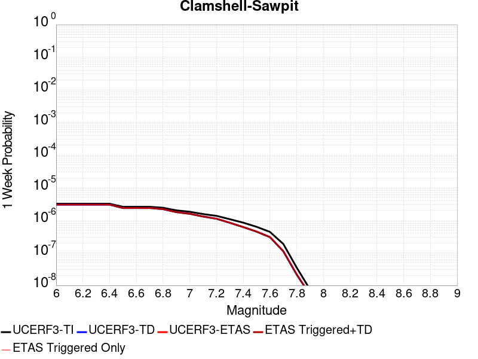 |  | 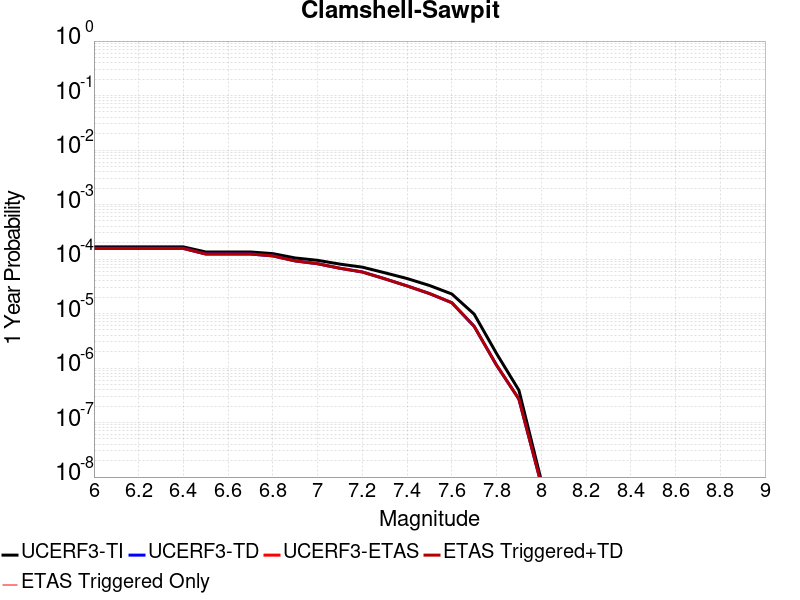 | 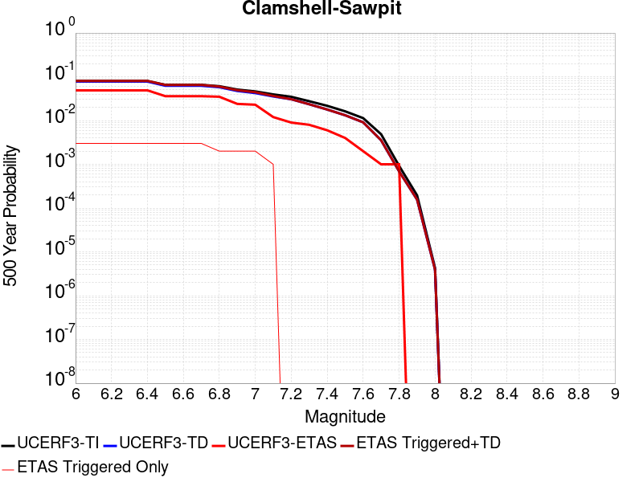 |

| Magnitude | 1 wk TI Prob | 1 wk TD Prob | 1 wk ETAS Prob | 1 wk ETAS/TD Gain | 1 wk ETAS Triggered+TD | 1 wk ETAS Triggered Only | 1 mo TI Prob | 1 mo TD Prob | 1 mo ETAS Prob | 1 mo ETAS/TD Gain | 1 mo ETAS Triggered+TD | 1 mo ETAS Triggered Only | 1 yr TI Prob | 1 yr TD Prob | 1 yr ETAS Prob | 1 yr ETAS/TD Gain | 1 yr ETAS Triggered+TD | 1 yr ETAS Triggered Only | 500 yr TI Prob | 500 yr TD Prob | 500 yr ETAS Prob | 500 yr ETAS/TD Gain | 500 yr ETAS Triggered+TD | 500 yr ETAS Triggered Only |
|-----|-----|-----|-----|-----|-----|-----|-----|-----|-----|-----|-----|-----|-----|-----|-----|-----|-----|-----|-----|-----|-----|-----|-----|-----|
| 6.0 | 3.202998E-6 | 3.003501E-6 | 0.0 | 0.0 | 3.003501E-6 | 0.0 | 1.3727062E-5 | 1.2872088E-5 | 0.0 | 0.0 | 1.2872088E-5 | 0.0 | 1.6711417E-4 | 1.567072E-4 | 0.0 | 0.0 | 1.567072E-4 | 0.0 | 0.080167845 | 0.077675626 | 0.049 | 0.63082856 | 0.08044259 | 0.003 |
| 6.1 | 3.202998E-6 | 3.003501E-6 | 0.0 | 0.0 | 3.003501E-6 | 0.0 | 1.3727062E-5 | 1.2872088E-5 | 0.0 | 0.0 | 1.2872088E-5 | 0.0 | 1.6711417E-4 | 1.567072E-4 | 0.0 | 0.0 | 1.567072E-4 | 0.0 | 0.080167845 | 0.077675626 | 0.049 | 0.63082856 | 0.08044259 | 0.003 |
| 6.2 | 3.202998E-6 | 3.003501E-6 | 0.0 | 0.0 | 3.003501E-6 | 0.0 | 1.3727062E-5 | 1.2872088E-5 | 0.0 | 0.0 | 1.2872088E-5 | 0.0 | 1.6711417E-4 | 1.567072E-4 | 0.0 | 0.0 | 1.567072E-4 | 0.0 | 0.080167845 | 0.077675626 | 0.049 | 0.63082856 | 0.08044259 | 0.003 |
| 6.3 | 3.202998E-6 | 3.003501E-6 | 0.0 | 0.0 | 3.003501E-6 | 0.0 | 1.3727062E-5 | 1.2872088E-5 | 0.0 | 0.0 | 1.2872088E-5 | 0.0 | 1.6711417E-4 | 1.567072E-4 | 0.0 | 0.0 | 1.567072E-4 | 0.0 | 0.080167845 | 0.077675626 | 0.049 | 0.63082856 | 0.08044259 | 0.003 |
| 6.4 | 3.202998E-6 | 3.003501E-6 | 0.0 | 0.0 | 3.003501E-6 | 0.0 | 1.3727062E-5 | 1.2872088E-5 | 0.0 | 0.0 | 1.2872088E-5 | 0.0 | 1.6711417E-4 | 1.567072E-4 | 0.0 | 0.0 | 1.567072E-4 | 0.0 | 0.080167845 | 0.077675626 | 0.049 | 0.63082856 | 0.08044259 | 0.003 |
| 6.5 | 2.5862723E-6 | 2.3723233E-6 | 0.0 | 0.0 | 2.3723233E-6 | 0.0 | 1.1083977E-5 | 1.0167062E-5 | 0.0 | 0.0 | 1.0167062E-5 | 0.0 | 1.3493907E-4 | 1.2377725E-4 | 0.0 | 0.0 | 1.2377725E-4 | 0.0 | 0.06524806 | 0.06223341 | 0.036 | 0.5784674 | 0.06504671 | 0.003 |
| 6.6 | 2.5862723E-6 | 2.3723233E-6 | 0.0 | 0.0 | 2.3723233E-6 | 0.0 | 1.1083977E-5 | 1.0167062E-5 | 0.0 | 0.0 | 1.0167062E-5 | 0.0 | 1.3493907E-4 | 1.2377725E-4 | 0.0 | 0.0 | 1.2377725E-4 | 0.0 | 0.06524806 | 0.06223341 | 0.036 | 0.5784674 | 0.06504671 | 0.003 |
| 6.7 | 2.5862723E-6 | 2.3723233E-6 | 0.0 | 0.0 | 2.3723233E-6 | 0.0 | 1.1083977E-5 | 1.0167062E-5 | 0.0 | 0.0 | 1.0167062E-5 | 0.0 | 1.3493907E-4 | 1.2377725E-4 | 0.0 | 0.0 | 1.2377725E-4 | 0.0 | 0.06524806 | 0.06223341 | 0.036 | 0.5784674 | 0.06504671 | 0.003 |
| 6.8 | 2.4098806E-6 | 2.1896374E-6 | 0.0 | 0.0 | 2.1896374E-6 | 0.0 | 1.0328019E-5 | 9.384128E-6 | 0.0 | 0.0 | 9.384128E-6 | 0.0 | 1.2573638E-4 | 1.1424603E-4 | 0.0 | 0.0 | 1.1424603E-4 | 0.0 | 0.060936466 | 0.057743587 | 0.035 | 0.6061279 | 0.0596281 | 0.002 |
| 6.9 | 2.0073985E-6 | 1.7712405E-6 | 0.0 | 0.0 | 1.7712405E-6 | 0.0 | 8.603109E-6 | 7.5910093E-6 | 0.0 | 0.0 | 7.5910093E-6 | 0.0 | 1.0473781E-4 | 9.241673E-5 | 0.0 | 0.0 | 9.241673E-5 | 0.0 | 0.051023882 | 0.047363054 | 0.024 | 0.50672406 | 0.049268328 | 0.002 |
| 7.0 | 1.8166766E-6 | 1.5739014E-6 | 0.0 | 0.0 | 1.5739014E-6 | 0.0 | 7.785734E-6 | 6.7452747E-6 | 0.0 | 0.0 | 6.7452747E-6 | 0.0 | 9.478718E-5 | 8.212073E-5 | 0.0 | 0.0 | 8.212073E-5 | 0.0 | 0.046290193 | 0.042441048 | 0.023 | 0.54192823 | 0.044356164 | 0.002 |
| 7.1 | 1.5471421E-6 | 1.2992126E-6 | 0.0 | 0.0 | 1.2992126E-6 | 0.0 | 6.6305925E-6 | 5.568042E-6 | 0.0 | 0.0 | 5.568042E-6 | 0.0 | 8.072447E-5 | 6.778886E-5 | 0.0 | 0.0 | 6.778886E-5 | 0.0 | 0.039560094 | 0.03550856 | 0.012 | 0.3379467 | 0.036473047 | 0.001 |
| 7.2 | 1.3608037E-6 | 1.1097565E-6 | 0.0 | 0.0 | 1.1097565E-6 | 0.0 | 5.8320024E-6 | 4.7560907E-6 | 0.0 | 0.0 | 4.7560907E-6 | 0.0 | 7.1002316E-5 | 5.790391E-5 | 0.0 | 0.0 | 5.790391E-5 | 0.0 | 0.034879602 | 0.030703662 | 0.009 | 0.29312465 | 0.030703662 | 0.0 |
| 7.3 | 1.0749634E-6 | 8.3365717E-7 | 0.0 | 0.0 | 8.3365717E-7 | 0.0 | 4.6069777E-6 | 3.5728117E-6 | 0.0 | 0.0 | 3.5728117E-6 | 0.0 | 5.608851E-5 | 4.3498145E-5 | 0.0 | 0.0 | 4.3498145E-5 | 0.0 | 0.02765543 | 0.02357769 | 0.008 | 0.3393038 | 0.02357769 | 0.0 |
| 7.4 | 8.416856E-7 | 6.1605374E-7 | 0.0 | 0.0 | 6.1605374E-7 | 0.0 | 3.607219E-6 | 2.6402276E-6 | 0.0 | 0.0 | 2.6402276E-6 | 0.0 | 4.3917007E-5 | 3.214432E-5 | 0.0 | 0.0 | 3.214432E-5 | 0.0 | 0.021719642 | 0.017862331 | 0.006 | 0.33590242 | 0.017862331 | 0.0 |
| 7.5 | 6.2779594E-7 | 4.465352E-7 | 0.0 | 0.0 | 4.465352E-7 | 0.0 | 2.6905511E-6 | 1.913721E-6 | 0.0 | 0.0 | 1.913721E-6 | 0.0 | 3.275697E-5 | 2.3299324E-5 | 0.0 | 0.0 | 2.3299324E-5 | 0.0 | 0.01624535 | 0.013213307 | 0.004 | 0.3027251 | 0.013213307 | 0.0 |
| 7.6 | 4.3822078E-7 | 3.033863E-7 | 0.0 | 0.0 | 3.033863E-7 | 0.0 | 1.8780877E-6 | 1.3002264E-6 | 0.0 | 0.0 | 1.3002264E-6 | 0.0 | 2.2865479E-5 | 1.5830157E-5 | 0.0 | 0.0 | 1.5830157E-5 | 0.0 | 0.011367763 | 0.009119262 | 0.002 | 0.21931598 | 0.009119262 | 0.0 |
| 7.7 | 1.8704569E-7 | 1.116898E-7 | 0.0 | 0.0 | 1.116898E-7 | 0.0 | 8.0162414E-7 | 4.786705E-7 | 0.0 | 0.0 | 4.786705E-7 | 0.0 | 9.75973E-6 | 5.8277983E-6 | 0.0 | 0.0 | 5.8277983E-6 | 0.0 | 0.0048680017 | 0.003543907 | 0.001 | 0.28217444 | 0.003543907 | 0.0 |
| 7.8 | 3.5378733E-8 | 2.165581E-8 | 0.0 | 0.0 | 2.165581E-8 | 0.0 | 1.5162313E-7 | 9.281061E-8 | 0.0 | 0.0 | 9.281061E-8 | 0.0 | 1.84601E-6 | 1.1299686E-6 | 0.0 | 0.0 | 1.1299686E-6 | 0.0 | 9.2258E-4 | 6.926255E-4 | 0.001 | 1.4437817 | 6.926255E-4 | 0.0 |
| 7.9 | 7.504945E-9 | 5.1693103E-9 | 0.0 | 0.0 | 5.1693103E-9 | 0.0 | 3.2164053E-8 | 2.2154188E-8 | 0.0 | 0.0 | 2.2154188E-8 | 0.0 | 3.9159727E-7 | 2.6972722E-7 | 0.0 | 0.0 | 2.6972722E-7 | 0.0 | 1.957795E-4 | 1.5655818E-4 | 0.0 | 0.0 | 1.5655818E-4 | 0.0 |
| 8.0 | 1.6554036E-10 | 1.4166912E-10 | 0.0 | 0.0 | 1.4166912E-10 | 0.0 | 7.0945894E-10 | 6.0715366E-10 | 0.0 | 0.0 | 6.0715366E-10 | 0.0 | 8.637662E-9 | 7.3920963E-9 | 0.0 | 0.0 | 7.3920963E-9 | 0.0 | 4.3188215E-6 | 3.9217302E-6 | 0.0 | 0.0 | 3.9217302E-6 | 0.0 |

## Pittville 2011 CFM
*[(top)](#table-of-contents)*

| 1 Week | 1 Month | 1 Year | 500 Year |
|-----|-----|-----|-----|
| 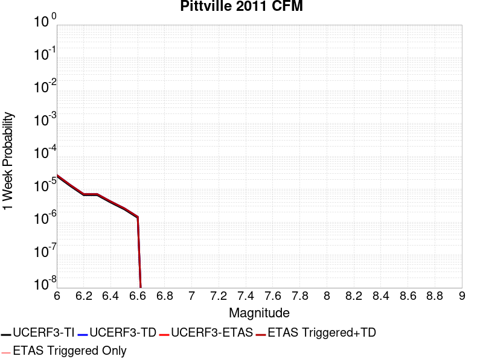 | 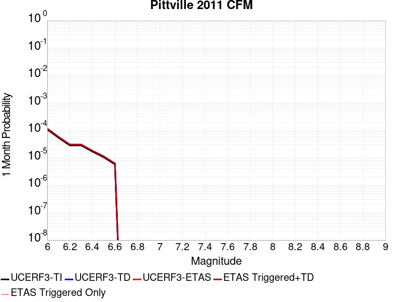 | 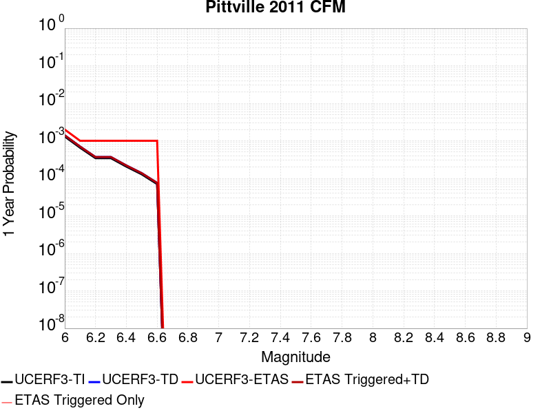 | 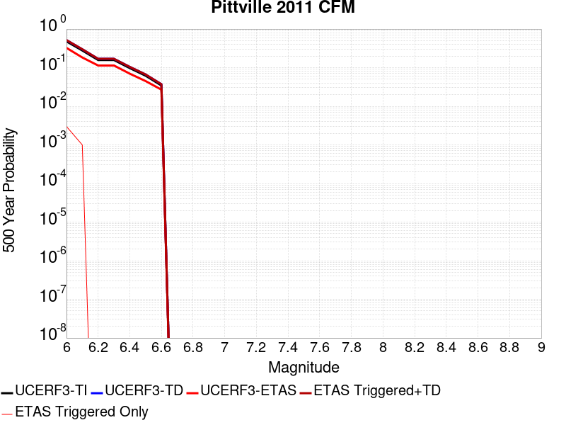 |

| Magnitude | 1 wk TI Prob | 1 wk TD Prob | 1 wk ETAS Prob | 1 wk ETAS/TD Gain | 1 wk ETAS Triggered+TD | 1 wk ETAS Triggered Only | 1 mo TI Prob | 1 mo TD Prob | 1 mo ETAS Prob | 1 mo ETAS/TD Gain | 1 mo ETAS Triggered+TD | 1 mo ETAS Triggered Only | 1 yr TI Prob | 1 yr TD Prob | 1 yr ETAS Prob | 1 yr ETAS/TD Gain | 1 yr ETAS Triggered+TD | 1 yr ETAS Triggered Only | 500 yr TI Prob | 500 yr TD Prob | 500 yr ETAS Prob | 500 yr ETAS/TD Gain | 500 yr ETAS Triggered+TD | 500 yr ETAS Triggered Only |
|-----|-----|-----|-----|-----|-----|-----|-----|-----|-----|-----|-----|-----|-----|-----|-----|-----|-----|-----|-----|-----|-----|-----|-----|-----|
| 6.0 | 2.5031832E-5 | 2.6943628E-5 | 0.0 | 0.0 | 2.6943628E-5 | 0.0 | 1.0727487E-4 | 1.1546812E-4 | 0.0 | 0.0 | 1.1546812E-4 | 0.0 | 0.001305289 | 0.0014050143 | 0.002 | 1.423473 | 0.0014050143 | 0.0 | 0.47955486 | 0.5177996 | 0.326 | 0.62958723 | 0.51924616 | 0.003 |
| 6.1 | 1.2540113E-5 | 1.3458787E-5 | 0.0 | 0.0 | 1.3458787E-5 | 0.0 | 5.3742235E-5 | 5.7679365E-5 | 0.0 | 0.0 | 5.7679365E-5 | 0.0 | 6.541153E-4 | 7.020423E-4 | 0.001 | 1.4244156 | 7.020423E-4 | 0.0 | 0.27903497 | 0.30001393 | 0.184 | 0.61330485 | 0.3007139 | 0.001 |
| 6.2 | 6.603218E-6 | 7.079108E-6 | 0.0 | 0.0 | 7.079108E-6 | 0.0 | 2.8299199E-5 | 3.0338719E-5 | 0.0 | 0.0 | 3.0338719E-5 | 0.0 | 3.4448825E-4 | 3.693177E-4 | 0.001 | 2.7076957 | 3.693177E-4 | 0.0 | 0.15825133 | 0.16984853 | 0.114 | 0.67118627 | 0.16984853 | 0.0 |
| 6.3 | 6.603218E-6 | 7.079108E-6 | 0.0 | 0.0 | 7.079108E-6 | 0.0 | 2.8299199E-5 | 3.0338719E-5 | 0.0 | 0.0 | 3.0338719E-5 | 0.0 | 3.4448825E-4 | 3.693177E-4 | 0.001 | 2.7076957 | 3.693177E-4 | 0.0 | 0.15825133 | 0.16984853 | 0.114 | 0.67118627 | 0.16984853 | 0.0 |
| 6.4 | 3.9389015E-6 | 4.222446E-6 | 0.0 | 0.0 | 4.222446E-6 | 0.0 | 1.6880897E-5 | 1.8096089E-5 | 0.0 | 0.0 | 1.8096089E-5 | 0.0 | 2.0550552E-4 | 2.2030067E-4 | 0.001 | 4.539251 | 2.2030067E-4 | 0.0 | 0.09765949 | 0.10489982 | 0.07 | 0.6673033 | 0.10489982 | 0.0 |
| 6.5 | 2.4533072E-6 | 2.6307932E-6 | 0.0 | 0.0 | 2.6307932E-6 | 0.0 | 1.0514132E-5 | 1.127479E-5 | 0.0 | 0.0 | 1.127479E-5 | 0.0 | 1.2800204E-4 | 1.3726385E-4 | 0.001 | 7.2852397 | 1.3726385E-4 | 0.0 | 0.061999794 | 0.06671389 | 0.045 | 0.6745222 | 0.06671389 | 0.0 |
| 6.6 | 1.3482367E-6 | 1.4471493E-6 | 0.0 | 0.0 | 1.4471493E-6 | 0.0 | 5.778144E-6 | 6.2020604E-6 | 0.0 | 0.0 | 6.2020604E-6 | 0.0 | 7.0346636E-5 | 7.550859E-5 | 0.001 | 13.243526 | 7.550859E-5 | 0.0 | 0.03456312 | 0.037279114 | 0.027 | 0.7242661 | 0.037279114 | 0.0 |

## Death Valley (No)
*[(top)](#table-of-contents)*

| 1 Week | 1 Month | 1 Year | 500 Year |
|-----|-----|-----|-----|
| 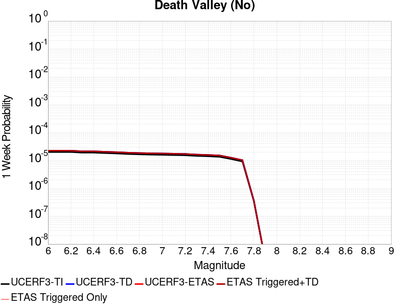 | 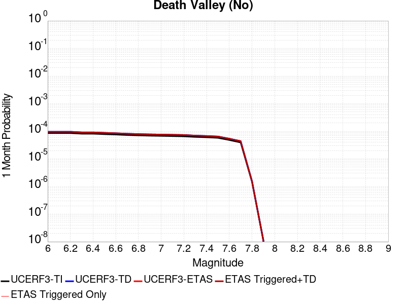 |  | 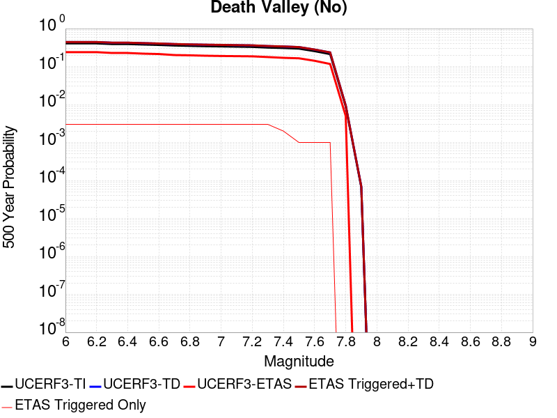 |

| Magnitude | 1 wk TI Prob | 1 wk TD Prob | 1 wk ETAS Prob | 1 wk ETAS/TD Gain | 1 wk ETAS Triggered+TD | 1 wk ETAS Triggered Only | 1 mo TI Prob | 1 mo TD Prob | 1 mo ETAS Prob | 1 mo ETAS/TD Gain | 1 mo ETAS Triggered+TD | 1 mo ETAS Triggered Only | 1 yr TI Prob | 1 yr TD Prob | 1 yr ETAS Prob | 1 yr ETAS/TD Gain | 1 yr ETAS Triggered+TD | 1 yr ETAS Triggered Only | 500 yr TI Prob | 500 yr TD Prob | 500 yr ETAS Prob | 500 yr ETAS/TD Gain | 500 yr ETAS Triggered+TD | 500 yr ETAS Triggered Only |
|-----|-----|-----|-----|-----|-----|-----|-----|-----|-----|-----|-----|-----|-----|-----|-----|-----|-----|-----|-----|-----|-----|-----|-----|-----|
| 6.0 | 2.0074807E-5 | 2.235907E-5 | 0.0 | 0.0 | 2.235907E-5 | 0.0 | 8.603206E-5 | 9.582111E-5 | 0.0 | 0.0 | 9.582111E-5 | 0.0 | 0.001046937 | 0.0011660049 | 0.0 | 0.0 | 0.0011660049 | 0.0 | 0.4077004 | 0.44112 | 0.24 | 0.54406965 | 0.44279665 | 0.003 |
| 6.1 | 2.0074807E-5 | 2.235907E-5 | 0.0 | 0.0 | 2.235907E-5 | 0.0 | 8.603206E-5 | 9.582111E-5 | 0.0 | 0.0 | 9.582111E-5 | 0.0 | 0.001046937 | 0.0011660049 | 0.0 | 0.0 | 0.0011660049 | 0.0 | 0.4077004 | 0.44112 | 0.24 | 0.54406965 | 0.44279665 | 0.003 |
| 6.2 | 2.0074807E-5 | 2.235907E-5 | 0.0 | 0.0 | 2.235907E-5 | 0.0 | 8.603206E-5 | 9.582111E-5 | 0.0 | 0.0 | 9.582111E-5 | 0.0 | 0.001046937 | 0.0011660049 | 0.0 | 0.0 | 0.0011660049 | 0.0 | 0.4077004 | 0.44112 | 0.24 | 0.54406965 | 0.44279665 | 0.003 |
| 6.3 | 1.9050609E-5 | 2.1204078E-5 | 0.0 | 0.0 | 2.1204078E-5 | 0.0 | 8.164292E-5 | 9.087149E-5 | 0.0 | 0.0 | 9.087149E-5 | 0.0 | 9.935491E-4 | 0.0011058055 | 0.0 | 0.0 | 0.0011058055 | 0.0 | 0.39166012 | 0.42449102 | 0.228 | 0.53711385 | 0.42621753 | 0.003 |
| 6.4 | 1.9050609E-5 | 2.1204078E-5 | 0.0 | 0.0 | 2.1204078E-5 | 0.0 | 8.164292E-5 | 9.087149E-5 | 0.0 | 0.0 | 9.087149E-5 | 0.0 | 9.935491E-4 | 0.0011058055 | 0.0 | 0.0 | 0.0011058055 | 0.0 | 0.39166012 | 0.42449102 | 0.228 | 0.53711385 | 0.42621753 | 0.003 |
| 6.5 | 1.8367004E-5 | 2.0433548E-5 | 0.0 | 0.0 | 2.0433548E-5 | 0.0 | 7.8713354E-5 | 8.7569446E-5 | 0.0 | 0.0 | 8.7569446E-5 | 0.0 | 9.5791375E-4 | 0.001065643 | 0.0 | 0.0 | 0.001065643 | 0.0 | 0.38071296 | 0.4131491 | 0.219 | 0.530075 | 0.41490963 | 0.003 |
| 6.6 | 1.779439E-5 | 1.9788007E-5 | 0.0 | 0.0 | 1.9788007E-5 | 0.0 | 7.625944E-5 | 8.4803025E-5 | 0.0 | 0.0 | 8.4803025E-5 | 0.0 | 9.280632E-4 | 0.0010319941 | 0.0 | 0.0 | 0.0010319941 | 0.0 | 0.37139177 | 0.403481 | 0.214 | 0.53038436 | 0.40527055 | 0.003 |
| 6.7 | 1.7025437E-5 | 1.892627E-5 | 0.0 | 0.0 | 1.892627E-5 | 0.0 | 7.296412E-5 | 8.11101E-5 | 0.0 | 0.0 | 8.11101E-5 | 0.0 | 8.87976E-4 | 9.870742E-4 | 0.0 | 0.0 | 9.870742E-4 | 0.0 | 0.35865343 | 0.39029127 | 0.201 | 0.515 | 0.3921204 | 0.003 |
| 6.8 | 1.6545107E-5 | 1.8398336E-5 | 0.0 | 0.0 | 1.8398336E-5 | 0.0 | 7.090568E-5 | 7.884766E-5 | 0.0 | 0.0 | 7.884766E-5 | 0.0 | 8.629347E-4 | 9.5955346E-4 | 0.0 | 0.0 | 9.5955346E-4 | 0.0 | 0.3505657 | 0.38190398 | 0.198 | 0.51845497 | 0.38375825 | 0.003 |
| 6.9 | 1.615478E-5 | 1.7975388E-5 | 0.0 | 0.0 | 1.7975388E-5 | 0.0 | 6.9232934E-5 | 7.703513E-5 | 0.0 | 0.0 | 7.703513E-5 | 0.0 | 8.4258494E-4 | 9.3750516E-4 | 0.0 | 0.0 | 9.3750516E-4 | 0.0 | 0.34391838 | 0.37508965 | 0.193 | 0.51454365 | 0.3769644 | 0.003 |
| 7.0 | 1.5894311E-5 | 1.7694583E-5 | 0.0 | 0.0 | 1.7694583E-5 | 0.0 | 6.81167E-5 | 7.583176E-5 | 0.0 | 0.0 | 7.583176E-5 | 0.0 | 8.2900526E-4 | 9.2286663E-4 | 0.0 | 0.0 | 9.2286663E-4 | 0.0 | 0.33944476 | 0.37051985 | 0.19 | 0.51279306 | 0.37240827 | 0.003 |
| 7.1 | 1.5602263E-5 | 1.7374277E-5 | 0.0 | 0.0 | 1.7374277E-5 | 0.0 | 6.6865134E-5 | 7.4459094E-5 | 0.0 | 0.0 | 7.4459094E-5 | 0.0 | 8.137789E-4 | 9.061684E-4 | 0.0 | 0.0 | 9.061684E-4 | 0.0 | 0.3343925 | 0.36527735 | 0.188 | 0.5146774 | 0.3671815 | 0.003 |
| 7.2 | 1.5323829E-5 | 1.7063412E-5 | 0.0 | 0.0 | 1.7063412E-5 | 0.0 | 6.56719E-5 | 7.312689E-5 | 0.0 | 0.0 | 7.312689E-5 | 0.0 | 7.99262E-4 | 8.899622E-4 | 0.0 | 0.0 | 8.899622E-4 | 0.0 | 0.32953972 | 0.36015898 | 0.186 | 0.5164386 | 0.3620785 | 0.003 |
| 7.3 | 1.4556212E-5 | 1.6201118E-5 | 0.0 | 0.0 | 1.6201118E-5 | 0.0 | 6.238227E-5 | 6.9431546E-5 | 0.0 | 0.0 | 6.9431546E-5 | 0.0 | 7.592395E-4 | 8.45007E-4 | 0.0 | 0.0 | 8.45007E-4 | 0.0 | 0.31597713 | 0.34559625 | 0.178 | 0.51505184 | 0.34755948 | 0.003 |
| 7.4 | 1.411725E-5 | 1.5709866E-5 | 0.0 | 0.0 | 1.5709866E-5 | 0.0 | 6.0501097E-5 | 6.732629E-5 | 0.0 | 0.0 | 6.732629E-5 | 0.0 | 7.363519E-4 | 8.19395E-4 | 0.0 | 0.0 | 8.19395E-4 | 0.0 | 0.30809844 | 0.337166 | 0.17 | 0.50420266 | 0.33849168 | 0.002 |
| 7.5 | 1.3503312E-5 | 1.5032119E-5 | 0.0 | 0.0 | 1.5032119E-5 | 0.0 | 5.7870053E-5 | 6.442181E-5 | 0.0 | 0.0 | 6.442181E-5 | 0.0 | 7.043401E-4 | 7.84059E-4 | 0.0 | 0.0 | 7.84059E-4 | 0.0 | 0.2969267 | 0.32535714 | 0.165 | 0.50713503 | 0.3260318 | 0.001 |
| 7.6 | 1.1279839E-5 | 1.2548268E-5 | 0.0 | 0.0 | 1.2548268E-5 | 0.0 | 4.834127E-5 | 5.3777214E-5 | 0.0 | 0.0 | 5.3777214E-5 | 0.0 | 5.88396E-4 | 6.5454614E-4 | 0.0 | 0.0 | 6.5454614E-4 | 0.0 | 0.25493556 | 0.2801779 | 0.142 | 0.50682086 | 0.2808977 | 0.001 |
| 7.7 | 9.189108E-6 | 1.0219931E-5 | 0.0 | 0.0 | 1.0219931E-5 | 0.0 | 3.93813E-5 | 4.3799E-5 | 0.0 | 0.0 | 4.3799E-5 | 0.0 | 4.7936183E-4 | 5.331273E-4 | 0.0 | 0.0 | 5.331273E-4 | 0.0 | 0.21316631 | 0.23509291 | 0.117 | 0.49767557 | 0.23585781 | 0.001 |
| 7.8 | 3.4586725E-7 | 3.6378464E-7 | 0.0 | 0.0 | 3.6378464E-7 | 0.0 | 1.4822873E-6 | 1.559076E-6 | 0.0 | 0.0 | 1.559076E-6 | 0.0 | 1.80467E-5 | 1.898159E-5 | 0.0 | 0.0 | 1.898159E-5 | 0.0 | 0.008982842 | 0.00944719 | 0.005 | 0.52925795 | 0.00944719 | 0.0 |
| 7.9 | 2.5591178E-9 | 2.6636915E-9 | 0.0 | 0.0 | 2.6636915E-9 | 0.0 | 1.0967647E-8 | 1.141582E-8 | 0.0 | 0.0 | 1.141582E-8 | 0.0 | 1.335311E-7 | 1.3898762E-7 | 0.0 | 0.0 | 1.3898762E-7 | 0.0 | 6.676333E-5 | 6.9493806E-5 | 0.0 | 0.0 | 6.9493806E-5 | 0.0 |

## San Luis Range 2011 CFM
*[(top)](#table-of-contents)*

| 1 Week | 1 Month | 1 Year | 500 Year |
|-----|-----|-----|-----|
|  |  | 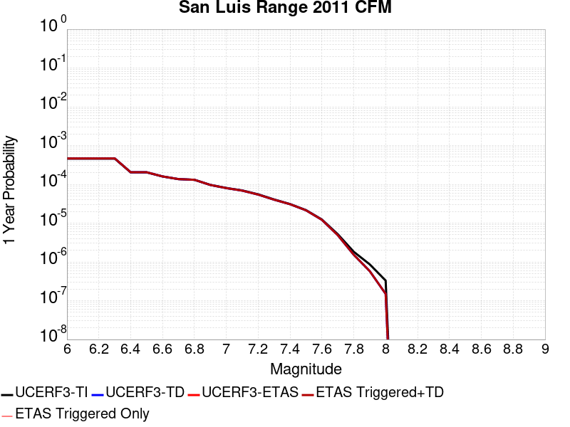 | 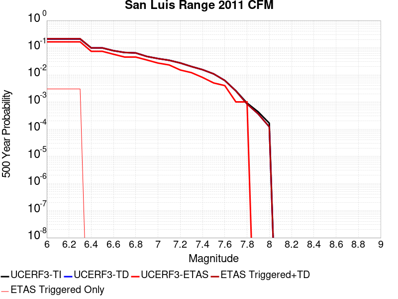 |

| Magnitude | 1 wk TI Prob | 1 wk TD Prob | 1 wk ETAS Prob | 1 wk ETAS/TD Gain | 1 wk ETAS Triggered+TD | 1 wk ETAS Triggered Only | 1 mo TI Prob | 1 mo TD Prob | 1 mo ETAS Prob | 1 mo ETAS/TD Gain | 1 mo ETAS Triggered+TD | 1 mo ETAS Triggered Only | 1 yr TI Prob | 1 yr TD Prob | 1 yr ETAS Prob | 1 yr ETAS/TD Gain | 1 yr ETAS Triggered+TD | 1 yr ETAS Triggered Only | 500 yr TI Prob | 500 yr TD Prob | 500 yr ETAS Prob | 500 yr ETAS/TD Gain | 500 yr ETAS Triggered+TD | 500 yr ETAS Triggered Only |
|-----|-----|-----|-----|-----|-----|-----|-----|-----|-----|-----|-----|-----|-----|-----|-----|-----|-----|-----|-----|-----|-----|-----|-----|-----|
| 6.0 | 8.8368415E-6 | 8.955968E-6 | 0.0 | 0.0 | 8.955968E-6 | 0.0 | 3.787163E-5 | 3.83822E-5 | 0.0 | 0.0 | 3.83822E-5 | 0.0 | 4.609895E-4 | 4.6721095E-4 | 0.0 | 0.0 | 4.6721095E-4 | 0.0 | 0.20590161 | 0.21028937 | 0.163 | 0.7751224 | 0.21265851 | 0.003 |
| 6.1 | 8.8368415E-6 | 8.955968E-6 | 0.0 | 0.0 | 8.955968E-6 | 0.0 | 3.787163E-5 | 3.83822E-5 | 0.0 | 0.0 | 3.83822E-5 | 0.0 | 4.609895E-4 | 4.6721095E-4 | 0.0 | 0.0 | 4.6721095E-4 | 0.0 | 0.20590161 | 0.21028937 | 0.163 | 0.7751224 | 0.21265851 | 0.003 |
| 6.2 | 8.8368415E-6 | 8.955968E-6 | 0.0 | 0.0 | 8.955968E-6 | 0.0 | 3.787163E-5 | 3.83822E-5 | 0.0 | 0.0 | 3.83822E-5 | 0.0 | 4.609895E-4 | 4.6721095E-4 | 0.0 | 0.0 | 4.6721095E-4 | 0.0 | 0.20590161 | 0.21028937 | 0.163 | 0.7751224 | 0.21265851 | 0.003 |
| 6.3 | 8.8368415E-6 | 8.955968E-6 | 0.0 | 0.0 | 8.955968E-6 | 0.0 | 3.787163E-5 | 3.83822E-5 | 0.0 | 0.0 | 3.83822E-5 | 0.0 | 4.609895E-4 | 4.6721095E-4 | 0.0 | 0.0 | 4.6721095E-4 | 0.0 | 0.20590161 | 0.21028937 | 0.163 | 0.7751224 | 0.21265851 | 0.003 |
| 6.4 | 3.9094193E-6 | 3.9368447E-6 | 0.0 | 0.0 | 3.9368447E-6 | 0.0 | 1.6754546E-5 | 1.6872084E-5 | 0.0 | 0.0 | 1.6872084E-5 | 0.0 | 2.039675E-4 | 2.0539854E-4 | 0.0 | 0.0 | 2.0539854E-4 | 0.0 | 0.096965164 | 0.09789432 | 0.073 | 0.74570215 | 0.09789432 | 0.0 |
| 6.5 | 3.9094193E-6 | 3.9368447E-6 | 0.0 | 0.0 | 3.9368447E-6 | 0.0 | 1.6754546E-5 | 1.6872084E-5 | 0.0 | 0.0 | 1.6872084E-5 | 0.0 | 2.039675E-4 | 2.0539854E-4 | 0.0 | 0.0 | 2.0539854E-4 | 0.0 | 0.096965164 | 0.09789432 | 0.073 | 0.74570215 | 0.09789432 | 0.0 |
| 6.6 | 3.0587726E-6 | 3.0718318E-6 | 0.0 | 0.0 | 3.0718318E-6 | 0.0 | 1.3108959E-5 | 1.3164928E-5 | 0.0 | 0.0 | 1.3164928E-5 | 0.0 | 1.595899E-4 | 1.6027132E-4 | 0.0 | 0.0 | 1.6027132E-4 | 0.0 | 0.076700225 | 0.07726258 | 0.057 | 0.737744 | 0.07726258 | 0.0 |
| 6.7 | 2.6160574E-6 | 2.6219695E-6 | 0.0 | 0.0 | 2.6219695E-6 | 0.0 | 1.1211626E-5 | 1.1236964E-5 | 0.0 | 0.0 | 1.1236964E-5 | 0.0 | 1.3649299E-4 | 1.3680151E-4 | 0.0 | 0.0 | 1.3680151E-4 | 0.0 | 0.065974146 | 0.0663543 | 0.045 | 0.6781776 | 0.0663543 | 0.0 |
| 6.8 | 2.5110312E-6 | 2.5150862E-6 | 0.0 | 0.0 | 2.5150862E-6 | 0.0 | 1.0761518E-5 | 1.07788965E-5 | 0.0 | 0.0 | 1.07788965E-5 | 0.0 | 1.310136E-4 | 1.3122521E-4 | 0.0 | 0.0 | 1.3122521E-4 | 0.0 | 0.06341134 | 0.06374652 | 0.045 | 0.7059209 | 0.06374652 | 0.0 |
| 6.9 | 1.8564405E-6 | 1.8500175E-6 | 0.0 | 0.0 | 1.8500175E-6 | 0.0 | 7.95615E-6 | 7.928622E-6 | 0.0 | 0.0 | 7.928622E-6 | 0.0 | 9.686181E-5 | 9.652672E-5 | 0.0 | 0.0 | 9.652672E-5 | 0.0 | 0.04727907 | 0.047349833 | 0.035 | 0.73917896 | 0.047349833 | 0.0 |
| 7.0 | 1.546127E-6 | 1.5347603E-6 | 0.0 | 0.0 | 1.5347603E-6 | 0.0 | 6.626242E-6 | 6.5775275E-6 | 0.0 | 0.0 | 6.5775275E-6 | 0.0 | 8.06715E-5 | 8.007846E-5 | 0.0 | 0.0 | 8.007846E-5 | 0.0 | 0.03953466 | 0.039478697 | 0.027 | 0.6839132 | 0.039478697 | 0.0 |
| 7.1 | 1.3368208E-6 | 1.3215574E-6 | 0.0 | 0.0 | 1.3215574E-6 | 0.0 | 5.7292195E-6 | 5.6638055E-6 | 0.0 | 0.0 | 5.6638055E-6 | 0.0 | 6.975101E-5 | 6.895466E-5 | 0.0 | 0.0 | 6.895466E-5 | 0.0 | 0.03427554 | 0.03412052 | 0.023 | 0.6740812 | 0.03412052 | 0.0 |
| 7.2 | 1.0623363E-6 | 1.043774E-6 | 0.0 | 0.0 | 1.043774E-6 | 0.0 | 4.5528623E-6 | 4.473309E-6 | 0.0 | 0.0 | 4.473309E-6 | 0.0 | 5.5429686E-5 | 5.446118E-5 | 0.0 | 0.0 | 5.446118E-5 | 0.0 | 0.027335057 | 0.027086506 | 0.015 | 0.5537813 | 0.027086506 | 0.0 |
| 7.3 | 7.831679E-7 | 7.714175E-7 | 0.0 | 0.0 | 7.714175E-7 | 0.0 | 3.3564295E-6 | 3.3060708E-6 | 0.0 | 0.0 | 3.3060708E-6 | 0.0 | 4.086376E-5 | 4.025067E-5 | 0.0 | 0.0 | 4.025067E-5 | 0.0 | 0.020224974 | 0.020102745 | 0.012 | 0.5969334 | 0.020102745 | 0.0 |
| 7.4 | 5.9558846E-7 | 5.899752E-7 | 0.0 | 0.0 | 5.899752E-7 | 0.0 | 2.5525194E-6 | 2.5284626E-6 | 0.0 | 0.0 | 2.5284626E-6 | 0.0 | 3.107648E-5 | 3.0783598E-5 | 0.0 | 0.0 | 3.0783598E-5 | 0.0 | 0.015418382 | 0.015420153 | 0.008 | 0.5188016 | 0.015420153 | 0.0 |
| 7.5 | 4.1616502E-7 | 4.110855E-7 | 0.0 | 0.0 | 4.110855E-7 | 0.0 | 1.7835631E-6 | 1.7617938E-6 | 0.0 | 0.0 | 1.7617938E-6 | 0.0 | 2.1714664E-5 | 2.1449629E-5 | 0.0 | 0.0 | 2.1449629E-5 | 0.0 | 0.010798721 | 0.010795615 | 0.005 | 0.46315104 | 0.010795615 | 0.0 |
| 7.6 | 2.3816014E-7 | 2.3310989E-7 | 0.0 | 0.0 | 2.3310989E-7 | 0.0 | 1.0206859E-6 | 9.99042E-7 | 0.0 | 0.0 | 9.99042E-7 | 0.0 | 1.242678E-5 | 1.21632675E-5 | 0.0 | 0.0 | 1.21632675E-5 | 0.0 | 0.0061941654 | 0.006172091 | 0.004 | 0.6480786 | 0.006172091 | 0.0 |
| 7.7 | 9.918777E-8 | 9.336944E-8 | 0.0 | 0.0 | 9.336944E-8 | 0.0 | 4.2509038E-7 | 4.0015465E-7 | 0.0 | 0.0 | 4.0015465E-7 | 0.0 | 5.1754632E-6 | 4.871872E-6 | 0.0 | 0.0 | 4.871872E-6 | 0.0 | 0.002584393 | 0.0025283268 | 0.001 | 0.3955185 | 0.0025283268 | 0.0 |
| 7.8 | 3.4982556E-8 | 2.928018E-8 | 0.0 | 0.0 | 2.928018E-8 | 0.0 | 1.4992524E-7 | 1.2548648E-7 | 0.0 | 0.0 | 1.2548648E-7 | 0.0 | 1.8253382E-6 | 1.5277968E-6 | 0.0 | 0.0 | 1.5277968E-6 | 0.0 | 9.1225357E-4 | 8.44252E-4 | 0.001 | 1.1844804 | 8.44252E-4 | 0.0 |
| 7.9 | 1.6624908E-8 | 1.11210445E-8 | 0.0 | 0.0 | 1.11210445E-8 | 0.0 | 7.12496E-8 | 4.7661622E-8 | 0.0 | 0.0 | 4.7661622E-8 | 0.0 | 8.6746354E-7 | 5.802801E-7 | 0.0 | 0.0 | 5.802801E-7 | 0.0 | 4.336379E-4 | 3.6296103E-4 | 0.0 | 0.0 | 3.6296103E-4 | 0.0 |
| 8.0 | 6.3352315E-9 | 2.8780405E-9 | 0.0 | 0.0 | 2.8780405E-9 | 0.0 | 2.715099E-8 | 1.2334461E-8 | 0.0 | 0.0 | 1.2334461E-8 | 0.0 | 3.3056327E-7 | 1.5017204E-7 | 0.0 | 0.0 | 1.5017204E-7 | 0.0 | 1.6526801E-4 | 1.2125074E-4 | 0.0 | 0.0 | 1.2125074E-4 | 0.0 |

## Thirty Mile Bank
*[(top)](#table-of-contents)*

| 1 Week | 1 Month | 1 Year | 500 Year |
|-----|-----|-----|-----|
|  |  |  | 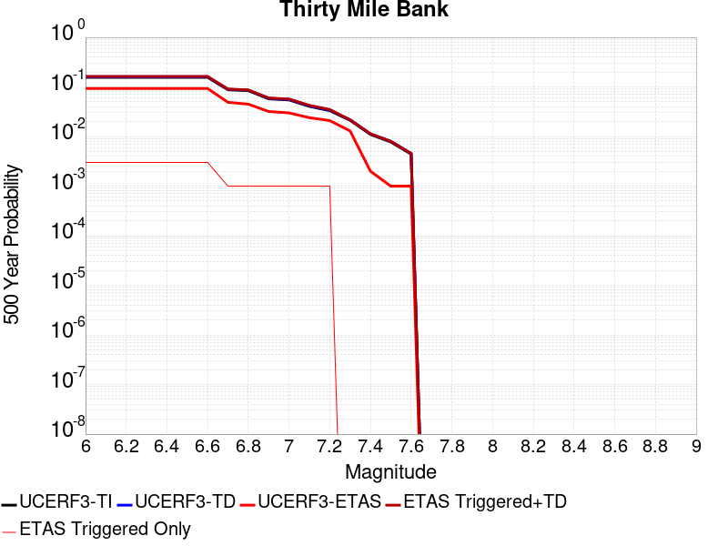 |

| Magnitude | 1 wk TI Prob | 1 wk TD Prob | 1 wk ETAS Prob | 1 wk ETAS/TD Gain | 1 wk ETAS Triggered+TD | 1 wk ETAS Triggered Only | 1 mo TI Prob | 1 mo TD Prob | 1 mo ETAS Prob | 1 mo ETAS/TD Gain | 1 mo ETAS Triggered+TD | 1 mo ETAS Triggered Only | 1 yr TI Prob | 1 yr TD Prob | 1 yr ETAS Prob | 1 yr ETAS/TD Gain | 1 yr ETAS Triggered+TD | 1 yr ETAS Triggered Only | 500 yr TI Prob | 500 yr TD Prob | 500 yr ETAS Prob | 500 yr ETAS/TD Gain | 500 yr ETAS Triggered+TD | 500 yr ETAS Triggered Only |
|-----|-----|-----|-----|-----|-----|-----|-----|-----|-----|-----|-----|-----|-----|-----|-----|-----|-----|-----|-----|-----|-----|-----|-----|-----|
| 6.0 | 6.5124755E-6 | 6.6514613E-6 | 0.0 | 0.0 | 6.6514613E-6 | 0.0 | 2.791031E-5 | 2.8505976E-5 | 0.0 | 0.0 | 2.8505976E-5 | 0.0 | 3.3975503E-4 | 3.4700934E-4 | 0.0 | 0.0 | 3.4700934E-4 | 0.0 | 0.1562562 | 0.16032548 | 0.093 | 0.58006996 | 0.16284451 | 0.003 |
| 6.1 | 6.5124755E-6 | 6.6514613E-6 | 0.0 | 0.0 | 6.6514613E-6 | 0.0 | 2.791031E-5 | 2.8505976E-5 | 0.0 | 0.0 | 2.8505976E-5 | 0.0 | 3.3975503E-4 | 3.4700934E-4 | 0.0 | 0.0 | 3.4700934E-4 | 0.0 | 0.1562562 | 0.16032548 | 0.093 | 0.58006996 | 0.16284451 | 0.003 |
| 6.2 | 6.5124755E-6 | 6.6514613E-6 | 0.0 | 0.0 | 6.6514613E-6 | 0.0 | 2.791031E-5 | 2.8505976E-5 | 0.0 | 0.0 | 2.8505976E-5 | 0.0 | 3.3975503E-4 | 3.4700934E-4 | 0.0 | 0.0 | 3.4700934E-4 | 0.0 | 0.1562562 | 0.16032548 | 0.093 | 0.58006996 | 0.16284451 | 0.003 |
| 6.3 | 6.5124755E-6 | 6.6514613E-6 | 0.0 | 0.0 | 6.6514613E-6 | 0.0 | 2.791031E-5 | 2.8505976E-5 | 0.0 | 0.0 | 2.8505976E-5 | 0.0 | 3.3975503E-4 | 3.4700934E-4 | 0.0 | 0.0 | 3.4700934E-4 | 0.0 | 0.1562562 | 0.16032548 | 0.093 | 0.58006996 | 0.16284451 | 0.003 |
| 6.4 | 6.5124755E-6 | 6.6514613E-6 | 0.0 | 0.0 | 6.6514613E-6 | 0.0 | 2.791031E-5 | 2.8505976E-5 | 0.0 | 0.0 | 2.8505976E-5 | 0.0 | 3.3975503E-4 | 3.4700934E-4 | 0.0 | 0.0 | 3.4700934E-4 | 0.0 | 0.1562562 | 0.16032548 | 0.093 | 0.58006996 | 0.16284451 | 0.003 |
| 6.5 | 6.5124755E-6 | 6.6514613E-6 | 0.0 | 0.0 | 6.6514613E-6 | 0.0 | 2.791031E-5 | 2.8505976E-5 | 0.0 | 0.0 | 2.8505976E-5 | 0.0 | 3.3975503E-4 | 3.4700934E-4 | 0.0 | 0.0 | 3.4700934E-4 | 0.0 | 0.1562562 | 0.16032548 | 0.093 | 0.58006996 | 0.16284451 | 0.003 |
| 6.6 | 6.5124755E-6 | 6.6514613E-6 | 0.0 | 0.0 | 6.6514613E-6 | 0.0 | 2.791031E-5 | 2.8505976E-5 | 0.0 | 0.0 | 2.8505976E-5 | 0.0 | 3.3975503E-4 | 3.4700934E-4 | 0.0 | 0.0 | 3.4700934E-4 | 0.0 | 0.1562562 | 0.16032548 | 0.093 | 0.58006996 | 0.16284451 | 0.003 |
| 6.7 | 3.5261137E-6 | 3.605437E-6 | 0.0 | 0.0 | 3.605437E-6 | 0.0 | 1.5111828E-5 | 1.5451786E-5 | 0.0 | 0.0 | 1.5451786E-5 | 0.0 | 1.8397097E-4 | 1.881099E-4 | 0.0 | 0.0 | 1.881099E-4 | 0.0 | 0.087889336 | 0.089938104 | 0.049 | 0.5448191 | 0.09084816 | 0.001 |
| 6.8 | 3.370743E-6 | 3.4466639E-6 | 0.0 | 0.0 | 3.4466639E-6 | 0.0 | 1.4445961E-5 | 1.4771336E-5 | 0.0 | 0.0 | 1.4771336E-5 | 0.0 | 1.7586538E-4 | 1.798268E-4 | 0.0 | 0.0 | 1.798268E-4 | 0.0 | 0.084184565 | 0.086152785 | 0.045 | 0.5223279 | 0.08706663 | 0.001 |
| 6.9 | 2.2756835E-6 | 2.3300936E-6 | 0.0 | 0.0 | 2.3300936E-6 | 0.0 | 9.752893E-6 | 9.986078E-6 | 0.0 | 0.0 | 9.986078E-6 | 0.0 | 1.18735006E-4 | 1.2157397E-4 | 0.0 | 0.0 | 1.2157397E-4 | 0.0 | 0.057642937 | 0.0590436 | 0.032 | 0.54197234 | 0.059984557 | 0.001 |
| 7.0 | 2.1617404E-6 | 2.2130853E-6 | 0.0 | 0.0 | 2.2130853E-6 | 0.0 | 9.264569E-6 | 9.484618E-6 | 0.0 | 0.0 | 9.484618E-6 | 0.0 | 1.1279029E-4 | 1.15469345E-4 | 0.0 | 0.0 | 1.15469345E-4 | 0.0 | 0.05483742 | 0.05616549 | 0.03 | 0.5341358 | 0.057109322 | 0.001 |
| 7.1 | 1.5900777E-6 | 1.6304225E-6 | 0.0 | 0.0 | 1.6304225E-6 | 0.0 | 6.814601E-6 | 6.987507E-6 | 0.0 | 0.0 | 6.987507E-6 | 0.0 | 8.296461E-5 | 8.50697E-5 | 0.0 | 0.0 | 8.50697E-5 | 0.0 | 0.04063534 | 0.04167844 | 0.024 | 0.5758373 | 0.04263676 | 0.001 |
| 7.2 | 1.2971728E-6 | 1.3309876E-6 | 0.0 | 0.0 | 1.3309876E-6 | 0.0 | 5.5593005E-6 | 5.7042207E-6 | 0.0 | 0.0 | 5.7042207E-6 | 0.0 | 6.768238E-5 | 6.944678E-5 | 0.0 | 0.0 | 6.944678E-5 | 0.0 | 0.03327609 | 0.034156222 | 0.021 | 0.6148221 | 0.035122067 | 0.001 |
| 7.3 | 8.2454284E-7 | 8.4380537E-7 | 0.0 | 0.0 | 8.4380537E-7 | 0.0 | 3.5337503E-6 | 3.6163042E-6 | 0.0 | 0.0 | 3.6163042E-6 | 0.0 | 4.302256E-5 | 4.4027674E-5 | 0.0 | 0.0 | 4.4027674E-5 | 0.0 | 0.021282015 | 0.021790177 | 0.013 | 0.5965991 | 0.021790177 | 0.0 |
| 7.4 | 4.2619024E-7 | 4.3796942E-7 | 0.0 | 0.0 | 4.3796942E-7 | 0.0 | 1.8265283E-6 | 1.8770105E-6 | 0.0 | 0.0 | 1.8770105E-6 | 0.0 | 2.2237757E-5 | 2.2852368E-5 | 0.0 | 0.0 | 2.2852368E-5 | 0.0 | 0.011057414 | 0.011362337 | 0.002 | 0.17602013 | 0.011362337 | 0.0 |
| 7.5 | 2.993922E-7 | 3.0815013E-7 | 0.0 | 0.0 | 3.0815013E-7 | 0.0 | 1.2831089E-6 | 1.3206428E-6 | 0.0 | 0.0 | 1.3206428E-6 | 0.0 | 1.5621737E-5 | 1.607871E-5 | 0.0 | 0.0 | 1.607871E-5 | 0.0 | 0.007780504 | 0.008007895 | 0.001 | 0.12487676 | 0.008007895 | 0.0 |
| 7.6 | 1.6988751E-7 | 1.7504632E-7 | 0.0 | 0.0 | 1.7504632E-7 | 0.0 | 7.2808916E-7 | 7.5019835E-7 | 0.0 | 0.0 | 7.5019835E-7 | 0.0 | 8.864449E-6 | 9.133629E-6 | 0.0 | 0.0 | 9.133629E-6 | 0.0 | 0.0044224365 | 0.0045569655 | 0.001 | 0.21944429 | 0.0045569655 | 0.0 |

## Coyote Lake
*[(top)](#table-of-contents)*

| 1 Week | 1 Month | 1 Year | 500 Year |
|-----|-----|-----|-----|
|  |  |  | 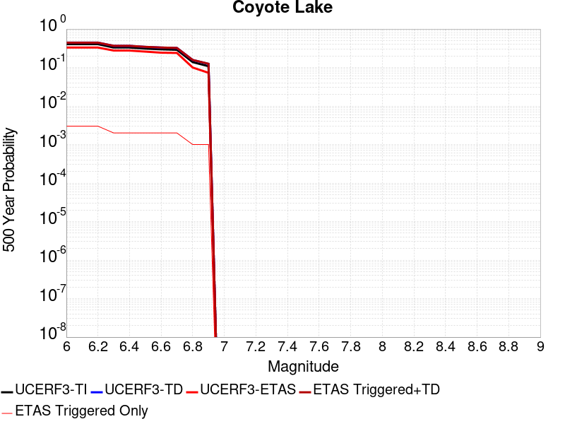 |

| Magnitude | 1 wk TI Prob | 1 wk TD Prob | 1 wk ETAS Prob | 1 wk ETAS/TD Gain | 1 wk ETAS Triggered+TD | 1 wk ETAS Triggered Only | 1 mo TI Prob | 1 mo TD Prob | 1 mo ETAS Prob | 1 mo ETAS/TD Gain | 1 mo ETAS Triggered+TD | 1 mo ETAS Triggered Only | 1 yr TI Prob | 1 yr TD Prob | 1 yr ETAS Prob | 1 yr ETAS/TD Gain | 1 yr ETAS Triggered+TD | 1 yr ETAS Triggered Only | 500 yr TI Prob | 500 yr TD Prob | 500 yr ETAS Prob | 500 yr ETAS/TD Gain | 500 yr ETAS Triggered+TD | 500 yr ETAS Triggered Only |
|-----|-----|-----|-----|-----|-----|-----|-----|-----|-----|-----|-----|-----|-----|-----|-----|-----|-----|-----|-----|-----|-----|-----|-----|-----|
| 6.0 | 1.980352E-5 | 2.1598828E-5 | 0.0 | 0.0 | 2.1598828E-5 | 0.0 | 8.486947E-5 | 9.2563525E-5 | 0.0 | 0.0 | 9.2563525E-5 | 0.0 | 0.0010327959 | 0.0011264496 | 0.0 | 0.0 | 0.0011264496 | 0.0 | 0.40349331 | 0.44140896 | 0.33 | 0.74760604 | 0.44308475 | 0.003 |
| 6.1 | 1.980352E-5 | 2.1598828E-5 | 0.0 | 0.0 | 2.1598828E-5 | 0.0 | 8.486947E-5 | 9.2563525E-5 | 0.0 | 0.0 | 9.2563525E-5 | 0.0 | 0.0010327959 | 0.0011264496 | 0.0 | 0.0 | 0.0011264496 | 0.0 | 0.40349331 | 0.44140896 | 0.33 | 0.74760604 | 0.44308475 | 0.003 |
| 6.2 | 1.980352E-5 | 2.1598828E-5 | 0.0 | 0.0 | 2.1598828E-5 | 0.0 | 8.486947E-5 | 9.2563525E-5 | 0.0 | 0.0 | 9.2563525E-5 | 0.0 | 0.0010327959 | 0.0011264496 | 0.0 | 0.0 | 0.0011264496 | 0.0 | 0.40349331 | 0.44140896 | 0.33 | 0.74760604 | 0.44308475 | 0.003 |
| 6.3 | 1.5344787E-5 | 1.6736973E-5 | 0.0 | 0.0 | 1.6736973E-5 | 0.0 | 6.576172E-5 | 7.172825E-5 | 0.0 | 0.0 | 7.172825E-5 | 0.0 | 8.003548E-4 | 8.7300217E-4 | 0.0 | 0.0 | 8.7300217E-4 | 0.0 | 0.32990623 | 0.36450553 | 0.276 | 0.75719017 | 0.3657765 | 0.002 |
| 6.4 | 1.5344787E-5 | 1.6736973E-5 | 0.0 | 0.0 | 1.6736973E-5 | 0.0 | 6.576172E-5 | 7.172825E-5 | 0.0 | 0.0 | 7.172825E-5 | 0.0 | 8.003548E-4 | 8.7300217E-4 | 0.0 | 0.0 | 8.7300217E-4 | 0.0 | 0.32990623 | 0.36450553 | 0.276 | 0.75719017 | 0.3657765 | 0.002 |
| 6.5 | 1.4189697E-5 | 1.5480375E-5 | 0.0 | 0.0 | 1.5480375E-5 | 0.0 | 6.081157E-5 | 6.634311E-5 | 0.0 | 0.0 | 6.634311E-5 | 0.0 | 7.401293E-4 | 8.074877E-4 | 0.0 | 0.0 | 8.074877E-4 | 0.0 | 0.30940497 | 0.343287 | 0.259 | 0.75447077 | 0.34460044 | 0.002 |
| 6.6 | 1.3469301E-5 | 1.4697692E-5 | 0.0 | 0.0 | 1.4697692E-5 | 0.0 | 5.7724297E-5 | 6.2988925E-5 | 0.0 | 0.0 | 6.2988925E-5 | 0.0 | 7.025667E-4 | 7.666797E-4 | 0.0 | 0.0 | 7.666797E-4 | 0.0 | 0.29630256 | 0.32975256 | 0.243 | 0.7369162 | 0.33109307 | 0.002 |
| 6.7 | 1.3027966E-5 | 1.4210642E-5 | 0.0 | 0.0 | 1.4210642E-5 | 0.0 | 5.5832945E-5 | 6.090166E-5 | 0.0 | 0.0 | 6.090166E-5 | 0.0 | 6.7955407E-4 | 7.4128463E-4 | 0.0 | 0.0 | 7.4128463E-4 | 0.0 | 0.2881532 | 0.32125276 | 0.239 | 0.74396247 | 0.32261026 | 0.002 |
| 6.8 | 5.695434E-6 | 6.1945175E-6 | 0.0 | 0.0 | 6.1945175E-6 | 0.0 | 2.4408775E-5 | 2.6547828E-5 | 0.0 | 0.0 | 2.6547828E-5 | 0.0 | 2.971363E-4 | 3.232016E-4 | 0.0 | 0.0 | 3.232016E-4 | 0.0 | 0.13807777 | 0.1565287 | 0.1 | 0.63886046 | 0.15737218 | 0.001 |
| 6.9 | 4.385688E-6 | 4.770029E-6 | 0.0 | 0.0 | 4.770029E-6 | 0.0 | 1.879567E-5 | 2.0442982E-5 | 0.0 | 0.0 | 2.0442982E-5 | 0.0 | 2.2881327E-4 | 2.488933E-4 | 0.0 | 0.0 | 2.488933E-4 | 0.0 | 0.10811646 | 0.124317445 | 0.073 | 0.5872064 | 0.12519312 | 0.001 |

## Pitas Point (Lower)-Montalvo
*[(top)](#table-of-contents)*

| 1 Week | 1 Month | 1 Year | 500 Year |
|-----|-----|-----|-----|
| 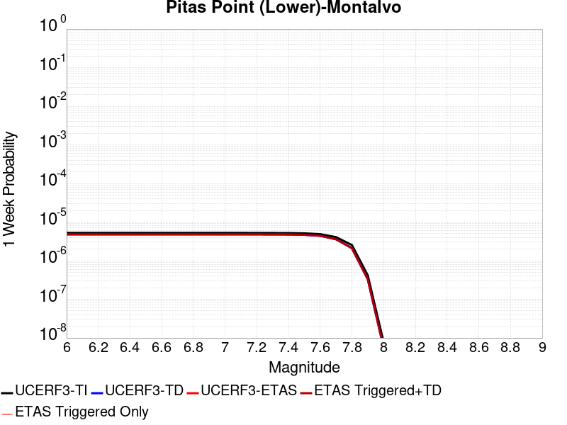 |  | 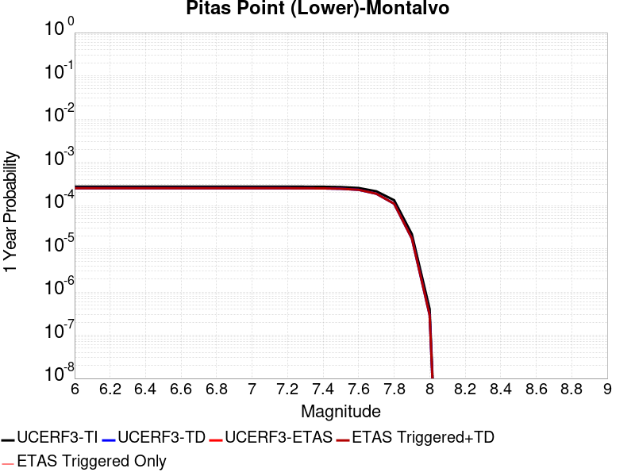 | 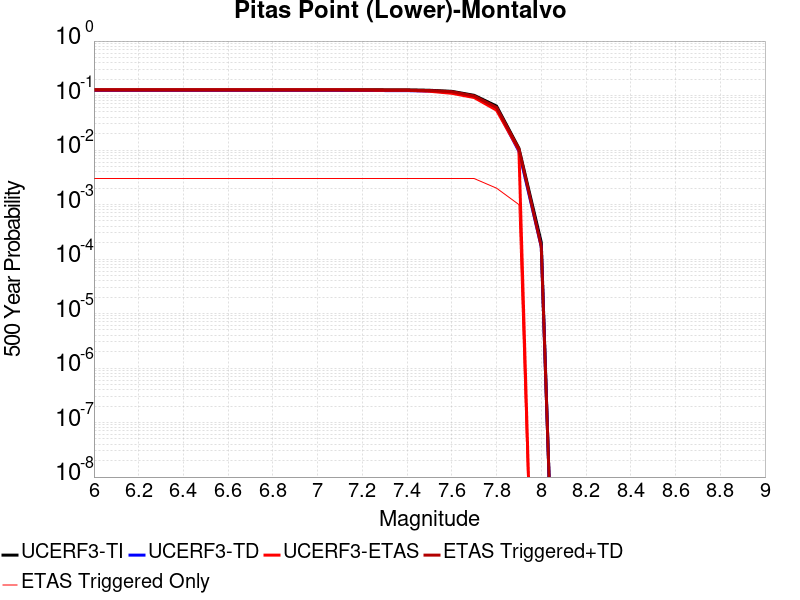 |

| Magnitude | 1 wk TI Prob | 1 wk TD Prob | 1 wk ETAS Prob | 1 wk ETAS/TD Gain | 1 wk ETAS Triggered+TD | 1 wk ETAS Triggered Only | 1 mo TI Prob | 1 mo TD Prob | 1 mo ETAS Prob | 1 mo ETAS/TD Gain | 1 mo ETAS Triggered+TD | 1 mo ETAS Triggered Only | 1 yr TI Prob | 1 yr TD Prob | 1 yr ETAS Prob | 1 yr ETAS/TD Gain | 1 yr ETAS Triggered+TD | 1 yr ETAS Triggered Only | 500 yr TI Prob | 500 yr TD Prob | 500 yr ETAS Prob | 500 yr ETAS/TD Gain | 500 yr ETAS Triggered+TD | 500 yr ETAS Triggered Only |
|-----|-----|-----|-----|-----|-----|-----|-----|-----|-----|-----|-----|-----|-----|-----|-----|-----|-----|-----|-----|-----|-----|-----|-----|-----|
| 6.0 | 5.2543637E-6 | 4.8165602E-6 | 0.0 | 0.0 | 4.8165602E-6 | 0.0 | 2.2518509E-5 | 2.0642241E-5 | 0.0 | 0.0 | 2.0642241E-5 | 0.0 | 2.7412834E-4 | 2.512906E-4 | 0.0 | 0.0 | 2.512906E-4 | 0.0 | 0.12810211 | 0.12417697 | 0.127 | 1.0227339 | 0.12680444 | 0.003 |
| 6.1 | 5.2543637E-6 | 4.8165602E-6 | 0.0 | 0.0 | 4.8165602E-6 | 0.0 | 2.2518509E-5 | 2.0642241E-5 | 0.0 | 0.0 | 2.0642241E-5 | 0.0 | 2.7412834E-4 | 2.512906E-4 | 0.0 | 0.0 | 2.512906E-4 | 0.0 | 0.12810211 | 0.12417697 | 0.127 | 1.0227339 | 0.12680444 | 0.003 |
| 6.2 | 5.2543637E-6 | 4.8165602E-6 | 0.0 | 0.0 | 4.8165602E-6 | 0.0 | 2.2518509E-5 | 2.0642241E-5 | 0.0 | 0.0 | 2.0642241E-5 | 0.0 | 2.7412834E-4 | 2.512906E-4 | 0.0 | 0.0 | 2.512906E-4 | 0.0 | 0.12810211 | 0.12417697 | 0.127 | 1.0227339 | 0.12680444 | 0.003 |
| 6.3 | 5.2543637E-6 | 4.8165602E-6 | 0.0 | 0.0 | 4.8165602E-6 | 0.0 | 2.2518509E-5 | 2.0642241E-5 | 0.0 | 0.0 | 2.0642241E-5 | 0.0 | 2.7412834E-4 | 2.512906E-4 | 0.0 | 0.0 | 2.512906E-4 | 0.0 | 0.12810211 | 0.12417697 | 0.127 | 1.0227339 | 0.12680444 | 0.003 |
| 6.4 | 5.2543637E-6 | 4.8165602E-6 | 0.0 | 0.0 | 4.8165602E-6 | 0.0 | 2.2518509E-5 | 2.0642241E-5 | 0.0 | 0.0 | 2.0642241E-5 | 0.0 | 2.7412834E-4 | 2.512906E-4 | 0.0 | 0.0 | 2.512906E-4 | 0.0 | 0.12810211 | 0.12417697 | 0.127 | 1.0227339 | 0.12680444 | 0.003 |
| 6.5 | 5.2543637E-6 | 4.8165602E-6 | 0.0 | 0.0 | 4.8165602E-6 | 0.0 | 2.2518509E-5 | 2.0642241E-5 | 0.0 | 0.0 | 2.0642241E-5 | 0.0 | 2.7412834E-4 | 2.512906E-4 | 0.0 | 0.0 | 2.512906E-4 | 0.0 | 0.12810211 | 0.12417697 | 0.127 | 1.0227339 | 0.12680444 | 0.003 |
| 6.6 | 5.2543637E-6 | 4.8165602E-6 | 0.0 | 0.0 | 4.8165602E-6 | 0.0 | 2.2518509E-5 | 2.0642241E-5 | 0.0 | 0.0 | 2.0642241E-5 | 0.0 | 2.7412834E-4 | 2.512906E-4 | 0.0 | 0.0 | 2.512906E-4 | 0.0 | 0.12810211 | 0.12417697 | 0.127 | 1.0227339 | 0.12680444 | 0.003 |
| 6.7 | 5.2543637E-6 | 4.8165602E-6 | 0.0 | 0.0 | 4.8165602E-6 | 0.0 | 2.2518509E-5 | 2.0642241E-5 | 0.0 | 0.0 | 2.0642241E-5 | 0.0 | 2.7412834E-4 | 2.512906E-4 | 0.0 | 0.0 | 2.512906E-4 | 0.0 | 0.12810211 | 0.12417697 | 0.127 | 1.0227339 | 0.12680444 | 0.003 |
| 6.8 | 5.2543637E-6 | 4.8165602E-6 | 0.0 | 0.0 | 4.8165602E-6 | 0.0 | 2.2518509E-5 | 2.0642241E-5 | 0.0 | 0.0 | 2.0642241E-5 | 0.0 | 2.7412834E-4 | 2.512906E-4 | 0.0 | 0.0 | 2.512906E-4 | 0.0 | 0.12810211 | 0.12417697 | 0.127 | 1.0227339 | 0.12680444 | 0.003 |
| 6.9 | 5.2543637E-6 | 4.8165602E-6 | 0.0 | 0.0 | 4.8165602E-6 | 0.0 | 2.2518509E-5 | 2.0642241E-5 | 0.0 | 0.0 | 2.0642241E-5 | 0.0 | 2.7412834E-4 | 2.512906E-4 | 0.0 | 0.0 | 2.512906E-4 | 0.0 | 0.12810211 | 0.12417697 | 0.127 | 1.0227339 | 0.12680444 | 0.003 |
| 7.0 | 5.2543637E-6 | 4.8165602E-6 | 0.0 | 0.0 | 4.8165602E-6 | 0.0 | 2.2518509E-5 | 2.0642241E-5 | 0.0 | 0.0 | 2.0642241E-5 | 0.0 | 2.7412834E-4 | 2.512906E-4 | 0.0 | 0.0 | 2.512906E-4 | 0.0 | 0.12810211 | 0.12417697 | 0.127 | 1.0227339 | 0.12680444 | 0.003 |
| 7.1 | 5.2543637E-6 | 4.8165602E-6 | 0.0 | 0.0 | 4.8165602E-6 | 0.0 | 2.2518509E-5 | 2.0642241E-5 | 0.0 | 0.0 | 2.0642241E-5 | 0.0 | 2.7412834E-4 | 2.512906E-4 | 0.0 | 0.0 | 2.512906E-4 | 0.0 | 0.12810211 | 0.12417697 | 0.127 | 1.0227339 | 0.12680444 | 0.003 |
| 7.2 | 5.2458695E-6 | 4.807733E-6 | 0.0 | 0.0 | 4.807733E-6 | 0.0 | 2.2482105E-5 | 2.060441E-5 | 0.0 | 0.0 | 2.060441E-5 | 0.0 | 2.7368523E-4 | 2.508301E-4 | 0.0 | 0.0 | 2.508301E-4 | 0.0 | 0.12790887 | 0.12397523 | 0.126 | 1.016332 | 0.1266033 | 0.003 |
| 7.3 | 5.22665E-6 | 4.7876974E-6 | 0.0 | 0.0 | 4.7876974E-6 | 0.0 | 2.2399736E-5 | 2.0518542E-5 | 0.0 | 0.0 | 2.0518542E-5 | 0.0 | 2.7268266E-4 | 2.4978493E-4 | 0.0 | 0.0 | 2.4978493E-4 | 0.0 | 0.12747146 | 0.12351717 | 0.125 | 1.012005 | 0.12614661 | 0.003 |
| 7.4 | 5.210642E-6 | 4.770952E-6 | 0.0 | 0.0 | 4.770952E-6 | 0.0 | 2.233113E-5 | 2.0446778E-5 | 0.0 | 0.0 | 2.0446778E-5 | 0.0 | 2.718476E-4 | 2.489114E-4 | 0.0 | 0.0 | 2.489114E-4 | 0.0 | 0.12710698 | 0.12313416 | 0.125 | 1.0151529 | 0.12576476 | 0.003 |
| 7.5 | 5.1226016E-6 | 4.6790597E-6 | 0.0 | 0.0 | 4.6790597E-6 | 0.0 | 2.1953823E-5 | 2.005296E-5 | 0.0 | 0.0 | 2.005296E-5 | 0.0 | 2.67255E-4 | 2.4411773E-4 | 0.0 | 0.0 | 2.4411773E-4 | 0.0 | 0.12509972 | 0.12102781 | 0.12 | 0.99150765 | 0.12366473 | 0.003 |
| 7.6 | 4.8796987E-6 | 4.4246426E-6 | 0.0 | 0.0 | 4.4246426E-6 | 0.0 | 2.0912828E-5 | 1.8962619E-5 | 0.0 | 0.0 | 1.8962619E-5 | 0.0 | 2.5458392E-4 | 2.3084572E-4 | 0.0 | 0.0 | 2.3084572E-4 | 0.0 | 0.1195377 | 0.115168415 | 0.11 | 0.95512295 | 0.11782291 | 0.003 |
| 7.7 | 4.0834398E-6 | 3.5913151E-6 | 0.0 | 0.0 | 3.5913151E-6 | 0.0 | 1.7500339E-5 | 1.539126E-5 | 0.0 | 0.0 | 1.539126E-5 | 0.0 | 2.1304579E-4 | 1.8737272E-4 | 0.0 | 0.0 | 1.8737272E-4 | 0.0 | 0.101055734 | 0.095660746 | 0.092 | 0.96173203 | 0.09837376 | 0.003 |
| 7.8 | 2.5445438E-6 | 2.1091998E-6 | 0.0 | 0.0 | 2.1091998E-6 | 0.0 | 1.0905142E-5 | 9.039397E-6 | 0.0 | 0.0 | 9.039397E-6 | 0.0 | 1.3276201E-4 | 1.1004914E-4 | 0.0 | 0.0 | 1.1004914E-4 | 0.0 | 0.06422986 | 0.058642488 | 0.054 | 0.92083406 | 0.0605252 | 0.002 |
| 7.9 | 4.1677114E-7 | 3.310781E-7 | 0.0 | 0.0 | 3.310781E-7 | 0.0 | 1.7861609E-6 | 1.4189053E-6 | 0.0 | 0.0 | 1.4189053E-6 | 0.0 | 2.1746291E-5 | 1.7275039E-5 | 0.0 | 0.0 | 1.7275039E-5 | 0.0 | 0.010814364 | 0.009509652 | 0.01 | 1.0515633 | 0.010500141 | 0.001 |
| 8.0 | 7.791402E-9 | 5.6176805E-9 | 0.0 | 0.0 | 5.6176805E-9 | 0.0 | 3.3391725E-8 | 2.4075774E-8 | 0.0 | 0.0 | 2.4075774E-8 | 0.0 | 4.0654416E-7 | 2.9312253E-7 | 0.0 | 0.0 | 2.9312253E-7 | 0.0 | 2.0325146E-4 | 1.6884092E-4 | 0.0 | 0.0 | 1.6884092E-4 | 0.0 |

## Death Valley (So)
*[(top)](#table-of-contents)*

| 1 Week | 1 Month | 1 Year | 500 Year |
|-----|-----|-----|-----|
| 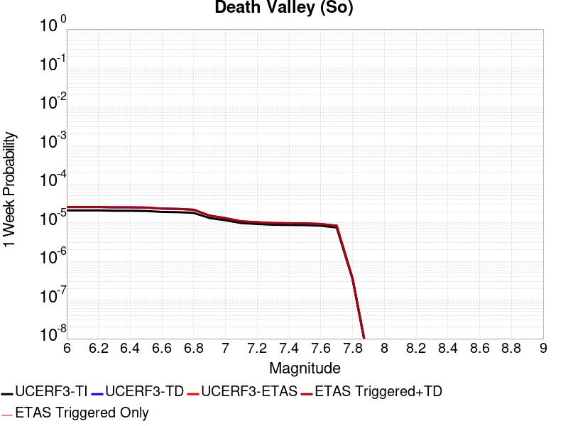 | 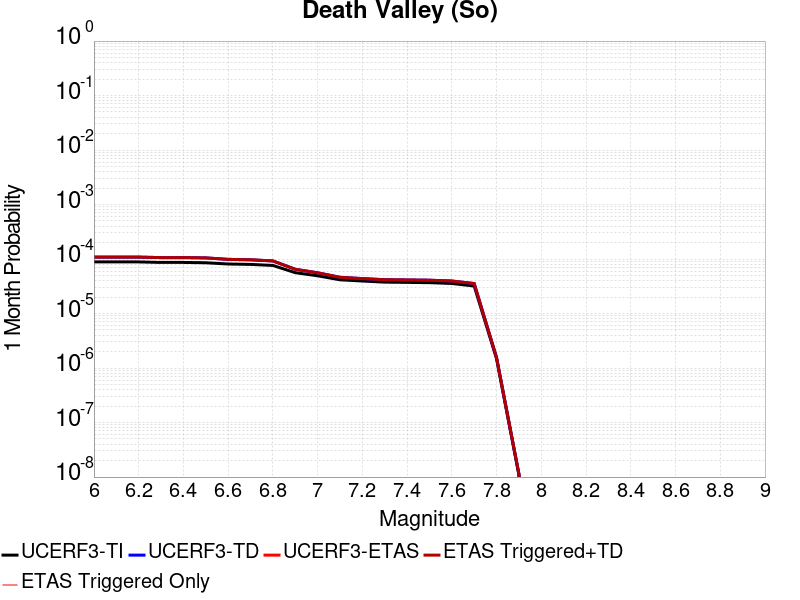 | 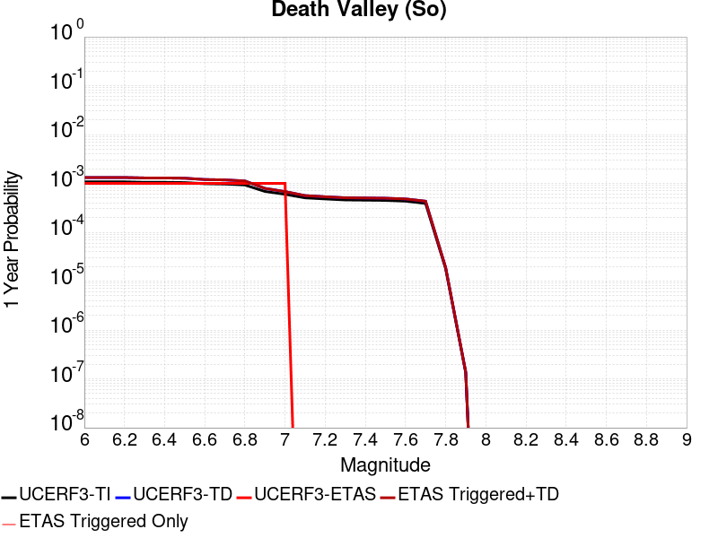 | 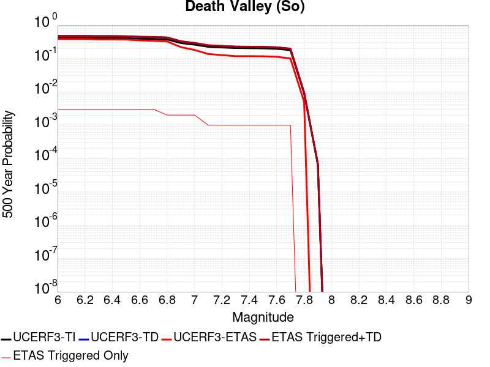 |

| Magnitude | 1 wk TI Prob | 1 wk TD Prob | 1 wk ETAS Prob | 1 wk ETAS/TD Gain | 1 wk ETAS Triggered+TD | 1 wk ETAS Triggered Only | 1 mo TI Prob | 1 mo TD Prob | 1 mo ETAS Prob | 1 mo ETAS/TD Gain | 1 mo ETAS Triggered+TD | 1 mo ETAS Triggered Only | 1 yr TI Prob | 1 yr TD Prob | 1 yr ETAS Prob | 1 yr ETAS/TD Gain | 1 yr ETAS Triggered+TD | 1 yr ETAS Triggered Only | 500 yr TI Prob | 500 yr TD Prob | 500 yr ETAS Prob | 500 yr ETAS/TD Gain | 500 yr ETAS Triggered+TD | 500 yr ETAS Triggered Only |
|-----|-----|-----|-----|-----|-----|-----|-----|-----|-----|-----|-----|-----|-----|-----|-----|-----|-----|-----|-----|-----|-----|-----|-----|-----|
| 6.0 | 2.0684236E-5 | 2.5322684E-5 | 0.0 | 0.0 | 2.5322684E-5 | 0.0 | 8.864371E-5 | 1.0852137E-4 | 0.0 | 0.0 | 1.0852137E-4 | 0.0 | 0.0010787029 | 0.0013204634 | 0.001 | 0.7573099 | 0.0013204634 | 0.0 | 0.4170434 | 0.47220448 | 0.384 | 0.81320703 | 0.47378784 | 0.003 |
| 6.1 | 2.0684236E-5 | 2.5322684E-5 | 0.0 | 0.0 | 2.5322684E-5 | 0.0 | 8.864371E-5 | 1.0852137E-4 | 0.0 | 0.0 | 1.0852137E-4 | 0.0 | 0.0010787029 | 0.0013204634 | 0.001 | 0.7573099 | 0.0013204634 | 0.0 | 0.4170434 | 0.47220448 | 0.384 | 0.81320703 | 0.47378784 | 0.003 |
| 6.2 | 2.0684236E-5 | 2.5322684E-5 | 0.0 | 0.0 | 2.5322684E-5 | 0.0 | 8.864371E-5 | 1.0852137E-4 | 0.0 | 0.0 | 1.0852137E-4 | 0.0 | 0.0010787029 | 0.0013204634 | 0.001 | 0.7573099 | 0.0013204634 | 0.0 | 0.4170434 | 0.47220448 | 0.384 | 0.81320703 | 0.47378784 | 0.003 |
| 6.3 | 2.0240292E-5 | 2.482603E-5 | 0.0 | 0.0 | 2.482603E-5 | 0.0 | 8.6741224E-5 | 1.06393025E-4 | 0.0 | 0.0 | 1.06393025E-4 | 0.0 | 0.0010555626 | 0.0012945816 | 0.001 | 0.7724503 | 0.0012945816 | 0.0 | 0.4102521 | 0.46548113 | 0.371 | 0.7970248 | 0.4670847 | 0.003 |
| 6.4 | 2.0240292E-5 | 2.482603E-5 | 0.0 | 0.0 | 2.482603E-5 | 0.0 | 8.6741224E-5 | 1.06393025E-4 | 0.0 | 0.0 | 1.06393025E-4 | 0.0 | 0.0010555626 | 0.0012945816 | 0.001 | 0.7724503 | 0.0012945816 | 0.0 | 0.4102521 | 0.46548113 | 0.371 | 0.7970248 | 0.4670847 | 0.003 |
| 6.5 | 1.9962767E-5 | 2.4517207E-5 | 0.0 | 0.0 | 2.4517207E-5 | 0.0 | 8.55519E-5 | 1.050696E-4 | 0.0 | 0.0 | 1.050696E-4 | 0.0 | 0.0010410968 | 0.001278488 | 0.001 | 0.782174 | 0.001278488 | 0.0 | 0.40596646 | 0.46124074 | 0.369 | 0.80001605 | 0.462857 | 0.003 |
| 6.6 | 1.8937297E-5 | 2.3032471E-5 | 0.0 | 0.0 | 2.3032471E-5 | 0.0 | 8.115732E-5 | 9.8706936E-5 | 0.0 | 0.0 | 9.8706936E-5 | 0.0 | 9.876423E-4 | 0.0012011086 | 0.001 | 0.83256423 | 0.0012011086 | 0.0 | 0.389859 | 0.44395268 | 0.347 | 0.78161484 | 0.44562083 | 0.003 |
| 6.7 | 1.8621096E-5 | 2.2636597E-5 | 0.0 | 0.0 | 2.2636597E-5 | 0.0 | 7.980225E-5 | 9.701046E-5 | 0.0 | 0.0 | 9.701046E-5 | 0.0 | 9.711593E-4 | 0.0011804765 | 0.001 | 0.8471156 | 0.0011804765 | 0.0 | 0.38480476 | 0.4387579 | 0.339 | 0.77263564 | 0.44044164 | 0.003 |
| 6.8 | 1.7830353E-5 | 2.154868E-5 | 0.0 | 0.0 | 2.154868E-5 | 0.0 | 7.641356E-5 | 9.2348295E-5 | 0.0 | 0.0 | 9.2348295E-5 | 0.0 | 9.29938E-4 | 0.0011237742 | 0.001 | 0.8898585 | 0.0011237742 | 0.0 | 0.3719813 | 0.4240547 | 0.323 | 0.76169413 | 0.4252066 | 0.002 |
| 6.9 | 1.3135183E-5 | 1.5162631E-5 | 0.0 | 0.0 | 1.5162631E-5 | 0.0 | 5.6292425E-5 | 6.498112E-5 | 0.0 | 0.0 | 6.498112E-5 | 0.0 | 6.8514474E-4 | 7.9086435E-4 | 0.001 | 1.2644393 | 7.9086435E-4 | 0.0 | 0.2901416 | 0.32652768 | 0.219 | 0.6706935 | 0.32787463 | 0.002 |
| 7.0 | 1.1507512E-5 | 1.3054175E-5 | 0.0 | 0.0 | 1.3054175E-5 | 0.0 | 4.9316975E-5 | 5.5945296E-5 | 0.0 | 0.0 | 5.5945296E-5 | 0.0 | 6.002687E-4 | 6.809268E-4 | 0.001 | 1.4685867 | 6.809268E-4 | 0.0 | 0.25934806 | 0.28976738 | 0.18 | 0.62118787 | 0.29118785 | 0.002 |
| 7.1 | 9.715903E-6 | 1.07931755E-5 | 0.0 | 0.0 | 1.07931755E-5 | 0.0 | 4.1638916E-5 | 4.625567E-5 | 0.0 | 0.0 | 4.625567E-5 | 0.0 | 5.068359E-4 | 5.6302146E-4 | 0.0 | 0.0 | 5.6302146E-4 | 0.0 | 0.22390643 | 0.24703602 | 0.136 | 0.550527 | 0.24778898 | 0.001 |
| 7.2 | 9.233269E-6 | 1.0221153E-5 | 0.0 | 0.0 | 1.0221153E-5 | 0.0 | 3.9570554E-5 | 4.380423E-5 | 0.0 | 0.0 | 4.380423E-5 | 0.0 | 4.81665E-4 | 5.3319015E-4 | 0.0 | 0.0 | 5.3319015E-4 | 0.0 | 0.21407233 | 0.235847 | 0.126 | 0.53424466 | 0.23661114 | 0.001 |
| 7.3 | 8.8041315E-6 | 9.750103E-6 | 0.0 | 0.0 | 9.750103E-6 | 0.0 | 3.7731446E-5 | 4.178551E-5 | 0.0 | 0.0 | 4.178551E-5 | 0.0 | 4.592835E-4 | 5.08624E-4 | 0.0 | 0.0 | 5.08624E-4 | 0.0 | 0.20522363 | 0.22546941 | 0.117 | 0.5189174 | 0.22624394 | 0.001 |
| 7.4 | 8.708749E-6 | 9.6494305E-6 | 0.0 | 0.0 | 9.6494305E-6 | 0.0 | 3.7322676E-5 | 4.1354073E-5 | 0.0 | 0.0 | 4.1354073E-5 | 0.0 | 4.5430884E-4 | 5.033737E-4 | 0.0 | 0.0 | 5.033737E-4 | 0.0 | 0.20324339 | 0.22343253 | 0.117 | 0.523648 | 0.22420909 | 0.001 |
| 7.5 | 8.612678E-6 | 9.547429E-6 | 0.0 | 0.0 | 9.547429E-6 | 0.0 | 3.6910955E-5 | 4.0916933E-5 | 0.0 | 0.0 | 4.0916933E-5 | 0.0 | 4.492982E-4 | 4.9805397E-4 | 0.0 | 0.0 | 4.9805397E-4 | 0.0 | 0.20124386 | 0.22136338 | 0.116 | 0.52402526 | 0.22214201 | 0.001 |
| 7.6 | 8.319024E-6 | 9.228088E-6 | 0.0 | 0.0 | 9.228088E-6 | 0.0 | 3.5652476E-5 | 3.954837E-5 | 0.0 | 0.0 | 3.954837E-5 | 0.0 | 4.3398244E-4 | 4.8139918E-4 | 0.0 | 0.0 | 4.8139918E-4 | 0.0 | 0.19510087 | 0.21485044 | 0.112 | 0.52129287 | 0.2156356 | 0.001 |
| 7.7 | 7.4718328E-6 | 8.294614E-6 | 0.0 | 0.0 | 8.294614E-6 | 0.0 | 3.2021748E-5 | 3.5547888E-5 | 0.0 | 0.0 | 3.5547888E-5 | 0.0 | 3.8979502E-4 | 4.3271357E-4 | 0.0 | 0.0 | 4.3271357E-4 | 0.0 | 0.17711227 | 0.19547205 | 0.1 | 0.5115821 | 0.19627658 | 0.001 |
| 7.8 | 3.4586725E-7 | 3.6378464E-7 | 0.0 | 0.0 | 3.6378464E-7 | 0.0 | 1.4822873E-6 | 1.559076E-6 | 0.0 | 0.0 | 1.559076E-6 | 0.0 | 1.80467E-5 | 1.898159E-5 | 0.0 | 0.0 | 1.898159E-5 | 0.0 | 0.008982842 | 0.00944719 | 0.005 | 0.52925795 | 0.00944719 | 0.0 |
| 7.9 | 2.5591178E-9 | 2.6636915E-9 | 0.0 | 0.0 | 2.6636915E-9 | 0.0 | 1.0967647E-8 | 1.141582E-8 | 0.0 | 0.0 | 1.141582E-8 | 0.0 | 1.335311E-7 | 1.3898762E-7 | 0.0 | 0.0 | 1.3898762E-7 | 0.0 | 6.676333E-5 | 6.9493806E-5 | 0.0 | 0.0 | 6.9493806E-5 | 0.0 |

## Little Lake
*[(top)](#table-of-contents)*

| 1 Week | 1 Month | 1 Year | 500 Year |
|-----|-----|-----|-----|
| 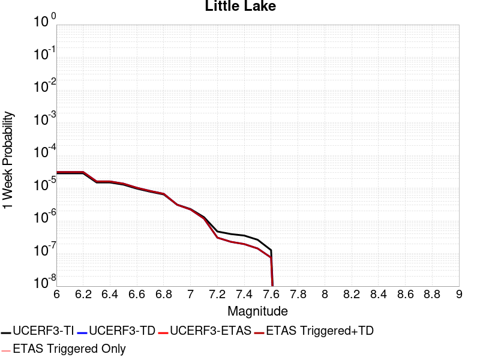 |  | 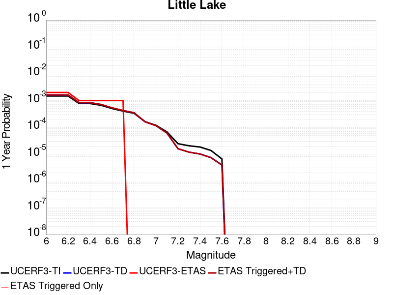 | 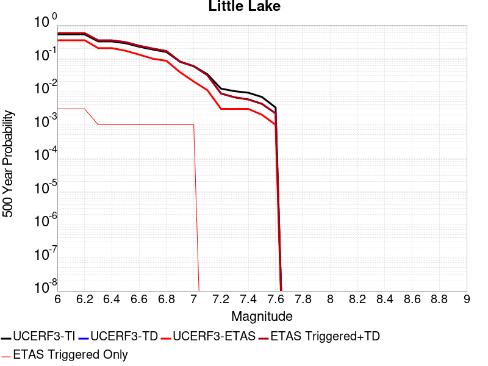 |

| Magnitude | 1 wk TI Prob | 1 wk TD Prob | 1 wk ETAS Prob | 1 wk ETAS/TD Gain | 1 wk ETAS Triggered+TD | 1 wk ETAS Triggered Only | 1 mo TI Prob | 1 mo TD Prob | 1 mo ETAS Prob | 1 mo ETAS/TD Gain | 1 mo ETAS Triggered+TD | 1 mo ETAS Triggered Only | 1 yr TI Prob | 1 yr TD Prob | 1 yr ETAS Prob | 1 yr ETAS/TD Gain | 1 yr ETAS Triggered+TD | 1 yr ETAS Triggered Only | 500 yr TI Prob | 500 yr TD Prob | 500 yr ETAS Prob | 500 yr ETAS/TD Gain | 500 yr ETAS Triggered+TD | 500 yr ETAS Triggered Only |
|-----|-----|-----|-----|-----|-----|-----|-----|-----|-----|-----|-----|-----|-----|-----|-----|-----|-----|-----|-----|-----|-----|-----|-----|-----|
| 6.0 | 2.8424427E-5 | 3.1034284E-5 | 0.0 | 0.0 | 3.1034284E-5 | 0.0 | 1.2181328E-4 | 1.3299803E-4 | 0.0 | 0.0 | 1.3299803E-4 | 0.0 | 0.0014820677 | 0.0016181798 | 0.002 | 1.2359565 | 0.0016181798 | 0.0 | 0.523641 | 0.5677398 | 0.349 | 0.61471826 | 0.5690366 | 0.003 |
| 6.1 | 2.8424427E-5 | 3.1034284E-5 | 0.0 | 0.0 | 3.1034284E-5 | 0.0 | 1.2181328E-4 | 1.3299803E-4 | 0.0 | 0.0 | 1.3299803E-4 | 0.0 | 0.0014820677 | 0.0016181798 | 0.002 | 1.2359565 | 0.0016181798 | 0.0 | 0.523641 | 0.5677398 | 0.349 | 0.61471826 | 0.5690366 | 0.003 |
| 6.2 | 2.8424427E-5 | 3.1034284E-5 | 0.0 | 0.0 | 3.1034284E-5 | 0.0 | 1.2181328E-4 | 1.3299803E-4 | 0.0 | 0.0 | 1.3299803E-4 | 0.0 | 0.0014820677 | 0.0016181798 | 0.002 | 1.2359565 | 0.0016181798 | 0.0 | 0.523641 | 0.5677398 | 0.349 | 0.61471826 | 0.5690366 | 0.003 |
| 6.3 | 1.48860645E-5 | 1.6001512E-5 | 0.0 | 0.0 | 1.6001512E-5 | 0.0 | 6.379586E-5 | 6.8576264E-5 | 0.0 | 0.0 | 6.8576264E-5 | 0.0 | 7.7643775E-4 | 8.3462405E-4 | 0.001 | 1.1981442 | 8.3462405E-4 | 0.0 | 0.3218384 | 0.34505966 | 0.202 | 0.585406 | 0.34571463 | 0.001 |
| 6.4 | 1.48860645E-5 | 1.6001512E-5 | 0.0 | 0.0 | 1.6001512E-5 | 0.0 | 6.379586E-5 | 6.8576264E-5 | 0.0 | 0.0 | 6.8576264E-5 | 0.0 | 7.7643775E-4 | 8.3462405E-4 | 0.001 | 1.1981442 | 8.3462405E-4 | 0.0 | 0.3218384 | 0.34505966 | 0.202 | 0.585406 | 0.34571463 | 0.001 |
| 6.5 | 1.2797581E-5 | 1.3698717E-5 | 0.0 | 0.0 | 1.3698717E-5 | 0.0 | 5.4845623E-5 | 5.870761E-5 | 0.0 | 0.0 | 5.870761E-5 | 0.0 | 6.675408E-4 | 7.145562E-4 | 0.001 | 1.3994701 | 7.145562E-4 | 0.0 | 0.28386164 | 0.30457553 | 0.169 | 0.5548706 | 0.30527094 | 0.001 |
| 6.6 | 9.661896E-6 | 1.024172E-5 | 0.0 | 0.0 | 1.024172E-5 | 0.0 | 4.1407468E-5 | 4.3892436E-5 | 0.0 | 0.0 | 4.3892436E-5 | 0.0 | 5.040193E-4 | 5.3427543E-4 | 0.001 | 1.8716937 | 5.3427543E-4 | 0.0 | 0.22281215 | 0.23782383 | 0.129 | 0.5424183 | 0.23858601 | 0.001 |
| 6.7 | 7.767871E-6 | 8.163517E-6 | 0.0 | 0.0 | 8.163517E-6 | 0.0 | 3.329045E-5 | 3.498611E-5 | 0.0 | 0.0 | 3.498611E-5 | 0.0 | 4.0523586E-4 | 4.2588622E-4 | 0.001 | 2.3480449 | 4.2588622E-4 | 0.0 | 0.18344335 | 0.19526945 | 0.097 | 0.49674952 | 0.19607417 | 0.001 |
| 6.8 | 6.4235196E-6 | 6.706346E-6 | 0.0 | 0.0 | 6.706346E-6 | 0.0 | 2.752908E-5 | 2.8741239E-5 | 0.0 | 0.0 | 2.8741239E-5 | 0.0 | 3.35115E-4 | 3.498811E-4 | 0.0 | 0.0 | 3.498811E-4 | 0.0 | 0.15429576 | 0.16394337 | 0.084 | 0.5123721 | 0.16477941 | 0.001 |
| 6.9 | 3.1283696E-6 | 3.1015245E-6 | 0.0 | 0.0 | 3.1015245E-6 | 0.0 | 1.3407229E-5 | 1.3292189E-5 | 0.0 | 0.0 | 1.3292189E-5 | 0.0 | 1.6322079E-4 | 1.6182188E-4 | 0.0 | 0.0 | 1.6182188E-4 | 0.0 | 0.078375176 | 0.07881321 | 0.038 | 0.48215264 | 0.0797344 | 0.001 |
| 7.0 | 2.290603E-6 | 2.2205265E-6 | 0.0 | 0.0 | 2.2205265E-6 | 0.0 | 9.816834E-6 | 9.516513E-6 | 0.0 | 0.0 | 9.516513E-6 | 0.0 | 1.19513395E-4 | 1.1585843E-4 | 0.0 | 0.0 | 1.1585843E-4 | 0.0 | 0.05800967 | 0.057274226 | 0.02 | 0.3491972 | 0.05821695 | 0.001 |
| 7.1 | 1.293693E-6 | 1.1724853E-6 | 0.0 | 0.0 | 1.1724853E-6 | 0.0 | 5.5443866E-6 | 5.0249314E-6 | 0.0 | 0.0 | 5.0249314E-6 | 0.0 | 6.750081E-5 | 6.117752E-5 | 0.0 | 0.0 | 6.117752E-5 | 0.0 | 0.033188317 | 0.031051613 | 0.011 | 0.3542489 | 0.031051613 | 0.0 |
| 7.2 | 4.715842E-7 | 3.0652274E-7 | 0.0 | 0.0 | 3.0652274E-7 | 0.0 | 2.0210737E-6 | 1.3136682E-6 | 0.0 | 0.0 | 1.3136682E-6 | 0.0 | 2.4606294E-5 | 1.5993799E-5 | 0.0 | 0.0 | 1.5993799E-5 | 0.0 | 0.012227922 | 0.00872353 | 0.003 | 0.3438975 | 0.00872353 | 0.0 |
| 7.3 | 3.9430947E-7 | 2.2850615E-7 | 0.0 | 0.0 | 2.2850615E-7 | 0.0 | 1.6898966E-6 | 9.793117E-7 | 0.0 | 0.0 | 9.793117E-7 | 0.0 | 2.0574296E-5 | 1.1923055E-5 | 0.0 | 0.0 | 1.1923055E-5 | 0.0 | 0.010234522 | 0.0066942023 | 0.003 | 0.448149 | 0.0066942023 | 0.0 |
| 7.4 | 3.547123E-7 | 1.9449392E-7 | 0.0 | 0.0 | 1.9449392E-7 | 0.0 | 1.5201948E-6 | 8.3354513E-7 | 0.0 | 0.0 | 8.3354513E-7 | 0.0 | 1.8508214E-5 | 1.0148366E-5 | 0.0 | 0.0 | 1.0148366E-5 | 0.0 | 0.009211505 | 0.0057833893 | 0.003 | 0.518727 | 0.0057833893 | 0.0 |
| 7.5 | 2.6354266E-7 | 1.4263576E-7 | 0.0 | 0.0 | 1.4263576E-7 | 0.0 | 1.129468E-6 | 6.11296E-7 | 0.0 | 0.0 | 6.11296E-7 | 0.0 | 1.3751187E-5 | 7.4425034E-6 | 0.0 | 0.0 | 7.4425034E-6 | 0.0 | 0.0068520573 | 0.0042578117 | 0.002 | 0.46972486 | 0.0042578117 | 0.0 |
| 7.6 | 1.269913E-7 | 7.5041456E-8 | 0.0 | 0.0 | 7.5041456E-8 | 0.0 | 5.4424834E-7 | 3.216062E-7 | 0.0 | 0.0 | 3.216062E-7 | 0.0 | 6.6262032E-6 | 3.915549E-6 | 0.0 | 0.0 | 3.915549E-6 | 0.0 | 0.0033076303 | 0.0021972663 | 0.001 | 0.45511097 | 0.0021972663 | 0.0 |

## Hilton Creek 2011 CFM
*[(top)](#table-of-contents)*

| 1 Week | 1 Month | 1 Year | 500 Year |
|-----|-----|-----|-----|
|  | 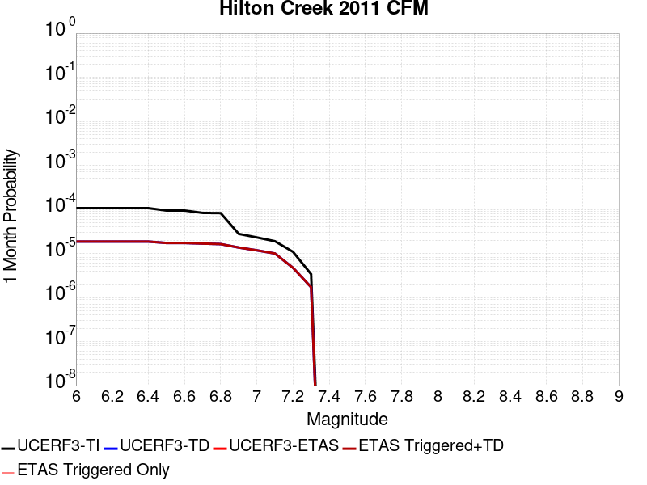 | 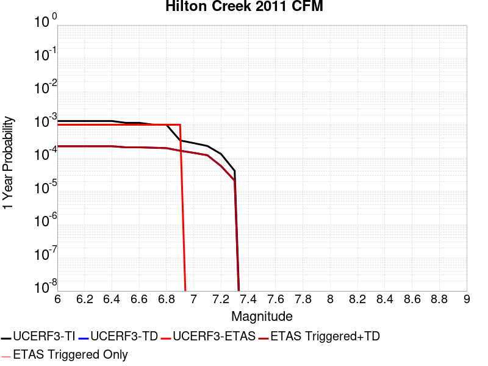 | 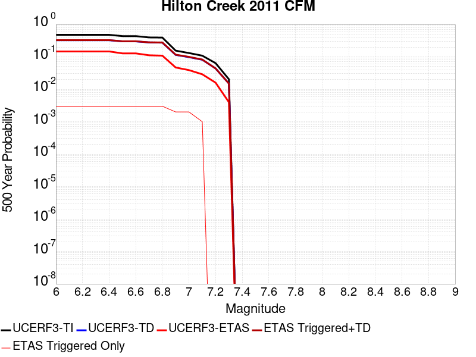 |

| Magnitude | 1 wk TI Prob | 1 wk TD Prob | 1 wk ETAS Prob | 1 wk ETAS/TD Gain | 1 wk ETAS Triggered+TD | 1 wk ETAS Triggered Only | 1 mo TI Prob | 1 mo TD Prob | 1 mo ETAS Prob | 1 mo ETAS/TD Gain | 1 mo ETAS Triggered+TD | 1 mo ETAS Triggered Only | 1 yr TI Prob | 1 yr TD Prob | 1 yr ETAS Prob | 1 yr ETAS/TD Gain | 1 yr ETAS Triggered+TD | 1 yr ETAS Triggered Only | 500 yr TI Prob | 500 yr TD Prob | 500 yr ETAS Prob | 500 yr ETAS/TD Gain | 500 yr ETAS Triggered+TD | 500 yr ETAS Triggered Only |
|-----|-----|-----|-----|-----|-----|-----|-----|-----|-----|-----|-----|-----|-----|-----|-----|-----|-----|-----|-----|-----|-----|-----|-----|-----|
| 6.0 | 2.4923684E-5 | 4.3362493E-6 | 0.0 | 0.0 | 4.3362493E-6 | 0.0 | 1.06811414E-4 | 1.8583802E-5 | 0.0 | 0.0 | 1.8583802E-5 | 0.0 | 0.0012996531 | 2.2623582E-4 | 0.001 | 4.4201665 | 2.2623582E-4 | 0.0 | 0.4780843 | 0.32585204 | 0.147 | 0.451125 | 0.32787448 | 0.003 |
| 6.1 | 2.4923684E-5 | 4.3362493E-6 | 0.0 | 0.0 | 4.3362493E-6 | 0.0 | 1.06811414E-4 | 1.8583802E-5 | 0.0 | 0.0 | 1.8583802E-5 | 0.0 | 0.0012996531 | 2.2623582E-4 | 0.001 | 4.4201665 | 2.2623582E-4 | 0.0 | 0.4780843 | 0.32585204 | 0.147 | 0.451125 | 0.32787448 | 0.003 |
| 6.2 | 2.4923684E-5 | 4.3362493E-6 | 0.0 | 0.0 | 4.3362493E-6 | 0.0 | 1.06811414E-4 | 1.8583802E-5 | 0.0 | 0.0 | 1.8583802E-5 | 0.0 | 0.0012996531 | 2.2623582E-4 | 0.001 | 4.4201665 | 2.2623582E-4 | 0.0 | 0.4780843 | 0.32585204 | 0.147 | 0.451125 | 0.32787448 | 0.003 |
| 6.3 | 2.4923684E-5 | 4.3362493E-6 | 0.0 | 0.0 | 4.3362493E-6 | 0.0 | 1.06811414E-4 | 1.8583802E-5 | 0.0 | 0.0 | 1.8583802E-5 | 0.0 | 0.0012996531 | 2.2623582E-4 | 0.001 | 4.4201665 | 2.2623582E-4 | 0.0 | 0.4780843 | 0.32585204 | 0.147 | 0.451125 | 0.32787448 | 0.003 |
| 6.4 | 2.4923684E-5 | 4.3362493E-6 | 0.0 | 0.0 | 4.3362493E-6 | 0.0 | 1.06811414E-4 | 1.8583802E-5 | 0.0 | 0.0 | 1.8583802E-5 | 0.0 | 0.0012996531 | 2.2623582E-4 | 0.001 | 4.4201665 | 2.2623582E-4 | 0.0 | 0.4780843 | 0.32585204 | 0.147 | 0.451125 | 0.32787448 | 0.003 |
| 6.5 | 2.1963904E-5 | 4.033347E-6 | 0.0 | 0.0 | 4.033347E-6 | 0.0 | 9.412762E-5 | 1.7285665E-5 | 0.0 | 0.0 | 1.7285665E-5 | 0.0 | 0.0011454013 | 2.1043407E-4 | 0.001 | 4.7520823 | 2.1043407E-4 | 0.0 | 0.43618488 | 0.30008683 | 0.128 | 0.42654324 | 0.30218655 | 0.003 |
| 6.6 | 2.1963904E-5 | 4.033347E-6 | 0.0 | 0.0 | 4.033347E-6 | 0.0 | 9.412762E-5 | 1.7285665E-5 | 0.0 | 0.0 | 1.7285665E-5 | 0.0 | 0.0011454013 | 2.1043407E-4 | 0.001 | 4.7520823 | 2.1043407E-4 | 0.0 | 0.43618488 | 0.30008683 | 0.128 | 0.42654324 | 0.30218655 | 0.003 |
| 6.7 | 1.9397496E-5 | 3.90991E-6 | 0.0 | 0.0 | 3.90991E-6 | 0.0 | 8.3129475E-5 | 1.6756658E-5 | 0.0 | 0.0 | 1.6756658E-5 | 0.0 | 0.0010116313 | 2.0399461E-4 | 0.001 | 4.9020905 | 2.0399461E-4 | 0.0 | 0.39714086 | 0.27809346 | 0.112 | 0.4027423 | 0.2802592 | 0.003 |
| 6.8 | 1.917303E-5 | 3.8047813E-6 | 0.0 | 0.0 | 3.8047813E-6 | 0.0 | 8.216754E-5 | 1.6306112E-5 | 0.0 | 0.0 | 1.6306112E-5 | 0.0 | 9.999307E-4 | 1.9851021E-4 | 0.001 | 5.037524 | 1.9851021E-4 | 0.0 | 0.39360002 | 0.27494013 | 0.109 | 0.39644995 | 0.27711532 | 0.003 |
| 6.9 | 6.480681E-6 | 3.1778134E-6 | 0.0 | 0.0 | 3.1778134E-6 | 0.0 | 2.7774051E-5 | 1.3619136E-5 | 0.0 | 0.0 | 1.3619136E-5 | 0.0 | 3.380966E-4 | 1.6580145E-4 | 0.001 | 6.03131 | 1.6580145E-4 | 0.0 | 0.15555602 | 0.11498107 | 0.047 | 0.40876293 | 0.11675111 | 0.002 |
| 7.0 | 5.388316E-6 | 2.7446858E-6 | 0.0 | 0.0 | 2.7446858E-6 | 0.0 | 2.3092578E-5 | 1.17628915E-5 | 0.0 | 0.0 | 1.17628915E-5 | 0.0 | 2.8111585E-4 | 1.432048E-4 | 0.0 | 0.0 | 1.432048E-4 | 0.0 | 0.13114384 | 0.09798758 | 0.039 | 0.39800963 | 0.0997916 | 0.002 |
| 7.1 | 4.41728E-6 | 2.3244716E-6 | 0.0 | 0.0 | 2.3244716E-6 | 0.0 | 1.8931061E-5 | 9.961988E-6 | 0.0 | 0.0 | 9.961988E-6 | 0.0 | 2.304613E-4 | 1.2128141E-4 | 0.0 | 0.0 | 1.2128141E-4 | 0.0 | 0.10885126 | 0.08157639 | 0.029 | 0.355495 | 0.08249482 | 0.001 |
| 7.2 | 2.535495E-6 | 1.1009048E-6 | 0.0 | 0.0 | 1.1009048E-6 | 0.0 | 1.0866362E-5 | 4.7181575E-6 | 0.0 | 0.0 | 4.7181575E-6 | 0.0 | 1.3228992E-4 | 5.7442558E-5 | 0.0 | 0.0 | 5.7442558E-5 | 0.0 | 0.06400892 | 0.04390238 | 0.016 | 0.36444494 | 0.04390238 | 0.0 |
| 7.3 | 7.900015E-7 | 3.9985227E-7 | 0.0 | 0.0 | 3.9985227E-7 | 0.0 | 3.3857161E-6 | 1.7136526E-6 | 0.0 | 0.0 | 1.7136526E-6 | 0.0 | 4.1220315E-5 | 2.0863721E-5 | 0.0 | 0.0 | 2.0863721E-5 | 0.0 | 0.020399636 | 0.015040802 | 0.004 | 0.26594326 | 0.015040802 | 0.0 |

## Los Osos 2011
*[(top)](#table-of-contents)*

| 1 Week | 1 Month | 1 Year | 500 Year |
|-----|-----|-----|-----|
| 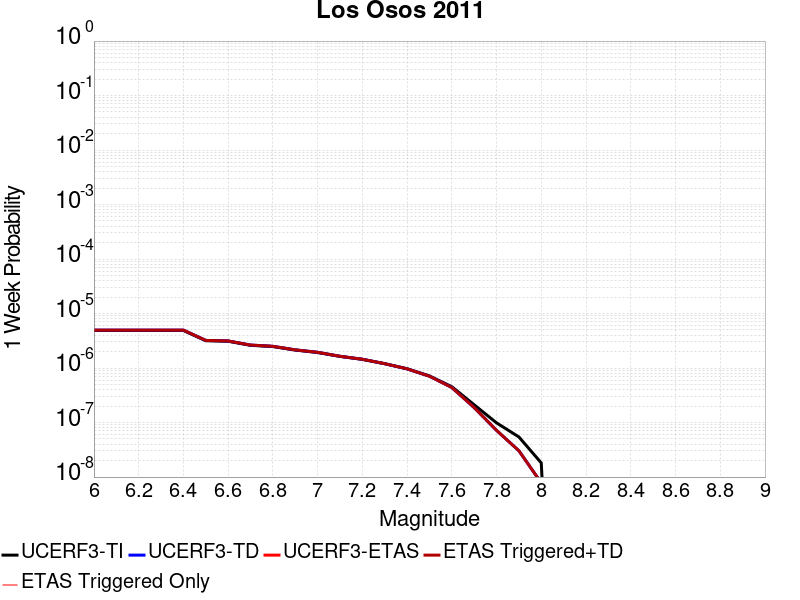 | 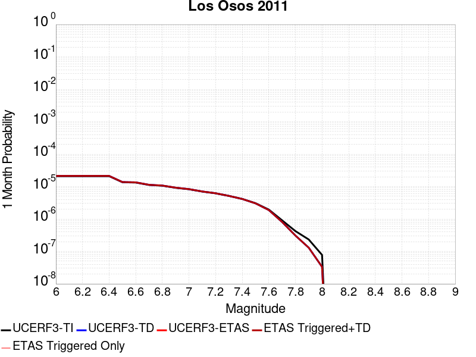 | 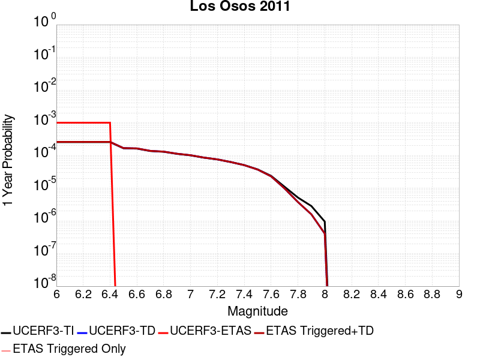 | 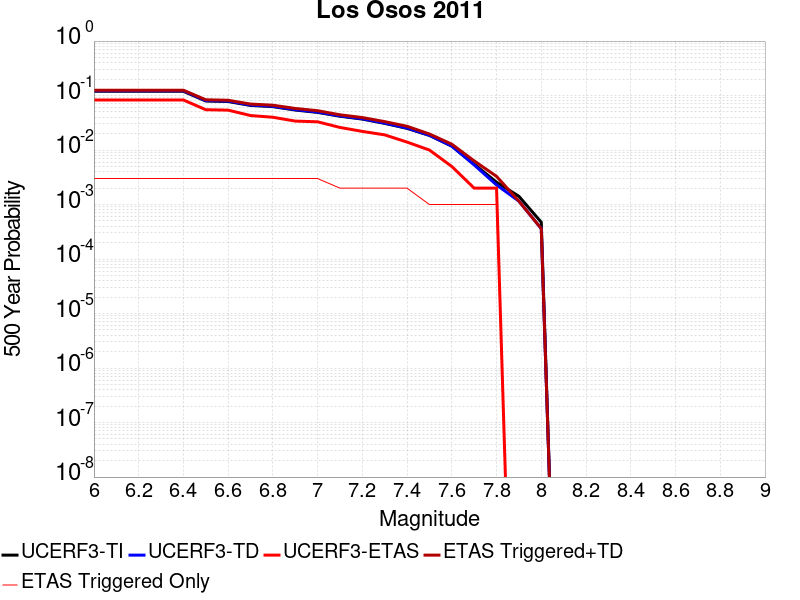 |

| Magnitude | 1 wk TI Prob | 1 wk TD Prob | 1 wk ETAS Prob | 1 wk ETAS/TD Gain | 1 wk ETAS Triggered+TD | 1 wk ETAS Triggered Only | 1 mo TI Prob | 1 mo TD Prob | 1 mo ETAS Prob | 1 mo ETAS/TD Gain | 1 mo ETAS Triggered+TD | 1 mo ETAS Triggered Only | 1 yr TI Prob | 1 yr TD Prob | 1 yr ETAS Prob | 1 yr ETAS/TD Gain | 1 yr ETAS Triggered+TD | 1 yr ETAS Triggered Only | 500 yr TI Prob | 500 yr TD Prob | 500 yr ETAS Prob | 500 yr ETAS/TD Gain | 500 yr ETAS Triggered+TD | 500 yr ETAS Triggered Only |
|-----|-----|-----|-----|-----|-----|-----|-----|-----|-----|-----|-----|-----|-----|-----|-----|-----|-----|-----|-----|-----|-----|-----|-----|-----|
| 6.0 | 4.8871775E-6 | 4.973248E-6 | 0.0 | 0.0 | 4.973248E-6 | 0.0 | 2.0944879E-5 | 2.1313761E-5 | 0.0 | 0.0 | 2.1313761E-5 | 0.0 | 2.5497406E-4 | 2.594669E-4 | 0.001 | 3.854056 | 2.594669E-4 | 0.0 | 0.11970948 | 0.12273954 | 0.083 | 0.6762287 | 0.12537132 | 0.003 |
| 6.1 | 4.8871775E-6 | 4.973248E-6 | 0.0 | 0.0 | 4.973248E-6 | 0.0 | 2.0944879E-5 | 2.1313761E-5 | 0.0 | 0.0 | 2.1313761E-5 | 0.0 | 2.5497406E-4 | 2.594669E-4 | 0.001 | 3.854056 | 2.594669E-4 | 0.0 | 0.11970948 | 0.12273954 | 0.083 | 0.6762287 | 0.12537132 | 0.003 |
| 6.2 | 4.8871775E-6 | 4.973248E-6 | 0.0 | 0.0 | 4.973248E-6 | 0.0 | 2.0944879E-5 | 2.1313761E-5 | 0.0 | 0.0 | 2.1313761E-5 | 0.0 | 2.5497406E-4 | 2.594669E-4 | 0.001 | 3.854056 | 2.594669E-4 | 0.0 | 0.11970948 | 0.12273954 | 0.083 | 0.6762287 | 0.12537132 | 0.003 |
| 6.3 | 4.8871775E-6 | 4.973248E-6 | 0.0 | 0.0 | 4.973248E-6 | 0.0 | 2.0944879E-5 | 2.1313761E-5 | 0.0 | 0.0 | 2.1313761E-5 | 0.0 | 2.5497406E-4 | 2.594669E-4 | 0.001 | 3.854056 | 2.594669E-4 | 0.0 | 0.11970948 | 0.12273954 | 0.083 | 0.6762287 | 0.12537132 | 0.003 |
| 6.4 | 4.8871775E-6 | 4.973248E-6 | 0.0 | 0.0 | 4.973248E-6 | 0.0 | 2.0944879E-5 | 2.1313761E-5 | 0.0 | 0.0 | 2.1313761E-5 | 0.0 | 2.5497406E-4 | 2.594669E-4 | 0.001 | 3.854056 | 2.594669E-4 | 0.0 | 0.11970948 | 0.12273954 | 0.083 | 0.6762287 | 0.12537132 | 0.003 |
| 6.5 | 3.1724062E-6 | 3.217466E-6 | 0.0 | 0.0 | 3.217466E-6 | 0.0 | 1.3595956E-5 | 1.3789067E-5 | 0.0 | 0.0 | 1.3789067E-5 | 0.0 | 1.6551818E-4 | 1.678691E-4 | 0.0 | 0.0 | 1.678691E-4 | 0.0 | 0.07943341 | 0.0809413 | 0.055 | 0.67950475 | 0.083698474 | 0.003 |
| 6.6 | 3.1022591E-6 | 3.14529E-6 | 0.0 | 0.0 | 3.14529E-6 | 0.0 | 1.3295328E-5 | 1.3479746E-5 | 0.0 | 0.0 | 1.3479746E-5 | 0.0 | 1.618586E-4 | 1.6410367E-4 | 0.0 | 0.0 | 1.6410367E-4 | 0.0 | 0.07774715 | 0.07920743 | 0.054 | 0.68175423 | 0.081969805 | 0.003 |
| 6.7 | 2.611518E-6 | 2.6439632E-6 | 0.0 | 0.0 | 2.6439632E-6 | 0.0 | 1.1192172E-5 | 1.1331222E-5 | 0.0 | 0.0 | 1.1331222E-5 | 0.0 | 1.3625617E-4 | 1.3794894E-4 | 0.0 | 0.0 | 1.3794894E-4 | 0.0 | 0.06586352 | 0.067063965 | 0.043 | 0.6411789 | 0.06986277 | 0.003 |
| 6.8 | 2.4780884E-6 | 2.5071313E-6 | 0.0 | 0.0 | 2.5071313E-6 | 0.0 | 1.0620336E-5 | 1.0744804E-5 | 0.0 | 0.0 | 1.0744804E-5 | 0.0 | 1.2929492E-4 | 1.3081018E-4 | 0.0 | 0.0 | 1.3081018E-4 | 0.0 | 0.062606044 | 0.06372658 | 0.04 | 0.62768155 | 0.066535406 | 0.003 |
| 6.9 | 2.1376322E-6 | 2.1589144E-6 | 0.0 | 0.0 | 2.1589144E-6 | 0.0 | 9.161248E-6 | 9.252458E-6 | 0.0 | 0.0 | 9.252458E-6 | 0.0 | 1.1153249E-4 | 1.1264286E-4 | 0.0 | 0.0 | 1.1264286E-4 | 0.0 | 0.054242756 | 0.0551765 | 0.034 | 0.6162044 | 0.05801097 | 0.003 |
| 7.0 | 1.9282882E-6 | 1.9451172E-6 | 0.0 | 0.0 | 1.9451172E-6 | 0.0 | 8.264066E-6 | 8.33619E-6 | 0.0 | 0.0 | 8.33619E-6 | 0.0 | 1.0061036E-4 | 1.014884E-4 | 0.0 | 0.0 | 1.014884E-4 | 0.0 | 0.049063236 | 0.049890444 | 0.033 | 0.6614493 | 0.052740775 | 0.003 |
| 7.1 | 1.6353226E-6 | 1.6461092E-6 | 0.0 | 0.0 | 1.6461092E-6 | 0.0 | 7.0085066E-6 | 7.054735E-6 | 0.0 | 0.0 | 7.054735E-6 | 0.0 | 8.532523E-5 | 8.5888016E-5 | 0.0 | 0.0 | 8.5888016E-5 | 0.0 | 0.041767113 | 0.042448223 | 0.026 | 0.6125109 | 0.044363327 | 0.002 |
| 7.2 | 1.4446276E-6 | 1.4515483E-6 | 0.0 | 0.0 | 1.4515483E-6 | 0.0 | 6.191247E-6 | 6.2209065E-6 | 0.0 | 0.0 | 6.2209065E-6 | 0.0 | 7.537582E-5 | 7.5736905E-5 | 0.0 | 0.0 | 7.5736905E-5 | 0.0 | 0.036987927 | 0.037574958 | 0.022 | 0.58549637 | 0.039499808 | 0.002 |
| 7.3 | 1.2014582E-6 | 1.2034006E-6 | 0.0 | 0.0 | 1.2034006E-6 | 0.0 | 5.149096E-6 | 5.157421E-6 | 0.0 | 0.0 | 5.157421E-6 | 0.0 | 6.268844E-5 | 6.27898E-5 | 0.0 | 0.0 | 6.27898E-5 | 0.0 | 0.030859036 | 0.03132355 | 0.019 | 0.6065724 | 0.0332609 | 0.002 |
| 7.4 | 9.707733E-7 | 9.677495E-7 | 0.0 | 0.0 | 9.677495E-7 | 0.0 | 4.16045E-6 | 4.1474914E-6 | 0.0 | 0.0 | 4.1474914E-6 | 0.0 | 5.0652303E-5 | 5.0494542E-5 | 0.0 | 0.0 | 5.0494542E-5 | 0.0 | 0.02500876 | 0.025349477 | 0.014 | 0.5522796 | 0.02729878 | 0.002 |
| 7.5 | 7.174908E-7 | 7.085942E-7 | 0.0 | 0.0 | 7.085942E-7 | 0.0 | 3.074957E-6 | 3.0368287E-6 | 0.0 | 0.0 | 3.0368287E-6 | 0.0 | 3.743696E-5 | 3.6972764E-5 | 0.0 | 0.0 | 3.6972764E-5 | 0.0 | 0.01854472 | 0.018737135 | 0.01 | 0.5336995 | 0.019718397 | 0.001 |
| 7.6 | 4.5535776E-7 | 4.3957155E-7 | 0.0 | 0.0 | 4.3957155E-7 | 0.0 | 1.9515319E-6 | 1.8838767E-6 | 0.0 | 0.0 | 1.8838767E-6 | 0.0 | 2.3759641E-5 | 2.2935958E-5 | 0.0 | 0.0 | 2.2935958E-5 | 0.0 | 0.011809673 | 0.011825594 | 0.005 | 0.42281172 | 0.012813768 | 0.001 |
| 7.7 | 2.1173553E-7 | 1.88522E-7 | 0.0 | 0.0 | 1.88522E-7 | 0.0 | 9.0743765E-7 | 8.0795115E-7 | 0.0 | 0.0 | 8.0795115E-7 | 0.0 | 1.1047998E-5 | 9.836761E-6 | 0.0 | 0.0 | 9.836761E-6 | 0.0 | 0.0055088 | 0.0053319186 | 0.002 | 0.3750995 | 0.0063265865 | 0.001 |
| 7.8 | 9.873608E-8 | 7.1897844E-8 | 0.0 | 0.0 | 7.1897844E-8 | 0.0 | 4.2315455E-7 | 3.0813356E-7 | 0.0 | 0.0 | 3.0813356E-7 | 0.0 | 5.1518946E-6 | 3.75152E-6 | 0.0 | 0.0 | 3.75152E-6 | 0.0 | 0.002572639 | 0.002292338 | 0.002 | 0.87247163 | 0.0032900458 | 0.001 |
| 7.9 | 5.4399106E-8 | 3.037552E-8 | 0.0 | 0.0 | 3.037552E-8 | 0.0 | 2.33139E-7 | 1.301808E-7 | 0.0 | 0.0 | 1.301808E-7 | 0.0 | 2.8384638E-6 | 1.58495E-6 | 0.0 | 0.0 | 1.58495E-6 | 0.0 | 0.0014182272 | 0.0011547541 | 0.0 | 0.0 | 0.0011547541 | 0.0 |
| 8.0 | 1.817203E-8 | 7.801797E-9 | 0.0 | 0.0 | 7.801797E-9 | 0.0 | 7.7880124E-8 | 3.3436272E-8 | 0.0 | 0.0 | 3.3436272E-8 | 0.0 | 9.481901E-7 | 4.0708656E-7 | 0.0 | 0.0 | 4.0708656E-7 | 0.0 | 4.7398292E-4 | 3.6155325E-4 | 0.0 | 0.0 | 3.6155325E-4 | 0.0 |

## So Sierra Nevada
*[(top)](#table-of-contents)*

| 1 Week | 1 Month | 1 Year | 500 Year |
|-----|-----|-----|-----|
|  |  |  | 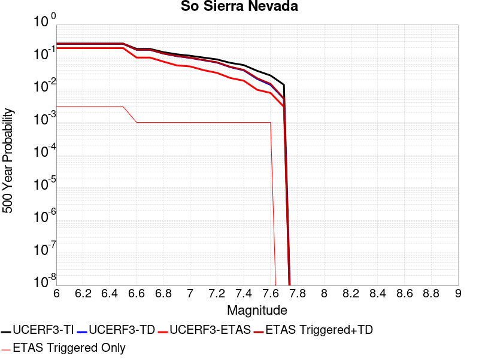 |

| Magnitude | 1 wk TI Prob | 1 wk TD Prob | 1 wk ETAS Prob | 1 wk ETAS/TD Gain | 1 wk ETAS Triggered+TD | 1 wk ETAS Triggered Only | 1 mo TI Prob | 1 mo TD Prob | 1 mo ETAS Prob | 1 mo ETAS/TD Gain | 1 mo ETAS Triggered+TD | 1 mo ETAS Triggered Only | 1 yr TI Prob | 1 yr TD Prob | 1 yr ETAS Prob | 1 yr ETAS/TD Gain | 1 yr ETAS Triggered+TD | 1 yr ETAS Triggered Only | 500 yr TI Prob | 500 yr TD Prob | 500 yr ETAS Prob | 500 yr ETAS/TD Gain | 500 yr ETAS Triggered+TD | 500 yr ETAS Triggered Only |
|-----|-----|-----|-----|-----|-----|-----|-----|-----|-----|-----|-----|-----|-----|-----|-----|-----|-----|-----|-----|-----|-----|-----|-----|-----|
| 6.0 | 1.15488665E-5 | 1.1047954E-5 | 0.0 | 0.0 | 1.1047954E-5 | 0.0 | 4.9494203E-5 | 4.734759E-5 | 0.0 | 0.0 | 4.734759E-5 | 0.0 | 6.024253E-4 | 5.7631714E-4 | 0.001 | 1.7351558 | 5.7631714E-4 | 0.0 | 0.26014677 | 0.2555704 | 0.189 | 0.7395222 | 0.2578037 | 0.003 |
| 6.1 | 1.15488665E-5 | 1.1047954E-5 | 0.0 | 0.0 | 1.1047954E-5 | 0.0 | 4.9494203E-5 | 4.734759E-5 | 0.0 | 0.0 | 4.734759E-5 | 0.0 | 6.024253E-4 | 5.7631714E-4 | 0.001 | 1.7351558 | 5.7631714E-4 | 0.0 | 0.26014677 | 0.2555704 | 0.189 | 0.7395222 | 0.2578037 | 0.003 |
| 6.2 | 1.15488665E-5 | 1.1047954E-5 | 0.0 | 0.0 | 1.1047954E-5 | 0.0 | 4.9494203E-5 | 4.734759E-5 | 0.0 | 0.0 | 4.734759E-5 | 0.0 | 6.024253E-4 | 5.7631714E-4 | 0.001 | 1.7351558 | 5.7631714E-4 | 0.0 | 0.26014677 | 0.2555704 | 0.189 | 0.7395222 | 0.2578037 | 0.003 |
| 6.3 | 1.15488665E-5 | 1.1047954E-5 | 0.0 | 0.0 | 1.1047954E-5 | 0.0 | 4.9494203E-5 | 4.734759E-5 | 0.0 | 0.0 | 4.734759E-5 | 0.0 | 6.024253E-4 | 5.7631714E-4 | 0.001 | 1.7351558 | 5.7631714E-4 | 0.0 | 0.26014677 | 0.2555704 | 0.189 | 0.7395222 | 0.2578037 | 0.003 |
| 6.4 | 1.15488665E-5 | 1.1047954E-5 | 0.0 | 0.0 | 1.1047954E-5 | 0.0 | 4.9494203E-5 | 4.734759E-5 | 0.0 | 0.0 | 4.734759E-5 | 0.0 | 6.024253E-4 | 5.7631714E-4 | 0.001 | 1.7351558 | 5.7631714E-4 | 0.0 | 0.26014677 | 0.2555704 | 0.189 | 0.7395222 | 0.2578037 | 0.003 |
| 6.5 | 1.15488665E-5 | 1.1047954E-5 | 0.0 | 0.0 | 1.1047954E-5 | 0.0 | 4.9494203E-5 | 4.734759E-5 | 0.0 | 0.0 | 4.734759E-5 | 0.0 | 6.024253E-4 | 5.7631714E-4 | 0.001 | 1.7351558 | 5.7631714E-4 | 0.0 | 0.26014677 | 0.2555704 | 0.189 | 0.7395222 | 0.2578037 | 0.003 |
| 6.6 | 7.587044E-6 | 6.913851E-6 | 0.0 | 0.0 | 6.913851E-6 | 0.0 | 3.2515498E-5 | 2.963047E-5 | 0.0 | 0.0 | 2.963047E-5 | 0.0 | 3.9580427E-4 | 3.6069416E-4 | 0.001 | 2.7724319 | 3.6069416E-4 | 0.0 | 0.179582 | 0.16847411 | 0.097 | 0.57575613 | 0.16930564 | 0.001 |
| 6.7 | 7.587044E-6 | 6.913851E-6 | 0.0 | 0.0 | 6.913851E-6 | 0.0 | 3.2515498E-5 | 2.963047E-5 | 0.0 | 0.0 | 2.963047E-5 | 0.0 | 3.9580427E-4 | 3.6069416E-4 | 0.001 | 2.7724319 | 3.6069416E-4 | 0.0 | 0.179582 | 0.16847411 | 0.097 | 0.57575613 | 0.16930564 | 0.001 |
| 6.8 | 5.9026956E-6 | 5.161502E-6 | 0.0 | 0.0 | 5.161502E-6 | 0.0 | 2.5297022E-5 | 2.2120543E-5 | 0.0 | 0.0 | 2.2120543E-5 | 0.0 | 3.0794772E-4 | 2.692855E-4 | 0.001 | 3.713531 | 2.692855E-4 | 0.0 | 0.1427259 | 0.12915197 | 0.073 | 0.56522554 | 0.13002282 | 0.001 |
| 6.9 | 5.0118915E-6 | 4.236488E-6 | 0.0 | 0.0 | 4.236488E-6 | 0.0 | 2.1479358E-5 | 1.8156255E-5 | 0.0 | 0.0 | 1.8156255E-5 | 0.0 | 2.614798E-4 | 2.210307E-4 | 0.001 | 4.524258 | 2.210307E-4 | 0.0 | 0.12256904 | 0.10777349 | 0.056 | 0.51960826 | 0.10866572 | 0.001 |
| 7.0 | 4.4924795E-6 | 3.6990234E-6 | 0.0 | 0.0 | 3.6990234E-6 | 0.0 | 1.925334E-5 | 1.5852864E-5 | 0.0 | 0.0 | 1.5852864E-5 | 0.0 | 2.3438422E-4 | 1.9299216E-4 | 0.001 | 5.1815577 | 1.9299216E-4 | 0.0 | 0.11059791 | 0.09515059 | 0.052 | 0.5465021 | 0.09605544 | 0.001 |
| 7.1 | 3.9118436E-6 | 3.098341E-6 | 0.0 | 0.0 | 3.098341E-6 | 0.0 | 1.6764936E-5 | 1.327854E-5 | 0.0 | 0.0 | 1.327854E-5 | 0.0 | 2.0409399E-4 | 1.616548E-4 | 0.0 | 0.0 | 1.616548E-4 | 0.0 | 0.09702229 | 0.08083763 | 0.04 | 0.49481905 | 0.08175679 | 0.001 |
| 7.2 | 3.4200818E-6 | 2.5928455E-6 | 0.0 | 0.0 | 2.5928455E-6 | 0.0 | 1.4657411E-5 | 1.1112151E-5 | 0.0 | 0.0 | 1.1112151E-5 | 0.0 | 1.7843937E-4 | 1.3528253E-4 | 0.0 | 0.0 | 1.3528253E-4 | 0.0 | 0.08536266 | 0.06860884 | 0.033 | 0.48098758 | 0.06954023 | 0.001 |
| 7.3 | 2.6593618E-6 | 1.8173399E-6 | 0.0 | 0.0 | 1.8173399E-6 | 0.0 | 1.13972155E-5 | 7.788578E-6 | 0.0 | 0.0 | 7.788578E-6 | 0.0 | 1.3875226E-4 | 9.4822106E-5 | 0.0 | 0.0 | 9.4822106E-5 | 0.0 | 0.0670288 | 0.04948645 | 0.023 | 0.46477368 | 0.050436966 | 0.001 |
| 7.4 | 2.2577992E-6 | 1.4263054E-6 | 0.0 | 0.0 | 1.4263054E-6 | 0.0 | 9.676246E-6 | 6.112725E-6 | 0.0 | 0.0 | 6.112725E-6 | 0.0 | 1.1780193E-4 | 7.442013E-5 | 0.0 | 0.0 | 7.442013E-5 | 0.0 | 0.057203136 | 0.039655864 | 0.019 | 0.47912207 | 0.04061621 | 0.001 |
| 7.5 | 1.489319E-6 | 7.2743126E-7 | 0.0 | 0.0 | 7.2743126E-7 | 0.0 | 6.3827797E-6 | 3.117559E-6 | 0.0 | 0.0 | 3.117559E-6 | 0.0 | 7.770758E-5 | 3.7955622E-5 | 0.0 | 0.0 | 3.7955622E-5 | 0.0 | 0.03811011 | 0.021604383 | 0.01 | 0.46286902 | 0.022582779 | 0.001 |
| 7.6 | 1.0680322E-6 | 4.6009882E-7 | 0.0 | 0.0 | 4.6009882E-7 | 0.0 | 4.577273E-6 | 1.9718507E-6 | 0.0 | 0.0 | 1.9718507E-6 | 0.0 | 5.5726876E-5 | 2.4007019E-5 | 0.0 | 0.0 | 2.4007019E-5 | 0.0 | 0.027479587 | 0.014153011 | 0.008 | 0.56525075 | 0.015138858 | 0.001 |
| 7.7 | 5.509146E-7 | 1.5280993E-7 | 0.0 | 0.0 | 1.5280993E-7 | 0.0 | 2.3610605E-6 | 6.5489957E-7 | 0.0 | 0.0 | 6.5489957E-7 | 0.0 | 2.8745531E-5 | 7.9733745E-6 | 0.0 | 0.0 | 7.9733745E-6 | 0.0 | 0.014270174 | 0.005333386 | 0.003 | 0.56249446 | 0.005333386 | 0.0 |

## Lions Head 2011 CFM
*[(top)](#table-of-contents)*

| 1 Week | 1 Month | 1 Year | 500 Year |
|-----|-----|-----|-----|
| 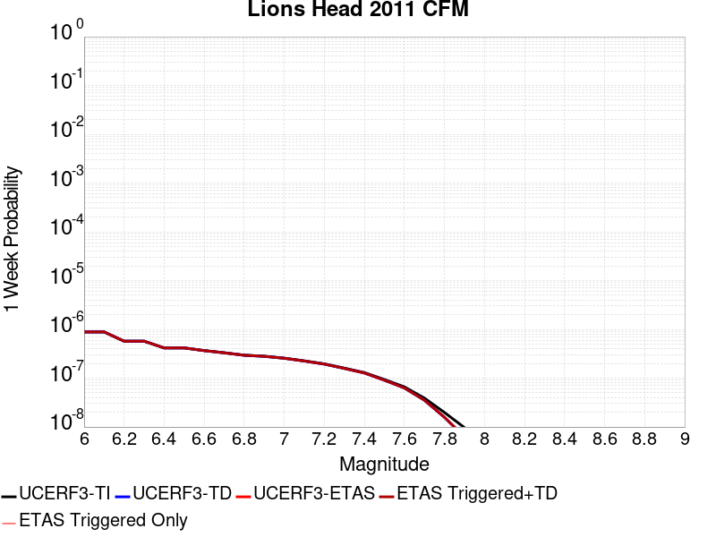 |  | 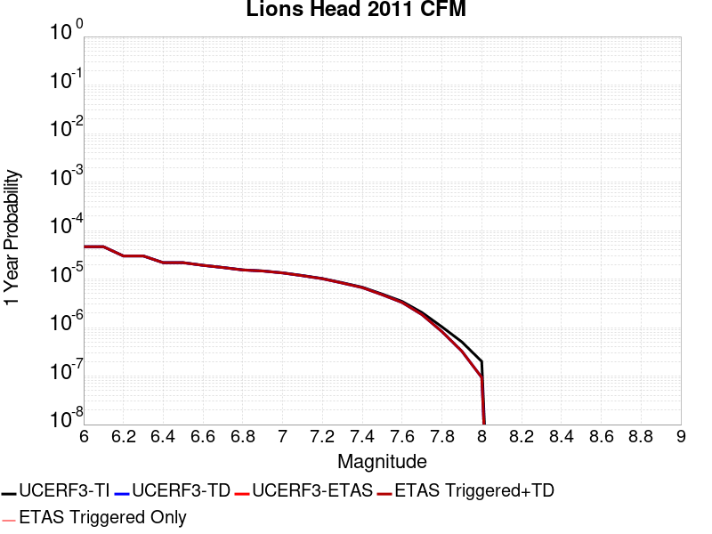 | 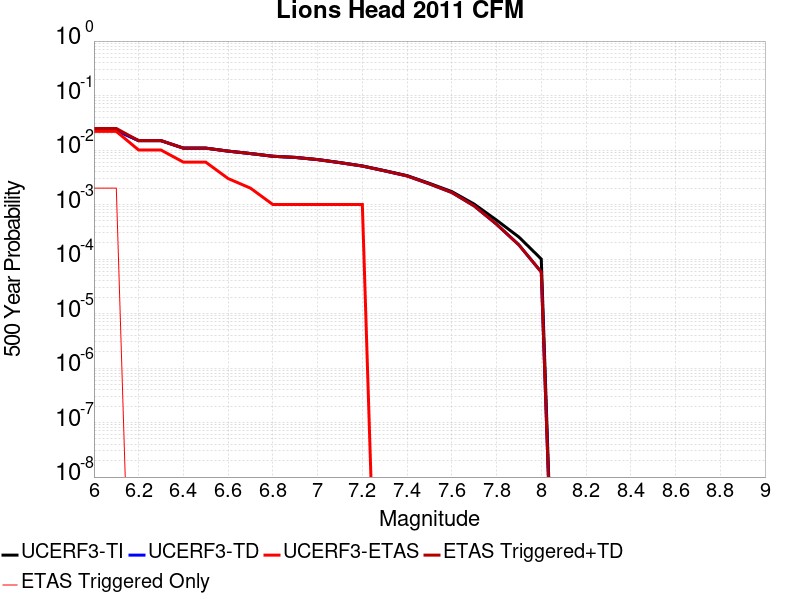 |

| Magnitude | 1 wk TI Prob | 1 wk TD Prob | 1 wk ETAS Prob | 1 wk ETAS/TD Gain | 1 wk ETAS Triggered+TD | 1 wk ETAS Triggered Only | 1 mo TI Prob | 1 mo TD Prob | 1 mo ETAS Prob | 1 mo ETAS/TD Gain | 1 mo ETAS Triggered+TD | 1 mo ETAS Triggered Only | 1 yr TI Prob | 1 yr TD Prob | 1 yr ETAS Prob | 1 yr ETAS/TD Gain | 1 yr ETAS Triggered+TD | 1 yr ETAS Triggered Only | 500 yr TI Prob | 500 yr TD Prob | 500 yr ETAS Prob | 500 yr ETAS/TD Gain | 500 yr ETAS Triggered+TD | 500 yr ETAS Triggered Only |
|-----|-----|-----|-----|-----|-----|-----|-----|-----|-----|-----|-----|-----|-----|-----|-----|-----|-----|-----|-----|-----|-----|-----|-----|-----|
| 6.0 | 8.889363E-7 | 8.887055E-7 | 0.0 | 0.0 | 8.887055E-7 | 0.0 | 3.8097214E-6 | 3.8087326E-6 | 0.0 | 0.0 | 3.8087326E-6 | 0.0 | 4.638237E-5 | 4.6370395E-5 | 0.0 | 0.0 | 4.6370395E-5 | 0.0 | 0.022924863 | 0.022958122 | 0.022 | 0.9582665 | 0.024912206 | 0.002 |
| 6.1 | 8.889363E-7 | 8.887055E-7 | 0.0 | 0.0 | 8.887055E-7 | 0.0 | 3.8097214E-6 | 3.8087326E-6 | 0.0 | 0.0 | 3.8087326E-6 | 0.0 | 4.638237E-5 | 4.6370395E-5 | 0.0 | 0.0 | 4.6370395E-5 | 0.0 | 0.022924863 | 0.022958122 | 0.022 | 0.9582665 | 0.024912206 | 0.002 |
| 6.2 | 5.7435483E-7 | 5.7321984E-7 | 0.0 | 0.0 | 5.7321984E-7 | 0.0 | 2.4615185E-6 | 2.456654E-6 | 0.0 | 0.0 | 2.456654E-6 | 0.0 | 2.9968574E-5 | 2.9909368E-5 | 0.0 | 0.0 | 2.9909368E-5 | 0.0 | 0.014872803 | 0.014869828 | 0.01 | 0.67250276 | 0.014869828 | 0.0 |
| 6.3 | 5.7435483E-7 | 5.7321984E-7 | 0.0 | 0.0 | 5.7321984E-7 | 0.0 | 2.4615185E-6 | 2.456654E-6 | 0.0 | 0.0 | 2.456654E-6 | 0.0 | 2.9968574E-5 | 2.9909368E-5 | 0.0 | 0.0 | 2.9909368E-5 | 0.0 | 0.014872803 | 0.014869828 | 0.01 | 0.67250276 | 0.014869828 | 0.0 |
| 6.4 | 4.1835764E-7 | 4.1679056E-7 | 0.0 | 0.0 | 4.1679056E-7 | 0.0 | 1.7929601E-6 | 1.7862441E-6 | 0.0 | 0.0 | 1.7862441E-6 | 0.0 | 2.1829072E-5 | 2.1747306E-5 | 0.0 | 0.0 | 2.1747306E-5 | 0.0 | 0.010855306 | 0.01083784 | 0.006 | 0.55361587 | 0.01083784 | 0.0 |
| 6.5 | 4.1835764E-7 | 4.1679056E-7 | 0.0 | 0.0 | 4.1679056E-7 | 0.0 | 1.7929601E-6 | 1.7862441E-6 | 0.0 | 0.0 | 1.7862441E-6 | 0.0 | 2.1829072E-5 | 2.1747306E-5 | 0.0 | 0.0 | 2.1747306E-5 | 0.0 | 0.010855306 | 0.01083784 | 0.006 | 0.55361587 | 0.01083784 | 0.0 |
| 6.6 | 3.6896213E-7 | 3.672626E-7 | 0.0 | 0.0 | 3.672626E-7 | 0.0 | 1.5812653E-6 | 1.5739816E-6 | 0.0 | 0.0 | 1.5739816E-6 | 0.0 | 1.9251736E-5 | 1.9163059E-5 | 0.0 | 0.0 | 1.9163059E-5 | 0.0 | 0.00957978 | 0.009558568 | 0.003 | 0.31385458 | 0.009558568 | 0.0 |
| 6.7 | 3.3283942E-7 | 3.310471E-7 | 0.0 | 0.0 | 3.310471E-7 | 0.0 | 1.4264539E-6 | 1.4187724E-6 | 0.0 | 0.0 | 1.4187724E-6 | 0.0 | 1.7366938E-5 | 1.7273418E-5 | 0.0 | 0.0 | 1.7273418E-5 | 0.0 | 0.008645951 | 0.00862215 | 0.002 | 0.23196071 | 0.00862215 | 0.0 |
| 6.8 | 2.9684807E-7 | 2.9496817E-7 | 0.0 | 0.0 | 2.9496817E-7 | 0.0 | 1.2722054E-6 | 1.2641486E-6 | 0.0 | 0.0 | 1.2641486E-6 | 0.0 | 1.5488991E-5 | 1.53909E-5 | 0.0 | 0.0 | 1.53909E-5 | 0.0 | 0.0077146436 | 0.0076884553 | 0.001 | 0.13006514 | 0.0076884553 | 0.0 |
| 6.9 | 2.8254823E-7 | 2.8062266E-7 | 0.0 | 0.0 | 2.8062266E-7 | 0.0 | 1.2109203E-6 | 1.2026679E-6 | 0.0 | 0.0 | 1.2026679E-6 | 0.0 | 1.4742856E-5 | 1.46423845E-5 | 0.0 | 0.0 | 1.46423845E-5 | 0.0 | 0.0073443796 | 0.007316991 | 0.001 | 0.13666819 | 0.007316991 | 0.0 |
| 7.0 | 2.5794475E-7 | 2.5593243E-7 | 0.0 | 0.0 | 2.5593243E-7 | 0.0 | 1.105477E-6 | 1.0968528E-6 | 0.0 | 0.0 | 1.0968528E-6 | 0.0 | 1.34591E-5 | 1.3354102E-5 | 0.0 | 0.0 | 1.3354102E-5 | 0.0 | 0.0067070024 | 0.006677333 | 0.001 | 0.1497604 | 0.006677333 | 0.0 |
| 7.1 | 2.2678832E-7 | 2.246303E-7 | 0.0 | 0.0 | 2.246303E-7 | 0.0 | 9.719496E-7 | 9.627009E-7 | 0.0 | 0.0 | 9.627009E-7 | 0.0 | 1.1833421E-5 | 1.1720821E-5 | 0.0 | 0.0 | 1.1720821E-5 | 0.0 | 0.005899276 | 0.005865781 | 0.001 | 0.17048028 | 0.005865781 | 0.0 |
| 7.2 | 1.968546E-7 | 1.9455611E-7 | 0.0 | 0.0 | 1.9455611E-7 | 0.0 | 8.436623E-7 | 8.338116E-7 | 0.0 | 0.0 | 8.338116E-7 | 0.0 | 1.027154E-5 | 1.0151609E-5 | 0.0 | 0.0 | 1.0151609E-5 | 0.0 | 0.005122631 | 0.0050854515 | 0.001 | 0.19663937 | 0.0050854515 | 0.0 |
| 7.3 | 1.6101195E-7 | 1.5849348E-7 | 0.0 | 0.0 | 1.5849348E-7 | 0.0 | 6.90051E-7 | 6.7925754E-7 | 0.0 | 0.0 | 6.7925754E-7 | 0.0 | 8.401339E-6 | 8.26993E-6 | 0.0 | 0.0 | 8.26993E-6 | 0.0 | 0.004191877 | 0.004148937 | 0.0 | 0.0 | 0.004148937 | 0.0 |
| 7.4 | 1.304744E-7 | 1.2773499E-7 | 0.0 | 0.0 | 1.2773499E-7 | 0.0 | 5.591759E-7 | 5.4743555E-7 | 0.0 | 0.0 | 5.4743555E-7 | 0.0 | 6.807945E-6 | 6.6650077E-6 | 0.0 | 0.0 | 6.6650077E-6 | 0.0 | 0.003398197 | 0.0033494728 | 0.0 | 0.0 | 0.0033494728 | 0.0 |
| 7.5 | 9.410614E-8 | 9.104493E-8 | 0.0 | 0.0 | 9.104493E-8 | 0.0 | 4.0331196E-7 | 3.9019253E-7 | 0.0 | 0.0 | 3.9019253E-7 | 0.0 | 4.910312E-6 | 4.7505832E-6 | 0.0 | 0.0 | 4.7505832E-6 | 0.0 | 0.0024521507 | 0.0023949987 | 0.0 | 0.0 | 0.0023949987 | 0.0 |
| 7.6 | 6.6360826E-8 | 6.300581E-8 | 0.0 | 0.0 | 6.300581E-8 | 0.0 | 2.844035E-7 | 2.7002486E-7 | 0.0 | 0.0 | 2.7002486E-7 | 0.0 | 3.462607E-6 | 3.2875478E-6 | 0.0 | 0.0 | 3.2875478E-6 | 0.0 | 0.0017298087 | 0.0016649601 | 0.0 | 0.0 | 0.0016649601 | 0.0 |
| 7.7 | 3.9100893E-8 | 3.537388E-8 | 0.0 | 0.0 | 3.537388E-8 | 0.0 | 1.6757524E-7 | 1.5160235E-7 | 0.0 | 0.0 | 1.5160235E-7 | 0.0 | 2.0402267E-6 | 1.845757E-6 | 0.0 | 0.0 | 1.845757E-6 | 0.0 | 0.0010195943 | 9.4500044E-4 | 0.0 | 0.0 | 9.4500044E-4 | 0.0 |
| 7.8 | 1.9858547E-8 | 1.5831805E-8 | 0.0 | 0.0 | 1.5831805E-8 | 0.0 | 8.5108056E-8 | 6.785059E-8 | 0.0 | 0.0 | 6.785059E-8 | 0.0 | 1.0361902E-6 | 8.260806E-7 | 0.0 | 0.0 | 8.260806E-7 | 0.0 | 5.1796116E-4 | 4.3551202E-4 | 0.0 | 0.0 | 4.3551202E-4 | 0.0 |
| 7.9 | 9.717722E-9 | 6.249854E-9 | 0.0 | 0.0 | 6.249854E-9 | 0.0 | 4.1647375E-8 | 2.678509E-8 | 0.0 | 0.0 | 2.678509E-8 | 0.0 | 5.070567E-7 | 3.2610842E-7 | 0.0 | 0.0 | 3.2610842E-7 | 0.0 | 2.5349628E-4 | 1.8160736E-4 | 0.0 | 0.0 | 1.8160736E-4 | 0.0 |
| 8.0 | 3.8397716E-9 | 1.7946017E-9 | 0.0 | 0.0 | 1.7946017E-9 | 0.0 | 1.6456164E-8 | 7.69115E-9 | 0.0 | 0.0 | 7.69115E-9 | 0.0 | 2.0035378E-7 | 9.363974E-8 | 0.0 | 0.0 | 9.363974E-8 | 0.0 | 1.0017188E-4 | 5.781462E-5 | 0.0 | 0.0 | 5.781462E-5 | 0.0 |

## Goose Lake 2011 CFM
*[(top)](#table-of-contents)*

| 1 Week | 1 Month | 1 Year | 500 Year |
|-----|-----|-----|-----|
|  |  | 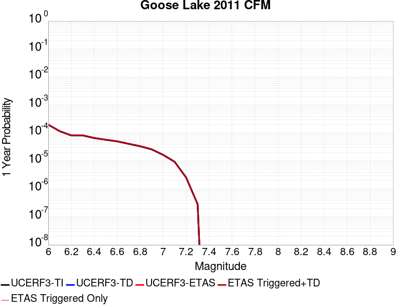 | 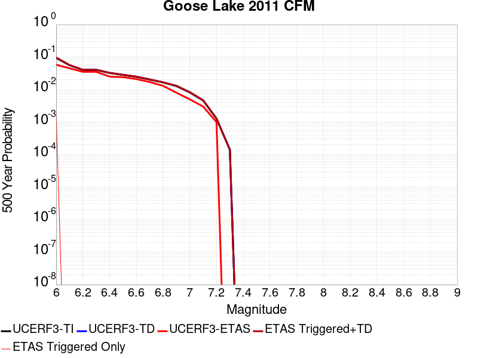 |

| Magnitude | 1 wk TI Prob | 1 wk TD Prob | 1 wk ETAS Prob | 1 wk ETAS/TD Gain | 1 wk ETAS Triggered+TD | 1 wk ETAS Triggered Only | 1 mo TI Prob | 1 mo TD Prob | 1 mo ETAS Prob | 1 mo ETAS/TD Gain | 1 mo ETAS Triggered+TD | 1 mo ETAS Triggered Only | 1 yr TI Prob | 1 yr TD Prob | 1 yr ETAS Prob | 1 yr ETAS/TD Gain | 1 yr ETAS Triggered+TD | 1 yr ETAS Triggered Only | 500 yr TI Prob | 500 yr TD Prob | 500 yr ETAS Prob | 500 yr ETAS/TD Gain | 500 yr ETAS Triggered+TD | 500 yr ETAS Triggered Only |
|-----|-----|-----|-----|-----|-----|-----|-----|-----|-----|-----|-----|-----|-----|-----|-----|-----|-----|-----|-----|-----|-----|-----|-----|-----|
| 6.0 | 3.780968E-6 | 3.82081E-6 | 0.0 | 0.0 | 3.82081E-6 | 0.0 | 1.6204049E-5 | 1.6374803E-5 | 0.0 | 0.0 | 1.6374803E-5 | 0.0 | 1.9726643E-4 | 1.9934609E-4 | 0.0 | 0.0 | 1.9934609E-4 | 0.0 | 0.093933836 | 0.095148236 | 0.058 | 0.60957515 | 0.096957944 | 0.002 |
| 6.1 | 2.2035124E-6 | 2.2284164E-6 | 0.0 | 0.0 | 2.2284164E-6 | 0.0 | 9.443591E-6 | 9.550322E-6 | 0.0 | 0.0 | 9.550322E-6 | 0.0 | 1.1496965E-4 | 1.1626915E-4 | 0.0 | 0.0 | 1.1626915E-4 | 0.0 | 0.0558669 | 0.056527846 | 0.045 | 0.7960679 | 0.056527846 | 0.0 |
| 6.2 | 1.5624689E-6 | 1.5816256E-6 | 0.0 | 0.0 | 1.5816256E-6 | 0.0 | 6.6962784E-6 | 6.778378E-6 | 0.0 | 0.0 | 6.778378E-6 | 0.0 | 8.152414E-5 | 8.252367E-5 | 0.0 | 0.0 | 8.252367E-5 | 0.0 | 0.039944064 | 0.040435463 | 0.035 | 0.86557686 | 0.040435463 | 0.0 |
| 6.3 | 1.5624689E-6 | 1.5816256E-6 | 0.0 | 0.0 | 1.5816256E-6 | 0.0 | 6.6962784E-6 | 6.778378E-6 | 0.0 | 0.0 | 6.778378E-6 | 0.0 | 8.152414E-5 | 8.252367E-5 | 0.0 | 0.0 | 8.252367E-5 | 0.0 | 0.039944064 | 0.040435463 | 0.035 | 0.86557686 | 0.040435463 | 0.0 |
| 6.4 | 1.256464E-6 | 1.2729506E-6 | 0.0 | 0.0 | 1.2729506E-6 | 0.0 | 5.3848344E-6 | 5.455491E-6 | 0.0 | 0.0 | 5.455491E-6 | 0.0 | 6.5558386E-5 | 6.64186E-5 | 0.0 | 0.0 | 6.64186E-5 | 0.0 | 0.032248817 | 0.032670297 | 0.025 | 0.76522106 | 0.032670297 | 0.0 |
| 6.5 | 1.0910911E-6 | 1.1061031E-6 | 0.0 | 0.0 | 1.1061031E-6 | 0.0 | 4.6760965E-6 | 4.7404333E-6 | 0.0 | 0.0 | 4.7404333E-6 | 0.0 | 5.692999E-5 | 5.7713263E-5 | 0.0 | 0.0 | 5.7713263E-5 | 0.0 | 0.028064469 | 0.02844839 | 0.024 | 0.843633 | 0.02844839 | 0.0 |
| 6.6 | 9.546601E-7 | 9.6836E-7 | 0.0 | 0.0 | 9.6836E-7 | 0.0 | 4.091394E-6 | 4.150108E-6 | 0.0 | 0.0 | 4.150108E-6 | 0.0 | 4.9811584E-5 | 5.05264E-5 | 0.0 | 0.0 | 5.05264E-5 | 0.0 | 0.024598807 | 0.02494977 | 0.021 | 0.8416911 | 0.02494977 | 0.0 |
| 6.7 | 7.790316E-7 | 7.9093167E-7 | 0.0 | 0.0 | 7.9093167E-7 | 0.0 | 3.3387028E-6 | 3.3897027E-6 | 0.0 | 0.0 | 3.3897027E-6 | 0.0 | 4.0647945E-5 | 4.1268857E-5 | 0.0 | 0.0 | 4.1268857E-5 | 0.0 | 0.020119239 | 0.020425024 | 0.017 | 0.83231235 | 0.020425024 | 0.0 |
| 6.8 | 6.3714384E-7 | 6.4730597E-7 | 0.0 | 0.0 | 6.4730597E-7 | 0.0 | 2.7306137E-6 | 2.7741655E-6 | 0.0 | 0.0 | 2.7741655E-6 | 0.0 | 3.3244716E-5 | 3.3774948E-5 | 0.0 | 0.0 | 3.3774948E-5 | 0.0 | 0.01648524 | 0.016747257 | 0.013 | 0.77624655 | 0.016747257 | 0.0 |
| 6.9 | 4.92586E-7 | 5.0092495E-7 | 0.0 | 0.0 | 5.0092495E-7 | 0.0 | 2.1110811E-6 | 2.1468195E-6 | 0.0 | 0.0 | 2.1468195E-6 | 0.0 | 2.5702111E-5 | 2.6137217E-5 | 0.0 | 0.0 | 2.6137217E-5 | 0.0 | 0.012768996 | 0.012984773 | 0.008 | 0.6161063 | 0.012984773 | 0.0 |
| 7.0 | 3.130245E-7 | 3.187165E-7 | 0.0 | 0.0 | 3.187165E-7 | 0.0 | 1.3415328E-6 | 1.3659271E-6 | 0.0 | 0.0 | 1.3659271E-6 | 0.0 | 1.6333039E-5 | 1.6630038E-5 | 0.0 | 0.0 | 1.6630038E-5 | 0.0 | 0.00813333 | 0.008281171 | 0.005 | 0.6037794 | 0.008281171 | 0.0 |
| 7.1 | 1.7680084E-7 | 1.800568E-7 | 0.0 | 0.0 | 1.800568E-7 | 0.0 | 7.5771766E-7 | 7.716718E-7 | 0.0 | 0.0 | 7.716718E-7 | 0.0 | 9.225173E-6 | 9.395065E-6 | 0.0 | 0.0 | 9.395065E-6 | 0.0 | 0.004601986 | 0.004686835 | 0.003 | 0.64009076 | 0.004686835 | 0.0 |
| 7.2 | 4.8641045E-8 | 4.936192E-8 | 0.0 | 0.0 | 4.936192E-8 | 0.0 | 2.084616E-7 | 2.1155107E-7 | 0.0 | 0.0 | 2.1155107E-7 | 0.0 | 2.538017E-6 | 2.5756312E-6 | 0.0 | 0.0 | 2.5756312E-6 | 0.0 | 0.0012682052 | 0.0012870205 | 0.001 | 0.7769884 | 0.0012870205 | 0.0 |
| 7.3 | 5.3911844E-9 | 5.4713505E-9 | 0.0 | 0.0 | 5.4713505E-9 | 0.0 | 2.3105075E-8 | 2.3448646E-8 | 0.0 | 0.0 | 2.3448646E-8 | 0.0 | 2.8130427E-7 | 2.8548723E-7 | 0.0 | 0.0 | 2.8548723E-7 | 0.0 | 1.4064225E-4 | 1.4273774E-4 | 0.0 | 0.0 | 1.4273774E-4 | 0.0 |

## Silver Creek 2011 CFM
*[(top)](#table-of-contents)*

| 1 Week | 1 Month | 1 Year | 500 Year |
|-----|-----|-----|-----|
|  | 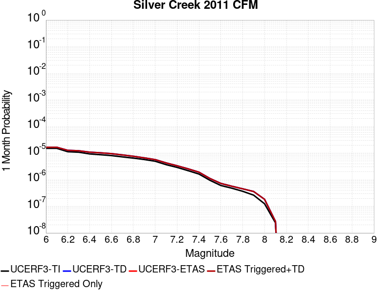 | 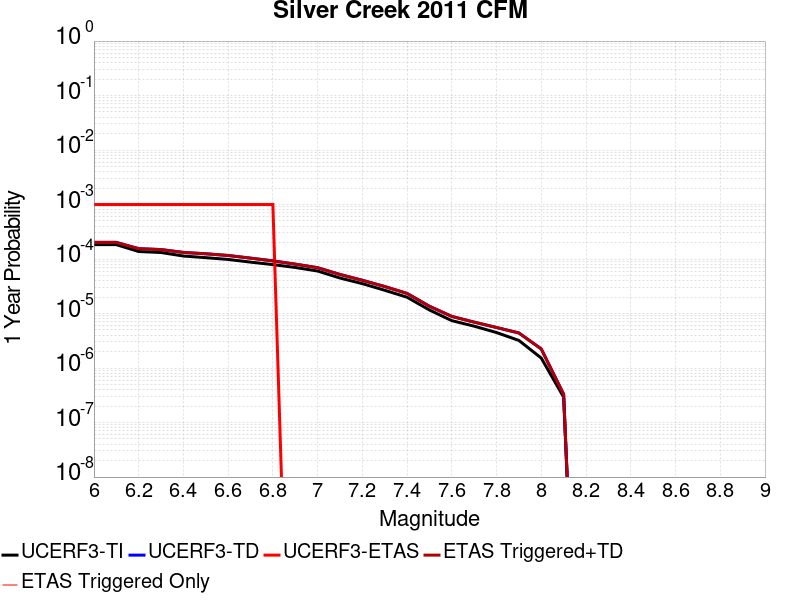 | 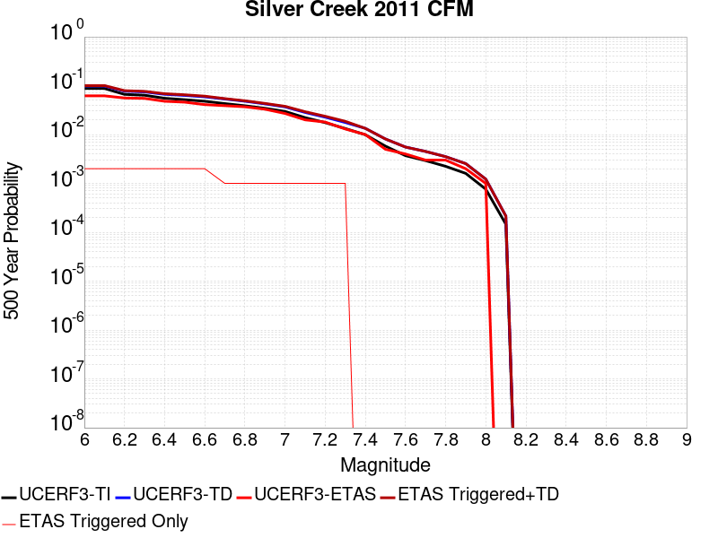 |

| Magnitude | 1 wk TI Prob | 1 wk TD Prob | 1 wk ETAS Prob | 1 wk ETAS/TD Gain | 1 wk ETAS Triggered+TD | 1 wk ETAS Triggered Only | 1 mo TI Prob | 1 mo TD Prob | 1 mo ETAS Prob | 1 mo ETAS/TD Gain | 1 mo ETAS Triggered+TD | 1 mo ETAS Triggered Only | 1 yr TI Prob | 1 yr TD Prob | 1 yr ETAS Prob | 1 yr ETAS/TD Gain | 1 yr ETAS Triggered+TD | 1 yr ETAS Triggered Only | 500 yr TI Prob | 500 yr TD Prob | 500 yr ETAS Prob | 500 yr ETAS/TD Gain | 500 yr ETAS Triggered+TD | 500 yr ETAS Triggered Only |
|-----|-----|-----|-----|-----|-----|-----|-----|-----|-----|-----|-----|-----|-----|-----|-----|-----|-----|-----|-----|-----|-----|-----|-----|-----|
| 6.0 | 3.5229125E-6 | 3.8697804E-6 | 0.0 | 0.0 | 3.8697804E-6 | 0.0 | 1.5098109E-5 | 1.658467E-5 | 0.0 | 0.0 | 1.658467E-5 | 0.0 | 1.8380396E-4 | 2.0190002E-4 | 0.001 | 4.9529467 | 2.0190002E-4 | 0.0 | 0.08781315 | 0.098720595 | 0.062 | 0.6280351 | 0.10052315 | 0.002 |
| 6.1 | 3.5229125E-6 | 3.8697804E-6 | 0.0 | 0.0 | 3.8697804E-6 | 0.0 | 1.5098109E-5 | 1.658467E-5 | 0.0 | 0.0 | 1.658467E-5 | 0.0 | 1.8380396E-4 | 2.0190002E-4 | 0.001 | 4.9529467 | 2.0190002E-4 | 0.0 | 0.08781315 | 0.098720595 | 0.062 | 0.6280351 | 0.10052315 | 0.002 |
| 6.2 | 2.6363234E-6 | 2.9727464E-6 | 0.0 | 0.0 | 2.9727464E-6 | 0.0 | 1.129848E-5 | 1.274028E-5 | 0.0 | 0.0 | 1.274028E-5 | 0.0 | 1.375503E-4 | 1.5510192E-4 | 0.001 | 6.4473734 | 1.5510192E-4 | 0.0 | 0.06646786 | 0.077300586 | 0.056 | 0.7244447 | 0.07914598 | 0.002 |
| 6.3 | 2.5275126E-6 | 2.862467E-6 | 0.0 | 0.0 | 2.862467E-6 | 0.0 | 1.0832152E-5 | 1.2267658E-5 | 0.0 | 0.0 | 1.2267658E-5 | 0.0 | 1.3187347E-4 | 1.4934855E-4 | 0.001 | 6.6957464 | 1.4934855E-4 | 0.0 | 0.063813984 | 0.07463972 | 0.055 | 0.73687303 | 0.07649045 | 0.002 |
| 6.4 | 2.178732E-6 | 2.5355316E-6 | 0.0 | 0.0 | 2.5355316E-6 | 0.0 | 9.337389E-6 | 1.0866518E-5 | 0.0 | 0.0 | 1.0866518E-5 | 0.0 | 1.1367678E-4 | 1.3229185E-4 | 0.001 | 7.559044 | 1.3229185E-4 | 0.0 | 0.05525632 | 0.06665611 | 0.048 | 0.720114 | 0.0685228 | 0.002 |
| 6.5 | 2.0341574E-6 | 2.3952655E-6 | 0.0 | 0.0 | 2.3952655E-6 | 0.0 | 8.717788E-6 | 1.0265383E-5 | 0.0 | 0.0 | 1.0265383E-5 | 0.0 | 1.061339E-4 | 1.2497389E-4 | 0.001 | 8.001672 | 1.2497389E-4 | 0.0 | 0.05168615 | 0.06321861 | 0.046 | 0.7276339 | 0.06509217 | 0.002 |
| 6.6 | 1.8856827E-6 | 2.2294266E-6 | 0.0 | 0.0 | 2.2294266E-6 | 0.0 | 8.0814725E-6 | 9.554651E-6 | 0.0 | 0.0 | 9.554651E-6 | 0.0 | 9.838748E-5 | 1.1632169E-4 | 0.001 | 8.596849 | 1.1632169E-4 | 0.0 | 0.048005633 | 0.059176166 | 0.041 | 0.69284654 | 0.061057813 | 0.002 |
| 6.7 | 1.6844668E-6 | 1.9924175E-6 | 0.0 | 0.0 | 1.9924175E-6 | 0.0 | 7.2191233E-6 | 8.538905E-6 | 0.0 | 0.0 | 8.538905E-6 | 0.0 | 8.788928E-5 | 1.0395621E-4 | 0.001 | 9.619434 | 1.0395621E-4 | 0.0 | 0.042994913 | 0.053401828 | 0.039 | 0.7303121 | 0.054348424 | 0.001 |
| 6.8 | 1.5177161E-6 | 1.7759942E-6 | 0.0 | 0.0 | 1.7759942E-6 | 0.0 | 6.504481E-6 | 7.6113815E-6 | 0.0 | 0.0 | 7.6113815E-6 | 0.0 | 7.918918E-5 | 9.266464E-5 | 0.001 | 10.791603 | 9.266464E-5 | 0.0 | 0.038822476 | 0.048100155 | 0.037 | 0.7692283 | 0.049052052 | 0.001 |
| 6.9 | 1.3437394E-6 | 1.5470642E-6 | 0.0 | 0.0 | 1.5470642E-6 | 0.0 | 5.7588704E-6 | 6.630258E-6 | 0.0 | 0.0 | 6.630258E-6 | 0.0 | 7.011199E-5 | 8.072041E-5 | 0.0 | 0.0 | 8.072041E-5 | 0.0 | 0.034449838 | 0.042392764 | 0.033 | 0.77843475 | 0.04335037 | 0.001 |
| 7.0 | 1.1563575E-6 | 1.3307085E-6 | 0.0 | 0.0 | 1.3307085E-6 | 0.0 | 4.9558084E-6 | 5.7030243E-6 | 0.0 | 0.0 | 5.7030243E-6 | 0.0 | 6.03353E-5 | 6.943211E-5 | 0.0 | 0.0 | 6.943211E-5 | 0.0 | 0.02971803 | 0.036872353 | 0.027 | 0.732256 | 0.03783548 | 0.001 |
| 7.1 | 8.602183E-7 | 9.999475E-7 | 0.0 | 0.0 | 9.999475E-7 | 0.0 | 3.6866445E-6 | 4.285482E-6 | 0.0 | 0.0 | 4.285482E-6 | 0.0 | 4.4883975E-5 | 5.21745E-5 | 0.0 | 0.0 | 5.21745E-5 | 0.0 | 0.02219253 | 0.028346201 | 0.02 | 0.70556194 | 0.029317854 | 0.001 |
| 7.2 | 6.788407E-7 | 7.8226486E-7 | 0.0 | 0.0 | 7.8226486E-7 | 0.0 | 2.9093142E-6 | 3.3525594E-6 | 0.0 | 0.0 | 3.3525594E-6 | 0.0 | 3.5420322E-5 | 4.0816645E-5 | 0.0 | 0.0 | 4.0816645E-5 | 0.0 | 0.017554566 | 0.022689382 | 0.018 | 0.7933227 | 0.023666691 | 0.001 |
| 7.3 | 5.1292045E-7 | 6.006807E-7 | 0.0 | 0.0 | 6.006807E-7 | 0.0 | 2.1982287E-6 | 2.5743432E-6 | 0.0 | 0.0 | 2.5743432E-6 | 0.0 | 2.6763106E-5 | 3.134218E-5 | 0.0 | 0.0 | 3.134218E-5 | 0.0 | 0.013292595 | 0.017668087 | 0.013 | 0.7357899 | 0.018650418 | 0.001 |
| 7.4 | 3.820994E-7 | 4.4875713E-7 | 0.0 | 0.0 | 4.4875713E-7 | 0.0 | 1.6375678E-6 | 1.9232434E-6 | 0.0 | 0.0 | 1.9232434E-6 | 0.0 | 1.9937206E-5 | 2.3415236E-5 | 0.0 | 0.0 | 2.3415236E-5 | 0.0 | 0.00991918 | 0.0133805815 | 0.01 | 0.74735165 | 0.0133805815 | 0.0 |
| 7.5 | 2.2292595E-7 | 2.609315E-7 | 0.0 | 0.0 | 2.609315E-7 | 0.0 | 9.553966E-7 | 1.1182774E-6 | 0.0 | 0.0 | 1.1182774E-6 | 0.0 | 1.16318915E-5 | 1.3614942E-5 | 0.0 | 0.0 | 1.3614942E-5 | 0.0 | 0.0057990993 | 0.008119206 | 0.005 | 0.6158238 | 0.008119206 | 0.0 |
| 7.6 | 1.420587E-7 | 1.6989448E-7 | 0.0 | 0.0 | 1.6989448E-7 | 0.0 | 6.088228E-7 | 7.2811895E-7 | 0.0 | 0.0 | 7.2811895E-7 | 0.0 | 7.4123927E-6 | 8.864812E-6 | 0.0 | 0.0 | 8.864812E-6 | 0.0 | 0.0036993504 | 0.0055515985 | 0.004 | 0.7205132 | 0.0055515985 | 0.0 |
| 7.7 | 1.1250075E-7 | 1.3338843E-7 | 0.0 | 0.0 | 1.3338843E-7 | 0.0 | 4.82146E-7 | 5.7166454E-7 | 0.0 | 0.0 | 5.7166454E-7 | 0.0 | 5.8701116E-6 | 6.9599932E-6 | 0.0 | 0.0 | 6.9599932E-6 | 0.0 | 0.0029307613 | 0.004510978 | 0.003 | 0.66504425 | 0.004510978 | 0.0 |
| 7.8 | 8.592761E-8 | 1.0636126E-7 | 0.0 | 0.0 | 1.0636126E-7 | 0.0 | 3.682611E-7 | 4.558339E-7 | 0.0 | 0.0 | 4.558339E-7 | 0.0 | 4.48357E-6 | 5.5497635E-6 | 0.0 | 0.0 | 5.5497635E-6 | 0.0 | 0.002239279 | 0.003528534 | 0.003 | 0.8502115 | 0.003528534 | 0.0 |
| 7.9 | 6.156529E-8 | 8.438903E-8 | 0.0 | 0.0 | 8.438903E-8 | 0.0 | 2.638512E-7 | 3.6166722E-7 | 0.0 | 0.0 | 3.6166722E-7 | 0.0 | 3.212384E-6 | 4.4032895E-6 | 0.0 | 0.0 | 4.4032895E-6 | 0.0 | 0.0016049052 | 0.0025450562 | 0.002 | 0.7858373 | 0.0025450562 | 0.0 |
| 8.0 | 2.9230547E-8 | 4.296327E-8 | 0.0 | 0.0 | 4.296327E-8 | 0.0 | 1.2527377E-7 | 1.8412828E-7 | 0.0 | 0.0 | 1.8412828E-7 | 0.0 | 1.525207E-6 | 2.2417596E-6 | 0.0 | 0.0 | 2.2417596E-6 | 0.0 | 7.623134E-4 | 0.0012232406 | 0.001 | 0.8175006 | 0.0012232406 | 0.0 |
| 8.1 | 5.6062213E-9 | 6.332167E-9 | 0.0 | 0.0 | 6.332167E-9 | 0.0 | 2.4026663E-8 | 2.7137858E-8 | 0.0 | 0.0 | 2.7137858E-8 | 0.0 | 2.925246E-7 | 3.3040337E-7 | 0.0 | 0.0 | 3.3040337E-7 | 0.0 | 1.4625162E-4 | 2.1493578E-4 | 0.0 | 0.0 | 2.1493578E-4 | 0.0 |

## Anaheim
*[(top)](#table-of-contents)*

| 1 Week | 1 Month | 1 Year | 500 Year |
|-----|-----|-----|-----|
|  | 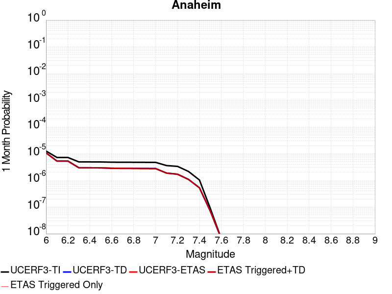 | 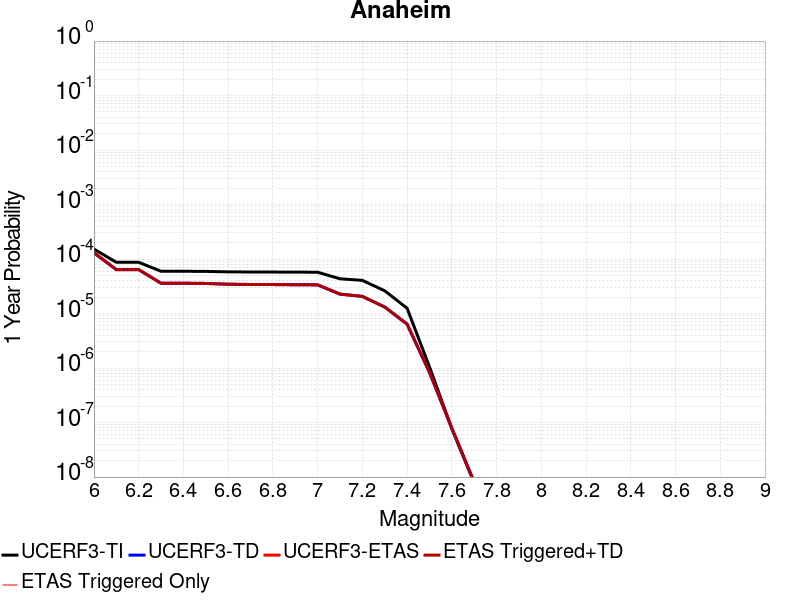 | 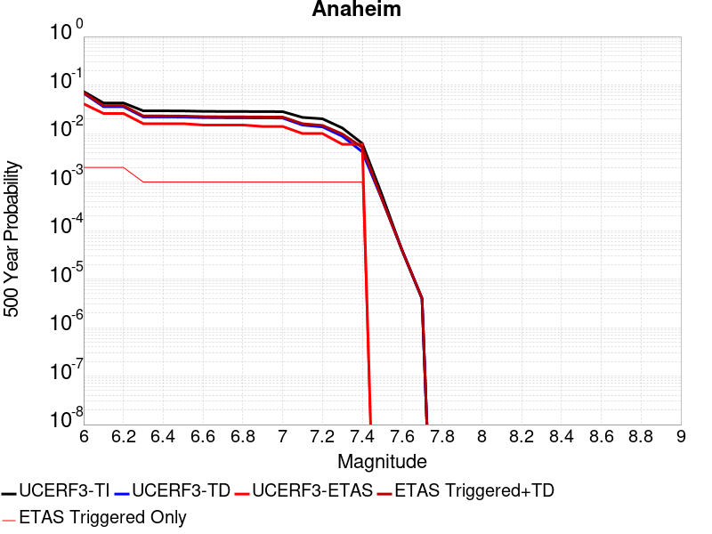 |

| Magnitude | 1 wk TI Prob | 1 wk TD Prob | 1 wk ETAS Prob | 1 wk ETAS/TD Gain | 1 wk ETAS Triggered+TD | 1 wk ETAS Triggered Only | 1 mo TI Prob | 1 mo TD Prob | 1 mo ETAS Prob | 1 mo ETAS/TD Gain | 1 mo ETAS Triggered+TD | 1 mo ETAS Triggered Only | 1 yr TI Prob | 1 yr TD Prob | 1 yr ETAS Prob | 1 yr ETAS/TD Gain | 1 yr ETAS Triggered+TD | 1 yr ETAS Triggered Only | 500 yr TI Prob | 500 yr TD Prob | 500 yr ETAS Prob | 500 yr ETAS/TD Gain | 500 yr ETAS Triggered+TD | 500 yr ETAS Triggered Only |
|-----|-----|-----|-----|-----|-----|-----|-----|-----|-----|-----|-----|-----|-----|-----|-----|-----|-----|-----|-----|-----|-----|-----|-----|-----|
| 6.0 | 2.9254998E-6 | 2.5044142E-6 | 0.0 | 0.0 | 2.5044142E-6 | 0.0 | 1.25377965E-5 | 1.07331725E-5 | 0.0 | 0.0 | 1.07331725E-5 | 0.0 | 1.5263697E-4 | 1.3067089E-4 | 0.0 | 0.0 | 1.3067089E-4 | 0.0 | 0.073484324 | 0.06787126 | 0.041 | 0.60408485 | 0.06973552 | 0.002 |
| 6.1 | 1.6729715E-6 | 1.2272418E-6 | 0.0 | 0.0 | 1.2272418E-6 | 0.0 | 7.1698582E-6 | 5.259599E-6 | 0.0 | 0.0 | 5.259599E-6 | 0.0 | 8.7289525E-5 | 6.403415E-5 | 0.0 | 0.0 | 6.403415E-5 | 0.0 | 0.04270786 | 0.035772182 | 0.026 | 0.7268218 | 0.03770064 | 0.002 |
| 6.2 | 1.6729715E-6 | 1.2272418E-6 | 0.0 | 0.0 | 1.2272418E-6 | 0.0 | 7.1698582E-6 | 5.259599E-6 | 0.0 | 0.0 | 5.259599E-6 | 0.0 | 8.7289525E-5 | 6.403415E-5 | 0.0 | 0.0 | 6.403415E-5 | 0.0 | 0.04270786 | 0.035772182 | 0.026 | 0.7268218 | 0.03770064 | 0.002 |
| 6.3 | 1.1444064E-6 | 6.8995985E-7 | 0.0 | 0.0 | 6.8995985E-7 | 0.0 | 4.9045893E-6 | 2.9569676E-6 | 0.0 | 0.0 | 2.9569676E-6 | 0.0 | 5.971174E-5 | 3.6000543E-5 | 0.0 | 0.0 | 3.6000543E-5 | 0.0 | 0.029415451 | 0.022064151 | 0.016 | 0.7251582 | 0.023042087 | 0.001 |
| 6.4 | 1.1444064E-6 | 6.8995985E-7 | 0.0 | 0.0 | 6.8995985E-7 | 0.0 | 4.9045893E-6 | 2.9569676E-6 | 0.0 | 0.0 | 2.9569676E-6 | 0.0 | 5.971174E-5 | 3.6000543E-5 | 0.0 | 0.0 | 3.6000543E-5 | 0.0 | 0.029415451 | 0.022064151 | 0.016 | 0.7251582 | 0.023042087 | 0.001 |
| 6.5 | 1.1385318E-6 | 6.840312E-7 | 0.0 | 0.0 | 6.840312E-7 | 0.0 | 4.879413E-6 | 2.9315593E-6 | 0.0 | 0.0 | 2.9315593E-6 | 0.0 | 5.9405233E-5 | 3.5691202E-5 | 0.0 | 0.0 | 3.5691202E-5 | 0.0 | 0.029266685 | 0.021912865 | 0.016 | 0.73016465 | 0.022890953 | 0.001 |
| 6.6 | 1.1165511E-6 | 6.618305E-7 | 0.0 | 0.0 | 6.618305E-7 | 0.0 | 4.78521E-6 | 2.8364136E-6 | 0.0 | 0.0 | 2.8364136E-6 | 0.0 | 5.8258374E-5 | 3.4532844E-5 | 0.0 | 0.0 | 3.4532844E-5 | 0.0 | 0.028709846 | 0.02134604 | 0.015 | 0.70270646 | 0.022324694 | 0.001 |
| 6.7 | 1.1098243E-6 | 6.5505276E-7 | 0.0 | 0.0 | 6.5505276E-7 | 0.0 | 4.7563813E-6 | 2.8073662E-6 | 0.0 | 0.0 | 2.8073662E-6 | 0.0 | 5.7907404E-5 | 3.41792E-5 | 0.0 | 0.0 | 3.41792E-5 | 0.0 | 0.028539374 | 0.021172961 | 0.015 | 0.70845073 | 0.022151789 | 0.001 |
| 6.8 | 1.1077587E-6 | 6.5297377E-7 | 0.0 | 0.0 | 6.5297377E-7 | 0.0 | 4.7475287E-6 | 2.7984563E-6 | 0.0 | 0.0 | 2.7984563E-6 | 0.0 | 5.779963E-5 | 3.4070727E-5 | 0.0 | 0.0 | 3.4070727E-5 | 0.0 | 0.028487021 | 0.021119868 | 0.015 | 0.7102317 | 0.022098748 | 0.001 |
| 6.9 | 1.1024468E-6 | 6.4763304E-7 | 0.0 | 0.0 | 6.4763304E-7 | 0.0 | 4.7247636E-6 | 2.7755675E-6 | 0.0 | 0.0 | 2.7755675E-6 | 0.0 | 5.752248E-5 | 3.3792065E-5 | 0.0 | 0.0 | 3.3792065E-5 | 0.0 | 0.028352376 | 0.020983461 | 0.014 | 0.6671921 | 0.021962479 | 0.001 |
| 7.0 | 1.0993066E-6 | 6.4505195E-7 | 0.0 | 0.0 | 6.4505195E-7 | 0.0 | 4.7113053E-6 | 2.7645058E-6 | 0.0 | 0.0 | 2.7645058E-6 | 0.0 | 5.7358633E-5 | 3.3657394E-5 | 0.0 | 0.0 | 3.3657394E-5 | 0.0 | 0.028272767 | 0.020916747 | 0.014 | 0.66932017 | 0.02189583 | 0.001 |
| 7.1 | 8.334877E-7 | 4.358022E-7 | 0.0 | 0.0 | 4.358022E-7 | 0.0 | 3.5720855E-6 | 1.8677226E-6 | 0.0 | 0.0 | 1.8677226E-6 | 0.0 | 4.348927E-5 | 2.2739307E-5 | 0.0 | 0.0 | 2.2739307E-5 | 0.0 | 0.021510389 | 0.014972011 | 0.01 | 0.66791296 | 0.015957039 | 0.001 |
| 7.2 | 7.794411E-7 | 3.9575622E-7 | 0.0 | 0.0 | 3.9575622E-7 | 0.0 | 3.3404576E-6 | 1.696097E-6 | 0.0 | 0.0 | 1.696097E-6 | 0.0 | 4.0669314E-5 | 2.0649806E-5 | 0.0 | 0.0 | 2.0649806E-5 | 0.0 | 0.020129707 | 0.013725622 | 0.01 | 0.72856444 | 0.014711896 | 0.001 |
| 7.3 | 5.01704E-7 | 2.5301946E-7 | 0.0 | 0.0 | 2.5301946E-7 | 0.0 | 2.150158E-6 | 1.0843687E-6 | 0.0 | 0.0 | 1.0843687E-6 | 0.0 | 2.617786E-5 | 1.3202121E-5 | 0.0 | 0.0 | 1.3202121E-5 | 0.0 | 0.013003811 | 0.00880745 | 0.006 | 0.68124145 | 0.009798642 | 0.001 |
| 7.4 | 2.4008182E-7 | 1.2265592E-7 | 0.0 | 0.0 | 1.2265592E-7 | 0.0 | 1.0289217E-6 | 5.256682E-7 | 0.0 | 0.0 | 5.256682E-7 | 0.0 | 1.252705E-5 | 6.399999E-6 | 0.0 | 0.0 | 6.399999E-6 | 0.0 | 0.006243989 | 0.004195273 | 0.006 | 1.4301811 | 0.0051910775 | 0.001 |
| 7.5 | 2.0263876E-8 | 1.6077761E-8 | 0.0 | 0.0 | 1.6077761E-8 | 0.0 | 8.684518E-8 | 6.890469E-8 | 0.0 | 0.0 | 6.890469E-8 | 0.0 | 1.0573395E-6 | 8.3891433E-7 | 0.0 | 0.0 | 8.3891433E-7 | 0.0 | 5.2853033E-4 | 4.3236586E-4 | 0.0 | 0.0 | 4.3236586E-4 | 0.0 |
| 7.6 | 1.4871431E-9 | 1.5072972E-9 | 0.0 | 0.0 | 1.5072972E-9 | 0.0 | 6.37347E-9 | 6.459845E-9 | 0.0 | 0.0 | 6.459845E-9 | 0.0 | 7.7596994E-8 | 7.864861E-8 | 0.0 | 0.0 | 7.864861E-8 | 0.0 | 3.8797745E-5 | 3.93236E-5 | 0.0 | 0.0 | 3.93236E-5 | 0.0 |
| 7.7 | 1.5093293E-10 | 1.5320822E-10 | 0.0 | 0.0 | 1.5320822E-10 | 0.0 | 6.4685546E-10 | 6.5660777E-10 | 0.0 | 0.0 | 6.5660777E-10 | 0.0 | 7.875465E-9 | 7.9942E-9 | 0.0 | 0.0 | 7.9942E-9 | 0.0 | 3.9377246E-6 | 3.9970932E-6 | 0.0 | 0.0 | 3.9970932E-6 | 0.0 |

## Northridge Hills
*[(top)](#table-of-contents)*

| 1 Week | 1 Month | 1 Year | 500 Year |
|-----|-----|-----|-----|
|  | 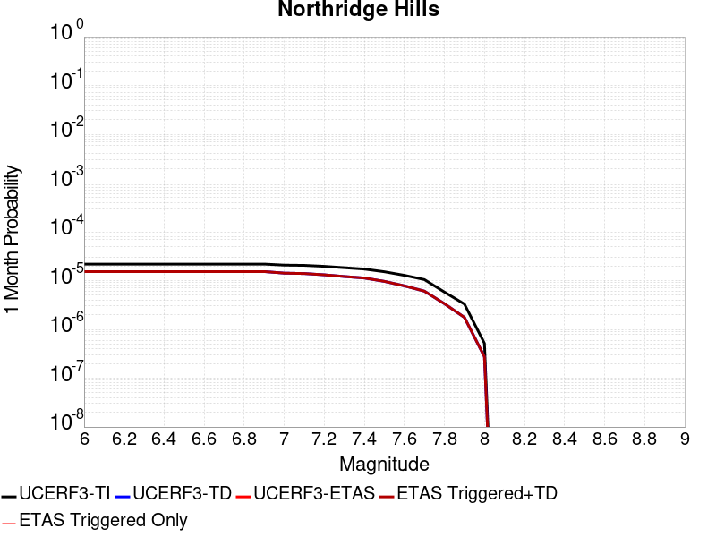 | 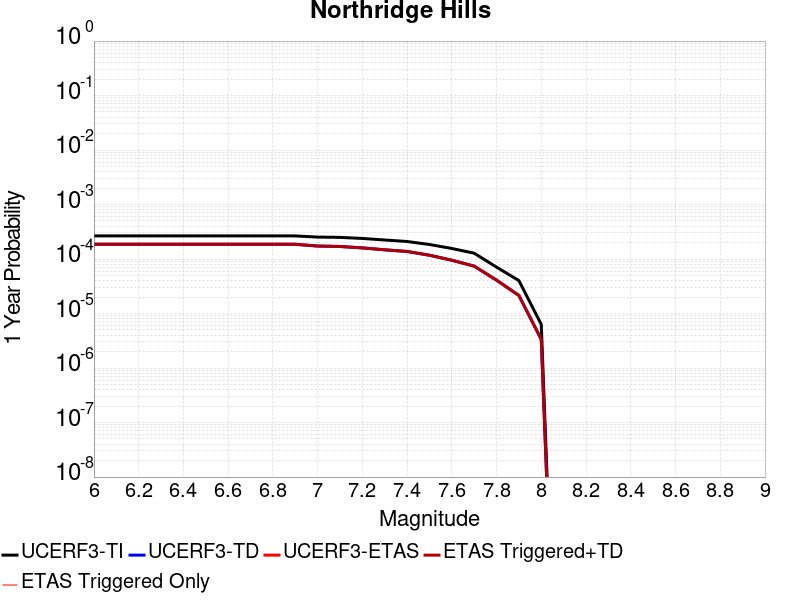 | 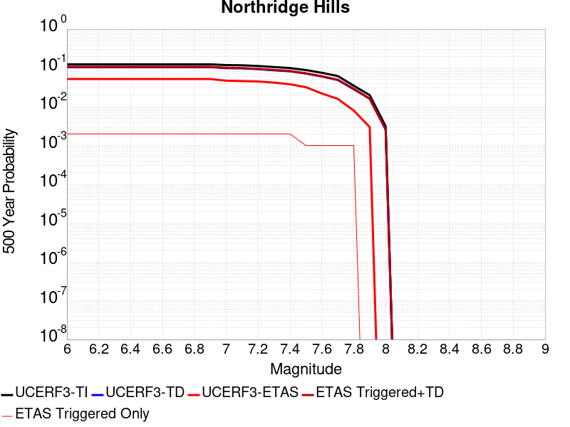 |

| Magnitude | 1 wk TI Prob | 1 wk TD Prob | 1 wk ETAS Prob | 1 wk ETAS/TD Gain | 1 wk ETAS Triggered+TD | 1 wk ETAS Triggered Only | 1 mo TI Prob | 1 mo TD Prob | 1 mo ETAS Prob | 1 mo ETAS/TD Gain | 1 mo ETAS Triggered+TD | 1 mo ETAS Triggered Only | 1 yr TI Prob | 1 yr TD Prob | 1 yr ETAS Prob | 1 yr ETAS/TD Gain | 1 yr ETAS Triggered+TD | 1 yr ETAS Triggered Only | 500 yr TI Prob | 500 yr TD Prob | 500 yr ETAS Prob | 500 yr ETAS/TD Gain | 500 yr ETAS Triggered+TD | 500 yr ETAS Triggered Only |
|-----|-----|-----|-----|-----|-----|-----|-----|-----|-----|-----|-----|-----|-----|-----|-----|-----|-----|-----|-----|-----|-----|-----|-----|-----|
| 6.0 | 5.095982E-6 | 3.5787189E-6 | 0.0 | 0.0 | 3.5787189E-6 | 0.0 | 2.183974E-5 | 1.5337277E-5 | 0.0 | 0.0 | 1.5337277E-5 | 0.0 | 2.658664E-4 | 1.8671546E-4 | 0.0 | 0.0 | 1.8671546E-4 | 0.0 | 0.12449189 | 0.10538397 | 0.052 | 0.49343368 | 0.1071732 | 0.002 |
| 6.1 | 5.095982E-6 | 3.5787189E-6 | 0.0 | 0.0 | 3.5787189E-6 | 0.0 | 2.183974E-5 | 1.5337277E-5 | 0.0 | 0.0 | 1.5337277E-5 | 0.0 | 2.658664E-4 | 1.8671546E-4 | 0.0 | 0.0 | 1.8671546E-4 | 0.0 | 0.12449189 | 0.10538397 | 0.052 | 0.49343368 | 0.1071732 | 0.002 |
| 6.2 | 5.095982E-6 | 3.5787189E-6 | 0.0 | 0.0 | 3.5787189E-6 | 0.0 | 2.183974E-5 | 1.5337277E-5 | 0.0 | 0.0 | 1.5337277E-5 | 0.0 | 2.658664E-4 | 1.8671546E-4 | 0.0 | 0.0 | 1.8671546E-4 | 0.0 | 0.12449189 | 0.10538397 | 0.052 | 0.49343368 | 0.1071732 | 0.002 |
| 6.3 | 5.095982E-6 | 3.5787189E-6 | 0.0 | 0.0 | 3.5787189E-6 | 0.0 | 2.183974E-5 | 1.5337277E-5 | 0.0 | 0.0 | 1.5337277E-5 | 0.0 | 2.658664E-4 | 1.8671546E-4 | 0.0 | 0.0 | 1.8671546E-4 | 0.0 | 0.12449189 | 0.10538397 | 0.052 | 0.49343368 | 0.1071732 | 0.002 |
| 6.4 | 5.095982E-6 | 3.5787189E-6 | 0.0 | 0.0 | 3.5787189E-6 | 0.0 | 2.183974E-5 | 1.5337277E-5 | 0.0 | 0.0 | 1.5337277E-5 | 0.0 | 2.658664E-4 | 1.8671546E-4 | 0.0 | 0.0 | 1.8671546E-4 | 0.0 | 0.12449189 | 0.10538397 | 0.052 | 0.49343368 | 0.1071732 | 0.002 |
| 6.5 | 5.095982E-6 | 3.5787189E-6 | 0.0 | 0.0 | 3.5787189E-6 | 0.0 | 2.183974E-5 | 1.5337277E-5 | 0.0 | 0.0 | 1.5337277E-5 | 0.0 | 2.658664E-4 | 1.8671546E-4 | 0.0 | 0.0 | 1.8671546E-4 | 0.0 | 0.12449189 | 0.10538397 | 0.052 | 0.49343368 | 0.1071732 | 0.002 |
| 6.6 | 5.095982E-6 | 3.5787189E-6 | 0.0 | 0.0 | 3.5787189E-6 | 0.0 | 2.183974E-5 | 1.5337277E-5 | 0.0 | 0.0 | 1.5337277E-5 | 0.0 | 2.658664E-4 | 1.8671546E-4 | 0.0 | 0.0 | 1.8671546E-4 | 0.0 | 0.12449189 | 0.10538397 | 0.052 | 0.49343368 | 0.1071732 | 0.002 |
| 6.7 | 5.095982E-6 | 3.5787189E-6 | 0.0 | 0.0 | 3.5787189E-6 | 0.0 | 2.183974E-5 | 1.5337277E-5 | 0.0 | 0.0 | 1.5337277E-5 | 0.0 | 2.658664E-4 | 1.8671546E-4 | 0.0 | 0.0 | 1.8671546E-4 | 0.0 | 0.12449189 | 0.10538397 | 0.052 | 0.49343368 | 0.1071732 | 0.002 |
| 6.8 | 5.095982E-6 | 3.5787189E-6 | 0.0 | 0.0 | 3.5787189E-6 | 0.0 | 2.183974E-5 | 1.5337277E-5 | 0.0 | 0.0 | 1.5337277E-5 | 0.0 | 2.658664E-4 | 1.8671546E-4 | 0.0 | 0.0 | 1.8671546E-4 | 0.0 | 0.12449189 | 0.10538397 | 0.052 | 0.49343368 | 0.1071732 | 0.002 |
| 6.9 | 5.0942654E-6 | 3.5769376E-6 | 0.0 | 0.0 | 3.5769376E-6 | 0.0 | 2.1832384E-5 | 1.5329642E-5 | 0.0 | 0.0 | 1.5329642E-5 | 0.0 | 2.6577685E-4 | 1.8662254E-4 | 0.0 | 0.0 | 1.8662254E-4 | 0.0 | 0.12445269 | 0.10534239 | 0.052 | 0.49362844 | 0.107131705 | 0.002 |
| 7.0 | 4.851143E-6 | 3.3228803E-6 | 0.0 | 0.0 | 3.3228803E-6 | 0.0 | 2.0790447E-5 | 1.4240838E-5 | 0.0 | 0.0 | 1.4240838E-5 | 0.0 | 2.5309427E-4 | 1.7336845E-4 | 0.0 | 0.0 | 1.7336845E-4 | 0.0 | 0.1188815 | 0.099373125 | 0.047 | 0.4729649 | 0.10117438 | 0.002 |
| 7.1 | 4.7910607E-6 | 3.261319E-6 | 0.0 | 0.0 | 3.261319E-6 | 0.0 | 2.0532956E-5 | 1.3977007E-5 | 0.0 | 0.0 | 1.3977007E-5 | 0.0 | 2.4996005E-4 | 1.7015681E-4 | 0.0 | 0.0 | 1.7015681E-4 | 0.0 | 0.11749926 | 0.09791934 | 0.046 | 0.46977443 | 0.099723496 | 0.002 |
| 7.2 | 4.580079E-6 | 3.071598E-6 | 0.0 | 0.0 | 3.071598E-6 | 0.0 | 1.9628762E-5 | 1.3163925E-5 | 0.0 | 0.0 | 1.3163925E-5 | 0.0 | 2.3895396E-4 | 1.6025903E-4 | 0.0 | 0.0 | 1.6025903E-4 | 0.0 | 0.11262824 | 0.09327661 | 0.045 | 0.48243603 | 0.09509006 | 0.002 |
| 7.3 | 4.290062E-6 | 2.8343552E-6 | 0.0 | 0.0 | 2.8343552E-6 | 0.0 | 1.838585E-5 | 1.2147179E-5 | 0.0 | 0.0 | 1.2147179E-5 | 0.0 | 2.2382473E-4 | 1.478819E-4 | 0.0 | 0.0 | 1.478819E-4 | 0.0 | 0.10588859 | 0.0872825 | 0.042 | 0.48119614 | 0.08910793 | 0.002 |
| 7.4 | 4.0259683E-6 | 2.640932E-6 | 0.0 | 0.0 | 2.640932E-6 | 0.0 | 1.7254037E-5 | 1.1318231E-5 | 0.0 | 0.0 | 1.1318231E-5 | 0.0 | 2.1004764E-4 | 1.3779078E-4 | 0.0 | 0.0 | 1.3779078E-4 | 0.0 | 0.09970685 | 0.08216023 | 0.038 | 0.4625109 | 0.08399591 | 0.002 |
| 7.5 | 3.5477108E-6 | 2.2550373E-6 | 0.0 | 0.0 | 2.2550373E-6 | 0.0 | 1.5204386E-5 | 9.664409E-6 | 0.0 | 0.0 | 9.664409E-6 | 0.0 | 1.8509767E-4 | 1.17657844E-4 | 0.0 | 0.0 | 1.17657844E-4 | 0.0 | 0.08840312 | 0.07200303 | 0.032 | 0.44442576 | 0.07293102 | 0.001 |
| 7.6 | 2.9990608E-6 | 1.8251624E-6 | 0.0 | 0.0 | 1.8251624E-6 | 0.0 | 1.2853055E-5 | 7.822101E-6 | 0.0 | 0.0 | 7.822101E-6 | 0.0 | 1.564747E-4 | 9.522992E-5 | 0.0 | 0.0 | 9.522992E-5 | 0.0 | 0.07526075 | 0.06038283 | 0.022 | 0.36434197 | 0.06132245 | 0.001 |
| 7.7 | 2.4542855E-6 | 1.4220046E-6 | 0.0 | 0.0 | 1.4220046E-6 | 0.0 | 1.05183235E-5 | 6.094291E-6 | 0.0 | 0.0 | 6.094291E-6 | 0.0 | 1.2805307E-4 | 7.419547E-5 | 0.0 | 0.0 | 7.419547E-5 | 0.0 | 0.062023733 | 0.049001534 | 0.016 | 0.3265204 | 0.04995253 | 0.001 |
| 7.8 | 1.3623128E-6 | 7.863367E-7 | 0.0 | 0.0 | 7.863367E-7 | 0.0 | 5.8384703E-6 | 3.37001E-6 | 0.0 | 0.0 | 3.37001E-6 | 0.0 | 7.108106E-5 | 4.1029103E-5 | 0.0 | 0.0 | 4.1029103E-5 | 0.0 | 0.0349176 | 0.028285414 | 0.008 | 0.28283128 | 0.029257128 | 0.001 |
| 7.9 | 7.716622E-7 | 4.1152956E-7 | 0.0 | 0.0 | 4.1152956E-7 | 0.0 | 3.3071194E-6 | 1.7636969E-6 | 0.0 | 0.0 | 1.7636969E-6 | 0.0 | 4.0263436E-5 | 2.1472799E-5 | 0.0 | 0.0 | 2.1472799E-5 | 0.0 | 0.019930825 | 0.016165486 | 0.003 | 0.18558057 | 0.016165486 | 0.0 |
| 8.0 | 1.2117711E-7 | 6.424233E-8 | 0.0 | 0.0 | 6.424233E-8 | 0.0 | 5.1933034E-7 | 2.7532425E-7 | 0.0 | 0.0 | 2.7532425E-7 | 0.0 | 6.3228285E-6 | 3.3520678E-6 | 0.0 | 0.0 | 3.3520678E-6 | 0.0 | 0.0031564322 | 0.0025999178 | 0.0 | 0.0 | 0.0025999178 | 0.0 |

## Canada David (Detachment)
*[(top)](#table-of-contents)*

| 1 Week | 1 Month | 1 Year | 500 Year |
|-----|-----|-----|-----|
|  |  | 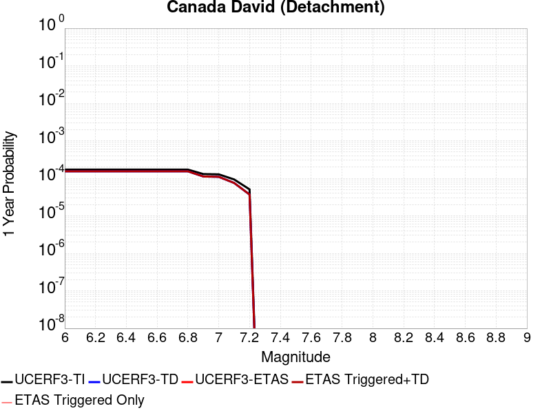 | 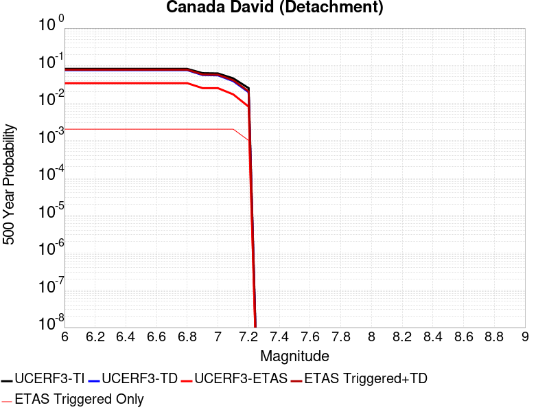 |

| Magnitude | 1 wk TI Prob | 1 wk TD Prob | 1 wk ETAS Prob | 1 wk ETAS/TD Gain | 1 wk ETAS Triggered+TD | 1 wk ETAS Triggered Only | 1 mo TI Prob | 1 mo TD Prob | 1 mo ETAS Prob | 1 mo ETAS/TD Gain | 1 mo ETAS Triggered+TD | 1 mo ETAS Triggered Only | 1 yr TI Prob | 1 yr TD Prob | 1 yr ETAS Prob | 1 yr ETAS/TD Gain | 1 yr ETAS Triggered+TD | 1 yr ETAS Triggered Only | 500 yr TI Prob | 500 yr TD Prob | 500 yr ETAS Prob | 500 yr ETAS/TD Gain | 500 yr ETAS Triggered+TD | 500 yr ETAS Triggered Only |
|-----|-----|-----|-----|-----|-----|-----|-----|-----|-----|-----|-----|-----|-----|-----|-----|-----|-----|-----|-----|-----|-----|-----|-----|-----|
| 6.0 | 3.2736298E-6 | 2.9438681E-6 | 0.0 | 0.0 | 2.9438681E-6 | 0.0 | 1.4029766E-5 | 1.2616524E-5 | 0.0 | 0.0 | 1.2616524E-5 | 0.0 | 1.7079902E-4 | 1.5359663E-4 | 0.0 | 0.0 | 1.5359663E-4 | 0.0 | 0.081861295 | 0.075763434 | 0.034 | 0.4487653 | 0.07761191 | 0.002 |
| 6.1 | 3.2736298E-6 | 2.9438681E-6 | 0.0 | 0.0 | 2.9438681E-6 | 0.0 | 1.4029766E-5 | 1.2616524E-5 | 0.0 | 0.0 | 1.2616524E-5 | 0.0 | 1.7079902E-4 | 1.5359663E-4 | 0.0 | 0.0 | 1.5359663E-4 | 0.0 | 0.081861295 | 0.075763434 | 0.034 | 0.4487653 | 0.07761191 | 0.002 |
| 6.2 | 3.2736298E-6 | 2.9438681E-6 | 0.0 | 0.0 | 2.9438681E-6 | 0.0 | 1.4029766E-5 | 1.2616524E-5 | 0.0 | 0.0 | 1.2616524E-5 | 0.0 | 1.7079902E-4 | 1.5359663E-4 | 0.0 | 0.0 | 1.5359663E-4 | 0.0 | 0.081861295 | 0.075763434 | 0.034 | 0.4487653 | 0.07761191 | 0.002 |
| 6.3 | 3.2736298E-6 | 2.9438681E-6 | 0.0 | 0.0 | 2.9438681E-6 | 0.0 | 1.4029766E-5 | 1.2616524E-5 | 0.0 | 0.0 | 1.2616524E-5 | 0.0 | 1.7079902E-4 | 1.5359663E-4 | 0.0 | 0.0 | 1.5359663E-4 | 0.0 | 0.081861295 | 0.075763434 | 0.034 | 0.4487653 | 0.07761191 | 0.002 |
| 6.4 | 3.2736298E-6 | 2.9438681E-6 | 0.0 | 0.0 | 2.9438681E-6 | 0.0 | 1.4029766E-5 | 1.2616524E-5 | 0.0 | 0.0 | 1.2616524E-5 | 0.0 | 1.7079902E-4 | 1.5359663E-4 | 0.0 | 0.0 | 1.5359663E-4 | 0.0 | 0.081861295 | 0.075763434 | 0.034 | 0.4487653 | 0.07761191 | 0.002 |
| 6.5 | 3.2736298E-6 | 2.9438681E-6 | 0.0 | 0.0 | 2.9438681E-6 | 0.0 | 1.4029766E-5 | 1.2616524E-5 | 0.0 | 0.0 | 1.2616524E-5 | 0.0 | 1.7079902E-4 | 1.5359663E-4 | 0.0 | 0.0 | 1.5359663E-4 | 0.0 | 0.081861295 | 0.075763434 | 0.034 | 0.4487653 | 0.07761191 | 0.002 |
| 6.6 | 3.2736298E-6 | 2.9438681E-6 | 0.0 | 0.0 | 2.9438681E-6 | 0.0 | 1.4029766E-5 | 1.2616524E-5 | 0.0 | 0.0 | 1.2616524E-5 | 0.0 | 1.7079902E-4 | 1.5359663E-4 | 0.0 | 0.0 | 1.5359663E-4 | 0.0 | 0.081861295 | 0.075763434 | 0.034 | 0.4487653 | 0.07761191 | 0.002 |
| 6.7 | 3.2736298E-6 | 2.9438681E-6 | 0.0 | 0.0 | 2.9438681E-6 | 0.0 | 1.4029766E-5 | 1.2616524E-5 | 0.0 | 0.0 | 1.2616524E-5 | 0.0 | 1.7079902E-4 | 1.5359663E-4 | 0.0 | 0.0 | 1.5359663E-4 | 0.0 | 0.081861295 | 0.075763434 | 0.034 | 0.4487653 | 0.07761191 | 0.002 |
| 6.8 | 3.2736298E-6 | 2.9438681E-6 | 0.0 | 0.0 | 2.9438681E-6 | 0.0 | 1.4029766E-5 | 1.2616524E-5 | 0.0 | 0.0 | 1.2616524E-5 | 0.0 | 1.7079902E-4 | 1.5359663E-4 | 0.0 | 0.0 | 1.5359663E-4 | 0.0 | 0.081861295 | 0.075763434 | 0.034 | 0.4487653 | 0.07761191 | 0.002 |
| 6.9 | 2.4914223E-6 | 2.143695E-6 | 0.0 | 0.0 | 2.143695E-6 | 0.0 | 1.067748E-5 | 9.187234E-6 | 0.0 | 0.0 | 9.187234E-6 | 0.0 | 1.2999057E-4 | 1.1184939E-4 | 0.0 | 0.0 | 1.1184939E-4 | 0.0 | 0.062932074 | 0.056076143 | 0.025 | 0.4458224 | 0.05796399 | 0.002 |
| 7.0 | 2.4482404E-6 | 2.1017079E-6 | 0.0 | 0.0 | 2.1017079E-6 | 0.0 | 1.0492417E-5 | 9.007292E-6 | 0.0 | 0.0 | 9.007292E-6 | 0.0 | 1.2773767E-4 | 1.096588E-4 | 0.0 | 0.0 | 1.096588E-4 | 0.0 | 0.06187579 | 0.05503334 | 0.025 | 0.45427006 | 0.056923278 | 0.002 |
| 7.1 | 1.7887576E-6 | 1.4426334E-6 | 0.0 | 0.0 | 1.4426334E-6 | 0.0 | 7.666081E-6 | 6.182702E-6 | 0.0 | 0.0 | 6.182702E-6 | 0.0 | 9.333054E-5 | 7.52721E-5 | 0.0 | 0.0 | 7.52721E-5 | 0.0 | 0.045595266 | 0.038518507 | 0.017 | 0.44134626 | 0.040441472 | 0.002 |
| 7.2 | 9.723109E-7 | 7.084936E-7 | 0.0 | 0.0 | 7.084936E-7 | 0.0 | 4.16704E-6 | 3.0363985E-6 | 0.0 | 0.0 | 3.0363985E-6 | 0.0 | 5.073253E-5 | 3.696769E-5 | 0.0 | 0.0 | 3.696769E-5 | 0.0 | 0.025047874 | 0.019482998 | 0.008 | 0.41061443 | 0.020463515 | 0.001 |

## Peralta Hills
*[(top)](#table-of-contents)*

| 1 Week | 1 Month | 1 Year | 500 Year |
|-----|-----|-----|-----|
|  |  | 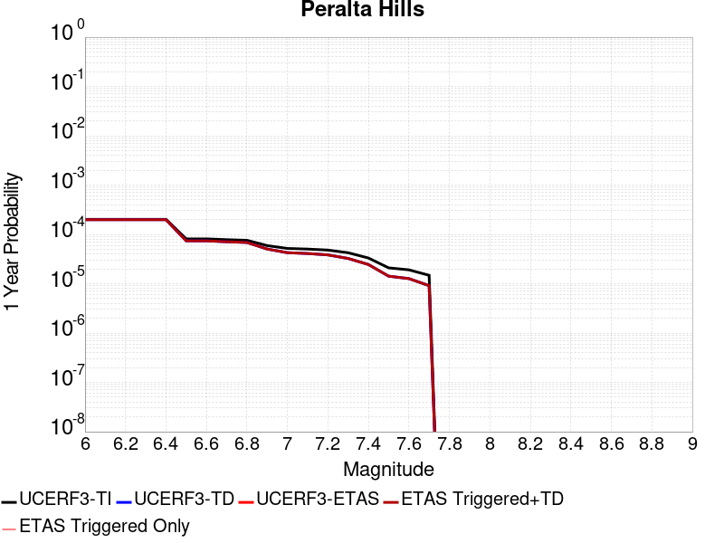 | 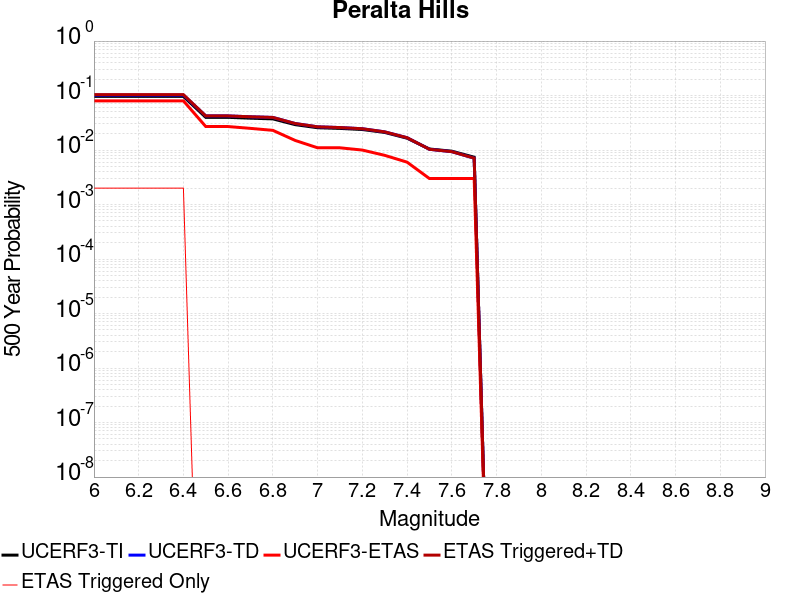 |

| Magnitude | 1 wk TI Prob | 1 wk TD Prob | 1 wk ETAS Prob | 1 wk ETAS/TD Gain | 1 wk ETAS Triggered+TD | 1 wk ETAS Triggered Only | 1 mo TI Prob | 1 mo TD Prob | 1 mo ETAS Prob | 1 mo ETAS/TD Gain | 1 mo ETAS Triggered+TD | 1 mo ETAS Triggered Only | 1 yr TI Prob | 1 yr TD Prob | 1 yr ETAS Prob | 1 yr ETAS/TD Gain | 1 yr ETAS Triggered+TD | 1 yr ETAS Triggered Only | 500 yr TI Prob | 500 yr TD Prob | 500 yr ETAS Prob | 500 yr ETAS/TD Gain | 500 yr ETAS Triggered+TD | 500 yr ETAS Triggered Only |
|-----|-----|-----|-----|-----|-----|-----|-----|-----|-----|-----|-----|-----|-----|-----|-----|-----|-----|-----|-----|-----|-----|-----|-----|-----|
| 6.0 | 3.8850067E-6 | 3.8141898E-6 | 0.0 | 0.0 | 3.8141898E-6 | 0.0 | 1.6649923E-5 | 1.6346467E-5 | 0.0 | 0.0 | 1.6346467E-5 | 0.0 | 2.0269395E-4 | 1.9900744E-4 | 0.0 | 0.0 | 1.9900744E-4 | 0.0 | 0.09638984 | 0.10207584 | 0.08 | 0.783731 | 0.10387169 | 0.002 |
| 6.1 | 3.8850067E-6 | 3.8141898E-6 | 0.0 | 0.0 | 3.8141898E-6 | 0.0 | 1.6649923E-5 | 1.6346467E-5 | 0.0 | 0.0 | 1.6346467E-5 | 0.0 | 2.0269395E-4 | 1.9900744E-4 | 0.0 | 0.0 | 1.9900744E-4 | 0.0 | 0.09638984 | 0.10207584 | 0.08 | 0.783731 | 0.10387169 | 0.002 |
| 6.2 | 3.8850067E-6 | 3.8141898E-6 | 0.0 | 0.0 | 3.8141898E-6 | 0.0 | 1.6649923E-5 | 1.6346467E-5 | 0.0 | 0.0 | 1.6346467E-5 | 0.0 | 2.0269395E-4 | 1.9900744E-4 | 0.0 | 0.0 | 1.9900744E-4 | 0.0 | 0.09638984 | 0.10207584 | 0.08 | 0.783731 | 0.10387169 | 0.002 |
| 6.3 | 3.8850067E-6 | 3.8141898E-6 | 0.0 | 0.0 | 3.8141898E-6 | 0.0 | 1.6649923E-5 | 1.6346467E-5 | 0.0 | 0.0 | 1.6346467E-5 | 0.0 | 2.0269395E-4 | 1.9900744E-4 | 0.0 | 0.0 | 1.9900744E-4 | 0.0 | 0.09638984 | 0.10207584 | 0.08 | 0.783731 | 0.10387169 | 0.002 |
| 6.4 | 3.8850067E-6 | 3.8141898E-6 | 0.0 | 0.0 | 3.8141898E-6 | 0.0 | 1.6649923E-5 | 1.6346467E-5 | 0.0 | 0.0 | 1.6346467E-5 | 0.0 | 2.0269395E-4 | 1.9900744E-4 | 0.0 | 0.0 | 1.9900744E-4 | 0.0 | 0.09638984 | 0.10207584 | 0.08 | 0.783731 | 0.10387169 | 0.002 |
| 6.5 | 1.5587785E-6 | 1.4215101E-6 | 0.0 | 0.0 | 1.4215101E-6 | 0.0 | 6.6804623E-6 | 6.092173E-6 | 0.0 | 0.0 | 6.092173E-6 | 0.0 | 8.133159E-5 | 7.416992E-5 | 0.0 | 0.0 | 7.416992E-5 | 0.0 | 0.03985163 | 0.042292494 | 0.027 | 0.63841116 | 0.042292494 | 0.0 |
| 6.6 | 1.5587785E-6 | 1.4215101E-6 | 0.0 | 0.0 | 1.4215101E-6 | 0.0 | 6.6804623E-6 | 6.092173E-6 | 0.0 | 0.0 | 6.092173E-6 | 0.0 | 8.133159E-5 | 7.416992E-5 | 0.0 | 0.0 | 7.416992E-5 | 0.0 | 0.03985163 | 0.042292494 | 0.027 | 0.63841116 | 0.042292494 | 0.0 |
| 6.7 | 1.5018579E-6 | 1.3622656E-6 | 0.0 | 0.0 | 1.3622656E-6 | 0.0 | 6.436518E-6 | 5.8382693E-6 | 0.0 | 0.0 | 5.8382693E-6 | 0.0 | 7.836179E-5 | 7.1078844E-5 | 0.0 | 0.0 | 7.1078844E-5 | 0.0 | 0.038424727 | 0.04080994 | 0.025 | 0.61259586 | 0.04080994 | 0.0 |
| 6.8 | 1.4584314E-6 | 1.3168142E-6 | 0.0 | 0.0 | 1.3168142E-6 | 0.0 | 6.250405E-6 | 5.6434783E-6 | 0.0 | 0.0 | 5.6434783E-6 | 0.0 | 7.6096025E-5 | 6.870741E-5 | 0.0 | 0.0 | 6.870741E-5 | 0.0 | 0.037334673 | 0.039671488 | 0.023 | 0.5797615 | 0.039671488 | 0.0 |
| 6.9 | 1.1382393E-6 | 9.703543E-7 | 0.0 | 0.0 | 9.703543E-7 | 0.0 | 4.8781594E-6 | 4.158655E-6 | 0.0 | 0.0 | 4.158655E-6 | 0.0 | 5.9389975E-5 | 5.063053E-5 | 0.0 | 0.0 | 5.063053E-5 | 0.0 | 0.02925928 | 0.030662626 | 0.015 | 0.4891949 | 0.030662626 | 0.0 |
| 7.0 | 9.970413E-7 | 8.177901E-7 | 0.0 | 0.0 | 8.177901E-7 | 0.0 | 4.273027E-6 | 3.5048104E-6 | 0.0 | 0.0 | 3.5048104E-6 | 0.0 | 5.2022864E-5 | 4.2670297E-5 | 0.0 | 0.0 | 4.2670297E-5 | 0.0 | 0.025676709 | 0.02668802 | 0.011 | 0.41216996 | 0.02668802 | 0.0 |
| 7.1 | 9.684443E-7 | 7.8669143E-7 | 0.0 | 0.0 | 7.8669143E-7 | 0.0 | 4.150469E-6 | 3.3715307E-6 | 0.0 | 0.0 | 3.3715307E-6 | 0.0 | 5.053079E-5 | 4.104768E-5 | 0.0 | 0.0 | 4.104768E-5 | 0.0 | 0.024949519 | 0.025878226 | 0.011 | 0.42506775 | 0.025878226 | 0.0 |
| 7.2 | 9.240811E-7 | 7.3807905E-7 | 0.0 | 0.0 | 7.3807905E-7 | 0.0 | 3.960342E-6 | 3.1631926E-6 | 0.0 | 0.0 | 3.1631926E-6 | 0.0 | 4.8216094E-5 | 3.8511254E-5 | 0.0 | 0.0 | 3.8511254E-5 | 0.0 | 0.023820337 | 0.02461563 | 0.01 | 0.40624595 | 0.02461563 | 0.0 |
| 7.3 | 8.158643E-7 | 6.243714E-7 | 0.0 | 0.0 | 6.243714E-7 | 0.0 | 3.4965567E-6 | 2.6758753E-6 | 0.0 | 0.0 | 2.6758753E-6 | 0.0 | 4.2569747E-5 | 3.2578355E-5 | 0.0 | 0.0 | 3.2578355E-5 | 0.0 | 0.021060392 | 0.021569619 | 0.008 | 0.37089205 | 0.021569619 | 0.0 |
| 7.4 | 6.3822824E-7 | 4.7134424E-7 | 0.0 | 0.0 | 4.7134424E-7 | 0.0 | 2.7352612E-6 | 2.0200455E-6 | 0.0 | 0.0 | 2.0200455E-6 | 0.0 | 3.3301294E-5 | 2.4593826E-5 | 0.0 | 0.0 | 2.4593826E-5 | 0.0 | 0.016513065 | 0.016856274 | 0.006 | 0.35595056 | 0.016856274 | 0.0 |
| 7.5 | 4.0292628E-7 | 2.734064E-7 | 0.0 | 0.0 | 2.734064E-7 | 0.0 | 1.7268258E-6 | 1.1717414E-6 | 0.0 | 0.0 | 1.1717414E-6 | 0.0 | 2.1023901E-5 | 1.42658855E-5 | 0.0 | 0.0 | 1.42658855E-5 | 0.0 | 0.010457003 | 0.01033531 | 0.003 | 0.29026705 | 0.01033531 | 0.0 |
| 7.6 | 3.672993E-7 | 2.4398608E-7 | 0.0 | 0.0 | 2.4398608E-7 | 0.0 | 1.5741389E-6 | 1.0456545E-6 | 0.0 | 0.0 | 1.0456545E-6 | 0.0 | 1.9164972E-5 | 1.2730795E-5 | 0.0 | 0.0 | 1.2730795E-5 | 0.0 | 0.009536811 | 0.009342225 | 0.003 | 0.32112262 | 0.009342225 | 0.0 |
| 7.7 | 2.8466823E-7 | 1.7548469E-7 | 0.0 | 0.0 | 1.7548469E-7 | 0.0 | 1.2200061E-6 | 7.5207714E-7 | 0.0 | 0.0 | 7.5207714E-7 | 0.0 | 1.4853474E-5 | 9.156526E-6 | 0.0 | 0.0 | 9.156526E-6 | 0.0 | 0.0073992815 | 0.0070962827 | 0.003 | 0.42275655 | 0.0070962827 | 0.0 |

## Death Valley (Black Mtns Frontal)
*[(top)](#table-of-contents)*

| 1 Week | 1 Month | 1 Year | 500 Year |
|-----|-----|-----|-----|
|  |  |  | 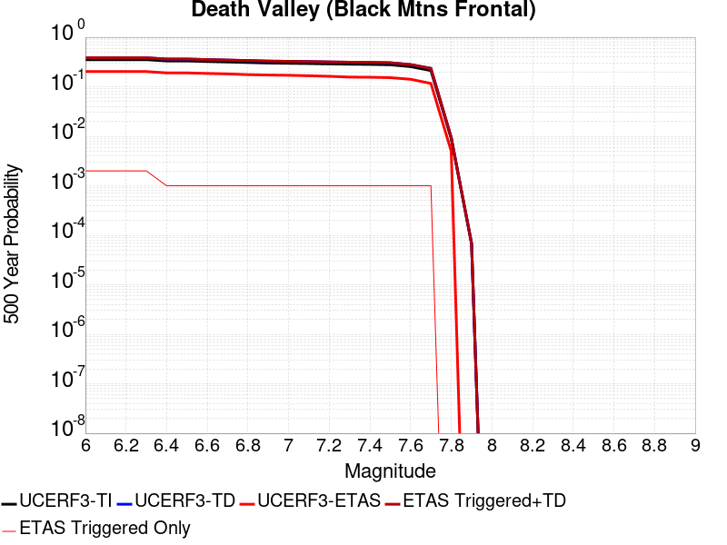 |

| Magnitude | 1 wk TI Prob | 1 wk TD Prob | 1 wk ETAS Prob | 1 wk ETAS/TD Gain | 1 wk ETAS Triggered+TD | 1 wk ETAS Triggered Only | 1 mo TI Prob | 1 mo TD Prob | 1 mo ETAS Prob | 1 mo ETAS/TD Gain | 1 mo ETAS Triggered+TD | 1 mo ETAS Triggered Only | 1 yr TI Prob | 1 yr TD Prob | 1 yr ETAS Prob | 1 yr ETAS/TD Gain | 1 yr ETAS Triggered+TD | 1 yr ETAS Triggered Only | 500 yr TI Prob | 500 yr TD Prob | 500 yr ETAS Prob | 500 yr ETAS/TD Gain | 500 yr ETAS Triggered+TD | 500 yr ETAS Triggered Only |
|-----|-----|-----|-----|-----|-----|-----|-----|-----|-----|-----|-----|-----|-----|-----|-----|-----|-----|-----|-----|-----|-----|-----|-----|-----|
| 6.0 | 1.6707214E-5 | 1.8556657E-5 | 0.0 | 0.0 | 1.8556657E-5 | 0.0 | 7.160038E-5 | 7.9526144E-5 | 0.0 | 0.0 | 7.9526144E-5 | 0.0 | 8.71386E-4 | 9.6780824E-4 | 0.0 | 0.0 | 9.6780824E-4 | 0.0 | 0.35330656 | 0.38420975 | 0.203 | 0.52835727 | 0.38544133 | 0.002 |
| 6.1 | 1.6707214E-5 | 1.8556657E-5 | 0.0 | 0.0 | 1.8556657E-5 | 0.0 | 7.160038E-5 | 7.9526144E-5 | 0.0 | 0.0 | 7.9526144E-5 | 0.0 | 8.71386E-4 | 9.6780824E-4 | 0.0 | 0.0 | 9.6780824E-4 | 0.0 | 0.35330656 | 0.38420975 | 0.203 | 0.52835727 | 0.38544133 | 0.002 |
| 6.2 | 1.6707214E-5 | 1.8556657E-5 | 0.0 | 0.0 | 1.8556657E-5 | 0.0 | 7.160038E-5 | 7.9526144E-5 | 0.0 | 0.0 | 7.9526144E-5 | 0.0 | 8.71386E-4 | 9.6780824E-4 | 0.0 | 0.0 | 9.6780824E-4 | 0.0 | 0.35330656 | 0.38420975 | 0.203 | 0.52835727 | 0.38544133 | 0.002 |
| 6.3 | 1.6707214E-5 | 1.8556657E-5 | 0.0 | 0.0 | 1.8556657E-5 | 0.0 | 7.160038E-5 | 7.9526144E-5 | 0.0 | 0.0 | 7.9526144E-5 | 0.0 | 8.71386E-4 | 9.6780824E-4 | 0.0 | 0.0 | 9.6780824E-4 | 0.0 | 0.35330656 | 0.38420975 | 0.203 | 0.52835727 | 0.38544133 | 0.002 |
| 6.4 | 1.5515609E-5 | 1.723271E-5 | 0.0 | 0.0 | 1.723271E-5 | 0.0 | 6.649377E-5 | 7.3852425E-5 | 0.0 | 0.0 | 7.3852425E-5 | 0.0 | 8.0926094E-4 | 8.9878833E-4 | 0.0 | 0.0 | 8.9878833E-4 | 0.0 | 0.33288598 | 0.3627144 | 0.191 | 0.5265851 | 0.3633517 | 0.001 |
| 6.5 | 1.5515609E-5 | 1.723271E-5 | 0.0 | 0.0 | 1.723271E-5 | 0.0 | 6.649377E-5 | 7.3852425E-5 | 0.0 | 0.0 | 7.3852425E-5 | 0.0 | 8.0926094E-4 | 8.9878833E-4 | 0.0 | 0.0 | 8.9878833E-4 | 0.0 | 0.33288598 | 0.3627144 | 0.191 | 0.5265851 | 0.3633517 | 0.001 |
| 6.6 | 1.5041828E-5 | 1.6706832E-5 | 0.0 | 0.0 | 1.6706832E-5 | 0.0 | 6.4463384E-5 | 7.159878E-5 | 0.0 | 0.0 | 7.159878E-5 | 0.0 | 7.8455906E-4 | 8.7137235E-4 | 0.0 | 0.0 | 8.7137235E-4 | 0.0 | 0.32458875 | 0.3540279 | 0.186 | 0.52538234 | 0.35467386 | 0.001 |
| 6.7 | 1.4634985E-5 | 1.6256368E-5 | 0.0 | 0.0 | 1.6256368E-5 | 0.0 | 6.271985E-5 | 6.966832E-5 | 0.0 | 0.0 | 6.966832E-5 | 0.0 | 7.6334673E-4 | 8.478874E-4 | 0.0 | 0.0 | 8.478874E-4 | 0.0 | 0.31738147 | 0.34649032 | 0.182 | 0.5252672 | 0.34714383 | 0.001 |
| 6.8 | 1.4209158E-5 | 1.5785168E-5 | 0.0 | 0.0 | 1.5785168E-5 | 0.0 | 6.089497E-5 | 6.7649E-5 | 0.0 | 0.0 | 6.7649E-5 | 0.0 | 7.4114406E-4 | 8.233209E-4 | 0.0 | 0.0 | 8.233209E-4 | 0.0 | 0.3097555 | 0.33841574 | 0.176 | 0.5200704 | 0.33907735 | 0.001 |
| 6.9 | 1.3780098E-5 | 1.5310497E-5 | 0.0 | 0.0 | 1.5310497E-5 | 0.0 | 5.9056227E-5 | 6.56148E-5 | 0.0 | 0.0 | 6.56148E-5 | 0.0 | 7.1877235E-4 | 7.985728E-4 | 0.0 | 0.0 | 7.985728E-4 | 0.0 | 0.3019855 | 0.33018124 | 0.173 | 0.5239547 | 0.33085105 | 0.001 |
| 7.0 | 1.3585064E-5 | 1.5095287E-5 | 0.0 | 0.0 | 1.5095287E-5 | 0.0 | 5.8220405E-5 | 6.469252E-5 | 0.0 | 0.0 | 6.469252E-5 | 0.0 | 7.086029E-4 | 7.8735215E-4 | 0.0 | 0.0 | 7.8735215E-4 | 0.0 | 0.2984247 | 0.32642195 | 0.171 | 0.5238619 | 0.3270955 | 0.001 |
| 7.1 | 1.3398601E-5 | 1.4889639E-5 | 0.0 | 0.0 | 1.4889639E-5 | 0.0 | 5.742131E-5 | 6.38112E-5 | 0.0 | 0.0 | 6.38112E-5 | 0.0 | 6.9888023E-4 | 7.766299E-4 | 0.0 | 0.0 | 7.766299E-4 | 0.0 | 0.29500338 | 0.32281008 | 0.167 | 0.517332 | 0.32348728 | 0.001 |
| 7.2 | 1.3126312E-5 | 1.458955E-5 | 0.0 | 0.0 | 1.458955E-5 | 0.0 | 5.6254412E-5 | 6.252518E-5 | 0.0 | 0.0 | 6.252518E-5 | 0.0 | 6.846822E-4 | 7.609835E-4 | 0.0 | 0.0 | 7.609835E-4 | 0.0 | 0.2899773 | 0.31750348 | 0.163 | 0.5133802 | 0.31818596 | 0.001 |
| 7.3 | 1.2922429E-5 | 1.4365033E-5 | 0.0 | 0.0 | 1.4365033E-5 | 0.0 | 5.5380664E-5 | 6.1563005E-5 | 0.0 | 0.0 | 6.1563005E-5 | 0.0 | 6.74051E-4 | 7.492772E-4 | 0.0 | 0.0 | 7.492772E-4 | 0.0 | 0.28619048 | 0.31349415 | 0.157 | 0.5008068 | 0.31418064 | 0.001 |
| 7.4 | 1.2768878E-5 | 1.4195966E-5 | 0.0 | 0.0 | 1.4195966E-5 | 0.0 | 5.4722615E-5 | 6.083847E-5 | 0.0 | 0.0 | 6.083847E-5 | 0.0 | 6.660441E-4 | 7.40462E-4 | 0.0 | 0.0 | 7.40462E-4 | 0.0 | 0.28332514 | 0.31046104 | 0.156 | 0.5024785 | 0.31115058 | 0.001 |
| 7.5 | 1.2521929E-5 | 1.392564E-5 | 0.0 | 0.0 | 1.392564E-5 | 0.0 | 5.366431E-5 | 5.967998E-5 | 0.0 | 0.0 | 5.967998E-5 | 0.0 | 6.531671E-4 | 7.263669E-4 | 0.0 | 0.0 | 7.263669E-4 | 0.0 | 0.27869287 | 0.30558363 | 0.153 | 0.5006813 | 0.30627805 | 0.001 |
| 7.6 | 1.1301089E-5 | 1.257006E-5 | 0.0 | 0.0 | 1.257006E-5 | 0.0 | 4.8432343E-5 | 5.38706E-5 | 0.0 | 0.0 | 5.38706E-5 | 0.0 | 5.895042E-4 | 6.556824E-4 | 0.0 | 0.0 | 6.556824E-4 | 0.0 | 0.25534853 | 0.28058705 | 0.142 | 0.5060818 | 0.28130648 | 0.001 |
| 7.7 | 9.189108E-6 | 1.0219931E-5 | 0.0 | 0.0 | 1.0219931E-5 | 0.0 | 3.93813E-5 | 4.3799E-5 | 0.0 | 0.0 | 4.3799E-5 | 0.0 | 4.7936183E-4 | 5.331273E-4 | 0.0 | 0.0 | 5.331273E-4 | 0.0 | 0.21316631 | 0.23509291 | 0.117 | 0.49767557 | 0.23585781 | 0.001 |
| 7.8 | 3.4586725E-7 | 3.6378464E-7 | 0.0 | 0.0 | 3.6378464E-7 | 0.0 | 1.4822873E-6 | 1.559076E-6 | 0.0 | 0.0 | 1.559076E-6 | 0.0 | 1.80467E-5 | 1.898159E-5 | 0.0 | 0.0 | 1.898159E-5 | 0.0 | 0.008982842 | 0.00944719 | 0.005 | 0.52925795 | 0.00944719 | 0.0 |
| 7.9 | 2.5591178E-9 | 2.6636915E-9 | 0.0 | 0.0 | 2.6636915E-9 | 0.0 | 1.0967647E-8 | 1.141582E-8 | 0.0 | 0.0 | 1.141582E-8 | 0.0 | 1.335311E-7 | 1.3898762E-7 | 0.0 | 0.0 | 1.3898762E-7 | 0.0 | 6.676333E-5 | 6.9493806E-5 | 0.0 | 0.0 | 6.9493806E-5 | 0.0 |

## Pine Mtn
*[(top)](#table-of-contents)*

| 1 Week | 1 Month | 1 Year | 500 Year |
|-----|-----|-----|-----|
| 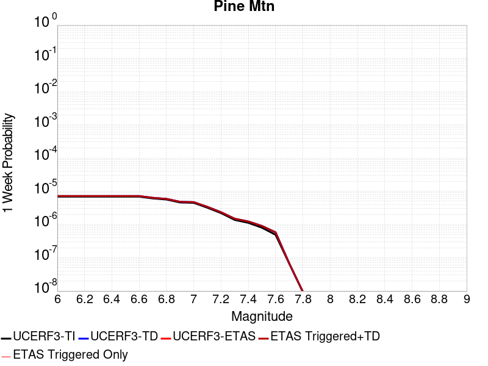 |  |  | 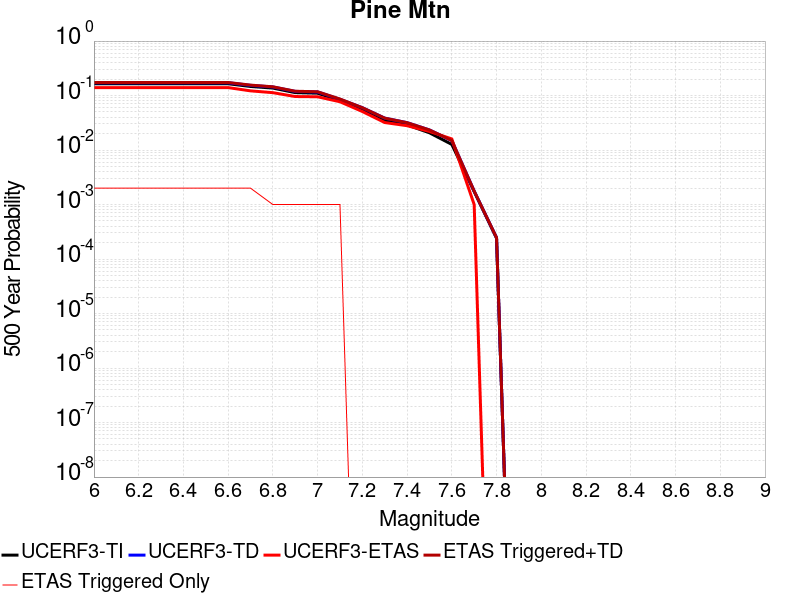 |

| Magnitude | 1 wk TI Prob | 1 wk TD Prob | 1 wk ETAS Prob | 1 wk ETAS/TD Gain | 1 wk ETAS Triggered+TD | 1 wk ETAS Triggered Only | 1 mo TI Prob | 1 mo TD Prob | 1 mo ETAS Prob | 1 mo ETAS/TD Gain | 1 mo ETAS Triggered+TD | 1 mo ETAS Triggered Only | 1 yr TI Prob | 1 yr TD Prob | 1 yr ETAS Prob | 1 yr ETAS/TD Gain | 1 yr ETAS Triggered+TD | 1 yr ETAS Triggered Only | 500 yr TI Prob | 500 yr TD Prob | 500 yr ETAS Prob | 500 yr ETAS/TD Gain | 500 yr ETAS Triggered+TD | 500 yr ETAS Triggered Only |
|-----|-----|-----|-----|-----|-----|-----|-----|-----|-----|-----|-----|-----|-----|-----|-----|-----|-----|-----|-----|-----|-----|-----|-----|-----|
| 6.0 | 6.894797E-6 | 7.1853015E-6 | 0.0 | 0.0 | 7.1853015E-6 | 0.0 | 2.9548795E-5 | 3.0793803E-5 | 0.0 | 0.0 | 3.0793803E-5 | 0.0 | 3.596972E-4 | 3.74853E-4 | 0.0 | 0.0 | 3.74853E-4 | 0.0 | 0.16463035 | 0.17209059 | 0.14 | 0.813525 | 0.1737464 | 0.002 |
| 6.1 | 6.894797E-6 | 7.1853015E-6 | 0.0 | 0.0 | 7.1853015E-6 | 0.0 | 2.9548795E-5 | 3.0793803E-5 | 0.0 | 0.0 | 3.0793803E-5 | 0.0 | 3.596972E-4 | 3.74853E-4 | 0.0 | 0.0 | 3.74853E-4 | 0.0 | 0.16463035 | 0.17209059 | 0.14 | 0.813525 | 0.1737464 | 0.002 |
| 6.2 | 6.894797E-6 | 7.1853015E-6 | 0.0 | 0.0 | 7.1853015E-6 | 0.0 | 2.9548795E-5 | 3.0793803E-5 | 0.0 | 0.0 | 3.0793803E-5 | 0.0 | 3.596972E-4 | 3.74853E-4 | 0.0 | 0.0 | 3.74853E-4 | 0.0 | 0.16463035 | 0.17209059 | 0.14 | 0.813525 | 0.1737464 | 0.002 |
| 6.3 | 6.894797E-6 | 7.1853015E-6 | 0.0 | 0.0 | 7.1853015E-6 | 0.0 | 2.9548795E-5 | 3.0793803E-5 | 0.0 | 0.0 | 3.0793803E-5 | 0.0 | 3.596972E-4 | 3.74853E-4 | 0.0 | 0.0 | 3.74853E-4 | 0.0 | 0.16463035 | 0.17209059 | 0.14 | 0.813525 | 0.1737464 | 0.002 |
| 6.4 | 6.894797E-6 | 7.1853015E-6 | 0.0 | 0.0 | 7.1853015E-6 | 0.0 | 2.9548795E-5 | 3.0793803E-5 | 0.0 | 0.0 | 3.0793803E-5 | 0.0 | 3.596972E-4 | 3.74853E-4 | 0.0 | 0.0 | 3.74853E-4 | 0.0 | 0.16463035 | 0.17209059 | 0.14 | 0.813525 | 0.1737464 | 0.002 |
| 6.5 | 6.894797E-6 | 7.1853015E-6 | 0.0 | 0.0 | 7.1853015E-6 | 0.0 | 2.9548795E-5 | 3.0793803E-5 | 0.0 | 0.0 | 3.0793803E-5 | 0.0 | 3.596972E-4 | 3.74853E-4 | 0.0 | 0.0 | 3.74853E-4 | 0.0 | 0.16463035 | 0.17209059 | 0.14 | 0.813525 | 0.1737464 | 0.002 |
| 6.6 | 6.894797E-6 | 7.1853015E-6 | 0.0 | 0.0 | 7.1853015E-6 | 0.0 | 2.9548795E-5 | 3.0793803E-5 | 0.0 | 0.0 | 3.0793803E-5 | 0.0 | 3.596972E-4 | 3.74853E-4 | 0.0 | 0.0 | 3.74853E-4 | 0.0 | 0.16463035 | 0.17209059 | 0.14 | 0.813525 | 0.1737464 | 0.002 |
| 6.7 | 6.0867933E-6 | 6.3580355E-6 | 0.0 | 0.0 | 6.3580355E-6 | 0.0 | 2.6085996E-5 | 2.7248452E-5 | 0.0 | 0.0 | 2.7248452E-5 | 0.0 | 3.1755073E-4 | 3.317016E-4 | 0.0 | 0.0 | 3.317016E-4 | 0.0 | 0.14683351 | 0.15384497 | 0.122 | 0.79300606 | 0.15553728 | 0.002 |
| 6.8 | 5.6530425E-6 | 5.9122E-6 | 0.0 | 0.0 | 5.9122E-6 | 0.0 | 2.42271E-5 | 2.5337766E-5 | 0.0 | 0.0 | 2.5337766E-5 | 0.0 | 2.94925E-4 | 3.0844568E-4 | 0.0 | 0.0 | 3.0844568E-4 | 0.0 | 0.13712397 | 0.14391303 | 0.113 | 0.7851964 | 0.14476912 | 0.001 |
| 6.9 | 4.6015225E-6 | 4.8273287E-6 | 0.0 | 0.0 | 4.8273287E-6 | 0.0 | 1.9720663E-5 | 2.0688394E-5 | 0.0 | 0.0 | 2.0688394E-5 | 0.0 | 2.4007261E-4 | 2.5185355E-4 | 0.0 | 0.0 | 2.5185355E-4 | 0.0 | 0.11312454 | 0.11919087 | 0.096 | 0.8054308 | 0.12007168 | 0.001 |
| 7.0 | 4.4875965E-6 | 4.711098E-6 | 0.0 | 0.0 | 4.711098E-6 | 0.0 | 1.9232413E-5 | 2.0190271E-5 | 0.0 | 0.0 | 2.0190271E-5 | 0.0 | 2.3412947E-4 | 2.4579026E-4 | 0.0 | 0.0 | 2.4579026E-4 | 0.0 | 0.110484585 | 0.11651521 | 0.095 | 0.8153442 | 0.117398694 | 0.001 |
| 7.1 | 3.203907E-6 | 3.3948686E-6 | 0.0 | 0.0 | 3.3948686E-6 | 0.0 | 1.3730958E-5 | 1.454936E-5 | 0.0 | 0.0 | 1.454936E-5 | 0.0 | 1.6716159E-4 | 1.7712472E-4 | 0.0 | 0.0 | 1.7712472E-4 | 0.0 | 0.08018965 | 0.08545307 | 0.077 | 0.90107936 | 0.08636762 | 0.001 |
| 7.2 | 2.2060601E-6 | 2.3502043E-6 | 0.0 | 0.0 | 2.3502043E-6 | 0.0 | 9.4545085E-6 | 1.0072268E-5 | 0.0 | 0.0 | 1.0072268E-5 | 0.0 | 1.15102564E-4 | 1.2262342E-4 | 0.0 | 0.0 | 1.2262342E-4 | 0.0 | 0.05592965 | 0.059901256 | 0.051 | 0.85140115 | 0.059901256 | 0.0 |
| 7.3 | 1.3765207E-6 | 1.4961857E-6 | 0.0 | 0.0 | 1.4961857E-6 | 0.0 | 5.899361E-6 | 6.412209E-6 | 0.0 | 0.0 | 6.412209E-6 | 0.0 | 7.182235E-5 | 7.806594E-5 | 0.0 | 0.0 | 7.806594E-5 | 0.0 | 0.03527526 | 0.038529556 | 0.032 | 0.83053124 | 0.038529556 | 0.0 |
| 7.4 | 1.1245983E-6 | 1.2357452E-6 | 0.0 | 0.0 | 1.2357452E-6 | 0.0 | 4.819698E-6 | 5.2960404E-6 | 0.0 | 0.0 | 5.2960404E-6 | 0.0 | 5.8678244E-5 | 6.447746E-5 | 0.0 | 0.0 | 6.447746E-5 | 0.0 | 0.028913744 | 0.03182893 | 0.028 | 0.87970287 | 0.03182893 | 0.0 |
| 7.5 | 8.031682E-7 | 9.062253E-7 | 0.0 | 0.0 | 9.062253E-7 | 0.0 | 3.4421448E-6 | 3.8838175E-6 | 0.0 | 0.0 | 3.8838175E-6 | 0.0 | 4.1907308E-5 | 4.7284513E-5 | 0.0 | 0.0 | 4.7284513E-5 | 0.0 | 0.020736082 | 0.023384865 | 0.022 | 0.9407794 | 0.023384865 | 0.0 |
| 7.6 | 4.8953444E-7 | 5.812041E-7 | 0.0 | 0.0 | 5.812041E-7 | 0.0 | 2.098003E-6 | 2.4908727E-6 | 0.0 | 0.0 | 2.4908727E-6 | 0.0 | 2.5542888E-5 | 3.0325999E-5 | 0.0 | 0.0 | 3.0325999E-5 | 0.0 | 0.012690396 | 0.014930223 | 0.016 | 1.0716517 | 0.014930223 | 0.0 |
| 7.7 | 6.634529E-8 | 6.780545E-8 | 0.0 | 0.0 | 6.780545E-8 | 0.0 | 2.843369E-7 | 2.9059476E-7 | 0.0 | 0.0 | 2.9059476E-7 | 0.0 | 3.4617963E-6 | 3.537986E-6 | 0.0 | 0.0 | 3.537986E-6 | 0.0 | 0.001729404 | 0.0017675639 | 0.001 | 0.5657504 | 0.0017675639 | 0.0 |
| 7.8 | 9.235578E-9 | 9.474865E-9 | 0.0 | 0.0 | 9.474865E-9 | 0.0 | 3.9581046E-8 | 4.060656E-8 | 0.0 | 0.0 | 4.060656E-8 | 0.0 | 4.818991E-7 | 4.943848E-7 | 0.0 | 0.0 | 4.943848E-7 | 0.0 | 2.4092059E-4 | 2.4716655E-4 | 0.0 | 0.0 | 2.4716655E-4 | 0.0 |

## Dry Mountain
*[(top)](#table-of-contents)*

| 1 Week | 1 Month | 1 Year | 500 Year |
|-----|-----|-----|-----|
|  |  |  | 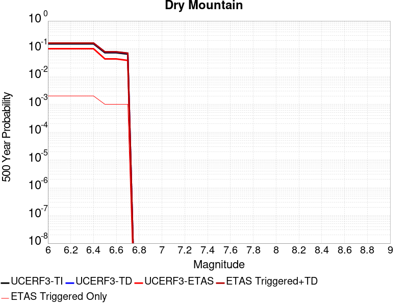 |

| Magnitude | 1 wk TI Prob | 1 wk TD Prob | 1 wk ETAS Prob | 1 wk ETAS/TD Gain | 1 wk ETAS Triggered+TD | 1 wk ETAS Triggered Only | 1 mo TI Prob | 1 mo TD Prob | 1 mo ETAS Prob | 1 mo ETAS/TD Gain | 1 mo ETAS Triggered+TD | 1 mo ETAS Triggered Only | 1 yr TI Prob | 1 yr TD Prob | 1 yr ETAS Prob | 1 yr ETAS/TD Gain | 1 yr ETAS Triggered+TD | 1 yr ETAS Triggered Only | 500 yr TI Prob | 500 yr TD Prob | 500 yr ETAS Prob | 500 yr ETAS/TD Gain | 500 yr ETAS Triggered+TD | 500 yr ETAS Triggered Only |
|-----|-----|-----|-----|-----|-----|-----|-----|-----|-----|-----|-----|-----|-----|-----|-----|-----|-----|-----|-----|-----|-----|-----|-----|-----|
| 6.0 | 6.222801E-6 | 6.427755E-6 | 0.0 | 0.0 | 6.427755E-6 | 0.0 | 2.6668875E-5 | 2.754732E-5 | 0.0 | 0.0 | 2.754732E-5 | 0.0 | 3.2464517E-4 | 3.3535287E-4 | 0.0 | 0.0 | 3.3535287E-4 | 0.0 | 0.1498555 | 0.15818132 | 0.1 | 0.6321859 | 0.15986496 | 0.002 |
| 6.1 | 6.222801E-6 | 6.427755E-6 | 0.0 | 0.0 | 6.427755E-6 | 0.0 | 2.6668875E-5 | 2.754732E-5 | 0.0 | 0.0 | 2.754732E-5 | 0.0 | 3.2464517E-4 | 3.3535287E-4 | 0.0 | 0.0 | 3.3535287E-4 | 0.0 | 0.1498555 | 0.15818132 | 0.1 | 0.6321859 | 0.15986496 | 0.002 |
| 6.2 | 6.222801E-6 | 6.427755E-6 | 0.0 | 0.0 | 6.427755E-6 | 0.0 | 2.6668875E-5 | 2.754732E-5 | 0.0 | 0.0 | 2.754732E-5 | 0.0 | 3.2464517E-4 | 3.3535287E-4 | 0.0 | 0.0 | 3.3535287E-4 | 0.0 | 0.1498555 | 0.15818132 | 0.1 | 0.6321859 | 0.15986496 | 0.002 |
| 6.3 | 6.222801E-6 | 6.427755E-6 | 0.0 | 0.0 | 6.427755E-6 | 0.0 | 2.6668875E-5 | 2.754732E-5 | 0.0 | 0.0 | 2.754732E-5 | 0.0 | 3.2464517E-4 | 3.3535287E-4 | 0.0 | 0.0 | 3.3535287E-4 | 0.0 | 0.1498555 | 0.15818132 | 0.1 | 0.6321859 | 0.15986496 | 0.002 |
| 6.4 | 6.222801E-6 | 6.427755E-6 | 0.0 | 0.0 | 6.427755E-6 | 0.0 | 2.6668875E-5 | 2.754732E-5 | 0.0 | 0.0 | 2.754732E-5 | 0.0 | 3.2464517E-4 | 3.3535287E-4 | 0.0 | 0.0 | 3.3535287E-4 | 0.0 | 0.1498555 | 0.15818132 | 0.1 | 0.6321859 | 0.15986496 | 0.002 |
| 6.5 | 2.8528623E-6 | 2.9468374E-6 | 0.0 | 0.0 | 2.9468374E-6 | 0.0 | 1.22264955E-5 | 1.2629292E-5 | 0.0 | 0.0 | 1.2629292E-5 | 0.0 | 1.4884741E-4 | 1.5375944E-4 | 0.0 | 0.0 | 1.5375944E-4 | 0.0 | 0.07172685 | 0.076288894 | 0.043 | 0.5636469 | 0.0772126 | 0.001 |
| 6.6 | 2.8528623E-6 | 2.9468374E-6 | 0.0 | 0.0 | 2.9468374E-6 | 0.0 | 1.22264955E-5 | 1.2629292E-5 | 0.0 | 0.0 | 1.2629292E-5 | 0.0 | 1.4884741E-4 | 1.5375944E-4 | 0.0 | 0.0 | 1.5375944E-4 | 0.0 | 0.07172685 | 0.076288894 | 0.043 | 0.5636469 | 0.0772126 | 0.001 |
| 6.7 | 2.541E-6 | 2.6246148E-6 | 0.0 | 0.0 | 2.6246148E-6 | 0.0 | 1.0889954E-5 | 1.1248349E-5 | 0.0 | 0.0 | 1.1248349E-5 | 0.0 | 1.3257713E-4 | 1.3694866E-4 | 0.0 | 0.0 | 1.3694866E-4 | 0.0 | 0.064143345 | 0.06847433 | 0.038 | 0.5549525 | 0.069405854 | 0.001 |

## Tin Mountain
*[(top)](#table-of-contents)*

| 1 Week | 1 Month | 1 Year | 500 Year |
|-----|-----|-----|-----|
|  |  | 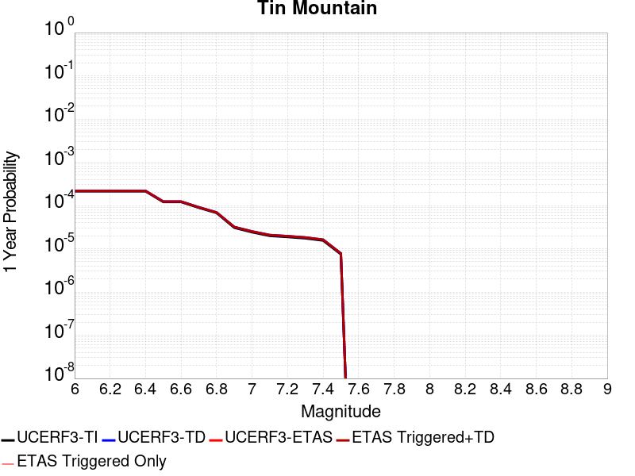 | 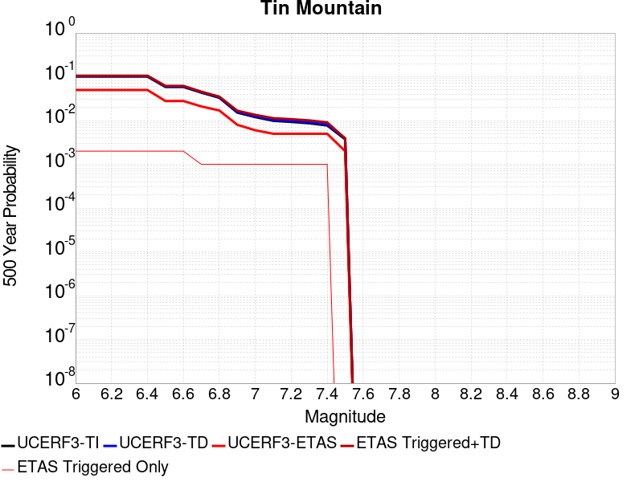 |

| Magnitude | 1 wk TI Prob | 1 wk TD Prob | 1 wk ETAS Prob | 1 wk ETAS/TD Gain | 1 wk ETAS Triggered+TD | 1 wk ETAS Triggered Only | 1 mo TI Prob | 1 mo TD Prob | 1 mo ETAS Prob | 1 mo ETAS/TD Gain | 1 mo ETAS Triggered+TD | 1 mo ETAS Triggered Only | 1 yr TI Prob | 1 yr TD Prob | 1 yr ETAS Prob | 1 yr ETAS/TD Gain | 1 yr ETAS Triggered+TD | 1 yr ETAS Triggered Only | 500 yr TI Prob | 500 yr TD Prob | 500 yr ETAS Prob | 500 yr ETAS/TD Gain | 500 yr ETAS Triggered+TD | 500 yr ETAS Triggered Only |
|-----|-----|-----|-----|-----|-----|-----|-----|-----|-----|-----|-----|-----|-----|-----|-----|-----|-----|-----|-----|-----|-----|-----|-----|-----|
| 6.0 | 4.083776E-6 | 4.1763255E-6 | 0.0 | 0.0 | 4.1763255E-6 | 0.0 | 1.750178E-5 | 1.7898437E-5 | 0.0 | 0.0 | 1.7898437E-5 | 0.0 | 2.1306332E-4 | 2.1789539E-4 | 0.0 | 0.0 | 2.1789539E-4 | 0.0 | 0.10106362 | 0.10415908 | 0.05 | 0.48003498 | 0.10595076 | 0.002 |
| 6.1 | 4.083776E-6 | 4.1763255E-6 | 0.0 | 0.0 | 4.1763255E-6 | 0.0 | 1.750178E-5 | 1.7898437E-5 | 0.0 | 0.0 | 1.7898437E-5 | 0.0 | 2.1306332E-4 | 2.1789539E-4 | 0.0 | 0.0 | 2.1789539E-4 | 0.0 | 0.10106362 | 0.10415908 | 0.05 | 0.48003498 | 0.10595076 | 0.002 |
| 6.2 | 4.083776E-6 | 4.1763255E-6 | 0.0 | 0.0 | 4.1763255E-6 | 0.0 | 1.750178E-5 | 1.7898437E-5 | 0.0 | 0.0 | 1.7898437E-5 | 0.0 | 2.1306332E-4 | 2.1789539E-4 | 0.0 | 0.0 | 2.1789539E-4 | 0.0 | 0.10106362 | 0.10415908 | 0.05 | 0.48003498 | 0.10595076 | 0.002 |
| 6.3 | 4.083776E-6 | 4.1763255E-6 | 0.0 | 0.0 | 4.1763255E-6 | 0.0 | 1.750178E-5 | 1.7898437E-5 | 0.0 | 0.0 | 1.7898437E-5 | 0.0 | 2.1306332E-4 | 2.1789539E-4 | 0.0 | 0.0 | 2.1789539E-4 | 0.0 | 0.10106362 | 0.10415908 | 0.05 | 0.48003498 | 0.10595076 | 0.002 |
| 6.4 | 4.083776E-6 | 4.1763255E-6 | 0.0 | 0.0 | 4.1763255E-6 | 0.0 | 1.750178E-5 | 1.7898437E-5 | 0.0 | 0.0 | 1.7898437E-5 | 0.0 | 2.1306332E-4 | 2.1789539E-4 | 0.0 | 0.0 | 2.1789539E-4 | 0.0 | 0.10106362 | 0.10415908 | 0.05 | 0.48003498 | 0.10595076 | 0.002 |
| 6.5 | 2.3143427E-6 | 2.370013E-6 | 0.0 | 0.0 | 2.370013E-6 | 0.0 | 9.9185745E-6 | 1.0157163E-5 | 0.0 | 0.0 | 1.0157163E-5 | 0.0 | 1.2075195E-4 | 1.2365721E-4 | 0.0 | 0.0 | 1.2365721E-4 | 0.0 | 0.05859291 | 0.06015822 | 0.028 | 0.4654393 | 0.062037904 | 0.002 |
| 6.6 | 2.3143427E-6 | 2.370013E-6 | 0.0 | 0.0 | 2.370013E-6 | 0.0 | 9.9185745E-6 | 1.0157163E-5 | 0.0 | 0.0 | 1.0157163E-5 | 0.0 | 1.2075195E-4 | 1.2365721E-4 | 0.0 | 0.0 | 1.2365721E-4 | 0.0 | 0.05859291 | 0.06015822 | 0.028 | 0.4654393 | 0.062037904 | 0.002 |
| 6.7 | 1.7029532E-6 | 1.7472814E-6 | 0.0 | 0.0 | 1.7472814E-6 | 0.0 | 7.2983503E-6 | 7.4883305E-6 | 0.0 | 0.0 | 7.4883305E-6 | 0.0 | 8.885379E-5 | 9.1167145E-5 | 0.0 | 0.0 | 9.1167145E-5 | 0.0 | 0.043456364 | 0.044702336 | 0.021 | 0.46977413 | 0.04565763 | 0.001 |
| 6.8 | 1.2914646E-6 | 1.327871E-6 | 0.0 | 0.0 | 1.327871E-6 | 0.0 | 5.534837E-6 | 5.6908657E-6 | 0.0 | 0.0 | 5.6908657E-6 | 0.0 | 6.738455E-5 | 6.928453E-5 | 0.0 | 0.0 | 6.928453E-5 | 0.0 | 0.03313211 | 0.03416705 | 0.017 | 0.49755538 | 0.035132885 | 0.001 |
| 6.9 | 5.8708974E-7 | 6.103667E-7 | 0.0 | 0.0 | 6.103667E-7 | 0.0 | 2.5160964E-6 | 2.615855E-6 | 0.0 | 0.0 | 2.615855E-6 | 0.0 | 3.0633044E-5 | 3.184761E-5 | 0.0 | 0.0 | 3.184761E-5 | 0.0 | 0.0152000515 | 0.015809119 | 0.008 | 0.50603706 | 0.016793309 | 0.001 |
| 7.0 | 4.6248786E-7 | 4.820775E-7 | 0.0 | 0.0 | 4.820775E-7 | 0.0 | 1.9820893E-6 | 2.066045E-6 | 0.0 | 0.0 | 2.066045E-6 | 0.0 | 2.413167E-5 | 2.5153844E-5 | 0.0 | 0.0 | 2.5153844E-5 | 0.0 | 0.011993478 | 0.012508403 | 0.006 | 0.47967756 | 0.013495894 | 0.001 |
| 7.1 | 3.804606E-7 | 3.9772215E-7 | 0.0 | 0.0 | 3.9772215E-7 | 0.0 | 1.6305444E-6 | 1.7045226E-6 | 0.0 | 0.0 | 1.7045226E-6 | 0.0 | 1.9851697E-5 | 2.0752399E-5 | 0.0 | 0.0 | 2.0752399E-5 | 0.0 | 0.009876847 | 0.01033185 | 0.005 | 0.48394045 | 0.011321518 | 0.001 |
| 7.2 | 3.5864858E-7 | 3.7521548E-7 | 0.0 | 0.0 | 3.7521548E-7 | 0.0 | 1.5370645E-6 | 1.6080655E-6 | 0.0 | 0.0 | 1.6080655E-6 | 0.0 | 1.87136E-5 | 1.9578056E-5 | 0.0 | 0.0 | 1.9578056E-5 | 0.0 | 0.009313247 | 0.009750436 | 0.005 | 0.5127976 | 0.010740686 | 0.001 |
| 7.3 | 3.342063E-7 | 3.4974073E-7 | 0.0 | 0.0 | 3.4974073E-7 | 0.0 | 1.4323119E-6 | 1.4988882E-6 | 0.0 | 0.0 | 1.4988882E-6 | 0.0 | 1.7438259E-5 | 1.8248844E-5 | 0.0 | 0.0 | 1.8248844E-5 | 0.0 | 0.008681303 | 0.009092046 | 0.005 | 0.5499312 | 0.010082954 | 0.001 |
| 7.4 | 2.971242E-7 | 3.1086753E-7 | 0.0 | 0.0 | 3.1086753E-7 | 0.0 | 1.2733886E-6 | 1.3322889E-6 | 0.0 | 0.0 | 1.3322889E-6 | 0.0 | 1.5503398E-5 | 1.622053E-5 | 0.0 | 0.0 | 1.622053E-5 | 0.0 | 0.007721791 | 0.008086529 | 0.005 | 0.6183123 | 0.009078442 | 0.001 |
| 7.5 | 1.4326713E-7 | 1.4975268E-7 | 0.0 | 0.0 | 1.4975268E-7 | 0.0 | 6.140018E-7 | 6.417972E-7 | 0.0 | 0.0 | 6.417972E-7 | 0.0 | 7.4754466E-6 | 7.813881E-6 | 0.0 | 0.0 | 7.813881E-6 | 0.0 | 0.0037307607 | 0.0039069406 | 0.002 | 0.5119095 | 0.0039069406 | 0.0 |

## Great Valley 02
*[(top)](#table-of-contents)*

| 1 Week | 1 Month | 1 Year | 500 Year |
|-----|-----|-----|-----|
| 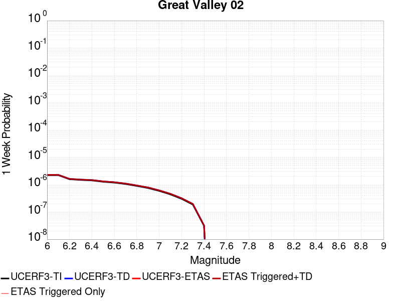 | 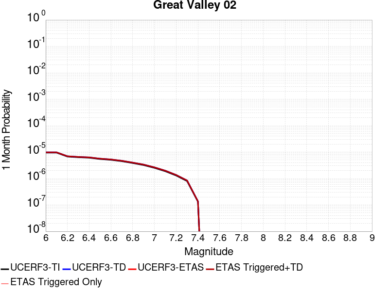 | 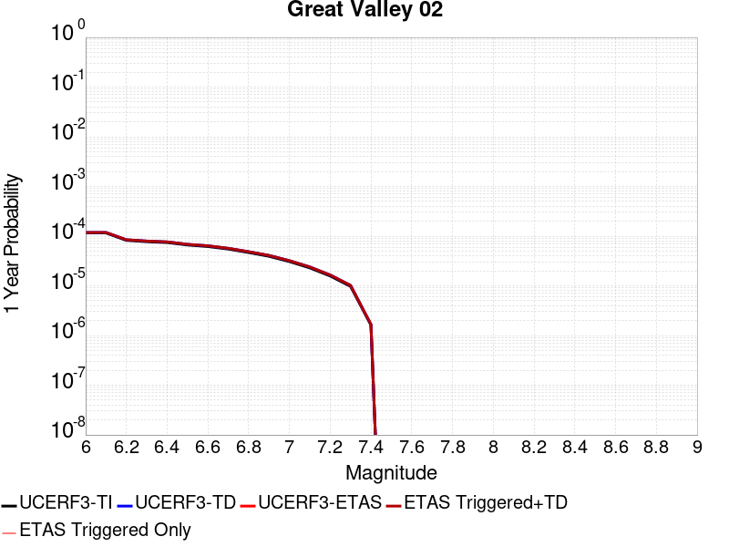 | 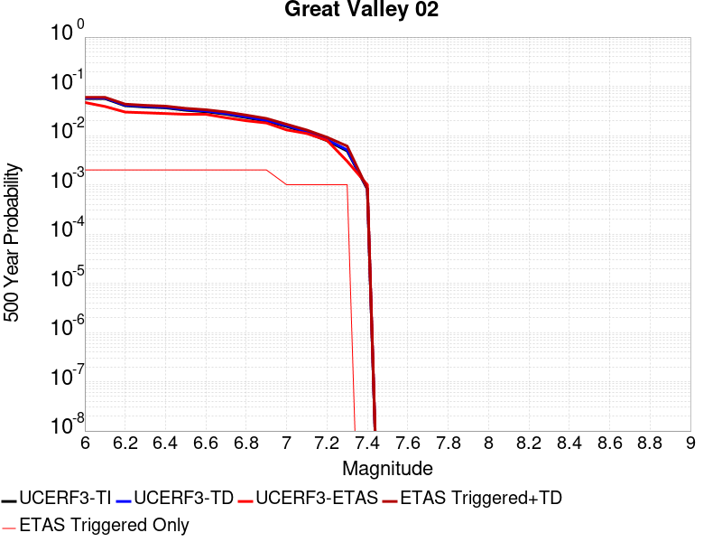 |

| Magnitude | 1 wk TI Prob | 1 wk TD Prob | 1 wk ETAS Prob | 1 wk ETAS/TD Gain | 1 wk ETAS Triggered+TD | 1 wk ETAS Triggered Only | 1 mo TI Prob | 1 mo TD Prob | 1 mo ETAS Prob | 1 mo ETAS/TD Gain | 1 mo ETAS Triggered+TD | 1 mo ETAS Triggered Only | 1 yr TI Prob | 1 yr TD Prob | 1 yr ETAS Prob | 1 yr ETAS/TD Gain | 1 yr ETAS Triggered+TD | 1 yr ETAS Triggered Only | 500 yr TI Prob | 500 yr TD Prob | 500 yr ETAS Prob | 500 yr ETAS/TD Gain | 500 yr ETAS Triggered+TD | 500 yr ETAS Triggered Only |
|-----|-----|-----|-----|-----|-----|-----|-----|-----|-----|-----|-----|-----|-----|-----|-----|-----|-----|-----|-----|-----|-----|-----|-----|-----|
| 6.0 | 2.2243487E-6 | 2.2786728E-6 | 0.0 | 0.0 | 2.2786728E-6 | 0.0 | 9.532888E-6 | 9.765708E-6 | 0.0 | 0.0 | 9.765708E-6 | 0.0 | 1.1605673E-4 | 1.18891505E-4 | 0.0 | 0.0 | 1.18891505E-4 | 0.0 | 0.056379996 | 0.057847656 | 0.047 | 0.8124789 | 0.05973196 | 0.002 |
| 6.1 | 2.2243487E-6 | 2.2786728E-6 | 0.0 | 0.0 | 2.2786728E-6 | 0.0 | 9.532888E-6 | 9.765708E-6 | 0.0 | 0.0 | 9.765708E-6 | 0.0 | 1.1605673E-4 | 1.18891505E-4 | 0.0 | 0.0 | 1.18891505E-4 | 0.0 | 0.056379996 | 0.057847656 | 0.039 | 0.6741846 | 0.05973196 | 0.002 |
| 6.2 | 1.5787732E-6 | 1.6246289E-6 | 0.0 | 0.0 | 1.6246289E-6 | 0.0 | 6.7661535E-6 | 6.9626767E-6 | 0.0 | 0.0 | 6.9626767E-6 | 0.0 | 8.2374805E-5 | 8.4767344E-5 | 0.0 | 0.0 | 8.4767344E-5 | 0.0 | 0.040352356 | 0.041512124 | 0.03 | 0.72268045 | 0.0434291 | 0.002 |
| 6.3 | 1.4850314E-6 | 1.5297348E-6 | 0.0 | 0.0 | 1.5297348E-6 | 0.0 | 6.3644047E-6 | 6.5559902E-6 | 0.0 | 0.0 | 6.5559902E-6 | 0.0 | 7.748387E-5 | 7.98163E-5 | 0.0 | 0.0 | 7.98163E-5 | 0.0 | 0.03800251 | 0.03913385 | 0.029 | 0.7410464 | 0.041055582 | 0.002 |
| 6.4 | 1.4266972E-6 | 1.470902E-6 | 0.0 | 0.0 | 1.470902E-6 | 0.0 | 6.114402E-6 | 6.303851E-6 | 0.0 | 0.0 | 6.303851E-6 | 0.0 | 7.44403E-5 | 7.674671E-5 | 0.0 | 0.0 | 7.674671E-5 | 0.0 | 0.03653733 | 0.037656743 | 0.028 | 0.74355876 | 0.03958143 | 0.002 |
| 6.5 | 1.2728015E-6 | 1.3147205E-6 | 0.0 | 0.0 | 1.3147205E-6 | 0.0 | 5.4548523E-6 | 5.6345048E-6 | 0.0 | 0.0 | 5.6345048E-6 | 0.0 | 6.64108E-5 | 6.859796E-5 | 0.0 | 0.0 | 6.859796E-5 | 0.0 | 0.03266122 | 0.033725377 | 0.027 | 0.8005841 | 0.035657927 | 0.002 |
| 6.6 | 1.1857247E-6 | 1.2265926E-6 | 0.0 | 0.0 | 1.2265926E-6 | 0.0 | 5.0816675E-6 | 5.2568153E-6 | 0.0 | 0.0 | 5.2568153E-6 | 0.0 | 6.186755E-5 | 6.399987E-5 | 0.0 | 0.0 | 6.399987E-5 | 0.0 | 0.030461147 | 0.031500753 | 0.027 | 0.8571224 | 0.03343775 | 0.002 |
| 6.7 | 1.0550715E-6 | 1.093144E-6 | 0.0 | 0.0 | 1.093144E-6 | 0.0 | 4.521727E-6 | 4.6848945E-6 | 0.0 | 0.0 | 4.6848945E-6 | 0.0 | 5.5050637E-5 | 5.703712E-5 | 0.0 | 0.0 | 5.703712E-5 | 0.0 | 0.027150687 | 0.028122062 | 0.023 | 0.8178632 | 0.030065818 | 0.002 |
| 6.8 | 8.9881183E-7 | 9.335543E-7 | 0.0 | 0.0 | 9.335543E-7 | 0.0 | 3.8520448E-6 | 4.000941E-6 | 0.0 | 0.0 | 4.000941E-6 | 0.0 | 4.689764E-5 | 4.8710383E-5 | 0.0 | 0.0 | 4.8710383E-5 | 0.0 | 0.02317657 | 0.02406618 | 0.02 | 0.8310417 | 0.026018048 | 0.002 |
| 6.9 | 7.5417256E-7 | 7.853114E-7 | 0.0 | 0.0 | 7.853114E-7 | 0.0 | 3.232164E-6 | 3.3656158E-6 | 0.0 | 0.0 | 3.3656158E-6 | 0.0 | 3.9350885E-5 | 4.0975618E-5 | 0.0 | 0.0 | 4.0975618E-5 | 0.0 | 0.019483525 | 0.020283563 | 0.018 | 0.88741803 | 0.022242997 | 0.002 |
| 7.0 | 5.909726E-7 | 6.1632886E-7 | 0.0 | 0.0 | 6.1632886E-7 | 0.0 | 2.5327372E-6 | 2.6414068E-6 | 0.0 | 0.0 | 2.6414068E-6 | 0.0 | 3.083564E-5 | 3.2158663E-5 | 0.0 | 0.0 | 3.2158663E-5 | 0.0 | 0.015299807 | 0.01595366 | 0.013 | 0.81486 | 0.016937707 | 0.001 |
| 7.1 | 4.4054178E-7 | 4.6054964E-7 | 0.0 | 0.0 | 4.6054964E-7 | 0.0 | 1.8880348E-6 | 1.9737827E-6 | 0.0 | 0.0 | 1.9737827E-6 | 0.0 | 2.2986582E-5 | 2.4030547E-5 | 0.0 | 0.0 | 2.4030547E-5 | 0.0 | 0.011427626 | 0.011945428 | 0.011 | 0.9208544 | 0.012933482 | 0.001 |
| 7.2 | 3.029834E-7 | 3.173847E-7 | 0.0 | 0.0 | 3.173847E-7 | 0.0 | 1.2984997E-6 | 1.3602194E-6 | 0.0 | 0.0 | 1.3602194E-6 | 0.0 | 1.5809119E-5 | 1.6560549E-5 | 0.0 | 0.0 | 1.6560549E-5 | 0.0 | 0.0078734625 | 0.008247374 | 0.008 | 0.97000575 | 0.009239127 | 0.001 |
| 7.3 | 1.8700909E-7 | 1.9626418E-7 | 0.0 | 0.0 | 1.9626418E-7 | 0.0 | 8.0146725E-7 | 8.411319E-7 | 0.0 | 0.0 | 8.411319E-7 | 0.0 | 9.75782E-6 | 1.0240736E-5 | 0.0 | 0.0 | 1.0240736E-5 | 0.0 | 0.0048670513 | 0.0051080575 | 0.003 | 0.5873074 | 0.00610295 | 0.001 |
| 7.4 | 3.112171E-8 | 3.2017713E-8 | 0.0 | 0.0 | 3.2017713E-8 | 0.0 | 1.3337875E-7 | 1.3721876E-7 | 0.0 | 0.0 | 1.3721876E-7 | 0.0 | 1.6238852E-6 | 1.6706372E-6 | 0.0 | 0.0 | 1.6706372E-6 | 0.0 | 8.116137E-4 | 8.3499384E-4 | 0.001 | 1.1976136 | 8.3499384E-4 | 0.0 |

## Los Alamos extension
*[(top)](#table-of-contents)*

| 1 Week | 1 Month | 1 Year | 500 Year |
|-----|-----|-----|-----|
|  | 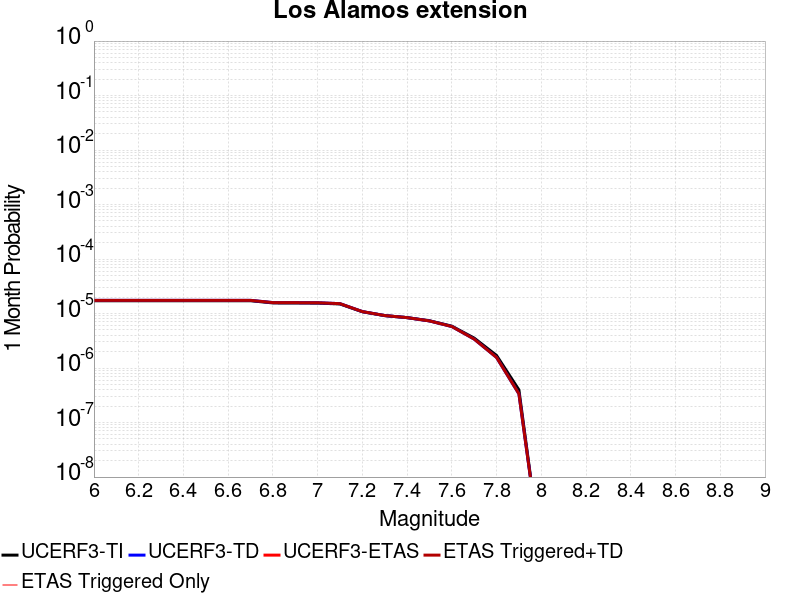 |  | 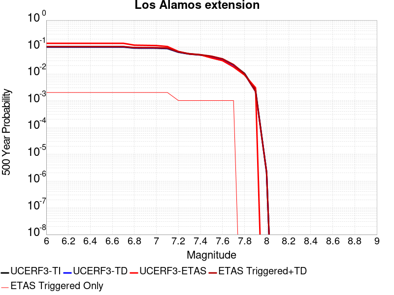 |

| Magnitude | 1 wk TI Prob | 1 wk TD Prob | 1 wk ETAS Prob | 1 wk ETAS/TD Gain | 1 wk ETAS Triggered+TD | 1 wk ETAS Triggered Only | 1 mo TI Prob | 1 mo TD Prob | 1 mo ETAS Prob | 1 mo ETAS/TD Gain | 1 mo ETAS Triggered+TD | 1 mo ETAS Triggered Only | 1 yr TI Prob | 1 yr TD Prob | 1 yr ETAS Prob | 1 yr ETAS/TD Gain | 1 yr ETAS Triggered+TD | 1 yr ETAS Triggered Only | 500 yr TI Prob | 500 yr TD Prob | 500 yr ETAS Prob | 500 yr ETAS/TD Gain | 500 yr ETAS Triggered+TD | 500 yr ETAS Triggered Only |
|-----|-----|-----|-----|-----|-----|-----|-----|-----|-----|-----|-----|-----|-----|-----|-----|-----|-----|-----|-----|-----|-----|-----|-----|-----|
| 6.0 | 4.0146506E-6 | 4.0774617E-6 | 0.0 | 0.0 | 4.0774617E-6 | 0.0 | 1.7205533E-5 | 1.7474724E-5 | 0.0 | 0.0 | 1.7474724E-5 | 0.0 | 2.0945723E-4 | 2.1273509E-4 | 0.0 | 0.0 | 2.1273509E-4 | 0.0 | 0.099440984 | 0.10178584 | 0.137 | 1.3459632 | 0.10358227 | 0.002 |
| 6.1 | 4.0146506E-6 | 4.0774617E-6 | 0.0 | 0.0 | 4.0774617E-6 | 0.0 | 1.7205533E-5 | 1.7474724E-5 | 0.0 | 0.0 | 1.7474724E-5 | 0.0 | 2.0945723E-4 | 2.1273509E-4 | 0.0 | 0.0 | 2.1273509E-4 | 0.0 | 0.099440984 | 0.10178584 | 0.137 | 1.3459632 | 0.10358227 | 0.002 |
| 6.2 | 4.0146506E-6 | 4.0774617E-6 | 0.0 | 0.0 | 4.0774617E-6 | 0.0 | 1.7205533E-5 | 1.7474724E-5 | 0.0 | 0.0 | 1.7474724E-5 | 0.0 | 2.0945723E-4 | 2.1273509E-4 | 0.0 | 0.0 | 2.1273509E-4 | 0.0 | 0.099440984 | 0.10178584 | 0.137 | 1.3459632 | 0.10358227 | 0.002 |
| 6.3 | 4.0146506E-6 | 4.0774617E-6 | 0.0 | 0.0 | 4.0774617E-6 | 0.0 | 1.7205533E-5 | 1.7474724E-5 | 0.0 | 0.0 | 1.7474724E-5 | 0.0 | 2.0945723E-4 | 2.1273509E-4 | 0.0 | 0.0 | 2.1273509E-4 | 0.0 | 0.099440984 | 0.10178584 | 0.137 | 1.3459632 | 0.10358227 | 0.002 |
| 6.4 | 4.0146506E-6 | 4.0774617E-6 | 0.0 | 0.0 | 4.0774617E-6 | 0.0 | 1.7205533E-5 | 1.7474724E-5 | 0.0 | 0.0 | 1.7474724E-5 | 0.0 | 2.0945723E-4 | 2.1273509E-4 | 0.0 | 0.0 | 2.1273509E-4 | 0.0 | 0.099440984 | 0.10178584 | 0.137 | 1.3459632 | 0.10358227 | 0.002 |
| 6.5 | 4.0146506E-6 | 4.0774617E-6 | 0.0 | 0.0 | 4.0774617E-6 | 0.0 | 1.7205533E-5 | 1.7474724E-5 | 0.0 | 0.0 | 1.7474724E-5 | 0.0 | 2.0945723E-4 | 2.1273509E-4 | 0.0 | 0.0 | 2.1273509E-4 | 0.0 | 0.099440984 | 0.10178584 | 0.137 | 1.3459632 | 0.10358227 | 0.002 |
| 6.6 | 4.0146506E-6 | 4.0774617E-6 | 0.0 | 0.0 | 4.0774617E-6 | 0.0 | 1.7205533E-5 | 1.7474724E-5 | 0.0 | 0.0 | 1.7474724E-5 | 0.0 | 2.0945723E-4 | 2.1273509E-4 | 0.0 | 0.0 | 2.1273509E-4 | 0.0 | 0.099440984 | 0.10178584 | 0.137 | 1.3459632 | 0.10358227 | 0.002 |
| 6.7 | 4.0146506E-6 | 4.0774617E-6 | 0.0 | 0.0 | 4.0774617E-6 | 0.0 | 1.7205533E-5 | 1.7474724E-5 | 0.0 | 0.0 | 1.7474724E-5 | 0.0 | 2.0945723E-4 | 2.1273509E-4 | 0.0 | 0.0 | 2.1273509E-4 | 0.0 | 0.099440984 | 0.10178584 | 0.137 | 1.3459632 | 0.10358227 | 0.002 |
| 6.8 | 3.6584688E-6 | 3.7107557E-6 | 0.0 | 0.0 | 3.7107557E-6 | 0.0 | 1.5679057E-5 | 1.5903146E-5 | 0.0 | 0.0 | 1.5903146E-5 | 0.0 | 1.9087581E-4 | 1.9360454E-4 | 0.0 | 0.0 | 1.9360454E-4 | 0.0 | 0.09103347 | 0.0931095 | 0.117 | 1.256585 | 0.09492328 | 0.002 |
| 6.9 | 3.644631E-6 | 3.6964898E-6 | 0.0 | 0.0 | 3.6964898E-6 | 0.0 | 1.5619753E-5 | 1.5842008E-5 | 0.0 | 0.0 | 1.5842008E-5 | 0.0 | 1.901539E-4 | 1.9286032E-4 | 0.0 | 0.0 | 1.9286032E-4 | 0.0 | 0.09070526 | 0.09277187 | 0.115 | 1.2395998 | 0.09458633 | 0.002 |
| 7.0 | 3.6318522E-6 | 3.6832753E-6 | 0.0 | 0.0 | 3.6832753E-6 | 0.0 | 1.5564989E-5 | 1.5785376E-5 | 0.0 | 0.0 | 1.5785376E-5 | 0.0 | 1.8948725E-4 | 1.9217092E-4 | 0.0 | 0.0 | 1.9217092E-4 | 0.0 | 0.09040207 | 0.09245902 | 0.113 | 1.222163 | 0.09427411 | 0.002 |
| 7.1 | 3.5001724E-6 | 3.5475734E-6 | 0.0 | 0.0 | 3.5475734E-6 | 0.0 | 1.5000653E-5 | 1.5203803E-5 | 0.0 | 0.0 | 1.5203803E-5 | 0.0 | 1.8261763E-4 | 1.8509149E-4 | 0.0 | 0.0 | 1.8509149E-4 | 0.0 | 0.08727181 | 0.0892361 | 0.104 | 1.1654476 | 0.09105763 | 0.002 |
| 7.2 | 2.5204702E-6 | 2.5375823E-6 | 0.0 | 0.0 | 2.5375823E-6 | 0.0 | 1.080197E-5 | 1.0875308E-5 | 0.0 | 0.0 | 1.0875308E-5 | 0.0 | 1.3150605E-4 | 1.3239888E-4 | 0.0 | 0.0 | 1.3239888E-4 | 0.0 | 0.06364196 | 0.06469601 | 0.068 | 1.0510695 | 0.065631315 | 0.001 |
| 7.3 | 2.1399692E-6 | 2.144721E-6 | 0.0 | 0.0 | 2.144721E-6 | 0.0 | 9.1712645E-6 | 9.191629E-6 | 0.0 | 0.0 | 9.191629E-6 | 0.0 | 1.1165442E-4 | 1.11902365E-4 | 0.0 | 0.0 | 1.11902365E-4 | 0.0 | 0.05430042 | 0.055054467 | 0.055 | 0.9990107 | 0.055999413 | 0.001 |
| 7.4 | 1.9660122E-6 | 1.9651447E-6 | 0.0 | 0.0 | 1.9651447E-6 | 0.0 | 8.42574E-6 | 8.422022E-6 | 0.0 | 0.0 | 8.422022E-6 | 0.0 | 1.0257855E-4 | 1.0253332E-4 | 0.0 | 0.0 | 1.0253332E-4 | 0.0 | 0.049998682 | 0.05061667 | 0.051 | 1.0075732 | 0.051566053 | 0.001 |
| 7.5 | 1.7204633E-6 | 1.7105244E-6 | 0.0 | 0.0 | 1.7105244E-6 | 0.0 | 7.373393E-6 | 7.330799E-6 | 0.0 | 0.0 | 7.330799E-6 | 0.0 | 8.976737E-5 | 8.9248846E-5 | 0.0 | 0.0 | 8.9248846E-5 | 0.0 | 0.04389324 | 0.044288706 | 0.039 | 0.8805857 | 0.045244418 | 0.001 |
| 7.6 | 1.3717638E-6 | 1.3497825E-6 | 0.0 | 0.0 | 1.3497825E-6 | 0.0 | 5.878974E-6 | 5.784769E-6 | 0.0 | 0.0 | 5.784769E-6 | 0.0 | 7.157416E-5 | 7.042731E-5 | 0.0 | 0.0 | 7.042731E-5 | 0.0 | 0.03515553 | 0.03523303 | 0.031 | 0.8798563 | 0.036197793 | 0.001 |
| 7.7 | 8.272564E-7 | 7.9343704E-7 | 0.0 | 0.0 | 7.9343704E-7 | 0.0 | 3.5453797E-6 | 3.4004402E-6 | 0.0 | 0.0 | 3.4004402E-6 | 0.0 | 4.3164142E-5 | 4.1399573E-5 | 0.0 | 0.0 | 4.1399573E-5 | 0.0 | 0.0213513 | 0.021022333 | 0.018 | 0.8562322 | 0.022001311 | 0.001 |
| 7.8 | 3.9708277E-7 | 3.659454E-7 | 0.0 | 0.0 | 3.659454E-7 | 0.0 | 1.7017821E-6 | 1.5683365E-6 | 0.0 | 0.0 | 1.5683365E-6 | 0.0 | 2.0719E-5 | 1.909433E-5 | 0.0 | 0.0 | 1.909433E-5 | 0.0 | 0.010306132 | 0.009886413 | 0.009 | 0.9103403 | 0.009886413 | 0.0 |
| 7.9 | 9.292528E-8 | 7.8574445E-8 | 0.0 | 0.0 | 7.8574445E-8 | 0.0 | 3.9825116E-7 | 3.3674755E-7 | 0.0 | 0.0 | 3.3674755E-7 | 0.0 | 4.848697E-6 | 4.099894E-6 | 0.0 | 0.0 | 4.099894E-6 | 0.0 | 0.002421418 | 0.0021906695 | 0.003 | 1.3694444 | 0.0021906695 | 0.0 |
| 8.0 | 7.880441E-11 | 8.2160834E-11 | 0.0 | 0.0 | 8.2160834E-11 | 0.0 | 3.3773329E-10 | 3.52118E-10 | 0.0 | 0.0 | 3.52118E-10 | 0.0 | 4.1119033E-9 | 4.2870365E-9 | 0.0 | 0.0 | 4.2870365E-9 | 0.0 | 2.0559496E-6 | 2.1435183E-6 | 0.0 | 0.0 | 2.1435183E-6 | 0.0 |

## Lake Isabella (Seismicity)
*[(top)](#table-of-contents)*

| 1 Week | 1 Month | 1 Year | 500 Year |
|-----|-----|-----|-----|
| 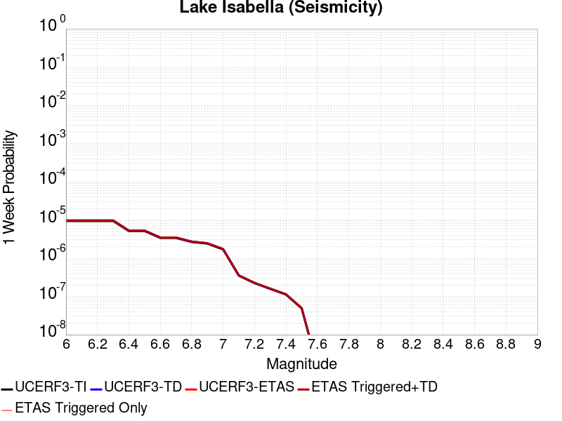 | 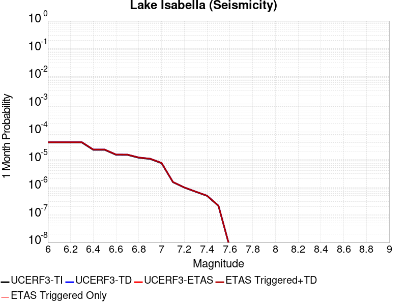 | 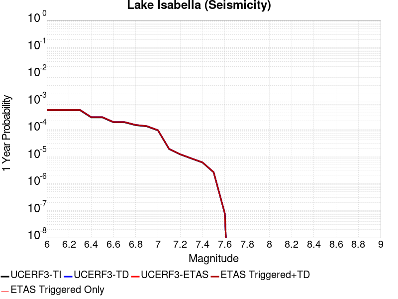 | 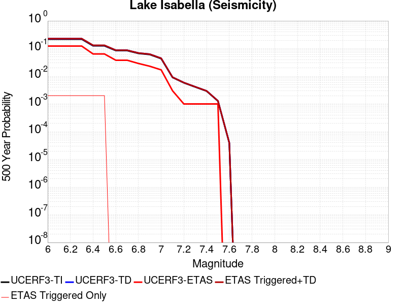 |

| Magnitude | 1 wk TI Prob | 1 wk TD Prob | 1 wk ETAS Prob | 1 wk ETAS/TD Gain | 1 wk ETAS Triggered+TD | 1 wk ETAS Triggered Only | 1 mo TI Prob | 1 mo TD Prob | 1 mo ETAS Prob | 1 mo ETAS/TD Gain | 1 mo ETAS Triggered+TD | 1 mo ETAS Triggered Only | 1 yr TI Prob | 1 yr TD Prob | 1 yr ETAS Prob | 1 yr ETAS/TD Gain | 1 yr ETAS Triggered+TD | 1 yr ETAS Triggered Only | 500 yr TI Prob | 500 yr TD Prob | 500 yr ETAS Prob | 500 yr ETAS/TD Gain | 500 yr ETAS Triggered+TD | 500 yr ETAS Triggered Only |
|-----|-----|-----|-----|-----|-----|-----|-----|-----|-----|-----|-----|-----|-----|-----|-----|-----|-----|-----|-----|-----|-----|-----|-----|-----|
| 6.0 | 9.431637E-6 | 9.725029E-6 | 0.0 | 0.0 | 9.725029E-6 | 0.0 | 4.0420677E-5 | 4.1678104E-5 | 0.0 | 0.0 | 4.1678104E-5 | 0.0 | 4.920106E-4 | 5.073258E-4 | 0.0 | 0.0 | 5.073258E-4 | 0.0 | 0.21812925 | 0.2269212 | 0.123 | 0.5420384 | 0.22846736 | 0.002 |
| 6.1 | 9.431637E-6 | 9.725029E-6 | 0.0 | 0.0 | 9.725029E-6 | 0.0 | 4.0420677E-5 | 4.1678104E-5 | 0.0 | 0.0 | 4.1678104E-5 | 0.0 | 4.920106E-4 | 5.073258E-4 | 0.0 | 0.0 | 5.073258E-4 | 0.0 | 0.21812925 | 0.2269212 | 0.123 | 0.5420384 | 0.22846736 | 0.002 |
| 6.2 | 9.431637E-6 | 9.725029E-6 | 0.0 | 0.0 | 9.725029E-6 | 0.0 | 4.0420677E-5 | 4.1678104E-5 | 0.0 | 0.0 | 4.1678104E-5 | 0.0 | 4.920106E-4 | 5.073258E-4 | 0.0 | 0.0 | 5.073258E-4 | 0.0 | 0.21812925 | 0.2269212 | 0.123 | 0.5420384 | 0.22846736 | 0.002 |
| 6.3 | 9.431637E-6 | 9.725029E-6 | 0.0 | 0.0 | 9.725029E-6 | 0.0 | 4.0420677E-5 | 4.1678104E-5 | 0.0 | 0.0 | 4.1678104E-5 | 0.0 | 4.920106E-4 | 5.073258E-4 | 0.0 | 0.0 | 5.073258E-4 | 0.0 | 0.21812925 | 0.2269212 | 0.123 | 0.5420384 | 0.22846736 | 0.002 |
| 6.4 | 5.144063E-6 | 5.2917308E-6 | 0.0 | 0.0 | 5.2917308E-6 | 0.0 | 2.2045799E-5 | 2.2678669E-5 | 0.0 | 0.0 | 2.2678669E-5 | 0.0 | 2.6837454E-4 | 2.7608126E-4 | 0.0 | 0.0 | 2.7608126E-4 | 0.0 | 0.12558945 | 0.12977943 | 0.064 | 0.49314442 | 0.13151987 | 0.002 |
| 6.5 | 5.144063E-6 | 5.2917308E-6 | 0.0 | 0.0 | 5.2917308E-6 | 0.0 | 2.2045799E-5 | 2.2678669E-5 | 0.0 | 0.0 | 2.2678669E-5 | 0.0 | 2.6837454E-4 | 2.7608126E-4 | 0.0 | 0.0 | 2.7608126E-4 | 0.0 | 0.12558945 | 0.12977943 | 0.064 | 0.49314442 | 0.13151987 | 0.002 |
| 6.6 | 3.4009804E-6 | 3.4935617E-6 | 0.0 | 0.0 | 3.4935617E-6 | 0.0 | 1.4575549E-5 | 1.497233E-5 | 0.0 | 0.0 | 1.497233E-5 | 0.0 | 1.7744285E-4 | 1.8227447E-4 | 0.0 | 0.0 | 1.8227447E-4 | 0.0 | 0.08490674 | 0.08751646 | 0.038 | 0.43420407 | 0.08751646 | 0.0 |
| 6.7 | 3.3880428E-6 | 3.4804386E-6 | 0.0 | 0.0 | 3.4804386E-6 | 0.0 | 1.4520103E-5 | 1.491609E-5 | 0.0 | 0.0 | 1.491609E-5 | 0.0 | 1.767679E-4 | 1.8158986E-4 | 0.0 | 0.0 | 1.8158986E-4 | 0.0 | 0.08459782 | 0.087203935 | 0.038 | 0.43576014 | 0.087203935 | 0.0 |
| 6.8 | 2.6582E-6 | 2.7296685E-6 | 0.0 | 0.0 | 2.7296685E-6 | 0.0 | 1.1392236E-5 | 1.1698534E-5 | 0.0 | 0.0 | 1.1698534E-5 | 0.0 | 1.3869164E-4 | 1.4242169E-4 | 0.0 | 0.0 | 1.4242169E-4 | 0.0 | 0.067000516 | 0.069082834 | 0.029 | 0.41978592 | 0.069082834 | 0.0 |
| 6.9 | 2.406011E-6 | 2.4706806E-6 | 0.0 | 0.0 | 2.4706806E-6 | 0.0 | 1.0311434E-5 | 1.0588596E-5 | 0.0 | 0.0 | 1.0588596E-5 | 0.0 | 1.2553448E-4 | 1.2890984E-4 | 0.0 | 0.0 | 1.2890984E-4 | 0.0 | 0.060841653 | 0.06276522 | 0.023 | 0.366445 | 0.06276522 | 0.0 |
| 7.0 | 1.6953097E-6 | 1.740394E-6 | 0.0 | 0.0 | 1.740394E-6 | 0.0 | 7.265593E-6 | 7.4588165E-6 | 0.0 | 0.0 | 7.4588165E-6 | 0.0 | 8.8455E-5 | 9.0808346E-5 | 0.0 | 0.0 | 9.0808346E-5 | 0.0 | 0.0432656 | 0.044665992 | 0.017 | 0.38060275 | 0.044665992 | 0.0 |
| 7.1 | 3.5013824E-7 | 3.5677695E-7 | 0.0 | 0.0 | 3.5677695E-7 | 0.0 | 1.5005916E-6 | 1.5290432E-6 | 0.0 | 0.0 | 1.5290432E-6 | 0.0 | 1.826955E-5 | 1.8615945E-5 | 0.0 | 0.0 | 1.8615945E-5 | 0.0 | 0.009093262 | 0.009265561 | 0.003 | 0.32377964 | 0.009265561 | 0.0 |
| 7.2 | 2.2321095E-7 | 2.2727845E-7 | 0.0 | 0.0 | 2.2727845E-7 | 0.0 | 9.56618E-7 | 9.740502E-7 | 0.0 | 0.0 | 9.740502E-7 | 0.0 | 1.1646762E-5 | 1.1858997E-5 | 0.0 | 0.0 | 1.1858997E-5 | 0.0 | 0.0058064912 | 0.0059122704 | 0.001 | 0.16913976 | 0.0059122704 | 0.0 |
| 7.3 | 1.5760406E-7 | 1.6045021E-7 | 0.0 | 0.0 | 1.6045021E-7 | 0.0 | 6.7544585E-7 | 6.876436E-7 | 0.0 | 0.0 | 6.876436E-7 | 0.0 | 8.223522E-6 | 8.372029E-6 | 0.0 | 0.0 | 8.372029E-6 | 0.0 | 0.004103336 | 0.004177455 | 0.001 | 0.23938021 | 0.004177455 | 0.0 |
| 7.4 | 1.1216497E-7 | 1.14203175E-7 | 0.0 | 0.0 | 1.14203175E-7 | 0.0 | 4.8070694E-7 | 4.894421E-7 | 0.0 | 0.0 | 4.894421E-7 | 0.0 | 5.852591E-6 | 5.9589415E-6 | 0.0 | 0.0 | 5.9589415E-6 | 0.0 | 0.0029220267 | 0.0029751656 | 0.001 | 0.33611575 | 0.0029751656 | 0.0 |
| 7.5 | 4.885185E-8 | 4.973821E-8 | 0.0 | 0.0 | 4.973821E-8 | 0.0 | 2.0936506E-7 | 2.1316374E-7 | 0.0 | 0.0 | 2.1316374E-7 | 0.0 | 2.5490165E-6 | 2.5952656E-6 | 0.0 | 0.0 | 2.5952656E-6 | 0.0 | 0.001273698 | 0.0012968436 | 0.001 | 0.77110296 | 0.0012968436 | 0.0 |
| 7.6 | 1.504641E-9 | 1.5303552E-9 | 0.0 | 0.0 | 1.5303552E-9 | 0.0 | 6.4484613E-9 | 6.558665E-9 | 0.0 | 0.0 | 6.558665E-9 | 0.0 | 7.851001E-8 | 7.9851745E-8 | 0.0 | 0.0 | 7.9851745E-8 | 0.0 | 3.925424E-5 | 3.9925875E-5 | 0.0 | 0.0 | 3.9925875E-5 | 0.0 |

## Camp Rock 2011
*[(top)](#table-of-contents)*

| 1 Week | 1 Month | 1 Year | 500 Year |
|-----|-----|-----|-----|
| 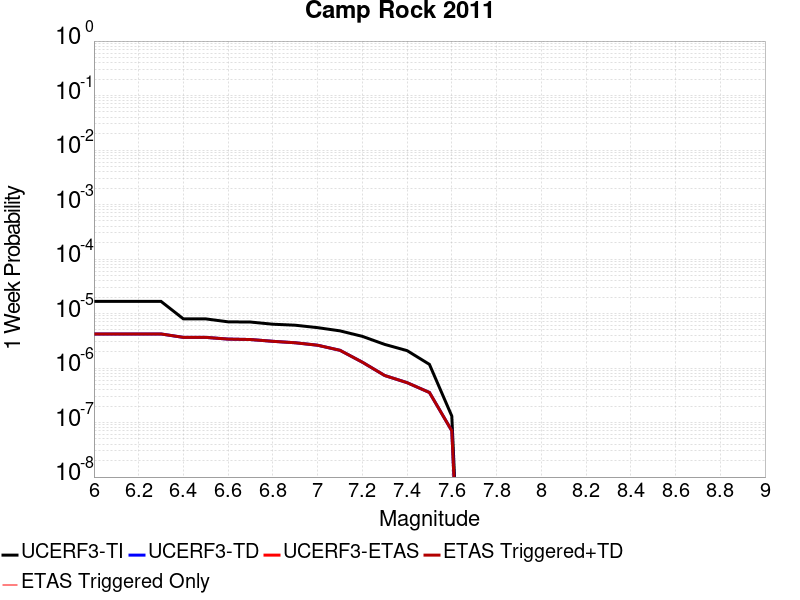 | 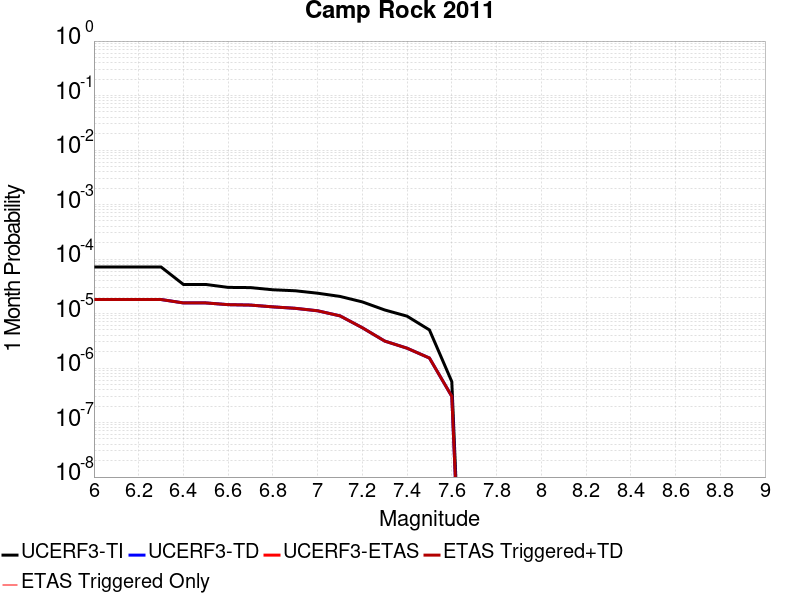 | 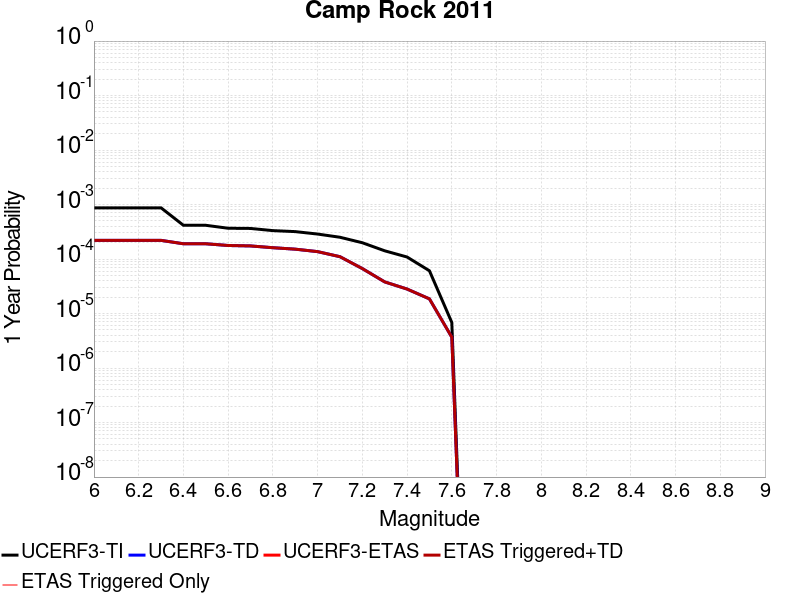 | 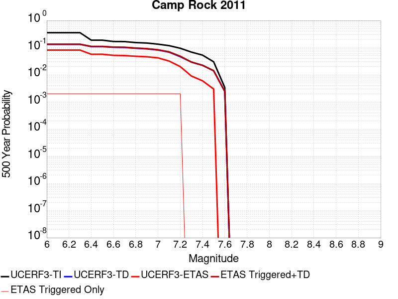 |

| Magnitude | 1 wk TI Prob | 1 wk TD Prob | 1 wk ETAS Prob | 1 wk ETAS/TD Gain | 1 wk ETAS Triggered+TD | 1 wk ETAS Triggered Only | 1 mo TI Prob | 1 mo TD Prob | 1 mo ETAS Prob | 1 mo ETAS/TD Gain | 1 mo ETAS Triggered+TD | 1 mo ETAS Triggered Only | 1 yr TI Prob | 1 yr TD Prob | 1 yr ETAS Prob | 1 yr ETAS/TD Gain | 1 yr ETAS Triggered+TD | 1 yr ETAS Triggered Only | 500 yr TI Prob | 500 yr TD Prob | 500 yr ETAS Prob | 500 yr ETAS/TD Gain | 500 yr ETAS Triggered+TD | 500 yr ETAS Triggered Only |
|-----|-----|-----|-----|-----|-----|-----|-----|-----|-----|-----|-----|-----|-----|-----|-----|-----|-----|-----|-----|-----|-----|-----|-----|-----|
| 6.0 | 1.6710783E-5 | 4.2225884E-6 | 0.0 | 0.0 | 4.2225884E-6 | 0.0 | 7.161568E-5 | 1.8096685E-5 | 0.0 | 0.0 | 1.8096685E-5 | 0.0 | 8.7157206E-4 | 2.2030539E-4 | 0.0 | 0.0 | 2.2030539E-4 | 0.0 | 0.3533668 | 0.13177893 | 0.081 | 0.61466587 | 0.13351536 | 0.002 |
| 6.1 | 1.6710783E-5 | 4.2225884E-6 | 0.0 | 0.0 | 4.2225884E-6 | 0.0 | 7.161568E-5 | 1.8096685E-5 | 0.0 | 0.0 | 1.8096685E-5 | 0.0 | 8.7157206E-4 | 2.2030539E-4 | 0.0 | 0.0 | 2.2030539E-4 | 0.0 | 0.3533668 | 0.13177893 | 0.081 | 0.61466587 | 0.13351536 | 0.002 |
| 6.2 | 1.6710783E-5 | 4.2225884E-6 | 0.0 | 0.0 | 4.2225884E-6 | 0.0 | 7.161568E-5 | 1.8096685E-5 | 0.0 | 0.0 | 1.8096685E-5 | 0.0 | 8.7157206E-4 | 2.2030539E-4 | 0.0 | 0.0 | 2.2030539E-4 | 0.0 | 0.3533668 | 0.13177893 | 0.081 | 0.61466587 | 0.13351536 | 0.002 |
| 6.3 | 1.6710783E-5 | 4.2225884E-6 | 0.0 | 0.0 | 4.2225884E-6 | 0.0 | 7.161568E-5 | 1.8096685E-5 | 0.0 | 0.0 | 1.8096685E-5 | 0.0 | 8.7157206E-4 | 2.2030539E-4 | 0.0 | 0.0 | 2.2030539E-4 | 0.0 | 0.3533668 | 0.13177893 | 0.081 | 0.61466587 | 0.13351536 | 0.002 |
| 6.4 | 7.982846E-6 | 3.6570684E-6 | 0.0 | 0.0 | 3.6570684E-6 | 0.0 | 3.421175E-5 | 1.5673058E-5 | 0.0 | 0.0 | 1.5673058E-5 | 0.0 | 4.1644843E-4 | 1.9080313E-4 | 0.0 | 0.0 | 1.9080313E-4 | 0.0 | 0.18801028 | 0.10923411 | 0.057 | 0.52181506 | 0.11101564 | 0.002 |
| 6.5 | 7.982846E-6 | 3.6570684E-6 | 0.0 | 0.0 | 3.6570684E-6 | 0.0 | 3.421175E-5 | 1.5673058E-5 | 0.0 | 0.0 | 1.5673058E-5 | 0.0 | 4.1644843E-4 | 1.9080313E-4 | 0.0 | 0.0 | 1.9080313E-4 | 0.0 | 0.18801028 | 0.10923411 | 0.057 | 0.52181506 | 0.11101564 | 0.002 |
| 6.6 | 7.048869E-6 | 3.4000898E-6 | 0.0 | 0.0 | 3.4000898E-6 | 0.0 | 3.0209088E-5 | 1.4571733E-5 | 0.0 | 0.0 | 1.4571733E-5 | 0.0 | 3.677336E-4 | 1.7739672E-4 | 0.0 | 0.0 | 1.7739672E-4 | 0.0 | 0.1679815 | 0.102866806 | 0.052 | 0.50550807 | 0.10466107 | 0.002 |
| 6.7 | 6.987307E-6 | 3.3382557E-6 | 0.0 | 0.0 | 3.3382557E-6 | 0.0 | 2.9945259E-5 | 1.4306734E-5 | 0.0 | 0.0 | 1.4306734E-5 | 0.0 | 3.6452254E-4 | 1.7417087E-4 | 0.0 | 0.0 | 1.7417087E-4 | 0.0 | 0.16664411 | 0.10141597 | 0.051 | 0.5028794 | 0.10321313 | 0.002 |
| 6.8 | 6.3737602E-6 | 3.0960146E-6 | 0.0 | 0.0 | 3.0960146E-6 | 0.0 | 2.731583E-5 | 1.3268567E-5 | 0.0 | 0.0 | 1.3268567E-5 | 0.0 | 3.3251947E-4 | 1.6153311E-4 | 0.0 | 0.0 | 1.6153311E-4 | 0.0 | 0.15319715 | 0.09470858 | 0.048 | 0.5068179 | 0.09651916 | 0.002 |
| 6.9 | 6.112211E-6 | 2.9118785E-6 | 0.0 | 0.0 | 2.9118785E-6 | 0.0 | 2.6194928E-5 | 1.24794215E-5 | 0.0 | 0.0 | 1.24794215E-5 | 0.0 | 3.1887658E-4 | 1.5192664E-4 | 0.0 | 0.0 | 1.5192664E-4 | 0.0 | 0.1473991 | 0.089966945 | 0.046 | 0.5112989 | 0.09178701 | 0.002 |
| 7.0 | 5.5140117E-6 | 2.6237221E-6 | 0.0 | 0.0 | 2.6237221E-6 | 0.0 | 2.3631264E-5 | 1.1244477E-5 | 0.0 | 0.0 | 1.1244477E-5 | 0.0 | 2.8767265E-4 | 1.3689316E-4 | 0.0 | 0.0 | 1.3689316E-4 | 0.0 | 0.13398844 | 0.0815553 | 0.042 | 0.514988 | 0.08339219 | 0.002 |
| 7.1 | 4.8151105E-6 | 2.1182054E-6 | 0.0 | 0.0 | 2.1182054E-6 | 0.0 | 2.0636026E-5 | 9.077993E-6 | 0.0 | 0.0 | 9.077993E-6 | 0.0 | 2.5121463E-4 | 1.10519184E-4 | 0.0 | 0.0 | 1.10519184E-4 | 0.0 | 0.11805281 | 0.06812812 | 0.032 | 0.46970326 | 0.069991864 | 0.002 |
| 7.2 | 3.818335E-6 | 1.2820399E-6 | 0.0 | 0.0 | 1.2820399E-6 | 0.0 | 1.6364189E-5 | 5.4944458E-6 | 0.0 | 0.0 | 5.4944458E-6 | 0.0 | 1.9921579E-4 | 6.6892906E-5 | 0.0 | 0.0 | 6.6892906E-5 | 0.0 | 0.0948167 | 0.046395045 | 0.02 | 0.43108052 | 0.048302256 | 0.002 |
| 7.3 | 2.7166698E-6 | 7.302151E-7 | 0.0 | 0.0 | 7.302151E-7 | 0.0 | 1.1642818E-5 | 3.1294899E-6 | 0.0 | 0.0 | 3.1294899E-6 | 0.0 | 1.4174209E-4 | 3.810089E-5 | 0.0 | 0.0 | 3.810089E-5 | 0.0 | 0.06842267 | 0.029396737 | 0.009 | 0.30615643 | 0.029396737 | 0.0 |
| 7.4 | 2.0893426E-6 | 5.397538E-7 | 0.0 | 0.0 | 5.397538E-7 | 0.0 | 8.954295E-6 | 2.3132284E-6 | 0.0 | 0.0 | 2.3132284E-6 | 0.0 | 1.0901308E-4 | 2.8163198E-5 | 0.0 | 0.0 | 2.8163198E-5 | 0.0 | 0.0530505 | 0.022326112 | 0.006 | 0.2687436 | 0.022326112 | 0.0 |
| 7.5 | 1.1681728E-6 | 3.5635094E-7 | 0.0 | 0.0 | 3.5635094E-7 | 0.0 | 5.0064455E-6 | 1.5272175E-6 | 0.0 | 0.0 | 1.5272175E-6 | 0.0 | 6.0951766E-5 | 1.8593719E-5 | 0.0 | 0.0 | 1.8593719E-5 | 0.0 | 0.030017076 | 0.014101648 | 0.003 | 0.21274109 | 0.014101648 | 0.0 |
| 7.6 | 1.3154387E-7 | 7.061878E-8 | 0.0 | 0.0 | 7.061878E-8 | 0.0 | 5.6375933E-7 | 3.026519E-7 | 0.0 | 0.0 | 3.026519E-7 | 0.0 | 6.863748E-6 | 3.6847823E-6 | 0.0 | 0.0 | 3.6847823E-6 | 0.0 | 0.0034260035 | 0.0024528948 | 0.0 | 0.0 | 0.0024528948 | 0.0 |

## Casmalia 2011 CFM
*[(top)](#table-of-contents)*

| 1 Week | 1 Month | 1 Year | 500 Year |
|-----|-----|-----|-----|
|  |  |  | 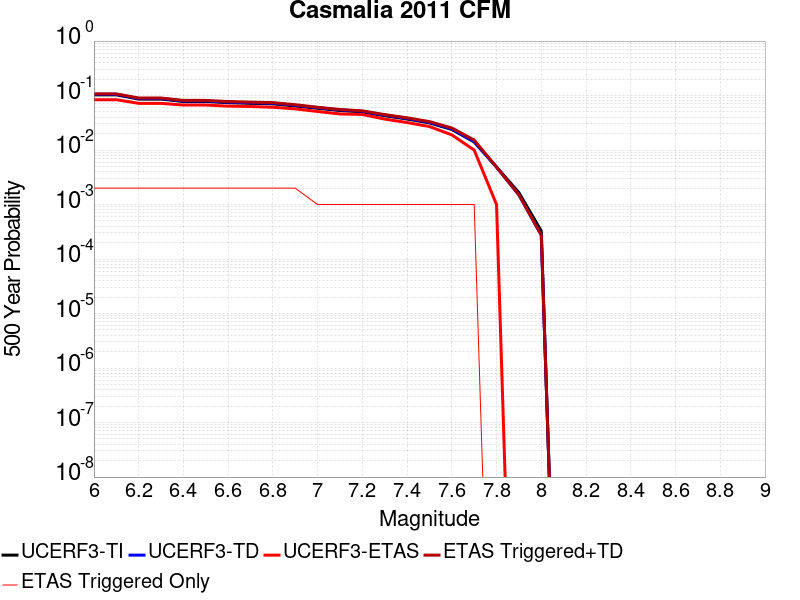 |

| Magnitude | 1 wk TI Prob | 1 wk TD Prob | 1 wk ETAS Prob | 1 wk ETAS/TD Gain | 1 wk ETAS Triggered+TD | 1 wk ETAS Triggered Only | 1 mo TI Prob | 1 mo TD Prob | 1 mo ETAS Prob | 1 mo ETAS/TD Gain | 1 mo ETAS Triggered+TD | 1 mo ETAS Triggered Only | 1 yr TI Prob | 1 yr TD Prob | 1 yr ETAS Prob | 1 yr ETAS/TD Gain | 1 yr ETAS Triggered+TD | 1 yr ETAS Triggered Only | 500 yr TI Prob | 500 yr TD Prob | 500 yr ETAS Prob | 500 yr ETAS/TD Gain | 500 yr ETAS Triggered+TD | 500 yr ETAS Triggered Only |
|-----|-----|-----|-----|-----|-----|-----|-----|-----|-----|-----|-----|-----|-----|-----|-----|-----|-----|-----|-----|-----|-----|-----|-----|-----|
| 6.0 | 4.1704893E-6 | 4.2548813E-6 | 0.0 | 0.0 | 4.2548813E-6 | 0.0 | 1.7873403E-5 | 1.823508E-5 | 0.0 | 0.0 | 1.823508E-5 | 0.0 | 2.1758694E-4 | 2.2198967E-4 | 0.0 | 0.0 | 2.2198967E-4 | 0.0 | 0.10309498 | 0.10547854 | 0.084 | 0.7963705 | 0.10726759 | 0.002 |
| 6.1 | 4.1704893E-6 | 4.2548813E-6 | 0.0 | 0.0 | 4.2548813E-6 | 0.0 | 1.7873403E-5 | 1.823508E-5 | 0.0 | 0.0 | 1.823508E-5 | 0.0 | 2.1758694E-4 | 2.2198967E-4 | 0.0 | 0.0 | 2.2198967E-4 | 0.0 | 0.10309498 | 0.10547854 | 0.084 | 0.7963705 | 0.10726759 | 0.002 |
| 6.2 | 3.457312E-6 | 3.530069E-6 | 0.0 | 0.0 | 3.530069E-6 | 0.0 | 1.4816967E-5 | 1.512878E-5 | 0.0 | 0.0 | 1.512878E-5 | 0.0 | 1.8038164E-4 | 1.8417742E-4 | 0.0 | 0.0 | 1.8417742E-4 | 0.0 | 0.08625063 | 0.08837437 | 0.072 | 0.81471586 | 0.090197615 | 0.002 |
| 6.3 | 3.457312E-6 | 3.530069E-6 | 0.0 | 0.0 | 3.530069E-6 | 0.0 | 1.4816967E-5 | 1.512878E-5 | 0.0 | 0.0 | 1.512878E-5 | 0.0 | 1.8038164E-4 | 1.8417742E-4 | 0.0 | 0.0 | 1.8417742E-4 | 0.0 | 0.08625063 | 0.08837437 | 0.072 | 0.81471586 | 0.090197615 | 0.002 |
| 6.4 | 3.0957337E-6 | 3.1626014E-6 | 0.0 | 0.0 | 3.1626014E-6 | 0.0 | 1.3267363E-5 | 1.3553936E-5 | 0.0 | 0.0 | 1.3553936E-5 | 0.0 | 1.6151817E-4 | 1.6500673E-4 | 0.0 | 0.0 | 1.6500673E-4 | 0.0 | 0.07759013 | 0.07958468 | 0.067 | 0.8418706 | 0.08142551 | 0.002 |
| 6.5 | 3.0957337E-6 | 3.1626014E-6 | 0.0 | 0.0 | 3.1626014E-6 | 0.0 | 1.3267363E-5 | 1.3553936E-5 | 0.0 | 0.0 | 1.3553936E-5 | 0.0 | 1.6151817E-4 | 1.6500673E-4 | 0.0 | 0.0 | 1.6500673E-4 | 0.0 | 0.07759013 | 0.07958468 | 0.067 | 0.8418706 | 0.08142551 | 0.002 |
| 6.6 | 2.9459152E-6 | 3.0101007E-6 | 0.0 | 0.0 | 3.0101007E-6 | 0.0 | 1.262529E-5 | 1.2900368E-5 | 0.0 | 0.0 | 1.2900368E-5 | 0.0 | 1.5370206E-4 | 1.5705072E-4 | 0.0 | 0.0 | 1.5705072E-4 | 0.0 | 0.07397767 | 0.075914145 | 0.064 | 0.8430577 | 0.07776231 | 0.002 |
| 6.7 | 2.8634809E-6 | 2.9260866E-6 | 0.0 | 0.0 | 2.9260866E-6 | 0.0 | 1.2272003E-5 | 1.2540311E-5 | 0.0 | 0.0 | 1.2540311E-5 | 0.0 | 1.4940138E-4 | 1.5266765E-4 | 0.0 | 0.0 | 1.5266765E-4 | 0.0 | 0.07198397 | 0.073886074 | 0.063 | 0.8526641 | 0.075738296 | 0.002 |
| 6.8 | 2.7999822E-6 | 2.861284E-6 | 0.0 | 0.0 | 2.861284E-6 | 0.0 | 1.1999869E-5 | 1.2262588E-5 | 0.0 | 0.0 | 1.2262588E-5 | 0.0 | 1.460886E-4 | 1.4928683E-4 | 0.0 | 0.0 | 1.4928683E-4 | 0.0 | 0.070445314 | 0.07231879 | 0.061 | 0.84348756 | 0.07417415 | 0.002 |
| 6.9 | 2.551052E-6 | 2.6060097E-6 | 0.0 | 0.0 | 2.6060097E-6 | 0.0 | 1.0933034E-5 | 1.1168565E-5 | 0.0 | 0.0 | 1.1168565E-5 | 0.0 | 1.3310155E-4 | 1.3596883E-4 | 0.0 | 0.0 | 1.3596883E-4 | 0.0 | 0.06438874 | 0.06611679 | 0.057 | 0.86211085 | 0.06798455 | 0.002 |
| 7.0 | 2.3081875E-6 | 2.3568111E-6 | 0.0 | 0.0 | 2.3568111E-6 | 0.0 | 9.892195E-6 | 1.010058E-5 | 0.0 | 0.0 | 1.010058E-5 | 0.0 | 1.20430814E-4 | 1.2296764E-4 | 0.0 | 0.0 | 1.2296764E-4 | 0.0 | 0.05844172 | 0.060022548 | 0.051 | 0.8496807 | 0.060962524 | 0.001 |
| 7.1 | 2.093245E-6 | 2.136433E-6 | 0.0 | 0.0 | 2.136433E-6 | 0.0 | 8.971019E-6 | 9.15611E-6 | 0.0 | 0.0 | 9.15611E-6 | 0.0 | 1.09216686E-4 | 1.1146995E-4 | 0.0 | 0.0 | 1.1146995E-4 | 0.0 | 0.053146902 | 0.05460056 | 0.046 | 0.8424822 | 0.05554596 | 0.001 |
| 7.2 | 1.9714576E-6 | 2.0114012E-6 | 0.0 | 0.0 | 2.0114012E-6 | 0.0 | 8.449076E-6 | 8.620263E-6 | 0.0 | 0.0 | 8.620263E-6 | 0.0 | 1.0286264E-4 | 1.0494666E-4 | 0.0 | 0.0 | 1.0494666E-4 | 0.0 | 0.05013363 | 0.051511247 | 0.045 | 0.87359565 | 0.052459735 | 0.001 |
| 7.3 | 1.6689512E-6 | 1.700103E-6 | 0.0 | 0.0 | 1.700103E-6 | 0.0 | 7.1526288E-6 | 7.2861353E-6 | 0.0 | 0.0 | 7.2861353E-6 | 0.0 | 8.7079774E-5 | 8.87051E-5 | 0.0 | 0.0 | 8.87051E-5 | 0.0 | 0.04260745 | 0.043773934 | 0.037 | 0.84525186 | 0.04473016 | 0.001 |
| 7.4 | 1.4490954E-6 | 1.4736546E-6 | 0.0 | 0.0 | 1.4736546E-6 | 0.0 | 6.210394E-6 | 6.315647E-6 | 0.0 | 0.0 | 6.315647E-6 | 0.0 | 7.560892E-5 | 7.68903E-5 | 0.0 | 0.0 | 7.68903E-5 | 0.0 | 0.03710017 | 0.038107585 | 0.032 | 0.8397278 | 0.039069477 | 0.001 |
| 7.5 | 1.226873E-6 | 1.2443371E-6 | 0.0 | 0.0 | 1.2443371E-6 | 0.0 | 5.2580162E-6 | 5.332862E-6 | 0.0 | 0.0 | 5.332862E-6 | 0.0 | 6.401447E-5 | 6.492567E-5 | 0.0 | 0.0 | 6.492567E-5 | 0.0 | 0.031501416 | 0.032335352 | 0.027 | 0.8349994 | 0.03330302 | 0.001 |
| 7.6 | 9.2561345E-7 | 9.3293625E-7 | 0.0 | 0.0 | 9.3293625E-7 | 0.0 | 3.966909E-6 | 3.998292E-6 | 0.0 | 0.0 | 3.998292E-6 | 0.0 | 4.8296046E-5 | 4.867812E-5 | 0.0 | 0.0 | 4.867812E-5 | 0.0 | 0.023859361 | 0.024441522 | 0.019 | 0.7773656 | 0.02541708 | 0.001 |
| 7.7 | 5.4367933E-7 | 5.3684096E-7 | 0.0 | 0.0 | 5.3684096E-7 | 0.0 | 2.3300522E-6 | 2.300745E-6 | 0.0 | 0.0 | 2.300745E-6 | 0.0 | 2.8368017E-5 | 2.801121E-5 | 0.0 | 0.0 | 2.801121E-5 | 0.0 | 0.014084088 | 0.01430726 | 0.01 | 0.6989459 | 0.015292953 | 0.001 |
| 7.8 | 1.8825742E-7 | 1.7182762E-7 | 0.0 | 0.0 | 1.7182762E-7 | 0.0 | 8.068173E-7 | 7.364038E-7 | 0.0 | 0.0 | 7.364038E-7 | 0.0 | 9.822956E-6 | 8.9656805E-6 | 0.0 | 0.0 | 8.9656805E-6 | 0.0 | 0.0048994604 | 0.0048414916 | 0.001 | 0.20654792 | 0.0048414916 | 0.0 |
| 7.9 | 6.342771E-8 | 4.5550905E-8 | 0.0 | 0.0 | 4.5550905E-8 | 0.0 | 2.7183304E-7 | 1.9521815E-7 | 0.0 | 0.0 | 1.9521815E-7 | 0.0 | 3.3095623E-6 | 2.3767784E-6 | 0.0 | 0.0 | 2.3767784E-6 | 0.0 | 0.0016534155 | 0.001506203 | 0.0 | 0.0 | 0.001506203 | 0.0 |
| 8.0 | 1.2574819E-8 | 6.0738805E-9 | 0.0 | 0.0 | 6.0738805E-9 | 0.0 | 5.3892084E-8 | 2.6030916E-8 | 0.0 | 0.0 | 2.6030916E-8 | 0.0 | 6.561359E-7 | 3.1692636E-7 | 0.0 | 0.0 | 3.1692636E-7 | 0.0 | 3.2801426E-4 | 2.7515888E-4 | 0.0 | 0.0 | 2.7515888E-4 | 0.0 |

## Anacapa-Dume alt 1
*[(top)](#table-of-contents)*

| 1 Week | 1 Month | 1 Year | 500 Year |
|-----|-----|-----|-----|
| 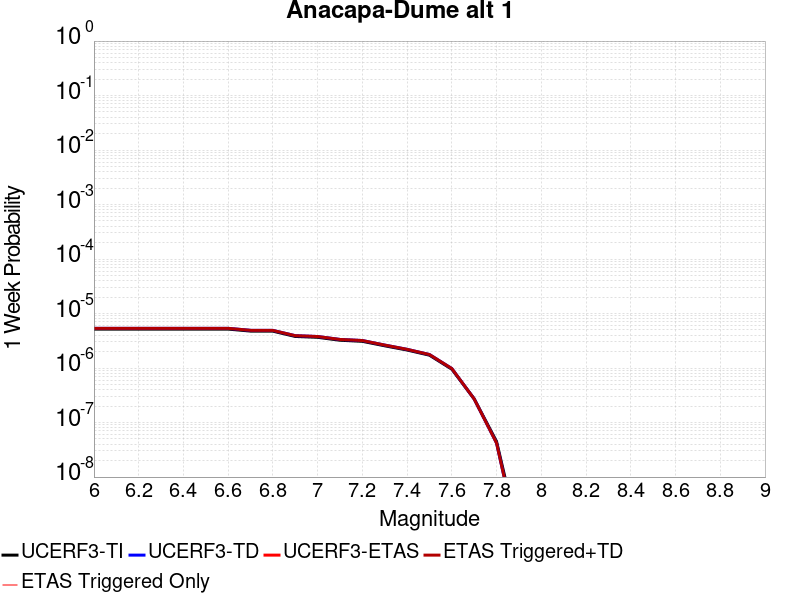 | 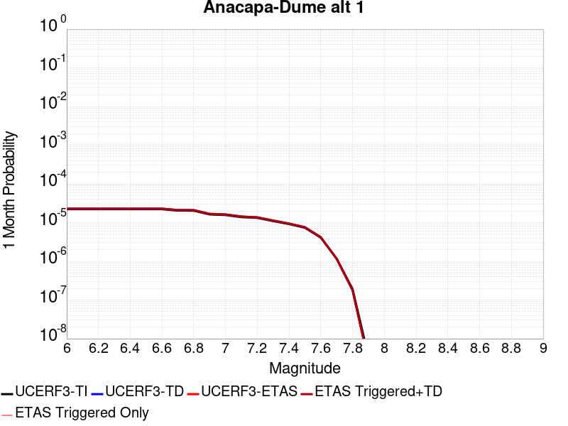 |  | 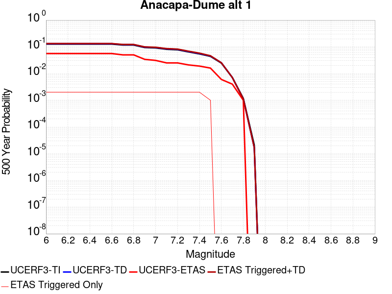 |

| Magnitude | 1 wk TI Prob | 1 wk TD Prob | 1 wk ETAS Prob | 1 wk ETAS/TD Gain | 1 wk ETAS Triggered+TD | 1 wk ETAS Triggered Only | 1 mo TI Prob | 1 mo TD Prob | 1 mo ETAS Prob | 1 mo ETAS/TD Gain | 1 mo ETAS Triggered+TD | 1 mo ETAS Triggered Only | 1 yr TI Prob | 1 yr TD Prob | 1 yr ETAS Prob | 1 yr ETAS/TD Gain | 1 yr ETAS Triggered+TD | 1 yr ETAS Triggered Only | 500 yr TI Prob | 500 yr TD Prob | 500 yr ETAS Prob | 500 yr ETAS/TD Gain | 500 yr ETAS Triggered+TD | 500 yr ETAS Triggered Only |
|-----|-----|-----|-----|-----|-----|-----|-----|-----|-----|-----|-----|-----|-----|-----|-----|-----|-----|-----|-----|-----|-----|-----|-----|-----|
| 6.0 | 5.1871802E-6 | 5.356254E-6 | 0.0 | 0.0 | 5.356254E-6 | 0.0 | 2.2230583E-5 | 2.2955177E-5 | 0.0 | 0.0 | 2.2955177E-5 | 0.0 | 2.7062374E-4 | 2.7944427E-4 | 0.0 | 0.0 | 2.7944427E-4 | 0.0 | 0.12657252 | 0.13071768 | 0.056 | 0.42840418 | 0.13245624 | 0.002 |
| 6.1 | 5.1871802E-6 | 5.356254E-6 | 0.0 | 0.0 | 5.356254E-6 | 0.0 | 2.2230583E-5 | 2.2955177E-5 | 0.0 | 0.0 | 2.2955177E-5 | 0.0 | 2.7062374E-4 | 2.7944427E-4 | 0.0 | 0.0 | 2.7944427E-4 | 0.0 | 0.12657252 | 0.13071768 | 0.056 | 0.42840418 | 0.13245624 | 0.002 |
| 6.2 | 5.1871802E-6 | 5.356254E-6 | 0.0 | 0.0 | 5.356254E-6 | 0.0 | 2.2230583E-5 | 2.2955177E-5 | 0.0 | 0.0 | 2.2955177E-5 | 0.0 | 2.7062374E-4 | 2.7944427E-4 | 0.0 | 0.0 | 2.7944427E-4 | 0.0 | 0.12657252 | 0.13071768 | 0.056 | 0.42840418 | 0.13245624 | 0.002 |
| 6.3 | 5.1871802E-6 | 5.356254E-6 | 0.0 | 0.0 | 5.356254E-6 | 0.0 | 2.2230583E-5 | 2.2955177E-5 | 0.0 | 0.0 | 2.2955177E-5 | 0.0 | 2.7062374E-4 | 2.7944427E-4 | 0.0 | 0.0 | 2.7944427E-4 | 0.0 | 0.12657252 | 0.13071768 | 0.056 | 0.42840418 | 0.13245624 | 0.002 |
| 6.4 | 5.1871802E-6 | 5.356254E-6 | 0.0 | 0.0 | 5.356254E-6 | 0.0 | 2.2230583E-5 | 2.2955177E-5 | 0.0 | 0.0 | 2.2955177E-5 | 0.0 | 2.7062374E-4 | 2.7944427E-4 | 0.0 | 0.0 | 2.7944427E-4 | 0.0 | 0.12657252 | 0.13071768 | 0.056 | 0.42840418 | 0.13245624 | 0.002 |
| 6.5 | 5.1871802E-6 | 5.356254E-6 | 0.0 | 0.0 | 5.356254E-6 | 0.0 | 2.2230583E-5 | 2.2955177E-5 | 0.0 | 0.0 | 2.2955177E-5 | 0.0 | 2.7062374E-4 | 2.7944427E-4 | 0.0 | 0.0 | 2.7944427E-4 | 0.0 | 0.12657252 | 0.13071768 | 0.056 | 0.42840418 | 0.13245624 | 0.002 |
| 6.6 | 5.1871802E-6 | 5.356254E-6 | 0.0 | 0.0 | 5.356254E-6 | 0.0 | 2.2230583E-5 | 2.2955177E-5 | 0.0 | 0.0 | 2.2955177E-5 | 0.0 | 2.7062374E-4 | 2.7944427E-4 | 0.0 | 0.0 | 2.7944427E-4 | 0.0 | 0.12657252 | 0.13071768 | 0.056 | 0.42840418 | 0.13245624 | 0.002 |
| 6.7 | 4.7693475E-6 | 4.926243E-6 | 0.0 | 0.0 | 4.926243E-6 | 0.0 | 2.04399E-5 | 2.1112302E-5 | 0.0 | 0.0 | 2.1112302E-5 | 0.0 | 2.4882736E-4 | 2.5701273E-4 | 0.0 | 0.0 | 2.5701273E-4 | 0.0 | 0.116999194 | 0.12088898 | 0.05 | 0.41360262 | 0.1226472 | 0.002 |
| 6.8 | 4.753408E-6 | 4.9098185E-6 | 0.0 | 0.0 | 4.9098185E-6 | 0.0 | 2.037159E-5 | 2.1041915E-5 | 0.0 | 0.0 | 2.1041915E-5 | 0.0 | 2.4799586E-4 | 2.5615594E-4 | 0.0 | 0.0 | 2.5615594E-4 | 0.0 | 0.11663192 | 0.12051218 | 0.05 | 0.4148958 | 0.12227116 | 0.002 |
| 6.9 | 3.800069E-6 | 3.928298E-6 | 0.0 | 0.0 | 3.928298E-6 | 0.0 | 1.6285909E-5 | 1.6835456E-5 | 0.0 | 0.0 | 1.6835456E-5 | 0.0 | 1.9826289E-4 | 2.0495262E-4 | 0.0 | 0.0 | 2.0495262E-4 | 0.0 | 0.094385244 | 0.097570665 | 0.034 | 0.34846538 | 0.09937552 | 0.002 |
| 7.0 | 3.6671938E-6 | 3.7913223E-6 | 0.0 | 0.0 | 3.7913223E-6 | 0.0 | 1.571645E-5 | 1.6248425E-5 | 0.0 | 0.0 | 1.6248425E-5 | 0.0 | 1.9133097E-4 | 1.9780685E-4 | 0.0 | 0.0 | 1.9780685E-4 | 0.0 | 0.09124036 | 0.094338946 | 0.031 | 0.32860237 | 0.096150264 | 0.002 |
| 7.1 | 3.2394885E-6 | 3.3509157E-6 | 0.0 | 0.0 | 3.3509157E-6 | 0.0 | 1.3883448E-5 | 1.4360989E-5 | 0.0 | 0.0 | 1.4360989E-5 | 0.0 | 1.6901788E-4 | 1.748311E-4 | 0.0 | 0.0 | 1.748311E-4 | 0.0 | 0.08104312 | 0.08384276 | 0.025 | 0.2981772 | 0.085675076 | 0.002 |
| 7.2 | 3.0935948E-6 | 3.2003154E-6 | 0.0 | 0.0 | 3.2003154E-6 | 0.0 | 1.3258196E-5 | 1.3715566E-5 | 0.0 | 0.0 | 1.3715566E-5 | 0.0 | 1.6140658E-4 | 1.6697432E-4 | 0.0 | 0.0 | 1.6697432E-4 | 0.0 | 0.077538654 | 0.08023577 | 0.025 | 0.31158173 | 0.0820753 | 0.002 |
| 7.3 | 2.5604163E-6 | 2.6409755E-6 | 0.0 | 0.0 | 2.6409755E-6 | 0.0 | 1.0973167E-5 | 1.1318418E-5 | 0.0 | 0.0 | 1.1318418E-5 | 0.0 | 1.3359012E-4 | 1.3779306E-4 | 0.0 | 0.0 | 1.3779306E-4 | 0.0 | 0.06461729 | 0.06669943 | 0.021 | 0.31484526 | 0.06856603 | 0.002 |
| 7.4 | 2.1429005E-6 | 2.2055349E-6 | 0.0 | 0.0 | 2.2055349E-6 | 0.0 | 9.1838265E-6 | 9.452258E-6 | 0.0 | 0.0 | 9.452258E-6 | 0.0 | 1.11807356E-4 | 1.1507519E-4 | 0.0 | 0.0 | 1.1507519E-4 | 0.0 | 0.05437274 | 0.056031566 | 0.019 | 0.33909458 | 0.057919502 | 0.002 |
| 7.5 | 1.7237151E-6 | 1.7720739E-6 | 0.0 | 0.0 | 1.7720739E-6 | 0.0 | 7.3873293E-6 | 7.5945804E-6 | 0.0 | 0.0 | 7.5945804E-6 | 0.0 | 8.993702E-5 | 9.246012E-5 | 0.0 | 0.0 | 9.246012E-5 | 0.0 | 0.043974347 | 0.045276515 | 0.016 | 0.35338408 | 0.04623124 | 0.001 |
| 7.6 | 9.541696E-7 | 9.801155E-7 | 0.0 | 0.0 | 9.801155E-7 | 0.0 | 4.089292E-6 | 4.2004885E-6 | 0.0 | 0.0 | 4.2004885E-6 | 0.0 | 4.9785995E-5 | 5.113976E-5 | 0.0 | 0.0 | 5.113976E-5 | 0.0 | 0.024586326 | 0.025291147 | 0.006 | 0.23723717 | 0.025291147 | 0.0 |
| 7.7 | 2.7226676E-7 | 2.7123875E-7 | 0.0 | 0.0 | 2.7123875E-7 | 0.0 | 1.166857E-6 | 1.1624512E-6 | 0.0 | 0.0 | 1.1624512E-6 | 0.0 | 1.4206392E-5 | 1.4152753E-5 | 0.0 | 0.0 | 1.4152753E-5 | 0.0 | 0.0070780776 | 0.007082672 | 0.004 | 0.5647586 | 0.007082672 | 0.0 |
| 7.8 | 4.5017995E-8 | 4.209279E-8 | 0.0 | 0.0 | 4.209279E-8 | 0.0 | 1.9293425E-7 | 1.8039766E-7 | 0.0 | 0.0 | 1.8039766E-7 | 0.0 | 2.348972E-6 | 2.1963397E-6 | 0.0 | 0.0 | 2.1963397E-6 | 0.0 | 0.0011737979 | 0.0011123403 | 0.001 | 0.8990055 | 0.0011123403 | 0.0 |
| 7.9 | 8.007447E-10 | 6.1465133E-10 | 0.0 | 0.0 | 6.1465133E-10 | 0.0 | 3.4317629E-9 | 2.6342197E-9 | 0.0 | 0.0 | 2.6342197E-9 | 0.0 | 4.1781714E-8 | 3.2071625E-8 | 0.0 | 0.0 | 3.2071625E-8 | 0.0 | 2.0890639E-5 | 1.6903754E-5 | 0.0 | 0.0 | 1.6903754E-5 | 0.0 |

## Contra Costa Shear Zone (connector) 2011 CFM
*[(top)](#table-of-contents)*

| 1 Week | 1 Month | 1 Year | 500 Year |
|-----|-----|-----|-----|
|  | 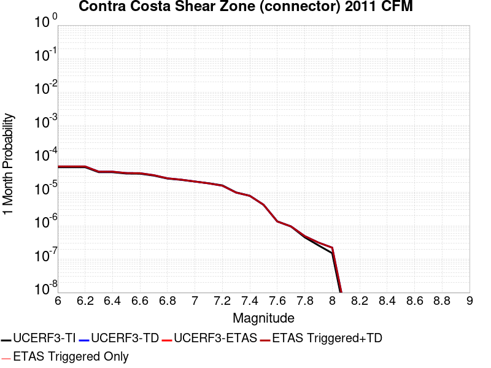 | 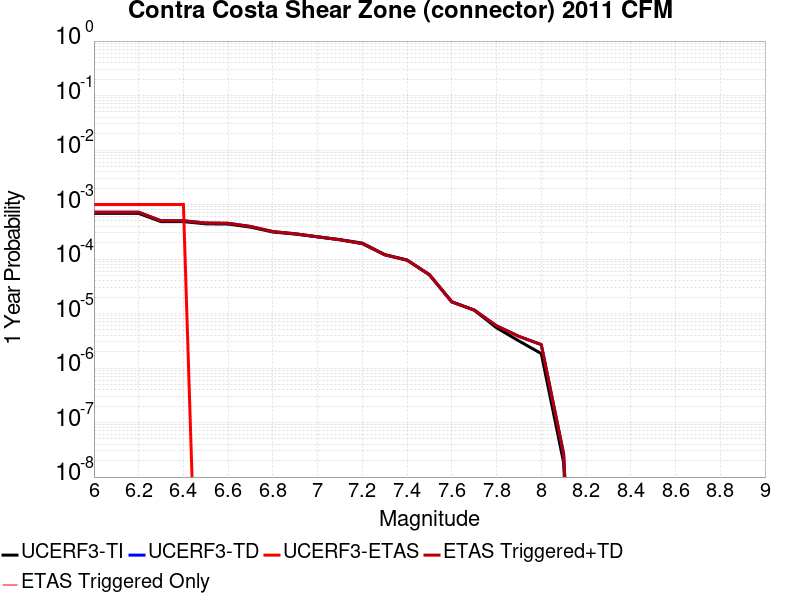 | 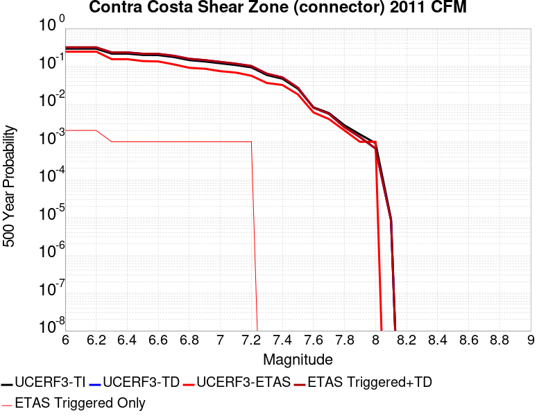 |

| Magnitude | 1 wk TI Prob | 1 wk TD Prob | 1 wk ETAS Prob | 1 wk ETAS/TD Gain | 1 wk ETAS Triggered+TD | 1 wk ETAS Triggered Only | 1 mo TI Prob | 1 mo TD Prob | 1 mo ETAS Prob | 1 mo ETAS/TD Gain | 1 mo ETAS Triggered+TD | 1 mo ETAS Triggered Only | 1 yr TI Prob | 1 yr TD Prob | 1 yr ETAS Prob | 1 yr ETAS/TD Gain | 1 yr ETAS Triggered+TD | 1 yr ETAS Triggered Only | 500 yr TI Prob | 500 yr TD Prob | 500 yr ETAS Prob | 500 yr ETAS/TD Gain | 500 yr ETAS Triggered+TD | 500 yr ETAS Triggered Only |
|-----|-----|-----|-----|-----|-----|-----|-----|-----|-----|-----|-----|-----|-----|-----|-----|-----|-----|-----|-----|-----|-----|-----|-----|-----|
| 6.0 | 1.3187427E-5 | 1.3869226E-5 | 0.0 | 0.0 | 1.3869226E-5 | 0.0 | 5.6516317E-5 | 5.943831E-5 | 0.0 | 0.0 | 5.943831E-5 | 0.0 | 6.878689E-4 | 7.2344375E-4 | 0.001 | 1.3822775 | 7.2344375E-4 | 0.0 | 0.29110852 | 0.3148797 | 0.244 | 0.7748991 | 0.31624994 | 0.002 |
| 6.1 | 1.3187427E-5 | 1.3869226E-5 | 0.0 | 0.0 | 1.3869226E-5 | 0.0 | 5.6516317E-5 | 5.943831E-5 | 0.0 | 0.0 | 5.943831E-5 | 0.0 | 6.878689E-4 | 7.2344375E-4 | 0.001 | 1.3822775 | 7.2344375E-4 | 0.0 | 0.29110852 | 0.3148797 | 0.244 | 0.7748991 | 0.31624994 | 0.002 |
| 6.2 | 1.3187427E-5 | 1.3869226E-5 | 0.0 | 0.0 | 1.3869226E-5 | 0.0 | 5.6516317E-5 | 5.943831E-5 | 0.0 | 0.0 | 5.943831E-5 | 0.0 | 6.878689E-4 | 7.2344375E-4 | 0.001 | 1.3822775 | 7.2344375E-4 | 0.0 | 0.29110852 | 0.3148797 | 0.244 | 0.7748991 | 0.31624994 | 0.002 |
| 6.3 | 9.315374E-6 | 9.671605E-6 | 0.0 | 0.0 | 9.671605E-6 | 0.0 | 3.992242E-5 | 4.1449097E-5 | 0.0 | 0.0 | 4.1449097E-5 | 0.0 | 4.8594706E-4 | 5.0453E-4 | 0.001 | 1.9820427 | 5.0453E-4 | 0.0 | 0.21575403 | 0.23188576 | 0.154 | 0.66412014 | 0.23265387 | 0.001 |
| 6.4 | 9.315374E-6 | 9.671605E-6 | 0.0 | 0.0 | 9.671605E-6 | 0.0 | 3.992242E-5 | 4.1449097E-5 | 0.0 | 0.0 | 4.1449097E-5 | 0.0 | 4.8594706E-4 | 5.0453E-4 | 0.001 | 1.9820427 | 5.0453E-4 | 0.0 | 0.21575403 | 0.23188576 | 0.154 | 0.66412014 | 0.23265387 | 0.001 |
| 6.5 | 8.492638E-6 | 8.788833E-6 | 0.0 | 0.0 | 8.788833E-6 | 0.0 | 3.639651E-5 | 3.7665905E-5 | 0.0 | 0.0 | 3.7665905E-5 | 0.0 | 4.430374E-4 | 4.5848923E-4 | 0.0 | 0.0 | 4.5848923E-4 | 0.0 | 0.1987384 | 0.21386386 | 0.137 | 0.6405944 | 0.21465 | 0.001 |
| 6.6 | 8.402072E-6 | 8.690126E-6 | 0.0 | 0.0 | 8.690126E-6 | 0.0 | 3.6008387E-5 | 3.7242884E-5 | 0.0 | 0.0 | 3.7242884E-5 | 0.0 | 4.383139E-4 | 4.533411E-4 | 0.0 | 0.0 | 4.533411E-4 | 0.0 | 0.19684294 | 0.2118609 | 0.134 | 0.63249046 | 0.21264903 | 0.001 |
| 6.7 | 7.383587E-6 | 7.6018305E-6 | 0.0 | 0.0 | 7.6018305E-6 | 0.0 | 3.164356E-5 | 3.257888E-5 | 0.0 | 0.0 | 3.257888E-5 | 0.0 | 3.8519225E-4 | 3.9657773E-4 | 0.0 | 0.0 | 3.9657773E-4 | 0.0 | 0.17521557 | 0.18891482 | 0.112 | 0.5928598 | 0.1897259 | 0.001 |
| 6.8 | 6.004921E-6 | 6.1253095E-6 | 0.0 | 0.0 | 6.1253095E-6 | 0.0 | 2.5735122E-5 | 2.6251064E-5 | 0.0 | 0.0 | 2.6251064E-5 | 0.0 | 3.1328006E-4 | 3.1956035E-4 | 0.0 | 0.0 | 3.1956035E-4 | 0.0 | 0.1450092 | 0.15674315 | 0.091 | 0.58056766 | 0.15758641 | 0.001 |
| 6.9 | 5.505255E-6 | 5.5804535E-6 | 0.0 | 0.0 | 5.5804535E-6 | 0.0 | 2.3593739E-5 | 2.3916013E-5 | 0.0 | 0.0 | 2.3916013E-5 | 0.0 | 2.872159E-4 | 2.9113897E-4 | 0.0 | 0.0 | 2.9113897E-4 | 0.0 | 0.13379058 | 0.1447016 | 0.086 | 0.5943265 | 0.1455569 | 0.001 |
| 7.0 | 4.891922E-6 | 4.9143177E-6 | 0.0 | 0.0 | 4.9143177E-6 | 0.0 | 2.096521E-5 | 2.1061192E-5 | 0.0 | 0.0 | 2.1061192E-5 | 0.0 | 2.5522153E-4 | 2.563902E-4 | 0.0 | 0.0 | 2.563902E-4 | 0.0 | 0.11981842 | 0.12971747 | 0.074 | 0.5704706 | 0.13058774 | 0.001 |
| 7.1 | 4.3599E-6 | 4.322137E-6 | 0.0 | 0.0 | 4.322137E-6 | 0.0 | 1.868515E-5 | 1.8523315E-5 | 0.0 | 0.0 | 1.8523315E-5 | 0.0 | 2.2746796E-4 | 2.2549828E-4 | 0.0 | 0.0 | 2.2549828E-4 | 0.0 | 0.1075162 | 0.11626807 | 0.068 | 0.5848553 | 0.1171518 | 0.001 |
| 7.2 | 3.7647926E-6 | 3.6791403E-6 | 0.0 | 0.0 | 3.6791403E-6 | 0.0 | 1.6134725E-5 | 1.576765E-5 | 0.0 | 0.0 | 1.576765E-5 | 0.0 | 1.9642258E-4 | 1.9195446E-4 | 0.0 | 0.0 | 1.9195446E-4 | 0.0 | 0.09355138 | 0.10097238 | 0.056 | 0.5546071 | 0.10187141 | 0.001 |
| 7.3 | 2.3179882E-6 | 2.2943022E-6 | 0.0 | 0.0 | 2.2943022E-6 | 0.0 | 9.934198E-6 | 9.832687E-6 | 0.0 | 0.0 | 9.832687E-6 | 0.0 | 1.20942146E-4 | 1.1970644E-4 | 0.0 | 0.0 | 1.1970644E-4 | 0.0 | 0.058682445 | 0.06344374 | 0.036 | 0.56743187 | 0.06344374 | 0.0 |
| 7.4 | 1.8378355E-6 | 1.8302846E-6 | 0.0 | 0.0 | 1.8302846E-6 | 0.0 | 7.876414E-6 | 7.8440535E-6 | 0.0 | 0.0 | 7.8440535E-6 | 0.0 | 9.5891126E-5 | 9.5497206E-5 | 0.0 | 0.0 | 9.5497206E-5 | 0.0 | 0.046816517 | 0.050627302 | 0.032 | 0.63207 | 0.050627302 | 0.0 |
| 7.5 | 9.840493E-7 | 9.916971E-7 | 0.0 | 0.0 | 9.916971E-7 | 0.0 | 4.2173474E-6 | 4.2501233E-6 | 0.0 | 0.0 | 4.2501233E-6 | 0.0 | 5.1344992E-5 | 5.174404E-5 | 0.0 | 0.0 | 5.174404E-5 | 0.0 | 0.025346402 | 0.027019726 | 0.018 | 0.66617996 | 0.027019726 | 0.0 |
| 7.6 | 3.1602997E-7 | 3.12968E-7 | 0.0 | 0.0 | 3.12968E-7 | 0.0 | 1.3544135E-6 | 1.3412908E-6 | 0.0 | 0.0 | 1.3412908E-6 | 0.0 | 1.648986E-5 | 1.6330094E-5 | 0.0 | 0.0 | 1.6330094E-5 | 0.0 | 0.0082111005 | 0.007988934 | 0.006 | 0.75103885 | 0.007988934 | 0.0 |
| 7.7 | 2.2125788E-7 | 2.2282873E-7 | 0.0 | 0.0 | 2.2282873E-7 | 0.0 | 9.482477E-7 | 9.549799E-7 | 0.0 | 0.0 | 9.549799E-7 | 0.0 | 1.1544855E-5 | 1.1626819E-5 | 0.0 | 0.0 | 1.1626819E-5 | 0.0 | 0.005755832 | 0.005499136 | 0.004 | 0.72738695 | 0.005499136 | 0.0 |
| 7.8 | 1.0509553E-7 | 1.143159E-7 | 0.0 | 0.0 | 1.143159E-7 | 0.0 | 4.5040935E-7 | 4.899252E-7 | 0.0 | 0.0 | 4.899252E-7 | 0.0 | 5.48372E-6 | 5.964823E-6 | 0.0 | 0.0 | 5.964823E-6 | 0.0 | 0.002738112 | 0.002439671 | 0.002 | 0.8197827 | 0.002439671 | 0.0 |
| 7.9 | 6.029319E-8 | 7.3148385E-8 | 0.0 | 0.0 | 7.3148385E-8 | 0.0 | 2.5839938E-7 | 3.1349305E-7 | 0.0 | 0.0 | 3.1349305E-7 | 0.0 | 3.1460077E-6 | 3.8167714E-6 | 0.0 | 0.0 | 3.8167714E-6 | 0.0 | 0.0015717698 | 0.0013296703 | 0.001 | 0.75206614 | 0.0013296703 | 0.0 |
| 8.0 | 3.531068E-8 | 5.1627534E-8 | 0.0 | 0.0 | 5.1627534E-8 | 0.0 | 1.5133148E-7 | 2.2126085E-7 | 0.0 | 0.0 | 2.2126085E-7 | 0.0 | 1.8424593E-6 | 2.6938476E-6 | 0.0 | 0.0 | 2.6938476E-6 | 0.0 | 9.2080625E-4 | 6.654231E-4 | 0.001 | 1.5028033 | 6.654231E-4 | 0.0 |
| 8.1 | 3.5238246E-10 | 5.067695E-10 | 0.0 | 0.0 | 5.067695E-10 | 0.0 | 1.5102107E-9 | 2.1718707E-9 | 0.0 | 0.0 | 2.1718707E-9 | 0.0 | 1.8386816E-8 | 2.644253E-8 | 0.0 | 0.0 | 2.644253E-8 | 0.0 | 9.193365E-6 | 8.379142E-6 | 0.0 | 0.0 | 8.379142E-6 | 0.0 |

## Point Reyes 2011 connector
*[(top)](#table-of-contents)*

| 1 Week | 1 Month | 1 Year | 500 Year |
|-----|-----|-----|-----|
|  |  | 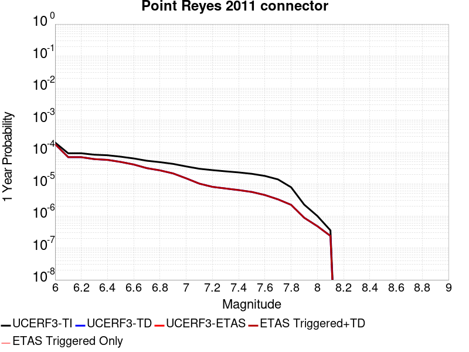 | 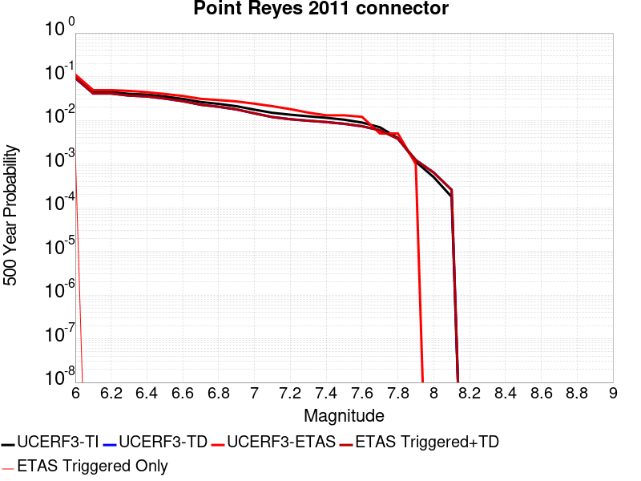 |

| Magnitude | 1 wk TI Prob | 1 wk TD Prob | 1 wk ETAS Prob | 1 wk ETAS/TD Gain | 1 wk ETAS Triggered+TD | 1 wk ETAS Triggered Only | 1 mo TI Prob | 1 mo TD Prob | 1 mo ETAS Prob | 1 mo ETAS/TD Gain | 1 mo ETAS Triggered+TD | 1 mo ETAS Triggered Only | 1 yr TI Prob | 1 yr TD Prob | 1 yr ETAS Prob | 1 yr ETAS/TD Gain | 1 yr ETAS Triggered+TD | 1 yr ETAS Triggered Only | 500 yr TI Prob | 500 yr TD Prob | 500 yr ETAS Prob | 500 yr ETAS/TD Gain | 500 yr ETAS Triggered+TD | 500 yr ETAS Triggered Only |
|-----|-----|-----|-----|-----|-----|-----|-----|-----|-----|-----|-----|-----|-----|-----|-----|-----|-----|-----|-----|-----|-----|-----|-----|-----|
| 6.0 | 3.7893044E-6 | 3.3860597E-6 | 0.0 | 0.0 | 3.3860597E-6 | 0.0 | 1.6239776E-5 | 1.45116155E-5 | 0.0 | 0.0 | 1.45116155E-5 | 0.0 | 1.9770133E-4 | 1.7666673E-4 | 0.0 | 0.0 | 1.7666673E-4 | 0.0 | 0.09413087 | 0.09194209 | 0.111 | 1.2072817 | 0.0937582 | 0.002 |
| 6.1 | 1.7449562E-6 | 1.3184028E-6 | 0.0 | 0.0 | 1.3184028E-6 | 0.0 | 7.478362E-6 | 5.650286E-6 | 0.0 | 0.0 | 5.650286E-6 | 0.0 | 9.104525E-5 | 6.879012E-5 | 0.0 | 0.0 | 6.879012E-5 | 0.0 | 0.044503998 | 0.041061494 | 0.049 | 1.1933321 | 0.041061494 | 0.0 |
| 6.2 | 1.7449562E-6 | 1.3184028E-6 | 0.0 | 0.0 | 1.3184028E-6 | 0.0 | 7.478362E-6 | 5.650286E-6 | 0.0 | 0.0 | 5.650286E-6 | 0.0 | 9.104525E-5 | 6.879012E-5 | 0.0 | 0.0 | 6.879012E-5 | 0.0 | 0.044503998 | 0.041061494 | 0.049 | 1.1933321 | 0.041061494 | 0.0 |
| 6.3 | 1.5739171E-6 | 1.1457332E-6 | 0.0 | 0.0 | 1.1457332E-6 | 0.0 | 6.7453416E-6 | 4.9102764E-6 | 0.0 | 0.0 | 4.9102764E-6 | 0.0 | 8.212144E-5 | 5.9781014E-5 | 0.0 | 0.0 | 5.9781014E-5 | 0.0 | 0.040230766 | 0.036728214 | 0.047 | 1.2796701 | 0.036728214 | 0.0 |
| 6.4 | 1.5138507E-6 | 1.0851181E-6 | 0.0 | 0.0 | 1.0851181E-6 | 0.0 | 6.4879155E-6 | 4.6504983E-6 | 0.0 | 0.0 | 4.6504983E-6 | 0.0 | 7.898751E-5 | 5.6618384E-5 | 0.0 | 0.0 | 5.6618384E-5 | 0.0 | 0.03872554 | 0.035203204 | 0.044 | 1.2498862 | 0.035203204 | 0.0 |
| 6.5 | 1.3662817E-6 | 9.358176E-7 | 0.0 | 0.0 | 9.358176E-7 | 0.0 | 5.8554797E-6 | 4.0106406E-6 | 0.0 | 0.0 | 4.0106406E-6 | 0.0 | 7.128814E-5 | 4.8828475E-5 | 0.0 | 0.0 | 4.8828475E-5 | 0.0 | 0.035017524 | 0.031429093 | 0.04 | 1.2727062 | 0.031429093 | 0.0 |
| 6.6 | 1.2022703E-6 | 7.770755E-7 | 0.0 | 0.0 | 7.770755E-7 | 0.0 | 5.1525767E-6 | 3.3303195E-6 | 0.0 | 0.0 | 3.3303195E-6 | 0.0 | 6.273081E-5 | 4.0545896E-5 | 0.0 | 0.0 | 4.0545896E-5 | 0.0 | 0.030879568 | 0.027347602 | 0.036 | 1.316386 | 0.027347602 | 0.0 |
| 6.7 | 1.0194848E-6 | 5.9798634E-7 | 0.0 | 0.0 | 5.9798634E-7 | 0.0 | 4.3692135E-6 | 2.562796E-6 | 0.0 | 0.0 | 2.562796E-6 | 0.0 | 5.319387E-5 | 3.1201598E-5 | 0.0 | 0.0 | 3.1201598E-5 | 0.0 | 0.026247041 | 0.02272903 | 0.031 | 1.3638946 | 0.02272903 | 0.0 |
| 6.8 | 9.212307E-7 | 5.093355E-7 | 0.0 | 0.0 | 5.093355E-7 | 0.0 | 3.9481256E-6 | 2.1828646E-6 | 0.0 | 0.0 | 2.1828646E-6 | 0.0 | 4.806737E-5 | 2.6576055E-5 | 0.0 | 0.0 | 2.6576055E-5 | 0.0 | 0.02374774 | 0.020381048 | 0.029 | 1.4228905 | 0.020381048 | 0.0 |
| 6.9 | 8.1306075E-7 | 4.0919304E-7 | 0.0 | 0.0 | 4.0919304E-7 | 0.0 | 3.4845416E-6 | 1.7536833E-6 | 0.0 | 0.0 | 1.7536833E-6 | 0.0 | 4.2423468E-5 | 2.1350885E-5 | 0.0 | 0.0 | 2.1350885E-5 | 0.0 | 0.020988787 | 0.017726896 | 0.027 | 1.5231092 | 0.017726896 | 0.0 |
| 7.0 | 6.773335E-7 | 2.87286E-7 | 0.0 | 0.0 | 2.87286E-7 | 0.0 | 2.9028547E-6 | 1.2312253E-6 | 0.0 | 0.0 | 1.2312253E-6 | 0.0 | 3.5341684E-5 | 1.4990064E-5 | 0.0 | 0.0 | 1.4990064E-5 | 0.0 | 0.017515935 | 0.014410718 | 0.024 | 1.6654271 | 0.014410718 | 0.0 |
| 7.1 | 5.7279397E-7 | 1.9641809E-7 | 0.0 | 0.0 | 1.9641809E-7 | 0.0 | 2.454829E-6 | 8.417915E-7 | 0.0 | 0.0 | 8.417915E-7 | 0.0 | 2.9887131E-5 | 1.0248763E-5 | 0.0 | 0.0 | 1.0248763E-5 | 0.0 | 0.014832685 | 0.011852112 | 0.021 | 1.771836 | 0.011852112 | 0.0 |
| 7.2 | 5.185539E-7 | 1.5557912E-7 | 0.0 | 0.0 | 1.5557912E-7 | 0.0 | 2.222372E-6 | 6.667675E-7 | 0.0 | 0.0 | 6.667675E-7 | 0.0 | 2.7057044E-5 | 8.117863E-6 | 0.0 | 0.0 | 8.117863E-6 | 0.0 | 0.013437603 | 0.010581067 | 0.018 | 1.7011517 | 0.010581067 | 0.0 |
| 7.3 | 4.7599846E-7 | 1.382438E-7 | 0.0 | 0.0 | 1.382438E-7 | 0.0 | 2.0399918E-6 | 5.924734E-7 | 0.0 | 0.0 | 5.924734E-7 | 0.0 | 2.4836616E-5 | 7.213339E-6 | 0.0 | 0.0 | 7.213339E-6 | 0.0 | 0.012341672 | 0.009785137 | 0.015 | 1.5329372 | 0.009785137 | 0.0 |
| 7.4 | 4.3987393E-7 | 1.233298E-7 | 0.0 | 0.0 | 1.233298E-7 | 0.0 | 1.8851727E-6 | 5.285562E-7 | 0.0 | 0.0 | 5.285562E-7 | 0.0 | 2.2951735E-5 | 6.435152E-6 | 0.0 | 0.0 | 6.435152E-6 | 0.0 | 0.011410401 | 0.009106724 | 0.013 | 1.4275167 | 0.009106724 | 0.0 |
| 7.5 | 3.980054E-7 | 1.07781204E-7 | 0.0 | 0.0 | 1.07781204E-7 | 0.0 | 1.7057363E-6 | 4.619194E-7 | 0.0 | 0.0 | 4.619194E-7 | 0.0 | 2.0767142E-5 | 5.6238537E-6 | 0.0 | 0.0 | 5.6238537E-6 | 0.0 | 0.010329954 | 0.008325137 | 0.013 | 1.5615358 | 0.008325137 | 0.0 |
| 7.6 | 3.4188398E-7 | 8.636096E-8 | 0.0 | 0.0 | 8.636096E-8 | 0.0 | 1.4652163E-6 | 3.7011839E-7 | 0.0 | 0.0 | 3.7011839E-7 | 0.0 | 1.7838862E-5 | 4.506182E-6 | 0.0 | 0.0 | 4.506182E-6 | 0.0 | 0.00887985 | 0.007307706 | 0.012 | 1.6421022 | 0.007307706 | 0.0 |
| 7.7 | 2.6611437E-7 | 6.324351E-8 | 0.0 | 0.0 | 6.324351E-8 | 0.0 | 1.1404896E-6 | 2.7104363E-7 | 0.0 | 0.0 | 2.7104363E-7 | 0.0 | 1.3885373E-5 | 3.299951E-6 | 0.0 | 0.0 | 3.299951E-6 | 0.0 | 0.0069186897 | 0.0059245937 | 0.005 | 0.8439397 | 0.0059245937 | 0.0 |
| 7.8 | 1.5107078E-7 | 4.260151E-8 | 0.0 | 0.0 | 4.260151E-8 | 0.0 | 6.474461E-7 | 1.8257789E-7 | 0.0 | 0.0 | 1.8257789E-7 | 0.0 | 7.882627E-6 | 2.2228835E-6 | 0.0 | 0.0 | 2.2228835E-6 | 0.0 | 0.003933572 | 0.0037792576 | 0.005 | 1.3230112 | 0.0037792576 | 0.0 |
| 7.9 | 4.3228205E-8 | 1.6794429E-8 | 0.0 | 0.0 | 1.6794429E-8 | 0.0 | 1.8526373E-7 | 7.1976125E-8 | 0.0 | 0.0 | 7.1976125E-8 | 0.0 | 2.2555835E-6 | 8.7630906E-7 | 0.0 | 0.0 | 8.7630906E-7 | 0.0 | 0.0011271574 | 0.0012352221 | 0.001 | 0.80957097 | 0.0012352221 | 0.0 |
| 8.0 | 1.9149928E-8 | 9.185868E-9 | 0.0 | 0.0 | 9.185868E-9 | 0.0 | 8.207112E-8 | 3.9368004E-8 | 0.0 | 0.0 | 3.9368004E-8 | 0.0 | 9.992154E-7 | 4.7930536E-7 | 0.0 | 0.0 | 4.7930536E-7 | 0.0 | 4.9948314E-4 | 6.373236E-4 | 0.0 | 0.0 | 6.373236E-4 | 0.0 |
| 8.1 | 6.7792816E-9 | 4.5455115E-9 | 0.0 | 0.0 | 4.5455115E-9 | 0.0 | 2.9054062E-8 | 1.9480767E-8 | 0.0 | 0.0 | 1.9480767E-8 | 0.0 | 3.5373316E-7 | 2.3717831E-7 | 0.0 | 0.0 | 2.3717831E-7 | 0.0 | 1.7685097E-4 | 2.557439E-4 | 0.0 | 0.0 | 2.557439E-4 | 0.0 |

## Great Valley 12
*[(top)](#table-of-contents)*

| 1 Week | 1 Month | 1 Year | 500 Year |
|-----|-----|-----|-----|
| 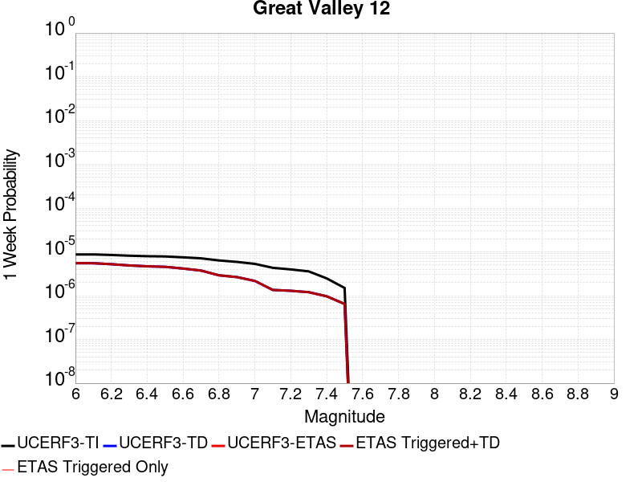 |  | 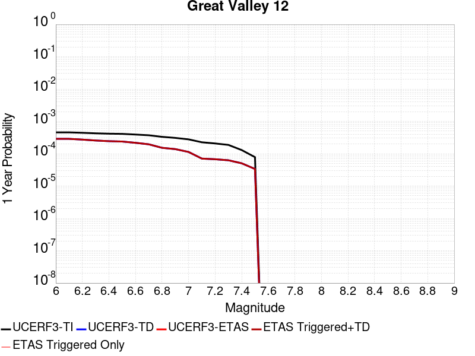 | 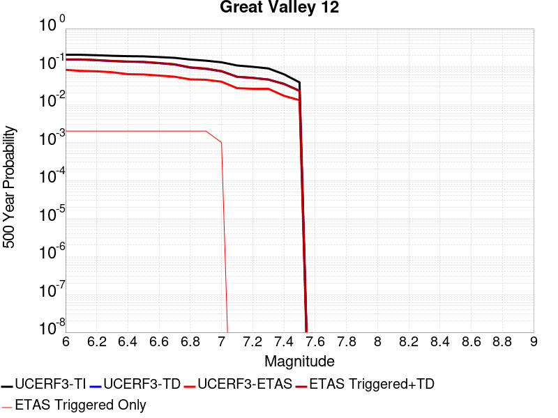 |

| Magnitude | 1 wk TI Prob | 1 wk TD Prob | 1 wk ETAS Prob | 1 wk ETAS/TD Gain | 1 wk ETAS Triggered+TD | 1 wk ETAS Triggered Only | 1 mo TI Prob | 1 mo TD Prob | 1 mo ETAS Prob | 1 mo ETAS/TD Gain | 1 mo ETAS Triggered+TD | 1 mo ETAS Triggered Only | 1 yr TI Prob | 1 yr TD Prob | 1 yr ETAS Prob | 1 yr ETAS/TD Gain | 1 yr ETAS Triggered+TD | 1 yr ETAS Triggered Only | 500 yr TI Prob | 500 yr TD Prob | 500 yr ETAS Prob | 500 yr ETAS/TD Gain | 500 yr ETAS Triggered+TD | 500 yr ETAS Triggered Only |
|-----|-----|-----|-----|-----|-----|-----|-----|-----|-----|-----|-----|-----|-----|-----|-----|-----|-----|-----|-----|-----|-----|-----|-----|-----|
| 6.0 | 8.757157E-6 | 5.5123287E-6 | 0.0 | 0.0 | 5.5123287E-6 | 0.0 | 3.7530135E-5 | 2.3624058E-5 | 0.0 | 0.0 | 2.3624058E-5 | 0.0 | 4.5683357E-4 | 2.8758612E-4 | 0.0 | 0.0 | 2.8758612E-4 | 0.0 | 0.20424901 | 0.15282744 | 0.082 | 0.5365529 | 0.15452178 | 0.002 |
| 6.1 | 8.757157E-6 | 5.5123287E-6 | 0.0 | 0.0 | 5.5123287E-6 | 0.0 | 3.7530135E-5 | 2.3624058E-5 | 0.0 | 0.0 | 2.3624058E-5 | 0.0 | 4.5683357E-4 | 2.8758612E-4 | 0.0 | 0.0 | 2.8758612E-4 | 0.0 | 0.20424901 | 0.15282744 | 0.077 | 0.5038362 | 0.15452178 | 0.002 |
| 6.2 | 8.499136E-6 | 5.238895E-6 | 0.0 | 0.0 | 5.238895E-6 | 0.0 | 3.642436E-5 | 2.2452221E-5 | 0.0 | 0.0 | 2.2452221E-5 | 0.0 | 4.4337637E-4 | 2.7332263E-4 | 0.0 | 0.0 | 2.7332263E-4 | 0.0 | 0.19887424 | 0.14675063 | 0.075 | 0.5110711 | 0.14845712 | 0.002 |
| 6.3 | 8.186883E-6 | 4.9081195E-6 | 0.0 | 0.0 | 4.9081195E-6 | 0.0 | 3.508617E-5 | 2.1034633E-5 | 0.0 | 0.0 | 2.1034633E-5 | 0.0 | 4.270904E-4 | 2.5606755E-4 | 0.0 | 0.0 | 2.5606755E-4 | 0.0 | 0.19232118 | 0.13932623 | 0.071 | 0.50959533 | 0.14104758 | 0.002 |
| 6.4 | 7.979878E-6 | 4.681318E-6 | 0.0 | 0.0 | 4.681318E-6 | 0.0 | 3.419903E-5 | 2.0062642E-5 | 0.0 | 0.0 | 2.0062642E-5 | 0.0 | 4.1629362E-4 | 2.4423623E-4 | 0.0 | 0.0 | 2.4423623E-4 | 0.0 | 0.18794739 | 0.13424928 | 0.063 | 0.46927625 | 0.13598078 | 0.002 |
| 6.5 | 7.871003E-6 | 4.561929E-6 | 0.0 | 0.0 | 4.561929E-6 | 0.0 | 3.373243E-5 | 1.9550982E-5 | 0.0 | 0.0 | 1.9550982E-5 | 0.0 | 4.1061494E-4 | 2.3800813E-4 | 0.0 | 0.0 | 2.3800813E-4 | 0.0 | 0.18563746 | 0.1315742 | 0.062 | 0.471217 | 0.13331105 | 0.002 |
| 6.6 | 7.508221E-6 | 4.1672292E-6 | 0.0 | 0.0 | 4.1672292E-6 | 0.0 | 3.2177693E-5 | 1.7859436E-5 | 0.0 | 0.0 | 1.7859436E-5 | 0.0 | 3.91693E-4 | 2.1741781E-4 | 0.0 | 0.0 | 2.1741781E-4 | 0.0 | 0.17789312 | 0.122632004 | 0.058 | 0.47295973 | 0.12438674 | 0.002 |
| 6.7 | 7.1297914E-6 | 3.7474808E-6 | 0.0 | 0.0 | 3.7474808E-6 | 0.0 | 3.055589E-5 | 1.6060538E-5 | 0.0 | 0.0 | 1.6060538E-5 | 0.0 | 3.7195446E-4 | 1.9552029E-4 | 0.0 | 0.0 | 1.9552029E-4 | 0.0 | 0.16973622 | 0.11312552 | 0.054 | 0.47734588 | 0.11489926 | 0.002 |
| 6.8 | 6.376581E-6 | 2.9186426E-6 | 0.0 | 0.0 | 2.9186426E-6 | 0.0 | 2.7327918E-5 | 1.250841E-5 | 0.0 | 0.0 | 1.250841E-5 | 0.0 | 3.326666E-4 | 1.522794E-4 | 0.0 | 0.0 | 1.522794E-4 | 0.0 | 0.15325947 | 0.09364312 | 0.046 | 0.49122667 | 0.09545584 | 0.002 |
| 6.9 | 5.9095E-6 | 2.658381E-6 | 0.0 | 0.0 | 2.658381E-6 | 0.0 | 2.5326184E-5 | 1.1393012E-5 | 0.0 | 0.0 | 1.1393012E-5 | 0.0 | 3.0830267E-4 | 1.3870125E-4 | 0.0 | 0.0 | 1.3870125E-4 | 0.0 | 0.14287807 | 0.08693047 | 0.045 | 0.51765513 | 0.088756606 | 0.002 |
| 7.0 | 5.3239864E-6 | 2.171749E-6 | 0.0 | 0.0 | 2.171749E-6 | 0.0 | 2.2816885E-5 | 9.307462E-6 | 0.0 | 0.0 | 9.307462E-6 | 0.0 | 2.7776015E-4 | 1.133126E-4 | 0.0 | 0.0 | 1.133126E-4 | 0.0 | 0.1296844 | 0.0750481 | 0.04 | 0.5329915 | 0.07597305 | 0.001 |
| 7.1 | 4.329147E-6 | 1.3523852E-6 | 0.0 | 0.0 | 1.3523852E-6 | 0.0 | 1.8553355E-5 | 5.795924E-6 | 0.0 | 0.0 | 5.795924E-6 | 0.0 | 2.2586368E-4 | 7.0563176E-5 | 0.0 | 0.0 | 7.0563176E-5 | 0.0 | 0.106799856 | 0.053739067 | 0.027 | 0.50242776 | 0.053739067 | 0.0 |
| 7.2 | 3.978488E-6 | 1.2937783E-6 | 0.0 | 0.0 | 1.2937783E-6 | 0.0 | 1.7050552E-5 | 5.5447526E-6 | 0.0 | 0.0 | 5.5447526E-6 | 0.0 | 2.075707E-4 | 6.750536E-5 | 0.0 | 0.0 | 6.750536E-5 | 0.0 | 0.09859094 | 0.050398838 | 0.026 | 0.51588494 | 0.050398838 | 0.0 |
| 7.3 | 3.586542E-6 | 1.2007563E-6 | 0.0 | 0.0 | 1.2007563E-6 | 0.0 | 1.5370804E-5 | 5.146089E-6 | 0.0 | 0.0 | 5.146089E-6 | 0.0 | 1.8712347E-4 | 6.265191E-5 | 0.0 | 0.0 | 6.265191E-5 | 0.0 | 0.08932618 | 0.0455481 | 0.026 | 0.5708251 | 0.0455481 | 0.0 |
| 7.4 | 2.4837766E-6 | 9.685128E-7 | 0.0 | 0.0 | 9.685128E-7 | 0.0 | 1.0644713E-5 | 4.1507633E-6 | 0.0 | 0.0 | 4.1507633E-6 | 0.0 | 1.2959167E-4 | 5.0534436E-5 | 0.0 | 0.0 | 5.0534436E-5 | 0.0 | 0.06274514 | 0.034970865 | 0.017 | 0.48611897 | 0.034970865 | 0.0 |
| 7.5 | 1.5002679E-6 | 6.4676163E-7 | 0.0 | 0.0 | 6.4676163E-7 | 0.0 | 6.4297037E-6 | 2.771833E-6 | 0.0 | 0.0 | 2.771833E-6 | 0.0 | 7.827883E-5 | 3.3746586E-5 | 0.0 | 0.0 | 3.3746586E-5 | 0.0 | 0.038384836 | 0.023000443 | 0.013 | 0.5652065 | 0.023000443 | 0.0 |

## Baker
*[(top)](#table-of-contents)*

| 1 Week | 1 Month | 1 Year | 500 Year |
|-----|-----|-----|-----|
| 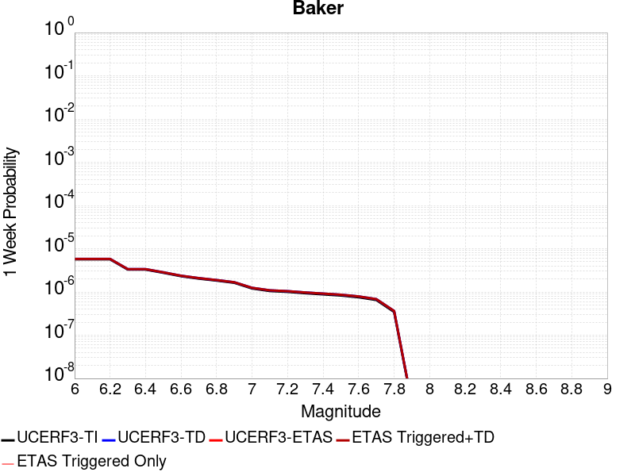 | 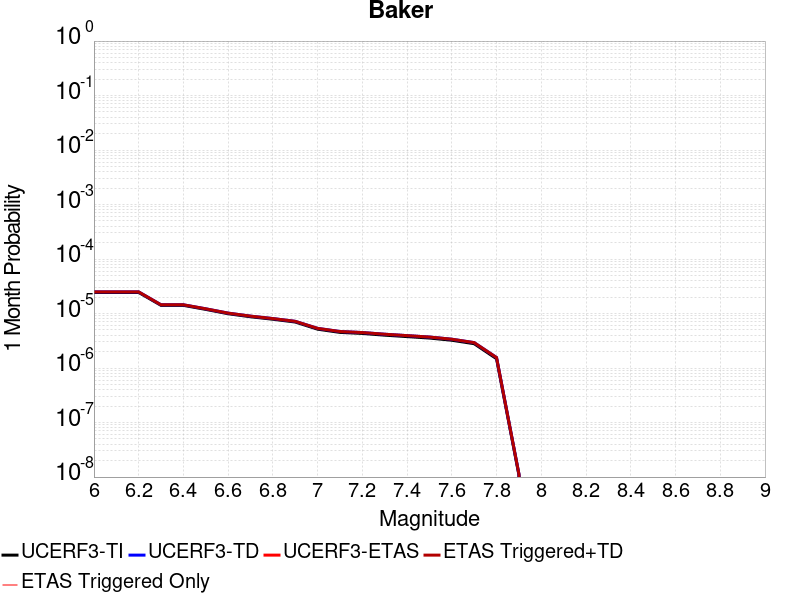 | 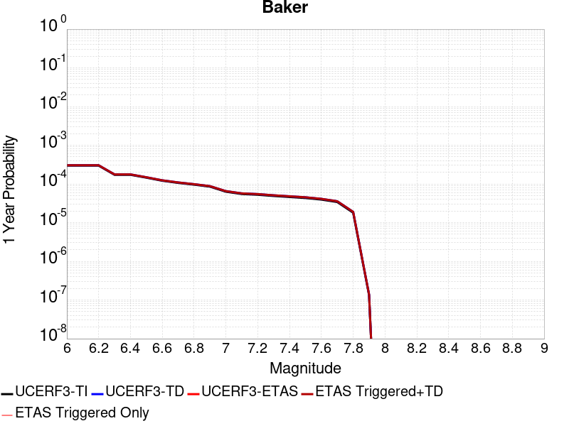 | 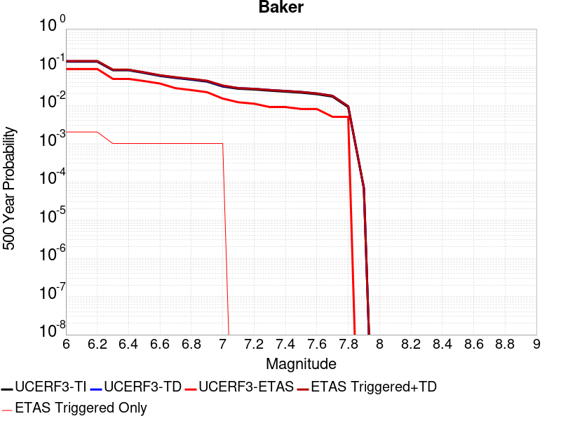 |

| Magnitude | 1 wk TI Prob | 1 wk TD Prob | 1 wk ETAS Prob | 1 wk ETAS/TD Gain | 1 wk ETAS Triggered+TD | 1 wk ETAS Triggered Only | 1 mo TI Prob | 1 mo TD Prob | 1 mo ETAS Prob | 1 mo ETAS/TD Gain | 1 mo ETAS Triggered+TD | 1 mo ETAS Triggered Only | 1 yr TI Prob | 1 yr TD Prob | 1 yr ETAS Prob | 1 yr ETAS/TD Gain | 1 yr ETAS Triggered+TD | 1 yr ETAS Triggered Only | 500 yr TI Prob | 500 yr TD Prob | 500 yr ETAS Prob | 500 yr ETAS/TD Gain | 500 yr ETAS Triggered+TD | 500 yr ETAS Triggered Only |
|-----|-----|-----|-----|-----|-----|-----|-----|-----|-----|-----|-----|-----|-----|-----|-----|-----|-----|-----|-----|-----|-----|-----|-----|-----|
| 6.0 | 5.695525E-6 | 5.8273854E-6 | 0.0 | 0.0 | 5.8273854E-6 | 0.0 | 2.4409164E-5 | 2.4974293E-5 | 0.0 | 0.0 | 2.4974293E-5 | 0.0 | 2.9714106E-4 | 3.040236E-4 | 0.0 | 0.0 | 3.040236E-4 | 0.0 | 0.1380798 | 0.1419995 | 0.089 | 0.6267628 | 0.1437155 | 0.002 |
| 6.1 | 5.695525E-6 | 5.8273854E-6 | 0.0 | 0.0 | 5.8273854E-6 | 0.0 | 2.4409164E-5 | 2.4974293E-5 | 0.0 | 0.0 | 2.4974293E-5 | 0.0 | 2.9714106E-4 | 3.040236E-4 | 0.0 | 0.0 | 3.040236E-4 | 0.0 | 0.1380798 | 0.1419995 | 0.089 | 0.6267628 | 0.1437155 | 0.002 |
| 6.2 | 5.695525E-6 | 5.8273854E-6 | 0.0 | 0.0 | 5.8273854E-6 | 0.0 | 2.4409164E-5 | 2.4974293E-5 | 0.0 | 0.0 | 2.4974293E-5 | 0.0 | 2.9714106E-4 | 3.040236E-4 | 0.0 | 0.0 | 3.040236E-4 | 0.0 | 0.1380798 | 0.1419995 | 0.089 | 0.6267628 | 0.1437155 | 0.002 |
| 6.3 | 3.2995713E-6 | 3.379153E-6 | 0.0 | 0.0 | 3.379153E-6 | 0.0 | 1.4140943E-5 | 1.4482006E-5 | 0.0 | 0.0 | 1.4482006E-5 | 0.0 | 1.7215237E-4 | 1.7630463E-4 | 0.0 | 0.0 | 1.7630463E-4 | 0.0 | 0.08248248 | 0.08450414 | 0.049 | 0.57985324 | 0.08541964 | 0.001 |
| 6.4 | 3.2995713E-6 | 3.379153E-6 | 0.0 | 0.0 | 3.379153E-6 | 0.0 | 1.4140943E-5 | 1.4482006E-5 | 0.0 | 0.0 | 1.4482006E-5 | 0.0 | 1.7215237E-4 | 1.7630463E-4 | 0.0 | 0.0 | 1.7630463E-4 | 0.0 | 0.08248248 | 0.08450414 | 0.049 | 0.57985324 | 0.08541964 | 0.001 |
| 6.5 | 2.782202E-6 | 2.8518807E-6 | 0.0 | 0.0 | 2.8518807E-6 | 0.0 | 1.1923668E-5 | 1.2222291E-5 | 0.0 | 0.0 | 1.2222291E-5 | 0.0 | 1.4516099E-4 | 1.4879656E-4 | 0.0 | 0.0 | 1.4879656E-4 | 0.0 | 0.070014015 | 0.07178686 | 0.043 | 0.59899545 | 0.07271507 | 0.001 |
| 6.6 | 2.3163404E-6 | 2.37744E-6 | 0.0 | 0.0 | 2.37744E-6 | 0.0 | 9.927136E-6 | 1.018899E-5 | 0.0 | 0.0 | 1.018899E-5 | 0.0 | 1.20856166E-4 | 1.240441E-4 | 0.0 | 0.0 | 1.240441E-4 | 0.0 | 0.05864197 | 0.0601937 | 0.037 | 0.61468226 | 0.061133508 | 0.001 |
| 6.7 | 2.037056E-6 | 2.0932923E-6 | 0.0 | 0.0 | 2.0932923E-6 | 0.0 | 8.7302105E-6 | 8.971223E-6 | 0.0 | 0.0 | 8.971223E-6 | 0.0 | 1.0628513E-4 | 1.0921933E-4 | 0.0 | 0.0 | 1.0921933E-4 | 0.0 | 0.05175786 | 0.053190194 | 0.028 | 0.52641284 | 0.054137003 | 0.001 |
| 6.8 | 1.8356744E-6 | 1.8885103E-6 | 0.0 | 0.0 | 1.8885103E-6 | 0.0 | 7.867153E-6 | 8.0935915E-6 | 0.0 | 0.0 | 8.0935915E-6 | 0.0 | 9.577837E-5 | 9.853516E-5 | 0.0 | 0.0 | 9.853516E-5 | 0.0 | 0.046762772 | 0.048112582 | 0.025 | 0.5196146 | 0.04906447 | 0.001 |
| 6.9 | 1.6310546E-6 | 1.6803847E-6 | 0.0 | 0.0 | 1.6803847E-6 | 0.0 | 6.9902153E-6 | 7.201629E-6 | 0.0 | 0.0 | 7.201629E-6 | 0.0 | 8.510255E-5 | 8.7676424E-5 | 0.0 | 0.0 | 8.7676424E-5 | 0.0 | 0.04166041 | 0.042922817 | 0.022 | 0.5125479 | 0.043879896 | 0.001 |
| 7.0 | 1.2058036E-6 | 1.2484184E-6 | 0.0 | 0.0 | 1.2484184E-6 | 0.0 | 5.1677193E-6 | 5.3503536E-6 | 0.0 | 0.0 | 5.3503536E-6 | 0.0 | 6.291517E-5 | 6.513863E-5 | 0.0 | 0.0 | 6.513863E-5 | 0.0 | 0.0309689 | 0.03205182 | 0.015 | 0.46799213 | 0.03301977 | 0.001 |
| 7.1 | 1.052382E-6 | 1.0928331E-6 | 0.0 | 0.0 | 1.0928331E-6 | 0.0 | 4.5102006E-6 | 4.683562E-6 | 0.0 | 0.0 | 4.683562E-6 | 0.0 | 5.491031E-5 | 5.7020887E-5 | 0.0 | 0.0 | 5.7020887E-5 | 0.0 | 0.02708242 | 0.028110968 | 0.012 | 0.42687964 | 0.028110968 | 0.0 |
| 7.2 | 1.0067454E-6 | 1.0464831E-6 | 0.0 | 0.0 | 1.0464831E-6 | 0.0 | 4.3146156E-6 | 4.4849203E-6 | 0.0 | 0.0 | 4.4849203E-6 | 0.0 | 5.252918E-5 | 5.4602544E-5 | 0.0 | 0.0 | 5.4602544E-5 | 0.0 | 0.025923347 | 0.026934968 | 0.011 | 0.40839106 | 0.026934968 | 0.0 |
| 7.3 | 9.3596316E-7 | 9.745489E-7 | 0.0 | 0.0 | 9.745489E-7 | 0.0 | 4.0112645E-6 | 4.1766316E-6 | 0.0 | 0.0 | 4.1766316E-6 | 0.0 | 4.8836053E-5 | 5.084931E-5 | 0.0 | 0.0 | 5.084931E-5 | 0.0 | 0.0241229 | 0.025106883 | 0.009 | 0.35846746 | 0.025106883 | 0.0 |
| 7.4 | 8.8117395E-7 | 9.186077E-7 | 0.0 | 0.0 | 9.186077E-7 | 0.0 | 3.7764542E-6 | 3.9368842E-6 | 0.0 | 0.0 | 3.9368842E-6 | 0.0 | 4.5977362E-5 | 4.793052E-5 | 0.0 | 0.0 | 4.793052E-5 | 0.0 | 0.02272697 | 0.023682954 | 0.009 | 0.38002017 | 0.023682954 | 0.0 |
| 7.5 | 8.292386E-7 | 8.653743E-7 | 0.0 | 0.0 | 8.653743E-7 | 0.0 | 3.5538749E-6 | 3.7087418E-6 | 0.0 | 0.0 | 3.7087418E-6 | 0.0 | 4.326757E-5 | 4.5153003E-5 | 0.0 | 0.0 | 4.5153003E-5 | 0.0 | 0.02140191 | 0.022326022 | 0.008 | 0.35832626 | 0.022326022 | 0.0 |
| 7.6 | 7.553842E-7 | 7.8947744E-7 | 0.0 | 0.0 | 7.8947744E-7 | 0.0 | 3.2373566E-6 | 3.3834704E-6 | 0.0 | 0.0 | 3.3834704E-6 | 0.0 | 3.9414106E-5 | 4.119298E-5 | 0.0 | 0.0 | 4.119298E-5 | 0.0 | 0.019514518 | 0.020388138 | 0.008 | 0.39238504 | 0.020388138 | 0.0 |
| 7.7 | 6.5285366E-7 | 6.835061E-7 | 0.0 | 0.0 | 6.835061E-7 | 0.0 | 2.797941E-6 | 2.9293085E-6 | 0.0 | 0.0 | 2.9293085E-6 | 0.0 | 3.40644E-5 | 3.5663754E-5 | 0.0 | 0.0 | 3.5663754E-5 | 0.0 | 0.016888257 | 0.017675925 | 0.005 | 0.28287062 | 0.017675925 | 0.0 |
| 7.8 | 3.4586725E-7 | 3.6378464E-7 | 0.0 | 0.0 | 3.6378464E-7 | 0.0 | 1.4822873E-6 | 1.559076E-6 | 0.0 | 0.0 | 1.559076E-6 | 0.0 | 1.80467E-5 | 1.898159E-5 | 0.0 | 0.0 | 1.898159E-5 | 0.0 | 0.008982842 | 0.00944719 | 0.005 | 0.52925795 | 0.00944719 | 0.0 |
| 7.9 | 2.5591178E-9 | 2.6636915E-9 | 0.0 | 0.0 | 2.6636915E-9 | 0.0 | 1.0967647E-8 | 1.141582E-8 | 0.0 | 0.0 | 1.141582E-8 | 0.0 | 1.335311E-7 | 1.3898762E-7 | 0.0 | 0.0 | 1.3898762E-7 | 0.0 | 6.676333E-5 | 6.9493806E-5 | 0.0 | 0.0 | 6.9493806E-5 | 0.0 |

## Kern Canyon (North Kern) 2011
*[(top)](#table-of-contents)*

| 1 Week | 1 Month | 1 Year | 500 Year |
|-----|-----|-----|-----|
| 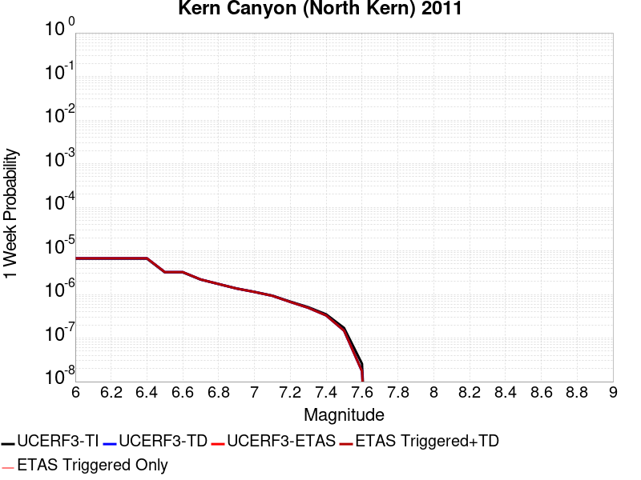 | 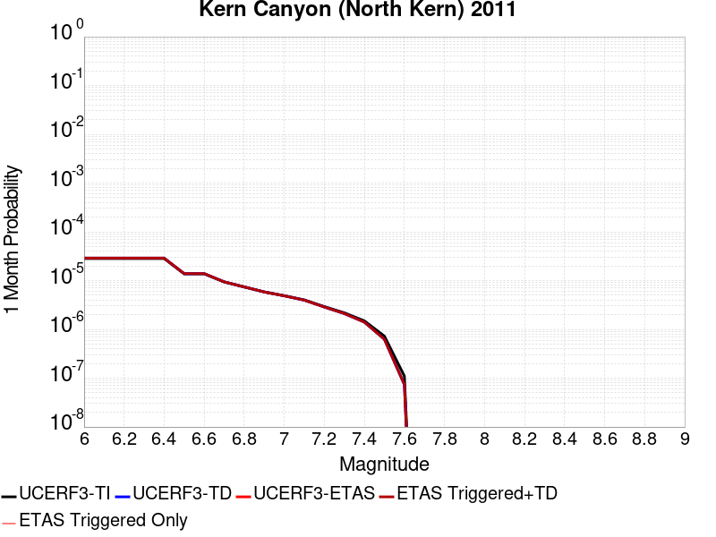 | 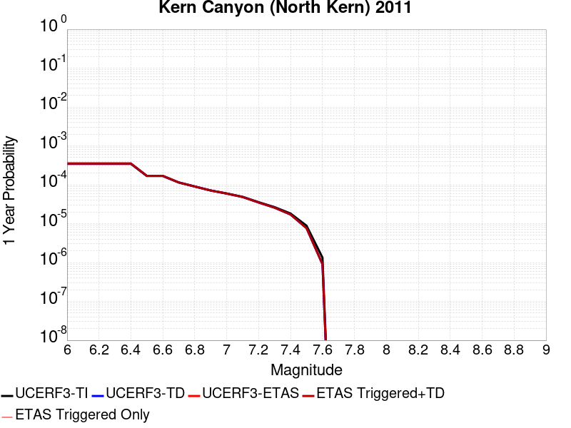 | 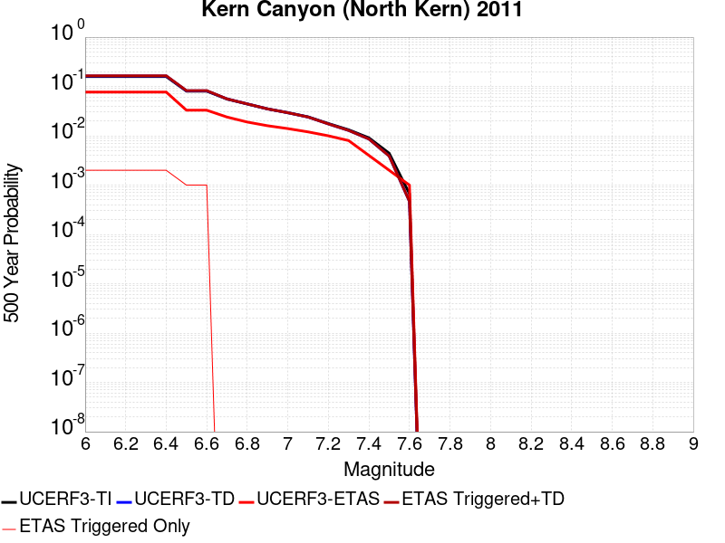 |

| Magnitude | 1 wk TI Prob | 1 wk TD Prob | 1 wk ETAS Prob | 1 wk ETAS/TD Gain | 1 wk ETAS Triggered+TD | 1 wk ETAS Triggered Only | 1 mo TI Prob | 1 mo TD Prob | 1 mo ETAS Prob | 1 mo ETAS/TD Gain | 1 mo ETAS Triggered+TD | 1 mo ETAS Triggered Only | 1 yr TI Prob | 1 yr TD Prob | 1 yr ETAS Prob | 1 yr ETAS/TD Gain | 1 yr ETAS Triggered+TD | 1 yr ETAS Triggered Only | 500 yr TI Prob | 500 yr TD Prob | 500 yr ETAS Prob | 500 yr ETAS/TD Gain | 500 yr ETAS Triggered+TD | 500 yr ETAS Triggered Only |
|-----|-----|-----|-----|-----|-----|-----|-----|-----|-----|-----|-----|-----|-----|-----|-----|-----|-----|-----|-----|-----|-----|-----|-----|-----|
| 6.0 | 6.6264497E-6 | 6.748937E-6 | 0.0 | 0.0 | 6.748937E-6 | 0.0 | 2.8398761E-5 | 2.892374E-5 | 0.0 | 0.0 | 2.892374E-5 | 0.0 | 3.4570007E-4 | 3.5209762E-4 | 0.0 | 0.0 | 3.5209762E-4 | 0.0 | 0.15876137 | 0.16337402 | 0.077 | 0.47131118 | 0.16504727 | 0.002 |
| 6.1 | 6.6264497E-6 | 6.748937E-6 | 0.0 | 0.0 | 6.748937E-6 | 0.0 | 2.8398761E-5 | 2.892374E-5 | 0.0 | 0.0 | 2.892374E-5 | 0.0 | 3.4570007E-4 | 3.5209762E-4 | 0.0 | 0.0 | 3.5209762E-4 | 0.0 | 0.15876137 | 0.16337402 | 0.077 | 0.47131118 | 0.16504727 | 0.002 |
| 6.2 | 6.6264497E-6 | 6.748937E-6 | 0.0 | 0.0 | 6.748937E-6 | 0.0 | 2.8398761E-5 | 2.892374E-5 | 0.0 | 0.0 | 2.892374E-5 | 0.0 | 3.4570007E-4 | 3.5209762E-4 | 0.0 | 0.0 | 3.5209762E-4 | 0.0 | 0.15876137 | 0.16337402 | 0.077 | 0.47131118 | 0.16504727 | 0.002 |
| 6.3 | 6.6264497E-6 | 6.748937E-6 | 0.0 | 0.0 | 6.748937E-6 | 0.0 | 2.8398761E-5 | 2.892374E-5 | 0.0 | 0.0 | 2.892374E-5 | 0.0 | 3.4570007E-4 | 3.5209762E-4 | 0.0 | 0.0 | 3.5209762E-4 | 0.0 | 0.15876137 | 0.16337402 | 0.077 | 0.47131118 | 0.16504727 | 0.002 |
| 6.4 | 6.6264497E-6 | 6.748937E-6 | 0.0 | 0.0 | 6.748937E-6 | 0.0 | 2.8398761E-5 | 2.892374E-5 | 0.0 | 0.0 | 2.892374E-5 | 0.0 | 3.4570007E-4 | 3.5209762E-4 | 0.0 | 0.0 | 3.5209762E-4 | 0.0 | 0.15876137 | 0.16337402 | 0.077 | 0.47131118 | 0.16504727 | 0.002 |
| 6.5 | 3.2162225E-6 | 3.253497E-6 | 0.0 | 0.0 | 3.253497E-6 | 0.0 | 1.3783738E-5 | 1.3943489E-5 | 0.0 | 0.0 | 1.3943489E-5 | 0.0 | 1.6780409E-4 | 1.6974955E-4 | 0.0 | 0.0 | 1.6974955E-4 | 0.0 | 0.08048515 | 0.081627384 | 0.033 | 0.40427607 | 0.08254576 | 0.001 |
| 6.6 | 3.2162225E-6 | 3.253497E-6 | 0.0 | 0.0 | 3.253497E-6 | 0.0 | 1.3783738E-5 | 1.3943489E-5 | 0.0 | 0.0 | 1.3943489E-5 | 0.0 | 1.6780409E-4 | 1.6974955E-4 | 0.0 | 0.0 | 1.6974955E-4 | 0.0 | 0.08048515 | 0.081627384 | 0.033 | 0.40427607 | 0.08254576 | 0.001 |
| 6.7 | 2.1908265E-6 | 2.2048346E-6 | 0.0 | 0.0 | 2.2048346E-6 | 0.0 | 9.389223E-6 | 9.449258E-6 | 0.0 | 0.0 | 9.449258E-6 | 0.0 | 1.1430779E-4 | 1.15038834E-4 | 0.0 | 0.0 | 1.15038834E-4 | 0.0 | 0.055554375 | 0.055996258 | 0.024 | 0.42860007 | 0.055996258 | 0.0 |
| 6.8 | 1.7303895E-6 | 1.7348032E-6 | 0.0 | 0.0 | 1.7348032E-6 | 0.0 | 7.415934E-6 | 7.43485E-6 | 0.0 | 0.0 | 7.43485E-6 | 0.0 | 9.028525E-5 | 9.0515634E-5 | 0.0 | 0.0 | 9.0515634E-5 | 0.0 | 0.044140805 | 0.04432332 | 0.019 | 0.42866823 | 0.04432332 | 0.0 |
| 6.9 | 1.3700314E-6 | 1.367501E-6 | 0.0 | 0.0 | 1.367501E-6 | 0.0 | 5.87155E-6 | 5.8607056E-6 | 0.0 | 0.0 | 5.8607056E-6 | 0.0 | 7.148377E-5 | 7.13518E-5 | 0.0 | 0.0 | 7.13518E-5 | 0.0 | 0.035111923 | 0.03510764 | 0.016 | 0.45574126 | 0.03510764 | 0.0 |
| 7.0 | 1.1467797E-6 | 1.1402431E-6 | 0.0 | 0.0 | 1.1402431E-6 | 0.0 | 4.9147607E-6 | 4.886747E-6 | 0.0 | 0.0 | 4.886747E-6 | 0.0 | 5.983557E-5 | 5.9494552E-5 | 0.0 | 0.0 | 5.9494552E-5 | 0.0 | 0.029475547 | 0.029366009 | 0.014 | 0.47674167 | 0.029366009 | 0.0 |
| 7.1 | 9.3952065E-7 | 9.2933544E-7 | 0.0 | 0.0 | 9.2933544E-7 | 0.0 | 4.026511E-6 | 3.98286E-6 | 0.0 | 0.0 | 3.98286E-6 | 0.0 | 4.9021666E-5 | 4.849026E-5 | 0.0 | 0.0 | 4.849026E-5 | 0.0 | 0.024213469 | 0.024006737 | 0.012 | 0.4998597 | 0.024006737 | 0.0 |
| 7.2 | 6.858055E-7 | 6.712409E-7 | 0.0 | 0.0 | 6.712409E-7 | 0.0 | 2.939163E-6 | 2.8767436E-6 | 0.0 | 0.0 | 2.8767436E-6 | 0.0 | 3.5783723E-5 | 3.5023797E-5 | 0.0 | 0.0 | 3.5023797E-5 | 0.0 | 0.017733067 | 0.017410291 | 0.01 | 0.57437295 | 0.017410291 | 0.0 |
| 7.3 | 5.1101983E-7 | 4.9341077E-7 | 0.0 | 0.0 | 4.9341077E-7 | 0.0 | 2.1900833E-6 | 2.1146159E-6 | 0.0 | 0.0 | 2.1146159E-6 | 0.0 | 2.6663936E-5 | 2.574515E-5 | 0.0 | 0.0 | 2.574515E-5 | 0.0 | 0.013243667 | 0.012839914 | 0.008 | 0.6230571 | 0.012839914 | 0.0 |
| 7.4 | 3.4999414E-7 | 3.295956E-7 | 0.0 | 0.0 | 3.295956E-7 | 0.0 | 1.499974E-6 | 1.4125518E-6 | 0.0 | 0.0 | 1.4125518E-6 | 0.0 | 1.8262032E-5 | 1.7197684E-5 | 0.0 | 0.0 | 1.7197684E-5 | 0.0 | 0.009089537 | 0.008611284 | 0.004 | 0.46450678 | 0.008611284 | 0.0 |
| 7.5 | 1.7021522E-7 | 1.4731255E-7 | 0.0 | 0.0 | 1.4731255E-7 | 0.0 | 7.2949354E-7 | 6.3133933E-7 | 0.0 | 0.0 | 6.3133933E-7 | 0.0 | 8.881548E-6 | 7.68653E-6 | 0.0 | 0.0 | 7.68653E-6 | 0.0 | 0.004430948 | 0.0038837148 | 0.002 | 0.5149709 | 0.0038837148 | 0.0 |
| 7.6 | 2.572245E-8 | 1.731812E-8 | 0.0 | 0.0 | 1.731812E-8 | 0.0 | 1.10239064E-7 | 7.4220516E-8 | 0.0 | 0.0 | 7.4220516E-8 | 0.0 | 1.3421597E-6 | 9.036345E-7 | 0.0 | 0.0 | 9.036345E-7 | 0.0 | 6.708552E-4 | 4.679146E-4 | 0.001 | 2.1371422 | 4.679146E-4 | 0.0 |

## North Frontal  (West)
*[(top)](#table-of-contents)*

| 1 Week | 1 Month | 1 Year | 500 Year |
|-----|-----|-----|-----|
|  | 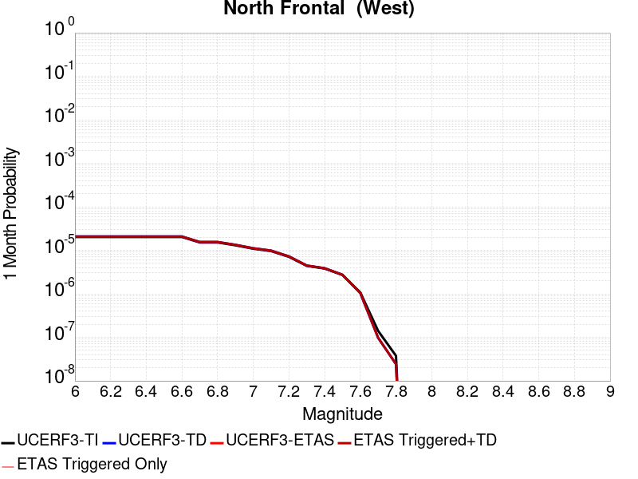 | 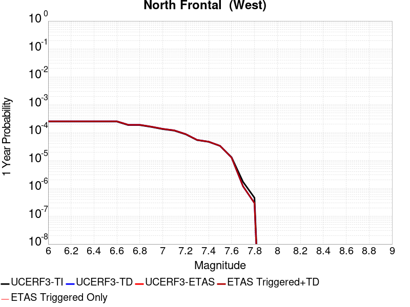 | 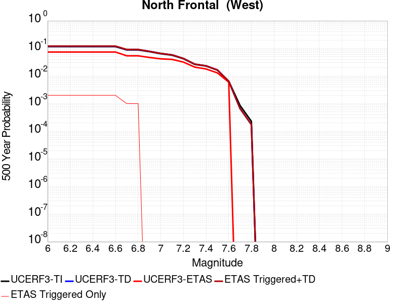 |

| Magnitude | 1 wk TI Prob | 1 wk TD Prob | 1 wk ETAS Prob | 1 wk ETAS/TD Gain | 1 wk ETAS Triggered+TD | 1 wk ETAS Triggered Only | 1 mo TI Prob | 1 mo TD Prob | 1 mo ETAS Prob | 1 mo ETAS/TD Gain | 1 mo ETAS Triggered+TD | 1 mo ETAS Triggered Only | 1 yr TI Prob | 1 yr TD Prob | 1 yr ETAS Prob | 1 yr ETAS/TD Gain | 1 yr ETAS Triggered+TD | 1 yr ETAS Triggered Only | 500 yr TI Prob | 500 yr TD Prob | 500 yr ETAS Prob | 500 yr ETAS/TD Gain | 500 yr ETAS Triggered+TD | 500 yr ETAS Triggered Only |
|-----|-----|-----|-----|-----|-----|-----|-----|-----|-----|-----|-----|-----|-----|-----|-----|-----|-----|-----|-----|-----|-----|-----|-----|-----|
| 6.0 | 4.7316266E-6 | 4.8451598E-6 | 0.0 | 0.0 | 4.8451598E-6 | 0.0 | 2.0278241E-5 | 2.0764814E-5 | 0.0 | 0.0 | 2.0764814E-5 | 0.0 | 2.4685962E-4 | 2.5278374E-4 | 0.0 | 0.0 | 2.5278374E-4 | 0.0 | 0.116129786 | 0.11919173 | 0.074 | 0.6208485 | 0.120953344 | 0.002 |
| 6.1 | 4.7316266E-6 | 4.8451598E-6 | 0.0 | 0.0 | 4.8451598E-6 | 0.0 | 2.0278241E-5 | 2.0764814E-5 | 0.0 | 0.0 | 2.0764814E-5 | 0.0 | 2.4685962E-4 | 2.5278374E-4 | 0.0 | 0.0 | 2.5278374E-4 | 0.0 | 0.116129786 | 0.11919173 | 0.074 | 0.6208485 | 0.120953344 | 0.002 |
| 6.2 | 4.7316266E-6 | 4.8451598E-6 | 0.0 | 0.0 | 4.8451598E-6 | 0.0 | 2.0278241E-5 | 2.0764814E-5 | 0.0 | 0.0 | 2.0764814E-5 | 0.0 | 2.4685962E-4 | 2.5278374E-4 | 0.0 | 0.0 | 2.5278374E-4 | 0.0 | 0.116129786 | 0.11919173 | 0.074 | 0.6208485 | 0.120953344 | 0.002 |
| 6.3 | 4.7316266E-6 | 4.8451598E-6 | 0.0 | 0.0 | 4.8451598E-6 | 0.0 | 2.0278241E-5 | 2.0764814E-5 | 0.0 | 0.0 | 2.0764814E-5 | 0.0 | 2.4685962E-4 | 2.5278374E-4 | 0.0 | 0.0 | 2.5278374E-4 | 0.0 | 0.116129786 | 0.11919173 | 0.074 | 0.6208485 | 0.120953344 | 0.002 |
| 6.4 | 4.7316266E-6 | 4.8451598E-6 | 0.0 | 0.0 | 4.8451598E-6 | 0.0 | 2.0278241E-5 | 2.0764814E-5 | 0.0 | 0.0 | 2.0764814E-5 | 0.0 | 2.4685962E-4 | 2.5278374E-4 | 0.0 | 0.0 | 2.5278374E-4 | 0.0 | 0.116129786 | 0.11919173 | 0.074 | 0.6208485 | 0.120953344 | 0.002 |
| 6.5 | 4.7316266E-6 | 4.8451598E-6 | 0.0 | 0.0 | 4.8451598E-6 | 0.0 | 2.0278241E-5 | 2.0764814E-5 | 0.0 | 0.0 | 2.0764814E-5 | 0.0 | 2.4685962E-4 | 2.5278374E-4 | 0.0 | 0.0 | 2.5278374E-4 | 0.0 | 0.116129786 | 0.11919173 | 0.074 | 0.6208485 | 0.120953344 | 0.002 |
| 6.6 | 4.7316266E-6 | 4.8451598E-6 | 0.0 | 0.0 | 4.8451598E-6 | 0.0 | 2.0278241E-5 | 2.0764814E-5 | 0.0 | 0.0 | 2.0764814E-5 | 0.0 | 2.4685962E-4 | 2.5278374E-4 | 0.0 | 0.0 | 2.5278374E-4 | 0.0 | 0.116129786 | 0.11919173 | 0.074 | 0.6208485 | 0.120953344 | 0.002 |
| 6.7 | 3.5382777E-6 | 3.6248844E-6 | 0.0 | 0.0 | 3.6248844E-6 | 0.0 | 1.516396E-5 | 1.553513E-5 | 0.0 | 0.0 | 1.553513E-5 | 0.0 | 1.8460557E-4 | 1.8912458E-4 | 0.0 | 0.0 | 1.8912458E-4 | 0.0 | 0.08817875 | 0.09052546 | 0.054 | 0.5965172 | 0.09143494 | 0.001 |
| 6.8 | 3.5382777E-6 | 3.6248844E-6 | 0.0 | 0.0 | 3.6248844E-6 | 0.0 | 1.516396E-5 | 1.553513E-5 | 0.0 | 0.0 | 1.553513E-5 | 0.0 | 1.8460557E-4 | 1.8912458E-4 | 0.0 | 0.0 | 1.8912458E-4 | 0.0 | 0.08817875 | 0.09052546 | 0.054 | 0.5965172 | 0.09143494 | 0.001 |
| 6.9 | 3.0428037E-6 | 3.1174325E-6 | 0.0 | 0.0 | 3.1174325E-6 | 0.0 | 1.30405215E-5 | 1.3360361E-5 | 0.0 | 0.0 | 1.3360361E-5 | 0.0 | 1.5875678E-4 | 1.6265093E-4 | 0.0 | 0.0 | 1.6265093E-4 | 0.0 | 0.07631548 | 0.07838021 | 0.047 | 0.59964114 | 0.07838021 | 0.0 |
| 7.0 | 2.538778E-6 | 2.6014352E-6 | 0.0 | 0.0 | 2.6014352E-6 | 0.0 | 1.0880432E-5 | 1.1148963E-5 | 0.0 | 0.0 | 1.1148963E-5 | 0.0 | 1.324612E-4 | 1.3573063E-4 | 0.0 | 0.0 | 1.3573063E-4 | 0.0 | 0.06408909 | 0.0658368 | 0.042 | 0.63794106 | 0.0658368 | 0.0 |
| 7.1 | 2.2418935E-6 | 2.2969784E-6 | 0.0 | 0.0 | 2.2969784E-6 | 0.0 | 9.60808E-6 | 9.844159E-6 | 0.0 | 0.0 | 9.844159E-6 | 0.0 | 1.1697209E-4 | 1.1984649E-4 | 0.0 | 0.0 | 1.1984649E-4 | 0.0 | 0.056811824 | 0.05837994 | 0.04 | 0.68516684 | 0.05837994 | 0.0 |
| 7.2 | 1.6526745E-6 | 1.689302E-6 | 0.0 | 0.0 | 1.689302E-6 | 0.0 | 7.082872E-6 | 7.2398475E-6 | 0.0 | 0.0 | 7.2398475E-6 | 0.0 | 8.623055E-5 | 8.814183E-5 | 0.0 | 0.0 | 8.814183E-5 | 0.0 | 0.042200807 | 0.04328257 | 0.032 | 0.73932767 | 0.04328257 | 0.0 |
| 7.3 | 1.0246019E-6 | 1.0421243E-6 | 0.0 | 0.0 | 1.0421243E-6 | 0.0 | 4.391144E-6 | 4.4662397E-6 | 0.0 | 0.0 | 4.4662397E-6 | 0.0 | 5.3460866E-5 | 5.437523E-5 | 0.0 | 0.0 | 5.437523E-5 | 0.0 | 0.026377033 | 0.02695521 | 0.021 | 0.7790702 | 0.02695521 | 0.0 |
| 7.4 | 8.9045164E-7 | 9.0379103E-7 | 0.0 | 0.0 | 9.0379103E-7 | 0.0 | 3.8162157E-6 | 3.873385E-6 | 0.0 | 0.0 | 3.873385E-6 | 0.0 | 4.646144E-5 | 4.715755E-5 | 0.0 | 0.0 | 4.715755E-5 | 0.0 | 0.02296349 | 0.023435498 | 0.018 | 0.76806563 | 0.023435498 | 0.0 |
| 7.5 | 6.3357E-7 | 6.3886114E-7 | 0.0 | 0.0 | 6.3886114E-7 | 0.0 | 2.7152971E-6 | 2.737974E-6 | 0.0 | 0.0 | 2.737974E-6 | 0.0 | 3.305824E-5 | 3.333439E-5 | 0.0 | 0.0 | 3.333439E-5 | 0.0 | 0.016393533 | 0.016650535 | 0.013 | 0.7807557 | 0.016650535 | 0.0 |
| 7.6 | 2.5087024E-7 | 2.429527E-7 | 0.0 | 0.0 | 2.429527E-7 | 0.0 | 1.0751578E-6 | 1.0412256E-6 | 0.0 | 0.0 | 1.0412256E-6 | 0.0 | 1.3089967E-5 | 1.2676868E-5 | 0.0 | 0.0 | 1.2676868E-5 | 0.0 | 0.0065236543 | 0.00642846 | 0.006 | 0.9333495 | 0.00642846 | 0.0 |
| 7.7 | 3.282987E-8 | 2.2734374E-8 | 0.0 | 0.0 | 2.2734374E-8 | 0.0 | 1.4069944E-7 | 9.743303E-8 | 0.0 | 0.0 | 9.743303E-8 | 0.0 | 1.7130144E-6 | 1.1862465E-6 | 0.0 | 0.0 | 1.1862465E-6 | 0.0 | 8.561412E-4 | 6.6628685E-4 | 0.0 | 0.0 | 6.6628685E-4 | 0.0 |
| 7.8 | 8.77499E-9 | 5.6569203E-9 | 0.0 | 0.0 | 5.6569203E-9 | 0.0 | 3.7607098E-8 | 2.4243944E-8 | 0.0 | 0.0 | 2.4243944E-8 | 0.0 | 4.578663E-7 | 2.9517E-7 | 0.0 | 0.0 | 2.9517E-7 | 0.0 | 2.28907E-4 | 1.7449293E-4 | 0.0 | 0.0 | 1.7449293E-4 | 0.0 |

## Elsinore (Julian)
*[(top)](#table-of-contents)*

| 1 Week | 1 Month | 1 Year | 500 Year |
|-----|-----|-----|-----|
| 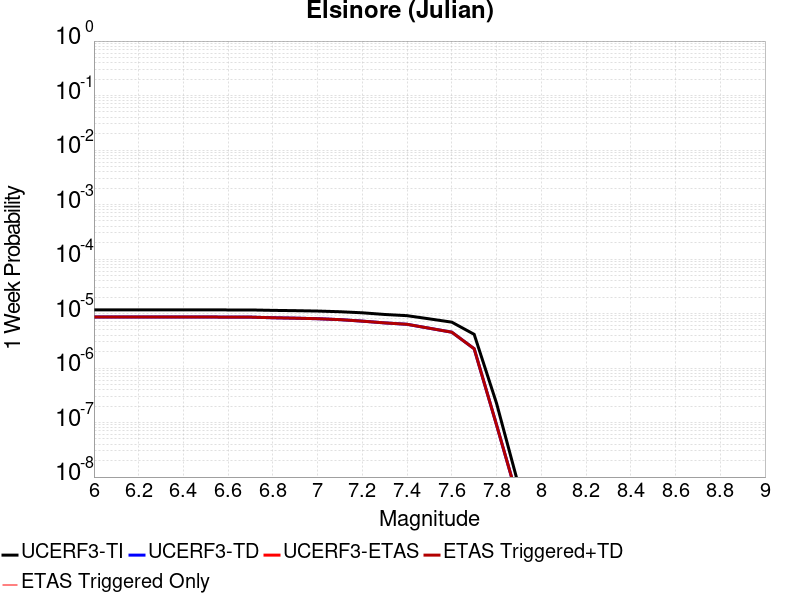 |  |  | 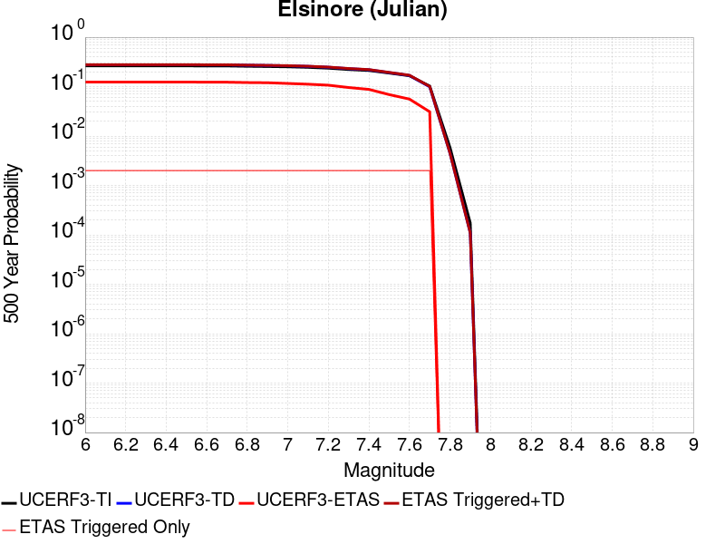 |

| Magnitude | 1 wk TI Prob | 1 wk TD Prob | 1 wk ETAS Prob | 1 wk ETAS/TD Gain | 1 wk ETAS Triggered+TD | 1 wk ETAS Triggered Only | 1 mo TI Prob | 1 mo TD Prob | 1 mo ETAS Prob | 1 mo ETAS/TD Gain | 1 mo ETAS Triggered+TD | 1 mo ETAS Triggered Only | 1 yr TI Prob | 1 yr TD Prob | 1 yr ETAS Prob | 1 yr ETAS/TD Gain | 1 yr ETAS Triggered+TD | 1 yr ETAS Triggered Only | 500 yr TI Prob | 500 yr TD Prob | 500 yr ETAS Prob | 500 yr ETAS/TD Gain | 500 yr ETAS Triggered+TD | 500 yr ETAS Triggered Only |
|-----|-----|-----|-----|-----|-----|-----|-----|-----|-----|-----|-----|-----|-----|-----|-----|-----|-----|-----|-----|-----|-----|-----|-----|-----|
| 6.0 | 1.1710231E-5 | 8.661234E-6 | 0.0 | 0.0 | 8.661234E-6 | 0.0 | 5.0185736E-5 | 3.711905E-5 | 0.0 | 0.0 | 3.711905E-5 | 0.0 | 6.1084004E-4 | 4.5183237E-4 | 0.0 | 0.0 | 4.5183237E-4 | 0.0 | 0.2632549 | 0.27657834 | 0.124 | 0.4483359 | 0.27802518 | 0.002 |
| 6.1 | 1.1710231E-5 | 8.661234E-6 | 0.0 | 0.0 | 8.661234E-6 | 0.0 | 5.0185736E-5 | 3.711905E-5 | 0.0 | 0.0 | 3.711905E-5 | 0.0 | 6.1084004E-4 | 4.5183237E-4 | 0.0 | 0.0 | 4.5183237E-4 | 0.0 | 0.2632549 | 0.27657834 | 0.124 | 0.4483359 | 0.27802518 | 0.002 |
| 6.2 | 1.1710231E-5 | 8.661234E-6 | 0.0 | 0.0 | 8.661234E-6 | 0.0 | 5.0185736E-5 | 3.711905E-5 | 0.0 | 0.0 | 3.711905E-5 | 0.0 | 6.1084004E-4 | 4.5183237E-4 | 0.0 | 0.0 | 4.5183237E-4 | 0.0 | 0.2632549 | 0.27657834 | 0.124 | 0.4483359 | 0.27802518 | 0.002 |
| 6.3 | 1.1710231E-5 | 8.661234E-6 | 0.0 | 0.0 | 8.661234E-6 | 0.0 | 5.0185736E-5 | 3.711905E-5 | 0.0 | 0.0 | 3.711905E-5 | 0.0 | 6.1084004E-4 | 4.5183237E-4 | 0.0 | 0.0 | 4.5183237E-4 | 0.0 | 0.2632549 | 0.27657834 | 0.124 | 0.4483359 | 0.27802518 | 0.002 |
| 6.4 | 1.1710231E-5 | 8.661234E-6 | 0.0 | 0.0 | 8.661234E-6 | 0.0 | 5.0185736E-5 | 3.711905E-5 | 0.0 | 0.0 | 3.711905E-5 | 0.0 | 6.1084004E-4 | 4.5183237E-4 | 0.0 | 0.0 | 4.5183237E-4 | 0.0 | 0.2632549 | 0.27657834 | 0.124 | 0.4483359 | 0.27802518 | 0.002 |
| 6.5 | 1.1710231E-5 | 8.661234E-6 | 0.0 | 0.0 | 8.661234E-6 | 0.0 | 5.0185736E-5 | 3.711905E-5 | 0.0 | 0.0 | 3.711905E-5 | 0.0 | 6.1084004E-4 | 4.5183237E-4 | 0.0 | 0.0 | 4.5183237E-4 | 0.0 | 0.2632549 | 0.27657834 | 0.124 | 0.4483359 | 0.27802518 | 0.002 |
| 6.6 | 1.1650619E-5 | 8.594058E-6 | 0.0 | 0.0 | 8.594058E-6 | 0.0 | 4.993027E-5 | 3.6831167E-5 | 0.0 | 0.0 | 3.6831167E-5 | 0.0 | 6.0773146E-4 | 4.4832882E-4 | 0.0 | 0.0 | 4.4832882E-4 | 0.0 | 0.2621082 | 0.27528659 | 0.123 | 0.4468071 | 0.27673602 | 0.002 |
| 6.7 | 1.1650619E-5 | 8.594058E-6 | 0.0 | 0.0 | 8.594058E-6 | 0.0 | 4.993027E-5 | 3.6831167E-5 | 0.0 | 0.0 | 3.6831167E-5 | 0.0 | 6.0773146E-4 | 4.4832882E-4 | 0.0 | 0.0 | 4.4832882E-4 | 0.0 | 0.2621082 | 0.27528659 | 0.123 | 0.4468071 | 0.27673602 | 0.002 |
| 6.8 | 1.1442698E-5 | 8.378835E-6 | 0.0 | 0.0 | 8.378835E-6 | 0.0 | 4.9039216E-5 | 3.590881E-5 | 0.0 | 0.0 | 3.590881E-5 | 0.0 | 5.968889E-4 | 4.3710368E-4 | 0.0 | 0.0 | 4.3710368E-4 | 0.0 | 0.2580946 | 0.2709549 | 0.121 | 0.4465688 | 0.272413 | 0.002 |
| 6.9 | 1.1300589E-5 | 8.227499E-6 | 0.0 | 0.0 | 8.227499E-6 | 0.0 | 4.8430196E-5 | 3.5260244E-5 | 0.0 | 0.0 | 3.5260244E-5 | 0.0 | 5.894781E-4 | 4.2921046E-4 | 0.0 | 0.0 | 4.2921046E-4 | 0.0 | 0.25533882 | 0.26801977 | 0.12 | 0.4477282 | 0.26948372 | 0.002 |
| 7.0 | 1.1117729E-5 | 8.046578E-6 | 0.0 | 0.0 | 8.046578E-6 | 0.0 | 4.764654E-5 | 3.448489E-5 | 0.0 | 0.0 | 3.448489E-5 | 0.0 | 5.799422E-4 | 4.1977418E-4 | 0.0 | 0.0 | 4.1977418E-4 | 0.0 | 0.25177774 | 0.2641931 | 0.116 | 0.4390728 | 0.2656647 | 0.002 |
| 7.1 | 1.08053955E-5 | 7.7351215E-6 | 0.0 | 0.0 | 7.7351215E-6 | 0.0 | 4.6308014E-5 | 3.3150107E-5 | 0.0 | 0.0 | 3.3150107E-5 | 0.0 | 5.6365423E-4 | 4.0352935E-4 | 0.0 | 0.0 | 4.0352935E-4 | 0.0 | 0.24565583 | 0.2576005 | 0.112 | 0.4347818 | 0.25908527 | 0.002 |
| 7.2 | 1.032804E-5 | 7.2609514E-6 | 0.0 | 0.0 | 7.2609514E-6 | 0.0 | 4.4262277E-5 | 3.1118E-5 | 0.0 | 0.0 | 3.1118E-5 | 0.0 | 5.387599E-4 | 3.7879727E-4 | 0.0 | 0.0 | 3.7879727E-4 | 0.0 | 0.2362025 | 0.24722157 | 0.107 | 0.43281013 | 0.24872713 | 0.002 |
| 7.3 | 9.622426E-6 | 6.742024E-6 | 0.0 | 0.0 | 6.742024E-6 | 0.0 | 4.1238312E-5 | 2.8894077E-5 | 0.0 | 0.0 | 2.8894077E-5 | 0.0 | 5.019608E-4 | 3.5172998E-4 | 0.0 | 0.0 | 3.5172998E-4 | 0.0 | 0.2220114 | 0.23129338 | 0.096 | 0.41505727 | 0.2328308 | 0.002 |
| 7.4 | 9.144434E-6 | 6.3536468E-6 | 0.0 | 0.0 | 6.3536468E-6 | 0.0 | 3.9189843E-5 | 2.7229638E-5 | 0.0 | 0.0 | 2.7229638E-5 | 0.0 | 4.7703186E-4 | 3.314717E-4 | 0.0 | 0.0 | 3.314717E-4 | 0.0 | 0.2122487 | 0.21989973 | 0.088 | 0.4001824 | 0.22145993 | 0.002 |
| 7.5 | 7.988981E-6 | 5.3743047E-6 | 0.0 | 0.0 | 5.3743047E-6 | 0.0 | 3.4238044E-5 | 2.3032539E-5 | 0.0 | 0.0 | 2.3032539E-5 | 0.0 | 4.1676845E-4 | 2.8038627E-4 | 0.0 | 0.0 | 2.8038627E-4 | 0.0 | 0.18814024 | 0.192625 | 0.069 | 0.35820895 | 0.19423975 | 0.002 |
| 7.6 | 6.9554876E-6 | 4.5509846E-6 | 0.0 | 0.0 | 4.5509846E-6 | 0.0 | 2.9808893E-5 | 1.9504081E-5 | 0.0 | 0.0 | 1.9504081E-5 | 0.0 | 3.6286283E-4 | 2.3743742E-4 | 0.0 | 0.0 | 2.3743742E-4 | 0.0 | 0.16595201 | 0.16845083 | 0.056 | 0.3324412 | 0.17011394 | 0.002 |
| 7.7 | 4.1557314E-6 | 2.2612583E-6 | 0.0 | 0.0 | 2.2612583E-6 | 0.0 | 1.7810156E-5 | 9.691074E-6 | 0.0 | 0.0 | 9.691074E-6 | 0.0 | 2.1681708E-4 | 1.1798315E-4 | 0.0 | 0.0 | 1.1798315E-4 | 0.0 | 0.102749586 | 0.09894093 | 0.031 | 0.31331825 | 0.10074305 | 0.002 |
| 7.8 | 2.2597293E-7 | 9.0681446E-8 | 0.0 | 0.0 | 9.0681446E-8 | 0.0 | 9.684551E-7 | 3.8863473E-7 | 0.0 | 0.0 | 3.8863473E-7 | 0.0 | 1.1790877E-5 | 4.7316207E-6 | 0.0 | 0.0 | 4.7316207E-6 | 0.0 | 0.0058781286 | 0.004500338 | 0.0 | 0.0 | 0.004500338 | 0.0 |
| 7.9 | 6.676829E-9 | 3.3860155E-9 | 0.0 | 0.0 | 3.3860155E-9 | 0.0 | 2.861498E-8 | 1.4511495E-8 | 0.0 | 0.0 | 1.4511495E-8 | 0.0 | 3.4838732E-7 | 1.7667745E-7 | 0.0 | 0.0 | 1.7667745E-7 | 0.0 | 1.7417852E-4 | 1.0980361E-4 | 0.0 | 0.0 | 1.0980361E-4 | 0.0 |

## Dog Valley
*[(top)](#table-of-contents)*

| 1 Week | 1 Month | 1 Year | 500 Year |
|-----|-----|-----|-----|
|  |  | 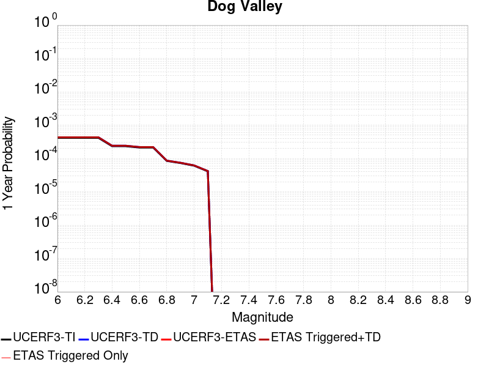 |  |

| Magnitude | 1 wk TI Prob | 1 wk TD Prob | 1 wk ETAS Prob | 1 wk ETAS/TD Gain | 1 wk ETAS Triggered+TD | 1 wk ETAS Triggered Only | 1 mo TI Prob | 1 mo TD Prob | 1 mo ETAS Prob | 1 mo ETAS/TD Gain | 1 mo ETAS Triggered+TD | 1 mo ETAS Triggered Only | 1 yr TI Prob | 1 yr TD Prob | 1 yr ETAS Prob | 1 yr ETAS/TD Gain | 1 yr ETAS Triggered+TD | 1 yr ETAS Triggered Only | 500 yr TI Prob | 500 yr TD Prob | 500 yr ETAS Prob | 500 yr ETAS/TD Gain | 500 yr ETAS Triggered+TD | 500 yr ETAS Triggered Only |
|-----|-----|-----|-----|-----|-----|-----|-----|-----|-----|-----|-----|-----|-----|-----|-----|-----|-----|-----|-----|-----|-----|-----|-----|-----|
| 6.0 | 7.949598E-6 | 8.258076E-6 | 0.0 | 0.0 | 8.258076E-6 | 0.0 | 3.4069257E-5 | 3.539139E-5 | 0.0 | 0.0 | 3.539139E-5 | 0.0 | 4.1471425E-4 | 4.308245E-4 | 0.0 | 0.0 | 4.308245E-4 | 0.0 | 0.1873056 | 0.1982981 | 0.094 | 0.4740338 | 0.1999015 | 0.002 |
| 6.1 | 7.949598E-6 | 8.258076E-6 | 0.0 | 0.0 | 8.258076E-6 | 0.0 | 3.4069257E-5 | 3.539139E-5 | 0.0 | 0.0 | 3.539139E-5 | 0.0 | 4.1471425E-4 | 4.308245E-4 | 0.0 | 0.0 | 4.308245E-4 | 0.0 | 0.1873056 | 0.1982981 | 0.094 | 0.4740338 | 0.1999015 | 0.002 |
| 6.2 | 7.949598E-6 | 8.258076E-6 | 0.0 | 0.0 | 8.258076E-6 | 0.0 | 3.4069257E-5 | 3.539139E-5 | 0.0 | 0.0 | 3.539139E-5 | 0.0 | 4.1471425E-4 | 4.308245E-4 | 0.0 | 0.0 | 4.308245E-4 | 0.0 | 0.1873056 | 0.1982981 | 0.094 | 0.4740338 | 0.1999015 | 0.002 |
| 6.3 | 7.949598E-6 | 8.258076E-6 | 0.0 | 0.0 | 8.258076E-6 | 0.0 | 3.4069257E-5 | 3.539139E-5 | 0.0 | 0.0 | 3.539139E-5 | 0.0 | 4.1471425E-4 | 4.308245E-4 | 0.0 | 0.0 | 4.308245E-4 | 0.0 | 0.1873056 | 0.1982981 | 0.094 | 0.4740338 | 0.1999015 | 0.002 |
| 6.4 | 4.462132E-6 | 4.6144805E-6 | 0.0 | 0.0 | 4.6144805E-6 | 0.0 | 1.9123283E-5 | 1.9776246E-5 | 0.0 | 0.0 | 1.9776246E-5 | 0.0 | 2.328011E-4 | 2.4075809E-4 | 0.0 | 0.0 | 2.4075809E-4 | 0.0 | 0.10989345 | 0.115664825 | 0.051 | 0.44092923 | 0.11743349 | 0.002 |
| 6.5 | 4.462132E-6 | 4.6144805E-6 | 0.0 | 0.0 | 4.6144805E-6 | 0.0 | 1.9123283E-5 | 1.9776246E-5 | 0.0 | 0.0 | 1.9776246E-5 | 0.0 | 2.328011E-4 | 2.4075809E-4 | 0.0 | 0.0 | 2.4075809E-4 | 0.0 | 0.10989345 | 0.115664825 | 0.051 | 0.44092923 | 0.11743349 | 0.002 |
| 6.6 | 4.074213E-6 | 4.2096626E-6 | 0.0 | 0.0 | 4.2096626E-6 | 0.0 | 1.7460794E-5 | 1.8041335E-5 | 0.0 | 0.0 | 1.8041335E-5 | 0.0 | 2.1256444E-4 | 2.1963987E-4 | 0.0 | 0.0 | 2.1963987E-4 | 0.0 | 0.10083931 | 0.10623756 | 0.046 | 0.43299186 | 0.10802509 | 0.002 |
| 6.7 | 4.074213E-6 | 4.2096626E-6 | 0.0 | 0.0 | 4.2096626E-6 | 0.0 | 1.7460794E-5 | 1.8041335E-5 | 0.0 | 0.0 | 1.8041335E-5 | 0.0 | 2.1256444E-4 | 2.1963987E-4 | 0.0 | 0.0 | 2.1963987E-4 | 0.0 | 0.10083931 | 0.10623756 | 0.046 | 0.43299186 | 0.10802509 | 0.002 |
| 6.8 | 1.6159543E-6 | 1.6485174E-6 | 0.0 | 0.0 | 1.6485174E-6 | 0.0 | 6.9255E-6 | 7.0650585E-6 | 0.0 | 0.0 | 7.0650585E-6 | 0.0 | 8.43147E-5 | 8.601424E-5 | 0.0 | 0.0 | 8.601424E-5 | 0.0 | 0.041282788 | 0.042241532 | 0.016 | 0.37877414 | 0.044157047 | 0.002 |
| 6.9 | 1.3952654E-6 | 1.4236954E-6 | 0.0 | 0.0 | 1.4236954E-6 | 0.0 | 5.9796953E-6 | 6.1015403E-6 | 0.0 | 0.0 | 6.1015403E-6 | 0.0 | 7.280036E-5 | 7.428421E-5 | 0.0 | 0.0 | 7.428421E-5 | 0.0 | 0.035746936 | 0.0365907 | 0.013 | 0.35528153 | 0.03851752 | 0.002 |
| 7.0 | 1.1619308E-6 | 1.1856256E-6 | 0.0 | 0.0 | 1.1856256E-6 | 0.0 | 4.979694E-6 | 5.0812455E-6 | 0.0 | 0.0 | 5.0812455E-6 | 0.0 | 6.0626087E-5 | 6.186285E-5 | 0.0 | 0.0 | 6.186285E-5 | 0.0 | 0.029859101 | 0.030576767 | 0.012 | 0.39245483 | 0.03251561 | 0.002 |
| 7.1 | 7.8723247E-7 | 8.037728E-7 | 0.0 | 0.0 | 8.037728E-7 | 0.0 | 3.373849E-6 | 3.4447378E-6 | 0.0 | 0.0 | 3.4447378E-6 | 0.0 | 4.107584E-5 | 4.193918E-5 | 0.0 | 0.0 | 4.193918E-5 | 0.0 | 0.020328866 | 0.020833097 | 0.009 | 0.4320049 | 0.022791432 | 0.002 |

## Incline Village 2011 CFM
*[(top)](#table-of-contents)*

| 1 Week | 1 Month | 1 Year | 500 Year |
|-----|-----|-----|-----|
| 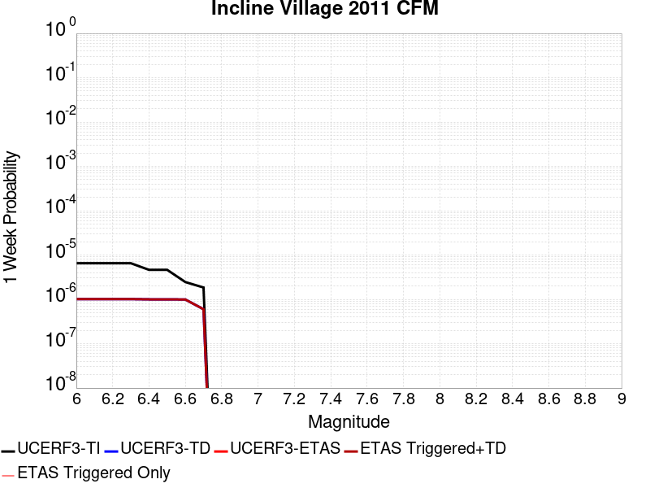 | 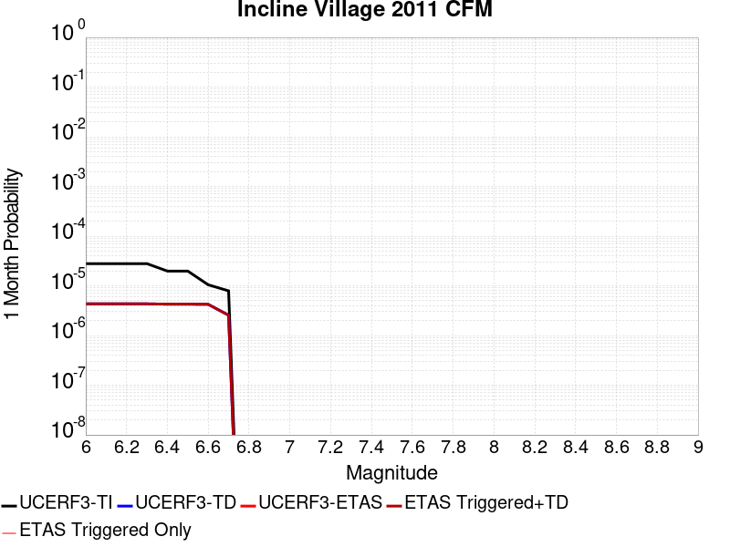 | 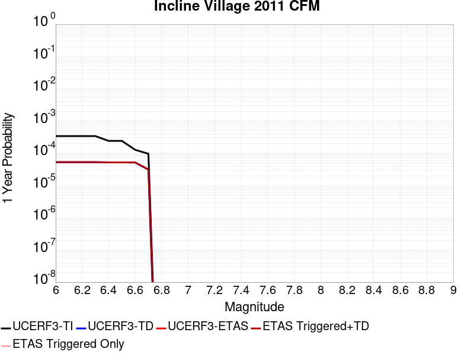 | 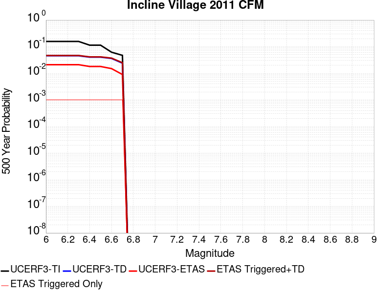 |

| Magnitude | 1 wk TI Prob | 1 wk TD Prob | 1 wk ETAS Prob | 1 wk ETAS/TD Gain | 1 wk ETAS Triggered+TD | 1 wk ETAS Triggered Only | 1 mo TI Prob | 1 mo TD Prob | 1 mo ETAS Prob | 1 mo ETAS/TD Gain | 1 mo ETAS Triggered+TD | 1 mo ETAS Triggered Only | 1 yr TI Prob | 1 yr TD Prob | 1 yr ETAS Prob | 1 yr ETAS/TD Gain | 1 yr ETAS Triggered+TD | 1 yr ETAS Triggered Only | 500 yr TI Prob | 500 yr TD Prob | 500 yr ETAS Prob | 500 yr ETAS/TD Gain | 500 yr ETAS Triggered+TD | 500 yr ETAS Triggered Only |
|-----|-----|-----|-----|-----|-----|-----|-----|-----|-----|-----|-----|-----|-----|-----|-----|-----|-----|-----|-----|-----|-----|-----|-----|-----|
| 6.0 | 6.5321456E-6 | 1.0138123E-6 | 0.0 | 0.0 | 1.0138123E-6 | 0.0 | 2.7994609E-5 | 4.3449063E-6 | 0.0 | 0.0 | 4.3449063E-6 | 0.0 | 3.4078106E-4 | 5.289859E-5 | 0.0 | 0.0 | 5.289859E-5 | 0.0 | 0.15668908 | 0.045531187 | 0.021 | 0.46122232 | 0.046485655 | 0.001 |
| 6.1 | 6.5321456E-6 | 1.0138123E-6 | 0.0 | 0.0 | 1.0138123E-6 | 0.0 | 2.7994609E-5 | 4.3449063E-6 | 0.0 | 0.0 | 4.3449063E-6 | 0.0 | 3.4078106E-4 | 5.289859E-5 | 0.0 | 0.0 | 5.289859E-5 | 0.0 | 0.15668908 | 0.045531187 | 0.021 | 0.46122232 | 0.046485655 | 0.001 |
| 6.2 | 6.5321456E-6 | 1.0138123E-6 | 0.0 | 0.0 | 1.0138123E-6 | 0.0 | 2.7994609E-5 | 4.3449063E-6 | 0.0 | 0.0 | 4.3449063E-6 | 0.0 | 3.4078106E-4 | 5.289859E-5 | 0.0 | 0.0 | 5.289859E-5 | 0.0 | 0.15668908 | 0.045531187 | 0.021 | 0.46122232 | 0.046485655 | 0.001 |
| 6.3 | 6.5321456E-6 | 1.0138123E-6 | 0.0 | 0.0 | 1.0138123E-6 | 0.0 | 2.7994609E-5 | 4.3449063E-6 | 0.0 | 0.0 | 4.3449063E-6 | 0.0 | 3.4078106E-4 | 5.289859E-5 | 0.0 | 0.0 | 5.289859E-5 | 0.0 | 0.15668908 | 0.045531187 | 0.021 | 0.46122232 | 0.046485655 | 0.001 |
| 6.4 | 4.6332716E-6 | 9.999205E-7 | 0.0 | 0.0 | 9.999205E-7 | 0.0 | 1.9856727E-5 | 4.2853703E-6 | 0.0 | 0.0 | 4.2853703E-6 | 0.0 | 2.4172882E-4 | 5.2173775E-5 | 0.0 | 0.0 | 5.2173775E-5 | 0.0 | 0.11385884 | 0.04036064 | 0.018 | 0.44597906 | 0.04132028 | 0.001 |
| 6.5 | 4.6332716E-6 | 9.999205E-7 | 0.0 | 0.0 | 9.999205E-7 | 0.0 | 1.9856727E-5 | 4.2853703E-6 | 0.0 | 0.0 | 4.2853703E-6 | 0.0 | 2.4172882E-4 | 5.2173775E-5 | 0.0 | 0.0 | 5.2173775E-5 | 0.0 | 0.11385884 | 0.04036064 | 0.018 | 0.44597906 | 0.04132028 | 0.001 |
| 6.6 | 2.4546039E-6 | 9.914243E-7 | 0.0 | 0.0 | 9.914243E-7 | 0.0 | 1.0519689E-5 | 4.248958E-6 | 0.0 | 0.0 | 4.248958E-6 | 0.0 | 1.2806967E-4 | 5.1730476E-5 | 0.0 | 0.0 | 5.1730476E-5 | 0.0 | 0.062031526 | 0.036207013 | 0.015 | 0.41428438 | 0.037170805 | 0.001 |
| 6.7 | 1.8511148E-6 | 5.988094E-7 | 0.0 | 0.0 | 5.988094E-7 | 0.0 | 7.933325E-6 | 2.566326E-6 | 0.0 | 0.0 | 2.566326E-6 | 0.0 | 9.658395E-5 | 3.1245017E-5 | 0.0 | 0.0 | 3.1245017E-5 | 0.0 | 0.04714669 | 0.023939142 | 0.009 | 0.37595332 | 0.024915203 | 0.001 |

## Contra Costa (Lafayette) 2011 CFM
*[(top)](#table-of-contents)*

| 1 Week | 1 Month | 1 Year | 500 Year |
|-----|-----|-----|-----|
|  |  | 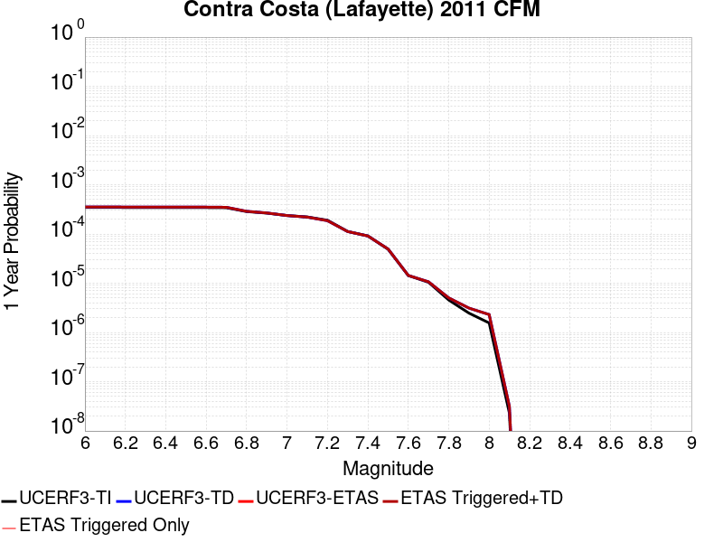 | 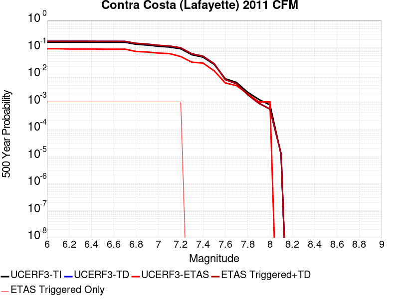 |

| Magnitude | 1 wk TI Prob | 1 wk TD Prob | 1 wk ETAS Prob | 1 wk ETAS/TD Gain | 1 wk ETAS Triggered+TD | 1 wk ETAS Triggered Only | 1 mo TI Prob | 1 mo TD Prob | 1 mo ETAS Prob | 1 mo ETAS/TD Gain | 1 mo ETAS Triggered+TD | 1 mo ETAS Triggered Only | 1 yr TI Prob | 1 yr TD Prob | 1 yr ETAS Prob | 1 yr ETAS/TD Gain | 1 yr ETAS Triggered+TD | 1 yr ETAS Triggered Only | 500 yr TI Prob | 500 yr TD Prob | 500 yr ETAS Prob | 500 yr ETAS/TD Gain | 500 yr ETAS Triggered+TD | 500 yr ETAS Triggered Only |
|-----|-----|-----|-----|-----|-----|-----|-----|-----|-----|-----|-----|-----|-----|-----|-----|-----|-----|-----|-----|-----|-----|-----|-----|-----|
| 6.0 | 6.655419E-6 | 6.797634E-6 | 0.0 | 0.0 | 6.797634E-6 | 0.0 | 2.8522913E-5 | 2.9132403E-5 | 0.0 | 0.0 | 2.9132403E-5 | 0.0 | 3.472111E-4 | 3.5463125E-4 | 0.0 | 0.0 | 3.5463125E-4 | 0.0 | 0.15939693 | 0.17127527 | 0.091 | 0.5313084 | 0.172104 | 0.001 |
| 6.1 | 6.655419E-6 | 6.797634E-6 | 0.0 | 0.0 | 6.797634E-6 | 0.0 | 2.8522913E-5 | 2.9132403E-5 | 0.0 | 0.0 | 2.9132403E-5 | 0.0 | 3.472111E-4 | 3.5463125E-4 | 0.0 | 0.0 | 3.5463125E-4 | 0.0 | 0.15939693 | 0.17127527 | 0.091 | 0.5313084 | 0.172104 | 0.001 |
| 6.2 | 6.6254133E-6 | 6.76613E-6 | 0.0 | 0.0 | 6.76613E-6 | 0.0 | 2.839432E-5 | 2.8997387E-5 | 0.0 | 0.0 | 2.8997387E-5 | 0.0 | 3.45646E-4 | 3.5298796E-4 | 0.0 | 0.0 | 3.5298796E-4 | 0.0 | 0.15873863 | 0.17059362 | 0.089 | 0.52170765 | 0.17142303 | 0.001 |
| 6.3 | 6.6254133E-6 | 6.76613E-6 | 0.0 | 0.0 | 6.76613E-6 | 0.0 | 2.839432E-5 | 2.8997387E-5 | 0.0 | 0.0 | 2.8997387E-5 | 0.0 | 3.45646E-4 | 3.5298796E-4 | 0.0 | 0.0 | 3.5298796E-4 | 0.0 | 0.15873863 | 0.17059362 | 0.089 | 0.52170765 | 0.17142303 | 0.001 |
| 6.4 | 6.6254133E-6 | 6.76613E-6 | 0.0 | 0.0 | 6.76613E-6 | 0.0 | 2.839432E-5 | 2.8997387E-5 | 0.0 | 0.0 | 2.8997387E-5 | 0.0 | 3.45646E-4 | 3.5298796E-4 | 0.0 | 0.0 | 3.5298796E-4 | 0.0 | 0.15873863 | 0.17059362 | 0.089 | 0.52170765 | 0.17142303 | 0.001 |
| 6.5 | 6.606445E-6 | 6.7457613E-6 | 0.0 | 0.0 | 6.7457613E-6 | 0.0 | 2.8313027E-5 | 2.8910097E-5 | 0.0 | 0.0 | 2.8910097E-5 | 0.0 | 3.4465658E-4 | 3.5192553E-4 | 0.0 | 0.0 | 3.5192553E-4 | 0.0 | 0.1583222 | 0.17015477 | 0.088 | 0.5171762 | 0.17098461 | 0.001 |
| 6.6 | 6.59966E-6 | 6.738338E-6 | 0.0 | 0.0 | 6.738338E-6 | 0.0 | 2.828395E-5 | 2.8878283E-5 | 0.0 | 0.0 | 2.8878283E-5 | 0.0 | 3.4430268E-4 | 3.5153833E-4 | 0.0 | 0.0 | 3.5153833E-4 | 0.0 | 0.1581732 | 0.16999604 | 0.088 | 0.5176591 | 0.17082605 | 0.001 |
| 6.7 | 6.5570975E-6 | 6.692523E-6 | 0.0 | 0.0 | 6.692523E-6 | 0.0 | 2.8101544E-5 | 2.8681938E-5 | 0.0 | 0.0 | 2.8681938E-5 | 0.0 | 3.4208258E-4 | 3.4914858E-4 | 0.0 | 0.0 | 3.4914858E-4 | 0.0 | 0.15723789 | 0.16900977 | 0.088 | 0.52067995 | 0.16984077 | 0.001 |
| 6.8 | 5.472255E-6 | 5.5395108E-6 | 0.0 | 0.0 | 5.5395108E-6 | 0.0 | 2.345231E-5 | 2.3740547E-5 | 0.0 | 0.0 | 2.3740547E-5 | 0.0 | 2.8549446E-4 | 2.8900328E-4 | 0.0 | 0.0 | 2.8900328E-4 | 0.0 | 0.13304448 | 0.14327817 | 0.072 | 0.502519 | 0.1441349 | 0.001 |
| 6.9 | 5.092346E-6 | 5.131533E-6 | 0.0 | 0.0 | 5.131533E-6 | 0.0 | 2.1824157E-5 | 2.19921E-5 | 0.0 | 0.0 | 2.19921E-5 | 0.0 | 2.656767E-4 | 2.677213E-4 | 0.0 | 0.0 | 2.677213E-4 | 0.0 | 0.12440883 | 0.13409403 | 0.069 | 0.51456434 | 0.13495994 | 0.001 |
| 7.0 | 4.5525762E-6 | 4.5476118E-6 | 0.0 | 0.0 | 4.5476118E-6 | 0.0 | 1.9510895E-5 | 1.948962E-5 | 0.0 | 0.0 | 1.948962E-5 | 0.0 | 2.3751926E-4 | 2.3726058E-4 | 0.0 | 0.0 | 2.3726058E-4 | 0.0 | 0.111991294 | 0.120795295 | 0.063 | 0.5215435 | 0.1216745 | 0.001 |
| 7.1 | 4.261504E-6 | 4.2288634E-6 | 0.0 | 0.0 | 4.2288634E-6 | 0.0 | 1.826346E-5 | 1.8123577E-5 | 0.0 | 0.0 | 1.8123577E-5 | 0.0 | 2.2233493E-4 | 2.2063247E-4 | 0.0 | 0.0 | 2.2063247E-4 | 0.0 | 0.105222166 | 0.11347049 | 0.06 | 0.5287719 | 0.11435702 | 0.001 |
| 7.2 | 3.654114E-6 | 3.5764049E-6 | 0.0 | 0.0 | 3.5764049E-6 | 0.0 | 1.5660395E-5 | 1.5327361E-5 | 0.0 | 0.0 | 1.5327361E-5 | 0.0 | 1.9064861E-4 | 1.8659487E-4 | 0.0 | 0.0 | 1.8659487E-4 | 0.0 | 0.09093019 | 0.097870655 | 0.047 | 0.48022565 | 0.09877279 | 0.001 |
| 7.3 | 2.1595129E-6 | 2.1516037E-6 | 0.0 | 0.0 | 2.1516037E-6 | 0.0 | 9.255023E-6 | 9.221127E-6 | 0.0 | 0.0 | 9.221127E-6 | 0.0 | 1.1267407E-4 | 1.1226147E-4 | 0.0 | 0.0 | 1.1226147E-4 | 0.0 | 0.05478249 | 0.05896773 | 0.029 | 0.4917944 | 0.05896773 | 0.0 |
| 7.4 | 1.7532738E-6 | 1.7481274E-6 | 0.0 | 0.0 | 1.7481274E-6 | 0.0 | 7.5140088E-6 | 7.491953E-6 | 0.0 | 0.0 | 7.491953E-6 | 0.0 | 9.147922E-5 | 9.121075E-5 | 0.0 | 0.0 | 9.121075E-5 | 0.0 | 0.044711318 | 0.048133202 | 0.027 | 0.56094337 | 0.048133202 | 0.0 |
| 7.5 | 9.387875E-7 | 9.5081873E-7 | 0.0 | 0.0 | 9.5081873E-7 | 0.0 | 4.0233685E-6 | 4.074931E-6 | 0.0 | 0.0 | 4.074931E-6 | 0.0 | 4.8983413E-5 | 4.9611168E-5 | 0.0 | 0.0 | 4.9611168E-5 | 0.0 | 0.024194803 | 0.025588384 | 0.014 | 0.54712325 | 0.025588384 | 0.0 |
| 7.6 | 2.7471893E-7 | 2.759851E-7 | 0.0 | 0.0 | 2.759851E-7 | 0.0 | 1.1773664E-6 | 1.1827927E-6 | 0.0 | 0.0 | 1.1827927E-6 | 0.0 | 1.433434E-5 | 1.4400407E-5 | 0.0 | 0.0 | 1.4400407E-5 | 0.0 | 0.0071415985 | 0.0066481694 | 0.005 | 0.7520867 | 0.0066481694 | 0.0 |
| 7.7 | 2.0057985E-7 | 2.0510551E-7 | 0.0 | 0.0 | 2.0510551E-7 | 0.0 | 8.596276E-7 | 8.790233E-7 | 0.0 | 0.0 | 8.790233E-7 | 0.0 | 1.0465916E-5 | 1.0702056E-5 | 0.0 | 0.0 | 1.0702056E-5 | 0.0 | 0.005219317 | 0.004708954 | 0.004 | 0.8494455 | 0.004708954 | 0.0 |
| 7.8 | 8.7403905E-8 | 9.6650055E-8 | 0.0 | 0.0 | 9.6650055E-8 | 0.0 | 3.745881E-7 | 4.1421444E-7 | 0.0 | 0.0 | 4.1421444E-7 | 0.0 | 4.5606007E-6 | 5.043049E-6 | 0.0 | 0.0 | 5.043049E-6 | 0.0 | 0.0022777077 | 0.0018647728 | 0.002 | 1.0725168 | 0.0018647728 | 0.0 |
| 7.9 | 4.740233E-8 | 5.999039E-8 | 0.0 | 0.0 | 5.999039E-8 | 0.0 | 2.0315284E-7 | 2.5710165E-7 | 0.0 | 0.0 | 2.5710165E-7 | 0.0 | 2.473383E-6 | 3.130208E-6 | 0.0 | 0.0 | 3.130208E-6 | 0.0 | 0.0012359286 | 9.0187375E-4 | 0.001 | 1.1088027 | 9.0187375E-4 | 0.0 |
| 8.0 | 2.99164E-8 | 4.4288914E-8 | 0.0 | 0.0 | 4.4288914E-8 | 0.0 | 1.2821314E-7 | 1.8980963E-7 | 0.0 | 0.0 | 1.8980963E-7 | 0.0 | 1.5609938E-6 | 2.3109296E-6 | 0.0 | 0.0 | 2.3109296E-6 | 0.0 | 7.80193E-4 | 5.4482743E-4 | 0.001 | 1.8354436 | 5.4482743E-4 | 0.0 |
| 8.1 | 4.431212E-10 | 6.038947E-10 | 0.0 | 0.0 | 6.038947E-10 | 0.0 | 1.899091E-9 | 2.5881213E-9 | 0.0 | 0.0 | 2.5881213E-9 | 0.0 | 2.3121432E-8 | 3.1510375E-8 | 0.0 | 0.0 | 3.1510375E-8 | 0.0 | 1.156065E-5 | 1.2029855E-5 | 0.0 | 0.0 | 1.2029855E-5 | 0.0 |

## San Joaquin Hills
*[(top)](#table-of-contents)*

| 1 Week | 1 Month | 1 Year | 500 Year |
|-----|-----|-----|-----|
| 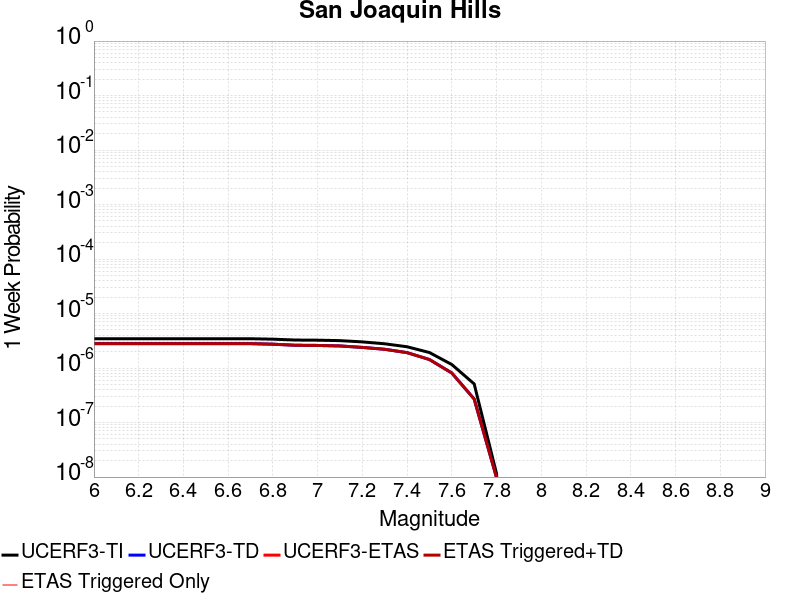 |  | 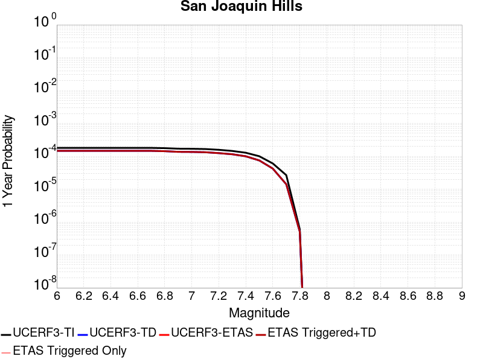 | 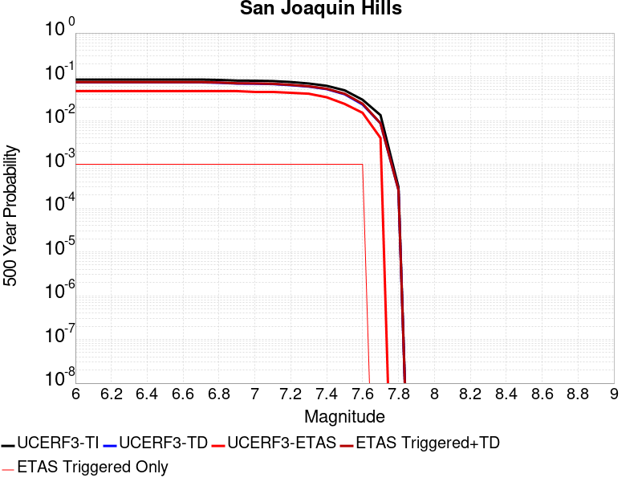 |

| Magnitude | 1 wk TI Prob | 1 wk TD Prob | 1 wk ETAS Prob | 1 wk ETAS/TD Gain | 1 wk ETAS Triggered+TD | 1 wk ETAS Triggered Only | 1 mo TI Prob | 1 mo TD Prob | 1 mo ETAS Prob | 1 mo ETAS/TD Gain | 1 mo ETAS Triggered+TD | 1 mo ETAS Triggered Only | 1 yr TI Prob | 1 yr TD Prob | 1 yr ETAS Prob | 1 yr ETAS/TD Gain | 1 yr ETAS Triggered+TD | 1 yr ETAS Triggered Only | 500 yr TI Prob | 500 yr TD Prob | 500 yr ETAS Prob | 500 yr ETAS/TD Gain | 500 yr ETAS Triggered+TD | 500 yr ETAS Triggered Only |
|-----|-----|-----|-----|-----|-----|-----|-----|-----|-----|-----|-----|-----|-----|-----|-----|-----|-----|-----|-----|-----|-----|-----|-----|-----|
| 6.0 | 3.4525704E-6 | 2.8066775E-6 | 0.0 | 0.0 | 2.8066775E-6 | 0.0 | 1.4796647E-5 | 1.2028562E-5 | 0.0 | 0.0 | 1.2028562E-5 | 0.0 | 1.8013427E-4 | 1.4643803E-4 | 0.0 | 0.0 | 1.4643803E-4 | 0.0 | 0.086137585 | 0.07451595 | 0.047 | 0.6307374 | 0.07544144 | 0.001 |
| 6.1 | 3.4525704E-6 | 2.8066775E-6 | 0.0 | 0.0 | 2.8066775E-6 | 0.0 | 1.4796647E-5 | 1.2028562E-5 | 0.0 | 0.0 | 1.2028562E-5 | 0.0 | 1.8013427E-4 | 1.4643803E-4 | 0.0 | 0.0 | 1.4643803E-4 | 0.0 | 0.086137585 | 0.07451595 | 0.047 | 0.6307374 | 0.07544144 | 0.001 |
| 6.2 | 3.4525704E-6 | 2.8066775E-6 | 0.0 | 0.0 | 2.8066775E-6 | 0.0 | 1.4796647E-5 | 1.2028562E-5 | 0.0 | 0.0 | 1.2028562E-5 | 0.0 | 1.8013427E-4 | 1.4643803E-4 | 0.0 | 0.0 | 1.4643803E-4 | 0.0 | 0.086137585 | 0.07451595 | 0.047 | 0.6307374 | 0.07544144 | 0.001 |
| 6.3 | 3.4525704E-6 | 2.8066775E-6 | 0.0 | 0.0 | 2.8066775E-6 | 0.0 | 1.4796647E-5 | 1.2028562E-5 | 0.0 | 0.0 | 1.2028562E-5 | 0.0 | 1.8013427E-4 | 1.4643803E-4 | 0.0 | 0.0 | 1.4643803E-4 | 0.0 | 0.086137585 | 0.07451595 | 0.047 | 0.6307374 | 0.07544144 | 0.001 |
| 6.4 | 3.4525704E-6 | 2.8066775E-6 | 0.0 | 0.0 | 2.8066775E-6 | 0.0 | 1.4796647E-5 | 1.2028562E-5 | 0.0 | 0.0 | 1.2028562E-5 | 0.0 | 1.8013427E-4 | 1.4643803E-4 | 0.0 | 0.0 | 1.4643803E-4 | 0.0 | 0.086137585 | 0.07451595 | 0.047 | 0.6307374 | 0.07544144 | 0.001 |
| 6.5 | 3.4525704E-6 | 2.8066775E-6 | 0.0 | 0.0 | 2.8066775E-6 | 0.0 | 1.4796647E-5 | 1.2028562E-5 | 0.0 | 0.0 | 1.2028562E-5 | 0.0 | 1.8013427E-4 | 1.4643803E-4 | 0.0 | 0.0 | 1.4643803E-4 | 0.0 | 0.086137585 | 0.07451595 | 0.047 | 0.6307374 | 0.07544144 | 0.001 |
| 6.6 | 3.4525704E-6 | 2.8066775E-6 | 0.0 | 0.0 | 2.8066775E-6 | 0.0 | 1.4796647E-5 | 1.2028562E-5 | 0.0 | 0.0 | 1.2028562E-5 | 0.0 | 1.8013427E-4 | 1.4643803E-4 | 0.0 | 0.0 | 1.4643803E-4 | 0.0 | 0.086137585 | 0.07451595 | 0.047 | 0.6307374 | 0.07544144 | 0.001 |
| 6.7 | 3.4525704E-6 | 2.8066775E-6 | 0.0 | 0.0 | 2.8066775E-6 | 0.0 | 1.4796647E-5 | 1.2028562E-5 | 0.0 | 0.0 | 1.2028562E-5 | 0.0 | 1.8013427E-4 | 1.4643803E-4 | 0.0 | 0.0 | 1.4643803E-4 | 0.0 | 0.086137585 | 0.07451595 | 0.047 | 0.6307374 | 0.07544144 | 0.001 |
| 6.8 | 3.388654E-6 | 2.7412034E-6 | 0.0 | 0.0 | 2.7412034E-6 | 0.0 | 1.4522722E-5 | 1.1747962E-5 | 0.0 | 0.0 | 1.1747962E-5 | 0.0 | 1.767998E-4 | 1.4302217E-4 | 0.0 | 0.0 | 1.4302217E-4 | 0.0 | 0.084612414 | 0.07293281 | 0.047 | 0.6444288 | 0.07385987 | 0.001 |
| 6.9 | 3.2694352E-6 | 2.621277E-6 | 0.0 | 0.0 | 2.621277E-6 | 0.0 | 1.401179E-5 | 1.1233996E-5 | 0.0 | 0.0 | 1.1233996E-5 | 0.0 | 1.7058018E-4 | 1.3676543E-4 | 0.0 | 0.0 | 1.3676543E-4 | 0.0 | 0.08176082 | 0.07001651 | 0.047 | 0.6712702 | 0.0709465 | 0.001 |
| 7.0 | 3.246912E-6 | 2.5999714E-6 | 0.0 | 0.0 | 2.5999714E-6 | 0.0 | 1.39152635E-5 | 1.1142687E-5 | 0.0 | 0.0 | 1.1142687E-5 | 0.0 | 1.6940516E-4 | 1.3565389E-4 | 0.0 | 0.0 | 1.3565389E-4 | 0.0 | 0.08122108 | 0.069493376 | 0.045 | 0.6475437 | 0.070423886 | 0.001 |
| 7.1 | 3.1864927E-6 | 2.5453905E-6 | 0.0 | 0.0 | 2.5453905E-6 | 0.0 | 1.3656326E-5 | 1.0908771E-5 | 0.0 | 0.0 | 1.0908771E-5 | 0.0 | 1.6625308E-4 | 1.3280631E-4 | 0.0 | 0.0 | 1.3280631E-4 | 0.0 | 0.07977167 | 0.068142936 | 0.045 | 0.66037655 | 0.069074795 | 0.001 |
| 7.2 | 3.0220644E-6 | 2.3924874E-6 | 0.0 | 0.0 | 2.3924874E-6 | 0.0 | 1.295164E-5 | 1.0253478E-5 | 0.0 | 0.0 | 1.0253478E-5 | 0.0 | 1.576748E-4 | 1.2482904E-4 | 0.0 | 0.0 | 1.2482904E-4 | 0.0 | 0.075815566 | 0.06435987 | 0.043 | 0.6681182 | 0.06529551 | 0.001 |
| 7.3 | 2.787619E-6 | 2.2117642E-6 | 0.0 | 0.0 | 2.2117642E-6 | 0.0 | 1.1946884E-5 | 9.478956E-6 | 0.0 | 0.0 | 9.478956E-6 | 0.0 | 1.454436E-4 | 1.15400275E-4 | 0.0 | 0.0 | 1.15400275E-4 | 0.0 | 0.070145436 | 0.05969746 | 0.041 | 0.6867964 | 0.06063776 | 0.001 |
| 7.4 | 2.4593792E-6 | 1.917979E-6 | 0.0 | 0.0 | 1.917979E-6 | 0.0 | 1.0540153E-5 | 8.219885E-6 | 0.0 | 0.0 | 8.219885E-6 | 0.0 | 1.2831882E-4 | 1.0007259E-4 | 0.0 | 0.0 | 1.0007259E-4 | 0.0 | 0.062148374 | 0.052271876 | 0.034 | 0.65044534 | 0.053219605 | 0.001 |
| 7.5 | 1.926764E-6 | 1.4342479E-6 | 0.0 | 0.0 | 1.4342479E-6 | 0.0 | 8.257534E-6 | 6.1467626E-6 | 0.0 | 0.0 | 6.1467626E-6 | 0.0 | 1.00530844E-4 | 7.483433E-5 | 0.0 | 0.0 | 7.483433E-5 | 0.0 | 0.04902542 | 0.039932016 | 0.024 | 0.6010215 | 0.040892083 | 0.001 |
| 7.6 | 1.1609359E-6 | 8.1146936E-7 | 0.0 | 0.0 | 8.1146936E-7 | 0.0 | 4.97543E-6 | 3.4777215E-6 | 0.0 | 0.0 | 3.4777215E-6 | 0.0 | 6.0574173E-5 | 4.234048E-5 | 0.0 | 0.0 | 4.234048E-5 | 0.0 | 0.029833918 | 0.023272552 | 0.015 | 0.64453614 | 0.024249278 | 0.001 |
| 7.7 | 5.1168536E-7 | 2.7034574E-7 | 0.0 | 0.0 | 2.7034574E-7 | 0.0 | 2.1929354E-6 | 1.1586242E-6 | 0.0 | 0.0 | 1.1586242E-6 | 0.0 | 2.669866E-5 | 1.4106171E-5 | 0.0 | 0.0 | 1.4106171E-5 | 0.0 | 0.013260799 | 0.008645635 | 0.004 | 0.46266124 | 0.008645635 | 0.0 |
| 7.8 | 1.16056995E-8 | 9.775291E-9 | 0.0 | 0.0 | 9.775291E-9 | 0.0 | 4.9738713E-8 | 4.1894104E-8 | 0.0 | 0.0 | 4.1894104E-8 | 0.0 | 6.0556863E-7 | 5.100607E-7 | 0.0 | 0.0 | 5.100607E-7 | 0.0 | 3.027386E-4 | 2.6043522E-4 | 0.0 | 0.0 | 2.6043522E-4 | 0.0 |

## Yorba Linda
*[(top)](#table-of-contents)*

| 1 Week | 1 Month | 1 Year | 500 Year |
|-----|-----|-----|-----|
|  | 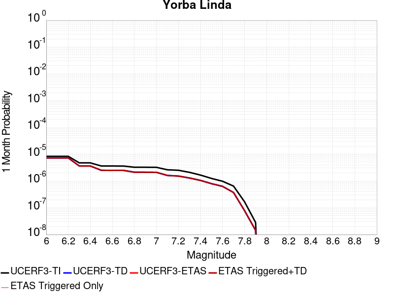 |  | 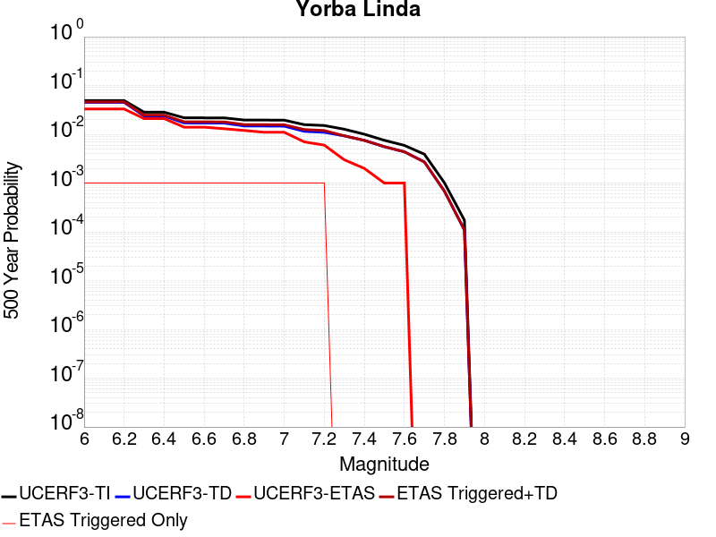 |

| Magnitude | 1 wk TI Prob | 1 wk TD Prob | 1 wk ETAS Prob | 1 wk ETAS/TD Gain | 1 wk ETAS Triggered+TD | 1 wk ETAS Triggered Only | 1 mo TI Prob | 1 mo TD Prob | 1 mo ETAS Prob | 1 mo ETAS/TD Gain | 1 mo ETAS Triggered+TD | 1 mo ETAS Triggered Only | 1 yr TI Prob | 1 yr TD Prob | 1 yr ETAS Prob | 1 yr ETAS/TD Gain | 1 yr ETAS Triggered+TD | 1 yr ETAS Triggered Only | 500 yr TI Prob | 500 yr TD Prob | 500 yr ETAS Prob | 500 yr ETAS/TD Gain | 500 yr ETAS Triggered+TD | 500 yr ETAS Triggered Only |
|-----|-----|-----|-----|-----|-----|-----|-----|-----|-----|-----|-----|-----|-----|-----|-----|-----|-----|-----|-----|-----|-----|-----|-----|-----|
| 6.0 | 1.9346849E-6 | 1.6859105E-6 | 0.0 | 0.0 | 1.6859105E-6 | 0.0 | 8.29148E-6 | 7.2253165E-6 | 0.0 | 0.0 | 7.2253165E-6 | 0.0 | 1.009441E-4 | 8.796562E-5 | 0.0 | 0.0 | 8.796562E-5 | 0.0 | 0.049221918 | 0.045199208 | 0.033 | 0.7301013 | 0.046154007 | 0.001 |
| 6.1 | 1.9346849E-6 | 1.6859105E-6 | 0.0 | 0.0 | 1.6859105E-6 | 0.0 | 8.29148E-6 | 7.2253165E-6 | 0.0 | 0.0 | 7.2253165E-6 | 0.0 | 1.009441E-4 | 8.796562E-5 | 0.0 | 0.0 | 8.796562E-5 | 0.0 | 0.049221918 | 0.045199208 | 0.033 | 0.7301013 | 0.046154007 | 0.001 |
| 6.2 | 1.9346849E-6 | 1.6859105E-6 | 0.0 | 0.0 | 1.6859105E-6 | 0.0 | 8.29148E-6 | 7.2253165E-6 | 0.0 | 0.0 | 7.2253165E-6 | 0.0 | 1.009441E-4 | 8.796562E-5 | 0.0 | 0.0 | 8.796562E-5 | 0.0 | 0.049221918 | 0.045199208 | 0.033 | 0.7301013 | 0.046154007 | 0.001 |
| 6.3 | 1.1028608E-6 | 8.4375927E-7 | 0.0 | 0.0 | 8.4375927E-7 | 0.0 | 4.7265376E-6 | 3.6161064E-6 | 0.0 | 0.0 | 3.6161064E-6 | 0.0 | 5.754407E-5 | 4.4025273E-5 | 0.0 | 0.0 | 4.4025273E-5 | 0.0 | 0.028362866 | 0.02375116 | 0.021 | 0.8841673 | 0.02472741 | 0.001 |
| 6.4 | 1.1028608E-6 | 8.4375927E-7 | 0.0 | 0.0 | 8.4375927E-7 | 0.0 | 4.7265376E-6 | 3.6161064E-6 | 0.0 | 0.0 | 3.6161064E-6 | 0.0 | 5.754407E-5 | 4.4025273E-5 | 0.0 | 0.0 | 4.4025273E-5 | 0.0 | 0.028362866 | 0.02375116 | 0.021 | 0.8841673 | 0.02472741 | 0.001 |
| 6.5 | 8.4451364E-7 | 5.826377E-7 | 0.0 | 0.0 | 5.826377E-7 | 0.0 | 3.619339E-6 | 2.4970166E-6 | 0.0 | 0.0 | 2.4970166E-6 | 0.0 | 4.406456E-5 | 3.0400774E-5 | 0.0 | 0.0 | 3.0400774E-5 | 0.0 | 0.021791818 | 0.017065808 | 0.014 | 0.82035375 | 0.018048743 | 0.001 |
| 6.6 | 8.422957E-7 | 5.8019396E-7 | 0.0 | 0.0 | 5.8019396E-7 | 0.0 | 3.6098338E-6 | 2.4865433E-6 | 0.0 | 0.0 | 2.4865433E-6 | 0.0 | 4.3948843E-5 | 3.0273266E-5 | 0.0 | 0.0 | 3.0273266E-5 | 0.0 | 0.021735214 | 0.017003173 | 0.014 | 0.82337576 | 0.01798617 | 0.001 |
| 6.7 | 8.4119705E-7 | 5.7897967E-7 | 0.0 | 0.0 | 5.7897967E-7 | 0.0 | 3.6051254E-6 | 2.4813392E-6 | 0.0 | 0.0 | 2.4813392E-6 | 0.0 | 4.3891516E-5 | 3.0209907E-5 | 0.0 | 0.0 | 3.0209907E-5 | 0.0 | 0.021707173 | 0.016972018 | 0.013 | 0.7659666 | 0.017955046 | 0.001 |
| 6.8 | 7.5919155E-7 | 4.953165E-7 | 0.0 | 0.0 | 4.953165E-7 | 0.0 | 3.253674E-6 | 2.1227834E-6 | 0.0 | 0.0 | 2.1227834E-6 | 0.0 | 3.961276E-5 | 2.5844598E-5 | 0.0 | 0.0 | 2.5844598E-5 | 0.0 | 0.019611908 | 0.014822695 | 0.012 | 0.80956936 | 0.015807873 | 0.001 |
| 6.9 | 7.5804564E-7 | 4.9393674E-7 | 0.0 | 0.0 | 4.9393674E-7 | 0.0 | 3.248763E-6 | 2.11687E-6 | 0.0 | 0.0 | 2.11687E-6 | 0.0 | 3.955297E-5 | 2.5772606E-5 | 0.0 | 0.0 | 2.5772606E-5 | 0.0 | 0.019582598 | 0.014786955 | 0.011 | 0.7438989 | 0.015772168 | 0.001 |
| 7.0 | 7.539293E-7 | 4.9015676E-7 | 0.0 | 0.0 | 4.9015676E-7 | 0.0 | 3.2311218E-6 | 2.1006701E-6 | 0.0 | 0.0 | 2.1006701E-6 | 0.0 | 3.9338196E-5 | 2.5575377E-5 | 0.0 | 0.0 | 2.5575377E-5 | 0.0 | 0.019477304 | 0.014687616 | 0.011 | 0.7489302 | 0.01567293 | 0.001 |
| 7.1 | 6.0900885E-7 | 3.744469E-7 | 0.0 | 0.0 | 3.744469E-7 | 0.0 | 2.6100352E-6 | 1.6047713E-6 | 0.0 | 0.0 | 1.6047713E-6 | 0.0 | 3.1776715E-5 | 1.953792E-5 | 0.0 | 0.0 | 1.953792E-5 | 0.0 | 0.015763052 | 0.011509996 | 0.007 | 0.608167 | 0.012498487 | 0.001 |
| 7.2 | 5.849925E-7 | 3.5512687E-7 | 0.0 | 0.0 | 3.5512687E-7 | 0.0 | 2.5071083E-6 | 1.5219715E-6 | 0.0 | 0.0 | 1.5219715E-6 | 0.0 | 3.0523614E-5 | 1.8529849E-5 | 0.0 | 0.0 | 1.8529849E-5 | 0.0 | 0.015146166 | 0.010973099 | 0.006 | 0.5467918 | 0.011962125 | 0.001 |
| 7.3 | 4.89808E-7 | 3.0084726E-7 | 0.0 | 0.0 | 3.0084726E-7 | 0.0 | 2.0991754E-6 | 1.2893448E-6 | 0.0 | 0.0 | 1.2893448E-6 | 0.0 | 2.5557161E-5 | 1.5697662E-5 | 0.0 | 0.0 | 1.5697662E-5 | 0.0 | 0.012697442 | 0.009291567 | 0.003 | 0.32287344 | 0.009291567 | 0.0 |
| 7.4 | 3.8700415E-7 | 2.4486087E-7 | 0.0 | 0.0 | 2.4486087E-7 | 0.0 | 1.6585881E-6 | 1.0494033E-6 | 0.0 | 0.0 | 1.0494033E-6 | 0.0 | 2.0193123E-5 | 1.27764115E-5 | 0.0 | 0.0 | 1.27764115E-5 | 0.0 | 0.010045864 | 0.007506483 | 0.002 | 0.26643637 | 0.007506483 | 0.0 |
| 7.5 | 2.900565E-7 | 1.849091E-7 | 0.0 | 0.0 | 1.849091E-7 | 0.0 | 1.2430987E-6 | 7.924673E-7 | 0.0 | 0.0 | 7.924673E-7 | 0.0 | 1.5134622E-5 | 9.648247E-6 | 0.0 | 0.0 | 9.648247E-6 | 0.0 | 0.0075388076 | 0.00557576 | 0.001 | 0.17934775 | 0.00557576 | 0.0 |
| 7.6 | 2.2770318E-7 | 1.4707557E-7 | 0.0 | 0.0 | 1.4707557E-7 | 0.0 | 9.758704E-7 | 6.303237E-7 | 0.0 | 0.0 | 6.303237E-7 | 0.0 | 1.1881158E-5 | 7.674164E-6 | 0.0 | 0.0 | 7.674164E-6 | 0.0 | 0.0059230034 | 0.004383147 | 0.001 | 0.22814657 | 0.004383147 | 0.0 |
| 7.7 | 1.5017194E-7 | 8.65917E-8 | 0.0 | 0.0 | 8.65917E-8 | 0.0 | 6.4359386E-7 | 3.711072E-7 | 0.0 | 0.0 | 3.711072E-7 | 0.0 | 7.835727E-6 | 4.5182214E-6 | 0.0 | 0.0 | 4.5182214E-6 | 0.0 | 0.003910214 | 0.002711177 | 0.0 | 0.0 | 0.002711177 | 0.0 |
| 7.8 | 3.895753E-8 | 1.820935E-8 | 0.0 | 0.0 | 1.820935E-8 | 0.0 | 1.6696083E-7 | 7.8040074E-8 | 0.0 | 0.0 | 7.8040074E-8 | 0.0 | 2.0327461E-6 | 9.5013746E-7 | 0.0 | 0.0 | 9.5013746E-7 | 0.0 | 0.0010158578 | 6.8496575E-4 | 0.0 | 0.0 | 6.8496575E-4 | 0.0 |
| 7.9 | 6.648505E-9 | 3.3648198E-9 | 0.0 | 0.0 | 3.3648198E-9 | 0.0 | 2.8493591E-8 | 1.4420657E-8 | 0.0 | 0.0 | 1.4420657E-8 | 0.0 | 3.4690942E-7 | 1.7557147E-7 | 0.0 | 0.0 | 1.7557147E-7 | 0.0 | 1.734397E-4 | 1.0920406E-4 | 0.0 | 0.0 | 1.0920406E-4 | 0.0 |

## Elysian Park (Lower CFM)
*[(top)](#table-of-contents)*

| 1 Week | 1 Month | 1 Year | 500 Year |
|-----|-----|-----|-----|
| 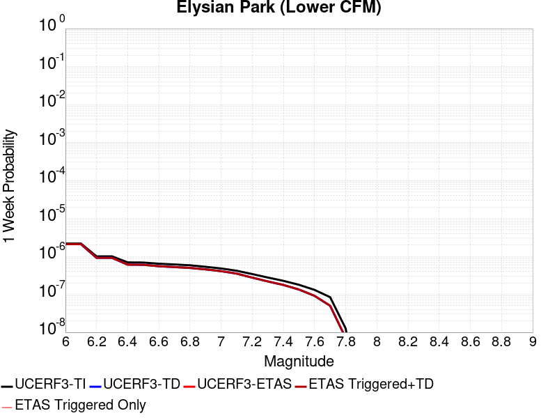 | 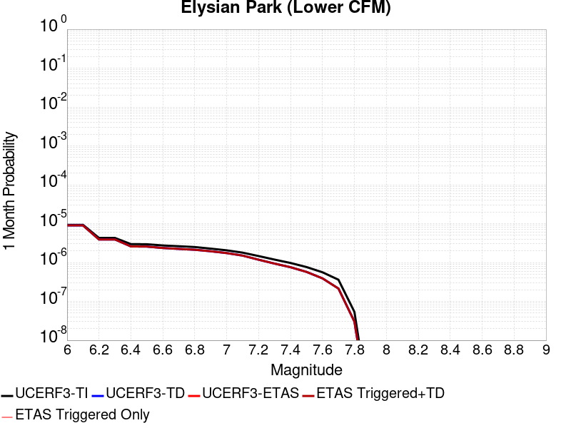 | 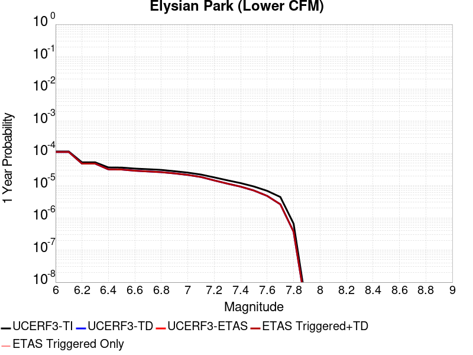 | 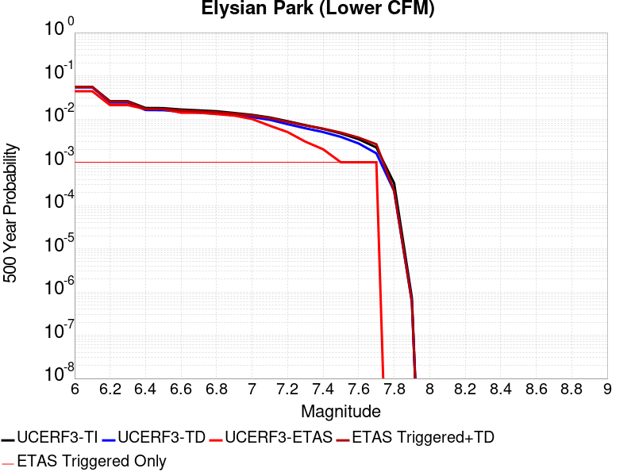 |

| Magnitude | 1 wk TI Prob | 1 wk TD Prob | 1 wk ETAS Prob | 1 wk ETAS/TD Gain | 1 wk ETAS Triggered+TD | 1 wk ETAS Triggered Only | 1 mo TI Prob | 1 mo TD Prob | 1 mo ETAS Prob | 1 mo ETAS/TD Gain | 1 mo ETAS Triggered+TD | 1 mo ETAS Triggered Only | 1 yr TI Prob | 1 yr TD Prob | 1 yr ETAS Prob | 1 yr ETAS/TD Gain | 1 yr ETAS Triggered+TD | 1 yr ETAS Triggered Only | 500 yr TI Prob | 500 yr TD Prob | 500 yr ETAS Prob | 500 yr ETAS/TD Gain | 500 yr ETAS Triggered+TD | 500 yr ETAS Triggered Only |
|-----|-----|-----|-----|-----|-----|-----|-----|-----|-----|-----|-----|-----|-----|-----|-----|-----|-----|-----|-----|-----|-----|-----|-----|-----|
| 6.0 | 2.1766498E-6 | 2.1003104E-6 | 0.0 | 0.0 | 2.1003104E-6 | 0.0 | 9.328466E-6 | 9.001307E-6 | 0.0 | 0.0 | 9.001307E-6 | 0.0 | 1.1356815E-4 | 1.0958684E-4 | 0.0 | 0.0 | 1.0958684E-4 | 0.0 | 0.055204995 | 0.054168474 | 0.044 | 0.8122806 | 0.055114303 | 0.001 |
| 6.1 | 2.1766498E-6 | 2.1003104E-6 | 0.0 | 0.0 | 2.1003104E-6 | 0.0 | 9.328466E-6 | 9.001307E-6 | 0.0 | 0.0 | 9.001307E-6 | 0.0 | 1.1356815E-4 | 1.0958684E-4 | 0.0 | 0.0 | 1.0958684E-4 | 0.0 | 0.055204995 | 0.054168474 | 0.044 | 0.8122806 | 0.055114303 | 0.001 |
| 6.2 | 1.0031182E-6 | 9.1575293E-7 | 0.0 | 0.0 | 9.1575293E-7 | 0.0 | 4.299071E-6 | 3.92465E-6 | 0.0 | 0.0 | 3.92465E-6 | 0.0 | 5.2339932E-5 | 4.7781665E-5 | 0.0 | 0.0 | 4.7781665E-5 | 0.0 | 0.025831167 | 0.024117766 | 0.021 | 0.8707274 | 0.025093647 | 0.001 |
| 6.3 | 1.0031182E-6 | 9.1575293E-7 | 0.0 | 0.0 | 9.1575293E-7 | 0.0 | 4.299071E-6 | 3.92465E-6 | 0.0 | 0.0 | 3.92465E-6 | 0.0 | 5.2339932E-5 | 4.7781665E-5 | 0.0 | 0.0 | 4.7781665E-5 | 0.0 | 0.025831167 | 0.024117766 | 0.021 | 0.8707274 | 0.025093647 | 0.001 |
| 6.4 | 6.9606244E-7 | 6.0645E-7 | 0.0 | 0.0 | 6.0645E-7 | 0.0 | 2.9831212E-6 | 2.5990687E-6 | 0.0 | 0.0 | 2.5990687E-6 | 0.0 | 3.6318896E-5 | 3.16432E-5 | 0.0 | 0.0 | 3.16432E-5 | 0.0 | 0.017995883 | 0.016184803 | 0.017 | 1.0503681 | 0.017168619 | 0.001 |
| 6.5 | 6.901879E-7 | 6.0052133E-7 | 0.0 | 0.0 | 6.0052133E-7 | 0.0 | 2.9579448E-6 | 2.5736601E-6 | 0.0 | 0.0 | 2.5736601E-6 | 0.0 | 3.6012385E-5 | 3.1333864E-5 | 0.0 | 0.0 | 3.1333864E-5 | 0.0 | 0.017845368 | 0.016032608 | 0.017 | 1.060339 | 0.017016577 | 0.001 |
| 6.6 | 6.4198554E-7 | 5.5194056E-7 | 0.0 | 0.0 | 5.5194056E-7 | 0.0 | 2.7513638E-6 | 2.3654572E-6 | 0.0 | 0.0 | 2.3654572E-6 | 0.0 | 3.3497337E-5 | 2.8799062E-5 | 0.0 | 0.0 | 2.8799062E-5 | 0.0 | 0.016609466 | 0.014784455 | 0.014 | 0.94694054 | 0.015769672 | 0.001 |
| 6.7 | 6.138733E-7 | 5.236321E-7 | 0.0 | 0.0 | 5.236321E-7 | 0.0 | 2.6308828E-6 | 2.2441354E-6 | 0.0 | 0.0 | 2.2441354E-6 | 0.0 | 3.203053E-5 | 2.7322008E-5 | 0.0 | 0.0 | 2.7322008E-5 | 0.0 | 0.015887953 | 0.014056511 | 0.014 | 0.9959797 | 0.015042454 | 0.001 |
| 6.8 | 5.84778E-7 | 4.976036E-7 | 0.0 | 0.0 | 4.976036E-7 | 0.0 | 2.506189E-6 | 2.132585E-6 | 0.0 | 0.0 | 2.132585E-6 | 0.0 | 3.0512423E-5 | 2.5963915E-5 | 0.0 | 0.0 | 2.5963915E-5 | 0.0 | 0.0151406545 | 0.013384569 | 0.013 | 0.9712677 | 0.014371185 | 0.001 |
| 6.9 | 5.322785E-7 | 4.5536905E-7 | 0.0 | 0.0 | 4.5536905E-7 | 0.0 | 2.2811914E-6 | 1.95158E-6 | 0.0 | 0.0 | 1.95158E-6 | 0.0 | 2.7773152E-5 | 2.3760229E-5 | 0.0 | 0.0 | 2.3760229E-5 | 0.0 | 0.013790793 | 0.01228514 | 0.012 | 0.9767898 | 0.013272855 | 0.001 |
| 7.0 | 4.8147206E-7 | 4.0865302E-7 | 0.0 | 0.0 | 4.0865302E-7 | 0.0 | 2.06345E-6 | 1.7513688E-6 | 0.0 | 0.0 | 1.7513688E-6 | 0.0 | 2.5122214E-5 | 2.1322707E-5 | 0.0 | 0.0 | 2.1322707E-5 | 0.0 | 0.012482702 | 0.011072375 | 0.01 | 0.90314865 | 0.012061302 | 0.001 |
| 7.1 | 4.1932955E-7 | 3.5219884E-7 | 0.0 | 0.0 | 3.5219884E-7 | 0.0 | 1.7971255E-6 | 1.5094226E-6 | 0.0 | 0.0 | 1.5094226E-6 | 0.0 | 2.1879783E-5 | 1.8377066E-5 | 0.0 | 0.0 | 1.8377066E-5 | 0.0 | 0.010880386 | 0.009597086 | 0.007 | 0.72938806 | 0.010587489 | 0.001 |
| 7.2 | 3.426051E-7 | 2.7609798E-7 | 0.0 | 0.0 | 2.7609798E-7 | 0.0 | 1.4683067E-6 | 1.1832765E-6 | 0.0 | 0.0 | 1.1832765E-6 | 0.0 | 1.7876488E-5 | 1.4406295E-5 | 0.0 | 0.0 | 1.4406295E-5 | 0.0 | 0.008898496 | 0.007611668 | 0.005 | 0.6568862 | 0.008604056 | 0.001 |
| 7.3 | 2.7771645E-7 | 2.1925071E-7 | 0.0 | 0.0 | 2.1925071E-7 | 0.0 | 1.1902127E-6 | 9.3964553E-7 | 0.0 | 0.0 | 9.3964553E-7 | 0.0 | 1.4490744E-5 | 1.1440124E-5 | 0.0 | 0.0 | 1.1440124E-5 | 0.0 | 0.00721924 | 0.0061174654 | 0.003 | 0.49039918 | 0.007111348 | 0.001 |
| 7.4 | 2.2756493E-7 | 1.7686699E-7 | 0.0 | 0.0 | 1.7686699E-7 | 0.0 | 9.752779E-7 | 7.5800114E-7 | 0.0 | 0.0 | 7.5800114E-7 | 0.0 | 1.1873944E-5 | 9.228625E-6 | 0.0 | 0.0 | 9.228625E-6 | 0.0 | 0.005919418 | 0.0049997186 | 0.002 | 0.4000225 | 0.005994719 | 0.001 |
| 7.5 | 1.7874558E-7 | 1.3412163E-7 | 0.0 | 0.0 | 1.3412163E-7 | 0.0 | 7.660522E-7 | 5.748069E-7 | 0.0 | 0.0 | 5.748069E-7 | 0.0 | 9.326646E-6 | 6.998251E-6 | 0.0 | 0.0 | 6.998251E-6 | 0.0 | 0.004652488 | 0.0038673475 | 0.001 | 0.25857517 | 0.00486348 | 0.001 |
| 7.6 | 1.3124549E-7 | 9.1471165E-8 | 0.0 | 0.0 | 9.1471165E-8 | 0.0 | 5.624805E-7 | 3.9201922E-7 | 0.0 | 0.0 | 3.9201922E-7 | 0.0 | 6.8481786E-6 | 4.7728236E-6 | 0.0 | 0.0 | 4.7728236E-6 | 0.0 | 0.0034182456 | 0.0027261875 | 0.001 | 0.36681265 | 0.0037234612 | 0.001 |
| 7.7 | 8.439993E-8 | 5.007748E-8 | 0.0 | 0.0 | 5.007748E-8 | 0.0 | 3.6171392E-7 | 2.1461776E-7 | 0.0 | 0.0 | 2.1461776E-7 | 0.0 | 4.403858E-6 | 2.6129683E-6 | 0.0 | 0.0 | 2.6129683E-6 | 0.0 | 0.0021995115 | 0.0016113858 | 0.001 | 0.62058383 | 0.0026097745 | 0.001 |
| 7.8 | 1.2591407E-8 | 7.0832358E-9 | 0.0 | 0.0 | 7.0832358E-9 | 0.0 | 5.3963173E-8 | 3.0356727E-8 | 0.0 | 0.0 | 3.0356727E-8 | 0.0 | 6.570014E-7 | 3.695931E-7 | 0.0 | 0.0 | 3.695931E-7 | 0.0 | 3.2844688E-4 | 2.180992E-4 | 0.0 | 0.0 | 2.180992E-4 | 0.0 |
| 7.9 | 2.8324232E-11 | 2.1195712E-11 | 0.0 | 0.0 | 2.1195712E-11 | 0.0 | 1.2138957E-10 | 9.083878E-11 | 0.0 | 0.0 | 9.083878E-11 | 0.0 | 1.4779177E-9 | 1.1059627E-9 | 0.0 | 0.0 | 1.1059627E-9 | 0.0 | 7.389586E-7 | 5.9960917E-7 | 0.0 | 0.0 | 5.9960917E-7 | 0.0 |

## Fickle Hill (alt1)
*[(top)](#table-of-contents)*

| 1 Week | 1 Month | 1 Year | 500 Year |
|-----|-----|-----|-----|
| 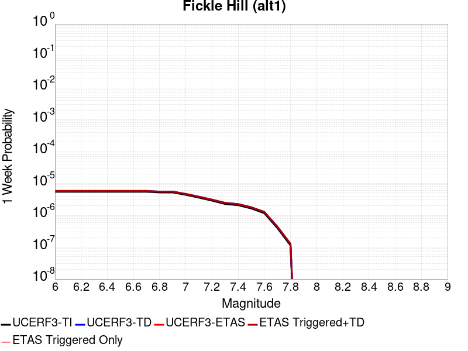 | 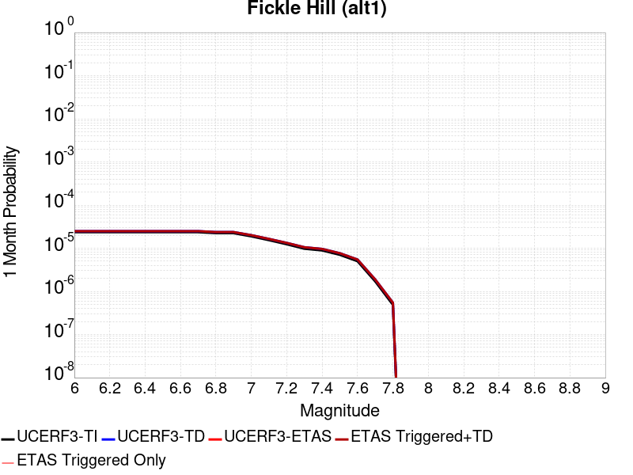 | 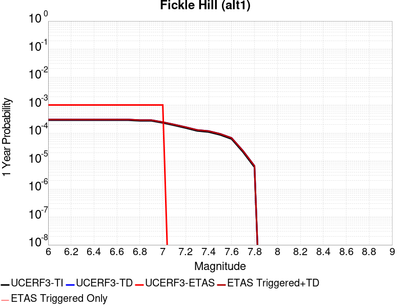 | 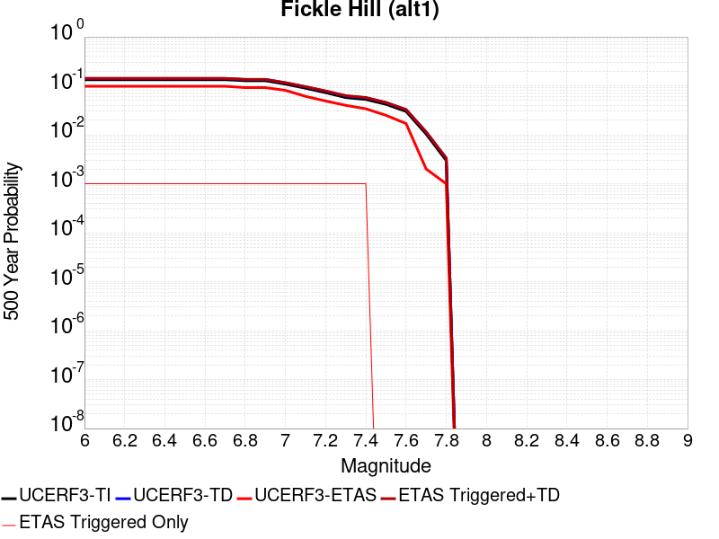 |

| Magnitude | 1 wk TI Prob | 1 wk TD Prob | 1 wk ETAS Prob | 1 wk ETAS/TD Gain | 1 wk ETAS Triggered+TD | 1 wk ETAS Triggered Only | 1 mo TI Prob | 1 mo TD Prob | 1 mo ETAS Prob | 1 mo ETAS/TD Gain | 1 mo ETAS Triggered+TD | 1 mo ETAS Triggered Only | 1 yr TI Prob | 1 yr TD Prob | 1 yr ETAS Prob | 1 yr ETAS/TD Gain | 1 yr ETAS Triggered+TD | 1 yr ETAS Triggered Only | 500 yr TI Prob | 500 yr TD Prob | 500 yr ETAS Prob | 500 yr ETAS/TD Gain | 500 yr ETAS Triggered+TD | 500 yr ETAS Triggered Only |
|-----|-----|-----|-----|-----|-----|-----|-----|-----|-----|-----|-----|-----|-----|-----|-----|-----|-----|-----|-----|-----|-----|-----|-----|-----|
| 6.0 | 5.491893E-6 | 5.808423E-6 | 0.0 | 0.0 | 5.808423E-6 | 0.0 | 2.3536471E-5 | 2.4893016E-5 | 0.0 | 0.0 | 2.4893016E-5 | 0.0 | 2.8651886E-4 | 3.0303258E-4 | 0.001 | 3.2999754 | 3.0303258E-4 | 0.0 | 0.13348855 | 0.14114556 | 0.098 | 0.6943187 | 0.14200442 | 0.001 |
| 6.1 | 5.491893E-6 | 5.808423E-6 | 0.0 | 0.0 | 5.808423E-6 | 0.0 | 2.3536471E-5 | 2.4893016E-5 | 0.0 | 0.0 | 2.4893016E-5 | 0.0 | 2.8651886E-4 | 3.0303258E-4 | 0.001 | 3.2999754 | 3.0303258E-4 | 0.0 | 0.13348855 | 0.14114556 | 0.098 | 0.6943187 | 0.14200442 | 0.001 |
| 6.2 | 5.491893E-6 | 5.808423E-6 | 0.0 | 0.0 | 5.808423E-6 | 0.0 | 2.3536471E-5 | 2.4893016E-5 | 0.0 | 0.0 | 2.4893016E-5 | 0.0 | 2.8651886E-4 | 3.0303258E-4 | 0.001 | 3.2999754 | 3.0303258E-4 | 0.0 | 0.13348855 | 0.14114556 | 0.098 | 0.6943187 | 0.14200442 | 0.001 |
| 6.3 | 5.491893E-6 | 5.808423E-6 | 0.0 | 0.0 | 5.808423E-6 | 0.0 | 2.3536471E-5 | 2.4893016E-5 | 0.0 | 0.0 | 2.4893016E-5 | 0.0 | 2.8651886E-4 | 3.0303258E-4 | 0.001 | 3.2999754 | 3.0303258E-4 | 0.0 | 0.13348855 | 0.14114556 | 0.098 | 0.6943187 | 0.14200442 | 0.001 |
| 6.4 | 5.491893E-6 | 5.808423E-6 | 0.0 | 0.0 | 5.808423E-6 | 0.0 | 2.3536471E-5 | 2.4893016E-5 | 0.0 | 0.0 | 2.4893016E-5 | 0.0 | 2.8651886E-4 | 3.0303258E-4 | 0.001 | 3.2999754 | 3.0303258E-4 | 0.0 | 0.13348855 | 0.14114556 | 0.098 | 0.6943187 | 0.14200442 | 0.001 |
| 6.5 | 5.491893E-6 | 5.808423E-6 | 0.0 | 0.0 | 5.808423E-6 | 0.0 | 2.3536471E-5 | 2.4893016E-5 | 0.0 | 0.0 | 2.4893016E-5 | 0.0 | 2.8651886E-4 | 3.0303258E-4 | 0.001 | 3.2999754 | 3.0303258E-4 | 0.0 | 0.13348855 | 0.14114556 | 0.098 | 0.6943187 | 0.14200442 | 0.001 |
| 6.6 | 5.491893E-6 | 5.808423E-6 | 0.0 | 0.0 | 5.808423E-6 | 0.0 | 2.3536471E-5 | 2.4893016E-5 | 0.0 | 0.0 | 2.4893016E-5 | 0.0 | 2.8651886E-4 | 3.0303258E-4 | 0.001 | 3.2999754 | 3.0303258E-4 | 0.0 | 0.13348855 | 0.14114556 | 0.098 | 0.6943187 | 0.14200442 | 0.001 |
| 6.7 | 5.491893E-6 | 5.808423E-6 | 0.0 | 0.0 | 5.808423E-6 | 0.0 | 2.3536471E-5 | 2.4893016E-5 | 0.0 | 0.0 | 2.4893016E-5 | 0.0 | 2.8651886E-4 | 3.0303258E-4 | 0.001 | 3.2999754 | 3.0303258E-4 | 0.0 | 0.13348855 | 0.14114556 | 0.098 | 0.6943187 | 0.14200442 | 0.001 |
| 6.8 | 5.2207747E-6 | 5.527698E-6 | 0.0 | 0.0 | 5.527698E-6 | 0.0 | 2.2374557E-5 | 2.368993E-5 | 0.0 | 0.0 | 2.368993E-5 | 0.0 | 2.7237617E-4 | 2.8838892E-4 | 0.001 | 3.4675395 | 2.8838892E-4 | 0.0 | 0.12733771 | 0.13481866 | 0.092 | 0.68239814 | 0.13568383 | 0.001 |
| 6.9 | 5.2186956E-6 | 5.5255236E-6 | 0.0 | 0.0 | 5.5255236E-6 | 0.0 | 2.2365646E-5 | 2.3680614E-5 | 0.0 | 0.0 | 2.3680614E-5 | 0.0 | 2.722677E-4 | 2.882755E-4 | 0.001 | 3.4689038 | 2.882755E-4 | 0.0 | 0.12729037 | 0.13476957 | 0.092 | 0.68264663 | 0.13563481 | 0.001 |
| 7.0 | 4.403045E-6 | 4.6820383E-6 | 0.0 | 0.0 | 4.6820383E-6 | 0.0 | 1.8870056E-5 | 2.006573E-5 | 0.0 | 0.0 | 2.006573E-5 | 0.0 | 2.297187E-4 | 2.4427418E-4 | 0.001 | 4.0937605 | 2.4427418E-4 | 0.0 | 0.10852024 | 0.11530215 | 0.081 | 0.7025021 | 0.11618685 | 0.001 |
| 7.1 | 3.5911396E-6 | 3.833611E-6 | 0.0 | 0.0 | 3.833611E-6 | 0.0 | 1.5390508E-5 | 1.6429663E-5 | 0.0 | 0.0 | 1.6429663E-5 | 0.0 | 1.8736332E-4 | 2.0001351E-4 | 0.0 | 0.0 | 2.0001351E-4 | 0.0 | 0.0894354 | 0.0953587 | 0.061 | 0.6396899 | 0.09626334 | 0.001 |
| 7.2 | 2.888171E-6 | 3.1014833E-6 | 0.0 | 0.0 | 3.1014833E-6 | 0.0 | 1.2377816E-5 | 1.3292005E-5 | 0.0 | 0.0 | 1.3292005E-5 | 0.0 | 1.5068949E-4 | 1.6181839E-4 | 0.0 | 0.0 | 1.6181839E-4 | 0.0 | 0.07258156 | 0.07778863 | 0.049 | 0.62991214 | 0.07871084 | 0.001 |
| 7.3 | 2.275019E-6 | 2.456678E-6 | 0.0 | 0.0 | 2.456678E-6 | 0.0 | 9.750045E-6 | 1.0528578E-5 | 0.0 | 0.0 | 1.0528578E-5 | 0.0 | 1.1870033E-4 | 1.2817803E-4 | 0.0 | 0.0 | 1.2817803E-4 | 0.0 | 0.057626598 | 0.062115952 | 0.04 | 0.64395696 | 0.06305384 | 0.001 |
| 7.4 | 2.076662E-6 | 2.2474023E-6 | 0.0 | 0.0 | 2.2474023E-6 | 0.0 | 8.8999495E-6 | 9.63169E-6 | 0.0 | 0.0 | 9.63169E-6 | 0.0 | 1.08351494E-4 | 1.1725964E-4 | 0.0 | 0.0 | 1.1725964E-4 | 0.0 | 0.05273717 | 0.056979105 | 0.034 | 0.59670997 | 0.057922125 | 0.001 |
| 7.5 | 1.6450799E-6 | 1.7869011E-6 | 0.0 | 0.0 | 1.7869011E-6 | 0.0 | 7.0503233E-6 | 7.6581255E-6 | 0.0 | 0.0 | 7.6581255E-6 | 0.0 | 8.5834305E-5 | 9.3233764E-5 | 0.0 | 0.0 | 9.3233764E-5 | 0.0 | 0.04201101 | 0.045567207 | 0.025 | 0.54864013 | 0.045567207 | 0.0 |
| 7.6 | 1.168891E-6 | 1.2764664E-6 | 0.0 | 0.0 | 1.2764664E-6 | 0.0 | 5.009523E-6 | 5.470559E-6 | 0.0 | 0.0 | 5.470559E-6 | 0.0 | 6.098924E-5 | 6.660208E-5 | 0.0 | 0.0 | 6.660208E-5 | 0.0 | 0.030035252 | 0.03276702 | 0.017 | 0.5188143 | 0.03276702 | 0.0 |
| 7.7 | 3.9871026E-7 | 4.401866E-7 | 0.0 | 0.0 | 4.401866E-7 | 0.0 | 1.708757E-6 | 1.8865127E-6 | 0.0 | 0.0 | 1.8865127E-6 | 0.0 | 2.0803918E-5 | 2.2968059E-5 | 0.0 | 0.0 | 2.2968059E-5 | 0.0 | 0.010348153 | 0.011420613 | 0.002 | 0.17512193 | 0.011420613 | 0.0 |
| 7.8 | 1.14295965E-7 | 1.2771046E-7 | 0.0 | 0.0 | 1.2771046E-7 | 0.0 | 4.8983975E-7 | 5.4733044E-7 | 0.0 | 0.0 | 5.4733044E-7 | 0.0 | 5.9637828E-6 | 6.6637294E-6 | 0.0 | 0.0 | 6.6637294E-6 | 0.0 | 0.0029774588 | 0.003326637 | 0.001 | 0.3006039 | 0.003326637 | 0.0 |

## Zayante-Vergeles 2011 CFM
*[(top)](#table-of-contents)*

| 1 Week | 1 Month | 1 Year | 500 Year |
|-----|-----|-----|-----|
| 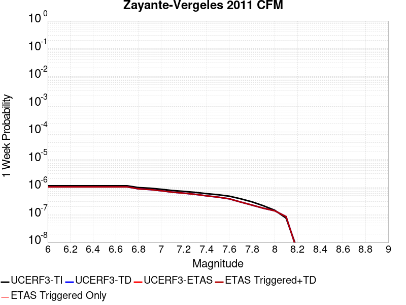 |  |  | 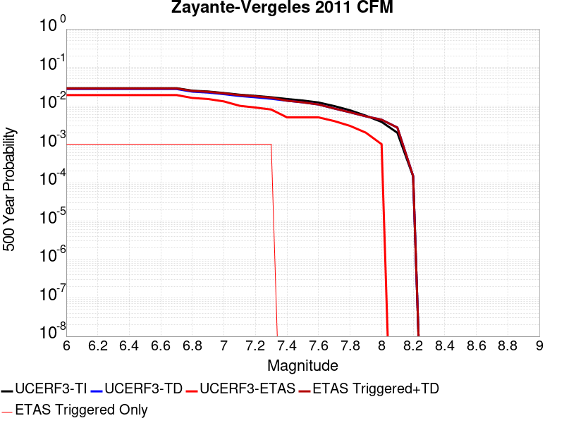 |

| Magnitude | 1 wk TI Prob | 1 wk TD Prob | 1 wk ETAS Prob | 1 wk ETAS/TD Gain | 1 wk ETAS Triggered+TD | 1 wk ETAS Triggered Only | 1 mo TI Prob | 1 mo TD Prob | 1 mo ETAS Prob | 1 mo ETAS/TD Gain | 1 mo ETAS Triggered+TD | 1 mo ETAS Triggered Only | 1 yr TI Prob | 1 yr TD Prob | 1 yr ETAS Prob | 1 yr ETAS/TD Gain | 1 yr ETAS Triggered+TD | 1 yr ETAS Triggered Only | 500 yr TI Prob | 500 yr TD Prob | 500 yr ETAS Prob | 500 yr ETAS/TD Gain | 500 yr ETAS Triggered+TD | 500 yr ETAS Triggered Only |
|-----|-----|-----|-----|-----|-----|-----|-----|-----|-----|-----|-----|-----|-----|-----|-----|-----|-----|-----|-----|-----|-----|-----|-----|-----|
| 6.0 | 1.11522E-6 | 1.0199684E-6 | 0.0 | 0.0 | 1.0199684E-6 | 0.0 | 4.7795056E-6 | 4.371286E-6 | 0.0 | 0.0 | 4.371286E-6 | 0.0 | 5.8188925E-5 | 5.321912E-5 | 0.0 | 0.0 | 5.321912E-5 | 0.0 | 0.028676117 | 0.027286798 | 0.019 | 0.6963074 | 0.02825951 | 0.001 |
| 6.1 | 1.11522E-6 | 1.0199684E-6 | 0.0 | 0.0 | 1.0199684E-6 | 0.0 | 4.7795056E-6 | 4.371286E-6 | 0.0 | 0.0 | 4.371286E-6 | 0.0 | 5.8188925E-5 | 5.321912E-5 | 0.0 | 0.0 | 5.321912E-5 | 0.0 | 0.028676117 | 0.027286798 | 0.019 | 0.6963074 | 0.02825951 | 0.001 |
| 6.2 | 1.11522E-6 | 1.0199684E-6 | 0.0 | 0.0 | 1.0199684E-6 | 0.0 | 4.7795056E-6 | 4.371286E-6 | 0.0 | 0.0 | 4.371286E-6 | 0.0 | 5.8188925E-5 | 5.321912E-5 | 0.0 | 0.0 | 5.321912E-5 | 0.0 | 0.028676117 | 0.027286798 | 0.019 | 0.6963074 | 0.02825951 | 0.001 |
| 6.3 | 1.11522E-6 | 1.0199684E-6 | 0.0 | 0.0 | 1.0199684E-6 | 0.0 | 4.7795056E-6 | 4.371286E-6 | 0.0 | 0.0 | 4.371286E-6 | 0.0 | 5.8188925E-5 | 5.321912E-5 | 0.0 | 0.0 | 5.321912E-5 | 0.0 | 0.028676117 | 0.027286798 | 0.019 | 0.6963074 | 0.02825951 | 0.001 |
| 6.4 | 1.11522E-6 | 1.0199684E-6 | 0.0 | 0.0 | 1.0199684E-6 | 0.0 | 4.7795056E-6 | 4.371286E-6 | 0.0 | 0.0 | 4.371286E-6 | 0.0 | 5.8188925E-5 | 5.321912E-5 | 0.0 | 0.0 | 5.321912E-5 | 0.0 | 0.028676117 | 0.027286798 | 0.019 | 0.6963074 | 0.02825951 | 0.001 |
| 6.5 | 1.11522E-6 | 1.0199684E-6 | 0.0 | 0.0 | 1.0199684E-6 | 0.0 | 4.7795056E-6 | 4.371286E-6 | 0.0 | 0.0 | 4.371286E-6 | 0.0 | 5.8188925E-5 | 5.321912E-5 | 0.0 | 0.0 | 5.321912E-5 | 0.0 | 0.028676117 | 0.027286798 | 0.019 | 0.6963074 | 0.02825951 | 0.001 |
| 6.6 | 1.11522E-6 | 1.0199684E-6 | 0.0 | 0.0 | 1.0199684E-6 | 0.0 | 4.7795056E-6 | 4.371286E-6 | 0.0 | 0.0 | 4.371286E-6 | 0.0 | 5.8188925E-5 | 5.321912E-5 | 0.0 | 0.0 | 5.321912E-5 | 0.0 | 0.028676117 | 0.027286798 | 0.019 | 0.6963074 | 0.02825951 | 0.001 |
| 6.7 | 1.11522E-6 | 1.0199684E-6 | 0.0 | 0.0 | 1.0199684E-6 | 0.0 | 4.7795056E-6 | 4.371286E-6 | 0.0 | 0.0 | 4.371286E-6 | 0.0 | 5.8188925E-5 | 5.321912E-5 | 0.0 | 0.0 | 5.321912E-5 | 0.0 | 0.028676117 | 0.027286798 | 0.019 | 0.6963074 | 0.02825951 | 0.001 |
| 6.8 | 9.608091E-7 | 8.648793E-7 | 0.0 | 0.0 | 8.648793E-7 | 0.0 | 4.1177464E-6 | 3.7066204E-6 | 0.0 | 0.0 | 3.7066204E-6 | 0.0 | 5.013241E-5 | 4.512717E-5 | 0.0 | 0.0 | 4.512717E-5 | 0.0 | 0.02475527 | 0.02334067 | 0.016 | 0.6854987 | 0.02431733 | 0.001 |
| 6.9 | 9.126062E-7 | 8.164082E-7 | 0.0 | 0.0 | 8.164082E-7 | 0.0 | 3.9111637E-6 | 3.4988875E-6 | 0.0 | 0.0 | 3.4988875E-6 | 0.0 | 4.7617377E-5 | 4.2598123E-5 | 0.0 | 0.0 | 4.2598123E-5 | 0.0 | 0.02352805 | 0.022104343 | 0.015 | 0.67859966 | 0.02308224 | 0.001 |
| 7.0 | 8.3412164E-7 | 7.37514E-7 | 0.0 | 0.0 | 7.37514E-7 | 0.0 | 3.5748021E-6 | 3.1607703E-6 | 0.0 | 0.0 | 3.1607703E-6 | 0.0 | 4.3522345E-5 | 3.84817E-5 | 0.0 | 0.0 | 3.84817E-5 | 0.0 | 0.02152657 | 0.020089231 | 0.013 | 0.64711285 | 0.021069143 | 0.001 |
| 7.1 | 7.5248664E-7 | 6.554134E-7 | 0.0 | 0.0 | 6.554134E-7 | 0.0 | 3.2249386E-6 | 2.8089112E-6 | 0.0 | 0.0 | 2.8089112E-6 | 0.0 | 3.9262923E-5 | 3.4197958E-5 | 0.0 | 0.0 | 3.4197958E-5 | 0.0 | 0.019440396 | 0.017987922 | 0.01 | 0.5559286 | 0.018969934 | 0.001 |
| 7.2 | 7.0037134E-7 | 6.0306394E-7 | 0.0 | 0.0 | 6.0306394E-7 | 0.0 | 3.001588E-6 | 2.584557E-6 | 0.0 | 0.0 | 2.584557E-6 | 0.0 | 3.6543723E-5 | 3.1466527E-5 | 0.0 | 0.0 | 3.1466527E-5 | 0.0 | 0.01810627 | 0.016645651 | 0.009 | 0.5406817 | 0.017629007 | 0.001 |
| 7.3 | 6.45065E-7 | 5.4808555E-7 | 0.0 | 0.0 | 5.4808555E-7 | 0.0 | 2.764561E-6 | 2.3489358E-6 | 0.0 | 0.0 | 2.3489358E-6 | 0.0 | 3.3658012E-5 | 2.8597919E-5 | 0.0 | 0.0 | 2.8597919E-5 | 0.0 | 0.016688468 | 0.0152330585 | 0.008 | 0.5251736 | 0.016217826 | 0.001 |
| 7.4 | 5.8052325E-7 | 4.8382344E-7 | 0.0 | 0.0 | 4.8382344E-7 | 0.0 | 2.4879546E-6 | 2.0735272E-6 | 0.0 | 0.0 | 2.0735272E-6 | 0.0 | 3.0290425E-5 | 2.52449E-5 | 0.0 | 0.0 | 2.52449E-5 | 0.0 | 0.015031327 | 0.013578811 | 0.005 | 0.36822078 | 0.013578811 | 0.0 |
| 7.5 | 5.3032613E-7 | 4.3446536E-7 | 0.0 | 0.0 | 4.3446536E-7 | 0.0 | 2.2728243E-6 | 1.8619929E-6 | 0.0 | 0.0 | 1.8619929E-6 | 0.0 | 2.7671285E-5 | 2.2669528E-5 | 0.0 | 0.0 | 2.2669528E-5 | 0.0 | 0.013740559 | 0.012304011 | 0.005 | 0.40637153 | 0.012304011 | 0.0 |
| 7.6 | 4.7034268E-7 | 3.7737087E-7 | 0.0 | 0.0 | 3.7737087E-7 | 0.0 | 2.015753E-6 | 1.6173026E-6 | 0.0 | 0.0 | 1.6173026E-6 | 0.0 | 2.4541514E-5 | 1.969048E-5 | 0.0 | 0.0 | 1.969048E-5 | 0.0 | 0.012195927 | 0.010818477 | 0.005 | 0.46217227 | 0.010818477 | 0.0 |
| 7.7 | 3.7871462E-7 | 2.8895013E-7 | 0.0 | 0.0 | 2.8895013E-7 | 0.0 | 1.6230616E-6 | 1.2383572E-6 | 0.0 | 0.0 | 1.2383572E-6 | 0.0 | 1.9760595E-5 | 1.5076894E-5 | 0.0 | 0.0 | 1.5076894E-5 | 0.0 | 0.009831744 | 0.008503016 | 0.004 | 0.4704213 | 0.008503016 | 0.0 |
| 7.8 | 2.9379848E-7 | 2.2454951E-7 | 0.0 | 0.0 | 2.2454951E-7 | 0.0 | 1.2591357E-6 | 9.623546E-7 | 0.0 | 0.0 | 9.623546E-7 | 0.0 | 1.532987E-5 | 1.17166055E-5 | 0.0 | 0.0 | 1.17166055E-5 | 0.0 | 0.007635692 | 0.0067670033 | 0.003 | 0.4433277 | 0.0067670033 | 0.0 |
| 7.9 | 2.125013E-7 | 1.726318E-7 | 0.0 | 0.0 | 1.726318E-7 | 0.0 | 9.1071956E-7 | 7.398504E-7 | 0.0 | 0.0 | 7.398504E-7 | 0.0 | 1.1087954E-5 | 9.007641E-6 | 0.0 | 0.0 | 9.007641E-6 | 0.0 | 0.005528668 | 0.005317428 | 0.002 | 0.37612167 | 0.005317428 | 0.0 |
| 8.0 | 1.4631894E-7 | 1.3963569E-7 | 0.0 | 0.0 | 1.3963569E-7 | 0.0 | 6.2708096E-7 | 5.9843853E-7 | 0.0 | 0.0 | 5.9843853E-7 | 0.0 | 7.634684E-6 | 7.285965E-6 | 0.0 | 0.0 | 7.285965E-6 | 0.0 | 0.0038100798 | 0.004343769 | 0.001 | 0.23021482 | 0.004343769 | 0.0 |
| 8.1 | 7.624931E-8 | 8.63081E-8 | 0.0 | 0.0 | 8.63081E-8 | 0.0 | 3.2678273E-7 | 3.6989178E-7 | 0.0 | 0.0 | 3.6989178E-7 | 0.0 | 3.9785723E-6 | 4.503423E-6 | 0.0 | 0.0 | 4.503423E-6 | 0.0 | 0.0019873127 | 0.002713687 | 0.0 | 0.0 | 0.002713687 | 0.0 |
| 8.2 | 5.5641607E-9 | 4.7348876E-9 | 0.0 | 0.0 | 4.7348876E-9 | 0.0 | 2.3846402E-8 | 2.0292374E-8 | 0.0 | 0.0 | 2.0292374E-8 | 0.0 | 2.9032992E-7 | 2.4705963E-7 | 0.0 | 0.0 | 2.4705963E-7 | 0.0 | 1.4515444E-4 | 1.4920032E-4 | 0.0 | 0.0 | 1.4920032E-4 | 0.0 |

## Ozena
*[(top)](#table-of-contents)*

| 1 Week | 1 Month | 1 Year | 500 Year |
|-----|-----|-----|-----|
| 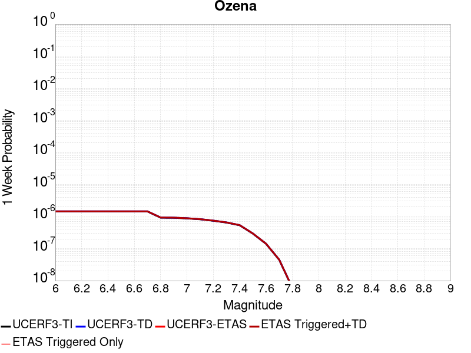 | 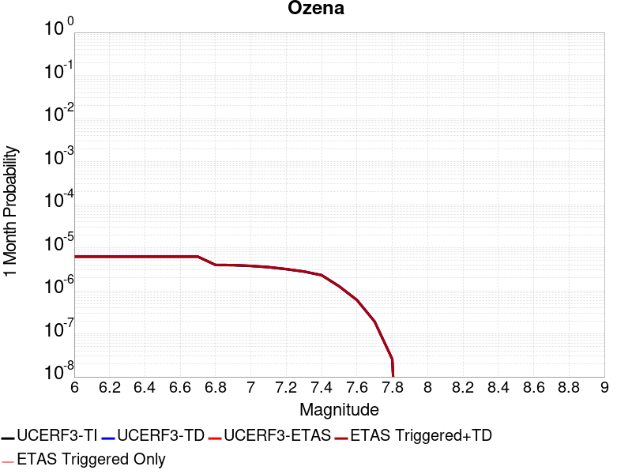 | 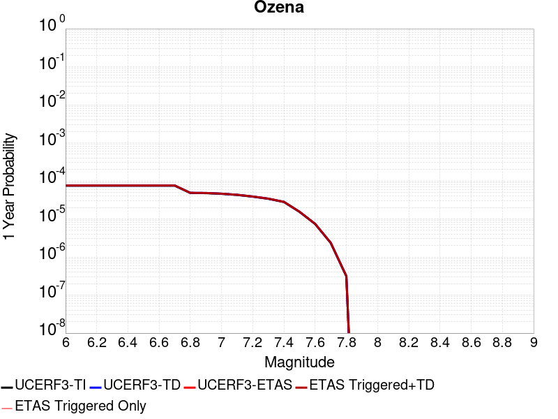 | 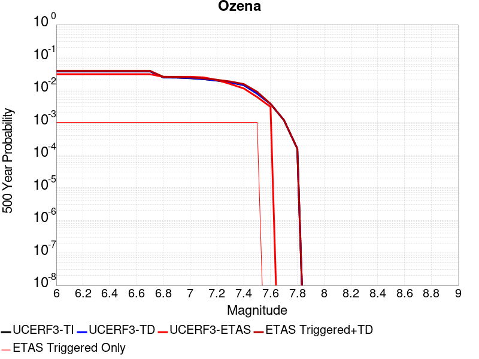 |

| Magnitude | 1 wk TI Prob | 1 wk TD Prob | 1 wk ETAS Prob | 1 wk ETAS/TD Gain | 1 wk ETAS Triggered+TD | 1 wk ETAS Triggered Only | 1 mo TI Prob | 1 mo TD Prob | 1 mo ETAS Prob | 1 mo ETAS/TD Gain | 1 mo ETAS Triggered+TD | 1 mo ETAS Triggered Only | 1 yr TI Prob | 1 yr TD Prob | 1 yr ETAS Prob | 1 yr ETAS/TD Gain | 1 yr ETAS Triggered+TD | 1 yr ETAS Triggered Only | 500 yr TI Prob | 500 yr TD Prob | 500 yr ETAS Prob | 500 yr ETAS/TD Gain | 500 yr ETAS Triggered+TD | 500 yr ETAS Triggered Only |
|-----|-----|-----|-----|-----|-----|-----|-----|-----|-----|-----|-----|-----|-----|-----|-----|-----|-----|-----|-----|-----|-----|-----|-----|-----|
| 6.0 | 1.4377547E-6 | 1.4506635E-6 | 0.0 | 0.0 | 1.4506635E-6 | 0.0 | 6.161791E-6 | 6.2171157E-6 | 0.0 | 0.0 | 6.2171157E-6 | 0.0 | 7.5017226E-5 | 7.569103E-5 | 0.0 | 0.0 | 7.569103E-5 | 0.0 | 0.036815234 | 0.03721106 | 0.03 | 0.80621195 | 0.038173847 | 0.001 |
| 6.1 | 1.4377547E-6 | 1.4506635E-6 | 0.0 | 0.0 | 1.4506635E-6 | 0.0 | 6.161791E-6 | 6.2171157E-6 | 0.0 | 0.0 | 6.2171157E-6 | 0.0 | 7.5017226E-5 | 7.569103E-5 | 0.0 | 0.0 | 7.569103E-5 | 0.0 | 0.036815234 | 0.03721106 | 0.03 | 0.80621195 | 0.038173847 | 0.001 |
| 6.2 | 1.4377547E-6 | 1.4506635E-6 | 0.0 | 0.0 | 1.4506635E-6 | 0.0 | 6.161791E-6 | 6.2171157E-6 | 0.0 | 0.0 | 6.2171157E-6 | 0.0 | 7.5017226E-5 | 7.569103E-5 | 0.0 | 0.0 | 7.569103E-5 | 0.0 | 0.036815234 | 0.03721106 | 0.03 | 0.80621195 | 0.038173847 | 0.001 |
| 6.3 | 1.4377547E-6 | 1.4506635E-6 | 0.0 | 0.0 | 1.4506635E-6 | 0.0 | 6.161791E-6 | 6.2171157E-6 | 0.0 | 0.0 | 6.2171157E-6 | 0.0 | 7.5017226E-5 | 7.569103E-5 | 0.0 | 0.0 | 7.569103E-5 | 0.0 | 0.036815234 | 0.03721106 | 0.03 | 0.80621195 | 0.038173847 | 0.001 |
| 6.4 | 1.4377547E-6 | 1.4506635E-6 | 0.0 | 0.0 | 1.4506635E-6 | 0.0 | 6.161791E-6 | 6.2171157E-6 | 0.0 | 0.0 | 6.2171157E-6 | 0.0 | 7.5017226E-5 | 7.569103E-5 | 0.0 | 0.0 | 7.569103E-5 | 0.0 | 0.036815234 | 0.03721106 | 0.03 | 0.80621195 | 0.038173847 | 0.001 |
| 6.5 | 1.4377547E-6 | 1.4506635E-6 | 0.0 | 0.0 | 1.4506635E-6 | 0.0 | 6.161791E-6 | 6.2171157E-6 | 0.0 | 0.0 | 6.2171157E-6 | 0.0 | 7.5017226E-5 | 7.569103E-5 | 0.0 | 0.0 | 7.569103E-5 | 0.0 | 0.036815234 | 0.03721106 | 0.03 | 0.80621195 | 0.038173847 | 0.001 |
| 6.6 | 1.4377547E-6 | 1.4506635E-6 | 0.0 | 0.0 | 1.4506635E-6 | 0.0 | 6.161791E-6 | 6.2171157E-6 | 0.0 | 0.0 | 6.2171157E-6 | 0.0 | 7.5017226E-5 | 7.569103E-5 | 0.0 | 0.0 | 7.569103E-5 | 0.0 | 0.036815234 | 0.03721106 | 0.03 | 0.80621195 | 0.038173847 | 0.001 |
| 6.7 | 1.4377547E-6 | 1.4506635E-6 | 0.0 | 0.0 | 1.4506635E-6 | 0.0 | 6.161791E-6 | 6.2171157E-6 | 0.0 | 0.0 | 6.2171157E-6 | 0.0 | 7.5017226E-5 | 7.569103E-5 | 0.0 | 0.0 | 7.569103E-5 | 0.0 | 0.036815234 | 0.03721106 | 0.03 | 0.80621195 | 0.038173847 | 0.001 |
| 6.8 | 9.223257E-7 | 9.312668E-7 | 0.0 | 0.0 | 9.312668E-7 | 0.0 | 3.9528186E-6 | 3.9911374E-6 | 0.0 | 0.0 | 3.9911374E-6 | 0.0 | 4.81245E-5 | 4.8591057E-5 | 0.0 | 0.0 | 4.8591057E-5 | 0.0 | 0.023775628 | 0.024014233 | 0.025 | 1.0410492 | 0.024990218 | 0.001 |
| 6.9 | 9.141515E-7 | 9.230442E-7 | 0.0 | 0.0 | 9.230442E-7 | 0.0 | 3.917786E-6 | 3.955898E-6 | 0.0 | 0.0 | 3.955898E-6 | 0.0 | 4.7698002E-5 | 4.8162034E-5 | 0.0 | 0.0 | 4.8162034E-5 | 0.0 | 0.023567416 | 0.023804821 | 0.025 | 1.0502074 | 0.024781017 | 0.001 |
| 7.0 | 8.767648E-7 | 8.8538013E-7 | 0.0 | 0.0 | 8.8538013E-7 | 0.0 | 3.757558E-6 | 3.794481E-6 | 0.0 | 0.0 | 3.794481E-6 | 0.0 | 4.5747307E-5 | 4.6196867E-5 | 0.0 | 0.0 | 4.6196867E-5 | 0.0 | 0.022614546 | 0.02284486 | 0.025 | 1.094338 | 0.023822017 | 0.001 |
| 7.1 | 8.199402E-7 | 8.2808816E-7 | 0.0 | 0.0 | 8.2808816E-7 | 0.0 | 3.5140247E-6 | 3.5489447E-6 | 0.0 | 0.0 | 3.5489447E-6 | 0.0 | 4.2782412E-5 | 4.3207583E-5 | 0.0 | 0.0 | 4.3207583E-5 | 0.0 | 0.021164484 | 0.021382637 | 0.024 | 1.122406 | 0.022361254 | 0.001 |
| 7.2 | 7.38705E-7 | 7.460207E-7 | 0.0 | 0.0 | 7.460207E-7 | 0.0 | 3.1658747E-6 | 3.197228E-6 | 0.0 | 0.0 | 3.197228E-6 | 0.0 | 3.8543843E-5 | 3.8925587E-5 | 0.0 | 0.0 | 3.8925587E-5 | 0.0 | 0.01908777 | 0.019284528 | 0.02 | 1.0371008 | 0.020265244 | 0.001 |
| 7.3 | 6.490017E-7 | 6.554241E-7 | 0.0 | 0.0 | 6.554241E-7 | 0.0 | 2.7814328E-6 | 2.8089578E-6 | 0.0 | 0.0 | 2.8089578E-6 | 0.0 | 3.386342E-5 | 3.4198558E-5 | 0.0 | 0.0 | 3.4198558E-5 | 0.0 | 0.016789455 | 0.01696337 | 0.015 | 0.8842582 | 0.017946407 | 0.001 |
| 7.4 | 5.346736E-7 | 5.3993443E-7 | 0.0 | 0.0 | 5.3993443E-7 | 0.0 | 2.291456E-6 | 2.3140028E-6 | 0.0 | 0.0 | 2.3140028E-6 | 0.0 | 2.789812E-5 | 2.817265E-5 | 0.0 | 0.0 | 2.817265E-5 | 0.0 | 0.013852415 | 0.013996089 | 0.011 | 0.78593385 | 0.014982093 | 0.001 |
| 7.5 | 2.939325E-7 | 2.965174E-7 | 0.0 | 0.0 | 2.965174E-7 | 0.0 | 1.25971E-6 | 1.2707884E-6 | 0.0 | 0.0 | 1.2707884E-6 | 0.0 | 1.5336862E-5 | 1.5471755E-5 | 0.0 | 0.0 | 1.5471755E-5 | 0.0 | 0.007639162 | 0.0077105393 | 0.006 | 0.7781557 | 0.008702829 | 0.001 |
| 7.6 | 1.4151905E-7 | 1.4247959E-7 | 0.0 | 0.0 | 1.4247959E-7 | 0.0 | 6.065101E-7 | 6.106267E-7 | 0.0 | 0.0 | 6.106267E-7 | 0.0 | 7.3842357E-6 | 7.4343557E-6 | 0.0 | 0.0 | 7.4343557E-6 | 0.0 | 0.0036853238 | 0.0037105042 | 0.003 | 0.8085154 | 0.0037105042 | 0.0 |
| 7.7 | 4.4957577E-8 | 4.5236835E-8 | 0.0 | 0.0 | 4.5236835E-8 | 0.0 | 1.9267533E-7 | 1.9387213E-7 | 0.0 | 0.0 | 1.9387213E-7 | 0.0 | 2.3458194E-6 | 2.3603907E-6 | 0.0 | 0.0 | 2.3603907E-6 | 0.0 | 0.0011722236 | 0.0011795266 | 0.0 | 0.0 | 0.0011795266 | 0.0 |
| 7.8 | 5.9993255E-9 | 6.0391017E-9 | 0.0 | 0.0 | 6.0391017E-9 | 0.0 | 2.5711394E-8 | 2.5881864E-8 | 0.0 | 0.0 | 2.5881864E-8 | 0.0 | 3.1303617E-7 | 3.1511166E-7 | 0.0 | 0.0 | 3.1511166E-7 | 0.0 | 1.5650586E-4 | 1.5754641E-4 | 0.0 | 0.0 | 1.5754641E-4 | 0.0 |

## San Pedro Escarpment
*[(top)](#table-of-contents)*

| 1 Week | 1 Month | 1 Year | 500 Year |
|-----|-----|-----|-----|
| 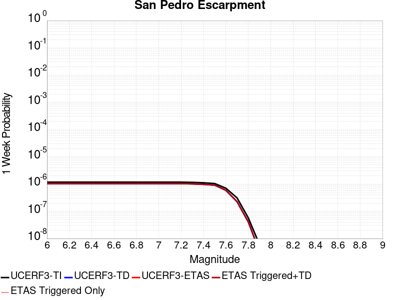 | 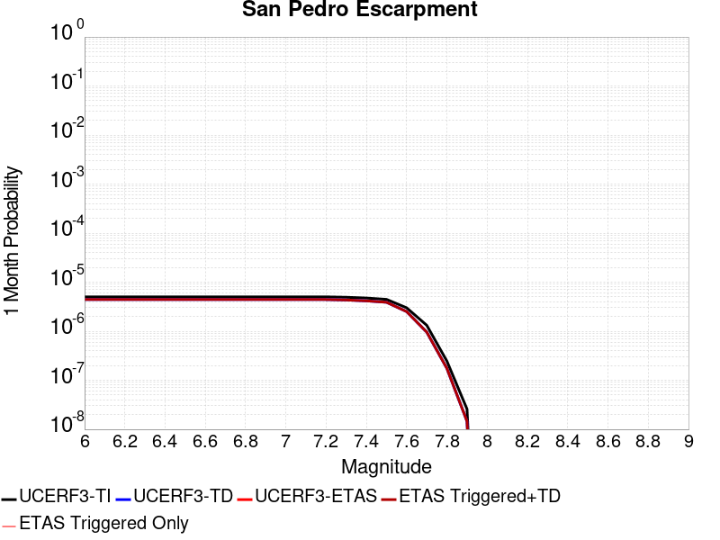 | 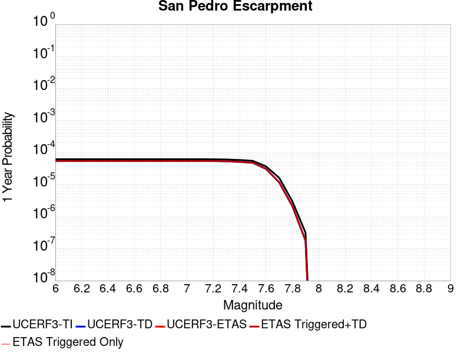 | 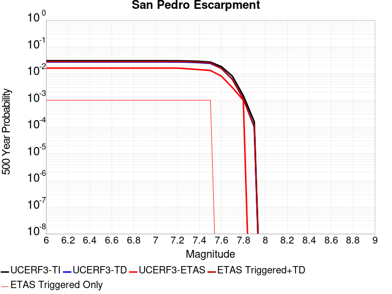 |

| Magnitude | 1 wk TI Prob | 1 wk TD Prob | 1 wk ETAS Prob | 1 wk ETAS/TD Gain | 1 wk ETAS Triggered+TD | 1 wk ETAS Triggered Only | 1 mo TI Prob | 1 mo TD Prob | 1 mo ETAS Prob | 1 mo ETAS/TD Gain | 1 mo ETAS Triggered+TD | 1 mo ETAS Triggered Only | 1 yr TI Prob | 1 yr TD Prob | 1 yr ETAS Prob | 1 yr ETAS/TD Gain | 1 yr ETAS Triggered+TD | 1 yr ETAS Triggered Only | 500 yr TI Prob | 500 yr TD Prob | 500 yr ETAS Prob | 500 yr ETAS/TD Gain | 500 yr ETAS Triggered+TD | 500 yr ETAS Triggered Only |
|-----|-----|-----|-----|-----|-----|-----|-----|-----|-----|-----|-----|-----|-----|-----|-----|-----|-----|-----|-----|-----|-----|-----|-----|-----|
| 6.0 | 1.1740281E-6 | 1.0363808E-6 | 0.0 | 0.0 | 1.0363808E-6 | 0.0 | 5.031539E-6 | 4.441625E-6 | 0.0 | 0.0 | 4.441625E-6 | 0.0 | 6.125726E-5 | 5.4075506E-5 | 0.0 | 0.0 | 5.4075506E-5 | 0.0 | 0.030165238 | 0.027133897 | 0.016 | 0.58966833 | 0.028106764 | 0.001 |
| 6.1 | 1.1740281E-6 | 1.0363808E-6 | 0.0 | 0.0 | 1.0363808E-6 | 0.0 | 5.031539E-6 | 4.441625E-6 | 0.0 | 0.0 | 4.441625E-6 | 0.0 | 6.125726E-5 | 5.4075506E-5 | 0.0 | 0.0 | 5.4075506E-5 | 0.0 | 0.030165238 | 0.027133897 | 0.016 | 0.58966833 | 0.028106764 | 0.001 |
| 6.2 | 1.1740281E-6 | 1.0363808E-6 | 0.0 | 0.0 | 1.0363808E-6 | 0.0 | 5.031539E-6 | 4.441625E-6 | 0.0 | 0.0 | 4.441625E-6 | 0.0 | 6.125726E-5 | 5.4075506E-5 | 0.0 | 0.0 | 5.4075506E-5 | 0.0 | 0.030165238 | 0.027133897 | 0.016 | 0.58966833 | 0.028106764 | 0.001 |
| 6.3 | 1.1740281E-6 | 1.0363808E-6 | 0.0 | 0.0 | 1.0363808E-6 | 0.0 | 5.031539E-6 | 4.441625E-6 | 0.0 | 0.0 | 4.441625E-6 | 0.0 | 6.125726E-5 | 5.4075506E-5 | 0.0 | 0.0 | 5.4075506E-5 | 0.0 | 0.030165238 | 0.027133897 | 0.016 | 0.58966833 | 0.028106764 | 0.001 |
| 6.4 | 1.1740281E-6 | 1.0363808E-6 | 0.0 | 0.0 | 1.0363808E-6 | 0.0 | 5.031539E-6 | 4.441625E-6 | 0.0 | 0.0 | 4.441625E-6 | 0.0 | 6.125726E-5 | 5.4075506E-5 | 0.0 | 0.0 | 5.4075506E-5 | 0.0 | 0.030165238 | 0.027133897 | 0.016 | 0.58966833 | 0.028106764 | 0.001 |
| 6.5 | 1.1740281E-6 | 1.0363808E-6 | 0.0 | 0.0 | 1.0363808E-6 | 0.0 | 5.031539E-6 | 4.441625E-6 | 0.0 | 0.0 | 4.441625E-6 | 0.0 | 6.125726E-5 | 5.4075506E-5 | 0.0 | 0.0 | 5.4075506E-5 | 0.0 | 0.030165238 | 0.027133897 | 0.016 | 0.58966833 | 0.028106764 | 0.001 |
| 6.6 | 1.1740281E-6 | 1.0363808E-6 | 0.0 | 0.0 | 1.0363808E-6 | 0.0 | 5.031539E-6 | 4.441625E-6 | 0.0 | 0.0 | 4.441625E-6 | 0.0 | 6.125726E-5 | 5.4075506E-5 | 0.0 | 0.0 | 5.4075506E-5 | 0.0 | 0.030165238 | 0.027133897 | 0.016 | 0.58966833 | 0.028106764 | 0.001 |
| 6.7 | 1.1740281E-6 | 1.0363808E-6 | 0.0 | 0.0 | 1.0363808E-6 | 0.0 | 5.031539E-6 | 4.441625E-6 | 0.0 | 0.0 | 4.441625E-6 | 0.0 | 6.125726E-5 | 5.4075506E-5 | 0.0 | 0.0 | 5.4075506E-5 | 0.0 | 0.030165238 | 0.027133897 | 0.016 | 0.58966833 | 0.028106764 | 0.001 |
| 6.8 | 1.1740281E-6 | 1.0363808E-6 | 0.0 | 0.0 | 1.0363808E-6 | 0.0 | 5.031539E-6 | 4.441625E-6 | 0.0 | 0.0 | 4.441625E-6 | 0.0 | 6.125726E-5 | 5.4075506E-5 | 0.0 | 0.0 | 5.4075506E-5 | 0.0 | 0.030165238 | 0.027133897 | 0.016 | 0.58966833 | 0.028106764 | 0.001 |
| 6.9 | 1.1740281E-6 | 1.0363808E-6 | 0.0 | 0.0 | 1.0363808E-6 | 0.0 | 5.031539E-6 | 4.441625E-6 | 0.0 | 0.0 | 4.441625E-6 | 0.0 | 6.125726E-5 | 5.4075506E-5 | 0.0 | 0.0 | 5.4075506E-5 | 0.0 | 0.030165238 | 0.027133897 | 0.016 | 0.58966833 | 0.028106764 | 0.001 |
| 7.0 | 1.1740281E-6 | 1.0363808E-6 | 0.0 | 0.0 | 1.0363808E-6 | 0.0 | 5.031539E-6 | 4.441625E-6 | 0.0 | 0.0 | 4.441625E-6 | 0.0 | 6.125726E-5 | 5.4075506E-5 | 0.0 | 0.0 | 5.4075506E-5 | 0.0 | 0.030165238 | 0.027133897 | 0.016 | 0.58966833 | 0.028106764 | 0.001 |
| 7.1 | 1.1740281E-6 | 1.0363808E-6 | 0.0 | 0.0 | 1.0363808E-6 | 0.0 | 5.031539E-6 | 4.441625E-6 | 0.0 | 0.0 | 4.441625E-6 | 0.0 | 6.125726E-5 | 5.4075506E-5 | 0.0 | 0.0 | 5.4075506E-5 | 0.0 | 0.030165238 | 0.027133897 | 0.016 | 0.58966833 | 0.028106764 | 0.001 |
| 7.2 | 1.1722314E-6 | 1.034569E-6 | 0.0 | 0.0 | 1.034569E-6 | 0.0 | 5.023839E-6 | 4.43386E-6 | 0.0 | 0.0 | 4.43386E-6 | 0.0 | 6.116352E-5 | 5.398097E-5 | 0.0 | 0.0 | 5.398097E-5 | 0.0 | 0.030119777 | 0.027087906 | 0.016 | 0.59066945 | 0.02806082 | 0.001 |
| 7.3 | 1.1515234E-6 | 1.0136545E-6 | 0.0 | 0.0 | 1.0136545E-6 | 0.0 | 4.935091E-6 | 4.3442265E-6 | 0.0 | 0.0 | 4.3442265E-6 | 0.0 | 6.008308E-5 | 5.288974E-5 | 0.0 | 0.0 | 5.288974E-5 | 0.0 | 0.029595653 | 0.02655687 | 0.015 | 0.5648256 | 0.027530313 | 0.001 |
| 7.4 | 1.1103637E-6 | 9.720388E-7 | 0.0 | 0.0 | 9.720388E-7 | 0.0 | 4.7586927E-6 | 4.1658745E-6 | 0.0 | 0.0 | 4.1658745E-6 | 0.0 | 5.793554E-5 | 5.071841E-5 | 0.0 | 0.0 | 5.071841E-5 | 0.0 | 0.028553043 | 0.02549934 | 0.014 | 0.5490338 | 0.02647384 | 0.001 |
| 7.5 | 1.0425391E-6 | 9.103798E-7 | 0.0 | 0.0 | 9.103798E-7 | 0.0 | 4.4680173E-6 | 3.901622E-6 | 0.0 | 0.0 | 3.901622E-6 | 0.0 | 5.439675E-5 | 4.750128E-5 | 0.0 | 0.0 | 4.750128E-5 | 0.0 | 0.02683255 | 0.023914877 | 0.013 | 0.54359466 | 0.024890963 | 0.001 |
| 7.6 | 7.0184194E-7 | 5.875027E-7 | 0.0 | 0.0 | 5.875027E-7 | 0.0 | 3.0078907E-6 | 2.5178667E-6 | 0.0 | 0.0 | 2.5178667E-6 | 0.0 | 3.6620455E-5 | 3.0654643E-5 | 0.0 | 0.0 | 3.0654643E-5 | 0.0 | 0.018143943 | 0.015599861 | 0.008 | 0.5128251 | 0.015599861 | 0.0 |
| 7.7 | 3.0871365E-7 | 2.2390154E-7 | 0.0 | 0.0 | 2.2390154E-7 | 0.0 | 1.3230577E-6 | 9.595776E-7 | 0.0 | 0.0 | 9.595776E-7 | 0.0 | 1.610811E-5 | 1.1682797E-5 | 0.0 | 0.0 | 1.1682797E-5 | 0.0 | 0.008021772 | 0.006104265 | 0.003 | 0.49145967 | 0.006104265 | 0.0 |
| 7.8 | 5.7512665E-8 | 4.088352E-8 | 0.0 | 0.0 | 4.088352E-8 | 0.0 | 2.464828E-7 | 1.7521506E-7 | 0.0 | 0.0 | 1.7521506E-7 | 0.0 | 3.0009242E-6 | 2.1332417E-6 | 0.0 | 0.0 | 2.1332417E-6 | 0.0 | 0.0014993392 | 0.0011342412 | 0.001 | 0.8816467 | 0.0011342412 | 0.0 |
| 7.9 | 6.040053E-9 | 3.4089749E-9 | 0.0 | 0.0 | 3.4089749E-9 | 0.0 | 2.5885942E-8 | 1.4609893E-8 | 0.0 | 0.0 | 1.4609893E-8 | 0.0 | 3.151613E-7 | 1.7787544E-7 | 0.0 | 0.0 | 1.7787544E-7 | 0.0 | 1.5756825E-4 | 1.0151451E-4 | 0.0 | 0.0 | 1.0151451E-4 | 0.0 |

## San Luis Range - Pecho 2011 CFM
*[(top)](#table-of-contents)*

| 1 Week | 1 Month | 1 Year | 500 Year |
|-----|-----|-----|-----|
| 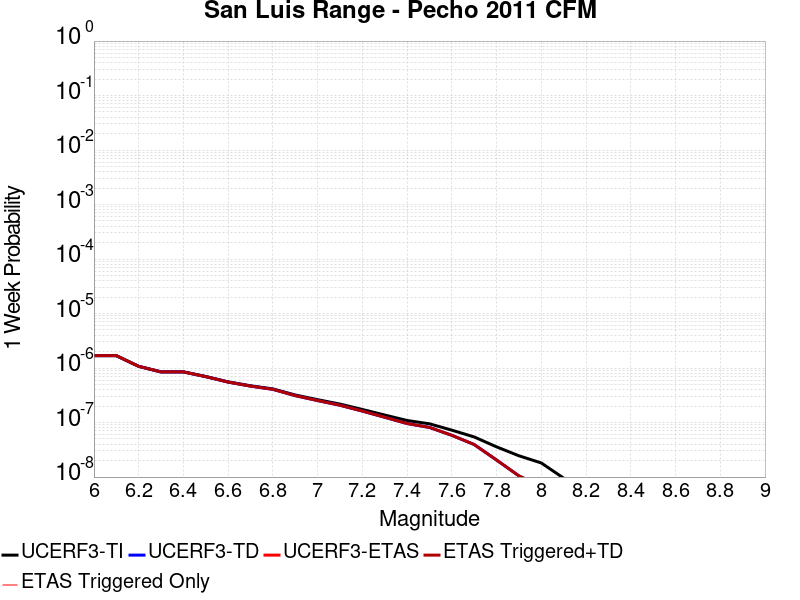 | 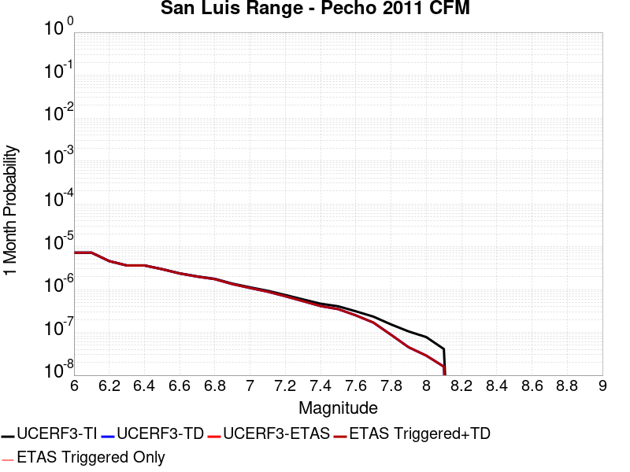 | 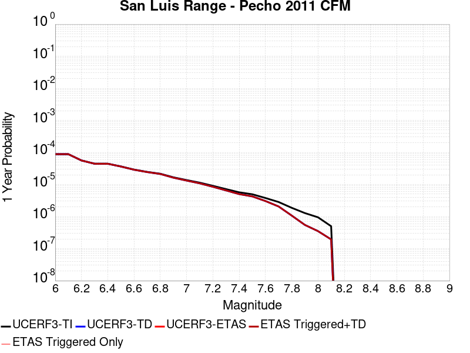 | 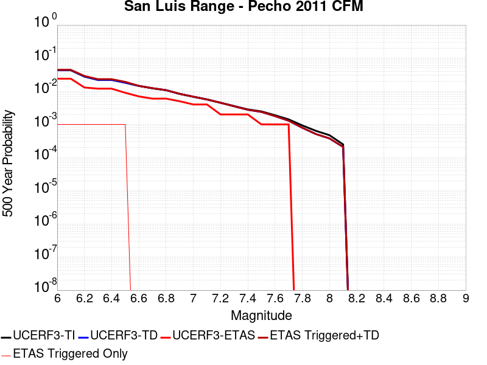 |

| Magnitude | 1 wk TI Prob | 1 wk TD Prob | 1 wk ETAS Prob | 1 wk ETAS/TD Gain | 1 wk ETAS Triggered+TD | 1 wk ETAS Triggered Only | 1 mo TI Prob | 1 mo TD Prob | 1 mo ETAS Prob | 1 mo ETAS/TD Gain | 1 mo ETAS Triggered+TD | 1 mo ETAS Triggered Only | 1 yr TI Prob | 1 yr TD Prob | 1 yr ETAS Prob | 1 yr ETAS/TD Gain | 1 yr ETAS Triggered+TD | 1 yr ETAS Triggered Only | 500 yr TI Prob | 500 yr TD Prob | 500 yr ETAS Prob | 500 yr ETAS/TD Gain | 500 yr ETAS Triggered+TD | 500 yr ETAS Triggered Only |
|-----|-----|-----|-----|-----|-----|-----|-----|-----|-----|-----|-----|-----|-----|-----|-----|-----|-----|-----|-----|-----|-----|-----|-----|-----|
| 6.0 | 1.687423E-6 | 1.6901811E-6 | 0.0 | 0.0 | 1.6901811E-6 | 0.0 | 7.231793E-6 | 7.2436146E-6 | 0.0 | 0.0 | 7.2436146E-6 | 0.0 | 8.804352E-5 | 8.818768E-5 | 0.0 | 0.0 | 8.818768E-5 | 0.0 | 0.043068722 | 0.043452747 | 0.024 | 0.5523241 | 0.044409294 | 0.001 |
| 6.1 | 1.687423E-6 | 1.6901811E-6 | 0.0 | 0.0 | 1.6901811E-6 | 0.0 | 7.231793E-6 | 7.2436146E-6 | 0.0 | 0.0 | 7.2436146E-6 | 0.0 | 8.804352E-5 | 8.818768E-5 | 0.0 | 0.0 | 8.818768E-5 | 0.0 | 0.043068722 | 0.043452747 | 0.024 | 0.5523241 | 0.044409294 | 0.001 |
| 6.2 | 1.0765672E-6 | 1.0752649E-6 | 0.0 | 0.0 | 1.0752649E-6 | 0.0 | 4.613851E-6 | 4.6082705E-6 | 0.0 | 0.0 | 4.6082705E-6 | 0.0 | 5.617219E-5 | 5.6104313E-5 | 0.0 | 0.0 | 5.6104313E-5 | 0.0 | 0.027696114 | 0.027935566 | 0.013 | 0.4653566 | 0.02890763 | 0.001 |
| 6.3 | 8.523104E-7 | 8.4959123E-7 | 0.0 | 0.0 | 8.4959123E-7 | 0.0 | 3.6527538E-6 | 3.6411004E-6 | 0.0 | 0.0 | 3.6411004E-6 | 0.0 | 4.447137E-5 | 4.432953E-5 | 0.0 | 0.0 | 4.432953E-5 | 0.0 | 0.021990778 | 0.022187201 | 0.012 | 0.54085237 | 0.023165014 | 0.001 |
| 6.4 | 8.523104E-7 | 8.4959123E-7 | 0.0 | 0.0 | 8.4959123E-7 | 0.0 | 3.6527538E-6 | 3.6411004E-6 | 0.0 | 0.0 | 3.6411004E-6 | 0.0 | 4.447137E-5 | 4.432953E-5 | 0.0 | 0.0 | 4.432953E-5 | 0.0 | 0.021990778 | 0.022187201 | 0.012 | 0.54085237 | 0.023165014 | 0.001 |
| 6.5 | 7.0029404E-7 | 6.9601913E-7 | 0.0 | 0.0 | 6.9601913E-7 | 0.0 | 3.0012568E-6 | 2.9829357E-6 | 0.0 | 0.0 | 2.9829357E-6 | 0.0 | 3.6539688E-5 | 3.6316655E-5 | 0.0 | 0.0 | 3.6316655E-5 | 0.0 | 0.01810429 | 0.018257543 | 0.009 | 0.49294692 | 0.019239286 | 0.001 |
| 6.6 | 5.583906E-7 | 5.527348E-7 | 0.0 | 0.0 | 5.527348E-7 | 0.0 | 2.3931002E-6 | 2.368861E-6 | 0.0 | 0.0 | 2.368861E-6 | 0.0 | 2.9135606E-5 | 2.884051E-5 | 0.0 | 0.0 | 2.884051E-5 | 0.0 | 0.014462415 | 0.014578138 | 0.007 | 0.48017108 | 0.014578138 | 0.0 |
| 6.7 | 4.73441E-7 | 4.668124E-7 | 0.0 | 0.0 | 4.668124E-7 | 0.0 | 2.0290313E-6 | 2.000623E-6 | 0.0 | 0.0 | 2.000623E-6 | 0.0 | 2.4703175E-5 | 2.4357318E-5 | 0.0 | 0.0 | 2.4357318E-5 | 0.0 | 0.01227577 | 0.012365902 | 0.006 | 0.4852052 | 0.012365902 | 0.0 |
| 6.8 | 4.1466086E-7 | 4.073246E-7 | 0.0 | 0.0 | 4.073246E-7 | 0.0 | 1.7771167E-6 | 1.7456757E-6 | 0.0 | 0.0 | 1.7456757E-6 | 0.0 | 2.1636182E-5 | 2.1253398E-5 | 0.0 | 0.0 | 2.1253398E-5 | 0.0 | 0.010759901 | 0.0108316075 | 0.006 | 0.5539344 | 0.0108316075 | 0.0 |
| 6.9 | 3.2056641E-7 | 3.119115E-7 | 0.0 | 0.0 | 3.119115E-7 | 0.0 | 1.3738553E-6 | 1.3367628E-6 | 0.0 | 0.0 | 1.3367628E-6 | 0.0 | 1.6726559E-5 | 1.6274967E-5 | 0.0 | 0.0 | 1.6274967E-5 | 0.0 | 0.008328474 | 0.008365725 | 0.005 | 0.5976768 | 0.008365725 | 0.0 |
| 7.0 | 2.6315942E-7 | 2.5356752E-7 | 0.0 | 0.0 | 2.5356752E-7 | 0.0 | 1.1278256E-6 | 1.0867175E-6 | 0.0 | 0.0 | 1.0867175E-6 | 0.0 | 1.3731191E-5 | 1.3230705E-5 | 0.0 | 0.0 | 1.3230705E-5 | 0.0 | 0.006842128 | 0.006854963 | 0.004 | 0.58351886 | 0.006854963 | 0.0 |
| 7.1 | 2.1832436E-7 | 2.0789096E-7 | 0.0 | 0.0 | 2.0789096E-7 | 0.0 | 9.356755E-7 | 8.9096096E-7 | 0.0 | 0.0 | 8.9096096E-7 | 0.0 | 1.13917895E-5 | 1.0847396E-5 | 0.0 | 0.0 | 1.0847396E-5 | 0.0 | 0.005679736 | 0.005670669 | 0.004 | 0.70538414 | 0.005670669 | 0.0 |
| 7.2 | 1.7393015E-7 | 1.6253756E-7 | 0.0 | 0.0 | 1.6253756E-7 | 0.0 | 7.454147E-7 | 6.965894E-7 | 0.0 | 0.0 | 6.965894E-7 | 0.0 | 9.075386E-6 | 8.480943E-6 | 0.0 | 0.0 | 8.480943E-6 | 0.0 | 0.004527434 | 0.004493377 | 0.002 | 0.4450995 | 0.004493377 | 0.0 |
| 7.3 | 1.3744894E-7 | 1.2520564E-7 | 0.0 | 0.0 | 1.2520564E-7 | 0.0 | 5.890667E-7 | 5.365955E-7 | 0.0 | 0.0 | 5.365955E-7 | 0.0 | 7.1718637E-6 | 6.533031E-6 | 0.0 | 0.0 | 6.533031E-6 | 0.0 | 0.003579523 | 0.003523278 | 0.002 | 0.5676532 | 0.003523278 | 0.0 |
| 7.4 | 1.0915278E-7 | 9.613831E-8 | 0.0 | 0.0 | 9.613831E-8 | 0.0 | 4.6779755E-7 | 4.1202125E-7 | 0.0 | 0.0 | 4.1202125E-7 | 0.0 | 5.6954204E-6 | 5.016347E-6 | 0.0 | 0.0 | 5.016347E-6 | 0.0 | 0.0028436673 | 0.0027673007 | 0.002 | 0.7227259 | 0.0027673007 | 0.0 |
| 7.5 | 9.490291E-8 | 8.1458616E-8 | 0.0 | 0.0 | 8.1458616E-8 | 0.0 | 4.0672668E-7 | 3.491083E-7 | 0.0 | 0.0 | 3.491083E-7 | 0.0 | 4.9518862E-6 | 4.2503852E-6 | 0.0 | 0.0 | 4.2503852E-6 | 0.0 | 0.0024728866 | 0.0023853004 | 0.001 | 0.41923442 | 0.0023853004 | 0.0 |
| 7.6 | 7.256678E-8 | 5.8356147E-8 | 0.0 | 0.0 | 5.8356147E-8 | 0.0 | 3.1100043E-7 | 2.5009774E-7 | 0.0 | 0.0 | 2.5009774E-7 | 0.0 | 3.7864236E-6 | 3.0449357E-6 | 0.0 | 0.0 | 3.0449357E-6 | 0.0 | 0.0018914244 | 0.001783823 | 0.001 | 0.5605937 | 0.001783823 | 0.0 |
| 7.7 | 5.446273E-8 | 3.9550294E-8 | 0.0 | 0.0 | 3.9550294E-8 | 0.0 | 2.3341168E-7 | 1.6950125E-7 | 0.0 | 0.0 | 1.6950125E-7 | 0.0 | 2.8417835E-6 | 2.0636755E-6 | 0.0 | 0.0 | 2.0636755E-6 | 0.0 | 0.0014198847 | 0.001293943 | 0.001 | 0.7728315 | 0.001293943 | 0.0 |
| 7.8 | 3.5850867E-8 | 2.0554708E-8 | 0.0 | 0.0 | 2.0554708E-8 | 0.0 | 1.5364655E-7 | 8.8091596E-8 | 0.0 | 0.0 | 8.8091596E-8 | 0.0 | 1.8706452E-6 | 1.0725147E-6 | 0.0 | 0.0 | 1.0725147E-6 | 0.0 | 9.348862E-4 | 7.9439115E-4 | 0.0 | 0.0 | 7.9439115E-4 | 0.0 |
| 7.9 | 2.45879E-8 | 1.0510114E-8 | 0.0 | 0.0 | 1.0510114E-8 | 0.0 | 1.0537671E-7 | 4.504334E-8 | 0.0 | 0.0 | 4.504334E-8 | 0.0 | 1.2829606E-6 | 5.484025E-7 | 0.0 | 0.0 | 5.484025E-7 | 0.0 | 6.41275E-4 | 5.1334046E-4 | 0.0 | 0.0 | 5.1334046E-4 | 0.0 |
| 8.0 | 1.8151761E-8 | 6.7213586E-9 | 0.0 | 0.0 | 6.7213586E-9 | 0.0 | 7.779326E-8 | 2.8805818E-8 | 0.0 | 0.0 | 2.8805818E-8 | 0.0 | 9.4713255E-7 | 3.507108E-7 | 0.0 | 0.0 | 3.507108E-7 | 0.0 | 4.734544E-4 | 3.7831778E-4 | 0.0 | 0.0 | 3.7831778E-4 | 0.0 |
| 8.1 | 9.559205E-9 | 3.712188E-9 | 0.0 | 0.0 | 3.712188E-9 | 0.0 | 4.096802E-8 | 1.5909375E-8 | 0.0 | 0.0 | 1.5909375E-8 | 0.0 | 4.9878554E-7 | 1.9369662E-7 | 0.0 | 0.0 | 1.9369662E-7 | 0.0 | 2.4936174E-4 | 2.0916133E-4 | 0.0 | 0.0 | 2.0916133E-4 | 0.0 |

## Fontana (Seismicity)
*[(top)](#table-of-contents)*

| 1 Week | 1 Month | 1 Year | 500 Year |
|-----|-----|-----|-----|
| 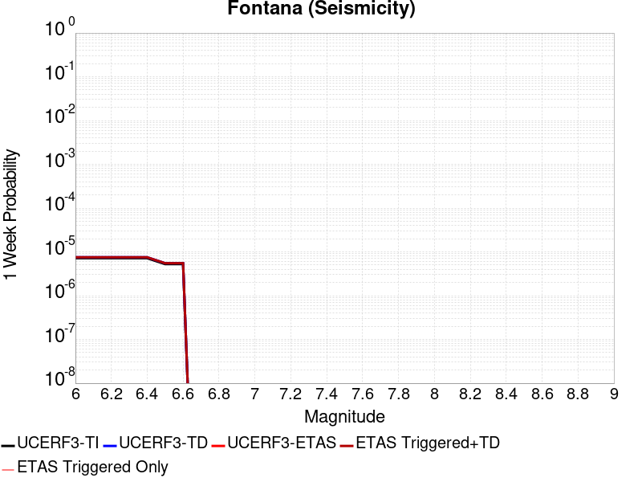 | 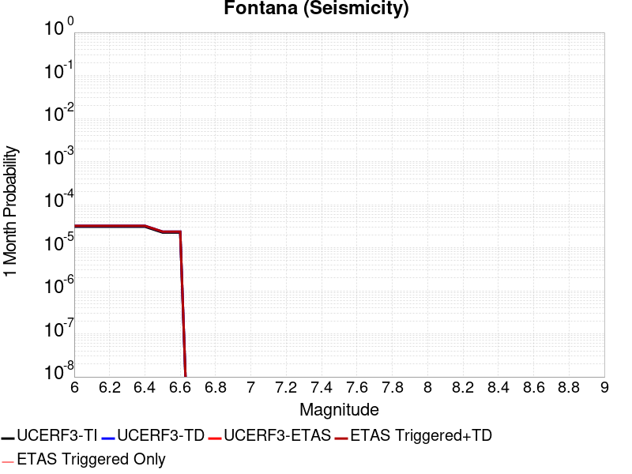 | 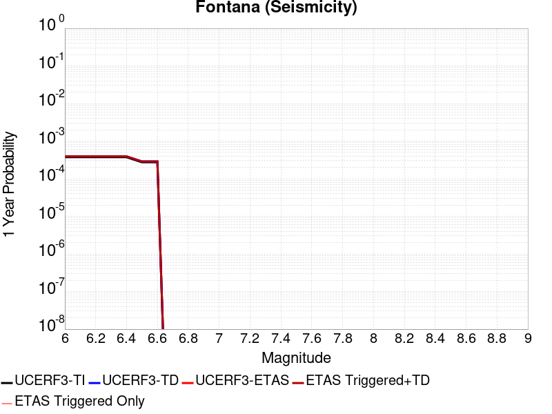 | 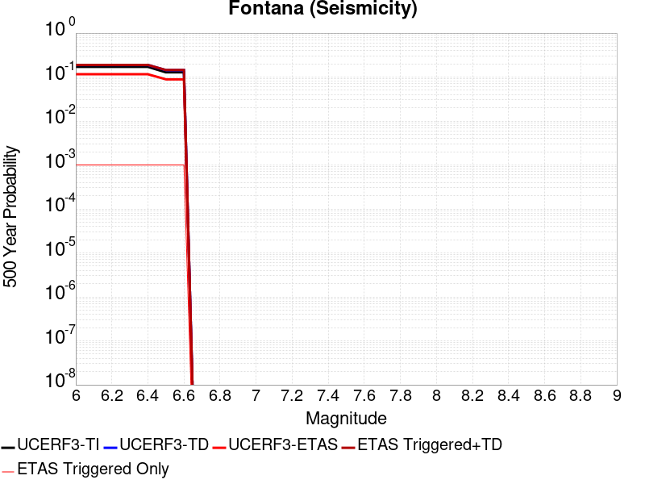 |

| Magnitude | 1 wk TI Prob | 1 wk TD Prob | 1 wk ETAS Prob | 1 wk ETAS/TD Gain | 1 wk ETAS Triggered+TD | 1 wk ETAS Triggered Only | 1 mo TI Prob | 1 mo TD Prob | 1 mo ETAS Prob | 1 mo ETAS/TD Gain | 1 mo ETAS Triggered+TD | 1 mo ETAS Triggered Only | 1 yr TI Prob | 1 yr TD Prob | 1 yr ETAS Prob | 1 yr ETAS/TD Gain | 1 yr ETAS Triggered+TD | 1 yr ETAS Triggered Only | 500 yr TI Prob | 500 yr TD Prob | 500 yr ETAS Prob | 500 yr ETAS/TD Gain | 500 yr ETAS Triggered+TD | 500 yr ETAS Triggered Only |
|-----|-----|-----|-----|-----|-----|-----|-----|-----|-----|-----|-----|-----|-----|-----|-----|-----|-----|-----|-----|-----|-----|-----|-----|-----|
| 6.0 | 7.1789214E-6 | 7.5316593E-6 | 0.0 | 0.0 | 7.5316593E-6 | 0.0 | 3.076644E-5 | 3.227837E-5 | 0.0 | 0.0 | 3.227837E-5 | 0.0 | 3.7451705E-4 | 3.9295884E-4 | 0.0 | 0.0 | 3.9295884E-4 | 0.0 | 0.17079975 | 0.18832843 | 0.116 | 0.6159452 | 0.1891401 | 0.001 |
| 6.1 | 7.1789214E-6 | 7.5316593E-6 | 0.0 | 0.0 | 7.5316593E-6 | 0.0 | 3.076644E-5 | 3.227837E-5 | 0.0 | 0.0 | 3.227837E-5 | 0.0 | 3.7451705E-4 | 3.9295884E-4 | 0.0 | 0.0 | 3.9295884E-4 | 0.0 | 0.17079975 | 0.18832843 | 0.116 | 0.6159452 | 0.1891401 | 0.001 |
| 6.2 | 7.1789214E-6 | 7.5316593E-6 | 0.0 | 0.0 | 7.5316593E-6 | 0.0 | 3.076644E-5 | 3.227837E-5 | 0.0 | 0.0 | 3.227837E-5 | 0.0 | 3.7451705E-4 | 3.9295884E-4 | 0.0 | 0.0 | 3.9295884E-4 | 0.0 | 0.17079975 | 0.18832843 | 0.116 | 0.6159452 | 0.1891401 | 0.001 |
| 6.3 | 7.1789214E-6 | 7.5316593E-6 | 0.0 | 0.0 | 7.5316593E-6 | 0.0 | 3.076644E-5 | 3.227837E-5 | 0.0 | 0.0 | 3.227837E-5 | 0.0 | 3.7451705E-4 | 3.9295884E-4 | 0.0 | 0.0 | 3.9295884E-4 | 0.0 | 0.17079975 | 0.18832843 | 0.116 | 0.6159452 | 0.1891401 | 0.001 |
| 6.4 | 7.1789214E-6 | 7.5316593E-6 | 0.0 | 0.0 | 7.5316593E-6 | 0.0 | 3.076644E-5 | 3.227837E-5 | 0.0 | 0.0 | 3.227837E-5 | 0.0 | 3.7451705E-4 | 3.9295884E-4 | 0.0 | 0.0 | 3.9295884E-4 | 0.0 | 0.17079975 | 0.18832843 | 0.116 | 0.6159452 | 0.1891401 | 0.001 |
| 6.5 | 5.2611317E-6 | 5.5179225E-6 | 0.0 | 0.0 | 5.5179225E-6 | 0.0 | 2.2547512E-5 | 2.364824E-5 | 0.0 | 0.0 | 2.364824E-5 | 0.0 | 2.744814E-4 | 2.8791733E-4 | 0.0 | 0.0 | 2.8791733E-4 | 0.0 | 0.12825605 | 0.14394835 | 0.089 | 0.6182773 | 0.1448044 | 0.001 |
| 6.6 | 5.2611317E-6 | 5.5179225E-6 | 0.0 | 0.0 | 5.5179225E-6 | 0.0 | 2.2547512E-5 | 2.364824E-5 | 0.0 | 0.0 | 2.364824E-5 | 0.0 | 2.744814E-4 | 2.8791733E-4 | 0.0 | 0.0 | 2.8791733E-4 | 0.0 | 0.12825605 | 0.14394835 | 0.089 | 0.6182773 | 0.1448044 | 0.001 |

## South Cuyama
*[(top)](#table-of-contents)*

| 1 Week | 1 Month | 1 Year | 500 Year |
|-----|-----|-----|-----|
| 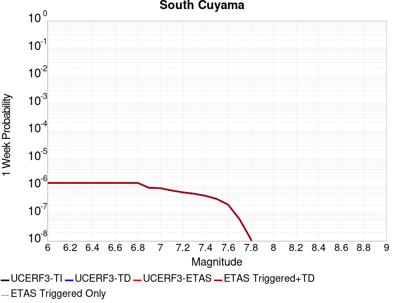 | 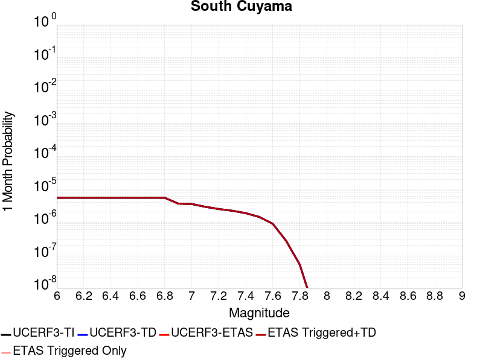 | 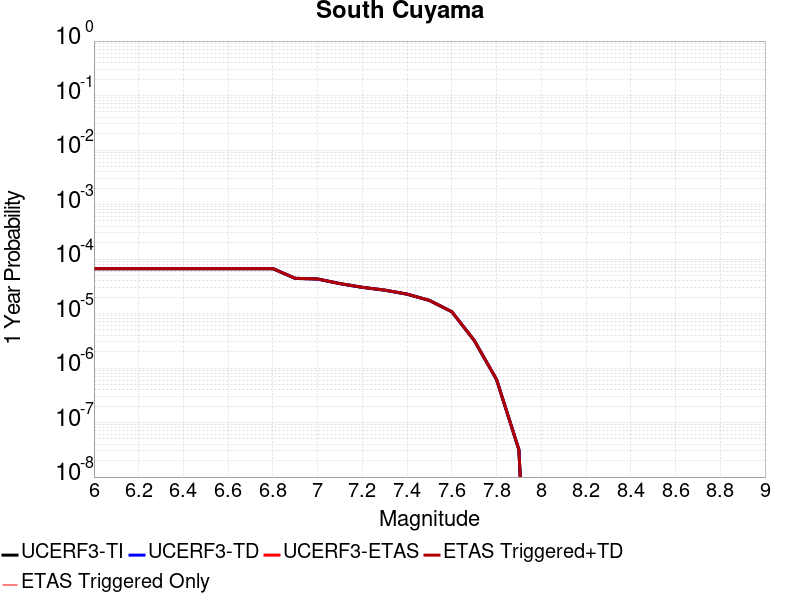 | 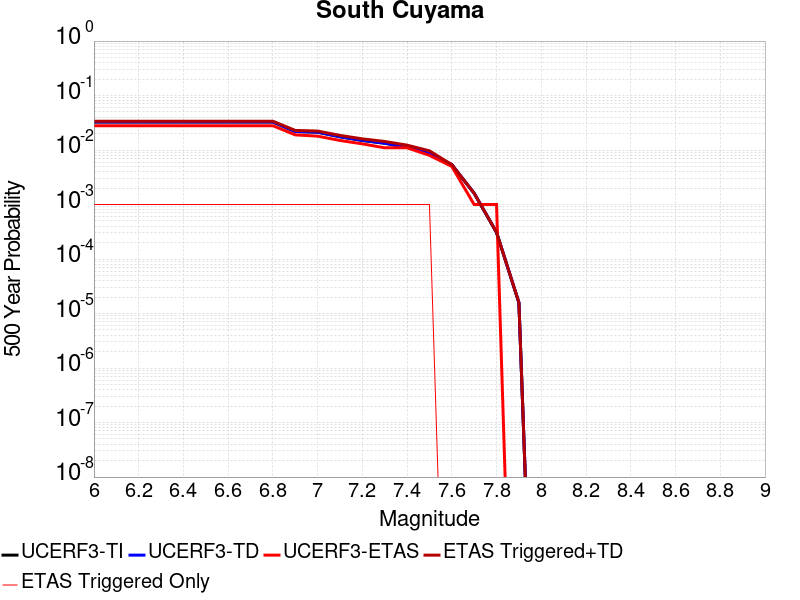 |

| Magnitude | 1 wk TI Prob | 1 wk TD Prob | 1 wk ETAS Prob | 1 wk ETAS/TD Gain | 1 wk ETAS Triggered+TD | 1 wk ETAS Triggered Only | 1 mo TI Prob | 1 mo TD Prob | 1 mo ETAS Prob | 1 mo ETAS/TD Gain | 1 mo ETAS Triggered+TD | 1 mo ETAS Triggered Only | 1 yr TI Prob | 1 yr TD Prob | 1 yr ETAS Prob | 1 yr ETAS/TD Gain | 1 yr ETAS Triggered+TD | 1 yr ETAS Triggered Only | 500 yr TI Prob | 500 yr TD Prob | 500 yr ETAS Prob | 500 yr ETAS/TD Gain | 500 yr ETAS Triggered+TD | 500 yr ETAS Triggered Only |
|-----|-----|-----|-----|-----|-----|-----|-----|-----|-----|-----|-----|-----|-----|-----|-----|-----|-----|-----|-----|-----|-----|-----|-----|-----|
| 6.0 | 1.2747308E-6 | 1.2814966E-6 | 0.0 | 0.0 | 1.2814966E-6 | 0.0 | 5.4631205E-6 | 5.492117E-6 | 0.0 | 0.0 | 5.492117E-6 | 0.0 | 6.6511464E-5 | 6.6864544E-5 | 0.0 | 0.0 | 6.6864544E-5 | 0.0 | 0.032709908 | 0.032899354 | 0.028 | 0.85108054 | 0.033866454 | 0.001 |
| 6.1 | 1.2747308E-6 | 1.2814966E-6 | 0.0 | 0.0 | 1.2814966E-6 | 0.0 | 5.4631205E-6 | 5.492117E-6 | 0.0 | 0.0 | 5.492117E-6 | 0.0 | 6.6511464E-5 | 6.6864544E-5 | 0.0 | 0.0 | 6.6864544E-5 | 0.0 | 0.032709908 | 0.032899354 | 0.028 | 0.85108054 | 0.033866454 | 0.001 |
| 6.2 | 1.2747308E-6 | 1.2814966E-6 | 0.0 | 0.0 | 1.2814966E-6 | 0.0 | 5.4631205E-6 | 5.492117E-6 | 0.0 | 0.0 | 5.492117E-6 | 0.0 | 6.6511464E-5 | 6.6864544E-5 | 0.0 | 0.0 | 6.6864544E-5 | 0.0 | 0.032709908 | 0.032899354 | 0.028 | 0.85108054 | 0.033866454 | 0.001 |
| 6.3 | 1.2747308E-6 | 1.2814966E-6 | 0.0 | 0.0 | 1.2814966E-6 | 0.0 | 5.4631205E-6 | 5.492117E-6 | 0.0 | 0.0 | 5.492117E-6 | 0.0 | 6.6511464E-5 | 6.6864544E-5 | 0.0 | 0.0 | 6.6864544E-5 | 0.0 | 0.032709908 | 0.032899354 | 0.028 | 0.85108054 | 0.033866454 | 0.001 |
| 6.4 | 1.2747308E-6 | 1.2814966E-6 | 0.0 | 0.0 | 1.2814966E-6 | 0.0 | 5.4631205E-6 | 5.492117E-6 | 0.0 | 0.0 | 5.492117E-6 | 0.0 | 6.6511464E-5 | 6.6864544E-5 | 0.0 | 0.0 | 6.6864544E-5 | 0.0 | 0.032709908 | 0.032899354 | 0.028 | 0.85108054 | 0.033866454 | 0.001 |
| 6.5 | 1.2747308E-6 | 1.2814966E-6 | 0.0 | 0.0 | 1.2814966E-6 | 0.0 | 5.4631205E-6 | 5.492117E-6 | 0.0 | 0.0 | 5.492117E-6 | 0.0 | 6.6511464E-5 | 6.6864544E-5 | 0.0 | 0.0 | 6.6864544E-5 | 0.0 | 0.032709908 | 0.032899354 | 0.028 | 0.85108054 | 0.033866454 | 0.001 |
| 6.6 | 1.2747308E-6 | 1.2814966E-6 | 0.0 | 0.0 | 1.2814966E-6 | 0.0 | 5.4631205E-6 | 5.492117E-6 | 0.0 | 0.0 | 5.492117E-6 | 0.0 | 6.6511464E-5 | 6.6864544E-5 | 0.0 | 0.0 | 6.6864544E-5 | 0.0 | 0.032709908 | 0.032899354 | 0.028 | 0.85108054 | 0.033866454 | 0.001 |
| 6.7 | 1.2747308E-6 | 1.2814966E-6 | 0.0 | 0.0 | 1.2814966E-6 | 0.0 | 5.4631205E-6 | 5.492117E-6 | 0.0 | 0.0 | 5.492117E-6 | 0.0 | 6.6511464E-5 | 6.6864544E-5 | 0.0 | 0.0 | 6.6864544E-5 | 0.0 | 0.032709908 | 0.032899354 | 0.028 | 0.85108054 | 0.033866454 | 0.001 |
| 6.8 | 1.2747308E-6 | 1.2814966E-6 | 0.0 | 0.0 | 1.2814966E-6 | 0.0 | 5.4631205E-6 | 5.492117E-6 | 0.0 | 0.0 | 5.492117E-6 | 0.0 | 6.6511464E-5 | 6.6864544E-5 | 0.0 | 0.0 | 6.6864544E-5 | 0.0 | 0.032709908 | 0.032899354 | 0.028 | 0.85108054 | 0.033866454 | 0.001 |
| 6.9 | 8.4566324E-7 | 8.505203E-7 | 0.0 | 0.0 | 8.505203E-7 | 0.0 | 3.624266E-6 | 3.645082E-6 | 0.0 | 0.0 | 3.645082E-6 | 0.0 | 4.4124543E-5 | 4.437798E-5 | 0.0 | 0.0 | 4.437798E-5 | 0.0 | 0.021821156 | 0.02194789 | 0.019 | 0.86568683 | 0.022925943 | 0.001 |
| 7.0 | 8.2277904E-7 | 8.2752035E-7 | 0.0 | 0.0 | 8.2752035E-7 | 0.0 | 3.526191E-6 | 3.5465112E-6 | 0.0 | 0.0 | 3.5465112E-6 | 0.0 | 4.293053E-5 | 4.3177926E-5 | 0.0 | 0.0 | 4.3177926E-5 | 0.0 | 0.021236977 | 0.02136074 | 0.018 | 0.84266746 | 0.02233938 | 0.001 |
| 7.1 | 6.7661887E-7 | 6.806884E-7 | 0.0 | 0.0 | 6.806884E-7 | 0.0 | 2.899792E-6 | 2.9172327E-6 | 0.0 | 0.0 | 2.9172327E-6 | 0.0 | 3.5304394E-5 | 3.5516732E-5 | 0.0 | 0.0 | 3.5516732E-5 | 0.0 | 0.017497616 | 0.017602982 | 0.015 | 0.8521283 | 0.01858538 | 0.001 |
| 7.2 | 5.783336E-7 | 5.8192103E-7 | 0.0 | 0.0 | 5.8192103E-7 | 0.0 | 2.4785702E-6 | 2.493945E-6 | 0.0 | 0.0 | 2.493945E-6 | 0.0 | 3.0176174E-5 | 3.0363359E-5 | 0.0 | 0.0 | 3.0363359E-5 | 0.0 | 0.014975057 | 0.015067919 | 0.013 | 0.8627601 | 0.016052851 | 0.001 |
| 7.3 | 5.136759E-7 | 5.1691495E-7 | 0.0 | 0.0 | 5.1691495E-7 | 0.0 | 2.2014663E-6 | 2.2153479E-6 | 0.0 | 0.0 | 2.2153479E-6 | 0.0 | 2.6802521E-5 | 2.697153E-5 | 0.0 | 0.0 | 2.697153E-5 | 0.0 | 0.013312041 | 0.0133959735 | 0.011 | 0.82114226 | 0.0143825775 | 0.001 |
| 7.4 | 4.3370295E-7 | 4.3649922E-7 | 0.0 | 0.0 | 4.3649922E-7 | 0.0 | 1.8587256E-6 | 1.8707096E-6 | 0.0 | 0.0 | 1.8707096E-6 | 0.0 | 2.2629749E-5 | 2.2775654E-5 | 0.0 | 0.0 | 2.2775654E-5 | 0.0 | 0.011251229 | 0.011323814 | 0.011 | 0.9714041 | 0.0123124905 | 0.001 |
| 7.5 | 3.3242574E-7 | 3.3464224E-7 | 0.0 | 0.0 | 3.3464224E-7 | 0.0 | 1.4246809E-6 | 1.4341801E-6 | 0.0 | 0.0 | 1.4341801E-6 | 0.0 | 1.7345352E-5 | 1.7461005E-5 | 0.0 | 0.0 | 1.7461005E-5 | 0.0 | 0.008635252 | 0.008692931 | 0.008 | 0.92028797 | 0.009684238 | 0.001 |
| 7.6 | 2.0627535E-7 | 2.0770975E-7 | 0.0 | 0.0 | 2.0770975E-7 | 0.0 | 8.840369E-7 | 8.901843E-7 | 0.0 | 0.0 | 8.901843E-7 | 0.0 | 1.0763096E-5 | 1.0837941E-5 | 0.0 | 0.0 | 1.0837941E-5 | 0.0 | 0.005367122 | 0.0054045767 | 0.005 | 0.9251418 | 0.0054045767 | 0.0 |
| 7.7 | 6.15236E-8 | 6.1958985E-8 | 0.0 | 0.0 | 6.1958985E-8 | 0.0 | 2.6367252E-7 | 2.6553846E-7 | 0.0 | 0.0 | 2.6553846E-7 | 0.0 | 3.2102084E-6 | 3.232926E-6 | 0.0 | 0.0 | 3.232926E-6 | 0.0 | 0.0016038193 | 0.0016151877 | 0.001 | 0.6191231 | 0.0016151877 | 0.0 |
| 7.8 | 1.1765573E-8 | 1.1867755E-8 | 0.0 | 0.0 | 1.1867755E-8 | 0.0 | 5.0423886E-8 | 5.0861804E-8 | 0.0 | 0.0 | 5.0861804E-8 | 0.0 | 6.1391063E-7 | 6.192423E-7 | 0.0 | 0.0 | 6.192423E-7 | 0.0 | 3.069083E-4 | 3.0957672E-4 | 0.001 | 3.230217 | 3.0957672E-4 | 0.0 |
| 7.9 | 6.0381755E-10 | 6.097304E-10 | 0.0 | 0.0 | 6.097304E-10 | 0.0 | 2.5877895E-9 | 2.6131304E-9 | 0.0 | 0.0 | 2.6131304E-9 | 0.0 | 3.1506335E-8 | 3.1814864E-8 | 0.0 | 0.0 | 3.1814864E-8 | 0.0 | 1.5753045E-5 | 1.5907373E-5 | 0.0 | 0.0 | 1.5907373E-5 | 0.0 |

## Sisar
*[(top)](#table-of-contents)*

| 1 Week | 1 Month | 1 Year | 500 Year |
|-----|-----|-----|-----|
| 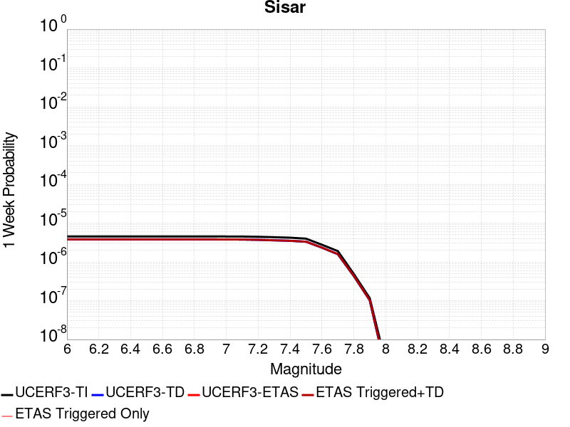 |  | 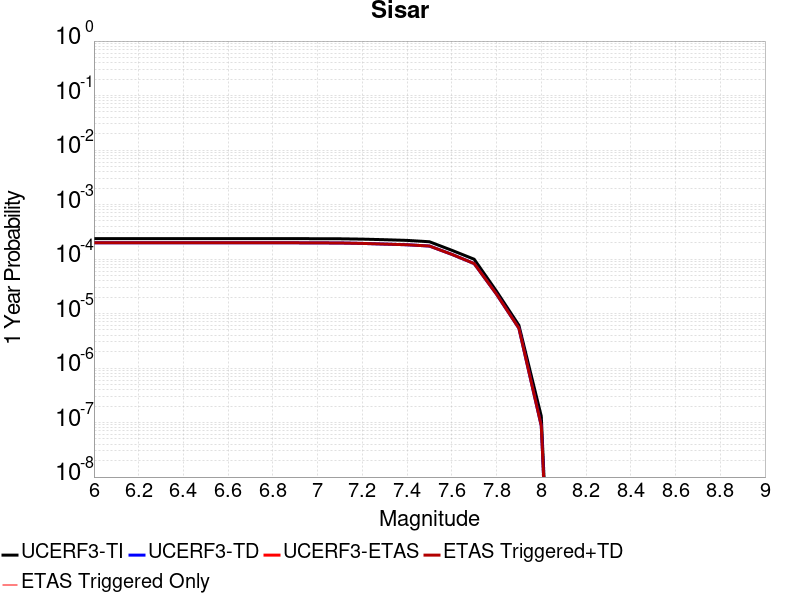 | 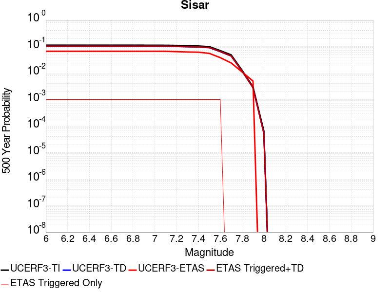 |

| Magnitude | 1 wk TI Prob | 1 wk TD Prob | 1 wk ETAS Prob | 1 wk ETAS/TD Gain | 1 wk ETAS Triggered+TD | 1 wk ETAS Triggered Only | 1 mo TI Prob | 1 mo TD Prob | 1 mo ETAS Prob | 1 mo ETAS/TD Gain | 1 mo ETAS Triggered+TD | 1 mo ETAS Triggered Only | 1 yr TI Prob | 1 yr TD Prob | 1 yr ETAS Prob | 1 yr ETAS/TD Gain | 1 yr ETAS Triggered+TD | 1 yr ETAS Triggered Only | 500 yr TI Prob | 500 yr TD Prob | 500 yr ETAS Prob | 500 yr ETAS/TD Gain | 500 yr ETAS Triggered+TD | 500 yr ETAS Triggered Only |
|-----|-----|-----|-----|-----|-----|-----|-----|-----|-----|-----|-----|-----|-----|-----|-----|-----|-----|-----|-----|-----|-----|-----|-----|-----|
| 6.0 | 4.544193E-6 | 3.8128155E-6 | 0.0 | 0.0 | 3.8128155E-6 | 0.0 | 1.9474966E-5 | 1.6340538E-5 | 0.0 | 0.0 | 1.6340538E-5 | 0.0 | 2.3708193E-4 | 1.989282E-4 | 0.0 | 0.0 | 1.989282E-4 | 0.0 | 0.11179705 | 0.10276934 | 0.066 | 0.6422149 | 0.10366657 | 0.001 |
| 6.1 | 4.544193E-6 | 3.8128155E-6 | 0.0 | 0.0 | 3.8128155E-6 | 0.0 | 1.9474966E-5 | 1.6340538E-5 | 0.0 | 0.0 | 1.6340538E-5 | 0.0 | 2.3708193E-4 | 1.989282E-4 | 0.0 | 0.0 | 1.989282E-4 | 0.0 | 0.11179705 | 0.10276934 | 0.066 | 0.6422149 | 0.10366657 | 0.001 |
| 6.2 | 4.544193E-6 | 3.8128155E-6 | 0.0 | 0.0 | 3.8128155E-6 | 0.0 | 1.9474966E-5 | 1.6340538E-5 | 0.0 | 0.0 | 1.6340538E-5 | 0.0 | 2.3708193E-4 | 1.989282E-4 | 0.0 | 0.0 | 1.989282E-4 | 0.0 | 0.11179705 | 0.10276934 | 0.066 | 0.6422149 | 0.10366657 | 0.001 |
| 6.3 | 4.544193E-6 | 3.8128155E-6 | 0.0 | 0.0 | 3.8128155E-6 | 0.0 | 1.9474966E-5 | 1.6340538E-5 | 0.0 | 0.0 | 1.6340538E-5 | 0.0 | 2.3708193E-4 | 1.989282E-4 | 0.0 | 0.0 | 1.989282E-4 | 0.0 | 0.11179705 | 0.10276934 | 0.066 | 0.6422149 | 0.10366657 | 0.001 |
| 6.4 | 4.544193E-6 | 3.8128155E-6 | 0.0 | 0.0 | 3.8128155E-6 | 0.0 | 1.9474966E-5 | 1.6340538E-5 | 0.0 | 0.0 | 1.6340538E-5 | 0.0 | 2.3708193E-4 | 1.989282E-4 | 0.0 | 0.0 | 1.989282E-4 | 0.0 | 0.11179705 | 0.10276934 | 0.066 | 0.6422149 | 0.10366657 | 0.001 |
| 6.5 | 4.544193E-6 | 3.8128155E-6 | 0.0 | 0.0 | 3.8128155E-6 | 0.0 | 1.9474966E-5 | 1.6340538E-5 | 0.0 | 0.0 | 1.6340538E-5 | 0.0 | 2.3708193E-4 | 1.989282E-4 | 0.0 | 0.0 | 1.989282E-4 | 0.0 | 0.11179705 | 0.10276934 | 0.066 | 0.6422149 | 0.10366657 | 0.001 |
| 6.6 | 4.544193E-6 | 3.8128155E-6 | 0.0 | 0.0 | 3.8128155E-6 | 0.0 | 1.9474966E-5 | 1.6340538E-5 | 0.0 | 0.0 | 1.6340538E-5 | 0.0 | 2.3708193E-4 | 1.989282E-4 | 0.0 | 0.0 | 1.989282E-4 | 0.0 | 0.11179705 | 0.10276934 | 0.066 | 0.6422149 | 0.10366657 | 0.001 |
| 6.7 | 4.544193E-6 | 3.8128155E-6 | 0.0 | 0.0 | 3.8128155E-6 | 0.0 | 1.9474966E-5 | 1.6340538E-5 | 0.0 | 0.0 | 1.6340538E-5 | 0.0 | 2.3708193E-4 | 1.989282E-4 | 0.0 | 0.0 | 1.989282E-4 | 0.0 | 0.11179705 | 0.10276934 | 0.066 | 0.6422149 | 0.10366657 | 0.001 |
| 6.8 | 4.544193E-6 | 3.8128155E-6 | 0.0 | 0.0 | 3.8128155E-6 | 0.0 | 1.9474966E-5 | 1.6340538E-5 | 0.0 | 0.0 | 1.6340538E-5 | 0.0 | 2.3708193E-4 | 1.989282E-4 | 0.0 | 0.0 | 1.989282E-4 | 0.0 | 0.11179705 | 0.10276934 | 0.066 | 0.6422149 | 0.10366657 | 0.001 |
| 6.9 | 4.542225E-6 | 3.8107812E-6 | 0.0 | 0.0 | 3.8107812E-6 | 0.0 | 1.9466532E-5 | 1.6331818E-5 | 0.0 | 0.0 | 1.6331818E-5 | 0.0 | 2.3697925E-4 | 1.9882208E-4 | 0.0 | 0.0 | 1.9882208E-4 | 0.0 | 0.11175144 | 0.10272171 | 0.066 | 0.6425126 | 0.103618994 | 0.001 |
| 7.0 | 4.5278484E-6 | 3.7958755E-6 | 0.0 | 0.0 | 3.7958755E-6 | 0.0 | 1.940492E-5 | 1.6267939E-5 | 0.0 | 0.0 | 1.6267939E-5 | 0.0 | 2.3622929E-4 | 1.9804446E-4 | 0.0 | 0.0 | 1.9804446E-4 | 0.0 | 0.111418225 | 0.10237268 | 0.066 | 0.6447032 | 0.103270315 | 0.001 |
| 7.1 | 4.5132488E-6 | 3.780696E-6 | 0.0 | 0.0 | 3.780696E-6 | 0.0 | 1.9342351E-5 | 1.6202885E-5 | 0.0 | 0.0 | 1.6202885E-5 | 0.0 | 2.3546767E-4 | 1.9725258E-4 | 0.0 | 0.0 | 1.9725258E-4 | 0.0 | 0.1110797 | 0.10201713 | 0.066 | 0.6469502 | 0.10291511 | 0.001 |
| 7.2 | 4.448859E-6 | 3.7133277E-6 | 0.0 | 0.0 | 3.7133277E-6 | 0.0 | 1.9066398E-5 | 1.5914167E-5 | 0.0 | 0.0 | 1.5914167E-5 | 0.0 | 2.3210866E-4 | 1.9373807E-4 | 0.0 | 0.0 | 1.9373807E-4 | 0.0 | 0.10958515 | 0.1004372 | 0.064 | 0.63721406 | 0.10133676 | 0.001 |
| 7.3 | 4.3424366E-6 | 3.6074855E-6 | 0.0 | 0.0 | 3.6074855E-6 | 0.0 | 1.861031E-5 | 1.5460562E-5 | 0.0 | 0.0 | 1.5460562E-5 | 0.0 | 2.2655698E-4 | 1.8821642E-4 | 0.0 | 0.0 | 1.8821642E-4 | 0.0 | 0.107109495 | 0.09790187 | 0.062 | 0.6332872 | 0.09880397 | 0.001 |
| 7.4 | 4.218641E-6 | 3.5075439E-6 | 0.0 | 0.0 | 3.5075439E-6 | 0.0 | 1.8079765E-5 | 1.5032246E-5 | 0.0 | 0.0 | 1.5032246E-5 | 0.0 | 2.2009891E-4 | 1.8300254E-4 | 0.0 | 0.0 | 1.8300254E-4 | 0.0 | 0.104221016 | 0.09531924 | 0.061 | 0.63995475 | 0.09622392 | 0.001 |
| 7.5 | 3.983779E-6 | 3.3236176E-6 | 0.0 | 0.0 | 3.3236176E-6 | 0.0 | 1.7073227E-5 | 1.4244E-5 | 0.0 | 0.0 | 1.4244E-5 | 0.0 | 2.0784672E-4 | 1.7340723E-4 | 0.0 | 0.0 | 1.7340723E-4 | 0.0 | 0.098715365 | 0.09049019 | 0.055 | 0.60780066 | 0.09139971 | 0.001 |
| 7.6 | 2.777393E-6 | 2.3389764E-6 | 0.0 | 0.0 | 2.3389764E-6 | 0.0 | 1.1903058E-5 | 1.0024146E-5 | 0.0 | 0.0 | 1.0024146E-5 | 0.0 | 1.449101E-4 | 1.2203722E-4 | 0.0 | 0.0 | 1.2203722E-4 | 0.0 | 0.06989733 | 0.06388424 | 0.038 | 0.59482586 | 0.064820364 | 0.001 |
| 7.7 | 1.9028433E-6 | 1.584368E-6 | 0.0 | 0.0 | 1.584368E-6 | 0.0 | 8.155017E-6 | 6.790131E-6 | 0.0 | 0.0 | 6.790131E-6 | 0.0 | 9.928281E-5 | 8.266676E-5 | 0.0 | 0.0 | 8.266676E-5 | 0.0 | 0.048431754 | 0.04399771 | 0.024 | 0.545483 | 0.04399771 | 0.0 |
| 7.8 | 4.9095956E-7 | 4.3412763E-7 | 0.0 | 0.0 | 4.3412763E-7 | 0.0 | 2.1041105E-6 | 1.8605456E-6 | 0.0 | 0.0 | 1.8605456E-6 | 0.0 | 2.5617246E-5 | 2.265191E-5 | 0.0 | 0.0 | 2.265191E-5 | 0.0 | 0.012727103 | 0.011903748 | 0.011 | 0.9240787 | 0.011903748 | 0.0 |
| 7.9 | 1.16657894E-7 | 1.0302253E-7 | 0.0 | 0.0 | 1.0302253E-7 | 0.0 | 4.999623E-7 | 4.4152506E-7 | 0.0 | 0.0 | 4.4152506E-7 | 0.0 | 6.087024E-6 | 5.3755543E-6 | 0.0 | 0.0 | 5.3755543E-6 | 0.0 | 0.0030388944 | 0.00284005 | 0.005 | 1.7605323 | 0.00284005 | 0.0 |
| 8.0 | 2.5100346E-9 | 1.6762767E-9 | 0.0 | 0.0 | 1.6762767E-9 | 0.0 | 1.0757291E-8 | 7.1840436E-9 | 0.0 | 0.0 | 7.1840436E-9 | 0.0 | 1.3097001E-7 | 8.746573E-8 | 0.0 | 0.0 | 8.746573E-8 | 0.0 | 6.548287E-5 | 5.435537E-5 | 0.0 | 0.0 | 5.435537E-5 | 0.0 |

## Kern Canyon (South Kern) 2011
*[(top)](#table-of-contents)*

| 1 Week | 1 Month | 1 Year | 500 Year |
|-----|-----|-----|-----|
|  | 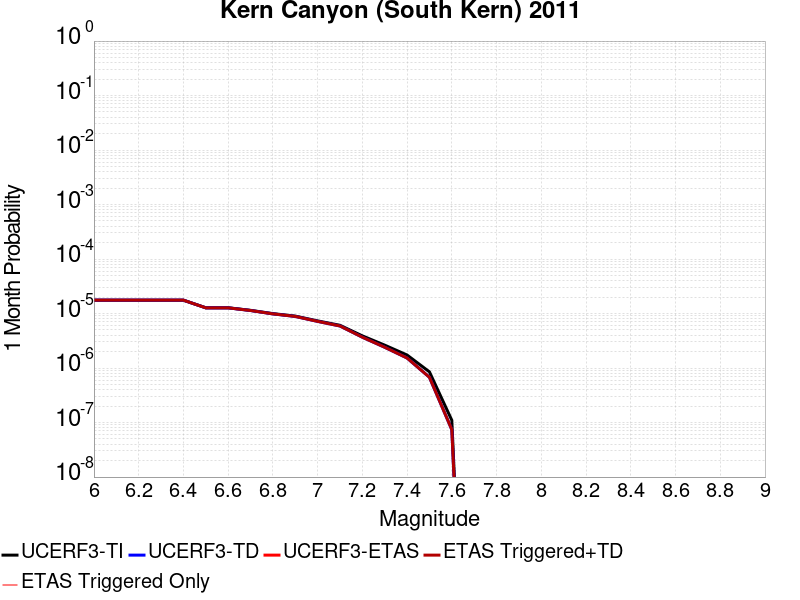 | 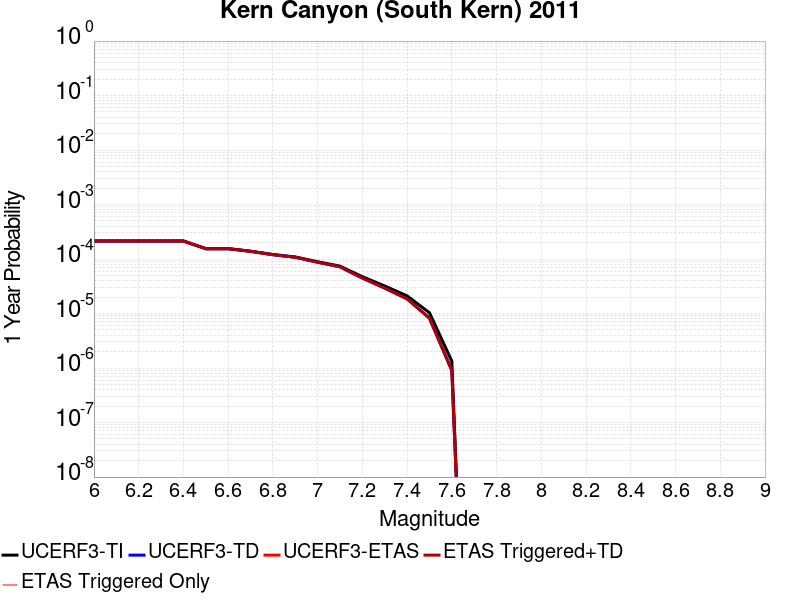 | 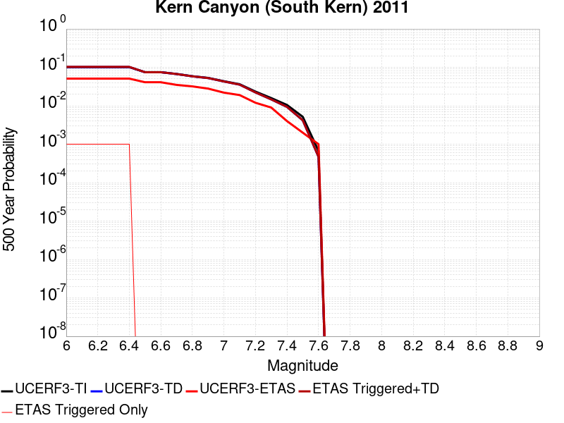 |

| Magnitude | 1 wk TI Prob | 1 wk TD Prob | 1 wk ETAS Prob | 1 wk ETAS/TD Gain | 1 wk ETAS Triggered+TD | 1 wk ETAS Triggered Only | 1 mo TI Prob | 1 mo TD Prob | 1 mo ETAS Prob | 1 mo ETAS/TD Gain | 1 mo ETAS Triggered+TD | 1 mo ETAS Triggered Only | 1 yr TI Prob | 1 yr TD Prob | 1 yr ETAS Prob | 1 yr ETAS/TD Gain | 1 yr ETAS Triggered+TD | 1 yr ETAS Triggered Only | 500 yr TI Prob | 500 yr TD Prob | 500 yr ETAS Prob | 500 yr ETAS/TD Gain | 500 yr ETAS Triggered+TD | 500 yr ETAS Triggered Only |
|-----|-----|-----|-----|-----|-----|-----|-----|-----|-----|-----|-----|-----|-----|-----|-----|-----|-----|-----|-----|-----|-----|-----|-----|-----|
| 6.0 | 4.105075E-6 | 4.1096914E-6 | 0.0 | 0.0 | 4.1096914E-6 | 0.0 | 1.7593058E-5 | 1.7612847E-5 | 0.0 | 0.0 | 1.7612847E-5 | 0.0 | 2.1417443E-4 | 2.1441597E-4 | 0.0 | 0.0 | 2.1441597E-4 | 0.0 | 0.10156299 | 0.10193425 | 0.051 | 0.5003225 | 0.10283232 | 0.001 |
| 6.1 | 4.105075E-6 | 4.1096914E-6 | 0.0 | 0.0 | 4.1096914E-6 | 0.0 | 1.7593058E-5 | 1.7612847E-5 | 0.0 | 0.0 | 1.7612847E-5 | 0.0 | 2.1417443E-4 | 2.1441597E-4 | 0.0 | 0.0 | 2.1441597E-4 | 0.0 | 0.10156299 | 0.10193425 | 0.051 | 0.5003225 | 0.10283232 | 0.001 |
| 6.2 | 4.105075E-6 | 4.1096914E-6 | 0.0 | 0.0 | 4.1096914E-6 | 0.0 | 1.7593058E-5 | 1.7612847E-5 | 0.0 | 0.0 | 1.7612847E-5 | 0.0 | 2.1417443E-4 | 2.1441597E-4 | 0.0 | 0.0 | 2.1441597E-4 | 0.0 | 0.10156299 | 0.10193425 | 0.051 | 0.5003225 | 0.10283232 | 0.001 |
| 6.3 | 4.105075E-6 | 4.1096914E-6 | 0.0 | 0.0 | 4.1096914E-6 | 0.0 | 1.7593058E-5 | 1.7612847E-5 | 0.0 | 0.0 | 1.7612847E-5 | 0.0 | 2.1417443E-4 | 2.1441597E-4 | 0.0 | 0.0 | 2.1441597E-4 | 0.0 | 0.10156299 | 0.10193425 | 0.051 | 0.5003225 | 0.10283232 | 0.001 |
| 6.4 | 4.105075E-6 | 4.1096914E-6 | 0.0 | 0.0 | 4.1096914E-6 | 0.0 | 1.7593058E-5 | 1.7612847E-5 | 0.0 | 0.0 | 1.7612847E-5 | 0.0 | 2.1417443E-4 | 2.1441597E-4 | 0.0 | 0.0 | 2.1441597E-4 | 0.0 | 0.10156299 | 0.10193425 | 0.051 | 0.5003225 | 0.10283232 | 0.001 |
| 6.5 | 2.9849807E-6 | 2.9702023E-6 | 0.0 | 0.0 | 2.9702023E-6 | 0.0 | 1.2792712E-5 | 1.2729377E-5 | 0.0 | 0.0 | 1.2729377E-5 | 0.0 | 1.5574014E-4 | 1.549693E-4 | 0.0 | 0.0 | 1.549693E-4 | 0.0 | 0.074921 | 0.07471091 | 0.041 | 0.54878193 | 0.07471091 | 0.0 |
| 6.6 | 2.9849807E-6 | 2.9702023E-6 | 0.0 | 0.0 | 2.9702023E-6 | 0.0 | 1.2792712E-5 | 1.2729377E-5 | 0.0 | 0.0 | 1.2729377E-5 | 0.0 | 1.5574014E-4 | 1.549693E-4 | 0.0 | 0.0 | 1.549693E-4 | 0.0 | 0.074921 | 0.07471091 | 0.041 | 0.54878193 | 0.07471091 | 0.0 |
| 6.7 | 2.6756725E-6 | 2.6555658E-6 | 0.0 | 0.0 | 2.6555658E-6 | 0.0 | 1.1467117E-5 | 1.1380947E-5 | 0.0 | 0.0 | 1.1380947E-5 | 0.0 | 1.396032E-4 | 1.3855433E-4 | 0.0 | 0.0 | 1.3855433E-4 | 0.0 | 0.06742572 | 0.067073554 | 0.035 | 0.5218152 | 0.067073554 | 0.0 |
| 6.8 | 2.3283721E-6 | 2.3024484E-6 | 0.0 | 0.0 | 2.3024484E-6 | 0.0 | 9.9787E-6 | 9.867599E-6 | 0.0 | 0.0 | 9.867599E-6 | 0.0 | 1.214839E-4 | 1.20131466E-4 | 0.0 | 0.0 | 1.20131466E-4 | 0.0 | 0.05893742 | 0.058430366 | 0.032 | 0.5476604 | 0.058430366 | 0.0 |
| 6.9 | 2.0972677E-6 | 2.0675238E-6 | 0.0 | 0.0 | 2.0675238E-6 | 0.0 | 8.988259E-6 | 8.860787E-6 | 0.0 | 0.0 | 8.860787E-6 | 0.0 | 1.0942656E-4 | 1.07874796E-4 | 0.0 | 0.0 | 1.07874796E-4 | 0.0 | 0.05324627 | 0.052637573 | 0.028 | 0.5319394 | 0.052637573 | 0.0 |
| 7.0 | 1.7132242E-6 | 1.6769507E-6 | 0.0 | 0.0 | 1.6769507E-6 | 0.0 | 7.3423685E-6 | 7.1869117E-6 | 0.0 | 0.0 | 7.1869117E-6 | 0.0 | 8.938967E-5 | 8.7497174E-5 | 0.0 | 0.0 | 8.7497174E-5 | 0.0 | 0.043712646 | 0.04292968 | 0.022 | 0.51246595 | 0.04292968 | 0.0 |
| 7.1 | 1.4215541E-6 | 1.380111E-6 | 0.0 | 0.0 | 1.380111E-6 | 0.0 | 6.0923603E-6 | 5.9147483E-6 | 0.0 | 0.0 | 5.9147483E-6 | 0.0 | 7.417196E-5 | 7.200971E-5 | 0.0 | 0.0 | 7.200971E-5 | 0.0 | 0.036408044 | 0.035486028 | 0.019 | 0.53542197 | 0.035486028 | 0.0 |
| 7.2 | 9.097853E-7 | 8.59412E-7 | 0.0 | 0.0 | 8.59412E-7 | 0.0 | 3.899074E-6 | 3.683189E-6 | 0.0 | 0.0 | 3.683189E-6 | 0.0 | 4.7470192E-5 | 4.4841916E-5 | 0.0 | 0.0 | 4.4841916E-5 | 0.0 | 0.023456184 | 0.022289705 | 0.012 | 0.5383651 | 0.022289705 | 0.0 |
| 7.3 | 6.144169E-7 | 5.621496E-7 | 0.0 | 0.0 | 5.621496E-7 | 0.0 | 2.6332125E-6 | 2.4092103E-6 | 0.0 | 0.0 | 2.4092103E-6 | 0.0 | 3.205889E-5 | 2.9331744E-5 | 0.0 | 0.0 | 2.9331744E-5 | 0.0 | 0.01590191 | 0.014670297 | 0.009 | 0.61348456 | 0.014670297 | 0.0 |
| 7.4 | 4.049844E-7 | 3.5682257E-7 | 0.0 | 0.0 | 3.5682257E-7 | 0.0 | 1.7356463E-6 | 1.5292387E-6 | 0.0 | 0.0 | 1.5292387E-6 | 0.0 | 2.1131287E-5 | 1.8618324E-5 | 0.0 | 0.0 | 1.8618324E-5 | 0.0 | 0.0105101345 | 0.009363354 | 0.004 | 0.4271973 | 0.009363354 | 0.0 |
| 7.5 | 1.9871162E-7 | 1.5805833E-7 | 0.0 | 0.0 | 1.5805833E-7 | 0.0 | 8.5162094E-7 | 6.773927E-7 | 0.0 | 0.0 | 6.773927E-7 | 0.0 | 1.0368436E-5 | 8.247225E-6 | 0.0 | 0.0 | 8.247225E-6 | 0.0 | 0.0051708296 | 0.004192412 | 0.002 | 0.47705236 | 0.004192412 | 0.0 |
| 7.6 | 2.572245E-8 | 1.731812E-8 | 0.0 | 0.0 | 1.731812E-8 | 0.0 | 1.10239064E-7 | 7.4220516E-8 | 0.0 | 0.0 | 7.4220516E-8 | 0.0 | 1.3421597E-6 | 9.036345E-7 | 0.0 | 0.0 | 9.036345E-7 | 0.0 | 6.708552E-4 | 4.679146E-4 | 0.001 | 2.1371422 | 4.679146E-4 | 0.0 |

## Surprise Valley 2011 CFM
*[(top)](#table-of-contents)*

| 1 Week | 1 Month | 1 Year | 500 Year |
|-----|-----|-----|-----|
|  |  | 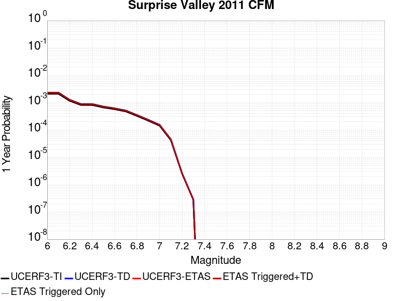 | 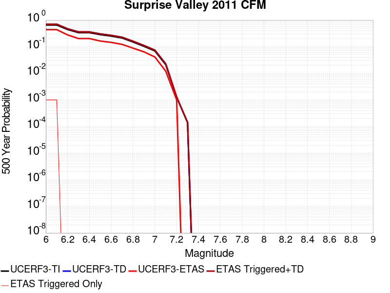 |

| Magnitude | 1 wk TI Prob | 1 wk TD Prob | 1 wk ETAS Prob | 1 wk ETAS/TD Gain | 1 wk ETAS Triggered+TD | 1 wk ETAS Triggered Only | 1 mo TI Prob | 1 mo TD Prob | 1 mo ETAS Prob | 1 mo ETAS/TD Gain | 1 mo ETAS Triggered+TD | 1 mo ETAS Triggered Only | 1 yr TI Prob | 1 yr TD Prob | 1 yr ETAS Prob | 1 yr ETAS/TD Gain | 1 yr ETAS Triggered+TD | 1 yr ETAS Triggered Only | 500 yr TI Prob | 500 yr TD Prob | 500 yr ETAS Prob | 500 yr ETAS/TD Gain | 500 yr ETAS Triggered+TD | 500 yr ETAS Triggered Only |
|-----|-----|-----|-----|-----|-----|-----|-----|-----|-----|-----|-----|-----|-----|-----|-----|-----|-----|-----|-----|-----|-----|-----|-----|-----|
| 6.0 | 4.0396248E-5 | 4.4594162E-5 | 0.0 | 0.0 | 4.4594162E-5 | 0.0 | 1.7311527E-4 | 1.91105E-4 | 0.0 | 0.0 | 1.91105E-4 | 0.0 | 0.002105641 | 0.0023244275 | 0.0 | 0.0 | 0.0023244275 | 0.0 | 0.65143496 | 0.6996434 | 0.437 | 0.6246039 | 0.6999437 | 0.001 |
| 6.1 | 4.0396248E-5 | 4.4594162E-5 | 0.0 | 0.0 | 4.4594162E-5 | 0.0 | 1.7311527E-4 | 1.91105E-4 | 0.0 | 0.0 | 1.91105E-4 | 0.0 | 0.002105641 | 0.0023244275 | 0.0 | 0.0 | 0.0023244275 | 0.0 | 0.65143496 | 0.6996434 | 0.437 | 0.6246039 | 0.6999437 | 0.001 |
| 6.2 | 2.2295266E-5 | 2.4281555E-5 | 0.0 | 0.0 | 2.4281555E-5 | 0.0 | 9.554764E-5 | 1.0405983E-4 | 0.0 | 0.0 | 1.0405983E-4 | 0.0 | 0.0011626717 | 0.0012662226 | 0.0 | 0.0 | 0.0012662226 | 0.0 | 0.44103816 | 0.4711219 | 0.277 | 0.5879582 | 0.4711219 | 0.0 |
| 6.3 | 1.572643E-5 | 1.7019487E-5 | 0.0 | 0.0 | 1.7019487E-5 | 0.0 | 6.7397246E-5 | 7.2938674E-5 | 0.0 | 0.0 | 7.2938674E-5 | 0.0 | 8.202525E-4 | 8.8767696E-4 | 0.0 | 0.0 | 8.8767696E-4 | 0.0 | 0.3365452 | 0.3593121 | 0.202 | 0.56218535 | 0.3593121 | 0.0 |
| 6.4 | 1.5714395E-5 | 1.7007316E-5 | 0.0 | 0.0 | 1.7007316E-5 | 0.0 | 6.734567E-5 | 7.288652E-5 | 0.0 | 0.0 | 7.288652E-5 | 0.0 | 8.1962504E-4 | 8.870425E-4 | 0.0 | 0.0 | 8.870425E-4 | 0.0 | 0.33633685 | 0.3591086 | 0.202 | 0.56250393 | 0.3591086 | 0.0 |
| 6.5 | 1.2733495E-5 | 1.3741524E-5 | 0.0 | 0.0 | 1.3741524E-5 | 0.0 | 5.457098E-5 | 5.889095E-5 | 0.0 | 0.0 | 5.889095E-5 | 0.0 | 6.641992E-4 | 7.1676803E-4 | 0.0 | 0.0 | 7.1676803E-4 | 0.0 | 0.2826633 | 0.30200776 | 0.163 | 0.53972125 | 0.30200776 | 0.0 |
| 6.6 | 1.0983784E-5 | 1.1835853E-5 | 0.0 | 0.0 | 1.1835853E-5 | 0.0 | 4.7072506E-5 | 5.0724128E-5 | 0.0 | 0.0 | 5.0724128E-5 | 0.0 | 5.7295704E-4 | 6.1739655E-4 | 0.0 | 0.0 | 6.1739655E-4 | 0.0 | 0.24915846 | 0.26643 | 0.145 | 0.544233 | 0.26643 | 0.0 |
| 6.7 | 9.104806E-6 | 9.798281E-6 | 0.0 | 0.0 | 9.798281E-6 | 0.0 | 3.902001E-5 | 4.1991978E-5 | 0.0 | 0.0 | 4.1991978E-5 | 0.0 | 4.7496508E-4 | 5.1113626E-4 | 0.0 | 0.0 | 5.1113626E-4 | 0.0 | 0.21143383 | 0.22629833 | 0.122 | 0.5391114 | 0.22629833 | 0.0 |
| 6.8 | 6.2162403E-6 | 6.676801E-6 | 0.0 | 0.0 | 6.676801E-6 | 0.0 | 2.6640759E-5 | 2.8614562E-5 | 0.0 | 0.0 | 2.8614562E-5 | 0.0 | 3.2430296E-4 | 3.4832882E-4 | 0.0 | 0.0 | 3.4832882E-4 | 0.0 | 0.14970997 | 0.16031519 | 0.088 | 0.54891866 | 0.16031519 | 0.0 |
| 6.9 | 4.1792696E-6 | 4.48508E-6 | 0.0 | 0.0 | 4.48508E-6 | 0.0 | 1.7911032E-5 | 1.922164E-5 | 0.0 | 0.0 | 1.922164E-5 | 0.0 | 2.1804498E-4 | 2.3399986E-4 | 0.0 | 0.0 | 2.3399986E-4 | 0.0 | 0.103300415 | 0.11075749 | 0.064 | 0.577839 | 0.11075749 | 0.0 |
| 7.0 | 2.7478413E-6 | 2.9502194E-6 | 0.0 | 0.0 | 2.9502194E-6 | 0.0 | 1.177641E-5 | 1.26437435E-5 | 0.0 | 0.0 | 1.26437435E-5 | 0.0 | 1.4336836E-4 | 1.5392793E-4 | 0.0 | 0.0 | 1.5392793E-4 | 0.0 | 0.06917996 | 0.07436202 | 0.041 | 0.55135673 | 0.07436202 | 0.0 |
| 7.1 | 8.128648E-7 | 8.691461E-7 | 0.0 | 0.0 | 8.691461E-7 | 0.0 | 3.4837017E-6 | 3.72491E-6 | 0.0 | 0.0 | 3.72491E-6 | 0.0 | 4.2413245E-5 | 4.535043E-5 | 0.0 | 0.0 | 4.535043E-5 | 0.0 | 0.020983784 | 0.022568136 | 0.012 | 0.5317231 | 0.022568136 | 0.0 |
| 7.2 | 4.8641045E-8 | 4.936192E-8 | 0.0 | 0.0 | 4.936192E-8 | 0.0 | 2.084616E-7 | 2.1155107E-7 | 0.0 | 0.0 | 2.1155107E-7 | 0.0 | 2.538017E-6 | 2.5756312E-6 | 0.0 | 0.0 | 2.5756312E-6 | 0.0 | 0.0012682052 | 0.0012870205 | 0.001 | 0.7769884 | 0.0012870205 | 0.0 |
| 7.3 | 5.3911844E-9 | 5.4713505E-9 | 0.0 | 0.0 | 5.4713505E-9 | 0.0 | 2.3105075E-8 | 2.3448646E-8 | 0.0 | 0.0 | 2.3448646E-8 | 0.0 | 2.8130427E-7 | 2.8548723E-7 | 0.0 | 0.0 | 2.8548723E-7 | 0.0 | 1.4064225E-4 | 1.4273774E-4 | 0.0 | 0.0 | 1.4273774E-4 | 0.0 |

