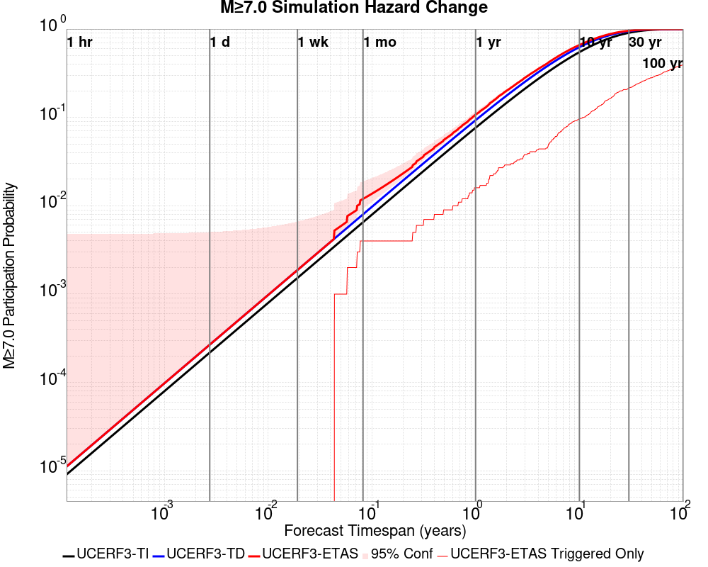
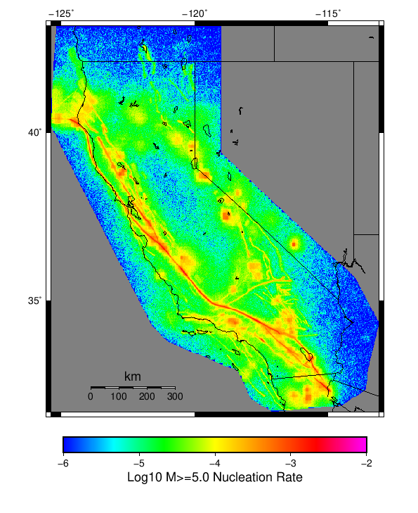
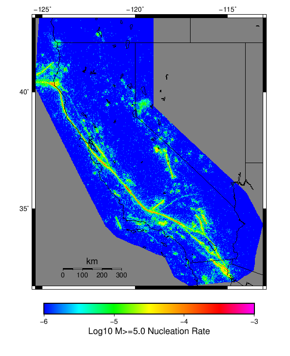

# Start 2012, 500 yr, kCOV=1.5, Spontaneous, Historical Catalog Results

|   | Start 2012, 500 yr, kCOV=1.5, Spontaneous, Historical Catalog |
|-----|-----|
| Num Simulations | 59 (incomplete) |
| Start Time | 2012/01/01 00:00:00 UTC |
| Start Time Epoch Milliseconds | 1325376000000 |
| Duration | 500 Years |
| Includes Spontaneous? | true |
| Trigger Ruptures | *(none)* |
| Trigger Ruptures | 60366 Trigger Ruptures |
|   | First: M7.3 at 1852/01/05 04:40:39 UTC |
|   | Last: M3.2 at 2011/12/31 19:14:44 UTC |
|   | Largest: M7.9 at 1857/01/09 16:25:39 UTC |
| Config Generated With | u3etas_config_builder.sh --start-year 2012 --num-simulations 1000 --duration-years 500 --include-spontaneous --historical-catalog --etas-k-cov 1.5 --random-seed 123456789 --hpc-site USC_HPC --nodes 36 --hours 24 --queue scec |

## Table Of Contents

* [Hazard Change Over Time](#hazard-change-over-time)
  * [M&ge;5.0 Hazard Change Over Time](#m50-hazard-change-over-time)
  * [M&ge;6.0 Hazard Change Over Time](#m60-hazard-change-over-time)
  * [M&ge;7.0 Hazard Change Over Time](#m70-hazard-change-over-time)
* [Gridded Nucleation](#gridded-nucleation)
* [JSON Input File](#json-input-file)

## Hazard Change Over Time
*[(top)](#table-of-contents)*

These plots show how the probability of ruptures of various magnitudes within 100km of any scenario rupture changes over time

### M&ge;5.0 Hazard Change Over Time
*[(top)](#table-of-contents)*


| Forecast Duration | UCERF3-ETAS [95% Conf] | UCERF3-ETAS Triggered Only | UCERF3-TD | UCERF3-ETAS/TD Gain | UCERF3-TI |
|-----|-----|-----|-----|-----|-----|
| 1 Hour | 9.99E-4 [9.99E-4 - 0.077] | 0.000 | 9.99E-4 | 1 | 9.82E-4 |
| 1 Day | 0.024 [0.024 - 0.098] | 0.000 | 0.024 | 1 | 0.023 |
| 1 Week | 0.169 [0.155 - 0.242] | 0.017 | 0.155 | 1.09 | 0.152 |
| 1 Month | 0.562 [0.533 - 0.618] | 0.102 | 0.513 | 1.1 | 0.507 |
| 1 Year | 1.000 [1.000 - 1.000] | 0.763 | 1.000 | 1 | 1.000 |
| 10 Years | 1.000 [1.000 - 1.000] | 1.000 | 1.000 | 1 | 1.000 |
| 30 Years | 1.000 [1.000 - 1.000] | 1.000 | 1.000 | 1 | 1.000 |
| 100 Years | 1.000 [1.000 - 1.000] | 1.000 | 1.000 | 1 | 1.000 |

### M&ge;6.0 Hazard Change Over Time
*[(top)](#table-of-contents)*


| Forecast Duration | UCERF3-ETAS [95% Conf] | UCERF3-ETAS Triggered Only | UCERF3-TD | UCERF3-ETAS/TD Gain | UCERF3-TI |
|-----|-----|-----|-----|-----|-----|
| 1 Hour | 1.13E-4 [1.13E-4 - 0.076] | 0.000 | 1.13E-4 | 1 | 9.74E-5 |
| 1 Day | 2.71E-3 [2.71E-3 - 0.079] | 0.000 | 2.71E-3 | 1 | 2.33E-3 |
| 1 Week | 0.019 [0.019 - 0.094] | 0.000 | 0.019 | 1 | 0.016 |
| 1 Month | 0.078 [0.078 - 0.148] | 0.000 | 0.078 | 1 | 0.068 |
| 1 Year | 0.666 [0.644 - 0.708] | 0.102 | 0.628 | 1.06 | 0.574 |
| 10 Years | 1.000 [1.000 - 1.000] | 0.627 | 1.000 | 1 | 1.000 |
| 30 Years | 1.000 [1.000 - 1.000] | 0.932 | 1.000 | 1 | 1.000 |
| 100 Years | 1.000 [1.000 - 1.000] | 1.000 | 1.000 | 1 | 1.000 |

### M&ge;7.0 Hazard Change Over Time
*[(top)](#table-of-contents)*



| Forecast Duration | UCERF3-ETAS [95% Conf] | UCERF3-ETAS Triggered Only | UCERF3-TD | UCERF3-ETAS/TD Gain | UCERF3-TI |
|-----|-----|-----|-----|-----|-----|
| 1 Hour | 1.12E-5 [1.12E-5 - 0.076] | 0.000 | 1.12E-5 | 1 | 9.08E-6 |
| 1 Day | 2.68E-4 [2.68E-4 - 0.076] | 0.000 | 2.68E-4 | 1 | 2.18E-4 |
| 1 Week | 1.87E-3 [1.87E-3 - 0.078] | 0.000 | 1.87E-3 | 1 | 1.52E-3 |
| 1 Month | 8.00E-3 [8.00E-3 - 0.084] | 0.000 | 8.00E-3 | 1 | 6.52E-3 |
| 1 Year | 0.109 [0.094 - 0.187] | 0.017 | 0.093 | 1.17 | 0.076 |
| 10 Years | 0.663 [0.640 - 0.705] | 0.102 | 0.625 | 1.06 | 0.549 |
| 30 Years | 0.962 [0.956 - 0.969] | 0.288 | 0.947 | 1.02 | 0.908 |
| 100 Years | 1.000 [1.000 - 1.000] | 0.508 | 1.000 | 1 | 1.000 |


## Gridded Nucleation
*[(top)](#table-of-contents)*

| Min Mag | Complete Catalog (including spontaneous) | Triggered Ruptures (no spontaneous) | Triggered Ruptures (primary aftershocks only) |
|-----|-----|-----|-----|
| **M&ge;2.5** |  |  |  |
| **M&ge;5** |  |  |  |
| **M&ge;6** |  |  |  |
| **M&ge;7** |  |  |  |


## JSON Input File
*[(top)](#table-of-contents)*

```
{
  "numSimulations": 1000,
  "duration": 500.0,
  "startYear": 2012,
  "includeSpontaneous": true,
  "randomSeed": 123456789,
  "binaryOutput": true,
  "binaryOutputFilters": [
    {
      "prefix": "results_complete",
      "descendantsOnly": false
    },
    {
      "prefix": "results_m5_preserve_chain",
      "minMag": 5.0,
      "preserveChainBelowMag": true,
      "descendantsOnly": false
    },
    {
      "prefix": "results_triggered_descendants",
      "descendantsOnly": true
    }
  ],
  "forceRecalc": false,
  "simulationName": "Start 2012, 500 yr, kCOV\u003d1.5, Spontaneous, Historical Catalog",
  "numRetries": 3,
  "outputDir": "${ETAS_SIM_DIR}/2019_11_05-Start2012_500yr_kCOV1p5_Spontaneous_HistoricalCatalog",
  "triggerCatalog": "${ETAS_LAUNCHER}/inputs/u3_historical_catalog.txt",
  "triggerCatalogSurfaceMappings": "${ETAS_LAUNCHER}/inputs/u3_historical_catalog_finite_fault_mappings.xml",
  "treatTriggerCatalogAsSpontaneous": false,
  "cacheDir": "${ETAS_LAUNCHER}/inputs/cache_fm3p1_ba",
  "fssFile": "${ETAS_LAUNCHER}/inputs/2013_05_10-ucerf3p3-production-10runs_COMPOUND_SOL_FM3_1_SpatSeisU3_MEAN_BRANCH_AVG_SOL.zip",
  "probModel": "FULL_TD",
  "applySubSeisForSupraNucl": true,
  "totRateScaleFactor": 1.14,
  "gridSeisCorr": true,
  "timeIndependentERF": false,
  "griddedOnly": false,
  "imposeGR": false,
  "includeIndirectTriggering": true,
  "gridSeisDiscr": 0.1,
  "catalogCompletenessModel": "RELAXED",
  "etas_k_cov": 1.5,
  "configCommand": "u3etas_config_builder.sh --start-year 2012 --num-simulations 1000 --duration-years 500 --include-spontaneous --historical-catalog --etas-k-cov 1.5 --random-seed 123456789 --hpc-site USC_HPC --nodes 36 --hours 24 --queue scec",
  "configTime": 1572975610580
}
```

