# Parent Section Magnitude-Probability Distributions

## Table Of Contents

* [Airport Lake](#airport-lake)
* [Almanor 2011 CFM](#almanor-2011-cfm)
* [Anacapa-Dume alt 1](#anacapa-dume-alt-1)
* [Anaheim](#anaheim)
* [Antelope Valley 2011](#antelope-valley-2011)
* [Ash Hill](#ash-hill)
* [Baker](#baker)
* [Bartlett Springs 2011 CFM](#bartlett-springs-2011-cfm)
* [Battle Creek 2011 CFM](#battle-creek-2011-cfm)
* [Bear River fault zone](#bear-river-fault-zone)
* [Bennett Valley 2011 CFM](#bennett-valley-2011-cfm)
* [Bicycle Lake](#bicycle-lake)
* [Big Lagoon - Bald Mtn 2011 CFM](#big-lagoon---bald-mtn-2011-cfm)
* [Big Pine (Central)](#big-pine-central)
* [Big Pine (East)](#big-pine-east)
* [Big Pine (West)](#big-pine-west)
* [Blackwater](#blackwater)
* [Blue Cut](#blue-cut)
* [Brawley (Seismic Zone) alt 1](#brawley-seismic-zone-alt-1)
* [Breckenridge 2011](#breckenridge-2011)
* [Bullion Mountains](#bullion-mountains)
* [Burnt Mtn](#burnt-mtn)
* [Butano 2011 CFM](#butano-2011-cfm)
* [Cady](#cady)
* [Calaveras (Central) 2011 CFM](#calaveras-central-2011-cfm)
* [Calaveras (No) 2011 CFM](#calaveras-no-2011-cfm)
* [Calaveras (So) - Paicines extension 2011 CFM](#calaveras-so---paicines-extension-2011-cfm)
* [Calaveras (So) 2011 CFM](#calaveras-so-2011-cfm)
* [Calico-Hidalgo](#calico-hidalgo)
* [Camp Rock 2011](#camp-rock-2011)
* [Canada David (Detachment)](#canada-david-detachment)
* [Carlsbad](#carlsbad)
* [Carson Range (Genoa)](#carson-range-genoa)
* [Casmalia 2011 CFM](#casmalia-2011-cfm)
* [Cedar Mtn-Mahogany Mtn](#cedar-mtn-mahogany-mtn)
* [Cerro Prieto](#cerro-prieto)
* [Channel Islands Thrust](#channel-islands-thrust)
* [Channel Islands Western Deep Ramp](#channel-islands-western-deep-ramp)
* [Chino alt 1](#chino-alt-1)
* [Clamshell-Sawpit](#clamshell-sawpit)
* [Clayton](#clayton)
* [Cleghorn](#cleghorn)
* [Cleghorn Lake](#cleghorn-lake)
* [Cleghorn Pass](#cleghorn-pass)
* [Collayami 2011 CFM](#collayami-2011-cfm)
* [Compton](#compton)
* [Concord 2011 CFM](#concord-2011-cfm)
* [Contra Costa (Lafayette) 2011 CFM](#contra-costa-lafayette-2011-cfm)
* [Contra Costa Shear Zone (connector) 2011 CFM](#contra-costa-shear-zone-connector-2011-cfm)
* [Coronado Bank alt1](#coronado-bank-alt1)
* [Coyote Canyon](#coyote-canyon)
* [Coyote Lake](#coyote-lake)
* [Cucamonga](#cucamonga)
* [Davis Creek](#davis-creek)
* [Death Valley (Black Mtns Frontal)](#death-valley-black-mtns-frontal)
* [Death Valley (Fish Lake Valley)](#death-valley-fish-lake-valley)
* [Death Valley (No)](#death-valley-no)
* [Death Valley (So)](#death-valley-so)
* [Deep Springs](#deep-springs)
* [Del Valle](#del-valle)
* [Dog Valley](#dog-valley)
* [Dry Mountain](#dry-mountain)
* [Earthquake Valley](#earthquake-valley)
* [Earthquake Valley (No  Extension)](#earthquake-valley-no--extension)
* [Earthquake Valley (So Extension)](#earthquake-valley-so-extension)
* [East Huasna 2011 CFM](#east-huasna-2011-cfm)
* [Eaton Roughs 2011 CFM](#eaton-roughs-2011-cfm)
* [Elmore Ranch](#elmore-ranch)
* [Elsinore (Coyote Mountains)](#elsinore-coyote-mountains)
* [Elsinore (Glen Ivy) rev](#elsinore-glen-ivy-rev)
* [Elsinore (Julian)](#elsinore-julian)
* [Elsinore (Stepovers Combined)](#elsinore-stepovers-combined)
* [Elsinore (Temecula) rev](#elsinore-temecula-rev)
* [Elysian Park (Lower CFM)](#elysian-park-lower-cfm)
* [Elysian Park (Upper)](#elysian-park-upper)
* [Emerson-Copper Mtn 2011](#emerson-copper-mtn-2011)
* [Eureka Peak](#eureka-peak)
* [Fickle Hill (alt1)](#fickle-hill-alt1)
* [Fish Slough 2011 CFM](#fish-slough-2011-cfm)
* [Fitzhugh Creek](#fitzhugh-creek)
* [Fontana (Seismicity)](#fontana-seismicity)
* [Franklin 2011 CFM](#franklin-2011-cfm)
* [Garberville - Briceland 2011 CFM](#garberville---briceland-2011-cfm)
* [Garlic Springs](#garlic-springs)
* [Garlock (Central)](#garlock-central)
* [Garlock (East)](#garlock-east)
* [Garlock (West)](#garlock-west)
* [Gillem - Big Crack 2011 CFM](#gillem---big-crack-2011-cfm)
* [Goldstone Lake](#goldstone-lake)
* [Goose Lake 2011 CFM](#goose-lake-2011-cfm)
* [Gravel Hills-Harper Lk](#gravel-hills-harper-lk)
* [Great Valley 01](#great-valley-01)
* [Great Valley 02](#great-valley-02)
* [Great Valley 03 Mysterious Ridge](#great-valley-03-mysterious-ridge)
* [Great Valley 03a Dunnigan Hills](#great-valley-03a-dunnigan-hills)
* [Great Valley 04a Trout Creek](#great-valley-04a-trout-creek)
* [Great Valley 04b Gordon Valley](#great-valley-04b-gordon-valley)
* [Great Valley 05 Pittsburg - Kirby Hills alt1](#great-valley-05-pittsburg---kirby-hills-alt1)
* [Great Valley 06 (Midland) 2011 CFM alt1](#great-valley-06-midland-2011-cfm-alt1)
* [Great Valley 07 (Orestimba)](#great-valley-07-orestimba)
* [Great Valley 08 (Quinto)](#great-valley-08-quinto)
* [Great Valley 09 (Laguna Seca)](#great-valley-09-laguna-seca)
* [Great Valley 10 (Panoche)](#great-valley-10-panoche)
* [Great Valley 11](#great-valley-11)
* [Great Valley 12](#great-valley-12)
* [Great Valley 13 (Coalinga)](#great-valley-13-coalinga)
* [Great Valley 14 (Kettleman Hills)](#great-valley-14-kettleman-hills)
* [Green Valley 2011 CFM](#green-valley-2011-cfm)
* [Greenville (No) 2011 CFM](#greenville-no-2011-cfm)
* [Greenville (So) 2011 CFM](#greenville-so-2011-cfm)
* [Hartley Springs 2011 CFM](#hartley-springs-2011-cfm)
* [Hat Creek-McArthur-Mayfield](#hat-creek-mcarthur-mayfield)
* [Hayward (No) 2011 CFM](#hayward-no-2011-cfm)
* [Hayward (So) 2011 CFM](#hayward-so-2011-cfm)
* [Hayward (So) extension 2011 CFM](#hayward-so-extension-2011-cfm)
* [Hector Mine](#hector-mine)
* [Helendale-So Lockhart](#helendale-so-lockhart)
* [Hilton Creek 2011 CFM](#hilton-creek-2011-cfm)
* [Hollywood](#hollywood)
* [Holser alt 1](#holser-alt-1)
* [Homestead Valley 2011](#homestead-valley-2011)
* [Honey Lake 2011 CFM](#honey-lake-2011-cfm)
* [Hosgri](#hosgri)
* [Hosgri (Extension)](#hosgri-extension)
* [Hunter Mountain-Saline Valley](#hunter-mountain-saline-valley)
* [Hunting Creek - Bartlett Springs connector 2011](#hunting-creek---bartlett-springs-connector-2011)
* [Hunting Creek - Berryessa 2011 CFM](#hunting-creek---berryessa-2011-cfm)
* [Imperial](#imperial)
* [Incline Village 2011 CFM](#incline-village-2011-cfm)
* [Independence rev 2011](#independence-rev-2011)
* [Jess Valley](#jess-valley)
* [Johnson Valley (No) 2011 rev](#johnson-valley-no-2011-rev)
* [Joshua Tree (Seismicity)](#joshua-tree-seismicity)
* [Keddie Ridge 2011 CFM](#keddie-ridge-2011-cfm)
* [Kern Canyon (Lake Isabella) 2011](#kern-canyon-lake-isabella-2011)
* [Kern Canyon (North Kern) 2011](#kern-canyon-north-kern-2011)
* [Kern Canyon (South Kern) 2011](#kern-canyon-south-kern-2011)
* [Kickapoo](#kickapoo)
* [King Range 2011 CFM](#king-range-2011-cfm)
* [La Panza 2011](#la-panza-2011)
* [Laguna Salada](#laguna-salada)
* [Lake Isabella (Seismicity)](#lake-isabella-seismicity)
* [Las Positas](#las-positas)
* [Last Chance](#last-chance)
* [Lenwood-Lockhart-Old Woman Springs](#lenwood-lockhart-old-woman-springs)
* [Likely 2011 CFM](#likely-2011-cfm)
* [Lions Head 2011 CFM](#lions-head-2011-cfm)
* [Little Lake](#little-lake)
* [Little Salmon (Offshore)](#little-salmon-offshore)
* [Little Salmon (Onshore)](#little-salmon-onshore)
* [Los Alamos 2011 CFM](#los-alamos-2011-cfm)
* [Los Alamos extension](#los-alamos-extension)
* [Los Medanos - Roe Island](#los-medanos---roe-island)
* [Los Osos 2011](#los-osos-2011)
* [Lost Hills](#lost-hills)
* [Ludlow](#ludlow)
* [Maacama 2011 CFM](#maacama-2011-cfm)
* [Mad River (alt1)](#mad-river-alt1)
* [Malibu Coast (Extension) alt 1](#malibu-coast-extension-alt-1)
* [Malibu Coast alt 1](#malibu-coast-alt-1)
* [Manix-Afton Hills](#manix-afton-hills)
* [McKinleyville (alt1)](#mckinleyville-alt1)
* [McLean Lake](#mclean-lake)
* [Mendocino](#mendocino)
* [Mission (connected) 2011 CFM](#mission-connected-2011-cfm)
* [Mission Creek](#mission-creek)
* [Mission Hills 2011](#mission-hills-2011)
* [Mission Ridge-Arroyo Parida-Santa Ana](#mission-ridge-arroyo-parida-santa-ana)
* [Mohawk Valley 2011 CFM](#mohawk-valley-2011-cfm)
* [Mono Lake 2011 CFM](#mono-lake-2011-cfm)
* [Monte Vista - Shannon 2011 CFM](#monte-vista---shannon-2011-cfm)
* [Monterey Bay-Tularcitos](#monterey-bay-tularcitos)
* [Morales (East)](#morales-east)
* [Morales (West)](#morales-west)
* [Mount Diablo Thrust North CFM](#mount-diablo-thrust-north-cfm)
* [Mount Diablo Thrust South](#mount-diablo-thrust-south)
* [Nelson Lake](#nelson-lake)
* [Newport-Inglewood (Offshore)](#newport-inglewood-offshore)
* [Newport-Inglewood alt 1](#newport-inglewood-alt-1)
* [North Frontal  (East)](#north-frontal--east)
* [North Frontal  (West)](#north-frontal--west)
* [North Salt Lake](#north-salt-lake)
* [North Tahoe 2011 CFM](#north-tahoe-2011-cfm)
* [Northridge](#northridge)
* [Northridge Hills](#northridge-hills)
* [Oak Ridge (Onshore)](#oak-ridge-onshore)
* [Oceanic - West Huasna](#oceanic---west-huasna)
* [Oceanside alt1](#oceanside-alt1)
* [Ortigalita (North)](#ortigalita-north)
* [Ortigalita (South)](#ortigalita-south)
* [Owens Valley](#owens-valley)
* [Owens Valley Keough Hot Springs](#owens-valley-keough-hot-springs)
* [Owl Lake](#owl-lake)
* [Ozena](#ozena)
* [Palos Verdes](#palos-verdes)
* [Panamint Valley](#panamint-valley)
* [Paradise](#paradise)
* [Peralta Hills](#peralta-hills)
* [Pilarcitos 2011 CFM](#pilarcitos-2011-cfm)
* [Pine Mtn](#pine-mtn)
* [Pinto Mtn](#pinto-mtn)
* [Pisgah-Bullion Mtn-Mesquite Lk](#pisgah-bullion-mtn-mesquite-lk)
* [Pitas Point (Lower West)](#pitas-point-lower-west)
* [Pitas Point (Lower)-Montalvo](#pitas-point-lower-montalvo)
* [Pittville 2011 CFM](#pittville-2011-cfm)
* [Pleito](#pleito)
* [Point Reyes 2011 CFM](#point-reyes-2011-cfm)
* [Point Reyes 2011 connector](#point-reyes-2011-connector)
* [Polaris 2011 CFM](#polaris-2011-cfm)
* [Puente Hills](#puente-hills)
* [Quien Sabe 2011 CFM](#quien-sabe-2011-cfm)
* [Raymond](#raymond)
* [Red Mountain](#red-mountain)
* [Red Pass](#red-pass)
* [Redondo Canyon alt 1](#redondo-canyon-alt-1)
* [Reliz 2011 CFM](#reliz-2011-cfm)
* [Richfield](#richfield)
* [Rinconada 2011 CFM](#rinconada-2011-cfm)
* [Robinson Creek](#robinson-creek)
* [Rocky Ledge 2011 CFM](#rocky-ledge-2011-cfm)
* [Rodgers Creek - Healdsburg 2011 CFM](#rodgers-creek---healdsburg-2011-cfm)
* [Rose Canyon](#rose-canyon)
* [Round Valley](#round-valley)
* [Russ 2011 CFM](#russ-2011-cfm)
* [San Andreas (Big Bend)](#san-andreas-big-bend)
* [San Andreas (Carrizo) rev](#san-andreas-carrizo-rev)
* [San Andreas (Cholame) rev](#san-andreas-cholame-rev)
* [San Andreas (Coachella) rev](#san-andreas-coachella-rev)
* [San Andreas (Creeping Section) 2011 CFM](#san-andreas-creeping-section-2011-cfm)
* [San Andreas (Mojave N)](#san-andreas-mojave-n)
* [San Andreas (Mojave S)](#san-andreas-mojave-s)
* [San Andreas (North Branch Mill Creek)](#san-andreas-north-branch-mill-creek)
* [San Andreas (North Coast) 2011 CFM](#san-andreas-north-coast-2011-cfm)
* [San Andreas (Offshore) 2011 CFM](#san-andreas-offshore-2011-cfm)
* [San Andreas (Parkfield)](#san-andreas-parkfield)
* [San Andreas (Peninsula) 2011 CFM](#san-andreas-peninsula-2011-cfm)
* [San Andreas (San Bernardino N)](#san-andreas-san-bernardino-n)
* [San Andreas (San Bernardino S)](#san-andreas-san-bernardino-s)
* [San Andreas (San Gorgonio Pass-Garnet HIll)](#san-andreas-san-gorgonio-pass-garnet-hill)
* [San Andreas (Santa Cruz Mts) 2011 CFM](#san-andreas-santa-cruz-mts-2011-cfm)
* [San Cayetano](#san-cayetano)
* [San Clemente](#san-clemente)
* [San Diego Trough north alt1](#san-diego-trough-north-alt1)
* [San Diego Trough south](#san-diego-trough-south)
* [San Gabriel](#san-gabriel)
* [San Gabriel (Extension)](#san-gabriel-extension)
* [San Gorgonio Pass](#san-gorgonio-pass)
* [San Gregorio (North) 2011 CFM](#san-gregorio-north-2011-cfm)
* [San Gregorio (South) 2011 CFM](#san-gregorio-south-2011-cfm)
* [San Jacinto (Anza) rev](#san-jacinto-anza-rev)
* [San Jacinto (Borrego)](#san-jacinto-borrego)
* [San Jacinto (Clark) rev](#san-jacinto-clark-rev)
* [San Jacinto (Coyote Creek)](#san-jacinto-coyote-creek)
* [San Jacinto (Lytle Creek connector)](#san-jacinto-lytle-creek-connector)
* [San Jacinto (San Bernardino)](#san-jacinto-san-bernardino)
* [San Jacinto (San Jacinto Valley) rev](#san-jacinto-san-jacinto-valley-rev)
* [San Jacinto (Stepovers Combined)](#san-jacinto-stepovers-combined)
* [San Jacinto (Superstition Mtn)](#san-jacinto-superstition-mtn)
* [San Joaquin Hills](#san-joaquin-hills)
* [San Jose](#san-jose)
* [San Juan](#san-juan)
* [San Luis Range - Oceano 2011 CFM](#san-luis-range---oceano-2011-cfm)
* [San Luis Range - Pecho 2011 CFM](#san-luis-range---pecho-2011-cfm)
* [San Luis Range 2011 CFM](#san-luis-range-2011-cfm)
* [San Pedro Basin](#san-pedro-basin)
* [San Pedro Escarpment](#san-pedro-escarpment)
* [San Vicente](#san-vicente)
* [Santa Cruz Catalina Ridge alt1](#santa-cruz-catalina-ridge-alt1)
* [Santa Cruz Island](#santa-cruz-island)
* [Santa Monica Bay](#santa-monica-bay)
* [Santa Monica alt 1](#santa-monica-alt-1)
* [Santa Rosa Island](#santa-rosa-island)
* [Santa Susana East (connector)](#santa-susana-east-connector)
* [Santa Susana alt 1](#santa-susana-alt-1)
* [Santa Ynez (East)](#santa-ynez-east)
* [Santa Ynez (West)](#santa-ynez-west)
* [Santa Ynez River](#santa-ynez-river)
* [Sargent 2011 CFM](#sargent-2011-cfm)
* [Scodie Lineament](#scodie-lineament)
* [Sheephole](#sheephole)
* [Shoreline](#shoreline)
* [Sierra Madre](#sierra-madre)
* [Sierra Madre (San Fernando)](#sierra-madre-san-fernando)
* [Sierra Nevada  (No Extension)](#sierra-nevada--no-extension)
* [Silver Creek 2011 CFM](#silver-creek-2011-cfm)
* [Simi-Santa Rosa](#simi-santa-rosa)
* [Sisar](#sisar)
* [Skinner Flat 2011 CFM](#skinner-flat-2011-cfm)
* [So Sierra Nevada](#so-sierra-nevada)
* [South Cuyama](#south-cuyama)
* [South Klamath Lake East](#south-klamath-lake-east)
* [South Klamath Lake West](#south-klamath-lake-west)
* [Superstition Hills](#superstition-hills)
* [Surprise Valley 2011 CFM](#surprise-valley-2011-cfm)
* [Swain Ravine - Spenceville](#swain-ravine---spenceville)
* [Table Bluff](#table-bluff)
* [Tank Canyon](#tank-canyon)
* [Thirty Mile Bank](#thirty-mile-bank)
* [Tin Mountain](#tin-mountain)
* [Towne Pass](#towne-pass)
* [Trinidad (alt1)](#trinidad-alt1)
* [Ventura-Pitas Point](#ventura-pitas-point)
* [Verdugo](#verdugo)
* [Walker Spring 2011 CFM](#walker-spring-2011-cfm)
* [West Napa 2011 CFM](#west-napa-2011-cfm)
* [West Tahoe](#west-tahoe)
* [White Mountains](#white-mountains)
* [White Wolf](#white-wolf)
* [White Wolf (Extension)](#white-wolf-extension)
* [Whittier alt 1](#whittier-alt-1)
* [Wight Way 2011 CFM](#wight-way-2011-cfm)
* [Yorba Linda](#yorba-linda)
* [Zayante-Vergeles 2011 CFM](#zayante-vergeles-2011-cfm)

## Airport Lake
*[(top)](#table-of-contents)*

|  |
|-----|

| Magnitude | UCERF3-TI Prob | UCERF3-TD Prob | UCERF3-ETAS Prob |
|-----|-----|-----|-----|
| 6.0 | 0.27615035 | 0.29456028 | 0.139 |
| 6.1 | 0.27615035 | 0.29456028 | 0.139 |
| 6.2 | 0.27615035 | 0.29456028 | 0.139 |
| 6.3 | 0.27615035 | 0.29456028 | 0.139 |
| 6.4 | 0.27615035 | 0.29456028 | 0.139 |
| 6.5 | 0.16675177 | 0.17600296 | 0.081 |
| 6.6 | 0.16675177 | 0.17600296 | 0.081 |
| 6.7 | 0.13315807 | 0.14064929 | 0.064 |
| 6.8 | 0.09898019 | 0.10462007 | 0.048 |
| 6.9 | 0.07424423 | 0.078599796 | 0.042 |
| 7.0 | 0.037275415 | 0.0395498 | 0.021 |
| 7.1 | 0.01808444 | 0.019270042 | 0.01 |

## Almanor 2011 CFM
*[(top)](#table-of-contents)*

|  |
|-----|

| Magnitude | UCERF3-TI Prob | UCERF3-TD Prob | UCERF3-ETAS Prob |
|-----|-----|-----|-----|
| 6.0 | 0.7989123 | 0.79651994 | 0.677 |
| 6.1 | 0.68590397 | 0.6871975 | 0.562 |
| 6.2 | 0.68590397 | 0.6871975 | 0.562 |
| 6.3 | 0.53711045 | 0.5436156 | 0.404 |
| 6.4 | 0.41442928 | 0.42783463 | 0.284 |
| 6.5 | 0.35403186 | 0.37275606 | 0.233 |
| 6.6 | 0.31934333 | 0.34161964 | 0.21 |
| 6.7 | 0.02562773 | 0.02858924 | 0.023 |
| 6.8 | 0.01518827 | 0.016975963 | 0.018 |

## Anacapa-Dume alt 1
*[(top)](#table-of-contents)*

|  |
|-----|

| Magnitude | UCERF3-TI Prob | UCERF3-TD Prob | UCERF3-ETAS Prob |
|-----|-----|-----|-----|
| 6.0 | 0.12657252 | 0.13071768 | 0.07 |
| 6.1 | 0.12657252 | 0.13071768 | 0.07 |
| 6.2 | 0.12657252 | 0.13071768 | 0.07 |
| 6.3 | 0.12657252 | 0.13071768 | 0.07 |
| 6.4 | 0.12657252 | 0.13071768 | 0.07 |
| 6.5 | 0.12657252 | 0.13071768 | 0.07 |
| 6.6 | 0.12657252 | 0.13071768 | 0.07 |
| 6.7 | 0.116999194 | 0.12088898 | 0.066 |
| 6.8 | 0.11663192 | 0.12051218 | 0.066 |
| 6.9 | 0.094385244 | 0.097570665 | 0.053 |
| 7.0 | 0.09124036 | 0.094338946 | 0.051 |
| 7.1 | 0.08104312 | 0.08384276 | 0.045 |
| 7.2 | 0.077538654 | 0.08023577 | 0.044 |
| 7.3 | 0.06461729 | 0.06669943 | 0.04 |
| 7.4 | 0.05437274 | 0.056031566 | 0.037 |
| 7.5 | 0.043974347 | 0.045276515 | 0.032 |
| 7.6 | 0.024586326 | 0.025291147 | 0.018 |
| 7.7 | 0.0070780776 | 0.007082672 | 0.011 |
| 7.8 | 0.0011737979 | 0.0011123403 | 0.001 |
| 7.9 | 2.0890639E-5 | 1.6903754E-5 | 0.0 |

## Anaheim
*[(top)](#table-of-contents)*

|  |
|-----|

| Magnitude | UCERF3-TI Prob | UCERF3-TD Prob | UCERF3-ETAS Prob |
|-----|-----|-----|-----|
| 6.0 | 0.073484324 | 0.06787126 | 0.042 |
| 6.1 | 0.04270786 | 0.035772182 | 0.02 |
| 6.2 | 0.04270786 | 0.035772182 | 0.02 |
| 6.3 | 0.029415451 | 0.022064151 | 0.012 |
| 6.4 | 0.029415451 | 0.022064151 | 0.012 |
| 6.5 | 0.029266685 | 0.021912865 | 0.012 |
| 6.6 | 0.028709846 | 0.02134604 | 0.011 |
| 6.7 | 0.028539374 | 0.021172961 | 0.011 |
| 6.8 | 0.028487021 | 0.021119868 | 0.011 |
| 6.9 | 0.028352376 | 0.020983461 | 0.011 |
| 7.0 | 0.028272767 | 0.020916747 | 0.011 |
| 7.1 | 0.021510389 | 0.014972011 | 0.008 |
| 7.2 | 0.020129707 | 0.013725622 | 0.007 |
| 7.3 | 0.013003811 | 0.00880745 | 0.006 |
| 7.4 | 0.006243989 | 0.004195273 | 0.004 |
| 7.5 | 5.2853033E-4 | 4.3236586E-4 | 0.0 |
| 7.6 | 3.8797745E-5 | 3.93236E-5 | 0.0 |
| 7.7 | 3.9377246E-6 | 3.9970932E-6 | 0.0 |

## Antelope Valley 2011
*[(top)](#table-of-contents)*

|  |
|-----|

| Magnitude | UCERF3-TI Prob | UCERF3-TD Prob | UCERF3-ETAS Prob |
|-----|-----|-----|-----|
| 6.0 | 0.5620537 | 0.62337697 | 0.354 |
| 6.1 | 0.5620537 | 0.62337697 | 0.354 |
| 6.2 | 0.5620537 | 0.62337697 | 0.354 |
| 6.3 | 0.5620537 | 0.62337697 | 0.354 |
| 6.4 | 0.5620537 | 0.62337697 | 0.354 |
| 6.5 | 0.3753109 | 0.42682472 | 0.209 |
| 6.6 | 0.3753109 | 0.42682472 | 0.209 |
| 6.7 | 0.2981062 | 0.347075 | 0.153 |
| 6.8 | 0.22696762 | 0.2705205 | 0.118 |
| 6.9 | 0.17283754 | 0.21205035 | 0.089 |

## Ash Hill
*[(top)](#table-of-contents)*

|  |
|-----|

| Magnitude | UCERF3-TI Prob | UCERF3-TD Prob | UCERF3-ETAS Prob |
|-----|-----|-----|-----|
| 6.0 | 0.4299989 | 0.46470296 | 0.375 |
| 6.1 | 0.4299989 | 0.46470296 | 0.375 |
| 6.2 | 0.4299989 | 0.46470296 | 0.375 |
| 6.3 | 0.23015048 | 0.24630253 | 0.192 |
| 6.4 | 0.23015048 | 0.24630253 | 0.192 |
| 6.5 | 0.1660879 | 0.17808363 | 0.124 |
| 6.6 | 0.12211306 | 0.13133115 | 0.093 |
| 6.7 | 0.09114263 | 0.09841301 | 0.071 |
| 6.8 | 0.06460619 | 0.07013614 | 0.048 |
| 6.9 | 0.04509049 | 0.049296606 | 0.036 |

## Baker
*[(top)](#table-of-contents)*

|  |
|-----|

| Magnitude | UCERF3-TI Prob | UCERF3-TD Prob | UCERF3-ETAS Prob |
|-----|-----|-----|-----|
| 6.0 | 0.1380798 | 0.1419995 | 0.085 |
| 6.1 | 0.1380798 | 0.1419995 | 0.085 |
| 6.2 | 0.1380798 | 0.1419995 | 0.085 |
| 6.3 | 0.08248248 | 0.08450414 | 0.05 |
| 6.4 | 0.08248248 | 0.08450414 | 0.05 |
| 6.5 | 0.070014015 | 0.07178686 | 0.045 |
| 6.6 | 0.05864197 | 0.0601937 | 0.038 |
| 6.7 | 0.05175786 | 0.053190194 | 0.033 |
| 6.8 | 0.046762772 | 0.048112582 | 0.031 |
| 6.9 | 0.04166041 | 0.042922817 | 0.027 |
| 7.0 | 0.0309689 | 0.03205182 | 0.021 |
| 7.1 | 0.02708242 | 0.028110968 | 0.016 |
| 7.2 | 0.025923347 | 0.026934968 | 0.015 |
| 7.3 | 0.0241229 | 0.025106883 | 0.013 |
| 7.4 | 0.02272697 | 0.023682954 | 0.011 |
| 7.5 | 0.02140191 | 0.022326022 | 0.011 |
| 7.6 | 0.019514518 | 0.020388138 | 0.011 |
| 7.7 | 0.016888257 | 0.017675925 | 0.009 |
| 7.8 | 0.008982842 | 0.00944719 | 0.006 |
| 7.9 | 6.676333E-5 | 6.9493806E-5 | 0.0 |

## Bartlett Springs 2011 CFM
*[(top)](#table-of-contents)*

|  |
|-----|

| Magnitude | UCERF3-TI Prob | UCERF3-TD Prob | UCERF3-ETAS Prob |
|-----|-----|-----|-----|
| 6.0 | 0.8033039 | 0.81754017 | 0.703 |
| 6.1 | 0.80304927 | 0.81730384 | 0.703 |
| 6.2 | 0.80288804 | 0.81715333 | 0.703 |
| 6.3 | 0.80260426 | 0.8168932 | 0.703 |
| 6.4 | 0.743664 | 0.76299244 | 0.612 |
| 6.5 | 0.74283206 | 0.76222736 | 0.611 |
| 6.6 | 0.729295 | 0.75039816 | 0.59 |
| 6.7 | 0.72101647 | 0.742832 | 0.581 |
| 6.8 | 0.69631785 | 0.71950495 | 0.55 |
| 6.9 | 0.6607917 | 0.6855427 | 0.495 |
| 7.0 | 0.608256 | 0.63572603 | 0.433 |
| 7.1 | 0.5815035 | 0.61059 | 0.396 |
| 7.2 | 0.5260607 | 0.5586177 | 0.342 |
| 7.3 | 0.49750042 | 0.5306204 | 0.317 |
| 7.4 | 0.46169633 | 0.49455148 | 0.292 |
| 7.5 | 0.43361327 | 0.46622604 | 0.273 |
| 7.6 | 0.30407995 | 0.33087906 | 0.178 |
| 7.7 | 0.104859725 | 0.12028151 | 0.044 |
| 7.8 | 0.015904536 | 0.018011367 | 0.004 |

## Battle Creek 2011 CFM
*[(top)](#table-of-contents)*

|  |
|-----|

| Magnitude | UCERF3-TI Prob | UCERF3-TD Prob | UCERF3-ETAS Prob |
|-----|-----|-----|-----|
| 6.0 | 0.14537989 | 0.15046614 | 0.062 |
| 6.1 | 0.14537989 | 0.15046614 | 0.062 |
| 6.2 | 0.14537989 | 0.15046614 | 0.062 |
| 6.3 | 0.14537989 | 0.15046614 | 0.062 |
| 6.4 | 0.14537989 | 0.15046614 | 0.062 |
| 6.5 | 0.14537989 | 0.15046614 | 0.062 |
| 6.6 | 0.14537989 | 0.15046614 | 0.062 |
| 6.7 | 0.08909873 | 0.09228991 | 0.032 |
| 6.8 | 0.08909873 | 0.09228991 | 0.032 |
| 6.9 | 0.070271984 | 0.07294671 | 0.023 |
| 7.0 | 0.06534632 | 0.06790391 | 0.021 |
| 7.1 | 0.06041359 | 0.06285276 | 0.02 |
| 7.2 | 0.0387308 | 0.04052324 | 0.014 |

## Bear River fault zone
*[(top)](#table-of-contents)*

|  |
|-----|

| Magnitude | UCERF3-TI Prob | UCERF3-TD Prob | UCERF3-ETAS Prob |
|-----|-----|-----|-----|
| 6.0 | 0.46218297 | 0.50653976 | 0.311 |
| 6.1 | 0.46218297 | 0.50653976 | 0.311 |
| 6.2 | 0.3408064 | 0.3726019 | 0.206 |
| 6.3 | 0.3408064 | 0.3726019 | 0.206 |
| 6.4 | 0.28814155 | 0.31606102 | 0.169 |
| 6.5 | 0.27807578 | 0.30550665 | 0.164 |
| 6.6 | 0.26234362 | 0.28890577 | 0.148 |
| 6.7 | 0.24293955 | 0.26833057 | 0.134 |
| 6.8 | 0.21245626 | 0.23579246 | 0.119 |
| 6.9 | 0.18167622 | 0.20292243 | 0.099 |
| 7.0 | 0.13889004 | 0.15632248 | 0.076 |
| 7.1 | 0.1351813 | 0.1523027 | 0.075 |
| 7.2 | 0.09936351 | 0.11344572 | 0.053 |
| 7.3 | 0.05325169 | 0.06120638 | 0.03 |

## Bennett Valley 2011 CFM
*[(top)](#table-of-contents)*

|  |
|-----|

| Magnitude | UCERF3-TI Prob | UCERF3-TD Prob | UCERF3-ETAS Prob |
|-----|-----|-----|-----|
| 6.0 | 0.4638724 | 0.51509476 | 0.454 |
| 6.1 | 0.4638724 | 0.51509476 | 0.433 |
| 6.2 | 0.35246128 | 0.39820454 | 0.326 |
| 6.3 | 0.35246128 | 0.39820454 | 0.326 |
| 6.4 | 0.28655204 | 0.32945615 | 0.258 |
| 6.5 | 0.2798319 | 0.32266122 | 0.253 |
| 6.6 | 0.24646841 | 0.2883866 | 0.213 |
| 6.7 | 0.042891447 | 0.042265106 | 0.026 |
| 6.8 | 0.037398763 | 0.035947636 | 0.022 |
| 6.9 | 0.03458838 | 0.03294998 | 0.02 |
| 7.0 | 0.03170149 | 0.029979786 | 0.018 |
| 7.1 | 0.028956788 | 0.02720105 | 0.013 |
| 7.2 | 0.024102816 | 0.022370648 | 0.011 |
| 7.3 | 0.021941911 | 0.020319976 | 0.01 |
| 7.4 | 0.017552245 | 0.016305327 | 0.007 |
| 7.5 | 0.015086919 | 0.013958121 | 0.007 |
| 7.6 | 0.007209723 | 0.00743991 | 0.003 |
| 7.7 | 0.0027436628 | 0.0027185446 | 0.002 |
| 7.8 | 3.3165092E-4 | 2.318406E-4 | 0.0 |
| 7.9 | 1.06331354E-4 | 4.9506478E-5 | 0.0 |
| 8.0 | 4.9897484E-5 | 2.2482835E-5 | 0.0 |

## Bicycle Lake
*[(top)](#table-of-contents)*

|  |
|-----|

| Magnitude | UCERF3-TI Prob | UCERF3-TD Prob | UCERF3-ETAS Prob |
|-----|-----|-----|-----|
| 6.0 | 0.40066126 | 0.4507012 | 0.406 |
| 6.1 | 0.40066126 | 0.4507012 | 0.406 |
| 6.2 | 0.22957984 | 0.26024303 | 0.25 |
| 6.3 | 0.22134136 | 0.25157884 | 0.241 |
| 6.4 | 0.22134136 | 0.25157884 | 0.241 |
| 6.5 | 0.13497512 | 0.15465532 | 0.139 |
| 6.6 | 0.11941355 | 0.13788687 | 0.117 |
| 6.7 | 0.098887675 | 0.11576053 | 0.093 |

## Big Lagoon - Bald Mtn 2011 CFM
*[(top)](#table-of-contents)*

|  |
|-----|

| Magnitude | UCERF3-TI Prob | UCERF3-TD Prob | UCERF3-ETAS Prob |
|-----|-----|-----|-----|
| 6.0 | 0.38606566 | 0.4097544 | 0.292 |
| 6.1 | 0.38606566 | 0.4097544 | 0.292 |
| 6.2 | 0.38606566 | 0.4097544 | 0.292 |
| 6.3 | 0.38606566 | 0.4097544 | 0.292 |
| 6.4 | 0.38606566 | 0.4097544 | 0.292 |
| 6.5 | 0.38606566 | 0.4097544 | 0.292 |
| 6.6 | 0.38606566 | 0.4097544 | 0.292 |
| 6.7 | 0.38606566 | 0.4097544 | 0.292 |
| 6.8 | 0.26594636 | 0.27856055 | 0.213 |
| 6.9 | 0.26594636 | 0.27856055 | 0.213 |
| 7.0 | 0.22398506 | 0.23428091 | 0.187 |
| 7.1 | 0.19938157 | 0.20847525 | 0.17 |
| 7.2 | 0.17511459 | 0.1830544 | 0.147 |
| 7.3 | 0.1551891 | 0.16215582 | 0.136 |
| 7.4 | 0.14480816 | 0.15131003 | 0.135 |
| 7.5 | 0.12067553 | 0.12611298 | 0.11 |
| 7.6 | 0.09670176 | 0.10100765 | 0.084 |
| 7.7 | 0.07095411 | 0.074116014 | 0.066 |
| 7.8 | 0.04914156 | 0.051391006 | 0.042 |
| 7.9 | 0.012853368 | 0.013492676 | 0.012 |

## Big Pine (Central)
*[(top)](#table-of-contents)*

|  |
|-----|

| Magnitude | UCERF3-TI Prob | UCERF3-TD Prob | UCERF3-ETAS Prob |
|-----|-----|-----|-----|
| 6.0 | 0.28216267 | 0.30989954 | 0.28 |
| 6.1 | 0.19559535 | 0.2165951 | 0.177 |
| 6.2 | 0.16526437 | 0.18413024 | 0.152 |
| 6.3 | 0.06870762 | 0.07739634 | 0.071 |
| 6.4 | 0.068350345 | 0.07701976 | 0.071 |
| 6.5 | 0.06794906 | 0.076596394 | 0.071 |
| 6.6 | 0.06726561 | 0.07587676 | 0.071 |
| 6.7 | 0.066577025 | 0.07515616 | 0.071 |
| 6.8 | 0.055255387 | 0.063569434 | 0.06 |
| 6.9 | 0.036901042 | 0.04396898 | 0.046 |
| 7.0 | 0.025938489 | 0.030657325 | 0.031 |
| 7.1 | 0.023072042 | 0.027554732 | 0.027 |
| 7.2 | 0.013513856 | 0.01679542 | 0.015 |
| 7.3 | 0.011420051 | 0.014399002 | 0.014 |
| 7.4 | 0.009382009 | 0.012078559 | 0.012 |
| 7.5 | 0.008852296 | 0.011394002 | 0.012 |
| 7.6 | 0.008165982 | 0.010493094 | 0.012 |
| 7.7 | 0.0046779956 | 0.005008903 | 0.006 |
| 7.8 | 0.0012835753 | 0.0015275098 | 0.003 |
| 7.9 | 9.601954E-5 | 1.05202336E-4 | 0.0 |

## Big Pine (East)
*[(top)](#table-of-contents)*

|  |
|-----|

| Magnitude | UCERF3-TI Prob | UCERF3-TD Prob | UCERF3-ETAS Prob |
|-----|-----|-----|-----|
| 6.0 | 0.22796582 | 0.25895965 | 0.261 |
| 6.1 | 0.22796582 | 0.25895965 | 0.261 |
| 6.2 | 0.22796582 | 0.25895965 | 0.261 |
| 6.3 | 0.13321312 | 0.15796497 | 0.16 |
| 6.4 | 0.13288058 | 0.15762128 | 0.16 |
| 6.5 | 0.11832097 | 0.14260712 | 0.146 |
| 6.6 | 0.106462784 | 0.13040005 | 0.134 |
| 6.7 | 0.09194227 | 0.11195278 | 0.107 |
| 6.8 | 0.08648425 | 0.10503125 | 0.101 |
| 6.9 | 0.06968629 | 0.08369927 | 0.083 |
| 7.0 | 0.054480344 | 0.0645214 | 0.065 |
| 7.1 | 0.04342842 | 0.049997494 | 0.047 |
| 7.2 | 0.03223786 | 0.036785055 | 0.036 |
| 7.3 | 0.028602043 | 0.03209253 | 0.034 |
| 7.4 | 0.026100531 | 0.02895811 | 0.03 |
| 7.5 | 0.024731142 | 0.027296046 | 0.029 |
| 7.6 | 0.020474885 | 0.022775505 | 0.024 |
| 7.7 | 0.010783591 | 0.0113764675 | 0.014 |
| 7.8 | 0.002987108 | 0.0036044773 | 0.004 |
| 7.9 | 7.6234667E-4 | 9.855342E-4 | 0.0 |

## Big Pine (West)
*[(top)](#table-of-contents)*

|  |
|-----|

| Magnitude | UCERF3-TI Prob | UCERF3-TD Prob | UCERF3-ETAS Prob |
|-----|-----|-----|-----|
| 6.0 | 0.017662957 | 0.017812816 | 0.016 |
| 6.1 | 0.017662957 | 0.017812816 | 0.016 |
| 6.2 | 0.017662957 | 0.017812816 | 0.016 |
| 6.3 | 0.010969041 | 0.011069173 | 0.009 |
| 6.4 | 0.010969041 | 0.011069173 | 0.009 |
| 6.5 | 0.008194387 | 0.008280337 | 0.007 |
| 6.6 | 0.008194387 | 0.008280337 | 0.007 |
| 6.7 | 0.008194387 | 0.008280337 | 0.007 |
| 6.8 | 0.008194387 | 0.008280337 | 0.007 |
| 6.9 | 0.007900317 | 0.007984206 | 0.007 |
| 7.0 | 0.0061571007 | 0.006224495 | 0.005 |
| 7.1 | 0.004249079 | 0.0042970907 | 0.003 |
| 7.2 | 0.0030019423 | 0.0030351277 | 0.001 |
| 7.3 | 0.0020271165 | 0.002048152 | 0.001 |
| 7.4 | 0.001201979 | 0.0012124644 | 0.001 |
| 7.5 | 6.113234E-4 | 6.155101E-4 | 0.0 |
| 7.6 | 4.3559016E-4 | 4.3849432E-4 | 0.0 |
| 7.7 | 1.9320253E-4 | 1.9439154E-4 | 0.0 |
| 7.8 | 3.180084E-5 | 3.200216E-5 | 0.0 |

## Blackwater
*[(top)](#table-of-contents)*

|  |
|-----|

| Magnitude | UCERF3-TI Prob | UCERF3-TD Prob | UCERF3-ETAS Prob |
|-----|-----|-----|-----|
| 6.0 | 0.55119973 | 0.59291905 | 0.419 |
| 6.1 | 0.55119973 | 0.59291905 | 0.419 |
| 6.2 | 0.2632078 | 0.27990264 | 0.186 |
| 6.3 | 0.2632078 | 0.27990264 | 0.186 |
| 6.4 | 0.18687396 | 0.19860156 | 0.127 |
| 6.5 | 0.14229001 | 0.15128963 | 0.1 |
| 6.6 | 0.14229001 | 0.15128963 | 0.1 |
| 6.7 | 0.077006884 | 0.0820568 | 0.057 |
| 6.8 | 0.05755798 | 0.061417244 | 0.043 |
| 6.9 | 0.025630916 | 0.02744747 | 0.02 |
| 7.0 | 0.01228644 | 0.0131918425 | 0.008 |

## Blue Cut
*[(top)](#table-of-contents)*

|  |
|-----|

| Magnitude | UCERF3-TI Prob | UCERF3-TD Prob | UCERF3-ETAS Prob |
|-----|-----|-----|-----|
| 6.0 | 0.42525503 | 0.4547409 | 0.356 |
| 6.1 | 0.42525503 | 0.4547409 | 0.356 |
| 6.2 | 0.42525503 | 0.4547409 | 0.356 |
| 6.3 | 0.26140255 | 0.27715406 | 0.231 |
| 6.4 | 0.26140255 | 0.27715406 | 0.231 |
| 6.5 | 0.2078567 | 0.22048688 | 0.179 |
| 6.6 | 0.17439243 | 0.18521431 | 0.153 |
| 6.7 | 0.15106933 | 0.1607041 | 0.133 |
| 6.8 | 0.13420075 | 0.14300202 | 0.112 |
| 6.9 | 0.11719862 | 0.12516233 | 0.096 |
| 7.0 | 0.09634655 | 0.10330799 | 0.08 |
| 7.1 | 0.07131406 | 0.07699443 | 0.058 |

## Brawley (Seismic Zone) alt 1
*[(top)](#table-of-contents)*

|  |
|-----|

| Magnitude | UCERF3-TI Prob | UCERF3-TD Prob | UCERF3-ETAS Prob |
|-----|-----|-----|-----|
| 6.0 | 0.9971951 | 0.8594651 | 1.0 |
| 6.1 | 0.9971951 | 0.8594651 | 1.0 |
| 6.2 | 0.99677056 | 0.85643876 | 1.0 |
| 6.3 | 0.99652815 | 0.85469246 | 1.0 |
| 6.4 | 0.9925174 | 0.8350382 | 1.0 |
| 6.5 | 0.9893006 | 0.82507086 | 1.0 |
| 6.6 | 0.98428595 | 0.81306773 | 1.0 |
| 6.7 | 0.97583103 | 0.79789627 | 0.999 |
| 6.8 | 0.960621 | 0.7771307 | 0.996 |
| 6.9 | 0.9297775 | 0.7435365 | 0.988 |
| 7.0 | 0.8645344 | 0.6847611 | 0.97 |
| 7.1 | 0.85915494 | 0.6803357 | 0.967 |
| 7.2 | 0.82986325 | 0.65922344 | 0.952 |
| 7.3 | 0.8116897 | 0.6445577 | 0.929 |
| 7.4 | 0.6914304 | 0.5629508 | 0.764 |
| 7.5 | 0.5916505 | 0.49515322 | 0.632 |
| 7.6 | 0.49227825 | 0.42891747 | 0.501 |
| 7.7 | 0.36309996 | 0.3060832 | 0.373 |
| 7.8 | 0.2862844 | 0.19239494 | 0.302 |
| 7.9 | 0.23366225 | 0.15151773 | 0.233 |
| 8.0 | 0.2020295 | 0.12950024 | 0.194 |
| 8.1 | 0.09761054 | 0.071164325 | 0.081 |
| 8.2 | 0.043635186 | 0.027380355 | 0.042 |
| 8.3 | 7.914095E-4 | 8.905969E-4 | 0.004 |

## Breckenridge 2011
*[(top)](#table-of-contents)*

|  |
|-----|

| Magnitude | UCERF3-TI Prob | UCERF3-TD Prob | UCERF3-ETAS Prob |
|-----|-----|-----|-----|
| 6.0 | 0.02953276 | 0.01788749 | 0.009 |
| 6.1 | 0.02953276 | 0.01788749 | 0.009 |
| 6.2 | 0.02953276 | 0.01788749 | 0.009 |
| 6.3 | 0.027392931 | 0.015701598 | 0.008 |
| 6.4 | 0.027392931 | 0.015701598 | 0.008 |
| 6.5 | 0.027392931 | 0.015701598 | 0.008 |
| 6.6 | 0.027392931 | 0.015701598 | 0.008 |
| 6.7 | 0.024281556 | 0.0132703185 | 0.007 |
| 6.8 | 0.022075787 | 0.011600591 | 0.007 |
| 6.9 | 0.019979808 | 0.010355071 | 0.007 |
| 7.0 | 0.01762848 | 0.009035262 | 0.003 |
| 7.1 | 0.014487443 | 0.007780959 | 0.003 |
| 7.2 | 0.00997365 | 0.005522121 | 0.001 |
| 7.3 | 0.006865244 | 0.004422584 | 0.001 |
| 7.4 | 0.004664585 | 0.0034060574 | 0.001 |
| 7.5 | 0.00352852 | 0.002518455 | 0.0 |
| 7.6 | 6.708552E-4 | 4.6797527E-4 | 0.0 |

## Bullion Mountains
*[(top)](#table-of-contents)*

|  |
|-----|

| Magnitude | UCERF3-TI Prob | UCERF3-TD Prob | UCERF3-ETAS Prob |
|-----|-----|-----|-----|
| 6.0 | 0.3484497 | 0.3439591 | 0.259 |
| 6.1 | 0.3484497 | 0.3439591 | 0.259 |
| 6.2 | 0.3484497 | 0.3439591 | 0.259 |
| 6.3 | 0.2696955 | 0.25423756 | 0.179 |
| 6.4 | 0.2696955 | 0.25423756 | 0.179 |
| 6.5 | 0.23453283 | 0.21467473 | 0.151 |
| 6.6 | 0.22166593 | 0.20027831 | 0.142 |
| 6.7 | 0.20106675 | 0.17773937 | 0.12 |
| 6.8 | 0.12659106 | 0.093099914 | 0.054 |
| 6.9 | 0.11147359 | 0.084240615 | 0.048 |
| 7.0 | 0.08563909 | 0.06334007 | 0.035 |

## Burnt Mtn
*[(top)](#table-of-contents)*

|  |
|-----|

| Magnitude | UCERF3-TI Prob | UCERF3-TD Prob | UCERF3-ETAS Prob |
|-----|-----|-----|-----|
| 6.0 | 0.33562234 | 0.35408908 | 0.174 |
| 6.1 | 0.33562234 | 0.35408908 | 0.174 |
| 6.2 | 0.33562234 | 0.35408908 | 0.174 |
| 6.3 | 0.33562234 | 0.35408908 | 0.174 |
| 6.4 | 0.33562234 | 0.35408908 | 0.174 |
| 6.5 | 0.29904807 | 0.32052833 | 0.146 |

## Butano 2011 CFM
*[(top)](#table-of-contents)*

|  |
|-----|

| Magnitude | UCERF3-TI Prob | UCERF3-TD Prob | UCERF3-ETAS Prob |
|-----|-----|-----|-----|
| 6.0 | 0.22076638 | 0.20315519 | 0.231 |
| 6.1 | 0.22076638 | 0.20315519 | 0.231 |
| 6.2 | 0.19606031 | 0.17672393 | 0.194 |
| 6.3 | 0.19606031 | 0.17672393 | 0.194 |
| 6.4 | 0.1834521 | 0.16323704 | 0.183 |
| 6.5 | 0.1814291 | 0.16104594 | 0.178 |
| 6.6 | 0.17824048 | 0.15764022 | 0.176 |
| 6.7 | 0.15580845 | 0.13362955 | 0.154 |
| 6.8 | 0.15132317 | 0.12877885 | 0.153 |
| 6.9 | 0.1470507 | 0.12427503 | 0.144 |
| 7.0 | 0.13516794 | 0.11216095 | 0.127 |
| 7.1 | 0.09623851 | 0.08471824 | 0.087 |
| 7.2 | 0.09210804 | 0.081069276 | 0.083 |
| 7.3 | 0.087927744 | 0.07759381 | 0.079 |
| 7.4 | 0.084193796 | 0.07460628 | 0.076 |
| 7.5 | 0.07648027 | 0.06848786 | 0.071 |
| 7.6 | 0.05622315 | 0.052105803 | 0.053 |
| 7.7 | 0.0446779 | 0.041343536 | 0.042 |
| 7.8 | 0.029503845 | 0.02695812 | 0.027 |
| 7.9 | 0.015828209 | 0.013800916 | 0.014 |
| 8.0 | 0.012063397 | 0.010145634 | 0.01 |
| 8.1 | 0.007388501 | 0.006309334 | 0.006 |
| 8.2 | 0.0014562283 | 0.0011450484 | 0.002 |
| 8.3 | 2.7057733E-6 | 1.576989E-6 | 0.0 |

## Cady
*[(top)](#table-of-contents)*

|  |
|-----|

| Magnitude | UCERF3-TI Prob | UCERF3-TD Prob | UCERF3-ETAS Prob |
|-----|-----|-----|-----|
| 6.0 | 0.40487745 | 0.4453325 | 0.328 |
| 6.1 | 0.40487745 | 0.4453325 | 0.328 |
| 6.2 | 0.40487745 | 0.4453325 | 0.328 |
| 6.3 | 0.2517699 | 0.2763527 | 0.18 |
| 6.4 | 0.2517699 | 0.2763527 | 0.18 |
| 6.5 | 0.14719625 | 0.16167732 | 0.096 |
| 6.6 | 0.1408124 | 0.15495558 | 0.092 |
| 6.7 | 0.119651 | 0.1321989 | 0.082 |
| 6.8 | 0.045349218 | 0.04948564 | 0.035 |
| 6.9 | 0.019493284 | 0.021355724 | 0.013 |
| 7.0 | 0.017732618 | 0.019437118 | 0.011 |

## Calaveras (Central) 2011 CFM
*[(top)](#table-of-contents)*

|  |
|-----|

| Magnitude | UCERF3-TI Prob | UCERF3-TD Prob | UCERF3-ETAS Prob |
|-----|-----|-----|-----|
| 6.0 | 0.98008996 | 0.87143373 | 0.981 |
| 6.1 | 0.9773778 | 0.8643581 | 0.977 |
| 6.2 | 0.97603184 | 0.8610671 | 0.976 |
| 6.3 | 0.9707465 | 0.84915614 | 0.968 |
| 6.4 | 0.966294 | 0.839663 | 0.965 |
| 6.5 | 0.93538046 | 0.78767127 | 0.938 |
| 6.6 | 0.92935973 | 0.7760464 | 0.93 |
| 6.7 | 0.9195764 | 0.75874454 | 0.92 |
| 6.8 | 0.9066692 | 0.74128145 | 0.906 |
| 6.9 | 0.8531677 | 0.68414015 | 0.841 |
| 7.0 | 0.7766801 | 0.61281353 | 0.751 |
| 7.1 | 0.7255384 | 0.5686931 | 0.679 |
| 7.2 | 0.6179046 | 0.47495052 | 0.567 |
| 7.3 | 0.49050644 | 0.36447406 | 0.435 |
| 7.4 | 0.37062812 | 0.27426726 | 0.33 |
| 7.5 | 0.32179266 | 0.22311911 | 0.289 |
| 7.6 | 0.19190156 | 0.123591214 | 0.177 |
| 7.7 | 0.084544405 | 0.057739023 | 0.094 |
| 7.8 | 0.06977037 | 0.04579995 | 0.084 |
| 7.9 | 0.050187446 | 0.031527046 | 0.065 |
| 8.0 | 0.030233575 | 0.019338747 | 0.036 |
| 8.1 | 0.019405646 | 0.012809941 | 0.02 |

## Calaveras (No) 2011 CFM
*[(top)](#table-of-contents)*

|  |
|-----|

| Magnitude | UCERF3-TI Prob | UCERF3-TD Prob | UCERF3-ETAS Prob |
|-----|-----|-----|-----|
| 6.0 | 0.7192933 | 0.6378253 | 0.752 |
| 6.1 | 0.7192933 | 0.6378253 | 0.751 |
| 6.2 | 0.7107215 | 0.62888265 | 0.736 |
| 6.3 | 0.70442986 | 0.62222743 | 0.727 |
| 6.4 | 0.70101017 | 0.6186941 | 0.724 |
| 6.5 | 0.69664615 | 0.61415774 | 0.72 |
| 6.6 | 0.694823 | 0.6124741 | 0.719 |
| 6.7 | 0.61924326 | 0.532937 | 0.591 |
| 6.8 | 0.6041821 | 0.51632446 | 0.566 |
| 6.9 | 0.57664984 | 0.48987794 | 0.534 |
| 7.0 | 0.51432884 | 0.43094414 | 0.442 |
| 7.1 | 0.47529888 | 0.3951069 | 0.392 |
| 7.2 | 0.4026296 | 0.3257372 | 0.312 |
| 7.3 | 0.26120505 | 0.2098138 | 0.204 |
| 7.4 | 0.11966821 | 0.11313888 | 0.09 |
| 7.5 | 0.076660566 | 0.06656368 | 0.069 |
| 7.6 | 0.04500223 | 0.031120164 | 0.049 |
| 7.7 | 0.033785436 | 0.023532696 | 0.039 |
| 7.8 | 0.024335101 | 0.016043922 | 0.034 |
| 7.9 | 0.016528333 | 0.010538386 | 0.023 |
| 8.0 | 0.008023971 | 0.005193312 | 0.01 |
| 8.1 | 0.0043540956 | 0.0029642803 | 0.004 |

## Calaveras (So) - Paicines extension 2011 CFM
*[(top)](#table-of-contents)*

|  |
|-----|

| Magnitude | UCERF3-TI Prob | UCERF3-TD Prob | UCERF3-ETAS Prob |
|-----|-----|-----|-----|
| 6.0 | 0.9809675 | 0.7749306 | 0.98 |
| 6.1 | 0.98016304 | 0.77079684 | 0.98 |
| 6.2 | 0.9640279 | 0.7342009 | 0.965 |
| 6.3 | 0.9505599 | 0.7190833 | 0.955 |
| 6.4 | 0.9390039 | 0.7066882 | 0.947 |
| 6.5 | 0.9203267 | 0.6802393 | 0.929 |
| 6.6 | 0.87774384 | 0.655489 | 0.898 |
| 6.7 | 0.86986136 | 0.6458519 | 0.885 |
| 6.8 | 0.8375282 | 0.60982287 | 0.831 |
| 6.9 | 0.77980334 | 0.55603653 | 0.755 |
| 7.0 | 0.72773975 | 0.5142525 | 0.692 |
| 7.1 | 0.6729546 | 0.4799072 | 0.616 |
| 7.2 | 0.59348154 | 0.42380795 | 0.533 |
| 7.3 | 0.48866954 | 0.35078728 | 0.434 |
| 7.4 | 0.37480524 | 0.2681603 | 0.331 |
| 7.5 | 0.33428064 | 0.22508661 | 0.302 |
| 7.6 | 0.2516329 | 0.16130444 | 0.244 |
| 7.7 | 0.14966126 | 0.09722638 | 0.164 |
| 7.8 | 0.1292653 | 0.082166426 | 0.151 |
| 7.9 | 0.08401161 | 0.053551633 | 0.099 |
| 8.0 | 0.051511854 | 0.034515552 | 0.051 |
| 8.1 | 0.03134319 | 0.022279665 | 0.026 |

## Calaveras (So) 2011 CFM
*[(top)](#table-of-contents)*

|  |
|-----|

| Magnitude | UCERF3-TI Prob | UCERF3-TD Prob | UCERF3-ETAS Prob |
|-----|-----|-----|-----|
| 6.0 | 0.98442 | 0.84615135 | 0.992 |
| 6.1 | 0.9711138 | 0.79935926 | 0.975 |
| 6.2 | 0.9498127 | 0.7538199 | 0.955 |
| 6.3 | 0.8964451 | 0.69069284 | 0.909 |
| 6.4 | 0.89141756 | 0.6849691 | 0.903 |
| 6.5 | 0.8884447 | 0.68135804 | 0.903 |
| 6.6 | 0.8821132 | 0.67416275 | 0.897 |
| 6.7 | 0.87636757 | 0.66741794 | 0.892 |
| 6.8 | 0.8439477 | 0.63172805 | 0.833 |
| 6.9 | 0.7759941 | 0.57073486 | 0.75 |
| 7.0 | 0.71967185 | 0.5266775 | 0.679 |
| 7.1 | 0.67431074 | 0.49139744 | 0.613 |
| 7.2 | 0.56847316 | 0.4126129 | 0.503 |
| 7.3 | 0.46194705 | 0.33801508 | 0.397 |
| 7.4 | 0.34122387 | 0.25036028 | 0.294 |
| 7.5 | 0.30260792 | 0.20770179 | 0.268 |
| 7.6 | 0.20549683 | 0.13271864 | 0.19 |
| 7.7 | 0.09992415 | 0.067726456 | 0.108 |
| 7.8 | 0.08519769 | 0.055968743 | 0.099 |
| 7.9 | 0.06250784 | 0.039616704 | 0.077 |
| 8.0 | 0.03895953 | 0.025591975 | 0.043 |
| 8.1 | 0.02601755 | 0.01776588 | 0.025 |

## Calico-Hidalgo
*[(top)](#table-of-contents)*

|  |
|-----|

| Magnitude | UCERF3-TI Prob | UCERF3-TD Prob | UCERF3-ETAS Prob |
|-----|-----|-----|-----|
| 6.0 | 0.65604556 | 0.732341 | 0.54 |
| 6.1 | 0.65604556 | 0.732341 | 0.54 |
| 6.2 | 0.65604556 | 0.732341 | 0.54 |
| 6.3 | 0.46873006 | 0.5394389 | 0.389 |
| 6.4 | 0.46873006 | 0.5394389 | 0.389 |
| 6.5 | 0.4109696 | 0.48375335 | 0.336 |
| 6.6 | 0.41069707 | 0.483498 | 0.336 |
| 6.7 | 0.37473065 | 0.447668 | 0.296 |
| 6.8 | 0.36586374 | 0.43807718 | 0.291 |
| 6.9 | 0.33137405 | 0.39892542 | 0.258 |
| 7.0 | 0.31822768 | 0.3841694 | 0.25 |
| 7.1 | 0.2902175 | 0.35468912 | 0.226 |
| 7.2 | 0.2519666 | 0.31417802 | 0.2 |
| 7.3 | 0.22577207 | 0.28194103 | 0.166 |
| 7.4 | 0.18715408 | 0.233515 | 0.126 |
| 7.5 | 0.1156799 | 0.14521557 | 0.067 |
| 7.6 | 0.0057536047 | 0.0069991336 | 0.001 |

## Camp Rock 2011
*[(top)](#table-of-contents)*

|  |
|-----|

| Magnitude | UCERF3-TI Prob | UCERF3-TD Prob | UCERF3-ETAS Prob |
|-----|-----|-----|-----|
| 6.0 | 0.3533668 | 0.13185784 | 0.07 |
| 6.1 | 0.3533668 | 0.13185784 | 0.07 |
| 6.2 | 0.3533668 | 0.13185784 | 0.07 |
| 6.3 | 0.3533668 | 0.13185784 | 0.07 |
| 6.4 | 0.18801028 | 0.10925206 | 0.053 |
| 6.5 | 0.18801028 | 0.10925206 | 0.053 |
| 6.6 | 0.1679815 | 0.10288365 | 0.049 |
| 6.7 | 0.16664411 | 0.101432815 | 0.049 |
| 6.8 | 0.15319715 | 0.094725534 | 0.046 |
| 6.9 | 0.1473991 | 0.08998381 | 0.042 |
| 7.0 | 0.13398844 | 0.08157219 | 0.035 |
| 7.1 | 0.11805281 | 0.06814383 | 0.026 |
| 7.2 | 0.0948167 | 0.04640973 | 0.02 |
| 7.3 | 0.06842267 | 0.029408708 | 0.014 |
| 7.4 | 0.0530505 | 0.022335827 | 0.008 |
| 7.5 | 0.030017076 | 0.014107024 | 0.003 |
| 7.6 | 0.0034260035 | 0.002453346 | 0.0 |

## Canada David (Detachment)
*[(top)](#table-of-contents)*

|  |
|-----|

| Magnitude | UCERF3-TI Prob | UCERF3-TD Prob | UCERF3-ETAS Prob |
|-----|-----|-----|-----|
| 6.0 | 0.081861295 | 0.07576933 | 0.042 |
| 6.1 | 0.081861295 | 0.07576933 | 0.042 |
| 6.2 | 0.081861295 | 0.07576933 | 0.042 |
| 6.3 | 0.081861295 | 0.07576933 | 0.042 |
| 6.4 | 0.081861295 | 0.07576933 | 0.042 |
| 6.5 | 0.081861295 | 0.07576933 | 0.042 |
| 6.6 | 0.081861295 | 0.07576933 | 0.042 |
| 6.7 | 0.081861295 | 0.07576933 | 0.042 |
| 6.8 | 0.081861295 | 0.07576933 | 0.042 |
| 6.9 | 0.062932074 | 0.056082163 | 0.029 |
| 7.0 | 0.06187579 | 0.05503934 | 0.029 |
| 7.1 | 0.045595266 | 0.038524438 | 0.025 |
| 7.2 | 0.025047874 | 0.019488607 | 0.009 |

## Carlsbad
*[(top)](#table-of-contents)*

|  |
|-----|

| Magnitude | UCERF3-TI Prob | UCERF3-TD Prob | UCERF3-ETAS Prob |
|-----|-----|-----|-----|
| 6.0 | 0.12009238 | 0.1227798 | 0.072 |
| 6.1 | 0.12009238 | 0.1227798 | 0.062 |
| 6.2 | 0.10803208 | 0.110494755 | 0.059 |
| 6.3 | 0.10618736 | 0.1085975 | 0.059 |
| 6.4 | 0.10105772 | 0.10334623 | 0.059 |
| 6.5 | 0.09881005 | 0.101036265 | 0.057 |
| 6.6 | 0.09605385 | 0.09818611 | 0.056 |
| 6.7 | 0.08271637 | 0.084256366 | 0.046 |
| 6.8 | 0.07858226 | 0.07999807 | 0.045 |
| 6.9 | 0.07300473 | 0.07419293 | 0.039 |
| 7.0 | 0.06331537 | 0.06407801 | 0.034 |
| 7.1 | 0.055255227 | 0.055646624 | 0.025 |
| 7.2 | 0.04245484 | 0.04210047 | 0.02 |
| 7.3 | 0.027265428 | 0.025991624 | 0.008 |
| 7.4 | 0.020544298 | 0.019180318 | 0.008 |
| 7.5 | 0.013228688 | 0.012009868 | 0.007 |
| 7.6 | 0.0061701247 | 0.0054367925 | 0.003 |
| 7.7 | 5.2144495E-4 | 3.2507174E-4 | 0.0 |

## Carson Range (Genoa)
*[(top)](#table-of-contents)*

|  |
|-----|

| Magnitude | UCERF3-TI Prob | UCERF3-TD Prob | UCERF3-ETAS Prob |
|-----|-----|-----|-----|
| 6.0 | 0.65927744 | 0.7120054 | 0.471 |
| 6.1 | 0.65927744 | 0.7120054 | 0.471 |
| 6.2 | 0.65927744 | 0.7120054 | 0.471 |
| 6.3 | 0.65927744 | 0.7120054 | 0.471 |
| 6.4 | 0.65927744 | 0.7120054 | 0.471 |
| 6.5 | 0.48824435 | 0.5400279 | 0.317 |
| 6.6 | 0.48824435 | 0.5400279 | 0.317 |
| 6.7 | 0.4060694 | 0.4590996 | 0.243 |
| 6.8 | 0.3200152 | 0.3684246 | 0.185 |
| 6.9 | 0.24290857 | 0.28616783 | 0.144 |
| 7.0 | 0.18124545 | 0.2202878 | 0.098 |

## Casmalia 2011 CFM
*[(top)](#table-of-contents)*

|  |
|-----|

| Magnitude | UCERF3-TI Prob | UCERF3-TD Prob | UCERF3-ETAS Prob |
|-----|-----|-----|-----|
| 6.0 | 0.10309498 | 0.10547936 | 0.085 |
| 6.1 | 0.10309498 | 0.10547936 | 0.085 |
| 6.2 | 0.08625063 | 0.0883752 | 0.076 |
| 6.3 | 0.08625063 | 0.0883752 | 0.076 |
| 6.4 | 0.07759013 | 0.07958552 | 0.074 |
| 6.5 | 0.07759013 | 0.07958552 | 0.074 |
| 6.6 | 0.07397767 | 0.07591499 | 0.071 |
| 6.7 | 0.07198397 | 0.073886916 | 0.068 |
| 6.8 | 0.070445314 | 0.07231964 | 0.065 |
| 6.9 | 0.06438874 | 0.066117644 | 0.058 |
| 7.0 | 0.05844172 | 0.06002341 | 0.051 |
| 7.1 | 0.053146902 | 0.054601423 | 0.047 |
| 7.2 | 0.05013363 | 0.051512115 | 0.045 |
| 7.3 | 0.04260745 | 0.04377481 | 0.032 |
| 7.4 | 0.03710017 | 0.038108468 | 0.023 |
| 7.5 | 0.031501416 | 0.03233624 | 0.019 |
| 7.6 | 0.023859361 | 0.024442416 | 0.014 |
| 7.7 | 0.014084088 | 0.014308162 | 0.01 |
| 7.8 | 0.0048994604 | 0.004842402 | 0.007 |
| 7.9 | 0.0016534155 | 0.0015070952 | 0.002 |
| 8.0 | 3.2801426E-4 | 2.7552363E-4 | 0.001 |

## Cedar Mtn-Mahogany Mtn
*[(top)](#table-of-contents)*

|  |
|-----|

| Magnitude | UCERF3-TI Prob | UCERF3-TD Prob | UCERF3-ETAS Prob |
|-----|-----|-----|-----|
| 6.0 | 0.5153604 | 0.54558337 | 0.337 |
| 6.1 | 0.34404954 | 0.3627346 | 0.23 |
| 6.2 | 0.34404954 | 0.3627346 | 0.23 |
| 6.3 | 0.22451669 | 0.23590848 | 0.148 |
| 6.4 | 0.22451669 | 0.23590848 | 0.148 |
| 6.5 | 0.17320107 | 0.18188676 | 0.12 |
| 6.6 | 0.1377097 | 0.14458469 | 0.093 |
| 6.7 | 0.08691989 | 0.091280945 | 0.06 |
| 6.8 | 0.06931777 | 0.07283051 | 0.046 |
| 6.9 | 0.042369116 | 0.04457954 | 0.028 |
| 7.0 | 0.013222947 | 0.013955587 | 0.014 |

## Cerro Prieto
*[(top)](#table-of-contents)*

|  |
|-----|

| Magnitude | UCERF3-TI Prob | UCERF3-TD Prob | UCERF3-ETAS Prob |
|-----|-----|-----|-----|
| 6.0 | 0.9994963 | 0.81893843 | 1.0 |
| 6.1 | 0.9994963 | 0.81893843 | 1.0 |
| 6.2 | 0.9994963 | 0.81893843 | 1.0 |
| 6.3 | 0.9994963 | 0.81893843 | 1.0 |
| 6.4 | 0.9985637 | 0.7858002 | 1.0 |
| 6.5 | 0.9985637 | 0.7858002 | 1.0 |
| 6.6 | 0.9974912 | 0.76492345 | 1.0 |
| 6.7 | 0.99402195 | 0.7276006 | 1.0 |
| 6.8 | 0.982366 | 0.6667322 | 0.997 |
| 6.9 | 0.9568981 | 0.60441434 | 0.986 |
| 7.0 | 0.9122654 | 0.5383653 | 0.955 |
| 7.1 | 0.73078585 | 0.38903302 | 0.762 |
| 7.2 | 0.0017059613 | 0.0014131838 | 0.003 |

## Channel Islands Thrust
*[(top)](#table-of-contents)*

|  |
|-----|

| Magnitude | UCERF3-TI Prob | UCERF3-TD Prob | UCERF3-ETAS Prob |
|-----|-----|-----|-----|
| 6.0 | 0.4390072 | 0.48035893 | 0.383 |
| 6.1 | 0.4390072 | 0.48035893 | 0.383 |
| 6.2 | 0.4390072 | 0.48035893 | 0.383 |
| 6.3 | 0.4390072 | 0.48035893 | 0.383 |
| 6.4 | 0.4390072 | 0.48035893 | 0.383 |
| 6.5 | 0.4390072 | 0.48035893 | 0.383 |
| 6.6 | 0.4390072 | 0.48035893 | 0.383 |
| 6.7 | 0.24162835 | 0.25700834 | 0.19 |
| 6.8 | 0.23458084 | 0.24956256 | 0.186 |
| 6.9 | 0.21029626 | 0.22371742 | 0.161 |
| 7.0 | 0.20210907 | 0.21508926 | 0.153 |
| 7.1 | 0.1966115 | 0.20932008 | 0.146 |
| 7.2 | 0.14412244 | 0.15279576 | 0.094 |
| 7.3 | 0.119487606 | 0.1267096 | 0.082 |
| 7.4 | 0.096342176 | 0.10220687 | 0.066 |
| 7.5 | 0.03458138 | 0.03648416 | 0.025 |
| 7.6 | 0.015681144 | 0.016421307 | 0.011 |
| 7.7 | 0.0057674283 | 0.0058965846 | 0.003 |
| 7.8 | 5.6371145E-4 | 4.2868152E-4 | 0.0 |

## Channel Islands Western Deep Ramp
*[(top)](#table-of-contents)*

|  |
|-----|

| Magnitude | UCERF3-TI Prob | UCERF3-TD Prob | UCERF3-ETAS Prob |
|-----|-----|-----|-----|
| 6.0 | 0.14537561 | 0.15134454 | 0.135 |
| 6.1 | 0.14537561 | 0.15134454 | 0.135 |
| 6.2 | 0.14537561 | 0.15134454 | 0.135 |
| 6.3 | 0.14537561 | 0.15134454 | 0.135 |
| 6.4 | 0.14537561 | 0.15134454 | 0.135 |
| 6.5 | 0.14537561 | 0.15134454 | 0.135 |
| 6.6 | 0.14537561 | 0.15134454 | 0.135 |
| 6.7 | 0.12944193 | 0.13497077 | 0.116 |
| 6.8 | 0.12944193 | 0.13497077 | 0.116 |
| 6.9 | 0.116423756 | 0.12158304 | 0.09 |
| 7.0 | 0.1159126 | 0.12105769 | 0.09 |
| 7.1 | 0.11334783 | 0.11841943 | 0.085 |
| 7.2 | 0.10013014 | 0.10474763 | 0.078 |
| 7.3 | 0.053889144 | 0.05638515 | 0.034 |
| 7.4 | 0.04848997 | 0.050761346 | 0.032 |
| 7.5 | 0.031854507 | 0.0333644 | 0.019 |
| 7.6 | 0.016927926 | 0.017762374 | 0.013 |
| 7.7 | 0.010345212 | 0.010853845 | 0.008 |
| 7.8 | 9.6648745E-4 | 0.0010042074 | 0.001 |

## Chino alt 1
*[(top)](#table-of-contents)*

|  |
|-----|

| Magnitude | UCERF3-TI Prob | UCERF3-TD Prob | UCERF3-ETAS Prob |
|-----|-----|-----|-----|
| 6.0 | 0.64225113 | 0.6889838 | 0.615 |
| 6.1 | 0.42940316 | 0.44515562 | 0.406 |
| 6.2 | 0.42940316 | 0.44515562 | 0.406 |
| 6.3 | 0.3112239 | 0.31394032 | 0.269 |
| 6.4 | 0.3112239 | 0.31394032 | 0.269 |
| 6.5 | 0.28796703 | 0.28899243 | 0.25 |
| 6.6 | 0.21891174 | 0.21934034 | 0.178 |
| 6.7 | 0.1949986 | 0.19820265 | 0.153 |
| 6.8 | 0.08692561 | 0.09109622 | 0.055 |
| 6.9 | 0.057370283 | 0.06248844 | 0.034 |
| 7.0 | 0.04553657 | 0.049728762 | 0.022 |
| 7.1 | 0.04416964 | 0.04819751 | 0.02 |
| 7.2 | 0.040904514 | 0.0450111 | 0.019 |
| 7.3 | 0.034156438 | 0.03800246 | 0.017 |
| 7.4 | 0.02865265 | 0.03185927 | 0.016 |
| 7.5 | 0.024108768 | 0.026578335 | 0.014 |
| 7.6 | 0.021987375 | 0.024141792 | 0.012 |
| 7.7 | 0.0056722625 | 0.00602521 | 0.003 |

## Clamshell-Sawpit
*[(top)](#table-of-contents)*

|  |
|-----|

| Magnitude | UCERF3-TI Prob | UCERF3-TD Prob | UCERF3-ETAS Prob |
|-----|-----|-----|-----|
| 6.0 | 0.080167845 | 0.07767601 | 0.055 |
| 6.1 | 0.080167845 | 0.07767601 | 0.055 |
| 6.2 | 0.080167845 | 0.07767601 | 0.055 |
| 6.3 | 0.080167845 | 0.07767601 | 0.055 |
| 6.4 | 0.080167845 | 0.07767601 | 0.055 |
| 6.5 | 0.06524806 | 0.062233806 | 0.039 |
| 6.6 | 0.06524806 | 0.062233806 | 0.039 |
| 6.7 | 0.06524806 | 0.062233806 | 0.039 |
| 6.8 | 0.060936466 | 0.057743985 | 0.037 |
| 6.9 | 0.051023882 | 0.047363456 | 0.029 |
| 7.0 | 0.046290193 | 0.04244145 | 0.027 |
| 7.1 | 0.039560094 | 0.03550896 | 0.021 |
| 7.2 | 0.034879602 | 0.030704066 | 0.021 |
| 7.3 | 0.02765543 | 0.023578063 | 0.019 |
| 7.4 | 0.021719642 | 0.017862668 | 0.011 |
| 7.5 | 0.01624535 | 0.013213568 | 0.007 |
| 7.6 | 0.011367763 | 0.009119471 | 0.004 |
| 7.7 | 0.0048680017 | 0.0035439904 | 0.002 |
| 7.8 | 9.2258E-4 | 6.926406E-4 | 0.0 |
| 7.9 | 1.957795E-4 | 1.5655912E-4 | 0.0 |
| 8.0 | 4.3188215E-6 | 3.9216743E-6 | 0.0 |

## Clayton
*[(top)](#table-of-contents)*

|  |
|-----|

| Magnitude | UCERF3-TI Prob | UCERF3-TD Prob | UCERF3-ETAS Prob |
|-----|-----|-----|-----|
| 6.0 | 0.2575207 | 0.2823607 | 0.17 |
| 6.1 | 0.2575207 | 0.2823607 | 0.17 |
| 6.2 | 0.2575207 | 0.2823607 | 0.17 |
| 6.3 | 0.1997005 | 0.2192953 | 0.131 |
| 6.4 | 0.1997005 | 0.2192953 | 0.131 |
| 6.5 | 0.17120075 | 0.1888071 | 0.106 |
| 6.6 | 0.1707376 | 0.18831228 | 0.106 |
| 6.7 | 0.14940692 | 0.16544092 | 0.092 |
| 6.8 | 0.09063639 | 0.09990383 | 0.058 |
| 6.9 | 0.066797204 | 0.07357521 | 0.043 |
| 7.0 | 0.052583437 | 0.057854284 | 0.029 |
| 7.1 | 0.031104539 | 0.034067113 | 0.015 |
| 7.2 | 0.010263096 | 0.010933545 | 0.004 |
| 7.3 | 0.0066787973 | 0.0071204514 | 0.001 |
| 7.4 | 0.0038597444 | 0.004111116 | 0.0 |
| 7.5 | 0.002552691 | 0.0027161683 | 0.0 |
| 7.6 | 0.0015968008 | 0.0016997092 | 0.0 |

## Cleghorn
*[(top)](#table-of-contents)*

|  |
|-----|

| Magnitude | UCERF3-TI Prob | UCERF3-TD Prob | UCERF3-ETAS Prob |
|-----|-----|-----|-----|
| 6.0 | 0.18682033 | 0.19779098 | 0.176 |
| 6.1 | 0.18682033 | 0.19779098 | 0.176 |
| 6.2 | 0.18682033 | 0.19779098 | 0.176 |
| 6.3 | 0.18682033 | 0.19779098 | 0.176 |
| 6.4 | 0.107158035 | 0.11336429 | 0.102 |
| 6.5 | 0.107158035 | 0.11336429 | 0.102 |
| 6.6 | 0.10003893 | 0.10598436 | 0.095 |
| 6.7 | 0.084004454 | 0.089244835 | 0.083 |
| 6.8 | 0.08225997 | 0.087395996 | 0.082 |
| 6.9 | 0.07604418 | 0.08055076 | 0.077 |
| 7.0 | 0.07107538 | 0.07384691 | 0.071 |
| 7.1 | 0.06549175 | 0.06728886 | 0.063 |
| 7.2 | 0.058847878 | 0.05930364 | 0.054 |
| 7.3 | 0.05224935 | 0.05101013 | 0.047 |
| 7.4 | 0.046014547 | 0.04346095 | 0.041 |
| 7.5 | 0.03758361 | 0.0343478 | 0.036 |
| 7.6 | 0.025253827 | 0.021488199 | 0.025 |
| 7.7 | 0.01897608 | 0.015075676 | 0.02 |
| 7.8 | 0.016646227 | 0.01310292 | 0.02 |
| 7.9 | 0.009075192 | 0.0071450546 | 0.012 |
| 8.0 | 0.0017510193 | 0.0012588352 | 0.0 |
| 8.1 | 8.3411555E-4 | 5.603255E-4 | 0.0 |
| 8.2 | 3.1794564E-4 | 2.0330671E-4 | 0.0 |

## Cleghorn Lake
*[(top)](#table-of-contents)*

|  |
|-----|

| Magnitude | UCERF3-TI Prob | UCERF3-TD Prob | UCERF3-ETAS Prob |
|-----|-----|-----|-----|
| 6.0 | 0.3320426 | 0.36233002 | 0.32 |
| 6.1 | 0.3320426 | 0.36233002 | 0.32 |
| 6.2 | 0.280623 | 0.30785054 | 0.262 |
| 6.3 | 0.280623 | 0.30785054 | 0.262 |
| 6.4 | 0.21784458 | 0.2406445 | 0.196 |
| 6.5 | 0.21683453 | 0.23960616 | 0.196 |
| 6.6 | 0.18420838 | 0.20562649 | 0.161 |
| 6.7 | 0.058507536 | 0.061635476 | 0.038 |
| 6.8 | 0.053024314 | 0.05581881 | 0.036 |
| 6.9 | 0.04778834 | 0.050271604 | 0.032 |
| 7.0 | 0.039274745 | 0.041308068 | 0.025 |
| 7.1 | 0.028050553 | 0.02949524 | 0.021 |
| 7.2 | 0.015702942 | 0.016499616 | 0.012 |

## Cleghorn Pass
*[(top)](#table-of-contents)*

|  |
|-----|

| Magnitude | UCERF3-TI Prob | UCERF3-TD Prob | UCERF3-ETAS Prob |
|-----|-----|-----|-----|
| 6.0 | 0.24007457 | 0.26118165 | 0.279 |
| 6.1 | 0.24007457 | 0.26118165 | 0.279 |
| 6.2 | 0.053426985 | 0.0569482 | 0.059 |
| 6.3 | 0.053426985 | 0.0569482 | 0.059 |
| 6.4 | 0.044031154 | 0.047121957 | 0.046 |

## Collayami 2011 CFM
*[(top)](#table-of-contents)*

|  |
|-----|

| Magnitude | UCERF3-TI Prob | UCERF3-TD Prob | UCERF3-ETAS Prob |
|-----|-----|-----|-----|
| 6.0 | 0.556041 | 0.6074171 | 0.352 |
| 6.1 | 0.3602245 | 0.39552665 | 0.196 |
| 6.2 | 0.3602245 | 0.39552665 | 0.196 |
| 6.3 | 0.21012597 | 0.23141345 | 0.099 |
| 6.4 | 0.13586608 | 0.15037613 | 0.059 |
| 6.5 | 0.08799748 | 0.09815824 | 0.041 |
| 6.6 | 0.06222611 | 0.070102625 | 0.033 |

## Compton
*[(top)](#table-of-contents)*

|  |
|-----|

| Magnitude | UCERF3-TI Prob | UCERF3-TD Prob | UCERF3-ETAS Prob |
|-----|-----|-----|-----|
| 6.0 | 0.24170336 | 0.1926355 | 0.128 |
| 6.1 | 0.24170336 | 0.1926355 | 0.128 |
| 6.2 | 0.24170336 | 0.1926355 | 0.128 |
| 6.3 | 0.24170336 | 0.1926355 | 0.128 |
| 6.4 | 0.24170336 | 0.1926355 | 0.128 |
| 6.5 | 0.24170336 | 0.1926355 | 0.128 |
| 6.6 | 0.24170336 | 0.1926355 | 0.128 |
| 6.7 | 0.24170336 | 0.1926355 | 0.128 |
| 6.8 | 0.24170336 | 0.1926355 | 0.128 |
| 6.9 | 0.24170336 | 0.1926355 | 0.128 |
| 7.0 | 0.18140881 | 0.13659652 | 0.076 |
| 7.1 | 0.17047672 | 0.12648928 | 0.065 |
| 7.2 | 0.15309018 | 0.10964997 | 0.056 |
| 7.3 | 0.11074426 | 0.07952411 | 0.043 |
| 7.4 | 0.07497687 | 0.055120796 | 0.028 |
| 7.5 | 0.060968045 | 0.045448925 | 0.02 |
| 7.6 | 0.04782249 | 0.035722867 | 0.016 |
| 7.7 | 0.017237391 | 0.0112906685 | 0.003 |
| 7.8 | 0.0018388254 | 0.001315136 | 0.0 |
| 7.9 | 1.935879E-4 | 1.2550644E-4 | 0.0 |

## Concord 2011 CFM
*[(top)](#table-of-contents)*

|  |
|-----|

| Magnitude | UCERF3-TI Prob | UCERF3-TD Prob | UCERF3-ETAS Prob |
|-----|-----|-----|-----|
| 6.0 | 0.7790244 | 0.6894352 | 0.777 |
| 6.1 | 0.7790244 | 0.6894352 | 0.777 |
| 6.2 | 0.7727343 | 0.6835454 | 0.772 |
| 6.3 | 0.7427083 | 0.6552785 | 0.745 |
| 6.4 | 0.7075263 | 0.62556523 | 0.693 |
| 6.5 | 0.5380107 | 0.49280652 | 0.47 |
| 6.6 | 0.4133738 | 0.41077402 | 0.331 |
| 6.7 | 0.37451643 | 0.3872706 | 0.283 |
| 6.8 | 0.34358913 | 0.3683099 | 0.253 |
| 6.9 | 0.28607884 | 0.31200066 | 0.199 |
| 7.0 | 0.22583543 | 0.25247747 | 0.144 |
| 7.1 | 0.19025426 | 0.21319965 | 0.119 |
| 7.2 | 0.15084496 | 0.17026009 | 0.091 |
| 7.3 | 0.09145196 | 0.10197394 | 0.054 |
| 7.4 | 0.07055331 | 0.078080736 | 0.043 |
| 7.5 | 0.062111445 | 0.0689299 | 0.037 |
| 7.6 | 0.045161143 | 0.05037662 | 0.032 |
| 7.7 | 0.013452267 | 0.015680717 | 0.01 |

## Contra Costa (Lafayette) 2011 CFM
*[(top)](#table-of-contents)*

|  |
|-----|

| Magnitude | UCERF3-TI Prob | UCERF3-TD Prob | UCERF3-ETAS Prob |
|-----|-----|-----|-----|
| 6.0 | 0.15939693 | 0.17129397 | 0.109 |
| 6.1 | 0.15939693 | 0.17129397 | 0.109 |
| 6.2 | 0.15873863 | 0.17061234 | 0.109 |
| 6.3 | 0.15873863 | 0.17061234 | 0.109 |
| 6.4 | 0.15873863 | 0.17061234 | 0.109 |
| 6.5 | 0.1583222 | 0.1701735 | 0.106 |
| 6.6 | 0.1581732 | 0.17001477 | 0.106 |
| 6.7 | 0.15723789 | 0.16902852 | 0.105 |
| 6.8 | 0.13304448 | 0.1432975 | 0.088 |
| 6.9 | 0.12440883 | 0.13411357 | 0.08 |
| 7.0 | 0.111991294 | 0.1208151 | 0.073 |
| 7.1 | 0.105222166 | 0.113490365 | 0.069 |
| 7.2 | 0.09093019 | 0.0978901 | 0.061 |
| 7.3 | 0.05478249 | 0.058980376 | 0.031 |
| 7.4 | 0.044711318 | 0.048144538 | 0.023 |
| 7.5 | 0.024194803 | 0.025596393 | 0.016 |
| 7.6 | 0.0071415985 | 0.006653615 | 0.005 |
| 7.7 | 0.005219317 | 0.004710802 | 0.005 |
| 7.8 | 0.0022777077 | 0.0018649319 | 0.004 |
| 7.9 | 0.0012359286 | 9.0187765E-4 | 0.003 |
| 8.0 | 7.80193E-4 | 5.448296E-4 | 0.001 |
| 8.1 | 1.156065E-5 | 1.2030937E-5 | 0.0 |

## Contra Costa Shear Zone (connector) 2011 CFM
*[(top)](#table-of-contents)*

|  |
|-----|

| Magnitude | UCERF3-TI Prob | UCERF3-TD Prob | UCERF3-ETAS Prob |
|-----|-----|-----|-----|
| 6.0 | 0.29110852 | 0.31489703 | 0.254 |
| 6.1 | 0.29110852 | 0.31489703 | 0.254 |
| 6.2 | 0.29110852 | 0.31489703 | 0.254 |
| 6.3 | 0.21575403 | 0.2319052 | 0.148 |
| 6.4 | 0.21575403 | 0.2319052 | 0.148 |
| 6.5 | 0.1987384 | 0.21388376 | 0.13 |
| 6.6 | 0.19684294 | 0.21188085 | 0.13 |
| 6.7 | 0.17521557 | 0.18893535 | 0.118 |
| 6.8 | 0.1450092 | 0.15676449 | 0.097 |
| 6.9 | 0.13379058 | 0.14472325 | 0.085 |
| 7.0 | 0.11981842 | 0.1297395 | 0.076 |
| 7.1 | 0.1075162 | 0.11629039 | 0.068 |
| 7.2 | 0.09355138 | 0.10099445 | 0.061 |
| 7.3 | 0.058682445 | 0.06345958 | 0.033 |
| 7.4 | 0.046816517 | 0.050641175 | 0.025 |
| 7.5 | 0.025346402 | 0.027030252 | 0.017 |
| 7.6 | 0.0082111005 | 0.0079969 | 0.006 |
| 7.7 | 0.005755832 | 0.0055025565 | 0.004 |
| 7.8 | 0.002738112 | 0.002440353 | 0.003 |
| 7.9 | 0.0015717698 | 0.0013300849 | 0.002 |
| 8.0 | 9.2080625E-4 | 6.6543894E-4 | 0.001 |
| 8.1 | 9.193365E-6 | 8.379637E-6 | 0.0 |

## Coronado Bank alt1
*[(top)](#table-of-contents)*

|  |
|-----|

| Magnitude | UCERF3-TI Prob | UCERF3-TD Prob | UCERF3-ETAS Prob |
|-----|-----|-----|-----|
| 6.0 | 0.8599154 | 0.8787818 | 0.802 |
| 6.1 | 0.6640339 | 0.68950427 | 0.535 |
| 6.2 | 0.6640339 | 0.68950427 | 0.535 |
| 6.3 | 0.56372064 | 0.59477574 | 0.445 |
| 6.4 | 0.5413682 | 0.5736077 | 0.416 |
| 6.5 | 0.47245607 | 0.5066977 | 0.35 |
| 6.6 | 0.42659444 | 0.46121287 | 0.296 |
| 6.7 | 0.38423568 | 0.41893303 | 0.247 |
| 6.8 | 0.33890283 | 0.37119856 | 0.211 |
| 6.9 | 0.28803328 | 0.31700328 | 0.176 |
| 7.0 | 0.24897406 | 0.27511504 | 0.156 |
| 7.1 | 0.20443717 | 0.22705925 | 0.12 |
| 7.2 | 0.020721626 | 0.021616306 | 0.01 |
| 7.3 | 0.00968233 | 0.009766149 | 0.002 |
| 7.4 | 0.005348828 | 0.005267293 | 0.002 |
| 7.5 | 0.0017843343 | 0.001712533 | 0.002 |
| 7.6 | 1.5906715E-4 | 1.5283898E-4 | 0.0 |

## Coyote Canyon
*[(top)](#table-of-contents)*

|  |
|-----|

| Magnitude | UCERF3-TI Prob | UCERF3-TD Prob | UCERF3-ETAS Prob |
|-----|-----|-----|-----|
| 6.0 | 0.5996796 | 0.65790313 | 0.545 |
| 6.1 | 0.5996796 | 0.65790313 | 0.545 |
| 6.2 | 0.38154912 | 0.42837238 | 0.361 |
| 6.3 | 0.38154912 | 0.42837238 | 0.361 |
| 6.4 | 0.36026728 | 0.40673885 | 0.347 |
| 6.5 | 0.3193368 | 0.3641449 | 0.318 |
| 6.6 | 0.26914394 | 0.31200135 | 0.261 |
| 6.7 | 0.23155676 | 0.27304366 | 0.216 |

## Coyote Lake
*[(top)](#table-of-contents)*

|  |
|-----|

| Magnitude | UCERF3-TI Prob | UCERF3-TD Prob | UCERF3-ETAS Prob |
|-----|-----|-----|-----|
| 6.0 | 0.40349331 | 0.44140896 | 0.327 |
| 6.1 | 0.40349331 | 0.44140896 | 0.327 |
| 6.2 | 0.40349331 | 0.44140896 | 0.327 |
| 6.3 | 0.32990623 | 0.36450553 | 0.269 |
| 6.4 | 0.32990623 | 0.36450553 | 0.269 |
| 6.5 | 0.30940497 | 0.343287 | 0.252 |
| 6.6 | 0.29630256 | 0.32975256 | 0.244 |
| 6.7 | 0.2881532 | 0.32125276 | 0.237 |
| 6.8 | 0.13807777 | 0.1565287 | 0.108 |
| 6.9 | 0.10811646 | 0.124317445 | 0.088 |

## Cucamonga
*[(top)](#table-of-contents)*

|  |
|-----|

| Magnitude | UCERF3-TI Prob | UCERF3-TD Prob | UCERF3-ETAS Prob |
|-----|-----|-----|-----|
| 6.0 | 0.26590493 | 0.28375372 | 0.189 |
| 6.1 | 0.26590493 | 0.28375372 | 0.189 |
| 6.2 | 0.26590493 | 0.28375372 | 0.189 |
| 6.3 | 0.26590493 | 0.28375372 | 0.189 |
| 6.4 | 0.26590493 | 0.28375372 | 0.189 |
| 6.5 | 0.26303652 | 0.2807521 | 0.188 |
| 6.6 | 0.26303652 | 0.2807521 | 0.188 |
| 6.7 | 0.2572116 | 0.27351674 | 0.18 |
| 6.8 | 0.24128349 | 0.252898 | 0.156 |
| 6.9 | 0.22338271 | 0.23073672 | 0.138 |
| 7.0 | 0.21710505 | 0.2232324 | 0.13 |
| 7.1 | 0.20817006 | 0.21474351 | 0.125 |
| 7.2 | 0.19367145 | 0.19872075 | 0.117 |
| 7.3 | 0.1823777 | 0.18818347 | 0.11 |
| 7.4 | 0.1728891 | 0.17835866 | 0.103 |
| 7.5 | 0.15622263 | 0.15816721 | 0.084 |
| 7.6 | 0.13253039 | 0.13144478 | 0.06 |
| 7.7 | 0.11769853 | 0.11517727 | 0.047 |
| 7.8 | 0.084744215 | 0.081142016 | 0.029 |
| 7.9 | 0.025117673 | 0.021642257 | 0.005 |
| 8.0 | 0.002953781 | 0.0024321037 | 0.0 |

## Davis Creek
*[(top)](#table-of-contents)*

|  |
|-----|

| Magnitude | UCERF3-TI Prob | UCERF3-TD Prob | UCERF3-ETAS Prob |
|-----|-----|-----|-----|
| 6.0 | 0.45570913 | 0.4990663 | 0.306 |
| 6.1 | 0.23778735 | 0.2593244 | 0.159 |
| 6.2 | 0.23778735 | 0.2593244 | 0.159 |
| 6.3 | 0.12532169 | 0.13619581 | 0.079 |
| 6.4 | 0.06310547 | 0.068494536 | 0.039 |
| 6.5 | 0.06276634 | 0.06815286 | 0.039 |
| 6.6 | 0.005392585 | 0.0054649697 | 0.0 |
| 6.7 | 0.004566783 | 0.004627808 | 0.0 |
| 6.8 | 0.003209143 | 0.0032490557 | 0.0 |
| 6.9 | 0.0016683204 | 0.0016897338 | 0.0 |
| 7.0 | 1.6814613E-4 | 1.7037716E-4 | 0.0 |

## Death Valley (Black Mtns Frontal)
*[(top)](#table-of-contents)*

|  |
|-----|

| Magnitude | UCERF3-TI Prob | UCERF3-TD Prob | UCERF3-ETAS Prob |
|-----|-----|-----|-----|
| 6.0 | 0.35330656 | 0.38420975 | 0.197 |
| 6.1 | 0.35330656 | 0.38420975 | 0.197 |
| 6.2 | 0.35330656 | 0.38420975 | 0.197 |
| 6.3 | 0.35330656 | 0.38420975 | 0.197 |
| 6.4 | 0.33288598 | 0.3627144 | 0.186 |
| 6.5 | 0.33288598 | 0.3627144 | 0.186 |
| 6.6 | 0.32458875 | 0.3540279 | 0.181 |
| 6.7 | 0.31738147 | 0.34649032 | 0.176 |
| 6.8 | 0.3097555 | 0.33841574 | 0.172 |
| 6.9 | 0.3019855 | 0.33018124 | 0.165 |
| 7.0 | 0.2984247 | 0.32642195 | 0.162 |
| 7.1 | 0.29500338 | 0.32281008 | 0.161 |
| 7.2 | 0.2899773 | 0.31750348 | 0.159 |
| 7.3 | 0.28619048 | 0.31349415 | 0.156 |
| 7.4 | 0.28332514 | 0.31046104 | 0.152 |
| 7.5 | 0.27869287 | 0.30558363 | 0.147 |
| 7.6 | 0.25534853 | 0.28058705 | 0.131 |
| 7.7 | 0.21316631 | 0.23509291 | 0.101 |
| 7.8 | 0.008982842 | 0.00944719 | 0.006 |
| 7.9 | 6.676333E-5 | 6.9493806E-5 | 0.0 |

## Death Valley (Fish Lake Valley)
*[(top)](#table-of-contents)*

|  |
|-----|

| Magnitude | UCERF3-TI Prob | UCERF3-TD Prob | UCERF3-ETAS Prob |
|-----|-----|-----|-----|
| 6.0 | 0.6358838 | 0.6674607 | 0.434 |
| 6.1 | 0.6358838 | 0.6674607 | 0.434 |
| 6.2 | 0.6358838 | 0.6674607 | 0.434 |
| 6.3 | 0.5227945 | 0.55528927 | 0.338 |
| 6.4 | 0.5227945 | 0.55528927 | 0.338 |
| 6.5 | 0.47157615 | 0.5062746 | 0.284 |
| 6.6 | 0.42630634 | 0.46204057 | 0.255 |
| 6.7 | 0.390216 | 0.42627832 | 0.226 |
| 6.8 | 0.35304356 | 0.3867082 | 0.197 |
| 6.9 | 0.3150635 | 0.34557253 | 0.168 |
| 7.0 | 0.28653353 | 0.3146725 | 0.148 |
| 7.1 | 0.27912045 | 0.3066796 | 0.141 |
| 7.2 | 0.27808073 | 0.30557033 | 0.14 |
| 7.3 | 0.2757961 | 0.30312702 | 0.134 |
| 7.4 | 0.27188203 | 0.29893434 | 0.133 |
| 7.5 | 0.26321104 | 0.28975204 | 0.129 |
| 7.6 | 0.23603307 | 0.26032722 | 0.116 |
| 7.7 | 0.20798972 | 0.2298846 | 0.098 |
| 7.8 | 0.008075784 | 0.008508719 | 0.005 |
| 7.9 | 6.676333E-5 | 6.9493806E-5 | 0.0 |

## Death Valley (No)
*[(top)](#table-of-contents)*

|  |
|-----|

| Magnitude | UCERF3-TI Prob | UCERF3-TD Prob | UCERF3-ETAS Prob |
|-----|-----|-----|-----|
| 6.0 | 0.4077004 | 0.44112 | 0.219 |
| 6.1 | 0.4077004 | 0.44112 | 0.219 |
| 6.2 | 0.4077004 | 0.44112 | 0.219 |
| 6.3 | 0.39166012 | 0.42449102 | 0.212 |
| 6.4 | 0.39166012 | 0.42449102 | 0.212 |
| 6.5 | 0.38071296 | 0.4131491 | 0.212 |
| 6.6 | 0.37139177 | 0.403481 | 0.204 |
| 6.7 | 0.35865343 | 0.39029127 | 0.2 |
| 6.8 | 0.3505657 | 0.38190398 | 0.197 |
| 6.9 | 0.34391838 | 0.37508965 | 0.193 |
| 7.0 | 0.33944476 | 0.37051985 | 0.19 |
| 7.1 | 0.3343925 | 0.36527735 | 0.187 |
| 7.2 | 0.32953972 | 0.36015898 | 0.184 |
| 7.3 | 0.31597713 | 0.34559625 | 0.169 |
| 7.4 | 0.30809844 | 0.337166 | 0.164 |
| 7.5 | 0.2969267 | 0.32535714 | 0.156 |
| 7.6 | 0.25493556 | 0.2801779 | 0.13 |
| 7.7 | 0.21316631 | 0.23509291 | 0.101 |
| 7.8 | 0.008982842 | 0.00944719 | 0.006 |
| 7.9 | 6.676333E-5 | 6.9493806E-5 | 0.0 |

## Death Valley (So)
*[(top)](#table-of-contents)*

|  |
|-----|

| Magnitude | UCERF3-TI Prob | UCERF3-TD Prob | UCERF3-ETAS Prob |
|-----|-----|-----|-----|
| 6.0 | 0.4170434 | 0.47220448 | 0.361 |
| 6.1 | 0.4170434 | 0.47220448 | 0.361 |
| 6.2 | 0.4170434 | 0.47220448 | 0.361 |
| 6.3 | 0.4102521 | 0.46548113 | 0.353 |
| 6.4 | 0.4102521 | 0.46548113 | 0.353 |
| 6.5 | 0.40596646 | 0.46124074 | 0.347 |
| 6.6 | 0.389859 | 0.44395268 | 0.334 |
| 6.7 | 0.38480476 | 0.4387579 | 0.324 |
| 6.8 | 0.3719813 | 0.4240547 | 0.31 |
| 6.9 | 0.2901416 | 0.32652768 | 0.212 |
| 7.0 | 0.25934806 | 0.28976738 | 0.164 |
| 7.1 | 0.22390643 | 0.24703602 | 0.109 |
| 7.2 | 0.21407233 | 0.235847 | 0.104 |
| 7.3 | 0.20522363 | 0.22546941 | 0.096 |
| 7.4 | 0.20324339 | 0.22343253 | 0.092 |
| 7.5 | 0.20124386 | 0.22136338 | 0.092 |
| 7.6 | 0.19510087 | 0.21485044 | 0.088 |
| 7.7 | 0.17711227 | 0.19547205 | 0.076 |
| 7.8 | 0.008982842 | 0.00944719 | 0.006 |
| 7.9 | 6.676333E-5 | 6.9493806E-5 | 0.0 |

## Deep Springs
*[(top)](#table-of-contents)*

|  |
|-----|

| Magnitude | UCERF3-TI Prob | UCERF3-TD Prob | UCERF3-ETAS Prob |
|-----|-----|-----|-----|
| 6.0 | 0.40360376 | 0.52228713 | 0.294 |
| 6.1 | 0.40360376 | 0.52228713 | 0.294 |
| 6.2 | 0.40360376 | 0.52228713 | 0.294 |
| 6.3 | 0.40360376 | 0.52228713 | 0.294 |
| 6.4 | 0.40360376 | 0.52228713 | 0.294 |
| 6.5 | 0.36140782 | 0.48495823 | 0.253 |
| 6.6 | 0.36140782 | 0.48495823 | 0.253 |

## Del Valle
*[(top)](#table-of-contents)*

|  |
|-----|

| Magnitude | UCERF3-TI Prob | UCERF3-TD Prob | UCERF3-ETAS Prob |
|-----|-----|-----|-----|
| 6.0 | 0.2438969 | 0.24068342 | 0.132 |
| 6.1 | 0.2438969 | 0.24068342 | 0.132 |
| 6.2 | 0.2438969 | 0.24068342 | 0.132 |
| 6.3 | 0.16972728 | 0.15544875 | 0.077 |
| 6.4 | 0.16972728 | 0.15544875 | 0.077 |
| 6.5 | 0.16972728 | 0.15544875 | 0.077 |
| 6.6 | 0.16972728 | 0.15544875 | 0.077 |
| 6.7 | 0.16958304 | 0.1553607 | 0.077 |
| 6.8 | 0.16159704 | 0.1483088 | 0.07 |
| 6.9 | 0.15971749 | 0.14647552 | 0.07 |
| 7.0 | 0.15196753 | 0.13769159 | 0.068 |
| 7.1 | 0.15043104 | 0.13608044 | 0.067 |
| 7.2 | 0.14581795 | 0.13132052 | 0.066 |
| 7.3 | 0.11699391 | 0.10251255 | 0.052 |
| 7.4 | 0.088516355 | 0.07324732 | 0.034 |
| 7.5 | 0.06834184 | 0.053903796 | 0.026 |
| 7.6 | 0.0487419 | 0.038905755 | 0.017 |
| 7.7 | 0.031126674 | 0.024233872 | 0.01 |
| 7.8 | 0.016231032 | 0.013185783 | 0.006 |
| 7.9 | 0.0052802125 | 0.004274727 | 0.003 |
| 8.0 | 0.0011406228 | 9.044356E-4 | 0.0 |

## Dog Valley
*[(top)](#table-of-contents)*

|  |
|-----|

| Magnitude | UCERF3-TI Prob | UCERF3-TD Prob | UCERF3-ETAS Prob |
|-----|-----|-----|-----|
| 6.0 | 0.1873056 | 0.1982981 | 0.093 |
| 6.1 | 0.1873056 | 0.1982981 | 0.093 |
| 6.2 | 0.1873056 | 0.1982981 | 0.093 |
| 6.3 | 0.1873056 | 0.1982981 | 0.093 |
| 6.4 | 0.10989345 | 0.115664825 | 0.05 |
| 6.5 | 0.10989345 | 0.115664825 | 0.05 |
| 6.6 | 0.10083931 | 0.10623756 | 0.046 |
| 6.7 | 0.10083931 | 0.10623756 | 0.046 |
| 6.8 | 0.041282788 | 0.042241532 | 0.019 |
| 6.9 | 0.035746936 | 0.0365907 | 0.018 |
| 7.0 | 0.029859101 | 0.030576767 | 0.016 |
| 7.1 | 0.020328866 | 0.020833097 | 0.012 |

## Dry Mountain
*[(top)](#table-of-contents)*

|  |
|-----|

| Magnitude | UCERF3-TI Prob | UCERF3-TD Prob | UCERF3-ETAS Prob |
|-----|-----|-----|-----|
| 6.0 | 0.1498555 | 0.15818132 | 0.082 |
| 6.1 | 0.1498555 | 0.15818132 | 0.082 |
| 6.2 | 0.1498555 | 0.15818132 | 0.082 |
| 6.3 | 0.1498555 | 0.15818132 | 0.082 |
| 6.4 | 0.1498555 | 0.15818132 | 0.082 |
| 6.5 | 0.07172685 | 0.076288894 | 0.038 |
| 6.6 | 0.07172685 | 0.076288894 | 0.038 |
| 6.7 | 0.064143345 | 0.06847433 | 0.035 |

## Earthquake Valley
*[(top)](#table-of-contents)*

|  |
|-----|

| Magnitude | UCERF3-TI Prob | UCERF3-TD Prob | UCERF3-ETAS Prob |
|-----|-----|-----|-----|
| 6.0 | 0.39743787 | 0.4464198 | 0.26 |
| 6.1 | 0.39743787 | 0.4464198 | 0.26 |
| 6.2 | 0.39743787 | 0.4464198 | 0.26 |
| 6.3 | 0.39743787 | 0.4464198 | 0.26 |
| 6.4 | 0.39743787 | 0.4464198 | 0.26 |
| 6.5 | 0.3970097 | 0.44599226 | 0.26 |
| 6.6 | 0.3970097 | 0.44599226 | 0.26 |
| 6.7 | 0.3225346 | 0.3680006 | 0.207 |
| 6.8 | 0.29815504 | 0.3420811 | 0.183 |
| 6.9 | 0.29815504 | 0.3420811 | 0.183 |
| 7.0 | 0.295643 | 0.33945093 | 0.181 |
| 7.1 | 0.19221005 | 0.22714844 | 0.114 |
| 7.2 | 0.00537658 | 0.005991725 | 0.002 |
| 7.3 | 0.005324264 | 0.0059298603 | 0.002 |
| 7.4 | 0.0052486705 | 0.0058472534 | 0.002 |
| 7.5 | 0.0038662297 | 0.0042972276 | 0.001 |
| 7.6 | 0.0034341833 | 0.003801642 | 0.001 |
| 7.7 | 7.461348E-4 | 6.418205E-4 | 0.0 |
| 7.8 | 1.702772E-4 | 1.1767921E-4 | 0.0 |
| 7.9 | 3.3650093E-5 | 2.1120539E-5 | 0.0 |

## Earthquake Valley (No  Extension)
*[(top)](#table-of-contents)*

|  |
|-----|

| Magnitude | UCERF3-TI Prob | UCERF3-TD Prob | UCERF3-ETAS Prob |
|-----|-----|-----|-----|
| 6.0 | 0.43465 | 0.48925254 | 0.299 |
| 6.1 | 0.43465 | 0.48925254 | 0.299 |
| 6.2 | 0.43465 | 0.48925254 | 0.299 |
| 6.3 | 0.43465 | 0.48925254 | 0.299 |
| 6.4 | 0.43465 | 0.48925254 | 0.299 |
| 6.5 | 0.43465 | 0.48925254 | 0.299 |
| 6.6 | 0.34074783 | 0.38731205 | 0.213 |
| 6.7 | 0.34074783 | 0.38731205 | 0.213 |
| 6.8 | 0.32938787 | 0.37540826 | 0.204 |
| 6.9 | 0.29933313 | 0.34326643 | 0.185 |
| 7.0 | 0.29679754 | 0.34061083 | 0.183 |
| 7.1 | 0.19349857 | 0.22846608 | 0.116 |
| 7.2 | 0.006891508 | 0.0076050498 | 0.004 |
| 7.3 | 0.0067111515 | 0.0074112085 | 0.004 |
| 7.4 | 0.005898559 | 0.0065475027 | 0.003 |
| 7.5 | 0.004049684 | 0.004491956 | 0.001 |
| 7.6 | 0.0035025033 | 0.003861755 | 0.001 |
| 7.7 | 7.750575E-4 | 6.592855E-4 | 0.0 |
| 7.8 | 1.9405987E-4 | 1.315615E-4 | 0.0 |
| 7.9 | 4.0107643E-5 | 2.5018542E-5 | 0.0 |

## Earthquake Valley (So Extension)
*[(top)](#table-of-contents)*

|  |
|-----|

| Magnitude | UCERF3-TI Prob | UCERF3-TD Prob | UCERF3-ETAS Prob |
|-----|-----|-----|-----|
| 6.0 | 0.54514426 | 0.6072142 | 0.401 |
| 6.1 | 0.54514426 | 0.6072142 | 0.401 |
| 6.2 | 0.54514426 | 0.6072142 | 0.401 |
| 6.3 | 0.3377363 | 0.38343018 | 0.218 |
| 6.4 | 0.3377363 | 0.38343018 | 0.218 |
| 6.5 | 0.3377363 | 0.38343018 | 0.218 |
| 6.6 | 0.3377363 | 0.38343018 | 0.218 |
| 6.7 | 0.25655183 | 0.2972608 | 0.163 |
| 6.8 | 0.230634 | 0.26932582 | 0.138 |
| 6.9 | 0.230634 | 0.26932582 | 0.138 |
| 7.0 | 0.230634 | 0.26932582 | 0.138 |
| 7.1 | 0.19133802 | 0.22625107 | 0.113 |
| 7.2 | 0.004357395 | 0.0049036914 | 0.001 |
| 7.3 | 0.0043297997 | 0.004870281 | 0.001 |
| 7.4 | 0.0043134484 | 0.004851505 | 0.001 |
| 7.5 | 0.003064583 | 0.0034483303 | 0.0 |
| 7.6 | 0.0028117937 | 0.0031608578 | 0.0 |
| 7.7 | 5.6928623E-4 | 5.1572407E-4 | 0.0 |
| 7.8 | 6.827241E-5 | 5.1025447E-5 | 0.0 |

## East Huasna 2011 CFM
*[(top)](#table-of-contents)*

|  |
|-----|

| Magnitude | UCERF3-TI Prob | UCERF3-TD Prob | UCERF3-ETAS Prob |
|-----|-----|-----|-----|
| 6.0 | 0.03752078 | 0.037677437 | 0.032 |
| 6.1 | 0.03752078 | 0.037677437 | 0.032 |
| 6.2 | 0.03752078 | 0.037677437 | 0.032 |
| 6.3 | 0.03752078 | 0.037677437 | 0.032 |
| 6.4 | 0.026992148 | 0.027093535 | 0.021 |
| 6.5 | 0.026992148 | 0.027093535 | 0.021 |
| 6.6 | 0.02183757 | 0.021915678 | 0.017 |
| 6.7 | 0.02033864 | 0.02040606 | 0.016 |
| 6.8 | 0.018081587 | 0.018139316 | 0.014 |
| 6.9 | 0.015273943 | 0.015315357 | 0.013 |
| 7.0 | 0.012428838 | 0.012454263 | 0.01 |
| 7.1 | 0.010705914 | 0.010718556 | 0.009 |
| 7.2 | 0.007336912 | 0.0073231277 | 0.006 |
| 7.3 | 0.00397374 | 0.003929703 | 0.003 |
| 7.4 | 0.0020788258 | 0.002098935 | 0.001 |
| 7.5 | 0.0011137845 | 0.0011258272 | 0.0 |
| 7.6 | 5.687811E-4 | 5.749582E-4 | 0.0 |
| 7.7 | 1.2312352E-4 | 1.2430239E-4 | 0.0 |
| 7.8 | 1.9306071E-6 | 1.9467868E-6 | 0.0 |

## Eaton Roughs 2011 CFM
*[(top)](#table-of-contents)*

|  |
|-----|

| Magnitude | UCERF3-TI Prob | UCERF3-TD Prob | UCERF3-ETAS Prob |
|-----|-----|-----|-----|
| 6.0 | 0.83056813 | 0.8403543 | 0.747 |
| 6.1 | 0.83056813 | 0.8403543 | 0.747 |
| 6.2 | 0.83056813 | 0.8403543 | 0.747 |
| 6.3 | 0.83056813 | 0.8403543 | 0.747 |
| 6.4 | 0.6975078 | 0.720969 | 0.603 |
| 6.5 | 0.6975078 | 0.720969 | 0.603 |
| 6.6 | 0.5685747 | 0.59894454 | 0.452 |
| 6.7 | 0.46752074 | 0.50145 | 0.341 |
| 6.8 | 0.43398535 | 0.46681288 | 0.301 |
| 6.9 | 0.41729018 | 0.44939086 | 0.291 |
| 7.0 | 0.4081523 | 0.439865 | 0.281 |
| 7.1 | 0.37841812 | 0.4083387 | 0.256 |
| 7.2 | 0.36698413 | 0.39654472 | 0.252 |
| 7.3 | 0.33655906 | 0.36503488 | 0.225 |
| 7.4 | 0.31421077 | 0.34140024 | 0.207 |
| 7.5 | 0.29370537 | 0.3199189 | 0.191 |
| 7.6 | 0.24356844 | 0.266637 | 0.144 |
| 7.7 | 0.14353801 | 0.1591799 | 0.082 |
| 7.8 | 0.054848842 | 0.058685277 | 0.036 |
| 7.9 | 0.012853368 | 0.013492676 | 0.012 |

## Elmore Ranch
*[(top)](#table-of-contents)*

|  |
|-----|

| Magnitude | UCERF3-TI Prob | UCERF3-TD Prob | UCERF3-ETAS Prob |
|-----|-----|-----|-----|
| 6.0 | 0.90696514 | 0.85561323 | 0.896 |
| 6.1 | 0.6319047 | 0.5596143 | 0.58 |
| 6.2 | 0.6319047 | 0.5596143 | 0.58 |
| 6.3 | 0.57942164 | 0.51541513 | 0.509 |
| 6.4 | 0.48114288 | 0.4327554 | 0.42 |
| 6.5 | 0.48114288 | 0.4327554 | 0.42 |

## Elsinore (Coyote Mountains)
*[(top)](#table-of-contents)*

|  |
|-----|

| Magnitude | UCERF3-TI Prob | UCERF3-TD Prob | UCERF3-ETAS Prob |
|-----|-----|-----|-----|
| 6.0 | 0.666166 | 0.7023899 | 0.47 |
| 6.1 | 0.666166 | 0.7023899 | 0.47 |
| 6.2 | 0.4571156 | 0.47866318 | 0.272 |
| 6.3 | 0.4571156 | 0.47866318 | 0.272 |
| 6.4 | 0.356464 | 0.37443563 | 0.202 |
| 6.5 | 0.356464 | 0.37443563 | 0.202 |
| 6.6 | 0.2671033 | 0.27966446 | 0.138 |
| 6.7 | 0.2123343 | 0.22119235 | 0.115 |
| 6.8 | 0.18634695 | 0.19211696 | 0.099 |
| 6.9 | 0.1834919 | 0.18904598 | 0.096 |
| 7.0 | 0.1814795 | 0.1868739 | 0.096 |
| 7.1 | 0.17659646 | 0.18160923 | 0.09 |
| 7.2 | 0.16970143 | 0.17407462 | 0.085 |
| 7.3 | 0.16890393 | 0.17324838 | 0.085 |
| 7.4 | 0.16803907 | 0.1723315 | 0.084 |
| 7.5 | 0.16497612 | 0.1692309 | 0.082 |
| 7.6 | 0.15248974 | 0.15637077 | 0.077 |
| 7.7 | 0.09722835 | 0.0950139 | 0.042 |
| 7.8 | 0.00542387 | 0.0042083585 | 0.001 |
| 7.9 | 1.17316136E-4 | 7.4963275E-5 | 0.0 |

## Elsinore (Glen Ivy) rev
*[(top)](#table-of-contents)*

|  |
|-----|

| Magnitude | UCERF3-TI Prob | UCERF3-TD Prob | UCERF3-ETAS Prob |
|-----|-----|-----|-----|
| 6.0 | 0.98541665 | 0.8941626 | 0.993 |
| 6.1 | 0.98541665 | 0.8941626 | 0.993 |
| 6.2 | 0.98541665 | 0.8941626 | 0.993 |
| 6.3 | 0.92851114 | 0.78161424 | 0.945 |
| 6.4 | 0.92851114 | 0.78161424 | 0.945 |
| 6.5 | 0.61539173 | 0.56396353 | 0.55 |
| 6.6 | 0.47981948 | 0.48320082 | 0.38 |
| 6.7 | 0.4394976 | 0.44855958 | 0.332 |
| 6.8 | 0.35241452 | 0.3650956 | 0.234 |
| 6.9 | 0.3246078 | 0.33764806 | 0.213 |
| 7.0 | 0.31249142 | 0.3246395 | 0.2 |
| 7.1 | 0.2925523 | 0.3031884 | 0.18 |
| 7.2 | 0.26106375 | 0.27029473 | 0.146 |
| 7.3 | 0.23266298 | 0.23947945 | 0.127 |
| 7.4 | 0.21093784 | 0.21612053 | 0.119 |
| 7.5 | 0.1813909 | 0.18472244 | 0.095 |
| 7.6 | 0.16670452 | 0.16904072 | 0.083 |
| 7.7 | 0.10293154 | 0.09906384 | 0.043 |
| 7.8 | 0.005902799 | 0.0045152768 | 0.001 |
| 7.9 | 1.7417852E-4 | 1.0980361E-4 | 0.0 |

## Elsinore (Julian)
*[(top)](#table-of-contents)*

|  |
|-----|

| Magnitude | UCERF3-TI Prob | UCERF3-TD Prob | UCERF3-ETAS Prob |
|-----|-----|-----|-----|
| 6.0 | 0.2632549 | 0.27657834 | 0.142 |
| 6.1 | 0.2632549 | 0.27657834 | 0.142 |
| 6.2 | 0.2632549 | 0.27657834 | 0.142 |
| 6.3 | 0.2632549 | 0.27657834 | 0.142 |
| 6.4 | 0.2632549 | 0.27657834 | 0.142 |
| 6.5 | 0.2632549 | 0.27657834 | 0.142 |
| 6.6 | 0.2621082 | 0.27528659 | 0.141 |
| 6.7 | 0.2621082 | 0.27528659 | 0.141 |
| 6.8 | 0.2580946 | 0.2709549 | 0.14 |
| 6.9 | 0.25533882 | 0.26801977 | 0.137 |
| 7.0 | 0.25177774 | 0.2641931 | 0.135 |
| 7.1 | 0.24565583 | 0.2576005 | 0.129 |
| 7.2 | 0.2362025 | 0.24722157 | 0.121 |
| 7.3 | 0.2220114 | 0.23129338 | 0.119 |
| 7.4 | 0.2122487 | 0.21989973 | 0.115 |
| 7.5 | 0.18814024 | 0.192625 | 0.097 |
| 7.6 | 0.16595201 | 0.16845083 | 0.083 |
| 7.7 | 0.102749586 | 0.09894093 | 0.043 |
| 7.8 | 0.0058781286 | 0.004500338 | 0.001 |
| 7.9 | 1.7417852E-4 | 1.0980361E-4 | 0.0 |

## Elsinore (Stepovers Combined)
*[(top)](#table-of-contents)*

|  |
|-----|

| Magnitude | UCERF3-TI Prob | UCERF3-TD Prob | UCERF3-ETAS Prob |
|-----|-----|-----|-----|
| 6.0 | 0.42848387 | 0.44025937 | 0.316 |
| 6.1 | 0.42848387 | 0.44025937 | 0.316 |
| 6.2 | 0.42848387 | 0.44025937 | 0.316 |
| 6.3 | 0.40268403 | 0.41266277 | 0.285 |
| 6.4 | 0.40268403 | 0.41266277 | 0.285 |
| 6.5 | 0.40268403 | 0.41266277 | 0.285 |
| 6.6 | 0.39384764 | 0.40441844 | 0.276 |
| 6.7 | 0.36833197 | 0.38321298 | 0.24 |
| 6.8 | 0.35775277 | 0.37482986 | 0.226 |
| 6.9 | 0.34132642 | 0.35750815 | 0.215 |
| 7.0 | 0.2934563 | 0.30704245 | 0.179 |
| 7.1 | 0.2851266 | 0.29845154 | 0.17 |
| 7.2 | 0.2620973 | 0.27450517 | 0.145 |
| 7.3 | 0.22980902 | 0.23842078 | 0.126 |
| 7.4 | 0.21167973 | 0.21785618 | 0.119 |
| 7.5 | 0.18562731 | 0.18932758 | 0.097 |
| 7.6 | 0.16642986 | 0.1688183 | 0.083 |
| 7.7 | 0.10288919 | 0.09903408 | 0.043 |
| 7.8 | 0.005902799 | 0.0045152768 | 0.001 |
| 7.9 | 1.7417852E-4 | 1.0980361E-4 | 0.0 |

## Elsinore (Temecula) rev
*[(top)](#table-of-contents)*

|  |
|-----|

| Magnitude | UCERF3-TI Prob | UCERF3-TD Prob | UCERF3-ETAS Prob |
|-----|-----|-----|-----|
| 6.0 | 0.5370038 | 0.54711175 | 0.387 |
| 6.1 | 0.5370038 | 0.54711175 | 0.387 |
| 6.2 | 0.5370038 | 0.54711175 | 0.387 |
| 6.3 | 0.45441434 | 0.469341 | 0.309 |
| 6.4 | 0.45441434 | 0.469341 | 0.309 |
| 6.5 | 0.3802583 | 0.39773312 | 0.246 |
| 6.6 | 0.3783873 | 0.39579046 | 0.244 |
| 6.7 | 0.36675584 | 0.38446766 | 0.229 |
| 6.8 | 0.36517426 | 0.38286155 | 0.229 |
| 6.9 | 0.34814647 | 0.36495715 | 0.217 |
| 7.0 | 0.30439225 | 0.3185234 | 0.186 |
| 7.1 | 0.2951238 | 0.30887923 | 0.177 |
| 7.2 | 0.27147335 | 0.28420117 | 0.149 |
| 7.3 | 0.23971626 | 0.2487399 | 0.13 |
| 7.4 | 0.22205317 | 0.22862096 | 0.123 |
| 7.5 | 0.19291662 | 0.19678764 | 0.1 |
| 7.6 | 0.16637775 | 0.16878243 | 0.083 |
| 7.7 | 0.10284023 | 0.09900041 | 0.043 |
| 7.8 | 0.005902799 | 0.0045152768 | 0.001 |
| 7.9 | 1.7417852E-4 | 1.0980361E-4 | 0.0 |

## Elysian Park (Lower CFM)
*[(top)](#table-of-contents)*

|  |
|-----|

| Magnitude | UCERF3-TI Prob | UCERF3-TD Prob | UCERF3-ETAS Prob |
|-----|-----|-----|-----|
| 6.0 | 0.055204995 | 0.054168504 | 0.033 |
| 6.1 | 0.055204995 | 0.054168504 | 0.033 |
| 6.2 | 0.025831167 | 0.024117798 | 0.014 |
| 6.3 | 0.025831167 | 0.024117798 | 0.014 |
| 6.4 | 0.017995883 | 0.016184837 | 0.012 |
| 6.5 | 0.017845368 | 0.016032642 | 0.012 |
| 6.6 | 0.016609466 | 0.014784488 | 0.011 |
| 6.7 | 0.015887953 | 0.014056544 | 0.011 |
| 6.8 | 0.0151406545 | 0.013384602 | 0.01 |
| 6.9 | 0.013790793 | 0.012285174 | 0.009 |
| 7.0 | 0.012482702 | 0.0110724075 | 0.008 |
| 7.1 | 0.010880386 | 0.009597119 | 0.008 |
| 7.2 | 0.008898496 | 0.0076117013 | 0.006 |
| 7.3 | 0.00721924 | 0.0061174985 | 0.005 |
| 7.4 | 0.005919418 | 0.0049997517 | 0.003 |
| 7.5 | 0.004652488 | 0.0038673806 | 0.002 |
| 7.6 | 0.0034182456 | 0.0027262205 | 0.002 |
| 7.7 | 0.0021995115 | 0.0016114189 | 0.002 |
| 7.8 | 3.2844688E-4 | 2.1812896E-4 | 0.001 |
| 7.9 | 7.389586E-7 | 5.9960917E-7 | 0.0 |

## Elysian Park (Upper)
*[(top)](#table-of-contents)*

|  |
|-----|

| Magnitude | UCERF3-TI Prob | UCERF3-TD Prob | UCERF3-ETAS Prob |
|-----|-----|-----|-----|
| 6.0 | 0.56466347 | 0.6167157 | 0.475 |
| 6.1 | 0.56466347 | 0.6167157 | 0.475 |
| 6.2 | 0.56466347 | 0.6167157 | 0.475 |
| 6.3 | 0.56466347 | 0.6167157 | 0.475 |
| 6.4 | 0.39518684 | 0.42763758 | 0.293 |
| 6.5 | 0.39518684 | 0.42763758 | 0.293 |
| 6.6 | 0.22587518 | 0.2295852 | 0.129 |
| 6.7 | 0.22563723 | 0.22933862 | 0.129 |
| 6.8 | 0.19054088 | 0.19052686 | 0.119 |
| 6.9 | 0.14674352 | 0.14068028 | 0.084 |
| 7.0 | 0.1359199 | 0.12925084 | 0.08 |
| 7.1 | 0.115628205 | 0.10821005 | 0.066 |
| 7.2 | 0.08979652 | 0.08142881 | 0.05 |
| 7.3 | 0.06243597 | 0.057810623 | 0.039 |
| 7.4 | 0.02991003 | 0.028587721 | 0.016 |
| 7.5 | 0.012946002 | 0.013208469 | 0.007 |
| 7.6 | 0.0064150025 | 0.006726781 | 0.002 |
| 7.7 | 0.002145178 | 0.0022166618 | 0.0 |
| 7.8 | 7.2552223E-4 | 7.281658E-4 | 0.0 |

## Emerson-Copper Mtn 2011
*[(top)](#table-of-contents)*

|  |
|-----|

| Magnitude | UCERF3-TI Prob | UCERF3-TD Prob | UCERF3-ETAS Prob |
|-----|-----|-----|-----|
| 6.0 | 0.42729396 | 0.27706036 | 0.185 |
| 6.1 | 0.42729396 | 0.27706036 | 0.185 |
| 6.2 | 0.42729396 | 0.27706036 | 0.185 |
| 6.3 | 0.37068367 | 0.23898958 | 0.152 |
| 6.4 | 0.37068367 | 0.23898958 | 0.152 |
| 6.5 | 0.33931294 | 0.20692146 | 0.119 |
| 6.6 | 0.33931294 | 0.20692146 | 0.119 |
| 6.7 | 0.31111473 | 0.18200551 | 0.105 |
| 6.8 | 0.29669505 | 0.17309926 | 0.104 |
| 6.9 | 0.27328098 | 0.15401301 | 0.088 |
| 7.0 | 0.24966893 | 0.13880919 | 0.075 |
| 7.1 | 0.22411841 | 0.12269042 | 0.064 |
| 7.2 | 0.09753263 | 0.0466771 | 0.025 |
| 7.3 | 0.067084044 | 0.028378088 | 0.012 |
| 7.4 | 0.0530505 | 0.022335827 | 0.008 |
| 7.5 | 0.030017076 | 0.014107024 | 0.003 |
| 7.6 | 0.0034260035 | 0.002453346 | 0.0 |

## Eureka Peak
*[(top)](#table-of-contents)*

|  |
|-----|

| Magnitude | UCERF3-TI Prob | UCERF3-TD Prob | UCERF3-ETAS Prob |
|-----|-----|-----|-----|
| 6.0 | 0.56549215 | 0.5989041 | 0.34 |
| 6.1 | 0.56549215 | 0.5989041 | 0.34 |
| 6.2 | 0.56549215 | 0.5989041 | 0.34 |
| 6.3 | 0.5099678 | 0.5626852 | 0.298 |
| 6.4 | 0.5099678 | 0.5626852 | 0.298 |
| 6.5 | 0.0025374512 | 0.0042047626 | 0.002 |
| 6.6 | 0.0024362702 | 0.004128056 | 0.002 |
| 6.7 | 0.0024362702 | 0.004128056 | 0.002 |
| 6.8 | 0.002238932 | 0.0040430664 | 0.002 |
| 6.9 | 0.0020198051 | 0.0038867134 | 0.002 |
| 7.0 | 0.0017979874 | 0.0036185072 | 0.002 |
| 7.1 | 0.0015274865 | 0.0032078384 | 0.001 |
| 7.2 | 0.001339448 | 0.0028790196 | 0.001 |
| 7.3 | 0.0011848311 | 0.0025010286 | 0.001 |
| 7.4 | 7.7765854E-4 | 0.001525902 | 0.0 |
| 7.5 | 1.1066828E-4 | 1.9943892E-4 | 0.0 |

## Fickle Hill (alt1)
*[(top)](#table-of-contents)*

|  |
|-----|

| Magnitude | UCERF3-TI Prob | UCERF3-TD Prob | UCERF3-ETAS Prob |
|-----|-----|-----|-----|
| 6.0 | 0.13348855 | 0.14114556 | 0.102 |
| 6.1 | 0.13348855 | 0.14114556 | 0.102 |
| 6.2 | 0.13348855 | 0.14114556 | 0.102 |
| 6.3 | 0.13348855 | 0.14114556 | 0.102 |
| 6.4 | 0.13348855 | 0.14114556 | 0.102 |
| 6.5 | 0.13348855 | 0.14114556 | 0.102 |
| 6.6 | 0.13348855 | 0.14114556 | 0.102 |
| 6.7 | 0.13348855 | 0.14114556 | 0.102 |
| 6.8 | 0.12733771 | 0.13481866 | 0.1 |
| 6.9 | 0.12729037 | 0.13476957 | 0.1 |
| 7.0 | 0.10852024 | 0.11530215 | 0.077 |
| 7.1 | 0.0894354 | 0.0953587 | 0.063 |
| 7.2 | 0.07258156 | 0.07778863 | 0.05 |
| 7.3 | 0.057626598 | 0.062115952 | 0.034 |
| 7.4 | 0.05273717 | 0.056979105 | 0.032 |
| 7.5 | 0.04201101 | 0.045567207 | 0.022 |
| 7.6 | 0.030035252 | 0.03276702 | 0.014 |
| 7.7 | 0.010348153 | 0.011420613 | 0.006 |
| 7.8 | 0.0029774588 | 0.003326637 | 0.002 |

## Fish Slough 2011 CFM
*[(top)](#table-of-contents)*

|  |
|-----|

| Magnitude | UCERF3-TI Prob | UCERF3-TD Prob | UCERF3-ETAS Prob |
|-----|-----|-----|-----|
| 6.0 | 0.10758821 | 0.09571488 | 0.054 |
| 6.1 | 0.10758821 | 0.09571488 | 0.054 |
| 6.2 | 0.10758821 | 0.09571488 | 0.054 |
| 6.3 | 0.10758821 | 0.09571488 | 0.054 |
| 6.4 | 0.10758821 | 0.09571488 | 0.054 |
| 6.5 | 0.07508351 | 0.061641496 | 0.039 |
| 6.6 | 0.07508351 | 0.061641496 | 0.039 |
| 6.7 | 0.07017978 | 0.05653303 | 0.037 |
| 6.8 | 0.049395222 | 0.034684487 | 0.025 |
| 6.9 | 0.047286555 | 0.03247265 | 0.023 |
| 7.0 | 0.04246895 | 0.027472118 | 0.02 |
| 7.1 | 0.03657273 | 0.02146474 | 0.017 |
| 7.2 | 0.030342607 | 0.015363392 | 0.014 |
| 7.3 | 0.0255436 | 0.011192281 | 0.011 |
| 7.4 | 0.021300124 | 0.008645586 | 0.009 |
| 7.5 | 0.013796124 | 0.0053005307 | 0.005 |
| 7.6 | 0.005301698 | 0.002058406 | 0.002 |
| 7.7 | 5.868686E-4 | 1.3723105E-4 | 0.0 |

## Fitzhugh Creek
*[(top)](#table-of-contents)*

|  |
|-----|

| Magnitude | UCERF3-TI Prob | UCERF3-TD Prob | UCERF3-ETAS Prob |
|-----|-----|-----|-----|
| 6.0 | 0.14732863 | 0.15051442 | 0.101 |
| 6.1 | 0.07466031 | 0.07598274 | 0.04 |
| 6.2 | 0.07466031 | 0.07598274 | 0.04 |
| 6.3 | 0.037829027 | 0.038432512 | 0.023 |
| 6.4 | 0.037829027 | 0.038432512 | 0.023 |
| 6.5 | 0.024525175 | 0.024911046 | 0.013 |
| 6.6 | 0.016074635 | 0.016328778 | 0.007 |
| 6.7 | 0.0058212415 | 0.0059175394 | 0.004 |
| 6.8 | 0.003849877 | 0.0039157453 | 0.002 |

## Fontana (Seismicity)
*[(top)](#table-of-contents)*

|  |
|-----|

| Magnitude | UCERF3-TI Prob | UCERF3-TD Prob | UCERF3-ETAS Prob |
|-----|-----|-----|-----|
| 6.0 | 0.17079975 | 0.18832843 | 0.104 |
| 6.1 | 0.17079975 | 0.18832843 | 0.104 |
| 6.2 | 0.17079975 | 0.18832843 | 0.104 |
| 6.3 | 0.17079975 | 0.18832843 | 0.104 |
| 6.4 | 0.17079975 | 0.18832843 | 0.104 |
| 6.5 | 0.12825605 | 0.14394835 | 0.079 |
| 6.6 | 0.12825605 | 0.14394835 | 0.079 |

## Franklin 2011 CFM
*[(top)](#table-of-contents)*

|  |
|-----|

| Magnitude | UCERF3-TI Prob | UCERF3-TD Prob | UCERF3-ETAS Prob |
|-----|-----|-----|-----|
| 6.0 | 0.38214952 | 0.41036433 | 0.333 |
| 6.1 | 0.38214952 | 0.41036433 | 0.333 |
| 6.2 | 0.38214952 | 0.41036433 | 0.333 |
| 6.3 | 0.30259362 | 0.3238805 | 0.242 |
| 6.4 | 0.30259362 | 0.3238805 | 0.242 |
| 6.5 | 0.25550124 | 0.27324358 | 0.193 |
| 6.6 | 0.24580874 | 0.26297826 | 0.181 |
| 6.7 | 0.24370402 | 0.2607475 | 0.181 |
| 6.8 | 0.21837436 | 0.23347545 | 0.158 |
| 6.9 | 0.20306493 | 0.21701147 | 0.145 |
| 7.0 | 0.18995447 | 0.20273213 | 0.136 |
| 7.1 | 0.17421456 | 0.18573071 | 0.125 |
| 7.2 | 0.12629516 | 0.13329993 | 0.082 |
| 7.3 | 0.0877947 | 0.090895265 | 0.051 |
| 7.4 | 0.06497257 | 0.06733061 | 0.038 |
| 7.5 | 0.034965444 | 0.035458457 | 0.022 |
| 7.6 | 0.013807103 | 0.011988874 | 0.006 |
| 7.7 | 0.010895435 | 0.009131424 | 0.003 |
| 7.8 | 0.005875327 | 0.0049441676 | 0.002 |
| 7.9 | 0.0037936936 | 0.0031478808 | 0.001 |
| 8.0 | 0.0013783434 | 9.526935E-4 | 0.0 |
| 8.1 | 6.924989E-5 | 5.5782482E-5 | 0.0 |

## Garberville - Briceland 2011 CFM
*[(top)](#table-of-contents)*

|  |
|-----|

| Magnitude | UCERF3-TI Prob | UCERF3-TD Prob | UCERF3-ETAS Prob |
|-----|-----|-----|-----|
| 6.0 | 0.7171203 | 0.7370314 | 0.635 |
| 6.1 | 0.7171203 | 0.7370314 | 0.635 |
| 6.2 | 0.7171203 | 0.7370314 | 0.635 |
| 6.3 | 0.7171203 | 0.7370314 | 0.635 |
| 6.4 | 0.7171203 | 0.7370314 | 0.635 |
| 6.5 | 0.7171203 | 0.7370314 | 0.635 |
| 6.6 | 0.7171203 | 0.7370314 | 0.635 |
| 6.7 | 0.5982331 | 0.62880707 | 0.499 |
| 6.8 | 0.51223636 | 0.54892504 | 0.392 |
| 6.9 | 0.51132566 | 0.5479839 | 0.392 |
| 7.0 | 0.39123404 | 0.4364894 | 0.281 |
| 7.1 | 0.1351813 | 0.1523027 | 0.075 |
| 7.2 | 0.09936351 | 0.11344572 | 0.053 |
| 7.3 | 0.05325169 | 0.06120638 | 0.03 |

## Garlic Springs
*[(top)](#table-of-contents)*

|  |
|-----|

| Magnitude | UCERF3-TI Prob | UCERF3-TD Prob | UCERF3-ETAS Prob |
|-----|-----|-----|-----|
| 6.0 | 0.35419685 | 0.40022096 | 0.35 |
| 6.1 | 0.22667271 | 0.26037678 | 0.22 |
| 6.2 | 0.22667271 | 0.26037678 | 0.22 |
| 6.3 | 0.10651145 | 0.1220202 | 0.095 |
| 6.4 | 0.10651145 | 0.1220202 | 0.095 |
| 6.5 | 0.10651145 | 0.1220202 | 0.095 |
| 6.6 | 0.106150955 | 0.121634565 | 0.094 |
| 6.7 | 0.09579947 | 0.110495485 | 0.085 |

## Garlock (Central)
*[(top)](#table-of-contents)*

|  |
|-----|

| Magnitude | UCERF3-TI Prob | UCERF3-TD Prob | UCERF3-ETAS Prob |
|-----|-----|-----|-----|
| 6.0 | 0.76268613 | 0.8182148 | 0.785 |
| 6.1 | 0.76268613 | 0.8182148 | 0.785 |
| 6.2 | 0.66713274 | 0.73940504 | 0.677 |
| 6.3 | 0.66713274 | 0.73940504 | 0.677 |
| 6.4 | 0.6177273 | 0.69818103 | 0.613 |
| 6.5 | 0.5872697 | 0.6723105 | 0.579 |
| 6.6 | 0.5835062 | 0.66905993 | 0.576 |
| 6.7 | 0.5725863 | 0.65971893 | 0.562 |
| 6.8 | 0.5681693 | 0.65569085 | 0.559 |
| 6.9 | 0.5621337 | 0.6501852 | 0.549 |
| 7.0 | 0.55348 | 0.64224005 | 0.538 |
| 7.1 | 0.54365814 | 0.6331879 | 0.528 |
| 7.2 | 0.5177975 | 0.6092362 | 0.49 |
| 7.3 | 0.47254843 | 0.5633755 | 0.428 |
| 7.4 | 0.45444113 | 0.54447764 | 0.407 |
| 7.5 | 0.42148894 | 0.5082074 | 0.36 |
| 7.6 | 0.32583362 | 0.40006042 | 0.271 |
| 7.7 | 0.2283113 | 0.28468806 | 0.19 |
| 7.8 | 0.16160621 | 0.20098521 | 0.134 |
| 7.9 | 0.09851957 | 0.12370713 | 0.085 |
| 8.0 | 0.042707413 | 0.05317767 | 0.028 |
| 8.1 | 0.00953767 | 0.012359031 | 0.007 |

## Garlock (East)
*[(top)](#table-of-contents)*

|  |
|-----|

| Magnitude | UCERF3-TI Prob | UCERF3-TD Prob | UCERF3-ETAS Prob |
|-----|-----|-----|-----|
| 6.0 | 0.6916309 | 0.76052403 | 0.777 |
| 6.1 | 0.6916309 | 0.76052403 | 0.777 |
| 6.2 | 0.5013886 | 0.58263487 | 0.539 |
| 6.3 | 0.5013886 | 0.58263487 | 0.539 |
| 6.4 | 0.4833542 | 0.5663119 | 0.527 |
| 6.5 | 0.4833542 | 0.5663119 | 0.527 |
| 6.6 | 0.44351608 | 0.52806705 | 0.485 |
| 6.7 | 0.44024912 | 0.5248494 | 0.481 |
| 6.8 | 0.39920074 | 0.48127988 | 0.416 |
| 6.9 | 0.29353076 | 0.3621517 | 0.284 |
| 7.0 | 0.26422733 | 0.32856494 | 0.242 |
| 7.1 | 0.23093799 | 0.289995 | 0.195 |
| 7.2 | 0.22497693 | 0.2831416 | 0.191 |
| 7.3 | 0.2163501 | 0.27255487 | 0.18 |
| 7.4 | 0.20975913 | 0.26453158 | 0.171 |
| 7.5 | 0.16868417 | 0.2137082 | 0.125 |
| 7.6 | 0.14749219 | 0.18720014 | 0.105 |
| 7.7 | 0.117639326 | 0.15081075 | 0.082 |
| 7.8 | 0.084952295 | 0.10729741 | 0.067 |
| 7.9 | 0.06540824 | 0.08173049 | 0.052 |
| 8.0 | 0.035221003 | 0.044062007 | 0.024 |
| 8.1 | 0.00953767 | 0.012359031 | 0.007 |

## Garlock (West)
*[(top)](#table-of-contents)*

|  |
|-----|

| Magnitude | UCERF3-TI Prob | UCERF3-TD Prob | UCERF3-ETAS Prob |
|-----|-----|-----|-----|
| 6.0 | 0.48158622 | 0.5361925 | 0.424 |
| 6.1 | 0.48017773 | 0.5348835 | 0.424 |
| 6.2 | 0.47838974 | 0.53326684 | 0.424 |
| 6.3 | 0.4754917 | 0.53066385 | 0.422 |
| 6.4 | 0.45460913 | 0.5105085 | 0.394 |
| 6.5 | 0.44737393 | 0.5050221 | 0.391 |
| 6.6 | 0.4266247 | 0.4863074 | 0.375 |
| 6.7 | 0.40200523 | 0.46373907 | 0.345 |
| 6.8 | 0.38678166 | 0.4512202 | 0.337 |
| 6.9 | 0.3675307 | 0.43372786 | 0.323 |
| 7.0 | 0.35477665 | 0.42156056 | 0.302 |
| 7.1 | 0.34704357 | 0.41375983 | 0.293 |
| 7.2 | 0.33747193 | 0.4043446 | 0.283 |
| 7.3 | 0.32488889 | 0.39194733 | 0.279 |
| 7.4 | 0.32187128 | 0.38877106 | 0.276 |
| 7.5 | 0.3151394 | 0.3811807 | 0.27 |
| 7.6 | 0.28309774 | 0.34476504 | 0.237 |
| 7.7 | 0.23622133 | 0.29245842 | 0.198 |
| 7.8 | 0.1675861 | 0.20718087 | 0.141 |
| 7.9 | 0.100520685 | 0.12550478 | 0.088 |
| 8.0 | 0.042707413 | 0.05317767 | 0.028 |
| 8.1 | 0.00953767 | 0.012359031 | 0.007 |

## Gillem - Big Crack 2011 CFM
*[(top)](#table-of-contents)*

|  |
|-----|

| Magnitude | UCERF3-TI Prob | UCERF3-TD Prob | UCERF3-ETAS Prob |
|-----|-----|-----|-----|
| 6.0 | 0.43625277 | 0.47189367 | 0.288 |
| 6.1 | 0.22949272 | 0.24663527 | 0.163 |
| 6.2 | 0.22949272 | 0.24663527 | 0.163 |
| 6.3 | 0.11338517 | 0.12151207 | 0.092 |
| 6.4 | 0.11338517 | 0.12151207 | 0.092 |
| 6.5 | 0.068423696 | 0.07341349 | 0.053 |
| 6.6 | 0.035408773 | 0.03806832 | 0.025 |

## Goldstone Lake
*[(top)](#table-of-contents)*

|  |
|-----|

| Magnitude | UCERF3-TI Prob | UCERF3-TD Prob | UCERF3-ETAS Prob |
|-----|-----|-----|-----|
| 6.0 | 0.5018958 | 0.5610189 | 0.515 |
| 6.1 | 0.5018958 | 0.5610189 | 0.515 |
| 6.2 | 0.30953738 | 0.35630843 | 0.313 |
| 6.3 | 0.30953738 | 0.35630843 | 0.313 |
| 6.4 | 0.29206043 | 0.33840108 | 0.291 |
| 6.5 | 0.29206043 | 0.33840108 | 0.291 |
| 6.6 | 0.25587657 | 0.301002 | 0.242 |
| 6.7 | 0.20204572 | 0.24463837 | 0.179 |
| 6.8 | 0.026299195 | 0.03081437 | 0.006 |
| 6.9 | 0.020491797 | 0.024564272 | 0.004 |
| 7.0 | 0.019218855 | 0.02320386 | 0.004 |
| 7.1 | 0.01674055 | 0.0205682 | 0.004 |
| 7.2 | 0.01644743 | 0.020255245 | 0.004 |
| 7.3 | 0.014939684 | 0.018455582 | 0.003 |
| 7.4 | 0.013499651 | 0.016574012 | 0.002 |
| 7.5 | 0.011704938 | 0.014308379 | 0.002 |
| 7.6 | 0.0057536047 | 0.0069991336 | 0.001 |

## Goose Lake 2011 CFM
*[(top)](#table-of-contents)*

|  |
|-----|

| Magnitude | UCERF3-TI Prob | UCERF3-TD Prob | UCERF3-ETAS Prob |
|-----|-----|-----|-----|
| 6.0 | 0.093933836 | 0.095148236 | 0.071 |
| 6.1 | 0.0558669 | 0.056527846 | 0.042 |
| 6.2 | 0.039944064 | 0.040435463 | 0.03 |
| 6.3 | 0.039944064 | 0.040435463 | 0.03 |
| 6.4 | 0.032248817 | 0.032670297 | 0.021 |
| 6.5 | 0.028064469 | 0.02844839 | 0.016 |
| 6.6 | 0.024598807 | 0.02494977 | 0.014 |
| 6.7 | 0.020119239 | 0.020425024 | 0.012 |
| 6.8 | 0.01648524 | 0.016747257 | 0.01 |
| 6.9 | 0.012768996 | 0.012984773 | 0.008 |
| 7.0 | 0.00813333 | 0.008281171 | 0.004 |
| 7.1 | 0.004601986 | 0.004686835 | 0.004 |
| 7.2 | 0.0012682052 | 0.0012870205 | 0.001 |
| 7.3 | 1.4064225E-4 | 1.4273774E-4 | 0.0 |

## Gravel Hills-Harper Lk
*[(top)](#table-of-contents)*

|  |
|-----|

| Magnitude | UCERF3-TI Prob | UCERF3-TD Prob | UCERF3-ETAS Prob |
|-----|-----|-----|-----|
| 6.0 | 0.5508598 | 0.5783739 | 0.42 |
| 6.1 | 0.5508598 | 0.5783739 | 0.42 |
| 6.2 | 0.32641065 | 0.30819845 | 0.205 |
| 6.3 | 0.32641065 | 0.30819845 | 0.205 |
| 6.4 | 0.27889216 | 0.2539429 | 0.163 |
| 6.5 | 0.25131553 | 0.22253649 | 0.134 |
| 6.6 | 0.2233479 | 0.19069646 | 0.113 |
| 6.7 | 0.20875514 | 0.17416617 | 0.096 |
| 6.8 | 0.17724477 | 0.13824637 | 0.075 |
| 6.9 | 0.15247156 | 0.11055441 | 0.056 |
| 7.0 | 0.12513012 | 0.07970562 | 0.03 |
| 7.1 | 0.10935375 | 0.06627658 | 0.021 |
| 7.2 | 0.0873551 | 0.044738527 | 0.015 |
| 7.3 | 0.0646471 | 0.028114684 | 0.011 |
| 7.4 | 0.051753663 | 0.021623138 | 0.007 |
| 7.5 | 0.030017076 | 0.014107024 | 0.003 |
| 7.6 | 0.0034260035 | 0.002453346 | 0.0 |

## Great Valley 01
*[(top)](#table-of-contents)*

|  |
|-----|

| Magnitude | UCERF3-TI Prob | UCERF3-TD Prob | UCERF3-ETAS Prob |
|-----|-----|-----|-----|
| 6.0 | 0.08344609 | 0.08457927 | 0.04 |
| 6.1 | 0.045675043 | 0.046199575 | 0.022 |
| 6.2 | 0.045675043 | 0.046199575 | 0.022 |
| 6.3 | 0.029902728 | 0.030245181 | 0.014 |
| 6.4 | 0.022622911 | 0.02289649 | 0.01 |
| 6.5 | 0.017464599 | 0.017690537 | 0.008 |
| 6.6 | 0.013611736 | 0.013803502 | 0.007 |
| 6.7 | 0.010744053 | 0.0109114805 | 0.004 |
| 6.8 | 0.0082395775 | 0.008384607 | 0.003 |
| 6.9 | 0.0065738102 | 0.0067025283 | 0.003 |
| 7.0 | 0.0053775418 | 0.0054916614 | 0.002 |
| 7.1 | 0.0041530076 | 0.0042483397 | 0.001 |
| 7.2 | 0.0026813073 | 0.0027491057 | 0.0 |
| 7.3 | 0.0017155361 | 0.0017626247 | 0.0 |
| 7.4 | 8.116137E-4 | 8.3499384E-4 | 0.0 |

## Great Valley 02
*[(top)](#table-of-contents)*

|  |
|-----|

| Magnitude | UCERF3-TI Prob | UCERF3-TD Prob | UCERF3-ETAS Prob |
|-----|-----|-----|-----|
| 6.0 | 0.056379996 | 0.057847656 | 0.042 |
| 6.1 | 0.056379996 | 0.057847656 | 0.039 |
| 6.2 | 0.040352356 | 0.041512124 | 0.026 |
| 6.3 | 0.03800251 | 0.03913385 | 0.025 |
| 6.4 | 0.03653733 | 0.037656743 | 0.025 |
| 6.5 | 0.03266122 | 0.033725377 | 0.021 |
| 6.6 | 0.030461147 | 0.031500753 | 0.02 |
| 6.7 | 0.027150687 | 0.028122062 | 0.018 |
| 6.8 | 0.02317657 | 0.02406618 | 0.015 |
| 6.9 | 0.019483525 | 0.020283563 | 0.013 |
| 7.0 | 0.015299807 | 0.01595366 | 0.01 |
| 7.1 | 0.011427626 | 0.011945428 | 0.008 |
| 7.2 | 0.0078734625 | 0.008247374 | 0.004 |
| 7.3 | 0.0048670513 | 0.0051080575 | 0.003 |
| 7.4 | 8.116137E-4 | 8.3499384E-4 | 0.0 |

## Great Valley 03 Mysterious Ridge
*[(top)](#table-of-contents)*

|  |
|-----|

| Magnitude | UCERF3-TI Prob | UCERF3-TD Prob | UCERF3-ETAS Prob |
|-----|-----|-----|-----|
| 6.0 | 0.5567141 | 0.6050094 | 0.467 |
| 6.1 | 0.5567141 | 0.6050094 | 0.467 |
| 6.2 | 0.5567141 | 0.6050094 | 0.467 |
| 6.3 | 0.4228712 | 0.4581366 | 0.336 |
| 6.4 | 0.4228712 | 0.4581366 | 0.336 |
| 6.5 | 0.39701954 | 0.43158987 | 0.317 |
| 6.6 | 0.3967113 | 0.43129236 | 0.316 |
| 6.7 | 0.35358137 | 0.38603425 | 0.282 |
| 6.8 | 0.31083897 | 0.33992776 | 0.244 |
| 6.9 | 0.2777129 | 0.30422914 | 0.219 |
| 7.0 | 0.20461163 | 0.22486891 | 0.156 |
| 7.1 | 0.14727683 | 0.16266975 | 0.114 |
| 7.2 | 0.07381743 | 0.08178369 | 0.06 |
| 7.3 | 0.018708244 | 0.020667484 | 0.016 |
| 7.4 | 8.116137E-4 | 8.3499384E-4 | 0.0 |

## Great Valley 03a Dunnigan Hills
*[(top)](#table-of-contents)*

|  |
|-----|

| Magnitude | UCERF3-TI Prob | UCERF3-TD Prob | UCERF3-ETAS Prob |
|-----|-----|-----|-----|
| 6.0 | 0.35134837 | 0.38587394 | 0.37 |
| 6.1 | 0.18924393 | 0.20726417 | 0.176 |
| 6.2 | 0.08203065 | 0.08936508 | 0.068 |
| 6.3 | 0.049203355 | 0.053799134 | 0.042 |
| 6.4 | 0.033707038 | 0.03704775 | 0.028 |

## Great Valley 04a Trout Creek
*[(top)](#table-of-contents)*

|  |
|-----|

| Magnitude | UCERF3-TI Prob | UCERF3-TD Prob | UCERF3-ETAS Prob |
|-----|-----|-----|-----|
| 6.0 | 0.30757993 | 0.3355239 | 0.238 |
| 6.1 | 0.30757993 | 0.3355239 | 0.238 |
| 6.2 | 0.30757993 | 0.3355239 | 0.238 |
| 6.3 | 0.28545323 | 0.31196362 | 0.214 |
| 6.4 | 0.28545323 | 0.31196362 | 0.214 |
| 6.5 | 0.2832027 | 0.3096013 | 0.213 |
| 6.6 | 0.2832027 | 0.3096013 | 0.213 |
| 6.7 | 0.27937058 | 0.30558127 | 0.211 |
| 6.8 | 0.26634908 | 0.29172894 | 0.195 |
| 6.9 | 0.2396289 | 0.26295277 | 0.18 |
| 7.0 | 0.19940068 | 0.21963671 | 0.153 |
| 7.1 | 0.14505221 | 0.16043742 | 0.113 |
| 7.2 | 0.07316325 | 0.0811235 | 0.06 |
| 7.3 | 0.01865864 | 0.020617085 | 0.016 |
| 7.4 | 8.116137E-4 | 8.3499384E-4 | 0.0 |

## Great Valley 04b Gordon Valley
*[(top)](#table-of-contents)*

|  |
|-----|

| Magnitude | UCERF3-TI Prob | UCERF3-TD Prob | UCERF3-ETAS Prob |
|-----|-----|-----|-----|
| 6.0 | 0.42455328 | 0.47966442 | 0.375 |
| 6.1 | 0.42455328 | 0.47966442 | 0.375 |
| 6.2 | 0.42455328 | 0.47966442 | 0.375 |
| 6.3 | 0.42455328 | 0.47966442 | 0.375 |
| 6.4 | 0.24924628 | 0.27367356 | 0.197 |
| 6.5 | 0.24924628 | 0.27367356 | 0.197 |
| 6.6 | 0.23997498 | 0.26381874 | 0.19 |
| 6.7 | 0.18389802 | 0.20211281 | 0.137 |
| 6.8 | 0.17954007 | 0.19743778 | 0.133 |
| 6.9 | 0.15827082 | 0.17417736 | 0.122 |
| 7.0 | 0.13073109 | 0.14418615 | 0.101 |
| 7.1 | 0.11004273 | 0.12163964 | 0.082 |
| 7.2 | 0.07125486 | 0.07915697 | 0.059 |
| 7.3 | 0.01811912 | 0.020065857 | 0.016 |
| 7.4 | 8.116137E-4 | 8.3499384E-4 | 0.0 |

## Great Valley 05 Pittsburg - Kirby Hills alt1
*[(top)](#table-of-contents)*

|  |
|-----|

| Magnitude | UCERF3-TI Prob | UCERF3-TD Prob | UCERF3-ETAS Prob |
|-----|-----|-----|-----|
| 6.0 | 0.66460174 | 0.7247236 | 0.567 |
| 6.1 | 0.66460174 | 0.7247236 | 0.567 |
| 6.2 | 0.36411613 | 0.41367447 | 0.282 |
| 6.3 | 0.36411613 | 0.41367447 | 0.282 |
| 6.4 | 0.30650038 | 0.36040902 | 0.244 |

## Great Valley 06 (Midland) 2011 CFM alt1
*[(top)](#table-of-contents)*

|  |
|-----|

| Magnitude | UCERF3-TI Prob | UCERF3-TD Prob | UCERF3-ETAS Prob |
|-----|-----|-----|-----|
| 6.0 | 0.2822707 | 0.29612532 | 0.231 |
| 6.1 | 0.2822707 | 0.29612532 | 0.231 |
| 6.2 | 0.2822707 | 0.29612532 | 0.231 |
| 6.3 | 0.2822707 | 0.29612532 | 0.231 |
| 6.4 | 0.2822707 | 0.29612532 | 0.231 |
| 6.5 | 0.2822707 | 0.29612532 | 0.231 |
| 6.6 | 0.13947093 | 0.14490916 | 0.089 |
| 6.7 | 0.13947093 | 0.14490916 | 0.089 |
| 6.8 | 0.08362864 | 0.08675541 | 0.048 |
| 6.9 | 0.05170962 | 0.0536288 | 0.023 |
| 7.0 | 0.031895474 | 0.033099234 | 0.01 |
| 7.1 | 0.017303472 | 0.01797605 | 0.005 |
| 7.2 | 0.010247622 | 0.01066469 | 0.002 |

## Great Valley 07 (Orestimba)
*[(top)](#table-of-contents)*

|  |
|-----|

| Magnitude | UCERF3-TI Prob | UCERF3-TD Prob | UCERF3-ETAS Prob |
|-----|-----|-----|-----|
| 6.0 | 0.5390878 | 0.5774475 | 0.528 |
| 6.1 | 0.5390878 | 0.5774475 | 0.458 |
| 6.2 | 0.39452472 | 0.42361048 | 0.301 |
| 6.3 | 0.29222164 | 0.314465 | 0.209 |
| 6.4 | 0.18452431 | 0.19933817 | 0.129 |
| 6.5 | 0.12931353 | 0.14014192 | 0.085 |
| 6.6 | 0.08965436 | 0.09753196 | 0.061 |
| 6.7 | 0.064025715 | 0.06993569 | 0.045 |
| 6.8 | 0.031115005 | 0.03416537 | 0.018 |

## Great Valley 08 (Quinto)
*[(top)](#table-of-contents)*

|  |
|-----|

| Magnitude | UCERF3-TI Prob | UCERF3-TD Prob | UCERF3-ETAS Prob |
|-----|-----|-----|-----|
| 6.0 | 0.1828003 | 0.1972964 | 0.261 |
| 6.1 | 0.1828003 | 0.1972964 | 0.261 |
| 6.2 | 0.1828003 | 0.1972964 | 0.261 |
| 6.3 | 0.13081953 | 0.14145029 | 0.16 |
| 6.4 | 0.13081953 | 0.14145029 | 0.16 |
| 6.5 | 0.0909339 | 0.099041045 | 0.092 |
| 6.6 | 0.08998671 | 0.09803882 | 0.092 |
| 6.7 | 0.06270418 | 0.06882999 | 0.05 |
| 6.8 | 0.012215583 | 0.013359281 | 0.011 |
| 6.9 | 0.010274779 | 0.011251592 | 0.011 |
| 7.0 | 0.0070269736 | 0.0077124774 | 0.008 |
| 7.1 | 0.0038612029 | 0.0042491136 | 0.005 |

## Great Valley 09 (Laguna Seca)
*[(top)](#table-of-contents)*

|  |
|-----|

| Magnitude | UCERF3-TI Prob | UCERF3-TD Prob | UCERF3-ETAS Prob |
|-----|-----|-----|-----|
| 6.0 | 0.75782067 | 0.7374077 | 0.71 |
| 6.1 | 0.69551456 | 0.676744 | 0.587 |
| 6.2 | 0.5250353 | 0.51232386 | 0.381 |
| 6.3 | 0.46113566 | 0.45171303 | 0.317 |
| 6.4 | 0.39388737 | 0.38919646 | 0.247 |
| 6.5 | 0.32742706 | 0.32683554 | 0.19 |
| 6.6 | 0.24918081 | 0.25098267 | 0.135 |
| 6.7 | 0.21204689 | 0.21160172 | 0.105 |
| 6.8 | 0.18382072 | 0.17995097 | 0.09 |
| 6.9 | 0.13545766 | 0.12534696 | 0.056 |
| 7.0 | 0.0675716 | 0.048127405 | 0.019 |
| 7.1 | 0.0507194 | 0.028991077 | 0.011 |
| 7.2 | 0.0507194 | 0.028991077 | 0.011 |
| 7.3 | 0.043601155 | 0.024709813 | 0.006 |
| 7.4 | 0.035375025 | 0.021326404 | 0.006 |
| 7.5 | 0.035375025 | 0.021326404 | 0.006 |

## Great Valley 10 (Panoche)
*[(top)](#table-of-contents)*

|  |
|-----|

| Magnitude | UCERF3-TI Prob | UCERF3-TD Prob | UCERF3-ETAS Prob |
|-----|-----|-----|-----|
| 6.0 | 0.34151497 | 0.34515578 | 0.207 |
| 6.1 | 0.34151497 | 0.34515578 | 0.203 |
| 6.2 | 0.33570984 | 0.3388547 | 0.203 |
| 6.3 | 0.32848078 | 0.33100775 | 0.197 |
| 6.4 | 0.3189067 | 0.3206285 | 0.189 |
| 6.5 | 0.3074734 | 0.30830136 | 0.184 |
| 6.6 | 0.29128715 | 0.29087135 | 0.17 |
| 6.7 | 0.23316334 | 0.22817472 | 0.12 |
| 6.8 | 0.20010178 | 0.19090068 | 0.099 |
| 6.9 | 0.14816457 | 0.13194112 | 0.061 |
| 7.0 | 0.08084098 | 0.054812822 | 0.025 |
| 7.1 | 0.0642286 | 0.035810895 | 0.017 |
| 7.2 | 0.061867572 | 0.0343439 | 0.015 |
| 7.3 | 0.052225363 | 0.029409174 | 0.01 |
| 7.4 | 0.04407341 | 0.026042067 | 0.01 |
| 7.5 | 0.038384836 | 0.023005811 | 0.007 |

## Great Valley 11
*[(top)](#table-of-contents)*

|  |
|-----|

| Magnitude | UCERF3-TI Prob | UCERF3-TD Prob | UCERF3-ETAS Prob |
|-----|-----|-----|-----|
| 6.0 | 0.5195866 | 0.52785134 | 0.329 |
| 6.1 | 0.47683355 | 0.4821436 | 0.295 |
| 6.2 | 0.47683355 | 0.4821436 | 0.295 |
| 6.3 | 0.41052297 | 0.40978992 | 0.239 |
| 6.4 | 0.37564966 | 0.37209135 | 0.208 |
| 6.5 | 0.29650795 | 0.28163654 | 0.158 |
| 6.6 | 0.28668198 | 0.27074236 | 0.153 |
| 6.7 | 0.2547878 | 0.234975 | 0.125 |
| 6.8 | 0.22628894 | 0.20240125 | 0.102 |
| 6.9 | 0.17605208 | 0.14427973 | 0.064 |
| 7.0 | 0.1099111 | 0.06789865 | 0.028 |
| 7.1 | 0.0885682 | 0.046574153 | 0.019 |
| 7.2 | 0.08019173 | 0.043206397 | 0.017 |
| 7.3 | 0.07073786 | 0.03831696 | 0.012 |
| 7.4 | 0.06274514 | 0.034980755 | 0.012 |
| 7.5 | 0.038384836 | 0.023005811 | 0.007 |

## Great Valley 12
*[(top)](#table-of-contents)*

|  |
|-----|

| Magnitude | UCERF3-TI Prob | UCERF3-TD Prob | UCERF3-ETAS Prob |
|-----|-----|-----|-----|
| 6.0 | 0.20424901 | 0.15284765 | 0.093 |
| 6.1 | 0.20424901 | 0.15284765 | 0.085 |
| 6.2 | 0.19887424 | 0.14677097 | 0.084 |
| 6.3 | 0.19232118 | 0.13934676 | 0.074 |
| 6.4 | 0.18794739 | 0.13426994 | 0.068 |
| 6.5 | 0.18563746 | 0.13159491 | 0.067 |
| 6.6 | 0.17789312 | 0.12265293 | 0.062 |
| 6.7 | 0.16973622 | 0.11314667 | 0.055 |
| 6.8 | 0.15325947 | 0.09366474 | 0.042 |
| 6.9 | 0.14287807 | 0.086950734 | 0.035 |
| 7.0 | 0.1296844 | 0.07506809 | 0.029 |
| 7.1 | 0.106799856 | 0.053757627 | 0.021 |
| 7.2 | 0.09859094 | 0.050415248 | 0.019 |
| 7.3 | 0.08932618 | 0.045562647 | 0.014 |
| 7.4 | 0.06274514 | 0.034980755 | 0.012 |
| 7.5 | 0.038384836 | 0.023005811 | 0.007 |

## Great Valley 13 (Coalinga)
*[(top)](#table-of-contents)*

|  |
|-----|

| Magnitude | UCERF3-TI Prob | UCERF3-TD Prob | UCERF3-ETAS Prob |
|-----|-----|-----|-----|
| 6.0 | 0.27959946 | 0.07371563 | 0.033 |
| 6.1 | 0.27959946 | 0.07371563 | 0.033 |
| 6.2 | 0.27959946 | 0.07371563 | 0.033 |
| 6.3 | 0.27959946 | 0.07371563 | 0.033 |
| 6.4 | 0.27959946 | 0.07371563 | 0.033 |
| 6.5 | 0.27959946 | 0.07371563 | 0.033 |
| 6.6 | 0.27959946 | 0.07371563 | 0.033 |
| 6.7 | 0.27959946 | 0.07371563 | 0.033 |
| 6.8 | 0.24398153 | 0.07321216 | 0.033 |
| 6.9 | 0.23933199 | 0.07254776 | 0.032 |
| 7.0 | 0.15223595 | 0.071550414 | 0.032 |
| 7.1 | 0.14539015 | 0.06887807 | 0.031 |
| 7.2 | 0.1375359 | 0.0655891 | 0.029 |
| 7.3 | 0.11961763 | 0.056174375 | 0.02 |
| 7.4 | 0.06274514 | 0.034980755 | 0.012 |
| 7.5 | 0.038384836 | 0.023005811 | 0.007 |

## Great Valley 14 (Kettleman Hills)
*[(top)](#table-of-contents)*

|  |
|-----|

| Magnitude | UCERF3-TI Prob | UCERF3-TD Prob | UCERF3-ETAS Prob |
|-----|-----|-----|-----|
| 6.0 | 0.14947799 | 0.089837134 | 0.045 |
| 6.1 | 0.14947799 | 0.089837134 | 0.045 |
| 6.2 | 0.14947799 | 0.089837134 | 0.045 |
| 6.3 | 0.14947799 | 0.089837134 | 0.045 |
| 6.4 | 0.14947799 | 0.089837134 | 0.045 |
| 6.5 | 0.14947799 | 0.089837134 | 0.045 |
| 6.6 | 0.14947799 | 0.089837134 | 0.045 |
| 6.7 | 0.14947799 | 0.089837134 | 0.045 |
| 6.8 | 0.14947799 | 0.089837134 | 0.045 |
| 6.9 | 0.14947799 | 0.089837134 | 0.045 |
| 7.0 | 0.14947799 | 0.089837134 | 0.045 |
| 7.1 | 0.121176995 | 0.057555888 | 0.024 |
| 7.2 | 0.121176995 | 0.057555888 | 0.024 |
| 7.3 | 0.11204533 | 0.05290012 | 0.02 |
| 7.4 | 0.06274514 | 0.034980755 | 0.012 |
| 7.5 | 0.038384836 | 0.023005811 | 0.007 |

## Green Valley 2011 CFM
*[(top)](#table-of-contents)*

|  |
|-----|

| Magnitude | UCERF3-TI Prob | UCERF3-TD Prob | UCERF3-ETAS Prob |
|-----|-----|-----|-----|
| 6.0 | 0.92568094 | 0.84154904 | 0.947 |
| 6.1 | 0.924177 | 0.8399012 | 0.944 |
| 6.2 | 0.92033887 | 0.83557945 | 0.942 |
| 6.3 | 0.9110741 | 0.82527614 | 0.928 |
| 6.4 | 0.8880132 | 0.79901415 | 0.895 |
| 6.5 | 0.7883591 | 0.6978148 | 0.769 |
| 6.6 | 0.69378793 | 0.61994815 | 0.653 |
| 6.7 | 0.63668877 | 0.57802284 | 0.575 |
| 6.8 | 0.44088355 | 0.45173478 | 0.322 |
| 6.9 | 0.37557262 | 0.3934713 | 0.258 |
| 7.0 | 0.31966048 | 0.3405414 | 0.203 |
| 7.1 | 0.27638924 | 0.2979109 | 0.163 |
| 7.2 | 0.24128991 | 0.26155746 | 0.137 |
| 7.3 | 0.1883349 | 0.20339066 | 0.102 |
| 7.4 | 0.16162421 | 0.17418312 | 0.085 |
| 7.5 | 0.138153 | 0.14986035 | 0.072 |
| 7.6 | 0.11085739 | 0.1207304 | 0.058 |
| 7.7 | 0.027969718 | 0.032595225 | 0.013 |
| 7.8 | 0.001287301 | 0.0015211273 | 0.0 |

## Greenville (No) 2011 CFM
*[(top)](#table-of-contents)*

|  |
|-----|

| Magnitude | UCERF3-TI Prob | UCERF3-TD Prob | UCERF3-ETAS Prob |
|-----|-----|-----|-----|
| 6.0 | 0.5757696 | 0.61177814 | 0.517 |
| 6.1 | 0.5757696 | 0.61177814 | 0.456 |
| 6.2 | 0.56263626 | 0.59927607 | 0.439 |
| 6.3 | 0.55880105 | 0.59563845 | 0.434 |
| 6.4 | 0.5455442 | 0.5829923 | 0.422 |
| 6.5 | 0.53727937 | 0.57509905 | 0.407 |
| 6.6 | 0.51004004 | 0.5486934 | 0.367 |
| 6.7 | 0.48742387 | 0.5264801 | 0.345 |
| 6.8 | 0.40745693 | 0.4448369 | 0.277 |
| 6.9 | 0.34677014 | 0.38227758 | 0.235 |
| 7.0 | 0.27360973 | 0.30393058 | 0.174 |
| 7.1 | 0.2092021 | 0.23482226 | 0.13 |
| 7.2 | 0.14550844 | 0.16536401 | 0.087 |
| 7.3 | 0.07819795 | 0.088162675 | 0.046 |
| 7.4 | 0.051469978 | 0.05765066 | 0.031 |
| 7.5 | 0.04279203 | 0.048004836 | 0.027 |
| 7.6 | 0.030658968 | 0.0345747 | 0.023 |
| 7.7 | 0.007916393 | 0.009307768 | 0.006 |

## Greenville (So) 2011 CFM
*[(top)](#table-of-contents)*

|  |
|-----|

| Magnitude | UCERF3-TI Prob | UCERF3-TD Prob | UCERF3-ETAS Prob |
|-----|-----|-----|-----|
| 6.0 | 0.6725976 | 0.691802 | 0.527 |
| 6.1 | 0.5885319 | 0.6133695 | 0.438 |
| 6.2 | 0.5885319 | 0.6133695 | 0.438 |
| 6.3 | 0.49195778 | 0.5205809 | 0.366 |
| 6.4 | 0.42401013 | 0.45507342 | 0.297 |
| 6.5 | 0.4070224 | 0.43882418 | 0.278 |
| 6.6 | 0.38117167 | 0.41362482 | 0.252 |
| 6.7 | 0.3728512 | 0.40547046 | 0.244 |
| 6.8 | 0.29454273 | 0.32363883 | 0.185 |
| 6.9 | 0.24297246 | 0.26972222 | 0.15 |
| 7.0 | 0.19170204 | 0.21473494 | 0.118 |
| 7.1 | 0.14816616 | 0.16788915 | 0.088 |
| 7.2 | 0.115710944 | 0.13225645 | 0.067 |
| 7.3 | 0.058894437 | 0.06677859 | 0.033 |
| 7.4 | 0.03413895 | 0.03833548 | 0.021 |
| 7.5 | 0.026673982 | 0.02999755 | 0.017 |
| 7.6 | 0.020053962 | 0.02264078 | 0.014 |
| 7.7 | 0.004406595 | 0.005202325 | 0.002 |

## Hartley Springs 2011 CFM
*[(top)](#table-of-contents)*

|  |
|-----|

| Magnitude | UCERF3-TI Prob | UCERF3-TD Prob | UCERF3-ETAS Prob |
|-----|-----|-----|-----|
| 6.0 | 0.31233054 | 0.35545203 | 0.2 |
| 6.1 | 0.31233054 | 0.35545203 | 0.2 |
| 6.2 | 0.31233054 | 0.35545203 | 0.2 |
| 6.3 | 0.31233054 | 0.35545203 | 0.2 |
| 6.4 | 0.31233054 | 0.35545203 | 0.2 |
| 6.5 | 0.27412298 | 0.3151923 | 0.173 |
| 6.6 | 0.27412298 | 0.3151923 | 0.173 |
| 6.7 | 0.054011483 | 0.037894454 | 0.011 |
| 6.8 | 0.05096846 | 0.03582395 | 0.011 |
| 6.9 | 0.05096846 | 0.03582395 | 0.011 |
| 7.0 | 0.04678761 | 0.03338028 | 0.01 |
| 7.1 | 0.03862394 | 0.027496597 | 0.01 |
| 7.2 | 0.03458485 | 0.024502773 | 0.007 |
| 7.3 | 0.020399636 | 0.015046653 | 0.003 |

## Hat Creek-McArthur-Mayfield
*[(top)](#table-of-contents)*

|  |
|-----|

| Magnitude | UCERF3-TI Prob | UCERF3-TD Prob | UCERF3-ETAS Prob |
|-----|-----|-----|-----|
| 6.0 | 0.6448098 | 0.6821247 | 0.458 |
| 6.1 | 0.47972023 | 0.50810593 | 0.335 |
| 6.2 | 0.47972023 | 0.50810593 | 0.335 |
| 6.3 | 0.35190126 | 0.37271476 | 0.235 |
| 6.4 | 0.35190126 | 0.37271476 | 0.235 |
| 6.5 | 0.29493424 | 0.31274545 | 0.196 |
| 6.6 | 0.25216386 | 0.26765782 | 0.166 |
| 6.7 | 0.16735604 | 0.17797102 | 0.095 |
| 6.8 | 0.14356367 | 0.15276803 | 0.082 |
| 6.9 | 0.10214309 | 0.10879813 | 0.06 |
| 7.0 | 0.06683244 | 0.07120638 | 0.042 |
| 7.1 | 0.033328667 | 0.035566058 | 0.02 |
| 7.2 | 0.0128780175 | 0.013784451 | 0.007 |

## Hayward (No) 2011 CFM
*[(top)](#table-of-contents)*

|  |
|-----|

| Magnitude | UCERF3-TI Prob | UCERF3-TD Prob | UCERF3-ETAS Prob |
|-----|-----|-----|-----|
| 6.0 | 0.9118049 | 0.77250665 | 0.96 |
| 6.1 | 0.9058267 | 0.76376045 | 0.959 |
| 6.2 | 0.90462136 | 0.76179725 | 0.959 |
| 6.3 | 0.90021574 | 0.7556881 | 0.957 |
| 6.4 | 0.89187944 | 0.74447525 | 0.949 |
| 6.5 | 0.8808043 | 0.7300416 | 0.94 |
| 6.6 | 0.87556106 | 0.7231813 | 0.937 |
| 6.7 | 0.86856145 | 0.7145869 | 0.929 |
| 6.8 | 0.8522151 | 0.69615406 | 0.918 |
| 6.9 | 0.81454986 | 0.6566727 | 0.873 |
| 7.0 | 0.7546427 | 0.5984277 | 0.802 |
| 7.1 | 0.6852597 | 0.5366003 | 0.714 |
| 7.2 | 0.57679987 | 0.43521073 | 0.57 |
| 7.3 | 0.47259364 | 0.33929154 | 0.45 |
| 7.4 | 0.3881481 | 0.2681001 | 0.364 |
| 7.5 | 0.28086284 | 0.18519892 | 0.24 |
| 7.6 | 0.114625074 | 0.07006816 | 0.088 |
| 7.7 | 0.009968095 | 0.006923991 | 0.009 |
| 7.8 | 0.006666374 | 0.0037260118 | 0.006 |
| 7.9 | 0.004462044 | 0.0025306295 | 0.006 |
| 8.0 | 0.0030761154 | 0.001739248 | 0.003 |
| 8.1 | 0.0013397089 | 8.848329E-4 | 0.001 |

## Hayward (So) 2011 CFM
*[(top)](#table-of-contents)*

|  |
|-----|

| Magnitude | UCERF3-TI Prob | UCERF3-TD Prob | UCERF3-ETAS Prob |
|-----|-----|-----|-----|
| 6.0 | 0.9910891 | 0.869125 | 1.0 |
| 6.1 | 0.9910891 | 0.869125 | 1.0 |
| 6.2 | 0.9910891 | 0.869125 | 1.0 |
| 6.3 | 0.98910886 | 0.8599759 | 1.0 |
| 6.4 | 0.9859031 | 0.8470203 | 0.998 |
| 6.5 | 0.9829281 | 0.83518326 | 0.997 |
| 6.6 | 0.9743901 | 0.8107423 | 0.993 |
| 6.7 | 0.94983983 | 0.7526282 | 0.987 |
| 6.8 | 0.9136398 | 0.69298023 | 0.962 |
| 6.9 | 0.7650726 | 0.54507416 | 0.807 |
| 7.0 | 0.6714461 | 0.46966863 | 0.708 |
| 7.1 | 0.5778929 | 0.4056534 | 0.578 |
| 7.2 | 0.5411154 | 0.37595847 | 0.537 |
| 7.3 | 0.47310492 | 0.3303151 | 0.455 |
| 7.4 | 0.3908918 | 0.26914704 | 0.368 |
| 7.5 | 0.28359538 | 0.18591166 | 0.243 |
| 7.6 | 0.118049406 | 0.07104792 | 0.091 |
| 7.7 | 0.015746962 | 0.010329916 | 0.013 |
| 7.8 | 0.011811486 | 0.006670375 | 0.01 |
| 7.9 | 0.008576842 | 0.0049534 | 0.01 |
| 8.0 | 0.0061045466 | 0.0036465887 | 0.007 |
| 8.1 | 0.0030952024 | 0.0020534466 | 0.002 |

## Hayward (So) extension 2011 CFM
*[(top)](#table-of-contents)*

|  |
|-----|

| Magnitude | UCERF3-TI Prob | UCERF3-TD Prob | UCERF3-ETAS Prob |
|-----|-----|-----|-----|
| 6.0 | 0.9530265 | 0.74541515 | 0.986 |
| 6.1 | 0.83864456 | 0.5883162 | 0.884 |
| 6.2 | 0.83864456 | 0.5883162 | 0.884 |
| 6.3 | 0.8377673 | 0.58677334 | 0.883 |
| 6.4 | 0.83695287 | 0.5855709 | 0.883 |
| 6.5 | 0.7131305 | 0.4724857 | 0.783 |
| 6.6 | 0.68814945 | 0.44654796 | 0.764 |
| 6.7 | 0.6370423 | 0.4019054 | 0.718 |
| 6.8 | 0.5905085 | 0.37268972 | 0.669 |
| 6.9 | 0.35701612 | 0.2564524 | 0.379 |
| 7.0 | 0.27846178 | 0.1984859 | 0.28 |
| 7.1 | 0.20413327 | 0.16186379 | 0.196 |
| 7.2 | 0.15276887 | 0.11242958 | 0.147 |
| 7.3 | 0.11414275 | 0.07748371 | 0.114 |
| 7.4 | 0.10458853 | 0.07108035 | 0.104 |
| 7.5 | 0.05624195 | 0.041282605 | 0.047 |
| 7.6 | 7.2899484E-4 | 7.576788E-4 | 0.0 |
| 7.7 | 4.484453E-4 | 4.5627548E-4 | 0.0 |

## Hector Mine
*[(top)](#table-of-contents)*

|  |
|-----|

| Magnitude | UCERF3-TI Prob | UCERF3-TD Prob | UCERF3-ETAS Prob |
|-----|-----|-----|-----|
| 6.0 | 0.38703167 | 0.119106896 | 0.071 |
| 6.1 | 0.38703167 | 0.119106896 | 0.071 |
| 6.2 | 0.38703167 | 0.119106896 | 0.071 |
| 6.3 | 0.38703167 | 0.119106896 | 0.071 |
| 6.4 | 0.24728088 | 0.10949626 | 0.064 |
| 6.5 | 0.24728088 | 0.10949626 | 0.064 |
| 6.6 | 0.2441851 | 0.1092777 | 0.064 |
| 6.7 | 0.18585677 | 0.1054966 | 0.06 |
| 6.8 | 0.17918172 | 0.103503115 | 0.059 |
| 6.9 | 0.15538783 | 0.09466271 | 0.053 |
| 7.0 | 0.12220506 | 0.07380944 | 0.04 |
| 7.1 | 0.033341188 | 0.010264743 | 0.005 |
| 7.2 | 0.021657985 | 0.006864511 | 0.002 |
| 7.3 | 0.0081330845 | 0.003094087 | 0.002 |

## Helendale-So Lockhart
*[(top)](#table-of-contents)*

|  |
|-----|

| Magnitude | UCERF3-TI Prob | UCERF3-TD Prob | UCERF3-ETAS Prob |
|-----|-----|-----|-----|
| 6.0 | 0.36316562 | 0.3793718 | 0.267 |
| 6.1 | 0.36316562 | 0.3793718 | 0.267 |
| 6.2 | 0.36316562 | 0.3793718 | 0.267 |
| 6.3 | 0.24296905 | 0.25219828 | 0.172 |
| 6.4 | 0.24296905 | 0.25219828 | 0.172 |
| 6.5 | 0.20493136 | 0.21268529 | 0.143 |
| 6.6 | 0.17550305 | 0.18218426 | 0.122 |
| 6.7 | 0.15510091 | 0.16105549 | 0.103 |
| 6.8 | 0.13593142 | 0.14108615 | 0.087 |
| 6.9 | 0.11860513 | 0.12306405 | 0.075 |
| 7.0 | 0.09187008 | 0.09533482 | 0.052 |
| 7.1 | 0.07010339 | 0.07272402 | 0.035 |
| 7.2 | 0.054972194 | 0.057041954 | 0.023 |
| 7.3 | 0.0379352 | 0.039395653 | 0.017 |
| 7.4 | 0.010980636 | 0.011429191 | 0.002 |
| 7.5 | 0.0014844815 | 0.0015456411 | 0.0 |

## Hilton Creek 2011 CFM
*[(top)](#table-of-contents)*

|  |
|-----|

| Magnitude | UCERF3-TI Prob | UCERF3-TD Prob | UCERF3-ETAS Prob |
|-----|-----|-----|-----|
| 6.0 | 0.4780843 | 0.326231 | 0.136 |
| 6.1 | 0.4780843 | 0.326231 | 0.136 |
| 6.2 | 0.4780843 | 0.326231 | 0.136 |
| 6.3 | 0.4780843 | 0.326231 | 0.136 |
| 6.4 | 0.4780843 | 0.326231 | 0.136 |
| 6.5 | 0.43618488 | 0.3004433 | 0.125 |
| 6.6 | 0.43618488 | 0.3004433 | 0.125 |
| 6.7 | 0.39714086 | 0.2784214 | 0.113 |
| 6.8 | 0.39360002 | 0.27526784 | 0.112 |
| 6.9 | 0.15555602 | 0.11503293 | 0.051 |
| 7.0 | 0.13114384 | 0.0980288 | 0.039 |
| 7.1 | 0.10885126 | 0.08160859 | 0.033 |
| 7.2 | 0.06400892 | 0.04392475 | 0.016 |
| 7.3 | 0.020399636 | 0.015046653 | 0.003 |

## Hollywood
*[(top)](#table-of-contents)*

|  |
|-----|

| Magnitude | UCERF3-TI Prob | UCERF3-TD Prob | UCERF3-ETAS Prob |
|-----|-----|-----|-----|
| 6.0 | 0.27731463 | 0.28598478 | 0.173 |
| 6.1 | 0.27731463 | 0.28598478 | 0.173 |
| 6.2 | 0.27731463 | 0.28598478 | 0.173 |
| 6.3 | 0.27731463 | 0.28598478 | 0.173 |
| 6.4 | 0.2769801 | 0.28562728 | 0.173 |
| 6.5 | 0.25420403 | 0.26150203 | 0.159 |
| 6.6 | 0.2540453 | 0.26133233 | 0.159 |
| 6.7 | 0.25395447 | 0.26123416 | 0.159 |
| 6.8 | 0.2347021 | 0.24018739 | 0.146 |
| 6.9 | 0.21446222 | 0.21802543 | 0.133 |
| 7.0 | 0.19836134 | 0.20053037 | 0.124 |
| 7.1 | 0.15913862 | 0.15786356 | 0.101 |
| 7.2 | 0.13477863 | 0.13184577 | 0.088 |
| 7.3 | 0.10625966 | 0.104186036 | 0.077 |
| 7.4 | 0.07178039 | 0.072211154 | 0.051 |
| 7.5 | 0.050660014 | 0.05154457 | 0.035 |
| 7.6 | 0.03448371 | 0.034498192 | 0.021 |
| 7.7 | 0.019846173 | 0.019407395 | 0.012 |
| 7.8 | 0.00949345 | 0.009456456 | 0.003 |
| 7.9 | 0.0019554193 | 0.0020376747 | 0.0 |

## Holser alt 1
*[(top)](#table-of-contents)*

|  |
|-----|

| Magnitude | UCERF3-TI Prob | UCERF3-TD Prob | UCERF3-ETAS Prob |
|-----|-----|-----|-----|
| 6.0 | 0.15100506 | 0.14940341 | 0.073 |
| 6.1 | 0.15100506 | 0.14940341 | 0.073 |
| 6.2 | 0.15100506 | 0.14940341 | 0.073 |
| 6.3 | 0.15100506 | 0.14940341 | 0.073 |
| 6.4 | 0.15100506 | 0.14940341 | 0.073 |
| 6.5 | 0.15100506 | 0.14940341 | 0.073 |
| 6.6 | 0.08430598 | 0.07685848 | 0.031 |
| 6.7 | 0.08430598 | 0.07685848 | 0.031 |
| 6.8 | 0.084083974 | 0.07662761 | 0.031 |
| 6.9 | 0.08137117 | 0.073789075 | 0.029 |
| 7.0 | 0.07368153 | 0.06571167 | 0.024 |
| 7.1 | 0.07308011 | 0.06510826 | 0.024 |
| 7.2 | 0.07208013 | 0.06409834 | 0.024 |
| 7.3 | 0.07058585 | 0.06270759 | 0.022 |
| 7.4 | 0.06762019 | 0.060158126 | 0.022 |
| 7.5 | 0.06153931 | 0.054721452 | 0.018 |
| 7.6 | 0.050629098 | 0.044890366 | 0.015 |
| 7.7 | 0.038953718 | 0.03428393 | 0.01 |
| 7.8 | 0.016427515 | 0.013973194 | 0.003 |
| 7.9 | 0.0040251333 | 0.0032793903 | 0.002 |
| 8.0 | 4.7752372E-4 | 3.7080547E-4 | 0.0 |

## Homestead Valley 2011
*[(top)](#table-of-contents)*

|  |
|-----|

| Magnitude | UCERF3-TI Prob | UCERF3-TD Prob | UCERF3-ETAS Prob |
|-----|-----|-----|-----|
| 6.0 | 0.33083498 | 0.1743486 | 0.115 |
| 6.1 | 0.33083498 | 0.1743486 | 0.115 |
| 6.2 | 0.33083498 | 0.1743486 | 0.115 |
| 6.3 | 0.33083498 | 0.1743486 | 0.115 |
| 6.4 | 0.33083498 | 0.1743486 | 0.115 |
| 6.5 | 0.23495042 | 0.09365877 | 0.051 |
| 6.6 | 0.15959981 | 0.024845455 | 0.009 |
| 6.7 | 0.15807973 | 0.02483562 | 0.009 |
| 6.8 | 0.114203654 | 0.013213257 | 0.002 |
| 6.9 | 0.10244808 | 0.0113247745 | 0.002 |
| 7.0 | 0.076907314 | 0.00905479 | 0.001 |
| 7.1 | 0.05924382 | 0.008443835 | 0.001 |
| 7.2 | 0.035247512 | 0.0076052602 | 0.001 |
| 7.3 | 0.032270525 | 0.0075189937 | 0.001 |
| 7.4 | 0.028275661 | 0.0070465906 | 0.0 |
| 7.5 | 0.014393007 | 0.0037136255 | 0.0 |

## Honey Lake 2011 CFM
*[(top)](#table-of-contents)*

|  |
|-----|

| Magnitude | UCERF3-TI Prob | UCERF3-TD Prob | UCERF3-ETAS Prob |
|-----|-----|-----|-----|
| 6.0 | 0.79930663 | 0.81201714 | 0.678 |
| 6.1 | 0.79930663 | 0.81201714 | 0.642 |
| 6.2 | 0.6598687 | 0.67611706 | 0.469 |
| 6.3 | 0.6598687 | 0.67611706 | 0.469 |
| 6.4 | 0.5705037 | 0.5914519 | 0.389 |
| 6.5 | 0.5082485 | 0.5323255 | 0.339 |
| 6.6 | 0.41717136 | 0.4447776 | 0.258 |
| 6.7 | 0.37574774 | 0.40447447 | 0.226 |
| 6.8 | 0.31452027 | 0.34115154 | 0.187 |
| 6.9 | 0.20024033 | 0.22139794 | 0.119 |

## Hosgri
*[(top)](#table-of-contents)*

|  |
|-----|

| Magnitude | UCERF3-TI Prob | UCERF3-TD Prob | UCERF3-ETAS Prob |
|-----|-----|-----|-----|
| 6.0 | 0.5287752 | 0.5476031 | 0.318 |
| 6.1 | 0.5287752 | 0.5476031 | 0.318 |
| 6.2 | 0.5287752 | 0.5476031 | 0.318 |
| 6.3 | 0.449995 | 0.46203586 | 0.267 |
| 6.4 | 0.4095662 | 0.41897926 | 0.238 |
| 6.5 | 0.4053705 | 0.41460553 | 0.233 |
| 6.6 | 0.3763341 | 0.38407904 | 0.21 |
| 6.7 | 0.3541947 | 0.36093524 | 0.201 |
| 6.8 | 0.33089048 | 0.33663318 | 0.186 |
| 6.9 | 0.29806814 | 0.3024036 | 0.163 |
| 7.0 | 0.26939136 | 0.2726584 | 0.143 |
| 7.1 | 0.24894127 | 0.2518485 | 0.129 |
| 7.2 | 0.22887193 | 0.23198731 | 0.117 |
| 7.3 | 0.20308083 | 0.20687008 | 0.101 |
| 7.4 | 0.18553723 | 0.18931994 | 0.09 |
| 7.5 | 0.16339442 | 0.16685785 | 0.079 |
| 7.6 | 0.13374811 | 0.13636716 | 0.056 |
| 7.7 | 0.08999014 | 0.09064144 | 0.037 |
| 7.8 | 0.05047783 | 0.05015925 | 0.016 |
| 7.9 | 0.030363783 | 0.030233027 | 0.01 |
| 8.0 | 0.018001862 | 0.018621247 | 0.005 |
| 8.1 | 0.00391439 | 0.0040506306 | 0.0 |

## Hosgri (Extension)
*[(top)](#table-of-contents)*

|  |
|-----|

| Magnitude | UCERF3-TI Prob | UCERF3-TD Prob | UCERF3-ETAS Prob |
|-----|-----|-----|-----|
| 6.0 | 0.25666934 | 0.27547446 | 0.193 |
| 6.1 | 0.16550563 | 0.1758462 | 0.105 |
| 6.2 | 0.16550563 | 0.1758462 | 0.105 |
| 6.3 | 0.111896105 | 0.11840073 | 0.066 |
| 6.4 | 0.10420825 | 0.11026928 | 0.059 |
| 6.5 | 0.0924293 | 0.09782479 | 0.05 |
| 6.6 | 0.08632671 | 0.091338076 | 0.044 |
| 6.7 | 0.078256615 | 0.08275688 | 0.042 |
| 6.8 | 0.07115067 | 0.07518761 | 0.038 |
| 6.9 | 0.062019493 | 0.06546348 | 0.032 |
| 7.0 | 0.05333387 | 0.056219917 | 0.028 |
| 7.1 | 0.044489734 | 0.046815824 | 0.026 |
| 7.2 | 0.039522924 | 0.0415385 | 0.024 |
| 7.3 | 0.03530022 | 0.03705039 | 0.02 |
| 7.4 | 0.031188505 | 0.032677725 | 0.017 |
| 7.5 | 0.02600891 | 0.027176043 | 0.015 |
| 7.6 | 0.021053186 | 0.021910181 | 0.013 |
| 7.7 | 0.012336085 | 0.012623165 | 0.007 |
| 7.8 | 0.007233802 | 0.0071526486 | 0.001 |
| 7.9 | 0.004411874 | 0.0042159953 | 0.0 |
| 8.0 | 0.0026642028 | 0.00254713 | 0.0 |
| 8.1 | 3.7486234E-4 | 3.7870795E-4 | 0.0 |

## Hunter Mountain-Saline Valley
*[(top)](#table-of-contents)*

| 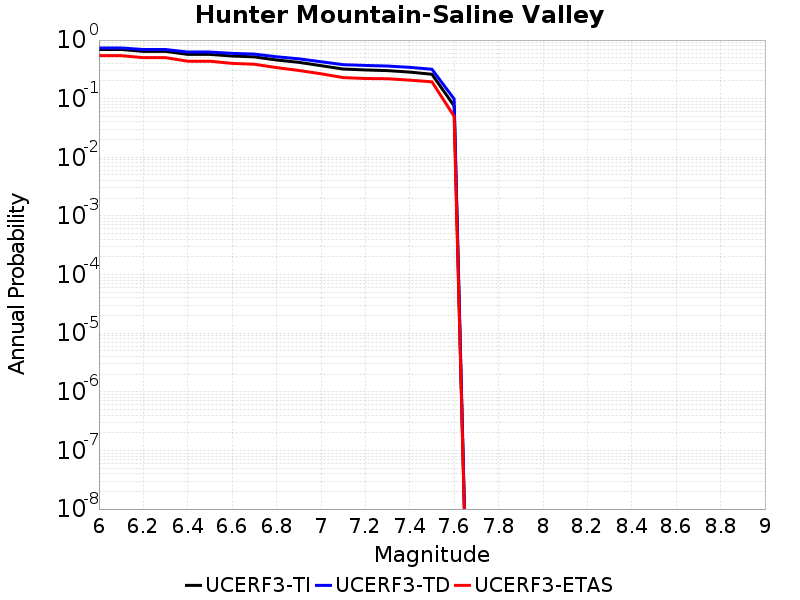 |
|-----|

| Magnitude | UCERF3-TI Prob | UCERF3-TD Prob | UCERF3-ETAS Prob |
|-----|-----|-----|-----|
| 6.0 | 0.6917207 | 0.73330504 | 0.542 |
| 6.1 | 0.6917207 | 0.73330504 | 0.542 |
| 6.2 | 0.641915 | 0.689827 | 0.501 |
| 6.3 | 0.641915 | 0.689827 | 0.501 |
| 6.4 | 0.5695837 | 0.62445086 | 0.436 |
| 6.5 | 0.5695837 | 0.62445086 | 0.436 |
| 6.6 | 0.53447044 | 0.59294313 | 0.4 |
| 6.7 | 0.5161517 | 0.57644624 | 0.387 |
| 6.8 | 0.4567753 | 0.51866627 | 0.339 |
| 6.9 | 0.41716284 | 0.47894084 | 0.303 |
| 7.0 | 0.36592245 | 0.42686448 | 0.266 |
| 7.1 | 0.32045063 | 0.3804072 | 0.229 |
| 7.2 | 0.3092311 | 0.368975 | 0.221 |
| 7.3 | 0.3010799 | 0.36039722 | 0.219 |
| 7.4 | 0.2840954 | 0.34247342 | 0.207 |
| 7.5 | 0.2610494 | 0.31772178 | 0.194 |
| 7.6 | 0.075227775 | 0.09891461 | 0.05 |

## Hunting Creek - Bartlett Springs connector 2011
*[(top)](#table-of-contents)*

|  |
|-----|

| Magnitude | UCERF3-TI Prob | UCERF3-TD Prob | UCERF3-ETAS Prob |
|-----|-----|-----|-----|
| 6.0 | 0.72441155 | 0.7141654 | 0.706 |
| 6.1 | 0.72441155 | 0.7141654 | 0.706 |
| 6.2 | 0.6886575 | 0.6840037 | 0.628 |
| 6.3 | 0.6886575 | 0.6840037 | 0.628 |
| 6.4 | 0.64782196 | 0.64982104 | 0.541 |
| 6.5 | 0.62926733 | 0.6346135 | 0.51 |
| 6.6 | 0.6145161 | 0.62247294 | 0.477 |
| 6.7 | 0.5851141 | 0.59781116 | 0.429 |
| 6.8 | 0.53863204 | 0.5553699 | 0.355 |
| 6.9 | 0.52591395 | 0.5454962 | 0.344 |
| 7.0 | 0.50166893 | 0.52464145 | 0.32 |
| 7.1 | 0.4731205 | 0.50009894 | 0.284 |
| 7.2 | 0.4506143 | 0.4796804 | 0.267 |
| 7.3 | 0.42568898 | 0.45515564 | 0.252 |
| 7.4 | 0.38741925 | 0.41612315 | 0.224 |
| 7.5 | 0.36237162 | 0.39084533 | 0.207 |
| 7.6 | 0.24266466 | 0.26500306 | 0.132 |
| 7.7 | 0.08216513 | 0.09548886 | 0.033 |
| 7.8 | 0.013437524 | 0.015270255 | 0.004 |

## Hunting Creek - Berryessa 2011 CFM
*[(top)](#table-of-contents)*

|  |
|-----|

| Magnitude | UCERF3-TI Prob | UCERF3-TD Prob | UCERF3-ETAS Prob |
|-----|-----|-----|-----|
| 6.0 | 0.94717044 | 0.8494389 | 0.98 |
| 6.1 | 0.9467332 | 0.84864223 | 0.969 |
| 6.2 | 0.86219096 | 0.7451025 | 0.864 |
| 6.3 | 0.82983476 | 0.7154689 | 0.825 |
| 6.4 | 0.8024758 | 0.6908234 | 0.788 |
| 6.5 | 0.7579142 | 0.6521134 | 0.735 |
| 6.6 | 0.7088855 | 0.6114464 | 0.67 |
| 6.7 | 0.6178984 | 0.54172033 | 0.541 |
| 6.8 | 0.4110477 | 0.4040825 | 0.268 |
| 6.9 | 0.3726476 | 0.3793926 | 0.231 |
| 7.0 | 0.34836653 | 0.36310825 | 0.209 |
| 7.1 | 0.33104336 | 0.34964502 | 0.19 |
| 7.2 | 0.3149272 | 0.33542314 | 0.182 |
| 7.3 | 0.29897562 | 0.32019058 | 0.167 |
| 7.4 | 0.27361086 | 0.29408056 | 0.153 |
| 7.5 | 0.2477765 | 0.26759768 | 0.139 |
| 7.6 | 0.20146294 | 0.21888192 | 0.112 |
| 7.7 | 0.053298034 | 0.062141918 | 0.022 |
| 7.8 | 0.0047962754 | 0.0055177794 | 0.003 |

## Imperial
*[(top)](#table-of-contents)*

| 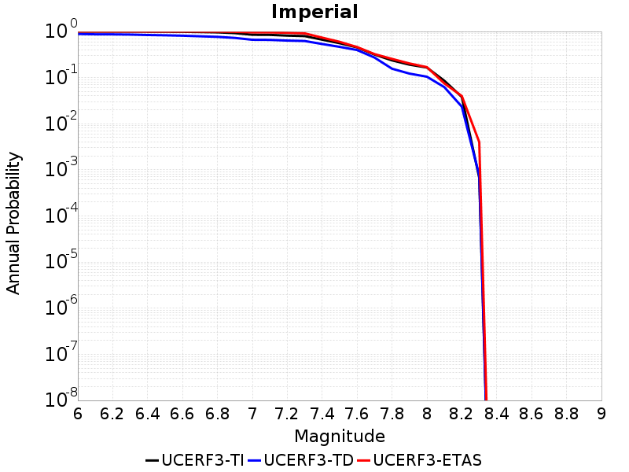 |
|-----|

| Magnitude | UCERF3-TI Prob | UCERF3-TD Prob | UCERF3-ETAS Prob |
|-----|-----|-----|-----|
| 6.0 | 0.9992342 | 0.88368964 | 1.0 |
| 6.1 | 0.9986613 | 0.8708496 | 1.0 |
| 6.2 | 0.9984606 | 0.868128 | 1.0 |
| 6.3 | 0.9976535 | 0.8587802 | 1.0 |
| 6.4 | 0.9949979 | 0.84027475 | 1.0 |
| 6.5 | 0.99209285 | 0.82782197 | 1.0 |
| 6.6 | 0.9868002 | 0.8117833 | 1.0 |
| 6.7 | 0.97555614 | 0.78833485 | 1.0 |
| 6.8 | 0.9597917 | 0.76612353 | 0.997 |
| 6.9 | 0.92365587 | 0.7262831 | 0.986 |
| 7.0 | 0.85185945 | 0.6625477 | 0.96 |
| 7.1 | 0.8462215 | 0.65803474 | 0.957 |
| 7.2 | 0.81493056 | 0.63607216 | 0.94 |
| 7.3 | 0.7957466 | 0.62236303 | 0.912 |
| 7.4 | 0.6656618 | 0.5362526 | 0.737 |
| 7.5 | 0.5581233 | 0.46476635 | 0.598 |
| 7.6 | 0.45228356 | 0.39663693 | 0.46 |
| 7.7 | 0.3165171 | 0.27246773 | 0.324 |
| 7.8 | 0.23669931 | 0.15628003 | 0.255 |
| 7.9 | 0.19128849 | 0.12233558 | 0.203 |
| 8.0 | 0.16556965 | 0.10476265 | 0.169 |
| 8.1 | 0.085566655 | 0.062225074 | 0.075 |
| 8.2 | 0.038144484 | 0.023496285 | 0.04 |
| 8.3 | 6.717823E-4 | 7.5852644E-4 | 0.004 |

## Incline Village 2011 CFM
*[(top)](#table-of-contents)*

|  |
|-----|

| Magnitude | UCERF3-TI Prob | UCERF3-TD Prob | UCERF3-ETAS Prob |
|-----|-----|-----|-----|
| 6.0 | 0.15668908 | 0.045531187 | 0.021 |
| 6.1 | 0.15668908 | 0.045531187 | 0.021 |
| 6.2 | 0.15668908 | 0.045531187 | 0.021 |
| 6.3 | 0.15668908 | 0.045531187 | 0.021 |
| 6.4 | 0.11385884 | 0.04036064 | 0.016 |
| 6.5 | 0.11385884 | 0.04036064 | 0.016 |
| 6.6 | 0.062031526 | 0.036207013 | 0.014 |
| 6.7 | 0.04714669 | 0.023939142 | 0.009 |

## Independence rev 2011
*[(top)](#table-of-contents)*

|  |
|-----|

| Magnitude | UCERF3-TI Prob | UCERF3-TD Prob | UCERF3-ETAS Prob |
|-----|-----|-----|-----|
| 6.0 | 0.10896497 | 0.10764912 | 0.088 |
| 6.1 | 0.10896497 | 0.10764912 | 0.088 |
| 6.2 | 0.10896497 | 0.10764912 | 0.088 |
| 6.3 | 0.10896497 | 0.10764912 | 0.088 |
| 6.4 | 0.10896497 | 0.10764912 | 0.088 |
| 6.5 | 0.10896497 | 0.10764912 | 0.088 |
| 6.6 | 0.06713545 | 0.06428074 | 0.056 |
| 6.7 | 0.06713545 | 0.06428074 | 0.056 |
| 6.8 | 0.050138474 | 0.04695762 | 0.042 |
| 6.9 | 0.047836203 | 0.0447274 | 0.039 |
| 7.0 | 0.03849223 | 0.035711963 | 0.029 |
| 7.1 | 0.0326496 | 0.03007747 | 0.025 |
| 7.2 | 0.026810972 | 0.02443671 | 0.022 |
| 7.3 | 0.020514637 | 0.018838832 | 0.018 |
| 7.4 | 0.013962032 | 0.013090605 | 0.014 |
| 7.5 | 0.010085035 | 0.009610496 | 0.011 |
| 7.6 | 0.0062805726 | 0.0061221686 | 0.009 |
| 7.7 | 0.00178026 | 0.0017890376 | 0.002 |

## Jess Valley
*[(top)](#table-of-contents)*

|  |
|-----|

| Magnitude | UCERF3-TI Prob | UCERF3-TD Prob | UCERF3-ETAS Prob |
|-----|-----|-----|-----|
| 6.0 | 0.08455207 | 0.08634583 | 0.061 |
| 6.1 | 0.08455207 | 0.08634583 | 0.061 |
| 6.2 | 0.08455207 | 0.08634583 | 0.061 |
| 6.3 | 0.08455207 | 0.08634583 | 0.061 |
| 6.4 | 0.039109677 | 0.039820835 | 0.027 |
| 6.5 | 0.039109677 | 0.039820835 | 0.027 |
| 6.6 | 0.013980243 | 0.014215031 | 0.013 |
| 6.7 | 0.013980243 | 0.014215031 | 0.013 |
| 6.8 | 0.0093632685 | 0.00953211 | 0.009 |

## Johnson Valley (No) 2011 rev
*[(top)](#table-of-contents)*

|  |
|-----|

| Magnitude | UCERF3-TI Prob | UCERF3-TD Prob | UCERF3-ETAS Prob |
|-----|-----|-----|-----|
| 6.0 | 0.48957625 | 0.33911964 | 0.171 |
| 6.1 | 0.48957625 | 0.33911964 | 0.171 |
| 6.2 | 0.48957625 | 0.33911964 | 0.171 |
| 6.3 | 0.48957625 | 0.33911964 | 0.171 |
| 6.4 | 0.32906312 | 0.22156553 | 0.095 |
| 6.5 | 0.32906312 | 0.22156553 | 0.095 |
| 6.6 | 0.29299167 | 0.18729982 | 0.075 |
| 6.7 | 0.29299167 | 0.18729982 | 0.075 |
| 6.8 | 0.19534788 | 0.11267908 | 0.047 |
| 6.9 | 0.17203148 | 0.09385872 | 0.035 |
| 7.0 | 0.15631168 | 0.08624719 | 0.031 |
| 7.1 | 0.029967742 | 0.002150451 | 0.0 |
| 7.2 | 0.014025151 | 0.0021144918 | 0.0 |
| 7.3 | 0.0131577365 | 0.0021143702 | 0.0 |
| 7.4 | 0.012333644 | 0.0021077092 | 0.0 |
| 7.5 | 0.008923254 | 0.0017761025 | 0.0 |

## Joshua Tree (Seismicity)
*[(top)](#table-of-contents)*

|  |
|-----|

| Magnitude | UCERF3-TI Prob | UCERF3-TD Prob | UCERF3-ETAS Prob |
|-----|-----|-----|-----|
| 6.0 | 0.035930395 | 0.05312144 | 0.029 |
| 6.1 | 0.035930395 | 0.05312144 | 0.029 |
| 6.2 | 0.035930395 | 0.05312144 | 0.029 |
| 6.3 | 0.018948335 | 0.036132958 | 0.016 |
| 6.4 | 0.016513776 | 0.033720102 | 0.014 |
| 6.5 | 0.016513776 | 0.033720102 | 0.014 |
| 6.6 | 0.016414013 | 0.033645667 | 0.014 |
| 6.7 | 0.015775295 | 0.033007726 | 0.014 |
| 6.8 | 0.015492656 | 0.032786097 | 0.013 |
| 6.9 | 0.012821666 | 0.028697766 | 0.011 |
| 7.0 | 0.011027672 | 0.025404442 | 0.009 |
| 7.1 | 0.009577803 | 0.022532536 | 0.007 |
| 7.2 | 0.008436388 | 0.020119678 | 0.007 |
| 7.3 | 0.006411326 | 0.014323827 | 0.004 |
| 7.4 | 0.004335729 | 0.009203872 | 0.002 |
| 7.5 | 1.1066828E-4 | 1.9943892E-4 | 0.0 |

## Keddie Ridge 2011 CFM
*[(top)](#table-of-contents)*

| 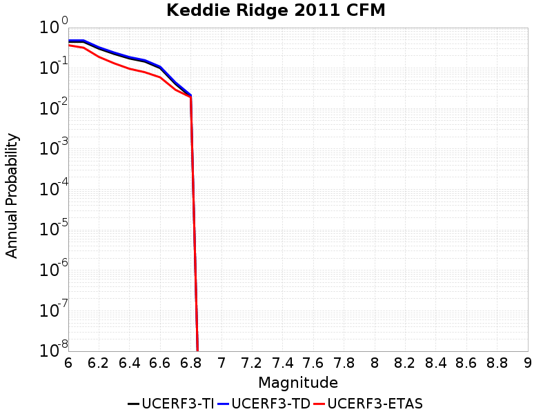 |
|-----|

| Magnitude | UCERF3-TI Prob | UCERF3-TD Prob | UCERF3-ETAS Prob |
|-----|-----|-----|-----|
| 6.0 | 0.44534802 | 0.48403528 | 0.367 |
| 6.1 | 0.44534802 | 0.48403528 | 0.319 |
| 6.2 | 0.3018953 | 0.32710284 | 0.189 |
| 6.3 | 0.22369447 | 0.24224569 | 0.131 |
| 6.4 | 0.17244339 | 0.18676524 | 0.096 |
| 6.5 | 0.14452662 | 0.15667407 | 0.079 |
| 6.6 | 0.099886455 | 0.108230524 | 0.059 |
| 6.7 | 0.04046344 | 0.044156406 | 0.029 |
| 6.8 | 0.019422133 | 0.02142822 | 0.019 |

## Kern Canyon (Lake Isabella) 2011
*[(top)](#table-of-contents)*

|  |
|-----|

| Magnitude | UCERF3-TI Prob | UCERF3-TD Prob | UCERF3-ETAS Prob |
|-----|-----|-----|-----|
| 6.0 | 0.104690574 | 0.09985516 | 0.035 |
| 6.1 | 0.104690574 | 0.09985516 | 0.035 |
| 6.2 | 0.104690574 | 0.09985516 | 0.035 |
| 6.3 | 0.104690574 | 0.09985516 | 0.035 |
| 6.4 | 0.104690574 | 0.09985516 | 0.035 |
| 6.5 | 0.07010017 | 0.063968696 | 0.019 |
| 6.6 | 0.05635504 | 0.049803473 | 0.015 |
| 6.7 | 0.05488112 | 0.048299365 | 0.015 |
| 6.8 | 0.047580536 | 0.040810958 | 0.013 |
| 6.9 | 0.0404208 | 0.033841405 | 0.011 |
| 7.0 | 0.03529378 | 0.02912653 | 0.01 |
| 7.1 | 0.028079903 | 0.022848459 | 0.006 |
| 7.2 | 0.019703439 | 0.015464952 | 0.005 |
| 7.3 | 0.0138005875 | 0.011495646 | 0.003 |
| 7.4 | 0.009075729 | 0.007900613 | 0.002 |
| 7.5 | 0.0047673816 | 0.0037811114 | 0.0 |
| 7.6 | 6.708552E-4 | 4.6797527E-4 | 0.0 |

## Kern Canyon (North Kern) 2011
*[(top)](#table-of-contents)*

|  |
|-----|

| Magnitude | UCERF3-TI Prob | UCERF3-TD Prob | UCERF3-ETAS Prob |
|-----|-----|-----|-----|
| 6.0 | 0.15876137 | 0.16337417 | 0.071 |
| 6.1 | 0.15876137 | 0.16337417 | 0.071 |
| 6.2 | 0.15876137 | 0.16337417 | 0.071 |
| 6.3 | 0.15876137 | 0.16337417 | 0.071 |
| 6.4 | 0.15876137 | 0.16337417 | 0.071 |
| 6.5 | 0.08048515 | 0.08162755 | 0.036 |
| 6.6 | 0.08048515 | 0.08162755 | 0.036 |
| 6.7 | 0.055554375 | 0.055996425 | 0.017 |
| 6.8 | 0.044140805 | 0.04432349 | 0.015 |
| 6.9 | 0.035111923 | 0.035107806 | 0.014 |
| 7.0 | 0.029475547 | 0.029366178 | 0.013 |
| 7.1 | 0.024213469 | 0.024006907 | 0.011 |
| 7.2 | 0.017733067 | 0.017410463 | 0.007 |
| 7.3 | 0.013243667 | 0.012840087 | 0.006 |
| 7.4 | 0.009089537 | 0.008611457 | 0.004 |
| 7.5 | 0.004430948 | 0.0038838766 | 0.002 |
| 7.6 | 6.708552E-4 | 4.6797527E-4 | 0.0 |

## Kern Canyon (South Kern) 2011
*[(top)](#table-of-contents)*

|  |
|-----|

| Magnitude | UCERF3-TI Prob | UCERF3-TD Prob | UCERF3-ETAS Prob |
|-----|-----|-----|-----|
| 6.0 | 0.10156299 | 0.101934664 | 0.045 |
| 6.1 | 0.10156299 | 0.101934664 | 0.045 |
| 6.2 | 0.10156299 | 0.101934664 | 0.045 |
| 6.3 | 0.10156299 | 0.101934664 | 0.045 |
| 6.4 | 0.10156299 | 0.101934664 | 0.045 |
| 6.5 | 0.074921 | 0.07471134 | 0.032 |
| 6.6 | 0.074921 | 0.07471134 | 0.032 |
| 6.7 | 0.06742572 | 0.067073986 | 0.027 |
| 6.8 | 0.05893742 | 0.058430802 | 0.019 |
| 6.9 | 0.05324627 | 0.052638013 | 0.018 |
| 7.0 | 0.043712646 | 0.042930122 | 0.018 |
| 7.1 | 0.036408044 | 0.035486475 | 0.013 |
| 7.2 | 0.023456184 | 0.022290157 | 0.009 |
| 7.3 | 0.01590191 | 0.014670732 | 0.006 |
| 7.4 | 0.0105101345 | 0.009363756 | 0.004 |
| 7.5 | 0.0051708296 | 0.0041927267 | 0.002 |
| 7.6 | 6.708552E-4 | 4.6797527E-4 | 0.0 |

## Kickapoo
*[(top)](#table-of-contents)*

|  |
|-----|

| Magnitude | UCERF3-TI Prob | UCERF3-TD Prob | UCERF3-ETAS Prob |
|-----|-----|-----|-----|
| 6.0 | 0.10986862 | 0.0055374876 | 0.126 |
| 6.1 | 0.10986862 | 0.0055374876 | 0.0 |
| 6.2 | 0.10986862 | 0.0055374876 | 0.0 |
| 6.3 | 0.10986862 | 0.0055374876 | 0.0 |
| 6.4 | 0.10986862 | 0.0055374876 | 0.0 |
| 6.5 | 0.10986862 | 0.0055374876 | 0.0 |
| 6.6 | 0.10463901 | 0.0049374686 | 0.0 |
| 6.7 | 0.10463901 | 0.0049374686 | 0.0 |
| 6.8 | 0.058739003 | 0.003099651 | 0.0 |
| 6.9 | 0.056055773 | 0.003097363 | 0.0 |
| 7.0 | 0.04642769 | 0.0030788009 | 0.0 |
| 7.1 | 0.03375902 | 0.003059933 | 0.0 |
| 7.2 | 0.017738983 | 0.0030221494 | 0.0 |
| 7.3 | 0.016635269 | 0.003017816 | 0.0 |
| 7.4 | 0.015237915 | 0.0029355155 | 0.0 |
| 7.5 | 0.008923254 | 0.0017761025 | 0.0 |

## King Range 2011 CFM
*[(top)](#table-of-contents)*

|  |
|-----|

| Magnitude | UCERF3-TI Prob | UCERF3-TD Prob | UCERF3-ETAS Prob |
|-----|-----|-----|-----|
| 6.0 | 0.27757484 | 0.30154854 | 0.61 |
| 6.1 | 0.27757484 | 0.30154854 | 0.61 |
| 6.2 | 0.27757484 | 0.30154854 | 0.61 |
| 6.3 | 0.1881297 | 0.2036654 | 0.337 |
| 6.4 | 0.1881297 | 0.2036654 | 0.337 |
| 6.5 | 0.12349245 | 0.13319774 | 0.124 |
| 6.6 | 0.111626185 | 0.12077108 | 0.102 |
| 6.7 | 0.10178234 | 0.11054341 | 0.081 |
| 6.8 | 0.09514223 | 0.1036799 | 0.073 |
| 6.9 | 0.08726757 | 0.0955008 | 0.068 |
| 7.0 | 0.0740059 | 0.081580974 | 0.056 |
| 7.1 | 0.06277566 | 0.0695563 | 0.047 |
| 7.2 | 0.055288322 | 0.061590493 | 0.036 |
| 7.3 | 0.05177751 | 0.057834294 | 0.033 |
| 7.4 | 0.037316423 | 0.041832615 | 0.022 |
| 7.5 | 0.020830331 | 0.023557127 | 0.013 |
| 7.6 | 0.008117024 | 0.00917133 | 0.002 |
| 7.7 | 0.0046194177 | 0.0052716862 | 0.001 |
| 7.8 | 5.486516E-4 | 5.627644E-4 | 0.0 |
| 7.9 | 3.856695E-5 | 3.0830954E-5 | 0.0 |

## La Panza 2011
*[(top)](#table-of-contents)*

|  |
|-----|

| Magnitude | UCERF3-TI Prob | UCERF3-TD Prob | UCERF3-ETAS Prob |
|-----|-----|-----|-----|
| 6.0 | 0.114833534 | 0.11618446 | 0.105 |
| 6.1 | 0.114833534 | 0.11618446 | 0.105 |
| 6.2 | 0.114833534 | 0.11618446 | 0.105 |
| 6.3 | 0.114833534 | 0.11618446 | 0.105 |
| 6.4 | 0.114833534 | 0.11618446 | 0.105 |
| 6.5 | 0.062783435 | 0.06318395 | 0.056 |
| 6.6 | 0.062783435 | 0.06318395 | 0.056 |
| 6.7 | 0.038650304 | 0.03871515 | 0.034 |
| 6.8 | 0.035528507 | 0.035546605 | 0.03 |
| 6.9 | 0.02531103 | 0.025197897 | 0.023 |
| 7.0 | 0.017532414 | 0.017316885 | 0.019 |
| 7.1 | 0.009084472 | 0.008761226 | 0.01 |
| 7.2 | 0.0065239933 | 0.006162082 | 0.009 |
| 7.3 | 0.0026469238 | 0.0022177382 | 0.004 |
| 7.4 | 9.1287115E-4 | 5.4944464E-4 | 0.0 |
| 7.5 | 6.7607715E-4 | 3.1902498E-4 | 0.0 |
| 7.6 | 4.9600954E-4 | 1.8654965E-4 | 0.0 |
| 7.7 | 3.0712417E-4 | 7.2542505E-5 | 0.0 |
| 7.8 | 1.431959E-4 | 2.9100189E-5 | 0.0 |
| 7.9 | 6.543253E-5 | 1.438088E-5 | 0.0 |

## Laguna Salada
*[(top)](#table-of-contents)*

|  |
|-----|

| Magnitude | UCERF3-TI Prob | UCERF3-TD Prob | UCERF3-ETAS Prob |
|-----|-----|-----|-----|
| 6.0 | 0.7024825 | 0.686263 | 0.85 |
| 6.1 | 0.6461823 | 0.63377935 | 0.546 |
| 6.2 | 0.6097625 | 0.5998093 | 0.498 |
| 6.3 | 0.5756874 | 0.5676923 | 0.456 |
| 6.4 | 0.5323556 | 0.52675515 | 0.393 |
| 6.5 | 0.5065718 | 0.50269663 | 0.371 |
| 6.6 | 0.44209006 | 0.4428352 | 0.311 |
| 6.7 | 0.3980926 | 0.4021005 | 0.267 |
| 6.8 | 0.24491689 | 0.25312534 | 0.159 |
| 6.9 | 0.054263588 | 0.0471213 | 0.028 |
| 7.0 | 0.05319753 | 0.046068575 | 0.028 |
| 7.1 | 0.045595266 | 0.038524438 | 0.025 |
| 7.2 | 0.025047874 | 0.019488607 | 0.009 |

## Lake Isabella (Seismicity)
*[(top)](#table-of-contents)*

|  |
|-----|

| Magnitude | UCERF3-TI Prob | UCERF3-TD Prob | UCERF3-ETAS Prob |
|-----|-----|-----|-----|
| 6.0 | 0.21812925 | 0.2269212 | 0.12 |
| 6.1 | 0.21812925 | 0.2269212 | 0.12 |
| 6.2 | 0.21812925 | 0.2269212 | 0.12 |
| 6.3 | 0.21812925 | 0.2269212 | 0.12 |
| 6.4 | 0.12558945 | 0.12977943 | 0.055 |
| 6.5 | 0.12558945 | 0.12977943 | 0.055 |
| 6.6 | 0.08490674 | 0.08751646 | 0.039 |
| 6.7 | 0.08459782 | 0.087203935 | 0.038 |
| 6.8 | 0.067000516 | 0.069082834 | 0.033 |
| 6.9 | 0.060841653 | 0.06276522 | 0.031 |
| 7.0 | 0.0432656 | 0.044665992 | 0.021 |
| 7.1 | 0.009093262 | 0.009265561 | 0.004 |
| 7.2 | 0.0058064912 | 0.0059122704 | 0.003 |
| 7.3 | 0.004103336 | 0.004177455 | 0.002 |
| 7.4 | 0.0029220267 | 0.0029751656 | 0.002 |
| 7.5 | 0.001273698 | 0.0012968436 | 0.002 |
| 7.6 | 3.925424E-5 | 3.9925875E-5 | 0.0 |

## Las Positas
*[(top)](#table-of-contents)*

|  |
|-----|

| Magnitude | UCERF3-TI Prob | UCERF3-TD Prob | UCERF3-ETAS Prob |
|-----|-----|-----|-----|
| 6.0 | 0.24277759 | 0.29984075 | 0.199 |
| 6.1 | 0.24277759 | 0.29984075 | 0.199 |
| 6.2 | 0.24277759 | 0.29984075 | 0.199 |
| 6.3 | 0.24277759 | 0.29984075 | 0.199 |

## Last Chance
*[(top)](#table-of-contents)*

|  |
|-----|

| Magnitude | UCERF3-TI Prob | UCERF3-TD Prob | UCERF3-ETAS Prob |
|-----|-----|-----|-----|
| 6.0 | 0.08103836 | 0.0831618 | 0.044 |
| 6.1 | 0.08103836 | 0.0831618 | 0.044 |
| 6.2 | 0.08103836 | 0.0831618 | 0.044 |
| 6.3 | 0.08103836 | 0.0831618 | 0.044 |
| 6.4 | 0.08103836 | 0.0831618 | 0.044 |
| 6.5 | 0.08103836 | 0.0831618 | 0.044 |
| 6.6 | 0.08103836 | 0.0831618 | 0.044 |
| 6.7 | 0.049946934 | 0.05106291 | 0.026 |
| 6.8 | 0.047095586 | 0.048161946 | 0.024 |
| 6.9 | 0.041593295 | 0.04254605 | 0.023 |
| 7.0 | 0.029859101 | 0.030576767 | 0.016 |
| 7.1 | 0.020328866 | 0.020833097 | 0.012 |

## Lenwood-Lockhart-Old Woman Springs
*[(top)](#table-of-contents)*

|  |
|-----|

| Magnitude | UCERF3-TI Prob | UCERF3-TD Prob | UCERF3-ETAS Prob |
|-----|-----|-----|-----|
| 6.0 | 0.6235397 | 0.68715537 | 0.477 |
| 6.1 | 0.6235397 | 0.68715537 | 0.477 |
| 6.2 | 0.6235397 | 0.68715537 | 0.477 |
| 6.3 | 0.42303148 | 0.47676817 | 0.311 |
| 6.4 | 0.42303148 | 0.47676817 | 0.311 |
| 6.5 | 0.36484525 | 0.4124342 | 0.254 |
| 6.6 | 0.3274585 | 0.36879644 | 0.227 |
| 6.7 | 0.29365256 | 0.32991457 | 0.195 |
| 6.8 | 0.25969228 | 0.29000655 | 0.164 |
| 6.9 | 0.23472385 | 0.26127073 | 0.139 |
| 7.0 | 0.19058467 | 0.21071507 | 0.104 |
| 7.1 | 0.16253151 | 0.17953545 | 0.086 |
| 7.2 | 0.13794056 | 0.1525626 | 0.07 |
| 7.3 | 0.10503176 | 0.11669268 | 0.054 |
| 7.4 | 0.06423641 | 0.07250617 | 0.032 |
| 7.5 | 0.0011396303 | 0.0011871624 | 0.0 |

## Likely 2011 CFM
*[(top)](#table-of-contents)*

|  |
|-----|

| Magnitude | UCERF3-TI Prob | UCERF3-TD Prob | UCERF3-ETAS Prob |
|-----|-----|-----|-----|
| 6.0 | 0.48339844 | 0.5113668 | 0.324 |
| 6.1 | 0.48339844 | 0.5113668 | 0.293 |
| 6.2 | 0.3476931 | 0.36689276 | 0.201 |
| 6.3 | 0.2677641 | 0.28240526 | 0.152 |
| 6.4 | 0.21324062 | 0.22483969 | 0.12 |
| 6.5 | 0.18154918 | 0.19142596 | 0.101 |
| 6.6 | 0.1557262 | 0.16423875 | 0.084 |
| 6.7 | 0.1132296 | 0.11948329 | 0.065 |
| 6.8 | 0.08200337 | 0.08660691 | 0.051 |
| 6.9 | 0.058952753 | 0.062341653 | 0.039 |
| 7.0 | 0.031107644 | 0.03297932 | 0.019 |

## Lions Head 2011 CFM
*[(top)](#table-of-contents)*

|  |
|-----|

| Magnitude | UCERF3-TI Prob | UCERF3-TD Prob | UCERF3-ETAS Prob |
|-----|-----|-----|-----|
| 6.0 | 0.022924863 | 0.022958351 | 0.021 |
| 6.1 | 0.022924863 | 0.022958351 | 0.021 |
| 6.2 | 0.014872803 | 0.014870058 | 0.015 |
| 6.3 | 0.014872803 | 0.014870058 | 0.015 |
| 6.4 | 0.010855306 | 0.010838071 | 0.011 |
| 6.5 | 0.010855306 | 0.010838071 | 0.011 |
| 6.6 | 0.00957978 | 0.009558799 | 0.01 |
| 6.7 | 0.008645951 | 0.008622382 | 0.01 |
| 6.8 | 0.0077146436 | 0.007688687 | 0.009 |
| 6.9 | 0.0073443796 | 0.0073172236 | 0.009 |
| 7.0 | 0.0067070024 | 0.006677565 | 0.009 |
| 7.1 | 0.005899276 | 0.0058660135 | 0.008 |
| 7.2 | 0.005122631 | 0.0050856844 | 0.008 |
| 7.3 | 0.004191877 | 0.0041491697 | 0.007 |
| 7.4 | 0.003398197 | 0.0033497058 | 0.006 |
| 7.5 | 0.0024521507 | 0.0023952322 | 0.004 |
| 7.6 | 0.0017298087 | 0.0016651936 | 0.002 |
| 7.7 | 0.0010195943 | 9.4523415E-4 | 0.002 |
| 7.8 | 5.1796116E-4 | 4.3574587E-4 | 0.001 |
| 7.9 | 2.5349628E-4 | 1.8183257E-4 | 0.001 |
| 8.0 | 1.0017188E-4 | 5.793186E-5 | 0.0 |

## Little Lake
*[(top)](#table-of-contents)*

|  |
|-----|

| Magnitude | UCERF3-TI Prob | UCERF3-TD Prob | UCERF3-ETAS Prob |
|-----|-----|-----|-----|
| 6.0 | 0.523641 | 0.5677406 | 0.295 |
| 6.1 | 0.523641 | 0.5677406 | 0.295 |
| 6.2 | 0.523641 | 0.5677406 | 0.295 |
| 6.3 | 0.3218384 | 0.34506088 | 0.156 |
| 6.4 | 0.3218384 | 0.34506088 | 0.156 |
| 6.5 | 0.28386164 | 0.3045768 | 0.135 |
| 6.6 | 0.22281215 | 0.23782526 | 0.096 |
| 6.7 | 0.18344335 | 0.19527096 | 0.077 |
| 6.8 | 0.15429576 | 0.16394493 | 0.067 |
| 6.9 | 0.078375176 | 0.07881494 | 0.041 |
| 7.0 | 0.05800967 | 0.05727599 | 0.028 |
| 7.1 | 0.033188317 | 0.031053426 | 0.015 |
| 7.2 | 0.012227922 | 0.008725383 | 0.004 |
| 7.3 | 0.010234522 | 0.0066960296 | 0.004 |
| 7.4 | 0.009211505 | 0.0057851207 | 0.004 |
| 7.5 | 0.0068520573 | 0.004259086 | 0.002 |
| 7.6 | 0.0033076303 | 0.0021977935 | 0.002 |

## Little Salmon (Offshore)
*[(top)](#table-of-contents)*

|  |
|-----|

| Magnitude | UCERF3-TI Prob | UCERF3-TD Prob | UCERF3-ETAS Prob |
|-----|-----|-----|-----|
| 6.0 | 0.45196632 | 0.529412 | 0.388 |
| 6.1 | 0.45196632 | 0.529412 | 0.388 |
| 6.2 | 0.45196632 | 0.529412 | 0.388 |
| 6.3 | 0.45196632 | 0.529412 | 0.388 |
| 6.4 | 0.45196632 | 0.529412 | 0.388 |
| 6.5 | 0.45196632 | 0.529412 | 0.388 |
| 6.6 | 0.45196632 | 0.529412 | 0.388 |
| 6.7 | 0.45196632 | 0.529412 | 0.388 |
| 6.8 | 0.35552254 | 0.4258883 | 0.293 |
| 6.9 | 0.35552254 | 0.4258883 | 0.293 |
| 7.0 | 0.32475516 | 0.3944723 | 0.268 |
| 7.1 | 0.32475516 | 0.3944723 | 0.268 |
| 7.2 | 0.27696344 | 0.34685346 | 0.232 |
| 7.3 | 0.21666631 | 0.27671874 | 0.169 |
| 7.4 | 0.1435946 | 0.1909971 | 0.117 |

## Little Salmon (Onshore)
*[(top)](#table-of-contents)*

|  |
|-----|

| Magnitude | UCERF3-TI Prob | UCERF3-TD Prob | UCERF3-ETAS Prob |
|-----|-----|-----|-----|
| 6.0 | 0.66205555 | 0.736742 | 0.741 |
| 6.1 | 0.66205555 | 0.736742 | 0.741 |
| 6.2 | 0.66205555 | 0.736742 | 0.741 |
| 6.3 | 0.66205555 | 0.736742 | 0.741 |
| 6.4 | 0.66205555 | 0.736742 | 0.741 |
| 6.5 | 0.66205555 | 0.736742 | 0.741 |
| 6.6 | 0.66205555 | 0.736742 | 0.741 |
| 6.7 | 0.66205555 | 0.736742 | 0.741 |
| 6.8 | 0.5946124 | 0.6851993 | 0.647 |
| 6.9 | 0.5946124 | 0.6851993 | 0.647 |
| 7.0 | 0.38142362 | 0.46976256 | 0.342 |
| 7.1 | 0.344403 | 0.42649904 | 0.302 |
| 7.2 | 0.32153618 | 0.4003715 | 0.282 |
| 7.3 | 0.21666631 | 0.27671874 | 0.169 |
| 7.4 | 0.1435946 | 0.1909971 | 0.117 |

## Los Alamos 2011 CFM
*[(top)](#table-of-contents)*

|  |
|-----|

| Magnitude | UCERF3-TI Prob | UCERF3-TD Prob | UCERF3-ETAS Prob |
|-----|-----|-----|-----|
| 6.0 | 0.11374718 | 0.11708578 | 0.13 |
| 6.1 | 0.11374718 | 0.11708578 | 0.13 |
| 6.2 | 0.11374718 | 0.11708578 | 0.13 |
| 6.3 | 0.11374718 | 0.11708578 | 0.13 |
| 6.4 | 0.11374718 | 0.11708578 | 0.13 |
| 6.5 | 0.11374718 | 0.11708578 | 0.13 |
| 6.6 | 0.11374718 | 0.11708578 | 0.13 |
| 6.7 | 0.1005603 | 0.1034624 | 0.115 |
| 6.8 | 0.1005603 | 0.1034624 | 0.115 |
| 6.9 | 0.08233971 | 0.08459783 | 0.099 |
| 7.0 | 0.07934655 | 0.08153417 | 0.095 |
| 7.1 | 0.07378457 | 0.07582828 | 0.09 |
| 7.2 | 0.050891913 | 0.052063093 | 0.043 |
| 7.3 | 0.04429129 | 0.04527622 | 0.029 |
| 7.4 | 0.040178843 | 0.041049715 | 0.023 |
| 7.5 | 0.035466306 | 0.036191113 | 0.02 |
| 7.6 | 0.027894093 | 0.028357735 | 0.017 |
| 7.7 | 0.014361898 | 0.014428701 | 0.01 |
| 7.8 | 0.0053878636 | 0.0052762474 | 0.006 |
| 7.9 | 0.0010383694 | 9.4806985E-4 | 0.001 |
| 8.0 | 2.0559496E-6 | 2.1435183E-6 | 0.0 |

## Los Alamos extension
*[(top)](#table-of-contents)*

|  |
|-----|

| Magnitude | UCERF3-TI Prob | UCERF3-TD Prob | UCERF3-ETAS Prob |
|-----|-----|-----|-----|
| 6.0 | 0.099440984 | 0.10178587 | 0.126 |
| 6.1 | 0.099440984 | 0.10178587 | 0.126 |
| 6.2 | 0.099440984 | 0.10178587 | 0.126 |
| 6.3 | 0.099440984 | 0.10178587 | 0.126 |
| 6.4 | 0.099440984 | 0.10178587 | 0.126 |
| 6.5 | 0.099440984 | 0.10178587 | 0.126 |
| 6.6 | 0.099440984 | 0.10178587 | 0.126 |
| 6.7 | 0.099440984 | 0.10178587 | 0.126 |
| 6.8 | 0.09103347 | 0.093109526 | 0.111 |
| 6.9 | 0.09070526 | 0.092771895 | 0.109 |
| 7.0 | 0.09040207 | 0.09245905 | 0.109 |
| 7.1 | 0.08727181 | 0.089236125 | 0.105 |
| 7.2 | 0.06364196 | 0.06469604 | 0.06 |
| 7.3 | 0.05430042 | 0.055054493 | 0.043 |
| 7.4 | 0.049998682 | 0.050616696 | 0.036 |
| 7.5 | 0.04389324 | 0.044288732 | 0.032 |
| 7.6 | 0.03515553 | 0.035233054 | 0.028 |
| 7.7 | 0.0213513 | 0.02102236 | 0.017 |
| 7.8 | 0.010306132 | 0.009886437 | 0.009 |
| 7.9 | 0.002421418 | 0.002190681 | 0.001 |
| 8.0 | 2.0559496E-6 | 2.1435183E-6 | 0.0 |

## Los Medanos - Roe Island
*[(top)](#table-of-contents)*

|  |
|-----|

| Magnitude | UCERF3-TI Prob | UCERF3-TD Prob | UCERF3-ETAS Prob |
|-----|-----|-----|-----|
| 6.0 | 0.023378722 | 0.025167678 | 0.009 |
| 6.1 | 0.023378722 | 0.025167678 | 0.009 |
| 6.2 | 0.023378722 | 0.025167678 | 0.009 |
| 6.3 | 0.023378722 | 0.025167678 | 0.009 |
| 6.4 | 0.023378722 | 0.025167678 | 0.009 |
| 6.5 | 0.023378722 | 0.025167678 | 0.009 |
| 6.6 | 0.023378722 | 0.025167678 | 0.009 |
| 6.7 | 0.023167823 | 0.024955768 | 0.009 |
| 6.8 | 0.022093697 | 0.023724653 | 0.008 |
| 6.9 | 0.020618722 | 0.02211503 | 0.007 |
| 7.0 | 0.017836284 | 0.019076932 | 0.006 |
| 7.1 | 0.0144356275 | 0.015419766 | 0.005 |
| 7.2 | 0.010586064 | 0.011278196 | 0.004 |
| 7.3 | 0.0069502774 | 0.0074097146 | 0.001 |
| 7.4 | 0.0041270633 | 0.0043959515 | 0.0 |
| 7.5 | 0.0027813127 | 0.0029596179 | 0.0 |
| 7.6 | 0.0016894753 | 0.0017984931 | 0.0 |
| 7.7 | 3.12622E-5 | 3.3551227E-5 | 0.0 |

## Los Osos 2011
*[(top)](#table-of-contents)*

|  |
|-----|

| Magnitude | UCERF3-TI Prob | UCERF3-TD Prob | UCERF3-ETAS Prob |
|-----|-----|-----|-----|
| 6.0 | 0.11970948 | 0.12274081 | 0.078 |
| 6.1 | 0.11970948 | 0.12274081 | 0.078 |
| 6.2 | 0.11970948 | 0.12274081 | 0.078 |
| 6.3 | 0.11970948 | 0.12274081 | 0.078 |
| 6.4 | 0.11970948 | 0.12274081 | 0.078 |
| 6.5 | 0.07943341 | 0.08094264 | 0.048 |
| 6.6 | 0.07774715 | 0.07920876 | 0.047 |
| 6.7 | 0.06586352 | 0.06706532 | 0.039 |
| 6.8 | 0.062606044 | 0.063727945 | 0.035 |
| 6.9 | 0.054242756 | 0.05517787 | 0.028 |
| 7.0 | 0.049063236 | 0.049891826 | 0.024 |
| 7.1 | 0.041767113 | 0.042449612 | 0.021 |
| 7.2 | 0.036987927 | 0.037576355 | 0.02 |
| 7.3 | 0.030859036 | 0.031324957 | 0.016 |
| 7.4 | 0.02500876 | 0.025350895 | 0.014 |
| 7.5 | 0.01854472 | 0.01873856 | 0.01 |
| 7.6 | 0.011809673 | 0.01182703 | 0.003 |
| 7.7 | 0.0055088 | 0.005333364 | 0.002 |
| 7.8 | 0.002572639 | 0.002293788 | 0.0 |
| 7.9 | 0.0014182272 | 0.0011561216 | 0.0 |
| 8.0 | 4.7398292E-4 | 3.621858E-4 | 0.0 |

## Lost Hills
*[(top)](#table-of-contents)*

|  |
|-----|

| Magnitude | UCERF3-TI Prob | UCERF3-TD Prob | UCERF3-ETAS Prob |
|-----|-----|-----|-----|
| 6.0 | 0.44162068 | 0.49766907 | 0.374 |
| 6.1 | 0.44162068 | 0.49766907 | 0.374 |
| 6.2 | 0.44162068 | 0.49766907 | 0.374 |
| 6.3 | 0.44162068 | 0.49766907 | 0.374 |
| 6.4 | 0.2742789 | 0.3170677 | 0.229 |
| 6.5 | 0.2742789 | 0.3170677 | 0.229 |
| 6.6 | 0.20062119 | 0.23893377 | 0.147 |
| 6.7 | 0.17137854 | 0.20818757 | 0.118 |

## Ludlow
*[(top)](#table-of-contents)*

|  |
|-----|

| Magnitude | UCERF3-TI Prob | UCERF3-TD Prob | UCERF3-ETAS Prob |
|-----|-----|-----|-----|
| 6.0 | 0.44267404 | 0.46636894 | 0.361 |
| 6.1 | 0.44267404 | 0.46636894 | 0.361 |
| 6.2 | 0.24518055 | 0.25678512 | 0.187 |
| 6.3 | 0.24518055 | 0.25678512 | 0.187 |
| 6.4 | 0.18443483 | 0.1931992 | 0.138 |
| 6.5 | 0.15595151 | 0.16345415 | 0.118 |
| 6.6 | 0.13552718 | 0.1421393 | 0.092 |
| 6.7 | 0.11507417 | 0.12074342 | 0.083 |
| 6.8 | 0.088659465 | 0.093099326 | 0.065 |
| 6.9 | 0.063943945 | 0.06719856 | 0.046 |
| 7.0 | 0.043590497 | 0.045839343 | 0.031 |
| 7.1 | 0.028050553 | 0.02949524 | 0.021 |
| 7.2 | 0.015702942 | 0.016499616 | 0.012 |

## Maacama 2011 CFM
*[(top)](#table-of-contents)*

|  |
|-----|

| Magnitude | UCERF3-TI Prob | UCERF3-TD Prob | UCERF3-ETAS Prob |
|-----|-----|-----|-----|
| 6.0 | 0.9718382 | 0.87405306 | 0.942 |
| 6.1 | 0.9718382 | 0.87405306 | 0.942 |
| 6.2 | 0.9712846 | 0.8725466 | 0.941 |
| 6.3 | 0.95536816 | 0.84418774 | 0.926 |
| 6.4 | 0.9546882 | 0.84271234 | 0.924 |
| 6.5 | 0.94257396 | 0.82458466 | 0.899 |
| 6.6 | 0.93544793 | 0.81444615 | 0.896 |
| 6.7 | 0.9212166 | 0.7949761 | 0.872 |
| 6.8 | 0.90369064 | 0.77263117 | 0.851 |
| 6.9 | 0.87062424 | 0.7319667 | 0.807 |
| 7.0 | 0.837388 | 0.69493806 | 0.761 |
| 7.1 | 0.79096365 | 0.6453 | 0.691 |
| 7.2 | 0.73681575 | 0.59009093 | 0.624 |
| 7.3 | 0.66648406 | 0.52237374 | 0.527 |
| 7.4 | 0.5306387 | 0.41027325 | 0.377 |
| 7.5 | 0.029031077 | 0.03061554 | 0.011 |
| 7.6 | 0.0068989806 | 0.007274301 | 0.003 |
| 7.7 | 0.0025346929 | 0.002616621 | 0.002 |
| 7.8 | 1.6158223E-4 | 1.5046967E-4 | 0.0 |

## Mad River (alt1)
*[(top)](#table-of-contents)*

|  |
|-----|

| Magnitude | UCERF3-TI Prob | UCERF3-TD Prob | UCERF3-ETAS Prob |
|-----|-----|-----|-----|
| 6.0 | 0.2544568 | 0.27163506 | 0.223 |
| 6.1 | 0.2544568 | 0.27163506 | 0.223 |
| 6.2 | 0.2544568 | 0.27163506 | 0.223 |
| 6.3 | 0.2544568 | 0.27163506 | 0.223 |
| 6.4 | 0.2544568 | 0.27163506 | 0.223 |
| 6.5 | 0.2544568 | 0.27163506 | 0.223 |
| 6.6 | 0.2544568 | 0.27163506 | 0.223 |
| 6.7 | 0.16814688 | 0.17977239 | 0.125 |
| 6.8 | 0.16814688 | 0.17977239 | 0.125 |
| 6.9 | 0.16097611 | 0.17229794 | 0.117 |
| 7.0 | 0.16042033 | 0.1717132 | 0.117 |
| 7.1 | 0.1286502 | 0.13850506 | 0.09 |
| 7.2 | 0.10864814 | 0.1176758 | 0.07 |
| 7.3 | 0.085028075 | 0.09282655 | 0.052 |
| 7.4 | 0.0766597 | 0.08398589 | 0.044 |
| 7.5 | 0.067386195 | 0.07414376 | 0.037 |
| 7.6 | 0.047880035 | 0.053107314 | 0.024 |
| 7.7 | 0.016715746 | 0.018837132 | 0.004 |
| 7.8 | 0.007999505 | 0.009094285 | 0.001 |

## Malibu Coast (Extension) alt 1
*[(top)](#table-of-contents)*

|  |
|-----|

| Magnitude | UCERF3-TI Prob | UCERF3-TD Prob | UCERF3-ETAS Prob |
|-----|-----|-----|-----|
| 6.0 | 0.20784453 | 0.21637623 | 0.135 |
| 6.1 | 0.17125459 | 0.17854528 | 0.097 |
| 6.2 | 0.15316139 | 0.15981577 | 0.085 |
| 6.3 | 0.14526398 | 0.15164222 | 0.077 |
| 6.4 | 0.14066112 | 0.14686644 | 0.076 |
| 6.5 | 0.1331501 | 0.13901515 | 0.072 |
| 6.6 | 0.12737441 | 0.13297075 | 0.071 |
| 6.7 | 0.123068295 | 0.12846102 | 0.069 |
| 6.8 | 0.112338424 | 0.11703138 | 0.065 |
| 6.9 | 0.10565948 | 0.109956704 | 0.063 |
| 7.0 | 0.09861253 | 0.10247116 | 0.058 |
| 7.1 | 0.09374646 | 0.09734653 | 0.055 |
| 7.2 | 0.085479654 | 0.088621706 | 0.05 |
| 7.3 | 0.06793567 | 0.06989726 | 0.046 |
| 7.4 | 0.056173384 | 0.05745754 | 0.036 |
| 7.5 | 0.030923855 | 0.031539854 | 0.021 |
| 7.6 | 0.01711191 | 0.017329762 | 0.014 |
| 7.7 | 0.006763449 | 0.0064177355 | 0.005 |
| 7.8 | 7.3865737E-4 | 5.620693E-4 | 0.0 |

## Malibu Coast alt 1
*[(top)](#table-of-contents)*

|  |
|-----|

| Magnitude | UCERF3-TI Prob | UCERF3-TD Prob | UCERF3-ETAS Prob |
|-----|-----|-----|-----|
| 6.0 | 0.35103062 | 0.37032288 | 0.314 |
| 6.1 | 0.35103062 | 0.37032288 | 0.225 |
| 6.2 | 0.2511526 | 0.26162407 | 0.151 |
| 6.3 | 0.23381805 | 0.2429879 | 0.138 |
| 6.4 | 0.21068102 | 0.21804689 | 0.122 |
| 6.5 | 0.17998327 | 0.18505144 | 0.106 |
| 6.6 | 0.14243905 | 0.14446093 | 0.079 |
| 6.7 | 0.13741247 | 0.13915563 | 0.077 |
| 6.8 | 0.13415888 | 0.13574003 | 0.077 |
| 6.9 | 0.12908325 | 0.13034199 | 0.075 |
| 7.0 | 0.124737665 | 0.12575492 | 0.073 |
| 7.1 | 0.11878545 | 0.11942813 | 0.071 |
| 7.2 | 0.11182766 | 0.11202704 | 0.07 |
| 7.3 | 0.09424413 | 0.09332045 | 0.061 |
| 7.4 | 0.070645 | 0.07002945 | 0.04 |
| 7.5 | 0.046822842 | 0.046934348 | 0.028 |
| 7.6 | 0.029032024 | 0.02873977 | 0.019 |
| 7.7 | 0.013128003 | 0.012394448 | 0.009 |
| 7.8 | 0.0023330457 | 0.002081417 | 0.0 |
| 7.9 | 2.0890639E-5 | 1.6903754E-5 | 0.0 |

## Manix-Afton Hills
*[(top)](#table-of-contents)*

|  |
|-----|

| Magnitude | UCERF3-TI Prob | UCERF3-TD Prob | UCERF3-ETAS Prob |
|-----|-----|-----|-----|
| 6.0 | 0.30204204 | 0.32101998 | 0.236 |
| 6.1 | 0.30204204 | 0.32101998 | 0.236 |
| 6.2 | 0.30204204 | 0.32101998 | 0.236 |
| 6.3 | 0.25044444 | 0.2660874 | 0.192 |
| 6.4 | 0.25044444 | 0.2660874 | 0.192 |
| 6.5 | 0.22538407 | 0.23986933 | 0.176 |
| 6.6 | 0.20534544 | 0.21894215 | 0.164 |
| 6.7 | 0.20516452 | 0.21875 | 0.164 |
| 6.8 | 0.16473258 | 0.1763739 | 0.135 |
| 6.9 | 0.120756716 | 0.12949699 | 0.091 |
| 7.0 | 0.08364036 | 0.09008356 | 0.057 |
| 7.1 | 0.031008165 | 0.033494838 | 0.017 |

## McKinleyville (alt1)
*[(top)](#table-of-contents)*

|  |
|-----|

| Magnitude | UCERF3-TI Prob | UCERF3-TD Prob | UCERF3-ETAS Prob |
|-----|-----|-----|-----|
| 6.0 | 0.25003436 | 0.2681691 | 0.256 |
| 6.1 | 0.25003436 | 0.2681691 | 0.256 |
| 6.2 | 0.25003436 | 0.2681691 | 0.256 |
| 6.3 | 0.25003436 | 0.2681691 | 0.256 |
| 6.4 | 0.25003436 | 0.2681691 | 0.256 |
| 6.5 | 0.25003436 | 0.2681691 | 0.256 |
| 6.6 | 0.25003436 | 0.2681691 | 0.256 |
| 6.7 | 0.15561534 | 0.166036 | 0.129 |
| 6.8 | 0.15561534 | 0.166036 | 0.129 |
| 6.9 | 0.10002239 | 0.1069054 | 0.072 |
| 7.0 | 0.09389022 | 0.10052286 | 0.066 |
| 7.1 | 0.09143592 | 0.09797423 | 0.064 |
| 7.2 | 0.075683415 | 0.08152037 | 0.049 |
| 7.3 | 0.058428098 | 0.0633272 | 0.031 |
| 7.4 | 0.052247383 | 0.0567954 | 0.026 |
| 7.5 | 0.045065533 | 0.049155258 | 0.023 |
| 7.6 | 0.0332069 | 0.036424868 | 0.014 |
| 7.7 | 0.015033923 | 0.016622365 | 0.004 |
| 7.8 | 0.0041970243 | 0.004701807 | 0.001 |

## McLean Lake
*[(top)](#table-of-contents)*

|  |
|-----|

| Magnitude | UCERF3-TI Prob | UCERF3-TD Prob | UCERF3-ETAS Prob |
|-----|-----|-----|-----|
| 6.0 | 0.3642308 | 0.3901933 | 0.381 |
| 6.1 | 0.21056688 | 0.2226793 | 0.224 |
| 6.2 | 0.21056688 | 0.2226793 | 0.224 |
| 6.3 | 0.17249899 | 0.18243085 | 0.193 |
| 6.4 | 0.17249899 | 0.18243085 | 0.193 |
| 6.5 | 0.14636655 | 0.15497303 | 0.162 |
| 6.6 | 0.13590075 | 0.14403483 | 0.153 |
| 6.7 | 0.1279345 | 0.1357214 | 0.138 |
| 6.8 | 0.09964277 | 0.10607833 | 0.108 |
| 6.9 | 0.017676475 | 0.018498356 | 0.02 |

## Mendocino
*[(top)](#table-of-contents)*

|  |
|-----|

| Magnitude | UCERF3-TI Prob | UCERF3-TD Prob | UCERF3-ETAS Prob |
|-----|-----|-----|-----|
| 6.0 | 0.99999946 | 0.9950518 | 1.0 |
| 6.1 | 0.9999848 | 0.9801257 | 1.0 |
| 6.2 | 0.9999848 | 0.9801257 | 1.0 |
| 6.3 | 0.9998068 | 0.95468616 | 1.0 |
| 6.4 | 0.9992182 | 0.9334762 | 1.0 |
| 6.5 | 0.9980854 | 0.91318136 | 1.0 |
| 6.6 | 0.9958534 | 0.8920936 | 0.997 |
| 6.7 | 0.96258277 | 0.8159496 | 0.985 |
| 6.8 | 0.94846886 | 0.79134387 | 0.983 |
| 6.9 | 0.9249788 | 0.7487997 | 0.978 |
| 7.0 | 0.90855414 | 0.71939474 | 0.978 |
| 7.1 | 0.8848701 | 0.6784239 | 0.971 |
| 7.2 | 0.8701927 | 0.6521361 | 0.967 |
| 7.3 | 0.8342155 | 0.6117028 | 0.925 |
| 7.4 | 0.7612413 | 0.5382263 | 0.831 |
| 7.5 | 0.6394822 | 0.4400327 | 0.66 |
| 7.6 | 0.6132355 | 0.4146135 | 0.631 |
| 7.7 | 0.558288 | 0.36752707 | 0.575 |
| 7.8 | 0.43807203 | 0.28267324 | 0.416 |
| 7.9 | 0.2809203 | 0.17711766 | 0.235 |
| 8.0 | 0.15718937 | 0.09445663 | 0.11 |
| 8.1 | 0.07989597 | 0.04378976 | 0.049 |
| 8.2 | 0.053792253 | 0.028207615 | 0.027 |
| 8.3 | 0.019471124 | 0.0109750675 | 0.009 |

## Mission (connected) 2011 CFM
*[(top)](#table-of-contents)*

|  |
|-----|

| Magnitude | UCERF3-TI Prob | UCERF3-TD Prob | UCERF3-ETAS Prob |
|-----|-----|-----|-----|
| 6.0 | 0.38663942 | 0.33194083 | 0.516 |
| 6.1 | 0.36680886 | 0.30828112 | 0.365 |
| 6.2 | 0.34956926 | 0.2877962 | 0.339 |
| 6.3 | 0.32788566 | 0.26388726 | 0.309 |
| 6.4 | 0.3138254 | 0.2514779 | 0.287 |
| 6.5 | 0.2878714 | 0.2326422 | 0.256 |
| 6.6 | 0.2537855 | 0.20228577 | 0.226 |
| 6.7 | 0.19019578 | 0.14374596 | 0.164 |
| 6.8 | 0.16335154 | 0.12040617 | 0.136 |
| 6.9 | 0.12804231 | 0.09196438 | 0.101 |
| 7.0 | 0.1098504 | 0.077518165 | 0.082 |
| 7.1 | 0.10259807 | 0.07155759 | 0.072 |
| 7.2 | 0.05610665 | 0.041785095 | 0.042 |
| 7.3 | 0.04428745 | 0.03284867 | 0.033 |
| 7.4 | 0.029882137 | 0.022559501 | 0.024 |
| 7.5 | 0.01440369 | 0.010549097 | 0.009 |
| 7.6 | 0.011493 | 0.008110675 | 0.007 |
| 7.7 | 0.009449276 | 0.006737899 | 0.006 |
| 7.8 | 0.008094642 | 0.006024188 | 0.005 |
| 7.9 | 0.004694401 | 0.0030627653 | 0.004 |
| 8.0 | 0.0024179842 | 0.0016096842 | 0.002 |
| 8.1 | 0.0015446999 | 0.0010400006 | 0.001 |

## Mission Creek
*[(top)](#table-of-contents)*

|  |
|-----|

| Magnitude | UCERF3-TI Prob | UCERF3-TD Prob | UCERF3-ETAS Prob |
|-----|-----|-----|-----|
| 6.0 | 0.26015678 | 0.2933507 | 0.236 |
| 6.1 | 0.26015678 | 0.2933507 | 0.236 |
| 6.2 | 0.26015678 | 0.2933507 | 0.236 |
| 6.3 | 0.26015678 | 0.2933507 | 0.236 |
| 6.4 | 0.26015678 | 0.2933507 | 0.236 |
| 6.5 | 0.26015678 | 0.2933507 | 0.236 |
| 6.6 | 0.21344487 | 0.24505715 | 0.189 |
| 6.7 | 0.20966993 | 0.24122663 | 0.187 |
| 6.8 | 0.20251153 | 0.23372442 | 0.18 |
| 6.9 | 0.16696905 | 0.19669636 | 0.149 |
| 7.0 | 0.14146677 | 0.1635945 | 0.119 |
| 7.1 | 0.13473414 | 0.15615273 | 0.117 |
| 7.2 | 0.10809368 | 0.121858366 | 0.092 |
| 7.3 | 0.094120026 | 0.10529624 | 0.083 |
| 7.4 | 0.055737175 | 0.06074661 | 0.054 |
| 7.5 | 0.052125584 | 0.05526217 | 0.05 |
| 7.6 | 0.047699098 | 0.048781123 | 0.041 |
| 7.7 | 0.046900064 | 0.04776659 | 0.04 |
| 7.8 | 0.043867342 | 0.044103213 | 0.038 |
| 7.9 | 0.035954196 | 0.03486417 | 0.032 |
| 8.0 | 0.010205568 | 0.009443995 | 0.005 |
| 8.1 | 0.004157254 | 0.0028597314 | 0.002 |
| 8.2 | 0.0012776374 | 8.707084E-4 | 0.0 |

## Mission Hills 2011
*[(top)](#table-of-contents)*

|  |
|-----|

| Magnitude | UCERF3-TI Prob | UCERF3-TD Prob | UCERF3-ETAS Prob |
|-----|-----|-----|-----|
| 6.0 | 0.38712162 | 0.4534987 | 0.236 |
| 6.1 | 0.38712162 | 0.4534987 | 0.236 |
| 6.2 | 0.38712162 | 0.4534987 | 0.236 |
| 6.3 | 0.38712162 | 0.4534987 | 0.236 |
| 6.4 | 0.11231051 | 0.08783771 | 0.042 |
| 6.5 | 0.11231051 | 0.08783771 | 0.042 |
| 6.6 | 0.11231051 | 0.08783771 | 0.042 |
| 6.7 | 0.058895804 | 0.042967886 | 0.017 |
| 6.8 | 0.051650956 | 0.037825145 | 0.017 |
| 6.9 | 0.03381701 | 0.029899962 | 0.014 |
| 7.0 | 0.032656174 | 0.028838487 | 0.014 |
| 7.1 | 0.030983757 | 0.027271464 | 0.013 |
| 7.2 | 0.023476446 | 0.02104209 | 0.012 |
| 7.3 | 0.018149098 | 0.016488755 | 0.008 |
| 7.4 | 0.013963882 | 0.012953309 | 0.007 |
| 7.5 | 0.007555663 | 0.006986023 | 0.003 |
| 7.6 | 0.0044003385 | 0.004024282 | 0.001 |
| 7.7 | 0.0018683517 | 0.0016262019 | 0.001 |
| 7.8 | 0.0017110617 | 0.0014734988 | 0.001 |
| 7.9 | 2.6161713E-4 | 2.1020796E-4 | 0.0 |

## Mission Ridge-Arroyo Parida-Santa Ana
*[(top)](#table-of-contents)*

|  |
|-----|

| Magnitude | UCERF3-TI Prob | UCERF3-TD Prob | UCERF3-ETAS Prob |
|-----|-----|-----|-----|
| 6.0 | 0.66300726 | 0.7303832 | 0.642 |
| 6.1 | 0.36458036 | 0.37165678 | 0.276 |
| 6.2 | 0.31715342 | 0.32034105 | 0.236 |
| 6.3 | 0.29782718 | 0.29942587 | 0.221 |
| 6.4 | 0.28944767 | 0.2903485 | 0.217 |
| 6.5 | 0.27359617 | 0.27314413 | 0.199 |
| 6.6 | 0.25634164 | 0.25434136 | 0.175 |
| 6.7 | 0.2468106 | 0.2440408 | 0.165 |
| 6.8 | 0.24291468 | 0.2397894 | 0.161 |
| 6.9 | 0.23041427 | 0.22585115 | 0.152 |
| 7.0 | 0.22029582 | 0.21457951 | 0.145 |
| 7.1 | 0.21354148 | 0.20708638 | 0.14 |
| 7.2 | 0.1806739 | 0.17058629 | 0.105 |
| 7.3 | 0.17233633 | 0.16192786 | 0.099 |
| 7.4 | 0.15355523 | 0.1425242 | 0.088 |
| 7.5 | 0.13093321 | 0.11916936 | 0.075 |
| 7.6 | 0.10207839 | 0.091741525 | 0.053 |
| 7.7 | 0.064135544 | 0.05628514 | 0.028 |
| 7.8 | 0.012601485 | 0.010598249 | 0.006 |
| 7.9 | 5.3397065E-4 | 4.3074676E-4 | 0.0 |
| 8.0 | 1.15923154E-4 | 8.972852E-5 | 0.0 |

## Mohawk Valley 2011 CFM
*[(top)](#table-of-contents)*

|  |
|-----|

| Magnitude | UCERF3-TI Prob | UCERF3-TD Prob | UCERF3-ETAS Prob |
|-----|-----|-----|-----|
| 6.0 | 0.48487183 | 0.52617997 | 0.283 |
| 6.1 | 0.48487183 | 0.52617997 | 0.283 |
| 6.2 | 0.48487183 | 0.52617997 | 0.283 |
| 6.3 | 0.48487183 | 0.52617997 | 0.283 |
| 6.4 | 0.2652208 | 0.28481266 | 0.127 |
| 6.5 | 0.2652208 | 0.28481266 | 0.127 |
| 6.6 | 0.21629946 | 0.23284379 | 0.1 |
| 6.7 | 0.1683573 | 0.18172662 | 0.078 |
| 6.8 | 0.1178587 | 0.12760173 | 0.051 |
| 6.9 | 0.085272916 | 0.09273783 | 0.034 |
| 7.0 | 0.06380569 | 0.06975247 | 0.026 |

## Mono Lake 2011 CFM
*[(top)](#table-of-contents)*

|  |
|-----|

| Magnitude | UCERF3-TI Prob | UCERF3-TD Prob | UCERF3-ETAS Prob |
|-----|-----|-----|-----|
| 6.0 | 0.41180977 | 0.5322533 | 0.311 |
| 6.1 | 0.41180977 | 0.5322533 | 0.311 |
| 6.2 | 0.41180977 | 0.5322533 | 0.311 |
| 6.3 | 0.41180977 | 0.5322533 | 0.311 |
| 6.4 | 0.36651555 | 0.4924866 | 0.276 |
| 6.5 | 0.36651555 | 0.4924866 | 0.276 |

## Monte Vista - Shannon 2011 CFM
*[(top)](#table-of-contents)*

|  |
|-----|

| Magnitude | UCERF3-TI Prob | UCERF3-TD Prob | UCERF3-ETAS Prob |
|-----|-----|-----|-----|
| 6.0 | 0.5171756 | 0.5540916 | 0.742 |
| 6.1 | 0.5171756 | 0.5540916 | 0.742 |
| 6.2 | 0.5171756 | 0.5540916 | 0.742 |
| 6.3 | 0.5171756 | 0.5540916 | 0.742 |
| 6.4 | 0.5171756 | 0.5540916 | 0.742 |
| 6.5 | 0.3745951 | 0.39965177 | 0.596 |
| 6.6 | 0.22257915 | 0.22652897 | 0.286 |
| 6.7 | 0.22213022 | 0.22606386 | 0.284 |
| 6.8 | 0.16447179 | 0.16260456 | 0.194 |
| 6.9 | 0.15095122 | 0.14804222 | 0.162 |
| 7.0 | 0.13439555 | 0.13036619 | 0.135 |
| 7.1 | 0.096257776 | 0.088943645 | 0.086 |
| 7.2 | 0.08682386 | 0.079527214 | 0.071 |
| 7.3 | 0.07933274 | 0.07239383 | 0.067 |
| 7.4 | 0.074577875 | 0.06830622 | 0.066 |
| 7.5 | 0.05937688 | 0.054389454 | 0.056 |
| 7.6 | 0.053629424 | 0.048886716 | 0.048 |
| 7.7 | 0.043438744 | 0.039339375 | 0.039 |
| 7.8 | 0.018688116 | 0.015008335 | 0.016 |
| 7.9 | 0.011307501 | 0.008613003 | 0.008 |
| 8.0 | 0.0060649095 | 0.0043115104 | 0.006 |
| 8.1 | 0.003818023 | 0.002861459 | 0.004 |
| 8.2 | 1.4330281E-4 | 1.4165622E-4 | 0.001 |

## Monterey Bay-Tularcitos
*[(top)](#table-of-contents)*

|  |
|-----|

| Magnitude | UCERF3-TI Prob | UCERF3-TD Prob | UCERF3-ETAS Prob |
|-----|-----|-----|-----|
| 6.0 | 0.5443898 | 0.5842069 | 0.489 |
| 6.1 | 0.5443898 | 0.5842069 | 0.489 |
| 6.2 | 0.5443898 | 0.5842069 | 0.489 |
| 6.3 | 0.35819831 | 0.38163307 | 0.296 |
| 6.4 | 0.35819831 | 0.38163307 | 0.296 |
| 6.5 | 0.28291744 | 0.30138278 | 0.211 |
| 6.6 | 0.28277418 | 0.30123878 | 0.211 |
| 6.7 | 0.23284878 | 0.24806805 | 0.166 |
| 6.8 | 0.19574812 | 0.20863232 | 0.143 |
| 6.9 | 0.12671968 | 0.1350611 | 0.093 |
| 7.0 | 0.10750412 | 0.11468326 | 0.081 |
| 7.1 | 0.07624438 | 0.08149341 | 0.064 |
| 7.2 | 0.041942406 | 0.044892073 | 0.04 |
| 7.3 | 0.008719525 | 0.008838021 | 0.011 |
| 7.4 | 0.005716325 | 0.0057488186 | 0.009 |
| 7.5 | 0.0031112898 | 0.0030696732 | 0.005 |
| 7.6 | 0.0012087834 | 0.0011303294 | 0.002 |
| 7.7 | 4.84845E-4 | 4.1087618E-4 | 0.001 |
| 7.8 | 7.294339E-5 | 6.0549453E-5 | 0.0 |

## Morales (East)
*[(top)](#table-of-contents)*

|  |
|-----|

| Magnitude | UCERF3-TI Prob | UCERF3-TD Prob | UCERF3-ETAS Prob |
|-----|-----|-----|-----|
| 6.0 | 0.03823453 | 0.052327596 | 0.072 |
| 6.1 | 0.03823453 | 0.052327596 | 0.072 |
| 6.2 | 0.03823453 | 0.052327596 | 0.072 |
| 6.3 | 0.03823453 | 0.052327596 | 0.072 |
| 6.4 | 0.022694094 | 0.036727726 | 0.033 |
| 6.5 | 0.018545398 | 0.03259428 | 0.019 |
| 6.6 | 0.018545398 | 0.03259428 | 0.019 |
| 6.7 | 0.018504132 | 0.032532856 | 0.019 |
| 6.8 | 0.018179249 | 0.032081556 | 0.019 |
| 6.9 | 0.01794701 | 0.03172029 | 0.019 |
| 7.0 | 0.01628453 | 0.028966516 | 0.014 |
| 7.1 | 0.014555464 | 0.026013536 | 0.014 |
| 7.2 | 0.012729279 | 0.022817962 | 0.012 |
| 7.3 | 0.011150143 | 0.019708138 | 0.011 |
| 7.4 | 0.009798602 | 0.016993616 | 0.01 |
| 7.5 | 0.0027624848 | 0.0035536208 | 0.0 |
| 7.6 | 0.0025952198 | 0.0032802224 | 0.0 |
| 7.7 | 0.001694228 | 0.0019863152 | 0.0 |
| 7.8 | 5.8728305E-4 | 6.138902E-4 | 0.0 |
| 7.9 | 2.2155237E-4 | 2.2860446E-4 | 0.0 |
| 8.0 | 3.90597E-5 | 4.4564855E-5 | 0.0 |

## Morales (West)
*[(top)](#table-of-contents)*

|  |
|-----|

| Magnitude | UCERF3-TI Prob | UCERF3-TD Prob | UCERF3-ETAS Prob |
|-----|-----|-----|-----|
| 6.0 | 0.035934128 | 0.037668068 | 0.038 |
| 6.1 | 0.035934128 | 0.037668068 | 0.038 |
| 6.2 | 0.035934128 | 0.037668068 | 0.038 |
| 6.3 | 0.035934128 | 0.037668068 | 0.038 |
| 6.4 | 0.016826611 | 0.018251 | 0.021 |
| 6.5 | 0.016826611 | 0.018251 | 0.021 |
| 6.6 | 0.015032405 | 0.016445924 | 0.019 |
| 6.7 | 0.0148674045 | 0.016279968 | 0.019 |
| 6.8 | 0.013730694 | 0.0149101885 | 0.016 |
| 6.9 | 0.012506454 | 0.013518167 | 0.016 |
| 7.0 | 0.011223941 | 0.012043742 | 0.012 |
| 7.1 | 0.009706991 | 0.010133407 | 0.01 |
| 7.2 | 0.008208396 | 0.008403889 | 0.006 |
| 7.3 | 0.0058990046 | 0.005540154 | 0.003 |
| 7.4 | 0.003202677 | 0.0022736257 | 0.002 |
| 7.5 | 0.0025959667 | 0.0015647123 | 0.002 |
| 7.6 | 0.0021177423 | 0.001097163 | 0.002 |
| 7.7 | 0.0013507927 | 4.5766047E-4 | 0.0 |
| 7.8 | 6.8630505E-4 | 1.738899E-4 | 0.0 |
| 7.9 | 3.241891E-4 | 7.8031655E-5 | 0.0 |
| 8.0 | 1.5532914E-4 | 5.0303566E-5 | 0.0 |
| 8.1 | 3.283612E-5 | 2.1607355E-5 | 0.0 |

## Mount Diablo Thrust North CFM
*[(top)](#table-of-contents)*

|  |
|-----|

| Magnitude | UCERF3-TI Prob | UCERF3-TD Prob | UCERF3-ETAS Prob |
|-----|-----|-----|-----|
| 6.0 | 0.320248 | 0.35991815 | 0.228 |
| 6.1 | 0.320248 | 0.35991815 | 0.228 |
| 6.2 | 0.320248 | 0.35991815 | 0.228 |
| 6.3 | 0.320248 | 0.35991815 | 0.228 |
| 6.4 | 0.320248 | 0.35991815 | 0.228 |
| 6.5 | 0.320248 | 0.35991815 | 0.228 |
| 6.6 | 0.32013944 | 0.35980654 | 0.228 |
| 6.7 | 0.32013944 | 0.35980654 | 0.228 |
| 6.8 | 0.31981134 | 0.35946256 | 0.228 |
| 6.9 | 0.2791877 | 0.3131381 | 0.191 |
| 7.0 | 0.23315513 | 0.26200196 | 0.15 |
| 7.1 | 0.19676475 | 0.22174996 | 0.126 |
| 7.2 | 0.14545159 | 0.1657346 | 0.089 |
| 7.3 | 0.08033515 | 0.09083773 | 0.05 |
| 7.4 | 0.055882636 | 0.06274963 | 0.036 |
| 7.5 | 0.04803711 | 0.053986195 | 0.032 |
| 7.6 | 0.03337881 | 0.037740063 | 0.027 |
| 7.7 | 0.00935692 | 0.0109882215 | 0.008 |

## Mount Diablo Thrust South
*[(top)](#table-of-contents)*

|  |
|-----|

| Magnitude | UCERF3-TI Prob | UCERF3-TD Prob | UCERF3-ETAS Prob |
|-----|-----|-----|-----|
| 6.0 | 0.4422353 | 0.497196 | 0.402 |
| 6.1 | 0.4422353 | 0.497196 | 0.402 |
| 6.2 | 0.4422353 | 0.497196 | 0.402 |
| 6.3 | 0.4422353 | 0.497196 | 0.402 |
| 6.4 | 0.273149 | 0.30200806 | 0.191 |
| 6.5 | 0.273149 | 0.30200806 | 0.191 |
| 6.6 | 0.270102 | 0.29894775 | 0.185 |
| 6.7 | 0.25919184 | 0.2878496 | 0.176 |
| 6.8 | 0.20557708 | 0.22949946 | 0.141 |
| 6.9 | 0.18937056 | 0.21201366 | 0.133 |
| 7.0 | 0.15062425 | 0.169006 | 0.101 |
| 7.1 | 0.09079918 | 0.10315839 | 0.063 |
| 7.2 | 0.058324784 | 0.067259535 | 0.042 |
| 7.3 | 0.031429708 | 0.03606423 | 0.021 |
| 7.4 | 0.013372163 | 0.015030516 | 0.011 |
| 7.5 | 0.009226421 | 0.010351575 | 0.007 |
| 7.6 | 0.0034181245 | 0.003867885 | 0.004 |
| 7.7 | 9.438044E-4 | 0.0011049744 | 0.002 |

## Nelson Lake
*[(top)](#table-of-contents)*

|  |
|-----|

| Magnitude | UCERF3-TI Prob | UCERF3-TD Prob | UCERF3-ETAS Prob |
|-----|-----|-----|-----|
| 6.0 | 0.22789614 | 0.2354064 | 0.26 |
| 6.1 | 0.22789614 | 0.2354064 | 0.26 |
| 6.2 | 0.112154946 | 0.11545312 | 0.114 |
| 6.3 | 0.112154946 | 0.11545312 | 0.114 |
| 6.4 | 0.084944725 | 0.087575324 | 0.08 |
| 6.5 | 0.071301304 | 0.07361065 | 0.067 |
| 6.6 | 0.057048626 | 0.059013296 | 0.052 |
| 6.7 | 0.04814229 | 0.049889393 | 0.043 |
| 6.8 | 0.038064 | 0.039537374 | 0.036 |
| 6.9 | 0.017676475 | 0.018498356 | 0.02 |

## Newport-Inglewood (Offshore)
*[(top)](#table-of-contents)*

|  |
|-----|

| Magnitude | UCERF3-TI Prob | UCERF3-TD Prob | UCERF3-ETAS Prob |
|-----|-----|-----|-----|
| 6.0 | 0.40073213 | 0.40526238 | 0.263 |
| 6.1 | 0.29353514 | 0.28915617 | 0.179 |
| 6.2 | 0.2735735 | 0.26765665 | 0.164 |
| 6.3 | 0.27082792 | 0.26466697 | 0.161 |
| 6.4 | 0.25627407 | 0.24900843 | 0.152 |
| 6.5 | 0.24963993 | 0.24184604 | 0.147 |
| 6.6 | 0.2422889 | 0.23396158 | 0.141 |
| 6.7 | 0.22919697 | 0.22021668 | 0.128 |
| 6.8 | 0.22146389 | 0.21203853 | 0.122 |
| 6.9 | 0.20928735 | 0.19950998 | 0.113 |
| 7.0 | 0.17571963 | 0.16308841 | 0.095 |
| 7.1 | 0.1515575 | 0.13754785 | 0.082 |
| 7.2 | 0.12450721 | 0.10960565 | 0.068 |
| 7.3 | 0.098516 | 0.0844621 | 0.047 |
| 7.4 | 0.07665365 | 0.06423899 | 0.037 |
| 7.5 | 0.04407877 | 0.035740014 | 0.024 |
| 7.6 | 0.0286868 | 0.022876663 | 0.016 |
| 7.7 | 0.002375987 | 0.0018213427 | 0.005 |

## Newport-Inglewood alt 1
*[(top)](#table-of-contents)*

|  |
|-----|

| Magnitude | UCERF3-TI Prob | UCERF3-TD Prob | UCERF3-ETAS Prob |
|-----|-----|-----|-----|
| 6.0 | 0.53885937 | 0.5958594 | 0.341 |
| 6.1 | 0.53885937 | 0.5958594 | 0.341 |
| 6.2 | 0.53885937 | 0.5958594 | 0.341 |
| 6.3 | 0.53885937 | 0.5958594 | 0.341 |
| 6.4 | 0.2831483 | 0.25559253 | 0.144 |
| 6.5 | 0.2831483 | 0.25559253 | 0.144 |
| 6.6 | 0.25445956 | 0.22395079 | 0.127 |
| 6.7 | 0.2397156 | 0.20816515 | 0.116 |
| 6.8 | 0.2391454 | 0.20771705 | 0.116 |
| 6.9 | 0.21085739 | 0.17766027 | 0.092 |
| 7.0 | 0.20385017 | 0.17105722 | 0.09 |
| 7.1 | 0.19661716 | 0.16465057 | 0.085 |
| 7.2 | 0.18406115 | 0.15325472 | 0.081 |
| 7.3 | 0.15540625 | 0.12963766 | 0.066 |
| 7.4 | 0.13100395 | 0.10920558 | 0.057 |
| 7.5 | 0.090790965 | 0.07397589 | 0.041 |
| 7.6 | 0.058011778 | 0.045912005 | 0.026 |
| 7.7 | 0.01565494 | 0.010486286 | 0.006 |
| 7.8 | 3.027386E-4 | 2.6043746E-4 | 0.0 |

## North Frontal  (East)
*[(top)](#table-of-contents)*

|  |
|-----|

| Magnitude | UCERF3-TI Prob | UCERF3-TD Prob | UCERF3-ETAS Prob |
|-----|-----|-----|-----|
| 6.0 | 0.16986503 | 0.18154797 | 0.103 |
| 6.1 | 0.16986503 | 0.18154797 | 0.103 |
| 6.2 | 0.16986503 | 0.18154797 | 0.103 |
| 6.3 | 0.16986503 | 0.18154797 | 0.103 |
| 6.4 | 0.16986503 | 0.18154797 | 0.103 |
| 6.5 | 0.16986503 | 0.18154797 | 0.103 |
| 6.6 | 0.16986503 | 0.18154797 | 0.103 |
| 6.7 | 0.16986503 | 0.18154797 | 0.103 |
| 6.8 | 0.14398743 | 0.15426596 | 0.088 |
| 6.9 | 0.058110174 | 0.06026941 | 0.039 |
| 7.0 | 0.056934208 | 0.05903815 | 0.036 |
| 7.1 | 0.050645236 | 0.052455056 | 0.032 |
| 7.2 | 0.03718455 | 0.03848639 | 0.025 |
| 7.3 | 0.023156535 | 0.023978889 | 0.018 |
| 7.4 | 0.020082993 | 0.020799806 | 0.015 |
| 7.5 | 0.013589136 | 0.01408604 | 0.01 |
| 7.6 | 0.004032984 | 0.0041859513 | 0.004 |

## North Frontal  (West)
*[(top)](#table-of-contents)*

|  |
|-----|

| Magnitude | UCERF3-TI Prob | UCERF3-TD Prob | UCERF3-ETAS Prob |
|-----|-----|-----|-----|
| 6.0 | 0.116129786 | 0.11919174 | 0.097 |
| 6.1 | 0.116129786 | 0.11919174 | 0.097 |
| 6.2 | 0.116129786 | 0.11919174 | 0.097 |
| 6.3 | 0.116129786 | 0.11919174 | 0.097 |
| 6.4 | 0.116129786 | 0.11919174 | 0.097 |
| 6.5 | 0.116129786 | 0.11919174 | 0.097 |
| 6.6 | 0.116129786 | 0.11919174 | 0.097 |
| 6.7 | 0.08817875 | 0.09052548 | 0.07 |
| 6.8 | 0.08817875 | 0.09052548 | 0.07 |
| 6.9 | 0.07631548 | 0.078380235 | 0.059 |
| 7.0 | 0.06408909 | 0.06583682 | 0.047 |
| 7.1 | 0.056811824 | 0.058379956 | 0.043 |
| 7.2 | 0.042200807 | 0.043282587 | 0.033 |
| 7.3 | 0.026377033 | 0.026955226 | 0.022 |
| 7.4 | 0.02296349 | 0.023435514 | 0.016 |
| 7.5 | 0.016393533 | 0.016650552 | 0.013 |
| 7.6 | 0.0065236543 | 0.006428478 | 0.004 |
| 7.7 | 8.561412E-4 | 6.6629663E-4 | 0.0 |
| 7.8 | 2.28907E-4 | 1.7449878E-4 | 0.0 |

## North Salt Lake
*[(top)](#table-of-contents)*

| 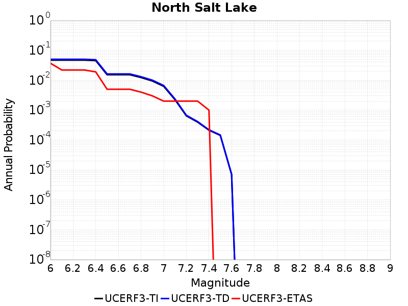 |
|-----|

| Magnitude | UCERF3-TI Prob | UCERF3-TD Prob | UCERF3-ETAS Prob |
|-----|-----|-----|-----|
| 6.0 | 0.047109004 | 0.05011905 | 0.037 |
| 6.1 | 0.047109004 | 0.05011905 | 0.022 |
| 6.2 | 0.047109004 | 0.05011905 | 0.022 |
| 6.3 | 0.047109004 | 0.05011905 | 0.022 |
| 6.4 | 0.045386918 | 0.04839396 | 0.019 |
| 6.5 | 0.015315334 | 0.016257029 | 0.005 |
| 6.6 | 0.015315334 | 0.016257029 | 0.005 |
| 6.7 | 0.015315334 | 0.016257029 | 0.005 |
| 6.8 | 0.012325289 | 0.01309079 | 0.004 |
| 6.9 | 0.009437428 | 0.010027871 | 0.003 |
| 7.0 | 0.006264508 | 0.0066643623 | 0.002 |
| 7.1 | 0.0022285527 | 0.0023500365 | 0.002 |
| 7.2 | 6.455741E-4 | 6.737035E-4 | 0.002 |
| 7.3 | 3.9680174E-4 | 4.124721E-4 | 0.002 |
| 7.4 | 2.1343975E-4 | 2.199897E-4 | 0.001 |
| 7.5 | 1.429568E-4 | 1.4760168E-4 | 0.0 |
| 7.6 | 6.995442E-6 | 7.2221683E-6 | 0.0 |

## North Tahoe 2011 CFM
*[(top)](#table-of-contents)*

|  |
|-----|

| Magnitude | UCERF3-TI Prob | UCERF3-TD Prob | UCERF3-ETAS Prob |
|-----|-----|-----|-----|
| 6.0 | 0.42937768 | 0.47161955 | 0.265 |
| 6.1 | 0.42937768 | 0.47161955 | 0.265 |
| 6.2 | 0.42937768 | 0.47161955 | 0.265 |
| 6.3 | 0.42937768 | 0.47161955 | 0.265 |
| 6.4 | 0.17462832 | 0.16862474 | 0.087 |
| 6.5 | 0.17462832 | 0.16862474 | 0.087 |
| 6.6 | 0.16367269 | 0.15655796 | 0.076 |
| 6.7 | 0.04714669 | 0.023939142 | 0.009 |

## Northridge
*[(top)](#table-of-contents)*

|  |
|-----|

| Magnitude | UCERF3-TI Prob | UCERF3-TD Prob | UCERF3-ETAS Prob |
|-----|-----|-----|-----|
| 6.0 | 0.3802903 | 0.24629033 | 0.124 |
| 6.1 | 0.3802903 | 0.24629033 | 0.124 |
| 6.2 | 0.3802903 | 0.24629033 | 0.124 |
| 6.3 | 0.3802903 | 0.24629033 | 0.124 |
| 6.4 | 0.36425853 | 0.24528873 | 0.124 |
| 6.5 | 0.36425853 | 0.24528873 | 0.124 |
| 6.6 | 0.33188605 | 0.24324332 | 0.124 |
| 6.7 | 0.27900213 | 0.20468202 | 0.103 |
| 6.8 | 0.25800553 | 0.20298454 | 0.103 |
| 6.9 | 0.25347728 | 0.2005185 | 0.1 |
| 7.0 | 0.24180964 | 0.1945182 | 0.098 |
| 7.1 | 0.23498477 | 0.19054335 | 0.097 |
| 7.2 | 0.22788157 | 0.18539983 | 0.091 |
| 7.3 | 0.19880714 | 0.16358103 | 0.081 |
| 7.4 | 0.1901655 | 0.15714383 | 0.08 |
| 7.5 | 0.16304377 | 0.13392456 | 0.071 |
| 7.6 | 0.10897063 | 0.08914004 | 0.052 |
| 7.7 | 0.06386755 | 0.05086637 | 0.03 |
| 7.8 | 0.0321062 | 0.026425425 | 0.015 |
| 7.9 | 0.005884534 | 0.004664532 | 0.003 |
| 8.0 | 7.4752454E-5 | 5.6661083E-5 | 0.0 |

## Northridge Hills
*[(top)](#table-of-contents)*

|  |
|-----|

| Magnitude | UCERF3-TI Prob | UCERF3-TD Prob | UCERF3-ETAS Prob |
|-----|-----|-----|-----|
| 6.0 | 0.12449189 | 0.10538841 | 0.045 |
| 6.1 | 0.12449189 | 0.10538841 | 0.045 |
| 6.2 | 0.12449189 | 0.10538841 | 0.045 |
| 6.3 | 0.12449189 | 0.10538841 | 0.045 |
| 6.4 | 0.12449189 | 0.10538841 | 0.045 |
| 6.5 | 0.12449189 | 0.10538841 | 0.045 |
| 6.6 | 0.12449189 | 0.10538841 | 0.045 |
| 6.7 | 0.12449189 | 0.10538841 | 0.045 |
| 6.8 | 0.12449189 | 0.10538841 | 0.045 |
| 6.9 | 0.12445269 | 0.105346836 | 0.045 |
| 7.0 | 0.1188815 | 0.0993776 | 0.042 |
| 7.1 | 0.11749926 | 0.097923815 | 0.041 |
| 7.2 | 0.11262824 | 0.09328105 | 0.038 |
| 7.3 | 0.10588859 | 0.08728691 | 0.035 |
| 7.4 | 0.09970685 | 0.08216459 | 0.034 |
| 7.5 | 0.08840312 | 0.07200728 | 0.029 |
| 7.6 | 0.07526075 | 0.060386986 | 0.026 |
| 7.7 | 0.062023733 | 0.04900556 | 0.019 |
| 7.8 | 0.0349176 | 0.028289182 | 0.008 |
| 7.9 | 0.019930825 | 0.01616892 | 0.005 |
| 8.0 | 0.0031564322 | 0.002600539 | 0.0 |

## Oak Ridge (Onshore)
*[(top)](#table-of-contents)*

|  |
|-----|

| Magnitude | UCERF3-TI Prob | UCERF3-TD Prob | UCERF3-ETAS Prob |
|-----|-----|-----|-----|
| 6.0 | 0.56095207 | 0.5728294 | 0.378 |
| 6.1 | 0.56095207 | 0.5728294 | 0.378 |
| 6.2 | 0.56095207 | 0.5728294 | 0.378 |
| 6.3 | 0.56095207 | 0.5728294 | 0.378 |
| 6.4 | 0.56095207 | 0.5728294 | 0.378 |
| 6.5 | 0.56095207 | 0.5728294 | 0.378 |
| 6.6 | 0.56095207 | 0.5728294 | 0.378 |
| 6.7 | 0.55447084 | 0.56601405 | 0.371 |
| 6.8 | 0.54816014 | 0.5590834 | 0.363 |
| 6.9 | 0.50533754 | 0.51007897 | 0.317 |
| 7.0 | 0.47767943 | 0.4791442 | 0.29 |
| 7.1 | 0.42100143 | 0.41374737 | 0.247 |
| 7.2 | 0.4133078 | 0.4053001 | 0.243 |
| 7.3 | 0.38226742 | 0.37674212 | 0.219 |
| 7.4 | 0.3687128 | 0.36188164 | 0.215 |
| 7.5 | 0.2986055 | 0.28786916 | 0.168 |
| 7.6 | 0.1666799 | 0.15360495 | 0.097 |
| 7.7 | 0.1010318 | 0.09239785 | 0.062 |
| 7.8 | 0.043441582 | 0.03983165 | 0.03 |
| 7.9 | 0.0070743407 | 0.0064322217 | 0.004 |
| 8.0 | 2.442769E-4 | 1.9445138E-4 | 0.0 |

## Oceanic - West Huasna
*[(top)](#table-of-contents)*

|  |
|-----|

| Magnitude | UCERF3-TI Prob | UCERF3-TD Prob | UCERF3-ETAS Prob |
|-----|-----|-----|-----|
| 6.0 | 0.56556714 | 0.5349355 | 0.409 |
| 6.1 | 0.42418635 | 0.38417017 | 0.257 |
| 6.2 | 0.34460846 | 0.30792794 | 0.199 |
| 6.3 | 0.29795375 | 0.2658109 | 0.168 |
| 6.4 | 0.2711011 | 0.24190606 | 0.15 |
| 6.5 | 0.25632128 | 0.22884497 | 0.143 |
| 6.6 | 0.2266291 | 0.20277472 | 0.129 |
| 6.7 | 0.20629561 | 0.18482699 | 0.113 |
| 6.8 | 0.18138474 | 0.16377383 | 0.1 |
| 6.9 | 0.15674151 | 0.14208247 | 0.083 |
| 7.0 | 0.13277912 | 0.12084774 | 0.063 |
| 7.1 | 0.11036651 | 0.10081244 | 0.053 |
| 7.2 | 0.07097205 | 0.0667571 | 0.033 |
| 7.3 | 0.052435953 | 0.049895175 | 0.026 |
| 7.4 | 0.043333665 | 0.041377112 | 0.02 |
| 7.5 | 0.034954246 | 0.033383776 | 0.017 |
| 7.6 | 0.025251048 | 0.023924666 | 0.008 |
| 7.7 | 0.015496228 | 0.014220443 | 0.005 |
| 7.8 | 0.0075864913 | 0.006798814 | 0.002 |
| 7.9 | 0.0031408628 | 0.0027872007 | 0.002 |
| 8.0 | 8.819456E-5 | 9.145858E-5 | 0.0 |

## Oceanside alt1
*[(top)](#table-of-contents)*

|  |
|-----|

| Magnitude | UCERF3-TI Prob | UCERF3-TD Prob | UCERF3-ETAS Prob |
|-----|-----|-----|-----|
| 6.0 | 0.26147115 | 0.26406145 | 0.169 |
| 6.1 | 0.26147115 | 0.26406145 | 0.169 |
| 6.2 | 0.26147115 | 0.26406145 | 0.169 |
| 6.3 | 0.26147115 | 0.26406145 | 0.169 |
| 6.4 | 0.26147115 | 0.26406145 | 0.169 |
| 6.5 | 0.26147115 | 0.26406145 | 0.169 |
| 6.6 | 0.1790408 | 0.17365032 | 0.101 |
| 6.7 | 0.16918302 | 0.16324334 | 0.096 |
| 6.8 | 0.1512462 | 0.14433369 | 0.076 |
| 6.9 | 0.14821443 | 0.14113912 | 0.071 |
| 7.0 | 0.12809058 | 0.1199335 | 0.058 |
| 7.1 | 0.11610967 | 0.10733857 | 0.048 |
| 7.2 | 0.0943798 | 0.08447426 | 0.039 |
| 7.3 | 0.081670046 | 0.07181409 | 0.028 |
| 7.4 | 0.06542925 | 0.055976585 | 0.023 |
| 7.5 | 0.04765477 | 0.039222296 | 0.016 |
| 7.6 | 0.03144597 | 0.024535093 | 0.01 |
| 7.7 | 0.013322236 | 0.008696638 | 0.001 |
| 7.8 | 3.027386E-4 | 2.6043746E-4 | 0.0 |

## Ortigalita (North)
*[(top)](#table-of-contents)*

|  |
|-----|

| Magnitude | UCERF3-TI Prob | UCERF3-TD Prob | UCERF3-ETAS Prob |
|-----|-----|-----|-----|
| 6.0 | 0.86628586 | 0.87054276 | 0.835 |
| 6.1 | 0.6994632 | 0.7055228 | 0.653 |
| 6.2 | 0.6994632 | 0.7055228 | 0.653 |
| 6.3 | 0.58025813 | 0.59795856 | 0.525 |
| 6.4 | 0.51496357 | 0.5390711 | 0.471 |
| 6.5 | 0.51442176 | 0.5385158 | 0.471 |
| 6.6 | 0.45089078 | 0.48135048 | 0.397 |
| 6.7 | 0.40455094 | 0.43782672 | 0.349 |
| 6.8 | 0.15739068 | 0.17442049 | 0.14 |
| 6.9 | 0.13642415 | 0.15150689 | 0.124 |
| 7.0 | 0.09616783 | 0.107190505 | 0.09 |
| 7.1 | 0.040928528 | 0.04581083 | 0.031 |

## Ortigalita (South)
*[(top)](#table-of-contents)*

|  |
|-----|

| Magnitude | UCERF3-TI Prob | UCERF3-TD Prob | UCERF3-ETAS Prob |
|-----|-----|-----|-----|
| 6.0 | 0.6215107 | 0.66595113 | 0.575 |
| 6.1 | 0.50945795 | 0.5485438 | 0.464 |
| 6.2 | 0.50945795 | 0.5485438 | 0.464 |
| 6.3 | 0.41494375 | 0.44906434 | 0.362 |
| 6.4 | 0.41494375 | 0.44906434 | 0.362 |
| 6.5 | 0.37114903 | 0.40337062 | 0.328 |
| 6.6 | 0.34592536 | 0.37712964 | 0.305 |
| 6.7 | 0.28858984 | 0.31699142 | 0.244 |
| 6.8 | 0.23818669 | 0.2628932 | 0.194 |
| 6.9 | 0.18071403 | 0.20048852 | 0.151 |
| 7.0 | 0.097210445 | 0.10831558 | 0.091 |
| 7.1 | 0.040928528 | 0.04581083 | 0.031 |

## Owens Valley
*[(top)](#table-of-contents)*

|  |
|-----|

| Magnitude | UCERF3-TI Prob | UCERF3-TD Prob | UCERF3-ETAS Prob |
|-----|-----|-----|-----|
| 6.0 | 0.7169934 | 0.5390253 | 0.5 |
| 6.1 | 0.7169934 | 0.5390253 | 0.5 |
| 6.2 | 0.7169934 | 0.5390253 | 0.5 |
| 6.3 | 0.6434682 | 0.44635576 | 0.385 |
| 6.4 | 0.6434682 | 0.44635576 | 0.385 |
| 6.5 | 0.5942473 | 0.390547 | 0.333 |
| 6.6 | 0.5560813 | 0.3497146 | 0.288 |
| 6.7 | 0.5192013 | 0.3132904 | 0.262 |
| 6.8 | 0.48244452 | 0.27750024 | 0.231 |
| 6.9 | 0.44697532 | 0.2425864 | 0.195 |
| 7.0 | 0.4198878 | 0.22079524 | 0.17 |
| 7.1 | 0.3979548 | 0.20311219 | 0.152 |
| 7.2 | 0.37273374 | 0.18437107 | 0.135 |
| 7.3 | 0.28051114 | 0.13757776 | 0.093 |
| 7.4 | 0.17744736 | 0.08362596 | 0.056 |
| 7.5 | 0.062491756 | 0.0249919 | 0.019 |
| 7.6 | 0.029123643 | 0.011725994 | 0.012 |
| 7.7 | 0.012602747 | 0.0036197759 | 0.006 |

## Owens Valley Keough Hot Springs
*[(top)](#table-of-contents)*

|  |
|-----|

| Magnitude | UCERF3-TI Prob | UCERF3-TD Prob | UCERF3-ETAS Prob |
|-----|-----|-----|-----|
| 6.0 | 0.33623528 | 0.22986622 | 0.181 |
| 6.1 | 0.33623528 | 0.22986622 | 0.181 |
| 6.2 | 0.33623528 | 0.22986622 | 0.181 |
| 6.3 | 0.33623528 | 0.22986622 | 0.181 |
| 6.4 | 0.31715924 | 0.20529352 | 0.163 |
| 6.5 | 0.2938423 | 0.1750542 | 0.131 |
| 6.6 | 0.29379308 | 0.1749931 | 0.131 |
| 6.7 | 0.29352325 | 0.17469904 | 0.131 |
| 6.8 | 0.27717465 | 0.15684406 | 0.116 |
| 6.9 | 0.25202653 | 0.13148104 | 0.09 |
| 7.0 | 0.2492033 | 0.1287563 | 0.09 |
| 7.1 | 0.23865554 | 0.119611025 | 0.077 |
| 7.2 | 0.22941767 | 0.11195147 | 0.072 |
| 7.3 | 0.21881695 | 0.10544523 | 0.064 |
| 7.4 | 0.15338978 | 0.07072663 | 0.046 |
| 7.5 | 0.041365582 | 0.014174204 | 0.013 |
| 7.6 | 0.014776949 | 0.0050224042 | 0.006 |
| 7.7 | 0.0067573637 | 0.0018982071 | 0.003 |

## Owl Lake
*[(top)](#table-of-contents)*

|  |
|-----|

| Magnitude | UCERF3-TI Prob | UCERF3-TD Prob | UCERF3-ETAS Prob |
|-----|-----|-----|-----|
| 6.0 | 0.73095125 | 0.76536405 | 0.741 |
| 6.1 | 0.73095125 | 0.76536405 | 0.741 |
| 6.2 | 0.46710685 | 0.50011766 | 0.507 |
| 6.3 | 0.36544487 | 0.40319246 | 0.389 |
| 6.4 | 0.36544487 | 0.40319246 | 0.389 |
| 6.5 | 0.32706726 | 0.36772928 | 0.35 |
| 6.6 | 0.16096875 | 0.1947673 | 0.151 |
| 6.7 | 0.15999798 | 0.19378456 | 0.148 |
| 6.8 | 0.15768631 | 0.19134165 | 0.146 |
| 6.9 | 0.15296866 | 0.18631369 | 0.138 |
| 7.0 | 0.14788908 | 0.18085964 | 0.135 |
| 7.1 | 0.14138806 | 0.17383598 | 0.132 |
| 7.2 | 0.117054075 | 0.14720994 | 0.104 |
| 7.3 | 0.07647671 | 0.09840302 | 0.059 |
| 7.4 | 0.06865884 | 0.08876845 | 0.051 |
| 7.5 | 0.06580321 | 0.08518848 | 0.047 |
| 7.6 | 0.05826209 | 0.07587192 | 0.042 |
| 7.7 | 0.043842636 | 0.058240663 | 0.032 |
| 7.8 | 0.021833045 | 0.028919877 | 0.016 |
| 7.9 | 0.007062717 | 0.0097555425 | 0.009 |
| 8.0 | 5.736804E-4 | 6.28786E-4 | 0.0 |

## Ozena
*[(top)](#table-of-contents)*

| 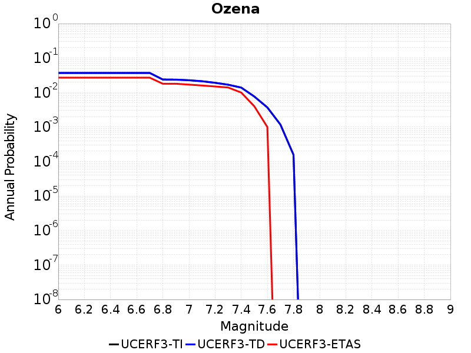 |
|-----|

| Magnitude | UCERF3-TI Prob | UCERF3-TD Prob | UCERF3-ETAS Prob |
|-----|-----|-----|-----|
| 6.0 | 0.036815234 | 0.03721106 | 0.027 |
| 6.1 | 0.036815234 | 0.03721106 | 0.027 |
| 6.2 | 0.036815234 | 0.03721106 | 0.027 |
| 6.3 | 0.036815234 | 0.03721106 | 0.027 |
| 6.4 | 0.036815234 | 0.03721106 | 0.027 |
| 6.5 | 0.036815234 | 0.03721106 | 0.027 |
| 6.6 | 0.036815234 | 0.03721106 | 0.027 |
| 6.7 | 0.036815234 | 0.03721106 | 0.027 |
| 6.8 | 0.023775628 | 0.024014233 | 0.018 |
| 6.9 | 0.023567416 | 0.023804821 | 0.018 |
| 7.0 | 0.022614546 | 0.02284486 | 0.017 |
| 7.1 | 0.021164484 | 0.021382637 | 0.016 |
| 7.2 | 0.01908777 | 0.019284528 | 0.015 |
| 7.3 | 0.016789455 | 0.01696337 | 0.014 |
| 7.4 | 0.013852415 | 0.013996089 | 0.01 |
| 7.5 | 0.007639162 | 0.0077105393 | 0.004 |
| 7.6 | 0.0036853238 | 0.0037105042 | 0.001 |
| 7.7 | 0.0011722236 | 0.0011795266 | 0.0 |
| 7.8 | 1.5650586E-4 | 1.5754641E-4 | 0.0 |

## Palos Verdes
*[(top)](#table-of-contents)*

|  |
|-----|

| Magnitude | UCERF3-TI Prob | UCERF3-TD Prob | UCERF3-ETAS Prob |
|-----|-----|-----|-----|
| 6.0 | 0.79775894 | 0.82913417 | 0.648 |
| 6.1 | 0.79775894 | 0.82913417 | 0.648 |
| 6.2 | 0.79775894 | 0.82913417 | 0.648 |
| 6.3 | 0.6554297 | 0.69595516 | 0.492 |
| 6.4 | 0.6554297 | 0.69595516 | 0.492 |
| 6.5 | 0.548892 | 0.5962391 | 0.379 |
| 6.6 | 0.5338536 | 0.5812557 | 0.365 |
| 6.7 | 0.44938555 | 0.50129086 | 0.302 |
| 6.8 | 0.42671937 | 0.47849444 | 0.277 |
| 6.9 | 0.3910056 | 0.44245815 | 0.253 |
| 7.0 | 0.35987434 | 0.41058648 | 0.231 |
| 7.1 | 0.3409677 | 0.39129165 | 0.218 |
| 7.2 | 0.31440112 | 0.36397675 | 0.197 |
| 7.3 | 0.1288722 | 0.15180042 | 0.084 |
| 7.4 | 0.021369152 | 0.021700203 | 0.018 |
| 7.5 | 0.016968522 | 0.0172475 | 0.016 |
| 7.6 | 0.009094592 | 0.009254434 | 0.006 |
| 7.7 | 0.0031222047 | 0.0031746076 | 0.005 |
| 7.8 | 7.939731E-4 | 8.084138E-4 | 0.001 |

## Panamint Valley
*[(top)](#table-of-contents)*

|  |
|-----|

| Magnitude | UCERF3-TI Prob | UCERF3-TD Prob | UCERF3-ETAS Prob |
|-----|-----|-----|-----|
| 6.0 | 0.5453453 | 0.61077243 | 0.483 |
| 6.1 | 0.5453453 | 0.61077243 | 0.483 |
| 6.2 | 0.5453453 | 0.61077243 | 0.483 |
| 6.3 | 0.5254954 | 0.5920091 | 0.454 |
| 6.4 | 0.5254954 | 0.5920091 | 0.454 |
| 6.5 | 0.5116147 | 0.57876873 | 0.442 |
| 6.6 | 0.49433336 | 0.56220514 | 0.428 |
| 6.7 | 0.47226584 | 0.5407152 | 0.393 |
| 6.8 | 0.4402948 | 0.5078389 | 0.361 |
| 6.9 | 0.40503415 | 0.47093558 | 0.329 |
| 7.0 | 0.3805009 | 0.44526565 | 0.299 |
| 7.1 | 0.36930946 | 0.43370688 | 0.284 |
| 7.2 | 0.34778935 | 0.4114346 | 0.265 |
| 7.3 | 0.31533936 | 0.37589103 | 0.239 |
| 7.4 | 0.28488302 | 0.34337652 | 0.207 |
| 7.5 | 0.26186237 | 0.31865886 | 0.194 |
| 7.6 | 0.07544772 | 0.09918182 | 0.05 |

## Paradise
*[(top)](#table-of-contents)*

|  |
|-----|

| Magnitude | UCERF3-TI Prob | UCERF3-TD Prob | UCERF3-ETAS Prob |
|-----|-----|-----|-----|
| 6.0 | 0.32122254 | 0.35891065 | 0.289 |
| 6.1 | 0.32122254 | 0.35891065 | 0.289 |
| 6.2 | 0.32122254 | 0.35891065 | 0.289 |
| 6.3 | 0.23816858 | 0.27040565 | 0.202 |
| 6.4 | 0.23816858 | 0.27040565 | 0.202 |
| 6.5 | 0.21442084 | 0.24580371 | 0.183 |
| 6.6 | 0.18634407 | 0.2165852 | 0.148 |
| 6.7 | 0.17138958 | 0.20110735 | 0.134 |
| 6.8 | 0.16026174 | 0.1892619 | 0.123 |
| 6.9 | 0.14583817 | 0.17410111 | 0.114 |
| 7.0 | 0.10224287 | 0.12844154 | 0.081 |
| 7.1 | 0.093615144 | 0.11826517 | 0.079 |
| 7.2 | 0.08503933 | 0.10726259 | 0.069 |
| 7.3 | 0.075126424 | 0.09426828 | 0.054 |
| 7.4 | 0.060816385 | 0.075771555 | 0.04 |
| 7.5 | 0.032615982 | 0.04047556 | 0.018 |
| 7.6 | 0.0057536047 | 0.0069991336 | 0.001 |

## Peralta Hills
*[(top)](#table-of-contents)*

|  |
|-----|

| Magnitude | UCERF3-TI Prob | UCERF3-TD Prob | UCERF3-ETAS Prob |
|-----|-----|-----|-----|
| 6.0 | 0.09638984 | 0.10207584 | 0.07 |
| 6.1 | 0.09638984 | 0.10207584 | 0.07 |
| 6.2 | 0.09638984 | 0.10207584 | 0.07 |
| 6.3 | 0.09638984 | 0.10207584 | 0.07 |
| 6.4 | 0.09638984 | 0.10207584 | 0.07 |
| 6.5 | 0.03985163 | 0.042292494 | 0.025 |
| 6.6 | 0.03985163 | 0.042292494 | 0.025 |
| 6.7 | 0.038424727 | 0.04080994 | 0.025 |
| 6.8 | 0.037334673 | 0.039671488 | 0.022 |
| 6.9 | 0.02925928 | 0.030662626 | 0.019 |
| 7.0 | 0.025676709 | 0.02668802 | 0.019 |
| 7.1 | 0.024949519 | 0.025878226 | 0.017 |
| 7.2 | 0.023820337 | 0.02461563 | 0.017 |
| 7.3 | 0.021060392 | 0.021569619 | 0.012 |
| 7.4 | 0.016513065 | 0.016856274 | 0.011 |
| 7.5 | 0.010457003 | 0.01033531 | 0.006 |
| 7.6 | 0.009536811 | 0.009342225 | 0.004 |
| 7.7 | 0.0073992815 | 0.0070962827 | 0.004 |

## Pilarcitos 2011 CFM
*[(top)](#table-of-contents)*

|  |
|-----|

| Magnitude | UCERF3-TI Prob | UCERF3-TD Prob | UCERF3-ETAS Prob |
|-----|-----|-----|-----|
| 6.0 | 0.12034932 | 0.10858713 | 0.193 |
| 6.1 | 0.12034932 | 0.10858713 | 0.179 |
| 6.2 | 0.10290434 | 0.090426415 | 0.136 |
| 6.3 | 0.10290434 | 0.090426415 | 0.136 |
| 6.4 | 0.09619853 | 0.08345673 | 0.119 |
| 6.5 | 0.09234231 | 0.07945578 | 0.109 |
| 6.6 | 0.08738375 | 0.07428069 | 0.103 |
| 6.7 | 0.08466506 | 0.07145644 | 0.099 |
| 6.8 | 0.08117872 | 0.06786179 | 0.094 |
| 6.9 | 0.078268014 | 0.06483747 | 0.084 |
| 7.0 | 0.07513891 | 0.061628338 | 0.077 |
| 7.1 | 0.06916249 | 0.05687305 | 0.067 |
| 7.2 | 0.065404184 | 0.053277273 | 0.061 |
| 7.3 | 0.061964534 | 0.050205432 | 0.056 |
| 7.4 | 0.05909899 | 0.048281 | 0.054 |
| 7.5 | 0.054199185 | 0.044908054 | 0.049 |
| 7.6 | 0.041997634 | 0.036891524 | 0.044 |
| 7.7 | 0.034987677 | 0.031181637 | 0.04 |
| 7.8 | 0.027024478 | 0.025027905 | 0.029 |
| 7.9 | 0.015162882 | 0.014774311 | 0.019 |
| 8.0 | 0.01161178 | 0.011000234 | 0.017 |
| 8.1 | 0.0069397017 | 0.0062544635 | 0.009 |
| 8.2 | 3.4428958E-4 | 3.590343E-4 | 0.001 |

## Pine Mtn
*[(top)](#table-of-contents)*

|  |
|-----|

| Magnitude | UCERF3-TI Prob | UCERF3-TD Prob | UCERF3-ETAS Prob |
|-----|-----|-----|-----|
| 6.0 | 0.16463035 | 0.17209183 | 0.144 |
| 6.1 | 0.16463035 | 0.17209183 | 0.144 |
| 6.2 | 0.16463035 | 0.17209183 | 0.144 |
| 6.3 | 0.16463035 | 0.17209183 | 0.144 |
| 6.4 | 0.16463035 | 0.17209183 | 0.144 |
| 6.5 | 0.16463035 | 0.17209183 | 0.144 |
| 6.6 | 0.16463035 | 0.17209183 | 0.144 |
| 6.7 | 0.14683351 | 0.15384623 | 0.127 |
| 6.8 | 0.13712397 | 0.14391431 | 0.117 |
| 6.9 | 0.11312454 | 0.11919218 | 0.098 |
| 7.0 | 0.110484585 | 0.11651652 | 0.096 |
| 7.1 | 0.08018965 | 0.085454434 | 0.065 |
| 7.2 | 0.05592965 | 0.059902236 | 0.038 |
| 7.3 | 0.03527526 | 0.038530443 | 0.028 |
| 7.4 | 0.028913744 | 0.03182963 | 0.025 |
| 7.5 | 0.020736082 | 0.023385502 | 0.018 |
| 7.6 | 0.012690396 | 0.014930762 | 0.013 |
| 7.7 | 0.001729404 | 0.0017675639 | 0.0 |
| 7.8 | 2.4092059E-4 | 2.4716655E-4 | 0.0 |

## Pinto Mtn
*[(top)](#table-of-contents)*

| 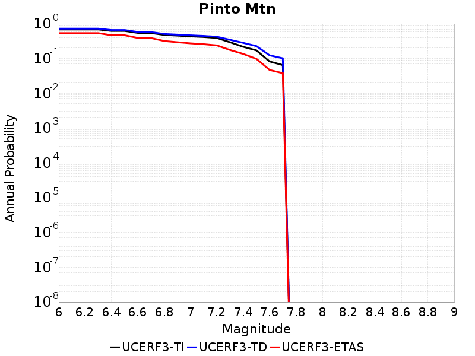 |
|-----|

| Magnitude | UCERF3-TI Prob | UCERF3-TD Prob | UCERF3-ETAS Prob |
|-----|-----|-----|-----|
| 6.0 | 0.68432444 | 0.72425586 | 0.537 |
| 6.1 | 0.68432444 | 0.72425586 | 0.537 |
| 6.2 | 0.68432444 | 0.72425586 | 0.537 |
| 6.3 | 0.68432444 | 0.72425586 | 0.537 |
| 6.4 | 0.62210166 | 0.6606113 | 0.467 |
| 6.5 | 0.62210166 | 0.6606113 | 0.467 |
| 6.6 | 0.5452589 | 0.5804301 | 0.391 |
| 6.7 | 0.5411258 | 0.5762572 | 0.389 |
| 6.8 | 0.47666693 | 0.50795406 | 0.32 |
| 6.9 | 0.45565972 | 0.48610568 | 0.295 |
| 7.0 | 0.43404245 | 0.46427494 | 0.274 |
| 7.1 | 0.41668698 | 0.44679826 | 0.259 |
| 7.2 | 0.3907011 | 0.42326942 | 0.239 |
| 7.3 | 0.29384866 | 0.34578466 | 0.176 |
| 7.4 | 0.21777074 | 0.28266814 | 0.136 |
| 7.5 | 0.17147432 | 0.22791983 | 0.098 |
| 7.6 | 0.08240596 | 0.12397898 | 0.047 |
| 7.7 | 0.06495138 | 0.10192201 | 0.038 |

## Pisgah-Bullion Mtn-Mesquite Lk
*[(top)](#table-of-contents)*

|  |
|-----|

| Magnitude | UCERF3-TI Prob | UCERF3-TD Prob | UCERF3-ETAS Prob |
|-----|-----|-----|-----|
| 6.0 | 0.5456887 | 0.5031837 | 0.362 |
| 6.1 | 0.5456887 | 0.5031837 | 0.362 |
| 6.2 | 0.5456887 | 0.5031837 | 0.362 |
| 6.3 | 0.4142073 | 0.33831817 | 0.239 |
| 6.4 | 0.4142073 | 0.33831817 | 0.239 |
| 6.5 | 0.3634999 | 0.2801457 | 0.199 |
| 6.6 | 0.3282659 | 0.23962677 | 0.161 |
| 6.7 | 0.28758577 | 0.19770886 | 0.125 |
| 6.8 | 0.23671684 | 0.146459 | 0.074 |
| 6.9 | 0.20547493 | 0.1261059 | 0.063 |
| 7.0 | 0.16306894 | 0.09691409 | 0.05 |
| 7.1 | 0.14125559 | 0.085183784 | 0.039 |
| 7.2 | 0.105608396 | 0.06414565 | 0.027 |
| 7.3 | 0.04787365 | 0.031941116 | 0.014 |

## Pitas Point (Lower West)
*[(top)](#table-of-contents)*

|  |
|-----|

| Magnitude | UCERF3-TI Prob | UCERF3-TD Prob | UCERF3-ETAS Prob |
|-----|-----|-----|-----|
| 6.0 | 0.1915752 | 0.19099513 | 0.194 |
| 6.1 | 0.1915752 | 0.19099513 | 0.194 |
| 6.2 | 0.1915752 | 0.19099513 | 0.194 |
| 6.3 | 0.1915752 | 0.19099513 | 0.194 |
| 6.4 | 0.1915752 | 0.19099513 | 0.194 |
| 6.5 | 0.1915752 | 0.19099513 | 0.194 |
| 6.6 | 0.1915752 | 0.19099513 | 0.194 |
| 6.7 | 0.1915752 | 0.19099513 | 0.194 |
| 6.8 | 0.1915752 | 0.19099513 | 0.194 |
| 6.9 | 0.1915752 | 0.19099513 | 0.194 |
| 7.0 | 0.19056298 | 0.18992965 | 0.194 |
| 7.1 | 0.1852612 | 0.18433303 | 0.181 |
| 7.2 | 0.18351218 | 0.18247025 | 0.179 |
| 7.3 | 0.1754511 | 0.17382687 | 0.17 |
| 7.4 | 0.16615124 | 0.16387497 | 0.16 |
| 7.5 | 0.15933299 | 0.15664345 | 0.145 |
| 7.6 | 0.1362297 | 0.1319112 | 0.113 |
| 7.7 | 0.11064952 | 0.10514726 | 0.082 |
| 7.8 | 0.06576774 | 0.060229428 | 0.053 |
| 7.9 | 0.010500169 | 0.009251402 | 0.007 |
| 8.0 | 2.0325146E-4 | 1.6884592E-4 | 0.0 |

## Pitas Point (Lower)-Montalvo
*[(top)](#table-of-contents)*

|  |
|-----|

| Magnitude | UCERF3-TI Prob | UCERF3-TD Prob | UCERF3-ETAS Prob |
|-----|-----|-----|-----|
| 6.0 | 0.12810211 | 0.12417721 | 0.12 |
| 6.1 | 0.12810211 | 0.12417721 | 0.12 |
| 6.2 | 0.12810211 | 0.12417721 | 0.12 |
| 6.3 | 0.12810211 | 0.12417721 | 0.12 |
| 6.4 | 0.12810211 | 0.12417721 | 0.12 |
| 6.5 | 0.12810211 | 0.12417721 | 0.12 |
| 6.6 | 0.12810211 | 0.12417721 | 0.12 |
| 6.7 | 0.12810211 | 0.12417721 | 0.12 |
| 6.8 | 0.12810211 | 0.12417721 | 0.12 |
| 6.9 | 0.12810211 | 0.12417721 | 0.12 |
| 7.0 | 0.12810211 | 0.12417721 | 0.12 |
| 7.1 | 0.12810211 | 0.12417721 | 0.12 |
| 7.2 | 0.12790887 | 0.12397547 | 0.118 |
| 7.3 | 0.12747146 | 0.12351741 | 0.116 |
| 7.4 | 0.12710698 | 0.1231344 | 0.114 |
| 7.5 | 0.12509972 | 0.12102805 | 0.107 |
| 7.6 | 0.1195377 | 0.11516865 | 0.099 |
| 7.7 | 0.101055734 | 0.09566099 | 0.076 |
| 7.8 | 0.06422986 | 0.058642723 | 0.05 |
| 7.9 | 0.010814364 | 0.009509711 | 0.007 |
| 8.0 | 2.0325146E-4 | 1.6884592E-4 | 0.0 |

## Pittville 2011 CFM
*[(top)](#table-of-contents)*

|  |
|-----|

| Magnitude | UCERF3-TI Prob | UCERF3-TD Prob | UCERF3-ETAS Prob |
|-----|-----|-----|-----|
| 6.0 | 0.47955486 | 0.5177996 | 0.339 |
| 6.1 | 0.27903497 | 0.30001393 | 0.196 |
| 6.2 | 0.15825133 | 0.16984853 | 0.115 |
| 6.3 | 0.15825133 | 0.16984853 | 0.115 |
| 6.4 | 0.09765949 | 0.10489982 | 0.066 |
| 6.5 | 0.061999794 | 0.06671389 | 0.042 |
| 6.6 | 0.03456312 | 0.037279114 | 0.021 |

## Pleito
*[(top)](#table-of-contents)*

| 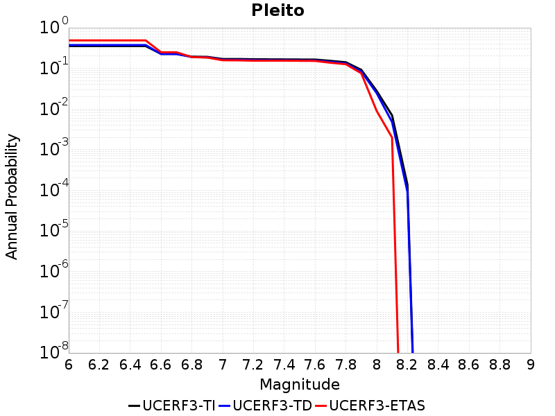 |
|-----|

| Magnitude | UCERF3-TI Prob | UCERF3-TD Prob | UCERF3-ETAS Prob |
|-----|-----|-----|-----|
| 6.0 | 0.35424724 | 0.37608516 | 0.489 |
| 6.1 | 0.35424724 | 0.37608516 | 0.489 |
| 6.2 | 0.35424724 | 0.37608516 | 0.489 |
| 6.3 | 0.35424724 | 0.37608516 | 0.489 |
| 6.4 | 0.35424724 | 0.37608516 | 0.489 |
| 6.5 | 0.35424724 | 0.37608516 | 0.489 |
| 6.6 | 0.22783086 | 0.22652097 | 0.25 |
| 6.7 | 0.22783086 | 0.22652097 | 0.25 |
| 6.8 | 0.19470467 | 0.19025116 | 0.19 |
| 6.9 | 0.19224177 | 0.18753733 | 0.185 |
| 7.0 | 0.17071238 | 0.16329902 | 0.159 |
| 7.1 | 0.17054573 | 0.1630911 | 0.158 |
| 7.2 | 0.16833086 | 0.16066436 | 0.155 |
| 7.3 | 0.16737242 | 0.15960762 | 0.155 |
| 7.4 | 0.16664061 | 0.15880583 | 0.155 |
| 7.5 | 0.16582073 | 0.15788636 | 0.154 |
| 7.6 | 0.16533057 | 0.15732872 | 0.153 |
| 7.7 | 0.1536854 | 0.1453527 | 0.138 |
| 7.8 | 0.14191446 | 0.13305797 | 0.127 |
| 7.9 | 0.09241446 | 0.084539324 | 0.076 |
| 8.0 | 0.028046543 | 0.02464802 | 0.009 |
| 8.1 | 0.0069920467 | 0.004797516 | 0.002 |
| 8.2 | 1.3817761E-4 | 9.169473E-5 | 0.0 |

## Point Reyes 2011 CFM
*[(top)](#table-of-contents)*

|  |
|-----|

| Magnitude | UCERF3-TI Prob | UCERF3-TD Prob | UCERF3-ETAS Prob |
|-----|-----|-----|-----|
| 6.0 | 0.20647435 | 0.21014078 | 0.258 |
| 6.1 | 0.11138476 | 0.11222788 | 0.144 |
| 6.2 | 0.11138476 | 0.11222788 | 0.144 |
| 6.3 | 0.06763396 | 0.06746376 | 0.083 |
| 6.4 | 0.06763396 | 0.06746376 | 0.083 |
| 6.5 | 0.049060635 | 0.04852936 | 0.056 |
| 6.6 | 0.03769228 | 0.036950853 | 0.04 |
| 6.7 | 0.022116313 | 0.021093108 | 0.023 |
| 6.8 | 0.017262675 | 0.016154576 | 0.019 |
| 6.9 | 0.011133829 | 0.009917511 | 0.01 |
| 7.0 | 0.006970861 | 0.0056881756 | 0.004 |
| 7.1 | 0.005061833 | 0.0037517436 | 0.002 |
| 7.2 | 0.004351367 | 0.0030530891 | 0.001 |
| 7.3 | 0.0040364987 | 0.0027812414 | 0.001 |
| 7.4 | 0.0037112408 | 0.0025343911 | 0.001 |
| 7.5 | 0.003310505 | 0.002240951 | 0.001 |
| 7.6 | 0.0026431826 | 0.0018079218 | 0.001 |
| 7.7 | 0.001848158 | 0.0013553683 | 0.001 |
| 7.8 | 0.0010094597 | 9.841921E-4 | 0.001 |
| 7.9 | 4.452132E-4 | 5.3433236E-4 | 0.001 |
| 8.0 | 2.6536043E-4 | 3.6662086E-4 | 0.0 |
| 8.1 | 9.8772405E-5 | 1.5587483E-4 | 0.0 |

## Point Reyes 2011 connector
*[(top)](#table-of-contents)*

| 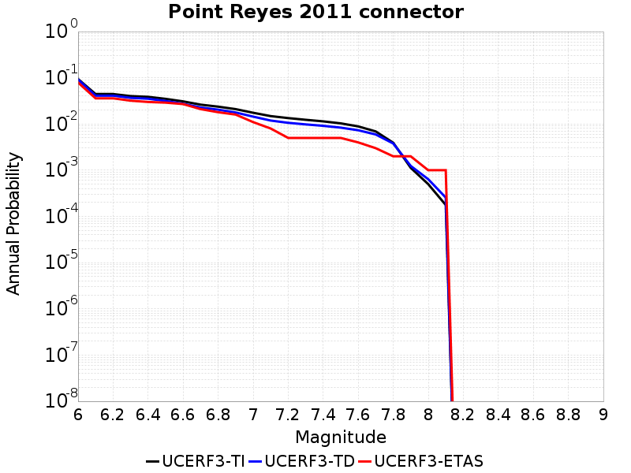 |
|-----|

| Magnitude | UCERF3-TI Prob | UCERF3-TD Prob | UCERF3-ETAS Prob |
|-----|-----|-----|-----|
| 6.0 | 0.09413087 | 0.09198207 | 0.079 |
| 6.1 | 0.044503998 | 0.041103713 | 0.036 |
| 6.2 | 0.044503998 | 0.041103713 | 0.036 |
| 6.3 | 0.040230766 | 0.036770627 | 0.032 |
| 6.4 | 0.03872554 | 0.035245683 | 0.03 |
| 6.5 | 0.035017524 | 0.03147161 | 0.029 |
| 6.6 | 0.030879568 | 0.027389117 | 0.027 |
| 6.7 | 0.026247041 | 0.02276963 | 0.021 |
| 6.8 | 0.02374774 | 0.020420315 | 0.018 |
| 6.9 | 0.020988787 | 0.017765047 | 0.016 |
| 7.0 | 0.017515935 | 0.014446796 | 0.011 |
| 7.1 | 0.014832685 | 0.011886116 | 0.008 |
| 7.2 | 0.013437603 | 0.010613141 | 0.005 |
| 7.3 | 0.012341672 | 0.009814756 | 0.005 |
| 7.4 | 0.011410401 | 0.009134513 | 0.005 |
| 7.5 | 0.010329954 | 0.008350753 | 0.005 |
| 7.6 | 0.00887985 | 0.0073305103 | 0.004 |
| 7.7 | 0.0069186897 | 0.0059419055 | 0.003 |
| 7.8 | 0.003933572 | 0.0037886533 | 0.002 |
| 7.9 | 0.0011271574 | 0.0012385524 | 0.002 |
| 8.0 | 4.9948314E-4 | 6.389861E-4 | 0.001 |
| 8.1 | 1.7685097E-4 | 2.5619427E-4 | 0.001 |

## Polaris 2011 CFM
*[(top)](#table-of-contents)*

|  |
|-----|

| Magnitude | UCERF3-TI Prob | UCERF3-TD Prob | UCERF3-ETAS Prob |
|-----|-----|-----|-----|
| 6.0 | 0.2807392 | 0.30784938 | 0.167 |
| 6.1 | 0.2807392 | 0.30784938 | 0.167 |
| 6.2 | 0.2807392 | 0.30784938 | 0.167 |
| 6.3 | 0.2807392 | 0.30784938 | 0.167 |
| 6.4 | 0.15912439 | 0.16983213 | 0.091 |
| 6.5 | 0.15912439 | 0.16983213 | 0.091 |
| 6.6 | 0.14776422 | 0.15779087 | 0.086 |
| 6.7 | 0.121093 | 0.12932809 | 0.068 |
| 6.8 | 0.11346886 | 0.121285394 | 0.067 |
| 6.9 | 0.106594674 | 0.11403256 | 0.064 |
| 7.0 | 0.09292298 | 0.099553145 | 0.055 |
| 7.1 | 0.07994171 | 0.085788615 | 0.047 |
| 7.2 | 0.05665881 | 0.061011527 | 0.03 |

## Puente Hills
*[(top)](#table-of-contents)*

|  |
|-----|

| Magnitude | UCERF3-TI Prob | UCERF3-TD Prob | UCERF3-ETAS Prob |
|-----|-----|-----|-----|
| 6.0 | 0.27074036 | 0.22777067 | 0.126 |
| 6.1 | 0.27074036 | 0.22777067 | 0.126 |
| 6.2 | 0.27074036 | 0.22777067 | 0.126 |
| 6.3 | 0.27074036 | 0.22777067 | 0.126 |
| 6.4 | 0.27074036 | 0.22777067 | 0.126 |
| 6.5 | 0.27074036 | 0.22777067 | 0.126 |
| 6.6 | 0.23409624 | 0.1914257 | 0.093 |
| 6.7 | 0.23409624 | 0.1914257 | 0.093 |
| 6.8 | 0.20174606 | 0.16074158 | 0.083 |
| 6.9 | 0.1897801 | 0.15514165 | 0.081 |
| 7.0 | 0.17543592 | 0.14444867 | 0.074 |
| 7.1 | 0.15523462 | 0.12753363 | 0.065 |
| 7.2 | 0.12557049 | 0.10040338 | 0.049 |
| 7.3 | 0.09740882 | 0.07979736 | 0.038 |
| 7.4 | 0.0701897 | 0.058119766 | 0.028 |
| 7.5 | 0.05187361 | 0.042392697 | 0.016 |
| 7.6 | 0.043280486 | 0.034839332 | 0.013 |
| 7.7 | 0.03779581 | 0.029823035 | 0.011 |
| 7.8 | 0.0047974703 | 0.00376117 | 0.0 |

## Quien Sabe 2011 CFM
*[(top)](#table-of-contents)*

|  |
|-----|

| Magnitude | UCERF3-TI Prob | UCERF3-TD Prob | UCERF3-ETAS Prob |
|-----|-----|-----|-----|
| 6.0 | 0.6220986 | 0.35808754 | 0.551 |
| 6.1 | 0.37190548 | 0.18693839 | 0.294 |
| 6.2 | 0.11969468 | 0.059642777 | 0.086 |
| 6.3 | 0.095764525 | 0.049075793 | 0.069 |
| 6.4 | 0.077143535 | 0.040972777 | 0.058 |
| 6.5 | 0.06334029 | 0.03504216 | 0.048 |
| 6.6 | 0.044643093 | 0.027061218 | 0.029 |
| 6.7 | 0.038522035 | 0.024187315 | 0.025 |
| 6.8 | 0.03315597 | 0.021784376 | 0.023 |
| 6.9 | 0.022971168 | 0.016944792 | 0.013 |
| 7.0 | 0.017300041 | 0.01304585 | 0.008 |
| 7.1 | 0.011466527 | 0.009382892 | 0.007 |
| 7.2 | 0.0043269033 | 0.0046769977 | 0.002 |
| 7.3 | 0.0031628762 | 0.0034739373 | 0.0 |
| 7.4 | 6.3097733E-4 | 6.993172E-4 | 0.0 |
| 7.5 | 3.7647062E-4 | 4.1538445E-4 | 0.0 |

## Raymond
*[(top)](#table-of-contents)*

|  |
|-----|

| Magnitude | UCERF3-TI Prob | UCERF3-TD Prob | UCERF3-ETAS Prob |
|-----|-----|-----|-----|
| 6.0 | 0.32662243 | 0.34645295 | 0.257 |
| 6.1 | 0.32662243 | 0.34645295 | 0.257 |
| 6.2 | 0.32662243 | 0.34645295 | 0.257 |
| 6.3 | 0.32662243 | 0.34645295 | 0.257 |
| 6.4 | 0.30492666 | 0.3231458 | 0.224 |
| 6.5 | 0.30492666 | 0.3231458 | 0.224 |
| 6.6 | 0.2404663 | 0.2507236 | 0.174 |
| 6.7 | 0.2404663 | 0.2507236 | 0.174 |
| 6.8 | 0.23122635 | 0.24104728 | 0.166 |
| 6.9 | 0.18245699 | 0.18715043 | 0.124 |
| 7.0 | 0.16990462 | 0.17358552 | 0.116 |
| 7.1 | 0.13716751 | 0.13809703 | 0.091 |
| 7.2 | 0.12082649 | 0.12060162 | 0.081 |
| 7.3 | 0.10464668 | 0.10383075 | 0.074 |
| 7.4 | 0.087267525 | 0.08573964 | 0.056 |
| 7.5 | 0.06894135 | 0.06746287 | 0.042 |
| 7.6 | 0.046339024 | 0.045308527 | 0.023 |
| 7.7 | 0.027428905 | 0.027393183 | 0.013 |
| 7.8 | 0.017875405 | 0.01794601 | 0.005 |
| 7.9 | 0.0019353067 | 0.0020214035 | 0.0 |

## Red Mountain
*[(top)](#table-of-contents)*

|  |
|-----|

| Magnitude | UCERF3-TI Prob | UCERF3-TD Prob | UCERF3-ETAS Prob |
|-----|-----|-----|-----|
| 6.0 | 0.6640644 | 0.7069075 | 0.584 |
| 6.1 | 0.6640644 | 0.7069075 | 0.584 |
| 6.2 | 0.6640644 | 0.7069075 | 0.584 |
| 6.3 | 0.6640644 | 0.7069075 | 0.584 |
| 6.4 | 0.6640644 | 0.7069075 | 0.584 |
| 6.5 | 0.5608878 | 0.60340095 | 0.501 |
| 6.6 | 0.56078243 | 0.60329753 | 0.501 |
| 6.7 | 0.5216845 | 0.564768 | 0.463 |
| 6.8 | 0.5210046 | 0.5640791 | 0.462 |
| 6.9 | 0.4685231 | 0.509459 | 0.402 |
| 7.0 | 0.4581252 | 0.4987217 | 0.395 |
| 7.1 | 0.4412769 | 0.4812881 | 0.382 |
| 7.2 | 0.35037726 | 0.38463742 | 0.281 |
| 7.3 | 0.31859335 | 0.3501779 | 0.241 |
| 7.4 | 0.1478658 | 0.14597979 | 0.108 |
| 7.5 | 0.1438897 | 0.14169653 | 0.104 |
| 7.6 | 0.121670604 | 0.11806563 | 0.078 |
| 7.7 | 0.083961055 | 0.080130294 | 0.051 |
| 7.8 | 0.030389596 | 0.0282772 | 0.026 |
| 7.9 | 0.0059740804 | 0.0053302804 | 0.003 |

## Red Pass
*[(top)](#table-of-contents)*

|  |
|-----|

| Magnitude | UCERF3-TI Prob | UCERF3-TD Prob | UCERF3-ETAS Prob |
|-----|-----|-----|-----|
| 6.0 | 0.19382422 | 0.20364721 | 0.154 |
| 6.1 | 0.09083234 | 0.09483522 | 0.068 |
| 6.2 | 0.09083234 | 0.09483522 | 0.068 |
| 6.3 | 0.035677206 | 0.03721023 | 0.024 |
| 6.4 | 0.035677206 | 0.03721023 | 0.024 |
| 6.5 | 0.02543875 | 0.026619881 | 0.016 |

## Redondo Canyon alt 1
*[(top)](#table-of-contents)*

|  |
|-----|

| Magnitude | UCERF3-TI Prob | UCERF3-TD Prob | UCERF3-ETAS Prob |
|-----|-----|-----|-----|
| 6.0 | 0.23656522 | 0.26746508 | 0.16 |
| 6.1 | 0.23656522 | 0.26746508 | 0.16 |
| 6.2 | 0.23656522 | 0.26746508 | 0.16 |
| 6.3 | 0.08022259 | 0.08373086 | 0.054 |
| 6.4 | 0.08022259 | 0.08373086 | 0.054 |
| 6.5 | 0.08022259 | 0.08373086 | 0.054 |
| 6.6 | 0.04956028 | 0.049728494 | 0.033 |
| 6.7 | 0.04956028 | 0.049728494 | 0.033 |
| 6.8 | 0.02899541 | 0.026594676 | 0.014 |
| 6.9 | 0.02899541 | 0.026594676 | 0.014 |
| 7.0 | 0.02899541 | 0.026594676 | 0.014 |
| 7.1 | 0.027136533 | 0.024895543 | 0.013 |
| 7.2 | 0.027136533 | 0.024895543 | 0.013 |
| 7.3 | 0.0024767565 | 0.0018435044 | 0.003 |
| 7.4 | 0.0010305378 | 8.4784994E-4 | 0.002 |
| 7.5 | 1.4643683E-4 | 1.2337201E-4 | 0.0 |
| 7.6 | 1.0712817E-4 | 8.847634E-5 | 0.0 |
| 7.7 | 3.553232E-5 | 2.6196867E-5 | 0.0 |
| 7.8 | 3.553232E-5 | 2.6196867E-5 | 0.0 |

## Reliz 2011 CFM
*[(top)](#table-of-contents)*

|  |
|-----|

| Magnitude | UCERF3-TI Prob | UCERF3-TD Prob | UCERF3-ETAS Prob |
|-----|-----|-----|-----|
| 6.0 | 0.34130612 | 0.35216174 | 0.351 |
| 6.1 | 0.34130612 | 0.35216174 | 0.351 |
| 6.2 | 0.34130612 | 0.35216174 | 0.351 |
| 6.3 | 0.18396583 | 0.18763703 | 0.158 |
| 6.4 | 0.18396583 | 0.18763703 | 0.158 |
| 6.5 | 0.14413919 | 0.14683613 | 0.122 |
| 6.6 | 0.12766309 | 0.12999001 | 0.101 |
| 6.7 | 0.11263118 | 0.11458631 | 0.087 |
| 6.8 | 0.100893006 | 0.10255139 | 0.075 |
| 6.9 | 0.089058794 | 0.09040974 | 0.063 |
| 7.0 | 0.075910084 | 0.07693004 | 0.058 |
| 7.1 | 0.06524413 | 0.06597733 | 0.051 |
| 7.2 | 0.05450492 | 0.054917526 | 0.042 |
| 7.3 | 0.04386857 | 0.043967433 | 0.033 |
| 7.4 | 0.032729767 | 0.032524146 | 0.028 |
| 7.5 | 0.02281514 | 0.022351217 | 0.02 |
| 7.6 | 0.013709921 | 0.013072433 | 0.011 |
| 7.7 | 0.00770909 | 0.0070654773 | 0.007 |
| 7.8 | 0.00325829 | 0.0029288833 | 0.002 |
| 7.9 | 0.0016197428 | 0.0016173316 | 0.0 |
| 8.0 | 1.5453655E-4 | 1.7015186E-4 | 0.0 |

## Richfield
*[(top)](#table-of-contents)*

|  |
|-----|

| Magnitude | UCERF3-TI Prob | UCERF3-TD Prob | UCERF3-ETAS Prob |
|-----|-----|-----|-----|
| 6.0 | 0.038796734 | 0.03962459 | 0.024 |
| 6.1 | 0.038796734 | 0.03962459 | 0.024 |
| 6.2 | 0.016746502 | 0.017086715 | 0.007 |
| 6.3 | 0.016746502 | 0.017086715 | 0.007 |
| 6.4 | 0.016746502 | 0.017086715 | 0.007 |
| 6.5 | 0.0072665745 | 0.007420312 | 0.005 |
| 6.6 | 0.0072665745 | 0.007420312 | 0.005 |
| 6.7 | 0.0028077713 | 0.002834479 | 0.002 |
| 6.8 | 5.555963E-4 | 5.4041727E-4 | 0.0 |
| 6.9 | 4.8027976E-4 | 4.6443785E-4 | 0.0 |
| 7.0 | 3.2060005E-4 | 3.0342033E-4 | 0.0 |
| 7.1 | 1.6626813E-4 | 1.6113179E-4 | 0.0 |
| 7.2 | 9.649946E-5 | 9.741508E-5 | 0.0 |
| 7.3 | 5.471809E-5 | 5.5278462E-5 | 0.0 |
| 7.4 | 1.5213764E-7 | 1.536321E-7 | 0.0 |

## Rinconada 2011 CFM
*[(top)](#table-of-contents)*

|  |
|-----|

| Magnitude | UCERF3-TI Prob | UCERF3-TD Prob | UCERF3-ETAS Prob |
|-----|-----|-----|-----|
| 6.0 | 0.33699402 | 0.346064 | 0.259 |
| 6.1 | 0.24881262 | 0.2555597 | 0.164 |
| 6.2 | 0.24881262 | 0.2555597 | 0.164 |
| 6.3 | 0.2077497 | 0.21341398 | 0.132 |
| 6.4 | 0.18150422 | 0.1864538 | 0.116 |
| 6.5 | 0.14861922 | 0.15266949 | 0.096 |
| 6.6 | 0.13487917 | 0.1385537 | 0.084 |
| 6.7 | 0.1174255 | 0.12060772 | 0.076 |
| 6.8 | 0.09899132 | 0.101627216 | 0.066 |
| 6.9 | 0.08548019 | 0.08769183 | 0.058 |
| 7.0 | 0.06974877 | 0.07149258 | 0.045 |
| 7.1 | 0.05645408 | 0.05782454 | 0.032 |
| 7.2 | 0.04042803 | 0.041365534 | 0.023 |
| 7.3 | 0.026530817 | 0.027118161 | 0.015 |
| 7.4 | 0.016906222 | 0.017274078 | 0.011 |
| 7.5 | 0.008483777 | 0.008655692 | 0.004 |
| 7.6 | 0.002541603 | 0.0025682854 | 0.001 |
| 7.7 | 1.5652725E-4 | 1.5434195E-4 | 0.0 |
| 7.8 | 1.9306071E-6 | 1.9467868E-6 | 0.0 |

## Robinson Creek
*[(top)](#table-of-contents)*

|  |
|-----|

| Magnitude | UCERF3-TI Prob | UCERF3-TD Prob | UCERF3-ETAS Prob |
|-----|-----|-----|-----|
| 6.0 | 0.30062252 | 0.38987732 | 0.225 |
| 6.1 | 0.30062252 | 0.38987732 | 0.225 |
| 6.2 | 0.30062252 | 0.38987732 | 0.225 |
| 6.3 | 0.30062252 | 0.38987732 | 0.225 |
| 6.4 | 0.30062252 | 0.38987732 | 0.225 |

## Rocky Ledge 2011 CFM
*[(top)](#table-of-contents)*

|  |
|-----|

| Magnitude | UCERF3-TI Prob | UCERF3-TD Prob | UCERF3-ETAS Prob |
|-----|-----|-----|-----|
| 6.0 | 0.20420532 | 0.23771562 | 0.181 |
| 6.1 | 0.20420532 | 0.23771562 | 0.131 |
| 6.2 | 0.1764779 | 0.2088226 | 0.113 |

## Rodgers Creek - Healdsburg 2011 CFM
*[(top)](#table-of-contents)*

|  |
|-----|

| Magnitude | UCERF3-TI Prob | UCERF3-TD Prob | UCERF3-ETAS Prob |
|-----|-----|-----|-----|
| 6.0 | 0.8545782 | 0.7443611 | 0.902 |
| 6.1 | 0.85184324 | 0.7403551 | 0.899 |
| 6.2 | 0.8446874 | 0.7316749 | 0.893 |
| 6.3 | 0.8358378 | 0.72116977 | 0.889 |
| 6.4 | 0.8247785 | 0.7084278 | 0.88 |
| 6.5 | 0.8200433 | 0.7018982 | 0.877 |
| 6.6 | 0.80620676 | 0.684723 | 0.862 |
| 6.7 | 0.7971889 | 0.67347085 | 0.856 |
| 6.8 | 0.7867683 | 0.6606594 | 0.839 |
| 6.9 | 0.75577176 | 0.62410396 | 0.806 |
| 7.0 | 0.7160957 | 0.5845215 | 0.754 |
| 7.1 | 0.6505084 | 0.5089373 | 0.673 |
| 7.2 | 0.55417913 | 0.4175247 | 0.546 |
| 7.3 | 0.45995978 | 0.3291609 | 0.437 |
| 7.4 | 0.37883797 | 0.26131734 | 0.349 |
| 7.5 | 0.27661043 | 0.18216614 | 0.231 |
| 7.6 | 0.110242 | 0.06714209 | 0.081 |
| 7.7 | 0.0056140963 | 0.0042412975 | 0.003 |
| 7.8 | 0.0025957257 | 0.0012800371 | 0.001 |
| 7.9 | 0.0014793479 | 6.640704E-4 | 0.001 |
| 8.0 | 7.462487E-4 | 3.2898455E-4 | 0.0 |
| 8.1 | 9.142622E-5 | 3.981128E-5 | 0.0 |

## Rose Canyon
*[(top)](#table-of-contents)*

|  |
|-----|

| Magnitude | UCERF3-TI Prob | UCERF3-TD Prob | UCERF3-ETAS Prob |
|-----|-----|-----|-----|
| 6.0 | 0.69824237 | 0.7121893 | 0.747 |
| 6.1 | 0.69824237 | 0.7121893 | 0.576 |
| 6.2 | 0.52883613 | 0.5392721 | 0.409 |
| 6.3 | 0.45367262 | 0.464127 | 0.333 |
| 6.4 | 0.40757358 | 0.41799602 | 0.298 |
| 6.5 | 0.37098983 | 0.3804802 | 0.263 |
| 6.6 | 0.32785022 | 0.33596042 | 0.223 |
| 6.7 | 0.28210914 | 0.28830722 | 0.181 |
| 6.8 | 0.26026353 | 0.26478457 | 0.159 |
| 6.9 | 0.20372818 | 0.20311394 | 0.115 |
| 7.0 | 0.14342014 | 0.13641743 | 0.08 |
| 7.1 | 0.122603774 | 0.114018776 | 0.07 |
| 7.2 | 0.10193065 | 0.092129245 | 0.059 |
| 7.3 | 0.08029085 | 0.070534684 | 0.038 |
| 7.4 | 0.061171506 | 0.052625682 | 0.029 |
| 7.5 | 0.035470765 | 0.029209254 | 0.021 |
| 7.6 | 0.025806751 | 0.02050088 | 0.015 |
| 7.7 | 0.0022833357 | 0.0017452907 | 0.005 |

## Round Valley
*[(top)](#table-of-contents)*

|  |
|-----|

| Magnitude | UCERF3-TI Prob | UCERF3-TD Prob | UCERF3-ETAS Prob |
|-----|-----|-----|-----|
| 6.0 | 0.3392243 | 0.329636 | 0.169 |
| 6.1 | 0.3392243 | 0.329636 | 0.169 |
| 6.2 | 0.3392243 | 0.329636 | 0.169 |
| 6.3 | 0.3392243 | 0.329636 | 0.169 |
| 6.4 | 0.3392243 | 0.329636 | 0.169 |
| 6.5 | 0.24252766 | 0.21599245 | 0.102 |
| 6.6 | 0.20166634 | 0.1693417 | 0.076 |
| 6.7 | 0.20166634 | 0.1693417 | 0.076 |
| 6.8 | 0.17004167 | 0.1339661 | 0.062 |
| 6.9 | 0.15624727 | 0.120506756 | 0.054 |
| 7.0 | 0.12370262 | 0.092538625 | 0.039 |
| 7.1 | 0.10885126 | 0.08160859 | 0.033 |
| 7.2 | 0.06400892 | 0.04392475 | 0.016 |
| 7.3 | 0.020399636 | 0.015046653 | 0.003 |

## Russ 2011 CFM
*[(top)](#table-of-contents)*

|  |
|-----|

| Magnitude | UCERF3-TI Prob | UCERF3-TD Prob | UCERF3-ETAS Prob |
|-----|-----|-----|-----|
| 6.0 | 0.46264616 | 0.5014546 | 0.312 |
| 6.1 | 0.46264616 | 0.5014546 | 0.312 |
| 6.2 | 0.46264616 | 0.5014546 | 0.312 |
| 6.3 | 0.46264616 | 0.5014546 | 0.312 |
| 6.4 | 0.46264616 | 0.5014546 | 0.312 |
| 6.5 | 0.46264616 | 0.5014546 | 0.312 |
| 6.6 | 0.46264616 | 0.5014546 | 0.312 |
| 6.7 | 0.3500671 | 0.38172504 | 0.215 |
| 6.8 | 0.3500671 | 0.38172504 | 0.215 |
| 6.9 | 0.2870978 | 0.31430045 | 0.166 |
| 7.0 | 0.23368284 | 0.25685778 | 0.13 |
| 7.1 | 0.19626485 | 0.21666941 | 0.115 |
| 7.2 | 0.15926471 | 0.17679359 | 0.094 |
| 7.3 | 0.12126415 | 0.13558063 | 0.061 |

## San Andreas (Big Bend)
*[(top)](#table-of-contents)*

|  |
|-----|

| Magnitude | UCERF3-TI Prob | UCERF3-TD Prob | UCERF3-ETAS Prob |
|-----|-----|-----|-----|
| 6.0 | 0.92977256 | 0.79780996 | 0.999 |
| 6.1 | 0.92977256 | 0.79780996 | 0.999 |
| 6.2 | 0.92977256 | 0.79780996 | 0.999 |
| 6.3 | 0.92977256 | 0.79780996 | 0.999 |
| 6.4 | 0.90845436 | 0.77262604 | 0.998 |
| 6.5 | 0.90845436 | 0.77262604 | 0.998 |
| 6.6 | 0.90551007 | 0.7694178 | 0.998 |
| 6.7 | 0.9040454 | 0.76470983 | 0.998 |
| 6.8 | 0.9031277 | 0.7626163 | 0.998 |
| 6.9 | 0.90085304 | 0.756129 | 0.998 |
| 7.0 | 0.89783585 | 0.74753803 | 0.998 |
| 7.1 | 0.8962679 | 0.7431626 | 0.997 |
| 7.2 | 0.8941229 | 0.7378423 | 0.997 |
| 7.3 | 0.89306086 | 0.73551023 | 0.997 |
| 7.4 | 0.89235973 | 0.7339435 | 0.997 |
| 7.5 | 0.8905465 | 0.7315763 | 0.997 |
| 7.6 | 0.88353145 | 0.72383904 | 0.997 |
| 7.7 | 0.8391754 | 0.67536676 | 0.973 |
| 7.8 | 0.8124624 | 0.6395509 | 0.935 |
| 7.9 | 0.72440404 | 0.5539454 | 0.817 |
| 8.0 | 0.58217674 | 0.42730075 | 0.56 |
| 8.1 | 0.39252114 | 0.2746666 | 0.325 |
| 8.2 | 0.20189473 | 0.1244375 | 0.162 |
| 8.3 | 0.050421786 | 0.030326469 | 0.033 |

## San Andreas (Carrizo) rev
*[(top)](#table-of-contents)*

|  |
|-----|

| Magnitude | UCERF3-TI Prob | UCERF3-TD Prob | UCERF3-ETAS Prob |
|-----|-----|-----|-----|
| 6.0 | 0.9524515 | 0.796279 | 0.999 |
| 6.1 | 0.9524515 | 0.796279 | 0.999 |
| 6.2 | 0.9524515 | 0.796279 | 0.999 |
| 6.3 | 0.9524515 | 0.796279 | 0.999 |
| 6.4 | 0.9524515 | 0.796279 | 0.999 |
| 6.5 | 0.94775486 | 0.78944165 | 0.999 |
| 6.6 | 0.94775486 | 0.78944165 | 0.999 |
| 6.7 | 0.9454715 | 0.7862581 | 0.999 |
| 6.8 | 0.9448119 | 0.7851618 | 0.999 |
| 6.9 | 0.9440824 | 0.78402233 | 0.999 |
| 7.0 | 0.9433794 | 0.782468 | 0.999 |
| 7.1 | 0.93208236 | 0.76693225 | 0.999 |
| 7.2 | 0.9269221 | 0.7599456 | 0.999 |
| 7.3 | 0.92279536 | 0.7543775 | 0.999 |
| 7.4 | 0.9175157 | 0.74770415 | 0.998 |
| 7.5 | 0.8776541 | 0.7071155 | 0.993 |
| 7.6 | 0.87259173 | 0.7020713 | 0.993 |
| 7.7 | 0.8262223 | 0.654097 | 0.954 |
| 7.8 | 0.79889774 | 0.6182816 | 0.916 |
| 7.9 | 0.71143574 | 0.5366899 | 0.801 |
| 8.0 | 0.58331335 | 0.42728993 | 0.561 |
| 8.1 | 0.39363798 | 0.27530515 | 0.327 |
| 8.2 | 0.20189473 | 0.1244375 | 0.162 |
| 8.3 | 0.050421786 | 0.030326469 | 0.033 |

## San Andreas (Cholame) rev
*[(top)](#table-of-contents)*

|  |
|-----|

| Magnitude | UCERF3-TI Prob | UCERF3-TD Prob | UCERF3-ETAS Prob |
|-----|-----|-----|-----|
| 6.0 | 0.95963675 | 0.7980623 | 1.0 |
| 6.1 | 0.95963675 | 0.7980623 | 1.0 |
| 6.2 | 0.9585811 | 0.7961775 | 1.0 |
| 6.3 | 0.95791745 | 0.7950306 | 1.0 |
| 6.4 | 0.9547581 | 0.7900125 | 1.0 |
| 6.5 | 0.95330924 | 0.7880199 | 1.0 |
| 6.6 | 0.94835514 | 0.78127426 | 0.999 |
| 6.7 | 0.9471764 | 0.77971554 | 0.999 |
| 6.8 | 0.9464347 | 0.7787137 | 0.999 |
| 6.9 | 0.94543 | 0.7772751 | 0.999 |
| 7.0 | 0.9427916 | 0.7737581 | 0.999 |
| 7.1 | 0.9250001 | 0.7515725 | 0.998 |
| 7.2 | 0.9203366 | 0.74549204 | 0.997 |
| 7.3 | 0.9155421 | 0.7394595 | 0.997 |
| 7.4 | 0.90979195 | 0.7324388 | 0.995 |
| 7.5 | 0.8664405 | 0.6896647 | 0.982 |
| 7.6 | 0.8610057 | 0.6845702 | 0.981 |
| 7.7 | 0.81064016 | 0.6341298 | 0.937 |
| 7.8 | 0.7834145 | 0.59845906 | 0.898 |
| 7.9 | 0.69847554 | 0.5224586 | 0.789 |
| 8.0 | 0.57669437 | 0.42027444 | 0.555 |
| 8.1 | 0.3936703 | 0.2753258 | 0.327 |
| 8.2 | 0.20189473 | 0.1244375 | 0.162 |
| 8.3 | 0.050421786 | 0.030326469 | 0.033 |

## San Andreas (Coachella) rev
*[(top)](#table-of-contents)*

|  |
|-----|

| Magnitude | UCERF3-TI Prob | UCERF3-TD Prob | UCERF3-ETAS Prob |
|-----|-----|-----|-----|
| 6.0 | 0.9554694 | 0.83711886 | 1.0 |
| 6.1 | 0.9554694 | 0.83711886 | 1.0 |
| 6.2 | 0.93937117 | 0.79276943 | 0.999 |
| 6.3 | 0.9389828 | 0.79233235 | 0.999 |
| 6.4 | 0.93292415 | 0.78092 | 0.999 |
| 6.5 | 0.93064564 | 0.7768899 | 0.998 |
| 6.6 | 0.9286047 | 0.7737623 | 0.998 |
| 6.7 | 0.92736304 | 0.7719398 | 0.998 |
| 6.8 | 0.9259497 | 0.7699081 | 0.998 |
| 6.9 | 0.92199045 | 0.7646528 | 0.997 |
| 7.0 | 0.8911606 | 0.73557776 | 0.991 |
| 7.1 | 0.88590074 | 0.73001975 | 0.989 |
| 7.2 | 0.86102295 | 0.71011597 | 0.98 |
| 7.3 | 0.84244263 | 0.6922207 | 0.957 |
| 7.4 | 0.73884606 | 0.61832297 | 0.824 |
| 7.5 | 0.6504233 | 0.55534434 | 0.713 |
| 7.6 | 0.55655557 | 0.48767373 | 0.595 |
| 7.7 | 0.43819776 | 0.3701987 | 0.47 |
| 7.8 | 0.36629486 | 0.26089692 | 0.407 |
| 7.9 | 0.30538604 | 0.20729665 | 0.319 |
| 8.0 | 0.26665244 | 0.17826146 | 0.267 |
| 8.1 | 0.124603406 | 0.08990793 | 0.106 |
| 8.2 | 0.058251593 | 0.037164584 | 0.058 |
| 8.3 | 0.0027159685 | 0.0029676796 | 0.005 |

## San Andreas (Creeping Section) 2011 CFM
*[(top)](#table-of-contents)*

|  |
|-----|

| Magnitude | UCERF3-TI Prob | UCERF3-TD Prob | UCERF3-ETAS Prob |
|-----|-----|-----|-----|
| 6.0 | 0.9999998 | 0.9601362 | 1.0 |
| 6.1 | 0.9999979 | 0.94819725 | 1.0 |
| 6.2 | 0.9999758 | 0.93075174 | 1.0 |
| 6.3 | 0.9998813 | 0.9159447 | 1.0 |
| 6.4 | 0.999528 | 0.90188235 | 1.0 |
| 6.5 | 0.9977753 | 0.87937206 | 0.999 |
| 6.6 | 0.9839723 | 0.84231186 | 0.995 |
| 6.7 | 0.98299974 | 0.83976716 | 0.995 |
| 6.8 | 0.98265046 | 0.83858347 | 0.995 |
| 6.9 | 0.9808175 | 0.83215284 | 0.994 |
| 7.0 | 0.97777253 | 0.8227639 | 0.992 |
| 7.1 | 0.95107275 | 0.77913076 | 0.978 |
| 7.2 | 0.9335833 | 0.7542496 | 0.972 |
| 7.3 | 0.9124019 | 0.7297358 | 0.958 |
| 7.4 | 0.89586896 | 0.70521975 | 0.947 |
| 7.5 | 0.8512573 | 0.6557686 | 0.909 |
| 7.6 | 0.81139344 | 0.611289 | 0.865 |
| 7.7 | 0.7621838 | 0.5651927 | 0.818 |
| 7.8 | 0.7306047 | 0.53146476 | 0.785 |
| 7.9 | 0.6218306 | 0.43873724 | 0.651 |
| 8.0 | 0.5095905 | 0.35555485 | 0.452 |
| 8.1 | 0.3737842 | 0.25573057 | 0.306 |
| 8.2 | 0.20189473 | 0.1244375 | 0.162 |
| 8.3 | 0.050421786 | 0.030326469 | 0.033 |

## San Andreas (Mojave N)
*[(top)](#table-of-contents)*

|  |
|-----|

| Magnitude | UCERF3-TI Prob | UCERF3-TD Prob | UCERF3-ETAS Prob |
|-----|-----|-----|-----|
| 6.0 | 0.92400926 | 0.8331843 | 0.999 |
| 6.1 | 0.92400926 | 0.8331843 | 0.999 |
| 6.2 | 0.92400926 | 0.8331843 | 0.999 |
| 6.3 | 0.92400926 | 0.8331843 | 0.999 |
| 6.4 | 0.92400926 | 0.8331843 | 0.999 |
| 6.5 | 0.9236872 | 0.8328793 | 0.999 |
| 6.6 | 0.9236872 | 0.8328793 | 0.999 |
| 6.7 | 0.9235636 | 0.83276236 | 0.999 |
| 6.8 | 0.9233884 | 0.8325826 | 0.999 |
| 6.9 | 0.92297405 | 0.8318012 | 0.999 |
| 7.0 | 0.92207736 | 0.829565 | 0.999 |
| 7.1 | 0.92065454 | 0.8258731 | 0.999 |
| 7.2 | 0.9196484 | 0.82348794 | 0.999 |
| 7.3 | 0.9188888 | 0.8217482 | 0.999 |
| 7.4 | 0.91815645 | 0.82040143 | 0.999 |
| 7.5 | 0.9174788 | 0.81920916 | 0.999 |
| 7.6 | 0.91433024 | 0.8152826 | 0.999 |
| 7.7 | 0.8823414 | 0.780721 | 0.989 |
| 7.8 | 0.8505705 | 0.7265134 | 0.961 |
| 7.9 | 0.7547762 | 0.61745745 | 0.849 |
| 8.0 | 0.59543085 | 0.45544645 | 0.569 |
| 8.1 | 0.393273 | 0.2808756 | 0.323 |
| 8.2 | 0.20189473 | 0.1244375 | 0.162 |
| 8.3 | 0.050421786 | 0.030326469 | 0.033 |

## San Andreas (Mojave S)
*[(top)](#table-of-contents)*

|  |
|-----|

| Magnitude | UCERF3-TI Prob | UCERF3-TD Prob | UCERF3-ETAS Prob |
|-----|-----|-----|-----|
| 6.0 | 0.99969816 | 0.95745426 | 1.0 |
| 6.1 | 0.99969816 | 0.95745426 | 1.0 |
| 6.2 | 0.99969816 | 0.95745426 | 1.0 |
| 6.3 | 0.99969816 | 0.95745426 | 1.0 |
| 6.4 | 0.99440026 | 0.91318846 | 1.0 |
| 6.5 | 0.9655628 | 0.85616225 | 0.998 |
| 6.6 | 0.9655628 | 0.85616225 | 0.998 |
| 6.7 | 0.94026434 | 0.8328415 | 0.997 |
| 6.8 | 0.9374611 | 0.83069205 | 0.997 |
| 6.9 | 0.9335832 | 0.827566 | 0.997 |
| 7.0 | 0.92932504 | 0.8236094 | 0.997 |
| 7.1 | 0.924166 | 0.8191503 | 0.997 |
| 7.2 | 0.9191715 | 0.8147278 | 0.997 |
| 7.3 | 0.90735185 | 0.80500174 | 0.993 |
| 7.4 | 0.9016044 | 0.7995293 | 0.992 |
| 7.5 | 0.89599925 | 0.7935935 | 0.991 |
| 7.6 | 0.88979846 | 0.78657514 | 0.987 |
| 7.7 | 0.8840771 | 0.77807564 | 0.984 |
| 7.8 | 0.85663754 | 0.7373526 | 0.962 |
| 7.9 | 0.74639595 | 0.60643834 | 0.841 |
| 8.0 | 0.5859633 | 0.44511014 | 0.566 |
| 8.1 | 0.38556156 | 0.27317387 | 0.319 |
| 8.2 | 0.19976068 | 0.12209917 | 0.161 |
| 8.3 | 0.050421786 | 0.030326469 | 0.033 |

## San Andreas (North Branch Mill Creek)
*[(top)](#table-of-contents)*

|  |
|-----|

| Magnitude | UCERF3-TI Prob | UCERF3-TD Prob | UCERF3-ETAS Prob |
|-----|-----|-----|-----|
| 6.0 | 0.29615304 | 0.39967084 | 0.266 |
| 6.1 | 0.29615304 | 0.39967084 | 0.266 |
| 6.2 | 0.29615304 | 0.39967084 | 0.266 |
| 6.3 | 0.29615304 | 0.39967084 | 0.266 |
| 6.4 | 0.29615304 | 0.39967084 | 0.266 |
| 6.5 | 0.2959611 | 0.3994984 | 0.266 |
| 6.6 | 0.28901732 | 0.39341143 | 0.259 |
| 6.7 | 0.2885663 | 0.39301214 | 0.259 |
| 6.8 | 0.28586468 | 0.39060187 | 0.258 |
| 6.9 | 0.28516436 | 0.38995576 | 0.256 |
| 7.0 | 0.27820468 | 0.38139653 | 0.249 |
| 7.1 | 0.27737692 | 0.3805465 | 0.249 |
| 7.2 | 0.26885667 | 0.37070516 | 0.233 |
| 7.3 | 0.26734143 | 0.36897266 | 0.232 |
| 7.4 | 0.2613358 | 0.3625179 | 0.225 |
| 7.5 | 0.2502054 | 0.34954163 | 0.206 |
| 7.6 | 0.2439914 | 0.34106782 | 0.199 |
| 7.7 | 0.21495374 | 0.30210486 | 0.179 |
| 7.8 | 0.14120327 | 0.19269031 | 0.134 |
| 7.9 | 0.115174085 | 0.15049739 | 0.105 |
| 8.0 | 0.07424653 | 0.10026307 | 0.056 |
| 8.1 | 0.041826107 | 0.054455355 | 0.037 |
| 8.2 | 0.018002367 | 0.020617412 | 0.017 |
| 8.3 | 0.0046528983 | 0.0049777757 | 0.006 |

## San Andreas (North Coast) 2011 CFM
*[(top)](#table-of-contents)*

|  |
|-----|

| Magnitude | UCERF3-TI Prob | UCERF3-TD Prob | UCERF3-ETAS Prob |
|-----|-----|-----|-----|
| 6.0 | 0.9816983 | 0.89832973 | 1.0 |
| 6.1 | 0.9816983 | 0.89832973 | 1.0 |
| 6.2 | 0.9734848 | 0.8775442 | 0.999 |
| 6.3 | 0.9734848 | 0.8775442 | 0.999 |
| 6.4 | 0.962881 | 0.85547405 | 0.999 |
| 6.5 | 0.953208 | 0.83801085 | 0.999 |
| 6.6 | 0.9513513 | 0.8347369 | 0.999 |
| 6.7 | 0.9485095 | 0.82978535 | 0.998 |
| 6.8 | 0.9462515 | 0.82562053 | 0.998 |
| 6.9 | 0.94338554 | 0.82066137 | 0.997 |
| 7.0 | 0.9378448 | 0.8116595 | 0.996 |
| 7.1 | 0.93505216 | 0.80734026 | 0.995 |
| 7.2 | 0.9314461 | 0.8016945 | 0.993 |
| 7.3 | 0.9276353 | 0.7959479 | 0.993 |
| 7.4 | 0.91983896 | 0.7850248 | 0.992 |
| 7.5 | 0.8982801 | 0.75891685 | 0.982 |
| 7.6 | 0.8745447 | 0.72234225 | 0.959 |
| 7.7 | 0.81105244 | 0.636565 | 0.906 |
| 7.8 | 0.67042315 | 0.47988638 | 0.706 |
| 7.9 | 0.44599396 | 0.30084768 | 0.397 |
| 8.0 | 0.3268062 | 0.21141493 | 0.258 |
| 8.1 | 0.24320462 | 0.1507495 | 0.196 |
| 8.2 | 0.19314744 | 0.11777569 | 0.156 |
| 8.3 | 0.050421786 | 0.030326469 | 0.033 |

## San Andreas (Offshore) 2011 CFM
*[(top)](#table-of-contents)*

|  |
|-----|

| Magnitude | UCERF3-TI Prob | UCERF3-TD Prob | UCERF3-ETAS Prob |
|-----|-----|-----|-----|
| 6.0 | 0.9883744 | 0.8664111 | 0.999 |
| 6.1 | 0.9883744 | 0.8664111 | 0.999 |
| 6.2 | 0.9858236 | 0.8547356 | 0.999 |
| 6.3 | 0.98056453 | 0.8360747 | 0.999 |
| 6.4 | 0.9802817 | 0.8353057 | 0.999 |
| 6.5 | 0.96418583 | 0.79387134 | 0.999 |
| 6.6 | 0.944232 | 0.7554597 | 0.997 |
| 6.7 | 0.93353575 | 0.7388132 | 0.996 |
| 6.8 | 0.92823017 | 0.7312386 | 0.996 |
| 6.9 | 0.9224587 | 0.7237879 | 0.996 |
| 7.0 | 0.9153533 | 0.7140064 | 0.995 |
| 7.1 | 0.9069065 | 0.70248586 | 0.993 |
| 7.2 | 0.9005954 | 0.6939514 | 0.99 |
| 7.3 | 0.87361985 | 0.66349417 | 0.969 |
| 7.4 | 0.81502223 | 0.6027253 | 0.908 |
| 7.5 | 0.7237319 | 0.52488023 | 0.796 |
| 7.6 | 0.6998321 | 0.500411 | 0.762 |
| 7.7 | 0.6425865 | 0.4479061 | 0.7 |
| 7.8 | 0.5156581 | 0.34820288 | 0.504 |
| 7.9 | 0.3396584 | 0.21974228 | 0.281 |
| 8.0 | 0.2132593 | 0.13250524 | 0.148 |
| 8.1 | 0.13596459 | 0.079609685 | 0.085 |
| 8.2 | 0.10730612 | 0.061330087 | 0.063 |
| 8.3 | 0.049783446 | 0.029590387 | 0.029 |

## San Andreas (Parkfield)
*[(top)](#table-of-contents)*

|  |
|-----|

| Magnitude | UCERF3-TI Prob | UCERF3-TD Prob | UCERF3-ETAS Prob |
|-----|-----|-----|-----|
| 6.0 | 0.9999995 | 0.8685838 | 1.0 |
| 6.1 | 0.9934278 | 0.75596195 | 0.999 |
| 6.2 | 0.9146089 | 0.7099256 | 0.968 |
| 6.3 | 0.91125554 | 0.70726556 | 0.968 |
| 6.4 | 0.9078524 | 0.703322 | 0.967 |
| 6.5 | 0.9044598 | 0.70014846 | 0.965 |
| 6.6 | 0.89962167 | 0.6957854 | 0.962 |
| 6.7 | 0.89769536 | 0.6940129 | 0.962 |
| 6.8 | 0.8969485 | 0.69326514 | 0.962 |
| 6.9 | 0.89613765 | 0.6923709 | 0.962 |
| 7.0 | 0.8927505 | 0.68899786 | 0.962 |
| 7.1 | 0.8702049 | 0.66798276 | 0.958 |
| 7.2 | 0.865553 | 0.6635719 | 0.957 |
| 7.3 | 0.8606767 | 0.65817356 | 0.955 |
| 7.4 | 0.85576004 | 0.65281135 | 0.954 |
| 7.5 | 0.798996 | 0.6061208 | 0.91 |
| 7.6 | 0.7944759 | 0.60192347 | 0.906 |
| 7.7 | 0.74013823 | 0.5558977 | 0.841 |
| 7.8 | 0.71483195 | 0.5256095 | 0.807 |
| 7.9 | 0.6450711 | 0.46697304 | 0.708 |
| 8.0 | 0.5305246 | 0.37875092 | 0.494 |
| 8.1 | 0.38824737 | 0.26976106 | 0.321 |
| 8.2 | 0.20189473 | 0.1244375 | 0.162 |
| 8.3 | 0.050421786 | 0.030326469 | 0.033 |

## San Andreas (Peninsula) 2011 CFM
*[(top)](#table-of-contents)*

|  |
|-----|

| Magnitude | UCERF3-TI Prob | UCERF3-TD Prob | UCERF3-ETAS Prob |
|-----|-----|-----|-----|
| 6.0 | 0.8944965 | 0.71235543 | 0.987 |
| 6.1 | 0.8944965 | 0.71235543 | 0.987 |
| 6.2 | 0.8944965 | 0.71235543 | 0.987 |
| 6.3 | 0.89258254 | 0.7093236 | 0.986 |
| 6.4 | 0.89258254 | 0.7093236 | 0.986 |
| 6.5 | 0.8914552 | 0.70753807 | 0.986 |
| 6.6 | 0.89109665 | 0.70693743 | 0.986 |
| 6.7 | 0.89007205 | 0.7052867 | 0.984 |
| 6.8 | 0.8889406 | 0.70336044 | 0.984 |
| 6.9 | 0.8872653 | 0.7002789 | 0.983 |
| 7.0 | 0.8855872 | 0.69705635 | 0.982 |
| 7.1 | 0.8772975 | 0.6855783 | 0.979 |
| 7.2 | 0.870773 | 0.67477703 | 0.978 |
| 7.3 | 0.86660683 | 0.66767216 | 0.976 |
| 7.4 | 0.8531856 | 0.65095264 | 0.965 |
| 7.5 | 0.83064383 | 0.6222351 | 0.951 |
| 7.6 | 0.77239054 | 0.5620224 | 0.888 |
| 7.7 | 0.7249129 | 0.51107126 | 0.832 |
| 7.8 | 0.6452138 | 0.43303922 | 0.695 |
| 7.9 | 0.46695727 | 0.30126894 | 0.437 |
| 8.0 | 0.37077117 | 0.23561102 | 0.308 |
| 8.1 | 0.29058734 | 0.18271191 | 0.234 |
| 8.2 | 0.20171776 | 0.124247216 | 0.162 |
| 8.3 | 0.050421786 | 0.030326469 | 0.033 |

## San Andreas (San Bernardino N)
*[(top)](#table-of-contents)*

|  |
|-----|

| Magnitude | UCERF3-TI Prob | UCERF3-TD Prob | UCERF3-ETAS Prob |
|-----|-----|-----|-----|
| 6.0 | 0.97586733 | 0.8865483 | 1.0 |
| 6.1 | 0.97586733 | 0.8865483 | 1.0 |
| 6.2 | 0.97586733 | 0.8865483 | 1.0 |
| 6.3 | 0.97219324 | 0.8801759 | 1.0 |
| 6.4 | 0.97219324 | 0.8801759 | 1.0 |
| 6.5 | 0.96584696 | 0.8701721 | 1.0 |
| 6.6 | 0.94513226 | 0.84123856 | 0.996 |
| 6.7 | 0.93051964 | 0.82654816 | 0.992 |
| 6.8 | 0.91852444 | 0.81241745 | 0.989 |
| 6.9 | 0.91364706 | 0.8059477 | 0.987 |
| 7.0 | 0.9069622 | 0.7970883 | 0.986 |
| 7.1 | 0.89857465 | 0.7894863 | 0.982 |
| 7.2 | 0.8786272 | 0.7682555 | 0.975 |
| 7.3 | 0.86818916 | 0.7587977 | 0.964 |
| 7.4 | 0.8594278 | 0.7501856 | 0.954 |
| 7.5 | 0.8501297 | 0.7393994 | 0.947 |
| 7.6 | 0.8438993 | 0.73131806 | 0.943 |
| 7.7 | 0.82633716 | 0.7132567 | 0.931 |
| 7.8 | 0.8067728 | 0.6866666 | 0.915 |
| 7.9 | 0.7274876 | 0.5922908 | 0.824 |
| 8.0 | 0.5684575 | 0.4338879 | 0.552 |
| 8.1 | 0.36544946 | 0.26217335 | 0.303 |
| 8.2 | 0.18480022 | 0.11477719 | 0.153 |
| 8.3 | 0.050421786 | 0.030326469 | 0.033 |

## San Andreas (San Bernardino S)
*[(top)](#table-of-contents)*

|  |
|-----|

| Magnitude | UCERF3-TI Prob | UCERF3-TD Prob | UCERF3-ETAS Prob |
|-----|-----|-----|-----|
| 6.0 | 0.9599879 | 0.8044258 | 0.995 |
| 6.1 | 0.9599879 | 0.8044258 | 0.995 |
| 6.2 | 0.9599879 | 0.8044258 | 0.995 |
| 6.3 | 0.952916 | 0.7904797 | 0.992 |
| 6.4 | 0.952916 | 0.7904797 | 0.992 |
| 6.5 | 0.9385083 | 0.76525867 | 0.991 |
| 6.6 | 0.92173964 | 0.73823863 | 0.988 |
| 6.7 | 0.8981997 | 0.70442665 | 0.975 |
| 6.8 | 0.89291316 | 0.697603 | 0.973 |
| 6.9 | 0.7976541 | 0.5867254 | 0.904 |
| 7.0 | 0.7832139 | 0.56505394 | 0.897 |
| 7.1 | 0.76883996 | 0.5524326 | 0.884 |
| 7.2 | 0.72806895 | 0.50868344 | 0.852 |
| 7.3 | 0.7097241 | 0.49316895 | 0.834 |
| 7.4 | 0.69534343 | 0.48040608 | 0.819 |
| 7.5 | 0.67504495 | 0.45921373 | 0.799 |
| 7.6 | 0.5890553 | 0.3852025 | 0.713 |
| 7.7 | 0.52228796 | 0.33479044 | 0.635 |
| 7.8 | 0.49547994 | 0.3106604 | 0.591 |
| 7.9 | 0.42886806 | 0.25746903 | 0.496 |
| 8.0 | 0.27677682 | 0.1486081 | 0.275 |
| 8.1 | 0.12045774 | 0.058682997 | 0.095 |
| 8.2 | 0.06469199 | 0.030195907 | 0.053 |
| 8.3 | 0.013693689 | 0.0065632206 | 0.004 |

## San Andreas (San Gorgonio Pass-Garnet HIll)
*[(top)](#table-of-contents)*

|  |
|-----|

| Magnitude | UCERF3-TI Prob | UCERF3-TD Prob | UCERF3-ETAS Prob |
|-----|-----|-----|-----|
| 6.0 | 0.88577545 | 0.7087522 | 0.962 |
| 6.1 | 0.88577545 | 0.7087522 | 0.962 |
| 6.2 | 0.88577545 | 0.7087522 | 0.962 |
| 6.3 | 0.88577545 | 0.7087522 | 0.962 |
| 6.4 | 0.8778658 | 0.69710326 | 0.96 |
| 6.5 | 0.8778658 | 0.69710326 | 0.96 |
| 6.6 | 0.8630145 | 0.6748346 | 0.954 |
| 6.7 | 0.85648 | 0.66537774 | 0.951 |
| 6.8 | 0.85394716 | 0.6620012 | 0.951 |
| 6.9 | 0.85017097 | 0.656291 | 0.95 |
| 7.0 | 0.8432466 | 0.6471592 | 0.945 |
| 7.1 | 0.84018743 | 0.64246166 | 0.944 |
| 7.2 | 0.83256024 | 0.63218975 | 0.938 |
| 7.3 | 0.822333 | 0.61838233 | 0.928 |
| 7.4 | 0.73602754 | 0.5482185 | 0.83 |
| 7.5 | 0.64134896 | 0.4762484 | 0.729 |
| 7.6 | 0.5410524 | 0.3978398 | 0.616 |
| 7.7 | 0.42386222 | 0.27142513 | 0.489 |
| 7.8 | 0.38820913 | 0.2311382 | 0.443 |
| 7.9 | 0.32660085 | 0.18423079 | 0.353 |
| 8.0 | 0.25738212 | 0.1371673 | 0.257 |
| 8.1 | 0.1073123 | 0.05052892 | 0.086 |
| 8.2 | 0.05834506 | 0.026844144 | 0.049 |
| 8.3 | 0.013482461 | 0.0064644623 | 0.004 |

## San Andreas (Santa Cruz Mts) 2011 CFM
*[(top)](#table-of-contents)*

|  |
|-----|

| Magnitude | UCERF3-TI Prob | UCERF3-TD Prob | UCERF3-ETAS Prob |
|-----|-----|-----|-----|
| 6.0 | 0.9888173 | 0.8324045 | 0.999 |
| 6.1 | 0.9888173 | 0.8324045 | 0.999 |
| 6.2 | 0.9888173 | 0.8324045 | 0.999 |
| 6.3 | 0.98866343 | 0.8316628 | 0.999 |
| 6.4 | 0.98611796 | 0.8209081 | 0.999 |
| 6.5 | 0.9835509 | 0.8116548 | 0.999 |
| 6.6 | 0.9666856 | 0.7663709 | 0.997 |
| 6.7 | 0.9651701 | 0.7635365 | 0.996 |
| 6.8 | 0.96456236 | 0.76213217 | 0.996 |
| 6.9 | 0.9635323 | 0.75957483 | 0.996 |
| 7.0 | 0.95666593 | 0.74549145 | 0.992 |
| 7.1 | 0.8775646 | 0.64951885 | 0.947 |
| 7.2 | 0.8428939 | 0.61863756 | 0.923 |
| 7.3 | 0.80129623 | 0.5875161 | 0.885 |
| 7.4 | 0.7858347 | 0.5721974 | 0.866 |
| 7.5 | 0.7571226 | 0.54164344 | 0.824 |
| 7.6 | 0.6852574 | 0.47828948 | 0.725 |
| 7.7 | 0.65849894 | 0.45283163 | 0.694 |
| 7.8 | 0.60299623 | 0.4042932 | 0.609 |
| 7.9 | 0.49069053 | 0.3204178 | 0.453 |
| 8.0 | 0.40308562 | 0.26106325 | 0.33 |
| 8.1 | 0.31827056 | 0.20358765 | 0.256 |
| 8.2 | 0.20177886 | 0.12430639 | 0.162 |
| 8.3 | 0.050421786 | 0.030326469 | 0.033 |

## San Cayetano
*[(top)](#table-of-contents)*

|  |
|-----|

| Magnitude | UCERF3-TI Prob | UCERF3-TD Prob | UCERF3-ETAS Prob |
|-----|-----|-----|-----|
| 6.0 | 0.45799834 | 0.44891626 | 0.295 |
| 6.1 | 0.45799834 | 0.44891626 | 0.295 |
| 6.2 | 0.45799834 | 0.44891626 | 0.295 |
| 6.3 | 0.45799834 | 0.44891626 | 0.295 |
| 6.4 | 0.45799834 | 0.44891626 | 0.295 |
| 6.5 | 0.45799834 | 0.44891626 | 0.295 |
| 6.6 | 0.45799834 | 0.44891626 | 0.295 |
| 6.7 | 0.45799834 | 0.44891626 | 0.295 |
| 6.8 | 0.45467442 | 0.4452637 | 0.293 |
| 6.9 | 0.44778907 | 0.4376062 | 0.287 |
| 7.0 | 0.44260457 | 0.43184075 | 0.279 |
| 7.1 | 0.4348189 | 0.4233629 | 0.267 |
| 7.2 | 0.4174979 | 0.40479174 | 0.254 |
| 7.3 | 0.38138136 | 0.36800268 | 0.221 |
| 7.4 | 0.3558254 | 0.34179148 | 0.201 |
| 7.5 | 0.28433228 | 0.26604682 | 0.154 |
| 7.6 | 0.13654356 | 0.11718451 | 0.064 |
| 7.7 | 0.08788983 | 0.07381707 | 0.036 |
| 7.8 | 0.037943818 | 0.032257758 | 0.018 |
| 7.9 | 0.0071665356 | 0.0057343864 | 0.004 |
| 8.0 | 0.00140987 | 0.0011056085 | 0.0 |

## San Clemente
*[(top)](#table-of-contents)*

|  |
|-----|

| Magnitude | UCERF3-TI Prob | UCERF3-TD Prob | UCERF3-ETAS Prob |
|-----|-----|-----|-----|
| 6.0 | 0.82503724 | 0.8503543 | 0.761 |
| 6.1 | 0.82503724 | 0.8503543 | 0.684 |
| 6.2 | 0.64226156 | 0.6734449 | 0.468 |
| 6.3 | 0.5727006 | 0.60777336 | 0.406 |
| 6.4 | 0.5362743 | 0.5728363 | 0.362 |
| 6.5 | 0.51718384 | 0.55425346 | 0.344 |
| 6.6 | 0.44390202 | 0.48131728 | 0.282 |
| 6.7 | 0.40441445 | 0.4413595 | 0.257 |
| 6.8 | 0.35314393 | 0.38726825 | 0.227 |
| 6.9 | 0.32769325 | 0.36022702 | 0.212 |
| 7.0 | 0.2762617 | 0.30520257 | 0.172 |
| 7.1 | 0.24818511 | 0.27508596 | 0.155 |
| 7.2 | 0.22114737 | 0.2460456 | 0.132 |
| 7.3 | 0.18872789 | 0.2108544 | 0.116 |
| 7.4 | 0.074272044 | 0.08447858 | 0.037 |

## San Diego Trough north alt1
*[(top)](#table-of-contents)*

|  |
|-----|

| Magnitude | UCERF3-TI Prob | UCERF3-TD Prob | UCERF3-ETAS Prob |
|-----|-----|-----|-----|
| 6.0 | 0.85224795 | 0.8798295 | 0.75 |
| 6.1 | 0.62836957 | 0.65646154 | 0.451 |
| 6.2 | 0.52637774 | 0.5569179 | 0.352 |
| 6.3 | 0.52637774 | 0.5569179 | 0.352 |
| 6.4 | 0.43971404 | 0.47181576 | 0.276 |
| 6.5 | 0.42189917 | 0.4540104 | 0.265 |
| 6.6 | 0.37809917 | 0.4096598 | 0.22 |
| 6.7 | 0.3392754 | 0.36975294 | 0.19 |
| 6.8 | 0.31194925 | 0.34083 | 0.167 |
| 6.9 | 0.2796759 | 0.30654407 | 0.146 |
| 7.0 | 0.24719818 | 0.2717477 | 0.128 |
| 7.1 | 0.21734251 | 0.2396342 | 0.112 |
| 7.2 | 0.19240354 | 0.21280527 | 0.096 |
| 7.3 | 0.150861 | 0.16742823 | 0.074 |
| 7.4 | 0.12195748 | 0.13570751 | 0.06 |
| 7.5 | 0.044603836 | 0.04964654 | 0.022 |
| 7.6 | 0.0044224365 | 0.0045569655 | 0.001 |

## San Diego Trough south
*[(top)](#table-of-contents)*

|  |
|-----|

| Magnitude | UCERF3-TI Prob | UCERF3-TD Prob | UCERF3-ETAS Prob |
|-----|-----|-----|-----|
| 6.0 | 0.88469225 | 0.8964298 | 0.786 |
| 6.1 | 0.7063069 | 0.7249833 | 0.537 |
| 6.2 | 0.59957117 | 0.6263351 | 0.44 |
| 6.3 | 0.59957117 | 0.6263351 | 0.44 |
| 6.4 | 0.5081382 | 0.54139596 | 0.34 |
| 6.5 | 0.4870079 | 0.5211582 | 0.326 |
| 6.6 | 0.43722513 | 0.47280002 | 0.274 |
| 6.7 | 0.3970993 | 0.4332785 | 0.233 |
| 6.8 | 0.368448 | 0.40357497 | 0.205 |
| 6.9 | 0.3347251 | 0.36824232 | 0.179 |
| 7.0 | 0.29584482 | 0.32708007 | 0.159 |
| 7.1 | 0.27390525 | 0.3036598 | 0.147 |
| 7.2 | 0.24796005 | 0.2758192 | 0.118 |
| 7.3 | 0.14736493 | 0.16393133 | 0.072 |
| 7.4 | 0.12076551 | 0.13450982 | 0.058 |
| 7.5 | 0.044603836 | 0.04964654 | 0.022 |
| 7.6 | 0.0044224365 | 0.0045569655 | 0.001 |

## San Gabriel
*[(top)](#table-of-contents)*

|  |
|-----|

| Magnitude | UCERF3-TI Prob | UCERF3-TD Prob | UCERF3-ETAS Prob |
|-----|-----|-----|-----|
| 6.0 | 0.24629234 | 0.27478856 | 0.177 |
| 6.1 | 0.24629234 | 0.27478856 | 0.177 |
| 6.2 | 0.24629234 | 0.27478856 | 0.177 |
| 6.3 | 0.24629234 | 0.27478856 | 0.177 |
| 6.4 | 0.24629234 | 0.27478856 | 0.177 |
| 6.5 | 0.16106999 | 0.18718454 | 0.122 |
| 6.6 | 0.16106999 | 0.18718454 | 0.122 |
| 6.7 | 0.15100983 | 0.1771307 | 0.118 |
| 6.8 | 0.14481483 | 0.17094252 | 0.115 |
| 6.9 | 0.13787304 | 0.1636857 | 0.112 |
| 7.0 | 0.12761565 | 0.15322341 | 0.108 |
| 7.1 | 0.12539798 | 0.15079367 | 0.108 |
| 7.2 | 0.12204627 | 0.14707339 | 0.103 |
| 7.3 | 0.11820992 | 0.14320078 | 0.102 |
| 7.4 | 0.11567336 | 0.14059684 | 0.1 |
| 7.5 | 0.11194677 | 0.13688828 | 0.098 |
| 7.6 | 0.107137434 | 0.13196065 | 0.096 |
| 7.7 | 0.073743775 | 0.09578614 | 0.057 |
| 7.8 | 0.03722749 | 0.04524236 | 0.023 |
| 7.9 | 0.020907946 | 0.02317532 | 0.012 |
| 8.0 | 0.013596615 | 0.014147251 | 0.007 |
| 8.1 | 0.008614512 | 0.008845147 | 0.005 |
| 8.2 | 0.0026667663 | 0.0026635525 | 0.001 |

## San Gabriel (Extension)
*[(top)](#table-of-contents)*

|  |
|-----|

| Magnitude | UCERF3-TI Prob | UCERF3-TD Prob | UCERF3-ETAS Prob |
|-----|-----|-----|-----|
| 6.0 | 0.13702421 | 0.1460893 | 0.108 |
| 6.1 | 0.13702421 | 0.1460893 | 0.108 |
| 6.2 | 0.13702421 | 0.1460893 | 0.108 |
| 6.3 | 0.13702421 | 0.1460893 | 0.108 |
| 6.4 | 0.13702421 | 0.1460893 | 0.108 |
| 6.5 | 0.11571067 | 0.12430672 | 0.092 |
| 6.6 | 0.11571067 | 0.12430672 | 0.092 |
| 6.7 | 0.10488081 | 0.113254726 | 0.082 |
| 6.8 | 0.10186735 | 0.11018457 | 0.08 |
| 6.9 | 0.0958912 | 0.104089566 | 0.074 |
| 7.0 | 0.09189315 | 0.100014426 | 0.071 |
| 7.1 | 0.08890177 | 0.09689916 | 0.069 |
| 7.2 | 0.0705026 | 0.07785216 | 0.048 |
| 7.3 | 0.06519998 | 0.07229455 | 0.046 |
| 7.4 | 0.061831895 | 0.06866226 | 0.044 |
| 7.5 | 0.05188082 | 0.056183696 | 0.031 |
| 7.6 | 0.046687793 | 0.04988761 | 0.028 |
| 7.7 | 0.03784359 | 0.04008314 | 0.021 |
| 7.8 | 0.019882068 | 0.02237062 | 0.01 |
| 7.9 | 0.004593113 | 0.0051819077 | 0.003 |
| 8.0 | 0.0027261197 | 0.002745692 | 0.002 |
| 8.1 | 0.0020526089 | 0.0020568268 | 0.002 |
| 8.2 | 3.473524E-4 | 3.8035575E-4 | 0.001 |

## San Gorgonio Pass
*[(top)](#table-of-contents)*

|  |
|-----|

| Magnitude | UCERF3-TI Prob | UCERF3-TD Prob | UCERF3-ETAS Prob |
|-----|-----|-----|-----|
| 6.0 | 0.1808072 | 0.23285106 | 0.137 |
| 6.1 | 0.1808072 | 0.23285106 | 0.137 |
| 6.2 | 0.1808072 | 0.23285106 | 0.137 |
| 6.3 | 0.1808072 | 0.23285106 | 0.137 |
| 6.4 | 0.1808072 | 0.23285106 | 0.137 |
| 6.5 | 0.1808072 | 0.23285106 | 0.137 |
| 6.6 | 0.1808072 | 0.23285106 | 0.137 |
| 6.7 | 0.16665018 | 0.21874824 | 0.125 |
| 6.8 | 0.16665018 | 0.21874824 | 0.125 |
| 6.9 | 0.13377808 | 0.18551013 | 0.094 |
| 7.0 | 0.13327791 | 0.18500906 | 0.094 |
| 7.1 | 0.13297717 | 0.18470652 | 0.094 |
| 7.2 | 0.13262382 | 0.18434753 | 0.094 |
| 7.3 | 0.13236511 | 0.18406932 | 0.094 |
| 7.4 | 0.13137682 | 0.18297318 | 0.092 |
| 7.5 | 0.13045362 | 0.18178079 | 0.091 |
| 7.6 | 0.117915586 | 0.16463797 | 0.081 |
| 7.7 | 0.04086152 | 0.06190223 | 0.027 |
| 7.8 | 0.023865124 | 0.033978485 | 0.022 |
| 7.9 | 0.015468961 | 0.020113839 | 0.013 |
| 8.0 | 0.008938112 | 0.011237568 | 0.008 |
| 8.1 | 3.074862E-4 | 3.1465333E-4 | 0.001 |

## San Gregorio (North) 2011 CFM
*[(top)](#table-of-contents)*

|  |
|-----|

| Magnitude | UCERF3-TI Prob | UCERF3-TD Prob | UCERF3-ETAS Prob |
|-----|-----|-----|-----|
| 6.0 | 0.7306934 | 0.7286861 | 0.721 |
| 6.1 | 0.7306934 | 0.7286861 | 0.721 |
| 6.2 | 0.67431617 | 0.67170054 | 0.652 |
| 6.3 | 0.67431617 | 0.67170054 | 0.652 |
| 6.4 | 0.6577882 | 0.6551911 | 0.626 |
| 6.5 | 0.65717417 | 0.6545656 | 0.626 |
| 6.6 | 0.6488797 | 0.64624864 | 0.608 |
| 6.7 | 0.63455766 | 0.63175344 | 0.591 |
| 6.8 | 0.59276974 | 0.5867357 | 0.536 |
| 6.9 | 0.5684627 | 0.5605586 | 0.51 |
| 7.0 | 0.53302133 | 0.52230847 | 0.447 |
| 7.1 | 0.50353855 | 0.49011862 | 0.412 |
| 7.2 | 0.47269627 | 0.45634103 | 0.368 |
| 7.3 | 0.4559364 | 0.43769148 | 0.348 |
| 7.4 | 0.43871754 | 0.41864458 | 0.328 |
| 7.5 | 0.42175037 | 0.4009277 | 0.307 |
| 7.6 | 0.35976326 | 0.34102628 | 0.241 |
| 7.7 | 0.28338686 | 0.26463726 | 0.175 |
| 7.8 | 0.1678307 | 0.1512074 | 0.095 |
| 7.9 | 0.07399828 | 0.071544245 | 0.036 |
| 8.0 | 0.029388385 | 0.030327812 | 0.013 |
| 8.1 | 0.006935234 | 0.00720542 | 0.001 |
| 8.2 | 3.3139822E-4 | 3.134996E-4 | 0.0 |

## San Gregorio (South) 2011 CFM
*[(top)](#table-of-contents)*

|  |
|-----|

| Magnitude | UCERF3-TI Prob | UCERF3-TD Prob | UCERF3-ETAS Prob |
|-----|-----|-----|-----|
| 6.0 | 0.38719684 | 0.40535998 | 0.243 |
| 6.1 | 0.38719684 | 0.40535998 | 0.243 |
| 6.2 | 0.36668876 | 0.3836757 | 0.232 |
| 6.3 | 0.36668876 | 0.3836757 | 0.232 |
| 6.4 | 0.34134257 | 0.3565558 | 0.218 |
| 6.5 | 0.34134257 | 0.3565558 | 0.218 |
| 6.6 | 0.3316071 | 0.34623122 | 0.211 |
| 6.7 | 0.32207096 | 0.33614576 | 0.201 |
| 6.8 | 0.30373022 | 0.31655625 | 0.19 |
| 6.9 | 0.29488656 | 0.3071551 | 0.181 |
| 7.0 | 0.28404364 | 0.29560068 | 0.173 |
| 7.1 | 0.27244657 | 0.2831563 | 0.164 |
| 7.2 | 0.2643921 | 0.27449647 | 0.155 |
| 7.3 | 0.25927517 | 0.26899666 | 0.153 |
| 7.4 | 0.25438258 | 0.26393276 | 0.148 |
| 7.5 | 0.24154256 | 0.25056043 | 0.139 |
| 7.6 | 0.20965813 | 0.21719843 | 0.112 |
| 7.7 | 0.15031424 | 0.15464681 | 0.075 |
| 7.8 | 0.0799566 | 0.08037875 | 0.035 |
| 7.9 | 0.051084325 | 0.051007714 | 0.023 |
| 8.0 | 0.021556953 | 0.022529783 | 0.008 |
| 8.1 | 0.00391439 | 0.0040506306 | 0.0 |

## San Jacinto (Anza) rev
*[(top)](#table-of-contents)*

|  |
|-----|

| Magnitude | UCERF3-TI Prob | UCERF3-TD Prob | UCERF3-ETAS Prob |
|-----|-----|-----|-----|
| 6.0 | 0.8068107 | 0.7459782 | 0.764 |
| 6.1 | 0.8068107 | 0.7459782 | 0.764 |
| 6.2 | 0.8068107 | 0.7459782 | 0.764 |
| 6.3 | 0.8068107 | 0.7459782 | 0.764 |
| 6.4 | 0.8068107 | 0.7459782 | 0.764 |
| 6.5 | 0.7804328 | 0.72432667 | 0.737 |
| 6.6 | 0.7804328 | 0.72432667 | 0.737 |
| 6.7 | 0.7747125 | 0.7197405 | 0.731 |
| 6.8 | 0.77378845 | 0.71883565 | 0.729 |
| 6.9 | 0.7692809 | 0.7148523 | 0.72 |
| 7.0 | 0.7580117 | 0.70432335 | 0.696 |
| 7.1 | 0.738379 | 0.68553025 | 0.671 |
| 7.2 | 0.71305364 | 0.6608085 | 0.628 |
| 7.3 | 0.66696596 | 0.6116689 | 0.569 |
| 7.4 | 0.6502367 | 0.5941166 | 0.552 |
| 7.5 | 0.61859155 | 0.5601251 | 0.515 |
| 7.6 | 0.56613326 | 0.5031076 | 0.466 |
| 7.7 | 0.50966954 | 0.4400518 | 0.414 |
| 7.8 | 0.45785913 | 0.37867558 | 0.369 |
| 7.9 | 0.38465756 | 0.2980956 | 0.313 |
| 8.0 | 0.33193094 | 0.24664485 | 0.274 |
| 8.1 | 0.22931358 | 0.16118503 | 0.175 |
| 8.2 | 0.10197369 | 0.06290088 | 0.08 |
| 8.3 | 0.032718915 | 0.01902531 | 0.023 |

## San Jacinto (Borrego)
*[(top)](#table-of-contents)*

|  |
|-----|

| Magnitude | UCERF3-TI Prob | UCERF3-TD Prob | UCERF3-ETAS Prob |
|-----|-----|-----|-----|
| 6.0 | 0.6033173 | 0.55453956 | 0.478 |
| 6.1 | 0.6031402 | 0.5544199 | 0.478 |
| 6.2 | 0.5954657 | 0.5491683 | 0.469 |
| 6.3 | 0.56705457 | 0.5293223 | 0.451 |
| 6.4 | 0.56412596 | 0.52735704 | 0.451 |
| 6.5 | 0.5611002 | 0.52491087 | 0.451 |
| 6.6 | 0.5600001 | 0.52395093 | 0.448 |
| 6.7 | 0.55719095 | 0.52149945 | 0.446 |
| 6.8 | 0.5547801 | 0.51921624 | 0.443 |
| 6.9 | 0.500965 | 0.46739188 | 0.362 |
| 7.0 | 0.4633185 | 0.43116003 | 0.323 |
| 7.1 | 0.46077177 | 0.42851552 | 0.321 |
| 7.2 | 0.44715822 | 0.41465822 | 0.307 |
| 7.3 | 0.4220706 | 0.38692883 | 0.29 |
| 7.4 | 0.41703412 | 0.38146466 | 0.286 |
| 7.5 | 0.4064498 | 0.37029815 | 0.276 |
| 7.6 | 0.37295228 | 0.3356046 | 0.248 |
| 7.7 | 0.32606646 | 0.28702325 | 0.215 |
| 7.8 | 0.27829683 | 0.23280041 | 0.186 |
| 7.9 | 0.22076362 | 0.1716271 | 0.153 |
| 8.0 | 0.18873326 | 0.1407634 | 0.133 |
| 8.1 | 0.15690471 | 0.11397997 | 0.112 |
| 8.2 | 0.04579597 | 0.029302599 | 0.031 |
| 8.3 | 0.003949375 | 0.002486987 | 0.001 |

## San Jacinto (Clark) rev
*[(top)](#table-of-contents)*

|  |
|-----|

| Magnitude | UCERF3-TI Prob | UCERF3-TD Prob | UCERF3-ETAS Prob |
|-----|-----|-----|-----|
| 6.0 | 0.6894805 | 0.6293107 | 0.624 |
| 6.1 | 0.6894805 | 0.6293107 | 0.624 |
| 6.2 | 0.6894805 | 0.6293107 | 0.624 |
| 6.3 | 0.6894805 | 0.6293107 | 0.624 |
| 6.4 | 0.6894805 | 0.6293107 | 0.624 |
| 6.5 | 0.622058 | 0.56188077 | 0.565 |
| 6.6 | 0.622058 | 0.56188077 | 0.565 |
| 6.7 | 0.60947186 | 0.549658 | 0.558 |
| 6.8 | 0.5990713 | 0.5392585 | 0.542 |
| 6.9 | 0.5918872 | 0.53196466 | 0.535 |
| 7.0 | 0.53024817 | 0.46973294 | 0.458 |
| 7.1 | 0.49257448 | 0.4364301 | 0.419 |
| 7.2 | 0.44466588 | 0.39325795 | 0.356 |
| 7.3 | 0.3670969 | 0.31797507 | 0.274 |
| 7.4 | 0.33996573 | 0.29209146 | 0.255 |
| 7.5 | 0.29556102 | 0.24897733 | 0.22 |
| 7.6 | 0.24335745 | 0.19787954 | 0.185 |
| 7.7 | 0.20539424 | 0.1587293 | 0.159 |
| 7.8 | 0.18371087 | 0.13670069 | 0.14 |
| 7.9 | 0.15694545 | 0.11093081 | 0.123 |
| 8.0 | 0.13251418 | 0.08926351 | 0.109 |
| 8.1 | 0.071408615 | 0.043732647 | 0.058 |
| 8.2 | 0.05158933 | 0.03011372 | 0.044 |
| 8.3 | 0.027427524 | 0.015671063 | 0.021 |

## San Jacinto (Coyote Creek)
*[(top)](#table-of-contents)*

|  |
|-----|

| Magnitude | UCERF3-TI Prob | UCERF3-TD Prob | UCERF3-ETAS Prob |
|-----|-----|-----|-----|
| 6.0 | 0.51040995 | 0.4747587 | 0.388 |
| 6.1 | 0.51040995 | 0.4747587 | 0.388 |
| 6.2 | 0.51040995 | 0.4747587 | 0.388 |
| 6.3 | 0.51040995 | 0.4747587 | 0.388 |
| 6.4 | 0.51040995 | 0.4747587 | 0.388 |
| 6.5 | 0.50923467 | 0.47346938 | 0.384 |
| 6.6 | 0.50923467 | 0.47346938 | 0.384 |
| 6.7 | 0.5083857 | 0.4725606 | 0.384 |
| 6.8 | 0.5066179 | 0.4708206 | 0.381 |
| 6.9 | 0.5053849 | 0.46955964 | 0.38 |
| 7.0 | 0.49845904 | 0.46234053 | 0.365 |
| 7.1 | 0.49593878 | 0.45970166 | 0.363 |
| 7.2 | 0.48277932 | 0.44616148 | 0.349 |
| 7.3 | 0.45687643 | 0.4173739 | 0.329 |
| 7.4 | 0.45069626 | 0.41065568 | 0.324 |
| 7.5 | 0.43948475 | 0.3987225 | 0.313 |
| 7.6 | 0.4067474 | 0.36443296 | 0.285 |
| 7.7 | 0.36208037 | 0.31761792 | 0.252 |
| 7.8 | 0.31459442 | 0.26332304 | 0.223 |
| 7.9 | 0.25171408 | 0.19640103 | 0.187 |
| 8.0 | 0.2160001 | 0.16203626 | 0.163 |
| 8.1 | 0.16743244 | 0.12116308 | 0.12 |
| 8.2 | 0.05172729 | 0.032978605 | 0.036 |
| 8.3 | 0.005217573 | 0.0032657743 | 0.002 |

## San Jacinto (Lytle Creek connector)
*[(top)](#table-of-contents)*

|  |
|-----|

| Magnitude | UCERF3-TI Prob | UCERF3-TD Prob | UCERF3-ETAS Prob |
|-----|-----|-----|-----|
| 6.0 | 0.16024251 | 0.15541832 | 0.113 |
| 6.1 | 0.16024251 | 0.15541832 | 0.113 |
| 6.2 | 0.16024251 | 0.15541832 | 0.113 |
| 6.3 | 0.16024251 | 0.15541832 | 0.113 |
| 6.4 | 0.16024251 | 0.15541832 | 0.113 |
| 6.5 | 0.15941378 | 0.15454338 | 0.113 |
| 6.6 | 0.15941378 | 0.15454338 | 0.113 |
| 6.7 | 0.15774621 | 0.15276952 | 0.112 |
| 6.8 | 0.15764531 | 0.15265049 | 0.112 |
| 6.9 | 0.15753104 | 0.15249857 | 0.112 |
| 7.0 | 0.15739806 | 0.15232095 | 0.112 |
| 7.1 | 0.15724458 | 0.15212508 | 0.112 |
| 7.2 | 0.15700251 | 0.15181097 | 0.112 |
| 7.3 | 0.15678315 | 0.15151852 | 0.112 |
| 7.4 | 0.15657482 | 0.15124679 | 0.112 |
| 7.5 | 0.15622775 | 0.15083764 | 0.112 |
| 7.6 | 0.1554723 | 0.15000677 | 0.112 |
| 7.7 | 0.14858443 | 0.14261876 | 0.108 |
| 7.8 | 0.13377017 | 0.12606677 | 0.102 |
| 7.9 | 0.09648984 | 0.087864995 | 0.071 |
| 8.0 | 0.06725205 | 0.06011821 | 0.051 |
| 8.1 | 0.040662073 | 0.035229098 | 0.032 |
| 8.2 | 0.015864238 | 0.011317259 | 0.011 |
| 8.3 | 0.004588645 | 0.0031212773 | 0.001 |

## San Jacinto (San Bernardino)
*[(top)](#table-of-contents)*

|  |
|-----|

| Magnitude | UCERF3-TI Prob | UCERF3-TD Prob | UCERF3-ETAS Prob |
|-----|-----|-----|-----|
| 6.0 | 0.58913505 | 0.5176025 | 0.514 |
| 6.1 | 0.58913505 | 0.5176025 | 0.514 |
| 6.2 | 0.58913505 | 0.5176025 | 0.514 |
| 6.3 | 0.58913505 | 0.5176025 | 0.514 |
| 6.4 | 0.5882167 | 0.5165157 | 0.513 |
| 6.5 | 0.5817949 | 0.50880206 | 0.506 |
| 6.6 | 0.5812505 | 0.50816095 | 0.506 |
| 6.7 | 0.58118784 | 0.50809526 | 0.506 |
| 6.8 | 0.58028656 | 0.5069849 | 0.504 |
| 6.9 | 0.5798369 | 0.5064559 | 0.504 |
| 7.0 | 0.5794126 | 0.5059718 | 0.503 |
| 7.1 | 0.5786725 | 0.50516206 | 0.503 |
| 7.2 | 0.5776192 | 0.5039143 | 0.502 |
| 7.3 | 0.5767654 | 0.50291353 | 0.501 |
| 7.4 | 0.576316 | 0.5024106 | 0.501 |
| 7.5 | 0.575231 | 0.50119525 | 0.501 |
| 7.6 | 0.57193273 | 0.49759957 | 0.495 |
| 7.7 | 0.5462464 | 0.46824503 | 0.468 |
| 7.8 | 0.4967049 | 0.40835252 | 0.42 |
| 7.9 | 0.418212 | 0.3239451 | 0.357 |
| 8.0 | 0.33675528 | 0.2503872 | 0.281 |
| 8.1 | 0.23176168 | 0.16261926 | 0.178 |
| 8.2 | 0.10353287 | 0.063771546 | 0.082 |
| 8.3 | 0.03273745 | 0.01903723 | 0.023 |

## San Jacinto (San Jacinto Valley) rev
*[(top)](#table-of-contents)*

|  |
|-----|

| Magnitude | UCERF3-TI Prob | UCERF3-TD Prob | UCERF3-ETAS Prob |
|-----|-----|-----|-----|
| 6.0 | 0.61440945 | 0.5502874 | 0.515 |
| 6.1 | 0.61440945 | 0.5502874 | 0.515 |
| 6.2 | 0.61440945 | 0.5502874 | 0.515 |
| 6.3 | 0.61440945 | 0.5502874 | 0.515 |
| 6.4 | 0.6138302 | 0.5496847 | 0.515 |
| 6.5 | 0.6138302 | 0.5496847 | 0.515 |
| 6.6 | 0.61355907 | 0.54940176 | 0.515 |
| 6.7 | 0.6134543 | 0.54929596 | 0.515 |
| 6.8 | 0.6132271 | 0.54904795 | 0.514 |
| 6.9 | 0.61293626 | 0.5487299 | 0.514 |
| 7.0 | 0.61206776 | 0.54778093 | 0.512 |
| 7.1 | 0.6117219 | 0.54737693 | 0.512 |
| 7.2 | 0.6112098 | 0.5467984 | 0.512 |
| 7.3 | 0.6102882 | 0.54575837 | 0.51 |
| 7.4 | 0.6098714 | 0.5452898 | 0.51 |
| 7.5 | 0.6076082 | 0.5429051 | 0.509 |
| 7.6 | 0.5757697 | 0.5086802 | 0.48 |
| 7.7 | 0.5293005 | 0.4561659 | 0.438 |
| 7.8 | 0.47844556 | 0.3952898 | 0.391 |
| 7.9 | 0.40470725 | 0.31406766 | 0.332 |
| 8.0 | 0.33492464 | 0.24924704 | 0.277 |
| 8.1 | 0.23054773 | 0.16197078 | 0.176 |
| 8.2 | 0.1027428 | 0.06336115 | 0.081 |
| 8.3 | 0.03273745 | 0.01903723 | 0.023 |

## San Jacinto (Stepovers Combined)
*[(top)](#table-of-contents)*

|  |
|-----|

| Magnitude | UCERF3-TI Prob | UCERF3-TD Prob | UCERF3-ETAS Prob |
|-----|-----|-----|-----|
| 6.0 | 0.6538953 | 0.59453326 | 0.56 |
| 6.1 | 0.6538953 | 0.59453326 | 0.56 |
| 6.2 | 0.6538953 | 0.59453326 | 0.56 |
| 6.3 | 0.6538953 | 0.59453326 | 0.56 |
| 6.4 | 0.65307695 | 0.59372866 | 0.559 |
| 6.5 | 0.65307695 | 0.59372866 | 0.559 |
| 6.6 | 0.65272725 | 0.5933851 | 0.558 |
| 6.7 | 0.6525273 | 0.5931854 | 0.558 |
| 6.8 | 0.6523259 | 0.5929764 | 0.558 |
| 6.9 | 0.6520493 | 0.5926936 | 0.558 |
| 7.0 | 0.65114 | 0.59176534 | 0.556 |
| 7.1 | 0.650953 | 0.5915807 | 0.556 |
| 7.2 | 0.65016955 | 0.5907808 | 0.556 |
| 7.3 | 0.64726716 | 0.5879169 | 0.549 |
| 7.4 | 0.6452416 | 0.58590466 | 0.548 |
| 7.5 | 0.61950547 | 0.5585701 | 0.519 |
| 7.6 | 0.5765926 | 0.51198167 | 0.479 |
| 7.7 | 0.5212953 | 0.44982937 | 0.427 |
| 7.8 | 0.46992746 | 0.3886037 | 0.38 |
| 7.9 | 0.39672282 | 0.3078427 | 0.323 |
| 8.0 | 0.33405817 | 0.24865209 | 0.275 |
| 8.1 | 0.23013729 | 0.16171092 | 0.175 |
| 8.2 | 0.10244674 | 0.06318116 | 0.08 |
| 8.3 | 0.032718915 | 0.01902531 | 0.023 |

## San Jacinto (Superstition Mtn)
*[(top)](#table-of-contents)*

|  |
|-----|

| Magnitude | UCERF3-TI Prob | UCERF3-TD Prob | UCERF3-ETAS Prob |
|-----|-----|-----|-----|
| 6.0 | 0.8126594 | 0.740743 | 0.874 |
| 6.1 | 0.8126594 | 0.740743 | 0.874 |
| 6.2 | 0.7741191 | 0.7057466 | 0.829 |
| 6.3 | 0.77362645 | 0.7051998 | 0.829 |
| 6.4 | 0.7566699 | 0.6908445 | 0.807 |
| 6.5 | 0.6806504 | 0.6262 | 0.691 |
| 6.6 | 0.51482964 | 0.47932616 | 0.424 |
| 6.7 | 0.50720334 | 0.47276598 | 0.417 |
| 6.8 | 0.48554856 | 0.4531899 | 0.38 |
| 6.9 | 0.42426506 | 0.39514002 | 0.294 |
| 7.0 | 0.38693884 | 0.35997018 | 0.259 |
| 7.1 | 0.38572586 | 0.35874364 | 0.259 |
| 7.2 | 0.37155885 | 0.34457088 | 0.245 |
| 7.3 | 0.351219 | 0.32233006 | 0.235 |
| 7.4 | 0.34789065 | 0.3186988 | 0.234 |
| 7.5 | 0.3376577 | 0.30803207 | 0.224 |
| 7.6 | 0.31046674 | 0.28028074 | 0.202 |
| 7.7 | 0.26007205 | 0.22886284 | 0.169 |
| 7.8 | 0.2121411 | 0.17508191 | 0.143 |
| 7.9 | 0.16633336 | 0.12628958 | 0.117 |
| 8.0 | 0.13961427 | 0.100628115 | 0.1 |
| 8.1 | 0.12486782 | 0.08780638 | 0.096 |
| 8.2 | 0.028482838 | 0.01832429 | 0.021 |
| 8.3 | 3.5434432E-4 | 2.589794E-4 | 0.0 |

## San Joaquin Hills
*[(top)](#table-of-contents)*

|  |
|-----|

| Magnitude | UCERF3-TI Prob | UCERF3-TD Prob | UCERF3-ETAS Prob |
|-----|-----|-----|-----|
| 6.0 | 0.086137585 | 0.07451731 | 0.03 |
| 6.1 | 0.086137585 | 0.07451731 | 0.03 |
| 6.2 | 0.086137585 | 0.07451731 | 0.03 |
| 6.3 | 0.086137585 | 0.07451731 | 0.03 |
| 6.4 | 0.086137585 | 0.07451731 | 0.03 |
| 6.5 | 0.086137585 | 0.07451731 | 0.03 |
| 6.6 | 0.086137585 | 0.07451731 | 0.03 |
| 6.7 | 0.086137585 | 0.07451731 | 0.03 |
| 6.8 | 0.084612414 | 0.072934166 | 0.03 |
| 6.9 | 0.08176082 | 0.07001787 | 0.029 |
| 7.0 | 0.08122108 | 0.069494724 | 0.029 |
| 7.1 | 0.07977167 | 0.06814427 | 0.029 |
| 7.2 | 0.075815566 | 0.064361155 | 0.027 |
| 7.3 | 0.070145436 | 0.059698664 | 0.024 |
| 7.4 | 0.062148374 | 0.052272968 | 0.022 |
| 7.5 | 0.04902542 | 0.039932907 | 0.017 |
| 7.6 | 0.029833918 | 0.023273269 | 0.01 |
| 7.7 | 0.013260799 | 0.008645984 | 0.001 |
| 7.8 | 3.027386E-4 | 2.6043746E-4 | 0.0 |

## San Jose
*[(top)](#table-of-contents)*

|  |
|-----|

| Magnitude | UCERF3-TI Prob | UCERF3-TD Prob | UCERF3-ETAS Prob |
|-----|-----|-----|-----|
| 6.0 | 0.12424394 | 0.110389106 | 0.067 |
| 6.1 | 0.12424394 | 0.110389106 | 0.067 |
| 6.2 | 0.12424394 | 0.110389106 | 0.067 |
| 6.3 | 0.12424394 | 0.110389106 | 0.067 |
| 6.4 | 0.106388815 | 0.09151382 | 0.055 |
| 6.5 | 0.106388815 | 0.09151382 | 0.055 |
| 6.6 | 0.07794291 | 0.061102953 | 0.03 |
| 6.7 | 0.07794291 | 0.061102953 | 0.03 |
| 6.8 | 0.0718186 | 0.0564597 | 0.028 |
| 6.9 | 0.05484068 | 0.043556 | 0.022 |
| 7.0 | 0.050058633 | 0.040921364 | 0.02 |
| 7.1 | 0.04105964 | 0.034855198 | 0.016 |
| 7.2 | 0.027356105 | 0.022174872 | 0.009 |
| 7.3 | 0.018252268 | 0.016518334 | 0.007 |
| 7.4 | 0.008747627 | 0.009647149 | 0.006 |
| 7.5 | 0.008130525 | 0.008753429 | 0.004 |
| 7.6 | 0.007280629 | 0.007450068 | 0.003 |
| 7.7 | 0.0072400537 | 0.007394596 | 0.003 |
| 7.8 | 0.0030766104 | 0.0032948272 | 0.002 |

## San Juan
*[(top)](#table-of-contents)*

| 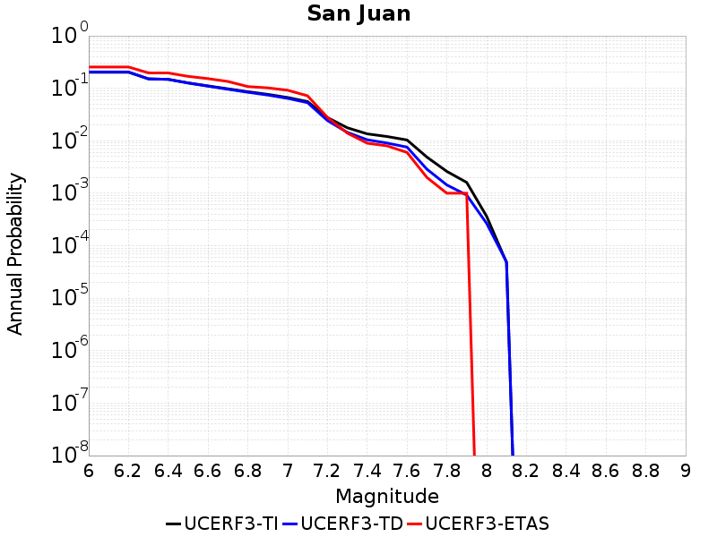 |
|-----|

| Magnitude | UCERF3-TI Prob | UCERF3-TD Prob | UCERF3-ETAS Prob |
|-----|-----|-----|-----|
| 6.0 | 0.20270395 | 0.20494887 | 0.255 |
| 6.1 | 0.20270395 | 0.20494887 | 0.255 |
| 6.2 | 0.20270395 | 0.20494887 | 0.255 |
| 6.3 | 0.15168607 | 0.15140334 | 0.197 |
| 6.4 | 0.14821808 | 0.14799173 | 0.196 |
| 6.5 | 0.12697503 | 0.12596844 | 0.169 |
| 6.6 | 0.11118985 | 0.10979882 | 0.153 |
| 6.7 | 0.09778567 | 0.09600935 | 0.135 |
| 6.8 | 0.086162716 | 0.08410167 | 0.108 |
| 6.9 | 0.07672654 | 0.074443825 | 0.102 |
| 7.0 | 0.06681149 | 0.06431816 | 0.092 |
| 7.1 | 0.055877227 | 0.053304985 | 0.072 |
| 7.2 | 0.027749471 | 0.024325876 | 0.028 |
| 7.3 | 0.017703284 | 0.014455076 | 0.014 |
| 7.4 | 0.013553141 | 0.010454228 | 0.009 |
| 7.5 | 0.01205422 | 0.009046979 | 0.008 |
| 7.6 | 0.01035733 | 0.0075777047 | 0.006 |
| 7.7 | 0.0048887795 | 0.0028752028 | 0.002 |
| 7.8 | 0.0026095596 | 0.001440675 | 0.001 |
| 7.9 | 0.0016087863 | 9.240186E-4 | 0.001 |
| 8.0 | 3.6452015E-4 | 2.6672767E-4 | 0.0 |
| 8.1 | 4.8012203E-5 | 4.929847E-5 | 0.0 |

## San Luis Range - Oceano 2011 CFM
*[(top)](#table-of-contents)*

|  |
|-----|

| Magnitude | UCERF3-TI Prob | UCERF3-TD Prob | UCERF3-ETAS Prob |
|-----|-----|-----|-----|
| 6.0 | 0.04094818 | 0.04147305 | 0.034 |
| 6.1 | 0.04094818 | 0.04147305 | 0.034 |
| 6.2 | 0.04094818 | 0.04147305 | 0.034 |
| 6.3 | 0.04094818 | 0.04147305 | 0.034 |
| 6.4 | 0.029863855 | 0.030244512 | 0.028 |
| 6.5 | 0.029863855 | 0.030244512 | 0.028 |
| 6.6 | 0.018518656 | 0.018726837 | 0.019 |
| 6.7 | 0.018518656 | 0.018726837 | 0.019 |
| 6.8 | 0.017328395 | 0.017520465 | 0.018 |
| 6.9 | 0.01465256 | 0.014811121 | 0.014 |
| 7.0 | 0.011951036 | 0.012078209 | 0.01 |
| 7.1 | 0.010169163 | 0.01027812 | 0.008 |
| 7.2 | 0.008824605 | 0.008920863 | 0.008 |
| 7.3 | 0.0075116917 | 0.007593616 | 0.007 |
| 7.4 | 0.005692471 | 0.0057560345 | 0.005 |
| 7.5 | 0.0035324919 | 0.0035706589 | 0.002 |
| 7.6 | 0.0015450981 | 0.0015634933 | 0.001 |
| 7.7 | 1.5512091E-4 | 1.5736299E-4 | 0.0 |

## San Luis Range - Pecho 2011 CFM
*[(top)](#table-of-contents)*

|  |
|-----|

| Magnitude | UCERF3-TI Prob | UCERF3-TD Prob | UCERF3-ETAS Prob |
|-----|-----|-----|-----|
| 6.0 | 0.043068722 | 0.043453675 | 0.043 |
| 6.1 | 0.043068722 | 0.043453675 | 0.043 |
| 6.2 | 0.027696114 | 0.02793651 | 0.028 |
| 6.3 | 0.021990778 | 0.022188151 | 0.021 |
| 6.4 | 0.021990778 | 0.022188151 | 0.021 |
| 6.5 | 0.01810429 | 0.018258497 | 0.017 |
| 6.6 | 0.014462415 | 0.014579093 | 0.014 |
| 6.7 | 0.01227577 | 0.01236686 | 0.013 |
| 6.8 | 0.010759901 | 0.010832568 | 0.01 |
| 6.9 | 0.008328474 | 0.008366688 | 0.008 |
| 7.0 | 0.006842128 | 0.0068559265 | 0.006 |
| 7.1 | 0.005679736 | 0.005671634 | 0.005 |
| 7.2 | 0.004527434 | 0.0044943434 | 0.005 |
| 7.3 | 0.003579523 | 0.003524245 | 0.003 |
| 7.4 | 0.0028436673 | 0.0027682683 | 0.002 |
| 7.5 | 0.0024728866 | 0.0023862682 | 0.001 |
| 7.6 | 0.0018914244 | 0.0017847917 | 0.0 |
| 7.7 | 0.0014198847 | 0.0012949122 | 0.0 |
| 7.8 | 9.348862E-4 | 7.953607E-4 | 0.0 |
| 7.9 | 6.41275E-4 | 5.142692E-4 | 0.0 |
| 8.0 | 4.734544E-4 | 3.7910332E-4 | 0.0 |
| 8.1 | 2.4936174E-4 | 2.095659E-4 | 0.0 |

## San Luis Range 2011 CFM
*[(top)](#table-of-contents)*

|  |
|-----|

| Magnitude | UCERF3-TI Prob | UCERF3-TD Prob | UCERF3-ETAS Prob |
|-----|-----|-----|-----|
| 6.0 | 0.20590161 | 0.21028997 | 0.143 |
| 6.1 | 0.20590161 | 0.21028997 | 0.143 |
| 6.2 | 0.20590161 | 0.21028997 | 0.143 |
| 6.3 | 0.20590161 | 0.21028997 | 0.143 |
| 6.4 | 0.096965164 | 0.09789499 | 0.069 |
| 6.5 | 0.096965164 | 0.09789499 | 0.069 |
| 6.6 | 0.076700225 | 0.077263266 | 0.057 |
| 6.7 | 0.065974146 | 0.066355 | 0.049 |
| 6.8 | 0.06341134 | 0.06374722 | 0.049 |
| 6.9 | 0.04727907 | 0.047350544 | 0.036 |
| 7.0 | 0.03953466 | 0.039479416 | 0.026 |
| 7.1 | 0.03427554 | 0.03412124 | 0.024 |
| 7.2 | 0.027335057 | 0.027087204 | 0.017 |
| 7.3 | 0.020224974 | 0.020103313 | 0.014 |
| 7.4 | 0.015418382 | 0.015420639 | 0.008 |
| 7.5 | 0.010798721 | 0.010796057 | 0.006 |
| 7.6 | 0.0061941654 | 0.006172453 | 0.001 |
| 7.7 | 0.002584393 | 0.002528668 | 0.0 |
| 7.8 | 9.1225357E-4 | 8.4456836E-4 | 0.0 |
| 7.9 | 4.336379E-4 | 3.6327066E-4 | 0.0 |
| 8.0 | 1.6526801E-4 | 1.2146013E-4 | 0.0 |

## San Pedro Basin
*[(top)](#table-of-contents)*

|  |
|-----|

| Magnitude | UCERF3-TI Prob | UCERF3-TD Prob | UCERF3-ETAS Prob |
|-----|-----|-----|-----|
| 6.0 | 0.7520392 | 0.80391306 | 0.586 |
| 6.1 | 0.7520392 | 0.80391306 | 0.586 |
| 6.2 | 0.45392737 | 0.4888566 | 0.297 |
| 6.3 | 0.45392737 | 0.4888566 | 0.297 |
| 6.4 | 0.40126428 | 0.4352543 | 0.259 |
| 6.5 | 0.36394432 | 0.39686552 | 0.224 |
| 6.6 | 0.3131486 | 0.3438282 | 0.183 |
| 6.7 | 0.2808154 | 0.30996004 | 0.157 |
| 6.8 | 0.25844702 | 0.28582242 | 0.144 |
| 6.9 | 0.21152084 | 0.23489259 | 0.115 |
| 7.0 | 0.1434504 | 0.15985027 | 0.076 |
| 7.1 | 0.054689903 | 0.056021728 | 0.027 |
| 7.2 | 0.053935897 | 0.055243198 | 0.027 |
| 7.3 | 0.043746468 | 0.044507805 | 0.024 |
| 7.4 | 0.037042487 | 0.03751187 | 0.023 |
| 7.5 | 0.032852296 | 0.033212624 | 0.021 |
| 7.6 | 0.01746896 | 0.017547084 | 0.01 |
| 7.7 | 0.001619324 | 0.0012387008 | 0.004 |
| 7.8 | 6.9344416E-5 | 4.369537E-5 | 0.0 |

## San Pedro Escarpment
*[(top)](#table-of-contents)*

|  |
|-----|

| Magnitude | UCERF3-TI Prob | UCERF3-TD Prob | UCERF3-ETAS Prob |
|-----|-----|-----|-----|
| 6.0 | 0.030165238 | 0.027133925 | 0.021 |
| 6.1 | 0.030165238 | 0.027133925 | 0.021 |
| 6.2 | 0.030165238 | 0.027133925 | 0.021 |
| 6.3 | 0.030165238 | 0.027133925 | 0.021 |
| 6.4 | 0.030165238 | 0.027133925 | 0.021 |
| 6.5 | 0.030165238 | 0.027133925 | 0.021 |
| 6.6 | 0.030165238 | 0.027133925 | 0.021 |
| 6.7 | 0.030165238 | 0.027133925 | 0.021 |
| 6.8 | 0.030165238 | 0.027133925 | 0.021 |
| 6.9 | 0.030165238 | 0.027133925 | 0.021 |
| 7.0 | 0.030165238 | 0.027133925 | 0.021 |
| 7.1 | 0.030165238 | 0.027133925 | 0.021 |
| 7.2 | 0.030119777 | 0.027087934 | 0.021 |
| 7.3 | 0.029595653 | 0.026556898 | 0.021 |
| 7.4 | 0.028553043 | 0.025499368 | 0.021 |
| 7.5 | 0.02683255 | 0.023914907 | 0.021 |
| 7.6 | 0.018143943 | 0.015599891 | 0.011 |
| 7.7 | 0.008021772 | 0.0061042705 | 0.007 |
| 7.8 | 0.0014993392 | 0.0011342434 | 0.0 |
| 7.9 | 1.5756825E-4 | 1.0151451E-4 | 0.0 |

## San Vicente
*[(top)](#table-of-contents)*

|  |
|-----|

| Magnitude | UCERF3-TI Prob | UCERF3-TD Prob | UCERF3-ETAS Prob |
|-----|-----|-----|-----|
| 6.0 | 0.010601213 | 0.010095294 | 0.009 |
| 6.1 | 0.010601213 | 0.010095294 | 0.009 |
| 6.2 | 0.010175114 | 0.009667634 | 0.009 |
| 6.3 | 0.010175114 | 0.009667634 | 0.009 |
| 6.4 | 0.008386278 | 0.007869083 | 0.006 |
| 6.5 | 0.008386278 | 0.007869083 | 0.006 |
| 6.6 | 0.008306948 | 0.007789461 | 0.006 |
| 6.7 | 0.008013956 | 0.0074944007 | 0.006 |
| 6.8 | 0.0074938494 | 0.006969548 | 0.006 |
| 6.9 | 0.006932904 | 0.006402907 | 0.006 |
| 7.0 | 0.0061727827 | 0.005639271 | 0.005 |
| 7.1 | 0.005525233 | 0.0049895686 | 0.005 |
| 7.2 | 0.004748643 | 0.0042114877 | 0.004 |
| 7.3 | 0.004196596 | 0.0037056007 | 0.004 |
| 7.4 | 0.0036845475 | 0.003258117 | 0.003 |
| 7.5 | 0.002790078 | 0.0024579875 | 0.001 |
| 7.6 | 0.0017586274 | 0.0014791145 | 0.001 |
| 7.7 | 7.5474585E-4 | 5.431035E-4 | 0.001 |
| 7.8 | 2.6480915E-4 | 1.867798E-4 | 0.001 |
| 7.9 | 7.389586E-7 | 5.9960917E-7 | 0.0 |

## Santa Cruz Catalina Ridge alt1
*[(top)](#table-of-contents)*

|  |
|-----|

| Magnitude | UCERF3-TI Prob | UCERF3-TD Prob | UCERF3-ETAS Prob |
|-----|-----|-----|-----|
| 6.0 | 0.5754003 | 0.6201894 | 0.392 |
| 6.1 | 0.40399155 | 0.4301261 | 0.261 |
| 6.2 | 0.40399155 | 0.4301261 | 0.261 |
| 6.3 | 0.33657554 | 0.35754922 | 0.203 |
| 6.4 | 0.33657554 | 0.35754922 | 0.203 |
| 6.5 | 0.30066642 | 0.31932196 | 0.175 |
| 6.6 | 0.2790293 | 0.29634294 | 0.167 |
| 6.7 | 0.2592818 | 0.27536994 | 0.156 |
| 6.8 | 0.23219363 | 0.24651149 | 0.147 |
| 6.9 | 0.20846531 | 0.22121419 | 0.135 |
| 7.0 | 0.18936458 | 0.20089443 | 0.123 |
| 7.1 | 0.16987354 | 0.18022269 | 0.107 |
| 7.2 | 0.15293762 | 0.16227998 | 0.094 |
| 7.3 | 0.12239067 | 0.13000213 | 0.075 |
| 7.4 | 0.08703299 | 0.09255389 | 0.059 |
| 7.5 | 0.02883536 | 0.030467182 | 0.017 |
| 7.6 | 0.007433522 | 0.0077651613 | 0.003 |
| 7.7 | 0.005407079 | 0.0056435773 | 0.003 |
| 7.8 | 9.4262476E-4 | 9.794764E-4 | 0.001 |

## Santa Cruz Island
*[(top)](#table-of-contents)*

|  |
|-----|

| Magnitude | UCERF3-TI Prob | UCERF3-TD Prob | UCERF3-ETAS Prob |
|-----|-----|-----|-----|
| 6.0 | 0.5327513 | 0.57615304 | 0.453 |
| 6.1 | 0.5327513 | 0.57615304 | 0.453 |
| 6.2 | 0.5327513 | 0.57615304 | 0.453 |
| 6.3 | 0.35209635 | 0.37334165 | 0.283 |
| 6.4 | 0.35209635 | 0.37334165 | 0.283 |
| 6.5 | 0.27334404 | 0.2881792 | 0.206 |
| 6.6 | 0.23941846 | 0.25220543 | 0.163 |
| 6.7 | 0.20304534 | 0.21363391 | 0.127 |
| 6.8 | 0.19486369 | 0.20497918 | 0.123 |
| 6.9 | 0.18992043 | 0.19975723 | 0.121 |
| 7.0 | 0.18022335 | 0.1895059 | 0.115 |
| 7.1 | 0.16957791 | 0.17828558 | 0.108 |
| 7.2 | 0.1546839 | 0.16275589 | 0.091 |
| 7.3 | 0.13354237 | 0.14052668 | 0.084 |
| 7.4 | 0.10098121 | 0.106135376 | 0.067 |
| 7.5 | 0.059676196 | 0.062402643 | 0.044 |
| 7.6 | 0.024475608 | 0.025360735 | 0.019 |
| 7.7 | 0.0067637675 | 0.006871333 | 0.011 |
| 7.8 | 0.0010826996 | 0.0010432141 | 0.001 |
| 7.9 | 2.0151696E-5 | 1.6304155E-5 | 0.0 |

## Santa Monica Bay
*[(top)](#table-of-contents)*

|  |
|-----|

| Magnitude | UCERF3-TI Prob | UCERF3-TD Prob | UCERF3-ETAS Prob |
|-----|-----|-----|-----|
| 6.0 | 0.016798286 | 0.016991373 | 0.012 |
| 6.1 | 0.016798286 | 0.016991373 | 0.012 |
| 6.2 | 0.016798286 | 0.016991373 | 0.012 |
| 6.3 | 0.016798286 | 0.016991373 | 0.012 |
| 6.4 | 0.016798286 | 0.016991373 | 0.012 |
| 6.5 | 0.016798286 | 0.016991373 | 0.012 |
| 6.6 | 0.016798286 | 0.016991373 | 0.012 |
| 6.7 | 0.016798286 | 0.016991373 | 0.012 |
| 6.8 | 0.016798286 | 0.016991373 | 0.012 |
| 6.9 | 0.016798286 | 0.016991373 | 0.012 |
| 7.0 | 0.01646146 | 0.016652985 | 0.012 |
| 7.1 | 0.015008413 | 0.015190843 | 0.011 |
| 7.2 | 0.013643266 | 0.013815975 | 0.01 |
| 7.3 | 0.011885515 | 0.012043549 | 0.01 |
| 7.4 | 0.010301556 | 0.010444263 | 0.008 |
| 7.5 | 0.0065393676 | 0.0066374815 | 0.006 |
| 7.6 | 0.0042728335 | 0.0043412047 | 0.005 |
| 7.7 | 0.0031337135 | 0.0031862787 | 0.005 |
| 7.8 | 7.9644093E-4 | 8.109215E-4 | 0.001 |

## Santa Monica alt 1
*[(top)](#table-of-contents)*

|  |
|-----|

| Magnitude | UCERF3-TI Prob | UCERF3-TD Prob | UCERF3-ETAS Prob |
|-----|-----|-----|-----|
| 6.0 | 0.2507674 | 0.26336372 | 0.173 |
| 6.1 | 0.2507674 | 0.26336372 | 0.173 |
| 6.2 | 0.2507674 | 0.26336372 | 0.173 |
| 6.3 | 0.2507674 | 0.26336372 | 0.173 |
| 6.4 | 0.2507674 | 0.26336372 | 0.173 |
| 6.5 | 0.19225083 | 0.19821739 | 0.132 |
| 6.6 | 0.19163491 | 0.1975577 | 0.132 |
| 6.7 | 0.19071802 | 0.19658817 | 0.132 |
| 6.8 | 0.18080094 | 0.18592785 | 0.124 |
| 6.9 | 0.17491947 | 0.17965516 | 0.121 |
| 7.0 | 0.17146905 | 0.17601831 | 0.12 |
| 7.1 | 0.13600697 | 0.13730311 | 0.098 |
| 7.2 | 0.11651561 | 0.11612188 | 0.084 |
| 7.3 | 0.095068894 | 0.09353757 | 0.075 |
| 7.4 | 0.06584492 | 0.064954914 | 0.049 |
| 7.5 | 0.045679633 | 0.045685593 | 0.034 |
| 7.6 | 0.029488767 | 0.029072918 | 0.021 |
| 7.7 | 0.0138117215 | 0.013006719 | 0.011 |
| 7.8 | 0.0030396187 | 0.0027546112 | 0.002 |
| 7.9 | 2.0890639E-5 | 1.6903754E-5 | 0.0 |

## Santa Rosa Island
*[(top)](#table-of-contents)*

|  |
|-----|

| Magnitude | UCERF3-TI Prob | UCERF3-TD Prob | UCERF3-ETAS Prob |
|-----|-----|-----|-----|
| 6.0 | 0.6581619 | 0.70370454 | 0.617 |
| 6.1 | 0.42274937 | 0.45429817 | 0.337 |
| 6.2 | 0.42274937 | 0.45429817 | 0.337 |
| 6.3 | 0.32663688 | 0.35232887 | 0.259 |
| 6.4 | 0.2752973 | 0.29775116 | 0.213 |
| 6.5 | 0.21053536 | 0.22855076 | 0.16 |
| 6.6 | 0.17870663 | 0.194343 | 0.128 |
| 6.7 | 0.13372554 | 0.14583875 | 0.093 |
| 6.8 | 0.09285053 | 0.10069853 | 0.061 |
| 6.9 | 0.06207465 | 0.06604507 | 0.047 |
| 7.0 | 0.05884273 | 0.06250435 | 0.047 |
| 7.1 | 0.05639195 | 0.05984095 | 0.045 |
| 7.2 | 0.0541788 | 0.057467543 | 0.041 |
| 7.3 | 0.050329376 | 0.053357344 | 0.039 |
| 7.4 | 0.043260846 | 0.04584323 | 0.031 |
| 7.5 | 0.023174247 | 0.024441727 | 0.015 |
| 7.6 | 0.010067202 | 0.0104963975 | 0.003 |
| 7.7 | 0.0016114889 | 0.0016510561 | 0.002 |
| 7.8 | 3.5753288E-5 | 3.639521E-5 | 0.0 |

## Santa Susana East (connector)
*[(top)](#table-of-contents)*

|  |
|-----|

| Magnitude | UCERF3-TI Prob | UCERF3-TD Prob | UCERF3-ETAS Prob |
|-----|-----|-----|-----|
| 6.0 | 0.52561975 | 0.55953026 | 0.35 |
| 6.1 | 0.52561975 | 0.55953026 | 0.35 |
| 6.2 | 0.52561975 | 0.55953026 | 0.35 |
| 6.3 | 0.39774334 | 0.42381343 | 0.228 |
| 6.4 | 0.39774334 | 0.42381343 | 0.228 |
| 6.5 | 0.39774334 | 0.42381343 | 0.228 |
| 6.6 | 0.39774334 | 0.42381343 | 0.228 |
| 6.7 | 0.39725006 | 0.42347696 | 0.228 |
| 6.8 | 0.2729416 | 0.28292572 | 0.138 |
| 6.9 | 0.2729416 | 0.28292572 | 0.138 |
| 7.0 | 0.21494837 | 0.21850848 | 0.105 |
| 7.1 | 0.21195927 | 0.21571824 | 0.105 |
| 7.2 | 0.20619519 | 0.2104627 | 0.103 |
| 7.3 | 0.2004167 | 0.2055037 | 0.1 |
| 7.4 | 0.18523961 | 0.18953983 | 0.094 |
| 7.5 | 0.119703844 | 0.12035052 | 0.055 |
| 7.6 | 0.035600737 | 0.033677094 | 0.017 |
| 7.7 | 0.007776728 | 0.0072234874 | 0.004 |
| 7.8 | 0.0012564153 | 0.0010964227 | 0.001 |
| 7.9 | 6.816181E-5 | 7.199549E-5 | 0.001 |

## Santa Susana alt 1
*[(top)](#table-of-contents)*

|  |
|-----|

| Magnitude | UCERF3-TI Prob | UCERF3-TD Prob | UCERF3-ETAS Prob |
|-----|-----|-----|-----|
| 6.0 | 0.50235367 | 0.5312582 | 0.323 |
| 6.1 | 0.50235367 | 0.5312582 | 0.323 |
| 6.2 | 0.50235367 | 0.5312582 | 0.323 |
| 6.3 | 0.50235367 | 0.5312582 | 0.323 |
| 6.4 | 0.50235367 | 0.5312582 | 0.323 |
| 6.5 | 0.50235367 | 0.5312582 | 0.323 |
| 6.6 | 0.50104326 | 0.529981 | 0.323 |
| 6.7 | 0.50104326 | 0.529981 | 0.323 |
| 6.8 | 0.39201823 | 0.40644073 | 0.227 |
| 6.9 | 0.39152148 | 0.4060084 | 0.226 |
| 7.0 | 0.33984393 | 0.34886485 | 0.196 |
| 7.1 | 0.3374352 | 0.34651542 | 0.196 |
| 7.2 | 0.33115786 | 0.3405539 | 0.195 |
| 7.3 | 0.31558213 | 0.32447785 | 0.188 |
| 7.4 | 0.28500816 | 0.29215482 | 0.163 |
| 7.5 | 0.20571154 | 0.20847717 | 0.113 |
| 7.6 | 0.08137521 | 0.07970538 | 0.045 |
| 7.7 | 0.032721013 | 0.032680634 | 0.023 |
| 7.8 | 0.007971066 | 0.008420007 | 0.007 |
| 7.9 | 0.0019868098 | 0.002103816 | 0.001 |

## Santa Ynez (East)
*[(top)](#table-of-contents)*

|  |
|-----|

| Magnitude | UCERF3-TI Prob | UCERF3-TD Prob | UCERF3-ETAS Prob |
|-----|-----|-----|-----|
| 6.0 | 0.5691121 | 0.6504694 | 0.512 |
| 6.1 | 0.5691121 | 0.6504694 | 0.512 |
| 6.2 | 0.5691121 | 0.6504694 | 0.512 |
| 6.3 | 0.5691121 | 0.6504694 | 0.512 |
| 6.4 | 0.31326932 | 0.3293349 | 0.229 |
| 6.5 | 0.31326932 | 0.3293349 | 0.229 |
| 6.6 | 0.2839457 | 0.2976386 | 0.209 |
| 6.7 | 0.27747044 | 0.29071644 | 0.198 |
| 6.8 | 0.27061626 | 0.2833638 | 0.188 |
| 6.9 | 0.2515104 | 0.26308474 | 0.175 |
| 7.0 | 0.24115628 | 0.2520002 | 0.165 |
| 7.1 | 0.23007508 | 0.24024153 | 0.154 |
| 7.2 | 0.20667332 | 0.21539457 | 0.135 |
| 7.3 | 0.17879786 | 0.1865976 | 0.121 |
| 7.4 | 0.15177394 | 0.15781857 | 0.1 |
| 7.5 | 0.11332779 | 0.11724991 | 0.076 |
| 7.6 | 0.03299087 | 0.033829417 | 0.026 |
| 7.7 | 0.01380995 | 0.014506465 | 0.011 |
| 7.8 | 0.001203018 | 0.0012496525 | 0.003 |

## Santa Ynez (West)
*[(top)](#table-of-contents)*

|  |
|-----|

| Magnitude | UCERF3-TI Prob | UCERF3-TD Prob | UCERF3-ETAS Prob |
|-----|-----|-----|-----|
| 6.0 | 0.70928997 | 0.7381371 | 0.654 |
| 6.1 | 0.70928997 | 0.7381371 | 0.596 |
| 6.2 | 0.54775894 | 0.5714281 | 0.442 |
| 6.3 | 0.54775894 | 0.5714281 | 0.442 |
| 6.4 | 0.48523 | 0.5082449 | 0.387 |
| 6.5 | 0.45327634 | 0.4758153 | 0.359 |
| 6.6 | 0.3927369 | 0.41322935 | 0.295 |
| 6.7 | 0.36203504 | 0.38108724 | 0.266 |
| 6.8 | 0.32942665 | 0.3457635 | 0.233 |
| 6.9 | 0.28895617 | 0.3014252 | 0.193 |
| 7.0 | 0.26568732 | 0.27602047 | 0.172 |
| 7.1 | 0.24154669 | 0.24969417 | 0.156 |
| 7.2 | 0.22137594 | 0.22830471 | 0.139 |
| 7.3 | 0.20068946 | 0.20634134 | 0.128 |
| 7.4 | 0.17260155 | 0.17629069 | 0.104 |
| 7.5 | 0.13654418 | 0.13795592 | 0.078 |
| 7.6 | 0.057386234 | 0.05534516 | 0.028 |
| 7.7 | 0.033599235 | 0.030945133 | 0.012 |
| 7.8 | 0.020409696 | 0.017841961 | 0.008 |
| 7.9 | 1.8457326E-4 | 1.5219268E-4 | 0.0 |

## Santa Ynez River
*[(top)](#table-of-contents)*

| 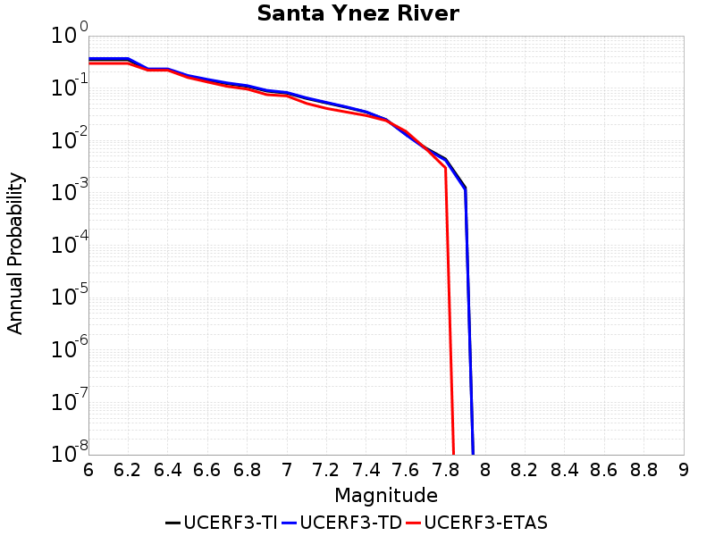 |
|-----|

| Magnitude | UCERF3-TI Prob | UCERF3-TD Prob | UCERF3-ETAS Prob |
|-----|-----|-----|-----|
| 6.0 | 0.34804213 | 0.36813796 | 0.296 |
| 6.1 | 0.34804213 | 0.36813796 | 0.296 |
| 6.2 | 0.34804213 | 0.36813796 | 0.296 |
| 6.3 | 0.22433302 | 0.23357147 | 0.22 |
| 6.4 | 0.22433302 | 0.23357147 | 0.22 |
| 6.5 | 0.16869958 | 0.1750485 | 0.16 |
| 6.6 | 0.142067 | 0.14716098 | 0.131 |
| 6.7 | 0.12168464 | 0.12586553 | 0.108 |
| 6.8 | 0.108367816 | 0.11196395 | 0.096 |
| 6.9 | 0.08787623 | 0.09063999 | 0.075 |
| 7.0 | 0.08037432 | 0.08284579 | 0.071 |
| 7.1 | 0.063373 | 0.065164395 | 0.051 |
| 7.2 | 0.052117042 | 0.053433288 | 0.041 |
| 7.3 | 0.042997602 | 0.043909166 | 0.035 |
| 7.4 | 0.034860082 | 0.03531394 | 0.03 |
| 7.5 | 0.025078988 | 0.025040781 | 0.024 |
| 7.6 | 0.0131329335 | 0.012873892 | 0.015 |
| 7.7 | 0.0071983235 | 0.0069403993 | 0.007 |
| 7.8 | 0.0044369586 | 0.004205283 | 0.003 |
| 7.9 | 0.0012604729 | 0.0011389882 | 0.0 |

## Sargent 2011 CFM
*[(top)](#table-of-contents)*

|  |
|-----|

| Magnitude | UCERF3-TI Prob | UCERF3-TD Prob | UCERF3-ETAS Prob |
|-----|-----|-----|-----|
| 6.0 | 0.6223833 | 0.6192317 | 0.684 |
| 6.1 | 0.46215677 | 0.43752462 | 0.504 |
| 6.2 | 0.45283306 | 0.4269164 | 0.489 |
| 6.3 | 0.3629834 | 0.3265169 | 0.356 |
| 6.4 | 0.32101506 | 0.27926838 | 0.307 |
| 6.5 | 0.312448 | 0.26958442 | 0.29 |
| 6.6 | 0.2250534 | 0.16403279 | 0.198 |
| 6.7 | 0.22465207 | 0.16357039 | 0.198 |
| 6.8 | 0.22172287 | 0.16045105 | 0.196 |
| 6.9 | 0.218038 | 0.15682237 | 0.19 |
| 7.0 | 0.21436614 | 0.15309563 | 0.188 |
| 7.1 | 0.20918088 | 0.14804736 | 0.185 |
| 7.2 | 0.19932817 | 0.13851558 | 0.177 |
| 7.3 | 0.18929613 | 0.12914176 | 0.167 |
| 7.4 | 0.18119156 | 0.122323014 | 0.156 |
| 7.5 | 0.16608584 | 0.11029145 | 0.146 |
| 7.6 | 0.15117486 | 0.099018864 | 0.124 |
| 7.7 | 0.12079351 | 0.07726739 | 0.104 |
| 7.8 | 0.06003767 | 0.035961162 | 0.047 |
| 7.9 | 0.04644202 | 0.027033469 | 0.034 |
| 8.0 | 0.0049693966 | 0.0030837741 | 0.003 |

## Scodie Lineament
*[(top)](#table-of-contents)*

|  |
|-----|

| Magnitude | UCERF3-TI Prob | UCERF3-TD Prob | UCERF3-ETAS Prob |
|-----|-----|-----|-----|
| 6.0 | 0.082299605 | 0.07736131 | 0.046 |
| 6.1 | 0.04752612 | 0.040768024 | 0.019 |
| 6.2 | 0.04752612 | 0.040768024 | 0.019 |
| 6.3 | 0.04752612 | 0.040768024 | 0.019 |
| 6.4 | 0.04752612 | 0.040768024 | 0.019 |
| 6.5 | 0.046139758 | 0.03931655 | 0.018 |
| 6.6 | 0.031870123 | 0.02430464 | 0.013 |
| 6.7 | 0.028448056 | 0.020728571 | 0.01 |
| 6.8 | 0.025769034 | 0.01793261 | 0.009 |
| 6.9 | 0.023633264 | 0.01570713 | 0.008 |
| 7.0 | 0.01988517 | 0.01180251 | 0.007 |
| 7.1 | 0.018362813 | 0.010267374 | 0.007 |
| 7.2 | 0.0054117716 | 0.001198947 | 0.0 |
| 7.3 | 0.003918267 | 6.8202405E-4 | 0.0 |
| 7.4 | 0.0015468019 | 2.2601006E-4 | 0.0 |

## Sheephole
*[(top)](#table-of-contents)*

|  |
|-----|

| Magnitude | UCERF3-TI Prob | UCERF3-TD Prob | UCERF3-ETAS Prob |
|-----|-----|-----|-----|
| 6.0 | 0.11211623 | 0.11749127 | 0.104 |
| 6.1 | 0.11211623 | 0.11749127 | 0.104 |
| 6.2 | 0.06723337 | 0.07025667 | 0.063 |
| 6.3 | 0.06723337 | 0.07025667 | 0.063 |
| 6.4 | 0.056173846 | 0.05886785 | 0.052 |
| 6.5 | 0.055746093 | 0.05842374 | 0.052 |
| 6.6 | 0.038960814 | 0.040873136 | 0.032 |
| 6.7 | 0.033693746 | 0.03537591 | 0.027 |
| 6.8 | 0.03151916 | 0.03309936 | 0.026 |
| 6.9 | 0.030410154 | 0.03193634 | 0.024 |
| 7.0 | 0.025368977 | 0.026637996 | 0.019 |
| 7.1 | 0.021075003 | 0.022129577 | 0.018 |
| 7.2 | 0.01483689 | 0.015583671 | 0.012 |

## Shoreline
*[(top)](#table-of-contents)*

|  |
|-----|

| Magnitude | UCERF3-TI Prob | UCERF3-TD Prob | UCERF3-ETAS Prob |
|-----|-----|-----|-----|
| 6.0 | 0.098835 | 0.101996206 | 0.058 |
| 6.1 | 0.098835 | 0.101996206 | 0.058 |
| 6.2 | 0.03596577 | 0.036593657 | 0.021 |
| 6.3 | 0.03596577 | 0.036593657 | 0.021 |
| 6.4 | 0.034139335 | 0.034733884 | 0.02 |
| 6.5 | 0.028764363 | 0.029280545 | 0.014 |
| 6.6 | 0.025225855 | 0.02568092 | 0.014 |
| 6.7 | 0.023196619 | 0.023615526 | 0.012 |
| 6.8 | 0.020480387 | 0.02083159 | 0.01 |
| 6.9 | 0.01847222 | 0.018781535 | 0.009 |
| 7.0 | 0.016530419 | 0.01678903 | 0.005 |
| 7.1 | 0.014066839 | 0.014254248 | 0.004 |
| 7.2 | 0.012127524 | 0.01225899 | 0.004 |
| 7.3 | 0.010630854 | 0.010723263 | 0.004 |
| 7.4 | 0.009117035 | 0.00917008 | 0.001 |
| 7.5 | 0.0074693826 | 0.0074794446 | 0.001 |
| 7.6 | 0.0054440633 | 0.0053982562 | 0.001 |
| 7.7 | 0.0036257312 | 0.0035222413 | 0.0 |
| 7.8 | 0.0021130857 | 0.0019623416 | 0.0 |
| 7.9 | 0.0013259961 | 0.0011822316 | 0.0 |
| 8.0 | 8.282665E-4 | 7.421503E-4 | 0.0 |
| 8.1 | 3.377443E-4 | 3.3737617E-4 | 0.0 |

## Sierra Madre
*[(top)](#table-of-contents)*

|  |
|-----|

| Magnitude | UCERF3-TI Prob | UCERF3-TD Prob | UCERF3-ETAS Prob |
|-----|-----|-----|-----|
| 6.0 | 0.29464963 | 0.2851941 | 0.153 |
| 6.1 | 0.29464963 | 0.2851941 | 0.153 |
| 6.2 | 0.29464963 | 0.2851941 | 0.153 |
| 6.3 | 0.29464963 | 0.2851941 | 0.153 |
| 6.4 | 0.29464963 | 0.2851941 | 0.153 |
| 6.5 | 0.28121755 | 0.27065924 | 0.145 |
| 6.6 | 0.28121755 | 0.27065924 | 0.145 |
| 6.7 | 0.27832666 | 0.26754355 | 0.144 |
| 6.8 | 0.2774316 | 0.26662055 | 0.144 |
| 6.9 | 0.27309424 | 0.26221427 | 0.137 |
| 7.0 | 0.26554313 | 0.25447837 | 0.134 |
| 7.1 | 0.25798255 | 0.24629262 | 0.13 |
| 7.2 | 0.24626617 | 0.2342944 | 0.123 |
| 7.3 | 0.23770352 | 0.22613199 | 0.121 |
| 7.4 | 0.22497806 | 0.21329197 | 0.107 |
| 7.5 | 0.20279302 | 0.19175768 | 0.092 |
| 7.6 | 0.15268546 | 0.14238322 | 0.064 |
| 7.7 | 0.11360354 | 0.10490173 | 0.039 |
| 7.8 | 0.080443844 | 0.07569396 | 0.027 |
| 7.9 | 0.026747182 | 0.022966603 | 0.008 |
| 8.0 | 0.0031543828 | 0.0025984012 | 0.0 |

## Sierra Madre (San Fernando)
*[(top)](#table-of-contents)*

|  |
|-----|

| Magnitude | UCERF3-TI Prob | UCERF3-TD Prob | UCERF3-ETAS Prob |
|-----|-----|-----|-----|
| 6.0 | 0.23656853 | 0.19106494 | 0.083 |
| 6.1 | 0.23656853 | 0.19106494 | 0.083 |
| 6.2 | 0.23656853 | 0.19106494 | 0.083 |
| 6.3 | 0.23656853 | 0.19106494 | 0.083 |
| 6.4 | 0.23463698 | 0.1910238 | 0.083 |
| 6.5 | 0.23463698 | 0.1910238 | 0.083 |
| 6.6 | 0.22769664 | 0.19087675 | 0.083 |
| 6.7 | 0.22706407 | 0.19040424 | 0.083 |
| 6.8 | 0.21821655 | 0.18589498 | 0.081 |
| 6.9 | 0.20307082 | 0.17898266 | 0.078 |
| 7.0 | 0.20199789 | 0.17825007 | 0.078 |
| 7.1 | 0.19901322 | 0.17574145 | 0.078 |
| 7.2 | 0.19132744 | 0.16923286 | 0.077 |
| 7.3 | 0.1858626 | 0.16511622 | 0.076 |
| 7.4 | 0.17945391 | 0.15993884 | 0.071 |
| 7.5 | 0.15265335 | 0.13417584 | 0.06 |
| 7.6 | 0.10916034 | 0.0930226 | 0.042 |
| 7.7 | 0.07540562 | 0.061874896 | 0.024 |
| 7.8 | 0.047017284 | 0.039897118 | 0.014 |
| 7.9 | 0.025343271 | 0.021254083 | 0.008 |
| 8.0 | 0.0031543828 | 0.0025984012 | 0.0 |

## Sierra Nevada  (No Extension)
*[(top)](#table-of-contents)*

|  |
|-----|

| Magnitude | UCERF3-TI Prob | UCERF3-TD Prob | UCERF3-ETAS Prob |
|-----|-----|-----|-----|
| 6.0 | 0.1834684 | 0.1778415 | 0.169 |
| 6.1 | 0.1834684 | 0.1778415 | 0.169 |
| 6.2 | 0.1834684 | 0.1778415 | 0.169 |
| 6.3 | 0.1834684 | 0.1778415 | 0.169 |
| 6.4 | 0.1834684 | 0.1778415 | 0.169 |
| 6.5 | 0.1834684 | 0.1778415 | 0.169 |
| 6.6 | 0.06687393 | 0.044558194 | 0.037 |
| 6.7 | 0.06534497 | 0.04294626 | 0.036 |
| 6.8 | 0.06522652 | 0.04286149 | 0.036 |
| 6.9 | 0.06212092 | 0.039721947 | 0.032 |
| 7.0 | 0.06153079 | 0.03913981 | 0.031 |
| 7.1 | 0.05984234 | 0.03749088 | 0.028 |
| 7.2 | 0.057556257 | 0.035349634 | 0.026 |
| 7.3 | 0.054257084 | 0.032565296 | 0.026 |
| 7.4 | 0.048480466 | 0.027793173 | 0.024 |
| 7.5 | 0.039314453 | 0.022223853 | 0.021 |
| 7.6 | 0.027479587 | 0.014158211 | 0.018 |
| 7.7 | 0.014270174 | 0.005336297 | 0.008 |

## Silver Creek 2011 CFM
*[(top)](#table-of-contents)*

|  |
|-----|

| Magnitude | UCERF3-TI Prob | UCERF3-TD Prob | UCERF3-ETAS Prob |
|-----|-----|-----|-----|
| 6.0 | 0.08781315 | 0.09888112 | 0.073 |
| 6.1 | 0.08781315 | 0.09888112 | 0.073 |
| 6.2 | 0.06646786 | 0.07746492 | 0.048 |
| 6.3 | 0.063813984 | 0.07480454 | 0.045 |
| 6.4 | 0.05525632 | 0.066820234 | 0.04 |
| 6.5 | 0.05168615 | 0.06338277 | 0.036 |
| 6.6 | 0.048005633 | 0.059336703 | 0.033 |
| 6.7 | 0.042994913 | 0.053555466 | 0.029 |
| 6.8 | 0.038822476 | 0.04824037 | 0.029 |
| 6.9 | 0.034449838 | 0.042514928 | 0.025 |
| 7.0 | 0.02971803 | 0.036980394 | 0.019 |
| 7.1 | 0.02219253 | 0.028437026 | 0.014 |
| 7.2 | 0.017554566 | 0.022764787 | 0.013 |
| 7.3 | 0.013292595 | 0.017723627 | 0.012 |
| 7.4 | 0.00991918 | 0.0134184705 | 0.009 |
| 7.5 | 0.0057990993 | 0.008139896 | 0.005 |
| 7.6 | 0.0036993504 | 0.005562953 | 0.003 |
| 7.7 | 0.0029307613 | 0.0045192 | 0.003 |
| 7.8 | 0.002239279 | 0.0035337165 | 0.001 |
| 7.9 | 0.0016049052 | 0.0025475952 | 0.001 |
| 8.0 | 7.623134E-4 | 0.0012239318 | 0.0 |
| 8.1 | 1.4625162E-4 | 2.1500138E-4 | 0.0 |

## Simi-Santa Rosa
*[(top)](#table-of-contents)*

| 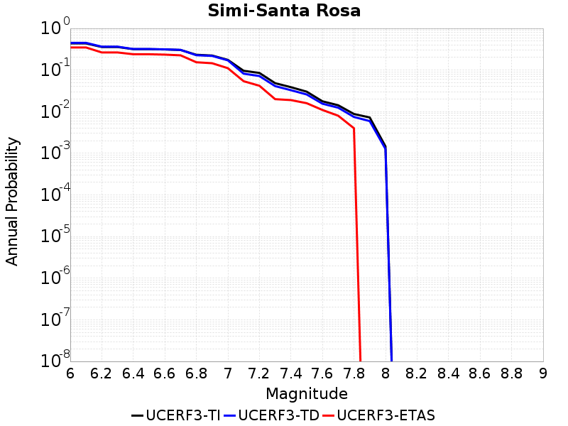 |
|-----|

| Magnitude | UCERF3-TI Prob | UCERF3-TD Prob | UCERF3-ETAS Prob |
|-----|-----|-----|-----|
| 6.0 | 0.43655568 | 0.45121324 | 0.349 |
| 6.1 | 0.43655568 | 0.45121324 | 0.349 |
| 6.2 | 0.35819918 | 0.36492205 | 0.265 |
| 6.3 | 0.35819918 | 0.36492205 | 0.265 |
| 6.4 | 0.31793696 | 0.3205509 | 0.24 |
| 6.5 | 0.31793696 | 0.3205509 | 0.24 |
| 6.6 | 0.31278196 | 0.31493855 | 0.235 |
| 6.7 | 0.30382794 | 0.30554163 | 0.226 |
| 6.8 | 0.23317708 | 0.22718678 | 0.154 |
| 6.9 | 0.22358027 | 0.21882024 | 0.146 |
| 7.0 | 0.17567508 | 0.17105009 | 0.111 |
| 7.1 | 0.09611708 | 0.08198097 | 0.054 |
| 7.2 | 0.085305974 | 0.071845554 | 0.042 |
| 7.3 | 0.048417024 | 0.041171454 | 0.02 |
| 7.4 | 0.038805913 | 0.03283917 | 0.019 |
| 7.5 | 0.03028425 | 0.025936162 | 0.016 |
| 7.6 | 0.017769413 | 0.0155450795 | 0.011 |
| 7.7 | 0.0142791895 | 0.0124704195 | 0.008 |
| 7.8 | 0.008794992 | 0.0074705184 | 0.004 |
| 7.9 | 0.0072668297 | 0.0059441677 | 0.0 |
| 8.0 | 0.0014666809 | 0.0012707366 | 0.0 |

## Sisar
*[(top)](#table-of-contents)*

|  |
|-----|

| Magnitude | UCERF3-TI Prob | UCERF3-TD Prob | UCERF3-ETAS Prob |
|-----|-----|-----|-----|
| 6.0 | 0.11179705 | 0.10276999 | 0.07 |
| 6.1 | 0.11179705 | 0.10276999 | 0.07 |
| 6.2 | 0.11179705 | 0.10276999 | 0.07 |
| 6.3 | 0.11179705 | 0.10276999 | 0.07 |
| 6.4 | 0.11179705 | 0.10276999 | 0.07 |
| 6.5 | 0.11179705 | 0.10276999 | 0.07 |
| 6.6 | 0.11179705 | 0.10276999 | 0.07 |
| 6.7 | 0.11179705 | 0.10276999 | 0.07 |
| 6.8 | 0.11179705 | 0.10276999 | 0.07 |
| 6.9 | 0.11175144 | 0.10272237 | 0.07 |
| 7.0 | 0.111418225 | 0.10237334 | 0.07 |
| 7.1 | 0.1110797 | 0.10201778 | 0.07 |
| 7.2 | 0.10958515 | 0.10043786 | 0.069 |
| 7.3 | 0.107109495 | 0.09790253 | 0.067 |
| 7.4 | 0.104221016 | 0.0953199 | 0.065 |
| 7.5 | 0.098715365 | 0.09049083 | 0.06 |
| 7.6 | 0.06989733 | 0.06388479 | 0.044 |
| 7.7 | 0.048431754 | 0.043997955 | 0.031 |
| 7.8 | 0.012727103 | 0.011903815 | 0.01 |
| 7.9 | 0.0030388944 | 0.0028400668 | 0.002 |
| 8.0 | 6.548287E-5 | 5.4361954E-5 | 0.0 |

## Skinner Flat 2011 CFM
*[(top)](#table-of-contents)*

|  |
|-----|

| Magnitude | UCERF3-TI Prob | UCERF3-TD Prob | UCERF3-ETAS Prob |
|-----|-----|-----|-----|
| 6.0 | 0.10677096 | 0.11678884 | 0.064 |
| 6.1 | 0.10677096 | 0.11678884 | 0.056 |

## So Sierra Nevada
*[(top)](#table-of-contents)*

|  |
|-----|

| Magnitude | UCERF3-TI Prob | UCERF3-TD Prob | UCERF3-ETAS Prob |
|-----|-----|-----|-----|
| 6.0 | 0.26014677 | 0.25557673 | 0.193 |
| 6.1 | 0.26014677 | 0.25557673 | 0.193 |
| 6.2 | 0.26014677 | 0.25557673 | 0.193 |
| 6.3 | 0.26014677 | 0.25557673 | 0.193 |
| 6.4 | 0.26014677 | 0.25557673 | 0.193 |
| 6.5 | 0.26014677 | 0.25557673 | 0.193 |
| 6.6 | 0.179582 | 0.16848119 | 0.117 |
| 6.7 | 0.179582 | 0.16848119 | 0.117 |
| 6.8 | 0.1427259 | 0.12915938 | 0.087 |
| 6.9 | 0.12256904 | 0.10778108 | 0.068 |
| 7.0 | 0.11059791 | 0.09515828 | 0.061 |
| 7.1 | 0.09702229 | 0.08084537 | 0.054 |
| 7.2 | 0.08536266 | 0.06861663 | 0.045 |
| 7.3 | 0.0670288 | 0.049494278 | 0.033 |
| 7.4 | 0.057203136 | 0.039663523 | 0.028 |
| 7.5 | 0.03811011 | 0.021611309 | 0.02 |
| 7.6 | 0.027479587 | 0.014158211 | 0.018 |
| 7.7 | 0.014270174 | 0.005336297 | 0.008 |

## South Cuyama
*[(top)](#table-of-contents)*

|  |
|-----|

| Magnitude | UCERF3-TI Prob | UCERF3-TD Prob | UCERF3-ETAS Prob |
|-----|-----|-----|-----|
| 6.0 | 0.032709908 | 0.032899354 | 0.03 |
| 6.1 | 0.032709908 | 0.032899354 | 0.03 |
| 6.2 | 0.032709908 | 0.032899354 | 0.03 |
| 6.3 | 0.032709908 | 0.032899354 | 0.03 |
| 6.4 | 0.032709908 | 0.032899354 | 0.03 |
| 6.5 | 0.032709908 | 0.032899354 | 0.03 |
| 6.6 | 0.032709908 | 0.032899354 | 0.03 |
| 6.7 | 0.032709908 | 0.032899354 | 0.03 |
| 6.8 | 0.032709908 | 0.032899354 | 0.03 |
| 6.9 | 0.021821156 | 0.02194789 | 0.015 |
| 7.0 | 0.021236977 | 0.02136074 | 0.015 |
| 7.1 | 0.017497616 | 0.017602982 | 0.014 |
| 7.2 | 0.014975057 | 0.015067919 | 0.014 |
| 7.3 | 0.013312041 | 0.0133959735 | 0.011 |
| 7.4 | 0.011251229 | 0.011323814 | 0.008 |
| 7.5 | 0.008635252 | 0.008692931 | 0.005 |
| 7.6 | 0.005367122 | 0.0054045767 | 0.002 |
| 7.7 | 0.0016038193 | 0.0016151877 | 0.0 |
| 7.8 | 3.069083E-4 | 3.0957672E-4 | 0.0 |
| 7.9 | 1.5753045E-5 | 1.5907373E-5 | 0.0 |

## South Klamath Lake East
*[(top)](#table-of-contents)*

|  |
|-----|

| Magnitude | UCERF3-TI Prob | UCERF3-TD Prob | UCERF3-ETAS Prob |
|-----|-----|-----|-----|
| 6.0 | 0.45888993 | 0.49098733 | 0.361 |
| 6.1 | 0.45888993 | 0.49098733 | 0.361 |
| 6.2 | 0.45888993 | 0.49098733 | 0.361 |
| 6.3 | 0.22576539 | 0.23861776 | 0.211 |
| 6.4 | 0.22576539 | 0.23861776 | 0.211 |
| 6.5 | 0.14917164 | 0.15729214 | 0.143 |
| 6.6 | 0.107736856 | 0.113427825 | 0.111 |
| 6.7 | 0.08394778 | 0.08843917 | 0.094 |
| 6.8 | 0.0650641 | 0.06859009 | 0.077 |
| 6.9 | 0.025720967 | 0.02719623 | 0.028 |

## South Klamath Lake West
*[(top)](#table-of-contents)*

|  |
|-----|

| Magnitude | UCERF3-TI Prob | UCERF3-TD Prob | UCERF3-ETAS Prob |
|-----|-----|-----|-----|
| 6.0 | 0.43288535 | 0.4610614 | 0.354 |
| 6.1 | 0.43288535 | 0.4610614 | 0.354 |
| 6.2 | 0.22631274 | 0.23877591 | 0.195 |
| 6.3 | 0.22631274 | 0.23877591 | 0.195 |
| 6.4 | 0.1463777 | 0.15400134 | 0.124 |
| 6.5 | 0.1463777 | 0.15400134 | 0.124 |
| 6.6 | 0.104537375 | 0.109829076 | 0.093 |
| 6.7 | 0.07977535 | 0.08387721 | 0.073 |
| 6.8 | 0.060207084 | 0.06335176 | 0.058 |
| 6.9 | 0.023024078 | 0.024291145 | 0.023 |

## Superstition Hills
*[(top)](#table-of-contents)*

| 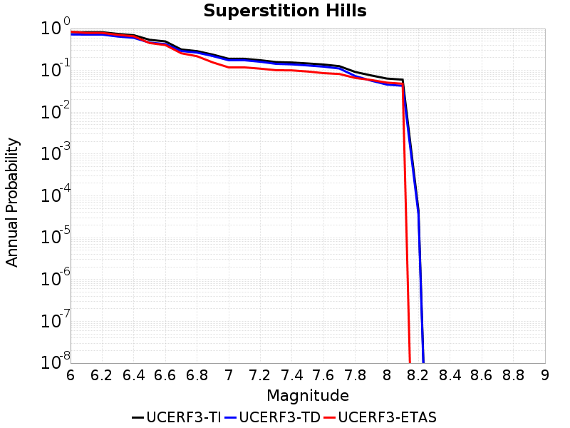 |
|-----|

| Magnitude | UCERF3-TI Prob | UCERF3-TD Prob | UCERF3-ETAS Prob |
|-----|-----|-----|-----|
| 6.0 | 0.8252717 | 0.72397864 | 0.837 |
| 6.1 | 0.8186925 | 0.7174376 | 0.788 |
| 6.2 | 0.8186925 | 0.7174376 | 0.788 |
| 6.3 | 0.74517244 | 0.6448543 | 0.708 |
| 6.4 | 0.69427353 | 0.5993929 | 0.654 |
| 6.5 | 0.5389081 | 0.46126112 | 0.451 |
| 6.6 | 0.49327865 | 0.42580393 | 0.403 |
| 6.7 | 0.3169586 | 0.2908802 | 0.257 |
| 6.8 | 0.28876087 | 0.266177 | 0.218 |
| 6.9 | 0.23849179 | 0.21977861 | 0.155 |
| 7.0 | 0.1893452 | 0.17463818 | 0.118 |
| 7.1 | 0.1893452 | 0.17463818 | 0.118 |
| 7.2 | 0.17504166 | 0.16084476 | 0.11 |
| 7.3 | 0.15832102 | 0.1433098 | 0.101 |
| 7.4 | 0.15446769 | 0.13920964 | 0.1 |
| 7.5 | 0.14655522 | 0.13114868 | 0.094 |
| 7.6 | 0.13815163 | 0.12282109 | 0.086 |
| 7.7 | 0.12608527 | 0.11088784 | 0.082 |
| 7.8 | 0.09169725 | 0.073289596 | 0.066 |
| 7.9 | 0.07592469 | 0.056926996 | 0.059 |
| 8.0 | 0.0638051 | 0.045832936 | 0.051 |
| 8.1 | 0.060079396 | 0.04284721 | 0.048 |
| 8.2 | 4.48371E-5 | 3.5560784E-5 | 0.0 |

## Surprise Valley 2011 CFM
*[(top)](#table-of-contents)*

|  |
|-----|

| Magnitude | UCERF3-TI Prob | UCERF3-TD Prob | UCERF3-ETAS Prob |
|-----|-----|-----|-----|
| 6.0 | 0.65143496 | 0.6996434 | 0.455 |
| 6.1 | 0.65143496 | 0.6996434 | 0.455 |
| 6.2 | 0.44103816 | 0.4711219 | 0.269 |
| 6.3 | 0.3365452 | 0.3593121 | 0.194 |
| 6.4 | 0.33633685 | 0.3591086 | 0.194 |
| 6.5 | 0.2826633 | 0.30200776 | 0.166 |
| 6.6 | 0.24915846 | 0.26643 | 0.146 |
| 6.7 | 0.21143383 | 0.22629833 | 0.129 |
| 6.8 | 0.14970997 | 0.16031519 | 0.093 |
| 6.9 | 0.103300415 | 0.11075749 | 0.062 |
| 7.0 | 0.06917996 | 0.07436202 | 0.035 |
| 7.1 | 0.020983784 | 0.022568136 | 0.013 |
| 7.2 | 0.0012682052 | 0.0012870205 | 0.001 |
| 7.3 | 1.4064225E-4 | 1.4273774E-4 | 0.0 |

## Swain Ravine - Spenceville
*[(top)](#table-of-contents)*

|  |
|-----|

| Magnitude | UCERF3-TI Prob | UCERF3-TD Prob | UCERF3-ETAS Prob |
|-----|-----|-----|-----|
| 6.0 | 0.1358427 | 0.13793351 | 0.072 |
| 6.1 | 0.1358427 | 0.13793351 | 0.072 |
| 6.2 | 0.1358427 | 0.13793351 | 0.072 |
| 6.3 | 0.1358427 | 0.13793351 | 0.072 |
| 6.4 | 0.07148016 | 0.07230063 | 0.04 |
| 6.5 | 0.04888437 | 0.049397543 | 0.023 |
| 6.6 | 0.04888437 | 0.049397543 | 0.023 |
| 6.7 | 0.03754331 | 0.037924312 | 0.019 |
| 6.8 | 0.028485386 | 0.02876766 | 0.017 |
| 6.9 | 0.021968303 | 0.02218347 | 0.013 |
| 7.0 | 0.012585107 | 0.012707846 | 0.008 |
| 7.1 | 0.009940339 | 0.010037949 | 0.006 |
| 7.2 | 0.0038346925 | 0.0038738048 | 0.003 |
| 7.3 | 0.0010920384 | 0.0011036033 | 0.0 |

## Table Bluff
*[(top)](#table-of-contents)*

|  |
|-----|

| Magnitude | UCERF3-TI Prob | UCERF3-TD Prob | UCERF3-ETAS Prob |
|-----|-----|-----|-----|
| 6.0 | 0.37057623 | 0.42502064 | 0.279 |
| 6.1 | 0.37057623 | 0.42502064 | 0.279 |
| 6.2 | 0.37057623 | 0.42502064 | 0.279 |
| 6.3 | 0.37057623 | 0.42502064 | 0.279 |
| 6.4 | 0.37057623 | 0.42502064 | 0.279 |
| 6.5 | 0.28432488 | 0.33327425 | 0.209 |
| 6.6 | 0.28432488 | 0.33327425 | 0.209 |
| 6.7 | 0.22338533 | 0.26974812 | 0.172 |
| 6.8 | 0.22338533 | 0.26974812 | 0.172 |
| 6.9 | 0.19040473 | 0.23553626 | 0.144 |
| 7.0 | 0.17095083 | 0.21547347 | 0.134 |
| 7.1 | 0.08711849 | 0.11502699 | 0.072 |
| 7.2 | 0.061646607 | 0.081938766 | 0.054 |

## Tank Canyon
*[(top)](#table-of-contents)*

|  |
|-----|

| Magnitude | UCERF3-TI Prob | UCERF3-TD Prob | UCERF3-ETAS Prob |
|-----|-----|-----|-----|
| 6.0 | 0.71627223 | 0.7771012 | 0.636 |
| 6.1 | 0.3714237 | 0.40379223 | 0.321 |
| 6.2 | 0.3714237 | 0.40379223 | 0.321 |
| 6.3 | 0.2971578 | 0.32672575 | 0.255 |
| 6.4 | 0.2469291 | 0.2743093 | 0.2 |
| 6.5 | 0.18762843 | 0.21133713 | 0.147 |
| 6.6 | 0.1588766 | 0.18089607 | 0.129 |
| 6.7 | 0.11755917 | 0.13640557 | 0.08 |
| 6.8 | 0.1080498 | 0.12535119 | 0.074 |
| 6.9 | 0.068736896 | 0.0793259 | 0.046 |
| 7.0 | 0.048329774 | 0.055638567 | 0.032 |
| 7.1 | 0.03819994 | 0.043967437 | 0.021 |
| 7.2 | 0.027506221 | 0.03169516 | 0.015 |
| 7.3 | 0.02263725 | 0.026079962 | 0.013 |
| 7.4 | 0.019523134 | 0.02275028 | 0.01 |
| 7.5 | 0.01447208 | 0.016905947 | 0.008 |

## Thirty Mile Bank
*[(top)](#table-of-contents)*

|  |
|-----|

| Magnitude | UCERF3-TI Prob | UCERF3-TD Prob | UCERF3-ETAS Prob |
|-----|-----|-----|-----|
| 6.0 | 0.1562562 | 0.16032548 | 0.1 |
| 6.1 | 0.1562562 | 0.16032548 | 0.1 |
| 6.2 | 0.1562562 | 0.16032548 | 0.1 |
| 6.3 | 0.1562562 | 0.16032548 | 0.1 |
| 6.4 | 0.1562562 | 0.16032548 | 0.1 |
| 6.5 | 0.1562562 | 0.16032548 | 0.1 |
| 6.6 | 0.1562562 | 0.16032548 | 0.1 |
| 6.7 | 0.087889336 | 0.089938104 | 0.046 |
| 6.8 | 0.084184565 | 0.086152785 | 0.045 |
| 6.9 | 0.057642937 | 0.0590436 | 0.028 |
| 7.0 | 0.05483742 | 0.05616549 | 0.026 |
| 7.1 | 0.04063534 | 0.04167844 | 0.019 |
| 7.2 | 0.03327609 | 0.034156222 | 0.012 |
| 7.3 | 0.021282015 | 0.021790177 | 0.011 |
| 7.4 | 0.011057414 | 0.011362337 | 0.007 |
| 7.5 | 0.007780504 | 0.008007895 | 0.005 |
| 7.6 | 0.0044224365 | 0.0045569655 | 0.001 |

## Tin Mountain
*[(top)](#table-of-contents)*

|  |
|-----|

| Magnitude | UCERF3-TI Prob | UCERF3-TD Prob | UCERF3-ETAS Prob |
|-----|-----|-----|-----|
| 6.0 | 0.10106362 | 0.10415908 | 0.063 |
| 6.1 | 0.10106362 | 0.10415908 | 0.063 |
| 6.2 | 0.10106362 | 0.10415908 | 0.063 |
| 6.3 | 0.10106362 | 0.10415908 | 0.063 |
| 6.4 | 0.10106362 | 0.10415908 | 0.063 |
| 6.5 | 0.05859291 | 0.06015822 | 0.038 |
| 6.6 | 0.05859291 | 0.06015822 | 0.038 |
| 6.7 | 0.043456364 | 0.044702336 | 0.027 |
| 6.8 | 0.03313211 | 0.03416705 | 0.019 |
| 6.9 | 0.0152000515 | 0.015809119 | 0.006 |
| 7.0 | 0.011993478 | 0.012508403 | 0.004 |
| 7.1 | 0.009876847 | 0.01033185 | 0.004 |
| 7.2 | 0.009313247 | 0.009750436 | 0.004 |
| 7.3 | 0.008681303 | 0.009092046 | 0.003 |
| 7.4 | 0.007721791 | 0.008086529 | 0.003 |
| 7.5 | 0.0037307607 | 0.0039069406 | 0.002 |

## Towne Pass
*[(top)](#table-of-contents)*

|  |
|-----|

| Magnitude | UCERF3-TI Prob | UCERF3-TD Prob | UCERF3-ETAS Prob |
|-----|-----|-----|-----|
| 6.0 | 0.09555777 | 0.09774417 | 0.108 |
| 6.1 | 0.09555777 | 0.09774417 | 0.108 |
| 6.2 | 0.09555777 | 0.09774417 | 0.108 |
| 6.3 | 0.09555777 | 0.09774417 | 0.108 |
| 6.4 | 0.09555777 | 0.09774417 | 0.108 |
| 6.5 | 0.030704698 | 0.031012025 | 0.021 |
| 6.6 | 0.030704698 | 0.031012025 | 0.021 |
| 6.7 | 0.021615237 | 0.02180696 | 0.016 |
| 6.8 | 0.01650826 | 0.016639967 | 0.014 |
| 6.9 | 0.013850536 | 0.01395099 | 0.012 |
| 7.0 | 0.009239058 | 0.009272711 | 0.008 |
| 7.1 | 0.007894448 | 0.0078976 | 0.007 |
| 7.2 | 0.005414015 | 0.0053611496 | 0.004 |
| 7.3 | 0.0029078692 | 0.0028421483 | 0.004 |

## Trinidad (alt1)
*[(top)](#table-of-contents)*

|  |
|-----|

| Magnitude | UCERF3-TI Prob | UCERF3-TD Prob | UCERF3-ETAS Prob |
|-----|-----|-----|-----|
| 6.0 | 0.5448152 | 0.6025976 | 0.469 |
| 6.1 | 0.5448152 | 0.6025976 | 0.469 |
| 6.2 | 0.5448152 | 0.6025976 | 0.469 |
| 6.3 | 0.5448152 | 0.6025976 | 0.469 |
| 6.4 | 0.5448152 | 0.6025976 | 0.469 |
| 6.5 | 0.5448152 | 0.6025976 | 0.469 |
| 6.6 | 0.5448152 | 0.6025976 | 0.469 |
| 6.7 | 0.5448152 | 0.6025976 | 0.469 |
| 6.8 | 0.36108062 | 0.3984285 | 0.297 |
| 6.9 | 0.36108062 | 0.3984285 | 0.297 |
| 7.0 | 0.28500026 | 0.31613952 | 0.247 |
| 7.1 | 0.24137376 | 0.26930907 | 0.206 |
| 7.2 | 0.19129175 | 0.21503223 | 0.164 |
| 7.3 | 0.14014651 | 0.15936778 | 0.121 |
| 7.4 | 0.10620347 | 0.122010626 | 0.085 |
| 7.5 | 0.014520103 | 0.015824554 | 0.005 |
| 7.6 | 0.012109553 | 0.013220651 | 0.004 |
| 7.7 | 0.0057441983 | 0.0062999525 | 0.003 |
| 7.8 | 2.9837273E-4 | 3.2902852E-4 | 0.0 |

## Ventura-Pitas Point
*[(top)](#table-of-contents)*

|  |
|-----|

| Magnitude | UCERF3-TI Prob | UCERF3-TD Prob | UCERF3-ETAS Prob |
|-----|-----|-----|-----|
| 6.0 | 0.5792208 | 0.62345237 | 0.506 |
| 6.1 | 0.5792208 | 0.62345237 | 0.506 |
| 6.2 | 0.5792208 | 0.62345237 | 0.506 |
| 6.3 | 0.5792208 | 0.62345237 | 0.506 |
| 6.4 | 0.38694492 | 0.393524 | 0.288 |
| 6.5 | 0.38694492 | 0.393524 | 0.288 |
| 6.6 | 0.31249452 | 0.30882102 | 0.208 |
| 6.7 | 0.31249452 | 0.30882102 | 0.208 |
| 6.8 | 0.29986522 | 0.29473764 | 0.198 |
| 6.9 | 0.29950547 | 0.29433882 | 0.198 |
| 7.0 | 0.29812777 | 0.29281002 | 0.197 |
| 7.1 | 0.288854 | 0.28253463 | 0.188 |
| 7.2 | 0.27499706 | 0.26733372 | 0.178 |
| 7.3 | 0.2478542 | 0.23858087 | 0.147 |
| 7.4 | 0.23762695 | 0.22798817 | 0.143 |
| 7.5 | 0.20960215 | 0.1993828 | 0.127 |
| 7.6 | 0.12000763 | 0.10678576 | 0.078 |
| 7.7 | 0.09639116 | 0.086339 | 0.063 |
| 7.8 | 0.062297437 | 0.056515783 | 0.044 |
| 7.9 | 0.010629006 | 0.009356749 | 0.007 |
| 8.0 | 2.0325146E-4 | 1.6884592E-4 | 0.0 |

## Verdugo
*[(top)](#table-of-contents)*

|  |
|-----|

| Magnitude | UCERF3-TI Prob | UCERF3-TD Prob | UCERF3-ETAS Prob |
|-----|-----|-----|-----|
| 6.0 | 0.13124973 | 0.11435813 | 0.072 |
| 6.1 | 0.13124973 | 0.11435813 | 0.072 |
| 6.2 | 0.13124973 | 0.11435813 | 0.072 |
| 6.3 | 0.13124973 | 0.11435813 | 0.072 |
| 6.4 | 0.13124973 | 0.11435813 | 0.072 |
| 6.5 | 0.12035932 | 0.10282308 | 0.063 |
| 6.6 | 0.12035932 | 0.10282308 | 0.063 |
| 6.7 | 0.11809642 | 0.10043809 | 0.062 |
| 6.8 | 0.11094422 | 0.09302114 | 0.052 |
| 6.9 | 0.1074558 | 0.089528695 | 0.049 |
| 7.0 | 0.10311927 | 0.085246675 | 0.047 |
| 7.1 | 0.10004924 | 0.082713954 | 0.044 |
| 7.2 | 0.095106326 | 0.07821986 | 0.041 |
| 7.3 | 0.08905414 | 0.07330326 | 0.038 |
| 7.4 | 0.08371282 | 0.06884491 | 0.035 |
| 7.5 | 0.074034974 | 0.060753655 | 0.03 |
| 7.6 | 0.051173255 | 0.043105703 | 0.023 |
| 7.7 | 0.014828821 | 0.012453985 | 0.005 |
| 7.8 | 0.0042300685 | 0.003632666 | 0.0 |
| 7.9 | 0.0011596675 | 9.221048E-4 | 0.0 |

## Walker Spring 2011 CFM
*[(top)](#table-of-contents)*

|  |
|-----|

| Magnitude | UCERF3-TI Prob | UCERF3-TD Prob | UCERF3-ETAS Prob |
|-----|-----|-----|-----|
| 6.0 | 0.20495702 | 0.21638715 | 0.136 |
| 6.1 | 0.20495702 | 0.21638715 | 0.111 |
| 6.2 | 0.13715713 | 0.14547099 | 0.066 |
| 6.3 | 0.11289688 | 0.12039732 | 0.052 |
| 6.4 | 0.10479672 | 0.11181977 | 0.047 |
| 6.5 | 0.08594674 | 0.092227586 | 0.043 |
| 6.6 | 0.067717336 | 0.07296877 | 0.033 |
| 6.7 | 0.015225914 | 0.01602532 | 0.006 |
| 6.8 | 0.0042991596 | 0.004529143 | 0.001 |

## West Napa 2011 CFM
*[(top)](#table-of-contents)*

|  |
|-----|

| Magnitude | UCERF3-TI Prob | UCERF3-TD Prob | UCERF3-ETAS Prob |
|-----|-----|-----|-----|
| 6.0 | 0.62633455 | 0.6815025 | 0.563 |
| 6.1 | 0.62633455 | 0.6815025 | 0.563 |
| 6.2 | 0.62633455 | 0.6815025 | 0.563 |
| 6.3 | 0.4290162 | 0.47266608 | 0.387 |
| 6.4 | 0.4290162 | 0.47266608 | 0.387 |
| 6.5 | 0.35624903 | 0.3976949 | 0.305 |
| 6.6 | 0.35565034 | 0.39708307 | 0.305 |
| 6.7 | 0.29496476 | 0.33414587 | 0.251 |
| 6.8 | 0.23242733 | 0.26634043 | 0.187 |
| 6.9 | 0.18330297 | 0.212948 | 0.138 |
| 7.0 | 0.05604935 | 0.06187848 | 0.032 |
| 7.1 | 0.048383325 | 0.053380396 | 0.028 |
| 7.2 | 0.04710889 | 0.05198321 | 0.028 |
| 7.3 | 0.045584343 | 0.050289694 | 0.027 |
| 7.4 | 0.04218538 | 0.046503417 | 0.025 |
| 7.5 | 0.03596751 | 0.039620217 | 0.023 |
| 7.6 | 0.0033894612 | 0.0035150878 | 0.002 |
| 7.7 | 0.0022259385 | 0.0022455829 | 0.0 |
| 7.8 | 0.0014618817 | 0.0014689357 | 0.0 |
| 7.9 | 7.68708E-4 | 7.520257E-4 | 0.0 |
| 8.0 | 3.4789543E-4 | 2.7704652E-4 | 0.0 |
| 8.1 | 6.937113E-6 | 5.733724E-6 | 0.0 |

## West Tahoe
*[(top)](#table-of-contents)*

|  |
|-----|

| Magnitude | UCERF3-TI Prob | UCERF3-TD Prob | UCERF3-ETAS Prob |
|-----|-----|-----|-----|
| 6.0 | 0.3991342 | 0.43099198 | 0.29 |
| 6.1 | 0.3991342 | 0.43099198 | 0.29 |
| 6.2 | 0.3991342 | 0.43099198 | 0.29 |
| 6.3 | 0.3991342 | 0.43099198 | 0.29 |
| 6.4 | 0.3991342 | 0.43099198 | 0.29 |
| 6.5 | 0.2817602 | 0.3021454 | 0.195 |
| 6.6 | 0.2817602 | 0.3021454 | 0.195 |
| 6.7 | 0.2117029 | 0.22651233 | 0.145 |
| 6.8 | 0.20486477 | 0.21936736 | 0.144 |
| 6.9 | 0.16160451 | 0.1730795 | 0.116 |
| 7.0 | 0.1263926 | 0.13559148 | 0.082 |
| 7.1 | 0.10122751 | 0.10881369 | 0.066 |
| 7.2 | 0.05665881 | 0.061011527 | 0.03 |

## White Mountains
*[(top)](#table-of-contents)*

|  |
|-----|

| Magnitude | UCERF3-TI Prob | UCERF3-TD Prob | UCERF3-ETAS Prob |
|-----|-----|-----|-----|
| 6.0 | 0.59911263 | 0.6047335 | 0.469 |
| 6.1 | 0.59911263 | 0.6047335 | 0.469 |
| 6.2 | 0.59911263 | 0.6047335 | 0.469 |
| 6.3 | 0.37178582 | 0.3527721 | 0.227 |
| 6.4 | 0.37178582 | 0.3527721 | 0.227 |
| 6.5 | 0.2949842 | 0.26939577 | 0.162 |
| 6.6 | 0.24591754 | 0.2154298 | 0.122 |
| 6.7 | 0.21067435 | 0.17696266 | 0.095 |
| 6.8 | 0.17332757 | 0.13544868 | 0.08 |
| 6.9 | 0.14988972 | 0.10995601 | 0.059 |
| 7.0 | 0.12201831 | 0.082016975 | 0.041 |
| 7.1 | 0.09969078 | 0.06160466 | 0.028 |
| 7.2 | 0.08317246 | 0.04598344 | 0.022 |
| 7.3 | 0.062120155 | 0.027560124 | 0.015 |
| 7.4 | 0.049997214 | 0.01866388 | 0.012 |
| 7.5 | 0.030858051 | 0.011128091 | 0.008 |
| 7.6 | 0.006659759 | 0.0026214076 | 0.003 |

## White Wolf
*[(top)](#table-of-contents)*

|  |
|-----|

| Magnitude | UCERF3-TI Prob | UCERF3-TD Prob | UCERF3-ETAS Prob |
|-----|-----|-----|-----|
| 6.0 | 0.40712854 | 0.040783342 | 0.026 |
| 6.1 | 0.40712854 | 0.040783342 | 0.026 |
| 6.2 | 0.40712854 | 0.040783342 | 0.026 |
| 6.3 | 0.40712854 | 0.040783342 | 0.026 |
| 6.4 | 0.2558104 | 0.033500284 | 0.021 |
| 6.5 | 0.2558104 | 0.033500284 | 0.021 |
| 6.6 | 0.21641053 | 0.032620363 | 0.021 |
| 6.7 | 0.18503481 | 0.030768791 | 0.02 |
| 6.8 | 0.15081243 | 0.029673284 | 0.02 |
| 6.9 | 0.12819473 | 0.028011376 | 0.02 |
| 7.0 | 0.114823684 | 0.026504204 | 0.016 |
| 7.1 | 0.071100496 | 0.021297857 | 0.012 |
| 7.2 | 0.043086637 | 0.007958026 | 0.002 |
| 7.3 | 0.023426257 | 0.005177117 | 0.0 |
| 7.4 | 0.0051309164 | 0.00253771 | 0.0 |
| 7.5 | 0.002831823 | 0.0018094927 | 0.0 |
| 7.6 | 6.3162576E-4 | 4.280665E-4 | 0.0 |

## White Wolf (Extension)
*[(top)](#table-of-contents)*

|  |
|-----|

| Magnitude | UCERF3-TI Prob | UCERF3-TD Prob | UCERF3-ETAS Prob |
|-----|-----|-----|-----|
| 6.0 | 0.19307251 | 0.15163767 | 0.072 |
| 6.1 | 0.19307251 | 0.15163767 | 0.072 |
| 6.2 | 0.19307251 | 0.15163767 | 0.072 |
| 6.3 | 0.19307251 | 0.15163767 | 0.072 |
| 6.4 | 0.14091408 | 0.09296837 | 0.044 |
| 6.5 | 0.13966365 | 0.09159587 | 0.043 |
| 6.6 | 0.114097044 | 0.06341274 | 0.032 |
| 6.7 | 0.09798938 | 0.04640498 | 0.022 |
| 6.8 | 0.08578422 | 0.035555366 | 0.019 |
| 6.9 | 0.07857619 | 0.029760657 | 0.018 |
| 7.0 | 0.07116851 | 0.02301029 | 0.015 |
| 7.1 | 0.060917497 | 0.01731743 | 0.011 |
| 7.2 | 0.035552867 | 0.0046586003 | 0.002 |
| 7.3 | 0.018240402 | 0.0023738525 | 0.0 |
| 7.4 | 0.0015468019 | 2.2601006E-4 | 0.0 |

## Whittier alt 1
*[(top)](#table-of-contents)*

|  |
|-----|

| Magnitude | UCERF3-TI Prob | UCERF3-TD Prob | UCERF3-ETAS Prob |
|-----|-----|-----|-----|
| 6.0 | 0.67052186 | 0.7244272 | 0.55 |
| 6.1 | 0.67052186 | 0.7244272 | 0.55 |
| 6.2 | 0.67052186 | 0.7244272 | 0.55 |
| 6.3 | 0.4005946 | 0.41483462 | 0.297 |
| 6.4 | 0.33455 | 0.34259272 | 0.229 |
| 6.5 | 0.3264951 | 0.33415255 | 0.226 |
| 6.6 | 0.28681317 | 0.29208854 | 0.188 |
| 6.7 | 0.27907205 | 0.28420368 | 0.178 |
| 6.8 | 0.27253085 | 0.2771818 | 0.171 |
| 6.9 | 0.26075318 | 0.26394835 | 0.162 |
| 7.0 | 0.2487864 | 0.25096557 | 0.15 |
| 7.1 | 0.23425835 | 0.23526865 | 0.138 |
| 7.2 | 0.2176602 | 0.21833466 | 0.123 |
| 7.3 | 0.19338462 | 0.19413058 | 0.103 |
| 7.4 | 0.17839646 | 0.1792286 | 0.097 |
| 7.5 | 0.14823145 | 0.14744377 | 0.074 |
| 7.6 | 0.13271546 | 0.13113354 | 0.06 |
| 7.7 | 0.103028014 | 0.099151365 | 0.043 |
| 7.8 | 0.005902799 | 0.0045152768 | 0.001 |
| 7.9 | 1.7417852E-4 | 1.0980361E-4 | 0.0 |

## Wight Way 2011 CFM
*[(top)](#table-of-contents)*

|  |
|-----|

| Magnitude | UCERF3-TI Prob | UCERF3-TD Prob | UCERF3-ETAS Prob |
|-----|-----|-----|-----|
| 6.0 | 0.02679807 | 0.027105236 | 0.028 |
| 6.1 | 0.02679807 | 0.027105236 | 0.028 |
| 6.2 | 0.02679807 | 0.027105236 | 0.028 |
| 6.3 | 0.02679807 | 0.027105236 | 0.028 |
| 6.4 | 0.013903275 | 0.014087255 | 0.015 |
| 6.5 | 0.013903275 | 0.014087255 | 0.015 |

## Yorba Linda
*[(top)](#table-of-contents)*

|  |
|-----|

| Magnitude | UCERF3-TI Prob | UCERF3-TD Prob | UCERF3-ETAS Prob |
|-----|-----|-----|-----|
| 6.0 | 0.049221918 | 0.045199208 | 0.034 |
| 6.1 | 0.049221918 | 0.045199208 | 0.034 |
| 6.2 | 0.049221918 | 0.045199208 | 0.034 |
| 6.3 | 0.028362866 | 0.02375116 | 0.014 |
| 6.4 | 0.028362866 | 0.02375116 | 0.014 |
| 6.5 | 0.021791818 | 0.017065808 | 0.014 |
| 6.6 | 0.021735214 | 0.017003173 | 0.014 |
| 6.7 | 0.021707173 | 0.016972018 | 0.014 |
| 6.8 | 0.019611908 | 0.014822695 | 0.012 |
| 6.9 | 0.019582598 | 0.014786955 | 0.012 |
| 7.0 | 0.019477304 | 0.014687616 | 0.012 |
| 7.1 | 0.015763052 | 0.011509996 | 0.009 |
| 7.2 | 0.015146166 | 0.010973099 | 0.009 |
| 7.3 | 0.012697442 | 0.009291567 | 0.009 |
| 7.4 | 0.010045864 | 0.007506483 | 0.007 |
| 7.5 | 0.0075388076 | 0.00557576 | 0.005 |
| 7.6 | 0.0059230034 | 0.004383147 | 0.003 |
| 7.7 | 0.003910214 | 0.002711177 | 0.002 |
| 7.8 | 0.0010158578 | 6.8496575E-4 | 0.0 |
| 7.9 | 1.734397E-4 | 1.0920406E-4 | 0.0 |

## Zayante-Vergeles 2011 CFM
*[(top)](#table-of-contents)*

|  |
|-----|

| Magnitude | UCERF3-TI Prob | UCERF3-TD Prob | UCERF3-ETAS Prob |
|-----|-----|-----|-----|
| 6.0 | 0.028676117 | 0.02731886 | 0.028 |
| 6.1 | 0.028676117 | 0.02731886 | 0.028 |
| 6.2 | 0.028676117 | 0.02731886 | 0.028 |
| 6.3 | 0.028676117 | 0.02731886 | 0.028 |
| 6.4 | 0.028676117 | 0.02731886 | 0.028 |
| 6.5 | 0.028676117 | 0.02731886 | 0.028 |
| 6.6 | 0.028676117 | 0.02731886 | 0.028 |
| 6.7 | 0.028676117 | 0.02731886 | 0.028 |
| 6.8 | 0.02475527 | 0.023372862 | 0.021 |
| 6.9 | 0.02352805 | 0.022136576 | 0.019 |
| 7.0 | 0.02152657 | 0.02012153 | 0.018 |
| 7.1 | 0.019440396 | 0.018020207 | 0.015 |
| 7.2 | 0.01810627 | 0.016677871 | 0.011 |
| 7.3 | 0.016688468 | 0.015265146 | 0.01 |
| 7.4 | 0.015031327 | 0.0136104105 | 0.007 |
| 7.5 | 0.013740559 | 0.012334725 | 0.006 |
| 7.6 | 0.012195927 | 0.010847864 | 0.005 |
| 7.7 | 0.009831744 | 0.008529631 | 0.003 |
| 7.8 | 0.007635692 | 0.0067894584 | 0.003 |
| 7.9 | 0.005528668 | 0.005334896 | 0.003 |
| 8.0 | 0.0038100798 | 0.004357014 | 0.0 |
| 8.1 | 0.0019873127 | 0.002721165 | 0.0 |
| 8.2 | 1.4515444E-4 | 1.4972514E-4 | 0.0 |

