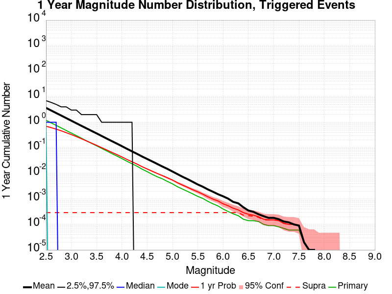
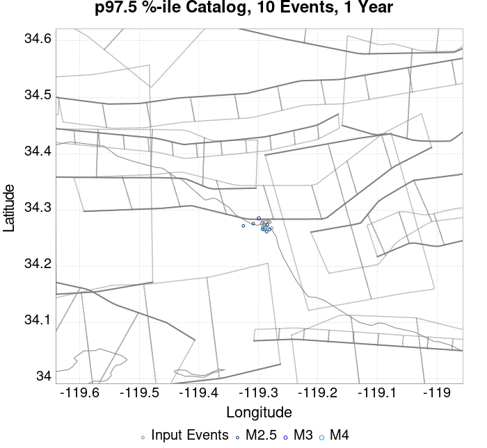
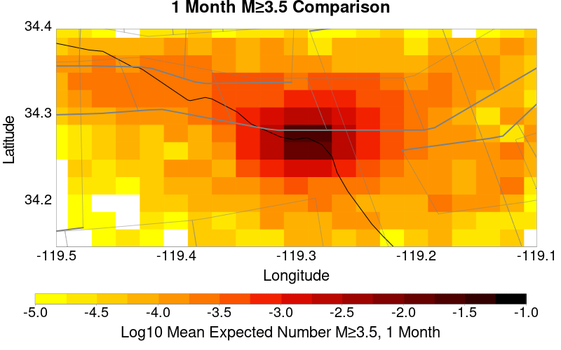
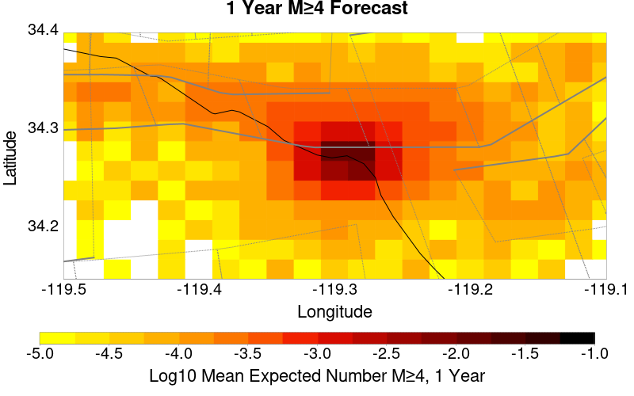
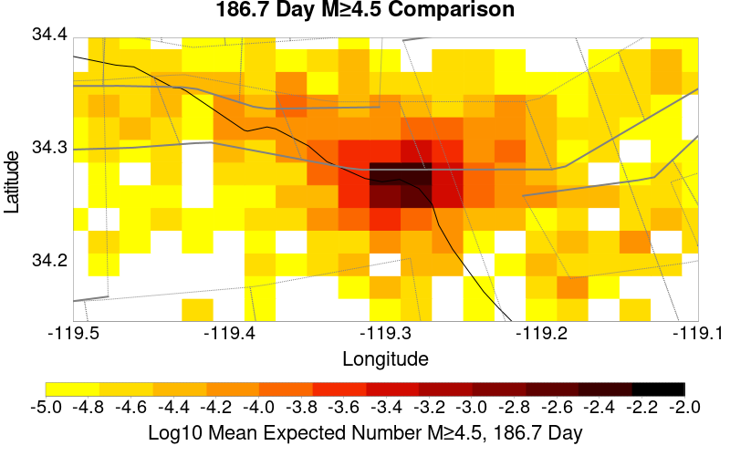
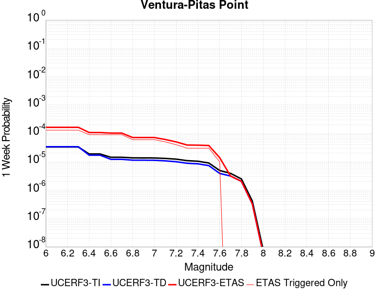
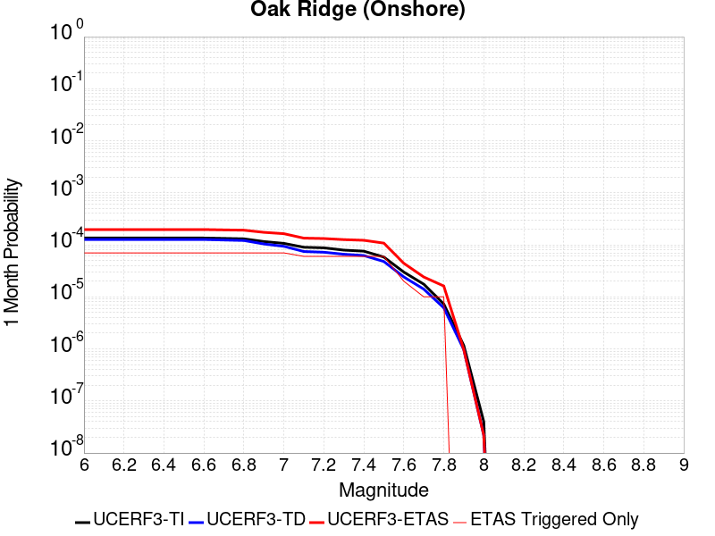
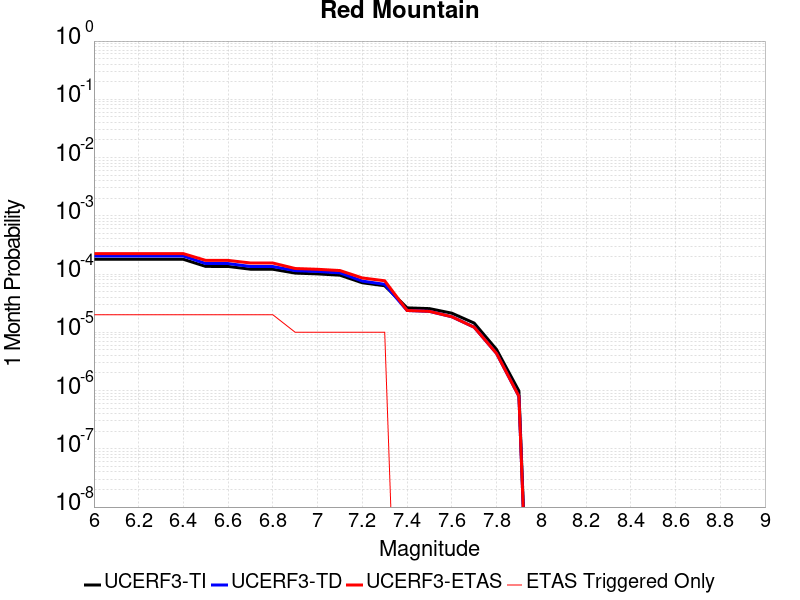

# ComCat data 1.5 d after ci38229234, Custom Region, Point Sources Results

|   | ComCat data 1.5 d after ci38229234, Custom Region, Point Sources |
|-----|-----|
| Num Simulations | 77500 (incomplete) |
| Start Time | 2019/11/09 00:53:27 UTC |
| Start Time Epoch Milliseconds | 1573260807250 |
| Duration | 10 Years |
| Includes Spontaneous? | false |
| Trigger Ruptures | 11 Trigger Ruptures |
|   | First: M3.2 at 2019/11/07 12:58:41 UTC |
|   | Last: M2.88 at 2019/11/08 21:55:02 UTC |
|   | Largest: M3.61 at 2019/11/08 13:29:38 UTC |
| Trigger Ruptures | *(none)* |
| Config Generated With | u3etas_comcat_config_builder.sh --start-at ci38229234 --end-now --region 34.4,-119.5,34.15,-119.1 --num-simulations 100000 --finite-surf-shakemap --finite-surf-shakemap-min-mag 6 --hpc-site USC_HPC --nodes 17 --hours 24 --queue scec |

## Table Of Contents

* [Probabilities Summary Table](#probabilities-summary-table)
* [Magnitude Number Distribution](#magnitude-number-distribution)
  * [10 Year Magnitude Number Distribution](#10-year-magnitude-number-distribution)
  * [1 Year Magnitude Number Distribution](#1-year-magnitude-number-distribution)
  * [1 Month Magnitude Number Distribution](#1-month-magnitude-number-distribution)
  * [1 Week Magnitude Number Distribution](#1-week-magnitude-number-distribution)
  * [1 Day Magnitude Number Distribution](#1-day-magnitude-number-distribution)
  * [1 Hour Magnitude Number Distribution](#1-hour-magnitude-number-distribution)
* [Hazard Change Over Time](#hazard-change-over-time)
  * [M&ge;5.0 Hazard Change Over Time](#m50-hazard-change-over-time)
  * [M&ge;6.0 Hazard Change Over Time](#m60-hazard-change-over-time)
  * [M&ge;7.0 Hazard Change Over Time](#m70-hazard-change-over-time)
* [Trigger Rupture Fault Map](#trigger-rupture-fault-map)
* [Fault Distances To Triggers](#fault-distances-to-triggers)
* [Individual Simulated Catalog Maps](#individual-simulated-catalog-maps)
* [ComCat Data Comparisons](#comcat-data-comparisons)
  * [ComCat Magnitude-Number Distributions](#comcat-magnitude-number-distributions)
  * [ComCat Time-Dependent Mc](#comcat-time-dependent-mc)
  * [ComCat Cumulative Number Vs Time](#comcat-cumulative-number-vs-time)
  * [ComCat Cumulative Number Simulation Percentiles](#comcat-cumulative-number-simulation-percentiles)
  * [ComCat Probability Spatial Distribution](#comcat-probability-spatial-distribution)
  * [ComCat Mean Expectation Spatial Distribution](#comcat-mean-expectation-spatial-distribution)
  * [ComCat Depth Distribution](#comcat-depth-distribution)
* [Section Participation](#section-participation)
  * [Section Participation Plots](#section-participation-plots)
  * [Supra-Seismogenic Parent Sections Table](#supra-seismogenic-parent-sections-table)
  * [M≥6.5 Parent Sections Table](#m65-parent-sections-table)
  * [M≥7 Parent Sections Table](#m7-parent-sections-table)
  * [M≥7.5 Parent Sections Table](#m75-parent-sections-table)
* [Fault Magnitude-Probability Distributions](#fault-magnitude-probability-distributions)
* [Gridded Nucleation](#gridded-nucleation)
* [JSON Input File](#json-input-file)

## Probabilities Summary Table
*[(top)](#table-of-contents)*

| Magnitude | 1 Hour Prob | 1 Day Prob | 1 Week Prob | 1 Month Prob | 1 Year Prob | 10 Year Prob |
|-----|-----|-----|-----|-----|-----|-----|
| **M&ge;3** | 5.95E-3 (0.59%) | 0.072 (7.16%) | 0.164 (16.41%) | 0.232 (23.21%) | 0.328 (32.84%) | 0.397 (39.74%) |
| *95% Conf* | *[0.54% 0.65%]* | *[6.98% 7.34%]* | *[16.15% 16.68%]* | *[22.91% 23.51%]* | *[32.51% 33.17%]* | *[39.40% 40.09%]* |
| **M&ge;3.5** | 1.82E-3 (0.18%) | 0.023 (2.30%) | 0.057 (5.66%) | 0.083 (8.32%) | 0.125 (12.45%) | 0.157 (15.68%) |
| *95% Conf* | *[0.15% 0.22%]* | *[2.20% 2.41%]* | *[5.50% 5.83%]* | *[8.13% 8.52%]* | *[12.22% 12.69%]* | *[15.42% 15.94%]* |
| **M&ge;3.61** | 1.39E-3 (0.14%) | 0.018 (1.78%) | 0.044 (4.43%) | 0.066 (6.59%) | 0.099 (9.92%) | 0.126 (12.57%) |
| *95% Conf* | *[0.11% 0.17%]* | *[1.69% 1.88%]* | *[4.29% 4.58%]* | *[6.42% 6.77%]* | *[9.71% 10.13%]* | *[12.34% 12.81%]* |
| **M&ge;4** | 6.32E-4 (0.06%) | 7.65E-3 (0.77%) | 0.019 (1.88%) | 0.028 (2.79%) | 0.043 (4.35%) | 0.056 (5.61%) |
| *95% Conf* | *[0.05% 0.08%]* | *[0.71% 0.83%]* | *[1.79% 1.98%]* | *[2.67% 2.90%]* | *[4.21% 4.49%]* | *[5.45% 5.77%]* |
| **M&ge;4.5** | 1.29E-4 (0.01%) | 2.34E-3 (0.23%) | 5.88E-3 (0.59%) | 8.84E-3 (0.88%) | 0.015 (1.46%) | 0.019 (1.88%) |
| *95% Conf* | *[0.01% 0.02%]* | *[0.20% 0.27%]* | *[0.54% 0.65%]* | *[0.82% 0.95%]* | *[1.38% 1.55%]* | *[1.78% 1.98%]* |
| **M&ge;5** | 2.58E-5 (0.00%) | 7.48E-4 (0.07%) | 2.12E-3 (0.21%) | 3.26E-3 (0.33%) | 5.48E-3 (0.55%) | 7.02E-3 (0.70%) |
| *95% Conf* | *[0.00% 0.01%]* | *[0.06% 0.10%]* | *[0.18% 0.25%]* | *[0.29% 0.37%]* | *[0.50% 0.60%]* | *[0.64% 0.76%]* |
| **M&ge;5.5** | 1.29E-5 (0.00%) | 2.84E-4 (0.03%) | 9.03E-4 (0.09%) | 1.24E-3 (0.12%) | 2.05E-3 (0.21%) | 2.63E-3 (0.26%) |
| *95% Conf* | *[0.00% 0.01%]* | *[0.02% 0.04%]* | *[0.07% 0.11%]* | *[0.10% 0.15%]* | *[0.18% 0.24%]* | *[0.23% 0.30%]* |
| **M&ge;6** | 0.000 (0.00%) | 9.03E-5 (0.01%) | 3.23E-4 (0.03%) | 4.39E-4 (0.04%) | 6.84E-4 (0.07%) | 8.52E-4 (0.09%) |
| *95% Conf* | *[0.00% 0.01%]* | *[0.00% 0.02%]* | *[0.02% 0.05%]* | *[0.03% 0.06%]* | *[0.05% 0.09%]* | *[0.07% 0.11%]* |
| **M&ge;6.5** | 0.000 (0.00%) | 1.29E-5 (0.00%) | 1.03E-4 (0.01%) | 1.42E-4 (0.01%) | 2.45E-4 (0.02%) | 3.23E-4 (0.03%) |
| *95% Conf* | *[0.00% 0.01%]* | *[0.00% 0.01%]* | *[0.00% 0.02%]* | *[0.01% 0.03%]* | *[0.02% 0.04%]* | *[0.02% 0.05%]* |
| **M&ge;7** | 0.000 (0.00%) | 0.000 (0.00%) | 5.16E-5 (0.01%) | 9.03E-5 (0.01%) | 1.55E-4 (0.02%) | 1.94E-4 (0.02%) |
| *95% Conf* | *[0.00% 0.01%]* | *[0.00% 0.01%]* | *[0.00% 0.01%]* | *[0.00% 0.02%]* | *[0.01% 0.03%]* | *[0.01% 0.03%]* |
| **M&ge;7.5** | 0.000 (0.00%) | 0.000 (0.00%) | 3.87E-5 (0.00%) | 7.74E-5 (0.01%) | 1.03E-4 (0.01%) | 1.29E-4 (0.01%) |
| *95% Conf* | *[0.00% 0.01%]* | *[0.00% 0.01%]* | *[0.00% 0.01%]* | *[0.00% 0.02%]* | *[0.00% 0.02%]* | *[0.01% 0.02%]* |

## Magnitude Number Distribution
*[(top)](#table-of-contents)*

### 10 Year Magnitude Number Distribution
*[(top)](#table-of-contents)*

**Legend**
* **Mean** (thick black line): mean expected number across all 77500 catalogs
* **2.5%,97.5%** (thin black lines): expected number percentiles across all 77500 catalogs
* **Median** (thin blue line): median expected number across all 77500 catalogs
* **Mode** (thin cyan line): modal expected number across all 77500 catalogs
* **10 yr Probability** (thin red line): 10 year probability calculated as the fraction of catalogs with at least 1 occurrence
* **10 yr Supraseismogenic Probability** (thin dashed red line): same as above, but only for supraseismogenic ruptures on explicitly modeled UCERF3 faults
* **95% Conf** (light red shaded region): binomial 95% confidence bounds on probability
* **Primary** (thin green line): mean expected number from primary triggered aftershocks only (no secondary, tertiary, etc...) across all 77500 catalogs


| Mag | Mean | 2.5 %ile | 97.5 %ile | Median | Mode | 10 yr Probability | 10 yr Prob 95% Conf | 10 yr Supra-Seis Prob | Primary Aftershocks Mean |
|-----|-----|-----|-----|-----|-----|-----|-----|-----|-----|
| **M&ge;2.5** | 5.669 | 0.000 | 9.000 | 2.000 | 1.000 | 0.779 (77.94%) | [77.65% 78.23%] | 3.74E-4 (0.04%) | 1.508 |
| **M&ge;2.6** | 4.499 | 0.000 | 8.000 | 1.000 | 0.000 | 0.702 (70.21%) | [69.89% 70.54%] | 3.74E-4 (0.04%) | 1.195 |
| **M&ge;2.7** | 3.576 | 0.000 | 7.000 | 1.000 | 0.000 | 0.623 (62.34%) | [62.00% 62.68%] | 3.74E-4 (0.04%) | 0.953 |
| **M&ge;2.8** | 2.842 | 0.000 | 6.000 | 1.000 | 0.000 | 0.545 (54.50%) | [54.15% 54.85%] | 3.74E-4 (0.04%) | 0.758 |
| **M&ge;2.9** | 2.254 | 0.000 | 5.000 | 0.000 | 0.000 | 0.468 (46.82%) | [46.46% 47.17%] | 3.74E-4 (0.04%) | 0.600 |
| **M&ge;3** | 1.788 | 0.000 | 4.000 | 0.000 | 0.000 | 0.397 (39.74%) | [39.40% 40.09%] | 3.74E-4 (0.04%) | 0.477 |
| **M&ge;3.1** | 1.418 | 0.000 | 4.000 | 0.000 | 0.000 | 0.335 (33.51%) | [33.18% 33.85%] | 3.74E-4 (0.04%) | 0.379 |
| **M&ge;3.2** | 1.127 | 0.000 | 3.000 | 0.000 | 0.000 | 0.279 (27.91%) | [27.60% 28.23%] | 3.74E-4 (0.04%) | 0.300 |
| **M&ge;3.3** | 0.896 | 0.000 | 3.000 | 0.000 | 0.000 | 0.230 (23.05%) | [22.75% 23.35%] | 3.74E-4 (0.04%) | 0.238 |
| **M&ge;3.4** | 0.712 | 0.000 | 2.000 | 0.000 | 0.000 | 0.190 (19.00%) | [18.72% 19.28%] | 3.74E-4 (0.04%) | 0.188 |
| **M&ge;3.5** | 0.568 | 0.000 | 2.000 | 0.000 | 0.000 | 0.157 (15.68%) | [15.42% 15.94%] | 3.74E-4 (0.04%) | 0.151 |
| **M&ge;3.6** | 0.449 | 0.000 | 2.000 | 0.000 | 0.000 | 0.128 (12.80%) | [12.57% 13.04%] | 3.74E-4 (0.04%) | 0.119 |
| **M&ge;3.7** | 0.356 | 0.000 | 1.000 | 0.000 | 0.000 | 0.105 (10.46%) | [10.25% 10.68%] | 3.74E-4 (0.04%) | 0.095 |
| **M&ge;3.8** | 0.282 | 0.000 | 1.000 | 0.000 | 0.000 | 0.085 (8.48%) | [8.28% 8.68%] | 3.74E-4 (0.04%) | 0.075 |
| **M&ge;3.9** | 0.225 | 0.000 | 1.000 | 0.000 | 0.000 | 0.069 (6.91%) | [6.73% 7.09%] | 3.74E-4 (0.04%) | 0.060 |
| **M&ge;4** | 0.178 | 0.000 | 1.000 | 0.000 | 0.000 | 0.056 (5.61%) | [5.45% 5.77%] | 3.74E-4 (0.04%) | 0.048 |
| **M&ge;4.1** | 0.140 | 0.000 | 1.000 | 0.000 | 0.000 | 0.045 (4.53%) | [4.38% 4.68%] | 3.74E-4 (0.04%) | 0.038 |
| **M&ge;4.2** | 0.111 | 0.000 | 1.000 | 0.000 | 0.000 | 0.037 (3.65%) | [3.52% 3.79%] | 3.74E-4 (0.04%) | 0.030 |
| **M&ge;4.3** | 0.088 | 0.000 | 1.000 | 0.000 | 0.000 | 0.029 (2.95%) | [2.83% 3.07%] | 3.74E-4 (0.04%) | 0.024 |
| **M&ge;4.4** | 0.069 | 0.000 | 0.000 | 0.000 | 0.000 | 0.023 (2.33%) | [2.22% 2.43%] | 3.74E-4 (0.04%) | 0.018 |
| **M&ge;4.5** | 0.055 | 0.000 | 0.000 | 0.000 | 0.000 | 0.019 (1.88%) | [1.78% 1.98%] | 3.74E-4 (0.04%) | 0.014 |
| **M&ge;4.6** | 0.044 | 0.000 | 0.000 | 0.000 | 0.000 | 0.015 (1.53%) | [1.45% 1.62%] | 3.74E-4 (0.04%) | 0.011 |
| **M&ge;4.7** | 0.035 | 0.000 | 0.000 | 0.000 | 0.000 | 0.013 (1.26%) | [1.18% 1.34%] | 3.74E-4 (0.04%) | 8.94E-3 |
| **M&ge;4.8** | 0.028 | 0.000 | 0.000 | 0.000 | 0.000 | 0.011 (1.05%) | [0.98% 1.13%] | 3.74E-4 (0.04%) | 7.38E-3 |
| **M&ge;4.9** | 0.023 | 0.000 | 0.000 | 0.000 | 0.000 | 8.59E-3 (0.86%) | [0.80% 0.93%] | 3.74E-4 (0.04%) | 5.82E-3 |
| **M&ge;5** | 0.018 | 0.000 | 0.000 | 0.000 | 0.000 | 7.02E-3 (0.70%) | [0.64% 0.76%] | 3.74E-4 (0.04%) | 4.71E-3 |
| **M&ge;5.1** | 0.014 | 0.000 | 0.000 | 0.000 | 0.000 | 5.61E-3 (0.56%) | [0.51% 0.62%] | 3.74E-4 (0.04%) | 3.70E-3 |
| **M&ge;5.2** | 0.011 | 0.000 | 0.000 | 0.000 | 0.000 | 4.61E-3 (0.46%) | [0.41% 0.51%] | 3.74E-4 (0.04%) | 3.06E-3 |
| **M&ge;5.3** | 9.16E-3 | 0.000 | 0.000 | 0.000 | 0.000 | 3.86E-3 (0.39%) | [0.34% 0.43%] | 3.74E-4 (0.04%) | 2.50E-3 |
| **M&ge;5.4** | 7.32E-3 | 0.000 | 0.000 | 0.000 | 0.000 | 3.19E-3 (0.32%) | [0.28% 0.36%] | 3.74E-4 (0.04%) | 2.00E-3 |
| **M&ge;5.5** | 5.69E-3 | 0.000 | 0.000 | 0.000 | 0.000 | 2.63E-3 (0.26%) | [0.23% 0.30%] | 3.74E-4 (0.04%) | 1.55E-3 |
| **M&ge;5.6** | 4.61E-3 | 0.000 | 0.000 | 0.000 | 0.000 | 2.15E-3 (0.22%) | [0.18% 0.25%] | 3.74E-4 (0.04%) | 1.26E-3 |
| **M&ge;5.7** | 3.60E-3 | 0.000 | 0.000 | 0.000 | 0.000 | 1.66E-3 (0.17%) | [0.14% 0.20%] | 3.74E-4 (0.04%) | 9.42E-4 |
| **M&ge;5.8** | 2.80E-3 | 0.000 | 0.000 | 0.000 | 0.000 | 1.29E-3 (0.13%) | [0.11% 0.16%] | 3.74E-4 (0.04%) | 7.35E-4 |
| **M&ge;5.9** | 2.17E-3 | 0.000 | 0.000 | 0.000 | 0.000 | 1.07E-3 (0.11%) | [0.09% 0.13%] | 3.74E-4 (0.04%) | 6.06E-4 |
| **M&ge;6** | 1.79E-3 | 0.000 | 0.000 | 0.000 | 0.000 | 8.52E-4 (0.09%) | [0.07% 0.11%] | 3.74E-4 (0.04%) | 4.52E-4 |
| **M&ge;6.1** | 1.39E-3 | 0.000 | 0.000 | 0.000 | 0.000 | 7.10E-4 (0.07%) | [0.05% 0.09%] | 3.74E-4 (0.04%) | 3.48E-4 |
| **M&ge;6.2** | 9.94E-4 | 0.000 | 0.000 | 0.000 | 0.000 | 5.29E-4 (0.05%) | [0.04% 0.07%] | 3.74E-4 (0.04%) | 2.58E-4 |
| **M&ge;6.3** | 8.65E-4 | 0.000 | 0.000 | 0.000 | 0.000 | 4.52E-4 (0.05%) | [0.03% 0.06%] | 3.61E-4 (0.04%) | 2.19E-4 |
| **M&ge;6.4** | 6.71E-4 | 0.000 | 0.000 | 0.000 | 0.000 | 3.74E-4 (0.04%) | [0.03% 0.05%] | 3.10E-4 (0.03%) | 1.81E-4 |
| **M&ge;6.5** | 4.77E-4 | 0.000 | 0.000 | 0.000 | 0.000 | 3.23E-4 (0.03%) | [0.02% 0.05%] | 2.97E-4 (0.03%) | 1.55E-4 |
| **M&ge;6.6** | 4.26E-4 | 0.000 | 0.000 | 0.000 | 0.000 | 3.10E-4 (0.03%) | [0.02% 0.05%] | 2.97E-4 (0.03%) | 1.55E-4 |
| **M&ge;6.7** | 3.74E-4 | 0.000 | 0.000 | 0.000 | 0.000 | 2.71E-4 (0.03%) | [0.02% 0.04%] | 2.71E-4 (0.03%) | 1.42E-4 |
| **M&ge;6.8** | 2.84E-4 | 0.000 | 0.000 | 0.000 | 0.000 | 1.94E-4 (0.02%) | [0.01% 0.03%] | 1.94E-4 (0.02%) | 1.03E-4 |
| **M&ge;6.9** | 2.71E-4 | 0.000 | 0.000 | 0.000 | 0.000 | 1.94E-4 (0.02%) | [0.01% 0.03%] | 1.94E-4 (0.02%) | 1.03E-4 |
| **M&ge;7** | 2.58E-4 | 0.000 | 0.000 | 0.000 | 0.000 | 1.94E-4 (0.02%) | [0.01% 0.03%] | 1.94E-4 (0.02%) | 1.03E-4 |
| **M&ge;7.1** | 2.19E-4 | 0.000 | 0.000 | 0.000 | 0.000 | 1.81E-4 (0.02%) | [0.01% 0.03%] | 1.81E-4 (0.02%) | 9.03E-5 |
| **M&ge;7.2** | 1.94E-4 | 0.000 | 0.000 | 0.000 | 0.000 | 1.55E-4 (0.02%) | [0.01% 0.03%] | 1.55E-4 (0.02%) | 7.74E-5 |
| **M&ge;7.3** | 1.94E-4 | 0.000 | 0.000 | 0.000 | 0.000 | 1.55E-4 (0.02%) | [0.01% 0.03%] | 1.55E-4 (0.02%) | 7.74E-5 |
| **M&ge;7.4** | 1.55E-4 | 0.000 | 0.000 | 0.000 | 0.000 | 1.42E-4 (0.01%) | [0.01% 0.03%] | 1.42E-4 (0.01%) | 7.74E-5 |
| **M&ge;7.5** | 1.29E-4 | 0.000 | 0.000 | 0.000 | 0.000 | 1.29E-4 (0.01%) | [0.01% 0.02%] | 1.29E-4 (0.01%) | 7.74E-5 |
| **M&ge;7.6** | 2.58E-5 | 0.000 | 0.000 | 0.000 | 0.000 | 2.58E-5 (0.00%) | [0.00% 0.01%] | 2.58E-5 (0.00%) | 2.58E-5 |
| **M&ge;7.7** | 1.29E-5 | 0.000 | 0.000 | 0.000 | 0.000 | 1.29E-5 (0.00%) | [0.00% 0.01%] | 1.29E-5 (0.00%) | 1.29E-5 |
| **M&ge;7.8** | 1.29E-5 | 0.000 | 0.000 | 0.000 | 0.000 | 1.29E-5 (0.00%) | [0.00% 0.01%] | 1.29E-5 (0.00%) | 1.29E-5 |
| **M&ge;7.9** | 0.000 | 0.000 | 0.000 | 0.000 | 0.000 | 0.000 (0.00%) | [0.00% 0.01%] | 0.000 (0.00%) | 0.000 |
| **M&ge;8** | 0.000 | 0.000 | 0.000 | 0.000 | 0.000 | 0.000 (0.00%) | [0.00% 0.01%] | 0.000 (0.00%) | 0.000 |
| **M&ge;8.1** | 0.000 | 0.000 | 0.000 | 0.000 | 0.000 | 0.000 (0.00%) | [0.00% 0.01%] | 0.000 (0.00%) | 0.000 |
| **M&ge;8.2** | 0.000 | 0.000 | 0.000 | 0.000 | 0.000 | 0.000 (0.00%) | [0.00% 0.01%] | 0.000 (0.00%) | 0.000 |
| **M&ge;8.3** | 0.000 | 0.000 | 0.000 | 0.000 | 0.000 | 0.000 (0.00%) | [0.00% 0.01%] | 0.000 (0.00%) | 0.000 |
| **M&ge;8.4** | 0.000 | 0.000 | 0.000 | 0.000 | 0.000 | 0.000 (0.00%) | [0.00% 0.01%] | 0.000 (0.00%) | 0.000 |
| **M&ge;8.5** | 0.000 | 0.000 | 0.000 | 0.000 | 0.000 | 0.000 (0.00%) | [0.00% 0.01%] | 0.000 (0.00%) | 0.000 |
| **M&ge;8.6** | 0.000 | 0.000 | 0.000 | 0.000 | 0.000 | 0.000 (0.00%) | [0.00% 0.01%] | 0.000 (0.00%) | 0.000 |
| **M&ge;8.7** | 0.000 | 0.000 | 0.000 | 0.000 | 0.000 | 0.000 (0.00%) | [0.00% 0.01%] | 0.000 (0.00%) | 0.000 |
| **M&ge;8.8** | 0.000 | 0.000 | 0.000 | 0.000 | 0.000 | 0.000 (0.00%) | [0.00% 0.01%] | 0.000 (0.00%) | 0.000 |
| **M&ge;8.9** | 0.000 | 0.000 | 0.000 | 0.000 | 0.000 | 0.000 (0.00%) | [0.00% 0.01%] | 0.000 (0.00%) | 0.000 |
| **M&ge;9** | 0.000 | 0.000 | 0.000 | 0.000 | 0.000 | 0.000 (0.00%) | [0.00% 0.01%] | 0.000 (0.00%) | 0.000 |

### 1 Year Magnitude Number Distribution
*[(top)](#table-of-contents)*

**Legend**
* **Mean** (thick black line): mean expected number across all 77500 catalogs
* **2.5%,97.5%** (thin black lines): expected number percentiles across all 77500 catalogs
* **Median** (thin blue line): median expected number across all 77500 catalogs
* **Mode** (thin cyan line): modal expected number across all 77500 catalogs
* **1 yr Probability** (thin red line): 1 year probability calculated as the fraction of catalogs with at least 1 occurrence
* **1 yr Supraseismogenic Probability** (thin dashed red line): same as above, but only for supraseismogenic ruptures on explicitly modeled UCERF3 faults
* **95% Conf** (light red shaded region): binomial 95% confidence bounds on probability
* **Primary** (thin green line): mean expected number from primary triggered aftershocks only (no secondary, tertiary, etc...) across all 77500 catalogs



| Mag | Mean | 2.5 %ile | 97.5 %ile | Median | Mode | 1 yr Probability | 1 yr Prob 95% Conf | 1 yr Supra-Seis Prob | Primary Aftershocks Mean |
|-----|-----|-----|-----|-----|-----|-----|-----|-----|-----|
| **M&ge;2.5** | 3.757 | 0.000 | 7.000 | 1.000 | 1.000 | 0.699 (69.94%) | [69.61% 70.26%] | 2.71E-4 (0.03%) | 1.197 |
| **M&ge;2.6** | 2.985 | 0.000 | 6.000 | 1.000 | 0.000 | 0.617 (61.72%) | [61.38% 62.06%] | 2.71E-4 (0.03%) | 0.949 |
| **M&ge;2.7** | 2.370 | 0.000 | 5.000 | 1.000 | 0.000 | 0.539 (53.88%) | [53.53% 54.23%] | 2.71E-4 (0.03%) | 0.757 |
| **M&ge;2.8** | 1.885 | 0.000 | 4.000 | 0.000 | 0.000 | 0.464 (46.36%) | [46.00% 46.71%] | 2.71E-4 (0.03%) | 0.602 |
| **M&ge;2.9** | 1.492 | 0.000 | 4.000 | 0.000 | 0.000 | 0.392 (39.20%) | [38.85% 39.54%] | 2.71E-4 (0.03%) | 0.476 |
| **M&ge;3** | 1.183 | 0.000 | 3.000 | 0.000 | 0.000 | 0.328 (32.84%) | [32.51% 33.17%] | 2.71E-4 (0.03%) | 0.377 |
| **M&ge;3.1** | 0.939 | 0.000 | 3.000 | 0.000 | 0.000 | 0.274 (27.44%) | [27.13% 27.76%] | 2.71E-4 (0.03%) | 0.300 |
| **M&ge;3.2** | 0.746 | 0.000 | 2.000 | 0.000 | 0.000 | 0.226 (22.62%) | [22.33% 22.92%] | 2.71E-4 (0.03%) | 0.237 |
| **M&ge;3.3** | 0.593 | 0.000 | 2.000 | 0.000 | 0.000 | 0.185 (18.49%) | [18.22% 18.76%] | 2.71E-4 (0.03%) | 0.188 |
| **M&ge;3.4** | 0.471 | 0.000 | 2.000 | 0.000 | 0.000 | 0.152 (15.18%) | [14.93% 15.44%] | 2.71E-4 (0.03%) | 0.149 |
| **M&ge;3.5** | 0.376 | 0.000 | 2.000 | 0.000 | 0.000 | 0.125 (12.45%) | [12.22% 12.69%] | 2.71E-4 (0.03%) | 0.119 |
| **M&ge;3.6** | 0.298 | 0.000 | 1.000 | 0.000 | 0.000 | 0.101 (10.11%) | [9.90% 10.32%] | 2.71E-4 (0.03%) | 0.094 |
| **M&ge;3.7** | 0.236 | 0.000 | 1.000 | 0.000 | 0.000 | 0.082 (8.21%) | [8.02% 8.41%] | 2.71E-4 (0.03%) | 0.075 |
| **M&ge;3.8** | 0.187 | 0.000 | 1.000 | 0.000 | 0.000 | 0.066 (6.61%) | [6.44% 6.79%] | 2.71E-4 (0.03%) | 0.059 |
| **M&ge;3.9** | 0.149 | 0.000 | 1.000 | 0.000 | 0.000 | 0.054 (5.38%) | [5.22% 5.54%] | 2.71E-4 (0.03%) | 0.047 |
| **M&ge;4** | 0.118 | 0.000 | 1.000 | 0.000 | 0.000 | 0.043 (4.35%) | [4.21% 4.49%] | 2.71E-4 (0.03%) | 0.038 |
| **M&ge;4.1** | 0.093 | 0.000 | 1.000 | 0.000 | 0.000 | 0.035 (3.47%) | [3.34% 3.60%] | 2.71E-4 (0.03%) | 0.029 |
| **M&ge;4.2** | 0.073 | 0.000 | 1.000 | 0.000 | 0.000 | 0.028 (2.79%) | [2.68% 2.91%] | 2.71E-4 (0.03%) | 0.023 |
| **M&ge;4.3** | 0.059 | 0.000 | 0.000 | 0.000 | 0.000 | 0.023 (2.27%) | [2.16% 2.37%] | 2.71E-4 (0.03%) | 0.019 |
| **M&ge;4.4** | 0.046 | 0.000 | 0.000 | 0.000 | 0.000 | 0.018 (1.79%) | [1.70% 1.88%] | 2.71E-4 (0.03%) | 0.014 |
| **M&ge;4.5** | 0.037 | 0.000 | 0.000 | 0.000 | 0.000 | 0.015 (1.46%) | [1.38% 1.55%] | 2.71E-4 (0.03%) | 0.011 |
| **M&ge;4.6** | 0.030 | 0.000 | 0.000 | 0.000 | 0.000 | 0.012 (1.19%) | [1.12% 1.27%] | 2.71E-4 (0.03%) | 8.97E-3 |
| **M&ge;4.7** | 0.024 | 0.000 | 0.000 | 0.000 | 0.000 | 9.77E-3 (0.98%) | [0.91% 1.05%] | 2.71E-4 (0.03%) | 7.21E-3 |
| **M&ge;4.8** | 0.019 | 0.000 | 0.000 | 0.000 | 0.000 | 8.21E-3 (0.82%) | [0.76% 0.89%] | 2.71E-4 (0.03%) | 6.04E-3 |
| **M&ge;4.9** | 0.015 | 0.000 | 0.000 | 0.000 | 0.000 | 6.72E-3 (0.67%) | [0.62% 0.73%] | 2.71E-4 (0.03%) | 4.81E-3 |
| **M&ge;5** | 0.012 | 0.000 | 0.000 | 0.000 | 0.000 | 5.48E-3 (0.55%) | [0.50% 0.60%] | 2.71E-4 (0.03%) | 3.91E-3 |
| **M&ge;5.1** | 9.39E-3 | 0.000 | 0.000 | 0.000 | 0.000 | 4.34E-3 (0.43%) | [0.39% 0.48%] | 2.71E-4 (0.03%) | 3.06E-3 |
| **M&ge;5.2** | 7.41E-3 | 0.000 | 0.000 | 0.000 | 0.000 | 3.47E-3 (0.35%) | [0.31% 0.39%] | 2.71E-4 (0.03%) | 2.48E-3 |
| **M&ge;5.3** | 5.99E-3 | 0.000 | 0.000 | 0.000 | 0.000 | 2.92E-3 (0.29%) | [0.26% 0.33%] | 2.71E-4 (0.03%) | 2.06E-3 |
| **M&ge;5.4** | 4.83E-3 | 0.000 | 0.000 | 0.000 | 0.000 | 2.44E-3 (0.24%) | [0.21% 0.28%] | 2.71E-4 (0.03%) | 1.68E-3 |
| **M&ge;5.5** | 3.79E-3 | 0.000 | 0.000 | 0.000 | 0.000 | 2.05E-3 (0.21%) | [0.18% 0.24%] | 2.71E-4 (0.03%) | 1.34E-3 |
| **M&ge;5.6** | 3.12E-3 | 0.000 | 0.000 | 0.000 | 0.000 | 1.66E-3 (0.17%) | [0.14% 0.20%] | 2.71E-4 (0.03%) | 1.11E-3 |
| **M&ge;5.7** | 2.48E-3 | 0.000 | 0.000 | 0.000 | 0.000 | 1.34E-3 (0.13%) | [0.11% 0.16%] | 2.71E-4 (0.03%) | 8.52E-4 |
| **M&ge;5.8** | 1.95E-3 | 0.000 | 0.000 | 0.000 | 0.000 | 1.06E-3 (0.11%) | [0.08% 0.13%] | 2.71E-4 (0.03%) | 6.71E-4 |
| **M&ge;5.9** | 1.57E-3 | 0.000 | 0.000 | 0.000 | 0.000 | 8.90E-4 (0.09%) | [0.07% 0.11%] | 2.71E-4 (0.03%) | 5.55E-4 |
| **M&ge;6** | 1.30E-3 | 0.000 | 0.000 | 0.000 | 0.000 | 6.84E-4 (0.07%) | [0.05% 0.09%] | 2.71E-4 (0.03%) | 4.13E-4 |
| **M&ge;6.1** | 1.02E-3 | 0.000 | 0.000 | 0.000 | 0.000 | 5.55E-4 (0.06%) | [0.04% 0.08%] | 2.71E-4 (0.03%) | 3.10E-4 |
| **M&ge;6.2** | 7.23E-4 | 0.000 | 0.000 | 0.000 | 0.000 | 4.13E-4 (0.04%) | [0.03% 0.06%] | 2.71E-4 (0.03%) | 2.32E-4 |
| **M&ge;6.3** | 6.32E-4 | 0.000 | 0.000 | 0.000 | 0.000 | 3.48E-4 (0.03%) | [0.02% 0.05%] | 2.71E-4 (0.03%) | 1.94E-4 |
| **M&ge;6.4** | 4.77E-4 | 0.000 | 0.000 | 0.000 | 0.000 | 2.97E-4 (0.03%) | [0.02% 0.05%] | 2.32E-4 (0.02%) | 1.55E-4 |
| **M&ge;6.5** | 3.35E-4 | 0.000 | 0.000 | 0.000 | 0.000 | 2.45E-4 (0.02%) | [0.02% 0.04%] | 2.19E-4 (0.02%) | 1.29E-4 |
| **M&ge;6.6** | 2.97E-4 | 0.000 | 0.000 | 0.000 | 0.000 | 2.32E-4 (0.02%) | [0.01% 0.04%] | 2.19E-4 (0.02%) | 1.29E-4 |
| **M&ge;6.7** | 2.45E-4 | 0.000 | 0.000 | 0.000 | 0.000 | 1.94E-4 (0.02%) | [0.01% 0.03%] | 1.94E-4 (0.02%) | 1.16E-4 |
| **M&ge;6.8** | 2.06E-4 | 0.000 | 0.000 | 0.000 | 0.000 | 1.55E-4 (0.02%) | [0.01% 0.03%] | 1.55E-4 (0.02%) | 9.03E-5 |
| **M&ge;6.9** | 1.94E-4 | 0.000 | 0.000 | 0.000 | 0.000 | 1.55E-4 (0.02%) | [0.01% 0.03%] | 1.55E-4 (0.02%) | 9.03E-5 |
| **M&ge;7** | 1.94E-4 | 0.000 | 0.000 | 0.000 | 0.000 | 1.55E-4 (0.02%) | [0.01% 0.03%] | 1.55E-4 (0.02%) | 9.03E-5 |
| **M&ge;7.1** | 1.68E-4 | 0.000 | 0.000 | 0.000 | 0.000 | 1.42E-4 (0.01%) | [0.01% 0.03%] | 1.42E-4 (0.01%) | 7.74E-5 |
| **M&ge;7.2** | 1.42E-4 | 0.000 | 0.000 | 0.000 | 0.000 | 1.16E-4 (0.01%) | [0.01% 0.02%] | 1.16E-4 (0.01%) | 6.45E-5 |
| **M&ge;7.3** | 1.42E-4 | 0.000 | 0.000 | 0.000 | 0.000 | 1.16E-4 (0.01%) | [0.01% 0.02%] | 1.16E-4 (0.01%) | 6.45E-5 |
| **M&ge;7.4** | 1.16E-4 | 0.000 | 0.000 | 0.000 | 0.000 | 1.16E-4 (0.01%) | [0.01% 0.02%] | 1.16E-4 (0.01%) | 6.45E-5 |
| **M&ge;7.5** | 1.03E-4 | 0.000 | 0.000 | 0.000 | 0.000 | 1.03E-4 (0.01%) | [0.00% 0.02%] | 1.03E-4 (0.01%) | 6.45E-5 |
| **M&ge;7.6** | 2.58E-5 | 0.000 | 0.000 | 0.000 | 0.000 | 2.58E-5 (0.00%) | [0.00% 0.01%] | 2.58E-5 (0.00%) | 2.58E-5 |
| **M&ge;7.7** | 1.29E-5 | 0.000 | 0.000 | 0.000 | 0.000 | 1.29E-5 (0.00%) | [0.00% 0.01%] | 1.29E-5 (0.00%) | 1.29E-5 |
| **M&ge;7.8** | 1.29E-5 | 0.000 | 0.000 | 0.000 | 0.000 | 1.29E-5 (0.00%) | [0.00% 0.01%] | 1.29E-5 (0.00%) | 1.29E-5 |
| **M&ge;7.9** | 0.000 | 0.000 | 0.000 | 0.000 | 0.000 | 0.000 (0.00%) | [0.00% 0.01%] | 0.000 (0.00%) | 0.000 |
| **M&ge;8** | 0.000 | 0.000 | 0.000 | 0.000 | 0.000 | 0.000 (0.00%) | [0.00% 0.01%] | 0.000 (0.00%) | 0.000 |
| **M&ge;8.1** | 0.000 | 0.000 | 0.000 | 0.000 | 0.000 | 0.000 (0.00%) | [0.00% 0.01%] | 0.000 (0.00%) | 0.000 |
| **M&ge;8.2** | 0.000 | 0.000 | 0.000 | 0.000 | 0.000 | 0.000 (0.00%) | [0.00% 0.01%] | 0.000 (0.00%) | 0.000 |
| **M&ge;8.3** | 0.000 | 0.000 | 0.000 | 0.000 | 0.000 | 0.000 (0.00%) | [0.00% 0.01%] | 0.000 (0.00%) | 0.000 |
| **M&ge;8.4** | 0.000 | 0.000 | 0.000 | 0.000 | 0.000 | 0.000 (0.00%) | [0.00% 0.01%] | 0.000 (0.00%) | 0.000 |
| **M&ge;8.5** | 0.000 | 0.000 | 0.000 | 0.000 | 0.000 | 0.000 (0.00%) | [0.00% 0.01%] | 0.000 (0.00%) | 0.000 |
| **M&ge;8.6** | 0.000 | 0.000 | 0.000 | 0.000 | 0.000 | 0.000 (0.00%) | [0.00% 0.01%] | 0.000 (0.00%) | 0.000 |
| **M&ge;8.7** | 0.000 | 0.000 | 0.000 | 0.000 | 0.000 | 0.000 (0.00%) | [0.00% 0.01%] | 0.000 (0.00%) | 0.000 |
| **M&ge;8.8** | 0.000 | 0.000 | 0.000 | 0.000 | 0.000 | 0.000 (0.00%) | [0.00% 0.01%] | 0.000 (0.00%) | 0.000 |
| **M&ge;8.9** | 0.000 | 0.000 | 0.000 | 0.000 | 0.000 | 0.000 (0.00%) | [0.00% 0.01%] | 0.000 (0.00%) | 0.000 |
| **M&ge;9** | 0.000 | 0.000 | 0.000 | 0.000 | 0.000 | 0.000 (0.00%) | [0.00% 0.01%] | 0.000 (0.00%) | 0.000 |

### 1 Month Magnitude Number Distribution
*[(top)](#table-of-contents)*

**Legend**
* **Mean** (thick black line): mean expected number across all 77500 catalogs
* **2.5%,97.5%** (thin black lines): expected number percentiles across all 77500 catalogs
* **Median** (thin blue line): median expected number across all 77500 catalogs
* **Mode** (thin cyan line): modal expected number across all 77500 catalogs
* **1 mo Probability** (thin red line): 1 month probability calculated as the fraction of catalogs with at least 1 occurrence
* **1 mo Supraseismogenic Probability** (thin dashed red line): same as above, but only for supraseismogenic ruptures on explicitly modeled UCERF3 faults
* **95% Conf** (light red shaded region): binomial 95% confidence bounds on probability
* **Primary** (thin green line): mean expected number from primary triggered aftershocks only (no secondary, tertiary, etc...) across all 77500 catalogs


| Mag | Mean | 2.5 %ile | 97.5 %ile | Median | Mode | 1 mo Probability | 1 mo Prob 95% Conf | 1 mo Supra-Seis Prob | Primary Aftershocks Mean |
|-----|-----|-----|-----|-----|-----|-----|-----|-----|-----|
| **M&ge;2.5** | 1.929 | 0.000 | 5.000 | 1.000 | 0.000 | 0.552 (55.23%) | [54.88% 55.58%] | 1.42E-4 (0.01%) | 0.799 |
| **M&ge;2.6** | 1.532 | 0.000 | 4.000 | 0.000 | 0.000 | 0.473 (47.35%) | [47.00% 47.70%] | 1.42E-4 (0.01%) | 0.634 |
| **M&ge;2.7** | 1.218 | 0.000 | 3.000 | 0.000 | 0.000 | 0.403 (40.34%) | [40.00% 40.69%] | 1.42E-4 (0.01%) | 0.506 |
| **M&ge;2.8** | 0.970 | 0.000 | 3.000 | 0.000 | 0.000 | 0.340 (33.96%) | [33.62% 34.29%] | 1.42E-4 (0.01%) | 0.402 |
| **M&ge;2.9** | 0.769 | 0.000 | 3.000 | 0.000 | 0.000 | 0.282 (28.23%) | [27.92% 28.55%] | 1.42E-4 (0.01%) | 0.319 |
| **M&ge;3** | 0.608 | 0.000 | 2.000 | 0.000 | 0.000 | 0.232 (23.21%) | [22.91% 23.51%] | 1.42E-4 (0.01%) | 0.252 |
| **M&ge;3.1** | 0.482 | 0.000 | 2.000 | 0.000 | 0.000 | 0.191 (19.06%) | [18.78% 19.33%] | 1.42E-4 (0.01%) | 0.200 |
| **M&ge;3.2** | 0.383 | 0.000 | 2.000 | 0.000 | 0.000 | 0.155 (15.55%) | [15.29% 15.81%] | 1.42E-4 (0.01%) | 0.159 |
| **M&ge;3.3** | 0.304 | 0.000 | 2.000 | 0.000 | 0.000 | 0.126 (12.59%) | [12.36% 12.83%] | 1.42E-4 (0.01%) | 0.125 |
| **M&ge;3.4** | 0.242 | 0.000 | 1.000 | 0.000 | 0.000 | 0.102 (10.21%) | [10.00% 10.43%] | 1.42E-4 (0.01%) | 0.099 |
| **M&ge;3.5** | 0.193 | 0.000 | 1.000 | 0.000 | 0.000 | 0.083 (8.32%) | [8.13% 8.52%] | 1.42E-4 (0.01%) | 0.079 |
| **M&ge;3.6** | 0.152 | 0.000 | 1.000 | 0.000 | 0.000 | 0.067 (6.72%) | [6.54% 6.90%] | 1.42E-4 (0.01%) | 0.063 |
| **M&ge;3.7** | 0.120 | 0.000 | 1.000 | 0.000 | 0.000 | 0.054 (5.44%) | [5.28% 5.60%] | 1.42E-4 (0.01%) | 0.050 |
| **M&ge;3.8** | 0.096 | 0.000 | 1.000 | 0.000 | 0.000 | 0.043 (4.33%) | [4.18% 4.47%] | 1.42E-4 (0.01%) | 0.039 |
| **M&ge;3.9** | 0.076 | 0.000 | 1.000 | 0.000 | 0.000 | 0.035 (3.49%) | [3.36% 3.62%] | 1.42E-4 (0.01%) | 0.031 |
| **M&ge;4** | 0.060 | 0.000 | 1.000 | 0.000 | 0.000 | 0.028 (2.79%) | [2.67% 2.90%] | 1.42E-4 (0.01%) | 0.025 |
| **M&ge;4.1** | 0.047 | 0.000 | 0.000 | 0.000 | 0.000 | 0.022 (2.20%) | [2.10% 2.31%] | 1.42E-4 (0.01%) | 0.019 |
| **M&ge;4.2** | 0.036 | 0.000 | 0.000 | 0.000 | 0.000 | 0.017 (1.74%) | [1.65% 1.84%] | 1.42E-4 (0.01%) | 0.015 |
| **M&ge;4.3** | 0.029 | 0.000 | 0.000 | 0.000 | 0.000 | 0.014 (1.41%) | [1.33% 1.50%] | 1.42E-4 (0.01%) | 0.012 |
| **M&ge;4.4** | 0.023 | 0.000 | 0.000 | 0.000 | 0.000 | 0.011 (1.11%) | [1.04% 1.19%] | 1.42E-4 (0.01%) | 9.24E-3 |
| **M&ge;4.5** | 0.018 | 0.000 | 0.000 | 0.000 | 0.000 | 8.84E-3 (0.88%) | [0.82% 0.95%] | 1.42E-4 (0.01%) | 7.26E-3 |
| **M&ge;4.6** | 0.015 | 0.000 | 0.000 | 0.000 | 0.000 | 7.23E-3 (0.72%) | [0.66% 0.79%] | 1.42E-4 (0.01%) | 5.72E-3 |
| **M&ge;4.7** | 0.011 | 0.000 | 0.000 | 0.000 | 0.000 | 5.88E-3 (0.59%) | [0.54% 0.65%] | 1.42E-4 (0.01%) | 4.61E-3 |
| **M&ge;4.8** | 9.25E-3 | 0.000 | 0.000 | 0.000 | 0.000 | 4.95E-3 (0.50%) | [0.45% 0.55%] | 1.42E-4 (0.01%) | 3.90E-3 |
| **M&ge;4.9** | 7.33E-3 | 0.000 | 0.000 | 0.000 | 0.000 | 4.03E-3 (0.40%) | [0.36% 0.45%] | 1.42E-4 (0.01%) | 3.07E-3 |
| **M&ge;5** | 5.83E-3 | 0.000 | 0.000 | 0.000 | 0.000 | 3.26E-3 (0.33%) | [0.29% 0.37%] | 1.42E-4 (0.01%) | 2.43E-3 |
| **M&ge;5.1** | 4.49E-3 | 0.000 | 0.000 | 0.000 | 0.000 | 2.53E-3 (0.25%) | [0.22% 0.29%] | 1.42E-4 (0.01%) | 1.85E-3 |
| **M&ge;5.2** | 3.48E-3 | 0.000 | 0.000 | 0.000 | 0.000 | 2.05E-3 (0.21%) | [0.18% 0.24%] | 1.42E-4 (0.01%) | 1.51E-3 |
| **M&ge;5.3** | 2.75E-3 | 0.000 | 0.000 | 0.000 | 0.000 | 1.64E-3 (0.16%) | [0.14% 0.20%] | 1.42E-4 (0.01%) | 1.25E-3 |
| **M&ge;5.4** | 2.32E-3 | 0.000 | 0.000 | 0.000 | 0.000 | 1.46E-3 (0.15%) | [0.12% 0.18%] | 1.42E-4 (0.01%) | 1.11E-3 |
| **M&ge;5.5** | 1.83E-3 | 0.000 | 0.000 | 0.000 | 0.000 | 1.24E-3 (0.12%) | [0.10% 0.15%] | 1.42E-4 (0.01%) | 9.29E-4 |
| **M&ge;5.6** | 1.55E-3 | 0.000 | 0.000 | 0.000 | 0.000 | 1.05E-3 (0.10%) | [0.08% 0.13%] | 1.42E-4 (0.01%) | 8.00E-4 |
| **M&ge;5.7** | 1.19E-3 | 0.000 | 0.000 | 0.000 | 0.000 | 8.39E-4 (0.08%) | [0.07% 0.11%] | 1.42E-4 (0.01%) | 6.19E-4 |
| **M&ge;5.8** | 9.29E-4 | 0.000 | 0.000 | 0.000 | 0.000 | 6.58E-4 (0.07%) | [0.05% 0.09%] | 1.42E-4 (0.01%) | 4.65E-4 |
| **M&ge;5.9** | 7.48E-4 | 0.000 | 0.000 | 0.000 | 0.000 | 5.55E-4 (0.06%) | [0.04% 0.08%] | 1.42E-4 (0.01%) | 4.00E-4 |
| **M&ge;6** | 5.94E-4 | 0.000 | 0.000 | 0.000 | 0.000 | 4.39E-4 (0.04%) | [0.03% 0.06%] | 1.42E-4 (0.01%) | 3.10E-4 |
| **M&ge;6.1** | 5.03E-4 | 0.000 | 0.000 | 0.000 | 0.000 | 3.61E-4 (0.04%) | [0.02% 0.05%] | 1.42E-4 (0.01%) | 2.45E-4 |
| **M&ge;6.2** | 3.48E-4 | 0.000 | 0.000 | 0.000 | 0.000 | 2.45E-4 (0.02%) | [0.02% 0.04%] | 1.42E-4 (0.01%) | 1.94E-4 |
| **M&ge;6.3** | 2.97E-4 | 0.000 | 0.000 | 0.000 | 0.000 | 2.06E-4 (0.02%) | [0.01% 0.03%] | 1.42E-4 (0.01%) | 1.55E-4 |
| **M&ge;6.4** | 2.19E-4 | 0.000 | 0.000 | 0.000 | 0.000 | 1.55E-4 (0.02%) | [0.01% 0.03%] | 1.16E-4 (0.01%) | 1.16E-4 |
| **M&ge;6.5** | 1.55E-4 | 0.000 | 0.000 | 0.000 | 0.000 | 1.42E-4 (0.01%) | [0.01% 0.03%] | 1.16E-4 (0.01%) | 1.03E-4 |
| **M&ge;6.6** | 1.42E-4 | 0.000 | 0.000 | 0.000 | 0.000 | 1.29E-4 (0.01%) | [0.01% 0.02%] | 1.16E-4 (0.01%) | 1.03E-4 |
| **M&ge;6.7** | 1.29E-4 | 0.000 | 0.000 | 0.000 | 0.000 | 1.16E-4 (0.01%) | [0.01% 0.02%] | 1.16E-4 (0.01%) | 9.03E-5 |
| **M&ge;6.8** | 1.03E-4 | 0.000 | 0.000 | 0.000 | 0.000 | 9.03E-5 (0.01%) | [0.00% 0.02%] | 9.03E-5 (0.01%) | 6.45E-5 |
| **M&ge;6.9** | 1.03E-4 | 0.000 | 0.000 | 0.000 | 0.000 | 9.03E-5 (0.01%) | [0.00% 0.02%] | 9.03E-5 (0.01%) | 6.45E-5 |
| **M&ge;7** | 1.03E-4 | 0.000 | 0.000 | 0.000 | 0.000 | 9.03E-5 (0.01%) | [0.00% 0.02%] | 9.03E-5 (0.01%) | 6.45E-5 |
| **M&ge;7.1** | 9.03E-5 | 0.000 | 0.000 | 0.000 | 0.000 | 7.74E-5 (0.01%) | [0.00% 0.02%] | 7.74E-5 (0.01%) | 6.45E-5 |
| **M&ge;7.2** | 9.03E-5 | 0.000 | 0.000 | 0.000 | 0.000 | 7.74E-5 (0.01%) | [0.00% 0.02%] | 7.74E-5 (0.01%) | 6.45E-5 |
| **M&ge;7.3** | 9.03E-5 | 0.000 | 0.000 | 0.000 | 0.000 | 7.74E-5 (0.01%) | [0.00% 0.02%] | 7.74E-5 (0.01%) | 6.45E-5 |
| **M&ge;7.4** | 7.74E-5 | 0.000 | 0.000 | 0.000 | 0.000 | 7.74E-5 (0.01%) | [0.00% 0.02%] | 7.74E-5 (0.01%) | 6.45E-5 |
| **M&ge;7.5** | 7.74E-5 | 0.000 | 0.000 | 0.000 | 0.000 | 7.74E-5 (0.01%) | [0.00% 0.02%] | 7.74E-5 (0.01%) | 6.45E-5 |
| **M&ge;7.6** | 2.58E-5 | 0.000 | 0.000 | 0.000 | 0.000 | 2.58E-5 (0.00%) | [0.00% 0.01%] | 2.58E-5 (0.00%) | 2.58E-5 |
| **M&ge;7.7** | 1.29E-5 | 0.000 | 0.000 | 0.000 | 0.000 | 1.29E-5 (0.00%) | [0.00% 0.01%] | 1.29E-5 (0.00%) | 1.29E-5 |
| **M&ge;7.8** | 1.29E-5 | 0.000 | 0.000 | 0.000 | 0.000 | 1.29E-5 (0.00%) | [0.00% 0.01%] | 1.29E-5 (0.00%) | 1.29E-5 |
| **M&ge;7.9** | 0.000 | 0.000 | 0.000 | 0.000 | 0.000 | 0.000 (0.00%) | [0.00% 0.01%] | 0.000 (0.00%) | 0.000 |
| **M&ge;8** | 0.000 | 0.000 | 0.000 | 0.000 | 0.000 | 0.000 (0.00%) | [0.00% 0.01%] | 0.000 (0.00%) | 0.000 |
| **M&ge;8.1** | 0.000 | 0.000 | 0.000 | 0.000 | 0.000 | 0.000 (0.00%) | [0.00% 0.01%] | 0.000 (0.00%) | 0.000 |
| **M&ge;8.2** | 0.000 | 0.000 | 0.000 | 0.000 | 0.000 | 0.000 (0.00%) | [0.00% 0.01%] | 0.000 (0.00%) | 0.000 |
| **M&ge;8.3** | 0.000 | 0.000 | 0.000 | 0.000 | 0.000 | 0.000 (0.00%) | [0.00% 0.01%] | 0.000 (0.00%) | 0.000 |
| **M&ge;8.4** | 0.000 | 0.000 | 0.000 | 0.000 | 0.000 | 0.000 (0.00%) | [0.00% 0.01%] | 0.000 (0.00%) | 0.000 |
| **M&ge;8.5** | 0.000 | 0.000 | 0.000 | 0.000 | 0.000 | 0.000 (0.00%) | [0.00% 0.01%] | 0.000 (0.00%) | 0.000 |
| **M&ge;8.6** | 0.000 | 0.000 | 0.000 | 0.000 | 0.000 | 0.000 (0.00%) | [0.00% 0.01%] | 0.000 (0.00%) | 0.000 |
| **M&ge;8.7** | 0.000 | 0.000 | 0.000 | 0.000 | 0.000 | 0.000 (0.00%) | [0.00% 0.01%] | 0.000 (0.00%) | 0.000 |
| **M&ge;8.8** | 0.000 | 0.000 | 0.000 | 0.000 | 0.000 | 0.000 (0.00%) | [0.00% 0.01%] | 0.000 (0.00%) | 0.000 |
| **M&ge;8.9** | 0.000 | 0.000 | 0.000 | 0.000 | 0.000 | 0.000 (0.00%) | [0.00% 0.01%] | 0.000 (0.00%) | 0.000 |
| **M&ge;9** | 0.000 | 0.000 | 0.000 | 0.000 | 0.000 | 0.000 (0.00%) | [0.00% 0.01%] | 0.000 (0.00%) | 0.000 |

### 1 Week Magnitude Number Distribution
*[(top)](#table-of-contents)*

**Legend**
* **Mean** (thick black line): mean expected number across all 77500 catalogs
* **2.5%,97.5%** (thin black lines): expected number percentiles across all 77500 catalogs
* **Median** (thin blue line): median expected number across all 77500 catalogs
* **Mode** (thin cyan line): modal expected number across all 77500 catalogs
* **1 wk Probability** (thin red line): 1 week probability calculated as the fraction of catalogs with at least 1 occurrence
* **1 wk Supraseismogenic Probability** (thin dashed red line): same as above, but only for supraseismogenic ruptures on explicitly modeled UCERF3 faults
* **95% Conf** (light red shaded region): binomial 95% confidence bounds on probability
* **Primary** (thin green line): mean expected number from primary triggered aftershocks only (no secondary, tertiary, etc...) across all 77500 catalogs


| Mag | Mean | 2.5 %ile | 97.5 %ile | Median | Mode | 1 wk Probability | 1 wk Prob 95% Conf | 1 wk Supra-Seis Prob | Primary Aftershocks Mean |
|-----|-----|-----|-----|-----|-----|-----|-----|-----|-----|
| **M&ge;2.5** | 1.053 | 0.000 | 3.000 | 0.000 | 0.000 | 0.422 (42.18%) | [41.83% 42.53%] | 9.03E-5 (0.01%) | 0.547 |
| **M&ge;2.6** | 0.837 | 0.000 | 3.000 | 0.000 | 0.000 | 0.355 (35.51%) | [35.17% 35.85%] | 9.03E-5 (0.01%) | 0.434 |
| **M&ge;2.7** | 0.666 | 0.000 | 3.000 | 0.000 | 0.000 | 0.297 (29.71%) | [29.39% 30.03%] | 9.03E-5 (0.01%) | 0.346 |
| **M&ge;2.8** | 0.531 | 0.000 | 2.000 | 0.000 | 0.000 | 0.246 (24.63%) | [24.33% 24.93%] | 9.03E-5 (0.01%) | 0.275 |
| **M&ge;2.9** | 0.420 | 0.000 | 2.000 | 0.000 | 0.000 | 0.202 (20.16%) | [19.88% 20.45%] | 9.03E-5 (0.01%) | 0.217 |
| **M&ge;3** | 0.333 | 0.000 | 2.000 | 0.000 | 0.000 | 0.164 (16.41%) | [16.15% 16.68%] | 9.03E-5 (0.01%) | 0.172 |
| **M&ge;3.1** | 0.264 | 0.000 | 1.000 | 0.000 | 0.000 | 0.133 (13.33%) | [13.10% 13.58%] | 9.03E-5 (0.01%) | 0.137 |
| **M&ge;3.2** | 0.209 | 0.000 | 1.000 | 0.000 | 0.000 | 0.108 (10.80%) | [10.58% 11.02%] | 9.03E-5 (0.01%) | 0.108 |
| **M&ge;3.3** | 0.166 | 0.000 | 1.000 | 0.000 | 0.000 | 0.087 (8.67%) | [8.48% 8.87%] | 9.03E-5 (0.01%) | 0.085 |
| **M&ge;3.4** | 0.131 | 0.000 | 1.000 | 0.000 | 0.000 | 0.070 (6.98%) | [6.80% 7.16%] | 9.03E-5 (0.01%) | 0.067 |
| **M&ge;3.5** | 0.105 | 0.000 | 1.000 | 0.000 | 0.000 | 0.057 (5.66%) | [5.50% 5.83%] | 9.03E-5 (0.01%) | 0.054 |
| **M&ge;3.6** | 0.083 | 0.000 | 1.000 | 0.000 | 0.000 | 0.045 (4.52%) | [4.38% 4.67%] | 9.03E-5 (0.01%) | 0.042 |
| **M&ge;3.7** | 0.065 | 0.000 | 1.000 | 0.000 | 0.000 | 0.037 (3.65%) | [3.52% 3.79%] | 9.03E-5 (0.01%) | 0.034 |
| **M&ge;3.8** | 0.052 | 0.000 | 1.000 | 0.000 | 0.000 | 0.029 (2.91%) | [2.79% 3.03%] | 9.03E-5 (0.01%) | 0.027 |
| **M&ge;3.9** | 0.041 | 0.000 | 0.000 | 0.000 | 0.000 | 0.024 (2.36%) | [2.25% 2.47%] | 9.03E-5 (0.01%) | 0.021 |
| **M&ge;4** | 0.033 | 0.000 | 0.000 | 0.000 | 0.000 | 0.019 (1.88%) | [1.79% 1.98%] | 9.03E-5 (0.01%) | 0.017 |
| **M&ge;4.1** | 0.026 | 0.000 | 0.000 | 0.000 | 0.000 | 0.015 (1.48%) | [1.40% 1.57%] | 9.03E-5 (0.01%) | 0.013 |
| **M&ge;4.2** | 0.020 | 0.000 | 0.000 | 0.000 | 0.000 | 0.012 (1.18%) | [1.11% 1.26%] | 9.03E-5 (0.01%) | 0.010 |
| **M&ge;4.3** | 0.016 | 0.000 | 0.000 | 0.000 | 0.000 | 9.34E-3 (0.93%) | [0.87% 1.01%] | 9.03E-5 (0.01%) | 8.17E-3 |
| **M&ge;4.4** | 0.013 | 0.000 | 0.000 | 0.000 | 0.000 | 7.25E-3 (0.73%) | [0.67% 0.79%] | 9.03E-5 (0.01%) | 6.18E-3 |
| **M&ge;4.5** | 9.94E-3 | 0.000 | 0.000 | 0.000 | 0.000 | 5.88E-3 (0.59%) | [0.54% 0.65%] | 9.03E-5 (0.01%) | 4.99E-3 |
| **M&ge;4.6** | 8.12E-3 | 0.000 | 0.000 | 0.000 | 0.000 | 4.80E-3 (0.48%) | [0.43% 0.53%] | 9.03E-5 (0.01%) | 3.97E-3 |
| **M&ge;4.7** | 6.44E-3 | 0.000 | 0.000 | 0.000 | 0.000 | 3.91E-3 (0.39%) | [0.35% 0.44%] | 9.03E-5 (0.01%) | 3.23E-3 |
| **M&ge;4.8** | 5.29E-3 | 0.000 | 0.000 | 0.000 | 0.000 | 3.29E-3 (0.33%) | [0.29% 0.37%] | 9.03E-5 (0.01%) | 2.71E-3 |
| **M&ge;4.9** | 4.26E-3 | 0.000 | 0.000 | 0.000 | 0.000 | 2.67E-3 (0.27%) | [0.23% 0.31%] | 9.03E-5 (0.01%) | 2.14E-3 |
| **M&ge;5** | 3.43E-3 | 0.000 | 0.000 | 0.000 | 0.000 | 2.12E-3 (0.21%) | [0.18% 0.25%] | 9.03E-5 (0.01%) | 1.65E-3 |
| **M&ge;5.1** | 2.68E-3 | 0.000 | 0.000 | 0.000 | 0.000 | 1.66E-3 (0.17%) | [0.14% 0.20%] | 9.03E-5 (0.01%) | 1.28E-3 |
| **M&ge;5.2** | 2.09E-3 | 0.000 | 0.000 | 0.000 | 0.000 | 1.41E-3 (0.14%) | [0.12% 0.17%] | 9.03E-5 (0.01%) | 1.07E-3 |
| **M&ge;5.3** | 1.69E-3 | 0.000 | 0.000 | 0.000 | 0.000 | 1.15E-3 (0.11%) | [0.09% 0.14%] | 9.03E-5 (0.01%) | 9.03E-4 |
| **M&ge;5.4** | 1.42E-3 | 0.000 | 0.000 | 0.000 | 0.000 | 1.03E-3 (0.10%) | [0.08% 0.13%] | 9.03E-5 (0.01%) | 8.13E-4 |
| **M&ge;5.5** | 1.20E-3 | 0.000 | 0.000 | 0.000 | 0.000 | 9.03E-4 (0.09%) | [0.07% 0.11%] | 9.03E-5 (0.01%) | 7.10E-4 |
| **M&ge;5.6** | 1.03E-3 | 0.000 | 0.000 | 0.000 | 0.000 | 7.61E-4 (0.08%) | [0.06% 0.10%] | 9.03E-5 (0.01%) | 6.19E-4 |
| **M&ge;5.7** | 7.74E-4 | 0.000 | 0.000 | 0.000 | 0.000 | 6.19E-4 (0.06%) | [0.05% 0.08%] | 9.03E-5 (0.01%) | 4.90E-4 |
| **M&ge;5.8** | 5.81E-4 | 0.000 | 0.000 | 0.000 | 0.000 | 4.77E-4 (0.05%) | [0.03% 0.07%] | 9.03E-5 (0.01%) | 3.74E-4 |
| **M&ge;5.9** | 4.77E-4 | 0.000 | 0.000 | 0.000 | 0.000 | 4.00E-4 (0.04%) | [0.03% 0.06%] | 9.03E-5 (0.01%) | 3.23E-4 |
| **M&ge;6** | 3.74E-4 | 0.000 | 0.000 | 0.000 | 0.000 | 3.23E-4 (0.03%) | [0.02% 0.05%] | 9.03E-5 (0.01%) | 2.58E-4 |
| **M&ge;6.1** | 3.10E-4 | 0.000 | 0.000 | 0.000 | 0.000 | 2.58E-4 (0.03%) | [0.02% 0.04%] | 9.03E-5 (0.01%) | 1.94E-4 |
| **M&ge;6.2** | 2.19E-4 | 0.000 | 0.000 | 0.000 | 0.000 | 1.81E-4 (0.02%) | [0.01% 0.03%] | 9.03E-5 (0.01%) | 1.42E-4 |
| **M&ge;6.3** | 1.94E-4 | 0.000 | 0.000 | 0.000 | 0.000 | 1.55E-4 (0.02%) | [0.01% 0.03%] | 9.03E-5 (0.01%) | 1.16E-4 |
| **M&ge;6.4** | 1.42E-4 | 0.000 | 0.000 | 0.000 | 0.000 | 1.16E-4 (0.01%) | [0.01% 0.02%] | 7.74E-5 (0.01%) | 7.74E-5 |
| **M&ge;6.5** | 1.03E-4 | 0.000 | 0.000 | 0.000 | 0.000 | 1.03E-4 (0.01%) | [0.00% 0.02%] | 7.74E-5 (0.01%) | 6.45E-5 |
| **M&ge;6.6** | 9.03E-5 | 0.000 | 0.000 | 0.000 | 0.000 | 9.03E-5 (0.01%) | [0.00% 0.02%] | 7.74E-5 (0.01%) | 6.45E-5 |
| **M&ge;6.7** | 7.74E-5 | 0.000 | 0.000 | 0.000 | 0.000 | 7.74E-5 (0.01%) | [0.00% 0.02%] | 7.74E-5 (0.01%) | 5.16E-5 |
| **M&ge;6.8** | 5.16E-5 | 0.000 | 0.000 | 0.000 | 0.000 | 5.16E-5 (0.01%) | [0.00% 0.01%] | 5.16E-5 (0.01%) | 2.58E-5 |
| **M&ge;6.9** | 5.16E-5 | 0.000 | 0.000 | 0.000 | 0.000 | 5.16E-5 (0.01%) | [0.00% 0.01%] | 5.16E-5 (0.01%) | 2.58E-5 |
| **M&ge;7** | 5.16E-5 | 0.000 | 0.000 | 0.000 | 0.000 | 5.16E-5 (0.01%) | [0.00% 0.01%] | 5.16E-5 (0.01%) | 2.58E-5 |
| **M&ge;7.1** | 3.87E-5 | 0.000 | 0.000 | 0.000 | 0.000 | 3.87E-5 (0.00%) | [0.00% 0.01%] | 3.87E-5 (0.00%) | 2.58E-5 |
| **M&ge;7.2** | 3.87E-5 | 0.000 | 0.000 | 0.000 | 0.000 | 3.87E-5 (0.00%) | [0.00% 0.01%] | 3.87E-5 (0.00%) | 2.58E-5 |
| **M&ge;7.3** | 3.87E-5 | 0.000 | 0.000 | 0.000 | 0.000 | 3.87E-5 (0.00%) | [0.00% 0.01%] | 3.87E-5 (0.00%) | 2.58E-5 |
| **M&ge;7.4** | 3.87E-5 | 0.000 | 0.000 | 0.000 | 0.000 | 3.87E-5 (0.00%) | [0.00% 0.01%] | 3.87E-5 (0.00%) | 2.58E-5 |
| **M&ge;7.5** | 3.87E-5 | 0.000 | 0.000 | 0.000 | 0.000 | 3.87E-5 (0.00%) | [0.00% 0.01%] | 3.87E-5 (0.00%) | 2.58E-5 |
| **M&ge;7.6** | 1.29E-5 | 0.000 | 0.000 | 0.000 | 0.000 | 1.29E-5 (0.00%) | [0.00% 0.01%] | 1.29E-5 (0.00%) | 1.29E-5 |
| **M&ge;7.7** | 0.000 | 0.000 | 0.000 | 0.000 | 0.000 | 0.000 (0.00%) | [0.00% 0.01%] | 0.000 (0.00%) | 0.000 |
| **M&ge;7.8** | 0.000 | 0.000 | 0.000 | 0.000 | 0.000 | 0.000 (0.00%) | [0.00% 0.01%] | 0.000 (0.00%) | 0.000 |
| **M&ge;7.9** | 0.000 | 0.000 | 0.000 | 0.000 | 0.000 | 0.000 (0.00%) | [0.00% 0.01%] | 0.000 (0.00%) | 0.000 |
| **M&ge;8** | 0.000 | 0.000 | 0.000 | 0.000 | 0.000 | 0.000 (0.00%) | [0.00% 0.01%] | 0.000 (0.00%) | 0.000 |
| **M&ge;8.1** | 0.000 | 0.000 | 0.000 | 0.000 | 0.000 | 0.000 (0.00%) | [0.00% 0.01%] | 0.000 (0.00%) | 0.000 |
| **M&ge;8.2** | 0.000 | 0.000 | 0.000 | 0.000 | 0.000 | 0.000 (0.00%) | [0.00% 0.01%] | 0.000 (0.00%) | 0.000 |
| **M&ge;8.3** | 0.000 | 0.000 | 0.000 | 0.000 | 0.000 | 0.000 (0.00%) | [0.00% 0.01%] | 0.000 (0.00%) | 0.000 |
| **M&ge;8.4** | 0.000 | 0.000 | 0.000 | 0.000 | 0.000 | 0.000 (0.00%) | [0.00% 0.01%] | 0.000 (0.00%) | 0.000 |
| **M&ge;8.5** | 0.000 | 0.000 | 0.000 | 0.000 | 0.000 | 0.000 (0.00%) | [0.00% 0.01%] | 0.000 (0.00%) | 0.000 |
| **M&ge;8.6** | 0.000 | 0.000 | 0.000 | 0.000 | 0.000 | 0.000 (0.00%) | [0.00% 0.01%] | 0.000 (0.00%) | 0.000 |
| **M&ge;8.7** | 0.000 | 0.000 | 0.000 | 0.000 | 0.000 | 0.000 (0.00%) | [0.00% 0.01%] | 0.000 (0.00%) | 0.000 |
| **M&ge;8.8** | 0.000 | 0.000 | 0.000 | 0.000 | 0.000 | 0.000 (0.00%) | [0.00% 0.01%] | 0.000 (0.00%) | 0.000 |
| **M&ge;8.9** | 0.000 | 0.000 | 0.000 | 0.000 | 0.000 | 0.000 (0.00%) | [0.00% 0.01%] | 0.000 (0.00%) | 0.000 |
| **M&ge;9** | 0.000 | 0.000 | 0.000 | 0.000 | 0.000 | 0.000 (0.00%) | [0.00% 0.01%] | 0.000 (0.00%) | 0.000 |

### 1 Day Magnitude Number Distribution
*[(top)](#table-of-contents)*

**Legend**
* **Mean** (thick black line): mean expected number across all 77500 catalogs
* **2.5%,97.5%** (thin black lines): expected number percentiles across all 77500 catalogs
* **Median** (thin blue line): median expected number across all 77500 catalogs
* **Mode** (thin cyan line): modal expected number across all 77500 catalogs
* **1 d Probability** (thin red line): 1 day probability calculated as the fraction of catalogs with at least 1 occurrence
* **1 d Supraseismogenic Probability** (thin dashed red line): same as above, but only for supraseismogenic ruptures on explicitly modeled UCERF3 faults
* **95% Conf** (light red shaded region): binomial 95% confidence bounds on probability
* **Primary** (thin green line): mean expected number from primary triggered aftershocks only (no secondary, tertiary, etc...) across all 77500 catalogs


| Mag | Mean | 2.5 %ile | 97.5 %ile | Median | Mode | 1 d Probability | 1 d Prob 95% Conf | 1 d Supra-Seis Prob | Primary Aftershocks Mean |
|-----|-----|-----|-----|-----|-----|-----|-----|-----|-----|
| **M&ge;2.5** | 0.299 | 0.000 | 2.000 | 0.000 | 0.000 | 0.208 (20.78%) | [20.50% 21.07%] | 0.000 (0.00%) | 0.232 |
| **M&ge;2.6** | 0.237 | 0.000 | 2.000 | 0.000 | 0.000 | 0.169 (16.87%) | [16.61% 17.14%] | 0.000 (0.00%) | 0.184 |
| **M&ge;2.7** | 0.189 | 0.000 | 1.000 | 0.000 | 0.000 | 0.138 (13.78%) | [13.54% 14.03%] | 0.000 (0.00%) | 0.147 |
| **M&ge;2.8** | 0.149 | 0.000 | 1.000 | 0.000 | 0.000 | 0.111 (11.12%) | [10.90% 11.34%] | 0.000 (0.00%) | 0.116 |
| **M&ge;2.9** | 0.118 | 0.000 | 1.000 | 0.000 | 0.000 | 0.090 (8.98%) | [8.78% 9.18%] | 0.000 (0.00%) | 0.092 |
| **M&ge;3** | 0.093 | 0.000 | 1.000 | 0.000 | 0.000 | 0.072 (7.16%) | [6.98% 7.34%] | 0.000 (0.00%) | 0.073 |
| **M&ge;3.1** | 0.074 | 0.000 | 1.000 | 0.000 | 0.000 | 0.058 (5.75%) | [5.59% 5.92%] | 0.000 (0.00%) | 0.058 |
| **M&ge;3.2** | 0.058 | 0.000 | 1.000 | 0.000 | 0.000 | 0.046 (4.56%) | [4.42% 4.71%] | 0.000 (0.00%) | 0.045 |
| **M&ge;3.3** | 0.045 | 0.000 | 1.000 | 0.000 | 0.000 | 0.036 (3.59%) | [3.46% 3.73%] | 0.000 (0.00%) | 0.035 |
| **M&ge;3.4** | 0.036 | 0.000 | 1.000 | 0.000 | 0.000 | 0.029 (2.86%) | [2.75% 2.98%] | 0.000 (0.00%) | 0.028 |
| **M&ge;3.5** | 0.028 | 0.000 | 0.000 | 0.000 | 0.000 | 0.023 (2.30%) | [2.20% 2.41%] | 0.000 (0.00%) | 0.022 |
| **M&ge;3.6** | 0.022 | 0.000 | 0.000 | 0.000 | 0.000 | 0.018 (1.81%) | [1.72% 1.91%] | 0.000 (0.00%) | 0.017 |
| **M&ge;3.7** | 0.018 | 0.000 | 0.000 | 0.000 | 0.000 | 0.015 (1.47%) | [1.39% 1.56%] | 0.000 (0.00%) | 0.014 |
| **M&ge;3.8** | 0.014 | 0.000 | 0.000 | 0.000 | 0.000 | 0.012 (1.17%) | [1.10% 1.25%] | 0.000 (0.00%) | 0.011 |
| **M&ge;3.9** | 0.011 | 0.000 | 0.000 | 0.000 | 0.000 | 9.43E-3 (0.94%) | [0.88% 1.01%] | 0.000 (0.00%) | 8.75E-3 |
| **M&ge;4** | 8.94E-3 | 0.000 | 0.000 | 0.000 | 0.000 | 7.65E-3 (0.77%) | [0.71% 0.83%] | 0.000 (0.00%) | 7.12E-3 |
| **M&ge;4.1** | 7.15E-3 | 0.000 | 0.000 | 0.000 | 0.000 | 6.21E-3 (0.62%) | [0.57% 0.68%] | 0.000 (0.00%) | 5.77E-3 |
| **M&ge;4.2** | 5.50E-3 | 0.000 | 0.000 | 0.000 | 0.000 | 4.88E-3 (0.49%) | [0.44% 0.54%] | 0.000 (0.00%) | 4.46E-3 |
| **M&ge;4.3** | 4.34E-3 | 0.000 | 0.000 | 0.000 | 0.000 | 3.85E-3 (0.38%) | [0.34% 0.43%] | 0.000 (0.00%) | 3.50E-3 |
| **M&ge;4.4** | 3.37E-3 | 0.000 | 0.000 | 0.000 | 0.000 | 2.94E-3 (0.29%) | [0.26% 0.34%] | 0.000 (0.00%) | 2.65E-3 |
| **M&ge;4.5** | 2.67E-3 | 0.000 | 0.000 | 0.000 | 0.000 | 2.34E-3 (0.23%) | [0.20% 0.27%] | 0.000 (0.00%) | 2.08E-3 |
| **M&ge;4.6** | 2.15E-3 | 0.000 | 0.000 | 0.000 | 0.000 | 1.91E-3 (0.19%) | [0.16% 0.22%] | 0.000 (0.00%) | 1.70E-3 |
| **M&ge;4.7** | 1.74E-3 | 0.000 | 0.000 | 0.000 | 0.000 | 1.55E-3 (0.15%) | [0.13% 0.19%] | 0.000 (0.00%) | 1.39E-3 |
| **M&ge;4.8** | 1.39E-3 | 0.000 | 0.000 | 0.000 | 0.000 | 1.24E-3 (0.12%) | [0.10% 0.15%] | 0.000 (0.00%) | 1.14E-3 |
| **M&ge;4.9** | 1.11E-3 | 0.000 | 0.000 | 0.000 | 0.000 | 9.81E-4 (0.10%) | [0.08% 0.12%] | 0.000 (0.00%) | 8.90E-4 |
| **M&ge;5** | 8.52E-4 | 0.000 | 0.000 | 0.000 | 0.000 | 7.48E-4 (0.07%) | [0.06% 0.10%] | 0.000 (0.00%) | 6.71E-4 |
| **M&ge;5.1** | 7.48E-4 | 0.000 | 0.000 | 0.000 | 0.000 | 6.84E-4 (0.07%) | [0.05% 0.09%] | 0.000 (0.00%) | 6.06E-4 |
| **M&ge;5.2** | 6.06E-4 | 0.000 | 0.000 | 0.000 | 0.000 | 5.81E-4 (0.06%) | [0.04% 0.08%] | 0.000 (0.00%) | 5.03E-4 |
| **M&ge;5.3** | 4.65E-4 | 0.000 | 0.000 | 0.000 | 0.000 | 4.39E-4 (0.04%) | [0.03% 0.06%] | 0.000 (0.00%) | 4.00E-4 |
| **M&ge;5.4** | 3.48E-4 | 0.000 | 0.000 | 0.000 | 0.000 | 3.48E-4 (0.03%) | [0.02% 0.05%] | 0.000 (0.00%) | 3.23E-4 |
| **M&ge;5.5** | 2.84E-4 | 0.000 | 0.000 | 0.000 | 0.000 | 2.84E-4 (0.03%) | [0.02% 0.04%] | 0.000 (0.00%) | 2.58E-4 |
| **M&ge;5.6** | 2.32E-4 | 0.000 | 0.000 | 0.000 | 0.000 | 2.32E-4 (0.02%) | [0.01% 0.04%] | 0.000 (0.00%) | 2.19E-4 |
| **M&ge;5.7** | 2.06E-4 | 0.000 | 0.000 | 0.000 | 0.000 | 2.06E-4 (0.02%) | [0.01% 0.03%] | 0.000 (0.00%) | 1.94E-4 |
| **M&ge;5.8** | 1.29E-4 | 0.000 | 0.000 | 0.000 | 0.000 | 1.29E-4 (0.01%) | [0.01% 0.02%] | 0.000 (0.00%) | 1.29E-4 |
| **M&ge;5.9** | 1.16E-4 | 0.000 | 0.000 | 0.000 | 0.000 | 1.16E-4 (0.01%) | [0.01% 0.02%] | 0.000 (0.00%) | 1.16E-4 |
| **M&ge;6** | 9.03E-5 | 0.000 | 0.000 | 0.000 | 0.000 | 9.03E-5 (0.01%) | [0.00% 0.02%] | 0.000 (0.00%) | 9.03E-5 |
| **M&ge;6.1** | 7.74E-5 | 0.000 | 0.000 | 0.000 | 0.000 | 7.74E-5 (0.01%) | [0.00% 0.02%] | 0.000 (0.00%) | 7.74E-5 |
| **M&ge;6.2** | 5.16E-5 | 0.000 | 0.000 | 0.000 | 0.000 | 5.16E-5 (0.01%) | [0.00% 0.01%] | 0.000 (0.00%) | 5.16E-5 |
| **M&ge;6.3** | 2.58E-5 | 0.000 | 0.000 | 0.000 | 0.000 | 2.58E-5 (0.00%) | [0.00% 0.01%] | 0.000 (0.00%) | 2.58E-5 |
| **M&ge;6.4** | 2.58E-5 | 0.000 | 0.000 | 0.000 | 0.000 | 2.58E-5 (0.00%) | [0.00% 0.01%] | 0.000 (0.00%) | 2.58E-5 |
| **M&ge;6.5** | 1.29E-5 | 0.000 | 0.000 | 0.000 | 0.000 | 1.29E-5 (0.00%) | [0.00% 0.01%] | 0.000 (0.00%) | 1.29E-5 |
| **M&ge;6.6** | 1.29E-5 | 0.000 | 0.000 | 0.000 | 0.000 | 1.29E-5 (0.00%) | [0.00% 0.01%] | 0.000 (0.00%) | 1.29E-5 |
| **M&ge;6.7** | 0.000 | 0.000 | 0.000 | 0.000 | 0.000 | 0.000 (0.00%) | [0.00% 0.01%] | 0.000 (0.00%) | 0.000 |
| **M&ge;6.8** | 0.000 | 0.000 | 0.000 | 0.000 | 0.000 | 0.000 (0.00%) | [0.00% 0.01%] | 0.000 (0.00%) | 0.000 |
| **M&ge;6.9** | 0.000 | 0.000 | 0.000 | 0.000 | 0.000 | 0.000 (0.00%) | [0.00% 0.01%] | 0.000 (0.00%) | 0.000 |
| **M&ge;7** | 0.000 | 0.000 | 0.000 | 0.000 | 0.000 | 0.000 (0.00%) | [0.00% 0.01%] | 0.000 (0.00%) | 0.000 |
| **M&ge;7.1** | 0.000 | 0.000 | 0.000 | 0.000 | 0.000 | 0.000 (0.00%) | [0.00% 0.01%] | 0.000 (0.00%) | 0.000 |
| **M&ge;7.2** | 0.000 | 0.000 | 0.000 | 0.000 | 0.000 | 0.000 (0.00%) | [0.00% 0.01%] | 0.000 (0.00%) | 0.000 |
| **M&ge;7.3** | 0.000 | 0.000 | 0.000 | 0.000 | 0.000 | 0.000 (0.00%) | [0.00% 0.01%] | 0.000 (0.00%) | 0.000 |
| **M&ge;7.4** | 0.000 | 0.000 | 0.000 | 0.000 | 0.000 | 0.000 (0.00%) | [0.00% 0.01%] | 0.000 (0.00%) | 0.000 |
| **M&ge;7.5** | 0.000 | 0.000 | 0.000 | 0.000 | 0.000 | 0.000 (0.00%) | [0.00% 0.01%] | 0.000 (0.00%) | 0.000 |
| **M&ge;7.6** | 0.000 | 0.000 | 0.000 | 0.000 | 0.000 | 0.000 (0.00%) | [0.00% 0.01%] | 0.000 (0.00%) | 0.000 |
| **M&ge;7.7** | 0.000 | 0.000 | 0.000 | 0.000 | 0.000 | 0.000 (0.00%) | [0.00% 0.01%] | 0.000 (0.00%) | 0.000 |
| **M&ge;7.8** | 0.000 | 0.000 | 0.000 | 0.000 | 0.000 | 0.000 (0.00%) | [0.00% 0.01%] | 0.000 (0.00%) | 0.000 |
| **M&ge;7.9** | 0.000 | 0.000 | 0.000 | 0.000 | 0.000 | 0.000 (0.00%) | [0.00% 0.01%] | 0.000 (0.00%) | 0.000 |
| **M&ge;8** | 0.000 | 0.000 | 0.000 | 0.000 | 0.000 | 0.000 (0.00%) | [0.00% 0.01%] | 0.000 (0.00%) | 0.000 |
| **M&ge;8.1** | 0.000 | 0.000 | 0.000 | 0.000 | 0.000 | 0.000 (0.00%) | [0.00% 0.01%] | 0.000 (0.00%) | 0.000 |
| **M&ge;8.2** | 0.000 | 0.000 | 0.000 | 0.000 | 0.000 | 0.000 (0.00%) | [0.00% 0.01%] | 0.000 (0.00%) | 0.000 |
| **M&ge;8.3** | 0.000 | 0.000 | 0.000 | 0.000 | 0.000 | 0.000 (0.00%) | [0.00% 0.01%] | 0.000 (0.00%) | 0.000 |
| **M&ge;8.4** | 0.000 | 0.000 | 0.000 | 0.000 | 0.000 | 0.000 (0.00%) | [0.00% 0.01%] | 0.000 (0.00%) | 0.000 |
| **M&ge;8.5** | 0.000 | 0.000 | 0.000 | 0.000 | 0.000 | 0.000 (0.00%) | [0.00% 0.01%] | 0.000 (0.00%) | 0.000 |
| **M&ge;8.6** | 0.000 | 0.000 | 0.000 | 0.000 | 0.000 | 0.000 (0.00%) | [0.00% 0.01%] | 0.000 (0.00%) | 0.000 |
| **M&ge;8.7** | 0.000 | 0.000 | 0.000 | 0.000 | 0.000 | 0.000 (0.00%) | [0.00% 0.01%] | 0.000 (0.00%) | 0.000 |
| **M&ge;8.8** | 0.000 | 0.000 | 0.000 | 0.000 | 0.000 | 0.000 (0.00%) | [0.00% 0.01%] | 0.000 (0.00%) | 0.000 |
| **M&ge;8.9** | 0.000 | 0.000 | 0.000 | 0.000 | 0.000 | 0.000 (0.00%) | [0.00% 0.01%] | 0.000 (0.00%) | 0.000 |
| **M&ge;9** | 0.000 | 0.000 | 0.000 | 0.000 | 0.000 | 0.000 (0.00%) | [0.00% 0.01%] | 0.000 (0.00%) | 0.000 |

### 1 Hour Magnitude Number Distribution
*[(top)](#table-of-contents)*

**Legend**
* **Mean** (thick black line): mean expected number across all 77500 catalogs
* **2.5%,97.5%** (thin black lines): expected number percentiles across all 77500 catalogs
* **Median** (thin blue line): median expected number across all 77500 catalogs
* **Mode** (thin cyan line): modal expected number across all 77500 catalogs
* **1 hr Probability** (thin red line): 1 hour probability calculated as the fraction of catalogs with at least 1 occurrence
* **1 hr Supraseismogenic Probability** (thin dashed red line): same as above, but only for supraseismogenic ruptures on explicitly modeled UCERF3 faults
* **95% Conf** (light red shaded region): binomial 95% confidence bounds on probability
* **Primary** (thin green line): mean expected number from primary triggered aftershocks only (no secondary, tertiary, etc...) across all 77500 catalogs


| Mag | Mean | 2.5 %ile | 97.5 %ile | Median | Mode | 1 hr Probability | 1 hr Prob 95% Conf | 1 hr Supra-Seis Prob | Primary Aftershocks Mean |
|-----|-----|-----|-----|-----|-----|-----|-----|-----|-----|
| **M&ge;2.5** | 0.021 | 0.000 | 0.000 | 0.000 | 0.000 | 0.019 (1.94%) | [1.85% 2.04%] | 0.000 (0.00%) | 0.020 |
| **M&ge;2.6** | 0.017 | 0.000 | 0.000 | 0.000 | 0.000 | 0.015 (1.53%) | [1.45% 1.62%] | 0.000 (0.00%) | 0.015 |
| **M&ge;2.7** | 0.013 | 0.000 | 0.000 | 0.000 | 0.000 | 0.012 (1.22%) | [1.14% 1.30%] | 0.000 (0.00%) | 0.012 |
| **M&ge;2.8** | 0.010 | 0.000 | 0.000 | 0.000 | 0.000 | 9.70E-3 (0.97%) | [0.90% 1.04%] | 0.000 (0.00%) | 9.70E-3 |
| **M&ge;2.9** | 8.17E-3 | 0.000 | 0.000 | 0.000 | 0.000 | 7.69E-3 (0.77%) | [0.71% 0.83%] | 0.000 (0.00%) | 7.66E-3 |
| **M&ge;3** | 6.31E-3 | 0.000 | 0.000 | 0.000 | 0.000 | 5.95E-3 (0.59%) | [0.54% 0.65%] | 0.000 (0.00%) | 5.94E-3 |
| **M&ge;3.1** | 5.02E-3 | 0.000 | 0.000 | 0.000 | 0.000 | 4.68E-3 (0.47%) | [0.42% 0.52%] | 0.000 (0.00%) | 4.68E-3 |
| **M&ge;3.2** | 3.81E-3 | 0.000 | 0.000 | 0.000 | 0.000 | 3.54E-3 (0.35%) | [0.31% 0.40%] | 0.000 (0.00%) | 3.54E-3 |
| **M&ge;3.3** | 2.94E-3 | 0.000 | 0.000 | 0.000 | 0.000 | 2.77E-3 (0.28%) | [0.24% 0.32%] | 0.000 (0.00%) | 2.76E-3 |
| **M&ge;3.4** | 2.40E-3 | 0.000 | 0.000 | 0.000 | 0.000 | 2.26E-3 (0.23%) | [0.19% 0.26%] | 0.000 (0.00%) | 2.25E-3 |
| **M&ge;3.5** | 1.91E-3 | 0.000 | 0.000 | 0.000 | 0.000 | 1.82E-3 (0.18%) | [0.15% 0.22%] | 0.000 (0.00%) | 1.81E-3 |
| **M&ge;3.6** | 1.51E-3 | 0.000 | 0.000 | 0.000 | 0.000 | 1.42E-3 (0.14%) | [0.12% 0.17%] | 0.000 (0.00%) | 1.42E-3 |
| **M&ge;3.7** | 1.20E-3 | 0.000 | 0.000 | 0.000 | 0.000 | 1.15E-3 (0.11%) | [0.09% 0.14%] | 0.000 (0.00%) | 1.15E-3 |
| **M&ge;3.8** | 9.94E-4 | 0.000 | 0.000 | 0.000 | 0.000 | 9.42E-4 (0.09%) | [0.07% 0.12%] | 0.000 (0.00%) | 9.42E-4 |
| **M&ge;3.9** | 8.39E-4 | 0.000 | 0.000 | 0.000 | 0.000 | 8.00E-4 (0.08%) | [0.06% 0.10%] | 0.000 (0.00%) | 8.00E-4 |
| **M&ge;4** | 6.58E-4 | 0.000 | 0.000 | 0.000 | 0.000 | 6.32E-4 (0.06%) | [0.05% 0.08%] | 0.000 (0.00%) | 6.32E-4 |
| **M&ge;4.1** | 5.29E-4 | 0.000 | 0.000 | 0.000 | 0.000 | 5.03E-4 (0.05%) | [0.04% 0.07%] | 0.000 (0.00%) | 5.03E-4 |
| **M&ge;4.2** | 3.61E-4 | 0.000 | 0.000 | 0.000 | 0.000 | 3.48E-4 (0.03%) | [0.02% 0.05%] | 0.000 (0.00%) | 3.48E-4 |
| **M&ge;4.3** | 2.71E-4 | 0.000 | 0.000 | 0.000 | 0.000 | 2.58E-4 (0.03%) | [0.02% 0.04%] | 0.000 (0.00%) | 2.58E-4 |
| **M&ge;4.4** | 1.94E-4 | 0.000 | 0.000 | 0.000 | 0.000 | 1.81E-4 (0.02%) | [0.01% 0.03%] | 0.000 (0.00%) | 1.81E-4 |
| **M&ge;4.5** | 1.42E-4 | 0.000 | 0.000 | 0.000 | 0.000 | 1.29E-4 (0.01%) | [0.01% 0.02%] | 0.000 (0.00%) | 1.29E-4 |
| **M&ge;4.6** | 1.42E-4 | 0.000 | 0.000 | 0.000 | 0.000 | 1.29E-4 (0.01%) | [0.01% 0.02%] | 0.000 (0.00%) | 1.29E-4 |
| **M&ge;4.7** | 1.03E-4 | 0.000 | 0.000 | 0.000 | 0.000 | 9.03E-5 (0.01%) | [0.00% 0.02%] | 0.000 (0.00%) | 9.03E-5 |
| **M&ge;4.8** | 9.03E-5 | 0.000 | 0.000 | 0.000 | 0.000 | 7.74E-5 (0.01%) | [0.00% 0.02%] | 0.000 (0.00%) | 7.74E-5 |
| **M&ge;4.9** | 7.74E-5 | 0.000 | 0.000 | 0.000 | 0.000 | 6.45E-5 (0.01%) | [0.00% 0.02%] | 0.000 (0.00%) | 6.45E-5 |
| **M&ge;5** | 3.87E-5 | 0.000 | 0.000 | 0.000 | 0.000 | 2.58E-5 (0.00%) | [0.00% 0.01%] | 0.000 (0.00%) | 2.58E-5 |
| **M&ge;5.1** | 3.87E-5 | 0.000 | 0.000 | 0.000 | 0.000 | 2.58E-5 (0.00%) | [0.00% 0.01%] | 0.000 (0.00%) | 2.58E-5 |
| **M&ge;5.2** | 3.87E-5 | 0.000 | 0.000 | 0.000 | 0.000 | 2.58E-5 (0.00%) | [0.00% 0.01%] | 0.000 (0.00%) | 2.58E-5 |
| **M&ge;5.3** | 2.58E-5 | 0.000 | 0.000 | 0.000 | 0.000 | 1.29E-5 (0.00%) | [0.00% 0.01%] | 0.000 (0.00%) | 1.29E-5 |
| **M&ge;5.4** | 1.29E-5 | 0.000 | 0.000 | 0.000 | 0.000 | 1.29E-5 (0.00%) | [0.00% 0.01%] | 0.000 (0.00%) | 1.29E-5 |
| **M&ge;5.5** | 1.29E-5 | 0.000 | 0.000 | 0.000 | 0.000 | 1.29E-5 (0.00%) | [0.00% 0.01%] | 0.000 (0.00%) | 1.29E-5 |
| **M&ge;5.6** | 1.29E-5 | 0.000 | 0.000 | 0.000 | 0.000 | 1.29E-5 (0.00%) | [0.00% 0.01%] | 0.000 (0.00%) | 1.29E-5 |
| **M&ge;5.7** | 0.000 | 0.000 | 0.000 | 0.000 | 0.000 | 0.000 (0.00%) | [0.00% 0.01%] | 0.000 (0.00%) | 0.000 |
| **M&ge;5.8** | 0.000 | 0.000 | 0.000 | 0.000 | 0.000 | 0.000 (0.00%) | [0.00% 0.01%] | 0.000 (0.00%) | 0.000 |
| **M&ge;5.9** | 0.000 | 0.000 | 0.000 | 0.000 | 0.000 | 0.000 (0.00%) | [0.00% 0.01%] | 0.000 (0.00%) | 0.000 |
| **M&ge;6** | 0.000 | 0.000 | 0.000 | 0.000 | 0.000 | 0.000 (0.00%) | [0.00% 0.01%] | 0.000 (0.00%) | 0.000 |
| **M&ge;6.1** | 0.000 | 0.000 | 0.000 | 0.000 | 0.000 | 0.000 (0.00%) | [0.00% 0.01%] | 0.000 (0.00%) | 0.000 |
| **M&ge;6.2** | 0.000 | 0.000 | 0.000 | 0.000 | 0.000 | 0.000 (0.00%) | [0.00% 0.01%] | 0.000 (0.00%) | 0.000 |
| **M&ge;6.3** | 0.000 | 0.000 | 0.000 | 0.000 | 0.000 | 0.000 (0.00%) | [0.00% 0.01%] | 0.000 (0.00%) | 0.000 |
| **M&ge;6.4** | 0.000 | 0.000 | 0.000 | 0.000 | 0.000 | 0.000 (0.00%) | [0.00% 0.01%] | 0.000 (0.00%) | 0.000 |
| **M&ge;6.5** | 0.000 | 0.000 | 0.000 | 0.000 | 0.000 | 0.000 (0.00%) | [0.00% 0.01%] | 0.000 (0.00%) | 0.000 |
| **M&ge;6.6** | 0.000 | 0.000 | 0.000 | 0.000 | 0.000 | 0.000 (0.00%) | [0.00% 0.01%] | 0.000 (0.00%) | 0.000 |
| **M&ge;6.7** | 0.000 | 0.000 | 0.000 | 0.000 | 0.000 | 0.000 (0.00%) | [0.00% 0.01%] | 0.000 (0.00%) | 0.000 |
| **M&ge;6.8** | 0.000 | 0.000 | 0.000 | 0.000 | 0.000 | 0.000 (0.00%) | [0.00% 0.01%] | 0.000 (0.00%) | 0.000 |
| **M&ge;6.9** | 0.000 | 0.000 | 0.000 | 0.000 | 0.000 | 0.000 (0.00%) | [0.00% 0.01%] | 0.000 (0.00%) | 0.000 |
| **M&ge;7** | 0.000 | 0.000 | 0.000 | 0.000 | 0.000 | 0.000 (0.00%) | [0.00% 0.01%] | 0.000 (0.00%) | 0.000 |
| **M&ge;7.1** | 0.000 | 0.000 | 0.000 | 0.000 | 0.000 | 0.000 (0.00%) | [0.00% 0.01%] | 0.000 (0.00%) | 0.000 |
| **M&ge;7.2** | 0.000 | 0.000 | 0.000 | 0.000 | 0.000 | 0.000 (0.00%) | [0.00% 0.01%] | 0.000 (0.00%) | 0.000 |
| **M&ge;7.3** | 0.000 | 0.000 | 0.000 | 0.000 | 0.000 | 0.000 (0.00%) | [0.00% 0.01%] | 0.000 (0.00%) | 0.000 |
| **M&ge;7.4** | 0.000 | 0.000 | 0.000 | 0.000 | 0.000 | 0.000 (0.00%) | [0.00% 0.01%] | 0.000 (0.00%) | 0.000 |
| **M&ge;7.5** | 0.000 | 0.000 | 0.000 | 0.000 | 0.000 | 0.000 (0.00%) | [0.00% 0.01%] | 0.000 (0.00%) | 0.000 |
| **M&ge;7.6** | 0.000 | 0.000 | 0.000 | 0.000 | 0.000 | 0.000 (0.00%) | [0.00% 0.01%] | 0.000 (0.00%) | 0.000 |
| **M&ge;7.7** | 0.000 | 0.000 | 0.000 | 0.000 | 0.000 | 0.000 (0.00%) | [0.00% 0.01%] | 0.000 (0.00%) | 0.000 |
| **M&ge;7.8** | 0.000 | 0.000 | 0.000 | 0.000 | 0.000 | 0.000 (0.00%) | [0.00% 0.01%] | 0.000 (0.00%) | 0.000 |
| **M&ge;7.9** | 0.000 | 0.000 | 0.000 | 0.000 | 0.000 | 0.000 (0.00%) | [0.00% 0.01%] | 0.000 (0.00%) | 0.000 |
| **M&ge;8** | 0.000 | 0.000 | 0.000 | 0.000 | 0.000 | 0.000 (0.00%) | [0.00% 0.01%] | 0.000 (0.00%) | 0.000 |
| **M&ge;8.1** | 0.000 | 0.000 | 0.000 | 0.000 | 0.000 | 0.000 (0.00%) | [0.00% 0.01%] | 0.000 (0.00%) | 0.000 |
| **M&ge;8.2** | 0.000 | 0.000 | 0.000 | 0.000 | 0.000 | 0.000 (0.00%) | [0.00% 0.01%] | 0.000 (0.00%) | 0.000 |
| **M&ge;8.3** | 0.000 | 0.000 | 0.000 | 0.000 | 0.000 | 0.000 (0.00%) | [0.00% 0.01%] | 0.000 (0.00%) | 0.000 |
| **M&ge;8.4** | 0.000 | 0.000 | 0.000 | 0.000 | 0.000 | 0.000 (0.00%) | [0.00% 0.01%] | 0.000 (0.00%) | 0.000 |
| **M&ge;8.5** | 0.000 | 0.000 | 0.000 | 0.000 | 0.000 | 0.000 (0.00%) | [0.00% 0.01%] | 0.000 (0.00%) | 0.000 |
| **M&ge;8.6** | 0.000 | 0.000 | 0.000 | 0.000 | 0.000 | 0.000 (0.00%) | [0.00% 0.01%] | 0.000 (0.00%) | 0.000 |
| **M&ge;8.7** | 0.000 | 0.000 | 0.000 | 0.000 | 0.000 | 0.000 (0.00%) | [0.00% 0.01%] | 0.000 (0.00%) | 0.000 |
| **M&ge;8.8** | 0.000 | 0.000 | 0.000 | 0.000 | 0.000 | 0.000 (0.00%) | [0.00% 0.01%] | 0.000 (0.00%) | 0.000 |
| **M&ge;8.9** | 0.000 | 0.000 | 0.000 | 0.000 | 0.000 | 0.000 (0.00%) | [0.00% 0.01%] | 0.000 (0.00%) | 0.000 |
| **M&ge;9** | 0.000 | 0.000 | 0.000 | 0.000 | 0.000 | 0.000 (0.00%) | [0.00% 0.01%] | 0.000 (0.00%) | 0.000 |


## Hazard Change Over Time
*[(top)](#table-of-contents)*

These plots show how the probability of ruptures of various magnitudes within the region used to fetch ComCat trigger ruptures changes over time

### M&ge;5.0 Hazard Change Over Time
*[(top)](#table-of-contents)*


| Forecast Duration | UCERF3-ETAS [95% Conf] | UCERF3-ETAS Triggered Only | UCERF3-TD | UCERF3-ETAS/TD Gain | UCERF3-TI |
|-----|-----|-----|-----|-----|-----|
| 1 Hour | 2.87E-5 [7.34E-6 - 1.07E-4] | 2.58E-5 | 2.87E-6 | 10 | 2.80E-6 |
| 1 Day | 7.91E-4 [6.20E-4 - 1.01E-3] | 7.23E-4 | 6.88E-5 | 11.5 | 6.72E-5 |
| 1 Week | 2.51E-3 [2.21E-3 - 2.86E-3] | 2.03E-3 | 4.82E-4 | 5.2 | 4.70E-4 |
| 1 Month | 5.17E-3 [4.79E-3 - 5.59E-3] | 3.11E-3 | 2.06E-3 | 2.5 | 2.01E-3 |
| 1 Year | 0.030 [0.029 - 0.030] | 5.14E-3 | 0.025 | 1.2 | 0.024 |
| 10 Years | 0.227 [0.227 - 0.228] | 6.55E-3 | 0.222 | 1.02 | 0.218 |
| 30 Years | 0.533 [0.533 - 0.533] \* | \* | 0.530 | 1.01 \* | 0.521 |
| 100 Years | 0.920 [0.920 - 0.920] \* | \* | 0.920 | 1 \* | 0.914 |

\* *forecast duration is longer than simulation length, only ETAS ruptures from the first 10 years are included*
### M&ge;6.0 Hazard Change Over Time
*[(top)](#table-of-contents)*


| Forecast Duration | UCERF3-ETAS [95% Conf] | UCERF3-ETAS Triggered Only | UCERF3-TD | UCERF3-ETAS/TD Gain | UCERF3-TI |
|-----|-----|-----|-----|-----|-----|
| 1 Hour | 6.64E-7 [6.64E-7 - 6.25E-5] | 0.000 | 6.64E-7 | 1 | 5.97E-7 |
| 1 Day | 9.34E-5 [4.74E-5 - 1.94E-4] | 7.74E-5 | 1.59E-5 | 5.86 | 1.43E-5 |
| 1 Week | 4.21E-4 [3.15E-4 - 5.80E-4] | 3.10E-4 | 1.12E-4 | 3.77 | 1.00E-4 |
| 1 Month | 9.04E-4 [7.76E-4 - 1.08E-3] | 4.26E-4 | 4.78E-4 | 1.89 | 4.30E-4 |
| 1 Year | 6.45E-3 [6.29E-3 - 6.66E-3] | 6.45E-4 | 5.81E-3 | 1.11 | 5.22E-3 |
| 10 Years | 0.057 [0.057 - 0.058] | 8.00E-4 | 0.057 | 1.01 | 0.051 |
| 30 Years | 0.161 [0.161 - 0.162] \* | \* | 0.161 | 1 \* | 0.145 |
| 100 Years | 0.446 [0.446 - 0.446] \* | \* | 0.446 | 1 \* | 0.407 |

\* *forecast duration is longer than simulation length, only ETAS ruptures from the first 10 years are included*
### M&ge;7.0 Hazard Change Over Time
*[(top)](#table-of-contents)*


| Forecast Duration | UCERF3-ETAS [95% Conf] | UCERF3-ETAS Triggered Only | UCERF3-TD | UCERF3-ETAS/TD Gain | UCERF3-TI |
|-----|-----|-----|-----|-----|-----|
| 1 Hour | 2.55E-7 [2.55E-7 - 6.21E-5] | 0.000 | 2.55E-7 | 1 | 2.24E-7 |
| 1 Day | 6.12E-6 [6.12E-6 - 6.79E-5] | 0.000 | 6.12E-6 | 1 | 5.39E-6 |
| 1 Week | 9.45E-5 [5.94E-5 - 1.85E-4] | 5.16E-5 | 4.29E-5 | 2.2 | 3.77E-5 |
| 1 Month | 2.74E-4 [2.23E-4 - 3.79E-4] | 9.03E-5 | 1.84E-4 | 1.49 | 1.62E-4 |
| 1 Year | 2.39E-3 [2.32E-3 - 2.51E-3] | 1.55E-4 | 2.23E-3 | 1.07 | 1.96E-3 |
| 10 Years | 0.022 [0.022 - 0.022] | 1.94E-4 | 0.022 | 1.01 | 0.019 |
| 30 Years | 0.065 [0.065 - 0.065] \* | \* | 0.065 | 1 \* | 0.057 |
| 100 Years | 0.204 [0.204 - 0.204] \* | \* | 0.204 | 1 \* | 0.179 |

\* *forecast duration is longer than simulation length, only ETAS ruptures from the first 10 years are included*

## Trigger Rupture Fault Map
*[(top)](#table-of-contents)*


## Fault Distances To Triggers
*[(top)](#table-of-contents)*

| Section Name | Strike, Dip, Rake | # Hypos In Poly | Max Mag w/ Hypo In Poly | # Surfs In Poly | Max Mag w/ Surf In Poly | Min Dist To Any (km) | Min Poly Dist To Any (km) | Min Dist To Largest (km) | Min Poly Dist To Largest (km) |
|-----|-----|-----|-----|-----|-----|-----|-----|-----|-----|
| Ventura-Pitas Point | 257, 64, 60 | 11 | 3.61 | 11 | 3.61 | 4.749 | 0.000 | 5.005 | 0.000 |
| Sisar | 78, 29, 90 | 0 |  | 0 |  | 3.184 | 2.078 | 4.683 | 2.706 |
| Channel Islands Thrust | 257, 20, 90 | 0 |  | 0 |  | 6.768 | 6.711 | 8.217 | 8.179 |
| Oak Ridge (Onshore) | 69, 65, 90 | 0 |  | 0 |  | 8.517 | 5.304 | 10.133 | 5.903 |
| Red Mountain | 274, 56, 90 | 0 |  | 0 |  | 11.682 | 4.957 | 12.032 | 5.092 |
| Mission Ridge-Arroyo Parida-Santa Ana | 87, 70, 90 | 0 |  | 0 |  | 14.228 | 10.591 | 14.428 | 10.659 |
| Simi-Santa Rosa | 256, 60, 30 | 0 |  | 0 |  | 14.804 | 14.732 | 15.651 | 15.639 |
| Pitas Point (Lower)-Montalvo | 269, 16, 90 | 0 |  | 0 |  | 18.433 | 17.022 | 19.116 | 17.591 |

## Individual Simulated Catalog Maps
*[(top)](#table-of-contents)*

These are map plots of individual catalogs from the simulations, selected as the closest catalog to each of the given percentiles in terms of total number of events.

| Duration | p0.0 %-ile | p25.0 %-ile | p50.0 %-ile | p75.0 %-ile | p90.0 %-ile | p95.0 %-ile | p97.5 %-ile | p98.0 %-ile | p99.0 %-ile | p99.5 %-ile | p99.9 %-ile | p99.99871 %-ile |
|-----|-----|-----|-----|-----|-----|-----|-----|-----|-----|-----|-----|-----|
| **1 Week** |  |  |  |  |  |  |  |  |  |  |  |  |
| **1 Month** |  |  |  |  |  |  |  |  |  |  |  |  |
| **1 Year** |  |  |  |  |  |  |  |  |  |  |  |  |
| **10 Year** |  |  |  |  |  |  |  |  |  |  |  |  |

## ComCat Data Comparisons
*[(top)](#table-of-contents)*

These plots compare simulated sequences with data from ComCat. All plots only consider events with hypocenters inside the ComCat region defined in the JSON input file.

Last updated at 2019/11/09 06:33:25 UTC, 5.7 hours after the simulation start time.

Total matching ComCat events found: 0

### ComCat Magnitude-Number Distributions
*[(top)](#table-of-contents)*

| Incremental MND | Cumulative MND |
|-----|-----|
|  |  |

### ComCat Time-Dependent Mc
*[(top)](#table-of-contents)*

The following plots compare simulation results with ComCat data above a magnitude threshold. Plots labeled as *M&ge;Mc(t)* use the time-dependent magnitude of completeness (Mc) defined in Helmstetter et al. (2006), which is plotted below. In the case of multiple M&ge;5 ruptures, either as input to the simulation or in the comparison data, the maximum calculated time-dependent Mc is used. This time-dependent Mc function is plotted below.


### ComCat Cumulative Number Vs Time
*[(top)](#table-of-contents)*

| M&ge;Mc(t) | M&ge;3 | M&ge;3.5 | M&ge;4 |
|-----|-----|-----|-----|
|  |  |  |  |

### ComCat Cumulative Number Simulation Percentiles
*[(top)](#table-of-contents)*


### ComCat Probability Spatial Distribution
*[(top)](#table-of-contents)*

*Note: maps labeled 'Forecast' are for a duration that extends into the future, only forecasted values are plotted (ComCat data omitted)*

|  | Current (5.7 Hour) | Forecast: 1 Day | Forecast: 1 Week | Forecast: 1 Month | Forecast: 1 Year |
|-----|-----|-----|-----|-----|-----|
| **M&ge;Mc(t)** |  |  |  |  |  |
|  | Prob: 7.84%, Actual: 0 | Prob: 19.99% | Prob: 40.82% | Prob: 53.63% | Prob: 68.34% |
| **M&ge;3** |  |  |  |  |  |
|  | Prob: 2.59%, Actual: 0 | Prob: 6.90% | Prob: 15.80% | Prob: 22.33% | Prob: 31.65% |
| **M&ge;3.5** |  |  |  |  |  |
|  | Prob: 0.81%, Actual: 0 | Prob: 2.22% | Prob: 5.42% | Prob: 7.96% | Prob: 11.91% |
| **M&ge;4** |  |  |  |  |  |
|  | Prob: 0.28%, Actual: 0 | Prob: 0.74% | Prob: 1.80% | Prob: 2.66% | Prob: 4.15% |
| **M&ge;4.5** |  |  |  |  |  |
|  | Prob: 0.08%, Actual: 0 | Prob: 0.22% | Prob: 0.56% | Prob: 0.85% | Prob: 1.39% |

### ComCat Mean Expectation Spatial Distribution
*[(top)](#table-of-contents)*

*Note: maps labeled 'Forecast' are for a duration that extends into the future, only forecasted values are plotted (ComCat data omitted)*

|  | Current (5.7 Hour) | Forecast: 1 Day | Forecast: 1 Week | Forecast: 1 Month | Forecast: 1 Year |
|-----|-----|-----|-----|-----|-----|
| **M&ge;Mc(t)** |  |  |  |  |  |
|  | Mean: 0.100, Actual: 0 | Mean: 0.281 | Mean: 0.814 | Mean: 1.304 | Mean: 2.329 |
| **M&ge;3** |  |  |  |  |  |
|  | Mean: 0.032, Actual: 0 | Mean: 0.088 | Mean: 0.257 | Mean: 0.410 | Mean: 0.734 |
| **M&ge;3.5** |  |  |  |  |  |
|  | Mean: 9.56E-3, Actual: 0 | Mean: 0.027 | Mean: 0.081 | Mean: 0.130 | Mean: 0.234 |
| **M&ge;4** |  |  |  |  |  |
|  | Mean: 3.12E-3, Actual: 0 | Mean: 8.49E-3 | Mean: 0.025 | Mean: 0.040 | Mean: 0.073 |
| **M&ge;4.5** |  |  |  |  |  |
|  | Mean: 8.90E-4, Actual: 0 | Mean: 2.54E-3 | Mean: 7.60E-3 | Mean: 0.012 | Mean: 0.023 |

### ComCat Depth Distribution
*[(top)](#table-of-contents)*

| M&ge;Mc(t) | M&ge;3 | M&ge;3.5 | M&ge;4 | M&ge;4.5 |
|-----|-----|-----|-----|-----|
|  |  |  |  |  |

## Section Participation
*[(top)](#table-of-contents)*

### Section Participation Plots
*[(top)](#table-of-contents)*

| Min Mag | 1 yr Triggered Ruptures (no spontaneous) | 10 yr Triggered Ruptures (no spontaneous) | 10 yr Triggered Ruptures (primary aftershocks only) |
|-----|-----|-----|-----|
| **All Supra. Seis.** |  |  |  |
| **M&ge;6.5** |  |  |  |
| **M&ge;7** |  |  |  |
| **M&ge;7.5** |  |  |  |

### Supra-Seismogenic Parent Sections Table
*[(top)](#table-of-contents)*

*First 10 of 28 with matching ruptures shown*

| Parent Name | Triggered 10 Year Mean Count | Triggered 1 Day Prob | Triggered 1 Day 95% Conf | Triggered 1 Week Prob | Triggered 1 Week 95% Conf | Triggered 1 Month Prob | Triggered 1 Month 95% Conf | Triggered 1 Year Prob | Triggered 1 Year 95% Conf | Triggered 10 Year Prob | Triggered 10 Year 95% Conf | Triggered 10 Year Primary Mean Count |
|-----|-----|-----|-----|-----|-----|-----|-----|-----|-----|-----|-----|-----|
| Ventura-Pitas Point | 3.7419354E-4 | 0.000 (0.00%) | [0.00% 0.01%] | 9.03E-5 (0.01%) | [0.00% 0.02%] | 1.42E-4 (0.01%) | [0.01% 0.03%] | 2.45E-4 (0.02%) | [0.02% 0.04%] | 3.35E-4 (0.03%) | [0.02% 0.05%] | 1.5483871E-4 |
| Oak Ridge (Onshore) | 1.8064516E-4 | 0.000 (0.00%) | [0.00% 0.01%] | 5.16E-5 (0.01%) | [0.00% 0.01%] | 9.03E-5 (0.01%) | [0.00% 0.02%] | 1.55E-4 (0.02%) | [0.01% 0.03%] | 1.81E-4 (0.02%) | [0.01% 0.03%] | 1.0322581E-4 |
| Santa Susana alt 1 | 1.16129035E-4 | 0.000 (0.00%) | [0.00% 0.01%] | 3.87E-5 (0.00%) | [0.00% 0.01%] | 6.45E-5 (0.01%) | [0.00% 0.02%] | 9.03E-5 (0.01%) | [0.00% 0.02%] | 1.16E-4 (0.01%) | [0.01% 0.02%] | 6.451613E-5 |
| Mission Ridge-Arroyo Parida-Santa Ana | 9.032258E-5 | 0.000 (0.00%) | [0.00% 0.01%] | 0.000 (0.00%) | [0.00% 0.01%] | 2.58E-5 (0.00%) | [0.00% 0.01%] | 3.87E-5 (0.00%) | [0.00% 0.01%] | 6.45E-5 (0.01%) | [0.00% 0.02%] | 0.0 |
| Red Mountain | 9.032258E-5 | 0.000 (0.00%) | [0.00% 0.01%] | 0.000 (0.00%) | [0.00% 0.01%] | 1.29E-5 (0.00%) | [0.00% 0.01%] | 3.87E-5 (0.00%) | [0.00% 0.01%] | 7.74E-5 (0.01%) | [0.00% 0.02%] | 0.0 |
| Santa Susana East (connector) | 7.7419354E-5 | 0.000 (0.00%) | [0.00% 0.01%] | 1.29E-5 (0.00%) | [0.00% 0.01%] | 3.87E-5 (0.00%) | [0.00% 0.01%] | 6.45E-5 (0.01%) | [0.00% 0.02%] | 7.74E-5 (0.01%) | [0.00% 0.02%] | 2.5806452E-5 |
| San Cayetano | 6.451613E-5 | 0.000 (0.00%) | [0.00% 0.01%] | 1.29E-5 (0.00%) | [0.00% 0.01%] | 2.58E-5 (0.00%) | [0.00% 0.01%] | 5.16E-5 (0.01%) | [0.00% 0.01%] | 6.45E-5 (0.01%) | [0.00% 0.02%] | 2.5806452E-5 |
| Channel Islands Thrust | 3.8709677E-5 | 0.000 (0.00%) | [0.00% 0.01%] | 0.000 (0.00%) | [0.00% 0.01%] | 0.000 (0.00%) | [0.00% 0.01%] | 2.58E-5 (0.00%) | [0.00% 0.01%] | 3.87E-5 (0.00%) | [0.00% 0.01%] | 0.0 |
| Santa Ynez (East) | 3.8709677E-5 | 0.000 (0.00%) | [0.00% 0.01%] | 0.000 (0.00%) | [0.00% 0.01%] | 0.000 (0.00%) | [0.00% 0.01%] | 2.58E-5 (0.00%) | [0.00% 0.01%] | 3.87E-5 (0.00%) | [0.00% 0.01%] | 0.0 |
| Del Valle | 2.5806452E-5 | 0.000 (0.00%) | [0.00% 0.01%] | 0.000 (0.00%) | [0.00% 0.01%] | 0.000 (0.00%) | [0.00% 0.01%] | 1.29E-5 (0.00%) | [0.00% 0.01%] | 2.58E-5 (0.00%) | [0.00% 0.01%] | 0.0 |

### M≥6.5 Parent Sections Table
*[(top)](#table-of-contents)*

*First 10 of 21 with matching ruptures shown*

| Parent Name | Triggered 10 Year Mean Count | Triggered 1 Day Prob | Triggered 1 Day 95% Conf | Triggered 1 Week Prob | Triggered 1 Week 95% Conf | Triggered 1 Month Prob | Triggered 1 Month 95% Conf | Triggered 1 Year Prob | Triggered 1 Year 95% Conf | Triggered 10 Year Prob | Triggered 10 Year 95% Conf | Triggered 10 Year Primary Mean Count |
|-----|-----|-----|-----|-----|-----|-----|-----|-----|-----|-----|-----|-----|
| Ventura-Pitas Point | 2.967742E-4 | 0.000 (0.00%) | [0.00% 0.01%] | 7.74E-5 (0.01%) | [0.00% 0.02%] | 1.16E-4 (0.01%) | [0.01% 0.02%] | 1.94E-4 (0.02%) | [0.01% 0.03%] | 2.71E-4 (0.03%) | [0.02% 0.04%] | 1.4193548E-4 |
| Oak Ridge (Onshore) | 1.8064516E-4 | 0.000 (0.00%) | [0.00% 0.01%] | 5.16E-5 (0.01%) | [0.00% 0.01%] | 9.03E-5 (0.01%) | [0.00% 0.02%] | 1.55E-4 (0.02%) | [0.01% 0.03%] | 1.81E-4 (0.02%) | [0.01% 0.03%] | 1.0322581E-4 |
| Santa Susana alt 1 | 1.16129035E-4 | 0.000 (0.00%) | [0.00% 0.01%] | 3.87E-5 (0.00%) | [0.00% 0.01%] | 6.45E-5 (0.01%) | [0.00% 0.02%] | 9.03E-5 (0.01%) | [0.00% 0.02%] | 1.16E-4 (0.01%) | [0.01% 0.02%] | 6.451613E-5 |
| Santa Susana East (connector) | 7.7419354E-5 | 0.000 (0.00%) | [0.00% 0.01%] | 1.29E-5 (0.00%) | [0.00% 0.01%] | 3.87E-5 (0.00%) | [0.00% 0.01%] | 6.45E-5 (0.01%) | [0.00% 0.02%] | 7.74E-5 (0.01%) | [0.00% 0.02%] | 2.5806452E-5 |
| San Cayetano | 6.451613E-5 | 0.000 (0.00%) | [0.00% 0.01%] | 1.29E-5 (0.00%) | [0.00% 0.01%] | 2.58E-5 (0.00%) | [0.00% 0.01%] | 5.16E-5 (0.01%) | [0.00% 0.01%] | 6.45E-5 (0.01%) | [0.00% 0.02%] | 2.5806452E-5 |
| Red Mountain | 5.1612904E-5 | 0.000 (0.00%) | [0.00% 0.01%] | 0.000 (0.00%) | [0.00% 0.01%] | 1.29E-5 (0.00%) | [0.00% 0.01%] | 2.58E-5 (0.00%) | [0.00% 0.01%] | 5.16E-5 (0.01%) | [0.00% 0.01%] | 0.0 |
| Channel Islands Thrust | 3.8709677E-5 | 0.000 (0.00%) | [0.00% 0.01%] | 0.000 (0.00%) | [0.00% 0.01%] | 0.000 (0.00%) | [0.00% 0.01%] | 2.58E-5 (0.00%) | [0.00% 0.01%] | 3.87E-5 (0.00%) | [0.00% 0.01%] | 0.0 |
| Northridge | 2.5806452E-5 | 0.000 (0.00%) | [0.00% 0.01%] | 1.29E-5 (0.00%) | [0.00% 0.01%] | 2.58E-5 (0.00%) | [0.00% 0.01%] | 2.58E-5 (0.00%) | [0.00% 0.01%] | 2.58E-5 (0.00%) | [0.00% 0.01%] | 2.5806452E-5 |
| Santa Ynez (West) | 2.5806452E-5 | 0.000 (0.00%) | [0.00% 0.01%] | 0.000 (0.00%) | [0.00% 0.01%] | 1.29E-5 (0.00%) | [0.00% 0.01%] | 2.58E-5 (0.00%) | [0.00% 0.01%] | 2.58E-5 (0.00%) | [0.00% 0.01%] | 1.2903226E-5 |
| Sisar | 2.5806452E-5 | 0.000 (0.00%) | [0.00% 0.01%] | 0.000 (0.00%) | [0.00% 0.01%] | 1.29E-5 (0.00%) | [0.00% 0.01%] | 1.29E-5 (0.00%) | [0.00% 0.01%] | 2.58E-5 (0.00%) | [0.00% 0.01%] | 2.5806452E-5 |

### M≥7 Parent Sections Table
*[(top)](#table-of-contents)*

*First 10 of 18 with matching ruptures shown*

| Parent Name | Triggered 10 Year Mean Count | Triggered 1 Day Prob | Triggered 1 Day 95% Conf | Triggered 1 Week Prob | Triggered 1 Week 95% Conf | Triggered 1 Month Prob | Triggered 1 Month 95% Conf | Triggered 1 Year Prob | Triggered 1 Year 95% Conf | Triggered 10 Year Prob | Triggered 10 Year 95% Conf | Triggered 10 Year Primary Mean Count |
|-----|-----|-----|-----|-----|-----|-----|-----|-----|-----|-----|-----|-----|
| Ventura-Pitas Point | 2.0645162E-4 | 0.000 (0.00%) | [0.00% 0.01%] | 5.16E-5 (0.01%) | [0.00% 0.01%] | 9.03E-5 (0.01%) | [0.00% 0.02%] | 1.55E-4 (0.02%) | [0.01% 0.03%] | 1.94E-4 (0.02%) | [0.01% 0.03%] | 1.0322581E-4 |
| Oak Ridge (Onshore) | 1.8064516E-4 | 0.000 (0.00%) | [0.00% 0.01%] | 5.16E-5 (0.01%) | [0.00% 0.01%] | 9.03E-5 (0.01%) | [0.00% 0.02%] | 1.55E-4 (0.02%) | [0.01% 0.03%] | 1.81E-4 (0.02%) | [0.01% 0.03%] | 1.0322581E-4 |
| Santa Susana alt 1 | 1.16129035E-4 | 0.000 (0.00%) | [0.00% 0.01%] | 3.87E-5 (0.00%) | [0.00% 0.01%] | 6.45E-5 (0.01%) | [0.00% 0.02%] | 9.03E-5 (0.01%) | [0.00% 0.02%] | 1.16E-4 (0.01%) | [0.01% 0.02%] | 6.451613E-5 |
| Santa Susana East (connector) | 7.7419354E-5 | 0.000 (0.00%) | [0.00% 0.01%] | 1.29E-5 (0.00%) | [0.00% 0.01%] | 3.87E-5 (0.00%) | [0.00% 0.01%] | 6.45E-5 (0.01%) | [0.00% 0.02%] | 7.74E-5 (0.01%) | [0.00% 0.02%] | 2.5806452E-5 |
| San Cayetano | 6.451613E-5 | 0.000 (0.00%) | [0.00% 0.01%] | 1.29E-5 (0.00%) | [0.00% 0.01%] | 2.58E-5 (0.00%) | [0.00% 0.01%] | 5.16E-5 (0.01%) | [0.00% 0.01%] | 6.45E-5 (0.01%) | [0.00% 0.02%] | 2.5806452E-5 |
| Northridge | 2.5806452E-5 | 0.000 (0.00%) | [0.00% 0.01%] | 1.29E-5 (0.00%) | [0.00% 0.01%] | 2.58E-5 (0.00%) | [0.00% 0.01%] | 2.58E-5 (0.00%) | [0.00% 0.01%] | 2.58E-5 (0.00%) | [0.00% 0.01%] | 2.5806452E-5 |
| Red Mountain | 2.5806452E-5 | 0.000 (0.00%) | [0.00% 0.01%] | 0.000 (0.00%) | [0.00% 0.01%] | 1.29E-5 (0.00%) | [0.00% 0.01%] | 1.29E-5 (0.00%) | [0.00% 0.01%] | 2.58E-5 (0.00%) | [0.00% 0.01%] | 0.0 |
| Santa Ynez (West) | 2.5806452E-5 | 0.000 (0.00%) | [0.00% 0.01%] | 0.000 (0.00%) | [0.00% 0.01%] | 1.29E-5 (0.00%) | [0.00% 0.01%] | 2.58E-5 (0.00%) | [0.00% 0.01%] | 2.58E-5 (0.00%) | [0.00% 0.01%] | 1.2903226E-5 |
| Sisar | 2.5806452E-5 | 0.000 (0.00%) | [0.00% 0.01%] | 0.000 (0.00%) | [0.00% 0.01%] | 1.29E-5 (0.00%) | [0.00% 0.01%] | 1.29E-5 (0.00%) | [0.00% 0.01%] | 2.58E-5 (0.00%) | [0.00% 0.01%] | 2.5806452E-5 |
| Channel Islands Thrust | 1.2903226E-5 | 0.000 (0.00%) | [0.00% 0.01%] | 0.000 (0.00%) | [0.00% 0.01%] | 0.000 (0.00%) | [0.00% 0.01%] | 0.000 (0.00%) | [0.00% 0.01%] | 1.29E-5 (0.00%) | [0.00% 0.01%] | 0.0 |

### M≥7.5 Parent Sections Table
*[(top)](#table-of-contents)*

*First 10 of 11 with matching ruptures shown*

| Parent Name | Triggered 10 Year Mean Count | Triggered 1 Day Prob | Triggered 1 Day 95% Conf | Triggered 1 Week Prob | Triggered 1 Week 95% Conf | Triggered 1 Month Prob | Triggered 1 Month 95% Conf | Triggered 1 Year Prob | Triggered 1 Year 95% Conf | Triggered 10 Year Prob | Triggered 10 Year 95% Conf | Triggered 10 Year Primary Mean Count |
|-----|-----|-----|-----|-----|-----|-----|-----|-----|-----|-----|-----|-----|
| Oak Ridge (Onshore) | 1.2903225E-4 | 0.000 (0.00%) | [0.00% 0.01%] | 3.87E-5 (0.00%) | [0.00% 0.01%] | 7.74E-5 (0.01%) | [0.00% 0.02%] | 1.03E-4 (0.01%) | [0.00% 0.02%] | 1.29E-4 (0.01%) | [0.01% 0.02%] | 7.7419354E-5 |
| Ventura-Pitas Point | 1.2903225E-4 | 0.000 (0.00%) | [0.00% 0.01%] | 3.87E-5 (0.00%) | [0.00% 0.01%] | 7.74E-5 (0.01%) | [0.00% 0.02%] | 1.03E-4 (0.01%) | [0.00% 0.02%] | 1.29E-4 (0.01%) | [0.01% 0.02%] | 7.7419354E-5 |
| Santa Susana alt 1 | 1.16129035E-4 | 0.000 (0.00%) | [0.00% 0.01%] | 3.87E-5 (0.00%) | [0.00% 0.01%] | 6.45E-5 (0.01%) | [0.00% 0.02%] | 9.03E-5 (0.01%) | [0.00% 0.02%] | 1.16E-4 (0.01%) | [0.01% 0.02%] | 6.451613E-5 |
| Santa Susana East (connector) | 7.7419354E-5 | 0.000 (0.00%) | [0.00% 0.01%] | 1.29E-5 (0.00%) | [0.00% 0.01%] | 3.87E-5 (0.00%) | [0.00% 0.01%] | 6.45E-5 (0.01%) | [0.00% 0.02%] | 7.74E-5 (0.01%) | [0.00% 0.02%] | 2.5806452E-5 |
| San Cayetano | 5.1612904E-5 | 0.000 (0.00%) | [0.00% 0.01%] | 1.29E-5 (0.00%) | [0.00% 0.01%] | 2.58E-5 (0.00%) | [0.00% 0.01%] | 3.87E-5 (0.00%) | [0.00% 0.01%] | 5.16E-5 (0.01%) | [0.00% 0.01%] | 2.5806452E-5 |
| Northridge | 2.5806452E-5 | 0.000 (0.00%) | [0.00% 0.01%] | 1.29E-5 (0.00%) | [0.00% 0.01%] | 2.58E-5 (0.00%) | [0.00% 0.01%] | 2.58E-5 (0.00%) | [0.00% 0.01%] | 2.58E-5 (0.00%) | [0.00% 0.01%] | 2.5806452E-5 |
| Sisar | 2.5806452E-5 | 0.000 (0.00%) | [0.00% 0.01%] | 0.000 (0.00%) | [0.00% 0.01%] | 1.29E-5 (0.00%) | [0.00% 0.01%] | 1.29E-5 (0.00%) | [0.00% 0.01%] | 2.58E-5 (0.00%) | [0.00% 0.01%] | 2.5806452E-5 |
| Pitas Point (Lower West) | 1.2903226E-5 | 0.000 (0.00%) | [0.00% 0.01%] | 0.000 (0.00%) | [0.00% 0.01%] | 1.29E-5 (0.00%) | [0.00% 0.01%] | 1.29E-5 (0.00%) | [0.00% 0.01%] | 1.29E-5 (0.00%) | [0.00% 0.01%] | 1.2903226E-5 |
| Pitas Point (Lower)-Montalvo | 1.2903226E-5 | 0.000 (0.00%) | [0.00% 0.01%] | 0.000 (0.00%) | [0.00% 0.01%] | 1.29E-5 (0.00%) | [0.00% 0.01%] | 1.29E-5 (0.00%) | [0.00% 0.01%] | 1.29E-5 (0.00%) | [0.00% 0.01%] | 1.2903226E-5 |
| Santa Ynez (West) | 1.2903226E-5 | 0.000 (0.00%) | [0.00% 0.01%] | 0.000 (0.00%) | [0.00% 0.01%] | 1.29E-5 (0.00%) | [0.00% 0.01%] | 1.29E-5 (0.00%) | [0.00% 0.01%] | 1.29E-5 (0.00%) | [0.00% 0.01%] | 1.2903226E-5 |

## Fault Magnitude-Probability Distributions
*[(top)](#table-of-contents)*

The first 5 sections (sorted by trigger rate) are plotted below. All fault MPDs are available [here](plots/parent_sect_mpds/README.md)

| 1 Week | 1 Month | 1 Year | 10 Year |
|-----|-----|-----|-----|
|  |  |  |  |
|  |  |  |  |
|  |  |  |  |
|  |  |  |  |
|  |  |  |  |

## Gridded Nucleation
*[(top)](#table-of-contents)*

| Min Mag | Triggered Ruptures (no spontaneous) | Triggered Ruptures (primary aftershocks only) |
|-----|-----|-----|
| **M&ge;2.5** |  |  |
| **M&ge;5** |  |  |
| **M&ge;6** |  |  |
| **M&ge;7** |  |  |


## JSON Input File
*[(top)](#table-of-contents)*

```
{
  "numSimulations": 100000,
  "duration": 10.0,
  "startTimeMillis": 1573260807250,
  "includeSpontaneous": false,
  "randomSeed": 1573260806419,
  "binaryOutput": true,
  "binaryOutputFilters": [
    {
      "prefix": "results_complete",
      "descendantsOnly": false
    },
    {
      "prefix": "results_m5_preserve_chain",
      "minMag": 5.0,
      "preserveChainBelowMag": true,
      "descendantsOnly": false
    }
  ],
  "forceRecalc": false,
  "simulationName": "ComCat data 1.5 d after ci38229234, Custom Region, Point Sources",
  "numRetries": 3,
  "outputDir": "${ETAS_SIM_DIR}/2019_11_08-ComCatdata1p5dafterci38229234_CustomRegion_PointSources",
  "treatTriggerCatalogAsSpontaneous": false,
  "triggerRuptures": [
    {
      "occurrenceTimeMillis": 1573131521630,
      "comcatEventID": "ci38229234",
      "mag": 3.2,
      "latitude": 34.274,
      "longitude": -119.29016670000001,
      "depth": 11.41
    },
    {
      "occurrenceTimeMillis": 1573131939400,
      "comcatEventID": "ci38229250",
      "mag": 3.42,
      "latitude": 34.2761667,
      "longitude": -119.29366670000002,
      "depth": 14.56
    },
    {
      "occurrenceTimeMillis": 1573215012790,
      "comcatEventID": "ci38231562",
      "mag": 3.37,
      "latitude": 34.2655,
      "longitude": -119.2896667,
      "depth": 11.42
    },
    {
      "occurrenceTimeMillis": 1573219757800,
      "comcatEventID": "ci38231770",
      "mag": 2.9,
      "latitude": 34.2693333,
      "longitude": -119.2926667,
      "depth": 13.49
    },
    {
      "occurrenceTimeMillis": 1573219757830,
      "comcatEventID": "us6000696e",
      "mag": 2.9,
      "latitude": 34.2675,
      "longitude": -119.28820000000002,
      "depth": 10.05
    },
    {
      "occurrenceTimeMillis": 1573219778880,
      "comcatEventID": "ci38231786",
      "mag": 3.61,
      "latitude": 34.2788333,
      "longitude": -119.2875,
      "depth": 11.51
    },
    {
      "occurrenceTimeMillis": 1573220240800,
      "comcatEventID": "ci38231834",
      "mag": 3.24,
      "latitude": 34.274,
      "longitude": -119.29016670000001,
      "depth": 11.31
    },
    {
      "occurrenceTimeMillis": 1573224888510,
      "comcatEventID": "ci38232042",
      "mag": 2.51,
      "latitude": 34.2788333,
      "longitude": -119.2931667,
      "depth": 10.97
    },
    {
      "occurrenceTimeMillis": 1573234683240,
      "comcatEventID": "ci38232370",
      "mag": 2.78,
      "latitude": 34.2781667,
      "longitude": -119.2803333,
      "depth": 10.83
    },
    {
      "occurrenceTimeMillis": 1573242966290,
      "comcatEventID": "ci38232658",
      "mag": 2.84,
      "latitude": 34.2676667,
      "longitude": -119.2776667,
      "depth": 10.65
    },
    {
      "occurrenceTimeMillis": 1573250102220,
      "comcatEventID": "ci38232922",
      "mag": 2.88,
      "latitude": 34.2796667,
      "longitude": -119.2835,
      "depth": 12.73
    }
  ],
  "cacheDir": "${ETAS_LAUNCHER}/inputs/cache_fm3p1_ba",
  "fssFile": "${ETAS_LAUNCHER}/inputs/2013_05_10-ucerf3p3-production-10runs_COMPOUND_SOL_FM3_1_SpatSeisU3_MEAN_BRANCH_AVG_SOL.zip",
  "probModel": "FULL_TD",
  "applySubSeisForSupraNucl": true,
  "totRateScaleFactor": 1.14,
  "gridSeisCorr": true,
  "timeIndependentERF": false,
  "griddedOnly": false,
  "imposeGR": false,
  "includeIndirectTriggering": true,
  "gridSeisDiscr": 0.1,
  "catalogCompletenessModel": "RELAXED",
  "configCommand": "u3etas_comcat_config_builder.sh --start-at ci38229234 --end-now --region 34.4,-119.5,34.15,-119.1 --num-simulations 100000 --finite-surf-shakemap --finite-surf-shakemap-min-mag 6 --hpc-site USC_HPC --nodes 17 --hours 24 --queue scec",
  "configTime": 1573260806419,
  "comcatMetadata": {
    "region": {
      "minLatitude": 34.149999999999,
      "maxLatitude": 34.400000000001,
      "minLongitude": -119.500000000001,
      "maxLongitude": -119.099999999999
    },
    "minDepth": -10.0,
    "maxDepth": 24.0,
    "minMag": 2.5,
    "startTime": 1573131520630,
    "endTime": 1573260806250
  }
}
```

