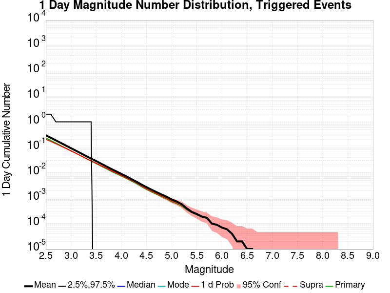
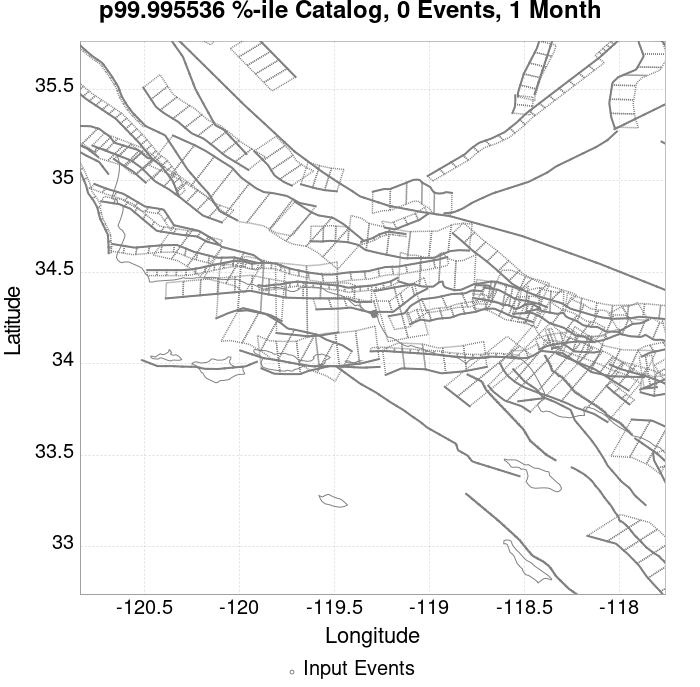
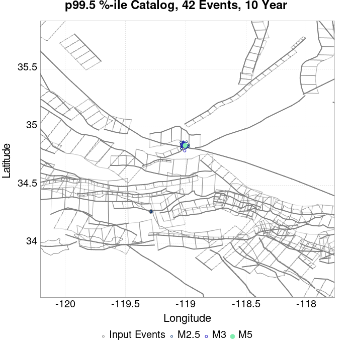
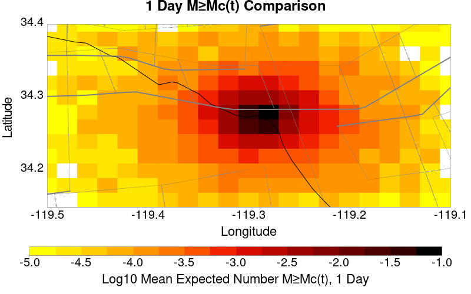
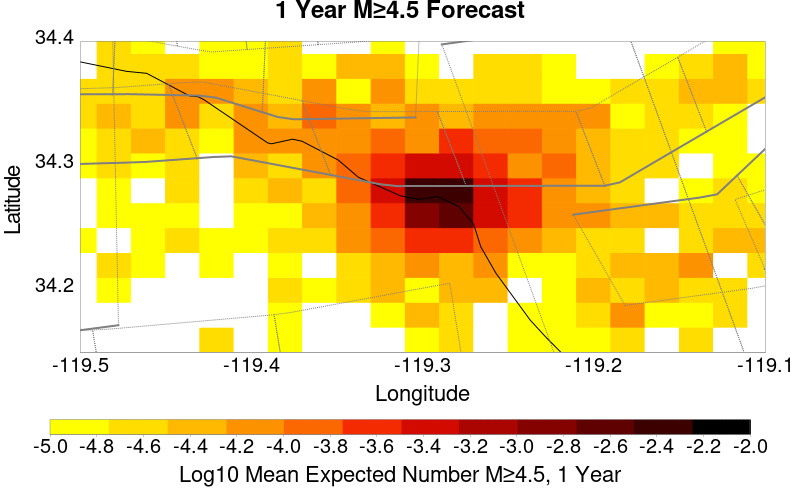
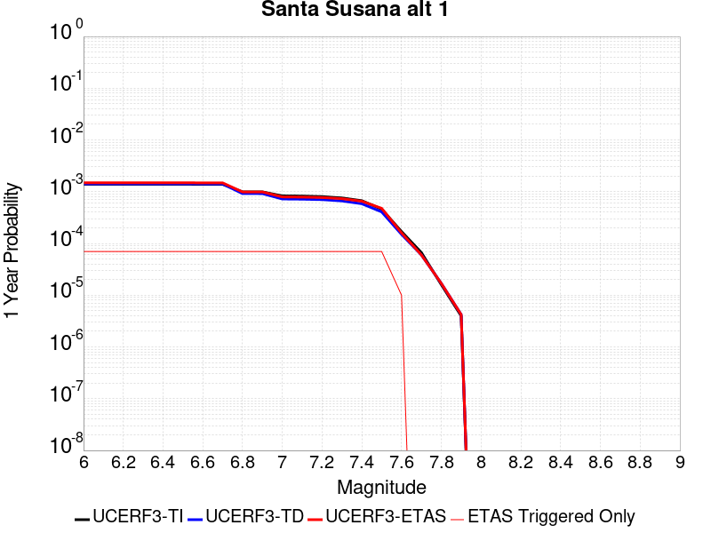

# ComCat data 1.5 d after ci38229234, Custom Region, Point Sources Results

|   | ComCat data 1.5 d after ci38229234, Custom Region, Point Sources |
|-----|-----|
| Num Simulations | 22400 (incomplete) |
| Start Time | 2019/11/09 00:53:27 UTC |
| Start Time Epoch Milliseconds | 1573260807250 |
| Duration | 10 Years |
| Includes Spontaneous? | false |
| Trigger Ruptures | 11 Trigger Ruptures |
|   | First: M3.2 at 2019/11/07 12:58:41 UTC |
|   | Last: M2.88 at 2019/11/08 21:55:02 UTC |
|   | Largest: M3.61 at 2019/11/08 13:29:38 UTC |
| Trigger Ruptures | *(none)* |
| Config Generated With | u3etas_comcat_config_builder.sh --start-at ci38229234 --end-now --region 34.4,-119.5,34.15,-119.1 --num-simulations 100000 --finite-surf-shakemap --finite-surf-shakemap-min-mag 6 --hpc-site USC_HPC --nodes 17 --hours 24 --queue scec |

## Table Of Contents

* [Probabilities Summary Table](#probabilities-summary-table)
* [Magnitude Number Distribution](#magnitude-number-distribution)
  * [10 Year Magnitude Number Distribution](#10-year-magnitude-number-distribution)
  * [1 Year Magnitude Number Distribution](#1-year-magnitude-number-distribution)
  * [1 Month Magnitude Number Distribution](#1-month-magnitude-number-distribution)
  * [1 Week Magnitude Number Distribution](#1-week-magnitude-number-distribution)
  * [1 Day Magnitude Number Distribution](#1-day-magnitude-number-distribution)
  * [1 Hour Magnitude Number Distribution](#1-hour-magnitude-number-distribution)
* [Hazard Change Over Time](#hazard-change-over-time)
  * [M&ge;5.0 Hazard Change Over Time](#m50-hazard-change-over-time)
  * [M&ge;6.0 Hazard Change Over Time](#m60-hazard-change-over-time)
  * [M&ge;7.0 Hazard Change Over Time](#m70-hazard-change-over-time)
* [Trigger Rupture Fault Map](#trigger-rupture-fault-map)
* [Fault Distances To Triggers](#fault-distances-to-triggers)
* [Individual Simulated Catalog Maps](#individual-simulated-catalog-maps)
* [ComCat Data Comparisons](#comcat-data-comparisons)
  * [ComCat Magnitude-Number Distributions](#comcat-magnitude-number-distributions)
  * [ComCat Time-Dependent Mc](#comcat-time-dependent-mc)
  * [ComCat Cumulative Number Vs Time](#comcat-cumulative-number-vs-time)
  * [ComCat Cumulative Number Simulation Percentiles](#comcat-cumulative-number-simulation-percentiles)
  * [ComCat Probability Spatial Distribution](#comcat-probability-spatial-distribution)
  * [ComCat Mean Expectation Spatial Distribution](#comcat-mean-expectation-spatial-distribution)
  * [ComCat Depth Distribution](#comcat-depth-distribution)
* [Section Participation](#section-participation)
  * [Section Participation Plots](#section-participation-plots)
  * [Supra-Seismogenic Parent Sections Table](#supra-seismogenic-parent-sections-table)
  * [M≥6.5 Parent Sections Table](#m65-parent-sections-table)
  * [M≥7 Parent Sections Table](#m7-parent-sections-table)
  * [M≥7.5 Parent Sections Table](#m75-parent-sections-table)
* [Fault Magnitude-Probability Distributions](#fault-magnitude-probability-distributions)
* [Gridded Nucleation](#gridded-nucleation)
* [JSON Input File](#json-input-file)

## Probabilities Summary Table
*[(top)](#table-of-contents)*

| Magnitude | 1 Hour Prob | 1 Day Prob | 1 Week Prob | 1 Month Prob | 1 Year Prob | 10 Year Prob |
|-----|-----|-----|-----|-----|-----|-----|
| **M&ge;3** | 5.67E-3 (0.57%) | 0.072 (7.16%) | 0.168 (16.78%) | 0.236 (23.64%) | 0.330 (33.01%) | 0.398 (39.75%) |
| *95% Conf* | *[0.47% 0.68%]* | *[6.83% 7.51%]* | *[16.30% 17.28%]* | *[23.09% 24.21%]* | *[32.39% 33.63%]* | *[39.11% 40.40%]* |
| **M&ge;3.5** | 1.56E-3 (0.16%) | 0.022 (2.25%) | 0.058 (5.79%) | 0.085 (8.47%) | 0.124 (12.45%) | 0.156 (15.58%) |
| *95% Conf* | *[0.11% 0.22%]* | *[2.06% 2.45%]* | *[5.49% 6.11%]* | *[8.11% 8.84%]* | *[12.02% 12.89%]* | *[15.11% 16.07%]* |
| **M&ge;3.61** | 1.10E-3 (0.11%) | 0.017 (1.72%) | 0.045 (4.50%) | 0.067 (6.69%) | 0.099 (9.89%) | 0.125 (12.49%) |
| *95% Conf* | *[0.07% 0.17%]* | *[1.56% 1.90%]* | *[4.24% 4.78%]* | *[6.36% 7.02%]* | *[9.51% 10.29%]* | *[12.06% 12.93%]* |
| **M&ge;4** | 4.91E-4 (0.05%) | 7.59E-3 (0.76%) | 0.019 (1.94%) | 0.029 (2.85%) | 0.043 (4.33%) | 0.055 (5.54%) |
| *95% Conf* | *[0.03% 0.09%]* | *[0.65% 0.88%]* | *[1.77% 2.13%]* | *[2.64% 3.08%]* | *[4.07% 4.61%]* | *[5.25% 5.85%]* |
| **M&ge;4.5** | 0.000 (0.00%) | 2.19E-3 (0.22%) | 5.67E-3 (0.57%) | 8.66E-3 (0.87%) | 0.014 (1.39%) | 0.018 (1.77%) |
| *95% Conf* | *[0.00% 0.02%]* | *[0.16% 0.29%]* | *[0.47% 0.68%]* | *[0.75% 1.00%]* | *[1.25% 1.56%]* | *[1.61% 1.96%]* |
| **M&ge;5** | 0.000 (0.00%) | 6.70E-4 (0.07%) | 2.01E-3 (0.20%) | 3.26E-3 (0.33%) | 5.36E-3 (0.54%) | 6.65E-3 (0.67%) |
| *95% Conf* | *[0.00% 0.02%]* | *[0.04% 0.11%]* | *[0.15% 0.27%]* | *[0.26% 0.41%]* | *[0.45% 0.64%]* | *[0.56% 0.78%]* |
| **M&ge;5.5** | 0.000 (0.00%) | 3.13E-4 (0.03%) | 8.04E-4 (0.08%) | 1.07E-3 (0.11%) | 1.83E-3 (0.18%) | 2.32E-3 (0.23%) |
| *95% Conf* | *[0.00% 0.02%]* | *[0.01% 0.07%]* | *[0.05% 0.13%]* | *[0.07% 0.16%]* | *[0.13% 0.25%]* | *[0.18% 0.31%]* |
| **M&ge;6** | 0.000 (0.00%) | 4.46E-5 (0.00%) | 2.23E-4 (0.02%) | 3.57E-4 (0.04%) | 6.25E-4 (0.06%) | 8.04E-4 (0.08%) |
| *95% Conf* | *[0.00% 0.02%]* | *[0.00% 0.03%]* | *[0.01% 0.06%]* | *[0.02% 0.07%]* | *[0.04% 0.11%]* | *[0.05% 0.13%]* |
| **M&ge;6.5** | 0.000 (0.00%) | 4.46E-5 (0.00%) | 8.93E-5 (0.01%) | 1.34E-4 (0.01%) | 1.79E-4 (0.02%) | 2.68E-4 (0.03%) |
| *95% Conf* | *[0.00% 0.02%]* | *[0.00% 0.03%]* | *[0.00% 0.04%]* | *[0.00% 0.04%]* | *[0.01% 0.05%]* | *[0.01% 0.06%]* |
| **M&ge;7** | 0.000 (0.00%) | 0.000 (0.00%) | 4.46E-5 (0.00%) | 8.93E-5 (0.01%) | 1.34E-4 (0.01%) | 1.79E-4 (0.02%) |
| *95% Conf* | *[0.00% 0.02%]* | *[0.00% 0.02%]* | *[0.00% 0.03%]* | *[0.00% 0.04%]* | *[0.00% 0.04%]* | *[0.01% 0.05%]* |
| **M&ge;7.5** | 0.000 (0.00%) | 0.000 (0.00%) | 4.46E-5 (0.00%) | 8.93E-5 (0.01%) | 1.34E-4 (0.01%) | 1.79E-4 (0.02%) |
| *95% Conf* | *[0.00% 0.02%]* | *[0.00% 0.02%]* | *[0.00% 0.03%]* | *[0.00% 0.04%]* | *[0.00% 0.04%]* | *[0.01% 0.05%]* |

## Magnitude Number Distribution
*[(top)](#table-of-contents)*

### 10 Year Magnitude Number Distribution
*[(top)](#table-of-contents)*

**Legend**
* **Mean** (thick black line): mean expected number across all 22400 catalogs
* **2.5%,97.5%** (thin black lines): expected number percentiles across all 22400 catalogs
* **Median** (thin blue line): median expected number across all 22400 catalogs
* **Mode** (thin cyan line): modal expected number across all 22400 catalogs
* **10 yr Probability** (thin red line): 10 year probability calculated as the fraction of catalogs with at least 1 occurrence
* **10 yr Supraseismogenic Probability** (thin dashed red line): same as above, but only for supraseismogenic ruptures on explicitly modeled UCERF3 faults
* **95% Conf** (light red shaded region): binomial 95% confidence bounds on probability
* **Primary** (thin green line): mean expected number from primary triggered aftershocks only (no secondary, tertiary, etc...) across all 22400 catalogs


| Mag | Mean | 2.5 %ile | 97.5 %ile | Median | Mode | 10 yr Probability | 10 yr Prob 95% Conf | 10 yr Supra-Seis Prob | Primary Aftershocks Mean |
|-----|-----|-----|-----|-----|-----|-----|-----|-----|-----|
| **M&ge;2.5** | 5.788 | 0.000 | 9.000 | 2.000 | 1.000 | 0.780 (78.00%) | [77.45% 78.54%] | 3.13E-4 (0.03%) | 1.506 |
| **M&ge;2.6** | 4.598 | 0.000 | 8.000 | 1.000 | 1.000 | 0.704 (70.43%) | [69.83% 71.03%] | 3.13E-4 (0.03%) | 1.195 |
| **M&ge;2.7** | 3.653 | 0.000 | 7.000 | 1.000 | 0.000 | 0.624 (62.43%) | [61.79% 63.06%] | 3.13E-4 (0.03%) | 0.954 |
| **M&ge;2.8** | 2.900 | 0.000 | 6.000 | 1.000 | 0.000 | 0.546 (54.57%) | [53.92% 55.22%] | 3.13E-4 (0.03%) | 0.762 |
| **M&ge;2.9** | 2.301 | 0.000 | 5.000 | 0.000 | 0.000 | 0.468 (46.85%) | [46.19% 47.50%] | 3.13E-4 (0.03%) | 0.601 |
| **M&ge;3** | 1.829 | 0.000 | 4.000 | 0.000 | 0.000 | 0.398 (39.75%) | [39.11% 40.40%] | 3.13E-4 (0.03%) | 0.478 |
| **M&ge;3.1** | 1.446 | 0.000 | 3.000 | 0.000 | 0.000 | 0.334 (33.41%) | [32.79% 34.03%] | 3.13E-4 (0.03%) | 0.379 |
| **M&ge;3.2** | 1.148 | 0.000 | 3.000 | 0.000 | 0.000 | 0.277 (27.69%) | [27.11% 28.28%] | 3.13E-4 (0.03%) | 0.299 |
| **M&ge;3.3** | 0.913 | 0.000 | 3.000 | 0.000 | 0.000 | 0.229 (22.88%) | [22.33% 23.43%] | 3.13E-4 (0.03%) | 0.237 |
| **M&ge;3.4** | 0.723 | 0.000 | 2.000 | 0.000 | 0.000 | 0.189 (18.85%) | [18.34% 19.37%] | 3.13E-4 (0.03%) | 0.187 |
| **M&ge;3.5** | 0.578 | 0.000 | 2.000 | 0.000 | 0.000 | 0.156 (15.58%) | [15.11% 16.07%] | 3.13E-4 (0.03%) | 0.150 |
| **M&ge;3.6** | 0.456 | 0.000 | 2.000 | 0.000 | 0.000 | 0.127 (12.71%) | [12.28% 13.15%] | 3.13E-4 (0.03%) | 0.118 |
| **M&ge;3.7** | 0.361 | 0.000 | 1.000 | 0.000 | 0.000 | 0.105 (10.48%) | [10.08% 10.89%] | 3.13E-4 (0.03%) | 0.094 |
| **M&ge;3.8** | 0.286 | 0.000 | 1.000 | 0.000 | 0.000 | 0.086 (8.57%) | [8.21% 8.95%] | 3.13E-4 (0.03%) | 0.076 |
| **M&ge;3.9** | 0.227 | 0.000 | 1.000 | 0.000 | 0.000 | 0.069 (6.91%) | [6.58% 7.25%] | 3.13E-4 (0.03%) | 0.059 |
| **M&ge;4** | 0.179 | 0.000 | 1.000 | 0.000 | 0.000 | 0.055 (5.54%) | [5.25% 5.85%] | 3.13E-4 (0.03%) | 0.047 |
| **M&ge;4.1** | 0.141 | 0.000 | 1.000 | 0.000 | 0.000 | 0.044 (4.44%) | [4.17% 4.72%] | 3.13E-4 (0.03%) | 0.036 |
| **M&ge;4.2** | 0.111 | 0.000 | 1.000 | 0.000 | 0.000 | 0.035 (3.48%) | [3.25% 3.73%] | 3.13E-4 (0.03%) | 0.028 |
| **M&ge;4.3** | 0.087 | 0.000 | 1.000 | 0.000 | 0.000 | 0.028 (2.79%) | [2.58% 3.02%] | 3.13E-4 (0.03%) | 0.022 |
| **M&ge;4.4** | 0.069 | 0.000 | 0.000 | 0.000 | 0.000 | 0.022 (2.20%) | [2.01% 2.40%] | 3.13E-4 (0.03%) | 0.017 |
| **M&ge;4.5** | 0.055 | 0.000 | 0.000 | 0.000 | 0.000 | 0.018 (1.77%) | [1.61% 1.96%] | 3.13E-4 (0.03%) | 0.014 |
| **M&ge;4.6** | 0.044 | 0.000 | 0.000 | 0.000 | 0.000 | 0.015 (1.49%) | [1.33% 1.66%] | 3.13E-4 (0.03%) | 0.011 |
| **M&ge;4.7** | 0.035 | 0.000 | 0.000 | 0.000 | 0.000 | 0.012 (1.19%) | [1.06% 1.35%] | 3.13E-4 (0.03%) | 8.66E-3 |
| **M&ge;4.8** | 0.027 | 0.000 | 0.000 | 0.000 | 0.000 | 9.69E-3 (0.97%) | [0.85% 1.11%] | 3.13E-4 (0.03%) | 7.01E-3 |
| **M&ge;4.9** | 0.022 | 0.000 | 0.000 | 0.000 | 0.000 | 7.99E-3 (0.80%) | [0.69% 0.93%] | 3.13E-4 (0.03%) | 5.71E-3 |
| **M&ge;5** | 0.017 | 0.000 | 0.000 | 0.000 | 0.000 | 6.65E-3 (0.67%) | [0.56% 0.78%] | 3.13E-4 (0.03%) | 4.64E-3 |
| **M&ge;5.1** | 0.013 | 0.000 | 0.000 | 0.000 | 0.000 | 4.96E-3 (0.50%) | [0.41% 0.60%] | 3.13E-4 (0.03%) | 3.39E-3 |
| **M&ge;5.2** | 0.011 | 0.000 | 0.000 | 0.000 | 0.000 | 4.24E-3 (0.42%) | [0.35% 0.52%] | 3.13E-4 (0.03%) | 2.90E-3 |
| **M&ge;5.3** | 9.06E-3 | 0.000 | 0.000 | 0.000 | 0.000 | 3.62E-3 (0.36%) | [0.29% 0.45%] | 3.13E-4 (0.03%) | 2.46E-3 |
| **M&ge;5.4** | 7.28E-3 | 0.000 | 0.000 | 0.000 | 0.000 | 3.08E-3 (0.31%) | [0.24% 0.39%] | 3.13E-4 (0.03%) | 2.05E-3 |
| **M&ge;5.5** | 5.54E-3 | 0.000 | 0.000 | 0.000 | 0.000 | 2.32E-3 (0.23%) | [0.18% 0.31%] | 3.13E-4 (0.03%) | 1.38E-3 |
| **M&ge;5.6** | 4.60E-3 | 0.000 | 0.000 | 0.000 | 0.000 | 1.92E-3 (0.19%) | [0.14% 0.26%] | 3.13E-4 (0.03%) | 1.07E-3 |
| **M&ge;5.7** | 3.79E-3 | 0.000 | 0.000 | 0.000 | 0.000 | 1.70E-3 (0.17%) | [0.12% 0.24%] | 3.13E-4 (0.03%) | 9.37E-4 |
| **M&ge;5.8** | 2.95E-3 | 0.000 | 0.000 | 0.000 | 0.000 | 1.29E-3 (0.13%) | [0.09% 0.19%] | 3.13E-4 (0.03%) | 7.14E-4 |
| **M&ge;5.9** | 2.14E-3 | 0.000 | 0.000 | 0.000 | 0.000 | 1.03E-3 (0.10%) | [0.07% 0.16%] | 3.13E-4 (0.03%) | 5.80E-4 |
| **M&ge;6** | 1.74E-3 | 0.000 | 0.000 | 0.000 | 0.000 | 8.04E-4 (0.08%) | [0.05% 0.13%] | 3.13E-4 (0.03%) | 4.91E-4 |
| **M&ge;6.1** | 1.47E-3 | 0.000 | 0.000 | 0.000 | 0.000 | 6.70E-4 (0.07%) | [0.04% 0.11%] | 3.13E-4 (0.03%) | 4.02E-4 |
| **M&ge;6.2** | 9.82E-4 | 0.000 | 0.000 | 0.000 | 0.000 | 4.46E-4 (0.04%) | [0.02% 0.09%] | 3.13E-4 (0.03%) | 2.68E-4 |
| **M&ge;6.3** | 8.93E-4 | 0.000 | 0.000 | 0.000 | 0.000 | 4.02E-4 (0.04%) | [0.02% 0.08%] | 3.13E-4 (0.03%) | 2.68E-4 |
| **M&ge;6.4** | 6.70E-4 | 0.000 | 0.000 | 0.000 | 0.000 | 3.13E-4 (0.03%) | [0.01% 0.07%] | 2.23E-4 (0.02%) | 2.23E-4 |
| **M&ge;6.5** | 4.91E-4 | 0.000 | 0.000 | 0.000 | 0.000 | 2.68E-4 (0.03%) | [0.01% 0.06%] | 2.23E-4 (0.02%) | 1.79E-4 |
| **M&ge;6.6** | 4.02E-4 | 0.000 | 0.000 | 0.000 | 0.000 | 2.68E-4 (0.03%) | [0.01% 0.06%] | 2.23E-4 (0.02%) | 1.79E-4 |
| **M&ge;6.7** | 3.57E-4 | 0.000 | 0.000 | 0.000 | 0.000 | 2.23E-4 (0.02%) | [0.01% 0.06%] | 2.23E-4 (0.02%) | 1.34E-4 |
| **M&ge;6.8** | 3.13E-4 | 0.000 | 0.000 | 0.000 | 0.000 | 1.79E-4 (0.02%) | [0.01% 0.05%] | 1.79E-4 (0.02%) | 1.34E-4 |
| **M&ge;6.9** | 2.68E-4 | 0.000 | 0.000 | 0.000 | 0.000 | 1.79E-4 (0.02%) | [0.01% 0.05%] | 1.79E-4 (0.02%) | 1.34E-4 |
| **M&ge;7** | 2.23E-4 | 0.000 | 0.000 | 0.000 | 0.000 | 1.79E-4 (0.02%) | [0.01% 0.05%] | 1.79E-4 (0.02%) | 1.34E-4 |
| **M&ge;7.1** | 2.23E-4 | 0.000 | 0.000 | 0.000 | 0.000 | 1.79E-4 (0.02%) | [0.01% 0.05%] | 1.79E-4 (0.02%) | 1.34E-4 |
| **M&ge;7.2** | 2.23E-4 | 0.000 | 0.000 | 0.000 | 0.000 | 1.79E-4 (0.02%) | [0.01% 0.05%] | 1.79E-4 (0.02%) | 1.34E-4 |
| **M&ge;7.3** | 2.23E-4 | 0.000 | 0.000 | 0.000 | 0.000 | 1.79E-4 (0.02%) | [0.01% 0.05%] | 1.79E-4 (0.02%) | 1.34E-4 |
| **M&ge;7.4** | 2.23E-4 | 0.000 | 0.000 | 0.000 | 0.000 | 1.79E-4 (0.02%) | [0.01% 0.05%] | 1.79E-4 (0.02%) | 1.34E-4 |
| **M&ge;7.5** | 1.79E-4 | 0.000 | 0.000 | 0.000 | 0.000 | 1.79E-4 (0.02%) | [0.01% 0.05%] | 1.79E-4 (0.02%) | 1.34E-4 |
| **M&ge;7.6** | 4.46E-5 | 0.000 | 0.000 | 0.000 | 0.000 | 4.46E-5 (0.00%) | [0.00% 0.03%] | 4.46E-5 (0.00%) | 4.46E-5 |
| **M&ge;7.7** | 0.000 | 0.000 | 0.000 | 0.000 | 0.000 | 0.000 (0.00%) | [0.00% 0.02%] | 0.000 (0.00%) | 0.000 |
| **M&ge;7.8** | 0.000 | 0.000 | 0.000 | 0.000 | 0.000 | 0.000 (0.00%) | [0.00% 0.02%] | 0.000 (0.00%) | 0.000 |
| **M&ge;7.9** | 0.000 | 0.000 | 0.000 | 0.000 | 0.000 | 0.000 (0.00%) | [0.00% 0.02%] | 0.000 (0.00%) | 0.000 |
| **M&ge;8** | 0.000 | 0.000 | 0.000 | 0.000 | 0.000 | 0.000 (0.00%) | [0.00% 0.02%] | 0.000 (0.00%) | 0.000 |
| **M&ge;8.1** | 0.000 | 0.000 | 0.000 | 0.000 | 0.000 | 0.000 (0.00%) | [0.00% 0.02%] | 0.000 (0.00%) | 0.000 |
| **M&ge;8.2** | 0.000 | 0.000 | 0.000 | 0.000 | 0.000 | 0.000 (0.00%) | [0.00% 0.02%] | 0.000 (0.00%) | 0.000 |
| **M&ge;8.3** | 0.000 | 0.000 | 0.000 | 0.000 | 0.000 | 0.000 (0.00%) | [0.00% 0.02%] | 0.000 (0.00%) | 0.000 |
| **M&ge;8.4** | 0.000 | 0.000 | 0.000 | 0.000 | 0.000 | 0.000 (0.00%) | [0.00% 0.02%] | 0.000 (0.00%) | 0.000 |
| **M&ge;8.5** | 0.000 | 0.000 | 0.000 | 0.000 | 0.000 | 0.000 (0.00%) | [0.00% 0.02%] | 0.000 (0.00%) | 0.000 |
| **M&ge;8.6** | 0.000 | 0.000 | 0.000 | 0.000 | 0.000 | 0.000 (0.00%) | [0.00% 0.02%] | 0.000 (0.00%) | 0.000 |
| **M&ge;8.7** | 0.000 | 0.000 | 0.000 | 0.000 | 0.000 | 0.000 (0.00%) | [0.00% 0.02%] | 0.000 (0.00%) | 0.000 |
| **M&ge;8.8** | 0.000 | 0.000 | 0.000 | 0.000 | 0.000 | 0.000 (0.00%) | [0.00% 0.02%] | 0.000 (0.00%) | 0.000 |
| **M&ge;8.9** | 0.000 | 0.000 | 0.000 | 0.000 | 0.000 | 0.000 (0.00%) | [0.00% 0.02%] | 0.000 (0.00%) | 0.000 |
| **M&ge;9** | 0.000 | 0.000 | 0.000 | 0.000 | 0.000 | 0.000 (0.00%) | [0.00% 0.02%] | 0.000 (0.00%) | 0.000 |

### 1 Year Magnitude Number Distribution
*[(top)](#table-of-contents)*

**Legend**
* **Mean** (thick black line): mean expected number across all 22400 catalogs
* **2.5%,97.5%** (thin black lines): expected number percentiles across all 22400 catalogs
* **Median** (thin blue line): median expected number across all 22400 catalogs
* **Mode** (thin cyan line): modal expected number across all 22400 catalogs
* **1 yr Probability** (thin red line): 1 year probability calculated as the fraction of catalogs with at least 1 occurrence
* **1 yr Supraseismogenic Probability** (thin dashed red line): same as above, but only for supraseismogenic ruptures on explicitly modeled UCERF3 faults
* **95% Conf** (light red shaded region): binomial 95% confidence bounds on probability
* **Primary** (thin green line): mean expected number from primary triggered aftershocks only (no secondary, tertiary, etc...) across all 22400 catalogs


| Mag | Mean | 2.5 %ile | 97.5 %ile | Median | Mode | 1 yr Probability | 1 yr Prob 95% Conf | 1 yr Supra-Seis Prob | Primary Aftershocks Mean |
|-----|-----|-----|-----|-----|-----|-----|-----|-----|-----|
| **M&ge;2.5** | 3.508 | 0.000 | 7.000 | 1.000 | 1.000 | 0.701 (70.11%) | [69.51% 70.71%] | 2.23E-4 (0.02%) | 1.196 |
| **M&ge;2.6** | 2.789 | 0.000 | 6.000 | 1.000 | 0.000 | 0.621 (62.05%) | [61.41% 62.69%] | 2.23E-4 (0.02%) | 0.950 |
| **M&ge;2.7** | 2.217 | 0.000 | 5.000 | 1.000 | 0.000 | 0.542 (54.24%) | [53.59% 54.89%] | 2.23E-4 (0.02%) | 0.760 |
| **M&ge;2.8** | 1.764 | 0.000 | 4.000 | 0.000 | 0.000 | 0.467 (46.75%) | [46.09% 47.40%] | 2.23E-4 (0.02%) | 0.606 |
| **M&ge;2.9** | 1.397 | 0.000 | 4.000 | 0.000 | 0.000 | 0.395 (39.46%) | [38.82% 40.10%] | 2.23E-4 (0.02%) | 0.477 |
| **M&ge;3** | 1.107 | 0.000 | 3.000 | 0.000 | 0.000 | 0.330 (33.01%) | [32.39% 33.63%] | 2.23E-4 (0.02%) | 0.379 |
| **M&ge;3.1** | 0.876 | 0.000 | 3.000 | 0.000 | 0.000 | 0.275 (27.49%) | [26.91% 28.08%] | 2.23E-4 (0.02%) | 0.300 |
| **M&ge;3.2** | 0.693 | 0.000 | 2.000 | 0.000 | 0.000 | 0.225 (22.52%) | [21.98% 23.08%] | 2.23E-4 (0.02%) | 0.237 |
| **M&ge;3.3** | 0.553 | 0.000 | 2.000 | 0.000 | 0.000 | 0.184 (18.42%) | [17.92% 18.93%] | 2.23E-4 (0.02%) | 0.187 |
| **M&ge;3.4** | 0.438 | 0.000 | 2.000 | 0.000 | 0.000 | 0.151 (15.14%) | [14.67% 15.62%] | 2.23E-4 (0.02%) | 0.148 |
| **M&ge;3.5** | 0.350 | 0.000 | 2.000 | 0.000 | 0.000 | 0.124 (12.45%) | [12.02% 12.89%] | 2.23E-4 (0.02%) | 0.119 |
| **M&ge;3.6** | 0.276 | 0.000 | 1.000 | 0.000 | 0.000 | 0.101 (10.08%) | [9.69% 10.48%] | 2.23E-4 (0.02%) | 0.094 |
| **M&ge;3.7** | 0.219 | 0.000 | 1.000 | 0.000 | 0.000 | 0.083 (8.26%) | [7.91% 8.63%] | 2.23E-4 (0.02%) | 0.075 |
| **M&ge;3.8** | 0.174 | 0.000 | 1.000 | 0.000 | 0.000 | 0.067 (6.72%) | [6.40% 7.06%] | 2.23E-4 (0.02%) | 0.060 |
| **M&ge;3.9** | 0.138 | 0.000 | 1.000 | 0.000 | 0.000 | 0.054 (5.39%) | [5.10% 5.69%] | 2.23E-4 (0.02%) | 0.047 |
| **M&ge;4** | 0.108 | 0.000 | 1.000 | 0.000 | 0.000 | 0.043 (4.33%) | [4.07% 4.61%] | 2.23E-4 (0.02%) | 0.037 |
| **M&ge;4.1** | 0.084 | 0.000 | 1.000 | 0.000 | 0.000 | 0.034 (3.42%) | [3.18% 3.66%] | 2.23E-4 (0.02%) | 0.029 |
| **M&ge;4.2** | 0.065 | 0.000 | 1.000 | 0.000 | 0.000 | 0.026 (2.64%) | [2.44% 2.86%] | 2.23E-4 (0.02%) | 0.022 |
| **M&ge;4.3** | 0.052 | 0.000 | 0.000 | 0.000 | 0.000 | 0.021 (2.12%) | [1.94% 2.32%] | 2.23E-4 (0.02%) | 0.017 |
| **M&ge;4.4** | 0.042 | 0.000 | 0.000 | 0.000 | 0.000 | 0.017 (1.70%) | [1.53% 1.88%] | 2.23E-4 (0.02%) | 0.013 |
| **M&ge;4.5** | 0.034 | 0.000 | 0.000 | 0.000 | 0.000 | 0.014 (1.39%) | [1.25% 1.56%] | 2.23E-4 (0.02%) | 0.011 |
| **M&ge;4.6** | 0.027 | 0.000 | 0.000 | 0.000 | 0.000 | 0.011 (1.15%) | [1.01% 1.30%] | 2.23E-4 (0.02%) | 8.57E-3 |
| **M&ge;4.7** | 0.021 | 0.000 | 0.000 | 0.000 | 0.000 | 9.29E-3 (0.93%) | [0.81% 1.07%] | 2.23E-4 (0.02%) | 6.88E-3 |
| **M&ge;4.8** | 0.018 | 0.000 | 0.000 | 0.000 | 0.000 | 7.81E-3 (0.78%) | [0.67% 0.91%] | 2.23E-4 (0.02%) | 5.76E-3 |
| **M&ge;4.9** | 0.015 | 0.000 | 0.000 | 0.000 | 0.000 | 6.52E-3 (0.65%) | [0.55% 0.77%] | 2.23E-4 (0.02%) | 4.78E-3 |
| **M&ge;5** | 0.012 | 0.000 | 0.000 | 0.000 | 0.000 | 5.36E-3 (0.54%) | [0.45% 0.64%] | 2.23E-4 (0.02%) | 3.84E-3 |
| **M&ge;5.1** | 8.44E-3 | 0.000 | 0.000 | 0.000 | 0.000 | 3.93E-3 (0.39%) | [0.32% 0.49%] | 2.23E-4 (0.02%) | 2.77E-3 |
| **M&ge;5.2** | 6.79E-3 | 0.000 | 0.000 | 0.000 | 0.000 | 3.30E-3 (0.33%) | [0.26% 0.42%] | 2.23E-4 (0.02%) | 2.32E-3 |
| **M&ge;5.3** | 5.67E-3 | 0.000 | 0.000 | 0.000 | 0.000 | 2.81E-3 (0.28%) | [0.22% 0.36%] | 2.23E-4 (0.02%) | 2.01E-3 |
| **M&ge;5.4** | 4.64E-3 | 0.000 | 0.000 | 0.000 | 0.000 | 2.37E-3 (0.24%) | [0.18% 0.31%] | 2.23E-4 (0.02%) | 1.70E-3 |
| **M&ge;5.5** | 3.44E-3 | 0.000 | 0.000 | 0.000 | 0.000 | 1.83E-3 (0.18%) | [0.13% 0.25%] | 2.23E-4 (0.02%) | 1.21E-3 |
| **M&ge;5.6** | 2.95E-3 | 0.000 | 0.000 | 0.000 | 0.000 | 1.52E-3 (0.15%) | [0.11% 0.21%] | 2.23E-4 (0.02%) | 9.37E-4 |
| **M&ge;5.7** | 2.41E-3 | 0.000 | 0.000 | 0.000 | 0.000 | 1.38E-3 (0.14%) | [0.10% 0.20%] | 2.23E-4 (0.02%) | 8.48E-4 |
| **M&ge;5.8** | 1.83E-3 | 0.000 | 0.000 | 0.000 | 0.000 | 1.07E-3 (0.11%) | [0.07% 0.16%] | 2.23E-4 (0.02%) | 6.70E-4 |
| **M&ge;5.9** | 1.38E-3 | 0.000 | 0.000 | 0.000 | 0.000 | 8.48E-4 (0.08%) | [0.05% 0.14%] | 2.23E-4 (0.02%) | 5.36E-4 |
| **M&ge;6** | 1.03E-3 | 0.000 | 0.000 | 0.000 | 0.000 | 6.25E-4 (0.06%) | [0.04% 0.11%] | 2.23E-4 (0.02%) | 4.46E-4 |
| **M&ge;6.1** | 8.48E-4 | 0.000 | 0.000 | 0.000 | 0.000 | 4.91E-4 (0.05%) | [0.03% 0.09%] | 2.23E-4 (0.02%) | 3.57E-4 |
| **M&ge;6.2** | 6.25E-4 | 0.000 | 0.000 | 0.000 | 0.000 | 3.57E-4 (0.04%) | [0.02% 0.07%] | 2.23E-4 (0.02%) | 2.23E-4 |
| **M&ge;6.3** | 5.80E-4 | 0.000 | 0.000 | 0.000 | 0.000 | 3.13E-4 (0.03%) | [0.01% 0.07%] | 2.23E-4 (0.02%) | 2.23E-4 |
| **M&ge;6.4** | 3.57E-4 | 0.000 | 0.000 | 0.000 | 0.000 | 2.23E-4 (0.02%) | [0.01% 0.06%] | 1.34E-4 (0.01%) | 1.79E-4 |
| **M&ge;6.5** | 2.68E-4 | 0.000 | 0.000 | 0.000 | 0.000 | 1.79E-4 (0.02%) | [0.01% 0.05%] | 1.34E-4 (0.01%) | 1.34E-4 |
| **M&ge;6.6** | 2.23E-4 | 0.000 | 0.000 | 0.000 | 0.000 | 1.79E-4 (0.02%) | [0.01% 0.05%] | 1.34E-4 (0.01%) | 1.34E-4 |
| **M&ge;6.7** | 1.79E-4 | 0.000 | 0.000 | 0.000 | 0.000 | 1.34E-4 (0.01%) | [0.00% 0.04%] | 1.34E-4 (0.01%) | 8.93E-5 |
| **M&ge;6.8** | 1.79E-4 | 0.000 | 0.000 | 0.000 | 0.000 | 1.34E-4 (0.01%) | [0.00% 0.04%] | 1.34E-4 (0.01%) | 8.93E-5 |
| **M&ge;6.9** | 1.34E-4 | 0.000 | 0.000 | 0.000 | 0.000 | 1.34E-4 (0.01%) | [0.00% 0.04%] | 1.34E-4 (0.01%) | 8.93E-5 |
| **M&ge;7** | 1.34E-4 | 0.000 | 0.000 | 0.000 | 0.000 | 1.34E-4 (0.01%) | [0.00% 0.04%] | 1.34E-4 (0.01%) | 8.93E-5 |
| **M&ge;7.1** | 1.34E-4 | 0.000 | 0.000 | 0.000 | 0.000 | 1.34E-4 (0.01%) | [0.00% 0.04%] | 1.34E-4 (0.01%) | 8.93E-5 |
| **M&ge;7.2** | 1.34E-4 | 0.000 | 0.000 | 0.000 | 0.000 | 1.34E-4 (0.01%) | [0.00% 0.04%] | 1.34E-4 (0.01%) | 8.93E-5 |
| **M&ge;7.3** | 1.34E-4 | 0.000 | 0.000 | 0.000 | 0.000 | 1.34E-4 (0.01%) | [0.00% 0.04%] | 1.34E-4 (0.01%) | 8.93E-5 |
| **M&ge;7.4** | 1.34E-4 | 0.000 | 0.000 | 0.000 | 0.000 | 1.34E-4 (0.01%) | [0.00% 0.04%] | 1.34E-4 (0.01%) | 8.93E-5 |
| **M&ge;7.5** | 1.34E-4 | 0.000 | 0.000 | 0.000 | 0.000 | 1.34E-4 (0.01%) | [0.00% 0.04%] | 1.34E-4 (0.01%) | 8.93E-5 |
| **M&ge;7.6** | 4.46E-5 | 0.000 | 0.000 | 0.000 | 0.000 | 4.46E-5 (0.00%) | [0.00% 0.03%] | 4.46E-5 (0.00%) | 4.46E-5 |
| **M&ge;7.7** | 0.000 | 0.000 | 0.000 | 0.000 | 0.000 | 0.000 (0.00%) | [0.00% 0.02%] | 0.000 (0.00%) | 0.000 |
| **M&ge;7.8** | 0.000 | 0.000 | 0.000 | 0.000 | 0.000 | 0.000 (0.00%) | [0.00% 0.02%] | 0.000 (0.00%) | 0.000 |
| **M&ge;7.9** | 0.000 | 0.000 | 0.000 | 0.000 | 0.000 | 0.000 (0.00%) | [0.00% 0.02%] | 0.000 (0.00%) | 0.000 |
| **M&ge;8** | 0.000 | 0.000 | 0.000 | 0.000 | 0.000 | 0.000 (0.00%) | [0.00% 0.02%] | 0.000 (0.00%) | 0.000 |
| **M&ge;8.1** | 0.000 | 0.000 | 0.000 | 0.000 | 0.000 | 0.000 (0.00%) | [0.00% 0.02%] | 0.000 (0.00%) | 0.000 |
| **M&ge;8.2** | 0.000 | 0.000 | 0.000 | 0.000 | 0.000 | 0.000 (0.00%) | [0.00% 0.02%] | 0.000 (0.00%) | 0.000 |
| **M&ge;8.3** | 0.000 | 0.000 | 0.000 | 0.000 | 0.000 | 0.000 (0.00%) | [0.00% 0.02%] | 0.000 (0.00%) | 0.000 |
| **M&ge;8.4** | 0.000 | 0.000 | 0.000 | 0.000 | 0.000 | 0.000 (0.00%) | [0.00% 0.02%] | 0.000 (0.00%) | 0.000 |
| **M&ge;8.5** | 0.000 | 0.000 | 0.000 | 0.000 | 0.000 | 0.000 (0.00%) | [0.00% 0.02%] | 0.000 (0.00%) | 0.000 |
| **M&ge;8.6** | 0.000 | 0.000 | 0.000 | 0.000 | 0.000 | 0.000 (0.00%) | [0.00% 0.02%] | 0.000 (0.00%) | 0.000 |
| **M&ge;8.7** | 0.000 | 0.000 | 0.000 | 0.000 | 0.000 | 0.000 (0.00%) | [0.00% 0.02%] | 0.000 (0.00%) | 0.000 |
| **M&ge;8.8** | 0.000 | 0.000 | 0.000 | 0.000 | 0.000 | 0.000 (0.00%) | [0.00% 0.02%] | 0.000 (0.00%) | 0.000 |
| **M&ge;8.9** | 0.000 | 0.000 | 0.000 | 0.000 | 0.000 | 0.000 (0.00%) | [0.00% 0.02%] | 0.000 (0.00%) | 0.000 |
| **M&ge;9** | 0.000 | 0.000 | 0.000 | 0.000 | 0.000 | 0.000 (0.00%) | [0.00% 0.02%] | 0.000 (0.00%) | 0.000 |

### 1 Month Magnitude Number Distribution
*[(top)](#table-of-contents)*

**Legend**
* **Mean** (thick black line): mean expected number across all 22400 catalogs
* **2.5%,97.5%** (thin black lines): expected number percentiles across all 22400 catalogs
* **Median** (thin blue line): median expected number across all 22400 catalogs
* **Mode** (thin cyan line): modal expected number across all 22400 catalogs
* **1 mo Probability** (thin red line): 1 month probability calculated as the fraction of catalogs with at least 1 occurrence
* **1 mo Supraseismogenic Probability** (thin dashed red line): same as above, but only for supraseismogenic ruptures on explicitly modeled UCERF3 faults
* **95% Conf** (light red shaded region): binomial 95% confidence bounds on probability
* **Primary** (thin green line): mean expected number from primary triggered aftershocks only (no secondary, tertiary, etc...) across all 22400 catalogs


| Mag | Mean | 2.5 %ile | 97.5 %ile | Median | Mode | 1 mo Probability | 1 mo Prob 95% Conf | 1 mo Supra-Seis Prob | Primary Aftershocks Mean |
|-----|-----|-----|-----|-----|-----|-----|-----|-----|-----|
| **M&ge;2.5** | 1.857 | 0.000 | 5.000 | 1.000 | 0.000 | 0.553 (55.34%) | [54.69% 55.99%] | 1.79E-4 (0.02%) | 0.800 |
| **M&ge;2.6** | 1.476 | 0.000 | 4.000 | 0.000 | 0.000 | 0.476 (47.60%) | [46.94% 48.25%] | 1.79E-4 (0.02%) | 0.635 |
| **M&ge;2.7** | 1.180 | 0.000 | 3.000 | 0.000 | 0.000 | 0.409 (40.88%) | [40.23% 41.52%] | 1.79E-4 (0.02%) | 0.512 |
| **M&ge;2.8** | 0.938 | 0.000 | 3.000 | 0.000 | 0.000 | 0.345 (34.50%) | [33.88% 35.13%] | 1.79E-4 (0.02%) | 0.408 |
| **M&ge;2.9** | 0.744 | 0.000 | 3.000 | 0.000 | 0.000 | 0.288 (28.78%) | [28.19% 29.38%] | 1.79E-4 (0.02%) | 0.323 |
| **M&ge;3** | 0.590 | 0.000 | 2.000 | 0.000 | 0.000 | 0.236 (23.64%) | [23.09% 24.21%] | 1.79E-4 (0.02%) | 0.256 |
| **M&ge;3.1** | 0.467 | 0.000 | 2.000 | 0.000 | 0.000 | 0.194 (19.42%) | [18.90% 19.95%] | 1.79E-4 (0.02%) | 0.203 |
| **M&ge;3.2** | 0.371 | 0.000 | 2.000 | 0.000 | 0.000 | 0.158 (15.76%) | [15.29% 16.25%] | 1.79E-4 (0.02%) | 0.161 |
| **M&ge;3.3** | 0.296 | 0.000 | 2.000 | 0.000 | 0.000 | 0.128 (12.76%) | [12.33% 13.20%] | 1.79E-4 (0.02%) | 0.128 |
| **M&ge;3.4** | 0.235 | 0.000 | 1.000 | 0.000 | 0.000 | 0.103 (10.31%) | [9.91% 10.72%] | 1.79E-4 (0.02%) | 0.100 |
| **M&ge;3.5** | 0.188 | 0.000 | 1.000 | 0.000 | 0.000 | 0.085 (8.47%) | [8.11% 8.84%] | 1.79E-4 (0.02%) | 0.081 |
| **M&ge;3.6** | 0.148 | 0.000 | 1.000 | 0.000 | 0.000 | 0.068 (6.81%) | [6.49% 7.15%] | 1.79E-4 (0.02%) | 0.063 |
| **M&ge;3.7** | 0.118 | 0.000 | 1.000 | 0.000 | 0.000 | 0.056 (5.55%) | [5.26% 5.86%] | 1.79E-4 (0.02%) | 0.050 |
| **M&ge;3.8** | 0.095 | 0.000 | 1.000 | 0.000 | 0.000 | 0.045 (4.49%) | [4.22% 4.77%] | 1.79E-4 (0.02%) | 0.041 |
| **M&ge;3.9** | 0.076 | 0.000 | 1.000 | 0.000 | 0.000 | 0.036 (3.59%) | [3.35% 3.84%] | 1.79E-4 (0.02%) | 0.032 |
| **M&ge;4** | 0.059 | 0.000 | 1.000 | 0.000 | 0.000 | 0.029 (2.85%) | [2.64% 3.08%] | 1.79E-4 (0.02%) | 0.025 |
| **M&ge;4.1** | 0.045 | 0.000 | 0.000 | 0.000 | 0.000 | 0.022 (2.22%) | [2.04% 2.43%] | 1.79E-4 (0.02%) | 0.019 |
| **M&ge;4.2** | 0.035 | 0.000 | 0.000 | 0.000 | 0.000 | 0.017 (1.72%) | [1.55% 1.90%] | 1.79E-4 (0.02%) | 0.015 |
| **M&ge;4.3** | 0.028 | 0.000 | 0.000 | 0.000 | 0.000 | 0.014 (1.36%) | [1.22% 1.52%] | 1.79E-4 (0.02%) | 0.011 |
| **M&ge;4.4** | 0.022 | 0.000 | 0.000 | 0.000 | 0.000 | 0.011 (1.08%) | [0.95% 1.22%] | 1.79E-4 (0.02%) | 8.84E-3 |
| **M&ge;4.5** | 0.018 | 0.000 | 0.000 | 0.000 | 0.000 | 8.66E-3 (0.87%) | [0.75% 1.00%] | 1.79E-4 (0.02%) | 7.14E-3 |
| **M&ge;4.6** | 0.014 | 0.000 | 0.000 | 0.000 | 0.000 | 7.10E-3 (0.71%) | [0.61% 0.83%] | 1.79E-4 (0.02%) | 5.54E-3 |
| **M&ge;4.7** | 0.011 | 0.000 | 0.000 | 0.000 | 0.000 | 5.67E-3 (0.57%) | [0.47% 0.68%] | 1.79E-4 (0.02%) | 4.38E-3 |
| **M&ge;4.8** | 8.79E-3 | 0.000 | 0.000 | 0.000 | 0.000 | 4.73E-3 (0.47%) | [0.39% 0.57%] | 1.79E-4 (0.02%) | 3.66E-3 |
| **M&ge;4.9** | 7.37E-3 | 0.000 | 0.000 | 0.000 | 0.000 | 4.06E-3 (0.41%) | [0.33% 0.50%] | 1.79E-4 (0.02%) | 3.08E-3 |
| **M&ge;5** | 5.71E-3 | 0.000 | 0.000 | 0.000 | 0.000 | 3.26E-3 (0.33%) | [0.26% 0.41%] | 1.79E-4 (0.02%) | 2.46E-3 |
| **M&ge;5.1** | 4.06E-3 | 0.000 | 0.000 | 0.000 | 0.000 | 2.23E-3 (0.22%) | [0.17% 0.30%] | 1.79E-4 (0.02%) | 1.65E-3 |
| **M&ge;5.2** | 3.21E-3 | 0.000 | 0.000 | 0.000 | 0.000 | 1.87E-3 (0.19%) | [0.14% 0.26%] | 1.79E-4 (0.02%) | 1.38E-3 |
| **M&ge;5.3** | 2.63E-3 | 0.000 | 0.000 | 0.000 | 0.000 | 1.56E-3 (0.16%) | [0.11% 0.22%] | 1.79E-4 (0.02%) | 1.21E-3 |
| **M&ge;5.4** | 2.23E-3 | 0.000 | 0.000 | 0.000 | 0.000 | 1.38E-3 (0.14%) | [0.10% 0.20%] | 1.79E-4 (0.02%) | 1.07E-3 |
| **M&ge;5.5** | 1.56E-3 | 0.000 | 0.000 | 0.000 | 0.000 | 1.07E-3 (0.11%) | [0.07% 0.16%] | 1.79E-4 (0.02%) | 8.04E-4 |
| **M&ge;5.6** | 1.38E-3 | 0.000 | 0.000 | 0.000 | 0.000 | 8.93E-4 (0.09%) | [0.06% 0.14%] | 1.79E-4 (0.02%) | 6.25E-4 |
| **M&ge;5.7** | 1.12E-3 | 0.000 | 0.000 | 0.000 | 0.000 | 8.04E-4 (0.08%) | [0.05% 0.13%] | 1.79E-4 (0.02%) | 5.80E-4 |
| **M&ge;5.8** | 8.48E-4 | 0.000 | 0.000 | 0.000 | 0.000 | 5.80E-4 (0.06%) | [0.03% 0.10%] | 1.79E-4 (0.02%) | 4.02E-4 |
| **M&ge;5.9** | 6.25E-4 | 0.000 | 0.000 | 0.000 | 0.000 | 4.46E-4 (0.04%) | [0.02% 0.09%] | 1.79E-4 (0.02%) | 3.57E-4 |
| **M&ge;6** | 4.46E-4 | 0.000 | 0.000 | 0.000 | 0.000 | 3.57E-4 (0.04%) | [0.02% 0.07%] | 1.79E-4 (0.02%) | 2.68E-4 |
| **M&ge;6.1** | 3.57E-4 | 0.000 | 0.000 | 0.000 | 0.000 | 2.68E-4 (0.03%) | [0.01% 0.06%] | 1.79E-4 (0.02%) | 2.23E-4 |
| **M&ge;6.2** | 3.13E-4 | 0.000 | 0.000 | 0.000 | 0.000 | 2.23E-4 (0.02%) | [0.01% 0.06%] | 1.79E-4 (0.02%) | 1.79E-4 |
| **M&ge;6.3** | 3.13E-4 | 0.000 | 0.000 | 0.000 | 0.000 | 2.23E-4 (0.02%) | [0.01% 0.06%] | 1.79E-4 (0.02%) | 1.79E-4 |
| **M&ge;6.4** | 1.79E-4 | 0.000 | 0.000 | 0.000 | 0.000 | 1.34E-4 (0.01%) | [0.00% 0.04%] | 8.93E-5 (0.01%) | 1.34E-4 |
| **M&ge;6.5** | 1.34E-4 | 0.000 | 0.000 | 0.000 | 0.000 | 1.34E-4 (0.01%) | [0.00% 0.04%] | 8.93E-5 (0.01%) | 1.34E-4 |
| **M&ge;6.6** | 1.34E-4 | 0.000 | 0.000 | 0.000 | 0.000 | 1.34E-4 (0.01%) | [0.00% 0.04%] | 8.93E-5 (0.01%) | 1.34E-4 |
| **M&ge;6.7** | 8.93E-5 | 0.000 | 0.000 | 0.000 | 0.000 | 8.93E-5 (0.01%) | [0.00% 0.04%] | 8.93E-5 (0.01%) | 8.93E-5 |
| **M&ge;6.8** | 8.93E-5 | 0.000 | 0.000 | 0.000 | 0.000 | 8.93E-5 (0.01%) | [0.00% 0.04%] | 8.93E-5 (0.01%) | 8.93E-5 |
| **M&ge;6.9** | 8.93E-5 | 0.000 | 0.000 | 0.000 | 0.000 | 8.93E-5 (0.01%) | [0.00% 0.04%] | 8.93E-5 (0.01%) | 8.93E-5 |
| **M&ge;7** | 8.93E-5 | 0.000 | 0.000 | 0.000 | 0.000 | 8.93E-5 (0.01%) | [0.00% 0.04%] | 8.93E-5 (0.01%) | 8.93E-5 |
| **M&ge;7.1** | 8.93E-5 | 0.000 | 0.000 | 0.000 | 0.000 | 8.93E-5 (0.01%) | [0.00% 0.04%] | 8.93E-5 (0.01%) | 8.93E-5 |
| **M&ge;7.2** | 8.93E-5 | 0.000 | 0.000 | 0.000 | 0.000 | 8.93E-5 (0.01%) | [0.00% 0.04%] | 8.93E-5 (0.01%) | 8.93E-5 |
| **M&ge;7.3** | 8.93E-5 | 0.000 | 0.000 | 0.000 | 0.000 | 8.93E-5 (0.01%) | [0.00% 0.04%] | 8.93E-5 (0.01%) | 8.93E-5 |
| **M&ge;7.4** | 8.93E-5 | 0.000 | 0.000 | 0.000 | 0.000 | 8.93E-5 (0.01%) | [0.00% 0.04%] | 8.93E-5 (0.01%) | 8.93E-5 |
| **M&ge;7.5** | 8.93E-5 | 0.000 | 0.000 | 0.000 | 0.000 | 8.93E-5 (0.01%) | [0.00% 0.04%] | 8.93E-5 (0.01%) | 8.93E-5 |
| **M&ge;7.6** | 4.46E-5 | 0.000 | 0.000 | 0.000 | 0.000 | 4.46E-5 (0.00%) | [0.00% 0.03%] | 4.46E-5 (0.00%) | 4.46E-5 |
| **M&ge;7.7** | 0.000 | 0.000 | 0.000 | 0.000 | 0.000 | 0.000 (0.00%) | [0.00% 0.02%] | 0.000 (0.00%) | 0.000 |
| **M&ge;7.8** | 0.000 | 0.000 | 0.000 | 0.000 | 0.000 | 0.000 (0.00%) | [0.00% 0.02%] | 0.000 (0.00%) | 0.000 |
| **M&ge;7.9** | 0.000 | 0.000 | 0.000 | 0.000 | 0.000 | 0.000 (0.00%) | [0.00% 0.02%] | 0.000 (0.00%) | 0.000 |
| **M&ge;8** | 0.000 | 0.000 | 0.000 | 0.000 | 0.000 | 0.000 (0.00%) | [0.00% 0.02%] | 0.000 (0.00%) | 0.000 |
| **M&ge;8.1** | 0.000 | 0.000 | 0.000 | 0.000 | 0.000 | 0.000 (0.00%) | [0.00% 0.02%] | 0.000 (0.00%) | 0.000 |
| **M&ge;8.2** | 0.000 | 0.000 | 0.000 | 0.000 | 0.000 | 0.000 (0.00%) | [0.00% 0.02%] | 0.000 (0.00%) | 0.000 |
| **M&ge;8.3** | 0.000 | 0.000 | 0.000 | 0.000 | 0.000 | 0.000 (0.00%) | [0.00% 0.02%] | 0.000 (0.00%) | 0.000 |
| **M&ge;8.4** | 0.000 | 0.000 | 0.000 | 0.000 | 0.000 | 0.000 (0.00%) | [0.00% 0.02%] | 0.000 (0.00%) | 0.000 |
| **M&ge;8.5** | 0.000 | 0.000 | 0.000 | 0.000 | 0.000 | 0.000 (0.00%) | [0.00% 0.02%] | 0.000 (0.00%) | 0.000 |
| **M&ge;8.6** | 0.000 | 0.000 | 0.000 | 0.000 | 0.000 | 0.000 (0.00%) | [0.00% 0.02%] | 0.000 (0.00%) | 0.000 |
| **M&ge;8.7** | 0.000 | 0.000 | 0.000 | 0.000 | 0.000 | 0.000 (0.00%) | [0.00% 0.02%] | 0.000 (0.00%) | 0.000 |
| **M&ge;8.8** | 0.000 | 0.000 | 0.000 | 0.000 | 0.000 | 0.000 (0.00%) | [0.00% 0.02%] | 0.000 (0.00%) | 0.000 |
| **M&ge;8.9** | 0.000 | 0.000 | 0.000 | 0.000 | 0.000 | 0.000 (0.00%) | [0.00% 0.02%] | 0.000 (0.00%) | 0.000 |
| **M&ge;9** | 0.000 | 0.000 | 0.000 | 0.000 | 0.000 | 0.000 (0.00%) | [0.00% 0.02%] | 0.000 (0.00%) | 0.000 |

### 1 Week Magnitude Number Distribution
*[(top)](#table-of-contents)*

**Legend**
* **Mean** (thick black line): mean expected number across all 22400 catalogs
* **2.5%,97.5%** (thin black lines): expected number percentiles across all 22400 catalogs
* **Median** (thin blue line): median expected number across all 22400 catalogs
* **Mode** (thin cyan line): modal expected number across all 22400 catalogs
* **1 wk Probability** (thin red line): 1 week probability calculated as the fraction of catalogs with at least 1 occurrence
* **1 wk Supraseismogenic Probability** (thin dashed red line): same as above, but only for supraseismogenic ruptures on explicitly modeled UCERF3 faults
* **95% Conf** (light red shaded region): binomial 95% confidence bounds on probability
* **Primary** (thin green line): mean expected number from primary triggered aftershocks only (no secondary, tertiary, etc...) across all 22400 catalogs


| Mag | Mean | 2.5 %ile | 97.5 %ile | Median | Mode | 1 wk Probability | 1 wk Prob 95% Conf | 1 wk Supra-Seis Prob | Primary Aftershocks Mean |
|-----|-----|-----|-----|-----|-----|-----|-----|-----|-----|
| **M&ge;2.5** | 1.090 | 0.000 | 3.000 | 0.000 | 0.000 | 0.422 (42.22%) | [41.57% 42.87%] | 8.93E-5 (0.01%) | 0.548 |
| **M&ge;2.6** | 0.869 | 0.000 | 3.000 | 0.000 | 0.000 | 0.357 (35.74%) | [35.11% 36.37%] | 8.93E-5 (0.01%) | 0.436 |
| **M&ge;2.7** | 0.696 | 0.000 | 3.000 | 0.000 | 0.000 | 0.302 (30.17%) | [29.57% 30.78%] | 8.93E-5 (0.01%) | 0.352 |
| **M&ge;2.8** | 0.553 | 0.000 | 2.000 | 0.000 | 0.000 | 0.251 (25.14%) | [24.57% 25.71%] | 8.93E-5 (0.01%) | 0.279 |
| **M&ge;2.9** | 0.438 | 0.000 | 2.000 | 0.000 | 0.000 | 0.205 (20.55%) | [20.02% 21.09%] | 8.93E-5 (0.01%) | 0.220 |
| **M&ge;3** | 0.349 | 0.000 | 2.000 | 0.000 | 0.000 | 0.168 (16.78%) | [16.30% 17.28%] | 8.93E-5 (0.01%) | 0.175 |
| **M&ge;3.1** | 0.275 | 0.000 | 1.000 | 0.000 | 0.000 | 0.137 (13.71%) | [13.26% 14.16%] | 8.93E-5 (0.01%) | 0.139 |
| **M&ge;3.2** | 0.218 | 0.000 | 1.000 | 0.000 | 0.000 | 0.110 (11.00%) | [10.59% 11.41%] | 8.93E-5 (0.01%) | 0.110 |
| **M&ge;3.3** | 0.174 | 0.000 | 1.000 | 0.000 | 0.000 | 0.088 (8.79%) | [8.42% 9.17%] | 8.93E-5 (0.01%) | 0.087 |
| **M&ge;3.4** | 0.138 | 0.000 | 1.000 | 0.000 | 0.000 | 0.070 (7.04%) | [6.71% 7.39%] | 8.93E-5 (0.01%) | 0.068 |
| **M&ge;3.5** | 0.111 | 0.000 | 1.000 | 0.000 | 0.000 | 0.058 (5.79%) | [5.49% 6.11%] | 8.93E-5 (0.01%) | 0.055 |
| **M&ge;3.6** | 0.087 | 0.000 | 1.000 | 0.000 | 0.000 | 0.046 (4.59%) | [4.32% 4.87%] | 8.93E-5 (0.01%) | 0.043 |
| **M&ge;3.7** | 0.069 | 0.000 | 1.000 | 0.000 | 0.000 | 0.037 (3.71%) | [3.47% 3.97%] | 8.93E-5 (0.01%) | 0.034 |
| **M&ge;3.8** | 0.055 | 0.000 | 1.000 | 0.000 | 0.000 | 0.030 (3.01%) | [2.79% 3.24%] | 8.93E-5 (0.01%) | 0.028 |
| **M&ge;3.9** | 0.044 | 0.000 | 0.000 | 0.000 | 0.000 | 0.024 (2.44%) | [2.25% 2.65%] | 8.93E-5 (0.01%) | 0.022 |
| **M&ge;4** | 0.034 | 0.000 | 0.000 | 0.000 | 0.000 | 0.019 (1.94%) | [1.77% 2.13%] | 8.93E-5 (0.01%) | 0.017 |
| **M&ge;4.1** | 0.027 | 0.000 | 0.000 | 0.000 | 0.000 | 0.015 (1.52%) | [1.37% 1.69%] | 8.93E-5 (0.01%) | 0.014 |
| **M&ge;4.2** | 0.021 | 0.000 | 0.000 | 0.000 | 0.000 | 0.012 (1.18%) | [1.05% 1.34%] | 8.93E-5 (0.01%) | 0.010 |
| **M&ge;4.3** | 0.017 | 0.000 | 0.000 | 0.000 | 0.000 | 9.11E-3 (0.91%) | [0.79% 1.05%] | 8.93E-5 (0.01%) | 7.95E-3 |
| **M&ge;4.4** | 0.013 | 0.000 | 0.000 | 0.000 | 0.000 | 7.05E-3 (0.71%) | [0.60% 0.83%] | 8.93E-5 (0.01%) | 6.07E-3 |
| **M&ge;4.5** | 0.010 | 0.000 | 0.000 | 0.000 | 0.000 | 5.67E-3 (0.57%) | [0.47% 0.68%] | 8.93E-5 (0.01%) | 4.96E-3 |
| **M&ge;4.6** | 8.17E-3 | 0.000 | 0.000 | 0.000 | 0.000 | 4.42E-3 (0.44%) | [0.36% 0.54%] | 8.93E-5 (0.01%) | 3.71E-3 |
| **M&ge;4.7** | 6.34E-3 | 0.000 | 0.000 | 0.000 | 0.000 | 3.53E-3 (0.35%) | [0.28% 0.44%] | 8.93E-5 (0.01%) | 2.99E-3 |
| **M&ge;4.8** | 5.04E-3 | 0.000 | 0.000 | 0.000 | 0.000 | 2.90E-3 (0.29%) | [0.23% 0.37%] | 8.93E-5 (0.01%) | 2.46E-3 |
| **M&ge;4.9** | 4.20E-3 | 0.000 | 0.000 | 0.000 | 0.000 | 2.50E-3 (0.25%) | [0.19% 0.33%] | 8.93E-5 (0.01%) | 2.05E-3 |
| **M&ge;5** | 3.44E-3 | 0.000 | 0.000 | 0.000 | 0.000 | 2.01E-3 (0.20%) | [0.15% 0.27%] | 8.93E-5 (0.01%) | 1.65E-3 |
| **M&ge;5.1** | 2.50E-3 | 0.000 | 0.000 | 0.000 | 0.000 | 1.34E-3 (0.13%) | [0.09% 0.19%] | 8.93E-5 (0.01%) | 1.07E-3 |
| **M&ge;5.2** | 1.92E-3 | 0.000 | 0.000 | 0.000 | 0.000 | 1.16E-3 (0.12%) | [0.08% 0.17%] | 8.93E-5 (0.01%) | 9.37E-4 |
| **M&ge;5.3** | 1.61E-3 | 0.000 | 0.000 | 0.000 | 0.000 | 9.82E-4 (0.10%) | [0.06% 0.15%] | 8.93E-5 (0.01%) | 8.48E-4 |
| **M&ge;5.4** | 1.34E-3 | 0.000 | 0.000 | 0.000 | 0.000 | 9.37E-4 (0.09%) | [0.06% 0.15%] | 8.93E-5 (0.01%) | 8.04E-4 |
| **M&ge;5.5** | 1.03E-3 | 0.000 | 0.000 | 0.000 | 0.000 | 8.04E-4 (0.08%) | [0.05% 0.13%] | 8.93E-5 (0.01%) | 6.70E-4 |
| **M&ge;5.6** | 9.37E-4 | 0.000 | 0.000 | 0.000 | 0.000 | 7.14E-4 (0.07%) | [0.04% 0.12%] | 8.93E-5 (0.01%) | 5.80E-4 |
| **M&ge;5.7** | 8.04E-4 | 0.000 | 0.000 | 0.000 | 0.000 | 6.25E-4 (0.06%) | [0.04% 0.11%] | 8.93E-5 (0.01%) | 5.36E-4 |
| **M&ge;5.8** | 5.80E-4 | 0.000 | 0.000 | 0.000 | 0.000 | 4.02E-4 (0.04%) | [0.02% 0.08%] | 8.93E-5 (0.01%) | 3.57E-4 |
| **M&ge;5.9** | 4.46E-4 | 0.000 | 0.000 | 0.000 | 0.000 | 3.13E-4 (0.03%) | [0.01% 0.07%] | 8.93E-5 (0.01%) | 3.13E-4 |
| **M&ge;6** | 3.13E-4 | 0.000 | 0.000 | 0.000 | 0.000 | 2.23E-4 (0.02%) | [0.01% 0.06%] | 8.93E-5 (0.01%) | 2.23E-4 |
| **M&ge;6.1** | 2.68E-4 | 0.000 | 0.000 | 0.000 | 0.000 | 1.79E-4 (0.02%) | [0.01% 0.05%] | 8.93E-5 (0.01%) | 1.79E-4 |
| **M&ge;6.2** | 2.23E-4 | 0.000 | 0.000 | 0.000 | 0.000 | 1.34E-4 (0.01%) | [0.00% 0.04%] | 8.93E-5 (0.01%) | 1.34E-4 |
| **M&ge;6.3** | 2.23E-4 | 0.000 | 0.000 | 0.000 | 0.000 | 1.34E-4 (0.01%) | [0.00% 0.04%] | 8.93E-5 (0.01%) | 1.34E-4 |
| **M&ge;6.4** | 1.34E-4 | 0.000 | 0.000 | 0.000 | 0.000 | 8.93E-5 (0.01%) | [0.00% 0.04%] | 4.46E-5 (0.00%) | 8.93E-5 |
| **M&ge;6.5** | 8.93E-5 | 0.000 | 0.000 | 0.000 | 0.000 | 8.93E-5 (0.01%) | [0.00% 0.04%] | 4.46E-5 (0.00%) | 8.93E-5 |
| **M&ge;6.6** | 8.93E-5 | 0.000 | 0.000 | 0.000 | 0.000 | 8.93E-5 (0.01%) | [0.00% 0.04%] | 4.46E-5 (0.00%) | 8.93E-5 |
| **M&ge;6.7** | 4.46E-5 | 0.000 | 0.000 | 0.000 | 0.000 | 4.46E-5 (0.00%) | [0.00% 0.03%] | 4.46E-5 (0.00%) | 4.46E-5 |
| **M&ge;6.8** | 4.46E-5 | 0.000 | 0.000 | 0.000 | 0.000 | 4.46E-5 (0.00%) | [0.00% 0.03%] | 4.46E-5 (0.00%) | 4.46E-5 |
| **M&ge;6.9** | 4.46E-5 | 0.000 | 0.000 | 0.000 | 0.000 | 4.46E-5 (0.00%) | [0.00% 0.03%] | 4.46E-5 (0.00%) | 4.46E-5 |
| **M&ge;7** | 4.46E-5 | 0.000 | 0.000 | 0.000 | 0.000 | 4.46E-5 (0.00%) | [0.00% 0.03%] | 4.46E-5 (0.00%) | 4.46E-5 |
| **M&ge;7.1** | 4.46E-5 | 0.000 | 0.000 | 0.000 | 0.000 | 4.46E-5 (0.00%) | [0.00% 0.03%] | 4.46E-5 (0.00%) | 4.46E-5 |
| **M&ge;7.2** | 4.46E-5 | 0.000 | 0.000 | 0.000 | 0.000 | 4.46E-5 (0.00%) | [0.00% 0.03%] | 4.46E-5 (0.00%) | 4.46E-5 |
| **M&ge;7.3** | 4.46E-5 | 0.000 | 0.000 | 0.000 | 0.000 | 4.46E-5 (0.00%) | [0.00% 0.03%] | 4.46E-5 (0.00%) | 4.46E-5 |
| **M&ge;7.4** | 4.46E-5 | 0.000 | 0.000 | 0.000 | 0.000 | 4.46E-5 (0.00%) | [0.00% 0.03%] | 4.46E-5 (0.00%) | 4.46E-5 |
| **M&ge;7.5** | 4.46E-5 | 0.000 | 0.000 | 0.000 | 0.000 | 4.46E-5 (0.00%) | [0.00% 0.03%] | 4.46E-5 (0.00%) | 4.46E-5 |
| **M&ge;7.6** | 4.46E-5 | 0.000 | 0.000 | 0.000 | 0.000 | 4.46E-5 (0.00%) | [0.00% 0.03%] | 4.46E-5 (0.00%) | 4.46E-5 |
| **M&ge;7.7** | 0.000 | 0.000 | 0.000 | 0.000 | 0.000 | 0.000 (0.00%) | [0.00% 0.02%] | 0.000 (0.00%) | 0.000 |
| **M&ge;7.8** | 0.000 | 0.000 | 0.000 | 0.000 | 0.000 | 0.000 (0.00%) | [0.00% 0.02%] | 0.000 (0.00%) | 0.000 |
| **M&ge;7.9** | 0.000 | 0.000 | 0.000 | 0.000 | 0.000 | 0.000 (0.00%) | [0.00% 0.02%] | 0.000 (0.00%) | 0.000 |
| **M&ge;8** | 0.000 | 0.000 | 0.000 | 0.000 | 0.000 | 0.000 (0.00%) | [0.00% 0.02%] | 0.000 (0.00%) | 0.000 |
| **M&ge;8.1** | 0.000 | 0.000 | 0.000 | 0.000 | 0.000 | 0.000 (0.00%) | [0.00% 0.02%] | 0.000 (0.00%) | 0.000 |
| **M&ge;8.2** | 0.000 | 0.000 | 0.000 | 0.000 | 0.000 | 0.000 (0.00%) | [0.00% 0.02%] | 0.000 (0.00%) | 0.000 |
| **M&ge;8.3** | 0.000 | 0.000 | 0.000 | 0.000 | 0.000 | 0.000 (0.00%) | [0.00% 0.02%] | 0.000 (0.00%) | 0.000 |
| **M&ge;8.4** | 0.000 | 0.000 | 0.000 | 0.000 | 0.000 | 0.000 (0.00%) | [0.00% 0.02%] | 0.000 (0.00%) | 0.000 |
| **M&ge;8.5** | 0.000 | 0.000 | 0.000 | 0.000 | 0.000 | 0.000 (0.00%) | [0.00% 0.02%] | 0.000 (0.00%) | 0.000 |
| **M&ge;8.6** | 0.000 | 0.000 | 0.000 | 0.000 | 0.000 | 0.000 (0.00%) | [0.00% 0.02%] | 0.000 (0.00%) | 0.000 |
| **M&ge;8.7** | 0.000 | 0.000 | 0.000 | 0.000 | 0.000 | 0.000 (0.00%) | [0.00% 0.02%] | 0.000 (0.00%) | 0.000 |
| **M&ge;8.8** | 0.000 | 0.000 | 0.000 | 0.000 | 0.000 | 0.000 (0.00%) | [0.00% 0.02%] | 0.000 (0.00%) | 0.000 |
| **M&ge;8.9** | 0.000 | 0.000 | 0.000 | 0.000 | 0.000 | 0.000 (0.00%) | [0.00% 0.02%] | 0.000 (0.00%) | 0.000 |
| **M&ge;9** | 0.000 | 0.000 | 0.000 | 0.000 | 0.000 | 0.000 (0.00%) | [0.00% 0.02%] | 0.000 (0.00%) | 0.000 |

### 1 Day Magnitude Number Distribution
*[(top)](#table-of-contents)*

**Legend**
* **Mean** (thick black line): mean expected number across all 22400 catalogs
* **2.5%,97.5%** (thin black lines): expected number percentiles across all 22400 catalogs
* **Median** (thin blue line): median expected number across all 22400 catalogs
* **Mode** (thin cyan line): modal expected number across all 22400 catalogs
* **1 d Probability** (thin red line): 1 day probability calculated as the fraction of catalogs with at least 1 occurrence
* **1 d Supraseismogenic Probability** (thin dashed red line): same as above, but only for supraseismogenic ruptures on explicitly modeled UCERF3 faults
* **95% Conf** (light red shaded region): binomial 95% confidence bounds on probability
* **Primary** (thin green line): mean expected number from primary triggered aftershocks only (no secondary, tertiary, etc...) across all 22400 catalogs



| Mag | Mean | 2.5 %ile | 97.5 %ile | Median | Mode | 1 d Probability | 1 d Prob 95% Conf | 1 d Supra-Seis Prob | Primary Aftershocks Mean |
|-----|-----|-----|-----|-----|-----|-----|-----|-----|-----|
| **M&ge;2.5** | 0.299 | 0.000 | 2.000 | 0.000 | 0.000 | 0.208 (20.76%) | [20.23% 21.30%] | 0.000 (0.00%) | 0.232 |
| **M&ge;2.6** | 0.238 | 0.000 | 2.000 | 0.000 | 0.000 | 0.168 (16.78%) | [16.30% 17.28%] | 0.000 (0.00%) | 0.183 |
| **M&ge;2.7** | 0.191 | 0.000 | 1.000 | 0.000 | 0.000 | 0.138 (13.82%) | [13.37% 14.28%] | 0.000 (0.00%) | 0.148 |
| **M&ge;2.8** | 0.151 | 0.000 | 1.000 | 0.000 | 0.000 | 0.112 (11.16%) | [10.75% 11.58%] | 0.000 (0.00%) | 0.117 |
| **M&ge;2.9** | 0.119 | 0.000 | 1.000 | 0.000 | 0.000 | 0.089 (8.93%) | [8.56% 9.32%] | 0.000 (0.00%) | 0.092 |
| **M&ge;3** | 0.094 | 0.000 | 1.000 | 0.000 | 0.000 | 0.072 (7.16%) | [6.83% 7.51%] | 0.000 (0.00%) | 0.073 |
| **M&ge;3.1** | 0.074 | 0.000 | 1.000 | 0.000 | 0.000 | 0.057 (5.68%) | [5.39% 6.00%] | 0.000 (0.00%) | 0.057 |
| **M&ge;3.2** | 0.058 | 0.000 | 1.000 | 0.000 | 0.000 | 0.045 (4.47%) | [4.21% 4.75%] | 0.000 (0.00%) | 0.045 |
| **M&ge;3.3** | 0.045 | 0.000 | 1.000 | 0.000 | 0.000 | 0.035 (3.50%) | [3.27% 3.76%] | 0.000 (0.00%) | 0.035 |
| **M&ge;3.4** | 0.035 | 0.000 | 1.000 | 0.000 | 0.000 | 0.027 (2.74%) | [2.53% 2.96%] | 0.000 (0.00%) | 0.027 |
| **M&ge;3.5** | 0.029 | 0.000 | 0.000 | 0.000 | 0.000 | 0.022 (2.25%) | [2.06% 2.45%] | 0.000 (0.00%) | 0.022 |
| **M&ge;3.6** | 0.022 | 0.000 | 0.000 | 0.000 | 0.000 | 0.018 (1.75%) | [1.59% 1.94%] | 0.000 (0.00%) | 0.017 |
| **M&ge;3.7** | 0.017 | 0.000 | 0.000 | 0.000 | 0.000 | 0.014 (1.41%) | [1.26% 1.58%] | 0.000 (0.00%) | 0.013 |
| **M&ge;3.8** | 0.014 | 0.000 | 0.000 | 0.000 | 0.000 | 0.012 (1.15%) | [1.02% 1.30%] | 0.000 (0.00%) | 0.011 |
| **M&ge;3.9** | 0.011 | 0.000 | 0.000 | 0.000 | 0.000 | 9.37E-3 (0.94%) | [0.82% 1.07%] | 0.000 (0.00%) | 8.79E-3 |
| **M&ge;4** | 8.62E-3 | 0.000 | 0.000 | 0.000 | 0.000 | 7.59E-3 (0.76%) | [0.65% 0.88%] | 0.000 (0.00%) | 7.14E-3 |
| **M&ge;4.1** | 6.65E-3 | 0.000 | 0.000 | 0.000 | 0.000 | 5.98E-3 (0.60%) | [0.50% 0.71%] | 0.000 (0.00%) | 5.58E-3 |
| **M&ge;4.2** | 5.09E-3 | 0.000 | 0.000 | 0.000 | 0.000 | 4.60E-3 (0.46%) | [0.38% 0.56%] | 0.000 (0.00%) | 4.20E-3 |
| **M&ge;4.3** | 3.93E-3 | 0.000 | 0.000 | 0.000 | 0.000 | 3.48E-3 (0.35%) | [0.28% 0.44%] | 0.000 (0.00%) | 3.13E-3 |
| **M&ge;4.4** | 3.04E-3 | 0.000 | 0.000 | 0.000 | 0.000 | 2.63E-3 (0.26%) | [0.20% 0.34%] | 0.000 (0.00%) | 2.41E-3 |
| **M&ge;4.5** | 2.54E-3 | 0.000 | 0.000 | 0.000 | 0.000 | 2.19E-3 (0.22%) | [0.16% 0.29%] | 0.000 (0.00%) | 1.92E-3 |
| **M&ge;4.6** | 2.01E-3 | 0.000 | 0.000 | 0.000 | 0.000 | 1.79E-3 (0.18%) | [0.13% 0.25%] | 0.000 (0.00%) | 1.52E-3 |
| **M&ge;4.7** | 1.52E-3 | 0.000 | 0.000 | 0.000 | 0.000 | 1.34E-3 (0.13%) | [0.09% 0.19%] | 0.000 (0.00%) | 1.25E-3 |
| **M&ge;4.8** | 1.12E-3 | 0.000 | 0.000 | 0.000 | 0.000 | 1.03E-3 (0.10%) | [0.07% 0.16%] | 0.000 (0.00%) | 9.82E-4 |
| **M&ge;4.9** | 8.93E-4 | 0.000 | 0.000 | 0.000 | 0.000 | 8.48E-4 (0.08%) | [0.05% 0.14%] | 0.000 (0.00%) | 8.04E-4 |
| **M&ge;5** | 6.70E-4 | 0.000 | 0.000 | 0.000 | 0.000 | 6.70E-4 (0.07%) | [0.04% 0.11%] | 0.000 (0.00%) | 6.25E-4 |
| **M&ge;5.1** | 5.36E-4 | 0.000 | 0.000 | 0.000 | 0.000 | 5.36E-4 (0.05%) | [0.03% 0.10%] | 0.000 (0.00%) | 4.91E-4 |
| **M&ge;5.2** | 4.46E-4 | 0.000 | 0.000 | 0.000 | 0.000 | 4.46E-4 (0.04%) | [0.02% 0.09%] | 0.000 (0.00%) | 4.02E-4 |
| **M&ge;5.3** | 3.57E-4 | 0.000 | 0.000 | 0.000 | 0.000 | 3.57E-4 (0.04%) | [0.02% 0.07%] | 0.000 (0.00%) | 3.57E-4 |
| **M&ge;5.4** | 3.57E-4 | 0.000 | 0.000 | 0.000 | 0.000 | 3.57E-4 (0.04%) | [0.02% 0.07%] | 0.000 (0.00%) | 3.57E-4 |
| **M&ge;5.5** | 3.13E-4 | 0.000 | 0.000 | 0.000 | 0.000 | 3.13E-4 (0.03%) | [0.01% 0.07%] | 0.000 (0.00%) | 3.13E-4 |
| **M&ge;5.6** | 2.68E-4 | 0.000 | 0.000 | 0.000 | 0.000 | 2.68E-4 (0.03%) | [0.01% 0.06%] | 0.000 (0.00%) | 2.68E-4 |
| **M&ge;5.7** | 2.68E-4 | 0.000 | 0.000 | 0.000 | 0.000 | 2.68E-4 (0.03%) | [0.01% 0.06%] | 0.000 (0.00%) | 2.68E-4 |
| **M&ge;5.8** | 8.93E-5 | 0.000 | 0.000 | 0.000 | 0.000 | 8.93E-5 (0.01%) | [0.00% 0.04%] | 0.000 (0.00%) | 8.93E-5 |
| **M&ge;5.9** | 8.93E-5 | 0.000 | 0.000 | 0.000 | 0.000 | 8.93E-5 (0.01%) | [0.00% 0.04%] | 0.000 (0.00%) | 8.93E-5 |
| **M&ge;6** | 4.46E-5 | 0.000 | 0.000 | 0.000 | 0.000 | 4.46E-5 (0.00%) | [0.00% 0.03%] | 0.000 (0.00%) | 4.46E-5 |
| **M&ge;6.1** | 4.46E-5 | 0.000 | 0.000 | 0.000 | 0.000 | 4.46E-5 (0.00%) | [0.00% 0.03%] | 0.000 (0.00%) | 4.46E-5 |
| **M&ge;6.2** | 4.46E-5 | 0.000 | 0.000 | 0.000 | 0.000 | 4.46E-5 (0.00%) | [0.00% 0.03%] | 0.000 (0.00%) | 4.46E-5 |
| **M&ge;6.3** | 4.46E-5 | 0.000 | 0.000 | 0.000 | 0.000 | 4.46E-5 (0.00%) | [0.00% 0.03%] | 0.000 (0.00%) | 4.46E-5 |
| **M&ge;6.4** | 4.46E-5 | 0.000 | 0.000 | 0.000 | 0.000 | 4.46E-5 (0.00%) | [0.00% 0.03%] | 0.000 (0.00%) | 4.46E-5 |
| **M&ge;6.5** | 4.46E-5 | 0.000 | 0.000 | 0.000 | 0.000 | 4.46E-5 (0.00%) | [0.00% 0.03%] | 0.000 (0.00%) | 4.46E-5 |
| **M&ge;6.6** | 4.46E-5 | 0.000 | 0.000 | 0.000 | 0.000 | 4.46E-5 (0.00%) | [0.00% 0.03%] | 0.000 (0.00%) | 4.46E-5 |
| **M&ge;6.7** | 0.000 | 0.000 | 0.000 | 0.000 | 0.000 | 0.000 (0.00%) | [0.00% 0.02%] | 0.000 (0.00%) | 0.000 |
| **M&ge;6.8** | 0.000 | 0.000 | 0.000 | 0.000 | 0.000 | 0.000 (0.00%) | [0.00% 0.02%] | 0.000 (0.00%) | 0.000 |
| **M&ge;6.9** | 0.000 | 0.000 | 0.000 | 0.000 | 0.000 | 0.000 (0.00%) | [0.00% 0.02%] | 0.000 (0.00%) | 0.000 |
| **M&ge;7** | 0.000 | 0.000 | 0.000 | 0.000 | 0.000 | 0.000 (0.00%) | [0.00% 0.02%] | 0.000 (0.00%) | 0.000 |
| **M&ge;7.1** | 0.000 | 0.000 | 0.000 | 0.000 | 0.000 | 0.000 (0.00%) | [0.00% 0.02%] | 0.000 (0.00%) | 0.000 |
| **M&ge;7.2** | 0.000 | 0.000 | 0.000 | 0.000 | 0.000 | 0.000 (0.00%) | [0.00% 0.02%] | 0.000 (0.00%) | 0.000 |
| **M&ge;7.3** | 0.000 | 0.000 | 0.000 | 0.000 | 0.000 | 0.000 (0.00%) | [0.00% 0.02%] | 0.000 (0.00%) | 0.000 |
| **M&ge;7.4** | 0.000 | 0.000 | 0.000 | 0.000 | 0.000 | 0.000 (0.00%) | [0.00% 0.02%] | 0.000 (0.00%) | 0.000 |
| **M&ge;7.5** | 0.000 | 0.000 | 0.000 | 0.000 | 0.000 | 0.000 (0.00%) | [0.00% 0.02%] | 0.000 (0.00%) | 0.000 |
| **M&ge;7.6** | 0.000 | 0.000 | 0.000 | 0.000 | 0.000 | 0.000 (0.00%) | [0.00% 0.02%] | 0.000 (0.00%) | 0.000 |
| **M&ge;7.7** | 0.000 | 0.000 | 0.000 | 0.000 | 0.000 | 0.000 (0.00%) | [0.00% 0.02%] | 0.000 (0.00%) | 0.000 |
| **M&ge;7.8** | 0.000 | 0.000 | 0.000 | 0.000 | 0.000 | 0.000 (0.00%) | [0.00% 0.02%] | 0.000 (0.00%) | 0.000 |
| **M&ge;7.9** | 0.000 | 0.000 | 0.000 | 0.000 | 0.000 | 0.000 (0.00%) | [0.00% 0.02%] | 0.000 (0.00%) | 0.000 |
| **M&ge;8** | 0.000 | 0.000 | 0.000 | 0.000 | 0.000 | 0.000 (0.00%) | [0.00% 0.02%] | 0.000 (0.00%) | 0.000 |
| **M&ge;8.1** | 0.000 | 0.000 | 0.000 | 0.000 | 0.000 | 0.000 (0.00%) | [0.00% 0.02%] | 0.000 (0.00%) | 0.000 |
| **M&ge;8.2** | 0.000 | 0.000 | 0.000 | 0.000 | 0.000 | 0.000 (0.00%) | [0.00% 0.02%] | 0.000 (0.00%) | 0.000 |
| **M&ge;8.3** | 0.000 | 0.000 | 0.000 | 0.000 | 0.000 | 0.000 (0.00%) | [0.00% 0.02%] | 0.000 (0.00%) | 0.000 |
| **M&ge;8.4** | 0.000 | 0.000 | 0.000 | 0.000 | 0.000 | 0.000 (0.00%) | [0.00% 0.02%] | 0.000 (0.00%) | 0.000 |
| **M&ge;8.5** | 0.000 | 0.000 | 0.000 | 0.000 | 0.000 | 0.000 (0.00%) | [0.00% 0.02%] | 0.000 (0.00%) | 0.000 |
| **M&ge;8.6** | 0.000 | 0.000 | 0.000 | 0.000 | 0.000 | 0.000 (0.00%) | [0.00% 0.02%] | 0.000 (0.00%) | 0.000 |
| **M&ge;8.7** | 0.000 | 0.000 | 0.000 | 0.000 | 0.000 | 0.000 (0.00%) | [0.00% 0.02%] | 0.000 (0.00%) | 0.000 |
| **M&ge;8.8** | 0.000 | 0.000 | 0.000 | 0.000 | 0.000 | 0.000 (0.00%) | [0.00% 0.02%] | 0.000 (0.00%) | 0.000 |
| **M&ge;8.9** | 0.000 | 0.000 | 0.000 | 0.000 | 0.000 | 0.000 (0.00%) | [0.00% 0.02%] | 0.000 (0.00%) | 0.000 |
| **M&ge;9** | 0.000 | 0.000 | 0.000 | 0.000 | 0.000 | 0.000 (0.00%) | [0.00% 0.02%] | 0.000 (0.00%) | 0.000 |

### 1 Hour Magnitude Number Distribution
*[(top)](#table-of-contents)*

**Legend**
* **Mean** (thick black line): mean expected number across all 22400 catalogs
* **2.5%,97.5%** (thin black lines): expected number percentiles across all 22400 catalogs
* **Median** (thin blue line): median expected number across all 22400 catalogs
* **Mode** (thin cyan line): modal expected number across all 22400 catalogs
* **1 hr Probability** (thin red line): 1 hour probability calculated as the fraction of catalogs with at least 1 occurrence
* **1 hr Supraseismogenic Probability** (thin dashed red line): same as above, but only for supraseismogenic ruptures on explicitly modeled UCERF3 faults
* **95% Conf** (light red shaded region): binomial 95% confidence bounds on probability
* **Primary** (thin green line): mean expected number from primary triggered aftershocks only (no secondary, tertiary, etc...) across all 22400 catalogs


| Mag | Mean | 2.5 %ile | 97.5 %ile | Median | Mode | 1 hr Probability | 1 hr Prob 95% Conf | 1 hr Supra-Seis Prob | Primary Aftershocks Mean |
|-----|-----|-----|-----|-----|-----|-----|-----|-----|-----|
| **M&ge;2.5** | 0.020 | 0.000 | 0.000 | 0.000 | 0.000 | 0.019 (1.95%) | [1.77% 2.14%] | 0.000 (0.00%) | 0.020 |
| **M&ge;2.6** | 0.016 | 0.000 | 0.000 | 0.000 | 0.000 | 0.015 (1.54%) | [1.38% 1.71%] | 0.000 (0.00%) | 0.016 |
| **M&ge;2.7** | 0.013 | 0.000 | 0.000 | 0.000 | 0.000 | 0.013 (1.25%) | [1.11% 1.41%] | 0.000 (0.00%) | 0.013 |
| **M&ge;2.8** | 9.91E-3 | 0.000 | 0.000 | 0.000 | 0.000 | 9.55E-3 (0.96%) | [0.83% 1.09%] | 0.000 (0.00%) | 9.60E-3 |
| **M&ge;2.9** | 7.54E-3 | 0.000 | 0.000 | 0.000 | 0.000 | 7.37E-3 (0.74%) | [0.63% 0.86%] | 0.000 (0.00%) | 7.37E-3 |
| **M&ge;3** | 5.80E-3 | 0.000 | 0.000 | 0.000 | 0.000 | 5.67E-3 (0.57%) | [0.47% 0.68%] | 0.000 (0.00%) | 5.67E-3 |
| **M&ge;3.1** | 4.69E-3 | 0.000 | 0.000 | 0.000 | 0.000 | 4.60E-3 (0.46%) | [0.38% 0.56%] | 0.000 (0.00%) | 4.60E-3 |
| **M&ge;3.2** | 3.26E-3 | 0.000 | 0.000 | 0.000 | 0.000 | 3.17E-3 (0.32%) | [0.25% 0.40%] | 0.000 (0.00%) | 3.17E-3 |
| **M&ge;3.3** | 2.50E-3 | 0.000 | 0.000 | 0.000 | 0.000 | 2.46E-3 (0.25%) | [0.19% 0.32%] | 0.000 (0.00%) | 2.46E-3 |
| **M&ge;3.4** | 1.92E-3 | 0.000 | 0.000 | 0.000 | 0.000 | 1.92E-3 (0.19%) | [0.14% 0.26%] | 0.000 (0.00%) | 1.92E-3 |
| **M&ge;3.5** | 1.56E-3 | 0.000 | 0.000 | 0.000 | 0.000 | 1.56E-3 (0.16%) | [0.11% 0.22%] | 0.000 (0.00%) | 1.56E-3 |
| **M&ge;3.6** | 1.12E-3 | 0.000 | 0.000 | 0.000 | 0.000 | 1.12E-3 (0.11%) | [0.07% 0.17%] | 0.000 (0.00%) | 1.12E-3 |
| **M&ge;3.7** | 9.37E-4 | 0.000 | 0.000 | 0.000 | 0.000 | 9.37E-4 (0.09%) | [0.06% 0.15%] | 0.000 (0.00%) | 9.37E-4 |
| **M&ge;3.8** | 6.70E-4 | 0.000 | 0.000 | 0.000 | 0.000 | 6.70E-4 (0.07%) | [0.04% 0.11%] | 0.000 (0.00%) | 6.70E-4 |
| **M&ge;3.9** | 6.25E-4 | 0.000 | 0.000 | 0.000 | 0.000 | 6.25E-4 (0.06%) | [0.04% 0.11%] | 0.000 (0.00%) | 6.25E-4 |
| **M&ge;4** | 4.91E-4 | 0.000 | 0.000 | 0.000 | 0.000 | 4.91E-4 (0.05%) | [0.03% 0.09%] | 0.000 (0.00%) | 4.91E-4 |
| **M&ge;4.1** | 3.57E-4 | 0.000 | 0.000 | 0.000 | 0.000 | 3.57E-4 (0.04%) | [0.02% 0.07%] | 0.000 (0.00%) | 3.57E-4 |
| **M&ge;4.2** | 1.34E-4 | 0.000 | 0.000 | 0.000 | 0.000 | 1.34E-4 (0.01%) | [0.00% 0.04%] | 0.000 (0.00%) | 1.34E-4 |
| **M&ge;4.3** | 8.93E-5 | 0.000 | 0.000 | 0.000 | 0.000 | 8.93E-5 (0.01%) | [0.00% 0.04%] | 0.000 (0.00%) | 8.93E-5 |
| **M&ge;4.4** | 0.000 | 0.000 | 0.000 | 0.000 | 0.000 | 0.000 (0.00%) | [0.00% 0.02%] | 0.000 (0.00%) | 0.000 |
| **M&ge;4.5** | 0.000 | 0.000 | 0.000 | 0.000 | 0.000 | 0.000 (0.00%) | [0.00% 0.02%] | 0.000 (0.00%) | 0.000 |
| **M&ge;4.6** | 0.000 | 0.000 | 0.000 | 0.000 | 0.000 | 0.000 (0.00%) | [0.00% 0.02%] | 0.000 (0.00%) | 0.000 |
| **M&ge;4.7** | 0.000 | 0.000 | 0.000 | 0.000 | 0.000 | 0.000 (0.00%) | [0.00% 0.02%] | 0.000 (0.00%) | 0.000 |
| **M&ge;4.8** | 0.000 | 0.000 | 0.000 | 0.000 | 0.000 | 0.000 (0.00%) | [0.00% 0.02%] | 0.000 (0.00%) | 0.000 |
| **M&ge;4.9** | 0.000 | 0.000 | 0.000 | 0.000 | 0.000 | 0.000 (0.00%) | [0.00% 0.02%] | 0.000 (0.00%) | 0.000 |
| **M&ge;5** | 0.000 | 0.000 | 0.000 | 0.000 | 0.000 | 0.000 (0.00%) | [0.00% 0.02%] | 0.000 (0.00%) | 0.000 |
| **M&ge;5.1** | 0.000 | 0.000 | 0.000 | 0.000 | 0.000 | 0.000 (0.00%) | [0.00% 0.02%] | 0.000 (0.00%) | 0.000 |
| **M&ge;5.2** | 0.000 | 0.000 | 0.000 | 0.000 | 0.000 | 0.000 (0.00%) | [0.00% 0.02%] | 0.000 (0.00%) | 0.000 |
| **M&ge;5.3** | 0.000 | 0.000 | 0.000 | 0.000 | 0.000 | 0.000 (0.00%) | [0.00% 0.02%] | 0.000 (0.00%) | 0.000 |
| **M&ge;5.4** | 0.000 | 0.000 | 0.000 | 0.000 | 0.000 | 0.000 (0.00%) | [0.00% 0.02%] | 0.000 (0.00%) | 0.000 |
| **M&ge;5.5** | 0.000 | 0.000 | 0.000 | 0.000 | 0.000 | 0.000 (0.00%) | [0.00% 0.02%] | 0.000 (0.00%) | 0.000 |
| **M&ge;5.6** | 0.000 | 0.000 | 0.000 | 0.000 | 0.000 | 0.000 (0.00%) | [0.00% 0.02%] | 0.000 (0.00%) | 0.000 |
| **M&ge;5.7** | 0.000 | 0.000 | 0.000 | 0.000 | 0.000 | 0.000 (0.00%) | [0.00% 0.02%] | 0.000 (0.00%) | 0.000 |
| **M&ge;5.8** | 0.000 | 0.000 | 0.000 | 0.000 | 0.000 | 0.000 (0.00%) | [0.00% 0.02%] | 0.000 (0.00%) | 0.000 |
| **M&ge;5.9** | 0.000 | 0.000 | 0.000 | 0.000 | 0.000 | 0.000 (0.00%) | [0.00% 0.02%] | 0.000 (0.00%) | 0.000 |
| **M&ge;6** | 0.000 | 0.000 | 0.000 | 0.000 | 0.000 | 0.000 (0.00%) | [0.00% 0.02%] | 0.000 (0.00%) | 0.000 |
| **M&ge;6.1** | 0.000 | 0.000 | 0.000 | 0.000 | 0.000 | 0.000 (0.00%) | [0.00% 0.02%] | 0.000 (0.00%) | 0.000 |
| **M&ge;6.2** | 0.000 | 0.000 | 0.000 | 0.000 | 0.000 | 0.000 (0.00%) | [0.00% 0.02%] | 0.000 (0.00%) | 0.000 |
| **M&ge;6.3** | 0.000 | 0.000 | 0.000 | 0.000 | 0.000 | 0.000 (0.00%) | [0.00% 0.02%] | 0.000 (0.00%) | 0.000 |
| **M&ge;6.4** | 0.000 | 0.000 | 0.000 | 0.000 | 0.000 | 0.000 (0.00%) | [0.00% 0.02%] | 0.000 (0.00%) | 0.000 |
| **M&ge;6.5** | 0.000 | 0.000 | 0.000 | 0.000 | 0.000 | 0.000 (0.00%) | [0.00% 0.02%] | 0.000 (0.00%) | 0.000 |
| **M&ge;6.6** | 0.000 | 0.000 | 0.000 | 0.000 | 0.000 | 0.000 (0.00%) | [0.00% 0.02%] | 0.000 (0.00%) | 0.000 |
| **M&ge;6.7** | 0.000 | 0.000 | 0.000 | 0.000 | 0.000 | 0.000 (0.00%) | [0.00% 0.02%] | 0.000 (0.00%) | 0.000 |
| **M&ge;6.8** | 0.000 | 0.000 | 0.000 | 0.000 | 0.000 | 0.000 (0.00%) | [0.00% 0.02%] | 0.000 (0.00%) | 0.000 |
| **M&ge;6.9** | 0.000 | 0.000 | 0.000 | 0.000 | 0.000 | 0.000 (0.00%) | [0.00% 0.02%] | 0.000 (0.00%) | 0.000 |
| **M&ge;7** | 0.000 | 0.000 | 0.000 | 0.000 | 0.000 | 0.000 (0.00%) | [0.00% 0.02%] | 0.000 (0.00%) | 0.000 |
| **M&ge;7.1** | 0.000 | 0.000 | 0.000 | 0.000 | 0.000 | 0.000 (0.00%) | [0.00% 0.02%] | 0.000 (0.00%) | 0.000 |
| **M&ge;7.2** | 0.000 | 0.000 | 0.000 | 0.000 | 0.000 | 0.000 (0.00%) | [0.00% 0.02%] | 0.000 (0.00%) | 0.000 |
| **M&ge;7.3** | 0.000 | 0.000 | 0.000 | 0.000 | 0.000 | 0.000 (0.00%) | [0.00% 0.02%] | 0.000 (0.00%) | 0.000 |
| **M&ge;7.4** | 0.000 | 0.000 | 0.000 | 0.000 | 0.000 | 0.000 (0.00%) | [0.00% 0.02%] | 0.000 (0.00%) | 0.000 |
| **M&ge;7.5** | 0.000 | 0.000 | 0.000 | 0.000 | 0.000 | 0.000 (0.00%) | [0.00% 0.02%] | 0.000 (0.00%) | 0.000 |
| **M&ge;7.6** | 0.000 | 0.000 | 0.000 | 0.000 | 0.000 | 0.000 (0.00%) | [0.00% 0.02%] | 0.000 (0.00%) | 0.000 |
| **M&ge;7.7** | 0.000 | 0.000 | 0.000 | 0.000 | 0.000 | 0.000 (0.00%) | [0.00% 0.02%] | 0.000 (0.00%) | 0.000 |
| **M&ge;7.8** | 0.000 | 0.000 | 0.000 | 0.000 | 0.000 | 0.000 (0.00%) | [0.00% 0.02%] | 0.000 (0.00%) | 0.000 |
| **M&ge;7.9** | 0.000 | 0.000 | 0.000 | 0.000 | 0.000 | 0.000 (0.00%) | [0.00% 0.02%] | 0.000 (0.00%) | 0.000 |
| **M&ge;8** | 0.000 | 0.000 | 0.000 | 0.000 | 0.000 | 0.000 (0.00%) | [0.00% 0.02%] | 0.000 (0.00%) | 0.000 |
| **M&ge;8.1** | 0.000 | 0.000 | 0.000 | 0.000 | 0.000 | 0.000 (0.00%) | [0.00% 0.02%] | 0.000 (0.00%) | 0.000 |
| **M&ge;8.2** | 0.000 | 0.000 | 0.000 | 0.000 | 0.000 | 0.000 (0.00%) | [0.00% 0.02%] | 0.000 (0.00%) | 0.000 |
| **M&ge;8.3** | 0.000 | 0.000 | 0.000 | 0.000 | 0.000 | 0.000 (0.00%) | [0.00% 0.02%] | 0.000 (0.00%) | 0.000 |
| **M&ge;8.4** | 0.000 | 0.000 | 0.000 | 0.000 | 0.000 | 0.000 (0.00%) | [0.00% 0.02%] | 0.000 (0.00%) | 0.000 |
| **M&ge;8.5** | 0.000 | 0.000 | 0.000 | 0.000 | 0.000 | 0.000 (0.00%) | [0.00% 0.02%] | 0.000 (0.00%) | 0.000 |
| **M&ge;8.6** | 0.000 | 0.000 | 0.000 | 0.000 | 0.000 | 0.000 (0.00%) | [0.00% 0.02%] | 0.000 (0.00%) | 0.000 |
| **M&ge;8.7** | 0.000 | 0.000 | 0.000 | 0.000 | 0.000 | 0.000 (0.00%) | [0.00% 0.02%] | 0.000 (0.00%) | 0.000 |
| **M&ge;8.8** | 0.000 | 0.000 | 0.000 | 0.000 | 0.000 | 0.000 (0.00%) | [0.00% 0.02%] | 0.000 (0.00%) | 0.000 |
| **M&ge;8.9** | 0.000 | 0.000 | 0.000 | 0.000 | 0.000 | 0.000 (0.00%) | [0.00% 0.02%] | 0.000 (0.00%) | 0.000 |
| **M&ge;9** | 0.000 | 0.000 | 0.000 | 0.000 | 0.000 | 0.000 (0.00%) | [0.00% 0.02%] | 0.000 (0.00%) | 0.000 |


## Hazard Change Over Time
*[(top)](#table-of-contents)*

These plots show how the probability of ruptures of various magnitudes within the region used to fetch ComCat trigger ruptures changes over time

### M&ge;5.0 Hazard Change Over Time
*[(top)](#table-of-contents)*


| Forecast Duration | UCERF3-ETAS [95% Conf] | UCERF3-ETAS Triggered Only | UCERF3-TD | UCERF3-ETAS/TD Gain | UCERF3-TI |
|-----|-----|-----|-----|-----|-----|
| 1 Hour | 2.87E-6 [2.87E-6 - 2.17E-4] | 0.000 | 2.87E-6 | 1 | 2.80E-6 |
| 1 Day | 7.38E-4 [4.58E-4 - 1.20E-3] | 6.70E-4 | 6.88E-5 | 10.73 | 6.72E-5 |
| 1 Week | 2.40E-3 [1.89E-3 - 3.09E-3] | 1.92E-3 | 4.82E-4 | 4.98 | 4.70E-4 |
| 1 Month | 5.18E-3 [4.51E-3 - 6.03E-3] | 3.13E-3 | 2.06E-3 | 2.51 | 2.01E-3 |
| 1 Year | 0.030 [0.029 - 0.031] | 5.13E-3 | 0.025 | 1.2 | 0.024 |
| 10 Years | 0.227 [0.227 - 0.228] | 6.38E-3 | 0.222 | 1.02 | 0.218 |
| 30 Years | 0.533 [0.532 - 0.533] \* | \* | 0.530 | 1.01 \* | 0.521 |
| 100 Years | 0.920 [0.920 - 0.920] \* | \* | 0.920 | 1 \* | 0.914 |

\* *forecast duration is longer than simulation length, only ETAS ruptures from the first 10 years are included*
### M&ge;6.0 Hazard Change Over Time
*[(top)](#table-of-contents)*


| Forecast Duration | UCERF3-ETAS [95% Conf] | UCERF3-ETAS Triggered Only | UCERF3-TD | UCERF3-ETAS/TD Gain | UCERF3-TI |
|-----|-----|-----|-----|-----|-----|
| 1 Hour | 6.64E-7 [6.64E-7 - 2.14E-4] | 0.000 | 6.64E-7 | 1 | 5.97E-7 |
| 1 Day | 6.06E-5 [1.83E-5 - 3.06E-4] | 4.46E-5 | 1.59E-5 | 3.8 | 1.43E-5 |
| 1 Week | 3.35E-4 [1.94E-4 - 6.65E-4] | 2.23E-4 | 1.12E-4 | 3 | 1.00E-4 |
| 1 Month | 8.35E-4 [6.44E-4 - 1.21E-3] | 3.57E-4 | 4.78E-4 | 1.75 | 4.30E-4 |
| 1 Year | 6.43E-3 [6.16E-3 - 6.88E-3] | 6.25E-4 | 5.81E-3 | 1.11 | 5.22E-3 |
| 10 Years | 0.057 [0.057 - 0.058] | 8.04E-4 | 0.057 | 1.01 | 0.051 |
| 30 Years | 0.161 [0.161 - 0.162] \* | \* | 0.161 | 1 \* | 0.145 |
| 100 Years | 0.446 [0.446 - 0.446] \* | \* | 0.446 | 1 \* | 0.407 |

\* *forecast duration is longer than simulation length, only ETAS ruptures from the first 10 years are included*
### M&ge;7.0 Hazard Change Over Time
*[(top)](#table-of-contents)*


| Forecast Duration | UCERF3-ETAS [95% Conf] | UCERF3-ETAS Triggered Only | UCERF3-TD | UCERF3-ETAS/TD Gain | UCERF3-TI |
|-----|-----|-----|-----|-----|-----|
| 1 Hour | 2.55E-7 [2.55E-7 - 2.14E-4] | 0.000 | 2.55E-7 | 1 | 2.24E-7 |
| 1 Day | 6.12E-6 [6.12E-6 - 2.20E-4] | 0.000 | 6.12E-6 | 1 | 5.39E-6 |
| 1 Week | 8.75E-5 [4.52E-5 - 3.33E-4] | 4.46E-5 | 4.29E-5 | 2.04 | 3.77E-5 |
| 1 Month | 2.73E-4 [1.99E-4 - 5.44E-4] | 8.93E-5 | 1.84E-4 | 1.49 | 1.62E-4 |
| 1 Year | 2.37E-3 [2.27E-3 - 2.66E-3] | 1.34E-4 | 2.23E-3 | 1.06 | 1.96E-3 |
| 10 Years | 0.022 [0.022 - 0.023] | 1.79E-4 | 0.022 | 1.01 | 0.019 |
| 30 Years | 0.065 [0.065 - 0.066] \* | \* | 0.065 | 1 \* | 0.057 |
| 100 Years | 0.204 [0.204 - 0.204] \* | \* | 0.204 | 1 \* | 0.179 |

\* *forecast duration is longer than simulation length, only ETAS ruptures from the first 10 years are included*

## Trigger Rupture Fault Map
*[(top)](#table-of-contents)*


## Fault Distances To Triggers
*[(top)](#table-of-contents)*

| Section Name | Strike, Dip, Rake | # Hypos In Poly | Max Mag w/ Hypo In Poly | # Surfs In Poly | Max Mag w/ Surf In Poly | Min Dist To Any (km) | Min Poly Dist To Any (km) | Min Dist To Largest (km) | Min Poly Dist To Largest (km) |
|-----|-----|-----|-----|-----|-----|-----|-----|-----|-----|
| Ventura-Pitas Point | 257, 64, 60 | 11 | 3.61 | 11 | 3.61 | 4.749 | 0.000 | 5.005 | 0.000 |
| Sisar | 78, 29, 90 | 0 |  | 0 |  | 3.184 | 2.078 | 4.683 | 2.706 |
| Channel Islands Thrust | 257, 20, 90 | 0 |  | 0 |  | 6.768 | 6.711 | 8.217 | 8.179 |
| Oak Ridge (Onshore) | 69, 65, 90 | 0 |  | 0 |  | 8.517 | 5.304 | 10.133 | 5.903 |
| Red Mountain | 274, 56, 90 | 0 |  | 0 |  | 11.682 | 4.957 | 12.032 | 5.092 |
| Mission Ridge-Arroyo Parida-Santa Ana | 87, 70, 90 | 0 |  | 0 |  | 14.228 | 10.591 | 14.428 | 10.659 |
| Simi-Santa Rosa | 256, 60, 30 | 0 |  | 0 |  | 14.804 | 14.732 | 15.651 | 15.639 |
| Pitas Point (Lower)-Montalvo | 269, 16, 90 | 0 |  | 0 |  | 18.433 | 17.022 | 19.116 | 17.591 |

## Individual Simulated Catalog Maps
*[(top)](#table-of-contents)*

These are map plots of individual catalogs from the simulations, selected as the closest catalog to each of the given percentiles in terms of total number of events.

| Duration | p0.0 %-ile | p25.0 %-ile | p50.0 %-ile | p75.0 %-ile | p90.0 %-ile | p95.0 %-ile | p97.5 %-ile | p98.0 %-ile | p99.0 %-ile | p99.5 %-ile | p99.9 %-ile | p99.995536 %-ile |
|-----|-----|-----|-----|-----|-----|-----|-----|-----|-----|-----|-----|-----|
| **1 Week** |  |  |  |  |  |  |  |  |  |  |  |  |
| **1 Month** |  |  |  |  |  |  |  |  |  |  |  |  |
| **1 Year** |  |  |  |  |  |  |  |  |  |  |  |  |
| **10 Year** |  |  |  |  |  |  |  |  |  |  |  |  |

## ComCat Data Comparisons
*[(top)](#table-of-contents)*

These plots compare simulated sequences with data from ComCat. All plots only consider events with hypocenters inside the ComCat region defined in the JSON input file.

Last updated at 2019/11/09 02:33:21 UTC, 1.7 hours after the simulation start time.

Total matching ComCat events found: 0

### ComCat Magnitude-Number Distributions
*[(top)](#table-of-contents)*

| Incremental MND | Cumulative MND |
|-----|-----|
|  |  |

### ComCat Time-Dependent Mc
*[(top)](#table-of-contents)*

The following plots compare simulation results with ComCat data above a magnitude threshold. Plots labeled as *M&ge;Mc(t)* use the time-dependent magnitude of completeness (Mc) defined in Helmstetter et al. (2006), which is plotted below. In the case of multiple M&ge;5 ruptures, either as input to the simulation or in the comparison data, the maximum calculated time-dependent Mc is used. This time-dependent Mc function is plotted below.


### ComCat Cumulative Number Vs Time
*[(top)](#table-of-contents)*

| M&ge;Mc(t) | M&ge;3 | M&ge;3.5 | M&ge;4 |
|-----|-----|-----|-----|
|  |  |  |  |

### ComCat Cumulative Number Simulation Percentiles
*[(top)](#table-of-contents)*


### ComCat Probability Spatial Distribution
*[(top)](#table-of-contents)*

*Note: maps labeled 'Forecast' are for a duration that extends into the future, only forecasted values are plotted (ComCat data omitted)*

|  | Current (1.7 Hour) | Forecast: 1 Day | Forecast: 1 Week | Forecast: 1 Month | Forecast: 1 Year |
|-----|-----|-----|-----|-----|-----|
| **M&ge;Mc(t)** |  |  |  |  |  |
|  | Prob: 3.04%, Actual: 0 | Prob: 19.92% | Prob: 40.86% | Prob: 53.69% | Prob: 68.42% |
| **M&ge;3** |  |  |  |  |  |
|  | Prob: 0.97%, Actual: 0 | Prob: 6.87% | Prob: 16.11% | Prob: 22.70% | Prob: 31.75% |
| **M&ge;3.5** |  |  |  |  |  |
|  | Prob: 0.29%, Actual: 0 | Prob: 2.14% | Prob: 5.54% | Prob: 8.08% | Prob: 11.88% |
| **M&ge;4** |  |  |  |  |  |
|  | Prob: 0.10%, Actual: 0 | Prob: 0.72% | Prob: 1.86% | Prob: 2.73% | Prob: 4.15% |
| **M&ge;4.5** |  |  |  |  |  |
|  | Prob: 0.02%, Actual: 0 | Prob: 0.21% | Prob: 0.53% | Prob: 0.81% | Prob: 1.31% |

### ComCat Mean Expectation Spatial Distribution
*[(top)](#table-of-contents)*

*Note: maps labeled 'Forecast' are for a duration that extends into the future, only forecasted values are plotted (ComCat data omitted)*

|  | Current (1.7 Hour) | Forecast: 1 Day | Forecast: 1 Week | Forecast: 1 Month | Forecast: 1 Year |
|-----|-----|-----|-----|-----|-----|
| **M&ge;Mc(t)** |  |  |  |  |  |
|  | Mean: 0.036, Actual: 0 | Mean: 0.282 | Mean: 0.791 | Mean: 1.269 | Mean: 2.163 |
| **M&ge;3** |  |  |  |  |  |
|  | Mean: 0.011, Actual: 0 | Mean: 0.090 | Mean: 0.253 | Mean: 0.403 | Mean: 0.684 |
| **M&ge;3.5** |  |  |  |  |  |
|  | Mean: 3.21E-3, Actual: 0 | Mean: 0.027 | Mean: 0.080 | Mean: 0.129 | Mean: 0.216 |
| **M&ge;4** |  |  |  |  |  |
|  | Mean: 1.07E-3, Actual: 0 | Mean: 8.17E-3 | Mean: 0.024 | Mean: 0.040 | Mean: 0.066 |
| **M&ge;4.5** |  |  |  |  |  |
|  | Mean: 2.23E-4, Actual: 0 | Mean: 2.41E-3 | Mean: 6.92E-3 | Mean: 0.012 | Mean: 0.020 |

### ComCat Depth Distribution
*[(top)](#table-of-contents)*

| M&ge;Mc(t) | M&ge;3 | M&ge;3.5 | M&ge;4 | M&ge;4.5 |
|-----|-----|-----|-----|-----|
|  |  |  |  |  |

## Section Participation
*[(top)](#table-of-contents)*

### Section Participation Plots
*[(top)](#table-of-contents)*

| Min Mag | 1 yr Triggered Ruptures (no spontaneous) | 10 yr Triggered Ruptures (no spontaneous) | 10 yr Triggered Ruptures (primary aftershocks only) |
|-----|-----|-----|-----|
| **All Supra. Seis.** |  |  |  |
| **M&ge;6.5** |  |  |  |
| **M&ge;7** |  |  |  |
| **M&ge;7.5** |  |  |  |

### Supra-Seismogenic Parent Sections Table
*[(top)](#table-of-contents)*

*First 10 of 19 with matching ruptures shown*

| Parent Name | Triggered 10 Year Mean Count | Triggered 1 Day Prob | Triggered 1 Day 95% Conf | Triggered 1 Week Prob | Triggered 1 Week 95% Conf | Triggered 1 Month Prob | Triggered 1 Month 95% Conf | Triggered 1 Year Prob | Triggered 1 Year 95% Conf | Triggered 10 Year Prob | Triggered 10 Year 95% Conf | Triggered 10 Year Primary Mean Count |
|-----|-----|-----|-----|-----|-----|-----|-----|-----|-----|-----|-----|-----|
| Ventura-Pitas Point | 3.5714285E-4 | 0.000 (0.00%) | [0.00% 0.02%] | 8.93E-5 (0.01%) | [0.00% 0.04%] | 1.79E-4 (0.02%) | [0.01% 0.05%] | 2.23E-4 (0.02%) | [0.01% 0.06%] | 3.13E-4 (0.03%) | [0.01% 0.07%] | 1.7857143E-4 |
| Oak Ridge (Onshore) | 1.7857143E-4 | 0.000 (0.00%) | [0.00% 0.02%] | 4.46E-5 (0.00%) | [0.00% 0.03%] | 8.93E-5 (0.01%) | [0.00% 0.04%] | 1.34E-4 (0.01%) | [0.00% 0.04%] | 1.79E-4 (0.02%) | [0.01% 0.05%] | 1.3392857E-4 |
| Santa Susana alt 1 | 1.7857143E-4 | 0.000 (0.00%) | [0.00% 0.02%] | 4.46E-5 (0.00%) | [0.00% 0.03%] | 8.93E-5 (0.01%) | [0.00% 0.04%] | 1.34E-4 (0.01%) | [0.00% 0.04%] | 1.79E-4 (0.02%) | [0.01% 0.05%] | 1.3392857E-4 |
| Mission Ridge-Arroyo Parida-Santa Ana | 8.928571E-5 | 0.000 (0.00%) | [0.00% 0.02%] | 0.000 (0.00%) | [0.00% 0.02%] | 0.000 (0.00%) | [0.00% 0.02%] | 0.000 (0.00%) | [0.00% 0.02%] | 4.46E-5 (0.00%) | [0.00% 0.03%] | 0.0 |
| Red Mountain | 8.928571E-5 | 0.000 (0.00%) | [0.00% 0.02%] | 0.000 (0.00%) | [0.00% 0.02%] | 0.000 (0.00%) | [0.00% 0.02%] | 0.000 (0.00%) | [0.00% 0.02%] | 8.93E-5 (0.01%) | [0.00% 0.04%] | 0.0 |
| Santa Susana East (connector) | 8.928571E-5 | 0.000 (0.00%) | [0.00% 0.02%] | 0.000 (0.00%) | [0.00% 0.02%] | 4.46E-5 (0.00%) | [0.00% 0.03%] | 8.93E-5 (0.01%) | [0.00% 0.04%] | 8.93E-5 (0.01%) | [0.00% 0.04%] | 4.4642857E-5 |
| Channel Islands Thrust | 4.4642857E-5 | 0.000 (0.00%) | [0.00% 0.02%] | 0.000 (0.00%) | [0.00% 0.02%] | 0.000 (0.00%) | [0.00% 0.02%] | 0.000 (0.00%) | [0.00% 0.02%] | 4.46E-5 (0.00%) | [0.00% 0.03%] | 0.0 |
| Clamshell-Sawpit | 4.4642857E-5 | 0.000 (0.00%) | [0.00% 0.02%] | 0.000 (0.00%) | [0.00% 0.02%] | 0.000 (0.00%) | [0.00% 0.02%] | 4.46E-5 (0.00%) | [0.00% 0.03%] | 4.46E-5 (0.00%) | [0.00% 0.03%] | 0.0 |
| Elysian Park (Upper) | 4.4642857E-5 | 0.000 (0.00%) | [0.00% 0.02%] | 4.46E-5 (0.00%) | [0.00% 0.03%] | 4.46E-5 (0.00%) | [0.00% 0.03%] | 4.46E-5 (0.00%) | [0.00% 0.03%] | 4.46E-5 (0.00%) | [0.00% 0.03%] | 0.0 |
| Malibu Coast (Extension) alt 1 | 4.4642857E-5 | 0.000 (0.00%) | [0.00% 0.02%] | 0.000 (0.00%) | [0.00% 0.02%] | 0.000 (0.00%) | [0.00% 0.02%] | 0.000 (0.00%) | [0.00% 0.02%] | 4.46E-5 (0.00%) | [0.00% 0.03%] | 0.0 |

### M≥6.5 Parent Sections Table
*[(top)](#table-of-contents)*

*First 10 of 15 with matching ruptures shown*

| Parent Name | Triggered 10 Year Mean Count | Triggered 1 Day Prob | Triggered 1 Day 95% Conf | Triggered 1 Week Prob | Triggered 1 Week 95% Conf | Triggered 1 Month Prob | Triggered 1 Month 95% Conf | Triggered 1 Year Prob | Triggered 1 Year 95% Conf | Triggered 10 Year Prob | Triggered 10 Year 95% Conf | Triggered 10 Year Primary Mean Count |
|-----|-----|-----|-----|-----|-----|-----|-----|-----|-----|-----|-----|-----|
| Ventura-Pitas Point | 2.6785713E-4 | 0.000 (0.00%) | [0.00% 0.02%] | 4.46E-5 (0.00%) | [0.00% 0.03%] | 8.93E-5 (0.01%) | [0.00% 0.04%] | 1.34E-4 (0.01%) | [0.00% 0.04%] | 2.23E-4 (0.02%) | [0.01% 0.06%] | 1.3392857E-4 |
| Oak Ridge (Onshore) | 1.7857143E-4 | 0.000 (0.00%) | [0.00% 0.02%] | 4.46E-5 (0.00%) | [0.00% 0.03%] | 8.93E-5 (0.01%) | [0.00% 0.04%] | 1.34E-4 (0.01%) | [0.00% 0.04%] | 1.79E-4 (0.02%) | [0.01% 0.05%] | 1.3392857E-4 |
| Santa Susana alt 1 | 1.7857143E-4 | 0.000 (0.00%) | [0.00% 0.02%] | 4.46E-5 (0.00%) | [0.00% 0.03%] | 8.93E-5 (0.01%) | [0.00% 0.04%] | 1.34E-4 (0.01%) | [0.00% 0.04%] | 1.79E-4 (0.02%) | [0.01% 0.05%] | 1.3392857E-4 |
| Santa Susana East (connector) | 8.928571E-5 | 0.000 (0.00%) | [0.00% 0.02%] | 0.000 (0.00%) | [0.00% 0.02%] | 4.46E-5 (0.00%) | [0.00% 0.03%] | 8.93E-5 (0.01%) | [0.00% 0.04%] | 8.93E-5 (0.01%) | [0.00% 0.04%] | 4.4642857E-5 |
| Channel Islands Thrust | 4.4642857E-5 | 0.000 (0.00%) | [0.00% 0.02%] | 0.000 (0.00%) | [0.00% 0.02%] | 0.000 (0.00%) | [0.00% 0.02%] | 0.000 (0.00%) | [0.00% 0.02%] | 4.46E-5 (0.00%) | [0.00% 0.03%] | 0.0 |
| Clamshell-Sawpit | 4.4642857E-5 | 0.000 (0.00%) | [0.00% 0.02%] | 0.000 (0.00%) | [0.00% 0.02%] | 0.000 (0.00%) | [0.00% 0.02%] | 4.46E-5 (0.00%) | [0.00% 0.03%] | 4.46E-5 (0.00%) | [0.00% 0.03%] | 0.0 |
| Malibu Coast (Extension) alt 1 | 4.4642857E-5 | 0.000 (0.00%) | [0.00% 0.02%] | 0.000 (0.00%) | [0.00% 0.02%] | 0.000 (0.00%) | [0.00% 0.02%] | 0.000 (0.00%) | [0.00% 0.02%] | 4.46E-5 (0.00%) | [0.00% 0.03%] | 0.0 |
| Northridge | 4.4642857E-5 | 0.000 (0.00%) | [0.00% 0.02%] | 4.46E-5 (0.00%) | [0.00% 0.03%] | 4.46E-5 (0.00%) | [0.00% 0.03%] | 4.46E-5 (0.00%) | [0.00% 0.03%] | 4.46E-5 (0.00%) | [0.00% 0.03%] | 4.4642857E-5 |
| Red Mountain | 4.4642857E-5 | 0.000 (0.00%) | [0.00% 0.02%] | 0.000 (0.00%) | [0.00% 0.02%] | 0.000 (0.00%) | [0.00% 0.02%] | 0.000 (0.00%) | [0.00% 0.02%] | 4.46E-5 (0.00%) | [0.00% 0.03%] | 0.0 |
| San Cayetano | 4.4642857E-5 | 0.000 (0.00%) | [0.00% 0.02%] | 0.000 (0.00%) | [0.00% 0.02%] | 0.000 (0.00%) | [0.00% 0.02%] | 4.46E-5 (0.00%) | [0.00% 0.03%] | 4.46E-5 (0.00%) | [0.00% 0.03%] | 0.0 |

### M≥7 Parent Sections Table
*[(top)](#table-of-contents)*

*First 10 of 12 with matching ruptures shown*

| Parent Name | Triggered 10 Year Mean Count | Triggered 1 Day Prob | Triggered 1 Day 95% Conf | Triggered 1 Week Prob | Triggered 1 Week 95% Conf | Triggered 1 Month Prob | Triggered 1 Month 95% Conf | Triggered 1 Year Prob | Triggered 1 Year 95% Conf | Triggered 10 Year Prob | Triggered 10 Year 95% Conf | Triggered 10 Year Primary Mean Count |
|-----|-----|-----|-----|-----|-----|-----|-----|-----|-----|-----|-----|-----|
| Oak Ridge (Onshore) | 1.7857143E-4 | 0.000 (0.00%) | [0.00% 0.02%] | 4.46E-5 (0.00%) | [0.00% 0.03%] | 8.93E-5 (0.01%) | [0.00% 0.04%] | 1.34E-4 (0.01%) | [0.00% 0.04%] | 1.79E-4 (0.02%) | [0.01% 0.05%] | 1.3392857E-4 |
| Santa Susana alt 1 | 1.7857143E-4 | 0.000 (0.00%) | [0.00% 0.02%] | 4.46E-5 (0.00%) | [0.00% 0.03%] | 8.93E-5 (0.01%) | [0.00% 0.04%] | 1.34E-4 (0.01%) | [0.00% 0.04%] | 1.79E-4 (0.02%) | [0.01% 0.05%] | 1.3392857E-4 |
| Ventura-Pitas Point | 1.7857143E-4 | 0.000 (0.00%) | [0.00% 0.02%] | 4.46E-5 (0.00%) | [0.00% 0.03%] | 8.93E-5 (0.01%) | [0.00% 0.04%] | 1.34E-4 (0.01%) | [0.00% 0.04%] | 1.79E-4 (0.02%) | [0.01% 0.05%] | 1.3392857E-4 |
| Santa Susana East (connector) | 8.928571E-5 | 0.000 (0.00%) | [0.00% 0.02%] | 0.000 (0.00%) | [0.00% 0.02%] | 4.46E-5 (0.00%) | [0.00% 0.03%] | 8.93E-5 (0.01%) | [0.00% 0.04%] | 8.93E-5 (0.01%) | [0.00% 0.04%] | 4.4642857E-5 |
| Channel Islands Thrust | 4.4642857E-5 | 0.000 (0.00%) | [0.00% 0.02%] | 0.000 (0.00%) | [0.00% 0.02%] | 0.000 (0.00%) | [0.00% 0.02%] | 0.000 (0.00%) | [0.00% 0.02%] | 4.46E-5 (0.00%) | [0.00% 0.03%] | 0.0 |
| Malibu Coast (Extension) alt 1 | 4.4642857E-5 | 0.000 (0.00%) | [0.00% 0.02%] | 0.000 (0.00%) | [0.00% 0.02%] | 0.000 (0.00%) | [0.00% 0.02%] | 0.000 (0.00%) | [0.00% 0.02%] | 4.46E-5 (0.00%) | [0.00% 0.03%] | 0.0 |
| Northridge | 4.4642857E-5 | 0.000 (0.00%) | [0.00% 0.02%] | 4.46E-5 (0.00%) | [0.00% 0.03%] | 4.46E-5 (0.00%) | [0.00% 0.03%] | 4.46E-5 (0.00%) | [0.00% 0.03%] | 4.46E-5 (0.00%) | [0.00% 0.03%] | 4.4642857E-5 |
| San Cayetano | 4.4642857E-5 | 0.000 (0.00%) | [0.00% 0.02%] | 0.000 (0.00%) | [0.00% 0.02%] | 0.000 (0.00%) | [0.00% 0.02%] | 4.46E-5 (0.00%) | [0.00% 0.03%] | 4.46E-5 (0.00%) | [0.00% 0.03%] | 0.0 |
| Santa Cruz Island | 4.4642857E-5 | 0.000 (0.00%) | [0.00% 0.02%] | 0.000 (0.00%) | [0.00% 0.02%] | 0.000 (0.00%) | [0.00% 0.02%] | 0.000 (0.00%) | [0.00% 0.02%] | 4.46E-5 (0.00%) | [0.00% 0.03%] | 0.0 |
| Santa Rosa Island | 4.4642857E-5 | 0.000 (0.00%) | [0.00% 0.02%] | 0.000 (0.00%) | [0.00% 0.02%] | 0.000 (0.00%) | [0.00% 0.02%] | 0.000 (0.00%) | [0.00% 0.02%] | 4.46E-5 (0.00%) | [0.00% 0.03%] | 0.0 |

### M≥7.5 Parent Sections Table
*[(top)](#table-of-contents)*

| Parent Name | Triggered 10 Year Mean Count | Triggered 1 Day Prob | Triggered 1 Day 95% Conf | Triggered 1 Week Prob | Triggered 1 Week 95% Conf | Triggered 1 Month Prob | Triggered 1 Month 95% Conf | Triggered 1 Year Prob | Triggered 1 Year 95% Conf | Triggered 10 Year Prob | Triggered 10 Year 95% Conf | Triggered 10 Year Primary Mean Count |
|-----|-----|-----|-----|-----|-----|-----|-----|-----|-----|-----|-----|-----|
| Oak Ridge (Onshore) | 1.7857143E-4 | 0.000 (0.00%) | [0.00% 0.02%] | 4.46E-5 (0.00%) | [0.00% 0.03%] | 8.93E-5 (0.01%) | [0.00% 0.04%] | 1.34E-4 (0.01%) | [0.00% 0.04%] | 1.79E-4 (0.02%) | [0.01% 0.05%] | 1.3392857E-4 |
| Santa Susana alt 1 | 1.7857143E-4 | 0.000 (0.00%) | [0.00% 0.02%] | 4.46E-5 (0.00%) | [0.00% 0.03%] | 8.93E-5 (0.01%) | [0.00% 0.04%] | 1.34E-4 (0.01%) | [0.00% 0.04%] | 1.79E-4 (0.02%) | [0.01% 0.05%] | 1.3392857E-4 |
| Ventura-Pitas Point | 1.7857143E-4 | 0.000 (0.00%) | [0.00% 0.02%] | 4.46E-5 (0.00%) | [0.00% 0.03%] | 8.93E-5 (0.01%) | [0.00% 0.04%] | 1.34E-4 (0.01%) | [0.00% 0.04%] | 1.79E-4 (0.02%) | [0.01% 0.05%] | 1.3392857E-4 |
| Santa Susana East (connector) | 8.928571E-5 | 0.000 (0.00%) | [0.00% 0.02%] | 0.000 (0.00%) | [0.00% 0.02%] | 4.46E-5 (0.00%) | [0.00% 0.03%] | 8.93E-5 (0.01%) | [0.00% 0.04%] | 8.93E-5 (0.01%) | [0.00% 0.04%] | 4.4642857E-5 |
| Northridge | 4.4642857E-5 | 0.000 (0.00%) | [0.00% 0.02%] | 4.46E-5 (0.00%) | [0.00% 0.03%] | 4.46E-5 (0.00%) | [0.00% 0.03%] | 4.46E-5 (0.00%) | [0.00% 0.03%] | 4.46E-5 (0.00%) | [0.00% 0.03%] | 4.4642857E-5 |
| San Cayetano | 4.4642857E-5 | 0.000 (0.00%) | [0.00% 0.02%] | 0.000 (0.00%) | [0.00% 0.02%] | 0.000 (0.00%) | [0.00% 0.02%] | 4.46E-5 (0.00%) | [0.00% 0.03%] | 4.46E-5 (0.00%) | [0.00% 0.03%] | 0.0 |
| Sisar | 4.4642857E-5 | 0.000 (0.00%) | [0.00% 0.02%] | 0.000 (0.00%) | [0.00% 0.02%] | 0.000 (0.00%) | [0.00% 0.02%] | 0.000 (0.00%) | [0.00% 0.02%] | 4.46E-5 (0.00%) | [0.00% 0.03%] | 4.4642857E-5 |
| Verdugo | 4.4642857E-5 | 0.000 (0.00%) | [0.00% 0.02%] | 4.46E-5 (0.00%) | [0.00% 0.03%] | 4.46E-5 (0.00%) | [0.00% 0.03%] | 4.46E-5 (0.00%) | [0.00% 0.03%] | 4.46E-5 (0.00%) | [0.00% 0.03%] | 4.4642857E-5 |

## Fault Magnitude-Probability Distributions
*[(top)](#table-of-contents)*

The first 5 sections (sorted by trigger rate) are plotted below. All fault MPDs are available [here](plots/parent_sect_mpds/README.md)

| 1 Week | 1 Month | 1 Year | 10 Year |
|-----|-----|-----|-----|
|  |  |  |  |
|  |  |  |  |
|  |  |  |  |
|  |  |  |  |
|  |  |  |  |

## Gridded Nucleation
*[(top)](#table-of-contents)*

| Min Mag | Triggered Ruptures (no spontaneous) | Triggered Ruptures (primary aftershocks only) |
|-----|-----|-----|
| **M&ge;2.5** |  |  |
| **M&ge;5** |  |  |
| **M&ge;6** |  |  |
| **M&ge;7** |  |  |


## JSON Input File
*[(top)](#table-of-contents)*

```
{
  "numSimulations": 100000,
  "duration": 10.0,
  "startTimeMillis": 1573260807250,
  "includeSpontaneous": false,
  "randomSeed": 1573260806419,
  "binaryOutput": true,
  "binaryOutputFilters": [
    {
      "prefix": "results_complete",
      "descendantsOnly": false
    },
    {
      "prefix": "results_m5_preserve_chain",
      "minMag": 5.0,
      "preserveChainBelowMag": true,
      "descendantsOnly": false
    }
  ],
  "forceRecalc": false,
  "simulationName": "ComCat data 1.5 d after ci38229234, Custom Region, Point Sources",
  "numRetries": 3,
  "outputDir": "${ETAS_SIM_DIR}/2019_11_08-ComCatdata1p5dafterci38229234_CustomRegion_PointSources",
  "treatTriggerCatalogAsSpontaneous": false,
  "triggerRuptures": [
    {
      "occurrenceTimeMillis": 1573131521630,
      "comcatEventID": "ci38229234",
      "mag": 3.2,
      "latitude": 34.274,
      "longitude": -119.29016670000001,
      "depth": 11.41
    },
    {
      "occurrenceTimeMillis": 1573131939400,
      "comcatEventID": "ci38229250",
      "mag": 3.42,
      "latitude": 34.2761667,
      "longitude": -119.29366670000002,
      "depth": 14.56
    },
    {
      "occurrenceTimeMillis": 1573215012790,
      "comcatEventID": "ci38231562",
      "mag": 3.37,
      "latitude": 34.2655,
      "longitude": -119.2896667,
      "depth": 11.42
    },
    {
      "occurrenceTimeMillis": 1573219757800,
      "comcatEventID": "ci38231770",
      "mag": 2.9,
      "latitude": 34.2693333,
      "longitude": -119.2926667,
      "depth": 13.49
    },
    {
      "occurrenceTimeMillis": 1573219757830,
      "comcatEventID": "us6000696e",
      "mag": 2.9,
      "latitude": 34.2675,
      "longitude": -119.28820000000002,
      "depth": 10.05
    },
    {
      "occurrenceTimeMillis": 1573219778880,
      "comcatEventID": "ci38231786",
      "mag": 3.61,
      "latitude": 34.2788333,
      "longitude": -119.2875,
      "depth": 11.51
    },
    {
      "occurrenceTimeMillis": 1573220240800,
      "comcatEventID": "ci38231834",
      "mag": 3.24,
      "latitude": 34.274,
      "longitude": -119.29016670000001,
      "depth": 11.31
    },
    {
      "occurrenceTimeMillis": 1573224888510,
      "comcatEventID": "ci38232042",
      "mag": 2.51,
      "latitude": 34.2788333,
      "longitude": -119.2931667,
      "depth": 10.97
    },
    {
      "occurrenceTimeMillis": 1573234683240,
      "comcatEventID": "ci38232370",
      "mag": 2.78,
      "latitude": 34.2781667,
      "longitude": -119.2803333,
      "depth": 10.83
    },
    {
      "occurrenceTimeMillis": 1573242966290,
      "comcatEventID": "ci38232658",
      "mag": 2.84,
      "latitude": 34.2676667,
      "longitude": -119.2776667,
      "depth": 10.65
    },
    {
      "occurrenceTimeMillis": 1573250102220,
      "comcatEventID": "ci38232922",
      "mag": 2.88,
      "latitude": 34.2796667,
      "longitude": -119.2835,
      "depth": 12.73
    }
  ],
  "cacheDir": "${ETAS_LAUNCHER}/inputs/cache_fm3p1_ba",
  "fssFile": "${ETAS_LAUNCHER}/inputs/2013_05_10-ucerf3p3-production-10runs_COMPOUND_SOL_FM3_1_SpatSeisU3_MEAN_BRANCH_AVG_SOL.zip",
  "probModel": "FULL_TD",
  "applySubSeisForSupraNucl": true,
  "totRateScaleFactor": 1.14,
  "gridSeisCorr": true,
  "timeIndependentERF": false,
  "griddedOnly": false,
  "imposeGR": false,
  "includeIndirectTriggering": true,
  "gridSeisDiscr": 0.1,
  "catalogCompletenessModel": "RELAXED",
  "configCommand": "u3etas_comcat_config_builder.sh --start-at ci38229234 --end-now --region 34.4,-119.5,34.15,-119.1 --num-simulations 100000 --finite-surf-shakemap --finite-surf-shakemap-min-mag 6 --hpc-site USC_HPC --nodes 17 --hours 24 --queue scec",
  "configTime": 1573260806419,
  "comcatMetadata": {
    "region": {
      "minLatitude": 34.149999999999,
      "maxLatitude": 34.400000000001,
      "minLongitude": -119.500000000001,
      "maxLongitude": -119.099999999999
    },
    "minDepth": -10.0,
    "maxDepth": 24.0,
    "minMag": 2.5,
    "startTime": 1573131520630,
    "endTime": 1573260806250
  }
}
```

