# ComCat data 1.5 d after ci38229234, Custom Region, Point Sources Results

|   | ComCat data 1.5 d after ci38229234, Custom Region, Point Sources |
|-----|-----|
| Num Simulations | 7700 (incomplete) |
| Start Time | 2019/11/09 00:53:27 UTC |
| Start Time Epoch Milliseconds | 1573260807250 |
| Duration | 10 Years |
| Includes Spontaneous? | false |
| Trigger Ruptures | 11 Trigger Ruptures |
|   | First: M3.2 at 2019/11/07 12:58:41 UTC |
|   | Last: M2.88 at 2019/11/08 21:55:02 UTC |
|   | Largest: M3.61 at 2019/11/08 13:29:38 UTC |
| Trigger Ruptures | *(none)* |
| Config Generated With | u3etas_comcat_config_builder.sh --start-at ci38229234 --end-now --region 34.4,-119.5,34.15,-119.1 --num-simulations 100000 --finite-surf-shakemap --finite-surf-shakemap-min-mag 6 --hpc-site USC_HPC --nodes 17 --hours 24 --queue scec |

## Table Of Contents

* [Probabilities Summary Table](#probabilities-summary-table)
* [Magnitude Number Distribution](#magnitude-number-distribution)
  * [10 Year Magnitude Number Distribution](#10-year-magnitude-number-distribution)
  * [1 Year Magnitude Number Distribution](#1-year-magnitude-number-distribution)
  * [1 Month Magnitude Number Distribution](#1-month-magnitude-number-distribution)
  * [1 Week Magnitude Number Distribution](#1-week-magnitude-number-distribution)
  * [1 Day Magnitude Number Distribution](#1-day-magnitude-number-distribution)
  * [1 Hour Magnitude Number Distribution](#1-hour-magnitude-number-distribution)
* [Hazard Change Over Time](#hazard-change-over-time)
  * [M&ge;5.0 Hazard Change Over Time](#m50-hazard-change-over-time)
  * [M&ge;6.0 Hazard Change Over Time](#m60-hazard-change-over-time)
* [Trigger Rupture Fault Map](#trigger-rupture-fault-map)
* [Fault Distances To Triggers](#fault-distances-to-triggers)
* [Individual Simulated Catalog Maps](#individual-simulated-catalog-maps)
* [ComCat Data Comparisons](#comcat-data-comparisons)
  * [ComCat Magnitude-Number Distributions](#comcat-magnitude-number-distributions)
  * [ComCat Time-Dependent Mc](#comcat-time-dependent-mc)
  * [ComCat Cumulative Number Vs Time](#comcat-cumulative-number-vs-time)
  * [ComCat Cumulative Number Simulation Percentiles](#comcat-cumulative-number-simulation-percentiles)
  * [ComCat Probability Spatial Distribution](#comcat-probability-spatial-distribution)
  * [ComCat Mean Expectation Spatial Distribution](#comcat-mean-expectation-spatial-distribution)
  * [ComCat Depth Distribution](#comcat-depth-distribution)
* [Section Participation](#section-participation)
  * [Section Participation Plots](#section-participation-plots)
  * [Supra-Seismogenic Parent Sections Table](#supra-seismogenic-parent-sections-table)
  * [M≥6.5 Parent Sections Table](#m65-parent-sections-table)
* [Fault Magnitude-Probability Distributions](#fault-magnitude-probability-distributions)
* [Gridded Nucleation](#gridded-nucleation)
* [JSON Input File](#json-input-file)

## Probabilities Summary Table
*[(top)](#table-of-contents)*

| Magnitude | 1 Hour Prob | 1 Day Prob | 1 Week Prob | 1 Month Prob | 1 Year Prob | 10 Year Prob |
|-----|-----|-----|-----|-----|-----|-----|
| **M&ge;3** | 5.84E-3 (0.58%) | 0.073 (7.27%) | 0.167 (16.73%) | 0.236 (23.57%) | 0.330 (32.97%) | 0.395 (39.47%) |
| *95% Conf* | *[0.43% 0.79%]* | *[6.71% 7.88%]* | *[15.90% 17.58%]* | *[22.63% 24.54%]* | *[31.93% 34.04%]* | *[38.37% 40.57%]* |
| **M&ge;3.5** | 1.17E-3 (0.12%) | 0.023 (2.30%) | 0.057 (5.74%) | 0.082 (8.25%) | 0.121 (12.10%) | 0.151 (15.09%) |
| *95% Conf* | *[0.06% 0.23%]* | *[1.98% 2.66%]* | *[5.24% 6.29%]* | *[7.65% 8.89%]* | *[11.39% 12.86%]* | *[14.30% 15.91%]* |
| **M&ge;3.61** | 7.53E-4 (0.08%) | 0.018 (1.82%) | 0.047 (4.66%) | 0.067 (6.68%) | 0.097 (9.71%) | 0.121 (12.12%) |
| *95% Conf* | *[0.03% 0.18%]* | *[1.54% 2.15%]* | *[4.21% 5.16%]* | *[6.14% 7.27%]* | *[9.06% 10.39%]* | *[11.40% 12.87%]* |
| **M&ge;4** | 0.000 (0.00%) | 6.88E-3 (0.69%) | 0.019 (1.87%) | 0.026 (2.65%) | 0.040 (4.04%) | 0.053 (5.29%) |
| *95% Conf* | *[0.00% 0.06%]* | *[0.52% 0.91%]* | *[1.58% 2.20%]* | *[2.31% 3.04%]* | *[3.62% 4.51%]* | *[4.80% 5.81%]* |
| **M&ge;4.5** | 0.000 (0.00%) | 2.47E-3 (0.25%) | 5.97E-3 (0.60%) | 8.83E-3 (0.88%) | 0.014 (1.42%) | 0.018 (1.83%) |
| *95% Conf* | *[0.00% 0.06%]* | *[0.15% 0.39%]* | *[0.44% 0.80%]* | *[0.69% 1.13%]* | *[1.17% 1.71%]* | *[1.55% 2.16%]* |
| **M&ge;5** | 0.000 (0.00%) | 7.79E-4 (0.08%) | 2.08E-3 (0.21%) | 3.38E-3 (0.34%) | 5.45E-3 (0.55%) | 7.01E-3 (0.70%) |
| *95% Conf* | *[0.00% 0.06%]* | *[0.03% 0.18%]* | *[0.12% 0.35%]* | *[0.23% 0.50%]* | *[0.40% 0.74%]* | *[0.53% 0.92%]* |
| **M&ge;5.5** | 0.000 (0.00%) | 2.60E-4 (0.03%) | 6.49E-4 (0.06%) | 1.17E-3 (0.12%) | 1.69E-3 (0.17%) | 2.21E-3 (0.22%) |
| *95% Conf* | *[0.00% 0.06%]* | *[0.00% 0.10%]* | *[0.02% 0.16%]* | *[0.06% 0.23%]* | *[0.09% 0.30%]* | *[0.13% 0.36%]* |
| **M&ge;6** | 0.000 (0.00%) | 0.000 (0.00%) | 1.30E-4 (0.01%) | 3.90E-4 (0.04%) | 5.19E-4 (0.05%) | 7.79E-4 (0.08%) |
| *95% Conf* | *[0.00% 0.06%]* | *[0.00% 0.06%]* | *[0.00% 0.08%]* | *[0.01% 0.12%]* | *[0.02% 0.14%]* | *[0.03% 0.18%]* |
| **M&ge;6.5** | 0.000 (0.00%) | 0.000 (0.00%) | 0.000 (0.00%) | 0.000 (0.00%) | 0.000 (0.00%) | 1.30E-4 (0.01%) |
| *95% Conf* | *[0.00% 0.06%]* | *[0.00% 0.06%]* | *[0.00% 0.06%]* | *[0.00% 0.06%]* | *[0.00% 0.06%]* | *[0.00% 0.08%]* |

## Magnitude Number Distribution
*[(top)](#table-of-contents)*

### 10 Year Magnitude Number Distribution
*[(top)](#table-of-contents)*

**Legend**
* **Mean** (thick black line): mean expected number across all 7700 catalogs
* **2.5%,97.5%** (thin black lines): expected number percentiles across all 7700 catalogs
* **Median** (thin blue line): median expected number across all 7700 catalogs
* **Mode** (thin cyan line): modal expected number across all 7700 catalogs
* **10 yr Probability** (thin red line): 10 year probability calculated as the fraction of catalogs with at least 1 occurrence
* **10 yr Supraseismogenic Probability** (thin dashed red line): same as above, but only for supraseismogenic ruptures on explicitly modeled UCERF3 faults
* **95% Conf** (light red shaded region): binomial 95% confidence bounds on probability
* **Primary** (thin green line): mean expected number from primary triggered aftershocks only (no secondary, tertiary, etc...) across all 7700 catalogs


| Mag | Mean | 2.5 %ile | 97.5 %ile | Median | Mode | 10 yr Probability | 10 yr Prob 95% Conf | 10 yr Supra-Seis Prob | Primary Aftershocks Mean |
|-----|-----|-----|-----|-----|-----|-----|-----|-----|-----|
| **M&ge;2.5** | 3.117 | 0.000 | 9.000 | 1.000 | 1.000 | 0.779 (77.87%) | [76.92% 78.79%] | 3.90E-4 (0.04%) | 1.496 |
| **M&ge;2.6** | 2.473 | 0.000 | 8.000 | 1.000 | 1.000 | 0.703 (70.32%) | [69.29% 71.34%] | 3.90E-4 (0.04%) | 1.189 |
| **M&ge;2.7** | 1.950 | 0.000 | 7.000 | 1.000 | 0.000 | 0.620 (61.99%) | [60.89% 63.07%] | 3.90E-4 (0.04%) | 0.941 |
| **M&ge;2.8** | 1.548 | 0.000 | 6.000 | 1.000 | 0.000 | 0.541 (54.13%) | [53.01% 55.25%] | 3.90E-4 (0.04%) | 0.749 |
| **M&ge;2.9** | 1.226 | 0.000 | 5.000 | 0.000 | 0.000 | 0.467 (46.71%) | [45.60% 47.84%] | 3.90E-4 (0.04%) | 0.595 |
| **M&ge;3** | 0.972 | 0.000 | 4.000 | 0.000 | 0.000 | 0.395 (39.47%) | [38.37% 40.57%] | 3.90E-4 (0.04%) | 0.472 |
| **M&ge;3.1** | 0.770 | 0.000 | 4.000 | 0.000 | 0.000 | 0.330 (32.96%) | [31.91% 34.03%] | 3.90E-4 (0.04%) | 0.369 |
| **M&ge;3.2** | 0.610 | 0.000 | 3.000 | 0.000 | 0.000 | 0.269 (26.91%) | [25.92% 27.92%] | 3.90E-4 (0.04%) | 0.290 |
| **M&ge;3.3** | 0.486 | 0.000 | 3.000 | 0.000 | 0.000 | 0.224 (22.36%) | [21.44% 23.31%] | 3.90E-4 (0.04%) | 0.231 |
| **M&ge;3.4** | 0.384 | 0.000 | 2.000 | 0.000 | 0.000 | 0.184 (18.44%) | [17.58% 19.33%] | 3.90E-4 (0.04%) | 0.183 |
| **M&ge;3.5** | 0.305 | 0.000 | 2.000 | 0.000 | 0.000 | 0.151 (15.09%) | [14.30% 15.91%] | 3.90E-4 (0.04%) | 0.145 |
| **M&ge;3.6** | 0.239 | 0.000 | 2.000 | 0.000 | 0.000 | 0.123 (12.34%) | [11.62% 13.10%] | 3.90E-4 (0.04%) | 0.114 |
| **M&ge;3.7** | 0.189 | 0.000 | 1.000 | 0.000 | 0.000 | 0.101 (10.12%) | [9.46% 10.82%] | 3.90E-4 (0.04%) | 0.091 |
| **M&ge;3.8** | 0.152 | 0.000 | 1.000 | 0.000 | 0.000 | 0.083 (8.27%) | [7.67% 8.92%] | 3.90E-4 (0.04%) | 0.072 |
| **M&ge;3.9** | 0.117 | 0.000 | 1.000 | 0.000 | 0.000 | 0.065 (6.55%) | [6.01% 7.13%] | 3.90E-4 (0.04%) | 0.055 |
| **M&ge;4** | 0.093 | 0.000 | 1.000 | 0.000 | 0.000 | 0.053 (5.29%) | [4.80% 5.81%] | 3.90E-4 (0.04%) | 0.044 |
| **M&ge;4.1** | 0.073 | 0.000 | 1.000 | 0.000 | 0.000 | 0.042 (4.16%) | [3.73% 4.63%] | 3.90E-4 (0.04%) | 0.033 |
| **M&ge;4.2** | 0.058 | 0.000 | 1.000 | 0.000 | 0.000 | 0.033 (3.32%) | [2.94% 3.76%] | 3.90E-4 (0.04%) | 0.026 |
| **M&ge;4.3** | 0.047 | 0.000 | 1.000 | 0.000 | 0.000 | 0.028 (2.82%) | [2.47% 3.22%] | 3.90E-4 (0.04%) | 0.022 |
| **M&ge;4.4** | 0.038 | 0.000 | 0.000 | 0.000 | 0.000 | 0.023 (2.27%) | [1.96% 2.64%] | 3.90E-4 (0.04%) | 0.017 |
| **M&ge;4.5** | 0.031 | 0.000 | 0.000 | 0.000 | 0.000 | 0.018 (1.83%) | [1.55% 2.16%] | 3.90E-4 (0.04%) | 0.013 |
| **M&ge;4.6** | 0.026 | 0.000 | 0.000 | 0.000 | 0.000 | 0.016 (1.58%) | [1.32% 1.90%] | 3.90E-4 (0.04%) | 0.011 |
| **M&ge;4.7** | 0.021 | 0.000 | 0.000 | 0.000 | 0.000 | 0.013 (1.26%) | [1.03% 1.54%] | 3.90E-4 (0.04%) | 8.18E-3 |
| **M&ge;4.8** | 0.016 | 0.000 | 0.000 | 0.000 | 0.000 | 0.010 (1.01%) | [0.81% 1.27%] | 3.90E-4 (0.04%) | 6.62E-3 |
| **M&ge;4.9** | 0.013 | 0.000 | 0.000 | 0.000 | 0.000 | 8.31E-3 (0.83%) | [0.65% 1.07%] | 3.90E-4 (0.04%) | 5.32E-3 |
| **M&ge;5** | 0.010 | 0.000 | 0.000 | 0.000 | 0.000 | 7.01E-3 (0.70%) | [0.53% 0.92%] | 3.90E-4 (0.04%) | 4.29E-3 |
| **M&ge;5.1** | 7.92E-3 | 0.000 | 0.000 | 0.000 | 0.000 | 5.19E-3 (0.52%) | [0.38% 0.71%] | 3.90E-4 (0.04%) | 3.25E-3 |
| **M&ge;5.2** | 6.62E-3 | 0.000 | 0.000 | 0.000 | 0.000 | 4.29E-3 (0.43%) | [0.30% 0.61%] | 3.90E-4 (0.04%) | 2.73E-3 |
| **M&ge;5.3** | 5.71E-3 | 0.000 | 0.000 | 0.000 | 0.000 | 3.90E-3 (0.39%) | [0.27% 0.56%] | 3.90E-4 (0.04%) | 2.47E-3 |
| **M&ge;5.4** | 4.16E-3 | 0.000 | 0.000 | 0.000 | 0.000 | 2.99E-3 (0.30%) | [0.19% 0.46%] | 3.90E-4 (0.04%) | 1.69E-3 |
| **M&ge;5.5** | 3.25E-3 | 0.000 | 0.000 | 0.000 | 0.000 | 2.21E-3 (0.22%) | [0.13% 0.36%] | 3.90E-4 (0.04%) | 9.09E-4 |
| **M&ge;5.6** | 2.73E-3 | 0.000 | 0.000 | 0.000 | 0.000 | 1.82E-3 (0.18%) | [0.10% 0.31%] | 3.90E-4 (0.04%) | 5.19E-4 |
| **M&ge;5.7** | 2.47E-3 | 0.000 | 0.000 | 0.000 | 0.000 | 1.69E-3 (0.17%) | [0.09% 0.30%] | 3.90E-4 (0.04%) | 5.19E-4 |
| **M&ge;5.8** | 1.69E-3 | 0.000 | 0.000 | 0.000 | 0.000 | 1.43E-3 (0.14%) | [0.08% 0.26%] | 3.90E-4 (0.04%) | 3.90E-4 |
| **M&ge;5.9** | 1.04E-3 | 0.000 | 0.000 | 0.000 | 0.000 | 1.04E-3 (0.10%) | [0.05% 0.21%] | 3.90E-4 (0.04%) | 2.60E-4 |
| **M&ge;6** | 7.79E-4 | 0.000 | 0.000 | 0.000 | 0.000 | 7.79E-4 (0.08%) | [0.03% 0.18%] | 3.90E-4 (0.04%) | 1.30E-4 |
| **M&ge;6.1** | 6.49E-4 | 0.000 | 0.000 | 0.000 | 0.000 | 6.49E-4 (0.06%) | [0.02% 0.16%] | 3.90E-4 (0.04%) | 1.30E-4 |
| **M&ge;6.2** | 5.19E-4 | 0.000 | 0.000 | 0.000 | 0.000 | 5.19E-4 (0.05%) | [0.02% 0.14%] | 3.90E-4 (0.04%) | 1.30E-4 |
| **M&ge;6.3** | 3.90E-4 | 0.000 | 0.000 | 0.000 | 0.000 | 3.90E-4 (0.04%) | [0.01% 0.12%] | 3.90E-4 (0.04%) | 1.30E-4 |
| **M&ge;6.4** | 1.30E-4 | 0.000 | 0.000 | 0.000 | 0.000 | 1.30E-4 (0.01%) | [0.00% 0.08%] | 1.30E-4 (0.01%) | 0.000 |
| **M&ge;6.5** | 1.30E-4 | 0.000 | 0.000 | 0.000 | 0.000 | 1.30E-4 (0.01%) | [0.00% 0.08%] | 1.30E-4 (0.01%) | 0.000 |
| **M&ge;6.6** | 1.30E-4 | 0.000 | 0.000 | 0.000 | 0.000 | 1.30E-4 (0.01%) | [0.00% 0.08%] | 1.30E-4 (0.01%) | 0.000 |
| **M&ge;6.7** | 1.30E-4 | 0.000 | 0.000 | 0.000 | 0.000 | 1.30E-4 (0.01%) | [0.00% 0.08%] | 1.30E-4 (0.01%) | 0.000 |
| **M&ge;6.8** | 0.000 | 0.000 | 0.000 | 0.000 | 0.000 | 0.000 (0.00%) | [0.00% 0.06%] | 0.000 (0.00%) | 0.000 |
| **M&ge;6.9** | 0.000 | 0.000 | 0.000 | 0.000 | 0.000 | 0.000 (0.00%) | [0.00% 0.06%] | 0.000 (0.00%) | 0.000 |
| **M&ge;7** | 0.000 | 0.000 | 0.000 | 0.000 | 0.000 | 0.000 (0.00%) | [0.00% 0.06%] | 0.000 (0.00%) | 0.000 |
| **M&ge;7.1** | 0.000 | 0.000 | 0.000 | 0.000 | 0.000 | 0.000 (0.00%) | [0.00% 0.06%] | 0.000 (0.00%) | 0.000 |
| **M&ge;7.2** | 0.000 | 0.000 | 0.000 | 0.000 | 0.000 | 0.000 (0.00%) | [0.00% 0.06%] | 0.000 (0.00%) | 0.000 |
| **M&ge;7.3** | 0.000 | 0.000 | 0.000 | 0.000 | 0.000 | 0.000 (0.00%) | [0.00% 0.06%] | 0.000 (0.00%) | 0.000 |
| **M&ge;7.4** | 0.000 | 0.000 | 0.000 | 0.000 | 0.000 | 0.000 (0.00%) | [0.00% 0.06%] | 0.000 (0.00%) | 0.000 |
| **M&ge;7.5** | 0.000 | 0.000 | 0.000 | 0.000 | 0.000 | 0.000 (0.00%) | [0.00% 0.06%] | 0.000 (0.00%) | 0.000 |
| **M&ge;7.6** | 0.000 | 0.000 | 0.000 | 0.000 | 0.000 | 0.000 (0.00%) | [0.00% 0.06%] | 0.000 (0.00%) | 0.000 |
| **M&ge;7.7** | 0.000 | 0.000 | 0.000 | 0.000 | 0.000 | 0.000 (0.00%) | [0.00% 0.06%] | 0.000 (0.00%) | 0.000 |
| **M&ge;7.8** | 0.000 | 0.000 | 0.000 | 0.000 | 0.000 | 0.000 (0.00%) | [0.00% 0.06%] | 0.000 (0.00%) | 0.000 |
| **M&ge;7.9** | 0.000 | 0.000 | 0.000 | 0.000 | 0.000 | 0.000 (0.00%) | [0.00% 0.06%] | 0.000 (0.00%) | 0.000 |
| **M&ge;8** | 0.000 | 0.000 | 0.000 | 0.000 | 0.000 | 0.000 (0.00%) | [0.00% 0.06%] | 0.000 (0.00%) | 0.000 |
| **M&ge;8.1** | 0.000 | 0.000 | 0.000 | 0.000 | 0.000 | 0.000 (0.00%) | [0.00% 0.06%] | 0.000 (0.00%) | 0.000 |
| **M&ge;8.2** | 0.000 | 0.000 | 0.000 | 0.000 | 0.000 | 0.000 (0.00%) | [0.00% 0.06%] | 0.000 (0.00%) | 0.000 |
| **M&ge;8.3** | 0.000 | 0.000 | 0.000 | 0.000 | 0.000 | 0.000 (0.00%) | [0.00% 0.06%] | 0.000 (0.00%) | 0.000 |
| **M&ge;8.4** | 0.000 | 0.000 | 0.000 | 0.000 | 0.000 | 0.000 (0.00%) | [0.00% 0.06%] | 0.000 (0.00%) | 0.000 |
| **M&ge;8.5** | 0.000 | 0.000 | 0.000 | 0.000 | 0.000 | 0.000 (0.00%) | [0.00% 0.06%] | 0.000 (0.00%) | 0.000 |
| **M&ge;8.6** | 0.000 | 0.000 | 0.000 | 0.000 | 0.000 | 0.000 (0.00%) | [0.00% 0.06%] | 0.000 (0.00%) | 0.000 |
| **M&ge;8.7** | 0.000 | 0.000 | 0.000 | 0.000 | 0.000 | 0.000 (0.00%) | [0.00% 0.06%] | 0.000 (0.00%) | 0.000 |
| **M&ge;8.8** | 0.000 | 0.000 | 0.000 | 0.000 | 0.000 | 0.000 (0.00%) | [0.00% 0.06%] | 0.000 (0.00%) | 0.000 |
| **M&ge;8.9** | 0.000 | 0.000 | 0.000 | 0.000 | 0.000 | 0.000 (0.00%) | [0.00% 0.06%] | 0.000 (0.00%) | 0.000 |
| **M&ge;9** | 0.000 | 0.000 | 0.000 | 0.000 | 0.000 | 0.000 (0.00%) | [0.00% 0.06%] | 0.000 (0.00%) | 0.000 |

### 1 Year Magnitude Number Distribution
*[(top)](#table-of-contents)*

**Legend**
* **Mean** (thick black line): mean expected number across all 7700 catalogs
* **2.5%,97.5%** (thin black lines): expected number percentiles across all 7700 catalogs
* **Median** (thin blue line): median expected number across all 7700 catalogs
* **Mode** (thin cyan line): modal expected number across all 7700 catalogs
* **1 yr Probability** (thin red line): 1 year probability calculated as the fraction of catalogs with at least 1 occurrence
* **1 yr Supraseismogenic Probability** (thin dashed red line): same as above, but only for supraseismogenic ruptures on explicitly modeled UCERF3 faults
* **95% Conf** (light red shaded region): binomial 95% confidence bounds on probability
* **Primary** (thin green line): mean expected number from primary triggered aftershocks only (no secondary, tertiary, etc...) across all 7700 catalogs


| Mag | Mean | 2.5 %ile | 97.5 %ile | Median | Mode | 1 yr Probability | 1 yr Prob 95% Conf | 1 yr Supra-Seis Prob | Primary Aftershocks Mean |
|-----|-----|-----|-----|-----|-----|-----|-----|-----|-----|
| **M&ge;2.5** | 2.132 | 0.000 | 7.000 | 1.000 | 1.000 | 0.702 (70.23%) | [69.20% 71.25%] | 2.60E-4 (0.03%) | 1.193 |
| **M&ge;2.6** | 1.699 | 0.000 | 6.000 | 1.000 | 0.000 | 0.624 (62.43%) | [61.33% 63.51%] | 2.60E-4 (0.03%) | 0.953 |
| **M&ge;2.7** | 1.344 | 0.000 | 5.000 | 1.000 | 0.000 | 0.542 (54.19%) | [53.07% 55.31%] | 2.60E-4 (0.03%) | 0.756 |
| **M&ge;2.8** | 1.065 | 0.000 | 4.000 | 0.000 | 0.000 | 0.465 (46.51%) | [45.39% 47.63%] | 2.60E-4 (0.03%) | 0.600 |
| **M&ge;2.9** | 0.846 | 0.000 | 4.000 | 0.000 | 0.000 | 0.396 (39.62%) | [38.53% 40.73%] | 2.60E-4 (0.03%) | 0.478 |
| **M&ge;3** | 0.669 | 0.000 | 3.000 | 0.000 | 0.000 | 0.330 (32.97%) | [31.93% 34.04%] | 2.60E-4 (0.03%) | 0.378 |
| **M&ge;3.1** | 0.532 | 0.000 | 3.000 | 0.000 | 0.000 | 0.273 (27.34%) | [26.35% 28.35%] | 2.60E-4 (0.03%) | 0.296 |
| **M&ge;3.2** | 0.416 | 0.000 | 2.000 | 0.000 | 0.000 | 0.219 (21.92%) | [21.01% 22.87%] | 2.60E-4 (0.03%) | 0.229 |
| **M&ge;3.3** | 0.331 | 0.000 | 2.000 | 0.000 | 0.000 | 0.179 (17.92%) | [17.08% 18.80%] | 2.60E-4 (0.03%) | 0.182 |
| **M&ge;3.4** | 0.263 | 0.000 | 2.000 | 0.000 | 0.000 | 0.148 (14.79%) | [14.01% 15.61%] | 2.60E-4 (0.03%) | 0.146 |
| **M&ge;3.5** | 0.209 | 0.000 | 2.000 | 0.000 | 0.000 | 0.121 (12.10%) | [11.39% 12.86%] | 2.60E-4 (0.03%) | 0.116 |
| **M&ge;3.6** | 0.165 | 0.000 | 1.000 | 0.000 | 0.000 | 0.099 (9.88%) | [9.23% 10.58%] | 2.60E-4 (0.03%) | 0.092 |
| **M&ge;3.7** | 0.132 | 0.000 | 1.000 | 0.000 | 0.000 | 0.081 (8.10%) | [7.51% 8.74%] | 2.60E-4 (0.03%) | 0.074 |
| **M&ge;3.8** | 0.106 | 0.000 | 1.000 | 0.000 | 0.000 | 0.066 (6.56%) | [6.02% 7.14%] | 2.60E-4 (0.03%) | 0.058 |
| **M&ge;3.9** | 0.081 | 0.000 | 1.000 | 0.000 | 0.000 | 0.050 (5.04%) | [4.57% 5.56%] | 2.60E-4 (0.03%) | 0.043 |
| **M&ge;4** | 0.064 | 0.000 | 1.000 | 0.000 | 0.000 | 0.040 (4.04%) | [3.62% 4.51%] | 2.60E-4 (0.03%) | 0.034 |
| **M&ge;4.1** | 0.049 | 0.000 | 1.000 | 0.000 | 0.000 | 0.031 (3.12%) | [2.75% 3.54%] | 2.60E-4 (0.03%) | 0.025 |
| **M&ge;4.2** | 0.039 | 0.000 | 1.000 | 0.000 | 0.000 | 0.025 (2.51%) | [2.17% 2.89%] | 2.60E-4 (0.03%) | 0.020 |
| **M&ge;4.3** | 0.032 | 0.000 | 0.000 | 0.000 | 0.000 | 0.021 (2.12%) | [1.81% 2.47%] | 2.60E-4 (0.03%) | 0.016 |
| **M&ge;4.4** | 0.026 | 0.000 | 0.000 | 0.000 | 0.000 | 0.017 (1.73%) | [1.45% 2.05%] | 2.60E-4 (0.03%) | 0.013 |
| **M&ge;4.5** | 0.021 | 0.000 | 0.000 | 0.000 | 0.000 | 0.014 (1.42%) | [1.17% 1.71%] | 2.60E-4 (0.03%) | 0.010 |
| **M&ge;4.6** | 0.018 | 0.000 | 0.000 | 0.000 | 0.000 | 0.012 (1.23%) | [1.00% 1.51%] | 2.60E-4 (0.03%) | 8.57E-3 |
| **M&ge;4.7** | 0.014 | 0.000 | 0.000 | 0.000 | 0.000 | 9.87E-3 (0.99%) | [0.78% 1.24%] | 2.60E-4 (0.03%) | 6.62E-3 |
| **M&ge;4.8** | 0.011 | 0.000 | 0.000 | 0.000 | 0.000 | 8.05E-3 (0.81%) | [0.62% 1.04%] | 2.60E-4 (0.03%) | 5.32E-3 |
| **M&ge;4.9** | 9.22E-3 | 0.000 | 0.000 | 0.000 | 0.000 | 6.75E-3 (0.68%) | [0.51% 0.89%] | 2.60E-4 (0.03%) | 4.42E-3 |
| **M&ge;5** | 7.01E-3 | 0.000 | 0.000 | 0.000 | 0.000 | 5.45E-3 (0.55%) | [0.40% 0.74%] | 2.60E-4 (0.03%) | 3.51E-3 |
| **M&ge;5.1** | 5.06E-3 | 0.000 | 0.000 | 0.000 | 0.000 | 4.03E-3 (0.40%) | [0.28% 0.58%] | 2.60E-4 (0.03%) | 2.73E-3 |
| **M&ge;5.2** | 4.16E-3 | 0.000 | 0.000 | 0.000 | 0.000 | 3.38E-3 (0.34%) | [0.23% 0.50%] | 2.60E-4 (0.03%) | 2.34E-3 |
| **M&ge;5.3** | 3.64E-3 | 0.000 | 0.000 | 0.000 | 0.000 | 3.12E-3 (0.31%) | [0.20% 0.47%] | 2.60E-4 (0.03%) | 2.21E-3 |
| **M&ge;5.4** | 2.60E-3 | 0.000 | 0.000 | 0.000 | 0.000 | 2.34E-3 (0.23%) | [0.14% 0.38%] | 2.60E-4 (0.03%) | 1.56E-3 |
| **M&ge;5.5** | 1.95E-3 | 0.000 | 0.000 | 0.000 | 0.000 | 1.69E-3 (0.17%) | [0.09% 0.30%] | 2.60E-4 (0.03%) | 9.09E-4 |
| **M&ge;5.6** | 1.56E-3 | 0.000 | 0.000 | 0.000 | 0.000 | 1.30E-3 (0.13%) | [0.07% 0.25%] | 2.60E-4 (0.03%) | 5.19E-4 |
| **M&ge;5.7** | 1.56E-3 | 0.000 | 0.000 | 0.000 | 0.000 | 1.30E-3 (0.13%) | [0.07% 0.25%] | 2.60E-4 (0.03%) | 5.19E-4 |
| **M&ge;5.8** | 1.17E-3 | 0.000 | 0.000 | 0.000 | 0.000 | 1.04E-3 (0.10%) | [0.05% 0.21%] | 2.60E-4 (0.03%) | 3.90E-4 |
| **M&ge;5.9** | 7.79E-4 | 0.000 | 0.000 | 0.000 | 0.000 | 7.79E-4 (0.08%) | [0.03% 0.18%] | 2.60E-4 (0.03%) | 2.60E-4 |
| **M&ge;6** | 5.19E-4 | 0.000 | 0.000 | 0.000 | 0.000 | 5.19E-4 (0.05%) | [0.02% 0.14%] | 2.60E-4 (0.03%) | 1.30E-4 |
| **M&ge;6.1** | 3.90E-4 | 0.000 | 0.000 | 0.000 | 0.000 | 3.90E-4 (0.04%) | [0.01% 0.12%] | 2.60E-4 (0.03%) | 1.30E-4 |
| **M&ge;6.2** | 3.90E-4 | 0.000 | 0.000 | 0.000 | 0.000 | 3.90E-4 (0.04%) | [0.01% 0.12%] | 2.60E-4 (0.03%) | 1.30E-4 |
| **M&ge;6.3** | 2.60E-4 | 0.000 | 0.000 | 0.000 | 0.000 | 2.60E-4 (0.03%) | [0.00% 0.10%] | 2.60E-4 (0.03%) | 1.30E-4 |
| **M&ge;6.4** | 0.000 | 0.000 | 0.000 | 0.000 | 0.000 | 0.000 (0.00%) | [0.00% 0.06%] | 0.000 (0.00%) | 0.000 |
| **M&ge;6.5** | 0.000 | 0.000 | 0.000 | 0.000 | 0.000 | 0.000 (0.00%) | [0.00% 0.06%] | 0.000 (0.00%) | 0.000 |
| **M&ge;6.6** | 0.000 | 0.000 | 0.000 | 0.000 | 0.000 | 0.000 (0.00%) | [0.00% 0.06%] | 0.000 (0.00%) | 0.000 |
| **M&ge;6.7** | 0.000 | 0.000 | 0.000 | 0.000 | 0.000 | 0.000 (0.00%) | [0.00% 0.06%] | 0.000 (0.00%) | 0.000 |
| **M&ge;6.8** | 0.000 | 0.000 | 0.000 | 0.000 | 0.000 | 0.000 (0.00%) | [0.00% 0.06%] | 0.000 (0.00%) | 0.000 |
| **M&ge;6.9** | 0.000 | 0.000 | 0.000 | 0.000 | 0.000 | 0.000 (0.00%) | [0.00% 0.06%] | 0.000 (0.00%) | 0.000 |
| **M&ge;7** | 0.000 | 0.000 | 0.000 | 0.000 | 0.000 | 0.000 (0.00%) | [0.00% 0.06%] | 0.000 (0.00%) | 0.000 |
| **M&ge;7.1** | 0.000 | 0.000 | 0.000 | 0.000 | 0.000 | 0.000 (0.00%) | [0.00% 0.06%] | 0.000 (0.00%) | 0.000 |
| **M&ge;7.2** | 0.000 | 0.000 | 0.000 | 0.000 | 0.000 | 0.000 (0.00%) | [0.00% 0.06%] | 0.000 (0.00%) | 0.000 |
| **M&ge;7.3** | 0.000 | 0.000 | 0.000 | 0.000 | 0.000 | 0.000 (0.00%) | [0.00% 0.06%] | 0.000 (0.00%) | 0.000 |
| **M&ge;7.4** | 0.000 | 0.000 | 0.000 | 0.000 | 0.000 | 0.000 (0.00%) | [0.00% 0.06%] | 0.000 (0.00%) | 0.000 |
| **M&ge;7.5** | 0.000 | 0.000 | 0.000 | 0.000 | 0.000 | 0.000 (0.00%) | [0.00% 0.06%] | 0.000 (0.00%) | 0.000 |
| **M&ge;7.6** | 0.000 | 0.000 | 0.000 | 0.000 | 0.000 | 0.000 (0.00%) | [0.00% 0.06%] | 0.000 (0.00%) | 0.000 |
| **M&ge;7.7** | 0.000 | 0.000 | 0.000 | 0.000 | 0.000 | 0.000 (0.00%) | [0.00% 0.06%] | 0.000 (0.00%) | 0.000 |
| **M&ge;7.8** | 0.000 | 0.000 | 0.000 | 0.000 | 0.000 | 0.000 (0.00%) | [0.00% 0.06%] | 0.000 (0.00%) | 0.000 |
| **M&ge;7.9** | 0.000 | 0.000 | 0.000 | 0.000 | 0.000 | 0.000 (0.00%) | [0.00% 0.06%] | 0.000 (0.00%) | 0.000 |
| **M&ge;8** | 0.000 | 0.000 | 0.000 | 0.000 | 0.000 | 0.000 (0.00%) | [0.00% 0.06%] | 0.000 (0.00%) | 0.000 |
| **M&ge;8.1** | 0.000 | 0.000 | 0.000 | 0.000 | 0.000 | 0.000 (0.00%) | [0.00% 0.06%] | 0.000 (0.00%) | 0.000 |
| **M&ge;8.2** | 0.000 | 0.000 | 0.000 | 0.000 | 0.000 | 0.000 (0.00%) | [0.00% 0.06%] | 0.000 (0.00%) | 0.000 |
| **M&ge;8.3** | 0.000 | 0.000 | 0.000 | 0.000 | 0.000 | 0.000 (0.00%) | [0.00% 0.06%] | 0.000 (0.00%) | 0.000 |
| **M&ge;8.4** | 0.000 | 0.000 | 0.000 | 0.000 | 0.000 | 0.000 (0.00%) | [0.00% 0.06%] | 0.000 (0.00%) | 0.000 |
| **M&ge;8.5** | 0.000 | 0.000 | 0.000 | 0.000 | 0.000 | 0.000 (0.00%) | [0.00% 0.06%] | 0.000 (0.00%) | 0.000 |
| **M&ge;8.6** | 0.000 | 0.000 | 0.000 | 0.000 | 0.000 | 0.000 (0.00%) | [0.00% 0.06%] | 0.000 (0.00%) | 0.000 |
| **M&ge;8.7** | 0.000 | 0.000 | 0.000 | 0.000 | 0.000 | 0.000 (0.00%) | [0.00% 0.06%] | 0.000 (0.00%) | 0.000 |
| **M&ge;8.8** | 0.000 | 0.000 | 0.000 | 0.000 | 0.000 | 0.000 (0.00%) | [0.00% 0.06%] | 0.000 (0.00%) | 0.000 |
| **M&ge;8.9** | 0.000 | 0.000 | 0.000 | 0.000 | 0.000 | 0.000 (0.00%) | [0.00% 0.06%] | 0.000 (0.00%) | 0.000 |
| **M&ge;9** | 0.000 | 0.000 | 0.000 | 0.000 | 0.000 | 0.000 (0.00%) | [0.00% 0.06%] | 0.000 (0.00%) | 0.000 |

### 1 Month Magnitude Number Distribution
*[(top)](#table-of-contents)*

**Legend**
* **Mean** (thick black line): mean expected number across all 7700 catalogs
* **2.5%,97.5%** (thin black lines): expected number percentiles across all 7700 catalogs
* **Median** (thin blue line): median expected number across all 7700 catalogs
* **Mode** (thin cyan line): modal expected number across all 7700 catalogs
* **1 mo Probability** (thin red line): 1 month probability calculated as the fraction of catalogs with at least 1 occurrence
* **1 mo Supraseismogenic Probability** (thin dashed red line): same as above, but only for supraseismogenic ruptures on explicitly modeled UCERF3 faults
* **95% Conf** (light red shaded region): binomial 95% confidence bounds on probability
* **Primary** (thin green line): mean expected number from primary triggered aftershocks only (no secondary, tertiary, etc...) across all 7700 catalogs

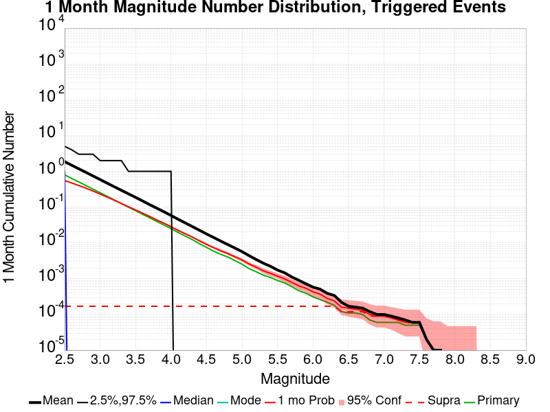

| Mag | Mean | 2.5 %ile | 97.5 %ile | Median | Mode | 1 mo Probability | 1 mo Prob 95% Conf | 1 mo Supra-Seis Prob | Primary Aftershocks Mean |
|-----|-----|-----|-----|-----|-----|-----|-----|-----|-----|
| **M&ge;2.5** | 1.302 | 0.000 | 4.000 | 1.000 | 0.000 | 0.557 (55.70%) | [54.58% 56.81%] | 2.60E-4 (0.03%) | 0.804 |
| **M&ge;2.6** | 1.035 | 0.000 | 4.000 | 0.000 | 0.000 | 0.481 (48.06%) | [46.94% 49.19%] | 2.60E-4 (0.03%) | 0.640 |
| **M&ge;2.7** | 0.826 | 0.000 | 3.000 | 0.000 | 0.000 | 0.410 (40.99%) | [39.89% 42.10%] | 2.60E-4 (0.03%) | 0.513 |
| **M&ge;2.8** | 0.650 | 0.000 | 3.000 | 0.000 | 0.000 | 0.344 (34.42%) | [33.36% 35.49%] | 2.60E-4 (0.03%) | 0.406 |
| **M&ge;2.9** | 0.515 | 0.000 | 3.000 | 0.000 | 0.000 | 0.288 (28.77%) | [27.76% 29.79%] | 2.60E-4 (0.03%) | 0.323 |
| **M&ge;3** | 0.408 | 0.000 | 2.000 | 0.000 | 0.000 | 0.236 (23.57%) | [22.63% 24.54%] | 2.60E-4 (0.03%) | 0.256 |
| **M&ge;3.1** | 0.325 | 0.000 | 2.000 | 0.000 | 0.000 | 0.193 (19.32%) | [18.45% 20.23%] | 2.60E-4 (0.03%) | 0.201 |
| **M&ge;3.2** | 0.256 | 0.000 | 2.000 | 0.000 | 0.000 | 0.154 (15.36%) | [14.57% 16.19%] | 2.60E-4 (0.03%) | 0.158 |
| **M&ge;3.3** | 0.206 | 0.000 | 2.000 | 0.000 | 0.000 | 0.125 (12.49%) | [11.77% 13.26%] | 2.60E-4 (0.03%) | 0.126 |
| **M&ge;3.4** | 0.164 | 0.000 | 1.000 | 0.000 | 0.000 | 0.102 (10.19%) | [9.53% 10.90%] | 2.60E-4 (0.03%) | 0.100 |
| **M&ge;3.5** | 0.131 | 0.000 | 1.000 | 0.000 | 0.000 | 0.082 (8.25%) | [7.65% 8.89%] | 2.60E-4 (0.03%) | 0.079 |
| **M&ge;3.6** | 0.103 | 0.000 | 1.000 | 0.000 | 0.000 | 0.068 (6.81%) | [6.26% 7.40%] | 2.60E-4 (0.03%) | 0.063 |
| **M&ge;3.7** | 0.082 | 0.000 | 1.000 | 0.000 | 0.000 | 0.056 (5.56%) | [5.06% 6.10%] | 2.60E-4 (0.03%) | 0.050 |
| **M&ge;3.8** | 0.067 | 0.000 | 1.000 | 0.000 | 0.000 | 0.044 (4.39%) | [3.95% 4.88%] | 2.60E-4 (0.03%) | 0.039 |
| **M&ge;3.9** | 0.051 | 0.000 | 1.000 | 0.000 | 0.000 | 0.033 (3.31%) | [2.93% 3.74%] | 2.60E-4 (0.03%) | 0.029 |
| **M&ge;4** | 0.040 | 0.000 | 1.000 | 0.000 | 0.000 | 0.026 (2.65%) | [2.31% 3.04%] | 2.60E-4 (0.03%) | 0.022 |
| **M&ge;4.1** | 0.031 | 0.000 | 0.000 | 0.000 | 0.000 | 0.020 (2.03%) | [1.73% 2.37%] | 2.60E-4 (0.03%) | 0.016 |
| **M&ge;4.2** | 0.024 | 0.000 | 0.000 | 0.000 | 0.000 | 0.016 (1.60%) | [1.33% 1.91%] | 2.60E-4 (0.03%) | 0.013 |
| **M&ge;4.3** | 0.019 | 0.000 | 0.000 | 0.000 | 0.000 | 0.013 (1.31%) | [1.07% 1.60%] | 2.60E-4 (0.03%) | 0.011 |
| **M&ge;4.4** | 0.016 | 0.000 | 0.000 | 0.000 | 0.000 | 0.011 (1.08%) | [0.86% 1.34%] | 2.60E-4 (0.03%) | 8.57E-3 |
| **M&ge;4.5** | 0.013 | 0.000 | 0.000 | 0.000 | 0.000 | 8.83E-3 (0.88%) | [0.69% 1.13%] | 2.60E-4 (0.03%) | 6.75E-3 |
| **M&ge;4.6** | 0.011 | 0.000 | 0.000 | 0.000 | 0.000 | 7.66E-3 (0.77%) | [0.59% 0.99%] | 2.60E-4 (0.03%) | 5.71E-3 |
| **M&ge;4.7** | 8.70E-3 | 0.000 | 0.000 | 0.000 | 0.000 | 5.84E-3 (0.58%) | [0.43% 0.79%] | 2.60E-4 (0.03%) | 4.16E-3 |
| **M&ge;4.8** | 7.01E-3 | 0.000 | 0.000 | 0.000 | 0.000 | 4.81E-3 (0.48%) | [0.34% 0.67%] | 2.60E-4 (0.03%) | 3.51E-3 |
| **M&ge;4.9** | 5.71E-3 | 0.000 | 0.000 | 0.000 | 0.000 | 4.03E-3 (0.40%) | [0.28% 0.58%] | 2.60E-4 (0.03%) | 2.86E-3 |
| **M&ge;5** | 4.42E-3 | 0.000 | 0.000 | 0.000 | 0.000 | 3.38E-3 (0.34%) | [0.23% 0.50%] | 2.60E-4 (0.03%) | 2.47E-3 |
| **M&ge;5.1** | 3.38E-3 | 0.000 | 0.000 | 0.000 | 0.000 | 2.60E-3 (0.26%) | [0.16% 0.41%] | 2.60E-4 (0.03%) | 1.95E-3 |
| **M&ge;5.2** | 2.86E-3 | 0.000 | 0.000 | 0.000 | 0.000 | 2.21E-3 (0.22%) | [0.13% 0.36%] | 2.60E-4 (0.03%) | 1.69E-3 |
| **M&ge;5.3** | 2.47E-3 | 0.000 | 0.000 | 0.000 | 0.000 | 2.08E-3 (0.21%) | [0.12% 0.35%] | 2.60E-4 (0.03%) | 1.69E-3 |
| **M&ge;5.4** | 1.95E-3 | 0.000 | 0.000 | 0.000 | 0.000 | 1.69E-3 (0.17%) | [0.09% 0.30%] | 2.60E-4 (0.03%) | 1.30E-3 |
| **M&ge;5.5** | 1.43E-3 | 0.000 | 0.000 | 0.000 | 0.000 | 1.17E-3 (0.12%) | [0.06% 0.23%] | 2.60E-4 (0.03%) | 7.79E-4 |
| **M&ge;5.6** | 1.17E-3 | 0.000 | 0.000 | 0.000 | 0.000 | 9.09E-4 (0.09%) | [0.04% 0.20%] | 2.60E-4 (0.03%) | 5.19E-4 |
| **M&ge;5.7** | 1.17E-3 | 0.000 | 0.000 | 0.000 | 0.000 | 9.09E-4 (0.09%) | [0.04% 0.20%] | 2.60E-4 (0.03%) | 5.19E-4 |
| **M&ge;5.8** | 9.09E-4 | 0.000 | 0.000 | 0.000 | 0.000 | 7.79E-4 (0.08%) | [0.03% 0.18%] | 2.60E-4 (0.03%) | 3.90E-4 |
| **M&ge;5.9** | 5.19E-4 | 0.000 | 0.000 | 0.000 | 0.000 | 5.19E-4 (0.05%) | [0.02% 0.14%] | 2.60E-4 (0.03%) | 2.60E-4 |
| **M&ge;6** | 3.90E-4 | 0.000 | 0.000 | 0.000 | 0.000 | 3.90E-4 (0.04%) | [0.01% 0.12%] | 2.60E-4 (0.03%) | 1.30E-4 |
| **M&ge;6.1** | 2.60E-4 | 0.000 | 0.000 | 0.000 | 0.000 | 2.60E-4 (0.03%) | [0.00% 0.10%] | 2.60E-4 (0.03%) | 1.30E-4 |
| **M&ge;6.2** | 2.60E-4 | 0.000 | 0.000 | 0.000 | 0.000 | 2.60E-4 (0.03%) | [0.00% 0.10%] | 2.60E-4 (0.03%) | 1.30E-4 |
| **M&ge;6.3** | 2.60E-4 | 0.000 | 0.000 | 0.000 | 0.000 | 2.60E-4 (0.03%) | [0.00% 0.10%] | 2.60E-4 (0.03%) | 1.30E-4 |
| **M&ge;6.4** | 0.000 | 0.000 | 0.000 | 0.000 | 0.000 | 0.000 (0.00%) | [0.00% 0.06%] | 0.000 (0.00%) | 0.000 |
| **M&ge;6.5** | 0.000 | 0.000 | 0.000 | 0.000 | 0.000 | 0.000 (0.00%) | [0.00% 0.06%] | 0.000 (0.00%) | 0.000 |
| **M&ge;6.6** | 0.000 | 0.000 | 0.000 | 0.000 | 0.000 | 0.000 (0.00%) | [0.00% 0.06%] | 0.000 (0.00%) | 0.000 |
| **M&ge;6.7** | 0.000 | 0.000 | 0.000 | 0.000 | 0.000 | 0.000 (0.00%) | [0.00% 0.06%] | 0.000 (0.00%) | 0.000 |
| **M&ge;6.8** | 0.000 | 0.000 | 0.000 | 0.000 | 0.000 | 0.000 (0.00%) | [0.00% 0.06%] | 0.000 (0.00%) | 0.000 |
| **M&ge;6.9** | 0.000 | 0.000 | 0.000 | 0.000 | 0.000 | 0.000 (0.00%) | [0.00% 0.06%] | 0.000 (0.00%) | 0.000 |
| **M&ge;7** | 0.000 | 0.000 | 0.000 | 0.000 | 0.000 | 0.000 (0.00%) | [0.00% 0.06%] | 0.000 (0.00%) | 0.000 |
| **M&ge;7.1** | 0.000 | 0.000 | 0.000 | 0.000 | 0.000 | 0.000 (0.00%) | [0.00% 0.06%] | 0.000 (0.00%) | 0.000 |
| **M&ge;7.2** | 0.000 | 0.000 | 0.000 | 0.000 | 0.000 | 0.000 (0.00%) | [0.00% 0.06%] | 0.000 (0.00%) | 0.000 |
| **M&ge;7.3** | 0.000 | 0.000 | 0.000 | 0.000 | 0.000 | 0.000 (0.00%) | [0.00% 0.06%] | 0.000 (0.00%) | 0.000 |
| **M&ge;7.4** | 0.000 | 0.000 | 0.000 | 0.000 | 0.000 | 0.000 (0.00%) | [0.00% 0.06%] | 0.000 (0.00%) | 0.000 |
| **M&ge;7.5** | 0.000 | 0.000 | 0.000 | 0.000 | 0.000 | 0.000 (0.00%) | [0.00% 0.06%] | 0.000 (0.00%) | 0.000 |
| **M&ge;7.6** | 0.000 | 0.000 | 0.000 | 0.000 | 0.000 | 0.000 (0.00%) | [0.00% 0.06%] | 0.000 (0.00%) | 0.000 |
| **M&ge;7.7** | 0.000 | 0.000 | 0.000 | 0.000 | 0.000 | 0.000 (0.00%) | [0.00% 0.06%] | 0.000 (0.00%) | 0.000 |
| **M&ge;7.8** | 0.000 | 0.000 | 0.000 | 0.000 | 0.000 | 0.000 (0.00%) | [0.00% 0.06%] | 0.000 (0.00%) | 0.000 |
| **M&ge;7.9** | 0.000 | 0.000 | 0.000 | 0.000 | 0.000 | 0.000 (0.00%) | [0.00% 0.06%] | 0.000 (0.00%) | 0.000 |
| **M&ge;8** | 0.000 | 0.000 | 0.000 | 0.000 | 0.000 | 0.000 (0.00%) | [0.00% 0.06%] | 0.000 (0.00%) | 0.000 |
| **M&ge;8.1** | 0.000 | 0.000 | 0.000 | 0.000 | 0.000 | 0.000 (0.00%) | [0.00% 0.06%] | 0.000 (0.00%) | 0.000 |
| **M&ge;8.2** | 0.000 | 0.000 | 0.000 | 0.000 | 0.000 | 0.000 (0.00%) | [0.00% 0.06%] | 0.000 (0.00%) | 0.000 |
| **M&ge;8.3** | 0.000 | 0.000 | 0.000 | 0.000 | 0.000 | 0.000 (0.00%) | [0.00% 0.06%] | 0.000 (0.00%) | 0.000 |
| **M&ge;8.4** | 0.000 | 0.000 | 0.000 | 0.000 | 0.000 | 0.000 (0.00%) | [0.00% 0.06%] | 0.000 (0.00%) | 0.000 |
| **M&ge;8.5** | 0.000 | 0.000 | 0.000 | 0.000 | 0.000 | 0.000 (0.00%) | [0.00% 0.06%] | 0.000 (0.00%) | 0.000 |
| **M&ge;8.6** | 0.000 | 0.000 | 0.000 | 0.000 | 0.000 | 0.000 (0.00%) | [0.00% 0.06%] | 0.000 (0.00%) | 0.000 |
| **M&ge;8.7** | 0.000 | 0.000 | 0.000 | 0.000 | 0.000 | 0.000 (0.00%) | [0.00% 0.06%] | 0.000 (0.00%) | 0.000 |
| **M&ge;8.8** | 0.000 | 0.000 | 0.000 | 0.000 | 0.000 | 0.000 (0.00%) | [0.00% 0.06%] | 0.000 (0.00%) | 0.000 |
| **M&ge;8.9** | 0.000 | 0.000 | 0.000 | 0.000 | 0.000 | 0.000 (0.00%) | [0.00% 0.06%] | 0.000 (0.00%) | 0.000 |
| **M&ge;9** | 0.000 | 0.000 | 0.000 | 0.000 | 0.000 | 0.000 (0.00%) | [0.00% 0.06%] | 0.000 (0.00%) | 0.000 |

### 1 Week Magnitude Number Distribution
*[(top)](#table-of-contents)*

**Legend**
* **Mean** (thick black line): mean expected number across all 7700 catalogs
* **2.5%,97.5%** (thin black lines): expected number percentiles across all 7700 catalogs
* **Median** (thin blue line): median expected number across all 7700 catalogs
* **Mode** (thin cyan line): modal expected number across all 7700 catalogs
* **1 wk Probability** (thin red line): 1 week probability calculated as the fraction of catalogs with at least 1 occurrence
* **1 wk Supraseismogenic Probability** (thin dashed red line): same as above, but only for supraseismogenic ruptures on explicitly modeled UCERF3 faults
* **95% Conf** (light red shaded region): binomial 95% confidence bounds on probability
* **Primary** (thin green line): mean expected number from primary triggered aftershocks only (no secondary, tertiary, etc...) across all 7700 catalogs


| Mag | Mean | 2.5 %ile | 97.5 %ile | Median | Mode | 1 wk Probability | 1 wk Prob 95% Conf | 1 wk Supra-Seis Prob | Primary Aftershocks Mean |
|-----|-----|-----|-----|-----|-----|-----|-----|-----|-----|
| **M&ge;2.5** | 0.794 | 0.000 | 3.000 | 0.000 | 0.000 | 0.426 (42.57%) | [41.46% 43.69%] | 1.30E-4 (0.01%) | 0.550 |
| **M&ge;2.6** | 0.634 | 0.000 | 3.000 | 0.000 | 0.000 | 0.362 (36.21%) | [35.13% 37.29%] | 1.30E-4 (0.01%) | 0.439 |
| **M&ge;2.7** | 0.503 | 0.000 | 2.000 | 0.000 | 0.000 | 0.302 (30.23%) | [29.21% 31.28%] | 1.30E-4 (0.01%) | 0.350 |
| **M&ge;2.8** | 0.398 | 0.000 | 2.000 | 0.000 | 0.000 | 0.252 (25.18%) | [24.22% 26.17%] | 1.30E-4 (0.01%) | 0.279 |
| **M&ge;2.9** | 0.316 | 0.000 | 2.000 | 0.000 | 0.000 | 0.207 (20.68%) | [19.78% 21.60%] | 1.30E-4 (0.01%) | 0.222 |
| **M&ge;3** | 0.252 | 0.000 | 2.000 | 0.000 | 0.000 | 0.167 (16.73%) | [15.90% 17.58%] | 1.30E-4 (0.01%) | 0.175 |
| **M&ge;3.1** | 0.200 | 0.000 | 1.000 | 0.000 | 0.000 | 0.137 (13.69%) | [12.93% 14.48%] | 1.30E-4 (0.01%) | 0.138 |
| **M&ge;3.2** | 0.156 | 0.000 | 1.000 | 0.000 | 0.000 | 0.108 (10.75%) | [10.07% 11.47%] | 1.30E-4 (0.01%) | 0.108 |
| **M&ge;3.3** | 0.124 | 0.000 | 1.000 | 0.000 | 0.000 | 0.087 (8.68%) | [8.06% 9.33%] | 1.30E-4 (0.01%) | 0.085 |
| **M&ge;3.4** | 0.101 | 0.000 | 1.000 | 0.000 | 0.000 | 0.071 (7.14%) | [6.58% 7.75%] | 1.30E-4 (0.01%) | 0.069 |
| **M&ge;3.5** | 0.081 | 0.000 | 1.000 | 0.000 | 0.000 | 0.057 (5.74%) | [5.24% 6.29%] | 1.30E-4 (0.01%) | 0.055 |
| **M&ge;3.6** | 0.064 | 0.000 | 1.000 | 0.000 | 0.000 | 0.048 (4.75%) | [4.29% 5.26%] | 1.30E-4 (0.01%) | 0.044 |
| **M&ge;3.7** | 0.051 | 0.000 | 1.000 | 0.000 | 0.000 | 0.039 (3.86%) | [3.44% 4.32%] | 1.30E-4 (0.01%) | 0.035 |
| **M&ge;3.8** | 0.041 | 0.000 | 1.000 | 0.000 | 0.000 | 0.030 (3.04%) | [2.67% 3.45%] | 1.30E-4 (0.01%) | 0.027 |
| **M&ge;3.9** | 0.031 | 0.000 | 0.000 | 0.000 | 0.000 | 0.024 (2.35%) | [2.03% 2.72%] | 1.30E-4 (0.01%) | 0.021 |
| **M&ge;4** | 0.024 | 0.000 | 0.000 | 0.000 | 0.000 | 0.019 (1.87%) | [1.58% 2.20%] | 1.30E-4 (0.01%) | 0.016 |
| **M&ge;4.1** | 0.020 | 0.000 | 0.000 | 0.000 | 0.000 | 0.015 (1.49%) | [1.24% 1.80%] | 1.30E-4 (0.01%) | 0.013 |
| **M&ge;4.2** | 0.016 | 0.000 | 0.000 | 0.000 | 0.000 | 0.012 (1.18%) | [0.96% 1.46%] | 1.30E-4 (0.01%) | 0.010 |
| **M&ge;4.3** | 0.012 | 0.000 | 0.000 | 0.000 | 0.000 | 9.22E-3 (0.92%) | [0.73% 1.17%] | 1.30E-4 (0.01%) | 8.05E-3 |
| **M&ge;4.4** | 9.87E-3 | 0.000 | 0.000 | 0.000 | 0.000 | 7.14E-3 (0.71%) | [0.54% 0.94%] | 1.30E-4 (0.01%) | 6.23E-3 |
| **M&ge;4.5** | 7.79E-3 | 0.000 | 0.000 | 0.000 | 0.000 | 5.97E-3 (0.60%) | [0.44% 0.80%] | 1.30E-4 (0.01%) | 5.19E-3 |
| **M&ge;4.6** | 6.62E-3 | 0.000 | 0.000 | 0.000 | 0.000 | 5.19E-3 (0.52%) | [0.38% 0.71%] | 1.30E-4 (0.01%) | 4.42E-3 |
| **M&ge;4.7** | 5.06E-3 | 0.000 | 0.000 | 0.000 | 0.000 | 3.90E-3 (0.39%) | [0.27% 0.56%] | 1.30E-4 (0.01%) | 3.12E-3 |
| **M&ge;4.8** | 3.77E-3 | 0.000 | 0.000 | 0.000 | 0.000 | 2.99E-3 (0.30%) | [0.19% 0.46%] | 1.30E-4 (0.01%) | 2.47E-3 |
| **M&ge;4.9** | 2.86E-3 | 0.000 | 0.000 | 0.000 | 0.000 | 2.47E-3 (0.25%) | [0.15% 0.39%] | 1.30E-4 (0.01%) | 1.95E-3 |
| **M&ge;5** | 2.47E-3 | 0.000 | 0.000 | 0.000 | 0.000 | 2.08E-3 (0.21%) | [0.12% 0.35%] | 1.30E-4 (0.01%) | 1.69E-3 |
| **M&ge;5.1** | 1.95E-3 | 0.000 | 0.000 | 0.000 | 0.000 | 1.56E-3 (0.16%) | [0.08% 0.28%] | 1.30E-4 (0.01%) | 1.30E-3 |
| **M&ge;5.2** | 1.69E-3 | 0.000 | 0.000 | 0.000 | 0.000 | 1.30E-3 (0.13%) | [0.07% 0.25%] | 1.30E-4 (0.01%) | 1.17E-3 |
| **M&ge;5.3** | 1.43E-3 | 0.000 | 0.000 | 0.000 | 0.000 | 1.17E-3 (0.12%) | [0.06% 0.23%] | 1.30E-4 (0.01%) | 1.17E-3 |
| **M&ge;5.4** | 1.17E-3 | 0.000 | 0.000 | 0.000 | 0.000 | 1.04E-3 (0.10%) | [0.05% 0.21%] | 1.30E-4 (0.01%) | 1.04E-3 |
| **M&ge;5.5** | 7.79E-4 | 0.000 | 0.000 | 0.000 | 0.000 | 6.49E-4 (0.06%) | [0.02% 0.16%] | 1.30E-4 (0.01%) | 6.49E-4 |
| **M&ge;5.6** | 6.49E-4 | 0.000 | 0.000 | 0.000 | 0.000 | 5.19E-4 (0.05%) | [0.02% 0.14%] | 1.30E-4 (0.01%) | 5.19E-4 |
| **M&ge;5.7** | 6.49E-4 | 0.000 | 0.000 | 0.000 | 0.000 | 5.19E-4 (0.05%) | [0.02% 0.14%] | 1.30E-4 (0.01%) | 5.19E-4 |
| **M&ge;5.8** | 5.19E-4 | 0.000 | 0.000 | 0.000 | 0.000 | 3.90E-4 (0.04%) | [0.01% 0.12%] | 1.30E-4 (0.01%) | 3.90E-4 |
| **M&ge;5.9** | 2.60E-4 | 0.000 | 0.000 | 0.000 | 0.000 | 2.60E-4 (0.03%) | [0.00% 0.10%] | 1.30E-4 (0.01%) | 2.60E-4 |
| **M&ge;6** | 1.30E-4 | 0.000 | 0.000 | 0.000 | 0.000 | 1.30E-4 (0.01%) | [0.00% 0.08%] | 1.30E-4 (0.01%) | 1.30E-4 |
| **M&ge;6.1** | 1.30E-4 | 0.000 | 0.000 | 0.000 | 0.000 | 1.30E-4 (0.01%) | [0.00% 0.08%] | 1.30E-4 (0.01%) | 1.30E-4 |
| **M&ge;6.2** | 1.30E-4 | 0.000 | 0.000 | 0.000 | 0.000 | 1.30E-4 (0.01%) | [0.00% 0.08%] | 1.30E-4 (0.01%) | 1.30E-4 |
| **M&ge;6.3** | 1.30E-4 | 0.000 | 0.000 | 0.000 | 0.000 | 1.30E-4 (0.01%) | [0.00% 0.08%] | 1.30E-4 (0.01%) | 1.30E-4 |
| **M&ge;6.4** | 0.000 | 0.000 | 0.000 | 0.000 | 0.000 | 0.000 (0.00%) | [0.00% 0.06%] | 0.000 (0.00%) | 0.000 |
| **M&ge;6.5** | 0.000 | 0.000 | 0.000 | 0.000 | 0.000 | 0.000 (0.00%) | [0.00% 0.06%] | 0.000 (0.00%) | 0.000 |
| **M&ge;6.6** | 0.000 | 0.000 | 0.000 | 0.000 | 0.000 | 0.000 (0.00%) | [0.00% 0.06%] | 0.000 (0.00%) | 0.000 |
| **M&ge;6.7** | 0.000 | 0.000 | 0.000 | 0.000 | 0.000 | 0.000 (0.00%) | [0.00% 0.06%] | 0.000 (0.00%) | 0.000 |
| **M&ge;6.8** | 0.000 | 0.000 | 0.000 | 0.000 | 0.000 | 0.000 (0.00%) | [0.00% 0.06%] | 0.000 (0.00%) | 0.000 |
| **M&ge;6.9** | 0.000 | 0.000 | 0.000 | 0.000 | 0.000 | 0.000 (0.00%) | [0.00% 0.06%] | 0.000 (0.00%) | 0.000 |
| **M&ge;7** | 0.000 | 0.000 | 0.000 | 0.000 | 0.000 | 0.000 (0.00%) | [0.00% 0.06%] | 0.000 (0.00%) | 0.000 |
| **M&ge;7.1** | 0.000 | 0.000 | 0.000 | 0.000 | 0.000 | 0.000 (0.00%) | [0.00% 0.06%] | 0.000 (0.00%) | 0.000 |
| **M&ge;7.2** | 0.000 | 0.000 | 0.000 | 0.000 | 0.000 | 0.000 (0.00%) | [0.00% 0.06%] | 0.000 (0.00%) | 0.000 |
| **M&ge;7.3** | 0.000 | 0.000 | 0.000 | 0.000 | 0.000 | 0.000 (0.00%) | [0.00% 0.06%] | 0.000 (0.00%) | 0.000 |
| **M&ge;7.4** | 0.000 | 0.000 | 0.000 | 0.000 | 0.000 | 0.000 (0.00%) | [0.00% 0.06%] | 0.000 (0.00%) | 0.000 |
| **M&ge;7.5** | 0.000 | 0.000 | 0.000 | 0.000 | 0.000 | 0.000 (0.00%) | [0.00% 0.06%] | 0.000 (0.00%) | 0.000 |
| **M&ge;7.6** | 0.000 | 0.000 | 0.000 | 0.000 | 0.000 | 0.000 (0.00%) | [0.00% 0.06%] | 0.000 (0.00%) | 0.000 |
| **M&ge;7.7** | 0.000 | 0.000 | 0.000 | 0.000 | 0.000 | 0.000 (0.00%) | [0.00% 0.06%] | 0.000 (0.00%) | 0.000 |
| **M&ge;7.8** | 0.000 | 0.000 | 0.000 | 0.000 | 0.000 | 0.000 (0.00%) | [0.00% 0.06%] | 0.000 (0.00%) | 0.000 |
| **M&ge;7.9** | 0.000 | 0.000 | 0.000 | 0.000 | 0.000 | 0.000 (0.00%) | [0.00% 0.06%] | 0.000 (0.00%) | 0.000 |
| **M&ge;8** | 0.000 | 0.000 | 0.000 | 0.000 | 0.000 | 0.000 (0.00%) | [0.00% 0.06%] | 0.000 (0.00%) | 0.000 |
| **M&ge;8.1** | 0.000 | 0.000 | 0.000 | 0.000 | 0.000 | 0.000 (0.00%) | [0.00% 0.06%] | 0.000 (0.00%) | 0.000 |
| **M&ge;8.2** | 0.000 | 0.000 | 0.000 | 0.000 | 0.000 | 0.000 (0.00%) | [0.00% 0.06%] | 0.000 (0.00%) | 0.000 |
| **M&ge;8.3** | 0.000 | 0.000 | 0.000 | 0.000 | 0.000 | 0.000 (0.00%) | [0.00% 0.06%] | 0.000 (0.00%) | 0.000 |
| **M&ge;8.4** | 0.000 | 0.000 | 0.000 | 0.000 | 0.000 | 0.000 (0.00%) | [0.00% 0.06%] | 0.000 (0.00%) | 0.000 |
| **M&ge;8.5** | 0.000 | 0.000 | 0.000 | 0.000 | 0.000 | 0.000 (0.00%) | [0.00% 0.06%] | 0.000 (0.00%) | 0.000 |
| **M&ge;8.6** | 0.000 | 0.000 | 0.000 | 0.000 | 0.000 | 0.000 (0.00%) | [0.00% 0.06%] | 0.000 (0.00%) | 0.000 |
| **M&ge;8.7** | 0.000 | 0.000 | 0.000 | 0.000 | 0.000 | 0.000 (0.00%) | [0.00% 0.06%] | 0.000 (0.00%) | 0.000 |
| **M&ge;8.8** | 0.000 | 0.000 | 0.000 | 0.000 | 0.000 | 0.000 (0.00%) | [0.00% 0.06%] | 0.000 (0.00%) | 0.000 |
| **M&ge;8.9** | 0.000 | 0.000 | 0.000 | 0.000 | 0.000 | 0.000 (0.00%) | [0.00% 0.06%] | 0.000 (0.00%) | 0.000 |
| **M&ge;9** | 0.000 | 0.000 | 0.000 | 0.000 | 0.000 | 0.000 (0.00%) | [0.00% 0.06%] | 0.000 (0.00%) | 0.000 |

### 1 Day Magnitude Number Distribution
*[(top)](#table-of-contents)*

**Legend**
* **Mean** (thick black line): mean expected number across all 7700 catalogs
* **2.5%,97.5%** (thin black lines): expected number percentiles across all 7700 catalogs
* **Median** (thin blue line): median expected number across all 7700 catalogs
* **Mode** (thin cyan line): modal expected number across all 7700 catalogs
* **1 d Probability** (thin red line): 1 day probability calculated as the fraction of catalogs with at least 1 occurrence
* **1 d Supraseismogenic Probability** (thin dashed red line): same as above, but only for supraseismogenic ruptures on explicitly modeled UCERF3 faults
* **95% Conf** (light red shaded region): binomial 95% confidence bounds on probability
* **Primary** (thin green line): mean expected number from primary triggered aftershocks only (no secondary, tertiary, etc...) across all 7700 catalogs


| Mag | Mean | 2.5 %ile | 97.5 %ile | Median | Mode | 1 d Probability | 1 d Prob 95% Conf | 1 d Supra-Seis Prob | Primary Aftershocks Mean |
|-----|-----|-----|-----|-----|-----|-----|-----|-----|-----|
| **M&ge;2.5** | 0.292 | 0.000 | 2.000 | 0.000 | 0.000 | 0.209 (20.87%) | [19.97% 21.80%] | 0.000 (0.00%) | 0.234 |
| **M&ge;2.6** | 0.235 | 0.000 | 2.000 | 0.000 | 0.000 | 0.171 (17.06%) | [16.23% 17.93%] | 0.000 (0.00%) | 0.187 |
| **M&ge;2.7** | 0.187 | 0.000 | 1.000 | 0.000 | 0.000 | 0.139 (13.90%) | [13.14% 14.69%] | 0.000 (0.00%) | 0.149 |
| **M&ge;2.8** | 0.148 | 0.000 | 1.000 | 0.000 | 0.000 | 0.114 (11.39%) | [10.69% 12.13%] | 0.000 (0.00%) | 0.119 |
| **M&ge;2.9** | 0.118 | 0.000 | 1.000 | 0.000 | 0.000 | 0.092 (9.17%) | [8.54% 9.84%] | 0.000 (0.00%) | 0.095 |
| **M&ge;3** | 0.092 | 0.000 | 1.000 | 0.000 | 0.000 | 0.073 (7.27%) | [6.71% 7.88%] | 0.000 (0.00%) | 0.074 |
| **M&ge;3.1** | 0.072 | 0.000 | 1.000 | 0.000 | 0.000 | 0.058 (5.81%) | [5.30% 6.36%] | 0.000 (0.00%) | 0.058 |
| **M&ge;3.2** | 0.055 | 0.000 | 1.000 | 0.000 | 0.000 | 0.045 (4.49%) | [4.05% 4.99%] | 0.000 (0.00%) | 0.045 |
| **M&ge;3.3** | 0.044 | 0.000 | 1.000 | 0.000 | 0.000 | 0.035 (3.55%) | [3.15% 3.99%] | 0.000 (0.00%) | 0.035 |
| **M&ge;3.4** | 0.036 | 0.000 | 1.000 | 0.000 | 0.000 | 0.029 (2.86%) | [2.50% 3.26%] | 0.000 (0.00%) | 0.029 |
| **M&ge;3.5** | 0.029 | 0.000 | 0.000 | 0.000 | 0.000 | 0.023 (2.30%) | [1.98% 2.66%] | 0.000 (0.00%) | 0.023 |
| **M&ge;3.6** | 0.023 | 0.000 | 0.000 | 0.000 | 0.000 | 0.019 (1.86%) | [1.57% 2.19%] | 0.000 (0.00%) | 0.018 |
| **M&ge;3.7** | 0.018 | 0.000 | 0.000 | 0.000 | 0.000 | 0.015 (1.51%) | [1.25% 1.81%] | 0.000 (0.00%) | 0.015 |
| **M&ge;3.8** | 0.014 | 0.000 | 0.000 | 0.000 | 0.000 | 0.012 (1.16%) | [0.93% 1.43%] | 0.000 (0.00%) | 0.011 |
| **M&ge;3.9** | 0.011 | 0.000 | 0.000 | 0.000 | 0.000 | 8.96E-3 (0.90%) | [0.70% 1.14%] | 0.000 (0.00%) | 8.31E-3 |
| **M&ge;4** | 7.92E-3 | 0.000 | 0.000 | 0.000 | 0.000 | 6.88E-3 (0.69%) | [0.52% 0.91%] | 0.000 (0.00%) | 6.62E-3 |
| **M&ge;4.1** | 5.58E-3 | 0.000 | 0.000 | 0.000 | 0.000 | 4.94E-3 (0.49%) | [0.35% 0.68%] | 0.000 (0.00%) | 4.81E-3 |
| **M&ge;4.2** | 4.29E-3 | 0.000 | 0.000 | 0.000 | 0.000 | 3.90E-3 (0.39%) | [0.27% 0.56%] | 0.000 (0.00%) | 3.77E-3 |
| **M&ge;4.3** | 3.77E-3 | 0.000 | 0.000 | 0.000 | 0.000 | 3.38E-3 (0.34%) | [0.23% 0.50%] | 0.000 (0.00%) | 3.25E-3 |
| **M&ge;4.4** | 3.25E-3 | 0.000 | 0.000 | 0.000 | 0.000 | 2.86E-3 (0.29%) | [0.18% 0.44%] | 0.000 (0.00%) | 2.86E-3 |
| **M&ge;4.5** | 2.73E-3 | 0.000 | 0.000 | 0.000 | 0.000 | 2.47E-3 (0.25%) | [0.15% 0.39%] | 0.000 (0.00%) | 2.34E-3 |
| **M&ge;4.6** | 2.21E-3 | 0.000 | 0.000 | 0.000 | 0.000 | 2.08E-3 (0.21%) | [0.12% 0.35%] | 0.000 (0.00%) | 1.95E-3 |
| **M&ge;4.7** | 1.82E-3 | 0.000 | 0.000 | 0.000 | 0.000 | 1.69E-3 (0.17%) | [0.09% 0.30%] | 0.000 (0.00%) | 1.56E-3 |
| **M&ge;4.8** | 1.17E-3 | 0.000 | 0.000 | 0.000 | 0.000 | 1.17E-3 (0.12%) | [0.06% 0.23%] | 0.000 (0.00%) | 1.17E-3 |
| **M&ge;4.9** | 9.09E-4 | 0.000 | 0.000 | 0.000 | 0.000 | 9.09E-4 (0.09%) | [0.04% 0.20%] | 0.000 (0.00%) | 9.09E-4 |
| **M&ge;5** | 7.79E-4 | 0.000 | 0.000 | 0.000 | 0.000 | 7.79E-4 (0.08%) | [0.03% 0.18%] | 0.000 (0.00%) | 7.79E-4 |
| **M&ge;5.1** | 5.19E-4 | 0.000 | 0.000 | 0.000 | 0.000 | 5.19E-4 (0.05%) | [0.02% 0.14%] | 0.000 (0.00%) | 5.19E-4 |
| **M&ge;5.2** | 3.90E-4 | 0.000 | 0.000 | 0.000 | 0.000 | 3.90E-4 (0.04%) | [0.01% 0.12%] | 0.000 (0.00%) | 3.90E-4 |
| **M&ge;5.3** | 3.90E-4 | 0.000 | 0.000 | 0.000 | 0.000 | 3.90E-4 (0.04%) | [0.01% 0.12%] | 0.000 (0.00%) | 3.90E-4 |
| **M&ge;5.4** | 3.90E-4 | 0.000 | 0.000 | 0.000 | 0.000 | 3.90E-4 (0.04%) | [0.01% 0.12%] | 0.000 (0.00%) | 3.90E-4 |
| **M&ge;5.5** | 2.60E-4 | 0.000 | 0.000 | 0.000 | 0.000 | 2.60E-4 (0.03%) | [0.00% 0.10%] | 0.000 (0.00%) | 2.60E-4 |
| **M&ge;5.6** | 2.60E-4 | 0.000 | 0.000 | 0.000 | 0.000 | 2.60E-4 (0.03%) | [0.00% 0.10%] | 0.000 (0.00%) | 2.60E-4 |
| **M&ge;5.7** | 2.60E-4 | 0.000 | 0.000 | 0.000 | 0.000 | 2.60E-4 (0.03%) | [0.00% 0.10%] | 0.000 (0.00%) | 2.60E-4 |
| **M&ge;5.8** | 1.30E-4 | 0.000 | 0.000 | 0.000 | 0.000 | 1.30E-4 (0.01%) | [0.00% 0.08%] | 0.000 (0.00%) | 1.30E-4 |
| **M&ge;5.9** | 1.30E-4 | 0.000 | 0.000 | 0.000 | 0.000 | 1.30E-4 (0.01%) | [0.00% 0.08%] | 0.000 (0.00%) | 1.30E-4 |
| **M&ge;6** | 0.000 | 0.000 | 0.000 | 0.000 | 0.000 | 0.000 (0.00%) | [0.00% 0.06%] | 0.000 (0.00%) | 0.000 |
| **M&ge;6.1** | 0.000 | 0.000 | 0.000 | 0.000 | 0.000 | 0.000 (0.00%) | [0.00% 0.06%] | 0.000 (0.00%) | 0.000 |
| **M&ge;6.2** | 0.000 | 0.000 | 0.000 | 0.000 | 0.000 | 0.000 (0.00%) | [0.00% 0.06%] | 0.000 (0.00%) | 0.000 |
| **M&ge;6.3** | 0.000 | 0.000 | 0.000 | 0.000 | 0.000 | 0.000 (0.00%) | [0.00% 0.06%] | 0.000 (0.00%) | 0.000 |
| **M&ge;6.4** | 0.000 | 0.000 | 0.000 | 0.000 | 0.000 | 0.000 (0.00%) | [0.00% 0.06%] | 0.000 (0.00%) | 0.000 |
| **M&ge;6.5** | 0.000 | 0.000 | 0.000 | 0.000 | 0.000 | 0.000 (0.00%) | [0.00% 0.06%] | 0.000 (0.00%) | 0.000 |
| **M&ge;6.6** | 0.000 | 0.000 | 0.000 | 0.000 | 0.000 | 0.000 (0.00%) | [0.00% 0.06%] | 0.000 (0.00%) | 0.000 |
| **M&ge;6.7** | 0.000 | 0.000 | 0.000 | 0.000 | 0.000 | 0.000 (0.00%) | [0.00% 0.06%] | 0.000 (0.00%) | 0.000 |
| **M&ge;6.8** | 0.000 | 0.000 | 0.000 | 0.000 | 0.000 | 0.000 (0.00%) | [0.00% 0.06%] | 0.000 (0.00%) | 0.000 |
| **M&ge;6.9** | 0.000 | 0.000 | 0.000 | 0.000 | 0.000 | 0.000 (0.00%) | [0.00% 0.06%] | 0.000 (0.00%) | 0.000 |
| **M&ge;7** | 0.000 | 0.000 | 0.000 | 0.000 | 0.000 | 0.000 (0.00%) | [0.00% 0.06%] | 0.000 (0.00%) | 0.000 |
| **M&ge;7.1** | 0.000 | 0.000 | 0.000 | 0.000 | 0.000 | 0.000 (0.00%) | [0.00% 0.06%] | 0.000 (0.00%) | 0.000 |
| **M&ge;7.2** | 0.000 | 0.000 | 0.000 | 0.000 | 0.000 | 0.000 (0.00%) | [0.00% 0.06%] | 0.000 (0.00%) | 0.000 |
| **M&ge;7.3** | 0.000 | 0.000 | 0.000 | 0.000 | 0.000 | 0.000 (0.00%) | [0.00% 0.06%] | 0.000 (0.00%) | 0.000 |
| **M&ge;7.4** | 0.000 | 0.000 | 0.000 | 0.000 | 0.000 | 0.000 (0.00%) | [0.00% 0.06%] | 0.000 (0.00%) | 0.000 |
| **M&ge;7.5** | 0.000 | 0.000 | 0.000 | 0.000 | 0.000 | 0.000 (0.00%) | [0.00% 0.06%] | 0.000 (0.00%) | 0.000 |
| **M&ge;7.6** | 0.000 | 0.000 | 0.000 | 0.000 | 0.000 | 0.000 (0.00%) | [0.00% 0.06%] | 0.000 (0.00%) | 0.000 |
| **M&ge;7.7** | 0.000 | 0.000 | 0.000 | 0.000 | 0.000 | 0.000 (0.00%) | [0.00% 0.06%] | 0.000 (0.00%) | 0.000 |
| **M&ge;7.8** | 0.000 | 0.000 | 0.000 | 0.000 | 0.000 | 0.000 (0.00%) | [0.00% 0.06%] | 0.000 (0.00%) | 0.000 |
| **M&ge;7.9** | 0.000 | 0.000 | 0.000 | 0.000 | 0.000 | 0.000 (0.00%) | [0.00% 0.06%] | 0.000 (0.00%) | 0.000 |
| **M&ge;8** | 0.000 | 0.000 | 0.000 | 0.000 | 0.000 | 0.000 (0.00%) | [0.00% 0.06%] | 0.000 (0.00%) | 0.000 |
| **M&ge;8.1** | 0.000 | 0.000 | 0.000 | 0.000 | 0.000 | 0.000 (0.00%) | [0.00% 0.06%] | 0.000 (0.00%) | 0.000 |
| **M&ge;8.2** | 0.000 | 0.000 | 0.000 | 0.000 | 0.000 | 0.000 (0.00%) | [0.00% 0.06%] | 0.000 (0.00%) | 0.000 |
| **M&ge;8.3** | 0.000 | 0.000 | 0.000 | 0.000 | 0.000 | 0.000 (0.00%) | [0.00% 0.06%] | 0.000 (0.00%) | 0.000 |
| **M&ge;8.4** | 0.000 | 0.000 | 0.000 | 0.000 | 0.000 | 0.000 (0.00%) | [0.00% 0.06%] | 0.000 (0.00%) | 0.000 |
| **M&ge;8.5** | 0.000 | 0.000 | 0.000 | 0.000 | 0.000 | 0.000 (0.00%) | [0.00% 0.06%] | 0.000 (0.00%) | 0.000 |
| **M&ge;8.6** | 0.000 | 0.000 | 0.000 | 0.000 | 0.000 | 0.000 (0.00%) | [0.00% 0.06%] | 0.000 (0.00%) | 0.000 |
| **M&ge;8.7** | 0.000 | 0.000 | 0.000 | 0.000 | 0.000 | 0.000 (0.00%) | [0.00% 0.06%] | 0.000 (0.00%) | 0.000 |
| **M&ge;8.8** | 0.000 | 0.000 | 0.000 | 0.000 | 0.000 | 0.000 (0.00%) | [0.00% 0.06%] | 0.000 (0.00%) | 0.000 |
| **M&ge;8.9** | 0.000 | 0.000 | 0.000 | 0.000 | 0.000 | 0.000 (0.00%) | [0.00% 0.06%] | 0.000 (0.00%) | 0.000 |
| **M&ge;9** | 0.000 | 0.000 | 0.000 | 0.000 | 0.000 | 0.000 (0.00%) | [0.00% 0.06%] | 0.000 (0.00%) | 0.000 |

### 1 Hour Magnitude Number Distribution
*[(top)](#table-of-contents)*

**Legend**
* **Mean** (thick black line): mean expected number across all 7700 catalogs
* **2.5%,97.5%** (thin black lines): expected number percentiles across all 7700 catalogs
* **Median** (thin blue line): median expected number across all 7700 catalogs
* **Mode** (thin cyan line): modal expected number across all 7700 catalogs
* **1 hr Probability** (thin red line): 1 hour probability calculated as the fraction of catalogs with at least 1 occurrence
* **1 hr Supraseismogenic Probability** (thin dashed red line): same as above, but only for supraseismogenic ruptures on explicitly modeled UCERF3 faults
* **95% Conf** (light red shaded region): binomial 95% confidence bounds on probability
* **Primary** (thin green line): mean expected number from primary triggered aftershocks only (no secondary, tertiary, etc...) across all 7700 catalogs


| Mag | Mean | 2.5 %ile | 97.5 %ile | Median | Mode | 1 hr Probability | 1 hr Prob 95% Conf | 1 hr Supra-Seis Prob | Primary Aftershocks Mean |
|-----|-----|-----|-----|-----|-----|-----|-----|-----|-----|
| **M&ge;2.5** | 0.019 | 0.000 | 0.000 | 0.000 | 0.000 | 0.019 (1.86%) | [1.57% 2.19%] | 0.000 (0.00%) | 0.019 |
| **M&ge;2.6** | 0.016 | 0.000 | 0.000 | 0.000 | 0.000 | 0.015 (1.52%) | [1.26% 1.82%] | 0.000 (0.00%) | 0.015 |
| **M&ge;2.7** | 0.012 | 0.000 | 0.000 | 0.000 | 0.000 | 0.012 (1.22%) | [0.99% 1.50%] | 0.000 (0.00%) | 0.012 |
| **M&ge;2.8** | 9.09E-3 | 0.000 | 0.000 | 0.000 | 0.000 | 8.96E-3 (0.90%) | [0.70% 1.14%] | 0.000 (0.00%) | 8.96E-3 |
| **M&ge;2.9** | 7.40E-3 | 0.000 | 0.000 | 0.000 | 0.000 | 7.27E-3 (0.73%) | [0.55% 0.95%] | 0.000 (0.00%) | 7.27E-3 |
| **M&ge;3** | 5.97E-3 | 0.000 | 0.000 | 0.000 | 0.000 | 5.84E-3 (0.58%) | [0.43% 0.79%] | 0.000 (0.00%) | 5.84E-3 |
| **M&ge;3.1** | 4.16E-3 | 0.000 | 0.000 | 0.000 | 0.000 | 4.16E-3 (0.42%) | [0.29% 0.59%] | 0.000 (0.00%) | 4.16E-3 |
| **M&ge;3.2** | 2.73E-3 | 0.000 | 0.000 | 0.000 | 0.000 | 2.73E-3 (0.27%) | [0.17% 0.42%] | 0.000 (0.00%) | 2.73E-3 |
| **M&ge;3.3** | 2.08E-3 | 0.000 | 0.000 | 0.000 | 0.000 | 2.08E-3 (0.21%) | [0.12% 0.35%] | 0.000 (0.00%) | 2.08E-3 |
| **M&ge;3.4** | 1.56E-3 | 0.000 | 0.000 | 0.000 | 0.000 | 1.56E-3 (0.16%) | [0.08% 0.28%] | 0.000 (0.00%) | 1.56E-3 |
| **M&ge;3.5** | 1.17E-3 | 0.000 | 0.000 | 0.000 | 0.000 | 1.17E-3 (0.12%) | [0.06% 0.23%] | 0.000 (0.00%) | 1.17E-3 |
| **M&ge;3.6** | 7.79E-4 | 0.000 | 0.000 | 0.000 | 0.000 | 7.79E-4 (0.08%) | [0.03% 0.18%] | 0.000 (0.00%) | 7.79E-4 |
| **M&ge;3.7** | 5.19E-4 | 0.000 | 0.000 | 0.000 | 0.000 | 5.19E-4 (0.05%) | [0.02% 0.14%] | 0.000 (0.00%) | 5.19E-4 |
| **M&ge;3.8** | 1.30E-4 | 0.000 | 0.000 | 0.000 | 0.000 | 1.30E-4 (0.01%) | [0.00% 0.08%] | 0.000 (0.00%) | 1.30E-4 |
| **M&ge;3.9** | 0.000 | 0.000 | 0.000 | 0.000 | 0.000 | 0.000 (0.00%) | [0.00% 0.06%] | 0.000 (0.00%) | 0.000 |
| **M&ge;4** | 0.000 | 0.000 | 0.000 | 0.000 | 0.000 | 0.000 (0.00%) | [0.00% 0.06%] | 0.000 (0.00%) | 0.000 |
| **M&ge;4.1** | 0.000 | 0.000 | 0.000 | 0.000 | 0.000 | 0.000 (0.00%) | [0.00% 0.06%] | 0.000 (0.00%) | 0.000 |
| **M&ge;4.2** | 0.000 | 0.000 | 0.000 | 0.000 | 0.000 | 0.000 (0.00%) | [0.00% 0.06%] | 0.000 (0.00%) | 0.000 |
| **M&ge;4.3** | 0.000 | 0.000 | 0.000 | 0.000 | 0.000 | 0.000 (0.00%) | [0.00% 0.06%] | 0.000 (0.00%) | 0.000 |
| **M&ge;4.4** | 0.000 | 0.000 | 0.000 | 0.000 | 0.000 | 0.000 (0.00%) | [0.00% 0.06%] | 0.000 (0.00%) | 0.000 |
| **M&ge;4.5** | 0.000 | 0.000 | 0.000 | 0.000 | 0.000 | 0.000 (0.00%) | [0.00% 0.06%] | 0.000 (0.00%) | 0.000 |
| **M&ge;4.6** | 0.000 | 0.000 | 0.000 | 0.000 | 0.000 | 0.000 (0.00%) | [0.00% 0.06%] | 0.000 (0.00%) | 0.000 |
| **M&ge;4.7** | 0.000 | 0.000 | 0.000 | 0.000 | 0.000 | 0.000 (0.00%) | [0.00% 0.06%] | 0.000 (0.00%) | 0.000 |
| **M&ge;4.8** | 0.000 | 0.000 | 0.000 | 0.000 | 0.000 | 0.000 (0.00%) | [0.00% 0.06%] | 0.000 (0.00%) | 0.000 |
| **M&ge;4.9** | 0.000 | 0.000 | 0.000 | 0.000 | 0.000 | 0.000 (0.00%) | [0.00% 0.06%] | 0.000 (0.00%) | 0.000 |
| **M&ge;5** | 0.000 | 0.000 | 0.000 | 0.000 | 0.000 | 0.000 (0.00%) | [0.00% 0.06%] | 0.000 (0.00%) | 0.000 |
| **M&ge;5.1** | 0.000 | 0.000 | 0.000 | 0.000 | 0.000 | 0.000 (0.00%) | [0.00% 0.06%] | 0.000 (0.00%) | 0.000 |
| **M&ge;5.2** | 0.000 | 0.000 | 0.000 | 0.000 | 0.000 | 0.000 (0.00%) | [0.00% 0.06%] | 0.000 (0.00%) | 0.000 |
| **M&ge;5.3** | 0.000 | 0.000 | 0.000 | 0.000 | 0.000 | 0.000 (0.00%) | [0.00% 0.06%] | 0.000 (0.00%) | 0.000 |
| **M&ge;5.4** | 0.000 | 0.000 | 0.000 | 0.000 | 0.000 | 0.000 (0.00%) | [0.00% 0.06%] | 0.000 (0.00%) | 0.000 |
| **M&ge;5.5** | 0.000 | 0.000 | 0.000 | 0.000 | 0.000 | 0.000 (0.00%) | [0.00% 0.06%] | 0.000 (0.00%) | 0.000 |
| **M&ge;5.6** | 0.000 | 0.000 | 0.000 | 0.000 | 0.000 | 0.000 (0.00%) | [0.00% 0.06%] | 0.000 (0.00%) | 0.000 |
| **M&ge;5.7** | 0.000 | 0.000 | 0.000 | 0.000 | 0.000 | 0.000 (0.00%) | [0.00% 0.06%] | 0.000 (0.00%) | 0.000 |
| **M&ge;5.8** | 0.000 | 0.000 | 0.000 | 0.000 | 0.000 | 0.000 (0.00%) | [0.00% 0.06%] | 0.000 (0.00%) | 0.000 |
| **M&ge;5.9** | 0.000 | 0.000 | 0.000 | 0.000 | 0.000 | 0.000 (0.00%) | [0.00% 0.06%] | 0.000 (0.00%) | 0.000 |
| **M&ge;6** | 0.000 | 0.000 | 0.000 | 0.000 | 0.000 | 0.000 (0.00%) | [0.00% 0.06%] | 0.000 (0.00%) | 0.000 |
| **M&ge;6.1** | 0.000 | 0.000 | 0.000 | 0.000 | 0.000 | 0.000 (0.00%) | [0.00% 0.06%] | 0.000 (0.00%) | 0.000 |
| **M&ge;6.2** | 0.000 | 0.000 | 0.000 | 0.000 | 0.000 | 0.000 (0.00%) | [0.00% 0.06%] | 0.000 (0.00%) | 0.000 |
| **M&ge;6.3** | 0.000 | 0.000 | 0.000 | 0.000 | 0.000 | 0.000 (0.00%) | [0.00% 0.06%] | 0.000 (0.00%) | 0.000 |
| **M&ge;6.4** | 0.000 | 0.000 | 0.000 | 0.000 | 0.000 | 0.000 (0.00%) | [0.00% 0.06%] | 0.000 (0.00%) | 0.000 |
| **M&ge;6.5** | 0.000 | 0.000 | 0.000 | 0.000 | 0.000 | 0.000 (0.00%) | [0.00% 0.06%] | 0.000 (0.00%) | 0.000 |
| **M&ge;6.6** | 0.000 | 0.000 | 0.000 | 0.000 | 0.000 | 0.000 (0.00%) | [0.00% 0.06%] | 0.000 (0.00%) | 0.000 |
| **M&ge;6.7** | 0.000 | 0.000 | 0.000 | 0.000 | 0.000 | 0.000 (0.00%) | [0.00% 0.06%] | 0.000 (0.00%) | 0.000 |
| **M&ge;6.8** | 0.000 | 0.000 | 0.000 | 0.000 | 0.000 | 0.000 (0.00%) | [0.00% 0.06%] | 0.000 (0.00%) | 0.000 |
| **M&ge;6.9** | 0.000 | 0.000 | 0.000 | 0.000 | 0.000 | 0.000 (0.00%) | [0.00% 0.06%] | 0.000 (0.00%) | 0.000 |
| **M&ge;7** | 0.000 | 0.000 | 0.000 | 0.000 | 0.000 | 0.000 (0.00%) | [0.00% 0.06%] | 0.000 (0.00%) | 0.000 |
| **M&ge;7.1** | 0.000 | 0.000 | 0.000 | 0.000 | 0.000 | 0.000 (0.00%) | [0.00% 0.06%] | 0.000 (0.00%) | 0.000 |
| **M&ge;7.2** | 0.000 | 0.000 | 0.000 | 0.000 | 0.000 | 0.000 (0.00%) | [0.00% 0.06%] | 0.000 (0.00%) | 0.000 |
| **M&ge;7.3** | 0.000 | 0.000 | 0.000 | 0.000 | 0.000 | 0.000 (0.00%) | [0.00% 0.06%] | 0.000 (0.00%) | 0.000 |
| **M&ge;7.4** | 0.000 | 0.000 | 0.000 | 0.000 | 0.000 | 0.000 (0.00%) | [0.00% 0.06%] | 0.000 (0.00%) | 0.000 |
| **M&ge;7.5** | 0.000 | 0.000 | 0.000 | 0.000 | 0.000 | 0.000 (0.00%) | [0.00% 0.06%] | 0.000 (0.00%) | 0.000 |
| **M&ge;7.6** | 0.000 | 0.000 | 0.000 | 0.000 | 0.000 | 0.000 (0.00%) | [0.00% 0.06%] | 0.000 (0.00%) | 0.000 |
| **M&ge;7.7** | 0.000 | 0.000 | 0.000 | 0.000 | 0.000 | 0.000 (0.00%) | [0.00% 0.06%] | 0.000 (0.00%) | 0.000 |
| **M&ge;7.8** | 0.000 | 0.000 | 0.000 | 0.000 | 0.000 | 0.000 (0.00%) | [0.00% 0.06%] | 0.000 (0.00%) | 0.000 |
| **M&ge;7.9** | 0.000 | 0.000 | 0.000 | 0.000 | 0.000 | 0.000 (0.00%) | [0.00% 0.06%] | 0.000 (0.00%) | 0.000 |
| **M&ge;8** | 0.000 | 0.000 | 0.000 | 0.000 | 0.000 | 0.000 (0.00%) | [0.00% 0.06%] | 0.000 (0.00%) | 0.000 |
| **M&ge;8.1** | 0.000 | 0.000 | 0.000 | 0.000 | 0.000 | 0.000 (0.00%) | [0.00% 0.06%] | 0.000 (0.00%) | 0.000 |
| **M&ge;8.2** | 0.000 | 0.000 | 0.000 | 0.000 | 0.000 | 0.000 (0.00%) | [0.00% 0.06%] | 0.000 (0.00%) | 0.000 |
| **M&ge;8.3** | 0.000 | 0.000 | 0.000 | 0.000 | 0.000 | 0.000 (0.00%) | [0.00% 0.06%] | 0.000 (0.00%) | 0.000 |
| **M&ge;8.4** | 0.000 | 0.000 | 0.000 | 0.000 | 0.000 | 0.000 (0.00%) | [0.00% 0.06%] | 0.000 (0.00%) | 0.000 |
| **M&ge;8.5** | 0.000 | 0.000 | 0.000 | 0.000 | 0.000 | 0.000 (0.00%) | [0.00% 0.06%] | 0.000 (0.00%) | 0.000 |
| **M&ge;8.6** | 0.000 | 0.000 | 0.000 | 0.000 | 0.000 | 0.000 (0.00%) | [0.00% 0.06%] | 0.000 (0.00%) | 0.000 |
| **M&ge;8.7** | 0.000 | 0.000 | 0.000 | 0.000 | 0.000 | 0.000 (0.00%) | [0.00% 0.06%] | 0.000 (0.00%) | 0.000 |
| **M&ge;8.8** | 0.000 | 0.000 | 0.000 | 0.000 | 0.000 | 0.000 (0.00%) | [0.00% 0.06%] | 0.000 (0.00%) | 0.000 |
| **M&ge;8.9** | 0.000 | 0.000 | 0.000 | 0.000 | 0.000 | 0.000 (0.00%) | [0.00% 0.06%] | 0.000 (0.00%) | 0.000 |
| **M&ge;9** | 0.000 | 0.000 | 0.000 | 0.000 | 0.000 | 0.000 (0.00%) | [0.00% 0.06%] | 0.000 (0.00%) | 0.000 |


## Hazard Change Over Time
*[(top)](#table-of-contents)*

These plots show how the probability of ruptures of various magnitudes within the region used to fetch ComCat trigger ruptures changes over time

### M&ge;5.0 Hazard Change Over Time
*[(top)](#table-of-contents)*


| Forecast Duration | UCERF3-ETAS [95% Conf] | UCERF3-ETAS Triggered Only | UCERF3-TD | UCERF3-ETAS/TD Gain | UCERF3-TI |
|-----|-----|-----|-----|-----|-----|
| 1 Hour | 2.87E-6 [2.87E-6 - 6.25E-4] | 0.000 | 2.87E-6 | 1 | 2.80E-6 |
| 1 Day | 8.48E-4 [3.86E-4 - 1.86E-3] | 7.79E-4 | 6.88E-5 | 12.32 | 6.72E-5 |
| 1 Week | 2.56E-3 [1.71E-3 - 3.93E-3] | 2.08E-3 | 4.82E-4 | 5.31 | 4.70E-4 |
| 1 Month | 5.43E-3 [4.31E-3 - 7.07E-3] | 3.38E-3 | 2.06E-3 | 2.63 | 2.01E-3 |
| 1 Year | 0.030 [0.029 - 0.032] | 5.45E-3 | 0.025 | 1.21 | 0.024 |
| 10 Years | 0.228 [0.226 - 0.229] | 6.88E-3 | 0.222 | 1.02 | 0.218 |
| 30 Years | 0.533 [0.532 - 0.534] \* | \* | 0.530 | 1.01 \* | 0.521 |
| 100 Years | 0.920 [0.920 - 0.920] \* | \* | 0.920 | 1 \* | 0.914 |

\* *forecast duration is longer than simulation length, only ETAS ruptures from the first 10 years are included*
### M&ge;6.0 Hazard Change Over Time
*[(top)](#table-of-contents)*


| Forecast Duration | UCERF3-ETAS [95% Conf] | UCERF3-ETAS Triggered Only | UCERF3-TD | UCERF3-ETAS/TD Gain | UCERF3-TI |
|-----|-----|-----|-----|-----|-----|
| 1 Hour | 6.64E-7 [6.64E-7 - 6.22E-4] | 0.000 | 6.64E-7 | 1 | 5.97E-7 |
| 1 Day | 1.59E-5 [1.59E-5 - 6.38E-4] | 0.000 | 1.59E-5 | 1 | 1.43E-5 |
| 1 Week | 2.41E-4 [1.18E-4 - 9.55E-4] | 1.30E-4 | 1.12E-4 | 2.16 | 1.00E-4 |
| 1 Month | 8.68E-4 [5.79E-4 - 1.72E-3] | 3.90E-4 | 4.78E-4 | 1.81 | 4.30E-4 |
| 1 Year | 6.32E-3 [5.97E-3 - 7.23E-3] | 5.19E-4 | 5.81E-3 | 1.09 | 5.22E-3 |
| 10 Years | 0.057 [0.057 - 0.058] | 7.79E-4 | 0.057 | 1.01 | 0.051 |
| 30 Years | 0.161 [0.161 - 0.162] \* | \* | 0.161 | 1 \* | 0.145 |
| 100 Years | 0.446 [0.446 - 0.447] \* | \* | 0.446 | 1 \* | 0.407 |

\* *forecast duration is longer than simulation length, only ETAS ruptures from the first 10 years are included*

## Trigger Rupture Fault Map
*[(top)](#table-of-contents)*


## Fault Distances To Triggers
*[(top)](#table-of-contents)*

| Section Name | Strike, Dip, Rake | # Hypos In Poly | Max Mag w/ Hypo In Poly | # Surfs In Poly | Max Mag w/ Surf In Poly | Min Dist To Any (km) | Min Poly Dist To Any (km) | Min Dist To Largest (km) | Min Poly Dist To Largest (km) |
|-----|-----|-----|-----|-----|-----|-----|-----|-----|-----|
| Ventura-Pitas Point | 257, 64, 60 | 11 | 3.61 | 11 | 3.61 | 4.749 | 0.000 | 5.005 | 0.000 |
| Sisar | 78, 29, 90 | 0 |  | 0 |  | 3.184 | 2.078 | 4.683 | 2.706 |
| Channel Islands Thrust | 257, 20, 90 | 0 |  | 0 |  | 6.768 | 6.711 | 8.217 | 8.179 |
| Oak Ridge (Onshore) | 69, 65, 90 | 0 |  | 0 |  | 8.517 | 5.304 | 10.133 | 5.903 |
| Red Mountain | 274, 56, 90 | 0 |  | 0 |  | 11.682 | 4.957 | 12.032 | 5.092 |
| Mission Ridge-Arroyo Parida-Santa Ana | 87, 70, 90 | 0 |  | 0 |  | 14.228 | 10.591 | 14.428 | 10.659 |
| Simi-Santa Rosa | 256, 60, 30 | 0 |  | 0 |  | 14.804 | 14.732 | 15.651 | 15.639 |
| Pitas Point (Lower)-Montalvo | 269, 16, 90 | 0 |  | 0 |  | 18.433 | 17.022 | 19.116 | 17.591 |

## Individual Simulated Catalog Maps
*[(top)](#table-of-contents)*

These are map plots of individual catalogs from the simulations, selected as the closest catalog to each of the given percentiles in terms of total number of events.

| Duration | p0.0 %-ile | p25.0 %-ile | p50.0 %-ile | p75.0 %-ile | p90.0 %-ile | p95.0 %-ile | p97.5 %-ile | p98.0 %-ile | p99.0 %-ile | p99.5 %-ile | p99.9 %-ile | p99.987013 %-ile |
|-----|-----|-----|-----|-----|-----|-----|-----|-----|-----|-----|-----|-----|
| **1 Week** |  |  |  |  |  |  |  |  | 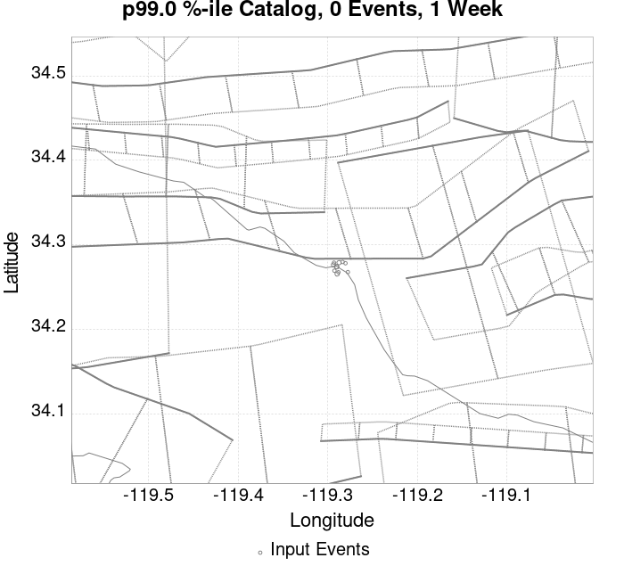 |  |  |  |
| **1 Month** |  |  |  |  |  |  |  |  |  |  |  | 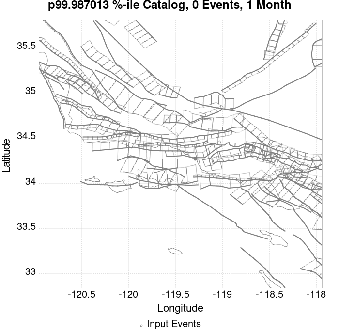 |
| **1 Year** |  |  |  |  |  |  |  |  |  |  |  |  |
| **10 Year** |  |  |  |  |  |  |  |  |  |  |  | 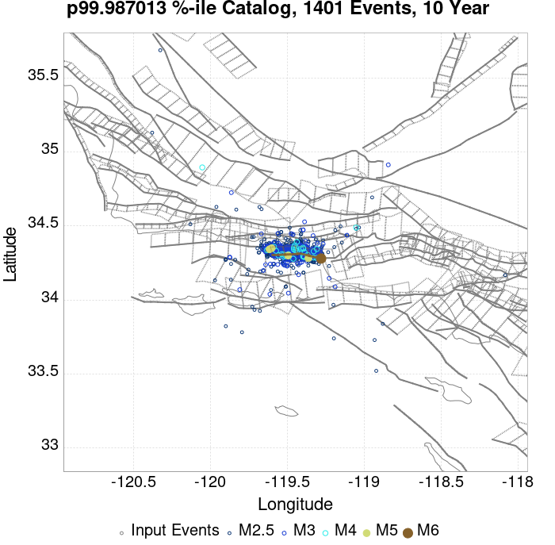 |

## ComCat Data Comparisons
*[(top)](#table-of-contents)*

These plots compare simulated sequences with data from ComCat. All plots only consider events with hypocenters inside the ComCat region defined in the JSON input file.

Last updated at 2019/11/09 01:33:23 UTC, 39.9 minutes after the simulation start time.

Total matching ComCat events found: 0

### ComCat Magnitude-Number Distributions
*[(top)](#table-of-contents)*

| Incremental MND | Cumulative MND |
|-----|-----|
|  |  |

### ComCat Time-Dependent Mc
*[(top)](#table-of-contents)*

The following plots compare simulation results with ComCat data above a magnitude threshold. Plots labeled as *M&ge;Mc(t)* use the time-dependent magnitude of completeness (Mc) defined in Helmstetter et al. (2006), which is plotted below. In the case of multiple M&ge;5 ruptures, either as input to the simulation or in the comparison data, the maximum calculated time-dependent Mc is used. This time-dependent Mc function is plotted below.

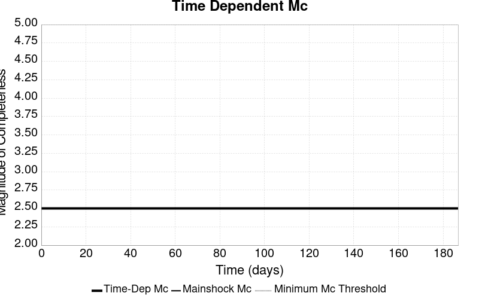

### ComCat Cumulative Number Vs Time
*[(top)](#table-of-contents)*

| M&ge;Mc(t) | M&ge;3 | M&ge;3.5 | M&ge;4 |
|-----|-----|-----|-----|
| 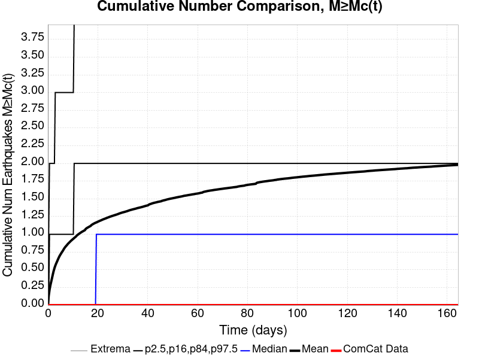 |  |  |  |

### ComCat Cumulative Number Simulation Percentiles
*[(top)](#table-of-contents)*


### ComCat Probability Spatial Distribution
*[(top)](#table-of-contents)*

*Note: maps labeled 'Forecast' are for a duration that extends into the future, only forecasted values are plotted (ComCat data omitted)*

|  | Current (39.9 Minute) | Forecast: 1 Day | Forecast: 1 Week | Forecast: 1 Month | Forecast: 1 Year |
|-----|-----|-----|-----|-----|-----|
| **M&ge;Mc(t)** |  |  |  |  |  |
|  | Prob: 1.22%, Actual: 0 | Prob: 20.10% | Prob: 41.40% | Prob: 54.08% | Prob: 68.38% |
| **M&ge;3** |  |  |  |  |  |
|  | Prob: 0.43%, Actual: 0 | Prob: 7.01% | Prob: 16.12% | Prob: 22.68% | Prob: 31.71% |
| **M&ge;3.5** |  |  |  | 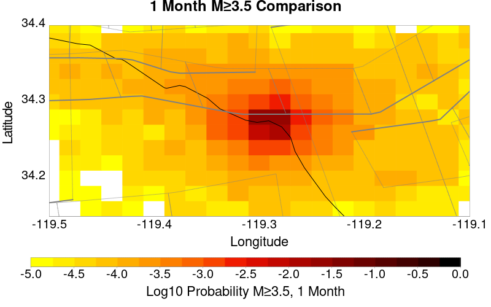 |  |
|  | Prob: 0.09%, Actual: 0 | Prob: 2.23% | Prob: 5.57% | Prob: 7.92% | Prob: 11.56% |
| **M&ge;4** |  |  |  |  |  |
|  | Prob: 0.00%, Actual: 0 | Prob: 0.66% | Prob: 1.79% | Prob: 2.52% | Prob: 3.86% |
| **M&ge;4.5** |  |  |  |  |  |
|  | Prob: 0.00%, Actual: 0 | Prob: 0.23% | Prob: 0.56% | Prob: 0.81% | Prob: 1.31% |

### ComCat Mean Expectation Spatial Distribution
*[(top)](#table-of-contents)*

*Note: maps labeled 'Forecast' are for a duration that extends into the future, only forecasted values are plotted (ComCat data omitted)*

|  | Current (39.9 Minute) | Forecast: 1 Day | Forecast: 1 Week | Forecast: 1 Month | Forecast: 1 Year |
|-----|-----|-----|-----|-----|-----|
| **M&ge;Mc(t)** |  |  |  |  |  |
|  | Mean: 0.012, Actual: 0 | Mean: 0.276 | Mean: 0.750 | Mean: 1.196 | Mean: 1.955 |
| **M&ge;3** |  |  |  |  |  |
|  | Mean: 4.29E-3, Actual: 0 | Mean: 0.089 | Mean: 0.239 | Mean: 0.377 | Mean: 0.617 |
| **M&ge;3.5** |  | 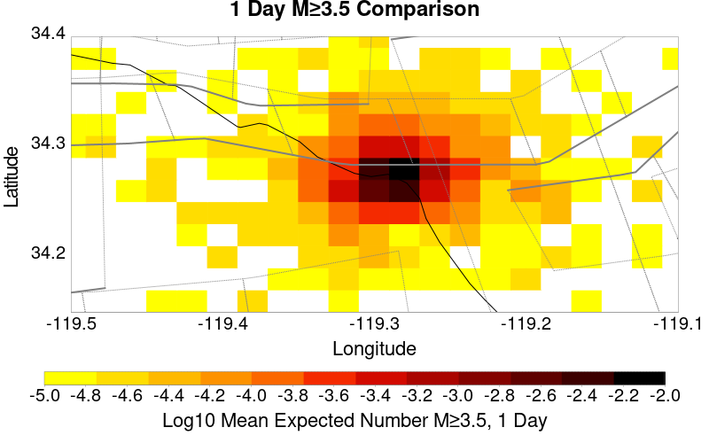 |  |  |  |
|  | Mean: 9.09E-4, Actual: 0 | Mean: 0.028 | Mean: 0.077 | Mean: 0.122 | Mean: 0.195 |
| **M&ge;4** |  |  |  | 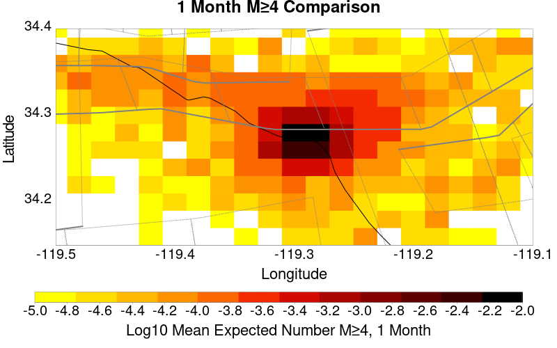 |  |
|  | Mean: 0.000, Actual: 0 | Mean: 7.53E-3 | Mean: 0.023 | Mean: 0.037 | Mean: 0.059 |
| **M&ge;4.5** |  |  | 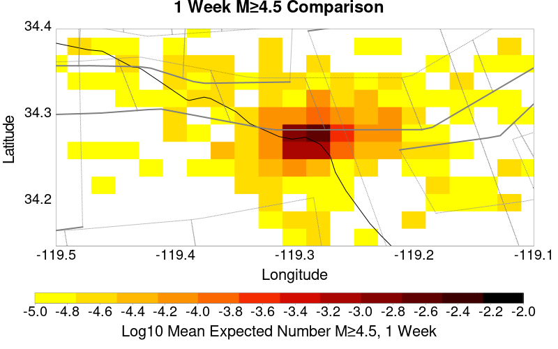 |  |  |
|  | Mean: 0.000, Actual: 0 | Mean: 2.60E-3 | Mean: 7.40E-3 | Mean: 0.012 | Mean: 0.019 |

### ComCat Depth Distribution
*[(top)](#table-of-contents)*

| M&ge;Mc(t) | M&ge;3 | M&ge;3.5 | M&ge;4 | M&ge;4.5 |
|-----|-----|-----|-----|-----|
|  | 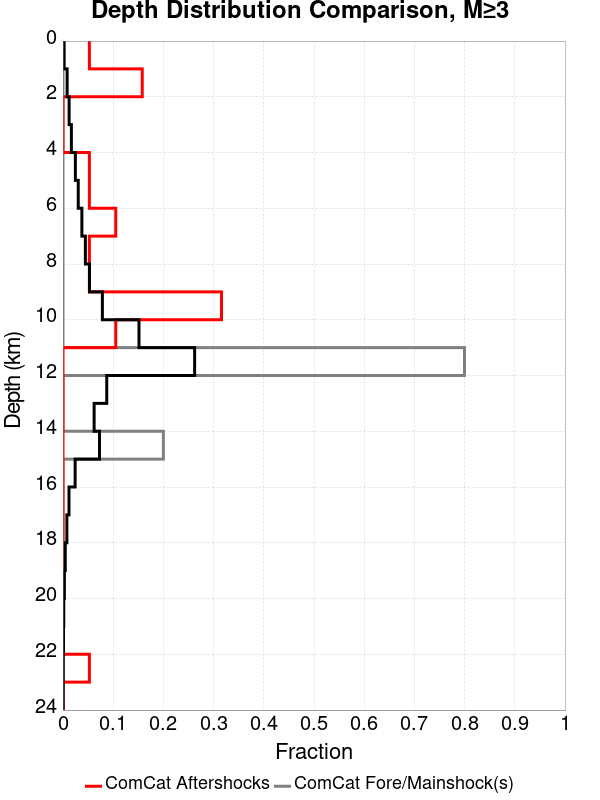 | 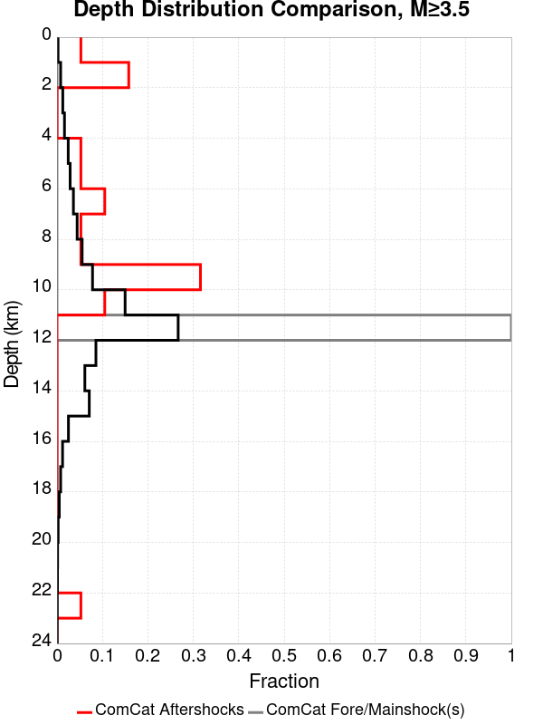 |  |  |

## Section Participation
*[(top)](#table-of-contents)*

### Section Participation Plots
*[(top)](#table-of-contents)*

| Min Mag | 1 yr Triggered Ruptures (no spontaneous) | 10 yr Triggered Ruptures (no spontaneous) | 10 yr Triggered Ruptures (primary aftershocks only) |
|-----|-----|-----|-----|
| **All Supra. Seis.** | 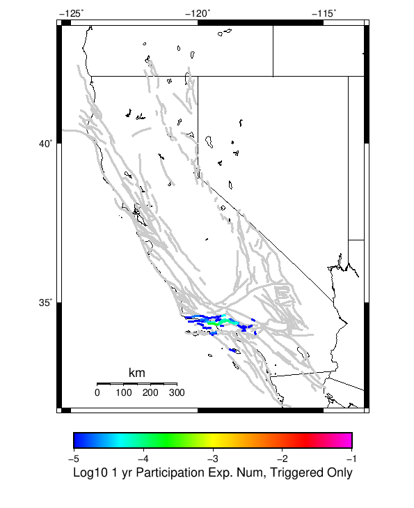 |  |  |
| **M&ge;6.5** |  |  |  |

### Supra-Seismogenic Parent Sections Table
*[(top)](#table-of-contents)*

| Parent Name | Triggered 10 Year Mean Count | Triggered 1 Day Prob | Triggered 1 Day 95% Conf | Triggered 1 Week Prob | Triggered 1 Week 95% Conf | Triggered 1 Month Prob | Triggered 1 Month 95% Conf | Triggered 1 Year Prob | Triggered 1 Year 95% Conf | Triggered 10 Year Prob | Triggered 10 Year 95% Conf | Triggered 10 Year Primary Mean Count |
|-----|-----|-----|-----|-----|-----|-----|-----|-----|-----|-----|-----|-----|
| Ventura-Pitas Point | 3.896104E-4 | 0.000 (0.00%) | [0.00% 0.06%] | 1.30E-4 (0.01%) | [0.00% 0.08%] | 2.60E-4 (0.03%) | [0.00% 0.10%] | 2.60E-4 (0.03%) | [0.00% 0.10%] | 3.90E-4 (0.04%) | [0.01% 0.12%] | 1.2987012E-4 |

### M≥6.5 Parent Sections Table
*[(top)](#table-of-contents)*

| Parent Name | Triggered 10 Year Mean Count | Triggered 1 Day Prob | Triggered 1 Day 95% Conf | Triggered 1 Week Prob | Triggered 1 Week 95% Conf | Triggered 1 Month Prob | Triggered 1 Month 95% Conf | Triggered 1 Year Prob | Triggered 1 Year 95% Conf | Triggered 10 Year Prob | Triggered 10 Year 95% Conf | Triggered 10 Year Primary Mean Count |
|-----|-----|-----|-----|-----|-----|-----|-----|-----|-----|-----|-----|-----|
| Ventura-Pitas Point | 1.2987012E-4 | 0.000 (0.00%) | [0.00% 0.06%] | 0.000 (0.00%) | [0.00% 0.06%] | 0.000 (0.00%) | [0.00% 0.06%] | 0.000 (0.00%) | [0.00% 0.06%] | 1.30E-4 (0.01%) | [0.00% 0.08%] | 0.0 |

## Fault Magnitude-Probability Distributions
*[(top)](#table-of-contents)*

The first 1 sections (sorted by trigger rate) are plotted below. All fault MPDs are available [here](plots/parent_sect_mpds/README.md)

| 1 Week | 1 Month | 1 Year | 10 Year |
|-----|-----|-----|-----|
|  |  |  |  |

## Gridded Nucleation
*[(top)](#table-of-contents)*

| Min Mag | Triggered Ruptures (no spontaneous) | Triggered Ruptures (primary aftershocks only) |
|-----|-----|-----|
| **M&ge;2.5** |  |  |
| **M&ge;5** |  |  |
| **M&ge;6** |  |  |
| **M&ge;7** |  |  |


## JSON Input File
*[(top)](#table-of-contents)*

```
{
  "numSimulations": 100000,
  "duration": 10.0,
  "startTimeMillis": 1573260807250,
  "includeSpontaneous": false,
  "randomSeed": 1573260806419,
  "binaryOutput": true,
  "binaryOutputFilters": [
    {
      "prefix": "results_complete",
      "descendantsOnly": false
    },
    {
      "prefix": "results_m5_preserve_chain",
      "minMag": 5.0,
      "preserveChainBelowMag": true,
      "descendantsOnly": false
    }
  ],
  "forceRecalc": false,
  "simulationName": "ComCat data 1.5 d after ci38229234, Custom Region, Point Sources",
  "numRetries": 3,
  "outputDir": "${ETAS_SIM_DIR}/2019_11_08-ComCatdata1p5dafterci38229234_CustomRegion_PointSources",
  "treatTriggerCatalogAsSpontaneous": false,
  "triggerRuptures": [
    {
      "occurrenceTimeMillis": 1573131521630,
      "comcatEventID": "ci38229234",
      "mag": 3.2,
      "latitude": 34.274,
      "longitude": -119.29016670000001,
      "depth": 11.41
    },
    {
      "occurrenceTimeMillis": 1573131939400,
      "comcatEventID": "ci38229250",
      "mag": 3.42,
      "latitude": 34.2761667,
      "longitude": -119.29366670000002,
      "depth": 14.56
    },
    {
      "occurrenceTimeMillis": 1573215012790,
      "comcatEventID": "ci38231562",
      "mag": 3.37,
      "latitude": 34.2655,
      "longitude": -119.2896667,
      "depth": 11.42
    },
    {
      "occurrenceTimeMillis": 1573219757800,
      "comcatEventID": "ci38231770",
      "mag": 2.9,
      "latitude": 34.2693333,
      "longitude": -119.2926667,
      "depth": 13.49
    },
    {
      "occurrenceTimeMillis": 1573219757830,
      "comcatEventID": "us6000696e",
      "mag": 2.9,
      "latitude": 34.2675,
      "longitude": -119.28820000000002,
      "depth": 10.05
    },
    {
      "occurrenceTimeMillis": 1573219778880,
      "comcatEventID": "ci38231786",
      "mag": 3.61,
      "latitude": 34.2788333,
      "longitude": -119.2875,
      "depth": 11.51
    },
    {
      "occurrenceTimeMillis": 1573220240800,
      "comcatEventID": "ci38231834",
      "mag": 3.24,
      "latitude": 34.274,
      "longitude": -119.29016670000001,
      "depth": 11.31
    },
    {
      "occurrenceTimeMillis": 1573224888510,
      "comcatEventID": "ci38232042",
      "mag": 2.51,
      "latitude": 34.2788333,
      "longitude": -119.2931667,
      "depth": 10.97
    },
    {
      "occurrenceTimeMillis": 1573234683240,
      "comcatEventID": "ci38232370",
      "mag": 2.78,
      "latitude": 34.2781667,
      "longitude": -119.2803333,
      "depth": 10.83
    },
    {
      "occurrenceTimeMillis": 1573242966290,
      "comcatEventID": "ci38232658",
      "mag": 2.84,
      "latitude": 34.2676667,
      "longitude": -119.2776667,
      "depth": 10.65
    },
    {
      "occurrenceTimeMillis": 1573250102220,
      "comcatEventID": "ci38232922",
      "mag": 2.88,
      "latitude": 34.2796667,
      "longitude": -119.2835,
      "depth": 12.73
    }
  ],
  "cacheDir": "${ETAS_LAUNCHER}/inputs/cache_fm3p1_ba",
  "fssFile": "${ETAS_LAUNCHER}/inputs/2013_05_10-ucerf3p3-production-10runs_COMPOUND_SOL_FM3_1_SpatSeisU3_MEAN_BRANCH_AVG_SOL.zip",
  "probModel": "FULL_TD",
  "applySubSeisForSupraNucl": true,
  "totRateScaleFactor": 1.14,
  "gridSeisCorr": true,
  "timeIndependentERF": false,
  "griddedOnly": false,
  "imposeGR": false,
  "includeIndirectTriggering": true,
  "gridSeisDiscr": 0.1,
  "catalogCompletenessModel": "RELAXED",
  "configCommand": "u3etas_comcat_config_builder.sh --start-at ci38229234 --end-now --region 34.4,-119.5,34.15,-119.1 --num-simulations 100000 --finite-surf-shakemap --finite-surf-shakemap-min-mag 6 --hpc-site USC_HPC --nodes 17 --hours 24 --queue scec",
  "configTime": 1573260806419,
  "comcatMetadata": {
    "region": {
      "minLatitude": 34.149999999999,
      "maxLatitude": 34.400000000001,
      "minLongitude": -119.500000000001,
      "maxLongitude": -119.099999999999
    },
    "minDepth": -10.0,
    "maxDepth": 24.0,
    "minMag": 2.5,
    "startTime": 1573131520630,
    "endTime": 1573260806250
  }
}
```

