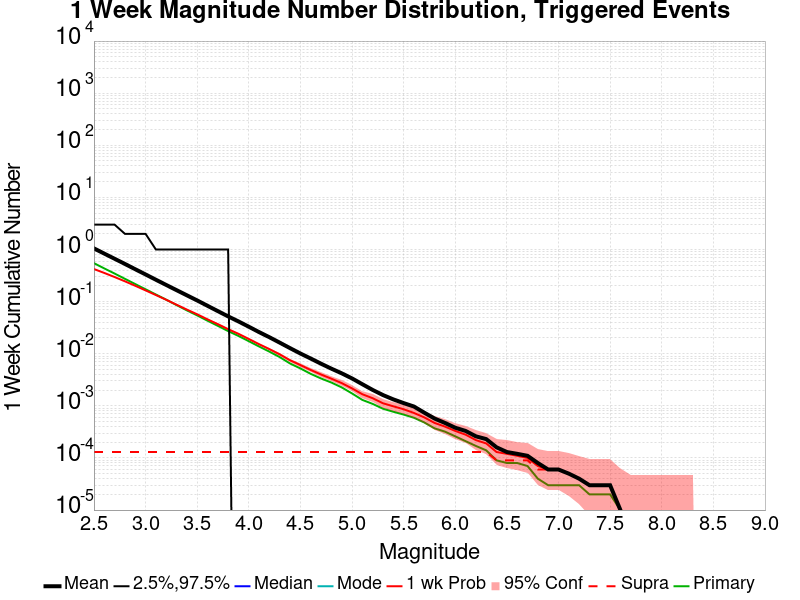
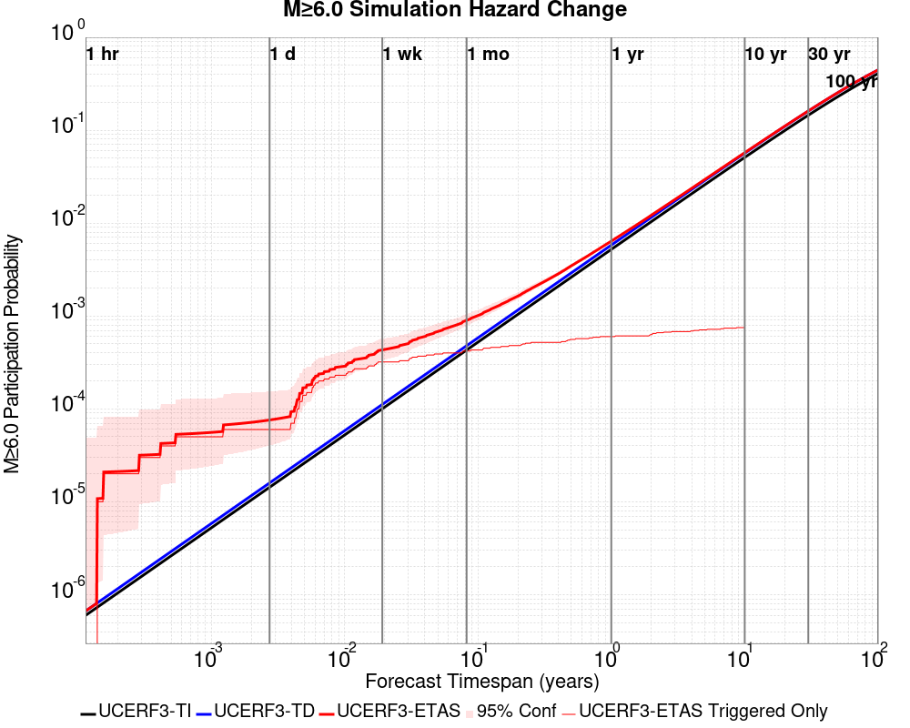
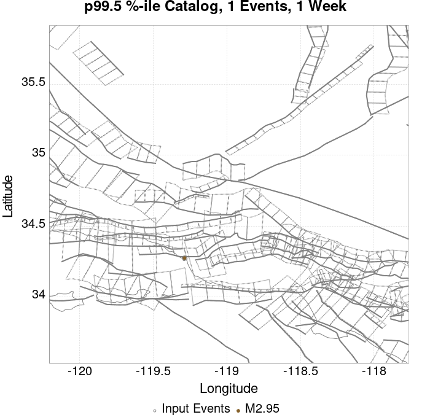
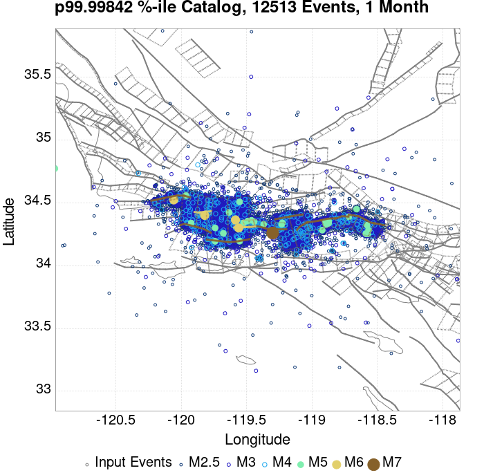
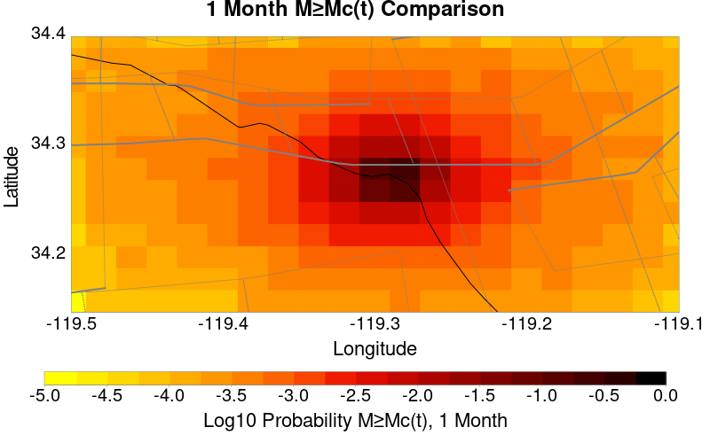
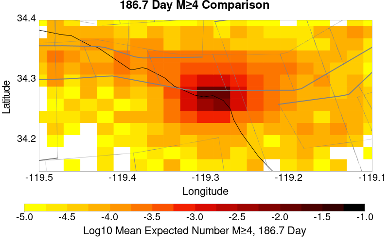
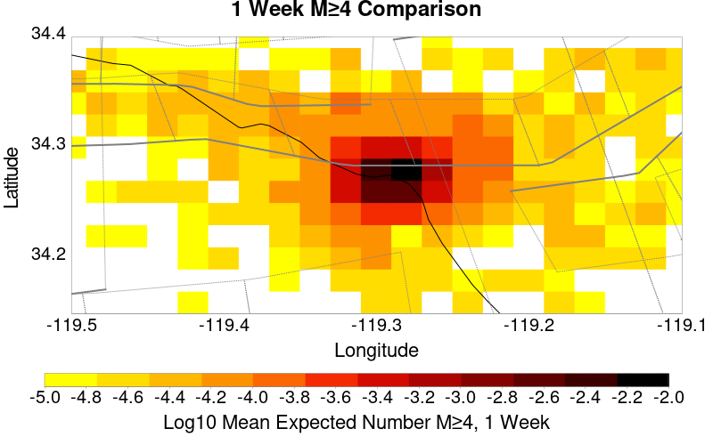

# ComCat data 1.5 d after ci38229234, Custom Region, Point Sources Results

|   | ComCat data 1.5 d after ci38229234, Custom Region, Point Sources |
|-----|-----|
| Num Simulations | 63306 (incomplete) |
| Start Time | 2019/11/09 00:53:27 UTC |
| Start Time Epoch Milliseconds | 1573260807250 |
| Duration | 10 Years |
| Includes Spontaneous? | false |
| Trigger Ruptures | 11 Trigger Ruptures |
|   | First: M3.2 at 2019/11/07 12:58:41 UTC |
|   | Last: M2.88 at 2019/11/08 21:55:02 UTC |
|   | Largest: M3.61 at 2019/11/08 13:29:38 UTC |
| Trigger Ruptures | *(none)* |
| Config Generated With | u3etas_comcat_config_builder.sh --start-at ci38229234 --end-now --region 34.4,-119.5,34.15,-119.1 --num-simulations 100000 --finite-surf-shakemap --finite-surf-shakemap-min-mag 6 --hpc-site USC_HPC --nodes 17 --hours 24 --queue scec |

## Table Of Contents

* [Probabilities Summary Table](#probabilities-summary-table)
* [Magnitude Number Distribution](#magnitude-number-distribution)
  * [10 Year Magnitude Number Distribution](#10-year-magnitude-number-distribution)
  * [1 Year Magnitude Number Distribution](#1-year-magnitude-number-distribution)
  * [1 Month Magnitude Number Distribution](#1-month-magnitude-number-distribution)
  * [1 Week Magnitude Number Distribution](#1-week-magnitude-number-distribution)
  * [1 Day Magnitude Number Distribution](#1-day-magnitude-number-distribution)
  * [1 Hour Magnitude Number Distribution](#1-hour-magnitude-number-distribution)
* [Hazard Change Over Time](#hazard-change-over-time)
  * [M&ge;5.0 Hazard Change Over Time](#m50-hazard-change-over-time)
  * [M&ge;6.0 Hazard Change Over Time](#m60-hazard-change-over-time)
  * [M&ge;7.0 Hazard Change Over Time](#m70-hazard-change-over-time)
* [Trigger Rupture Fault Map](#trigger-rupture-fault-map)
* [Fault Distances To Triggers](#fault-distances-to-triggers)
* [Individual Simulated Catalog Maps](#individual-simulated-catalog-maps)
* [ComCat Data Comparisons](#comcat-data-comparisons)
  * [ComCat Magnitude-Number Distributions](#comcat-magnitude-number-distributions)
  * [ComCat Time-Dependent Mc](#comcat-time-dependent-mc)
  * [ComCat Cumulative Number Vs Time](#comcat-cumulative-number-vs-time)
  * [ComCat Cumulative Number Simulation Percentiles](#comcat-cumulative-number-simulation-percentiles)
  * [ComCat Probability Spatial Distribution](#comcat-probability-spatial-distribution)
  * [ComCat Mean Expectation Spatial Distribution](#comcat-mean-expectation-spatial-distribution)
  * [ComCat Depth Distribution](#comcat-depth-distribution)
* [Section Participation](#section-participation)
  * [Section Participation Plots](#section-participation-plots)
  * [Supra-Seismogenic Parent Sections Table](#supra-seismogenic-parent-sections-table)
  * [M≥6.5 Parent Sections Table](#m65-parent-sections-table)
  * [M≥7 Parent Sections Table](#m7-parent-sections-table)
  * [M≥7.5 Parent Sections Table](#m75-parent-sections-table)
* [Fault Magnitude-Probability Distributions](#fault-magnitude-probability-distributions)
* [Gridded Nucleation](#gridded-nucleation)
* [JSON Input File](#json-input-file)

## Probabilities Summary Table
*[(top)](#table-of-contents)*

| Magnitude | 1 Hour Prob | 1 Day Prob | 1 Week Prob | 1 Month Prob | 1 Year Prob | 10 Year Prob |
|-----|-----|-----|-----|-----|-----|-----|
| **M&ge;3** | 5.89E-3 (0.59%) | 0.071 (7.14%) | 0.163 (16.32%) | 0.231 (23.12%) | 0.327 (32.68%) | 0.396 (39.59%) |
| *95% Conf* | *[0.53% 0.65%]* | *[6.94% 7.34%]* | *[16.03% 16.61%]* | *[22.79% 23.45%]* | *[32.32% 33.05%]* | *[39.20% 39.97%]* |
| **M&ge;3.5** | 1.78E-3 (0.18%) | 0.023 (2.29%) | 0.057 (5.68%) | 0.083 (8.35%) | 0.125 (12.47%) | 0.157 (15.71%) |
| *95% Conf* | *[0.15% 0.22%]* | *[2.18% 2.41%]* | *[5.50% 5.86%]* | *[8.13% 8.57%]* | *[12.21% 12.73%]* | *[15.43% 16.00%]* |
| **M&ge;3.61** | 1.44E-3 (0.14%) | 0.018 (1.78%) | 0.044 (4.45%) | 0.066 (6.61%) | 0.099 (9.94%) | 0.126 (12.62%) |
| *95% Conf* | *[0.12% 0.18%]* | *[1.68% 1.89%]* | *[4.29% 4.61%]* | *[6.41% 6.80%]* | *[9.71% 10.18%]* | *[12.36% 12.88%]* |
| **M&ge;4** | 6.63E-4 (0.07%) | 7.68E-3 (0.77%) | 0.019 (1.88%) | 0.028 (2.80%) | 0.044 (4.38%) | 0.057 (5.66%) |
| *95% Conf* | *[0.05% 0.09%]* | *[0.70% 0.84%]* | *[1.78% 1.99%]* | *[2.68% 2.93%]* | *[4.22% 4.54%]* | *[5.48% 5.84%]* |
| **M&ge;4.5** | 1.42E-4 (0.01%) | 2.39E-3 (0.24%) | 5.99E-3 (0.60%) | 8.89E-3 (0.89%) | 0.015 (1.46%) | 0.019 (1.88%) |
| *95% Conf* | *[0.01% 0.03%]* | *[0.20% 0.28%]* | *[0.54% 0.66%]* | *[0.82% 0.97%]* | *[1.37% 1.56%]* | *[1.77% 1.98%]* |
| **M&ge;5** | 1.58E-5 (0.00%) | 7.27E-4 (0.07%) | 2.21E-3 (0.22%) | 3.27E-3 (0.33%) | 5.50E-3 (0.55%) | 7.03E-3 (0.70%) |
| *95% Conf* | *[0.00% 0.01%]* | *[0.05% 0.10%]* | *[0.19% 0.26%]* | *[0.28% 0.38%]* | *[0.49% 0.61%]* | *[0.64% 0.77%]* |
| **M&ge;5.5** | 0.000 (0.00%) | 2.69E-4 (0.03%) | 9.64E-4 (0.10%) | 1.26E-3 (0.13%) | 2.12E-3 (0.21%) | 2.69E-3 (0.27%) |
| *95% Conf* | *[0.00% 0.01%]* | *[0.02% 0.04%]* | *[0.07% 0.12%]* | *[0.10% 0.16%]* | *[0.18% 0.25%]* | *[0.23% 0.31%]* |
| **M&ge;6** | 0.000 (0.00%) | 7.90E-5 (0.01%) | 3.32E-4 (0.03%) | 4.26E-4 (0.04%) | 6.48E-4 (0.06%) | 8.37E-4 (0.08%) |
| *95% Conf* | *[0.00% 0.01%]* | *[0.00% 0.02%]* | *[0.02% 0.05%]* | *[0.03% 0.06%]* | *[0.05% 0.09%]* | *[0.06% 0.11%]* |
| **M&ge;6.5** | 0.000 (0.00%) | 1.58E-5 (0.00%) | 1.11E-4 (0.01%) | 1.58E-4 (0.02%) | 2.37E-4 (0.02%) | 3.16E-4 (0.03%) |
| *95% Conf* | *[0.00% 0.01%]* | *[0.00% 0.01%]* | *[0.00% 0.02%]* | *[0.01% 0.03%]* | *[0.01% 0.04%]* | *[0.02% 0.05%]* |
| **M&ge;7** | 0.000 (0.00%) | 0.000 (0.00%) | 6.32E-5 (0.01%) | 1.11E-4 (0.01%) | 1.42E-4 (0.01%) | 1.90E-4 (0.02%) |
| *95% Conf* | *[0.00% 0.01%]* | *[0.00% 0.01%]* | *[0.00% 0.02%]* | *[0.00% 0.02%]* | *[0.01% 0.03%]* | *[0.01% 0.03%]* |
| **M&ge;7.5** | 0.000 (0.00%) | 0.000 (0.00%) | 4.74E-5 (0.00%) | 9.48E-5 (0.01%) | 1.26E-4 (0.01%) | 1.58E-4 (0.02%) |
| *95% Conf* | *[0.00% 0.01%]* | *[0.00% 0.01%]* | *[0.00% 0.02%]* | *[0.00% 0.02%]* | *[0.01% 0.03%]* | *[0.01% 0.03%]* |

## Magnitude Number Distribution
*[(top)](#table-of-contents)*

### 10 Year Magnitude Number Distribution
*[(top)](#table-of-contents)*

**Legend**
* **Mean** (thick black line): mean expected number across all 63306 catalogs
* **2.5%,97.5%** (thin black lines): expected number percentiles across all 63306 catalogs
* **Median** (thin blue line): median expected number across all 63306 catalogs
* **Mode** (thin cyan line): modal expected number across all 63306 catalogs
* **10 yr Probability** (thin red line): 10 year probability calculated as the fraction of catalogs with at least 1 occurrence
* **10 yr Supraseismogenic Probability** (thin dashed red line): same as above, but only for supraseismogenic ruptures on explicitly modeled UCERF3 faults
* **95% Conf** (light red shaded region): binomial 95% confidence bounds on probability
* **Primary** (thin green line): mean expected number from primary triggered aftershocks only (no secondary, tertiary, etc...) across all 63306 catalogs


| Mag | Mean | 2.5 %ile | 97.5 %ile | Median | Mode | 10 yr Probability | 10 yr Prob 95% Conf | 10 yr Supra-Seis Prob | Primary Aftershocks Mean |
|-----|-----|-----|-----|-----|-----|-----|-----|-----|-----|
| **M&ge;2.5** | 5.809 | 0.000 | 9.000 | 2.000 | 1.000 | 0.778 (77.84%) | [77.51% 78.16%] | 3.63E-4 (0.04%) | 1.504 |
| **M&ge;2.6** | 4.609 | 0.000 | 8.000 | 1.000 | 0.000 | 0.701 (70.05%) | [69.69% 70.41%] | 3.63E-4 (0.04%) | 1.191 |
| **M&ge;2.7** | 3.664 | 0.000 | 7.000 | 1.000 | 0.000 | 0.622 (62.19%) | [61.82% 62.57%] | 3.63E-4 (0.04%) | 0.950 |
| **M&ge;2.8** | 2.911 | 0.000 | 6.000 | 1.000 | 0.000 | 0.543 (54.35%) | [53.96% 54.74%] | 3.63E-4 (0.04%) | 0.756 |
| **M&ge;2.9** | 2.307 | 0.000 | 5.000 | 0.000 | 0.000 | 0.466 (46.61%) | [46.22% 46.99%] | 3.63E-4 (0.04%) | 0.599 |
| **M&ge;3** | 1.831 | 0.000 | 4.000 | 0.000 | 0.000 | 0.396 (39.59%) | [39.20% 39.97%] | 3.63E-4 (0.04%) | 0.476 |
| **M&ge;3.1** | 1.452 | 0.000 | 4.000 | 0.000 | 0.000 | 0.334 (33.42%) | [33.05% 33.79%] | 3.63E-4 (0.04%) | 0.378 |
| **M&ge;3.2** | 1.154 | 0.000 | 3.000 | 0.000 | 0.000 | 0.279 (27.86%) | [27.52% 28.22%] | 3.63E-4 (0.04%) | 0.301 |
| **M&ge;3.3** | 0.917 | 0.000 | 3.000 | 0.000 | 0.000 | 0.231 (23.08%) | [22.75% 23.41%] | 3.63E-4 (0.04%) | 0.239 |
| **M&ge;3.4** | 0.728 | 0.000 | 2.000 | 0.000 | 0.000 | 0.190 (19.03%) | [18.73% 19.34%] | 3.63E-4 (0.04%) | 0.189 |
| **M&ge;3.5** | 0.582 | 0.000 | 2.000 | 0.000 | 0.000 | 0.157 (15.71%) | [15.43% 16.00%] | 3.63E-4 (0.04%) | 0.151 |
| **M&ge;3.6** | 0.460 | 0.000 | 2.000 | 0.000 | 0.000 | 0.129 (12.86%) | [12.60% 13.12%] | 3.63E-4 (0.04%) | 0.120 |
| **M&ge;3.7** | 0.364 | 0.000 | 1.000 | 0.000 | 0.000 | 0.105 (10.48%) | [10.24% 10.72%] | 3.63E-4 (0.04%) | 0.095 |
| **M&ge;3.8** | 0.290 | 0.000 | 1.000 | 0.000 | 0.000 | 0.085 (8.54%) | [8.32% 8.76%] | 3.63E-4 (0.04%) | 0.076 |
| **M&ge;3.9** | 0.230 | 0.000 | 1.000 | 0.000 | 0.000 | 0.070 (6.95%) | [6.76% 7.15%] | 3.63E-4 (0.04%) | 0.060 |
| **M&ge;4** | 0.183 | 0.000 | 1.000 | 0.000 | 0.000 | 0.057 (5.66%) | [5.48% 5.84%] | 3.63E-4 (0.04%) | 0.048 |
| **M&ge;4.1** | 0.144 | 0.000 | 1.000 | 0.000 | 0.000 | 0.046 (4.59%) | [4.43% 4.76%] | 3.63E-4 (0.04%) | 0.038 |
| **M&ge;4.2** | 0.113 | 0.000 | 1.000 | 0.000 | 0.000 | 0.037 (3.68%) | [3.53% 3.83%] | 3.63E-4 (0.04%) | 0.030 |
| **M&ge;4.3** | 0.090 | 0.000 | 1.000 | 0.000 | 0.000 | 0.030 (2.97%) | [2.84% 3.11%] | 3.63E-4 (0.04%) | 0.024 |
| **M&ge;4.4** | 0.070 | 0.000 | 0.000 | 0.000 | 0.000 | 0.023 (2.33%) | [2.22% 2.46%] | 3.63E-4 (0.04%) | 0.018 |
| **M&ge;4.5** | 0.056 | 0.000 | 0.000 | 0.000 | 0.000 | 0.019 (1.88%) | [1.77% 1.98%] | 3.63E-4 (0.04%) | 0.015 |
| **M&ge;4.6** | 0.045 | 0.000 | 0.000 | 0.000 | 0.000 | 0.015 (1.53%) | [1.44% 1.63%] | 3.63E-4 (0.04%) | 0.011 |
| **M&ge;4.7** | 0.036 | 0.000 | 0.000 | 0.000 | 0.000 | 0.012 (1.25%) | [1.16% 1.34%] | 3.63E-4 (0.04%) | 8.92E-3 |
| **M&ge;4.8** | 0.028 | 0.000 | 0.000 | 0.000 | 0.000 | 0.010 (1.05%) | [0.97% 1.13%] | 3.63E-4 (0.04%) | 7.41E-3 |
| **M&ge;4.9** | 0.023 | 0.000 | 0.000 | 0.000 | 0.000 | 8.55E-3 (0.85%) | [0.79% 0.93%] | 3.63E-4 (0.04%) | 5.83E-3 |
| **M&ge;5** | 0.018 | 0.000 | 0.000 | 0.000 | 0.000 | 7.03E-3 (0.70%) | [0.64% 0.77%] | 3.63E-4 (0.04%) | 4.77E-3 |
| **M&ge;5.1** | 0.014 | 0.000 | 0.000 | 0.000 | 0.000 | 5.64E-3 (0.56%) | [0.51% 0.63%] | 3.63E-4 (0.04%) | 3.76E-3 |
| **M&ge;5.2** | 0.011 | 0.000 | 0.000 | 0.000 | 0.000 | 4.68E-3 (0.47%) | [0.42% 0.52%] | 3.63E-4 (0.04%) | 3.13E-3 |
| **M&ge;5.3** | 9.37E-3 | 0.000 | 0.000 | 0.000 | 0.000 | 3.96E-3 (0.40%) | [0.35% 0.45%] | 3.63E-4 (0.04%) | 2.61E-3 |
| **M&ge;5.4** | 7.47E-3 | 0.000 | 0.000 | 0.000 | 0.000 | 3.27E-3 (0.33%) | [0.28% 0.38%] | 3.63E-4 (0.04%) | 2.10E-3 |
| **M&ge;5.5** | 5.78E-3 | 0.000 | 0.000 | 0.000 | 0.000 | 2.69E-3 (0.27%) | [0.23% 0.31%] | 3.63E-4 (0.04%) | 1.60E-3 |
| **M&ge;5.6** | 4.68E-3 | 0.000 | 0.000 | 0.000 | 0.000 | 2.24E-3 (0.22%) | [0.19% 0.27%] | 3.63E-4 (0.04%) | 1.30E-3 |
| **M&ge;5.7** | 3.66E-3 | 0.000 | 0.000 | 0.000 | 0.000 | 1.75E-3 (0.18%) | [0.14% 0.21%] | 3.63E-4 (0.04%) | 9.79E-4 |
| **M&ge;5.8** | 2.73E-3 | 0.000 | 0.000 | 0.000 | 0.000 | 1.30E-3 (0.13%) | [0.10% 0.16%] | 3.63E-4 (0.04%) | 7.27E-4 |
| **M&ge;5.9** | 2.09E-3 | 0.000 | 0.000 | 0.000 | 0.000 | 1.06E-3 (0.11%) | [0.08% 0.14%] | 3.63E-4 (0.04%) | 5.84E-4 |
| **M&ge;6** | 1.71E-3 | 0.000 | 0.000 | 0.000 | 0.000 | 8.37E-4 (0.08%) | [0.06% 0.11%] | 3.63E-4 (0.04%) | 4.42E-4 |
| **M&ge;6.1** | 1.34E-3 | 0.000 | 0.000 | 0.000 | 0.000 | 6.79E-4 (0.07%) | [0.05% 0.09%] | 3.63E-4 (0.04%) | 3.32E-4 |
| **M&ge;6.2** | 9.64E-4 | 0.000 | 0.000 | 0.000 | 0.000 | 5.05E-4 (0.05%) | [0.04% 0.07%] | 3.63E-4 (0.04%) | 2.37E-4 |
| **M&ge;6.3** | 8.37E-4 | 0.000 | 0.000 | 0.000 | 0.000 | 4.42E-4 (0.04%) | [0.03% 0.06%] | 3.48E-4 (0.03%) | 2.21E-4 |
| **M&ge;6.4** | 6.48E-4 | 0.000 | 0.000 | 0.000 | 0.000 | 3.48E-4 (0.03%) | [0.02% 0.05%] | 3.00E-4 (0.03%) | 1.74E-4 |
| **M&ge;6.5** | 4.74E-4 | 0.000 | 0.000 | 0.000 | 0.000 | 3.16E-4 (0.03%) | [0.02% 0.05%] | 3.00E-4 (0.03%) | 1.42E-4 |
| **M&ge;6.6** | 4.42E-4 | 0.000 | 0.000 | 0.000 | 0.000 | 3.16E-4 (0.03%) | [0.02% 0.05%] | 3.00E-4 (0.03%) | 1.42E-4 |
| **M&ge;6.7** | 3.79E-4 | 0.000 | 0.000 | 0.000 | 0.000 | 2.69E-4 (0.03%) | [0.02% 0.04%] | 2.69E-4 (0.03%) | 1.26E-4 |
| **M&ge;6.8** | 2.84E-4 | 0.000 | 0.000 | 0.000 | 0.000 | 1.90E-4 (0.02%) | [0.01% 0.03%] | 1.90E-4 (0.02%) | 9.48E-5 |
| **M&ge;6.9** | 2.69E-4 | 0.000 | 0.000 | 0.000 | 0.000 | 1.90E-4 (0.02%) | [0.01% 0.03%] | 1.90E-4 (0.02%) | 9.48E-5 |
| **M&ge;7** | 2.53E-4 | 0.000 | 0.000 | 0.000 | 0.000 | 1.90E-4 (0.02%) | [0.01% 0.03%] | 1.90E-4 (0.02%) | 9.48E-5 |
| **M&ge;7.1** | 2.21E-4 | 0.000 | 0.000 | 0.000 | 0.000 | 1.74E-4 (0.02%) | [0.01% 0.03%] | 1.74E-4 (0.02%) | 9.48E-5 |
| **M&ge;7.2** | 2.21E-4 | 0.000 | 0.000 | 0.000 | 0.000 | 1.74E-4 (0.02%) | [0.01% 0.03%] | 1.74E-4 (0.02%) | 9.48E-5 |
| **M&ge;7.3** | 2.21E-4 | 0.000 | 0.000 | 0.000 | 0.000 | 1.74E-4 (0.02%) | [0.01% 0.03%] | 1.74E-4 (0.02%) | 9.48E-5 |
| **M&ge;7.4** | 1.74E-4 | 0.000 | 0.000 | 0.000 | 0.000 | 1.58E-4 (0.02%) | [0.01% 0.03%] | 1.58E-4 (0.02%) | 9.48E-5 |
| **M&ge;7.5** | 1.58E-4 | 0.000 | 0.000 | 0.000 | 0.000 | 1.58E-4 (0.02%) | [0.01% 0.03%] | 1.58E-4 (0.02%) | 9.48E-5 |
| **M&ge;7.6** | 3.16E-5 | 0.000 | 0.000 | 0.000 | 0.000 | 3.16E-5 (0.00%) | [0.00% 0.01%] | 3.16E-5 (0.00%) | 3.16E-5 |
| **M&ge;7.7** | 1.58E-5 | 0.000 | 0.000 | 0.000 | 0.000 | 1.58E-5 (0.00%) | [0.00% 0.01%] | 1.58E-5 (0.00%) | 1.58E-5 |
| **M&ge;7.8** | 1.58E-5 | 0.000 | 0.000 | 0.000 | 0.000 | 1.58E-5 (0.00%) | [0.00% 0.01%] | 1.58E-5 (0.00%) | 1.58E-5 |
| **M&ge;7.9** | 0.000 | 0.000 | 0.000 | 0.000 | 0.000 | 0.000 (0.00%) | [0.00% 0.01%] | 0.000 (0.00%) | 0.000 |
| **M&ge;8** | 0.000 | 0.000 | 0.000 | 0.000 | 0.000 | 0.000 (0.00%) | [0.00% 0.01%] | 0.000 (0.00%) | 0.000 |
| **M&ge;8.1** | 0.000 | 0.000 | 0.000 | 0.000 | 0.000 | 0.000 (0.00%) | [0.00% 0.01%] | 0.000 (0.00%) | 0.000 |
| **M&ge;8.2** | 0.000 | 0.000 | 0.000 | 0.000 | 0.000 | 0.000 (0.00%) | [0.00% 0.01%] | 0.000 (0.00%) | 0.000 |
| **M&ge;8.3** | 0.000 | 0.000 | 0.000 | 0.000 | 0.000 | 0.000 (0.00%) | [0.00% 0.01%] | 0.000 (0.00%) | 0.000 |
| **M&ge;8.4** | 0.000 | 0.000 | 0.000 | 0.000 | 0.000 | 0.000 (0.00%) | [0.00% 0.01%] | 0.000 (0.00%) | 0.000 |
| **M&ge;8.5** | 0.000 | 0.000 | 0.000 | 0.000 | 0.000 | 0.000 (0.00%) | [0.00% 0.01%] | 0.000 (0.00%) | 0.000 |
| **M&ge;8.6** | 0.000 | 0.000 | 0.000 | 0.000 | 0.000 | 0.000 (0.00%) | [0.00% 0.01%] | 0.000 (0.00%) | 0.000 |
| **M&ge;8.7** | 0.000 | 0.000 | 0.000 | 0.000 | 0.000 | 0.000 (0.00%) | [0.00% 0.01%] | 0.000 (0.00%) | 0.000 |
| **M&ge;8.8** | 0.000 | 0.000 | 0.000 | 0.000 | 0.000 | 0.000 (0.00%) | [0.00% 0.01%] | 0.000 (0.00%) | 0.000 |
| **M&ge;8.9** | 0.000 | 0.000 | 0.000 | 0.000 | 0.000 | 0.000 (0.00%) | [0.00% 0.01%] | 0.000 (0.00%) | 0.000 |
| **M&ge;9** | 0.000 | 0.000 | 0.000 | 0.000 | 0.000 | 0.000 (0.00%) | [0.00% 0.01%] | 0.000 (0.00%) | 0.000 |

### 1 Year Magnitude Number Distribution
*[(top)](#table-of-contents)*

**Legend**
* **Mean** (thick black line): mean expected number across all 63306 catalogs
* **2.5%,97.5%** (thin black lines): expected number percentiles across all 63306 catalogs
* **Median** (thin blue line): median expected number across all 63306 catalogs
* **Mode** (thin cyan line): modal expected number across all 63306 catalogs
* **1 yr Probability** (thin red line): 1 year probability calculated as the fraction of catalogs with at least 1 occurrence
* **1 yr Supraseismogenic Probability** (thin dashed red line): same as above, but only for supraseismogenic ruptures on explicitly modeled UCERF3 faults
* **95% Conf** (light red shaded region): binomial 95% confidence bounds on probability
* **Primary** (thin green line): mean expected number from primary triggered aftershocks only (no secondary, tertiary, etc...) across all 63306 catalogs


| Mag | Mean | 2.5 %ile | 97.5 %ile | Median | Mode | 1 yr Probability | 1 yr Prob 95% Conf | 1 yr Supra-Seis Prob | Primary Aftershocks Mean |
|-----|-----|-----|-----|-----|-----|-----|-----|-----|-----|
| **M&ge;2.5** | 3.772 | 0.000 | 7.000 | 1.000 | 1.000 | 0.698 (69.79%) | [69.43% 70.15%] | 2.53E-4 (0.03%) | 1.193 |
| **M&ge;2.6** | 2.996 | 0.000 | 6.000 | 1.000 | 0.000 | 0.616 (61.56%) | [61.18% 61.94%] | 2.53E-4 (0.03%) | 0.945 |
| **M&ge;2.7** | 2.379 | 0.000 | 5.000 | 1.000 | 0.000 | 0.537 (53.73%) | [53.34% 54.12%] | 2.53E-4 (0.03%) | 0.754 |
| **M&ge;2.8** | 1.891 | 0.000 | 4.000 | 0.000 | 0.000 | 0.462 (46.19%) | [45.80% 46.57%] | 2.53E-4 (0.03%) | 0.599 |
| **M&ge;2.9** | 1.496 | 0.000 | 4.000 | 0.000 | 0.000 | 0.390 (39.00%) | [38.62% 39.38%] | 2.53E-4 (0.03%) | 0.474 |
| **M&ge;3** | 1.186 | 0.000 | 3.000 | 0.000 | 0.000 | 0.327 (32.68%) | [32.32% 33.05%] | 2.53E-4 (0.03%) | 0.376 |
| **M&ge;3.1** | 0.941 | 0.000 | 3.000 | 0.000 | 0.000 | 0.274 (27.37%) | [27.02% 27.72%] | 2.53E-4 (0.03%) | 0.299 |
| **M&ge;3.2** | 0.747 | 0.000 | 2.000 | 0.000 | 0.000 | 0.226 (22.58%) | [22.25% 22.91%] | 2.53E-4 (0.03%) | 0.237 |
| **M&ge;3.3** | 0.595 | 0.000 | 2.000 | 0.000 | 0.000 | 0.185 (18.49%) | [18.19% 18.79%] | 2.53E-4 (0.03%) | 0.188 |
| **M&ge;3.4** | 0.472 | 0.000 | 2.000 | 0.000 | 0.000 | 0.152 (15.19%) | [14.91% 15.48%] | 2.53E-4 (0.03%) | 0.149 |
| **M&ge;3.5** | 0.378 | 0.000 | 2.000 | 0.000 | 0.000 | 0.125 (12.47%) | [12.21% 12.73%] | 2.53E-4 (0.03%) | 0.119 |
| **M&ge;3.6** | 0.299 | 0.000 | 1.000 | 0.000 | 0.000 | 0.101 (10.13%) | [9.90% 10.37%] | 2.53E-4 (0.03%) | 0.095 |
| **M&ge;3.7** | 0.236 | 0.000 | 1.000 | 0.000 | 0.000 | 0.082 (8.22%) | [8.00% 8.43%] | 2.53E-4 (0.03%) | 0.075 |
| **M&ge;3.8** | 0.188 | 0.000 | 1.000 | 0.000 | 0.000 | 0.067 (6.65%) | [6.46% 6.85%] | 2.53E-4 (0.03%) | 0.060 |
| **M&ge;3.9** | 0.150 | 0.000 | 1.000 | 0.000 | 0.000 | 0.054 (5.40%) | [5.22% 5.58%] | 2.53E-4 (0.03%) | 0.048 |
| **M&ge;4** | 0.119 | 0.000 | 1.000 | 0.000 | 0.000 | 0.044 (4.38%) | [4.22% 4.54%] | 2.53E-4 (0.03%) | 0.038 |
| **M&ge;4.1** | 0.093 | 0.000 | 1.000 | 0.000 | 0.000 | 0.035 (3.51%) | [3.37% 3.66%] | 2.53E-4 (0.03%) | 0.030 |
| **M&ge;4.2** | 0.073 | 0.000 | 1.000 | 0.000 | 0.000 | 0.028 (2.80%) | [2.67% 2.93%] | 2.53E-4 (0.03%) | 0.023 |
| **M&ge;4.3** | 0.058 | 0.000 | 0.000 | 0.000 | 0.000 | 0.023 (2.28%) | [2.17% 2.40%] | 2.53E-4 (0.03%) | 0.019 |
| **M&ge;4.4** | 0.046 | 0.000 | 0.000 | 0.000 | 0.000 | 0.018 (1.80%) | [1.69% 1.90%] | 2.53E-4 (0.03%) | 0.014 |
| **M&ge;4.5** | 0.037 | 0.000 | 0.000 | 0.000 | 0.000 | 0.015 (1.46%) | [1.37% 1.56%] | 2.53E-4 (0.03%) | 0.012 |
| **M&ge;4.6** | 0.030 | 0.000 | 0.000 | 0.000 | 0.000 | 0.012 (1.19%) | [1.11% 1.28%] | 2.53E-4 (0.03%) | 9.10E-3 |
| **M&ge;4.7** | 0.023 | 0.000 | 0.000 | 0.000 | 0.000 | 9.65E-3 (0.97%) | [0.89% 1.05%] | 2.53E-4 (0.03%) | 7.25E-3 |
| **M&ge;4.8** | 0.019 | 0.000 | 0.000 | 0.000 | 0.000 | 8.17E-3 (0.82%) | [0.75% 0.89%] | 2.53E-4 (0.03%) | 6.14E-3 |
| **M&ge;4.9** | 0.015 | 0.000 | 0.000 | 0.000 | 0.000 | 6.71E-3 (0.67%) | [0.61% 0.74%] | 2.53E-4 (0.03%) | 4.91E-3 |
| **M&ge;5** | 0.012 | 0.000 | 0.000 | 0.000 | 0.000 | 5.50E-3 (0.55%) | [0.49% 0.61%] | 2.53E-4 (0.03%) | 4.03E-3 |
| **M&ge;5.1** | 9.32E-3 | 0.000 | 0.000 | 0.000 | 0.000 | 4.39E-3 (0.44%) | [0.39% 0.49%] | 2.53E-4 (0.03%) | 3.16E-3 |
| **M&ge;5.2** | 7.36E-3 | 0.000 | 0.000 | 0.000 | 0.000 | 3.57E-3 (0.36%) | [0.31% 0.41%] | 2.53E-4 (0.03%) | 2.59E-3 |
| **M&ge;5.3** | 5.94E-3 | 0.000 | 0.000 | 0.000 | 0.000 | 3.02E-3 (0.30%) | [0.26% 0.35%] | 2.53E-4 (0.03%) | 2.18E-3 |
| **M&ge;5.4** | 4.83E-3 | 0.000 | 0.000 | 0.000 | 0.000 | 2.54E-3 (0.25%) | [0.22% 0.30%] | 2.53E-4 (0.03%) | 1.82E-3 |
| **M&ge;5.5** | 3.78E-3 | 0.000 | 0.000 | 0.000 | 0.000 | 2.12E-3 (0.21%) | [0.18% 0.25%] | 2.53E-4 (0.03%) | 1.42E-3 |
| **M&ge;5.6** | 3.10E-3 | 0.000 | 0.000 | 0.000 | 0.000 | 1.72E-3 (0.17%) | [0.14% 0.21%] | 2.53E-4 (0.03%) | 1.15E-3 |
| **M&ge;5.7** | 2.42E-3 | 0.000 | 0.000 | 0.000 | 0.000 | 1.39E-3 (0.14%) | [0.11% 0.17%] | 2.53E-4 (0.03%) | 9.00E-4 |
| **M&ge;5.8** | 1.80E-3 | 0.000 | 0.000 | 0.000 | 0.000 | 1.04E-3 (0.10%) | [0.08% 0.13%] | 2.53E-4 (0.03%) | 6.79E-4 |
| **M&ge;5.9** | 1.44E-3 | 0.000 | 0.000 | 0.000 | 0.000 | 8.69E-4 (0.09%) | [0.07% 0.11%] | 2.53E-4 (0.03%) | 5.53E-4 |
| **M&ge;6** | 1.15E-3 | 0.000 | 0.000 | 0.000 | 0.000 | 6.48E-4 (0.06%) | [0.05% 0.09%] | 2.53E-4 (0.03%) | 4.11E-4 |
| **M&ge;6.1** | 9.00E-4 | 0.000 | 0.000 | 0.000 | 0.000 | 5.05E-4 (0.05%) | [0.04% 0.07%] | 2.53E-4 (0.03%) | 3.00E-4 |
| **M&ge;6.2** | 6.48E-4 | 0.000 | 0.000 | 0.000 | 0.000 | 3.79E-4 (0.04%) | [0.02% 0.06%] | 2.53E-4 (0.03%) | 2.21E-4 |
| **M&ge;6.3** | 5.69E-4 | 0.000 | 0.000 | 0.000 | 0.000 | 3.32E-4 (0.03%) | [0.02% 0.05%] | 2.53E-4 (0.03%) | 2.05E-4 |
| **M&ge;6.4** | 4.26E-4 | 0.000 | 0.000 | 0.000 | 0.000 | 2.69E-4 (0.03%) | [0.02% 0.04%] | 2.21E-4 (0.02%) | 1.58E-4 |
| **M&ge;6.5** | 3.16E-4 | 0.000 | 0.000 | 0.000 | 0.000 | 2.37E-4 (0.02%) | [0.01% 0.04%] | 2.21E-4 (0.02%) | 1.26E-4 |
| **M&ge;6.6** | 3.00E-4 | 0.000 | 0.000 | 0.000 | 0.000 | 2.37E-4 (0.02%) | [0.01% 0.04%] | 2.21E-4 (0.02%) | 1.26E-4 |
| **M&ge;6.7** | 2.37E-4 | 0.000 | 0.000 | 0.000 | 0.000 | 1.90E-4 (0.02%) | [0.01% 0.03%] | 1.90E-4 (0.02%) | 1.11E-4 |
| **M&ge;6.8** | 1.90E-4 | 0.000 | 0.000 | 0.000 | 0.000 | 1.42E-4 (0.01%) | [0.01% 0.03%] | 1.42E-4 (0.01%) | 7.90E-5 |
| **M&ge;6.9** | 1.74E-4 | 0.000 | 0.000 | 0.000 | 0.000 | 1.42E-4 (0.01%) | [0.01% 0.03%] | 1.42E-4 (0.01%) | 7.90E-5 |
| **M&ge;7** | 1.74E-4 | 0.000 | 0.000 | 0.000 | 0.000 | 1.42E-4 (0.01%) | [0.01% 0.03%] | 1.42E-4 (0.01%) | 7.90E-5 |
| **M&ge;7.1** | 1.58E-4 | 0.000 | 0.000 | 0.000 | 0.000 | 1.26E-4 (0.01%) | [0.01% 0.03%] | 1.26E-4 (0.01%) | 7.90E-5 |
| **M&ge;7.2** | 1.58E-4 | 0.000 | 0.000 | 0.000 | 0.000 | 1.26E-4 (0.01%) | [0.01% 0.03%] | 1.26E-4 (0.01%) | 7.90E-5 |
| **M&ge;7.3** | 1.58E-4 | 0.000 | 0.000 | 0.000 | 0.000 | 1.26E-4 (0.01%) | [0.01% 0.03%] | 1.26E-4 (0.01%) | 7.90E-5 |
| **M&ge;7.4** | 1.26E-4 | 0.000 | 0.000 | 0.000 | 0.000 | 1.26E-4 (0.01%) | [0.01% 0.03%] | 1.26E-4 (0.01%) | 7.90E-5 |
| **M&ge;7.5** | 1.26E-4 | 0.000 | 0.000 | 0.000 | 0.000 | 1.26E-4 (0.01%) | [0.01% 0.03%] | 1.26E-4 (0.01%) | 7.90E-5 |
| **M&ge;7.6** | 3.16E-5 | 0.000 | 0.000 | 0.000 | 0.000 | 3.16E-5 (0.00%) | [0.00% 0.01%] | 3.16E-5 (0.00%) | 3.16E-5 |
| **M&ge;7.7** | 1.58E-5 | 0.000 | 0.000 | 0.000 | 0.000 | 1.58E-5 (0.00%) | [0.00% 0.01%] | 1.58E-5 (0.00%) | 1.58E-5 |
| **M&ge;7.8** | 1.58E-5 | 0.000 | 0.000 | 0.000 | 0.000 | 1.58E-5 (0.00%) | [0.00% 0.01%] | 1.58E-5 (0.00%) | 1.58E-5 |
| **M&ge;7.9** | 0.000 | 0.000 | 0.000 | 0.000 | 0.000 | 0.000 (0.00%) | [0.00% 0.01%] | 0.000 (0.00%) | 0.000 |
| **M&ge;8** | 0.000 | 0.000 | 0.000 | 0.000 | 0.000 | 0.000 (0.00%) | [0.00% 0.01%] | 0.000 (0.00%) | 0.000 |
| **M&ge;8.1** | 0.000 | 0.000 | 0.000 | 0.000 | 0.000 | 0.000 (0.00%) | [0.00% 0.01%] | 0.000 (0.00%) | 0.000 |
| **M&ge;8.2** | 0.000 | 0.000 | 0.000 | 0.000 | 0.000 | 0.000 (0.00%) | [0.00% 0.01%] | 0.000 (0.00%) | 0.000 |
| **M&ge;8.3** | 0.000 | 0.000 | 0.000 | 0.000 | 0.000 | 0.000 (0.00%) | [0.00% 0.01%] | 0.000 (0.00%) | 0.000 |
| **M&ge;8.4** | 0.000 | 0.000 | 0.000 | 0.000 | 0.000 | 0.000 (0.00%) | [0.00% 0.01%] | 0.000 (0.00%) | 0.000 |
| **M&ge;8.5** | 0.000 | 0.000 | 0.000 | 0.000 | 0.000 | 0.000 (0.00%) | [0.00% 0.01%] | 0.000 (0.00%) | 0.000 |
| **M&ge;8.6** | 0.000 | 0.000 | 0.000 | 0.000 | 0.000 | 0.000 (0.00%) | [0.00% 0.01%] | 0.000 (0.00%) | 0.000 |
| **M&ge;8.7** | 0.000 | 0.000 | 0.000 | 0.000 | 0.000 | 0.000 (0.00%) | [0.00% 0.01%] | 0.000 (0.00%) | 0.000 |
| **M&ge;8.8** | 0.000 | 0.000 | 0.000 | 0.000 | 0.000 | 0.000 (0.00%) | [0.00% 0.01%] | 0.000 (0.00%) | 0.000 |
| **M&ge;8.9** | 0.000 | 0.000 | 0.000 | 0.000 | 0.000 | 0.000 (0.00%) | [0.00% 0.01%] | 0.000 (0.00%) | 0.000 |
| **M&ge;9** | 0.000 | 0.000 | 0.000 | 0.000 | 0.000 | 0.000 (0.00%) | [0.00% 0.01%] | 0.000 (0.00%) | 0.000 |

### 1 Month Magnitude Number Distribution
*[(top)](#table-of-contents)*

**Legend**
* **Mean** (thick black line): mean expected number across all 63306 catalogs
* **2.5%,97.5%** (thin black lines): expected number percentiles across all 63306 catalogs
* **Median** (thin blue line): median expected number across all 63306 catalogs
* **Mode** (thin cyan line): modal expected number across all 63306 catalogs
* **1 mo Probability** (thin red line): 1 month probability calculated as the fraction of catalogs with at least 1 occurrence
* **1 mo Supraseismogenic Probability** (thin dashed red line): same as above, but only for supraseismogenic ruptures on explicitly modeled UCERF3 faults
* **95% Conf** (light red shaded region): binomial 95% confidence bounds on probability
* **Primary** (thin green line): mean expected number from primary triggered aftershocks only (no secondary, tertiary, etc...) across all 63306 catalogs


| Mag | Mean | 2.5 %ile | 97.5 %ile | Median | Mode | 1 mo Probability | 1 mo Prob 95% Conf | 1 mo Supra-Seis Prob | Primary Aftershocks Mean |
|-----|-----|-----|-----|-----|-----|-----|-----|-----|-----|
| **M&ge;2.5** | 2.070 | 0.000 | 5.000 | 1.000 | 0.000 | 0.551 (55.08%) | [54.69% 55.47%] | 1.74E-4 (0.02%) | 0.797 |
| **M&ge;2.6** | 1.642 | 0.000 | 4.000 | 0.000 | 0.000 | 0.472 (47.16%) | [46.77% 47.55%] | 1.74E-4 (0.02%) | 0.631 |
| **M&ge;2.7** | 1.307 | 0.000 | 3.000 | 0.000 | 0.000 | 0.402 (40.21%) | [39.83% 40.59%] | 1.74E-4 (0.02%) | 0.504 |
| **M&ge;2.8** | 1.040 | 0.000 | 3.000 | 0.000 | 0.000 | 0.338 (33.84%) | [33.48% 34.21%] | 1.74E-4 (0.02%) | 0.400 |
| **M&ge;2.9** | 0.825 | 0.000 | 3.000 | 0.000 | 0.000 | 0.281 (28.11%) | [27.76% 28.46%] | 1.74E-4 (0.02%) | 0.318 |
| **M&ge;3** | 0.653 | 0.000 | 2.000 | 0.000 | 0.000 | 0.231 (23.12%) | [22.79% 23.45%] | 1.74E-4 (0.02%) | 0.251 |
| **M&ge;3.1** | 0.518 | 0.000 | 2.000 | 0.000 | 0.000 | 0.190 (19.03%) | [18.73% 19.34%] | 1.74E-4 (0.02%) | 0.200 |
| **M&ge;3.2** | 0.411 | 0.000 | 2.000 | 0.000 | 0.000 | 0.155 (15.54%) | [15.26% 15.83%] | 1.74E-4 (0.02%) | 0.158 |
| **M&ge;3.3** | 0.327 | 0.000 | 2.000 | 0.000 | 0.000 | 0.126 (12.62%) | [12.36% 12.88%] | 1.74E-4 (0.02%) | 0.126 |
| **M&ge;3.4** | 0.259 | 0.000 | 1.000 | 0.000 | 0.000 | 0.103 (10.25%) | [10.02% 10.49%] | 1.74E-4 (0.02%) | 0.099 |
| **M&ge;3.5** | 0.207 | 0.000 | 1.000 | 0.000 | 0.000 | 0.083 (8.35%) | [8.13% 8.57%] | 1.74E-4 (0.02%) | 0.079 |
| **M&ge;3.6** | 0.164 | 0.000 | 1.000 | 0.000 | 0.000 | 0.067 (6.74%) | [6.54% 6.93%] | 1.74E-4 (0.02%) | 0.063 |
| **M&ge;3.7** | 0.129 | 0.000 | 1.000 | 0.000 | 0.000 | 0.054 (5.44%) | [5.27% 5.63%] | 1.74E-4 (0.02%) | 0.050 |
| **M&ge;3.8** | 0.103 | 0.000 | 1.000 | 0.000 | 0.000 | 0.044 (4.36%) | [4.21% 4.53%] | 1.74E-4 (0.02%) | 0.039 |
| **M&ge;3.9** | 0.082 | 0.000 | 1.000 | 0.000 | 0.000 | 0.035 (3.51%) | [3.37% 3.66%] | 1.74E-4 (0.02%) | 0.031 |
| **M&ge;4** | 0.064 | 0.000 | 1.000 | 0.000 | 0.000 | 0.028 (2.80%) | [2.68% 2.93%] | 1.74E-4 (0.02%) | 0.025 |
| **M&ge;4.1** | 0.050 | 0.000 | 0.000 | 0.000 | 0.000 | 0.022 (2.22%) | [2.11% 2.34%] | 1.74E-4 (0.02%) | 0.019 |
| **M&ge;4.2** | 0.039 | 0.000 | 0.000 | 0.000 | 0.000 | 0.017 (1.74%) | [1.64% 1.85%] | 1.74E-4 (0.02%) | 0.015 |
| **M&ge;4.3** | 0.031 | 0.000 | 0.000 | 0.000 | 0.000 | 0.014 (1.42%) | [1.33% 1.51%] | 1.74E-4 (0.02%) | 0.012 |
| **M&ge;4.4** | 0.025 | 0.000 | 0.000 | 0.000 | 0.000 | 0.011 (1.11%) | [1.03% 1.20%] | 1.74E-4 (0.02%) | 9.23E-3 |
| **M&ge;4.5** | 0.019 | 0.000 | 0.000 | 0.000 | 0.000 | 8.89E-3 (0.89%) | [0.82% 0.97%] | 1.74E-4 (0.02%) | 7.36E-3 |
| **M&ge;4.6** | 0.016 | 0.000 | 0.000 | 0.000 | 0.000 | 7.23E-3 (0.72%) | [0.66% 0.79%] | 1.74E-4 (0.02%) | 5.80E-3 |
| **M&ge;4.7** | 0.012 | 0.000 | 0.000 | 0.000 | 0.000 | 5.81E-3 (0.58%) | [0.52% 0.64%] | 1.74E-4 (0.02%) | 4.61E-3 |
| **M&ge;4.8** | 9.81E-3 | 0.000 | 0.000 | 0.000 | 0.000 | 4.96E-3 (0.50%) | [0.44% 0.55%] | 1.74E-4 (0.02%) | 3.98E-3 |
| **M&ge;4.9** | 7.71E-3 | 0.000 | 0.000 | 0.000 | 0.000 | 4.01E-3 (0.40%) | [0.35% 0.45%] | 1.74E-4 (0.02%) | 3.13E-3 |
| **M&ge;5** | 6.11E-3 | 0.000 | 0.000 | 0.000 | 0.000 | 3.27E-3 (0.33%) | [0.28% 0.38%] | 1.74E-4 (0.02%) | 2.51E-3 |
| **M&ge;5.1** | 4.74E-3 | 0.000 | 0.000 | 0.000 | 0.000 | 2.57E-3 (0.26%) | [0.22% 0.30%] | 1.74E-4 (0.02%) | 1.93E-3 |
| **M&ge;5.2** | 3.71E-3 | 0.000 | 0.000 | 0.000 | 0.000 | 2.12E-3 (0.21%) | [0.18% 0.25%] | 1.74E-4 (0.02%) | 1.58E-3 |
| **M&ge;5.3** | 2.92E-3 | 0.000 | 0.000 | 0.000 | 0.000 | 1.69E-3 (0.17%) | [0.14% 0.21%] | 1.74E-4 (0.02%) | 1.31E-3 |
| **M&ge;5.4** | 2.51E-3 | 0.000 | 0.000 | 0.000 | 0.000 | 1.52E-3 (0.15%) | [0.12% 0.19%] | 1.74E-4 (0.02%) | 1.18E-3 |
| **M&ge;5.5** | 1.94E-3 | 0.000 | 0.000 | 0.000 | 0.000 | 1.26E-3 (0.13%) | [0.10% 0.16%] | 1.74E-4 (0.02%) | 9.79E-4 |
| **M&ge;5.6** | 1.66E-3 | 0.000 | 0.000 | 0.000 | 0.000 | 1.07E-3 (0.11%) | [0.08% 0.14%] | 1.74E-4 (0.02%) | 8.37E-4 |
| **M&ge;5.7** | 1.26E-3 | 0.000 | 0.000 | 0.000 | 0.000 | 8.53E-4 (0.09%) | [0.06% 0.11%] | 1.74E-4 (0.02%) | 6.48E-4 |
| **M&ge;5.8** | 9.48E-4 | 0.000 | 0.000 | 0.000 | 0.000 | 6.32E-4 (0.06%) | [0.05% 0.09%] | 1.74E-4 (0.02%) | 4.58E-4 |
| **M&ge;5.9** | 7.74E-4 | 0.000 | 0.000 | 0.000 | 0.000 | 5.37E-4 (0.05%) | [0.04% 0.08%] | 1.74E-4 (0.02%) | 3.95E-4 |
| **M&ge;6** | 6.16E-4 | 0.000 | 0.000 | 0.000 | 0.000 | 4.26E-4 (0.04%) | [0.03% 0.06%] | 1.74E-4 (0.02%) | 3.16E-4 |
| **M&ge;6.1** | 5.21E-4 | 0.000 | 0.000 | 0.000 | 0.000 | 3.48E-4 (0.03%) | [0.02% 0.05%] | 1.74E-4 (0.02%) | 2.53E-4 |
| **M&ge;6.2** | 3.79E-4 | 0.000 | 0.000 | 0.000 | 0.000 | 2.53E-4 (0.03%) | [0.01% 0.04%] | 1.74E-4 (0.02%) | 2.05E-4 |
| **M&ge;6.3** | 3.48E-4 | 0.000 | 0.000 | 0.000 | 0.000 | 2.37E-4 (0.02%) | [0.01% 0.04%] | 1.74E-4 (0.02%) | 1.90E-4 |
| **M&ge;6.4** | 2.53E-4 | 0.000 | 0.000 | 0.000 | 0.000 | 1.74E-4 (0.02%) | [0.01% 0.03%] | 1.42E-4 (0.01%) | 1.42E-4 |
| **M&ge;6.5** | 1.74E-4 | 0.000 | 0.000 | 0.000 | 0.000 | 1.58E-4 (0.02%) | [0.01% 0.03%] | 1.42E-4 (0.01%) | 1.26E-4 |
| **M&ge;6.6** | 1.74E-4 | 0.000 | 0.000 | 0.000 | 0.000 | 1.58E-4 (0.02%) | [0.01% 0.03%] | 1.42E-4 (0.01%) | 1.26E-4 |
| **M&ge;6.7** | 1.58E-4 | 0.000 | 0.000 | 0.000 | 0.000 | 1.42E-4 (0.01%) | [0.01% 0.03%] | 1.42E-4 (0.01%) | 1.11E-4 |
| **M&ge;6.8** | 1.26E-4 | 0.000 | 0.000 | 0.000 | 0.000 | 1.11E-4 (0.01%) | [0.00% 0.02%] | 1.11E-4 (0.01%) | 7.90E-5 |
| **M&ge;6.9** | 1.26E-4 | 0.000 | 0.000 | 0.000 | 0.000 | 1.11E-4 (0.01%) | [0.00% 0.02%] | 1.11E-4 (0.01%) | 7.90E-5 |
| **M&ge;7** | 1.26E-4 | 0.000 | 0.000 | 0.000 | 0.000 | 1.11E-4 (0.01%) | [0.00% 0.02%] | 1.11E-4 (0.01%) | 7.90E-5 |
| **M&ge;7.1** | 1.11E-4 | 0.000 | 0.000 | 0.000 | 0.000 | 9.48E-5 (0.01%) | [0.00% 0.02%] | 9.48E-5 (0.01%) | 7.90E-5 |
| **M&ge;7.2** | 1.11E-4 | 0.000 | 0.000 | 0.000 | 0.000 | 9.48E-5 (0.01%) | [0.00% 0.02%] | 9.48E-5 (0.01%) | 7.90E-5 |
| **M&ge;7.3** | 1.11E-4 | 0.000 | 0.000 | 0.000 | 0.000 | 9.48E-5 (0.01%) | [0.00% 0.02%] | 9.48E-5 (0.01%) | 7.90E-5 |
| **M&ge;7.4** | 9.48E-5 | 0.000 | 0.000 | 0.000 | 0.000 | 9.48E-5 (0.01%) | [0.00% 0.02%] | 9.48E-5 (0.01%) | 7.90E-5 |
| **M&ge;7.5** | 9.48E-5 | 0.000 | 0.000 | 0.000 | 0.000 | 9.48E-5 (0.01%) | [0.00% 0.02%] | 9.48E-5 (0.01%) | 7.90E-5 |
| **M&ge;7.6** | 3.16E-5 | 0.000 | 0.000 | 0.000 | 0.000 | 3.16E-5 (0.00%) | [0.00% 0.01%] | 3.16E-5 (0.00%) | 3.16E-5 |
| **M&ge;7.7** | 1.58E-5 | 0.000 | 0.000 | 0.000 | 0.000 | 1.58E-5 (0.00%) | [0.00% 0.01%] | 1.58E-5 (0.00%) | 1.58E-5 |
| **M&ge;7.8** | 1.58E-5 | 0.000 | 0.000 | 0.000 | 0.000 | 1.58E-5 (0.00%) | [0.00% 0.01%] | 1.58E-5 (0.00%) | 1.58E-5 |
| **M&ge;7.9** | 0.000 | 0.000 | 0.000 | 0.000 | 0.000 | 0.000 (0.00%) | [0.00% 0.01%] | 0.000 (0.00%) | 0.000 |
| **M&ge;8** | 0.000 | 0.000 | 0.000 | 0.000 | 0.000 | 0.000 (0.00%) | [0.00% 0.01%] | 0.000 (0.00%) | 0.000 |
| **M&ge;8.1** | 0.000 | 0.000 | 0.000 | 0.000 | 0.000 | 0.000 (0.00%) | [0.00% 0.01%] | 0.000 (0.00%) | 0.000 |
| **M&ge;8.2** | 0.000 | 0.000 | 0.000 | 0.000 | 0.000 | 0.000 (0.00%) | [0.00% 0.01%] | 0.000 (0.00%) | 0.000 |
| **M&ge;8.3** | 0.000 | 0.000 | 0.000 | 0.000 | 0.000 | 0.000 (0.00%) | [0.00% 0.01%] | 0.000 (0.00%) | 0.000 |
| **M&ge;8.4** | 0.000 | 0.000 | 0.000 | 0.000 | 0.000 | 0.000 (0.00%) | [0.00% 0.01%] | 0.000 (0.00%) | 0.000 |
| **M&ge;8.5** | 0.000 | 0.000 | 0.000 | 0.000 | 0.000 | 0.000 (0.00%) | [0.00% 0.01%] | 0.000 (0.00%) | 0.000 |
| **M&ge;8.6** | 0.000 | 0.000 | 0.000 | 0.000 | 0.000 | 0.000 (0.00%) | [0.00% 0.01%] | 0.000 (0.00%) | 0.000 |
| **M&ge;8.7** | 0.000 | 0.000 | 0.000 | 0.000 | 0.000 | 0.000 (0.00%) | [0.00% 0.01%] | 0.000 (0.00%) | 0.000 |
| **M&ge;8.8** | 0.000 | 0.000 | 0.000 | 0.000 | 0.000 | 0.000 (0.00%) | [0.00% 0.01%] | 0.000 (0.00%) | 0.000 |
| **M&ge;8.9** | 0.000 | 0.000 | 0.000 | 0.000 | 0.000 | 0.000 (0.00%) | [0.00% 0.01%] | 0.000 (0.00%) | 0.000 |
| **M&ge;9** | 0.000 | 0.000 | 0.000 | 0.000 | 0.000 | 0.000 (0.00%) | [0.00% 0.01%] | 0.000 (0.00%) | 0.000 |

### 1 Week Magnitude Number Distribution
*[(top)](#table-of-contents)*

**Legend**
* **Mean** (thick black line): mean expected number across all 63306 catalogs
* **2.5%,97.5%** (thin black lines): expected number percentiles across all 63306 catalogs
* **Median** (thin blue line): median expected number across all 63306 catalogs
* **Mode** (thin cyan line): modal expected number across all 63306 catalogs
* **1 wk Probability** (thin red line): 1 week probability calculated as the fraction of catalogs with at least 1 occurrence
* **1 wk Supraseismogenic Probability** (thin dashed red line): same as above, but only for supraseismogenic ruptures on explicitly modeled UCERF3 faults
* **95% Conf** (light red shaded region): binomial 95% confidence bounds on probability
* **Primary** (thin green line): mean expected number from primary triggered aftershocks only (no secondary, tertiary, etc...) across all 63306 catalogs



| Mag | Mean | 2.5 %ile | 97.5 %ile | Median | Mode | 1 wk Probability | 1 wk Prob 95% Conf | 1 wk Supra-Seis Prob | Primary Aftershocks Mean |
|-----|-----|-----|-----|-----|-----|-----|-----|-----|-----|
| **M&ge;2.5** | 1.104 | 0.000 | 3.000 | 0.000 | 0.000 | 0.420 (42.04%) | [41.66% 42.43%] | 1.11E-4 (0.01%) | 0.544 |
| **M&ge;2.6** | 0.877 | 0.000 | 3.000 | 0.000 | 0.000 | 0.353 (35.34%) | [34.97% 35.72%] | 1.11E-4 (0.01%) | 0.431 |
| **M&ge;2.7** | 0.699 | 0.000 | 3.000 | 0.000 | 0.000 | 0.296 (29.56%) | [29.21% 29.92%] | 1.11E-4 (0.01%) | 0.344 |
| **M&ge;2.8** | 0.556 | 0.000 | 2.000 | 0.000 | 0.000 | 0.245 (24.50%) | [24.17% 24.84%] | 1.11E-4 (0.01%) | 0.273 |
| **M&ge;2.9** | 0.440 | 0.000 | 2.000 | 0.000 | 0.000 | 0.200 (20.04%) | [19.73% 20.36%] | 1.11E-4 (0.01%) | 0.216 |
| **M&ge;3** | 0.349 | 0.000 | 2.000 | 0.000 | 0.000 | 0.163 (16.32%) | [16.03% 16.61%] | 1.11E-4 (0.01%) | 0.171 |
| **M&ge;3.1** | 0.277 | 0.000 | 1.000 | 0.000 | 0.000 | 0.133 (13.29%) | [13.03% 13.56%] | 1.11E-4 (0.01%) | 0.136 |
| **M&ge;3.2** | 0.219 | 0.000 | 1.000 | 0.000 | 0.000 | 0.108 (10.77%) | [10.53% 11.01%] | 1.11E-4 (0.01%) | 0.107 |
| **M&ge;3.3** | 0.174 | 0.000 | 1.000 | 0.000 | 0.000 | 0.087 (8.66%) | [8.45% 8.89%] | 1.11E-4 (0.01%) | 0.085 |
| **M&ge;3.4** | 0.138 | 0.000 | 1.000 | 0.000 | 0.000 | 0.070 (6.99%) | [6.80% 7.20%] | 1.11E-4 (0.01%) | 0.067 |
| **M&ge;3.5** | 0.110 | 0.000 | 1.000 | 0.000 | 0.000 | 0.057 (5.68%) | [5.50% 5.86%] | 1.11E-4 (0.01%) | 0.054 |
| **M&ge;3.6** | 0.087 | 0.000 | 1.000 | 0.000 | 0.000 | 0.045 (4.54%) | [4.37% 4.70%] | 1.11E-4 (0.01%) | 0.042 |
| **M&ge;3.7** | 0.069 | 0.000 | 1.000 | 0.000 | 0.000 | 0.036 (3.64%) | [3.50% 3.79%] | 1.11E-4 (0.01%) | 0.034 |
| **M&ge;3.8** | 0.055 | 0.000 | 1.000 | 0.000 | 0.000 | 0.029 (2.93%) | [2.80% 3.07%] | 1.11E-4 (0.01%) | 0.027 |
| **M&ge;3.9** | 0.044 | 0.000 | 0.000 | 0.000 | 0.000 | 0.024 (2.37%) | [2.25% 2.49%] | 1.11E-4 (0.01%) | 0.021 |
| **M&ge;4** | 0.034 | 0.000 | 0.000 | 0.000 | 0.000 | 0.019 (1.88%) | [1.78% 1.99%] | 1.11E-4 (0.01%) | 0.017 |
| **M&ge;4.1** | 0.027 | 0.000 | 0.000 | 0.000 | 0.000 | 0.015 (1.49%) | [1.40% 1.59%] | 1.11E-4 (0.01%) | 0.013 |
| **M&ge;4.2** | 0.021 | 0.000 | 0.000 | 0.000 | 0.000 | 0.012 (1.18%) | [1.10% 1.27%] | 1.11E-4 (0.01%) | 0.010 |
| **M&ge;4.3** | 0.017 | 0.000 | 0.000 | 0.000 | 0.000 | 9.43E-3 (0.94%) | [0.87% 1.02%] | 1.11E-4 (0.01%) | 8.28E-3 |
| **M&ge;4.4** | 0.013 | 0.000 | 0.000 | 0.000 | 0.000 | 7.35E-3 (0.73%) | [0.67% 0.80%] | 1.11E-4 (0.01%) | 6.32E-3 |
| **M&ge;4.5** | 0.011 | 0.000 | 0.000 | 0.000 | 0.000 | 5.99E-3 (0.60%) | [0.54% 0.66%] | 1.11E-4 (0.01%) | 5.18E-3 |
| **M&ge;4.6** | 8.56E-3 | 0.000 | 0.000 | 0.000 | 0.000 | 4.85E-3 (0.48%) | [0.43% 0.54%] | 1.11E-4 (0.01%) | 4.11E-3 |
| **M&ge;4.7** | 6.71E-3 | 0.000 | 0.000 | 0.000 | 0.000 | 3.90E-3 (0.39%) | [0.34% 0.44%] | 1.11E-4 (0.01%) | 3.29E-3 |
| **M&ge;4.8** | 5.53E-3 | 0.000 | 0.000 | 0.000 | 0.000 | 3.33E-3 (0.33%) | [0.29% 0.38%] | 1.11E-4 (0.01%) | 2.81E-3 |
| **M&ge;4.9** | 4.44E-3 | 0.000 | 0.000 | 0.000 | 0.000 | 2.73E-3 (0.27%) | [0.23% 0.32%] | 1.11E-4 (0.01%) | 2.24E-3 |
| **M&ge;5** | 3.62E-3 | 0.000 | 0.000 | 0.000 | 0.000 | 2.21E-3 (0.22%) | [0.19% 0.26%] | 1.11E-4 (0.01%) | 1.78E-3 |
| **M&ge;5.1** | 2.83E-3 | 0.000 | 0.000 | 0.000 | 0.000 | 1.75E-3 (0.18%) | [0.14% 0.21%] | 1.11E-4 (0.01%) | 1.37E-3 |
| **M&ge;5.2** | 2.23E-3 | 0.000 | 0.000 | 0.000 | 0.000 | 1.50E-3 (0.15%) | [0.12% 0.18%] | 1.11E-4 (0.01%) | 1.14E-3 |
| **M&ge;5.3** | 1.77E-3 | 0.000 | 0.000 | 0.000 | 0.000 | 1.22E-3 (0.12%) | [0.10% 0.15%] | 1.11E-4 (0.01%) | 9.64E-4 |
| **M&ge;5.4** | 1.53E-3 | 0.000 | 0.000 | 0.000 | 0.000 | 1.11E-3 (0.11%) | [0.09% 0.14%] | 1.11E-4 (0.01%) | 8.85E-4 |
| **M&ge;5.5** | 1.28E-3 | 0.000 | 0.000 | 0.000 | 0.000 | 9.64E-4 (0.10%) | [0.07% 0.12%] | 1.11E-4 (0.01%) | 7.74E-4 |
| **M&ge;5.6** | 1.11E-3 | 0.000 | 0.000 | 0.000 | 0.000 | 8.06E-4 (0.08%) | [0.06% 0.11%] | 1.11E-4 (0.01%) | 6.63E-4 |
| **M&ge;5.7** | 8.21E-4 | 0.000 | 0.000 | 0.000 | 0.000 | 6.48E-4 (0.06%) | [0.05% 0.09%] | 1.11E-4 (0.01%) | 5.21E-4 |
| **M&ge;5.8** | 5.84E-4 | 0.000 | 0.000 | 0.000 | 0.000 | 4.74E-4 (0.05%) | [0.03% 0.07%] | 1.11E-4 (0.01%) | 3.79E-4 |
| **M&ge;5.9** | 5.05E-4 | 0.000 | 0.000 | 0.000 | 0.000 | 4.11E-4 (0.04%) | [0.03% 0.06%] | 1.11E-4 (0.01%) | 3.32E-4 |
| **M&ge;6** | 3.95E-4 | 0.000 | 0.000 | 0.000 | 0.000 | 3.32E-4 (0.03%) | [0.02% 0.05%] | 1.11E-4 (0.01%) | 2.69E-4 |
| **M&ge;6.1** | 3.32E-4 | 0.000 | 0.000 | 0.000 | 0.000 | 2.69E-4 (0.03%) | [0.02% 0.04%] | 1.11E-4 (0.01%) | 2.05E-4 |
| **M&ge;6.2** | 2.37E-4 | 0.000 | 0.000 | 0.000 | 0.000 | 1.90E-4 (0.02%) | [0.01% 0.03%] | 1.11E-4 (0.01%) | 1.58E-4 |
| **M&ge;6.3** | 2.21E-4 | 0.000 | 0.000 | 0.000 | 0.000 | 1.74E-4 (0.02%) | [0.01% 0.03%] | 1.11E-4 (0.01%) | 1.42E-4 |
| **M&ge;6.4** | 1.58E-4 | 0.000 | 0.000 | 0.000 | 0.000 | 1.26E-4 (0.01%) | [0.01% 0.03%] | 9.48E-5 (0.01%) | 9.48E-5 |
| **M&ge;6.5** | 1.11E-4 | 0.000 | 0.000 | 0.000 | 0.000 | 1.11E-4 (0.01%) | [0.00% 0.02%] | 9.48E-5 (0.01%) | 7.90E-5 |
| **M&ge;6.6** | 1.11E-4 | 0.000 | 0.000 | 0.000 | 0.000 | 1.11E-4 (0.01%) | [0.00% 0.02%] | 9.48E-5 (0.01%) | 7.90E-5 |
| **M&ge;6.7** | 9.48E-5 | 0.000 | 0.000 | 0.000 | 0.000 | 9.48E-5 (0.01%) | [0.00% 0.02%] | 9.48E-5 (0.01%) | 6.32E-5 |
| **M&ge;6.8** | 6.32E-5 | 0.000 | 0.000 | 0.000 | 0.000 | 6.32E-5 (0.01%) | [0.00% 0.02%] | 6.32E-5 (0.01%) | 3.16E-5 |
| **M&ge;6.9** | 6.32E-5 | 0.000 | 0.000 | 0.000 | 0.000 | 6.32E-5 (0.01%) | [0.00% 0.02%] | 6.32E-5 (0.01%) | 3.16E-5 |
| **M&ge;7** | 6.32E-5 | 0.000 | 0.000 | 0.000 | 0.000 | 6.32E-5 (0.01%) | [0.00% 0.02%] | 6.32E-5 (0.01%) | 3.16E-5 |
| **M&ge;7.1** | 4.74E-5 | 0.000 | 0.000 | 0.000 | 0.000 | 4.74E-5 (0.00%) | [0.00% 0.02%] | 4.74E-5 (0.00%) | 3.16E-5 |
| **M&ge;7.2** | 4.74E-5 | 0.000 | 0.000 | 0.000 | 0.000 | 4.74E-5 (0.00%) | [0.00% 0.02%] | 4.74E-5 (0.00%) | 3.16E-5 |
| **M&ge;7.3** | 4.74E-5 | 0.000 | 0.000 | 0.000 | 0.000 | 4.74E-5 (0.00%) | [0.00% 0.02%] | 4.74E-5 (0.00%) | 3.16E-5 |
| **M&ge;7.4** | 4.74E-5 | 0.000 | 0.000 | 0.000 | 0.000 | 4.74E-5 (0.00%) | [0.00% 0.02%] | 4.74E-5 (0.00%) | 3.16E-5 |
| **M&ge;7.5** | 4.74E-5 | 0.000 | 0.000 | 0.000 | 0.000 | 4.74E-5 (0.00%) | [0.00% 0.02%] | 4.74E-5 (0.00%) | 3.16E-5 |
| **M&ge;7.6** | 1.58E-5 | 0.000 | 0.000 | 0.000 | 0.000 | 1.58E-5 (0.00%) | [0.00% 0.01%] | 1.58E-5 (0.00%) | 1.58E-5 |
| **M&ge;7.7** | 0.000 | 0.000 | 0.000 | 0.000 | 0.000 | 0.000 (0.00%) | [0.00% 0.01%] | 0.000 (0.00%) | 0.000 |
| **M&ge;7.8** | 0.000 | 0.000 | 0.000 | 0.000 | 0.000 | 0.000 (0.00%) | [0.00% 0.01%] | 0.000 (0.00%) | 0.000 |
| **M&ge;7.9** | 0.000 | 0.000 | 0.000 | 0.000 | 0.000 | 0.000 (0.00%) | [0.00% 0.01%] | 0.000 (0.00%) | 0.000 |
| **M&ge;8** | 0.000 | 0.000 | 0.000 | 0.000 | 0.000 | 0.000 (0.00%) | [0.00% 0.01%] | 0.000 (0.00%) | 0.000 |
| **M&ge;8.1** | 0.000 | 0.000 | 0.000 | 0.000 | 0.000 | 0.000 (0.00%) | [0.00% 0.01%] | 0.000 (0.00%) | 0.000 |
| **M&ge;8.2** | 0.000 | 0.000 | 0.000 | 0.000 | 0.000 | 0.000 (0.00%) | [0.00% 0.01%] | 0.000 (0.00%) | 0.000 |
| **M&ge;8.3** | 0.000 | 0.000 | 0.000 | 0.000 | 0.000 | 0.000 (0.00%) | [0.00% 0.01%] | 0.000 (0.00%) | 0.000 |
| **M&ge;8.4** | 0.000 | 0.000 | 0.000 | 0.000 | 0.000 | 0.000 (0.00%) | [0.00% 0.01%] | 0.000 (0.00%) | 0.000 |
| **M&ge;8.5** | 0.000 | 0.000 | 0.000 | 0.000 | 0.000 | 0.000 (0.00%) | [0.00% 0.01%] | 0.000 (0.00%) | 0.000 |
| **M&ge;8.6** | 0.000 | 0.000 | 0.000 | 0.000 | 0.000 | 0.000 (0.00%) | [0.00% 0.01%] | 0.000 (0.00%) | 0.000 |
| **M&ge;8.7** | 0.000 | 0.000 | 0.000 | 0.000 | 0.000 | 0.000 (0.00%) | [0.00% 0.01%] | 0.000 (0.00%) | 0.000 |
| **M&ge;8.8** | 0.000 | 0.000 | 0.000 | 0.000 | 0.000 | 0.000 (0.00%) | [0.00% 0.01%] | 0.000 (0.00%) | 0.000 |
| **M&ge;8.9** | 0.000 | 0.000 | 0.000 | 0.000 | 0.000 | 0.000 (0.00%) | [0.00% 0.01%] | 0.000 (0.00%) | 0.000 |
| **M&ge;9** | 0.000 | 0.000 | 0.000 | 0.000 | 0.000 | 0.000 (0.00%) | [0.00% 0.01%] | 0.000 (0.00%) | 0.000 |

### 1 Day Magnitude Number Distribution
*[(top)](#table-of-contents)*

**Legend**
* **Mean** (thick black line): mean expected number across all 63306 catalogs
* **2.5%,97.5%** (thin black lines): expected number percentiles across all 63306 catalogs
* **Median** (thin blue line): median expected number across all 63306 catalogs
* **Mode** (thin cyan line): modal expected number across all 63306 catalogs
* **1 d Probability** (thin red line): 1 day probability calculated as the fraction of catalogs with at least 1 occurrence
* **1 d Supraseismogenic Probability** (thin dashed red line): same as above, but only for supraseismogenic ruptures on explicitly modeled UCERF3 faults
* **95% Conf** (light red shaded region): binomial 95% confidence bounds on probability
* **Primary** (thin green line): mean expected number from primary triggered aftershocks only (no secondary, tertiary, etc...) across all 63306 catalogs


| Mag | Mean | 2.5 %ile | 97.5 %ile | Median | Mode | 1 d Probability | 1 d Prob 95% Conf | 1 d Supra-Seis Prob | Primary Aftershocks Mean |
|-----|-----|-----|-----|-----|-----|-----|-----|-----|-----|
| **M&ge;2.5** | 0.295 | 0.000 | 2.000 | 0.000 | 0.000 | 0.207 (20.72%) | [20.41% 21.04%] | 0.000 (0.00%) | 0.231 |
| **M&ge;2.6** | 0.234 | 0.000 | 2.000 | 0.000 | 0.000 | 0.168 (16.78%) | [16.49% 17.08%] | 0.000 (0.00%) | 0.182 |
| **M&ge;2.7** | 0.187 | 0.000 | 1.000 | 0.000 | 0.000 | 0.137 (13.71%) | [13.44% 13.98%] | 0.000 (0.00%) | 0.146 |
| **M&ge;2.8** | 0.147 | 0.000 | 1.000 | 0.000 | 0.000 | 0.111 (11.09%) | [10.85% 11.34%] | 0.000 (0.00%) | 0.115 |
| **M&ge;2.9** | 0.117 | 0.000 | 1.000 | 0.000 | 0.000 | 0.089 (8.93%) | [8.71% 9.16%] | 0.000 (0.00%) | 0.091 |
| **M&ge;3** | 0.092 | 0.000 | 1.000 | 0.000 | 0.000 | 0.071 (7.14%) | [6.94% 7.34%] | 0.000 (0.00%) | 0.072 |
| **M&ge;3.1** | 0.073 | 0.000 | 1.000 | 0.000 | 0.000 | 0.057 (5.75%) | [5.57% 5.93%] | 0.000 (0.00%) | 0.058 |
| **M&ge;3.2** | 0.057 | 0.000 | 1.000 | 0.000 | 0.000 | 0.046 (4.55%) | [4.39% 4.72%] | 0.000 (0.00%) | 0.045 |
| **M&ge;3.3** | 0.045 | 0.000 | 1.000 | 0.000 | 0.000 | 0.036 (3.60%) | [3.45% 3.74%] | 0.000 (0.00%) | 0.035 |
| **M&ge;3.4** | 0.035 | 0.000 | 1.000 | 0.000 | 0.000 | 0.029 (2.85%) | [2.73% 2.99%] | 0.000 (0.00%) | 0.028 |
| **M&ge;3.5** | 0.028 | 0.000 | 0.000 | 0.000 | 0.000 | 0.023 (2.29%) | [2.18% 2.41%] | 0.000 (0.00%) | 0.022 |
| **M&ge;3.6** | 0.022 | 0.000 | 0.000 | 0.000 | 0.000 | 0.018 (1.82%) | [1.72% 1.93%] | 0.000 (0.00%) | 0.017 |
| **M&ge;3.7** | 0.017 | 0.000 | 0.000 | 0.000 | 0.000 | 0.015 (1.46%) | [1.37% 1.56%] | 0.000 (0.00%) | 0.014 |
| **M&ge;3.8** | 0.014 | 0.000 | 0.000 | 0.000 | 0.000 | 0.012 (1.17%) | [1.09% 1.26%] | 0.000 (0.00%) | 0.011 |
| **M&ge;3.9** | 0.011 | 0.000 | 0.000 | 0.000 | 0.000 | 9.49E-3 (0.95%) | [0.88% 1.03%] | 0.000 (0.00%) | 8.83E-3 |
| **M&ge;4** | 8.83E-3 | 0.000 | 0.000 | 0.000 | 0.000 | 7.68E-3 (0.77%) | [0.70% 0.84%] | 0.000 (0.00%) | 7.16E-3 |
| **M&ge;4.1** | 7.08E-3 | 0.000 | 0.000 | 0.000 | 0.000 | 6.27E-3 (0.63%) | [0.57% 0.69%] | 0.000 (0.00%) | 5.83E-3 |
| **M&ge;4.2** | 5.42E-3 | 0.000 | 0.000 | 0.000 | 0.000 | 4.87E-3 (0.49%) | [0.43% 0.54%] | 0.000 (0.00%) | 4.44E-3 |
| **M&ge;4.3** | 4.31E-3 | 0.000 | 0.000 | 0.000 | 0.000 | 3.87E-3 (0.39%) | [0.34% 0.44%] | 0.000 (0.00%) | 3.51E-3 |
| **M&ge;4.4** | 3.38E-3 | 0.000 | 0.000 | 0.000 | 0.000 | 2.99E-3 (0.30%) | [0.26% 0.35%] | 0.000 (0.00%) | 2.70E-3 |
| **M&ge;4.5** | 2.72E-3 | 0.000 | 0.000 | 0.000 | 0.000 | 2.39E-3 (0.24%) | [0.20% 0.28%] | 0.000 (0.00%) | 2.15E-3 |
| **M&ge;4.6** | 2.15E-3 | 0.000 | 0.000 | 0.000 | 0.000 | 1.93E-3 (0.19%) | [0.16% 0.23%] | 0.000 (0.00%) | 1.74E-3 |
| **M&ge;4.7** | 1.67E-3 | 0.000 | 0.000 | 0.000 | 0.000 | 1.50E-3 (0.15%) | [0.12% 0.18%] | 0.000 (0.00%) | 1.37E-3 |
| **M&ge;4.8** | 1.31E-3 | 0.000 | 0.000 | 0.000 | 0.000 | 1.18E-3 (0.12%) | [0.09% 0.15%] | 0.000 (0.00%) | 1.11E-3 |
| **M&ge;4.9** | 9.95E-4 | 0.000 | 0.000 | 0.000 | 0.000 | 9.00E-4 (0.09%) | [0.07% 0.12%] | 0.000 (0.00%) | 8.37E-4 |
| **M&ge;5** | 8.06E-4 | 0.000 | 0.000 | 0.000 | 0.000 | 7.27E-4 (0.07%) | [0.05% 0.10%] | 0.000 (0.00%) | 6.63E-4 |
| **M&ge;5.1** | 6.95E-4 | 0.000 | 0.000 | 0.000 | 0.000 | 6.63E-4 (0.07%) | [0.05% 0.09%] | 0.000 (0.00%) | 6.00E-4 |
| **M&ge;5.2** | 5.53E-4 | 0.000 | 0.000 | 0.000 | 0.000 | 5.53E-4 (0.06%) | [0.04% 0.08%] | 0.000 (0.00%) | 4.74E-4 |
| **M&ge;5.3** | 4.11E-4 | 0.000 | 0.000 | 0.000 | 0.000 | 4.11E-4 (0.04%) | [0.03% 0.06%] | 0.000 (0.00%) | 3.79E-4 |
| **M&ge;5.4** | 3.32E-4 | 0.000 | 0.000 | 0.000 | 0.000 | 3.32E-4 (0.03%) | [0.02% 0.05%] | 0.000 (0.00%) | 3.16E-4 |
| **M&ge;5.5** | 2.69E-4 | 0.000 | 0.000 | 0.000 | 0.000 | 2.69E-4 (0.03%) | [0.02% 0.04%] | 0.000 (0.00%) | 2.53E-4 |
| **M&ge;5.6** | 2.21E-4 | 0.000 | 0.000 | 0.000 | 0.000 | 2.21E-4 (0.02%) | [0.01% 0.04%] | 0.000 (0.00%) | 2.05E-4 |
| **M&ge;5.7** | 2.05E-4 | 0.000 | 0.000 | 0.000 | 0.000 | 2.05E-4 (0.02%) | [0.01% 0.04%] | 0.000 (0.00%) | 1.90E-4 |
| **M&ge;5.8** | 1.11E-4 | 0.000 | 0.000 | 0.000 | 0.000 | 1.11E-4 (0.01%) | [0.00% 0.02%] | 0.000 (0.00%) | 1.11E-4 |
| **M&ge;5.9** | 9.48E-5 | 0.000 | 0.000 | 0.000 | 0.000 | 9.48E-5 (0.01%) | [0.00% 0.02%] | 0.000 (0.00%) | 9.48E-5 |
| **M&ge;6** | 7.90E-5 | 0.000 | 0.000 | 0.000 | 0.000 | 7.90E-5 (0.01%) | [0.00% 0.02%] | 0.000 (0.00%) | 7.90E-5 |
| **M&ge;6.1** | 6.32E-5 | 0.000 | 0.000 | 0.000 | 0.000 | 6.32E-5 (0.01%) | [0.00% 0.02%] | 0.000 (0.00%) | 6.32E-5 |
| **M&ge;6.2** | 4.74E-5 | 0.000 | 0.000 | 0.000 | 0.000 | 4.74E-5 (0.00%) | [0.00% 0.02%] | 0.000 (0.00%) | 4.74E-5 |
| **M&ge;6.3** | 3.16E-5 | 0.000 | 0.000 | 0.000 | 0.000 | 3.16E-5 (0.00%) | [0.00% 0.01%] | 0.000 (0.00%) | 3.16E-5 |
| **M&ge;6.4** | 3.16E-5 | 0.000 | 0.000 | 0.000 | 0.000 | 3.16E-5 (0.00%) | [0.00% 0.01%] | 0.000 (0.00%) | 3.16E-5 |
| **M&ge;6.5** | 1.58E-5 | 0.000 | 0.000 | 0.000 | 0.000 | 1.58E-5 (0.00%) | [0.00% 0.01%] | 0.000 (0.00%) | 1.58E-5 |
| **M&ge;6.6** | 1.58E-5 | 0.000 | 0.000 | 0.000 | 0.000 | 1.58E-5 (0.00%) | [0.00% 0.01%] | 0.000 (0.00%) | 1.58E-5 |
| **M&ge;6.7** | 0.000 | 0.000 | 0.000 | 0.000 | 0.000 | 0.000 (0.00%) | [0.00% 0.01%] | 0.000 (0.00%) | 0.000 |
| **M&ge;6.8** | 0.000 | 0.000 | 0.000 | 0.000 | 0.000 | 0.000 (0.00%) | [0.00% 0.01%] | 0.000 (0.00%) | 0.000 |
| **M&ge;6.9** | 0.000 | 0.000 | 0.000 | 0.000 | 0.000 | 0.000 (0.00%) | [0.00% 0.01%] | 0.000 (0.00%) | 0.000 |
| **M&ge;7** | 0.000 | 0.000 | 0.000 | 0.000 | 0.000 | 0.000 (0.00%) | [0.00% 0.01%] | 0.000 (0.00%) | 0.000 |
| **M&ge;7.1** | 0.000 | 0.000 | 0.000 | 0.000 | 0.000 | 0.000 (0.00%) | [0.00% 0.01%] | 0.000 (0.00%) | 0.000 |
| **M&ge;7.2** | 0.000 | 0.000 | 0.000 | 0.000 | 0.000 | 0.000 (0.00%) | [0.00% 0.01%] | 0.000 (0.00%) | 0.000 |
| **M&ge;7.3** | 0.000 | 0.000 | 0.000 | 0.000 | 0.000 | 0.000 (0.00%) | [0.00% 0.01%] | 0.000 (0.00%) | 0.000 |
| **M&ge;7.4** | 0.000 | 0.000 | 0.000 | 0.000 | 0.000 | 0.000 (0.00%) | [0.00% 0.01%] | 0.000 (0.00%) | 0.000 |
| **M&ge;7.5** | 0.000 | 0.000 | 0.000 | 0.000 | 0.000 | 0.000 (0.00%) | [0.00% 0.01%] | 0.000 (0.00%) | 0.000 |
| **M&ge;7.6** | 0.000 | 0.000 | 0.000 | 0.000 | 0.000 | 0.000 (0.00%) | [0.00% 0.01%] | 0.000 (0.00%) | 0.000 |
| **M&ge;7.7** | 0.000 | 0.000 | 0.000 | 0.000 | 0.000 | 0.000 (0.00%) | [0.00% 0.01%] | 0.000 (0.00%) | 0.000 |
| **M&ge;7.8** | 0.000 | 0.000 | 0.000 | 0.000 | 0.000 | 0.000 (0.00%) | [0.00% 0.01%] | 0.000 (0.00%) | 0.000 |
| **M&ge;7.9** | 0.000 | 0.000 | 0.000 | 0.000 | 0.000 | 0.000 (0.00%) | [0.00% 0.01%] | 0.000 (0.00%) | 0.000 |
| **M&ge;8** | 0.000 | 0.000 | 0.000 | 0.000 | 0.000 | 0.000 (0.00%) | [0.00% 0.01%] | 0.000 (0.00%) | 0.000 |
| **M&ge;8.1** | 0.000 | 0.000 | 0.000 | 0.000 | 0.000 | 0.000 (0.00%) | [0.00% 0.01%] | 0.000 (0.00%) | 0.000 |
| **M&ge;8.2** | 0.000 | 0.000 | 0.000 | 0.000 | 0.000 | 0.000 (0.00%) | [0.00% 0.01%] | 0.000 (0.00%) | 0.000 |
| **M&ge;8.3** | 0.000 | 0.000 | 0.000 | 0.000 | 0.000 | 0.000 (0.00%) | [0.00% 0.01%] | 0.000 (0.00%) | 0.000 |
| **M&ge;8.4** | 0.000 | 0.000 | 0.000 | 0.000 | 0.000 | 0.000 (0.00%) | [0.00% 0.01%] | 0.000 (0.00%) | 0.000 |
| **M&ge;8.5** | 0.000 | 0.000 | 0.000 | 0.000 | 0.000 | 0.000 (0.00%) | [0.00% 0.01%] | 0.000 (0.00%) | 0.000 |
| **M&ge;8.6** | 0.000 | 0.000 | 0.000 | 0.000 | 0.000 | 0.000 (0.00%) | [0.00% 0.01%] | 0.000 (0.00%) | 0.000 |
| **M&ge;8.7** | 0.000 | 0.000 | 0.000 | 0.000 | 0.000 | 0.000 (0.00%) | [0.00% 0.01%] | 0.000 (0.00%) | 0.000 |
| **M&ge;8.8** | 0.000 | 0.000 | 0.000 | 0.000 | 0.000 | 0.000 (0.00%) | [0.00% 0.01%] | 0.000 (0.00%) | 0.000 |
| **M&ge;8.9** | 0.000 | 0.000 | 0.000 | 0.000 | 0.000 | 0.000 (0.00%) | [0.00% 0.01%] | 0.000 (0.00%) | 0.000 |
| **M&ge;9** | 0.000 | 0.000 | 0.000 | 0.000 | 0.000 | 0.000 (0.00%) | [0.00% 0.01%] | 0.000 (0.00%) | 0.000 |

### 1 Hour Magnitude Number Distribution
*[(top)](#table-of-contents)*

**Legend**
* **Mean** (thick black line): mean expected number across all 63306 catalogs
* **2.5%,97.5%** (thin black lines): expected number percentiles across all 63306 catalogs
* **Median** (thin blue line): median expected number across all 63306 catalogs
* **Mode** (thin cyan line): modal expected number across all 63306 catalogs
* **1 hr Probability** (thin red line): 1 hour probability calculated as the fraction of catalogs with at least 1 occurrence
* **1 hr Supraseismogenic Probability** (thin dashed red line): same as above, but only for supraseismogenic ruptures on explicitly modeled UCERF3 faults
* **95% Conf** (light red shaded region): binomial 95% confidence bounds on probability
* **Primary** (thin green line): mean expected number from primary triggered aftershocks only (no secondary, tertiary, etc...) across all 63306 catalogs


| Mag | Mean | 2.5 %ile | 97.5 %ile | Median | Mode | 1 hr Probability | 1 hr Prob 95% Conf | 1 hr Supra-Seis Prob | Primary Aftershocks Mean |
|-----|-----|-----|-----|-----|-----|-----|-----|-----|-----|
| **M&ge;2.5** | 0.020 | 0.000 | 0.000 | 0.000 | 0.000 | 0.019 (1.91%) | [1.81% 2.02%] | 0.000 (0.00%) | 0.019 |
| **M&ge;2.6** | 0.016 | 0.000 | 0.000 | 0.000 | 0.000 | 0.015 (1.50%) | [1.41% 1.60%] | 0.000 (0.00%) | 0.015 |
| **M&ge;2.7** | 0.013 | 0.000 | 0.000 | 0.000 | 0.000 | 0.012 (1.19%) | [1.11% 1.28%] | 0.000 (0.00%) | 0.012 |
| **M&ge;2.8** | 9.97E-3 | 0.000 | 0.000 | 0.000 | 0.000 | 9.53E-3 (0.95%) | [0.88% 1.03%] | 0.000 (0.00%) | 9.53E-3 |
| **M&ge;2.9** | 7.88E-3 | 0.000 | 0.000 | 0.000 | 0.000 | 7.53E-3 (0.75%) | [0.69% 0.82%] | 0.000 (0.00%) | 7.52E-3 |
| **M&ge;3** | 6.14E-3 | 0.000 | 0.000 | 0.000 | 0.000 | 5.89E-3 (0.59%) | [0.53% 0.65%] | 0.000 (0.00%) | 5.88E-3 |
| **M&ge;3.1** | 4.90E-3 | 0.000 | 0.000 | 0.000 | 0.000 | 4.66E-3 (0.47%) | [0.42% 0.52%] | 0.000 (0.00%) | 4.66E-3 |
| **M&ge;3.2** | 3.65E-3 | 0.000 | 0.000 | 0.000 | 0.000 | 3.48E-3 (0.35%) | [0.30% 0.40%] | 0.000 (0.00%) | 3.48E-3 |
| **M&ge;3.3** | 2.84E-3 | 0.000 | 0.000 | 0.000 | 0.000 | 2.76E-3 (0.28%) | [0.24% 0.32%] | 0.000 (0.00%) | 2.76E-3 |
| **M&ge;3.4** | 2.27E-3 | 0.000 | 0.000 | 0.000 | 0.000 | 2.23E-3 (0.22%) | [0.19% 0.26%] | 0.000 (0.00%) | 2.23E-3 |
| **M&ge;3.5** | 1.83E-3 | 0.000 | 0.000 | 0.000 | 0.000 | 1.78E-3 (0.18%) | [0.15% 0.22%] | 0.000 (0.00%) | 1.78E-3 |
| **M&ge;3.6** | 1.52E-3 | 0.000 | 0.000 | 0.000 | 0.000 | 1.47E-3 (0.15%) | [0.12% 0.18%] | 0.000 (0.00%) | 1.47E-3 |
| **M&ge;3.7** | 1.20E-3 | 0.000 | 0.000 | 0.000 | 0.000 | 1.17E-3 (0.12%) | [0.09% 0.15%] | 0.000 (0.00%) | 1.17E-3 |
| **M&ge;3.8** | 9.95E-4 | 0.000 | 0.000 | 0.000 | 0.000 | 9.64E-4 (0.10%) | [0.07% 0.12%] | 0.000 (0.00%) | 9.64E-4 |
| **M&ge;3.9** | 8.06E-4 | 0.000 | 0.000 | 0.000 | 0.000 | 7.90E-4 (0.08%) | [0.06% 0.11%] | 0.000 (0.00%) | 7.90E-4 |
| **M&ge;4** | 6.79E-4 | 0.000 | 0.000 | 0.000 | 0.000 | 6.63E-4 (0.07%) | [0.05% 0.09%] | 0.000 (0.00%) | 6.63E-4 |
| **M&ge;4.1** | 5.37E-4 | 0.000 | 0.000 | 0.000 | 0.000 | 5.21E-4 (0.05%) | [0.04% 0.07%] | 0.000 (0.00%) | 5.21E-4 |
| **M&ge;4.2** | 3.63E-4 | 0.000 | 0.000 | 0.000 | 0.000 | 3.63E-4 (0.04%) | [0.02% 0.06%] | 0.000 (0.00%) | 3.63E-4 |
| **M&ge;4.3** | 2.84E-4 | 0.000 | 0.000 | 0.000 | 0.000 | 2.84E-4 (0.03%) | [0.02% 0.05%] | 0.000 (0.00%) | 2.84E-4 |
| **M&ge;4.4** | 1.90E-4 | 0.000 | 0.000 | 0.000 | 0.000 | 1.90E-4 (0.02%) | [0.01% 0.03%] | 0.000 (0.00%) | 1.90E-4 |
| **M&ge;4.5** | 1.42E-4 | 0.000 | 0.000 | 0.000 | 0.000 | 1.42E-4 (0.01%) | [0.01% 0.03%] | 0.000 (0.00%) | 1.42E-4 |
| **M&ge;4.6** | 1.42E-4 | 0.000 | 0.000 | 0.000 | 0.000 | 1.42E-4 (0.01%) | [0.01% 0.03%] | 0.000 (0.00%) | 1.42E-4 |
| **M&ge;4.7** | 9.48E-5 | 0.000 | 0.000 | 0.000 | 0.000 | 9.48E-5 (0.01%) | [0.00% 0.02%] | 0.000 (0.00%) | 9.48E-5 |
| **M&ge;4.8** | 7.90E-5 | 0.000 | 0.000 | 0.000 | 0.000 | 7.90E-5 (0.01%) | [0.00% 0.02%] | 0.000 (0.00%) | 7.90E-5 |
| **M&ge;4.9** | 6.32E-5 | 0.000 | 0.000 | 0.000 | 0.000 | 6.32E-5 (0.01%) | [0.00% 0.02%] | 0.000 (0.00%) | 6.32E-5 |
| **M&ge;5** | 1.58E-5 | 0.000 | 0.000 | 0.000 | 0.000 | 1.58E-5 (0.00%) | [0.00% 0.01%] | 0.000 (0.00%) | 1.58E-5 |
| **M&ge;5.1** | 1.58E-5 | 0.000 | 0.000 | 0.000 | 0.000 | 1.58E-5 (0.00%) | [0.00% 0.01%] | 0.000 (0.00%) | 1.58E-5 |
| **M&ge;5.2** | 1.58E-5 | 0.000 | 0.000 | 0.000 | 0.000 | 1.58E-5 (0.00%) | [0.00% 0.01%] | 0.000 (0.00%) | 1.58E-5 |
| **M&ge;5.3** | 0.000 | 0.000 | 0.000 | 0.000 | 0.000 | 0.000 (0.00%) | [0.00% 0.01%] | 0.000 (0.00%) | 0.000 |
| **M&ge;5.4** | 0.000 | 0.000 | 0.000 | 0.000 | 0.000 | 0.000 (0.00%) | [0.00% 0.01%] | 0.000 (0.00%) | 0.000 |
| **M&ge;5.5** | 0.000 | 0.000 | 0.000 | 0.000 | 0.000 | 0.000 (0.00%) | [0.00% 0.01%] | 0.000 (0.00%) | 0.000 |
| **M&ge;5.6** | 0.000 | 0.000 | 0.000 | 0.000 | 0.000 | 0.000 (0.00%) | [0.00% 0.01%] | 0.000 (0.00%) | 0.000 |
| **M&ge;5.7** | 0.000 | 0.000 | 0.000 | 0.000 | 0.000 | 0.000 (0.00%) | [0.00% 0.01%] | 0.000 (0.00%) | 0.000 |
| **M&ge;5.8** | 0.000 | 0.000 | 0.000 | 0.000 | 0.000 | 0.000 (0.00%) | [0.00% 0.01%] | 0.000 (0.00%) | 0.000 |
| **M&ge;5.9** | 0.000 | 0.000 | 0.000 | 0.000 | 0.000 | 0.000 (0.00%) | [0.00% 0.01%] | 0.000 (0.00%) | 0.000 |
| **M&ge;6** | 0.000 | 0.000 | 0.000 | 0.000 | 0.000 | 0.000 (0.00%) | [0.00% 0.01%] | 0.000 (0.00%) | 0.000 |
| **M&ge;6.1** | 0.000 | 0.000 | 0.000 | 0.000 | 0.000 | 0.000 (0.00%) | [0.00% 0.01%] | 0.000 (0.00%) | 0.000 |
| **M&ge;6.2** | 0.000 | 0.000 | 0.000 | 0.000 | 0.000 | 0.000 (0.00%) | [0.00% 0.01%] | 0.000 (0.00%) | 0.000 |
| **M&ge;6.3** | 0.000 | 0.000 | 0.000 | 0.000 | 0.000 | 0.000 (0.00%) | [0.00% 0.01%] | 0.000 (0.00%) | 0.000 |
| **M&ge;6.4** | 0.000 | 0.000 | 0.000 | 0.000 | 0.000 | 0.000 (0.00%) | [0.00% 0.01%] | 0.000 (0.00%) | 0.000 |
| **M&ge;6.5** | 0.000 | 0.000 | 0.000 | 0.000 | 0.000 | 0.000 (0.00%) | [0.00% 0.01%] | 0.000 (0.00%) | 0.000 |
| **M&ge;6.6** | 0.000 | 0.000 | 0.000 | 0.000 | 0.000 | 0.000 (0.00%) | [0.00% 0.01%] | 0.000 (0.00%) | 0.000 |
| **M&ge;6.7** | 0.000 | 0.000 | 0.000 | 0.000 | 0.000 | 0.000 (0.00%) | [0.00% 0.01%] | 0.000 (0.00%) | 0.000 |
| **M&ge;6.8** | 0.000 | 0.000 | 0.000 | 0.000 | 0.000 | 0.000 (0.00%) | [0.00% 0.01%] | 0.000 (0.00%) | 0.000 |
| **M&ge;6.9** | 0.000 | 0.000 | 0.000 | 0.000 | 0.000 | 0.000 (0.00%) | [0.00% 0.01%] | 0.000 (0.00%) | 0.000 |
| **M&ge;7** | 0.000 | 0.000 | 0.000 | 0.000 | 0.000 | 0.000 (0.00%) | [0.00% 0.01%] | 0.000 (0.00%) | 0.000 |
| **M&ge;7.1** | 0.000 | 0.000 | 0.000 | 0.000 | 0.000 | 0.000 (0.00%) | [0.00% 0.01%] | 0.000 (0.00%) | 0.000 |
| **M&ge;7.2** | 0.000 | 0.000 | 0.000 | 0.000 | 0.000 | 0.000 (0.00%) | [0.00% 0.01%] | 0.000 (0.00%) | 0.000 |
| **M&ge;7.3** | 0.000 | 0.000 | 0.000 | 0.000 | 0.000 | 0.000 (0.00%) | [0.00% 0.01%] | 0.000 (0.00%) | 0.000 |
| **M&ge;7.4** | 0.000 | 0.000 | 0.000 | 0.000 | 0.000 | 0.000 (0.00%) | [0.00% 0.01%] | 0.000 (0.00%) | 0.000 |
| **M&ge;7.5** | 0.000 | 0.000 | 0.000 | 0.000 | 0.000 | 0.000 (0.00%) | [0.00% 0.01%] | 0.000 (0.00%) | 0.000 |
| **M&ge;7.6** | 0.000 | 0.000 | 0.000 | 0.000 | 0.000 | 0.000 (0.00%) | [0.00% 0.01%] | 0.000 (0.00%) | 0.000 |
| **M&ge;7.7** | 0.000 | 0.000 | 0.000 | 0.000 | 0.000 | 0.000 (0.00%) | [0.00% 0.01%] | 0.000 (0.00%) | 0.000 |
| **M&ge;7.8** | 0.000 | 0.000 | 0.000 | 0.000 | 0.000 | 0.000 (0.00%) | [0.00% 0.01%] | 0.000 (0.00%) | 0.000 |
| **M&ge;7.9** | 0.000 | 0.000 | 0.000 | 0.000 | 0.000 | 0.000 (0.00%) | [0.00% 0.01%] | 0.000 (0.00%) | 0.000 |
| **M&ge;8** | 0.000 | 0.000 | 0.000 | 0.000 | 0.000 | 0.000 (0.00%) | [0.00% 0.01%] | 0.000 (0.00%) | 0.000 |
| **M&ge;8.1** | 0.000 | 0.000 | 0.000 | 0.000 | 0.000 | 0.000 (0.00%) | [0.00% 0.01%] | 0.000 (0.00%) | 0.000 |
| **M&ge;8.2** | 0.000 | 0.000 | 0.000 | 0.000 | 0.000 | 0.000 (0.00%) | [0.00% 0.01%] | 0.000 (0.00%) | 0.000 |
| **M&ge;8.3** | 0.000 | 0.000 | 0.000 | 0.000 | 0.000 | 0.000 (0.00%) | [0.00% 0.01%] | 0.000 (0.00%) | 0.000 |
| **M&ge;8.4** | 0.000 | 0.000 | 0.000 | 0.000 | 0.000 | 0.000 (0.00%) | [0.00% 0.01%] | 0.000 (0.00%) | 0.000 |
| **M&ge;8.5** | 0.000 | 0.000 | 0.000 | 0.000 | 0.000 | 0.000 (0.00%) | [0.00% 0.01%] | 0.000 (0.00%) | 0.000 |
| **M&ge;8.6** | 0.000 | 0.000 | 0.000 | 0.000 | 0.000 | 0.000 (0.00%) | [0.00% 0.01%] | 0.000 (0.00%) | 0.000 |
| **M&ge;8.7** | 0.000 | 0.000 | 0.000 | 0.000 | 0.000 | 0.000 (0.00%) | [0.00% 0.01%] | 0.000 (0.00%) | 0.000 |
| **M&ge;8.8** | 0.000 | 0.000 | 0.000 | 0.000 | 0.000 | 0.000 (0.00%) | [0.00% 0.01%] | 0.000 (0.00%) | 0.000 |
| **M&ge;8.9** | 0.000 | 0.000 | 0.000 | 0.000 | 0.000 | 0.000 (0.00%) | [0.00% 0.01%] | 0.000 (0.00%) | 0.000 |
| **M&ge;9** | 0.000 | 0.000 | 0.000 | 0.000 | 0.000 | 0.000 (0.00%) | [0.00% 0.01%] | 0.000 (0.00%) | 0.000 |


## Hazard Change Over Time
*[(top)](#table-of-contents)*

These plots show how the probability of ruptures of various magnitudes within the region used to fetch ComCat trigger ruptures changes over time

### M&ge;5.0 Hazard Change Over Time
*[(top)](#table-of-contents)*


| Forecast Duration | UCERF3-ETAS [95% Conf] | UCERF3-ETAS Triggered Only | UCERF3-TD | UCERF3-ETAS/TD Gain | UCERF3-TI |
|-----|-----|-----|-----|-----|-----|
| 1 Hour | 1.87E-5 [3.69E-6 - 1.05E-4] | 1.58E-5 | 2.87E-6 | 6.51 | 2.80E-6 |
| 1 Day | 7.64E-4 [5.80E-4 - 1.01E-3] | 6.95E-4 | 6.88E-5 | 11.1 | 6.72E-5 |
| 1 Week | 2.60E-3 [2.26E-3 - 3.00E-3] | 2.12E-3 | 4.82E-4 | 5.39 | 4.70E-4 |
| 1 Month | 5.17E-3 [4.76E-3 - 5.64E-3] | 3.11E-3 | 2.06E-3 | 2.51 | 2.01E-3 |
| 1 Year | 0.030 [0.029 - 0.030] | 5.13E-3 | 0.025 | 1.2 | 0.024 |
| 10 Years | 0.227 [0.227 - 0.228] | 6.60E-3 | 0.222 | 1.02 | 0.218 |
| 30 Years | 0.533 [0.533 - 0.533] \* | \* | 0.530 | 1.01 \* | 0.521 |
| 100 Years | 0.920 [0.920 - 0.920] \* | \* | 0.920 | 1 \* | 0.914 |

\* *forecast duration is longer than simulation length, only ETAS ruptures from the first 10 years are included*
### M&ge;6.0 Hazard Change Over Time
*[(top)](#table-of-contents)*



| Forecast Duration | UCERF3-ETAS [95% Conf] | UCERF3-ETAS Triggered Only | UCERF3-TD | UCERF3-ETAS/TD Gain | UCERF3-TI |
|-----|-----|-----|-----|-----|-----|
| 1 Hour | 6.64E-7 [6.64E-7 - 7.63E-5] | 0.000 | 6.64E-7 | 1 | 5.97E-7 |
| 1 Day | 7.91E-5 [3.62E-5 - 1.90E-4] | 6.32E-5 | 1.59E-5 | 4.96 | 1.43E-5 |
| 1 Week | 4.27E-4 [3.10E-4 - 6.09E-4] | 3.16E-4 | 1.12E-4 | 3.83 | 1.00E-4 |
| 1 Month | 8.89E-4 [7.52E-4 - 1.09E-3] | 4.11E-4 | 4.78E-4 | 1.86 | 4.30E-4 |
| 1 Year | 6.40E-3 [6.23E-3 - 6.63E-3] | 6.00E-4 | 5.81E-3 | 1.1 | 5.22E-3 |
| 10 Years | 0.057 [0.057 - 0.058] | 7.74E-4 | 0.057 | 1.01 | 0.051 |
| 30 Years | 0.161 [0.161 - 0.162] \* | \* | 0.161 | 1 \* | 0.145 |
| 100 Years | 0.446 [0.446 - 0.446] \* | \* | 0.446 | 1 \* | 0.407 |

\* *forecast duration is longer than simulation length, only ETAS ruptures from the first 10 years are included*
### M&ge;7.0 Hazard Change Over Time
*[(top)](#table-of-contents)*


| Forecast Duration | UCERF3-ETAS [95% Conf] | UCERF3-ETAS Triggered Only | UCERF3-TD | UCERF3-ETAS/TD Gain | UCERF3-TI |
|-----|-----|-----|-----|-----|-----|
| 1 Hour | 2.55E-7 [2.55E-7 - 7.59E-5] | 0.000 | 2.55E-7 | 1 | 2.24E-7 |
| 1 Day | 6.12E-6 [6.12E-6 - 8.18E-5] | 0.000 | 6.12E-6 | 1 | 5.39E-6 |
| 1 Week | 1.06E-4 [6.31E-5 - 2.17E-4] | 6.32E-5 | 4.29E-5 | 2.47 | 3.77E-5 |
| 1 Month | 2.94E-4 [2.32E-4 - 4.23E-4] | 1.11E-4 | 1.84E-4 | 1.6 | 1.62E-4 |
| 1 Year | 2.38E-3 [2.30E-3 - 2.51E-3] | 1.42E-4 | 2.23E-3 | 1.06 | 1.96E-3 |
| 10 Years | 0.022 [0.022 - 0.022] | 1.90E-4 | 0.022 | 1.01 | 0.019 |
| 30 Years | 0.065 [0.065 - 0.065] \* | \* | 0.065 | 1 \* | 0.057 |
| 100 Years | 0.204 [0.204 - 0.204] \* | \* | 0.204 | 1 \* | 0.179 |

\* *forecast duration is longer than simulation length, only ETAS ruptures from the first 10 years are included*

## Trigger Rupture Fault Map
*[(top)](#table-of-contents)*


## Fault Distances To Triggers
*[(top)](#table-of-contents)*

| Section Name | Strike, Dip, Rake | # Hypos In Poly | Max Mag w/ Hypo In Poly | # Surfs In Poly | Max Mag w/ Surf In Poly | Min Dist To Any (km) | Min Poly Dist To Any (km) | Min Dist To Largest (km) | Min Poly Dist To Largest (km) |
|-----|-----|-----|-----|-----|-----|-----|-----|-----|-----|
| Ventura-Pitas Point | 257, 64, 60 | 11 | 3.61 | 11 | 3.61 | 4.749 | 0.000 | 5.005 | 0.000 |
| Sisar | 78, 29, 90 | 0 |  | 0 |  | 3.184 | 2.078 | 4.683 | 2.706 |
| Channel Islands Thrust | 257, 20, 90 | 0 |  | 0 |  | 6.768 | 6.711 | 8.217 | 8.179 |
| Oak Ridge (Onshore) | 69, 65, 90 | 0 |  | 0 |  | 8.517 | 5.304 | 10.133 | 5.903 |
| Red Mountain | 274, 56, 90 | 0 |  | 0 |  | 11.682 | 4.957 | 12.032 | 5.092 |
| Mission Ridge-Arroyo Parida-Santa Ana | 87, 70, 90 | 0 |  | 0 |  | 14.228 | 10.591 | 14.428 | 10.659 |
| Simi-Santa Rosa | 256, 60, 30 | 0 |  | 0 |  | 14.804 | 14.732 | 15.651 | 15.639 |
| Pitas Point (Lower)-Montalvo | 269, 16, 90 | 0 |  | 0 |  | 18.433 | 17.022 | 19.116 | 17.591 |

## Individual Simulated Catalog Maps
*[(top)](#table-of-contents)*

These are map plots of individual catalogs from the simulations, selected as the closest catalog to each of the given percentiles in terms of total number of events.

| Duration | p0.0 %-ile | p25.0 %-ile | p50.0 %-ile | p75.0 %-ile | p90.0 %-ile | p95.0 %-ile | p97.5 %-ile | p98.0 %-ile | p99.0 %-ile | p99.5 %-ile | p99.9 %-ile | p99.99842 %-ile |
|-----|-----|-----|-----|-----|-----|-----|-----|-----|-----|-----|-----|-----|
| **1 Week** |  |  |  |  |  |  |  |  |  |  |  |  |
| **1 Month** |  |  |  |  |  |  |  |  |  |  |  |  |
| **1 Year** |  |  |  |  |  |  |  |  |  |  |  |  |
| **10 Year** |  |  |  |  |  |  |  |  |  |  |  |  |

## ComCat Data Comparisons
*[(top)](#table-of-contents)*

These plots compare simulated sequences with data from ComCat. All plots only consider events with hypocenters inside the ComCat region defined in the JSON input file.

Last updated at 2019/11/09 05:33:30 UTC, 4.7 hours after the simulation start time.

Total matching ComCat events found: 0

### ComCat Magnitude-Number Distributions
*[(top)](#table-of-contents)*

| Incremental MND | Cumulative MND |
|-----|-----|
|  |  |

### ComCat Time-Dependent Mc
*[(top)](#table-of-contents)*

The following plots compare simulation results with ComCat data above a magnitude threshold. Plots labeled as *M&ge;Mc(t)* use the time-dependent magnitude of completeness (Mc) defined in Helmstetter et al. (2006), which is plotted below. In the case of multiple M&ge;5 ruptures, either as input to the simulation or in the comparison data, the maximum calculated time-dependent Mc is used. This time-dependent Mc function is plotted below.


### ComCat Cumulative Number Vs Time
*[(top)](#table-of-contents)*

| M&ge;Mc(t) | M&ge;3 | M&ge;3.5 | M&ge;4 |
|-----|-----|-----|-----|
|  |  |  |  |

### ComCat Cumulative Number Simulation Percentiles
*[(top)](#table-of-contents)*


### ComCat Probability Spatial Distribution
*[(top)](#table-of-contents)*

*Note: maps labeled 'Forecast' are for a duration that extends into the future, only forecasted values are plotted (ComCat data omitted)*

|  | Current (4.7 Hour) | Forecast: 1 Day | Forecast: 1 Week | Forecast: 1 Month | Forecast: 1 Year |
|-----|-----|-----|-----|-----|-----|
| **M&ge;Mc(t)** |  |  |  |  |  |
|  | Prob: 6.68%, Actual: 0 | Prob: 19.93% | Prob: 40.71% | Prob: 53.51% | Prob: 68.20% |
| **M&ge;3** |  |  |  |  |  |
|  | Prob: 2.19%, Actual: 0 | Prob: 6.87% | Prob: 15.71% | Prob: 22.25% | Prob: 31.50% |
| **M&ge;3.5** |  |  |  |  |  |
|  | Prob: 0.68%, Actual: 0 | Prob: 2.21% | Prob: 5.44% | Prob: 7.99% | Prob: 11.92% |
| **M&ge;4** |  |  |  |  |  |
|  | Prob: 0.25%, Actual: 0 | Prob: 0.74% | Prob: 1.81% | Prob: 2.68% | Prob: 4.19% |
| **M&ge;4.5** |  |  |  |  |  |
|  | Prob: 0.08%, Actual: 0 | Prob: 0.23% | Prob: 0.57% | Prob: 0.85% | Prob: 1.39% |

### ComCat Mean Expectation Spatial Distribution
*[(top)](#table-of-contents)*

*Note: maps labeled 'Forecast' are for a duration that extends into the future, only forecasted values are plotted (ComCat data omitted)*

|  | Current (4.7 Hour) | Forecast: 1 Day | Forecast: 1 Week | Forecast: 1 Month | Forecast: 1 Year |
|-----|-----|-----|-----|-----|-----|
| **M&ge;Mc(t)** |  |  |  |  |  |
|  | Mean: 0.084, Actual: 0 | Mean: 0.276 | Mean: 0.822 | Mean: 1.322 | Mean: 2.286 |
| **M&ge;3** |  |  |  |  |  |
|  | Mean: 0.026, Actual: 0 | Mean: 0.086 | Mean: 0.258 | Mean: 0.415 | Mean: 0.718 |
| **M&ge;3.5** |  |  |  |  |  |
|  | Mean: 7.91E-3, Actual: 0 | Mean: 0.026 | Mean: 0.082 | Mean: 0.132 | Mean: 0.229 |
| **M&ge;4** |  |  |  |  |  |
|  | Mean: 2.76E-3, Actual: 0 | Mean: 8.32E-3 | Mean: 0.025 | Mean: 0.041 | Mean: 0.072 |
| **M&ge;4.5** |  |  |  |  |  |
|  | Mean: 8.21E-4, Actual: 0 | Mean: 2.56E-3 | Mean: 7.72E-3 | Mean: 0.012 | Mean: 0.023 |

### ComCat Depth Distribution
*[(top)](#table-of-contents)*

| M&ge;Mc(t) | M&ge;3 | M&ge;3.5 | M&ge;4 | M&ge;4.5 |
|-----|-----|-----|-----|-----|
|  |  |  |  |  |

## Section Participation
*[(top)](#table-of-contents)*

### Section Participation Plots
*[(top)](#table-of-contents)*

| Min Mag | 1 yr Triggered Ruptures (no spontaneous) | 10 yr Triggered Ruptures (no spontaneous) | 10 yr Triggered Ruptures (primary aftershocks only) |
|-----|-----|-----|-----|
| **All Supra. Seis.** |  |  |  |
| **M&ge;6.5** |  |  |  |
| **M&ge;7** |  |  |  |
| **M&ge;7.5** |  |  |  |

### Supra-Seismogenic Parent Sections Table
*[(top)](#table-of-contents)*

*First 10 of 28 with matching ruptures shown*

| Parent Name | Triggered 10 Year Mean Count | Triggered 1 Day Prob | Triggered 1 Day 95% Conf | Triggered 1 Week Prob | Triggered 1 Week 95% Conf | Triggered 1 Month Prob | Triggered 1 Month 95% Conf | Triggered 1 Year Prob | Triggered 1 Year 95% Conf | Triggered 10 Year Prob | Triggered 10 Year 95% Conf | Triggered 10 Year Primary Mean Count |
|-----|-----|-----|-----|-----|-----|-----|-----|-----|-----|-----|-----|-----|
| Ventura-Pitas Point | 3.633147E-4 | 0.000 (0.00%) | [0.00% 0.01%] | 1.11E-4 (0.01%) | [0.00% 0.02%] | 1.74E-4 (0.02%) | [0.01% 0.03%] | 2.21E-4 (0.02%) | [0.01% 0.04%] | 3.16E-4 (0.03%) | [0.02% 0.05%] | 1.4216662E-4 |
| Oak Ridge (Onshore) | 1.737592E-4 | 0.000 (0.00%) | [0.00% 0.01%] | 6.32E-5 (0.01%) | [0.00% 0.02%] | 1.11E-4 (0.01%) | [0.00% 0.02%] | 1.42E-4 (0.01%) | [0.01% 0.03%] | 1.74E-4 (0.02%) | [0.01% 0.03%] | 9.4777744E-5 |
| Santa Susana alt 1 | 1.4216662E-4 | 0.000 (0.00%) | [0.00% 0.01%] | 4.74E-5 (0.00%) | [0.00% 0.02%] | 7.90E-5 (0.01%) | [0.00% 0.02%] | 1.11E-4 (0.01%) | [0.00% 0.02%] | 1.42E-4 (0.01%) | [0.01% 0.03%] | 7.898146E-5 |
| Red Mountain | 9.4777744E-5 | 0.000 (0.00%) | [0.00% 0.01%] | 0.000 (0.00%) | [0.00% 0.01%] | 1.58E-5 (0.00%) | [0.00% 0.01%] | 3.16E-5 (0.00%) | [0.00% 0.01%] | 7.90E-5 (0.01%) | [0.00% 0.02%] | 0.0 |
| Santa Susana East (connector) | 9.4777744E-5 | 0.000 (0.00%) | [0.00% 0.01%] | 1.58E-5 (0.00%) | [0.00% 0.01%] | 4.74E-5 (0.00%) | [0.00% 0.02%] | 7.90E-5 (0.01%) | [0.00% 0.02%] | 9.48E-5 (0.01%) | [0.00% 0.02%] | 3.1592583E-5 |
| Mission Ridge-Arroyo Parida-Santa Ana | 7.898146E-5 | 0.000 (0.00%) | [0.00% 0.01%] | 0.000 (0.00%) | [0.00% 0.01%] | 3.16E-5 (0.00%) | [0.00% 0.01%] | 3.16E-5 (0.00%) | [0.00% 0.01%] | 6.32E-5 (0.01%) | [0.00% 0.02%] | 0.0 |
| San Cayetano | 7.898146E-5 | 0.000 (0.00%) | [0.00% 0.01%] | 1.58E-5 (0.00%) | [0.00% 0.01%] | 3.16E-5 (0.00%) | [0.00% 0.01%] | 6.32E-5 (0.01%) | [0.00% 0.02%] | 7.90E-5 (0.01%) | [0.00% 0.02%] | 3.1592583E-5 |
| Channel Islands Thrust | 4.7388872E-5 | 0.000 (0.00%) | [0.00% 0.01%] | 0.000 (0.00%) | [0.00% 0.01%] | 0.000 (0.00%) | [0.00% 0.01%] | 3.16E-5 (0.00%) | [0.00% 0.01%] | 4.74E-5 (0.00%) | [0.00% 0.02%] | 0.0 |
| Del Valle | 3.1592583E-5 | 0.000 (0.00%) | [0.00% 0.01%] | 0.000 (0.00%) | [0.00% 0.01%] | 0.000 (0.00%) | [0.00% 0.01%] | 1.58E-5 (0.00%) | [0.00% 0.01%] | 3.16E-5 (0.00%) | [0.00% 0.01%] | 0.0 |
| Northridge | 3.1592583E-5 | 0.000 (0.00%) | [0.00% 0.01%] | 1.58E-5 (0.00%) | [0.00% 0.01%] | 3.16E-5 (0.00%) | [0.00% 0.01%] | 3.16E-5 (0.00%) | [0.00% 0.01%] | 3.16E-5 (0.00%) | [0.00% 0.01%] | 3.1592583E-5 |

### M≥6.5 Parent Sections Table
*[(top)](#table-of-contents)*

*First 10 of 20 with matching ruptures shown*

| Parent Name | Triggered 10 Year Mean Count | Triggered 1 Day Prob | Triggered 1 Day 95% Conf | Triggered 1 Week Prob | Triggered 1 Week 95% Conf | Triggered 1 Month Prob | Triggered 1 Month 95% Conf | Triggered 1 Year Prob | Triggered 1 Year 95% Conf | Triggered 10 Year Prob | Triggered 10 Year 95% Conf | Triggered 10 Year Primary Mean Count |
|-----|-----|-----|-----|-----|-----|-----|-----|-----|-----|-----|-----|-----|
| Ventura-Pitas Point | 3.0012953E-4 | 0.000 (0.00%) | [0.00% 0.01%] | 9.48E-5 (0.01%) | [0.00% 0.02%] | 1.42E-4 (0.01%) | [0.01% 0.03%] | 1.90E-4 (0.02%) | [0.01% 0.03%] | 2.69E-4 (0.03%) | [0.02% 0.04%] | 1.2637033E-4 |
| Oak Ridge (Onshore) | 1.737592E-4 | 0.000 (0.00%) | [0.00% 0.01%] | 6.32E-5 (0.01%) | [0.00% 0.02%] | 1.11E-4 (0.01%) | [0.00% 0.02%] | 1.42E-4 (0.01%) | [0.01% 0.03%] | 1.74E-4 (0.02%) | [0.01% 0.03%] | 9.4777744E-5 |
| Santa Susana alt 1 | 1.4216662E-4 | 0.000 (0.00%) | [0.00% 0.01%] | 4.74E-5 (0.00%) | [0.00% 0.02%] | 7.90E-5 (0.01%) | [0.00% 0.02%] | 1.11E-4 (0.01%) | [0.00% 0.02%] | 1.42E-4 (0.01%) | [0.01% 0.03%] | 7.898146E-5 |
| Santa Susana East (connector) | 9.4777744E-5 | 0.000 (0.00%) | [0.00% 0.01%] | 1.58E-5 (0.00%) | [0.00% 0.01%] | 4.74E-5 (0.00%) | [0.00% 0.02%] | 7.90E-5 (0.01%) | [0.00% 0.02%] | 9.48E-5 (0.01%) | [0.00% 0.02%] | 3.1592583E-5 |
| San Cayetano | 7.898146E-5 | 0.000 (0.00%) | [0.00% 0.01%] | 1.58E-5 (0.00%) | [0.00% 0.01%] | 3.16E-5 (0.00%) | [0.00% 0.01%] | 6.32E-5 (0.01%) | [0.00% 0.02%] | 7.90E-5 (0.01%) | [0.00% 0.02%] | 3.1592583E-5 |
| Red Mountain | 6.3185165E-5 | 0.000 (0.00%) | [0.00% 0.01%] | 0.000 (0.00%) | [0.00% 0.01%] | 1.58E-5 (0.00%) | [0.00% 0.01%] | 3.16E-5 (0.00%) | [0.00% 0.01%] | 6.32E-5 (0.01%) | [0.00% 0.02%] | 0.0 |
| Channel Islands Thrust | 4.7388872E-5 | 0.000 (0.00%) | [0.00% 0.01%] | 0.000 (0.00%) | [0.00% 0.01%] | 0.000 (0.00%) | [0.00% 0.01%] | 3.16E-5 (0.00%) | [0.00% 0.01%] | 4.74E-5 (0.00%) | [0.00% 0.02%] | 0.0 |
| Northridge | 3.1592583E-5 | 0.000 (0.00%) | [0.00% 0.01%] | 1.58E-5 (0.00%) | [0.00% 0.01%] | 3.16E-5 (0.00%) | [0.00% 0.01%] | 3.16E-5 (0.00%) | [0.00% 0.01%] | 3.16E-5 (0.00%) | [0.00% 0.01%] | 3.1592583E-5 |
| Sisar | 3.1592583E-5 | 0.000 (0.00%) | [0.00% 0.01%] | 0.000 (0.00%) | [0.00% 0.01%] | 1.58E-5 (0.00%) | [0.00% 0.01%] | 1.58E-5 (0.00%) | [0.00% 0.01%] | 3.16E-5 (0.00%) | [0.00% 0.01%] | 3.1592583E-5 |
| Clamshell-Sawpit | 1.5796291E-5 | 0.000 (0.00%) | [0.00% 0.01%] | 0.000 (0.00%) | [0.00% 0.01%] | 0.000 (0.00%) | [0.00% 0.01%] | 1.58E-5 (0.00%) | [0.00% 0.01%] | 1.58E-5 (0.00%) | [0.00% 0.01%] | 0.0 |

### M≥7 Parent Sections Table
*[(top)](#table-of-contents)*

*First 10 of 17 with matching ruptures shown*

| Parent Name | Triggered 10 Year Mean Count | Triggered 1 Day Prob | Triggered 1 Day 95% Conf | Triggered 1 Week Prob | Triggered 1 Week 95% Conf | Triggered 1 Month Prob | Triggered 1 Month 95% Conf | Triggered 1 Year Prob | Triggered 1 Year 95% Conf | Triggered 10 Year Prob | Triggered 10 Year 95% Conf | Triggered 10 Year Primary Mean Count |
|-----|-----|-----|-----|-----|-----|-----|-----|-----|-----|-----|-----|-----|
| Ventura-Pitas Point | 2.0535178E-4 | 0.000 (0.00%) | [0.00% 0.01%] | 6.32E-5 (0.01%) | [0.00% 0.02%] | 1.11E-4 (0.01%) | [0.00% 0.02%] | 1.42E-4 (0.01%) | [0.01% 0.03%] | 1.90E-4 (0.02%) | [0.01% 0.03%] | 9.4777744E-5 |
| Oak Ridge (Onshore) | 1.737592E-4 | 0.000 (0.00%) | [0.00% 0.01%] | 6.32E-5 (0.01%) | [0.00% 0.02%] | 1.11E-4 (0.01%) | [0.00% 0.02%] | 1.42E-4 (0.01%) | [0.01% 0.03%] | 1.74E-4 (0.02%) | [0.01% 0.03%] | 9.4777744E-5 |
| Santa Susana alt 1 | 1.4216662E-4 | 0.000 (0.00%) | [0.00% 0.01%] | 4.74E-5 (0.00%) | [0.00% 0.02%] | 7.90E-5 (0.01%) | [0.00% 0.02%] | 1.11E-4 (0.01%) | [0.00% 0.02%] | 1.42E-4 (0.01%) | [0.01% 0.03%] | 7.898146E-5 |
| Santa Susana East (connector) | 9.4777744E-5 | 0.000 (0.00%) | [0.00% 0.01%] | 1.58E-5 (0.00%) | [0.00% 0.01%] | 4.74E-5 (0.00%) | [0.00% 0.02%] | 7.90E-5 (0.01%) | [0.00% 0.02%] | 9.48E-5 (0.01%) | [0.00% 0.02%] | 3.1592583E-5 |
| San Cayetano | 7.898146E-5 | 0.000 (0.00%) | [0.00% 0.01%] | 1.58E-5 (0.00%) | [0.00% 0.01%] | 3.16E-5 (0.00%) | [0.00% 0.01%] | 6.32E-5 (0.01%) | [0.00% 0.02%] | 7.90E-5 (0.01%) | [0.00% 0.02%] | 3.1592583E-5 |
| Northridge | 3.1592583E-5 | 0.000 (0.00%) | [0.00% 0.01%] | 1.58E-5 (0.00%) | [0.00% 0.01%] | 3.16E-5 (0.00%) | [0.00% 0.01%] | 3.16E-5 (0.00%) | [0.00% 0.01%] | 3.16E-5 (0.00%) | [0.00% 0.01%] | 3.1592583E-5 |
| Red Mountain | 3.1592583E-5 | 0.000 (0.00%) | [0.00% 0.01%] | 0.000 (0.00%) | [0.00% 0.01%] | 1.58E-5 (0.00%) | [0.00% 0.01%] | 1.58E-5 (0.00%) | [0.00% 0.01%] | 3.16E-5 (0.00%) | [0.00% 0.01%] | 0.0 |
| Sisar | 3.1592583E-5 | 0.000 (0.00%) | [0.00% 0.01%] | 0.000 (0.00%) | [0.00% 0.01%] | 1.58E-5 (0.00%) | [0.00% 0.01%] | 1.58E-5 (0.00%) | [0.00% 0.01%] | 3.16E-5 (0.00%) | [0.00% 0.01%] | 3.1592583E-5 |
| Channel Islands Thrust | 1.5796291E-5 | 0.000 (0.00%) | [0.00% 0.01%] | 0.000 (0.00%) | [0.00% 0.01%] | 0.000 (0.00%) | [0.00% 0.01%] | 0.000 (0.00%) | [0.00% 0.01%] | 1.58E-5 (0.00%) | [0.00% 0.01%] | 0.0 |
| Del Valle | 1.5796291E-5 | 0.000 (0.00%) | [0.00% 0.01%] | 0.000 (0.00%) | [0.00% 0.01%] | 0.000 (0.00%) | [0.00% 0.01%] | 1.58E-5 (0.00%) | [0.00% 0.01%] | 1.58E-5 (0.00%) | [0.00% 0.01%] | 0.0 |

### M≥7.5 Parent Sections Table
*[(top)](#table-of-contents)*

*First 10 of 11 with matching ruptures shown*

| Parent Name | Triggered 10 Year Mean Count | Triggered 1 Day Prob | Triggered 1 Day 95% Conf | Triggered 1 Week Prob | Triggered 1 Week 95% Conf | Triggered 1 Month Prob | Triggered 1 Month 95% Conf | Triggered 1 Year Prob | Triggered 1 Year 95% Conf | Triggered 10 Year Prob | Triggered 10 Year 95% Conf | Triggered 10 Year Primary Mean Count |
|-----|-----|-----|-----|-----|-----|-----|-----|-----|-----|-----|-----|-----|
| Oak Ridge (Onshore) | 1.5796292E-4 | 0.000 (0.00%) | [0.00% 0.01%] | 4.74E-5 (0.00%) | [0.00% 0.02%] | 9.48E-5 (0.01%) | [0.00% 0.02%] | 1.26E-4 (0.01%) | [0.01% 0.03%] | 1.58E-4 (0.02%) | [0.01% 0.03%] | 9.4777744E-5 |
| Ventura-Pitas Point | 1.5796292E-4 | 0.000 (0.00%) | [0.00% 0.01%] | 4.74E-5 (0.00%) | [0.00% 0.02%] | 9.48E-5 (0.01%) | [0.00% 0.02%] | 1.26E-4 (0.01%) | [0.01% 0.03%] | 1.58E-4 (0.02%) | [0.01% 0.03%] | 9.4777744E-5 |
| Santa Susana alt 1 | 1.4216662E-4 | 0.000 (0.00%) | [0.00% 0.01%] | 4.74E-5 (0.00%) | [0.00% 0.02%] | 7.90E-5 (0.01%) | [0.00% 0.02%] | 1.11E-4 (0.01%) | [0.00% 0.02%] | 1.42E-4 (0.01%) | [0.01% 0.03%] | 7.898146E-5 |
| Santa Susana East (connector) | 9.4777744E-5 | 0.000 (0.00%) | [0.00% 0.01%] | 1.58E-5 (0.00%) | [0.00% 0.01%] | 4.74E-5 (0.00%) | [0.00% 0.02%] | 7.90E-5 (0.01%) | [0.00% 0.02%] | 9.48E-5 (0.01%) | [0.00% 0.02%] | 3.1592583E-5 |
| San Cayetano | 6.3185165E-5 | 0.000 (0.00%) | [0.00% 0.01%] | 1.58E-5 (0.00%) | [0.00% 0.01%] | 3.16E-5 (0.00%) | [0.00% 0.01%] | 4.74E-5 (0.00%) | [0.00% 0.02%] | 6.32E-5 (0.01%) | [0.00% 0.02%] | 3.1592583E-5 |
| Northridge | 3.1592583E-5 | 0.000 (0.00%) | [0.00% 0.01%] | 1.58E-5 (0.00%) | [0.00% 0.01%] | 3.16E-5 (0.00%) | [0.00% 0.01%] | 3.16E-5 (0.00%) | [0.00% 0.01%] | 3.16E-5 (0.00%) | [0.00% 0.01%] | 3.1592583E-5 |
| Sisar | 3.1592583E-5 | 0.000 (0.00%) | [0.00% 0.01%] | 0.000 (0.00%) | [0.00% 0.01%] | 1.58E-5 (0.00%) | [0.00% 0.01%] | 1.58E-5 (0.00%) | [0.00% 0.01%] | 3.16E-5 (0.00%) | [0.00% 0.01%] | 3.1592583E-5 |
| Pitas Point (Lower West) | 1.5796291E-5 | 0.000 (0.00%) | [0.00% 0.01%] | 0.000 (0.00%) | [0.00% 0.01%] | 1.58E-5 (0.00%) | [0.00% 0.01%] | 1.58E-5 (0.00%) | [0.00% 0.01%] | 1.58E-5 (0.00%) | [0.00% 0.01%] | 1.5796291E-5 |
| Pitas Point (Lower)-Montalvo | 1.5796291E-5 | 0.000 (0.00%) | [0.00% 0.01%] | 0.000 (0.00%) | [0.00% 0.01%] | 1.58E-5 (0.00%) | [0.00% 0.01%] | 1.58E-5 (0.00%) | [0.00% 0.01%] | 1.58E-5 (0.00%) | [0.00% 0.01%] | 1.5796291E-5 |
| Santa Ynez (West) | 1.5796291E-5 | 0.000 (0.00%) | [0.00% 0.01%] | 0.000 (0.00%) | [0.00% 0.01%] | 1.58E-5 (0.00%) | [0.00% 0.01%] | 1.58E-5 (0.00%) | [0.00% 0.01%] | 1.58E-5 (0.00%) | [0.00% 0.01%] | 1.5796291E-5 |

## Fault Magnitude-Probability Distributions
*[(top)](#table-of-contents)*

The first 5 sections (sorted by trigger rate) are plotted below. All fault MPDs are available [here](plots/parent_sect_mpds/README.md)

| 1 Week | 1 Month | 1 Year | 10 Year |
|-----|-----|-----|-----|
|  |  |  |  |
|  |  |  |  |
|  |  |  |  |
|  |  |  |  |
|  |  |  |  |

## Gridded Nucleation
*[(top)](#table-of-contents)*

| Min Mag | Triggered Ruptures (no spontaneous) | Triggered Ruptures (primary aftershocks only) |
|-----|-----|-----|
| **M&ge;2.5** |  |  |
| **M&ge;5** |  |  |
| **M&ge;6** |  |  |
| **M&ge;7** |  |  |


## JSON Input File
*[(top)](#table-of-contents)*

```
{
  "numSimulations": 100000,
  "duration": 10.0,
  "startTimeMillis": 1573260807250,
  "includeSpontaneous": false,
  "randomSeed": 1573260806419,
  "binaryOutput": true,
  "binaryOutputFilters": [
    {
      "prefix": "results_complete",
      "descendantsOnly": false
    },
    {
      "prefix": "results_m5_preserve_chain",
      "minMag": 5.0,
      "preserveChainBelowMag": true,
      "descendantsOnly": false
    }
  ],
  "forceRecalc": false,
  "simulationName": "ComCat data 1.5 d after ci38229234, Custom Region, Point Sources",
  "numRetries": 3,
  "outputDir": "${ETAS_SIM_DIR}/2019_11_08-ComCatdata1p5dafterci38229234_CustomRegion_PointSources",
  "treatTriggerCatalogAsSpontaneous": false,
  "triggerRuptures": [
    {
      "occurrenceTimeMillis": 1573131521630,
      "comcatEventID": "ci38229234",
      "mag": 3.2,
      "latitude": 34.274,
      "longitude": -119.29016670000001,
      "depth": 11.41
    },
    {
      "occurrenceTimeMillis": 1573131939400,
      "comcatEventID": "ci38229250",
      "mag": 3.42,
      "latitude": 34.2761667,
      "longitude": -119.29366670000002,
      "depth": 14.56
    },
    {
      "occurrenceTimeMillis": 1573215012790,
      "comcatEventID": "ci38231562",
      "mag": 3.37,
      "latitude": 34.2655,
      "longitude": -119.2896667,
      "depth": 11.42
    },
    {
      "occurrenceTimeMillis": 1573219757800,
      "comcatEventID": "ci38231770",
      "mag": 2.9,
      "latitude": 34.2693333,
      "longitude": -119.2926667,
      "depth": 13.49
    },
    {
      "occurrenceTimeMillis": 1573219757830,
      "comcatEventID": "us6000696e",
      "mag": 2.9,
      "latitude": 34.2675,
      "longitude": -119.28820000000002,
      "depth": 10.05
    },
    {
      "occurrenceTimeMillis": 1573219778880,
      "comcatEventID": "ci38231786",
      "mag": 3.61,
      "latitude": 34.2788333,
      "longitude": -119.2875,
      "depth": 11.51
    },
    {
      "occurrenceTimeMillis": 1573220240800,
      "comcatEventID": "ci38231834",
      "mag": 3.24,
      "latitude": 34.274,
      "longitude": -119.29016670000001,
      "depth": 11.31
    },
    {
      "occurrenceTimeMillis": 1573224888510,
      "comcatEventID": "ci38232042",
      "mag": 2.51,
      "latitude": 34.2788333,
      "longitude": -119.2931667,
      "depth": 10.97
    },
    {
      "occurrenceTimeMillis": 1573234683240,
      "comcatEventID": "ci38232370",
      "mag": 2.78,
      "latitude": 34.2781667,
      "longitude": -119.2803333,
      "depth": 10.83
    },
    {
      "occurrenceTimeMillis": 1573242966290,
      "comcatEventID": "ci38232658",
      "mag": 2.84,
      "latitude": 34.2676667,
      "longitude": -119.2776667,
      "depth": 10.65
    },
    {
      "occurrenceTimeMillis": 1573250102220,
      "comcatEventID": "ci38232922",
      "mag": 2.88,
      "latitude": 34.2796667,
      "longitude": -119.2835,
      "depth": 12.73
    }
  ],
  "cacheDir": "${ETAS_LAUNCHER}/inputs/cache_fm3p1_ba",
  "fssFile": "${ETAS_LAUNCHER}/inputs/2013_05_10-ucerf3p3-production-10runs_COMPOUND_SOL_FM3_1_SpatSeisU3_MEAN_BRANCH_AVG_SOL.zip",
  "probModel": "FULL_TD",
  "applySubSeisForSupraNucl": true,
  "totRateScaleFactor": 1.14,
  "gridSeisCorr": true,
  "timeIndependentERF": false,
  "griddedOnly": false,
  "imposeGR": false,
  "includeIndirectTriggering": true,
  "gridSeisDiscr": 0.1,
  "catalogCompletenessModel": "RELAXED",
  "configCommand": "u3etas_comcat_config_builder.sh --start-at ci38229234 --end-now --region 34.4,-119.5,34.15,-119.1 --num-simulations 100000 --finite-surf-shakemap --finite-surf-shakemap-min-mag 6 --hpc-site USC_HPC --nodes 17 --hours 24 --queue scec",
  "configTime": 1573260806419,
  "comcatMetadata": {
    "region": {
      "minLatitude": 34.149999999999,
      "maxLatitude": 34.400000000001,
      "minLongitude": -119.500000000001,
      "maxLongitude": -119.099999999999
    },
    "minDepth": -10.0,
    "maxDepth": 24.0,
    "minMag": 2.5,
    "startTime": 1573131520630,
    "endTime": 1573260806250
  }
}
```

