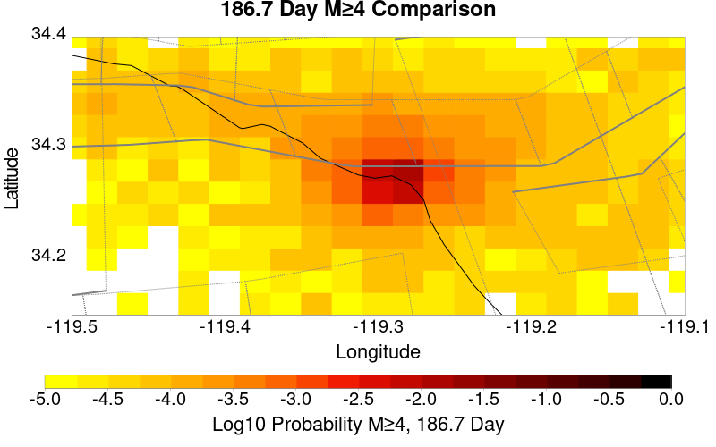
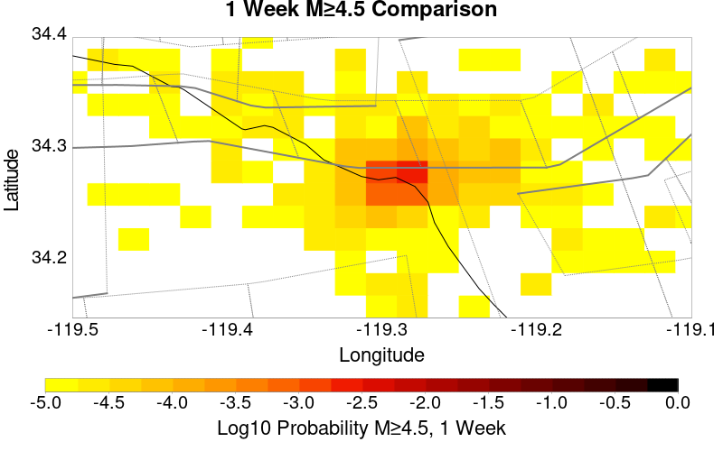
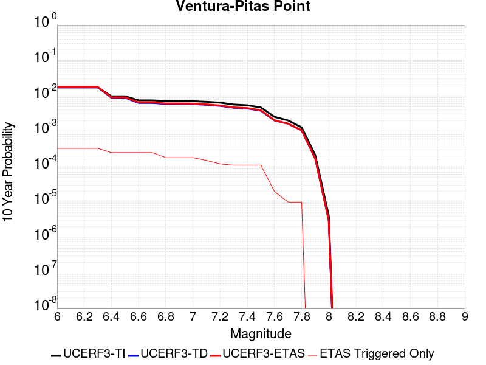
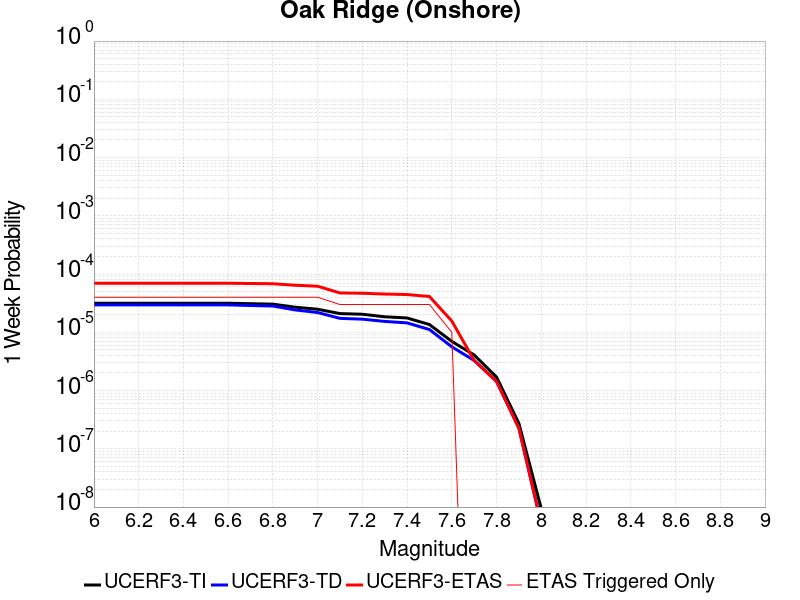

# ComCat data 1.5 d after ci38229234, Custom Region, Point Sources Results

|   | ComCat data 1.5 d after ci38229234, Custom Region, Point Sources |
|-----|-----|
| Num Simulations | 92200 (incomplete) |
| Start Time | 2019/11/09 00:53:27 UTC |
| Start Time Epoch Milliseconds | 1573260807250 |
| Duration | 10 Years |
| Includes Spontaneous? | false |
| Trigger Ruptures | 11 Trigger Ruptures |
|   | First: M3.2 at 2019/11/07 12:58:41 UTC |
|   | Last: M2.88 at 2019/11/08 21:55:02 UTC |
|   | Largest: M3.61 at 2019/11/08 13:29:38 UTC |
| Trigger Ruptures | *(none)* |
| Config Generated With | u3etas_comcat_config_builder.sh --start-at ci38229234 --end-now --region 34.4,-119.5,34.15,-119.1 --num-simulations 100000 --finite-surf-shakemap --finite-surf-shakemap-min-mag 6 --hpc-site USC_HPC --nodes 17 --hours 24 --queue scec |

## Table Of Contents

* [Probabilities Summary Table](#probabilities-summary-table)
* [Magnitude Number Distribution](#magnitude-number-distribution)
  * [10 Year Magnitude Number Distribution](#10-year-magnitude-number-distribution)
  * [1 Year Magnitude Number Distribution](#1-year-magnitude-number-distribution)
  * [1 Month Magnitude Number Distribution](#1-month-magnitude-number-distribution)
  * [1 Week Magnitude Number Distribution](#1-week-magnitude-number-distribution)
  * [1 Day Magnitude Number Distribution](#1-day-magnitude-number-distribution)
  * [1 Hour Magnitude Number Distribution](#1-hour-magnitude-number-distribution)
* [Hazard Change Over Time](#hazard-change-over-time)
  * [M&ge;5.0 Hazard Change Over Time](#m50-hazard-change-over-time)
  * [M&ge;6.0 Hazard Change Over Time](#m60-hazard-change-over-time)
  * [M&ge;7.0 Hazard Change Over Time](#m70-hazard-change-over-time)
* [Trigger Rupture Fault Map](#trigger-rupture-fault-map)
* [Fault Distances To Triggers](#fault-distances-to-triggers)
* [Individual Simulated Catalog Maps](#individual-simulated-catalog-maps)
* [ComCat Data Comparisons](#comcat-data-comparisons)
  * [ComCat Magnitude-Number Distributions](#comcat-magnitude-number-distributions)
  * [ComCat Time-Dependent Mc](#comcat-time-dependent-mc)
  * [ComCat Cumulative Number Vs Time](#comcat-cumulative-number-vs-time)
  * [ComCat Cumulative Number Simulation Percentiles](#comcat-cumulative-number-simulation-percentiles)
  * [ComCat Probability Spatial Distribution](#comcat-probability-spatial-distribution)
  * [ComCat Mean Expectation Spatial Distribution](#comcat-mean-expectation-spatial-distribution)
  * [ComCat Depth Distribution](#comcat-depth-distribution)
* [Section Participation](#section-participation)
  * [Section Participation Plots](#section-participation-plots)
  * [Supra-Seismogenic Parent Sections Table](#supra-seismogenic-parent-sections-table)
  * [M≥6.5 Parent Sections Table](#m65-parent-sections-table)
  * [M≥7 Parent Sections Table](#m7-parent-sections-table)
  * [M≥7.5 Parent Sections Table](#m75-parent-sections-table)
* [Fault Magnitude-Probability Distributions](#fault-magnitude-probability-distributions)
* [Gridded Nucleation](#gridded-nucleation)
* [JSON Input File](#json-input-file)

## Probabilities Summary Table
*[(top)](#table-of-contents)*

| Magnitude | 1 Hour Prob | 1 Day Prob | 1 Week Prob | 1 Month Prob | 1 Year Prob | 10 Year Prob |
|-----|-----|-----|-----|-----|-----|-----|
| **M&ge;3** | 6.12E-3 (0.61%) | 0.072 (7.18%) | 0.164 (16.41%) | 0.232 (23.21%) | 0.328 (32.84%) | 0.398 (39.83%) |
| *95% Conf* | *[0.56% 0.66%]* | *[7.01% 7.35%]* | *[16.17% 16.65%]* | *[22.94% 23.49%]* | *[32.53% 33.14%]* | *[39.51% 40.14%]* |
| **M&ge;3.5** | 1.96E-3 (0.20%) | 0.024 (2.35%) | 0.057 (5.70%) | 0.083 (8.33%) | 0.125 (12.50%) | 0.158 (15.76%) |
| *95% Conf* | *[0.17% 0.23%]* | *[2.26% 2.45%]* | *[5.55% 5.85%]* | *[8.15% 8.51%]* | *[12.28% 12.71%]* | *[15.53% 16.00%]* |
| **M&ge;3.61** | 1.53E-3 (0.15%) | 0.018 (1.84%) | 0.045 (4.48%) | 0.066 (6.62%) | 0.100 (9.97%) | 0.127 (12.66%) |
| *95% Conf* | *[0.13% 0.18%]* | *[1.75% 1.92%]* | *[4.35% 4.62%]* | *[6.46% 6.79%]* | *[9.78% 10.16%]* | *[12.45% 12.88%]* |
| **M&ge;4** | 6.40E-4 (0.06%) | 7.78E-3 (0.78%) | 0.019 (1.91%) | 0.028 (2.82%) | 0.044 (4.39%) | 0.057 (5.65%) |
| *95% Conf* | *[0.05% 0.08%]* | *[0.72% 0.84%]* | *[1.82% 2.00%]* | *[2.71% 2.93%]* | *[4.26% 4.53%]* | *[5.51% 5.80%]* |
| **M&ge;4.5** | 1.41E-4 (0.01%) | 2.41E-3 (0.24%) | 6.08E-3 (0.61%) | 9.15E-3 (0.92%) | 0.015 (1.49%) | 0.019 (1.91%) |
| *95% Conf* | *[0.01% 0.02%]* | *[0.21% 0.28%]* | *[0.56% 0.66%]* | *[0.86% 0.98%]* | *[1.41% 1.57%]* | *[1.82% 2.00%]* |
| **M&ge;5** | 3.25E-5 (0.00%) | 7.70E-4 (0.08%) | 2.15E-3 (0.21%) | 3.36E-3 (0.34%) | 5.50E-3 (0.55%) | 7.06E-3 (0.71%) |
| *95% Conf* | *[0.00% 0.01%]* | *[0.06% 0.10%]* | *[0.19% 0.25%]* | *[0.30% 0.38%]* | *[0.50% 0.60%]* | *[0.65% 0.76%]* |
| **M&ge;5.5** | 1.08E-5 (0.00%) | 2.49E-4 (0.02%) | 8.89E-4 (0.09%) | 1.24E-3 (0.12%) | 2.00E-3 (0.20%) | 2.55E-3 (0.25%) |
| *95% Conf* | *[0.00% 0.01%]* | *[0.02% 0.04%]* | *[0.07% 0.11%]* | *[0.10% 0.15%]* | *[0.17% 0.23%]* | *[0.22% 0.29%]* |
| **M&ge;6** | 0.000 (0.00%) | 7.59E-5 (0.01%) | 3.58E-4 (0.04%) | 4.66E-4 (0.05%) | 6.83E-4 (0.07%) | 8.46E-4 (0.08%) |
| *95% Conf* | *[0.00% 0.01%]* | *[0.00% 0.02%]* | *[0.03% 0.05%]* | *[0.03% 0.06%]* | *[0.05% 0.09%]* | *[0.07% 0.11%]* |
| **M&ge;6.5** | 0.000 (0.00%) | 1.08E-5 (0.00%) | 1.30E-4 (0.01%) | 1.63E-4 (0.02%) | 2.60E-4 (0.03%) | 3.36E-4 (0.03%) |
| *95% Conf* | *[0.00% 0.01%]* | *[0.00% 0.01%]* | *[0.01% 0.02%]* | *[0.01% 0.03%]* | *[0.02% 0.04%]* | *[0.02% 0.05%]* |
| **M&ge;7** | 0.000 (0.00%) | 0.000 (0.00%) | 6.51E-5 (0.01%) | 9.76E-5 (0.01%) | 1.63E-4 (0.02%) | 1.95E-4 (0.02%) |
| *95% Conf* | *[0.00% 0.01%]* | *[0.00% 0.01%]* | *[0.00% 0.01%]* | *[0.00% 0.02%]* | *[0.01% 0.03%]* | *[0.01% 0.03%]* |
| **M&ge;7.5** | 0.000 (0.00%) | 0.000 (0.00%) | 3.25E-5 (0.00%) | 6.51E-5 (0.01%) | 9.76E-5 (0.01%) | 1.19E-4 (0.01%) |
| *95% Conf* | *[0.00% 0.01%]* | *[0.00% 0.01%]* | *[0.00% 0.01%]* | *[0.00% 0.01%]* | *[0.00% 0.02%]* | *[0.01% 0.02%]* |

## Magnitude Number Distribution
*[(top)](#table-of-contents)*

### 10 Year Magnitude Number Distribution
*[(top)](#table-of-contents)*

**Legend**
* **Mean** (thick black line): mean expected number across all 92200 catalogs
* **2.5%,97.5%** (thin black lines): expected number percentiles across all 92200 catalogs
* **Median** (thin blue line): median expected number across all 92200 catalogs
* **Mode** (thin cyan line): modal expected number across all 92200 catalogs
* **10 yr Probability** (thin red line): 10 year probability calculated as the fraction of catalogs with at least 1 occurrence
* **10 yr Supraseismogenic Probability** (thin dashed red line): same as above, but only for supraseismogenic ruptures on explicitly modeled UCERF3 faults
* **95% Conf** (light red shaded region): binomial 95% confidence bounds on probability
* **Primary** (thin green line): mean expected number from primary triggered aftershocks only (no secondary, tertiary, etc...) across all 92200 catalogs


| Mag | Mean | 2.5 %ile | 97.5 %ile | Median | Mode | 10 yr Probability | 10 yr Prob 95% Conf | 10 yr Supra-Seis Prob | Primary Aftershocks Mean |
|-----|-----|-----|-----|-----|-----|-----|-----|-----|-----|
| **M&ge;2.5** | 5.628 | 0.000 | 10.000 | 2.000 | 1.000 | 0.780 (78.01%) | [77.74% 78.28%] | 3.90E-4 (0.04%) | 1.508 |
| **M&ge;2.6** | 4.466 | 0.000 | 8.000 | 1.000 | 0.000 | 0.703 (70.27%) | [69.97% 70.56%] | 3.90E-4 (0.04%) | 1.196 |
| **M&ge;2.7** | 3.551 | 0.000 | 7.000 | 1.000 | 0.000 | 0.624 (62.38%) | [62.06% 62.69%] | 3.90E-4 (0.04%) | 0.953 |
| **M&ge;2.8** | 2.824 | 0.000 | 6.000 | 1.000 | 0.000 | 0.545 (54.50%) | [54.18% 54.83%] | 3.90E-4 (0.04%) | 0.758 |
| **M&ge;2.9** | 2.240 | 0.000 | 5.000 | 0.000 | 0.000 | 0.469 (46.86%) | [46.53% 47.18%] | 3.90E-4 (0.04%) | 0.601 |
| **M&ge;3** | 1.778 | 0.000 | 4.000 | 0.000 | 0.000 | 0.398 (39.83%) | [39.51% 40.14%] | 3.90E-4 (0.04%) | 0.478 |
| **M&ge;3.1** | 1.410 | 0.000 | 4.000 | 0.000 | 0.000 | 0.336 (33.60%) | [33.29% 33.90%] | 3.90E-4 (0.04%) | 0.380 |
| **M&ge;3.2** | 1.119 | 0.000 | 3.000 | 0.000 | 0.000 | 0.280 (28.00%) | [27.71% 28.29%] | 3.90E-4 (0.04%) | 0.301 |
| **M&ge;3.3** | 0.891 | 0.000 | 3.000 | 0.000 | 0.000 | 0.232 (23.15%) | [22.88% 23.43%] | 3.90E-4 (0.04%) | 0.239 |
| **M&ge;3.4** | 0.708 | 0.000 | 2.000 | 0.000 | 0.000 | 0.191 (19.08%) | [18.82% 19.33%] | 3.90E-4 (0.04%) | 0.189 |
| **M&ge;3.5** | 0.565 | 0.000 | 2.000 | 0.000 | 0.000 | 0.158 (15.76%) | [15.53% 16.00%] | 3.90E-4 (0.04%) | 0.151 |
| **M&ge;3.6** | 0.447 | 0.000 | 2.000 | 0.000 | 0.000 | 0.129 (12.89%) | [12.68% 13.11%] | 3.90E-4 (0.04%) | 0.120 |
| **M&ge;3.7** | 0.355 | 0.000 | 2.000 | 0.000 | 0.000 | 0.106 (10.56%) | [10.36% 10.76%] | 3.90E-4 (0.04%) | 0.095 |
| **M&ge;3.8** | 0.281 | 0.000 | 1.000 | 0.000 | 0.000 | 0.086 (8.55%) | [8.37% 8.74%] | 3.90E-4 (0.04%) | 0.075 |
| **M&ge;3.9** | 0.224 | 0.000 | 1.000 | 0.000 | 0.000 | 0.070 (7.00%) | [6.83% 7.16%] | 3.90E-4 (0.04%) | 0.060 |
| **M&ge;4** | 0.178 | 0.000 | 1.000 | 0.000 | 0.000 | 0.057 (5.65%) | [5.51% 5.80%] | 3.90E-4 (0.04%) | 0.048 |
| **M&ge;4.1** | 0.140 | 0.000 | 1.000 | 0.000 | 0.000 | 0.046 (4.56%) | [4.43% 4.70%] | 3.90E-4 (0.04%) | 0.038 |
| **M&ge;4.2** | 0.111 | 0.000 | 1.000 | 0.000 | 0.000 | 0.037 (3.69%) | [3.57% 3.82%] | 3.90E-4 (0.04%) | 0.030 |
| **M&ge;4.3** | 0.088 | 0.000 | 1.000 | 0.000 | 0.000 | 0.030 (2.98%) | [2.87% 3.09%] | 3.90E-4 (0.04%) | 0.024 |
| **M&ge;4.4** | 0.069 | 0.000 | 0.000 | 0.000 | 0.000 | 0.024 (2.37%) | [2.27% 2.47%] | 3.90E-4 (0.04%) | 0.018 |
| **M&ge;4.5** | 0.055 | 0.000 | 0.000 | 0.000 | 0.000 | 0.019 (1.91%) | [1.82% 2.00%] | 3.90E-4 (0.04%) | 0.015 |
| **M&ge;4.6** | 0.044 | 0.000 | 0.000 | 0.000 | 0.000 | 0.016 (1.55%) | [1.47% 1.63%] | 3.90E-4 (0.04%) | 0.011 |
| **M&ge;4.7** | 0.035 | 0.000 | 0.000 | 0.000 | 0.000 | 0.013 (1.28%) | [1.21% 1.35%] | 3.90E-4 (0.04%) | 9.11E-3 |
| **M&ge;4.8** | 0.028 | 0.000 | 0.000 | 0.000 | 0.000 | 0.011 (1.07%) | [1.00% 1.14%] | 3.90E-4 (0.04%) | 7.53E-3 |
| **M&ge;4.9** | 0.022 | 0.000 | 0.000 | 0.000 | 0.000 | 8.63E-3 (0.86%) | [0.81% 0.93%] | 3.90E-4 (0.04%) | 5.86E-3 |
| **M&ge;5** | 0.018 | 0.000 | 0.000 | 0.000 | 0.000 | 7.06E-3 (0.71%) | [0.65% 0.76%] | 3.90E-4 (0.04%) | 4.73E-3 |
| **M&ge;5.1** | 0.014 | 0.000 | 0.000 | 0.000 | 0.000 | 5.55E-3 (0.56%) | [0.51% 0.61%] | 3.90E-4 (0.04%) | 3.62E-3 |
| **M&ge;5.2** | 0.011 | 0.000 | 0.000 | 0.000 | 0.000 | 4.58E-3 (0.46%) | [0.42% 0.50%] | 3.90E-4 (0.04%) | 2.98E-3 |
| **M&ge;5.3** | 9.10E-3 | 0.000 | 0.000 | 0.000 | 0.000 | 3.85E-3 (0.39%) | [0.35% 0.43%] | 3.90E-4 (0.04%) | 2.45E-3 |
| **M&ge;5.4** | 7.22E-3 | 0.000 | 0.000 | 0.000 | 0.000 | 3.12E-3 (0.31%) | [0.28% 0.35%] | 3.90E-4 (0.04%) | 1.95E-3 |
| **M&ge;5.5** | 5.63E-3 | 0.000 | 0.000 | 0.000 | 0.000 | 2.55E-3 (0.25%) | [0.22% 0.29%] | 3.90E-4 (0.04%) | 1.52E-3 |
| **M&ge;5.6** | 4.50E-3 | 0.000 | 0.000 | 0.000 | 0.000 | 2.06E-3 (0.21%) | [0.18% 0.24%] | 3.90E-4 (0.04%) | 1.25E-3 |
| **M&ge;5.7** | 3.50E-3 | 0.000 | 0.000 | 0.000 | 0.000 | 1.58E-3 (0.16%) | [0.13% 0.19%] | 3.90E-4 (0.04%) | 9.44E-4 |
| **M&ge;5.8** | 2.80E-3 | 0.000 | 0.000 | 0.000 | 0.000 | 1.26E-3 (0.13%) | [0.10% 0.15%] | 3.90E-4 (0.04%) | 7.59E-4 |
| **M&ge;5.9** | 2.19E-3 | 0.000 | 0.000 | 0.000 | 0.000 | 1.06E-3 (0.11%) | [0.09% 0.13%] | 3.90E-4 (0.04%) | 6.29E-4 |
| **M&ge;6** | 1.81E-3 | 0.000 | 0.000 | 0.000 | 0.000 | 8.46E-4 (0.08%) | [0.07% 0.11%] | 3.90E-4 (0.04%) | 4.77E-4 |
| **M&ge;6.1** | 1.44E-3 | 0.000 | 0.000 | 0.000 | 0.000 | 7.27E-4 (0.07%) | [0.06% 0.09%] | 3.90E-4 (0.04%) | 3.90E-4 |
| **M&ge;6.2** | 1.06E-3 | 0.000 | 0.000 | 0.000 | 0.000 | 5.75E-4 (0.06%) | [0.04% 0.08%] | 3.90E-4 (0.04%) | 3.15E-4 |
| **M&ge;6.3** | 9.33E-4 | 0.000 | 0.000 | 0.000 | 0.000 | 4.99E-4 (0.05%) | [0.04% 0.07%] | 3.80E-4 (0.04%) | 2.71E-4 |
| **M&ge;6.4** | 6.72E-4 | 0.000 | 0.000 | 0.000 | 0.000 | 3.80E-4 (0.04%) | [0.03% 0.05%] | 3.04E-4 (0.03%) | 2.06E-4 |
| **M&ge;6.5** | 4.99E-4 | 0.000 | 0.000 | 0.000 | 0.000 | 3.36E-4 (0.03%) | [0.02% 0.05%] | 2.93E-4 (0.03%) | 1.84E-4 |
| **M&ge;6.6** | 4.56E-4 | 0.000 | 0.000 | 0.000 | 0.000 | 3.25E-4 (0.03%) | [0.02% 0.05%] | 2.93E-4 (0.03%) | 1.84E-4 |
| **M&ge;6.7** | 3.90E-4 | 0.000 | 0.000 | 0.000 | 0.000 | 2.93E-4 (0.03%) | [0.02% 0.04%] | 2.71E-4 (0.03%) | 1.74E-4 |
| **M&ge;6.8** | 2.93E-4 | 0.000 | 0.000 | 0.000 | 0.000 | 2.06E-4 (0.02%) | [0.01% 0.03%] | 1.95E-4 (0.02%) | 1.19E-4 |
| **M&ge;6.9** | 2.60E-4 | 0.000 | 0.000 | 0.000 | 0.000 | 1.95E-4 (0.02%) | [0.01% 0.03%] | 1.95E-4 (0.02%) | 1.08E-4 |
| **M&ge;7** | 2.49E-4 | 0.000 | 0.000 | 0.000 | 0.000 | 1.95E-4 (0.02%) | [0.01% 0.03%] | 1.95E-4 (0.02%) | 1.08E-4 |
| **M&ge;7.1** | 2.17E-4 | 0.000 | 0.000 | 0.000 | 0.000 | 1.84E-4 (0.02%) | [0.01% 0.03%] | 1.84E-4 (0.02%) | 9.76E-5 |
| **M&ge;7.2** | 1.84E-4 | 0.000 | 0.000 | 0.000 | 0.000 | 1.52E-4 (0.02%) | [0.01% 0.03%] | 1.52E-4 (0.02%) | 8.68E-5 |
| **M&ge;7.3** | 1.74E-4 | 0.000 | 0.000 | 0.000 | 0.000 | 1.41E-4 (0.01%) | [0.01% 0.02%] | 1.41E-4 (0.01%) | 7.59E-5 |
| **M&ge;7.4** | 1.41E-4 | 0.000 | 0.000 | 0.000 | 0.000 | 1.30E-4 (0.01%) | [0.01% 0.02%] | 1.30E-4 (0.01%) | 7.59E-5 |
| **M&ge;7.5** | 1.19E-4 | 0.000 | 0.000 | 0.000 | 0.000 | 1.19E-4 (0.01%) | [0.01% 0.02%] | 1.19E-4 (0.01%) | 7.59E-5 |
| **M&ge;7.6** | 2.17E-5 | 0.000 | 0.000 | 0.000 | 0.000 | 2.17E-5 (0.00%) | [0.00% 0.01%] | 2.17E-5 (0.00%) | 2.17E-5 |
| **M&ge;7.7** | 1.08E-5 | 0.000 | 0.000 | 0.000 | 0.000 | 1.08E-5 (0.00%) | [0.00% 0.01%] | 1.08E-5 (0.00%) | 1.08E-5 |
| **M&ge;7.8** | 1.08E-5 | 0.000 | 0.000 | 0.000 | 0.000 | 1.08E-5 (0.00%) | [0.00% 0.01%] | 1.08E-5 (0.00%) | 1.08E-5 |
| **M&ge;7.9** | 0.000 | 0.000 | 0.000 | 0.000 | 0.000 | 0.000 (0.00%) | [0.00% 0.01%] | 0.000 (0.00%) | 0.000 |
| **M&ge;8** | 0.000 | 0.000 | 0.000 | 0.000 | 0.000 | 0.000 (0.00%) | [0.00% 0.01%] | 0.000 (0.00%) | 0.000 |
| **M&ge;8.1** | 0.000 | 0.000 | 0.000 | 0.000 | 0.000 | 0.000 (0.00%) | [0.00% 0.01%] | 0.000 (0.00%) | 0.000 |
| **M&ge;8.2** | 0.000 | 0.000 | 0.000 | 0.000 | 0.000 | 0.000 (0.00%) | [0.00% 0.01%] | 0.000 (0.00%) | 0.000 |
| **M&ge;8.3** | 0.000 | 0.000 | 0.000 | 0.000 | 0.000 | 0.000 (0.00%) | [0.00% 0.01%] | 0.000 (0.00%) | 0.000 |
| **M&ge;8.4** | 0.000 | 0.000 | 0.000 | 0.000 | 0.000 | 0.000 (0.00%) | [0.00% 0.01%] | 0.000 (0.00%) | 0.000 |
| **M&ge;8.5** | 0.000 | 0.000 | 0.000 | 0.000 | 0.000 | 0.000 (0.00%) | [0.00% 0.01%] | 0.000 (0.00%) | 0.000 |
| **M&ge;8.6** | 0.000 | 0.000 | 0.000 | 0.000 | 0.000 | 0.000 (0.00%) | [0.00% 0.01%] | 0.000 (0.00%) | 0.000 |
| **M&ge;8.7** | 0.000 | 0.000 | 0.000 | 0.000 | 0.000 | 0.000 (0.00%) | [0.00% 0.01%] | 0.000 (0.00%) | 0.000 |
| **M&ge;8.8** | 0.000 | 0.000 | 0.000 | 0.000 | 0.000 | 0.000 (0.00%) | [0.00% 0.01%] | 0.000 (0.00%) | 0.000 |
| **M&ge;8.9** | 0.000 | 0.000 | 0.000 | 0.000 | 0.000 | 0.000 (0.00%) | [0.00% 0.01%] | 0.000 (0.00%) | 0.000 |
| **M&ge;9** | 0.000 | 0.000 | 0.000 | 0.000 | 0.000 | 0.000 (0.00%) | [0.00% 0.01%] | 0.000 (0.00%) | 0.000 |

### 1 Year Magnitude Number Distribution
*[(top)](#table-of-contents)*

**Legend**
* **Mean** (thick black line): mean expected number across all 92200 catalogs
* **2.5%,97.5%** (thin black lines): expected number percentiles across all 92200 catalogs
* **Median** (thin blue line): median expected number across all 92200 catalogs
* **Mode** (thin cyan line): modal expected number across all 92200 catalogs
* **1 yr Probability** (thin red line): 1 year probability calculated as the fraction of catalogs with at least 1 occurrence
* **1 yr Supraseismogenic Probability** (thin dashed red line): same as above, but only for supraseismogenic ruptures on explicitly modeled UCERF3 faults
* **95% Conf** (light red shaded region): binomial 95% confidence bounds on probability
* **Primary** (thin green line): mean expected number from primary triggered aftershocks only (no secondary, tertiary, etc...) across all 92200 catalogs


| Mag | Mean | 2.5 %ile | 97.5 %ile | Median | Mode | 1 yr Probability | 1 yr Prob 95% Conf | 1 yr Supra-Seis Prob | Primary Aftershocks Mean |
|-----|-----|-----|-----|-----|-----|-----|-----|-----|-----|
| **M&ge;2.5** | 3.798 | 0.000 | 7.000 | 1.000 | 1.000 | 0.699 (69.92%) | [69.62% 70.21%] | 3.04E-4 (0.03%) | 1.196 |
| **M&ge;2.6** | 3.016 | 0.000 | 6.000 | 1.000 | 0.000 | 0.617 (61.73%) | [61.41% 62.04%] | 3.04E-4 (0.03%) | 0.949 |
| **M&ge;2.7** | 2.396 | 0.000 | 5.000 | 1.000 | 0.000 | 0.538 (53.83%) | [53.50% 54.15%] | 3.04E-4 (0.03%) | 0.756 |
| **M&ge;2.8** | 1.907 | 0.000 | 4.000 | 0.000 | 0.000 | 0.463 (46.29%) | [45.97% 46.62%] | 3.04E-4 (0.03%) | 0.601 |
| **M&ge;2.9** | 1.511 | 0.000 | 4.000 | 0.000 | 0.000 | 0.392 (39.18%) | [38.86% 39.49%] | 3.04E-4 (0.03%) | 0.476 |
| **M&ge;3** | 1.198 | 0.000 | 3.000 | 0.000 | 0.000 | 0.328 (32.84%) | [32.53% 33.14%] | 3.04E-4 (0.03%) | 0.378 |
| **M&ge;3.1** | 0.950 | 0.000 | 3.000 | 0.000 | 0.000 | 0.275 (27.45%) | [27.16% 27.74%] | 3.04E-4 (0.03%) | 0.300 |
| **M&ge;3.2** | 0.755 | 0.000 | 2.000 | 0.000 | 0.000 | 0.227 (22.66%) | [22.39% 22.93%] | 3.04E-4 (0.03%) | 0.238 |
| **M&ge;3.3** | 0.601 | 0.000 | 2.000 | 0.000 | 0.000 | 0.186 (18.57%) | [18.32% 18.82%] | 3.04E-4 (0.03%) | 0.189 |
| **M&ge;3.4** | 0.478 | 0.000 | 2.000 | 0.000 | 0.000 | 0.152 (15.22%) | [14.99% 15.46%] | 3.04E-4 (0.03%) | 0.150 |
| **M&ge;3.5** | 0.381 | 0.000 | 2.000 | 0.000 | 0.000 | 0.125 (12.50%) | [12.28% 12.71%] | 3.04E-4 (0.03%) | 0.120 |
| **M&ge;3.6** | 0.302 | 0.000 | 1.000 | 0.000 | 0.000 | 0.102 (10.16%) | [9.96% 10.35%] | 3.04E-4 (0.03%) | 0.095 |
| **M&ge;3.7** | 0.240 | 0.000 | 1.000 | 0.000 | 0.000 | 0.083 (8.28%) | [8.10% 8.46%] | 3.04E-4 (0.03%) | 0.076 |
| **M&ge;3.8** | 0.190 | 0.000 | 1.000 | 0.000 | 0.000 | 0.067 (6.67%) | [6.51% 6.83%] | 3.04E-4 (0.03%) | 0.060 |
| **M&ge;3.9** | 0.152 | 0.000 | 1.000 | 0.000 | 0.000 | 0.054 (5.45%) | [5.30% 5.60%] | 3.04E-4 (0.03%) | 0.048 |
| **M&ge;4** | 0.120 | 0.000 | 1.000 | 0.000 | 0.000 | 0.044 (4.39%) | [4.26% 4.53%] | 3.04E-4 (0.03%) | 0.038 |
| **M&ge;4.1** | 0.095 | 0.000 | 1.000 | 0.000 | 0.000 | 0.035 (3.51%) | [3.39% 3.63%] | 3.04E-4 (0.03%) | 0.030 |
| **M&ge;4.2** | 0.075 | 0.000 | 1.000 | 0.000 | 0.000 | 0.028 (2.84%) | [2.73% 2.94%] | 3.04E-4 (0.03%) | 0.024 |
| **M&ge;4.3** | 0.060 | 0.000 | 0.000 | 0.000 | 0.000 | 0.023 (2.30%) | [2.20% 2.40%] | 3.04E-4 (0.03%) | 0.019 |
| **M&ge;4.4** | 0.047 | 0.000 | 0.000 | 0.000 | 0.000 | 0.018 (1.82%) | [1.73% 1.91%] | 3.04E-4 (0.03%) | 0.015 |
| **M&ge;4.5** | 0.038 | 0.000 | 0.000 | 0.000 | 0.000 | 0.015 (1.49%) | [1.41% 1.57%] | 3.04E-4 (0.03%) | 0.012 |
| **M&ge;4.6** | 0.030 | 0.000 | 0.000 | 0.000 | 0.000 | 0.012 (1.21%) | [1.14% 1.28%] | 3.04E-4 (0.03%) | 9.05E-3 |
| **M&ge;4.7** | 0.024 | 0.000 | 0.000 | 0.000 | 0.000 | 9.92E-3 (0.99%) | [0.93% 1.06%] | 3.04E-4 (0.03%) | 7.33E-3 |
| **M&ge;4.8** | 0.019 | 0.000 | 0.000 | 0.000 | 0.000 | 8.30E-3 (0.83%) | [0.77% 0.89%] | 3.04E-4 (0.03%) | 6.14E-3 |
| **M&ge;4.9** | 0.016 | 0.000 | 0.000 | 0.000 | 0.000 | 6.74E-3 (0.67%) | [0.62% 0.73%] | 3.04E-4 (0.03%) | 4.83E-3 |
| **M&ge;5** | 0.012 | 0.000 | 0.000 | 0.000 | 0.000 | 5.50E-3 (0.55%) | [0.50% 0.60%] | 3.04E-4 (0.03%) | 3.89E-3 |
| **M&ge;5.1** | 9.70E-3 | 0.000 | 0.000 | 0.000 | 0.000 | 4.33E-3 (0.43%) | [0.39% 0.48%] | 3.04E-4 (0.03%) | 3.00E-3 |
| **M&ge;5.2** | 7.66E-3 | 0.000 | 0.000 | 0.000 | 0.000 | 3.50E-3 (0.35%) | [0.31% 0.39%] | 3.04E-4 (0.03%) | 2.44E-3 |
| **M&ge;5.3** | 6.23E-3 | 0.000 | 0.000 | 0.000 | 0.000 | 2.95E-3 (0.30%) | [0.26% 0.33%] | 3.04E-4 (0.03%) | 2.03E-3 |
| **M&ge;5.4** | 4.93E-3 | 0.000 | 0.000 | 0.000 | 0.000 | 2.40E-3 (0.24%) | [0.21% 0.27%] | 3.04E-4 (0.03%) | 1.64E-3 |
| **M&ge;5.5** | 3.88E-3 | 0.000 | 0.000 | 0.000 | 0.000 | 2.00E-3 (0.20%) | [0.17% 0.23%] | 3.04E-4 (0.03%) | 1.31E-3 |
| **M&ge;5.6** | 3.17E-3 | 0.000 | 0.000 | 0.000 | 0.000 | 1.63E-3 (0.16%) | [0.14% 0.19%] | 3.04E-4 (0.03%) | 1.11E-3 |
| **M&ge;5.7** | 2.49E-3 | 0.000 | 0.000 | 0.000 | 0.000 | 1.30E-3 (0.13%) | [0.11% 0.16%] | 3.04E-4 (0.03%) | 8.57E-4 |
| **M&ge;5.8** | 2.03E-3 | 0.000 | 0.000 | 0.000 | 0.000 | 1.05E-3 (0.11%) | [0.09% 0.13%] | 3.04E-4 (0.03%) | 6.94E-4 |
| **M&ge;5.9** | 1.64E-3 | 0.000 | 0.000 | 0.000 | 0.000 | 8.89E-4 (0.09%) | [0.07% 0.11%] | 3.04E-4 (0.03%) | 5.75E-4 |
| **M&ge;6** | 1.36E-3 | 0.000 | 0.000 | 0.000 | 0.000 | 6.83E-4 (0.07%) | [0.05% 0.09%] | 3.04E-4 (0.03%) | 4.34E-4 |
| **M&ge;6.1** | 1.10E-3 | 0.000 | 0.000 | 0.000 | 0.000 | 5.75E-4 (0.06%) | [0.04% 0.08%] | 3.04E-4 (0.03%) | 3.47E-4 |
| **M&ge;6.2** | 8.13E-4 | 0.000 | 0.000 | 0.000 | 0.000 | 4.56E-4 (0.05%) | [0.03% 0.06%] | 3.04E-4 (0.03%) | 2.82E-4 |
| **M&ge;6.3** | 7.16E-4 | 0.000 | 0.000 | 0.000 | 0.000 | 3.90E-4 (0.04%) | [0.03% 0.05%] | 3.04E-4 (0.03%) | 2.39E-4 |
| **M&ge;6.4** | 4.99E-4 | 0.000 | 0.000 | 0.000 | 0.000 | 3.04E-4 (0.03%) | [0.02% 0.04%] | 2.39E-4 (0.02%) | 1.74E-4 |
| **M&ge;6.5** | 3.69E-4 | 0.000 | 0.000 | 0.000 | 0.000 | 2.60E-4 (0.03%) | [0.02% 0.04%] | 2.28E-4 (0.02%) | 1.52E-4 |
| **M&ge;6.6** | 3.36E-4 | 0.000 | 0.000 | 0.000 | 0.000 | 2.49E-4 (0.02%) | [0.02% 0.04%] | 2.28E-4 (0.02%) | 1.52E-4 |
| **M&ge;6.7** | 2.71E-4 | 0.000 | 0.000 | 0.000 | 0.000 | 2.17E-4 (0.02%) | [0.01% 0.03%] | 2.06E-4 (0.02%) | 1.41E-4 |
| **M&ge;6.8** | 2.28E-4 | 0.000 | 0.000 | 0.000 | 0.000 | 1.74E-4 (0.02%) | [0.01% 0.03%] | 1.63E-4 (0.02%) | 1.08E-4 |
| **M&ge;6.9** | 1.95E-4 | 0.000 | 0.000 | 0.000 | 0.000 | 1.63E-4 (0.02%) | [0.01% 0.03%] | 1.63E-4 (0.02%) | 9.76E-5 |
| **M&ge;7** | 1.95E-4 | 0.000 | 0.000 | 0.000 | 0.000 | 1.63E-4 (0.02%) | [0.01% 0.03%] | 1.63E-4 (0.02%) | 9.76E-5 |
| **M&ge;7.1** | 1.74E-4 | 0.000 | 0.000 | 0.000 | 0.000 | 1.52E-4 (0.02%) | [0.01% 0.03%] | 1.52E-4 (0.02%) | 8.68E-5 |
| **M&ge;7.2** | 1.41E-4 | 0.000 | 0.000 | 0.000 | 0.000 | 1.19E-4 (0.01%) | [0.01% 0.02%] | 1.19E-4 (0.01%) | 7.59E-5 |
| **M&ge;7.3** | 1.30E-4 | 0.000 | 0.000 | 0.000 | 0.000 | 1.08E-4 (0.01%) | [0.01% 0.02%] | 1.08E-4 (0.01%) | 6.51E-5 |
| **M&ge;7.4** | 1.08E-4 | 0.000 | 0.000 | 0.000 | 0.000 | 1.08E-4 (0.01%) | [0.01% 0.02%] | 1.08E-4 (0.01%) | 6.51E-5 |
| **M&ge;7.5** | 9.76E-5 | 0.000 | 0.000 | 0.000 | 0.000 | 9.76E-5 (0.01%) | [0.00% 0.02%] | 9.76E-5 (0.01%) | 6.51E-5 |
| **M&ge;7.6** | 2.17E-5 | 0.000 | 0.000 | 0.000 | 0.000 | 2.17E-5 (0.00%) | [0.00% 0.01%] | 2.17E-5 (0.00%) | 2.17E-5 |
| **M&ge;7.7** | 1.08E-5 | 0.000 | 0.000 | 0.000 | 0.000 | 1.08E-5 (0.00%) | [0.00% 0.01%] | 1.08E-5 (0.00%) | 1.08E-5 |
| **M&ge;7.8** | 1.08E-5 | 0.000 | 0.000 | 0.000 | 0.000 | 1.08E-5 (0.00%) | [0.00% 0.01%] | 1.08E-5 (0.00%) | 1.08E-5 |
| **M&ge;7.9** | 0.000 | 0.000 | 0.000 | 0.000 | 0.000 | 0.000 (0.00%) | [0.00% 0.01%] | 0.000 (0.00%) | 0.000 |
| **M&ge;8** | 0.000 | 0.000 | 0.000 | 0.000 | 0.000 | 0.000 (0.00%) | [0.00% 0.01%] | 0.000 (0.00%) | 0.000 |
| **M&ge;8.1** | 0.000 | 0.000 | 0.000 | 0.000 | 0.000 | 0.000 (0.00%) | [0.00% 0.01%] | 0.000 (0.00%) | 0.000 |
| **M&ge;8.2** | 0.000 | 0.000 | 0.000 | 0.000 | 0.000 | 0.000 (0.00%) | [0.00% 0.01%] | 0.000 (0.00%) | 0.000 |
| **M&ge;8.3** | 0.000 | 0.000 | 0.000 | 0.000 | 0.000 | 0.000 (0.00%) | [0.00% 0.01%] | 0.000 (0.00%) | 0.000 |
| **M&ge;8.4** | 0.000 | 0.000 | 0.000 | 0.000 | 0.000 | 0.000 (0.00%) | [0.00% 0.01%] | 0.000 (0.00%) | 0.000 |
| **M&ge;8.5** | 0.000 | 0.000 | 0.000 | 0.000 | 0.000 | 0.000 (0.00%) | [0.00% 0.01%] | 0.000 (0.00%) | 0.000 |
| **M&ge;8.6** | 0.000 | 0.000 | 0.000 | 0.000 | 0.000 | 0.000 (0.00%) | [0.00% 0.01%] | 0.000 (0.00%) | 0.000 |
| **M&ge;8.7** | 0.000 | 0.000 | 0.000 | 0.000 | 0.000 | 0.000 (0.00%) | [0.00% 0.01%] | 0.000 (0.00%) | 0.000 |
| **M&ge;8.8** | 0.000 | 0.000 | 0.000 | 0.000 | 0.000 | 0.000 (0.00%) | [0.00% 0.01%] | 0.000 (0.00%) | 0.000 |
| **M&ge;8.9** | 0.000 | 0.000 | 0.000 | 0.000 | 0.000 | 0.000 (0.00%) | [0.00% 0.01%] | 0.000 (0.00%) | 0.000 |
| **M&ge;9** | 0.000 | 0.000 | 0.000 | 0.000 | 0.000 | 0.000 (0.00%) | [0.00% 0.01%] | 0.000 (0.00%) | 0.000 |

### 1 Month Magnitude Number Distribution
*[(top)](#table-of-contents)*

**Legend**
* **Mean** (thick black line): mean expected number across all 92200 catalogs
* **2.5%,97.5%** (thin black lines): expected number percentiles across all 92200 catalogs
* **Median** (thin blue line): median expected number across all 92200 catalogs
* **Mode** (thin cyan line): modal expected number across all 92200 catalogs
* **1 mo Probability** (thin red line): 1 month probability calculated as the fraction of catalogs with at least 1 occurrence
* **1 mo Supraseismogenic Probability** (thin dashed red line): same as above, but only for supraseismogenic ruptures on explicitly modeled UCERF3 faults
* **95% Conf** (light red shaded region): binomial 95% confidence bounds on probability
* **Primary** (thin green line): mean expected number from primary triggered aftershocks only (no secondary, tertiary, etc...) across all 92200 catalogs


| Mag | Mean | 2.5 %ile | 97.5 %ile | Median | Mode | 1 mo Probability | 1 mo Prob 95% Conf | 1 mo Supra-Seis Prob | Primary Aftershocks Mean |
|-----|-----|-----|-----|-----|-----|-----|-----|-----|-----|
| **M&ge;2.5** | 1.930 | 0.000 | 5.000 | 1.000 | 0.000 | 0.552 (55.18%) | [54.86% 55.50%] | 1.84E-4 (0.02%) | 0.799 |
| **M&ge;2.6** | 1.532 | 0.000 | 4.000 | 0.000 | 0.000 | 0.473 (47.32%) | [47.00% 47.64%] | 1.84E-4 (0.02%) | 0.634 |
| **M&ge;2.7** | 1.219 | 0.000 | 3.000 | 0.000 | 0.000 | 0.403 (40.26%) | [39.94% 40.57%] | 1.84E-4 (0.02%) | 0.506 |
| **M&ge;2.8** | 0.971 | 0.000 | 3.000 | 0.000 | 0.000 | 0.339 (33.89%) | [33.58% 34.20%] | 1.84E-4 (0.02%) | 0.401 |
| **M&ge;2.9** | 0.770 | 0.000 | 3.000 | 0.000 | 0.000 | 0.282 (28.19%) | [27.90% 28.48%] | 1.84E-4 (0.02%) | 0.318 |
| **M&ge;3** | 0.610 | 0.000 | 2.000 | 0.000 | 0.000 | 0.232 (23.21%) | [22.94% 23.49%] | 1.84E-4 (0.02%) | 0.253 |
| **M&ge;3.1** | 0.483 | 0.000 | 2.000 | 0.000 | 0.000 | 0.191 (19.07%) | [18.81% 19.32%] | 1.84E-4 (0.02%) | 0.200 |
| **M&ge;3.2** | 0.384 | 0.000 | 2.000 | 0.000 | 0.000 | 0.156 (15.58%) | [15.34% 15.81%] | 1.84E-4 (0.02%) | 0.159 |
| **M&ge;3.3** | 0.305 | 0.000 | 2.000 | 0.000 | 0.000 | 0.126 (12.63%) | [12.42% 12.85%] | 1.84E-4 (0.02%) | 0.126 |
| **M&ge;3.4** | 0.243 | 0.000 | 1.000 | 0.000 | 0.000 | 0.102 (10.23%) | [10.04% 10.43%] | 1.84E-4 (0.02%) | 0.099 |
| **M&ge;3.5** | 0.194 | 0.000 | 1.000 | 0.000 | 0.000 | 0.083 (8.33%) | [8.15% 8.51%] | 1.84E-4 (0.02%) | 0.079 |
| **M&ge;3.6** | 0.153 | 0.000 | 1.000 | 0.000 | 0.000 | 0.067 (6.75%) | [6.59% 6.91%] | 1.84E-4 (0.02%) | 0.063 |
| **M&ge;3.7** | 0.121 | 0.000 | 1.000 | 0.000 | 0.000 | 0.055 (5.49%) | [5.34% 5.64%] | 1.84E-4 (0.02%) | 0.050 |
| **M&ge;3.8** | 0.096 | 0.000 | 1.000 | 0.000 | 0.000 | 0.044 (4.37%) | [4.24% 4.50%] | 1.84E-4 (0.02%) | 0.040 |
| **M&ge;3.9** | 0.077 | 0.000 | 1.000 | 0.000 | 0.000 | 0.035 (3.54%) | [3.43% 3.67%] | 1.84E-4 (0.02%) | 0.032 |
| **M&ge;4** | 0.060 | 0.000 | 1.000 | 0.000 | 0.000 | 0.028 (2.82%) | [2.71% 2.93%] | 1.84E-4 (0.02%) | 0.025 |
| **M&ge;4.1** | 0.047 | 0.000 | 0.000 | 0.000 | 0.000 | 0.022 (2.24%) | [2.14% 2.34%] | 1.84E-4 (0.02%) | 0.020 |
| **M&ge;4.2** | 0.037 | 0.000 | 0.000 | 0.000 | 0.000 | 0.018 (1.79%) | [1.71% 1.88%] | 1.84E-4 (0.02%) | 0.015 |
| **M&ge;4.3** | 0.030 | 0.000 | 0.000 | 0.000 | 0.000 | 0.015 (1.45%) | [1.38% 1.53%] | 1.84E-4 (0.02%) | 0.012 |
| **M&ge;4.4** | 0.023 | 0.000 | 0.000 | 0.000 | 0.000 | 0.011 (1.15%) | [1.08% 1.22%] | 1.84E-4 (0.02%) | 9.51E-3 |
| **M&ge;4.5** | 0.018 | 0.000 | 0.000 | 0.000 | 0.000 | 9.15E-3 (0.92%) | [0.86% 0.98%] | 1.84E-4 (0.02%) | 7.52E-3 |
| **M&ge;4.6** | 0.015 | 0.000 | 0.000 | 0.000 | 0.000 | 7.43E-3 (0.74%) | [0.69% 0.80%] | 1.84E-4 (0.02%) | 5.89E-3 |
| **M&ge;4.7** | 0.012 | 0.000 | 0.000 | 0.000 | 0.000 | 6.13E-3 (0.61%) | [0.56% 0.67%] | 1.84E-4 (0.02%) | 4.82E-3 |
| **M&ge;4.8** | 9.37E-3 | 0.000 | 0.000 | 0.000 | 0.000 | 5.11E-3 (0.51%) | [0.47% 0.56%] | 1.84E-4 (0.02%) | 4.07E-3 |
| **M&ge;4.9** | 7.44E-3 | 0.000 | 0.000 | 0.000 | 0.000 | 4.13E-3 (0.41%) | [0.37% 0.46%] | 1.84E-4 (0.02%) | 3.20E-3 |
| **M&ge;5** | 5.92E-3 | 0.000 | 0.000 | 0.000 | 0.000 | 3.36E-3 (0.34%) | [0.30% 0.38%] | 1.84E-4 (0.02%) | 2.52E-3 |
| **M&ge;5.1** | 4.54E-3 | 0.000 | 0.000 | 0.000 | 0.000 | 2.58E-3 (0.26%) | [0.23% 0.29%] | 1.84E-4 (0.02%) | 1.89E-3 |
| **M&ge;5.2** | 3.55E-3 | 0.000 | 0.000 | 0.000 | 0.000 | 2.10E-3 (0.21%) | [0.18% 0.24%] | 1.84E-4 (0.02%) | 1.54E-3 |
| **M&ge;5.3** | 2.85E-3 | 0.000 | 0.000 | 0.000 | 0.000 | 1.71E-3 (0.17%) | [0.15% 0.20%] | 1.84E-4 (0.02%) | 1.29E-3 |
| **M&ge;5.4** | 2.34E-3 | 0.000 | 0.000 | 0.000 | 0.000 | 1.46E-3 (0.15%) | [0.12% 0.17%] | 1.84E-4 (0.02%) | 1.12E-3 |
| **M&ge;5.5** | 1.84E-3 | 0.000 | 0.000 | 0.000 | 0.000 | 1.24E-3 (0.12%) | [0.10% 0.15%] | 1.84E-4 (0.02%) | 9.33E-4 |
| **M&ge;5.6** | 1.56E-3 | 0.000 | 0.000 | 0.000 | 0.000 | 1.05E-3 (0.11%) | [0.09% 0.13%] | 1.84E-4 (0.02%) | 8.13E-4 |
| **M&ge;5.7** | 1.20E-3 | 0.000 | 0.000 | 0.000 | 0.000 | 8.46E-4 (0.08%) | [0.07% 0.11%] | 1.84E-4 (0.02%) | 6.40E-4 |
| **M&ge;5.8** | 9.76E-4 | 0.000 | 0.000 | 0.000 | 0.000 | 6.83E-4 (0.07%) | [0.05% 0.09%] | 1.84E-4 (0.02%) | 4.99E-4 |
| **M&ge;5.9** | 7.81E-4 | 0.000 | 0.000 | 0.000 | 0.000 | 5.86E-4 (0.06%) | [0.04% 0.08%] | 1.84E-4 (0.02%) | 4.23E-4 |
| **M&ge;6** | 6.29E-4 | 0.000 | 0.000 | 0.000 | 0.000 | 4.66E-4 (0.05%) | [0.03% 0.06%] | 1.84E-4 (0.02%) | 3.36E-4 |
| **M&ge;6.1** | 5.53E-4 | 0.000 | 0.000 | 0.000 | 0.000 | 4.01E-4 (0.04%) | [0.03% 0.06%] | 1.84E-4 (0.02%) | 2.82E-4 |
| **M&ge;6.2** | 4.23E-4 | 0.000 | 0.000 | 0.000 | 0.000 | 3.04E-4 (0.03%) | [0.02% 0.04%] | 1.84E-4 (0.02%) | 2.39E-4 |
| **M&ge;6.3** | 3.69E-4 | 0.000 | 0.000 | 0.000 | 0.000 | 2.60E-4 (0.03%) | [0.02% 0.04%] | 1.84E-4 (0.02%) | 1.95E-4 |
| **M&ge;6.4** | 2.39E-4 | 0.000 | 0.000 | 0.000 | 0.000 | 1.74E-4 (0.02%) | [0.01% 0.03%] | 1.30E-4 (0.01%) | 1.30E-4 |
| **M&ge;6.5** | 1.84E-4 | 0.000 | 0.000 | 0.000 | 0.000 | 1.63E-4 (0.02%) | [0.01% 0.03%] | 1.30E-4 (0.01%) | 1.19E-4 |
| **M&ge;6.6** | 1.74E-4 | 0.000 | 0.000 | 0.000 | 0.000 | 1.52E-4 (0.02%) | [0.01% 0.03%] | 1.30E-4 (0.01%) | 1.19E-4 |
| **M&ge;6.7** | 1.63E-4 | 0.000 | 0.000 | 0.000 | 0.000 | 1.41E-4 (0.01%) | [0.01% 0.02%] | 1.30E-4 (0.01%) | 1.08E-4 |
| **M&ge;6.8** | 1.30E-4 | 0.000 | 0.000 | 0.000 | 0.000 | 1.08E-4 (0.01%) | [0.01% 0.02%] | 9.76E-5 (0.01%) | 7.59E-5 |
| **M&ge;6.9** | 1.08E-4 | 0.000 | 0.000 | 0.000 | 0.000 | 9.76E-5 (0.01%) | [0.00% 0.02%] | 9.76E-5 (0.01%) | 6.51E-5 |
| **M&ge;7** | 1.08E-4 | 0.000 | 0.000 | 0.000 | 0.000 | 9.76E-5 (0.01%) | [0.00% 0.02%] | 9.76E-5 (0.01%) | 6.51E-5 |
| **M&ge;7.1** | 9.76E-5 | 0.000 | 0.000 | 0.000 | 0.000 | 8.68E-5 (0.01%) | [0.00% 0.02%] | 8.68E-5 (0.01%) | 6.51E-5 |
| **M&ge;7.2** | 8.68E-5 | 0.000 | 0.000 | 0.000 | 0.000 | 7.59E-5 (0.01%) | [0.00% 0.02%] | 7.59E-5 (0.01%) | 6.51E-5 |
| **M&ge;7.3** | 7.59E-5 | 0.000 | 0.000 | 0.000 | 0.000 | 6.51E-5 (0.01%) | [0.00% 0.01%] | 6.51E-5 (0.01%) | 5.42E-5 |
| **M&ge;7.4** | 6.51E-5 | 0.000 | 0.000 | 0.000 | 0.000 | 6.51E-5 (0.01%) | [0.00% 0.01%] | 6.51E-5 (0.01%) | 5.42E-5 |
| **M&ge;7.5** | 6.51E-5 | 0.000 | 0.000 | 0.000 | 0.000 | 6.51E-5 (0.01%) | [0.00% 0.01%] | 6.51E-5 (0.01%) | 5.42E-5 |
| **M&ge;7.6** | 2.17E-5 | 0.000 | 0.000 | 0.000 | 0.000 | 2.17E-5 (0.00%) | [0.00% 0.01%] | 2.17E-5 (0.00%) | 2.17E-5 |
| **M&ge;7.7** | 1.08E-5 | 0.000 | 0.000 | 0.000 | 0.000 | 1.08E-5 (0.00%) | [0.00% 0.01%] | 1.08E-5 (0.00%) | 1.08E-5 |
| **M&ge;7.8** | 1.08E-5 | 0.000 | 0.000 | 0.000 | 0.000 | 1.08E-5 (0.00%) | [0.00% 0.01%] | 1.08E-5 (0.00%) | 1.08E-5 |
| **M&ge;7.9** | 0.000 | 0.000 | 0.000 | 0.000 | 0.000 | 0.000 (0.00%) | [0.00% 0.01%] | 0.000 (0.00%) | 0.000 |
| **M&ge;8** | 0.000 | 0.000 | 0.000 | 0.000 | 0.000 | 0.000 (0.00%) | [0.00% 0.01%] | 0.000 (0.00%) | 0.000 |
| **M&ge;8.1** | 0.000 | 0.000 | 0.000 | 0.000 | 0.000 | 0.000 (0.00%) | [0.00% 0.01%] | 0.000 (0.00%) | 0.000 |
| **M&ge;8.2** | 0.000 | 0.000 | 0.000 | 0.000 | 0.000 | 0.000 (0.00%) | [0.00% 0.01%] | 0.000 (0.00%) | 0.000 |
| **M&ge;8.3** | 0.000 | 0.000 | 0.000 | 0.000 | 0.000 | 0.000 (0.00%) | [0.00% 0.01%] | 0.000 (0.00%) | 0.000 |
| **M&ge;8.4** | 0.000 | 0.000 | 0.000 | 0.000 | 0.000 | 0.000 (0.00%) | [0.00% 0.01%] | 0.000 (0.00%) | 0.000 |
| **M&ge;8.5** | 0.000 | 0.000 | 0.000 | 0.000 | 0.000 | 0.000 (0.00%) | [0.00% 0.01%] | 0.000 (0.00%) | 0.000 |
| **M&ge;8.6** | 0.000 | 0.000 | 0.000 | 0.000 | 0.000 | 0.000 (0.00%) | [0.00% 0.01%] | 0.000 (0.00%) | 0.000 |
| **M&ge;8.7** | 0.000 | 0.000 | 0.000 | 0.000 | 0.000 | 0.000 (0.00%) | [0.00% 0.01%] | 0.000 (0.00%) | 0.000 |
| **M&ge;8.8** | 0.000 | 0.000 | 0.000 | 0.000 | 0.000 | 0.000 (0.00%) | [0.00% 0.01%] | 0.000 (0.00%) | 0.000 |
| **M&ge;8.9** | 0.000 | 0.000 | 0.000 | 0.000 | 0.000 | 0.000 (0.00%) | [0.00% 0.01%] | 0.000 (0.00%) | 0.000 |
| **M&ge;9** | 0.000 | 0.000 | 0.000 | 0.000 | 0.000 | 0.000 (0.00%) | [0.00% 0.01%] | 0.000 (0.00%) | 0.000 |

### 1 Week Magnitude Number Distribution
*[(top)](#table-of-contents)*

**Legend**
* **Mean** (thick black line): mean expected number across all 92200 catalogs
* **2.5%,97.5%** (thin black lines): expected number percentiles across all 92200 catalogs
* **Median** (thin blue line): median expected number across all 92200 catalogs
* **Mode** (thin cyan line): modal expected number across all 92200 catalogs
* **1 wk Probability** (thin red line): 1 week probability calculated as the fraction of catalogs with at least 1 occurrence
* **1 wk Supraseismogenic Probability** (thin dashed red line): same as above, but only for supraseismogenic ruptures on explicitly modeled UCERF3 faults
* **95% Conf** (light red shaded region): binomial 95% confidence bounds on probability
* **Primary** (thin green line): mean expected number from primary triggered aftershocks only (no secondary, tertiary, etc...) across all 92200 catalogs


| Mag | Mean | 2.5 %ile | 97.5 %ile | Median | Mode | 1 wk Probability | 1 wk Prob 95% Conf | 1 wk Supra-Seis Prob | Primary Aftershocks Mean |
|-----|-----|-----|-----|-----|-----|-----|-----|-----|-----|
| **M&ge;2.5** | 1.078 | 0.000 | 3.000 | 0.000 | 0.000 | 0.421 (42.15%) | [41.83% 42.46%] | 1.41E-4 (0.01%) | 0.547 |
| **M&ge;2.6** | 0.857 | 0.000 | 3.000 | 0.000 | 0.000 | 0.355 (35.48%) | [35.17% 35.79%] | 1.41E-4 (0.01%) | 0.433 |
| **M&ge;2.7** | 0.682 | 0.000 | 3.000 | 0.000 | 0.000 | 0.296 (29.62%) | [29.33% 29.92%] | 1.41E-4 (0.01%) | 0.345 |
| **M&ge;2.8** | 0.543 | 0.000 | 2.000 | 0.000 | 0.000 | 0.245 (24.54%) | [24.27% 24.82%] | 1.41E-4 (0.01%) | 0.274 |
| **M&ge;2.9** | 0.430 | 0.000 | 2.000 | 0.000 | 0.000 | 0.201 (20.12%) | [19.86% 20.38%] | 1.41E-4 (0.01%) | 0.217 |
| **M&ge;3** | 0.341 | 0.000 | 2.000 | 0.000 | 0.000 | 0.164 (16.41%) | [16.17% 16.65%] | 1.41E-4 (0.01%) | 0.172 |
| **M&ge;3.1** | 0.270 | 0.000 | 1.000 | 0.000 | 0.000 | 0.134 (13.37%) | [13.15% 13.59%] | 1.41E-4 (0.01%) | 0.137 |
| **M&ge;3.2** | 0.214 | 0.000 | 1.000 | 0.000 | 0.000 | 0.108 (10.85%) | [10.65% 11.05%] | 1.41E-4 (0.01%) | 0.109 |
| **M&ge;3.3** | 0.171 | 0.000 | 1.000 | 0.000 | 0.000 | 0.087 (8.72%) | [8.54% 8.91%] | 1.41E-4 (0.01%) | 0.086 |
| **M&ge;3.4** | 0.136 | 0.000 | 1.000 | 0.000 | 0.000 | 0.070 (7.02%) | [6.86% 7.19%] | 1.41E-4 (0.01%) | 0.068 |
| **M&ge;3.5** | 0.108 | 0.000 | 1.000 | 0.000 | 0.000 | 0.057 (5.70%) | [5.55% 5.85%] | 1.41E-4 (0.01%) | 0.054 |
| **M&ge;3.6** | 0.085 | 0.000 | 1.000 | 0.000 | 0.000 | 0.046 (4.57%) | [4.43% 4.70%] | 1.41E-4 (0.01%) | 0.043 |
| **M&ge;3.7** | 0.068 | 0.000 | 1.000 | 0.000 | 0.000 | 0.037 (3.70%) | [3.58% 3.83%] | 1.41E-4 (0.01%) | 0.034 |
| **M&ge;3.8** | 0.053 | 0.000 | 1.000 | 0.000 | 0.000 | 0.030 (2.96%) | [2.85% 3.07%] | 1.41E-4 (0.01%) | 0.027 |
| **M&ge;3.9** | 0.043 | 0.000 | 0.000 | 0.000 | 0.000 | 0.024 (2.40%) | [2.30% 2.50%] | 1.41E-4 (0.01%) | 0.022 |
| **M&ge;4** | 0.034 | 0.000 | 0.000 | 0.000 | 0.000 | 0.019 (1.91%) | [1.82% 2.00%] | 1.41E-4 (0.01%) | 0.017 |
| **M&ge;4.1** | 0.027 | 0.000 | 0.000 | 0.000 | 0.000 | 0.015 (1.51%) | [1.43% 1.59%] | 1.41E-4 (0.01%) | 0.014 |
| **M&ge;4.2** | 0.021 | 0.000 | 0.000 | 0.000 | 0.000 | 0.012 (1.22%) | [1.15% 1.29%] | 1.41E-4 (0.01%) | 0.011 |
| **M&ge;4.3** | 0.017 | 0.000 | 0.000 | 0.000 | 0.000 | 9.67E-3 (0.97%) | [0.91% 1.03%] | 1.41E-4 (0.01%) | 8.56E-3 |
| **M&ge;4.4** | 0.013 | 0.000 | 0.000 | 0.000 | 0.000 | 7.51E-3 (0.75%) | [0.70% 0.81%] | 1.41E-4 (0.01%) | 6.48E-3 |
| **M&ge;4.5** | 0.010 | 0.000 | 0.000 | 0.000 | 0.000 | 6.08E-3 (0.61%) | [0.56% 0.66%] | 1.41E-4 (0.01%) | 5.22E-3 |
| **M&ge;4.6** | 8.33E-3 | 0.000 | 0.000 | 0.000 | 0.000 | 4.91E-3 (0.49%) | [0.45% 0.54%] | 1.41E-4 (0.01%) | 4.11E-3 |
| **M&ge;4.7** | 6.65E-3 | 0.000 | 0.000 | 0.000 | 0.000 | 4.05E-3 (0.40%) | [0.37% 0.45%] | 1.41E-4 (0.01%) | 3.37E-3 |
| **M&ge;4.8** | 5.35E-3 | 0.000 | 0.000 | 0.000 | 0.000 | 3.34E-3 (0.33%) | [0.30% 0.37%] | 1.41E-4 (0.01%) | 2.80E-3 |
| **M&ge;4.9** | 4.33E-3 | 0.000 | 0.000 | 0.000 | 0.000 | 2.72E-3 (0.27%) | [0.24% 0.31%] | 1.41E-4 (0.01%) | 2.23E-3 |
| **M&ge;5** | 3.45E-3 | 0.000 | 0.000 | 0.000 | 0.000 | 2.15E-3 (0.21%) | [0.19% 0.25%] | 1.41E-4 (0.01%) | 1.70E-3 |
| **M&ge;5.1** | 2.66E-3 | 0.000 | 0.000 | 0.000 | 0.000 | 1.65E-3 (0.16%) | [0.14% 0.19%] | 1.41E-4 (0.01%) | 1.27E-3 |
| **M&ge;5.2** | 2.06E-3 | 0.000 | 0.000 | 0.000 | 0.000 | 1.39E-3 (0.14%) | [0.12% 0.17%] | 1.41E-4 (0.01%) | 1.06E-3 |
| **M&ge;5.3** | 1.68E-3 | 0.000 | 0.000 | 0.000 | 0.000 | 1.15E-3 (0.11%) | [0.09% 0.14%] | 1.41E-4 (0.01%) | 9.00E-4 |
| **M&ge;5.4** | 1.40E-3 | 0.000 | 0.000 | 0.000 | 0.000 | 1.02E-3 (0.10%) | [0.08% 0.13%] | 1.41E-4 (0.01%) | 8.03E-4 |
| **M&ge;5.5** | 1.18E-3 | 0.000 | 0.000 | 0.000 | 0.000 | 8.89E-4 (0.09%) | [0.07% 0.11%] | 1.41E-4 (0.01%) | 7.05E-4 |
| **M&ge;5.6** | 1.03E-3 | 0.000 | 0.000 | 0.000 | 0.000 | 7.70E-4 (0.08%) | [0.06% 0.10%] | 1.41E-4 (0.01%) | 6.29E-4 |
| **M&ge;5.7** | 7.92E-4 | 0.000 | 0.000 | 0.000 | 0.000 | 6.40E-4 (0.06%) | [0.05% 0.08%] | 1.41E-4 (0.01%) | 5.10E-4 |
| **M&ge;5.8** | 6.18E-4 | 0.000 | 0.000 | 0.000 | 0.000 | 5.10E-4 (0.05%) | [0.04% 0.07%] | 1.41E-4 (0.01%) | 4.01E-4 |
| **M&ge;5.9** | 5.10E-4 | 0.000 | 0.000 | 0.000 | 0.000 | 4.34E-4 (0.04%) | [0.03% 0.06%] | 1.41E-4 (0.01%) | 3.47E-4 |
| **M&ge;6** | 4.12E-4 | 0.000 | 0.000 | 0.000 | 0.000 | 3.58E-4 (0.04%) | [0.03% 0.05%] | 1.41E-4 (0.01%) | 2.82E-4 |
| **M&ge;6.1** | 3.58E-4 | 0.000 | 0.000 | 0.000 | 0.000 | 3.04E-4 (0.03%) | [0.02% 0.04%] | 1.41E-4 (0.01%) | 2.28E-4 |
| **M&ge;6.2** | 2.82E-4 | 0.000 | 0.000 | 0.000 | 0.000 | 2.39E-4 (0.02%) | [0.02% 0.04%] | 1.41E-4 (0.01%) | 1.84E-4 |
| **M&ge;6.3** | 2.49E-4 | 0.000 | 0.000 | 0.000 | 0.000 | 2.06E-4 (0.02%) | [0.01% 0.03%] | 1.41E-4 (0.01%) | 1.52E-4 |
| **M&ge;6.4** | 1.74E-4 | 0.000 | 0.000 | 0.000 | 0.000 | 1.41E-4 (0.01%) | [0.01% 0.02%] | 9.76E-5 (0.01%) | 9.76E-5 |
| **M&ge;6.5** | 1.41E-4 | 0.000 | 0.000 | 0.000 | 0.000 | 1.30E-4 (0.01%) | [0.01% 0.02%] | 9.76E-5 (0.01%) | 8.68E-5 |
| **M&ge;6.6** | 1.30E-4 | 0.000 | 0.000 | 0.000 | 0.000 | 1.19E-4 (0.01%) | [0.01% 0.02%] | 9.76E-5 (0.01%) | 8.68E-5 |
| **M&ge;6.7** | 1.19E-4 | 0.000 | 0.000 | 0.000 | 0.000 | 1.08E-4 (0.01%) | [0.01% 0.02%] | 9.76E-5 (0.01%) | 7.59E-5 |
| **M&ge;6.8** | 8.68E-5 | 0.000 | 0.000 | 0.000 | 0.000 | 7.59E-5 (0.01%) | [0.00% 0.02%] | 6.51E-5 (0.01%) | 4.34E-5 |
| **M&ge;6.9** | 6.51E-5 | 0.000 | 0.000 | 0.000 | 0.000 | 6.51E-5 (0.01%) | [0.00% 0.01%] | 6.51E-5 (0.01%) | 3.25E-5 |
| **M&ge;7** | 6.51E-5 | 0.000 | 0.000 | 0.000 | 0.000 | 6.51E-5 (0.01%) | [0.00% 0.01%] | 6.51E-5 (0.01%) | 3.25E-5 |
| **M&ge;7.1** | 5.42E-5 | 0.000 | 0.000 | 0.000 | 0.000 | 5.42E-5 (0.01%) | [0.00% 0.01%] | 5.42E-5 (0.01%) | 3.25E-5 |
| **M&ge;7.2** | 4.34E-5 | 0.000 | 0.000 | 0.000 | 0.000 | 4.34E-5 (0.00%) | [0.00% 0.01%] | 4.34E-5 (0.00%) | 3.25E-5 |
| **M&ge;7.3** | 3.25E-5 | 0.000 | 0.000 | 0.000 | 0.000 | 3.25E-5 (0.00%) | [0.00% 0.01%] | 3.25E-5 (0.00%) | 2.17E-5 |
| **M&ge;7.4** | 3.25E-5 | 0.000 | 0.000 | 0.000 | 0.000 | 3.25E-5 (0.00%) | [0.00% 0.01%] | 3.25E-5 (0.00%) | 2.17E-5 |
| **M&ge;7.5** | 3.25E-5 | 0.000 | 0.000 | 0.000 | 0.000 | 3.25E-5 (0.00%) | [0.00% 0.01%] | 3.25E-5 (0.00%) | 2.17E-5 |
| **M&ge;7.6** | 1.08E-5 | 0.000 | 0.000 | 0.000 | 0.000 | 1.08E-5 (0.00%) | [0.00% 0.01%] | 1.08E-5 (0.00%) | 1.08E-5 |
| **M&ge;7.7** | 0.000 | 0.000 | 0.000 | 0.000 | 0.000 | 0.000 (0.00%) | [0.00% 0.01%] | 0.000 (0.00%) | 0.000 |
| **M&ge;7.8** | 0.000 | 0.000 | 0.000 | 0.000 | 0.000 | 0.000 (0.00%) | [0.00% 0.01%] | 0.000 (0.00%) | 0.000 |
| **M&ge;7.9** | 0.000 | 0.000 | 0.000 | 0.000 | 0.000 | 0.000 (0.00%) | [0.00% 0.01%] | 0.000 (0.00%) | 0.000 |
| **M&ge;8** | 0.000 | 0.000 | 0.000 | 0.000 | 0.000 | 0.000 (0.00%) | [0.00% 0.01%] | 0.000 (0.00%) | 0.000 |
| **M&ge;8.1** | 0.000 | 0.000 | 0.000 | 0.000 | 0.000 | 0.000 (0.00%) | [0.00% 0.01%] | 0.000 (0.00%) | 0.000 |
| **M&ge;8.2** | 0.000 | 0.000 | 0.000 | 0.000 | 0.000 | 0.000 (0.00%) | [0.00% 0.01%] | 0.000 (0.00%) | 0.000 |
| **M&ge;8.3** | 0.000 | 0.000 | 0.000 | 0.000 | 0.000 | 0.000 (0.00%) | [0.00% 0.01%] | 0.000 (0.00%) | 0.000 |
| **M&ge;8.4** | 0.000 | 0.000 | 0.000 | 0.000 | 0.000 | 0.000 (0.00%) | [0.00% 0.01%] | 0.000 (0.00%) | 0.000 |
| **M&ge;8.5** | 0.000 | 0.000 | 0.000 | 0.000 | 0.000 | 0.000 (0.00%) | [0.00% 0.01%] | 0.000 (0.00%) | 0.000 |
| **M&ge;8.6** | 0.000 | 0.000 | 0.000 | 0.000 | 0.000 | 0.000 (0.00%) | [0.00% 0.01%] | 0.000 (0.00%) | 0.000 |
| **M&ge;8.7** | 0.000 | 0.000 | 0.000 | 0.000 | 0.000 | 0.000 (0.00%) | [0.00% 0.01%] | 0.000 (0.00%) | 0.000 |
| **M&ge;8.8** | 0.000 | 0.000 | 0.000 | 0.000 | 0.000 | 0.000 (0.00%) | [0.00% 0.01%] | 0.000 (0.00%) | 0.000 |
| **M&ge;8.9** | 0.000 | 0.000 | 0.000 | 0.000 | 0.000 | 0.000 (0.00%) | [0.00% 0.01%] | 0.000 (0.00%) | 0.000 |
| **M&ge;9** | 0.000 | 0.000 | 0.000 | 0.000 | 0.000 | 0.000 (0.00%) | [0.00% 0.01%] | 0.000 (0.00%) | 0.000 |

### 1 Day Magnitude Number Distribution
*[(top)](#table-of-contents)*

**Legend**
* **Mean** (thick black line): mean expected number across all 92200 catalogs
* **2.5%,97.5%** (thin black lines): expected number percentiles across all 92200 catalogs
* **Median** (thin blue line): median expected number across all 92200 catalogs
* **Mode** (thin cyan line): modal expected number across all 92200 catalogs
* **1 d Probability** (thin red line): 1 day probability calculated as the fraction of catalogs with at least 1 occurrence
* **1 d Supraseismogenic Probability** (thin dashed red line): same as above, but only for supraseismogenic ruptures on explicitly modeled UCERF3 faults
* **95% Conf** (light red shaded region): binomial 95% confidence bounds on probability
* **Primary** (thin green line): mean expected number from primary triggered aftershocks only (no secondary, tertiary, etc...) across all 92200 catalogs


| Mag | Mean | 2.5 %ile | 97.5 %ile | Median | Mode | 1 d Probability | 1 d Prob 95% Conf | 1 d Supra-Seis Prob | Primary Aftershocks Mean |
|-----|-----|-----|-----|-----|-----|-----|-----|-----|-----|
| **M&ge;2.5** | 0.297 | 0.000 | 2.000 | 0.000 | 0.000 | 0.208 (20.84%) | [20.58% 21.10%] | 0.000 (0.00%) | 0.233 |
| **M&ge;2.6** | 0.235 | 0.000 | 2.000 | 0.000 | 0.000 | 0.169 (16.94%) | [16.70% 17.18%] | 0.000 (0.00%) | 0.184 |
| **M&ge;2.7** | 0.187 | 0.000 | 1.000 | 0.000 | 0.000 | 0.138 (13.81%) | [13.59% 14.03%] | 0.000 (0.00%) | 0.147 |
| **M&ge;2.8** | 0.147 | 0.000 | 1.000 | 0.000 | 0.000 | 0.111 (11.12%) | [10.92% 11.32%] | 0.000 (0.00%) | 0.116 |
| **M&ge;2.9** | 0.117 | 0.000 | 1.000 | 0.000 | 0.000 | 0.090 (8.98%) | [8.80% 9.17%] | 0.000 (0.00%) | 0.092 |
| **M&ge;3** | 0.092 | 0.000 | 1.000 | 0.000 | 0.000 | 0.072 (7.18%) | [7.01% 7.35%] | 0.000 (0.00%) | 0.073 |
| **M&ge;3.1** | 0.073 | 0.000 | 1.000 | 0.000 | 0.000 | 0.058 (5.79%) | [5.64% 5.94%] | 0.000 (0.00%) | 0.058 |
| **M&ge;3.2** | 0.058 | 0.000 | 1.000 | 0.000 | 0.000 | 0.046 (4.61%) | [4.48% 4.75%] | 0.000 (0.00%) | 0.046 |
| **M&ge;3.3** | 0.046 | 0.000 | 1.000 | 0.000 | 0.000 | 0.036 (3.65%) | [3.53% 3.77%] | 0.000 (0.00%) | 0.036 |
| **M&ge;3.4** | 0.036 | 0.000 | 1.000 | 0.000 | 0.000 | 0.029 (2.92%) | [2.81% 3.03%] | 0.000 (0.00%) | 0.028 |
| **M&ge;3.5** | 0.029 | 0.000 | 0.000 | 0.000 | 0.000 | 0.024 (2.35%) | [2.26% 2.45%] | 0.000 (0.00%) | 0.023 |
| **M&ge;3.6** | 0.023 | 0.000 | 0.000 | 0.000 | 0.000 | 0.019 (1.87%) | [1.78% 1.96%] | 0.000 (0.00%) | 0.018 |
| **M&ge;3.7** | 0.018 | 0.000 | 0.000 | 0.000 | 0.000 | 0.015 (1.51%) | [1.44% 1.59%] | 0.000 (0.00%) | 0.014 |
| **M&ge;3.8** | 0.014 | 0.000 | 0.000 | 0.000 | 0.000 | 0.012 (1.20%) | [1.13% 1.27%] | 0.000 (0.00%) | 0.011 |
| **M&ge;3.9** | 0.011 | 0.000 | 0.000 | 0.000 | 0.000 | 9.73E-3 (0.97%) | [0.91% 1.04%] | 0.000 (0.00%) | 9.08E-3 |
| **M&ge;4** | 8.98E-3 | 0.000 | 0.000 | 0.000 | 0.000 | 7.78E-3 (0.78%) | [0.72% 0.84%] | 0.000 (0.00%) | 7.29E-3 |
| **M&ge;4.1** | 7.20E-3 | 0.000 | 0.000 | 0.000 | 0.000 | 6.33E-3 (0.63%) | [0.58% 0.69%] | 0.000 (0.00%) | 5.92E-3 |
| **M&ge;4.2** | 5.65E-3 | 0.000 | 0.000 | 0.000 | 0.000 | 5.08E-3 (0.51%) | [0.46% 0.56%] | 0.000 (0.00%) | 4.69E-3 |
| **M&ge;4.3** | 4.47E-3 | 0.000 | 0.000 | 0.000 | 0.000 | 4.02E-3 (0.40%) | [0.36% 0.45%] | 0.000 (0.00%) | 3.71E-3 |
| **M&ge;4.4** | 3.46E-3 | 0.000 | 0.000 | 0.000 | 0.000 | 3.07E-3 (0.31%) | [0.27% 0.35%] | 0.000 (0.00%) | 2.81E-3 |
| **M&ge;4.5** | 2.72E-3 | 0.000 | 0.000 | 0.000 | 0.000 | 2.41E-3 (0.24%) | [0.21% 0.28%] | 0.000 (0.00%) | 2.18E-3 |
| **M&ge;4.6** | 2.15E-3 | 0.000 | 0.000 | 0.000 | 0.000 | 1.91E-3 (0.19%) | [0.16% 0.22%] | 0.000 (0.00%) | 1.72E-3 |
| **M&ge;4.7** | 1.75E-3 | 0.000 | 0.000 | 0.000 | 0.000 | 1.56E-3 (0.16%) | [0.13% 0.18%] | 0.000 (0.00%) | 1.42E-3 |
| **M&ge;4.8** | 1.40E-3 | 0.000 | 0.000 | 0.000 | 0.000 | 1.25E-3 (0.12%) | [0.10% 0.15%] | 0.000 (0.00%) | 1.15E-3 |
| **M&ge;4.9** | 1.12E-3 | 0.000 | 0.000 | 0.000 | 0.000 | 9.87E-4 (0.10%) | [0.08% 0.12%] | 0.000 (0.00%) | 9.11E-4 |
| **M&ge;5** | 8.68E-4 | 0.000 | 0.000 | 0.000 | 0.000 | 7.70E-4 (0.08%) | [0.06% 0.10%] | 0.000 (0.00%) | 7.05E-4 |
| **M&ge;5.1** | 7.27E-4 | 0.000 | 0.000 | 0.000 | 0.000 | 6.62E-4 (0.07%) | [0.05% 0.09%] | 0.000 (0.00%) | 5.97E-4 |
| **M&ge;5.2** | 5.75E-4 | 0.000 | 0.000 | 0.000 | 0.000 | 5.42E-4 (0.05%) | [0.04% 0.07%] | 0.000 (0.00%) | 4.77E-4 |
| **M&ge;5.3** | 4.23E-4 | 0.000 | 0.000 | 0.000 | 0.000 | 4.01E-4 (0.04%) | [0.03% 0.06%] | 0.000 (0.00%) | 3.69E-4 |
| **M&ge;5.4** | 3.04E-4 | 0.000 | 0.000 | 0.000 | 0.000 | 3.04E-4 (0.03%) | [0.02% 0.04%] | 0.000 (0.00%) | 2.82E-4 |
| **M&ge;5.5** | 2.49E-4 | 0.000 | 0.000 | 0.000 | 0.000 | 2.49E-4 (0.02%) | [0.02% 0.04%] | 0.000 (0.00%) | 2.28E-4 |
| **M&ge;5.6** | 2.06E-4 | 0.000 | 0.000 | 0.000 | 0.000 | 2.06E-4 (0.02%) | [0.01% 0.03%] | 0.000 (0.00%) | 1.95E-4 |
| **M&ge;5.7** | 1.84E-4 | 0.000 | 0.000 | 0.000 | 0.000 | 1.84E-4 (0.02%) | [0.01% 0.03%] | 0.000 (0.00%) | 1.74E-4 |
| **M&ge;5.8** | 1.08E-4 | 0.000 | 0.000 | 0.000 | 0.000 | 1.08E-4 (0.01%) | [0.01% 0.02%] | 0.000 (0.00%) | 1.08E-4 |
| **M&ge;5.9** | 9.76E-5 | 0.000 | 0.000 | 0.000 | 0.000 | 9.76E-5 (0.01%) | [0.00% 0.02%] | 0.000 (0.00%) | 9.76E-5 |
| **M&ge;6** | 7.59E-5 | 0.000 | 0.000 | 0.000 | 0.000 | 7.59E-5 (0.01%) | [0.00% 0.02%] | 0.000 (0.00%) | 7.59E-5 |
| **M&ge;6.1** | 6.51E-5 | 0.000 | 0.000 | 0.000 | 0.000 | 6.51E-5 (0.01%) | [0.00% 0.01%] | 0.000 (0.00%) | 6.51E-5 |
| **M&ge;6.2** | 4.34E-5 | 0.000 | 0.000 | 0.000 | 0.000 | 4.34E-5 (0.00%) | [0.00% 0.01%] | 0.000 (0.00%) | 4.34E-5 |
| **M&ge;6.3** | 2.17E-5 | 0.000 | 0.000 | 0.000 | 0.000 | 2.17E-5 (0.00%) | [0.00% 0.01%] | 0.000 (0.00%) | 2.17E-5 |
| **M&ge;6.4** | 2.17E-5 | 0.000 | 0.000 | 0.000 | 0.000 | 2.17E-5 (0.00%) | [0.00% 0.01%] | 0.000 (0.00%) | 2.17E-5 |
| **M&ge;6.5** | 1.08E-5 | 0.000 | 0.000 | 0.000 | 0.000 | 1.08E-5 (0.00%) | [0.00% 0.01%] | 0.000 (0.00%) | 1.08E-5 |
| **M&ge;6.6** | 1.08E-5 | 0.000 | 0.000 | 0.000 | 0.000 | 1.08E-5 (0.00%) | [0.00% 0.01%] | 0.000 (0.00%) | 1.08E-5 |
| **M&ge;6.7** | 0.000 | 0.000 | 0.000 | 0.000 | 0.000 | 0.000 (0.00%) | [0.00% 0.01%] | 0.000 (0.00%) | 0.000 |
| **M&ge;6.8** | 0.000 | 0.000 | 0.000 | 0.000 | 0.000 | 0.000 (0.00%) | [0.00% 0.01%] | 0.000 (0.00%) | 0.000 |
| **M&ge;6.9** | 0.000 | 0.000 | 0.000 | 0.000 | 0.000 | 0.000 (0.00%) | [0.00% 0.01%] | 0.000 (0.00%) | 0.000 |
| **M&ge;7** | 0.000 | 0.000 | 0.000 | 0.000 | 0.000 | 0.000 (0.00%) | [0.00% 0.01%] | 0.000 (0.00%) | 0.000 |
| **M&ge;7.1** | 0.000 | 0.000 | 0.000 | 0.000 | 0.000 | 0.000 (0.00%) | [0.00% 0.01%] | 0.000 (0.00%) | 0.000 |
| **M&ge;7.2** | 0.000 | 0.000 | 0.000 | 0.000 | 0.000 | 0.000 (0.00%) | [0.00% 0.01%] | 0.000 (0.00%) | 0.000 |
| **M&ge;7.3** | 0.000 | 0.000 | 0.000 | 0.000 | 0.000 | 0.000 (0.00%) | [0.00% 0.01%] | 0.000 (0.00%) | 0.000 |
| **M&ge;7.4** | 0.000 | 0.000 | 0.000 | 0.000 | 0.000 | 0.000 (0.00%) | [0.00% 0.01%] | 0.000 (0.00%) | 0.000 |
| **M&ge;7.5** | 0.000 | 0.000 | 0.000 | 0.000 | 0.000 | 0.000 (0.00%) | [0.00% 0.01%] | 0.000 (0.00%) | 0.000 |
| **M&ge;7.6** | 0.000 | 0.000 | 0.000 | 0.000 | 0.000 | 0.000 (0.00%) | [0.00% 0.01%] | 0.000 (0.00%) | 0.000 |
| **M&ge;7.7** | 0.000 | 0.000 | 0.000 | 0.000 | 0.000 | 0.000 (0.00%) | [0.00% 0.01%] | 0.000 (0.00%) | 0.000 |
| **M&ge;7.8** | 0.000 | 0.000 | 0.000 | 0.000 | 0.000 | 0.000 (0.00%) | [0.00% 0.01%] | 0.000 (0.00%) | 0.000 |
| **M&ge;7.9** | 0.000 | 0.000 | 0.000 | 0.000 | 0.000 | 0.000 (0.00%) | [0.00% 0.01%] | 0.000 (0.00%) | 0.000 |
| **M&ge;8** | 0.000 | 0.000 | 0.000 | 0.000 | 0.000 | 0.000 (0.00%) | [0.00% 0.01%] | 0.000 (0.00%) | 0.000 |
| **M&ge;8.1** | 0.000 | 0.000 | 0.000 | 0.000 | 0.000 | 0.000 (0.00%) | [0.00% 0.01%] | 0.000 (0.00%) | 0.000 |
| **M&ge;8.2** | 0.000 | 0.000 | 0.000 | 0.000 | 0.000 | 0.000 (0.00%) | [0.00% 0.01%] | 0.000 (0.00%) | 0.000 |
| **M&ge;8.3** | 0.000 | 0.000 | 0.000 | 0.000 | 0.000 | 0.000 (0.00%) | [0.00% 0.01%] | 0.000 (0.00%) | 0.000 |
| **M&ge;8.4** | 0.000 | 0.000 | 0.000 | 0.000 | 0.000 | 0.000 (0.00%) | [0.00% 0.01%] | 0.000 (0.00%) | 0.000 |
| **M&ge;8.5** | 0.000 | 0.000 | 0.000 | 0.000 | 0.000 | 0.000 (0.00%) | [0.00% 0.01%] | 0.000 (0.00%) | 0.000 |
| **M&ge;8.6** | 0.000 | 0.000 | 0.000 | 0.000 | 0.000 | 0.000 (0.00%) | [0.00% 0.01%] | 0.000 (0.00%) | 0.000 |
| **M&ge;8.7** | 0.000 | 0.000 | 0.000 | 0.000 | 0.000 | 0.000 (0.00%) | [0.00% 0.01%] | 0.000 (0.00%) | 0.000 |
| **M&ge;8.8** | 0.000 | 0.000 | 0.000 | 0.000 | 0.000 | 0.000 (0.00%) | [0.00% 0.01%] | 0.000 (0.00%) | 0.000 |
| **M&ge;8.9** | 0.000 | 0.000 | 0.000 | 0.000 | 0.000 | 0.000 (0.00%) | [0.00% 0.01%] | 0.000 (0.00%) | 0.000 |
| **M&ge;9** | 0.000 | 0.000 | 0.000 | 0.000 | 0.000 | 0.000 (0.00%) | [0.00% 0.01%] | 0.000 (0.00%) | 0.000 |

### 1 Hour Magnitude Number Distribution
*[(top)](#table-of-contents)*

**Legend**
* **Mean** (thick black line): mean expected number across all 92200 catalogs
* **2.5%,97.5%** (thin black lines): expected number percentiles across all 92200 catalogs
* **Median** (thin blue line): median expected number across all 92200 catalogs
* **Mode** (thin cyan line): modal expected number across all 92200 catalogs
* **1 hr Probability** (thin red line): 1 hour probability calculated as the fraction of catalogs with at least 1 occurrence
* **1 hr Supraseismogenic Probability** (thin dashed red line): same as above, but only for supraseismogenic ruptures on explicitly modeled UCERF3 faults
* **95% Conf** (light red shaded region): binomial 95% confidence bounds on probability
* **Primary** (thin green line): mean expected number from primary triggered aftershocks only (no secondary, tertiary, etc...) across all 92200 catalogs


| Mag | Mean | 2.5 %ile | 97.5 %ile | Median | Mode | 1 hr Probability | 1 hr Prob 95% Conf | 1 hr Supra-Seis Prob | Primary Aftershocks Mean |
|-----|-----|-----|-----|-----|-----|-----|-----|-----|-----|
| **M&ge;2.5** | 0.021 | 0.000 | 0.000 | 0.000 | 0.000 | 0.020 (1.95%) | [1.86% 2.04%] | 0.000 (0.00%) | 0.020 |
| **M&ge;2.6** | 0.017 | 0.000 | 0.000 | 0.000 | 0.000 | 0.015 (1.55%) | [1.47% 1.63%] | 0.000 (0.00%) | 0.016 |
| **M&ge;2.7** | 0.013 | 0.000 | 0.000 | 0.000 | 0.000 | 0.012 (1.23%) | [1.16% 1.30%] | 0.000 (0.00%) | 0.012 |
| **M&ge;2.8** | 0.011 | 0.000 | 0.000 | 0.000 | 0.000 | 9.85E-3 (0.98%) | [0.92% 1.05%] | 0.000 (0.00%) | 9.87E-3 |
| **M&ge;2.9** | 8.44E-3 | 0.000 | 0.000 | 0.000 | 0.000 | 7.89E-3 (0.79%) | [0.73% 0.85%] | 0.000 (0.00%) | 7.87E-3 |
| **M&ge;3** | 6.53E-3 | 0.000 | 0.000 | 0.000 | 0.000 | 6.12E-3 (0.61%) | [0.56% 0.66%] | 0.000 (0.00%) | 6.10E-3 |
| **M&ge;3.1** | 5.26E-3 | 0.000 | 0.000 | 0.000 | 0.000 | 4.87E-3 (0.49%) | [0.44% 0.53%] | 0.000 (0.00%) | 4.87E-3 |
| **M&ge;3.2** | 4.07E-3 | 0.000 | 0.000 | 0.000 | 0.000 | 3.79E-3 (0.38%) | [0.34% 0.42%] | 0.000 (0.00%) | 3.77E-3 |
| **M&ge;3.3** | 3.15E-3 | 0.000 | 0.000 | 0.000 | 0.000 | 2.95E-3 (0.30%) | [0.26% 0.33%] | 0.000 (0.00%) | 2.93E-3 |
| **M&ge;3.4** | 2.59E-3 | 0.000 | 0.000 | 0.000 | 0.000 | 2.43E-3 (0.24%) | [0.21% 0.28%] | 0.000 (0.00%) | 2.41E-3 |
| **M&ge;3.5** | 2.05E-3 | 0.000 | 0.000 | 0.000 | 0.000 | 1.96E-3 (0.20%) | [0.17% 0.23%] | 0.000 (0.00%) | 1.94E-3 |
| **M&ge;3.6** | 1.64E-3 | 0.000 | 0.000 | 0.000 | 0.000 | 1.56E-3 (0.16%) | [0.13% 0.18%] | 0.000 (0.00%) | 1.56E-3 |
| **M&ge;3.7** | 1.29E-3 | 0.000 | 0.000 | 0.000 | 0.000 | 1.25E-3 (0.12%) | [0.10% 0.15%] | 0.000 (0.00%) | 1.25E-3 |
| **M&ge;3.8** | 1.05E-3 | 0.000 | 0.000 | 0.000 | 0.000 | 1.01E-3 (0.10%) | [0.08% 0.12%] | 0.000 (0.00%) | 1.01E-3 |
| **M&ge;3.9** | 8.79E-4 | 0.000 | 0.000 | 0.000 | 0.000 | 8.46E-4 (0.08%) | [0.07% 0.11%] | 0.000 (0.00%) | 8.46E-4 |
| **M&ge;4** | 6.62E-4 | 0.000 | 0.000 | 0.000 | 0.000 | 6.40E-4 (0.06%) | [0.05% 0.08%] | 0.000 (0.00%) | 6.40E-4 |
| **M&ge;4.1** | 5.42E-4 | 0.000 | 0.000 | 0.000 | 0.000 | 5.21E-4 (0.05%) | [0.04% 0.07%] | 0.000 (0.00%) | 5.21E-4 |
| **M&ge;4.2** | 3.90E-4 | 0.000 | 0.000 | 0.000 | 0.000 | 3.80E-4 (0.04%) | [0.03% 0.05%] | 0.000 (0.00%) | 3.80E-4 |
| **M&ge;4.3** | 2.93E-4 | 0.000 | 0.000 | 0.000 | 0.000 | 2.82E-4 (0.03%) | [0.02% 0.04%] | 0.000 (0.00%) | 2.82E-4 |
| **M&ge;4.4** | 2.28E-4 | 0.000 | 0.000 | 0.000 | 0.000 | 2.17E-4 (0.02%) | [0.01% 0.03%] | 0.000 (0.00%) | 2.17E-4 |
| **M&ge;4.5** | 1.52E-4 | 0.000 | 0.000 | 0.000 | 0.000 | 1.41E-4 (0.01%) | [0.01% 0.02%] | 0.000 (0.00%) | 1.41E-4 |
| **M&ge;4.6** | 1.41E-4 | 0.000 | 0.000 | 0.000 | 0.000 | 1.30E-4 (0.01%) | [0.01% 0.02%] | 0.000 (0.00%) | 1.30E-4 |
| **M&ge;4.7** | 1.08E-4 | 0.000 | 0.000 | 0.000 | 0.000 | 9.76E-5 (0.01%) | [0.00% 0.02%] | 0.000 (0.00%) | 9.76E-5 |
| **M&ge;4.8** | 8.68E-5 | 0.000 | 0.000 | 0.000 | 0.000 | 7.59E-5 (0.01%) | [0.00% 0.02%] | 0.000 (0.00%) | 7.59E-5 |
| **M&ge;4.9** | 7.59E-5 | 0.000 | 0.000 | 0.000 | 0.000 | 6.51E-5 (0.01%) | [0.00% 0.01%] | 0.000 (0.00%) | 6.51E-5 |
| **M&ge;5** | 4.34E-5 | 0.000 | 0.000 | 0.000 | 0.000 | 3.25E-5 (0.00%) | [0.00% 0.01%] | 0.000 (0.00%) | 3.25E-5 |
| **M&ge;5.1** | 3.25E-5 | 0.000 | 0.000 | 0.000 | 0.000 | 2.17E-5 (0.00%) | [0.00% 0.01%] | 0.000 (0.00%) | 2.17E-5 |
| **M&ge;5.2** | 3.25E-5 | 0.000 | 0.000 | 0.000 | 0.000 | 2.17E-5 (0.00%) | [0.00% 0.01%] | 0.000 (0.00%) | 2.17E-5 |
| **M&ge;5.3** | 2.17E-5 | 0.000 | 0.000 | 0.000 | 0.000 | 1.08E-5 (0.00%) | [0.00% 0.01%] | 0.000 (0.00%) | 1.08E-5 |
| **M&ge;5.4** | 1.08E-5 | 0.000 | 0.000 | 0.000 | 0.000 | 1.08E-5 (0.00%) | [0.00% 0.01%] | 0.000 (0.00%) | 1.08E-5 |
| **M&ge;5.5** | 1.08E-5 | 0.000 | 0.000 | 0.000 | 0.000 | 1.08E-5 (0.00%) | [0.00% 0.01%] | 0.000 (0.00%) | 1.08E-5 |
| **M&ge;5.6** | 1.08E-5 | 0.000 | 0.000 | 0.000 | 0.000 | 1.08E-5 (0.00%) | [0.00% 0.01%] | 0.000 (0.00%) | 1.08E-5 |
| **M&ge;5.7** | 0.000 | 0.000 | 0.000 | 0.000 | 0.000 | 0.000 (0.00%) | [0.00% 0.01%] | 0.000 (0.00%) | 0.000 |
| **M&ge;5.8** | 0.000 | 0.000 | 0.000 | 0.000 | 0.000 | 0.000 (0.00%) | [0.00% 0.01%] | 0.000 (0.00%) | 0.000 |
| **M&ge;5.9** | 0.000 | 0.000 | 0.000 | 0.000 | 0.000 | 0.000 (0.00%) | [0.00% 0.01%] | 0.000 (0.00%) | 0.000 |
| **M&ge;6** | 0.000 | 0.000 | 0.000 | 0.000 | 0.000 | 0.000 (0.00%) | [0.00% 0.01%] | 0.000 (0.00%) | 0.000 |
| **M&ge;6.1** | 0.000 | 0.000 | 0.000 | 0.000 | 0.000 | 0.000 (0.00%) | [0.00% 0.01%] | 0.000 (0.00%) | 0.000 |
| **M&ge;6.2** | 0.000 | 0.000 | 0.000 | 0.000 | 0.000 | 0.000 (0.00%) | [0.00% 0.01%] | 0.000 (0.00%) | 0.000 |
| **M&ge;6.3** | 0.000 | 0.000 | 0.000 | 0.000 | 0.000 | 0.000 (0.00%) | [0.00% 0.01%] | 0.000 (0.00%) | 0.000 |
| **M&ge;6.4** | 0.000 | 0.000 | 0.000 | 0.000 | 0.000 | 0.000 (0.00%) | [0.00% 0.01%] | 0.000 (0.00%) | 0.000 |
| **M&ge;6.5** | 0.000 | 0.000 | 0.000 | 0.000 | 0.000 | 0.000 (0.00%) | [0.00% 0.01%] | 0.000 (0.00%) | 0.000 |
| **M&ge;6.6** | 0.000 | 0.000 | 0.000 | 0.000 | 0.000 | 0.000 (0.00%) | [0.00% 0.01%] | 0.000 (0.00%) | 0.000 |
| **M&ge;6.7** | 0.000 | 0.000 | 0.000 | 0.000 | 0.000 | 0.000 (0.00%) | [0.00% 0.01%] | 0.000 (0.00%) | 0.000 |
| **M&ge;6.8** | 0.000 | 0.000 | 0.000 | 0.000 | 0.000 | 0.000 (0.00%) | [0.00% 0.01%] | 0.000 (0.00%) | 0.000 |
| **M&ge;6.9** | 0.000 | 0.000 | 0.000 | 0.000 | 0.000 | 0.000 (0.00%) | [0.00% 0.01%] | 0.000 (0.00%) | 0.000 |
| **M&ge;7** | 0.000 | 0.000 | 0.000 | 0.000 | 0.000 | 0.000 (0.00%) | [0.00% 0.01%] | 0.000 (0.00%) | 0.000 |
| **M&ge;7.1** | 0.000 | 0.000 | 0.000 | 0.000 | 0.000 | 0.000 (0.00%) | [0.00% 0.01%] | 0.000 (0.00%) | 0.000 |
| **M&ge;7.2** | 0.000 | 0.000 | 0.000 | 0.000 | 0.000 | 0.000 (0.00%) | [0.00% 0.01%] | 0.000 (0.00%) | 0.000 |
| **M&ge;7.3** | 0.000 | 0.000 | 0.000 | 0.000 | 0.000 | 0.000 (0.00%) | [0.00% 0.01%] | 0.000 (0.00%) | 0.000 |
| **M&ge;7.4** | 0.000 | 0.000 | 0.000 | 0.000 | 0.000 | 0.000 (0.00%) | [0.00% 0.01%] | 0.000 (0.00%) | 0.000 |
| **M&ge;7.5** | 0.000 | 0.000 | 0.000 | 0.000 | 0.000 | 0.000 (0.00%) | [0.00% 0.01%] | 0.000 (0.00%) | 0.000 |
| **M&ge;7.6** | 0.000 | 0.000 | 0.000 | 0.000 | 0.000 | 0.000 (0.00%) | [0.00% 0.01%] | 0.000 (0.00%) | 0.000 |
| **M&ge;7.7** | 0.000 | 0.000 | 0.000 | 0.000 | 0.000 | 0.000 (0.00%) | [0.00% 0.01%] | 0.000 (0.00%) | 0.000 |
| **M&ge;7.8** | 0.000 | 0.000 | 0.000 | 0.000 | 0.000 | 0.000 (0.00%) | [0.00% 0.01%] | 0.000 (0.00%) | 0.000 |
| **M&ge;7.9** | 0.000 | 0.000 | 0.000 | 0.000 | 0.000 | 0.000 (0.00%) | [0.00% 0.01%] | 0.000 (0.00%) | 0.000 |
| **M&ge;8** | 0.000 | 0.000 | 0.000 | 0.000 | 0.000 | 0.000 (0.00%) | [0.00% 0.01%] | 0.000 (0.00%) | 0.000 |
| **M&ge;8.1** | 0.000 | 0.000 | 0.000 | 0.000 | 0.000 | 0.000 (0.00%) | [0.00% 0.01%] | 0.000 (0.00%) | 0.000 |
| **M&ge;8.2** | 0.000 | 0.000 | 0.000 | 0.000 | 0.000 | 0.000 (0.00%) | [0.00% 0.01%] | 0.000 (0.00%) | 0.000 |
| **M&ge;8.3** | 0.000 | 0.000 | 0.000 | 0.000 | 0.000 | 0.000 (0.00%) | [0.00% 0.01%] | 0.000 (0.00%) | 0.000 |
| **M&ge;8.4** | 0.000 | 0.000 | 0.000 | 0.000 | 0.000 | 0.000 (0.00%) | [0.00% 0.01%] | 0.000 (0.00%) | 0.000 |
| **M&ge;8.5** | 0.000 | 0.000 | 0.000 | 0.000 | 0.000 | 0.000 (0.00%) | [0.00% 0.01%] | 0.000 (0.00%) | 0.000 |
| **M&ge;8.6** | 0.000 | 0.000 | 0.000 | 0.000 | 0.000 | 0.000 (0.00%) | [0.00% 0.01%] | 0.000 (0.00%) | 0.000 |
| **M&ge;8.7** | 0.000 | 0.000 | 0.000 | 0.000 | 0.000 | 0.000 (0.00%) | [0.00% 0.01%] | 0.000 (0.00%) | 0.000 |
| **M&ge;8.8** | 0.000 | 0.000 | 0.000 | 0.000 | 0.000 | 0.000 (0.00%) | [0.00% 0.01%] | 0.000 (0.00%) | 0.000 |
| **M&ge;8.9** | 0.000 | 0.000 | 0.000 | 0.000 | 0.000 | 0.000 (0.00%) | [0.00% 0.01%] | 0.000 (0.00%) | 0.000 |
| **M&ge;9** | 0.000 | 0.000 | 0.000 | 0.000 | 0.000 | 0.000 (0.00%) | [0.00% 0.01%] | 0.000 (0.00%) | 0.000 |


## Hazard Change Over Time
*[(top)](#table-of-contents)*

These plots show how the probability of ruptures of various magnitudes within the region used to fetch ComCat trigger ruptures changes over time

### M&ge;5.0 Hazard Change Over Time
*[(top)](#table-of-contents)*


| Forecast Duration | UCERF3-ETAS [95% Conf] | UCERF3-ETAS Triggered Only | UCERF3-TD | UCERF3-ETAS/TD Gain | UCERF3-TI |
|-----|-----|-----|-----|-----|-----|
| 1 Hour | 3.54E-5 [1.13E-5 - 1.07E-4] | 3.25E-5 | 2.87E-6 | 12.35 | 2.80E-6 |
| 1 Day | 8.17E-4 [6.55E-4 - 1.02E-3] | 7.48E-4 | 6.88E-5 | 11.87 | 6.72E-5 |
| 1 Week | 2.54E-3 [2.26E-3 - 2.86E-3] | 2.06E-3 | 4.82E-4 | 5.28 | 4.70E-4 |
| 1 Month | 5.26E-3 [4.91E-3 - 5.65E-3] | 3.20E-3 | 2.06E-3 | 2.55 | 2.01E-3 |
| 1 Year | 0.030 [0.029 - 0.030] | 5.15E-3 | 0.025 | 1.2 | 0.024 |
| 10 Years | 0.227 [0.227 - 0.228] | 6.61E-3 | 0.222 | 1.02 | 0.218 |
| 30 Years | 0.533 [0.533 - 0.533] \* | \* | 0.530 | 1.01 \* | 0.521 |
| 100 Years | 0.920 [0.920 - 0.920] \* | \* | 0.920 | 1 \* | 0.914 |

\* *forecast duration is longer than simulation length, only ETAS ruptures from the first 10 years are included*
### M&ge;6.0 Hazard Change Over Time
*[(top)](#table-of-contents)*


| Forecast Duration | UCERF3-ETAS [95% Conf] | UCERF3-ETAS Triggered Only | UCERF3-TD | UCERF3-ETAS/TD Gain | UCERF3-TI |
|-----|-----|-----|-----|-----|-----|
| 1 Hour | 6.64E-7 [6.64E-7 - 5.26E-5] | 0.000 | 6.64E-7 | 1 | 5.97E-7 |
| 1 Day | 8.10E-5 [4.24E-5 - 1.65E-4] | 6.51E-5 | 1.59E-5 | 5.08 | 1.43E-5 |
| 1 Week | 4.59E-4 [3.53E-4 - 6.08E-4] | 3.47E-4 | 1.12E-4 | 4.11 | 1.00E-4 |
| 1 Month | 9.33E-4 [8.10E-4 - 1.10E-3] | 4.56E-4 | 4.78E-4 | 1.95 | 4.30E-4 |
| 1 Year | 6.45E-3 [6.30E-3 - 6.65E-3] | 6.51E-4 | 5.81E-3 | 1.11 | 5.22E-3 |
| 10 Years | 0.057 [0.057 - 0.058] | 8.03E-4 | 0.057 | 1.01 | 0.051 |
| 30 Years | 0.161 [0.161 - 0.162] \* | \* | 0.161 | 1 \* | 0.145 |
| 100 Years | 0.446 [0.446 - 0.446] \* | \* | 0.446 | 1 \* | 0.407 |

\* *forecast duration is longer than simulation length, only ETAS ruptures from the first 10 years are included*
### M&ge;7.0 Hazard Change Over Time
*[(top)](#table-of-contents)*


| Forecast Duration | UCERF3-ETAS [95% Conf] | UCERF3-ETAS Triggered Only | UCERF3-TD | UCERF3-ETAS/TD Gain | UCERF3-TI |
|-----|-----|-----|-----|-----|-----|
| 1 Hour | 2.55E-7 [2.55E-7 - 5.22E-5] | 0.000 | 2.55E-7 | 1 | 2.24E-7 |
| 1 Day | 6.12E-6 [6.12E-6 - 5.81E-5] | 0.000 | 6.12E-6 | 1 | 5.39E-6 |
| 1 Week | 1.08E-4 [6.93E-5 - 1.92E-4] | 6.51E-5 | 4.29E-5 | 2.52 | 3.77E-5 |
| 1 Month | 2.81E-4 [2.31E-4 - 3.76E-4] | 9.76E-5 | 1.84E-4 | 1.53 | 1.62E-4 |
| 1 Year | 2.40E-3 [2.33E-3 - 2.51E-3] | 1.63E-4 | 2.23E-3 | 1.07 | 1.96E-3 |
| 10 Years | 0.022 [0.022 - 0.022] | 1.95E-4 | 0.022 | 1.01 | 0.019 |
| 30 Years | 0.065 [0.065 - 0.065] \* | \* | 0.065 | 1 \* | 0.057 |
| 100 Years | 0.204 [0.204 - 0.204] \* | \* | 0.204 | 1 \* | 0.179 |

\* *forecast duration is longer than simulation length, only ETAS ruptures from the first 10 years are included*

## Trigger Rupture Fault Map
*[(top)](#table-of-contents)*


## Fault Distances To Triggers
*[(top)](#table-of-contents)*

| Section Name | Strike, Dip, Rake | # Hypos In Poly | Max Mag w/ Hypo In Poly | # Surfs In Poly | Max Mag w/ Surf In Poly | Min Dist To Any (km) | Min Poly Dist To Any (km) | Min Dist To Largest (km) | Min Poly Dist To Largest (km) |
|-----|-----|-----|-----|-----|-----|-----|-----|-----|-----|
| Ventura-Pitas Point | 257, 64, 60 | 11 | 3.61 | 11 | 3.61 | 4.749 | 0.000 | 5.005 | 0.000 |
| Sisar | 78, 29, 90 | 0 |  | 0 |  | 3.184 | 2.078 | 4.683 | 2.706 |
| Channel Islands Thrust | 257, 20, 90 | 0 |  | 0 |  | 6.768 | 6.711 | 8.217 | 8.179 |
| Oak Ridge (Onshore) | 69, 65, 90 | 0 |  | 0 |  | 8.517 | 5.304 | 10.133 | 5.903 |
| Red Mountain | 274, 56, 90 | 0 |  | 0 |  | 11.682 | 4.957 | 12.032 | 5.092 |
| Mission Ridge-Arroyo Parida-Santa Ana | 87, 70, 90 | 0 |  | 0 |  | 14.228 | 10.591 | 14.428 | 10.659 |
| Simi-Santa Rosa | 256, 60, 30 | 0 |  | 0 |  | 14.804 | 14.732 | 15.651 | 15.639 |
| Pitas Point (Lower)-Montalvo | 269, 16, 90 | 0 |  | 0 |  | 18.433 | 17.022 | 19.116 | 17.591 |

## Individual Simulated Catalog Maps
*[(top)](#table-of-contents)*

These are map plots of individual catalogs from the simulations, selected as the closest catalog to each of the given percentiles in terms of total number of events.

| Duration | p0.0 %-ile | p25.0 %-ile | p50.0 %-ile | p75.0 %-ile | p90.0 %-ile | p95.0 %-ile | p97.5 %-ile | p98.0 %-ile | p99.0 %-ile | p99.5 %-ile | p99.9 %-ile | p99.998915 %-ile |
|-----|-----|-----|-----|-----|-----|-----|-----|-----|-----|-----|-----|-----|
| **1 Week** |  |  |  |  |  |  |  |  |  |  |  |  |
| **1 Month** |  |  |  |  |  |  |  |  |  |  |  |  |
| **1 Year** |  |  |  |  |  |  |  |  |  |  |  |  |
| **10 Year** |  |  |  |  |  |  |  |  |  |  |  |  |

## ComCat Data Comparisons
*[(top)](#table-of-contents)*

These plots compare simulated sequences with data from ComCat. All plots only consider events with hypocenters inside the ComCat region defined in the JSON input file.

Last updated at 2019/11/09 07:33:40 UTC, 6.7 hours after the simulation start time.

Total matching ComCat events found: 0

### ComCat Magnitude-Number Distributions
*[(top)](#table-of-contents)*

| Incremental MND | Cumulative MND |
|-----|-----|
|  |  |

### ComCat Time-Dependent Mc
*[(top)](#table-of-contents)*

The following plots compare simulation results with ComCat data above a magnitude threshold. Plots labeled as *M&ge;Mc(t)* use the time-dependent magnitude of completeness (Mc) defined in Helmstetter et al. (2006), which is plotted below. In the case of multiple M&ge;5 ruptures, either as input to the simulation or in the comparison data, the maximum calculated time-dependent Mc is used. This time-dependent Mc function is plotted below.


### ComCat Cumulative Number Vs Time
*[(top)](#table-of-contents)*

| M&ge;Mc(t) | M&ge;3 | M&ge;3.5 | M&ge;4 |
|-----|-----|-----|-----|
|  |  |  |  |

### ComCat Cumulative Number Simulation Percentiles
*[(top)](#table-of-contents)*


### ComCat Probability Spatial Distribution
*[(top)](#table-of-contents)*

*Note: maps labeled 'Forecast' are for a duration that extends into the future, only forecasted values are plotted (ComCat data omitted)*

|  | Current (6.7 Hour) | Forecast: 1 Day | Forecast: 1 Week | Forecast: 1 Month | Forecast: 1 Year |
|-----|-----|-----|-----|-----|-----|
| **M&ge;Mc(t)** |  |  |  |  |  |
|  | Prob: 9.01%, Actual: 0 | Prob: 20.04% | Prob: 40.77% | Prob: 53.58% | Prob: 68.31% |
| **M&ge;3** |  |  |  |  |  |
|  | Prob: 3.03%, Actual: 0 | Prob: 6.89% | Prob: 15.76% | Prob: 22.32% | Prob: 31.65% |
| **M&ge;3.5** |  |  |  |  |  |
|  | Prob: 0.99%, Actual: 0 | Prob: 2.26% | Prob: 5.45% | Prob: 7.98% | Prob: 11.97% |
| **M&ge;4** |  |  |  |  |  |
|  | Prob: 0.32%, Actual: 0 | Prob: 0.75% | Prob: 1.82% | Prob: 2.68% | Prob: 4.19% |
| **M&ge;4.5** |  |  |  |  |  |
|  | Prob: 0.10%, Actual: 0 | Prob: 0.23% | Prob: 0.58% | Prob: 0.87% | Prob: 1.41% |

### ComCat Mean Expectation Spatial Distribution
*[(top)](#table-of-contents)*

*Note: maps labeled 'Forecast' are for a duration that extends into the future, only forecasted values are plotted (ComCat data omitted)*

|  | Current (6.7 Hour) | Forecast: 1 Day | Forecast: 1 Week | Forecast: 1 Month | Forecast: 1 Year |
|-----|-----|-----|-----|-----|-----|
| **M&ge;Mc(t)** |  |  |  |  |  |
|  | Mean: 0.114, Actual: 0 | Mean: 0.279 | Mean: 0.833 | Mean: 1.331 | Mean: 2.364 |
| **M&ge;3** |  |  |  |  |  |
|  | Mean: 0.037, Actual: 0 | Mean: 0.087 | Mean: 0.263 | Mean: 0.420 | Mean: 0.747 |
| **M&ge;3.5** |  |  |  |  |  |
|  | Mean: 0.011, Actual: 0 | Mean: 0.027 | Mean: 0.083 | Mean: 0.134 | Mean: 0.238 |
| **M&ge;4** |  |  |  |  |  |
|  | Mean: 3.54E-3, Actual: 0 | Mean: 8.52E-3 | Mean: 0.026 | Mean: 0.042 | Mean: 0.075 |
| **M&ge;4.5** |  |  |  |  |  |
|  | Mean: 1.07E-3, Actual: 0 | Mean: 2.58E-3 | Mean: 8.03E-3 | Mean: 0.013 | Mean: 0.024 |

### ComCat Depth Distribution
*[(top)](#table-of-contents)*

| M&ge;Mc(t) | M&ge;3 | M&ge;3.5 | M&ge;4 | M&ge;4.5 |
|-----|-----|-----|-----|-----|
|  |  |  |  |  |

## Section Participation
*[(top)](#table-of-contents)*

### Section Participation Plots
*[(top)](#table-of-contents)*

| Min Mag | 1 yr Triggered Ruptures (no spontaneous) | 10 yr Triggered Ruptures (no spontaneous) | 10 yr Triggered Ruptures (primary aftershocks only) |
|-----|-----|-----|-----|
| **All Supra. Seis.** |  |  |  |
| **M&ge;6.5** |  |  |  |
| **M&ge;7** |  |  |  |
| **M&ge;7.5** |  |  |  |

### Supra-Seismogenic Parent Sections Table
*[(top)](#table-of-contents)*

*First 10 of 28 with matching ruptures shown*

| Parent Name | Triggered 10 Year Mean Count | Triggered 1 Day Prob | Triggered 1 Day 95% Conf | Triggered 1 Week Prob | Triggered 1 Week 95% Conf | Triggered 1 Month Prob | Triggered 1 Month 95% Conf | Triggered 1 Year Prob | Triggered 1 Year 95% Conf | Triggered 10 Year Prob | Triggered 10 Year 95% Conf | Triggered 10 Year Primary Mean Count |
|-----|-----|-----|-----|-----|-----|-----|-----|-----|-----|-----|-----|-----|
| Ventura-Pitas Point | 4.013015E-4 | 0.000 (0.00%) | [0.00% 0.01%] | 1.41E-4 (0.01%) | [0.01% 0.02%] | 1.84E-4 (0.02%) | [0.01% 0.03%] | 2.82E-4 (0.03%) | [0.02% 0.04%] | 3.58E-4 (0.04%) | [0.03% 0.05%] | 1.8438177E-4 |
| Oak Ridge (Onshore) | 1.626898E-4 | 0.000 (0.00%) | [0.00% 0.01%] | 4.34E-5 (0.00%) | [0.00% 0.01%] | 7.59E-5 (0.01%) | [0.00% 0.02%] | 1.41E-4 (0.01%) | [0.01% 0.02%] | 1.63E-4 (0.02%) | [0.01% 0.03%] | 9.761388E-5 |
| Red Mountain | 9.761388E-5 | 0.000 (0.00%) | [0.00% 0.01%] | 1.08E-5 (0.00%) | [0.00% 0.01%] | 2.17E-5 (0.00%) | [0.00% 0.01%] | 5.42E-5 (0.01%) | [0.00% 0.01%] | 8.68E-5 (0.01%) | [0.00% 0.02%] | 0.0 |
| Santa Susana alt 1 | 9.761388E-5 | 0.000 (0.00%) | [0.00% 0.01%] | 3.25E-5 (0.00%) | [0.00% 0.01%] | 5.42E-5 (0.01%) | [0.00% 0.01%] | 7.59E-5 (0.01%) | [0.00% 0.02%] | 9.76E-5 (0.01%) | [0.00% 0.02%] | 5.4229935E-5 |
| San Cayetano | 8.67679E-5 | 0.000 (0.00%) | [0.00% 0.01%] | 3.25E-5 (0.00%) | [0.00% 0.01%] | 4.34E-5 (0.00%) | [0.00% 0.01%] | 7.59E-5 (0.01%) | [0.00% 0.02%] | 8.68E-5 (0.01%) | [0.00% 0.02%] | 4.338395E-5 |
| Mission Ridge-Arroyo Parida-Santa Ana | 7.592191E-5 | 0.000 (0.00%) | [0.00% 0.01%] | 0.000 (0.00%) | [0.00% 0.01%] | 2.17E-5 (0.00%) | [0.00% 0.01%] | 3.25E-5 (0.00%) | [0.00% 0.01%] | 5.42E-5 (0.01%) | [0.00% 0.01%] | 0.0 |
| Santa Susana East (connector) | 6.5075925E-5 | 0.000 (0.00%) | [0.00% 0.01%] | 1.08E-5 (0.00%) | [0.00% 0.01%] | 3.25E-5 (0.00%) | [0.00% 0.01%] | 5.42E-5 (0.01%) | [0.00% 0.01%] | 6.51E-5 (0.01%) | [0.00% 0.01%] | 2.1691974E-5 |
| Santa Ynez (East) | 6.5075925E-5 | 0.000 (0.00%) | [0.00% 0.01%] | 0.000 (0.00%) | [0.00% 0.01%] | 1.08E-5 (0.00%) | [0.00% 0.01%] | 5.42E-5 (0.01%) | [0.00% 0.01%] | 6.51E-5 (0.01%) | [0.00% 0.01%] | 0.0 |
| Channel Islands Thrust | 3.2537962E-5 | 0.000 (0.00%) | [0.00% 0.01%] | 0.000 (0.00%) | [0.00% 0.01%] | 0.000 (0.00%) | [0.00% 0.01%] | 2.17E-5 (0.00%) | [0.00% 0.01%] | 3.25E-5 (0.00%) | [0.00% 0.01%] | 0.0 |
| Northridge | 3.2537962E-5 | 0.000 (0.00%) | [0.00% 0.01%] | 1.08E-5 (0.00%) | [0.00% 0.01%] | 2.17E-5 (0.00%) | [0.00% 0.01%] | 3.25E-5 (0.00%) | [0.00% 0.01%] | 3.25E-5 (0.00%) | [0.00% 0.01%] | 3.2537962E-5 |

### M≥6.5 Parent Sections Table
*[(top)](#table-of-contents)*

*First 10 of 21 with matching ruptures shown*

| Parent Name | Triggered 10 Year Mean Count | Triggered 1 Day Prob | Triggered 1 Day 95% Conf | Triggered 1 Week Prob | Triggered 1 Week 95% Conf | Triggered 1 Month Prob | Triggered 1 Month 95% Conf | Triggered 1 Year Prob | Triggered 1 Year 95% Conf | Triggered 10 Year Prob | Triggered 10 Year 95% Conf | Triggered 10 Year Primary Mean Count |
|-----|-----|-----|-----|-----|-----|-----|-----|-----|-----|-----|-----|-----|
| Ventura-Pitas Point | 2.9284164E-4 | 0.000 (0.00%) | [0.00% 0.01%] | 9.76E-5 (0.01%) | [0.00% 0.02%] | 1.30E-4 (0.01%) | [0.01% 0.02%] | 2.06E-4 (0.02%) | [0.01% 0.03%] | 2.71E-4 (0.03%) | [0.02% 0.04%] | 1.5184382E-4 |
| Oak Ridge (Onshore) | 1.626898E-4 | 0.000 (0.00%) | [0.00% 0.01%] | 4.34E-5 (0.00%) | [0.00% 0.01%] | 7.59E-5 (0.01%) | [0.00% 0.02%] | 1.41E-4 (0.01%) | [0.01% 0.02%] | 1.63E-4 (0.02%) | [0.01% 0.03%] | 9.761388E-5 |
| Santa Susana alt 1 | 9.761388E-5 | 0.000 (0.00%) | [0.00% 0.01%] | 3.25E-5 (0.00%) | [0.00% 0.01%] | 5.42E-5 (0.01%) | [0.00% 0.01%] | 7.59E-5 (0.01%) | [0.00% 0.02%] | 9.76E-5 (0.01%) | [0.00% 0.02%] | 5.4229935E-5 |
| San Cayetano | 8.67679E-5 | 0.000 (0.00%) | [0.00% 0.01%] | 3.25E-5 (0.00%) | [0.00% 0.01%] | 4.34E-5 (0.00%) | [0.00% 0.01%] | 7.59E-5 (0.01%) | [0.00% 0.02%] | 8.68E-5 (0.01%) | [0.00% 0.02%] | 4.338395E-5 |
| Red Mountain | 6.5075925E-5 | 0.000 (0.00%) | [0.00% 0.01%] | 1.08E-5 (0.00%) | [0.00% 0.01%] | 2.17E-5 (0.00%) | [0.00% 0.01%] | 4.34E-5 (0.00%) | [0.00% 0.01%] | 6.51E-5 (0.01%) | [0.00% 0.01%] | 0.0 |
| Santa Susana East (connector) | 6.5075925E-5 | 0.000 (0.00%) | [0.00% 0.01%] | 1.08E-5 (0.00%) | [0.00% 0.01%] | 3.25E-5 (0.00%) | [0.00% 0.01%] | 5.42E-5 (0.01%) | [0.00% 0.01%] | 6.51E-5 (0.01%) | [0.00% 0.01%] | 2.1691974E-5 |
| Channel Islands Thrust | 3.2537962E-5 | 0.000 (0.00%) | [0.00% 0.01%] | 0.000 (0.00%) | [0.00% 0.01%] | 0.000 (0.00%) | [0.00% 0.01%] | 2.17E-5 (0.00%) | [0.00% 0.01%] | 3.25E-5 (0.00%) | [0.00% 0.01%] | 0.0 |
| Northridge | 3.2537962E-5 | 0.000 (0.00%) | [0.00% 0.01%] | 1.08E-5 (0.00%) | [0.00% 0.01%] | 2.17E-5 (0.00%) | [0.00% 0.01%] | 3.25E-5 (0.00%) | [0.00% 0.01%] | 3.25E-5 (0.00%) | [0.00% 0.01%] | 3.2537962E-5 |
| Santa Ynez (West) | 2.1691974E-5 | 0.000 (0.00%) | [0.00% 0.01%] | 0.000 (0.00%) | [0.00% 0.01%] | 1.08E-5 (0.00%) | [0.00% 0.01%] | 2.17E-5 (0.00%) | [0.00% 0.01%] | 2.17E-5 (0.00%) | [0.00% 0.01%] | 1.0845987E-5 |
| Sisar | 2.1691974E-5 | 0.000 (0.00%) | [0.00% 0.01%] | 0.000 (0.00%) | [0.00% 0.01%] | 1.08E-5 (0.00%) | [0.00% 0.01%] | 1.08E-5 (0.00%) | [0.00% 0.01%] | 2.17E-5 (0.00%) | [0.00% 0.01%] | 2.1691974E-5 |

### M≥7 Parent Sections Table
*[(top)](#table-of-contents)*

*First 10 of 18 with matching ruptures shown*

| Parent Name | Triggered 10 Year Mean Count | Triggered 1 Day Prob | Triggered 1 Day 95% Conf | Triggered 1 Week Prob | Triggered 1 Week 95% Conf | Triggered 1 Month Prob | Triggered 1 Month 95% Conf | Triggered 1 Year Prob | Triggered 1 Year 95% Conf | Triggered 10 Year Prob | Triggered 10 Year 95% Conf | Triggered 10 Year Primary Mean Count |
|-----|-----|-----|-----|-----|-----|-----|-----|-----|-----|-----|-----|-----|
| Ventura-Pitas Point | 2.0607375E-4 | 0.000 (0.00%) | [0.00% 0.01%] | 6.51E-5 (0.01%) | [0.00% 0.01%] | 9.76E-5 (0.01%) | [0.00% 0.02%] | 1.63E-4 (0.02%) | [0.01% 0.03%] | 1.95E-4 (0.02%) | [0.01% 0.03%] | 1.0845987E-4 |
| Oak Ridge (Onshore) | 1.626898E-4 | 0.000 (0.00%) | [0.00% 0.01%] | 4.34E-5 (0.00%) | [0.00% 0.01%] | 7.59E-5 (0.01%) | [0.00% 0.02%] | 1.41E-4 (0.01%) | [0.01% 0.02%] | 1.63E-4 (0.02%) | [0.01% 0.03%] | 9.761388E-5 |
| Santa Susana alt 1 | 9.761388E-5 | 0.000 (0.00%) | [0.00% 0.01%] | 3.25E-5 (0.00%) | [0.00% 0.01%] | 5.42E-5 (0.01%) | [0.00% 0.01%] | 7.59E-5 (0.01%) | [0.00% 0.02%] | 9.76E-5 (0.01%) | [0.00% 0.02%] | 5.4229935E-5 |
| San Cayetano | 8.67679E-5 | 0.000 (0.00%) | [0.00% 0.01%] | 3.25E-5 (0.00%) | [0.00% 0.01%] | 4.34E-5 (0.00%) | [0.00% 0.01%] | 7.59E-5 (0.01%) | [0.00% 0.02%] | 8.68E-5 (0.01%) | [0.00% 0.02%] | 4.338395E-5 |
| Santa Susana East (connector) | 6.5075925E-5 | 0.000 (0.00%) | [0.00% 0.01%] | 1.08E-5 (0.00%) | [0.00% 0.01%] | 3.25E-5 (0.00%) | [0.00% 0.01%] | 5.42E-5 (0.01%) | [0.00% 0.01%] | 6.51E-5 (0.01%) | [0.00% 0.01%] | 2.1691974E-5 |
| Northridge | 3.2537962E-5 | 0.000 (0.00%) | [0.00% 0.01%] | 1.08E-5 (0.00%) | [0.00% 0.01%] | 2.17E-5 (0.00%) | [0.00% 0.01%] | 3.25E-5 (0.00%) | [0.00% 0.01%] | 3.25E-5 (0.00%) | [0.00% 0.01%] | 3.2537962E-5 |
| Red Mountain | 2.1691974E-5 | 0.000 (0.00%) | [0.00% 0.01%] | 0.000 (0.00%) | [0.00% 0.01%] | 1.08E-5 (0.00%) | [0.00% 0.01%] | 1.08E-5 (0.00%) | [0.00% 0.01%] | 2.17E-5 (0.00%) | [0.00% 0.01%] | 0.0 |
| Santa Ynez (West) | 2.1691974E-5 | 0.000 (0.00%) | [0.00% 0.01%] | 0.000 (0.00%) | [0.00% 0.01%] | 1.08E-5 (0.00%) | [0.00% 0.01%] | 2.17E-5 (0.00%) | [0.00% 0.01%] | 2.17E-5 (0.00%) | [0.00% 0.01%] | 1.0845987E-5 |
| Sisar | 2.1691974E-5 | 0.000 (0.00%) | [0.00% 0.01%] | 0.000 (0.00%) | [0.00% 0.01%] | 1.08E-5 (0.00%) | [0.00% 0.01%] | 1.08E-5 (0.00%) | [0.00% 0.01%] | 2.17E-5 (0.00%) | [0.00% 0.01%] | 2.1691974E-5 |
| Channel Islands Thrust | 1.0845987E-5 | 0.000 (0.00%) | [0.00% 0.01%] | 0.000 (0.00%) | [0.00% 0.01%] | 0.000 (0.00%) | [0.00% 0.01%] | 0.000 (0.00%) | [0.00% 0.01%] | 1.08E-5 (0.00%) | [0.00% 0.01%] | 0.0 |

### M≥7.5 Parent Sections Table
*[(top)](#table-of-contents)*

*First 10 of 11 with matching ruptures shown*

| Parent Name | Triggered 10 Year Mean Count | Triggered 1 Day Prob | Triggered 1 Day 95% Conf | Triggered 1 Week Prob | Triggered 1 Week 95% Conf | Triggered 1 Month Prob | Triggered 1 Month 95% Conf | Triggered 1 Year Prob | Triggered 1 Year 95% Conf | Triggered 10 Year Prob | Triggered 10 Year 95% Conf | Triggered 10 Year Primary Mean Count |
|-----|-----|-----|-----|-----|-----|-----|-----|-----|-----|-----|-----|-----|
| Oak Ridge (Onshore) | 1.19305856E-4 | 0.000 (0.00%) | [0.00% 0.01%] | 3.25E-5 (0.00%) | [0.00% 0.01%] | 6.51E-5 (0.01%) | [0.00% 0.01%] | 9.76E-5 (0.01%) | [0.00% 0.02%] | 1.19E-4 (0.01%) | [0.01% 0.02%] | 7.592191E-5 |
| Ventura-Pitas Point | 1.19305856E-4 | 0.000 (0.00%) | [0.00% 0.01%] | 3.25E-5 (0.00%) | [0.00% 0.01%] | 6.51E-5 (0.01%) | [0.00% 0.01%] | 9.76E-5 (0.01%) | [0.00% 0.02%] | 1.19E-4 (0.01%) | [0.01% 0.02%] | 7.592191E-5 |
| Santa Susana alt 1 | 9.761388E-5 | 0.000 (0.00%) | [0.00% 0.01%] | 3.25E-5 (0.00%) | [0.00% 0.01%] | 5.42E-5 (0.01%) | [0.00% 0.01%] | 7.59E-5 (0.01%) | [0.00% 0.02%] | 9.76E-5 (0.01%) | [0.00% 0.02%] | 5.4229935E-5 |
| Santa Susana East (connector) | 6.5075925E-5 | 0.000 (0.00%) | [0.00% 0.01%] | 1.08E-5 (0.00%) | [0.00% 0.01%] | 3.25E-5 (0.00%) | [0.00% 0.01%] | 5.42E-5 (0.01%) | [0.00% 0.01%] | 6.51E-5 (0.01%) | [0.00% 0.01%] | 2.1691974E-5 |
| San Cayetano | 5.4229935E-5 | 0.000 (0.00%) | [0.00% 0.01%] | 1.08E-5 (0.00%) | [0.00% 0.01%] | 2.17E-5 (0.00%) | [0.00% 0.01%] | 4.34E-5 (0.00%) | [0.00% 0.01%] | 5.42E-5 (0.01%) | [0.00% 0.01%] | 3.2537962E-5 |
| Northridge | 3.2537962E-5 | 0.000 (0.00%) | [0.00% 0.01%] | 1.08E-5 (0.00%) | [0.00% 0.01%] | 2.17E-5 (0.00%) | [0.00% 0.01%] | 3.25E-5 (0.00%) | [0.00% 0.01%] | 3.25E-5 (0.00%) | [0.00% 0.01%] | 3.2537962E-5 |
| Sisar | 2.1691974E-5 | 0.000 (0.00%) | [0.00% 0.01%] | 0.000 (0.00%) | [0.00% 0.01%] | 1.08E-5 (0.00%) | [0.00% 0.01%] | 1.08E-5 (0.00%) | [0.00% 0.01%] | 2.17E-5 (0.00%) | [0.00% 0.01%] | 2.1691974E-5 |
| Pitas Point (Lower West) | 1.0845987E-5 | 0.000 (0.00%) | [0.00% 0.01%] | 0.000 (0.00%) | [0.00% 0.01%] | 1.08E-5 (0.00%) | [0.00% 0.01%] | 1.08E-5 (0.00%) | [0.00% 0.01%] | 1.08E-5 (0.00%) | [0.00% 0.01%] | 1.0845987E-5 |
| Pitas Point (Lower)-Montalvo | 1.0845987E-5 | 0.000 (0.00%) | [0.00% 0.01%] | 0.000 (0.00%) | [0.00% 0.01%] | 1.08E-5 (0.00%) | [0.00% 0.01%] | 1.08E-5 (0.00%) | [0.00% 0.01%] | 1.08E-5 (0.00%) | [0.00% 0.01%] | 1.0845987E-5 |
| Santa Ynez (West) | 1.0845987E-5 | 0.000 (0.00%) | [0.00% 0.01%] | 0.000 (0.00%) | [0.00% 0.01%] | 1.08E-5 (0.00%) | [0.00% 0.01%] | 1.08E-5 (0.00%) | [0.00% 0.01%] | 1.08E-5 (0.00%) | [0.00% 0.01%] | 1.0845987E-5 |

## Fault Magnitude-Probability Distributions
*[(top)](#table-of-contents)*

The first 5 sections (sorted by trigger rate) are plotted below. All fault MPDs are available [here](plots/parent_sect_mpds/README.md)

| 1 Week | 1 Month | 1 Year | 10 Year |
|-----|-----|-----|-----|
|  |  |  |  |
|  |  |  |  |
|  |  |  |  |
|  |  |  |  |
|  |  |  |  |

## Gridded Nucleation
*[(top)](#table-of-contents)*

| Min Mag | Triggered Ruptures (no spontaneous) | Triggered Ruptures (primary aftershocks only) |
|-----|-----|-----|
| **M&ge;2.5** |  |  |
| **M&ge;5** |  |  |
| **M&ge;6** |  |  |
| **M&ge;7** |  |  |


## JSON Input File
*[(top)](#table-of-contents)*

```
{
  "numSimulations": 100000,
  "duration": 10.0,
  "startTimeMillis": 1573260807250,
  "includeSpontaneous": false,
  "randomSeed": 1573260806419,
  "binaryOutput": true,
  "binaryOutputFilters": [
    {
      "prefix": "results_complete",
      "descendantsOnly": false
    },
    {
      "prefix": "results_m5_preserve_chain",
      "minMag": 5.0,
      "preserveChainBelowMag": true,
      "descendantsOnly": false
    }
  ],
  "forceRecalc": false,
  "simulationName": "ComCat data 1.5 d after ci38229234, Custom Region, Point Sources",
  "numRetries": 3,
  "outputDir": "${ETAS_SIM_DIR}/2019_11_08-ComCatdata1p5dafterci38229234_CustomRegion_PointSources",
  "treatTriggerCatalogAsSpontaneous": false,
  "triggerRuptures": [
    {
      "occurrenceTimeMillis": 1573131521630,
      "comcatEventID": "ci38229234",
      "mag": 3.2,
      "latitude": 34.274,
      "longitude": -119.29016670000001,
      "depth": 11.41
    },
    {
      "occurrenceTimeMillis": 1573131939400,
      "comcatEventID": "ci38229250",
      "mag": 3.42,
      "latitude": 34.2761667,
      "longitude": -119.29366670000002,
      "depth": 14.56
    },
    {
      "occurrenceTimeMillis": 1573215012790,
      "comcatEventID": "ci38231562",
      "mag": 3.37,
      "latitude": 34.2655,
      "longitude": -119.2896667,
      "depth": 11.42
    },
    {
      "occurrenceTimeMillis": 1573219757800,
      "comcatEventID": "ci38231770",
      "mag": 2.9,
      "latitude": 34.2693333,
      "longitude": -119.2926667,
      "depth": 13.49
    },
    {
      "occurrenceTimeMillis": 1573219757830,
      "comcatEventID": "us6000696e",
      "mag": 2.9,
      "latitude": 34.2675,
      "longitude": -119.28820000000002,
      "depth": 10.05
    },
    {
      "occurrenceTimeMillis": 1573219778880,
      "comcatEventID": "ci38231786",
      "mag": 3.61,
      "latitude": 34.2788333,
      "longitude": -119.2875,
      "depth": 11.51
    },
    {
      "occurrenceTimeMillis": 1573220240800,
      "comcatEventID": "ci38231834",
      "mag": 3.24,
      "latitude": 34.274,
      "longitude": -119.29016670000001,
      "depth": 11.31
    },
    {
      "occurrenceTimeMillis": 1573224888510,
      "comcatEventID": "ci38232042",
      "mag": 2.51,
      "latitude": 34.2788333,
      "longitude": -119.2931667,
      "depth": 10.97
    },
    {
      "occurrenceTimeMillis": 1573234683240,
      "comcatEventID": "ci38232370",
      "mag": 2.78,
      "latitude": 34.2781667,
      "longitude": -119.2803333,
      "depth": 10.83
    },
    {
      "occurrenceTimeMillis": 1573242966290,
      "comcatEventID": "ci38232658",
      "mag": 2.84,
      "latitude": 34.2676667,
      "longitude": -119.2776667,
      "depth": 10.65
    },
    {
      "occurrenceTimeMillis": 1573250102220,
      "comcatEventID": "ci38232922",
      "mag": 2.88,
      "latitude": 34.2796667,
      "longitude": -119.2835,
      "depth": 12.73
    }
  ],
  "cacheDir": "${ETAS_LAUNCHER}/inputs/cache_fm3p1_ba",
  "fssFile": "${ETAS_LAUNCHER}/inputs/2013_05_10-ucerf3p3-production-10runs_COMPOUND_SOL_FM3_1_SpatSeisU3_MEAN_BRANCH_AVG_SOL.zip",
  "probModel": "FULL_TD",
  "applySubSeisForSupraNucl": true,
  "totRateScaleFactor": 1.14,
  "gridSeisCorr": true,
  "timeIndependentERF": false,
  "griddedOnly": false,
  "imposeGR": false,
  "includeIndirectTriggering": true,
  "gridSeisDiscr": 0.1,
  "catalogCompletenessModel": "RELAXED",
  "configCommand": "u3etas_comcat_config_builder.sh --start-at ci38229234 --end-now --region 34.4,-119.5,34.15,-119.1 --num-simulations 100000 --finite-surf-shakemap --finite-surf-shakemap-min-mag 6 --hpc-site USC_HPC --nodes 17 --hours 24 --queue scec",
  "configTime": 1573260806419,
  "comcatMetadata": {
    "region": {
      "minLatitude": 34.149999999999,
      "maxLatitude": 34.400000000001,
      "minLongitude": -119.500000000001,
      "maxLongitude": -119.099999999999
    },
    "minDepth": -10.0,
    "maxDepth": 24.0,
    "minMag": 2.5,
    "startTime": 1573131520630,
    "endTime": 1573260806250
  }
}
```

