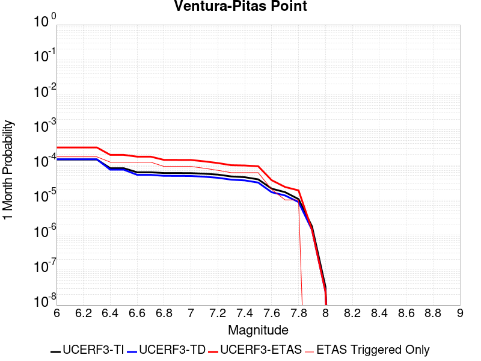
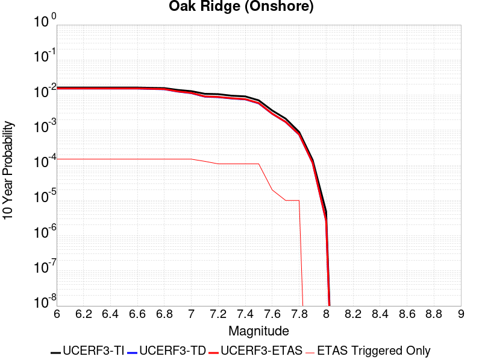
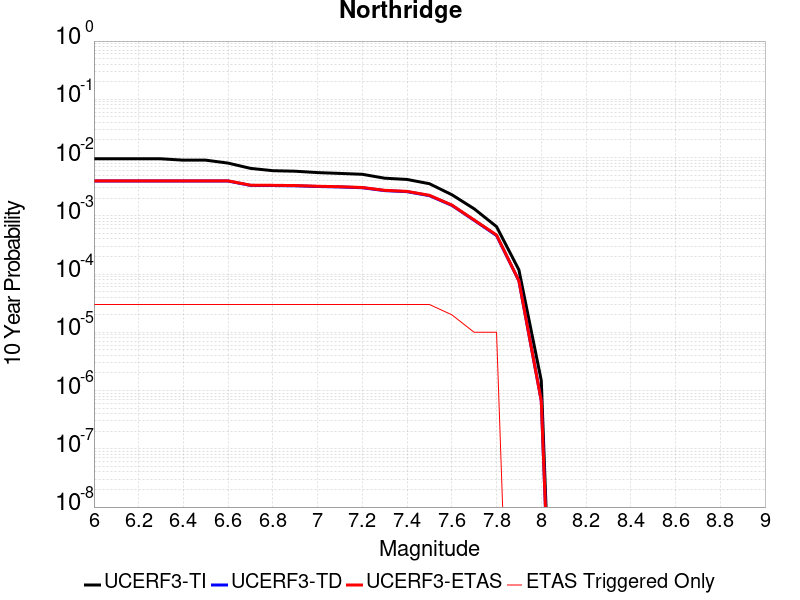
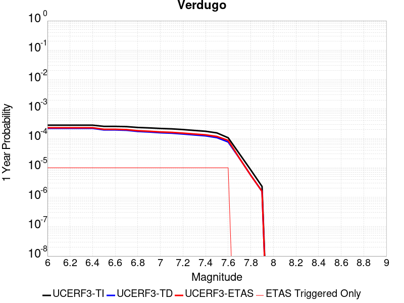
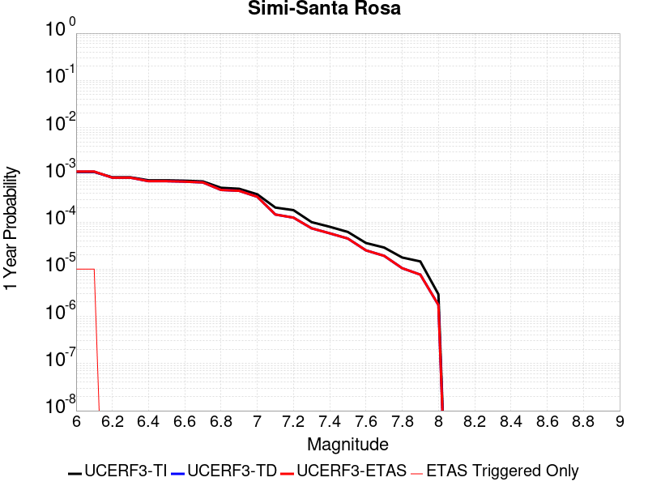
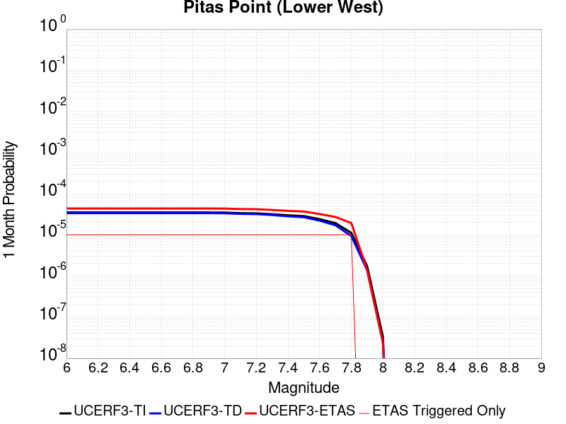

# Parent Section Magnitude-Probability Distributions

Only fault sections with at least one triggered aftershock are plotted. Sections are sorted by total supraseismogenic trigger rate (decreasing)

## Table Of Contents

* [Ventura-Pitas Point](#ventura-pitas-point)
* [Oak Ridge (Onshore)](#oak-ridge-onshore)
* [Santa Susana alt 1](#santa-susana-alt-1)
* [Santa Susana East (connector)](#santa-susana-east-connector)
* [Red Mountain](#red-mountain)
* [Mission Ridge-Arroyo Parida-Santa Ana](#mission-ridge-arroyo-parida-santa-ana)
* [San Cayetano](#san-cayetano)
* [Channel Islands Thrust](#channel-islands-thrust)
* [Northridge](#northridge)
* [Santa Ynez (East)](#santa-ynez-east)
* [Del Valle](#del-valle)
* [Santa Cruz Catalina Ridge alt1](#santa-cruz-catalina-ridge-alt1)
* [Sisar](#sisar)
* [McLean Lake](#mclean-lake)
* [Verdugo](#verdugo)
* [Sierra Madre](#sierra-madre)
* [Pitas Point (Lower)-Montalvo](#pitas-point-lower-montalvo)
* [Simi-Santa Rosa](#simi-santa-rosa)
* [Pitas Point (Lower West)](#pitas-point-lower-west)
* [Chino alt 1](#chino-alt-1)
* [Elysian Park (Upper)](#elysian-park-upper)
* [Santa Cruz Island](#santa-cruz-island)
* [Santa Rosa Island](#santa-rosa-island)
* [Clamshell-Sawpit](#clamshell-sawpit)
* [Santa Ynez (West)](#santa-ynez-west)
* [San Andreas (Mojave S)](#san-andreas-mojave-s)
* [Big Pine (Central)](#big-pine-central)
* [Malibu Coast (Extension) alt 1](#malibu-coast-extension-alt-1)

## Ventura-Pitas Point
*[(top)](#table-of-contents)*

| 1 Week | 1 Month | 1 Year | 10 Year |
|-----|-----|-----|-----|
|  |  |  |  |

| Magnitude | 1 wk TI Prob | 1 wk TD Prob | 1 wk ETAS Prob | 1 wk ETAS/TD Gain | 1 wk ETAS Triggered Only | 1 mo TI Prob | 1 mo TD Prob | 1 mo ETAS Prob | 1 mo ETAS/TD Gain | 1 mo ETAS Triggered Only | 1 yr TI Prob | 1 yr TD Prob | 1 yr ETAS Prob | 1 yr ETAS/TD Gain | 1 yr ETAS Triggered Only | 10 yr TI Prob | 10 yr TD Prob | 10 yr ETAS Prob | 10 yr ETAS/TD Gain | 10 yr ETAS Triggered Only |
|-----|-----|-----|-----|-----|-----|-----|-----|-----|-----|-----|-----|-----|-----|-----|-----|-----|-----|-----|-----|-----|
| 6.0 | 3.3179622E-5 | 3.3751872E-5 | 1.4432218E-4 | 4.275975 | 1.1057404E-4 | 1.4219063E-4 | 1.4464432E-4 | 3.1837838E-4 | 2.2011123 | 1.737592E-4 | 0.0017297962 | 0.001759879 | 0.0019806377 | 1.1254398 | 2.2114808E-4 | 0.017163932 | 0.017485008 | 0.01779541 | 1.0177524 | 3.1592583E-4 |
| 6.1 | 3.3179622E-5 | 3.3751872E-5 | 1.4432218E-4 | 4.275975 | 1.1057404E-4 | 1.4219063E-4 | 1.4464432E-4 | 3.1837838E-4 | 2.2011123 | 1.737592E-4 | 0.0017297962 | 0.001759879 | 0.0019806377 | 1.1254398 | 2.2114808E-4 | 0.017163932 | 0.017485008 | 0.01779541 | 1.0177524 | 3.1592583E-4 |
| 6.2 | 3.3179622E-5 | 3.3751872E-5 | 1.4432218E-4 | 4.275975 | 1.1057404E-4 | 1.4219063E-4 | 1.4464432E-4 | 3.1837838E-4 | 2.2011123 | 1.737592E-4 | 0.0017297962 | 0.001759879 | 0.0019806377 | 1.1254398 | 2.2114808E-4 | 0.017163932 | 0.017485008 | 0.01779541 | 1.0177524 | 3.1592583E-4 |
| 6.3 | 3.3179622E-5 | 3.3751872E-5 | 1.4432218E-4 | 4.275975 | 1.1057404E-4 | 1.4219063E-4 | 1.4464432E-4 | 3.1837838E-4 | 2.2011123 | 1.737592E-4 | 0.0017297962 | 0.001759879 | 0.0019806377 | 1.1254398 | 2.2114808E-4 | 0.017163932 | 0.017485008 | 0.01779541 | 1.0177524 | 3.1592583E-4 |
| 6.4 | 1.8754668E-5 | 1.7029928E-5 | 1.1180606E-4 | 6.565269 | 9.4777744E-5 | 8.037467E-5 | 7.2983494E-5 | 2.1513973E-4 | 2.947786 | 1.4216662E-4 | 9.781223E-4 | 8.8823494E-4 | 0.0010776221 | 1.2132174 | 1.8955549E-4 | 0.009738282 | 0.008849224 | 0.009115385 | 1.0300773 | 2.6853694E-4 |
| 6.5 | 1.8754668E-5 | 1.7029928E-5 | 1.1180606E-4 | 6.565269 | 9.4777744E-5 | 8.037467E-5 | 7.2983494E-5 | 2.1513973E-4 | 2.947786 | 1.4216662E-4 | 9.781223E-4 | 8.8823494E-4 | 0.0010776221 | 1.2132174 | 1.8955549E-4 | 0.009738282 | 0.008849224 | 0.009115385 | 1.0300773 | 2.6853694E-4 |
| 6.6 | 1.4361558E-5 | 1.21312505E-5 | 1.0690785E-4 | 8.812599 | 9.4777744E-5 | 6.154808E-5 | 5.199005E-5 | 1.9414928E-4 | 3.7343545 | 1.4216662E-4 | 7.490902E-4 | 6.327973E-4 | 8.2223286E-4 | 1.2993621 | 1.8955549E-4 | 0.0074657016 | 0.0063102506 | 0.006577093 | 1.0422871 | 2.6853694E-4 |
| 6.7 | 1.4361558E-5 | 1.21312505E-5 | 1.0690785E-4 | 8.812599 | 9.4777744E-5 | 6.154808E-5 | 5.199005E-5 | 1.9414928E-4 | 3.7343545 | 1.4216662E-4 | 7.490902E-4 | 6.327973E-4 | 8.2223286E-4 | 1.2993621 | 1.8955549E-4 | 0.0074657016 | 0.0063102506 | 0.006577093 | 1.0422871 | 2.6853694E-4 |
| 6.8 | 1.3663846E-5 | 1.13531805E-5 | 7.4537624E-5 | 6.565352 | 6.3185165E-5 | 5.8558027E-5 | 4.865559E-5 | 1.5922425E-4 | 3.272476 | 1.1057404E-4 | 7.127108E-4 | 5.922227E-4 | 7.343052E-4 | 1.2399138 | 1.4216662E-4 | 0.007104293 | 0.0059067006 | 0.0060951365 | 1.0319021 | 1.8955549E-4 |
| 6.9 | 1.3644157E-5 | 1.1331275E-5 | 7.451572E-5 | 6.576111 | 6.3185165E-5 | 5.8473648E-5 | 4.8561713E-5 | 1.5913039E-4 | 3.276869 | 1.1057404E-4 | 7.116841E-4 | 5.910804E-4 | 7.3316303E-4 | 1.2403778 | 1.4216662E-4 | 0.007094092 | 0.005895338 | 0.006083776 | 1.031964 | 1.8955549E-4 |
| 7.0 | 1.3568845E-5 | 1.1250816E-5 | 7.4435266E-5 | 6.6159887 | 6.3185165E-5 | 5.8150898E-5 | 4.82169E-5 | 1.5878561E-4 | 3.2931526 | 1.1057404E-4 | 7.077572E-4 | 5.8688456E-4 | 7.289678E-4 | 1.2420974 | 1.4216662E-4 | 0.007055073 | 0.0058536013 | 0.0060420474 | 1.0321932 | 1.8955549E-4 |
| 7.1 | 1.306572E-5 | 1.0726991E-5 | 5.8115354E-5 | 5.4176755 | 4.7388872E-5 | 5.599474E-5 | 4.5972018E-5 | 1.4074541E-4 | 3.0615451 | 9.4777744E-5 | 6.815227E-4 | 5.595674E-4 | 6.8586704E-4 | 1.2257093 | 1.2637033E-4 | 0.0067943637 | 0.0055818288 | 0.00573891 | 1.0281415 | 1.5796292E-4 |
| 7.2 | 1.232604E-5 | 9.999405E-6 | 5.7387802E-5 | 5.739122 | 4.7388872E-5 | 5.2824813E-5 | 4.28539E-5 | 1.3762758E-4 | 3.2115533 | 9.4777744E-5 | 6.429523E-4 | 5.2162306E-4 | 6.4792746E-4 | 1.2421373 | 1.2637033E-4 | 0.0064109527 | 0.005204218 | 0.0053613586 | 1.0301949 | 1.5796292E-4 |
| 7.3 | 1.0917261E-5 | 8.846285E-6 | 5.6234738E-5 | 6.3568764 | 4.7388872E-5 | 4.678742E-5 | 3.7912105E-5 | 1.3268625E-4 | 3.4998388 | 9.4777744E-5 | 5.69488E-4 | 4.614837E-4 | 5.877957E-4 | 1.2737085 | 1.2637033E-4 | 0.0056803077 | 0.0046054586 | 0.004762694 | 1.0341411 | 1.5796292E-4 |
| 7.4 | 1.039959E-5 | 8.425843E-6 | 5.5814315E-5 | 6.624182 | 4.7388872E-5 | 4.456891E-5 | 3.611026E-5 | 1.3088458E-4 | 3.6245813 | 9.4777744E-5 | 5.424914E-4 | 4.395553E-4 | 5.658701E-4 | 1.2873695 | 1.2637033E-4 | 0.0054116896 | 0.0043870592 | 0.0045443294 | 1.0358486 | 1.5796292E-4 |
| 7.5 | 9.015877E-6 | 7.29933E-6 | 5.468786E-5 | 7.492175 | 4.7388872E-5 | 3.86389E-5 | 3.1282474E-5 | 1.2605726E-4 | 4.0296445 | 9.4777744E-5 | 4.7032707E-4 | 3.8079897E-4 | 5.071212E-4 | 1.3317294 | 1.2637033E-4 | 0.004693329 | 0.0038016485 | 0.003959011 | 1.0413932 | 1.5796292E-4 |
| 7.6 | 4.900162E-6 | 3.8748653E-6 | 1.9671095E-5 | 5.076588 | 1.5796291E-5 | 2.1000526E-5 | 1.660646E-5 | 4.819852E-5 | 2.9023955 | 3.1592583E-5 | 2.556514E-4 | 2.0216503E-4 | 2.3375123E-4 | 1.1562396 | 3.1592583E-5 | 0.0025535747 | 0.002019825 | 0.0020513537 | 1.0156096 | 3.1592583E-5 |
| 7.7 | 3.8850626E-6 | 3.1273323E-6 | 3.1273323E-6 | 1.0 | 0.0 | 1.6650163E-5 | 1.3402784E-5 | 2.9198864E-5 | 2.178567 | 1.5796291E-5 | 2.0269687E-4 | 1.6316677E-4 | 1.7896049E-4 | 1.096795 | 1.5796291E-5 | 0.002025121 | 0.001630479 | 0.0016462496 | 1.0096723 | 1.5796291E-5 |
| 7.8 | 2.4654719E-6 | 2.030283E-6 | 2.030283E-6 | 1.0 | 0.0 | 1.0566265E-5 | 8.701184E-6 | 2.4497338E-5 | 2.8154027 | 1.5796291E-5 | 1.2863669E-4 | 1.0593181E-4 | 1.2172643E-4 | 1.1491017 | 1.5796291E-5 | 0.0012856225 | 0.0010588178 | 0.0010745975 | 1.014903 | 1.5796291E-5 |
| 7.9 | 4.095894E-7 | 3.277087E-7 | 3.277087E-7 | 1.0 | 0.0 | 1.7553821E-6 | 1.4044651E-6 | 1.4044651E-6 | 1.0 | 0.0 | 2.1371567E-5 | 1.7099232E-5 | 1.7099232E-5 | 1.0 | 0.0 | 2.1369511E-4 | 1.7097947E-4 | 1.7097947E-4 | 1.0 | 0.0 |
| 8.0 | 7.791402E-9 | 5.684477E-9 | 5.684477E-9 | 1.0 | 0.0 | 3.3391725E-8 | 2.4362043E-8 | 2.4362043E-8 | 1.0 | 0.0 | 4.0654416E-7 | 2.9660785E-7 | 2.9660785E-7 | 1.0 | 0.0 | 4.065434E-6 | 2.9660766E-6 | 2.9660766E-6 | 1.0 | 0.0 |

## Oak Ridge (Onshore)
*[(top)](#table-of-contents)*

| 1 Week | 1 Month | 1 Year | 10 Year |
|-----|-----|-----|-----|
|  |  |  |  |

| Magnitude | 1 wk TI Prob | 1 wk TD Prob | 1 wk ETAS Prob | 1 wk ETAS/TD Gain | 1 wk ETAS Triggered Only | 1 mo TI Prob | 1 mo TD Prob | 1 mo ETAS Prob | 1 mo ETAS/TD Gain | 1 mo ETAS Triggered Only | 1 yr TI Prob | 1 yr TD Prob | 1 yr ETAS Prob | 1 yr ETAS/TD Gain | 1 yr ETAS Triggered Only | 10 yr TI Prob | 10 yr TD Prob | 10 yr ETAS Prob | 10 yr ETAS/TD Gain | 10 yr ETAS Triggered Only |
|-----|-----|-----|-----|-----|-----|-----|-----|-----|-----|-----|-----|-----|-----|-----|-----|-----|-----|-----|-----|-----|
| 6.0 | 3.155064E-5 | 2.9536353E-5 | 9.271965E-5 | 3.1391706 | 6.3185165E-5 | 1.3521002E-4 | 1.2657845E-4 | 2.3713849E-4 | 1.8734508 | 1.1057404E-4 | 0.001644939 | 0.0015400412 | 0.001681989 | 1.0921713 | 1.4216662E-4 | 0.01632816 | 0.015298141 | 0.015469243 | 1.0111845 | 1.737592E-4 |
| 6.1 | 3.155064E-5 | 2.9536353E-5 | 9.271965E-5 | 3.1391706 | 6.3185165E-5 | 1.3521002E-4 | 1.2657845E-4 | 2.3713849E-4 | 1.8734508 | 1.1057404E-4 | 0.001644939 | 0.0015400412 | 0.001681989 | 1.0921713 | 1.4216662E-4 | 0.01632816 | 0.015298141 | 0.015469243 | 1.0111845 | 1.737592E-4 |
| 6.2 | 3.155064E-5 | 2.9536353E-5 | 9.271965E-5 | 3.1391706 | 6.3185165E-5 | 1.3521002E-4 | 1.2657845E-4 | 2.3713849E-4 | 1.8734508 | 1.1057404E-4 | 0.001644939 | 0.0015400412 | 0.001681989 | 1.0921713 | 1.4216662E-4 | 0.01632816 | 0.015298141 | 0.015469243 | 1.0111845 | 1.737592E-4 |
| 6.3 | 3.155064E-5 | 2.9536353E-5 | 9.271965E-5 | 3.1391706 | 6.3185165E-5 | 1.3521002E-4 | 1.2657845E-4 | 2.3713849E-4 | 1.8734508 | 1.1057404E-4 | 0.001644939 | 0.0015400412 | 0.001681989 | 1.0921713 | 1.4216662E-4 | 0.01632816 | 0.015298141 | 0.015469243 | 1.0111845 | 1.737592E-4 |
| 6.4 | 3.155064E-5 | 2.9536353E-5 | 9.271965E-5 | 3.1391706 | 6.3185165E-5 | 1.3521002E-4 | 1.2657845E-4 | 2.3713849E-4 | 1.8734508 | 1.1057404E-4 | 0.001644939 | 0.0015400412 | 0.001681989 | 1.0921713 | 1.4216662E-4 | 0.01632816 | 0.015298141 | 0.015469243 | 1.0111845 | 1.737592E-4 |
| 6.5 | 3.155064E-5 | 2.9536353E-5 | 9.271965E-5 | 3.1391706 | 6.3185165E-5 | 1.3521002E-4 | 1.2657845E-4 | 2.3713849E-4 | 1.8734508 | 1.1057404E-4 | 0.001644939 | 0.0015400412 | 0.001681989 | 1.0921713 | 1.4216662E-4 | 0.01632816 | 0.015298141 | 0.015469243 | 1.0111845 | 1.737592E-4 |
| 6.6 | 3.155064E-5 | 2.9536353E-5 | 9.271965E-5 | 3.1391706 | 6.3185165E-5 | 1.3521002E-4 | 1.2657845E-4 | 2.3713849E-4 | 1.8734508 | 1.1057404E-4 | 0.001644939 | 0.0015400412 | 0.001681989 | 1.0921713 | 1.4216662E-4 | 0.01632816 | 0.015298141 | 0.015469243 | 1.0111845 | 1.737592E-4 |
| 6.7 | 3.098897E-5 | 2.8874274E-5 | 9.205761E-5 | 3.1882226 | 6.3185165E-5 | 1.328031E-4 | 1.2374124E-4 | 2.3430158E-4 | 1.8934803 | 1.1057404E-4 | 0.0016156785 | 0.001505546 | 0.0016474986 | 1.0942864 | 1.4216662E-4 | 0.016039822 | 0.014957854 | 0.015129014 | 1.0114428 | 1.737592E-4 |
| 6.8 | 3.0449872E-5 | 2.8249235E-5 | 9.1432616E-5 | 3.2366405 | 6.3185165E-5 | 1.3049292E-4 | 1.2106274E-4 | 2.3162339E-4 | 1.9132509 | 1.1057404E-4 | 0.0015875935 | 0.0014729796 | 0.0016149367 | 1.0963742 | 1.4216662E-4 | 0.015762992 | 0.014636481 | 0.014807697 | 1.0116979 | 1.737592E-4 |
| 6.9 | 2.697928E-5 | 2.4228113E-5 | 8.741175E-5 | 3.6078644 | 6.3185165E-5 | 1.15620365E-4 | 1.0383076E-4 | 2.1439332E-4 | 2.0648344 | 1.1057404E-4 | 0.0014067689 | 0.001263428 | 0.001405415 | 1.1123823 | 1.4216662E-4 | 0.0139789665 | 0.012565115 | 0.01273669 | 1.013655 | 1.737592E-4 |
| 7.0 | 2.4893961E-5 | 2.186955E-5 | 8.505333E-5 | 3.8891213 | 6.3185165E-5 | 1.0668404E-4 | 9.372337E-5 | 2.0428705E-4 | 2.1796808 | 1.1057404E-4 | 0.0012981043 | 0.0011405025 | 0.001282507 | 1.1245104 | 1.4216662E-4 | 0.012905477 | 0.011348725 | 0.011520512 | 1.0151372 | 1.737592E-4 |
| 7.1 | 2.0945363E-5 | 1.7360439E-5 | 6.4748485E-5 | 3.7296576 | 4.7388872E-5 | 8.976275E-5 | 7.439978E-5 | 1.6917048E-4 | 2.2738035 | 9.4777744E-5 | 0.0010923136 | 9.0544566E-4 | 0.0010317016 | 1.1394407 | 1.2637033E-4 | 0.0108696 | 0.009018446 | 0.009174984 | 1.0173576 | 1.5796292E-4 |
| 7.2 | 2.0439404E-5 | 1.68152E-5 | 6.4203276E-5 | 3.818169 | 4.7388872E-5 | 8.7594504E-5 | 7.206318E-5 | 1.668341E-4 | 2.3151088 | 9.4777744E-5 | 0.0010659413 | 8.770207E-4 | 0.0010032802 | 1.143964 | 1.2637033E-4 | 0.010608427 | 0.00873646 | 0.008893043 | 1.0179229 | 1.5796292E-4 |
| 7.3 | 1.8463334E-5 | 1.5385725E-5 | 6.277387E-5 | 4.080007 | 4.7388872E-5 | 7.912617E-5 | 6.593718E-5 | 1.6070867E-4 | 2.4372997 | 9.4777744E-5 | 9.6293533E-4 | 8.024939E-4 | 9.287628E-4 | 1.1573457 | 1.2637033E-4 | 0.009587734 | 0.007996771 | 0.00815347 | 1.0195954 | 1.5796292E-4 |
| 7.4 | 1.763139E-5 | 1.4520331E-5 | 6.190852E-5 | 4.2635746 | 4.7388872E-5 | 7.556091E-5 | 6.222853E-5 | 1.5700038E-4 | 2.5229647 | 9.4777744E-5 | 9.1956573E-4 | 7.5737294E-4 | 8.8364753E-4 | 1.1667272 | 1.2637033E-4 | 0.009157699 | 0.0075486666 | 0.007705437 | 1.0207679 | 1.5796292E-4 |
| 7.5 | 1.3594944E-5 | 1.1165903E-5 | 5.8554248E-5 | 5.2440224 | 4.7388872E-5 | 5.8262744E-5 | 4.7853006E-5 | 1.4262622E-4 | 2.980507 | 9.4777744E-5 | 7.0911803E-4 | 5.824571E-4 | 7.087539E-4 | 1.2168343 | 1.2637033E-4 | 0.007068595 | 0.0058096154 | 0.0059666606 | 1.0270319 | 1.5796292E-4 |
| 7.6 | 6.9889534E-6 | 5.637633E-6 | 2.1433834E-5 | 3.801921 | 1.5796291E-5 | 2.9952313E-5 | 2.4161063E-5 | 5.5752884E-5 | 2.307551 | 3.1592583E-5 | 3.646084E-4 | 2.9412165E-4 | 3.2570495E-4 | 1.1073817 | 3.1592583E-5 | 0.0036401073 | 0.002937368 | 0.0029688678 | 1.0107238 | 3.1592583E-5 |
| 7.7 | 4.0824193E-6 | 3.2838032E-6 | 3.2838032E-6 | 1.0 | 0.0 | 1.7495966E-5 | 1.4073367E-5 | 2.9869436E-5 | 2.1224086 | 1.5796291E-5 | 2.1299256E-4 | 1.713299E-4 | 1.8712349E-4 | 1.0921823 | 1.5796291E-5 | 0.0021278851 | 0.0017119916 | 0.0017277608 | 1.0092111 | 1.5796291E-5 |
| 7.8 | 1.7023609E-6 | 1.4372558E-6 | 1.4372558E-6 | 1.0 | 0.0 | 7.295812E-6 | 6.1596534E-6 | 2.1955848E-5 | 3.5644615 | 1.5796291E-5 | 8.882289E-5 | 7.499123E-5 | 9.0786336E-5 | 1.210626 | 1.5796291E-5 | 8.8787393E-4 | 7.49662E-4 | 7.6544646E-4 | 1.0210555 | 1.5796291E-5 |
| 7.9 | 2.721225E-7 | 2.2621187E-7 | 2.2621187E-7 | 1.0 | 0.0 | 1.1662388E-6 | 9.694791E-7 | 9.694791E-7 | 1.0 | 0.0 | 1.4198865E-5 | 1.1803347E-5 | 1.1803347E-5 | 1.0 | 0.0 | 1.4197957E-4 | 1.1802748E-4 | 1.1802748E-4 | 1.0 | 0.0 |
| 8.0 | 9.364255E-9 | 5.1251963E-9 | 5.1251963E-9 | 1.0 | 0.0 | 4.0132523E-8 | 2.1965127E-8 | 2.1965127E-8 | 1.0 | 0.0 | 4.8861335E-7 | 2.6742538E-7 | 2.6742538E-7 | 1.0 | 0.0 | 4.8861225E-6 | 2.674251E-6 | 2.674251E-6 | 1.0 | 0.0 |

## Santa Susana alt 1
*[(top)](#table-of-contents)*

| 1 Week | 1 Month | 1 Year | 10 Year |
|-----|-----|-----|-----|
|  |  |  |  |

| Magnitude | 1 wk TI Prob | 1 wk TD Prob | 1 wk ETAS Prob | 1 wk ETAS/TD Gain | 1 wk ETAS Triggered Only | 1 mo TI Prob | 1 mo TD Prob | 1 mo ETAS Prob | 1 mo ETAS/TD Gain | 1 mo ETAS Triggered Only | 1 yr TI Prob | 1 yr TD Prob | 1 yr ETAS Prob | 1 yr ETAS/TD Gain | 1 yr ETAS Triggered Only | 10 yr TI Prob | 10 yr TD Prob | 10 yr ETAS Prob | 10 yr ETAS/TD Gain | 10 yr ETAS Triggered Only |
|-----|-----|-----|-----|-----|-----|-----|-----|-----|-----|-----|-----|-----|-----|-----|-----|-----|-----|-----|-----|-----|
| 6.0 | 2.674877E-5 | 2.7209137E-5 | 7.459672E-5 | 2.7416055 | 4.7388872E-5 | 1.1463255E-4 | 1.1660602E-4 | 1.9557826E-4 | 1.6772571 | 7.898146E-5 | 0.0013947578 | 0.0014188674 | 0.0015292845 | 1.0778207 | 1.1057404E-4 | 0.013860362 | 0.014109772 | 0.014249933 | 1.0099336 | 1.4216662E-4 |
| 6.1 | 2.674877E-5 | 2.7209137E-5 | 7.459672E-5 | 2.7416055 | 4.7388872E-5 | 1.1463255E-4 | 1.1660602E-4 | 1.9557826E-4 | 1.6772571 | 7.898146E-5 | 0.0013947578 | 0.0014188674 | 0.0015292845 | 1.0778207 | 1.1057404E-4 | 0.013860362 | 0.014109772 | 0.014249933 | 1.0099336 | 1.4216662E-4 |
| 6.2 | 2.674877E-5 | 2.7209137E-5 | 7.459672E-5 | 2.7416055 | 4.7388872E-5 | 1.1463255E-4 | 1.1660602E-4 | 1.9557826E-4 | 1.6772571 | 7.898146E-5 | 0.0013947578 | 0.0014188674 | 0.0015292845 | 1.0778207 | 1.1057404E-4 | 0.013860362 | 0.014109772 | 0.014249933 | 1.0099336 | 1.4216662E-4 |
| 6.3 | 2.674877E-5 | 2.7209137E-5 | 7.459672E-5 | 2.7416055 | 4.7388872E-5 | 1.1463255E-4 | 1.1660602E-4 | 1.9557826E-4 | 1.6772571 | 7.898146E-5 | 0.0013947578 | 0.0014188674 | 0.0015292845 | 1.0778207 | 1.1057404E-4 | 0.013860362 | 0.014109772 | 0.014249933 | 1.0099336 | 1.4216662E-4 |
| 6.4 | 2.674877E-5 | 2.7209137E-5 | 7.459672E-5 | 2.7416055 | 4.7388872E-5 | 1.1463255E-4 | 1.1660602E-4 | 1.9557826E-4 | 1.6772571 | 7.898146E-5 | 0.0013947578 | 0.0014188674 | 0.0015292845 | 1.0778207 | 1.1057404E-4 | 0.013860362 | 0.014109772 | 0.014249933 | 1.0099336 | 1.4216662E-4 |
| 6.5 | 2.674877E-5 | 2.7209137E-5 | 7.459672E-5 | 2.7416055 | 4.7388872E-5 | 1.1463255E-4 | 1.1660602E-4 | 1.9557826E-4 | 1.6772571 | 7.898146E-5 | 0.0013947578 | 0.0014188674 | 0.0015292845 | 1.0778207 | 1.1057404E-4 | 0.013860362 | 0.014109772 | 0.014249933 | 1.0099336 | 1.4216662E-4 |
| 6.6 | 2.6647976E-5 | 2.7085409E-5 | 7.4473E-5 | 2.7495615 | 4.7388872E-5 | 1.14200615E-4 | 1.16075804E-4 | 1.950481E-4 | 1.680351 | 7.898146E-5 | 0.0013895056 | 0.0014124205 | 0.0015228384 | 1.0781764 | 1.1057404E-4 | 0.013808494 | 0.014046123 | 0.014186293 | 1.0099792 | 1.4216662E-4 |
| 6.7 | 2.6647976E-5 | 2.7085409E-5 | 7.4473E-5 | 2.7495615 | 4.7388872E-5 | 1.14200615E-4 | 1.16075804E-4 | 1.950481E-4 | 1.680351 | 7.898146E-5 | 0.0013895056 | 0.0014124205 | 0.0015228384 | 1.0781764 | 1.1057404E-4 | 0.013808494 | 0.014046123 | 0.014186293 | 1.0099792 | 1.4216662E-4 |
| 6.8 | 1.9073179E-5 | 1.764278E-5 | 6.5030814E-5 | 3.6859734 | 4.7388872E-5 | 8.1739636E-5 | 7.560982E-5 | 1.5458532E-4 | 2.0445135 | 7.898146E-5 | 9.947256E-4 | 9.20179E-4 | 0.0010306513 | 1.1200552 | 1.1057404E-4 | 0.009902848 | 0.009165861 | 0.009306724 | 1.0153683 | 1.4216662E-4 |
| 6.9 | 1.9041876E-5 | 1.7624905E-5 | 6.5012944E-5 | 3.6886973 | 4.7388872E-5 | 8.160549E-5 | 7.553322E-5 | 1.5450871E-4 | 2.0455728 | 7.898146E-5 | 9.930939E-4 | 9.1924716E-4 | 0.0010297196 | 1.120177 | 1.1057404E-4 | 0.0098866755 | 0.009156619 | 0.009297484 | 1.015384 | 1.4216662E-4 |
| 7.0 | 1.5917482E-5 | 1.3867428E-5 | 6.125565E-5 | 4.417232 | 4.7388872E-5 | 6.8215995E-5 | 5.9430506E-5 | 1.3840727E-4 | 2.3288927 | 7.898146E-5 | 8.302132E-4 | 7.233308E-4 | 8.338249E-4 | 1.1527573 | 1.1057404E-4 | 0.008271185 | 0.007210597 | 0.0073517384 | 1.0195742 | 1.4216662E-4 |
| 7.1 | 1.577788E-5 | 1.3747398E-5 | 6.113562E-5 | 4.4470687 | 4.7388872E-5 | 6.761774E-5 | 5.8916114E-5 | 1.3789292E-4 | 2.3404958 | 7.898146E-5 | 8.2293496E-4 | 7.170723E-4 | 8.27567E-4 | 1.1540915 | 1.1057404E-4 | 0.008198941 | 0.0071484153 | 0.0072895656 | 1.0197457 | 1.4216662E-4 |
| 7.2 | 1.5416446E-5 | 1.3473385E-5 | 6.0861617E-5 | 4.517174 | 4.7388872E-5 | 6.606882E-5 | 5.774182E-5 | 1.3671872E-4 | 2.367759 | 7.898146E-5 | 8.0409093E-4 | 7.027846E-4 | 8.132809E-4 | 1.1572264 | 1.1057404E-4 | 0.008011877 | 0.007006442 | 0.007147613 | 1.0201486 | 1.4216662E-4 |
| 7.3 | 1.4534083E-5 | 1.2721056E-5 | 6.0109327E-5 | 4.7251835 | 4.7388872E-5 | 6.228744E-5 | 5.4517695E-5 | 1.3349485E-4 | 2.4486516 | 7.898146E-5 | 7.580857E-4 | 6.635553E-4 | 7.7405595E-4 | 1.1665282 | 1.1057404E-4 | 0.007555048 | 0.006616521 | 0.006757747 | 1.0213444 | 1.4216662E-4 |
| 7.4 | 1.2858995E-5 | 1.1232218E-5 | 5.8620557E-5 | 5.2189655 | 4.7388872E-5 | 5.5108816E-5 | 4.8137208E-5 | 1.2711486E-4 | 2.640678 | 7.898146E-5 | 6.7074323E-4 | 5.8591686E-4 | 6.9642614E-4 | 1.1886091 | 1.1057404E-4 | 0.0066872234 | 0.005844441 | 0.0059857764 | 1.0241829 | 1.4216662E-4 |
| 7.5 | 8.827668E-6 | 7.807074E-6 | 5.5195578E-5 | 7.069944 | 4.7388872E-5 | 3.7832317E-5 | 3.3458473E-5 | 1.1243729E-4 | 3.3605025 | 7.898146E-5 | 4.605111E-4 | 4.0728322E-4 | 5.178122E-4 | 1.2713811 | 1.1057404E-4 | 0.0045955796 | 0.0040656556 | 0.004207244 | 1.0348256 | 1.4216662E-4 |
| 7.6 | 3.2533426E-6 | 2.8723732E-6 | 1.866862E-5 | 6.499371 | 1.5796291E-5 | 1.3942822E-5 | 1.23101145E-5 | 2.8106211E-5 | 2.2831802 | 1.5796291E-5 | 1.6974064E-4 | 1.4986571E-4 | 1.6565963E-4 | 1.1053872 | 1.5796291E-5 | 0.0016961104 | 0.0014976832 | 0.0015134559 | 1.0105313 | 1.5796291E-5 |
| 7.7 | 1.2751709E-6 | 1.1493125E-6 | 1.1493125E-6 | 1.0 | 0.0 | 5.4650063E-6 | 4.9256164E-6 | 4.9256164E-6 | 1.0 | 0.0 | 6.653442E-5 | 5.996782E-5 | 5.996782E-5 | 1.0 | 0.0 | 6.6514505E-4 | 5.995253E-4 | 5.995253E-4 | 1.0 | 0.0 |
| 7.8 | 3.067544E-7 | 3.2405615E-7 | 3.2405615E-7 | 1.0 | 0.0 | 1.3146611E-6 | 1.3888114E-6 | 1.3888114E-6 | 1.0 | 0.0 | 1.600588E-5 | 1.6908658E-5 | 1.6908658E-5 | 1.0 | 0.0 | 1.6004729E-4 | 1.6907474E-4 | 1.6907474E-4 | 1.0 | 0.0 |
| 7.9 | 7.622999E-8 | 8.0892036E-8 | 8.0892036E-8 | 1.0 | 0.0 | 3.2669993E-7 | 3.4668014E-7 | 3.4668014E-7 | 1.0 | 0.0 | 3.977564E-6 | 4.2208244E-6 | 4.2208244E-6 | 1.0 | 0.0 | 3.977493E-5 | 4.2207652E-5 | 4.2207652E-5 | 1.0 | 0.0 |

## Santa Susana East (connector)
*[(top)](#table-of-contents)*

| 1 Week | 1 Month | 1 Year | 10 Year |
|-----|-----|-----|-----|
|  |  |  |  |

| Magnitude | 1 wk TI Prob | 1 wk TD Prob | 1 wk ETAS Prob | 1 wk ETAS/TD Gain | 1 wk ETAS Triggered Only | 1 mo TI Prob | 1 mo TD Prob | 1 mo ETAS Prob | 1 mo ETAS/TD Gain | 1 mo ETAS Triggered Only | 1 yr TI Prob | 1 yr TD Prob | 1 yr ETAS Prob | 1 yr ETAS/TD Gain | 1 yr ETAS Triggered Only | 10 yr TI Prob | 10 yr TD Prob | 10 yr ETAS Prob | 10 yr ETAS/TD Gain | 10 yr ETAS Triggered Only |
|-----|-----|-----|-----|-----|-----|-----|-----|-----|-----|-----|-----|-----|-----|-----|-----|-----|-----|-----|-----|-----|
| 6.0 | 2.858397E-5 | 3.203796E-5 | 4.7833742E-5 | 1.4930334 | 1.5796291E-5 | 1.2249697E-4 | 1.372999E-4 | 1.8468227E-4 | 1.3451012 | 4.7388872E-5 | 0.0014903803 | 0.0016706173 | 0.0017494668 | 1.0471978 | 7.898146E-5 | 0.014804244 | 0.016607458 | 0.01670066 | 1.0056121 | 9.4777744E-5 |
| 6.1 | 2.858397E-5 | 3.203796E-5 | 4.7833742E-5 | 1.4930334 | 1.5796291E-5 | 1.2249697E-4 | 1.372999E-4 | 1.8468227E-4 | 1.3451012 | 4.7388872E-5 | 0.0014903803 | 0.0016706173 | 0.0017494668 | 1.0471978 | 7.898146E-5 | 0.014804244 | 0.016607458 | 0.01670066 | 1.0056121 | 9.4777744E-5 |
| 6.2 | 2.858397E-5 | 3.203796E-5 | 4.7833742E-5 | 1.4930334 | 1.5796291E-5 | 1.2249697E-4 | 1.372999E-4 | 1.8468227E-4 | 1.3451012 | 4.7388872E-5 | 0.0014903803 | 0.0016706173 | 0.0017494668 | 1.0471978 | 7.898146E-5 | 0.014804244 | 0.016607458 | 0.01670066 | 1.0056121 | 9.4777744E-5 |
| 6.3 | 1.943582E-5 | 2.0376128E-5 | 3.6172096E-5 | 1.7752193 | 1.5796291E-5 | 8.329371E-5 | 8.732397E-5 | 1.3470871E-4 | 1.5426315 | 4.7388872E-5 | 0.001013629 | 0.0010627629 | 0.0011416605 | 1.0742381 | 7.898146E-5 | 0.010090181 | 0.010588183 | 0.010681957 | 1.0088565 | 9.4777744E-5 |
| 6.4 | 1.943582E-5 | 2.0376128E-5 | 3.6172096E-5 | 1.7752193 | 1.5796291E-5 | 8.329371E-5 | 8.732397E-5 | 1.3470871E-4 | 1.5426315 | 4.7388872E-5 | 0.001013629 | 0.0010627629 | 0.0011416605 | 1.0742381 | 7.898146E-5 | 0.010090181 | 0.010588183 | 0.010681957 | 1.0088565 | 9.4777744E-5 |
| 6.5 | 1.943582E-5 | 2.0376128E-5 | 3.6172096E-5 | 1.7752193 | 1.5796291E-5 | 8.329371E-5 | 8.732397E-5 | 1.3470871E-4 | 1.5426315 | 4.7388872E-5 | 0.001013629 | 0.0010627629 | 0.0011416605 | 1.0742381 | 7.898146E-5 | 0.010090181 | 0.010588183 | 0.010681957 | 1.0088565 | 9.4777744E-5 |
| 6.6 | 1.943582E-5 | 2.0376128E-5 | 3.6172096E-5 | 1.7752193 | 1.5796291E-5 | 8.329371E-5 | 8.732397E-5 | 1.3470871E-4 | 1.5426315 | 4.7388872E-5 | 0.001013629 | 0.0010627629 | 0.0011416605 | 1.0742381 | 7.898146E-5 | 0.010090181 | 0.010588183 | 0.010681957 | 1.0088565 | 9.4777744E-5 |
| 6.7 | 1.9404439E-5 | 2.0363543E-5 | 3.6159512E-5 | 1.7756985 | 1.5796291E-5 | 8.3159226E-5 | 8.727004E-5 | 1.3465478E-4 | 1.5429668 | 4.7388872E-5 | 0.0010119933 | 0.001062107 | 0.0011410045 | 1.074284 | 7.898146E-5 | 0.010073971 | 0.010581685 | 0.01067546 | 1.008862 | 9.4777744E-5 |
| 6.8 | 1.2217526E-5 | 1.1596674E-5 | 2.7392782E-5 | 2.362124 | 1.5796291E-5 | 5.2359774E-5 | 4.9699178E-5 | 9.70857E-5 | 1.9534668 | 4.7388872E-5 | 6.372938E-4 | 6.0493633E-4 | 6.8387005E-4 | 1.1304827 | 7.898146E-5 | 0.0063546924 | 0.0060348804 | 0.006129086 | 1.0156102 | 9.4777744E-5 |
| 6.9 | 1.2217526E-5 | 1.1596674E-5 | 2.7392782E-5 | 2.362124 | 1.5796291E-5 | 5.2359774E-5 | 4.9699178E-5 | 9.70857E-5 | 1.9534668 | 4.7388872E-5 | 6.372938E-4 | 6.0493633E-4 | 6.8387005E-4 | 1.1304827 | 7.898146E-5 | 0.0063546924 | 0.0060348804 | 0.006129086 | 1.0156102 | 9.4777744E-5 |
| 7.0 | 9.276017E-6 | 8.061005E-6 | 2.3857168E-5 | 2.9595773 | 1.5796291E-5 | 3.9753755E-5 | 3.4546727E-5 | 8.193396E-5 | 2.3716853 | 4.7388872E-5 | 4.8389446E-4 | 4.2052867E-4 | 4.994769E-4 | 1.1877357 | 7.898146E-5 | 0.0048284214 | 0.0041979905 | 0.0042923703 | 1.0224822 | 9.4777744E-5 |
| 7.1 | 9.130355E-6 | 7.944145E-6 | 2.3740311E-5 | 2.9884036 | 1.5796291E-5 | 3.9129503E-5 | 3.4045912E-5 | 8.143317E-5 | 2.3918633 | 4.7388872E-5 | 4.7629757E-4 | 4.1443357E-4 | 4.933823E-4 | 1.1904979 | 7.898146E-5 | 0.00475278 | 0.004137268 | 0.004231653 | 1.0228136 | 9.4777744E-5 |
| 7.2 | 8.851015E-6 | 7.743266E-6 | 2.3539435E-5 | 3.0399878 | 1.5796291E-5 | 3.7932372E-5 | 3.3185024E-5 | 8.0572325E-5 | 2.4279726 | 4.7388872E-5 | 4.6172875E-4 | 4.0395616E-4 | 4.829057E-4 | 1.1954409 | 7.898146E-5 | 0.0046077054 | 0.004032877 | 0.0041272724 | 1.0234065 | 9.4777744E-5 |
| 7.3 | 8.573006E-6 | 7.551941E-6 | 2.3348113E-5 | 3.0916703 | 1.5796291E-5 | 3.6740938E-5 | 3.2365082E-5 | 7.975242E-5 | 2.4641502 | 4.7388872E-5 | 4.472291E-4 | 3.93977E-4 | 4.7292735E-4 | 1.2003932 | 7.898146E-5 | 0.004463301 | 0.003933434 | 0.004027839 | 1.0240006 | 9.4777744E-5 |
| 7.4 | 7.852282E-6 | 6.8191734E-6 | 2.2615357E-5 | 3.3164365 | 1.5796291E-5 | 3.36522E-5 | 2.9224719E-5 | 7.661221E-5 | 2.6214864 | 4.7388872E-5 | 4.096385E-4 | 3.557559E-4 | 4.3470925E-4 | 1.2219312 | 7.898146E-5 | 0.0040888423 | 0.003552475 | 0.003646916 | 1.0265846 | 9.4777744E-5 |
| 7.5 | 4.8869324E-6 | 4.280054E-6 | 2.0076277E-5 | 4.69066 | 1.5796291E-5 | 2.0943828E-5 | 1.834297E-5 | 6.573097E-5 | 3.5834424 | 4.7388872E-5 | 2.5496128E-4 | 2.233044E-4 | 3.0226822E-4 | 1.3536152 | 7.898146E-5 | 0.0025466895 | 0.0022310033 | 0.0023255695 | 1.0423874 | 9.4777744E-5 |
| 7.6 | 1.3894544E-6 | 1.1571401E-6 | 1.1571401E-6 | 1.0 | 0.0 | 5.954791E-6 | 4.9591636E-6 | 4.9591636E-6 | 1.0 | 0.0 | 7.249717E-5 | 6.0376366E-5 | 6.0376366E-5 | 1.0 | 0.0 | 7.247352E-4 | 6.036214E-4 | 6.036214E-4 | 1.0 | 0.0 |
| 7.7 | 2.9924632E-7 | 2.3742072E-7 | 2.3742072E-7 | 1.0 | 0.0 | 1.2824837E-6 | 1.017517E-6 | 1.017517E-6 | 1.0 | 0.0 | 1.5614127E-5 | 1.2388206E-5 | 1.2388206E-5 | 1.0 | 0.0 | 1.5613029E-4 | 1.2387589E-4 | 1.2387589E-4 | 1.0 | 0.0 |
| 7.8 | 4.8188564E-8 | 2.6509277E-8 | 2.6509277E-8 | 1.0 | 0.0 | 2.065224E-7 | 1.1361118E-7 | 1.1361118E-7 | 1.0 | 0.0 | 2.5144072E-6 | 1.3832154E-6 | 1.3832154E-6 | 1.0 | 0.0 | 2.5143789E-5 | 1.3832076E-5 | 1.3832076E-5 | 1.0 | 0.0 |
| 7.9 | 2.6127251E-9 | 2.7685028E-9 | 2.7685028E-9 | 1.0 | 0.0 | 1.1197393E-8 | 1.1865012E-8 | 1.1865012E-8 | 1.0 | 0.0 | 1.3632825E-7 | 1.4445652E-7 | 1.4445652E-7 | 1.0 | 0.0 | 1.3632817E-6 | 1.4445653E-6 | 1.4445653E-6 | 1.0 | 0.0 |

## Red Mountain
*[(top)](#table-of-contents)*

| 1 Week | 1 Month | 1 Year | 10 Year |
|-----|-----|-----|-----|
|  |  |  |  |

| Magnitude | 1 wk TI Prob | 1 wk TD Prob | 1 wk ETAS Prob | 1 wk ETAS/TD Gain | 1 wk ETAS Triggered Only | 1 mo TI Prob | 1 mo TD Prob | 1 mo ETAS Prob | 1 mo ETAS/TD Gain | 1 mo ETAS Triggered Only | 1 yr TI Prob | 1 yr TD Prob | 1 yr ETAS Prob | 1 yr ETAS/TD Gain | 1 yr ETAS Triggered Only | 10 yr TI Prob | 10 yr TD Prob | 10 yr ETAS Prob | 10 yr ETAS/TD Gain | 10 yr ETAS Triggered Only |
|-----|-----|-----|-----|-----|-----|-----|-----|-----|-----|-----|-----|-----|-----|-----|-----|-----|-----|-----|-----|-----|
| 6.0 | 4.1810763E-5 | 4.7609105E-5 | 4.7609105E-5 | 1.0 | 0.0 | 1.7917668E-4 | 2.04024E-4 | 2.1981707E-4 | 1.0774078 | 1.5796291E-5 | 0.0021792934 | 0.0024813274 | 0.0025128415 | 1.0127006 | 3.1592583E-5 | 0.021580452 | 0.024553841 | 0.024630884 | 1.0031377 | 7.898146E-5 |
| 6.1 | 4.1810763E-5 | 4.7609105E-5 | 4.7609105E-5 | 1.0 | 0.0 | 1.7917668E-4 | 2.04024E-4 | 2.1981707E-4 | 1.0774078 | 1.5796291E-5 | 0.0021792934 | 0.0024813274 | 0.0025128415 | 1.0127006 | 3.1592583E-5 | 0.021580452 | 0.024553841 | 0.024630884 | 1.0031377 | 7.898146E-5 |
| 6.2 | 4.1810763E-5 | 4.7609105E-5 | 4.7609105E-5 | 1.0 | 0.0 | 1.7917668E-4 | 2.04024E-4 | 2.1981707E-4 | 1.0774078 | 1.5796291E-5 | 0.0021792934 | 0.0024813274 | 0.0025128415 | 1.0127006 | 3.1592583E-5 | 0.021580452 | 0.024553841 | 0.024630884 | 1.0031377 | 7.898146E-5 |
| 6.3 | 4.1810763E-5 | 4.7609105E-5 | 4.7609105E-5 | 1.0 | 0.0 | 1.7917668E-4 | 2.04024E-4 | 2.1981707E-4 | 1.0774078 | 1.5796291E-5 | 0.0021792934 | 0.0024813274 | 0.0025128415 | 1.0127006 | 3.1592583E-5 | 0.021580452 | 0.024553841 | 0.024630884 | 1.0031377 | 7.898146E-5 |
| 6.4 | 4.1810763E-5 | 4.7609105E-5 | 4.7609105E-5 | 1.0 | 0.0 | 1.7917668E-4 | 2.04024E-4 | 2.1981707E-4 | 1.0774078 | 1.5796291E-5 | 0.0021792934 | 0.0024813274 | 0.0025128415 | 1.0127006 | 3.1592583E-5 | 0.021580452 | 0.024553841 | 0.024630884 | 1.0031377 | 7.898146E-5 |
| 6.5 | 3.154503E-5 | 3.537327E-5 | 3.537327E-5 | 1.0 | 0.0 | 1.3518598E-4 | 1.5159143E-4 | 1.6738534E-4 | 1.1041873 | 1.5796291E-5 | 0.0016446467 | 0.0018441556 | 0.00187569 | 1.0170996 | 3.1592583E-5 | 0.01632528 | 0.018298175 | 0.018360203 | 1.00339 | 6.3185165E-5 |
| 6.6 | 3.1535834E-5 | 3.536265E-5 | 3.536265E-5 | 1.0 | 0.0 | 1.3514658E-4 | 1.5154593E-4 | 1.6733982E-4 | 1.1042186 | 1.5796291E-5 | 0.0016441676 | 0.0018436024 | 0.0018751367 | 1.0171047 | 3.1592583E-5 | 0.01632056 | 0.018292734 | 0.018354762 | 1.0033909 | 6.3185165E-5 |
| 6.7 | 2.8267326E-5 | 3.1481133E-5 | 3.1481133E-5 | 1.0 | 0.0 | 1.2114006E-4 | 1.3491265E-4 | 1.5070681E-4 | 1.1170695 | 1.5796291E-5 | 0.0014738824 | 0.0016414091 | 0.0016571794 | 1.0096078 | 1.5796291E-5 | 0.014641452 | 0.016301626 | 0.016348243 | 1.0028596 | 4.7388872E-5 |
| 6.8 | 2.8212884E-5 | 3.1419E-5 | 3.1419E-5 | 1.0 | 0.0 | 1.20906756E-4 | 1.3464638E-4 | 1.5044055E-4 | 1.1173011 | 1.5796291E-5 | 0.0014710457 | 0.0016381722 | 0.0016539426 | 1.0096269 | 1.5796291E-5 | 0.014613459 | 0.01626973 | 0.016316349 | 1.0028653 | 4.7388872E-5 |
| 6.9 | 2.4227871E-5 | 2.6716738E-5 | 2.6716738E-5 | 1.0 | 0.0 | 1.03829596E-4 | 1.14495706E-4 | 1.302902E-4 | 1.1379483 | 1.5796291E-5 | 0.0012633923 | 0.0013931699 | 0.0014089441 | 1.0113226 | 1.5796291E-5 | 0.012562336 | 0.013852054 | 0.013898787 | 1.0033737 | 4.7388872E-5 |
| 7.0 | 2.348524E-5 | 2.5845162E-5 | 2.5845162E-5 | 1.0 | 0.0 | 1.0064714E-4 | 1.107607E-4 | 1.2655524E-4 | 1.1426005 | 1.5796291E-5 | 0.0012246901 | 0.0013477531 | 0.0013635281 | 1.0117047 | 1.5796291E-5 | 0.012179627 | 0.013403435 | 0.013434604 | 1.0023254 | 3.1592583E-5 |
| 7.1 | 2.2311642E-5 | 2.4471668E-5 | 2.4471668E-5 | 1.0 | 0.0 | 9.561782E-5 | 1.0487479E-4 | 1.2066942E-4 | 1.1506047 | 1.5796291E-5 | 0.0011635252 | 0.0012761775 | 0.0012919536 | 1.012362 | 1.5796291E-5 | 0.01157452 | 0.012696012 | 0.012727204 | 1.0024568 | 3.1592583E-5 |
| 7.2 | 1.6533986E-5 | 1.7676337E-5 | 1.7676337E-5 | 1.0 | 0.0 | 7.085802E-5 | 7.575389E-5 | 9.154898E-5 | 1.2085054 | 1.5796291E-5 | 8.623549E-4 | 9.2197687E-4 | 9.377586E-4 | 1.0171173 | 1.5796291E-5 | 0.008590161 | 0.009187802 | 0.0092191035 | 1.003407 | 3.1592583E-5 |
| 7.3 | 1.4703092E-5 | 1.5564734E-5 | 1.5564734E-5 | 1.0 | 0.0 | 6.301173E-5 | 6.670465E-5 | 8.2499886E-5 | 1.2367936 | 1.5796291E-5 | 7.668978E-4 | 8.1188814E-4 | 8.276716E-4 | 1.0194404 | 1.5796291E-5 | 0.0076425658 | 0.0080953 | 0.008126636 | 1.003871 | 3.1592583E-5 |
| 7.4 | 6.1331984E-6 | 5.529994E-6 | 5.529994E-6 | 1.0 | 0.0 | 2.6284872E-5 | 2.369976E-5 | 2.369976E-5 | 1.0 | 0.0 | 3.199713E-4 | 2.885069E-4 | 2.885069E-4 | 1.0 | 0.0 | 0.0031951098 | 0.002881378 | 0.002881378 | 1.0 | 0.0 |
| 7.5 | 5.954766E-6 | 5.3395843E-6 | 5.3395843E-6 | 1.0 | 0.0 | 2.5520176E-5 | 2.2883734E-5 | 2.2883734E-5 | 1.0 | 0.0 | 3.1066386E-4 | 2.7857439E-4 | 2.7857439E-4 | 1.0 | 0.0 | 0.003102299 | 0.0027823057 | 0.0027823057 | 1.0 | 0.0 |
| 7.6 | 4.9726646E-6 | 4.316188E-6 | 4.316188E-6 | 1.0 | 0.0 | 2.1311245E-5 | 1.8497818E-5 | 1.8497818E-5 | 1.0 | 0.0 | 2.5943352E-4 | 2.25188E-4 | 2.25188E-4 | 1.0 | 0.0 | 0.0025913084 | 0.002249633 | 0.002249633 | 1.0 | 0.0 |
| 7.7 | 3.3613894E-6 | 2.853241E-6 | 2.853241E-6 | 1.0 | 0.0 | 1.4405875E-5 | 1.2228121E-5 | 1.2228121E-5 | 1.0 | 0.0 | 1.7537741E-4 | 1.4886746E-4 | 1.4886746E-4 | 1.0 | 0.0 | 0.0017523908 | 0.0014877036 | 0.0014877036 | 1.0 | 0.0 |
| 7.8 | 1.1828961E-6 | 1.012448E-6 | 1.012448E-6 | 1.0 | 0.0 | 5.069545E-6 | 4.339056E-6 | 4.339056E-6 | 1.0 | 0.0 | 6.171996E-5 | 5.2826756E-5 | 5.2826756E-5 | 1.0 | 0.0 | 6.170282E-4 | 5.2814494E-4 | 5.2814494E-4 | 1.0 | 0.0 |
| 7.9 | 2.2967266E-7 | 1.8622318E-7 | 1.8622318E-7 | 1.0 | 0.0 | 9.843111E-7 | 7.980991E-7 | 7.980991E-7 | 1.0 | 0.0 | 1.19839215E-5 | 9.716816E-6 | 9.716816E-6 | 1.0 | 0.0 | 1.1983275E-4 | 9.71642E-5 | 9.71642E-5 | 1.0 | 0.0 |

## Mission Ridge-Arroyo Parida-Santa Ana
*[(top)](#table-of-contents)*

| 1 Week | 1 Month | 1 Year | 10 Year |
|-----|-----|-----|-----|
|  |  |  |  |

| Magnitude | 1 wk TI Prob | 1 wk TD Prob | 1 wk ETAS Prob | 1 wk ETAS/TD Gain | 1 wk ETAS Triggered Only | 1 mo TI Prob | 1 mo TD Prob | 1 mo ETAS Prob | 1 mo ETAS/TD Gain | 1 mo ETAS Triggered Only | 1 yr TI Prob | 1 yr TD Prob | 1 yr ETAS Prob | 1 yr ETAS/TD Gain | 1 yr ETAS Triggered Only | 10 yr TI Prob | 10 yr TD Prob | 10 yr ETAS Prob | 10 yr ETAS/TD Gain | 10 yr ETAS Triggered Only |
|-----|-----|-----|-----|-----|-----|-----|-----|-----|-----|-----|-----|-----|-----|-----|-----|-----|-----|-----|-----|-----|
| 6.0 | 4.169034E-5 | 4.7160556E-5 | 4.7160556E-5 | 1.0 | 0.0 | 1.7866064E-4 | 2.0210588E-4 | 2.3369207E-4 | 1.1562854 | 3.1592583E-5 | 0.0021730233 | 0.0024586893 | 0.002490204 | 1.0128177 | 3.1592583E-5 | 0.021518968 | 0.02439673 | 0.024458375 | 1.0025268 | 6.3185165E-5 |
| 6.1 | 1.73813E-5 | 1.6859949E-5 | 1.6859949E-5 | 1.0 | 0.0 | 7.4489166E-5 | 7.225499E-5 | 8.805014E-5 | 1.2186029 | 1.5796291E-5 | 9.065282E-4 | 8.7936013E-4 | 8.951425E-4 | 1.0179476 | 1.5796291E-5 | 0.009028391 | 0.008759982 | 0.008791298 | 1.0035748 | 3.1592583E-5 |
| 6.2 | 1.4622182E-5 | 1.3677833E-5 | 1.3677833E-5 | 1.0 | 0.0 | 6.2664985E-5 | 5.861799E-5 | 7.441335E-5 | 1.2694628 | 1.5796291E-5 | 7.6267915E-4 | 7.1344414E-4 | 7.292292E-4 | 1.0221251 | 1.5796291E-5 | 0.007600669 | 0.007112015 | 0.007127699 | 1.0022053 | 1.5796291E-5 |
| 6.3 | 1.3552434E-5 | 1.2486417E-5 | 1.2486417E-5 | 1.0 | 0.0 | 5.8080568E-5 | 5.351214E-5 | 6.9307585E-5 | 1.295175 | 1.5796291E-5 | 7.069015E-4 | 6.513187E-4 | 6.671047E-4 | 1.024237 | 1.5796291E-5 | 0.00704657 | 0.006494495 | 0.006510189 | 1.0024165 | 1.5796291E-5 |
| 6.4 | 1.30977305E-5 | 1.1983244E-5 | 1.1983244E-5 | 1.0 | 0.0 | 5.613192E-5 | 5.1355768E-5 | 6.7151246E-5 | 1.3075697 | 1.5796291E-5 | 6.831918E-4 | 6.250801E-4 | 6.408665E-4 | 1.0252551 | 1.5796291E-5 | 0.006810953 | 0.0062335986 | 0.0062492965 | 1.0025183 | 1.5796291E-5 |
| 6.5 | 1.225205E-5 | 1.1052668E-5 | 1.1052668E-5 | 1.0 | 0.0 | 5.2507727E-5 | 4.7367732E-5 | 4.7367732E-5 | 1.0 | 0.0 | 6.3909404E-4 | 5.7655224E-4 | 5.7655224E-4 | 1.0 | 0.0 | 0.006372592 | 0.0057509085 | 0.0057509085 | 1.0 | 0.0 |
| 6.6 | 1.1352241E-5 | 1.0067177E-5 | 1.0067177E-5 | 1.0 | 0.0 | 4.8651553E-5 | 4.314434E-5 | 4.314434E-5 | 1.0 | 0.0 | 5.921717E-4 | 5.2515784E-4 | 5.2515784E-4 | 1.0 | 0.0 | 0.0059059616 | 0.0052394485 | 0.0052394485 | 1.0 | 0.0 |
| 6.7 | 1.0864116E-5 | 9.5205105E-6 | 9.5205105E-6 | 1.0 | 0.0 | 4.6559664E-5 | 4.080156E-5 | 4.080156E-5 | 1.0 | 0.0 | 5.667165E-4 | 4.966478E-4 | 4.966478E-4 | 1.0 | 0.0 | 0.005652734 | 0.004955646 | 0.004955646 | 1.0 | 0.0 |
| 6.8 | 1.0666365E-5 | 9.30321E-6 | 9.30321E-6 | 1.0 | 0.0 | 4.571219E-5 | 3.9870305E-5 | 3.9870305E-5 | 1.0 | 0.0 | 5.564038E-4 | 4.8531484E-4 | 4.8531484E-4 | 1.0 | 0.0 | 0.005550127 | 0.004842816 | 0.004842816 | 1.0 | 0.0 |
| 6.9 | 1.0038665E-5 | 8.595261E-6 | 8.595261E-6 | 1.0 | 0.0 | 4.302214E-5 | 3.683632E-5 | 3.683632E-5 | 1.0 | 0.0 | 5.236687E-4 | 4.4839174E-4 | 4.4839174E-4 | 1.0 | 0.0 | 0.005224364 | 0.0044751153 | 0.0044751153 | 1.0 | 0.0 |
| 7.0 | 9.5379955E-6 | 8.028101E-6 | 8.028101E-6 | 1.0 | 0.0 | 4.0876483E-5 | 3.44057E-5 | 3.44057E-5 | 1.0 | 0.0 | 4.975576E-4 | 4.188106E-4 | 4.188106E-4 | 1.0 | 0.0 | 0.00496445 | 0.0041804467 | 0.0041804467 | 1.0 | 0.0 |
| 7.1 | 9.207389E-6 | 7.655274E-6 | 7.655274E-6 | 1.0 | 0.0 | 3.945964E-5 | 3.2807915E-5 | 3.2807915E-5 | 1.0 | 0.0 | 4.803152E-4 | 3.9936486E-4 | 3.9936486E-4 | 1.0 | 0.0 | 0.004792784 | 0.003986702 | 0.003986702 | 1.0 | 0.0 |
| 7.2 | 7.638091E-6 | 5.9333574E-6 | 5.9333574E-6 | 1.0 | 0.0 | 3.2734264E-5 | 2.5428428E-5 | 2.5428428E-5 | 1.0 | 0.0 | 3.984668E-4 | 3.0954744E-4 | 3.0954744E-4 | 1.0 | 0.0 | 0.0039775306 | 0.0030912533 | 0.0030912533 | 1.0 | 0.0 |
| 7.3 | 7.2500147E-6 | 5.598251E-6 | 5.598251E-6 | 1.0 | 0.0 | 3.1071122E-5 | 2.3992285E-5 | 2.3992285E-5 | 1.0 | 0.0 | 3.7822526E-4 | 2.920672E-4 | 2.920672E-4 | 1.0 | 0.0 | 0.0037758215 | 0.002916923 | 0.002916923 | 1.0 | 0.0 |
| 7.4 | 6.3899715E-6 | 4.920333E-6 | 4.920333E-6 | 1.0 | 0.0 | 2.7385306E-5 | 2.1086973E-5 | 2.1086973E-5 | 1.0 | 0.0 | 3.3336508E-4 | 2.5670385E-4 | 2.5670385E-4 | 1.0 | 0.0 | 0.0033286542 | 0.0025641518 | 0.0025641518 | 1.0 | 0.0 |
| 7.5 | 5.379025E-6 | 4.0853624E-6 | 4.0853624E-6 | 1.0 | 0.0 | 2.305276E-5 | 1.7508579E-5 | 1.7508579E-5 | 1.0 | 0.0 | 2.806312E-4 | 2.131462E-4 | 2.131462E-4 | 1.0 | 0.0 | 0.0028027708 | 0.002129429 | 0.002129429 | 1.0 | 0.0 |
| 7.6 | 4.1270696E-6 | 3.0892795E-6 | 3.0892795E-6 | 1.0 | 0.0 | 1.768732E-5 | 1.3239703E-5 | 1.3239703E-5 | 1.0 | 0.0 | 2.1532185E-4 | 1.6118152E-4 | 1.6118152E-4 | 1.0 | 0.0 | 0.0021511333 | 0.0016106544 | 0.0016106544 | 1.0 | 0.0 |
| 7.7 | 2.5406805E-6 | 1.8287496E-6 | 1.8287496E-6 | 1.0 | 0.0 | 1.0888585E-5 | 7.837475E-6 | 7.837475E-6 | 1.0 | 0.0 | 1.3256045E-4 | 9.541715E-5 | 9.541715E-5 | 1.0 | 0.0 | 0.0013248142 | 9.537679E-4 | 9.537679E-4 | 1.0 | 0.0 |
| 7.8 | 4.8608285E-7 | 3.5106618E-7 | 3.5106618E-7 | 1.0 | 0.0 | 2.0832106E-6 | 1.5045686E-6 | 1.5045686E-6 | 1.0 | 0.0 | 2.5362791E-5 | 1.8317969E-5 | 1.8317969E-5 | 1.0 | 0.0 | 2.5359896E-4 | 1.8316471E-4 | 1.8316471E-4 | 1.0 | 0.0 |
| 7.9 | 2.0472514E-8 | 1.2693983E-8 | 1.2693983E-8 | 1.0 | 0.0 | 8.7739345E-8 | 5.4402783E-8 | 5.4402783E-8 | 1.0 | 0.0 | 1.068226E-6 | 6.6235367E-7 | 6.6235367E-7 | 1.0 | 0.0 | 1.0682209E-5 | 6.623518E-6 | 6.623518E-6 | 1.0 | 0.0 |
| 8.0 | 4.443582E-9 | 2.0343207E-9 | 2.0343207E-9 | 1.0 | 0.0 | 1.9043922E-8 | 8.7185175E-9 | 8.7185175E-9 | 1.0 | 0.0 | 2.3185973E-7 | 1.06147944E-7 | 1.06147944E-7 | 1.0 | 0.0 | 2.3185949E-6 | 1.061479E-6 | 1.061479E-6 | 1.0 | 0.0 |

## San Cayetano
*[(top)](#table-of-contents)*

| 1 Week | 1 Month | 1 Year | 10 Year |
|-----|-----|-----|-----|
|  |  |  |  |

| Magnitude | 1 wk TI Prob | 1 wk TD Prob | 1 wk ETAS Prob | 1 wk ETAS/TD Gain | 1 wk ETAS Triggered Only | 1 mo TI Prob | 1 mo TD Prob | 1 mo ETAS Prob | 1 mo ETAS/TD Gain | 1 mo ETAS Triggered Only | 1 yr TI Prob | 1 yr TD Prob | 1 yr ETAS Prob | 1 yr ETAS/TD Gain | 1 yr ETAS Triggered Only | 10 yr TI Prob | 10 yr TD Prob | 10 yr ETAS Prob | 10 yr ETAS/TD Gain | 10 yr ETAS Triggered Only |
|-----|-----|-----|-----|-----|-----|-----|-----|-----|-----|-----|-----|-----|-----|-----|-----|-----|-----|-----|-----|-----|
| 6.0 | 2.3476267E-5 | 1.8182413E-5 | 3.3978416E-5 | 1.8687518 | 1.5796291E-5 | 1.0060869E-4 | 7.792232E-5 | 1.0951244E-4 | 1.4054053 | 3.1592583E-5 | 0.0012242225 | 9.48295E-4 | 0.0010114203 | 1.0665671 | 6.3185165E-5 | 0.012175002 | 0.009443351 | 0.009521587 | 1.0082847 | 7.898146E-5 |
| 6.1 | 2.3476267E-5 | 1.8182413E-5 | 3.3978416E-5 | 1.8687518 | 1.5796291E-5 | 1.0060869E-4 | 7.792232E-5 | 1.0951244E-4 | 1.4054053 | 3.1592583E-5 | 0.0012242225 | 9.48295E-4 | 0.0010114203 | 1.0665671 | 6.3185165E-5 | 0.012175002 | 0.009443351 | 0.009521587 | 1.0082847 | 7.898146E-5 |
| 6.2 | 2.3476267E-5 | 1.8182413E-5 | 3.3978416E-5 | 1.8687518 | 1.5796291E-5 | 1.0060869E-4 | 7.792232E-5 | 1.0951244E-4 | 1.4054053 | 3.1592583E-5 | 0.0012242225 | 9.48295E-4 | 0.0010114203 | 1.0665671 | 6.3185165E-5 | 0.012175002 | 0.009443351 | 0.009521587 | 1.0082847 | 7.898146E-5 |
| 6.3 | 2.3476267E-5 | 1.8182413E-5 | 3.3978416E-5 | 1.8687518 | 1.5796291E-5 | 1.0060869E-4 | 7.792232E-5 | 1.0951244E-4 | 1.4054053 | 3.1592583E-5 | 0.0012242225 | 9.48295E-4 | 0.0010114203 | 1.0665671 | 6.3185165E-5 | 0.012175002 | 0.009443351 | 0.009521587 | 1.0082847 | 7.898146E-5 |
| 6.4 | 2.3476267E-5 | 1.8182413E-5 | 3.3978416E-5 | 1.8687518 | 1.5796291E-5 | 1.0060869E-4 | 7.792232E-5 | 1.0951244E-4 | 1.4054053 | 3.1592583E-5 | 0.0012242225 | 9.48295E-4 | 0.0010114203 | 1.0665671 | 6.3185165E-5 | 0.012175002 | 0.009443351 | 0.009521587 | 1.0082847 | 7.898146E-5 |
| 6.5 | 2.3476267E-5 | 1.8182413E-5 | 3.3978416E-5 | 1.8687518 | 1.5796291E-5 | 1.0060869E-4 | 7.792232E-5 | 1.0951244E-4 | 1.4054053 | 3.1592583E-5 | 0.0012242225 | 9.48295E-4 | 0.0010114203 | 1.0665671 | 6.3185165E-5 | 0.012175002 | 0.009443351 | 0.009521587 | 1.0082847 | 7.898146E-5 |
| 6.6 | 2.3476267E-5 | 1.8182413E-5 | 3.3978416E-5 | 1.8687518 | 1.5796291E-5 | 1.0060869E-4 | 7.792232E-5 | 1.0951244E-4 | 1.4054053 | 3.1592583E-5 | 0.0012242225 | 9.48295E-4 | 0.0010114203 | 1.0665671 | 6.3185165E-5 | 0.012175002 | 0.009443351 | 0.009521587 | 1.0082847 | 7.898146E-5 |
| 6.7 | 2.3476267E-5 | 1.8182413E-5 | 3.3978416E-5 | 1.8687518 | 1.5796291E-5 | 1.0060869E-4 | 7.792232E-5 | 1.0951244E-4 | 1.4054053 | 3.1592583E-5 | 0.0012242225 | 9.48295E-4 | 0.0010114203 | 1.0665671 | 6.3185165E-5 | 0.012175002 | 0.009443351 | 0.009521587 | 1.0082847 | 7.898146E-5 |
| 6.8 | 2.3241924E-5 | 1.7950015E-5 | 3.3746022E-5 | 1.8799996 | 1.5796291E-5 | 9.960445E-5 | 7.6926386E-5 | 1.0851654E-4 | 1.4106543 | 3.1592583E-5 | 0.0012120095 | 9.3617995E-4 | 9.99306E-4 | 1.0674293 | 6.3185165E-5 | 0.012054204 | 0.009323155 | 0.0094014 | 1.0083926 | 7.898146E-5 |
| 6.9 | 2.2761007E-5 | 1.7445269E-5 | 3.3241286E-5 | 1.9054612 | 1.5796291E-5 | 9.7543525E-5 | 7.476332E-5 | 1.0635354E-4 | 1.4225364 | 3.1592583E-5 | 0.0011869454 | 9.098667E-4 | 9.7299437E-4 | 1.0693812 | 6.3185165E-5 | 0.011806256 | 0.009062184 | 0.00914045 | 1.0086365 | 7.898146E-5 |
| 7.0 | 2.240283E-5 | 1.7078895E-5 | 3.2874916E-5 | 1.9248854 | 1.5796291E-5 | 9.600859E-5 | 7.319323E-5 | 1.047835E-4 | 1.4316009 | 3.1592583E-5 | 0.0011682777 | 8.907667E-4 | 9.5389556E-4 | 1.0708703 | 6.3185165E-5 | 0.011621549 | 0.008872714 | 0.008950995 | 1.0088227 | 7.898146E-5 |
| 7.1 | 2.1871154E-5 | 1.6596336E-5 | 3.2392367E-5 | 1.951778 | 1.5796291E-5 | 9.373015E-5 | 7.1125236E-5 | 1.02715574E-4 | 1.4441509 | 3.1592583E-5 | 0.0011405671 | 8.656091E-4 | 9.2873955E-4 | 1.0729319 | 6.3185165E-5 | 0.011347309 | 0.008623113 | 0.008701413 | 1.0090803 | 7.898146E-5 |
| 7.2 | 2.0714133E-5 | 1.5572574E-5 | 3.136862E-5 | 2.0143502 | 1.5796291E-5 | 8.8771834E-5 | 6.673791E-5 | 9.832839E-5 | 1.4733512 | 3.1592583E-5 | 0.0010802611 | 8.122345E-4 | 8.7536837E-4 | 1.0777286 | 6.3185165E-5 | 0.010750249 | 0.00809337 | 0.008171712 | 1.0096798 | 7.898146E-5 |
| 7.3 | 1.8408395E-5 | 1.4002711E-5 | 2.979878E-5 | 2.1280723 | 1.5796291E-5 | 7.8890735E-5 | 6.0010258E-5 | 9.1600945E-5 | 1.5264214 | 3.1592583E-5 | 9.600714E-4 | 7.303829E-4 | 7.9352193E-4 | 1.0864464 | 6.3185165E-5 | 0.009559342 | 0.0072804736 | 0.0073588802 | 1.0107694 | 7.898146E-5 |
| 7.4 | 1.6856795E-5 | 1.2855349E-5 | 2.8651437E-5 | 2.228756 | 1.5796291E-5 | 7.2241404E-5 | 5.5093205E-5 | 8.668405E-5 | 1.5734072 | 3.1592583E-5 | 8.7918417E-4 | 6.705562E-4 | 7.179133E-4 | 1.0706236 | 4.7388872E-5 | 0.00875714 | 0.006685954 | 0.006748717 | 1.0093873 | 6.3185165E-5 |
| 7.5 | 1.2822778E-5 | 9.5813375E-6 | 2.5377478E-5 | 2.648636 | 1.5796291E-5 | 5.495361E-5 | 4.1062238E-5 | 7.265352E-5 | 1.7693512 | 3.1592583E-5 | 6.688548E-4 | 4.9981964E-4 | 5.4718484E-4 | 1.0947646 | 4.7388872E-5 | 0.006668452 | 0.004987165 | 0.0050500347 | 1.0126064 | 6.3185165E-5 |
| 7.6 | 5.6272684E-6 | 3.8563157E-6 | 3.8563157E-6 | 1.0 | 0.0 | 2.4116642E-5 | 1.6526963E-5 | 1.6526963E-5 | 1.0 | 0.0 | 2.9358055E-4 | 2.0119728E-4 | 2.0119728E-4 | 1.0 | 0.0 | 0.0029319301 | 0.0020101622 | 0.0020101622 | 1.0 | 0.0 |
| 7.7 | 3.5261346E-6 | 2.341611E-6 | 2.341611E-6 | 1.0 | 0.0 | 1.5111918E-5 | 1.0035438E-5 | 1.0035438E-5 | 1.0 | 0.0 | 1.8397206E-4 | 1.2217468E-4 | 1.2217468E-4 | 1.0 | 0.0 | 0.0018381984 | 0.0012210825 | 0.0012210825 | 1.0 | 0.0 |
| 7.8 | 1.4826929E-6 | 1.0568357E-6 | 1.0568357E-6 | 1.0 | 0.0 | 6.354383E-6 | 4.529288E-6 | 4.529288E-6 | 1.0 | 0.0 | 7.736187E-5 | 5.5142707E-5 | 5.5142707E-5 | 1.0 | 0.0 | 7.733494E-4 | 5.5129227E-4 | 5.5129227E-4 | 1.0 | 0.0 |
| 7.9 | 2.7568166E-7 | 1.6985837E-7 | 1.6985837E-7 | 1.0 | 0.0 | 1.1814923E-6 | 7.279642E-7 | 7.279642E-7 | 1.0 | 0.0 | 1.4384574E-5 | 8.862929E-6 | 8.862929E-6 | 1.0 | 0.0 | 1.4383643E-4 | 8.8625784E-5 | 8.8625784E-5 | 1.0 | 0.0 |
| 8.0 | 5.407832E-8 | 2.6912486E-8 | 2.6912486E-8 | 1.0 | 0.0 | 2.3176422E-7 | 1.1533922E-7 | 1.1533922E-7 | 1.0 | 0.0 | 2.8217257E-6 | 1.4042541E-6 | 1.4042541E-6 | 1.0 | 0.0 | 2.8216898E-5 | 1.4042457E-5 | 1.4042457E-5 | 1.0 | 0.0 |

## Channel Islands Thrust
*[(top)](#table-of-contents)*

| 1 Week | 1 Month | 1 Year | 10 Year |
|-----|-----|-----|-----|
|  |  |  |  |

| Magnitude | 1 wk TI Prob | 1 wk TD Prob | 1 wk ETAS Prob | 1 wk ETAS/TD Gain | 1 wk ETAS Triggered Only | 1 mo TI Prob | 1 mo TD Prob | 1 mo ETAS Prob | 1 mo ETAS/TD Gain | 1 mo ETAS Triggered Only | 1 yr TI Prob | 1 yr TD Prob | 1 yr ETAS Prob | 1 yr ETAS/TD Gain | 1 yr ETAS Triggered Only | 10 yr TI Prob | 10 yr TD Prob | 10 yr ETAS Prob | 10 yr ETAS/TD Gain | 10 yr ETAS Triggered Only |
|-----|-----|-----|-----|-----|-----|-----|-----|-----|-----|-----|-----|-----|-----|-----|-----|-----|-----|-----|-----|-----|
| 6.0 | 2.2156251E-5 | 2.409708E-5 | 2.409708E-5 | 1.0 | 0.0 | 9.495191E-5 | 1.0326972E-4 | 1.0326972E-4 | 1.0 | 0.0 | 0.0011554264 | 0.0012566902 | 0.0012882431 | 1.025108 | 3.1592583E-5 | 0.011494373 | 0.012506433 | 0.012553229 | 1.0037417 | 4.7388872E-5 |
| 6.1 | 2.2156251E-5 | 2.409708E-5 | 2.409708E-5 | 1.0 | 0.0 | 9.495191E-5 | 1.0326972E-4 | 1.0326972E-4 | 1.0 | 0.0 | 0.0011554264 | 0.0012566902 | 0.0012882431 | 1.025108 | 3.1592583E-5 | 0.011494373 | 0.012506433 | 0.012553229 | 1.0037417 | 4.7388872E-5 |
| 6.2 | 2.2156251E-5 | 2.409708E-5 | 2.409708E-5 | 1.0 | 0.0 | 9.495191E-5 | 1.0326972E-4 | 1.0326972E-4 | 1.0 | 0.0 | 0.0011554264 | 0.0012566902 | 0.0012882431 | 1.025108 | 3.1592583E-5 | 0.011494373 | 0.012506433 | 0.012553229 | 1.0037417 | 4.7388872E-5 |
| 6.3 | 2.2156251E-5 | 2.409708E-5 | 2.409708E-5 | 1.0 | 0.0 | 9.495191E-5 | 1.0326972E-4 | 1.0326972E-4 | 1.0 | 0.0 | 0.0011554264 | 0.0012566902 | 0.0012882431 | 1.025108 | 3.1592583E-5 | 0.011494373 | 0.012506433 | 0.012553229 | 1.0037417 | 4.7388872E-5 |
| 6.4 | 2.2156251E-5 | 2.409708E-5 | 2.409708E-5 | 1.0 | 0.0 | 9.495191E-5 | 1.0326972E-4 | 1.0326972E-4 | 1.0 | 0.0 | 0.0011554264 | 0.0012566902 | 0.0012882431 | 1.025108 | 3.1592583E-5 | 0.011494373 | 0.012506433 | 0.012553229 | 1.0037417 | 4.7388872E-5 |
| 6.5 | 2.2156251E-5 | 2.409708E-5 | 2.409708E-5 | 1.0 | 0.0 | 9.495191E-5 | 1.0326972E-4 | 1.0326972E-4 | 1.0 | 0.0 | 0.0011554264 | 0.0012566902 | 0.0012882431 | 1.025108 | 3.1592583E-5 | 0.011494373 | 0.012506433 | 0.012553229 | 1.0037417 | 4.7388872E-5 |
| 6.6 | 2.2156251E-5 | 2.409708E-5 | 2.409708E-5 | 1.0 | 0.0 | 9.495191E-5 | 1.0326972E-4 | 1.0326972E-4 | 1.0 | 0.0 | 0.0011554264 | 0.0012566902 | 0.0012882431 | 1.025108 | 3.1592583E-5 | 0.011494373 | 0.012506433 | 0.012553229 | 1.0037417 | 4.7388872E-5 |
| 6.7 | 1.0601296E-5 | 1.1381564E-5 | 1.1381564E-5 | 1.0 | 0.0 | 4.5433335E-5 | 4.877725E-5 | 4.877725E-5 | 1.0 | 0.0 | 5.5301044E-4 | 5.9370603E-4 | 5.9370603E-4 | 1.0 | 0.0 | 0.005516363 | 0.0059217014 | 0.0059374045 | 1.0026517 | 1.5796291E-5 |
| 6.8 | 1.0246747E-5 | 1.0998616E-5 | 1.0998616E-5 | 1.0 | 0.0 | 4.391389E-5 | 4.71361E-5 | 4.71361E-5 | 1.0 | 0.0 | 5.345204E-4 | 5.7373574E-4 | 5.7373574E-4 | 1.0 | 0.0 | 0.0053323656 | 0.0057230354 | 0.0057387413 | 1.0027443 | 1.5796291E-5 |
| 6.9 | 9.049551E-6 | 9.7013335E-6 | 9.7013335E-6 | 1.0 | 0.0 | 3.878322E-5 | 4.1576506E-5 | 4.1576506E-5 | 1.0 | 0.0 | 4.7208337E-4 | 5.060805E-4 | 5.060805E-4 | 1.0 | 0.0 | 0.0047108172 | 0.0050496976 | 0.005065414 | 1.0031123 | 1.5796291E-5 |
| 7.0 | 8.6542195E-6 | 9.276216E-6 | 9.276216E-6 | 1.0 | 0.0 | 3.7088983E-5 | 3.975463E-5 | 3.975463E-5 | 1.0 | 0.0 | 4.5146482E-4 | 4.8390919E-4 | 4.8390919E-4 | 1.0 | 0.0 | 0.004505487 | 0.004828967 | 0.004844687 | 1.0032554 | 1.5796291E-5 |
| 7.1 | 8.391028E-6 | 8.994491E-6 | 8.994491E-6 | 1.0 | 0.0 | 3.5961057E-5 | 3.854727E-5 | 3.854727E-5 | 1.0 | 0.0 | 4.3773788E-4 | 4.6921603E-4 | 4.6921603E-4 | 1.0 | 0.0 | 0.004368766 | 0.004682664 | 0.004698386 | 1.0033575 | 1.5796291E-5 |
| 7.2 | 5.965188E-6 | 6.3727566E-6 | 6.3727566E-6 | 1.0 | 0.0 | 2.556484E-5 | 2.7311531E-5 | 2.7311531E-5 | 1.0 | 0.0 | 3.1120746E-4 | 3.324677E-4 | 3.324677E-4 | 1.0 | 0.0 | 0.00310772 | 0.0033197613 | 0.003335505 | 1.0047425 | 1.5796291E-5 |
| 7.3 | 4.877518E-6 | 5.206868E-6 | 5.206868E-6 | 1.0 | 0.0 | 2.0903482E-5 | 2.231496E-5 | 2.231496E-5 | 1.0 | 0.0 | 2.5447016E-4 | 2.7165122E-4 | 2.7165122E-4 | 1.0 | 0.0 | 0.0025417898 | 0.002713238 | 0.0027289912 | 1.0058061 | 1.5796291E-5 |
| 7.4 | 3.8829853E-6 | 4.1425465E-6 | 4.1425465E-6 | 1.0 | 0.0 | 1.664126E-5 | 1.7753651E-5 | 1.7753651E-5 | 1.0 | 0.0 | 2.0258849E-4 | 2.1612969E-4 | 2.1612969E-4 | 1.0 | 0.0 | 0.002024039 | 0.0021592367 | 0.0021749989 | 1.0072999 | 1.5796291E-5 |
| 7.5 | 1.3489616E-6 | 1.4280132E-6 | 1.4280132E-6 | 1.0 | 0.0 | 5.7812517E-6 | 6.1200426E-6 | 6.1200426E-6 | 1.0 | 0.0 | 7.038446E-5 | 7.4509015E-5 | 7.4509015E-5 | 1.0 | 0.0 | 7.036218E-4 | 7.4484426E-4 | 7.4484426E-4 | 1.0 | 0.0 |
| 7.6 | 6.058192E-7 | 6.3547486E-7 | 6.3547486E-7 | 1.0 | 0.0 | 2.5963652E-6 | 2.723461E-6 | 2.723461E-6 | 1.0 | 0.0 | 3.161029E-5 | 3.315765E-5 | 3.315765E-5 | 1.0 | 0.0 | 3.1605794E-4 | 3.3152863E-4 | 3.3152863E-4 | 1.0 | 0.0 |
| 7.7 | 2.2170494E-7 | 2.2611093E-7 | 2.2611093E-7 | 1.0 | 0.0 | 9.5016367E-7 | 9.690466E-7 | 9.690466E-7 | 1.0 | 0.0 | 1.1568181E-5 | 1.1798089E-5 | 1.1798089E-5 | 1.0 | 0.0 | 1.1567579E-4 | 1.1797574E-4 | 1.1797574E-4 | 1.0 | 0.0 |
| 7.8 | 2.1613102E-8 | 1.5468693E-8 | 1.5468693E-8 | 1.0 | 0.0 | 9.262757E-8 | 6.629439E-8 | 6.629439E-8 | 1.0 | 0.0 | 1.1277401E-6 | 8.0713403E-7 | 8.0713403E-7 | 1.0 | 0.0 | 1.1277344E-5 | 8.071318E-6 | 8.071318E-6 | 1.0 | 0.0 |

## Northridge
*[(top)](#table-of-contents)*

| 1 Week | 1 Month | 1 Year | 10 Year |
|-----|-----|-----|-----|
|  |  |  |  |

| Magnitude | 1 wk TI Prob | 1 wk TD Prob | 1 wk ETAS Prob | 1 wk ETAS/TD Gain | 1 wk ETAS Triggered Only | 1 mo TI Prob | 1 mo TD Prob | 1 mo ETAS Prob | 1 mo ETAS/TD Gain | 1 mo ETAS Triggered Only | 1 yr TI Prob | 1 yr TD Prob | 1 yr ETAS Prob | 1 yr ETAS/TD Gain | 1 yr ETAS Triggered Only | 10 yr TI Prob | 10 yr TD Prob | 10 yr ETAS Prob | 10 yr ETAS/TD Gain | 10 yr ETAS Triggered Only |
|-----|-----|-----|-----|-----|-----|-----|-----|-----|-----|-----|-----|-----|-----|-----|-----|-----|-----|-----|-----|-----|
| 6.0 | 1.8340852E-5 | 7.591074E-6 | 2.3387245E-5 | 3.0808876 | 1.5796291E-5 | 7.860128E-5 | 3.253278E-5 | 6.412433E-5 | 1.9710684 | 3.1592583E-5 | 9.565505E-4 | 3.9601678E-4 | 4.2759685E-4 | 1.0797442 | 3.1592583E-5 | 0.009524435 | 0.0039533125 | 0.00398478 | 1.0079598 | 3.1592583E-5 |
| 6.1 | 1.8340852E-5 | 7.591074E-6 | 2.3387245E-5 | 3.0808876 | 1.5796291E-5 | 7.860128E-5 | 3.253278E-5 | 6.412433E-5 | 1.9710684 | 3.1592583E-5 | 9.565505E-4 | 3.9601678E-4 | 4.2759685E-4 | 1.0797442 | 3.1592583E-5 | 0.009524435 | 0.0039533125 | 0.00398478 | 1.0079598 | 3.1592583E-5 |
| 6.2 | 1.8340852E-5 | 7.591074E-6 | 2.3387245E-5 | 3.0808876 | 1.5796291E-5 | 7.860128E-5 | 3.253278E-5 | 6.412433E-5 | 1.9710684 | 3.1592583E-5 | 9.565505E-4 | 3.9601678E-4 | 4.2759685E-4 | 1.0797442 | 3.1592583E-5 | 0.009524435 | 0.0039533125 | 0.00398478 | 1.0079598 | 3.1592583E-5 |
| 6.3 | 1.8340852E-5 | 7.591074E-6 | 2.3387245E-5 | 3.0808876 | 1.5796291E-5 | 7.860128E-5 | 3.253278E-5 | 6.412433E-5 | 1.9710684 | 3.1592583E-5 | 9.565505E-4 | 3.9601678E-4 | 4.2759685E-4 | 1.0797442 | 3.1592583E-5 | 0.009524435 | 0.0039533125 | 0.00398478 | 1.0079598 | 3.1592583E-5 |
| 6.4 | 1.7361892E-5 | 7.591074E-6 | 2.3387245E-5 | 3.0808876 | 1.5796291E-5 | 7.440598E-5 | 3.253278E-5 | 6.412433E-5 | 1.9710684 | 3.1592583E-5 | 9.055163E-4 | 3.9601678E-4 | 4.2759685E-4 | 1.0797442 | 3.1592583E-5 | 0.009018354 | 0.0039533125 | 0.00398478 | 1.0079598 | 3.1592583E-5 |
| 6.5 | 1.7361892E-5 | 7.591074E-6 | 2.3387245E-5 | 3.0808876 | 1.5796291E-5 | 7.440598E-5 | 3.253278E-5 | 6.412433E-5 | 1.9710684 | 3.1592583E-5 | 9.055163E-4 | 3.9601678E-4 | 4.2759685E-4 | 1.0797442 | 3.1592583E-5 | 0.009018354 | 0.0039533125 | 0.00398478 | 1.0079598 | 3.1592583E-5 |
| 6.6 | 1.5458201E-5 | 7.591074E-6 | 2.3387245E-5 | 3.0808876 | 1.5796291E-5 | 6.624775E-5 | 3.253278E-5 | 6.412433E-5 | 1.9710684 | 3.1592583E-5 | 8.0626784E-4 | 3.9601678E-4 | 4.2759685E-4 | 1.0797442 | 3.1592583E-5 | 0.008033488 | 0.0039533125 | 0.00398478 | 1.0079598 | 3.1592583E-5 |
| 6.7 | 1.2538368E-5 | 6.3841508E-6 | 2.218034E-5 | 3.4742823 | 1.5796291E-5 | 5.3734755E-5 | 2.736036E-5 | 5.895208E-5 | 2.1546528 | 3.1592583E-5 | 6.5402425E-4 | 3.330619E-4 | 3.64644E-4 | 1.0948234 | 3.1592583E-5 | 0.0065210275 | 0.0033256544 | 0.0033571417 | 1.0094681 | 3.1592583E-5 |
| 6.8 | 1.1438097E-5 | 6.3527837E-6 | 2.2148974E-5 | 3.486499 | 1.5796291E-5 | 4.9019498E-5 | 2.7225933E-5 | 5.8817655E-5 | 2.1603541 | 3.1592583E-5 | 5.9664896E-4 | 3.3142575E-4 | 3.6300786E-4 | 1.0952916 | 3.1592583E-5 | 0.005950495 | 0.0033093416 | 0.0033408296 | 1.0095149 | 3.1592583E-5 |
| 6.9 | 1.1204891E-5 | 6.289207E-6 | 2.2085398E-5 | 3.5116348 | 1.5796291E-5 | 4.8020076E-5 | 2.6953468E-5 | 5.85452E-5 | 2.172084 | 3.1592583E-5 | 5.8448757E-4 | 3.2810948E-4 | 3.596917E-4 | 1.0962551 | 3.1592583E-5 | 0.0058295266 | 0.003276277 | 0.0033077663 | 1.0096112 | 3.1592583E-5 |
| 7.0 | 1.061046E-5 | 6.1178002E-6 | 2.1913995E-5 | 3.5820055 | 1.5796291E-5 | 4.5472607E-5 | 2.6218882E-5 | 5.7810637E-5 | 2.2049236 | 3.1592583E-5 | 5.534883E-4 | 3.1916855E-4 | 3.5075107E-4 | 1.0989524 | 3.1592583E-5 | 0.0055211177 | 0.0031871481 | 0.00321864 | 1.0098809 | 3.1592583E-5 |
| 7.1 | 1.0266979E-5 | 6.006669E-6 | 2.1802865E-5 | 3.6297762 | 1.5796291E-5 | 4.40006E-5 | 2.5742616E-5 | 5.7334386E-5 | 2.2272167 | 3.1592583E-5 | 5.355756E-4 | 3.133717E-4 | 3.449544E-4 | 1.1007835 | 3.1592583E-5 | 0.0053428668 | 0.003129344 | 0.0031608378 | 1.010064 | 3.1592583E-5 |
| 7.2 | 9.91273E-6 | 5.8223313E-6 | 2.161853E-5 | 3.7130368 | 1.5796291E-5 | 4.248244E-5 | 2.4952613E-5 | 5.6544406E-5 | 2.2660716 | 3.1592583E-5 | 5.171009E-4 | 3.0375613E-4 | 3.353391E-4 | 1.1039748 | 3.1592583E-5 | 0.0051589934 | 0.0030334545 | 0.0030649512 | 1.0103831 | 3.1592583E-5 |
| 7.3 | 8.4959265E-6 | 5.1952206E-6 | 2.0991429E-5 | 4.0405273 | 1.5796291E-5 | 3.6410605E-5 | 2.2265041E-5 | 5.3856922E-5 | 2.4189005 | 3.1592583E-5 | 4.4320893E-4 | 2.7104342E-4 | 3.0262742E-4 | 1.1165276 | 3.1592583E-5 | 0.00442326 | 0.0027071547 | 0.0027386618 | 1.0116384 | 3.1592583E-5 |
| 7.4 | 8.0847185E-6 | 4.983945E-6 | 2.0780157E-5 | 4.1694193 | 1.5796291E-5 | 3.4648332E-5 | 2.135959E-5 | 5.29515E-5 | 2.4790502 | 3.1592583E-5 | 4.2176177E-4 | 2.6002224E-4 | 2.916066E-4 | 1.121468 | 3.1592583E-5 | 0.0042096223 | 0.0025972056 | 0.0026287162 | 1.0121325 | 3.1592583E-5 |
| 7.5 | 6.8220684E-6 | 4.2548427E-6 | 2.0051066E-5 | 4.712528 | 1.5796291E-5 | 2.9237108E-5 | 1.8234912E-5 | 4.982692E-5 | 2.732501 | 3.1592583E-5 | 3.5590364E-4 | 2.2198765E-4 | 2.535732E-4 | 1.1422852 | 3.1592583E-5 | 0.0035533418 | 0.00221768 | 0.0022492025 | 1.0142142 | 3.1592583E-5 |
| 7.6 | 4.4224143E-6 | 2.9007103E-6 | 1.8696956E-5 | 6.4456472 | 1.5796291E-5 | 1.8953066E-5 | 1.2431557E-5 | 4.4023745E-5 | 3.5412898 | 3.1592583E-5 | 2.3072914E-4 | 1.513438E-4 | 1.829316E-4 | 1.2087156 | 3.1592583E-5 | 0.0023048974 | 0.001512419 | 0.0015439638 | 1.0208572 | 3.1592583E-5 |
| 7.7 | 2.5297056E-6 | 1.6049744E-6 | 1.6049744E-6 | 1.0 | 0.0 | 1.0841551E-5 | 6.8784434E-6 | 2.2674625E-5 | 3.2964764 | 1.5796291E-5 | 1.319879E-4 | 8.374188E-5 | 9.953685E-5 | 1.188615 | 1.5796291E-5 | 0.0013190953 | 8.3710795E-4 | 8.52891E-4 | 1.0188543 | 1.5796291E-5 |
| 7.8 | 1.2508156E-6 | 8.7822747E-7 | 8.7822747E-7 | 1.0 | 0.0 | 5.3606273E-6 | 3.7638265E-6 | 1.9560059E-5 | 5.196854 | 1.5796291E-5 | 6.526368E-5 | 4.582364E-5 | 6.1619205E-5 | 1.3447034 | 1.5796291E-5 | 6.524452E-4 | 4.581432E-4 | 4.7393225E-4 | 1.0344632 | 1.5796291E-5 |
| 7.9 | 2.262199E-7 | 1.4669335E-7 | 1.4669335E-7 | 1.0 | 0.0 | 9.695135E-7 | 6.2868565E-7 | 6.2868565E-7 | 1.0 | 0.0 | 1.1803763E-5 | 7.654222E-6 | 7.654222E-6 | 1.0 | 0.0 | 1.1803136E-4 | 7.653966E-5 | 7.653966E-5 | 1.0 | 0.0 |
| 8.0 | 2.865362E-9 | 1.2768123E-9 | 1.2768123E-9 | 1.0 | 0.0 | 1.2280123E-8 | 5.472053E-9 | 5.472053E-9 | 1.0 | 0.0 | 1.4951048E-7 | 6.662224E-8 | 6.662224E-8 | 1.0 | 0.0 | 1.4951038E-6 | 6.6622243E-7 | 6.6622243E-7 | 1.0 | 0.0 |

## Santa Ynez (East)
*[(top)](#table-of-contents)*

| 1 Week | 1 Month | 1 Year | 10 Year |
|-----|-----|-----|-----|
|  |  |  |  |

| Magnitude | 1 wk TI Prob | 1 wk TD Prob | 1 wk ETAS Prob | 1 wk ETAS/TD Gain | 1 wk ETAS Triggered Only | 1 mo TI Prob | 1 mo TD Prob | 1 mo ETAS Prob | 1 mo ETAS/TD Gain | 1 mo ETAS Triggered Only | 1 yr TI Prob | 1 yr TD Prob | 1 yr ETAS Prob | 1 yr ETAS/TD Gain | 1 yr ETAS Triggered Only | 10 yr TI Prob | 10 yr TD Prob | 10 yr ETAS Prob | 10 yr ETAS/TD Gain | 10 yr ETAS Triggered Only |
|-----|-----|-----|-----|-----|-----|-----|-----|-----|-----|-----|-----|-----|-----|-----|-----|-----|-----|-----|-----|-----|
| 6.0 | 3.2269712E-5 | 3.6766887E-5 | 3.6766887E-5 | 1.0 | 0.0 | 1.3829143E-4 | 1.5756619E-4 | 1.5756619E-4 | 1.0 | 0.0 | 0.0016823979 | 0.0019172655 | 0.0019330315 | 1.0082232 | 1.5796291E-5 | 0.016697178 | 0.019064745 | 0.019095736 | 1.0016255 | 3.1592583E-5 |
| 6.1 | 3.2269712E-5 | 3.6766887E-5 | 3.6766887E-5 | 1.0 | 0.0 | 1.3829143E-4 | 1.5756619E-4 | 1.5756619E-4 | 1.0 | 0.0 | 0.0016823979 | 0.0019172655 | 0.0019330315 | 1.0082232 | 1.5796291E-5 | 0.016697178 | 0.019064745 | 0.019095736 | 1.0016255 | 3.1592583E-5 |
| 6.2 | 3.2269712E-5 | 3.6766887E-5 | 3.6766887E-5 | 1.0 | 0.0 | 1.3829143E-4 | 1.5756619E-4 | 1.5756619E-4 | 1.0 | 0.0 | 0.0016823979 | 0.0019172655 | 0.0019330315 | 1.0082232 | 1.5796291E-5 | 0.016697178 | 0.019064745 | 0.019095736 | 1.0016255 | 3.1592583E-5 |
| 6.3 | 3.2269712E-5 | 3.6766887E-5 | 3.6766887E-5 | 1.0 | 0.0 | 1.3829143E-4 | 1.5756619E-4 | 1.5756619E-4 | 1.0 | 0.0 | 0.0016823979 | 0.0019172655 | 0.0019330315 | 1.0082232 | 1.5796291E-5 | 0.016697178 | 0.019064745 | 0.019095736 | 1.0016255 | 3.1592583E-5 |
| 6.4 | 1.4404779E-5 | 1.4853665E-5 | 1.4853665E-5 | 1.0 | 0.0 | 6.1733306E-5 | 6.365704E-5 | 6.365704E-5 | 1.0 | 0.0 | 7.513438E-4 | 7.747539E-4 | 7.747539E-4 | 1.0 | 0.0 | 0.0074880854 | 0.00772108 | 0.00772108 | 1.0 | 0.0 |
| 6.5 | 1.4404779E-5 | 1.4853665E-5 | 1.4853665E-5 | 1.0 | 0.0 | 6.1733306E-5 | 6.365704E-5 | 6.365704E-5 | 1.0 | 0.0 | 7.513438E-4 | 7.747539E-4 | 7.747539E-4 | 1.0 | 0.0 | 0.0074880854 | 0.00772108 | 0.00772108 | 1.0 | 0.0 |
| 6.6 | 1.280208E-5 | 1.3015586E-5 | 1.3015586E-5 | 1.0 | 0.0 | 5.4864904E-5 | 5.57799E-5 | 5.57799E-5 | 1.0 | 0.0 | 6.6777546E-4 | 6.789104E-4 | 6.789104E-4 | 1.0 | 0.0 | 0.006657724 | 0.0067685745 | 0.0067685745 | 1.0 | 0.0 |
| 6.7 | 1.2457027E-5 | 1.2632004E-5 | 1.2632004E-5 | 1.0 | 0.0 | 5.3386164E-5 | 5.4136046E-5 | 5.4136046E-5 | 1.0 | 0.0 | 6.497827E-4 | 6.589087E-4 | 6.589087E-4 | 1.0 | 0.0 | 0.00647886 | 0.0065697483 | 0.0065697483 | 1.0 | 0.0 |
| 6.8 | 1.2095134E-5 | 1.2234357E-5 | 1.2234357E-5 | 1.0 | 0.0 | 5.1835254E-5 | 5.2431915E-5 | 5.2431915E-5 | 1.0 | 0.0 | 6.309115E-4 | 6.381732E-4 | 6.381732E-4 | 1.0 | 0.0 | 0.0062912325 | 0.006363594 | 0.006363594 | 1.0 | 0.0 |
| 6.9 | 1.1104036E-5 | 1.1160573E-5 | 1.1160573E-5 | 1.0 | 0.0 | 4.758786E-5 | 4.783016E-5 | 4.783016E-5 | 1.0 | 0.0 | 5.7922816E-4 | 5.8217783E-4 | 5.8217783E-4 | 1.0 | 0.0 | 0.005777207 | 0.005806673 | 0.005806673 | 1.0 | 0.0 |
| 7.0 | 1.0577444E-5 | 1.05847785E-5 | 1.05847785E-5 | 1.0 | 0.0 | 4.5331115E-5 | 4.5362554E-5 | 4.5362554E-5 | 1.0 | 0.0 | 5.5176654E-4 | 5.521503E-4 | 5.521503E-4 | 1.0 | 0.0 | 0.0055039856 | 0.005507923 | 0.005507923 | 1.0 | 0.0 |
| 7.1 | 1.0021775E-5 | 9.983967E-6 | 9.983967E-6 | 1.0 | 0.0 | 4.294976E-5 | 4.278774E-5 | 4.278774E-5 | 1.0 | 0.0 | 5.2278786E-4 | 5.2081735E-4 | 5.2081735E-4 | 1.0 | 0.0 | 0.0052155964 | 0.0051961006 | 0.0051961006 | 1.0 | 0.0 |
| 7.2 | 8.874109E-6 | 8.751527E-6 | 8.751527E-6 | 1.0 | 0.0 | 3.8031343E-5 | 3.750601E-5 | 3.750601E-5 | 1.0 | 0.0 | 4.629332E-4 | 4.565411E-4 | 4.565411E-4 | 1.0 | 0.0 | 0.0046197 | 0.00455615 | 0.00455615 | 1.0 | 0.0 |
| 7.3 | 7.5504267E-6 | 7.5074977E-6 | 7.5074977E-6 | 1.0 | 0.0 | 3.235857E-5 | 3.2174597E-5 | 3.2174597E-5 | 1.0 | 0.0 | 3.9389438E-4 | 3.9165636E-4 | 3.9165636E-4 | 1.0 | 0.0 | 0.0039319694 | 0.003909768 | 0.003909768 | 1.0 | 0.0 |
| 7.4 | 6.309394E-6 | 6.185256E-6 | 6.185256E-6 | 1.0 | 0.0 | 2.703998E-5 | 2.6507978E-5 | 2.6507978E-5 | 1.0 | 0.0 | 3.2916202E-4 | 3.226878E-4 | 3.226878E-4 | 1.0 | 0.0 | 0.003286749 | 0.0032222897 | 0.0032222897 | 1.0 | 0.0 |
| 7.5 | 4.6103073E-6 | 4.442243E-6 | 4.442243E-6 | 1.0 | 0.0 | 1.975831E-5 | 1.903805E-5 | 1.903805E-5 | 1.0 | 0.0 | 2.4053088E-4 | 2.317643E-4 | 2.317643E-4 | 1.0 | 0.0 | 0.002402707 | 0.0023152954 | 0.0023152954 | 1.0 | 0.0 |
| 7.6 | 1.2858658E-6 | 1.3009919E-6 | 1.3009919E-6 | 1.0 | 0.0 | 5.5108417E-6 | 5.575668E-6 | 5.575668E-6 | 1.0 | 0.0 | 6.7092435E-5 | 6.7881716E-5 | 6.7881716E-5 | 1.0 | 0.0 | 6.707218E-4 | 6.786167E-4 | 6.786167E-4 | 1.0 | 0.0 |
| 7.7 | 5.3302307E-7 | 5.612851E-7 | 5.612851E-7 | 1.0 | 0.0 | 2.2843826E-6 | 2.4055055E-6 | 2.4055055E-6 | 1.0 | 0.0 | 2.7812002E-5 | 2.9286672E-5 | 2.9286672E-5 | 1.0 | 0.0 | 2.7808524E-4 | 2.928317E-4 | 2.928317E-4 | 1.0 | 0.0 |
| 7.8 | 4.613933E-8 | 4.8034796E-8 | 4.8034796E-8 | 1.0 | 0.0 | 1.9773998E-7 | 2.0586339E-7 | 2.0586339E-7 | 1.0 | 0.0 | 2.4074816E-6 | 2.506384E-6 | 2.506384E-6 | 1.0 | 0.0 | 2.4074554E-5 | 2.5063568E-5 | 2.5063568E-5 | 1.0 | 0.0 |

## Del Valle
*[(top)](#table-of-contents)*

| 1 Week | 1 Month | 1 Year | 10 Year |
|-----|-----|-----|-----|
|  |  |  |  |

| Magnitude | 1 wk TI Prob | 1 wk TD Prob | 1 wk ETAS Prob | 1 wk ETAS/TD Gain | 1 wk ETAS Triggered Only | 1 mo TI Prob | 1 mo TD Prob | 1 mo ETAS Prob | 1 mo ETAS/TD Gain | 1 mo ETAS Triggered Only | 1 yr TI Prob | 1 yr TD Prob | 1 yr ETAS Prob | 1 yr ETAS/TD Gain | 1 yr ETAS Triggered Only | 10 yr TI Prob | 10 yr TD Prob | 10 yr ETAS Prob | 10 yr ETAS/TD Gain | 10 yr ETAS Triggered Only |
|-----|-----|-----|-----|-----|-----|-----|-----|-----|-----|-----|-----|-----|-----|-----|-----|-----|-----|-----|-----|-----|
| 6.0 | 1.0716125E-5 | 8.770986E-6 | 8.770986E-6 | 1.0 | 0.0 | 4.592544E-5 | 3.758951E-5 | 3.758951E-5 | 1.0 | 0.0 | 5.589988E-4 | 4.5757595E-4 | 4.73365E-4 | 1.0345058 | 1.5796291E-5 | 0.0055759475 | 0.0045682844 | 0.0045997323 | 1.0068841 | 3.1592583E-5 |
| 6.1 | 1.0716125E-5 | 8.770986E-6 | 8.770986E-6 | 1.0 | 0.0 | 4.592544E-5 | 3.758951E-5 | 3.758951E-5 | 1.0 | 0.0 | 5.589988E-4 | 4.5757595E-4 | 4.73365E-4 | 1.0345058 | 1.5796291E-5 | 0.0055759475 | 0.0045682844 | 0.0045997323 | 1.0068841 | 3.1592583E-5 |
| 6.2 | 1.0716125E-5 | 8.770986E-6 | 8.770986E-6 | 1.0 | 0.0 | 4.592544E-5 | 3.758951E-5 | 3.758951E-5 | 1.0 | 0.0 | 5.589988E-4 | 4.5757595E-4 | 4.73365E-4 | 1.0345058 | 1.5796291E-5 | 0.0055759475 | 0.0045682844 | 0.0045997323 | 1.0068841 | 3.1592583E-5 |
| 6.3 | 7.1293784E-6 | 4.8681086E-6 | 4.8681086E-6 | 1.0 | 0.0 | 3.055412E-5 | 2.086316E-5 | 2.086316E-5 | 1.0 | 0.0 | 3.7193293E-4 | 2.539801E-4 | 2.697724E-4 | 1.0621792 | 1.5796291E-5 | 0.0037131102 | 0.002536975 | 0.0025527314 | 1.0062107 | 1.5796291E-5 |
| 6.4 | 7.1293784E-6 | 4.8681086E-6 | 4.8681086E-6 | 1.0 | 0.0 | 3.055412E-5 | 2.086316E-5 | 2.086316E-5 | 1.0 | 0.0 | 3.7193293E-4 | 2.539801E-4 | 2.697724E-4 | 1.0621792 | 1.5796291E-5 | 0.0037131102 | 0.002536975 | 0.0025527314 | 1.0062107 | 1.5796291E-5 |
| 6.5 | 7.1293784E-6 | 4.8681086E-6 | 4.8681086E-6 | 1.0 | 0.0 | 3.055412E-5 | 2.086316E-5 | 2.086316E-5 | 1.0 | 0.0 | 3.7193293E-4 | 2.539801E-4 | 2.697724E-4 | 1.0621792 | 1.5796291E-5 | 0.0037131102 | 0.002536975 | 0.0025527314 | 1.0062107 | 1.5796291E-5 |
| 6.6 | 7.1293784E-6 | 4.8681086E-6 | 4.8681086E-6 | 1.0 | 0.0 | 3.055412E-5 | 2.086316E-5 | 2.086316E-5 | 1.0 | 0.0 | 3.7193293E-4 | 2.539801E-4 | 2.697724E-4 | 1.0621792 | 1.5796291E-5 | 0.0037131102 | 0.002536975 | 0.0025527314 | 1.0062107 | 1.5796291E-5 |
| 6.7 | 7.12272E-6 | 4.865483E-6 | 4.865483E-6 | 1.0 | 0.0 | 3.0525585E-5 | 2.0851909E-5 | 2.0851909E-5 | 1.0 | 0.0 | 3.7158563E-4 | 2.5384314E-4 | 2.6963543E-4 | 1.0622127 | 1.5796291E-5 | 0.003709649 | 0.0025356086 | 0.002551365 | 1.006214 | 1.5796291E-5 |
| 6.8 | 6.7558703E-6 | 4.561578E-6 | 4.561578E-6 | 1.0 | 0.0 | 2.895341E-5 | 1.9549476E-5 | 1.9549476E-5 | 1.0 | 0.0 | 3.5245073E-4 | 2.3798952E-4 | 2.5378205E-4 | 1.0663581 | 1.5796291E-5 | 0.0035189227 | 0.0023774125 | 0.0023931714 | 1.0066285 | 1.5796291E-5 |
| 6.9 | 6.6700386E-6 | 4.504668E-6 | 4.504668E-6 | 1.0 | 0.0 | 2.8585566E-5 | 1.9305582E-5 | 1.9305582E-5 | 1.0 | 0.0 | 3.479737E-4 | 2.3502074E-4 | 2.5081332E-4 | 1.0671965 | 1.5796291E-5 | 0.003474293 | 0.0023477878 | 0.002363547 | 1.0067123 | 1.5796291E-5 |
| 7.0 | 6.3181424E-6 | 4.100681E-6 | 4.100681E-6 | 1.0 | 0.0 | 2.7077473E-5 | 1.7574232E-5 | 1.7574232E-5 | 1.0 | 0.0 | 3.2961834E-4 | 2.1394569E-4 | 2.2973861E-4 | 1.0738174 | 1.5796291E-5 | 0.0032912986 | 0.0021374428 | 0.0021532055 | 1.0073745 | 1.5796291E-5 |
| 7.1 | 6.248759E-6 | 4.0358414E-6 | 4.0358414E-6 | 1.0 | 0.0 | 2.678012E-5 | 1.7296352E-5 | 1.7296352E-5 | 1.0 | 0.0 | 3.2599916E-4 | 2.1056316E-4 | 2.2635612E-4 | 1.0750035 | 1.5796291E-5 | 0.0032552136 | 0.0021036817 | 0.0021194448 | 1.0074931 | 1.5796291E-5 |
| 7.2 | 6.0411944E-6 | 3.8717517E-6 | 3.8717517E-6 | 1.0 | 0.0 | 2.5890577E-5 | 1.6593118E-5 | 1.6593118E-5 | 1.0 | 0.0 | 3.1517216E-4 | 2.0200289E-4 | 2.17796E-4 | 1.0781826 | 1.5796291E-5 | 0.0031472554 | 0.002018237 | 0.0020340013 | 1.007811 | 1.5796291E-5 |
| 7.3 | 4.7691183E-6 | 3.0795345E-6 | 3.0795345E-6 | 1.0 | 0.0 | 2.0438918E-5 | 1.319794E-5 | 1.319794E-5 | 1.0 | 0.0 | 2.488154E-4 | 1.6067328E-4 | 1.7646703E-4 | 1.0982974 | 1.5796291E-5 | 0.00248537 | 0.0016055797 | 0.0016213506 | 1.0098226 | 1.5796291E-5 |
| 7.4 | 3.5524722E-6 | 2.1903597E-6 | 2.1903597E-6 | 1.0 | 0.0 | 1.5224792E-5 | 9.387222E-6 | 9.387222E-6 | 1.0 | 0.0 | 1.8534607E-4 | 1.14283524E-4 | 1.14283524E-4 | 1.0 | 0.0 | 0.0018519156 | 0.0011422557 | 0.0011422557 | 1.0 | 0.0 |
| 7.5 | 2.7133442E-6 | 1.5923926E-6 | 1.5923926E-6 | 1.0 | 0.0 | 1.1628566E-5 | 6.8245217E-6 | 6.8245217E-6 | 1.0 | 0.0 | 1.415686E-4 | 8.3085404E-5 | 8.3085404E-5 | 1.0 | 0.0 | 0.0014147845 | 8.305453E-4 | 8.305453E-4 | 1.0 | 0.0 |
| 7.6 | 1.915338E-6 | 1.1744715E-6 | 1.1744715E-6 | 1.0 | 0.0 | 8.208566E-6 | 5.0334397E-6 | 5.0334397E-6 | 1.0 | 0.0 | 9.993471E-5 | 6.1280414E-5 | 6.1280414E-5 | 1.0 | 0.0 | 9.988978E-4 | 6.126361E-4 | 6.126361E-4 | 1.0 | 0.0 |
| 7.7 | 1.2120448E-6 | 7.1842135E-7 | 7.1842135E-7 | 1.0 | 0.0 | 5.194467E-6 | 3.078945E-6 | 3.078945E-6 | 1.0 | 0.0 | 6.3240805E-5 | 3.7485515E-5 | 3.7485515E-5 | 1.0 | 0.0 | 6.322281E-4 | 3.747923E-4 | 3.747923E-4 | 1.0 | 0.0 |
| 7.8 | 6.272381E-7 | 3.934458E-7 | 3.934458E-7 | 1.0 | 0.0 | 2.6881603E-6 | 1.6861951E-6 | 1.6861951E-6 | 1.0 | 0.0 | 3.272786E-5 | 2.0529234E-5 | 2.0529234E-5 | 1.0 | 0.0 | 3.272304E-4 | 2.0527354E-4 | 2.0527354E-4 | 1.0 | 0.0 |
| 7.9 | 2.0292627E-7 | 1.2011495E-7 | 1.2011495E-7 | 1.0 | 0.0 | 8.6968373E-7 | 5.1477826E-7 | 5.1477826E-7 | 1.0 | 0.0 | 1.0588348E-5 | 6.2674076E-6 | 6.2674076E-6 | 1.0 | 0.0 | 1.0587843E-4 | 6.2672334E-5 | 6.2672334E-5 | 1.0 | 0.0 |
| 8.0 | 4.374492E-8 | 2.1919659E-8 | 2.1919659E-8 | 1.0 | 0.0 | 1.8747821E-7 | 9.3941395E-8 | 9.3941395E-8 | 1.0 | 0.0 | 2.2825448E-6 | 1.1437359E-6 | 1.1437359E-6 | 1.0 | 0.0 | 2.2825214E-5 | 1.1437304E-5 | 1.1437304E-5 | 1.0 | 0.0 |

## Santa Cruz Catalina Ridge alt1
*[(top)](#table-of-contents)*

| 1 Week | 1 Month | 1 Year | 10 Year |
|-----|-----|-----|-----|
|  |  |  |  |

| Magnitude | 1 wk TI Prob | 1 wk TD Prob | 1 wk ETAS Prob | 1 wk ETAS/TD Gain | 1 wk ETAS Triggered Only | 1 mo TI Prob | 1 mo TD Prob | 1 mo ETAS Prob | 1 mo ETAS/TD Gain | 1 mo ETAS Triggered Only | 1 yr TI Prob | 1 yr TD Prob | 1 yr ETAS Prob | 1 yr ETAS/TD Gain | 1 yr ETAS Triggered Only | 10 yr TI Prob | 10 yr TD Prob | 10 yr ETAS Prob | 10 yr ETAS/TD Gain | 10 yr ETAS Triggered Only |
|-----|-----|-----|-----|-----|-----|-----|-----|-----|-----|-----|-----|-----|-----|-----|-----|-----|-----|-----|-----|-----|
| 6.0 | 3.2833184E-5 | 3.6568443E-5 | 5.2364157E-5 | 1.4319493 | 1.5796291E-5 | 1.4070606E-4 | 1.5671343E-4 | 1.7250724E-4 | 1.1007816 | 1.5796291E-5 | 0.00171175 | 0.0019064827 | 0.001938015 | 1.0165396 | 3.1592583E-5 | 0.016986247 | 0.018918188 | 0.018949183 | 1.0016384 | 3.1592583E-5 |
| 6.1 | 1.9835548E-5 | 2.1664297E-5 | 3.7460246E-5 | 1.7291236 | 1.5796291E-5 | 8.500672E-5 | 9.2843795E-5 | 1.0863862E-4 | 1.1701226 | 1.5796291E-5 | 0.0010344655 | 0.0011298072 | 0.0011455857 | 1.0139656 | 1.5796291E-5 | 0.010296632 | 0.011242769 | 0.011258388 | 1.0013893 | 1.5796291E-5 |
| 6.2 | 1.9835548E-5 | 2.1664297E-5 | 3.7460246E-5 | 1.7291236 | 1.5796291E-5 | 8.500672E-5 | 9.2843795E-5 | 1.0863862E-4 | 1.1701226 | 1.5796291E-5 | 0.0010344655 | 0.0011298072 | 0.0011455857 | 1.0139656 | 1.5796291E-5 | 0.010296632 | 0.011242769 | 0.011258388 | 1.0013893 | 1.5796291E-5 |
| 6.3 | 1.5728183E-5 | 1.7037339E-5 | 3.283336E-5 | 1.9271414 | 1.5796291E-5 | 6.7404755E-5 | 7.301516E-5 | 8.8810295E-5 | 1.2163268 | 1.5796291E-5 | 8.2034385E-4 | 8.886031E-4 | 9.0438535E-4 | 1.0177608 | 1.5796291E-5 | 0.008173222 | 0.00885118 | 0.008866836 | 1.0017688 | 1.5796291E-5 |
| 6.4 | 1.5728183E-5 | 1.7037339E-5 | 3.283336E-5 | 1.9271414 | 1.5796291E-5 | 6.7404755E-5 | 7.301516E-5 | 8.8810295E-5 | 1.2163268 | 1.5796291E-5 | 8.2034385E-4 | 8.886031E-4 | 9.0438535E-4 | 1.0177608 | 1.5796291E-5 | 0.008173222 | 0.00885118 | 0.008866836 | 1.0017688 | 1.5796291E-5 |
| 6.5 | 1.3707734E-5 | 1.4797329E-5 | 1.4797329E-5 | 1.0 | 0.0 | 5.8746107E-5 | 6.34156E-5 | 6.34156E-5 | 1.0 | 0.0 | 7.1499916E-4 | 7.71815E-4 | 7.71815E-4 | 1.0 | 0.0 | 0.0071270303 | 0.0076917433 | 0.0076917433 | 1.0 | 0.0 |
| 6.6 | 1.2539813E-5 | 1.351272E-5 | 1.351272E-5 | 1.0 | 0.0 | 5.3740947E-5 | 5.7910387E-5 | 5.7910387E-5 | 1.0 | 0.0 | 6.540996E-4 | 7.048336E-4 | 7.048336E-4 | 1.0 | 0.0 | 0.0065217763 | 0.0070262845 | 0.0070262845 | 1.0 | 0.0 |
| 6.7 | 1.1504083E-5 | 1.2379622E-5 | 1.2379622E-5 | 1.0 | 0.0 | 4.930228E-5 | 5.3054453E-5 | 5.3054453E-5 | 1.0 | 0.0 | 6.0008996E-4 | 6.457486E-4 | 6.457486E-4 | 1.0 | 0.0 | 0.005984721 | 0.006438951 | 0.006438951 | 1.0 | 0.0 |
| 6.8 | 1.012739E-5 | 1.0878996E-5 | 1.0878996E-5 | 1.0 | 0.0 | 4.340238E-5 | 4.6623445E-5 | 4.6623445E-5 | 1.0 | 0.0 | 5.282958E-4 | 5.674941E-4 | 5.674941E-4 | 1.0 | 0.0 | 0.0052704164 | 0.005660618 | 0.005660618 | 1.0 | 0.0 |
| 6.9 | 8.9607865E-6 | 9.610779E-6 | 9.610779E-6 | 1.0 | 0.0 | 3.8402806E-5 | 4.118841E-5 | 4.118841E-5 | 1.0 | 0.0 | 4.6745385E-4 | 5.013546E-4 | 5.013546E-4 | 1.0 | 0.0 | 0.0046647177 | 0.0050023543 | 0.0050023543 | 1.0 | 0.0 |
| 7.0 | 8.046829E-6 | 8.621212E-6 | 8.621212E-6 | 1.0 | 0.0 | 3.4485955E-5 | 3.6947535E-5 | 3.6947535E-5 | 1.0 | 0.0 | 4.1978562E-4 | 4.497442E-4 | 4.497442E-4 | 1.0 | 0.0 | 0.004189935 | 0.004488431 | 0.004488431 | 1.0 | 0.0 |
| 7.1 | 7.136131E-6 | 7.638939E-6 | 7.638939E-6 | 1.0 | 0.0 | 3.0583058E-5 | 3.2737902E-5 | 3.2737902E-5 | 1.0 | 0.0 | 3.7228514E-4 | 3.9851177E-4 | 3.9851177E-4 | 1.0 | 0.0 | 0.0037166206 | 0.003978048 | 0.003978048 | 1.0 | 0.0 |
| 7.2 | 6.362014E-6 | 6.806091E-6 | 6.806091E-6 | 1.0 | 0.0 | 2.726549E-5 | 2.916864E-5 | 2.916864E-5 | 1.0 | 0.0 | 3.3190678E-4 | 3.5507095E-4 | 3.5507095E-4 | 1.0 | 0.0 | 0.0033141149 | 0.0035451048 | 0.0035451048 | 1.0 | 0.0 |
| 7.3 | 5.004101E-6 | 5.3526037E-6 | 5.3526037E-6 | 1.0 | 0.0 | 2.1445969E-5 | 2.293953E-5 | 2.293953E-5 | 1.0 | 0.0 | 2.6107338E-4 | 2.7925352E-4 | 2.7925352E-4 | 1.0 | 0.0 | 0.002607669 | 0.002789081 | 0.002789081 | 1.0 | 0.0 |
| 7.4 | 3.4901443E-6 | 3.732671E-6 | 3.732671E-6 | 1.0 | 0.0 | 1.4957676E-5 | 1.5997066E-5 | 1.5997066E-5 | 1.0 | 0.0 | 1.8209449E-4 | 1.9474725E-4 | 1.9474725E-4 | 1.0 | 0.0 | 0.0018194534 | 0.0019458045 | 0.0019458045 | 1.0 | 0.0 |
| 7.5 | 1.1215045E-6 | 1.1895595E-6 | 1.1895595E-6 | 1.0 | 0.0 | 4.806439E-6 | 5.098102E-6 | 5.098102E-6 | 1.0 | 0.0 | 5.851682E-5 | 6.206766E-5 | 6.206766E-5 | 1.0 | 0.0 | 5.850142E-4 | 6.205063E-4 | 6.205063E-4 | 1.0 | 0.0 |
| 7.6 | 2.8599047E-7 | 2.9955376E-7 | 2.9955376E-7 | 1.0 | 0.0 | 1.2256729E-6 | 1.2838012E-6 | 1.2838012E-6 | 1.0 | 0.0 | 1.4922465E-5 | 1.5630168E-5 | 1.5630168E-5 | 1.0 | 0.0 | 1.4921463E-4 | 1.5629083E-4 | 1.5629083E-4 | 1.0 | 0.0 |
| 7.7 | 2.0781519E-7 | 2.1746727E-7 | 2.1746727E-7 | 1.0 | 0.0 | 8.906362E-7 | 9.320023E-7 | 9.320023E-7 | 1.0 | 0.0 | 1.08434415E-5 | 1.134707E-5 | 1.134707E-5 | 1.0 | 0.0 | 1.0842913E-4 | 1.13464994E-4 | 1.13464994E-4 | 1.0 | 0.0 |
| 7.8 | 3.614776E-8 | 3.7644728E-8 | 3.7644728E-8 | 1.0 | 0.0 | 1.5491896E-7 | 1.6133454E-7 | 1.6133454E-7 | 1.0 | 0.0 | 1.8861368E-6 | 1.9642464E-6 | 1.9642464E-6 | 1.0 | 0.0 | 1.8861208E-5 | 1.9642303E-5 | 1.9642303E-5 | 1.0 | 0.0 |

## Sisar
*[(top)](#table-of-contents)*

| 1 Week | 1 Month | 1 Year | 10 Year |
|-----|-----|-----|-----|
|  |  |  |  |

| Magnitude | 1 wk TI Prob | 1 wk TD Prob | 1 wk ETAS Prob | 1 wk ETAS/TD Gain | 1 wk ETAS Triggered Only | 1 mo TI Prob | 1 mo TD Prob | 1 mo ETAS Prob | 1 mo ETAS/TD Gain | 1 mo ETAS Triggered Only | 1 yr TI Prob | 1 yr TD Prob | 1 yr ETAS Prob | 1 yr ETAS/TD Gain | 1 yr ETAS Triggered Only | 10 yr TI Prob | 10 yr TD Prob | 10 yr ETAS Prob | 10 yr ETAS/TD Gain | 10 yr ETAS Triggered Only |
|-----|-----|-----|-----|-----|-----|-----|-----|-----|-----|-----|-----|-----|-----|-----|-----|-----|-----|-----|-----|-----|
| 6.0 | 4.544193E-6 | 3.8403537E-6 | 3.8403537E-6 | 1.0 | 0.0 | 1.9474966E-5 | 1.6458558E-5 | 3.225459E-5 | 1.9597458 | 1.5796291E-5 | 2.3708193E-4 | 2.0036484E-4 | 2.1615798E-4 | 1.0788219 | 1.5796291E-5 | 0.0023682916 | 0.0020018758 | 0.002033405 | 1.0157499 | 3.1592583E-5 |
| 6.1 | 4.544193E-6 | 3.8403537E-6 | 3.8403537E-6 | 1.0 | 0.0 | 1.9474966E-5 | 1.6458558E-5 | 3.225459E-5 | 1.9597458 | 1.5796291E-5 | 2.3708193E-4 | 2.0036484E-4 | 2.1615798E-4 | 1.0788219 | 1.5796291E-5 | 0.0023682916 | 0.0020018758 | 0.002033405 | 1.0157499 | 3.1592583E-5 |
| 6.2 | 4.544193E-6 | 3.8403537E-6 | 3.8403537E-6 | 1.0 | 0.0 | 1.9474966E-5 | 1.6458558E-5 | 3.225459E-5 | 1.9597458 | 1.5796291E-5 | 2.3708193E-4 | 2.0036484E-4 | 2.1615798E-4 | 1.0788219 | 1.5796291E-5 | 0.0023682916 | 0.0020018758 | 0.002033405 | 1.0157499 | 3.1592583E-5 |
| 6.3 | 4.544193E-6 | 3.8403537E-6 | 3.8403537E-6 | 1.0 | 0.0 | 1.9474966E-5 | 1.6458558E-5 | 3.225459E-5 | 1.9597458 | 1.5796291E-5 | 2.3708193E-4 | 2.0036484E-4 | 2.1615798E-4 | 1.0788219 | 1.5796291E-5 | 0.0023682916 | 0.0020018758 | 0.002033405 | 1.0157499 | 3.1592583E-5 |
| 6.4 | 4.544193E-6 | 3.8403537E-6 | 3.8403537E-6 | 1.0 | 0.0 | 1.9474966E-5 | 1.6458558E-5 | 3.225459E-5 | 1.9597458 | 1.5796291E-5 | 2.3708193E-4 | 2.0036484E-4 | 2.1615798E-4 | 1.0788219 | 1.5796291E-5 | 0.0023682916 | 0.0020018758 | 0.002033405 | 1.0157499 | 3.1592583E-5 |
| 6.5 | 4.544193E-6 | 3.8403537E-6 | 3.8403537E-6 | 1.0 | 0.0 | 1.9474966E-5 | 1.6458558E-5 | 3.225459E-5 | 1.9597458 | 1.5796291E-5 | 2.3708193E-4 | 2.0036484E-4 | 2.1615798E-4 | 1.0788219 | 1.5796291E-5 | 0.0023682916 | 0.0020018758 | 0.002033405 | 1.0157499 | 3.1592583E-5 |
| 6.6 | 4.544193E-6 | 3.8403537E-6 | 3.8403537E-6 | 1.0 | 0.0 | 1.9474966E-5 | 1.6458558E-5 | 3.225459E-5 | 1.9597458 | 1.5796291E-5 | 2.3708193E-4 | 2.0036484E-4 | 2.1615798E-4 | 1.0788219 | 1.5796291E-5 | 0.0023682916 | 0.0020018758 | 0.002033405 | 1.0157499 | 3.1592583E-5 |
| 6.7 | 4.544193E-6 | 3.8403537E-6 | 3.8403537E-6 | 1.0 | 0.0 | 1.9474966E-5 | 1.6458558E-5 | 3.225459E-5 | 1.9597458 | 1.5796291E-5 | 2.3708193E-4 | 2.0036484E-4 | 2.1615798E-4 | 1.0788219 | 1.5796291E-5 | 0.0023682916 | 0.0020018758 | 0.002033405 | 1.0157499 | 3.1592583E-5 |
| 6.8 | 4.544193E-6 | 3.8403537E-6 | 3.8403537E-6 | 1.0 | 0.0 | 1.9474966E-5 | 1.6458558E-5 | 3.225459E-5 | 1.9597458 | 1.5796291E-5 | 2.3708193E-4 | 2.0036484E-4 | 2.1615798E-4 | 1.0788219 | 1.5796291E-5 | 0.0023682916 | 0.0020018758 | 0.002033405 | 1.0157499 | 3.1592583E-5 |
| 6.9 | 4.542225E-6 | 3.8383155E-6 | 3.8383155E-6 | 1.0 | 0.0 | 1.9466532E-5 | 1.6449821E-5 | 3.2245855E-5 | 1.9602555 | 1.5796291E-5 | 2.3697925E-4 | 2.0025851E-4 | 2.1605163E-4 | 1.0788637 | 1.5796291E-5 | 0.002367267 | 0.0020008143 | 0.0020323438 | 1.0157583 | 3.1592583E-5 |
| 7.0 | 4.5278484E-6 | 3.8233784E-6 | 3.8233784E-6 | 1.0 | 0.0 | 1.940492E-5 | 1.6385806E-5 | 3.2181837E-5 | 1.964007 | 1.5796291E-5 | 2.3622929E-4 | 1.9947925E-4 | 2.152724E-4 | 1.0791719 | 1.5796291E-5 | 0.0023597833 | 0.0019930357 | 0.0020245654 | 1.0158199 | 3.1592583E-5 |
| 7.1 | 4.5132488E-6 | 3.8081641E-6 | 3.8081641E-6 | 1.0 | 0.0 | 1.9342351E-5 | 1.6320604E-5 | 3.2116637E-5 | 1.9678584 | 1.5796291E-5 | 2.3546767E-4 | 1.9868556E-4 | 2.1447871E-4 | 1.0794882 | 1.5796291E-5 | 0.0023521832 | 0.001985113 | 0.0020166428 | 1.0158832 | 3.1592583E-5 |
| 7.2 | 4.448859E-6 | 3.7406166E-6 | 3.7406166E-6 | 1.0 | 0.0 | 1.9066398E-5 | 1.6031117E-5 | 3.1827156E-5 | 1.9853361 | 1.5796291E-5 | 2.3210866E-4 | 1.9516172E-4 | 2.1095492E-4 | 1.0809237 | 1.5796291E-5 | 0.0023186638 | 0.0019499368 | 0.001981468 | 1.0161703 | 3.1592583E-5 |
| 7.3 | 4.3424366E-6 | 3.634436E-6 | 3.634436E-6 | 1.0 | 0.0 | 1.861031E-5 | 1.5576063E-5 | 3.137211E-5 | 2.014123 | 1.5796291E-5 | 2.2655698E-4 | 1.896224E-4 | 2.054157E-4 | 1.0832881 | 1.5796291E-5 | 0.0022632615 | 0.0018946396 | 0.0019261723 | 1.0166432 | 3.1592583E-5 |
| 7.4 | 4.218641E-6 | 3.533765E-6 | 3.533765E-6 | 1.0 | 0.0 | 1.8079765E-5 | 1.5144621E-5 | 3.094067E-5 | 2.043014 | 1.5796291E-5 | 2.2009891E-4 | 1.843705E-4 | 2.0016388E-4 | 1.085661 | 1.5796291E-5 | 0.0021988105 | 0.0018422087 | 0.001873743 | 1.0171177 | 3.1592583E-5 |
| 7.5 | 3.983779E-6 | 3.3484928E-6 | 3.3484928E-6 | 1.0 | 0.0 | 1.7073227E-5 | 1.4350606E-5 | 3.014667E-5 | 2.1007245 | 1.5796291E-5 | 2.0784672E-4 | 1.7470495E-4 | 1.9049848E-4 | 1.0904012 | 1.5796291E-5 | 0.0020765243 | 0.0017457091 | 0.0017772466 | 1.0180657 | 3.1592583E-5 |
| 7.6 | 2.777393E-6 | 2.352652E-6 | 2.352652E-6 | 1.0 | 0.0 | 1.1903058E-5 | 1.0082756E-5 | 2.5878888E-5 | 2.5666482 | 1.5796291E-5 | 1.449101E-4 | 1.2275072E-4 | 1.3854507E-4 | 1.1286701 | 1.5796291E-5 | 0.0014481564 | 0.0012268369 | 0.0012426138 | 1.0128598 | 1.5796291E-5 |
| 7.7 | 1.9028433E-6 | 1.5941338E-6 | 1.5941338E-6 | 1.0 | 0.0 | 8.155017E-6 | 6.831984E-6 | 2.2628168E-5 | 3.312093 | 1.5796291E-5 | 9.928281E-5 | 8.317628E-5 | 9.897126E-5 | 1.1898977 | 1.5796291E-5 | 9.923846E-4 | 8.314562E-4 | 8.472394E-4 | 1.0189825 | 1.5796291E-5 |
| 7.8 | 4.9095956E-7 | 4.3589486E-7 | 4.3589486E-7 | 1.0 | 0.0 | 2.1041105E-6 | 1.8681195E-6 | 1.766438E-5 | 9.455702 | 1.5796291E-5 | 2.5617246E-5 | 2.274412E-5 | 3.8540053E-5 | 1.6945062 | 1.5796291E-5 | 2.5614293E-4 | 2.274181E-4 | 2.432108E-4 | 1.0694435 | 1.5796291E-5 |
| 7.9 | 1.16657894E-7 | 1.0337139E-7 | 1.0337139E-7 | 1.0 | 0.0 | 4.999623E-7 | 4.4302018E-7 | 4.4302018E-7 | 1.0 | 0.0 | 6.087024E-6 | 5.3937574E-6 | 5.3937574E-6 | 1.0 | 0.0 | 6.0868573E-5 | 5.3936295E-5 | 5.3936295E-5 | 1.0 | 0.0 |
| 8.0 | 2.5100346E-9 | 1.7076909E-9 | 1.7076909E-9 | 1.0 | 0.0 | 1.0757291E-8 | 7.3186746E-9 | 7.3186746E-9 | 1.0 | 0.0 | 1.3097001E-7 | 8.910486E-8 | 8.910486E-8 | 1.0 | 0.0 | 1.3096993E-6 | 8.9104833E-7 | 8.9104833E-7 | 1.0 | 0.0 |

## McLean Lake
*[(top)](#table-of-contents)*

| 1 Week | 1 Month | 1 Year | 10 Year |
|-----|-----|-----|-----|
|  |  |  |  |

| Magnitude | 1 wk TI Prob | 1 wk TD Prob | 1 wk ETAS Prob | 1 wk ETAS/TD Gain | 1 wk ETAS Triggered Only | 1 mo TI Prob | 1 mo TD Prob | 1 mo ETAS Prob | 1 mo ETAS/TD Gain | 1 mo ETAS Triggered Only | 1 yr TI Prob | 1 yr TD Prob | 1 yr ETAS Prob | 1 yr ETAS/TD Gain | 1 yr ETAS Triggered Only | 10 yr TI Prob | 10 yr TD Prob | 10 yr ETAS Prob | 10 yr ETAS/TD Gain | 10 yr ETAS Triggered Only |
|-----|-----|-----|-----|-----|-----|-----|-----|-----|-----|-----|-----|-----|-----|-----|-----|-----|-----|-----|-----|-----|
| 6.0 | 1.7360222E-5 | 1.8504536E-5 | 1.8504536E-5 | 1.0 | 0.0 | 7.439883E-5 | 7.930301E-5 | 7.930301E-5 | 1.0 | 0.0 | 9.0542925E-4 | 9.651351E-4 | 9.651351E-4 | 1.0 | 0.0 | 0.009017491 | 0.009614279 | 0.009629923 | 1.0016272 | 1.5796291E-5 |
| 6.1 | 9.062689E-6 | 9.593532E-6 | 9.593532E-6 | 1.0 | 0.0 | 3.8839516E-5 | 4.1114537E-5 | 4.1114537E-5 | 1.0 | 0.0 | 4.727685E-4 | 5.004634E-4 | 5.004634E-4 | 1.0 | 0.0 | 0.0047176396 | 0.004994247 | 0.005009964 | 1.0031471 | 1.5796291E-5 |
| 6.2 | 9.062689E-6 | 9.593532E-6 | 9.593532E-6 | 1.0 | 0.0 | 3.8839516E-5 | 4.1114537E-5 | 4.1114537E-5 | 1.0 | 0.0 | 4.727685E-4 | 5.004634E-4 | 5.004634E-4 | 1.0 | 0.0 | 0.0047176396 | 0.004994247 | 0.005009964 | 1.0031471 | 1.5796291E-5 |
| 6.3 | 7.2575485E-6 | 7.668744E-6 | 7.668744E-6 | 1.0 | 0.0 | 3.110341E-5 | 3.286567E-5 | 3.286567E-5 | 1.0 | 0.0 | 3.786182E-4 | 4.0007322E-4 | 4.0007322E-4 | 1.0 | 0.0 | 0.0037797375 | 0.003994235 | 0.004009968 | 1.003939 | 1.5796291E-5 |
| 6.4 | 7.2575485E-6 | 7.668744E-6 | 7.668744E-6 | 1.0 | 0.0 | 3.110341E-5 | 3.286567E-5 | 3.286567E-5 | 1.0 | 0.0 | 3.786182E-4 | 4.0007322E-4 | 4.0007322E-4 | 1.0 | 0.0 | 0.0037797375 | 0.003994235 | 0.004009968 | 1.003939 | 1.5796291E-5 |
| 6.5 | 6.06582E-6 | 6.4047294E-6 | 6.4047294E-6 | 1.0 | 0.0 | 2.5996113E-5 | 2.7448588E-5 | 2.7448588E-5 | 1.0 | 0.0 | 3.164567E-4 | 3.3414178E-4 | 3.3414178E-4 | 1.0 | 0.0 | 0.0031600643 | 0.0033370326 | 0.0033370326 | 1.0 | 0.0 |
| 6.6 | 5.598744E-6 | 5.9110475E-6 | 5.9110475E-6 | 1.0 | 0.0 | 2.3994397E-5 | 2.533285E-5 | 2.533285E-5 | 1.0 | 0.0 | 2.9209262E-4 | 3.0839018E-4 | 3.0839018E-4 | 1.0 | 0.0 | 0.0029170897 | 0.0030802516 | 0.0030802516 | 1.0 | 0.0 |
| 6.7 | 5.246996E-6 | 5.5398987E-6 | 5.5398987E-6 | 1.0 | 0.0 | 2.2486933E-5 | 2.3742241E-5 | 2.3742241E-5 | 1.0 | 0.0 | 2.73744E-4 | 2.890298E-4 | 2.890298E-4 | 1.0 | 0.0 | 0.0027340704 | 0.0028871628 | 0.0028871628 | 1.0 | 0.0 |
| 6.8 | 4.02324E-6 | 4.247468E-6 | 4.247468E-6 | 1.0 | 0.0 | 1.7242342E-5 | 1.8203342E-5 | 1.8203342E-5 | 1.0 | 0.0 | 2.099053E-4 | 2.2160911E-4 | 2.2160911E-4 | 1.0 | 0.0 | 0.0020970714 | 0.0022144658 | 0.0022144658 | 1.0 | 0.0 |
| 6.9 | 6.835972E-7 | 7.1406856E-7 | 7.1406856E-7 | 1.0 | 0.0 | 2.9296991E-6 | 3.060292E-6 | 3.060292E-6 | 1.0 | 0.0 | 3.56685E-5 | 3.725874E-5 | 3.725874E-5 | 1.0 | 0.0 | 3.5662777E-4 | 3.7255615E-4 | 3.7255615E-4 | 1.0 | 0.0 |

## Verdugo
*[(top)](#table-of-contents)*

| 1 Week | 1 Month | 1 Year | 10 Year |
|-----|-----|-----|-----|
|  |  |  |  |

| Magnitude | 1 wk TI Prob | 1 wk TD Prob | 1 wk ETAS Prob | 1 wk ETAS/TD Gain | 1 wk ETAS Triggered Only | 1 mo TI Prob | 1 mo TD Prob | 1 mo ETAS Prob | 1 mo ETAS/TD Gain | 1 mo ETAS Triggered Only | 1 yr TI Prob | 1 yr TD Prob | 1 yr ETAS Prob | 1 yr ETAS/TD Gain | 1 yr ETAS Triggered Only | 10 yr TI Prob | 10 yr TD Prob | 10 yr ETAS Prob | 10 yr ETAS/TD Gain | 10 yr ETAS Triggered Only |
|-----|-----|-----|-----|-----|-----|-----|-----|-----|-----|-----|-----|-----|-----|-----|-----|-----|-----|-----|-----|-----|
| 6.0 | 5.392987E-6 | 4.2174906E-6 | 2.0013715E-5 | 4.7454085 | 1.5796291E-5 | 2.3112598E-5 | 1.8074836E-5 | 3.387084E-5 | 1.8739225 | 1.5796291E-5 | 2.8135953E-4 | 2.2003938E-4 | 2.358322E-4 | 1.0717727 | 1.5796291E-5 | 0.0028100356 | 0.0021982628 | 0.0022140245 | 1.00717 | 1.5796291E-5 |
| 6.1 | 5.392987E-6 | 4.2174906E-6 | 2.0013715E-5 | 4.7454085 | 1.5796291E-5 | 2.3112598E-5 | 1.8074836E-5 | 3.387084E-5 | 1.8739225 | 1.5796291E-5 | 2.8135953E-4 | 2.2003938E-4 | 2.358322E-4 | 1.0717727 | 1.5796291E-5 | 0.0028100356 | 0.0021982628 | 0.0022140245 | 1.00717 | 1.5796291E-5 |
| 6.2 | 5.392987E-6 | 4.2174906E-6 | 2.0013715E-5 | 4.7454085 | 1.5796291E-5 | 2.3112598E-5 | 1.8074836E-5 | 3.387084E-5 | 1.8739225 | 1.5796291E-5 | 2.8135953E-4 | 2.2003938E-4 | 2.358322E-4 | 1.0717727 | 1.5796291E-5 | 0.0028100356 | 0.0021982628 | 0.0022140245 | 1.00717 | 1.5796291E-5 |
| 6.3 | 5.392987E-6 | 4.2174906E-6 | 2.0013715E-5 | 4.7454085 | 1.5796291E-5 | 2.3112598E-5 | 1.8074836E-5 | 3.387084E-5 | 1.8739225 | 1.5796291E-5 | 2.8135953E-4 | 2.2003938E-4 | 2.358322E-4 | 1.0717727 | 1.5796291E-5 | 0.0028100356 | 0.0021982628 | 0.0022140245 | 1.00717 | 1.5796291E-5 |
| 6.4 | 5.392987E-6 | 4.2174906E-6 | 2.0013715E-5 | 4.7454085 | 1.5796291E-5 | 2.3112598E-5 | 1.8074836E-5 | 3.387084E-5 | 1.8739225 | 1.5796291E-5 | 2.8135953E-4 | 2.2003938E-4 | 2.358322E-4 | 1.0717727 | 1.5796291E-5 | 0.0028100356 | 0.0021982628 | 0.0022140245 | 1.00717 | 1.5796291E-5 |
| 6.5 | 4.9154837E-6 | 3.7233974E-6 | 1.951963E-5 | 5.2424245 | 1.5796291E-5 | 2.1066187E-5 | 1.5957321E-5 | 3.175336E-5 | 1.989893 | 1.5796291E-5 | 2.5645064E-4 | 1.9426327E-4 | 2.1005649E-4 | 1.081298 | 1.5796291E-5 | 0.002561549 | 0.0019409554 | 0.001956721 | 1.0081226 | 1.5796291E-5 |
| 6.6 | 4.9154837E-6 | 3.7233974E-6 | 1.951963E-5 | 5.2424245 | 1.5796291E-5 | 2.1066187E-5 | 1.5957321E-5 | 3.175336E-5 | 1.989893 | 1.5796291E-5 | 2.5645064E-4 | 1.9426327E-4 | 2.1005649E-4 | 1.081298 | 1.5796291E-5 | 0.002561549 | 0.0019409554 | 0.001956721 | 1.0081226 | 1.5796291E-5 |
| 6.7 | 4.817006E-6 | 3.6215758E-6 | 1.941781E-5 | 5.3617015 | 1.5796291E-5 | 2.0644147E-5 | 1.552095E-5 | 3.1316995E-5 | 2.0177243 | 1.5796291E-5 | 2.513135E-4 | 1.8895135E-4 | 2.0474466E-4 | 1.083584 | 1.5796291E-5 | 0.0025102948 | 0.0018879266 | 0.0019036931 | 1.0083512 | 1.5796291E-5 |
| 6.8 | 4.507407E-6 | 3.3079893E-6 | 1.9104227E-5 | 5.7751784 | 1.5796291E-5 | 1.9317316E-5 | 1.4177021E-5 | 2.9973087E-5 | 2.1142023 | 1.5796291E-5 | 2.3516294E-4 | 1.725917E-4 | 1.8838525E-4 | 1.0915083 | 1.5796291E-5 | 0.0023491425 | 0.0017245909 | 0.0017403599 | 1.0091436 | 1.5796291E-5 |
| 6.9 | 4.3573054E-6 | 3.1618783E-6 | 1.8958119E-5 | 5.995841 | 1.5796291E-5 | 1.8674033E-5 | 1.3550837E-5 | 2.9346915E-5 | 2.1656902 | 1.5796291E-5 | 2.2733262E-4 | 1.6496907E-4 | 1.8076276E-4 | 1.0957372 | 1.5796291E-5 | 0.0022710022 | 0.0016484784 | 0.0016642488 | 1.0095665 | 1.5796291E-5 |
| 7.0 | 4.171527E-6 | 2.984515E-6 | 1.8780758E-5 | 6.2927337 | 1.5796291E-5 | 1.787785E-5 | 1.2790717E-5 | 2.8586806E-5 | 2.234965 | 1.5796291E-5 | 2.1764109E-4 | 1.5571596E-4 | 1.7150979E-4 | 1.1014272 | 1.5796291E-5 | 0.0021742806 | 0.0015560798 | 0.0015718515 | 1.0101355 | 1.5796291E-5 |
| 7.1 | 4.0405484E-6 | 2.8830893E-6 | 1.8679335E-5 | 6.47893 | 1.5796291E-5 | 1.731652E-5 | 1.2356039E-5 | 2.8152135E-5 | 2.278411 | 1.5796291E-5 | 2.1080824E-4 | 1.504245E-4 | 1.6621842E-4 | 1.1049956 | 1.5796291E-5 | 0.0021060838 | 0.0015032379 | 0.0015190105 | 1.0104923 | 1.5796291E-5 |
| 7.2 | 3.8306007E-6 | 2.7026474E-6 | 1.8498895E-5 | 6.844732 | 1.5796291E-5 | 1.6416758E-5 | 1.1582723E-5 | 2.7378832E-5 | 2.3637645 | 1.5796291E-5 | 1.9985568E-4 | 1.4101063E-4 | 1.568047E-4 | 1.1120062 | 1.5796291E-5 | 0.0019967605 | 0.0014092224 | 0.0014249964 | 1.0111934 | 1.5796291E-5 |
| 7.3 | 3.5750938E-6 | 2.5129452E-6 | 1.8309196E-5 | 7.285951 | 1.5796291E-5 | 1.532174E-5 | 1.07697215E-5 | 2.6565842E-5 | 2.4667158 | 1.5796291E-5 | 1.8652623E-4 | 1.3111357E-4 | 1.469078E-4 | 1.1204622 | 1.5796291E-5 | 0.0018636974 | 0.0013103727 | 0.0013261484 | 1.0120391 | 1.5796291E-5 |
| 7.4 | 3.3510041E-6 | 2.3416003E-6 | 1.8137855E-5 | 7.7459226 | 1.5796291E-5 | 1.4361368E-5 | 1.0035392E-5 | 2.5831525E-5 | 2.5740426 | 1.5796291E-5 | 1.7483562E-4 | 1.2217414E-4 | 1.3796851E-4 | 1.1292775 | 1.5796291E-5 | 0.0017469813 | 0.0012210802 | 0.0012368573 | 1.0129205 | 1.5796291E-5 |
| 7.5 | 2.948287E-6 | 2.0396703E-6 | 1.783593E-5 | 8.744515 | 1.5796291E-5 | 1.2635454E-5 | 8.7414155E-6 | 2.4537569E-5 | 2.8070474 | 1.5796291E-5 | 1.538258E-4 | 1.0642164E-4 | 1.2221625E-4 | 1.1484154 | 1.5796291E-5 | 0.0015371935 | 0.0010637171 | 0.0010794965 | 1.0148343 | 1.5796291E-5 |
| 7.6 | 2.0134323E-6 | 1.4474746E-6 | 1.7243743E-5 | 11.912985 | 1.5796291E-5 | 8.628967E-6 | 6.2034483E-6 | 2.1999642E-5 | 3.546357 | 1.5796291E-5 | 1.05052604E-4 | 7.5524455E-5 | 9.131955E-5 | 1.2091389 | 1.5796291E-5 | 0.0010500296 | 7.5499667E-4 | 7.707811E-4 | 1.0209066 | 1.5796291E-5 |
| 7.7 | 5.726436E-7 | 4.046494E-7 | 4.046494E-7 | 1.0 | 0.0 | 2.4541846E-6 | 1.7342106E-6 | 1.7342106E-6 | 1.0 | 0.0 | 2.9879287E-5 | 2.1113836E-5 | 2.1113836E-5 | 1.0 | 0.0 | 2.987527E-4 | 2.1112085E-4 | 2.1112085E-4 | 1.0 | 0.0 |
| 7.8 | 1.6248204E-7 | 1.06959824E-7 | 1.06959824E-7 | 1.0 | 0.0 | 6.963514E-7 | 4.5839917E-7 | 4.5839917E-7 | 1.0 | 0.0 | 8.478045E-6 | 5.580996E-6 | 5.580996E-6 | 1.0 | 0.0 | 8.477722E-5 | 5.5808592E-5 | 5.5808592E-5 | 1.0 | 0.0 |
| 7.9 | 4.4475744E-8 | 3.038239E-8 | 3.038239E-8 | 1.0 | 0.0 | 1.9061031E-7 | 1.3021024E-7 | 1.3021024E-7 | 1.0 | 0.0 | 2.320678E-6 | 1.5853087E-6 | 1.5853087E-6 | 1.0 | 0.0 | 2.3206538E-5 | 1.5852987E-5 | 1.5852987E-5 | 1.0 | 0.0 |

## Sierra Madre
*[(top)](#table-of-contents)*

| 1 Week | 1 Month | 1 Year | 10 Year |
|-----|-----|-----|-----|
|  |  |  |  |

| Magnitude | 1 wk TI Prob | 1 wk TD Prob | 1 wk ETAS Prob | 1 wk ETAS/TD Gain | 1 wk ETAS Triggered Only | 1 mo TI Prob | 1 mo TD Prob | 1 mo ETAS Prob | 1 mo ETAS/TD Gain | 1 mo ETAS Triggered Only | 1 yr TI Prob | 1 yr TD Prob | 1 yr ETAS Prob | 1 yr ETAS/TD Gain | 1 yr ETAS Triggered Only | 10 yr TI Prob | 10 yr TD Prob | 10 yr ETAS Prob | 10 yr ETAS/TD Gain | 10 yr ETAS Triggered Only |
|-----|-----|-----|-----|-----|-----|-----|-----|-----|-----|-----|-----|-----|-----|-----|-----|-----|-----|-----|-----|-----|
| 6.0 | 1.3379373E-5 | 1.10069195E-5 | 1.10069195E-5 | 1.0 | 0.0 | 5.7338908E-5 | 4.7171667E-5 | 4.7171667E-5 | 1.0 | 0.0 | 6.978776E-4 | 5.741652E-4 | 5.899524E-4 | 1.027496 | 1.5796291E-5 | 0.0069569005 | 0.005727295 | 0.0057430007 | 1.0027423 | 1.5796291E-5 |
| 6.1 | 1.3379373E-5 | 1.10069195E-5 | 1.10069195E-5 | 1.0 | 0.0 | 5.7338908E-5 | 4.7171667E-5 | 4.7171667E-5 | 1.0 | 0.0 | 6.978776E-4 | 5.741652E-4 | 5.899524E-4 | 1.027496 | 1.5796291E-5 | 0.0069569005 | 0.005727295 | 0.0057430007 | 1.0027423 | 1.5796291E-5 |
| 6.2 | 1.3379373E-5 | 1.10069195E-5 | 1.10069195E-5 | 1.0 | 0.0 | 5.7338908E-5 | 4.7171667E-5 | 4.7171667E-5 | 1.0 | 0.0 | 6.978776E-4 | 5.741652E-4 | 5.899524E-4 | 1.027496 | 1.5796291E-5 | 0.0069569005 | 0.005727295 | 0.0057430007 | 1.0027423 | 1.5796291E-5 |
| 6.3 | 1.3379373E-5 | 1.10069195E-5 | 1.10069195E-5 | 1.0 | 0.0 | 5.7338908E-5 | 4.7171667E-5 | 4.7171667E-5 | 1.0 | 0.0 | 6.978776E-4 | 5.741652E-4 | 5.899524E-4 | 1.027496 | 1.5796291E-5 | 0.0069569005 | 0.005727295 | 0.0057430007 | 1.0027423 | 1.5796291E-5 |
| 6.4 | 1.3379373E-5 | 1.10069195E-5 | 1.10069195E-5 | 1.0 | 0.0 | 5.7338908E-5 | 4.7171667E-5 | 4.7171667E-5 | 1.0 | 0.0 | 6.978776E-4 | 5.741652E-4 | 5.899524E-4 | 1.027496 | 1.5796291E-5 | 0.0069569005 | 0.005727295 | 0.0057430007 | 1.0027423 | 1.5796291E-5 |
| 6.5 | 1.26563245E-5 | 1.0236255E-5 | 1.0236255E-5 | 1.0 | 0.0 | 5.4240263E-5 | 4.386893E-5 | 4.386893E-5 | 1.0 | 0.0 | 6.601751E-4 | 5.3397444E-4 | 5.497623E-4 | 1.0295666 | 1.5796291E-5 | 0.006582173 | 0.0053273486 | 0.005343061 | 1.0029494 | 1.5796291E-5 |
| 6.6 | 1.26563245E-5 | 1.0236255E-5 | 1.0236255E-5 | 1.0 | 0.0 | 5.4240263E-5 | 4.386893E-5 | 4.386893E-5 | 1.0 | 0.0 | 6.601751E-4 | 5.3397444E-4 | 5.497623E-4 | 1.0295666 | 1.5796291E-5 | 0.006582173 | 0.0053273486 | 0.005343061 | 1.0029494 | 1.5796291E-5 |
| 6.7 | 1.2502474E-5 | 1.0072374E-5 | 1.0072374E-5 | 1.0 | 0.0 | 5.3580934E-5 | 4.3166605E-5 | 4.3166605E-5 | 1.0 | 0.0 | 6.521526E-4 | 5.2542775E-4 | 5.4121576E-4 | 1.0300479 | 1.5796291E-5 | 0.0065024206 | 0.005242287 | 0.0052580005 | 1.0029974 | 1.5796291E-5 |
| 6.8 | 1.2454966E-5 | 1.00246325E-5 | 1.00246325E-5 | 1.0 | 0.0 | 5.3377335E-5 | 4.296201E-5 | 4.296201E-5 | 1.0 | 0.0 | 6.4967526E-4 | 5.22938E-4 | 5.38726E-4 | 1.0301911 | 1.5796291E-5 | 0.006477792 | 0.005217506 | 0.00523322 | 1.0030117 | 1.5796291E-5 |
| 6.9 | 1.2225574E-5 | 9.798412E-6 | 9.798412E-6 | 1.0 | 0.0 | 5.2394265E-5 | 4.1992524E-5 | 4.1992524E-5 | 1.0 | 0.0 | 6.3771347E-4 | 5.111401E-4 | 5.111401E-4 | 1.0 | 0.0 | 0.006358865 | 0.0051000738 | 0.0051000738 | 1.0 | 0.0 |
| 7.0 | 1.182946E-5 | 9.404861E-6 | 9.404861E-6 | 1.0 | 0.0 | 5.06967E-5 | 4.030593E-5 | 4.030593E-5 | 1.0 | 0.0 | 6.1705755E-4 | 4.906152E-4 | 4.906152E-4 | 1.0 | 0.0 | 0.006153469 | 0.004895746 | 0.004895746 | 1.0 | 0.0 |
| 7.1 | 1.14369095E-5 | 8.991726E-6 | 8.991726E-6 | 1.0 | 0.0 | 4.9014405E-5 | 3.8535403E-5 | 3.8535403E-5 | 1.0 | 0.0 | 5.9658696E-4 | 4.6906853E-4 | 4.6906853E-4 | 1.0 | 0.0 | 0.005949879 | 0.0046812035 | 0.0046812035 | 1.0 | 0.0 |
| 7.2 | 1.0836419E-5 | 8.4049625E-6 | 8.4049625E-6 | 1.0 | 0.0 | 4.644097E-5 | 3.6020778E-5 | 3.6020778E-5 | 1.0 | 0.0 | 5.652721E-4 | 4.3846562E-4 | 4.3846562E-4 | 1.0 | 0.0 | 0.0056383642 | 0.0043764156 | 0.0043764156 | 1.0 | 0.0 |
| 7.3 | 1.0403439E-5 | 8.0261325E-6 | 8.0261325E-6 | 1.0 | 0.0 | 4.4585406E-5 | 3.4397264E-5 | 3.4397264E-5 | 1.0 | 0.0 | 5.426921E-4 | 4.1870712E-4 | 4.1870712E-4 | 1.0 | 0.0 | 0.005413687 | 0.004179591 | 0.004179591 | 1.0 | 0.0 |
| 7.4 | 9.768864E-6 | 7.419596E-6 | 7.419596E-6 | 1.0 | 0.0 | 4.186589E-5 | 3.1797885E-5 | 3.1797885E-5 | 1.0 | 0.0 | 5.09598E-4 | 3.8707137E-4 | 3.8707137E-4 | 1.0 | 0.0 | 0.0050843097 | 0.0038643768 | 0.0038643768 | 1.0 | 0.0 |
| 7.5 | 8.687089E-6 | 6.4549426E-6 | 6.4549426E-6 | 1.0 | 0.0 | 3.722985E-5 | 2.7663751E-5 | 2.7663751E-5 | 1.0 | 0.0 | 4.5317915E-4 | 3.3675498E-4 | 3.3675498E-4 | 1.0 | 0.0 | 0.004522561 | 0.0033628473 | 0.0033628473 | 1.0 | 0.0 |
| 7.6 | 6.3506063E-6 | 4.4346184E-6 | 4.4346184E-6 | 1.0 | 0.0 | 2.72166E-5 | 1.900537E-5 | 1.900537E-5 | 1.0 | 0.0 | 3.3131172E-4 | 2.3136608E-4 | 2.3136608E-4 | 1.0 | 0.0 | 0.003308182 | 0.0023115904 | 0.0023115904 | 1.0 | 0.0 |
| 7.7 | 4.62223E-6 | 2.936972E-6 | 2.936972E-6 | 1.0 | 0.0 | 1.9809406E-5 | 1.2586962E-5 | 1.2586962E-5 | 1.0 | 0.0 | 2.4115283E-4 | 1.5323551E-4 | 1.5323551E-4 | 1.0 | 0.0 | 0.0024089129 | 0.0015316105 | 0.0015316105 | 1.0 | 0.0 |
| 7.8 | 3.2145008E-6 | 1.9523677E-6 | 1.9523677E-6 | 1.0 | 0.0 | 1.3776359E-5 | 8.367264E-6 | 8.367264E-6 | 1.0 | 0.0 | 1.6771426E-4 | 1.0186669E-4 | 1.0186669E-4 | 1.0 | 0.0 | 0.0016758774 | 0.0010184621 | 0.0010184621 | 1.0 | 0.0 |
| 7.9 | 1.0391769E-6 | 5.610437E-7 | 5.610437E-7 | 1.0 | 0.0 | 4.4536077E-6 | 2.4044707E-6 | 2.4044707E-6 | 1.0 | 0.0 | 5.4221324E-5 | 2.9274042E-5 | 2.9274042E-5 | 1.0 | 0.0 | 5.4208096E-4 | 2.927023E-4 | 2.927023E-4 | 1.0 | 0.0 |
| 8.0 | 1.210983E-7 | 6.619899E-8 | 6.619899E-8 | 1.0 | 0.0 | 5.1899264E-7 | 2.8370994E-7 | 2.8370994E-7 | 1.0 | 0.0 | 6.3187167E-6 | 3.454163E-6 | 3.454163E-6 | 1.0 | 0.0 | 6.318537E-5 | 3.4541114E-5 | 3.4541114E-5 | 1.0 | 0.0 |

## Pitas Point (Lower)-Montalvo
*[(top)](#table-of-contents)*

| 1 Week | 1 Month | 1 Year | 10 Year |
|-----|-----|-----|-----|
|  |  |  |  |

| Magnitude | 1 wk TI Prob | 1 wk TD Prob | 1 wk ETAS Prob | 1 wk ETAS/TD Gain | 1 wk ETAS Triggered Only | 1 mo TI Prob | 1 mo TD Prob | 1 mo ETAS Prob | 1 mo ETAS/TD Gain | 1 mo ETAS Triggered Only | 1 yr TI Prob | 1 yr TD Prob | 1 yr ETAS Prob | 1 yr ETAS/TD Gain | 1 yr ETAS Triggered Only | 10 yr TI Prob | 10 yr TD Prob | 10 yr ETAS Prob | 10 yr ETAS/TD Gain | 10 yr ETAS Triggered Only |
|-----|-----|-----|-----|-----|-----|-----|-----|-----|-----|-----|-----|-----|-----|-----|-----|-----|-----|-----|-----|-----|
| 6.0 | 5.2543637E-6 | 4.838681E-6 | 4.838681E-6 | 1.0 | 0.0 | 2.2518509E-5 | 2.073704E-5 | 3.6533005E-5 | 1.761727 | 1.5796291E-5 | 2.7412834E-4 | 2.5244453E-4 | 2.6823682E-4 | 1.0625576 | 1.5796291E-5 | 0.0027379042 | 0.0025216101 | 0.0025373667 | 1.0062486 | 1.5796291E-5 |
| 6.1 | 5.2543637E-6 | 4.838681E-6 | 4.838681E-6 | 1.0 | 0.0 | 2.2518509E-5 | 2.073704E-5 | 3.6533005E-5 | 1.761727 | 1.5796291E-5 | 2.7412834E-4 | 2.5244453E-4 | 2.6823682E-4 | 1.0625576 | 1.5796291E-5 | 0.0027379042 | 0.0025216101 | 0.0025373667 | 1.0062486 | 1.5796291E-5 |
| 6.2 | 5.2543637E-6 | 4.838681E-6 | 4.838681E-6 | 1.0 | 0.0 | 2.2518509E-5 | 2.073704E-5 | 3.6533005E-5 | 1.761727 | 1.5796291E-5 | 2.7412834E-4 | 2.5244453E-4 | 2.6823682E-4 | 1.0625576 | 1.5796291E-5 | 0.0027379042 | 0.0025216101 | 0.0025373667 | 1.0062486 | 1.5796291E-5 |
| 6.3 | 5.2543637E-6 | 4.838681E-6 | 4.838681E-6 | 1.0 | 0.0 | 2.2518509E-5 | 2.073704E-5 | 3.6533005E-5 | 1.761727 | 1.5796291E-5 | 2.7412834E-4 | 2.5244453E-4 | 2.6823682E-4 | 1.0625576 | 1.5796291E-5 | 0.0027379042 | 0.0025216101 | 0.0025373667 | 1.0062486 | 1.5796291E-5 |
| 6.4 | 5.2543637E-6 | 4.838681E-6 | 4.838681E-6 | 1.0 | 0.0 | 2.2518509E-5 | 2.073704E-5 | 3.6533005E-5 | 1.761727 | 1.5796291E-5 | 2.7412834E-4 | 2.5244453E-4 | 2.6823682E-4 | 1.0625576 | 1.5796291E-5 | 0.0027379042 | 0.0025216101 | 0.0025373667 | 1.0062486 | 1.5796291E-5 |
| 6.5 | 5.2543637E-6 | 4.838681E-6 | 4.838681E-6 | 1.0 | 0.0 | 2.2518509E-5 | 2.073704E-5 | 3.6533005E-5 | 1.761727 | 1.5796291E-5 | 2.7412834E-4 | 2.5244453E-4 | 2.6823682E-4 | 1.0625576 | 1.5796291E-5 | 0.0027379042 | 0.0025216101 | 0.0025373667 | 1.0062486 | 1.5796291E-5 |
| 6.6 | 5.2543637E-6 | 4.838681E-6 | 4.838681E-6 | 1.0 | 0.0 | 2.2518509E-5 | 2.073704E-5 | 3.6533005E-5 | 1.761727 | 1.5796291E-5 | 2.7412834E-4 | 2.5244453E-4 | 2.6823682E-4 | 1.0625576 | 1.5796291E-5 | 0.0027379042 | 0.0025216101 | 0.0025373667 | 1.0062486 | 1.5796291E-5 |
| 6.7 | 5.2543637E-6 | 4.838681E-6 | 4.838681E-6 | 1.0 | 0.0 | 2.2518509E-5 | 2.073704E-5 | 3.6533005E-5 | 1.761727 | 1.5796291E-5 | 2.7412834E-4 | 2.5244453E-4 | 2.6823682E-4 | 1.0625576 | 1.5796291E-5 | 0.0027379042 | 0.0025216101 | 0.0025373667 | 1.0062486 | 1.5796291E-5 |
| 6.8 | 5.2543637E-6 | 4.838681E-6 | 4.838681E-6 | 1.0 | 0.0 | 2.2518509E-5 | 2.073704E-5 | 3.6533005E-5 | 1.761727 | 1.5796291E-5 | 2.7412834E-4 | 2.5244453E-4 | 2.6823682E-4 | 1.0625576 | 1.5796291E-5 | 0.0027379042 | 0.0025216101 | 0.0025373667 | 1.0062486 | 1.5796291E-5 |
| 6.9 | 5.2543637E-6 | 4.838681E-6 | 4.838681E-6 | 1.0 | 0.0 | 2.2518509E-5 | 2.073704E-5 | 3.6533005E-5 | 1.761727 | 1.5796291E-5 | 2.7412834E-4 | 2.5244453E-4 | 2.6823682E-4 | 1.0625576 | 1.5796291E-5 | 0.0027379042 | 0.0025216101 | 0.0025373667 | 1.0062486 | 1.5796291E-5 |
| 7.0 | 5.2543637E-6 | 4.838681E-6 | 4.838681E-6 | 1.0 | 0.0 | 2.2518509E-5 | 2.073704E-5 | 3.6533005E-5 | 1.761727 | 1.5796291E-5 | 2.7412834E-4 | 2.5244453E-4 | 2.6823682E-4 | 1.0625576 | 1.5796291E-5 | 0.0027379042 | 0.0025216101 | 0.0025373667 | 1.0062486 | 1.5796291E-5 |
| 7.1 | 5.2543637E-6 | 4.838681E-6 | 4.838681E-6 | 1.0 | 0.0 | 2.2518509E-5 | 2.073704E-5 | 3.6533005E-5 | 1.761727 | 1.5796291E-5 | 2.7412834E-4 | 2.5244453E-4 | 2.6823682E-4 | 1.0625576 | 1.5796291E-5 | 0.0027379042 | 0.0025216101 | 0.0025373667 | 1.0062486 | 1.5796291E-5 |
| 7.2 | 5.2458695E-6 | 4.829834E-6 | 4.829834E-6 | 1.0 | 0.0 | 2.2482105E-5 | 2.0699124E-5 | 3.649509E-5 | 1.7631223 | 1.5796291E-5 | 2.7368523E-4 | 2.51983E-4 | 2.6777532E-4 | 1.0626721 | 1.5796291E-5 | 0.0027334841 | 0.0025170054 | 0.002532762 | 1.00626 | 1.5796291E-5 |
| 7.3 | 5.22665E-6 | 4.809749E-6 | 4.809749E-6 | 1.0 | 0.0 | 2.2399736E-5 | 2.0613048E-5 | 3.6409012E-5 | 1.766309 | 1.5796291E-5 | 2.7268266E-4 | 2.5093526E-4 | 2.667276E-4 | 1.0629339 | 1.5796291E-5 | 0.002723483 | 0.0025065518 | 0.0025223084 | 1.0062863 | 1.5796291E-5 |
| 7.4 | 5.210642E-6 | 4.7929593E-6 | 4.7929593E-6 | 1.0 | 0.0 | 2.233113E-5 | 2.0541094E-5 | 3.633706E-5 | 1.7689935 | 1.5796291E-5 | 2.718476E-4 | 2.5005944E-4 | 2.6585176E-4 | 1.0631543 | 1.5796291E-5 | 0.002715153 | 0.002497813 | 0.0025135698 | 1.0063082 | 1.5796291E-5 |
| 7.5 | 5.1226016E-6 | 4.7008357E-6 | 4.7008357E-6 | 1.0 | 0.0 | 2.1953823E-5 | 2.0146284E-5 | 3.594226E-5 | 1.7840638 | 1.5796291E-5 | 2.67255E-4 | 2.4525373E-4 | 2.6104614E-4 | 1.0643922 | 1.5796291E-5 | 0.0026693381 | 0.0024498622 | 0.00246562 | 1.006432 | 1.5796291E-5 |
| 7.6 | 4.8796987E-6 | 4.4457042E-6 | 4.4457042E-6 | 1.0 | 0.0 | 2.0912828E-5 | 1.905288E-5 | 3.484887E-5 | 1.8290604 | 1.5796291E-5 | 2.5458392E-4 | 2.3194442E-4 | 2.4773704E-4 | 1.0680879 | 1.5796291E-5 | 0.0025429246 | 0.002317054 | 0.0023328138 | 1.0068016 | 1.5796291E-5 |
| 7.7 | 4.0834398E-6 | 3.6097633E-6 | 3.6097633E-6 | 1.0 | 0.0 | 1.7500339E-5 | 1.5470323E-5 | 3.126637E-5 | 2.0210547 | 1.5796291E-5 | 2.1304579E-4 | 1.8833515E-4 | 2.0412846E-4 | 1.0838575 | 1.5796291E-5 | 0.0021284167 | 0.001881779 | 0.0018975456 | 1.0083785 | 1.5796291E-5 |
| 7.8 | 2.5445438E-6 | 2.121647E-6 | 2.121647E-6 | 1.0 | 0.0 | 1.0905142E-5 | 9.0927415E-6 | 2.4888888E-5 | 2.737226 | 1.5796291E-5 | 1.3276201E-4 | 1.1069855E-4 | 1.2649309E-4 | 1.1426806 | 1.5796291E-5 | 0.0013268272 | 0.0011064387 | 0.0011222175 | 1.0142609 | 1.5796291E-5 |
| 7.9 | 4.1677114E-7 | 3.3299887E-7 | 3.3299887E-7 | 1.0 | 0.0 | 1.7861609E-6 | 1.4271372E-6 | 1.4271372E-6 | 1.0 | 0.0 | 2.1746291E-5 | 1.737526E-5 | 1.737526E-5 | 1.0 | 0.0 | 2.1744163E-4 | 1.7373933E-4 | 1.7373933E-4 | 1.0 | 0.0 |
| 8.0 | 7.791402E-9 | 5.684477E-9 | 5.684477E-9 | 1.0 | 0.0 | 3.3391725E-8 | 2.4362043E-8 | 2.4362043E-8 | 1.0 | 0.0 | 4.0654416E-7 | 2.9660785E-7 | 2.9660785E-7 | 1.0 | 0.0 | 4.065434E-6 | 2.9660766E-6 | 2.9660766E-6 | 1.0 | 0.0 |

## Simi-Santa Rosa
*[(top)](#table-of-contents)*

| 1 Week | 1 Month | 1 Year | 10 Year |
|-----|-----|-----|-----|
|  |  |  |  |

| Magnitude | 1 wk TI Prob | 1 wk TD Prob | 1 wk ETAS Prob | 1 wk ETAS/TD Gain | 1 wk ETAS Triggered Only | 1 mo TI Prob | 1 mo TD Prob | 1 mo ETAS Prob | 1 mo ETAS/TD Gain | 1 mo ETAS Triggered Only | 1 yr TI Prob | 1 yr TD Prob | 1 yr ETAS Prob | 1 yr ETAS/TD Gain | 1 yr ETAS Triggered Only | 10 yr TI Prob | 10 yr TD Prob | 10 yr ETAS Prob | 10 yr ETAS/TD Gain | 10 yr ETAS Triggered Only |
|-----|-----|-----|-----|-----|-----|-----|-----|-----|-----|-----|-----|-----|-----|-----|-----|-----|-----|-----|-----|-----|
| 6.0 | 2.198912E-5 | 2.2282507E-5 | 2.2282507E-5 | 1.0 | 0.0 | 9.4235686E-5 | 9.549321E-5 | 9.549321E-5 | 1.0 | 0.0 | 0.0011467156 | 0.0011620537 | 0.0011620537 | 1.0 | 0.0 | 0.011408163 | 0.011564222 | 0.011579836 | 1.0013502 | 1.5796291E-5 |
| 6.1 | 2.198912E-5 | 2.2282507E-5 | 2.2282507E-5 | 1.0 | 0.0 | 9.4235686E-5 | 9.549321E-5 | 9.549321E-5 | 1.0 | 0.0 | 0.0011467156 | 0.0011620537 | 0.0011620537 | 1.0 | 0.0 | 0.011408163 | 0.011564222 | 0.011579836 | 1.0013502 | 1.5796291E-5 |
| 6.2 | 1.69983E-5 | 1.6673972E-5 | 1.6673972E-5 | 1.0 | 0.0 | 7.284782E-5 | 7.145809E-5 | 7.145809E-5 | 1.0 | 0.0 | 8.865613E-4 | 8.6968415E-4 | 8.6968415E-4 | 1.0 | 0.0 | 0.008830327 | 0.008665729 | 0.008681389 | 1.0018071 | 1.5796291E-5 |
| 6.3 | 1.69983E-5 | 1.6673972E-5 | 1.6673972E-5 | 1.0 | 0.0 | 7.284782E-5 | 7.145809E-5 | 7.145809E-5 | 1.0 | 0.0 | 8.865613E-4 | 8.6968415E-4 | 8.6968415E-4 | 1.0 | 0.0 | 0.008830327 | 0.008665729 | 0.008681389 | 1.0018071 | 1.5796291E-5 |
| 6.4 | 1.4666188E-5 | 1.4057196E-5 | 1.4057196E-5 | 1.0 | 0.0 | 6.285358E-5 | 6.0243874E-5 | 6.0243874E-5 | 1.0 | 0.0 | 7.6497364E-4 | 7.3324726E-4 | 7.3324726E-4 | 1.0 | 0.0 | 0.0076234564 | 0.007310756 | 0.0073264367 | 1.0021449 | 1.5796291E-5 |
| 6.5 | 1.4666188E-5 | 1.4057196E-5 | 1.4057196E-5 | 1.0 | 0.0 | 6.285358E-5 | 6.0243874E-5 | 6.0243874E-5 | 1.0 | 0.0 | 7.6497364E-4 | 7.3324726E-4 | 7.3324726E-4 | 1.0 | 0.0 | 0.0076234564 | 0.007310756 | 0.0073264367 | 1.0021449 | 1.5796291E-5 |
| 6.6 | 1.4377586E-5 | 1.3734144E-5 | 1.3734144E-5 | 1.0 | 0.0 | 6.1616774E-5 | 5.885943E-5 | 5.885943E-5 | 1.0 | 0.0 | 7.4992597E-4 | 7.164028E-4 | 7.164028E-4 | 1.0 | 0.0 | 0.007474003 | 0.0071434034 | 0.007159087 | 1.0021955 | 1.5796291E-5 |
| 6.7 | 1.3881404E-5 | 1.3211961E-5 | 1.3211961E-5 | 1.0 | 0.0 | 5.9490372E-5 | 5.66216E-5 | 5.66216E-5 | 1.0 | 0.0 | 7.240546E-4 | 6.891747E-4 | 6.891747E-4 | 1.0 | 0.0 | 0.007217 | 0.0068728253 | 0.006888513 | 1.0022826 | 1.5796291E-5 |
| 6.8 | 1.0176516E-5 | 9.157339E-6 | 9.157339E-6 | 1.0 | 0.0 | 4.3612912E-5 | 3.9245242E-5 | 3.9245242E-5 | 1.0 | 0.0 | 5.308578E-4 | 4.7772267E-4 | 4.7772267E-4 | 1.0 | 0.0 | 0.0052959146 | 0.0047685914 | 0.0047685914 | 1.0 | 0.0 |
| 6.9 | 9.699797E-6 | 8.777765E-6 | 8.777765E-6 | 1.0 | 0.0 | 4.15699E-5 | 3.7618545E-5 | 3.7618545E-5 | 1.0 | 0.0 | 5.05996E-4 | 4.5792598E-4 | 4.5792598E-4 | 1.0 | 0.0 | 0.005048454 | 0.004571443 | 0.004571443 | 1.0 | 0.0 |
| 7.0 | 7.4049476E-6 | 6.5616027E-6 | 6.5616027E-6 | 1.0 | 0.0 | 3.1735104E-5 | 2.8120923E-5 | 2.8120923E-5 | 1.0 | 0.0 | 3.8630638E-4 | 3.423311E-4 | 3.423311E-4 | 1.0 | 0.0 | 0.0038563553 | 0.0034192808 | 0.0034192808 | 1.0 | 0.0 |
| 7.1 | 3.873439E-6 | 2.7604967E-6 | 2.7604967E-6 | 1.0 | 0.0 | 1.6600346E-5 | 1.1830648E-5 | 1.1830648E-5 | 1.0 | 0.0 | 2.0209046E-4 | 1.4402886E-4 | 1.4402886E-4 | 1.0 | 0.0 | 0.0020190678 | 0.0014393787 | 0.0014393787 | 1.0 | 0.0 |
| 7.2 | 3.417706E-6 | 2.368533E-6 | 2.368533E-6 | 1.0 | 0.0 | 1.4647229E-5 | 1.0150817E-5 | 1.0150817E-5 | 1.0 | 0.0 | 1.7831543E-4 | 1.2357942E-4 | 1.2357942E-4 | 1.0 | 0.0 | 0.0017817242 | 0.0012351292 | 0.0012351292 | 1.0 | 0.0 |
| 7.3 | 1.90225E-6 | 1.4080168E-6 | 1.4080168E-6 | 1.0 | 0.0 | 8.152474E-6 | 6.034344E-6 | 6.034344E-6 | 1.0 | 0.0 | 9.9251854E-5 | 7.346568E-5 | 7.346568E-5 | 1.0 | 0.0 | 9.920754E-4 | 7.344162E-4 | 7.344162E-4 | 1.0 | 0.0 |
| 7.4 | 1.5170556E-6 | 1.1030646E-6 | 1.1030646E-6 | 1.0 | 0.0 | 6.5016507E-6 | 4.727411E-6 | 4.727411E-6 | 1.0 | 0.0 | 7.915472E-5 | 5.7554724E-5 | 5.7554724E-5 | 1.0 | 0.0 | 7.9126534E-4 | 5.753993E-4 | 5.753993E-4 | 1.0 | 0.0 |
| 7.5 | 1.178732E-6 | 8.540608E-7 | 8.540608E-7 | 1.0 | 0.0 | 5.0516987E-6 | 3.6602553E-6 | 3.6602553E-6 | 1.0 | 0.0 | 6.1502695E-5 | 4.4562705E-5 | 4.4562705E-5 | 1.0 | 0.0 | 6.148568E-4 | 4.4553864E-4 | 4.4553864E-4 | 1.0 | 0.0 |
| 7.6 | 6.8722386E-7 | 4.798155E-7 | 4.798155E-7 | 1.0 | 0.0 | 2.9452417E-6 | 2.0563507E-6 | 2.0563507E-6 | 1.0 | 0.0 | 3.5857727E-5 | 2.5035783E-5 | 2.5035783E-5 | 1.0 | 0.0 | 3.5851944E-4 | 2.5032976E-4 | 2.5032976E-4 | 1.0 | 0.0 |
| 7.7 | 5.5126515E-7 | 3.6778616E-7 | 3.6778616E-7 | 1.0 | 0.0 | 2.3625628E-6 | 1.5762255E-6 | 1.5762255E-6 | 1.0 | 0.0 | 2.8763823E-5 | 1.9190376E-5 | 1.9190376E-5 | 1.0 | 0.0 | 2.87601E-4 | 1.9188732E-4 | 1.9188732E-4 | 1.0 | 0.0 |
| 7.8 | 3.3860243E-7 | 2.0106924E-7 | 2.0106924E-7 | 1.0 | 0.0 | 1.4511525E-6 | 8.61725E-7 | 8.61725E-7 | 1.0 | 0.0 | 1.7667637E-5 | 1.04914525E-5 | 1.04914525E-5 | 1.0 | 0.0 | 1.7666233E-4 | 1.04909624E-4 | 1.04909624E-4 | 1.0 | 0.0 |
| 7.9 | 2.7955386E-7 | 1.4677379E-7 | 1.4677379E-7 | 1.0 | 0.0 | 1.1980875E-6 | 6.2903035E-7 | 6.2903035E-7 | 1.0 | 0.0 | 1.4586617E-5 | 7.658418E-6 | 7.658418E-6 | 1.0 | 0.0 | 1.458566E-4 | 7.6581586E-5 | 7.6581586E-5 | 1.0 | 0.0 |
| 8.0 | 5.6259015E-8 | 3.338596E-8 | 3.338596E-8 | 1.0 | 0.0 | 2.4111003E-7 | 1.4308267E-7 | 1.4308267E-7 | 1.0 | 0.0 | 2.9355108E-6 | 1.7420303E-6 | 1.7420303E-6 | 1.0 | 0.0 | 2.935472E-5 | 1.742018E-5 | 1.742018E-5 | 1.0 | 0.0 |

## Pitas Point (Lower West)
*[(top)](#table-of-contents)*

| 1 Week | 1 Month | 1 Year | 10 Year |
|-----|-----|-----|-----|
|  |  |  |  |

| Magnitude | 1 wk TI Prob | 1 wk TD Prob | 1 wk ETAS Prob | 1 wk ETAS/TD Gain | 1 wk ETAS Triggered Only | 1 mo TI Prob | 1 mo TD Prob | 1 mo ETAS Prob | 1 mo ETAS/TD Gain | 1 mo ETAS Triggered Only | 1 yr TI Prob | 1 yr TD Prob | 1 yr ETAS Prob | 1 yr ETAS/TD Gain | 1 yr ETAS Triggered Only | 10 yr TI Prob | 10 yr TD Prob | 10 yr ETAS Prob | 10 yr ETAS/TD Gain | 10 yr ETAS Triggered Only |
|-----|-----|-----|-----|-----|-----|-----|-----|-----|-----|-----|-----|-----|-----|-----|-----|-----|-----|-----|-----|-----|
| 6.0 | 8.151497E-6 | 7.857104E-6 | 7.857104E-6 | 1.0 | 0.0 | 3.493452E-5 | 3.3672874E-5 | 4.9468632E-5 | 1.4690945 | 1.5796291E-5 | 4.252448E-4 | 4.0989084E-4 | 4.2568066E-4 | 1.038522 | 1.5796291E-5 | 0.0042443196 | 0.004091429 | 0.0041071605 | 1.003845 | 1.5796291E-5 |
| 6.1 | 8.151497E-6 | 7.857104E-6 | 7.857104E-6 | 1.0 | 0.0 | 3.493452E-5 | 3.3672874E-5 | 4.9468632E-5 | 1.4690945 | 1.5796291E-5 | 4.252448E-4 | 4.0989084E-4 | 4.2568066E-4 | 1.038522 | 1.5796291E-5 | 0.0042443196 | 0.004091429 | 0.0041071605 | 1.003845 | 1.5796291E-5 |
| 6.2 | 8.151497E-6 | 7.857104E-6 | 7.857104E-6 | 1.0 | 0.0 | 3.493452E-5 | 3.3672874E-5 | 4.9468632E-5 | 1.4690945 | 1.5796291E-5 | 4.252448E-4 | 4.0989084E-4 | 4.2568066E-4 | 1.038522 | 1.5796291E-5 | 0.0042443196 | 0.004091429 | 0.0041071605 | 1.003845 | 1.5796291E-5 |
| 6.3 | 8.151497E-6 | 7.857104E-6 | 7.857104E-6 | 1.0 | 0.0 | 3.493452E-5 | 3.3672874E-5 | 4.9468632E-5 | 1.4690945 | 1.5796291E-5 | 4.252448E-4 | 4.0989084E-4 | 4.2568066E-4 | 1.038522 | 1.5796291E-5 | 0.0042443196 | 0.004091429 | 0.0041071605 | 1.003845 | 1.5796291E-5 |
| 6.4 | 8.151497E-6 | 7.857104E-6 | 7.857104E-6 | 1.0 | 0.0 | 3.493452E-5 | 3.3672874E-5 | 4.9468632E-5 | 1.4690945 | 1.5796291E-5 | 4.252448E-4 | 4.0989084E-4 | 4.2568066E-4 | 1.038522 | 1.5796291E-5 | 0.0042443196 | 0.004091429 | 0.0041071605 | 1.003845 | 1.5796291E-5 |
| 6.5 | 8.151497E-6 | 7.857104E-6 | 7.857104E-6 | 1.0 | 0.0 | 3.493452E-5 | 3.3672874E-5 | 4.9468632E-5 | 1.4690945 | 1.5796291E-5 | 4.252448E-4 | 4.0989084E-4 | 4.2568066E-4 | 1.038522 | 1.5796291E-5 | 0.0042443196 | 0.004091429 | 0.0041071605 | 1.003845 | 1.5796291E-5 |
| 6.6 | 8.151497E-6 | 7.857104E-6 | 7.857104E-6 | 1.0 | 0.0 | 3.493452E-5 | 3.3672874E-5 | 4.9468632E-5 | 1.4690945 | 1.5796291E-5 | 4.252448E-4 | 4.0989084E-4 | 4.2568066E-4 | 1.038522 | 1.5796291E-5 | 0.0042443196 | 0.004091429 | 0.0041071605 | 1.003845 | 1.5796291E-5 |
| 6.7 | 8.151497E-6 | 7.857104E-6 | 7.857104E-6 | 1.0 | 0.0 | 3.493452E-5 | 3.3672874E-5 | 4.9468632E-5 | 1.4690945 | 1.5796291E-5 | 4.252448E-4 | 4.0989084E-4 | 4.2568066E-4 | 1.038522 | 1.5796291E-5 | 0.0042443196 | 0.004091429 | 0.0041071605 | 1.003845 | 1.5796291E-5 |
| 6.8 | 8.151497E-6 | 7.857104E-6 | 7.857104E-6 | 1.0 | 0.0 | 3.493452E-5 | 3.3672874E-5 | 4.9468632E-5 | 1.4690945 | 1.5796291E-5 | 4.252448E-4 | 4.0989084E-4 | 4.2568066E-4 | 1.038522 | 1.5796291E-5 | 0.0042443196 | 0.004091429 | 0.0041071605 | 1.003845 | 1.5796291E-5 |
| 6.9 | 8.151497E-6 | 7.857104E-6 | 7.857104E-6 | 1.0 | 0.0 | 3.493452E-5 | 3.3672874E-5 | 4.9468632E-5 | 1.4690945 | 1.5796291E-5 | 4.252448E-4 | 4.0989084E-4 | 4.2568066E-4 | 1.038522 | 1.5796291E-5 | 0.0042443196 | 0.004091429 | 0.0041071605 | 1.003845 | 1.5796291E-5 |
| 7.0 | 8.103535E-6 | 7.806527E-6 | 7.806527E-6 | 1.0 | 0.0 | 3.4728975E-5 | 3.345612E-5 | 4.9251885E-5 | 1.4721338 | 1.5796291E-5 | 4.2274324E-4 | 4.0725287E-4 | 4.2304274E-4 | 1.0387716 | 1.5796291E-5 | 0.0042193993 | 0.0040651457 | 0.004080878 | 1.00387 | 1.5796291E-5 |
| 7.1 | 7.853298E-6 | 7.5421826E-6 | 7.5421826E-6 | 1.0 | 0.0 | 3.3656554E-5 | 3.2323245E-5 | 4.8119025E-5 | 1.4886818 | 1.5796291E-5 | 4.096915E-4 | 3.9346513E-4 | 4.092552E-4 | 1.0401309 | 1.5796291E-5 | 0.00408937 | 0.003927761 | 0.0039434955 | 1.0040059 | 1.5796291E-5 |
| 7.2 | 7.771102E-6 | 7.4544505E-6 | 7.4544505E-6 | 1.0 | 0.0 | 3.33043E-5 | 3.1947257E-5 | 4.7743044E-5 | 1.4944333 | 1.5796291E-5 | 4.0540437E-4 | 3.8888914E-4 | 4.046793E-4 | 1.0406032 | 1.5796291E-5 | 0.0040466557 | 0.0038821618 | 0.0038978967 | 1.0040531 | 1.5796291E-5 |
| 7.3 | 7.3945344E-6 | 7.0504852E-6 | 7.0504852E-6 | 1.0 | 0.0 | 3.1690477E-5 | 3.0216019E-5 | 4.601183E-5 | 1.5227629 | 1.5796291E-5 | 3.8576324E-4 | 3.6781857E-4 | 3.8360903E-4 | 1.0429301 | 1.5796291E-5 | 0.0038509427 | 0.0036721653 | 0.0036879038 | 1.0042858 | 1.5796291E-5 |
| 7.4 | 6.964645E-6 | 6.5912595E-6 | 6.5912595E-6 | 1.0 | 0.0 | 2.9848137E-5 | 2.8247952E-5 | 4.4043798E-5 | 1.5591855 | 1.5796291E-5 | 3.6334046E-4 | 3.4386505E-4 | 3.596559E-4 | 1.0459217 | 1.5796291E-5 | 0.0036274698 | 0.003433383 | 0.003449125 | 1.004585 | 1.5796291E-5 |
| 7.5 | 6.6525035E-6 | 6.260245E-6 | 6.260245E-6 | 1.0 | 0.0 | 2.851042E-5 | 2.6829348E-5 | 4.2625215E-5 | 1.5887533 | 1.5796291E-5 | 3.4705905E-4 | 3.2659882E-4 | 3.4238998E-4 | 1.0483502 | 1.5796291E-5 | 0.0034651754 | 0.00326124 | 0.0032769847 | 1.0048279 | 1.5796291E-5 |
| 7.6 | 5.613338E-6 | 5.1522807E-6 | 5.1522807E-6 | 1.0 | 0.0 | 2.405694E-5 | 2.2081018E-5 | 3.7876962E-5 | 1.7153629 | 1.5796291E-5 | 2.928539E-4 | 2.6880353E-4 | 2.845956E-4 | 1.0587494 | 1.5796291E-5 | 0.0029246826 | 0.0026848156 | 0.0027005693 | 1.0058677 | 1.5796291E-5 |
| 7.7 | 4.494704E-6 | 3.9976244E-6 | 3.9976244E-6 | 1.0 | 0.0 | 1.9262876E-5 | 1.7132565E-5 | 3.2928587E-5 | 1.9219881 | 1.5796291E-5 | 2.3450027E-4 | 2.0856924E-4 | 2.2436224E-4 | 1.0757207 | 1.5796291E-5 | 0.0023425296 | 0.002083759 | 0.0020995224 | 1.0075649 | 1.5796291E-5 |
| 7.8 | 2.6075882E-6 | 2.1840635E-6 | 2.1840635E-6 | 1.0 | 0.0 | 1.117533E-5 | 9.360239E-6 | 2.5156383E-5 | 2.687579 | 1.5796291E-5 | 1.3605114E-4 | 1.13955E-4 | 1.2974949E-4 | 1.1386029 | 1.5796291E-5 | 0.0013596788 | 0.0011389704 | 0.0011547487 | 1.0138531 | 1.5796291E-5 |
| 7.9 | 4.045984E-7 | 3.2429415E-7 | 3.2429415E-7 | 1.0 | 0.0 | 1.733992E-6 | 1.3898313E-6 | 1.3898313E-6 | 1.0 | 0.0 | 2.1111147E-5 | 1.6921067E-5 | 1.6921067E-5 | 1.0 | 0.0 | 2.1109142E-4 | 1.691981E-4 | 1.691981E-4 | 1.0 | 0.0 |
| 8.0 | 7.791402E-9 | 5.684477E-9 | 5.684477E-9 | 1.0 | 0.0 | 3.3391725E-8 | 2.4362043E-8 | 2.4362043E-8 | 1.0 | 0.0 | 4.0654416E-7 | 2.9660785E-7 | 2.9660785E-7 | 1.0 | 0.0 | 4.065434E-6 | 2.9660766E-6 | 2.9660766E-6 | 1.0 | 0.0 |

## Chino alt 1
*[(top)](#table-of-contents)*

| 1 Week | 1 Month | 1 Year | 10 Year |
|-----|-----|-----|-----|
|  |  |  |  |

| Magnitude | 1 wk TI Prob | 1 wk TD Prob | 1 wk ETAS Prob | 1 wk ETAS/TD Gain | 1 wk ETAS Triggered Only | 1 mo TI Prob | 1 mo TD Prob | 1 mo ETAS Prob | 1 mo ETAS/TD Gain | 1 mo ETAS Triggered Only | 1 yr TI Prob | 1 yr TD Prob | 1 yr ETAS Prob | 1 yr ETAS/TD Gain | 1 yr ETAS Triggered Only | 10 yr TI Prob | 10 yr TD Prob | 10 yr ETAS Prob | 10 yr ETAS/TD Gain | 10 yr ETAS Triggered Only |
|-----|-----|-----|-----|-----|-----|-----|-----|-----|-----|-----|-----|-----|-----|-----|-----|-----|-----|-----|-----|-----|
| 6.0 | 3.939946E-5 | 4.8987305E-5 | 4.8987305E-5 | 1.0 | 0.0 | 1.6884391E-4 | 2.0993165E-4 | 2.0993165E-4 | 1.0 | 0.0 | 0.0020537362 | 0.002553433 | 0.0025691888 | 1.0061705 | 1.5796291E-5 | 0.020348595 | 0.025299575 | 0.025314972 | 1.0006086 | 1.5796291E-5 |
| 6.1 | 2.1505624E-5 | 2.6905931E-5 | 2.6905931E-5 | 1.0 | 0.0 | 9.2163704E-5 | 1.1530666E-4 | 1.1530666E-4 | 1.0 | 0.0 | 0.0011215154 | 0.0014030645 | 0.0014030645 | 1.0 | 0.0 | 0.011158722 | 0.013960739 | 0.013960739 | 1.0 | 0.0 |
| 6.2 | 2.1505624E-5 | 2.6905931E-5 | 2.6905931E-5 | 1.0 | 0.0 | 9.2163704E-5 | 1.1530666E-4 | 1.1530666E-4 | 1.0 | 0.0 | 0.0011215154 | 0.0014030645 | 0.0014030645 | 1.0 | 0.0 | 0.011158722 | 0.013960739 | 0.013960739 | 1.0 | 0.0 |
| 6.3 | 1.4290785E-5 | 1.8187628E-5 | 1.8187628E-5 | 1.0 | 0.0 | 6.1244784E-5 | 7.7944904E-5 | 7.7944904E-5 | 1.0 | 0.0 | 7.454001E-4 | 9.486114E-4 | 9.486114E-4 | 1.0 | 0.0 | 0.007429048 | 0.00945788 | 0.00945788 | 1.0 | 0.0 |
| 6.4 | 1.4290785E-5 | 1.8187628E-5 | 1.8187628E-5 | 1.0 | 0.0 | 6.1244784E-5 | 7.7944904E-5 | 7.7944904E-5 | 1.0 | 0.0 | 7.454001E-4 | 9.486114E-4 | 9.486114E-4 | 1.0 | 0.0 | 0.007429048 | 0.00945788 | 0.00945788 | 1.0 | 0.0 |
| 6.5 | 1.3017944E-5 | 1.6673908E-5 | 1.6673908E-5 | 1.0 | 0.0 | 5.5789995E-5 | 7.145789E-5 | 7.145789E-5 | 1.0 | 0.0 | 6.790315E-4 | 8.6969644E-4 | 8.6969644E-4 | 1.0 | 0.0 | 0.0067696036 | 0.0086750295 | 0.0086750295 | 1.0 | 0.0 |
| 6.6 | 9.470016E-6 | 1.20571285E-5 | 1.20571285E-5 | 1.0 | 0.0 | 4.058515E-5 | 5.1672574E-5 | 5.1672574E-5 | 1.0 | 0.0 | 4.940122E-4 | 6.28966E-4 | 6.28966E-4 | 1.0 | 0.0 | 0.004929154 | 0.0062835696 | 0.0062835696 | 1.0 | 0.0 |
| 6.7 | 8.314155E-6 | 1.0417808E-5 | 1.0417808E-5 | 1.0 | 0.0 | 3.5631605E-5 | 4.4647168E-5 | 4.4647168E-5 | 1.0 | 0.0 | 4.3372845E-4 | 5.4347597E-4 | 5.4347597E-4 | 1.0 | 0.0 | 0.004328829 | 0.0054336335 | 0.0054336335 | 1.0 | 0.0 |
| 6.8 | 3.4856364E-6 | 3.81686E-6 | 3.81686E-6 | 1.0 | 0.0 | 1.4938357E-5 | 1.635788E-5 | 1.635788E-5 | 1.0 | 0.0 | 1.8185932E-4 | 1.9914107E-4 | 1.9914107E-4 | 1.0 | 0.0 | 0.0018171056 | 0.0019911896 | 0.0019911896 | 1.0 | 0.0 |
| 6.9 | 2.2645952E-6 | 2.1550313E-6 | 2.1550313E-6 | 1.0 | 0.0 | 9.705372E-6 | 9.235817E-6 | 9.235817E-6 | 1.0 | 0.0 | 1.18156495E-4 | 1.1244049E-4 | 1.1244049E-4 | 1.0 | 0.0 | 0.0011809369 | 0.0011243728 | 0.0011243728 | 1.0 | 0.0 |
| 7.0 | 1.7864003E-6 | 1.5448798E-6 | 1.5448798E-6 | 1.0 | 0.0 | 7.655979E-6 | 6.620897E-6 | 6.620897E-6 | 1.0 | 0.0 | 9.3207556E-5 | 8.06065E-5 | 8.06065E-5 | 1.0 | 0.0 | 9.316847E-4 | 8.061864E-4 | 8.061864E-4 | 1.0 | 0.0 |
| 7.1 | 1.7315456E-6 | 1.4751113E-6 | 1.4751113E-6 | 1.0 | 0.0 | 7.420889E-6 | 6.3218904E-6 | 6.3218904E-6 | 1.0 | 0.0 | 9.034557E-5 | 7.696635E-5 | 7.696635E-5 | 1.0 | 0.0 | 9.0308854E-4 | 7.698004E-4 | 7.698004E-4 | 1.0 | 0.0 |
| 7.2 | 1.6008337E-6 | 1.3590878E-6 | 1.3590878E-6 | 1.0 | 0.0 | 6.860698E-6 | 5.824649E-6 | 5.824649E-6 | 1.0 | 0.0 | 8.352579E-5 | 7.091285E-5 | 7.091285E-5 | 1.0 | 0.0 | 8.34944E-4 | 7.0929166E-4 | 7.0929166E-4 | 1.0 | 0.0 |
| 7.3 | 1.3320939E-6 | 1.1232539E-6 | 1.1232539E-6 | 1.0 | 0.0 | 5.7089615E-6 | 4.813937E-6 | 4.813937E-6 | 1.0 | 0.0 | 6.9504385E-5 | 5.8608155E-5 | 5.8608155E-5 | 1.0 | 0.0 | 6.9482654E-4 | 5.8607E-4 | 5.8607E-4 | 1.0 | 0.0 |
| 7.4 | 1.114294E-6 | 9.250221E-7 | 9.250221E-7 | 1.0 | 0.0 | 4.775537E-6 | 3.9643746E-6 | 3.9643746E-6 | 1.0 | 0.0 | 5.8140613E-5 | 4.826523E-5 | 4.826523E-5 | 1.0 | 0.0 | 5.81254E-4 | 4.8256075E-4 | 4.8256075E-4 | 1.0 | 0.0 |
| 7.5 | 9.354081E-7 | 7.635274E-7 | 7.635274E-7 | 1.0 | 0.0 | 4.0088858E-6 | 3.2722564E-6 | 3.2722564E-6 | 1.0 | 0.0 | 4.8807087E-5 | 3.983903E-5 | 3.983903E-5 | 1.0 | 0.0 | 4.879637E-4 | 3.9832227E-4 | 3.9832227E-4 | 1.0 | 0.0 |
| 7.6 | 8.521771E-7 | 6.892018E-7 | 6.892018E-7 | 1.0 | 0.0 | 3.6521824E-6 | 2.9537186E-6 | 2.9537186E-6 | 1.0 | 0.0 | 4.4464414E-5 | 3.5960966E-5 | 3.5960966E-5 | 1.0 | 0.0 | 4.4455516E-4 | 3.5955463E-4 | 3.5955463E-4 | 1.0 | 0.0 |
| 7.7 | 2.1803626E-7 | 1.4218003E-7 | 1.4218003E-7 | 1.0 | 0.0 | 9.344408E-7 | 6.093429E-7 | 6.093429E-7 | 1.0 | 0.0 | 1.1376757E-5 | 7.4187346E-6 | 7.4187346E-6 | 1.0 | 0.0 | 1.13761744E-4 | 7.418583E-5 | 7.418583E-5 | 1.0 | 0.0 |

## Elysian Park (Upper)
*[(top)](#table-of-contents)*

| 1 Week | 1 Month | 1 Year | 10 Year |
|-----|-----|-----|-----|
|  |  |  |  |

| Magnitude | 1 wk TI Prob | 1 wk TD Prob | 1 wk ETAS Prob | 1 wk ETAS/TD Gain | 1 wk ETAS Triggered Only | 1 mo TI Prob | 1 mo TD Prob | 1 mo ETAS Prob | 1 mo ETAS/TD Gain | 1 mo ETAS Triggered Only | 1 yr TI Prob | 1 yr TD Prob | 1 yr ETAS Prob | 1 yr ETAS/TD Gain | 1 yr ETAS Triggered Only | 10 yr TI Prob | 10 yr TD Prob | 10 yr ETAS Prob | 10 yr ETAS/TD Gain | 10 yr ETAS Triggered Only |
|-----|-----|-----|-----|-----|-----|-----|-----|-----|-----|-----|-----|-----|-----|-----|-----|-----|-----|-----|-----|-----|
| 6.0 | 3.1876025E-5 | 3.7053305E-5 | 5.2849013E-5 | 1.4262968 | 1.5796291E-5 | 1.3660437E-4 | 1.5879296E-4 | 1.7458673E-4 | 1.0994614 | 1.5796291E-5 | 0.0016618895 | 0.0019320617 | 0.0019478275 | 1.0081601 | 1.5796291E-5 | 0.016495159 | 0.019199125 | 0.019214617 | 1.0008069 | 1.5796291E-5 |
| 6.1 | 3.1876025E-5 | 3.7053305E-5 | 5.2849013E-5 | 1.4262968 | 1.5796291E-5 | 1.3660437E-4 | 1.5879296E-4 | 1.7458673E-4 | 1.0994614 | 1.5796291E-5 | 0.0016618895 | 0.0019320617 | 0.0019478275 | 1.0081601 | 1.5796291E-5 | 0.016495159 | 0.019199125 | 0.019214617 | 1.0008069 | 1.5796291E-5 |
| 6.2 | 3.1876025E-5 | 3.7053305E-5 | 5.2849013E-5 | 1.4262968 | 1.5796291E-5 | 1.3660437E-4 | 1.5879296E-4 | 1.7458673E-4 | 1.0994614 | 1.5796291E-5 | 0.0016618895 | 0.0019320617 | 0.0019478275 | 1.0081601 | 1.5796291E-5 | 0.016495159 | 0.019199125 | 0.019214617 | 1.0008069 | 1.5796291E-5 |
| 6.3 | 3.1876025E-5 | 3.7053305E-5 | 5.2849013E-5 | 1.4262968 | 1.5796291E-5 | 1.3660437E-4 | 1.5879296E-4 | 1.7458673E-4 | 1.0994614 | 1.5796291E-5 | 0.0016618895 | 0.0019320617 | 0.0019478275 | 1.0081601 | 1.5796291E-5 | 0.016495159 | 0.019199125 | 0.019214617 | 1.0008069 | 1.5796291E-5 |
| 6.4 | 1.9273462E-5 | 2.1210912E-5 | 2.1210912E-5 | 1.0 | 0.0 | 8.259794E-5 | 9.090172E-5 | 9.090172E-5 | 1.0 | 0.0 | 0.001005166 | 0.0011063386 | 0.0011063386 | 1.0 | 0.0 | 0.010006315 | 0.011025131 | 0.011025131 | 1.0 | 0.0 |
| 6.5 | 1.9273462E-5 | 2.1210912E-5 | 2.1210912E-5 | 1.0 | 0.0 | 8.259794E-5 | 9.090172E-5 | 9.090172E-5 | 1.0 | 0.0 | 0.001005166 | 0.0011063386 | 0.0011063386 | 1.0 | 0.0 | 0.010006315 | 0.011025131 | 0.011025131 | 1.0 | 0.0 |
| 6.6 | 9.813258E-6 | 9.668048E-6 | 9.668048E-6 | 1.0 | 0.0 | 4.205614E-5 | 4.1433872E-5 | 4.1433872E-5 | 1.0 | 0.0 | 5.119132E-4 | 5.043479E-4 | 5.043479E-4 | 1.0 | 0.0 | 0.005107356 | 0.005032757 | 0.005032757 | 1.0 | 0.0 |
| 6.7 | 9.801478E-6 | 9.655615E-6 | 9.655615E-6 | 1.0 | 0.0 | 4.2005657E-5 | 4.1380594E-5 | 4.1380594E-5 | 1.0 | 0.0 | 5.112989E-4 | 5.036995E-4 | 5.036995E-4 | 1.0 | 0.0 | 0.0051012407 | 0.0050263023 | 0.0050263023 | 1.0 | 0.0 |
| 6.8 | 8.102489E-6 | 7.774971E-6 | 7.774971E-6 | 1.0 | 0.0 | 3.4724493E-5 | 3.3320906E-5 | 3.3320906E-5 | 1.0 | 0.0 | 4.2268867E-4 | 4.056115E-4 | 4.056115E-4 | 1.0 | 0.0 | 0.004218856 | 0.004049206 | 0.004049206 | 1.0 | 0.0 |
| 6.9 | 6.08275E-6 | 5.482682E-6 | 5.482682E-6 | 1.0 | 0.0 | 2.6068668E-5 | 2.3497001E-5 | 2.3497001E-5 | 1.0 | 0.0 | 3.173398E-4 | 2.860392E-4 | 2.860392E-4 | 1.0 | 0.0 | 0.0031688702 | 0.002856788 | 0.002856788 | 1.0 | 0.0 |
| 7.0 | 5.5995934E-6 | 4.9839045E-6 | 4.9839045E-6 | 1.0 | 0.0 | 2.3998036E-5 | 2.135942E-5 | 2.135942E-5 | 1.0 | 0.0 | 2.9213692E-4 | 2.6002058E-4 | 2.6002058E-4 | 1.0 | 0.0 | 0.0029175316 | 0.0025972307 | 0.0025972307 | 1.0 | 0.0 |
| 7.1 | 4.709881E-6 | 4.0883397E-6 | 4.0883397E-6 | 1.0 | 0.0 | 2.0185047E-5 | 1.7521339E-5 | 1.7521339E-5 | 1.0 | 0.0 | 2.4572524E-4 | 2.1330184E-4 | 2.1330184E-4 | 1.0 | 0.0 | 0.002454537 | 0.0021310125 | 0.0021310125 | 1.0 | 0.0 |
| 7.2 | 3.6063436E-6 | 2.978653E-6 | 2.978653E-6 | 1.0 | 0.0 | 1.5455667E-5 | 1.2765593E-5 | 1.2765593E-5 | 1.0 | 0.0 | 1.881565E-4 | 1.5541012E-4 | 1.5541012E-4 | 1.0 | 0.0 | 0.0018799726 | 0.0015530257 | 0.0015530257 | 1.0 | 0.0 |
| 7.3 | 2.471135E-6 | 2.0959988E-6 | 2.0959988E-6 | 1.0 | 0.0 | 1.0590536E-5 | 8.982822E-6 | 8.982822E-6 | 1.0 | 0.0 | 1.2893214E-4 | 1.0936044E-4 | 1.0936044E-4 | 1.0 | 0.0 | 0.0012885736 | 0.0010930734 | 0.0010930734 | 1.0 | 0.0 |
| 7.4 | 1.163943E-6 | 1.0278578E-6 | 1.0278578E-6 | 1.0 | 0.0 | 4.988318E-6 | 4.4050976E-6 | 4.4050976E-6 | 1.0 | 0.0 | 6.0731076E-5 | 5.363077E-5 | 5.363077E-5 | 1.0 | 0.0 | 6.071448E-4 | 5.3618127E-4 | 5.3618127E-4 | 1.0 | 0.0 |
| 7.5 | 4.99459E-7 | 4.918968E-7 | 4.918968E-7 | 1.0 | 0.0 | 2.140537E-6 | 2.1081275E-6 | 2.1081275E-6 | 1.0 | 0.0 | 2.6060725E-5 | 2.5666166E-5 | 2.5666166E-5 | 1.0 | 0.0 | 2.605767E-4 | 2.566336E-4 | 2.566336E-4 | 1.0 | 0.0 |
| 7.6 | 2.4667852E-7 | 2.4784413E-7 | 2.4784413E-7 | 1.0 | 0.0 | 1.0571932E-6 | 1.0621887E-6 | 1.0621887E-6 | 1.0 | 0.0 | 1.2871251E-5 | 1.2932074E-5 | 1.2932074E-5 | 1.0 | 0.0 | 1.2870505E-4 | 1.2931359E-4 | 1.2931359E-4 | 1.0 | 0.0 |
| 7.7 | 8.2312795E-8 | 7.389734E-8 | 7.389734E-8 | 1.0 | 0.0 | 3.527691E-7 | 3.1670285E-7 | 3.1670285E-7 | 1.0 | 0.0 | 4.294955E-6 | 3.8558514E-6 | 3.8558514E-6 | 1.0 | 0.0 | 4.2948723E-5 | 3.8557962E-5 | 3.8557962E-5 | 1.0 | 0.0 |
| 7.8 | 2.7819295E-8 | 1.7589135E-8 | 1.7589135E-8 | 1.0 | 0.0 | 1.1922555E-7 | 7.538201E-8 | 7.538201E-8 | 1.0 | 0.0 | 1.45157E-6 | 9.177757E-7 | 9.177757E-7 | 1.0 | 0.0 | 1.45156055E-5 | 9.177735E-6 | 9.177735E-6 | 1.0 | 0.0 |

## Santa Cruz Island
*[(top)](#table-of-contents)*

| 1 Week | 1 Month | 1 Year | 10 Year |
|-----|-----|-----|-----|
|  |  |  |  |

| Magnitude | 1 wk TI Prob | 1 wk TD Prob | 1 wk ETAS Prob | 1 wk ETAS/TD Gain | 1 wk ETAS Triggered Only | 1 mo TI Prob | 1 mo TD Prob | 1 mo ETAS Prob | 1 mo ETAS/TD Gain | 1 mo ETAS Triggered Only | 1 yr TI Prob | 1 yr TD Prob | 1 yr ETAS Prob | 1 yr ETAS/TD Gain | 1 yr ETAS Triggered Only | 10 yr TI Prob | 10 yr TD Prob | 10 yr ETAS Prob | 10 yr ETAS/TD Gain | 10 yr ETAS Triggered Only |
|-----|-----|-----|-----|-----|-----|-----|-----|-----|-----|-----|-----|-----|-----|-----|-----|-----|-----|-----|-----|-----|
| 6.0 | 2.9164563E-5 | 3.1606087E-5 | 3.1606087E-5 | 1.0 | 0.0 | 1.2498499E-4 | 1.354484E-4 | 1.354484E-4 | 1.0 | 0.0 | 0.0015206301 | 0.0016479731 | 0.0016479731 | 1.0 | 0.0 | 0.015102667 | 0.016371263 | 0.016386801 | 1.000949 | 1.5796291E-5 |
| 6.1 | 2.9164563E-5 | 3.1606087E-5 | 3.1606087E-5 | 1.0 | 0.0 | 1.2498499E-4 | 1.354484E-4 | 1.354484E-4 | 1.0 | 0.0 | 0.0015206301 | 0.0016479731 | 0.0016479731 | 1.0 | 0.0 | 0.015102667 | 0.016371263 | 0.016386801 | 1.000949 | 1.5796291E-5 |
| 6.2 | 2.9164563E-5 | 3.1606087E-5 | 3.1606087E-5 | 1.0 | 0.0 | 1.2498499E-4 | 1.354484E-4 | 1.354484E-4 | 1.0 | 0.0 | 0.0015206301 | 0.0016479731 | 0.0016479731 | 1.0 | 0.0 | 0.015102667 | 0.016371263 | 0.016386801 | 1.000949 | 1.5796291E-5 |
| 6.3 | 1.6635553E-5 | 1.780737E-5 | 1.780737E-5 | 1.0 | 0.0 | 7.1293274E-5 | 7.631517E-5 | 7.631517E-5 | 1.0 | 0.0 | 8.6765E-4 | 9.2875934E-4 | 9.2875934E-4 | 1.0 | 0.0 | 0.008642701 | 0.009250651 | 0.009266301 | 1.0016918 | 1.5796291E-5 |
| 6.4 | 1.6635553E-5 | 1.780737E-5 | 1.780737E-5 | 1.0 | 0.0 | 7.1293274E-5 | 7.631517E-5 | 7.631517E-5 | 1.0 | 0.0 | 8.6765E-4 | 9.2875934E-4 | 9.2875934E-4 | 1.0 | 0.0 | 0.008642701 | 0.009250651 | 0.009266301 | 1.0016918 | 1.5796291E-5 |
| 6.5 | 1.2238748E-5 | 1.3045064E-5 | 1.3045064E-5 | 1.0 | 0.0 | 5.2450723E-5 | 5.5906243E-5 | 5.5906243E-5 | 1.0 | 0.0 | 6.3840044E-4 | 6.804496E-4 | 6.804496E-4 | 1.0 | 0.0 | 0.0063656955 | 0.00678406 | 0.006799749 | 1.0023127 | 1.5796291E-5 |
| 6.6 | 1.0489767E-5 | 1.1158351E-5 | 1.1158351E-5 | 1.0 | 0.0 | 4.495537E-5 | 4.782064E-5 | 4.782064E-5 | 1.0 | 0.0 | 5.4719415E-4 | 5.82063E-4 | 5.82063E-4 | 1.0 | 0.0 | 0.005458487 | 0.0058056256 | 0.00582133 | 1.0027051 | 1.5796291E-5 |
| 6.7 | 8.699222E-6 | 9.238166E-6 | 9.238166E-6 | 1.0 | 0.0 | 3.7281847E-5 | 3.959154E-5 | 3.959154E-5 | 1.0 | 0.0 | 4.5381195E-4 | 4.81921E-4 | 4.81921E-4 | 1.0 | 0.0 | 0.0045288634 | 0.004808827 | 0.004824547 | 1.0032691 | 1.5796291E-5 |
| 6.8 | 8.307732E-6 | 8.818216E-6 | 8.818216E-6 | 1.0 | 0.0 | 3.560408E-5 | 3.7791808E-5 | 3.7791808E-5 | 1.0 | 0.0 | 4.3339343E-4 | 4.6001855E-4 | 4.6001855E-4 | 1.0 | 0.0 | 0.004325492 | 0.0045907167 | 0.00460644 | 1.0034251 | 1.5796291E-5 |
| 6.9 | 8.073121E-6 | 8.566206E-6 | 8.566206E-6 | 1.0 | 0.0 | 3.459863E-5 | 3.6711797E-5 | 3.6711797E-5 | 1.0 | 0.0 | 4.2115687E-4 | 4.4687488E-4 | 4.4687488E-4 | 1.0 | 0.0 | 0.004203596 | 0.004459814 | 0.00447554 | 1.0035261 | 1.5796291E-5 |
| 7.0 | 7.617019E-6 | 8.075843E-6 | 8.075843E-6 | 1.0 | 0.0 | 3.264396E-5 | 3.4610297E-5 | 3.4610297E-5 | 1.0 | 0.0 | 3.9736772E-4 | 4.2129928E-4 | 4.2129928E-4 | 1.0 | 0.0 | 0.003966579 | 0.0042050537 | 0.0042207832 | 1.0037407 | 1.5796291E-5 |
| 7.1 | 7.1224836E-6 | 7.546878E-6 | 7.546878E-6 | 1.0 | 0.0 | 3.052457E-5 | 3.2343363E-5 | 3.2343363E-5 | 1.0 | 0.0 | 3.715733E-4 | 3.9370966E-4 | 3.9370966E-4 | 1.0 | 0.0 | 0.003709526 | 0.0039301645 | 0.0039458987 | 1.0040034 | 1.5796291E-5 |
| 7.2 | 6.441115E-6 | 6.82838E-6 | 6.82838E-6 | 1.0 | 0.0 | 2.7604487E-5 | 2.9264158E-5 | 2.9264158E-5 | 1.0 | 0.0 | 3.360328E-4 | 3.562331E-4 | 3.562331E-4 | 1.0 | 0.0 | 0.0033552512 | 0.003556649 | 0.0035723893 | 1.0044255 | 1.5796291E-5 |
| 7.3 | 5.494274E-6 | 5.8208366E-6 | 5.8208366E-6 | 1.0 | 0.0 | 2.3546674E-5 | 2.4946205E-5 | 2.4946205E-5 | 1.0 | 0.0 | 2.8664304E-4 | 3.0367792E-4 | 3.0367792E-4 | 1.0 | 0.0 | 0.002862736 | 0.0030326524 | 0.0030484009 | 1.005193 | 1.5796291E-5 |
| 7.4 | 4.0802624E-6 | 4.3128593E-6 | 4.3128593E-6 | 1.0 | 0.0 | 1.7486722E-5 | 1.8483552E-5 | 1.8483552E-5 | 1.0 | 0.0 | 2.1288003E-4 | 2.2501408E-4 | 2.2501408E-4 | 1.0 | 0.0 | 0.0021267622 | 0.0022478716 | 0.0022636324 | 1.0070114 | 1.5796291E-5 |
| 7.5 | 2.3584746E-6 | 2.4756189E-6 | 2.4756189E-6 | 1.0 | 0.0 | 1.0107709E-5 | 1.0609752E-5 | 1.0609752E-5 | 1.0 | 0.0 | 1.2305441E-4 | 1.2916613E-4 | 1.2916613E-4 | 1.0 | 0.0 | 0.0012298629 | 0.0012909155 | 0.0012909155 | 1.0 | 0.0 |
| 7.6 | 9.4981914E-7 | 9.861972E-7 | 9.861972E-7 | 1.0 | 0.0 | 4.0706473E-6 | 4.226553E-6 | 4.226553E-6 | 1.0 | 0.0 | 4.9559E-5 | 5.1457075E-5 | 5.1457075E-5 | 1.0 | 0.0 | 4.954795E-4 | 5.144529E-4 | 5.144529E-4 | 1.0 | 0.0 |
| 7.7 | 2.6013532E-7 | 2.6418712E-7 | 2.6418712E-7 | 1.0 | 0.0 | 1.1148652E-6 | 1.1322301E-6 | 1.1322301E-6 | 1.0 | 0.0 | 1.3573399E-5 | 1.3784815E-5 | 1.3784815E-5 | 1.0 | 0.0 | 1.357257E-4 | 1.3783966E-4 | 1.3783966E-4 | 1.0 | 0.0 |
| 7.8 | 4.1522263E-8 | 3.9659273E-8 | 3.9659273E-8 | 1.0 | 0.0 | 1.7795254E-7 | 1.699683E-7 | 1.699683E-7 | 1.0 | 0.0 | 2.16657E-6 | 2.0693624E-6 | 2.0693624E-6 | 1.0 | 0.0 | 2.1665488E-5 | 2.0693453E-5 | 2.0693453E-5 | 1.0 | 0.0 |
| 7.9 | 7.7242046E-10 | 5.94807E-10 | 5.94807E-10 | 1.0 | 0.0 | 3.3103735E-9 | 2.5491727E-9 | 2.5491727E-9 | 1.0 | 0.0 | 4.0303796E-8 | 3.1036176E-8 | 3.1036176E-8 | 1.0 | 0.0 | 4.030379E-7 | 3.1036174E-7 | 3.1036174E-7 | 1.0 | 0.0 |

## Santa Rosa Island
*[(top)](#table-of-contents)*

| 1 Week | 1 Month | 1 Year | 10 Year |
|-----|-----|-----|-----|
|  |  |  |  |

| Magnitude | 1 wk TI Prob | 1 wk TD Prob | 1 wk ETAS Prob | 1 wk ETAS/TD Gain | 1 wk ETAS Triggered Only | 1 mo TI Prob | 1 mo TD Prob | 1 mo ETAS Prob | 1 mo ETAS/TD Gain | 1 mo ETAS Triggered Only | 1 yr TI Prob | 1 yr TD Prob | 1 yr ETAS Prob | 1 yr ETAS/TD Gain | 1 yr ETAS Triggered Only | 10 yr TI Prob | 10 yr TD Prob | 10 yr ETAS Prob | 10 yr ETAS/TD Gain | 10 yr ETAS Triggered Only |
|-----|-----|-----|-----|-----|-----|-----|-----|-----|-----|-----|-----|-----|-----|-----|-----|-----|-----|-----|-----|-----|
| 6.0 | 4.1143165E-5 | 4.7107456E-5 | 4.7107456E-5 | 1.0 | 0.0 | 1.7631594E-4 | 2.0187459E-4 | 2.0187459E-4 | 1.0 | 0.0 | 0.002144533 | 0.0024552494 | 0.0024552494 | 1.0 | 0.0 | 0.021239553 | 0.024301887 | 0.024317298 | 1.0006342 | 1.5796291E-5 |
| 6.1 | 2.1061249E-5 | 2.3872582E-5 | 2.3872582E-5 | 1.0 | 0.0 | 9.0259375E-5 | 1.0230722E-4 | 1.0230722E-4 | 1.0 | 0.0 | 0.0010983539 | 0.0012449076 | 0.0012449076 | 1.0 | 0.0 | 0.01092941 | 0.012382381 | 0.012397981 | 1.0012599 | 1.5796291E-5 |
| 6.2 | 2.1061249E-5 | 2.3872582E-5 | 2.3872582E-5 | 1.0 | 0.0 | 9.0259375E-5 | 1.0230722E-4 | 1.0230722E-4 | 1.0 | 0.0 | 0.0010983539 | 0.0012449076 | 0.0012449076 | 1.0 | 0.0 | 0.01092941 | 0.012382381 | 0.012397981 | 1.0012599 | 1.5796291E-5 |
| 6.3 | 1.5158236E-5 | 1.70796E-5 | 1.70796E-5 | 1.0 | 0.0 | 6.496225E-5 | 7.31963E-5 | 7.31963E-5 | 1.0 | 0.0 | 7.906284E-4 | 8.908126E-4 | 8.908126E-4 | 1.0 | 0.0 | 0.007878214 | 0.00887367 | 0.008889327 | 1.0017643 | 1.5796291E-5 |
| 6.4 | 1.2341918E-5 | 1.385699E-5 | 1.385699E-5 | 1.0 | 0.0 | 5.2892858E-5 | 5.9385795E-5 | 5.9385795E-5 | 1.0 | 0.0 | 6.437803E-4 | 7.227903E-4 | 7.227903E-4 | 1.0 | 0.0 | 0.006419184 | 0.0072052325 | 0.007220915 | 1.0021765 | 1.5796291E-5 |
| 6.5 | 9.061158E-6 | 1.01198675E-5 | 1.01198675E-5 | 1.0 | 0.0 | 3.883296E-5 | 4.3370168E-5 | 4.3370168E-5 | 1.0 | 0.0 | 4.726887E-4 | 5.279092E-4 | 5.279092E-4 | 1.0 | 0.0 | 0.004716845 | 0.0052670897 | 0.005282803 | 1.0029832 | 1.5796291E-5 |
| 6.6 | 7.5461685E-6 | 8.403025E-6 | 8.403025E-6 | 1.0 | 0.0 | 3.2340322E-5 | 3.601249E-5 | 3.601249E-5 | 1.0 | 0.0 | 3.936723E-4 | 4.3836818E-4 | 4.3836818E-4 | 1.0 | 0.0 | 0.003929756 | 0.0043754643 | 0.0043911915 | 1.0035944 | 1.5796291E-5 |
| 6.7 | 5.5023775E-6 | 6.0889442E-6 | 6.0889442E-6 | 1.0 | 0.0 | 2.3581404E-5 | 2.6095231E-5 | 2.6095231E-5 | 1.0 | 0.0 | 2.8706578E-4 | 3.176664E-4 | 3.176664E-4 | 1.0 | 0.0 | 0.0028669522 | 0.0031724449 | 0.003188191 | 1.0049634 | 1.5796291E-5 |
| 6.8 | 3.7351679E-6 | 4.0840623E-6 | 4.0840623E-6 | 1.0 | 0.0 | 1.6007763E-5 | 1.750302E-5 | 1.750302E-5 | 1.0 | 0.0 | 1.948771E-4 | 2.1308093E-4 | 2.1308093E-4 | 1.0 | 0.0 | 0.0019470629 | 0.0021290116 | 0.0021447742 | 1.0074037 | 1.5796291E-5 |
| 6.9 | 2.456366E-6 | 2.6297173E-6 | 2.6297173E-6 | 1.0 | 0.0 | 1.0527241E-5 | 1.1270169E-5 | 1.1270169E-5 | 1.0 | 0.0 | 1.2816161E-4 | 1.3720569E-4 | 1.3720569E-4 | 1.0 | 0.0 | 0.0012808773 | 0.0013712128 | 0.0013869874 | 1.0115042 | 1.5796291E-5 |
| 7.0 | 2.3245157E-6 | 2.4831863E-6 | 2.4831863E-6 | 1.0 | 0.0 | 9.962172E-6 | 1.0642183E-5 | 1.0642183E-5 | 1.0 | 0.0 | 1.2128269E-4 | 1.295609E-4 | 1.295609E-4 | 1.0 | 0.0 | 0.0012121652 | 0.001294856 | 0.0013106317 | 1.0121834 | 1.5796291E-5 |
| 7.1 | 2.2248344E-6 | 2.373632E-6 | 2.373632E-6 | 1.0 | 0.0 | 9.53497E-6 | 1.0172669E-5 | 1.0172669E-5 | 1.0 | 0.0 | 1.1608207E-4 | 1.2384522E-4 | 1.2384522E-4 | 1.0 | 0.0 | 0.0011602144 | 0.001237764 | 0.0012535409 | 1.0127462 | 1.5796291E-5 |
| 7.2 | 2.1350402E-6 | 2.276517E-6 | 2.276517E-6 | 1.0 | 0.0 | 9.150141E-6 | 9.756465E-6 | 9.756465E-6 | 1.0 | 0.0 | 1.1139726E-4 | 1.1877851E-4 | 1.1877851E-4 | 1.0 | 0.0 | 0.0011134144 | 0.0011871522 | 0.0012029298 | 1.0132903 | 1.5796291E-5 |
| 7.3 | 1.9793572E-6 | 2.109052E-6 | 2.109052E-6 | 1.0 | 0.0 | 8.482932E-6 | 9.038763E-6 | 9.038763E-6 | 1.0 | 0.0 | 1.032748E-4 | 1.100414E-4 | 1.100414E-4 | 1.0 | 0.0 | 0.0010322682 | 0.0010998709 | 0.0011156498 | 1.0143461 | 1.5796291E-5 |
| 7.4 | 1.6951194E-6 | 1.8048554E-6 | 1.8048554E-6 | 1.0 | 0.0 | 7.264777E-6 | 7.735071E-6 | 7.735071E-6 | 1.0 | 0.0 | 8.844508E-5 | 9.417044E-5 | 9.417044E-5 | 1.0 | 0.0 | 8.840988E-4 | 9.4130705E-4 | 9.570885E-4 | 1.0167655 | 1.5796291E-5 |
| 7.5 | 8.987207E-7 | 9.5135766E-7 | 9.5135766E-7 | 1.0 | 0.0 | 3.8516546E-6 | 4.0772406E-6 | 4.0772406E-6 | 1.0 | 0.0 | 4.6892885E-5 | 4.9639286E-5 | 4.9639286E-5 | 1.0 | 0.0 | 4.688299E-4 | 4.962832E-4 | 4.962832E-4 | 1.0 | 0.0 |
| 7.6 | 3.8783037E-7 | 4.053398E-7 | 4.053398E-7 | 1.0 | 0.0 | 1.6621291E-6 | 1.7371694E-6 | 1.7371694E-6 | 1.0 | 0.0 | 2.0236233E-5 | 2.1149839E-5 | 2.1149839E-5 | 1.0 | 0.0 | 2.023439E-4 | 2.1147891E-4 | 2.1147891E-4 | 1.0 | 0.0 |
| 7.7 | 6.181804E-8 | 6.339613E-8 | 6.339613E-8 | 1.0 | 0.0 | 2.6493444E-7 | 2.7169767E-7 | 2.7169767E-7 | 1.0 | 0.0 | 3.225572E-6 | 3.307914E-6 | 3.307914E-6 | 1.0 | 0.0 | 3.225525E-5 | 3.3078653E-5 | 3.3078653E-5 | 1.0 | 0.0 |
| 7.8 | 1.3704449E-9 | 1.3964784E-9 | 1.3964784E-9 | 1.0 | 0.0 | 5.873335E-9 | 5.9849077E-9 | 5.9849077E-9 | 1.0 | 0.0 | 7.1507856E-8 | 7.286625E-8 | 7.286625E-8 | 1.0 | 0.0 | 7.1507833E-7 | 7.286623E-7 | 7.286623E-7 | 1.0 | 0.0 |

## Clamshell-Sawpit
*[(top)](#table-of-contents)*

| 1 Week | 1 Month | 1 Year | 10 Year |
|-----|-----|-----|-----|
|  |  |  |  |

| Magnitude | 1 wk TI Prob | 1 wk TD Prob | 1 wk ETAS Prob | 1 wk ETAS/TD Gain | 1 wk ETAS Triggered Only | 1 mo TI Prob | 1 mo TD Prob | 1 mo ETAS Prob | 1 mo ETAS/TD Gain | 1 mo ETAS Triggered Only | 1 yr TI Prob | 1 yr TD Prob | 1 yr ETAS Prob | 1 yr ETAS/TD Gain | 1 yr ETAS Triggered Only | 10 yr TI Prob | 10 yr TD Prob | 10 yr ETAS Prob | 10 yr ETAS/TD Gain | 10 yr ETAS Triggered Only |
|-----|-----|-----|-----|-----|-----|-----|-----|-----|-----|-----|-----|-----|-----|-----|-----|-----|-----|-----|-----|-----|
| 6.0 | 3.202998E-6 | 3.0131025E-6 | 3.0131025E-6 | 1.0 | 0.0 | 1.3727062E-5 | 1.2913237E-5 | 1.2913237E-5 | 1.0 | 0.0 | 1.6711417E-4 | 1.5720812E-4 | 1.7300193E-4 | 1.1004643 | 1.5796291E-5 | 0.0016698855 | 0.0015710485 | 0.00158682 | 1.0100389 | 1.5796291E-5 |
| 6.1 | 3.202998E-6 | 3.0131025E-6 | 3.0131025E-6 | 1.0 | 0.0 | 1.3727062E-5 | 1.2913237E-5 | 1.2913237E-5 | 1.0 | 0.0 | 1.6711417E-4 | 1.5720812E-4 | 1.7300193E-4 | 1.1004643 | 1.5796291E-5 | 0.0016698855 | 0.0015710485 | 0.00158682 | 1.0100389 | 1.5796291E-5 |
| 6.2 | 3.202998E-6 | 3.0131025E-6 | 3.0131025E-6 | 1.0 | 0.0 | 1.3727062E-5 | 1.2913237E-5 | 1.2913237E-5 | 1.0 | 0.0 | 1.6711417E-4 | 1.5720812E-4 | 1.7300193E-4 | 1.1004643 | 1.5796291E-5 | 0.0016698855 | 0.0015710485 | 0.00158682 | 1.0100389 | 1.5796291E-5 |
| 6.3 | 3.202998E-6 | 3.0131025E-6 | 3.0131025E-6 | 1.0 | 0.0 | 1.3727062E-5 | 1.2913237E-5 | 1.2913237E-5 | 1.0 | 0.0 | 1.6711417E-4 | 1.5720812E-4 | 1.7300193E-4 | 1.1004643 | 1.5796291E-5 | 0.0016698855 | 0.0015710485 | 0.00158682 | 1.0100389 | 1.5796291E-5 |
| 6.4 | 3.202998E-6 | 3.0131025E-6 | 3.0131025E-6 | 1.0 | 0.0 | 1.3727062E-5 | 1.2913237E-5 | 1.2913237E-5 | 1.0 | 0.0 | 1.6711417E-4 | 1.5720812E-4 | 1.7300193E-4 | 1.1004643 | 1.5796291E-5 | 0.0016698855 | 0.0015710485 | 0.00158682 | 1.0100389 | 1.5796291E-5 |
| 6.5 | 2.5862723E-6 | 2.3810758E-6 | 2.3810758E-6 | 1.0 | 0.0 | 1.1083977E-5 | 1.0204572E-5 | 1.0204572E-5 | 1.0 | 0.0 | 1.3493907E-4 | 1.2423389E-4 | 1.4002822E-4 | 1.1271338 | 1.5796291E-5 | 0.0013485716 | 0.0012416746 | 0.0012574514 | 1.0127059 | 1.5796291E-5 |
| 6.6 | 2.5862723E-6 | 2.3810758E-6 | 2.3810758E-6 | 1.0 | 0.0 | 1.1083977E-5 | 1.0204572E-5 | 1.0204572E-5 | 1.0 | 0.0 | 1.3493907E-4 | 1.2423389E-4 | 1.4002822E-4 | 1.1271338 | 1.5796291E-5 | 0.0013485716 | 0.0012416746 | 0.0012574514 | 1.0127059 | 1.5796291E-5 |
| 6.7 | 2.5862723E-6 | 2.3810758E-6 | 2.3810758E-6 | 1.0 | 0.0 | 1.1083977E-5 | 1.0204572E-5 | 1.0204572E-5 | 1.0 | 0.0 | 1.3493907E-4 | 1.2423389E-4 | 1.4002822E-4 | 1.1271338 | 1.5796291E-5 | 0.0013485716 | 0.0012416746 | 0.0012574514 | 1.0127059 | 1.5796291E-5 |
| 6.8 | 2.4098806E-6 | 2.1980152E-6 | 2.1980152E-6 | 1.0 | 0.0 | 1.0328019E-5 | 9.420032E-6 | 9.420032E-6 | 1.0 | 0.0 | 1.2573638E-4 | 1.1468313E-4 | 1.3047761E-4 | 1.1377227 | 1.5796291E-5 | 0.0012566525 | 0.001146266 | 0.0011620442 | 1.0137649 | 1.5796291E-5 |
| 6.9 | 2.0073985E-6 | 1.7786673E-6 | 1.7786673E-6 | 1.0 | 0.0 | 8.603109E-6 | 7.6228384E-6 | 7.6228384E-6 | 1.0 | 0.0 | 1.0473781E-4 | 9.280423E-5 | 9.280423E-5 | 1.0 | 0.0 | 0.0010468846 | 9.2766655E-4 | 9.2766655E-4 | 1.0 | 0.0 |
| 7.0 | 1.8166766E-6 | 1.5809347E-6 | 1.5809347E-6 | 1.0 | 0.0 | 7.785734E-6 | 6.7754177E-6 | 6.7754177E-6 | 1.0 | 0.0 | 9.478718E-5 | 8.248769E-5 | 8.248769E-5 | 1.0 | 0.0 | 9.4746763E-4 | 8.245808E-4 | 8.245808E-4 | 1.0 | 0.0 |
| 7.1 | 1.5471421E-6 | 1.305488E-6 | 1.305488E-6 | 1.0 | 0.0 | 6.6305925E-6 | 5.594937E-6 | 5.594937E-6 | 1.0 | 0.0 | 8.072447E-5 | 6.8116286E-5 | 6.8116286E-5 | 1.0 | 0.0 | 8.0695155E-4 | 6.8095955E-4 | 6.8095955E-4 | 1.0 | 0.0 |
| 7.2 | 1.3608037E-6 | 1.1155134E-6 | 1.1155134E-6 | 1.0 | 0.0 | 5.8320024E-6 | 4.780763E-6 | 4.780763E-6 | 1.0 | 0.0 | 7.1002316E-5 | 5.8204285E-5 | 5.8204285E-5 | 1.0 | 0.0 | 7.097964E-4 | 5.81895E-4 | 5.81895E-4 | 1.0 | 0.0 |
| 7.3 | 1.0749634E-6 | 8.385573E-7 | 8.385573E-7 | 1.0 | 0.0 | 4.6069777E-6 | 3.5938124E-6 | 3.5938124E-6 | 1.0 | 0.0 | 5.608851E-5 | 4.3753815E-5 | 4.3753815E-5 | 1.0 | 0.0 | 5.6074356E-4 | 4.3745482E-4 | 4.3745482E-4 | 1.0 | 0.0 |
| 7.4 | 8.416856E-7 | 6.2010434E-7 | 6.2010434E-7 | 1.0 | 0.0 | 3.607219E-6 | 2.6575874E-6 | 2.6575874E-6 | 1.0 | 0.0 | 4.3917007E-5 | 3.2355667E-5 | 3.2355667E-5 | 1.0 | 0.0 | 4.390833E-4 | 3.2351154E-4 | 3.2351154E-4 | 1.0 | 0.0 |
| 7.5 | 6.2779594E-7 | 4.4976514E-7 | 4.4976514E-7 | 1.0 | 0.0 | 2.6905511E-6 | 1.9275635E-6 | 1.9275635E-6 | 1.0 | 0.0 | 3.275697E-5 | 2.3467854E-5 | 2.3467854E-5 | 1.0 | 0.0 | 3.275214E-4 | 2.3465563E-4 | 2.3465563E-4 | 1.0 | 0.0 |
| 7.6 | 4.3822078E-7 | 3.060149E-7 | 3.060149E-7 | 1.0 | 0.0 | 1.8780877E-6 | 1.3114918E-6 | 1.3114918E-6 | 1.0 | 0.0 | 2.2865479E-5 | 1.596731E-5 | 1.596731E-5 | 1.0 | 0.0 | 2.2863125E-4 | 1.5966319E-4 | 1.5966319E-4 | 1.0 | 0.0 |
| 7.7 | 1.8704569E-7 | 1.124169E-7 | 1.124169E-7 | 1.0 | 0.0 | 8.0162414E-7 | 4.817866E-7 | 4.817866E-7 | 1.0 | 0.0 | 9.75973E-6 | 5.865737E-6 | 5.865737E-6 | 1.0 | 0.0 | 9.7593016E-5 | 5.8655885E-5 | 5.8655885E-5 | 1.0 | 0.0 |
| 7.8 | 3.5378733E-8 | 2.1843965E-8 | 2.1843965E-8 | 1.0 | 0.0 | 1.5162313E-7 | 9.361699E-8 | 9.361699E-8 | 1.0 | 0.0 | 1.84601E-6 | 1.1397863E-6 | 1.1397863E-6 | 1.0 | 0.0 | 1.8459947E-5 | 1.1397807E-5 | 1.1397807E-5 | 1.0 | 0.0 |
| 7.9 | 7.504945E-9 | 5.193111E-9 | 5.193111E-9 | 1.0 | 0.0 | 3.2164053E-8 | 2.2256188E-8 | 2.2256188E-8 | 1.0 | 0.0 | 3.9159727E-7 | 2.7096908E-7 | 2.7096908E-7 | 1.0 | 0.0 | 3.915966E-6 | 2.709688E-6 | 2.709688E-6 | 1.0 | 0.0 |
| 8.0 | 1.6554036E-10 | 1.4181989E-10 | 1.4181989E-10 | 1.0 | 0.0 | 7.0945894E-10 | 6.077995E-10 | 6.077995E-10 | 1.0 | 0.0 | 8.637662E-9 | 7.399959E-9 | 7.399959E-9 | 1.0 | 0.0 | 8.6376616E-8 | 7.399959E-8 | 7.399959E-8 | 1.0 | 0.0 |

## Santa Ynez (West)
*[(top)](#table-of-contents)*

| 1 Week | 1 Month | 1 Year | 10 Year |
|-----|-----|-----|-----|
|  |  |  |  |

| Magnitude | 1 wk TI Prob | 1 wk TD Prob | 1 wk ETAS Prob | 1 wk ETAS/TD Gain | 1 wk ETAS Triggered Only | 1 mo TI Prob | 1 mo TD Prob | 1 mo ETAS Prob | 1 mo ETAS/TD Gain | 1 mo ETAS Triggered Only | 1 yr TI Prob | 1 yr TD Prob | 1 yr ETAS Prob | 1 yr ETAS/TD Gain | 1 yr ETAS Triggered Only | 10 yr TI Prob | 10 yr TD Prob | 10 yr ETAS Prob | 10 yr ETAS/TD Gain | 10 yr ETAS Triggered Only |
|-----|-----|-----|-----|-----|-----|-----|-----|-----|-----|-----|-----|-----|-----|-----|-----|-----|-----|-----|-----|-----|
| 6.0 | 4.7352758E-5 | 5.49961E-5 | 5.49961E-5 | 1.0 | 0.0 | 2.0292461E-4 | 2.3567793E-4 | 2.5147048E-4 | 1.0670091 | 1.5796291E-5 | 0.0024678076 | 0.002865871 | 0.002881622 | 1.005496 | 1.5796291E-5 | 0.024405818 | 0.02831724 | 0.028332587 | 1.000542 | 1.5796291E-5 |
| 6.1 | 4.7352758E-5 | 5.49961E-5 | 5.49961E-5 | 1.0 | 0.0 | 2.0292461E-4 | 2.3567793E-4 | 2.5147048E-4 | 1.0670091 | 1.5796291E-5 | 0.0024678076 | 0.002865871 | 0.002881622 | 1.005496 | 1.5796291E-5 | 0.024405818 | 0.02831724 | 0.028332587 | 1.000542 | 1.5796291E-5 |
| 6.2 | 3.0415853E-5 | 3.3938115E-5 | 3.3938115E-5 | 1.0 | 0.0 | 1.3034715E-4 | 1.4544114E-4 | 1.6123513E-4 | 1.1085937 | 1.5796291E-5 | 0.0015858212 | 0.0017693421 | 0.0017851104 | 1.008912 | 1.5796291E-5 | 0.015745522 | 0.017556496 | 0.017572016 | 1.0008839 | 1.5796291E-5 |
| 6.3 | 3.0415853E-5 | 3.3938115E-5 | 3.3938115E-5 | 1.0 | 0.0 | 1.3034715E-4 | 1.4544114E-4 | 1.6123513E-4 | 1.1085937 | 1.5796291E-5 | 0.0015858212 | 0.0017693421 | 0.0017851104 | 1.008912 | 1.5796291E-5 | 0.015745522 | 0.017556496 | 0.017572016 | 1.0008839 | 1.5796291E-5 |
| 6.4 | 2.5452082E-5 | 2.7922384E-5 | 2.7922384E-5 | 1.0 | 0.0 | 1.09075794E-4 | 1.19661985E-4 | 1.3545639E-4 | 1.1319917 | 1.5796291E-5 | 0.0013271887 | 0.0014559301 | 0.0014717034 | 1.0108339 | 1.5796291E-5 | 0.013192902 | 0.0144660855 | 0.014481653 | 1.0010761 | 1.5796291E-5 |
| 6.5 | 2.3143784E-5 | 2.5136826E-5 | 2.5136826E-5 | 1.0 | 0.0 | 9.9183875E-5 | 1.0772489E-4 | 1.2351948E-4 | 1.1466197 | 1.5796291E-5 | 0.0012068948 | 0.001310776 | 0.0013265515 | 1.0120353 | 1.5796291E-5 | 0.012003611 | 0.013032115 | 0.013047705 | 1.0011963 | 1.5796291E-5 |
| 6.6 | 1.9118515E-5 | 2.0360809E-5 | 2.0360809E-5 | 1.0 | 0.0 | 8.193392E-5 | 8.725774E-5 | 1.0305265E-4 | 1.1810144 | 1.5796291E-5 | 9.97089E-4 | 0.0010618531 | 0.0010776327 | 1.0148604 | 1.5796291E-5 | 0.00992627 | 0.010568706 | 0.010584335 | 1.0014788 | 1.5796291E-5 |
| 6.7 | 1.722807E-5 | 1.8151926E-5 | 1.8151926E-5 | 1.0 | 0.0 | 7.3832496E-5 | 7.779168E-5 | 9.358674E-5 | 1.2030431 | 1.5796291E-5 | 8.985399E-4 | 9.4670773E-4 | 9.6248905E-4 | 1.0166698 | 1.5796291E-5 | 0.008949154 | 0.009427394 | 0.009443041 | 1.0016598 | 1.5796291E-5 |
| 6.8 | 1.5317364E-5 | 1.5931199E-5 | 1.5931199E-5 | 1.0 | 0.0 | 6.56442E-5 | 6.827481E-5 | 8.4070016E-5 | 1.2313476 | 1.5796291E-5 | 7.98925E-4 | 8.3093304E-4 | 8.467162E-4 | 1.0189945 | 1.5796291E-5 | 0.007960589 | 0.008278749 | 0.008294415 | 1.0018922 | 1.5796291E-5 |
| 6.9 | 1.3071226E-5 | 1.3333364E-5 | 1.3333364E-5 | 1.0 | 0.0 | 5.6018336E-5 | 5.714175E-5 | 7.293714E-5 | 1.2764246 | 1.5796291E-5 | 6.8180985E-4 | 6.95481E-4 | 7.112663E-4 | 1.022697 | 1.5796291E-5 | 0.0067972173 | 0.0069333054 | 0.006948992 | 1.0022625 | 1.5796291E-5 |
| 7.0 | 1.1836986E-5 | 1.1936079E-5 | 1.1936079E-5 | 1.0 | 0.0 | 5.0728955E-5 | 5.115363E-5 | 6.694911E-5 | 1.3087852 | 1.5796291E-5 | 6.1745E-4 | 6.226192E-4 | 6.384056E-4 | 1.0253549 | 1.5796291E-5 | 0.006157372 | 0.006208941 | 0.0062246392 | 1.0025283 | 1.5796291E-5 |
| 7.1 | 1.0597169E-5 | 1.0545091E-5 | 1.0545091E-5 | 1.0 | 0.0 | 4.541565E-5 | 4.5192468E-5 | 6.0988044E-5 | 1.349518 | 1.5796291E-5 | 5.5279525E-4 | 5.5008056E-4 | 5.6586816E-4 | 1.0287005 | 1.5796291E-5 | 0.0055142213 | 0.0054873205 | 0.00550303 | 1.0028629 | 1.5796291E-5 |
| 7.2 | 9.59113E-6 | 9.4618335E-6 | 9.4618335E-6 | 1.0 | 0.0 | 4.11042E-5 | 4.055009E-5 | 5.634574E-5 | 1.3895342 | 1.5796291E-5 | 5.0032866E-4 | 4.935866E-4 | 5.0937507E-4 | 1.0319873 | 1.5796291E-5 | 0.004992037 | 0.0049250214 | 0.0049407403 | 1.0031916 | 1.5796291E-5 |
| 7.3 | 8.586084E-6 | 8.3820805E-6 | 8.3820805E-6 | 1.0 | 0.0 | 3.679698E-5 | 3.5922712E-5 | 5.1718434E-5 | 1.4397141 | 1.5796291E-5 | 4.4791115E-4 | 4.3727228E-4 | 4.5306166E-4 | 1.0361089 | 1.5796291E-5 | 0.004470094 | 0.00436423 | 0.0043799574 | 1.0036037 | 1.5796291E-5 |
| 7.4 | 7.2622997E-6 | 6.9537627E-6 | 6.9537627E-6 | 1.0 | 0.0 | 3.112377E-5 | 2.9801506E-5 | 4.5597324E-5 | 1.5300343 | 1.5796291E-5 | 3.78866E-4 | 3.627739E-4 | 3.7856444E-4 | 1.0435272 | 1.5796291E-5 | 0.0037822074 | 0.0036219172 | 0.003637656 | 1.0043455 | 1.5796291E-5 |
| 7.5 | 5.627296E-6 | 5.253091E-6 | 5.253091E-6 | 1.0 | 0.0 | 2.411676E-5 | 2.2513057E-5 | 3.830899E-5 | 1.7016344 | 1.5796291E-5 | 2.9358198E-4 | 2.7406268E-4 | 2.8985465E-4 | 1.0576217 | 1.5796291E-5 | 0.0029319443 | 0.002737319 | 0.0027530722 | 1.005755 | 1.5796291E-5 |
| 7.6 | 2.265244E-6 | 2.0611867E-6 | 2.0611867E-6 | 1.0 | 0.0 | 9.708152E-6 | 8.833627E-6 | 2.4629779E-5 | 2.788184 | 1.5796291E-5 | 1.18190335E-4 | 1.0754419E-4 | 1.2333879E-4 | 1.1468661 | 1.5796291E-5 | 0.001181275 | 0.0010749301 | 0.0010907095 | 1.0146794 | 1.5796291E-5 |
| 7.7 | 1.3099874E-6 | 1.1017952E-6 | 1.1017952E-6 | 1.0 | 0.0 | 5.61422E-6 | 4.721971E-6 | 2.0518188E-5 | 4.345259 | 1.5796291E-5 | 6.8350986E-5 | 5.74885E-5 | 7.328388E-5 | 1.2747573 | 1.5796291E-5 | 6.832996E-4 | 5.747387E-4 | 5.905259E-4 | 1.0274686 | 1.5796291E-5 |
| 7.8 | 7.903951E-7 | 6.071991E-7 | 6.071991E-7 | 1.0 | 0.0 | 3.3874032E-6 | 2.6022794E-6 | 1.8398528E-5 | 7.070159 | 1.5796291E-5 | 4.1240855E-5 | 3.1682306E-5 | 4.7478097E-5 | 1.4985682 | 1.5796291E-5 | 4.12332E-4 | 3.1677922E-4 | 3.325705E-4 | 1.0498495 | 1.5796291E-5 |
| 7.9 | 7.0753297E-9 | 5.090507E-9 | 5.090507E-9 | 1.0 | 0.0 | 3.032284E-8 | 2.1816458E-8 | 2.1816458E-8 | 1.0 | 0.0 | 3.6918053E-7 | 2.6561537E-7 | 2.6561537E-7 | 1.0 | 0.0 | 3.691799E-6 | 2.6561513E-6 | 2.6561513E-6 | 1.0 | 0.0 |

## San Andreas (Mojave S)
*[(top)](#table-of-contents)*

| 1 Week | 1 Month | 1 Year | 10 Year |
|-----|-----|-----|-----|
|  |  |  |  |

| Magnitude | 1 wk TI Prob | 1 wk TD Prob | 1 wk ETAS Prob | 1 wk ETAS/TD Gain | 1 wk ETAS Triggered Only | 1 mo TI Prob | 1 mo TD Prob | 1 mo ETAS Prob | 1 mo ETAS/TD Gain | 1 mo ETAS Triggered Only | 1 yr TI Prob | 1 yr TD Prob | 1 yr ETAS Prob | 1 yr ETAS/TD Gain | 1 yr ETAS Triggered Only | 10 yr TI Prob | 10 yr TD Prob | 10 yr ETAS Prob | 10 yr ETAS/TD Gain | 10 yr ETAS Triggered Only |
|-----|-----|-----|-----|-----|-----|-----|-----|-----|-----|-----|-----|-----|-----|-----|-----|-----|-----|-----|-----|-----|
| 6.0 | 3.1064058E-4 | 6.763902E-4 | 6.763902E-4 | 1.0 | 0.0 | 0.0013306376 | 0.002895723 | 0.002895723 | 1.0 | 0.0 | 0.016080605 | 0.03465461 | 0.034669857 | 1.00044 | 1.5796291E-5 | 0.1496549 | 0.28723142 | 0.28724268 | 1.0000392 | 1.5796291E-5 |
| 6.1 | 3.1064058E-4 | 6.763902E-4 | 6.763902E-4 | 1.0 | 0.0 | 0.0013306376 | 0.002895723 | 0.002895723 | 1.0 | 0.0 | 0.016080605 | 0.03465461 | 0.034669857 | 1.00044 | 1.5796291E-5 | 0.1496549 | 0.28723142 | 0.28724268 | 1.0000392 | 1.5796291E-5 |
| 6.2 | 3.1064058E-4 | 6.763902E-4 | 6.763902E-4 | 1.0 | 0.0 | 0.0013306376 | 0.002895723 | 0.002895723 | 1.0 | 0.0 | 0.016080605 | 0.03465461 | 0.034669857 | 1.00044 | 1.5796291E-5 | 0.1496549 | 0.28723142 | 0.28724268 | 1.0000392 | 1.5796291E-5 |
| 6.3 | 3.1064058E-4 | 6.763902E-4 | 6.763902E-4 | 1.0 | 0.0 | 0.0013306376 | 0.002895723 | 0.002895723 | 1.0 | 0.0 | 0.016080605 | 0.03465461 | 0.034669857 | 1.00044 | 1.5796291E-5 | 0.1496549 | 0.28723142 | 0.28724268 | 1.0000392 | 1.5796291E-5 |
| 6.4 | 1.9872203E-4 | 4.3348953E-4 | 4.3348953E-4 | 1.0 | 0.0 | 8.5138786E-4 | 0.0018565179 | 0.0018565179 | 1.0 | 0.0 | 0.010316478 | 0.022374999 | 0.022374999 | 1.0 | 0.0 | 0.098504856 | 0.19767153 | 0.19767153 | 1.0 | 0.0 |
| 6.5 | 1.291105E-4 | 2.8913203E-4 | 2.8913203E-4 | 1.0 | 0.0 | 5.5321335E-4 | 0.0012385516 | 0.0012385516 | 1.0 | 0.0 | 0.006714592 | 0.014975938 | 0.014975938 | 1.0 | 0.0 | 0.065152965 | 0.13872325 | 0.13872325 | 1.0 | 0.0 |
| 6.6 | 1.291105E-4 | 2.8913203E-4 | 2.8913203E-4 | 1.0 | 0.0 | 5.5321335E-4 | 0.0012385516 | 0.0012385516 | 1.0 | 0.0 | 0.006714592 | 0.014975938 | 0.014975938 | 1.0 | 0.0 | 0.065152965 | 0.13872325 | 0.13872325 | 1.0 | 0.0 |
| 6.7 | 1.08001186E-4 | 2.449198E-4 | 2.449198E-4 | 1.0 | 0.0 | 4.6278012E-4 | 0.0010492345 | 0.0010492345 | 1.0 | 0.0 | 0.0056198016 | 0.012699911 | 0.012699911 | 1.0 | 0.0 | 0.054797906 | 0.119848296 | 0.119848296 | 1.0 | 0.0 |
| 6.8 | 1.0624356E-4 | 2.4009186E-4 | 2.4009186E-4 | 1.0 | 0.0 | 4.5525006E-4 | 0.0010285599 | 0.0010285599 | 1.0 | 0.0 | 0.0055285925 | 0.012451092 | 0.012451092 | 1.0 | 0.0 | 0.053930566 | 0.1177972 | 0.1177972 | 1.0 | 0.0 |
| 6.9 | 1.0393785E-4 | 2.3378909E-4 | 2.3378909E-4 | 1.0 | 0.0 | 4.4537184E-4 | 0.001001569 | 0.001001569 | 1.0 | 0.0 | 0.0054089287 | 0.012126177 | 0.012126177 | 1.0 | 0.0 | 0.05279156 | 0.11509873 | 0.11509873 | 1.0 | 0.0 |
| 7.0 | 1.0155622E-4 | 2.274776E-4 | 2.274776E-4 | 1.0 | 0.0 | 4.3516833E-4 | 9.7454013E-4 | 9.7454013E-4 | 1.0 | 0.0 | 0.005285311 | 0.011800706 | 0.011800706 | 1.0 | 0.0 | 0.05161361 | 0.112352416 | 0.112352416 | 1.0 | 0.0 |
| 7.1 | 9.885595E-5 | 2.2035396E-4 | 2.2035396E-4 | 1.0 | 0.0 | 4.2359953E-4 | 9.440327E-4 | 9.440327E-4 | 1.0 | 0.0 | 0.0051451353 | 0.01143323 | 0.01143323 | 1.0 | 0.0 | 0.05027629 | 0.1092298 | 0.1092298 | 1.0 | 0.0 |
| 7.2 | 9.6411415E-5 | 2.139764E-4 | 2.139764E-4 | 1.0 | 0.0 | 4.1312634E-4 | 9.167197E-4 | 9.167197E-4 | 1.0 | 0.0 | 0.005018219 | 0.011104131 | 0.011104131 | 1.0 | 0.0 | 0.049064007 | 0.10641821 | 0.10641821 | 1.0 | 0.0 |
| 7.3 | 9.1180635E-5 | 1.9621827E-4 | 1.9621827E-4 | 1.0 | 0.0 | 3.907156E-4 | 8.4066455E-4 | 8.4066455E-4 | 1.0 | 0.0 | 0.004746591 | 0.010187173 | 0.010187173 | 1.0 | 0.0 | 0.046464786 | 0.09860658 | 0.09860658 | 1.0 | 0.0 |
| 7.4 | 8.887388E-5 | 1.8868684E-4 | 1.8868684E-4 | 1.0 | 0.0 | 3.8083247E-4 | 8.084074E-4 | 8.084074E-4 | 1.0 | 0.0 | 0.0046267817 | 0.0097980425 | 0.0097980425 | 1.0 | 0.0 | 0.045316286 | 0.09523652 | 0.09523652 | 1.0 | 0.0 |
| 7.5 | 8.6750515E-5 | 1.8198577E-4 | 1.8198577E-4 | 1.0 | 0.0 | 3.7173493E-4 | 7.79706E-4 | 7.79706E-4 | 1.0 | 0.0 | 0.004516484 | 0.009451689 | 0.009451689 | 1.0 | 0.0 | 0.04425787 | 0.09219613 | 0.09219613 | 1.0 | 0.0 |
| 7.6 | 8.453092E-5 | 1.7584213E-4 | 1.7584213E-4 | 1.0 | 0.0 | 3.6222505E-4 | 7.5339153E-4 | 7.5339153E-4 | 1.0 | 0.0 | 0.0044011753 | 0.009134042 | 0.009134042 | 1.0 | 0.0 | 0.04315024 | 0.08934794 | 0.08934794 | 1.0 | 0.0 |
| 7.7 | 8.259102E-5 | 1.7104733E-4 | 1.7104733E-4 | 1.0 | 0.0 | 3.539135E-4 | 7.3285407E-4 | 7.3285407E-4 | 1.0 | 0.0 | 0.004300386 | 0.008886065 | 0.008886065 | 1.0 | 0.0 | 0.042181134 | 0.08709479 | 0.08709479 | 1.0 | 0.0 |
| 7.8 | 7.444844E-5 | 1.5414454E-4 | 1.5414454E-4 | 1.0 | 0.0 | 3.1902574E-4 | 6.6045224E-4 | 6.6045224E-4 | 1.0 | 0.0 | 0.0038772223 | 0.00801141 | 0.00801141 | 1.0 | 0.0 | 0.03810269 | 0.078875095 | 0.078875095 | 1.0 | 0.0 |
| 7.9 | 5.2586525E-5 | 1.0096157E-4 | 1.0096157E-4 | 1.0 | 0.0 | 2.2535135E-4 | 4.326207E-4 | 4.326207E-4 | 1.0 | 0.0 | 0.0027402006 | 0.005254448 | 0.005254448 | 1.0 | 0.0 | 0.027066574 | 0.05261862 | 0.05261862 | 1.0 | 0.0 |
| 8.0 | 3.379877E-5 | 5.4593005E-5 | 5.4593005E-5 | 1.0 | 0.0 | 1.4484383E-4 | 2.3394905E-4 | 2.3394905E-4 | 1.0 | 0.0 | 0.0017620471 | 0.0028446112 | 0.0028446112 | 1.0 | 0.0 | 0.017481409 | 0.029088898 | 0.029088898 | 1.0 | 0.0 |
| 8.1 | 1.8668277E-5 | 1.9555808E-5 | 1.9555808E-5 | 1.0 | 0.0 | 8.000444E-5 | 8.380792E-5 | 8.380792E-5 | 1.0 | 0.0 | 9.736188E-4 | 0.0010198845 | 0.0010198845 | 1.0 | 0.0 | 0.009693642 | 0.010927751 | 0.010927751 | 1.0 | 0.0 |
| 8.2 | 8.541571E-6 | 5.5545065E-6 | 5.5545065E-6 | 1.0 | 0.0 | 3.660622E-5 | 2.380481E-5 | 2.380481E-5 | 1.0 | 0.0 | 4.455896E-4 | 2.8978512E-4 | 2.8978512E-4 | 1.0 | 0.0 | 0.0044469717 | 0.003292199 | 0.003292199 | 1.0 | 0.0 |
| 8.3 | 1.983087E-6 | 7.81309E-7 | 7.81309E-7 | 1.0 | 0.0 | 8.498917E-6 | 3.3484628E-6 | 3.3484628E-6 | 1.0 | 0.0 | 1.034694E-4 | 4.076679E-5 | 4.076679E-5 | 1.0 | 0.0 | 0.0010342124 | 4.8082412E-4 | 4.8082412E-4 | 1.0 | 0.0 |

## Big Pine (Central)
*[(top)](#table-of-contents)*

| 1 Week | 1 Month | 1 Year | 10 Year |
|-----|-----|-----|-----|
|  |  |  |  |

| Magnitude | 1 wk TI Prob | 1 wk TD Prob | 1 wk ETAS Prob | 1 wk ETAS/TD Gain | 1 wk ETAS Triggered Only | 1 mo TI Prob | 1 mo TD Prob | 1 mo ETAS Prob | 1 mo ETAS/TD Gain | 1 mo ETAS Triggered Only | 1 yr TI Prob | 1 yr TD Prob | 1 yr ETAS Prob | 1 yr ETAS/TD Gain | 1 yr ETAS Triggered Only | 10 yr TI Prob | 10 yr TD Prob | 10 yr ETAS Prob | 10 yr ETAS/TD Gain | 10 yr ETAS Triggered Only |
|-----|-----|-----|-----|-----|-----|-----|-----|-----|-----|-----|-----|-----|-----|-----|-----|-----|-----|-----|-----|-----|
| 6.0 | 1.2706755E-5 | 1.4259307E-5 | 1.4259307E-5 | 1.0 | 0.0 | 5.4456385E-5 | 6.111009E-5 | 6.111009E-5 | 1.0 | 0.0 | 6.628048E-4 | 7.43798E-4 | 7.43798E-4 | 1.0 | 0.0 | 0.006608314 | 0.0074180653 | 0.007433744 | 1.0021136 | 1.5796291E-5 |
| 6.1 | 8.342579E-6 | 9.518567E-6 | 9.518567E-6 | 1.0 | 0.0 | 3.5753423E-5 | 4.0793344E-5 | 4.0793344E-5 | 1.0 | 0.0 | 4.3521097E-4 | 4.965675E-4 | 4.965675E-4 | 1.0 | 0.0 | 0.0043435963 | 0.0049580857 | 0.0049738036 | 1.0031701 | 1.5796291E-5 |
| 6.2 | 6.923899E-6 | 7.974629E-6 | 7.974629E-6 | 1.0 | 0.0 | 2.9673516E-5 | 3.417664E-5 | 3.417664E-5 | 1.0 | 0.0 | 3.6121515E-4 | 4.160404E-4 | 4.160404E-4 | 1.0 | 0.0 | 0.003606286 | 0.0041558747 | 0.004171605 | 1.0037851 | 1.5796291E-5 |
| 6.3 | 2.728396E-6 | 3.4308746E-6 | 3.4308746E-6 | 1.0 | 0.0 | 1.1693074E-5 | 1.470367E-5 | 1.470367E-5 | 1.0 | 0.0 | 1.4235388E-4 | 1.7900336E-4 | 1.7900336E-4 | 1.0 | 0.0 | 0.0014226272 | 0.0017900494 | 0.0017900494 | 1.0 | 0.0 |
| 6.4 | 2.7136944E-6 | 3.4151653E-6 | 3.4151653E-6 | 1.0 | 0.0 | 1.1630066E-5 | 1.4636346E-5 | 1.4636346E-5 | 1.0 | 0.0 | 1.4158686E-4 | 1.7818381E-4 | 1.7818381E-4 | 1.0 | 0.0 | 0.0014149669 | 0.0017818671 | 0.0017818671 | 1.0 | 0.0 |
| 6.5 | 2.6971882E-6 | 3.3975075E-6 | 3.3975075E-6 | 1.0 | 0.0 | 1.1559327E-5 | 1.456067E-5 | 1.456067E-5 | 1.0 | 0.0 | 1.4072572E-4 | 1.7726261E-4 | 1.7726261E-4 | 1.0 | 0.0 | 0.0014063664 | 0.0017726698 | 0.0017726698 | 1.0 | 0.0 |
| 6.6 | 2.669092E-6 | 3.3675233E-6 | 3.3675233E-6 | 1.0 | 0.0 | 1.1438916E-5 | 1.44321675E-5 | 1.44321675E-5 | 1.0 | 0.0 | 1.3925991E-4 | 1.7569834E-4 | 1.7569834E-4 | 1.0 | 0.0 | 0.0013917267 | 0.001757052 | 0.001757052 | 1.0 | 0.0 |
| 6.7 | 2.6408059E-6 | 3.3375445E-6 | 3.3375445E-6 | 1.0 | 0.0 | 1.1317691E-5 | 1.4303689E-5 | 1.4303689E-5 | 1.0 | 0.0 | 1.3778417E-4 | 1.7413437E-4 | 1.7413437E-4 | 1.0 | 0.0 | 0.0013769877 | 0.0017414368 | 0.0017414368 | 1.0 | 0.0 |
| 6.8 | 2.1786943E-6 | 2.8609663E-6 | 2.8609663E-6 | 1.0 | 0.0 | 9.337228E-6 | 1.2261231E-5 | 1.2261231E-5 | 1.0 | 0.0 | 1.1367482E-4 | 1.4927099E-4 | 1.4927099E-4 | 1.0 | 0.0 | 0.0011361669 | 0.0014931514 | 0.0014931514 | 1.0 | 0.0 |
| 6.9 | 1.4411696E-6 | 2.0747473E-6 | 2.0747473E-6 | 1.0 | 0.0 | 6.1764263E-6 | 8.891745E-6 | 8.891745E-6 | 1.0 | 0.0 | 7.51954E-5 | 1.08251894E-4 | 1.08251894E-4 | 1.0 | 0.0 | 7.5169955E-4 | 0.0010833911 | 0.0010833911 | 1.0 | 0.0 |
| 7.0 | 1.0073411E-6 | 1.5598441E-6 | 1.5598441E-6 | 1.0 | 0.0 | 4.317169E-6 | 6.68503E-6 | 6.68503E-6 | 1.0 | 0.0 | 5.2560266E-5 | 8.138735E-5 | 8.138735E-5 | 1.0 | 0.0 | 5.2547833E-4 | 8.1496366E-4 | 8.1496366E-4 | 1.0 | 0.0 |
| 7.1 | 8.947104E-7 | 1.4357539E-6 | 1.4357539E-6 | 1.0 | 0.0 | 3.834468E-6 | 6.1532173E-6 | 6.1532173E-6 | 1.0 | 0.0 | 4.6683643E-5 | 7.4913E-5 | 7.4913E-5 | 1.0 | 0.0 | 4.6673836E-4 | 7.502654E-4 | 7.502654E-4 | 1.0 | 0.0 |
| 7.2 | 5.215166E-7 | 1.0163037E-6 | 1.0163037E-6 | 1.0 | 0.0 | 2.2350691E-6 | 4.35558E-6 | 4.35558E-6 | 1.0 | 0.0 | 2.7211627E-5 | 5.3027943E-5 | 5.3027943E-5 | 1.0 | 0.0 | 2.7208295E-4 | 5.315307E-4 | 5.315307E-4 | 1.0 | 0.0 |
| 7.3 | 4.4024807E-7 | 9.269433E-7 | 9.269433E-7 | 1.0 | 0.0 | 1.8867761E-6 | 3.9726083E-6 | 3.9726083E-6 | 1.0 | 0.0 | 2.2971257E-5 | 4.8365477E-5 | 4.8365477E-5 | 1.0 | 0.0 | 2.2968883E-4 | 4.8492686E-4 | 4.8492686E-4 | 1.0 | 0.0 |
| 7.4 | 3.6130905E-7 | 8.4068375E-7 | 8.4068375E-7 | 1.0 | 0.0 | 1.5484665E-6 | 3.6029257E-6 | 3.6029257E-6 | 1.0 | 0.0 | 1.8852415E-5 | 4.3864777E-5 | 4.3864777E-5 | 1.0 | 0.0 | 1.8850817E-4 | 4.399288E-4 | 4.399288E-4 | 1.0 | 0.0 |
| 7.5 | 3.408184E-7 | 8.1554157E-7 | 8.1554157E-7 | 1.0 | 0.0 | 1.4606494E-6 | 3.4951738E-6 | 3.4951738E-6 | 1.0 | 0.0 | 1.7783263E-5 | 4.2552947E-5 | 4.2552947E-5 | 1.0 | 0.0 | 1.778184E-4 | 4.2679114E-4 | 4.2679114E-4 | 1.0 | 0.0 |
| 7.6 | 3.1428627E-7 | 7.7772023E-7 | 7.7772023E-7 | 1.0 | 0.0 | 1.3469405E-6 | 3.3330828E-6 | 3.3330828E-6 | 1.0 | 0.0 | 1.6398877E-5 | 4.0579565E-5 | 4.0579565E-5 | 1.0 | 0.0 | 1.6397667E-4 | 4.0703473E-4 | 4.0703473E-4 | 1.0 | 0.0 |
| 7.7 | 1.7972785E-7 | 5.1126335E-7 | 5.1126335E-7 | 1.0 | 0.0 | 7.70262E-7 | 2.191127E-6 | 2.191127E-6 | 1.0 | 0.0 | 9.377899E-6 | 2.6676653E-5 | 2.6676653E-5 | 1.0 | 0.0 | 9.377503E-5 | 2.680697E-4 | 2.680697E-4 | 1.0 | 0.0 |
| 7.8 | 4.9230927E-8 | 1.2062847E-7 | 1.2062847E-7 | 1.0 | 0.0 | 2.1098968E-7 | 5.1697907E-7 | 5.1697907E-7 | 1.0 | 0.0 | 2.5687964E-6 | 6.2942036E-6 | 6.2942036E-6 | 1.0 | 0.0 | 2.5687666E-5 | 6.338766E-5 | 6.338766E-5 | 1.0 | 0.0 |
| 7.9 | 3.6805972E-9 | 4.138428E-9 | 4.138428E-9 | 1.0 | 0.0 | 1.5773987E-8 | 1.7736118E-8 | 1.7736118E-8 | 1.0 | 0.0 | 1.9204828E-7 | 2.1593723E-7 | 2.1593723E-7 | 1.0 | 0.0 | 1.920481E-6 | 2.207444E-6 | 2.207444E-6 | 1.0 | 0.0 |

## Malibu Coast (Extension) alt 1
*[(top)](#table-of-contents)*

| 1 Week | 1 Month | 1 Year | 10 Year |
|-----|-----|-----|-----|
|  |  |  |  |

| Magnitude | 1 wk TI Prob | 1 wk TD Prob | 1 wk ETAS Prob | 1 wk ETAS/TD Gain | 1 wk ETAS Triggered Only | 1 mo TI Prob | 1 mo TD Prob | 1 mo ETAS Prob | 1 mo ETAS/TD Gain | 1 mo ETAS Triggered Only | 1 yr TI Prob | 1 yr TD Prob | 1 yr ETAS Prob | 1 yr ETAS/TD Gain | 1 yr ETAS Triggered Only | 10 yr TI Prob | 10 yr TD Prob | 10 yr ETAS Prob | 10 yr ETAS/TD Gain | 10 yr ETAS Triggered Only |
|-----|-----|-----|-----|-----|-----|-----|-----|-----|-----|-----|-----|-----|-----|-----|-----|-----|-----|-----|-----|-----|
| 6.0 | 8.930738E-6 | 9.3306635E-6 | 9.3306635E-6 | 1.0 | 0.0 | 3.827403E-5 | 3.9987954E-5 | 3.9987954E-5 | 1.0 | 0.0 | 4.6588664E-4 | 4.867463E-4 | 4.867463E-4 | 1.0 | 0.0 | 0.0046491115 | 0.0048569846 | 0.0048727044 | 1.0032365 | 1.5796291E-5 |
| 6.1 | 7.199952E-6 | 7.531515E-6 | 7.531515E-6 | 1.0 | 0.0 | 3.0856572E-5 | 3.2277527E-5 | 3.2277527E-5 | 1.0 | 0.0 | 3.75614E-4 | 3.929086E-4 | 3.929086E-4 | 1.0 | 0.0 | 0.0037497976 | 0.003922206 | 0.00393794 | 1.0040116 | 1.5796291E-5 |
| 6.2 | 6.3721413E-6 | 6.6679213E-6 | 6.6679213E-6 | 1.0 | 0.0 | 2.7308892E-5 | 2.8576495E-5 | 2.8576495E-5 | 1.0 | 0.0 | 3.3243504E-4 | 3.4786365E-4 | 3.4786365E-4 | 1.0 | 0.0 | 0.0033193815 | 0.003473231 | 0.0034889726 | 1.0045322 | 1.5796291E-5 |
| 6.3 | 6.016345E-6 | 6.2962486E-6 | 6.2962486E-6 | 1.0 | 0.0 | 2.578408E-5 | 2.6983646E-5 | 2.6983646E-5 | 1.0 | 0.0 | 3.1387596E-4 | 3.284767E-4 | 3.284767E-4 | 1.0 | 0.0 | 0.00313433 | 0.0032799477 | 0.0032956921 | 1.0048002 | 1.5796291E-5 |
| 6.4 | 5.8104883E-6 | 6.0806105E-6 | 6.0806105E-6 | 1.0 | 0.0 | 2.4901856E-5 | 2.60595E-5 | 2.60595E-5 | 1.0 | 0.0 | 3.031379E-4 | 3.1722855E-4 | 3.1722855E-4 | 1.0 | 0.0 | 0.0030272473 | 0.0031677918 | 0.003183538 | 1.0049708 | 1.5796291E-5 |
| 6.5 | 5.476925E-6 | 5.7285324E-6 | 5.7285324E-6 | 1.0 | 0.0 | 2.3472323E-5 | 2.4550623E-5 | 2.4550623E-5 | 1.0 | 0.0 | 2.8573806E-4 | 2.9886313E-4 | 2.9886313E-4 | 1.0 | 0.0 | 0.0028537093 | 0.0029846441 | 0.0030003933 | 1.0052767 | 1.5796291E-5 |
| 6.6 | 5.222387E-6 | 5.4595625E-6 | 5.4595625E-6 | 1.0 | 0.0 | 2.2381464E-5 | 2.3397917E-5 | 2.3397917E-5 | 1.0 | 0.0 | 2.7246025E-4 | 2.848327E-4 | 2.848327E-4 | 1.0 | 0.0 | 0.0027212645 | 0.0028447069 | 0.0028604583 | 1.005537 | 1.5796291E-5 |
| 6.7 | 5.0337076E-6 | 5.2600585E-6 | 5.2600585E-6 | 1.0 | 0.0 | 2.1572854E-5 | 2.2542916E-5 | 2.2542916E-5 | 1.0 | 0.0 | 2.6261783E-4 | 2.7442572E-4 | 2.7442572E-4 | 1.0 | 0.0 | 0.002623077 | 0.0027408984 | 0.0027566515 | 1.0057474 | 1.5796291E-5 |
| 6.8 | 4.5675624E-6 | 4.759584E-6 | 4.759584E-6 | 1.0 | 0.0 | 1.9575122E-5 | 2.039806E-5 | 2.039806E-5 | 1.0 | 0.0 | 2.3830103E-4 | 2.4831825E-4 | 2.4831825E-4 | 1.0 | 0.0 | 0.0023804565 | 0.0024804277 | 0.0024961848 | 1.0063525 | 1.5796291E-5 |
| 6.9 | 4.2802412E-6 | 4.4528388E-6 | 4.4528388E-6 | 1.0 | 0.0 | 1.8343762E-5 | 1.9083456E-5 | 1.9083456E-5 | 1.0 | 0.0 | 2.2331243E-4 | 2.3231647E-4 | 2.3231647E-4 | 1.0 | 0.0 | 0.0022308815 | 0.0023207527 | 0.0023365126 | 1.0067908 | 1.5796291E-5 |
| 7.0 | 3.9794063E-6 | 4.1308635E-6 | 4.1308635E-6 | 1.0 | 0.0 | 1.7054486E-5 | 1.7703582E-5 | 1.7703582E-5 | 1.0 | 0.0 | 2.0761859E-4 | 2.155199E-4 | 2.155199E-4 | 1.0 | 0.0 | 0.0020742472 | 0.0021531226 | 0.0021688847 | 1.0073206 | 1.5796291E-5 |
| 7.1 | 3.7730424E-6 | 3.9119495E-6 | 3.9119495E-6 | 1.0 | 0.0 | 1.6170083E-5 | 1.6765393E-5 | 1.6765393E-5 | 1.0 | 0.0 | 1.9685295E-4 | 2.0409965E-4 | 2.0409965E-4 | 1.0 | 0.0 | 0.0019667868 | 0.0020391347 | 0.002054899 | 1.0077307 | 1.5796291E-5 |
| 7.2 | 3.424985E-6 | 3.5420142E-6 | 3.5420142E-6 | 1.0 | 0.0 | 1.4678424E-5 | 1.5179973E-5 | 1.5179973E-5 | 1.0 | 0.0 | 1.7869516E-4 | 1.848006E-4 | 1.848006E-4 | 1.0 | 0.0 | 0.0017855153 | 0.0018464815 | 0.0018622485 | 1.008539 | 1.5796291E-5 |
| 7.3 | 2.6966375E-6 | 2.7601936E-6 | 2.7601936E-6 | 1.0 | 0.0 | 1.15569665E-5 | 1.1829347E-5 | 1.1829347E-5 | 1.0 | 0.0 | 1.4069698E-4 | 1.4401283E-4 | 1.4401283E-4 | 1.0 | 0.0 | 0.0014060794 | 0.0014391992 | 0.0014549727 | 1.01096 | 1.5796291E-5 |
| 7.4 | 2.215957E-6 | 2.2498389E-6 | 2.2498389E-6 | 1.0 | 0.0 | 9.496924E-6 | 9.642131E-6 | 9.642131E-6 | 1.0 | 0.0 | 1.1561892E-4 | 1.17386655E-4 | 1.17386655E-4 | 1.0 | 0.0 | 0.0011555878 | 0.0011732501 | 0.0011890279 | 1.0134479 | 1.5796291E-5 |
| 7.5 | 1.2040218E-6 | 1.2221276E-6 | 1.2221276E-6 | 1.0 | 0.0 | 5.160083E-6 | 5.2376795E-6 | 5.2376795E-6 | 1.0 | 0.0 | 6.2822204E-5 | 6.37669E-5 | 6.37669E-5 | 1.0 | 0.0 | 6.280445E-4 | 6.374879E-4 | 6.374879E-4 | 1.0 | 0.0 |
| 7.6 | 6.6157446E-7 | 6.6800345E-7 | 6.6800345E-7 | 1.0 | 0.0 | 2.835316E-6 | 2.8628688E-6 | 2.8628688E-6 | 1.0 | 0.0 | 3.4519428E-5 | 3.4854886E-5 | 3.4854886E-5 | 1.0 | 0.0 | 3.4514067E-4 | 3.484957E-4 | 3.484957E-4 | 1.0 | 0.0 |
| 7.7 | 2.6012302E-7 | 2.4361287E-7 | 2.4361287E-7 | 1.0 | 0.0 | 1.1148124E-6 | 1.0440549E-6 | 1.0440549E-6 | 1.0 | 0.0 | 1.3572758E-5 | 1.2711304E-5 | 1.2711304E-5 | 1.0 | 0.0 | 1.3571928E-4 | 1.2710685E-4 | 1.2710685E-4 | 1.0 | 0.0 |
| 7.8 | 2.8323132E-8 | 2.0269864E-8 | 2.0269864E-8 | 1.0 | 0.0 | 1.2138484E-7 | 8.687084E-8 | 8.687084E-8 | 1.0 | 0.0 | 1.4778595E-6 | 1.0576521E-6 | 1.0576521E-6 | 1.0 | 0.0 | 1.4778497E-5 | 1.0576478E-5 | 1.0576478E-5 | 1.0 | 0.0 |

