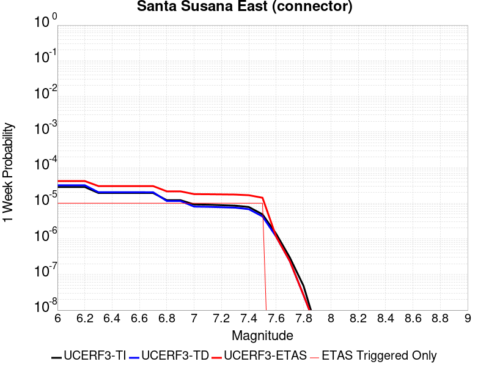
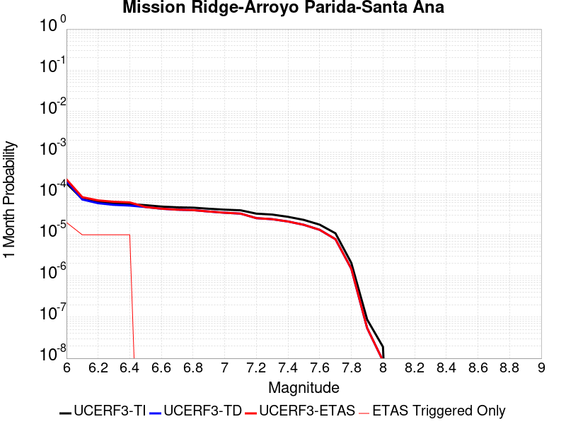
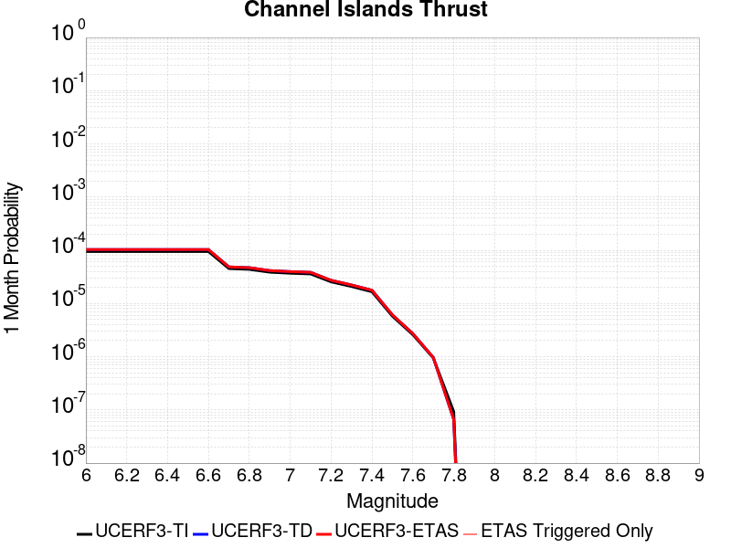

# Parent Section Magnitude-Probability Distributions

Only fault sections with at least one triggered aftershock are plotted. Sections are sorted by total supraseismogenic trigger rate (decreasing)

## Table Of Contents

* [Ventura-Pitas Point](#ventura-pitas-point)
* [Oak Ridge (Onshore)](#oak-ridge-onshore)
* [Santa Susana alt 1](#santa-susana-alt-1)
* [Santa Susana East (connector)](#santa-susana-east-connector)
* [Red Mountain](#red-mountain)
* [Mission Ridge-Arroyo Parida-Santa Ana](#mission-ridge-arroyo-parida-santa-ana)
* [Channel Islands Thrust](#channel-islands-thrust)
* [Santa Rosa Island](#santa-rosa-island)
* [Verdugo](#verdugo)
* [Northridge](#northridge)
* [Sierra Madre](#sierra-madre)
* [Clamshell-Sawpit](#clamshell-sawpit)
* [Santa Ynez (East)](#santa-ynez-east)
* [Elysian Park (Upper)](#elysian-park-upper)
* [San Andreas (Mojave S)](#san-andreas-mojave-s)
* [San Cayetano](#san-cayetano)
* [Sisar](#sisar)
* [Malibu Coast (Extension) alt 1](#malibu-coast-extension-alt-1)
* [Santa Cruz Island](#santa-cruz-island)

## Ventura-Pitas Point
*[(top)](#table-of-contents)*

| 1 Week | 1 Month | 1 Year | 10 Year |
|-----|-----|-----|-----|
|  |  |  |  |

| Magnitude | 1 wk TI Prob | 1 wk TD Prob | 1 wk ETAS Prob | 1 wk ETAS/TD Gain | 1 wk ETAS Triggered Only | 1 mo TI Prob | 1 mo TD Prob | 1 mo ETAS Prob | 1 mo ETAS/TD Gain | 1 mo ETAS Triggered Only | 1 yr TI Prob | 1 yr TD Prob | 1 yr ETAS Prob | 1 yr ETAS/TD Gain | 1 yr ETAS Triggered Only | 10 yr TI Prob | 10 yr TD Prob | 10 yr ETAS Prob | 10 yr ETAS/TD Gain | 10 yr ETAS Triggered Only |
|-----|-----|-----|-----|-----|-----|-----|-----|-----|-----|-----|-----|-----|-----|-----|-----|-----|-----|-----|-----|-----|
| 6.0 | 3.3179622E-5 | 3.3751872E-5 | 1.2303458E-4 | 3.6452665 | 8.928571E-5 | 1.4219063E-4 | 1.4464432E-4 | 3.2318992E-4 | 2.234377 | 1.7857143E-4 | 0.0017297962 | 0.001759879 | 0.0019827003 | 1.1266118 | 2.2321429E-4 | 0.017163932 | 0.017485008 | 0.017792044 | 1.01756 | 3.125E-4 |
| 6.1 | 3.3179622E-5 | 3.3751872E-5 | 1.2303458E-4 | 3.6452665 | 8.928571E-5 | 1.4219063E-4 | 1.4464432E-4 | 3.2318992E-4 | 2.234377 | 1.7857143E-4 | 0.0017297962 | 0.001759879 | 0.0019827003 | 1.1266118 | 2.2321429E-4 | 0.017163932 | 0.017485008 | 0.017792044 | 1.01756 | 3.125E-4 |
| 6.2 | 3.3179622E-5 | 3.3751872E-5 | 1.2303458E-4 | 3.6452665 | 8.928571E-5 | 1.4219063E-4 | 1.4464432E-4 | 3.2318992E-4 | 2.234377 | 1.7857143E-4 | 0.0017297962 | 0.001759879 | 0.0019827003 | 1.1266118 | 2.2321429E-4 | 0.017163932 | 0.017485008 | 0.017792044 | 1.01756 | 3.125E-4 |
| 6.3 | 3.3179622E-5 | 3.3751872E-5 | 1.2303458E-4 | 3.6452665 | 8.928571E-5 | 1.4219063E-4 | 1.4464432E-4 | 3.2318992E-4 | 2.234377 | 1.7857143E-4 | 0.0017297962 | 0.001759879 | 0.0019827003 | 1.1266118 | 2.2321429E-4 | 0.017163932 | 0.017485008 | 0.017792044 | 1.01756 | 3.125E-4 |
| 6.4 | 1.8754668E-5 | 1.7029928E-5 | 6.167203E-5 | 3.6213908 | 4.4642857E-5 | 8.037467E-5 | 7.2983494E-5 | 1.6226269E-4 | 2.2232792 | 8.928571E-5 | 9.781223E-4 | 8.8823494E-4 | 0.0010220446 | 1.1506467 | 1.3392857E-4 | 0.009738282 | 0.008849224 | 0.0090704635 | 1.0250009 | 2.2321429E-4 |
| 6.5 | 1.8754668E-5 | 1.7029928E-5 | 6.167203E-5 | 3.6213908 | 4.4642857E-5 | 8.037467E-5 | 7.2983494E-5 | 1.6226269E-4 | 2.2232792 | 8.928571E-5 | 9.781223E-4 | 8.8823494E-4 | 0.0010220446 | 1.1506467 | 1.3392857E-4 | 0.009738282 | 0.008849224 | 0.0090704635 | 1.0250009 | 2.2321429E-4 |
| 6.6 | 1.4361558E-5 | 1.21312505E-5 | 5.6773566E-5 | 4.6799436 | 4.4642857E-5 | 6.154808E-5 | 5.199005E-5 | 1.4127113E-4 | 2.7172723 | 8.928571E-5 | 7.490902E-4 | 6.327973E-4 | 7.6664117E-4 | 1.2115114 | 1.3392857E-4 | 0.0074657016 | 0.0063102506 | 0.0065320563 | 1.03515 | 2.2321429E-4 |
| 6.7 | 1.4361558E-5 | 1.21312505E-5 | 5.6773566E-5 | 4.6799436 | 4.4642857E-5 | 6.154808E-5 | 5.199005E-5 | 1.4127113E-4 | 2.7172723 | 8.928571E-5 | 7.490902E-4 | 6.327973E-4 | 7.6664117E-4 | 1.2115114 | 1.3392857E-4 | 0.0074657016 | 0.0063102506 | 0.0065320563 | 1.03515 | 2.2321429E-4 |
| 6.8 | 1.3663846E-5 | 1.13531805E-5 | 5.599553E-5 | 4.932145 | 4.4642857E-5 | 5.8558027E-5 | 4.865559E-5 | 1.3793696E-4 | 2.8349664 | 8.928571E-5 | 7.127108E-4 | 5.922227E-4 | 7.26072E-4 | 1.2260116 | 1.3392857E-4 | 0.007104293 | 0.0059067006 | 0.006084217 | 1.0300535 | 1.7857143E-4 |
| 6.9 | 1.3644157E-5 | 1.1331275E-5 | 5.5973625E-5 | 4.9397464 | 4.4642857E-5 | 5.8473648E-5 | 4.8561713E-5 | 1.3784309E-4 | 2.8385136 | 8.928571E-5 | 7.116841E-4 | 5.910804E-4 | 7.2492985E-4 | 1.2264488 | 1.3392857E-4 | 0.007094092 | 0.005895338 | 0.0060728565 | 1.0301117 | 1.7857143E-4 |
| 7.0 | 1.3568845E-5 | 1.1250816E-5 | 5.589317E-5 | 4.9679217 | 4.4642857E-5 | 5.8150898E-5 | 4.82169E-5 | 1.3749831E-4 | 2.8516622 | 8.928571E-5 | 7.077572E-4 | 5.8688456E-4 | 7.2073453E-4 | 1.2280686 | 1.3392857E-4 | 0.007055073 | 0.0058536013 | 0.0060311276 | 1.0303277 | 1.7857143E-4 |
| 7.1 | 1.306572E-5 | 1.0726991E-5 | 5.5369368E-5 | 5.161687 | 4.4642857E-5 | 5.599474E-5 | 4.5972018E-5 | 1.3525362E-4 | 2.942086 | 8.928571E-5 | 6.815227E-4 | 5.595674E-4 | 6.9342105E-4 | 1.239209 | 1.3392857E-4 | 0.0067943637 | 0.0055818288 | 0.005759403 | 1.031813 | 1.7857143E-4 |
| 7.2 | 1.232604E-5 | 9.999405E-6 | 5.4641816E-5 | 5.4645066 | 4.4642857E-5 | 5.2824813E-5 | 4.28539E-5 | 1.3213578E-4 | 3.083402 | 8.928571E-5 | 6.429523E-4 | 5.2162306E-4 | 6.5548177E-4 | 1.2566196 | 1.3392857E-4 | 0.0064109527 | 0.005204218 | 0.0053818603 | 1.0341343 | 1.7857143E-4 |
| 7.3 | 1.0917261E-5 | 8.846285E-6 | 5.3488748E-5 | 6.0464644 | 4.4642857E-5 | 4.678742E-5 | 3.7912105E-5 | 1.2719443E-4 | 3.3549821 | 8.928571E-5 | 5.69488E-4 | 4.614837E-4 | 5.9535046E-4 | 1.2900791 | 1.3392857E-4 | 0.0056803077 | 0.0046054586 | 0.0047832076 | 1.0385953 | 1.7857143E-4 |
| 7.4 | 1.039959E-5 | 8.425843E-6 | 5.3068325E-5 | 6.298281 | 4.4642857E-5 | 4.456891E-5 | 3.611026E-5 | 1.2539275E-4 | 3.4724963 | 8.928571E-5 | 5.424914E-4 | 4.395553E-4 | 5.73425E-4 | 1.3045572 | 1.3392857E-4 | 0.0054116896 | 0.0043870592 | 0.0045648473 | 1.0405256 | 1.7857143E-4 |
| 7.5 | 9.015877E-6 | 7.29933E-6 | 5.194186E-5 | 7.115977 | 4.4642857E-5 | 3.86389E-5 | 3.1282474E-5 | 1.205654E-4 | 3.8540876 | 8.928571E-5 | 4.7032707E-4 | 3.8079897E-4 | 5.1467656E-4 | 1.3515702 | 1.3392857E-4 | 0.004693329 | 0.0038016485 | 0.003979541 | 1.0467936 | 1.7857143E-4 |
| 7.6 | 4.900162E-6 | 3.8748653E-6 | 4.8517548E-5 | 12.521093 | 4.4642857E-5 | 2.1000526E-5 | 1.660646E-5 | 6.1248575E-5 | 3.688238 | 4.4642857E-5 | 2.556514E-4 | 2.0216503E-4 | 2.4679885E-4 | 1.2207792 | 4.4642857E-5 | 0.0025535747 | 0.002019825 | 0.0020643775 | 1.0220577 | 4.4642857E-5 |
| 7.7 | 3.8850626E-6 | 3.1273323E-6 | 3.1273323E-6 | 1.0 | 0.0 | 1.6650163E-5 | 1.3402784E-5 | 1.3402784E-5 | 1.0 | 0.0 | 2.0269687E-4 | 1.6316677E-4 | 1.6316677E-4 | 1.0 | 0.0 | 0.002025121 | 0.001630479 | 0.001630479 | 1.0 | 0.0 |
| 7.8 | 2.4654719E-6 | 2.030283E-6 | 2.030283E-6 | 1.0 | 0.0 | 1.0566265E-5 | 8.701184E-6 | 8.701184E-6 | 1.0 | 0.0 | 1.2863669E-4 | 1.0593181E-4 | 1.0593181E-4 | 1.0 | 0.0 | 0.0012856225 | 0.0010588178 | 0.0010588178 | 1.0 | 0.0 |
| 7.9 | 4.095894E-7 | 3.277087E-7 | 3.277087E-7 | 1.0 | 0.0 | 1.7553821E-6 | 1.4044651E-6 | 1.4044651E-6 | 1.0 | 0.0 | 2.1371567E-5 | 1.7099232E-5 | 1.7099232E-5 | 1.0 | 0.0 | 2.1369511E-4 | 1.7097947E-4 | 1.7097947E-4 | 1.0 | 0.0 |
| 8.0 | 7.791402E-9 | 5.684477E-9 | 5.684477E-9 | 1.0 | 0.0 | 3.3391725E-8 | 2.4362043E-8 | 2.4362043E-8 | 1.0 | 0.0 | 4.0654416E-7 | 2.9660785E-7 | 2.9660785E-7 | 1.0 | 0.0 | 4.065434E-6 | 2.9660766E-6 | 2.9660766E-6 | 1.0 | 0.0 |

## Oak Ridge (Onshore)
*[(top)](#table-of-contents)*

| 1 Week | 1 Month | 1 Year | 10 Year |
|-----|-----|-----|-----|
|  |  |  |  |

| Magnitude | 1 wk TI Prob | 1 wk TD Prob | 1 wk ETAS Prob | 1 wk ETAS/TD Gain | 1 wk ETAS Triggered Only | 1 mo TI Prob | 1 mo TD Prob | 1 mo ETAS Prob | 1 mo ETAS/TD Gain | 1 mo ETAS Triggered Only | 1 yr TI Prob | 1 yr TD Prob | 1 yr ETAS Prob | 1 yr ETAS/TD Gain | 1 yr ETAS Triggered Only | 10 yr TI Prob | 10 yr TD Prob | 10 yr ETAS Prob | 10 yr ETAS/TD Gain | 10 yr ETAS Triggered Only |
|-----|-----|-----|-----|-----|-----|-----|-----|-----|-----|-----|-----|-----|-----|-----|-----|-----|-----|-----|-----|-----|
| 6.0 | 3.155064E-5 | 2.9536353E-5 | 7.417789E-5 | 2.51141 | 4.4642857E-5 | 1.3521002E-4 | 1.2657845E-4 | 2.1585285E-4 | 1.7052892 | 8.928571E-5 | 0.001644939 | 0.0015400412 | 0.0016737635 | 1.0868304 | 1.3392857E-4 | 0.01632816 | 0.015298141 | 0.015473981 | 1.0114942 | 1.7857143E-4 |
| 6.1 | 3.155064E-5 | 2.9536353E-5 | 7.417789E-5 | 2.51141 | 4.4642857E-5 | 1.3521002E-4 | 1.2657845E-4 | 2.1585285E-4 | 1.7052892 | 8.928571E-5 | 0.001644939 | 0.0015400412 | 0.0016737635 | 1.0868304 | 1.3392857E-4 | 0.01632816 | 0.015298141 | 0.015473981 | 1.0114942 | 1.7857143E-4 |
| 6.2 | 3.155064E-5 | 2.9536353E-5 | 7.417789E-5 | 2.51141 | 4.4642857E-5 | 1.3521002E-4 | 1.2657845E-4 | 2.1585285E-4 | 1.7052892 | 8.928571E-5 | 0.001644939 | 0.0015400412 | 0.0016737635 | 1.0868304 | 1.3392857E-4 | 0.01632816 | 0.015298141 | 0.015473981 | 1.0114942 | 1.7857143E-4 |
| 6.3 | 3.155064E-5 | 2.9536353E-5 | 7.417789E-5 | 2.51141 | 4.4642857E-5 | 1.3521002E-4 | 1.2657845E-4 | 2.1585285E-4 | 1.7052892 | 8.928571E-5 | 0.001644939 | 0.0015400412 | 0.0016737635 | 1.0868304 | 1.3392857E-4 | 0.01632816 | 0.015298141 | 0.015473981 | 1.0114942 | 1.7857143E-4 |
| 6.4 | 3.155064E-5 | 2.9536353E-5 | 7.417789E-5 | 2.51141 | 4.4642857E-5 | 1.3521002E-4 | 1.2657845E-4 | 2.1585285E-4 | 1.7052892 | 8.928571E-5 | 0.001644939 | 0.0015400412 | 0.0016737635 | 1.0868304 | 1.3392857E-4 | 0.01632816 | 0.015298141 | 0.015473981 | 1.0114942 | 1.7857143E-4 |
| 6.5 | 3.155064E-5 | 2.9536353E-5 | 7.417789E-5 | 2.51141 | 4.4642857E-5 | 1.3521002E-4 | 1.2657845E-4 | 2.1585285E-4 | 1.7052892 | 8.928571E-5 | 0.001644939 | 0.0015400412 | 0.0016737635 | 1.0868304 | 1.3392857E-4 | 0.01632816 | 0.015298141 | 0.015473981 | 1.0114942 | 1.7857143E-4 |
| 6.6 | 3.155064E-5 | 2.9536353E-5 | 7.417789E-5 | 2.51141 | 4.4642857E-5 | 1.3521002E-4 | 1.2657845E-4 | 2.1585285E-4 | 1.7052892 | 8.928571E-5 | 0.001644939 | 0.0015400412 | 0.0016737635 | 1.0868304 | 1.3392857E-4 | 0.01632816 | 0.015298141 | 0.015473981 | 1.0114942 | 1.7857143E-4 |
| 6.7 | 3.098897E-5 | 2.8874274E-5 | 7.351584E-5 | 2.5460672 | 4.4642857E-5 | 1.328031E-4 | 1.2374124E-4 | 2.130159E-4 | 1.7214626 | 8.928571E-5 | 0.0016156785 | 0.001505546 | 0.001639273 | 1.0888228 | 1.3392857E-4 | 0.016039822 | 0.014957854 | 0.015133753 | 1.0117598 | 1.7857143E-4 |
| 6.8 | 3.0449872E-5 | 2.8249235E-5 | 7.289083E-5 | 2.5802763 | 4.4642857E-5 | 1.3049292E-4 | 1.2106274E-4 | 2.1033765E-4 | 1.7374268 | 8.928571E-5 | 0.0015875935 | 0.0014729796 | 0.0016067108 | 1.0907897 | 1.3392857E-4 | 0.015762992 | 0.014636481 | 0.014812439 | 1.0120219 | 1.7857143E-4 |
| 6.9 | 2.697928E-5 | 2.4228113E-5 | 6.8869886E-5 | 2.842561 | 4.4642857E-5 | 1.15620365E-4 | 1.0383076E-4 | 1.931072E-4 | 1.8598266 | 8.928571E-5 | 0.0014067689 | 0.001263428 | 0.0013971874 | 1.1058702 | 1.3392857E-4 | 0.0139789665 | 0.012565115 | 0.012741442 | 1.0140331 | 1.7857143E-4 |
| 7.0 | 2.4893961E-5 | 2.186955E-5 | 6.651143E-5 | 3.0412803 | 4.4642857E-5 | 1.0668404E-4 | 9.372337E-5 | 1.8300072E-4 | 1.9525622 | 8.928571E-5 | 0.0012981043 | 0.0011405025 | 0.0012742783 | 1.1172955 | 1.3392857E-4 | 0.012905477 | 0.011348725 | 0.0115252705 | 1.0155563 | 1.7857143E-4 |
| 7.1 | 2.0945363E-5 | 1.7360439E-5 | 6.200252E-5 | 3.5714836 | 4.4642857E-5 | 8.976275E-5 | 7.439978E-5 | 1.6367885E-4 | 2.199991 | 8.928571E-5 | 0.0010923136 | 9.0544566E-4 | 0.001039253 | 1.1477807 | 1.3392857E-4 | 0.0108696 | 0.009018446 | 0.009195407 | 1.0196221 | 1.7857143E-4 |
| 7.2 | 2.0439404E-5 | 1.68152E-5 | 6.145731E-5 | 3.6548662 | 4.4642857E-5 | 8.7594504E-5 | 7.206318E-5 | 1.6134245E-4 | 2.2389028 | 8.928571E-5 | 0.0010659413 | 8.770207E-4 | 0.0010108318 | 1.1525747 | 1.3392857E-4 | 0.010608427 | 0.00873646 | 0.008913471 | 1.0202612 | 1.7857143E-4 |
| 7.3 | 1.8463334E-5 | 1.5385725E-5 | 6.0027895E-5 | 3.9015317 | 4.4642857E-5 | 7.912617E-5 | 6.593718E-5 | 1.5521701E-4 | 2.3540134 | 8.928571E-5 | 9.6293533E-4 | 8.024939E-4 | 9.36315E-4 | 1.1667565 | 1.3392857E-4 | 0.009587734 | 0.007996771 | 0.008173914 | 1.0221518 | 1.7857143E-4 |
| 7.4 | 1.763139E-5 | 1.4520331E-5 | 5.916254E-5 | 4.0744624 | 4.4642857E-5 | 7.556091E-5 | 6.222853E-5 | 1.5150869E-4 | 2.4347143 | 8.928571E-5 | 9.1956573E-4 | 7.5737294E-4 | 8.912001E-4 | 1.1766992 | 1.3392857E-4 | 0.009157699 | 0.0075486666 | 0.0077258903 | 1.0234774 | 1.7857143E-4 |
| 7.5 | 1.3594944E-5 | 1.1165903E-5 | 5.580826E-5 | 4.9980965 | 4.4642857E-5 | 5.8262744E-5 | 4.7853006E-5 | 1.3713446E-4 | 2.8657436 | 8.928571E-5 | 7.0911803E-4 | 5.824571E-4 | 7.163077E-4 | 1.2298033 | 1.3392857E-4 | 0.007068595 | 0.0058096154 | 0.0059871497 | 1.0305587 | 1.7857143E-4 |
| 7.6 | 6.9889534E-6 | 5.637633E-6 | 5.028024E-5 | 8.918678 | 4.4642857E-5 | 2.9952313E-5 | 2.4161063E-5 | 6.8802845E-5 | 2.8476744 | 4.4642857E-5 | 3.646084E-4 | 2.9412165E-4 | 3.387514E-4 | 1.151739 | 4.4642857E-5 | 0.0036401073 | 0.002937368 | 0.0029818795 | 1.0151536 | 4.4642857E-5 |
| 7.7 | 4.0824193E-6 | 3.2838032E-6 | 3.2838032E-6 | 1.0 | 0.0 | 1.7495966E-5 | 1.4073367E-5 | 1.4073367E-5 | 1.0 | 0.0 | 2.1299256E-4 | 1.713299E-4 | 1.713299E-4 | 1.0 | 0.0 | 0.0021278851 | 0.0017119916 | 0.0017119916 | 1.0 | 0.0 |
| 7.8 | 1.7023609E-6 | 1.4372558E-6 | 1.4372558E-6 | 1.0 | 0.0 | 7.295812E-6 | 6.1596534E-6 | 6.1596534E-6 | 1.0 | 0.0 | 8.882289E-5 | 7.499123E-5 | 7.499123E-5 | 1.0 | 0.0 | 8.8787393E-4 | 7.49662E-4 | 7.49662E-4 | 1.0 | 0.0 |
| 7.9 | 2.721225E-7 | 2.2621187E-7 | 2.2621187E-7 | 1.0 | 0.0 | 1.1662388E-6 | 9.694791E-7 | 9.694791E-7 | 1.0 | 0.0 | 1.4198865E-5 | 1.1803347E-5 | 1.1803347E-5 | 1.0 | 0.0 | 1.4197957E-4 | 1.1802748E-4 | 1.1802748E-4 | 1.0 | 0.0 |
| 8.0 | 9.364255E-9 | 5.1251963E-9 | 5.1251963E-9 | 1.0 | 0.0 | 4.0132523E-8 | 2.1965127E-8 | 2.1965127E-8 | 1.0 | 0.0 | 4.8861335E-7 | 2.6742538E-7 | 2.6742538E-7 | 1.0 | 0.0 | 4.8861225E-6 | 2.674251E-6 | 2.674251E-6 | 1.0 | 0.0 |

## Santa Susana alt 1
*[(top)](#table-of-contents)*

| 1 Week | 1 Month | 1 Year | 10 Year |
|-----|-----|-----|-----|
|  |  |  |  |

| Magnitude | 1 wk TI Prob | 1 wk TD Prob | 1 wk ETAS Prob | 1 wk ETAS/TD Gain | 1 wk ETAS Triggered Only | 1 mo TI Prob | 1 mo TD Prob | 1 mo ETAS Prob | 1 mo ETAS/TD Gain | 1 mo ETAS Triggered Only | 1 yr TI Prob | 1 yr TD Prob | 1 yr ETAS Prob | 1 yr ETAS/TD Gain | 1 yr ETAS Triggered Only | 10 yr TI Prob | 10 yr TD Prob | 10 yr ETAS Prob | 10 yr ETAS/TD Gain | 10 yr ETAS Triggered Only |
|-----|-----|-----|-----|-----|-----|-----|-----|-----|-----|-----|-----|-----|-----|-----|-----|-----|-----|-----|-----|-----|
| 6.0 | 2.674877E-5 | 2.7209137E-5 | 7.185078E-5 | 2.6406858 | 4.4642857E-5 | 1.1463255E-4 | 1.1660602E-4 | 2.0588131E-4 | 1.7656149 | 8.928571E-5 | 0.0013947578 | 0.0014188674 | 0.001552606 | 1.0942572 | 1.3392857E-4 | 0.013860362 | 0.014109772 | 0.014285823 | 1.0124773 | 1.7857143E-4 |
| 6.1 | 2.674877E-5 | 2.7209137E-5 | 7.185078E-5 | 2.6406858 | 4.4642857E-5 | 1.1463255E-4 | 1.1660602E-4 | 2.0588131E-4 | 1.7656149 | 8.928571E-5 | 0.0013947578 | 0.0014188674 | 0.001552606 | 1.0942572 | 1.3392857E-4 | 0.013860362 | 0.014109772 | 0.014285823 | 1.0124773 | 1.7857143E-4 |
| 6.2 | 2.674877E-5 | 2.7209137E-5 | 7.185078E-5 | 2.6406858 | 4.4642857E-5 | 1.1463255E-4 | 1.1660602E-4 | 2.0588131E-4 | 1.7656149 | 8.928571E-5 | 0.0013947578 | 0.0014188674 | 0.001552606 | 1.0942572 | 1.3392857E-4 | 0.013860362 | 0.014109772 | 0.014285823 | 1.0124773 | 1.7857143E-4 |
| 6.3 | 2.674877E-5 | 2.7209137E-5 | 7.185078E-5 | 2.6406858 | 4.4642857E-5 | 1.1463255E-4 | 1.1660602E-4 | 2.0588131E-4 | 1.7656149 | 8.928571E-5 | 0.0013947578 | 0.0014188674 | 0.001552606 | 1.0942572 | 1.3392857E-4 | 0.013860362 | 0.014109772 | 0.014285823 | 1.0124773 | 1.7857143E-4 |
| 6.4 | 2.674877E-5 | 2.7209137E-5 | 7.185078E-5 | 2.6406858 | 4.4642857E-5 | 1.1463255E-4 | 1.1660602E-4 | 2.0588131E-4 | 1.7656149 | 8.928571E-5 | 0.0013947578 | 0.0014188674 | 0.001552606 | 1.0942572 | 1.3392857E-4 | 0.013860362 | 0.014109772 | 0.014285823 | 1.0124773 | 1.7857143E-4 |
| 6.5 | 2.674877E-5 | 2.7209137E-5 | 7.185078E-5 | 2.6406858 | 4.4642857E-5 | 1.1463255E-4 | 1.1660602E-4 | 2.0588131E-4 | 1.7656149 | 8.928571E-5 | 0.0013947578 | 0.0014188674 | 0.001552606 | 1.0942572 | 1.3392857E-4 | 0.013860362 | 0.014109772 | 0.014285823 | 1.0124773 | 1.7857143E-4 |
| 6.6 | 2.6647976E-5 | 2.7085409E-5 | 7.172706E-5 | 2.6481807 | 4.4642857E-5 | 1.14200615E-4 | 1.16075804E-4 | 2.0535116E-4 | 1.7691125 | 8.928571E-5 | 0.0013895056 | 0.0014124205 | 0.0015461599 | 1.094688 | 1.3392857E-4 | 0.013808494 | 0.014046123 | 0.014222186 | 1.0125346 | 1.7857143E-4 |
| 6.7 | 2.6647976E-5 | 2.7085409E-5 | 7.172706E-5 | 2.6481807 | 4.4642857E-5 | 1.14200615E-4 | 1.16075804E-4 | 2.0535116E-4 | 1.7691125 | 8.928571E-5 | 0.0013895056 | 0.0014124205 | 0.0015461599 | 1.094688 | 1.3392857E-4 | 0.013808494 | 0.014046123 | 0.014222186 | 1.0125346 | 1.7857143E-4 |
| 6.8 | 1.9073179E-5 | 1.764278E-5 | 6.228485E-5 | 3.5303307 | 4.4642857E-5 | 8.1739636E-5 | 7.560982E-5 | 1.6488878E-4 | 2.1807852 | 8.928571E-5 | 9.947256E-4 | 9.20179E-4 | 0.0010539844 | 1.1454123 | 1.3392857E-4 | 0.009902848 | 0.009165861 | 0.009342795 | 1.0193037 | 1.7857143E-4 |
| 6.9 | 1.9041876E-5 | 1.7624905E-5 | 6.2266976E-5 | 3.532897 | 4.4642857E-5 | 8.160549E-5 | 7.553322E-5 | 1.648122E-4 | 2.1819828 | 8.928571E-5 | 9.930939E-4 | 9.1924716E-4 | 0.0010530526 | 1.1455598 | 1.3392857E-4 | 0.0098866755 | 0.009156619 | 0.009333556 | 1.0193233 | 1.7857143E-4 |
| 7.0 | 1.5917482E-5 | 1.3867428E-5 | 5.8509664E-5 | 4.2192154 | 4.4642857E-5 | 6.8215995E-5 | 5.9430506E-5 | 1.4871091E-4 | 2.5022657 | 8.928571E-5 | 8.302132E-4 | 7.233308E-4 | 8.571625E-4 | 1.1850214 | 1.3392857E-4 | 0.008271185 | 0.007210597 | 0.0073878807 | 1.0245866 | 1.7857143E-4 |
| 7.1 | 1.577788E-5 | 1.3747398E-5 | 5.838964E-5 | 4.247323 | 4.4642857E-5 | 6.761774E-5 | 5.8916114E-5 | 1.4819657E-4 | 2.5153825 | 8.928571E-5 | 8.2293496E-4 | 7.170723E-4 | 8.509048E-4 | 1.1866374 | 1.3392857E-4 | 0.008198941 | 0.0071484153 | 0.0073257103 | 1.024802 | 1.7857143E-4 |
| 7.2 | 1.5416446E-5 | 1.3473385E-5 | 5.811564E-5 | 4.3133664 | 4.4642857E-5 | 6.606882E-5 | 5.774182E-5 | 1.4702238E-4 | 2.5462027 | 8.928571E-5 | 8.0409093E-4 | 7.027846E-4 | 8.36619E-4 | 1.1904346 | 1.3392857E-4 | 0.008011877 | 0.007006442 | 0.0071837627 | 1.0253081 | 1.7857143E-4 |
| 7.3 | 1.4534083E-5 | 1.2721056E-5 | 5.7363344E-5 | 4.5093226 | 4.4642857E-5 | 6.228744E-5 | 5.4517695E-5 | 1.4379855E-4 | 2.6376488 | 8.928571E-5 | 7.580857E-4 | 6.635553E-4 | 7.9739495E-4 | 1.2017009 | 1.3392857E-4 | 0.007555048 | 0.006616521 | 0.006793911 | 1.0268102 | 1.7857143E-4 |
| 7.4 | 1.2858995E-5 | 1.1232218E-5 | 5.5874574E-5 | 4.9744916 | 4.4642857E-5 | 5.5108816E-5 | 4.8137208E-5 | 1.3741862E-4 | 2.8547277 | 8.928571E-5 | 6.7074323E-4 | 5.8591686E-4 | 7.1976695E-4 | 1.2284455 | 1.3392857E-4 | 0.0066872234 | 0.005844441 | 0.0060219686 | 1.0303755 | 1.7857143E-4 |
| 7.5 | 8.827668E-6 | 7.807074E-6 | 5.2449584E-5 | 6.7182126 | 4.4642857E-5 | 3.7832317E-5 | 3.3458473E-5 | 1.227412E-4 | 3.668464 | 8.928571E-5 | 4.605111E-4 | 4.0728322E-4 | 5.4115726E-4 | 1.3287001 | 1.3392857E-4 | 0.0045955796 | 0.0040656556 | 0.004243501 | 1.0437434 | 1.7857143E-4 |
| 7.6 | 3.2533426E-6 | 2.8723732E-6 | 4.7515103E-5 | 16.542107 | 4.4642857E-5 | 1.3942822E-5 | 1.23101145E-5 | 5.6952424E-5 | 4.626474 | 4.4642857E-5 | 1.6974064E-4 | 1.4986571E-4 | 1.9450187E-4 | 1.2978411 | 4.4642857E-5 | 0.0016961104 | 0.0014976832 | 0.0015422592 | 1.0297633 | 4.4642857E-5 |
| 7.7 | 1.2751709E-6 | 1.1493125E-6 | 1.1493125E-6 | 1.0 | 0.0 | 5.4650063E-6 | 4.9256164E-6 | 4.9256164E-6 | 1.0 | 0.0 | 6.653442E-5 | 5.996782E-5 | 5.996782E-5 | 1.0 | 0.0 | 6.6514505E-4 | 5.995253E-4 | 5.995253E-4 | 1.0 | 0.0 |
| 7.8 | 3.067544E-7 | 3.2405615E-7 | 3.2405615E-7 | 1.0 | 0.0 | 1.3146611E-6 | 1.3888114E-6 | 1.3888114E-6 | 1.0 | 0.0 | 1.600588E-5 | 1.6908658E-5 | 1.6908658E-5 | 1.0 | 0.0 | 1.6004729E-4 | 1.6907474E-4 | 1.6907474E-4 | 1.0 | 0.0 |
| 7.9 | 7.622999E-8 | 8.0892036E-8 | 8.0892036E-8 | 1.0 | 0.0 | 3.2669993E-7 | 3.4668014E-7 | 3.4668014E-7 | 1.0 | 0.0 | 3.977564E-6 | 4.2208244E-6 | 4.2208244E-6 | 1.0 | 0.0 | 3.977493E-5 | 4.2207652E-5 | 4.2207652E-5 | 1.0 | 0.0 |

## Santa Susana East (connector)
*[(top)](#table-of-contents)*

| 1 Week | 1 Month | 1 Year | 10 Year |
|-----|-----|-----|-----|
|  |  |  |  |

| Magnitude | 1 wk TI Prob | 1 wk TD Prob | 1 wk ETAS Prob | 1 wk ETAS/TD Gain | 1 wk ETAS Triggered Only | 1 mo TI Prob | 1 mo TD Prob | 1 mo ETAS Prob | 1 mo ETAS/TD Gain | 1 mo ETAS Triggered Only | 1 yr TI Prob | 1 yr TD Prob | 1 yr ETAS Prob | 1 yr ETAS/TD Gain | 1 yr ETAS Triggered Only | 10 yr TI Prob | 10 yr TD Prob | 10 yr ETAS Prob | 10 yr ETAS/TD Gain | 10 yr ETAS Triggered Only |
|-----|-----|-----|-----|-----|-----|-----|-----|-----|-----|-----|-----|-----|-----|-----|-----|-----|-----|-----|-----|-----|
| 6.0 | 2.858397E-5 | 3.203796E-5 | 3.203796E-5 | 1.0 | 0.0 | 1.2249697E-4 | 1.372999E-4 | 1.8193663E-4 | 1.3251039 | 4.4642857E-5 | 0.0014903803 | 0.0016706173 | 0.0017597538 | 1.0533555 | 8.928571E-5 | 0.014804244 | 0.016607458 | 0.016695261 | 1.0052869 | 8.928571E-5 |
| 6.1 | 2.858397E-5 | 3.203796E-5 | 3.203796E-5 | 1.0 | 0.0 | 1.2249697E-4 | 1.372999E-4 | 1.8193663E-4 | 1.3251039 | 4.4642857E-5 | 0.0014903803 | 0.0016706173 | 0.0017597538 | 1.0533555 | 8.928571E-5 | 0.014804244 | 0.016607458 | 0.016695261 | 1.0052869 | 8.928571E-5 |
| 6.2 | 2.858397E-5 | 3.203796E-5 | 3.203796E-5 | 1.0 | 0.0 | 1.2249697E-4 | 1.372999E-4 | 1.8193663E-4 | 1.3251039 | 4.4642857E-5 | 0.0014903803 | 0.0016706173 | 0.0017597538 | 1.0533555 | 8.928571E-5 | 0.014804244 | 0.016607458 | 0.016695261 | 1.0052869 | 8.928571E-5 |
| 6.3 | 1.943582E-5 | 2.0376128E-5 | 2.0376128E-5 | 1.0 | 0.0 | 8.329371E-5 | 8.732397E-5 | 1.3196294E-4 | 1.5111879 | 4.4642857E-5 | 0.001013629 | 0.0010627629 | 0.0011519538 | 1.0839236 | 8.928571E-5 | 0.010090181 | 0.010588183 | 0.010676523 | 1.0083433 | 8.928571E-5 |
| 6.4 | 1.943582E-5 | 2.0376128E-5 | 2.0376128E-5 | 1.0 | 0.0 | 8.329371E-5 | 8.732397E-5 | 1.3196294E-4 | 1.5111879 | 4.4642857E-5 | 0.001013629 | 0.0010627629 | 0.0011519538 | 1.0839236 | 8.928571E-5 | 0.010090181 | 0.010588183 | 0.010676523 | 1.0083433 | 8.928571E-5 |
| 6.5 | 1.943582E-5 | 2.0376128E-5 | 2.0376128E-5 | 1.0 | 0.0 | 8.329371E-5 | 8.732397E-5 | 1.3196294E-4 | 1.5111879 | 4.4642857E-5 | 0.001013629 | 0.0010627629 | 0.0011519538 | 1.0839236 | 8.928571E-5 | 0.010090181 | 0.010588183 | 0.010676523 | 1.0083433 | 8.928571E-5 |
| 6.6 | 1.943582E-5 | 2.0376128E-5 | 2.0376128E-5 | 1.0 | 0.0 | 8.329371E-5 | 8.732397E-5 | 1.3196294E-4 | 1.5111879 | 4.4642857E-5 | 0.001013629 | 0.0010627629 | 0.0011519538 | 1.0839236 | 8.928571E-5 | 0.010090181 | 0.010588183 | 0.010676523 | 1.0083433 | 8.928571E-5 |
| 6.7 | 1.9404439E-5 | 2.0363543E-5 | 2.0363543E-5 | 1.0 | 0.0 | 8.3159226E-5 | 8.727004E-5 | 1.31909E-4 | 1.5115038 | 4.4642857E-5 | 0.0010119933 | 0.001062107 | 0.0011512978 | 1.0839754 | 8.928571E-5 | 0.010073971 | 0.010581685 | 0.010670026 | 1.0083485 | 8.928571E-5 |
| 6.8 | 1.2217526E-5 | 1.1596674E-5 | 1.1596674E-5 | 1.0 | 0.0 | 5.2359774E-5 | 4.9699178E-5 | 9.433982E-5 | 1.8982168 | 4.4642857E-5 | 6.372938E-4 | 6.0493633E-4 | 6.9416803E-4 | 1.1475059 | 8.928571E-5 | 0.0063546924 | 0.0060348804 | 0.006123627 | 1.0147057 | 8.928571E-5 |
| 6.9 | 1.2217526E-5 | 1.1596674E-5 | 1.1596674E-5 | 1.0 | 0.0 | 5.2359774E-5 | 4.9699178E-5 | 9.433982E-5 | 1.8982168 | 4.4642857E-5 | 6.372938E-4 | 6.0493633E-4 | 6.9416803E-4 | 1.1475059 | 8.928571E-5 | 0.0063546924 | 0.0060348804 | 0.006123627 | 1.0147057 | 8.928571E-5 |
| 7.0 | 9.276017E-6 | 8.061005E-6 | 8.061005E-6 | 1.0 | 0.0 | 3.9753755E-5 | 3.4546727E-5 | 7.9188045E-5 | 2.292201 | 4.4642857E-5 | 4.8389446E-4 | 4.2052867E-4 | 5.097769E-4 | 1.2122285 | 8.928571E-5 | 0.0048284214 | 0.0041979905 | 0.0042869016 | 1.0211794 | 8.928571E-5 |
| 7.1 | 9.130355E-6 | 7.944145E-6 | 7.944145E-6 | 1.0 | 0.0 | 3.9129503E-5 | 3.4045912E-5 | 7.868725E-5 | 2.31121 | 4.4642857E-5 | 4.7629757E-4 | 4.1443357E-4 | 5.036823E-4 | 1.2153511 | 8.928571E-5 | 0.00475278 | 0.004137268 | 0.004226184 | 1.0214915 | 8.928571E-5 |
| 7.2 | 8.851015E-6 | 7.743266E-6 | 7.743266E-6 | 1.0 | 0.0 | 3.7932372E-5 | 3.3185024E-5 | 7.78264E-5 | 2.3452265 | 4.4642857E-5 | 4.6172875E-4 | 4.0395616E-4 | 4.932058E-4 | 1.2209389 | 8.928571E-5 | 0.0046077054 | 0.004032877 | 0.0041218023 | 1.0220501 | 8.928571E-5 |
| 7.3 | 8.573006E-6 | 7.551941E-6 | 7.551941E-6 | 1.0 | 0.0 | 3.6740938E-5 | 3.2365082E-5 | 7.7006494E-5 | 2.379308 | 4.4642857E-5 | 4.472291E-4 | 3.93977E-4 | 4.8322757E-4 | 1.2265375 | 8.928571E-5 | 0.004463301 | 0.003933434 | 0.0040223687 | 1.02261 | 8.928571E-5 |
| 7.4 | 7.852282E-6 | 6.8191734E-6 | 6.8191734E-6 | 1.0 | 0.0 | 3.36522E-5 | 2.9224719E-5 | 7.386627E-5 | 2.527527 | 4.4642857E-5 | 4.096385E-4 | 3.557559E-4 | 4.4500985E-4 | 1.2508854 | 8.928571E-5 | 0.0040888423 | 0.003552475 | 0.0036414436 | 1.0250441 | 8.928571E-5 |
| 7.5 | 4.8869324E-6 | 4.280054E-6 | 4.280054E-6 | 1.0 | 0.0 | 2.0943828E-5 | 1.834297E-5 | 6.2985004E-5 | 3.433741 | 4.4642857E-5 | 2.5496128E-4 | 2.233044E-4 | 3.125702E-4 | 1.3997493 | 8.928571E-5 | 0.0025466895 | 0.0022310033 | 0.0023200898 | 1.0399312 | 8.928571E-5 |
| 7.6 | 1.3894544E-6 | 1.1571401E-6 | 1.1571401E-6 | 1.0 | 0.0 | 5.954791E-6 | 4.9591636E-6 | 4.9591636E-6 | 1.0 | 0.0 | 7.249717E-5 | 6.0376366E-5 | 6.0376366E-5 | 1.0 | 0.0 | 7.247352E-4 | 6.036214E-4 | 6.036214E-4 | 1.0 | 0.0 |
| 7.7 | 2.9924632E-7 | 2.3742072E-7 | 2.3742072E-7 | 1.0 | 0.0 | 1.2824837E-6 | 1.017517E-6 | 1.017517E-6 | 1.0 | 0.0 | 1.5614127E-5 | 1.2388206E-5 | 1.2388206E-5 | 1.0 | 0.0 | 1.5613029E-4 | 1.2387589E-4 | 1.2387589E-4 | 1.0 | 0.0 |
| 7.8 | 4.8188564E-8 | 2.6509277E-8 | 2.6509277E-8 | 1.0 | 0.0 | 2.065224E-7 | 1.1361118E-7 | 1.1361118E-7 | 1.0 | 0.0 | 2.5144072E-6 | 1.3832154E-6 | 1.3832154E-6 | 1.0 | 0.0 | 2.5143789E-5 | 1.3832076E-5 | 1.3832076E-5 | 1.0 | 0.0 |
| 7.9 | 2.6127251E-9 | 2.7685028E-9 | 2.7685028E-9 | 1.0 | 0.0 | 1.1197393E-8 | 1.1865012E-8 | 1.1865012E-8 | 1.0 | 0.0 | 1.3632825E-7 | 1.4445652E-7 | 1.4445652E-7 | 1.0 | 0.0 | 1.3632817E-6 | 1.4445653E-6 | 1.4445653E-6 | 1.0 | 0.0 |

## Red Mountain
*[(top)](#table-of-contents)*

| 1 Week | 1 Month | 1 Year | 10 Year |
|-----|-----|-----|-----|
|  |  |  |  |

| Magnitude | 1 wk TI Prob | 1 wk TD Prob | 1 wk ETAS Prob | 1 wk ETAS/TD Gain | 1 wk ETAS Triggered Only | 1 mo TI Prob | 1 mo TD Prob | 1 mo ETAS Prob | 1 mo ETAS/TD Gain | 1 mo ETAS Triggered Only | 1 yr TI Prob | 1 yr TD Prob | 1 yr ETAS Prob | 1 yr ETAS/TD Gain | 1 yr ETAS Triggered Only | 10 yr TI Prob | 10 yr TD Prob | 10 yr ETAS Prob | 10 yr ETAS/TD Gain | 10 yr ETAS Triggered Only |
|-----|-----|-----|-----|-----|-----|-----|-----|-----|-----|-----|-----|-----|-----|-----|-----|-----|-----|-----|-----|-----|
| 6.0 | 4.1810763E-5 | 4.7609105E-5 | 4.7609105E-5 | 1.0 | 0.0 | 1.7917668E-4 | 2.04024E-4 | 2.04024E-4 | 1.0 | 0.0 | 0.0021792934 | 0.0024813274 | 0.0024813274 | 1.0 | 0.0 | 0.021580452 | 0.024553841 | 0.024640935 | 1.0035471 | 8.928571E-5 |
| 6.1 | 4.1810763E-5 | 4.7609105E-5 | 4.7609105E-5 | 1.0 | 0.0 | 1.7917668E-4 | 2.04024E-4 | 2.04024E-4 | 1.0 | 0.0 | 0.0021792934 | 0.0024813274 | 0.0024813274 | 1.0 | 0.0 | 0.021580452 | 0.024553841 | 0.024640935 | 1.0035471 | 8.928571E-5 |
| 6.2 | 4.1810763E-5 | 4.7609105E-5 | 4.7609105E-5 | 1.0 | 0.0 | 1.7917668E-4 | 2.04024E-4 | 2.04024E-4 | 1.0 | 0.0 | 0.0021792934 | 0.0024813274 | 0.0024813274 | 1.0 | 0.0 | 0.021580452 | 0.024553841 | 0.024640935 | 1.0035471 | 8.928571E-5 |
| 6.3 | 4.1810763E-5 | 4.7609105E-5 | 4.7609105E-5 | 1.0 | 0.0 | 1.7917668E-4 | 2.04024E-4 | 2.04024E-4 | 1.0 | 0.0 | 0.0021792934 | 0.0024813274 | 0.0024813274 | 1.0 | 0.0 | 0.021580452 | 0.024553841 | 0.024640935 | 1.0035471 | 8.928571E-5 |
| 6.4 | 4.1810763E-5 | 4.7609105E-5 | 4.7609105E-5 | 1.0 | 0.0 | 1.7917668E-4 | 2.04024E-4 | 2.04024E-4 | 1.0 | 0.0 | 0.0021792934 | 0.0024813274 | 0.0024813274 | 1.0 | 0.0 | 0.021580452 | 0.024553841 | 0.024640935 | 1.0035471 | 8.928571E-5 |
| 6.5 | 3.154503E-5 | 3.537327E-5 | 3.537327E-5 | 1.0 | 0.0 | 1.3518598E-4 | 1.5159143E-4 | 1.5159143E-4 | 1.0 | 0.0 | 0.0016446467 | 0.0018441556 | 0.0018441556 | 1.0 | 0.0 | 0.01632528 | 0.018298175 | 0.018342001 | 1.0023952 | 4.4642857E-5 |
| 6.6 | 3.1535834E-5 | 3.536265E-5 | 3.536265E-5 | 1.0 | 0.0 | 1.3514658E-4 | 1.5154593E-4 | 1.5154593E-4 | 1.0 | 0.0 | 0.0016441676 | 0.0018436024 | 0.0018436024 | 1.0 | 0.0 | 0.01632056 | 0.018292734 | 0.01833656 | 1.0023959 | 4.4642857E-5 |
| 6.7 | 2.8267326E-5 | 3.1481133E-5 | 3.1481133E-5 | 1.0 | 0.0 | 1.2114006E-4 | 1.3491265E-4 | 1.3491265E-4 | 1.0 | 0.0 | 0.0014738824 | 0.0016414091 | 0.0016414091 | 1.0 | 0.0 | 0.014641452 | 0.016301626 | 0.01634554 | 1.0026939 | 4.4642857E-5 |
| 6.8 | 2.8212884E-5 | 3.1419E-5 | 3.1419E-5 | 1.0 | 0.0 | 1.20906756E-4 | 1.3464638E-4 | 1.3464638E-4 | 1.0 | 0.0 | 0.0014710457 | 0.0016381722 | 0.0016381722 | 1.0 | 0.0 | 0.014613459 | 0.01626973 | 0.016313648 | 1.0026993 | 4.4642857E-5 |
| 6.9 | 2.4227871E-5 | 2.6716738E-5 | 2.6716738E-5 | 1.0 | 0.0 | 1.03829596E-4 | 1.14495706E-4 | 1.14495706E-4 | 1.0 | 0.0 | 0.0012633923 | 0.0013931699 | 0.0013931699 | 1.0 | 0.0 | 0.012562336 | 0.013852054 | 0.013896079 | 1.0031782 | 4.4642857E-5 |
| 7.0 | 2.348524E-5 | 2.5845162E-5 | 2.5845162E-5 | 1.0 | 0.0 | 1.0064714E-4 | 1.107607E-4 | 1.107607E-4 | 1.0 | 0.0 | 0.0012246901 | 0.0013477531 | 0.0013477531 | 1.0 | 0.0 | 0.012179627 | 0.013403435 | 0.013403435 | 1.0 | 0.0 |
| 7.1 | 2.2311642E-5 | 2.4471668E-5 | 2.4471668E-5 | 1.0 | 0.0 | 9.561782E-5 | 1.0487479E-4 | 1.0487479E-4 | 1.0 | 0.0 | 0.0011635252 | 0.0012761775 | 0.0012761775 | 1.0 | 0.0 | 0.01157452 | 0.012696012 | 0.012696012 | 1.0 | 0.0 |
| 7.2 | 1.6533986E-5 | 1.7676337E-5 | 1.7676337E-5 | 1.0 | 0.0 | 7.085802E-5 | 7.575389E-5 | 7.575389E-5 | 1.0 | 0.0 | 8.623549E-4 | 9.2197687E-4 | 9.2197687E-4 | 1.0 | 0.0 | 0.008590161 | 0.009187802 | 0.009187802 | 1.0 | 0.0 |
| 7.3 | 1.4703092E-5 | 1.5564734E-5 | 1.5564734E-5 | 1.0 | 0.0 | 6.301173E-5 | 6.670465E-5 | 6.670465E-5 | 1.0 | 0.0 | 7.668978E-4 | 8.1188814E-4 | 8.1188814E-4 | 1.0 | 0.0 | 0.0076425658 | 0.0080953 | 0.0080953 | 1.0 | 0.0 |
| 7.4 | 6.1331984E-6 | 5.529994E-6 | 5.529994E-6 | 1.0 | 0.0 | 2.6284872E-5 | 2.369976E-5 | 2.369976E-5 | 1.0 | 0.0 | 3.199713E-4 | 2.885069E-4 | 2.885069E-4 | 1.0 | 0.0 | 0.0031951098 | 0.002881378 | 0.002881378 | 1.0 | 0.0 |
| 7.5 | 5.954766E-6 | 5.3395843E-6 | 5.3395843E-6 | 1.0 | 0.0 | 2.5520176E-5 | 2.2883734E-5 | 2.2883734E-5 | 1.0 | 0.0 | 3.1066386E-4 | 2.7857439E-4 | 2.7857439E-4 | 1.0 | 0.0 | 0.003102299 | 0.0027823057 | 0.0027823057 | 1.0 | 0.0 |
| 7.6 | 4.9726646E-6 | 4.316188E-6 | 4.316188E-6 | 1.0 | 0.0 | 2.1311245E-5 | 1.8497818E-5 | 1.8497818E-5 | 1.0 | 0.0 | 2.5943352E-4 | 2.25188E-4 | 2.25188E-4 | 1.0 | 0.0 | 0.0025913084 | 0.002249633 | 0.002249633 | 1.0 | 0.0 |
| 7.7 | 3.3613894E-6 | 2.853241E-6 | 2.853241E-6 | 1.0 | 0.0 | 1.4405875E-5 | 1.2228121E-5 | 1.2228121E-5 | 1.0 | 0.0 | 1.7537741E-4 | 1.4886746E-4 | 1.4886746E-4 | 1.0 | 0.0 | 0.0017523908 | 0.0014877036 | 0.0014877036 | 1.0 | 0.0 |
| 7.8 | 1.1828961E-6 | 1.012448E-6 | 1.012448E-6 | 1.0 | 0.0 | 5.069545E-6 | 4.339056E-6 | 4.339056E-6 | 1.0 | 0.0 | 6.171996E-5 | 5.2826756E-5 | 5.2826756E-5 | 1.0 | 0.0 | 6.170282E-4 | 5.2814494E-4 | 5.2814494E-4 | 1.0 | 0.0 |
| 7.9 | 2.2967266E-7 | 1.8622318E-7 | 1.8622318E-7 | 1.0 | 0.0 | 9.843111E-7 | 7.980991E-7 | 7.980991E-7 | 1.0 | 0.0 | 1.19839215E-5 | 9.716816E-6 | 9.716816E-6 | 1.0 | 0.0 | 1.1983275E-4 | 9.71642E-5 | 9.71642E-5 | 1.0 | 0.0 |

## Mission Ridge-Arroyo Parida-Santa Ana
*[(top)](#table-of-contents)*

| 1 Week | 1 Month | 1 Year | 10 Year |
|-----|-----|-----|-----|
|  |  |  |  |

| Magnitude | 1 wk TI Prob | 1 wk TD Prob | 1 wk ETAS Prob | 1 wk ETAS/TD Gain | 1 wk ETAS Triggered Only | 1 mo TI Prob | 1 mo TD Prob | 1 mo ETAS Prob | 1 mo ETAS/TD Gain | 1 mo ETAS Triggered Only | 1 yr TI Prob | 1 yr TD Prob | 1 yr ETAS Prob | 1 yr ETAS/TD Gain | 1 yr ETAS Triggered Only | 10 yr TI Prob | 10 yr TD Prob | 10 yr ETAS Prob | 10 yr ETAS/TD Gain | 10 yr ETAS Triggered Only |
|-----|-----|-----|-----|-----|-----|-----|-----|-----|-----|-----|-----|-----|-----|-----|-----|-----|-----|-----|-----|-----|
| 6.0 | 4.169034E-5 | 4.7160556E-5 | 4.7160556E-5 | 1.0 | 0.0 | 1.7866064E-4 | 2.0210588E-4 | 2.0210588E-4 | 1.0 | 0.0 | 0.0021730233 | 0.0024586893 | 0.0024586893 | 1.0 | 0.0 | 0.021518968 | 0.02439673 | 0.024440285 | 1.0017853 | 4.4642857E-5 |
| 6.1 | 1.73813E-5 | 1.6859949E-5 | 1.6859949E-5 | 1.0 | 0.0 | 7.4489166E-5 | 7.225499E-5 | 7.225499E-5 | 1.0 | 0.0 | 9.065282E-4 | 8.7936013E-4 | 8.7936013E-4 | 1.0 | 0.0 | 0.009028391 | 0.008759982 | 0.008804234 | 1.0050516 | 4.4642857E-5 |
| 6.2 | 1.4622182E-5 | 1.3677833E-5 | 1.3677833E-5 | 1.0 | 0.0 | 6.2664985E-5 | 5.861799E-5 | 5.861799E-5 | 1.0 | 0.0 | 7.6267915E-4 | 7.1344414E-4 | 7.1344414E-4 | 1.0 | 0.0 | 0.007600669 | 0.007112015 | 0.007112015 | 1.0 | 0.0 |
| 6.3 | 1.3552434E-5 | 1.2486417E-5 | 1.2486417E-5 | 1.0 | 0.0 | 5.8080568E-5 | 5.351214E-5 | 5.351214E-5 | 1.0 | 0.0 | 7.069015E-4 | 6.513187E-4 | 6.513187E-4 | 1.0 | 0.0 | 0.00704657 | 0.006494495 | 0.006494495 | 1.0 | 0.0 |
| 6.4 | 1.30977305E-5 | 1.1983244E-5 | 1.1983244E-5 | 1.0 | 0.0 | 5.613192E-5 | 5.1355768E-5 | 5.1355768E-5 | 1.0 | 0.0 | 6.831918E-4 | 6.250801E-4 | 6.250801E-4 | 1.0 | 0.0 | 0.006810953 | 0.0062335986 | 0.0062335986 | 1.0 | 0.0 |
| 6.5 | 1.225205E-5 | 1.1052668E-5 | 1.1052668E-5 | 1.0 | 0.0 | 5.2507727E-5 | 4.7367732E-5 | 4.7367732E-5 | 1.0 | 0.0 | 6.3909404E-4 | 5.7655224E-4 | 5.7655224E-4 | 1.0 | 0.0 | 0.006372592 | 0.0057509085 | 0.0057509085 | 1.0 | 0.0 |
| 6.6 | 1.1352241E-5 | 1.0067177E-5 | 1.0067177E-5 | 1.0 | 0.0 | 4.8651553E-5 | 4.314434E-5 | 4.314434E-5 | 1.0 | 0.0 | 5.921717E-4 | 5.2515784E-4 | 5.2515784E-4 | 1.0 | 0.0 | 0.0059059616 | 0.0052394485 | 0.0052394485 | 1.0 | 0.0 |
| 6.7 | 1.0864116E-5 | 9.5205105E-6 | 9.5205105E-6 | 1.0 | 0.0 | 4.6559664E-5 | 4.080156E-5 | 4.080156E-5 | 1.0 | 0.0 | 5.667165E-4 | 4.966478E-4 | 4.966478E-4 | 1.0 | 0.0 | 0.005652734 | 0.004955646 | 0.004955646 | 1.0 | 0.0 |
| 6.8 | 1.0666365E-5 | 9.30321E-6 | 9.30321E-6 | 1.0 | 0.0 | 4.571219E-5 | 3.9870305E-5 | 3.9870305E-5 | 1.0 | 0.0 | 5.564038E-4 | 4.8531484E-4 | 4.8531484E-4 | 1.0 | 0.0 | 0.005550127 | 0.004842816 | 0.004842816 | 1.0 | 0.0 |
| 6.9 | 1.0038665E-5 | 8.595261E-6 | 8.595261E-6 | 1.0 | 0.0 | 4.302214E-5 | 3.683632E-5 | 3.683632E-5 | 1.0 | 0.0 | 5.236687E-4 | 4.4839174E-4 | 4.4839174E-4 | 1.0 | 0.0 | 0.005224364 | 0.0044751153 | 0.0044751153 | 1.0 | 0.0 |
| 7.0 | 9.5379955E-6 | 8.028101E-6 | 8.028101E-6 | 1.0 | 0.0 | 4.0876483E-5 | 3.44057E-5 | 3.44057E-5 | 1.0 | 0.0 | 4.975576E-4 | 4.188106E-4 | 4.188106E-4 | 1.0 | 0.0 | 0.00496445 | 0.0041804467 | 0.0041804467 | 1.0 | 0.0 |
| 7.1 | 9.207389E-6 | 7.655274E-6 | 7.655274E-6 | 1.0 | 0.0 | 3.945964E-5 | 3.2807915E-5 | 3.2807915E-5 | 1.0 | 0.0 | 4.803152E-4 | 3.9936486E-4 | 3.9936486E-4 | 1.0 | 0.0 | 0.004792784 | 0.003986702 | 0.003986702 | 1.0 | 0.0 |
| 7.2 | 7.638091E-6 | 5.9333574E-6 | 5.9333574E-6 | 1.0 | 0.0 | 3.2734264E-5 | 2.5428428E-5 | 2.5428428E-5 | 1.0 | 0.0 | 3.984668E-4 | 3.0954744E-4 | 3.0954744E-4 | 1.0 | 0.0 | 0.0039775306 | 0.0030912533 | 0.0030912533 | 1.0 | 0.0 |
| 7.3 | 7.2500147E-6 | 5.598251E-6 | 5.598251E-6 | 1.0 | 0.0 | 3.1071122E-5 | 2.3992285E-5 | 2.3992285E-5 | 1.0 | 0.0 | 3.7822526E-4 | 2.920672E-4 | 2.920672E-4 | 1.0 | 0.0 | 0.0037758215 | 0.002916923 | 0.002916923 | 1.0 | 0.0 |
| 7.4 | 6.3899715E-6 | 4.920333E-6 | 4.920333E-6 | 1.0 | 0.0 | 2.7385306E-5 | 2.1086973E-5 | 2.1086973E-5 | 1.0 | 0.0 | 3.3336508E-4 | 2.5670385E-4 | 2.5670385E-4 | 1.0 | 0.0 | 0.0033286542 | 0.0025641518 | 0.0025641518 | 1.0 | 0.0 |
| 7.5 | 5.379025E-6 | 4.0853624E-6 | 4.0853624E-6 | 1.0 | 0.0 | 2.305276E-5 | 1.7508579E-5 | 1.7508579E-5 | 1.0 | 0.0 | 2.806312E-4 | 2.131462E-4 | 2.131462E-4 | 1.0 | 0.0 | 0.0028027708 | 0.002129429 | 0.002129429 | 1.0 | 0.0 |
| 7.6 | 4.1270696E-6 | 3.0892795E-6 | 3.0892795E-6 | 1.0 | 0.0 | 1.768732E-5 | 1.3239703E-5 | 1.3239703E-5 | 1.0 | 0.0 | 2.1532185E-4 | 1.6118152E-4 | 1.6118152E-4 | 1.0 | 0.0 | 0.0021511333 | 0.0016106544 | 0.0016106544 | 1.0 | 0.0 |
| 7.7 | 2.5406805E-6 | 1.8287496E-6 | 1.8287496E-6 | 1.0 | 0.0 | 1.0888585E-5 | 7.837475E-6 | 7.837475E-6 | 1.0 | 0.0 | 1.3256045E-4 | 9.541715E-5 | 9.541715E-5 | 1.0 | 0.0 | 0.0013248142 | 9.537679E-4 | 9.537679E-4 | 1.0 | 0.0 |
| 7.8 | 4.8608285E-7 | 3.5106618E-7 | 3.5106618E-7 | 1.0 | 0.0 | 2.0832106E-6 | 1.5045686E-6 | 1.5045686E-6 | 1.0 | 0.0 | 2.5362791E-5 | 1.8317969E-5 | 1.8317969E-5 | 1.0 | 0.0 | 2.5359896E-4 | 1.8316471E-4 | 1.8316471E-4 | 1.0 | 0.0 |
| 7.9 | 2.0472514E-8 | 1.2693983E-8 | 1.2693983E-8 | 1.0 | 0.0 | 8.7739345E-8 | 5.4402783E-8 | 5.4402783E-8 | 1.0 | 0.0 | 1.068226E-6 | 6.6235367E-7 | 6.6235367E-7 | 1.0 | 0.0 | 1.0682209E-5 | 6.623518E-6 | 6.623518E-6 | 1.0 | 0.0 |
| 8.0 | 4.443582E-9 | 2.0343207E-9 | 2.0343207E-9 | 1.0 | 0.0 | 1.9043922E-8 | 8.7185175E-9 | 8.7185175E-9 | 1.0 | 0.0 | 2.3185973E-7 | 1.06147944E-7 | 1.06147944E-7 | 1.0 | 0.0 | 2.3185949E-6 | 1.061479E-6 | 1.061479E-6 | 1.0 | 0.0 |

## Channel Islands Thrust
*[(top)](#table-of-contents)*

| 1 Week | 1 Month | 1 Year | 10 Year |
|-----|-----|-----|-----|
|  |  |  |  |

| Magnitude | 1 wk TI Prob | 1 wk TD Prob | 1 wk ETAS Prob | 1 wk ETAS/TD Gain | 1 wk ETAS Triggered Only | 1 mo TI Prob | 1 mo TD Prob | 1 mo ETAS Prob | 1 mo ETAS/TD Gain | 1 mo ETAS Triggered Only | 1 yr TI Prob | 1 yr TD Prob | 1 yr ETAS Prob | 1 yr ETAS/TD Gain | 1 yr ETAS Triggered Only | 10 yr TI Prob | 10 yr TD Prob | 10 yr ETAS Prob | 10 yr ETAS/TD Gain | 10 yr ETAS Triggered Only |
|-----|-----|-----|-----|-----|-----|-----|-----|-----|-----|-----|-----|-----|-----|-----|-----|-----|-----|-----|-----|-----|
| 6.0 | 2.2156251E-5 | 2.409708E-5 | 2.409708E-5 | 1.0 | 0.0 | 9.495191E-5 | 1.0326972E-4 | 1.0326972E-4 | 1.0 | 0.0 | 0.0011554264 | 0.0012566902 | 0.0012566902 | 1.0 | 0.0 | 0.011494373 | 0.012506433 | 0.012550518 | 1.0035249 | 4.4642857E-5 |
| 6.1 | 2.2156251E-5 | 2.409708E-5 | 2.409708E-5 | 1.0 | 0.0 | 9.495191E-5 | 1.0326972E-4 | 1.0326972E-4 | 1.0 | 0.0 | 0.0011554264 | 0.0012566902 | 0.0012566902 | 1.0 | 0.0 | 0.011494373 | 0.012506433 | 0.012550518 | 1.0035249 | 4.4642857E-5 |
| 6.2 | 2.2156251E-5 | 2.409708E-5 | 2.409708E-5 | 1.0 | 0.0 | 9.495191E-5 | 1.0326972E-4 | 1.0326972E-4 | 1.0 | 0.0 | 0.0011554264 | 0.0012566902 | 0.0012566902 | 1.0 | 0.0 | 0.011494373 | 0.012506433 | 0.012550518 | 1.0035249 | 4.4642857E-5 |
| 6.3 | 2.2156251E-5 | 2.409708E-5 | 2.409708E-5 | 1.0 | 0.0 | 9.495191E-5 | 1.0326972E-4 | 1.0326972E-4 | 1.0 | 0.0 | 0.0011554264 | 0.0012566902 | 0.0012566902 | 1.0 | 0.0 | 0.011494373 | 0.012506433 | 0.012550518 | 1.0035249 | 4.4642857E-5 |
| 6.4 | 2.2156251E-5 | 2.409708E-5 | 2.409708E-5 | 1.0 | 0.0 | 9.495191E-5 | 1.0326972E-4 | 1.0326972E-4 | 1.0 | 0.0 | 0.0011554264 | 0.0012566902 | 0.0012566902 | 1.0 | 0.0 | 0.011494373 | 0.012506433 | 0.012550518 | 1.0035249 | 4.4642857E-5 |
| 6.5 | 2.2156251E-5 | 2.409708E-5 | 2.409708E-5 | 1.0 | 0.0 | 9.495191E-5 | 1.0326972E-4 | 1.0326972E-4 | 1.0 | 0.0 | 0.0011554264 | 0.0012566902 | 0.0012566902 | 1.0 | 0.0 | 0.011494373 | 0.012506433 | 0.012550518 | 1.0035249 | 4.4642857E-5 |
| 6.6 | 2.2156251E-5 | 2.409708E-5 | 2.409708E-5 | 1.0 | 0.0 | 9.495191E-5 | 1.0326972E-4 | 1.0326972E-4 | 1.0 | 0.0 | 0.0011554264 | 0.0012566902 | 0.0012566902 | 1.0 | 0.0 | 0.011494373 | 0.012506433 | 0.012550518 | 1.0035249 | 4.4642857E-5 |
| 6.7 | 1.0601296E-5 | 1.1381564E-5 | 1.1381564E-5 | 1.0 | 0.0 | 4.5433335E-5 | 4.877725E-5 | 4.877725E-5 | 1.0 | 0.0 | 5.5301044E-4 | 5.9370603E-4 | 5.9370603E-4 | 1.0 | 0.0 | 0.005516363 | 0.0059217014 | 0.00596608 | 1.0074942 | 4.4642857E-5 |
| 6.8 | 1.0246747E-5 | 1.0998616E-5 | 1.0998616E-5 | 1.0 | 0.0 | 4.391389E-5 | 4.71361E-5 | 4.71361E-5 | 1.0 | 0.0 | 5.345204E-4 | 5.7373574E-4 | 5.7373574E-4 | 1.0 | 0.0 | 0.0053323656 | 0.0057230354 | 0.0057674227 | 1.0077559 | 4.4642857E-5 |
| 6.9 | 9.049551E-6 | 9.7013335E-6 | 9.7013335E-6 | 1.0 | 0.0 | 3.878322E-5 | 4.1576506E-5 | 4.1576506E-5 | 1.0 | 0.0 | 4.7208337E-4 | 5.060805E-4 | 5.060805E-4 | 1.0 | 0.0 | 0.0047108172 | 0.0050496976 | 0.0050941147 | 1.0087961 | 4.4642857E-5 |
| 7.0 | 8.6542195E-6 | 9.276216E-6 | 9.276216E-6 | 1.0 | 0.0 | 3.7088983E-5 | 3.975463E-5 | 3.975463E-5 | 1.0 | 0.0 | 4.5146482E-4 | 4.8390919E-4 | 4.8390919E-4 | 1.0 | 0.0 | 0.004505487 | 0.004828967 | 0.004873394 | 1.0092002 | 4.4642857E-5 |
| 7.1 | 8.391028E-6 | 8.994491E-6 | 8.994491E-6 | 1.0 | 0.0 | 3.5961057E-5 | 3.854727E-5 | 3.854727E-5 | 1.0 | 0.0 | 4.3773788E-4 | 4.6921603E-4 | 4.6921603E-4 | 1.0 | 0.0 | 0.004368766 | 0.004682664 | 0.0047270977 | 1.009489 | 4.4642857E-5 |
| 7.2 | 5.965188E-6 | 6.3727566E-6 | 6.3727566E-6 | 1.0 | 0.0 | 2.556484E-5 | 2.7311531E-5 | 2.7311531E-5 | 1.0 | 0.0 | 3.1120746E-4 | 3.324677E-4 | 3.324677E-4 | 1.0 | 0.0 | 0.00310772 | 0.0033197613 | 0.003364256 | 1.0134029 | 4.4642857E-5 |
| 7.3 | 4.877518E-6 | 5.206868E-6 | 5.206868E-6 | 1.0 | 0.0 | 2.0903482E-5 | 2.231496E-5 | 2.231496E-5 | 1.0 | 0.0 | 2.5447016E-4 | 2.7165122E-4 | 2.7165122E-4 | 1.0 | 0.0 | 0.0025417898 | 0.002713238 | 0.0027577595 | 1.016409 | 4.4642857E-5 |
| 7.4 | 3.8829853E-6 | 4.1425465E-6 | 4.1425465E-6 | 1.0 | 0.0 | 1.664126E-5 | 1.7753651E-5 | 1.7753651E-5 | 1.0 | 0.0 | 2.0258849E-4 | 2.1612969E-4 | 2.1612969E-4 | 1.0 | 0.0 | 0.002024039 | 0.0021592367 | 0.002203783 | 1.0206306 | 4.4642857E-5 |
| 7.5 | 1.3489616E-6 | 1.4280132E-6 | 1.4280132E-6 | 1.0 | 0.0 | 5.7812517E-6 | 6.1200426E-6 | 6.1200426E-6 | 1.0 | 0.0 | 7.038446E-5 | 7.4509015E-5 | 7.4509015E-5 | 1.0 | 0.0 | 7.036218E-4 | 7.4484426E-4 | 7.4484426E-4 | 1.0 | 0.0 |
| 7.6 | 6.058192E-7 | 6.3547486E-7 | 6.3547486E-7 | 1.0 | 0.0 | 2.5963652E-6 | 2.723461E-6 | 2.723461E-6 | 1.0 | 0.0 | 3.161029E-5 | 3.315765E-5 | 3.315765E-5 | 1.0 | 0.0 | 3.1605794E-4 | 3.3152863E-4 | 3.3152863E-4 | 1.0 | 0.0 |
| 7.7 | 2.2170494E-7 | 2.2611093E-7 | 2.2611093E-7 | 1.0 | 0.0 | 9.5016367E-7 | 9.690466E-7 | 9.690466E-7 | 1.0 | 0.0 | 1.1568181E-5 | 1.1798089E-5 | 1.1798089E-5 | 1.0 | 0.0 | 1.1567579E-4 | 1.1797574E-4 | 1.1797574E-4 | 1.0 | 0.0 |
| 7.8 | 2.1613102E-8 | 1.5468693E-8 | 1.5468693E-8 | 1.0 | 0.0 | 9.262757E-8 | 6.629439E-8 | 6.629439E-8 | 1.0 | 0.0 | 1.1277401E-6 | 8.0713403E-7 | 8.0713403E-7 | 1.0 | 0.0 | 1.1277344E-5 | 8.071318E-6 | 8.071318E-6 | 1.0 | 0.0 |

## Santa Rosa Island
*[(top)](#table-of-contents)*

| 1 Week | 1 Month | 1 Year | 10 Year |
|-----|-----|-----|-----|
|  |  |  |  |

| Magnitude | 1 wk TI Prob | 1 wk TD Prob | 1 wk ETAS Prob | 1 wk ETAS/TD Gain | 1 wk ETAS Triggered Only | 1 mo TI Prob | 1 mo TD Prob | 1 mo ETAS Prob | 1 mo ETAS/TD Gain | 1 mo ETAS Triggered Only | 1 yr TI Prob | 1 yr TD Prob | 1 yr ETAS Prob | 1 yr ETAS/TD Gain | 1 yr ETAS Triggered Only | 10 yr TI Prob | 10 yr TD Prob | 10 yr ETAS Prob | 10 yr ETAS/TD Gain | 10 yr ETAS Triggered Only |
|-----|-----|-----|-----|-----|-----|-----|-----|-----|-----|-----|-----|-----|-----|-----|-----|-----|-----|-----|-----|-----|
| 6.0 | 4.1143165E-5 | 4.7107456E-5 | 4.7107456E-5 | 1.0 | 0.0 | 1.7631594E-4 | 2.0187459E-4 | 2.0187459E-4 | 1.0 | 0.0 | 0.002144533 | 0.0024552494 | 0.0024552494 | 1.0 | 0.0 | 0.021239553 | 0.024301887 | 0.024345445 | 1.0017923 | 4.4642857E-5 |
| 6.1 | 2.1061249E-5 | 2.3872582E-5 | 2.3872582E-5 | 1.0 | 0.0 | 9.0259375E-5 | 1.0230722E-4 | 1.0230722E-4 | 1.0 | 0.0 | 0.0010983539 | 0.0012449076 | 0.0012449076 | 1.0 | 0.0 | 0.01092941 | 0.012382381 | 0.01242647 | 1.0035607 | 4.4642857E-5 |
| 6.2 | 2.1061249E-5 | 2.3872582E-5 | 2.3872582E-5 | 1.0 | 0.0 | 9.0259375E-5 | 1.0230722E-4 | 1.0230722E-4 | 1.0 | 0.0 | 0.0010983539 | 0.0012449076 | 0.0012449076 | 1.0 | 0.0 | 0.01092941 | 0.012382381 | 0.01242647 | 1.0035607 | 4.4642857E-5 |
| 6.3 | 1.5158236E-5 | 1.70796E-5 | 1.70796E-5 | 1.0 | 0.0 | 6.496225E-5 | 7.31963E-5 | 7.31963E-5 | 1.0 | 0.0 | 7.906284E-4 | 8.908126E-4 | 8.908126E-4 | 1.0 | 0.0 | 0.007878214 | 0.00887367 | 0.0089179175 | 1.0049863 | 4.4642857E-5 |
| 6.4 | 1.2341918E-5 | 1.385699E-5 | 1.385699E-5 | 1.0 | 0.0 | 5.2892858E-5 | 5.9385795E-5 | 5.9385795E-5 | 1.0 | 0.0 | 6.437803E-4 | 7.227903E-4 | 7.227903E-4 | 1.0 | 0.0 | 0.006419184 | 0.0072052325 | 0.0072495537 | 1.0061512 | 4.4642857E-5 |
| 6.5 | 9.061158E-6 | 1.01198675E-5 | 1.01198675E-5 | 1.0 | 0.0 | 3.883296E-5 | 4.3370168E-5 | 4.3370168E-5 | 1.0 | 0.0 | 4.726887E-4 | 5.279092E-4 | 5.279092E-4 | 1.0 | 0.0 | 0.004716845 | 0.0052670897 | 0.0053114975 | 1.0084312 | 4.4642857E-5 |
| 6.6 | 7.5461685E-6 | 8.403025E-6 | 8.403025E-6 | 1.0 | 0.0 | 3.2340322E-5 | 3.601249E-5 | 3.601249E-5 | 1.0 | 0.0 | 3.936723E-4 | 4.3836818E-4 | 4.3836818E-4 | 1.0 | 0.0 | 0.003929756 | 0.0043754643 | 0.004419912 | 1.0101583 | 4.4642857E-5 |
| 6.7 | 5.5023775E-6 | 6.0889442E-6 | 6.0889442E-6 | 1.0 | 0.0 | 2.3581404E-5 | 2.6095231E-5 | 2.6095231E-5 | 1.0 | 0.0 | 2.8706578E-4 | 3.176664E-4 | 3.176664E-4 | 1.0 | 0.0 | 0.0028669522 | 0.0031724449 | 0.003216946 | 1.0140275 | 4.4642857E-5 |
| 6.8 | 3.7351679E-6 | 4.0840623E-6 | 4.0840623E-6 | 1.0 | 0.0 | 1.6007763E-5 | 1.750302E-5 | 1.750302E-5 | 1.0 | 0.0 | 1.948771E-4 | 2.1308093E-4 | 2.1308093E-4 | 1.0 | 0.0 | 0.0019470629 | 0.0021290116 | 0.0021735593 | 1.0209242 | 4.4642857E-5 |
| 6.9 | 2.456366E-6 | 2.6297173E-6 | 2.6297173E-6 | 1.0 | 0.0 | 1.0527241E-5 | 1.1270169E-5 | 1.1270169E-5 | 1.0 | 0.0 | 1.2816161E-4 | 1.3720569E-4 | 1.3720569E-4 | 1.0 | 0.0 | 0.0012808773 | 0.0013712128 | 0.0014157944 | 1.0325125 | 4.4642857E-5 |
| 7.0 | 2.3245157E-6 | 2.4831863E-6 | 2.4831863E-6 | 1.0 | 0.0 | 9.962172E-6 | 1.0642183E-5 | 1.0642183E-5 | 1.0 | 0.0 | 1.2128269E-4 | 1.295609E-4 | 1.295609E-4 | 1.0 | 0.0 | 0.0012121652 | 0.001294856 | 0.0013394409 | 1.0344324 | 4.4642857E-5 |
| 7.1 | 2.2248344E-6 | 2.373632E-6 | 2.373632E-6 | 1.0 | 0.0 | 9.53497E-6 | 1.0172669E-5 | 1.0172669E-5 | 1.0 | 0.0 | 1.1608207E-4 | 1.2384522E-4 | 1.2384522E-4 | 1.0 | 0.0 | 0.0011602144 | 0.001237764 | 0.0012823517 | 1.0360227 | 4.4642857E-5 |
| 7.2 | 2.1350402E-6 | 2.276517E-6 | 2.276517E-6 | 1.0 | 0.0 | 9.150141E-6 | 9.756465E-6 | 9.756465E-6 | 1.0 | 0.0 | 1.1139726E-4 | 1.1877851E-4 | 1.1877851E-4 | 1.0 | 0.0 | 0.0011134144 | 0.0011871522 | 0.0012317421 | 1.0375603 | 4.4642857E-5 |
| 7.3 | 1.9793572E-6 | 2.109052E-6 | 2.109052E-6 | 1.0 | 0.0 | 8.482932E-6 | 9.038763E-6 | 9.038763E-6 | 1.0 | 0.0 | 1.032748E-4 | 1.100414E-4 | 1.100414E-4 | 1.0 | 0.0 | 0.0010322682 | 0.0010998709 | 0.0011444647 | 1.0405445 | 4.4642857E-5 |
| 7.4 | 1.6951194E-6 | 1.8048554E-6 | 1.8048554E-6 | 1.0 | 0.0 | 7.264777E-6 | 7.735071E-6 | 7.735071E-6 | 1.0 | 0.0 | 8.844508E-5 | 9.417044E-5 | 9.417044E-5 | 1.0 | 0.0 | 8.840988E-4 | 9.4130705E-4 | 9.859079E-4 | 1.0473818 | 4.4642857E-5 |
| 7.5 | 8.987207E-7 | 9.5135766E-7 | 9.5135766E-7 | 1.0 | 0.0 | 3.8516546E-6 | 4.0772406E-6 | 4.0772406E-6 | 1.0 | 0.0 | 4.6892885E-5 | 4.9639286E-5 | 4.9639286E-5 | 1.0 | 0.0 | 4.688299E-4 | 4.962832E-4 | 4.962832E-4 | 1.0 | 0.0 |
| 7.6 | 3.8783037E-7 | 4.053398E-7 | 4.053398E-7 | 1.0 | 0.0 | 1.6621291E-6 | 1.7371694E-6 | 1.7371694E-6 | 1.0 | 0.0 | 2.0236233E-5 | 2.1149839E-5 | 2.1149839E-5 | 1.0 | 0.0 | 2.023439E-4 | 2.1147891E-4 | 2.1147891E-4 | 1.0 | 0.0 |
| 7.7 | 6.181804E-8 | 6.339613E-8 | 6.339613E-8 | 1.0 | 0.0 | 2.6493444E-7 | 2.7169767E-7 | 2.7169767E-7 | 1.0 | 0.0 | 3.225572E-6 | 3.307914E-6 | 3.307914E-6 | 1.0 | 0.0 | 3.225525E-5 | 3.3078653E-5 | 3.3078653E-5 | 1.0 | 0.0 |
| 7.8 | 1.3704449E-9 | 1.3964784E-9 | 1.3964784E-9 | 1.0 | 0.0 | 5.873335E-9 | 5.9849077E-9 | 5.9849077E-9 | 1.0 | 0.0 | 7.1507856E-8 | 7.286625E-8 | 7.286625E-8 | 1.0 | 0.0 | 7.1507833E-7 | 7.286623E-7 | 7.286623E-7 | 1.0 | 0.0 |

## Verdugo
*[(top)](#table-of-contents)*

| 1 Week | 1 Month | 1 Year | 10 Year |
|-----|-----|-----|-----|
|  |  |  |  |

| Magnitude | 1 wk TI Prob | 1 wk TD Prob | 1 wk ETAS Prob | 1 wk ETAS/TD Gain | 1 wk ETAS Triggered Only | 1 mo TI Prob | 1 mo TD Prob | 1 mo ETAS Prob | 1 mo ETAS/TD Gain | 1 mo ETAS Triggered Only | 1 yr TI Prob | 1 yr TD Prob | 1 yr ETAS Prob | 1 yr ETAS/TD Gain | 1 yr ETAS Triggered Only | 10 yr TI Prob | 10 yr TD Prob | 10 yr ETAS Prob | 10 yr ETAS/TD Gain | 10 yr ETAS Triggered Only |
|-----|-----|-----|-----|-----|-----|-----|-----|-----|-----|-----|-----|-----|-----|-----|-----|-----|-----|-----|-----|-----|
| 6.0 | 5.392987E-6 | 4.2174906E-6 | 4.8860158E-5 | 11.585126 | 4.4642857E-5 | 2.3112598E-5 | 1.8074836E-5 | 6.2716885E-5 | 3.4698453 | 4.4642857E-5 | 2.8135953E-4 | 2.2003938E-4 | 2.6467242E-4 | 1.2028412 | 4.4642857E-5 | 0.0028100356 | 0.0021982628 | 0.0022428075 | 1.0202636 | 4.4642857E-5 |
| 6.1 | 5.392987E-6 | 4.2174906E-6 | 4.8860158E-5 | 11.585126 | 4.4642857E-5 | 2.3112598E-5 | 1.8074836E-5 | 6.2716885E-5 | 3.4698453 | 4.4642857E-5 | 2.8135953E-4 | 2.2003938E-4 | 2.6467242E-4 | 1.2028412 | 4.4642857E-5 | 0.0028100356 | 0.0021982628 | 0.0022428075 | 1.0202636 | 4.4642857E-5 |
| 6.2 | 5.392987E-6 | 4.2174906E-6 | 4.8860158E-5 | 11.585126 | 4.4642857E-5 | 2.3112598E-5 | 1.8074836E-5 | 6.2716885E-5 | 3.4698453 | 4.4642857E-5 | 2.8135953E-4 | 2.2003938E-4 | 2.6467242E-4 | 1.2028412 | 4.4642857E-5 | 0.0028100356 | 0.0021982628 | 0.0022428075 | 1.0202636 | 4.4642857E-5 |
| 6.3 | 5.392987E-6 | 4.2174906E-6 | 4.8860158E-5 | 11.585126 | 4.4642857E-5 | 2.3112598E-5 | 1.8074836E-5 | 6.2716885E-5 | 3.4698453 | 4.4642857E-5 | 2.8135953E-4 | 2.2003938E-4 | 2.6467242E-4 | 1.2028412 | 4.4642857E-5 | 0.0028100356 | 0.0021982628 | 0.0022428075 | 1.0202636 | 4.4642857E-5 |
| 6.4 | 5.392987E-6 | 4.2174906E-6 | 4.8860158E-5 | 11.585126 | 4.4642857E-5 | 2.3112598E-5 | 1.8074836E-5 | 6.2716885E-5 | 3.4698453 | 4.4642857E-5 | 2.8135953E-4 | 2.2003938E-4 | 2.6467242E-4 | 1.2028412 | 4.4642857E-5 | 0.0028100356 | 0.0021982628 | 0.0022428075 | 1.0202636 | 4.4642857E-5 |
| 6.5 | 4.9154837E-6 | 3.7233974E-6 | 4.8366088E-5 | 12.989773 | 4.4642857E-5 | 2.1066187E-5 | 1.5957321E-5 | 6.0599465E-5 | 3.7975965 | 4.4642857E-5 | 2.5645064E-4 | 1.9426327E-4 | 2.3889745E-4 | 1.2297614 | 4.4642857E-5 | 0.002561549 | 0.0019409554 | 0.0019855115 | 1.0229558 | 4.4642857E-5 |
| 6.6 | 4.9154837E-6 | 3.7233974E-6 | 4.8366088E-5 | 12.989773 | 4.4642857E-5 | 2.1066187E-5 | 1.5957321E-5 | 6.0599465E-5 | 3.7975965 | 4.4642857E-5 | 2.5645064E-4 | 1.9426327E-4 | 2.3889745E-4 | 1.2297614 | 4.4642857E-5 | 0.002561549 | 0.0019409554 | 0.0019855115 | 1.0229558 | 4.4642857E-5 |
| 6.7 | 4.817006E-6 | 3.6215758E-6 | 4.826427E-5 | 13.32687 | 4.4642857E-5 | 2.0644147E-5 | 1.552095E-5 | 6.0163115E-5 | 3.8762524 | 4.4642857E-5 | 2.513135E-4 | 1.8895135E-4 | 2.3358577E-4 | 1.2362218 | 4.4642857E-5 | 0.0025102948 | 0.0018879266 | 0.0019324853 | 1.0236019 | 4.4642857E-5 |
| 6.8 | 4.507407E-6 | 3.3079893E-6 | 4.79507E-5 | 14.495421 | 4.4642857E-5 | 1.9317316E-5 | 1.4177021E-5 | 5.8819245E-5 | 4.1489143 | 4.4642857E-5 | 2.3516294E-4 | 1.725917E-4 | 2.1722684E-4 | 1.258617 | 4.4642857E-5 | 0.0023491425 | 0.0017245909 | 0.0017691567 | 1.0258414 | 4.4642857E-5 |
| 6.9 | 4.3573054E-6 | 3.1618783E-6 | 4.7804595E-5 | 15.11905 | 4.4642857E-5 | 1.8674033E-5 | 1.3550837E-5 | 5.819309E-5 | 4.294428 | 4.4642857E-5 | 2.2733262E-4 | 1.6496907E-4 | 2.0960456E-4 | 1.2705688 | 4.4642857E-5 | 0.0022710022 | 0.0016484784 | 0.0016930477 | 1.0270365 | 4.4642857E-5 |
| 7.0 | 4.171527E-6 | 2.984515E-6 | 4.762724E-5 | 15.958117 | 4.4642857E-5 | 1.787785E-5 | 1.2790717E-5 | 5.7433004E-5 | 4.49021 | 4.4642857E-5 | 2.1764109E-4 | 1.5571596E-4 | 2.0035186E-4 | 1.2866495 | 4.4642857E-5 | 0.0021742806 | 0.0015560798 | 0.0016006532 | 1.0286447 | 4.4642857E-5 |
| 7.1 | 4.0405484E-6 | 2.8830893E-6 | 4.7525817E-5 | 16.484337 | 4.4642857E-5 | 1.731652E-5 | 1.2356039E-5 | 5.6998346E-5 | 4.6129947 | 4.4642857E-5 | 2.1080824E-4 | 1.504245E-4 | 1.9506065E-4 | 1.2967345 | 4.4642857E-5 | 0.0021060838 | 0.0015032379 | 0.0015478136 | 1.0296532 | 4.4642857E-5 |
| 7.2 | 3.8306007E-6 | 2.7026474E-6 | 4.7345384E-5 | 17.51815 | 4.4642857E-5 | 1.6416758E-5 | 1.1582723E-5 | 5.6225064E-5 | 4.854218 | 4.4642857E-5 | 1.9985568E-4 | 1.4101063E-4 | 1.856472E-4 | 1.3165475 | 4.4642857E-5 | 0.0019967605 | 0.0014092224 | 0.0014538023 | 1.0316344 | 4.4642857E-5 |
| 7.3 | 3.5750938E-6 | 2.5129452E-6 | 4.715569E-5 | 18.765108 | 4.4642857E-5 | 1.532174E-5 | 1.07697215E-5 | 5.54121E-5 | 5.1451745 | 4.4642857E-5 | 1.8652623E-4 | 1.3111357E-4 | 1.7575058E-4 | 1.3404453 | 4.4642857E-5 | 0.0018636974 | 0.0013103727 | 0.0013549571 | 1.0340242 | 4.4642857E-5 |
| 7.4 | 3.3510041E-6 | 2.3416003E-6 | 4.6984354E-5 | 20.065062 | 4.4642857E-5 | 1.4361368E-5 | 1.0035392E-5 | 5.46778E-5 | 5.448497 | 4.4642857E-5 | 1.7483562E-4 | 1.2217414E-4 | 1.6681154E-4 | 1.3653588 | 4.4642857E-5 | 0.0017469813 | 0.0012210802 | 0.0012656685 | 1.0365155 | 4.4642857E-5 |
| 7.5 | 2.948287E-6 | 2.0396703E-6 | 4.6682435E-5 | 22.887245 | 4.4642857E-5 | 1.2635454E-5 | 8.7414155E-6 | 5.3383883E-5 | 6.1070065 | 4.4642857E-5 | 1.538258E-4 | 1.0642164E-4 | 1.5105975E-4 | 1.4194458 | 4.4642857E-5 | 0.0015371935 | 0.0010637171 | 0.0011083124 | 1.0419241 | 4.4642857E-5 |
| 7.6 | 2.0134323E-6 | 1.4474746E-6 | 4.6090267E-5 | 31.84185 | 4.4642857E-5 | 8.628967E-6 | 6.2034483E-6 | 5.084603E-5 | 8.196414 | 4.4642857E-5 | 1.05052604E-4 | 7.5524455E-5 | 1.2016394E-4 | 1.59106 | 4.4642857E-5 | 0.0010500296 | 7.5499667E-4 | 7.9960586E-4 | 1.0590852 | 4.4642857E-5 |
| 7.7 | 5.726436E-7 | 4.046494E-7 | 4.046494E-7 | 1.0 | 0.0 | 2.4541846E-6 | 1.7342106E-6 | 1.7342106E-6 | 1.0 | 0.0 | 2.9879287E-5 | 2.1113836E-5 | 2.1113836E-5 | 1.0 | 0.0 | 2.987527E-4 | 2.1112085E-4 | 2.1112085E-4 | 1.0 | 0.0 |
| 7.8 | 1.6248204E-7 | 1.06959824E-7 | 1.06959824E-7 | 1.0 | 0.0 | 6.963514E-7 | 4.5839917E-7 | 4.5839917E-7 | 1.0 | 0.0 | 8.478045E-6 | 5.580996E-6 | 5.580996E-6 | 1.0 | 0.0 | 8.477722E-5 | 5.5808592E-5 | 5.5808592E-5 | 1.0 | 0.0 |
| 7.9 | 4.4475744E-8 | 3.038239E-8 | 3.038239E-8 | 1.0 | 0.0 | 1.9061031E-7 | 1.3021024E-7 | 1.3021024E-7 | 1.0 | 0.0 | 2.320678E-6 | 1.5853087E-6 | 1.5853087E-6 | 1.0 | 0.0 | 2.3206538E-5 | 1.5852987E-5 | 1.5852987E-5 | 1.0 | 0.0 |

## Northridge
*[(top)](#table-of-contents)*

| 1 Week | 1 Month | 1 Year | 10 Year |
|-----|-----|-----|-----|
|  |  |  |  |

| Magnitude | 1 wk TI Prob | 1 wk TD Prob | 1 wk ETAS Prob | 1 wk ETAS/TD Gain | 1 wk ETAS Triggered Only | 1 mo TI Prob | 1 mo TD Prob | 1 mo ETAS Prob | 1 mo ETAS/TD Gain | 1 mo ETAS Triggered Only | 1 yr TI Prob | 1 yr TD Prob | 1 yr ETAS Prob | 1 yr ETAS/TD Gain | 1 yr ETAS Triggered Only | 10 yr TI Prob | 10 yr TD Prob | 10 yr ETAS Prob | 10 yr ETAS/TD Gain | 10 yr ETAS Triggered Only |
|-----|-----|-----|-----|-----|-----|-----|-----|-----|-----|-----|-----|-----|-----|-----|-----|-----|-----|-----|-----|-----|
| 6.0 | 1.8340852E-5 | 7.591074E-6 | 5.223359E-5 | 6.880923 | 4.4642857E-5 | 7.860128E-5 | 3.253278E-5 | 7.717418E-5 | 2.3721976 | 4.4642857E-5 | 9.565505E-4 | 3.9601678E-4 | 4.4064198E-4 | 1.1126851 | 4.4642857E-5 | 0.009524435 | 0.0039533125 | 0.0039977785 | 1.0112479 | 4.4642857E-5 |
| 6.1 | 1.8340852E-5 | 7.591074E-6 | 5.223359E-5 | 6.880923 | 4.4642857E-5 | 7.860128E-5 | 3.253278E-5 | 7.717418E-5 | 2.3721976 | 4.4642857E-5 | 9.565505E-4 | 3.9601678E-4 | 4.4064198E-4 | 1.1126851 | 4.4642857E-5 | 0.009524435 | 0.0039533125 | 0.0039977785 | 1.0112479 | 4.4642857E-5 |
| 6.2 | 1.8340852E-5 | 7.591074E-6 | 5.223359E-5 | 6.880923 | 4.4642857E-5 | 7.860128E-5 | 3.253278E-5 | 7.717418E-5 | 2.3721976 | 4.4642857E-5 | 9.565505E-4 | 3.9601678E-4 | 4.4064198E-4 | 1.1126851 | 4.4642857E-5 | 0.009524435 | 0.0039533125 | 0.0039977785 | 1.0112479 | 4.4642857E-5 |
| 6.3 | 1.8340852E-5 | 7.591074E-6 | 5.223359E-5 | 6.880923 | 4.4642857E-5 | 7.860128E-5 | 3.253278E-5 | 7.717418E-5 | 2.3721976 | 4.4642857E-5 | 9.565505E-4 | 3.9601678E-4 | 4.4064198E-4 | 1.1126851 | 4.4642857E-5 | 0.009524435 | 0.0039533125 | 0.0039977785 | 1.0112479 | 4.4642857E-5 |
| 6.4 | 1.7361892E-5 | 7.591074E-6 | 5.223359E-5 | 6.880923 | 4.4642857E-5 | 7.440598E-5 | 3.253278E-5 | 7.717418E-5 | 2.3721976 | 4.4642857E-5 | 9.055163E-4 | 3.9601678E-4 | 4.4064198E-4 | 1.1126851 | 4.4642857E-5 | 0.009018354 | 0.0039533125 | 0.0039977785 | 1.0112479 | 4.4642857E-5 |
| 6.5 | 1.7361892E-5 | 7.591074E-6 | 5.223359E-5 | 6.880923 | 4.4642857E-5 | 7.440598E-5 | 3.253278E-5 | 7.717418E-5 | 2.3721976 | 4.4642857E-5 | 9.055163E-4 | 3.9601678E-4 | 4.4064198E-4 | 1.1126851 | 4.4642857E-5 | 0.009018354 | 0.0039533125 | 0.0039977785 | 1.0112479 | 4.4642857E-5 |
| 6.6 | 1.5458201E-5 | 7.591074E-6 | 5.223359E-5 | 6.880923 | 4.4642857E-5 | 6.624775E-5 | 3.253278E-5 | 7.717418E-5 | 2.3721976 | 4.4642857E-5 | 8.0626784E-4 | 3.9601678E-4 | 4.4064198E-4 | 1.1126851 | 4.4642857E-5 | 0.008033488 | 0.0039533125 | 0.0039977785 | 1.0112479 | 4.4642857E-5 |
| 6.7 | 1.2538368E-5 | 6.3841508E-6 | 5.1026724E-5 | 7.992719 | 4.4642857E-5 | 5.3734755E-5 | 2.736036E-5 | 7.2001996E-5 | 2.6316173 | 4.4642857E-5 | 6.5402425E-4 | 3.330619E-4 | 3.776899E-4 | 1.133993 | 4.4642857E-5 | 0.0065210275 | 0.0033256544 | 0.0033701486 | 1.0133791 | 4.4642857E-5 |
| 6.8 | 1.1438097E-5 | 6.3527837E-6 | 5.0995357E-5 | 8.027246 | 4.4642857E-5 | 4.9019498E-5 | 2.7225933E-5 | 7.186757E-5 | 2.6396735 | 4.4642857E-5 | 5.9664896E-4 | 3.3142575E-4 | 3.7605382E-4 | 1.1346548 | 4.4642857E-5 | 0.005950495 | 0.0033093416 | 0.0033538367 | 1.0134453 | 4.4642857E-5 |
| 6.9 | 1.1204891E-5 | 6.289207E-6 | 5.0931783E-5 | 8.098284 | 4.4642857E-5 | 4.8020076E-5 | 2.6953468E-5 | 7.1595125E-5 | 2.656249 | 4.4642857E-5 | 5.8448757E-4 | 3.2810948E-4 | 3.727377E-4 | 1.1360162 | 4.4642857E-5 | 0.0058295266 | 0.003276277 | 0.0033207738 | 1.0135814 | 4.4642857E-5 |
| 7.0 | 1.061046E-5 | 6.1178002E-6 | 5.0760384E-5 | 8.297163 | 4.4642857E-5 | 4.5472607E-5 | 2.6218882E-5 | 7.0860566E-5 | 2.7026541 | 4.4642857E-5 | 5.534883E-4 | 3.1916855E-4 | 3.6379718E-4 | 1.1398277 | 4.4642857E-5 | 0.0055211177 | 0.0031871481 | 0.0032316488 | 1.0139625 | 4.4642857E-5 |
| 7.1 | 1.0266979E-5 | 6.006669E-6 | 5.0649258E-5 | 8.43217 | 4.4642857E-5 | 4.40006E-5 | 2.5742616E-5 | 7.0384325E-5 | 2.734156 | 4.4642857E-5 | 5.355756E-4 | 3.133717E-4 | 3.5800057E-4 | 1.1424152 | 4.4642857E-5 | 0.0053428668 | 0.003129344 | 0.0031738472 | 1.0142212 | 4.4642857E-5 |
| 7.2 | 9.91273E-6 | 5.8223313E-6 | 5.046493E-5 | 8.667478 | 4.4642857E-5 | 4.248244E-5 | 2.4952613E-5 | 6.959435E-5 | 2.7890608 | 4.4642857E-5 | 5.171009E-4 | 3.0375613E-4 | 3.4838542E-4 | 1.1469247 | 4.4642857E-5 | 0.0051589934 | 0.0030334545 | 0.003077962 | 1.0146722 | 4.4642857E-5 |
| 7.3 | 8.4959265E-6 | 5.1952206E-6 | 4.9837847E-5 | 9.593019 | 4.4642857E-5 | 3.6410605E-5 | 2.2265041E-5 | 6.6906905E-5 | 3.0050204 | 4.4642857E-5 | 4.4320893E-4 | 2.7104342E-4 | 3.1567417E-4 | 1.1646627 | 4.4642857E-5 | 0.00442326 | 0.0027071547 | 0.0027516766 | 1.016446 | 4.4642857E-5 |
| 7.4 | 8.0847185E-6 | 4.983945E-6 | 4.962658E-5 | 9.957289 | 4.4642857E-5 | 3.4648332E-5 | 2.135959E-5 | 6.600149E-5 | 3.0900168 | 4.4642857E-5 | 4.2176177E-4 | 2.6002224E-4 | 3.0465348E-4 | 1.171644 | 4.4642857E-5 | 0.0042096223 | 0.0025972056 | 0.0026417326 | 1.0171442 | 4.4642857E-5 |
| 7.5 | 6.8220684E-6 | 4.2548427E-6 | 4.889751E-5 | 11.492202 | 4.4642857E-5 | 2.9237108E-5 | 1.8234912E-5 | 6.2876956E-5 | 3.4481633 | 4.4642857E-5 | 3.5590364E-4 | 2.2198765E-4 | 2.666206E-4 | 1.2010605 | 4.4642857E-5 | 0.0035533418 | 0.00221768 | 0.002262224 | 1.0200858 | 4.4642857E-5 |
| 7.6 | 4.4224143E-6 | 2.9007103E-6 | 4.754344E-5 | 16.390274 | 4.4642857E-5 | 1.8953066E-5 | 1.2431557E-5 | 5.707386E-5 | 4.591047 | 4.4642857E-5 | 2.3072914E-4 | 1.513438E-4 | 1.9597991E-4 | 1.2949318 | 4.4642857E-5 | 0.0023048974 | 0.001512419 | 0.0015569943 | 1.0294728 | 4.4642857E-5 |
| 7.7 | 2.5297056E-6 | 1.6049744E-6 | 1.6049744E-6 | 1.0 | 0.0 | 1.0841551E-5 | 6.8784434E-6 | 6.8784434E-6 | 1.0 | 0.0 | 1.319879E-4 | 8.374188E-5 | 8.374188E-5 | 1.0 | 0.0 | 0.0013190953 | 8.3710795E-4 | 8.3710795E-4 | 1.0 | 0.0 |
| 7.8 | 1.2508156E-6 | 8.7822747E-7 | 8.7822747E-7 | 1.0 | 0.0 | 5.3606273E-6 | 3.7638265E-6 | 3.7638265E-6 | 1.0 | 0.0 | 6.526368E-5 | 4.582364E-5 | 4.582364E-5 | 1.0 | 0.0 | 6.524452E-4 | 4.581432E-4 | 4.581432E-4 | 1.0 | 0.0 |
| 7.9 | 2.262199E-7 | 1.4669335E-7 | 1.4669335E-7 | 1.0 | 0.0 | 9.695135E-7 | 6.2868565E-7 | 6.2868565E-7 | 1.0 | 0.0 | 1.1803763E-5 | 7.654222E-6 | 7.654222E-6 | 1.0 | 0.0 | 1.1803136E-4 | 7.653966E-5 | 7.653966E-5 | 1.0 | 0.0 |
| 8.0 | 2.865362E-9 | 1.2768123E-9 | 1.2768123E-9 | 1.0 | 0.0 | 1.2280123E-8 | 5.472053E-9 | 5.472053E-9 | 1.0 | 0.0 | 1.4951048E-7 | 6.662224E-8 | 6.662224E-8 | 1.0 | 0.0 | 1.4951038E-6 | 6.6622243E-7 | 6.6622243E-7 | 1.0 | 0.0 |

## Sierra Madre
*[(top)](#table-of-contents)*

| 1 Week | 1 Month | 1 Year | 10 Year |
|-----|-----|-----|-----|
|  |  |  |  |

| Magnitude | 1 wk TI Prob | 1 wk TD Prob | 1 wk ETAS Prob | 1 wk ETAS/TD Gain | 1 wk ETAS Triggered Only | 1 mo TI Prob | 1 mo TD Prob | 1 mo ETAS Prob | 1 mo ETAS/TD Gain | 1 mo ETAS Triggered Only | 1 yr TI Prob | 1 yr TD Prob | 1 yr ETAS Prob | 1 yr ETAS/TD Gain | 1 yr ETAS Triggered Only | 10 yr TI Prob | 10 yr TD Prob | 10 yr ETAS Prob | 10 yr ETAS/TD Gain | 10 yr ETAS Triggered Only |
|-----|-----|-----|-----|-----|-----|-----|-----|-----|-----|-----|-----|-----|-----|-----|-----|-----|-----|-----|-----|-----|
| 6.0 | 1.3379373E-5 | 1.10069195E-5 | 1.10069195E-5 | 1.0 | 0.0 | 5.7338908E-5 | 4.7171667E-5 | 4.7171667E-5 | 1.0 | 0.0 | 6.978776E-4 | 5.741652E-4 | 6.187824E-4 | 1.077708 | 4.4642857E-5 | 0.0069569005 | 0.005727295 | 0.0057716817 | 1.0077502 | 4.4642857E-5 |
| 6.1 | 1.3379373E-5 | 1.10069195E-5 | 1.10069195E-5 | 1.0 | 0.0 | 5.7338908E-5 | 4.7171667E-5 | 4.7171667E-5 | 1.0 | 0.0 | 6.978776E-4 | 5.741652E-4 | 6.187824E-4 | 1.077708 | 4.4642857E-5 | 0.0069569005 | 0.005727295 | 0.0057716817 | 1.0077502 | 4.4642857E-5 |
| 6.2 | 1.3379373E-5 | 1.10069195E-5 | 1.10069195E-5 | 1.0 | 0.0 | 5.7338908E-5 | 4.7171667E-5 | 4.7171667E-5 | 1.0 | 0.0 | 6.978776E-4 | 5.741652E-4 | 6.187824E-4 | 1.077708 | 4.4642857E-5 | 0.0069569005 | 0.005727295 | 0.0057716817 | 1.0077502 | 4.4642857E-5 |
| 6.3 | 1.3379373E-5 | 1.10069195E-5 | 1.10069195E-5 | 1.0 | 0.0 | 5.7338908E-5 | 4.7171667E-5 | 4.7171667E-5 | 1.0 | 0.0 | 6.978776E-4 | 5.741652E-4 | 6.187824E-4 | 1.077708 | 4.4642857E-5 | 0.0069569005 | 0.005727295 | 0.0057716817 | 1.0077502 | 4.4642857E-5 |
| 6.4 | 1.3379373E-5 | 1.10069195E-5 | 1.10069195E-5 | 1.0 | 0.0 | 5.7338908E-5 | 4.7171667E-5 | 4.7171667E-5 | 1.0 | 0.0 | 6.978776E-4 | 5.741652E-4 | 6.187824E-4 | 1.077708 | 4.4642857E-5 | 0.0069569005 | 0.005727295 | 0.0057716817 | 1.0077502 | 4.4642857E-5 |
| 6.5 | 1.26563245E-5 | 1.0236255E-5 | 1.0236255E-5 | 1.0 | 0.0 | 5.4240263E-5 | 4.386893E-5 | 4.386893E-5 | 1.0 | 0.0 | 6.601751E-4 | 5.3397444E-4 | 5.7859346E-4 | 1.0835602 | 4.4642857E-5 | 0.006582173 | 0.0053273486 | 0.0053717536 | 1.0083354 | 4.4642857E-5 |
| 6.6 | 1.26563245E-5 | 1.0236255E-5 | 1.0236255E-5 | 1.0 | 0.0 | 5.4240263E-5 | 4.386893E-5 | 4.386893E-5 | 1.0 | 0.0 | 6.601751E-4 | 5.3397444E-4 | 5.7859346E-4 | 1.0835602 | 4.4642857E-5 | 0.006582173 | 0.0053273486 | 0.0053717536 | 1.0083354 | 4.4642857E-5 |
| 6.7 | 1.2502474E-5 | 1.0072374E-5 | 1.0072374E-5 | 1.0 | 0.0 | 5.3580934E-5 | 4.3166605E-5 | 4.3166605E-5 | 1.0 | 0.0 | 6.521526E-4 | 5.2542775E-4 | 5.700472E-4 | 1.0849202 | 4.4642857E-5 | 0.0065024206 | 0.005242287 | 0.005286696 | 1.0084713 | 4.4642857E-5 |
| 6.8 | 1.2454966E-5 | 1.00246325E-5 | 1.00246325E-5 | 1.0 | 0.0 | 5.3377335E-5 | 4.296201E-5 | 4.296201E-5 | 1.0 | 0.0 | 6.4967526E-4 | 5.22938E-4 | 5.6755746E-4 | 1.0853246 | 4.4642857E-5 | 0.006477792 | 0.005217506 | 0.005261916 | 1.0085117 | 4.4642857E-5 |
| 6.9 | 1.2225574E-5 | 9.798412E-6 | 9.798412E-6 | 1.0 | 0.0 | 5.2394265E-5 | 4.1992524E-5 | 4.1992524E-5 | 1.0 | 0.0 | 6.3771347E-4 | 5.111401E-4 | 5.111401E-4 | 1.0 | 0.0 | 0.006358865 | 0.0051000738 | 0.0051000738 | 1.0 | 0.0 |
| 7.0 | 1.182946E-5 | 9.404861E-6 | 9.404861E-6 | 1.0 | 0.0 | 5.06967E-5 | 4.030593E-5 | 4.030593E-5 | 1.0 | 0.0 | 6.1705755E-4 | 4.906152E-4 | 4.906152E-4 | 1.0 | 0.0 | 0.006153469 | 0.004895746 | 0.004895746 | 1.0 | 0.0 |
| 7.1 | 1.14369095E-5 | 8.991726E-6 | 8.991726E-6 | 1.0 | 0.0 | 4.9014405E-5 | 3.8535403E-5 | 3.8535403E-5 | 1.0 | 0.0 | 5.9658696E-4 | 4.6906853E-4 | 4.6906853E-4 | 1.0 | 0.0 | 0.005949879 | 0.0046812035 | 0.0046812035 | 1.0 | 0.0 |
| 7.2 | 1.0836419E-5 | 8.4049625E-6 | 8.4049625E-6 | 1.0 | 0.0 | 4.644097E-5 | 3.6020778E-5 | 3.6020778E-5 | 1.0 | 0.0 | 5.652721E-4 | 4.3846562E-4 | 4.3846562E-4 | 1.0 | 0.0 | 0.0056383642 | 0.0043764156 | 0.0043764156 | 1.0 | 0.0 |
| 7.3 | 1.0403439E-5 | 8.0261325E-6 | 8.0261325E-6 | 1.0 | 0.0 | 4.4585406E-5 | 3.4397264E-5 | 3.4397264E-5 | 1.0 | 0.0 | 5.426921E-4 | 4.1870712E-4 | 4.1870712E-4 | 1.0 | 0.0 | 0.005413687 | 0.004179591 | 0.004179591 | 1.0 | 0.0 |
| 7.4 | 9.768864E-6 | 7.419596E-6 | 7.419596E-6 | 1.0 | 0.0 | 4.186589E-5 | 3.1797885E-5 | 3.1797885E-5 | 1.0 | 0.0 | 5.09598E-4 | 3.8707137E-4 | 3.8707137E-4 | 1.0 | 0.0 | 0.0050843097 | 0.0038643768 | 0.0038643768 | 1.0 | 0.0 |
| 7.5 | 8.687089E-6 | 6.4549426E-6 | 6.4549426E-6 | 1.0 | 0.0 | 3.722985E-5 | 2.7663751E-5 | 2.7663751E-5 | 1.0 | 0.0 | 4.5317915E-4 | 3.3675498E-4 | 3.3675498E-4 | 1.0 | 0.0 | 0.004522561 | 0.0033628473 | 0.0033628473 | 1.0 | 0.0 |
| 7.6 | 6.3506063E-6 | 4.4346184E-6 | 4.4346184E-6 | 1.0 | 0.0 | 2.72166E-5 | 1.900537E-5 | 1.900537E-5 | 1.0 | 0.0 | 3.3131172E-4 | 2.3136608E-4 | 2.3136608E-4 | 1.0 | 0.0 | 0.003308182 | 0.0023115904 | 0.0023115904 | 1.0 | 0.0 |
| 7.7 | 4.62223E-6 | 2.936972E-6 | 2.936972E-6 | 1.0 | 0.0 | 1.9809406E-5 | 1.2586962E-5 | 1.2586962E-5 | 1.0 | 0.0 | 2.4115283E-4 | 1.5323551E-4 | 1.5323551E-4 | 1.0 | 0.0 | 0.0024089129 | 0.0015316105 | 0.0015316105 | 1.0 | 0.0 |
| 7.8 | 3.2145008E-6 | 1.9523677E-6 | 1.9523677E-6 | 1.0 | 0.0 | 1.3776359E-5 | 8.367264E-6 | 8.367264E-6 | 1.0 | 0.0 | 1.6771426E-4 | 1.0186669E-4 | 1.0186669E-4 | 1.0 | 0.0 | 0.0016758774 | 0.0010184621 | 0.0010184621 | 1.0 | 0.0 |
| 7.9 | 1.0391769E-6 | 5.610437E-7 | 5.610437E-7 | 1.0 | 0.0 | 4.4536077E-6 | 2.4044707E-6 | 2.4044707E-6 | 1.0 | 0.0 | 5.4221324E-5 | 2.9274042E-5 | 2.9274042E-5 | 1.0 | 0.0 | 5.4208096E-4 | 2.927023E-4 | 2.927023E-4 | 1.0 | 0.0 |
| 8.0 | 1.210983E-7 | 6.619899E-8 | 6.619899E-8 | 1.0 | 0.0 | 5.1899264E-7 | 2.8370994E-7 | 2.8370994E-7 | 1.0 | 0.0 | 6.3187167E-6 | 3.454163E-6 | 3.454163E-6 | 1.0 | 0.0 | 6.318537E-5 | 3.4541114E-5 | 3.4541114E-5 | 1.0 | 0.0 |

## Clamshell-Sawpit
*[(top)](#table-of-contents)*

| 1 Week | 1 Month | 1 Year | 10 Year |
|-----|-----|-----|-----|
|  |  |  |  |

| Magnitude | 1 wk TI Prob | 1 wk TD Prob | 1 wk ETAS Prob | 1 wk ETAS/TD Gain | 1 wk ETAS Triggered Only | 1 mo TI Prob | 1 mo TD Prob | 1 mo ETAS Prob | 1 mo ETAS/TD Gain | 1 mo ETAS Triggered Only | 1 yr TI Prob | 1 yr TD Prob | 1 yr ETAS Prob | 1 yr ETAS/TD Gain | 1 yr ETAS Triggered Only | 10 yr TI Prob | 10 yr TD Prob | 10 yr ETAS Prob | 10 yr ETAS/TD Gain | 10 yr ETAS Triggered Only |
|-----|-----|-----|-----|-----|-----|-----|-----|-----|-----|-----|-----|-----|-----|-----|-----|-----|-----|-----|-----|-----|
| 6.0 | 3.202998E-6 | 3.0131025E-6 | 3.0131025E-6 | 1.0 | 0.0 | 1.3727062E-5 | 1.2913237E-5 | 1.2913237E-5 | 1.0 | 0.0 | 1.6711417E-4 | 1.5720812E-4 | 2.0184396E-4 | 1.2839283 | 4.4642857E-5 | 0.0016698855 | 0.0015710485 | 0.0016156213 | 1.0283713 | 4.4642857E-5 |
| 6.1 | 3.202998E-6 | 3.0131025E-6 | 3.0131025E-6 | 1.0 | 0.0 | 1.3727062E-5 | 1.2913237E-5 | 1.2913237E-5 | 1.0 | 0.0 | 1.6711417E-4 | 1.5720812E-4 | 2.0184396E-4 | 1.2839283 | 4.4642857E-5 | 0.0016698855 | 0.0015710485 | 0.0016156213 | 1.0283713 | 4.4642857E-5 |
| 6.2 | 3.202998E-6 | 3.0131025E-6 | 3.0131025E-6 | 1.0 | 0.0 | 1.3727062E-5 | 1.2913237E-5 | 1.2913237E-5 | 1.0 | 0.0 | 1.6711417E-4 | 1.5720812E-4 | 2.0184396E-4 | 1.2839283 | 4.4642857E-5 | 0.0016698855 | 0.0015710485 | 0.0016156213 | 1.0283713 | 4.4642857E-5 |
| 6.3 | 3.202998E-6 | 3.0131025E-6 | 3.0131025E-6 | 1.0 | 0.0 | 1.3727062E-5 | 1.2913237E-5 | 1.2913237E-5 | 1.0 | 0.0 | 1.6711417E-4 | 1.5720812E-4 | 2.0184396E-4 | 1.2839283 | 4.4642857E-5 | 0.0016698855 | 0.0015710485 | 0.0016156213 | 1.0283713 | 4.4642857E-5 |
| 6.4 | 3.202998E-6 | 3.0131025E-6 | 3.0131025E-6 | 1.0 | 0.0 | 1.3727062E-5 | 1.2913237E-5 | 1.2913237E-5 | 1.0 | 0.0 | 1.6711417E-4 | 1.5720812E-4 | 2.0184396E-4 | 1.2839283 | 4.4642857E-5 | 0.0016698855 | 0.0015710485 | 0.0016156213 | 1.0283713 | 4.4642857E-5 |
| 6.5 | 2.5862723E-6 | 2.3810758E-6 | 2.3810758E-6 | 1.0 | 0.0 | 1.1083977E-5 | 1.0204572E-5 | 1.0204572E-5 | 1.0 | 0.0 | 1.3493907E-4 | 1.2423389E-4 | 1.688712E-4 | 1.3593006 | 4.4642857E-5 | 0.0013485716 | 0.0012416746 | 0.0012862621 | 1.035909 | 4.4642857E-5 |
| 6.6 | 2.5862723E-6 | 2.3810758E-6 | 2.3810758E-6 | 1.0 | 0.0 | 1.1083977E-5 | 1.0204572E-5 | 1.0204572E-5 | 1.0 | 0.0 | 1.3493907E-4 | 1.2423389E-4 | 1.688712E-4 | 1.3593006 | 4.4642857E-5 | 0.0013485716 | 0.0012416746 | 0.0012862621 | 1.035909 | 4.4642857E-5 |
| 6.7 | 2.5862723E-6 | 2.3810758E-6 | 2.3810758E-6 | 1.0 | 0.0 | 1.1083977E-5 | 1.0204572E-5 | 1.0204572E-5 | 1.0 | 0.0 | 1.3493907E-4 | 1.2423389E-4 | 1.688712E-4 | 1.3593006 | 4.4642857E-5 | 0.0013485716 | 0.0012416746 | 0.0012862621 | 1.035909 | 4.4642857E-5 |
| 6.8 | 2.4098806E-6 | 2.1980152E-6 | 2.1980152E-6 | 1.0 | 0.0 | 1.0328019E-5 | 9.420032E-6 | 9.420032E-6 | 1.0 | 0.0 | 1.2573638E-4 | 1.1468313E-4 | 1.5932087E-4 | 1.3892267 | 4.4642857E-5 | 0.0012566525 | 0.001146266 | 0.0011908577 | 1.0389017 | 4.4642857E-5 |
| 6.9 | 2.0073985E-6 | 1.7786673E-6 | 1.7786673E-6 | 1.0 | 0.0 | 8.603109E-6 | 7.6228384E-6 | 7.6228384E-6 | 1.0 | 0.0 | 1.0473781E-4 | 9.280423E-5 | 9.280423E-5 | 1.0 | 0.0 | 0.0010468846 | 9.2766655E-4 | 9.2766655E-4 | 1.0 | 0.0 |
| 7.0 | 1.8166766E-6 | 1.5809347E-6 | 1.5809347E-6 | 1.0 | 0.0 | 7.785734E-6 | 6.7754177E-6 | 6.7754177E-6 | 1.0 | 0.0 | 9.478718E-5 | 8.248769E-5 | 8.248769E-5 | 1.0 | 0.0 | 9.4746763E-4 | 8.245808E-4 | 8.245808E-4 | 1.0 | 0.0 |
| 7.1 | 1.5471421E-6 | 1.305488E-6 | 1.305488E-6 | 1.0 | 0.0 | 6.6305925E-6 | 5.594937E-6 | 5.594937E-6 | 1.0 | 0.0 | 8.072447E-5 | 6.8116286E-5 | 6.8116286E-5 | 1.0 | 0.0 | 8.0695155E-4 | 6.8095955E-4 | 6.8095955E-4 | 1.0 | 0.0 |
| 7.2 | 1.3608037E-6 | 1.1155134E-6 | 1.1155134E-6 | 1.0 | 0.0 | 5.8320024E-6 | 4.780763E-6 | 4.780763E-6 | 1.0 | 0.0 | 7.1002316E-5 | 5.8204285E-5 | 5.8204285E-5 | 1.0 | 0.0 | 7.097964E-4 | 5.81895E-4 | 5.81895E-4 | 1.0 | 0.0 |
| 7.3 | 1.0749634E-6 | 8.385573E-7 | 8.385573E-7 | 1.0 | 0.0 | 4.6069777E-6 | 3.5938124E-6 | 3.5938124E-6 | 1.0 | 0.0 | 5.608851E-5 | 4.3753815E-5 | 4.3753815E-5 | 1.0 | 0.0 | 5.6074356E-4 | 4.3745482E-4 | 4.3745482E-4 | 1.0 | 0.0 |
| 7.4 | 8.416856E-7 | 6.2010434E-7 | 6.2010434E-7 | 1.0 | 0.0 | 3.607219E-6 | 2.6575874E-6 | 2.6575874E-6 | 1.0 | 0.0 | 4.3917007E-5 | 3.2355667E-5 | 3.2355667E-5 | 1.0 | 0.0 | 4.390833E-4 | 3.2351154E-4 | 3.2351154E-4 | 1.0 | 0.0 |
| 7.5 | 6.2779594E-7 | 4.4976514E-7 | 4.4976514E-7 | 1.0 | 0.0 | 2.6905511E-6 | 1.9275635E-6 | 1.9275635E-6 | 1.0 | 0.0 | 3.275697E-5 | 2.3467854E-5 | 2.3467854E-5 | 1.0 | 0.0 | 3.275214E-4 | 2.3465563E-4 | 2.3465563E-4 | 1.0 | 0.0 |
| 7.6 | 4.3822078E-7 | 3.060149E-7 | 3.060149E-7 | 1.0 | 0.0 | 1.8780877E-6 | 1.3114918E-6 | 1.3114918E-6 | 1.0 | 0.0 | 2.2865479E-5 | 1.596731E-5 | 1.596731E-5 | 1.0 | 0.0 | 2.2863125E-4 | 1.5966319E-4 | 1.5966319E-4 | 1.0 | 0.0 |
| 7.7 | 1.8704569E-7 | 1.124169E-7 | 1.124169E-7 | 1.0 | 0.0 | 8.0162414E-7 | 4.817866E-7 | 4.817866E-7 | 1.0 | 0.0 | 9.75973E-6 | 5.865737E-6 | 5.865737E-6 | 1.0 | 0.0 | 9.7593016E-5 | 5.8655885E-5 | 5.8655885E-5 | 1.0 | 0.0 |
| 7.8 | 3.5378733E-8 | 2.1843965E-8 | 2.1843965E-8 | 1.0 | 0.0 | 1.5162313E-7 | 9.361699E-8 | 9.361699E-8 | 1.0 | 0.0 | 1.84601E-6 | 1.1397863E-6 | 1.1397863E-6 | 1.0 | 0.0 | 1.8459947E-5 | 1.1397807E-5 | 1.1397807E-5 | 1.0 | 0.0 |
| 7.9 | 7.504945E-9 | 5.193111E-9 | 5.193111E-9 | 1.0 | 0.0 | 3.2164053E-8 | 2.2256188E-8 | 2.2256188E-8 | 1.0 | 0.0 | 3.9159727E-7 | 2.7096908E-7 | 2.7096908E-7 | 1.0 | 0.0 | 3.915966E-6 | 2.709688E-6 | 2.709688E-6 | 1.0 | 0.0 |
| 8.0 | 1.6554036E-10 | 1.4181989E-10 | 1.4181989E-10 | 1.0 | 0.0 | 7.0945894E-10 | 6.077995E-10 | 6.077995E-10 | 1.0 | 0.0 | 8.637662E-9 | 7.399959E-9 | 7.399959E-9 | 1.0 | 0.0 | 8.6376616E-8 | 7.399959E-8 | 7.399959E-8 | 1.0 | 0.0 |

## Santa Ynez (East)
*[(top)](#table-of-contents)*

| 1 Week | 1 Month | 1 Year | 10 Year |
|-----|-----|-----|-----|
|  |  |  |  |

| Magnitude | 1 wk TI Prob | 1 wk TD Prob | 1 wk ETAS Prob | 1 wk ETAS/TD Gain | 1 wk ETAS Triggered Only | 1 mo TI Prob | 1 mo TD Prob | 1 mo ETAS Prob | 1 mo ETAS/TD Gain | 1 mo ETAS Triggered Only | 1 yr TI Prob | 1 yr TD Prob | 1 yr ETAS Prob | 1 yr ETAS/TD Gain | 1 yr ETAS Triggered Only | 10 yr TI Prob | 10 yr TD Prob | 10 yr ETAS Prob | 10 yr ETAS/TD Gain | 10 yr ETAS Triggered Only |
|-----|-----|-----|-----|-----|-----|-----|-----|-----|-----|-----|-----|-----|-----|-----|-----|-----|-----|-----|-----|-----|
| 6.0 | 3.2269712E-5 | 3.6766887E-5 | 3.6766887E-5 | 1.0 | 0.0 | 1.3829143E-4 | 1.5756619E-4 | 1.5756619E-4 | 1.0 | 0.0 | 0.0016823979 | 0.0019172655 | 0.0019618226 | 1.02324 | 4.4642857E-5 | 0.016697178 | 0.019064745 | 0.019108536 | 1.002297 | 4.4642857E-5 |
| 6.1 | 3.2269712E-5 | 3.6766887E-5 | 3.6766887E-5 | 1.0 | 0.0 | 1.3829143E-4 | 1.5756619E-4 | 1.5756619E-4 | 1.0 | 0.0 | 0.0016823979 | 0.0019172655 | 0.0019618226 | 1.02324 | 4.4642857E-5 | 0.016697178 | 0.019064745 | 0.019108536 | 1.002297 | 4.4642857E-5 |
| 6.2 | 3.2269712E-5 | 3.6766887E-5 | 3.6766887E-5 | 1.0 | 0.0 | 1.3829143E-4 | 1.5756619E-4 | 1.5756619E-4 | 1.0 | 0.0 | 0.0016823979 | 0.0019172655 | 0.0019618226 | 1.02324 | 4.4642857E-5 | 0.016697178 | 0.019064745 | 0.019108536 | 1.002297 | 4.4642857E-5 |
| 6.3 | 3.2269712E-5 | 3.6766887E-5 | 3.6766887E-5 | 1.0 | 0.0 | 1.3829143E-4 | 1.5756619E-4 | 1.5756619E-4 | 1.0 | 0.0 | 0.0016823979 | 0.0019172655 | 0.0019618226 | 1.02324 | 4.4642857E-5 | 0.016697178 | 0.019064745 | 0.019108536 | 1.002297 | 4.4642857E-5 |
| 6.4 | 1.4404779E-5 | 1.4853665E-5 | 1.4853665E-5 | 1.0 | 0.0 | 6.1733306E-5 | 6.365704E-5 | 6.365704E-5 | 1.0 | 0.0 | 7.513438E-4 | 7.747539E-4 | 7.747539E-4 | 1.0 | 0.0 | 0.0074880854 | 0.00772108 | 0.00772108 | 1.0 | 0.0 |
| 6.5 | 1.4404779E-5 | 1.4853665E-5 | 1.4853665E-5 | 1.0 | 0.0 | 6.1733306E-5 | 6.365704E-5 | 6.365704E-5 | 1.0 | 0.0 | 7.513438E-4 | 7.747539E-4 | 7.747539E-4 | 1.0 | 0.0 | 0.0074880854 | 0.00772108 | 0.00772108 | 1.0 | 0.0 |
| 6.6 | 1.280208E-5 | 1.3015586E-5 | 1.3015586E-5 | 1.0 | 0.0 | 5.4864904E-5 | 5.57799E-5 | 5.57799E-5 | 1.0 | 0.0 | 6.6777546E-4 | 6.789104E-4 | 6.789104E-4 | 1.0 | 0.0 | 0.006657724 | 0.0067685745 | 0.0067685745 | 1.0 | 0.0 |
| 6.7 | 1.2457027E-5 | 1.2632004E-5 | 1.2632004E-5 | 1.0 | 0.0 | 5.3386164E-5 | 5.4136046E-5 | 5.4136046E-5 | 1.0 | 0.0 | 6.497827E-4 | 6.589087E-4 | 6.589087E-4 | 1.0 | 0.0 | 0.00647886 | 0.0065697483 | 0.0065697483 | 1.0 | 0.0 |
| 6.8 | 1.2095134E-5 | 1.2234357E-5 | 1.2234357E-5 | 1.0 | 0.0 | 5.1835254E-5 | 5.2431915E-5 | 5.2431915E-5 | 1.0 | 0.0 | 6.309115E-4 | 6.381732E-4 | 6.381732E-4 | 1.0 | 0.0 | 0.0062912325 | 0.006363594 | 0.006363594 | 1.0 | 0.0 |
| 6.9 | 1.1104036E-5 | 1.1160573E-5 | 1.1160573E-5 | 1.0 | 0.0 | 4.758786E-5 | 4.783016E-5 | 4.783016E-5 | 1.0 | 0.0 | 5.7922816E-4 | 5.8217783E-4 | 5.8217783E-4 | 1.0 | 0.0 | 0.005777207 | 0.005806673 | 0.005806673 | 1.0 | 0.0 |
| 7.0 | 1.0577444E-5 | 1.05847785E-5 | 1.05847785E-5 | 1.0 | 0.0 | 4.5331115E-5 | 4.5362554E-5 | 4.5362554E-5 | 1.0 | 0.0 | 5.5176654E-4 | 5.521503E-4 | 5.521503E-4 | 1.0 | 0.0 | 0.0055039856 | 0.005507923 | 0.005507923 | 1.0 | 0.0 |
| 7.1 | 1.0021775E-5 | 9.983967E-6 | 9.983967E-6 | 1.0 | 0.0 | 4.294976E-5 | 4.278774E-5 | 4.278774E-5 | 1.0 | 0.0 | 5.2278786E-4 | 5.2081735E-4 | 5.2081735E-4 | 1.0 | 0.0 | 0.0052155964 | 0.0051961006 | 0.0051961006 | 1.0 | 0.0 |
| 7.2 | 8.874109E-6 | 8.751527E-6 | 8.751527E-6 | 1.0 | 0.0 | 3.8031343E-5 | 3.750601E-5 | 3.750601E-5 | 1.0 | 0.0 | 4.629332E-4 | 4.565411E-4 | 4.565411E-4 | 1.0 | 0.0 | 0.0046197 | 0.00455615 | 0.00455615 | 1.0 | 0.0 |
| 7.3 | 7.5504267E-6 | 7.5074977E-6 | 7.5074977E-6 | 1.0 | 0.0 | 3.235857E-5 | 3.2174597E-5 | 3.2174597E-5 | 1.0 | 0.0 | 3.9389438E-4 | 3.9165636E-4 | 3.9165636E-4 | 1.0 | 0.0 | 0.0039319694 | 0.003909768 | 0.003909768 | 1.0 | 0.0 |
| 7.4 | 6.309394E-6 | 6.185256E-6 | 6.185256E-6 | 1.0 | 0.0 | 2.703998E-5 | 2.6507978E-5 | 2.6507978E-5 | 1.0 | 0.0 | 3.2916202E-4 | 3.226878E-4 | 3.226878E-4 | 1.0 | 0.0 | 0.003286749 | 0.0032222897 | 0.0032222897 | 1.0 | 0.0 |
| 7.5 | 4.6103073E-6 | 4.442243E-6 | 4.442243E-6 | 1.0 | 0.0 | 1.975831E-5 | 1.903805E-5 | 1.903805E-5 | 1.0 | 0.0 | 2.4053088E-4 | 2.317643E-4 | 2.317643E-4 | 1.0 | 0.0 | 0.002402707 | 0.0023152954 | 0.0023152954 | 1.0 | 0.0 |
| 7.6 | 1.2858658E-6 | 1.3009919E-6 | 1.3009919E-6 | 1.0 | 0.0 | 5.5108417E-6 | 5.575668E-6 | 5.575668E-6 | 1.0 | 0.0 | 6.7092435E-5 | 6.7881716E-5 | 6.7881716E-5 | 1.0 | 0.0 | 6.707218E-4 | 6.786167E-4 | 6.786167E-4 | 1.0 | 0.0 |
| 7.7 | 5.3302307E-7 | 5.612851E-7 | 5.612851E-7 | 1.0 | 0.0 | 2.2843826E-6 | 2.4055055E-6 | 2.4055055E-6 | 1.0 | 0.0 | 2.7812002E-5 | 2.9286672E-5 | 2.9286672E-5 | 1.0 | 0.0 | 2.7808524E-4 | 2.928317E-4 | 2.928317E-4 | 1.0 | 0.0 |
| 7.8 | 4.613933E-8 | 4.8034796E-8 | 4.8034796E-8 | 1.0 | 0.0 | 1.9773998E-7 | 2.0586339E-7 | 2.0586339E-7 | 1.0 | 0.0 | 2.4074816E-6 | 2.506384E-6 | 2.506384E-6 | 1.0 | 0.0 | 2.4074554E-5 | 2.5063568E-5 | 2.5063568E-5 | 1.0 | 0.0 |

## Elysian Park (Upper)
*[(top)](#table-of-contents)*

| 1 Week | 1 Month | 1 Year | 10 Year |
|-----|-----|-----|-----|
|  |  |  |  |

| Magnitude | 1 wk TI Prob | 1 wk TD Prob | 1 wk ETAS Prob | 1 wk ETAS/TD Gain | 1 wk ETAS Triggered Only | 1 mo TI Prob | 1 mo TD Prob | 1 mo ETAS Prob | 1 mo ETAS/TD Gain | 1 mo ETAS Triggered Only | 1 yr TI Prob | 1 yr TD Prob | 1 yr ETAS Prob | 1 yr ETAS/TD Gain | 1 yr ETAS Triggered Only | 10 yr TI Prob | 10 yr TD Prob | 10 yr ETAS Prob | 10 yr ETAS/TD Gain | 10 yr ETAS Triggered Only |
|-----|-----|-----|-----|-----|-----|-----|-----|-----|-----|-----|-----|-----|-----|-----|-----|-----|-----|-----|-----|-----|
| 6.0 | 3.1876025E-5 | 3.7053305E-5 | 8.169451E-5 | 2.2047832 | 4.4642857E-5 | 1.3660437E-4 | 1.5879296E-4 | 2.0342872E-4 | 1.2810942 | 4.4642857E-5 | 0.0016618895 | 0.0019320617 | 0.0019766183 | 1.0230616 | 4.4642857E-5 | 0.016495159 | 0.019199125 | 0.01924291 | 1.0022806 | 4.4642857E-5 |
| 6.1 | 3.1876025E-5 | 3.7053305E-5 | 8.169451E-5 | 2.2047832 | 4.4642857E-5 | 1.3660437E-4 | 1.5879296E-4 | 2.0342872E-4 | 1.2810942 | 4.4642857E-5 | 0.0016618895 | 0.0019320617 | 0.0019766183 | 1.0230616 | 4.4642857E-5 | 0.016495159 | 0.019199125 | 0.01924291 | 1.0022806 | 4.4642857E-5 |
| 6.2 | 3.1876025E-5 | 3.7053305E-5 | 8.169451E-5 | 2.2047832 | 4.4642857E-5 | 1.3660437E-4 | 1.5879296E-4 | 2.0342872E-4 | 1.2810942 | 4.4642857E-5 | 0.0016618895 | 0.0019320617 | 0.0019766183 | 1.0230616 | 4.4642857E-5 | 0.016495159 | 0.019199125 | 0.01924291 | 1.0022806 | 4.4642857E-5 |
| 6.3 | 3.1876025E-5 | 3.7053305E-5 | 8.169451E-5 | 2.2047832 | 4.4642857E-5 | 1.3660437E-4 | 1.5879296E-4 | 2.0342872E-4 | 1.2810942 | 4.4642857E-5 | 0.0016618895 | 0.0019320617 | 0.0019766183 | 1.0230616 | 4.4642857E-5 | 0.016495159 | 0.019199125 | 0.01924291 | 1.0022806 | 4.4642857E-5 |
| 6.4 | 1.9273462E-5 | 2.1210912E-5 | 2.1210912E-5 | 1.0 | 0.0 | 8.259794E-5 | 9.090172E-5 | 9.090172E-5 | 1.0 | 0.0 | 0.001005166 | 0.0011063386 | 0.0011063386 | 1.0 | 0.0 | 0.010006315 | 0.011025131 | 0.011025131 | 1.0 | 0.0 |
| 6.5 | 1.9273462E-5 | 2.1210912E-5 | 2.1210912E-5 | 1.0 | 0.0 | 8.259794E-5 | 9.090172E-5 | 9.090172E-5 | 1.0 | 0.0 | 0.001005166 | 0.0011063386 | 0.0011063386 | 1.0 | 0.0 | 0.010006315 | 0.011025131 | 0.011025131 | 1.0 | 0.0 |
| 6.6 | 9.813258E-6 | 9.668048E-6 | 9.668048E-6 | 1.0 | 0.0 | 4.205614E-5 | 4.1433872E-5 | 4.1433872E-5 | 1.0 | 0.0 | 5.119132E-4 | 5.043479E-4 | 5.043479E-4 | 1.0 | 0.0 | 0.005107356 | 0.005032757 | 0.005032757 | 1.0 | 0.0 |
| 6.7 | 9.801478E-6 | 9.655615E-6 | 9.655615E-6 | 1.0 | 0.0 | 4.2005657E-5 | 4.1380594E-5 | 4.1380594E-5 | 1.0 | 0.0 | 5.112989E-4 | 5.036995E-4 | 5.036995E-4 | 1.0 | 0.0 | 0.0051012407 | 0.0050263023 | 0.0050263023 | 1.0 | 0.0 |
| 6.8 | 8.102489E-6 | 7.774971E-6 | 7.774971E-6 | 1.0 | 0.0 | 3.4724493E-5 | 3.3320906E-5 | 3.3320906E-5 | 1.0 | 0.0 | 4.2268867E-4 | 4.056115E-4 | 4.056115E-4 | 1.0 | 0.0 | 0.004218856 | 0.004049206 | 0.004049206 | 1.0 | 0.0 |
| 6.9 | 6.08275E-6 | 5.482682E-6 | 5.482682E-6 | 1.0 | 0.0 | 2.6068668E-5 | 2.3497001E-5 | 2.3497001E-5 | 1.0 | 0.0 | 3.173398E-4 | 2.860392E-4 | 2.860392E-4 | 1.0 | 0.0 | 0.0031688702 | 0.002856788 | 0.002856788 | 1.0 | 0.0 |
| 7.0 | 5.5995934E-6 | 4.9839045E-6 | 4.9839045E-6 | 1.0 | 0.0 | 2.3998036E-5 | 2.135942E-5 | 2.135942E-5 | 1.0 | 0.0 | 2.9213692E-4 | 2.6002058E-4 | 2.6002058E-4 | 1.0 | 0.0 | 0.0029175316 | 0.0025972307 | 0.0025972307 | 1.0 | 0.0 |
| 7.1 | 4.709881E-6 | 4.0883397E-6 | 4.0883397E-6 | 1.0 | 0.0 | 2.0185047E-5 | 1.7521339E-5 | 1.7521339E-5 | 1.0 | 0.0 | 2.4572524E-4 | 2.1330184E-4 | 2.1330184E-4 | 1.0 | 0.0 | 0.002454537 | 0.0021310125 | 0.0021310125 | 1.0 | 0.0 |
| 7.2 | 3.6063436E-6 | 2.978653E-6 | 2.978653E-6 | 1.0 | 0.0 | 1.5455667E-5 | 1.2765593E-5 | 1.2765593E-5 | 1.0 | 0.0 | 1.881565E-4 | 1.5541012E-4 | 1.5541012E-4 | 1.0 | 0.0 | 0.0018799726 | 0.0015530257 | 0.0015530257 | 1.0 | 0.0 |
| 7.3 | 2.471135E-6 | 2.0959988E-6 | 2.0959988E-6 | 1.0 | 0.0 | 1.0590536E-5 | 8.982822E-6 | 8.982822E-6 | 1.0 | 0.0 | 1.2893214E-4 | 1.0936044E-4 | 1.0936044E-4 | 1.0 | 0.0 | 0.0012885736 | 0.0010930734 | 0.0010930734 | 1.0 | 0.0 |
| 7.4 | 1.163943E-6 | 1.0278578E-6 | 1.0278578E-6 | 1.0 | 0.0 | 4.988318E-6 | 4.4050976E-6 | 4.4050976E-6 | 1.0 | 0.0 | 6.0731076E-5 | 5.363077E-5 | 5.363077E-5 | 1.0 | 0.0 | 6.071448E-4 | 5.3618127E-4 | 5.3618127E-4 | 1.0 | 0.0 |
| 7.5 | 4.99459E-7 | 4.918968E-7 | 4.918968E-7 | 1.0 | 0.0 | 2.140537E-6 | 2.1081275E-6 | 2.1081275E-6 | 1.0 | 0.0 | 2.6060725E-5 | 2.5666166E-5 | 2.5666166E-5 | 1.0 | 0.0 | 2.605767E-4 | 2.566336E-4 | 2.566336E-4 | 1.0 | 0.0 |
| 7.6 | 2.4667852E-7 | 2.4784413E-7 | 2.4784413E-7 | 1.0 | 0.0 | 1.0571932E-6 | 1.0621887E-6 | 1.0621887E-6 | 1.0 | 0.0 | 1.2871251E-5 | 1.2932074E-5 | 1.2932074E-5 | 1.0 | 0.0 | 1.2870505E-4 | 1.2931359E-4 | 1.2931359E-4 | 1.0 | 0.0 |
| 7.7 | 8.2312795E-8 | 7.389734E-8 | 7.389734E-8 | 1.0 | 0.0 | 3.527691E-7 | 3.1670285E-7 | 3.1670285E-7 | 1.0 | 0.0 | 4.294955E-6 | 3.8558514E-6 | 3.8558514E-6 | 1.0 | 0.0 | 4.2948723E-5 | 3.8557962E-5 | 3.8557962E-5 | 1.0 | 0.0 |
| 7.8 | 2.7819295E-8 | 1.7589135E-8 | 1.7589135E-8 | 1.0 | 0.0 | 1.1922555E-7 | 7.538201E-8 | 7.538201E-8 | 1.0 | 0.0 | 1.45157E-6 | 9.177757E-7 | 9.177757E-7 | 1.0 | 0.0 | 1.45156055E-5 | 9.177735E-6 | 9.177735E-6 | 1.0 | 0.0 |

## San Andreas (Mojave S)
*[(top)](#table-of-contents)*

| 1 Week | 1 Month | 1 Year | 10 Year |
|-----|-----|-----|-----|
|  |  |  |  |

| Magnitude | 1 wk TI Prob | 1 wk TD Prob | 1 wk ETAS Prob | 1 wk ETAS/TD Gain | 1 wk ETAS Triggered Only | 1 mo TI Prob | 1 mo TD Prob | 1 mo ETAS Prob | 1 mo ETAS/TD Gain | 1 mo ETAS Triggered Only | 1 yr TI Prob | 1 yr TD Prob | 1 yr ETAS Prob | 1 yr ETAS/TD Gain | 1 yr ETAS Triggered Only | 10 yr TI Prob | 10 yr TD Prob | 10 yr ETAS Prob | 10 yr ETAS/TD Gain | 10 yr ETAS Triggered Only |
|-----|-----|-----|-----|-----|-----|-----|-----|-----|-----|-----|-----|-----|-----|-----|-----|-----|-----|-----|-----|-----|
| 6.0 | 3.1064058E-4 | 6.763902E-4 | 6.763902E-4 | 1.0 | 0.0 | 0.0013306376 | 0.002895723 | 0.002895723 | 1.0 | 0.0 | 0.016080605 | 0.03465461 | 0.034697704 | 1.0012436 | 4.4642857E-5 | 0.1496549 | 0.28723142 | 0.28726324 | 1.0001107 | 4.4642857E-5 |
| 6.1 | 3.1064058E-4 | 6.763902E-4 | 6.763902E-4 | 1.0 | 0.0 | 0.0013306376 | 0.002895723 | 0.002895723 | 1.0 | 0.0 | 0.016080605 | 0.03465461 | 0.034697704 | 1.0012436 | 4.4642857E-5 | 0.1496549 | 0.28723142 | 0.28726324 | 1.0001107 | 4.4642857E-5 |
| 6.2 | 3.1064058E-4 | 6.763902E-4 | 6.763902E-4 | 1.0 | 0.0 | 0.0013306376 | 0.002895723 | 0.002895723 | 1.0 | 0.0 | 0.016080605 | 0.03465461 | 0.034697704 | 1.0012436 | 4.4642857E-5 | 0.1496549 | 0.28723142 | 0.28726324 | 1.0001107 | 4.4642857E-5 |
| 6.3 | 3.1064058E-4 | 6.763902E-4 | 6.763902E-4 | 1.0 | 0.0 | 0.0013306376 | 0.002895723 | 0.002895723 | 1.0 | 0.0 | 0.016080605 | 0.03465461 | 0.034697704 | 1.0012436 | 4.4642857E-5 | 0.1496549 | 0.28723142 | 0.28726324 | 1.0001107 | 4.4642857E-5 |
| 6.4 | 1.9872203E-4 | 4.3348953E-4 | 4.3348953E-4 | 1.0 | 0.0 | 8.5138786E-4 | 0.0018565179 | 0.0018565179 | 1.0 | 0.0 | 0.010316478 | 0.022374999 | 0.022374999 | 1.0 | 0.0 | 0.098504856 | 0.19767153 | 0.19767153 | 1.0 | 0.0 |
| 6.5 | 1.291105E-4 | 2.8913203E-4 | 2.8913203E-4 | 1.0 | 0.0 | 5.5321335E-4 | 0.0012385516 | 0.0012385516 | 1.0 | 0.0 | 0.006714592 | 0.014975938 | 0.014975938 | 1.0 | 0.0 | 0.065152965 | 0.13872325 | 0.13872325 | 1.0 | 0.0 |
| 6.6 | 1.291105E-4 | 2.8913203E-4 | 2.8913203E-4 | 1.0 | 0.0 | 5.5321335E-4 | 0.0012385516 | 0.0012385516 | 1.0 | 0.0 | 0.006714592 | 0.014975938 | 0.014975938 | 1.0 | 0.0 | 0.065152965 | 0.13872325 | 0.13872325 | 1.0 | 0.0 |
| 6.7 | 1.08001186E-4 | 2.449198E-4 | 2.449198E-4 | 1.0 | 0.0 | 4.6278012E-4 | 0.0010492345 | 0.0010492345 | 1.0 | 0.0 | 0.0056198016 | 0.012699911 | 0.012699911 | 1.0 | 0.0 | 0.054797906 | 0.119848296 | 0.119848296 | 1.0 | 0.0 |
| 6.8 | 1.0624356E-4 | 2.4009186E-4 | 2.4009186E-4 | 1.0 | 0.0 | 4.5525006E-4 | 0.0010285599 | 0.0010285599 | 1.0 | 0.0 | 0.0055285925 | 0.012451092 | 0.012451092 | 1.0 | 0.0 | 0.053930566 | 0.1177972 | 0.1177972 | 1.0 | 0.0 |
| 6.9 | 1.0393785E-4 | 2.3378909E-4 | 2.3378909E-4 | 1.0 | 0.0 | 4.4537184E-4 | 0.001001569 | 0.001001569 | 1.0 | 0.0 | 0.0054089287 | 0.012126177 | 0.012126177 | 1.0 | 0.0 | 0.05279156 | 0.11509873 | 0.11509873 | 1.0 | 0.0 |
| 7.0 | 1.0155622E-4 | 2.274776E-4 | 2.274776E-4 | 1.0 | 0.0 | 4.3516833E-4 | 9.7454013E-4 | 9.7454013E-4 | 1.0 | 0.0 | 0.005285311 | 0.011800706 | 0.011800706 | 1.0 | 0.0 | 0.05161361 | 0.112352416 | 0.112352416 | 1.0 | 0.0 |
| 7.1 | 9.885595E-5 | 2.2035396E-4 | 2.2035396E-4 | 1.0 | 0.0 | 4.2359953E-4 | 9.440327E-4 | 9.440327E-4 | 1.0 | 0.0 | 0.0051451353 | 0.01143323 | 0.01143323 | 1.0 | 0.0 | 0.05027629 | 0.1092298 | 0.1092298 | 1.0 | 0.0 |
| 7.2 | 9.6411415E-5 | 2.139764E-4 | 2.139764E-4 | 1.0 | 0.0 | 4.1312634E-4 | 9.167197E-4 | 9.167197E-4 | 1.0 | 0.0 | 0.005018219 | 0.011104131 | 0.011104131 | 1.0 | 0.0 | 0.049064007 | 0.10641821 | 0.10641821 | 1.0 | 0.0 |
| 7.3 | 9.1180635E-5 | 1.9621827E-4 | 1.9621827E-4 | 1.0 | 0.0 | 3.907156E-4 | 8.4066455E-4 | 8.4066455E-4 | 1.0 | 0.0 | 0.004746591 | 0.010187173 | 0.010187173 | 1.0 | 0.0 | 0.046464786 | 0.09860658 | 0.09860658 | 1.0 | 0.0 |
| 7.4 | 8.887388E-5 | 1.8868684E-4 | 1.8868684E-4 | 1.0 | 0.0 | 3.8083247E-4 | 8.084074E-4 | 8.084074E-4 | 1.0 | 0.0 | 0.0046267817 | 0.0097980425 | 0.0097980425 | 1.0 | 0.0 | 0.045316286 | 0.09523652 | 0.09523652 | 1.0 | 0.0 |
| 7.5 | 8.6750515E-5 | 1.8198577E-4 | 1.8198577E-4 | 1.0 | 0.0 | 3.7173493E-4 | 7.79706E-4 | 7.79706E-4 | 1.0 | 0.0 | 0.004516484 | 0.009451689 | 0.009451689 | 1.0 | 0.0 | 0.04425787 | 0.09219613 | 0.09219613 | 1.0 | 0.0 |
| 7.6 | 8.453092E-5 | 1.7584213E-4 | 1.7584213E-4 | 1.0 | 0.0 | 3.6222505E-4 | 7.5339153E-4 | 7.5339153E-4 | 1.0 | 0.0 | 0.0044011753 | 0.009134042 | 0.009134042 | 1.0 | 0.0 | 0.04315024 | 0.08934794 | 0.08934794 | 1.0 | 0.0 |
| 7.7 | 8.259102E-5 | 1.7104733E-4 | 1.7104733E-4 | 1.0 | 0.0 | 3.539135E-4 | 7.3285407E-4 | 7.3285407E-4 | 1.0 | 0.0 | 0.004300386 | 0.008886065 | 0.008886065 | 1.0 | 0.0 | 0.042181134 | 0.08709479 | 0.08709479 | 1.0 | 0.0 |
| 7.8 | 7.444844E-5 | 1.5414454E-4 | 1.5414454E-4 | 1.0 | 0.0 | 3.1902574E-4 | 6.6045224E-4 | 6.6045224E-4 | 1.0 | 0.0 | 0.0038772223 | 0.00801141 | 0.00801141 | 1.0 | 0.0 | 0.03810269 | 0.078875095 | 0.078875095 | 1.0 | 0.0 |
| 7.9 | 5.2586525E-5 | 1.0096157E-4 | 1.0096157E-4 | 1.0 | 0.0 | 2.2535135E-4 | 4.326207E-4 | 4.326207E-4 | 1.0 | 0.0 | 0.0027402006 | 0.005254448 | 0.005254448 | 1.0 | 0.0 | 0.027066574 | 0.05261862 | 0.05261862 | 1.0 | 0.0 |
| 8.0 | 3.379877E-5 | 5.4593005E-5 | 5.4593005E-5 | 1.0 | 0.0 | 1.4484383E-4 | 2.3394905E-4 | 2.3394905E-4 | 1.0 | 0.0 | 0.0017620471 | 0.0028446112 | 0.0028446112 | 1.0 | 0.0 | 0.017481409 | 0.029088898 | 0.029088898 | 1.0 | 0.0 |
| 8.1 | 1.8668277E-5 | 1.9555808E-5 | 1.9555808E-5 | 1.0 | 0.0 | 8.000444E-5 | 8.380792E-5 | 8.380792E-5 | 1.0 | 0.0 | 9.736188E-4 | 0.0010198845 | 0.0010198845 | 1.0 | 0.0 | 0.009693642 | 0.010927751 | 0.010927751 | 1.0 | 0.0 |
| 8.2 | 8.541571E-6 | 5.5545065E-6 | 5.5545065E-6 | 1.0 | 0.0 | 3.660622E-5 | 2.380481E-5 | 2.380481E-5 | 1.0 | 0.0 | 4.455896E-4 | 2.8978512E-4 | 2.8978512E-4 | 1.0 | 0.0 | 0.0044469717 | 0.003292199 | 0.003292199 | 1.0 | 0.0 |
| 8.3 | 1.983087E-6 | 7.81309E-7 | 7.81309E-7 | 1.0 | 0.0 | 8.498917E-6 | 3.3484628E-6 | 3.3484628E-6 | 1.0 | 0.0 | 1.034694E-4 | 4.076679E-5 | 4.076679E-5 | 1.0 | 0.0 | 0.0010342124 | 4.8082412E-4 | 4.8082412E-4 | 1.0 | 0.0 |

## San Cayetano
*[(top)](#table-of-contents)*

| 1 Week | 1 Month | 1 Year | 10 Year |
|-----|-----|-----|-----|
|  |  |  |  |

| Magnitude | 1 wk TI Prob | 1 wk TD Prob | 1 wk ETAS Prob | 1 wk ETAS/TD Gain | 1 wk ETAS Triggered Only | 1 mo TI Prob | 1 mo TD Prob | 1 mo ETAS Prob | 1 mo ETAS/TD Gain | 1 mo ETAS Triggered Only | 1 yr TI Prob | 1 yr TD Prob | 1 yr ETAS Prob | 1 yr ETAS/TD Gain | 1 yr ETAS Triggered Only | 10 yr TI Prob | 10 yr TD Prob | 10 yr ETAS Prob | 10 yr ETAS/TD Gain | 10 yr ETAS Triggered Only |
|-----|-----|-----|-----|-----|-----|-----|-----|-----|-----|-----|-----|-----|-----|-----|-----|-----|-----|-----|-----|-----|
| 6.0 | 2.3476267E-5 | 1.8182413E-5 | 1.8182413E-5 | 1.0 | 0.0 | 1.0060869E-4 | 7.792232E-5 | 7.792232E-5 | 1.0 | 0.0 | 0.0012242225 | 9.48295E-4 | 9.928956E-4 | 1.0470324 | 4.4642857E-5 | 0.012175002 | 0.009443351 | 0.009487572 | 1.0046828 | 4.4642857E-5 |
| 6.1 | 2.3476267E-5 | 1.8182413E-5 | 1.8182413E-5 | 1.0 | 0.0 | 1.0060869E-4 | 7.792232E-5 | 7.792232E-5 | 1.0 | 0.0 | 0.0012242225 | 9.48295E-4 | 9.928956E-4 | 1.0470324 | 4.4642857E-5 | 0.012175002 | 0.009443351 | 0.009487572 | 1.0046828 | 4.4642857E-5 |
| 6.2 | 2.3476267E-5 | 1.8182413E-5 | 1.8182413E-5 | 1.0 | 0.0 | 1.0060869E-4 | 7.792232E-5 | 7.792232E-5 | 1.0 | 0.0 | 0.0012242225 | 9.48295E-4 | 9.928956E-4 | 1.0470324 | 4.4642857E-5 | 0.012175002 | 0.009443351 | 0.009487572 | 1.0046828 | 4.4642857E-5 |
| 6.3 | 2.3476267E-5 | 1.8182413E-5 | 1.8182413E-5 | 1.0 | 0.0 | 1.0060869E-4 | 7.792232E-5 | 7.792232E-5 | 1.0 | 0.0 | 0.0012242225 | 9.48295E-4 | 9.928956E-4 | 1.0470324 | 4.4642857E-5 | 0.012175002 | 0.009443351 | 0.009487572 | 1.0046828 | 4.4642857E-5 |
| 6.4 | 2.3476267E-5 | 1.8182413E-5 | 1.8182413E-5 | 1.0 | 0.0 | 1.0060869E-4 | 7.792232E-5 | 7.792232E-5 | 1.0 | 0.0 | 0.0012242225 | 9.48295E-4 | 9.928956E-4 | 1.0470324 | 4.4642857E-5 | 0.012175002 | 0.009443351 | 0.009487572 | 1.0046828 | 4.4642857E-5 |
| 6.5 | 2.3476267E-5 | 1.8182413E-5 | 1.8182413E-5 | 1.0 | 0.0 | 1.0060869E-4 | 7.792232E-5 | 7.792232E-5 | 1.0 | 0.0 | 0.0012242225 | 9.48295E-4 | 9.928956E-4 | 1.0470324 | 4.4642857E-5 | 0.012175002 | 0.009443351 | 0.009487572 | 1.0046828 | 4.4642857E-5 |
| 6.6 | 2.3476267E-5 | 1.8182413E-5 | 1.8182413E-5 | 1.0 | 0.0 | 1.0060869E-4 | 7.792232E-5 | 7.792232E-5 | 1.0 | 0.0 | 0.0012242225 | 9.48295E-4 | 9.928956E-4 | 1.0470324 | 4.4642857E-5 | 0.012175002 | 0.009443351 | 0.009487572 | 1.0046828 | 4.4642857E-5 |
| 6.7 | 2.3476267E-5 | 1.8182413E-5 | 1.8182413E-5 | 1.0 | 0.0 | 1.0060869E-4 | 7.792232E-5 | 7.792232E-5 | 1.0 | 0.0 | 0.0012242225 | 9.48295E-4 | 9.928956E-4 | 1.0470324 | 4.4642857E-5 | 0.012175002 | 0.009443351 | 0.009487572 | 1.0046828 | 4.4642857E-5 |
| 6.8 | 2.3241924E-5 | 1.7950015E-5 | 1.7950015E-5 | 1.0 | 0.0 | 9.960445E-5 | 7.6926386E-5 | 7.6926386E-5 | 1.0 | 0.0 | 0.0012120095 | 9.3617995E-4 | 9.80781E-4 | 1.0476415 | 4.4642857E-5 | 0.012054204 | 0.009323155 | 0.009367381 | 1.0047437 | 4.4642857E-5 |
| 6.9 | 2.2761007E-5 | 1.7445269E-5 | 1.7445269E-5 | 1.0 | 0.0 | 9.7543525E-5 | 7.476332E-5 | 7.476332E-5 | 1.0 | 0.0 | 0.0011869454 | 9.098667E-4 | 9.5446897E-4 | 1.0490206 | 4.4642857E-5 | 0.011806256 | 0.009062184 | 0.009106422 | 1.0048816 | 4.4642857E-5 |
| 7.0 | 2.240283E-5 | 1.7078895E-5 | 1.7078895E-5 | 1.0 | 0.0 | 9.600859E-5 | 7.319323E-5 | 7.319323E-5 | 1.0 | 0.0 | 0.0011682777 | 8.907667E-4 | 9.353698E-4 | 1.0500727 | 4.4642857E-5 | 0.011621549 | 0.008872714 | 0.008916961 | 1.0049869 | 4.4642857E-5 |
| 7.1 | 2.1871154E-5 | 1.6596336E-5 | 1.6596336E-5 | 1.0 | 0.0 | 9.373015E-5 | 7.1125236E-5 | 7.1125236E-5 | 1.0 | 0.0 | 0.0011405671 | 8.656091E-4 | 9.102133E-4 | 1.0515293 | 4.4642857E-5 | 0.011347309 | 0.008623113 | 0.00866737 | 1.0051324 | 4.4642857E-5 |
| 7.2 | 2.0714133E-5 | 1.5572574E-5 | 1.5572574E-5 | 1.0 | 0.0 | 8.8771834E-5 | 6.673791E-5 | 6.673791E-5 | 1.0 | 0.0 | 0.0010802611 | 8.122345E-4 | 8.568411E-4 | 1.0549184 | 4.4642857E-5 | 0.010750249 | 0.00809337 | 0.008137652 | 1.0054713 | 4.4642857E-5 |
| 7.3 | 1.8408395E-5 | 1.4002711E-5 | 1.4002711E-5 | 1.0 | 0.0 | 7.8890735E-5 | 6.0010258E-5 | 6.0010258E-5 | 1.0 | 0.0 | 9.600714E-4 | 7.303829E-4 | 7.749932E-4 | 1.061078 | 4.4642857E-5 | 0.009559342 | 0.0072804736 | 0.0073247915 | 1.0060872 | 4.4642857E-5 |
| 7.4 | 1.6856795E-5 | 1.2855349E-5 | 1.2855349E-5 | 1.0 | 0.0 | 7.2241404E-5 | 5.5093205E-5 | 5.5093205E-5 | 1.0 | 0.0 | 8.7918417E-4 | 6.705562E-4 | 7.151691E-4 | 1.0665312 | 4.4642857E-5 | 0.00875714 | 0.006685954 | 0.0067302985 | 1.0066324 | 4.4642857E-5 |
| 7.5 | 1.2822778E-5 | 9.5813375E-6 | 9.5813375E-6 | 1.0 | 0.0 | 5.495361E-5 | 4.1062238E-5 | 4.1062238E-5 | 1.0 | 0.0 | 6.688548E-4 | 4.9981964E-4 | 5.4444023E-4 | 1.0892733 | 4.4642857E-5 | 0.006668452 | 0.004987165 | 0.005031585 | 1.008907 | 4.4642857E-5 |
| 7.6 | 5.6272684E-6 | 3.8563157E-6 | 3.8563157E-6 | 1.0 | 0.0 | 2.4116642E-5 | 1.6526963E-5 | 1.6526963E-5 | 1.0 | 0.0 | 2.9358055E-4 | 2.0119728E-4 | 2.0119728E-4 | 1.0 | 0.0 | 0.0029319301 | 0.0020101622 | 0.0020101622 | 1.0 | 0.0 |
| 7.7 | 3.5261346E-6 | 2.341611E-6 | 2.341611E-6 | 1.0 | 0.0 | 1.5111918E-5 | 1.0035438E-5 | 1.0035438E-5 | 1.0 | 0.0 | 1.8397206E-4 | 1.2217468E-4 | 1.2217468E-4 | 1.0 | 0.0 | 0.0018381984 | 0.0012210825 | 0.0012210825 | 1.0 | 0.0 |
| 7.8 | 1.4826929E-6 | 1.0568357E-6 | 1.0568357E-6 | 1.0 | 0.0 | 6.354383E-6 | 4.529288E-6 | 4.529288E-6 | 1.0 | 0.0 | 7.736187E-5 | 5.5142707E-5 | 5.5142707E-5 | 1.0 | 0.0 | 7.733494E-4 | 5.5129227E-4 | 5.5129227E-4 | 1.0 | 0.0 |
| 7.9 | 2.7568166E-7 | 1.6985837E-7 | 1.6985837E-7 | 1.0 | 0.0 | 1.1814923E-6 | 7.279642E-7 | 7.279642E-7 | 1.0 | 0.0 | 1.4384574E-5 | 8.862929E-6 | 8.862929E-6 | 1.0 | 0.0 | 1.4383643E-4 | 8.8625784E-5 | 8.8625784E-5 | 1.0 | 0.0 |
| 8.0 | 5.407832E-8 | 2.6912486E-8 | 2.6912486E-8 | 1.0 | 0.0 | 2.3176422E-7 | 1.1533922E-7 | 1.1533922E-7 | 1.0 | 0.0 | 2.8217257E-6 | 1.4042541E-6 | 1.4042541E-6 | 1.0 | 0.0 | 2.8216898E-5 | 1.4042457E-5 | 1.4042457E-5 | 1.0 | 0.0 |

## Sisar
*[(top)](#table-of-contents)*

| 1 Week | 1 Month | 1 Year | 10 Year |
|-----|-----|-----|-----|
|  |  |  |  |

| Magnitude | 1 wk TI Prob | 1 wk TD Prob | 1 wk ETAS Prob | 1 wk ETAS/TD Gain | 1 wk ETAS Triggered Only | 1 mo TI Prob | 1 mo TD Prob | 1 mo ETAS Prob | 1 mo ETAS/TD Gain | 1 mo ETAS Triggered Only | 1 yr TI Prob | 1 yr TD Prob | 1 yr ETAS Prob | 1 yr ETAS/TD Gain | 1 yr ETAS Triggered Only | 10 yr TI Prob | 10 yr TD Prob | 10 yr ETAS Prob | 10 yr ETAS/TD Gain | 10 yr ETAS Triggered Only |
|-----|-----|-----|-----|-----|-----|-----|-----|-----|-----|-----|-----|-----|-----|-----|-----|-----|-----|-----|-----|-----|
| 6.0 | 4.544193E-6 | 3.8403537E-6 | 3.8403537E-6 | 1.0 | 0.0 | 1.9474966E-5 | 1.6458558E-5 | 1.6458558E-5 | 1.0 | 0.0 | 2.3708193E-4 | 2.0036484E-4 | 2.0036484E-4 | 1.0 | 0.0 | 0.0023682916 | 0.0020018758 | 0.0020464293 | 1.0222559 | 4.4642857E-5 |
| 6.1 | 4.544193E-6 | 3.8403537E-6 | 3.8403537E-6 | 1.0 | 0.0 | 1.9474966E-5 | 1.6458558E-5 | 1.6458558E-5 | 1.0 | 0.0 | 2.3708193E-4 | 2.0036484E-4 | 2.0036484E-4 | 1.0 | 0.0 | 0.0023682916 | 0.0020018758 | 0.0020464293 | 1.0222559 | 4.4642857E-5 |
| 6.2 | 4.544193E-6 | 3.8403537E-6 | 3.8403537E-6 | 1.0 | 0.0 | 1.9474966E-5 | 1.6458558E-5 | 1.6458558E-5 | 1.0 | 0.0 | 2.3708193E-4 | 2.0036484E-4 | 2.0036484E-4 | 1.0 | 0.0 | 0.0023682916 | 0.0020018758 | 0.0020464293 | 1.0222559 | 4.4642857E-5 |
| 6.3 | 4.544193E-6 | 3.8403537E-6 | 3.8403537E-6 | 1.0 | 0.0 | 1.9474966E-5 | 1.6458558E-5 | 1.6458558E-5 | 1.0 | 0.0 | 2.3708193E-4 | 2.0036484E-4 | 2.0036484E-4 | 1.0 | 0.0 | 0.0023682916 | 0.0020018758 | 0.0020464293 | 1.0222559 | 4.4642857E-5 |
| 6.4 | 4.544193E-6 | 3.8403537E-6 | 3.8403537E-6 | 1.0 | 0.0 | 1.9474966E-5 | 1.6458558E-5 | 1.6458558E-5 | 1.0 | 0.0 | 2.3708193E-4 | 2.0036484E-4 | 2.0036484E-4 | 1.0 | 0.0 | 0.0023682916 | 0.0020018758 | 0.0020464293 | 1.0222559 | 4.4642857E-5 |
| 6.5 | 4.544193E-6 | 3.8403537E-6 | 3.8403537E-6 | 1.0 | 0.0 | 1.9474966E-5 | 1.6458558E-5 | 1.6458558E-5 | 1.0 | 0.0 | 2.3708193E-4 | 2.0036484E-4 | 2.0036484E-4 | 1.0 | 0.0 | 0.0023682916 | 0.0020018758 | 0.0020464293 | 1.0222559 | 4.4642857E-5 |
| 6.6 | 4.544193E-6 | 3.8403537E-6 | 3.8403537E-6 | 1.0 | 0.0 | 1.9474966E-5 | 1.6458558E-5 | 1.6458558E-5 | 1.0 | 0.0 | 2.3708193E-4 | 2.0036484E-4 | 2.0036484E-4 | 1.0 | 0.0 | 0.0023682916 | 0.0020018758 | 0.0020464293 | 1.0222559 | 4.4642857E-5 |
| 6.7 | 4.544193E-6 | 3.8403537E-6 | 3.8403537E-6 | 1.0 | 0.0 | 1.9474966E-5 | 1.6458558E-5 | 1.6458558E-5 | 1.0 | 0.0 | 2.3708193E-4 | 2.0036484E-4 | 2.0036484E-4 | 1.0 | 0.0 | 0.0023682916 | 0.0020018758 | 0.0020464293 | 1.0222559 | 4.4642857E-5 |
| 6.8 | 4.544193E-6 | 3.8403537E-6 | 3.8403537E-6 | 1.0 | 0.0 | 1.9474966E-5 | 1.6458558E-5 | 1.6458558E-5 | 1.0 | 0.0 | 2.3708193E-4 | 2.0036484E-4 | 2.0036484E-4 | 1.0 | 0.0 | 0.0023682916 | 0.0020018758 | 0.0020464293 | 1.0222559 | 4.4642857E-5 |
| 6.9 | 4.542225E-6 | 3.8383155E-6 | 3.8383155E-6 | 1.0 | 0.0 | 1.9466532E-5 | 1.6449821E-5 | 1.6449821E-5 | 1.0 | 0.0 | 2.3697925E-4 | 2.0025851E-4 | 2.0025851E-4 | 1.0 | 0.0 | 0.002367267 | 0.0020008143 | 0.0020453678 | 1.0222677 | 4.4642857E-5 |
| 7.0 | 4.5278484E-6 | 3.8233784E-6 | 3.8233784E-6 | 1.0 | 0.0 | 1.940492E-5 | 1.6385806E-5 | 1.6385806E-5 | 1.0 | 0.0 | 2.3622929E-4 | 1.9947925E-4 | 1.9947925E-4 | 1.0 | 0.0 | 0.0023597833 | 0.0019930357 | 0.0020375897 | 1.0223548 | 4.4642857E-5 |
| 7.1 | 4.5132488E-6 | 3.8081641E-6 | 3.8081641E-6 | 1.0 | 0.0 | 1.9342351E-5 | 1.6320604E-5 | 1.6320604E-5 | 1.0 | 0.0 | 2.3546767E-4 | 1.9868556E-4 | 1.9868556E-4 | 1.0 | 0.0 | 0.0023521832 | 0.001985113 | 0.0020296671 | 1.0224441 | 4.4642857E-5 |
| 7.2 | 4.448859E-6 | 3.7406166E-6 | 3.7406166E-6 | 1.0 | 0.0 | 1.9066398E-5 | 1.6031117E-5 | 1.6031117E-5 | 1.0 | 0.0 | 2.3210866E-4 | 1.9516172E-4 | 1.9516172E-4 | 1.0 | 0.0 | 0.0023186638 | 0.0019499368 | 0.0019944927 | 1.0228499 | 4.4642857E-5 |
| 7.3 | 4.3424366E-6 | 3.634436E-6 | 3.634436E-6 | 1.0 | 0.0 | 1.861031E-5 | 1.5576063E-5 | 1.5576063E-5 | 1.0 | 0.0 | 2.2655698E-4 | 1.896224E-4 | 1.896224E-4 | 1.0 | 0.0 | 0.0022632615 | 0.0018946396 | 0.0019391978 | 1.0235181 | 4.4642857E-5 |
| 7.4 | 4.218641E-6 | 3.533765E-6 | 3.533765E-6 | 1.0 | 0.0 | 1.8079765E-5 | 1.5144621E-5 | 1.5144621E-5 | 1.0 | 0.0 | 2.2009891E-4 | 1.843705E-4 | 1.843705E-4 | 1.0 | 0.0 | 0.0021988105 | 0.0018422087 | 0.0018867693 | 1.0241886 | 4.4642857E-5 |
| 7.5 | 3.983779E-6 | 3.3484928E-6 | 3.3484928E-6 | 1.0 | 0.0 | 1.7073227E-5 | 1.4350606E-5 | 1.4350606E-5 | 1.0 | 0.0 | 2.0784672E-4 | 1.7470495E-4 | 1.7470495E-4 | 1.0 | 0.0 | 0.0020765243 | 0.0017457091 | 0.001790274 | 1.0255283 | 4.4642857E-5 |
| 7.6 | 2.777393E-6 | 2.352652E-6 | 2.352652E-6 | 1.0 | 0.0 | 1.1903058E-5 | 1.0082756E-5 | 1.0082756E-5 | 1.0 | 0.0 | 1.449101E-4 | 1.2275072E-4 | 1.2275072E-4 | 1.0 | 0.0 | 0.0014481564 | 0.0012268369 | 0.0012268369 | 1.0 | 0.0 |
| 7.7 | 1.9028433E-6 | 1.5941338E-6 | 1.5941338E-6 | 1.0 | 0.0 | 8.155017E-6 | 6.831984E-6 | 6.831984E-6 | 1.0 | 0.0 | 9.928281E-5 | 8.317628E-5 | 8.317628E-5 | 1.0 | 0.0 | 9.923846E-4 | 8.314562E-4 | 8.314562E-4 | 1.0 | 0.0 |
| 7.8 | 4.9095956E-7 | 4.3589486E-7 | 4.3589486E-7 | 1.0 | 0.0 | 2.1041105E-6 | 1.8681195E-6 | 1.8681195E-6 | 1.0 | 0.0 | 2.5617246E-5 | 2.274412E-5 | 2.274412E-5 | 1.0 | 0.0 | 2.5614293E-4 | 2.274181E-4 | 2.274181E-4 | 1.0 | 0.0 |
| 7.9 | 1.16657894E-7 | 1.0337139E-7 | 1.0337139E-7 | 1.0 | 0.0 | 4.999623E-7 | 4.4302018E-7 | 4.4302018E-7 | 1.0 | 0.0 | 6.087024E-6 | 5.3937574E-6 | 5.3937574E-6 | 1.0 | 0.0 | 6.0868573E-5 | 5.3936295E-5 | 5.3936295E-5 | 1.0 | 0.0 |
| 8.0 | 2.5100346E-9 | 1.7076909E-9 | 1.7076909E-9 | 1.0 | 0.0 | 1.0757291E-8 | 7.3186746E-9 | 7.3186746E-9 | 1.0 | 0.0 | 1.3097001E-7 | 8.910486E-8 | 8.910486E-8 | 1.0 | 0.0 | 1.3096993E-6 | 8.9104833E-7 | 8.9104833E-7 | 1.0 | 0.0 |

## Malibu Coast (Extension) alt 1
*[(top)](#table-of-contents)*

| 1 Week | 1 Month | 1 Year | 10 Year |
|-----|-----|-----|-----|
|  |  |  |  |

| Magnitude | 1 wk TI Prob | 1 wk TD Prob | 1 wk ETAS Prob | 1 wk ETAS/TD Gain | 1 wk ETAS Triggered Only | 1 mo TI Prob | 1 mo TD Prob | 1 mo ETAS Prob | 1 mo ETAS/TD Gain | 1 mo ETAS Triggered Only | 1 yr TI Prob | 1 yr TD Prob | 1 yr ETAS Prob | 1 yr ETAS/TD Gain | 1 yr ETAS Triggered Only | 10 yr TI Prob | 10 yr TD Prob | 10 yr ETAS Prob | 10 yr ETAS/TD Gain | 10 yr ETAS Triggered Only |
|-----|-----|-----|-----|-----|-----|-----|-----|-----|-----|-----|-----|-----|-----|-----|-----|-----|-----|-----|-----|-----|
| 6.0 | 8.930738E-6 | 9.3306635E-6 | 9.3306635E-6 | 1.0 | 0.0 | 3.827403E-5 | 3.9987954E-5 | 3.9987954E-5 | 1.0 | 0.0 | 4.6588664E-4 | 4.867463E-4 | 4.867463E-4 | 1.0 | 0.0 | 0.0046491115 | 0.0048569846 | 0.0049014105 | 1.0091468 | 4.4642857E-5 |
| 6.1 | 7.199952E-6 | 7.531515E-6 | 7.531515E-6 | 1.0 | 0.0 | 3.0856572E-5 | 3.2277527E-5 | 3.2277527E-5 | 1.0 | 0.0 | 3.75614E-4 | 3.929086E-4 | 3.929086E-4 | 1.0 | 0.0 | 0.0037497976 | 0.003922206 | 0.0039666733 | 1.0113374 | 4.4642857E-5 |
| 6.2 | 6.3721413E-6 | 6.6679213E-6 | 6.6679213E-6 | 1.0 | 0.0 | 2.7308892E-5 | 2.8576495E-5 | 2.8576495E-5 | 1.0 | 0.0 | 3.3243504E-4 | 3.4786365E-4 | 3.4786365E-4 | 1.0 | 0.0 | 0.0033193815 | 0.003473231 | 0.003517719 | 1.0128088 | 4.4642857E-5 |
| 6.3 | 6.016345E-6 | 6.2962486E-6 | 6.2962486E-6 | 1.0 | 0.0 | 2.578408E-5 | 2.6983646E-5 | 2.6983646E-5 | 1.0 | 0.0 | 3.1387596E-4 | 3.284767E-4 | 3.284767E-4 | 1.0 | 0.0 | 0.00313433 | 0.0032799477 | 0.0033244442 | 1.0135663 | 4.4642857E-5 |
| 6.4 | 5.8104883E-6 | 6.0806105E-6 | 6.0806105E-6 | 1.0 | 0.0 | 2.4901856E-5 | 2.60595E-5 | 2.60595E-5 | 1.0 | 0.0 | 3.031379E-4 | 3.1722855E-4 | 3.1722855E-4 | 1.0 | 0.0 | 0.0030272473 | 0.0031677918 | 0.0032122931 | 1.0140481 | 4.4642857E-5 |
| 6.5 | 5.476925E-6 | 5.7285324E-6 | 5.7285324E-6 | 1.0 | 0.0 | 2.3472323E-5 | 2.4550623E-5 | 2.4550623E-5 | 1.0 | 0.0 | 2.8573806E-4 | 2.9886313E-4 | 2.9886313E-4 | 1.0 | 0.0 | 0.0028537093 | 0.0029846441 | 0.0030291537 | 1.0149128 | 4.4642857E-5 |
| 6.6 | 5.222387E-6 | 5.4595625E-6 | 5.4595625E-6 | 1.0 | 0.0 | 2.2381464E-5 | 2.3397917E-5 | 2.3397917E-5 | 1.0 | 0.0 | 2.7246025E-4 | 2.848327E-4 | 2.848327E-4 | 1.0 | 0.0 | 0.0027212645 | 0.0028447069 | 0.0028892227 | 1.0156487 | 4.4642857E-5 |
| 6.7 | 5.0337076E-6 | 5.2600585E-6 | 5.2600585E-6 | 1.0 | 0.0 | 2.1572854E-5 | 2.2542916E-5 | 2.2542916E-5 | 1.0 | 0.0 | 2.6261783E-4 | 2.7442572E-4 | 2.7442572E-4 | 1.0 | 0.0 | 0.002623077 | 0.0027408984 | 0.0027854189 | 1.016243 | 4.4642857E-5 |
| 6.8 | 4.5675624E-6 | 4.759584E-6 | 4.759584E-6 | 1.0 | 0.0 | 1.9575122E-5 | 2.039806E-5 | 2.039806E-5 | 1.0 | 0.0 | 2.3830103E-4 | 2.4831825E-4 | 2.4831825E-4 | 1.0 | 0.0 | 0.0023804565 | 0.0024804277 | 0.0025249599 | 1.0179534 | 4.4642857E-5 |
| 6.9 | 4.2802412E-6 | 4.4528388E-6 | 4.4528388E-6 | 1.0 | 0.0 | 1.8343762E-5 | 1.9083456E-5 | 1.9083456E-5 | 1.0 | 0.0 | 2.2331243E-4 | 2.3231647E-4 | 2.3231647E-4 | 1.0 | 0.0 | 0.0022308815 | 0.0023207527 | 0.002365292 | 1.0191917 | 4.4642857E-5 |
| 7.0 | 3.9794063E-6 | 4.1308635E-6 | 4.1308635E-6 | 1.0 | 0.0 | 1.7054486E-5 | 1.7703582E-5 | 1.7703582E-5 | 1.0 | 0.0 | 2.0761859E-4 | 2.155199E-4 | 2.155199E-4 | 1.0 | 0.0 | 0.0020742472 | 0.0021531226 | 0.0021976691 | 1.0206894 | 4.4642857E-5 |
| 7.1 | 3.7730424E-6 | 3.9119495E-6 | 3.9119495E-6 | 1.0 | 0.0 | 1.6170083E-5 | 1.6765393E-5 | 1.6765393E-5 | 1.0 | 0.0 | 1.9685295E-4 | 2.0409965E-4 | 2.0409965E-4 | 1.0 | 0.0 | 0.0019667868 | 0.0020391347 | 0.0020836866 | 1.0218484 | 4.4642857E-5 |
| 7.2 | 3.424985E-6 | 3.5420142E-6 | 3.5420142E-6 | 1.0 | 0.0 | 1.4678424E-5 | 1.5179973E-5 | 1.5179973E-5 | 1.0 | 0.0 | 1.7869516E-4 | 1.848006E-4 | 1.848006E-4 | 1.0 | 0.0 | 0.0017855153 | 0.0018464815 | 0.0018910419 | 1.0241326 | 4.4642857E-5 |
| 7.3 | 2.6966375E-6 | 2.7601936E-6 | 2.7601936E-6 | 1.0 | 0.0 | 1.15569665E-5 | 1.1829347E-5 | 1.1829347E-5 | 1.0 | 0.0 | 1.4069698E-4 | 1.4401283E-4 | 1.4401283E-4 | 1.0 | 0.0 | 0.0014060794 | 0.0014391992 | 0.0014837778 | 1.0309746 | 4.4642857E-5 |
| 7.4 | 2.215957E-6 | 2.2498389E-6 | 2.2498389E-6 | 1.0 | 0.0 | 9.496924E-6 | 9.642131E-6 | 9.642131E-6 | 1.0 | 0.0 | 1.1561892E-4 | 1.17386655E-4 | 1.17386655E-4 | 1.0 | 0.0 | 0.0011555878 | 0.0011732501 | 0.0012178407 | 1.038006 | 4.4642857E-5 |
| 7.5 | 1.2040218E-6 | 1.2221276E-6 | 1.2221276E-6 | 1.0 | 0.0 | 5.160083E-6 | 5.2376795E-6 | 5.2376795E-6 | 1.0 | 0.0 | 6.2822204E-5 | 6.37669E-5 | 6.37669E-5 | 1.0 | 0.0 | 6.280445E-4 | 6.374879E-4 | 6.374879E-4 | 1.0 | 0.0 |
| 7.6 | 6.6157446E-7 | 6.6800345E-7 | 6.6800345E-7 | 1.0 | 0.0 | 2.835316E-6 | 2.8628688E-6 | 2.8628688E-6 | 1.0 | 0.0 | 3.4519428E-5 | 3.4854886E-5 | 3.4854886E-5 | 1.0 | 0.0 | 3.4514067E-4 | 3.484957E-4 | 3.484957E-4 | 1.0 | 0.0 |
| 7.7 | 2.6012302E-7 | 2.4361287E-7 | 2.4361287E-7 | 1.0 | 0.0 | 1.1148124E-6 | 1.0440549E-6 | 1.0440549E-6 | 1.0 | 0.0 | 1.3572758E-5 | 1.2711304E-5 | 1.2711304E-5 | 1.0 | 0.0 | 1.3571928E-4 | 1.2710685E-4 | 1.2710685E-4 | 1.0 | 0.0 |
| 7.8 | 2.8323132E-8 | 2.0269864E-8 | 2.0269864E-8 | 1.0 | 0.0 | 1.2138484E-7 | 8.687084E-8 | 8.687084E-8 | 1.0 | 0.0 | 1.4778595E-6 | 1.0576521E-6 | 1.0576521E-6 | 1.0 | 0.0 | 1.4778497E-5 | 1.0576478E-5 | 1.0576478E-5 | 1.0 | 0.0 |

## Santa Cruz Island
*[(top)](#table-of-contents)*

| 1 Week | 1 Month | 1 Year | 10 Year |
|-----|-----|-----|-----|
|  |  |  |  |

| Magnitude | 1 wk TI Prob | 1 wk TD Prob | 1 wk ETAS Prob | 1 wk ETAS/TD Gain | 1 wk ETAS Triggered Only | 1 mo TI Prob | 1 mo TD Prob | 1 mo ETAS Prob | 1 mo ETAS/TD Gain | 1 mo ETAS Triggered Only | 1 yr TI Prob | 1 yr TD Prob | 1 yr ETAS Prob | 1 yr ETAS/TD Gain | 1 yr ETAS Triggered Only | 10 yr TI Prob | 10 yr TD Prob | 10 yr ETAS Prob | 10 yr ETAS/TD Gain | 10 yr ETAS Triggered Only |
|-----|-----|-----|-----|-----|-----|-----|-----|-----|-----|-----|-----|-----|-----|-----|-----|-----|-----|-----|-----|-----|
| 6.0 | 2.9164563E-5 | 3.1606087E-5 | 3.1606087E-5 | 1.0 | 0.0 | 1.2498499E-4 | 1.354484E-4 | 1.354484E-4 | 1.0 | 0.0 | 0.0015206301 | 0.0016479731 | 0.0016479731 | 1.0 | 0.0 | 0.015102667 | 0.016371263 | 0.016415175 | 1.0026822 | 4.4642857E-5 |
| 6.1 | 2.9164563E-5 | 3.1606087E-5 | 3.1606087E-5 | 1.0 | 0.0 | 1.2498499E-4 | 1.354484E-4 | 1.354484E-4 | 1.0 | 0.0 | 0.0015206301 | 0.0016479731 | 0.0016479731 | 1.0 | 0.0 | 0.015102667 | 0.016371263 | 0.016415175 | 1.0026822 | 4.4642857E-5 |
| 6.2 | 2.9164563E-5 | 3.1606087E-5 | 3.1606087E-5 | 1.0 | 0.0 | 1.2498499E-4 | 1.354484E-4 | 1.354484E-4 | 1.0 | 0.0 | 0.0015206301 | 0.0016479731 | 0.0016479731 | 1.0 | 0.0 | 0.015102667 | 0.016371263 | 0.016415175 | 1.0026822 | 4.4642857E-5 |
| 6.3 | 1.6635553E-5 | 1.780737E-5 | 1.780737E-5 | 1.0 | 0.0 | 7.1293274E-5 | 7.631517E-5 | 7.631517E-5 | 1.0 | 0.0 | 8.6765E-4 | 9.2875934E-4 | 9.2875934E-4 | 1.0 | 0.0 | 0.008642701 | 0.009250651 | 0.009294881 | 1.0047812 | 4.4642857E-5 |
| 6.4 | 1.6635553E-5 | 1.780737E-5 | 1.780737E-5 | 1.0 | 0.0 | 7.1293274E-5 | 7.631517E-5 | 7.631517E-5 | 1.0 | 0.0 | 8.6765E-4 | 9.2875934E-4 | 9.2875934E-4 | 1.0 | 0.0 | 0.008642701 | 0.009250651 | 0.009294881 | 1.0047812 | 4.4642857E-5 |
| 6.5 | 1.2238748E-5 | 1.3045064E-5 | 1.3045064E-5 | 1.0 | 0.0 | 5.2450723E-5 | 5.5906243E-5 | 5.5906243E-5 | 1.0 | 0.0 | 6.3840044E-4 | 6.804496E-4 | 6.804496E-4 | 1.0 | 0.0 | 0.0063656955 | 0.00678406 | 0.0068284003 | 1.0065359 | 4.4642857E-5 |
| 6.6 | 1.0489767E-5 | 1.1158351E-5 | 1.1158351E-5 | 1.0 | 0.0 | 4.495537E-5 | 4.782064E-5 | 4.782064E-5 | 1.0 | 0.0 | 5.4719415E-4 | 5.82063E-4 | 5.82063E-4 | 1.0 | 0.0 | 0.005458487 | 0.0058056256 | 0.005850009 | 1.0076449 | 4.4642857E-5 |
| 6.7 | 8.699222E-6 | 9.238166E-6 | 9.238166E-6 | 1.0 | 0.0 | 3.7281847E-5 | 3.959154E-5 | 3.959154E-5 | 1.0 | 0.0 | 4.5381195E-4 | 4.81921E-4 | 4.81921E-4 | 1.0 | 0.0 | 0.0045288634 | 0.004808827 | 0.0048532546 | 1.0092388 | 4.4642857E-5 |
| 6.8 | 8.307732E-6 | 8.818216E-6 | 8.818216E-6 | 1.0 | 0.0 | 3.560408E-5 | 3.7791808E-5 | 3.7791808E-5 | 1.0 | 0.0 | 4.3339343E-4 | 4.6001855E-4 | 4.6001855E-4 | 1.0 | 0.0 | 0.004325492 | 0.0045907167 | 0.0046351543 | 1.0096799 | 4.4642857E-5 |
| 6.9 | 8.073121E-6 | 8.566206E-6 | 8.566206E-6 | 1.0 | 0.0 | 3.459863E-5 | 3.6711797E-5 | 3.6711797E-5 | 1.0 | 0.0 | 4.2115687E-4 | 4.4687488E-4 | 4.4687488E-4 | 1.0 | 0.0 | 0.004203596 | 0.004459814 | 0.004504258 | 1.0099654 | 4.4642857E-5 |
| 7.0 | 7.617019E-6 | 8.075843E-6 | 8.075843E-6 | 1.0 | 0.0 | 3.264396E-5 | 3.4610297E-5 | 3.4610297E-5 | 1.0 | 0.0 | 3.9736772E-4 | 4.2129928E-4 | 4.2129928E-4 | 1.0 | 0.0 | 0.003966579 | 0.0042050537 | 0.0042495085 | 1.0105718 | 4.4642857E-5 |
| 7.1 | 7.1224836E-6 | 7.546878E-6 | 7.546878E-6 | 1.0 | 0.0 | 3.052457E-5 | 3.2343363E-5 | 3.2343363E-5 | 1.0 | 0.0 | 3.715733E-4 | 3.9370966E-4 | 3.9370966E-4 | 1.0 | 0.0 | 0.003709526 | 0.0039301645 | 0.003974632 | 1.0113144 | 4.4642857E-5 |
| 7.2 | 6.441115E-6 | 6.82838E-6 | 6.82838E-6 | 1.0 | 0.0 | 2.7604487E-5 | 2.9264158E-5 | 2.9264158E-5 | 1.0 | 0.0 | 3.360328E-4 | 3.562331E-4 | 3.562331E-4 | 1.0 | 0.0 | 0.0033552512 | 0.003556649 | 0.0036011331 | 1.0125073 | 4.4642857E-5 |
| 7.3 | 5.494274E-6 | 5.8208366E-6 | 5.8208366E-6 | 1.0 | 0.0 | 2.3546674E-5 | 2.4946205E-5 | 2.4946205E-5 | 1.0 | 0.0 | 2.8664304E-4 | 3.0367792E-4 | 3.0367792E-4 | 1.0 | 0.0 | 0.002862736 | 0.0030326524 | 0.0030771599 | 1.0146761 | 4.4642857E-5 |
| 7.4 | 4.0802624E-6 | 4.3128593E-6 | 4.3128593E-6 | 1.0 | 0.0 | 1.7486722E-5 | 1.8483552E-5 | 1.8483552E-5 | 1.0 | 0.0 | 2.1288003E-4 | 2.2501408E-4 | 2.2501408E-4 | 1.0 | 0.0 | 0.0021267622 | 0.0022478716 | 0.002292414 | 1.0198154 | 4.4642857E-5 |
| 7.5 | 2.3584746E-6 | 2.4756189E-6 | 2.4756189E-6 | 1.0 | 0.0 | 1.0107709E-5 | 1.0609752E-5 | 1.0609752E-5 | 1.0 | 0.0 | 1.2305441E-4 | 1.2916613E-4 | 1.2916613E-4 | 1.0 | 0.0 | 0.0012298629 | 0.0012909155 | 0.0012909155 | 1.0 | 0.0 |
| 7.6 | 9.4981914E-7 | 9.861972E-7 | 9.861972E-7 | 1.0 | 0.0 | 4.0706473E-6 | 4.226553E-6 | 4.226553E-6 | 1.0 | 0.0 | 4.9559E-5 | 5.1457075E-5 | 5.1457075E-5 | 1.0 | 0.0 | 4.954795E-4 | 5.144529E-4 | 5.144529E-4 | 1.0 | 0.0 |
| 7.7 | 2.6013532E-7 | 2.6418712E-7 | 2.6418712E-7 | 1.0 | 0.0 | 1.1148652E-6 | 1.1322301E-6 | 1.1322301E-6 | 1.0 | 0.0 | 1.3573399E-5 | 1.3784815E-5 | 1.3784815E-5 | 1.0 | 0.0 | 1.357257E-4 | 1.3783966E-4 | 1.3783966E-4 | 1.0 | 0.0 |
| 7.8 | 4.1522263E-8 | 3.9659273E-8 | 3.9659273E-8 | 1.0 | 0.0 | 1.7795254E-7 | 1.699683E-7 | 1.699683E-7 | 1.0 | 0.0 | 2.16657E-6 | 2.0693624E-6 | 2.0693624E-6 | 1.0 | 0.0 | 2.1665488E-5 | 2.0693453E-5 | 2.0693453E-5 | 1.0 | 0.0 |
| 7.9 | 7.7242046E-10 | 5.94807E-10 | 5.94807E-10 | 1.0 | 0.0 | 3.3103735E-9 | 2.5491727E-9 | 2.5491727E-9 | 1.0 | 0.0 | 4.0303796E-8 | 3.1036176E-8 | 3.1036176E-8 | 1.0 | 0.0 | 4.030379E-7 | 3.1036174E-7 | 3.1036174E-7 | 1.0 | 0.0 |

