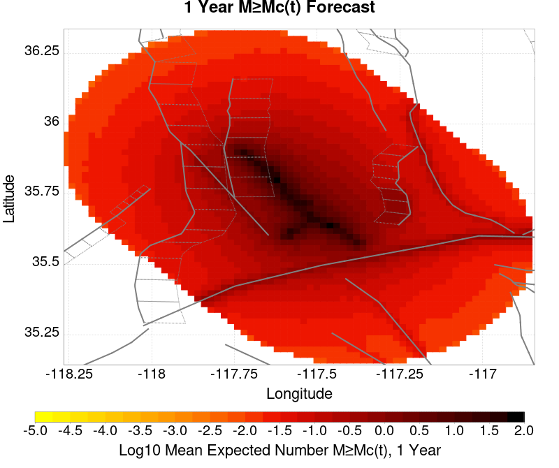
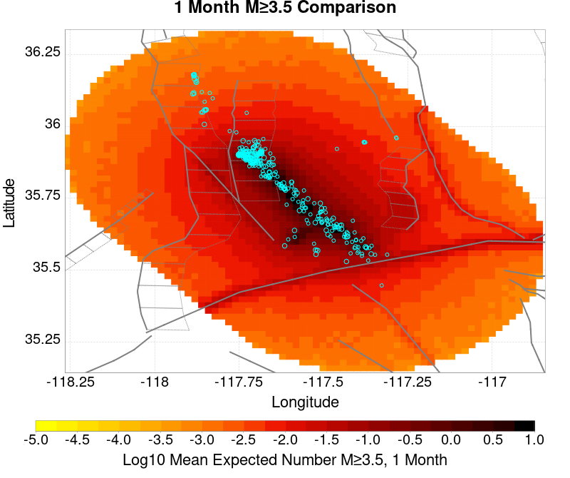

# ComCat M7.1 (ci38457511), ShakeMap Surfaces, FM2_1 Results

|   | ComCat M7.1 (ci38457511), ShakeMap Surfaces, FM2_1 |
|-----|-----|
| Num Simulations | 35346 (incomplete) |
| Start Time | 2019/07/06 03:19:54 UTC |
| Start Time Epoch Milliseconds | 1562383194040 |
| Duration | 10 Years |
| Includes Spontaneous? | false |
| Trigger Ruptures | 283 Trigger Ruptures |
|   | First: M3.98 at 2019/07/04 17:02:55 UTC |
|   | Last: M7.1 at 2019/07/06 03:19:53 UTC |
|   | Largest: M7.1 at 2019/07/06 03:19:53 UTC |
| Trigger Ruptures | *(none)* |
| Config Generated With | u3etas_comcat_event_config_builder.sh --event-id ci38457511 --mag-complete 3.5 --days-before 7 --num-simulations 1000000 --fault-model FM2_1 --finite-surf-shakemap --finite-surf-shakemap-min-mag 5 --hpc-site USC_HPC --nodes 36 --hours 24 --queue scec |

## Table Of Contents

* [Probabilities Summary Table](#probabilities-summary-table)
* [Magnitude Number Distribution](#magnitude-number-distribution)
  * [10 Year Magnitude Number Distribution](#10-year-magnitude-number-distribution)
  * [1 Year Magnitude Number Distribution](#1-year-magnitude-number-distribution)
  * [1 Month Magnitude Number Distribution](#1-month-magnitude-number-distribution)
  * [1 Week Magnitude Number Distribution](#1-week-magnitude-number-distribution)
  * [1 Day Magnitude Number Distribution](#1-day-magnitude-number-distribution)
  * [1 Hour Magnitude Number Distribution](#1-hour-magnitude-number-distribution)
* [Hazard Change Over Time](#hazard-change-over-time)
  * [M&ge;5.0 Hazard Change Over Time](#m50-hazard-change-over-time)
  * [M&ge;6.0 Hazard Change Over Time](#m60-hazard-change-over-time)
  * [M&ge;7.0 Hazard Change Over Time](#m70-hazard-change-over-time)
* [Trigger Rupture Fault Map](#trigger-rupture-fault-map)
* [Trigger Rupture Depth Map](#trigger-rupture-depth-map)
* [Fault Distances To Triggers](#fault-distances-to-triggers)
* [Individual Simulated Catalog Maps](#individual-simulated-catalog-maps)
* [ComCat Data Comparisons](#comcat-data-comparisons)
  * [ComCat Magnitude-Number Distributions](#comcat-magnitude-number-distributions)
  * [ComCat Time-Dependent Mc](#comcat-time-dependent-mc)
  * [ComCat Cumulative Number Vs Time](#comcat-cumulative-number-vs-time)
  * [ComCat Cumulative Number Simulation Percentiles](#comcat-cumulative-number-simulation-percentiles)
  * [ComCat Probability Spatial Distribution](#comcat-probability-spatial-distribution)
  * [ComCat Mean Expectation Spatial Distribution](#comcat-mean-expectation-spatial-distribution)
  * [ComCat Depth Distribution](#comcat-depth-distribution)
* [Section Participation](#section-participation)
  * [Section Participation Plots](#section-participation-plots)
  * [Supra-Seismogenic Parent Sections Table](#supra-seismogenic-parent-sections-table)
  * [M≥6.5 Parent Sections Table](#m65-parent-sections-table)
  * [M≥7 Parent Sections Table](#m7-parent-sections-table)
  * [M≥7.5 Parent Sections Table](#m75-parent-sections-table)
  * [M≥8 Parent Sections Table](#m8-parent-sections-table)
* [Fault Magnitude-Probability Distributions](#fault-magnitude-probability-distributions)
* [Gridded Nucleation](#gridded-nucleation)
* [JSON Input File](#json-input-file)

## Probabilities Summary Table
*[(top)](#table-of-contents)*

| Magnitude | 1 Hour Prob | 1 Day Prob | 1 Week Prob | 1 Month Prob | 1 Year Prob | 10 Year Prob |
|-----|-----|-----|-----|-----|-----|-----|
| **M&ge;4** | 1.000 (100.00%) | 1.000 (100.00%) | 1.000 (100.00%) | 1.000 (100.00%) | 1.000 (100.00%) | 1.000 (100.00%) |
| *95% Conf* | *[99.99% 100.00%]* | *[99.99% 100.00%]* | *[99.99% 100.00%]* | *[99.99% 100.00%]* | *[99.99% 100.00%]* | *[99.99% 100.00%]* |
| **M&ge;4.5** | 0.991 (99.07%) | 1.000 (100.00%) | 1.000 (100.00%) | 1.000 (100.00%) | 1.000 (100.00%) | 1.000 (100.00%) |
| *95% Conf* | *[98.97% 99.17%]* | *[99.99% 100.00%]* | *[99.99% 100.00%]* | *[99.99% 100.00%]* | *[99.99% 100.00%]* | *[99.99% 100.00%]* |
| **M&ge;5** | 0.766 (76.61%) | 0.976 (97.63%) | 0.995 (99.48%) | 0.998 (99.84%) | 1.000 (99.99%) | 1.000 (100.00%) |
| *95% Conf* | *[76.16% 77.05%]* | *[97.46% 97.78%]* | *[99.40% 99.55%]* | *[99.79% 99.87%]* | *[99.97% 100.00%]* | *[99.99% 100.00%]* |
| **M&ge;5.5** | 0.337 (33.67%) | 0.663 (66.31%) | 0.792 (79.23%) | 0.858 (85.81%) | 0.926 (92.62%) | 0.960 (96.02%) |
| *95% Conf* | *[33.18% 34.17%]* | *[65.81% 66.80%]* | *[78.80% 79.65%]* | *[85.44% 86.17%]* | *[92.34% 92.89%]* | *[95.81% 96.22%]* |
| **M&ge;6** | 0.080 (8.00%) | 0.209 (20.91%) | 0.294 (29.43%) | 0.355 (35.55%) | 0.457 (45.74%) | 0.536 (53.65%) |
| *95% Conf* | *[7.72% 8.29%]* | *[20.49% 21.34%]* | *[28.96% 29.91%]* | *[35.05% 36.05%]* | *[45.22% 46.26%]* | *[53.13% 54.17%]* |
| **M&ge;6.5** | 0.015 (1.47%) | 0.042 (4.19%) | 0.064 (6.44%) | 0.082 (8.16%) | 0.114 (11.44%) | 0.146 (14.59%) |
| *95% Conf* | *[1.35% 1.60%]* | *[3.99% 4.41%]* | *[6.19% 6.70%]* | *[7.88% 8.46%]* | *[11.11% 11.77%]* | *[14.23% 14.97%]* |
| **M&ge;7** | 4.07E-3 (0.41%) | 0.010 (1.03%) | 0.016 (1.56%) | 0.020 (1.99%) | 0.029 (2.88%) | 0.038 (3.84%) |
| *95% Conf* | *[0.34% 0.48%]* | *[0.93% 1.14%]* | *[1.44% 1.70%]* | *[1.85% 2.15%]* | *[2.71% 3.06%]* | *[3.65% 4.05%]* |
| **M&ge;7.1** | 2.97E-3 (0.30%) | 8.23E-3 (0.82%) | 0.013 (1.26%) | 0.016 (1.60%) | 0.023 (2.29%) | 0.031 (3.09%) |
| *95% Conf* | *[0.24% 0.36%]* | *[0.73% 0.92%]* | *[1.14% 1.38%]* | *[1.47% 1.74%]* | *[2.14% 2.45%]* | *[2.92% 3.28%]* |
| **M&ge;7.5** | 1.10E-3 (0.11%) | 3.20E-3 (0.32%) | 4.84E-3 (0.48%) | 6.39E-3 (0.64%) | 9.08E-3 (0.91%) | 0.012 (1.24%) |
| *95% Conf* | *[0.08% 0.15%]* | *[0.26% 0.39%]* | *[0.42% 0.56%]* | *[0.56% 0.73%]* | *[0.81% 1.01%]* | *[1.13% 1.36%]* |
| **M&ge;8** | 0.000 (0.00%) | 2.83E-5 (0.00%) | 5.66E-5 (0.01%) | 5.66E-5 (0.01%) | 8.49E-5 (0.01%) | 1.13E-4 (0.01%) |
| *95% Conf* | *[0.00% 0.01%]* | *[0.00% 0.02%]* | *[0.00% 0.02%]* | *[0.00% 0.02%]* | *[0.00% 0.03%]* | *[0.00% 0.03%]* |

## Magnitude Number Distribution
*[(top)](#table-of-contents)*

### 10 Year Magnitude Number Distribution
*[(top)](#table-of-contents)*

**Legend**
* **Mean** (thick black line): mean expected number across all 35346 catalogs
* **2.5%,97.5%** (thin black lines): expected number percentiles across all 35346 catalogs
* **Median** (thin blue line): median expected number across all 35346 catalogs
* **Mode** (thin cyan line): modal expected number across all 35346 catalogs
* **10 yr Probability** (thin red line): 10 year probability calculated as the fraction of catalogs with at least 1 occurrence
* **10 yr Supraseismogenic Probability** (thin dashed red line): same as above, but only for supraseismogenic ruptures on explicitly modeled UCERF3 faults
* **95% Conf** (light red shaded region): binomial 95% confidence bounds on probability
* **Primary** (thin green line): mean expected number from primary triggered aftershocks only (no secondary, tertiary, etc...) across all 35346 catalogs


| Mag | Mean | 2.5 %ile | 97.5 %ile | Median | Mode | 10 yr Probability | 10 yr Prob 95% Conf | 10 yr Supra-Seis Prob | Primary Aftershocks Mean |
|-----|-----|-----|-----|-----|-----|-----|-----|-----|-----|
| **M&ge;2.5** | 5029.269 | 3641.000 | 10343.000 | 4442.000 | 4083.000 | 1.000 (100.00%) | [99.99% 100.00%] | 0.121 (12.13%) | 2395.150 |
| **M&ge;2.6** | 3994.575 | 2885.000 | 8231.000 | 3529.000 | 3348.000 | 1.000 (100.00%) | [99.99% 100.00%] | 0.121 (12.13%) | 1902.279 |
| **M&ge;2.7** | 3172.783 | 2286.000 | 6537.000 | 2804.000 | 2718.000 | 1.000 (100.00%) | [99.99% 100.00%] | 0.121 (12.13%) | 1510.960 |
| **M&ge;2.8** | 2520.155 | 1813.000 | 5199.000 | 2228.000 | 2036.000 | 1.000 (100.00%) | [99.99% 100.00%] | 0.121 (12.13%) | 1200.277 |
| **M&ge;2.9** | 2001.843 | 1434.000 | 4135.000 | 1770.000 | 1669.000 | 1.000 (100.00%) | [99.99% 100.00%] | 0.121 (12.13%) | 953.362 |
| **M&ge;3** | 1590.030 | 1135.000 | 3284.000 | 1407.000 | 1321.000 | 1.000 (100.00%) | [99.99% 100.00%] | 0.121 (12.13%) | 757.309 |
| **M&ge;3.1** | 1262.795 | 897.000 | 2608.000 | 1117.000 | 1050.000 | 1.000 (100.00%) | [99.99% 100.00%] | 0.121 (12.13%) | 601.388 |
| **M&ge;3.2** | 1002.917 | 708.000 | 2071.000 | 888.000 | 851.000 | 1.000 (100.00%) | [99.99% 100.00%] | 0.121 (12.13%) | 477.636 |
| **M&ge;3.3** | 796.606 | 559.000 | 1644.000 | 706.000 | 678.000 | 1.000 (100.00%) | [99.99% 100.00%] | 0.121 (12.13%) | 379.438 |
| **M&ge;3.4** | 632.553 | 440.000 | 1304.000 | 561.000 | 522.000 | 1.000 (100.00%) | [99.99% 100.00%] | 0.121 (12.13%) | 301.331 |
| **M&ge;3.5** | 502.242 | 345.000 | 1040.000 | 446.000 | 412.000 | 1.000 (100.00%) | [99.99% 100.00%] | 0.121 (12.13%) | 239.262 |
| **M&ge;3.6** | 398.787 | 271.000 | 822.000 | 354.000 | 334.000 | 1.000 (100.00%) | [99.99% 100.00%] | 0.121 (12.13%) | 189.967 |
| **M&ge;3.7** | 316.638 | 213.000 | 655.000 | 282.000 | 270.000 | 1.000 (100.00%) | [99.99% 100.00%] | 0.121 (12.13%) | 150.839 |
| **M&ge;3.8** | 251.457 | 166.000 | 522.000 | 224.000 | 210.000 | 1.000 (100.00%) | [99.99% 100.00%] | 0.121 (12.13%) | 119.761 |
| **M&ge;3.9** | 199.602 | 129.000 | 415.000 | 178.000 | 165.000 | 1.000 (100.00%) | [99.99% 100.00%] | 0.121 (12.13%) | 95.088 |
| **M&ge;4** | 158.463 | 100.000 | 330.000 | 141.000 | 131.000 | 1.000 (100.00%) | [99.99% 100.00%] | 0.121 (12.13%) | 75.490 |
| **M&ge;4.1** | 125.767 | 78.000 | 263.000 | 112.000 | 106.000 | 1.000 (100.00%) | [99.99% 100.00%] | 0.121 (12.13%) | 59.912 |
| **M&ge;4.2** | 99.747 | 60.000 | 209.000 | 89.000 | 85.000 | 1.000 (100.00%) | [99.99% 100.00%] | 0.121 (12.13%) | 47.516 |
| **M&ge;4.3** | 79.112 | 46.000 | 167.000 | 71.000 | 66.000 | 1.000 (100.00%) | [99.99% 100.00%] | 0.121 (12.13%) | 37.684 |
| **M&ge;4.4** | 62.694 | 35.000 | 133.000 | 56.000 | 51.000 | 1.000 (100.00%) | [99.99% 100.00%] | 0.121 (12.13%) | 29.850 |
| **M&ge;4.5** | 49.670 | 26.000 | 106.000 | 44.000 | 41.000 | 1.000 (100.00%) | [99.99% 100.00%] | 0.121 (12.13%) | 23.639 |
| **M&ge;4.6** | 39.321 | 20.000 | 86.000 | 35.000 | 33.000 | 1.000 (100.00%) | [99.99% 100.00%] | 0.121 (12.13%) | 18.719 |
| **M&ge;4.7** | 31.075 | 15.000 | 69.000 | 28.000 | 25.000 | 1.000 (100.00%) | [99.99% 100.00%] | 0.121 (12.13%) | 14.789 |
| **M&ge;4.8** | 24.540 | 11.000 | 55.000 | 22.000 | 19.000 | 1.000 (100.00%) | [99.99% 100.00%] | 0.121 (12.13%) | 11.677 |
| **M&ge;4.9** | 19.354 | 8.000 | 44.000 | 17.000 | 15.000 | 1.000 (100.00%) | [99.99% 100.00%] | 0.121 (12.13%) | 9.208 |
| **M&ge;5** | 15.209 | 5.000 | 35.000 | 13.000 | 13.000 | 1.000 (100.00%) | [99.99% 100.00%] | 0.121 (12.13%) | 7.229 |
| **M&ge;5.1** | 11.917 | 4.000 | 28.000 | 11.000 | 10.000 | 1.000 (99.99%) | [99.96% 99.99%] | 0.121 (12.13%) | 5.660 |
| **M&ge;5.2** | 9.327 | 2.000 | 23.000 | 8.000 | 7.000 | 0.999 (99.88%) | [99.84% 99.92%] | 0.121 (12.13%) | 4.428 |
| **M&ge;5.3** | 7.254 | 1.000 | 19.000 | 6.000 | 5.000 | 0.995 (99.49%) | [99.41% 99.56%] | 0.121 (12.13%) | 3.444 |
| **M&ge;5.4** | 5.615 | 1.000 | 15.000 | 5.000 | 4.000 | 0.984 (98.39%) | [98.25% 98.52%] | 0.121 (12.13%) | 2.668 |
| **M&ge;5.5** | 4.319 | 0.000 | 12.000 | 4.000 | 3.000 | 0.960 (96.02%) | [95.81% 96.22%] | 0.121 (12.13%) | 2.046 |
| **M&ge;5.6** | 3.292 | 0.000 | 10.000 | 3.000 | 2.000 | 0.917 (91.73%) | [91.44% 92.01%] | 0.121 (12.13%) | 1.560 |
| **M&ge;5.7** | 2.472 | 0.000 | 8.000 | 2.000 | 1.000 | 0.851 (85.11%) | [84.74% 85.48%] | 0.121 (12.13%) | 1.168 |
| **M&ge;5.8** | 1.815 | 0.000 | 6.000 | 1.000 | 1.000 | 0.763 (76.32%) | [75.88% 76.76%] | 0.121 (12.13%) | 0.856 |
| **M&ge;5.9** | 1.300 | 0.000 | 5.000 | 1.000 | 0.000 | 0.651 (65.10%) | [64.60% 65.60%] | 0.121 (12.13%) | 0.612 |
| **M&ge;6** | 0.931 | 0.000 | 4.000 | 1.000 | 0.000 | 0.536 (53.65%) | [53.13% 54.17%] | 0.121 (12.13%) | 0.433 |
| **M&ge;6.1** | 0.672 | 0.000 | 3.000 | 0.000 | 0.000 | 0.429 (42.89%) | [42.38% 43.41%] | 0.121 (12.11%) | 0.307 |
| **M&ge;6.2** | 0.467 | 0.000 | 3.000 | 0.000 | 0.000 | 0.320 (32.03%) | [31.54% 32.52%] | 0.121 (12.11%) | 0.203 |
| **M&ge;6.3** | 0.368 | 0.000 | 2.000 | 0.000 | 0.000 | 0.264 (26.37%) | [25.91% 26.83%] | 0.121 (12.11%) | 0.154 |
| **M&ge;6.4** | 0.235 | 0.000 | 2.000 | 0.000 | 0.000 | 0.173 (17.33%) | [16.94% 17.73%] | 0.072 (7.15%) | 0.098 |
| **M&ge;6.5** | 0.196 | 0.000 | 2.000 | 0.000 | 0.000 | 0.146 (14.59%) | [14.23% 14.97%] | 0.072 (7.15%) | 0.079 |
| **M&ge;6.6** | 0.142 | 0.000 | 1.000 | 0.000 | 0.000 | 0.114 (11.42%) | [11.09% 11.76%] | 0.062 (6.18%) | 0.059 |
| **M&ge;6.7** | 0.112 | 0.000 | 1.000 | 0.000 | 0.000 | 0.090 (9.04%) | [8.74% 9.34%] | 0.054 (5.37%) | 0.046 |
| **M&ge;6.8** | 0.092 | 0.000 | 1.000 | 0.000 | 0.000 | 0.076 (7.58%) | [7.30% 7.86%] | 0.051 (5.14%) | 0.038 |
| **M&ge;6.9** | 0.056 | 0.000 | 1.000 | 0.000 | 0.000 | 0.047 (4.65%) | [4.44% 4.88%] | 0.030 (3.00%) | 0.023 |
| **M&ge;7** | 0.046 | 0.000 | 1.000 | 0.000 | 0.000 | 0.038 (3.84%) | [3.65% 4.05%] | 0.028 (2.80%) | 0.019 |
| **M&ge;7.1** | 0.036 | 0.000 | 1.000 | 0.000 | 0.000 | 0.031 (3.09%) | [2.92% 3.28%] | 0.025 (2.48%) | 0.015 |
| **M&ge;7.2** | 0.029 | 0.000 | 1.000 | 0.000 | 0.000 | 0.026 (2.55%) | [2.39% 2.73%] | 0.022 (2.21%) | 0.012 |
| **M&ge;7.3** | 0.022 | 0.000 | 0.000 | 0.000 | 0.000 | 0.019 (1.91%) | [1.77% 2.06%] | 0.018 (1.76%) | 9.00E-3 |
| **M&ge;7.4** | 0.018 | 0.000 | 0.000 | 0.000 | 0.000 | 0.016 (1.60%) | [1.47% 1.74%] | 0.015 (1.52%) | 8.06E-3 |
| **M&ge;7.5** | 0.014 | 0.000 | 0.000 | 0.000 | 0.000 | 0.012 (1.24%) | [1.13% 1.36%] | 0.012 (1.21%) | 5.91E-3 |
| **M&ge;7.6** | 0.013 | 0.000 | 0.000 | 0.000 | 0.000 | 0.011 (1.11%) | [1.01% 1.23%] | 0.011 (1.10%) | 5.26E-3 |
| **M&ge;7.7** | 5.29E-3 | 0.000 | 0.000 | 0.000 | 0.000 | 4.81E-3 (0.48%) | [0.41% 0.56%] | 4.67E-3 (0.47%) | 1.64E-3 |
| **M&ge;7.8** | 1.64E-3 | 0.000 | 0.000 | 0.000 | 0.000 | 1.61E-3 (0.16%) | [0.12% 0.21%] | 1.50E-3 (0.15%) | 2.55E-4 |
| **M&ge;7.9** | 4.53E-4 | 0.000 | 0.000 | 0.000 | 0.000 | 4.53E-4 (0.05%) | [0.03% 0.08%] | 4.53E-4 (0.05%) | 5.66E-5 |
| **M&ge;8** | 1.13E-4 | 0.000 | 0.000 | 0.000 | 0.000 | 1.13E-4 (0.01%) | [0.00% 0.03%] | 1.13E-4 (0.01%) | 2.83E-5 |
| **M&ge;8.1** | 8.49E-5 | 0.000 | 0.000 | 0.000 | 0.000 | 8.49E-5 (0.01%) | [0.00% 0.03%] | 8.49E-5 (0.01%) | 0.000 |
| **M&ge;8.2** | 0.000 | 0.000 | 0.000 | 0.000 | 0.000 | 0.000 (0.00%) | [0.00% 0.01%] | 0.000 (0.00%) | 0.000 |
| **M&ge;8.3** | 0.000 | 0.000 | 0.000 | 0.000 | 0.000 | 0.000 (0.00%) | [0.00% 0.01%] | 0.000 (0.00%) | 0.000 |
| **M&ge;8.4** | 0.000 | 0.000 | 0.000 | 0.000 | 0.000 | 0.000 (0.00%) | [0.00% 0.01%] | 0.000 (0.00%) | 0.000 |
| **M&ge;8.5** | 0.000 | 0.000 | 0.000 | 0.000 | 0.000 | 0.000 (0.00%) | [0.00% 0.01%] | 0.000 (0.00%) | 0.000 |
| **M&ge;8.6** | 0.000 | 0.000 | 0.000 | 0.000 | 0.000 | 0.000 (0.00%) | [0.00% 0.01%] | 0.000 (0.00%) | 0.000 |
| **M&ge;8.7** | 0.000 | 0.000 | 0.000 | 0.000 | 0.000 | 0.000 (0.00%) | [0.00% 0.01%] | 0.000 (0.00%) | 0.000 |
| **M&ge;8.8** | 0.000 | 0.000 | 0.000 | 0.000 | 0.000 | 0.000 (0.00%) | [0.00% 0.01%] | 0.000 (0.00%) | 0.000 |
| **M&ge;8.9** | 0.000 | 0.000 | 0.000 | 0.000 | 0.000 | 0.000 (0.00%) | [0.00% 0.01%] | 0.000 (0.00%) | 0.000 |
| **M&ge;9** | 0.000 | 0.000 | 0.000 | 0.000 | 0.000 | 0.000 (0.00%) | [0.00% 0.01%] | 0.000 (0.00%) | 0.000 |

### 1 Year Magnitude Number Distribution
*[(top)](#table-of-contents)*

**Legend**
* **Mean** (thick black line): mean expected number across all 35346 catalogs
* **2.5%,97.5%** (thin black lines): expected number percentiles across all 35346 catalogs
* **Median** (thin blue line): median expected number across all 35346 catalogs
* **Mode** (thin cyan line): modal expected number across all 35346 catalogs
* **1 yr Probability** (thin red line): 1 year probability calculated as the fraction of catalogs with at least 1 occurrence
* **1 yr Supraseismogenic Probability** (thin dashed red line): same as above, but only for supraseismogenic ruptures on explicitly modeled UCERF3 faults
* **95% Conf** (light red shaded region): binomial 95% confidence bounds on probability
* **Primary** (thin green line): mean expected number from primary triggered aftershocks only (no secondary, tertiary, etc...) across all 35346 catalogs


| Mag | Mean | 2.5 %ile | 97.5 %ile | Median | Mode | 1 yr Probability | 1 yr Prob 95% Conf | 1 yr Supra-Seis Prob | Primary Aftershocks Mean |
|-----|-----|-----|-----|-----|-----|-----|-----|-----|-----|
| **M&ge;2.5** | 3851.232 | 2940.000 | 6896.000 | 3492.000 | 3283.000 | 1.000 (100.00%) | [99.99% 100.00%] | 0.093 (9.34%) | 2086.210 |
| **M&ge;2.6** | 3058.859 | 2331.000 | 5486.000 | 2774.000 | 2637.000 | 1.000 (100.00%) | [99.99% 100.00%] | 0.093 (9.34%) | 1656.863 |
| **M&ge;2.7** | 2429.562 | 1846.000 | 4347.000 | 2204.000 | 2030.000 | 1.000 (100.00%) | [99.99% 100.00%] | 0.093 (9.34%) | 1316.033 |
| **M&ge;2.8** | 1929.800 | 1462.000 | 3463.000 | 1751.000 | 1709.000 | 1.000 (100.00%) | [99.99% 100.00%] | 0.093 (9.34%) | 1045.403 |
| **M&ge;2.9** | 1532.820 | 1156.000 | 2751.000 | 1391.000 | 1317.000 | 1.000 (100.00%) | [99.99% 100.00%] | 0.093 (9.34%) | 830.303 |
| **M&ge;3** | 1217.514 | 914.000 | 2184.000 | 1106.000 | 1053.000 | 1.000 (100.00%) | [99.99% 100.00%] | 0.093 (9.34%) | 659.569 |
| **M&ge;3.1** | 966.913 | 722.000 | 1736.000 | 879.000 | 840.000 | 1.000 (100.00%) | [99.99% 100.00%] | 0.093 (9.34%) | 523.778 |
| **M&ge;3.2** | 767.971 | 568.000 | 1381.000 | 698.000 | 649.000 | 1.000 (100.00%) | [99.99% 100.00%] | 0.093 (9.34%) | 415.980 |
| **M&ge;3.3** | 610.003 | 448.000 | 1099.000 | 555.000 | 521.000 | 1.000 (100.00%) | [99.99% 100.00%] | 0.093 (9.34%) | 330.452 |
| **M&ge;3.4** | 484.385 | 352.000 | 875.000 | 441.000 | 421.000 | 1.000 (100.00%) | [99.99% 100.00%] | 0.093 (9.34%) | 262.406 |
| **M&ge;3.5** | 384.628 | 276.000 | 692.000 | 351.000 | 333.000 | 1.000 (100.00%) | [99.99% 100.00%] | 0.093 (9.34%) | 208.353 |
| **M&ge;3.6** | 305.423 | 216.000 | 554.000 | 279.000 | 258.000 | 1.000 (100.00%) | [99.99% 100.00%] | 0.093 (9.34%) | 165.443 |
| **M&ge;3.7** | 242.485 | 169.000 | 438.000 | 222.000 | 202.000 | 1.000 (100.00%) | [99.99% 100.00%] | 0.093 (9.34%) | 131.355 |
| **M&ge;3.8** | 192.559 | 132.000 | 350.000 | 176.000 | 170.000 | 1.000 (100.00%) | [99.99% 100.00%] | 0.093 (9.34%) | 104.296 |
| **M&ge;3.9** | 152.886 | 102.000 | 279.000 | 140.000 | 137.000 | 1.000 (100.00%) | [99.99% 100.00%] | 0.093 (9.34%) | 82.824 |
| **M&ge;4** | 121.369 | 79.000 | 222.000 | 111.000 | 106.000 | 1.000 (100.00%) | [99.99% 100.00%] | 0.093 (9.34%) | 65.744 |
| **M&ge;4.1** | 96.338 | 61.000 | 178.000 | 88.000 | 84.000 | 1.000 (100.00%) | [99.99% 100.00%] | 0.093 (9.34%) | 52.184 |
| **M&ge;4.2** | 76.381 | 47.000 | 141.000 | 70.000 | 67.000 | 1.000 (100.00%) | [99.99% 100.00%] | 0.093 (9.34%) | 41.377 |
| **M&ge;4.3** | 60.575 | 36.000 | 114.000 | 56.000 | 52.000 | 1.000 (100.00%) | [99.99% 100.00%] | 0.093 (9.34%) | 32.819 |
| **M&ge;4.4** | 48.002 | 27.000 | 91.000 | 44.000 | 40.000 | 1.000 (100.00%) | [99.99% 100.00%] | 0.093 (9.34%) | 25.996 |
| **M&ge;4.5** | 38.029 | 20.000 | 73.000 | 35.000 | 33.000 | 1.000 (100.00%) | [99.99% 100.00%] | 0.093 (9.34%) | 20.591 |
| **M&ge;4.6** | 30.101 | 15.000 | 59.000 | 28.000 | 25.000 | 1.000 (100.00%) | [99.99% 100.00%] | 0.093 (9.34%) | 16.300 |
| **M&ge;4.7** | 23.785 | 11.000 | 47.000 | 22.000 | 21.000 | 1.000 (100.00%) | [99.99% 100.00%] | 0.093 (9.34%) | 12.871 |
| **M&ge;4.8** | 18.778 | 8.000 | 39.000 | 17.000 | 16.000 | 1.000 (100.00%) | [99.99% 100.00%] | 0.093 (9.34%) | 10.156 |
| **M&ge;4.9** | 14.809 | 6.000 | 31.000 | 13.000 | 13.000 | 1.000 (100.00%) | [99.99% 100.00%] | 0.093 (9.34%) | 8.007 |
| **M&ge;5** | 11.634 | 4.000 | 25.000 | 11.000 | 9.000 | 1.000 (99.99%) | [99.97% 100.00%] | 0.093 (9.34%) | 6.284 |
| **M&ge;5.1** | 9.111 | 2.000 | 21.000 | 8.000 | 7.000 | 0.999 (99.92%) | [99.88% 99.94%] | 0.093 (9.34%) | 4.922 |
| **M&ge;5.2** | 7.131 | 2.000 | 17.000 | 6.000 | 6.000 | 0.996 (99.64%) | [99.57% 99.70%] | 0.093 (9.34%) | 3.848 |
| **M&ge;5.3** | 5.541 | 1.000 | 14.000 | 5.000 | 4.000 | 0.987 (98.68%) | [98.56% 98.80%] | 0.093 (9.34%) | 2.990 |
| **M&ge;5.4** | 4.292 | 0.000 | 11.000 | 4.000 | 3.000 | 0.965 (96.53%) | [96.34% 96.72%] | 0.093 (9.34%) | 2.317 |
| **M&ge;5.5** | 3.299 | 0.000 | 9.000 | 3.000 | 2.000 | 0.926 (92.62%) | [92.34% 92.89%] | 0.093 (9.34%) | 1.777 |
| **M&ge;5.6** | 2.517 | 0.000 | 8.000 | 2.000 | 2.000 | 0.868 (86.84%) | [86.48% 87.19%] | 0.093 (9.34%) | 1.356 |
| **M&ge;5.7** | 1.887 | 0.000 | 6.000 | 2.000 | 1.000 | 0.786 (78.59%) | [78.16% 79.01%] | 0.093 (9.34%) | 1.014 |
| **M&ge;5.8** | 1.383 | 0.000 | 5.000 | 1.000 | 1.000 | 0.686 (68.56%) | [68.07% 69.04%] | 0.093 (9.34%) | 0.742 |
| **M&ge;5.9** | 0.990 | 0.000 | 4.000 | 1.000 | 0.000 | 0.569 (56.93%) | [56.41% 57.44%] | 0.093 (9.34%) | 0.530 |
| **M&ge;6** | 0.708 | 0.000 | 3.000 | 0.000 | 0.000 | 0.457 (45.74%) | [45.22% 46.26%] | 0.093 (9.34%) | 0.375 |
| **M&ge;6.1** | 0.509 | 0.000 | 3.000 | 0.000 | 0.000 | 0.356 (35.63%) | [35.13% 36.14%] | 0.093 (9.32%) | 0.265 |
| **M&ge;6.2** | 0.348 | 0.000 | 2.000 | 0.000 | 0.000 | 0.259 (25.87%) | [25.41% 26.33%] | 0.093 (9.32%) | 0.174 |
| **M&ge;6.3** | 0.273 | 0.000 | 2.000 | 0.000 | 0.000 | 0.211 (21.10%) | [20.67% 21.53%] | 0.093 (9.32%) | 0.133 |
| **M&ge;6.4** | 0.172 | 0.000 | 1.000 | 0.000 | 0.000 | 0.137 (13.67%) | [13.32% 14.04%] | 0.055 (5.54%) | 0.084 |
| **M&ge;6.5** | 0.144 | 0.000 | 1.000 | 0.000 | 0.000 | 0.114 (11.44%) | [11.11% 11.77%] | 0.055 (5.54%) | 0.068 |
| **M&ge;6.6** | 0.104 | 0.000 | 1.000 | 0.000 | 0.000 | 0.089 (8.87%) | [8.57% 9.17%] | 0.048 (4.78%) | 0.051 |
| **M&ge;6.7** | 0.081 | 0.000 | 1.000 | 0.000 | 0.000 | 0.069 (6.95%) | [6.69% 7.22%] | 0.041 (4.14%) | 0.039 |
| **M&ge;6.8** | 0.068 | 0.000 | 1.000 | 0.000 | 0.000 | 0.059 (5.86%) | [5.62% 6.11%] | 0.040 (3.99%) | 0.033 |
| **M&ge;6.9** | 0.040 | 0.000 | 1.000 | 0.000 | 0.000 | 0.035 (3.52%) | [3.33% 3.72%] | 0.023 (2.27%) | 0.019 |
| **M&ge;7** | 0.033 | 0.000 | 1.000 | 0.000 | 0.000 | 0.029 (2.88%) | [2.71% 3.06%] | 0.021 (2.10%) | 0.016 |
| **M&ge;7.1** | 0.026 | 0.000 | 0.000 | 0.000 | 0.000 | 0.023 (2.29%) | [2.14% 2.45%] | 0.019 (1.85%) | 0.012 |
| **M&ge;7.2** | 0.021 | 0.000 | 0.000 | 0.000 | 0.000 | 0.019 (1.91%) | [1.77% 2.06%] | 0.017 (1.65%) | 0.010 |
| **M&ge;7.3** | 0.016 | 0.000 | 0.000 | 0.000 | 0.000 | 0.014 (1.42%) | [1.30% 1.55%] | 0.013 (1.30%) | 7.44E-3 |
| **M&ge;7.4** | 0.013 | 0.000 | 0.000 | 0.000 | 0.000 | 0.012 (1.21%) | [1.10% 1.33%] | 0.011 (1.14%) | 6.73E-3 |
| **M&ge;7.5** | 0.010 | 0.000 | 0.000 | 0.000 | 0.000 | 9.08E-3 (0.91%) | [0.81% 1.01%] | 8.83E-3 (0.88%) | 4.75E-3 |
| **M&ge;7.6** | 9.19E-3 | 0.000 | 0.000 | 0.000 | 0.000 | 8.15E-3 (0.81%) | [0.72% 0.92%] | 8.03E-3 (0.80%) | 4.22E-3 |
| **M&ge;7.7** | 3.51E-3 | 0.000 | 0.000 | 0.000 | 0.000 | 3.34E-3 (0.33%) | [0.28% 0.40%] | 3.23E-3 (0.32%) | 1.27E-3 |
| **M&ge;7.8** | 9.90E-4 | 0.000 | 0.000 | 0.000 | 0.000 | 9.90E-4 (0.10%) | [0.07% 0.14%] | 9.05E-4 (0.09%) | 1.41E-4 |
| **M&ge;7.9** | 3.40E-4 | 0.000 | 0.000 | 0.000 | 0.000 | 3.40E-4 (0.03%) | [0.02% 0.06%] | 3.40E-4 (0.03%) | 5.66E-5 |
| **M&ge;8** | 8.49E-5 | 0.000 | 0.000 | 0.000 | 0.000 | 8.49E-5 (0.01%) | [0.00% 0.03%] | 8.49E-5 (0.01%) | 2.83E-5 |
| **M&ge;8.1** | 5.66E-5 | 0.000 | 0.000 | 0.000 | 0.000 | 5.66E-5 (0.01%) | [0.00% 0.02%] | 5.66E-5 (0.01%) | 0.000 |
| **M&ge;8.2** | 0.000 | 0.000 | 0.000 | 0.000 | 0.000 | 0.000 (0.00%) | [0.00% 0.01%] | 0.000 (0.00%) | 0.000 |
| **M&ge;8.3** | 0.000 | 0.000 | 0.000 | 0.000 | 0.000 | 0.000 (0.00%) | [0.00% 0.01%] | 0.000 (0.00%) | 0.000 |
| **M&ge;8.4** | 0.000 | 0.000 | 0.000 | 0.000 | 0.000 | 0.000 (0.00%) | [0.00% 0.01%] | 0.000 (0.00%) | 0.000 |
| **M&ge;8.5** | 0.000 | 0.000 | 0.000 | 0.000 | 0.000 | 0.000 (0.00%) | [0.00% 0.01%] | 0.000 (0.00%) | 0.000 |
| **M&ge;8.6** | 0.000 | 0.000 | 0.000 | 0.000 | 0.000 | 0.000 (0.00%) | [0.00% 0.01%] | 0.000 (0.00%) | 0.000 |
| **M&ge;8.7** | 0.000 | 0.000 | 0.000 | 0.000 | 0.000 | 0.000 (0.00%) | [0.00% 0.01%] | 0.000 (0.00%) | 0.000 |
| **M&ge;8.8** | 0.000 | 0.000 | 0.000 | 0.000 | 0.000 | 0.000 (0.00%) | [0.00% 0.01%] | 0.000 (0.00%) | 0.000 |
| **M&ge;8.9** | 0.000 | 0.000 | 0.000 | 0.000 | 0.000 | 0.000 (0.00%) | [0.00% 0.01%] | 0.000 (0.00%) | 0.000 |
| **M&ge;9** | 0.000 | 0.000 | 0.000 | 0.000 | 0.000 | 0.000 (0.00%) | [0.00% 0.01%] | 0.000 (0.00%) | 0.000 |

### 1 Month Magnitude Number Distribution
*[(top)](#table-of-contents)*

**Legend**
* **Mean** (thick black line): mean expected number across all 35346 catalogs
* **2.5%,97.5%** (thin black lines): expected number percentiles across all 35346 catalogs
* **Median** (thin blue line): median expected number across all 35346 catalogs
* **Mode** (thin cyan line): modal expected number across all 35346 catalogs
* **1 mo Probability** (thin red line): 1 month probability calculated as the fraction of catalogs with at least 1 occurrence
* **1 mo Supraseismogenic Probability** (thin dashed red line): same as above, but only for supraseismogenic ruptures on explicitly modeled UCERF3 faults
* **95% Conf** (light red shaded region): binomial 95% confidence bounds on probability
* **Primary** (thin green line): mean expected number from primary triggered aftershocks only (no secondary, tertiary, etc...) across all 35346 catalogs


| Mag | Mean | 2.5 %ile | 97.5 %ile | Median | Mode | 1 mo Probability | 1 mo Prob 95% Conf | 1 mo Supra-Seis Prob | Primary Aftershocks Mean |
|-----|-----|-----|-----|-----|-----|-----|-----|-----|-----|
| **M&ge;2.5** | 2710.555 | 2182.000 | 4208.000 | 2514.000 | 2372.000 | 1.000 (100.00%) | [99.99% 100.00%] | 0.066 (6.57%) | 1690.916 |
| **M&ge;2.6** | 2152.915 | 1728.000 | 3344.000 | 1998.000 | 1977.000 | 1.000 (100.00%) | [99.99% 100.00%] | 0.066 (6.57%) | 1342.984 |
| **M&ge;2.7** | 1710.060 | 1367.000 | 2659.000 | 1588.000 | 1532.000 | 1.000 (100.00%) | [99.99% 100.00%] | 0.066 (6.57%) | 1066.742 |
| **M&ge;2.8** | 1358.277 | 1081.000 | 2112.000 | 1262.000 | 1183.000 | 1.000 (100.00%) | [99.99% 100.00%] | 0.066 (6.57%) | 847.353 |
| **M&ge;2.9** | 1078.858 | 854.000 | 1678.000 | 1002.000 | 950.000 | 1.000 (100.00%) | [99.99% 100.00%] | 0.066 (6.57%) | 672.996 |
| **M&ge;3** | 856.880 | 674.000 | 1338.000 | 797.000 | 781.000 | 1.000 (100.00%) | [99.99% 100.00%] | 0.066 (6.57%) | 534.561 |
| **M&ge;3.1** | 680.487 | 531.000 | 1065.000 | 633.000 | 597.000 | 1.000 (100.00%) | [99.99% 100.00%] | 0.066 (6.57%) | 424.531 |
| **M&ge;3.2** | 540.495 | 418.000 | 846.000 | 503.000 | 471.000 | 1.000 (100.00%) | [99.99% 100.00%] | 0.066 (6.57%) | 337.170 |
| **M&ge;3.3** | 429.336 | 329.000 | 673.000 | 400.000 | 382.000 | 1.000 (100.00%) | [99.99% 100.00%] | 0.066 (6.57%) | 267.869 |
| **M&ge;3.4** | 340.929 | 258.000 | 538.000 | 318.000 | 312.000 | 1.000 (100.00%) | [99.99% 100.00%] | 0.066 (6.57%) | 212.728 |
| **M&ge;3.5** | 270.671 | 202.000 | 430.000 | 253.000 | 247.000 | 1.000 (100.00%) | [99.99% 100.00%] | 0.066 (6.57%) | 168.895 |
| **M&ge;3.6** | 214.946 | 157.000 | 343.000 | 201.000 | 200.000 | 1.000 (100.00%) | [99.99% 100.00%] | 0.066 (6.57%) | 134.106 |
| **M&ge;3.7** | 170.647 | 122.000 | 272.000 | 160.000 | 151.000 | 1.000 (100.00%) | [99.99% 100.00%] | 0.066 (6.57%) | 106.470 |
| **M&ge;3.8** | 135.498 | 95.000 | 217.000 | 127.000 | 125.000 | 1.000 (100.00%) | [99.99% 100.00%] | 0.066 (6.57%) | 84.527 |
| **M&ge;3.9** | 107.578 | 74.000 | 173.000 | 101.000 | 95.000 | 1.000 (100.00%) | [99.99% 100.00%] | 0.066 (6.57%) | 67.125 |
| **M&ge;4** | 85.410 | 56.000 | 139.000 | 80.000 | 79.000 | 1.000 (100.00%) | [99.99% 100.00%] | 0.066 (6.57%) | 53.284 |
| **M&ge;4.1** | 67.798 | 43.000 | 111.000 | 64.000 | 60.000 | 1.000 (100.00%) | [99.99% 100.00%] | 0.066 (6.57%) | 42.291 |
| **M&ge;4.2** | 53.750 | 33.000 | 90.000 | 50.000 | 48.000 | 1.000 (100.00%) | [99.99% 100.00%] | 0.066 (6.57%) | 33.526 |
| **M&ge;4.3** | 42.654 | 25.000 | 73.000 | 40.000 | 39.000 | 1.000 (100.00%) | [99.99% 100.00%] | 0.066 (6.57%) | 26.607 |
| **M&ge;4.4** | 33.816 | 19.000 | 59.000 | 32.000 | 30.000 | 1.000 (100.00%) | [99.99% 100.00%] | 0.066 (6.57%) | 21.084 |
| **M&ge;4.5** | 26.801 | 14.000 | 48.000 | 25.000 | 25.000 | 1.000 (100.00%) | [99.99% 100.00%] | 0.066 (6.57%) | 16.705 |
| **M&ge;4.6** | 21.214 | 10.000 | 39.000 | 20.000 | 19.000 | 1.000 (100.00%) | [99.99% 100.00%] | 0.066 (6.57%) | 13.228 |
| **M&ge;4.7** | 16.761 | 7.000 | 32.000 | 16.000 | 15.000 | 1.000 (100.00%) | [99.99% 100.00%] | 0.066 (6.57%) | 10.443 |
| **M&ge;4.8** | 13.239 | 5.000 | 26.000 | 12.000 | 12.000 | 1.000 (100.00%) | [99.99% 100.00%] | 0.066 (6.57%) | 8.243 |
| **M&ge;4.9** | 10.437 | 3.000 | 22.000 | 10.000 | 9.000 | 1.000 (99.97%) | [99.95% 99.99%] | 0.066 (6.57%) | 6.502 |
| **M&ge;5** | 8.197 | 2.000 | 18.000 | 8.000 | 6.000 | 0.998 (99.84%) | [99.79% 99.87%] | 0.066 (6.57%) | 5.103 |
| **M&ge;5.1** | 6.415 | 1.000 | 14.000 | 6.000 | 5.000 | 0.994 (99.43%) | [99.34% 99.50%] | 0.066 (6.57%) | 3.992 |
| **M&ge;5.2** | 5.020 | 1.000 | 12.000 | 4.000 | 4.000 | 0.984 (98.37%) | [98.23% 98.50%] | 0.066 (6.57%) | 3.119 |
| **M&ge;5.3** | 3.897 | 0.000 | 10.000 | 3.000 | 3.000 | 0.960 (96.04%) | [95.83% 96.24%] | 0.066 (6.57%) | 2.423 |
| **M&ge;5.4** | 3.014 | 0.000 | 8.000 | 3.000 | 2.000 | 0.920 (92.02%) | [91.74% 92.30%] | 0.066 (6.57%) | 1.875 |
| **M&ge;5.5** | 2.316 | 0.000 | 7.000 | 2.000 | 1.000 | 0.858 (85.81%) | [85.44% 86.17%] | 0.066 (6.57%) | 1.438 |
| **M&ge;5.6** | 1.766 | 0.000 | 6.000 | 1.000 | 1.000 | 0.778 (77.85%) | [77.41% 78.28%] | 0.066 (6.57%) | 1.097 |
| **M&ge;5.7** | 1.323 | 0.000 | 5.000 | 1.000 | 1.000 | 0.682 (68.17%) | [67.69% 68.66%] | 0.066 (6.57%) | 0.820 |
| **M&ge;5.8** | 0.968 | 0.000 | 4.000 | 1.000 | 0.000 | 0.574 (57.39%) | [56.87% 57.91%] | 0.066 (6.57%) | 0.600 |
| **M&ge;5.9** | 0.690 | 0.000 | 3.000 | 0.000 | 0.000 | 0.458 (45.80%) | [45.28% 46.32%] | 0.066 (6.57%) | 0.427 |
| **M&ge;6** | 0.491 | 0.000 | 3.000 | 0.000 | 0.000 | 0.355 (35.55%) | [35.05% 36.05%] | 0.066 (6.57%) | 0.302 |
| **M&ge;6.1** | 0.351 | 0.000 | 2.000 | 0.000 | 0.000 | 0.270 (27.00%) | [26.54% 27.47%] | 0.066 (6.56%) | 0.211 |
| **M&ge;6.2** | 0.235 | 0.000 | 2.000 | 0.000 | 0.000 | 0.191 (19.07%) | [18.66% 19.49%] | 0.066 (6.56%) | 0.138 |
| **M&ge;6.3** | 0.184 | 0.000 | 1.000 | 0.000 | 0.000 | 0.153 (15.31%) | [14.94% 15.69%] | 0.066 (6.56%) | 0.105 |
| **M&ge;6.4** | 0.116 | 0.000 | 1.000 | 0.000 | 0.000 | 0.098 (9.80%) | [9.50% 10.12%] | 0.040 (4.04%) | 0.067 |
| **M&ge;6.5** | 0.097 | 0.000 | 1.000 | 0.000 | 0.000 | 0.082 (8.16%) | [7.88% 8.46%] | 0.040 (4.03%) | 0.054 |
| **M&ge;6.6** | 0.071 | 0.000 | 1.000 | 0.000 | 0.000 | 0.064 (6.35%) | [6.10% 6.61%] | 0.035 (3.47%) | 0.042 |
| **M&ge;6.7** | 0.056 | 0.000 | 1.000 | 0.000 | 0.000 | 0.050 (4.99%) | [4.77% 5.23%] | 0.030 (3.00%) | 0.033 |
| **M&ge;6.8** | 0.047 | 0.000 | 1.000 | 0.000 | 0.000 | 0.042 (4.23%) | [4.03% 4.45%] | 0.029 (2.89%) | 0.027 |
| **M&ge;6.9** | 0.027 | 0.000 | 0.000 | 0.000 | 0.000 | 0.024 (2.44%) | [2.29% 2.61%] | 0.016 (1.59%) | 0.016 |
| **M&ge;7** | 0.022 | 0.000 | 0.000 | 0.000 | 0.000 | 0.020 (1.99%) | [1.85% 2.15%] | 0.015 (1.47%) | 0.013 |
| **M&ge;7.1** | 0.017 | 0.000 | 0.000 | 0.000 | 0.000 | 0.016 (1.60%) | [1.47% 1.74%] | 0.013 (1.31%) | 0.010 |
| **M&ge;7.2** | 0.014 | 0.000 | 0.000 | 0.000 | 0.000 | 0.013 (1.32%) | [1.21% 1.45%] | 0.011 (1.15%) | 8.32E-3 |
| **M&ge;7.3** | 0.011 | 0.000 | 0.000 | 0.000 | 0.000 | 9.93E-3 (0.99%) | [0.89% 1.10%] | 9.08E-3 (0.91%) | 6.34E-3 |
| **M&ge;7.4** | 9.14E-3 | 0.000 | 0.000 | 0.000 | 0.000 | 8.54E-3 (0.85%) | [0.76% 0.96%] | 8.06E-3 (0.81%) | 5.71E-3 |
| **M&ge;7.5** | 6.96E-3 | 0.000 | 0.000 | 0.000 | 0.000 | 6.39E-3 (0.64%) | [0.56% 0.73%] | 6.22E-3 (0.62%) | 4.05E-3 |
| **M&ge;7.6** | 6.22E-3 | 0.000 | 0.000 | 0.000 | 0.000 | 5.66E-3 (0.57%) | [0.49% 0.65%] | 5.60E-3 (0.56%) | 3.56E-3 |
| **M&ge;7.7** | 2.09E-3 | 0.000 | 0.000 | 0.000 | 0.000 | 1.98E-3 (0.20%) | [0.16% 0.25%] | 1.92E-3 (0.19%) | 9.34E-4 |
| **M&ge;7.8** | 5.66E-4 | 0.000 | 0.000 | 0.000 | 0.000 | 5.66E-4 (0.06%) | [0.04% 0.09%] | 5.38E-4 (0.05%) | 1.13E-4 |
| **M&ge;7.9** | 1.98E-4 | 0.000 | 0.000 | 0.000 | 0.000 | 1.98E-4 (0.02%) | [0.01% 0.04%] | 1.98E-4 (0.02%) | 5.66E-5 |
| **M&ge;8** | 5.66E-5 | 0.000 | 0.000 | 0.000 | 0.000 | 5.66E-5 (0.01%) | [0.00% 0.02%] | 5.66E-5 (0.01%) | 2.83E-5 |
| **M&ge;8.1** | 2.83E-5 | 0.000 | 0.000 | 0.000 | 0.000 | 2.83E-5 (0.00%) | [0.00% 0.02%] | 2.83E-5 (0.00%) | 0.000 |
| **M&ge;8.2** | 0.000 | 0.000 | 0.000 | 0.000 | 0.000 | 0.000 (0.00%) | [0.00% 0.01%] | 0.000 (0.00%) | 0.000 |
| **M&ge;8.3** | 0.000 | 0.000 | 0.000 | 0.000 | 0.000 | 0.000 (0.00%) | [0.00% 0.01%] | 0.000 (0.00%) | 0.000 |
| **M&ge;8.4** | 0.000 | 0.000 | 0.000 | 0.000 | 0.000 | 0.000 (0.00%) | [0.00% 0.01%] | 0.000 (0.00%) | 0.000 |
| **M&ge;8.5** | 0.000 | 0.000 | 0.000 | 0.000 | 0.000 | 0.000 (0.00%) | [0.00% 0.01%] | 0.000 (0.00%) | 0.000 |
| **M&ge;8.6** | 0.000 | 0.000 | 0.000 | 0.000 | 0.000 | 0.000 (0.00%) | [0.00% 0.01%] | 0.000 (0.00%) | 0.000 |
| **M&ge;8.7** | 0.000 | 0.000 | 0.000 | 0.000 | 0.000 | 0.000 (0.00%) | [0.00% 0.01%] | 0.000 (0.00%) | 0.000 |
| **M&ge;8.8** | 0.000 | 0.000 | 0.000 | 0.000 | 0.000 | 0.000 (0.00%) | [0.00% 0.01%] | 0.000 (0.00%) | 0.000 |
| **M&ge;8.9** | 0.000 | 0.000 | 0.000 | 0.000 | 0.000 | 0.000 (0.00%) | [0.00% 0.01%] | 0.000 (0.00%) | 0.000 |
| **M&ge;9** | 0.000 | 0.000 | 0.000 | 0.000 | 0.000 | 0.000 (0.00%) | [0.00% 0.01%] | 0.000 (0.00%) | 0.000 |

### 1 Week Magnitude Number Distribution
*[(top)](#table-of-contents)*

**Legend**
* **Mean** (thick black line): mean expected number across all 35346 catalogs
* **2.5%,97.5%** (thin black lines): expected number percentiles across all 35346 catalogs
* **Median** (thin blue line): median expected number across all 35346 catalogs
* **Mode** (thin cyan line): modal expected number across all 35346 catalogs
* **1 wk Probability** (thin red line): 1 week probability calculated as the fraction of catalogs with at least 1 occurrence
* **1 wk Supraseismogenic Probability** (thin dashed red line): same as above, but only for supraseismogenic ruptures on explicitly modeled UCERF3 faults
* **95% Conf** (light red shaded region): binomial 95% confidence bounds on probability
* **Primary** (thin green line): mean expected number from primary triggered aftershocks only (no secondary, tertiary, etc...) across all 35346 catalogs


| Mag | Mean | 2.5 %ile | 97.5 %ile | Median | Mode | 1 wk Probability | 1 wk Prob 95% Conf | 1 wk Supra-Seis Prob | Primary Aftershocks Mean |
|-----|-----|-----|-----|-----|-----|-----|-----|-----|-----|
| **M&ge;2.5** | 2109.450 | 1748.000 | 3100.000 | 1984.000 | 1912.000 | 1.000 (100.00%) | [99.99% 100.00%] | 0.052 (5.23%) | 1431.608 |
| **M&ge;2.6** | 1675.431 | 1383.000 | 2462.000 | 1577.000 | 1539.000 | 1.000 (100.00%) | [99.99% 100.00%] | 0.052 (5.23%) | 1136.963 |
| **M&ge;2.7** | 1330.814 | 1093.000 | 1958.000 | 1253.000 | 1200.000 | 1.000 (100.00%) | [99.99% 100.00%] | 0.052 (5.23%) | 903.102 |
| **M&ge;2.8** | 1057.097 | 864.000 | 1556.000 | 995.000 | 964.000 | 1.000 (100.00%) | [99.99% 100.00%] | 0.052 (5.23%) | 717.388 |
| **M&ge;2.9** | 839.621 | 682.000 | 1242.000 | 791.000 | 754.000 | 1.000 (100.00%) | [99.99% 100.00%] | 0.052 (5.23%) | 569.767 |
| **M&ge;3** | 666.888 | 538.000 | 987.000 | 629.000 | 620.000 | 1.000 (100.00%) | [99.99% 100.00%] | 0.052 (5.23%) | 452.592 |
| **M&ge;3.1** | 529.586 | 423.000 | 786.000 | 500.000 | 486.000 | 1.000 (100.00%) | [99.99% 100.00%] | 0.052 (5.23%) | 359.433 |
| **M&ge;3.2** | 420.673 | 333.000 | 627.000 | 397.000 | 379.000 | 1.000 (100.00%) | [99.99% 100.00%] | 0.052 (5.23%) | 285.496 |
| **M&ge;3.3** | 334.171 | 261.000 | 498.000 | 316.000 | 311.000 | 1.000 (100.00%) | [99.99% 100.00%] | 0.052 (5.23%) | 226.821 |
| **M&ge;3.4** | 265.356 | 204.000 | 396.000 | 251.000 | 245.000 | 1.000 (100.00%) | [99.99% 100.00%] | 0.052 (5.23%) | 180.119 |
| **M&ge;3.5** | 210.680 | 159.000 | 316.000 | 200.000 | 195.000 | 1.000 (100.00%) | [99.99% 100.00%] | 0.052 (5.23%) | 142.995 |
| **M&ge;3.6** | 167.332 | 124.000 | 253.000 | 159.000 | 149.000 | 1.000 (100.00%) | [99.99% 100.00%] | 0.052 (5.23%) | 113.563 |
| **M&ge;3.7** | 132.838 | 96.000 | 202.000 | 126.000 | 125.000 | 1.000 (100.00%) | [99.99% 100.00%] | 0.052 (5.23%) | 90.159 |
| **M&ge;3.8** | 105.477 | 74.000 | 162.000 | 100.000 | 100.000 | 1.000 (100.00%) | [99.99% 100.00%] | 0.052 (5.23%) | 71.578 |
| **M&ge;3.9** | 83.743 | 57.000 | 129.000 | 80.000 | 76.000 | 1.000 (100.00%) | [99.99% 100.00%] | 0.052 (5.23%) | 56.838 |
| **M&ge;4** | 66.483 | 44.000 | 104.000 | 63.000 | 60.000 | 1.000 (100.00%) | [99.99% 100.00%] | 0.052 (5.23%) | 45.111 |
| **M&ge;4.1** | 52.782 | 33.000 | 83.000 | 50.000 | 50.000 | 1.000 (100.00%) | [99.99% 100.00%] | 0.052 (5.23%) | 35.803 |
| **M&ge;4.2** | 41.857 | 25.000 | 67.000 | 40.000 | 39.000 | 1.000 (100.00%) | [99.99% 100.00%] | 0.052 (5.23%) | 28.388 |
| **M&ge;4.3** | 33.210 | 19.000 | 55.000 | 32.000 | 31.000 | 1.000 (100.00%) | [99.99% 100.00%] | 0.052 (5.23%) | 22.522 |
| **M&ge;4.4** | 26.330 | 14.000 | 45.000 | 25.000 | 22.000 | 1.000 (100.00%) | [99.99% 100.00%] | 0.052 (5.23%) | 17.846 |
| **M&ge;4.5** | 20.861 | 10.000 | 37.000 | 20.000 | 19.000 | 1.000 (100.00%) | [99.99% 100.00%] | 0.052 (5.23%) | 14.137 |
| **M&ge;4.6** | 16.513 | 7.000 | 30.000 | 16.000 | 15.000 | 1.000 (100.00%) | [99.99% 100.00%] | 0.052 (5.23%) | 11.195 |
| **M&ge;4.7** | 13.038 | 5.000 | 24.000 | 12.000 | 11.000 | 1.000 (100.00%) | [99.99% 100.00%] | 0.052 (5.23%) | 8.832 |
| **M&ge;4.8** | 10.297 | 4.000 | 20.000 | 10.000 | 9.000 | 1.000 (99.97%) | [99.95% 99.99%] | 0.052 (5.23%) | 6.970 |
| **M&ge;4.9** | 8.114 | 2.000 | 17.000 | 8.000 | 7.000 | 0.999 (99.87%) | [99.83% 99.91%] | 0.052 (5.23%) | 5.496 |
| **M&ge;5** | 6.371 | 1.000 | 14.000 | 6.000 | 5.000 | 0.995 (99.48%) | [99.40% 99.55%] | 0.052 (5.23%) | 4.313 |
| **M&ge;5.1** | 4.984 | 1.000 | 12.000 | 5.000 | 4.000 | 0.984 (98.43%) | [98.29% 98.55%] | 0.052 (5.23%) | 3.374 |
| **M&ge;5.2** | 3.897 | 0.000 | 10.000 | 3.000 | 3.000 | 0.964 (96.39%) | [96.19% 96.58%] | 0.052 (5.23%) | 2.635 |
| **M&ge;5.3** | 3.027 | 0.000 | 8.000 | 3.000 | 2.000 | 0.926 (92.59%) | [92.31% 92.86%] | 0.052 (5.23%) | 2.049 |
| **M&ge;5.4** | 2.340 | 0.000 | 7.000 | 2.000 | 1.000 | 0.868 (86.82%) | [86.46% 87.17%] | 0.052 (5.23%) | 1.584 |
| **M&ge;5.5** | 1.797 | 0.000 | 6.000 | 1.000 | 1.000 | 0.792 (79.23%) | [78.80% 79.65%] | 0.052 (5.23%) | 1.214 |
| **M&ge;5.6** | 1.368 | 0.000 | 5.000 | 1.000 | 1.000 | 0.702 (70.18%) | [69.70% 70.66%] | 0.052 (5.23%) | 0.926 |
| **M&ge;5.7** | 1.025 | 0.000 | 4.000 | 1.000 | 0.000 | 0.601 (60.07%) | [59.56% 60.58%] | 0.052 (5.23%) | 0.692 |
| **M&ge;5.8** | 0.749 | 0.000 | 3.000 | 0.000 | 0.000 | 0.494 (49.37%) | [48.85% 49.89%] | 0.052 (5.23%) | 0.504 |
| **M&ge;5.9** | 0.533 | 0.000 | 3.000 | 0.000 | 0.000 | 0.386 (38.61%) | [38.10% 39.12%] | 0.052 (5.23%) | 0.358 |
| **M&ge;6** | 0.380 | 0.000 | 2.000 | 0.000 | 0.000 | 0.294 (29.43%) | [28.96% 29.91%] | 0.052 (5.23%) | 0.253 |
| **M&ge;6.1** | 0.270 | 0.000 | 2.000 | 0.000 | 0.000 | 0.220 (21.97%) | [21.54% 22.40%] | 0.052 (5.22%) | 0.177 |
| **M&ge;6.2** | 0.181 | 0.000 | 1.000 | 0.000 | 0.000 | 0.153 (15.26%) | [14.89% 15.64%] | 0.052 (5.22%) | 0.115 |
| **M&ge;6.3** | 0.140 | 0.000 | 1.000 | 0.000 | 0.000 | 0.121 (12.10%) | [11.76% 12.45%] | 0.052 (5.22%) | 0.088 |
| **M&ge;6.4** | 0.088 | 0.000 | 1.000 | 0.000 | 0.000 | 0.077 (7.75%) | [7.47% 8.03%] | 0.032 (3.24%) | 0.056 |
| **M&ge;6.5** | 0.074 | 0.000 | 1.000 | 0.000 | 0.000 | 0.064 (6.44%) | [6.19% 6.70%] | 0.032 (3.24%) | 0.046 |
| **M&ge;6.6** | 0.054 | 0.000 | 1.000 | 0.000 | 0.000 | 0.050 (4.99%) | [4.77% 5.23%] | 0.028 (2.75%) | 0.035 |
| **M&ge;6.7** | 0.043 | 0.000 | 1.000 | 0.000 | 0.000 | 0.039 (3.92%) | [3.72% 4.12%] | 0.024 (2.36%) | 0.028 |
| **M&ge;6.8** | 0.036 | 0.000 | 1.000 | 0.000 | 0.000 | 0.033 (3.31%) | [3.13% 3.50%] | 0.023 (2.28%) | 0.023 |
| **M&ge;6.9** | 0.021 | 0.000 | 0.000 | 0.000 | 0.000 | 0.019 (1.92%) | [1.78% 2.07%] | 0.013 (1.25%) | 0.013 |
| **M&ge;7** | 0.017 | 0.000 | 0.000 | 0.000 | 0.000 | 0.016 (1.56%) | [1.44% 1.70%] | 0.012 (1.15%) | 0.011 |
| **M&ge;7.1** | 0.014 | 0.000 | 0.000 | 0.000 | 0.000 | 0.013 (1.26%) | [1.14% 1.38%] | 0.010 (1.03%) | 8.69E-3 |
| **M&ge;7.2** | 0.011 | 0.000 | 0.000 | 0.000 | 0.000 | 0.010 (1.02%) | [0.91% 1.13%] | 8.88E-3 (0.89%) | 7.04E-3 |
| **M&ge;7.3** | 8.18E-3 | 0.000 | 0.000 | 0.000 | 0.000 | 7.64E-3 (0.76%) | [0.68% 0.86%] | 7.04E-3 (0.70%) | 5.32E-3 |
| **M&ge;7.4** | 6.96E-3 | 0.000 | 0.000 | 0.000 | 0.000 | 6.54E-3 (0.65%) | [0.57% 0.74%] | 6.25E-3 (0.63%) | 4.75E-3 |
| **M&ge;7.5** | 5.26E-3 | 0.000 | 0.000 | 0.000 | 0.000 | 4.84E-3 (0.48%) | [0.42% 0.56%] | 4.72E-3 (0.47%) | 3.31E-3 |
| **M&ge;7.6** | 4.72E-3 | 0.000 | 0.000 | 0.000 | 0.000 | 4.30E-3 (0.43%) | [0.37% 0.51%] | 4.24E-3 (0.42%) | 2.97E-3 |
| **M&ge;7.7** | 1.53E-3 | 0.000 | 0.000 | 0.000 | 0.000 | 1.44E-3 (0.14%) | [0.11% 0.19%] | 1.39E-3 (0.14%) | 7.36E-4 |
| **M&ge;7.8** | 4.24E-4 | 0.000 | 0.000 | 0.000 | 0.000 | 4.24E-4 (0.04%) | [0.02% 0.07%] | 3.96E-4 (0.04%) | 1.13E-4 |
| **M&ge;7.9** | 1.41E-4 | 0.000 | 0.000 | 0.000 | 0.000 | 1.41E-4 (0.01%) | [0.01% 0.04%] | 1.41E-4 (0.01%) | 5.66E-5 |
| **M&ge;8** | 5.66E-5 | 0.000 | 0.000 | 0.000 | 0.000 | 5.66E-5 (0.01%) | [0.00% 0.02%] | 5.66E-5 (0.01%) | 2.83E-5 |
| **M&ge;8.1** | 2.83E-5 | 0.000 | 0.000 | 0.000 | 0.000 | 2.83E-5 (0.00%) | [0.00% 0.02%] | 2.83E-5 (0.00%) | 0.000 |
| **M&ge;8.2** | 0.000 | 0.000 | 0.000 | 0.000 | 0.000 | 0.000 (0.00%) | [0.00% 0.01%] | 0.000 (0.00%) | 0.000 |
| **M&ge;8.3** | 0.000 | 0.000 | 0.000 | 0.000 | 0.000 | 0.000 (0.00%) | [0.00% 0.01%] | 0.000 (0.00%) | 0.000 |
| **M&ge;8.4** | 0.000 | 0.000 | 0.000 | 0.000 | 0.000 | 0.000 (0.00%) | [0.00% 0.01%] | 0.000 (0.00%) | 0.000 |
| **M&ge;8.5** | 0.000 | 0.000 | 0.000 | 0.000 | 0.000 | 0.000 (0.00%) | [0.00% 0.01%] | 0.000 (0.00%) | 0.000 |
| **M&ge;8.6** | 0.000 | 0.000 | 0.000 | 0.000 | 0.000 | 0.000 (0.00%) | [0.00% 0.01%] | 0.000 (0.00%) | 0.000 |
| **M&ge;8.7** | 0.000 | 0.000 | 0.000 | 0.000 | 0.000 | 0.000 (0.00%) | [0.00% 0.01%] | 0.000 (0.00%) | 0.000 |
| **M&ge;8.8** | 0.000 | 0.000 | 0.000 | 0.000 | 0.000 | 0.000 (0.00%) | [0.00% 0.01%] | 0.000 (0.00%) | 0.000 |
| **M&ge;8.9** | 0.000 | 0.000 | 0.000 | 0.000 | 0.000 | 0.000 (0.00%) | [0.00% 0.01%] | 0.000 (0.00%) | 0.000 |
| **M&ge;9** | 0.000 | 0.000 | 0.000 | 0.000 | 0.000 | 0.000 (0.00%) | [0.00% 0.01%] | 0.000 (0.00%) | 0.000 |

### 1 Day Magnitude Number Distribution
*[(top)](#table-of-contents)*

**Legend**
* **Mean** (thick black line): mean expected number across all 35346 catalogs
* **2.5%,97.5%** (thin black lines): expected number percentiles across all 35346 catalogs
* **Median** (thin blue line): median expected number across all 35346 catalogs
* **Mode** (thin cyan line): modal expected number across all 35346 catalogs
* **1 d Probability** (thin red line): 1 day probability calculated as the fraction of catalogs with at least 1 occurrence
* **1 d Supraseismogenic Probability** (thin dashed red line): same as above, but only for supraseismogenic ruptures on explicitly modeled UCERF3 faults
* **95% Conf** (light red shaded region): binomial 95% confidence bounds on probability
* **Primary** (thin green line): mean expected number from primary triggered aftershocks only (no secondary, tertiary, etc...) across all 35346 catalogs


| Mag | Mean | 2.5 %ile | 97.5 %ile | Median | Mode | 1 d Probability | 1 d Prob 95% Conf | 1 d Supra-Seis Prob | Primary Aftershocks Mean |
|-----|-----|-----|-----|-----|-----|-----|-----|-----|-----|
| **M&ge;2.5** | 1397.965 | 1200.000 | 1888.000 | 1339.000 | 1333.000 | 1.000 (100.00%) | [99.99% 100.00%] | 0.034 (3.41%) | 1064.759 |
| **M&ge;2.6** | 1110.332 | 948.000 | 1497.000 | 1065.000 | 1041.000 | 1.000 (100.00%) | [99.99% 100.00%] | 0.034 (3.41%) | 845.614 |
| **M&ge;2.7** | 881.996 | 748.000 | 1192.000 | 846.000 | 828.000 | 1.000 (100.00%) | [99.99% 100.00%] | 0.034 (3.41%) | 671.710 |
| **M&ge;2.8** | 700.592 | 590.000 | 948.000 | 673.000 | 664.000 | 1.000 (100.00%) | [99.99% 100.00%] | 0.034 (3.41%) | 533.575 |
| **M&ge;2.9** | 556.440 | 464.000 | 755.000 | 535.000 | 530.000 | 1.000 (100.00%) | [99.99% 100.00%] | 0.034 (3.41%) | 423.776 |
| **M&ge;3** | 441.988 | 365.000 | 602.000 | 425.000 | 426.000 | 1.000 (100.00%) | [99.99% 100.00%] | 0.034 (3.41%) | 336.640 |
| **M&ge;3.1** | 351.010 | 286.000 | 480.000 | 338.000 | 327.000 | 1.000 (100.00%) | [99.99% 100.00%] | 0.034 (3.41%) | 267.356 |
| **M&ge;3.2** | 278.826 | 225.000 | 383.000 | 269.000 | 265.000 | 1.000 (100.00%) | [99.99% 100.00%] | 0.034 (3.41%) | 212.369 |
| **M&ge;3.3** | 221.496 | 176.000 | 305.000 | 214.000 | 208.000 | 1.000 (100.00%) | [99.99% 100.00%] | 0.034 (3.41%) | 168.722 |
| **M&ge;3.4** | 175.883 | 136.000 | 243.000 | 170.000 | 167.000 | 1.000 (100.00%) | [99.99% 100.00%] | 0.034 (3.41%) | 133.987 |
| **M&ge;3.5** | 139.656 | 106.000 | 194.000 | 135.000 | 133.000 | 1.000 (100.00%) | [99.99% 100.00%] | 0.034 (3.41%) | 106.382 |
| **M&ge;3.6** | 110.897 | 82.000 | 156.000 | 107.000 | 104.000 | 1.000 (100.00%) | [99.99% 100.00%] | 0.034 (3.41%) | 84.484 |
| **M&ge;3.7** | 88.028 | 63.000 | 125.000 | 85.000 | 80.000 | 1.000 (100.00%) | [99.99% 100.00%] | 0.034 (3.41%) | 67.066 |
| **M&ge;3.8** | 69.896 | 49.000 | 101.000 | 67.000 | 66.000 | 1.000 (100.00%) | [99.99% 100.00%] | 0.034 (3.41%) | 53.247 |
| **M&ge;3.9** | 55.474 | 37.000 | 81.000 | 54.000 | 53.000 | 1.000 (100.00%) | [99.99% 100.00%] | 0.034 (3.41%) | 42.263 |
| **M&ge;4** | 44.035 | 28.000 | 66.000 | 43.000 | 42.000 | 1.000 (100.00%) | [99.99% 100.00%] | 0.034 (3.41%) | 33.542 |
| **M&ge;4.1** | 34.954 | 21.000 | 54.000 | 34.000 | 34.000 | 1.000 (100.00%) | [99.99% 100.00%] | 0.034 (3.41%) | 26.625 |
| **M&ge;4.2** | 27.718 | 16.000 | 44.000 | 27.000 | 26.000 | 1.000 (100.00%) | [99.99% 100.00%] | 0.034 (3.41%) | 21.113 |
| **M&ge;4.3** | 21.987 | 12.000 | 36.000 | 21.000 | 21.000 | 1.000 (100.00%) | [99.99% 100.00%] | 0.034 (3.41%) | 16.744 |
| **M&ge;4.4** | 17.428 | 8.000 | 29.000 | 17.000 | 16.000 | 1.000 (100.00%) | [99.99% 100.00%] | 0.034 (3.41%) | 13.268 |
| **M&ge;4.5** | 13.810 | 6.000 | 24.000 | 13.000 | 13.000 | 1.000 (100.00%) | [99.99% 100.00%] | 0.034 (3.41%) | 10.512 |
| **M&ge;4.6** | 10.926 | 4.000 | 20.000 | 10.000 | 10.000 | 1.000 (99.99%) | [99.98% 100.00%] | 0.034 (3.41%) | 8.321 |
| **M&ge;4.7** | 8.632 | 3.000 | 17.000 | 8.000 | 8.000 | 1.000 (99.95%) | [99.92% 99.97%] | 0.034 (3.41%) | 6.571 |
| **M&ge;4.8** | 6.819 | 2.000 | 14.000 | 6.000 | 6.000 | 0.998 (99.78%) | [99.72% 99.82%] | 0.034 (3.41%) | 5.183 |
| **M&ge;4.9** | 5.372 | 1.000 | 12.000 | 5.000 | 5.000 | 0.991 (99.08%) | [98.98% 99.18%] | 0.034 (3.41%) | 4.083 |
| **M&ge;5** | 4.218 | 1.000 | 10.000 | 4.000 | 3.000 | 0.976 (97.63%) | [97.46% 97.78%] | 0.034 (3.41%) | 3.206 |
| **M&ge;5.1** | 3.298 | 0.000 | 8.000 | 3.000 | 2.000 | 0.947 (94.66%) | [94.42% 94.90%] | 0.034 (3.41%) | 2.508 |
| **M&ge;5.2** | 2.574 | 0.000 | 7.000 | 2.000 | 2.000 | 0.902 (90.19%) | [89.87% 90.49%] | 0.034 (3.41%) | 1.956 |
| **M&ge;5.3** | 2.001 | 0.000 | 6.000 | 2.000 | 1.000 | 0.837 (83.68%) | [83.29% 84.06%] | 0.034 (3.41%) | 1.522 |
| **M&ge;5.4** | 1.545 | 0.000 | 5.000 | 1.000 | 1.000 | 0.755 (75.45%) | [75.00% 75.90%] | 0.034 (3.41%) | 1.174 |
| **M&ge;5.5** | 1.187 | 0.000 | 4.000 | 1.000 | 1.000 | 0.663 (66.31%) | [65.81% 66.80%] | 0.034 (3.41%) | 0.899 |
| **M&ge;5.6** | 0.905 | 0.000 | 3.000 | 1.000 | 0.000 | 0.565 (56.51%) | [55.99% 57.03%] | 0.034 (3.41%) | 0.686 |
| **M&ge;5.7** | 0.677 | 0.000 | 3.000 | 0.000 | 0.000 | 0.467 (46.70%) | [46.18% 47.22%] | 0.034 (3.41%) | 0.512 |
| **M&ge;5.8** | 0.495 | 0.000 | 2.000 | 0.000 | 0.000 | 0.371 (37.10%) | [36.60% 37.61%] | 0.034 (3.41%) | 0.373 |
| **M&ge;5.9** | 0.351 | 0.000 | 2.000 | 0.000 | 0.000 | 0.282 (28.21%) | [27.74% 28.68%] | 0.034 (3.41%) | 0.264 |
| **M&ge;6** | 0.248 | 0.000 | 2.000 | 0.000 | 0.000 | 0.209 (20.91%) | [20.49% 21.34%] | 0.034 (3.41%) | 0.186 |
| **M&ge;6.1** | 0.174 | 0.000 | 1.000 | 0.000 | 0.000 | 0.152 (15.22%) | [14.85% 15.60%] | 0.034 (3.40%) | 0.129 |
| **M&ge;6.2** | 0.114 | 0.000 | 1.000 | 0.000 | 0.000 | 0.102 (10.23%) | [9.91% 10.55%] | 0.034 (3.40%) | 0.082 |
| **M&ge;6.3** | 0.088 | 0.000 | 1.000 | 0.000 | 0.000 | 0.080 (8.01%) | [7.73% 8.30%] | 0.034 (3.40%) | 0.063 |
| **M&ge;6.4** | 0.055 | 0.000 | 1.000 | 0.000 | 0.000 | 0.051 (5.08%) | [4.85% 5.31%] | 0.021 (2.11%) | 0.040 |
| **M&ge;6.5** | 0.046 | 0.000 | 1.000 | 0.000 | 0.000 | 0.042 (4.19%) | [3.99% 4.41%] | 0.021 (2.11%) | 0.032 |
| **M&ge;6.6** | 0.034 | 0.000 | 1.000 | 0.000 | 0.000 | 0.032 (3.23%) | [3.05% 3.42%] | 0.018 (1.78%) | 0.025 |
| **M&ge;6.7** | 0.027 | 0.000 | 1.000 | 0.000 | 0.000 | 0.026 (2.56%) | [2.40% 2.73%] | 0.015 (1.52%) | 0.020 |
| **M&ge;6.8** | 0.023 | 0.000 | 0.000 | 0.000 | 0.000 | 0.022 (2.17%) | [2.02% 2.33%] | 0.015 (1.47%) | 0.017 |
| **M&ge;6.9** | 0.013 | 0.000 | 0.000 | 0.000 | 0.000 | 0.013 (1.26%) | [1.15% 1.38%] | 8.06E-3 (0.81%) | 9.56E-3 |
| **M&ge;7** | 0.011 | 0.000 | 0.000 | 0.000 | 0.000 | 0.010 (1.03%) | [0.93% 1.14%] | 7.50E-3 (0.75%) | 7.89E-3 |
| **M&ge;7.1** | 8.63E-3 | 0.000 | 0.000 | 0.000 | 0.000 | 8.23E-3 (0.82%) | [0.73% 0.92%] | 6.76E-3 (0.68%) | 6.31E-3 |
| **M&ge;7.2** | 6.93E-3 | 0.000 | 0.000 | 0.000 | 0.000 | 6.71E-3 (0.67%) | [0.59% 0.76%] | 5.91E-3 (0.59%) | 5.18E-3 |
| **M&ge;7.3** | 5.21E-3 | 0.000 | 0.000 | 0.000 | 0.000 | 4.98E-3 (0.50%) | [0.43% 0.58%] | 4.58E-3 (0.46%) | 3.88E-3 |
| **M&ge;7.4** | 4.47E-3 | 0.000 | 0.000 | 0.000 | 0.000 | 4.27E-3 (0.43%) | [0.36% 0.50%] | 4.07E-3 (0.41%) | 3.45E-3 |
| **M&ge;7.5** | 3.40E-3 | 0.000 | 0.000 | 0.000 | 0.000 | 3.20E-3 (0.32%) | [0.26% 0.39%] | 3.14E-3 (0.31%) | 2.46E-3 |
| **M&ge;7.6** | 3.08E-3 | 0.000 | 0.000 | 0.000 | 0.000 | 2.89E-3 (0.29%) | [0.24% 0.35%] | 2.86E-3 (0.29%) | 2.21E-3 |
| **M&ge;7.7** | 9.62E-4 | 0.000 | 0.000 | 0.000 | 0.000 | 9.34E-4 (0.09%) | [0.07% 0.13%] | 9.05E-4 (0.09%) | 5.94E-4 |
| **M&ge;7.8** | 1.98E-4 | 0.000 | 0.000 | 0.000 | 0.000 | 1.98E-4 (0.02%) | [0.01% 0.04%] | 1.98E-4 (0.02%) | 5.66E-5 |
| **M&ge;7.9** | 8.49E-5 | 0.000 | 0.000 | 0.000 | 0.000 | 8.49E-5 (0.01%) | [0.00% 0.03%] | 8.49E-5 (0.01%) | 2.83E-5 |
| **M&ge;8** | 2.83E-5 | 0.000 | 0.000 | 0.000 | 0.000 | 2.83E-5 (0.00%) | [0.00% 0.02%] | 2.83E-5 (0.00%) | 0.000 |
| **M&ge;8.1** | 2.83E-5 | 0.000 | 0.000 | 0.000 | 0.000 | 2.83E-5 (0.00%) | [0.00% 0.02%] | 2.83E-5 (0.00%) | 0.000 |
| **M&ge;8.2** | 0.000 | 0.000 | 0.000 | 0.000 | 0.000 | 0.000 (0.00%) | [0.00% 0.01%] | 0.000 (0.00%) | 0.000 |
| **M&ge;8.3** | 0.000 | 0.000 | 0.000 | 0.000 | 0.000 | 0.000 (0.00%) | [0.00% 0.01%] | 0.000 (0.00%) | 0.000 |
| **M&ge;8.4** | 0.000 | 0.000 | 0.000 | 0.000 | 0.000 | 0.000 (0.00%) | [0.00% 0.01%] | 0.000 (0.00%) | 0.000 |
| **M&ge;8.5** | 0.000 | 0.000 | 0.000 | 0.000 | 0.000 | 0.000 (0.00%) | [0.00% 0.01%] | 0.000 (0.00%) | 0.000 |
| **M&ge;8.6** | 0.000 | 0.000 | 0.000 | 0.000 | 0.000 | 0.000 (0.00%) | [0.00% 0.01%] | 0.000 (0.00%) | 0.000 |
| **M&ge;8.7** | 0.000 | 0.000 | 0.000 | 0.000 | 0.000 | 0.000 (0.00%) | [0.00% 0.01%] | 0.000 (0.00%) | 0.000 |
| **M&ge;8.8** | 0.000 | 0.000 | 0.000 | 0.000 | 0.000 | 0.000 (0.00%) | [0.00% 0.01%] | 0.000 (0.00%) | 0.000 |
| **M&ge;8.9** | 0.000 | 0.000 | 0.000 | 0.000 | 0.000 | 0.000 (0.00%) | [0.00% 0.01%] | 0.000 (0.00%) | 0.000 |
| **M&ge;9** | 0.000 | 0.000 | 0.000 | 0.000 | 0.000 | 0.000 (0.00%) | [0.00% 0.01%] | 0.000 (0.00%) | 0.000 |

### 1 Hour Magnitude Number Distribution
*[(top)](#table-of-contents)*

**Legend**
* **Mean** (thick black line): mean expected number across all 35346 catalogs
* **2.5%,97.5%** (thin black lines): expected number percentiles across all 35346 catalogs
* **Median** (thin blue line): median expected number across all 35346 catalogs
* **Mode** (thin cyan line): modal expected number across all 35346 catalogs
* **1 hr Probability** (thin red line): 1 hour probability calculated as the fraction of catalogs with at least 1 occurrence
* **1 hr Supraseismogenic Probability** (thin dashed red line): same as above, but only for supraseismogenic ruptures on explicitly modeled UCERF3 faults
* **95% Conf** (light red shaded region): binomial 95% confidence bounds on probability
* **Primary** (thin green line): mean expected number from primary triggered aftershocks only (no secondary, tertiary, etc...) across all 35346 catalogs


| Mag | Mean | 2.5 %ile | 97.5 %ile | Median | Mode | 1 hr Probability | 1 hr Prob 95% Conf | 1 hr Supra-Seis Prob | Primary Aftershocks Mean |
|-----|-----|-----|-----|-----|-----|-----|-----|-----|-----|
| **M&ge;2.5** | 501.103 | 444.000 | 579.000 | 495.000 | 492.000 | 1.000 (100.00%) | [99.99% 100.00%] | 0.011 (1.14%) | 457.520 |
| **M&ge;2.6** | 397.976 | 349.000 | 463.000 | 393.000 | 391.000 | 1.000 (100.00%) | [99.99% 100.00%] | 0.011 (1.14%) | 363.344 |
| **M&ge;2.7** | 316.076 | 273.000 | 371.000 | 312.000 | 313.000 | 1.000 (100.00%) | [99.99% 100.00%] | 0.011 (1.14%) | 288.574 |
| **M&ge;2.8** | 251.054 | 214.000 | 297.000 | 248.000 | 247.000 | 1.000 (100.00%) | [99.99% 100.00%] | 0.011 (1.14%) | 229.206 |
| **M&ge;2.9** | 199.383 | 167.000 | 239.000 | 197.000 | 199.000 | 1.000 (100.00%) | [99.99% 100.00%] | 0.011 (1.14%) | 182.038 |
| **M&ge;3** | 158.401 | 130.000 | 192.000 | 157.000 | 158.000 | 1.000 (100.00%) | [99.99% 100.00%] | 0.011 (1.14%) | 144.632 |
| **M&ge;3.1** | 125.798 | 101.000 | 155.000 | 124.000 | 127.000 | 1.000 (100.00%) | [99.99% 100.00%] | 0.011 (1.14%) | 114.862 |
| **M&ge;3.2** | 99.923 | 78.000 | 125.000 | 99.000 | 95.000 | 1.000 (100.00%) | [99.99% 100.00%] | 0.011 (1.14%) | 91.230 |
| **M&ge;3.3** | 79.363 | 60.000 | 101.000 | 78.000 | 78.000 | 1.000 (100.00%) | [99.99% 100.00%] | 0.011 (1.14%) | 72.471 |
| **M&ge;3.4** | 63.025 | 46.000 | 83.000 | 62.000 | 63.000 | 1.000 (100.00%) | [99.99% 100.00%] | 0.011 (1.14%) | 57.553 |
| **M&ge;3.5** | 50.048 | 35.000 | 67.000 | 49.000 | 49.000 | 1.000 (100.00%) | [99.99% 100.00%] | 0.011 (1.14%) | 45.706 |
| **M&ge;3.6** | 39.736 | 27.000 | 55.000 | 39.000 | 38.000 | 1.000 (100.00%) | [99.99% 100.00%] | 0.011 (1.14%) | 36.289 |
| **M&ge;3.7** | 31.532 | 20.000 | 45.000 | 31.000 | 30.000 | 1.000 (100.00%) | [99.99% 100.00%] | 0.011 (1.14%) | 28.798 |
| **M&ge;3.8** | 25.029 | 15.000 | 37.000 | 25.000 | 24.000 | 1.000 (100.00%) | [99.99% 100.00%] | 0.011 (1.14%) | 22.864 |
| **M&ge;3.9** | 19.844 | 11.000 | 30.000 | 20.000 | 20.000 | 1.000 (100.00%) | [99.99% 100.00%] | 0.011 (1.14%) | 18.127 |
| **M&ge;4** | 15.754 | 8.000 | 25.000 | 15.000 | 15.000 | 1.000 (100.00%) | [99.99% 100.00%] | 0.011 (1.14%) | 14.391 |
| **M&ge;4.1** | 12.507 | 6.000 | 21.000 | 12.000 | 12.000 | 1.000 (100.00%) | [99.99% 100.00%] | 0.011 (1.14%) | 11.428 |
| **M&ge;4.2** | 9.909 | 4.000 | 17.000 | 10.000 | 9.000 | 1.000 (99.99%) | [99.97% 100.00%] | 0.011 (1.14%) | 9.053 |
| **M&ge;4.3** | 7.858 | 3.000 | 14.000 | 8.000 | 7.000 | 1.000 (99.96%) | [99.93% 99.98%] | 0.011 (1.14%) | 7.179 |
| **M&ge;4.4** | 6.227 | 2.000 | 12.000 | 6.000 | 6.000 | 0.998 (99.76%) | [99.70% 99.81%] | 0.011 (1.14%) | 5.689 |
| **M&ge;4.5** | 4.937 | 1.000 | 10.000 | 5.000 | 4.000 | 0.991 (99.07%) | [98.97% 99.17%] | 0.011 (1.14%) | 4.510 |
| **M&ge;4.6** | 3.911 | 1.000 | 9.000 | 4.000 | 3.000 | 0.976 (97.58%) | [97.42% 97.74%] | 0.011 (1.14%) | 3.575 |
| **M&ge;4.7** | 3.090 | 0.000 | 7.000 | 3.000 | 2.000 | 0.947 (94.72%) | [94.48% 94.95%] | 0.011 (1.14%) | 2.825 |
| **M&ge;4.8** | 2.439 | 0.000 | 6.000 | 2.000 | 2.000 | 0.903 (90.26%) | [89.95% 90.57%] | 0.011 (1.14%) | 2.226 |
| **M&ge;4.9** | 1.919 | 0.000 | 5.000 | 2.000 | 1.000 | 0.841 (84.13%) | [83.74% 84.51%] | 0.011 (1.14%) | 1.754 |
| **M&ge;5** | 1.508 | 0.000 | 4.000 | 1.000 | 1.000 | 0.766 (76.61%) | [76.16% 77.05%] | 0.011 (1.14%) | 1.379 |
| **M&ge;5.1** | 1.179 | 0.000 | 4.000 | 1.000 | 1.000 | 0.678 (67.77%) | [67.28% 68.25%] | 0.011 (1.14%) | 1.078 |
| **M&ge;5.2** | 0.919 | 0.000 | 3.000 | 1.000 | 0.000 | 0.588 (58.85%) | [58.33% 59.36%] | 0.011 (1.14%) | 0.842 |
| **M&ge;5.3** | 0.714 | 0.000 | 3.000 | 0.000 | 0.000 | 0.499 (49.92%) | [49.40% 50.44%] | 0.011 (1.14%) | 0.654 |
| **M&ge;5.4** | 0.552 | 0.000 | 2.000 | 0.000 | 0.000 | 0.415 (41.54%) | [41.03% 42.06%] | 0.011 (1.14%) | 0.504 |
| **M&ge;5.5** | 0.422 | 0.000 | 2.000 | 0.000 | 0.000 | 0.337 (33.67%) | [33.18% 34.17%] | 0.011 (1.14%) | 0.385 |
| **M&ge;5.6** | 0.322 | 0.000 | 2.000 | 0.000 | 0.000 | 0.269 (26.86%) | [26.40% 27.33%] | 0.011 (1.14%) | 0.293 |
| **M&ge;5.7** | 0.240 | 0.000 | 2.000 | 0.000 | 0.000 | 0.208 (20.75%) | [20.33% 21.18%] | 0.011 (1.14%) | 0.218 |
| **M&ge;5.8** | 0.173 | 0.000 | 1.000 | 0.000 | 0.000 | 0.156 (15.56%) | [15.18% 15.94%] | 0.011 (1.14%) | 0.158 |
| **M&ge;5.9** | 0.122 | 0.000 | 1.000 | 0.000 | 0.000 | 0.112 (11.25%) | [10.92% 11.58%] | 0.011 (1.14%) | 0.111 |
| **M&ge;6** | 0.086 | 0.000 | 1.000 | 0.000 | 0.000 | 0.080 (8.00%) | [7.72% 8.29%] | 0.011 (1.14%) | 0.077 |
| **M&ge;6.1** | 0.059 | 0.000 | 1.000 | 0.000 | 0.000 | 0.056 (5.58%) | [5.35% 5.83%] | 0.011 (1.14%) | 0.053 |
| **M&ge;6.2** | 0.038 | 0.000 | 1.000 | 0.000 | 0.000 | 0.036 (3.61%) | [3.42% 3.81%] | 0.011 (1.14%) | 0.034 |
| **M&ge;6.3** | 0.029 | 0.000 | 1.000 | 0.000 | 0.000 | 0.028 (2.79%) | [2.62% 2.96%] | 0.011 (1.14%) | 0.026 |
| **M&ge;6.4** | 0.018 | 0.000 | 0.000 | 0.000 | 0.000 | 0.018 (1.77%) | [1.64% 1.92%] | 6.99E-3 (0.70%) | 0.016 |
| **M&ge;6.5** | 0.015 | 0.000 | 0.000 | 0.000 | 0.000 | 0.015 (1.47%) | [1.35% 1.60%] | 6.99E-3 (0.70%) | 0.013 |
| **M&ge;6.6** | 0.012 | 0.000 | 0.000 | 0.000 | 0.000 | 0.012 (1.17%) | [1.06% 1.29%] | 6.14E-3 (0.61%) | 0.010 |
| **M&ge;6.7** | 9.53E-3 | 0.000 | 0.000 | 0.000 | 0.000 | 9.53E-3 (0.95%) | [0.86% 1.06%] | 5.60E-3 (0.56%) | 8.35E-3 |
| **M&ge;6.8** | 8.18E-3 | 0.000 | 0.000 | 0.000 | 0.000 | 8.18E-3 (0.82%) | [0.73% 0.92%] | 5.40E-3 (0.54%) | 7.13E-3 |
| **M&ge;6.9** | 5.18E-3 | 0.000 | 0.000 | 0.000 | 0.000 | 5.18E-3 (0.52%) | [0.45% 0.60%] | 3.17E-3 (0.32%) | 4.44E-3 |
| **M&ge;7** | 4.07E-3 | 0.000 | 0.000 | 0.000 | 0.000 | 4.07E-3 (0.41%) | [0.34% 0.48%] | 2.86E-3 (0.29%) | 3.54E-3 |
| **M&ge;7.1** | 2.97E-3 | 0.000 | 0.000 | 0.000 | 0.000 | 2.97E-3 (0.30%) | [0.24% 0.36%] | 2.49E-3 (0.25%) | 2.60E-3 |
| **M&ge;7.2** | 2.60E-3 | 0.000 | 0.000 | 0.000 | 0.000 | 2.60E-3 (0.26%) | [0.21% 0.32%] | 2.29E-3 (0.23%) | 2.26E-3 |
| **M&ge;7.3** | 1.90E-3 | 0.000 | 0.000 | 0.000 | 0.000 | 1.90E-3 (0.19%) | [0.15% 0.24%] | 1.67E-3 (0.17%) | 1.75E-3 |
| **M&ge;7.4** | 1.64E-3 | 0.000 | 0.000 | 0.000 | 0.000 | 1.64E-3 (0.16%) | [0.13% 0.21%] | 1.53E-3 (0.15%) | 1.58E-3 |
| **M&ge;7.5** | 1.10E-3 | 0.000 | 0.000 | 0.000 | 0.000 | 1.10E-3 (0.11%) | [0.08% 0.15%] | 1.08E-3 (0.11%) | 1.05E-3 |
| **M&ge;7.6** | 9.62E-4 | 0.000 | 0.000 | 0.000 | 0.000 | 9.62E-4 (0.10%) | [0.07% 0.14%] | 9.62E-4 (0.10%) | 9.05E-4 |
| **M&ge;7.7** | 2.83E-4 | 0.000 | 0.000 | 0.000 | 0.000 | 2.83E-4 (0.03%) | [0.01% 0.05%] | 2.83E-4 (0.03%) | 2.55E-4 |
| **M&ge;7.8** | 0.000 | 0.000 | 0.000 | 0.000 | 0.000 | 0.000 (0.00%) | [0.00% 0.01%] | 0.000 (0.00%) | 0.000 |
| **M&ge;7.9** | 0.000 | 0.000 | 0.000 | 0.000 | 0.000 | 0.000 (0.00%) | [0.00% 0.01%] | 0.000 (0.00%) | 0.000 |
| **M&ge;8** | 0.000 | 0.000 | 0.000 | 0.000 | 0.000 | 0.000 (0.00%) | [0.00% 0.01%] | 0.000 (0.00%) | 0.000 |
| **M&ge;8.1** | 0.000 | 0.000 | 0.000 | 0.000 | 0.000 | 0.000 (0.00%) | [0.00% 0.01%] | 0.000 (0.00%) | 0.000 |
| **M&ge;8.2** | 0.000 | 0.000 | 0.000 | 0.000 | 0.000 | 0.000 (0.00%) | [0.00% 0.01%] | 0.000 (0.00%) | 0.000 |
| **M&ge;8.3** | 0.000 | 0.000 | 0.000 | 0.000 | 0.000 | 0.000 (0.00%) | [0.00% 0.01%] | 0.000 (0.00%) | 0.000 |
| **M&ge;8.4** | 0.000 | 0.000 | 0.000 | 0.000 | 0.000 | 0.000 (0.00%) | [0.00% 0.01%] | 0.000 (0.00%) | 0.000 |
| **M&ge;8.5** | 0.000 | 0.000 | 0.000 | 0.000 | 0.000 | 0.000 (0.00%) | [0.00% 0.01%] | 0.000 (0.00%) | 0.000 |
| **M&ge;8.6** | 0.000 | 0.000 | 0.000 | 0.000 | 0.000 | 0.000 (0.00%) | [0.00% 0.01%] | 0.000 (0.00%) | 0.000 |
| **M&ge;8.7** | 0.000 | 0.000 | 0.000 | 0.000 | 0.000 | 0.000 (0.00%) | [0.00% 0.01%] | 0.000 (0.00%) | 0.000 |
| **M&ge;8.8** | 0.000 | 0.000 | 0.000 | 0.000 | 0.000 | 0.000 (0.00%) | [0.00% 0.01%] | 0.000 (0.00%) | 0.000 |
| **M&ge;8.9** | 0.000 | 0.000 | 0.000 | 0.000 | 0.000 | 0.000 (0.00%) | [0.00% 0.01%] | 0.000 (0.00%) | 0.000 |
| **M&ge;9** | 0.000 | 0.000 | 0.000 | 0.000 | 0.000 | 0.000 (0.00%) | [0.00% 0.01%] | 0.000 (0.00%) | 0.000 |


## Hazard Change Over Time
*[(top)](#table-of-contents)*

These plots show how the probability of ruptures of various magnitudes within the region used to fetch ComCat trigger ruptures changes over time

### M&ge;5.0 Hazard Change Over Time
*[(top)](#table-of-contents)*


| Forecast Duration | UCERF3-ETAS [95% Conf] | UCERF3-ETAS Triggered Only | UCERF3-TD | UCERF3-ETAS/TD Gain | UCERF3-TI |
|-----|-----|-----|-----|-----|-----|
| 1 Hour | 0.761 [0.757 - 0.766] | 0.761 | 2.43E-5 | 31365.85 | 2.41E-5 |
| 1 Day | 0.975 [0.973 - 0.976] | 0.975 | 5.82E-4 | 1673.56 | 5.78E-4 |
| 1 Week | 0.994 [0.994 - 0.995] | 0.994 | 4.07E-3 | 244.33 | 4.04E-3 |
| 1 Month | 0.998 [0.998 - 0.999] | 0.998 | 0.017 | 57.62 | 0.017 |
| 1 Year | 1.000 [1.000 - 1.000] | 1.000 | 0.192 | 5.22 | 0.190 |
| 10 Years | 1.000 [1.000 - 1.000] | 1.000 | 0.881 | 1.14 | 0.879 |
| 30 Years | 1.000 [1.000 - 1.000] \* | \* | 0.998 | 1 \* | 0.998 |
| 100 Years | 1.000 [1.000 - 1.000] \* | \* | 1.000 | 1 \* | 1.000 |

\* *forecast duration is longer than simulation length, only ETAS ruptures from the first 10 years are included*
### M&ge;6.0 Hazard Change Over Time
*[(top)](#table-of-contents)*


| Forecast Duration | UCERF3-ETAS [95% Conf] | UCERF3-ETAS Triggered Only | UCERF3-TD | UCERF3-ETAS/TD Gain | UCERF3-TI |
|-----|-----|-----|-----|-----|-----|
| 1 Hour | 0.078 [0.076 - 0.081] | 0.078 | 2.22E-6 | 35221 | 2.04E-6 |
| 1 Day | 0.205 [0.200 - 0.209] | 0.205 | 5.33E-5 | 3835.39 | 4.91E-5 |
| 1 Week | 0.288 [0.284 - 0.293] | 0.288 | 3.73E-4 | 772.14 | 3.43E-4 |
| 1 Month | 0.349 [0.344 - 0.354] | 0.348 | 1.60E-3 | 218.16 | 1.47E-3 |
| 1 Year | 0.458 [0.453 - 0.463] | 0.448 | 0.019 | 23.74 | 0.018 |
| 10 Years | 0.609 [0.605 - 0.613] | 0.525 | 0.178 | 3.43 | 0.164 |
| 30 Years | 0.737 [0.734 - 0.740] \* | \* | 0.447 | 1.65 \* | 0.416 |
| 100 Years | 0.938 [0.937 - 0.939] \* | \* | 0.869 | 1.08 \* | 0.833 |

\* *forecast duration is longer than simulation length, only ETAS ruptures from the first 10 years are included*
### M&ge;7.0 Hazard Change Over Time
*[(top)](#table-of-contents)*


| Forecast Duration | UCERF3-ETAS [95% Conf] | UCERF3-ETAS Triggered Only | UCERF3-TD | UCERF3-ETAS/TD Gain | UCERF3-TI |
|-----|-----|-----|-----|-----|-----|
| 1 Hour | 3.73E-3 [3.14E-3 - 4.44E-3] | 3.73E-3 | 2.63E-7 | 14188.66 | 2.34E-7 |
| 1 Day | 9.46E-3 [8.49E-3 - 0.011] | 9.45E-3 | 6.32E-6 | 1496.79 | 5.62E-6 |
| 1 Week | 0.014 [0.013 - 0.015] | 0.014 | 4.42E-5 | 319.6 | 3.93E-5 |
| 1 Month | 0.018 [0.017 - 0.019] | 0.018 | 1.90E-4 | 94.89 | 1.68E-4 |
| 1 Year | 0.028 [0.026 - 0.030] | 0.026 | 2.30E-3 | 12.06 | 2.05E-3 |
| 10 Years | 0.056 [0.054 - 0.058] | 0.034 | 0.023 | 2.45 | 0.020 |
| 30 Years | 0.100 [0.098 - 0.102] \* | \* | 0.069 | 1.46 \* | 0.060 |
| 100 Years | 0.253 [0.252 - 0.254] \* | \* | 0.227 | 1.12 \* | 0.185 |

\* *forecast duration is longer than simulation length, only ETAS ruptures from the first 10 years are included*

## Trigger Rupture Fault Map
*[(top)](#table-of-contents)*


## Trigger Rupture Depth Map
*[(top)](#table-of-contents)*


## Fault Distances To Triggers
*[(top)](#table-of-contents)*

| Section Name | Strike, Dip, Rake | # Hypos In Poly | Max Mag w/ Hypo In Poly | # Surfs In Poly | Max Mag w/ Surf In Poly | Min Dist To Any (km) | Min Poly Dist To Any (km) | Min Dist To Largest (km) | Min Poly Dist To Largest (km) | Min Hypo Dist To Largest (km) | Min Hypo Poly Dist To Largest (km) |
|-----|-----|-----|-----|-----|-----|-----|-----|-----|-----|-----|-----|
| Airport Lake | 359, 50, -90 | 92 | 7.1 | 92 | 7.1 | 0.036 | 0.000 | 0.036 | 0.000 | 5.612 | 0.000 |
| Little Lake | 327, 90, 180 | 16 | 3.75 | 17 | 7.1 | 2.268 | 0.000 | 11.284 | 0.000 | 13.471 | 1.469 |
| Garlock (Central) | 71, 90, 0 | 2 | 2.76 | 3 | 7.1 | 5.600 | 0.000 | 5.600 | 0.000 | 22.766 | 10.797 |
| So Sierra Nevada | 2, 50, -90 | 0 |  | 0 |  | 4.248 | 4.233 | 4.248 | 4.233 | 16.191 | 15.188 |
| Tank Canyon | 189, 50, -90 | 0 |  | 0 |  | 9.015 | 9.011 | 9.015 | 9.011 | 17.039 | 16.895 |
| Blackwater | 323, 90, 180 | 0 |  | 0 |  | 14.394 | 8.726 | 14.394 | 8.726 | 29.622 | 27.613 |

## Individual Simulated Catalog Maps
*[(top)](#table-of-contents)*

These are map plots of individual catalogs from the simulations, selected as the closest catalog to each of the given percentiles in terms of total number of events.

| Duration | p0.0 %-ile | p25.0 %-ile | p50.0 %-ile | p75.0 %-ile | p90.0 %-ile | p95.0 %-ile | p97.5 %-ile | p98.0 %-ile | p99.0 %-ile | p99.5 %-ile | p99.9 %-ile | p99.997171 %-ile |
|-----|-----|-----|-----|-----|-----|-----|-----|-----|-----|-----|-----|-----|
| **1 Week** |  |  |  |  |  |  |  |  |  |  |  |  |
| **1 Month** |  |  |  |  |  |  |  |  |  |  |  |  |
| **1 Year** |  |  |  |  |  |  |  |  |  |  |  |  |
| **10 Year** |  |  |  |  |  |  |  |  |  |  |  |  |

## ComCat Data Comparisons
*[(top)](#table-of-contents)*

These plots compare simulated sequences with data from ComCat. All plots only consider events with hypocenters inside the ComCat region defined in the JSON input file.

Last updated at 2019/11/20 13:33:33 UTC, 137.4 days after the simulation start time.

Total matching ComCat events found: 2124

### ComCat Magnitude-Number Distributions
*[(top)](#table-of-contents)*

| Incremental MND | Cumulative MND |
|-----|-----|
|  |  |

### ComCat Time-Dependent Mc
*[(top)](#table-of-contents)*

The following plots compare simulation results with ComCat data above a magnitude threshold. Plots labeled as *M&ge;Mc(t)* use the time-dependent magnitude of completeness (Mc) defined in Helmstetter et al. (2006), which is plotted below. In the case of multiple M&ge;5 ruptures, either as input to the simulation or in the comparison data, the maximum calculated time-dependent Mc is used. This time-dependent Mc function is plotted below.


### ComCat Cumulative Number Vs Time
*[(top)](#table-of-contents)*

| M&ge;Mc(t) | M&ge;3.5 | M&ge;4 | M&ge;5 | M&ge;6 | M&ge;7 |
|-----|-----|-----|-----|-----|-----|
|  |  |  |  |  |  |

### ComCat Cumulative Number Simulation Percentiles
*[(top)](#table-of-contents)*


### ComCat Probability Spatial Distribution
*[(top)](#table-of-contents)*

*Note: maps labeled 'Forecast' are for a duration that extends into the future, only forecasted values are plotted (ComCat data omitted)*

|  | 1 Day | 1 Week | 1 Month | Current (137.4 Day) | Forecast: 1 Year |
|-----|-----|-----|-----|-----|-----|
| **M&ge;Mc(t)** |  |  |  |  |  |
|  | Prob: 100.00%, Actual: 314 | Prob: 100.00%, Actual: 823 | Prob: 100.00%, Actual: 1173 | Prob: 100.00%, Actual: 1398 | Prob: 100.00% |
| **M&ge;3.5** |  |  |  |  |  |
|  | Prob: 100.00%, Actual: 218 | Prob: 100.00%, Actual: 273 | Prob: 100.00%, Actual: 302 | Prob: 100.00%, Actual: 320 | Prob: 100.00% |
| **M&ge;4** |  |  |  |  |  |
|  | Prob: 100.00%, Actual: 63 | Prob: 100.00%, Actual: 75 | Prob: 100.00%, Actual: 81 | Prob: 100.00%, Actual: 83 | Prob: 100.00% |
| **M&ge;5** |  |  |  |  |  |
|  | Prob: 97.46%, Actual: 2 | Prob: 99.43%, Actual: 2 | Prob: 99.82%, Actual: 2 | Prob: 99.95%, Actual: 3 | Prob: 99.99% |
| **M&ge;6** |  |  |  |  |  |
|  | Prob: 20.35%, Actual: 0 | Prob: 28.67%, Actual: 0 | Prob: 34.63%, Actual: 0 | Prob: 40.94%, Actual: 0 | Prob: 44.59% |
| **M&ge;7** |  |  |  |  |  |
|  | Prob: 0.91%, Actual: 0 | Prob: 1.35%, Actual: 0 | Prob: 1.71%, Actual: 0 | Prob: 2.17%, Actual: 0 | Prob: 2.46% |
| **M&ge;8** |  |  |  |  |  |
|  | Prob: 0.00%, Actual: 0 | Prob: 0.00%, Actual: 0 | Prob: 0.00%, Actual: 0 | Prob: 0.00%, Actual: 0 | Prob: 0.00% |

### ComCat Mean Expectation Spatial Distribution
*[(top)](#table-of-contents)*

*Note: maps labeled 'Forecast' are for a duration that extends into the future, only forecasted values are plotted (ComCat data omitted)*

|  | 1 Day | 1 Week | 1 Month | Current (137.4 Day) | Forecast: 1 Year |
|-----|-----|-----|-----|-----|-----|
| **M&ge;Mc(t)** |  |  |  |  |  |
|  | Mean: 294.504, Actual: 314 | Mean: 957.494, Actual: 823 | Mean: 1516.816, Actual: 1173 | Mean: 2137.490, Actual: 1398 | Mean: 2551.934 |
| **M&ge;3.5** |  |  |  |  |  |
|  | Mean: 135.706, Actual: 218 | Mean: 202.899, Actual: 273 | Mean: 258.708, Actual: 302 | Mean: 320.694, Actual: 320 | Mean: 362.101 |
| **M&ge;4** |  |  |  |  |  |
|  | Mean: 42.785, Actual: 63 | Mean: 64.024, Actual: 75 | Mean: 81.627, Actual: 81 | Mean: 101.175, Actual: 83 | Mean: 114.255 |
| **M&ge;5** |  |  |  |  |  |
|  | Mean: 4.094, Actual: 2 | Mean: 6.129, Actual: 2 | Mean: 7.824, Actual: 2 | Mean: 9.688, Actual: 3 | Mean: 10.939 |
| **M&ge;6** |  |  |  |  |  |
|  | Mean: 0.237, Actual: 0 | Mean: 0.360, Actual: 0 | Mean: 0.461, Actual: 0 | Mean: 0.578, Actual: 0 | Mean: 0.655 |
| **M&ge;7** |  |  |  |  |  |
|  | Mean: 9.14E-3, Actual: 0 | Mean: 0.014, Actual: 0 | Mean: 0.018, Actual: 0 | Mean: 0.023, Actual: 0 | Mean: 0.025 |
| **M&ge;8** |  |  |  |  |  |
|  | Mean: 0.000, Actual: 0 | Mean: 0.000, Actual: 0 | Mean: 0.000, Actual: 0 | Mean: 0.000, Actual: 0 | Mean: 0.000 |

### ComCat Depth Distribution
*[(top)](#table-of-contents)*

| M&ge;Mc(t) | M&ge;3.5 | M&ge;4 | M&ge;5 | M&ge;6 | M&ge;7 | M&ge;8 |
|-----|-----|-----|-----|-----|-----|-----|
|  |  |  |  |  |  |  |

## Section Participation
*[(top)](#table-of-contents)*

### Section Participation Plots
*[(top)](#table-of-contents)*

| Min Mag | 1 yr Triggered Ruptures (no spontaneous) | 10 yr Triggered Ruptures (no spontaneous) | 10 yr Triggered Ruptures (primary aftershocks only) |
|-----|-----|-----|-----|
| **All Supra. Seis.** |  |  |  |
| **M&ge;6.5** |  |  |  |
| **M&ge;7** |  |  |  |
| **M&ge;7.5** |  |  |  |
| **M&ge;8** |  |  |  |

### Supra-Seismogenic Parent Sections Table
*[(top)](#table-of-contents)*

*First 10 of 102 with matching ruptures shown*

| Parent Name | Triggered 10 Year Mean Count | Triggered 1 Day Prob | Triggered 1 Day 95% Conf | Triggered 1 Week Prob | Triggered 1 Week 95% Conf | Triggered 1 Month Prob | Triggered 1 Month 95% Conf | Triggered 1 Year Prob | Triggered 1 Year 95% Conf | Triggered 10 Year Prob | Triggered 10 Year 95% Conf | Triggered 10 Year Primary Mean Count |
|-----|-----|-----|-----|-----|-----|-----|-----|-----|-----|-----|-----|-----|
| Tank Canyon | 0.055536695 | 0.013 (1.35%) | [1.23% 1.47%] | 0.021 (2.09%) | [1.95% 2.25%] | 0.027 (2.67%) | [2.51% 2.85%] | 0.041 (4.12%) | [3.92% 4.33%] | 0.056 (5.55%) | [5.32% 5.80%] | 0.018135007 |
| Garlock (Central) | 0.025688903 | 7.87E-3 (0.79%) | [0.70% 0.89%] | 0.011 (1.15%) | [1.04% 1.26%] | 0.014 (1.43%) | [1.31% 1.56%] | 0.020 (1.97%) | [1.83% 2.12%] | 0.026 (2.55%) | [2.39% 2.73%] | 0.013749788 |
| Little Lake | 0.025264528 | 7.87E-3 (0.79%) | [0.70% 0.89%] | 0.012 (1.23%) | [1.11% 1.35%] | 0.015 (1.52%) | [1.40% 1.66%] | 0.020 (2.03%) | [1.89% 2.18%] | 0.025 (2.52%) | [2.36% 2.69%] | 0.012476659 |
| Owl Lake | 0.01394783 | 2.35E-3 (0.23%) | [0.19% 0.29%] | 4.13E-3 (0.41%) | [0.35% 0.49%] | 5.77E-3 (0.58%) | [0.50% 0.66%] | 9.39E-3 (0.94%) | [0.84% 1.05%] | 0.014 (1.39%) | [1.28% 1.52%] | 0.0013014203 |
| Garlock (West) | 0.011741074 | 3.45E-3 (0.35%) | [0.29% 0.41%] | 4.95E-3 (0.50%) | [0.43% 0.58%] | 6.34E-3 (0.63%) | [0.55% 0.72%] | 8.77E-3 (0.88%) | [0.78% 0.98%] | 0.012 (1.17%) | [1.07% 1.29%] | 0.005969558 |
| Garlock (East) | 0.0109771965 | 2.69E-3 (0.27%) | [0.22% 0.33%] | 4.22E-3 (0.42%) | [0.36% 0.50%] | 5.40E-3 (0.54%) | [0.47% 0.62%] | 8.03E-3 (0.80%) | [0.71% 0.90%] | 0.011 (1.10%) | [0.99% 1.21%] | 0.0048095966 |
| Death Valley (So) | 0.008628982 | 9.34E-4 (0.09%) | [0.07% 0.13%] | 2.04E-3 (0.20%) | [0.16% 0.26%] | 3.17E-3 (0.32%) | [0.26% 0.38%] | 5.32E-3 (0.53%) | [0.46% 0.61%] | 8.23E-3 (0.82%) | [0.73% 0.92%] | 0.0011316697 |
| Panamint Valley | 0.006111017 | 1.24E-3 (0.12%) | [0.09% 0.17%] | 2.09E-3 (0.21%) | [0.17% 0.26%] | 2.83E-3 (0.28%) | [0.23% 0.35%] | 4.19E-3 (0.42%) | [0.36% 0.49%] | 6.08E-3 (0.61%) | [0.53% 0.70%] | 0.0014711707 |
| San Andreas (Mojave N) | 0.002659424 | 3.40E-4 (0.03%) | [0.02% 0.06%] | 5.94E-4 (0.06%) | [0.04% 0.09%] | 7.92E-4 (0.08%) | [0.05% 0.12%] | 1.56E-3 (0.16%) | [0.12% 0.20%] | 2.63E-3 (0.26%) | [0.21% 0.32%] | 2.2633396E-4 |
| San Andreas (Big Bend) | 0.0024613817 | 2.83E-4 (0.03%) | [0.01% 0.05%] | 5.09E-4 (0.05%) | [0.03% 0.08%] | 7.64E-4 (0.08%) | [0.05% 0.11%] | 1.47E-3 (0.15%) | [0.11% 0.19%] | 2.46E-3 (0.25%) | [0.20% 0.31%] | 1.9804221E-4 |

### M≥6.5 Parent Sections Table
*[(top)](#table-of-contents)*

*First 10 of 97 with matching ruptures shown*

| Parent Name | Triggered 10 Year Mean Count | Triggered 1 Day Prob | Triggered 1 Day 95% Conf | Triggered 1 Week Prob | Triggered 1 Week 95% Conf | Triggered 1 Month Prob | Triggered 1 Month 95% Conf | Triggered 1 Year Prob | Triggered 1 Year 95% Conf | Triggered 10 Year Prob | Triggered 10 Year 95% Conf | Triggered 10 Year Primary Mean Count |
|-----|-----|-----|-----|-----|-----|-----|-----|-----|-----|-----|-----|-----|
| Garlock (Central) | 0.025688903 | 7.87E-3 (0.79%) | [0.70% 0.89%] | 0.011 (1.15%) | [1.04% 1.26%] | 0.014 (1.43%) | [1.31% 1.56%] | 0.020 (1.97%) | [1.83% 2.12%] | 0.026 (2.55%) | [2.39% 2.73%] | 0.013749788 |
| Little Lake | 0.025264528 | 7.87E-3 (0.79%) | [0.70% 0.89%] | 0.012 (1.23%) | [1.11% 1.35%] | 0.015 (1.52%) | [1.40% 1.66%] | 0.020 (2.03%) | [1.89% 2.18%] | 0.025 (2.52%) | [2.36% 2.69%] | 0.012476659 |
| Owl Lake | 0.01394783 | 2.35E-3 (0.23%) | [0.19% 0.29%] | 4.13E-3 (0.41%) | [0.35% 0.49%] | 5.77E-3 (0.58%) | [0.50% 0.66%] | 9.39E-3 (0.94%) | [0.84% 1.05%] | 0.014 (1.39%) | [1.28% 1.52%] | 0.0013014203 |
| Garlock (West) | 0.011741074 | 3.45E-3 (0.35%) | [0.29% 0.41%] | 4.95E-3 (0.50%) | [0.43% 0.58%] | 6.34E-3 (0.63%) | [0.55% 0.72%] | 8.77E-3 (0.88%) | [0.78% 0.98%] | 0.012 (1.17%) | [1.07% 1.29%] | 0.005969558 |
| Garlock (East) | 0.0109771965 | 2.69E-3 (0.27%) | [0.22% 0.33%] | 4.22E-3 (0.42%) | [0.36% 0.50%] | 5.40E-3 (0.54%) | [0.47% 0.62%] | 8.03E-3 (0.80%) | [0.71% 0.90%] | 0.011 (1.10%) | [0.99% 1.21%] | 0.0048095966 |
| Death Valley (So) | 0.008628982 | 9.34E-4 (0.09%) | [0.07% 0.13%] | 2.04E-3 (0.20%) | [0.16% 0.26%] | 3.17E-3 (0.32%) | [0.26% 0.38%] | 5.32E-3 (0.53%) | [0.46% 0.61%] | 8.23E-3 (0.82%) | [0.73% 0.92%] | 0.0011316697 |
| Panamint Valley | 0.006111017 | 1.24E-3 (0.12%) | [0.09% 0.17%] | 2.09E-3 (0.21%) | [0.17% 0.26%] | 2.83E-3 (0.28%) | [0.23% 0.35%] | 4.19E-3 (0.42%) | [0.36% 0.49%] | 6.08E-3 (0.61%) | [0.53% 0.70%] | 0.0014711707 |
| San Andreas (Mojave N) | 0.002659424 | 3.40E-4 (0.03%) | [0.02% 0.06%] | 5.94E-4 (0.06%) | [0.04% 0.09%] | 7.92E-4 (0.08%) | [0.05% 0.12%] | 1.56E-3 (0.16%) | [0.12% 0.20%] | 2.63E-3 (0.26%) | [0.21% 0.32%] | 2.2633396E-4 |
| San Andreas (Big Bend) | 0.0024613817 | 2.83E-4 (0.03%) | [0.01% 0.05%] | 5.09E-4 (0.05%) | [0.03% 0.08%] | 7.64E-4 (0.08%) | [0.05% 0.11%] | 1.47E-3 (0.15%) | [0.11% 0.19%] | 2.46E-3 (0.25%) | [0.20% 0.31%] | 1.9804221E-4 |
| San Andreas (Carrizo) rev | 0.0022350478 | 2.83E-4 (0.03%) | [0.01% 0.05%] | 5.09E-4 (0.05%) | [0.03% 0.08%] | 6.79E-4 (0.07%) | [0.04% 0.10%] | 1.27E-3 (0.13%) | [0.09% 0.17%] | 2.24E-3 (0.22%) | [0.18% 0.28%] | 1.9804221E-4 |

### M≥7 Parent Sections Table
*[(top)](#table-of-contents)*

*First 10 of 56 with matching ruptures shown*

| Parent Name | Triggered 10 Year Mean Count | Triggered 1 Day Prob | Triggered 1 Day 95% Conf | Triggered 1 Week Prob | Triggered 1 Week 95% Conf | Triggered 1 Month Prob | Triggered 1 Month 95% Conf | Triggered 1 Year Prob | Triggered 1 Year 95% Conf | Triggered 10 Year Prob | Triggered 10 Year 95% Conf | Triggered 10 Year Primary Mean Count |
|-----|-----|-----|-----|-----|-----|-----|-----|-----|-----|-----|-----|-----|
| Garlock (Central) | 0.019860804 | 5.91E-3 (0.59%) | [0.52% 0.68%] | 8.77E-3 (0.88%) | [0.78% 0.98%] | 0.011 (1.11%) | [1.00% 1.22%] | 0.015 (1.52%) | [1.40% 1.65%] | 0.020 (1.98%) | [1.84% 2.13%] | 0.01038307 |
| Garlock (West) | 0.011656199 | 3.37E-3 (0.34%) | [0.28% 0.40%] | 4.87E-3 (0.49%) | [0.42% 0.57%] | 6.25E-3 (0.63%) | [0.55% 0.71%] | 8.69E-3 (0.87%) | [0.78% 0.97%] | 0.012 (1.17%) | [1.06% 1.28%] | 0.0059129745 |
| Garlock (East) | 0.008374357 | 2.43E-3 (0.24%) | [0.20% 0.30%] | 3.76E-3 (0.38%) | [0.32% 0.45%] | 4.64E-3 (0.46%) | [0.40% 0.54%] | 6.54E-3 (0.65%) | [0.57% 0.74%] | 8.37E-3 (0.84%) | [0.75% 0.94%] | 0.0045549707 |
| Panamint Valley | 0.0029989248 | 4.81E-4 (0.05%) | [0.03% 0.08%] | 8.49E-4 (0.08%) | [0.06% 0.12%] | 1.19E-3 (0.12%) | [0.09% 0.16%] | 1.87E-3 (0.19%) | [0.15% 0.24%] | 3.00E-3 (0.30%) | [0.25% 0.36%] | 6.7900185E-4 |
| San Andreas (Big Bend) | 0.0024613817 | 2.83E-4 (0.03%) | [0.01% 0.05%] | 5.09E-4 (0.05%) | [0.03% 0.08%] | 7.64E-4 (0.08%) | [0.05% 0.11%] | 1.47E-3 (0.15%) | [0.11% 0.19%] | 2.46E-3 (0.25%) | [0.20% 0.31%] | 1.9804221E-4 |
| San Andreas (Mojave N) | 0.0024047983 | 2.55E-4 (0.03%) | [0.01% 0.05%] | 4.81E-4 (0.05%) | [0.03% 0.08%] | 6.79E-4 (0.07%) | [0.04% 0.10%] | 1.39E-3 (0.14%) | [0.10% 0.18%] | 2.38E-3 (0.24%) | [0.19% 0.30%] | 2.2633396E-4 |
| San Andreas (Carrizo) rev | 0.0022350478 | 2.83E-4 (0.03%) | [0.01% 0.05%] | 5.09E-4 (0.05%) | [0.03% 0.08%] | 6.79E-4 (0.07%) | [0.04% 0.10%] | 1.27E-3 (0.13%) | [0.09% 0.17%] | 2.24E-3 (0.22%) | [0.18% 0.28%] | 1.9804221E-4 |
| San Andreas (Mojave S) | 0.0020935892 | 2.55E-4 (0.03%) | [0.01% 0.05%] | 5.09E-4 (0.05%) | [0.03% 0.08%] | 6.51E-4 (0.07%) | [0.04% 0.10%] | 1.27E-3 (0.13%) | [0.09% 0.17%] | 2.09E-3 (0.21%) | [0.17% 0.26%] | 2.546257E-4 |
| San Andreas (Cholame) rev | 0.0020370055 | 2.83E-4 (0.03%) | [0.01% 0.05%] | 4.81E-4 (0.05%) | [0.03% 0.08%] | 6.22E-4 (0.06%) | [0.04% 0.10%] | 1.10E-3 (0.11%) | [0.08% 0.15%] | 2.04E-3 (0.20%) | [0.16% 0.26%] | 1.6975046E-4 |
| San Andreas (Parkfield) | 0.0016409212 | 1.70E-4 (0.02%) | [0.01% 0.04%] | 3.40E-4 (0.03%) | [0.02% 0.06%] | 4.81E-4 (0.05%) | [0.03% 0.08%] | 8.77E-4 (0.09%) | [0.06% 0.13%] | 1.64E-3 (0.16%) | [0.13% 0.21%] | 8.487523E-5 |

### M≥7.5 Parent Sections Table
*[(top)](#table-of-contents)*

*First 10 of 25 with matching ruptures shown*

| Parent Name | Triggered 10 Year Mean Count | Triggered 1 Day Prob | Triggered 1 Day 95% Conf | Triggered 1 Week Prob | Triggered 1 Week 95% Conf | Triggered 1 Month Prob | Triggered 1 Month 95% Conf | Triggered 1 Year Prob | Triggered 1 Year 95% Conf | Triggered 10 Year Prob | Triggered 10 Year 95% Conf | Triggered 10 Year Primary Mean Count |
|-----|-----|-----|-----|-----|-----|-----|-----|-----|-----|-----|-----|-----|
| Garlock (Central) | 0.01021332 | 2.86E-3 (0.29%) | [0.23% 0.35%] | 4.22E-3 (0.42%) | [0.36% 0.50%] | 5.49E-3 (0.55%) | [0.48% 0.63%] | 7.58E-3 (0.76%) | [0.67% 0.86%] | 0.010 (1.02%) | [0.92% 1.13%] | 0.0051773894 |
| Garlock (West) | 0.01021332 | 2.86E-3 (0.29%) | [0.23% 0.35%] | 4.22E-3 (0.42%) | [0.36% 0.50%] | 5.49E-3 (0.55%) | [0.48% 0.63%] | 7.58E-3 (0.76%) | [0.67% 0.86%] | 0.010 (1.02%) | [0.92% 1.13%] | 0.0051773894 |
| Garlock (East) | 0.0037062184 | 9.90E-4 (0.10%) | [0.07% 0.14%] | 1.39E-3 (0.14%) | [0.10% 0.18%] | 1.87E-3 (0.19%) | [0.15% 0.24%] | 2.66E-3 (0.27%) | [0.22% 0.33%] | 3.71E-3 (0.37%) | [0.31% 0.44%] | 0.0018106716 |
| San Andreas (Mojave N) | 0.0022350478 | 2.55E-4 (0.03%) | [0.01% 0.05%] | 4.81E-4 (0.05%) | [0.03% 0.08%] | 6.51E-4 (0.07%) | [0.04% 0.10%] | 1.33E-3 (0.13%) | [0.10% 0.18%] | 2.24E-3 (0.22%) | [0.18% 0.28%] | 1.9804221E-4 |
| San Andreas (Big Bend) | 0.002206756 | 2.83E-4 (0.03%) | [0.01% 0.05%] | 5.09E-4 (0.05%) | [0.03% 0.08%] | 6.79E-4 (0.07%) | [0.04% 0.10%] | 1.30E-3 (0.13%) | [0.10% 0.18%] | 2.21E-3 (0.22%) | [0.18% 0.28%] | 1.9804221E-4 |
| San Andreas (Carrizo) rev | 0.0021218809 | 2.83E-4 (0.03%) | [0.01% 0.05%] | 5.09E-4 (0.05%) | [0.03% 0.08%] | 6.79E-4 (0.07%) | [0.04% 0.10%] | 1.24E-3 (0.12%) | [0.09% 0.17%] | 2.12E-3 (0.21%) | [0.17% 0.27%] | 1.9804221E-4 |
| San Andreas (Cholame) rev | 0.0018955469 | 2.83E-4 (0.03%) | [0.01% 0.05%] | 4.81E-4 (0.05%) | [0.03% 0.08%] | 6.22E-4 (0.06%) | [0.04% 0.10%] | 1.08E-3 (0.11%) | [0.08% 0.15%] | 1.90E-3 (0.19%) | [0.15% 0.24%] | 1.6975046E-4 |
| San Andreas (Mojave S) | 0.0018106716 | 2.26E-4 (0.02%) | [0.01% 0.05%] | 4.81E-4 (0.05%) | [0.03% 0.08%] | 5.94E-4 (0.06%) | [0.04% 0.09%] | 1.10E-3 (0.11%) | [0.08% 0.15%] | 1.81E-3 (0.18%) | [0.14% 0.23%] | 2.2633396E-4 |
| San Andreas (Parkfield) | 0.001556046 | 1.70E-4 (0.02%) | [0.01% 0.04%] | 3.40E-4 (0.03%) | [0.02% 0.06%] | 4.81E-4 (0.05%) | [0.03% 0.08%] | 8.49E-4 (0.08%) | [0.06% 0.12%] | 1.56E-3 (0.16%) | [0.12% 0.20%] | 8.487523E-5 |
| San Andreas (San Bernardino N) | 9.053358E-4 | 1.41E-4 (0.01%) | [0.01% 0.04%] | 2.83E-4 (0.03%) | [0.01% 0.05%] | 3.68E-4 (0.04%) | [0.02% 0.06%] | 6.51E-4 (0.07%) | [0.04% 0.10%] | 9.05E-4 (0.09%) | [0.06% 0.13%] | 1.1316698E-4 |

### M≥8 Parent Sections Table
*[(top)](#table-of-contents)*

| Parent Name | Triggered 10 Year Mean Count | Triggered 1 Day Prob | Triggered 1 Day 95% Conf | Triggered 1 Week Prob | Triggered 1 Week 95% Conf | Triggered 1 Month Prob | Triggered 1 Month 95% Conf | Triggered 1 Year Prob | Triggered 1 Year 95% Conf | Triggered 10 Year Prob | Triggered 10 Year 95% Conf | Triggered 10 Year Primary Mean Count |
|-----|-----|-----|-----|-----|-----|-----|-----|-----|-----|-----|-----|-----|
| San Andreas (Big Bend) | 1.1316698E-4 | 2.83E-5 (0.00%) | [0.00% 0.02%] | 5.66E-5 (0.01%) | [0.00% 0.02%] | 5.66E-5 (0.01%) | [0.00% 0.02%] | 8.49E-5 (0.01%) | [0.00% 0.03%] | 1.13E-4 (0.01%) | [0.00% 0.03%] | 2.8291744E-5 |
| San Andreas (Carrizo) rev | 1.1316698E-4 | 2.83E-5 (0.00%) | [0.00% 0.02%] | 5.66E-5 (0.01%) | [0.00% 0.02%] | 5.66E-5 (0.01%) | [0.00% 0.02%] | 8.49E-5 (0.01%) | [0.00% 0.03%] | 1.13E-4 (0.01%) | [0.00% 0.03%] | 2.8291744E-5 |
| San Andreas (Cholame) rev | 1.1316698E-4 | 2.83E-5 (0.00%) | [0.00% 0.02%] | 5.66E-5 (0.01%) | [0.00% 0.02%] | 5.66E-5 (0.01%) | [0.00% 0.02%] | 8.49E-5 (0.01%) | [0.00% 0.03%] | 1.13E-4 (0.01%) | [0.00% 0.03%] | 2.8291744E-5 |
| San Andreas (Mojave N) | 1.1316698E-4 | 2.83E-5 (0.00%) | [0.00% 0.02%] | 5.66E-5 (0.01%) | [0.00% 0.02%] | 5.66E-5 (0.01%) | [0.00% 0.02%] | 8.49E-5 (0.01%) | [0.00% 0.03%] | 1.13E-4 (0.01%) | [0.00% 0.03%] | 2.8291744E-5 |
| San Andreas (Mojave S) | 1.1316698E-4 | 2.83E-5 (0.00%) | [0.00% 0.02%] | 5.66E-5 (0.01%) | [0.00% 0.02%] | 5.66E-5 (0.01%) | [0.00% 0.02%] | 8.49E-5 (0.01%) | [0.00% 0.03%] | 1.13E-4 (0.01%) | [0.00% 0.03%] | 2.8291744E-5 |
| San Andreas (Parkfield) | 1.1316698E-4 | 2.83E-5 (0.00%) | [0.00% 0.02%] | 5.66E-5 (0.01%) | [0.00% 0.02%] | 5.66E-5 (0.01%) | [0.00% 0.02%] | 8.49E-5 (0.01%) | [0.00% 0.03%] | 1.13E-4 (0.01%) | [0.00% 0.03%] | 2.8291744E-5 |
| San Andreas (San Bernardino N) | 1.1316698E-4 | 2.83E-5 (0.00%) | [0.00% 0.02%] | 5.66E-5 (0.01%) | [0.00% 0.02%] | 5.66E-5 (0.01%) | [0.00% 0.02%] | 8.49E-5 (0.01%) | [0.00% 0.03%] | 1.13E-4 (0.01%) | [0.00% 0.03%] | 2.8291744E-5 |
| San Andreas (San Bernardino S) | 1.1316698E-4 | 2.83E-5 (0.00%) | [0.00% 0.02%] | 5.66E-5 (0.01%) | [0.00% 0.02%] | 5.66E-5 (0.01%) | [0.00% 0.02%] | 8.49E-5 (0.01%) | [0.00% 0.03%] | 1.13E-4 (0.01%) | [0.00% 0.03%] | 2.8291744E-5 |
| San Andreas (San Gorgonio Pass-Garnet HIll) | 1.1316698E-4 | 2.83E-5 (0.00%) | [0.00% 0.02%] | 5.66E-5 (0.01%) | [0.00% 0.02%] | 5.66E-5 (0.01%) | [0.00% 0.02%] | 8.49E-5 (0.01%) | [0.00% 0.03%] | 1.13E-4 (0.01%) | [0.00% 0.03%] | 2.8291744E-5 |
| San Andreas (Coachella) rev | 8.487523E-5 | 2.83E-5 (0.00%) | [0.00% 0.02%] | 2.83E-5 (0.00%) | [0.00% 0.02%] | 2.83E-5 (0.00%) | [0.00% 0.02%] | 5.66E-5 (0.01%) | [0.00% 0.02%] | 8.49E-5 (0.01%) | [0.00% 0.03%] | 0.0 |

## Fault Magnitude-Probability Distributions
*[(top)](#table-of-contents)*

The first 5 sections (sorted by trigger rate) are plotted below. All fault MPDs are available [here](plots/parent_sect_mpds/README.md)

| 1 Week | 1 Month | 1 Year | 10 Year |
|-----|-----|-----|-----|
|  |  |  |  |
|  |  |  |  |
|  |  |  |  |
|  |  |  |  |
|  |  |  |  |

## Gridded Nucleation
*[(top)](#table-of-contents)*

| Min Mag | Triggered Ruptures (no spontaneous) | Triggered Ruptures (primary aftershocks only) |
|-----|-----|-----|
| **M&ge;2.5** |  |  |
| **M&ge;5** |  |  |
| **M&ge;6** |  |  |
| **M&ge;7** |  |  |


## JSON Input File
*[(top)](#table-of-contents)*

```
{
  "numSimulations": 1000000,
  "duration": 10.0,
  "startTimeMillis": 1562383194040,
  "includeSpontaneous": false,
  "randomSeed": 1574202799595,
  "binaryOutput": true,
  "binaryOutputFilters": [
    {
      "prefix": "results_complete",
      "descendantsOnly": false
    },
    {
      "prefix": "results_m5_preserve_chain",
      "minMag": 5.0,
      "preserveChainBelowMag": true,
      "descendantsOnly": false
    }
  ],
  "forceRecalc": false,
  "simulationName": "ComCat M7.1 (ci38457511), ShakeMap Surfaces, FM2_1",
  "numRetries": 3,
  "outputDir": "/home/scec-02/kmilner/ucerf3/etas_sim/2019_11_19-ComCatM7p1_ci38457511_ShakeMapSurfaces_FM2_1",
  "treatTriggerCatalogAsSpontaneous": false,
  "triggerRuptures": [
    "omitted due to length, see original input file"
  ],
  "cacheDir": "/home/scec-02/kmilner/ucerf3/ucerf3-etas-launcher/inputs/cache_u2_mapped_fm3p1",
  "fssFile": "/home/scec-02/kmilner/ucerf3/ucerf3-etas-launcher/inputs/ucerf2_mapped_fm3p1.zip",
  "probModel": "FULL_TD",
  "applySubSeisForSupraNucl": true,
  "totRateScaleFactor": 1.14,
  "gridSeisCorr": true,
  "timeIndependentERF": false,
  "griddedOnly": false,
  "imposeGR": false,
  "includeIndirectTriggering": true,
  "gridSeisDiscr": 0.1,
  "catalogCompletenessModel": "RELAXED",
  "configCommand": "u3etas_comcat_event_config_builder.sh --event-id ci38457511 --mag-complete 3.5 --days-before 7 --num-simulations 1000000 --fault-model FM2_1 --finite-surf-shakemap --finite-surf-shakemap-min-mag 5 --hpc-site USC_HPC --nodes 36 --hours 24 --queue scec",
  "configTime": 1574202799595,
  "comcatMetadata": {
    "region": {
      "border": [
        {
          "latitude": 35.15123745324938,
          "longitude": -117.46198765392752
        },
        {
          "latitude": 35.170513097218205,
          "longitude": -117.55046477274733
        },
        {
          "latitude": 35.201997575622634,
          "longitude": -117.63356287896195
        },
        {
          "latitude": 35.24474776584818,
          "longitude": -117.70878534540662
        },
        {
          "latitude": 35.2893890362986,
          "longitude": -117.76387551603122
        },
        {
          "latitude": 35.288830898189985,
          "longitude": -117.76465036296011
        },
        {
          "latitude": 35.62116745212862,
          "longitude": -118.13026990137416
        },
        {
          "latitude": 35.621789874646055,
          "longitude": -118.12940866580139
        },
        {
          "latitude": 35.621789874646055,
          "longitude": -118.12940866580136
        },
        {
          "latitude": 35.63100857737423,
          "longitude": -118.14083341711117
        },
        {
          "latitude": 35.69213881200874,
          "longitude": -118.19401186444136
        },
        {
          "latitude": 35.759827796433385,
          "longitude": -118.23338865654299
        },
        {
          "latitude": 35.8320329014668,
          "longitude": -118.25773927868946
        },
        {
          "latitude": 35.906569563076914,
          "longitude": -118.26628547708222
        },
        {
          "latitude": 35.9811764992231,
          "longitude": -118.25872343341653
        },
        {
          "latitude": 36.05358395358725,
          "longitude": -118.23523828089384
        },
        {
          "latitude": 36.12158296055357,
          "longitude": -118.19650389473806
        },
        {
          "latitude": 36.18309350302806,
          "longitude": -118.14366730262441
        },
        {
          "latitude": 36.23622937613509,
          "longitude": -118.07831757407638
        },
        {
          "latitude": 36.279357589115186,
          "longitude": -118.00243964650828
        },
        {
          "latitude": 36.31115024550475,
          "longitude": -117.91835419890715
        },
        {
          "latitude": 36.33062704347584,
          "longitude": -117.82864534929934
        },
        {
          "latitude": 36.337186832826475,
          "longitude": -117.7360785775
        },
        {
          "latitude": 36.33062704347584,
          "longitude": -117.64351180570065
        },
        {
          "latitude": 36.31115024550475,
          "longitude": -117.55380295609284
        },
        {
          "latitude": 36.279357589115186,
          "longitude": -117.46971750849171
        },
        {
          "latitude": 36.23622937613509,
          "longitude": -117.39383958092363
        },
        {
          "latitude": 36.19237301765921,
          "longitude": -117.33990236386252
        },
        {
          "latitude": 36.19237301765921,
          "longitude": -117.3399023638625
        },
        {
          "latitude": 36.19300476664728,
          "longitude": -117.33902822340912
        },
        {
          "latitude": 35.858277657147454,
          "longitude": -116.97410396317103
        },
        {
          "latitude": 35.85771127553969,
          "longitude": -116.97489025431044
        },
        {
          "latitude": 35.849566414597014,
          "longitude": -116.96491461360324
        },
        {
          "latitude": 35.78805819220281,
          "longitude": -116.9122967694479
        },
        {
          "latitude": 35.72006106557635,
          "longitude": -116.87372034968973
        },
        {
          "latitude": 35.64765482528862,
          "longitude": -116.85032807444419
        },
        {
          "latitude": 35.57304829206068,
          "longitude": -116.8427916482061
        },
        {
          "latitude": 35.49851117585832,
          "longitude": -116.8512961557198
        },
        {
          "latitude": 35.42630481575459,
          "longitude": -116.87553976530553
        },
        {
          "latitude": 35.35861392859174,
          "longitude": -116.91474809853695
        },
        {
          "latitude": 35.29748137319737,
          "longitude": -116.96770221389164
        },
        {
          "latitude": 35.24474776584818,
          "longitude": -117.03277884359336
        },
        {
          "latitude": 35.201997575622634,
          "longitude": -117.10800131003803
        },
        {
          "latitude": 35.170513097218205,
          "longitude": -117.19109941625265
        },
        {
          "latitude": 35.15123745324938,
          "longitude": -117.27957653507247
        },
        {
          "latitude": 35.14474752487352,
          "longitude": -117.3707820945
        }
      ]
    },
    "eventID": "ci38457511",
    "minDepth": -10.0,
    "maxDepth": 24.0,
    "minMag": 2.5,
    "startTime": 1561778393040,
    "endTime": 1562383193040,
    "magComplete": 3.5
  }
}
```

