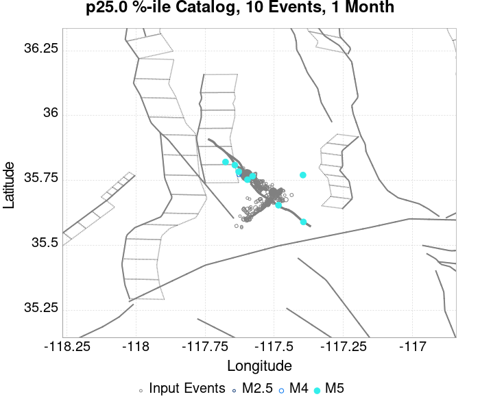
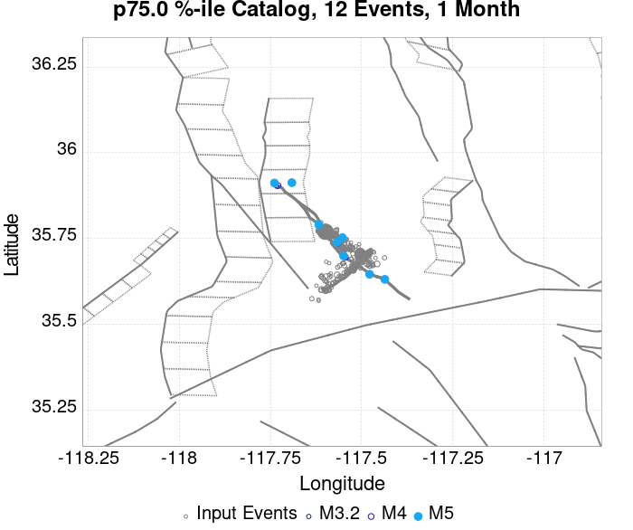
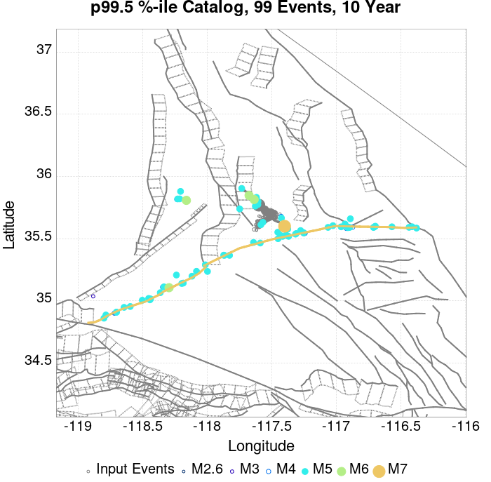
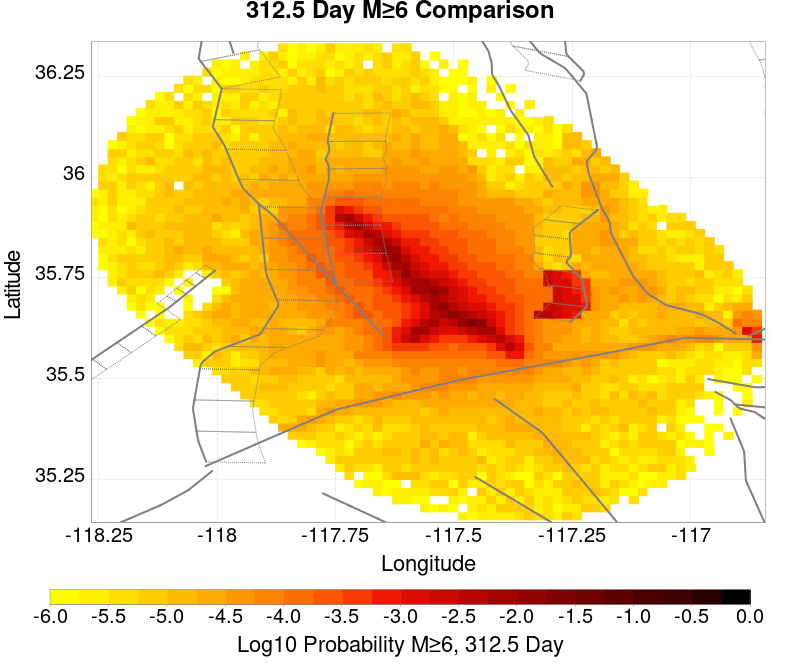
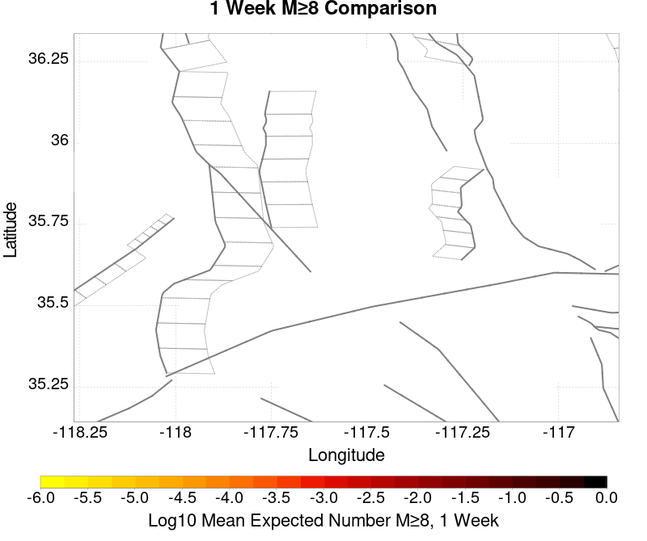
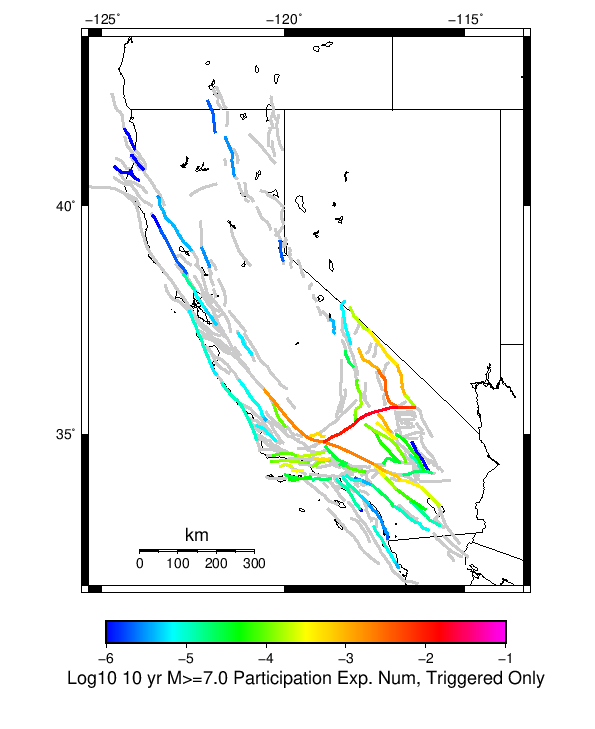
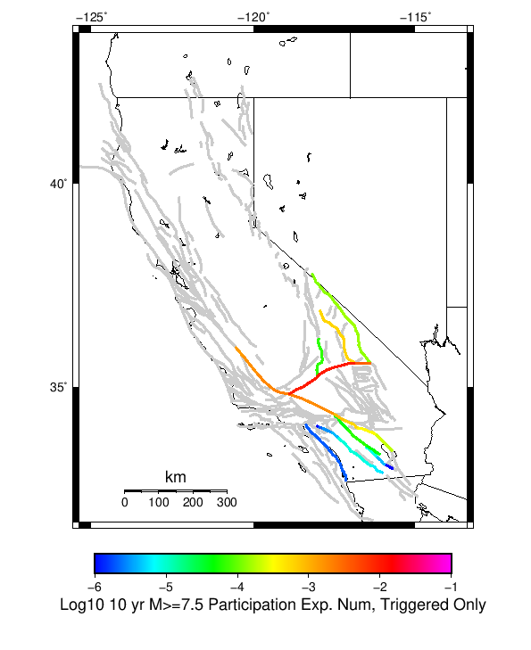

# ComCat M7.1 (ci38457511), ShakeMap Surfaces, FM2_1 Results

|   | ComCat M7.1 (ci38457511), ShakeMap Surfaces, FM2_1 |
|-----|-----|
| Num Simulations | 116155 (incomplete) |
| Start Time | 2019/07/06 03:19:54 UTC |
| Start Time Epoch Milliseconds | 1562383194040 |
| Duration | 10 Years |
| Includes Spontaneous? | false |
| Trigger Ruptures | 283 Trigger Ruptures |
|   | First: M3.98 at 2019/07/04 17:02:55 UTC |
|   | Last: M7.1 at 2019/07/06 03:19:53 UTC |
|   | Largest: M7.1 at 2019/07/06 03:19:53 UTC |
| Trigger Ruptures | *(none)* |
| Config Generated With | u3etas_comcat_event_config_builder.sh --event-id ci38457511 --mag-complete 3.5 --days-before 7 --num-simulations 1000000 --fault-model FM2_1 --finite-surf-shakemap --finite-surf-shakemap-min-mag 5 --hpc-site USC_HPC --nodes 36 --hours 24 --queue scec |

## Table Of Contents

* [Probabilities Summary Table](#probabilities-summary-table)
* [Magnitude Number Distribution](#magnitude-number-distribution)
  * [10 Year Magnitude Number Distribution](#10-year-magnitude-number-distribution)
  * [1 Year Magnitude Number Distribution](#1-year-magnitude-number-distribution)
  * [1 Month Magnitude Number Distribution](#1-month-magnitude-number-distribution)
  * [1 Week Magnitude Number Distribution](#1-week-magnitude-number-distribution)
  * [1 Day Magnitude Number Distribution](#1-day-magnitude-number-distribution)
  * [1 Hour Magnitude Number Distribution](#1-hour-magnitude-number-distribution)
* [Hazard Change Over Time](#hazard-change-over-time)
  * [M&ge;5.0 Hazard Change Over Time](#m50-hazard-change-over-time)
  * [M&ge;6.0 Hazard Change Over Time](#m60-hazard-change-over-time)
  * [M&ge;7.0 Hazard Change Over Time](#m70-hazard-change-over-time)
* [Trigger Rupture Fault Map](#trigger-rupture-fault-map)
* [Trigger Rupture Depth Map](#trigger-rupture-depth-map)
* [Fault Distances To Triggers](#fault-distances-to-triggers)
* [Individual Simulated Catalog Maps](#individual-simulated-catalog-maps)
* [ComCat Data Comparisons](#comcat-data-comparisons)
  * [ComCat Magnitude-Number Distributions](#comcat-magnitude-number-distributions)
  * [ComCat Cumulative Number Vs Time](#comcat-cumulative-number-vs-time)
  * [ComCat Cumulative Number Simulation Percentiles](#comcat-cumulative-number-simulation-percentiles)
  * [ComCat Probability Spatial Distribution](#comcat-probability-spatial-distribution)
  * [ComCat Mean Expectation Spatial Distribution](#comcat-mean-expectation-spatial-distribution)
  * [ComCat Depth Distribution](#comcat-depth-distribution)
* [Section Participation](#section-participation)
  * [Section Participation Plots](#section-participation-plots)
  * [Supra-Seismogenic Parent Sections Table](#supra-seismogenic-parent-sections-table)
  * [M≥6.5 Parent Sections Table](#m65-parent-sections-table)
  * [M≥7 Parent Sections Table](#m7-parent-sections-table)
  * [M≥7.5 Parent Sections Table](#m75-parent-sections-table)
  * [M≥8 Parent Sections Table](#m8-parent-sections-table)
* [Fault Magnitude-Probability Distributions](#fault-magnitude-probability-distributions)
* [Gridded Nucleation](#gridded-nucleation)
* [JSON Input File](#json-input-file)

## Probabilities Summary Table
*[(top)](#table-of-contents)*

| Magnitude | 1 Hour Prob | 1 Day Prob | 1 Week Prob | 1 Month Prob | 1 Year Prob | 10 Year Prob |
|-----|-----|-----|-----|-----|-----|-----|
| **M&ge;5** | 0.768 (76.80%) | 0.977 (97.68%) | 0.995 (99.52%) | 0.999 (99.86%) | 1.000 (99.99%) | 1.000 (100.00%) |
| *95% Conf* | *[76.56% 77.04%]* | *[97.59% 97.77%]* | *[99.48% 99.56%]* | *[99.84% 99.88%]* | *[99.98% 99.99%]* | *[99.99% 100.00%]* |
| **M&ge;5.5** | 0.338 (33.78%) | 0.663 (66.32%) | 0.793 (79.35%) | 0.859 (85.87%) | 0.926 (92.63%) | 0.959 (95.94%) |
| *95% Conf* | *[33.51% 34.05%]* | *[66.05% 66.59%]* | *[79.11% 79.58%]* | *[85.67% 86.07%]* | *[92.48% 92.78%]* | *[95.82% 96.05%]* |
| **M&ge;6** | 0.082 (8.25%) | 0.210 (20.99%) | 0.296 (29.57%) | 0.359 (35.86%) | 0.457 (45.75%) | 0.537 (53.68%) |
| *95% Conf* | *[8.09% 8.41%]* | *[20.76% 21.23%]* | *[29.31% 29.84%]* | *[35.58% 36.14%]* | *[45.46% 46.03%]* | *[53.39% 53.96%]* |
| **M&ge;6.5** | 0.015 (1.48%) | 0.042 (4.17%) | 0.064 (6.38%) | 0.081 (8.14%) | 0.114 (11.41%) | 0.145 (14.50%) |
| *95% Conf* | *[1.41% 1.55%]* | *[4.06% 4.29%]* | *[6.24% 6.52%]* | *[7.98% 8.30%]* | *[11.23% 11.59%]* | *[14.30% 14.70%]* |
| **M&ge;7** | 3.82E-3 (0.38%) | 0.010 (1.04%) | 0.016 (1.56%) | 0.020 (2.02%) | 0.029 (2.92%) | 0.038 (3.81%) |
| *95% Conf* | *[0.35% 0.42%]* | *[0.99% 1.10%]* | *[1.49% 1.63%]* | *[1.94% 2.10%]* | *[2.82% 3.02%]* | *[3.70% 3.92%]* |
| **M&ge;7.1** | 3.07E-3 (0.31%) | 8.49E-3 (0.85%) | 0.013 (1.27%) | 0.016 (1.64%) | 0.023 (2.34%) | 0.031 (3.06%) |
| *95% Conf* | *[0.28% 0.34%]* | *[0.80% 0.90%]* | *[1.21% 1.34%]* | *[1.57% 1.71%]* | *[2.25% 2.43%]* | *[2.96% 3.16%]* |
| **M&ge;7.5** | 1.30E-3 (0.13%) | 3.45E-3 (0.35%) | 5.20E-3 (0.52%) | 6.68E-3 (0.67%) | 9.24E-3 (0.92%) | 0.012 (1.20%) |
| *95% Conf* | *[0.11% 0.15%]* | *[0.31% 0.38%]* | *[0.48% 0.56%]* | *[0.62% 0.72%]* | *[0.87% 0.98%]* | *[1.14% 1.26%]* |
| **M&ge;8** | 0.000 (0.00%) | 1.72E-5 (0.00%) | 2.58E-5 (0.00%) | 3.44E-5 (0.00%) | 6.89E-5 (0.01%) | 1.03E-4 (0.01%) |
| *95% Conf* | *[0.00% 0.00%]* | *[0.00% 0.01%]* | *[0.00% 0.01%]* | *[0.00% 0.01%]* | *[0.00% 0.01%]* | *[0.01% 0.02%]* |

## Magnitude Number Distribution
*[(top)](#table-of-contents)*

### 10 Year Magnitude Number Distribution
*[(top)](#table-of-contents)*

**Legend**
* **Mean** (thick black line): mean expected number across all 116155 catalogs
* **2.5%,97.5%** (thin black lines): expected number percentiles across all 116155 catalogs
* **Median** (thin blue line): median expected number across all 116155 catalogs
* **Mode** (thin cyan line): modal expected number across all 116155 catalogs
* **10 yr Probability** (thin red line): 10 year probability calculated as the fraction of catalogs with at least 1 occurrence
* **10 yr Supraseismogenic Probability** (thin dashed red line): same as above, but only for supraseismogenic ruptures on explicitly modeled UCERF3 faults
* **95% Conf** (light red shaded region): binomial 95% confidence bounds on probability
* **Primary** (thin green line): mean expected number from primary triggered aftershocks only (no secondary, tertiary, etc...) across all 116155 catalogs


| Mag | Mean | 2.5 %ile | 97.5 %ile | Median | Mode | 10 yr Probability | 10 yr Prob 95% Conf | 10 yr Supra-Seis Prob | Primary Aftershocks Mean |
|-----|-----|-----|-----|-----|-----|-----|-----|-----|-----|
| **M&ge;5** | 15.156 | 5.000 | 35.000 | 13.000 | 12.000 | 1.000 (100.00%) | [99.99% 100.00%] | 0.122 (12.17%) | 7.230 |
| **M&ge;5.1** | 11.885 | 4.000 | 28.000 | 11.000 | 9.000 | 1.000 (99.98%) | [99.97% 99.99%] | 0.122 (12.17%) | 5.668 |
| **M&ge;5.2** | 9.294 | 2.000 | 23.000 | 8.000 | 7.000 | 0.999 (99.87%) | [99.85% 99.89%] | 0.122 (12.17%) | 4.433 |
| **M&ge;5.3** | 7.230 | 1.000 | 18.000 | 6.000 | 5.000 | 0.995 (99.46%) | [99.42% 99.50%] | 0.122 (12.17%) | 3.445 |
| **M&ge;5.4** | 5.597 | 1.000 | 15.000 | 5.000 | 4.000 | 0.984 (98.39%) | [98.31% 98.46%] | 0.122 (12.17%) | 2.669 |
| **M&ge;5.5** | 4.299 | 0.000 | 12.000 | 4.000 | 3.000 | 0.959 (95.94%) | [95.82% 96.05%] | 0.122 (12.17%) | 2.047 |
| **M&ge;5.6** | 3.270 | 0.000 | 10.000 | 3.000 | 2.000 | 0.917 (91.73%) | [91.57% 91.88%] | 0.122 (12.17%) | 1.557 |
| **M&ge;5.7** | 2.449 | 0.000 | 8.000 | 2.000 | 1.000 | 0.851 (85.13%) | [84.92% 85.33%] | 0.122 (12.17%) | 1.163 |
| **M&ge;5.8** | 1.802 | 0.000 | 6.000 | 1.000 | 1.000 | 0.762 (76.18%) | [75.94% 76.43%] | 0.122 (12.17%) | 0.854 |
| **M&ge;5.9** | 1.292 | 0.000 | 5.000 | 1.000 | 0.000 | 0.651 (65.06%) | [64.79% 65.34%] | 0.122 (12.17%) | 0.611 |
| **M&ge;6** | 0.928 | 0.000 | 4.000 | 1.000 | 0.000 | 0.537 (53.68%) | [53.39% 53.96%] | 0.122 (12.17%) | 0.434 |
| **M&ge;6.1** | 0.671 | 0.000 | 3.000 | 0.000 | 0.000 | 0.430 (42.96%) | [42.68% 43.25%] | 0.122 (12.15%) | 0.306 |
| **M&ge;6.2** | 0.466 | 0.000 | 3.000 | 0.000 | 0.000 | 0.322 (32.20%) | [31.93% 32.47%] | 0.122 (12.15%) | 0.203 |
| **M&ge;6.3** | 0.366 | 0.000 | 2.000 | 0.000 | 0.000 | 0.263 (26.31%) | [26.06% 26.57%] | 0.122 (12.15%) | 0.153 |
| **M&ge;6.4** | 0.233 | 0.000 | 2.000 | 0.000 | 0.000 | 0.173 (17.26%) | [17.05% 17.48%] | 0.071 (7.12%) | 0.097 |
| **M&ge;6.5** | 0.195 | 0.000 | 2.000 | 0.000 | 0.000 | 0.145 (14.50%) | [14.30% 14.70%] | 0.071 (7.12%) | 0.078 |
| **M&ge;6.6** | 0.142 | 0.000 | 1.000 | 0.000 | 0.000 | 0.115 (11.51%) | [11.32% 11.69%] | 0.062 (6.17%) | 0.060 |
| **M&ge;6.7** | 0.111 | 0.000 | 1.000 | 0.000 | 0.000 | 0.091 (9.13%) | [8.96% 9.30%] | 0.054 (5.37%) | 0.046 |
| **M&ge;6.8** | 0.092 | 0.000 | 1.000 | 0.000 | 0.000 | 0.077 (7.68%) | [7.53% 7.84%] | 0.051 (5.13%) | 0.038 |
| **M&ge;6.9** | 0.055 | 0.000 | 1.000 | 0.000 | 0.000 | 0.047 (4.67%) | [4.55% 4.80%] | 0.030 (2.98%) | 0.023 |
| **M&ge;7** | 0.045 | 0.000 | 1.000 | 0.000 | 0.000 | 0.038 (3.81%) | [3.70% 3.92%] | 0.028 (2.75%) | 0.018 |
| **M&ge;7.1** | 0.035 | 0.000 | 1.000 | 0.000 | 0.000 | 0.031 (3.06%) | [2.96% 3.16%] | 0.024 (2.43%) | 0.015 |
| **M&ge;7.2** | 0.029 | 0.000 | 1.000 | 0.000 | 0.000 | 0.025 (2.53%) | [2.44% 2.63%] | 0.022 (2.17%) | 0.013 |
| **M&ge;7.3** | 0.022 | 0.000 | 0.000 | 0.000 | 0.000 | 0.019 (1.93%) | [1.85% 2.01%] | 0.018 (1.75%) | 9.38E-3 |
| **M&ge;7.4** | 0.018 | 0.000 | 0.000 | 0.000 | 0.000 | 0.016 (1.58%) | [1.51% 1.66%] | 0.015 (1.51%) | 8.13E-3 |
| **M&ge;7.5** | 0.014 | 0.000 | 0.000 | 0.000 | 0.000 | 0.012 (1.20%) | [1.14% 1.26%] | 0.012 (1.17%) | 6.03E-3 |
| **M&ge;7.6** | 0.013 | 0.000 | 0.000 | 0.000 | 0.000 | 0.011 (1.10%) | [1.05% 1.17%] | 0.011 (1.09%) | 5.51E-3 |
| **M&ge;7.7** | 4.99E-3 | 0.000 | 0.000 | 0.000 | 0.000 | 4.55E-3 (0.45%) | [0.42% 0.50%] | 4.46E-3 (0.45%) | 1.70E-3 |
| **M&ge;7.8** | 1.52E-3 | 0.000 | 0.000 | 0.000 | 0.000 | 1.51E-3 (0.15%) | [0.13% 0.18%] | 1.45E-3 (0.14%) | 1.98E-4 |
| **M&ge;7.9** | 4.13E-4 | 0.000 | 0.000 | 0.000 | 0.000 | 4.13E-4 (0.04%) | [0.03% 0.06%] | 4.13E-4 (0.04%) | 2.58E-5 |
| **M&ge;8** | 1.03E-4 | 0.000 | 0.000 | 0.000 | 0.000 | 1.03E-4 (0.01%) | [0.01% 0.02%] | 1.03E-4 (0.01%) | 8.61E-6 |
| **M&ge;8.1** | 4.30E-5 | 0.000 | 0.000 | 0.000 | 0.000 | 4.30E-5 (0.00%) | [0.00% 0.01%] | 4.30E-5 (0.00%) | 0.000 |
| **M&ge;8.2** | 0.000 | 0.000 | 0.000 | 0.000 | 0.000 | 0.000 (0.00%) | [0.00% 0.00%] | 0.000 (0.00%) | 0.000 |
| **M&ge;8.3** | 0.000 | 0.000 | 0.000 | 0.000 | 0.000 | 0.000 (0.00%) | [0.00% 0.00%] | 0.000 (0.00%) | 0.000 |
| **M&ge;8.4** | 0.000 | 0.000 | 0.000 | 0.000 | 0.000 | 0.000 (0.00%) | [0.00% 0.00%] | 0.000 (0.00%) | 0.000 |
| **M&ge;8.5** | 0.000 | 0.000 | 0.000 | 0.000 | 0.000 | 0.000 (0.00%) | [0.00% 0.00%] | 0.000 (0.00%) | 0.000 |
| **M&ge;8.6** | 0.000 | 0.000 | 0.000 | 0.000 | 0.000 | 0.000 (0.00%) | [0.00% 0.00%] | 0.000 (0.00%) | 0.000 |
| **M&ge;8.7** | 0.000 | 0.000 | 0.000 | 0.000 | 0.000 | 0.000 (0.00%) | [0.00% 0.00%] | 0.000 (0.00%) | 0.000 |
| **M&ge;8.8** | 0.000 | 0.000 | 0.000 | 0.000 | 0.000 | 0.000 (0.00%) | [0.00% 0.00%] | 0.000 (0.00%) | 0.000 |
| **M&ge;8.9** | 0.000 | 0.000 | 0.000 | 0.000 | 0.000 | 0.000 (0.00%) | [0.00% 0.00%] | 0.000 (0.00%) | 0.000 |
| **M&ge;9** | 0.000 | 0.000 | 0.000 | 0.000 | 0.000 | 0.000 (0.00%) | [0.00% 0.00%] | 0.000 (0.00%) | 0.000 |

### 1 Year Magnitude Number Distribution
*[(top)](#table-of-contents)*

**Legend**
* **Mean** (thick black line): mean expected number across all 116155 catalogs
* **2.5%,97.5%** (thin black lines): expected number percentiles across all 116155 catalogs
* **Median** (thin blue line): median expected number across all 116155 catalogs
* **Mode** (thin cyan line): modal expected number across all 116155 catalogs
* **1 yr Probability** (thin red line): 1 year probability calculated as the fraction of catalogs with at least 1 occurrence
* **1 yr Supraseismogenic Probability** (thin dashed red line): same as above, but only for supraseismogenic ruptures on explicitly modeled UCERF3 faults
* **95% Conf** (light red shaded region): binomial 95% confidence bounds on probability
* **Primary** (thin green line): mean expected number from primary triggered aftershocks only (no secondary, tertiary, etc...) across all 116155 catalogs


| Mag | Mean | 2.5 %ile | 97.5 %ile | Median | Mode | 1 yr Probability | 1 yr Prob 95% Conf | 1 yr Supra-Seis Prob | Primary Aftershocks Mean |
|-----|-----|-----|-----|-----|-----|-----|-----|-----|-----|
| **M&ge;5** | 11.629 | 4.000 | 25.000 | 11.000 | 9.000 | 1.000 (99.99%) | [99.98% 99.99%] | 0.094 (9.36%) | 6.291 |
| **M&ge;5.1** | 9.116 | 2.000 | 21.000 | 8.000 | 7.000 | 0.999 (99.90%) | [99.88% 99.92%] | 0.094 (9.36%) | 4.932 |
| **M&ge;5.2** | 7.127 | 2.000 | 17.000 | 6.000 | 6.000 | 0.996 (99.58%) | [99.54% 99.61%] | 0.094 (9.36%) | 3.856 |
| **M&ge;5.3** | 5.540 | 1.000 | 14.000 | 5.000 | 4.000 | 0.986 (98.64%) | [98.57% 98.71%] | 0.094 (9.36%) | 2.995 |
| **M&ge;5.4** | 4.291 | 0.000 | 11.000 | 4.000 | 3.000 | 0.966 (96.56%) | [96.45% 96.66%] | 0.094 (9.36%) | 2.321 |
| **M&ge;5.5** | 3.295 | 0.000 | 9.000 | 3.000 | 2.000 | 0.926 (92.63%) | [92.48% 92.78%] | 0.094 (9.36%) | 1.780 |
| **M&ge;5.6** | 2.505 | 0.000 | 8.000 | 2.000 | 2.000 | 0.867 (86.75%) | [86.55% 86.94%] | 0.094 (9.36%) | 1.354 |
| **M&ge;5.7** | 1.876 | 0.000 | 6.000 | 1.000 | 1.000 | 0.786 (78.61%) | [78.37% 78.84%] | 0.094 (9.36%) | 1.011 |
| **M&ge;5.8** | 1.379 | 0.000 | 5.000 | 1.000 | 1.000 | 0.686 (68.55%) | [68.29% 68.82%] | 0.094 (9.36%) | 0.742 |
| **M&ge;5.9** | 0.988 | 0.000 | 4.000 | 1.000 | 0.000 | 0.569 (56.91%) | [56.62% 57.19%] | 0.094 (9.36%) | 0.531 |
| **M&ge;6** | 0.708 | 0.000 | 3.000 | 0.000 | 0.000 | 0.457 (45.75%) | [45.46% 46.03%] | 0.094 (9.36%) | 0.377 |
| **M&ge;6.1** | 0.510 | 0.000 | 3.000 | 0.000 | 0.000 | 0.357 (35.75%) | [35.47% 36.02%] | 0.093 (9.35%) | 0.265 |
| **M&ge;6.2** | 0.350 | 0.000 | 2.000 | 0.000 | 0.000 | 0.261 (26.12%) | [25.87% 26.37%] | 0.093 (9.35%) | 0.174 |
| **M&ge;6.3** | 0.273 | 0.000 | 2.000 | 0.000 | 0.000 | 0.210 (21.03%) | [20.79% 21.26%] | 0.093 (9.35%) | 0.132 |
| **M&ge;6.4** | 0.173 | 0.000 | 1.000 | 0.000 | 0.000 | 0.137 (13.66%) | [13.47% 13.86%] | 0.055 (5.54%) | 0.083 |
| **M&ge;6.5** | 0.144 | 0.000 | 1.000 | 0.000 | 0.000 | 0.114 (11.41%) | [11.23% 11.59%] | 0.055 (5.54%) | 0.067 |
| **M&ge;6.6** | 0.106 | 0.000 | 1.000 | 0.000 | 0.000 | 0.090 (8.99%) | [8.83% 9.16%] | 0.048 (4.79%) | 0.052 |
| **M&ge;6.7** | 0.083 | 0.000 | 1.000 | 0.000 | 0.000 | 0.071 (7.08%) | [6.94% 7.23%] | 0.042 (4.15%) | 0.040 |
| **M&ge;6.8** | 0.069 | 0.000 | 1.000 | 0.000 | 0.000 | 0.059 (5.95%) | [5.81% 6.08%] | 0.040 (3.97%) | 0.033 |
| **M&ge;6.9** | 0.041 | 0.000 | 1.000 | 0.000 | 0.000 | 0.036 (3.58%) | [3.47% 3.69%] | 0.023 (2.30%) | 0.020 |
| **M&ge;7** | 0.033 | 0.000 | 1.000 | 0.000 | 0.000 | 0.029 (2.92%) | [2.82% 3.02%] | 0.021 (2.12%) | 0.016 |
| **M&ge;7.1** | 0.026 | 0.000 | 0.000 | 0.000 | 0.000 | 0.023 (2.34%) | [2.25% 2.43%] | 0.019 (1.86%) | 0.013 |
| **M&ge;7.2** | 0.022 | 0.000 | 0.000 | 0.000 | 0.000 | 0.020 (1.95%) | [1.87% 2.03%] | 0.017 (1.67%) | 0.011 |
| **M&ge;7.3** | 0.016 | 0.000 | 0.000 | 0.000 | 0.000 | 0.015 (1.48%) | [1.41% 1.55%] | 0.013 (1.35%) | 8.01E-3 |
| **M&ge;7.4** | 0.013 | 0.000 | 0.000 | 0.000 | 0.000 | 0.012 (1.22%) | [1.16% 1.29%] | 0.012 (1.16%) | 6.93E-3 |
| **M&ge;7.5** | 0.010 | 0.000 | 0.000 | 0.000 | 0.000 | 9.24E-3 (0.92%) | [0.87% 0.98%] | 9.03E-3 (0.90%) | 5.13E-3 |
| **M&ge;7.6** | 9.58E-3 | 0.000 | 0.000 | 0.000 | 0.000 | 8.51E-3 (0.85%) | [0.80% 0.91%] | 8.39E-3 (0.84%) | 4.71E-3 |
| **M&ge;7.7** | 3.59E-3 | 0.000 | 0.000 | 0.000 | 0.000 | 3.35E-3 (0.33%) | [0.30% 0.37%] | 3.28E-3 (0.33%) | 1.43E-3 |
| **M&ge;7.8** | 1.02E-3 | 0.000 | 0.000 | 0.000 | 0.000 | 1.02E-3 (0.10%) | [0.08% 0.12%] | 9.73E-4 (0.10%) | 1.29E-4 |
| **M&ge;7.9** | 2.93E-4 | 0.000 | 0.000 | 0.000 | 0.000 | 2.93E-4 (0.03%) | [0.02% 0.04%] | 2.93E-4 (0.03%) | 1.72E-5 |
| **M&ge;8** | 6.89E-5 | 0.000 | 0.000 | 0.000 | 0.000 | 6.89E-5 (0.01%) | [0.00% 0.01%] | 6.89E-5 (0.01%) | 8.61E-6 |
| **M&ge;8.1** | 2.58E-5 | 0.000 | 0.000 | 0.000 | 0.000 | 2.58E-5 (0.00%) | [0.00% 0.01%] | 2.58E-5 (0.00%) | 0.000 |
| **M&ge;8.2** | 0.000 | 0.000 | 0.000 | 0.000 | 0.000 | 0.000 (0.00%) | [0.00% 0.00%] | 0.000 (0.00%) | 0.000 |
| **M&ge;8.3** | 0.000 | 0.000 | 0.000 | 0.000 | 0.000 | 0.000 (0.00%) | [0.00% 0.00%] | 0.000 (0.00%) | 0.000 |
| **M&ge;8.4** | 0.000 | 0.000 | 0.000 | 0.000 | 0.000 | 0.000 (0.00%) | [0.00% 0.00%] | 0.000 (0.00%) | 0.000 |
| **M&ge;8.5** | 0.000 | 0.000 | 0.000 | 0.000 | 0.000 | 0.000 (0.00%) | [0.00% 0.00%] | 0.000 (0.00%) | 0.000 |
| **M&ge;8.6** | 0.000 | 0.000 | 0.000 | 0.000 | 0.000 | 0.000 (0.00%) | [0.00% 0.00%] | 0.000 (0.00%) | 0.000 |
| **M&ge;8.7** | 0.000 | 0.000 | 0.000 | 0.000 | 0.000 | 0.000 (0.00%) | [0.00% 0.00%] | 0.000 (0.00%) | 0.000 |
| **M&ge;8.8** | 0.000 | 0.000 | 0.000 | 0.000 | 0.000 | 0.000 (0.00%) | [0.00% 0.00%] | 0.000 (0.00%) | 0.000 |
| **M&ge;8.9** | 0.000 | 0.000 | 0.000 | 0.000 | 0.000 | 0.000 (0.00%) | [0.00% 0.00%] | 0.000 (0.00%) | 0.000 |
| **M&ge;9** | 0.000 | 0.000 | 0.000 | 0.000 | 0.000 | 0.000 (0.00%) | [0.00% 0.00%] | 0.000 (0.00%) | 0.000 |

### 1 Month Magnitude Number Distribution
*[(top)](#table-of-contents)*

**Legend**
* **Mean** (thick black line): mean expected number across all 116155 catalogs
* **2.5%,97.5%** (thin black lines): expected number percentiles across all 116155 catalogs
* **Median** (thin blue line): median expected number across all 116155 catalogs
* **Mode** (thin cyan line): modal expected number across all 116155 catalogs
* **1 mo Probability** (thin red line): 1 month probability calculated as the fraction of catalogs with at least 1 occurrence
* **1 mo Supraseismogenic Probability** (thin dashed red line): same as above, but only for supraseismogenic ruptures on explicitly modeled UCERF3 faults
* **95% Conf** (light red shaded region): binomial 95% confidence bounds on probability
* **Primary** (thin green line): mean expected number from primary triggered aftershocks only (no secondary, tertiary, etc...) across all 116155 catalogs


| Mag | Mean | 2.5 %ile | 97.5 %ile | Median | Mode | 1 mo Probability | 1 mo Prob 95% Conf | 1 mo Supra-Seis Prob | Primary Aftershocks Mean |
|-----|-----|-----|-----|-----|-----|-----|-----|-----|-----|
| **M&ge;5** | 8.192 | 2.000 | 18.000 | 8.000 | 7.000 | 0.999 (99.86%) | [99.84% 99.88%] | 0.066 (6.57%) | 5.100 |
| **M&ge;5.1** | 6.421 | 1.000 | 15.000 | 6.000 | 5.000 | 0.995 (99.48%) | [99.44% 99.52%] | 0.066 (6.57%) | 3.998 |
| **M&ge;5.2** | 5.019 | 1.000 | 12.000 | 5.000 | 4.000 | 0.984 (98.43%) | [98.35% 98.50%] | 0.066 (6.57%) | 3.125 |
| **M&ge;5.3** | 3.900 | 0.000 | 10.000 | 3.000 | 3.000 | 0.961 (96.10%) | [95.99% 96.21%] | 0.066 (6.57%) | 2.427 |
| **M&ge;5.4** | 3.020 | 0.000 | 8.000 | 3.000 | 2.000 | 0.921 (92.07%) | [91.91% 92.22%] | 0.066 (6.57%) | 1.880 |
| **M&ge;5.5** | 2.318 | 0.000 | 7.000 | 2.000 | 1.000 | 0.859 (85.87%) | [85.67% 86.07%] | 0.066 (6.57%) | 1.441 |
| **M&ge;5.6** | 1.762 | 0.000 | 6.000 | 1.000 | 1.000 | 0.779 (77.89%) | [77.65% 78.13%] | 0.066 (6.57%) | 1.095 |
| **M&ge;5.7** | 1.319 | 0.000 | 5.000 | 1.000 | 1.000 | 0.683 (68.26%) | [67.99% 68.52%] | 0.066 (6.57%) | 0.818 |
| **M&ge;5.8** | 0.968 | 0.000 | 4.000 | 1.000 | 0.000 | 0.575 (57.48%) | [57.20% 57.77%] | 0.066 (6.57%) | 0.600 |
| **M&ge;5.9** | 0.692 | 0.000 | 3.000 | 0.000 | 0.000 | 0.460 (46.04%) | [45.75% 46.32%] | 0.066 (6.57%) | 0.428 |
| **M&ge;6** | 0.494 | 0.000 | 3.000 | 0.000 | 0.000 | 0.359 (35.86%) | [35.58% 36.14%] | 0.066 (6.57%) | 0.303 |
| **M&ge;6.1** | 0.353 | 0.000 | 2.000 | 0.000 | 0.000 | 0.272 (27.25%) | [26.99% 27.50%] | 0.066 (6.56%) | 0.212 |
| **M&ge;6.2** | 0.239 | 0.000 | 2.000 | 0.000 | 0.000 | 0.193 (19.32%) | [19.10% 19.55%] | 0.066 (6.56%) | 0.139 |
| **M&ge;6.3** | 0.185 | 0.000 | 1.000 | 0.000 | 0.000 | 0.154 (15.36%) | [15.15% 15.56%] | 0.066 (6.56%) | 0.105 |
| **M&ge;6.4** | 0.116 | 0.000 | 1.000 | 0.000 | 0.000 | 0.098 (9.78%) | [9.61% 9.95%] | 0.039 (3.95%) | 0.066 |
| **M&ge;6.5** | 0.096 | 0.000 | 1.000 | 0.000 | 0.000 | 0.081 (8.14%) | [7.98% 8.30%] | 0.039 (3.94%) | 0.054 |
| **M&ge;6.6** | 0.072 | 0.000 | 1.000 | 0.000 | 0.000 | 0.064 (6.41%) | [6.27% 6.55%] | 0.034 (3.41%) | 0.042 |
| **M&ge;6.7** | 0.056 | 0.000 | 1.000 | 0.000 | 0.000 | 0.050 (5.01%) | [4.89% 5.14%] | 0.029 (2.95%) | 0.032 |
| **M&ge;6.8** | 0.047 | 0.000 | 1.000 | 0.000 | 0.000 | 0.042 (4.20%) | [4.09% 4.32%] | 0.028 (2.82%) | 0.027 |
| **M&ge;6.9** | 0.027 | 0.000 | 0.000 | 0.000 | 0.000 | 0.025 (2.48%) | [2.39% 2.57%] | 0.016 (1.60%) | 0.016 |
| **M&ge;7** | 0.022 | 0.000 | 0.000 | 0.000 | 0.000 | 0.020 (2.02%) | [1.94% 2.10%] | 0.015 (1.48%) | 0.013 |
| **M&ge;7.1** | 0.018 | 0.000 | 0.000 | 0.000 | 0.000 | 0.016 (1.64%) | [1.57% 1.71%] | 0.013 (1.32%) | 0.010 |
| **M&ge;7.2** | 0.015 | 0.000 | 0.000 | 0.000 | 0.000 | 0.014 (1.37%) | [1.31% 1.44%] | 0.012 (1.19%) | 8.73E-3 |
| **M&ge;7.3** | 0.011 | 0.000 | 0.000 | 0.000 | 0.000 | 0.010 (1.05%) | [0.99% 1.11%] | 9.49E-3 (0.95%) | 6.66E-3 |
| **M&ge;7.4** | 9.45E-3 | 0.000 | 0.000 | 0.000 | 0.000 | 8.76E-3 (0.88%) | [0.82% 0.93%] | 8.33E-3 (0.83%) | 5.81E-3 |
| **M&ge;7.5** | 7.33E-3 | 0.000 | 0.000 | 0.000 | 0.000 | 6.68E-3 (0.67%) | [0.62% 0.72%] | 6.53E-3 (0.65%) | 4.38E-3 |
| **M&ge;7.6** | 6.69E-3 | 0.000 | 0.000 | 0.000 | 0.000 | 6.11E-3 (0.61%) | [0.57% 0.66%] | 6.04E-3 (0.60%) | 4.00E-3 |
| **M&ge;7.7** | 2.27E-3 | 0.000 | 0.000 | 0.000 | 0.000 | 2.15E-3 (0.22%) | [0.19% 0.24%] | 2.11E-3 (0.21%) | 1.15E-3 |
| **M&ge;7.8** | 5.77E-4 | 0.000 | 0.000 | 0.000 | 0.000 | 5.77E-4 (0.06%) | [0.05% 0.07%] | 5.51E-4 (0.06%) | 9.47E-5 |
| **M&ge;7.9** | 1.64E-4 | 0.000 | 0.000 | 0.000 | 0.000 | 1.64E-4 (0.02%) | [0.01% 0.03%] | 1.64E-4 (0.02%) | 1.72E-5 |
| **M&ge;8** | 3.44E-5 | 0.000 | 0.000 | 0.000 | 0.000 | 3.44E-5 (0.00%) | [0.00% 0.01%] | 3.44E-5 (0.00%) | 8.61E-6 |
| **M&ge;8.1** | 8.61E-6 | 0.000 | 0.000 | 0.000 | 0.000 | 8.61E-6 (0.00%) | [0.00% 0.01%] | 8.61E-6 (0.00%) | 0.000 |
| **M&ge;8.2** | 0.000 | 0.000 | 0.000 | 0.000 | 0.000 | 0.000 (0.00%) | [0.00% 0.00%] | 0.000 (0.00%) | 0.000 |
| **M&ge;8.3** | 0.000 | 0.000 | 0.000 | 0.000 | 0.000 | 0.000 (0.00%) | [0.00% 0.00%] | 0.000 (0.00%) | 0.000 |
| **M&ge;8.4** | 0.000 | 0.000 | 0.000 | 0.000 | 0.000 | 0.000 (0.00%) | [0.00% 0.00%] | 0.000 (0.00%) | 0.000 |
| **M&ge;8.5** | 0.000 | 0.000 | 0.000 | 0.000 | 0.000 | 0.000 (0.00%) | [0.00% 0.00%] | 0.000 (0.00%) | 0.000 |
| **M&ge;8.6** | 0.000 | 0.000 | 0.000 | 0.000 | 0.000 | 0.000 (0.00%) | [0.00% 0.00%] | 0.000 (0.00%) | 0.000 |
| **M&ge;8.7** | 0.000 | 0.000 | 0.000 | 0.000 | 0.000 | 0.000 (0.00%) | [0.00% 0.00%] | 0.000 (0.00%) | 0.000 |
| **M&ge;8.8** | 0.000 | 0.000 | 0.000 | 0.000 | 0.000 | 0.000 (0.00%) | [0.00% 0.00%] | 0.000 (0.00%) | 0.000 |
| **M&ge;8.9** | 0.000 | 0.000 | 0.000 | 0.000 | 0.000 | 0.000 (0.00%) | [0.00% 0.00%] | 0.000 (0.00%) | 0.000 |
| **M&ge;9** | 0.000 | 0.000 | 0.000 | 0.000 | 0.000 | 0.000 (0.00%) | [0.00% 0.00%] | 0.000 (0.00%) | 0.000 |

### 1 Week Magnitude Number Distribution
*[(top)](#table-of-contents)*

**Legend**
* **Mean** (thick black line): mean expected number across all 116155 catalogs
* **2.5%,97.5%** (thin black lines): expected number percentiles across all 116155 catalogs
* **Median** (thin blue line): median expected number across all 116155 catalogs
* **Mode** (thin cyan line): modal expected number across all 116155 catalogs
* **1 wk Probability** (thin red line): 1 week probability calculated as the fraction of catalogs with at least 1 occurrence
* **1 wk Supraseismogenic Probability** (thin dashed red line): same as above, but only for supraseismogenic ruptures on explicitly modeled UCERF3 faults
* **95% Conf** (light red shaded region): binomial 95% confidence bounds on probability
* **Primary** (thin green line): mean expected number from primary triggered aftershocks only (no secondary, tertiary, etc...) across all 116155 catalogs


| Mag | Mean | 2.5 %ile | 97.5 %ile | Median | Mode | 1 wk Probability | 1 wk Prob 95% Conf | 1 wk Supra-Seis Prob | Primary Aftershocks Mean |
|-----|-----|-----|-----|-----|-----|-----|-----|-----|-----|
| **M&ge;5** | 6.368 | 1.000 | 14.000 | 6.000 | 5.000 | 0.995 (99.52%) | [99.48% 99.56%] | 0.051 (5.14%) | 4.312 |
| **M&ge;5.1** | 4.990 | 1.000 | 11.000 | 5.000 | 4.000 | 0.985 (98.51%) | [98.43% 98.57%] | 0.051 (5.14%) | 3.380 |
| **M&ge;5.2** | 3.897 | 0.000 | 10.000 | 3.000 | 3.000 | 0.964 (96.43%) | [96.32% 96.53%] | 0.051 (5.14%) | 2.640 |
| **M&ge;5.3** | 3.031 | 0.000 | 8.000 | 3.000 | 2.000 | 0.927 (92.67%) | [92.52% 92.82%] | 0.051 (5.14%) | 2.052 |
| **M&ge;5.4** | 2.345 | 0.000 | 7.000 | 2.000 | 2.000 | 0.870 (86.98%) | [86.78% 87.17%] | 0.051 (5.14%) | 1.589 |
| **M&ge;5.5** | 1.800 | 0.000 | 6.000 | 1.000 | 1.000 | 0.793 (79.35%) | [79.11% 79.58%] | 0.051 (5.14%) | 1.217 |
| **M&ge;5.6** | 1.366 | 0.000 | 5.000 | 1.000 | 1.000 | 0.702 (70.21%) | [69.95% 70.47%] | 0.051 (5.14%) | 0.924 |
| **M&ge;5.7** | 1.022 | 0.000 | 4.000 | 1.000 | 0.000 | 0.601 (60.09%) | [59.80% 60.37%] | 0.051 (5.14%) | 0.689 |
| **M&ge;5.8** | 0.750 | 0.000 | 3.000 | 0.000 | 0.000 | 0.494 (49.43%) | [49.14% 49.72%] | 0.051 (5.14%) | 0.504 |
| **M&ge;5.9** | 0.535 | 0.000 | 3.000 | 0.000 | 0.000 | 0.387 (38.72%) | [38.44% 39.00%] | 0.051 (5.14%) | 0.359 |
| **M&ge;6** | 0.381 | 0.000 | 2.000 | 0.000 | 0.000 | 0.296 (29.57%) | [29.31% 29.84%] | 0.051 (5.14%) | 0.254 |
| **M&ge;6.1** | 0.271 | 0.000 | 2.000 | 0.000 | 0.000 | 0.221 (22.13%) | [21.89% 22.37%] | 0.051 (5.13%) | 0.177 |
| **M&ge;6.2** | 0.182 | 0.000 | 1.000 | 0.000 | 0.000 | 0.154 (15.38%) | [15.18% 15.59%] | 0.051 (5.13%) | 0.115 |
| **M&ge;6.3** | 0.140 | 0.000 | 1.000 | 0.000 | 0.000 | 0.121 (12.09%) | [11.91% 12.28%] | 0.051 (5.13%) | 0.087 |
| **M&ge;6.4** | 0.088 | 0.000 | 1.000 | 0.000 | 0.000 | 0.077 (7.66%) | [7.51% 7.81%] | 0.031 (3.11%) | 0.055 |
| **M&ge;6.5** | 0.073 | 0.000 | 1.000 | 0.000 | 0.000 | 0.064 (6.38%) | [6.24% 6.52%] | 0.031 (3.11%) | 0.045 |
| **M&ge;6.6** | 0.055 | 0.000 | 1.000 | 0.000 | 0.000 | 0.050 (5.01%) | [4.89% 5.14%] | 0.027 (2.69%) | 0.035 |
| **M&ge;6.7** | 0.042 | 0.000 | 1.000 | 0.000 | 0.000 | 0.039 (3.91%) | [3.80% 4.02%] | 0.023 (2.32%) | 0.027 |
| **M&ge;6.8** | 0.035 | 0.000 | 1.000 | 0.000 | 0.000 | 0.033 (3.27%) | [3.17% 3.38%] | 0.022 (2.22%) | 0.022 |
| **M&ge;6.9** | 0.021 | 0.000 | 0.000 | 0.000 | 0.000 | 0.019 (1.92%) | [1.84% 2.00%] | 0.013 (1.25%) | 0.013 |
| **M&ge;7** | 0.017 | 0.000 | 0.000 | 0.000 | 0.000 | 0.016 (1.56%) | [1.49% 1.63%] | 0.012 (1.15%) | 0.011 |
| **M&ge;7.1** | 0.014 | 0.000 | 0.000 | 0.000 | 0.000 | 0.013 (1.27%) | [1.21% 1.34%] | 0.010 (1.03%) | 8.72E-3 |
| **M&ge;7.2** | 0.011 | 0.000 | 0.000 | 0.000 | 0.000 | 0.011 (1.06%) | [1.01% 1.12%] | 9.26E-3 (0.93%) | 7.36E-3 |
| **M&ge;7.3** | 8.66E-3 | 0.000 | 0.000 | 0.000 | 0.000 | 8.09E-3 (0.81%) | [0.76% 0.86%] | 7.42E-3 (0.74%) | 5.60E-3 |
| **M&ge;7.4** | 7.28E-3 | 0.000 | 0.000 | 0.000 | 0.000 | 6.81E-3 (0.68%) | [0.63% 0.73%] | 6.54E-3 (0.65%) | 4.89E-3 |
| **M&ge;7.5** | 5.66E-3 | 0.000 | 0.000 | 0.000 | 0.000 | 5.20E-3 (0.52%) | [0.48% 0.56%] | 5.09E-3 (0.51%) | 3.65E-3 |
| **M&ge;7.6** | 5.19E-3 | 0.000 | 0.000 | 0.000 | 0.000 | 4.79E-3 (0.48%) | [0.44% 0.52%] | 4.73E-3 (0.47%) | 3.35E-3 |
| **M&ge;7.7** | 1.70E-3 | 0.000 | 0.000 | 0.000 | 0.000 | 1.63E-3 (0.16%) | [0.14% 0.19%] | 1.58E-3 (0.16%) | 9.38E-4 |
| **M&ge;7.8** | 4.13E-4 | 0.000 | 0.000 | 0.000 | 0.000 | 4.13E-4 (0.04%) | [0.03% 0.06%] | 3.87E-4 (0.04%) | 8.61E-5 |
| **M&ge;7.9** | 1.12E-4 | 0.000 | 0.000 | 0.000 | 0.000 | 1.12E-4 (0.01%) | [0.01% 0.02%] | 1.12E-4 (0.01%) | 1.72E-5 |
| **M&ge;8** | 2.58E-5 | 0.000 | 0.000 | 0.000 | 0.000 | 2.58E-5 (0.00%) | [0.00% 0.01%] | 2.58E-5 (0.00%) | 8.61E-6 |
| **M&ge;8.1** | 8.61E-6 | 0.000 | 0.000 | 0.000 | 0.000 | 8.61E-6 (0.00%) | [0.00% 0.01%] | 8.61E-6 (0.00%) | 0.000 |
| **M&ge;8.2** | 0.000 | 0.000 | 0.000 | 0.000 | 0.000 | 0.000 (0.00%) | [0.00% 0.00%] | 0.000 (0.00%) | 0.000 |
| **M&ge;8.3** | 0.000 | 0.000 | 0.000 | 0.000 | 0.000 | 0.000 (0.00%) | [0.00% 0.00%] | 0.000 (0.00%) | 0.000 |
| **M&ge;8.4** | 0.000 | 0.000 | 0.000 | 0.000 | 0.000 | 0.000 (0.00%) | [0.00% 0.00%] | 0.000 (0.00%) | 0.000 |
| **M&ge;8.5** | 0.000 | 0.000 | 0.000 | 0.000 | 0.000 | 0.000 (0.00%) | [0.00% 0.00%] | 0.000 (0.00%) | 0.000 |
| **M&ge;8.6** | 0.000 | 0.000 | 0.000 | 0.000 | 0.000 | 0.000 (0.00%) | [0.00% 0.00%] | 0.000 (0.00%) | 0.000 |
| **M&ge;8.7** | 0.000 | 0.000 | 0.000 | 0.000 | 0.000 | 0.000 (0.00%) | [0.00% 0.00%] | 0.000 (0.00%) | 0.000 |
| **M&ge;8.8** | 0.000 | 0.000 | 0.000 | 0.000 | 0.000 | 0.000 (0.00%) | [0.00% 0.00%] | 0.000 (0.00%) | 0.000 |
| **M&ge;8.9** | 0.000 | 0.000 | 0.000 | 0.000 | 0.000 | 0.000 (0.00%) | [0.00% 0.00%] | 0.000 (0.00%) | 0.000 |
| **M&ge;9** | 0.000 | 0.000 | 0.000 | 0.000 | 0.000 | 0.000 (0.00%) | [0.00% 0.00%] | 0.000 (0.00%) | 0.000 |

### 1 Day Magnitude Number Distribution
*[(top)](#table-of-contents)*

**Legend**
* **Mean** (thick black line): mean expected number across all 116155 catalogs
* **2.5%,97.5%** (thin black lines): expected number percentiles across all 116155 catalogs
* **Median** (thin blue line): median expected number across all 116155 catalogs
* **Mode** (thin cyan line): modal expected number across all 116155 catalogs
* **1 d Probability** (thin red line): 1 day probability calculated as the fraction of catalogs with at least 1 occurrence
* **1 d Supraseismogenic Probability** (thin dashed red line): same as above, but only for supraseismogenic ruptures on explicitly modeled UCERF3 faults
* **95% Conf** (light red shaded region): binomial 95% confidence bounds on probability
* **Primary** (thin green line): mean expected number from primary triggered aftershocks only (no secondary, tertiary, etc...) across all 116155 catalogs


| Mag | Mean | 2.5 %ile | 97.5 %ile | Median | Mode | 1 d Probability | 1 d Prob 95% Conf | 1 d Supra-Seis Prob | Primary Aftershocks Mean |
|-----|-----|-----|-----|-----|-----|-----|-----|-----|-----|
| **M&ge;5** | 4.219 | 1.000 | 10.000 | 4.000 | 3.000 | 0.977 (97.68%) | [97.59% 97.77%] | 0.034 (3.37%) | 3.208 |
| **M&ge;5.1** | 3.305 | 0.000 | 8.000 | 3.000 | 2.000 | 0.948 (94.81%) | [94.68% 94.94%] | 0.034 (3.37%) | 2.513 |
| **M&ge;5.2** | 2.580 | 0.000 | 7.000 | 2.000 | 2.000 | 0.904 (90.39%) | [90.22% 90.56%] | 0.034 (3.37%) | 1.962 |
| **M&ge;5.3** | 2.006 | 0.000 | 6.000 | 2.000 | 1.000 | 0.838 (83.84%) | [83.63% 84.05%] | 0.034 (3.37%) | 1.526 |
| **M&ge;5.4** | 1.551 | 0.000 | 5.000 | 1.000 | 1.000 | 0.757 (75.69%) | [75.45% 75.94%] | 0.034 (3.37%) | 1.180 |
| **M&ge;5.5** | 1.188 | 0.000 | 4.000 | 1.000 | 1.000 | 0.663 (66.32%) | [66.05% 66.59%] | 0.034 (3.37%) | 0.903 |
| **M&ge;5.6** | 0.902 | 0.000 | 3.000 | 1.000 | 0.000 | 0.565 (56.49%) | [56.20% 56.77%] | 0.034 (3.37%) | 0.686 |
| **M&ge;5.7** | 0.675 | 0.000 | 3.000 | 0.000 | 0.000 | 0.467 (46.67%) | [46.38% 46.96%] | 0.034 (3.37%) | 0.512 |
| **M&ge;5.8** | 0.494 | 0.000 | 2.000 | 0.000 | 0.000 | 0.371 (37.08%) | [36.80% 37.36%] | 0.034 (3.37%) | 0.373 |
| **M&ge;5.9** | 0.352 | 0.000 | 2.000 | 0.000 | 0.000 | 0.282 (28.22%) | [27.96% 28.48%] | 0.034 (3.37%) | 0.265 |
| **M&ge;6** | 0.249 | 0.000 | 2.000 | 0.000 | 0.000 | 0.210 (20.99%) | [20.76% 21.23%] | 0.034 (3.37%) | 0.187 |
| **M&ge;6.1** | 0.175 | 0.000 | 1.000 | 0.000 | 0.000 | 0.153 (15.28%) | [15.08% 15.49%] | 0.034 (3.36%) | 0.129 |
| **M&ge;6.2** | 0.115 | 0.000 | 1.000 | 0.000 | 0.000 | 0.103 (10.33%) | [10.16% 10.51%] | 0.034 (3.36%) | 0.083 |
| **M&ge;6.3** | 0.088 | 0.000 | 1.000 | 0.000 | 0.000 | 0.080 (8.00%) | [7.84% 8.16%] | 0.034 (3.36%) | 0.063 |
| **M&ge;6.4** | 0.055 | 0.000 | 1.000 | 0.000 | 0.000 | 0.050 (5.02%) | [4.89% 5.15%] | 0.021 (2.06%) | 0.039 |
| **M&ge;6.5** | 0.046 | 0.000 | 1.000 | 0.000 | 0.000 | 0.042 (4.17%) | [4.06% 4.29%] | 0.021 (2.06%) | 0.032 |
| **M&ge;6.6** | 0.035 | 0.000 | 1.000 | 0.000 | 0.000 | 0.033 (3.29%) | [3.19% 3.39%] | 0.018 (1.77%) | 0.025 |
| **M&ge;6.7** | 0.027 | 0.000 | 1.000 | 0.000 | 0.000 | 0.026 (2.56%) | [2.47% 2.66%] | 0.015 (1.52%) | 0.020 |
| **M&ge;6.8** | 0.022 | 0.000 | 0.000 | 0.000 | 0.000 | 0.021 (2.14%) | [2.06% 2.23%] | 0.015 (1.46%) | 0.016 |
| **M&ge;6.9** | 0.013 | 0.000 | 0.000 | 0.000 | 0.000 | 0.013 (1.27%) | [1.20% 1.33%] | 8.33E-3 (0.83%) | 9.63E-3 |
| **M&ge;7** | 0.011 | 0.000 | 0.000 | 0.000 | 0.000 | 0.010 (1.04%) | [0.99% 1.10%] | 7.68E-3 (0.77%) | 7.89E-3 |
| **M&ge;7.1** | 8.87E-3 | 0.000 | 0.000 | 0.000 | 0.000 | 8.49E-3 (0.85%) | [0.80% 0.90%] | 6.85E-3 (0.69%) | 6.46E-3 |
| **M&ge;7.2** | 7.48E-3 | 0.000 | 0.000 | 0.000 | 0.000 | 7.17E-3 (0.72%) | [0.67% 0.77%] | 6.23E-3 (0.62%) | 5.54E-3 |
| **M&ge;7.3** | 5.73E-3 | 0.000 | 0.000 | 0.000 | 0.000 | 5.44E-3 (0.54%) | [0.50% 0.59%] | 4.99E-3 (0.50%) | 4.18E-3 |
| **M&ge;7.4** | 4.80E-3 | 0.000 | 0.000 | 0.000 | 0.000 | 4.57E-3 (0.46%) | [0.42% 0.50%] | 4.38E-3 (0.44%) | 3.65E-3 |
| **M&ge;7.5** | 3.68E-3 | 0.000 | 0.000 | 0.000 | 0.000 | 3.45E-3 (0.35%) | [0.31% 0.38%] | 3.39E-3 (0.34%) | 2.70E-3 |
| **M&ge;7.6** | 3.39E-3 | 0.000 | 0.000 | 0.000 | 0.000 | 3.19E-3 (0.32%) | [0.29% 0.35%] | 3.16E-3 (0.32%) | 2.50E-3 |
| **M&ge;7.7** | 1.08E-3 | 0.000 | 0.000 | 0.000 | 0.000 | 1.05E-3 (0.11%) | [0.09% 0.13%] | 1.03E-3 (0.10%) | 7.32E-4 |
| **M&ge;7.8** | 2.15E-4 | 0.000 | 0.000 | 0.000 | 0.000 | 2.15E-4 (0.02%) | [0.01% 0.03%] | 2.07E-4 (0.02%) | 6.03E-5 |
| **M&ge;7.9** | 6.89E-5 | 0.000 | 0.000 | 0.000 | 0.000 | 6.89E-5 (0.01%) | [0.00% 0.01%] | 6.89E-5 (0.01%) | 8.61E-6 |
| **M&ge;8** | 1.72E-5 | 0.000 | 0.000 | 0.000 | 0.000 | 1.72E-5 (0.00%) | [0.00% 0.01%] | 1.72E-5 (0.00%) | 0.000 |
| **M&ge;8.1** | 8.61E-6 | 0.000 | 0.000 | 0.000 | 0.000 | 8.61E-6 (0.00%) | [0.00% 0.01%] | 8.61E-6 (0.00%) | 0.000 |
| **M&ge;8.2** | 0.000 | 0.000 | 0.000 | 0.000 | 0.000 | 0.000 (0.00%) | [0.00% 0.00%] | 0.000 (0.00%) | 0.000 |
| **M&ge;8.3** | 0.000 | 0.000 | 0.000 | 0.000 | 0.000 | 0.000 (0.00%) | [0.00% 0.00%] | 0.000 (0.00%) | 0.000 |
| **M&ge;8.4** | 0.000 | 0.000 | 0.000 | 0.000 | 0.000 | 0.000 (0.00%) | [0.00% 0.00%] | 0.000 (0.00%) | 0.000 |
| **M&ge;8.5** | 0.000 | 0.000 | 0.000 | 0.000 | 0.000 | 0.000 (0.00%) | [0.00% 0.00%] | 0.000 (0.00%) | 0.000 |
| **M&ge;8.6** | 0.000 | 0.000 | 0.000 | 0.000 | 0.000 | 0.000 (0.00%) | [0.00% 0.00%] | 0.000 (0.00%) | 0.000 |
| **M&ge;8.7** | 0.000 | 0.000 | 0.000 | 0.000 | 0.000 | 0.000 (0.00%) | [0.00% 0.00%] | 0.000 (0.00%) | 0.000 |
| **M&ge;8.8** | 0.000 | 0.000 | 0.000 | 0.000 | 0.000 | 0.000 (0.00%) | [0.00% 0.00%] | 0.000 (0.00%) | 0.000 |
| **M&ge;8.9** | 0.000 | 0.000 | 0.000 | 0.000 | 0.000 | 0.000 (0.00%) | [0.00% 0.00%] | 0.000 (0.00%) | 0.000 |
| **M&ge;9** | 0.000 | 0.000 | 0.000 | 0.000 | 0.000 | 0.000 (0.00%) | [0.00% 0.00%] | 0.000 (0.00%) | 0.000 |

### 1 Hour Magnitude Number Distribution
*[(top)](#table-of-contents)*

**Legend**
* **Mean** (thick black line): mean expected number across all 116155 catalogs
* **2.5%,97.5%** (thin black lines): expected number percentiles across all 116155 catalogs
* **Median** (thin blue line): median expected number across all 116155 catalogs
* **Mode** (thin cyan line): modal expected number across all 116155 catalogs
* **1 hr Probability** (thin red line): 1 hour probability calculated as the fraction of catalogs with at least 1 occurrence
* **1 hr Supraseismogenic Probability** (thin dashed red line): same as above, but only for supraseismogenic ruptures on explicitly modeled UCERF3 faults
* **95% Conf** (light red shaded region): binomial 95% confidence bounds on probability
* **Primary** (thin green line): mean expected number from primary triggered aftershocks only (no secondary, tertiary, etc...) across all 116155 catalogs


| Mag | Mean | 2.5 %ile | 97.5 %ile | Median | Mode | 1 hr Probability | 1 hr Prob 95% Conf | 1 hr Supra-Seis Prob | Primary Aftershocks Mean |
|-----|-----|-----|-----|-----|-----|-----|-----|-----|-----|
| **M&ge;5** | 1.513 | 0.000 | 4.000 | 1.000 | 1.000 | 0.768 (76.80%) | [76.56% 77.04%] | 0.012 (1.17%) | 1.381 |
| **M&ge;5.1** | 1.186 | 0.000 | 4.000 | 1.000 | 1.000 | 0.681 (68.09%) | [67.82% 68.36%] | 0.012 (1.17%) | 1.082 |
| **M&ge;5.2** | 0.924 | 0.000 | 3.000 | 1.000 | 0.000 | 0.591 (59.12%) | [58.84% 59.41%] | 0.012 (1.17%) | 0.844 |
| **M&ge;5.3** | 0.718 | 0.000 | 3.000 | 1.000 | 0.000 | 0.501 (50.08%) | [49.79% 50.36%] | 0.012 (1.17%) | 0.655 |
| **M&ge;5.4** | 0.555 | 0.000 | 2.000 | 0.000 | 0.000 | 0.417 (41.66%) | [41.38% 41.95%] | 0.012 (1.17%) | 0.507 |
| **M&ge;5.5** | 0.424 | 0.000 | 2.000 | 0.000 | 0.000 | 0.338 (33.78%) | [33.51% 34.05%] | 0.012 (1.17%) | 0.387 |
| **M&ge;5.6** | 0.323 | 0.000 | 2.000 | 0.000 | 0.000 | 0.269 (26.93%) | [26.68% 27.19%] | 0.012 (1.17%) | 0.294 |
| **M&ge;5.7** | 0.241 | 0.000 | 2.000 | 0.000 | 0.000 | 0.209 (20.93%) | [20.69% 21.16%] | 0.012 (1.17%) | 0.219 |
| **M&ge;5.8** | 0.176 | 0.000 | 1.000 | 0.000 | 0.000 | 0.158 (15.83%) | [15.62% 16.04%] | 0.012 (1.17%) | 0.160 |
| **M&ge;5.9** | 0.125 | 0.000 | 1.000 | 0.000 | 0.000 | 0.115 (11.53%) | [11.34% 11.71%] | 0.012 (1.17%) | 0.114 |
| **M&ge;6** | 0.088 | 0.000 | 1.000 | 0.000 | 0.000 | 0.082 (8.25%) | [8.09% 8.41%] | 0.012 (1.17%) | 0.080 |
| **M&ge;6.1** | 0.061 | 0.000 | 1.000 | 0.000 | 0.000 | 0.058 (5.79%) | [5.65% 5.92%] | 0.012 (1.17%) | 0.055 |
| **M&ge;6.2** | 0.039 | 0.000 | 1.000 | 0.000 | 0.000 | 0.038 (3.78%) | [3.67% 3.89%] | 0.012 (1.17%) | 0.035 |
| **M&ge;6.3** | 0.030 | 0.000 | 1.000 | 0.000 | 0.000 | 0.028 (2.85%) | [2.76% 2.95%] | 0.012 (1.17%) | 0.026 |
| **M&ge;6.4** | 0.019 | 0.000 | 0.000 | 0.000 | 0.000 | 0.018 (1.79%) | [1.71% 1.87%] | 7.32E-3 (0.73%) | 0.016 |
| **M&ge;6.5** | 0.015 | 0.000 | 0.000 | 0.000 | 0.000 | 0.015 (1.48%) | [1.41% 1.55%] | 7.31E-3 (0.73%) | 0.014 |
| **M&ge;6.6** | 0.012 | 0.000 | 0.000 | 0.000 | 0.000 | 0.012 (1.16%) | [1.10% 1.23%] | 6.30E-3 (0.63%) | 0.011 |
| **M&ge;6.7** | 9.20E-3 | 0.000 | 0.000 | 0.000 | 0.000 | 9.07E-3 (0.91%) | [0.85% 0.96%] | 5.42E-3 (0.54%) | 8.26E-3 |
| **M&ge;6.8** | 7.78E-3 | 0.000 | 0.000 | 0.000 | 0.000 | 7.69E-3 (0.77%) | [0.72% 0.82%] | 5.23E-3 (0.52%) | 6.97E-3 |
| **M&ge;6.9** | 4.69E-3 | 0.000 | 0.000 | 0.000 | 0.000 | 4.65E-3 (0.46%) | [0.43% 0.51%] | 3.08E-3 (0.31%) | 4.17E-3 |
| **M&ge;7** | 3.85E-3 | 0.000 | 0.000 | 0.000 | 0.000 | 3.82E-3 (0.38%) | [0.35% 0.42%] | 2.83E-3 (0.28%) | 3.44E-3 |
| **M&ge;7.1** | 3.09E-3 | 0.000 | 0.000 | 0.000 | 0.000 | 3.07E-3 (0.31%) | [0.28% 0.34%] | 2.58E-3 (0.26%) | 2.77E-3 |
| **M&ge;7.2** | 2.71E-3 | 0.000 | 0.000 | 0.000 | 0.000 | 2.69E-3 (0.27%) | [0.24% 0.30%] | 2.41E-3 (0.24%) | 2.42E-3 |
| **M&ge;7.3** | 2.09E-3 | 0.000 | 0.000 | 0.000 | 0.000 | 2.07E-3 (0.21%) | [0.18% 0.24%] | 1.89E-3 (0.19%) | 1.89E-3 |
| **M&ge;7.4** | 1.78E-3 | 0.000 | 0.000 | 0.000 | 0.000 | 1.77E-3 (0.18%) | [0.15% 0.20%] | 1.68E-3 (0.17%) | 1.66E-3 |
| **M&ge;7.5** | 1.31E-3 | 0.000 | 0.000 | 0.000 | 0.000 | 1.30E-3 (0.13%) | [0.11% 0.15%] | 1.27E-3 (0.13%) | 1.22E-3 |
| **M&ge;7.6** | 1.22E-3 | 0.000 | 0.000 | 0.000 | 0.000 | 1.21E-3 (0.12%) | [0.10% 0.14%] | 1.21E-3 (0.12%) | 1.15E-3 |
| **M&ge;7.7** | 3.87E-4 | 0.000 | 0.000 | 0.000 | 0.000 | 3.87E-4 (0.04%) | [0.03% 0.05%] | 3.79E-4 (0.04%) | 3.62E-4 |
| **M&ge;7.8** | 4.30E-5 | 0.000 | 0.000 | 0.000 | 0.000 | 4.30E-5 (0.00%) | [0.00% 0.01%] | 3.44E-5 (0.00%) | 4.30E-5 |
| **M&ge;7.9** | 0.000 | 0.000 | 0.000 | 0.000 | 0.000 | 0.000 (0.00%) | [0.00% 0.00%] | 0.000 (0.00%) | 0.000 |
| **M&ge;8** | 0.000 | 0.000 | 0.000 | 0.000 | 0.000 | 0.000 (0.00%) | [0.00% 0.00%] | 0.000 (0.00%) | 0.000 |
| **M&ge;8.1** | 0.000 | 0.000 | 0.000 | 0.000 | 0.000 | 0.000 (0.00%) | [0.00% 0.00%] | 0.000 (0.00%) | 0.000 |
| **M&ge;8.2** | 0.000 | 0.000 | 0.000 | 0.000 | 0.000 | 0.000 (0.00%) | [0.00% 0.00%] | 0.000 (0.00%) | 0.000 |
| **M&ge;8.3** | 0.000 | 0.000 | 0.000 | 0.000 | 0.000 | 0.000 (0.00%) | [0.00% 0.00%] | 0.000 (0.00%) | 0.000 |
| **M&ge;8.4** | 0.000 | 0.000 | 0.000 | 0.000 | 0.000 | 0.000 (0.00%) | [0.00% 0.00%] | 0.000 (0.00%) | 0.000 |
| **M&ge;8.5** | 0.000 | 0.000 | 0.000 | 0.000 | 0.000 | 0.000 (0.00%) | [0.00% 0.00%] | 0.000 (0.00%) | 0.000 |
| **M&ge;8.6** | 0.000 | 0.000 | 0.000 | 0.000 | 0.000 | 0.000 (0.00%) | [0.00% 0.00%] | 0.000 (0.00%) | 0.000 |
| **M&ge;8.7** | 0.000 | 0.000 | 0.000 | 0.000 | 0.000 | 0.000 (0.00%) | [0.00% 0.00%] | 0.000 (0.00%) | 0.000 |
| **M&ge;8.8** | 0.000 | 0.000 | 0.000 | 0.000 | 0.000 | 0.000 (0.00%) | [0.00% 0.00%] | 0.000 (0.00%) | 0.000 |
| **M&ge;8.9** | 0.000 | 0.000 | 0.000 | 0.000 | 0.000 | 0.000 (0.00%) | [0.00% 0.00%] | 0.000 (0.00%) | 0.000 |
| **M&ge;9** | 0.000 | 0.000 | 0.000 | 0.000 | 0.000 | 0.000 (0.00%) | [0.00% 0.00%] | 0.000 (0.00%) | 0.000 |


## Hazard Change Over Time
*[(top)](#table-of-contents)*

These plots show how the probability of ruptures of various magnitudes within the region used to fetch ComCat trigger ruptures changes over time

### M&ge;5.0 Hazard Change Over Time
*[(top)](#table-of-contents)*


| Forecast Duration | UCERF3-ETAS [95% Conf] | UCERF3-ETAS Triggered Only | UCERF3-TD | UCERF3-ETAS/TD Gain | UCERF3-TI |
|-----|-----|-----|-----|-----|-----|
| 1 Hour | 0.763 [0.761 - 0.766] | 0.763 | 2.43E-5 | 31442.22 | 2.41E-5 |
| 1 Day | 0.975 [0.974 - 0.976] | 0.975 | 5.82E-4 | 1674.73 | 5.78E-4 |
| 1 Week | 0.995 [0.994 - 0.995] | 0.995 | 4.07E-3 | 244.44 | 4.04E-3 |
| 1 Month | 0.998 [0.998 - 0.999] | 0.998 | 0.017 | 57.63 | 0.017 |
| 1 Year | 1.000 [1.000 - 1.000] | 1.000 | 0.192 | 5.22 | 0.190 |
| 10 Years | 1.000 [1.000 - 1.000] | 1.000 | 0.881 | 1.14 | 0.879 |
| 30 Years | 1.000 [1.000 - 1.000] \* | \* | 0.998 | 1 \* | 0.998 |
| 100 Years | 1.000 [1.000 - 1.000] \* | \* | 1.000 | 1 \* | 1.000 |

\* *forecast duration is longer than simulation length, only ETAS ruptures from the first 10 years are included*
### M&ge;6.0 Hazard Change Over Time
*[(top)](#table-of-contents)*


| Forecast Duration | UCERF3-ETAS [95% Conf] | UCERF3-ETAS Triggered Only | UCERF3-TD | UCERF3-ETAS/TD Gain | UCERF3-TI |
|-----|-----|-----|-----|-----|-----|
| 1 Hour | 0.081 [0.079 - 0.082] | 0.081 | 2.22E-6 | 36278.45 | 2.04E-6 |
| 1 Day | 0.205 [0.203 - 0.208] | 0.205 | 5.33E-5 | 3846.45 | 4.91E-5 |
| 1 Week | 0.289 [0.287 - 0.292] | 0.289 | 3.73E-4 | 774.92 | 3.43E-4 |
| 1 Month | 0.352 [0.349 - 0.354] | 0.351 | 1.60E-3 | 219.9 | 1.47E-3 |
| 1 Year | 0.458 [0.455 - 0.461] | 0.447 | 0.019 | 23.73 | 0.018 |
| 10 Years | 0.609 [0.607 - 0.612] | 0.525 | 0.178 | 3.43 | 0.164 |
| 30 Years | 0.737 [0.735 - 0.739] \* | \* | 0.447 | 1.65 \* | 0.416 |
| 100 Years | 0.938 [0.938 - 0.938] \* | \* | 0.869 | 1.08 \* | 0.833 |

\* *forecast duration is longer than simulation length, only ETAS ruptures from the first 10 years are included*
### M&ge;7.0 Hazard Change Over Time
*[(top)](#table-of-contents)*


| Forecast Duration | UCERF3-ETAS [95% Conf] | UCERF3-ETAS Triggered Only | UCERF3-TD | UCERF3-ETAS/TD Gain | UCERF3-TI |
|-----|-----|-----|-----|-----|-----|
| 1 Hour | 3.57E-3 [3.24E-3 - 3.94E-3] | 3.57E-3 | 2.63E-7 | 13574.35 | 2.34E-7 |
| 1 Day | 9.62E-3 [9.07E-3 - 0.010] | 9.62E-3 | 6.32E-6 | 1523.23 | 5.62E-6 |
| 1 Week | 0.014 [0.013 - 0.015] | 0.014 | 4.42E-5 | 320.27 | 3.93E-5 |
| 1 Month | 0.018 [0.018 - 0.019] | 0.018 | 1.90E-4 | 97.16 | 1.68E-4 |
| 1 Year | 0.028 [0.027 - 0.029] | 0.026 | 2.30E-3 | 12.31 | 2.05E-3 |
| 10 Years | 0.056 [0.055 - 0.057] | 0.034 | 0.023 | 2.45 | 0.020 |
| 30 Years | 0.100 [0.099 - 0.101] \* | \* | 0.069 | 1.46 \* | 0.060 |
| 100 Years | 0.253 [0.252 - 0.254] \* | \* | 0.227 | 1.12 \* | 0.185 |

\* *forecast duration is longer than simulation length, only ETAS ruptures from the first 10 years are included*

## Trigger Rupture Fault Map
*[(top)](#table-of-contents)*


## Trigger Rupture Depth Map
*[(top)](#table-of-contents)*


## Fault Distances To Triggers
*[(top)](#table-of-contents)*

| Section Name | Strike, Dip, Rake | # Hypos In Poly | Max Mag w/ Hypo In Poly | # Surfs In Poly | Max Mag w/ Surf In Poly | Min Dist To Any (km) | Min Poly Dist To Any (km) | Min Dist To Largest (km) | Min Poly Dist To Largest (km) | Min Hypo Dist To Largest (km) | Min Hypo Poly Dist To Largest (km) |
|-----|-----|-----|-----|-----|-----|-----|-----|-----|-----|-----|-----|
| Airport Lake | 359, 50, -90 | 92 | 7.1 | 92 | 7.1 | 0.036 | 0.000 | 0.036 | 0.000 | 5.612 | 0.000 |
| Little Lake | 327, 90, 180 | 16 | 3.75 | 17 | 7.1 | 2.268 | 0.000 | 11.284 | 0.000 | 13.471 | 1.469 |
| Garlock (Central) | 71, 90, 0 | 2 | 2.76 | 3 | 7.1 | 5.600 | 0.000 | 5.600 | 0.000 | 22.766 | 10.797 |
| So Sierra Nevada | 2, 50, -90 | 0 |  | 0 |  | 4.248 | 4.233 | 4.248 | 4.233 | 16.191 | 15.188 |
| Tank Canyon | 189, 50, -90 | 0 |  | 0 |  | 9.015 | 9.011 | 9.015 | 9.011 | 17.039 | 16.895 |
| Blackwater | 323, 90, 180 | 0 |  | 0 |  | 14.394 | 8.726 | 14.394 | 8.726 | 29.622 | 27.613 |

## Individual Simulated Catalog Maps
*[(top)](#table-of-contents)*

These are map plots of individual catalogs from the simulations, selected as the closest catalog to each of the given percentiles in terms of total number of events.

| Duration | p0.0 %-ile | p25.0 %-ile | p50.0 %-ile | p75.0 %-ile | p90.0 %-ile | p95.0 %-ile | p97.5 %-ile | p98.0 %-ile | p99.0 %-ile | p99.5 %-ile | p99.9 %-ile | p99.999139 %-ile |
|-----|-----|-----|-----|-----|-----|-----|-----|-----|-----|-----|-----|-----|
| **1 Week** |  |  |  |  |  |  |  |  |  |  |  |  |
| **1 Month** |  |  |  |  |  |  |  |  |  |  |  |  |
| **1 Year** |  |  |  |  |  |  |  |  |  |  |  |  |
| **10 Year** |  |  |  |  |  |  |  |  |  |  |  |  |

## ComCat Data Comparisons
*[(top)](#table-of-contents)*

These plots compare simulated sequences with data from ComCat. All plots only consider events with hypocenters inside the ComCat region defined in the JSON input file.

Last updated at 2019/11/21 04:33:27 UTC, 138.1 days after the simulation start time.

Total matching ComCat events found: 2127

### ComCat Magnitude-Number Distributions
*[(top)](#table-of-contents)*

| Incremental MND | Cumulative MND |
|-----|-----|
|  |  |

### ComCat Cumulative Number Vs Time
*[(top)](#table-of-contents)*

| M&ge;5 | M&ge;6 | M&ge;7 |
|-----|-----|-----|
|  |  |  |

### ComCat Cumulative Number Simulation Percentiles
*[(top)](#table-of-contents)*


### ComCat Probability Spatial Distribution
*[(top)](#table-of-contents)*

*Note: maps labeled 'Forecast' are for a duration that extends into the future, only forecasted values are plotted (ComCat data omitted)*

|  | 1 Day | 1 Week | 1 Month | Current (138.1 Day) | Forecast: 1 Year |
|-----|-----|-----|-----|-----|-----|
| **M&ge;5** |  |  |  |  |  |
|  | Prob: 97.53%, Actual: 2 | Prob: 99.48%, Actual: 2 | Prob: 99.84%, Actual: 2 | Prob: 99.96%, Actual: 3 | Prob: 99.99% |
| **M&ge;6** |  |  |  |  |  |
|  | Prob: 20.41%, Actual: 0 | Prob: 28.77%, Actual: 0 | Prob: 34.90%, Actual: 0 | Prob: 40.93%, Actual: 0 | Prob: 44.53% |
| **M&ge;7** |  |  |  |  |  |
|  | Prob: 0.93%, Actual: 0 | Prob: 1.36%, Actual: 0 | Prob: 1.76%, Actual: 0 | Prob: 2.22%, Actual: 0 | Prob: 2.52% |
| **M&ge;8** |  |  |  |  |  |
|  | Prob: 0.00%, Actual: 0 | Prob: 0.00%, Actual: 0 | Prob: 0.00%, Actual: 0 | Prob: 0.00%, Actual: 0 | Prob: 0.00% |

### ComCat Mean Expectation Spatial Distribution
*[(top)](#table-of-contents)*

*Note: maps labeled 'Forecast' are for a duration that extends into the future, only forecasted values are plotted (ComCat data omitted)*

|  | 1 Day | 1 Week | 1 Month | Current (138.1 Day) | Forecast: 1 Year |
|-----|-----|-----|-----|-----|-----|
| **M&ge;5** |  |  |  |  |  |
|  | Mean: 4.094, Actual: 2 | Mean: 6.122, Actual: 2 | Mean: 7.816, Actual: 2 | Mean: 9.689, Actual: 3 | Mean: 10.931 |
| **M&ge;6** |  |  |  |  |  |
|  | Mean: 0.238, Actual: 0 | Mean: 0.360, Actual: 0 | Mean: 0.463, Actual: 0 | Mean: 0.577, Actual: 0 | Mean: 0.652 |
| **M&ge;7** |  |  |  |  |  |
|  | Mean: 9.43E-3, Actual: 0 | Mean: 0.014, Actual: 0 | Mean: 0.018, Actual: 0 | Mean: 0.023, Actual: 0 | Mean: 0.026 |
| **M&ge;8** |  |  |  |  |  |
|  | Mean: 0.000, Actual: 0 | Mean: 0.000, Actual: 0 | Mean: 0.000, Actual: 0 | Mean: 0.000, Actual: 0 | Mean: 0.000 |

### ComCat Depth Distribution
*[(top)](#table-of-contents)*

| M&ge;5 | M&ge;6 | M&ge;7 | M&ge;8 |
|-----|-----|-----|-----|
|  |  |  |  |

## Section Participation
*[(top)](#table-of-contents)*

### Section Participation Plots
*[(top)](#table-of-contents)*

| Min Mag | 1 yr Triggered Ruptures (no spontaneous) | 10 yr Triggered Ruptures (no spontaneous) | 10 yr Triggered Ruptures (primary aftershocks only) |
|-----|-----|-----|-----|
| **All Supra. Seis.** |  |  |  |
| **M&ge;6.5** |  |  |  |
| **M&ge;7** |  |  |  |
| **M&ge;7.5** |  |  |  |
| **M&ge;8** |  |  |  |

### Supra-Seismogenic Parent Sections Table
*[(top)](#table-of-contents)*

*First 10 of 124 with matching ruptures shown*

| Parent Name | Triggered 10 Year Mean Count | Triggered 1 Day Prob | Triggered 1 Day 95% Conf | Triggered 1 Week Prob | Triggered 1 Week 95% Conf | Triggered 1 Month Prob | Triggered 1 Month 95% Conf | Triggered 1 Year Prob | Triggered 1 Year 95% Conf | Triggered 10 Year Prob | Triggered 10 Year 95% Conf | Triggered 10 Year Primary Mean Count |
|-----|-----|-----|-----|-----|-----|-----|-----|-----|-----|-----|-----|-----|
| Tank Canyon | 0.056433216 | 0.013 (1.34%) | [1.27% 1.41%] | 0.021 (2.12%) | [2.04% 2.20%] | 0.028 (2.77%) | [2.68% 2.87%] | 0.042 (4.15%) | [4.04% 4.27%] | 0.056 (5.64%) | [5.51% 5.78%] | 0.018328957 |
| Little Lake | 0.02550041 | 7.76E-3 (0.78%) | [0.73% 0.83%] | 0.012 (1.17%) | [1.11% 1.23%] | 0.015 (1.47%) | [1.40% 1.54%] | 0.020 (2.01%) | [1.93% 2.09%] | 0.025 (2.54%) | [2.46% 2.64%] | 0.012672721 |
| Garlock (Central) | 0.025181869 | 7.85E-3 (0.79%) | [0.74% 0.84%] | 0.011 (1.14%) | [1.08% 1.21%] | 0.014 (1.43%) | [1.36% 1.50%] | 0.020 (1.97%) | [1.89% 2.05%] | 0.025 (2.51%) | [2.42% 2.60%] | 0.01363695 |
| Owl Lake | 0.013602514 | 2.43E-3 (0.24%) | [0.22% 0.27%] | 4.18E-3 (0.42%) | [0.38% 0.46%] | 5.92E-3 (0.59%) | [0.55% 0.64%] | 9.61E-3 (0.96%) | [0.91% 1.02%] | 0.014 (1.36%) | [1.29% 1.43%] | 0.0011536309 |
| Garlock (West) | 0.011915114 | 3.65E-3 (0.37%) | [0.33% 0.40%] | 5.37E-3 (0.54%) | [0.50% 0.58%] | 6.78E-3 (0.68%) | [0.63% 0.73%] | 9.26E-3 (0.93%) | [0.87% 0.98%] | 0.012 (1.19%) | [1.13% 1.25%] | 0.0063707978 |
| Garlock (East) | 0.01100254 | 2.69E-3 (0.27%) | [0.24% 0.30%] | 4.29E-3 (0.43%) | [0.39% 0.47%] | 5.55E-3 (0.56%) | [0.51% 0.60%] | 8.10E-3 (0.81%) | [0.76% 0.86%] | 0.011 (1.10%) | [1.04% 1.16%] | 0.0047436613 |
| Death Valley (So) | 0.00814429 | 9.99E-4 (0.10%) | [0.08% 0.12%] | 2.03E-3 (0.20%) | [0.18% 0.23%] | 3.00E-3 (0.30%) | [0.27% 0.33%] | 5.19E-3 (0.52%) | [0.48% 0.56%] | 7.93E-3 (0.79%) | [0.74% 0.85%] | 0.001015884 |
| Panamint Valley | 0.006534372 | 1.33E-3 (0.13%) | [0.11% 0.16%] | 2.25E-3 (0.22%) | [0.20% 0.25%] | 2.88E-3 (0.29%) | [0.26% 0.32%] | 4.55E-3 (0.46%) | [0.42% 0.50%] | 6.48E-3 (0.65%) | [0.60% 0.70%] | 0.0016099177 |
| San Andreas (Mojave N) | 0.0025138822 | 3.27E-4 (0.03%) | [0.02% 0.05%] | 6.20E-4 (0.06%) | [0.05% 0.08%] | 8.61E-4 (0.09%) | [0.07% 0.11%] | 1.62E-3 (0.16%) | [0.14% 0.19%] | 2.50E-3 (0.25%) | [0.22% 0.28%] | 1.8079291E-4 |
| San Andreas (Big Bend) | 0.002315871 | 2.75E-4 (0.03%) | [0.02% 0.04%] | 5.51E-4 (0.06%) | [0.04% 0.07%] | 8.01E-4 (0.08%) | [0.06% 0.10%] | 1.50E-3 (0.15%) | [0.13% 0.17%] | 2.32E-3 (0.23%) | [0.21% 0.26%] | 1.6357453E-4 |

### M≥6.5 Parent Sections Table
*[(top)](#table-of-contents)*

*First 10 of 118 with matching ruptures shown*

| Parent Name | Triggered 10 Year Mean Count | Triggered 1 Day Prob | Triggered 1 Day 95% Conf | Triggered 1 Week Prob | Triggered 1 Week 95% Conf | Triggered 1 Month Prob | Triggered 1 Month 95% Conf | Triggered 1 Year Prob | Triggered 1 Year 95% Conf | Triggered 10 Year Prob | Triggered 10 Year 95% Conf | Triggered 10 Year Primary Mean Count |
|-----|-----|-----|-----|-----|-----|-----|-----|-----|-----|-----|-----|-----|
| Little Lake | 0.02550041 | 7.76E-3 (0.78%) | [0.73% 0.83%] | 0.012 (1.17%) | [1.11% 1.23%] | 0.015 (1.47%) | [1.40% 1.54%] | 0.020 (2.01%) | [1.93% 2.09%] | 0.025 (2.54%) | [2.46% 2.64%] | 0.012672721 |
| Garlock (Central) | 0.025181869 | 7.85E-3 (0.79%) | [0.74% 0.84%] | 0.011 (1.14%) | [1.08% 1.21%] | 0.014 (1.43%) | [1.36% 1.50%] | 0.020 (1.97%) | [1.89% 2.05%] | 0.025 (2.51%) | [2.42% 2.60%] | 0.01363695 |
| Owl Lake | 0.013602514 | 2.43E-3 (0.24%) | [0.22% 0.27%] | 4.18E-3 (0.42%) | [0.38% 0.46%] | 5.92E-3 (0.59%) | [0.55% 0.64%] | 9.61E-3 (0.96%) | [0.91% 1.02%] | 0.014 (1.36%) | [1.29% 1.43%] | 0.0011536309 |
| Garlock (West) | 0.011915114 | 3.65E-3 (0.37%) | [0.33% 0.40%] | 5.37E-3 (0.54%) | [0.50% 0.58%] | 6.78E-3 (0.68%) | [0.63% 0.73%] | 9.26E-3 (0.93%) | [0.87% 0.98%] | 0.012 (1.19%) | [1.13% 1.25%] | 0.0063707978 |
| Garlock (East) | 0.01100254 | 2.69E-3 (0.27%) | [0.24% 0.30%] | 4.29E-3 (0.43%) | [0.39% 0.47%] | 5.55E-3 (0.56%) | [0.51% 0.60%] | 8.10E-3 (0.81%) | [0.76% 0.86%] | 0.011 (1.10%) | [1.04% 1.16%] | 0.0047436613 |
| Death Valley (So) | 0.00814429 | 9.99E-4 (0.10%) | [0.08% 0.12%] | 2.03E-3 (0.20%) | [0.18% 0.23%] | 3.00E-3 (0.30%) | [0.27% 0.33%] | 5.19E-3 (0.52%) | [0.48% 0.56%] | 7.93E-3 (0.79%) | [0.74% 0.85%] | 0.001015884 |
| Panamint Valley | 0.006534372 | 1.33E-3 (0.13%) | [0.11% 0.16%] | 2.25E-3 (0.22%) | [0.20% 0.25%] | 2.88E-3 (0.29%) | [0.26% 0.32%] | 4.55E-3 (0.46%) | [0.42% 0.50%] | 6.48E-3 (0.65%) | [0.60% 0.70%] | 0.0016099177 |
| San Andreas (Mojave N) | 0.0025138822 | 3.27E-4 (0.03%) | [0.02% 0.05%] | 6.20E-4 (0.06%) | [0.05% 0.08%] | 8.61E-4 (0.09%) | [0.07% 0.11%] | 1.62E-3 (0.16%) | [0.14% 0.19%] | 2.50E-3 (0.25%) | [0.22% 0.28%] | 1.8079291E-4 |
| San Andreas (Big Bend) | 0.002315871 | 2.75E-4 (0.03%) | [0.02% 0.04%] | 5.51E-4 (0.06%) | [0.04% 0.07%] | 8.01E-4 (0.08%) | [0.06% 0.10%] | 1.50E-3 (0.15%) | [0.13% 0.17%] | 2.32E-3 (0.23%) | [0.21% 0.26%] | 1.6357453E-4 |
| San Andreas (Mojave S) | 0.0022039516 | 2.75E-4 (0.03%) | [0.02% 0.04%] | 5.68E-4 (0.06%) | [0.04% 0.07%] | 7.83E-4 (0.08%) | [0.06% 0.10%] | 1.48E-3 (0.15%) | [0.13% 0.17%] | 2.20E-3 (0.22%) | [0.19% 0.25%] | 2.1522965E-4 |

### M≥7 Parent Sections Table
*[(top)](#table-of-contents)*

*First 10 of 69 with matching ruptures shown*

| Parent Name | Triggered 10 Year Mean Count | Triggered 1 Day Prob | Triggered 1 Day 95% Conf | Triggered 1 Week Prob | Triggered 1 Week 95% Conf | Triggered 1 Month Prob | Triggered 1 Month 95% Conf | Triggered 1 Year Prob | Triggered 1 Year 95% Conf | Triggered 10 Year Prob | Triggered 10 Year 95% Conf | Triggered 10 Year Primary Mean Count |
|-----|-----|-----|-----|-----|-----|-----|-----|-----|-----|-----|-----|-----|
| Garlock (Central) | 0.019542852 | 6.00E-3 (0.60%) | [0.56% 0.65%] | 8.81E-3 (0.88%) | [0.83% 0.94%] | 0.011 (1.12%) | [1.06% 1.18%] | 0.015 (1.53%) | [1.46% 1.60%] | 0.020 (1.95%) | [1.87% 2.03%] | 0.010477379 |
| Garlock (West) | 0.011820412 | 3.62E-3 (0.36%) | [0.33% 0.40%] | 5.30E-3 (0.53%) | [0.49% 0.57%] | 6.72E-3 (0.67%) | [0.63% 0.72%] | 9.19E-3 (0.92%) | [0.87% 0.98%] | 0.012 (1.18%) | [1.12% 1.24%] | 0.0063363607 |
| Garlock (East) | 0.008187336 | 2.43E-3 (0.24%) | [0.22% 0.27%] | 3.69E-3 (0.37%) | [0.34% 0.41%] | 4.67E-3 (0.47%) | [0.43% 0.51%] | 6.39E-3 (0.64%) | [0.59% 0.69%] | 8.19E-3 (0.82%) | [0.77% 0.87%] | 0.0044681677 |
| Panamint Valley | 0.0032973182 | 7.15E-4 (0.07%) | [0.06% 0.09%] | 1.13E-3 (0.11%) | [0.09% 0.13%] | 1.46E-3 (0.15%) | [0.13% 0.17%] | 2.31E-3 (0.23%) | [0.20% 0.26%] | 3.28E-3 (0.33%) | [0.30% 0.36%] | 8.1787264E-4 |
| San Andreas (Mojave N) | 0.0023244803 | 2.93E-4 (0.03%) | [0.02% 0.04%] | 5.51E-4 (0.06%) | [0.04% 0.07%] | 7.83E-4 (0.08%) | [0.06% 0.10%] | 1.51E-3 (0.15%) | [0.13% 0.18%] | 2.32E-3 (0.23%) | [0.21% 0.26%] | 1.8079291E-4 |
| San Andreas (Big Bend) | 0.0022986527 | 2.75E-4 (0.03%) | [0.02% 0.04%] | 5.42E-4 (0.05%) | [0.04% 0.07%] | 7.92E-4 (0.08%) | [0.06% 0.10%] | 1.49E-3 (0.15%) | [0.13% 0.17%] | 2.30E-3 (0.23%) | [0.20% 0.26%] | 1.6357453E-4 |
| San Andreas (Mojave S) | 0.0021695148 | 2.75E-4 (0.03%) | [0.02% 0.04%] | 5.68E-4 (0.06%) | [0.04% 0.07%] | 7.75E-4 (0.08%) | [0.06% 0.10%] | 1.46E-3 (0.15%) | [0.13% 0.17%] | 2.16E-3 (0.22%) | [0.19% 0.24%] | 2.0662046E-4 |
| San Andreas (Carrizo) rev | 0.0019628943 | 2.41E-4 (0.02%) | [0.02% 0.04%] | 4.56E-4 (0.05%) | [0.03% 0.06%] | 6.54E-4 (0.07%) | [0.05% 0.08%] | 1.24E-3 (0.12%) | [0.10% 0.15%] | 1.96E-3 (0.20%) | [0.17% 0.22%] | 1.4635616E-4 |
| San Andreas (Cholame) rev | 0.0017562739 | 2.24E-4 (0.02%) | [0.01% 0.03%] | 4.22E-4 (0.04%) | [0.03% 0.06%] | 5.94E-4 (0.06%) | [0.05% 0.08%] | 1.07E-3 (0.11%) | [0.09% 0.13%] | 1.76E-3 (0.18%) | [0.15% 0.20%] | 1.3774697E-4 |
| San Andreas (Parkfield) | 0.0015238259 | 1.72E-4 (0.02%) | [0.01% 0.03%] | 3.44E-4 (0.03%) | [0.02% 0.05%] | 5.08E-4 (0.05%) | [0.04% 0.07%] | 9.30E-4 (0.09%) | [0.08% 0.11%] | 1.52E-3 (0.15%) | [0.13% 0.18%] | 1.0331023E-4 |

### M≥7.5 Parent Sections Table
*[(top)](#table-of-contents)*

*First 10 of 31 with matching ruptures shown*

| Parent Name | Triggered 10 Year Mean Count | Triggered 1 Day Prob | Triggered 1 Day 95% Conf | Triggered 1 Week Prob | Triggered 1 Week 95% Conf | Triggered 1 Month Prob | Triggered 1 Month 95% Conf | Triggered 1 Year Prob | Triggered 1 Year 95% Conf | Triggered 10 Year Prob | Triggered 10 Year 95% Conf | Triggered 10 Year Primary Mean Count |
|-----|-----|-----|-----|-----|-----|-----|-----|-----|-----|-----|-----|-----|
| Garlock (Central) | 0.010021092 | 3.06E-3 (0.31%) | [0.28% 0.34%] | 4.53E-3 (0.45%) | [0.42% 0.49%] | 5.78E-3 (0.58%) | [0.54% 0.62%] | 7.81E-3 (0.78%) | [0.73% 0.83%] | 0.010 (1.00%) | [0.95% 1.06%] | 0.005354914 |
| Garlock (West) | 0.010021092 | 3.06E-3 (0.31%) | [0.28% 0.34%] | 4.53E-3 (0.45%) | [0.42% 0.49%] | 5.78E-3 (0.58%) | [0.54% 0.62%] | 7.81E-3 (0.78%) | [0.73% 0.83%] | 0.010 (1.00%) | [0.95% 1.06%] | 0.005354914 |
| Garlock (East) | 0.0038052602 | 1.15E-3 (0.11%) | [0.10% 0.14%] | 1.70E-3 (0.17%) | [0.15% 0.20%] | 2.21E-3 (0.22%) | [0.20% 0.25%] | 3.00E-3 (0.30%) | [0.27% 0.33%] | 3.81E-3 (0.38%) | [0.35% 0.42%] | 0.002083423 |
| San Andreas (Mojave N) | 0.0021695148 | 2.93E-4 (0.03%) | [0.02% 0.04%] | 5.42E-4 (0.05%) | [0.04% 0.07%] | 7.58E-4 (0.08%) | [0.06% 0.09%] | 1.44E-3 (0.14%) | [0.12% 0.17%] | 2.17E-3 (0.22%) | [0.19% 0.25%] | 1.6357453E-4 |
| San Andreas (Big Bend) | 0.0020403771 | 2.58E-4 (0.03%) | [0.02% 0.04%] | 4.99E-4 (0.05%) | [0.04% 0.07%] | 6.97E-4 (0.07%) | [0.06% 0.09%] | 1.33E-3 (0.13%) | [0.11% 0.16%] | 2.04E-3 (0.20%) | [0.18% 0.23%] | 1.3774697E-4 |
| San Andreas (Carrizo) rev | 0.0018940209 | 2.41E-4 (0.02%) | [0.02% 0.04%] | 4.48E-4 (0.04%) | [0.03% 0.06%] | 6.46E-4 (0.06%) | [0.05% 0.08%] | 1.21E-3 (0.12%) | [0.10% 0.14%] | 1.89E-3 (0.19%) | [0.17% 0.22%] | 1.3774697E-4 |
| San Andreas (Mojave S) | 0.001850975 | 2.50E-4 (0.02%) | [0.02% 0.04%] | 5.08E-4 (0.05%) | [0.04% 0.07%] | 6.97E-4 (0.07%) | [0.06% 0.09%] | 1.27E-3 (0.13%) | [0.11% 0.15%] | 1.85E-3 (0.19%) | [0.16% 0.21%] | 1.7218372E-4 |
| San Andreas (Cholame) rev | 0.0016099177 | 2.07E-4 (0.02%) | [0.01% 0.03%] | 3.87E-4 (0.04%) | [0.03% 0.05%] | 5.51E-4 (0.06%) | [0.04% 0.07%] | 1.01E-3 (0.10%) | [0.08% 0.12%] | 1.61E-3 (0.16%) | [0.14% 0.19%] | 1.0331023E-4 |
| San Andreas (Parkfield) | 0.0014119066 | 1.55E-4 (0.02%) | [0.01% 0.03%] | 3.19E-4 (0.03%) | [0.02% 0.04%] | 4.74E-4 (0.05%) | [0.04% 0.06%] | 8.87E-4 (0.09%) | [0.07% 0.11%] | 1.41E-3 (0.14%) | [0.12% 0.16%] | 7.748268E-5 |
| San Andreas (San Bernardino N) | 9.125737E-4 | 1.46E-4 (0.01%) | [0.01% 0.02%] | 2.50E-4 (0.02%) | [0.02% 0.04%] | 3.62E-4 (0.04%) | [0.03% 0.05%] | 6.28E-4 (0.06%) | [0.05% 0.08%] | 9.13E-4 (0.09%) | [0.08% 0.11%] | 1.1191942E-4 |

### M≥8 Parent Sections Table
*[(top)](#table-of-contents)*

| Parent Name | Triggered 10 Year Mean Count | Triggered 1 Day Prob | Triggered 1 Day 95% Conf | Triggered 1 Week Prob | Triggered 1 Week 95% Conf | Triggered 1 Month Prob | Triggered 1 Month 95% Conf | Triggered 1 Year Prob | Triggered 1 Year 95% Conf | Triggered 10 Year Prob | Triggered 10 Year 95% Conf | Triggered 10 Year Primary Mean Count |
|-----|-----|-----|-----|-----|-----|-----|-----|-----|-----|-----|-----|-----|
| San Andreas (Big Bend) | 1.0331023E-4 | 1.72E-5 (0.00%) | [0.00% 0.01%] | 2.58E-5 (0.00%) | [0.00% 0.01%] | 3.44E-5 (0.00%) | [0.00% 0.01%] | 6.89E-5 (0.01%) | [0.00% 0.01%] | 1.03E-4 (0.01%) | [0.01% 0.02%] | 8.609186E-6 |
| San Andreas (Carrizo) rev | 1.0331023E-4 | 1.72E-5 (0.00%) | [0.00% 0.01%] | 2.58E-5 (0.00%) | [0.00% 0.01%] | 3.44E-5 (0.00%) | [0.00% 0.01%] | 6.89E-5 (0.01%) | [0.00% 0.01%] | 1.03E-4 (0.01%) | [0.01% 0.02%] | 8.609186E-6 |
| San Andreas (Mojave N) | 1.0331023E-4 | 1.72E-5 (0.00%) | [0.00% 0.01%] | 2.58E-5 (0.00%) | [0.00% 0.01%] | 3.44E-5 (0.00%) | [0.00% 0.01%] | 6.89E-5 (0.01%) | [0.00% 0.01%] | 1.03E-4 (0.01%) | [0.01% 0.02%] | 8.609186E-6 |
| San Andreas (Mojave S) | 1.0331023E-4 | 1.72E-5 (0.00%) | [0.00% 0.01%] | 2.58E-5 (0.00%) | [0.00% 0.01%] | 3.44E-5 (0.00%) | [0.00% 0.01%] | 6.89E-5 (0.01%) | [0.00% 0.01%] | 1.03E-4 (0.01%) | [0.01% 0.02%] | 8.609186E-6 |
| San Andreas (San Bernardino N) | 1.0331023E-4 | 1.72E-5 (0.00%) | [0.00% 0.01%] | 2.58E-5 (0.00%) | [0.00% 0.01%] | 3.44E-5 (0.00%) | [0.00% 0.01%] | 6.89E-5 (0.01%) | [0.00% 0.01%] | 1.03E-4 (0.01%) | [0.01% 0.02%] | 8.609186E-6 |
| San Andreas (San Bernardino S) | 1.0331023E-4 | 1.72E-5 (0.00%) | [0.00% 0.01%] | 2.58E-5 (0.00%) | [0.00% 0.01%] | 3.44E-5 (0.00%) | [0.00% 0.01%] | 6.89E-5 (0.01%) | [0.00% 0.01%] | 1.03E-4 (0.01%) | [0.01% 0.02%] | 8.609186E-6 |
| San Andreas (Cholame) rev | 9.470105E-5 | 1.72E-5 (0.00%) | [0.00% 0.01%] | 2.58E-5 (0.00%) | [0.00% 0.01%] | 2.58E-5 (0.00%) | [0.00% 0.01%] | 6.03E-5 (0.01%) | [0.00% 0.01%] | 9.47E-5 (0.01%) | [0.00% 0.02%] | 8.609186E-6 |
| San Andreas (Parkfield) | 9.470105E-5 | 1.72E-5 (0.00%) | [0.00% 0.01%] | 2.58E-5 (0.00%) | [0.00% 0.01%] | 2.58E-5 (0.00%) | [0.00% 0.01%] | 6.03E-5 (0.01%) | [0.00% 0.01%] | 9.47E-5 (0.01%) | [0.00% 0.02%] | 8.609186E-6 |
| San Andreas (San Gorgonio Pass-Garnet HIll) | 6.887349E-5 | 8.61E-6 (0.00%) | [0.00% 0.01%] | 1.72E-5 (0.00%) | [0.00% 0.01%] | 2.58E-5 (0.00%) | [0.00% 0.01%] | 4.30E-5 (0.00%) | [0.00% 0.01%] | 6.89E-5 (0.01%) | [0.00% 0.01%] | 8.609186E-6 |
| San Andreas (Coachella) rev | 4.304593E-5 | 8.61E-6 (0.00%) | [0.00% 0.01%] | 8.61E-6 (0.00%) | [0.00% 0.01%] | 8.61E-6 (0.00%) | [0.00% 0.01%] | 2.58E-5 (0.00%) | [0.00% 0.01%] | 4.30E-5 (0.00%) | [0.00% 0.01%] | 0.0 |

## Fault Magnitude-Probability Distributions
*[(top)](#table-of-contents)*

The first 5 sections (sorted by trigger rate) are plotted below. All fault MPDs are available [here](plots/parent_sect_mpds/README.md)

| 1 Week | 1 Month | 1 Year | 10 Year |
|-----|-----|-----|-----|
|  |  |  |  |
|  |  |  |  |
|  |  |  |  |
|  |  |  |  |
|  |  |  |  |

## Gridded Nucleation
*[(top)](#table-of-contents)*

| Min Mag | Triggered Ruptures (no spontaneous) | Triggered Ruptures (primary aftershocks only) |
|-----|-----|-----|
| **M&ge;5** |  |  |
| **M&ge;6** |  |  |
| **M&ge;7** |  |  |


## JSON Input File
*[(top)](#table-of-contents)*

```
{
  "numSimulations": 1000000,
  "duration": 10.0,
  "startTimeMillis": 1562383194040,
  "includeSpontaneous": false,
  "randomSeed": 1574202799595,
  "binaryOutput": true,
  "binaryOutputFilters": [
    {
      "prefix": "results_complete",
      "descendantsOnly": false
    },
    {
      "prefix": "results_m5_preserve_chain",
      "minMag": 5.0,
      "preserveChainBelowMag": true,
      "descendantsOnly": false
    }
  ],
  "forceRecalc": false,
  "simulationName": "ComCat M7.1 (ci38457511), ShakeMap Surfaces, FM2_1",
  "numRetries": 3,
  "outputDir": "/home/scec-02/kmilner/ucerf3/etas_sim/2019_11_19-ComCatM7p1_ci38457511_ShakeMapSurfaces_FM2_1",
  "treatTriggerCatalogAsSpontaneous": false,
  "triggerRuptures": [
    "omitted due to length, see original input file"
  ],
  "cacheDir": "/home/scec-02/kmilner/ucerf3/ucerf3-etas-launcher/inputs/cache_u2_mapped_fm3p1",
  "fssFile": "/home/scec-02/kmilner/ucerf3/ucerf3-etas-launcher/inputs/ucerf2_mapped_fm3p1.zip",
  "probModel": "FULL_TD",
  "applySubSeisForSupraNucl": true,
  "totRateScaleFactor": 1.14,
  "gridSeisCorr": true,
  "timeIndependentERF": false,
  "griddedOnly": false,
  "imposeGR": false,
  "includeIndirectTriggering": true,
  "gridSeisDiscr": 0.1,
  "catalogCompletenessModel": "RELAXED",
  "configCommand": "u3etas_comcat_event_config_builder.sh --event-id ci38457511 --mag-complete 3.5 --days-before 7 --num-simulations 1000000 --fault-model FM2_1 --finite-surf-shakemap --finite-surf-shakemap-min-mag 5 --hpc-site USC_HPC --nodes 36 --hours 24 --queue scec",
  "configTime": 1574202799595,
  "comcatMetadata": {
    "region": {
      "border": [
        {
          "latitude": 35.15123745324938,
          "longitude": -117.46198765392752
        },
        {
          "latitude": 35.170513097218205,
          "longitude": -117.55046477274733
        },
        {
          "latitude": 35.201997575622634,
          "longitude": -117.63356287896195
        },
        {
          "latitude": 35.24474776584818,
          "longitude": -117.70878534540662
        },
        {
          "latitude": 35.2893890362986,
          "longitude": -117.76387551603122
        },
        {
          "latitude": 35.288830898189985,
          "longitude": -117.76465036296011
        },
        {
          "latitude": 35.62116745212862,
          "longitude": -118.13026990137416
        },
        {
          "latitude": 35.621789874646055,
          "longitude": -118.12940866580139
        },
        {
          "latitude": 35.621789874646055,
          "longitude": -118.12940866580136
        },
        {
          "latitude": 35.63100857737423,
          "longitude": -118.14083341711117
        },
        {
          "latitude": 35.69213881200874,
          "longitude": -118.19401186444136
        },
        {
          "latitude": 35.759827796433385,
          "longitude": -118.23338865654299
        },
        {
          "latitude": 35.8320329014668,
          "longitude": -118.25773927868946
        },
        {
          "latitude": 35.906569563076914,
          "longitude": -118.26628547708222
        },
        {
          "latitude": 35.9811764992231,
          "longitude": -118.25872343341653
        },
        {
          "latitude": 36.05358395358725,
          "longitude": -118.23523828089384
        },
        {
          "latitude": 36.12158296055357,
          "longitude": -118.19650389473806
        },
        {
          "latitude": 36.18309350302806,
          "longitude": -118.14366730262441
        },
        {
          "latitude": 36.23622937613509,
          "longitude": -118.07831757407638
        },
        {
          "latitude": 36.279357589115186,
          "longitude": -118.00243964650828
        },
        {
          "latitude": 36.31115024550475,
          "longitude": -117.91835419890715
        },
        {
          "latitude": 36.33062704347584,
          "longitude": -117.82864534929934
        },
        {
          "latitude": 36.337186832826475,
          "longitude": -117.7360785775
        },
        {
          "latitude": 36.33062704347584,
          "longitude": -117.64351180570065
        },
        {
          "latitude": 36.31115024550475,
          "longitude": -117.55380295609284
        },
        {
          "latitude": 36.279357589115186,
          "longitude": -117.46971750849171
        },
        {
          "latitude": 36.23622937613509,
          "longitude": -117.39383958092363
        },
        {
          "latitude": 36.19237301765921,
          "longitude": -117.33990236386252
        },
        {
          "latitude": 36.19237301765921,
          "longitude": -117.3399023638625
        },
        {
          "latitude": 36.19300476664728,
          "longitude": -117.33902822340912
        },
        {
          "latitude": 35.858277657147454,
          "longitude": -116.97410396317103
        },
        {
          "latitude": 35.85771127553969,
          "longitude": -116.97489025431044
        },
        {
          "latitude": 35.849566414597014,
          "longitude": -116.96491461360324
        },
        {
          "latitude": 35.78805819220281,
          "longitude": -116.9122967694479
        },
        {
          "latitude": 35.72006106557635,
          "longitude": -116.87372034968973
        },
        {
          "latitude": 35.64765482528862,
          "longitude": -116.85032807444419
        },
        {
          "latitude": 35.57304829206068,
          "longitude": -116.8427916482061
        },
        {
          "latitude": 35.49851117585832,
          "longitude": -116.8512961557198
        },
        {
          "latitude": 35.42630481575459,
          "longitude": -116.87553976530553
        },
        {
          "latitude": 35.35861392859174,
          "longitude": -116.91474809853695
        },
        {
          "latitude": 35.29748137319737,
          "longitude": -116.96770221389164
        },
        {
          "latitude": 35.24474776584818,
          "longitude": -117.03277884359336
        },
        {
          "latitude": 35.201997575622634,
          "longitude": -117.10800131003803
        },
        {
          "latitude": 35.170513097218205,
          "longitude": -117.19109941625265
        },
        {
          "latitude": 35.15123745324938,
          "longitude": -117.27957653507247
        },
        {
          "latitude": 35.14474752487352,
          "longitude": -117.3707820945
        }
      ]
    },
    "eventID": "ci38457511",
    "minDepth": -10.0,
    "maxDepth": 24.0,
    "minMag": 2.5,
    "startTime": 1561778393040,
    "endTime": 1562383193040,
    "magComplete": 3.5
  }
}
```

