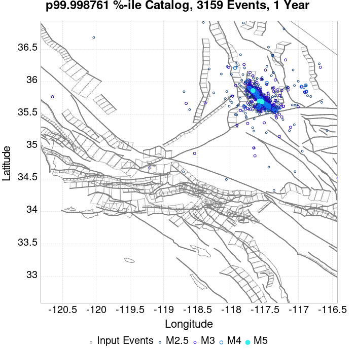
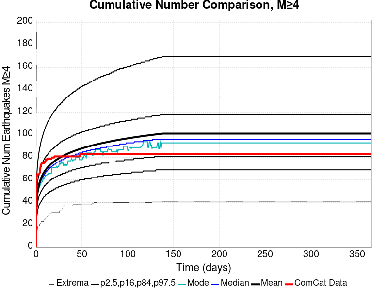
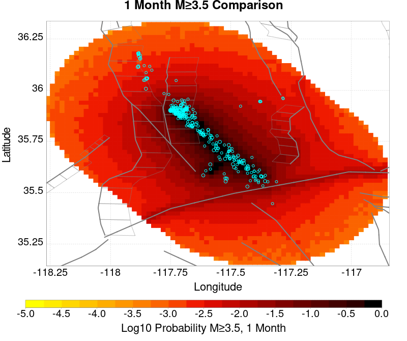

# ComCat M7.1 (ci38457511), ShakeMap Surfaces, FM2_1 Results

|   | ComCat M7.1 (ci38457511), ShakeMap Surfaces, FM2_1 |
|-----|-----|
| Num Simulations | 80708 (incomplete) |
| Start Time | 2019/07/06 03:19:54 UTC |
| Start Time Epoch Milliseconds | 1562383194040 |
| Duration | 10 Years |
| Includes Spontaneous? | false |
| Trigger Ruptures | 283 Trigger Ruptures |
|   | First: M3.98 at 2019/07/04 17:02:55 UTC |
|   | Last: M7.1 at 2019/07/06 03:19:53 UTC |
|   | Largest: M7.1 at 2019/07/06 03:19:53 UTC |
| Trigger Ruptures | *(none)* |
| Config Generated With | u3etas_comcat_event_config_builder.sh --event-id ci38457511 --mag-complete 3.5 --days-before 7 --num-simulations 1000000 --fault-model FM2_1 --finite-surf-shakemap --finite-surf-shakemap-min-mag 5 --hpc-site USC_HPC --nodes 36 --hours 24 --queue scec |

## Table Of Contents

* [Probabilities Summary Table](#probabilities-summary-table)
* [Magnitude Number Distribution](#magnitude-number-distribution)
  * [10 Year Magnitude Number Distribution](#10-year-magnitude-number-distribution)
  * [1 Year Magnitude Number Distribution](#1-year-magnitude-number-distribution)
  * [1 Month Magnitude Number Distribution](#1-month-magnitude-number-distribution)
  * [1 Week Magnitude Number Distribution](#1-week-magnitude-number-distribution)
  * [1 Day Magnitude Number Distribution](#1-day-magnitude-number-distribution)
  * [1 Hour Magnitude Number Distribution](#1-hour-magnitude-number-distribution)
* [Hazard Change Over Time](#hazard-change-over-time)
  * [M&ge;5.0 Hazard Change Over Time](#m50-hazard-change-over-time)
  * [M&ge;6.0 Hazard Change Over Time](#m60-hazard-change-over-time)
  * [M&ge;7.0 Hazard Change Over Time](#m70-hazard-change-over-time)
* [Trigger Rupture Fault Map](#trigger-rupture-fault-map)
* [Trigger Rupture Depth Map](#trigger-rupture-depth-map)
* [Fault Distances To Triggers](#fault-distances-to-triggers)
* [Individual Simulated Catalog Maps](#individual-simulated-catalog-maps)
* [ComCat Data Comparisons](#comcat-data-comparisons)
  * [ComCat Magnitude-Number Distributions](#comcat-magnitude-number-distributions)
  * [ComCat Time-Dependent Mc](#comcat-time-dependent-mc)
  * [ComCat Cumulative Number Vs Time](#comcat-cumulative-number-vs-time)
  * [ComCat Cumulative Number Simulation Percentiles](#comcat-cumulative-number-simulation-percentiles)
  * [ComCat Probability Spatial Distribution](#comcat-probability-spatial-distribution)
  * [ComCat Mean Expectation Spatial Distribution](#comcat-mean-expectation-spatial-distribution)
  * [ComCat Depth Distribution](#comcat-depth-distribution)
* [Section Participation](#section-participation)
  * [Section Participation Plots](#section-participation-plots)
  * [Supra-Seismogenic Parent Sections Table](#supra-seismogenic-parent-sections-table)
  * [M≥6.5 Parent Sections Table](#m65-parent-sections-table)
  * [M≥7 Parent Sections Table](#m7-parent-sections-table)
  * [M≥7.5 Parent Sections Table](#m75-parent-sections-table)
  * [M≥8 Parent Sections Table](#m8-parent-sections-table)
* [Fault Magnitude-Probability Distributions](#fault-magnitude-probability-distributions)
* [Gridded Nucleation](#gridded-nucleation)
* [JSON Input File](#json-input-file)

## Probabilities Summary Table
*[(top)](#table-of-contents)*

| Magnitude | 1 Hour Prob | 1 Day Prob | 1 Week Prob | 1 Month Prob | 1 Year Prob | 10 Year Prob |
|-----|-----|-----|-----|-----|-----|-----|
| **M&ge;4** | 1.000 (100.00%) | 1.000 (100.00%) | 1.000 (100.00%) | 1.000 (100.00%) | 1.000 (100.00%) | 1.000 (100.00%) |
| *95% Conf* | *[99.99% 100.00%]* | *[99.99% 100.00%]* | *[99.99% 100.00%]* | *[99.99% 100.00%]* | *[99.99% 100.00%]* | *[99.99% 100.00%]* |
| **M&ge;4.5** | 0.991 (99.09%) | 1.000 (100.00%) | 1.000 (100.00%) | 1.000 (100.00%) | 1.000 (100.00%) | 1.000 (100.00%) |
| *95% Conf* | *[99.02% 99.15%]* | *[99.99% 100.00%]* | *[99.99% 100.00%]* | *[99.99% 100.00%]* | *[99.99% 100.00%]* | *[99.99% 100.00%]* |
| **M&ge;5** | 0.768 (76.81%) | 0.976 (97.65%) | 0.995 (99.51%) | 0.999 (99.85%) | 1.000 (99.98%) | 1.000 (100.00%) |
| *95% Conf* | *[76.52% 77.10%]* | *[97.54% 97.75%]* | *[99.45% 99.55%]* | *[99.82% 99.88%]* | *[99.97% 99.99%]* | *[99.99% 100.00%]* |
| **M&ge;5.5** | 0.337 (33.75%) | 0.664 (66.42%) | 0.793 (79.34%) | 0.860 (85.95%) | 0.927 (92.69%) | 0.960 (95.99%) |
| *95% Conf* | *[33.42% 34.08%]* | *[66.09% 66.74%]* | *[79.06% 79.62%]* | *[85.71% 86.19%]* | *[92.51% 92.87%]* | *[95.85% 96.12%]* |
| **M&ge;6** | 0.082 (8.16%) | 0.210 (21.00%) | 0.295 (29.48%) | 0.357 (35.74%) | 0.457 (45.66%) | 0.536 (53.62%) |
| *95% Conf* | *[7.98% 8.35%]* | *[20.72% 21.28%]* | *[29.16% 29.79%]* | *[35.41% 36.07%]* | *[45.32% 46.01%]* | *[53.28% 53.97%]* |
| **M&ge;6.5** | 0.015 (1.47%) | 0.042 (4.17%) | 0.064 (6.36%) | 0.081 (8.14%) | 0.114 (11.39%) | 0.145 (14.52%) |
| *95% Conf* | *[1.39% 1.56%]* | *[4.03% 4.31%]* | *[6.20% 6.53%]* | *[7.95% 8.33%]* | *[11.18% 11.62%]* | *[14.27% 14.76%]* |
| **M&ge;7** | 3.90E-3 (0.39%) | 0.010 (1.05%) | 0.016 (1.58%) | 0.020 (2.04%) | 0.029 (2.93%) | 0.038 (3.82%) |
| *95% Conf* | *[0.35% 0.44%]* | *[0.98% 1.12%]* | *[1.49% 1.66%]* | *[1.94% 2.14%]* | *[2.81% 3.05%]* | *[3.69% 3.95%]* |
| **M&ge;7.1** | 3.05E-3 (0.30%) | 8.43E-3 (0.84%) | 0.013 (1.28%) | 0.016 (1.64%) | 0.023 (2.33%) | 0.031 (3.06%) |
| *95% Conf* | *[0.27% 0.35%]* | *[0.78% 0.91%]* | *[1.20% 1.36%]* | *[1.55% 1.73%]* | *[2.23% 2.44%]* | *[2.94% 3.18%]* |
| **M&ge;7.5** | 1.31E-3 (0.13%) | 3.61E-3 (0.36%) | 5.37E-3 (0.54%) | 6.96E-3 (0.70%) | 9.61E-3 (0.96%) | 0.012 (1.24%) |
| *95% Conf* | *[0.11% 0.16%]* | *[0.32% 0.40%]* | *[0.49% 0.59%]* | *[0.64% 0.76%]* | *[0.90% 1.03%]* | *[1.17% 1.32%]* |
| **M&ge;8** | 0.000 (0.00%) | 2.48E-5 (0.00%) | 3.72E-5 (0.00%) | 4.96E-5 (0.00%) | 8.67E-5 (0.01%) | 1.24E-4 (0.01%) |
| *95% Conf* | *[0.00% 0.01%]* | *[0.00% 0.01%]* | *[0.00% 0.01%]* | *[0.00% 0.01%]* | *[0.00% 0.02%]* | *[0.01% 0.02%]* |

## Magnitude Number Distribution
*[(top)](#table-of-contents)*

### 10 Year Magnitude Number Distribution
*[(top)](#table-of-contents)*

**Legend**
* **Mean** (thick black line): mean expected number across all 80708 catalogs
* **2.5%,97.5%** (thin black lines): expected number percentiles across all 80708 catalogs
* **Median** (thin blue line): median expected number across all 80708 catalogs
* **Mode** (thin cyan line): modal expected number across all 80708 catalogs
* **10 yr Probability** (thin red line): 10 year probability calculated as the fraction of catalogs with at least 1 occurrence
* **10 yr Supraseismogenic Probability** (thin dashed red line): same as above, but only for supraseismogenic ruptures on explicitly modeled UCERF3 faults
* **95% Conf** (light red shaded region): binomial 95% confidence bounds on probability
* **Primary** (thin green line): mean expected number from primary triggered aftershocks only (no secondary, tertiary, etc...) across all 80708 catalogs


| Mag | Mean | 2.5 %ile | 97.5 %ile | Median | Mode | 10 yr Probability | 10 yr Prob 95% Conf | 10 yr Supra-Seis Prob | Primary Aftershocks Mean |
|-----|-----|-----|-----|-----|-----|-----|-----|-----|-----|
| **M&ge;2.5** | 5029.594 | 3642.000 | 10246.000 | 4440.000 | 4201.000 | 1.000 (100.00%) | [99.99% 100.00%] | 0.122 (12.15%) | 2394.888 |
| **M&ge;2.6** | 3994.958 | 2887.000 | 8134.000 | 3527.000 | 3348.000 | 1.000 (100.00%) | [99.99% 100.00%] | 0.122 (12.15%) | 1902.259 |
| **M&ge;2.7** | 3173.131 | 2288.000 | 6481.000 | 2802.000 | 2699.000 | 1.000 (100.00%) | [99.99% 100.00%] | 0.122 (12.15%) | 1510.966 |
| **M&ge;2.8** | 2520.491 | 1813.000 | 5154.000 | 2227.000 | 2131.000 | 1.000 (100.00%) | [99.99% 100.00%] | 0.122 (12.15%) | 1200.281 |
| **M&ge;2.9** | 2002.077 | 1435.000 | 4090.000 | 1769.000 | 1643.000 | 1.000 (100.00%) | [99.99% 100.00%] | 0.122 (12.15%) | 953.355 |
| **M&ge;3** | 1590.198 | 1135.000 | 3253.000 | 1406.000 | 1321.000 | 1.000 (100.00%) | [99.99% 100.00%] | 0.122 (12.15%) | 757.224 |
| **M&ge;3.1** | 1262.942 | 897.000 | 2584.000 | 1117.000 | 1032.000 | 1.000 (100.00%) | [99.99% 100.00%] | 0.122 (12.15%) | 601.349 |
| **M&ge;3.2** | 1003.012 | 709.000 | 2051.000 | 888.000 | 814.000 | 1.000 (100.00%) | [99.99% 100.00%] | 0.122 (12.15%) | 477.566 |
| **M&ge;3.3** | 796.576 | 559.000 | 1629.000 | 705.000 | 643.000 | 1.000 (100.00%) | [99.99% 100.00%] | 0.122 (12.15%) | 379.325 |
| **M&ge;3.4** | 632.537 | 440.000 | 1295.000 | 560.000 | 537.000 | 1.000 (100.00%) | [99.99% 100.00%] | 0.122 (12.15%) | 301.211 |
| **M&ge;3.5** | 502.292 | 346.000 | 1027.000 | 446.000 | 427.000 | 1.000 (100.00%) | [99.99% 100.00%] | 0.122 (12.15%) | 239.200 |
| **M&ge;3.6** | 398.808 | 272.000 | 816.000 | 354.000 | 329.000 | 1.000 (100.00%) | [99.99% 100.00%] | 0.122 (12.15%) | 189.889 |
| **M&ge;3.7** | 316.630 | 213.000 | 651.000 | 281.000 | 262.000 | 1.000 (100.00%) | [99.99% 100.00%] | 0.122 (12.15%) | 150.750 |
| **M&ge;3.8** | 251.424 | 166.000 | 517.000 | 224.000 | 213.000 | 1.000 (100.00%) | [99.99% 100.00%] | 0.122 (12.15%) | 119.687 |
| **M&ge;3.9** | 199.576 | 129.000 | 412.000 | 178.000 | 175.000 | 1.000 (100.00%) | [99.99% 100.00%] | 0.122 (12.15%) | 95.020 |
| **M&ge;4** | 158.384 | 101.000 | 328.000 | 141.000 | 131.000 | 1.000 (100.00%) | [99.99% 100.00%] | 0.122 (12.15%) | 75.423 |
| **M&ge;4.1** | 125.669 | 78.000 | 262.000 | 112.000 | 108.000 | 1.000 (100.00%) | [99.99% 100.00%] | 0.122 (12.15%) | 59.846 |
| **M&ge;4.2** | 99.662 | 60.000 | 208.000 | 89.000 | 83.000 | 1.000 (100.00%) | [99.99% 100.00%] | 0.122 (12.15%) | 47.465 |
| **M&ge;4.3** | 79.047 | 46.000 | 166.000 | 71.000 | 63.000 | 1.000 (100.00%) | [99.99% 100.00%] | 0.122 (12.15%) | 37.652 |
| **M&ge;4.4** | 62.638 | 35.000 | 133.000 | 56.000 | 52.000 | 1.000 (100.00%) | [99.99% 100.00%] | 0.122 (12.15%) | 29.820 |
| **M&ge;4.5** | 49.615 | 26.000 | 106.000 | 44.000 | 40.000 | 1.000 (100.00%) | [99.99% 100.00%] | 0.122 (12.15%) | 23.608 |
| **M&ge;4.6** | 39.278 | 20.000 | 85.000 | 35.000 | 32.000 | 1.000 (100.00%) | [99.99% 100.00%] | 0.122 (12.15%) | 18.694 |
| **M&ge;4.7** | 31.051 | 15.000 | 68.000 | 28.000 | 25.000 | 1.000 (100.00%) | [99.99% 100.00%] | 0.122 (12.15%) | 14.774 |
| **M&ge;4.8** | 24.517 | 11.000 | 54.000 | 22.000 | 20.000 | 1.000 (100.00%) | [99.99% 100.00%] | 0.122 (12.15%) | 11.663 |
| **M&ge;4.9** | 19.328 | 8.000 | 44.000 | 17.000 | 16.000 | 1.000 (100.00%) | [99.99% 100.00%] | 0.122 (12.15%) | 9.199 |
| **M&ge;5** | 15.198 | 5.000 | 35.000 | 13.000 | 12.000 | 1.000 (100.00%) | [99.99% 100.00%] | 0.122 (12.15%) | 7.231 |
| **M&ge;5.1** | 11.916 | 4.000 | 28.000 | 11.000 | 9.000 | 1.000 (99.98%) | [99.97% 99.99%] | 0.122 (12.15%) | 5.670 |
| **M&ge;5.2** | 9.321 | 2.000 | 23.000 | 8.000 | 7.000 | 0.999 (99.87%) | [99.84% 99.89%] | 0.122 (12.15%) | 4.436 |
| **M&ge;5.3** | 7.253 | 1.000 | 19.000 | 6.000 | 5.000 | 0.995 (99.46%) | [99.41% 99.51%] | 0.122 (12.15%) | 3.450 |
| **M&ge;5.4** | 5.616 | 1.000 | 15.000 | 5.000 | 4.000 | 0.984 (98.40%) | [98.31% 98.49%] | 0.122 (12.15%) | 2.671 |
| **M&ge;5.5** | 4.316 | 0.000 | 12.000 | 4.000 | 3.000 | 0.960 (95.99%) | [95.85% 96.12%] | 0.122 (12.15%) | 2.049 |
| **M&ge;5.6** | 3.283 | 0.000 | 10.000 | 3.000 | 2.000 | 0.917 (91.75%) | [91.55% 91.93%] | 0.122 (12.15%) | 1.559 |
| **M&ge;5.7** | 2.460 | 0.000 | 8.000 | 2.000 | 1.000 | 0.851 (85.07%) | [84.83% 85.32%] | 0.122 (12.15%) | 1.164 |
| **M&ge;5.8** | 1.808 | 0.000 | 6.000 | 1.000 | 1.000 | 0.761 (76.14%) | [75.84% 76.43%] | 0.122 (12.15%) | 0.855 |
| **M&ge;5.9** | 1.296 | 0.000 | 5.000 | 1.000 | 0.000 | 0.651 (65.06%) | [64.73% 65.39%] | 0.122 (12.15%) | 0.613 |
| **M&ge;6** | 0.930 | 0.000 | 4.000 | 1.000 | 0.000 | 0.536 (53.62%) | [53.28% 53.97%] | 0.122 (12.15%) | 0.435 |
| **M&ge;6.1** | 0.672 | 0.000 | 3.000 | 0.000 | 0.000 | 0.429 (42.88%) | [42.53% 43.22%] | 0.121 (12.13%) | 0.307 |
| **M&ge;6.2** | 0.466 | 0.000 | 3.000 | 0.000 | 0.000 | 0.321 (32.12%) | [31.80% 32.45%] | 0.121 (12.13%) | 0.202 |
| **M&ge;6.3** | 0.368 | 0.000 | 2.000 | 0.000 | 0.000 | 0.263 (26.33%) | [26.03% 26.64%] | 0.121 (12.13%) | 0.153 |
| **M&ge;6.4** | 0.234 | 0.000 | 2.000 | 0.000 | 0.000 | 0.173 (17.31%) | [17.05% 17.57%] | 0.072 (7.16%) | 0.097 |
| **M&ge;6.5** | 0.196 | 0.000 | 2.000 | 0.000 | 0.000 | 0.145 (14.52%) | [14.27% 14.76%] | 0.072 (7.15%) | 0.078 |
| **M&ge;6.6** | 0.143 | 0.000 | 1.000 | 0.000 | 0.000 | 0.115 (11.48%) | [11.26% 11.70%] | 0.062 (6.20%) | 0.060 |
| **M&ge;6.7** | 0.113 | 0.000 | 1.000 | 0.000 | 0.000 | 0.091 (9.13%) | [8.94% 9.34%] | 0.054 (5.43%) | 0.046 |
| **M&ge;6.8** | 0.093 | 0.000 | 1.000 | 0.000 | 0.000 | 0.077 (7.67%) | [7.49% 7.85%] | 0.052 (5.18%) | 0.038 |
| **M&ge;6.9** | 0.055 | 0.000 | 1.000 | 0.000 | 0.000 | 0.047 (4.67%) | [4.52% 4.81%] | 0.030 (3.02%) | 0.023 |
| **M&ge;7** | 0.045 | 0.000 | 1.000 | 0.000 | 0.000 | 0.038 (3.82%) | [3.69% 3.95%] | 0.028 (2.79%) | 0.019 |
| **M&ge;7.1** | 0.036 | 0.000 | 1.000 | 0.000 | 0.000 | 0.031 (3.06%) | [2.94% 3.18%] | 0.025 (2.46%) | 0.015 |
| **M&ge;7.2** | 0.029 | 0.000 | 1.000 | 0.000 | 0.000 | 0.025 (2.54%) | [2.43% 2.65%] | 0.022 (2.20%) | 0.013 |
| **M&ge;7.3** | 0.022 | 0.000 | 0.000 | 0.000 | 0.000 | 0.019 (1.93%) | [1.83% 2.02%] | 0.018 (1.77%) | 9.39E-3 |
| **M&ge;7.4** | 0.018 | 0.000 | 0.000 | 0.000 | 0.000 | 0.016 (1.62%) | [1.53% 1.71%] | 0.015 (1.54%) | 8.36E-3 |
| **M&ge;7.5** | 0.014 | 0.000 | 0.000 | 0.000 | 0.000 | 0.012 (1.24%) | [1.17% 1.32%] | 0.012 (1.22%) | 6.31E-3 |
| **M&ge;7.6** | 0.013 | 0.000 | 0.000 | 0.000 | 0.000 | 0.011 (1.14%) | [1.07% 1.22%] | 0.011 (1.13%) | 5.75E-3 |
| **M&ge;7.7** | 5.38E-3 | 0.000 | 0.000 | 0.000 | 0.000 | 4.84E-3 (0.48%) | [0.44% 0.54%] | 4.75E-3 (0.47%) | 1.73E-3 |
| **M&ge;7.8** | 1.70E-3 | 0.000 | 0.000 | 0.000 | 0.000 | 1.67E-3 (0.17%) | [0.14% 0.20%] | 1.61E-3 (0.16%) | 1.73E-4 |
| **M&ge;7.9** | 4.58E-4 | 0.000 | 0.000 | 0.000 | 0.000 | 4.58E-4 (0.05%) | [0.03% 0.06%] | 4.58E-4 (0.05%) | 2.48E-5 |
| **M&ge;8** | 1.24E-4 | 0.000 | 0.000 | 0.000 | 0.000 | 1.24E-4 (0.01%) | [0.01% 0.02%] | 1.24E-4 (0.01%) | 1.24E-5 |
| **M&ge;8.1** | 4.96E-5 | 0.000 | 0.000 | 0.000 | 0.000 | 4.96E-5 (0.00%) | [0.00% 0.01%] | 4.96E-5 (0.00%) | 0.000 |
| **M&ge;8.2** | 0.000 | 0.000 | 0.000 | 0.000 | 0.000 | 0.000 (0.00%) | [0.00% 0.01%] | 0.000 (0.00%) | 0.000 |
| **M&ge;8.3** | 0.000 | 0.000 | 0.000 | 0.000 | 0.000 | 0.000 (0.00%) | [0.00% 0.01%] | 0.000 (0.00%) | 0.000 |
| **M&ge;8.4** | 0.000 | 0.000 | 0.000 | 0.000 | 0.000 | 0.000 (0.00%) | [0.00% 0.01%] | 0.000 (0.00%) | 0.000 |
| **M&ge;8.5** | 0.000 | 0.000 | 0.000 | 0.000 | 0.000 | 0.000 (0.00%) | [0.00% 0.01%] | 0.000 (0.00%) | 0.000 |
| **M&ge;8.6** | 0.000 | 0.000 | 0.000 | 0.000 | 0.000 | 0.000 (0.00%) | [0.00% 0.01%] | 0.000 (0.00%) | 0.000 |
| **M&ge;8.7** | 0.000 | 0.000 | 0.000 | 0.000 | 0.000 | 0.000 (0.00%) | [0.00% 0.01%] | 0.000 (0.00%) | 0.000 |
| **M&ge;8.8** | 0.000 | 0.000 | 0.000 | 0.000 | 0.000 | 0.000 (0.00%) | [0.00% 0.01%] | 0.000 (0.00%) | 0.000 |
| **M&ge;8.9** | 0.000 | 0.000 | 0.000 | 0.000 | 0.000 | 0.000 (0.00%) | [0.00% 0.01%] | 0.000 (0.00%) | 0.000 |
| **M&ge;9** | 0.000 | 0.000 | 0.000 | 0.000 | 0.000 | 0.000 (0.00%) | [0.00% 0.01%] | 0.000 (0.00%) | 0.000 |

### 1 Year Magnitude Number Distribution
*[(top)](#table-of-contents)*

**Legend**
* **Mean** (thick black line): mean expected number across all 80708 catalogs
* **2.5%,97.5%** (thin black lines): expected number percentiles across all 80708 catalogs
* **Median** (thin blue line): median expected number across all 80708 catalogs
* **Mode** (thin cyan line): modal expected number across all 80708 catalogs
* **1 yr Probability** (thin red line): 1 year probability calculated as the fraction of catalogs with at least 1 occurrence
* **1 yr Supraseismogenic Probability** (thin dashed red line): same as above, but only for supraseismogenic ruptures on explicitly modeled UCERF3 faults
* **95% Conf** (light red shaded region): binomial 95% confidence bounds on probability
* **Primary** (thin green line): mean expected number from primary triggered aftershocks only (no secondary, tertiary, etc...) across all 80708 catalogs


| Mag | Mean | 2.5 %ile | 97.5 %ile | Median | Mode | 1 yr Probability | 1 yr Prob 95% Conf | 1 yr Supra-Seis Prob | Primary Aftershocks Mean |
|-----|-----|-----|-----|-----|-----|-----|-----|-----|-----|
| **M&ge;2.5** | 3857.617 | 2942.000 | 6969.000 | 3491.000 | 3283.000 | 1.000 (100.00%) | [99.99% 100.00%] | 0.094 (9.35%) | 2086.032 |
| **M&ge;2.6** | 3064.037 | 2333.000 | 5536.000 | 2773.000 | 2620.000 | 1.000 (100.00%) | [99.99% 100.00%] | 0.094 (9.35%) | 1656.895 |
| **M&ge;2.7** | 2433.705 | 1847.000 | 4400.000 | 2203.000 | 2057.000 | 1.000 (100.00%) | [99.99% 100.00%] | 0.094 (9.35%) | 1316.061 |
| **M&ge;2.8** | 1933.119 | 1463.000 | 3494.000 | 1751.000 | 1627.000 | 1.000 (100.00%) | [99.99% 100.00%] | 0.094 (9.35%) | 1045.424 |
| **M&ge;2.9** | 1535.436 | 1157.000 | 2777.000 | 1391.000 | 1334.000 | 1.000 (100.00%) | [99.99% 100.00%] | 0.094 (9.35%) | 830.327 |
| **M&ge;3** | 1219.593 | 914.000 | 2205.000 | 1105.000 | 1053.000 | 1.000 (100.00%) | [99.99% 100.00%] | 0.094 (9.35%) | 659.537 |
| **M&ge;3.1** | 968.617 | 722.000 | 1754.000 | 878.000 | 819.000 | 1.000 (100.00%) | [99.99% 100.00%] | 0.094 (9.35%) | 523.774 |
| **M&ge;3.2** | 769.287 | 569.000 | 1395.000 | 698.000 | 657.000 | 1.000 (100.00%) | [99.99% 100.00%] | 0.094 (9.35%) | 415.946 |
| **M&ge;3.3** | 610.988 | 448.000 | 1110.000 | 555.000 | 520.000 | 1.000 (100.00%) | [99.99% 100.00%] | 0.094 (9.35%) | 330.380 |
| **M&ge;3.4** | 485.148 | 352.000 | 885.000 | 441.000 | 416.000 | 1.000 (100.00%) | [99.99% 100.00%] | 0.094 (9.35%) | 262.328 |
| **M&ge;3.5** | 385.269 | 277.000 | 703.000 | 350.000 | 329.000 | 1.000 (100.00%) | [99.99% 100.00%] | 0.094 (9.35%) | 208.319 |
| **M&ge;3.6** | 305.892 | 217.000 | 557.000 | 279.000 | 258.000 | 1.000 (100.00%) | [99.99% 100.00%] | 0.094 (9.35%) | 165.374 |
| **M&ge;3.7** | 242.842 | 169.000 | 443.000 | 221.000 | 211.000 | 1.000 (100.00%) | [99.99% 100.00%] | 0.094 (9.35%) | 131.278 |
| **M&ge;3.8** | 192.808 | 132.000 | 352.000 | 176.000 | 168.000 | 1.000 (100.00%) | [99.99% 100.00%] | 0.094 (9.35%) | 104.223 |
| **M&ge;3.9** | 153.066 | 103.000 | 282.000 | 140.000 | 130.000 | 1.000 (100.00%) | [99.99% 100.00%] | 0.094 (9.35%) | 82.753 |
| **M&ge;4** | 121.479 | 79.000 | 225.000 | 111.000 | 103.000 | 1.000 (100.00%) | [99.99% 100.00%] | 0.094 (9.35%) | 65.684 |
| **M&ge;4.1** | 96.396 | 61.000 | 179.000 | 88.000 | 84.000 | 1.000 (100.00%) | [99.99% 100.00%] | 0.094 (9.35%) | 52.123 |
| **M&ge;4.2** | 76.436 | 47.000 | 142.000 | 70.000 | 66.000 | 1.000 (100.00%) | [99.99% 100.00%] | 0.094 (9.35%) | 41.334 |
| **M&ge;4.3** | 60.618 | 36.000 | 114.000 | 55.000 | 54.000 | 1.000 (100.00%) | [99.99% 100.00%] | 0.094 (9.35%) | 32.792 |
| **M&ge;4.4** | 48.027 | 27.000 | 92.000 | 44.000 | 40.000 | 1.000 (100.00%) | [99.99% 100.00%] | 0.094 (9.35%) | 25.969 |
| **M&ge;4.5** | 38.042 | 20.000 | 74.000 | 35.000 | 33.000 | 1.000 (100.00%) | [99.99% 100.00%] | 0.094 (9.35%) | 20.563 |
| **M&ge;4.6** | 30.112 | 15.000 | 59.000 | 28.000 | 25.000 | 1.000 (100.00%) | [99.99% 100.00%] | 0.094 (9.35%) | 16.281 |
| **M&ge;4.7** | 23.797 | 11.000 | 48.000 | 22.000 | 20.000 | 1.000 (100.00%) | [99.99% 100.00%] | 0.094 (9.35%) | 12.862 |
| **M&ge;4.8** | 18.785 | 8.000 | 39.000 | 17.000 | 16.000 | 1.000 (100.00%) | [99.99% 100.00%] | 0.094 (9.35%) | 10.148 |
| **M&ge;4.9** | 14.811 | 6.000 | 31.000 | 13.000 | 12.000 | 1.000 (100.00%) | [99.99% 100.00%] | 0.094 (9.35%) | 8.002 |
| **M&ge;5** | 11.646 | 4.000 | 25.000 | 11.000 | 9.000 | 1.000 (99.98%) | [99.97% 99.99%] | 0.094 (9.35%) | 6.290 |
| **M&ge;5.1** | 9.129 | 2.000 | 21.000 | 8.000 | 7.000 | 0.999 (99.90%) | [99.87% 99.92%] | 0.094 (9.35%) | 4.934 |
| **M&ge;5.2** | 7.140 | 2.000 | 17.000 | 6.000 | 6.000 | 0.996 (99.59%) | [99.54% 99.63%] | 0.094 (9.35%) | 3.858 |
| **M&ge;5.3** | 5.552 | 1.000 | 14.000 | 5.000 | 4.000 | 0.987 (98.66%) | [98.58% 98.74%] | 0.094 (9.35%) | 3.000 |
| **M&ge;5.4** | 4.300 | 0.000 | 11.000 | 4.000 | 3.000 | 0.966 (96.61%) | [96.48% 96.73%] | 0.094 (9.35%) | 2.323 |
| **M&ge;5.5** | 3.304 | 0.000 | 9.000 | 3.000 | 2.000 | 0.927 (92.69%) | [92.51% 92.87%] | 0.094 (9.35%) | 1.782 |
| **M&ge;5.6** | 2.514 | 0.000 | 8.000 | 2.000 | 2.000 | 0.869 (86.86%) | [86.62% 87.09%] | 0.094 (9.35%) | 1.356 |
| **M&ge;5.7** | 1.882 | 0.000 | 6.000 | 1.000 | 1.000 | 0.786 (78.60%) | [78.32% 78.89%] | 0.094 (9.35%) | 1.012 |
| **M&ge;5.8** | 1.381 | 0.000 | 5.000 | 1.000 | 1.000 | 0.685 (68.51%) | [68.19% 68.83%] | 0.094 (9.35%) | 0.743 |
| **M&ge;5.9** | 0.988 | 0.000 | 4.000 | 1.000 | 0.000 | 0.568 (56.84%) | [56.50% 57.19%] | 0.094 (9.35%) | 0.531 |
| **M&ge;6** | 0.708 | 0.000 | 3.000 | 0.000 | 0.000 | 0.457 (45.66%) | [45.32% 46.01%] | 0.094 (9.35%) | 0.376 |
| **M&ge;6.1** | 0.508 | 0.000 | 3.000 | 0.000 | 0.000 | 0.356 (35.58%) | [35.25% 35.91%] | 0.093 (9.33%) | 0.264 |
| **M&ge;6.2** | 0.348 | 0.000 | 2.000 | 0.000 | 0.000 | 0.259 (25.94%) | [25.63% 26.24%] | 0.093 (9.33%) | 0.173 |
| **M&ge;6.3** | 0.272 | 0.000 | 2.000 | 0.000 | 0.000 | 0.210 (20.97%) | [20.69% 21.25%] | 0.093 (9.33%) | 0.131 |
| **M&ge;6.4** | 0.173 | 0.000 | 1.000 | 0.000 | 0.000 | 0.136 (13.64%) | [13.40% 13.88%] | 0.056 (5.57%) | 0.083 |
| **M&ge;6.5** | 0.144 | 0.000 | 1.000 | 0.000 | 0.000 | 0.114 (11.39%) | [11.18% 11.62%] | 0.056 (5.56%) | 0.067 |
| **M&ge;6.6** | 0.105 | 0.000 | 1.000 | 0.000 | 0.000 | 0.089 (8.94%) | [8.75% 9.14%] | 0.048 (4.82%) | 0.051 |
| **M&ge;6.7** | 0.083 | 0.000 | 1.000 | 0.000 | 0.000 | 0.071 (7.06%) | [6.89% 7.24%] | 0.042 (4.21%) | 0.040 |
| **M&ge;6.8** | 0.069 | 0.000 | 1.000 | 0.000 | 0.000 | 0.059 (5.93%) | [5.76% 6.09%] | 0.040 (4.02%) | 0.033 |
| **M&ge;6.9** | 0.041 | 0.000 | 1.000 | 0.000 | 0.000 | 0.036 (3.57%) | [3.44% 3.70%] | 0.023 (2.33%) | 0.020 |
| **M&ge;7** | 0.033 | 0.000 | 1.000 | 0.000 | 0.000 | 0.029 (2.93%) | [2.81% 3.05%] | 0.022 (2.16%) | 0.016 |
| **M&ge;7.1** | 0.026 | 0.000 | 0.000 | 0.000 | 0.000 | 0.023 (2.33%) | [2.23% 2.44%] | 0.019 (1.89%) | 0.013 |
| **M&ge;7.2** | 0.021 | 0.000 | 0.000 | 0.000 | 0.000 | 0.020 (1.95%) | [1.86% 2.05%] | 0.017 (1.70%) | 0.011 |
| **M&ge;7.3** | 0.016 | 0.000 | 0.000 | 0.000 | 0.000 | 0.015 (1.48%) | [1.40% 1.56%] | 0.014 (1.36%) | 8.04E-3 |
| **M&ge;7.4** | 0.014 | 0.000 | 0.000 | 0.000 | 0.000 | 0.012 (1.24%) | [1.17% 1.32%] | 0.012 (1.18%) | 7.17E-3 |
| **M&ge;7.5** | 0.011 | 0.000 | 0.000 | 0.000 | 0.000 | 9.61E-3 (0.96%) | [0.90% 1.03%] | 9.43E-3 (0.94%) | 5.43E-3 |
| **M&ge;7.6** | 9.95E-3 | 0.000 | 0.000 | 0.000 | 0.000 | 8.81E-3 (0.88%) | [0.82% 0.95%] | 8.71E-3 (0.87%) | 4.97E-3 |
| **M&ge;7.7** | 3.93E-3 | 0.000 | 0.000 | 0.000 | 0.000 | 3.63E-3 (0.36%) | [0.32% 0.41%] | 3.54E-3 (0.35%) | 1.50E-3 |
| **M&ge;7.8** | 1.16E-3 | 0.000 | 0.000 | 0.000 | 0.000 | 1.16E-3 (0.12%) | [0.09% 0.14%] | 1.12E-3 (0.11%) | 1.24E-4 |
| **M&ge;7.9** | 3.47E-4 | 0.000 | 0.000 | 0.000 | 0.000 | 3.47E-4 (0.03%) | [0.02% 0.05%] | 3.47E-4 (0.03%) | 2.48E-5 |
| **M&ge;8** | 8.67E-5 | 0.000 | 0.000 | 0.000 | 0.000 | 8.67E-5 (0.01%) | [0.00% 0.02%] | 8.67E-5 (0.01%) | 1.24E-5 |
| **M&ge;8.1** | 3.72E-5 | 0.000 | 0.000 | 0.000 | 0.000 | 3.72E-5 (0.00%) | [0.00% 0.01%] | 3.72E-5 (0.00%) | 0.000 |
| **M&ge;8.2** | 0.000 | 0.000 | 0.000 | 0.000 | 0.000 | 0.000 (0.00%) | [0.00% 0.01%] | 0.000 (0.00%) | 0.000 |
| **M&ge;8.3** | 0.000 | 0.000 | 0.000 | 0.000 | 0.000 | 0.000 (0.00%) | [0.00% 0.01%] | 0.000 (0.00%) | 0.000 |
| **M&ge;8.4** | 0.000 | 0.000 | 0.000 | 0.000 | 0.000 | 0.000 (0.00%) | [0.00% 0.01%] | 0.000 (0.00%) | 0.000 |
| **M&ge;8.5** | 0.000 | 0.000 | 0.000 | 0.000 | 0.000 | 0.000 (0.00%) | [0.00% 0.01%] | 0.000 (0.00%) | 0.000 |
| **M&ge;8.6** | 0.000 | 0.000 | 0.000 | 0.000 | 0.000 | 0.000 (0.00%) | [0.00% 0.01%] | 0.000 (0.00%) | 0.000 |
| **M&ge;8.7** | 0.000 | 0.000 | 0.000 | 0.000 | 0.000 | 0.000 (0.00%) | [0.00% 0.01%] | 0.000 (0.00%) | 0.000 |
| **M&ge;8.8** | 0.000 | 0.000 | 0.000 | 0.000 | 0.000 | 0.000 (0.00%) | [0.00% 0.01%] | 0.000 (0.00%) | 0.000 |
| **M&ge;8.9** | 0.000 | 0.000 | 0.000 | 0.000 | 0.000 | 0.000 (0.00%) | [0.00% 0.01%] | 0.000 (0.00%) | 0.000 |
| **M&ge;9** | 0.000 | 0.000 | 0.000 | 0.000 | 0.000 | 0.000 (0.00%) | [0.00% 0.01%] | 0.000 (0.00%) | 0.000 |

### 1 Month Magnitude Number Distribution
*[(top)](#table-of-contents)*

**Legend**
* **Mean** (thick black line): mean expected number across all 80708 catalogs
* **2.5%,97.5%** (thin black lines): expected number percentiles across all 80708 catalogs
* **Median** (thin blue line): median expected number across all 80708 catalogs
* **Mode** (thin cyan line): modal expected number across all 80708 catalogs
* **1 mo Probability** (thin red line): 1 month probability calculated as the fraction of catalogs with at least 1 occurrence
* **1 mo Supraseismogenic Probability** (thin dashed red line): same as above, but only for supraseismogenic ruptures on explicitly modeled UCERF3 faults
* **95% Conf** (light red shaded region): binomial 95% confidence bounds on probability
* **Primary** (thin green line): mean expected number from primary triggered aftershocks only (no secondary, tertiary, etc...) across all 80708 catalogs


| Mag | Mean | 2.5 %ile | 97.5 %ile | Median | Mode | 1 mo Probability | 1 mo Prob 95% Conf | 1 mo Supra-Seis Prob | Primary Aftershocks Mean |
|-----|-----|-----|-----|-----|-----|-----|-----|-----|-----|
| **M&ge;2.5** | 2714.339 | 2183.000 | 4225.000 | 2515.000 | 2381.000 | 1.000 (100.00%) | [99.99% 100.00%] | 0.066 (6.57%) | 1690.876 |
| **M&ge;2.6** | 2156.003 | 1729.000 | 3361.000 | 1999.000 | 1960.000 | 1.000 (100.00%) | [99.99% 100.00%] | 0.066 (6.57%) | 1343.049 |
| **M&ge;2.7** | 1712.471 | 1368.000 | 2675.000 | 1588.000 | 1531.000 | 1.000 (100.00%) | [99.99% 100.00%] | 0.066 (6.57%) | 1066.752 |
| **M&ge;2.8** | 1360.262 | 1081.000 | 2131.000 | 1262.000 | 1192.000 | 1.000 (100.00%) | [99.99% 100.00%] | 0.066 (6.57%) | 847.395 |
| **M&ge;2.9** | 1080.409 | 854.000 | 1690.000 | 1003.000 | 941.000 | 1.000 (100.00%) | [99.99% 100.00%] | 0.066 (6.57%) | 673.018 |
| **M&ge;3** | 858.166 | 674.000 | 1346.000 | 797.000 | 780.000 | 1.000 (100.00%) | [99.99% 100.00%] | 0.066 (6.57%) | 534.577 |
| **M&ge;3.1** | 681.563 | 532.000 | 1070.000 | 634.000 | 605.000 | 1.000 (100.00%) | [99.99% 100.00%] | 0.066 (6.57%) | 424.550 |
| **M&ge;3.2** | 541.311 | 418.000 | 853.000 | 504.000 | 477.000 | 1.000 (100.00%) | [99.99% 100.00%] | 0.066 (6.57%) | 337.162 |
| **M&ge;3.3** | 429.941 | 329.000 | 678.000 | 400.000 | 398.000 | 1.000 (100.00%) | [99.99% 100.00%] | 0.066 (6.57%) | 267.818 |
| **M&ge;3.4** | 341.388 | 258.000 | 539.000 | 318.000 | 308.000 | 1.000 (100.00%) | [99.99% 100.00%] | 0.066 (6.57%) | 212.666 |
| **M&ge;3.5** | 271.084 | 202.000 | 431.000 | 253.000 | 247.000 | 1.000 (100.00%) | [99.99% 100.00%] | 0.066 (6.57%) | 168.872 |
| **M&ge;3.6** | 215.223 | 157.000 | 343.000 | 201.000 | 198.000 | 1.000 (100.00%) | [99.99% 100.00%] | 0.066 (6.57%) | 134.050 |
| **M&ge;3.7** | 170.854 | 122.000 | 273.000 | 160.000 | 156.000 | 1.000 (100.00%) | [99.99% 100.00%] | 0.066 (6.57%) | 106.407 |
| **M&ge;3.8** | 135.639 | 95.000 | 218.000 | 127.000 | 123.000 | 1.000 (100.00%) | [99.99% 100.00%] | 0.066 (6.57%) | 84.473 |
| **M&ge;3.9** | 107.685 | 74.000 | 173.000 | 101.000 | 97.000 | 1.000 (100.00%) | [99.99% 100.00%] | 0.066 (6.57%) | 67.074 |
| **M&ge;4** | 85.464 | 57.000 | 139.000 | 80.000 | 76.000 | 1.000 (100.00%) | [99.99% 100.00%] | 0.066 (6.57%) | 53.235 |
| **M&ge;4.1** | 67.810 | 43.000 | 112.000 | 64.000 | 61.000 | 1.000 (100.00%) | [99.99% 100.00%] | 0.066 (6.57%) | 42.238 |
| **M&ge;4.2** | 53.772 | 33.000 | 90.000 | 50.000 | 50.000 | 1.000 (100.00%) | [99.99% 100.00%] | 0.066 (6.57%) | 33.495 |
| **M&ge;4.3** | 42.657 | 25.000 | 73.000 | 40.000 | 37.000 | 1.000 (100.00%) | [99.99% 100.00%] | 0.066 (6.57%) | 26.577 |
| **M&ge;4.4** | 33.810 | 19.000 | 59.000 | 32.000 | 30.000 | 1.000 (100.00%) | [99.99% 100.00%] | 0.066 (6.57%) | 21.054 |
| **M&ge;4.5** | 26.782 | 14.000 | 48.000 | 25.000 | 23.000 | 1.000 (100.00%) | [99.99% 100.00%] | 0.066 (6.57%) | 16.672 |
| **M&ge;4.6** | 21.198 | 10.000 | 39.000 | 20.000 | 19.000 | 1.000 (100.00%) | [99.99% 100.00%] | 0.066 (6.57%) | 13.201 |
| **M&ge;4.7** | 16.752 | 7.000 | 32.000 | 16.000 | 15.000 | 1.000 (100.00%) | [99.99% 100.00%] | 0.066 (6.57%) | 10.428 |
| **M&ge;4.8** | 13.227 | 5.000 | 26.000 | 12.000 | 12.000 | 1.000 (100.00%) | [99.99% 100.00%] | 0.066 (6.57%) | 8.228 |
| **M&ge;4.9** | 10.425 | 3.000 | 21.000 | 10.000 | 9.000 | 1.000 (99.98%) | [99.96% 99.99%] | 0.066 (6.57%) | 6.488 |
| **M&ge;5** | 8.198 | 2.000 | 18.000 | 8.000 | 6.000 | 0.999 (99.85%) | [99.82% 99.88%] | 0.066 (6.57%) | 5.102 |
| **M&ge;5.1** | 6.427 | 1.000 | 15.000 | 6.000 | 5.000 | 0.995 (99.46%) | [99.41% 99.51%] | 0.066 (6.57%) | 4.000 |
| **M&ge;5.2** | 5.026 | 1.000 | 12.000 | 5.000 | 4.000 | 0.984 (98.43%) | [98.34% 98.51%] | 0.066 (6.57%) | 3.127 |
| **M&ge;5.3** | 3.907 | 0.000 | 10.000 | 3.000 | 3.000 | 0.961 (96.14%) | [96.00% 96.27%] | 0.066 (6.57%) | 2.431 |
| **M&ge;5.4** | 3.024 | 0.000 | 8.000 | 3.000 | 2.000 | 0.922 (92.18%) | [91.99% 92.36%] | 0.066 (6.57%) | 1.882 |
| **M&ge;5.5** | 2.322 | 0.000 | 7.000 | 2.000 | 1.000 | 0.860 (85.95%) | [85.71% 86.19%] | 0.066 (6.57%) | 1.443 |
| **M&ge;5.6** | 1.766 | 0.000 | 6.000 | 1.000 | 1.000 | 0.780 (77.98%) | [77.70% 78.27%] | 0.066 (6.57%) | 1.097 |
| **M&ge;5.7** | 1.322 | 0.000 | 5.000 | 1.000 | 1.000 | 0.683 (68.28%) | [67.95% 68.60%] | 0.066 (6.57%) | 0.818 |
| **M&ge;5.8** | 0.969 | 0.000 | 4.000 | 1.000 | 0.000 | 0.575 (57.48%) | [57.14% 57.82%] | 0.066 (6.57%) | 0.600 |
| **M&ge;5.9** | 0.692 | 0.000 | 3.000 | 0.000 | 0.000 | 0.460 (45.98%) | [45.64% 46.33%] | 0.066 (6.57%) | 0.428 |
| **M&ge;6** | 0.493 | 0.000 | 3.000 | 0.000 | 0.000 | 0.357 (35.74%) | [35.41% 36.07%] | 0.066 (6.57%) | 0.303 |
| **M&ge;6.1** | 0.351 | 0.000 | 2.000 | 0.000 | 0.000 | 0.271 (27.08%) | [26.78% 27.39%] | 0.066 (6.56%) | 0.211 |
| **M&ge;6.2** | 0.237 | 0.000 | 2.000 | 0.000 | 0.000 | 0.192 (19.19%) | [18.92% 19.47%] | 0.066 (6.56%) | 0.138 |
| **M&ge;6.3** | 0.184 | 0.000 | 1.000 | 0.000 | 0.000 | 0.153 (15.32%) | [15.07% 15.57%] | 0.066 (6.56%) | 0.104 |
| **M&ge;6.4** | 0.116 | 0.000 | 1.000 | 0.000 | 0.000 | 0.098 (9.77%) | [9.57% 9.98%] | 0.040 (3.98%) | 0.066 |
| **M&ge;6.5** | 0.096 | 0.000 | 1.000 | 0.000 | 0.000 | 0.081 (8.14%) | [7.95% 8.33%] | 0.040 (3.98%) | 0.053 |
| **M&ge;6.6** | 0.072 | 0.000 | 1.000 | 0.000 | 0.000 | 0.064 (6.40%) | [6.23% 6.57%] | 0.035 (3.46%) | 0.041 |
| **M&ge;6.7** | 0.056 | 0.000 | 1.000 | 0.000 | 0.000 | 0.050 (5.04%) | [4.89% 5.19%] | 0.030 (3.02%) | 0.032 |
| **M&ge;6.8** | 0.047 | 0.000 | 1.000 | 0.000 | 0.000 | 0.042 (4.24%) | [4.10% 4.38%] | 0.029 (2.89%) | 0.027 |
| **M&ge;6.9** | 0.027 | 0.000 | 0.000 | 0.000 | 0.000 | 0.025 (2.48%) | [2.38% 2.59%] | 0.016 (1.63%) | 0.016 |
| **M&ge;7** | 0.022 | 0.000 | 0.000 | 0.000 | 0.000 | 0.020 (2.04%) | [1.94% 2.14%] | 0.015 (1.51%) | 0.013 |
| **M&ge;7.1** | 0.018 | 0.000 | 0.000 | 0.000 | 0.000 | 0.016 (1.64%) | [1.55% 1.73%] | 0.013 (1.34%) | 0.010 |
| **M&ge;7.2** | 0.015 | 0.000 | 0.000 | 0.000 | 0.000 | 0.014 (1.37%) | [1.29% 1.45%] | 0.012 (1.20%) | 8.74E-3 |
| **M&ge;7.3** | 0.011 | 0.000 | 0.000 | 0.000 | 0.000 | 0.010 (1.04%) | [0.97% 1.12%] | 9.57E-3 (0.96%) | 6.72E-3 |
| **M&ge;7.4** | 9.64E-3 | 0.000 | 0.000 | 0.000 | 0.000 | 8.95E-3 (0.89%) | [0.83% 0.96%] | 8.54E-3 (0.85%) | 6.05E-3 |
| **M&ge;7.5** | 7.63E-3 | 0.000 | 0.000 | 0.000 | 0.000 | 6.96E-3 (0.70%) | [0.64% 0.76%] | 6.84E-3 (0.68%) | 4.63E-3 |
| **M&ge;7.6** | 6.91E-3 | 0.000 | 0.000 | 0.000 | 0.000 | 6.32E-3 (0.63%) | [0.58% 0.69%] | 6.27E-3 (0.63%) | 4.23E-3 |
| **M&ge;7.7** | 2.39E-3 | 0.000 | 0.000 | 0.000 | 0.000 | 2.24E-3 (0.22%) | [0.19% 0.26%] | 2.19E-3 (0.22%) | 1.18E-3 |
| **M&ge;7.8** | 6.20E-4 | 0.000 | 0.000 | 0.000 | 0.000 | 6.20E-4 (0.06%) | [0.05% 0.08%] | 5.95E-4 (0.06%) | 8.67E-5 |
| **M&ge;7.9** | 1.98E-4 | 0.000 | 0.000 | 0.000 | 0.000 | 1.98E-4 (0.02%) | [0.01% 0.03%] | 1.98E-4 (0.02%) | 2.48E-5 |
| **M&ge;8** | 4.96E-5 | 0.000 | 0.000 | 0.000 | 0.000 | 4.96E-5 (0.00%) | [0.00% 0.01%] | 4.96E-5 (0.00%) | 1.24E-5 |
| **M&ge;8.1** | 1.24E-5 | 0.000 | 0.000 | 0.000 | 0.000 | 1.24E-5 (0.00%) | [0.00% 0.01%] | 1.24E-5 (0.00%) | 0.000 |
| **M&ge;8.2** | 0.000 | 0.000 | 0.000 | 0.000 | 0.000 | 0.000 (0.00%) | [0.00% 0.01%] | 0.000 (0.00%) | 0.000 |
| **M&ge;8.3** | 0.000 | 0.000 | 0.000 | 0.000 | 0.000 | 0.000 (0.00%) | [0.00% 0.01%] | 0.000 (0.00%) | 0.000 |
| **M&ge;8.4** | 0.000 | 0.000 | 0.000 | 0.000 | 0.000 | 0.000 (0.00%) | [0.00% 0.01%] | 0.000 (0.00%) | 0.000 |
| **M&ge;8.5** | 0.000 | 0.000 | 0.000 | 0.000 | 0.000 | 0.000 (0.00%) | [0.00% 0.01%] | 0.000 (0.00%) | 0.000 |
| **M&ge;8.6** | 0.000 | 0.000 | 0.000 | 0.000 | 0.000 | 0.000 (0.00%) | [0.00% 0.01%] | 0.000 (0.00%) | 0.000 |
| **M&ge;8.7** | 0.000 | 0.000 | 0.000 | 0.000 | 0.000 | 0.000 (0.00%) | [0.00% 0.01%] | 0.000 (0.00%) | 0.000 |
| **M&ge;8.8** | 0.000 | 0.000 | 0.000 | 0.000 | 0.000 | 0.000 (0.00%) | [0.00% 0.01%] | 0.000 (0.00%) | 0.000 |
| **M&ge;8.9** | 0.000 | 0.000 | 0.000 | 0.000 | 0.000 | 0.000 (0.00%) | [0.00% 0.01%] | 0.000 (0.00%) | 0.000 |
| **M&ge;9** | 0.000 | 0.000 | 0.000 | 0.000 | 0.000 | 0.000 (0.00%) | [0.00% 0.01%] | 0.000 (0.00%) | 0.000 |

### 1 Week Magnitude Number Distribution
*[(top)](#table-of-contents)*

**Legend**
* **Mean** (thick black line): mean expected number across all 80708 catalogs
* **2.5%,97.5%** (thin black lines): expected number percentiles across all 80708 catalogs
* **Median** (thin blue line): median expected number across all 80708 catalogs
* **Mode** (thin cyan line): modal expected number across all 80708 catalogs
* **1 wk Probability** (thin red line): 1 week probability calculated as the fraction of catalogs with at least 1 occurrence
* **1 wk Supraseismogenic Probability** (thin dashed red line): same as above, but only for supraseismogenic ruptures on explicitly modeled UCERF3 faults
* **95% Conf** (light red shaded region): binomial 95% confidence bounds on probability
* **Primary** (thin green line): mean expected number from primary triggered aftershocks only (no secondary, tertiary, etc...) across all 80708 catalogs


| Mag | Mean | 2.5 %ile | 97.5 %ile | Median | Mode | 1 wk Probability | 1 wk Prob 95% Conf | 1 wk Supra-Seis Prob | Primary Aftershocks Mean |
|-----|-----|-----|-----|-----|-----|-----|-----|-----|-----|
| **M&ge;2.5** | 2111.385 | 1749.000 | 3094.000 | 1984.000 | 1883.000 | 1.000 (100.00%) | [99.99% 100.00%] | 0.052 (5.18%) | 1431.525 |
| **M&ge;2.6** | 1677.080 | 1384.000 | 2457.000 | 1577.000 | 1522.000 | 1.000 (100.00%) | [99.99% 100.00%] | 0.052 (5.18%) | 1137.028 |
| **M&ge;2.7** | 1332.051 | 1094.000 | 1955.000 | 1253.000 | 1210.000 | 1.000 (100.00%) | [99.99% 100.00%] | 0.052 (5.18%) | 903.100 |
| **M&ge;2.8** | 1058.116 | 865.000 | 1553.000 | 996.000 | 962.000 | 1.000 (100.00%) | [99.99% 100.00%] | 0.052 (5.18%) | 717.412 |
| **M&ge;2.9** | 840.406 | 682.000 | 1236.000 | 791.000 | 754.000 | 1.000 (100.00%) | [99.99% 100.00%] | 0.052 (5.18%) | 569.779 |
| **M&ge;3** | 667.535 | 537.000 | 982.000 | 629.000 | 620.000 | 1.000 (100.00%) | [99.99% 100.00%] | 0.052 (5.18%) | 452.565 |
| **M&ge;3.1** | 530.145 | 423.000 | 781.000 | 500.000 | 483.000 | 1.000 (100.00%) | [99.99% 100.00%] | 0.052 (5.18%) | 359.417 |
| **M&ge;3.2** | 421.040 | 332.000 | 623.000 | 398.000 | 378.000 | 1.000 (100.00%) | [99.99% 100.00%] | 0.052 (5.18%) | 285.442 |
| **M&ge;3.3** | 334.414 | 261.000 | 496.000 | 316.000 | 302.000 | 1.000 (100.00%) | [99.99% 100.00%] | 0.052 (5.18%) | 226.737 |
| **M&ge;3.4** | 265.526 | 204.000 | 394.000 | 251.000 | 240.000 | 1.000 (100.00%) | [99.99% 100.00%] | 0.052 (5.18%) | 180.040 |
| **M&ge;3.5** | 210.850 | 159.000 | 315.000 | 200.000 | 190.000 | 1.000 (100.00%) | [99.99% 100.00%] | 0.052 (5.18%) | 142.963 |
| **M&ge;3.6** | 167.398 | 124.000 | 252.000 | 159.000 | 153.000 | 1.000 (100.00%) | [99.99% 100.00%] | 0.052 (5.18%) | 113.488 |
| **M&ge;3.7** | 132.876 | 96.000 | 201.000 | 126.000 | 121.000 | 1.000 (100.00%) | [99.99% 100.00%] | 0.052 (5.18%) | 90.081 |
| **M&ge;3.8** | 105.491 | 74.000 | 161.000 | 100.000 | 95.000 | 1.000 (100.00%) | [99.99% 100.00%] | 0.052 (5.18%) | 71.513 |
| **M&ge;3.9** | 83.746 | 57.000 | 128.000 | 79.000 | 76.000 | 1.000 (100.00%) | [99.99% 100.00%] | 0.052 (5.18%) | 56.773 |
| **M&ge;4** | 66.466 | 44.000 | 103.000 | 63.000 | 60.000 | 1.000 (100.00%) | [99.99% 100.00%] | 0.052 (5.18%) | 45.056 |
| **M&ge;4.1** | 52.751 | 33.000 | 83.000 | 50.000 | 48.000 | 1.000 (100.00%) | [99.99% 100.00%] | 0.052 (5.18%) | 35.753 |
| **M&ge;4.2** | 41.835 | 25.000 | 67.000 | 40.000 | 39.000 | 1.000 (100.00%) | [99.99% 100.00%] | 0.052 (5.18%) | 28.351 |
| **M&ge;4.3** | 33.184 | 19.000 | 55.000 | 31.000 | 31.000 | 1.000 (100.00%) | [99.99% 100.00%] | 0.052 (5.18%) | 22.490 |
| **M&ge;4.4** | 26.298 | 14.000 | 44.000 | 25.000 | 24.000 | 1.000 (100.00%) | [99.99% 100.00%] | 0.052 (5.18%) | 17.815 |
| **M&ge;4.5** | 20.831 | 10.000 | 36.000 | 20.000 | 19.000 | 1.000 (100.00%) | [99.99% 100.00%] | 0.052 (5.18%) | 14.105 |
| **M&ge;4.6** | 16.488 | 7.000 | 30.000 | 16.000 | 14.000 | 1.000 (100.00%) | [99.99% 100.00%] | 0.052 (5.18%) | 11.171 |
| **M&ge;4.7** | 13.025 | 5.000 | 24.000 | 12.000 | 11.000 | 1.000 (100.00%) | [99.99% 100.00%] | 0.052 (5.18%) | 8.822 |
| **M&ge;4.8** | 10.283 | 4.000 | 20.000 | 10.000 | 9.000 | 1.000 (99.98%) | [99.97% 99.99%] | 0.052 (5.18%) | 6.961 |
| **M&ge;4.9** | 8.103 | 2.000 | 17.000 | 8.000 | 7.000 | 0.999 (99.88%) | [99.86% 99.91%] | 0.052 (5.18%) | 5.490 |
| **M&ge;5** | 6.371 | 1.000 | 14.000 | 6.000 | 5.000 | 0.995 (99.51%) | [99.45% 99.55%] | 0.052 (5.18%) | 4.316 |
| **M&ge;5.1** | 4.992 | 1.000 | 11.000 | 5.000 | 4.000 | 0.985 (98.49%) | [98.40% 98.57%] | 0.052 (5.18%) | 3.382 |
| **M&ge;5.2** | 3.901 | 0.000 | 10.000 | 3.000 | 3.000 | 0.964 (96.42%) | [96.28% 96.54%] | 0.052 (5.18%) | 2.643 |
| **M&ge;5.3** | 3.034 | 0.000 | 8.000 | 3.000 | 2.000 | 0.927 (92.67%) | [92.49% 92.85%] | 0.052 (5.18%) | 2.056 |
| **M&ge;5.4** | 2.347 | 0.000 | 7.000 | 2.000 | 2.000 | 0.870 (87.00%) | [86.77% 87.23%] | 0.052 (5.18%) | 1.590 |
| **M&ge;5.5** | 1.802 | 0.000 | 6.000 | 1.000 | 1.000 | 0.793 (79.34%) | [79.06% 79.62%] | 0.052 (5.18%) | 1.218 |
| **M&ge;5.6** | 1.369 | 0.000 | 5.000 | 1.000 | 1.000 | 0.702 (70.18%) | [69.87% 70.50%] | 0.052 (5.18%) | 0.925 |
| **M&ge;5.7** | 1.023 | 0.000 | 4.000 | 1.000 | 0.000 | 0.601 (60.08%) | [59.74% 60.42%] | 0.052 (5.18%) | 0.689 |
| **M&ge;5.8** | 0.750 | 0.000 | 3.000 | 0.000 | 0.000 | 0.494 (49.38%) | [49.04% 49.73%] | 0.052 (5.18%) | 0.504 |
| **M&ge;5.9** | 0.535 | 0.000 | 3.000 | 0.000 | 0.000 | 0.387 (38.67%) | [38.33% 39.00%] | 0.052 (5.18%) | 0.359 |
| **M&ge;6** | 0.381 | 0.000 | 2.000 | 0.000 | 0.000 | 0.295 (29.48%) | [29.16% 29.79%] | 0.052 (5.18%) | 0.254 |
| **M&ge;6.1** | 0.270 | 0.000 | 2.000 | 0.000 | 0.000 | 0.220 (22.01%) | [21.73% 22.30%] | 0.052 (5.17%) | 0.177 |
| **M&ge;6.2** | 0.181 | 0.000 | 1.000 | 0.000 | 0.000 | 0.153 (15.31%) | [15.07% 15.57%] | 0.052 (5.17%) | 0.115 |
| **M&ge;6.3** | 0.140 | 0.000 | 1.000 | 0.000 | 0.000 | 0.121 (12.06%) | [11.83% 12.28%] | 0.052 (5.17%) | 0.086 |
| **M&ge;6.4** | 0.088 | 0.000 | 1.000 | 0.000 | 0.000 | 0.076 (7.63%) | [7.45% 7.82%] | 0.032 (3.15%) | 0.055 |
| **M&ge;6.5** | 0.073 | 0.000 | 1.000 | 0.000 | 0.000 | 0.064 (6.36%) | [6.20% 6.53%] | 0.031 (3.15%) | 0.045 |
| **M&ge;6.6** | 0.055 | 0.000 | 1.000 | 0.000 | 0.000 | 0.050 (4.99%) | [4.85% 5.15%] | 0.027 (2.73%) | 0.035 |
| **M&ge;6.7** | 0.043 | 0.000 | 1.000 | 0.000 | 0.000 | 0.039 (3.91%) | [3.78% 4.05%] | 0.024 (2.38%) | 0.027 |
| **M&ge;6.8** | 0.036 | 0.000 | 1.000 | 0.000 | 0.000 | 0.033 (3.30%) | [3.18% 3.42%] | 0.023 (2.27%) | 0.023 |
| **M&ge;6.9** | 0.021 | 0.000 | 0.000 | 0.000 | 0.000 | 0.019 (1.93%) | [1.84% 2.03%] | 0.013 (1.28%) | 0.013 |
| **M&ge;7** | 0.017 | 0.000 | 0.000 | 0.000 | 0.000 | 0.016 (1.58%) | [1.49% 1.66%] | 0.012 (1.18%) | 0.011 |
| **M&ge;7.1** | 0.014 | 0.000 | 0.000 | 0.000 | 0.000 | 0.013 (1.28%) | [1.20% 1.36%] | 0.010 (1.05%) | 8.81E-3 |
| **M&ge;7.2** | 0.011 | 0.000 | 0.000 | 0.000 | 0.000 | 0.011 (1.06%) | [0.99% 1.13%] | 9.34E-3 (0.93%) | 7.30E-3 |
| **M&ge;7.3** | 8.60E-3 | 0.000 | 0.000 | 0.000 | 0.000 | 8.05E-3 (0.81%) | [0.75% 0.87%] | 7.45E-3 (0.74%) | 5.61E-3 |
| **M&ge;7.4** | 7.38E-3 | 0.000 | 0.000 | 0.000 | 0.000 | 6.91E-3 (0.69%) | [0.64% 0.75%] | 6.67E-3 (0.67%) | 5.07E-3 |
| **M&ge;7.5** | 5.84E-3 | 0.000 | 0.000 | 0.000 | 0.000 | 5.37E-3 (0.54%) | [0.49% 0.59%] | 5.27E-3 (0.53%) | 3.84E-3 |
| **M&ge;7.6** | 5.34E-3 | 0.000 | 0.000 | 0.000 | 0.000 | 4.92E-3 (0.49%) | [0.45% 0.54%] | 4.87E-3 (0.49%) | 3.54E-3 |
| **M&ge;7.7** | 1.81E-3 | 0.000 | 0.000 | 0.000 | 0.000 | 1.71E-3 (0.17%) | [0.14% 0.20%] | 1.66E-3 (0.17%) | 9.79E-4 |
| **M&ge;7.8** | 4.58E-4 | 0.000 | 0.000 | 0.000 | 0.000 | 4.58E-4 (0.05%) | [0.03% 0.06%] | 4.34E-4 (0.04%) | 8.67E-5 |
| **M&ge;7.9** | 1.36E-4 | 0.000 | 0.000 | 0.000 | 0.000 | 1.36E-4 (0.01%) | [0.01% 0.03%] | 1.36E-4 (0.01%) | 2.48E-5 |
| **M&ge;8** | 3.72E-5 | 0.000 | 0.000 | 0.000 | 0.000 | 3.72E-5 (0.00%) | [0.00% 0.01%] | 3.72E-5 (0.00%) | 1.24E-5 |
| **M&ge;8.1** | 1.24E-5 | 0.000 | 0.000 | 0.000 | 0.000 | 1.24E-5 (0.00%) | [0.00% 0.01%] | 1.24E-5 (0.00%) | 0.000 |
| **M&ge;8.2** | 0.000 | 0.000 | 0.000 | 0.000 | 0.000 | 0.000 (0.00%) | [0.00% 0.01%] | 0.000 (0.00%) | 0.000 |
| **M&ge;8.3** | 0.000 | 0.000 | 0.000 | 0.000 | 0.000 | 0.000 (0.00%) | [0.00% 0.01%] | 0.000 (0.00%) | 0.000 |
| **M&ge;8.4** | 0.000 | 0.000 | 0.000 | 0.000 | 0.000 | 0.000 (0.00%) | [0.00% 0.01%] | 0.000 (0.00%) | 0.000 |
| **M&ge;8.5** | 0.000 | 0.000 | 0.000 | 0.000 | 0.000 | 0.000 (0.00%) | [0.00% 0.01%] | 0.000 (0.00%) | 0.000 |
| **M&ge;8.6** | 0.000 | 0.000 | 0.000 | 0.000 | 0.000 | 0.000 (0.00%) | [0.00% 0.01%] | 0.000 (0.00%) | 0.000 |
| **M&ge;8.7** | 0.000 | 0.000 | 0.000 | 0.000 | 0.000 | 0.000 (0.00%) | [0.00% 0.01%] | 0.000 (0.00%) | 0.000 |
| **M&ge;8.8** | 0.000 | 0.000 | 0.000 | 0.000 | 0.000 | 0.000 (0.00%) | [0.00% 0.01%] | 0.000 (0.00%) | 0.000 |
| **M&ge;8.9** | 0.000 | 0.000 | 0.000 | 0.000 | 0.000 | 0.000 (0.00%) | [0.00% 0.01%] | 0.000 (0.00%) | 0.000 |
| **M&ge;9** | 0.000 | 0.000 | 0.000 | 0.000 | 0.000 | 0.000 (0.00%) | [0.00% 0.01%] | 0.000 (0.00%) | 0.000 |

### 1 Day Magnitude Number Distribution
*[(top)](#table-of-contents)*

**Legend**
* **Mean** (thick black line): mean expected number across all 80708 catalogs
* **2.5%,97.5%** (thin black lines): expected number percentiles across all 80708 catalogs
* **Median** (thin blue line): median expected number across all 80708 catalogs
* **Mode** (thin cyan line): modal expected number across all 80708 catalogs
* **1 d Probability** (thin red line): 1 day probability calculated as the fraction of catalogs with at least 1 occurrence
* **1 d Supraseismogenic Probability** (thin dashed red line): same as above, but only for supraseismogenic ruptures on explicitly modeled UCERF3 faults
* **95% Conf** (light red shaded region): binomial 95% confidence bounds on probability
* **Primary** (thin green line): mean expected number from primary triggered aftershocks only (no secondary, tertiary, etc...) across all 80708 catalogs


| Mag | Mean | 2.5 %ile | 97.5 %ile | Median | Mode | 1 d Probability | 1 d Prob 95% Conf | 1 d Supra-Seis Prob | Primary Aftershocks Mean |
|-----|-----|-----|-----|-----|-----|-----|-----|-----|-----|
| **M&ge;2.5** | 1399.747 | 1202.000 | 1884.000 | 1340.000 | 1294.000 | 1.000 (100.00%) | [99.99% 100.00%] | 0.034 (3.39%) | 1064.711 |
| **M&ge;2.6** | 1111.827 | 949.000 | 1497.000 | 1065.000 | 1039.000 | 1.000 (100.00%) | [99.99% 100.00%] | 0.034 (3.39%) | 845.676 |
| **M&ge;2.7** | 883.140 | 749.000 | 1191.000 | 846.000 | 828.000 | 1.000 (100.00%) | [99.99% 100.00%] | 0.034 (3.39%) | 671.729 |
| **M&ge;2.8** | 701.514 | 590.000 | 947.000 | 673.000 | 662.000 | 1.000 (100.00%) | [99.99% 100.00%] | 0.034 (3.39%) | 533.596 |
| **M&ge;2.9** | 557.161 | 464.000 | 754.000 | 535.000 | 530.000 | 1.000 (100.00%) | [99.99% 100.00%] | 0.034 (3.39%) | 423.798 |
| **M&ge;3** | 442.562 | 365.000 | 600.000 | 425.000 | 426.000 | 1.000 (100.00%) | [99.99% 100.00%] | 0.034 (3.39%) | 336.617 |
| **M&ge;3.1** | 351.493 | 287.000 | 477.000 | 338.000 | 327.000 | 1.000 (100.00%) | [99.99% 100.00%] | 0.034 (3.39%) | 267.350 |
| **M&ge;3.2** | 279.159 | 225.000 | 381.000 | 268.000 | 265.000 | 1.000 (100.00%) | [99.99% 100.00%] | 0.034 (3.39%) | 212.318 |
| **M&ge;3.3** | 221.724 | 175.000 | 304.000 | 213.000 | 210.000 | 1.000 (100.00%) | [99.99% 100.00%] | 0.034 (3.39%) | 168.652 |
| **M&ge;3.4** | 176.056 | 137.000 | 243.000 | 170.000 | 167.000 | 1.000 (100.00%) | [99.99% 100.00%] | 0.034 (3.39%) | 133.927 |
| **M&ge;3.5** | 139.797 | 106.000 | 194.000 | 135.000 | 132.000 | 1.000 (100.00%) | [99.99% 100.00%] | 0.034 (3.39%) | 106.346 |
| **M&ge;3.6** | 110.962 | 82.000 | 155.000 | 107.000 | 104.000 | 1.000 (100.00%) | [99.99% 100.00%] | 0.034 (3.39%) | 84.416 |
| **M&ge;3.7** | 88.062 | 63.000 | 125.000 | 85.000 | 80.000 | 1.000 (100.00%) | [99.99% 100.00%] | 0.034 (3.39%) | 67.000 |
| **M&ge;3.8** | 69.914 | 49.000 | 100.000 | 67.000 | 66.000 | 1.000 (100.00%) | [99.99% 100.00%] | 0.034 (3.39%) | 53.192 |
| **M&ge;3.9** | 55.498 | 37.000 | 81.000 | 53.000 | 52.000 | 1.000 (100.00%) | [99.99% 100.00%] | 0.034 (3.39%) | 42.225 |
| **M&ge;4** | 44.032 | 28.000 | 66.000 | 42.000 | 42.000 | 1.000 (100.00%) | [99.99% 100.00%] | 0.034 (3.39%) | 33.501 |
| **M&ge;4.1** | 34.943 | 21.000 | 54.000 | 34.000 | 32.000 | 1.000 (100.00%) | [99.99% 100.00%] | 0.034 (3.39%) | 26.584 |
| **M&ge;4.2** | 27.710 | 16.000 | 44.000 | 27.000 | 26.000 | 1.000 (100.00%) | [99.99% 100.00%] | 0.034 (3.39%) | 21.080 |
| **M&ge;4.3** | 21.978 | 12.000 | 36.000 | 21.000 | 21.000 | 1.000 (100.00%) | [99.99% 100.00%] | 0.034 (3.39%) | 16.721 |
| **M&ge;4.4** | 17.412 | 8.000 | 29.000 | 17.000 | 16.000 | 1.000 (100.00%) | [99.99% 100.00%] | 0.034 (3.39%) | 13.241 |
| **M&ge;4.5** | 13.792 | 6.000 | 24.000 | 13.000 | 13.000 | 1.000 (100.00%) | [99.99% 100.00%] | 0.034 (3.39%) | 10.484 |
| **M&ge;4.6** | 10.917 | 4.000 | 20.000 | 10.000 | 10.000 | 1.000 (99.99%) | [99.98% 100.00%] | 0.034 (3.39%) | 8.304 |
| **M&ge;4.7** | 8.629 | 3.000 | 17.000 | 8.000 | 7.000 | 1.000 (99.95%) | [99.94% 99.97%] | 0.034 (3.39%) | 6.564 |
| **M&ge;4.8** | 6.814 | 2.000 | 14.000 | 6.000 | 6.000 | 0.998 (99.76%) | [99.73% 99.80%] | 0.034 (3.39%) | 5.178 |
| **M&ge;4.9** | 5.367 | 1.000 | 11.000 | 5.000 | 4.000 | 0.991 (99.10%) | [99.03% 99.16%] | 0.034 (3.39%) | 4.082 |
| **M&ge;5** | 4.221 | 1.000 | 10.000 | 4.000 | 3.000 | 0.976 (97.65%) | [97.54% 97.75%] | 0.034 (3.39%) | 3.210 |
| **M&ge;5.1** | 3.307 | 0.000 | 8.000 | 3.000 | 2.000 | 0.948 (94.79%) | [94.64% 94.95%] | 0.034 (3.39%) | 2.515 |
| **M&ge;5.2** | 2.581 | 0.000 | 7.000 | 2.000 | 2.000 | 0.904 (90.36%) | [90.15% 90.56%] | 0.034 (3.39%) | 1.964 |
| **M&ge;5.3** | 2.008 | 0.000 | 6.000 | 2.000 | 1.000 | 0.838 (83.84%) | [83.59% 84.09%] | 0.034 (3.39%) | 1.529 |
| **M&ge;5.4** | 1.552 | 0.000 | 5.000 | 1.000 | 1.000 | 0.758 (75.78%) | [75.48% 76.07%] | 0.034 (3.39%) | 1.181 |
| **M&ge;5.5** | 1.190 | 0.000 | 4.000 | 1.000 | 1.000 | 0.664 (66.42%) | [66.09% 66.74%] | 0.034 (3.39%) | 0.903 |
| **M&ge;5.6** | 0.904 | 0.000 | 3.000 | 1.000 | 0.000 | 0.565 (56.55%) | [56.21% 56.89%] | 0.034 (3.39%) | 0.686 |
| **M&ge;5.7** | 0.675 | 0.000 | 3.000 | 0.000 | 0.000 | 0.467 (46.69%) | [46.34% 47.03%] | 0.034 (3.39%) | 0.512 |
| **M&ge;5.8** | 0.494 | 0.000 | 2.000 | 0.000 | 0.000 | 0.371 (37.06%) | [36.73% 37.40%] | 0.034 (3.39%) | 0.373 |
| **M&ge;5.9** | 0.352 | 0.000 | 2.000 | 0.000 | 0.000 | 0.282 (28.24%) | [27.93% 28.55%] | 0.034 (3.39%) | 0.265 |
| **M&ge;6** | 0.249 | 0.000 | 2.000 | 0.000 | 0.000 | 0.210 (21.00%) | [20.72% 21.28%] | 0.034 (3.39%) | 0.187 |
| **M&ge;6.1** | 0.175 | 0.000 | 1.000 | 0.000 | 0.000 | 0.152 (15.25%) | [15.00% 15.50%] | 0.034 (3.39%) | 0.129 |
| **M&ge;6.2** | 0.115 | 0.000 | 1.000 | 0.000 | 0.000 | 0.103 (10.32%) | [10.11% 10.53%] | 0.034 (3.39%) | 0.083 |
| **M&ge;6.3** | 0.088 | 0.000 | 1.000 | 0.000 | 0.000 | 0.080 (8.00%) | [7.82% 8.19%] | 0.034 (3.39%) | 0.062 |
| **M&ge;6.4** | 0.055 | 0.000 | 1.000 | 0.000 | 0.000 | 0.050 (5.02%) | [4.88% 5.18%] | 0.021 (2.08%) | 0.039 |
| **M&ge;6.5** | 0.046 | 0.000 | 1.000 | 0.000 | 0.000 | 0.042 (4.17%) | [4.03% 4.31%] | 0.021 (2.08%) | 0.032 |
| **M&ge;6.6** | 0.035 | 0.000 | 1.000 | 0.000 | 0.000 | 0.033 (3.27%) | [3.15% 3.40%] | 0.018 (1.80%) | 0.025 |
| **M&ge;6.7** | 0.027 | 0.000 | 1.000 | 0.000 | 0.000 | 0.026 (2.56%) | [2.45% 2.67%] | 0.016 (1.56%) | 0.020 |
| **M&ge;6.8** | 0.023 | 0.000 | 0.000 | 0.000 | 0.000 | 0.022 (2.16%) | [2.06% 2.26%] | 0.015 (1.49%) | 0.017 |
| **M&ge;6.9** | 0.013 | 0.000 | 0.000 | 0.000 | 0.000 | 0.013 (1.27%) | [1.20% 1.35%] | 8.45E-3 (0.85%) | 9.80E-3 |
| **M&ge;7** | 0.011 | 0.000 | 0.000 | 0.000 | 0.000 | 0.010 (1.05%) | [0.98% 1.12%] | 7.83E-3 (0.78%) | 8.09E-3 |
| **M&ge;7.1** | 8.81E-3 | 0.000 | 0.000 | 0.000 | 0.000 | 8.43E-3 (0.84%) | [0.78% 0.91%] | 6.94E-3 (0.69%) | 6.49E-3 |
| **M&ge;7.2** | 7.36E-3 | 0.000 | 0.000 | 0.000 | 0.000 | 7.06E-3 (0.71%) | [0.65% 0.77%] | 6.27E-3 (0.63%) | 5.48E-3 |
| **M&ge;7.3** | 5.67E-3 | 0.000 | 0.000 | 0.000 | 0.000 | 5.40E-3 (0.54%) | [0.49% 0.59%] | 4.98E-3 (0.50%) | 4.21E-3 |
| **M&ge;7.4** | 4.91E-3 | 0.000 | 0.000 | 0.000 | 0.000 | 4.67E-3 (0.47%) | [0.42% 0.52%] | 4.49E-3 (0.45%) | 3.80E-3 |
| **M&ge;7.5** | 3.84E-3 | 0.000 | 0.000 | 0.000 | 0.000 | 3.61E-3 (0.36%) | [0.32% 0.40%] | 3.56E-3 (0.36%) | 2.89E-3 |
| **M&ge;7.6** | 3.54E-3 | 0.000 | 0.000 | 0.000 | 0.000 | 3.32E-3 (0.33%) | [0.29% 0.37%] | 3.31E-3 (0.33%) | 2.69E-3 |
| **M&ge;7.7** | 1.14E-3 | 0.000 | 0.000 | 0.000 | 0.000 | 1.10E-3 (0.11%) | [0.09% 0.14%] | 1.09E-3 (0.11%) | 7.56E-4 |
| **M&ge;7.8** | 2.48E-4 | 0.000 | 0.000 | 0.000 | 0.000 | 2.48E-4 (0.02%) | [0.02% 0.04%] | 2.48E-4 (0.02%) | 4.96E-5 |
| **M&ge;7.9** | 8.67E-5 | 0.000 | 0.000 | 0.000 | 0.000 | 8.67E-5 (0.01%) | [0.00% 0.02%] | 8.67E-5 (0.01%) | 1.24E-5 |
| **M&ge;8** | 2.48E-5 | 0.000 | 0.000 | 0.000 | 0.000 | 2.48E-5 (0.00%) | [0.00% 0.01%] | 2.48E-5 (0.00%) | 0.000 |
| **M&ge;8.1** | 1.24E-5 | 0.000 | 0.000 | 0.000 | 0.000 | 1.24E-5 (0.00%) | [0.00% 0.01%] | 1.24E-5 (0.00%) | 0.000 |
| **M&ge;8.2** | 0.000 | 0.000 | 0.000 | 0.000 | 0.000 | 0.000 (0.00%) | [0.00% 0.01%] | 0.000 (0.00%) | 0.000 |
| **M&ge;8.3** | 0.000 | 0.000 | 0.000 | 0.000 | 0.000 | 0.000 (0.00%) | [0.00% 0.01%] | 0.000 (0.00%) | 0.000 |
| **M&ge;8.4** | 0.000 | 0.000 | 0.000 | 0.000 | 0.000 | 0.000 (0.00%) | [0.00% 0.01%] | 0.000 (0.00%) | 0.000 |
| **M&ge;8.5** | 0.000 | 0.000 | 0.000 | 0.000 | 0.000 | 0.000 (0.00%) | [0.00% 0.01%] | 0.000 (0.00%) | 0.000 |
| **M&ge;8.6** | 0.000 | 0.000 | 0.000 | 0.000 | 0.000 | 0.000 (0.00%) | [0.00% 0.01%] | 0.000 (0.00%) | 0.000 |
| **M&ge;8.7** | 0.000 | 0.000 | 0.000 | 0.000 | 0.000 | 0.000 (0.00%) | [0.00% 0.01%] | 0.000 (0.00%) | 0.000 |
| **M&ge;8.8** | 0.000 | 0.000 | 0.000 | 0.000 | 0.000 | 0.000 (0.00%) | [0.00% 0.01%] | 0.000 (0.00%) | 0.000 |
| **M&ge;8.9** | 0.000 | 0.000 | 0.000 | 0.000 | 0.000 | 0.000 (0.00%) | [0.00% 0.01%] | 0.000 (0.00%) | 0.000 |
| **M&ge;9** | 0.000 | 0.000 | 0.000 | 0.000 | 0.000 | 0.000 (0.00%) | [0.00% 0.01%] | 0.000 (0.00%) | 0.000 |

### 1 Hour Magnitude Number Distribution
*[(top)](#table-of-contents)*

**Legend**
* **Mean** (thick black line): mean expected number across all 80708 catalogs
* **2.5%,97.5%** (thin black lines): expected number percentiles across all 80708 catalogs
* **Median** (thin blue line): median expected number across all 80708 catalogs
* **Mode** (thin cyan line): modal expected number across all 80708 catalogs
* **1 hr Probability** (thin red line): 1 hour probability calculated as the fraction of catalogs with at least 1 occurrence
* **1 hr Supraseismogenic Probability** (thin dashed red line): same as above, but only for supraseismogenic ruptures on explicitly modeled UCERF3 faults
* **95% Conf** (light red shaded region): binomial 95% confidence bounds on probability
* **Primary** (thin green line): mean expected number from primary triggered aftershocks only (no secondary, tertiary, etc...) across all 80708 catalogs


| Mag | Mean | 2.5 %ile | 97.5 %ile | Median | Mode | 1 hr Probability | 1 hr Prob 95% Conf | 1 hr Supra-Seis Prob | Primary Aftershocks Mean |
|-----|-----|-----|-----|-----|-----|-----|-----|-----|-----|
| **M&ge;2.5** | 501.437 | 444.000 | 580.000 | 495.000 | 492.000 | 1.000 (100.00%) | [99.99% 100.00%] | 0.011 (1.15%) | 457.566 |
| **M&ge;2.6** | 398.279 | 349.000 | 463.000 | 393.000 | 391.000 | 1.000 (100.00%) | [99.99% 100.00%] | 0.011 (1.15%) | 363.434 |
| **M&ge;2.7** | 316.337 | 273.000 | 371.000 | 312.000 | 311.000 | 1.000 (100.00%) | [99.99% 100.00%] | 0.011 (1.15%) | 288.661 |
| **M&ge;2.8** | 251.281 | 214.000 | 297.000 | 248.000 | 247.000 | 1.000 (100.00%) | [99.99% 100.00%] | 0.011 (1.15%) | 229.296 |
| **M&ge;2.9** | 199.563 | 167.000 | 239.000 | 197.000 | 192.000 | 1.000 (100.00%) | [99.99% 100.00%] | 0.011 (1.15%) | 182.107 |
| **M&ge;3** | 158.518 | 130.000 | 192.000 | 157.000 | 157.000 | 1.000 (100.00%) | [99.99% 100.00%] | 0.011 (1.15%) | 144.651 |
| **M&ge;3.1** | 125.913 | 101.000 | 155.000 | 124.000 | 123.000 | 1.000 (100.00%) | [99.99% 100.00%] | 0.011 (1.15%) | 114.896 |
| **M&ge;3.2** | 99.988 | 78.000 | 125.000 | 99.000 | 97.000 | 1.000 (100.00%) | [99.99% 100.00%] | 0.011 (1.15%) | 91.236 |
| **M&ge;3.3** | 79.415 | 60.000 | 101.000 | 78.000 | 78.000 | 1.000 (100.00%) | [99.99% 100.00%] | 0.011 (1.15%) | 72.475 |
| **M&ge;3.4** | 63.065 | 46.000 | 82.000 | 62.000 | 63.000 | 1.000 (100.00%) | [99.99% 100.00%] | 0.011 (1.15%) | 57.558 |
| **M&ge;3.5** | 50.081 | 35.000 | 67.000 | 49.000 | 49.000 | 1.000 (100.00%) | [99.99% 100.00%] | 0.011 (1.15%) | 45.709 |
| **M&ge;3.6** | 39.743 | 27.000 | 55.000 | 39.000 | 38.000 | 1.000 (100.00%) | [99.99% 100.00%] | 0.011 (1.15%) | 36.275 |
| **M&ge;3.7** | 31.539 | 20.000 | 45.000 | 31.000 | 31.000 | 1.000 (100.00%) | [99.99% 100.00%] | 0.011 (1.15%) | 28.790 |
| **M&ge;3.8** | 25.038 | 15.000 | 37.000 | 25.000 | 24.000 | 1.000 (100.00%) | [99.99% 100.00%] | 0.011 (1.15%) | 22.856 |
| **M&ge;3.9** | 19.868 | 11.000 | 30.000 | 20.000 | 20.000 | 1.000 (100.00%) | [99.99% 100.00%] | 0.011 (1.15%) | 18.137 |
| **M&ge;4** | 15.768 | 8.000 | 25.000 | 15.000 | 16.000 | 1.000 (100.00%) | [99.99% 100.00%] | 0.011 (1.15%) | 14.398 |
| **M&ge;4.1** | 12.512 | 6.000 | 21.000 | 12.000 | 11.000 | 1.000 (100.00%) | [99.99% 100.00%] | 0.011 (1.15%) | 11.425 |
| **M&ge;4.2** | 9.916 | 4.000 | 17.000 | 10.000 | 9.000 | 1.000 (99.99%) | [99.98% 100.00%] | 0.011 (1.15%) | 9.054 |
| **M&ge;4.3** | 7.865 | 3.000 | 14.000 | 8.000 | 7.000 | 1.000 (99.96%) | [99.94% 99.97%] | 0.011 (1.15%) | 7.181 |
| **M&ge;4.4** | 6.227 | 2.000 | 12.000 | 6.000 | 5.000 | 0.997 (99.73%) | [99.69% 99.77%] | 0.011 (1.15%) | 5.683 |
| **M&ge;4.5** | 4.936 | 1.000 | 10.000 | 5.000 | 4.000 | 0.991 (99.09%) | [99.02% 99.15%] | 0.011 (1.15%) | 4.507 |
| **M&ge;4.6** | 3.912 | 1.000 | 9.000 | 4.000 | 3.000 | 0.977 (97.65%) | [97.55% 97.76%] | 0.011 (1.15%) | 3.572 |
| **M&ge;4.7** | 3.093 | 0.000 | 7.000 | 3.000 | 2.000 | 0.948 (94.78%) | [94.62% 94.93%] | 0.011 (1.15%) | 2.824 |
| **M&ge;4.8** | 2.441 | 0.000 | 6.000 | 2.000 | 2.000 | 0.904 (90.42%) | [90.21% 90.62%] | 0.011 (1.15%) | 2.227 |
| **M&ge;4.9** | 1.922 | 0.000 | 5.000 | 2.000 | 1.000 | 0.844 (84.35%) | [84.10% 84.60%] | 0.011 (1.15%) | 1.754 |
| **M&ge;5** | 1.513 | 0.000 | 4.000 | 1.000 | 1.000 | 0.768 (76.81%) | [76.52% 77.10%] | 0.011 (1.15%) | 1.382 |
| **M&ge;5.1** | 1.185 | 0.000 | 4.000 | 1.000 | 1.000 | 0.681 (68.10%) | [67.77% 68.42%] | 0.011 (1.15%) | 1.083 |
| **M&ge;5.2** | 0.924 | 0.000 | 3.000 | 1.000 | 0.000 | 0.591 (59.14%) | [58.80% 59.48%] | 0.011 (1.15%) | 0.845 |
| **M&ge;5.3** | 0.717 | 0.000 | 3.000 | 1.000 | 0.000 | 0.501 (50.07%) | [49.72% 50.41%] | 0.011 (1.15%) | 0.655 |
| **M&ge;5.4** | 0.554 | 0.000 | 2.000 | 0.000 | 0.000 | 0.417 (41.66%) | [41.32% 42.00%] | 0.011 (1.15%) | 0.506 |
| **M&ge;5.5** | 0.423 | 0.000 | 2.000 | 0.000 | 0.000 | 0.337 (33.75%) | [33.42% 34.08%] | 0.011 (1.15%) | 0.386 |
| **M&ge;5.6** | 0.322 | 0.000 | 2.000 | 0.000 | 0.000 | 0.269 (26.88%) | [26.58% 27.19%] | 0.011 (1.15%) | 0.293 |
| **M&ge;5.7** | 0.240 | 0.000 | 2.000 | 0.000 | 0.000 | 0.208 (20.85%) | [20.57% 21.13%] | 0.011 (1.15%) | 0.218 |
| **M&ge;5.8** | 0.175 | 0.000 | 1.000 | 0.000 | 0.000 | 0.157 (15.73%) | [15.48% 15.99%] | 0.011 (1.15%) | 0.159 |
| **M&ge;5.9** | 0.124 | 0.000 | 1.000 | 0.000 | 0.000 | 0.114 (11.44%) | [11.23% 11.67%] | 0.011 (1.15%) | 0.113 |
| **M&ge;6** | 0.087 | 0.000 | 1.000 | 0.000 | 0.000 | 0.082 (8.16%) | [7.98% 8.35%] | 0.011 (1.15%) | 0.079 |
| **M&ge;6.1** | 0.060 | 0.000 | 1.000 | 0.000 | 0.000 | 0.057 (5.70%) | [5.55% 5.87%] | 0.011 (1.14%) | 0.054 |
| **M&ge;6.2** | 0.039 | 0.000 | 1.000 | 0.000 | 0.000 | 0.037 (3.74%) | [3.61% 3.88%] | 0.011 (1.14%) | 0.035 |
| **M&ge;6.3** | 0.029 | 0.000 | 1.000 | 0.000 | 0.000 | 0.028 (2.83%) | [2.72% 2.95%] | 0.011 (1.14%) | 0.026 |
| **M&ge;6.4** | 0.018 | 0.000 | 0.000 | 0.000 | 0.000 | 0.018 (1.77%) | [1.68% 1.87%] | 7.11E-3 (0.71%) | 0.016 |
| **M&ge;6.5** | 0.015 | 0.000 | 0.000 | 0.000 | 0.000 | 0.015 (1.47%) | [1.39% 1.56%] | 7.11E-3 (0.71%) | 0.013 |
| **M&ge;6.6** | 0.012 | 0.000 | 0.000 | 0.000 | 0.000 | 0.012 (1.16%) | [1.09% 1.24%] | 6.22E-3 (0.62%) | 0.011 |
| **M&ge;6.7** | 9.37E-3 | 0.000 | 0.000 | 0.000 | 0.000 | 9.24E-3 (0.92%) | [0.86% 0.99%] | 5.53E-3 (0.55%) | 8.46E-3 |
| **M&ge;6.8** | 8.00E-3 | 0.000 | 0.000 | 0.000 | 0.000 | 7.92E-3 (0.79%) | [0.73% 0.86%] | 5.29E-3 (0.53%) | 7.25E-3 |
| **M&ge;6.9** | 4.82E-3 | 0.000 | 0.000 | 0.000 | 0.000 | 4.78E-3 (0.48%) | [0.43% 0.53%] | 3.10E-3 (0.31%) | 4.31E-3 |
| **M&ge;7** | 3.93E-3 | 0.000 | 0.000 | 0.000 | 0.000 | 3.90E-3 (0.39%) | [0.35% 0.44%] | 2.85E-3 (0.28%) | 3.53E-3 |
| **M&ge;7.1** | 3.06E-3 | 0.000 | 0.000 | 0.000 | 0.000 | 3.05E-3 (0.30%) | [0.27% 0.35%] | 2.56E-3 (0.26%) | 2.75E-3 |
| **M&ge;7.2** | 2.64E-3 | 0.000 | 0.000 | 0.000 | 0.000 | 2.63E-3 (0.26%) | [0.23% 0.30%] | 2.37E-3 (0.24%) | 2.34E-3 |
| **M&ge;7.3** | 2.01E-3 | 0.000 | 0.000 | 0.000 | 0.000 | 1.99E-3 (0.20%) | [0.17% 0.23%] | 1.82E-3 (0.18%) | 1.82E-3 |
| **M&ge;7.4** | 1.77E-3 | 0.000 | 0.000 | 0.000 | 0.000 | 1.76E-3 (0.18%) | [0.15% 0.21%] | 1.66E-3 (0.17%) | 1.66E-3 |
| **M&ge;7.5** | 1.33E-3 | 0.000 | 0.000 | 0.000 | 0.000 | 1.31E-3 (0.13%) | [0.11% 0.16%] | 1.29E-3 (0.13%) | 1.25E-3 |
| **M&ge;7.6** | 1.23E-3 | 0.000 | 0.000 | 0.000 | 0.000 | 1.21E-3 (0.12%) | [0.10% 0.15%] | 1.21E-3 (0.12%) | 1.16E-3 |
| **M&ge;7.7** | 3.47E-4 | 0.000 | 0.000 | 0.000 | 0.000 | 3.47E-4 (0.03%) | [0.02% 0.05%] | 3.47E-4 (0.03%) | 3.35E-4 |
| **M&ge;7.8** | 2.48E-5 | 0.000 | 0.000 | 0.000 | 0.000 | 2.48E-5 (0.00%) | [0.00% 0.01%] | 2.48E-5 (0.00%) | 2.48E-5 |
| **M&ge;7.9** | 0.000 | 0.000 | 0.000 | 0.000 | 0.000 | 0.000 (0.00%) | [0.00% 0.01%] | 0.000 (0.00%) | 0.000 |
| **M&ge;8** | 0.000 | 0.000 | 0.000 | 0.000 | 0.000 | 0.000 (0.00%) | [0.00% 0.01%] | 0.000 (0.00%) | 0.000 |
| **M&ge;8.1** | 0.000 | 0.000 | 0.000 | 0.000 | 0.000 | 0.000 (0.00%) | [0.00% 0.01%] | 0.000 (0.00%) | 0.000 |
| **M&ge;8.2** | 0.000 | 0.000 | 0.000 | 0.000 | 0.000 | 0.000 (0.00%) | [0.00% 0.01%] | 0.000 (0.00%) | 0.000 |
| **M&ge;8.3** | 0.000 | 0.000 | 0.000 | 0.000 | 0.000 | 0.000 (0.00%) | [0.00% 0.01%] | 0.000 (0.00%) | 0.000 |
| **M&ge;8.4** | 0.000 | 0.000 | 0.000 | 0.000 | 0.000 | 0.000 (0.00%) | [0.00% 0.01%] | 0.000 (0.00%) | 0.000 |
| **M&ge;8.5** | 0.000 | 0.000 | 0.000 | 0.000 | 0.000 | 0.000 (0.00%) | [0.00% 0.01%] | 0.000 (0.00%) | 0.000 |
| **M&ge;8.6** | 0.000 | 0.000 | 0.000 | 0.000 | 0.000 | 0.000 (0.00%) | [0.00% 0.01%] | 0.000 (0.00%) | 0.000 |
| **M&ge;8.7** | 0.000 | 0.000 | 0.000 | 0.000 | 0.000 | 0.000 (0.00%) | [0.00% 0.01%] | 0.000 (0.00%) | 0.000 |
| **M&ge;8.8** | 0.000 | 0.000 | 0.000 | 0.000 | 0.000 | 0.000 (0.00%) | [0.00% 0.01%] | 0.000 (0.00%) | 0.000 |
| **M&ge;8.9** | 0.000 | 0.000 | 0.000 | 0.000 | 0.000 | 0.000 (0.00%) | [0.00% 0.01%] | 0.000 (0.00%) | 0.000 |
| **M&ge;9** | 0.000 | 0.000 | 0.000 | 0.000 | 0.000 | 0.000 (0.00%) | [0.00% 0.01%] | 0.000 (0.00%) | 0.000 |


## Hazard Change Over Time
*[(top)](#table-of-contents)*

These plots show how the probability of ruptures of various magnitudes within the region used to fetch ComCat trigger ruptures changes over time

### M&ge;5.0 Hazard Change Over Time
*[(top)](#table-of-contents)*


| Forecast Duration | UCERF3-ETAS [95% Conf] | UCERF3-ETAS Triggered Only | UCERF3-TD | UCERF3-ETAS/TD Gain | UCERF3-TI |
|-----|-----|-----|-----|-----|-----|
| 1 Hour | 0.763 [0.760 - 0.766] | 0.763 | 2.43E-5 | 31444.06 | 2.41E-5 |
| 1 Day | 0.975 [0.974 - 0.976] | 0.975 | 5.82E-4 | 1674.09 | 5.78E-4 |
| 1 Week | 0.995 [0.994 - 0.995] | 0.995 | 4.07E-3 | 244.41 | 4.04E-3 |
| 1 Month | 0.998 [0.998 - 0.999] | 0.998 | 0.017 | 57.62 | 0.017 |
| 1 Year | 1.000 [1.000 - 1.000] | 1.000 | 0.192 | 5.22 | 0.190 |
| 10 Years | 1.000 [1.000 - 1.000] | 1.000 | 0.881 | 1.14 | 0.879 |
| 30 Years | 1.000 [1.000 - 1.000] \* | \* | 0.998 | 1 \* | 0.998 |
| 100 Years | 1.000 [1.000 - 1.000] \* | \* | 1.000 | 1 \* | 1.000 |

\* *forecast duration is longer than simulation length, only ETAS ruptures from the first 10 years are included*
### M&ge;6.0 Hazard Change Over Time
*[(top)](#table-of-contents)*


| Forecast Duration | UCERF3-ETAS [95% Conf] | UCERF3-ETAS Triggered Only | UCERF3-TD | UCERF3-ETAS/TD Gain | UCERF3-TI |
|-----|-----|-----|-----|-----|-----|
| 1 Hour | 0.080 [0.078 - 0.082] | 0.080 | 2.22E-6 | 35906.19 | 2.04E-6 |
| 1 Day | 0.205 [0.202 - 0.208] | 0.205 | 5.33E-5 | 3846.82 | 4.91E-5 |
| 1 Week | 0.288 [0.285 - 0.291] | 0.288 | 3.73E-4 | 772.32 | 3.43E-4 |
| 1 Month | 0.350 [0.347 - 0.354] | 0.349 | 1.60E-3 | 219.12 | 1.47E-3 |
| 1 Year | 0.457 [0.454 - 0.461] | 0.446 | 0.019 | 23.69 | 0.018 |
| 10 Years | 0.609 [0.606 - 0.612] | 0.524 | 0.178 | 3.43 | 0.164 |
| 30 Years | 0.737 [0.735 - 0.739] \* | \* | 0.447 | 1.65 \* | 0.416 |
| 100 Years | 0.938 [0.937 - 0.938] \* | \* | 0.869 | 1.08 \* | 0.833 |

\* *forecast duration is longer than simulation length, only ETAS ruptures from the first 10 years are included*
### M&ge;7.0 Hazard Change Over Time
*[(top)](#table-of-contents)*


| Forecast Duration | UCERF3-ETAS [95% Conf] | UCERF3-ETAS Triggered Only | UCERF3-TD | UCERF3-ETAS/TD Gain | UCERF3-TI |
|-----|-----|-----|-----|-----|-----|
| 1 Hour | 3.66E-3 [3.26E-3 - 4.10E-3] | 3.66E-3 | 2.63E-7 | 13887.17 | 2.34E-7 |
| 1 Day | 9.66E-3 [9.00E-3 - 0.010] | 9.65E-3 | 6.32E-6 | 1528.87 | 5.62E-6 |
| 1 Week | 0.014 [0.013 - 0.015] | 0.014 | 4.42E-5 | 322.65 | 3.93E-5 |
| 1 Month | 0.019 [0.018 - 0.019] | 0.018 | 1.90E-4 | 97.81 | 1.68E-4 |
| 1 Year | 0.028 [0.027 - 0.029] | 0.026 | 2.30E-3 | 12.29 | 2.05E-3 |
| 10 Years | 0.056 [0.055 - 0.057] | 0.034 | 0.023 | 2.45 | 0.020 |
| 30 Years | 0.100 [0.099 - 0.101] \* | \* | 0.069 | 1.46 \* | 0.060 |
| 100 Years | 0.253 [0.252 - 0.254] \* | \* | 0.227 | 1.12 \* | 0.185 |

\* *forecast duration is longer than simulation length, only ETAS ruptures from the first 10 years are included*

## Trigger Rupture Fault Map
*[(top)](#table-of-contents)*


## Trigger Rupture Depth Map
*[(top)](#table-of-contents)*


## Fault Distances To Triggers
*[(top)](#table-of-contents)*

| Section Name | Strike, Dip, Rake | # Hypos In Poly | Max Mag w/ Hypo In Poly | # Surfs In Poly | Max Mag w/ Surf In Poly | Min Dist To Any (km) | Min Poly Dist To Any (km) | Min Dist To Largest (km) | Min Poly Dist To Largest (km) | Min Hypo Dist To Largest (km) | Min Hypo Poly Dist To Largest (km) |
|-----|-----|-----|-----|-----|-----|-----|-----|-----|-----|-----|-----|
| Airport Lake | 359, 50, -90 | 92 | 7.1 | 92 | 7.1 | 0.036 | 0.000 | 0.036 | 0.000 | 5.612 | 0.000 |
| Little Lake | 327, 90, 180 | 16 | 3.75 | 17 | 7.1 | 2.268 | 0.000 | 11.284 | 0.000 | 13.471 | 1.469 |
| Garlock (Central) | 71, 90, 0 | 2 | 2.76 | 3 | 7.1 | 5.600 | 0.000 | 5.600 | 0.000 | 22.766 | 10.797 |
| So Sierra Nevada | 2, 50, -90 | 0 |  | 0 |  | 4.248 | 4.233 | 4.248 | 4.233 | 16.191 | 15.188 |
| Tank Canyon | 189, 50, -90 | 0 |  | 0 |  | 9.015 | 9.011 | 9.015 | 9.011 | 17.039 | 16.895 |
| Blackwater | 323, 90, 180 | 0 |  | 0 |  | 14.394 | 8.726 | 14.394 | 8.726 | 29.622 | 27.613 |

## Individual Simulated Catalog Maps
*[(top)](#table-of-contents)*

These are map plots of individual catalogs from the simulations, selected as the closest catalog to each of the given percentiles in terms of total number of events.

| Duration | p0.0 %-ile | p25.0 %-ile | p50.0 %-ile | p75.0 %-ile | p90.0 %-ile | p95.0 %-ile | p97.5 %-ile | p98.0 %-ile | p99.0 %-ile | p99.5 %-ile | p99.9 %-ile | p99.998761 %-ile |
|-----|-----|-----|-----|-----|-----|-----|-----|-----|-----|-----|-----|-----|
| **1 Week** |  |  |  |  |  |  |  |  |  |  |  |  |
| **1 Month** |  |  |  |  |  |  |  |  |  |  |  |  |
| **1 Year** |  |  |  |  |  |  |  |  |  |  |  |  |
| **10 Year** |  |  |  |  |  |  |  |  |  |  |  |  |

## ComCat Data Comparisons
*[(top)](#table-of-contents)*

These plots compare simulated sequences with data from ComCat. All plots only consider events with hypocenters inside the ComCat region defined in the JSON input file.

Last updated at 2019/11/20 20:33:38 UTC, 137.7 days after the simulation start time.

Total matching ComCat events found: 2125

### ComCat Magnitude-Number Distributions
*[(top)](#table-of-contents)*

| Incremental MND | Cumulative MND |
|-----|-----|
|  |  |

### ComCat Time-Dependent Mc
*[(top)](#table-of-contents)*

The following plots compare simulation results with ComCat data above a magnitude threshold. Plots labeled as *M&ge;Mc(t)* use the time-dependent magnitude of completeness (Mc) defined in Helmstetter et al. (2006), which is plotted below. In the case of multiple M&ge;5 ruptures, either as input to the simulation or in the comparison data, the maximum calculated time-dependent Mc is used. This time-dependent Mc function is plotted below.


### ComCat Cumulative Number Vs Time
*[(top)](#table-of-contents)*

| M&ge;Mc(t) | M&ge;3.5 | M&ge;4 | M&ge;5 | M&ge;6 | M&ge;7 |
|-----|-----|-----|-----|-----|-----|
|  |  |  |  |  |  |

### ComCat Cumulative Number Simulation Percentiles
*[(top)](#table-of-contents)*


### ComCat Probability Spatial Distribution
*[(top)](#table-of-contents)*

*Note: maps labeled 'Forecast' are for a duration that extends into the future, only forecasted values are plotted (ComCat data omitted)*

|  | 1 Day | 1 Week | 1 Month | Current (137.7 Day) | Forecast: 1 Year |
|-----|-----|-----|-----|-----|-----|
| **M&ge;Mc(t)** |  |  |  |  |  |
|  | Prob: 100.00%, Actual: 314 | Prob: 100.00%, Actual: 823 | Prob: 100.00%, Actual: 1173 | Prob: 100.00%, Actual: 1398 | Prob: 100.00% |
| **M&ge;3.5** |  |  |  |  |  |
|  | Prob: 100.00%, Actual: 218 | Prob: 100.00%, Actual: 273 | Prob: 100.00%, Actual: 302 | Prob: 100.00%, Actual: 320 | Prob: 100.00% |
| **M&ge;4** |  |  |  |  |  |
|  | Prob: 100.00%, Actual: 63 | Prob: 100.00%, Actual: 75 | Prob: 100.00%, Actual: 81 | Prob: 100.00%, Actual: 83 | Prob: 100.00% |
| **M&ge;5** |  |  |  |  |  |
|  | Prob: 97.49%, Actual: 2 | Prob: 99.46%, Actual: 2 | Prob: 99.83%, Actual: 2 | Prob: 99.96%, Actual: 3 | Prob: 99.98% |
| **M&ge;6** |  |  |  |  |  |
|  | Prob: 20.42%, Actual: 0 | Prob: 28.67%, Actual: 0 | Prob: 34.77%, Actual: 0 | Prob: 40.84%, Actual: 0 | Prob: 44.46% |
| **M&ge;7** |  |  |  |  |  |
|  | Prob: 0.93%, Actual: 0 | Prob: 1.37%, Actual: 0 | Prob: 1.77%, Actual: 0 | Prob: 2.21%, Actual: 0 | Prob: 2.51% |
| **M&ge;8** |  |  |  |  |  |
|  | Prob: 0.00%, Actual: 0 | Prob: 0.00%, Actual: 0 | Prob: 0.00%, Actual: 0 | Prob: 0.00%, Actual: 0 | Prob: 0.00% |

### ComCat Mean Expectation Spatial Distribution
*[(top)](#table-of-contents)*

*Note: maps labeled 'Forecast' are for a duration that extends into the future, only forecasted values are plotted (ComCat data omitted)*

|  | 1 Day | 1 Week | 1 Month | Current (137.7 Day) | Forecast: 1 Year |
|-----|-----|-----|-----|-----|-----|
| **M&ge;Mc(t)** |  |  |  |  |  |
|  | Mean: 294.406, Actual: 314 | Mean: 956.445, Actual: 823 | Mean: 1516.572, Actual: 1173 | Mean: 2137.012, Actual: 1398 | Mean: 2550.293 |
| **M&ge;3.5** |  |  |  |  |  |
|  | Mean: 135.700, Actual: 218 | Mean: 202.800, Actual: 273 | Mean: 258.743, Actual: 302 | Mean: 320.699, Actual: 320 | Mean: 361.975 |
| **M&ge;4** |  |  |  |  |  |
|  | Mean: 42.735, Actual: 63 | Mean: 63.921, Actual: 75 | Mean: 81.561, Actual: 81 | Mean: 101.113, Actual: 83 | Mean: 114.120 |
| **M&ge;5** |  |  |  |  |  |
|  | Mean: 4.094, Actual: 2 | Mean: 6.122, Actual: 2 | Mean: 7.815, Actual: 2 | Mean: 9.685, Actual: 3 | Mean: 10.929 |
| **M&ge;6** |  |  |  |  |  |
|  | Mean: 0.238, Actual: 0 | Mean: 0.359, Actual: 0 | Mean: 0.462, Actual: 0 | Mean: 0.575, Actual: 0 | Mean: 0.651 |
| **M&ge;7** |  |  |  |  |  |
|  | Mean: 9.39E-3, Actual: 0 | Mean: 0.014, Actual: 0 | Mean: 0.018, Actual: 0 | Mean: 0.023, Actual: 0 | Mean: 0.026 |
| **M&ge;8** |  |  |  |  |  |
|  | Mean: 0.000, Actual: 0 | Mean: 0.000, Actual: 0 | Mean: 0.000, Actual: 0 | Mean: 0.000, Actual: 0 | Mean: 0.000 |

### ComCat Depth Distribution
*[(top)](#table-of-contents)*

| M&ge;Mc(t) | M&ge;3.5 | M&ge;4 | M&ge;5 | M&ge;6 | M&ge;7 | M&ge;8 |
|-----|-----|-----|-----|-----|-----|-----|
|  |  |  |  |  |  |  |

## Section Participation
*[(top)](#table-of-contents)*

### Section Participation Plots
*[(top)](#table-of-contents)*

| Min Mag | 1 yr Triggered Ruptures (no spontaneous) | 10 yr Triggered Ruptures (no spontaneous) | 10 yr Triggered Ruptures (primary aftershocks only) |
|-----|-----|-----|-----|
| **All Supra. Seis.** |  |  |  |
| **M&ge;6.5** |  |  |  |
| **M&ge;7** |  |  |  |
| **M&ge;7.5** |  |  |  |
| **M&ge;8** |  |  |  |

### Supra-Seismogenic Parent Sections Table
*[(top)](#table-of-contents)*

*First 10 of 118 with matching ruptures shown*

| Parent Name | Triggered 10 Year Mean Count | Triggered 1 Day Prob | Triggered 1 Day 95% Conf | Triggered 1 Week Prob | Triggered 1 Week 95% Conf | Triggered 1 Month Prob | Triggered 1 Month 95% Conf | Triggered 1 Year Prob | Triggered 1 Year 95% Conf | Triggered 10 Year Prob | Triggered 10 Year 95% Conf | Triggered 10 Year Primary Mean Count |
|-----|-----|-----|-----|-----|-----|-----|-----|-----|-----|-----|-----|-----|
| Tank Canyon | 0.055793725 | 0.013 (1.35%) | [1.27% 1.43%] | 0.021 (2.12%) | [2.02% 2.22%] | 0.027 (2.73%) | [2.62% 2.85%] | 0.041 (4.10%) | [3.97% 4.24%] | 0.056 (5.58%) | [5.42% 5.74%] | 0.017817317 |
| Little Lake | 0.025734747 | 7.81E-3 (0.78%) | [0.72% 0.84%] | 0.012 (1.17%) | [1.10% 1.25%] | 0.015 (1.49%) | [1.40% 1.57%] | 0.020 (2.02%) | [1.92% 2.12%] | 0.026 (2.57%) | [2.46% 2.68%] | 0.012638153 |
| Garlock (Central) | 0.025363037 | 7.94E-3 (0.79%) | [0.73% 0.86%] | 0.012 (1.16%) | [1.09% 1.24%] | 0.014 (1.44%) | [1.36% 1.53%] | 0.020 (1.99%) | [1.89% 2.09%] | 0.025 (2.53%) | [2.42% 2.64%] | 0.013852406 |
| Owl Lake | 0.013802845 | 2.50E-3 (0.25%) | [0.22% 0.29%] | 4.37E-3 (0.44%) | [0.39% 0.49%] | 6.06E-3 (0.61%) | [0.55% 0.66%] | 9.78E-3 (0.98%) | [0.91% 1.05%] | 0.014 (1.38%) | [1.30% 1.46%] | 0.0012266441 |
| Garlock (West) | 0.012130148 | 3.67E-3 (0.37%) | [0.33% 0.41%] | 5.40E-3 (0.54%) | [0.49% 0.59%] | 6.95E-3 (0.70%) | [0.64% 0.76%] | 9.49E-3 (0.95%) | [0.88% 1.02%] | 0.012 (1.21%) | [1.14% 1.29%] | 0.0065792734 |
| Garlock (East) | 0.011287604 | 2.81E-3 (0.28%) | [0.25% 0.32%] | 4.51E-3 (0.45%) | [0.41% 0.50%] | 5.82E-3 (0.58%) | [0.53% 0.64%] | 8.46E-3 (0.85%) | [0.78% 0.91%] | 0.011 (1.13%) | [1.06% 1.20%] | 0.00501809 |
| Death Valley (So) | 0.008524558 | 1.05E-3 (0.11%) | [0.08% 0.13%] | 2.14E-3 (0.21%) | [0.18% 0.25%] | 3.22E-3 (0.32%) | [0.28% 0.36%] | 5.51E-3 (0.55%) | [0.50% 0.61%] | 8.26E-3 (0.83%) | [0.77% 0.89%] | 0.0010283986 |
| Panamint Valley | 0.0065421024 | 1.33E-3 (0.13%) | [0.11% 0.16%] | 2.26E-3 (0.23%) | [0.19% 0.26%] | 2.94E-3 (0.29%) | [0.26% 0.33%] | 4.53E-3 (0.45%) | [0.41% 0.50%] | 6.49E-3 (0.65%) | [0.60% 0.71%] | 0.0016355256 |
| San Andreas (Mojave N) | 0.0027010953 | 3.59E-4 (0.04%) | [0.02% 0.05%] | 6.44E-4 (0.06%) | [0.05% 0.09%] | 8.92E-4 (0.09%) | [0.07% 0.11%] | 1.72E-3 (0.17%) | [0.15% 0.20%] | 2.68E-3 (0.27%) | [0.23% 0.31%] | 1.9824553E-4 |
| San Andreas (Big Bend) | 0.002552411 | 3.22E-4 (0.03%) | [0.02% 0.05%] | 6.20E-4 (0.06%) | [0.05% 0.08%] | 8.80E-4 (0.09%) | [0.07% 0.11%] | 1.69E-3 (0.17%) | [0.14% 0.20%] | 2.55E-3 (0.26%) | [0.22% 0.29%] | 1.9824553E-4 |

### M≥6.5 Parent Sections Table
*[(top)](#table-of-contents)*

*First 10 of 112 with matching ruptures shown*

| Parent Name | Triggered 10 Year Mean Count | Triggered 1 Day Prob | Triggered 1 Day 95% Conf | Triggered 1 Week Prob | Triggered 1 Week 95% Conf | Triggered 1 Month Prob | Triggered 1 Month 95% Conf | Triggered 1 Year Prob | Triggered 1 Year 95% Conf | Triggered 10 Year Prob | Triggered 10 Year 95% Conf | Triggered 10 Year Primary Mean Count |
|-----|-----|-----|-----|-----|-----|-----|-----|-----|-----|-----|-----|-----|
| Little Lake | 0.025734747 | 7.81E-3 (0.78%) | [0.72% 0.84%] | 0.012 (1.17%) | [1.10% 1.25%] | 0.015 (1.49%) | [1.40% 1.57%] | 0.020 (2.02%) | [1.92% 2.12%] | 0.026 (2.57%) | [2.46% 2.68%] | 0.012638153 |
| Garlock (Central) | 0.025363037 | 7.94E-3 (0.79%) | [0.73% 0.86%] | 0.012 (1.16%) | [1.09% 1.24%] | 0.014 (1.44%) | [1.36% 1.53%] | 0.020 (1.99%) | [1.89% 2.09%] | 0.025 (2.53%) | [2.42% 2.64%] | 0.013852406 |
| Owl Lake | 0.013802845 | 2.50E-3 (0.25%) | [0.22% 0.29%] | 4.37E-3 (0.44%) | [0.39% 0.49%] | 6.06E-3 (0.61%) | [0.55% 0.66%] | 9.78E-3 (0.98%) | [0.91% 1.05%] | 0.014 (1.38%) | [1.30% 1.46%] | 0.0012266441 |
| Garlock (West) | 0.012130148 | 3.67E-3 (0.37%) | [0.33% 0.41%] | 5.40E-3 (0.54%) | [0.49% 0.59%] | 6.95E-3 (0.70%) | [0.64% 0.76%] | 9.49E-3 (0.95%) | [0.88% 1.02%] | 0.012 (1.21%) | [1.14% 1.29%] | 0.0065792734 |
| Garlock (East) | 0.011287604 | 2.81E-3 (0.28%) | [0.25% 0.32%] | 4.51E-3 (0.45%) | [0.41% 0.50%] | 5.82E-3 (0.58%) | [0.53% 0.64%] | 8.46E-3 (0.85%) | [0.78% 0.91%] | 0.011 (1.13%) | [1.06% 1.20%] | 0.00501809 |
| Death Valley (So) | 0.008524558 | 1.05E-3 (0.11%) | [0.08% 0.13%] | 2.14E-3 (0.21%) | [0.18% 0.25%] | 3.22E-3 (0.32%) | [0.28% 0.36%] | 5.51E-3 (0.55%) | [0.50% 0.61%] | 8.26E-3 (0.83%) | [0.77% 0.89%] | 0.0010283986 |
| Panamint Valley | 0.0065421024 | 1.33E-3 (0.13%) | [0.11% 0.16%] | 2.26E-3 (0.23%) | [0.19% 0.26%] | 2.94E-3 (0.29%) | [0.26% 0.33%] | 4.53E-3 (0.45%) | [0.41% 0.50%] | 6.49E-3 (0.65%) | [0.60% 0.71%] | 0.0016355256 |
| San Andreas (Mojave N) | 0.0027010953 | 3.59E-4 (0.04%) | [0.02% 0.05%] | 6.44E-4 (0.06%) | [0.05% 0.09%] | 8.92E-4 (0.09%) | [0.07% 0.11%] | 1.72E-3 (0.17%) | [0.15% 0.20%] | 2.68E-3 (0.27%) | [0.23% 0.31%] | 1.9824553E-4 |
| San Andreas (Big Bend) | 0.002552411 | 3.22E-4 (0.03%) | [0.02% 0.05%] | 6.20E-4 (0.06%) | [0.05% 0.08%] | 8.80E-4 (0.09%) | [0.07% 0.11%] | 1.69E-3 (0.17%) | [0.14% 0.20%] | 2.55E-3 (0.26%) | [0.22% 0.29%] | 1.9824553E-4 |
| San Andreas (Mojave S) | 0.0023789464 | 3.10E-4 (0.03%) | [0.02% 0.05%] | 6.07E-4 (0.06%) | [0.05% 0.08%] | 8.30E-4 (0.08%) | [0.06% 0.11%] | 1.59E-3 (0.16%) | [0.13% 0.19%] | 2.37E-3 (0.24%) | [0.20% 0.27%] | 2.2302622E-4 |

### M≥7 Parent Sections Table
*[(top)](#table-of-contents)*

*First 10 of 66 with matching ruptures shown*

| Parent Name | Triggered 10 Year Mean Count | Triggered 1 Day Prob | Triggered 1 Day 95% Conf | Triggered 1 Week Prob | Triggered 1 Week 95% Conf | Triggered 1 Month Prob | Triggered 1 Month 95% Conf | Triggered 1 Year Prob | Triggered 1 Year 95% Conf | Triggered 10 Year Prob | Triggered 10 Year 95% Conf | Triggered 10 Year Primary Mean Count |
|-----|-----|-----|-----|-----|-----|-----|-----|-----|-----|-----|-----|-----|
| Garlock (Central) | 0.019911285 | 6.22E-3 (0.62%) | [0.57% 0.68%] | 9.07E-3 (0.91%) | [0.84% 0.98%] | 0.012 (1.15%) | [1.08% 1.23%] | 0.016 (1.56%) | [1.48% 1.65%] | 0.020 (1.99%) | [1.89% 2.09%] | 0.010965455 |
| Garlock (West) | 0.012043416 | 3.63E-3 (0.36%) | [0.32% 0.41%] | 5.32E-3 (0.53%) | [0.48% 0.58%] | 6.86E-3 (0.69%) | [0.63% 0.75%] | 9.40E-3 (0.94%) | [0.88% 1.01%] | 0.012 (1.20%) | [1.13% 1.28%] | 0.0065544927 |
| Garlock (East) | 0.0085617285 | 2.58E-3 (0.26%) | [0.22% 0.30%] | 3.96E-3 (0.40%) | [0.35% 0.44%] | 4.99E-3 (0.50%) | [0.45% 0.55%] | 6.83E-3 (0.68%) | [0.63% 0.74%] | 8.56E-3 (0.86%) | [0.79% 0.92%] | 0.0047455025 |
| Panamint Valley | 0.0032834415 | 6.57E-4 (0.07%) | [0.05% 0.09%] | 1.07E-3 (0.11%) | [0.09% 0.13%] | 1.40E-3 (0.14%) | [0.12% 0.17%] | 2.22E-3 (0.22%) | [0.19% 0.26%] | 3.26E-3 (0.33%) | [0.29% 0.37%] | 8.177628E-4 |
| San Andreas (Big Bend) | 0.002552411 | 3.22E-4 (0.03%) | [0.02% 0.05%] | 6.20E-4 (0.06%) | [0.05% 0.08%] | 8.80E-4 (0.09%) | [0.07% 0.11%] | 1.69E-3 (0.17%) | [0.14% 0.20%] | 2.55E-3 (0.26%) | [0.22% 0.29%] | 1.9824553E-4 |
| San Andreas (Mojave N) | 0.0024780692 | 3.10E-4 (0.03%) | [0.02% 0.05%] | 5.70E-4 (0.06%) | [0.04% 0.08%] | 8.05E-4 (0.08%) | [0.06% 0.10%] | 1.60E-3 (0.16%) | [0.13% 0.19%] | 2.47E-3 (0.25%) | [0.21% 0.28%] | 1.9824553E-4 |
| San Andreas (Mojave S) | 0.0023417752 | 3.10E-4 (0.03%) | [0.02% 0.05%] | 6.07E-4 (0.06%) | [0.05% 0.08%] | 8.30E-4 (0.08%) | [0.06% 0.11%] | 1.57E-3 (0.16%) | [0.13% 0.19%] | 2.33E-3 (0.23%) | [0.20% 0.27%] | 2.2302622E-4 |
| San Andreas (Carrizo) rev | 0.00215592 | 2.85E-4 (0.03%) | [0.02% 0.04%] | 5.08E-4 (0.05%) | [0.04% 0.07%] | 7.06E-4 (0.07%) | [0.05% 0.09%] | 1.38E-3 (0.14%) | [0.11% 0.17%] | 2.16E-3 (0.22%) | [0.19% 0.25%] | 1.610745E-4 |
| San Andreas (Cholame) rev | 0.0018709422 | 2.73E-4 (0.03%) | [0.02% 0.04%] | 4.71E-4 (0.05%) | [0.03% 0.07%] | 6.20E-4 (0.06%) | [0.05% 0.08%] | 1.14E-3 (0.11%) | [0.09% 0.14%] | 1.87E-3 (0.19%) | [0.16% 0.22%] | 1.610745E-4 |
| San Andreas (Parkfield) | 0.0015983545 | 1.98E-4 (0.02%) | [0.01% 0.03%] | 3.72E-4 (0.04%) | [0.03% 0.05%] | 5.20E-4 (0.05%) | [0.04% 0.07%] | 9.79E-4 (0.10%) | [0.08% 0.12%] | 1.60E-3 (0.16%) | [0.13% 0.19%] | 1.2390346E-4 |

### M≥7.5 Parent Sections Table
*[(top)](#table-of-contents)*

*First 10 of 31 with matching ruptures shown*

| Parent Name | Triggered 10 Year Mean Count | Triggered 1 Day Prob | Triggered 1 Day 95% Conf | Triggered 1 Week Prob | Triggered 1 Week 95% Conf | Triggered 1 Month Prob | Triggered 1 Month 95% Conf | Triggered 1 Year Prob | Triggered 1 Year 95% Conf | Triggered 10 Year Prob | Triggered 10 Year 95% Conf | Triggered 10 Year Primary Mean Count |
|-----|-----|-----|-----|-----|-----|-----|-----|-----|-----|-----|-----|-----|
| Garlock (Central) | 0.010333548 | 3.18E-3 (0.32%) | [0.28% 0.36%] | 4.65E-3 (0.46%) | [0.42% 0.51%] | 6.02E-3 (0.60%) | [0.55% 0.66%] | 8.10E-3 (0.81%) | [0.75% 0.88%] | 0.010 (1.03%) | [0.97% 1.11%] | 0.0056252168 |
| Garlock (West) | 0.010333548 | 3.18E-3 (0.32%) | [0.28% 0.36%] | 4.65E-3 (0.46%) | [0.42% 0.51%] | 6.02E-3 (0.60%) | [0.55% 0.66%] | 8.10E-3 (0.81%) | [0.75% 0.88%] | 0.010 (1.03%) | [0.97% 1.11%] | 0.0056252168 |
| Garlock (East) | 0.0040020817 | 1.19E-3 (0.12%) | [0.10% 0.15%] | 1.80E-3 (0.18%) | [0.15% 0.21%] | 2.34E-3 (0.23%) | [0.20% 0.27%] | 3.22E-3 (0.32%) | [0.28% 0.36%] | 4.00E-3 (0.40%) | [0.36% 0.45%] | 0.0021683103 |
| San Andreas (Mojave N) | 0.0023417752 | 3.10E-4 (0.03%) | [0.02% 0.05%] | 5.70E-4 (0.06%) | [0.04% 0.08%] | 7.93E-4 (0.08%) | [0.06% 0.10%] | 1.56E-3 (0.16%) | [0.13% 0.19%] | 2.34E-3 (0.23%) | [0.20% 0.27%] | 1.8585518E-4 |
| San Andreas (Big Bend) | 0.0022426525 | 2.97E-4 (0.03%) | [0.02% 0.04%] | 5.58E-4 (0.06%) | [0.04% 0.08%] | 7.56E-4 (0.08%) | [0.06% 0.10%] | 1.47E-3 (0.15%) | [0.12% 0.18%] | 2.24E-3 (0.22%) | [0.19% 0.26%] | 1.610745E-4 |
| San Andreas (Carrizo) rev | 0.0020939684 | 2.85E-4 (0.03%) | [0.02% 0.04%] | 5.08E-4 (0.05%) | [0.04% 0.07%] | 7.06E-4 (0.07%) | [0.05% 0.09%] | 1.35E-3 (0.14%) | [0.11% 0.16%] | 2.09E-3 (0.21%) | [0.18% 0.24%] | 1.610745E-4 |
| San Andreas (Mojave S) | 0.002044407 | 2.85E-4 (0.03%) | [0.02% 0.04%] | 5.58E-4 (0.06%) | [0.04% 0.08%] | 7.68E-4 (0.08%) | [0.06% 0.10%] | 1.42E-3 (0.14%) | [0.12% 0.17%] | 2.04E-3 (0.20%) | [0.17% 0.24%] | 1.9824553E-4 |
| San Andreas (Cholame) rev | 0.001759429 | 2.60E-4 (0.03%) | [0.02% 0.04%] | 4.46E-4 (0.04%) | [0.03% 0.06%] | 5.95E-4 (0.06%) | [0.04% 0.08%] | 1.10E-3 (0.11%) | [0.09% 0.14%] | 1.76E-3 (0.18%) | [0.15% 0.21%] | 1.362938E-4 |
| San Andreas (Parkfield) | 0.0015116221 | 1.86E-4 (0.02%) | [0.01% 0.03%] | 3.47E-4 (0.03%) | [0.02% 0.05%] | 4.96E-4 (0.05%) | [0.04% 0.07%] | 9.42E-4 (0.09%) | [0.07% 0.12%] | 1.51E-3 (0.15%) | [0.13% 0.18%] | 9.9122764E-5 |
| San Andreas (San Bernardino N) | 9.912277E-4 | 1.61E-4 (0.02%) | [0.01% 0.03%] | 2.73E-4 (0.03%) | [0.02% 0.04%] | 3.96E-4 (0.04%) | [0.03% 0.06%] | 6.94E-4 (0.07%) | [0.05% 0.09%] | 9.91E-4 (0.10%) | [0.08% 0.12%] | 1.1151311E-4 |

### M≥8 Parent Sections Table
*[(top)](#table-of-contents)*

| Parent Name | Triggered 10 Year Mean Count | Triggered 1 Day Prob | Triggered 1 Day 95% Conf | Triggered 1 Week Prob | Triggered 1 Week 95% Conf | Triggered 1 Month Prob | Triggered 1 Month 95% Conf | Triggered 1 Year Prob | Triggered 1 Year 95% Conf | Triggered 10 Year Prob | Triggered 10 Year 95% Conf | Triggered 10 Year Primary Mean Count |
|-----|-----|-----|-----|-----|-----|-----|-----|-----|-----|-----|-----|-----|
| San Andreas (Big Bend) | 1.2390346E-4 | 2.48E-5 (0.00%) | [0.00% 0.01%] | 3.72E-5 (0.00%) | [0.00% 0.01%] | 4.96E-5 (0.00%) | [0.00% 0.01%] | 8.67E-5 (0.01%) | [0.00% 0.02%] | 1.24E-4 (0.01%) | [0.01% 0.02%] | 1.2390346E-5 |
| San Andreas (Carrizo) rev | 1.2390346E-4 | 2.48E-5 (0.00%) | [0.00% 0.01%] | 3.72E-5 (0.00%) | [0.00% 0.01%] | 4.96E-5 (0.00%) | [0.00% 0.01%] | 8.67E-5 (0.01%) | [0.00% 0.02%] | 1.24E-4 (0.01%) | [0.01% 0.02%] | 1.2390346E-5 |
| San Andreas (Mojave N) | 1.2390346E-4 | 2.48E-5 (0.00%) | [0.00% 0.01%] | 3.72E-5 (0.00%) | [0.00% 0.01%] | 4.96E-5 (0.00%) | [0.00% 0.01%] | 8.67E-5 (0.01%) | [0.00% 0.02%] | 1.24E-4 (0.01%) | [0.01% 0.02%] | 1.2390346E-5 |
| San Andreas (Mojave S) | 1.2390346E-4 | 2.48E-5 (0.00%) | [0.00% 0.01%] | 3.72E-5 (0.00%) | [0.00% 0.01%] | 4.96E-5 (0.00%) | [0.00% 0.01%] | 8.67E-5 (0.01%) | [0.00% 0.02%] | 1.24E-4 (0.01%) | [0.01% 0.02%] | 1.2390346E-5 |
| San Andreas (San Bernardino N) | 1.2390346E-4 | 2.48E-5 (0.00%) | [0.00% 0.01%] | 3.72E-5 (0.00%) | [0.00% 0.01%] | 4.96E-5 (0.00%) | [0.00% 0.01%] | 8.67E-5 (0.01%) | [0.00% 0.02%] | 1.24E-4 (0.01%) | [0.01% 0.02%] | 1.2390346E-5 |
| San Andreas (San Bernardino S) | 1.2390346E-4 | 2.48E-5 (0.00%) | [0.00% 0.01%] | 3.72E-5 (0.00%) | [0.00% 0.01%] | 4.96E-5 (0.00%) | [0.00% 0.01%] | 8.67E-5 (0.01%) | [0.00% 0.02%] | 1.24E-4 (0.01%) | [0.01% 0.02%] | 1.2390346E-5 |
| San Andreas (Cholame) rev | 1.1151311E-4 | 2.48E-5 (0.00%) | [0.00% 0.01%] | 3.72E-5 (0.00%) | [0.00% 0.01%] | 3.72E-5 (0.00%) | [0.00% 0.01%] | 7.43E-5 (0.01%) | [0.00% 0.02%] | 1.12E-4 (0.01%) | [0.01% 0.02%] | 1.2390346E-5 |
| San Andreas (Parkfield) | 1.1151311E-4 | 2.48E-5 (0.00%) | [0.00% 0.01%] | 3.72E-5 (0.00%) | [0.00% 0.01%] | 3.72E-5 (0.00%) | [0.00% 0.01%] | 7.43E-5 (0.01%) | [0.00% 0.02%] | 1.12E-4 (0.01%) | [0.01% 0.02%] | 1.2390346E-5 |
| San Andreas (San Gorgonio Pass-Garnet HIll) | 8.673242E-5 | 1.24E-5 (0.00%) | [0.00% 0.01%] | 2.48E-5 (0.00%) | [0.00% 0.01%] | 3.72E-5 (0.00%) | [0.00% 0.01%] | 6.20E-5 (0.01%) | [0.00% 0.02%] | 8.67E-5 (0.01%) | [0.00% 0.02%] | 1.2390346E-5 |
| San Andreas (Coachella) rev | 4.9561382E-5 | 1.24E-5 (0.00%) | [0.00% 0.01%] | 1.24E-5 (0.00%) | [0.00% 0.01%] | 1.24E-5 (0.00%) | [0.00% 0.01%] | 3.72E-5 (0.00%) | [0.00% 0.01%] | 4.96E-5 (0.00%) | [0.00% 0.01%] | 0.0 |

## Fault Magnitude-Probability Distributions
*[(top)](#table-of-contents)*

The first 5 sections (sorted by trigger rate) are plotted below. All fault MPDs are available [here](plots/parent_sect_mpds/README.md)

| 1 Week | 1 Month | 1 Year | 10 Year |
|-----|-----|-----|-----|
|  |  |  |  |
|  |  |  |  |
|  |  |  |  |
|  |  |  |  |
|  |  |  |  |

## Gridded Nucleation
*[(top)](#table-of-contents)*

| Min Mag | Triggered Ruptures (no spontaneous) | Triggered Ruptures (primary aftershocks only) |
|-----|-----|-----|
| **M&ge;2.5** |  |  |
| **M&ge;5** |  |  |
| **M&ge;6** |  |  |
| **M&ge;7** |  |  |


## JSON Input File
*[(top)](#table-of-contents)*

```
{
  "numSimulations": 1000000,
  "duration": 10.0,
  "startTimeMillis": 1562383194040,
  "includeSpontaneous": false,
  "randomSeed": 1574202799595,
  "binaryOutput": true,
  "binaryOutputFilters": [
    {
      "prefix": "results_complete",
      "descendantsOnly": false
    },
    {
      "prefix": "results_m5_preserve_chain",
      "minMag": 5.0,
      "preserveChainBelowMag": true,
      "descendantsOnly": false
    }
  ],
  "forceRecalc": false,
  "simulationName": "ComCat M7.1 (ci38457511), ShakeMap Surfaces, FM2_1",
  "numRetries": 3,
  "outputDir": "/home/scec-02/kmilner/ucerf3/etas_sim/2019_11_19-ComCatM7p1_ci38457511_ShakeMapSurfaces_FM2_1",
  "treatTriggerCatalogAsSpontaneous": false,
  "triggerRuptures": [
    "omitted due to length, see original input file"
  ],
  "cacheDir": "/home/scec-02/kmilner/ucerf3/ucerf3-etas-launcher/inputs/cache_u2_mapped_fm3p1",
  "fssFile": "/home/scec-02/kmilner/ucerf3/ucerf3-etas-launcher/inputs/ucerf2_mapped_fm3p1.zip",
  "probModel": "FULL_TD",
  "applySubSeisForSupraNucl": true,
  "totRateScaleFactor": 1.14,
  "gridSeisCorr": true,
  "timeIndependentERF": false,
  "griddedOnly": false,
  "imposeGR": false,
  "includeIndirectTriggering": true,
  "gridSeisDiscr": 0.1,
  "catalogCompletenessModel": "RELAXED",
  "configCommand": "u3etas_comcat_event_config_builder.sh --event-id ci38457511 --mag-complete 3.5 --days-before 7 --num-simulations 1000000 --fault-model FM2_1 --finite-surf-shakemap --finite-surf-shakemap-min-mag 5 --hpc-site USC_HPC --nodes 36 --hours 24 --queue scec",
  "configTime": 1574202799595,
  "comcatMetadata": {
    "region": {
      "border": [
        {
          "latitude": 35.15123745324938,
          "longitude": -117.46198765392752
        },
        {
          "latitude": 35.170513097218205,
          "longitude": -117.55046477274733
        },
        {
          "latitude": 35.201997575622634,
          "longitude": -117.63356287896195
        },
        {
          "latitude": 35.24474776584818,
          "longitude": -117.70878534540662
        },
        {
          "latitude": 35.2893890362986,
          "longitude": -117.76387551603122
        },
        {
          "latitude": 35.288830898189985,
          "longitude": -117.76465036296011
        },
        {
          "latitude": 35.62116745212862,
          "longitude": -118.13026990137416
        },
        {
          "latitude": 35.621789874646055,
          "longitude": -118.12940866580139
        },
        {
          "latitude": 35.621789874646055,
          "longitude": -118.12940866580136
        },
        {
          "latitude": 35.63100857737423,
          "longitude": -118.14083341711117
        },
        {
          "latitude": 35.69213881200874,
          "longitude": -118.19401186444136
        },
        {
          "latitude": 35.759827796433385,
          "longitude": -118.23338865654299
        },
        {
          "latitude": 35.8320329014668,
          "longitude": -118.25773927868946
        },
        {
          "latitude": 35.906569563076914,
          "longitude": -118.26628547708222
        },
        {
          "latitude": 35.9811764992231,
          "longitude": -118.25872343341653
        },
        {
          "latitude": 36.05358395358725,
          "longitude": -118.23523828089384
        },
        {
          "latitude": 36.12158296055357,
          "longitude": -118.19650389473806
        },
        {
          "latitude": 36.18309350302806,
          "longitude": -118.14366730262441
        },
        {
          "latitude": 36.23622937613509,
          "longitude": -118.07831757407638
        },
        {
          "latitude": 36.279357589115186,
          "longitude": -118.00243964650828
        },
        {
          "latitude": 36.31115024550475,
          "longitude": -117.91835419890715
        },
        {
          "latitude": 36.33062704347584,
          "longitude": -117.82864534929934
        },
        {
          "latitude": 36.337186832826475,
          "longitude": -117.7360785775
        },
        {
          "latitude": 36.33062704347584,
          "longitude": -117.64351180570065
        },
        {
          "latitude": 36.31115024550475,
          "longitude": -117.55380295609284
        },
        {
          "latitude": 36.279357589115186,
          "longitude": -117.46971750849171
        },
        {
          "latitude": 36.23622937613509,
          "longitude": -117.39383958092363
        },
        {
          "latitude": 36.19237301765921,
          "longitude": -117.33990236386252
        },
        {
          "latitude": 36.19237301765921,
          "longitude": -117.3399023638625
        },
        {
          "latitude": 36.19300476664728,
          "longitude": -117.33902822340912
        },
        {
          "latitude": 35.858277657147454,
          "longitude": -116.97410396317103
        },
        {
          "latitude": 35.85771127553969,
          "longitude": -116.97489025431044
        },
        {
          "latitude": 35.849566414597014,
          "longitude": -116.96491461360324
        },
        {
          "latitude": 35.78805819220281,
          "longitude": -116.9122967694479
        },
        {
          "latitude": 35.72006106557635,
          "longitude": -116.87372034968973
        },
        {
          "latitude": 35.64765482528862,
          "longitude": -116.85032807444419
        },
        {
          "latitude": 35.57304829206068,
          "longitude": -116.8427916482061
        },
        {
          "latitude": 35.49851117585832,
          "longitude": -116.8512961557198
        },
        {
          "latitude": 35.42630481575459,
          "longitude": -116.87553976530553
        },
        {
          "latitude": 35.35861392859174,
          "longitude": -116.91474809853695
        },
        {
          "latitude": 35.29748137319737,
          "longitude": -116.96770221389164
        },
        {
          "latitude": 35.24474776584818,
          "longitude": -117.03277884359336
        },
        {
          "latitude": 35.201997575622634,
          "longitude": -117.10800131003803
        },
        {
          "latitude": 35.170513097218205,
          "longitude": -117.19109941625265
        },
        {
          "latitude": 35.15123745324938,
          "longitude": -117.27957653507247
        },
        {
          "latitude": 35.14474752487352,
          "longitude": -117.3707820945
        }
      ]
    },
    "eventID": "ci38457511",
    "minDepth": -10.0,
    "maxDepth": 24.0,
    "minMag": 2.5,
    "startTime": 1561778393040,
    "endTime": 1562383193040,
    "magComplete": 3.5
  }
}
```

