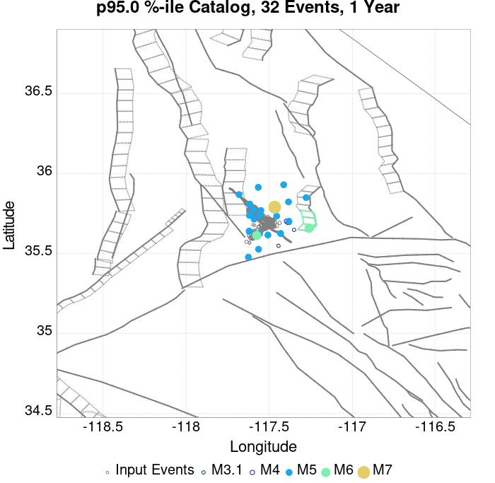
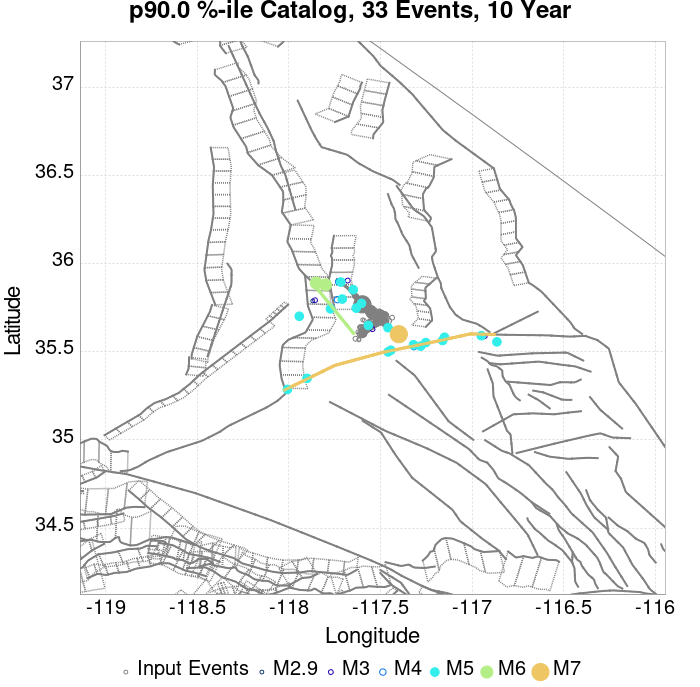
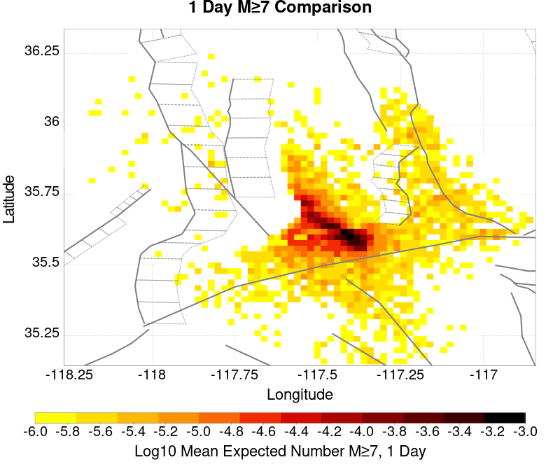
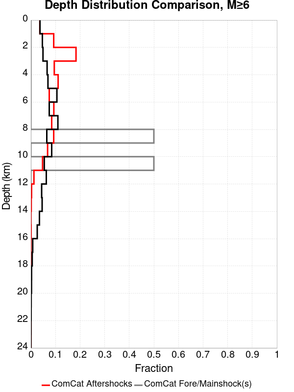

# ComCat M7.1 (ci38457511), ShakeMap Surfaces, FM2_1 Results

|   | ComCat M7.1 (ci38457511), ShakeMap Surfaces, FM2_1 |
|-----|-----|
| Num Simulations | 208757 (incomplete) |
| Start Time | 2019/07/06 03:19:54 UTC |
| Start Time Epoch Milliseconds | 1562383194040 |
| Duration | 10 Years |
| Includes Spontaneous? | false |
| Trigger Ruptures | 283 Trigger Ruptures |
|   | First: M3.98 at 2019/07/04 17:02:55 UTC |
|   | Last: M7.1 at 2019/07/06 03:19:53 UTC |
|   | Largest: M7.1 at 2019/07/06 03:19:53 UTC |
| Trigger Ruptures | *(none)* |
| Config Generated With | u3etas_comcat_event_config_builder.sh --event-id ci38457511 --mag-complete 3.5 --days-before 7 --num-simulations 1000000 --fault-model FM2_1 --finite-surf-shakemap --finite-surf-shakemap-min-mag 5 --hpc-site USC_HPC --nodes 36 --hours 24 --queue scec |

## Table Of Contents

* [Probabilities Summary Table](#probabilities-summary-table)
* [Magnitude Number Distribution](#magnitude-number-distribution)
  * [10 Year Magnitude Number Distribution](#10-year-magnitude-number-distribution)
  * [1 Year Magnitude Number Distribution](#1-year-magnitude-number-distribution)
  * [1 Month Magnitude Number Distribution](#1-month-magnitude-number-distribution)
  * [1 Week Magnitude Number Distribution](#1-week-magnitude-number-distribution)
  * [1 Day Magnitude Number Distribution](#1-day-magnitude-number-distribution)
  * [1 Hour Magnitude Number Distribution](#1-hour-magnitude-number-distribution)
* [Hazard Change Over Time](#hazard-change-over-time)
  * [M&ge;5.0 Hazard Change Over Time](#m50-hazard-change-over-time)
  * [M&ge;6.0 Hazard Change Over Time](#m60-hazard-change-over-time)
  * [M&ge;7.0 Hazard Change Over Time](#m70-hazard-change-over-time)
* [Trigger Rupture Fault Map](#trigger-rupture-fault-map)
* [Trigger Rupture Depth Map](#trigger-rupture-depth-map)
* [Fault Distances To Triggers](#fault-distances-to-triggers)
* [Individual Simulated Catalog Maps](#individual-simulated-catalog-maps)
* [ComCat Data Comparisons](#comcat-data-comparisons)
  * [ComCat Magnitude-Number Distributions](#comcat-magnitude-number-distributions)
  * [ComCat Cumulative Number Vs Time](#comcat-cumulative-number-vs-time)
  * [ComCat Cumulative Number Simulation Percentiles](#comcat-cumulative-number-simulation-percentiles)
  * [ComCat Probability Spatial Distribution](#comcat-probability-spatial-distribution)
  * [ComCat Mean Expectation Spatial Distribution](#comcat-mean-expectation-spatial-distribution)
  * [ComCat Depth Distribution](#comcat-depth-distribution)
* [Section Participation](#section-participation)
  * [Section Participation Plots](#section-participation-plots)
  * [Supra-Seismogenic Parent Sections Table](#supra-seismogenic-parent-sections-table)
  * [M≥6.5 Parent Sections Table](#m65-parent-sections-table)
  * [M≥7 Parent Sections Table](#m7-parent-sections-table)
  * [M≥7.5 Parent Sections Table](#m75-parent-sections-table)
  * [M≥8 Parent Sections Table](#m8-parent-sections-table)
* [Fault Magnitude-Probability Distributions](#fault-magnitude-probability-distributions)
* [Gridded Nucleation](#gridded-nucleation)
* [JSON Input File](#json-input-file)

## Probabilities Summary Table
*[(top)](#table-of-contents)*

| Magnitude | 1 Hour Prob | 1 Day Prob | 1 Week Prob | 1 Month Prob | 1 Year Prob | 10 Year Prob |
|-----|-----|-----|-----|-----|-----|-----|
| **M&ge;5** | 0.768 (76.79%) | 0.977 (97.67%) | 0.995 (99.53%) | 0.999 (99.86%) | 1.000 (99.98%) | 1.000 (100.00%) |
| *95% Conf* | *[76.61% 76.97%]* | *[97.60% 97.73%]* | *[99.50% 99.56%]* | *[99.84% 99.87%]* | *[99.98% 99.99%]* | *[99.99% 100.00%]* |
| **M&ge;5.5** | 0.338 (33.81%) | 0.663 (66.30%) | 0.794 (79.37%) | 0.859 (85.87%) | 0.926 (92.63%) | 0.960 (95.96%) |
| *95% Conf* | *[33.61% 34.01%]* | *[66.09% 66.50%]* | *[79.20% 79.54%]* | *[85.72% 86.02%]* | *[92.52% 92.75%]* | *[95.87% 96.04%]* |
| **M&ge;6** | 0.082 (8.19%) | 0.209 (20.88%) | 0.294 (29.43%) | 0.357 (35.74%) | 0.457 (45.67%) | 0.536 (53.63%) |
| *95% Conf* | *[8.08% 8.31%]* | *[20.71% 21.06%]* | *[29.24% 29.63%]* | *[35.53% 35.94%]* | *[45.45% 45.88%]* | *[53.42% 53.85%]* |
| **M&ge;6.5** | 0.015 (1.49%) | 0.042 (4.18%) | 0.064 (6.36%) | 0.081 (8.14%) | 0.114 (11.43%) | 0.145 (14.54%) |
| *95% Conf* | *[1.44% 1.54%]* | *[4.09% 4.26%]* | *[6.25% 6.46%]* | *[8.03% 8.26%]* | *[11.29% 11.57%]* | *[14.39% 14.69%]* |
| **M&ge;7** | 3.94E-3 (0.39%) | 0.011 (1.07%) | 0.016 (1.60%) | 0.021 (2.08%) | 0.030 (2.97%) | 0.039 (3.87%) |
| *95% Conf* | *[0.37% 0.42%]* | *[1.03% 1.12%]* | *[1.54% 1.65%]* | *[2.01% 2.14%]* | *[2.90% 3.05%]* | *[3.78% 3.95%]* |
| **M&ge;7.1** | 3.22E-3 (0.32%) | 8.80E-3 (0.88%) | 0.013 (1.31%) | 0.017 (1.69%) | 0.024 (2.40%) | 0.031 (3.12%) |
| *95% Conf* | *[0.30% 0.35%]* | *[0.84% 0.92%]* | *[1.26% 1.36%]* | *[1.64% 1.75%]* | *[2.34% 2.47%]* | *[3.05% 3.20%]* |
| **M&ge;7.5** | 1.41E-3 (0.14%) | 3.61E-3 (0.36%) | 5.35E-3 (0.53%) | 6.78E-3 (0.68%) | 9.42E-3 (0.94%) | 0.012 (1.21%) |
| *95% Conf* | *[0.13% 0.16%]* | *[0.34% 0.39%]* | *[0.50% 0.57%]* | *[0.64% 0.71%]* | *[0.90% 0.98%]* | *[1.17% 1.26%]* |
| **M&ge;8** | 4.79E-6 (0.00%) | 1.92E-5 (0.00%) | 2.87E-5 (0.00%) | 4.31E-5 (0.00%) | 7.19E-5 (0.01%) | 1.01E-4 (0.01%) |
| *95% Conf* | *[0.00% 0.00%]* | *[0.00% 0.01%]* | *[0.00% 0.01%]* | *[0.00% 0.01%]* | *[0.00% 0.01%]* | *[0.01% 0.02%]* |

## Magnitude Number Distribution
*[(top)](#table-of-contents)*

### 10 Year Magnitude Number Distribution
*[(top)](#table-of-contents)*

**Legend**
* **Mean** (thick black line): mean expected number across all 208757 catalogs
* **2.5%,97.5%** (thin black lines): expected number percentiles across all 208757 catalogs
* **Median** (thin blue line): median expected number across all 208757 catalogs
* **Mode** (thin cyan line): modal expected number across all 208757 catalogs
* **10 yr Probability** (thin red line): 10 year probability calculated as the fraction of catalogs with at least 1 occurrence
* **10 yr Supraseismogenic Probability** (thin dashed red line): same as above, but only for supraseismogenic ruptures on explicitly modeled UCERF3 faults
* **95% Conf** (light red shaded region): binomial 95% confidence bounds on probability
* **Primary** (thin green line): mean expected number from primary triggered aftershocks only (no secondary, tertiary, etc...) across all 208757 catalogs


| Mag | Mean | 2.5 %ile | 97.5 %ile | Median | Mode | 10 yr Probability | 10 yr Prob 95% Conf | 10 yr Supra-Seis Prob | Primary Aftershocks Mean |
|-----|-----|-----|-----|-----|-----|-----|-----|-----|-----|
| **M&ge;5** | 15.174 | 5.000 | 35.000 | 13.000 | 12.000 | 1.000 (100.00%) | [99.99% 100.00%] | 0.123 (12.28%) | 7.237 |
| **M&ge;5.1** | 11.905 | 4.000 | 28.000 | 11.000 | 9.000 | 1.000 (99.98%) | [99.97% 99.98%] | 0.123 (12.28%) | 5.676 |
| **M&ge;5.2** | 9.308 | 2.000 | 23.000 | 8.000 | 7.000 | 0.999 (99.86%) | [99.84% 99.88%] | 0.123 (12.28%) | 4.438 |
| **M&ge;5.3** | 7.241 | 1.000 | 18.000 | 6.000 | 5.000 | 0.994 (99.44%) | [99.41% 99.47%] | 0.123 (12.28%) | 3.450 |
| **M&ge;5.4** | 5.604 | 1.000 | 15.000 | 5.000 | 4.000 | 0.984 (98.35%) | [98.30% 98.41%] | 0.123 (12.28%) | 2.669 |
| **M&ge;5.5** | 4.307 | 0.000 | 12.000 | 4.000 | 3.000 | 0.960 (95.96%) | [95.87% 96.04%] | 0.123 (12.28%) | 2.048 |
| **M&ge;5.6** | 3.274 | 0.000 | 10.000 | 3.000 | 2.000 | 0.917 (91.73%) | [91.61% 91.85%] | 0.123 (12.28%) | 1.557 |
| **M&ge;5.7** | 2.452 | 0.000 | 8.000 | 2.000 | 1.000 | 0.852 (85.16%) | [85.00% 85.31%] | 0.123 (12.28%) | 1.163 |
| **M&ge;5.8** | 1.804 | 0.000 | 6.000 | 1.000 | 1.000 | 0.762 (76.24%) | [76.06% 76.43%] | 0.123 (12.28%) | 0.855 |
| **M&ge;5.9** | 1.292 | 0.000 | 5.000 | 1.000 | 0.000 | 0.651 (65.08%) | [64.88% 65.29%] | 0.123 (12.28%) | 0.611 |
| **M&ge;6** | 0.927 | 0.000 | 4.000 | 1.000 | 0.000 | 0.536 (53.63%) | [53.42% 53.85%] | 0.123 (12.28%) | 0.434 |
| **M&ge;6.1** | 0.671 | 0.000 | 3.000 | 0.000 | 0.000 | 0.430 (42.98%) | [42.77% 43.19%] | 0.123 (12.27%) | 0.307 |
| **M&ge;6.2** | 0.466 | 0.000 | 3.000 | 0.000 | 0.000 | 0.323 (32.29%) | [32.09% 32.49%] | 0.123 (12.27%) | 0.203 |
| **M&ge;6.3** | 0.367 | 0.000 | 2.000 | 0.000 | 0.000 | 0.265 (26.45%) | [26.26% 26.64%] | 0.123 (12.27%) | 0.154 |
| **M&ge;6.4** | 0.233 | 0.000 | 2.000 | 0.000 | 0.000 | 0.173 (17.34%) | [17.18% 17.50%] | 0.072 (7.20%) | 0.097 |
| **M&ge;6.5** | 0.195 | 0.000 | 2.000 | 0.000 | 0.000 | 0.145 (14.54%) | [14.39% 14.69%] | 0.072 (7.19%) | 0.078 |
| **M&ge;6.6** | 0.143 | 0.000 | 1.000 | 0.000 | 0.000 | 0.116 (11.59%) | [11.45% 11.72%] | 0.062 (6.25%) | 0.060 |
| **M&ge;6.7** | 0.112 | 0.000 | 1.000 | 0.000 | 0.000 | 0.092 (9.18%) | [9.06% 9.31%] | 0.054 (5.42%) | 0.046 |
| **M&ge;6.8** | 0.093 | 0.000 | 1.000 | 0.000 | 0.000 | 0.077 (7.73%) | [7.62% 7.85%] | 0.052 (5.17%) | 0.038 |
| **M&ge;6.9** | 0.055 | 0.000 | 1.000 | 0.000 | 0.000 | 0.047 (4.73%) | [4.64% 4.82%] | 0.030 (3.02%) | 0.023 |
| **M&ge;7** | 0.045 | 0.000 | 1.000 | 0.000 | 0.000 | 0.039 (3.87%) | [3.78% 3.95%] | 0.028 (2.80%) | 0.019 |
| **M&ge;7.1** | 0.036 | 0.000 | 1.000 | 0.000 | 0.000 | 0.031 (3.12%) | [3.05% 3.20%] | 0.025 (2.49%) | 0.015 |
| **M&ge;7.2** | 0.029 | 0.000 | 1.000 | 0.000 | 0.000 | 0.026 (2.59%) | [2.52% 2.66%] | 0.022 (2.23%) | 0.013 |
| **M&ge;7.3** | 0.022 | 0.000 | 0.000 | 0.000 | 0.000 | 0.020 (1.97%) | [1.91% 2.03%] | 0.018 (1.80%) | 9.68E-3 |
| **M&ge;7.4** | 0.018 | 0.000 | 0.000 | 0.000 | 0.000 | 0.016 (1.62%) | [1.57% 1.68%] | 0.015 (1.55%) | 8.30E-3 |
| **M&ge;7.5** | 0.014 | 0.000 | 0.000 | 0.000 | 0.000 | 0.012 (1.21%) | [1.17% 1.26%] | 0.012 (1.19%) | 6.15E-3 |
| **M&ge;7.6** | 0.013 | 0.000 | 0.000 | 0.000 | 0.000 | 0.011 (1.11%) | [1.07% 1.16%] | 0.011 (1.10%) | 5.63E-3 |
| **M&ge;7.7** | 5.09E-3 | 0.000 | 0.000 | 0.000 | 0.000 | 4.64E-3 (0.46%) | [0.44% 0.49%] | 4.58E-3 (0.46%) | 1.73E-3 |
| **M&ge;7.8** | 1.54E-3 | 0.000 | 0.000 | 0.000 | 0.000 | 1.52E-3 (0.15%) | [0.14% 0.17%] | 1.48E-3 (0.15%) | 1.72E-4 |
| **M&ge;7.9** | 4.31E-4 | 0.000 | 0.000 | 0.000 | 0.000 | 4.31E-4 (0.04%) | [0.03% 0.05%] | 4.31E-4 (0.04%) | 2.87E-5 |
| **M&ge;8** | 1.01E-4 | 0.000 | 0.000 | 0.000 | 0.000 | 1.01E-4 (0.01%) | [0.01% 0.02%] | 1.01E-4 (0.01%) | 9.58E-6 |
| **M&ge;8.1** | 3.83E-5 | 0.000 | 0.000 | 0.000 | 0.000 | 3.83E-5 (0.00%) | [0.00% 0.01%] | 3.83E-5 (0.00%) | 0.000 |
| **M&ge;8.2** | 0.000 | 0.000 | 0.000 | 0.000 | 0.000 | 0.000 (0.00%) | [0.00% 0.00%] | 0.000 (0.00%) | 0.000 |
| **M&ge;8.3** | 0.000 | 0.000 | 0.000 | 0.000 | 0.000 | 0.000 (0.00%) | [0.00% 0.00%] | 0.000 (0.00%) | 0.000 |
| **M&ge;8.4** | 0.000 | 0.000 | 0.000 | 0.000 | 0.000 | 0.000 (0.00%) | [0.00% 0.00%] | 0.000 (0.00%) | 0.000 |
| **M&ge;8.5** | 0.000 | 0.000 | 0.000 | 0.000 | 0.000 | 0.000 (0.00%) | [0.00% 0.00%] | 0.000 (0.00%) | 0.000 |
| **M&ge;8.6** | 0.000 | 0.000 | 0.000 | 0.000 | 0.000 | 0.000 (0.00%) | [0.00% 0.00%] | 0.000 (0.00%) | 0.000 |
| **M&ge;8.7** | 0.000 | 0.000 | 0.000 | 0.000 | 0.000 | 0.000 (0.00%) | [0.00% 0.00%] | 0.000 (0.00%) | 0.000 |
| **M&ge;8.8** | 0.000 | 0.000 | 0.000 | 0.000 | 0.000 | 0.000 (0.00%) | [0.00% 0.00%] | 0.000 (0.00%) | 0.000 |
| **M&ge;8.9** | 0.000 | 0.000 | 0.000 | 0.000 | 0.000 | 0.000 (0.00%) | [0.00% 0.00%] | 0.000 (0.00%) | 0.000 |
| **M&ge;9** | 0.000 | 0.000 | 0.000 | 0.000 | 0.000 | 0.000 (0.00%) | [0.00% 0.00%] | 0.000 (0.00%) | 0.000 |

### 1 Year Magnitude Number Distribution
*[(top)](#table-of-contents)*

**Legend**
* **Mean** (thick black line): mean expected number across all 208757 catalogs
* **2.5%,97.5%** (thin black lines): expected number percentiles across all 208757 catalogs
* **Median** (thin blue line): median expected number across all 208757 catalogs
* **Mode** (thin cyan line): modal expected number across all 208757 catalogs
* **1 yr Probability** (thin red line): 1 year probability calculated as the fraction of catalogs with at least 1 occurrence
* **1 yr Supraseismogenic Probability** (thin dashed red line): same as above, but only for supraseismogenic ruptures on explicitly modeled UCERF3 faults
* **95% Conf** (light red shaded region): binomial 95% confidence bounds on probability
* **Primary** (thin green line): mean expected number from primary triggered aftershocks only (no secondary, tertiary, etc...) across all 208757 catalogs


| Mag | Mean | 2.5 %ile | 97.5 %ile | Median | Mode | 1 yr Probability | 1 yr Prob 95% Conf | 1 yr Supra-Seis Prob | Primary Aftershocks Mean |
|-----|-----|-----|-----|-----|-----|-----|-----|-----|-----|
| **M&ge;5** | 11.649 | 4.000 | 25.000 | 11.000 | 9.000 | 1.000 (99.98%) | [99.98% 99.99%] | 0.094 (9.43%) | 6.300 |
| **M&ge;5.1** | 9.135 | 2.000 | 21.000 | 8.000 | 7.000 | 0.999 (99.90%) | [99.88% 99.91%] | 0.094 (9.43%) | 4.939 |
| **M&ge;5.2** | 7.141 | 2.000 | 17.000 | 6.000 | 5.000 | 0.996 (99.56%) | [99.53% 99.59%] | 0.094 (9.43%) | 3.861 |
| **M&ge;5.3** | 5.553 | 1.000 | 14.000 | 5.000 | 4.000 | 0.986 (98.60%) | [98.54% 98.64%] | 0.094 (9.43%) | 3.001 |
| **M&ge;5.4** | 4.298 | 0.000 | 11.000 | 4.000 | 3.000 | 0.965 (96.52%) | [96.44% 96.60%] | 0.094 (9.43%) | 2.322 |
| **M&ge;5.5** | 3.300 | 0.000 | 9.000 | 3.000 | 2.000 | 0.926 (92.63%) | [92.52% 92.75%] | 0.094 (9.43%) | 1.781 |
| **M&ge;5.6** | 2.508 | 0.000 | 8.000 | 2.000 | 1.000 | 0.868 (86.78%) | [86.63% 86.92%] | 0.094 (9.43%) | 1.353 |
| **M&ge;5.7** | 1.878 | 0.000 | 6.000 | 1.000 | 1.000 | 0.786 (78.61%) | [78.44% 78.79%] | 0.094 (9.43%) | 1.010 |
| **M&ge;5.8** | 1.381 | 0.000 | 5.000 | 1.000 | 1.000 | 0.685 (68.51%) | [68.31% 68.71%] | 0.094 (9.43%) | 0.742 |
| **M&ge;5.9** | 0.989 | 0.000 | 4.000 | 1.000 | 0.000 | 0.569 (56.89%) | [56.68% 57.11%] | 0.094 (9.43%) | 0.531 |
| **M&ge;6** | 0.707 | 0.000 | 3.000 | 0.000 | 0.000 | 0.457 (45.67%) | [45.45% 45.88%] | 0.094 (9.43%) | 0.376 |
| **M&ge;6.1** | 0.510 | 0.000 | 3.000 | 0.000 | 0.000 | 0.358 (35.78%) | [35.57% 35.98%] | 0.094 (9.42%) | 0.265 |
| **M&ge;6.2** | 0.350 | 0.000 | 2.000 | 0.000 | 0.000 | 0.262 (26.18%) | [25.99% 26.37%] | 0.094 (9.42%) | 0.175 |
| **M&ge;6.3** | 0.274 | 0.000 | 2.000 | 0.000 | 0.000 | 0.211 (21.15%) | [20.97% 21.32%] | 0.094 (9.42%) | 0.132 |
| **M&ge;6.4** | 0.173 | 0.000 | 1.000 | 0.000 | 0.000 | 0.137 (13.72%) | [13.57% 13.87%] | 0.056 (5.59%) | 0.083 |
| **M&ge;6.5** | 0.144 | 0.000 | 1.000 | 0.000 | 0.000 | 0.114 (11.43%) | [11.29% 11.57%] | 0.056 (5.59%) | 0.067 |
| **M&ge;6.6** | 0.106 | 0.000 | 1.000 | 0.000 | 0.000 | 0.090 (9.02%) | [8.90% 9.14%] | 0.048 (4.84%) | 0.052 |
| **M&ge;6.7** | 0.083 | 0.000 | 1.000 | 0.000 | 0.000 | 0.071 (7.11%) | [7.00% 7.22%] | 0.042 (4.18%) | 0.040 |
| **M&ge;6.8** | 0.069 | 0.000 | 1.000 | 0.000 | 0.000 | 0.060 (5.96%) | [5.86% 6.07%] | 0.040 (3.99%) | 0.033 |
| **M&ge;6.9** | 0.041 | 0.000 | 1.000 | 0.000 | 0.000 | 0.036 (3.63%) | [3.55% 3.71%] | 0.023 (2.33%) | 0.020 |
| **M&ge;7** | 0.034 | 0.000 | 1.000 | 0.000 | 0.000 | 0.030 (2.97%) | [2.90% 3.05%] | 0.022 (2.16%) | 0.016 |
| **M&ge;7.1** | 0.027 | 0.000 | 0.000 | 0.000 | 0.000 | 0.024 (2.40%) | [2.34% 2.47%] | 0.019 (1.91%) | 0.013 |
| **M&ge;7.2** | 0.022 | 0.000 | 0.000 | 0.000 | 0.000 | 0.020 (2.00%) | [1.94% 2.06%] | 0.017 (1.72%) | 0.011 |
| **M&ge;7.3** | 0.017 | 0.000 | 0.000 | 0.000 | 0.000 | 0.015 (1.52%) | [1.46% 1.57%] | 0.014 (1.39%) | 8.28E-3 |
| **M&ge;7.4** | 0.014 | 0.000 | 0.000 | 0.000 | 0.000 | 0.013 (1.26%) | [1.21% 1.31%] | 0.012 (1.20%) | 7.10E-3 |
| **M&ge;7.5** | 0.011 | 0.000 | 0.000 | 0.000 | 0.000 | 9.42E-3 (0.94%) | [0.90% 0.98%] | 9.24E-3 (0.92%) | 5.28E-3 |
| **M&ge;7.6** | 9.80E-3 | 0.000 | 0.000 | 0.000 | 0.000 | 8.67E-3 (0.87%) | [0.83% 0.91%] | 8.59E-3 (0.86%) | 4.85E-3 |
| **M&ge;7.7** | 3.69E-3 | 0.000 | 0.000 | 0.000 | 0.000 | 3.44E-3 (0.34%) | [0.32% 0.37%] | 3.39E-3 (0.34%) | 1.48E-3 |
| **M&ge;7.8** | 1.03E-3 | 0.000 | 0.000 | 0.000 | 0.000 | 1.03E-3 (0.10%) | [0.09% 0.12%] | 1.00E-3 (0.10%) | 1.29E-4 |
| **M&ge;7.9** | 3.07E-4 | 0.000 | 0.000 | 0.000 | 0.000 | 3.07E-4 (0.03%) | [0.02% 0.04%] | 3.07E-4 (0.03%) | 2.40E-5 |
| **M&ge;8** | 7.19E-5 | 0.000 | 0.000 | 0.000 | 0.000 | 7.19E-5 (0.01%) | [0.00% 0.01%] | 7.19E-5 (0.01%) | 9.58E-6 |
| **M&ge;8.1** | 2.40E-5 | 0.000 | 0.000 | 0.000 | 0.000 | 2.40E-5 (0.00%) | [0.00% 0.01%] | 2.40E-5 (0.00%) | 0.000 |
| **M&ge;8.2** | 0.000 | 0.000 | 0.000 | 0.000 | 0.000 | 0.000 (0.00%) | [0.00% 0.00%] | 0.000 (0.00%) | 0.000 |
| **M&ge;8.3** | 0.000 | 0.000 | 0.000 | 0.000 | 0.000 | 0.000 (0.00%) | [0.00% 0.00%] | 0.000 (0.00%) | 0.000 |
| **M&ge;8.4** | 0.000 | 0.000 | 0.000 | 0.000 | 0.000 | 0.000 (0.00%) | [0.00% 0.00%] | 0.000 (0.00%) | 0.000 |
| **M&ge;8.5** | 0.000 | 0.000 | 0.000 | 0.000 | 0.000 | 0.000 (0.00%) | [0.00% 0.00%] | 0.000 (0.00%) | 0.000 |
| **M&ge;8.6** | 0.000 | 0.000 | 0.000 | 0.000 | 0.000 | 0.000 (0.00%) | [0.00% 0.00%] | 0.000 (0.00%) | 0.000 |
| **M&ge;8.7** | 0.000 | 0.000 | 0.000 | 0.000 | 0.000 | 0.000 (0.00%) | [0.00% 0.00%] | 0.000 (0.00%) | 0.000 |
| **M&ge;8.8** | 0.000 | 0.000 | 0.000 | 0.000 | 0.000 | 0.000 (0.00%) | [0.00% 0.00%] | 0.000 (0.00%) | 0.000 |
| **M&ge;8.9** | 0.000 | 0.000 | 0.000 | 0.000 | 0.000 | 0.000 (0.00%) | [0.00% 0.00%] | 0.000 (0.00%) | 0.000 |
| **M&ge;9** | 0.000 | 0.000 | 0.000 | 0.000 | 0.000 | 0.000 (0.00%) | [0.00% 0.00%] | 0.000 (0.00%) | 0.000 |

### 1 Month Magnitude Number Distribution
*[(top)](#table-of-contents)*

**Legend**
* **Mean** (thick black line): mean expected number across all 208757 catalogs
* **2.5%,97.5%** (thin black lines): expected number percentiles across all 208757 catalogs
* **Median** (thin blue line): median expected number across all 208757 catalogs
* **Mode** (thin cyan line): modal expected number across all 208757 catalogs
* **1 mo Probability** (thin red line): 1 month probability calculated as the fraction of catalogs with at least 1 occurrence
* **1 mo Supraseismogenic Probability** (thin dashed red line): same as above, but only for supraseismogenic ruptures on explicitly modeled UCERF3 faults
* **95% Conf** (light red shaded region): binomial 95% confidence bounds on probability
* **Primary** (thin green line): mean expected number from primary triggered aftershocks only (no secondary, tertiary, etc...) across all 208757 catalogs


| Mag | Mean | 2.5 %ile | 97.5 %ile | Median | Mode | 1 mo Probability | 1 mo Prob 95% Conf | 1 mo Supra-Seis Prob | Primary Aftershocks Mean |
|-----|-----|-----|-----|-----|-----|-----|-----|-----|-----|
| **M&ge;5** | 8.196 | 2.000 | 18.000 | 8.000 | 7.000 | 0.999 (99.86%) | [99.84% 99.87%] | 0.066 (6.60%) | 5.105 |
| **M&ge;5.1** | 6.426 | 1.000 | 15.000 | 6.000 | 5.000 | 0.995 (99.46%) | [99.43% 99.50%] | 0.066 (6.60%) | 4.002 |
| **M&ge;5.2** | 5.021 | 1.000 | 12.000 | 5.000 | 4.000 | 0.984 (98.36%) | [98.31% 98.42%] | 0.066 (6.60%) | 3.127 |
| **M&ge;5.3** | 3.903 | 0.000 | 10.000 | 3.000 | 3.000 | 0.960 (96.02%) | [95.94% 96.11%] | 0.066 (6.60%) | 2.430 |
| **M&ge;5.4** | 3.019 | 0.000 | 8.000 | 3.000 | 2.000 | 0.920 (92.01%) | [91.90% 92.13%] | 0.066 (6.60%) | 1.880 |
| **M&ge;5.5** | 2.318 | 0.000 | 7.000 | 2.000 | 1.000 | 0.859 (85.87%) | [85.72% 86.02%] | 0.066 (6.60%) | 1.441 |
| **M&ge;5.6** | 1.760 | 0.000 | 6.000 | 1.000 | 1.000 | 0.779 (77.87%) | [77.69% 78.05%] | 0.066 (6.60%) | 1.094 |
| **M&ge;5.7** | 1.318 | 0.000 | 5.000 | 1.000 | 1.000 | 0.682 (68.17%) | [67.97% 68.37%] | 0.066 (6.60%) | 0.817 |
| **M&ge;5.8** | 0.968 | 0.000 | 4.000 | 1.000 | 0.000 | 0.574 (57.36%) | [57.14% 57.57%] | 0.066 (6.60%) | 0.600 |
| **M&ge;5.9** | 0.691 | 0.000 | 3.000 | 0.000 | 0.000 | 0.459 (45.92%) | [45.71% 46.14%] | 0.066 (6.60%) | 0.427 |
| **M&ge;6** | 0.492 | 0.000 | 3.000 | 0.000 | 0.000 | 0.357 (35.74%) | [35.53% 35.94%] | 0.066 (6.60%) | 0.302 |
| **M&ge;6.1** | 0.352 | 0.000 | 2.000 | 0.000 | 0.000 | 0.272 (27.20%) | [27.01% 27.39%] | 0.066 (6.59%) | 0.212 |
| **M&ge;6.2** | 0.238 | 0.000 | 2.000 | 0.000 | 0.000 | 0.193 (19.29%) | [19.13% 19.46%] | 0.066 (6.59%) | 0.139 |
| **M&ge;6.3** | 0.185 | 0.000 | 1.000 | 0.000 | 0.000 | 0.154 (15.37%) | [15.21% 15.52%] | 0.066 (6.59%) | 0.105 |
| **M&ge;6.4** | 0.116 | 0.000 | 1.000 | 0.000 | 0.000 | 0.098 (9.79%) | [9.66% 9.91%] | 0.040 (3.97%) | 0.066 |
| **M&ge;6.5** | 0.097 | 0.000 | 1.000 | 0.000 | 0.000 | 0.081 (8.14%) | [8.03% 8.26%] | 0.040 (3.97%) | 0.054 |
| **M&ge;6.6** | 0.072 | 0.000 | 1.000 | 0.000 | 0.000 | 0.064 (6.41%) | [6.31% 6.52%] | 0.034 (3.44%) | 0.041 |
| **M&ge;6.7** | 0.056 | 0.000 | 1.000 | 0.000 | 0.000 | 0.050 (5.02%) | [4.93% 5.11%] | 0.030 (2.96%) | 0.032 |
| **M&ge;6.8** | 0.047 | 0.000 | 1.000 | 0.000 | 0.000 | 0.042 (4.21%) | [4.13% 4.30%] | 0.028 (2.83%) | 0.027 |
| **M&ge;6.9** | 0.028 | 0.000 | 1.000 | 0.000 | 0.000 | 0.025 (2.54%) | [2.47% 2.60%] | 0.016 (1.64%) | 0.016 |
| **M&ge;7** | 0.023 | 0.000 | 0.000 | 0.000 | 0.000 | 0.021 (2.08%) | [2.01% 2.14%] | 0.015 (1.52%) | 0.013 |
| **M&ge;7.1** | 0.018 | 0.000 | 0.000 | 0.000 | 0.000 | 0.017 (1.69%) | [1.64% 1.75%] | 0.014 (1.36%) | 0.011 |
| **M&ge;7.2** | 0.015 | 0.000 | 0.000 | 0.000 | 0.000 | 0.014 (1.41%) | [1.36% 1.46%] | 0.012 (1.23%) | 9.03E-3 |
| **M&ge;7.3** | 0.012 | 0.000 | 0.000 | 0.000 | 0.000 | 0.011 (1.07%) | [1.03% 1.12%] | 9.81E-3 (0.98%) | 6.83E-3 |
| **M&ge;7.4** | 9.68E-3 | 0.000 | 0.000 | 0.000 | 0.000 | 8.98E-3 (0.90%) | [0.86% 0.94%] | 8.60E-3 (0.86%) | 5.90E-3 |
| **M&ge;7.5** | 7.44E-3 | 0.000 | 0.000 | 0.000 | 0.000 | 6.78E-3 (0.68%) | [0.64% 0.71%] | 6.66E-3 (0.67%) | 4.47E-3 |
| **M&ge;7.6** | 6.84E-3 | 0.000 | 0.000 | 0.000 | 0.000 | 6.23E-3 (0.62%) | [0.59% 0.66%] | 6.17E-3 (0.62%) | 4.09E-3 |
| **M&ge;7.7** | 2.40E-3 | 0.000 | 0.000 | 0.000 | 0.000 | 2.27E-3 (0.23%) | [0.21% 0.25%] | 2.23E-3 (0.22%) | 1.23E-3 |
| **M&ge;7.8** | 6.18E-4 | 0.000 | 0.000 | 0.000 | 0.000 | 6.18E-4 (0.06%) | [0.05% 0.07%] | 5.99E-4 (0.06%) | 1.05E-4 |
| **M&ge;7.9** | 1.77E-4 | 0.000 | 0.000 | 0.000 | 0.000 | 1.77E-4 (0.02%) | [0.01% 0.02%] | 1.77E-4 (0.02%) | 1.92E-5 |
| **M&ge;8** | 4.31E-5 | 0.000 | 0.000 | 0.000 | 0.000 | 4.31E-5 (0.00%) | [0.00% 0.01%] | 4.31E-5 (0.00%) | 9.58E-6 |
| **M&ge;8.1** | 1.44E-5 | 0.000 | 0.000 | 0.000 | 0.000 | 1.44E-5 (0.00%) | [0.00% 0.00%] | 1.44E-5 (0.00%) | 0.000 |
| **M&ge;8.2** | 0.000 | 0.000 | 0.000 | 0.000 | 0.000 | 0.000 (0.00%) | [0.00% 0.00%] | 0.000 (0.00%) | 0.000 |
| **M&ge;8.3** | 0.000 | 0.000 | 0.000 | 0.000 | 0.000 | 0.000 (0.00%) | [0.00% 0.00%] | 0.000 (0.00%) | 0.000 |
| **M&ge;8.4** | 0.000 | 0.000 | 0.000 | 0.000 | 0.000 | 0.000 (0.00%) | [0.00% 0.00%] | 0.000 (0.00%) | 0.000 |
| **M&ge;8.5** | 0.000 | 0.000 | 0.000 | 0.000 | 0.000 | 0.000 (0.00%) | [0.00% 0.00%] | 0.000 (0.00%) | 0.000 |
| **M&ge;8.6** | 0.000 | 0.000 | 0.000 | 0.000 | 0.000 | 0.000 (0.00%) | [0.00% 0.00%] | 0.000 (0.00%) | 0.000 |
| **M&ge;8.7** | 0.000 | 0.000 | 0.000 | 0.000 | 0.000 | 0.000 (0.00%) | [0.00% 0.00%] | 0.000 (0.00%) | 0.000 |
| **M&ge;8.8** | 0.000 | 0.000 | 0.000 | 0.000 | 0.000 | 0.000 (0.00%) | [0.00% 0.00%] | 0.000 (0.00%) | 0.000 |
| **M&ge;8.9** | 0.000 | 0.000 | 0.000 | 0.000 | 0.000 | 0.000 (0.00%) | [0.00% 0.00%] | 0.000 (0.00%) | 0.000 |
| **M&ge;9** | 0.000 | 0.000 | 0.000 | 0.000 | 0.000 | 0.000 (0.00%) | [0.00% 0.00%] | 0.000 (0.00%) | 0.000 |

### 1 Week Magnitude Number Distribution
*[(top)](#table-of-contents)*

**Legend**
* **Mean** (thick black line): mean expected number across all 208757 catalogs
* **2.5%,97.5%** (thin black lines): expected number percentiles across all 208757 catalogs
* **Median** (thin blue line): median expected number across all 208757 catalogs
* **Mode** (thin cyan line): modal expected number across all 208757 catalogs
* **1 wk Probability** (thin red line): 1 week probability calculated as the fraction of catalogs with at least 1 occurrence
* **1 wk Supraseismogenic Probability** (thin dashed red line): same as above, but only for supraseismogenic ruptures on explicitly modeled UCERF3 faults
* **95% Conf** (light red shaded region): binomial 95% confidence bounds on probability
* **Primary** (thin green line): mean expected number from primary triggered aftershocks only (no secondary, tertiary, etc...) across all 208757 catalogs


| Mag | Mean | 2.5 %ile | 97.5 %ile | Median | Mode | 1 wk Probability | 1 wk Prob 95% Conf | 1 wk Supra-Seis Prob | Primary Aftershocks Mean |
|-----|-----|-----|-----|-----|-----|-----|-----|-----|-----|
| **M&ge;5** | 6.371 | 1.000 | 14.000 | 6.000 | 5.000 | 0.995 (99.53%) | [99.50% 99.56%] | 0.051 (5.12%) | 4.319 |
| **M&ge;5.1** | 4.994 | 1.000 | 12.000 | 5.000 | 4.000 | 0.985 (98.52%) | [98.46% 98.57%] | 0.051 (5.12%) | 3.386 |
| **M&ge;5.2** | 3.901 | 0.000 | 10.000 | 4.000 | 3.000 | 0.964 (96.40%) | [96.32% 96.48%] | 0.051 (5.12%) | 2.644 |
| **M&ge;5.3** | 3.032 | 0.000 | 8.000 | 3.000 | 2.000 | 0.927 (92.67%) | [92.56% 92.78%] | 0.051 (5.12%) | 2.055 |
| **M&ge;5.4** | 2.344 | 0.000 | 7.000 | 2.000 | 2.000 | 0.870 (86.99%) | [86.84% 87.13%] | 0.051 (5.12%) | 1.589 |
| **M&ge;5.5** | 1.799 | 0.000 | 6.000 | 1.000 | 1.000 | 0.794 (79.37%) | [79.20% 79.54%] | 0.051 (5.12%) | 1.217 |
| **M&ge;5.6** | 1.365 | 0.000 | 5.000 | 1.000 | 1.000 | 0.702 (70.18%) | [69.98% 70.38%] | 0.051 (5.12%) | 0.923 |
| **M&ge;5.7** | 1.021 | 0.000 | 4.000 | 1.000 | 0.000 | 0.600 (59.97%) | [59.76% 60.18%] | 0.051 (5.12%) | 0.689 |
| **M&ge;5.8** | 0.749 | 0.000 | 3.000 | 0.000 | 0.000 | 0.493 (49.30%) | [49.09% 49.52%] | 0.051 (5.12%) | 0.504 |
| **M&ge;5.9** | 0.534 | 0.000 | 3.000 | 0.000 | 0.000 | 0.386 (38.62%) | [38.41% 38.83%] | 0.051 (5.12%) | 0.359 |
| **M&ge;6** | 0.379 | 0.000 | 2.000 | 0.000 | 0.000 | 0.294 (29.43%) | [29.24% 29.63%] | 0.051 (5.12%) | 0.253 |
| **M&ge;6.1** | 0.270 | 0.000 | 2.000 | 0.000 | 0.000 | 0.220 (22.02%) | [21.84% 22.20%] | 0.051 (5.12%) | 0.177 |
| **M&ge;6.2** | 0.181 | 0.000 | 1.000 | 0.000 | 0.000 | 0.153 (15.32%) | [15.17% 15.48%] | 0.051 (5.12%) | 0.115 |
| **M&ge;6.3** | 0.140 | 0.000 | 1.000 | 0.000 | 0.000 | 0.121 (12.06%) | [11.92% 12.20%] | 0.051 (5.12%) | 0.087 |
| **M&ge;6.4** | 0.088 | 0.000 | 1.000 | 0.000 | 0.000 | 0.076 (7.64%) | [7.53% 7.76%] | 0.031 (3.12%) | 0.055 |
| **M&ge;6.5** | 0.073 | 0.000 | 1.000 | 0.000 | 0.000 | 0.064 (6.36%) | [6.25% 6.46%] | 0.031 (3.12%) | 0.045 |
| **M&ge;6.6** | 0.055 | 0.000 | 1.000 | 0.000 | 0.000 | 0.050 (5.00%) | [4.90% 5.09%] | 0.027 (2.70%) | 0.035 |
| **M&ge;6.7** | 0.042 | 0.000 | 1.000 | 0.000 | 0.000 | 0.039 (3.91%) | [3.82% 3.99%] | 0.023 (2.33%) | 0.027 |
| **M&ge;6.8** | 0.036 | 0.000 | 1.000 | 0.000 | 0.000 | 0.033 (3.28%) | [3.20% 3.35%] | 0.022 (2.22%) | 0.022 |
| **M&ge;6.9** | 0.021 | 0.000 | 0.000 | 0.000 | 0.000 | 0.020 (1.96%) | [1.90% 2.02%] | 0.013 (1.28%) | 0.013 |
| **M&ge;7** | 0.017 | 0.000 | 0.000 | 0.000 | 0.000 | 0.016 (1.60%) | [1.54% 1.65%] | 0.012 (1.18%) | 0.011 |
| **M&ge;7.1** | 0.014 | 0.000 | 0.000 | 0.000 | 0.000 | 0.013 (1.31%) | [1.26% 1.36%] | 0.011 (1.06%) | 9.14E-3 |
| **M&ge;7.2** | 0.012 | 0.000 | 0.000 | 0.000 | 0.000 | 0.011 (1.09%) | [1.05% 1.14%] | 9.56E-3 (0.96%) | 7.65E-3 |
| **M&ge;7.3** | 8.87E-3 | 0.000 | 0.000 | 0.000 | 0.000 | 8.31E-3 (0.83%) | [0.79% 0.87%] | 7.65E-3 (0.76%) | 5.78E-3 |
| **M&ge;7.4** | 7.54E-3 | 0.000 | 0.000 | 0.000 | 0.000 | 7.07E-3 (0.71%) | [0.67% 0.74%] | 6.78E-3 (0.68%) | 5.03E-3 |
| **M&ge;7.5** | 5.80E-3 | 0.000 | 0.000 | 0.000 | 0.000 | 5.35E-3 (0.53%) | [0.50% 0.57%] | 5.25E-3 (0.53%) | 3.78E-3 |
| **M&ge;7.6** | 5.34E-3 | 0.000 | 0.000 | 0.000 | 0.000 | 4.92E-3 (0.49%) | [0.46% 0.52%] | 4.88E-3 (0.49%) | 3.46E-3 |
| **M&ge;7.7** | 1.83E-3 | 0.000 | 0.000 | 0.000 | 0.000 | 1.74E-3 (0.17%) | [0.16% 0.19%] | 1.71E-3 (0.17%) | 1.03E-3 |
| **M&ge;7.8** | 4.36E-4 | 0.000 | 0.000 | 0.000 | 0.000 | 4.36E-4 (0.04%) | [0.04% 0.05%] | 4.17E-4 (0.04%) | 8.62E-5 |
| **M&ge;7.9** | 1.10E-4 | 0.000 | 0.000 | 0.000 | 0.000 | 1.10E-4 (0.01%) | [0.01% 0.02%] | 1.10E-4 (0.01%) | 1.92E-5 |
| **M&ge;8** | 2.87E-5 | 0.000 | 0.000 | 0.000 | 0.000 | 2.87E-5 (0.00%) | [0.00% 0.01%] | 2.87E-5 (0.00%) | 9.58E-6 |
| **M&ge;8.1** | 9.58E-6 | 0.000 | 0.000 | 0.000 | 0.000 | 9.58E-6 (0.00%) | [0.00% 0.00%] | 9.58E-6 (0.00%) | 0.000 |
| **M&ge;8.2** | 0.000 | 0.000 | 0.000 | 0.000 | 0.000 | 0.000 (0.00%) | [0.00% 0.00%] | 0.000 (0.00%) | 0.000 |
| **M&ge;8.3** | 0.000 | 0.000 | 0.000 | 0.000 | 0.000 | 0.000 (0.00%) | [0.00% 0.00%] | 0.000 (0.00%) | 0.000 |
| **M&ge;8.4** | 0.000 | 0.000 | 0.000 | 0.000 | 0.000 | 0.000 (0.00%) | [0.00% 0.00%] | 0.000 (0.00%) | 0.000 |
| **M&ge;8.5** | 0.000 | 0.000 | 0.000 | 0.000 | 0.000 | 0.000 (0.00%) | [0.00% 0.00%] | 0.000 (0.00%) | 0.000 |
| **M&ge;8.6** | 0.000 | 0.000 | 0.000 | 0.000 | 0.000 | 0.000 (0.00%) | [0.00% 0.00%] | 0.000 (0.00%) | 0.000 |
| **M&ge;8.7** | 0.000 | 0.000 | 0.000 | 0.000 | 0.000 | 0.000 (0.00%) | [0.00% 0.00%] | 0.000 (0.00%) | 0.000 |
| **M&ge;8.8** | 0.000 | 0.000 | 0.000 | 0.000 | 0.000 | 0.000 (0.00%) | [0.00% 0.00%] | 0.000 (0.00%) | 0.000 |
| **M&ge;8.9** | 0.000 | 0.000 | 0.000 | 0.000 | 0.000 | 0.000 (0.00%) | [0.00% 0.00%] | 0.000 (0.00%) | 0.000 |
| **M&ge;9** | 0.000 | 0.000 | 0.000 | 0.000 | 0.000 | 0.000 (0.00%) | [0.00% 0.00%] | 0.000 (0.00%) | 0.000 |

### 1 Day Magnitude Number Distribution
*[(top)](#table-of-contents)*

**Legend**
* **Mean** (thick black line): mean expected number across all 208757 catalogs
* **2.5%,97.5%** (thin black lines): expected number percentiles across all 208757 catalogs
* **Median** (thin blue line): median expected number across all 208757 catalogs
* **Mode** (thin cyan line): modal expected number across all 208757 catalogs
* **1 d Probability** (thin red line): 1 day probability calculated as the fraction of catalogs with at least 1 occurrence
* **1 d Supraseismogenic Probability** (thin dashed red line): same as above, but only for supraseismogenic ruptures on explicitly modeled UCERF3 faults
* **95% Conf** (light red shaded region): binomial 95% confidence bounds on probability
* **Primary** (thin green line): mean expected number from primary triggered aftershocks only (no secondary, tertiary, etc...) across all 208757 catalogs


| Mag | Mean | 2.5 %ile | 97.5 %ile | Median | Mode | 1 d Probability | 1 d Prob 95% Conf | 1 d Supra-Seis Prob | Primary Aftershocks Mean |
|-----|-----|-----|-----|-----|-----|-----|-----|-----|-----|
| **M&ge;5** | 4.223 | 1.000 | 10.000 | 4.000 | 3.000 | 0.977 (97.67%) | [97.60% 97.73%] | 0.034 (3.37%) | 3.212 |
| **M&ge;5.1** | 3.309 | 0.000 | 8.000 | 3.000 | 3.000 | 0.948 (94.82%) | [94.72% 94.91%] | 0.034 (3.37%) | 2.517 |
| **M&ge;5.2** | 2.583 | 0.000 | 7.000 | 2.000 | 2.000 | 0.903 (90.28%) | [90.15% 90.40%] | 0.034 (3.37%) | 1.964 |
| **M&ge;5.3** | 2.008 | 0.000 | 6.000 | 2.000 | 1.000 | 0.838 (83.79%) | [83.63% 83.95%] | 0.034 (3.37%) | 1.526 |
| **M&ge;5.4** | 1.551 | 0.000 | 5.000 | 1.000 | 1.000 | 0.757 (75.69%) | [75.51% 75.88%] | 0.034 (3.37%) | 1.179 |
| **M&ge;5.5** | 1.189 | 0.000 | 4.000 | 1.000 | 1.000 | 0.663 (66.30%) | [66.09% 66.50%] | 0.034 (3.37%) | 0.903 |
| **M&ge;5.6** | 0.902 | 0.000 | 3.000 | 1.000 | 0.000 | 0.564 (56.42%) | [56.20% 56.63%] | 0.034 (3.37%) | 0.685 |
| **M&ge;5.7** | 0.674 | 0.000 | 3.000 | 0.000 | 0.000 | 0.466 (46.59%) | [46.37% 46.80%] | 0.034 (3.37%) | 0.511 |
| **M&ge;5.8** | 0.494 | 0.000 | 2.000 | 0.000 | 0.000 | 0.370 (36.98%) | [36.77% 37.19%] | 0.034 (3.37%) | 0.374 |
| **M&ge;5.9** | 0.351 | 0.000 | 2.000 | 0.000 | 0.000 | 0.281 (28.12%) | [27.93% 28.32%] | 0.034 (3.37%) | 0.265 |
| **M&ge;6** | 0.248 | 0.000 | 2.000 | 0.000 | 0.000 | 0.209 (20.88%) | [20.71% 21.06%] | 0.034 (3.37%) | 0.186 |
| **M&ge;6.1** | 0.175 | 0.000 | 1.000 | 0.000 | 0.000 | 0.152 (15.24%) | [15.09% 15.40%] | 0.034 (3.36%) | 0.130 |
| **M&ge;6.2** | 0.115 | 0.000 | 1.000 | 0.000 | 0.000 | 0.103 (10.32%) | [10.19% 10.45%] | 0.034 (3.36%) | 0.084 |
| **M&ge;6.3** | 0.089 | 0.000 | 1.000 | 0.000 | 0.000 | 0.080 (8.01%) | [7.90% 8.13%] | 0.034 (3.36%) | 0.063 |
| **M&ge;6.4** | 0.055 | 0.000 | 1.000 | 0.000 | 0.000 | 0.050 (5.01%) | [4.92% 5.10%] | 0.021 (2.08%) | 0.039 |
| **M&ge;6.5** | 0.046 | 0.000 | 1.000 | 0.000 | 0.000 | 0.042 (4.18%) | [4.09% 4.26%] | 0.021 (2.08%) | 0.032 |
| **M&ge;6.6** | 0.035 | 0.000 | 1.000 | 0.000 | 0.000 | 0.033 (3.28%) | [3.21% 3.36%] | 0.018 (1.79%) | 0.025 |
| **M&ge;6.7** | 0.027 | 0.000 | 1.000 | 0.000 | 0.000 | 0.026 (2.57%) | [2.50% 2.64%] | 0.015 (1.54%) | 0.020 |
| **M&ge;6.8** | 0.023 | 0.000 | 0.000 | 0.000 | 0.000 | 0.021 (2.15%) | [2.09% 2.21%] | 0.015 (1.46%) | 0.016 |
| **M&ge;6.9** | 0.014 | 0.000 | 0.000 | 0.000 | 0.000 | 0.013 (1.30%) | [1.25% 1.35%] | 8.59E-3 (0.86%) | 9.98E-3 |
| **M&ge;7** | 0.011 | 0.000 | 0.000 | 0.000 | 0.000 | 0.011 (1.07%) | [1.03% 1.12%] | 7.93E-3 (0.79%) | 8.24E-3 |
| **M&ge;7.1** | 9.19E-3 | 0.000 | 0.000 | 0.000 | 0.000 | 8.80E-3 (0.88%) | [0.84% 0.92%] | 7.14E-3 (0.71%) | 6.78E-3 |
| **M&ge;7.2** | 7.71E-3 | 0.000 | 0.000 | 0.000 | 0.000 | 7.39E-3 (0.74%) | [0.70% 0.78%] | 6.48E-3 (0.65%) | 5.73E-3 |
| **M&ge;7.3** | 5.90E-3 | 0.000 | 0.000 | 0.000 | 0.000 | 5.61E-3 (0.56%) | [0.53% 0.59%] | 5.18E-3 (0.52%) | 4.32E-3 |
| **M&ge;7.4** | 5.02E-3 | 0.000 | 0.000 | 0.000 | 0.000 | 4.78E-3 (0.48%) | [0.45% 0.51%] | 4.59E-3 (0.46%) | 3.75E-3 |
| **M&ge;7.5** | 3.85E-3 | 0.000 | 0.000 | 0.000 | 0.000 | 3.61E-3 (0.36%) | [0.34% 0.39%] | 3.56E-3 (0.36%) | 2.82E-3 |
| **M&ge;7.6** | 3.58E-3 | 0.000 | 0.000 | 0.000 | 0.000 | 3.35E-3 (0.34%) | [0.31% 0.36%] | 3.33E-3 (0.33%) | 2.62E-3 |
| **M&ge;7.7** | 1.20E-3 | 0.000 | 0.000 | 0.000 | 0.000 | 1.15E-3 (0.12%) | [0.10% 0.13%] | 1.14E-3 (0.11%) | 7.90E-4 |
| **M&ge;7.8** | 2.63E-4 | 0.000 | 0.000 | 0.000 | 0.000 | 2.63E-4 (0.03%) | [0.02% 0.03%] | 2.54E-4 (0.03%) | 6.71E-5 |
| **M&ge;7.9** | 7.19E-5 | 0.000 | 0.000 | 0.000 | 0.000 | 7.19E-5 (0.01%) | [0.00% 0.01%] | 7.19E-5 (0.01%) | 1.44E-5 |
| **M&ge;8** | 1.92E-5 | 0.000 | 0.000 | 0.000 | 0.000 | 1.92E-5 (0.00%) | [0.00% 0.01%] | 1.92E-5 (0.00%) | 4.79E-6 |
| **M&ge;8.1** | 9.58E-6 | 0.000 | 0.000 | 0.000 | 0.000 | 9.58E-6 (0.00%) | [0.00% 0.00%] | 9.58E-6 (0.00%) | 0.000 |
| **M&ge;8.2** | 0.000 | 0.000 | 0.000 | 0.000 | 0.000 | 0.000 (0.00%) | [0.00% 0.00%] | 0.000 (0.00%) | 0.000 |
| **M&ge;8.3** | 0.000 | 0.000 | 0.000 | 0.000 | 0.000 | 0.000 (0.00%) | [0.00% 0.00%] | 0.000 (0.00%) | 0.000 |
| **M&ge;8.4** | 0.000 | 0.000 | 0.000 | 0.000 | 0.000 | 0.000 (0.00%) | [0.00% 0.00%] | 0.000 (0.00%) | 0.000 |
| **M&ge;8.5** | 0.000 | 0.000 | 0.000 | 0.000 | 0.000 | 0.000 (0.00%) | [0.00% 0.00%] | 0.000 (0.00%) | 0.000 |
| **M&ge;8.6** | 0.000 | 0.000 | 0.000 | 0.000 | 0.000 | 0.000 (0.00%) | [0.00% 0.00%] | 0.000 (0.00%) | 0.000 |
| **M&ge;8.7** | 0.000 | 0.000 | 0.000 | 0.000 | 0.000 | 0.000 (0.00%) | [0.00% 0.00%] | 0.000 (0.00%) | 0.000 |
| **M&ge;8.8** | 0.000 | 0.000 | 0.000 | 0.000 | 0.000 | 0.000 (0.00%) | [0.00% 0.00%] | 0.000 (0.00%) | 0.000 |
| **M&ge;8.9** | 0.000 | 0.000 | 0.000 | 0.000 | 0.000 | 0.000 (0.00%) | [0.00% 0.00%] | 0.000 (0.00%) | 0.000 |
| **M&ge;9** | 0.000 | 0.000 | 0.000 | 0.000 | 0.000 | 0.000 (0.00%) | [0.00% 0.00%] | 0.000 (0.00%) | 0.000 |

### 1 Hour Magnitude Number Distribution
*[(top)](#table-of-contents)*

**Legend**
* **Mean** (thick black line): mean expected number across all 208757 catalogs
* **2.5%,97.5%** (thin black lines): expected number percentiles across all 208757 catalogs
* **Median** (thin blue line): median expected number across all 208757 catalogs
* **Mode** (thin cyan line): modal expected number across all 208757 catalogs
* **1 hr Probability** (thin red line): 1 hour probability calculated as the fraction of catalogs with at least 1 occurrence
* **1 hr Supraseismogenic Probability** (thin dashed red line): same as above, but only for supraseismogenic ruptures on explicitly modeled UCERF3 faults
* **95% Conf** (light red shaded region): binomial 95% confidence bounds on probability
* **Primary** (thin green line): mean expected number from primary triggered aftershocks only (no secondary, tertiary, etc...) across all 208757 catalogs


| Mag | Mean | 2.5 %ile | 97.5 %ile | Median | Mode | 1 hr Probability | 1 hr Prob 95% Conf | 1 hr Supra-Seis Prob | Primary Aftershocks Mean |
|-----|-----|-----|-----|-----|-----|-----|-----|-----|-----|
| **M&ge;5** | 1.514 | 0.000 | 4.000 | 1.000 | 1.000 | 0.768 (76.79%) | [76.61% 76.97%] | 0.012 (1.18%) | 1.381 |
| **M&ge;5.1** | 1.187 | 0.000 | 4.000 | 1.000 | 1.000 | 0.682 (68.19%) | [67.99% 68.39%] | 0.012 (1.18%) | 1.083 |
| **M&ge;5.2** | 0.926 | 0.000 | 3.000 | 1.000 | 0.000 | 0.591 (59.11%) | [58.90% 59.32%] | 0.012 (1.18%) | 0.845 |
| **M&ge;5.3** | 0.719 | 0.000 | 3.000 | 1.000 | 0.000 | 0.501 (50.14%) | [49.92% 50.35%] | 0.012 (1.18%) | 0.656 |
| **M&ge;5.4** | 0.554 | 0.000 | 2.000 | 0.000 | 0.000 | 0.416 (41.59%) | [41.38% 41.81%] | 0.012 (1.18%) | 0.506 |
| **M&ge;5.5** | 0.425 | 0.000 | 2.000 | 0.000 | 0.000 | 0.338 (33.81%) | [33.61% 34.01%] | 0.012 (1.18%) | 0.387 |
| **M&ge;5.6** | 0.323 | 0.000 | 2.000 | 0.000 | 0.000 | 0.269 (26.94%) | [26.75% 27.13%] | 0.012 (1.18%) | 0.295 |
| **M&ge;5.7** | 0.241 | 0.000 | 2.000 | 0.000 | 0.000 | 0.209 (20.94%) | [20.77% 21.12%] | 0.012 (1.18%) | 0.220 |
| **M&ge;5.8** | 0.176 | 0.000 | 1.000 | 0.000 | 0.000 | 0.158 (15.83%) | [15.67% 15.99%] | 0.012 (1.18%) | 0.160 |
| **M&ge;5.9** | 0.125 | 0.000 | 1.000 | 0.000 | 0.000 | 0.115 (11.51%) | [11.37% 11.65%] | 0.012 (1.18%) | 0.114 |
| **M&ge;6** | 0.087 | 0.000 | 1.000 | 0.000 | 0.000 | 0.082 (8.19%) | [8.08% 8.31%] | 0.012 (1.18%) | 0.079 |
| **M&ge;6.1** | 0.061 | 0.000 | 1.000 | 0.000 | 0.000 | 0.058 (5.77%) | [5.67% 5.87%] | 0.012 (1.18%) | 0.055 |
| **M&ge;6.2** | 0.040 | 0.000 | 1.000 | 0.000 | 0.000 | 0.038 (3.79%) | [3.71% 3.87%] | 0.012 (1.18%) | 0.035 |
| **M&ge;6.3** | 0.030 | 0.000 | 1.000 | 0.000 | 0.000 | 0.029 (2.88%) | [2.81% 2.96%] | 0.012 (1.18%) | 0.027 |
| **M&ge;6.4** | 0.019 | 0.000 | 0.000 | 0.000 | 0.000 | 0.018 (1.79%) | [1.74% 1.85%] | 7.49E-3 (0.75%) | 0.016 |
| **M&ge;6.5** | 0.016 | 0.000 | 0.000 | 0.000 | 0.000 | 0.015 (1.49%) | [1.44% 1.54%] | 7.48E-3 (0.75%) | 0.014 |
| **M&ge;6.6** | 0.012 | 0.000 | 0.000 | 0.000 | 0.000 | 0.012 (1.17%) | [1.13% 1.22%] | 6.47E-3 (0.65%) | 0.011 |
| **M&ge;6.7** | 9.44E-3 | 0.000 | 0.000 | 0.000 | 0.000 | 9.26E-3 (0.93%) | [0.89% 0.97%] | 5.61E-3 (0.56%) | 8.45E-3 |
| **M&ge;6.8** | 7.96E-3 | 0.000 | 0.000 | 0.000 | 0.000 | 7.83E-3 (0.78%) | [0.75% 0.82%] | 5.36E-3 (0.54%) | 7.11E-3 |
| **M&ge;6.9** | 4.83E-3 | 0.000 | 0.000 | 0.000 | 0.000 | 4.77E-3 (0.48%) | [0.45% 0.51%] | 3.19E-3 (0.32%) | 4.32E-3 |
| **M&ge;7** | 3.98E-3 | 0.000 | 0.000 | 0.000 | 0.000 | 3.94E-3 (0.39%) | [0.37% 0.42%] | 2.96E-3 (0.30%) | 3.58E-3 |
| **M&ge;7.1** | 3.23E-3 | 0.000 | 0.000 | 0.000 | 0.000 | 3.22E-3 (0.32%) | [0.30% 0.35%] | 2.71E-3 (0.27%) | 2.95E-3 |
| **M&ge;7.2** | 2.81E-3 | 0.000 | 0.000 | 0.000 | 0.000 | 2.80E-3 (0.28%) | [0.26% 0.30%] | 2.51E-3 (0.25%) | 2.56E-3 |
| **M&ge;7.3** | 2.17E-3 | 0.000 | 0.000 | 0.000 | 0.000 | 2.16E-3 (0.22%) | [0.20% 0.24%] | 1.99E-3 (0.20%) | 1.97E-3 |
| **M&ge;7.4** | 1.87E-3 | 0.000 | 0.000 | 0.000 | 0.000 | 1.87E-3 (0.19%) | [0.17% 0.21%] | 1.79E-3 (0.18%) | 1.73E-3 |
| **M&ge;7.5** | 1.41E-3 | 0.000 | 0.000 | 0.000 | 0.000 | 1.41E-3 (0.14%) | [0.13% 0.16%] | 1.39E-3 (0.14%) | 1.30E-3 |
| **M&ge;7.6** | 1.32E-3 | 0.000 | 0.000 | 0.000 | 0.000 | 1.32E-3 (0.13%) | [0.12% 0.15%] | 1.31E-3 (0.13%) | 1.22E-3 |
| **M&ge;7.7** | 4.26E-4 | 0.000 | 0.000 | 0.000 | 0.000 | 4.26E-4 (0.04%) | [0.03% 0.05%] | 4.22E-4 (0.04%) | 4.02E-4 |
| **M&ge;7.8** | 4.79E-5 | 0.000 | 0.000 | 0.000 | 0.000 | 4.79E-5 (0.00%) | [0.00% 0.01%] | 4.31E-5 (0.00%) | 4.79E-5 |
| **M&ge;7.9** | 4.79E-6 | 0.000 | 0.000 | 0.000 | 0.000 | 4.79E-6 (0.00%) | [0.00% 0.00%] | 4.79E-6 (0.00%) | 4.79E-6 |
| **M&ge;8** | 4.79E-6 | 0.000 | 0.000 | 0.000 | 0.000 | 4.79E-6 (0.00%) | [0.00% 0.00%] | 4.79E-6 (0.00%) | 4.79E-6 |
| **M&ge;8.1** | 0.000 | 0.000 | 0.000 | 0.000 | 0.000 | 0.000 (0.00%) | [0.00% 0.00%] | 0.000 (0.00%) | 0.000 |
| **M&ge;8.2** | 0.000 | 0.000 | 0.000 | 0.000 | 0.000 | 0.000 (0.00%) | [0.00% 0.00%] | 0.000 (0.00%) | 0.000 |
| **M&ge;8.3** | 0.000 | 0.000 | 0.000 | 0.000 | 0.000 | 0.000 (0.00%) | [0.00% 0.00%] | 0.000 (0.00%) | 0.000 |
| **M&ge;8.4** | 0.000 | 0.000 | 0.000 | 0.000 | 0.000 | 0.000 (0.00%) | [0.00% 0.00%] | 0.000 (0.00%) | 0.000 |
| **M&ge;8.5** | 0.000 | 0.000 | 0.000 | 0.000 | 0.000 | 0.000 (0.00%) | [0.00% 0.00%] | 0.000 (0.00%) | 0.000 |
| **M&ge;8.6** | 0.000 | 0.000 | 0.000 | 0.000 | 0.000 | 0.000 (0.00%) | [0.00% 0.00%] | 0.000 (0.00%) | 0.000 |
| **M&ge;8.7** | 0.000 | 0.000 | 0.000 | 0.000 | 0.000 | 0.000 (0.00%) | [0.00% 0.00%] | 0.000 (0.00%) | 0.000 |
| **M&ge;8.8** | 0.000 | 0.000 | 0.000 | 0.000 | 0.000 | 0.000 (0.00%) | [0.00% 0.00%] | 0.000 (0.00%) | 0.000 |
| **M&ge;8.9** | 0.000 | 0.000 | 0.000 | 0.000 | 0.000 | 0.000 (0.00%) | [0.00% 0.00%] | 0.000 (0.00%) | 0.000 |
| **M&ge;9** | 0.000 | 0.000 | 0.000 | 0.000 | 0.000 | 0.000 (0.00%) | [0.00% 0.00%] | 0.000 (0.00%) | 0.000 |


## Hazard Change Over Time
*[(top)](#table-of-contents)*

These plots show how the probability of ruptures of various magnitudes within the region used to fetch ComCat trigger ruptures changes over time

### M&ge;5.0 Hazard Change Over Time
*[(top)](#table-of-contents)*


| Forecast Duration | UCERF3-ETAS [95% Conf] | UCERF3-ETAS Triggered Only | UCERF3-TD | UCERF3-ETAS/TD Gain | UCERF3-TI |
|-----|-----|-----|-----|-----|-----|
| 1 Hour | 0.763 [0.761 - 0.765] | 0.763 | 2.43E-5 | 31423.26 | 2.41E-5 |
| 1 Day | 0.975 [0.974 - 0.976] | 0.975 | 5.82E-4 | 1674.34 | 5.78E-4 |
| 1 Week | 0.995 [0.995 - 0.995] | 0.995 | 4.07E-3 | 244.45 | 4.04E-3 |
| 1 Month | 0.998 [0.998 - 0.999] | 0.998 | 0.017 | 57.63 | 0.017 |
| 1 Year | 1.000 [1.000 - 1.000] | 1.000 | 0.192 | 5.22 | 0.190 |
| 10 Years | 1.000 [1.000 - 1.000] | 1.000 | 0.881 | 1.14 | 0.879 |
| 30 Years | 1.000 [1.000 - 1.000] \* | \* | 0.998 | 1 \* | 0.998 |
| 100 Years | 1.000 [1.000 - 1.000] \* | \* | 1.000 | 1 \* | 1.000 |

\* *forecast duration is longer than simulation length, only ETAS ruptures from the first 10 years are included*
### M&ge;6.0 Hazard Change Over Time
*[(top)](#table-of-contents)*


| Forecast Duration | UCERF3-ETAS [95% Conf] | UCERF3-ETAS Triggered Only | UCERF3-TD | UCERF3-ETAS/TD Gain | UCERF3-TI |
|-----|-----|-----|-----|-----|-----|
| 1 Hour | 0.080 [0.079 - 0.081] | 0.080 | 2.22E-6 | 36052.51 | 2.04E-6 |
| 1 Day | 0.204 [0.202 - 0.206] | 0.204 | 5.33E-5 | 3823.61 | 4.91E-5 |
| 1 Week | 0.288 [0.286 - 0.290] | 0.288 | 3.73E-4 | 770.96 | 3.43E-4 |
| 1 Month | 0.350 [0.348 - 0.352] | 0.349 | 1.60E-3 | 219.06 | 1.47E-3 |
| 1 Year | 0.457 [0.455 - 0.459] | 0.447 | 0.019 | 23.69 | 0.018 |
| 10 Years | 0.609 [0.607 - 0.611] | 0.524 | 0.178 | 3.43 | 0.164 |
| 30 Years | 0.737 [0.736 - 0.738] \* | \* | 0.447 | 1.65 \* | 0.416 |
| 100 Years | 0.938 [0.938 - 0.938] \* | \* | 0.869 | 1.08 \* | 0.833 |

\* *forecast duration is longer than simulation length, only ETAS ruptures from the first 10 years are included*
### M&ge;7.0 Hazard Change Over Time
*[(top)](#table-of-contents)*


| Forecast Duration | UCERF3-ETAS [95% Conf] | UCERF3-ETAS Triggered Only | UCERF3-TD | UCERF3-ETAS/TD Gain | UCERF3-TI |
|-----|-----|-----|-----|-----|-----|
| 1 Hour | 3.70E-3 [3.44E-3 - 3.97E-3] | 3.70E-3 | 2.63E-7 | 14050.25 | 2.34E-7 |
| 1 Day | 9.98E-3 [9.56E-3 - 0.010] | 9.98E-3 | 6.32E-6 | 1580.47 | 5.62E-6 |
| 1 Week | 0.015 [0.014 - 0.015] | 0.015 | 4.42E-5 | 332.36 | 3.93E-5 |
| 1 Month | 0.019 [0.019 - 0.020] | 0.019 | 1.90E-4 | 100.83 | 1.68E-4 |
| 1 Year | 0.029 [0.028 - 0.030] | 0.027 | 2.30E-3 | 12.62 | 2.05E-3 |
| 10 Years | 0.057 [0.056 - 0.057] | 0.035 | 0.023 | 2.48 | 0.020 |
| 30 Years | 0.101 [0.100 - 0.102] \* | \* | 0.069 | 1.47 \* | 0.060 |
| 100 Years | 0.254 [0.253 - 0.254] \* | \* | 0.227 | 1.12 \* | 0.185 |

\* *forecast duration is longer than simulation length, only ETAS ruptures from the first 10 years are included*

## Trigger Rupture Fault Map
*[(top)](#table-of-contents)*


## Trigger Rupture Depth Map
*[(top)](#table-of-contents)*


## Fault Distances To Triggers
*[(top)](#table-of-contents)*

| Section Name | Strike, Dip, Rake | # Hypos In Poly | Max Mag w/ Hypo In Poly | # Surfs In Poly | Max Mag w/ Surf In Poly | Min Dist To Any (km) | Min Poly Dist To Any (km) | Min Dist To Largest (km) | Min Poly Dist To Largest (km) | Min Hypo Dist To Largest (km) | Min Hypo Poly Dist To Largest (km) |
|-----|-----|-----|-----|-----|-----|-----|-----|-----|-----|-----|-----|
| Airport Lake | 359, 50, -90 | 92 | 7.1 | 92 | 7.1 | 0.036 | 0.000 | 0.036 | 0.000 | 5.612 | 0.000 |
| Little Lake | 327, 90, 180 | 16 | 3.75 | 17 | 7.1 | 2.268 | 0.000 | 11.284 | 0.000 | 13.471 | 1.469 |
| Garlock (Central) | 71, 90, 0 | 2 | 2.76 | 3 | 7.1 | 5.600 | 0.000 | 5.600 | 0.000 | 22.766 | 10.797 |
| So Sierra Nevada | 2, 50, -90 | 0 |  | 0 |  | 4.248 | 4.233 | 4.248 | 4.233 | 16.191 | 15.188 |
| Tank Canyon | 189, 50, -90 | 0 |  | 0 |  | 9.015 | 9.011 | 9.015 | 9.011 | 17.039 | 16.895 |
| Blackwater | 323, 90, 180 | 0 |  | 0 |  | 14.394 | 8.726 | 14.394 | 8.726 | 29.622 | 27.613 |

## Individual Simulated Catalog Maps
*[(top)](#table-of-contents)*

These are map plots of individual catalogs from the simulations, selected as the closest catalog to each of the given percentiles in terms of total number of events.

| Duration | p0.0 %-ile | p25.0 %-ile | p50.0 %-ile | p75.0 %-ile | p90.0 %-ile | p95.0 %-ile | p97.5 %-ile | p98.0 %-ile | p99.0 %-ile | p99.5 %-ile | p99.9 %-ile | p99.999521 %-ile |
|-----|-----|-----|-----|-----|-----|-----|-----|-----|-----|-----|-----|-----|
| **1 Week** |  |  |  |  |  |  |  |  |  |  |  |  |
| **1 Month** |  |  |  |  |  |  |  |  |  |  |  |  |
| **1 Year** |  |  |  |  |  |  |  |  |  |  |  |  |
| **10 Year** |  |  |  |  |  |  |  |  |  |  |  |  |

## ComCat Data Comparisons
*[(top)](#table-of-contents)*

These plots compare simulated sequences with data from ComCat. All plots only consider events with hypocenters inside the ComCat region defined in the JSON input file.

Last updated at 2019/11/21 05:33:30 UTC, 138.1 days after the simulation start time.

Total matching ComCat events found: 2127

### ComCat Magnitude-Number Distributions
*[(top)](#table-of-contents)*

| Incremental MND | Cumulative MND |
|-----|-----|
|  |  |

### ComCat Cumulative Number Vs Time
*[(top)](#table-of-contents)*

| M&ge;5 | M&ge;6 | M&ge;7 |
|-----|-----|-----|
|  |  |  |

### ComCat Cumulative Number Simulation Percentiles
*[(top)](#table-of-contents)*


### ComCat Probability Spatial Distribution
*[(top)](#table-of-contents)*

*Note: maps labeled 'Forecast' are for a duration that extends into the future, only forecasted values are plotted (ComCat data omitted)*

|  | 1 Day | 1 Week | 1 Month | Current (138.1 Day) | Forecast: 1 Year |
|-----|-----|-----|-----|-----|-----|
| **M&ge;5** |  |  |  |  |  |
|  | Prob: 97.51%, Actual: 2 | Prob: 99.48%, Actual: 2 | Prob: 99.84%, Actual: 2 | Prob: 99.96%, Actual: 3 | Prob: 99.98% |
| **M&ge;6** |  |  |  |  |  |
|  | Prob: 20.28%, Actual: 0 | Prob: 28.61%, Actual: 0 | Prob: 34.77%, Actual: 0 | Prob: 40.84%, Actual: 0 | Prob: 44.47% |
| **M&ge;7** |  |  |  |  |  |
|  | Prob: 0.97%, Actual: 0 | Prob: 1.42%, Actual: 0 | Prob: 1.84%, Actual: 0 | Prob: 2.29%, Actual: 0 | Prob: 2.60% |
| **M&ge;8** |  |  |  |  |  |
|  | Prob: 0.00%, Actual: 0 | Prob: 0.00%, Actual: 0 | Prob: 0.00%, Actual: 0 | Prob: 0.00%, Actual: 0 | Prob: 0.00% |

### ComCat Mean Expectation Spatial Distribution
*[(top)](#table-of-contents)*

*Note: maps labeled 'Forecast' are for a duration that extends into the future, only forecasted values are plotted (ComCat data omitted)*

|  | 1 Day | 1 Week | 1 Month | Current (138.1 Day) | Forecast: 1 Year |
|-----|-----|-----|-----|-----|-----|
| **M&ge;5** |  |  |  |  |  |
|  | Mean: 4.094, Actual: 2 | Mean: 6.122, Actual: 2 | Mean: 7.815, Actual: 2 | Mean: 9.696, Actual: 3 | Mean: 10.943 |
| **M&ge;6** |  |  |  |  |  |
|  | Mean: 0.236, Actual: 0 | Mean: 0.357, Actual: 0 | Mean: 0.460, Actual: 0 | Mean: 0.575, Actual: 0 | Mean: 0.651 |
| **M&ge;7** |  |  |  |  |  |
|  | Mean: 9.79E-3, Actual: 0 | Mean: 0.014, Actual: 0 | Mean: 0.019, Actual: 0 | Mean: 0.024, Actual: 0 | Mean: 0.027 |
| **M&ge;8** |  |  |  |  |  |
|  | Mean: 0.000, Actual: 0 | Mean: 0.000, Actual: 0 | Mean: 0.000, Actual: 0 | Mean: 0.000, Actual: 0 | Mean: 0.000 |

### ComCat Depth Distribution
*[(top)](#table-of-contents)*

| M&ge;5 | M&ge;6 | M&ge;7 | M&ge;8 |
|-----|-----|-----|-----|
|  |  |  |  |

## Section Participation
*[(top)](#table-of-contents)*

### Section Participation Plots
*[(top)](#table-of-contents)*

| Min Mag | 1 yr Triggered Ruptures (no spontaneous) | 10 yr Triggered Ruptures (no spontaneous) | 10 yr Triggered Ruptures (primary aftershocks only) |
|-----|-----|-----|-----|
| **All Supra. Seis.** |  |  |  |
| **M&ge;6.5** |  |  |  |
| **M&ge;7** |  |  |  |
| **M&ge;7.5** |  |  |  |
| **M&ge;8** |  |  |  |

### Supra-Seismogenic Parent Sections Table
*[(top)](#table-of-contents)*

*First 10 of 135 with matching ruptures shown*

| Parent Name | Triggered 10 Year Mean Count | Triggered 1 Day Prob | Triggered 1 Day 95% Conf | Triggered 1 Week Prob | Triggered 1 Week 95% Conf | Triggered 1 Month Prob | Triggered 1 Month 95% Conf | Triggered 1 Year Prob | Triggered 1 Year 95% Conf | Triggered 10 Year Prob | Triggered 10 Year 95% Conf | Triggered 10 Year Primary Mean Count |
|-----|-----|-----|-----|-----|-----|-----|-----|-----|-----|-----|-----|-----|
| Tank Canyon | 0.05705677 | 0.013 (1.32%) | [1.27% 1.37%] | 0.021 (2.09%) | [2.03% 2.15%] | 0.028 (2.77%) | [2.70% 2.84%] | 0.042 (4.18%) | [4.10% 4.27%] | 0.057 (5.71%) | [5.61% 5.81%] | 0.018552672 |
| Garlock (Central) | 0.025982363 | 8.17E-3 (0.82%) | [0.78% 0.86%] | 0.012 (1.19%) | [1.14% 1.23%] | 0.015 (1.49%) | [1.44% 1.54%] | 0.021 (2.05%) | [1.99% 2.12%] | 0.026 (2.59%) | [2.52% 2.66%] | 0.014140843 |
| Little Lake | 0.025944041 | 7.56E-3 (0.76%) | [0.72% 0.79%] | 0.011 (1.15%) | [1.10% 1.20%] | 0.015 (1.46%) | [1.41% 1.51%] | 0.020 (2.03%) | [1.97% 2.09%] | 0.026 (2.59%) | [2.52% 2.66%] | 0.012703765 |
| Owl Lake | 0.013877379 | 2.53E-3 (0.25%) | [0.23% 0.28%] | 4.32E-3 (0.43%) | [0.40% 0.46%] | 6.13E-3 (0.61%) | [0.58% 0.65%] | 9.93E-3 (0.99%) | [0.95% 1.04%] | 0.014 (1.39%) | [1.34% 1.44%] | 0.0011879841 |
| Garlock (West) | 0.0122439 | 3.80E-3 (0.38%) | [0.35% 0.41%] | 5.58E-3 (0.56%) | [0.53% 0.59%] | 7.02E-3 (0.70%) | [0.67% 0.74%] | 9.68E-3 (0.97%) | [0.93% 1.01%] | 0.012 (1.22%) | [1.18% 1.27%] | 0.0066009765 |
| Garlock (East) | 0.011099029 | 2.89E-3 (0.29%) | [0.27% 0.31%] | 4.46E-3 (0.45%) | [0.42% 0.48%] | 5.73E-3 (0.57%) | [0.54% 0.61%] | 8.30E-3 (0.83%) | [0.79% 0.87%] | 0.011 (1.11%) | [1.06% 1.15%] | 0.004905225 |
| Death Valley (So) | 0.008114698 | 1.08E-3 (0.11%) | [0.09% 0.12%] | 2.03E-3 (0.20%) | [0.18% 0.22%] | 2.97E-3 (0.30%) | [0.27% 0.32%] | 5.10E-3 (0.51%) | [0.48% 0.54%] | 7.90E-3 (0.79%) | [0.75% 0.83%] | 9.724225E-4 |
| Panamint Valley | 0.006428527 | 1.37E-3 (0.14%) | [0.12% 0.15%] | 2.19E-3 (0.22%) | [0.20% 0.24%] | 2.87E-3 (0.29%) | [0.26% 0.31%] | 4.48E-3 (0.45%) | [0.42% 0.48%] | 6.38E-3 (0.64%) | [0.60% 0.67%] | 0.001647849 |
| San Andreas (Mojave N) | 0.002610691 | 3.74E-4 (0.04%) | [0.03% 0.05%] | 6.66E-4 (0.07%) | [0.06% 0.08%] | 9.44E-4 (0.09%) | [0.08% 0.11%] | 1.70E-3 (0.17%) | [0.15% 0.19%] | 2.59E-3 (0.26%) | [0.24% 0.28%] | 1.9161034E-4 |
| San Andreas (Big Bend) | 0.0024334514 | 3.26E-4 (0.03%) | [0.03% 0.04%] | 6.08E-4 (0.06%) | [0.05% 0.07%] | 8.86E-4 (0.09%) | [0.08% 0.10%] | 1.59E-3 (0.16%) | [0.14% 0.18%] | 2.43E-3 (0.24%) | [0.22% 0.27%] | 1.6286879E-4 |

### M≥6.5 Parent Sections Table
*[(top)](#table-of-contents)*

*First 10 of 129 with matching ruptures shown*

| Parent Name | Triggered 10 Year Mean Count | Triggered 1 Day Prob | Triggered 1 Day 95% Conf | Triggered 1 Week Prob | Triggered 1 Week 95% Conf | Triggered 1 Month Prob | Triggered 1 Month 95% Conf | Triggered 1 Year Prob | Triggered 1 Year 95% Conf | Triggered 10 Year Prob | Triggered 10 Year 95% Conf | Triggered 10 Year Primary Mean Count |
|-----|-----|-----|-----|-----|-----|-----|-----|-----|-----|-----|-----|-----|
| Garlock (Central) | 0.025982363 | 8.17E-3 (0.82%) | [0.78% 0.86%] | 0.012 (1.19%) | [1.14% 1.23%] | 0.015 (1.49%) | [1.44% 1.54%] | 0.021 (2.05%) | [1.99% 2.12%] | 0.026 (2.59%) | [2.52% 2.66%] | 0.014140843 |
| Little Lake | 0.025944041 | 7.56E-3 (0.76%) | [0.72% 0.79%] | 0.011 (1.15%) | [1.10% 1.20%] | 0.015 (1.46%) | [1.41% 1.51%] | 0.020 (2.03%) | [1.97% 2.09%] | 0.026 (2.59%) | [2.52% 2.66%] | 0.012703765 |
| Owl Lake | 0.013877379 | 2.53E-3 (0.25%) | [0.23% 0.28%] | 4.32E-3 (0.43%) | [0.40% 0.46%] | 6.13E-3 (0.61%) | [0.58% 0.65%] | 9.93E-3 (0.99%) | [0.95% 1.04%] | 0.014 (1.39%) | [1.34% 1.44%] | 0.0011879841 |
| Garlock (West) | 0.0122439 | 3.80E-3 (0.38%) | [0.35% 0.41%] | 5.58E-3 (0.56%) | [0.53% 0.59%] | 7.02E-3 (0.70%) | [0.67% 0.74%] | 9.68E-3 (0.97%) | [0.93% 1.01%] | 0.012 (1.22%) | [1.18% 1.27%] | 0.0066009765 |
| Garlock (East) | 0.011099029 | 2.89E-3 (0.29%) | [0.27% 0.31%] | 4.46E-3 (0.45%) | [0.42% 0.48%] | 5.73E-3 (0.57%) | [0.54% 0.61%] | 8.30E-3 (0.83%) | [0.79% 0.87%] | 0.011 (1.11%) | [1.06% 1.15%] | 0.004905225 |
| Death Valley (So) | 0.008114698 | 1.08E-3 (0.11%) | [0.09% 0.12%] | 2.03E-3 (0.20%) | [0.18% 0.22%] | 2.97E-3 (0.30%) | [0.27% 0.32%] | 5.10E-3 (0.51%) | [0.48% 0.54%] | 7.90E-3 (0.79%) | [0.75% 0.83%] | 9.724225E-4 |
| Panamint Valley | 0.006428527 | 1.37E-3 (0.14%) | [0.12% 0.15%] | 2.19E-3 (0.22%) | [0.20% 0.24%] | 2.87E-3 (0.29%) | [0.26% 0.31%] | 4.48E-3 (0.45%) | [0.42% 0.48%] | 6.38E-3 (0.64%) | [0.60% 0.67%] | 0.001647849 |
| San Andreas (Mojave N) | 0.002610691 | 3.74E-4 (0.04%) | [0.03% 0.05%] | 6.66E-4 (0.07%) | [0.06% 0.08%] | 9.44E-4 (0.09%) | [0.08% 0.11%] | 1.70E-3 (0.17%) | [0.15% 0.19%] | 2.59E-3 (0.26%) | [0.24% 0.28%] | 1.9161034E-4 |
| San Andreas (Big Bend) | 0.0024334514 | 3.26E-4 (0.03%) | [0.03% 0.04%] | 6.08E-4 (0.06%) | [0.05% 0.07%] | 8.86E-4 (0.09%) | [0.08% 0.10%] | 1.59E-3 (0.16%) | [0.14% 0.18%] | 2.43E-3 (0.24%) | [0.22% 0.27%] | 1.6286879E-4 |
| San Andreas (Mojave S) | 0.002241841 | 3.26E-4 (0.03%) | [0.03% 0.04%] | 5.89E-4 (0.06%) | [0.05% 0.07%] | 8.38E-4 (0.08%) | [0.07% 0.10%] | 1.49E-3 (0.15%) | [0.13% 0.17%] | 2.24E-3 (0.22%) | [0.20% 0.25%] | 2.1077138E-4 |

### M≥7 Parent Sections Table
*[(top)](#table-of-contents)*

*First 10 of 72 with matching ruptures shown*

| Parent Name | Triggered 10 Year Mean Count | Triggered 1 Day Prob | Triggered 1 Day 95% Conf | Triggered 1 Week Prob | Triggered 1 Week 95% Conf | Triggered 1 Month Prob | Triggered 1 Month 95% Conf | Triggered 1 Year Prob | Triggered 1 Year 95% Conf | Triggered 10 Year Prob | Triggered 10 Year 95% Conf | Triggered 10 Year Primary Mean Count |
|-----|-----|-----|-----|-----|-----|-----|-----|-----|-----|-----|-----|-----|
| Garlock (Central) | 0.020253213 | 6.31E-3 (0.63%) | [0.60% 0.67%] | 9.20E-3 (0.92%) | [0.88% 0.96%] | 0.012 (1.16%) | [1.12% 1.21%] | 0.016 (1.60%) | [1.55% 1.65%] | 0.020 (2.02%) | [1.96% 2.08%] | 0.010979272 |
| Garlock (West) | 0.012191208 | 3.78E-3 (0.38%) | [0.35% 0.41%] | 5.54E-3 (0.55%) | [0.52% 0.59%] | 6.98E-3 (0.70%) | [0.66% 0.73%] | 9.64E-3 (0.96%) | [0.92% 1.01%] | 0.012 (1.22%) | [1.17% 1.27%] | 0.0065818154 |
| Garlock (East) | 0.008402114 | 2.58E-3 (0.26%) | [0.24% 0.28%] | 3.82E-3 (0.38%) | [0.36% 0.41%] | 4.81E-3 (0.48%) | [0.45% 0.51%] | 6.61E-3 (0.66%) | [0.63% 0.70%] | 8.40E-3 (0.84%) | [0.80% 0.88%] | 0.0046225996 |
| Panamint Valley | 0.0033004882 | 7.28E-4 (0.07%) | [0.06% 0.09%] | 1.12E-3 (0.11%) | [0.10% 0.13%] | 1.49E-3 (0.15%) | [0.13% 0.17%] | 2.32E-3 (0.23%) | [0.21% 0.25%] | 3.29E-3 (0.33%) | [0.31% 0.35%] | 8.7182707E-4 |
| San Andreas (Big Bend) | 0.0024047098 | 3.26E-4 (0.03%) | [0.03% 0.04%] | 6.04E-4 (0.06%) | [0.05% 0.07%] | 8.77E-4 (0.09%) | [0.08% 0.10%] | 1.57E-3 (0.16%) | [0.14% 0.17%] | 2.40E-3 (0.24%) | [0.22% 0.26%] | 1.6286879E-4 |
| San Andreas (Mojave N) | 0.0023951293 | 3.35E-4 (0.03%) | [0.03% 0.04%] | 6.08E-4 (0.06%) | [0.05% 0.07%] | 8.77E-4 (0.09%) | [0.08% 0.10%] | 1.57E-3 (0.16%) | [0.14% 0.18%] | 2.39E-3 (0.24%) | [0.22% 0.26%] | 1.8202982E-4 |
| San Andreas (Mojave S) | 0.0022178898 | 3.21E-4 (0.03%) | [0.03% 0.04%] | 5.84E-4 (0.06%) | [0.05% 0.07%] | 8.29E-4 (0.08%) | [0.07% 0.10%] | 1.48E-3 (0.15%) | [0.13% 0.17%] | 2.21E-3 (0.22%) | [0.20% 0.24%] | 2.0119087E-4 |
| San Andreas (Carrizo) rev | 0.002055021 | 3.02E-4 (0.03%) | [0.02% 0.04%] | 5.37E-4 (0.05%) | [0.04% 0.06%] | 7.57E-4 (0.08%) | [0.06% 0.09%] | 1.35E-3 (0.13%) | [0.12% 0.15%] | 2.06E-3 (0.21%) | [0.19% 0.23%] | 1.6765905E-4 |
| San Andreas (Cholame) rev | 0.0018250885 | 2.83E-4 (0.03%) | [0.02% 0.04%] | 4.93E-4 (0.05%) | [0.04% 0.06%] | 6.75E-4 (0.07%) | [0.06% 0.08%] | 1.15E-3 (0.11%) | [0.10% 0.13%] | 1.82E-3 (0.18%) | [0.16% 0.20%] | 1.6286879E-4 |
| San Andreas (Parkfield) | 0.0015137217 | 2.20E-4 (0.02%) | [0.02% 0.03%] | 3.88E-4 (0.04%) | [0.03% 0.05%] | 5.46E-4 (0.05%) | [0.05% 0.07%] | 9.44E-4 (0.09%) | [0.08% 0.11%] | 1.51E-3 (0.15%) | [0.14% 0.17%] | 1.2454673E-4 |

### M≥7.5 Parent Sections Table
*[(top)](#table-of-contents)*

*First 10 of 36 with matching ruptures shown*

| Parent Name | Triggered 10 Year Mean Count | Triggered 1 Day Prob | Triggered 1 Day 95% Conf | Triggered 1 Week Prob | Triggered 1 Week 95% Conf | Triggered 1 Month Prob | Triggered 1 Month 95% Conf | Triggered 1 Year Prob | Triggered 1 Year 95% Conf | Triggered 10 Year Prob | Triggered 10 Year 95% Conf | Triggered 10 Year Primary Mean Count |
|-----|-----|-----|-----|-----|-----|-----|-----|-----|-----|-----|-----|-----|
| Garlock (Central) | 0.010275104 | 3.24E-3 (0.32%) | [0.30% 0.35%] | 4.72E-3 (0.47%) | [0.44% 0.50%] | 5.96E-3 (0.60%) | [0.56% 0.63%] | 8.14E-3 (0.81%) | [0.78% 0.85%] | 0.010 (1.03%) | [0.98% 1.07%] | 0.0055710706 |
| Garlock (West) | 0.010275104 | 3.24E-3 (0.32%) | [0.30% 0.35%] | 4.72E-3 (0.47%) | [0.44% 0.50%] | 5.96E-3 (0.60%) | [0.56% 0.63%] | 8.14E-3 (0.81%) | [0.78% 0.85%] | 0.010 (1.03%) | [0.98% 1.07%] | 0.0055710706 |
| Garlock (East) | 0.0038944802 | 1.22E-3 (0.12%) | [0.11% 0.14%] | 1.79E-3 (0.18%) | [0.16% 0.20%] | 2.29E-3 (0.23%) | [0.21% 0.25%] | 3.09E-3 (0.31%) | [0.29% 0.33%] | 3.89E-3 (0.39%) | [0.36% 0.42%] | 0.0021556164 |
| San Andreas (Mojave N) | 0.0022178898 | 3.26E-4 (0.03%) | [0.03% 0.04%] | 5.84E-4 (0.06%) | [0.05% 0.07%] | 8.34E-4 (0.08%) | [0.07% 0.10%] | 1.48E-3 (0.15%) | [0.13% 0.17%] | 2.22E-3 (0.22%) | [0.20% 0.24%] | 1.5807853E-4 |
| San Andreas (Big Bend) | 0.0021316651 | 3.07E-4 (0.03%) | [0.02% 0.04%] | 5.60E-4 (0.06%) | [0.05% 0.07%] | 7.95E-4 (0.08%) | [0.07% 0.09%] | 1.41E-3 (0.14%) | [0.13% 0.16%] | 2.13E-3 (0.21%) | [0.19% 0.23%] | 1.4849802E-4 |
| San Andreas (Carrizo) rev | 0.0019687964 | 2.92E-4 (0.03%) | [0.02% 0.04%] | 5.22E-4 (0.05%) | [0.04% 0.06%] | 7.42E-4 (0.07%) | [0.06% 0.09%] | 1.30E-3 (0.13%) | [0.12% 0.15%] | 1.97E-3 (0.20%) | [0.18% 0.22%] | 1.4370776E-4 |
| San Andreas (Mojave S) | 0.0018921521 | 2.87E-4 (0.03%) | [0.02% 0.04%] | 5.17E-4 (0.05%) | [0.04% 0.06%] | 7.38E-4 (0.07%) | [0.06% 0.09%] | 1.27E-3 (0.13%) | [0.11% 0.14%] | 1.89E-3 (0.19%) | [0.17% 0.21%] | 1.5807853E-4 |
| San Andreas (Cholame) rev | 0.0016718003 | 2.59E-4 (0.03%) | [0.02% 0.03%] | 4.50E-4 (0.05%) | [0.04% 0.06%] | 6.28E-4 (0.06%) | [0.05% 0.07%] | 1.07E-3 (0.11%) | [0.09% 0.12%] | 1.67E-3 (0.17%) | [0.15% 0.19%] | 1.14966206E-4 |
| San Andreas (Parkfield) | 0.0013987555 | 1.96E-4 (0.02%) | [0.01% 0.03%] | 3.50E-4 (0.03%) | [0.03% 0.04%] | 5.03E-4 (0.05%) | [0.04% 0.06%] | 8.86E-4 (0.09%) | [0.08% 0.10%] | 1.40E-3 (0.14%) | [0.12% 0.16%] | 9.101491E-5 |
| San Andreas (San Bernardino N) | 8.574563E-4 | 1.25E-4 (0.01%) | [0.01% 0.02%] | 2.01E-4 (0.02%) | [0.01% 0.03%] | 3.16E-4 (0.03%) | [0.02% 0.04%] | 5.75E-4 (0.06%) | [0.05% 0.07%] | 8.53E-4 (0.09%) | [0.07% 0.10%] | 8.622465E-5 |

### M≥8 Parent Sections Table
*[(top)](#table-of-contents)*

| Parent Name | Triggered 10 Year Mean Count | Triggered 1 Day Prob | Triggered 1 Day 95% Conf | Triggered 1 Week Prob | Triggered 1 Week 95% Conf | Triggered 1 Month Prob | Triggered 1 Month 95% Conf | Triggered 1 Year Prob | Triggered 1 Year 95% Conf | Triggered 10 Year Prob | Triggered 10 Year 95% Conf | Triggered 10 Year Primary Mean Count |
|-----|-----|-----|-----|-----|-----|-----|-----|-----|-----|-----|-----|-----|
| San Andreas (Big Bend) | 1.0059543E-4 | 1.92E-5 (0.00%) | [0.00% 0.01%] | 2.87E-5 (0.00%) | [0.00% 0.01%] | 4.31E-5 (0.00%) | [0.00% 0.01%] | 7.19E-5 (0.01%) | [0.00% 0.01%] | 1.01E-4 (0.01%) | [0.01% 0.02%] | 9.580517E-6 |
| San Andreas (Carrizo) rev | 1.0059543E-4 | 1.92E-5 (0.00%) | [0.00% 0.01%] | 2.87E-5 (0.00%) | [0.00% 0.01%] | 4.31E-5 (0.00%) | [0.00% 0.01%] | 7.19E-5 (0.01%) | [0.00% 0.01%] | 1.01E-4 (0.01%) | [0.01% 0.02%] | 9.580517E-6 |
| San Andreas (Mojave N) | 1.0059543E-4 | 1.92E-5 (0.00%) | [0.00% 0.01%] | 2.87E-5 (0.00%) | [0.00% 0.01%] | 4.31E-5 (0.00%) | [0.00% 0.01%] | 7.19E-5 (0.01%) | [0.00% 0.01%] | 1.01E-4 (0.01%) | [0.01% 0.02%] | 9.580517E-6 |
| San Andreas (Mojave S) | 1.0059543E-4 | 1.92E-5 (0.00%) | [0.00% 0.01%] | 2.87E-5 (0.00%) | [0.00% 0.01%] | 4.31E-5 (0.00%) | [0.00% 0.01%] | 7.19E-5 (0.01%) | [0.00% 0.01%] | 1.01E-4 (0.01%) | [0.01% 0.02%] | 9.580517E-6 |
| San Andreas (San Bernardino N) | 1.0059543E-4 | 1.92E-5 (0.00%) | [0.00% 0.01%] | 2.87E-5 (0.00%) | [0.00% 0.01%] | 4.31E-5 (0.00%) | [0.00% 0.01%] | 7.19E-5 (0.01%) | [0.00% 0.01%] | 1.01E-4 (0.01%) | [0.01% 0.02%] | 9.580517E-6 |
| San Andreas (San Bernardino S) | 1.0059543E-4 | 1.92E-5 (0.00%) | [0.00% 0.01%] | 2.87E-5 (0.00%) | [0.00% 0.01%] | 4.31E-5 (0.00%) | [0.00% 0.01%] | 7.19E-5 (0.01%) | [0.00% 0.01%] | 1.01E-4 (0.01%) | [0.01% 0.02%] | 9.580517E-6 |
| San Andreas (Cholame) rev | 8.622465E-5 | 1.92E-5 (0.00%) | [0.00% 0.01%] | 2.40E-5 (0.00%) | [0.00% 0.01%] | 2.87E-5 (0.00%) | [0.00% 0.01%] | 5.75E-5 (0.01%) | [0.00% 0.01%] | 8.62E-5 (0.01%) | [0.01% 0.01%] | 9.580517E-6 |
| San Andreas (Parkfield) | 8.622465E-5 | 1.92E-5 (0.00%) | [0.00% 0.01%] | 2.40E-5 (0.00%) | [0.00% 0.01%] | 2.87E-5 (0.00%) | [0.00% 0.01%] | 5.75E-5 (0.01%) | [0.00% 0.01%] | 8.62E-5 (0.01%) | [0.01% 0.01%] | 9.580517E-6 |
| San Andreas (San Gorgonio Pass-Garnet HIll) | 6.706362E-5 | 9.58E-6 (0.00%) | [0.00% 0.00%] | 1.92E-5 (0.00%) | [0.00% 0.01%] | 3.35E-5 (0.00%) | [0.00% 0.01%] | 4.79E-5 (0.00%) | [0.00% 0.01%] | 6.71E-5 (0.01%) | [0.00% 0.01%] | 4.7902586E-6 |
| San Andreas (Coachella) rev | 3.832207E-5 | 9.58E-6 (0.00%) | [0.00% 0.00%] | 9.58E-6 (0.00%) | [0.00% 0.00%] | 1.44E-5 (0.00%) | [0.00% 0.00%] | 2.40E-5 (0.00%) | [0.00% 0.01%] | 3.83E-5 (0.00%) | [0.00% 0.01%] | 0.0 |

## Fault Magnitude-Probability Distributions
*[(top)](#table-of-contents)*

The first 5 sections (sorted by trigger rate) are plotted below. All fault MPDs are available [here](plots/parent_sect_mpds/README.md)

| 1 Week | 1 Month | 1 Year | 10 Year |
|-----|-----|-----|-----|
|  |  |  |  |
|  |  |  |  |
|  |  |  |  |
|  |  |  |  |
|  |  |  |  |

## Gridded Nucleation
*[(top)](#table-of-contents)*

| Min Mag | Triggered Ruptures (no spontaneous) | Triggered Ruptures (primary aftershocks only) |
|-----|-----|-----|
| **M&ge;5** |  |  |
| **M&ge;6** |  |  |
| **M&ge;7** |  |  |


## JSON Input File
*[(top)](#table-of-contents)*

```
{
  "numSimulations": 1000000,
  "duration": 10.0,
  "startTimeMillis": 1562383194040,
  "includeSpontaneous": false,
  "randomSeed": 1574202799595,
  "binaryOutput": true,
  "binaryOutputFilters": [
    {
      "prefix": "results_complete",
      "descendantsOnly": false
    },
    {
      "prefix": "results_m5_preserve_chain",
      "minMag": 5.0,
      "preserveChainBelowMag": true,
      "descendantsOnly": false
    }
  ],
  "forceRecalc": false,
  "simulationName": "ComCat M7.1 (ci38457511), ShakeMap Surfaces, FM2_1",
  "numRetries": 3,
  "outputDir": "/home/scec-02/kmilner/ucerf3/etas_sim/2019_11_19-ComCatM7p1_ci38457511_ShakeMapSurfaces_FM2_1",
  "treatTriggerCatalogAsSpontaneous": false,
  "triggerRuptures": [
    "omitted due to length, see original input file"
  ],
  "cacheDir": "/home/scec-02/kmilner/ucerf3/ucerf3-etas-launcher/inputs/cache_u2_mapped_fm3p1",
  "fssFile": "/home/scec-02/kmilner/ucerf3/ucerf3-etas-launcher/inputs/ucerf2_mapped_fm3p1.zip",
  "probModel": "FULL_TD",
  "applySubSeisForSupraNucl": true,
  "totRateScaleFactor": 1.14,
  "gridSeisCorr": true,
  "timeIndependentERF": false,
  "griddedOnly": false,
  "imposeGR": false,
  "includeIndirectTriggering": true,
  "gridSeisDiscr": 0.1,
  "catalogCompletenessModel": "RELAXED",
  "configCommand": "u3etas_comcat_event_config_builder.sh --event-id ci38457511 --mag-complete 3.5 --days-before 7 --num-simulations 1000000 --fault-model FM2_1 --finite-surf-shakemap --finite-surf-shakemap-min-mag 5 --hpc-site USC_HPC --nodes 36 --hours 24 --queue scec",
  "configTime": 1574202799595,
  "comcatMetadata": {
    "region": {
      "border": [
        {
          "latitude": 35.15123745324938,
          "longitude": -117.46198765392752
        },
        {
          "latitude": 35.170513097218205,
          "longitude": -117.55046477274733
        },
        {
          "latitude": 35.201997575622634,
          "longitude": -117.63356287896195
        },
        {
          "latitude": 35.24474776584818,
          "longitude": -117.70878534540662
        },
        {
          "latitude": 35.2893890362986,
          "longitude": -117.76387551603122
        },
        {
          "latitude": 35.288830898189985,
          "longitude": -117.76465036296011
        },
        {
          "latitude": 35.62116745212862,
          "longitude": -118.13026990137416
        },
        {
          "latitude": 35.621789874646055,
          "longitude": -118.12940866580139
        },
        {
          "latitude": 35.621789874646055,
          "longitude": -118.12940866580136
        },
        {
          "latitude": 35.63100857737423,
          "longitude": -118.14083341711117
        },
        {
          "latitude": 35.69213881200874,
          "longitude": -118.19401186444136
        },
        {
          "latitude": 35.759827796433385,
          "longitude": -118.23338865654299
        },
        {
          "latitude": 35.8320329014668,
          "longitude": -118.25773927868946
        },
        {
          "latitude": 35.906569563076914,
          "longitude": -118.26628547708222
        },
        {
          "latitude": 35.9811764992231,
          "longitude": -118.25872343341653
        },
        {
          "latitude": 36.05358395358725,
          "longitude": -118.23523828089384
        },
        {
          "latitude": 36.12158296055357,
          "longitude": -118.19650389473806
        },
        {
          "latitude": 36.18309350302806,
          "longitude": -118.14366730262441
        },
        {
          "latitude": 36.23622937613509,
          "longitude": -118.07831757407638
        },
        {
          "latitude": 36.279357589115186,
          "longitude": -118.00243964650828
        },
        {
          "latitude": 36.31115024550475,
          "longitude": -117.91835419890715
        },
        {
          "latitude": 36.33062704347584,
          "longitude": -117.82864534929934
        },
        {
          "latitude": 36.337186832826475,
          "longitude": -117.7360785775
        },
        {
          "latitude": 36.33062704347584,
          "longitude": -117.64351180570065
        },
        {
          "latitude": 36.31115024550475,
          "longitude": -117.55380295609284
        },
        {
          "latitude": 36.279357589115186,
          "longitude": -117.46971750849171
        },
        {
          "latitude": 36.23622937613509,
          "longitude": -117.39383958092363
        },
        {
          "latitude": 36.19237301765921,
          "longitude": -117.33990236386252
        },
        {
          "latitude": 36.19237301765921,
          "longitude": -117.3399023638625
        },
        {
          "latitude": 36.19300476664728,
          "longitude": -117.33902822340912
        },
        {
          "latitude": 35.858277657147454,
          "longitude": -116.97410396317103
        },
        {
          "latitude": 35.85771127553969,
          "longitude": -116.97489025431044
        },
        {
          "latitude": 35.849566414597014,
          "longitude": -116.96491461360324
        },
        {
          "latitude": 35.78805819220281,
          "longitude": -116.9122967694479
        },
        {
          "latitude": 35.72006106557635,
          "longitude": -116.87372034968973
        },
        {
          "latitude": 35.64765482528862,
          "longitude": -116.85032807444419
        },
        {
          "latitude": 35.57304829206068,
          "longitude": -116.8427916482061
        },
        {
          "latitude": 35.49851117585832,
          "longitude": -116.8512961557198
        },
        {
          "latitude": 35.42630481575459,
          "longitude": -116.87553976530553
        },
        {
          "latitude": 35.35861392859174,
          "longitude": -116.91474809853695
        },
        {
          "latitude": 35.29748137319737,
          "longitude": -116.96770221389164
        },
        {
          "latitude": 35.24474776584818,
          "longitude": -117.03277884359336
        },
        {
          "latitude": 35.201997575622634,
          "longitude": -117.10800131003803
        },
        {
          "latitude": 35.170513097218205,
          "longitude": -117.19109941625265
        },
        {
          "latitude": 35.15123745324938,
          "longitude": -117.27957653507247
        },
        {
          "latitude": 35.14474752487352,
          "longitude": -117.3707820945
        }
      ]
    },
    "eventID": "ci38457511",
    "minDepth": -10.0,
    "maxDepth": 24.0,
    "minMag": 2.5,
    "startTime": 1561778393040,
    "endTime": 1562383193040,
    "magComplete": 3.5
  }
}
```

