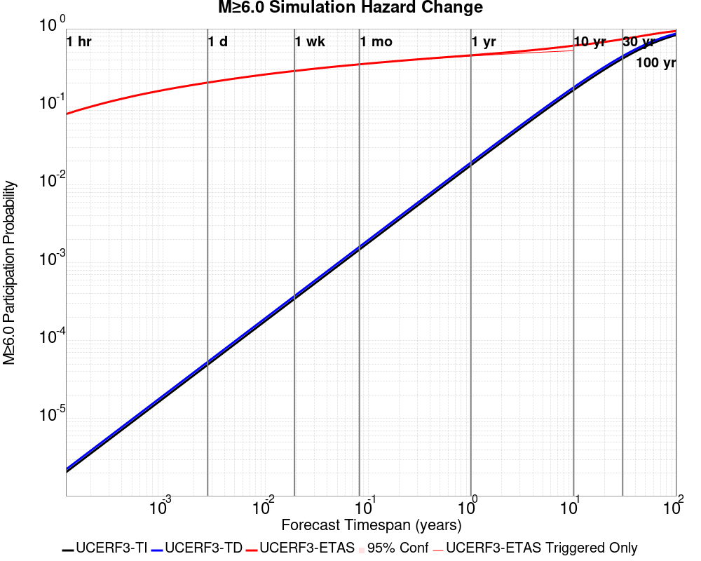
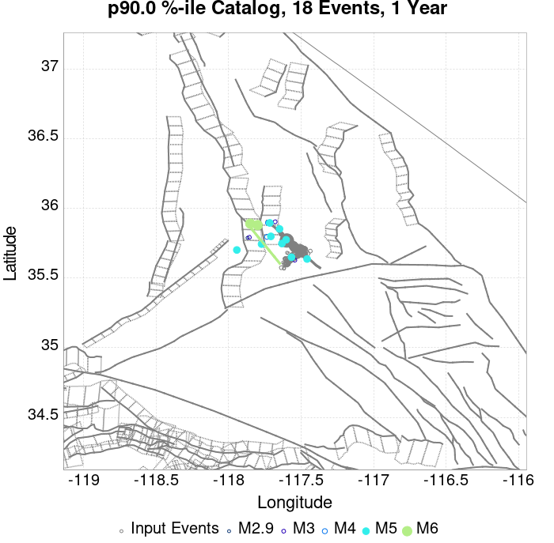
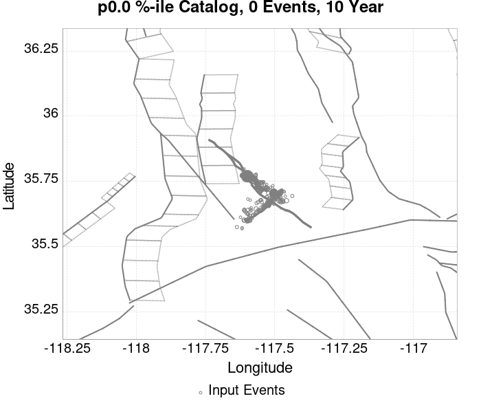

# ComCat M7.1 (ci38457511), ShakeMap Surfaces, FM2_1 Results

|   | ComCat M7.1 (ci38457511), ShakeMap Surfaces, FM2_1 |
|-----|-----|
| Num Simulations | 331244 (incomplete) |
| Start Time | 2019/07/06 03:19:54 UTC |
| Start Time Epoch Milliseconds | 1562383194040 |
| Duration | 10 Years |
| Includes Spontaneous? | false |
| Trigger Ruptures | 283 Trigger Ruptures |
|   | First: M3.98 at 2019/07/04 17:02:55 UTC |
|   | Last: M7.1 at 2019/07/06 03:19:53 UTC |
|   | Largest: M7.1 at 2019/07/06 03:19:53 UTC |
| Trigger Ruptures | *(none)* |
| Config Generated With | u3etas_comcat_event_config_builder.sh --event-id ci38457511 --mag-complete 3.5 --days-before 7 --num-simulations 1000000 --fault-model FM2_1 --finite-surf-shakemap --finite-surf-shakemap-min-mag 5 --hpc-site USC_HPC --nodes 36 --hours 24 --queue scec |

## Table Of Contents

* [Probabilities Summary Table](#probabilities-summary-table)
* [Magnitude Number Distribution](#magnitude-number-distribution)
  * [10 Year Magnitude Number Distribution](#10-year-magnitude-number-distribution)
  * [1 Year Magnitude Number Distribution](#1-year-magnitude-number-distribution)
  * [1 Month Magnitude Number Distribution](#1-month-magnitude-number-distribution)
  * [1 Week Magnitude Number Distribution](#1-week-magnitude-number-distribution)
  * [1 Day Magnitude Number Distribution](#1-day-magnitude-number-distribution)
  * [1 Hour Magnitude Number Distribution](#1-hour-magnitude-number-distribution)
* [Hazard Change Over Time](#hazard-change-over-time)
  * [M&ge;5.0 Hazard Change Over Time](#m50-hazard-change-over-time)
  * [M&ge;6.0 Hazard Change Over Time](#m60-hazard-change-over-time)
  * [M&ge;7.0 Hazard Change Over Time](#m70-hazard-change-over-time)
* [Trigger Rupture Fault Map](#trigger-rupture-fault-map)
* [Trigger Rupture Depth Map](#trigger-rupture-depth-map)
* [Fault Distances To Triggers](#fault-distances-to-triggers)
* [Individual Simulated Catalog Maps](#individual-simulated-catalog-maps)
* [ComCat Data Comparisons](#comcat-data-comparisons)
  * [ComCat Magnitude-Number Distributions](#comcat-magnitude-number-distributions)
  * [ComCat Cumulative Number Vs Time](#comcat-cumulative-number-vs-time)
  * [ComCat Cumulative Number Simulation Percentiles](#comcat-cumulative-number-simulation-percentiles)
  * [ComCat Probability Spatial Distribution](#comcat-probability-spatial-distribution)
  * [ComCat Mean Expectation Spatial Distribution](#comcat-mean-expectation-spatial-distribution)
  * [ComCat Depth Distribution](#comcat-depth-distribution)
* [Section Participation](#section-participation)
  * [Section Participation Plots](#section-participation-plots)
  * [Supra-Seismogenic Parent Sections Table](#supra-seismogenic-parent-sections-table)
  * [M≥6.5 Parent Sections Table](#m65-parent-sections-table)
  * [M≥7 Parent Sections Table](#m7-parent-sections-table)
  * [M≥7.5 Parent Sections Table](#m75-parent-sections-table)
  * [M≥8 Parent Sections Table](#m8-parent-sections-table)
* [Fault Magnitude-Probability Distributions](#fault-magnitude-probability-distributions)
* [Gridded Nucleation](#gridded-nucleation)
* [JSON Input File](#json-input-file)

## Probabilities Summary Table
*[(top)](#table-of-contents)*

| Magnitude | 1 Hour Prob | 1 Day Prob | 1 Week Prob | 1 Month Prob | 1 Year Prob | 10 Year Prob |
|-----|-----|-----|-----|-----|-----|-----|
| **M&ge;5** | 0.767 (76.73%) | 0.977 (97.67%) | 0.995 (99.52%) | 0.999 (99.86%) | 1.000 (99.98%) | 1.000 (100.00%) |
| *95% Conf* | *[76.58% 76.87%]* | *[97.62% 97.72%]* | *[99.50% 99.55%]* | *[99.85% 99.87%]* | *[99.98% 99.99%]* | *[99.99% 100.00%]* |
| **M&ge;5.5** | 0.338 (33.83%) | 0.664 (66.39%) | 0.794 (79.40%) | 0.859 (85.92%) | 0.927 (92.71%) | 0.960 (96.02%) |
| *95% Conf* | *[33.67% 33.99%]* | *[66.22% 66.55%]* | *[79.26% 79.54%]* | *[85.80% 86.04%]* | *[92.62% 92.80%]* | *[95.95% 96.09%]* |
| **M&ge;6** | 0.082 (8.20%) | 0.209 (20.87%) | 0.294 (29.39%) | 0.357 (35.69%) | 0.456 (45.64%) | 0.536 (53.61%) |
| *95% Conf* | *[8.11% 8.30%]* | *[20.74% 21.01%]* | *[29.23% 29.55%]* | *[35.53% 35.85%]* | *[45.47% 45.81%]* | *[53.44% 53.78%]* |
| **M&ge;6.5** | 0.015 (1.48%) | 0.042 (4.19%) | 0.064 (6.35%) | 0.082 (8.17%) | 0.115 (11.45%) | 0.146 (14.58%) |
| *95% Conf* | *[1.44% 1.53%]* | *[4.12% 4.26%]* | *[6.27% 6.44%]* | *[8.08% 8.26%]* | *[11.34% 11.56%]* | *[14.46% 14.70%]* |
| **M&ge;7** | 3.86E-3 (0.39%) | 0.011 (1.08%) | 0.016 (1.62%) | 0.021 (2.08%) | 0.030 (2.99%) | 0.039 (3.89%) |
| *95% Conf* | *[0.37% 0.41%]* | *[1.04% 1.11%]* | *[1.57% 1.66%]* | *[2.03% 2.13%]* | *[2.93% 3.05%]* | *[3.82% 3.95%]* |
| **M&ge;7.1** | 3.15E-3 (0.32%) | 8.79E-3 (0.88%) | 0.013 (1.32%) | 0.017 (1.69%) | 0.024 (2.40%) | 0.031 (3.12%) |
| *95% Conf* | *[0.30% 0.34%]* | *[0.85% 0.91%]* | *[1.28% 1.36%]* | *[1.65% 1.73%]* | *[2.35% 2.45%]* | *[3.06% 3.18%]* |
| **M&ge;7.5** | 1.36E-3 (0.14%) | 3.58E-3 (0.36%) | 5.32E-3 (0.53%) | 6.66E-3 (0.67%) | 9.21E-3 (0.92%) | 0.012 (1.19%) |
| *95% Conf* | *[0.12% 0.15%]* | *[0.34% 0.38%]* | *[0.51% 0.56%]* | *[0.64% 0.69%]* | *[0.89% 0.95%]* | *[1.15% 1.23%]* |
| **M&ge;8** | 3.02E-6 (0.00%) | 1.51E-5 (0.00%) | 2.42E-5 (0.00%) | 4.23E-5 (0.00%) | 6.64E-5 (0.01%) | 9.66E-5 (0.01%) |
| *95% Conf* | *[0.00% 0.00%]* | *[0.00% 0.00%]* | *[0.00% 0.00%]* | *[0.00% 0.01%]* | *[0.00% 0.01%]* | *[0.01% 0.01%]* |

## Magnitude Number Distribution
*[(top)](#table-of-contents)*

### 10 Year Magnitude Number Distribution
*[(top)](#table-of-contents)*

**Legend**
* **Mean** (thick black line): mean expected number across all 331244 catalogs
* **2.5%,97.5%** (thin black lines): expected number percentiles across all 331244 catalogs
* **Median** (thin blue line): median expected number across all 331244 catalogs
* **Mode** (thin cyan line): modal expected number across all 331244 catalogs
* **10 yr Probability** (thin red line): 10 year probability calculated as the fraction of catalogs with at least 1 occurrence
* **10 yr Supraseismogenic Probability** (thin dashed red line): same as above, but only for supraseismogenic ruptures on explicitly modeled UCERF3 faults
* **95% Conf** (light red shaded region): binomial 95% confidence bounds on probability
* **Primary** (thin green line): mean expected number from primary triggered aftershocks only (no secondary, tertiary, etc...) across all 331244 catalogs


| Mag | Mean | 2.5 %ile | 97.5 %ile | Median | Mode | 10 yr Probability | 10 yr Prob 95% Conf | 10 yr Supra-Seis Prob | Primary Aftershocks Mean |
|-----|-----|-----|-----|-----|-----|-----|-----|-----|-----|
| **M&ge;5** | 15.167 | 5.000 | 35.000 | 13.000 | 12.000 | 1.000 (100.00%) | [99.99% 100.00%] | 0.123 (12.28%) | 7.236 |
| **M&ge;5.1** | 11.902 | 4.000 | 28.000 | 11.000 | 9.000 | 1.000 (99.97%) | [99.97% 99.98%] | 0.123 (12.28%) | 5.677 |
| **M&ge;5.2** | 9.306 | 2.000 | 23.000 | 8.000 | 7.000 | 0.999 (99.87%) | [99.85% 99.88%] | 0.123 (12.28%) | 4.439 |
| **M&ge;5.3** | 7.243 | 1.000 | 18.000 | 6.000 | 5.000 | 0.995 (99.46%) | [99.43% 99.48%] | 0.123 (12.28%) | 3.453 |
| **M&ge;5.4** | 5.606 | 1.000 | 15.000 | 5.000 | 4.000 | 0.984 (98.39%) | [98.35% 98.43%] | 0.123 (12.28%) | 2.673 |
| **M&ge;5.5** | 4.309 | 0.000 | 12.000 | 4.000 | 3.000 | 0.960 (96.02%) | [95.95% 96.09%] | 0.123 (12.28%) | 2.051 |
| **M&ge;5.6** | 3.276 | 0.000 | 10.000 | 3.000 | 2.000 | 0.918 (91.83%) | [91.74% 91.92%] | 0.123 (12.28%) | 1.560 |
| **M&ge;5.7** | 2.455 | 0.000 | 8.000 | 2.000 | 1.000 | 0.853 (85.30%) | [85.17% 85.42%] | 0.123 (12.28%) | 1.165 |
| **M&ge;5.8** | 1.804 | 0.000 | 6.000 | 1.000 | 1.000 | 0.763 (76.33%) | [76.19% 76.48%] | 0.123 (12.28%) | 0.855 |
| **M&ge;5.9** | 1.292 | 0.000 | 5.000 | 1.000 | 0.000 | 0.651 (65.12%) | [64.96% 65.29%] | 0.123 (12.28%) | 0.610 |
| **M&ge;6** | 0.926 | 0.000 | 4.000 | 1.000 | 0.000 | 0.536 (53.61%) | [53.44% 53.78%] | 0.123 (12.28%) | 0.432 |
| **M&ge;6.1** | 0.671 | 0.000 | 3.000 | 0.000 | 0.000 | 0.430 (43.00%) | [42.83% 43.16%] | 0.123 (12.26%) | 0.306 |
| **M&ge;6.2** | 0.466 | 0.000 | 3.000 | 0.000 | 0.000 | 0.323 (32.31%) | [32.15% 32.47%] | 0.123 (12.26%) | 0.202 |
| **M&ge;6.3** | 0.367 | 0.000 | 2.000 | 0.000 | 0.000 | 0.264 (26.45%) | [26.30% 26.60%] | 0.123 (12.26%) | 0.153 |
| **M&ge;6.4** | 0.233 | 0.000 | 2.000 | 0.000 | 0.000 | 0.174 (17.37%) | [17.24% 17.50%] | 0.072 (7.21%) | 0.097 |
| **M&ge;6.5** | 0.195 | 0.000 | 2.000 | 0.000 | 0.000 | 0.146 (14.58%) | [14.46% 14.70%] | 0.072 (7.21%) | 0.078 |
| **M&ge;6.6** | 0.143 | 0.000 | 1.000 | 0.000 | 0.000 | 0.116 (11.58%) | [11.47% 11.69%] | 0.062 (6.23%) | 0.060 |
| **M&ge;6.7** | 0.112 | 0.000 | 1.000 | 0.000 | 0.000 | 0.092 (9.18%) | [9.08% 9.28%] | 0.054 (5.40%) | 0.046 |
| **M&ge;6.8** | 0.093 | 0.000 | 1.000 | 0.000 | 0.000 | 0.077 (7.73%) | [7.64% 7.82%] | 0.051 (5.15%) | 0.038 |
| **M&ge;6.9** | 0.056 | 0.000 | 1.000 | 0.000 | 0.000 | 0.048 (4.75%) | [4.68% 4.83%] | 0.030 (3.02%) | 0.023 |
| **M&ge;7** | 0.045 | 0.000 | 1.000 | 0.000 | 0.000 | 0.039 (3.89%) | [3.82% 3.95%] | 0.028 (2.79%) | 0.019 |
| **M&ge;7.1** | 0.036 | 0.000 | 1.000 | 0.000 | 0.000 | 0.031 (3.12%) | [3.06% 3.18%] | 0.025 (2.46%) | 0.015 |
| **M&ge;7.2** | 0.029 | 0.000 | 1.000 | 0.000 | 0.000 | 0.026 (2.57%) | [2.51% 2.62%] | 0.022 (2.20%) | 0.013 |
| **M&ge;7.3** | 0.022 | 0.000 | 0.000 | 0.000 | 0.000 | 0.019 (1.93%) | [1.89% 1.98%] | 0.018 (1.76%) | 9.54E-3 |
| **M&ge;7.4** | 0.018 | 0.000 | 0.000 | 0.000 | 0.000 | 0.016 (1.59%) | [1.54% 1.63%] | 0.015 (1.51%) | 8.11E-3 |
| **M&ge;7.5** | 0.014 | 0.000 | 0.000 | 0.000 | 0.000 | 0.012 (1.19%) | [1.15% 1.23%] | 0.012 (1.16%) | 6.00E-3 |
| **M&ge;7.6** | 0.013 | 0.000 | 0.000 | 0.000 | 0.000 | 0.011 (1.09%) | [1.05% 1.12%] | 0.011 (1.08%) | 5.50E-3 |
| **M&ge;7.7** | 5.07E-3 | 0.000 | 0.000 | 0.000 | 0.000 | 4.59E-3 (0.46%) | [0.44% 0.48%] | 4.52E-3 (0.45%) | 1.71E-3 |
| **M&ge;7.8** | 1.56E-3 | 0.000 | 0.000 | 0.000 | 0.000 | 1.55E-3 (0.15%) | [0.14% 0.17%] | 1.50E-3 (0.15%) | 1.90E-4 |
| **M&ge;7.9** | 4.86E-4 | 0.000 | 0.000 | 0.000 | 0.000 | 4.86E-4 (0.05%) | [0.04% 0.06%] | 4.86E-4 (0.05%) | 3.02E-5 |
| **M&ge;8** | 9.66E-5 | 0.000 | 0.000 | 0.000 | 0.000 | 9.66E-5 (0.01%) | [0.01% 0.01%] | 9.66E-5 (0.01%) | 1.21E-5 |
| **M&ge;8.1** | 3.62E-5 | 0.000 | 0.000 | 0.000 | 0.000 | 3.62E-5 (0.00%) | [0.00% 0.01%] | 3.62E-5 (0.00%) | 3.02E-6 |
| **M&ge;8.2** | 0.000 | 0.000 | 0.000 | 0.000 | 0.000 | 0.000 (0.00%) | [0.00% 0.00%] | 0.000 (0.00%) | 0.000 |
| **M&ge;8.3** | 0.000 | 0.000 | 0.000 | 0.000 | 0.000 | 0.000 (0.00%) | [0.00% 0.00%] | 0.000 (0.00%) | 0.000 |
| **M&ge;8.4** | 0.000 | 0.000 | 0.000 | 0.000 | 0.000 | 0.000 (0.00%) | [0.00% 0.00%] | 0.000 (0.00%) | 0.000 |
| **M&ge;8.5** | 0.000 | 0.000 | 0.000 | 0.000 | 0.000 | 0.000 (0.00%) | [0.00% 0.00%] | 0.000 (0.00%) | 0.000 |
| **M&ge;8.6** | 0.000 | 0.000 | 0.000 | 0.000 | 0.000 | 0.000 (0.00%) | [0.00% 0.00%] | 0.000 (0.00%) | 0.000 |
| **M&ge;8.7** | 0.000 | 0.000 | 0.000 | 0.000 | 0.000 | 0.000 (0.00%) | [0.00% 0.00%] | 0.000 (0.00%) | 0.000 |
| **M&ge;8.8** | 0.000 | 0.000 | 0.000 | 0.000 | 0.000 | 0.000 (0.00%) | [0.00% 0.00%] | 0.000 (0.00%) | 0.000 |
| **M&ge;8.9** | 0.000 | 0.000 | 0.000 | 0.000 | 0.000 | 0.000 (0.00%) | [0.00% 0.00%] | 0.000 (0.00%) | 0.000 |
| **M&ge;9** | 0.000 | 0.000 | 0.000 | 0.000 | 0.000 | 0.000 (0.00%) | [0.00% 0.00%] | 0.000 (0.00%) | 0.000 |

### 1 Year Magnitude Number Distribution
*[(top)](#table-of-contents)*

**Legend**
* **Mean** (thick black line): mean expected number across all 331244 catalogs
* **2.5%,97.5%** (thin black lines): expected number percentiles across all 331244 catalogs
* **Median** (thin blue line): median expected number across all 331244 catalogs
* **Mode** (thin cyan line): modal expected number across all 331244 catalogs
* **1 yr Probability** (thin red line): 1 year probability calculated as the fraction of catalogs with at least 1 occurrence
* **1 yr Supraseismogenic Probability** (thin dashed red line): same as above, but only for supraseismogenic ruptures on explicitly modeled UCERF3 faults
* **95% Conf** (light red shaded region): binomial 95% confidence bounds on probability
* **Primary** (thin green line): mean expected number from primary triggered aftershocks only (no secondary, tertiary, etc...) across all 331244 catalogs


| Mag | Mean | 2.5 %ile | 97.5 %ile | Median | Mode | 1 yr Probability | 1 yr Prob 95% Conf | 1 yr Supra-Seis Prob | Primary Aftershocks Mean |
|-----|-----|-----|-----|-----|-----|-----|-----|-----|-----|
| **M&ge;5** | 11.644 | 4.000 | 25.000 | 11.000 | 9.000 | 1.000 (99.98%) | [99.98% 99.99%] | 0.094 (9.40%) | 6.299 |
| **M&ge;5.1** | 9.135 | 2.000 | 21.000 | 8.000 | 7.000 | 0.999 (99.89%) | [99.88% 99.90%] | 0.094 (9.40%) | 4.940 |
| **M&ge;5.2** | 7.141 | 2.000 | 17.000 | 6.000 | 5.000 | 0.996 (99.56%) | [99.54% 99.58%] | 0.094 (9.40%) | 3.862 |
| **M&ge;5.3** | 5.556 | 1.000 | 14.000 | 5.000 | 4.000 | 0.986 (98.61%) | [98.57% 98.65%] | 0.094 (9.40%) | 3.004 |
| **M&ge;5.4** | 4.299 | 0.000 | 11.000 | 4.000 | 3.000 | 0.966 (96.57%) | [96.51% 96.63%] | 0.094 (9.40%) | 2.325 |
| **M&ge;5.5** | 3.303 | 0.000 | 9.000 | 3.000 | 2.000 | 0.927 (92.71%) | [92.62% 92.80%] | 0.094 (9.40%) | 1.784 |
| **M&ge;5.6** | 2.510 | 0.000 | 8.000 | 2.000 | 1.000 | 0.869 (86.87%) | [86.76% 86.99%] | 0.094 (9.40%) | 1.355 |
| **M&ge;5.7** | 1.880 | 0.000 | 6.000 | 1.000 | 1.000 | 0.787 (78.71%) | [78.57% 78.85%] | 0.094 (9.40%) | 1.012 |
| **M&ge;5.8** | 1.381 | 0.000 | 5.000 | 1.000 | 1.000 | 0.686 (68.57%) | [68.41% 68.73%] | 0.094 (9.40%) | 0.743 |
| **M&ge;5.9** | 0.989 | 0.000 | 4.000 | 1.000 | 0.000 | 0.569 (56.90%) | [56.73% 57.07%] | 0.094 (9.40%) | 0.530 |
| **M&ge;6** | 0.707 | 0.000 | 3.000 | 0.000 | 0.000 | 0.456 (45.64%) | [45.47% 45.81%] | 0.094 (9.40%) | 0.375 |
| **M&ge;6.1** | 0.510 | 0.000 | 3.000 | 0.000 | 0.000 | 0.358 (35.78%) | [35.61% 35.94%] | 0.094 (9.39%) | 0.265 |
| **M&ge;6.2** | 0.350 | 0.000 | 2.000 | 0.000 | 0.000 | 0.262 (26.18%) | [26.03% 26.33%] | 0.094 (9.39%) | 0.174 |
| **M&ge;6.3** | 0.274 | 0.000 | 2.000 | 0.000 | 0.000 | 0.211 (21.13%) | [20.99% 21.27%] | 0.094 (9.39%) | 0.132 |
| **M&ge;6.4** | 0.173 | 0.000 | 1.000 | 0.000 | 0.000 | 0.137 (13.72%) | [13.60% 13.83%] | 0.056 (5.58%) | 0.083 |
| **M&ge;6.5** | 0.144 | 0.000 | 1.000 | 0.000 | 0.000 | 0.115 (11.45%) | [11.34% 11.56%] | 0.056 (5.57%) | 0.067 |
| **M&ge;6.6** | 0.106 | 0.000 | 1.000 | 0.000 | 0.000 | 0.090 (9.02%) | [8.92% 9.12%] | 0.048 (4.80%) | 0.052 |
| **M&ge;6.7** | 0.083 | 0.000 | 1.000 | 0.000 | 0.000 | 0.071 (7.11%) | [7.02% 7.20%] | 0.041 (4.15%) | 0.040 |
| **M&ge;6.8** | 0.069 | 0.000 | 1.000 | 0.000 | 0.000 | 0.060 (5.97%) | [5.89% 6.05%] | 0.040 (3.96%) | 0.033 |
| **M&ge;6.9** | 0.041 | 0.000 | 1.000 | 0.000 | 0.000 | 0.037 (3.66%) | [3.60% 3.72%] | 0.023 (2.33%) | 0.020 |
| **M&ge;7** | 0.034 | 0.000 | 1.000 | 0.000 | 0.000 | 0.030 (2.99%) | [2.93% 3.05%] | 0.021 (2.15%) | 0.016 |
| **M&ge;7.1** | 0.027 | 0.000 | 0.000 | 0.000 | 0.000 | 0.024 (2.40%) | [2.35% 2.45%] | 0.019 (1.89%) | 0.013 |
| **M&ge;7.2** | 0.022 | 0.000 | 0.000 | 0.000 | 0.000 | 0.020 (1.98%) | [1.93% 2.03%] | 0.017 (1.69%) | 0.011 |
| **M&ge;7.3** | 0.017 | 0.000 | 0.000 | 0.000 | 0.000 | 0.015 (1.49%) | [1.45% 1.53%] | 0.014 (1.35%) | 8.22E-3 |
| **M&ge;7.4** | 0.014 | 0.000 | 0.000 | 0.000 | 0.000 | 0.012 (1.23%) | [1.19% 1.26%] | 0.012 (1.17%) | 6.98E-3 |
| **M&ge;7.5** | 0.010 | 0.000 | 0.000 | 0.000 | 0.000 | 9.21E-3 (0.92%) | [0.89% 0.95%] | 9.02E-3 (0.90%) | 5.20E-3 |
| **M&ge;7.6** | 9.59E-3 | 0.000 | 0.000 | 0.000 | 0.000 | 8.45E-3 (0.85%) | [0.81% 0.88%] | 8.37E-3 (0.84%) | 4.76E-3 |
| **M&ge;7.7** | 3.64E-3 | 0.000 | 0.000 | 0.000 | 0.000 | 3.36E-3 (0.34%) | [0.32% 0.36%] | 3.31E-3 (0.33%) | 1.46E-3 |
| **M&ge;7.8** | 1.04E-3 | 0.000 | 0.000 | 0.000 | 0.000 | 1.04E-3 (0.10%) | [0.09% 0.12%] | 1.01E-3 (0.10%) | 1.51E-4 |
| **M&ge;7.9** | 3.29E-4 | 0.000 | 0.000 | 0.000 | 0.000 | 3.29E-4 (0.03%) | [0.03% 0.04%] | 3.29E-4 (0.03%) | 2.42E-5 |
| **M&ge;8** | 6.64E-5 | 0.000 | 0.000 | 0.000 | 0.000 | 6.64E-5 (0.01%) | [0.00% 0.01%] | 6.64E-5 (0.01%) | 1.21E-5 |
| **M&ge;8.1** | 1.81E-5 | 0.000 | 0.000 | 0.000 | 0.000 | 1.81E-5 (0.00%) | [0.00% 0.00%] | 1.81E-5 (0.00%) | 3.02E-6 |
| **M&ge;8.2** | 0.000 | 0.000 | 0.000 | 0.000 | 0.000 | 0.000 (0.00%) | [0.00% 0.00%] | 0.000 (0.00%) | 0.000 |
| **M&ge;8.3** | 0.000 | 0.000 | 0.000 | 0.000 | 0.000 | 0.000 (0.00%) | [0.00% 0.00%] | 0.000 (0.00%) | 0.000 |
| **M&ge;8.4** | 0.000 | 0.000 | 0.000 | 0.000 | 0.000 | 0.000 (0.00%) | [0.00% 0.00%] | 0.000 (0.00%) | 0.000 |
| **M&ge;8.5** | 0.000 | 0.000 | 0.000 | 0.000 | 0.000 | 0.000 (0.00%) | [0.00% 0.00%] | 0.000 (0.00%) | 0.000 |
| **M&ge;8.6** | 0.000 | 0.000 | 0.000 | 0.000 | 0.000 | 0.000 (0.00%) | [0.00% 0.00%] | 0.000 (0.00%) | 0.000 |
| **M&ge;8.7** | 0.000 | 0.000 | 0.000 | 0.000 | 0.000 | 0.000 (0.00%) | [0.00% 0.00%] | 0.000 (0.00%) | 0.000 |
| **M&ge;8.8** | 0.000 | 0.000 | 0.000 | 0.000 | 0.000 | 0.000 (0.00%) | [0.00% 0.00%] | 0.000 (0.00%) | 0.000 |
| **M&ge;8.9** | 0.000 | 0.000 | 0.000 | 0.000 | 0.000 | 0.000 (0.00%) | [0.00% 0.00%] | 0.000 (0.00%) | 0.000 |
| **M&ge;9** | 0.000 | 0.000 | 0.000 | 0.000 | 0.000 | 0.000 (0.00%) | [0.00% 0.00%] | 0.000 (0.00%) | 0.000 |

### 1 Month Magnitude Number Distribution
*[(top)](#table-of-contents)*

**Legend**
* **Mean** (thick black line): mean expected number across all 331244 catalogs
* **2.5%,97.5%** (thin black lines): expected number percentiles across all 331244 catalogs
* **Median** (thin blue line): median expected number across all 331244 catalogs
* **Mode** (thin cyan line): modal expected number across all 331244 catalogs
* **1 mo Probability** (thin red line): 1 month probability calculated as the fraction of catalogs with at least 1 occurrence
* **1 mo Supraseismogenic Probability** (thin dashed red line): same as above, but only for supraseismogenic ruptures on explicitly modeled UCERF3 faults
* **95% Conf** (light red shaded region): binomial 95% confidence bounds on probability
* **Primary** (thin green line): mean expected number from primary triggered aftershocks only (no secondary, tertiary, etc...) across all 331244 catalogs


| Mag | Mean | 2.5 %ile | 97.5 %ile | Median | Mode | 1 mo Probability | 1 mo Prob 95% Conf | 1 mo Supra-Seis Prob | Primary Aftershocks Mean |
|-----|-----|-----|-----|-----|-----|-----|-----|-----|-----|
| **M&ge;5** | 8.191 | 2.000 | 18.000 | 8.000 | 7.000 | 0.999 (99.86%) | [99.85% 99.87%] | 0.066 (6.57%) | 5.104 |
| **M&ge;5.1** | 6.424 | 1.000 | 15.000 | 6.000 | 5.000 | 0.995 (99.45%) | [99.42% 99.48%] | 0.066 (6.57%) | 4.002 |
| **M&ge;5.2** | 5.021 | 1.000 | 12.000 | 5.000 | 4.000 | 0.984 (98.35%) | [98.31% 98.40%] | 0.066 (6.57%) | 3.127 |
| **M&ge;5.3** | 3.905 | 0.000 | 10.000 | 3.000 | 3.000 | 0.960 (96.03%) | [95.97% 96.10%] | 0.066 (6.57%) | 2.432 |
| **M&ge;5.4** | 3.021 | 0.000 | 8.000 | 3.000 | 2.000 | 0.921 (92.06%) | [91.97% 92.16%] | 0.066 (6.57%) | 1.881 |
| **M&ge;5.5** | 2.319 | 0.000 | 7.000 | 2.000 | 1.000 | 0.859 (85.92%) | [85.80% 86.04%] | 0.066 (6.57%) | 1.443 |
| **M&ge;5.6** | 1.762 | 0.000 | 6.000 | 1.000 | 1.000 | 0.779 (77.92%) | [77.78% 78.06%] | 0.066 (6.57%) | 1.096 |
| **M&ge;5.7** | 1.319 | 0.000 | 5.000 | 1.000 | 1.000 | 0.682 (68.22%) | [68.06% 68.38%] | 0.066 (6.57%) | 0.818 |
| **M&ge;5.8** | 0.968 | 0.000 | 4.000 | 1.000 | 0.000 | 0.574 (57.37%) | [57.20% 57.54%] | 0.066 (6.57%) | 0.600 |
| **M&ge;5.9** | 0.691 | 0.000 | 3.000 | 0.000 | 0.000 | 0.459 (45.92%) | [45.75% 46.09%] | 0.066 (6.57%) | 0.427 |
| **M&ge;6** | 0.491 | 0.000 | 3.000 | 0.000 | 0.000 | 0.357 (35.69%) | [35.53% 35.85%] | 0.066 (6.57%) | 0.301 |
| **M&ge;6.1** | 0.352 | 0.000 | 2.000 | 0.000 | 0.000 | 0.272 (27.20%) | [27.05% 27.35%] | 0.066 (6.56%) | 0.212 |
| **M&ge;6.2** | 0.238 | 0.000 | 2.000 | 0.000 | 0.000 | 0.193 (19.29%) | [19.15% 19.42%] | 0.066 (6.56%) | 0.138 |
| **M&ge;6.3** | 0.185 | 0.000 | 1.000 | 0.000 | 0.000 | 0.153 (15.35%) | [15.23% 15.47%] | 0.066 (6.56%) | 0.105 |
| **M&ge;6.4** | 0.116 | 0.000 | 1.000 | 0.000 | 0.000 | 0.098 (9.80%) | [9.70% 9.90%] | 0.040 (3.96%) | 0.065 |
| **M&ge;6.5** | 0.097 | 0.000 | 1.000 | 0.000 | 0.000 | 0.082 (8.17%) | [8.08% 8.26%] | 0.040 (3.96%) | 0.053 |
| **M&ge;6.6** | 0.072 | 0.000 | 1.000 | 0.000 | 0.000 | 0.064 (6.42%) | [6.34% 6.51%] | 0.034 (3.40%) | 0.041 |
| **M&ge;6.7** | 0.056 | 0.000 | 1.000 | 0.000 | 0.000 | 0.050 (5.02%) | [4.94% 5.09%] | 0.029 (2.92%) | 0.032 |
| **M&ge;6.8** | 0.047 | 0.000 | 1.000 | 0.000 | 0.000 | 0.042 (4.20%) | [4.13% 4.27%] | 0.028 (2.79%) | 0.026 |
| **M&ge;6.9** | 0.028 | 0.000 | 1.000 | 0.000 | 0.000 | 0.026 (2.55%) | [2.50% 2.61%] | 0.016 (1.63%) | 0.016 |
| **M&ge;7** | 0.023 | 0.000 | 0.000 | 0.000 | 0.000 | 0.021 (2.08%) | [2.03% 2.13%] | 0.015 (1.51%) | 0.013 |
| **M&ge;7.1** | 0.018 | 0.000 | 0.000 | 0.000 | 0.000 | 0.017 (1.69%) | [1.65% 1.73%] | 0.013 (1.34%) | 0.011 |
| **M&ge;7.2** | 0.015 | 0.000 | 0.000 | 0.000 | 0.000 | 0.014 (1.40%) | [1.36% 1.44%] | 0.012 (1.21%) | 8.93E-3 |
| **M&ge;7.3** | 0.011 | 0.000 | 0.000 | 0.000 | 0.000 | 0.011 (1.05%) | [1.02% 1.09%] | 9.63E-3 (0.96%) | 6.73E-3 |
| **M&ge;7.4** | 9.52E-3 | 0.000 | 0.000 | 0.000 | 0.000 | 8.79E-3 (0.88%) | [0.85% 0.91%] | 8.40E-3 (0.84%) | 5.76E-3 |
| **M&ge;7.5** | 7.33E-3 | 0.000 | 0.000 | 0.000 | 0.000 | 6.66E-3 (0.67%) | [0.64% 0.69%] | 6.54E-3 (0.65%) | 4.35E-3 |
| **M&ge;7.6** | 6.74E-3 | 0.000 | 0.000 | 0.000 | 0.000 | 6.11E-3 (0.61%) | [0.59% 0.64%] | 6.06E-3 (0.61%) | 3.98E-3 |
| **M&ge;7.7** | 2.38E-3 | 0.000 | 0.000 | 0.000 | 0.000 | 2.25E-3 (0.22%) | [0.21% 0.24%] | 2.21E-3 (0.22%) | 1.19E-3 |
| **M&ge;7.8** | 6.07E-4 | 0.000 | 0.000 | 0.000 | 0.000 | 6.07E-4 (0.06%) | [0.05% 0.07%] | 5.86E-4 (0.06%) | 1.15E-4 |
| **M&ge;7.9** | 1.90E-4 | 0.000 | 0.000 | 0.000 | 0.000 | 1.90E-4 (0.02%) | [0.01% 0.02%] | 1.90E-4 (0.02%) | 1.81E-5 |
| **M&ge;8** | 4.23E-5 | 0.000 | 0.000 | 0.000 | 0.000 | 4.23E-5 (0.00%) | [0.00% 0.01%] | 4.23E-5 (0.00%) | 1.21E-5 |
| **M&ge;8.1** | 1.21E-5 | 0.000 | 0.000 | 0.000 | 0.000 | 1.21E-5 (0.00%) | [0.00% 0.00%] | 1.21E-5 (0.00%) | 3.02E-6 |
| **M&ge;8.2** | 0.000 | 0.000 | 0.000 | 0.000 | 0.000 | 0.000 (0.00%) | [0.00% 0.00%] | 0.000 (0.00%) | 0.000 |
| **M&ge;8.3** | 0.000 | 0.000 | 0.000 | 0.000 | 0.000 | 0.000 (0.00%) | [0.00% 0.00%] | 0.000 (0.00%) | 0.000 |
| **M&ge;8.4** | 0.000 | 0.000 | 0.000 | 0.000 | 0.000 | 0.000 (0.00%) | [0.00% 0.00%] | 0.000 (0.00%) | 0.000 |
| **M&ge;8.5** | 0.000 | 0.000 | 0.000 | 0.000 | 0.000 | 0.000 (0.00%) | [0.00% 0.00%] | 0.000 (0.00%) | 0.000 |
| **M&ge;8.6** | 0.000 | 0.000 | 0.000 | 0.000 | 0.000 | 0.000 (0.00%) | [0.00% 0.00%] | 0.000 (0.00%) | 0.000 |
| **M&ge;8.7** | 0.000 | 0.000 | 0.000 | 0.000 | 0.000 | 0.000 (0.00%) | [0.00% 0.00%] | 0.000 (0.00%) | 0.000 |
| **M&ge;8.8** | 0.000 | 0.000 | 0.000 | 0.000 | 0.000 | 0.000 (0.00%) | [0.00% 0.00%] | 0.000 (0.00%) | 0.000 |
| **M&ge;8.9** | 0.000 | 0.000 | 0.000 | 0.000 | 0.000 | 0.000 (0.00%) | [0.00% 0.00%] | 0.000 (0.00%) | 0.000 |
| **M&ge;9** | 0.000 | 0.000 | 0.000 | 0.000 | 0.000 | 0.000 (0.00%) | [0.00% 0.00%] | 0.000 (0.00%) | 0.000 |

### 1 Week Magnitude Number Distribution
*[(top)](#table-of-contents)*

**Legend**
* **Mean** (thick black line): mean expected number across all 331244 catalogs
* **2.5%,97.5%** (thin black lines): expected number percentiles across all 331244 catalogs
* **Median** (thin blue line): median expected number across all 331244 catalogs
* **Mode** (thin cyan line): modal expected number across all 331244 catalogs
* **1 wk Probability** (thin red line): 1 week probability calculated as the fraction of catalogs with at least 1 occurrence
* **1 wk Supraseismogenic Probability** (thin dashed red line): same as above, but only for supraseismogenic ruptures on explicitly modeled UCERF3 faults
* **95% Conf** (light red shaded region): binomial 95% confidence bounds on probability
* **Primary** (thin green line): mean expected number from primary triggered aftershocks only (no secondary, tertiary, etc...) across all 331244 catalogs


| Mag | Mean | 2.5 %ile | 97.5 %ile | Median | Mode | 1 wk Probability | 1 wk Prob 95% Conf | 1 wk Supra-Seis Prob | Primary Aftershocks Mean |
|-----|-----|-----|-----|-----|-----|-----|-----|-----|-----|
| **M&ge;5** | 6.367 | 1.000 | 14.000 | 6.000 | 5.000 | 0.995 (99.52%) | [99.50% 99.55%] | 0.051 (5.09%) | 4.317 |
| **M&ge;5.1** | 4.993 | 1.000 | 12.000 | 5.000 | 4.000 | 0.985 (98.51%) | [98.47% 98.56%] | 0.051 (5.09%) | 3.385 |
| **M&ge;5.2** | 3.901 | 0.000 | 10.000 | 4.000 | 3.000 | 0.964 (96.40%) | [96.34% 96.47%] | 0.051 (5.09%) | 2.645 |
| **M&ge;5.3** | 3.034 | 0.000 | 8.000 | 3.000 | 2.000 | 0.927 (92.68%) | [92.59% 92.77%] | 0.051 (5.09%) | 2.056 |
| **M&ge;5.4** | 2.345 | 0.000 | 7.000 | 2.000 | 2.000 | 0.870 (87.03%) | [86.92% 87.15%] | 0.051 (5.09%) | 1.590 |
| **M&ge;5.5** | 1.800 | 0.000 | 6.000 | 1.000 | 1.000 | 0.794 (79.40%) | [79.26% 79.54%] | 0.051 (5.09%) | 1.219 |
| **M&ge;5.6** | 1.366 | 0.000 | 5.000 | 1.000 | 1.000 | 0.702 (70.24%) | [70.08% 70.39%] | 0.051 (5.09%) | 0.925 |
| **M&ge;5.7** | 1.022 | 0.000 | 4.000 | 1.000 | 0.000 | 0.600 (60.00%) | [59.84% 60.17%] | 0.051 (5.09%) | 0.690 |
| **M&ge;5.8** | 0.750 | 0.000 | 3.000 | 0.000 | 0.000 | 0.493 (49.30%) | [49.13% 49.47%] | 0.051 (5.09%) | 0.505 |
| **M&ge;5.9** | 0.535 | 0.000 | 3.000 | 0.000 | 0.000 | 0.386 (38.62%) | [38.45% 38.79%] | 0.051 (5.09%) | 0.359 |
| **M&ge;6** | 0.379 | 0.000 | 2.000 | 0.000 | 0.000 | 0.294 (29.39%) | [29.23% 29.55%] | 0.051 (5.09%) | 0.253 |
| **M&ge;6.1** | 0.270 | 0.000 | 2.000 | 0.000 | 0.000 | 0.220 (22.01%) | [21.87% 22.15%] | 0.051 (5.09%) | 0.177 |
| **M&ge;6.2** | 0.181 | 0.000 | 1.000 | 0.000 | 0.000 | 0.153 (15.30%) | [15.18% 15.42%] | 0.051 (5.09%) | 0.115 |
| **M&ge;6.3** | 0.140 | 0.000 | 1.000 | 0.000 | 0.000 | 0.120 (12.05%) | [11.94% 12.16%] | 0.051 (5.09%) | 0.087 |
| **M&ge;6.4** | 0.088 | 0.000 | 1.000 | 0.000 | 0.000 | 0.076 (7.63%) | [7.54% 7.72%] | 0.031 (3.11%) | 0.054 |
| **M&ge;6.5** | 0.073 | 0.000 | 1.000 | 0.000 | 0.000 | 0.064 (6.35%) | [6.27% 6.44%] | 0.031 (3.11%) | 0.045 |
| **M&ge;6.6** | 0.055 | 0.000 | 1.000 | 0.000 | 0.000 | 0.050 (4.99%) | [4.92% 5.07%] | 0.027 (2.67%) | 0.035 |
| **M&ge;6.7** | 0.042 | 0.000 | 1.000 | 0.000 | 0.000 | 0.039 (3.89%) | [3.83% 3.96%] | 0.023 (2.29%) | 0.027 |
| **M&ge;6.8** | 0.035 | 0.000 | 1.000 | 0.000 | 0.000 | 0.033 (3.26%) | [3.20% 3.33%] | 0.022 (2.19%) | 0.022 |
| **M&ge;6.9** | 0.021 | 0.000 | 0.000 | 0.000 | 0.000 | 0.020 (1.98%) | [1.94% 2.03%] | 0.013 (1.29%) | 0.014 |
| **M&ge;7** | 0.017 | 0.000 | 0.000 | 0.000 | 0.000 | 0.016 (1.62%) | [1.57% 1.66%] | 0.012 (1.18%) | 0.011 |
| **M&ge;7.1** | 0.014 | 0.000 | 0.000 | 0.000 | 0.000 | 0.013 (1.32%) | [1.28% 1.36%] | 0.011 (1.06%) | 9.08E-3 |
| **M&ge;7.2** | 0.012 | 0.000 | 0.000 | 0.000 | 0.000 | 0.011 (1.10%) | [1.06% 1.13%] | 9.50E-3 (0.95%) | 7.58E-3 |
| **M&ge;7.3** | 8.87E-3 | 0.000 | 0.000 | 0.000 | 0.000 | 8.27E-3 (0.83%) | [0.80% 0.86%] | 7.59E-3 (0.76%) | 5.70E-3 |
| **M&ge;7.4** | 7.49E-3 | 0.000 | 0.000 | 0.000 | 0.000 | 6.99E-3 (0.70%) | [0.67% 0.73%] | 6.69E-3 (0.67%) | 4.92E-3 |
| **M&ge;7.5** | 5.78E-3 | 0.000 | 0.000 | 0.000 | 0.000 | 5.32E-3 (0.53%) | [0.51% 0.56%] | 5.21E-3 (0.52%) | 3.71E-3 |
| **M&ge;7.6** | 5.31E-3 | 0.000 | 0.000 | 0.000 | 0.000 | 4.89E-3 (0.49%) | [0.47% 0.51%] | 4.84E-3 (0.48%) | 3.39E-3 |
| **M&ge;7.7** | 1.86E-3 | 0.000 | 0.000 | 0.000 | 0.000 | 1.78E-3 (0.18%) | [0.16% 0.19%] | 1.74E-3 (0.17%) | 1.02E-3 |
| **M&ge;7.8** | 4.29E-4 | 0.000 | 0.000 | 0.000 | 0.000 | 4.29E-4 (0.04%) | [0.04% 0.05%] | 4.08E-4 (0.04%) | 9.06E-5 |
| **M&ge;7.9** | 1.15E-4 | 0.000 | 0.000 | 0.000 | 0.000 | 1.15E-4 (0.01%) | [0.01% 0.02%] | 1.15E-4 (0.01%) | 1.21E-5 |
| **M&ge;8** | 2.42E-5 | 0.000 | 0.000 | 0.000 | 0.000 | 2.42E-5 (0.00%) | [0.00% 0.00%] | 2.42E-5 (0.00%) | 6.04E-6 |
| **M&ge;8.1** | 6.04E-6 | 0.000 | 0.000 | 0.000 | 0.000 | 6.04E-6 (0.00%) | [0.00% 0.00%] | 6.04E-6 (0.00%) | 0.000 |
| **M&ge;8.2** | 0.000 | 0.000 | 0.000 | 0.000 | 0.000 | 0.000 (0.00%) | [0.00% 0.00%] | 0.000 (0.00%) | 0.000 |
| **M&ge;8.3** | 0.000 | 0.000 | 0.000 | 0.000 | 0.000 | 0.000 (0.00%) | [0.00% 0.00%] | 0.000 (0.00%) | 0.000 |
| **M&ge;8.4** | 0.000 | 0.000 | 0.000 | 0.000 | 0.000 | 0.000 (0.00%) | [0.00% 0.00%] | 0.000 (0.00%) | 0.000 |
| **M&ge;8.5** | 0.000 | 0.000 | 0.000 | 0.000 | 0.000 | 0.000 (0.00%) | [0.00% 0.00%] | 0.000 (0.00%) | 0.000 |
| **M&ge;8.6** | 0.000 | 0.000 | 0.000 | 0.000 | 0.000 | 0.000 (0.00%) | [0.00% 0.00%] | 0.000 (0.00%) | 0.000 |
| **M&ge;8.7** | 0.000 | 0.000 | 0.000 | 0.000 | 0.000 | 0.000 (0.00%) | [0.00% 0.00%] | 0.000 (0.00%) | 0.000 |
| **M&ge;8.8** | 0.000 | 0.000 | 0.000 | 0.000 | 0.000 | 0.000 (0.00%) | [0.00% 0.00%] | 0.000 (0.00%) | 0.000 |
| **M&ge;8.9** | 0.000 | 0.000 | 0.000 | 0.000 | 0.000 | 0.000 (0.00%) | [0.00% 0.00%] | 0.000 (0.00%) | 0.000 |
| **M&ge;9** | 0.000 | 0.000 | 0.000 | 0.000 | 0.000 | 0.000 (0.00%) | [0.00% 0.00%] | 0.000 (0.00%) | 0.000 |

### 1 Day Magnitude Number Distribution
*[(top)](#table-of-contents)*

**Legend**
* **Mean** (thick black line): mean expected number across all 331244 catalogs
* **2.5%,97.5%** (thin black lines): expected number percentiles across all 331244 catalogs
* **Median** (thin blue line): median expected number across all 331244 catalogs
* **Mode** (thin cyan line): modal expected number across all 331244 catalogs
* **1 d Probability** (thin red line): 1 day probability calculated as the fraction of catalogs with at least 1 occurrence
* **1 d Supraseismogenic Probability** (thin dashed red line): same as above, but only for supraseismogenic ruptures on explicitly modeled UCERF3 faults
* **95% Conf** (light red shaded region): binomial 95% confidence bounds on probability
* **Primary** (thin green line): mean expected number from primary triggered aftershocks only (no secondary, tertiary, etc...) across all 331244 catalogs


| Mag | Mean | 2.5 %ile | 97.5 %ile | Median | Mode | 1 d Probability | 1 d Prob 95% Conf | 1 d Supra-Seis Prob | Primary Aftershocks Mean |
|-----|-----|-----|-----|-----|-----|-----|-----|-----|-----|
| **M&ge;5** | 4.222 | 1.000 | 10.000 | 4.000 | 3.000 | 0.977 (97.67%) | [97.62% 97.72%] | 0.033 (3.33%) | 3.212 |
| **M&ge;5.1** | 3.309 | 0.000 | 8.000 | 3.000 | 3.000 | 0.948 (94.80%) | [94.73% 94.88%] | 0.033 (3.33%) | 2.517 |
| **M&ge;5.2** | 2.584 | 0.000 | 7.000 | 2.000 | 2.000 | 0.903 (90.26%) | [90.16% 90.36%] | 0.033 (3.33%) | 1.966 |
| **M&ge;5.3** | 2.010 | 0.000 | 6.000 | 2.000 | 1.000 | 0.838 (83.81%) | [83.68% 83.93%] | 0.033 (3.33%) | 1.529 |
| **M&ge;5.4** | 1.552 | 0.000 | 5.000 | 1.000 | 1.000 | 0.757 (75.73%) | [75.58% 75.88%] | 0.033 (3.33%) | 1.181 |
| **M&ge;5.5** | 1.191 | 0.000 | 4.000 | 1.000 | 1.000 | 0.664 (66.39%) | [66.22% 66.55%] | 0.033 (3.33%) | 0.906 |
| **M&ge;5.6** | 0.904 | 0.000 | 3.000 | 1.000 | 0.000 | 0.565 (56.53%) | [56.36% 56.70%] | 0.033 (3.33%) | 0.687 |
| **M&ge;5.7** | 0.675 | 0.000 | 3.000 | 0.000 | 0.000 | 0.466 (46.63%) | [46.46% 46.80%] | 0.033 (3.33%) | 0.512 |
| **M&ge;5.8** | 0.494 | 0.000 | 2.000 | 0.000 | 0.000 | 0.370 (37.00%) | [36.84% 37.17%] | 0.033 (3.33%) | 0.374 |
| **M&ge;5.9** | 0.352 | 0.000 | 2.000 | 0.000 | 0.000 | 0.281 (28.14%) | [27.99% 28.30%] | 0.033 (3.33%) | 0.266 |
| **M&ge;6** | 0.248 | 0.000 | 2.000 | 0.000 | 0.000 | 0.209 (20.87%) | [20.74% 21.01%] | 0.033 (3.33%) | 0.186 |
| **M&ge;6.1** | 0.175 | 0.000 | 1.000 | 0.000 | 0.000 | 0.153 (15.26%) | [15.14% 15.39%] | 0.033 (3.33%) | 0.130 |
| **M&ge;6.2** | 0.115 | 0.000 | 1.000 | 0.000 | 0.000 | 0.103 (10.32%) | [10.22% 10.43%] | 0.033 (3.33%) | 0.084 |
| **M&ge;6.3** | 0.089 | 0.000 | 1.000 | 0.000 | 0.000 | 0.080 (8.01%) | [7.92% 8.10%] | 0.033 (3.33%) | 0.063 |
| **M&ge;6.4** | 0.055 | 0.000 | 1.000 | 0.000 | 0.000 | 0.050 (5.03%) | [4.95% 5.10%] | 0.021 (2.07%) | 0.039 |
| **M&ge;6.5** | 0.046 | 0.000 | 1.000 | 0.000 | 0.000 | 0.042 (4.19%) | [4.12% 4.26%] | 0.021 (2.07%) | 0.032 |
| **M&ge;6.6** | 0.035 | 0.000 | 1.000 | 0.000 | 0.000 | 0.033 (3.29%) | [3.23% 3.35%] | 0.018 (1.77%) | 0.025 |
| **M&ge;6.7** | 0.027 | 0.000 | 1.000 | 0.000 | 0.000 | 0.026 (2.56%) | [2.51% 2.62%] | 0.015 (1.52%) | 0.020 |
| **M&ge;6.8** | 0.023 | 0.000 | 0.000 | 0.000 | 0.000 | 0.022 (2.15%) | [2.10% 2.20%] | 0.015 (1.45%) | 0.016 |
| **M&ge;6.9** | 0.014 | 0.000 | 0.000 | 0.000 | 0.000 | 0.013 (1.31%) | [1.27% 1.35%] | 8.61E-3 (0.86%) | 9.99E-3 |
| **M&ge;7** | 0.011 | 0.000 | 0.000 | 0.000 | 0.000 | 0.011 (1.08%) | [1.04% 1.11%] | 7.89E-3 (0.79%) | 8.21E-3 |
| **M&ge;7.1** | 9.22E-3 | 0.000 | 0.000 | 0.000 | 0.000 | 8.79E-3 (0.88%) | [0.85% 0.91%] | 7.06E-3 (0.71%) | 6.72E-3 |
| **M&ge;7.2** | 7.69E-3 | 0.000 | 0.000 | 0.000 | 0.000 | 7.34E-3 (0.73%) | [0.70% 0.76%] | 6.35E-3 (0.64%) | 5.65E-3 |
| **M&ge;7.3** | 5.85E-3 | 0.000 | 0.000 | 0.000 | 0.000 | 5.53E-3 (0.55%) | [0.53% 0.58%] | 5.08E-3 (0.51%) | 4.24E-3 |
| **M&ge;7.4** | 4.94E-3 | 0.000 | 0.000 | 0.000 | 0.000 | 4.67E-3 (0.47%) | [0.44% 0.49%] | 4.47E-3 (0.45%) | 3.64E-3 |
| **M&ge;7.5** | 3.83E-3 | 0.000 | 0.000 | 0.000 | 0.000 | 3.58E-3 (0.36%) | [0.34% 0.38%] | 3.51E-3 (0.35%) | 2.77E-3 |
| **M&ge;7.6** | 3.53E-3 | 0.000 | 0.000 | 0.000 | 0.000 | 3.29E-3 (0.33%) | [0.31% 0.35%] | 3.26E-3 (0.33%) | 2.54E-3 |
| **M&ge;7.7** | 1.20E-3 | 0.000 | 0.000 | 0.000 | 0.000 | 1.16E-3 (0.12%) | [0.10% 0.13%] | 1.14E-3 (0.11%) | 7.82E-4 |
| **M&ge;7.8** | 2.54E-4 | 0.000 | 0.000 | 0.000 | 0.000 | 2.54E-4 (0.03%) | [0.02% 0.03%] | 2.38E-4 (0.02%) | 7.55E-5 |
| **M&ge;7.9** | 7.25E-5 | 0.000 | 0.000 | 0.000 | 0.000 | 7.25E-5 (0.01%) | [0.00% 0.01%] | 7.25E-5 (0.01%) | 9.06E-6 |
| **M&ge;8** | 1.51E-5 | 0.000 | 0.000 | 0.000 | 0.000 | 1.51E-5 (0.00%) | [0.00% 0.00%] | 1.51E-5 (0.00%) | 3.02E-6 |
| **M&ge;8.1** | 6.04E-6 | 0.000 | 0.000 | 0.000 | 0.000 | 6.04E-6 (0.00%) | [0.00% 0.00%] | 6.04E-6 (0.00%) | 0.000 |
| **M&ge;8.2** | 0.000 | 0.000 | 0.000 | 0.000 | 0.000 | 0.000 (0.00%) | [0.00% 0.00%] | 0.000 (0.00%) | 0.000 |
| **M&ge;8.3** | 0.000 | 0.000 | 0.000 | 0.000 | 0.000 | 0.000 (0.00%) | [0.00% 0.00%] | 0.000 (0.00%) | 0.000 |
| **M&ge;8.4** | 0.000 | 0.000 | 0.000 | 0.000 | 0.000 | 0.000 (0.00%) | [0.00% 0.00%] | 0.000 (0.00%) | 0.000 |
| **M&ge;8.5** | 0.000 | 0.000 | 0.000 | 0.000 | 0.000 | 0.000 (0.00%) | [0.00% 0.00%] | 0.000 (0.00%) | 0.000 |
| **M&ge;8.6** | 0.000 | 0.000 | 0.000 | 0.000 | 0.000 | 0.000 (0.00%) | [0.00% 0.00%] | 0.000 (0.00%) | 0.000 |
| **M&ge;8.7** | 0.000 | 0.000 | 0.000 | 0.000 | 0.000 | 0.000 (0.00%) | [0.00% 0.00%] | 0.000 (0.00%) | 0.000 |
| **M&ge;8.8** | 0.000 | 0.000 | 0.000 | 0.000 | 0.000 | 0.000 (0.00%) | [0.00% 0.00%] | 0.000 (0.00%) | 0.000 |
| **M&ge;8.9** | 0.000 | 0.000 | 0.000 | 0.000 | 0.000 | 0.000 (0.00%) | [0.00% 0.00%] | 0.000 (0.00%) | 0.000 |
| **M&ge;9** | 0.000 | 0.000 | 0.000 | 0.000 | 0.000 | 0.000 (0.00%) | [0.00% 0.00%] | 0.000 (0.00%) | 0.000 |

### 1 Hour Magnitude Number Distribution
*[(top)](#table-of-contents)*

**Legend**
* **Mean** (thick black line): mean expected number across all 331244 catalogs
* **2.5%,97.5%** (thin black lines): expected number percentiles across all 331244 catalogs
* **Median** (thin blue line): median expected number across all 331244 catalogs
* **Mode** (thin cyan line): modal expected number across all 331244 catalogs
* **1 hr Probability** (thin red line): 1 hour probability calculated as the fraction of catalogs with at least 1 occurrence
* **1 hr Supraseismogenic Probability** (thin dashed red line): same as above, but only for supraseismogenic ruptures on explicitly modeled UCERF3 faults
* **95% Conf** (light red shaded region): binomial 95% confidence bounds on probability
* **Primary** (thin green line): mean expected number from primary triggered aftershocks only (no secondary, tertiary, etc...) across all 331244 catalogs


| Mag | Mean | 2.5 %ile | 97.5 %ile | Median | Mode | 1 hr Probability | 1 hr Prob 95% Conf | 1 hr Supra-Seis Prob | Primary Aftershocks Mean |
|-----|-----|-----|-----|-----|-----|-----|-----|-----|-----|
| **M&ge;5** | 1.512 | 0.000 | 4.000 | 1.000 | 1.000 | 0.767 (76.73%) | [76.58% 76.87%] | 0.012 (1.15%) | 1.380 |
| **M&ge;5.1** | 1.185 | 0.000 | 4.000 | 1.000 | 1.000 | 0.681 (68.08%) | [67.92% 68.24%] | 0.012 (1.15%) | 1.082 |
| **M&ge;5.2** | 0.924 | 0.000 | 3.000 | 1.000 | 0.000 | 0.591 (59.06%) | [58.89% 59.22%] | 0.012 (1.15%) | 0.844 |
| **M&ge;5.3** | 0.718 | 0.000 | 3.000 | 1.000 | 0.000 | 0.501 (50.13%) | [49.96% 50.30%] | 0.012 (1.15%) | 0.655 |
| **M&ge;5.4** | 0.554 | 0.000 | 2.000 | 0.000 | 0.000 | 0.416 (41.59%) | [41.42% 41.76%] | 0.012 (1.15%) | 0.506 |
| **M&ge;5.5** | 0.425 | 0.000 | 2.000 | 0.000 | 0.000 | 0.338 (33.83%) | [33.67% 33.99%] | 0.012 (1.15%) | 0.388 |
| **M&ge;5.6** | 0.323 | 0.000 | 2.000 | 0.000 | 0.000 | 0.270 (27.01%) | [26.86% 27.16%] | 0.012 (1.15%) | 0.295 |
| **M&ge;5.7** | 0.241 | 0.000 | 2.000 | 0.000 | 0.000 | 0.210 (20.99%) | [20.85% 21.13%] | 0.012 (1.15%) | 0.220 |
| **M&ge;5.8** | 0.176 | 0.000 | 1.000 | 0.000 | 0.000 | 0.159 (15.86%) | [15.74% 15.98%] | 0.012 (1.15%) | 0.161 |
| **M&ge;5.9** | 0.125 | 0.000 | 1.000 | 0.000 | 0.000 | 0.115 (11.52%) | [11.42% 11.63%] | 0.012 (1.15%) | 0.114 |
| **M&ge;6** | 0.087 | 0.000 | 1.000 | 0.000 | 0.000 | 0.082 (8.20%) | [8.11% 8.30%] | 0.012 (1.15%) | 0.079 |
| **M&ge;6.1** | 0.061 | 0.000 | 1.000 | 0.000 | 0.000 | 0.058 (5.79%) | [5.71% 5.87%] | 0.011 (1.15%) | 0.055 |
| **M&ge;6.2** | 0.039 | 0.000 | 1.000 | 0.000 | 0.000 | 0.038 (3.79%) | [3.72% 3.85%] | 0.011 (1.15%) | 0.035 |
| **M&ge;6.3** | 0.030 | 0.000 | 1.000 | 0.000 | 0.000 | 0.029 (2.89%) | [2.83% 2.94%] | 0.011 (1.15%) | 0.027 |
| **M&ge;6.4** | 0.019 | 0.000 | 0.000 | 0.000 | 0.000 | 0.018 (1.79%) | [1.74% 1.83%] | 7.28E-3 (0.73%) | 0.016 |
| **M&ge;6.5** | 0.015 | 0.000 | 0.000 | 0.000 | 0.000 | 0.015 (1.48%) | [1.44% 1.53%] | 7.27E-3 (0.73%) | 0.014 |
| **M&ge;6.6** | 0.012 | 0.000 | 0.000 | 0.000 | 0.000 | 0.012 (1.17%) | [1.13% 1.20%] | 6.27E-3 (0.63%) | 0.011 |
| **M&ge;6.7** | 9.28E-3 | 0.000 | 0.000 | 0.000 | 0.000 | 9.12E-3 (0.91%) | [0.88% 0.95%] | 5.40E-3 (0.54%) | 8.30E-3 |
| **M&ge;6.8** | 7.79E-3 | 0.000 | 0.000 | 0.000 | 0.000 | 7.67E-3 (0.77%) | [0.74% 0.80%] | 5.17E-3 (0.52%) | 6.94E-3 |
| **M&ge;6.9** | 4.77E-3 | 0.000 | 0.000 | 0.000 | 0.000 | 4.71E-3 (0.47%) | [0.45% 0.50%] | 3.10E-3 (0.31%) | 4.25E-3 |
| **M&ge;7** | 3.90E-3 | 0.000 | 0.000 | 0.000 | 0.000 | 3.86E-3 (0.39%) | [0.37% 0.41%] | 2.84E-3 (0.28%) | 3.48E-3 |
| **M&ge;7.1** | 3.18E-3 | 0.000 | 0.000 | 0.000 | 0.000 | 3.15E-3 (0.32%) | [0.30% 0.34%] | 2.57E-3 (0.26%) | 2.88E-3 |
| **M&ge;7.2** | 2.73E-3 | 0.000 | 0.000 | 0.000 | 0.000 | 2.71E-3 (0.27%) | [0.25% 0.29%] | 2.36E-3 (0.24%) | 2.46E-3 |
| **M&ge;7.3** | 2.05E-3 | 0.000 | 0.000 | 0.000 | 0.000 | 2.03E-3 (0.20%) | [0.19% 0.22%] | 1.87E-3 (0.19%) | 1.85E-3 |
| **M&ge;7.4** | 1.77E-3 | 0.000 | 0.000 | 0.000 | 0.000 | 1.76E-3 (0.18%) | [0.16% 0.19%] | 1.68E-3 (0.17%) | 1.62E-3 |
| **M&ge;7.5** | 1.37E-3 | 0.000 | 0.000 | 0.000 | 0.000 | 1.36E-3 (0.14%) | [0.12% 0.15%] | 1.33E-3 (0.13%) | 1.26E-3 |
| **M&ge;7.6** | 1.26E-3 | 0.000 | 0.000 | 0.000 | 0.000 | 1.25E-3 (0.12%) | [0.11% 0.14%] | 1.24E-3 (0.12%) | 1.16E-3 |
| **M&ge;7.7** | 3.89E-4 | 0.000 | 0.000 | 0.000 | 0.000 | 3.89E-4 (0.04%) | [0.03% 0.05%] | 3.80E-4 (0.04%) | 3.59E-4 |
| **M&ge;7.8** | 4.53E-5 | 0.000 | 0.000 | 0.000 | 0.000 | 4.53E-5 (0.00%) | [0.00% 0.01%] | 3.62E-5 (0.00%) | 4.23E-5 |
| **M&ge;7.9** | 3.02E-6 | 0.000 | 0.000 | 0.000 | 0.000 | 3.02E-6 (0.00%) | [0.00% 0.00%] | 3.02E-6 (0.00%) | 3.02E-6 |
| **M&ge;8** | 3.02E-6 | 0.000 | 0.000 | 0.000 | 0.000 | 3.02E-6 (0.00%) | [0.00% 0.00%] | 3.02E-6 (0.00%) | 3.02E-6 |
| **M&ge;8.1** | 0.000 | 0.000 | 0.000 | 0.000 | 0.000 | 0.000 (0.00%) | [0.00% 0.00%] | 0.000 (0.00%) | 0.000 |
| **M&ge;8.2** | 0.000 | 0.000 | 0.000 | 0.000 | 0.000 | 0.000 (0.00%) | [0.00% 0.00%] | 0.000 (0.00%) | 0.000 |
| **M&ge;8.3** | 0.000 | 0.000 | 0.000 | 0.000 | 0.000 | 0.000 (0.00%) | [0.00% 0.00%] | 0.000 (0.00%) | 0.000 |
| **M&ge;8.4** | 0.000 | 0.000 | 0.000 | 0.000 | 0.000 | 0.000 (0.00%) | [0.00% 0.00%] | 0.000 (0.00%) | 0.000 |
| **M&ge;8.5** | 0.000 | 0.000 | 0.000 | 0.000 | 0.000 | 0.000 (0.00%) | [0.00% 0.00%] | 0.000 (0.00%) | 0.000 |
| **M&ge;8.6** | 0.000 | 0.000 | 0.000 | 0.000 | 0.000 | 0.000 (0.00%) | [0.00% 0.00%] | 0.000 (0.00%) | 0.000 |
| **M&ge;8.7** | 0.000 | 0.000 | 0.000 | 0.000 | 0.000 | 0.000 (0.00%) | [0.00% 0.00%] | 0.000 (0.00%) | 0.000 |
| **M&ge;8.8** | 0.000 | 0.000 | 0.000 | 0.000 | 0.000 | 0.000 (0.00%) | [0.00% 0.00%] | 0.000 (0.00%) | 0.000 |
| **M&ge;8.9** | 0.000 | 0.000 | 0.000 | 0.000 | 0.000 | 0.000 (0.00%) | [0.00% 0.00%] | 0.000 (0.00%) | 0.000 |
| **M&ge;9** | 0.000 | 0.000 | 0.000 | 0.000 | 0.000 | 0.000 (0.00%) | [0.00% 0.00%] | 0.000 (0.00%) | 0.000 |


## Hazard Change Over Time
*[(top)](#table-of-contents)*

These plots show how the probability of ruptures of various magnitudes within the region used to fetch ComCat trigger ruptures changes over time

### M&ge;5.0 Hazard Change Over Time
*[(top)](#table-of-contents)*


| Forecast Duration | UCERF3-ETAS [95% Conf] | UCERF3-ETAS Triggered Only | UCERF3-TD | UCERF3-ETAS/TD Gain | UCERF3-TI |
|-----|-----|-----|-----|-----|-----|
| 1 Hour | 0.762 [0.761 - 0.764] | 0.762 | 2.43E-5 | 31403.82 | 2.41E-5 |
| 1 Day | 0.975 [0.975 - 0.976] | 0.975 | 5.82E-4 | 1674.41 | 5.78E-4 |
| 1 Week | 0.995 [0.995 - 0.995] | 0.995 | 4.07E-3 | 244.44 | 4.04E-3 |
| 1 Month | 0.998 [0.998 - 0.999] | 0.998 | 0.017 | 57.63 | 0.017 |
| 1 Year | 1.000 [1.000 - 1.000] | 1.000 | 0.192 | 5.22 | 0.190 |
| 10 Years | 1.000 [1.000 - 1.000] | 1.000 | 0.881 | 1.14 | 0.879 |
| 30 Years | 1.000 [1.000 - 1.000] \* | \* | 0.998 | 1 \* | 0.998 |
| 100 Years | 1.000 [1.000 - 1.000] \* | \* | 1.000 | 1 \* | 1.000 |

\* *forecast duration is longer than simulation length, only ETAS ruptures from the first 10 years are included*
### M&ge;6.0 Hazard Change Over Time
*[(top)](#table-of-contents)*



| Forecast Duration | UCERF3-ETAS [95% Conf] | UCERF3-ETAS Triggered Only | UCERF3-TD | UCERF3-ETAS/TD Gain | UCERF3-TI |
|-----|-----|-----|-----|-----|-----|
| 1 Hour | 0.080 [0.079 - 0.081] | 0.080 | 2.22E-6 | 36087.74 | 2.04E-6 |
| 1 Day | 0.204 [0.202 - 0.205] | 0.204 | 5.33E-5 | 3820.91 | 4.91E-5 |
| 1 Week | 0.287 [0.286 - 0.289] | 0.287 | 3.73E-4 | 769.89 | 3.43E-4 |
| 1 Month | 0.350 [0.348 - 0.351] | 0.349 | 1.60E-3 | 218.72 | 1.47E-3 |
| 1 Year | 0.457 [0.455 - 0.459] | 0.446 | 0.019 | 23.67 | 0.018 |
| 10 Years | 0.609 [0.607 - 0.610] | 0.524 | 0.178 | 3.43 | 0.164 |
| 30 Years | 0.737 [0.736 - 0.738] \* | \* | 0.447 | 1.65 \* | 0.416 |
| 100 Years | 0.938 [0.938 - 0.938] \* | \* | 0.869 | 1.08 \* | 0.833 |

\* *forecast duration is longer than simulation length, only ETAS ruptures from the first 10 years are included*
### M&ge;7.0 Hazard Change Over Time
*[(top)](#table-of-contents)*


| Forecast Duration | UCERF3-ETAS [95% Conf] | UCERF3-ETAS Triggered Only | UCERF3-TD | UCERF3-ETAS/TD Gain | UCERF3-TI |
|-----|-----|-----|-----|-----|-----|
| 1 Hour | 3.62E-3 [3.42E-3 - 3.83E-3] | 3.62E-3 | 2.63E-7 | 13763.91 | 2.34E-7 |
| 1 Day | 9.92E-3 [9.58E-3 - 0.010] | 9.91E-3 | 6.32E-6 | 1569.87 | 5.62E-6 |
| 1 Week | 0.015 [0.014 - 0.015] | 0.015 | 4.42E-5 | 334.55 | 3.93E-5 |
| 1 Month | 0.019 [0.019 - 0.020] | 0.019 | 1.90E-4 | 100.68 | 1.68E-4 |
| 1 Year | 0.029 [0.029 - 0.030] | 0.027 | 2.30E-3 | 12.64 | 2.05E-3 |
| 10 Years | 0.057 [0.056 - 0.057] | 0.035 | 0.023 | 2.48 | 0.020 |
| 30 Years | 0.101 [0.100 - 0.101] \* | \* | 0.069 | 1.47 \* | 0.060 |
| 100 Years | 0.254 [0.253 - 0.254] \* | \* | 0.227 | 1.12 \* | 0.185 |

\* *forecast duration is longer than simulation length, only ETAS ruptures from the first 10 years are included*

## Trigger Rupture Fault Map
*[(top)](#table-of-contents)*


## Trigger Rupture Depth Map
*[(top)](#table-of-contents)*


## Fault Distances To Triggers
*[(top)](#table-of-contents)*

| Section Name | Strike, Dip, Rake | # Hypos In Poly | Max Mag w/ Hypo In Poly | # Surfs In Poly | Max Mag w/ Surf In Poly | Min Dist To Any (km) | Min Poly Dist To Any (km) | Min Dist To Largest (km) | Min Poly Dist To Largest (km) | Min Hypo Dist To Largest (km) | Min Hypo Poly Dist To Largest (km) |
|-----|-----|-----|-----|-----|-----|-----|-----|-----|-----|-----|-----|
| Airport Lake | 359, 50, -90 | 92 | 7.1 | 92 | 7.1 | 0.036 | 0.000 | 0.036 | 0.000 | 5.612 | 0.000 |
| Little Lake | 327, 90, 180 | 16 | 3.75 | 17 | 7.1 | 2.268 | 0.000 | 11.284 | 0.000 | 13.471 | 1.469 |
| Garlock (Central) | 71, 90, 0 | 2 | 2.76 | 3 | 7.1 | 5.600 | 0.000 | 5.600 | 0.000 | 22.766 | 10.797 |
| So Sierra Nevada | 2, 50, -90 | 0 |  | 0 |  | 4.248 | 4.233 | 4.248 | 4.233 | 16.191 | 15.188 |
| Tank Canyon | 189, 50, -90 | 0 |  | 0 |  | 9.015 | 9.011 | 9.015 | 9.011 | 17.039 | 16.895 |
| Blackwater | 323, 90, 180 | 0 |  | 0 |  | 14.394 | 8.726 | 14.394 | 8.726 | 29.622 | 27.613 |

## Individual Simulated Catalog Maps
*[(top)](#table-of-contents)*

These are map plots of individual catalogs from the simulations, selected as the closest catalog to each of the given percentiles in terms of total number of events.

| Duration | p0.0 %-ile | p25.0 %-ile | p50.0 %-ile | p75.0 %-ile | p90.0 %-ile | p95.0 %-ile | p97.5 %-ile | p98.0 %-ile | p99.0 %-ile | p99.5 %-ile | p99.9 %-ile | p99.999698 %-ile |
|-----|-----|-----|-----|-----|-----|-----|-----|-----|-----|-----|-----|-----|
| **1 Week** |  |  |  |  |  |  |  |  |  |  |  |  |
| **1 Month** |  |  |  |  |  |  |  |  |  |  |  |  |
| **1 Year** |  |  |  |  |  |  |  |  |  |  |  |  |
| **10 Year** |  |  |  |  |  |  |  |  |  |  |  |  |

## ComCat Data Comparisons
*[(top)](#table-of-contents)*

These plots compare simulated sequences with data from ComCat. All plots only consider events with hypocenters inside the ComCat region defined in the JSON input file.

Last updated at 2019/11/21 15:33:39 UTC, 138.5 days after the simulation start time.

Total matching ComCat events found: 2128

### ComCat Magnitude-Number Distributions
*[(top)](#table-of-contents)*

| Incremental MND | Cumulative MND |
|-----|-----|
|  |  |

### ComCat Cumulative Number Vs Time
*[(top)](#table-of-contents)*

| M&ge;5 | M&ge;6 | M&ge;7 |
|-----|-----|-----|
|  |  |  |

### ComCat Cumulative Number Simulation Percentiles
*[(top)](#table-of-contents)*


### ComCat Probability Spatial Distribution
*[(top)](#table-of-contents)*

*Note: maps labeled 'Forecast' are for a duration that extends into the future, only forecasted values are plotted (ComCat data omitted)*

|  | 1 Day | 1 Week | 1 Month | Current (138.5 Day) | Forecast: 1 Year |
|-----|-----|-----|-----|-----|-----|
| **M&ge;5** |  |  |  |  |  |
|  | Prob: 97.52%, Actual: 2 | Prob: 99.48%, Actual: 2 | Prob: 99.84%, Actual: 2 | Prob: 99.96%, Actual: 3 | Prob: 99.98% |
| **M&ge;6** |  |  |  |  |  |
|  | Prob: 20.28%, Actual: 0 | Prob: 28.58%, Actual: 0 | Prob: 34.71%, Actual: 0 | Prob: 40.84%, Actual: 0 | Prob: 44.43% |
| **M&ge;7** |  |  |  |  |  |
|  | Prob: 0.96%, Actual: 0 | Prob: 1.43%, Actual: 0 | Prob: 1.83%, Actual: 0 | Prob: 2.30%, Actual: 0 | Prob: 2.61% |
| **M&ge;8** |  |  |  |  |  |
|  | Prob: 0.00%, Actual: 0 | Prob: 0.00%, Actual: 0 | Prob: 0.00%, Actual: 0 | Prob: 0.00%, Actual: 0 | Prob: 0.00% |

### ComCat Mean Expectation Spatial Distribution
*[(top)](#table-of-contents)*

*Note: maps labeled 'Forecast' are for a duration that extends into the future, only forecasted values are plotted (ComCat data omitted)*

|  | 1 Day | 1 Week | 1 Month | Current (138.5 Day) | Forecast: 1 Year |
|-----|-----|-----|-----|-----|-----|
| **M&ge;5** |  |  |  |  |  |
|  | Mean: 4.093, Actual: 2 | Mean: 6.119, Actual: 2 | Mean: 7.812, Actual: 2 | Mean: 9.697, Actual: 3 | Mean: 10.941 |
| **M&ge;6** |  |  |  |  |  |
|  | Mean: 0.236, Actual: 0 | Mean: 0.357, Actual: 0 | Mean: 0.460, Actual: 0 | Mean: 0.575, Actual: 0 | Mean: 0.651 |
| **M&ge;7** |  |  |  |  |  |
|  | Mean: 9.78E-3, Actual: 0 | Mean: 0.015, Actual: 0 | Mean: 0.019, Actual: 0 | Mean: 0.024, Actual: 0 | Mean: 0.027 |
| **M&ge;8** |  |  |  |  |  |
|  | Mean: 0.000, Actual: 0 | Mean: 0.000, Actual: 0 | Mean: 0.000, Actual: 0 | Mean: 0.000, Actual: 0 | Mean: 0.000 |

### ComCat Depth Distribution
*[(top)](#table-of-contents)*

| M&ge;5 | M&ge;6 | M&ge;7 | M&ge;8 |
|-----|-----|-----|-----|
|  |  |  |  |

## Section Participation
*[(top)](#table-of-contents)*

### Section Participation Plots
*[(top)](#table-of-contents)*

| Min Mag | 1 yr Triggered Ruptures (no spontaneous) | 10 yr Triggered Ruptures (no spontaneous) | 10 yr Triggered Ruptures (primary aftershocks only) |
|-----|-----|-----|-----|
| **All Supra. Seis.** |  |  |  |
| **M&ge;6.5** |  |  |  |
| **M&ge;7** |  |  |  |
| **M&ge;7.5** |  |  |  |
| **M&ge;8** |  |  |  |

### Supra-Seismogenic Parent Sections Table
*[(top)](#table-of-contents)*

*First 10 of 140 with matching ruptures shown*

| Parent Name | Triggered 10 Year Mean Count | Triggered 1 Day Prob | Triggered 1 Day 95% Conf | Triggered 1 Week Prob | Triggered 1 Week 95% Conf | Triggered 1 Month Prob | Triggered 1 Month 95% Conf | Triggered 1 Year Prob | Triggered 1 Year 95% Conf | Triggered 10 Year Prob | Triggered 10 Year 95% Conf | Triggered 10 Year Primary Mean Count |
|-----|-----|-----|-----|-----|-----|-----|-----|-----|-----|-----|-----|-----|
| Tank Canyon | 0.05679499 | 0.013 (1.30%) | [1.26% 1.34%] | 0.021 (2.07%) | [2.02% 2.12%] | 0.028 (2.76%) | [2.71% 2.82%] | 0.042 (4.17%) | [4.11% 4.24%] | 0.057 (5.68%) | [5.60% 5.76%] | 0.018415429 |
| Garlock (Central) | 0.025823863 | 8.01E-3 (0.80%) | [0.77% 0.83%] | 0.012 (1.17%) | [1.14% 1.21%] | 0.015 (1.47%) | [1.43% 1.51%] | 0.020 (2.03%) | [1.98% 2.08%] | 0.026 (2.58%) | [2.52% 2.63%] | 0.013974593 |
| Little Lake | 0.0257816 | 7.55E-3 (0.76%) | [0.73% 0.79%] | 0.011 (1.14%) | [1.11% 1.18%] | 0.015 (1.45%) | [1.41% 1.49%] | 0.020 (2.02%) | [1.97% 2.06%] | 0.026 (2.57%) | [2.52% 2.63%] | 0.012425886 |
| Owl Lake | 0.013980631 | 2.46E-3 (0.25%) | [0.23% 0.26%] | 4.33E-3 (0.43%) | [0.41% 0.46%] | 6.13E-3 (0.61%) | [0.59% 0.64%] | 9.88E-3 (0.99%) | [0.95% 1.02%] | 0.014 (1.40%) | [1.36% 1.44%] | 0.001286061 |
| Garlock (West) | 0.011882479 | 3.67E-3 (0.37%) | [0.35% 0.39%] | 5.43E-3 (0.54%) | [0.52% 0.57%] | 6.80E-3 (0.68%) | [0.65% 0.71%] | 9.36E-3 (0.94%) | [0.90% 0.97%] | 0.012 (1.19%) | [1.15% 1.22%] | 0.006394078 |
| Garlock (East) | 0.011022086 | 2.89E-3 (0.29%) | [0.27% 0.31%] | 4.47E-3 (0.45%) | [0.42% 0.47%] | 5.67E-3 (0.57%) | [0.54% 0.59%] | 8.27E-3 (0.83%) | [0.80% 0.86%] | 0.011 (1.10%) | [1.06% 1.14%] | 0.004923863 |
| Death Valley (So) | 0.00806958 | 1.08E-3 (0.11%) | [0.10% 0.12%] | 2.03E-3 (0.20%) | [0.19% 0.22%] | 2.97E-3 (0.30%) | [0.28% 0.32%] | 5.18E-3 (0.52%) | [0.49% 0.54%] | 7.88E-3 (0.79%) | [0.76% 0.82%] | 9.811498E-4 |
| Panamint Valley | 0.0063789836 | 1.36E-3 (0.14%) | [0.12% 0.15%] | 2.20E-3 (0.22%) | [0.20% 0.24%] | 2.84E-3 (0.28%) | [0.27% 0.30%] | 4.41E-3 (0.44%) | [0.42% 0.46%] | 6.30E-3 (0.63%) | [0.60% 0.66%] | 0.0015970101 |
| San Andreas (Mojave N) | 0.0026838223 | 3.92E-4 (0.04%) | [0.03% 0.05%] | 6.94E-4 (0.07%) | [0.06% 0.08%] | 9.84E-4 (0.10%) | [0.09% 0.11%] | 1.75E-3 (0.17%) | [0.16% 0.19%] | 2.67E-3 (0.27%) | [0.25% 0.28%] | 2.1132459E-4 |
| San Andreas (Big Bend) | 0.0024875922 | 3.41E-4 (0.03%) | [0.03% 0.04%] | 6.40E-4 (0.06%) | [0.06% 0.07%] | 9.21E-4 (0.09%) | [0.08% 0.10%] | 1.62E-3 (0.16%) | [0.15% 0.18%] | 2.48E-3 (0.25%) | [0.23% 0.27%] | 1.8415428E-4 |

### M≥6.5 Parent Sections Table
*[(top)](#table-of-contents)*

*First 10 of 134 with matching ruptures shown*

| Parent Name | Triggered 10 Year Mean Count | Triggered 1 Day Prob | Triggered 1 Day 95% Conf | Triggered 1 Week Prob | Triggered 1 Week 95% Conf | Triggered 1 Month Prob | Triggered 1 Month 95% Conf | Triggered 1 Year Prob | Triggered 1 Year 95% Conf | Triggered 10 Year Prob | Triggered 10 Year 95% Conf | Triggered 10 Year Primary Mean Count |
|-----|-----|-----|-----|-----|-----|-----|-----|-----|-----|-----|-----|-----|
| Garlock (Central) | 0.025823863 | 8.01E-3 (0.80%) | [0.77% 0.83%] | 0.012 (1.17%) | [1.14% 1.21%] | 0.015 (1.47%) | [1.43% 1.51%] | 0.020 (2.03%) | [1.98% 2.08%] | 0.026 (2.58%) | [2.52% 2.63%] | 0.013974593 |
| Little Lake | 0.0257816 | 7.55E-3 (0.76%) | [0.73% 0.79%] | 0.011 (1.14%) | [1.11% 1.18%] | 0.015 (1.45%) | [1.41% 1.49%] | 0.020 (2.02%) | [1.97% 2.06%] | 0.026 (2.57%) | [2.52% 2.63%] | 0.012425886 |
| Owl Lake | 0.013980631 | 2.46E-3 (0.25%) | [0.23% 0.26%] | 4.33E-3 (0.43%) | [0.41% 0.46%] | 6.13E-3 (0.61%) | [0.59% 0.64%] | 9.88E-3 (0.99%) | [0.95% 1.02%] | 0.014 (1.40%) | [1.36% 1.44%] | 0.001286061 |
| Garlock (West) | 0.011882479 | 3.67E-3 (0.37%) | [0.35% 0.39%] | 5.43E-3 (0.54%) | [0.52% 0.57%] | 6.80E-3 (0.68%) | [0.65% 0.71%] | 9.36E-3 (0.94%) | [0.90% 0.97%] | 0.012 (1.19%) | [1.15% 1.22%] | 0.006394078 |
| Garlock (East) | 0.011022086 | 2.89E-3 (0.29%) | [0.27% 0.31%] | 4.47E-3 (0.45%) | [0.42% 0.47%] | 5.67E-3 (0.57%) | [0.54% 0.59%] | 8.27E-3 (0.83%) | [0.80% 0.86%] | 0.011 (1.10%) | [1.06% 1.14%] | 0.004923863 |
| Death Valley (So) | 0.00806958 | 1.08E-3 (0.11%) | [0.10% 0.12%] | 2.03E-3 (0.20%) | [0.19% 0.22%] | 2.97E-3 (0.30%) | [0.28% 0.32%] | 5.18E-3 (0.52%) | [0.49% 0.54%] | 7.88E-3 (0.79%) | [0.76% 0.82%] | 9.811498E-4 |
| Panamint Valley | 0.0063789836 | 1.36E-3 (0.14%) | [0.12% 0.15%] | 2.20E-3 (0.22%) | [0.20% 0.24%] | 2.84E-3 (0.28%) | [0.27% 0.30%] | 4.41E-3 (0.44%) | [0.42% 0.46%] | 6.30E-3 (0.63%) | [0.60% 0.66%] | 0.0015970101 |
| San Andreas (Mojave N) | 0.0026838223 | 3.92E-4 (0.04%) | [0.03% 0.05%] | 6.94E-4 (0.07%) | [0.06% 0.08%] | 9.84E-4 (0.10%) | [0.09% 0.11%] | 1.75E-3 (0.17%) | [0.16% 0.19%] | 2.67E-3 (0.27%) | [0.25% 0.28%] | 2.1132459E-4 |
| San Andreas (Big Bend) | 0.0024875922 | 3.41E-4 (0.03%) | [0.03% 0.04%] | 6.40E-4 (0.06%) | [0.06% 0.07%] | 9.21E-4 (0.09%) | [0.08% 0.10%] | 1.62E-3 (0.16%) | [0.15% 0.18%] | 2.48E-3 (0.25%) | [0.23% 0.27%] | 1.8415428E-4 |
| San Andreas (Mojave S) | 0.0022823054 | 3.32E-4 (0.03%) | [0.03% 0.04%] | 5.95E-4 (0.06%) | [0.05% 0.07%] | 8.42E-4 (0.08%) | [0.07% 0.09%] | 1.49E-3 (0.15%) | [0.14% 0.16%] | 2.27E-3 (0.23%) | [0.21% 0.24%] | 2.5660841E-4 |

### M≥7 Parent Sections Table
*[(top)](#table-of-contents)*

*First 10 of 76 with matching ruptures shown*

| Parent Name | Triggered 10 Year Mean Count | Triggered 1 Day Prob | Triggered 1 Day 95% Conf | Triggered 1 Week Prob | Triggered 1 Week 95% Conf | Triggered 1 Month Prob | Triggered 1 Month 95% Conf | Triggered 1 Year Prob | Triggered 1 Year 95% Conf | Triggered 10 Year Prob | Triggered 10 Year 95% Conf | Triggered 10 Year Primary Mean Count |
|-----|-----|-----|-----|-----|-----|-----|-----|-----|-----|-----|-----|-----|
| Garlock (Central) | 0.020021494 | 6.18E-3 (0.62%) | [0.59% 0.65%] | 9.11E-3 (0.91%) | [0.88% 0.94%] | 0.011 (1.14%) | [1.11% 1.18%] | 0.016 (1.58%) | [1.54% 1.62%] | 0.020 (2.00%) | [1.95% 2.05%] | 0.010825857 |
| Garlock (West) | 0.011843233 | 3.66E-3 (0.37%) | [0.35% 0.39%] | 5.40E-3 (0.54%) | [0.52% 0.57%] | 6.77E-3 (0.68%) | [0.65% 0.71%] | 9.34E-3 (0.93%) | [0.90% 0.97%] | 0.012 (1.18%) | [1.15% 1.22%] | 0.0063820025 |
| Garlock (East) | 0.008410718 | 2.60E-3 (0.26%) | [0.24% 0.28%] | 3.85E-3 (0.38%) | [0.36% 0.41%] | 4.78E-3 (0.48%) | [0.46% 0.50%] | 6.63E-3 (0.66%) | [0.64% 0.69%] | 8.41E-3 (0.84%) | [0.81% 0.87%] | 0.004628008 |
| Panamint Valley | 0.003272512 | 7.34E-4 (0.07%) | [0.06% 0.08%] | 1.16E-3 (0.12%) | [0.10% 0.13%] | 1.49E-3 (0.15%) | [0.14% 0.16%] | 2.30E-3 (0.23%) | [0.21% 0.25%] | 3.26E-3 (0.33%) | [0.31% 0.35%] | 8.120902E-4 |
| San Andreas (Big Bend) | 0.0024664598 | 3.41E-4 (0.03%) | [0.03% 0.04%] | 6.37E-4 (0.06%) | [0.06% 0.07%] | 9.15E-4 (0.09%) | [0.08% 0.10%] | 1.60E-3 (0.16%) | [0.15% 0.17%] | 2.46E-3 (0.25%) | [0.23% 0.26%] | 1.8415428E-4 |
| San Andreas (Mojave N) | 0.0024664598 | 3.56E-4 (0.04%) | [0.03% 0.04%] | 6.40E-4 (0.06%) | [0.06% 0.07%] | 9.15E-4 (0.09%) | [0.08% 0.10%] | 1.61E-3 (0.16%) | [0.15% 0.18%] | 2.46E-3 (0.25%) | [0.23% 0.26%] | 2.0528673E-4 |
| San Andreas (Mojave S) | 0.0022641919 | 3.29E-4 (0.03%) | [0.03% 0.04%] | 5.92E-4 (0.06%) | [0.05% 0.07%] | 8.33E-4 (0.08%) | [0.07% 0.09%] | 1.48E-3 (0.15%) | [0.14% 0.16%] | 2.26E-3 (0.23%) | [0.21% 0.24%] | 2.5057056E-4 |
| San Andreas (Carrizo) rev | 0.0021223025 | 3.14E-4 (0.03%) | [0.03% 0.04%] | 5.68E-4 (0.06%) | [0.05% 0.07%] | 8.00E-4 (0.08%) | [0.07% 0.09%] | 1.40E-3 (0.14%) | [0.13% 0.15%] | 2.12E-3 (0.21%) | [0.20% 0.23%] | 1.8113536E-4 |
| San Andreas (Cholame) rev | 0.0018898456 | 2.96E-4 (0.03%) | [0.02% 0.04%] | 5.19E-4 (0.05%) | [0.04% 0.06%] | 7.09E-4 (0.07%) | [0.06% 0.08%] | 1.22E-3 (0.12%) | [0.11% 0.13%] | 1.89E-3 (0.19%) | [0.17% 0.20%] | 1.6604074E-4 |
| San Andreas (Parkfield) | 0.0015909722 | 2.38E-4 (0.02%) | [0.02% 0.03%] | 4.32E-4 (0.04%) | [0.04% 0.05%] | 5.92E-4 (0.06%) | [0.05% 0.07%] | 1.02E-3 (0.10%) | [0.09% 0.11%] | 1.59E-3 (0.16%) | [0.15% 0.17%] | 1.2377583E-4 |

### M≥7.5 Parent Sections Table
*[(top)](#table-of-contents)*

*First 10 of 36 with matching ruptures shown*

| Parent Name | Triggered 10 Year Mean Count | Triggered 1 Day Prob | Triggered 1 Day 95% Conf | Triggered 1 Week Prob | Triggered 1 Week 95% Conf | Triggered 1 Month Prob | Triggered 1 Month 95% Conf | Triggered 1 Year Prob | Triggered 1 Year 95% Conf | Triggered 10 Year Prob | Triggered 10 Year 95% Conf | Triggered 10 Year Primary Mean Count |
|-----|-----|-----|-----|-----|-----|-----|-----|-----|-----|-----|-----|-----|
| Garlock (Central) | 0.010019804 | 3.18E-3 (0.32%) | [0.30% 0.34%] | 4.65E-3 (0.46%) | [0.44% 0.49%] | 5.81E-3 (0.58%) | [0.56% 0.61%] | 7.93E-3 (0.79%) | [0.76% 0.82%] | 0.010 (1.00%) | [0.97% 1.04%] | 0.0054280227 |
| Garlock (West) | 0.010019804 | 3.18E-3 (0.32%) | [0.30% 0.34%] | 4.65E-3 (0.46%) | [0.44% 0.49%] | 5.81E-3 (0.58%) | [0.56% 0.61%] | 7.93E-3 (0.79%) | [0.76% 0.82%] | 0.010 (1.00%) | [0.97% 1.04%] | 0.0054280227 |
| Garlock (East) | 0.00389441 | 1.23E-3 (0.12%) | [0.11% 0.14%] | 1.81E-3 (0.18%) | [0.17% 0.20%] | 2.26E-3 (0.23%) | [0.21% 0.24%] | 3.07E-3 (0.31%) | [0.29% 0.33%] | 3.89E-3 (0.39%) | [0.37% 0.41%] | 0.0021253214 |
| San Andreas (Mojave N) | 0.002267211 | 3.41E-4 (0.03%) | [0.03% 0.04%] | 6.01E-4 (0.06%) | [0.05% 0.07%] | 8.48E-4 (0.08%) | [0.08% 0.10%] | 1.49E-3 (0.15%) | [0.14% 0.16%] | 2.26E-3 (0.23%) | [0.21% 0.24%] | 1.8113536E-4 |
| San Andreas (Big Bend) | 0.0022098513 | 3.23E-4 (0.03%) | [0.03% 0.04%] | 5.86E-4 (0.06%) | [0.05% 0.07%] | 8.27E-4 (0.08%) | [0.07% 0.09%] | 1.46E-3 (0.15%) | [0.13% 0.16%] | 2.21E-3 (0.22%) | [0.21% 0.24%] | 1.720786E-4 |
| San Andreas (Carrizo) rev | 0.002031735 | 3.02E-4 (0.03%) | [0.02% 0.04%] | 5.46E-4 (0.05%) | [0.05% 0.06%] | 7.73E-4 (0.08%) | [0.07% 0.09%] | 1.34E-3 (0.13%) | [0.12% 0.15%] | 2.03E-3 (0.20%) | [0.19% 0.22%] | 1.6000289E-4 |
| San Andreas (Mojave S) | 0.0019290915 | 2.81E-4 (0.03%) | [0.02% 0.03%] | 5.07E-4 (0.05%) | [0.04% 0.06%] | 7.19E-4 (0.07%) | [0.06% 0.08%] | 1.27E-3 (0.13%) | [0.12% 0.14%] | 1.92E-3 (0.19%) | [0.18% 0.21%] | 1.871732E-4 |
| San Andreas (Cholame) rev | 0.0017419184 | 2.72E-4 (0.03%) | [0.02% 0.03%] | 4.80E-4 (0.05%) | [0.04% 0.06%] | 6.64E-4 (0.07%) | [0.06% 0.08%] | 1.15E-3 (0.11%) | [0.10% 0.13%] | 1.74E-3 (0.17%) | [0.16% 0.19%] | 1.2981368E-4 |
| San Andreas (Parkfield) | 0.0014762532 | 2.14E-4 (0.02%) | [0.02% 0.03%] | 3.95E-4 (0.04%) | [0.03% 0.05%] | 5.49E-4 (0.05%) | [0.05% 0.06%] | 9.66E-4 (0.10%) | [0.09% 0.11%] | 1.48E-3 (0.15%) | [0.13% 0.16%] | 9.660552E-5 |
| San Andreas (San Bernardino N) | 9.086957E-4 | 1.27E-4 (0.01%) | [0.01% 0.02%] | 2.23E-4 (0.02%) | [0.02% 0.03%] | 3.38E-4 (0.03%) | [0.03% 0.04%] | 5.92E-4 (0.06%) | [0.05% 0.07%] | 9.06E-4 (0.09%) | [0.08% 0.10%] | 9.35866E-5 |

### M≥8 Parent Sections Table
*[(top)](#table-of-contents)*

| Parent Name | Triggered 10 Year Mean Count | Triggered 1 Day Prob | Triggered 1 Day 95% Conf | Triggered 1 Week Prob | Triggered 1 Week 95% Conf | Triggered 1 Month Prob | Triggered 1 Month 95% Conf | Triggered 1 Year Prob | Triggered 1 Year 95% Conf | Triggered 10 Year Prob | Triggered 10 Year 95% Conf | Triggered 10 Year Primary Mean Count |
|-----|-----|-----|-----|-----|-----|-----|-----|-----|-----|-----|-----|-----|
| San Andreas (Big Bend) | 9.660552E-5 | 1.51E-5 (0.00%) | [0.00% 0.00%] | 2.42E-5 (0.00%) | [0.00% 0.00%] | 4.23E-5 (0.00%) | [0.00% 0.01%] | 6.64E-5 (0.01%) | [0.00% 0.01%] | 9.66E-5 (0.01%) | [0.01% 0.01%] | 1.207569E-5 |
| San Andreas (Carrizo) rev | 9.660552E-5 | 1.51E-5 (0.00%) | [0.00% 0.00%] | 2.42E-5 (0.00%) | [0.00% 0.00%] | 4.23E-5 (0.00%) | [0.00% 0.01%] | 6.64E-5 (0.01%) | [0.00% 0.01%] | 9.66E-5 (0.01%) | [0.01% 0.01%] | 1.207569E-5 |
| San Andreas (Mojave N) | 9.660552E-5 | 1.51E-5 (0.00%) | [0.00% 0.00%] | 2.42E-5 (0.00%) | [0.00% 0.00%] | 4.23E-5 (0.00%) | [0.00% 0.01%] | 6.64E-5 (0.01%) | [0.00% 0.01%] | 9.66E-5 (0.01%) | [0.01% 0.01%] | 1.207569E-5 |
| San Andreas (Mojave S) | 9.660552E-5 | 1.51E-5 (0.00%) | [0.00% 0.00%] | 2.42E-5 (0.00%) | [0.00% 0.00%] | 4.23E-5 (0.00%) | [0.00% 0.01%] | 6.64E-5 (0.01%) | [0.00% 0.01%] | 9.66E-5 (0.01%) | [0.01% 0.01%] | 1.207569E-5 |
| San Andreas (San Bernardino N) | 9.660552E-5 | 1.51E-5 (0.00%) | [0.00% 0.00%] | 2.42E-5 (0.00%) | [0.00% 0.00%] | 4.23E-5 (0.00%) | [0.00% 0.01%] | 6.64E-5 (0.01%) | [0.00% 0.01%] | 9.66E-5 (0.01%) | [0.01% 0.01%] | 1.207569E-5 |
| San Andreas (San Bernardino S) | 9.660552E-5 | 1.51E-5 (0.00%) | [0.00% 0.00%] | 2.42E-5 (0.00%) | [0.00% 0.00%] | 4.23E-5 (0.00%) | [0.00% 0.01%] | 6.64E-5 (0.01%) | [0.00% 0.01%] | 9.66E-5 (0.01%) | [0.01% 0.01%] | 1.207569E-5 |
| San Andreas (Cholame) rev | 8.151091E-5 | 1.51E-5 (0.00%) | [0.00% 0.00%] | 1.81E-5 (0.00%) | [0.00% 0.00%] | 2.72E-5 (0.00%) | [0.00% 0.01%] | 5.13E-5 (0.01%) | [0.00% 0.01%] | 8.15E-5 (0.01%) | [0.01% 0.01%] | 9.056768E-6 |
| San Andreas (Parkfield) | 7.5473064E-5 | 1.51E-5 (0.00%) | [0.00% 0.00%] | 1.81E-5 (0.00%) | [0.00% 0.00%] | 2.42E-5 (0.00%) | [0.00% 0.00%] | 4.83E-5 (0.00%) | [0.00% 0.01%] | 7.55E-5 (0.01%) | [0.00% 0.01%] | 9.056768E-6 |
| San Andreas (San Gorgonio Pass-Garnet HIll) | 6.943522E-5 | 6.04E-6 (0.00%) | [0.00% 0.00%] | 1.51E-5 (0.00%) | [0.00% 0.00%] | 3.32E-5 (0.00%) | [0.00% 0.01%] | 4.53E-5 (0.00%) | [0.00% 0.01%] | 6.94E-5 (0.01%) | [0.00% 0.01%] | 9.056768E-6 |
| San Andreas (Coachella) rev | 4.528384E-5 | 6.04E-6 (0.00%) | [0.00% 0.00%] | 9.06E-6 (0.00%) | [0.00% 0.00%] | 2.11E-5 (0.00%) | [0.00% 0.00%] | 2.72E-5 (0.00%) | [0.00% 0.01%] | 4.53E-5 (0.00%) | [0.00% 0.01%] | 6.037845E-6 |

## Fault Magnitude-Probability Distributions
*[(top)](#table-of-contents)*

The first 5 sections (sorted by trigger rate) are plotted below. All fault MPDs are available [here](plots/parent_sect_mpds/README.md)

| 1 Week | 1 Month | 1 Year | 10 Year |
|-----|-----|-----|-----|
|  |  |  |  |
|  |  |  |  |
|  |  |  |  |
|  |  |  |  |
|  |  |  |  |

## Gridded Nucleation
*[(top)](#table-of-contents)*

| Min Mag | Triggered Ruptures (no spontaneous) | Triggered Ruptures (primary aftershocks only) |
|-----|-----|-----|
| **M&ge;5** |  |  |
| **M&ge;6** |  |  |
| **M&ge;7** |  |  |


## JSON Input File
*[(top)](#table-of-contents)*

```
{
  "numSimulations": 1000000,
  "duration": 10.0,
  "startTimeMillis": 1562383194040,
  "includeSpontaneous": false,
  "randomSeed": 1574202799595,
  "binaryOutput": true,
  "binaryOutputFilters": [
    {
      "prefix": "results_complete",
      "descendantsOnly": false
    },
    {
      "prefix": "results_m5_preserve_chain",
      "minMag": 5.0,
      "preserveChainBelowMag": true,
      "descendantsOnly": false
    }
  ],
  "forceRecalc": false,
  "simulationName": "ComCat M7.1 (ci38457511), ShakeMap Surfaces, FM2_1",
  "numRetries": 3,
  "outputDir": "/home/scec-02/kmilner/ucerf3/etas_sim/2019_11_19-ComCatM7p1_ci38457511_ShakeMapSurfaces_FM2_1",
  "treatTriggerCatalogAsSpontaneous": false,
  "triggerRuptures": [
    "omitted due to length, see original input file"
  ],
  "cacheDir": "/home/scec-02/kmilner/ucerf3/ucerf3-etas-launcher/inputs/cache_u2_mapped_fm3p1",
  "fssFile": "/home/scec-02/kmilner/ucerf3/ucerf3-etas-launcher/inputs/ucerf2_mapped_fm3p1.zip",
  "probModel": "FULL_TD",
  "applySubSeisForSupraNucl": true,
  "totRateScaleFactor": 1.14,
  "gridSeisCorr": true,
  "timeIndependentERF": false,
  "griddedOnly": false,
  "imposeGR": false,
  "includeIndirectTriggering": true,
  "gridSeisDiscr": 0.1,
  "catalogCompletenessModel": "RELAXED",
  "configCommand": "u3etas_comcat_event_config_builder.sh --event-id ci38457511 --mag-complete 3.5 --days-before 7 --num-simulations 1000000 --fault-model FM2_1 --finite-surf-shakemap --finite-surf-shakemap-min-mag 5 --hpc-site USC_HPC --nodes 36 --hours 24 --queue scec",
  "configTime": 1574202799595,
  "comcatMetadata": {
    "region": {
      "border": [
        {
          "latitude": 35.15123745324938,
          "longitude": -117.46198765392752
        },
        {
          "latitude": 35.170513097218205,
          "longitude": -117.55046477274733
        },
        {
          "latitude": 35.201997575622634,
          "longitude": -117.63356287896195
        },
        {
          "latitude": 35.24474776584818,
          "longitude": -117.70878534540662
        },
        {
          "latitude": 35.2893890362986,
          "longitude": -117.76387551603122
        },
        {
          "latitude": 35.288830898189985,
          "longitude": -117.76465036296011
        },
        {
          "latitude": 35.62116745212862,
          "longitude": -118.13026990137416
        },
        {
          "latitude": 35.621789874646055,
          "longitude": -118.12940866580139
        },
        {
          "latitude": 35.621789874646055,
          "longitude": -118.12940866580136
        },
        {
          "latitude": 35.63100857737423,
          "longitude": -118.14083341711117
        },
        {
          "latitude": 35.69213881200874,
          "longitude": -118.19401186444136
        },
        {
          "latitude": 35.759827796433385,
          "longitude": -118.23338865654299
        },
        {
          "latitude": 35.8320329014668,
          "longitude": -118.25773927868946
        },
        {
          "latitude": 35.906569563076914,
          "longitude": -118.26628547708222
        },
        {
          "latitude": 35.9811764992231,
          "longitude": -118.25872343341653
        },
        {
          "latitude": 36.05358395358725,
          "longitude": -118.23523828089384
        },
        {
          "latitude": 36.12158296055357,
          "longitude": -118.19650389473806
        },
        {
          "latitude": 36.18309350302806,
          "longitude": -118.14366730262441
        },
        {
          "latitude": 36.23622937613509,
          "longitude": -118.07831757407638
        },
        {
          "latitude": 36.279357589115186,
          "longitude": -118.00243964650828
        },
        {
          "latitude": 36.31115024550475,
          "longitude": -117.91835419890715
        },
        {
          "latitude": 36.33062704347584,
          "longitude": -117.82864534929934
        },
        {
          "latitude": 36.337186832826475,
          "longitude": -117.7360785775
        },
        {
          "latitude": 36.33062704347584,
          "longitude": -117.64351180570065
        },
        {
          "latitude": 36.31115024550475,
          "longitude": -117.55380295609284
        },
        {
          "latitude": 36.279357589115186,
          "longitude": -117.46971750849171
        },
        {
          "latitude": 36.23622937613509,
          "longitude": -117.39383958092363
        },
        {
          "latitude": 36.19237301765921,
          "longitude": -117.33990236386252
        },
        {
          "latitude": 36.19237301765921,
          "longitude": -117.3399023638625
        },
        {
          "latitude": 36.19300476664728,
          "longitude": -117.33902822340912
        },
        {
          "latitude": 35.858277657147454,
          "longitude": -116.97410396317103
        },
        {
          "latitude": 35.85771127553969,
          "longitude": -116.97489025431044
        },
        {
          "latitude": 35.849566414597014,
          "longitude": -116.96491461360324
        },
        {
          "latitude": 35.78805819220281,
          "longitude": -116.9122967694479
        },
        {
          "latitude": 35.72006106557635,
          "longitude": -116.87372034968973
        },
        {
          "latitude": 35.64765482528862,
          "longitude": -116.85032807444419
        },
        {
          "latitude": 35.57304829206068,
          "longitude": -116.8427916482061
        },
        {
          "latitude": 35.49851117585832,
          "longitude": -116.8512961557198
        },
        {
          "latitude": 35.42630481575459,
          "longitude": -116.87553976530553
        },
        {
          "latitude": 35.35861392859174,
          "longitude": -116.91474809853695
        },
        {
          "latitude": 35.29748137319737,
          "longitude": -116.96770221389164
        },
        {
          "latitude": 35.24474776584818,
          "longitude": -117.03277884359336
        },
        {
          "latitude": 35.201997575622634,
          "longitude": -117.10800131003803
        },
        {
          "latitude": 35.170513097218205,
          "longitude": -117.19109941625265
        },
        {
          "latitude": 35.15123745324938,
          "longitude": -117.27957653507247
        },
        {
          "latitude": 35.14474752487352,
          "longitude": -117.3707820945
        }
      ]
    },
    "eventID": "ci38457511",
    "minDepth": -10.0,
    "maxDepth": 24.0,
    "minMag": 2.5,
    "startTime": 1561778393040,
    "endTime": 1562383193040,
    "magComplete": 3.5
  }
}
```

