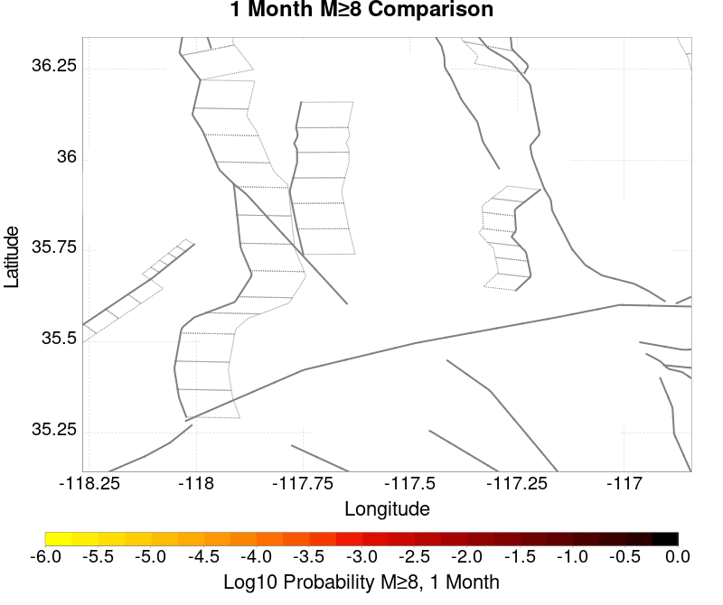
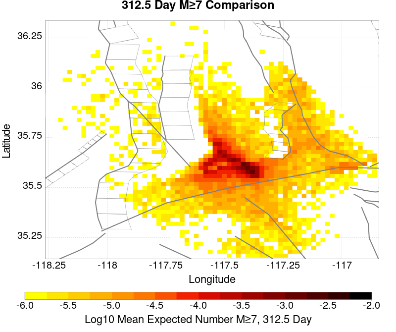

# ComCat M7.1 (ci38457511), ShakeMap Surfaces, FM2_1 Results

|   | ComCat M7.1 (ci38457511), ShakeMap Surfaces, FM2_1 |
|-----|-----|
| Num Simulations | 16728 (incomplete) |
| Start Time | 2019/07/06 03:19:54 UTC |
| Start Time Epoch Milliseconds | 1562383194040 |
| Duration | 10 Years |
| Includes Spontaneous? | false |
| Trigger Ruptures | 283 Trigger Ruptures |
|   | First: M3.98 at 2019/07/04 17:02:55 UTC |
|   | Last: M7.1 at 2019/07/06 03:19:53 UTC |
|   | Largest: M7.1 at 2019/07/06 03:19:53 UTC |
| Trigger Ruptures | *(none)* |
| Config Generated With | u3etas_comcat_event_config_builder.sh --event-id ci38457511 --mag-complete 3.5 --days-before 7 --num-simulations 1000000 --fault-model FM2_1 --finite-surf-shakemap --finite-surf-shakemap-min-mag 5 --hpc-site USC_HPC --nodes 36 --hours 24 --queue scec |

## Table Of Contents

* [Probabilities Summary Table](#probabilities-summary-table)
* [Magnitude Number Distribution](#magnitude-number-distribution)
  * [10 Year Magnitude Number Distribution](#10-year-magnitude-number-distribution)
  * [1 Year Magnitude Number Distribution](#1-year-magnitude-number-distribution)
  * [1 Month Magnitude Number Distribution](#1-month-magnitude-number-distribution)
  * [1 Week Magnitude Number Distribution](#1-week-magnitude-number-distribution)
  * [1 Day Magnitude Number Distribution](#1-day-magnitude-number-distribution)
  * [1 Hour Magnitude Number Distribution](#1-hour-magnitude-number-distribution)
* [Hazard Change Over Time](#hazard-change-over-time)
  * [M&ge;5.0 Hazard Change Over Time](#m50-hazard-change-over-time)
  * [M&ge;6.0 Hazard Change Over Time](#m60-hazard-change-over-time)
  * [M&ge;7.0 Hazard Change Over Time](#m70-hazard-change-over-time)
* [Trigger Rupture Fault Map](#trigger-rupture-fault-map)
* [Trigger Rupture Depth Map](#trigger-rupture-depth-map)
* [Fault Distances To Triggers](#fault-distances-to-triggers)
* [Individual Simulated Catalog Maps](#individual-simulated-catalog-maps)
* [ComCat Data Comparisons](#comcat-data-comparisons)
  * [ComCat Magnitude-Number Distributions](#comcat-magnitude-number-distributions)
  * [ComCat Time-Dependent Mc](#comcat-time-dependent-mc)
  * [ComCat Cumulative Number Vs Time](#comcat-cumulative-number-vs-time)
  * [ComCat Cumulative Number Simulation Percentiles](#comcat-cumulative-number-simulation-percentiles)
  * [ComCat Probability Spatial Distribution](#comcat-probability-spatial-distribution)
  * [ComCat Mean Expectation Spatial Distribution](#comcat-mean-expectation-spatial-distribution)
  * [ComCat Depth Distribution](#comcat-depth-distribution)
* [Section Participation](#section-participation)
  * [Section Participation Plots](#section-participation-plots)
  * [Supra-Seismogenic Parent Sections Table](#supra-seismogenic-parent-sections-table)
  * [M≥6.5 Parent Sections Table](#m65-parent-sections-table)
  * [M≥7 Parent Sections Table](#m7-parent-sections-table)
  * [M≥7.5 Parent Sections Table](#m75-parent-sections-table)
  * [M≥8 Parent Sections Table](#m8-parent-sections-table)
* [Fault Magnitude-Probability Distributions](#fault-magnitude-probability-distributions)
* [Gridded Nucleation](#gridded-nucleation)
* [JSON Input File](#json-input-file)

## Probabilities Summary Table
*[(top)](#table-of-contents)*

| Magnitude | 1 Hour Prob | 1 Day Prob | 1 Week Prob | 1 Month Prob | 1 Year Prob | 10 Year Prob |
|-----|-----|-----|-----|-----|-----|-----|
| **M&ge;4** | 1.000 (100.00%) | 1.000 (100.00%) | 1.000 (100.00%) | 1.000 (100.00%) | 1.000 (100.00%) | 1.000 (100.00%) |
| *95% Conf* | *[99.97% 100.00%]* | *[99.97% 100.00%]* | *[99.97% 100.00%]* | *[99.97% 100.00%]* | *[99.97% 100.00%]* | *[99.97% 100.00%]* |
| **M&ge;4.5** | 0.991 (99.06%) | 1.000 (100.00%) | 1.000 (100.00%) | 1.000 (100.00%) | 1.000 (100.00%) | 1.000 (100.00%) |
| *95% Conf* | *[98.90% 99.20%]* | *[99.97% 100.00%]* | *[99.97% 100.00%]* | *[99.97% 100.00%]* | *[99.97% 100.00%]* | *[99.97% 100.00%]* |
| **M&ge;5** | 0.764 (76.35%) | 0.976 (97.63%) | 0.995 (99.45%) | 0.998 (99.80%) | 1.000 (99.99%) | 1.000 (100.00%) |
| *95% Conf* | *[75.70% 76.99%]* | *[97.39% 97.86%]* | *[99.32% 99.55%]* | *[99.71% 99.86%]* | *[99.95% 100.00%]* | *[99.97% 100.00%]* |
| **M&ge;5.5** | 0.332 (33.21%) | 0.662 (66.22%) | 0.792 (79.20%) | 0.857 (85.65%) | 0.925 (92.46%) | 0.959 (95.87%) |
| *95% Conf* | *[32.50% 33.93%]* | *[65.49% 66.93%]* | *[78.58% 79.81%]* | *[85.11% 86.18%]* | *[92.05% 92.86%]* | *[95.55% 96.16%]* |
| **M&ge;6** | 0.079 (7.88%) | 0.205 (20.55%) | 0.289 (28.86%) | 0.348 (34.83%) | 0.449 (44.94%) | 0.530 (53.00%) |
| *95% Conf* | *[7.48% 8.30%]* | *[19.94% 21.17%]* | *[28.18% 29.56%]* | *[34.11% 35.56%]* | *[44.19% 45.70%]* | *[52.24% 53.76%]* |
| **M&ge;6.5** | 0.014 (1.41%) | 0.041 (4.11%) | 0.062 (6.24%) | 0.080 (8.03%) | 0.114 (11.36%) | 0.147 (14.72%) |
| *95% Conf* | *[1.24% 1.60%]* | *[3.82% 4.43%]* | *[5.88% 6.61%]* | *[7.62% 8.45%]* | *[10.88% 11.85%]* | *[14.19% 15.27%]* |
| **M&ge;7** | 3.47E-3 (0.35%) | 9.68E-3 (0.97%) | 0.014 (1.43%) | 0.019 (1.87%) | 0.027 (2.68%) | 0.037 (3.72%) |
| *95% Conf* | *[0.27% 0.45%]* | *[0.83% 1.13%]* | *[1.26% 1.62%]* | *[1.67% 2.08%]* | *[2.45% 2.94%]* | *[3.44% 4.02%]* |
| **M&ge;7.1** | 2.51E-3 (0.25%) | 7.59E-3 (0.76%) | 0.011 (1.14%) | 0.015 (1.51%) | 0.022 (2.16%) | 0.030 (3.00%) |
| *95% Conf* | *[0.18% 0.34%]* | *[0.64% 0.91%]* | *[0.98% 1.31%]* | *[1.33% 1.71%]* | *[1.95% 2.39%]* | *[2.75% 3.27%]* |
| **M&ge;7.5** | 1.08E-3 (0.11%) | 3.11E-3 (0.31%) | 4.60E-3 (0.46%) | 6.40E-3 (0.64%) | 8.73E-3 (0.87%) | 0.012 (1.25%) |
| *95% Conf* | *[0.07% 0.17%]* | *[0.23% 0.41%]* | *[0.37% 0.58%]* | *[0.53% 0.78%]* | *[0.74% 1.03%]* | *[1.09% 1.43%]* |
| **M&ge;8** | 0.000 (0.00%) | 5.98E-5 (0.01%) | 5.98E-5 (0.01%) | 5.98E-5 (0.01%) | 1.20E-4 (0.01%) | 1.79E-4 (0.02%) |
| *95% Conf* | *[0.00% 0.03%]* | *[0.00% 0.04%]* | *[0.00% 0.04%]* | *[0.00% 0.04%]* | *[0.00% 0.05%]* | *[0.00% 0.06%]* |

## Magnitude Number Distribution
*[(top)](#table-of-contents)*

### 10 Year Magnitude Number Distribution
*[(top)](#table-of-contents)*

**Legend**
* **Mean** (thick black line): mean expected number across all 16728 catalogs
* **2.5%,97.5%** (thin black lines): expected number percentiles across all 16728 catalogs
* **Median** (thin blue line): median expected number across all 16728 catalogs
* **Mode** (thin cyan line): modal expected number across all 16728 catalogs
* **10 yr Probability** (thin red line): 10 year probability calculated as the fraction of catalogs with at least 1 occurrence
* **10 yr Supraseismogenic Probability** (thin dashed red line): same as above, but only for supraseismogenic ruptures on explicitly modeled UCERF3 faults
* **95% Conf** (light red shaded region): binomial 95% confidence bounds on probability
* **Primary** (thin green line): mean expected number from primary triggered aftershocks only (no secondary, tertiary, etc...) across all 16728 catalogs


| Mag | Mean | 2.5 %ile | 97.5 %ile | Median | Mode | 10 yr Probability | 10 yr Prob 95% Conf | 10 yr Supra-Seis Prob | Primary Aftershocks Mean |
|-----|-----|-----|-----|-----|-----|-----|-----|-----|-----|
| **M&ge;2.5** | 5025.814 | 3639.000 | 10251.000 | 4438.000 | 3936.000 | 1.000 (100.00%) | [99.97% 100.00%] | 0.120 (11.96%) | 2395.118 |
| **M&ge;2.6** | 3991.505 | 2883.000 | 8134.000 | 3527.000 | 3348.000 | 1.000 (100.00%) | [99.97% 100.00%] | 0.120 (11.96%) | 1902.025 |
| **M&ge;2.7** | 3170.409 | 2285.000 | 6470.000 | 2802.000 | 2718.000 | 1.000 (100.00%) | [99.97% 100.00%] | 0.120 (11.96%) | 1510.720 |
| **M&ge;2.8** | 2518.286 | 1813.000 | 5156.000 | 2226.000 | 2090.000 | 1.000 (100.00%) | [99.97% 100.00%] | 0.120 (11.96%) | 1200.184 |
| **M&ge;2.9** | 2000.422 | 1432.000 | 4092.000 | 1769.000 | 1612.000 | 1.000 (100.00%) | [99.97% 100.00%] | 0.120 (11.96%) | 953.296 |
| **M&ge;3** | 1588.959 | 1134.000 | 3253.000 | 1406.000 | 1321.000 | 1.000 (100.00%) | [99.97% 100.00%] | 0.120 (11.96%) | 757.281 |
| **M&ge;3.1** | 1261.981 | 896.000 | 2598.000 | 1116.000 | 1050.000 | 1.000 (100.00%) | [99.97% 100.00%] | 0.120 (11.96%) | 601.422 |
| **M&ge;3.2** | 1002.284 | 708.000 | 2075.000 | 888.000 | 863.000 | 1.000 (100.00%) | [99.97% 100.00%] | 0.120 (11.96%) | 477.636 |
| **M&ge;3.3** | 796.032 | 558.000 | 1629.000 | 705.000 | 666.000 | 1.000 (100.00%) | [99.97% 100.00%] | 0.120 (11.96%) | 379.406 |
| **M&ge;3.4** | 632.117 | 439.000 | 1299.000 | 560.000 | 541.000 | 1.000 (100.00%) | [99.97% 100.00%] | 0.120 (11.96%) | 301.304 |
| **M&ge;3.5** | 502.006 | 344.000 | 1033.000 | 445.000 | 425.000 | 1.000 (100.00%) | [99.97% 100.00%] | 0.120 (11.96%) | 239.312 |
| **M&ge;3.6** | 398.525 | 271.000 | 817.000 | 354.000 | 334.000 | 1.000 (100.00%) | [99.97% 100.00%] | 0.120 (11.96%) | 189.967 |
| **M&ge;3.7** | 316.435 | 212.000 | 650.000 | 282.000 | 270.000 | 1.000 (100.00%) | [99.97% 100.00%] | 0.120 (11.96%) | 150.824 |
| **M&ge;3.8** | 251.238 | 166.000 | 518.000 | 224.000 | 210.000 | 1.000 (100.00%) | [99.97% 100.00%] | 0.120 (11.96%) | 119.688 |
| **M&ge;3.9** | 199.443 | 129.000 | 412.000 | 178.000 | 175.000 | 1.000 (100.00%) | [99.97% 100.00%] | 0.120 (11.96%) | 95.010 |
| **M&ge;4** | 158.336 | 100.000 | 326.000 | 141.000 | 141.000 | 1.000 (100.00%) | [99.97% 100.00%] | 0.120 (11.96%) | 75.418 |
| **M&ge;4.1** | 125.674 | 78.000 | 262.000 | 112.000 | 108.000 | 1.000 (100.00%) | [99.97% 100.00%] | 0.120 (11.96%) | 59.896 |
| **M&ge;4.2** | 99.628 | 60.000 | 208.000 | 89.000 | 83.000 | 1.000 (100.00%) | [99.97% 100.00%] | 0.120 (11.96%) | 47.477 |
| **M&ge;4.3** | 79.018 | 46.000 | 165.000 | 71.000 | 67.000 | 1.000 (100.00%) | [99.97% 100.00%] | 0.120 (11.96%) | 37.650 |
| **M&ge;4.4** | 62.610 | 34.000 | 132.000 | 56.000 | 55.000 | 1.000 (100.00%) | [99.97% 100.00%] | 0.120 (11.96%) | 29.821 |
| **M&ge;4.5** | 49.583 | 26.000 | 105.000 | 44.000 | 41.000 | 1.000 (100.00%) | [99.97% 100.00%] | 0.120 (11.96%) | 23.605 |
| **M&ge;4.6** | 39.258 | 20.000 | 85.000 | 35.000 | 33.000 | 1.000 (100.00%) | [99.97% 100.00%] | 0.120 (11.96%) | 18.692 |
| **M&ge;4.7** | 31.023 | 15.000 | 68.000 | 28.000 | 25.000 | 1.000 (100.00%) | [99.97% 100.00%] | 0.120 (11.96%) | 14.758 |
| **M&ge;4.8** | 24.485 | 10.000 | 54.000 | 22.000 | 19.000 | 1.000 (100.00%) | [99.97% 100.00%] | 0.120 (11.96%) | 11.650 |
| **M&ge;4.9** | 19.302 | 8.000 | 44.000 | 17.000 | 15.000 | 1.000 (100.00%) | [99.97% 100.00%] | 0.120 (11.96%) | 9.186 |
| **M&ge;5** | 15.177 | 5.000 | 35.000 | 13.000 | 12.000 | 1.000 (100.00%) | [99.97% 100.00%] | 0.120 (11.96%) | 7.211 |
| **M&ge;5.1** | 11.893 | 4.000 | 28.000 | 10.000 | 10.000 | 1.000 (99.99%) | [99.95% 100.00%] | 0.120 (11.96%) | 5.648 |
| **M&ge;5.2** | 9.303 | 2.000 | 23.000 | 8.000 | 8.000 | 0.999 (99.89%) | [99.83% 99.93%] | 0.120 (11.96%) | 4.417 |
| **M&ge;5.3** | 7.241 | 1.000 | 19.000 | 6.000 | 5.000 | 0.995 (99.49%) | [99.37% 99.59%] | 0.120 (11.96%) | 3.433 |
| **M&ge;5.4** | 5.602 | 1.000 | 15.000 | 5.000 | 4.000 | 0.983 (98.25%) | [98.04% 98.44%] | 0.120 (11.96%) | 2.655 |
| **M&ge;5.5** | 4.319 | 0.000 | 12.000 | 4.000 | 3.000 | 0.959 (95.87%) | [95.55% 96.16%] | 0.120 (11.96%) | 2.036 |
| **M&ge;5.6** | 3.282 | 0.000 | 10.000 | 3.000 | 2.000 | 0.916 (91.57%) | [91.13% 91.98%] | 0.120 (11.96%) | 1.548 |
| **M&ge;5.7** | 2.462 | 0.000 | 8.000 | 2.000 | 1.000 | 0.849 (84.94%) | [84.38% 85.47%] | 0.120 (11.96%) | 1.160 |
| **M&ge;5.8** | 1.805 | 0.000 | 6.000 | 1.000 | 1.000 | 0.759 (75.88%) | [75.23% 76.53%] | 0.120 (11.96%) | 0.848 |
| **M&ge;5.9** | 1.292 | 0.000 | 5.000 | 1.000 | 0.000 | 0.644 (64.44%) | [63.71% 65.17%] | 0.120 (11.96%) | 0.605 |
| **M&ge;6** | 0.924 | 0.000 | 4.000 | 1.000 | 0.000 | 0.530 (53.00%) | [52.24% 53.76%] | 0.120 (11.96%) | 0.427 |
| **M&ge;6.1** | 0.668 | 0.000 | 3.000 | 0.000 | 0.000 | 0.425 (42.51%) | [41.76% 43.26%] | 0.119 (11.94%) | 0.302 |
| **M&ge;6.2** | 0.464 | 0.000 | 3.000 | 0.000 | 0.000 | 0.319 (31.88%) | [31.18% 32.59%] | 0.119 (11.94%) | 0.201 |
| **M&ge;6.3** | 0.365 | 0.000 | 2.000 | 0.000 | 0.000 | 0.262 (26.21%) | [25.55% 26.89%] | 0.119 (11.94%) | 0.152 |
| **M&ge;6.4** | 0.234 | 0.000 | 2.000 | 0.000 | 0.000 | 0.172 (17.22%) | [16.66% 17.81%] | 0.072 (7.16%) | 0.098 |
| **M&ge;6.5** | 0.198 | 0.000 | 2.000 | 0.000 | 0.000 | 0.147 (14.72%) | [14.19% 15.27%] | 0.072 (7.16%) | 0.080 |
| **M&ge;6.6** | 0.142 | 0.000 | 1.000 | 0.000 | 0.000 | 0.115 (11.45%) | [10.98% 11.95%] | 0.062 (6.22%) | 0.058 |
| **M&ge;6.7** | 0.111 | 0.000 | 1.000 | 0.000 | 0.000 | 0.090 (9.00%) | [8.57% 9.44%] | 0.053 (5.34%) | 0.045 |
| **M&ge;6.8** | 0.092 | 0.000 | 1.000 | 0.000 | 0.000 | 0.075 (7.53%) | [7.14% 7.95%] | 0.051 (5.14%) | 0.037 |
| **M&ge;6.9** | 0.055 | 0.000 | 1.000 | 0.000 | 0.000 | 0.046 (4.58%) | [4.27% 4.91%] | 0.029 (2.94%) | 0.022 |
| **M&ge;7** | 0.044 | 0.000 | 1.000 | 0.000 | 0.000 | 0.037 (3.72%) | [3.44% 4.02%] | 0.027 (2.72%) | 0.018 |
| **M&ge;7.1** | 0.035 | 0.000 | 1.000 | 0.000 | 0.000 | 0.030 (3.00%) | [2.75% 3.27%] | 0.024 (2.44%) | 0.014 |
| **M&ge;7.2** | 0.028 | 0.000 | 1.000 | 0.000 | 0.000 | 0.025 (2.52%) | [2.29% 2.77%] | 0.022 (2.18%) | 0.012 |
| **M&ge;7.3** | 0.022 | 0.000 | 0.000 | 0.000 | 0.000 | 0.019 (1.90%) | [1.70% 2.12%] | 0.017 (1.73%) | 9.21E-3 |
| **M&ge;7.4** | 0.018 | 0.000 | 0.000 | 0.000 | 0.000 | 0.016 (1.61%) | [1.43% 1.81%] | 0.015 (1.51%) | 8.43E-3 |
| **M&ge;7.5** | 0.014 | 0.000 | 0.000 | 0.000 | 0.000 | 0.012 (1.25%) | [1.09% 1.43%] | 0.012 (1.21%) | 6.22E-3 |
| **M&ge;7.6** | 0.013 | 0.000 | 0.000 | 0.000 | 0.000 | 0.011 (1.11%) | [0.96% 1.29%] | 0.011 (1.09%) | 5.50E-3 |
| **M&ge;7.7** | 5.26E-3 | 0.000 | 0.000 | 0.000 | 0.000 | 4.78E-3 (0.48%) | [0.38% 0.60%] | 4.66E-3 (0.47%) | 1.49E-3 |
| **M&ge;7.8** | 1.85E-3 | 0.000 | 0.000 | 0.000 | 0.000 | 1.85E-3 (0.19%) | [0.13% 0.27%] | 1.73E-3 (0.17%) | 2.39E-4 |
| **M&ge;7.9** | 5.98E-4 | 0.000 | 0.000 | 0.000 | 0.000 | 5.98E-4 (0.06%) | [0.03% 0.11%] | 5.98E-4 (0.06%) | 5.98E-5 |
| **M&ge;8** | 1.79E-4 | 0.000 | 0.000 | 0.000 | 0.000 | 1.79E-4 (0.02%) | [0.00% 0.06%] | 1.79E-4 (0.02%) | 0.000 |
| **M&ge;8.1** | 1.79E-4 | 0.000 | 0.000 | 0.000 | 0.000 | 1.79E-4 (0.02%) | [0.00% 0.06%] | 1.79E-4 (0.02%) | 0.000 |
| **M&ge;8.2** | 0.000 | 0.000 | 0.000 | 0.000 | 0.000 | 0.000 (0.00%) | [0.00% 0.03%] | 0.000 (0.00%) | 0.000 |
| **M&ge;8.3** | 0.000 | 0.000 | 0.000 | 0.000 | 0.000 | 0.000 (0.00%) | [0.00% 0.03%] | 0.000 (0.00%) | 0.000 |
| **M&ge;8.4** | 0.000 | 0.000 | 0.000 | 0.000 | 0.000 | 0.000 (0.00%) | [0.00% 0.03%] | 0.000 (0.00%) | 0.000 |
| **M&ge;8.5** | 0.000 | 0.000 | 0.000 | 0.000 | 0.000 | 0.000 (0.00%) | [0.00% 0.03%] | 0.000 (0.00%) | 0.000 |
| **M&ge;8.6** | 0.000 | 0.000 | 0.000 | 0.000 | 0.000 | 0.000 (0.00%) | [0.00% 0.03%] | 0.000 (0.00%) | 0.000 |
| **M&ge;8.7** | 0.000 | 0.000 | 0.000 | 0.000 | 0.000 | 0.000 (0.00%) | [0.00% 0.03%] | 0.000 (0.00%) | 0.000 |
| **M&ge;8.8** | 0.000 | 0.000 | 0.000 | 0.000 | 0.000 | 0.000 (0.00%) | [0.00% 0.03%] | 0.000 (0.00%) | 0.000 |
| **M&ge;8.9** | 0.000 | 0.000 | 0.000 | 0.000 | 0.000 | 0.000 (0.00%) | [0.00% 0.03%] | 0.000 (0.00%) | 0.000 |
| **M&ge;9** | 0.000 | 0.000 | 0.000 | 0.000 | 0.000 | 0.000 (0.00%) | [0.00% 0.03%] | 0.000 (0.00%) | 0.000 |

### 1 Year Magnitude Number Distribution
*[(top)](#table-of-contents)*

**Legend**
* **Mean** (thick black line): mean expected number across all 16728 catalogs
* **2.5%,97.5%** (thin black lines): expected number percentiles across all 16728 catalogs
* **Median** (thin blue line): median expected number across all 16728 catalogs
* **Mode** (thin cyan line): modal expected number across all 16728 catalogs
* **1 yr Probability** (thin red line): 1 year probability calculated as the fraction of catalogs with at least 1 occurrence
* **1 yr Supraseismogenic Probability** (thin dashed red line): same as above, but only for supraseismogenic ruptures on explicitly modeled UCERF3 faults
* **95% Conf** (light red shaded region): binomial 95% confidence bounds on probability
* **Primary** (thin green line): mean expected number from primary triggered aftershocks only (no secondary, tertiary, etc...) across all 16728 catalogs


| Mag | Mean | 2.5 %ile | 97.5 %ile | Median | Mode | 1 yr Probability | 1 yr Prob 95% Conf | 1 yr Supra-Seis Prob | Primary Aftershocks Mean |
|-----|-----|-----|-----|-----|-----|-----|-----|-----|-----|
| **M&ge;2.5** | 3836.527 | 2938.000 | 6732.000 | 3482.000 | 3318.000 | 1.000 (100.00%) | [99.97% 100.00%] | 0.091 (9.11%) | 2086.017 |
| **M&ge;2.6** | 3046.954 | 2331.000 | 5339.000 | 2767.000 | 2553.000 | 1.000 (100.00%) | [99.97% 100.00%] | 0.091 (9.11%) | 1656.527 |
| **M&ge;2.7** | 2420.072 | 1847.000 | 4237.000 | 2196.000 | 2041.000 | 1.000 (100.00%) | [99.97% 100.00%] | 0.091 (9.11%) | 1315.685 |
| **M&ge;2.8** | 1922.227 | 1463.000 | 3380.000 | 1747.000 | 1664.000 | 1.000 (100.00%) | [99.97% 100.00%] | 0.091 (9.11%) | 1045.216 |
| **M&ge;2.9** | 1526.799 | 1156.000 | 2680.000 | 1388.000 | 1279.000 | 1.000 (100.00%) | [99.97% 100.00%] | 0.091 (9.11%) | 830.165 |
| **M&ge;3** | 1212.738 | 914.000 | 2127.000 | 1103.000 | 1053.000 | 1.000 (100.00%) | [99.97% 100.00%] | 0.091 (9.11%) | 659.477 |
| **M&ge;3.1** | 963.104 | 722.000 | 1689.000 | 876.000 | 840.000 | 1.000 (100.00%) | [99.97% 100.00%] | 0.091 (9.11%) | 523.757 |
| **M&ge;3.2** | 764.968 | 568.000 | 1342.000 | 696.000 | 649.000 | 1.000 (100.00%) | [99.97% 100.00%] | 0.091 (9.11%) | 415.923 |
| **M&ge;3.3** | 607.602 | 448.000 | 1068.000 | 554.000 | 521.000 | 1.000 (100.00%) | [99.97% 100.00%] | 0.091 (9.11%) | 330.389 |
| **M&ge;3.4** | 482.510 | 352.000 | 851.000 | 440.000 | 429.000 | 1.000 (100.00%) | [99.97% 100.00%] | 0.091 (9.11%) | 262.362 |
| **M&ge;3.5** | 383.222 | 276.000 | 679.000 | 350.000 | 341.000 | 1.000 (100.00%) | [99.97% 100.00%] | 0.091 (9.11%) | 208.379 |
| **M&ge;3.6** | 304.250 | 216.000 | 540.000 | 278.000 | 258.000 | 1.000 (100.00%) | [99.97% 100.00%] | 0.091 (9.11%) | 165.427 |
| **M&ge;3.7** | 241.551 | 169.000 | 426.000 | 221.000 | 208.000 | 1.000 (100.00%) | [99.97% 100.00%] | 0.091 (9.11%) | 131.315 |
| **M&ge;3.8** | 191.791 | 132.000 | 339.000 | 176.000 | 167.000 | 1.000 (100.00%) | [99.97% 100.00%] | 0.091 (9.11%) | 104.225 |
| **M&ge;3.9** | 152.277 | 102.000 | 273.000 | 140.000 | 137.000 | 1.000 (100.00%) | [99.97% 100.00%] | 0.091 (9.11%) | 82.743 |
| **M&ge;4** | 120.882 | 79.000 | 217.000 | 111.000 | 105.000 | 1.000 (100.00%) | [99.97% 100.00%] | 0.091 (9.11%) | 65.675 |
| **M&ge;4.1** | 95.962 | 61.000 | 172.000 | 88.000 | 86.000 | 1.000 (100.00%) | [99.97% 100.00%] | 0.091 (9.11%) | 52.163 |
| **M&ge;4.2** | 76.042 | 47.000 | 138.000 | 70.000 | 71.000 | 1.000 (100.00%) | [99.97% 100.00%] | 0.091 (9.11%) | 41.337 |
| **M&ge;4.3** | 60.304 | 36.000 | 111.000 | 55.000 | 54.000 | 1.000 (100.00%) | [99.97% 100.00%] | 0.091 (9.11%) | 32.785 |
| **M&ge;4.4** | 47.769 | 27.000 | 90.000 | 44.000 | 42.000 | 1.000 (100.00%) | [99.97% 100.00%] | 0.091 (9.11%) | 25.972 |
| **M&ge;4.5** | 37.829 | 20.000 | 72.000 | 35.000 | 33.000 | 1.000 (100.00%) | [99.97% 100.00%] | 0.091 (9.11%) | 20.565 |
| **M&ge;4.6** | 29.950 | 15.000 | 58.000 | 27.000 | 25.000 | 1.000 (100.00%) | [99.97% 100.00%] | 0.091 (9.11%) | 16.281 |
| **M&ge;4.7** | 23.662 | 11.000 | 47.000 | 22.000 | 21.000 | 1.000 (100.00%) | [99.97% 100.00%] | 0.091 (9.11%) | 12.847 |
| **M&ge;4.8** | 18.679 | 8.000 | 38.000 | 17.000 | 15.000 | 1.000 (100.00%) | [99.97% 100.00%] | 0.091 (9.11%) | 10.139 |
| **M&ge;4.9** | 14.730 | 6.000 | 31.000 | 13.000 | 13.000 | 1.000 (100.00%) | [99.97% 100.00%] | 0.091 (9.11%) | 7.993 |
| **M&ge;5** | 11.570 | 4.000 | 25.000 | 10.000 | 9.000 | 1.000 (99.99%) | [99.95% 100.00%] | 0.091 (9.11%) | 6.270 |
| **M&ge;5.1** | 9.054 | 2.000 | 20.000 | 8.000 | 7.000 | 0.999 (99.93%) | [99.88% 99.97%] | 0.091 (9.11%) | 4.911 |
| **M&ge;5.2** | 7.081 | 1.000 | 17.000 | 6.000 | 5.000 | 0.997 (99.67%) | [99.56% 99.74%] | 0.091 (9.11%) | 3.837 |
| **M&ge;5.3** | 5.502 | 1.000 | 14.000 | 5.000 | 4.000 | 0.986 (98.65%) | [98.46% 98.82%] | 0.091 (9.11%) | 2.979 |
| **M&ge;5.4** | 4.256 | 0.000 | 11.000 | 4.000 | 3.000 | 0.964 (96.41%) | [96.11% 96.68%] | 0.091 (9.11%) | 2.304 |
| **M&ge;5.5** | 3.274 | 0.000 | 9.000 | 3.000 | 2.000 | 0.925 (92.46%) | [92.05% 92.86%] | 0.091 (9.11%) | 1.767 |
| **M&ge;5.6** | 2.490 | 0.000 | 7.000 | 2.000 | 2.000 | 0.864 (86.41%) | [85.88% 86.92%] | 0.091 (9.11%) | 1.344 |
| **M&ge;5.7** | 1.867 | 0.000 | 6.000 | 1.000 | 1.000 | 0.781 (78.07%) | [77.44% 78.70%] | 0.091 (9.11%) | 1.006 |
| **M&ge;5.8** | 1.367 | 0.000 | 5.000 | 1.000 | 0.000 | 0.679 (67.86%) | [67.14% 68.56%] | 0.091 (9.11%) | 0.735 |
| **M&ge;5.9** | 0.977 | 0.000 | 4.000 | 1.000 | 0.000 | 0.561 (56.07%) | [55.32% 56.83%] | 0.091 (9.11%) | 0.524 |
| **M&ge;6** | 0.699 | 0.000 | 3.000 | 0.000 | 0.000 | 0.449 (44.94%) | [44.19% 45.70%] | 0.091 (9.11%) | 0.369 |
| **M&ge;6.1** | 0.500 | 0.000 | 3.000 | 0.000 | 0.000 | 0.350 (35.04%) | [34.32% 35.77%] | 0.091 (9.10%) | 0.259 |
| **M&ge;6.2** | 0.343 | 0.000 | 2.000 | 0.000 | 0.000 | 0.255 (25.51%) | [24.85% 26.18%] | 0.091 (9.10%) | 0.172 |
| **M&ge;6.3** | 0.268 | 0.000 | 2.000 | 0.000 | 0.000 | 0.207 (20.73%) | [20.12% 21.35%] | 0.091 (9.10%) | 0.129 |
| **M&ge;6.4** | 0.169 | 0.000 | 1.000 | 0.000 | 0.000 | 0.134 (13.37%) | [12.86% 13.89%] | 0.055 (5.45%) | 0.082 |
| **M&ge;6.5** | 0.142 | 0.000 | 1.000 | 0.000 | 0.000 | 0.114 (11.36%) | [10.88% 11.85%] | 0.055 (5.45%) | 0.066 |
| **M&ge;6.6** | 0.103 | 0.000 | 1.000 | 0.000 | 0.000 | 0.087 (8.73%) | [8.31% 9.17%] | 0.047 (4.70%) | 0.049 |
| **M&ge;6.7** | 0.079 | 0.000 | 1.000 | 0.000 | 0.000 | 0.068 (6.79%) | [6.42% 7.19%] | 0.040 (4.02%) | 0.037 |
| **M&ge;6.8** | 0.066 | 0.000 | 1.000 | 0.000 | 0.000 | 0.057 (5.74%) | [5.39% 6.10%] | 0.039 (3.90%) | 0.031 |
| **M&ge;6.9** | 0.039 | 0.000 | 1.000 | 0.000 | 0.000 | 0.034 (3.38%) | [3.12% 3.67%] | 0.021 (2.14%) | 0.018 |
| **M&ge;7** | 0.031 | 0.000 | 1.000 | 0.000 | 0.000 | 0.027 (2.68%) | [2.45% 2.94%] | 0.020 (1.97%) | 0.014 |
| **M&ge;7.1** | 0.025 | 0.000 | 0.000 | 0.000 | 0.000 | 0.022 (2.16%) | [1.95% 2.39%] | 0.018 (1.76%) | 0.011 |
| **M&ge;7.2** | 0.020 | 0.000 | 0.000 | 0.000 | 0.000 | 0.018 (1.78%) | [1.59% 2.00%] | 0.016 (1.55%) | 9.09E-3 |
| **M&ge;7.3** | 0.015 | 0.000 | 0.000 | 0.000 | 0.000 | 0.014 (1.35%) | [1.18% 1.54%] | 0.012 (1.24%) | 7.29E-3 |
| **M&ge;7.4** | 0.013 | 0.000 | 0.000 | 0.000 | 0.000 | 0.012 (1.17%) | [1.01% 1.34%] | 0.011 (1.09%) | 6.81E-3 |
| **M&ge;7.5** | 9.68E-3 | 0.000 | 0.000 | 0.000 | 0.000 | 8.73E-3 (0.87%) | [0.74% 1.03%] | 8.49E-3 (0.85%) | 4.78E-3 |
| **M&ge;7.6** | 8.79E-3 | 0.000 | 0.000 | 0.000 | 0.000 | 7.83E-3 (0.78%) | [0.66% 0.93%] | 7.77E-3 (0.78%) | 4.24E-3 |
| **M&ge;7.7** | 3.29E-3 | 0.000 | 0.000 | 0.000 | 0.000 | 3.11E-3 (0.31%) | [0.23% 0.41%] | 3.05E-3 (0.30%) | 1.14E-3 |
| **M&ge;7.8** | 1.02E-3 | 0.000 | 0.000 | 0.000 | 0.000 | 1.02E-3 (0.10%) | [0.06% 0.17%] | 9.56E-4 (0.10%) | 1.20E-4 |
| **M&ge;7.9** | 3.59E-4 | 0.000 | 0.000 | 0.000 | 0.000 | 3.59E-4 (0.04%) | [0.01% 0.08%] | 3.59E-4 (0.04%) | 5.98E-5 |
| **M&ge;8** | 1.20E-4 | 0.000 | 0.000 | 0.000 | 0.000 | 1.20E-4 (0.01%) | [0.00% 0.05%] | 1.20E-4 (0.01%) | 0.000 |
| **M&ge;8.1** | 1.20E-4 | 0.000 | 0.000 | 0.000 | 0.000 | 1.20E-4 (0.01%) | [0.00% 0.05%] | 1.20E-4 (0.01%) | 0.000 |
| **M&ge;8.2** | 0.000 | 0.000 | 0.000 | 0.000 | 0.000 | 0.000 (0.00%) | [0.00% 0.03%] | 0.000 (0.00%) | 0.000 |
| **M&ge;8.3** | 0.000 | 0.000 | 0.000 | 0.000 | 0.000 | 0.000 (0.00%) | [0.00% 0.03%] | 0.000 (0.00%) | 0.000 |
| **M&ge;8.4** | 0.000 | 0.000 | 0.000 | 0.000 | 0.000 | 0.000 (0.00%) | [0.00% 0.03%] | 0.000 (0.00%) | 0.000 |
| **M&ge;8.5** | 0.000 | 0.000 | 0.000 | 0.000 | 0.000 | 0.000 (0.00%) | [0.00% 0.03%] | 0.000 (0.00%) | 0.000 |
| **M&ge;8.6** | 0.000 | 0.000 | 0.000 | 0.000 | 0.000 | 0.000 (0.00%) | [0.00% 0.03%] | 0.000 (0.00%) | 0.000 |
| **M&ge;8.7** | 0.000 | 0.000 | 0.000 | 0.000 | 0.000 | 0.000 (0.00%) | [0.00% 0.03%] | 0.000 (0.00%) | 0.000 |
| **M&ge;8.8** | 0.000 | 0.000 | 0.000 | 0.000 | 0.000 | 0.000 (0.00%) | [0.00% 0.03%] | 0.000 (0.00%) | 0.000 |
| **M&ge;8.9** | 0.000 | 0.000 | 0.000 | 0.000 | 0.000 | 0.000 (0.00%) | [0.00% 0.03%] | 0.000 (0.00%) | 0.000 |
| **M&ge;9** | 0.000 | 0.000 | 0.000 | 0.000 | 0.000 | 0.000 (0.00%) | [0.00% 0.03%] | 0.000 (0.00%) | 0.000 |

### 1 Month Magnitude Number Distribution
*[(top)](#table-of-contents)*

**Legend**
* **Mean** (thick black line): mean expected number across all 16728 catalogs
* **2.5%,97.5%** (thin black lines): expected number percentiles across all 16728 catalogs
* **Median** (thin blue line): median expected number across all 16728 catalogs
* **Mode** (thin cyan line): modal expected number across all 16728 catalogs
* **1 mo Probability** (thin red line): 1 month probability calculated as the fraction of catalogs with at least 1 occurrence
* **1 mo Supraseismogenic Probability** (thin dashed red line): same as above, but only for supraseismogenic ruptures on explicitly modeled UCERF3 faults
* **95% Conf** (light red shaded region): binomial 95% confidence bounds on probability
* **Primary** (thin green line): mean expected number from primary triggered aftershocks only (no secondary, tertiary, etc...) across all 16728 catalogs


| Mag | Mean | 2.5 %ile | 97.5 %ile | Median | Mode | 1 mo Probability | 1 mo Prob 95% Conf | 1 mo Supra-Seis Prob | Primary Aftershocks Mean |
|-----|-----|-----|-----|-----|-----|-----|-----|-----|-----|
| **M&ge;2.5** | 2703.645 | 2184.000 | 4163.000 | 2511.000 | 2372.000 | 1.000 (100.00%) | [99.97% 100.00%] | 0.064 (6.37%) | 1690.577 |
| **M&ge;2.6** | 2147.246 | 1729.000 | 3310.000 | 1996.000 | 1977.000 | 1.000 (100.00%) | [99.97% 100.00%] | 0.064 (6.37%) | 1342.550 |
| **M&ge;2.7** | 1705.438 | 1367.000 | 2621.000 | 1586.000 | 1512.000 | 1.000 (100.00%) | [99.97% 100.00%] | 0.064 (6.37%) | 1066.308 |
| **M&ge;2.8** | 1354.534 | 1081.000 | 2087.000 | 1259.000 | 1216.000 | 1.000 (100.00%) | [99.97% 100.00%] | 0.064 (6.37%) | 847.054 |
| **M&ge;2.9** | 1075.905 | 854.000 | 1663.000 | 1001.000 | 950.000 | 1.000 (100.00%) | [99.97% 100.00%] | 0.064 (6.37%) | 672.751 |
| **M&ge;3** | 854.536 | 673.000 | 1324.000 | 795.000 | 753.000 | 1.000 (100.00%) | [99.97% 100.00%] | 0.064 (6.37%) | 534.392 |
| **M&ge;3.1** | 678.615 | 531.000 | 1053.000 | 632.000 | 605.000 | 1.000 (100.00%) | [99.97% 100.00%] | 0.064 (6.37%) | 424.442 |
| **M&ge;3.2** | 538.966 | 418.000 | 836.000 | 502.000 | 471.000 | 1.000 (100.00%) | [99.97% 100.00%] | 0.064 (6.37%) | 337.038 |
| **M&ge;3.3** | 428.132 | 328.000 | 666.000 | 399.000 | 391.000 | 1.000 (100.00%) | [99.97% 100.00%] | 0.064 (6.37%) | 267.739 |
| **M&ge;3.4** | 339.983 | 258.000 | 530.000 | 317.000 | 306.000 | 1.000 (100.00%) | [99.97% 100.00%] | 0.064 (6.37%) | 212.637 |
| **M&ge;3.5** | 269.993 | 201.000 | 422.000 | 252.000 | 247.000 | 1.000 (100.00%) | [99.97% 100.00%] | 0.064 (6.37%) | 168.886 |
| **M&ge;3.6** | 214.388 | 157.000 | 338.000 | 201.000 | 200.000 | 1.000 (100.00%) | [99.97% 100.00%] | 0.064 (6.37%) | 134.082 |
| **M&ge;3.7** | 170.212 | 122.000 | 269.000 | 159.000 | 152.000 | 1.000 (100.00%) | [99.97% 100.00%] | 0.064 (6.37%) | 106.441 |
| **M&ge;3.8** | 135.109 | 95.000 | 215.000 | 127.000 | 123.000 | 1.000 (100.00%) | [99.97% 100.00%] | 0.064 (6.37%) | 84.472 |
| **M&ge;3.9** | 107.278 | 74.000 | 172.000 | 101.000 | 95.000 | 1.000 (100.00%) | [99.97% 100.00%] | 0.064 (6.37%) | 67.069 |
| **M&ge;4** | 85.160 | 56.000 | 137.000 | 80.000 | 74.000 | 1.000 (100.00%) | [99.97% 100.00%] | 0.064 (6.37%) | 53.223 |
| **M&ge;4.1** | 67.606 | 43.000 | 110.000 | 63.000 | 62.000 | 1.000 (100.00%) | [99.97% 100.00%] | 0.064 (6.37%) | 42.272 |
| **M&ge;4.2** | 53.571 | 33.000 | 89.000 | 50.000 | 48.000 | 1.000 (100.00%) | [99.97% 100.00%] | 0.064 (6.37%) | 33.500 |
| **M&ge;4.3** | 42.487 | 25.000 | 72.000 | 40.000 | 40.000 | 1.000 (100.00%) | [99.97% 100.00%] | 0.064 (6.37%) | 26.570 |
| **M&ge;4.4** | 33.668 | 19.000 | 59.000 | 32.000 | 30.000 | 1.000 (100.00%) | [99.97% 100.00%] | 0.064 (6.37%) | 21.052 |
| **M&ge;4.5** | 26.673 | 14.000 | 48.000 | 25.000 | 24.000 | 1.000 (100.00%) | [99.97% 100.00%] | 0.064 (6.37%) | 16.674 |
| **M&ge;4.6** | 21.122 | 10.000 | 39.000 | 20.000 | 19.000 | 1.000 (100.00%) | [99.97% 100.00%] | 0.064 (6.37%) | 13.201 |
| **M&ge;4.7** | 16.687 | 7.000 | 31.000 | 16.000 | 15.000 | 1.000 (100.00%) | [99.97% 100.00%] | 0.064 (6.37%) | 10.415 |
| **M&ge;4.8** | 13.181 | 5.000 | 26.000 | 12.000 | 11.000 | 1.000 (100.00%) | [99.97% 100.00%] | 0.064 (6.37%) | 8.224 |
| **M&ge;4.9** | 10.395 | 3.000 | 21.000 | 10.000 | 9.000 | 1.000 (99.97%) | [99.93% 99.99%] | 0.064 (6.37%) | 6.490 |
| **M&ge;5** | 8.161 | 2.000 | 18.000 | 7.000 | 6.000 | 0.998 (99.80%) | [99.71% 99.86%] | 0.064 (6.37%) | 5.089 |
| **M&ge;5.1** | 6.383 | 1.000 | 14.000 | 6.000 | 5.000 | 0.993 (99.34%) | [99.20% 99.45%] | 0.064 (6.37%) | 3.980 |
| **M&ge;5.2** | 4.990 | 1.000 | 12.000 | 4.000 | 4.000 | 0.983 (98.25%) | [98.04% 98.44%] | 0.064 (6.37%) | 3.106 |
| **M&ge;5.3** | 3.870 | 0.000 | 10.000 | 3.000 | 3.000 | 0.958 (95.84%) | [95.52% 96.13%] | 0.064 (6.37%) | 2.410 |
| **M&ge;5.4** | 2.990 | 0.000 | 8.000 | 3.000 | 2.000 | 0.918 (91.77%) | [91.34% 92.18%] | 0.064 (6.37%) | 1.863 |
| **M&ge;5.5** | 2.298 | 0.000 | 7.000 | 2.000 | 1.000 | 0.857 (85.65%) | [85.11% 86.18%] | 0.064 (6.37%) | 1.428 |
| **M&ge;5.6** | 1.745 | 0.000 | 6.000 | 1.000 | 1.000 | 0.774 (77.42%) | [76.78% 78.05%] | 0.064 (6.37%) | 1.084 |
| **M&ge;5.7** | 1.307 | 0.000 | 5.000 | 1.000 | 1.000 | 0.677 (67.72%) | [67.00% 68.43%] | 0.064 (6.37%) | 0.812 |
| **M&ge;5.8** | 0.955 | 0.000 | 4.000 | 1.000 | 0.000 | 0.567 (56.71%) | [55.96% 57.47%] | 0.064 (6.37%) | 0.593 |
| **M&ge;5.9** | 0.678 | 0.000 | 3.000 | 0.000 | 0.000 | 0.449 (44.91%) | [44.16% 45.67%] | 0.064 (6.37%) | 0.420 |
| **M&ge;6** | 0.483 | 0.000 | 3.000 | 0.000 | 0.000 | 0.348 (34.83%) | [34.11% 35.56%] | 0.064 (6.37%) | 0.297 |
| **M&ge;6.1** | 0.344 | 0.000 | 2.000 | 0.000 | 0.000 | 0.265 (26.46%) | [25.79% 27.14%] | 0.064 (6.36%) | 0.208 |
| **M&ge;6.2** | 0.231 | 0.000 | 2.000 | 0.000 | 0.000 | 0.187 (18.70%) | [18.11% 19.30%] | 0.064 (6.36%) | 0.136 |
| **M&ge;6.3** | 0.180 | 0.000 | 1.000 | 0.000 | 0.000 | 0.149 (14.94%) | [14.40% 15.49%] | 0.064 (6.36%) | 0.103 |
| **M&ge;6.4** | 0.114 | 0.000 | 1.000 | 0.000 | 0.000 | 0.095 (9.50%) | [9.06% 9.96%] | 0.039 (3.95%) | 0.066 |
| **M&ge;6.5** | 0.096 | 0.000 | 1.000 | 0.000 | 0.000 | 0.080 (8.03%) | [7.62% 8.45%] | 0.039 (3.95%) | 0.053 |
| **M&ge;6.6** | 0.070 | 0.000 | 1.000 | 0.000 | 0.000 | 0.062 (6.18%) | [5.82% 6.55%] | 0.034 (3.38%) | 0.040 |
| **M&ge;6.7** | 0.053 | 0.000 | 1.000 | 0.000 | 0.000 | 0.048 (4.75%) | [4.44% 5.09%] | 0.029 (2.88%) | 0.031 |
| **M&ge;6.8** | 0.045 | 0.000 | 1.000 | 0.000 | 0.000 | 0.040 (4.05%) | [3.76% 4.36%] | 0.028 (2.79%) | 0.026 |
| **M&ge;6.9** | 0.026 | 0.000 | 0.000 | 0.000 | 0.000 | 0.024 (2.37%) | [2.15% 2.62%] | 0.015 (1.54%) | 0.015 |
| **M&ge;7** | 0.021 | 0.000 | 0.000 | 0.000 | 0.000 | 0.019 (1.87%) | [1.67% 2.08%] | 0.014 (1.42%) | 0.012 |
| **M&ge;7.1** | 0.017 | 0.000 | 0.000 | 0.000 | 0.000 | 0.015 (1.51%) | [1.33% 1.71%] | 0.013 (1.27%) | 9.51E-3 |
| **M&ge;7.2** | 0.014 | 0.000 | 0.000 | 0.000 | 0.000 | 0.013 (1.26%) | [1.10% 1.45%] | 0.011 (1.12%) | 7.65E-3 |
| **M&ge;7.3** | 0.011 | 0.000 | 0.000 | 0.000 | 0.000 | 9.92E-3 (0.99%) | [0.85% 1.16%] | 9.09E-3 (0.91%) | 6.46E-3 |
| **M&ge;7.4** | 9.39E-3 | 0.000 | 0.000 | 0.000 | 0.000 | 8.67E-3 (0.87%) | [0.73% 1.02%] | 8.19E-3 (0.82%) | 6.04E-3 |
| **M&ge;7.5** | 7.05E-3 | 0.000 | 0.000 | 0.000 | 0.000 | 6.40E-3 (0.64%) | [0.53% 0.78%] | 6.28E-3 (0.63%) | 4.12E-3 |
| **M&ge;7.6** | 6.34E-3 | 0.000 | 0.000 | 0.000 | 0.000 | 5.68E-3 (0.57%) | [0.46% 0.70%] | 5.68E-3 (0.57%) | 3.59E-3 |
| **M&ge;7.7** | 2.03E-3 | 0.000 | 0.000 | 0.000 | 0.000 | 1.85E-3 (0.19%) | [0.13% 0.27%] | 1.85E-3 (0.19%) | 7.17E-4 |
| **M&ge;7.8** | 5.98E-4 | 0.000 | 0.000 | 0.000 | 0.000 | 5.98E-4 (0.06%) | [0.03% 0.11%] | 5.98E-4 (0.06%) | 5.98E-5 |
| **M&ge;7.9** | 2.39E-4 | 0.000 | 0.000 | 0.000 | 0.000 | 2.39E-4 (0.02%) | [0.01% 0.07%] | 2.39E-4 (0.02%) | 5.98E-5 |
| **M&ge;8** | 5.98E-5 | 0.000 | 0.000 | 0.000 | 0.000 | 5.98E-5 (0.01%) | [0.00% 0.04%] | 5.98E-5 (0.01%) | 0.000 |
| **M&ge;8.1** | 5.98E-5 | 0.000 | 0.000 | 0.000 | 0.000 | 5.98E-5 (0.01%) | [0.00% 0.04%] | 5.98E-5 (0.01%) | 0.000 |
| **M&ge;8.2** | 0.000 | 0.000 | 0.000 | 0.000 | 0.000 | 0.000 (0.00%) | [0.00% 0.03%] | 0.000 (0.00%) | 0.000 |
| **M&ge;8.3** | 0.000 | 0.000 | 0.000 | 0.000 | 0.000 | 0.000 (0.00%) | [0.00% 0.03%] | 0.000 (0.00%) | 0.000 |
| **M&ge;8.4** | 0.000 | 0.000 | 0.000 | 0.000 | 0.000 | 0.000 (0.00%) | [0.00% 0.03%] | 0.000 (0.00%) | 0.000 |
| **M&ge;8.5** | 0.000 | 0.000 | 0.000 | 0.000 | 0.000 | 0.000 (0.00%) | [0.00% 0.03%] | 0.000 (0.00%) | 0.000 |
| **M&ge;8.6** | 0.000 | 0.000 | 0.000 | 0.000 | 0.000 | 0.000 (0.00%) | [0.00% 0.03%] | 0.000 (0.00%) | 0.000 |
| **M&ge;8.7** | 0.000 | 0.000 | 0.000 | 0.000 | 0.000 | 0.000 (0.00%) | [0.00% 0.03%] | 0.000 (0.00%) | 0.000 |
| **M&ge;8.8** | 0.000 | 0.000 | 0.000 | 0.000 | 0.000 | 0.000 (0.00%) | [0.00% 0.03%] | 0.000 (0.00%) | 0.000 |
| **M&ge;8.9** | 0.000 | 0.000 | 0.000 | 0.000 | 0.000 | 0.000 (0.00%) | [0.00% 0.03%] | 0.000 (0.00%) | 0.000 |
| **M&ge;9** | 0.000 | 0.000 | 0.000 | 0.000 | 0.000 | 0.000 (0.00%) | [0.00% 0.03%] | 0.000 (0.00%) | 0.000 |

### 1 Week Magnitude Number Distribution
*[(top)](#table-of-contents)*

**Legend**
* **Mean** (thick black line): mean expected number across all 16728 catalogs
* **2.5%,97.5%** (thin black lines): expected number percentiles across all 16728 catalogs
* **Median** (thin blue line): median expected number across all 16728 catalogs
* **Mode** (thin cyan line): modal expected number across all 16728 catalogs
* **1 wk Probability** (thin red line): 1 week probability calculated as the fraction of catalogs with at least 1 occurrence
* **1 wk Supraseismogenic Probability** (thin dashed red line): same as above, but only for supraseismogenic ruptures on explicitly modeled UCERF3 faults
* **95% Conf** (light red shaded region): binomial 95% confidence bounds on probability
* **Primary** (thin green line): mean expected number from primary triggered aftershocks only (no secondary, tertiary, etc...) across all 16728 catalogs


| Mag | Mean | 2.5 %ile | 97.5 %ile | Median | Mode | 1 wk Probability | 1 wk Prob 95% Conf | 1 wk Supra-Seis Prob | Primary Aftershocks Mean |
|-----|-----|-----|-----|-----|-----|-----|-----|-----|-----|
| **M&ge;2.5** | 2102.613 | 1747.000 | 3062.000 | 1982.000 | 1891.000 | 1.000 (100.00%) | [99.97% 100.00%] | 0.050 (5.02%) | 1431.272 |
| **M&ge;2.6** | 1669.803 | 1383.000 | 2438.000 | 1575.000 | 1532.000 | 1.000 (100.00%) | [99.97% 100.00%] | 0.050 (5.02%) | 1136.526 |
| **M&ge;2.7** | 1326.259 | 1093.000 | 1937.000 | 1251.000 | 1249.000 | 1.000 (100.00%) | [99.97% 100.00%] | 0.050 (5.02%) | 902.679 |
| **M&ge;2.8** | 1053.490 | 864.000 | 1541.000 | 994.000 | 964.000 | 1.000 (100.00%) | [99.97% 100.00%] | 0.050 (5.02%) | 717.135 |
| **M&ge;2.9** | 836.742 | 682.000 | 1221.000 | 790.000 | 779.000 | 1.000 (100.00%) | [99.97% 100.00%] | 0.050 (5.02%) | 569.556 |
| **M&ge;3** | 664.578 | 538.000 | 971.000 | 628.000 | 620.000 | 1.000 (100.00%) | [99.97% 100.00%] | 0.050 (5.02%) | 452.415 |
| **M&ge;3.1** | 527.774 | 423.000 | 772.000 | 499.000 | 505.000 | 1.000 (100.00%) | [99.97% 100.00%] | 0.050 (5.02%) | 359.347 |
| **M&ge;3.2** | 419.202 | 332.000 | 618.000 | 397.000 | 387.000 | 1.000 (100.00%) | [99.97% 100.00%] | 0.050 (5.02%) | 285.379 |
| **M&ge;3.3** | 333.033 | 261.000 | 492.000 | 315.000 | 309.000 | 1.000 (100.00%) | [99.97% 100.00%] | 0.050 (5.02%) | 226.736 |
| **M&ge;3.4** | 264.494 | 203.000 | 390.000 | 251.000 | 246.000 | 1.000 (100.00%) | [99.97% 100.00%] | 0.050 (5.02%) | 180.094 |
| **M&ge;3.5** | 210.052 | 159.000 | 311.000 | 199.000 | 194.000 | 1.000 (100.00%) | [99.97% 100.00%] | 0.050 (5.02%) | 143.014 |
| **M&ge;3.6** | 166.835 | 124.000 | 248.000 | 158.000 | 149.000 | 1.000 (100.00%) | [99.97% 100.00%] | 0.050 (5.02%) | 113.564 |
| **M&ge;3.7** | 132.434 | 96.000 | 199.000 | 126.000 | 126.000 | 1.000 (100.00%) | [99.97% 100.00%] | 0.050 (5.02%) | 90.142 |
| **M&ge;3.8** | 105.134 | 74.000 | 160.000 | 100.000 | 100.000 | 1.000 (100.00%) | [99.97% 100.00%] | 0.050 (5.02%) | 71.541 |
| **M&ge;3.9** | 83.480 | 57.000 | 127.000 | 79.000 | 76.000 | 1.000 (100.00%) | [99.97% 100.00%] | 0.050 (5.02%) | 56.800 |
| **M&ge;4** | 66.265 | 44.000 | 102.000 | 63.000 | 60.000 | 1.000 (100.00%) | [99.97% 100.00%] | 0.050 (5.02%) | 45.069 |
| **M&ge;4.1** | 52.617 | 33.000 | 82.000 | 50.000 | 49.000 | 1.000 (100.00%) | [99.97% 100.00%] | 0.050 (5.02%) | 35.789 |
| **M&ge;4.2** | 41.691 | 25.000 | 67.000 | 40.000 | 39.000 | 1.000 (100.00%) | [99.97% 100.00%] | 0.050 (5.02%) | 28.366 |
| **M&ge;4.3** | 33.058 | 19.000 | 54.000 | 31.000 | 30.000 | 1.000 (100.00%) | [99.97% 100.00%] | 0.050 (5.02%) | 22.488 |
| **M&ge;4.4** | 26.189 | 14.000 | 44.000 | 25.000 | 23.000 | 1.000 (100.00%) | [99.97% 100.00%] | 0.050 (5.02%) | 17.819 |
| **M&ge;4.5** | 20.747 | 10.000 | 36.000 | 20.000 | 18.000 | 1.000 (100.00%) | [99.97% 100.00%] | 0.050 (5.02%) | 14.120 |
| **M&ge;4.6** | 16.431 | 7.000 | 30.000 | 16.000 | 15.000 | 1.000 (100.00%) | [99.97% 100.00%] | 0.050 (5.02%) | 11.178 |
| **M&ge;4.7** | 12.969 | 5.000 | 24.000 | 12.000 | 11.000 | 1.000 (100.00%) | [99.97% 100.00%] | 0.050 (5.02%) | 8.811 |
| **M&ge;4.8** | 10.245 | 4.000 | 20.000 | 10.000 | 9.000 | 1.000 (99.98%) | [99.93% 99.99%] | 0.050 (5.02%) | 6.960 |
| **M&ge;4.9** | 8.075 | 2.000 | 17.000 | 7.000 | 6.000 | 0.999 (99.85%) | [99.78% 99.90%] | 0.050 (5.02%) | 5.488 |
| **M&ge;5** | 6.331 | 1.000 | 14.000 | 6.000 | 5.000 | 0.995 (99.45%) | [99.32% 99.55%] | 0.050 (5.02%) | 4.301 |
| **M&ge;5.1** | 4.951 | 1.000 | 11.000 | 5.000 | 4.000 | 0.983 (98.28%) | [98.07% 98.47%] | 0.050 (5.02%) | 3.363 |
| **M&ge;5.2** | 3.873 | 0.000 | 9.000 | 3.000 | 3.000 | 0.963 (96.30%) | [96.00% 96.58%] | 0.050 (5.02%) | 2.628 |
| **M&ge;5.3** | 3.002 | 0.000 | 8.000 | 3.000 | 2.000 | 0.924 (92.42%) | [92.01% 92.81%] | 0.050 (5.02%) | 2.039 |
| **M&ge;5.4** | 2.318 | 0.000 | 7.000 | 2.000 | 1.000 | 0.865 (86.50%) | [85.97% 87.01%] | 0.050 (5.02%) | 1.575 |
| **M&ge;5.5** | 1.782 | 0.000 | 6.000 | 1.000 | 1.000 | 0.792 (79.20%) | [78.58% 79.81%] | 0.050 (5.02%) | 1.209 |
| **M&ge;5.6** | 1.351 | 0.000 | 5.000 | 1.000 | 1.000 | 0.698 (69.82%) | [69.12% 70.52%] | 0.050 (5.02%) | 0.917 |
| **M&ge;5.7** | 1.011 | 0.000 | 4.000 | 1.000 | 0.000 | 0.598 (59.77%) | [59.02% 60.51%] | 0.050 (5.02%) | 0.686 |
| **M&ge;5.8** | 0.737 | 0.000 | 3.000 | 0.000 | 0.000 | 0.489 (48.94%) | [48.18% 49.70%] | 0.050 (5.02%) | 0.499 |
| **M&ge;5.9** | 0.524 | 0.000 | 3.000 | 0.000 | 0.000 | 0.380 (37.95%) | [37.22% 38.70%] | 0.050 (5.02%) | 0.354 |
| **M&ge;6** | 0.373 | 0.000 | 2.000 | 0.000 | 0.000 | 0.289 (28.86%) | [28.18% 29.56%] | 0.050 (5.02%) | 0.249 |
| **M&ge;6.1** | 0.265 | 0.000 | 2.000 | 0.000 | 0.000 | 0.215 (21.54%) | [20.92% 22.17%] | 0.050 (5.02%) | 0.174 |
| **M&ge;6.2** | 0.176 | 0.000 | 1.000 | 0.000 | 0.000 | 0.149 (14.91%) | [14.37% 15.46%] | 0.050 (5.02%) | 0.112 |
| **M&ge;6.3** | 0.136 | 0.000 | 1.000 | 0.000 | 0.000 | 0.117 (11.69%) | [11.21% 12.19%] | 0.050 (5.02%) | 0.084 |
| **M&ge;6.4** | 0.086 | 0.000 | 1.000 | 0.000 | 0.000 | 0.074 (7.43%) | [7.04% 7.84%] | 0.031 (3.11%) | 0.055 |
| **M&ge;6.5** | 0.072 | 0.000 | 1.000 | 0.000 | 0.000 | 0.062 (6.24%) | [5.88% 6.61%] | 0.031 (3.11%) | 0.045 |
| **M&ge;6.6** | 0.052 | 0.000 | 1.000 | 0.000 | 0.000 | 0.047 (4.74%) | [4.43% 5.08%] | 0.026 (2.62%) | 0.033 |
| **M&ge;6.7** | 0.040 | 0.000 | 1.000 | 0.000 | 0.000 | 0.036 (3.63%) | [3.36% 3.93%] | 0.022 (2.20%) | 0.025 |
| **M&ge;6.8** | 0.034 | 0.000 | 1.000 | 0.000 | 0.000 | 0.031 (3.08%) | [2.82% 3.35%] | 0.021 (2.13%) | 0.021 |
| **M&ge;6.9** | 0.020 | 0.000 | 0.000 | 0.000 | 0.000 | 0.018 (1.82%) | [1.62% 2.03%] | 0.012 (1.18%) | 0.013 |
| **M&ge;7** | 0.016 | 0.000 | 0.000 | 0.000 | 0.000 | 0.014 (1.43%) | [1.26% 1.62%] | 0.011 (1.08%) | 9.92E-3 |
| **M&ge;7.1** | 0.012 | 0.000 | 0.000 | 0.000 | 0.000 | 0.011 (1.14%) | [0.98% 1.31%] | 9.62E-3 (0.96%) | 7.83E-3 |
| **M&ge;7.2** | 9.86E-3 | 0.000 | 0.000 | 0.000 | 0.000 | 9.27E-3 (0.93%) | [0.79% 1.09%] | 8.25E-3 (0.82%) | 6.28E-3 |
| **M&ge;7.3** | 7.83E-3 | 0.000 | 0.000 | 0.000 | 0.000 | 7.29E-3 (0.73%) | [0.61% 0.87%] | 6.76E-3 (0.68%) | 5.14E-3 |
| **M&ge;7.4** | 6.87E-3 | 0.000 | 0.000 | 0.000 | 0.000 | 6.40E-3 (0.64%) | [0.53% 0.78%] | 6.16E-3 (0.62%) | 4.78E-3 |
| **M&ge;7.5** | 5.08E-3 | 0.000 | 0.000 | 0.000 | 0.000 | 4.60E-3 (0.46%) | [0.37% 0.58%] | 4.54E-3 (0.45%) | 3.17E-3 |
| **M&ge;7.6** | 4.54E-3 | 0.000 | 0.000 | 0.000 | 0.000 | 4.07E-3 (0.41%) | [0.32% 0.52%] | 4.07E-3 (0.41%) | 2.75E-3 |
| **M&ge;7.7** | 1.37E-3 | 0.000 | 0.000 | 0.000 | 0.000 | 1.20E-3 (0.12%) | [0.08% 0.19%] | 1.20E-3 (0.12%) | 4.78E-4 |
| **M&ge;7.8** | 4.18E-4 | 0.000 | 0.000 | 0.000 | 0.000 | 4.18E-4 (0.04%) | [0.02% 0.09%] | 4.18E-4 (0.04%) | 5.98E-5 |
| **M&ge;7.9** | 1.79E-4 | 0.000 | 0.000 | 0.000 | 0.000 | 1.79E-4 (0.02%) | [0.00% 0.06%] | 1.79E-4 (0.02%) | 5.98E-5 |
| **M&ge;8** | 5.98E-5 | 0.000 | 0.000 | 0.000 | 0.000 | 5.98E-5 (0.01%) | [0.00% 0.04%] | 5.98E-5 (0.01%) | 0.000 |
| **M&ge;8.1** | 5.98E-5 | 0.000 | 0.000 | 0.000 | 0.000 | 5.98E-5 (0.01%) | [0.00% 0.04%] | 5.98E-5 (0.01%) | 0.000 |
| **M&ge;8.2** | 0.000 | 0.000 | 0.000 | 0.000 | 0.000 | 0.000 (0.00%) | [0.00% 0.03%] | 0.000 (0.00%) | 0.000 |
| **M&ge;8.3** | 0.000 | 0.000 | 0.000 | 0.000 | 0.000 | 0.000 (0.00%) | [0.00% 0.03%] | 0.000 (0.00%) | 0.000 |
| **M&ge;8.4** | 0.000 | 0.000 | 0.000 | 0.000 | 0.000 | 0.000 (0.00%) | [0.00% 0.03%] | 0.000 (0.00%) | 0.000 |
| **M&ge;8.5** | 0.000 | 0.000 | 0.000 | 0.000 | 0.000 | 0.000 (0.00%) | [0.00% 0.03%] | 0.000 (0.00%) | 0.000 |
| **M&ge;8.6** | 0.000 | 0.000 | 0.000 | 0.000 | 0.000 | 0.000 (0.00%) | [0.00% 0.03%] | 0.000 (0.00%) | 0.000 |
| **M&ge;8.7** | 0.000 | 0.000 | 0.000 | 0.000 | 0.000 | 0.000 (0.00%) | [0.00% 0.03%] | 0.000 (0.00%) | 0.000 |
| **M&ge;8.8** | 0.000 | 0.000 | 0.000 | 0.000 | 0.000 | 0.000 (0.00%) | [0.00% 0.03%] | 0.000 (0.00%) | 0.000 |
| **M&ge;8.9** | 0.000 | 0.000 | 0.000 | 0.000 | 0.000 | 0.000 (0.00%) | [0.00% 0.03%] | 0.000 (0.00%) | 0.000 |
| **M&ge;9** | 0.000 | 0.000 | 0.000 | 0.000 | 0.000 | 0.000 (0.00%) | [0.00% 0.03%] | 0.000 (0.00%) | 0.000 |

### 1 Day Magnitude Number Distribution
*[(top)](#table-of-contents)*

**Legend**
* **Mean** (thick black line): mean expected number across all 16728 catalogs
* **2.5%,97.5%** (thin black lines): expected number percentiles across all 16728 catalogs
* **Median** (thin blue line): median expected number across all 16728 catalogs
* **Mode** (thin cyan line): modal expected number across all 16728 catalogs
* **1 d Probability** (thin red line): 1 day probability calculated as the fraction of catalogs with at least 1 occurrence
* **1 d Supraseismogenic Probability** (thin dashed red line): same as above, but only for supraseismogenic ruptures on explicitly modeled UCERF3 faults
* **95% Conf** (light red shaded region): binomial 95% confidence bounds on probability
* **Primary** (thin green line): mean expected number from primary triggered aftershocks only (no secondary, tertiary, etc...) across all 16728 catalogs


| Mag | Mean | 2.5 %ile | 97.5 %ile | Median | Mode | 1 d Probability | 1 d Prob 95% Conf | 1 d Supra-Seis Prob | Primary Aftershocks Mean |
|-----|-----|-----|-----|-----|-----|-----|-----|-----|-----|
| **M&ge;2.5** | 1395.363 | 1198.000 | 1879.000 | 1337.000 | 1320.000 | 1.000 (100.00%) | [99.97% 100.00%] | 0.034 (3.35%) | 1064.457 |
| **M&ge;2.6** | 1108.060 | 947.000 | 1491.000 | 1063.000 | 1052.000 | 1.000 (100.00%) | [99.97% 100.00%] | 0.034 (3.35%) | 845.243 |
| **M&ge;2.7** | 880.085 | 747.000 | 1185.000 | 845.000 | 819.000 | 1.000 (100.00%) | [99.97% 100.00%] | 0.034 (3.35%) | 671.347 |
| **M&ge;2.8** | 699.101 | 590.000 | 944.000 | 671.000 | 664.000 | 1.000 (100.00%) | [99.97% 100.00%] | 0.034 (3.35%) | 533.347 |
| **M&ge;2.9** | 555.271 | 464.000 | 753.000 | 533.000 | 529.000 | 1.000 (100.00%) | [99.97% 100.00%] | 0.034 (3.35%) | 423.598 |
| **M&ge;3** | 441.037 | 365.000 | 600.000 | 424.000 | 426.000 | 1.000 (100.00%) | [99.97% 100.00%] | 0.034 (3.35%) | 336.474 |
| **M&ge;3.1** | 350.265 | 287.000 | 476.000 | 337.000 | 327.000 | 1.000 (100.00%) | [99.97% 100.00%] | 0.034 (3.35%) | 267.272 |
| **M&ge;3.2** | 278.220 | 224.000 | 380.000 | 268.000 | 255.000 | 1.000 (100.00%) | [99.97% 100.00%] | 0.034 (3.35%) | 212.251 |
| **M&ge;3.3** | 221.043 | 176.000 | 302.000 | 213.000 | 207.000 | 1.000 (100.00%) | [99.97% 100.00%] | 0.034 (3.35%) | 168.649 |
| **M&ge;3.4** | 175.569 | 136.000 | 242.000 | 169.000 | 165.000 | 1.000 (100.00%) | [99.97% 100.00%] | 0.034 (3.35%) | 133.966 |
| **M&ge;3.5** | 139.458 | 106.000 | 192.000 | 134.000 | 133.000 | 1.000 (100.00%) | [99.97% 100.00%] | 0.034 (3.35%) | 106.416 |
| **M&ge;3.6** | 110.721 | 82.000 | 155.000 | 107.000 | 104.000 | 1.000 (100.00%) | [99.97% 100.00%] | 0.034 (3.35%) | 84.484 |
| **M&ge;3.7** | 87.859 | 63.000 | 125.000 | 85.000 | 80.000 | 1.000 (100.00%) | [99.97% 100.00%] | 0.034 (3.35%) | 67.037 |
| **M&ge;3.8** | 69.740 | 49.000 | 100.000 | 67.000 | 66.000 | 1.000 (100.00%) | [99.97% 100.00%] | 0.034 (3.35%) | 53.205 |
| **M&ge;3.9** | 55.353 | 37.000 | 81.000 | 53.000 | 49.000 | 1.000 (100.00%) | [99.97% 100.00%] | 0.034 (3.35%) | 42.237 |
| **M&ge;4** | 43.934 | 28.000 | 65.000 | 42.000 | 42.000 | 1.000 (100.00%) | [99.97% 100.00%] | 0.034 (3.35%) | 33.515 |
| **M&ge;4.1** | 34.894 | 21.000 | 53.000 | 34.000 | 34.000 | 1.000 (100.00%) | [99.97% 100.00%] | 0.034 (3.35%) | 26.625 |
| **M&ge;4.2** | 27.645 | 16.000 | 43.000 | 27.000 | 26.000 | 1.000 (100.00%) | [99.97% 100.00%] | 0.034 (3.35%) | 21.098 |
| **M&ge;4.3** | 21.920 | 12.000 | 35.000 | 21.000 | 21.000 | 1.000 (100.00%) | [99.97% 100.00%] | 0.034 (3.35%) | 16.725 |
| **M&ge;4.4** | 17.361 | 8.000 | 29.000 | 17.000 | 16.000 | 1.000 (100.00%) | [99.97% 100.00%] | 0.034 (3.35%) | 13.248 |
| **M&ge;4.5** | 13.755 | 6.000 | 24.000 | 13.000 | 13.000 | 1.000 (100.00%) | [99.97% 100.00%] | 0.034 (3.35%) | 10.501 |
| **M&ge;4.6** | 10.871 | 4.000 | 20.000 | 10.000 | 10.000 | 1.000 (99.99%) | [99.95% 100.00%] | 0.034 (3.35%) | 8.300 |
| **M&ge;4.7** | 8.576 | 3.000 | 17.000 | 8.000 | 8.000 | 0.999 (99.93%) | [99.87% 99.96%] | 0.034 (3.35%) | 6.542 |
| **M&ge;4.8** | 6.778 | 2.000 | 14.000 | 6.000 | 5.000 | 0.998 (99.78%) | [99.69% 99.84%] | 0.034 (3.35%) | 5.164 |
| **M&ge;4.9** | 5.343 | 1.000 | 11.000 | 5.000 | 5.000 | 0.991 (99.08%) | [98.92% 99.22%] | 0.034 (3.35%) | 4.069 |
| **M&ge;5** | 4.187 | 1.000 | 10.000 | 4.000 | 3.000 | 0.976 (97.63%) | [97.39% 97.86%] | 0.034 (3.35%) | 3.188 |
| **M&ge;5.1** | 3.273 | 0.000 | 8.000 | 3.000 | 3.000 | 0.944 (94.40%) | [94.04% 94.75%] | 0.034 (3.35%) | 2.495 |
| **M&ge;5.2** | 2.557 | 0.000 | 7.000 | 2.000 | 2.000 | 0.900 (90.00%) | [89.53% 90.45%] | 0.034 (3.35%) | 1.946 |
| **M&ge;5.3** | 1.985 | 0.000 | 6.000 | 2.000 | 1.000 | 0.834 (83.41%) | [82.84% 83.97%] | 0.034 (3.35%) | 1.513 |
| **M&ge;5.4** | 1.528 | 0.000 | 5.000 | 1.000 | 1.000 | 0.752 (75.19%) | [74.52% 75.84%] | 0.034 (3.35%) | 1.164 |
| **M&ge;5.5** | 1.178 | 0.000 | 4.000 | 1.000 | 1.000 | 0.662 (66.22%) | [65.49% 66.93%] | 0.034 (3.35%) | 0.894 |
| **M&ge;5.6** | 0.893 | 0.000 | 3.000 | 1.000 | 0.000 | 0.561 (56.14%) | [55.38% 56.89%] | 0.034 (3.35%) | 0.677 |
| **M&ge;5.7** | 0.668 | 0.000 | 3.000 | 0.000 | 0.000 | 0.465 (46.51%) | [45.75% 47.27%] | 0.034 (3.35%) | 0.507 |
| **M&ge;5.8** | 0.487 | 0.000 | 2.000 | 0.000 | 0.000 | 0.369 (36.87%) | [36.14% 37.60%] | 0.034 (3.35%) | 0.368 |
| **M&ge;5.9** | 0.345 | 0.000 | 2.000 | 0.000 | 0.000 | 0.279 (27.86%) | [27.18% 28.54%] | 0.034 (3.35%) | 0.260 |
| **M&ge;6** | 0.243 | 0.000 | 2.000 | 0.000 | 0.000 | 0.205 (20.55%) | [19.94% 21.17%] | 0.034 (3.35%) | 0.183 |
| **M&ge;6.1** | 0.170 | 0.000 | 1.000 | 0.000 | 0.000 | 0.149 (14.88%) | [14.35% 15.43%] | 0.033 (3.35%) | 0.126 |
| **M&ge;6.2** | 0.111 | 0.000 | 1.000 | 0.000 | 0.000 | 0.100 (9.96%) | [9.51% 10.43%] | 0.033 (3.35%) | 0.080 |
| **M&ge;6.3** | 0.086 | 0.000 | 1.000 | 0.000 | 0.000 | 0.078 (7.76%) | [7.36% 8.18%] | 0.033 (3.35%) | 0.061 |
| **M&ge;6.4** | 0.054 | 0.000 | 1.000 | 0.000 | 0.000 | 0.049 (4.90%) | [4.58% 5.24%] | 0.021 (2.08%) | 0.038 |
| **M&ge;6.5** | 0.045 | 0.000 | 1.000 | 0.000 | 0.000 | 0.041 (4.11%) | [3.82% 4.43%] | 0.021 (2.08%) | 0.032 |
| **M&ge;6.6** | 0.033 | 0.000 | 1.000 | 0.000 | 0.000 | 0.031 (3.08%) | [2.82% 3.35%] | 0.017 (1.74%) | 0.023 |
| **M&ge;6.7** | 0.026 | 0.000 | 0.000 | 0.000 | 0.000 | 0.024 (2.41%) | [2.18% 2.66%] | 0.015 (1.49%) | 0.018 |
| **M&ge;6.8** | 0.022 | 0.000 | 0.000 | 0.000 | 0.000 | 0.021 (2.09%) | [1.88% 2.32%] | 0.014 (1.45%) | 0.016 |
| **M&ge;6.9** | 0.013 | 0.000 | 0.000 | 0.000 | 0.000 | 0.012 (1.24%) | [1.08% 1.42%] | 8.07E-3 (0.81%) | 9.33E-3 |
| **M&ge;7** | 0.010 | 0.000 | 0.000 | 0.000 | 0.000 | 9.68E-3 (0.97%) | [0.83% 1.13%] | 7.29E-3 (0.73%) | 7.17E-3 |
| **M&ge;7.1** | 8.13E-3 | 0.000 | 0.000 | 0.000 | 0.000 | 7.59E-3 (0.76%) | [0.64% 0.91%] | 6.58E-3 (0.66%) | 5.56E-3 |
| **M&ge;7.2** | 6.58E-3 | 0.000 | 0.000 | 0.000 | 0.000 | 6.28E-3 (0.63%) | [0.52% 0.76%] | 5.68E-3 (0.57%) | 4.60E-3 |
| **M&ge;7.3** | 5.26E-3 | 0.000 | 0.000 | 0.000 | 0.000 | 4.96E-3 (0.50%) | [0.40% 0.62%] | 4.54E-3 (0.45%) | 3.77E-3 |
| **M&ge;7.4** | 4.72E-3 | 0.000 | 0.000 | 0.000 | 0.000 | 4.42E-3 (0.44%) | [0.35% 0.56%] | 4.18E-3 (0.42%) | 3.47E-3 |
| **M&ge;7.5** | 3.41E-3 | 0.000 | 0.000 | 0.000 | 0.000 | 3.11E-3 (0.31%) | [0.23% 0.41%] | 3.05E-3 (0.30%) | 2.27E-3 |
| **M&ge;7.6** | 3.11E-3 | 0.000 | 0.000 | 0.000 | 0.000 | 2.81E-3 (0.28%) | [0.21% 0.38%] | 2.81E-3 (0.28%) | 1.97E-3 |
| **M&ge;7.7** | 8.37E-4 | 0.000 | 0.000 | 0.000 | 0.000 | 7.77E-4 (0.08%) | [0.04% 0.14%] | 7.77E-4 (0.08%) | 3.59E-4 |
| **M&ge;7.8** | 2.99E-4 | 0.000 | 0.000 | 0.000 | 0.000 | 2.99E-4 (0.03%) | [0.01% 0.07%] | 2.99E-4 (0.03%) | 5.98E-5 |
| **M&ge;7.9** | 1.79E-4 | 0.000 | 0.000 | 0.000 | 0.000 | 1.79E-4 (0.02%) | [0.00% 0.06%] | 1.79E-4 (0.02%) | 5.98E-5 |
| **M&ge;8** | 5.98E-5 | 0.000 | 0.000 | 0.000 | 0.000 | 5.98E-5 (0.01%) | [0.00% 0.04%] | 5.98E-5 (0.01%) | 0.000 |
| **M&ge;8.1** | 5.98E-5 | 0.000 | 0.000 | 0.000 | 0.000 | 5.98E-5 (0.01%) | [0.00% 0.04%] | 5.98E-5 (0.01%) | 0.000 |
| **M&ge;8.2** | 0.000 | 0.000 | 0.000 | 0.000 | 0.000 | 0.000 (0.00%) | [0.00% 0.03%] | 0.000 (0.00%) | 0.000 |
| **M&ge;8.3** | 0.000 | 0.000 | 0.000 | 0.000 | 0.000 | 0.000 (0.00%) | [0.00% 0.03%] | 0.000 (0.00%) | 0.000 |
| **M&ge;8.4** | 0.000 | 0.000 | 0.000 | 0.000 | 0.000 | 0.000 (0.00%) | [0.00% 0.03%] | 0.000 (0.00%) | 0.000 |
| **M&ge;8.5** | 0.000 | 0.000 | 0.000 | 0.000 | 0.000 | 0.000 (0.00%) | [0.00% 0.03%] | 0.000 (0.00%) | 0.000 |
| **M&ge;8.6** | 0.000 | 0.000 | 0.000 | 0.000 | 0.000 | 0.000 (0.00%) | [0.00% 0.03%] | 0.000 (0.00%) | 0.000 |
| **M&ge;8.7** | 0.000 | 0.000 | 0.000 | 0.000 | 0.000 | 0.000 (0.00%) | [0.00% 0.03%] | 0.000 (0.00%) | 0.000 |
| **M&ge;8.8** | 0.000 | 0.000 | 0.000 | 0.000 | 0.000 | 0.000 (0.00%) | [0.00% 0.03%] | 0.000 (0.00%) | 0.000 |
| **M&ge;8.9** | 0.000 | 0.000 | 0.000 | 0.000 | 0.000 | 0.000 (0.00%) | [0.00% 0.03%] | 0.000 (0.00%) | 0.000 |
| **M&ge;9** | 0.000 | 0.000 | 0.000 | 0.000 | 0.000 | 0.000 (0.00%) | [0.00% 0.03%] | 0.000 (0.00%) | 0.000 |

### 1 Hour Magnitude Number Distribution
*[(top)](#table-of-contents)*

**Legend**
* **Mean** (thick black line): mean expected number across all 16728 catalogs
* **2.5%,97.5%** (thin black lines): expected number percentiles across all 16728 catalogs
* **Median** (thin blue line): median expected number across all 16728 catalogs
* **Mode** (thin cyan line): modal expected number across all 16728 catalogs
* **1 hr Probability** (thin red line): 1 hour probability calculated as the fraction of catalogs with at least 1 occurrence
* **1 hr Supraseismogenic Probability** (thin dashed red line): same as above, but only for supraseismogenic ruptures on explicitly modeled UCERF3 faults
* **95% Conf** (light red shaded region): binomial 95% confidence bounds on probability
* **Primary** (thin green line): mean expected number from primary triggered aftershocks only (no secondary, tertiary, etc...) across all 16728 catalogs


| Mag | Mean | 2.5 %ile | 97.5 %ile | Median | Mode | 1 hr Probability | 1 hr Prob 95% Conf | 1 hr Supra-Seis Prob | Primary Aftershocks Mean |
|-----|-----|-----|-----|-----|-----|-----|-----|-----|-----|
| **M&ge;2.5** | 500.348 | 444.000 | 578.000 | 494.000 | 496.000 | 1.000 (100.00%) | [99.97% 100.00%] | 9.86E-3 (0.99%) | 457.332 |
| **M&ge;2.6** | 397.315 | 349.000 | 461.000 | 393.000 | 395.000 | 1.000 (100.00%) | [99.97% 100.00%] | 9.86E-3 (0.99%) | 363.158 |
| **M&ge;2.7** | 315.552 | 273.000 | 370.000 | 312.000 | 313.000 | 1.000 (100.00%) | [99.97% 100.00%] | 9.86E-3 (0.99%) | 288.453 |
| **M&ge;2.8** | 250.688 | 214.000 | 297.000 | 248.000 | 247.000 | 1.000 (100.00%) | [99.97% 100.00%] | 9.86E-3 (0.99%) | 229.142 |
| **M&ge;2.9** | 199.119 | 167.000 | 238.000 | 197.000 | 192.000 | 1.000 (100.00%) | [99.97% 100.00%] | 9.86E-3 (0.99%) | 181.996 |
| **M&ge;3** | 158.170 | 130.000 | 192.000 | 156.000 | 158.000 | 1.000 (100.00%) | [99.97% 100.00%] | 9.86E-3 (0.99%) | 144.574 |
| **M&ge;3.1** | 125.642 | 101.000 | 154.000 | 124.000 | 125.000 | 1.000 (100.00%) | [99.97% 100.00%] | 9.86E-3 (0.99%) | 114.845 |
| **M&ge;3.2** | 99.764 | 78.000 | 125.000 | 99.000 | 95.000 | 1.000 (100.00%) | [99.97% 100.00%] | 9.86E-3 (0.99%) | 91.176 |
| **M&ge;3.3** | 79.245 | 60.000 | 101.000 | 78.000 | 77.000 | 1.000 (100.00%) | [99.97% 100.00%] | 9.86E-3 (0.99%) | 72.432 |
| **M&ge;3.4** | 62.932 | 46.000 | 82.000 | 62.000 | 63.000 | 1.000 (100.00%) | [99.97% 100.00%] | 9.86E-3 (0.99%) | 57.526 |
| **M&ge;3.5** | 49.993 | 35.000 | 67.000 | 49.000 | 48.000 | 1.000 (100.00%) | [99.97% 100.00%] | 9.86E-3 (0.99%) | 45.701 |
| **M&ge;3.6** | 39.672 | 27.000 | 54.000 | 39.000 | 38.000 | 1.000 (100.00%) | [99.97% 100.00%] | 9.86E-3 (0.99%) | 36.269 |
| **M&ge;3.7** | 31.455 | 20.000 | 44.000 | 31.000 | 31.000 | 1.000 (100.00%) | [99.97% 100.00%] | 9.86E-3 (0.99%) | 28.755 |
| **M&ge;3.8** | 24.974 | 15.000 | 37.000 | 25.000 | 24.000 | 1.000 (100.00%) | [99.97% 100.00%] | 9.86E-3 (0.99%) | 22.833 |
| **M&ge;3.9** | 19.827 | 11.000 | 30.000 | 20.000 | 20.000 | 1.000 (100.00%) | [99.97% 100.00%] | 9.86E-3 (0.99%) | 18.132 |
| **M&ge;4** | 15.739 | 8.000 | 25.000 | 15.000 | 15.000 | 1.000 (100.00%) | [99.97% 100.00%] | 9.86E-3 (0.99%) | 14.393 |
| **M&ge;4.1** | 12.500 | 6.000 | 21.000 | 12.000 | 12.000 | 1.000 (100.00%) | [99.97% 100.00%] | 9.86E-3 (0.99%) | 11.434 |
| **M&ge;4.2** | 9.897 | 4.000 | 17.000 | 10.000 | 9.000 | 1.000 (99.99%) | [99.95% 100.00%] | 9.86E-3 (0.99%) | 9.050 |
| **M&ge;4.3** | 7.839 | 3.000 | 14.000 | 8.000 | 7.000 | 1.000 (99.97%) | [99.93% 99.99%] | 9.86E-3 (0.99%) | 7.170 |
| **M&ge;4.4** | 6.216 | 2.000 | 12.000 | 6.000 | 5.000 | 0.998 (99.80%) | [99.72% 99.86%] | 9.86E-3 (0.99%) | 5.682 |
| **M&ge;4.5** | 4.926 | 1.000 | 10.000 | 5.000 | 4.000 | 0.991 (99.06%) | [98.90% 99.20%] | 9.86E-3 (0.99%) | 4.505 |
| **M&ge;4.6** | 3.902 | 1.000 | 9.000 | 4.000 | 3.000 | 0.975 (97.55%) | [97.30% 97.78%] | 9.86E-3 (0.99%) | 3.569 |
| **M&ge;4.7** | 3.067 | 0.000 | 7.000 | 3.000 | 2.000 | 0.947 (94.70%) | [94.34% 95.03%] | 9.86E-3 (0.99%) | 2.802 |
| **M&ge;4.8** | 2.422 | 0.000 | 6.000 | 2.000 | 2.000 | 0.902 (90.21%) | [89.75% 90.65%] | 9.86E-3 (0.99%) | 2.211 |
| **M&ge;4.9** | 1.904 | 0.000 | 5.000 | 2.000 | 1.000 | 0.841 (84.10%) | [83.54% 84.65%] | 9.86E-3 (0.99%) | 1.740 |
| **M&ge;5** | 1.488 | 0.000 | 4.000 | 1.000 | 1.000 | 0.764 (76.35%) | [75.70% 76.99%] | 9.86E-3 (0.99%) | 1.359 |
| **M&ge;5.1** | 1.165 | 0.000 | 4.000 | 1.000 | 1.000 | 0.674 (67.44%) | [66.73% 68.15%] | 9.86E-3 (0.99%) | 1.064 |
| **M&ge;5.2** | 0.909 | 0.000 | 3.000 | 1.000 | 0.000 | 0.584 (58.42%) | [57.67% 59.17%] | 9.86E-3 (0.99%) | 0.831 |
| **M&ge;5.3** | 0.704 | 0.000 | 3.000 | 0.000 | 0.000 | 0.495 (49.51%) | [48.75% 50.27%] | 9.86E-3 (0.99%) | 0.643 |
| **M&ge;5.4** | 0.544 | 0.000 | 2.000 | 0.000 | 0.000 | 0.410 (41.00%) | [40.25% 41.75%] | 9.86E-3 (0.99%) | 0.495 |
| **M&ge;5.5** | 0.415 | 0.000 | 2.000 | 0.000 | 0.000 | 0.332 (33.21%) | [32.50% 33.93%] | 9.86E-3 (0.99%) | 0.377 |
| **M&ge;5.6** | 0.316 | 0.000 | 2.000 | 0.000 | 0.000 | 0.265 (26.48%) | [25.82% 27.16%] | 9.86E-3 (0.99%) | 0.286 |
| **M&ge;5.7** | 0.237 | 0.000 | 2.000 | 0.000 | 0.000 | 0.206 (20.63%) | [20.02% 21.25%] | 9.86E-3 (0.99%) | 0.215 |
| **M&ge;5.8** | 0.171 | 0.000 | 1.000 | 0.000 | 0.000 | 0.155 (15.47%) | [14.92% 16.02%] | 9.86E-3 (0.99%) | 0.156 |
| **M&ge;5.9** | 0.120 | 0.000 | 1.000 | 0.000 | 0.000 | 0.111 (11.07%) | [10.60% 11.56%] | 9.86E-3 (0.99%) | 0.109 |
| **M&ge;6** | 0.084 | 0.000 | 1.000 | 0.000 | 0.000 | 0.079 (7.88%) | [7.48% 8.30%] | 9.86E-3 (0.99%) | 0.076 |
| **M&ge;6.1** | 0.058 | 0.000 | 1.000 | 0.000 | 0.000 | 0.055 (5.49%) | [5.16% 5.85%] | 9.86E-3 (0.99%) | 0.052 |
| **M&ge;6.2** | 0.037 | 0.000 | 1.000 | 0.000 | 0.000 | 0.035 (3.49%) | [3.22% 3.78%] | 9.86E-3 (0.99%) | 0.032 |
| **M&ge;6.3** | 0.027 | 0.000 | 1.000 | 0.000 | 0.000 | 0.026 (2.61%) | [2.38% 2.87%] | 9.86E-3 (0.99%) | 0.024 |
| **M&ge;6.4** | 0.017 | 0.000 | 0.000 | 0.000 | 0.000 | 0.017 (1.69%) | [1.50% 1.90%] | 6.16E-3 (0.62%) | 0.015 |
| **M&ge;6.5** | 0.015 | 0.000 | 0.000 | 0.000 | 0.000 | 0.014 (1.41%) | [1.24% 1.60%] | 6.16E-3 (0.62%) | 0.013 |
| **M&ge;6.6** | 0.011 | 0.000 | 0.000 | 0.000 | 0.000 | 0.011 (1.05%) | [0.91% 1.22%] | 5.32E-3 (0.53%) | 9.39E-3 |
| **M&ge;6.7** | 8.55E-3 | 0.000 | 0.000 | 0.000 | 0.000 | 8.55E-3 (0.85%) | [0.72% 1.01%] | 4.78E-3 (0.48%) | 7.53E-3 |
| **M&ge;6.8** | 7.17E-3 | 0.000 | 0.000 | 0.000 | 0.000 | 7.17E-3 (0.72%) | [0.60% 0.86%] | 4.60E-3 (0.46%) | 6.34E-3 |
| **M&ge;6.9** | 4.84E-3 | 0.000 | 0.000 | 0.000 | 0.000 | 4.84E-3 (0.48%) | [0.39% 0.60%] | 2.93E-3 (0.29%) | 4.24E-3 |
| **M&ge;7** | 3.47E-3 | 0.000 | 0.000 | 0.000 | 0.000 | 3.47E-3 (0.35%) | [0.27% 0.45%] | 2.45E-3 (0.25%) | 2.99E-3 |
| **M&ge;7.1** | 2.51E-3 | 0.000 | 0.000 | 0.000 | 0.000 | 2.51E-3 (0.25%) | [0.18% 0.34%] | 2.15E-3 (0.22%) | 2.09E-3 |
| **M&ge;7.2** | 2.27E-3 | 0.000 | 0.000 | 0.000 | 0.000 | 2.27E-3 (0.23%) | [0.16% 0.32%] | 2.03E-3 (0.20%) | 1.85E-3 |
| **M&ge;7.3** | 1.73E-3 | 0.000 | 0.000 | 0.000 | 0.000 | 1.73E-3 (0.17%) | [0.12% 0.25%] | 1.55E-3 (0.16%) | 1.55E-3 |
| **M&ge;7.4** | 1.67E-3 | 0.000 | 0.000 | 0.000 | 0.000 | 1.67E-3 (0.17%) | [0.11% 0.25%] | 1.55E-3 (0.16%) | 1.55E-3 |
| **M&ge;7.5** | 1.08E-3 | 0.000 | 0.000 | 0.000 | 0.000 | 1.08E-3 (0.11%) | [0.07% 0.17%] | 1.02E-3 (0.10%) | 9.56E-4 |
| **M&ge;7.6** | 8.97E-4 | 0.000 | 0.000 | 0.000 | 0.000 | 8.97E-4 (0.09%) | [0.05% 0.15%] | 8.97E-4 (0.09%) | 7.77E-4 |
| **M&ge;7.7** | 2.39E-4 | 0.000 | 0.000 | 0.000 | 0.000 | 2.39E-4 (0.02%) | [0.01% 0.07%] | 2.39E-4 (0.02%) | 1.79E-4 |
| **M&ge;7.8** | 0.000 | 0.000 | 0.000 | 0.000 | 0.000 | 0.000 (0.00%) | [0.00% 0.03%] | 0.000 (0.00%) | 0.000 |
| **M&ge;7.9** | 0.000 | 0.000 | 0.000 | 0.000 | 0.000 | 0.000 (0.00%) | [0.00% 0.03%] | 0.000 (0.00%) | 0.000 |
| **M&ge;8** | 0.000 | 0.000 | 0.000 | 0.000 | 0.000 | 0.000 (0.00%) | [0.00% 0.03%] | 0.000 (0.00%) | 0.000 |
| **M&ge;8.1** | 0.000 | 0.000 | 0.000 | 0.000 | 0.000 | 0.000 (0.00%) | [0.00% 0.03%] | 0.000 (0.00%) | 0.000 |
| **M&ge;8.2** | 0.000 | 0.000 | 0.000 | 0.000 | 0.000 | 0.000 (0.00%) | [0.00% 0.03%] | 0.000 (0.00%) | 0.000 |
| **M&ge;8.3** | 0.000 | 0.000 | 0.000 | 0.000 | 0.000 | 0.000 (0.00%) | [0.00% 0.03%] | 0.000 (0.00%) | 0.000 |
| **M&ge;8.4** | 0.000 | 0.000 | 0.000 | 0.000 | 0.000 | 0.000 (0.00%) | [0.00% 0.03%] | 0.000 (0.00%) | 0.000 |
| **M&ge;8.5** | 0.000 | 0.000 | 0.000 | 0.000 | 0.000 | 0.000 (0.00%) | [0.00% 0.03%] | 0.000 (0.00%) | 0.000 |
| **M&ge;8.6** | 0.000 | 0.000 | 0.000 | 0.000 | 0.000 | 0.000 (0.00%) | [0.00% 0.03%] | 0.000 (0.00%) | 0.000 |
| **M&ge;8.7** | 0.000 | 0.000 | 0.000 | 0.000 | 0.000 | 0.000 (0.00%) | [0.00% 0.03%] | 0.000 (0.00%) | 0.000 |
| **M&ge;8.8** | 0.000 | 0.000 | 0.000 | 0.000 | 0.000 | 0.000 (0.00%) | [0.00% 0.03%] | 0.000 (0.00%) | 0.000 |
| **M&ge;8.9** | 0.000 | 0.000 | 0.000 | 0.000 | 0.000 | 0.000 (0.00%) | [0.00% 0.03%] | 0.000 (0.00%) | 0.000 |
| **M&ge;9** | 0.000 | 0.000 | 0.000 | 0.000 | 0.000 | 0.000 (0.00%) | [0.00% 0.03%] | 0.000 (0.00%) | 0.000 |


## Hazard Change Over Time
*[(top)](#table-of-contents)*

These plots show how the probability of ruptures of various magnitudes within the region used to fetch ComCat trigger ruptures changes over time

### M&ge;5.0 Hazard Change Over Time
*[(top)](#table-of-contents)*


| Forecast Duration | UCERF3-ETAS [95% Conf] | UCERF3-ETAS Triggered Only | UCERF3-TD | UCERF3-ETAS/TD Gain | UCERF3-TI |
|-----|-----|-----|-----|-----|-----|
| 1 Hour | 0.759 [0.753 - 0.766] | 0.759 | 2.43E-5 | 31272.23 | 2.41E-5 |
| 1 Day | 0.974 [0.972 - 0.977] | 0.974 | 5.82E-4 | 1673.11 | 5.78E-4 |
| 1 Week | 0.994 [0.993 - 0.995] | 0.994 | 4.07E-3 | 244.24 | 4.04E-3 |
| 1 Month | 0.998 [0.997 - 0.998] | 0.998 | 0.017 | 57.59 | 0.017 |
| 1 Year | 1.000 [1.000 - 1.000] | 1.000 | 0.192 | 5.22 | 0.190 |
| 10 Years | 1.000 [1.000 - 1.000] | 1.000 | 0.881 | 1.14 | 0.879 |
| 30 Years | 1.000 [1.000 - 1.000] \* | \* | 0.998 | 1 \* | 0.998 |
| 100 Years | 1.000 [1.000 - 1.000] \* | \* | 1.000 | 1 \* | 1.000 |

\* *forecast duration is longer than simulation length, only ETAS ruptures from the first 10 years are included*
### M&ge;6.0 Hazard Change Over Time
*[(top)](#table-of-contents)*


| Forecast Duration | UCERF3-ETAS [95% Conf] | UCERF3-ETAS Triggered Only | UCERF3-TD | UCERF3-ETAS/TD Gain | UCERF3-TI |
|-----|-----|-----|-----|-----|-----|
| 1 Hour | 0.077 [0.073 - 0.081] | 0.077 | 2.22E-6 | 34588.36 | 2.04E-6 |
| 1 Day | 0.201 [0.195 - 0.207] | 0.201 | 5.33E-5 | 3770.73 | 4.91E-5 |
| 1 Week | 0.282 [0.276 - 0.289] | 0.282 | 3.73E-4 | 756.49 | 3.43E-4 |
| 1 Month | 0.342 [0.334 - 0.349] | 0.340 | 1.60E-3 | 213.56 | 1.47E-3 |
| 1 Year | 0.449 [0.442 - 0.456] | 0.438 | 0.019 | 23.26 | 0.018 |
| 10 Years | 0.603 [0.596 - 0.609] | 0.517 | 0.178 | 3.39 | 0.164 |
| 30 Years | 0.733 [0.728 - 0.737] \* | \* | 0.447 | 1.64 \* | 0.416 |
| 100 Years | 0.937 [0.936 - 0.938] \* | \* | 0.869 | 1.08 \* | 0.833 |

\* *forecast duration is longer than simulation length, only ETAS ruptures from the first 10 years are included*
### M&ge;7.0 Hazard Change Over Time
*[(top)](#table-of-contents)*


| Forecast Duration | UCERF3-ETAS [95% Conf] | UCERF3-ETAS Triggered Only | UCERF3-TD | UCERF3-ETAS/TD Gain | UCERF3-TI |
|-----|-----|-----|-----|-----|-----|
| 1 Hour | 3.23E-3 [2.45E-3 - 4.24E-3] | 3.23E-3 | 2.63E-7 | 12264.85 | 2.34E-7 |
| 1 Day | 8.91E-3 [7.57E-3 - 0.010] | 8.91E-3 | 6.32E-6 | 1410.96 | 5.62E-6 |
| 1 Week | 0.013 [0.011 - 0.015] | 0.013 | 4.42E-5 | 294.34 | 3.93E-5 |
| 1 Month | 0.017 [0.015 - 0.019] | 0.017 | 1.90E-4 | 89 | 1.68E-4 |
| 1 Year | 0.026 [0.024 - 0.028] | 0.024 | 2.30E-3 | 11.22 | 2.05E-3 |
| 10 Years | 0.055 [0.052 - 0.058] | 0.033 | 0.023 | 2.41 | 0.020 |
| 30 Years | 0.099 [0.097 - 0.102] \* | \* | 0.069 | 1.45 \* | 0.060 |
| 100 Years | 0.252 [0.250 - 0.254] \* | \* | 0.227 | 1.11 \* | 0.185 |

\* *forecast duration is longer than simulation length, only ETAS ruptures from the first 10 years are included*

## Trigger Rupture Fault Map
*[(top)](#table-of-contents)*


## Trigger Rupture Depth Map
*[(top)](#table-of-contents)*


## Fault Distances To Triggers
*[(top)](#table-of-contents)*

| Section Name | Strike, Dip, Rake | # Hypos In Poly | Max Mag w/ Hypo In Poly | # Surfs In Poly | Max Mag w/ Surf In Poly | Min Dist To Any (km) | Min Poly Dist To Any (km) | Min Dist To Largest (km) | Min Poly Dist To Largest (km) | Min Hypo Dist To Largest (km) | Min Hypo Poly Dist To Largest (km) |
|-----|-----|-----|-----|-----|-----|-----|-----|-----|-----|-----|-----|
| Airport Lake | 359, 50, -90 | 92 | 7.1 | 92 | 7.1 | 0.036 | 0.000 | 0.036 | 0.000 | 5.612 | 0.000 |
| Little Lake | 327, 90, 180 | 16 | 3.75 | 17 | 7.1 | 2.268 | 0.000 | 11.284 | 0.000 | 13.471 | 1.469 |
| Garlock (Central) | 71, 90, 0 | 2 | 2.76 | 3 | 7.1 | 5.600 | 0.000 | 5.600 | 0.000 | 22.766 | 10.797 |
| So Sierra Nevada | 2, 50, -90 | 0 |  | 0 |  | 4.248 | 4.233 | 4.248 | 4.233 | 16.191 | 15.188 |
| Tank Canyon | 189, 50, -90 | 0 |  | 0 |  | 9.015 | 9.011 | 9.015 | 9.011 | 17.039 | 16.895 |
| Blackwater | 323, 90, 180 | 0 |  | 0 |  | 14.394 | 8.726 | 14.394 | 8.726 | 29.622 | 27.613 |

## Individual Simulated Catalog Maps
*[(top)](#table-of-contents)*

These are map plots of individual catalogs from the simulations, selected as the closest catalog to each of the given percentiles in terms of total number of events.

| Duration | p0.0 %-ile | p25.0 %-ile | p50.0 %-ile | p75.0 %-ile | p90.0 %-ile | p95.0 %-ile | p97.5 %-ile | p98.0 %-ile | p99.0 %-ile | p99.5 %-ile | p99.9 %-ile | p99.994022 %-ile |
|-----|-----|-----|-----|-----|-----|-----|-----|-----|-----|-----|-----|-----|
| **1 Week** |  |  |  |  |  |  |  |  |  |  |  |  |
| **1 Month** |  |  |  |  |  |  |  |  |  |  |  |  |
| **1 Year** |  |  |  |  |  |  |  |  |  |  |  |  |
| **10 Year** |  |  |  |  |  |  |  |  |  |  |  |  |

## ComCat Data Comparisons
*[(top)](#table-of-contents)*

These plots compare simulated sequences with data from ComCat. All plots only consider events with hypocenters inside the ComCat region defined in the JSON input file.

Last updated at 2019/11/20 06:33:20 UTC, 137.1 days after the simulation start time.

Total matching ComCat events found: 2124

### ComCat Magnitude-Number Distributions
*[(top)](#table-of-contents)*

| Incremental MND | Cumulative MND |
|-----|-----|
|  |  |

### ComCat Time-Dependent Mc
*[(top)](#table-of-contents)*

The following plots compare simulation results with ComCat data above a magnitude threshold. Plots labeled as *M&ge;Mc(t)* use the time-dependent magnitude of completeness (Mc) defined in Helmstetter et al. (2006), which is plotted below. In the case of multiple M&ge;5 ruptures, either as input to the simulation or in the comparison data, the maximum calculated time-dependent Mc is used. This time-dependent Mc function is plotted below.


### ComCat Cumulative Number Vs Time
*[(top)](#table-of-contents)*

| M&ge;Mc(t) | M&ge;3.5 | M&ge;4 | M&ge;5 | M&ge;6 | M&ge;7 |
|-----|-----|-----|-----|-----|-----|
|  |  |  |  |  |  |

### ComCat Cumulative Number Simulation Percentiles
*[(top)](#table-of-contents)*


### ComCat Probability Spatial Distribution
*[(top)](#table-of-contents)*

*Note: maps labeled 'Forecast' are for a duration that extends into the future, only forecasted values are plotted (ComCat data omitted)*

|  | 1 Day | 1 Week | 1 Month | Current (137.1 Day) | Forecast: 1 Year |
|-----|-----|-----|-----|-----|-----|
| **M&ge;Mc(t)** |  |  |  |  |  |
|  | Prob: 100.00%, Actual: 314 | Prob: 100.00%, Actual: 823 | Prob: 100.00%, Actual: 1173 | Prob: 100.00%, Actual: 1398 | Prob: 100.00% |
| **M&ge;3.5** |  |  |  |  |  |
|  | Prob: 100.00%, Actual: 218 | Prob: 100.00%, Actual: 273 | Prob: 100.00%, Actual: 302 | Prob: 100.00%, Actual: 320 | Prob: 100.00% |
| **M&ge;4** |  |  |  |  |  |
|  | Prob: 100.00%, Actual: 63 | Prob: 100.00%, Actual: 75 | Prob: 100.00%, Actual: 81 | Prob: 100.00%, Actual: 83 | Prob: 100.00% |
| **M&ge;5** |  |  |  |  |  |
|  | Prob: 97.44%, Actual: 2 | Prob: 99.40%, Actual: 2 | Prob: 99.77%, Actual: 2 | Prob: 99.95%, Actual: 3 | Prob: 99.98% |
| **M&ge;6** |  |  |  |  |  |
|  | Prob: 19.98%, Actual: 0 | Prob: 28.08%, Actual: 0 | Prob: 33.91%, Actual: 0 | Prob: 39.89%, Actual: 0 | Prob: 43.65% |
| **M&ge;7** |  |  |  |  |  |
|  | Prob: 0.85%, Actual: 0 | Prob: 1.24%, Actual: 0 | Prob: 1.60%, Actual: 0 | Prob: 1.98%, Actual: 0 | Prob: 2.28% |
| **M&ge;8** |  |  |  |  |  |
|  | Prob: 0.00%, Actual: 0 | Prob: 0.00%, Actual: 0 | Prob: 0.00%, Actual: 0 | Prob: 0.00%, Actual: 0 | Prob: 0.00% |

### ComCat Mean Expectation Spatial Distribution
*[(top)](#table-of-contents)*

*Note: maps labeled 'Forecast' are for a duration that extends into the future, only forecasted values are plotted (ComCat data omitted)*

|  | 1 Day | 1 Week | 1 Month | Current (137.1 Day) | Forecast: 1 Year |
|-----|-----|-----|-----|-----|-----|
| **M&ge;Mc(t)** |  |  |  |  |  |
|  | Mean: 293.541, Actual: 314 | Mean: 953.336, Actual: 823 | Mean: 1511.370, Actual: 1173 | Mean: 2126.946, Actual: 1398 | Mean: 2542.558 |
| **M&ge;3.5** |  |  |  |  |  |
|  | Mean: 135.477, Actual: 218 | Mean: 202.339, Actual: 273 | Mean: 257.972, Actual: 302 | Mean: 319.466, Actual: 320 | Mean: 361.030 |
| **M&ge;4** |  |  |  |  |  |
|  | Mean: 42.674, Actual: 63 | Mean: 63.822, Actual: 75 | Mean: 81.358, Actual: 81 | Mean: 100.727, Actual: 83 | Mean: 113.875 |
| **M&ge;5** |  |  |  |  |  |
|  | Mean: 4.057, Actual: 2 | Mean: 6.087, Actual: 2 | Mean: 7.782, Actual: 2 | Mean: 9.625, Actual: 3 | Mean: 10.879 |
| **M&ge;6** |  |  |  |  |  |
|  | Mean: 0.231, Actual: 0 | Mean: 0.352, Actual: 0 | Mean: 0.452, Actual: 0 | Mean: 0.566, Actual: 0 | Mean: 0.644 |
| **M&ge;7** |  |  |  |  |  |
|  | Mean: 8.49E-3, Actual: 0 | Mean: 0.013, Actual: 0 | Mean: 0.017, Actual: 0 | Mean: 0.021, Actual: 0 | Mean: 0.024 |
| **M&ge;8** |  |  |  |  |  |
|  | Mean: 0.000, Actual: 0 | Mean: 0.000, Actual: 0 | Mean: 0.000, Actual: 0 | Mean: 0.000, Actual: 0 | Mean: 0.000 |

### ComCat Depth Distribution
*[(top)](#table-of-contents)*

| M&ge;Mc(t) | M&ge;3.5 | M&ge;4 | M&ge;5 | M&ge;6 | M&ge;7 | M&ge;8 |
|-----|-----|-----|-----|-----|-----|-----|
|  |  |  |  |  |  |  |

## Section Participation
*[(top)](#table-of-contents)*

### Section Participation Plots
*[(top)](#table-of-contents)*

| Min Mag | 1 yr Triggered Ruptures (no spontaneous) | 10 yr Triggered Ruptures (no spontaneous) | 10 yr Triggered Ruptures (primary aftershocks only) |
|-----|-----|-----|-----|
| **All Supra. Seis.** |  |  |  |
| **M&ge;6.5** |  |  |  |
| **M&ge;7** |  |  |  |
| **M&ge;7.5** |  |  |  |
| **M&ge;8** |  |  |  |

### Supra-Seismogenic Parent Sections Table
*[(top)](#table-of-contents)*

*First 10 of 85 with matching ruptures shown*

| Parent Name | Triggered 10 Year Mean Count | Triggered 1 Day Prob | Triggered 1 Day 95% Conf | Triggered 1 Week Prob | Triggered 1 Week 95% Conf | Triggered 1 Month Prob | Triggered 1 Month 95% Conf | Triggered 1 Year Prob | Triggered 1 Year 95% Conf | Triggered 10 Year Prob | Triggered 10 Year 95% Conf | Triggered 10 Year Primary Mean Count |
|-----|-----|-----|-----|-----|-----|-----|-----|-----|-----|-----|-----|-----|
| Tank Canyon | 0.054220468 | 0.013 (1.33%) | [1.17% 1.52%] | 0.020 (2.02%) | [1.82% 2.25%] | 0.026 (2.58%) | [2.34% 2.83%] | 0.040 (3.98%) | [3.69% 4.29%] | 0.054 (5.42%) | [5.09% 5.78%] | 0.017276423 |
| Little Lake | 0.026183644 | 7.53E-3 (0.75%) | [0.63% 0.90%] | 0.012 (1.20%) | [1.04% 1.38%] | 0.015 (1.54%) | [1.36% 1.74%] | 0.021 (2.07%) | [1.87% 2.30%] | 0.026 (2.61%) | [2.38% 2.87%] | 0.012613582 |
| Garlock (Central) | 0.025406504 | 7.95E-3 (0.80%) | [0.67% 0.94%] | 0.011 (1.12%) | [0.97% 1.29%] | 0.014 (1.39%) | [1.22% 1.59%] | 0.019 (1.90%) | [1.70% 2.12%] | 0.025 (2.53%) | [2.30% 2.78%] | 0.013809182 |
| Owl Lake | 0.013390722 | 2.81E-3 (0.28%) | [0.21% 0.38%] | 4.48E-3 (0.45%) | [0.36% 0.56%] | 5.74E-3 (0.57%) | [0.47% 0.70%] | 9.03E-3 (0.90%) | [0.77% 1.06%] | 0.013 (1.34%) | [1.17% 1.53%] | 0.0012553802 |
| Garlock (West) | 0.011537542 | 3.11E-3 (0.31%) | [0.23% 0.41%] | 4.48E-3 (0.45%) | [0.36% 0.56%] | 6.04E-3 (0.60%) | [0.49% 0.74%] | 8.19E-3 (0.82%) | [0.69% 0.97%] | 0.012 (1.15%) | [1.00% 1.33%] | 0.006157341 |
| Garlock (East) | 0.010162601 | 2.81E-3 (0.28%) | [0.21% 0.38%] | 4.18E-3 (0.42%) | [0.33% 0.53%] | 5.32E-3 (0.53%) | [0.43% 0.66%] | 7.41E-3 (0.74%) | [0.62% 0.89%] | 0.010 (1.02%) | [0.87% 1.18%] | 0.0048421808 |
| Death Valley (So) | 0.008548541 | 8.97E-4 (0.09%) | [0.05% 0.15%] | 2.03E-3 (0.20%) | [0.14% 0.29%] | 3.05E-3 (0.30%) | [0.23% 0.40%] | 5.32E-3 (0.53%) | [0.43% 0.66%] | 8.01E-3 (0.80%) | [0.67% 0.95%] | 0.0010760402 |
| Panamint Valley | 0.005858441 | 9.56E-4 (0.10%) | [0.06% 0.16%] | 1.49E-3 (0.15%) | [0.10% 0.22%] | 2.45E-3 (0.25%) | [0.18% 0.34%] | 3.53E-3 (0.35%) | [0.27% 0.46%] | 5.86E-3 (0.59%) | [0.48% 0.72%] | 8.9670013E-4 |
| San Andreas (Mojave N) | 0.0030487804 | 5.38E-4 (0.05%) | [0.03% 0.11%] | 6.58E-4 (0.07%) | [0.03% 0.12%] | 9.56E-4 (0.10%) | [0.06% 0.16%] | 1.55E-3 (0.16%) | [0.10% 0.23%] | 3.05E-3 (0.30%) | [0.23% 0.40%] | 2.9890003E-4 |
| San Andreas (Big Bend) | 0.0027498805 | 4.18E-4 (0.04%) | [0.02% 0.09%] | 4.78E-4 (0.05%) | [0.02% 0.10%] | 7.77E-4 (0.08%) | [0.04% 0.14%] | 1.43E-3 (0.14%) | [0.09% 0.22%] | 2.75E-3 (0.27%) | [0.20% 0.37%] | 2.3912004E-4 |

### M≥6.5 Parent Sections Table
*[(top)](#table-of-contents)*

*First 10 of 82 with matching ruptures shown*

| Parent Name | Triggered 10 Year Mean Count | Triggered 1 Day Prob | Triggered 1 Day 95% Conf | Triggered 1 Week Prob | Triggered 1 Week 95% Conf | Triggered 1 Month Prob | Triggered 1 Month 95% Conf | Triggered 1 Year Prob | Triggered 1 Year 95% Conf | Triggered 10 Year Prob | Triggered 10 Year 95% Conf | Triggered 10 Year Primary Mean Count |
|-----|-----|-----|-----|-----|-----|-----|-----|-----|-----|-----|-----|-----|
| Little Lake | 0.026183644 | 7.53E-3 (0.75%) | [0.63% 0.90%] | 0.012 (1.20%) | [1.04% 1.38%] | 0.015 (1.54%) | [1.36% 1.74%] | 0.021 (2.07%) | [1.87% 2.30%] | 0.026 (2.61%) | [2.38% 2.87%] | 0.012613582 |
| Garlock (Central) | 0.025406504 | 7.95E-3 (0.80%) | [0.67% 0.94%] | 0.011 (1.12%) | [0.97% 1.29%] | 0.014 (1.39%) | [1.22% 1.59%] | 0.019 (1.90%) | [1.70% 2.12%] | 0.025 (2.53%) | [2.30% 2.78%] | 0.013809182 |
| Owl Lake | 0.013390722 | 2.81E-3 (0.28%) | [0.21% 0.38%] | 4.48E-3 (0.45%) | [0.36% 0.56%] | 5.74E-3 (0.57%) | [0.47% 0.70%] | 9.03E-3 (0.90%) | [0.77% 1.06%] | 0.013 (1.34%) | [1.17% 1.53%] | 0.0012553802 |
| Garlock (West) | 0.011537542 | 3.11E-3 (0.31%) | [0.23% 0.41%] | 4.48E-3 (0.45%) | [0.36% 0.56%] | 6.04E-3 (0.60%) | [0.49% 0.74%] | 8.19E-3 (0.82%) | [0.69% 0.97%] | 0.012 (1.15%) | [1.00% 1.33%] | 0.006157341 |
| Garlock (East) | 0.010162601 | 2.81E-3 (0.28%) | [0.21% 0.38%] | 4.18E-3 (0.42%) | [0.33% 0.53%] | 5.32E-3 (0.53%) | [0.43% 0.66%] | 7.41E-3 (0.74%) | [0.62% 0.89%] | 0.010 (1.02%) | [0.87% 1.18%] | 0.0048421808 |
| Death Valley (So) | 0.008548541 | 8.97E-4 (0.09%) | [0.05% 0.15%] | 2.03E-3 (0.20%) | [0.14% 0.29%] | 3.05E-3 (0.30%) | [0.23% 0.40%] | 5.32E-3 (0.53%) | [0.43% 0.66%] | 8.01E-3 (0.80%) | [0.67% 0.95%] | 0.0010760402 |
| Panamint Valley | 0.005858441 | 9.56E-4 (0.10%) | [0.06% 0.16%] | 1.49E-3 (0.15%) | [0.10% 0.22%] | 2.45E-3 (0.25%) | [0.18% 0.34%] | 3.53E-3 (0.35%) | [0.27% 0.46%] | 5.86E-3 (0.59%) | [0.48% 0.72%] | 8.9670013E-4 |
| San Andreas (Mojave N) | 0.0030487804 | 5.38E-4 (0.05%) | [0.03% 0.11%] | 6.58E-4 (0.07%) | [0.03% 0.12%] | 9.56E-4 (0.10%) | [0.06% 0.16%] | 1.55E-3 (0.16%) | [0.10% 0.23%] | 3.05E-3 (0.30%) | [0.23% 0.40%] | 2.9890003E-4 |
| San Andreas (Big Bend) | 0.0027498805 | 4.18E-4 (0.04%) | [0.02% 0.09%] | 4.78E-4 (0.05%) | [0.02% 0.10%] | 7.77E-4 (0.08%) | [0.04% 0.14%] | 1.43E-3 (0.14%) | [0.09% 0.22%] | 2.75E-3 (0.27%) | [0.20% 0.37%] | 2.3912004E-4 |
| San Andreas (Carrizo) rev | 0.0024509805 | 4.18E-4 (0.04%) | [0.02% 0.09%] | 4.78E-4 (0.05%) | [0.02% 0.10%] | 7.17E-4 (0.07%) | [0.04% 0.13%] | 1.26E-3 (0.13%) | [0.08% 0.20%] | 2.45E-3 (0.25%) | [0.18% 0.34%] | 2.3912004E-4 |

### M≥7 Parent Sections Table
*[(top)](#table-of-contents)*

*First 10 of 50 with matching ruptures shown*

| Parent Name | Triggered 10 Year Mean Count | Triggered 1 Day Prob | Triggered 1 Day 95% Conf | Triggered 1 Week Prob | Triggered 1 Week 95% Conf | Triggered 1 Month Prob | Triggered 1 Month 95% Conf | Triggered 1 Year Prob | Triggered 1 Year 95% Conf | Triggered 10 Year Prob | Triggered 10 Year 95% Conf | Triggered 10 Year Primary Mean Count |
|-----|-----|-----|-----|-----|-----|-----|-----|-----|-----|-----|-----|-----|
| Garlock (Central) | 0.019428503 | 5.86E-3 (0.59%) | [0.48% 0.72%] | 8.43E-3 (0.84%) | [0.71% 1.00%] | 0.011 (1.08%) | [0.93% 1.25%] | 0.014 (1.44%) | [1.27% 1.64%] | 0.019 (1.94%) | [1.74% 2.17%] | 0.010581061 |
| Garlock (West) | 0.011477762 | 3.05E-3 (0.30%) | [0.23% 0.40%] | 4.42E-3 (0.44%) | [0.35% 0.56%] | 5.98E-3 (0.60%) | [0.49% 0.73%] | 8.13E-3 (0.81%) | [0.69% 0.96%] | 0.011 (1.15%) | [0.99% 1.32%] | 0.006157341 |
| Garlock (East) | 0.007771401 | 2.45E-3 (0.25%) | [0.18% 0.34%] | 3.71E-3 (0.37%) | [0.29% 0.48%] | 4.42E-3 (0.44%) | [0.35% 0.56%] | 5.86E-3 (0.59%) | [0.48% 0.72%] | 7.77E-3 (0.78%) | [0.65% 0.93%] | 0.0044835005 |
| Panamint Valley | 0.0029292204 | 4.18E-4 (0.04%) | [0.02% 0.09%] | 7.17E-4 (0.07%) | [0.04% 0.13%] | 1.08E-3 (0.11%) | [0.07% 0.17%] | 1.49E-3 (0.15%) | [0.10% 0.22%] | 2.93E-3 (0.29%) | [0.22% 0.39%] | 4.7824008E-4 |
| San Andreas (Big Bend) | 0.0027498805 | 4.18E-4 (0.04%) | [0.02% 0.09%] | 4.78E-4 (0.05%) | [0.02% 0.10%] | 7.77E-4 (0.08%) | [0.04% 0.14%] | 1.43E-3 (0.14%) | [0.09% 0.22%] | 2.75E-3 (0.27%) | [0.20% 0.37%] | 2.3912004E-4 |
| San Andreas (Mojave N) | 0.0026901003 | 4.18E-4 (0.04%) | [0.02% 0.09%] | 4.78E-4 (0.05%) | [0.02% 0.10%] | 7.77E-4 (0.08%) | [0.04% 0.14%] | 1.37E-3 (0.14%) | [0.09% 0.21%] | 2.69E-3 (0.27%) | [0.20% 0.36%] | 2.9890003E-4 |
| San Andreas (Carrizo) rev | 0.0024509805 | 4.18E-4 (0.04%) | [0.02% 0.09%] | 4.78E-4 (0.05%) | [0.02% 0.10%] | 7.17E-4 (0.07%) | [0.04% 0.13%] | 1.26E-3 (0.13%) | [0.08% 0.20%] | 2.45E-3 (0.25%) | [0.18% 0.34%] | 2.3912004E-4 |
| San Andreas (Mojave S) | 0.0023314203 | 4.18E-4 (0.04%) | [0.02% 0.09%] | 5.38E-4 (0.05%) | [0.03% 0.11%] | 7.17E-4 (0.07%) | [0.04% 0.13%] | 1.37E-3 (0.14%) | [0.09% 0.21%] | 2.33E-3 (0.23%) | [0.17% 0.32%] | 2.9890003E-4 |
| San Andreas (Cholame) rev | 0.0022118604 | 4.18E-4 (0.04%) | [0.02% 0.09%] | 4.78E-4 (0.05%) | [0.02% 0.10%] | 6.58E-4 (0.07%) | [0.03% 0.12%] | 9.56E-4 (0.10%) | [0.06% 0.16%] | 2.21E-3 (0.22%) | [0.16% 0.31%] | 1.7934003E-4 |
| San Andreas (Parkfield) | 0.0017336203 | 2.39E-4 (0.02%) | [0.01% 0.07%] | 2.99E-4 (0.03%) | [0.01% 0.07%] | 4.78E-4 (0.05%) | [0.02% 0.10%] | 7.17E-4 (0.07%) | [0.04% 0.13%] | 1.73E-3 (0.17%) | [0.12% 0.25%] | 5.978001E-5 |

### M≥7.5 Parent Sections Table
*[(top)](#table-of-contents)*

*First 10 of 24 with matching ruptures shown*

| Parent Name | Triggered 10 Year Mean Count | Triggered 1 Day Prob | Triggered 1 Day 95% Conf | Triggered 1 Week Prob | Triggered 1 Week 95% Conf | Triggered 1 Month Prob | Triggered 1 Month 95% Conf | Triggered 1 Year Prob | Triggered 1 Year 95% Conf | Triggered 10 Year Prob | Triggered 10 Year 95% Conf | Triggered 10 Year Primary Mean Count |
|-----|-----|-----|-----|-----|-----|-----|-----|-----|-----|-----|-----|-----|
| Garlock (Central) | 0.010282162 | 2.81E-3 (0.28%) | [0.21% 0.38%] | 4.07E-3 (0.41%) | [0.32% 0.52%] | 5.50E-3 (0.55%) | [0.45% 0.68%] | 7.29E-3 (0.73%) | [0.61% 0.87%] | 0.010 (1.03%) | [0.88% 1.20%] | 0.005499761 |
| Garlock (West) | 0.010282162 | 2.81E-3 (0.28%) | [0.21% 0.38%] | 4.07E-3 (0.41%) | [0.32% 0.52%] | 5.50E-3 (0.55%) | [0.45% 0.68%] | 7.29E-3 (0.73%) | [0.61% 0.87%] | 0.010 (1.03%) | [0.88% 1.20%] | 0.005499761 |
| Garlock (East) | 0.0035868005 | 8.97E-4 (0.09%) | [0.05% 0.15%] | 1.37E-3 (0.14%) | [0.09% 0.21%] | 1.79E-3 (0.18%) | [0.12% 0.26%] | 2.51E-3 (0.25%) | [0.18% 0.34%] | 3.59E-3 (0.36%) | [0.28% 0.46%] | 0.0018531804 |
| San Andreas (Big Bend) | 0.0024509805 | 4.18E-4 (0.04%) | [0.02% 0.09%] | 4.78E-4 (0.05%) | [0.02% 0.10%] | 7.17E-4 (0.07%) | [0.04% 0.13%] | 1.26E-3 (0.13%) | [0.08% 0.20%] | 2.45E-3 (0.25%) | [0.18% 0.34%] | 2.3912004E-4 |
| San Andreas (Mojave N) | 0.0024509805 | 4.18E-4 (0.04%) | [0.02% 0.09%] | 4.78E-4 (0.05%) | [0.02% 0.10%] | 7.17E-4 (0.07%) | [0.04% 0.13%] | 1.26E-3 (0.13%) | [0.08% 0.20%] | 2.45E-3 (0.25%) | [0.18% 0.34%] | 2.3912004E-4 |
| San Andreas (Carrizo) rev | 0.0023314203 | 4.18E-4 (0.04%) | [0.02% 0.09%] | 4.78E-4 (0.05%) | [0.02% 0.10%] | 7.17E-4 (0.07%) | [0.04% 0.13%] | 1.20E-3 (0.12%) | [0.08% 0.19%] | 2.33E-3 (0.23%) | [0.17% 0.32%] | 2.3912004E-4 |
| San Andreas (Cholame) rev | 0.0020923004 | 4.18E-4 (0.04%) | [0.02% 0.09%] | 4.78E-4 (0.05%) | [0.02% 0.10%] | 6.58E-4 (0.07%) | [0.03% 0.12%] | 9.56E-4 (0.10%) | [0.06% 0.16%] | 2.09E-3 (0.21%) | [0.15% 0.29%] | 1.7934003E-4 |
| San Andreas (Mojave S) | 0.0019727403 | 3.59E-4 (0.04%) | [0.01% 0.08%] | 4.78E-4 (0.05%) | [0.02% 0.10%] | 5.98E-4 (0.06%) | [0.03% 0.11%] | 1.08E-3 (0.11%) | [0.07% 0.17%] | 1.97E-3 (0.20%) | [0.14% 0.28%] | 2.3912004E-4 |
| San Andreas (Parkfield) | 0.0016738402 | 2.39E-4 (0.02%) | [0.01% 0.07%] | 2.99E-4 (0.03%) | [0.01% 0.07%] | 4.78E-4 (0.05%) | [0.02% 0.10%] | 7.17E-4 (0.07%) | [0.04% 0.13%] | 1.67E-3 (0.17%) | [0.11% 0.25%] | 5.978001E-5 |
| San Andreas (San Bernardino N) | 8.9670013E-4 | 1.79E-4 (0.02%) | [0.00% 0.06%] | 2.99E-4 (0.03%) | [0.01% 0.07%] | 4.18E-4 (0.04%) | [0.02% 0.09%] | 5.98E-4 (0.06%) | [0.03% 0.11%] | 8.97E-4 (0.09%) | [0.05% 0.15%] | 5.978001E-5 |

### M≥8 Parent Sections Table
*[(top)](#table-of-contents)*

| Parent Name | Triggered 10 Year Mean Count | Triggered 1 Day Prob | Triggered 1 Day 95% Conf | Triggered 1 Week Prob | Triggered 1 Week 95% Conf | Triggered 1 Month Prob | Triggered 1 Month 95% Conf | Triggered 1 Year Prob | Triggered 1 Year 95% Conf | Triggered 10 Year Prob | Triggered 10 Year 95% Conf | Triggered 10 Year Primary Mean Count |
|-----|-----|-----|-----|-----|-----|-----|-----|-----|-----|-----|-----|-----|
| San Andreas (Big Bend) | 1.7934003E-4 | 5.98E-5 (0.01%) | [0.00% 0.04%] | 5.98E-5 (0.01%) | [0.00% 0.04%] | 5.98E-5 (0.01%) | [0.00% 0.04%] | 1.20E-4 (0.01%) | [0.00% 0.05%] | 1.79E-4 (0.02%) | [0.00% 0.06%] | 0.0 |
| San Andreas (Carrizo) rev | 1.7934003E-4 | 5.98E-5 (0.01%) | [0.00% 0.04%] | 5.98E-5 (0.01%) | [0.00% 0.04%] | 5.98E-5 (0.01%) | [0.00% 0.04%] | 1.20E-4 (0.01%) | [0.00% 0.05%] | 1.79E-4 (0.02%) | [0.00% 0.06%] | 0.0 |
| San Andreas (Cholame) rev | 1.7934003E-4 | 5.98E-5 (0.01%) | [0.00% 0.04%] | 5.98E-5 (0.01%) | [0.00% 0.04%] | 5.98E-5 (0.01%) | [0.00% 0.04%] | 1.20E-4 (0.01%) | [0.00% 0.05%] | 1.79E-4 (0.02%) | [0.00% 0.06%] | 0.0 |
| San Andreas (Coachella) rev | 1.7934003E-4 | 5.98E-5 (0.01%) | [0.00% 0.04%] | 5.98E-5 (0.01%) | [0.00% 0.04%] | 5.98E-5 (0.01%) | [0.00% 0.04%] | 1.20E-4 (0.01%) | [0.00% 0.05%] | 1.79E-4 (0.02%) | [0.00% 0.06%] | 0.0 |
| San Andreas (Mojave N) | 1.7934003E-4 | 5.98E-5 (0.01%) | [0.00% 0.04%] | 5.98E-5 (0.01%) | [0.00% 0.04%] | 5.98E-5 (0.01%) | [0.00% 0.04%] | 1.20E-4 (0.01%) | [0.00% 0.05%] | 1.79E-4 (0.02%) | [0.00% 0.06%] | 0.0 |
| San Andreas (Mojave S) | 1.7934003E-4 | 5.98E-5 (0.01%) | [0.00% 0.04%] | 5.98E-5 (0.01%) | [0.00% 0.04%] | 5.98E-5 (0.01%) | [0.00% 0.04%] | 1.20E-4 (0.01%) | [0.00% 0.05%] | 1.79E-4 (0.02%) | [0.00% 0.06%] | 0.0 |
| San Andreas (Parkfield) | 1.7934003E-4 | 5.98E-5 (0.01%) | [0.00% 0.04%] | 5.98E-5 (0.01%) | [0.00% 0.04%] | 5.98E-5 (0.01%) | [0.00% 0.04%] | 1.20E-4 (0.01%) | [0.00% 0.05%] | 1.79E-4 (0.02%) | [0.00% 0.06%] | 0.0 |
| San Andreas (San Bernardino N) | 1.7934003E-4 | 5.98E-5 (0.01%) | [0.00% 0.04%] | 5.98E-5 (0.01%) | [0.00% 0.04%] | 5.98E-5 (0.01%) | [0.00% 0.04%] | 1.20E-4 (0.01%) | [0.00% 0.05%] | 1.79E-4 (0.02%) | [0.00% 0.06%] | 0.0 |
| San Andreas (San Bernardino S) | 1.7934003E-4 | 5.98E-5 (0.01%) | [0.00% 0.04%] | 5.98E-5 (0.01%) | [0.00% 0.04%] | 5.98E-5 (0.01%) | [0.00% 0.04%] | 1.20E-4 (0.01%) | [0.00% 0.05%] | 1.79E-4 (0.02%) | [0.00% 0.06%] | 0.0 |
| San Andreas (San Gorgonio Pass-Garnet HIll) | 1.7934003E-4 | 5.98E-5 (0.01%) | [0.00% 0.04%] | 5.98E-5 (0.01%) | [0.00% 0.04%] | 5.98E-5 (0.01%) | [0.00% 0.04%] | 1.20E-4 (0.01%) | [0.00% 0.05%] | 1.79E-4 (0.02%) | [0.00% 0.06%] | 0.0 |

## Fault Magnitude-Probability Distributions
*[(top)](#table-of-contents)*

The first 5 sections (sorted by trigger rate) are plotted below. All fault MPDs are available [here](plots/parent_sect_mpds/README.md)

| 1 Week | 1 Month | 1 Year | 10 Year |
|-----|-----|-----|-----|
|  |  |  |  |
|  |  |  |  |
|  |  |  |  |
|  |  |  |  |
|  |  |  |  |

## Gridded Nucleation
*[(top)](#table-of-contents)*

| Min Mag | Triggered Ruptures (no spontaneous) | Triggered Ruptures (primary aftershocks only) |
|-----|-----|-----|
| **M&ge;2.5** |  |  |
| **M&ge;5** |  |  |
| **M&ge;6** |  |  |
| **M&ge;7** |  |  |


## JSON Input File
*[(top)](#table-of-contents)*

```
{
  "numSimulations": 1000000,
  "duration": 10.0,
  "startTimeMillis": 1562383194040,
  "includeSpontaneous": false,
  "randomSeed": 1574202799595,
  "binaryOutput": true,
  "binaryOutputFilters": [
    {
      "prefix": "results_complete",
      "descendantsOnly": false
    },
    {
      "prefix": "results_m5_preserve_chain",
      "minMag": 5.0,
      "preserveChainBelowMag": true,
      "descendantsOnly": false
    }
  ],
  "forceRecalc": false,
  "simulationName": "ComCat M7.1 (ci38457511), ShakeMap Surfaces, FM2_1",
  "numRetries": 3,
  "outputDir": "/home/scec-02/kmilner/ucerf3/etas_sim/2019_11_19-ComCatM7p1_ci38457511_ShakeMapSurfaces_FM2_1",
  "treatTriggerCatalogAsSpontaneous": false,
  "triggerRuptures": [
    "omitted due to length, see original input file"
  ],
  "cacheDir": "/home/scec-02/kmilner/ucerf3/ucerf3-etas-launcher/inputs/cache_u2_mapped_fm3p1",
  "fssFile": "/home/scec-02/kmilner/ucerf3/ucerf3-etas-launcher/inputs/ucerf2_mapped_fm3p1.zip",
  "probModel": "FULL_TD",
  "applySubSeisForSupraNucl": true,
  "totRateScaleFactor": 1.14,
  "gridSeisCorr": true,
  "timeIndependentERF": false,
  "griddedOnly": false,
  "imposeGR": false,
  "includeIndirectTriggering": true,
  "gridSeisDiscr": 0.1,
  "catalogCompletenessModel": "RELAXED",
  "configCommand": "u3etas_comcat_event_config_builder.sh --event-id ci38457511 --mag-complete 3.5 --days-before 7 --num-simulations 1000000 --fault-model FM2_1 --finite-surf-shakemap --finite-surf-shakemap-min-mag 5 --hpc-site USC_HPC --nodes 36 --hours 24 --queue scec",
  "configTime": 1574202799595,
  "comcatMetadata": {
    "region": {
      "border": [
        {
          "latitude": 35.15123745324938,
          "longitude": -117.46198765392752
        },
        {
          "latitude": 35.170513097218205,
          "longitude": -117.55046477274733
        },
        {
          "latitude": 35.201997575622634,
          "longitude": -117.63356287896195
        },
        {
          "latitude": 35.24474776584818,
          "longitude": -117.70878534540662
        },
        {
          "latitude": 35.2893890362986,
          "longitude": -117.76387551603122
        },
        {
          "latitude": 35.288830898189985,
          "longitude": -117.76465036296011
        },
        {
          "latitude": 35.62116745212862,
          "longitude": -118.13026990137416
        },
        {
          "latitude": 35.621789874646055,
          "longitude": -118.12940866580139
        },
        {
          "latitude": 35.621789874646055,
          "longitude": -118.12940866580136
        },
        {
          "latitude": 35.63100857737423,
          "longitude": -118.14083341711117
        },
        {
          "latitude": 35.69213881200874,
          "longitude": -118.19401186444136
        },
        {
          "latitude": 35.759827796433385,
          "longitude": -118.23338865654299
        },
        {
          "latitude": 35.8320329014668,
          "longitude": -118.25773927868946
        },
        {
          "latitude": 35.906569563076914,
          "longitude": -118.26628547708222
        },
        {
          "latitude": 35.9811764992231,
          "longitude": -118.25872343341653
        },
        {
          "latitude": 36.05358395358725,
          "longitude": -118.23523828089384
        },
        {
          "latitude": 36.12158296055357,
          "longitude": -118.19650389473806
        },
        {
          "latitude": 36.18309350302806,
          "longitude": -118.14366730262441
        },
        {
          "latitude": 36.23622937613509,
          "longitude": -118.07831757407638
        },
        {
          "latitude": 36.279357589115186,
          "longitude": -118.00243964650828
        },
        {
          "latitude": 36.31115024550475,
          "longitude": -117.91835419890715
        },
        {
          "latitude": 36.33062704347584,
          "longitude": -117.82864534929934
        },
        {
          "latitude": 36.337186832826475,
          "longitude": -117.7360785775
        },
        {
          "latitude": 36.33062704347584,
          "longitude": -117.64351180570065
        },
        {
          "latitude": 36.31115024550475,
          "longitude": -117.55380295609284
        },
        {
          "latitude": 36.279357589115186,
          "longitude": -117.46971750849171
        },
        {
          "latitude": 36.23622937613509,
          "longitude": -117.39383958092363
        },
        {
          "latitude": 36.19237301765921,
          "longitude": -117.33990236386252
        },
        {
          "latitude": 36.19237301765921,
          "longitude": -117.3399023638625
        },
        {
          "latitude": 36.19300476664728,
          "longitude": -117.33902822340912
        },
        {
          "latitude": 35.858277657147454,
          "longitude": -116.97410396317103
        },
        {
          "latitude": 35.85771127553969,
          "longitude": -116.97489025431044
        },
        {
          "latitude": 35.849566414597014,
          "longitude": -116.96491461360324
        },
        {
          "latitude": 35.78805819220281,
          "longitude": -116.9122967694479
        },
        {
          "latitude": 35.72006106557635,
          "longitude": -116.87372034968973
        },
        {
          "latitude": 35.64765482528862,
          "longitude": -116.85032807444419
        },
        {
          "latitude": 35.57304829206068,
          "longitude": -116.8427916482061
        },
        {
          "latitude": 35.49851117585832,
          "longitude": -116.8512961557198
        },
        {
          "latitude": 35.42630481575459,
          "longitude": -116.87553976530553
        },
        {
          "latitude": 35.35861392859174,
          "longitude": -116.91474809853695
        },
        {
          "latitude": 35.29748137319737,
          "longitude": -116.96770221389164
        },
        {
          "latitude": 35.24474776584818,
          "longitude": -117.03277884359336
        },
        {
          "latitude": 35.201997575622634,
          "longitude": -117.10800131003803
        },
        {
          "latitude": 35.170513097218205,
          "longitude": -117.19109941625265
        },
        {
          "latitude": 35.15123745324938,
          "longitude": -117.27957653507247
        },
        {
          "latitude": 35.14474752487352,
          "longitude": -117.3707820945
        }
      ]
    },
    "eventID": "ci38457511",
    "minDepth": -10.0,
    "maxDepth": 24.0,
    "minMag": 2.5,
    "startTime": 1561778393040,
    "endTime": 1562383193040,
    "magComplete": 3.5
  }
}
```

