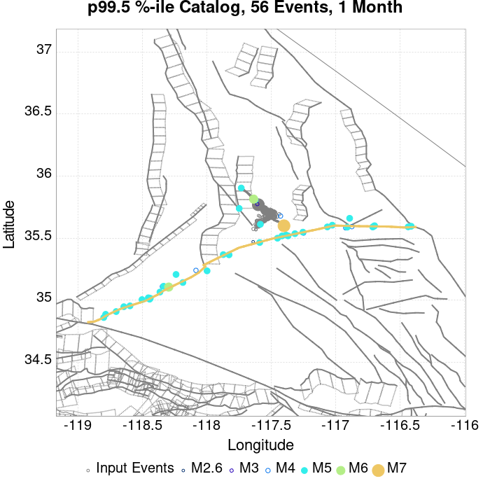
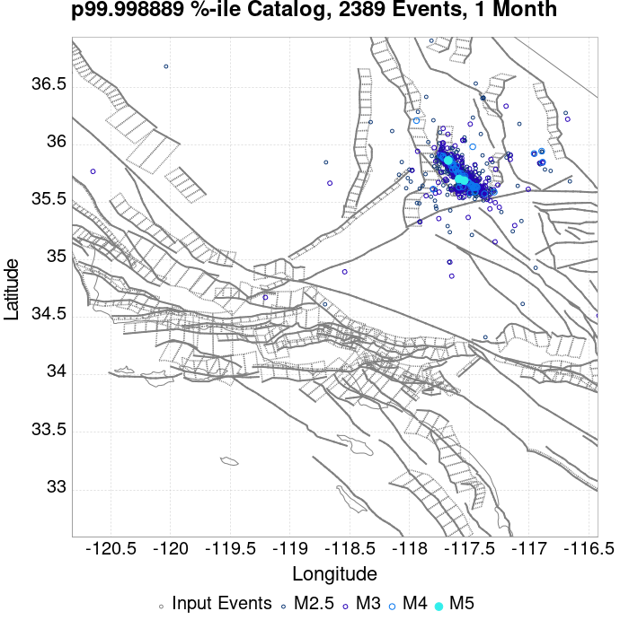
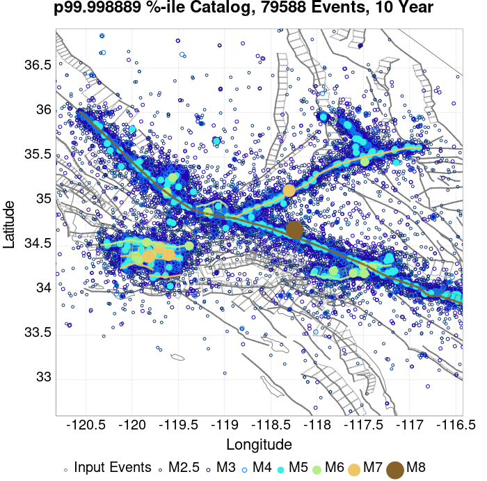
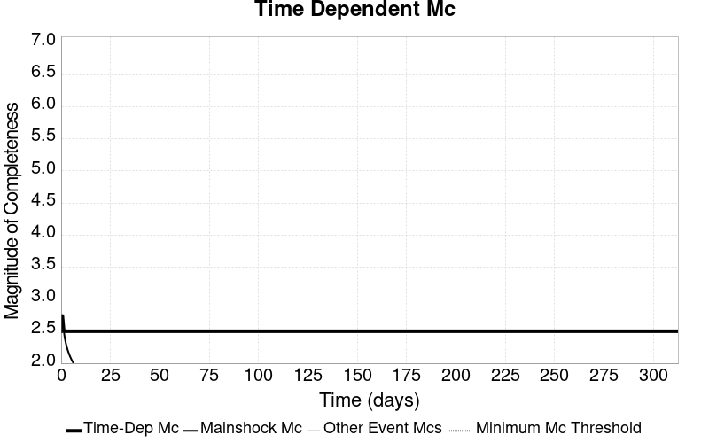
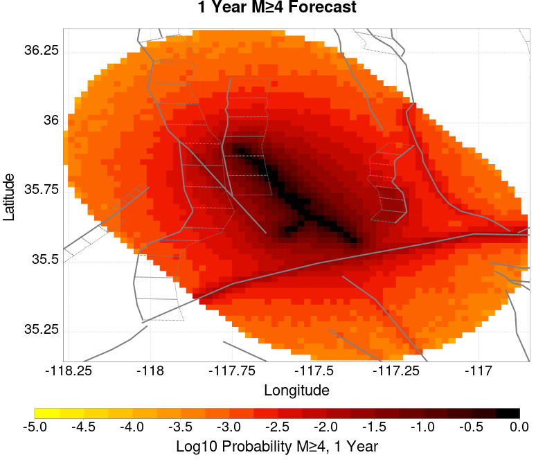
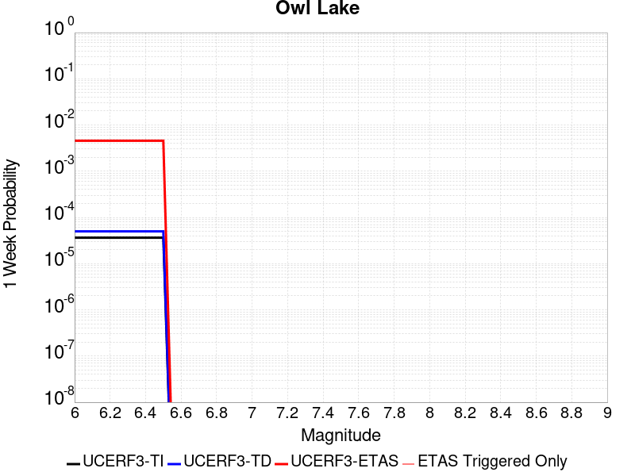

# ComCat M7.1 (ci38457511), ShakeMap Surfaces, FM2_1 Results

|   | ComCat M7.1 (ci38457511), ShakeMap Surfaces, FM2_1 |
|-----|-----|
| Num Simulations | 89985 (incomplete) |
| Start Time | 2019/07/06 03:19:54 UTC |
| Start Time Epoch Milliseconds | 1562383194040 |
| Duration | 10 Years |
| Includes Spontaneous? | false |
| Trigger Ruptures | 283 Trigger Ruptures |
|   | First: M3.98 at 2019/07/04 17:02:55 UTC |
|   | Last: M7.1 at 2019/07/06 03:19:53 UTC |
|   | Largest: M7.1 at 2019/07/06 03:19:53 UTC |
| Trigger Ruptures | *(none)* |
| Config Generated With | u3etas_comcat_event_config_builder.sh --event-id ci38457511 --mag-complete 3.5 --days-before 7 --num-simulations 1000000 --fault-model FM2_1 --finite-surf-shakemap --finite-surf-shakemap-min-mag 5 --hpc-site USC_HPC --nodes 36 --hours 24 --queue scec |

## Table Of Contents

* [Probabilities Summary Table](#probabilities-summary-table)
* [Magnitude Number Distribution](#magnitude-number-distribution)
  * [10 Year Magnitude Number Distribution](#10-year-magnitude-number-distribution)
  * [1 Year Magnitude Number Distribution](#1-year-magnitude-number-distribution)
  * [1 Month Magnitude Number Distribution](#1-month-magnitude-number-distribution)
  * [1 Week Magnitude Number Distribution](#1-week-magnitude-number-distribution)
  * [1 Day Magnitude Number Distribution](#1-day-magnitude-number-distribution)
  * [1 Hour Magnitude Number Distribution](#1-hour-magnitude-number-distribution)
* [Hazard Change Over Time](#hazard-change-over-time)
  * [M&ge;5.0 Hazard Change Over Time](#m50-hazard-change-over-time)
  * [M&ge;6.0 Hazard Change Over Time](#m60-hazard-change-over-time)
  * [M&ge;7.0 Hazard Change Over Time](#m70-hazard-change-over-time)
* [Trigger Rupture Fault Map](#trigger-rupture-fault-map)
* [Trigger Rupture Depth Map](#trigger-rupture-depth-map)
* [Fault Distances To Triggers](#fault-distances-to-triggers)
* [Individual Simulated Catalog Maps](#individual-simulated-catalog-maps)
* [ComCat Data Comparisons](#comcat-data-comparisons)
  * [ComCat Magnitude-Number Distributions](#comcat-magnitude-number-distributions)
  * [ComCat Time-Dependent Mc](#comcat-time-dependent-mc)
  * [ComCat Cumulative Number Vs Time](#comcat-cumulative-number-vs-time)
  * [ComCat Cumulative Number Simulation Percentiles](#comcat-cumulative-number-simulation-percentiles)
  * [ComCat Probability Spatial Distribution](#comcat-probability-spatial-distribution)
  * [ComCat Mean Expectation Spatial Distribution](#comcat-mean-expectation-spatial-distribution)
  * [ComCat Depth Distribution](#comcat-depth-distribution)
* [Section Participation](#section-participation)
  * [Section Participation Plots](#section-participation-plots)
  * [Supra-Seismogenic Parent Sections Table](#supra-seismogenic-parent-sections-table)
  * [M≥6.5 Parent Sections Table](#m65-parent-sections-table)
  * [M≥7 Parent Sections Table](#m7-parent-sections-table)
  * [M≥7.5 Parent Sections Table](#m75-parent-sections-table)
  * [M≥8 Parent Sections Table](#m8-parent-sections-table)
* [Fault Magnitude-Probability Distributions](#fault-magnitude-probability-distributions)
* [Gridded Nucleation](#gridded-nucleation)
* [JSON Input File](#json-input-file)

## Probabilities Summary Table
*[(top)](#table-of-contents)*

| Magnitude | 1 Hour Prob | 1 Day Prob | 1 Week Prob | 1 Month Prob | 1 Year Prob | 10 Year Prob |
|-----|-----|-----|-----|-----|-----|-----|
| **M&ge;4** | 1.000 (100.00%) | 1.000 (100.00%) | 1.000 (100.00%) | 1.000 (100.00%) | 1.000 (100.00%) | 1.000 (100.00%) |
| *95% Conf* | *[99.99% 100.00%]* | *[99.99% 100.00%]* | *[99.99% 100.00%]* | *[99.99% 100.00%]* | *[99.99% 100.00%]* | *[99.99% 100.00%]* |
| **M&ge;4.5** | 0.991 (99.08%) | 1.000 (100.00%) | 1.000 (100.00%) | 1.000 (100.00%) | 1.000 (100.00%) | 1.000 (100.00%) |
| *95% Conf* | *[99.01% 99.14%]* | *[99.99% 100.00%]* | *[99.99% 100.00%]* | *[99.99% 100.00%]* | *[99.99% 100.00%]* | *[99.99% 100.00%]* |
| **M&ge;5** | 0.768 (76.80%) | 0.977 (97.68%) | 0.995 (99.50%) | 0.998 (99.85%) | 1.000 (99.98%) | 1.000 (100.00%) |
| *95% Conf* | *[76.52% 77.08%]* | *[97.57% 97.77%]* | *[99.45% 99.54%]* | *[99.82% 99.87%]* | *[99.97% 99.99%]* | *[99.99% 100.00%]* |
| **M&ge;5.5** | 0.338 (33.75%) | 0.664 (66.40%) | 0.793 (79.29%) | 0.859 (85.92%) | 0.927 (92.68%) | 0.960 (95.95%) |
| *95% Conf* | *[33.44% 34.06%]* | *[66.09% 66.71%]* | *[79.03% 79.56%]* | *[85.69% 86.15%]* | *[92.51% 92.85%]* | *[95.82% 96.08%]* |
| **M&ge;6** | 0.082 (8.20%) | 0.210 (21.03%) | 0.295 (29.55%) | 0.358 (35.81%) | 0.457 (45.74%) | 0.537 (53.66%) |
| *95% Conf* | *[8.02% 8.38%]* | *[20.77% 21.30%]* | *[29.25% 29.85%]* | *[35.50% 36.13%]* | *[45.42% 46.07%]* | *[53.33% 53.98%]* |
| **M&ge;6.5** | 0.015 (1.48%) | 0.042 (4.19%) | 0.064 (6.39%) | 0.082 (8.16%) | 0.114 (11.41%) | 0.145 (14.50%) |
| *95% Conf* | *[1.40% 1.56%]* | *[4.06% 4.32%]* | *[6.23% 6.55%]* | *[7.98% 8.34%]* | *[11.20% 11.62%]* | *[14.27% 14.73%]* |
| **M&ge;7** | 3.90E-3 (0.39%) | 0.011 (1.05%) | 0.016 (1.59%) | 0.020 (2.04%) | 0.029 (2.94%) | 0.038 (3.83%) |
| *95% Conf* | *[0.35% 0.43%]* | *[0.99% 1.12%]* | *[1.51% 1.67%]* | *[1.95% 2.13%]* | *[2.83% 3.06%]* | *[3.70% 3.96%]* |
| **M&ge;7.1** | 3.10E-3 (0.31%) | 8.52E-3 (0.85%) | 0.013 (1.29%) | 0.016 (1.65%) | 0.024 (2.35%) | 0.031 (3.07%) |
| *95% Conf* | *[0.28% 0.35%]* | *[0.79% 0.92%]* | *[1.22% 1.36%]* | *[1.56% 1.73%]* | *[2.25% 2.45%]* | *[2.96% 3.18%]* |
| **M&ge;7.5** | 1.31E-3 (0.13%) | 3.58E-3 (0.36%) | 5.40E-3 (0.54%) | 6.95E-3 (0.69%) | 9.61E-3 (0.96%) | 0.012 (1.24%) |
| *95% Conf* | *[0.11% 0.16%]* | *[0.32% 0.40%]* | *[0.49% 0.59%]* | *[0.64% 0.75%]* | *[0.90% 1.03%]* | *[1.17% 1.32%]* |
| **M&ge;8** | 0.000 (0.00%) | 2.22E-5 (0.00%) | 3.33E-5 (0.00%) | 4.45E-5 (0.00%) | 8.89E-5 (0.01%) | 1.22E-4 (0.01%) |
| *95% Conf* | *[0.00% 0.01%]* | *[0.00% 0.01%]* | *[0.00% 0.01%]* | *[0.00% 0.01%]* | *[0.00% 0.02%]* | *[0.01% 0.02%]* |

## Magnitude Number Distribution
*[(top)](#table-of-contents)*

### 10 Year Magnitude Number Distribution
*[(top)](#table-of-contents)*

**Legend**
* **Mean** (thick black line): mean expected number across all 89985 catalogs
* **2.5%,97.5%** (thin black lines): expected number percentiles across all 89985 catalogs
* **Median** (thin blue line): median expected number across all 89985 catalogs
* **Mode** (thin cyan line): modal expected number across all 89985 catalogs
* **10 yr Probability** (thin red line): 10 year probability calculated as the fraction of catalogs with at least 1 occurrence
* **10 yr Supraseismogenic Probability** (thin dashed red line): same as above, but only for supraseismogenic ruptures on explicitly modeled UCERF3 faults
* **95% Conf** (light red shaded region): binomial 95% confidence bounds on probability
* **Primary** (thin green line): mean expected number from primary triggered aftershocks only (no secondary, tertiary, etc...) across all 89985 catalogs


| Mag | Mean | 2.5 %ile | 97.5 %ile | Median | Mode | 10 yr Probability | 10 yr Prob 95% Conf | 10 yr Supra-Seis Prob | Primary Aftershocks Mean |
|-----|-----|-----|-----|-----|-----|-----|-----|-----|-----|
| **M&ge;2.5** | 5027.910 | 3642.000 | 10293.000 | 4441.000 | 4306.000 | 1.000 (100.00%) | [99.99% 100.00%] | 0.122 (12.17%) | 2394.801 |
| **M&ge;2.6** | 3993.640 | 2886.000 | 8177.000 | 3527.000 | 3348.000 | 1.000 (100.00%) | [99.99% 100.00%] | 0.122 (12.17%) | 1902.191 |
| **M&ge;2.7** | 3172.115 | 2288.000 | 6500.000 | 2803.000 | 2699.000 | 1.000 (100.00%) | [99.99% 100.00%] | 0.122 (12.17%) | 1510.957 |
| **M&ge;2.8** | 2519.623 | 1813.000 | 5162.000 | 2227.000 | 2131.000 | 1.000 (100.00%) | [99.99% 100.00%] | 0.122 (12.17%) | 1200.232 |
| **M&ge;2.9** | 2001.380 | 1435.000 | 4102.000 | 1770.000 | 1643.000 | 1.000 (100.00%) | [99.99% 100.00%] | 0.122 (12.17%) | 953.310 |
| **M&ge;3** | 1589.615 | 1135.000 | 3261.000 | 1406.000 | 1321.000 | 1.000 (100.00%) | [99.99% 100.00%] | 0.122 (12.17%) | 757.168 |
| **M&ge;3.1** | 1262.458 | 897.000 | 2593.000 | 1117.000 | 1032.000 | 1.000 (100.00%) | [99.99% 100.00%] | 0.122 (12.17%) | 601.303 |
| **M&ge;3.2** | 1002.646 | 708.000 | 2058.000 | 888.000 | 814.000 | 1.000 (100.00%) | [99.99% 100.00%] | 0.122 (12.17%) | 477.546 |
| **M&ge;3.3** | 796.271 | 559.000 | 1633.000 | 706.000 | 654.000 | 1.000 (100.00%) | [99.99% 100.00%] | 0.122 (12.17%) | 379.300 |
| **M&ge;3.4** | 632.312 | 440.000 | 1298.000 | 560.000 | 537.000 | 1.000 (100.00%) | [99.99% 100.00%] | 0.122 (12.17%) | 301.208 |
| **M&ge;3.5** | 502.103 | 346.000 | 1030.000 | 446.000 | 409.000 | 1.000 (100.00%) | [99.99% 100.00%] | 0.122 (12.17%) | 239.193 |
| **M&ge;3.6** | 398.691 | 271.000 | 817.000 | 354.000 | 338.000 | 1.000 (100.00%) | [99.99% 100.00%] | 0.122 (12.17%) | 189.897 |
| **M&ge;3.7** | 316.530 | 213.000 | 651.000 | 281.000 | 262.000 | 1.000 (100.00%) | [99.99% 100.00%] | 0.122 (12.17%) | 150.755 |
| **M&ge;3.8** | 251.351 | 166.000 | 518.000 | 224.000 | 207.000 | 1.000 (100.00%) | [99.99% 100.00%] | 0.122 (12.17%) | 119.696 |
| **M&ge;3.9** | 199.536 | 129.000 | 412.000 | 178.000 | 166.000 | 1.000 (100.00%) | [99.99% 100.00%] | 0.122 (12.17%) | 95.029 |
| **M&ge;4** | 158.352 | 101.000 | 328.000 | 141.000 | 136.000 | 1.000 (100.00%) | [99.99% 100.00%] | 0.122 (12.17%) | 75.427 |
| **M&ge;4.1** | 125.627 | 78.000 | 262.000 | 112.000 | 104.000 | 1.000 (100.00%) | [99.99% 100.00%] | 0.122 (12.17%) | 59.843 |
| **M&ge;4.2** | 99.629 | 60.000 | 208.000 | 89.000 | 83.000 | 1.000 (100.00%) | [99.99% 100.00%] | 0.122 (12.17%) | 47.466 |
| **M&ge;4.3** | 79.025 | 46.000 | 166.000 | 71.000 | 66.000 | 1.000 (100.00%) | [99.99% 100.00%] | 0.122 (12.17%) | 37.656 |
| **M&ge;4.4** | 62.626 | 35.000 | 133.000 | 56.000 | 52.000 | 1.000 (100.00%) | [99.99% 100.00%] | 0.122 (12.17%) | 29.830 |
| **M&ge;4.5** | 49.609 | 26.000 | 106.000 | 44.000 | 40.000 | 1.000 (100.00%) | [99.99% 100.00%] | 0.122 (12.17%) | 23.619 |
| **M&ge;4.6** | 39.273 | 20.000 | 85.000 | 35.000 | 33.000 | 1.000 (100.00%) | [99.99% 100.00%] | 0.122 (12.17%) | 18.701 |
| **M&ge;4.7** | 31.044 | 15.000 | 68.000 | 28.000 | 26.000 | 1.000 (100.00%) | [99.99% 100.00%] | 0.122 (12.17%) | 14.780 |
| **M&ge;4.8** | 24.508 | 11.000 | 54.000 | 22.000 | 20.000 | 1.000 (100.00%) | [99.99% 100.00%] | 0.122 (12.17%) | 11.667 |
| **M&ge;4.9** | 19.319 | 8.000 | 44.000 | 17.000 | 16.000 | 1.000 (100.00%) | [99.99% 100.00%] | 0.122 (12.17%) | 9.202 |
| **M&ge;5** | 15.190 | 5.000 | 35.000 | 13.000 | 12.000 | 1.000 (100.00%) | [99.99% 100.00%] | 0.122 (12.17%) | 7.234 |
| **M&ge;5.1** | 11.910 | 4.000 | 28.000 | 11.000 | 9.000 | 1.000 (99.98%) | [99.97% 99.99%] | 0.122 (12.17%) | 5.671 |
| **M&ge;5.2** | 9.314 | 2.000 | 23.000 | 8.000 | 7.000 | 0.999 (99.87%) | [99.84% 99.89%] | 0.122 (12.17%) | 4.436 |
| **M&ge;5.3** | 7.247 | 1.000 | 19.000 | 6.000 | 5.000 | 0.994 (99.45%) | [99.40% 99.49%] | 0.122 (12.17%) | 3.448 |
| **M&ge;5.4** | 5.610 | 1.000 | 15.000 | 5.000 | 4.000 | 0.984 (98.39%) | [98.31% 98.47%] | 0.122 (12.17%) | 2.670 |
| **M&ge;5.5** | 4.312 | 0.000 | 12.000 | 4.000 | 3.000 | 0.960 (95.95%) | [95.82% 96.08%] | 0.122 (12.17%) | 2.048 |
| **M&ge;5.6** | 3.280 | 0.000 | 10.000 | 3.000 | 2.000 | 0.917 (91.71%) | [91.52% 91.88%] | 0.122 (12.17%) | 1.559 |
| **M&ge;5.7** | 2.456 | 0.000 | 8.000 | 2.000 | 1.000 | 0.851 (85.06%) | [84.82% 85.29%] | 0.122 (12.17%) | 1.164 |
| **M&ge;5.8** | 1.806 | 0.000 | 6.000 | 1.000 | 1.000 | 0.761 (76.13%) | [75.85% 76.41%] | 0.122 (12.17%) | 0.855 |
| **M&ge;5.9** | 1.295 | 0.000 | 5.000 | 1.000 | 0.000 | 0.651 (65.07%) | [64.75% 65.38%] | 0.122 (12.17%) | 0.613 |
| **M&ge;6** | 0.930 | 0.000 | 4.000 | 1.000 | 0.000 | 0.537 (53.66%) | [53.33% 53.98%] | 0.122 (12.17%) | 0.435 |
| **M&ge;6.1** | 0.672 | 0.000 | 3.000 | 0.000 | 0.000 | 0.429 (42.93%) | [42.60% 43.25%] | 0.121 (12.15%) | 0.307 |
| **M&ge;6.2** | 0.467 | 0.000 | 3.000 | 0.000 | 0.000 | 0.321 (32.14%) | [31.84% 32.45%] | 0.121 (12.15%) | 0.202 |
| **M&ge;6.3** | 0.367 | 0.000 | 2.000 | 0.000 | 0.000 | 0.263 (26.31%) | [26.03% 26.60%] | 0.121 (12.15%) | 0.153 |
| **M&ge;6.4** | 0.234 | 0.000 | 2.000 | 0.000 | 0.000 | 0.173 (17.29%) | [17.05% 17.54%] | 0.071 (7.14%) | 0.098 |
| **M&ge;6.5** | 0.195 | 0.000 | 2.000 | 0.000 | 0.000 | 0.145 (14.50%) | [14.27% 14.73%] | 0.071 (7.14%) | 0.079 |
| **M&ge;6.6** | 0.143 | 0.000 | 1.000 | 0.000 | 0.000 | 0.115 (11.46%) | [11.25% 11.67%] | 0.062 (6.18%) | 0.060 |
| **M&ge;6.7** | 0.112 | 0.000 | 1.000 | 0.000 | 0.000 | 0.091 (9.10%) | [8.92% 9.30%] | 0.054 (5.39%) | 0.046 |
| **M&ge;6.8** | 0.093 | 0.000 | 1.000 | 0.000 | 0.000 | 0.077 (7.66%) | [7.49% 7.83%] | 0.052 (5.15%) | 0.038 |
| **M&ge;6.9** | 0.055 | 0.000 | 1.000 | 0.000 | 0.000 | 0.047 (4.68%) | [4.54% 4.82%] | 0.030 (3.02%) | 0.023 |
| **M&ge;7** | 0.045 | 0.000 | 1.000 | 0.000 | 0.000 | 0.038 (3.83%) | [3.70% 3.96%] | 0.028 (2.79%) | 0.019 |
| **M&ge;7.1** | 0.036 | 0.000 | 1.000 | 0.000 | 0.000 | 0.031 (3.07%) | [2.96% 3.18%] | 0.025 (2.46%) | 0.015 |
| **M&ge;7.2** | 0.029 | 0.000 | 1.000 | 0.000 | 0.000 | 0.025 (2.54%) | [2.44% 2.65%] | 0.022 (2.20%) | 0.013 |
| **M&ge;7.3** | 0.022 | 0.000 | 0.000 | 0.000 | 0.000 | 0.019 (1.94%) | [1.85% 2.03%] | 0.018 (1.78%) | 9.45E-3 |
| **M&ge;7.4** | 0.018 | 0.000 | 0.000 | 0.000 | 0.000 | 0.016 (1.62%) | [1.54% 1.71%] | 0.015 (1.55%) | 8.38E-3 |
| **M&ge;7.5** | 0.014 | 0.000 | 0.000 | 0.000 | 0.000 | 0.012 (1.24%) | [1.17% 1.32%] | 0.012 (1.21%) | 6.30E-3 |
| **M&ge;7.6** | 0.013 | 0.000 | 0.000 | 0.000 | 0.000 | 0.011 (1.14%) | [1.07% 1.21%] | 0.011 (1.13%) | 5.77E-3 |
| **M&ge;7.7** | 5.28E-3 | 0.000 | 0.000 | 0.000 | 0.000 | 4.77E-3 (0.48%) | [0.43% 0.52%] | 4.68E-3 (0.47%) | 1.72E-3 |
| **M&ge;7.8** | 1.61E-3 | 0.000 | 0.000 | 0.000 | 0.000 | 1.59E-3 (0.16%) | [0.13% 0.19%] | 1.53E-3 (0.15%) | 1.78E-4 |
| **M&ge;7.9** | 4.45E-4 | 0.000 | 0.000 | 0.000 | 0.000 | 4.45E-4 (0.04%) | [0.03% 0.06%] | 4.45E-4 (0.04%) | 3.33E-5 |
| **M&ge;8** | 1.22E-4 | 0.000 | 0.000 | 0.000 | 0.000 | 1.22E-4 (0.01%) | [0.01% 0.02%] | 1.22E-4 (0.01%) | 1.11E-5 |
| **M&ge;8.1** | 4.45E-5 | 0.000 | 0.000 | 0.000 | 0.000 | 4.45E-5 (0.00%) | [0.00% 0.01%] | 4.45E-5 (0.00%) | 0.000 |
| **M&ge;8.2** | 0.000 | 0.000 | 0.000 | 0.000 | 0.000 | 0.000 (0.00%) | [0.00% 0.01%] | 0.000 (0.00%) | 0.000 |
| **M&ge;8.3** | 0.000 | 0.000 | 0.000 | 0.000 | 0.000 | 0.000 (0.00%) | [0.00% 0.01%] | 0.000 (0.00%) | 0.000 |
| **M&ge;8.4** | 0.000 | 0.000 | 0.000 | 0.000 | 0.000 | 0.000 (0.00%) | [0.00% 0.01%] | 0.000 (0.00%) | 0.000 |
| **M&ge;8.5** | 0.000 | 0.000 | 0.000 | 0.000 | 0.000 | 0.000 (0.00%) | [0.00% 0.01%] | 0.000 (0.00%) | 0.000 |
| **M&ge;8.6** | 0.000 | 0.000 | 0.000 | 0.000 | 0.000 | 0.000 (0.00%) | [0.00% 0.01%] | 0.000 (0.00%) | 0.000 |
| **M&ge;8.7** | 0.000 | 0.000 | 0.000 | 0.000 | 0.000 | 0.000 (0.00%) | [0.00% 0.01%] | 0.000 (0.00%) | 0.000 |
| **M&ge;8.8** | 0.000 | 0.000 | 0.000 | 0.000 | 0.000 | 0.000 (0.00%) | [0.00% 0.01%] | 0.000 (0.00%) | 0.000 |
| **M&ge;8.9** | 0.000 | 0.000 | 0.000 | 0.000 | 0.000 | 0.000 (0.00%) | [0.00% 0.01%] | 0.000 (0.00%) | 0.000 |
| **M&ge;9** | 0.000 | 0.000 | 0.000 | 0.000 | 0.000 | 0.000 (0.00%) | [0.00% 0.01%] | 0.000 (0.00%) | 0.000 |

### 1 Year Magnitude Number Distribution
*[(top)](#table-of-contents)*

**Legend**
* **Mean** (thick black line): mean expected number across all 89985 catalogs
* **2.5%,97.5%** (thin black lines): expected number percentiles across all 89985 catalogs
* **Median** (thin blue line): median expected number across all 89985 catalogs
* **Mode** (thin cyan line): modal expected number across all 89985 catalogs
* **1 yr Probability** (thin red line): 1 year probability calculated as the fraction of catalogs with at least 1 occurrence
* **1 yr Supraseismogenic Probability** (thin dashed red line): same as above, but only for supraseismogenic ruptures on explicitly modeled UCERF3 faults
* **95% Conf** (light red shaded region): binomial 95% confidence bounds on probability
* **Primary** (thin green line): mean expected number from primary triggered aftershocks only (no secondary, tertiary, etc...) across all 89985 catalogs


| Mag | Mean | 2.5 %ile | 97.5 %ile | Median | Mode | 1 yr Probability | 1 yr Prob 95% Conf | 1 yr Supra-Seis Prob | Primary Aftershocks Mean |
|-----|-----|-----|-----|-----|-----|-----|-----|-----|-----|
| **M&ge;2.5** | 3858.199 | 2942.000 | 6997.000 | 3492.000 | 3283.000 | 1.000 (100.00%) | [99.99% 100.00%] | 0.094 (9.38%) | 2085.962 |
| **M&ge;2.6** | 3064.537 | 2332.000 | 5553.000 | 2774.000 | 2620.000 | 1.000 (100.00%) | [99.99% 100.00%] | 0.094 (9.38%) | 1656.838 |
| **M&ge;2.7** | 2434.133 | 1847.000 | 4424.000 | 2204.000 | 2057.000 | 1.000 (100.00%) | [99.99% 100.00%] | 0.094 (9.38%) | 1316.067 |
| **M&ge;2.8** | 1933.409 | 1463.000 | 3510.000 | 1751.000 | 1664.000 | 1.000 (100.00%) | [99.99% 100.00%] | 0.094 (9.38%) | 1045.385 |
| **M&ge;2.9** | 1535.670 | 1157.000 | 2788.000 | 1391.000 | 1334.000 | 1.000 (100.00%) | [99.99% 100.00%] | 0.094 (9.38%) | 830.295 |
| **M&ge;3** | 1219.738 | 914.000 | 2215.000 | 1106.000 | 1053.000 | 1.000 (100.00%) | [99.99% 100.00%] | 0.094 (9.38%) | 659.485 |
| **M&ge;3.1** | 968.722 | 722.000 | 1760.000 | 879.000 | 836.000 | 1.000 (100.00%) | [99.99% 100.00%] | 0.094 (9.38%) | 523.729 |
| **M&ge;3.2** | 769.387 | 569.000 | 1402.000 | 698.000 | 657.000 | 1.000 (100.00%) | [99.99% 100.00%] | 0.094 (9.38%) | 415.928 |
| **M&ge;3.3** | 611.056 | 448.000 | 1113.000 | 555.000 | 515.000 | 1.000 (100.00%) | [99.99% 100.00%] | 0.094 (9.38%) | 330.362 |
| **M&ge;3.4** | 485.218 | 352.000 | 888.000 | 441.000 | 416.000 | 1.000 (100.00%) | [99.99% 100.00%] | 0.094 (9.38%) | 262.328 |
| **M&ge;3.5** | 385.319 | 277.000 | 704.000 | 351.000 | 329.000 | 1.000 (100.00%) | [99.99% 100.00%] | 0.094 (9.38%) | 208.316 |
| **M&ge;3.6** | 305.961 | 216.000 | 560.000 | 279.000 | 265.000 | 1.000 (100.00%) | [99.99% 100.00%] | 0.094 (9.38%) | 165.384 |
| **M&ge;3.7** | 242.896 | 169.000 | 446.000 | 221.000 | 205.000 | 1.000 (100.00%) | [99.99% 100.00%] | 0.094 (9.38%) | 131.285 |
| **M&ge;3.8** | 192.858 | 132.000 | 354.000 | 176.000 | 168.000 | 1.000 (100.00%) | [99.99% 100.00%] | 0.094 (9.38%) | 104.236 |
| **M&ge;3.9** | 153.115 | 103.000 | 283.000 | 140.000 | 131.000 | 1.000 (100.00%) | [99.99% 100.00%] | 0.094 (9.38%) | 82.765 |
| **M&ge;4** | 121.514 | 79.000 | 226.000 | 111.000 | 103.000 | 1.000 (100.00%) | [99.99% 100.00%] | 0.094 (9.38%) | 65.691 |
| **M&ge;4.1** | 96.414 | 61.000 | 180.000 | 88.000 | 84.000 | 1.000 (100.00%) | [99.99% 100.00%] | 0.094 (9.38%) | 52.123 |
| **M&ge;4.2** | 76.452 | 47.000 | 143.000 | 70.000 | 66.000 | 1.000 (100.00%) | [99.99% 100.00%] | 0.094 (9.38%) | 41.337 |
| **M&ge;4.3** | 60.634 | 36.000 | 115.000 | 56.000 | 52.000 | 1.000 (100.00%) | [99.99% 100.00%] | 0.094 (9.38%) | 32.798 |
| **M&ge;4.4** | 48.042 | 27.000 | 92.000 | 44.000 | 40.000 | 1.000 (100.00%) | [99.99% 100.00%] | 0.094 (9.38%) | 25.978 |
| **M&ge;4.5** | 38.059 | 20.000 | 74.000 | 35.000 | 33.000 | 1.000 (100.00%) | [99.99% 100.00%] | 0.094 (9.38%) | 20.573 |
| **M&ge;4.6** | 30.126 | 15.000 | 59.000 | 28.000 | 25.000 | 1.000 (100.00%) | [99.99% 100.00%] | 0.094 (9.38%) | 16.287 |
| **M&ge;4.7** | 23.809 | 11.000 | 48.000 | 22.000 | 20.000 | 1.000 (100.00%) | [99.99% 100.00%] | 0.094 (9.38%) | 12.867 |
| **M&ge;4.8** | 18.793 | 8.000 | 39.000 | 17.000 | 16.000 | 1.000 (100.00%) | [99.99% 100.00%] | 0.094 (9.38%) | 10.152 |
| **M&ge;4.9** | 14.816 | 6.000 | 31.000 | 13.000 | 12.000 | 1.000 (100.00%) | [99.99% 100.00%] | 0.094 (9.38%) | 8.005 |
| **M&ge;5** | 11.649 | 4.000 | 25.000 | 11.000 | 9.000 | 1.000 (99.98%) | [99.97% 99.99%] | 0.094 (9.38%) | 6.293 |
| **M&ge;5.1** | 9.131 | 2.000 | 21.000 | 8.000 | 7.000 | 0.999 (99.90%) | [99.87% 99.92%] | 0.094 (9.38%) | 4.934 |
| **M&ge;5.2** | 7.139 | 2.000 | 17.000 | 6.000 | 6.000 | 0.996 (99.58%) | [99.54% 99.62%] | 0.094 (9.38%) | 3.857 |
| **M&ge;5.3** | 5.551 | 1.000 | 14.000 | 5.000 | 4.000 | 0.986 (98.64%) | [98.56% 98.71%] | 0.094 (9.38%) | 2.997 |
| **M&ge;5.4** | 4.298 | 0.000 | 11.000 | 4.000 | 3.000 | 0.966 (96.60%) | [96.48% 96.72%] | 0.094 (9.38%) | 2.321 |
| **M&ge;5.5** | 3.303 | 0.000 | 9.000 | 3.000 | 2.000 | 0.927 (92.68%) | [92.51% 92.85%] | 0.094 (9.38%) | 1.781 |
| **M&ge;5.6** | 2.513 | 0.000 | 8.000 | 2.000 | 2.000 | 0.868 (86.83%) | [86.60% 87.05%] | 0.094 (9.38%) | 1.355 |
| **M&ge;5.7** | 1.881 | 0.000 | 6.000 | 1.000 | 1.000 | 0.786 (78.61%) | [78.34% 78.88%] | 0.094 (9.38%) | 1.011 |
| **M&ge;5.8** | 1.381 | 0.000 | 5.000 | 1.000 | 1.000 | 0.685 (68.53%) | [68.22% 68.83%] | 0.094 (9.38%) | 0.742 |
| **M&ge;5.9** | 0.989 | 0.000 | 4.000 | 1.000 | 0.000 | 0.569 (56.92%) | [56.60% 57.25%] | 0.094 (9.38%) | 0.531 |
| **M&ge;6** | 0.709 | 0.000 | 3.000 | 0.000 | 0.000 | 0.457 (45.74%) | [45.42% 46.07%] | 0.094 (9.38%) | 0.377 |
| **M&ge;6.1** | 0.509 | 0.000 | 3.000 | 0.000 | 0.000 | 0.357 (35.66%) | [35.35% 35.98%] | 0.094 (9.36%) | 0.265 |
| **M&ge;6.2** | 0.350 | 0.000 | 2.000 | 0.000 | 0.000 | 0.260 (26.02%) | [25.73% 26.30%] | 0.094 (9.36%) | 0.174 |
| **M&ge;6.3** | 0.273 | 0.000 | 2.000 | 0.000 | 0.000 | 0.210 (21.01%) | [20.74% 21.27%] | 0.094 (9.36%) | 0.131 |
| **M&ge;6.4** | 0.173 | 0.000 | 1.000 | 0.000 | 0.000 | 0.137 (13.66%) | [13.43% 13.88%] | 0.056 (5.56%) | 0.083 |
| **M&ge;6.5** | 0.144 | 0.000 | 1.000 | 0.000 | 0.000 | 0.114 (11.41%) | [11.20% 11.62%] | 0.056 (5.56%) | 0.068 |
| **M&ge;6.6** | 0.106 | 0.000 | 1.000 | 0.000 | 0.000 | 0.089 (8.95%) | [8.76% 9.14%] | 0.048 (4.81%) | 0.052 |
| **M&ge;6.7** | 0.083 | 0.000 | 1.000 | 0.000 | 0.000 | 0.071 (7.06%) | [6.90% 7.23%] | 0.042 (4.18%) | 0.040 |
| **M&ge;6.8** | 0.069 | 0.000 | 1.000 | 0.000 | 0.000 | 0.059 (5.93%) | [5.78% 6.09%] | 0.040 (4.00%) | 0.033 |
| **M&ge;6.9** | 0.041 | 0.000 | 1.000 | 0.000 | 0.000 | 0.036 (3.58%) | [3.46% 3.71%] | 0.023 (2.33%) | 0.020 |
| **M&ge;7** | 0.033 | 0.000 | 1.000 | 0.000 | 0.000 | 0.029 (2.94%) | [2.83% 3.06%] | 0.022 (2.16%) | 0.016 |
| **M&ge;7.1** | 0.027 | 0.000 | 0.000 | 0.000 | 0.000 | 0.024 (2.35%) | [2.25% 2.45%] | 0.019 (1.90%) | 0.013 |
| **M&ge;7.2** | 0.022 | 0.000 | 0.000 | 0.000 | 0.000 | 0.020 (1.96%) | [1.87% 2.05%] | 0.017 (1.70%) | 0.011 |
| **M&ge;7.3** | 0.017 | 0.000 | 0.000 | 0.000 | 0.000 | 0.015 (1.49%) | [1.41% 1.57%] | 0.014 (1.37%) | 8.11E-3 |
| **M&ge;7.4** | 0.014 | 0.000 | 0.000 | 0.000 | 0.000 | 0.012 (1.25%) | [1.18% 1.32%] | 0.012 (1.19%) | 7.19E-3 |
| **M&ge;7.5** | 0.011 | 0.000 | 0.000 | 0.000 | 0.000 | 9.61E-3 (0.96%) | [0.90% 1.03%] | 9.42E-3 (0.94%) | 5.41E-3 |
| **M&ge;7.6** | 0.010 | 0.000 | 0.000 | 0.000 | 0.000 | 8.85E-3 (0.88%) | [0.82% 0.95%] | 8.75E-3 (0.87%) | 4.98E-3 |
| **M&ge;7.7** | 3.81E-3 | 0.000 | 0.000 | 0.000 | 0.000 | 3.53E-3 (0.35%) | [0.32% 0.39%] | 3.46E-3 (0.35%) | 1.48E-3 |
| **M&ge;7.8** | 1.10E-3 | 0.000 | 0.000 | 0.000 | 0.000 | 1.10E-3 (0.11%) | [0.09% 0.13%] | 1.06E-3 (0.11%) | 1.22E-4 |
| **M&ge;7.9** | 3.33E-4 | 0.000 | 0.000 | 0.000 | 0.000 | 3.33E-4 (0.03%) | [0.02% 0.05%] | 3.33E-4 (0.03%) | 2.22E-5 |
| **M&ge;8** | 8.89E-5 | 0.000 | 0.000 | 0.000 | 0.000 | 8.89E-5 (0.01%) | [0.00% 0.02%] | 8.89E-5 (0.01%) | 1.11E-5 |
| **M&ge;8.1** | 3.33E-5 | 0.000 | 0.000 | 0.000 | 0.000 | 3.33E-5 (0.00%) | [0.00% 0.01%] | 3.33E-5 (0.00%) | 0.000 |
| **M&ge;8.2** | 0.000 | 0.000 | 0.000 | 0.000 | 0.000 | 0.000 (0.00%) | [0.00% 0.01%] | 0.000 (0.00%) | 0.000 |
| **M&ge;8.3** | 0.000 | 0.000 | 0.000 | 0.000 | 0.000 | 0.000 (0.00%) | [0.00% 0.01%] | 0.000 (0.00%) | 0.000 |
| **M&ge;8.4** | 0.000 | 0.000 | 0.000 | 0.000 | 0.000 | 0.000 (0.00%) | [0.00% 0.01%] | 0.000 (0.00%) | 0.000 |
| **M&ge;8.5** | 0.000 | 0.000 | 0.000 | 0.000 | 0.000 | 0.000 (0.00%) | [0.00% 0.01%] | 0.000 (0.00%) | 0.000 |
| **M&ge;8.6** | 0.000 | 0.000 | 0.000 | 0.000 | 0.000 | 0.000 (0.00%) | [0.00% 0.01%] | 0.000 (0.00%) | 0.000 |
| **M&ge;8.7** | 0.000 | 0.000 | 0.000 | 0.000 | 0.000 | 0.000 (0.00%) | [0.00% 0.01%] | 0.000 (0.00%) | 0.000 |
| **M&ge;8.8** | 0.000 | 0.000 | 0.000 | 0.000 | 0.000 | 0.000 (0.00%) | [0.00% 0.01%] | 0.000 (0.00%) | 0.000 |
| **M&ge;8.9** | 0.000 | 0.000 | 0.000 | 0.000 | 0.000 | 0.000 (0.00%) | [0.00% 0.01%] | 0.000 (0.00%) | 0.000 |
| **M&ge;9** | 0.000 | 0.000 | 0.000 | 0.000 | 0.000 | 0.000 (0.00%) | [0.00% 0.01%] | 0.000 (0.00%) | 0.000 |

### 1 Month Magnitude Number Distribution
*[(top)](#table-of-contents)*

**Legend**
* **Mean** (thick black line): mean expected number across all 89985 catalogs
* **2.5%,97.5%** (thin black lines): expected number percentiles across all 89985 catalogs
* **Median** (thin blue line): median expected number across all 89985 catalogs
* **Mode** (thin cyan line): modal expected number across all 89985 catalogs
* **1 mo Probability** (thin red line): 1 month probability calculated as the fraction of catalogs with at least 1 occurrence
* **1 mo Supraseismogenic Probability** (thin dashed red line): same as above, but only for supraseismogenic ruptures on explicitly modeled UCERF3 faults
* **95% Conf** (light red shaded region): binomial 95% confidence bounds on probability
* **Primary** (thin green line): mean expected number from primary triggered aftershocks only (no secondary, tertiary, etc...) across all 89985 catalogs


| Mag | Mean | 2.5 %ile | 97.5 %ile | Median | Mode | 1 mo Probability | 1 mo Prob 95% Conf | 1 mo Supra-Seis Prob | Primary Aftershocks Mean |
|-----|-----|-----|-----|-----|-----|-----|-----|-----|-----|
| **M&ge;2.5** | 2714.483 | 2183.000 | 4230.000 | 2515.000 | 2445.000 | 1.000 (100.00%) | [99.99% 100.00%] | 0.066 (6.59%) | 1690.804 |
| **M&ge;2.6** | 2156.126 | 1729.000 | 3361.000 | 1999.000 | 1960.000 | 1.000 (100.00%) | [99.99% 100.00%] | 0.066 (6.59%) | 1342.991 |
| **M&ge;2.7** | 1712.593 | 1368.000 | 2676.000 | 1588.000 | 1531.000 | 1.000 (100.00%) | [99.99% 100.00%] | 0.066 (6.59%) | 1066.744 |
| **M&ge;2.8** | 1360.330 | 1081.000 | 2131.000 | 1262.000 | 1192.000 | 1.000 (100.00%) | [99.99% 100.00%] | 0.066 (6.59%) | 847.351 |
| **M&ge;2.9** | 1080.463 | 854.000 | 1692.000 | 1003.000 | 941.000 | 1.000 (100.00%) | [99.99% 100.00%] | 0.066 (6.59%) | 672.997 |
| **M&ge;3** | 858.174 | 674.000 | 1348.000 | 797.000 | 780.000 | 1.000 (100.00%) | [99.99% 100.00%] | 0.066 (6.59%) | 534.531 |
| **M&ge;3.1** | 681.554 | 531.000 | 1070.000 | 634.000 | 617.000 | 1.000 (100.00%) | [99.99% 100.00%] | 0.066 (6.59%) | 424.506 |
| **M&ge;3.2** | 541.318 | 418.000 | 853.000 | 504.000 | 477.000 | 1.000 (100.00%) | [99.99% 100.00%] | 0.066 (6.59%) | 337.140 |
| **M&ge;3.3** | 429.938 | 329.000 | 678.000 | 400.000 | 388.000 | 1.000 (100.00%) | [99.99% 100.00%] | 0.066 (6.59%) | 267.795 |
| **M&ge;3.4** | 341.394 | 258.000 | 539.000 | 318.000 | 308.000 | 1.000 (100.00%) | [99.99% 100.00%] | 0.066 (6.59%) | 212.655 |
| **M&ge;3.5** | 271.091 | 202.000 | 431.000 | 253.000 | 247.000 | 1.000 (100.00%) | [99.99% 100.00%] | 0.066 (6.59%) | 168.862 |
| **M&ge;3.6** | 215.248 | 157.000 | 343.000 | 201.000 | 196.000 | 1.000 (100.00%) | [99.99% 100.00%] | 0.066 (6.59%) | 134.053 |
| **M&ge;3.7** | 170.873 | 122.000 | 273.000 | 160.000 | 156.000 | 1.000 (100.00%) | [99.99% 100.00%] | 0.066 (6.59%) | 106.409 |
| **M&ge;3.8** | 135.656 | 95.000 | 218.000 | 127.000 | 121.000 | 1.000 (100.00%) | [99.99% 100.00%] | 0.066 (6.59%) | 84.477 |
| **M&ge;3.9** | 107.704 | 74.000 | 174.000 | 101.000 | 97.000 | 1.000 (100.00%) | [99.99% 100.00%] | 0.066 (6.59%) | 67.078 |
| **M&ge;4** | 85.478 | 57.000 | 139.000 | 80.000 | 76.000 | 1.000 (100.00%) | [99.99% 100.00%] | 0.066 (6.59%) | 53.236 |
| **M&ge;4.1** | 67.820 | 43.000 | 112.000 | 64.000 | 62.000 | 1.000 (100.00%) | [99.99% 100.00%] | 0.066 (6.59%) | 42.237 |
| **M&ge;4.2** | 53.783 | 33.000 | 90.000 | 50.000 | 50.000 | 1.000 (100.00%) | [99.99% 100.00%] | 0.066 (6.59%) | 33.498 |
| **M&ge;4.3** | 42.669 | 25.000 | 73.000 | 40.000 | 37.000 | 1.000 (100.00%) | [99.99% 100.00%] | 0.066 (6.59%) | 26.583 |
| **M&ge;4.4** | 33.821 | 19.000 | 59.000 | 32.000 | 30.000 | 1.000 (100.00%) | [99.99% 100.00%] | 0.066 (6.59%) | 21.061 |
| **M&ge;4.5** | 26.794 | 14.000 | 48.000 | 25.000 | 23.000 | 1.000 (100.00%) | [99.99% 100.00%] | 0.066 (6.59%) | 16.679 |
| **M&ge;4.6** | 21.208 | 10.000 | 39.000 | 20.000 | 19.000 | 1.000 (100.00%) | [99.99% 100.00%] | 0.066 (6.59%) | 13.205 |
| **M&ge;4.7** | 16.761 | 7.000 | 32.000 | 16.000 | 15.000 | 1.000 (100.00%) | [99.99% 100.00%] | 0.066 (6.59%) | 10.433 |
| **M&ge;4.8** | 13.234 | 5.000 | 26.000 | 12.000 | 12.000 | 1.000 (100.00%) | [99.99% 100.00%] | 0.066 (6.59%) | 8.232 |
| **M&ge;4.9** | 10.428 | 3.000 | 21.000 | 10.000 | 9.000 | 1.000 (99.97%) | [99.96% 99.98%] | 0.066 (6.59%) | 6.489 |
| **M&ge;5** | 8.200 | 2.000 | 18.000 | 8.000 | 6.000 | 0.998 (99.85%) | [99.82% 99.87%] | 0.066 (6.59%) | 5.103 |
| **M&ge;5.1** | 6.428 | 1.000 | 15.000 | 6.000 | 5.000 | 0.995 (99.46%) | [99.41% 99.51%] | 0.066 (6.59%) | 4.000 |
| **M&ge;5.2** | 5.025 | 1.000 | 12.000 | 5.000 | 4.000 | 0.984 (98.42%) | [98.34% 98.50%] | 0.066 (6.59%) | 3.126 |
| **M&ge;5.3** | 3.906 | 0.000 | 10.000 | 3.000 | 3.000 | 0.961 (96.12%) | [95.99% 96.24%] | 0.066 (6.59%) | 2.429 |
| **M&ge;5.4** | 3.023 | 0.000 | 8.000 | 3.000 | 2.000 | 0.921 (92.13%) | [91.95% 92.30%] | 0.066 (6.59%) | 1.880 |
| **M&ge;5.5** | 2.321 | 0.000 | 7.000 | 2.000 | 1.000 | 0.859 (85.92%) | [85.69% 86.15%] | 0.066 (6.59%) | 1.441 |
| **M&ge;5.6** | 1.767 | 0.000 | 6.000 | 1.000 | 1.000 | 0.780 (77.97%) | [77.70% 78.24%] | 0.066 (6.59%) | 1.096 |
| **M&ge;5.7** | 1.322 | 0.000 | 5.000 | 1.000 | 1.000 | 0.683 (68.26%) | [67.96% 68.57%] | 0.066 (6.59%) | 0.818 |
| **M&ge;5.8** | 0.969 | 0.000 | 4.000 | 1.000 | 0.000 | 0.575 (57.46%) | [57.14% 57.79%] | 0.066 (6.59%) | 0.599 |
| **M&ge;5.9** | 0.693 | 0.000 | 3.000 | 0.000 | 0.000 | 0.461 (46.05%) | [45.73% 46.38%] | 0.066 (6.59%) | 0.428 |
| **M&ge;6** | 0.494 | 0.000 | 3.000 | 0.000 | 0.000 | 0.358 (35.81%) | [35.50% 36.13%] | 0.066 (6.59%) | 0.303 |
| **M&ge;6.1** | 0.352 | 0.000 | 2.000 | 0.000 | 0.000 | 0.272 (27.17%) | [26.88% 27.46%] | 0.066 (6.58%) | 0.212 |
| **M&ge;6.2** | 0.238 | 0.000 | 2.000 | 0.000 | 0.000 | 0.193 (19.27%) | [19.01% 19.53%] | 0.066 (6.58%) | 0.138 |
| **M&ge;6.3** | 0.185 | 0.000 | 1.000 | 0.000 | 0.000 | 0.154 (15.35%) | [15.12% 15.59%] | 0.066 (6.58%) | 0.104 |
| **M&ge;6.4** | 0.116 | 0.000 | 1.000 | 0.000 | 0.000 | 0.098 (9.79%) | [9.60% 9.99%] | 0.040 (3.98%) | 0.066 |
| **M&ge;6.5** | 0.096 | 0.000 | 1.000 | 0.000 | 0.000 | 0.082 (8.16%) | [7.98% 8.34%] | 0.040 (3.97%) | 0.054 |
| **M&ge;6.6** | 0.072 | 0.000 | 1.000 | 0.000 | 0.000 | 0.064 (6.40%) | [6.24% 6.56%] | 0.034 (3.44%) | 0.042 |
| **M&ge;6.7** | 0.056 | 0.000 | 1.000 | 0.000 | 0.000 | 0.050 (5.01%) | [4.87% 5.16%] | 0.030 (2.99%) | 0.032 |
| **M&ge;6.8** | 0.047 | 0.000 | 1.000 | 0.000 | 0.000 | 0.042 (4.23%) | [4.10% 4.36%] | 0.029 (2.86%) | 0.027 |
| **M&ge;6.9** | 0.027 | 0.000 | 0.000 | 0.000 | 0.000 | 0.025 (2.49%) | [2.39% 2.59%] | 0.016 (1.63%) | 0.016 |
| **M&ge;7** | 0.022 | 0.000 | 0.000 | 0.000 | 0.000 | 0.020 (2.04%) | [1.95% 2.13%] | 0.015 (1.51%) | 0.013 |
| **M&ge;7.1** | 0.018 | 0.000 | 0.000 | 0.000 | 0.000 | 0.016 (1.65%) | [1.56% 1.73%] | 0.013 (1.33%) | 0.011 |
| **M&ge;7.2** | 0.015 | 0.000 | 0.000 | 0.000 | 0.000 | 0.014 (1.37%) | [1.30% 1.45%] | 0.012 (1.19%) | 8.79E-3 |
| **M&ge;7.3** | 0.011 | 0.000 | 0.000 | 0.000 | 0.000 | 0.011 (1.05%) | [0.99% 1.12%] | 9.60E-3 (0.96%) | 6.75E-3 |
| **M&ge;7.4** | 9.70E-3 | 0.000 | 0.000 | 0.000 | 0.000 | 8.99E-3 (0.90%) | [0.84% 0.96%] | 8.57E-3 (0.86%) | 6.03E-3 |
| **M&ge;7.5** | 7.63E-3 | 0.000 | 0.000 | 0.000 | 0.000 | 6.95E-3 (0.69%) | [0.64% 0.75%] | 6.81E-3 (0.68%) | 4.59E-3 |
| **M&ge;7.6** | 6.96E-3 | 0.000 | 0.000 | 0.000 | 0.000 | 6.33E-3 (0.63%) | [0.58% 0.69%] | 6.28E-3 (0.63%) | 4.20E-3 |
| **M&ge;7.7** | 2.32E-3 | 0.000 | 0.000 | 0.000 | 0.000 | 2.18E-3 (0.22%) | [0.19% 0.25%] | 2.13E-3 (0.21%) | 1.16E-3 |
| **M&ge;7.8** | 5.89E-4 | 0.000 | 0.000 | 0.000 | 0.000 | 5.89E-4 (0.06%) | [0.04% 0.08%] | 5.67E-4 (0.06%) | 7.78E-5 |
| **M&ge;7.9** | 1.89E-4 | 0.000 | 0.000 | 0.000 | 0.000 | 1.89E-4 (0.02%) | [0.01% 0.03%] | 1.89E-4 (0.02%) | 2.22E-5 |
| **M&ge;8** | 4.45E-5 | 0.000 | 0.000 | 0.000 | 0.000 | 4.45E-5 (0.00%) | [0.00% 0.01%] | 4.45E-5 (0.00%) | 1.11E-5 |
| **M&ge;8.1** | 1.11E-5 | 0.000 | 0.000 | 0.000 | 0.000 | 1.11E-5 (0.00%) | [0.00% 0.01%] | 1.11E-5 (0.00%) | 0.000 |
| **M&ge;8.2** | 0.000 | 0.000 | 0.000 | 0.000 | 0.000 | 0.000 (0.00%) | [0.00% 0.01%] | 0.000 (0.00%) | 0.000 |
| **M&ge;8.3** | 0.000 | 0.000 | 0.000 | 0.000 | 0.000 | 0.000 (0.00%) | [0.00% 0.01%] | 0.000 (0.00%) | 0.000 |
| **M&ge;8.4** | 0.000 | 0.000 | 0.000 | 0.000 | 0.000 | 0.000 (0.00%) | [0.00% 0.01%] | 0.000 (0.00%) | 0.000 |
| **M&ge;8.5** | 0.000 | 0.000 | 0.000 | 0.000 | 0.000 | 0.000 (0.00%) | [0.00% 0.01%] | 0.000 (0.00%) | 0.000 |
| **M&ge;8.6** | 0.000 | 0.000 | 0.000 | 0.000 | 0.000 | 0.000 (0.00%) | [0.00% 0.01%] | 0.000 (0.00%) | 0.000 |
| **M&ge;8.7** | 0.000 | 0.000 | 0.000 | 0.000 | 0.000 | 0.000 (0.00%) | [0.00% 0.01%] | 0.000 (0.00%) | 0.000 |
| **M&ge;8.8** | 0.000 | 0.000 | 0.000 | 0.000 | 0.000 | 0.000 (0.00%) | [0.00% 0.01%] | 0.000 (0.00%) | 0.000 |
| **M&ge;8.9** | 0.000 | 0.000 | 0.000 | 0.000 | 0.000 | 0.000 (0.00%) | [0.00% 0.01%] | 0.000 (0.00%) | 0.000 |
| **M&ge;9** | 0.000 | 0.000 | 0.000 | 0.000 | 0.000 | 0.000 (0.00%) | [0.00% 0.01%] | 0.000 (0.00%) | 0.000 |

### 1 Week Magnitude Number Distribution
*[(top)](#table-of-contents)*

**Legend**
* **Mean** (thick black line): mean expected number across all 89985 catalogs
* **2.5%,97.5%** (thin black lines): expected number percentiles across all 89985 catalogs
* **Median** (thin blue line): median expected number across all 89985 catalogs
* **Mode** (thin cyan line): modal expected number across all 89985 catalogs
* **1 wk Probability** (thin red line): 1 week probability calculated as the fraction of catalogs with at least 1 occurrence
* **1 wk Supraseismogenic Probability** (thin dashed red line): same as above, but only for supraseismogenic ruptures on explicitly modeled UCERF3 faults
* **95% Conf** (light red shaded region): binomial 95% confidence bounds on probability
* **Primary** (thin green line): mean expected number from primary triggered aftershocks only (no secondary, tertiary, etc...) across all 89985 catalogs


| Mag | Mean | 2.5 %ile | 97.5 %ile | Median | Mode | 1 wk Probability | 1 wk Prob 95% Conf | 1 wk Supra-Seis Prob | Primary Aftershocks Mean |
|-----|-----|-----|-----|-----|-----|-----|-----|-----|-----|
| **M&ge;2.5** | 2111.922 | 1749.000 | 3094.000 | 1984.000 | 1883.000 | 1.000 (100.00%) | [99.99% 100.00%] | 0.052 (5.18%) | 1431.482 |
| **M&ge;2.6** | 1677.516 | 1384.000 | 2457.000 | 1577.000 | 1521.000 | 1.000 (100.00%) | [99.99% 100.00%] | 0.052 (5.18%) | 1137.005 |
| **M&ge;2.7** | 1332.426 | 1094.000 | 1955.000 | 1253.000 | 1210.000 | 1.000 (100.00%) | [99.99% 100.00%] | 0.052 (5.18%) | 903.121 |
| **M&ge;2.8** | 1058.392 | 864.000 | 1553.000 | 996.000 | 972.000 | 1.000 (100.00%) | [99.99% 100.00%] | 0.052 (5.18%) | 717.401 |
| **M&ge;2.9** | 840.628 | 681.000 | 1235.000 | 791.000 | 754.000 | 1.000 (100.00%) | [99.99% 100.00%] | 0.052 (5.18%) | 569.781 |
| **M&ge;3** | 667.674 | 537.000 | 981.000 | 629.000 | 608.000 | 1.000 (100.00%) | [99.99% 100.00%] | 0.052 (5.18%) | 452.544 |
| **M&ge;3.1** | 530.231 | 423.000 | 781.000 | 500.000 | 481.000 | 1.000 (100.00%) | [99.99% 100.00%] | 0.052 (5.18%) | 359.387 |
| **M&ge;3.2** | 421.123 | 332.000 | 623.000 | 398.000 | 378.000 | 1.000 (100.00%) | [99.99% 100.00%] | 0.052 (5.18%) | 285.428 |
| **M&ge;3.3** | 334.474 | 260.000 | 496.000 | 316.000 | 302.000 | 1.000 (100.00%) | [99.99% 100.00%] | 0.052 (5.18%) | 226.723 |
| **M&ge;3.4** | 265.576 | 204.000 | 394.000 | 251.000 | 240.000 | 1.000 (100.00%) | [99.99% 100.00%] | 0.052 (5.18%) | 180.034 |
| **M&ge;3.5** | 210.895 | 159.000 | 315.000 | 200.000 | 195.000 | 1.000 (100.00%) | [99.99% 100.00%] | 0.052 (5.18%) | 142.962 |
| **M&ge;3.6** | 167.446 | 124.000 | 252.000 | 159.000 | 153.000 | 1.000 (100.00%) | [99.99% 100.00%] | 0.052 (5.18%) | 113.493 |
| **M&ge;3.7** | 132.911 | 96.000 | 201.000 | 126.000 | 121.000 | 1.000 (100.00%) | [99.99% 100.00%] | 0.052 (5.18%) | 90.082 |
| **M&ge;3.8** | 105.521 | 74.000 | 161.000 | 100.000 | 95.000 | 1.000 (100.00%) | [99.99% 100.00%] | 0.052 (5.18%) | 71.515 |
| **M&ge;3.9** | 83.772 | 57.000 | 129.000 | 79.000 | 78.000 | 1.000 (100.00%) | [99.99% 100.00%] | 0.052 (5.18%) | 56.777 |
| **M&ge;4** | 66.481 | 44.000 | 103.000 | 63.000 | 60.000 | 1.000 (100.00%) | [99.99% 100.00%] | 0.052 (5.18%) | 45.054 |
| **M&ge;4.1** | 52.763 | 33.000 | 83.000 | 50.000 | 48.000 | 1.000 (100.00%) | [99.99% 100.00%] | 0.052 (5.18%) | 35.751 |
| **M&ge;4.2** | 41.847 | 25.000 | 67.000 | 40.000 | 38.000 | 1.000 (100.00%) | [99.99% 100.00%] | 0.052 (5.18%) | 28.351 |
| **M&ge;4.3** | 33.196 | 19.000 | 55.000 | 31.000 | 31.000 | 1.000 (100.00%) | [99.99% 100.00%] | 0.052 (5.18%) | 22.494 |
| **M&ge;4.4** | 26.308 | 14.000 | 45.000 | 25.000 | 24.000 | 1.000 (100.00%) | [99.99% 100.00%] | 0.052 (5.18%) | 17.819 |
| **M&ge;4.5** | 20.842 | 10.000 | 36.000 | 20.000 | 19.000 | 1.000 (100.00%) | [99.99% 100.00%] | 0.052 (5.18%) | 14.110 |
| **M&ge;4.6** | 16.495 | 7.000 | 30.000 | 16.000 | 14.000 | 1.000 (100.00%) | [99.99% 100.00%] | 0.052 (5.18%) | 11.172 |
| **M&ge;4.7** | 13.033 | 5.000 | 24.000 | 12.000 | 11.000 | 1.000 (100.00%) | [99.99% 100.00%] | 0.052 (5.18%) | 8.825 |
| **M&ge;4.8** | 10.288 | 4.000 | 20.000 | 10.000 | 9.000 | 1.000 (99.98%) | [99.97% 99.99%] | 0.052 (5.18%) | 6.963 |
| **M&ge;4.9** | 8.106 | 2.000 | 17.000 | 8.000 | 7.000 | 0.999 (99.88%) | [99.86% 99.90%] | 0.052 (5.18%) | 5.489 |
| **M&ge;5** | 6.373 | 1.000 | 14.000 | 6.000 | 5.000 | 0.995 (99.50%) | [99.45% 99.54%] | 0.052 (5.18%) | 4.315 |
| **M&ge;5.1** | 4.993 | 1.000 | 11.000 | 5.000 | 4.000 | 0.985 (98.49%) | [98.40% 98.56%] | 0.052 (5.18%) | 3.382 |
| **M&ge;5.2** | 3.900 | 0.000 | 10.000 | 3.000 | 3.000 | 0.964 (96.41%) | [96.28% 96.53%] | 0.052 (5.18%) | 2.641 |
| **M&ge;5.3** | 3.034 | 0.000 | 8.000 | 3.000 | 2.000 | 0.926 (92.64%) | [92.46% 92.81%] | 0.052 (5.18%) | 2.054 |
| **M&ge;5.4** | 2.347 | 0.000 | 7.000 | 2.000 | 2.000 | 0.869 (86.93%) | [86.71% 87.15%] | 0.052 (5.18%) | 1.589 |
| **M&ge;5.5** | 1.802 | 0.000 | 6.000 | 1.000 | 1.000 | 0.793 (79.29%) | [79.03% 79.56%] | 0.052 (5.18%) | 1.217 |
| **M&ge;5.6** | 1.369 | 0.000 | 5.000 | 1.000 | 1.000 | 0.702 (70.19%) | [69.89% 70.48%] | 0.052 (5.18%) | 0.925 |
| **M&ge;5.7** | 1.024 | 0.000 | 4.000 | 1.000 | 0.000 | 0.600 (60.04%) | [59.72% 60.36%] | 0.052 (5.18%) | 0.690 |
| **M&ge;5.8** | 0.750 | 0.000 | 3.000 | 0.000 | 0.000 | 0.494 (49.36%) | [49.03% 49.69%] | 0.052 (5.18%) | 0.504 |
| **M&ge;5.9** | 0.536 | 0.000 | 3.000 | 0.000 | 0.000 | 0.387 (38.72%) | [38.41% 39.04%] | 0.052 (5.18%) | 0.360 |
| **M&ge;6** | 0.382 | 0.000 | 2.000 | 0.000 | 0.000 | 0.295 (29.55%) | [29.25% 29.85%] | 0.052 (5.18%) | 0.254 |
| **M&ge;6.1** | 0.271 | 0.000 | 2.000 | 0.000 | 0.000 | 0.221 (22.08%) | [21.81% 22.36%] | 0.052 (5.17%) | 0.177 |
| **M&ge;6.2** | 0.182 | 0.000 | 1.000 | 0.000 | 0.000 | 0.154 (15.36%) | [15.12% 15.59%] | 0.052 (5.17%) | 0.115 |
| **M&ge;6.3** | 0.140 | 0.000 | 1.000 | 0.000 | 0.000 | 0.121 (12.09%) | [11.87% 12.30%] | 0.052 (5.17%) | 0.087 |
| **M&ge;6.4** | 0.088 | 0.000 | 1.000 | 0.000 | 0.000 | 0.077 (7.66%) | [7.49% 7.83%] | 0.032 (3.16%) | 0.055 |
| **M&ge;6.5** | 0.073 | 0.000 | 1.000 | 0.000 | 0.000 | 0.064 (6.39%) | [6.23% 6.55%] | 0.032 (3.15%) | 0.045 |
| **M&ge;6.6** | 0.055 | 0.000 | 1.000 | 0.000 | 0.000 | 0.050 (5.00%) | [4.86% 5.15%] | 0.027 (2.72%) | 0.035 |
| **M&ge;6.7** | 0.043 | 0.000 | 1.000 | 0.000 | 0.000 | 0.039 (3.90%) | [3.78% 4.03%] | 0.024 (2.35%) | 0.027 |
| **M&ge;6.8** | 0.036 | 0.000 | 1.000 | 0.000 | 0.000 | 0.033 (3.30%) | [3.18% 3.42%] | 0.023 (2.26%) | 0.023 |
| **M&ge;6.9** | 0.021 | 0.000 | 0.000 | 0.000 | 0.000 | 0.019 (1.94%) | [1.86% 2.04%] | 0.013 (1.28%) | 0.013 |
| **M&ge;7** | 0.017 | 0.000 | 0.000 | 0.000 | 0.000 | 0.016 (1.59%) | [1.51% 1.67%] | 0.012 (1.18%) | 0.011 |
| **M&ge;7.1** | 0.014 | 0.000 | 0.000 | 0.000 | 0.000 | 0.013 (1.29%) | [1.22% 1.36%] | 0.011 (1.05%) | 8.91E-3 |
| **M&ge;7.2** | 0.011 | 0.000 | 0.000 | 0.000 | 0.000 | 0.011 (1.07%) | [1.00% 1.14%] | 9.39E-3 (0.94%) | 7.38E-3 |
| **M&ge;7.3** | 8.76E-3 | 0.000 | 0.000 | 0.000 | 0.000 | 8.16E-3 (0.82%) | [0.76% 0.88%] | 7.55E-3 (0.75%) | 5.66E-3 |
| **M&ge;7.4** | 7.50E-3 | 0.000 | 0.000 | 0.000 | 0.000 | 7.00E-3 (0.70%) | [0.65% 0.76%] | 6.75E-3 (0.67%) | 5.08E-3 |
| **M&ge;7.5** | 5.90E-3 | 0.000 | 0.000 | 0.000 | 0.000 | 5.40E-3 (0.54%) | [0.49% 0.59%] | 5.30E-3 (0.53%) | 3.82E-3 |
| **M&ge;7.6** | 5.42E-3 | 0.000 | 0.000 | 0.000 | 0.000 | 4.97E-3 (0.50%) | [0.45% 0.55%] | 4.92E-3 (0.49%) | 3.53E-3 |
| **M&ge;7.7** | 1.78E-3 | 0.000 | 0.000 | 0.000 | 0.000 | 1.68E-3 (0.17%) | [0.14% 0.20%] | 1.63E-3 (0.16%) | 9.56E-4 |
| **M&ge;7.8** | 4.45E-4 | 0.000 | 0.000 | 0.000 | 0.000 | 4.45E-4 (0.04%) | [0.03% 0.06%] | 4.22E-4 (0.04%) | 7.78E-5 |
| **M&ge;7.9** | 1.33E-4 | 0.000 | 0.000 | 0.000 | 0.000 | 1.33E-4 (0.01%) | [0.01% 0.02%] | 1.33E-4 (0.01%) | 2.22E-5 |
| **M&ge;8** | 3.33E-5 | 0.000 | 0.000 | 0.000 | 0.000 | 3.33E-5 (0.00%) | [0.00% 0.01%] | 3.33E-5 (0.00%) | 1.11E-5 |
| **M&ge;8.1** | 1.11E-5 | 0.000 | 0.000 | 0.000 | 0.000 | 1.11E-5 (0.00%) | [0.00% 0.01%] | 1.11E-5 (0.00%) | 0.000 |
| **M&ge;8.2** | 0.000 | 0.000 | 0.000 | 0.000 | 0.000 | 0.000 (0.00%) | [0.00% 0.01%] | 0.000 (0.00%) | 0.000 |
| **M&ge;8.3** | 0.000 | 0.000 | 0.000 | 0.000 | 0.000 | 0.000 (0.00%) | [0.00% 0.01%] | 0.000 (0.00%) | 0.000 |
| **M&ge;8.4** | 0.000 | 0.000 | 0.000 | 0.000 | 0.000 | 0.000 (0.00%) | [0.00% 0.01%] | 0.000 (0.00%) | 0.000 |
| **M&ge;8.5** | 0.000 | 0.000 | 0.000 | 0.000 | 0.000 | 0.000 (0.00%) | [0.00% 0.01%] | 0.000 (0.00%) | 0.000 |
| **M&ge;8.6** | 0.000 | 0.000 | 0.000 | 0.000 | 0.000 | 0.000 (0.00%) | [0.00% 0.01%] | 0.000 (0.00%) | 0.000 |
| **M&ge;8.7** | 0.000 | 0.000 | 0.000 | 0.000 | 0.000 | 0.000 (0.00%) | [0.00% 0.01%] | 0.000 (0.00%) | 0.000 |
| **M&ge;8.8** | 0.000 | 0.000 | 0.000 | 0.000 | 0.000 | 0.000 (0.00%) | [0.00% 0.01%] | 0.000 (0.00%) | 0.000 |
| **M&ge;8.9** | 0.000 | 0.000 | 0.000 | 0.000 | 0.000 | 0.000 (0.00%) | [0.00% 0.01%] | 0.000 (0.00%) | 0.000 |
| **M&ge;9** | 0.000 | 0.000 | 0.000 | 0.000 | 0.000 | 0.000 (0.00%) | [0.00% 0.01%] | 0.000 (0.00%) | 0.000 |

### 1 Day Magnitude Number Distribution
*[(top)](#table-of-contents)*

**Legend**
* **Mean** (thick black line): mean expected number across all 89985 catalogs
* **2.5%,97.5%** (thin black lines): expected number percentiles across all 89985 catalogs
* **Median** (thin blue line): median expected number across all 89985 catalogs
* **Mode** (thin cyan line): modal expected number across all 89985 catalogs
* **1 d Probability** (thin red line): 1 day probability calculated as the fraction of catalogs with at least 1 occurrence
* **1 d Supraseismogenic Probability** (thin dashed red line): same as above, but only for supraseismogenic ruptures on explicitly modeled UCERF3 faults
* **95% Conf** (light red shaded region): binomial 95% confidence bounds on probability
* **Primary** (thin green line): mean expected number from primary triggered aftershocks only (no secondary, tertiary, etc...) across all 89985 catalogs


| Mag | Mean | 2.5 %ile | 97.5 %ile | Median | Mode | 1 d Probability | 1 d Prob 95% Conf | 1 d Supra-Seis Prob | Primary Aftershocks Mean |
|-----|-----|-----|-----|-----|-----|-----|-----|-----|-----|
| **M&ge;2.5** | 1399.993 | 1202.000 | 1884.000 | 1340.000 | 1331.000 | 1.000 (100.00%) | [99.99% 100.00%] | 0.034 (3.40%) | 1064.690 |
| **M&ge;2.6** | 1112.023 | 949.000 | 1497.000 | 1065.000 | 1051.000 | 1.000 (100.00%) | [99.99% 100.00%] | 0.034 (3.40%) | 845.668 |
| **M&ge;2.7** | 883.314 | 749.000 | 1190.000 | 846.000 | 828.000 | 1.000 (100.00%) | [99.99% 100.00%] | 0.034 (3.40%) | 671.742 |
| **M&ge;2.8** | 701.633 | 590.000 | 947.000 | 673.000 | 662.000 | 1.000 (100.00%) | [99.99% 100.00%] | 0.034 (3.40%) | 533.583 |
| **M&ge;2.9** | 557.267 | 464.000 | 753.000 | 535.000 | 530.000 | 1.000 (100.00%) | [99.99% 100.00%] | 0.034 (3.40%) | 423.801 |
| **M&ge;3** | 442.621 | 365.000 | 600.000 | 425.000 | 408.000 | 1.000 (100.00%) | [99.99% 100.00%] | 0.034 (3.40%) | 336.601 |
| **M&ge;3.1** | 351.513 | 286.000 | 477.000 | 338.000 | 327.000 | 1.000 (100.00%) | [99.99% 100.00%] | 0.034 (3.40%) | 267.319 |
| **M&ge;3.2** | 279.183 | 224.000 | 380.000 | 268.000 | 265.000 | 1.000 (100.00%) | [99.99% 100.00%] | 0.034 (3.40%) | 212.303 |
| **M&ge;3.3** | 221.738 | 175.000 | 303.000 | 213.000 | 210.000 | 1.000 (100.00%) | [99.99% 100.00%] | 0.034 (3.40%) | 168.633 |
| **M&ge;3.4** | 176.076 | 136.000 | 242.000 | 170.000 | 167.000 | 1.000 (100.00%) | [99.99% 100.00%] | 0.034 (3.40%) | 133.916 |
| **M&ge;3.5** | 139.817 | 106.000 | 193.000 | 135.000 | 132.000 | 1.000 (100.00%) | [99.99% 100.00%] | 0.034 (3.40%) | 106.339 |
| **M&ge;3.6** | 110.985 | 82.000 | 155.000 | 107.000 | 104.000 | 1.000 (100.00%) | [99.99% 100.00%] | 0.034 (3.40%) | 84.412 |
| **M&ge;3.7** | 88.079 | 63.000 | 125.000 | 85.000 | 83.000 | 1.000 (100.00%) | [99.99% 100.00%] | 0.034 (3.40%) | 66.993 |
| **M&ge;3.8** | 69.930 | 49.000 | 100.000 | 67.000 | 66.000 | 1.000 (100.00%) | [99.99% 100.00%] | 0.034 (3.40%) | 53.187 |
| **M&ge;3.9** | 55.510 | 37.000 | 81.000 | 54.000 | 52.000 | 1.000 (100.00%) | [99.99% 100.00%] | 0.034 (3.40%) | 42.222 |
| **M&ge;4** | 44.039 | 28.000 | 66.000 | 42.000 | 42.000 | 1.000 (100.00%) | [99.99% 100.00%] | 0.034 (3.40%) | 33.497 |
| **M&ge;4.1** | 34.947 | 21.000 | 53.000 | 34.000 | 32.000 | 1.000 (100.00%) | [99.99% 100.00%] | 0.034 (3.40%) | 26.579 |
| **M&ge;4.2** | 27.714 | 16.000 | 44.000 | 27.000 | 26.000 | 1.000 (100.00%) | [99.99% 100.00%] | 0.034 (3.40%) | 21.077 |
| **M&ge;4.3** | 21.985 | 12.000 | 36.000 | 21.000 | 21.000 | 1.000 (100.00%) | [99.99% 100.00%] | 0.034 (3.40%) | 16.721 |
| **M&ge;4.4** | 17.419 | 8.000 | 29.000 | 17.000 | 16.000 | 1.000 (100.00%) | [99.99% 100.00%] | 0.034 (3.40%) | 13.243 |
| **M&ge;4.5** | 13.800 | 6.000 | 24.000 | 13.000 | 13.000 | 1.000 (100.00%) | [99.99% 100.00%] | 0.034 (3.40%) | 10.487 |
| **M&ge;4.6** | 10.921 | 4.000 | 20.000 | 10.000 | 10.000 | 1.000 (99.99%) | [99.98% 100.00%] | 0.034 (3.40%) | 8.303 |
| **M&ge;4.7** | 8.632 | 3.000 | 17.000 | 8.000 | 7.000 | 1.000 (99.95%) | [99.94% 99.97%] | 0.034 (3.40%) | 6.563 |
| **M&ge;4.8** | 6.817 | 2.000 | 14.000 | 6.000 | 6.000 | 0.998 (99.76%) | [99.73% 99.79%] | 0.034 (3.40%) | 5.178 |
| **M&ge;4.9** | 5.369 | 1.000 | 12.000 | 5.000 | 4.000 | 0.991 (99.11%) | [99.05% 99.17%] | 0.034 (3.40%) | 4.081 |
| **M&ge;5** | 4.224 | 1.000 | 10.000 | 4.000 | 3.000 | 0.977 (97.68%) | [97.57% 97.77%] | 0.034 (3.40%) | 3.210 |
| **M&ge;5.1** | 3.309 | 0.000 | 8.000 | 3.000 | 2.000 | 0.948 (94.83%) | [94.68% 94.97%] | 0.034 (3.40%) | 2.516 |
| **M&ge;5.2** | 2.582 | 0.000 | 7.000 | 2.000 | 2.000 | 0.904 (90.38%) | [90.19% 90.58%] | 0.034 (3.40%) | 1.964 |
| **M&ge;5.3** | 2.009 | 0.000 | 6.000 | 2.000 | 1.000 | 0.838 (83.83%) | [83.59% 84.07%] | 0.034 (3.40%) | 1.528 |
| **M&ge;5.4** | 1.553 | 0.000 | 5.000 | 1.000 | 1.000 | 0.757 (75.74%) | [75.46% 76.02%] | 0.034 (3.40%) | 1.180 |
| **M&ge;5.5** | 1.191 | 0.000 | 4.000 | 1.000 | 1.000 | 0.664 (66.40%) | [66.09% 66.71%] | 0.034 (3.40%) | 0.903 |
| **M&ge;5.6** | 0.906 | 0.000 | 3.000 | 1.000 | 0.000 | 0.566 (56.58%) | [56.26% 56.91%] | 0.034 (3.40%) | 0.687 |
| **M&ge;5.7** | 0.676 | 0.000 | 3.000 | 0.000 | 0.000 | 0.467 (46.71%) | [46.38% 47.04%] | 0.034 (3.40%) | 0.512 |
| **M&ge;5.8** | 0.495 | 0.000 | 2.000 | 0.000 | 0.000 | 0.371 (37.08%) | [36.77% 37.40%] | 0.034 (3.40%) | 0.373 |
| **M&ge;5.9** | 0.353 | 0.000 | 2.000 | 0.000 | 0.000 | 0.283 (28.29%) | [28.00% 28.59%] | 0.034 (3.40%) | 0.266 |
| **M&ge;6** | 0.250 | 0.000 | 2.000 | 0.000 | 0.000 | 0.210 (21.03%) | [20.77% 21.30%] | 0.034 (3.40%) | 0.187 |
| **M&ge;6.1** | 0.175 | 0.000 | 1.000 | 0.000 | 0.000 | 0.153 (15.28%) | [15.05% 15.52%] | 0.034 (3.39%) | 0.130 |
| **M&ge;6.2** | 0.116 | 0.000 | 1.000 | 0.000 | 0.000 | 0.103 (10.33%) | [10.13% 10.53%] | 0.034 (3.39%) | 0.083 |
| **M&ge;6.3** | 0.088 | 0.000 | 1.000 | 0.000 | 0.000 | 0.080 (8.00%) | [7.83% 8.18%] | 0.034 (3.39%) | 0.063 |
| **M&ge;6.4** | 0.055 | 0.000 | 1.000 | 0.000 | 0.000 | 0.050 (5.04%) | [4.89% 5.18%] | 0.021 (2.09%) | 0.040 |
| **M&ge;6.5** | 0.046 | 0.000 | 1.000 | 0.000 | 0.000 | 0.042 (4.19%) | [4.06% 4.32%] | 0.021 (2.09%) | 0.033 |
| **M&ge;6.6** | 0.035 | 0.000 | 1.000 | 0.000 | 0.000 | 0.033 (3.28%) | [3.17% 3.40%] | 0.018 (1.80%) | 0.025 |
| **M&ge;6.7** | 0.027 | 0.000 | 1.000 | 0.000 | 0.000 | 0.026 (2.56%) | [2.45% 2.66%] | 0.015 (1.55%) | 0.020 |
| **M&ge;6.8** | 0.023 | 0.000 | 0.000 | 0.000 | 0.000 | 0.022 (2.16%) | [2.06% 2.26%] | 0.015 (1.48%) | 0.017 |
| **M&ge;6.9** | 0.013 | 0.000 | 0.000 | 0.000 | 0.000 | 0.013 (1.28%) | [1.20% 1.35%] | 8.43E-3 (0.84%) | 9.87E-3 |
| **M&ge;7** | 0.011 | 0.000 | 0.000 | 0.000 | 0.000 | 0.011 (1.05%) | [0.99% 1.12%] | 7.83E-3 (0.78%) | 8.16E-3 |
| **M&ge;7.1** | 8.93E-3 | 0.000 | 0.000 | 0.000 | 0.000 | 8.52E-3 (0.85%) | [0.79% 0.92%] | 6.97E-3 (0.70%) | 6.61E-3 |
| **M&ge;7.2** | 7.47E-3 | 0.000 | 0.000 | 0.000 | 0.000 | 7.15E-3 (0.71%) | [0.66% 0.77%] | 6.31E-3 (0.63%) | 5.58E-3 |
| **M&ge;7.3** | 5.73E-3 | 0.000 | 0.000 | 0.000 | 0.000 | 5.43E-3 (0.54%) | [0.50% 0.59%] | 5.03E-3 (0.50%) | 4.25E-3 |
| **M&ge;7.4** | 4.91E-3 | 0.000 | 0.000 | 0.000 | 0.000 | 4.67E-3 (0.47%) | [0.42% 0.51%] | 4.49E-3 (0.45%) | 3.79E-3 |
| **M&ge;7.5** | 3.82E-3 | 0.000 | 0.000 | 0.000 | 0.000 | 3.58E-3 (0.36%) | [0.32% 0.40%] | 3.53E-3 (0.35%) | 2.84E-3 |
| **M&ge;7.6** | 3.55E-3 | 0.000 | 0.000 | 0.000 | 0.000 | 3.31E-3 (0.33%) | [0.30% 0.37%] | 3.30E-3 (0.33%) | 2.66E-3 |
| **M&ge;7.7** | 1.10E-3 | 0.000 | 0.000 | 0.000 | 0.000 | 1.06E-3 (0.11%) | [0.09% 0.13%] | 1.04E-3 (0.10%) | 7.33E-4 |
| **M&ge;7.8** | 2.33E-4 | 0.000 | 0.000 | 0.000 | 0.000 | 2.33E-4 (0.02%) | [0.01% 0.04%] | 2.33E-4 (0.02%) | 4.45E-5 |
| **M&ge;7.9** | 8.89E-5 | 0.000 | 0.000 | 0.000 | 0.000 | 8.89E-5 (0.01%) | [0.00% 0.02%] | 8.89E-5 (0.01%) | 1.11E-5 |
| **M&ge;8** | 2.22E-5 | 0.000 | 0.000 | 0.000 | 0.000 | 2.22E-5 (0.00%) | [0.00% 0.01%] | 2.22E-5 (0.00%) | 0.000 |
| **M&ge;8.1** | 1.11E-5 | 0.000 | 0.000 | 0.000 | 0.000 | 1.11E-5 (0.00%) | [0.00% 0.01%] | 1.11E-5 (0.00%) | 0.000 |
| **M&ge;8.2** | 0.000 | 0.000 | 0.000 | 0.000 | 0.000 | 0.000 (0.00%) | [0.00% 0.01%] | 0.000 (0.00%) | 0.000 |
| **M&ge;8.3** | 0.000 | 0.000 | 0.000 | 0.000 | 0.000 | 0.000 (0.00%) | [0.00% 0.01%] | 0.000 (0.00%) | 0.000 |
| **M&ge;8.4** | 0.000 | 0.000 | 0.000 | 0.000 | 0.000 | 0.000 (0.00%) | [0.00% 0.01%] | 0.000 (0.00%) | 0.000 |
| **M&ge;8.5** | 0.000 | 0.000 | 0.000 | 0.000 | 0.000 | 0.000 (0.00%) | [0.00% 0.01%] | 0.000 (0.00%) | 0.000 |
| **M&ge;8.6** | 0.000 | 0.000 | 0.000 | 0.000 | 0.000 | 0.000 (0.00%) | [0.00% 0.01%] | 0.000 (0.00%) | 0.000 |
| **M&ge;8.7** | 0.000 | 0.000 | 0.000 | 0.000 | 0.000 | 0.000 (0.00%) | [0.00% 0.01%] | 0.000 (0.00%) | 0.000 |
| **M&ge;8.8** | 0.000 | 0.000 | 0.000 | 0.000 | 0.000 | 0.000 (0.00%) | [0.00% 0.01%] | 0.000 (0.00%) | 0.000 |
| **M&ge;8.9** | 0.000 | 0.000 | 0.000 | 0.000 | 0.000 | 0.000 (0.00%) | [0.00% 0.01%] | 0.000 (0.00%) | 0.000 |
| **M&ge;9** | 0.000 | 0.000 | 0.000 | 0.000 | 0.000 | 0.000 (0.00%) | [0.00% 0.01%] | 0.000 (0.00%) | 0.000 |

### 1 Hour Magnitude Number Distribution
*[(top)](#table-of-contents)*

**Legend**
* **Mean** (thick black line): mean expected number across all 89985 catalogs
* **2.5%,97.5%** (thin black lines): expected number percentiles across all 89985 catalogs
* **Median** (thin blue line): median expected number across all 89985 catalogs
* **Mode** (thin cyan line): modal expected number across all 89985 catalogs
* **1 hr Probability** (thin red line): 1 hour probability calculated as the fraction of catalogs with at least 1 occurrence
* **1 hr Supraseismogenic Probability** (thin dashed red line): same as above, but only for supraseismogenic ruptures on explicitly modeled UCERF3 faults
* **95% Conf** (light red shaded region): binomial 95% confidence bounds on probability
* **Primary** (thin green line): mean expected number from primary triggered aftershocks only (no secondary, tertiary, etc...) across all 89985 catalogs


| Mag | Mean | 2.5 %ile | 97.5 %ile | Median | Mode | 1 hr Probability | 1 hr Prob 95% Conf | 1 hr Supra-Seis Prob | Primary Aftershocks Mean |
|-----|-----|-----|-----|-----|-----|-----|-----|-----|-----|
| **M&ge;2.5** | 501.499 | 444.000 | 580.000 | 495.000 | 492.000 | 1.000 (100.00%) | [99.99% 100.00%] | 0.012 (1.15%) | 457.554 |
| **M&ge;2.6** | 398.323 | 349.000 | 463.000 | 393.000 | 391.000 | 1.000 (100.00%) | [99.99% 100.00%] | 0.012 (1.15%) | 363.418 |
| **M&ge;2.7** | 316.387 | 274.000 | 371.000 | 312.000 | 313.000 | 1.000 (100.00%) | [99.99% 100.00%] | 0.012 (1.15%) | 288.666 |
| **M&ge;2.8** | 251.318 | 214.000 | 297.000 | 248.000 | 247.000 | 1.000 (100.00%) | [99.99% 100.00%] | 0.012 (1.15%) | 229.294 |
| **M&ge;2.9** | 199.603 | 167.000 | 239.000 | 197.000 | 196.000 | 1.000 (100.00%) | [99.99% 100.00%] | 0.012 (1.15%) | 182.116 |
| **M&ge;3** | 158.537 | 130.000 | 192.000 | 157.000 | 157.000 | 1.000 (100.00%) | [99.99% 100.00%] | 0.012 (1.15%) | 144.647 |
| **M&ge;3.1** | 125.921 | 101.000 | 155.000 | 124.000 | 123.000 | 1.000 (100.00%) | [99.99% 100.00%] | 0.012 (1.15%) | 114.886 |
| **M&ge;3.2** | 99.999 | 78.000 | 125.000 | 99.000 | 97.000 | 1.000 (100.00%) | [99.99% 100.00%] | 0.012 (1.15%) | 91.233 |
| **M&ge;3.3** | 79.421 | 60.000 | 101.000 | 78.000 | 78.000 | 1.000 (100.00%) | [99.99% 100.00%] | 0.012 (1.15%) | 72.467 |
| **M&ge;3.4** | 63.068 | 46.000 | 82.000 | 62.000 | 63.000 | 1.000 (100.00%) | [99.99% 100.00%] | 0.012 (1.15%) | 57.552 |
| **M&ge;3.5** | 50.083 | 35.000 | 67.000 | 49.000 | 49.000 | 1.000 (100.00%) | [99.99% 100.00%] | 0.012 (1.15%) | 45.704 |
| **M&ge;3.6** | 39.749 | 27.000 | 55.000 | 39.000 | 38.000 | 1.000 (100.00%) | [99.99% 100.00%] | 0.012 (1.15%) | 36.275 |
| **M&ge;3.7** | 31.546 | 20.000 | 45.000 | 31.000 | 31.000 | 1.000 (100.00%) | [99.99% 100.00%] | 0.012 (1.15%) | 28.791 |
| **M&ge;3.8** | 25.046 | 15.000 | 37.000 | 25.000 | 24.000 | 1.000 (100.00%) | [99.99% 100.00%] | 0.012 (1.15%) | 22.860 |
| **M&ge;3.9** | 19.873 | 11.000 | 30.000 | 20.000 | 20.000 | 1.000 (100.00%) | [99.99% 100.00%] | 0.012 (1.15%) | 18.141 |
| **M&ge;4** | 15.771 | 8.000 | 25.000 | 15.000 | 14.000 | 1.000 (100.00%) | [99.99% 100.00%] | 0.012 (1.15%) | 14.398 |
| **M&ge;4.1** | 12.513 | 6.000 | 21.000 | 12.000 | 12.000 | 1.000 (100.00%) | [99.99% 100.00%] | 0.012 (1.15%) | 11.424 |
| **M&ge;4.2** | 9.919 | 4.000 | 17.000 | 10.000 | 9.000 | 1.000 (99.99%) | [99.98% 100.00%] | 0.012 (1.15%) | 9.055 |
| **M&ge;4.3** | 7.869 | 3.000 | 14.000 | 8.000 | 7.000 | 1.000 (99.95%) | [99.94% 99.96%] | 0.012 (1.15%) | 7.183 |
| **M&ge;4.4** | 6.231 | 2.000 | 12.000 | 6.000 | 5.000 | 0.997 (99.73%) | [99.69% 99.76%] | 0.012 (1.15%) | 5.685 |
| **M&ge;4.5** | 4.939 | 1.000 | 10.000 | 5.000 | 4.000 | 0.991 (99.08%) | [99.01% 99.14%] | 0.012 (1.15%) | 4.508 |
| **M&ge;4.6** | 3.912 | 1.000 | 9.000 | 4.000 | 3.000 | 0.977 (97.65%) | [97.55% 97.75%] | 0.012 (1.15%) | 3.571 |
| **M&ge;4.7** | 3.094 | 0.000 | 7.000 | 3.000 | 2.000 | 0.948 (94.80%) | [94.65% 94.94%] | 0.012 (1.15%) | 2.824 |
| **M&ge;4.8** | 2.442 | 0.000 | 6.000 | 2.000 | 2.000 | 0.904 (90.40%) | [90.20% 90.59%] | 0.012 (1.15%) | 2.227 |
| **M&ge;4.9** | 1.922 | 0.000 | 5.000 | 2.000 | 1.000 | 0.843 (84.31%) | [84.07% 84.55%] | 0.012 (1.15%) | 1.754 |
| **M&ge;5** | 1.514 | 0.000 | 4.000 | 1.000 | 1.000 | 0.768 (76.80%) | [76.52% 77.08%] | 0.012 (1.15%) | 1.382 |
| **M&ge;5.1** | 1.187 | 0.000 | 4.000 | 1.000 | 1.000 | 0.681 (68.12%) | [67.81% 68.42%] | 0.012 (1.15%) | 1.084 |
| **M&ge;5.2** | 0.924 | 0.000 | 3.000 | 1.000 | 0.000 | 0.591 (59.13%) | [58.80% 59.45%] | 0.012 (1.15%) | 0.845 |
| **M&ge;5.3** | 0.717 | 0.000 | 3.000 | 1.000 | 0.000 | 0.501 (50.07%) | [49.74% 50.40%] | 0.012 (1.15%) | 0.655 |
| **M&ge;5.4** | 0.554 | 0.000 | 2.000 | 0.000 | 0.000 | 0.417 (41.66%) | [41.34% 41.99%] | 0.012 (1.15%) | 0.506 |
| **M&ge;5.5** | 0.423 | 0.000 | 2.000 | 0.000 | 0.000 | 0.338 (33.75%) | [33.44% 34.06%] | 0.012 (1.15%) | 0.386 |
| **M&ge;5.6** | 0.322 | 0.000 | 2.000 | 0.000 | 0.000 | 0.269 (26.92%) | [26.63% 27.21%] | 0.012 (1.15%) | 0.294 |
| **M&ge;5.7** | 0.240 | 0.000 | 2.000 | 0.000 | 0.000 | 0.209 (20.89%) | [20.62% 21.15%] | 0.012 (1.15%) | 0.218 |
| **M&ge;5.8** | 0.175 | 0.000 | 1.000 | 0.000 | 0.000 | 0.158 (15.77%) | [15.53% 16.01%] | 0.012 (1.15%) | 0.159 |
| **M&ge;5.9** | 0.124 | 0.000 | 1.000 | 0.000 | 0.000 | 0.115 (11.48%) | [11.28% 11.69%] | 0.012 (1.15%) | 0.113 |
| **M&ge;6** | 0.087 | 0.000 | 1.000 | 0.000 | 0.000 | 0.082 (8.20%) | [8.02% 8.38%] | 0.012 (1.15%) | 0.079 |
| **M&ge;6.1** | 0.060 | 0.000 | 1.000 | 0.000 | 0.000 | 0.057 (5.72%) | [5.57% 5.87%] | 0.012 (1.15%) | 0.054 |
| **M&ge;6.2** | 0.039 | 0.000 | 1.000 | 0.000 | 0.000 | 0.037 (3.74%) | [3.62% 3.87%] | 0.012 (1.15%) | 0.035 |
| **M&ge;6.3** | 0.030 | 0.000 | 1.000 | 0.000 | 0.000 | 0.028 (2.83%) | [2.72% 2.94%] | 0.012 (1.15%) | 0.026 |
| **M&ge;6.4** | 0.018 | 0.000 | 0.000 | 0.000 | 0.000 | 0.018 (1.78%) | [1.70% 1.87%] | 7.21E-3 (0.72%) | 0.016 |
| **M&ge;6.5** | 0.015 | 0.000 | 0.000 | 0.000 | 0.000 | 0.015 (1.48%) | [1.40% 1.56%] | 7.20E-3 (0.72%) | 0.014 |
| **M&ge;6.6** | 0.012 | 0.000 | 0.000 | 0.000 | 0.000 | 0.012 (1.17%) | [1.10% 1.24%] | 6.22E-3 (0.62%) | 0.011 |
| **M&ge;6.7** | 9.30E-3 | 0.000 | 0.000 | 0.000 | 0.000 | 9.18E-3 (0.92%) | [0.86% 0.98%] | 5.42E-3 (0.54%) | 8.40E-3 |
| **M&ge;6.8** | 7.92E-3 | 0.000 | 0.000 | 0.000 | 0.000 | 7.83E-3 (0.78%) | [0.73% 0.84%] | 5.21E-3 (0.52%) | 7.17E-3 |
| **M&ge;6.9** | 4.79E-3 | 0.000 | 0.000 | 0.000 | 0.000 | 4.76E-3 (0.48%) | [0.43% 0.52%] | 3.09E-3 (0.31%) | 4.28E-3 |
| **M&ge;7** | 3.92E-3 | 0.000 | 0.000 | 0.000 | 0.000 | 3.90E-3 (0.39%) | [0.35% 0.43%] | 2.86E-3 (0.29%) | 3.52E-3 |
| **M&ge;7.1** | 3.11E-3 | 0.000 | 0.000 | 0.000 | 0.000 | 3.10E-3 (0.31%) | [0.28% 0.35%] | 2.59E-3 (0.26%) | 2.81E-3 |
| **M&ge;7.2** | 2.67E-3 | 0.000 | 0.000 | 0.000 | 0.000 | 2.66E-3 (0.27%) | [0.23% 0.30%] | 2.39E-3 (0.24%) | 2.39E-3 |
| **M&ge;7.3** | 2.02E-3 | 0.000 | 0.000 | 0.000 | 0.000 | 2.01E-3 (0.20%) | [0.17% 0.23%] | 1.84E-3 (0.18%) | 1.84E-3 |
| **M&ge;7.4** | 1.79E-3 | 0.000 | 0.000 | 0.000 | 0.000 | 1.78E-3 (0.18%) | [0.15% 0.21%] | 1.68E-3 (0.17%) | 1.68E-3 |
| **M&ge;7.5** | 1.32E-3 | 0.000 | 0.000 | 0.000 | 0.000 | 1.31E-3 (0.13%) | [0.11% 0.16%] | 1.29E-3 (0.13%) | 1.24E-3 |
| **M&ge;7.6** | 1.23E-3 | 0.000 | 0.000 | 0.000 | 0.000 | 1.22E-3 (0.12%) | [0.10% 0.15%] | 1.22E-3 (0.12%) | 1.17E-3 |
| **M&ge;7.7** | 3.45E-4 | 0.000 | 0.000 | 0.000 | 0.000 | 3.45E-4 (0.03%) | [0.02% 0.05%] | 3.45E-4 (0.03%) | 3.33E-4 |
| **M&ge;7.8** | 2.22E-5 | 0.000 | 0.000 | 0.000 | 0.000 | 2.22E-5 (0.00%) | [0.00% 0.01%] | 2.22E-5 (0.00%) | 2.22E-5 |
| **M&ge;7.9** | 0.000 | 0.000 | 0.000 | 0.000 | 0.000 | 0.000 (0.00%) | [0.00% 0.01%] | 0.000 (0.00%) | 0.000 |
| **M&ge;8** | 0.000 | 0.000 | 0.000 | 0.000 | 0.000 | 0.000 (0.00%) | [0.00% 0.01%] | 0.000 (0.00%) | 0.000 |
| **M&ge;8.1** | 0.000 | 0.000 | 0.000 | 0.000 | 0.000 | 0.000 (0.00%) | [0.00% 0.01%] | 0.000 (0.00%) | 0.000 |
| **M&ge;8.2** | 0.000 | 0.000 | 0.000 | 0.000 | 0.000 | 0.000 (0.00%) | [0.00% 0.01%] | 0.000 (0.00%) | 0.000 |
| **M&ge;8.3** | 0.000 | 0.000 | 0.000 | 0.000 | 0.000 | 0.000 (0.00%) | [0.00% 0.01%] | 0.000 (0.00%) | 0.000 |
| **M&ge;8.4** | 0.000 | 0.000 | 0.000 | 0.000 | 0.000 | 0.000 (0.00%) | [0.00% 0.01%] | 0.000 (0.00%) | 0.000 |
| **M&ge;8.5** | 0.000 | 0.000 | 0.000 | 0.000 | 0.000 | 0.000 (0.00%) | [0.00% 0.01%] | 0.000 (0.00%) | 0.000 |
| **M&ge;8.6** | 0.000 | 0.000 | 0.000 | 0.000 | 0.000 | 0.000 (0.00%) | [0.00% 0.01%] | 0.000 (0.00%) | 0.000 |
| **M&ge;8.7** | 0.000 | 0.000 | 0.000 | 0.000 | 0.000 | 0.000 (0.00%) | [0.00% 0.01%] | 0.000 (0.00%) | 0.000 |
| **M&ge;8.8** | 0.000 | 0.000 | 0.000 | 0.000 | 0.000 | 0.000 (0.00%) | [0.00% 0.01%] | 0.000 (0.00%) | 0.000 |
| **M&ge;8.9** | 0.000 | 0.000 | 0.000 | 0.000 | 0.000 | 0.000 (0.00%) | [0.00% 0.01%] | 0.000 (0.00%) | 0.000 |
| **M&ge;9** | 0.000 | 0.000 | 0.000 | 0.000 | 0.000 | 0.000 (0.00%) | [0.00% 0.01%] | 0.000 (0.00%) | 0.000 |


## Hazard Change Over Time
*[(top)](#table-of-contents)*

These plots show how the probability of ruptures of various magnitudes within the region used to fetch ComCat trigger ruptures changes over time

### M&ge;5.0 Hazard Change Over Time
*[(top)](#table-of-contents)*


| Forecast Duration | UCERF3-ETAS [95% Conf] | UCERF3-ETAS Triggered Only | UCERF3-TD | UCERF3-ETAS/TD Gain | UCERF3-TI |
|-----|-----|-----|-----|-----|-----|
| 1 Hour | 0.763 [0.760 - 0.766] | 0.763 | 2.43E-5 | 31442.35 | 2.41E-5 |
| 1 Day | 0.975 [0.974 - 0.976] | 0.975 | 5.82E-4 | 1674.53 | 5.78E-4 |
| 1 Week | 0.995 [0.994 - 0.995] | 0.995 | 4.07E-3 | 244.39 | 4.04E-3 |
| 1 Month | 0.998 [0.998 - 0.999] | 0.998 | 0.017 | 57.62 | 0.017 |
| 1 Year | 1.000 [1.000 - 1.000] | 1.000 | 0.192 | 5.22 | 0.190 |
| 10 Years | 1.000 [1.000 - 1.000] | 1.000 | 0.881 | 1.14 | 0.879 |
| 30 Years | 1.000 [1.000 - 1.000] \* | \* | 0.998 | 1 \* | 0.998 |
| 100 Years | 1.000 [1.000 - 1.000] \* | \* | 1.000 | 1 \* | 1.000 |

\* *forecast duration is longer than simulation length, only ETAS ruptures from the first 10 years are included*
### M&ge;6.0 Hazard Change Over Time
*[(top)](#table-of-contents)*


| Forecast Duration | UCERF3-ETAS [95% Conf] | UCERF3-ETAS Triggered Only | UCERF3-TD | UCERF3-ETAS/TD Gain | UCERF3-TI |
|-----|-----|-----|-----|-----|-----|
| 1 Hour | 0.080 [0.078 - 0.082] | 0.080 | 2.22E-6 | 36059.37 | 2.04E-6 |
| 1 Day | 0.206 [0.203 - 0.208] | 0.205 | 5.33E-5 | 3853.02 | 4.91E-5 |
| 1 Week | 0.289 [0.286 - 0.292] | 0.289 | 3.73E-4 | 774.03 | 3.43E-4 |
| 1 Month | 0.351 [0.348 - 0.354] | 0.350 | 1.60E-3 | 219.57 | 1.47E-3 |
| 1 Year | 0.458 [0.455 - 0.461] | 0.447 | 0.019 | 23.73 | 0.018 |
| 10 Years | 0.609 [0.606 - 0.612] | 0.525 | 0.178 | 3.43 | 0.164 |
| 30 Years | 0.737 [0.735 - 0.739] \* | \* | 0.447 | 1.65 \* | 0.416 |
| 100 Years | 0.938 [0.937 - 0.938] \* | \* | 0.869 | 1.08 \* | 0.833 |

\* *forecast duration is longer than simulation length, only ETAS ruptures from the first 10 years are included*
### M&ge;7.0 Hazard Change Over Time
*[(top)](#table-of-contents)*


| Forecast Duration | UCERF3-ETAS [95% Conf] | UCERF3-ETAS Triggered Only | UCERF3-TD | UCERF3-ETAS/TD Gain | UCERF3-TI |
|-----|-----|-----|-----|-----|-----|
| 1 Hour | 3.68E-3 [3.30E-3 - 4.10E-3] | 3.68E-3 | 2.63E-7 | 13975.45 | 2.34E-7 |
| 1 Day | 9.73E-3 [9.10E-3 - 0.010] | 9.72E-3 | 6.32E-6 | 1540.23 | 5.62E-6 |
| 1 Week | 0.014 [0.014 - 0.015] | 0.014 | 4.42E-5 | 325.68 | 3.93E-5 |
| 1 Month | 0.019 [0.018 - 0.020] | 0.018 | 1.90E-4 | 98.15 | 1.68E-4 |
| 1 Year | 0.029 [0.027 - 0.030] | 0.026 | 2.30E-3 | 12.38 | 2.05E-3 |
| 10 Years | 0.056 [0.055 - 0.057] | 0.034 | 0.023 | 2.46 | 0.020 |
| 30 Years | 0.100 [0.099 - 0.101] \* | \* | 0.069 | 1.46 \* | 0.060 |
| 100 Years | 0.253 [0.252 - 0.254] \* | \* | 0.227 | 1.12 \* | 0.185 |

\* *forecast duration is longer than simulation length, only ETAS ruptures from the first 10 years are included*

## Trigger Rupture Fault Map
*[(top)](#table-of-contents)*


## Trigger Rupture Depth Map
*[(top)](#table-of-contents)*


## Fault Distances To Triggers
*[(top)](#table-of-contents)*

| Section Name | Strike, Dip, Rake | # Hypos In Poly | Max Mag w/ Hypo In Poly | # Surfs In Poly | Max Mag w/ Surf In Poly | Min Dist To Any (km) | Min Poly Dist To Any (km) | Min Dist To Largest (km) | Min Poly Dist To Largest (km) | Min Hypo Dist To Largest (km) | Min Hypo Poly Dist To Largest (km) |
|-----|-----|-----|-----|-----|-----|-----|-----|-----|-----|-----|-----|
| Airport Lake | 359, 50, -90 | 92 | 7.1 | 92 | 7.1 | 0.036 | 0.000 | 0.036 | 0.000 | 5.612 | 0.000 |
| Little Lake | 327, 90, 180 | 16 | 3.75 | 17 | 7.1 | 2.268 | 0.000 | 11.284 | 0.000 | 13.471 | 1.469 |
| Garlock (Central) | 71, 90, 0 | 2 | 2.76 | 3 | 7.1 | 5.600 | 0.000 | 5.600 | 0.000 | 22.766 | 10.797 |
| So Sierra Nevada | 2, 50, -90 | 0 |  | 0 |  | 4.248 | 4.233 | 4.248 | 4.233 | 16.191 | 15.188 |
| Tank Canyon | 189, 50, -90 | 0 |  | 0 |  | 9.015 | 9.011 | 9.015 | 9.011 | 17.039 | 16.895 |
| Blackwater | 323, 90, 180 | 0 |  | 0 |  | 14.394 | 8.726 | 14.394 | 8.726 | 29.622 | 27.613 |

## Individual Simulated Catalog Maps
*[(top)](#table-of-contents)*

These are map plots of individual catalogs from the simulations, selected as the closest catalog to each of the given percentiles in terms of total number of events.

| Duration | p0.0 %-ile | p25.0 %-ile | p50.0 %-ile | p75.0 %-ile | p90.0 %-ile | p95.0 %-ile | p97.5 %-ile | p98.0 %-ile | p99.0 %-ile | p99.5 %-ile | p99.9 %-ile | p99.998889 %-ile |
|-----|-----|-----|-----|-----|-----|-----|-----|-----|-----|-----|-----|-----|
| **1 Week** |  |  |  |  |  |  |  |  |  |  |  |  |
| **1 Month** |  |  |  |  |  |  |  |  |  |  |  |  |
| **1 Year** |  |  |  |  |  |  |  |  |  |  |  |  |
| **10 Year** |  |  |  |  |  |  |  |  |  |  |  |  |

## ComCat Data Comparisons
*[(top)](#table-of-contents)*

These plots compare simulated sequences with data from ComCat. All plots only consider events with hypocenters inside the ComCat region defined in the JSON input file.

Last updated at 2019/11/20 22:33:29 UTC, 137.8 days after the simulation start time.

Total matching ComCat events found: 2125

### ComCat Magnitude-Number Distributions
*[(top)](#table-of-contents)*

| Incremental MND | Cumulative MND |
|-----|-----|
|  |  |

### ComCat Time-Dependent Mc
*[(top)](#table-of-contents)*

The following plots compare simulation results with ComCat data above a magnitude threshold. Plots labeled as *M&ge;Mc(t)* use the time-dependent magnitude of completeness (Mc) defined in Helmstetter et al. (2006), which is plotted below. In the case of multiple M&ge;5 ruptures, either as input to the simulation or in the comparison data, the maximum calculated time-dependent Mc is used. This time-dependent Mc function is plotted below.



### ComCat Cumulative Number Vs Time
*[(top)](#table-of-contents)*

| M&ge;Mc(t) | M&ge;3.5 | M&ge;4 | M&ge;5 | M&ge;6 | M&ge;7 |
|-----|-----|-----|-----|-----|-----|
|  |  |  |  |  |  |

### ComCat Cumulative Number Simulation Percentiles
*[(top)](#table-of-contents)*


### ComCat Probability Spatial Distribution
*[(top)](#table-of-contents)*

*Note: maps labeled 'Forecast' are for a duration that extends into the future, only forecasted values are plotted (ComCat data omitted)*

|  | 1 Day | 1 Week | 1 Month | Current (137.8 Day) | Forecast: 1 Year |
|-----|-----|-----|-----|-----|-----|
| **M&ge;Mc(t)** |  |  |  |  |  |
|  | Prob: 100.00%, Actual: 314 | Prob: 100.00%, Actual: 823 | Prob: 100.00%, Actual: 1173 | Prob: 100.00%, Actual: 1398 | Prob: 100.00% |
| **M&ge;3.5** |  |  |  |  |  |
|  | Prob: 100.00%, Actual: 218 | Prob: 100.00%, Actual: 273 | Prob: 100.00%, Actual: 302 | Prob: 100.00%, Actual: 320 | Prob: 100.00% |
| **M&ge;4** |  |  |  |  |  |
|  | Prob: 100.00%, Actual: 63 | Prob: 100.00%, Actual: 75 | Prob: 100.00%, Actual: 81 | Prob: 100.00%, Actual: 83 | Prob: 100.00% |
| **M&ge;5** |  |  |  |  |  |
|  | Prob: 97.52%, Actual: 2 | Prob: 99.46%, Actual: 2 | Prob: 99.83%, Actual: 2 | Prob: 99.96%, Actual: 3 | Prob: 99.98% |
| **M&ge;6** |  |  |  |  |  |
|  | Prob: 20.45%, Actual: 0 | Prob: 28.74%, Actual: 0 | Prob: 34.84%, Actual: 0 | Prob: 40.93%, Actual: 0 | Prob: 44.55% |
| **M&ge;7** |  |  |  |  |  |
|  | Prob: 0.94%, Actual: 0 | Prob: 1.38%, Actual: 0 | Prob: 1.77%, Actual: 0 | Prob: 2.23%, Actual: 0 | Prob: 2.53% |
| **M&ge;8** |  |  |  |  |  |
|  | Prob: 0.00%, Actual: 0 | Prob: 0.00%, Actual: 0 | Prob: 0.00%, Actual: 0 | Prob: 0.00%, Actual: 0 | Prob: 0.00% |

### ComCat Mean Expectation Spatial Distribution
*[(top)](#table-of-contents)*

*Note: maps labeled 'Forecast' are for a duration that extends into the future, only forecasted values are plotted (ComCat data omitted)*

|  | 1 Day | 1 Week | 1 Month | Current (137.8 Day) | Forecast: 1 Year |
|-----|-----|-----|-----|-----|-----|
| **M&ge;Mc(t)** |  |  |  |  |  |
|  | Mean: 294.516, Actual: 314 | Mean: 956.747, Actual: 823 | Mean: 1517.040, Actual: 1173 | Mean: 2138.245, Actual: 1398 | Mean: 2551.341 |
| **M&ge;3.5** |  |  |  |  |  |
|  | Mean: 135.730, Actual: 218 | Mean: 202.850, Actual: 273 | Mean: 258.809, Actual: 302 | Mean: 320.842, Actual: 320 | Mean: 362.097 |
| **M&ge;4** |  |  |  |  |  |
|  | Mean: 42.746, Actual: 63 | Mean: 63.939, Actual: 75 | Mean: 81.597, Actual: 81 | Mean: 101.176, Actual: 83 | Mean: 114.179 |
| **M&ge;5** |  |  |  |  |  |
|  | Mean: 4.096, Actual: 2 | Mean: 6.124, Actual: 2 | Mean: 7.819, Actual: 2 | Mean: 9.690, Actual: 3 | Mean: 10.935 |
| **M&ge;6** |  |  |  |  |  |
|  | Mean: 0.238, Actual: 0 | Mean: 0.360, Actual: 0 | Mean: 0.463, Actual: 0 | Mean: 0.576, Actual: 0 | Mean: 0.652 |
| **M&ge;7** |  |  |  |  |  |
|  | Mean: 9.52E-3, Actual: 0 | Mean: 0.014, Actual: 0 | Mean: 0.018, Actual: 0 | Mean: 0.023, Actual: 0 | Mean: 0.026 |
| **M&ge;8** |  |  |  |  |  |
|  | Mean: 0.000, Actual: 0 | Mean: 0.000, Actual: 0 | Mean: 0.000, Actual: 0 | Mean: 0.000, Actual: 0 | Mean: 0.000 |

### ComCat Depth Distribution
*[(top)](#table-of-contents)*

| M&ge;Mc(t) | M&ge;3.5 | M&ge;4 | M&ge;5 | M&ge;6 | M&ge;7 | M&ge;8 |
|-----|-----|-----|-----|-----|-----|-----|
|  |  |  |  |  |  |  |

## Section Participation
*[(top)](#table-of-contents)*

### Section Participation Plots
*[(top)](#table-of-contents)*

| Min Mag | 1 yr Triggered Ruptures (no spontaneous) | 10 yr Triggered Ruptures (no spontaneous) | 10 yr Triggered Ruptures (primary aftershocks only) |
|-----|-----|-----|-----|
| **All Supra. Seis.** |  |  |  |
| **M&ge;6.5** |  |  |  |
| **M&ge;7** |  |  |  |
| **M&ge;7.5** |  |  |  |
| **M&ge;8** |  |  |  |

### Supra-Seismogenic Parent Sections Table
*[(top)](#table-of-contents)*

*First 10 of 119 with matching ruptures shown*

| Parent Name | Triggered 10 Year Mean Count | Triggered 1 Day Prob | Triggered 1 Day 95% Conf | Triggered 1 Week Prob | Triggered 1 Week 95% Conf | Triggered 1 Month Prob | Triggered 1 Month 95% Conf | Triggered 1 Year Prob | Triggered 1 Year 95% Conf | Triggered 10 Year Prob | Triggered 10 Year 95% Conf | Triggered 10 Year Primary Mean Count |
|-----|-----|-----|-----|-----|-----|-----|-----|-----|-----|-----|-----|-----|
| Tank Canyon | 0.056309383 | 0.013 (1.34%) | [1.27% 1.42%] | 0.021 (2.12%) | [2.03% 2.22%] | 0.028 (2.76%) | [2.66% 2.87%] | 0.041 (4.15%) | [4.02% 4.28%] | 0.056 (5.63%) | [5.48% 5.78%] | 0.01781408 |
| Little Lake | 0.025582042 | 7.92E-3 (0.79%) | [0.74% 0.85%] | 0.012 (1.18%) | [1.11% 1.25%] | 0.015 (1.48%) | [1.41% 1.57%] | 0.020 (2.01%) | [1.92% 2.10%] | 0.026 (2.55%) | [2.45% 2.66%] | 0.012791021 |
| Garlock (Central) | 0.025448686 | 7.96E-3 (0.80%) | [0.74% 0.86%] | 0.012 (1.16%) | [1.09% 1.24%] | 0.014 (1.45%) | [1.37% 1.53%] | 0.020 (2.00%) | [1.91% 2.09%] | 0.025 (2.54%) | [2.43% 2.64%] | 0.013924543 |
| Owl Lake | 0.013791188 | 2.51E-3 (0.25%) | [0.22% 0.29%] | 4.32E-3 (0.43%) | [0.39% 0.48%] | 6.02E-3 (0.60%) | [0.55% 0.66%] | 9.77E-3 (0.98%) | [0.91% 1.04%] | 0.014 (1.38%) | [1.30% 1.46%] | 0.0012002001 |
| Garlock (West) | 0.012202034 | 3.71E-3 (0.37%) | [0.33% 0.41%] | 5.50E-3 (0.55%) | [0.50% 0.60%] | 6.99E-3 (0.70%) | [0.65% 0.76%] | 9.58E-3 (0.96%) | [0.90% 1.02%] | 0.012 (1.22%) | [1.15% 1.29%] | 0.0065788743 |
| Garlock (East) | 0.011246319 | 2.76E-3 (0.28%) | [0.24% 0.31%] | 4.43E-3 (0.44%) | [0.40% 0.49%] | 5.71E-3 (0.57%) | [0.52% 0.62%] | 8.36E-3 (0.84%) | [0.78% 0.90%] | 0.011 (1.12%) | [1.06% 1.19%] | 0.004934156 |
| Death Valley (So) | 0.008423626 | 1.04E-3 (0.10%) | [0.08% 0.13%] | 2.07E-3 (0.21%) | [0.18% 0.24%] | 3.09E-3 (0.31%) | [0.27% 0.35%] | 5.38E-3 (0.54%) | [0.49% 0.59%] | 8.18E-3 (0.82%) | [0.76% 0.88%] | 9.779407E-4 |
| Panamint Valley | 0.0065455353 | 1.36E-3 (0.14%) | [0.11% 0.16%] | 2.30E-3 (0.23%) | [0.20% 0.26%] | 2.99E-3 (0.30%) | [0.26% 0.34%] | 4.57E-3 (0.46%) | [0.41% 0.50%] | 6.49E-3 (0.65%) | [0.60% 0.70%] | 0.0016336056 |
| San Andreas (Mojave N) | 0.0026226593 | 3.45E-4 (0.03%) | [0.02% 0.05%] | 6.33E-4 (0.06%) | [0.05% 0.08%] | 8.56E-4 (0.09%) | [0.07% 0.11%] | 1.68E-3 (0.17%) | [0.14% 0.20%] | 2.60E-3 (0.26%) | [0.23% 0.30%] | 1.8892037E-4 |
| San Andreas (Big Bend) | 0.002455965 | 3.00E-4 (0.03%) | [0.02% 0.04%] | 6.00E-4 (0.06%) | [0.05% 0.08%] | 8.33E-4 (0.08%) | [0.07% 0.11%] | 1.61E-3 (0.16%) | [0.14% 0.19%] | 2.46E-3 (0.25%) | [0.21% 0.28%] | 1.8892037E-4 |

### M≥6.5 Parent Sections Table
*[(top)](#table-of-contents)*

*First 10 of 113 with matching ruptures shown*

| Parent Name | Triggered 10 Year Mean Count | Triggered 1 Day Prob | Triggered 1 Day 95% Conf | Triggered 1 Week Prob | Triggered 1 Week 95% Conf | Triggered 1 Month Prob | Triggered 1 Month 95% Conf | Triggered 1 Year Prob | Triggered 1 Year 95% Conf | Triggered 10 Year Prob | Triggered 10 Year 95% Conf | Triggered 10 Year Primary Mean Count |
|-----|-----|-----|-----|-----|-----|-----|-----|-----|-----|-----|-----|-----|
| Little Lake | 0.025582042 | 7.92E-3 (0.79%) | [0.74% 0.85%] | 0.012 (1.18%) | [1.11% 1.25%] | 0.015 (1.48%) | [1.41% 1.57%] | 0.020 (2.01%) | [1.92% 2.10%] | 0.026 (2.55%) | [2.45% 2.66%] | 0.012791021 |
| Garlock (Central) | 0.025448686 | 7.96E-3 (0.80%) | [0.74% 0.86%] | 0.012 (1.16%) | [1.09% 1.24%] | 0.014 (1.45%) | [1.37% 1.53%] | 0.020 (2.00%) | [1.91% 2.09%] | 0.025 (2.54%) | [2.43% 2.64%] | 0.013924543 |
| Owl Lake | 0.013791188 | 2.51E-3 (0.25%) | [0.22% 0.29%] | 4.32E-3 (0.43%) | [0.39% 0.48%] | 6.02E-3 (0.60%) | [0.55% 0.66%] | 9.77E-3 (0.98%) | [0.91% 1.04%] | 0.014 (1.38%) | [1.30% 1.46%] | 0.0012002001 |
| Garlock (West) | 0.012202034 | 3.71E-3 (0.37%) | [0.33% 0.41%] | 5.50E-3 (0.55%) | [0.50% 0.60%] | 6.99E-3 (0.70%) | [0.65% 0.76%] | 9.58E-3 (0.96%) | [0.90% 1.02%] | 0.012 (1.22%) | [1.15% 1.29%] | 0.0065788743 |
| Garlock (East) | 0.011246319 | 2.76E-3 (0.28%) | [0.24% 0.31%] | 4.43E-3 (0.44%) | [0.40% 0.49%] | 5.71E-3 (0.57%) | [0.52% 0.62%] | 8.36E-3 (0.84%) | [0.78% 0.90%] | 0.011 (1.12%) | [1.06% 1.19%] | 0.004934156 |
| Death Valley (So) | 0.008423626 | 1.04E-3 (0.10%) | [0.08% 0.13%] | 2.07E-3 (0.21%) | [0.18% 0.24%] | 3.09E-3 (0.31%) | [0.27% 0.35%] | 5.38E-3 (0.54%) | [0.49% 0.59%] | 8.18E-3 (0.82%) | [0.76% 0.88%] | 9.779407E-4 |
| Panamint Valley | 0.0065455353 | 1.36E-3 (0.14%) | [0.11% 0.16%] | 2.30E-3 (0.23%) | [0.20% 0.26%] | 2.99E-3 (0.30%) | [0.26% 0.34%] | 4.57E-3 (0.46%) | [0.41% 0.50%] | 6.49E-3 (0.65%) | [0.60% 0.70%] | 0.0016336056 |
| San Andreas (Mojave N) | 0.0026226593 | 3.45E-4 (0.03%) | [0.02% 0.05%] | 6.33E-4 (0.06%) | [0.05% 0.08%] | 8.56E-4 (0.09%) | [0.07% 0.11%] | 1.68E-3 (0.17%) | [0.14% 0.20%] | 2.60E-3 (0.26%) | [0.23% 0.30%] | 1.8892037E-4 |
| San Andreas (Big Bend) | 0.002455965 | 3.00E-4 (0.03%) | [0.02% 0.04%] | 6.00E-4 (0.06%) | [0.05% 0.08%] | 8.33E-4 (0.08%) | [0.07% 0.11%] | 1.61E-3 (0.16%) | [0.14% 0.19%] | 2.46E-3 (0.25%) | [0.21% 0.28%] | 1.8892037E-4 |
| San Andreas (Mojave S) | 0.0023003833 | 2.89E-4 (0.03%) | [0.02% 0.04%] | 5.89E-4 (0.06%) | [0.04% 0.08%] | 7.89E-4 (0.08%) | [0.06% 0.10%] | 1.54E-3 (0.15%) | [0.13% 0.18%] | 2.29E-3 (0.23%) | [0.20% 0.26%] | 2.111463E-4 |

### M≥7 Parent Sections Table
*[(top)](#table-of-contents)*

*First 10 of 68 with matching ruptures shown*

| Parent Name | Triggered 10 Year Mean Count | Triggered 1 Day Prob | Triggered 1 Day 95% Conf | Triggered 1 Week Prob | Triggered 1 Week 95% Conf | Triggered 1 Month Prob | Triggered 1 Month 95% Conf | Triggered 1 Year Prob | Triggered 1 Year 95% Conf | Triggered 10 Year Prob | Triggered 10 Year 95% Conf | Triggered 10 Year Primary Mean Count |
|-----|-----|-----|-----|-----|-----|-----|-----|-----|-----|-----|-----|-----|
| Garlock (Central) | 0.01994777 | 6.21E-3 (0.62%) | [0.57% 0.68%] | 9.10E-3 (0.91%) | [0.85% 0.97%] | 0.011 (1.15%) | [1.08% 1.22%] | 0.016 (1.57%) | [1.49% 1.65%] | 0.020 (1.99%) | [1.90% 2.09%] | 0.010901817 |
| Garlock (West) | 0.012124243 | 3.68E-3 (0.37%) | [0.33% 0.41%] | 5.42E-3 (0.54%) | [0.50% 0.59%] | 6.91E-3 (0.69%) | [0.64% 0.75%] | 9.50E-3 (0.95%) | [0.89% 1.02%] | 0.012 (1.21%) | [1.14% 1.28%] | 0.0065566483 |
| Garlock (East) | 0.00851253 | 2.52E-3 (0.25%) | [0.22% 0.29%] | 3.90E-3 (0.39%) | [0.35% 0.43%] | 4.91E-3 (0.49%) | [0.45% 0.54%] | 6.75E-3 (0.67%) | [0.62% 0.73%] | 8.51E-3 (0.85%) | [0.79% 0.91%] | 0.0046674446 |
| Panamint Valley | 0.0033005502 | 7.00E-4 (0.07%) | [0.05% 0.09%] | 1.13E-3 (0.11%) | [0.09% 0.14%] | 1.48E-3 (0.15%) | [0.12% 0.18%] | 2.29E-3 (0.23%) | [0.20% 0.26%] | 3.28E-3 (0.33%) | [0.29% 0.37%] | 8.223593E-4 |
| San Andreas (Big Bend) | 0.002455965 | 3.00E-4 (0.03%) | [0.02% 0.04%] | 6.00E-4 (0.06%) | [0.05% 0.08%] | 8.33E-4 (0.08%) | [0.07% 0.11%] | 1.61E-3 (0.16%) | [0.14% 0.19%] | 2.46E-3 (0.25%) | [0.21% 0.28%] | 1.8892037E-4 |
| San Andreas (Mojave N) | 0.0024115131 | 3.00E-4 (0.03%) | [0.02% 0.04%] | 5.67E-4 (0.06%) | [0.04% 0.08%] | 7.78E-4 (0.08%) | [0.06% 0.10%] | 1.56E-3 (0.16%) | [0.13% 0.18%] | 2.40E-3 (0.24%) | [0.21% 0.27%] | 1.8892037E-4 |
| San Andreas (Mojave S) | 0.0022670445 | 2.89E-4 (0.03%) | [0.02% 0.04%] | 5.89E-4 (0.06%) | [0.04% 0.08%] | 7.89E-4 (0.08%) | [0.06% 0.10%] | 1.53E-3 (0.15%) | [0.13% 0.18%] | 2.26E-3 (0.23%) | [0.20% 0.26%] | 2.111463E-4 |
| San Andreas (Carrizo) rev | 0.002078124 | 2.67E-4 (0.03%) | [0.02% 0.04%] | 4.89E-4 (0.05%) | [0.04% 0.07%] | 6.67E-4 (0.07%) | [0.05% 0.09%] | 1.31E-3 (0.13%) | [0.11% 0.16%] | 2.08E-3 (0.21%) | [0.18% 0.24%] | 1.5558148E-4 |
| San Andreas (Cholame) rev | 0.001822526 | 2.56E-4 (0.03%) | [0.02% 0.04%] | 4.56E-4 (0.05%) | [0.03% 0.06%] | 5.89E-4 (0.06%) | [0.04% 0.08%] | 1.10E-3 (0.11%) | [0.09% 0.13%] | 1.82E-3 (0.18%) | [0.16% 0.21%] | 1.5558148E-4 |
| San Andreas (Parkfield) | 0.0015780408 | 1.89E-4 (0.02%) | [0.01% 0.03%] | 3.67E-4 (0.04%) | [0.03% 0.05%] | 5.00E-4 (0.05%) | [0.04% 0.07%] | 9.56E-4 (0.10%) | [0.08% 0.12%] | 1.58E-3 (0.16%) | [0.13% 0.19%] | 1.2224259E-4 |

### M≥7.5 Parent Sections Table
*[(top)](#table-of-contents)*

*First 10 of 31 with matching ruptures shown*

| Parent Name | Triggered 10 Year Mean Count | Triggered 1 Day Prob | Triggered 1 Day 95% Conf | Triggered 1 Week Prob | Triggered 1 Week 95% Conf | Triggered 1 Month Prob | Triggered 1 Month 95% Conf | Triggered 1 Year Prob | Triggered 1 Year 95% Conf | Triggered 10 Year Prob | Triggered 10 Year 95% Conf | Triggered 10 Year Primary Mean Count |
|-----|-----|-----|-----|-----|-----|-----|-----|-----|-----|-----|-----|-----|
| Garlock (Central) | 0.010412847 | 3.20E-3 (0.32%) | [0.28% 0.36%] | 4.72E-3 (0.47%) | [0.43% 0.52%] | 6.06E-3 (0.61%) | [0.56% 0.66%] | 8.18E-3 (0.82%) | [0.76% 0.88%] | 0.010 (1.04%) | [0.98% 1.11%] | 0.0056231595 |
| Garlock (West) | 0.010412847 | 3.20E-3 (0.32%) | [0.28% 0.36%] | 4.72E-3 (0.47%) | [0.43% 0.52%] | 6.06E-3 (0.61%) | [0.56% 0.66%] | 8.18E-3 (0.82%) | [0.76% 0.88%] | 0.010 (1.04%) | [0.98% 1.11%] | 0.0056231595 |
| Garlock (East) | 0.0040006666 | 1.20E-3 (0.12%) | [0.10% 0.15%] | 1.80E-3 (0.18%) | [0.15% 0.21%] | 2.32E-3 (0.23%) | [0.20% 0.27%] | 3.20E-3 (0.32%) | [0.28% 0.36%] | 4.00E-3 (0.40%) | [0.36% 0.44%] | 0.002144802 |
| San Andreas (Mojave N) | 0.0022892705 | 3.00E-4 (0.03%) | [0.02% 0.04%] | 5.67E-4 (0.06%) | [0.04% 0.08%] | 7.67E-4 (0.08%) | [0.06% 0.10%] | 1.52E-3 (0.15%) | [0.13% 0.18%] | 2.29E-3 (0.23%) | [0.20% 0.26%] | 1.7780741E-4 |
| San Andreas (Big Bend) | 0.002178141 | 2.78E-4 (0.03%) | [0.02% 0.04%] | 5.45E-4 (0.05%) | [0.04% 0.07%] | 7.22E-4 (0.07%) | [0.06% 0.09%] | 1.42E-3 (0.14%) | [0.12% 0.17%] | 2.18E-3 (0.22%) | [0.19% 0.25%] | 1.5558148E-4 |
| San Andreas (Carrizo) rev | 0.0020225593 | 2.67E-4 (0.03%) | [0.02% 0.04%] | 4.89E-4 (0.05%) | [0.04% 0.07%] | 6.67E-4 (0.07%) | [0.05% 0.09%] | 1.29E-3 (0.13%) | [0.11% 0.16%] | 2.02E-3 (0.20%) | [0.17% 0.23%] | 1.5558148E-4 |
| San Andreas (Mojave S) | 0.0019781075 | 2.67E-4 (0.03%) | [0.02% 0.04%] | 5.45E-4 (0.05%) | [0.04% 0.07%] | 7.33E-4 (0.07%) | [0.06% 0.09%] | 1.38E-3 (0.14%) | [0.12% 0.16%] | 1.98E-3 (0.20%) | [0.17% 0.23%] | 1.8892037E-4 |
| San Andreas (Cholame) rev | 0.0017113964 | 2.44E-4 (0.02%) | [0.02% 0.04%] | 4.33E-4 (0.04%) | [0.03% 0.06%] | 5.67E-4 (0.06%) | [0.04% 0.08%] | 1.07E-3 (0.11%) | [0.09% 0.13%] | 1.71E-3 (0.17%) | [0.15% 0.20%] | 1.3335556E-4 |
| San Andreas (Parkfield) | 0.0014891371 | 1.78E-4 (0.02%) | [0.01% 0.03%] | 3.45E-4 (0.03%) | [0.02% 0.05%] | 4.78E-4 (0.05%) | [0.04% 0.06%] | 9.22E-4 (0.09%) | [0.07% 0.11%] | 1.49E-3 (0.15%) | [0.13% 0.18%] | 1.0001667E-4 |
| San Andreas (San Bernardino N) | 9.446019E-4 | 1.56E-4 (0.02%) | [0.01% 0.03%] | 2.56E-4 (0.03%) | [0.02% 0.04%] | 3.67E-4 (0.04%) | [0.03% 0.05%] | 6.67E-4 (0.07%) | [0.05% 0.09%] | 9.45E-4 (0.09%) | [0.08% 0.12%] | 1.1112963E-4 |

### M≥8 Parent Sections Table
*[(top)](#table-of-contents)*

| Parent Name | Triggered 10 Year Mean Count | Triggered 1 Day Prob | Triggered 1 Day 95% Conf | Triggered 1 Week Prob | Triggered 1 Week 95% Conf | Triggered 1 Month Prob | Triggered 1 Month 95% Conf | Triggered 1 Year Prob | Triggered 1 Year 95% Conf | Triggered 10 Year Prob | Triggered 10 Year 95% Conf | Triggered 10 Year Primary Mean Count |
|-----|-----|-----|-----|-----|-----|-----|-----|-----|-----|-----|-----|-----|
| San Andreas (Big Bend) | 1.2224259E-4 | 2.22E-5 (0.00%) | [0.00% 0.01%] | 3.33E-5 (0.00%) | [0.00% 0.01%] | 4.45E-5 (0.00%) | [0.00% 0.01%] | 8.89E-5 (0.01%) | [0.00% 0.02%] | 1.22E-4 (0.01%) | [0.01% 0.02%] | 1.1112963E-5 |
| San Andreas (Carrizo) rev | 1.2224259E-4 | 2.22E-5 (0.00%) | [0.00% 0.01%] | 3.33E-5 (0.00%) | [0.00% 0.01%] | 4.45E-5 (0.00%) | [0.00% 0.01%] | 8.89E-5 (0.01%) | [0.00% 0.02%] | 1.22E-4 (0.01%) | [0.01% 0.02%] | 1.1112963E-5 |
| San Andreas (Mojave N) | 1.2224259E-4 | 2.22E-5 (0.00%) | [0.00% 0.01%] | 3.33E-5 (0.00%) | [0.00% 0.01%] | 4.45E-5 (0.00%) | [0.00% 0.01%] | 8.89E-5 (0.01%) | [0.00% 0.02%] | 1.22E-4 (0.01%) | [0.01% 0.02%] | 1.1112963E-5 |
| San Andreas (Mojave S) | 1.2224259E-4 | 2.22E-5 (0.00%) | [0.00% 0.01%] | 3.33E-5 (0.00%) | [0.00% 0.01%] | 4.45E-5 (0.00%) | [0.00% 0.01%] | 8.89E-5 (0.01%) | [0.00% 0.02%] | 1.22E-4 (0.01%) | [0.01% 0.02%] | 1.1112963E-5 |
| San Andreas (San Bernardino N) | 1.2224259E-4 | 2.22E-5 (0.00%) | [0.00% 0.01%] | 3.33E-5 (0.00%) | [0.00% 0.01%] | 4.45E-5 (0.00%) | [0.00% 0.01%] | 8.89E-5 (0.01%) | [0.00% 0.02%] | 1.22E-4 (0.01%) | [0.01% 0.02%] | 1.1112963E-5 |
| San Andreas (San Bernardino S) | 1.2224259E-4 | 2.22E-5 (0.00%) | [0.00% 0.01%] | 3.33E-5 (0.00%) | [0.00% 0.01%] | 4.45E-5 (0.00%) | [0.00% 0.01%] | 8.89E-5 (0.01%) | [0.00% 0.02%] | 1.22E-4 (0.01%) | [0.01% 0.02%] | 1.1112963E-5 |
| San Andreas (Cholame) rev | 1.1112963E-4 | 2.22E-5 (0.00%) | [0.00% 0.01%] | 3.33E-5 (0.00%) | [0.00% 0.01%] | 3.33E-5 (0.00%) | [0.00% 0.01%] | 7.78E-5 (0.01%) | [0.00% 0.02%] | 1.11E-4 (0.01%) | [0.01% 0.02%] | 1.1112963E-5 |
| San Andreas (Parkfield) | 1.1112963E-4 | 2.22E-5 (0.00%) | [0.00% 0.01%] | 3.33E-5 (0.00%) | [0.00% 0.01%] | 3.33E-5 (0.00%) | [0.00% 0.01%] | 7.78E-5 (0.01%) | [0.00% 0.02%] | 1.11E-4 (0.01%) | [0.01% 0.02%] | 1.1112963E-5 |
| San Andreas (San Gorgonio Pass-Garnet HIll) | 7.779074E-5 | 1.11E-5 (0.00%) | [0.00% 0.01%] | 2.22E-5 (0.00%) | [0.00% 0.01%] | 3.33E-5 (0.00%) | [0.00% 0.01%] | 5.56E-5 (0.01%) | [0.00% 0.01%] | 7.78E-5 (0.01%) | [0.00% 0.02%] | 1.1112963E-5 |
| San Andreas (Coachella) rev | 4.4451852E-5 | 1.11E-5 (0.00%) | [0.00% 0.01%] | 1.11E-5 (0.00%) | [0.00% 0.01%] | 1.11E-5 (0.00%) | [0.00% 0.01%] | 3.33E-5 (0.00%) | [0.00% 0.01%] | 4.45E-5 (0.00%) | [0.00% 0.01%] | 0.0 |

## Fault Magnitude-Probability Distributions
*[(top)](#table-of-contents)*

The first 5 sections (sorted by trigger rate) are plotted below. All fault MPDs are available [here](plots/parent_sect_mpds/README.md)

| 1 Week | 1 Month | 1 Year | 10 Year |
|-----|-----|-----|-----|
|  |  |  |  |
|  |  |  |  |
|  |  |  |  |
|  |  |  |  |
|  |  |  |  |

## Gridded Nucleation
*[(top)](#table-of-contents)*

| Min Mag | Triggered Ruptures (no spontaneous) | Triggered Ruptures (primary aftershocks only) |
|-----|-----|-----|
| **M&ge;2.5** |  |  |
| **M&ge;5** |  |  |
| **M&ge;6** |  |  |
| **M&ge;7** |  |  |


## JSON Input File
*[(top)](#table-of-contents)*

```
{
  "numSimulations": 1000000,
  "duration": 10.0,
  "startTimeMillis": 1562383194040,
  "includeSpontaneous": false,
  "randomSeed": 1574202799595,
  "binaryOutput": true,
  "binaryOutputFilters": [
    {
      "prefix": "results_complete",
      "descendantsOnly": false
    },
    {
      "prefix": "results_m5_preserve_chain",
      "minMag": 5.0,
      "preserveChainBelowMag": true,
      "descendantsOnly": false
    }
  ],
  "forceRecalc": false,
  "simulationName": "ComCat M7.1 (ci38457511), ShakeMap Surfaces, FM2_1",
  "numRetries": 3,
  "outputDir": "/home/scec-02/kmilner/ucerf3/etas_sim/2019_11_19-ComCatM7p1_ci38457511_ShakeMapSurfaces_FM2_1",
  "treatTriggerCatalogAsSpontaneous": false,
  "triggerRuptures": [
    "omitted due to length, see original input file"
  ],
  "cacheDir": "/home/scec-02/kmilner/ucerf3/ucerf3-etas-launcher/inputs/cache_u2_mapped_fm3p1",
  "fssFile": "/home/scec-02/kmilner/ucerf3/ucerf3-etas-launcher/inputs/ucerf2_mapped_fm3p1.zip",
  "probModel": "FULL_TD",
  "applySubSeisForSupraNucl": true,
  "totRateScaleFactor": 1.14,
  "gridSeisCorr": true,
  "timeIndependentERF": false,
  "griddedOnly": false,
  "imposeGR": false,
  "includeIndirectTriggering": true,
  "gridSeisDiscr": 0.1,
  "catalogCompletenessModel": "RELAXED",
  "configCommand": "u3etas_comcat_event_config_builder.sh --event-id ci38457511 --mag-complete 3.5 --days-before 7 --num-simulations 1000000 --fault-model FM2_1 --finite-surf-shakemap --finite-surf-shakemap-min-mag 5 --hpc-site USC_HPC --nodes 36 --hours 24 --queue scec",
  "configTime": 1574202799595,
  "comcatMetadata": {
    "region": {
      "border": [
        {
          "latitude": 35.15123745324938,
          "longitude": -117.46198765392752
        },
        {
          "latitude": 35.170513097218205,
          "longitude": -117.55046477274733
        },
        {
          "latitude": 35.201997575622634,
          "longitude": -117.63356287896195
        },
        {
          "latitude": 35.24474776584818,
          "longitude": -117.70878534540662
        },
        {
          "latitude": 35.2893890362986,
          "longitude": -117.76387551603122
        },
        {
          "latitude": 35.288830898189985,
          "longitude": -117.76465036296011
        },
        {
          "latitude": 35.62116745212862,
          "longitude": -118.13026990137416
        },
        {
          "latitude": 35.621789874646055,
          "longitude": -118.12940866580139
        },
        {
          "latitude": 35.621789874646055,
          "longitude": -118.12940866580136
        },
        {
          "latitude": 35.63100857737423,
          "longitude": -118.14083341711117
        },
        {
          "latitude": 35.69213881200874,
          "longitude": -118.19401186444136
        },
        {
          "latitude": 35.759827796433385,
          "longitude": -118.23338865654299
        },
        {
          "latitude": 35.8320329014668,
          "longitude": -118.25773927868946
        },
        {
          "latitude": 35.906569563076914,
          "longitude": -118.26628547708222
        },
        {
          "latitude": 35.9811764992231,
          "longitude": -118.25872343341653
        },
        {
          "latitude": 36.05358395358725,
          "longitude": -118.23523828089384
        },
        {
          "latitude": 36.12158296055357,
          "longitude": -118.19650389473806
        },
        {
          "latitude": 36.18309350302806,
          "longitude": -118.14366730262441
        },
        {
          "latitude": 36.23622937613509,
          "longitude": -118.07831757407638
        },
        {
          "latitude": 36.279357589115186,
          "longitude": -118.00243964650828
        },
        {
          "latitude": 36.31115024550475,
          "longitude": -117.91835419890715
        },
        {
          "latitude": 36.33062704347584,
          "longitude": -117.82864534929934
        },
        {
          "latitude": 36.337186832826475,
          "longitude": -117.7360785775
        },
        {
          "latitude": 36.33062704347584,
          "longitude": -117.64351180570065
        },
        {
          "latitude": 36.31115024550475,
          "longitude": -117.55380295609284
        },
        {
          "latitude": 36.279357589115186,
          "longitude": -117.46971750849171
        },
        {
          "latitude": 36.23622937613509,
          "longitude": -117.39383958092363
        },
        {
          "latitude": 36.19237301765921,
          "longitude": -117.33990236386252
        },
        {
          "latitude": 36.19237301765921,
          "longitude": -117.3399023638625
        },
        {
          "latitude": 36.19300476664728,
          "longitude": -117.33902822340912
        },
        {
          "latitude": 35.858277657147454,
          "longitude": -116.97410396317103
        },
        {
          "latitude": 35.85771127553969,
          "longitude": -116.97489025431044
        },
        {
          "latitude": 35.849566414597014,
          "longitude": -116.96491461360324
        },
        {
          "latitude": 35.78805819220281,
          "longitude": -116.9122967694479
        },
        {
          "latitude": 35.72006106557635,
          "longitude": -116.87372034968973
        },
        {
          "latitude": 35.64765482528862,
          "longitude": -116.85032807444419
        },
        {
          "latitude": 35.57304829206068,
          "longitude": -116.8427916482061
        },
        {
          "latitude": 35.49851117585832,
          "longitude": -116.8512961557198
        },
        {
          "latitude": 35.42630481575459,
          "longitude": -116.87553976530553
        },
        {
          "latitude": 35.35861392859174,
          "longitude": -116.91474809853695
        },
        {
          "latitude": 35.29748137319737,
          "longitude": -116.96770221389164
        },
        {
          "latitude": 35.24474776584818,
          "longitude": -117.03277884359336
        },
        {
          "latitude": 35.201997575622634,
          "longitude": -117.10800131003803
        },
        {
          "latitude": 35.170513097218205,
          "longitude": -117.19109941625265
        },
        {
          "latitude": 35.15123745324938,
          "longitude": -117.27957653507247
        },
        {
          "latitude": 35.14474752487352,
          "longitude": -117.3707820945
        }
      ]
    },
    "eventID": "ci38457511",
    "minDepth": -10.0,
    "maxDepth": 24.0,
    "minMag": 2.5,
    "startTime": 1561778393040,
    "endTime": 1562383193040,
    "magComplete": 3.5
  }
}
```

