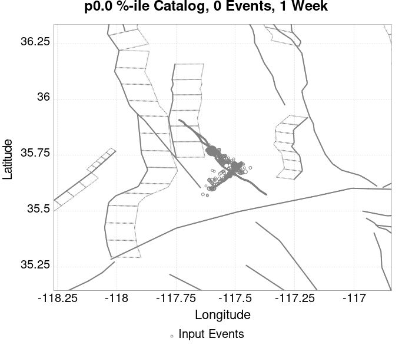
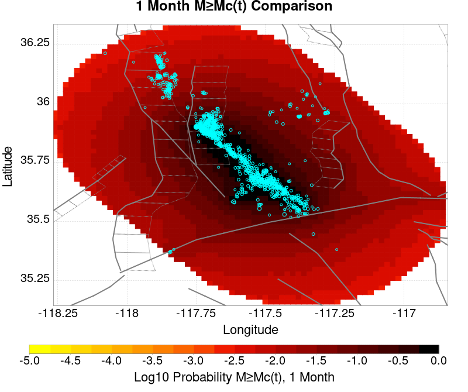
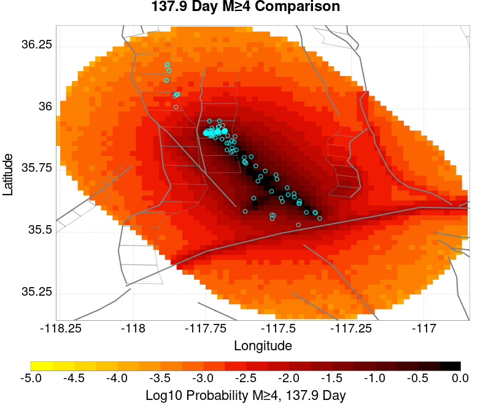
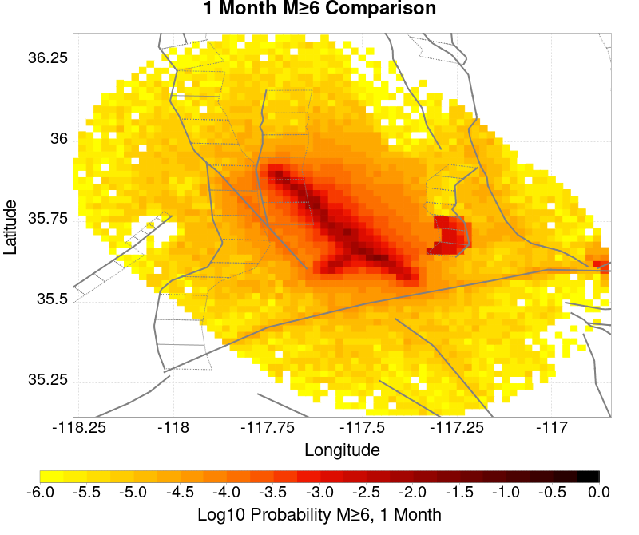
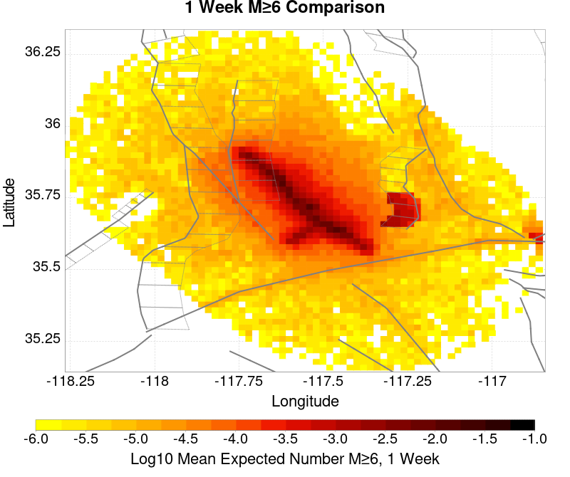
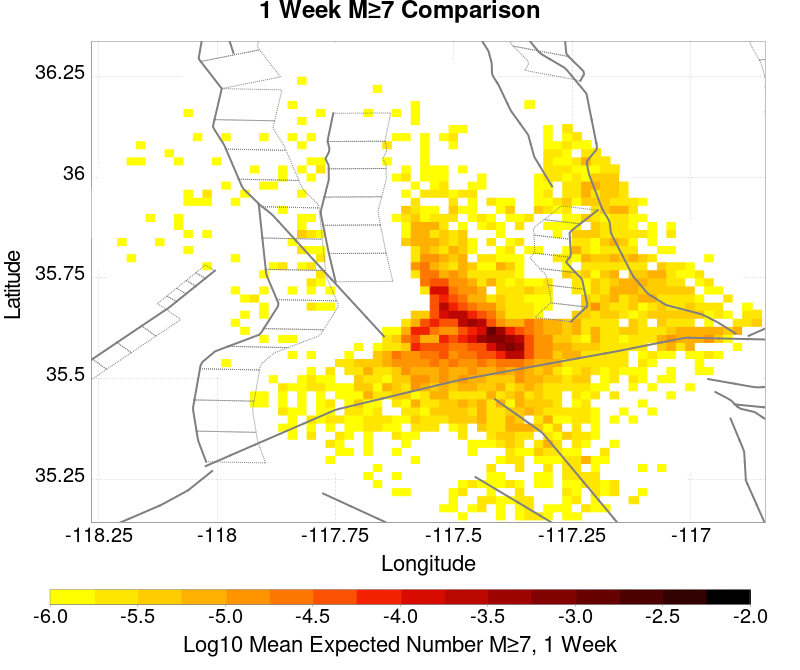
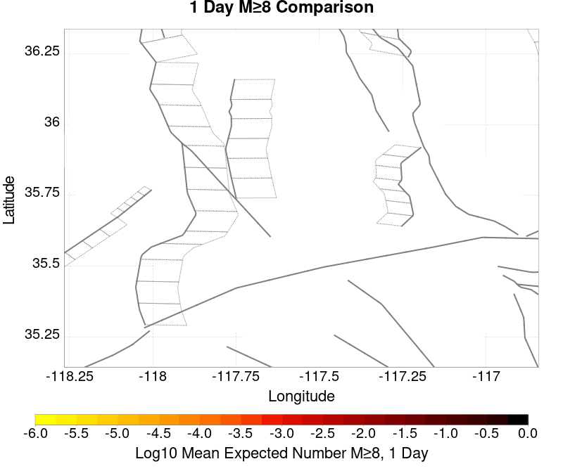

# ComCat M7.1 (ci38457511), ShakeMap Surfaces, FM2_1 Results

|   | ComCat M7.1 (ci38457511), ShakeMap Surfaces, FM2_1 |
|-----|-----|
| Num Simulations | 6118 (incomplete) |
| Start Time | 2019/07/06 03:19:54 UTC |
| Start Time Epoch Milliseconds | 1562383194040 |
| Duration | 10 Years |
| Includes Spontaneous? | false |
| Trigger Ruptures | 283 Trigger Ruptures |
|   | First: M3.98 at 2019/07/04 17:02:55 UTC |
|   | Last: M7.1 at 2019/07/06 03:19:53 UTC |
|   | Largest: M7.1 at 2019/07/06 03:19:53 UTC |
| Trigger Ruptures | *(none)* |
| Config Generated With | u3etas_comcat_event_config_builder.sh --event-id ci38457511 --mag-complete 3.5 --days-before 7 --num-simulations 1000000 --fault-model FM2_1 --finite-surf-shakemap --finite-surf-shakemap-min-mag 5 --hpc-site USC_HPC --nodes 36 --hours 24 --queue scec |

## Table Of Contents

* [Probabilities Summary Table](#probabilities-summary-table)
* [Magnitude Number Distribution](#magnitude-number-distribution)
  * [10 Year Magnitude Number Distribution](#10-year-magnitude-number-distribution)
  * [1 Year Magnitude Number Distribution](#1-year-magnitude-number-distribution)
  * [1 Month Magnitude Number Distribution](#1-month-magnitude-number-distribution)
  * [1 Week Magnitude Number Distribution](#1-week-magnitude-number-distribution)
  * [1 Day Magnitude Number Distribution](#1-day-magnitude-number-distribution)
  * [1 Hour Magnitude Number Distribution](#1-hour-magnitude-number-distribution)
* [Hazard Change Over Time](#hazard-change-over-time)
  * [M&ge;5.0 Hazard Change Over Time](#m50-hazard-change-over-time)
  * [M&ge;6.0 Hazard Change Over Time](#m60-hazard-change-over-time)
  * [M&ge;7.0 Hazard Change Over Time](#m70-hazard-change-over-time)
* [Trigger Rupture Fault Map](#trigger-rupture-fault-map)
* [Trigger Rupture Depth Map](#trigger-rupture-depth-map)
* [Fault Distances To Triggers](#fault-distances-to-triggers)
* [Individual Simulated Catalog Maps](#individual-simulated-catalog-maps)
* [ComCat Data Comparisons](#comcat-data-comparisons)
  * [ComCat Magnitude-Number Distributions](#comcat-magnitude-number-distributions)
  * [ComCat Time-Dependent Mc](#comcat-time-dependent-mc)
  * [ComCat Cumulative Number Vs Time](#comcat-cumulative-number-vs-time)
  * [ComCat Cumulative Number Simulation Percentiles](#comcat-cumulative-number-simulation-percentiles)
  * [ComCat Probability Spatial Distribution](#comcat-probability-spatial-distribution)
  * [ComCat Mean Expectation Spatial Distribution](#comcat-mean-expectation-spatial-distribution)
  * [ComCat Depth Distribution](#comcat-depth-distribution)
* [Section Participation](#section-participation)
  * [Section Participation Plots](#section-participation-plots)
  * [Supra-Seismogenic Parent Sections Table](#supra-seismogenic-parent-sections-table)
  * [M≥6.5 Parent Sections Table](#m65-parent-sections-table)
  * [M≥7 Parent Sections Table](#m7-parent-sections-table)
  * [M≥7.5 Parent Sections Table](#m75-parent-sections-table)
  * [M≥8 Parent Sections Table](#m8-parent-sections-table)
* [Fault Magnitude-Probability Distributions](#fault-magnitude-probability-distributions)
* [Gridded Nucleation](#gridded-nucleation)
* [JSON Input File](#json-input-file)

## Probabilities Summary Table
*[(top)](#table-of-contents)*

| Magnitude | 1 Hour Prob | 1 Day Prob | 1 Week Prob | 1 Month Prob | 1 Year Prob | 10 Year Prob |
|-----|-----|-----|-----|-----|-----|-----|
| **M&ge;4** | 1.000 (100.00%) | 1.000 (100.00%) | 1.000 (100.00%) | 1.000 (100.00%) | 1.000 (100.00%) | 1.000 (100.00%) |
| *95% Conf* | *[99.92% 100.00%]* | *[99.92% 100.00%]* | *[99.92% 100.00%]* | *[99.92% 100.00%]* | *[99.92% 100.00%]* | *[99.92% 100.00%]* |
| **M&ge;4.5** | 0.989 (98.90%) | 1.000 (100.00%) | 1.000 (100.00%) | 1.000 (100.00%) | 1.000 (100.00%) | 1.000 (100.00%) |
| *95% Conf* | *[98.60% 99.14%]* | *[99.92% 100.00%]* | *[99.92% 100.00%]* | *[99.92% 100.00%]* | *[99.92% 100.00%]* | *[99.92% 100.00%]* |
| **M&ge;5** | 0.760 (76.04%) | 0.976 (97.61%) | 0.994 (99.38%) | 0.998 (99.79%) | 1.000 (99.98%) | 1.000 (100.00%) |
| *95% Conf* | *[74.94% 77.10%]* | *[97.19% 97.97%]* | *[99.14% 99.55%]* | *[99.63% 99.88%]* | *[99.89% 100.00%]* | *[99.92% 100.00%]* |
| **M&ge;5.5** | 0.333 (33.26%) | 0.660 (66.03%) | 0.795 (79.50%) | 0.857 (85.71%) | 0.923 (92.30%) | 0.957 (95.65%) |
| *95% Conf* | *[32.08% 34.46%]* | *[64.83% 67.22%]* | *[78.46% 80.50%]* | *[84.81% 86.58%]* | *[91.60% 92.95%]* | *[95.10% 96.14%]* |
| **M&ge;6** | 0.077 (7.73%) | 0.203 (20.28%) | 0.287 (28.67%) | 0.346 (34.59%) | 0.446 (44.57%) | 0.528 (52.80%) |
| *95% Conf* | *[7.08% 8.44%]* | *[19.29% 21.32%]* | *[27.54% 29.82%]* | *[33.40% 35.80%]* | *[43.32% 45.83%]* | *[51.53% 54.05%]* |
| **M&ge;6.5** | 0.015 (1.45%) | 0.043 (4.27%) | 0.064 (6.36%) | 0.083 (8.32%) | 0.116 (11.62%) | 0.148 (14.81%) |
| *95% Conf* | *[1.18% 1.80%]* | *[3.78% 4.81%]* | *[5.77% 7.01%]* | *[7.65% 9.05%]* | *[10.83% 12.46%]* | *[13.93% 15.73%]* |
| **M&ge;7** | 3.43E-3 (0.34%) | 0.011 (1.10%) | 0.016 (1.57%) | 0.020 (2.04%) | 0.027 (2.66%) | 0.036 (3.56%) |
| *95% Conf* | *[0.22% 0.53%]* | *[0.86% 1.40%]* | *[1.28% 1.92%]* | *[1.71% 2.44%]* | *[2.28% 3.11%]* | *[3.12% 4.07%]* |
| **M&ge;7.1** | 2.45E-3 (0.25%) | 8.50E-3 (0.85%) | 0.012 (1.24%) | 0.016 (1.62%) | 0.021 (2.14%) | 0.029 (2.89%) |
| *95% Conf* | *[0.14% 0.41%]* | *[0.64% 1.12%]* | *[0.99% 1.56%]* | *[1.32% 1.98%]* | *[1.80% 2.54%]* | *[2.49% 3.35%]* |
| **M&ge;7.5** | 9.81E-4 (0.10%) | 3.43E-3 (0.34%) | 5.07E-3 (0.51%) | 7.03E-3 (0.70%) | 8.99E-3 (0.90%) | 0.012 (1.16%) |
| *95% Conf* | *[0.04% 0.22%]* | *[0.22% 0.53%]* | *[0.35% 0.73%]* | *[0.52% 0.95%]* | *[0.68% 1.18%]* | *[0.91% 1.47%]* |
| **M&ge;8** | 0.000 (0.00%) | 1.63E-4 (0.02%) | 1.63E-4 (0.02%) | 1.63E-4 (0.02%) | 1.63E-4 (0.02%) | 3.27E-4 (0.03%) |
| *95% Conf* | *[0.00% 0.08%]* | *[0.00% 0.11%]* | *[0.00% 0.11%]* | *[0.00% 0.11%]* | *[0.00% 0.11%]* | *[0.01% 0.13%]* |

## Magnitude Number Distribution
*[(top)](#table-of-contents)*

### 10 Year Magnitude Number Distribution
*[(top)](#table-of-contents)*

**Legend**
* **Mean** (thick black line): mean expected number across all 6118 catalogs
* **2.5%,97.5%** (thin black lines): expected number percentiles across all 6118 catalogs
* **Median** (thin blue line): median expected number across all 6118 catalogs
* **Mode** (thin cyan line): modal expected number across all 6118 catalogs
* **10 yr Probability** (thin red line): 10 year probability calculated as the fraction of catalogs with at least 1 occurrence
* **10 yr Supraseismogenic Probability** (thin dashed red line): same as above, but only for supraseismogenic ruptures on explicitly modeled UCERF3 faults
* **95% Conf** (light red shaded region): binomial 95% confidence bounds on probability
* **Primary** (thin green line): mean expected number from primary triggered aftershocks only (no secondary, tertiary, etc...) across all 6118 catalogs


| Mag | Mean | 2.5 %ile | 97.5 %ile | Median | Mode | 10 yr Probability | 10 yr Prob 95% Conf | 10 yr Supra-Seis Prob | Primary Aftershocks Mean |
|-----|-----|-----|-----|-----|-----|-----|-----|-----|-----|
| **M&ge;2.5** | 5008.673 | 3648.000 | 9836.000 | 4428.000 | 4212.000 | 1.000 (100.00%) | [99.92% 100.00%] | 0.118 (11.75%) | 2394.750 |
| **M&ge;2.6** | 3978.154 | 2895.000 | 7804.000 | 3523.000 | 3300.000 | 1.000 (100.00%) | [99.92% 100.00%] | 0.118 (11.75%) | 1901.643 |
| **M&ge;2.7** | 3160.041 | 2292.000 | 6228.000 | 2799.000 | 2602.000 | 1.000 (100.00%) | [99.92% 100.00%] | 0.118 (11.75%) | 1510.563 |
| **M&ge;2.8** | 2510.224 | 1819.000 | 4929.000 | 2223.000 | 2143.000 | 1.000 (100.00%) | [99.92% 100.00%] | 0.118 (11.75%) | 1200.362 |
| **M&ge;2.9** | 1994.085 | 1438.000 | 3895.000 | 1766.000 | 1684.000 | 1.000 (100.00%) | [99.92% 100.00%] | 0.118 (11.75%) | 953.540 |
| **M&ge;3** | 1583.791 | 1137.000 | 3122.000 | 1404.000 | 1320.000 | 1.000 (100.00%) | [99.92% 100.00%] | 0.118 (11.75%) | 757.381 |
| **M&ge;3.1** | 1257.971 | 900.000 | 2481.000 | 1114.000 | 1050.000 | 1.000 (100.00%) | [99.92% 100.00%] | 0.118 (11.75%) | 601.533 |
| **M&ge;3.2** | 999.231 | 711.000 | 1983.000 | 885.000 | 870.000 | 1.000 (100.00%) | [99.92% 100.00%] | 0.118 (11.75%) | 477.741 |
| **M&ge;3.3** | 793.618 | 562.000 | 1585.000 | 704.000 | 645.000 | 1.000 (100.00%) | [99.92% 100.00%] | 0.118 (11.75%) | 379.533 |
| **M&ge;3.4** | 630.045 | 442.000 | 1269.000 | 559.000 | 541.000 | 1.000 (100.00%) | [99.92% 100.00%] | 0.118 (11.75%) | 301.388 |
| **M&ge;3.5** | 500.274 | 346.000 | 1011.000 | 445.000 | 434.000 | 1.000 (100.00%) | [99.92% 100.00%] | 0.118 (11.75%) | 239.259 |
| **M&ge;3.6** | 397.106 | 273.000 | 798.000 | 354.000 | 329.000 | 1.000 (100.00%) | [99.92% 100.00%] | 0.118 (11.75%) | 189.899 |
| **M&ge;3.7** | 315.359 | 214.000 | 635.000 | 281.000 | 266.000 | 1.000 (100.00%) | [99.92% 100.00%] | 0.118 (11.75%) | 150.816 |
| **M&ge;3.8** | 250.351 | 167.000 | 513.000 | 223.000 | 216.000 | 1.000 (100.00%) | [99.92% 100.00%] | 0.118 (11.75%) | 119.719 |
| **M&ge;3.9** | 198.708 | 129.000 | 407.000 | 177.000 | 162.000 | 1.000 (100.00%) | [99.92% 100.00%] | 0.118 (11.75%) | 94.992 |
| **M&ge;4** | 157.817 | 101.000 | 326.000 | 141.000 | 128.000 | 1.000 (100.00%) | [99.92% 100.00%] | 0.118 (11.75%) | 75.363 |
| **M&ge;4.1** | 125.307 | 78.000 | 256.000 | 112.000 | 104.000 | 1.000 (100.00%) | [99.92% 100.00%] | 0.118 (11.75%) | 59.892 |
| **M&ge;4.2** | 99.284 | 60.000 | 204.000 | 89.000 | 78.000 | 1.000 (100.00%) | [99.92% 100.00%] | 0.118 (11.75%) | 47.440 |
| **M&ge;4.3** | 78.890 | 45.000 | 164.000 | 71.000 | 62.000 | 1.000 (100.00%) | [99.92% 100.00%] | 0.118 (11.75%) | 37.673 |
| **M&ge;4.4** | 62.496 | 34.000 | 130.000 | 56.000 | 55.000 | 1.000 (100.00%) | [99.92% 100.00%] | 0.118 (11.75%) | 29.825 |
| **M&ge;4.5** | 49.478 | 26.000 | 103.000 | 44.000 | 42.000 | 1.000 (100.00%) | [99.92% 100.00%] | 0.118 (11.75%) | 23.594 |
| **M&ge;4.6** | 39.156 | 20.000 | 83.000 | 35.000 | 30.000 | 1.000 (100.00%) | [99.92% 100.00%] | 0.118 (11.75%) | 18.666 |
| **M&ge;4.7** | 30.888 | 15.000 | 67.000 | 28.000 | 25.000 | 1.000 (100.00%) | [99.92% 100.00%] | 0.118 (11.75%) | 14.702 |
| **M&ge;4.8** | 24.392 | 10.000 | 54.000 | 22.000 | 20.000 | 1.000 (100.00%) | [99.92% 100.00%] | 0.118 (11.75%) | 11.620 |
| **M&ge;4.9** | 19.216 | 8.000 | 43.000 | 17.000 | 14.000 | 1.000 (100.00%) | [99.92% 100.00%] | 0.118 (11.75%) | 9.122 |
| **M&ge;5** | 15.104 | 5.000 | 35.000 | 13.000 | 13.000 | 1.000 (100.00%) | [99.92% 100.00%] | 0.118 (11.75%) | 7.164 |
| **M&ge;5.1** | 11.810 | 4.000 | 28.000 | 10.000 | 10.000 | 1.000 (99.98%) | [99.89% 100.00%] | 0.118 (11.75%) | 5.588 |
| **M&ge;5.2** | 9.227 | 2.000 | 23.000 | 8.000 | 8.000 | 1.000 (99.95%) | [99.84% 99.99%] | 0.118 (11.75%) | 4.373 |
| **M&ge;5.3** | 7.161 | 1.000 | 18.000 | 6.000 | 5.000 | 0.995 (99.53%) | [99.31% 99.68%] | 0.118 (11.75%) | 3.386 |
| **M&ge;5.4** | 5.557 | 1.000 | 15.000 | 5.000 | 4.000 | 0.982 (98.19%) | [97.81% 98.50%] | 0.118 (11.75%) | 2.625 |
| **M&ge;5.5** | 4.300 | 0.000 | 12.000 | 4.000 | 3.000 | 0.957 (95.65%) | [95.10% 96.14%] | 0.118 (11.75%) | 2.022 |
| **M&ge;5.6** | 3.263 | 0.000 | 10.000 | 3.000 | 2.000 | 0.911 (91.12%) | [90.38% 91.82%] | 0.118 (11.75%) | 1.535 |
| **M&ge;5.7** | 2.441 | 0.000 | 8.000 | 2.000 | 1.000 | 0.845 (84.50%) | [83.57% 85.40%] | 0.118 (11.75%) | 1.150 |
| **M&ge;5.8** | 1.791 | 0.000 | 6.000 | 1.000 | 1.000 | 0.755 (75.53%) | [74.43% 76.60%] | 0.118 (11.75%) | 0.838 |
| **M&ge;5.9** | 1.296 | 0.000 | 5.000 | 1.000 | 0.000 | 0.644 (64.38%) | [63.17% 65.58%] | 0.118 (11.75%) | 0.600 |
| **M&ge;6** | 0.916 | 0.000 | 4.000 | 1.000 | 0.000 | 0.528 (52.80%) | [51.53% 54.05%] | 0.118 (11.75%) | 0.414 |
| **M&ge;6.1** | 0.663 | 0.000 | 3.000 | 0.000 | 0.000 | 0.419 (41.91%) | [40.67% 43.16%] | 0.117 (11.72%) | 0.292 |
| **M&ge;6.2** | 0.463 | 0.000 | 3.000 | 0.000 | 0.000 | 0.317 (31.68%) | [30.51% 32.86%] | 0.117 (11.72%) | 0.195 |
| **M&ge;6.3** | 0.364 | 0.000 | 2.000 | 0.000 | 0.000 | 0.261 (26.07%) | [24.98% 27.19%] | 0.117 (11.72%) | 0.150 |
| **M&ge;6.4** | 0.232 | 0.000 | 2.000 | 0.000 | 0.000 | 0.172 (17.18%) | [16.25% 18.15%] | 0.070 (7.01%) | 0.100 |
| **M&ge;6.5** | 0.199 | 0.000 | 2.000 | 0.000 | 0.000 | 0.148 (14.81%) | [13.93% 15.73%] | 0.070 (7.01%) | 0.083 |
| **M&ge;6.6** | 0.142 | 0.000 | 1.000 | 0.000 | 0.000 | 0.114 (11.38%) | [10.60% 12.20%] | 0.061 (6.08%) | 0.061 |
| **M&ge;6.7** | 0.110 | 0.000 | 1.000 | 0.000 | 0.000 | 0.088 (8.83%) | [8.13% 9.57%] | 0.051 (5.05%) | 0.048 |
| **M&ge;6.8** | 0.089 | 0.000 | 1.000 | 0.000 | 0.000 | 0.072 (7.24%) | [6.61% 7.93%] | 0.049 (4.89%) | 0.040 |
| **M&ge;6.9** | 0.052 | 0.000 | 1.000 | 0.000 | 0.000 | 0.043 (4.27%) | [3.78% 4.81%] | 0.027 (2.71%) | 0.024 |
| **M&ge;7** | 0.043 | 0.000 | 1.000 | 0.000 | 0.000 | 0.036 (3.56%) | [3.12% 4.07%] | 0.026 (2.57%) | 0.020 |
| **M&ge;7.1** | 0.034 | 0.000 | 1.000 | 0.000 | 0.000 | 0.029 (2.89%) | [2.49% 3.35%] | 0.023 (2.30%) | 0.016 |
| **M&ge;7.2** | 0.027 | 0.000 | 0.000 | 0.000 | 0.000 | 0.023 (2.29%) | [1.93% 2.70%] | 0.020 (1.98%) | 0.013 |
| **M&ge;7.3** | 0.022 | 0.000 | 0.000 | 0.000 | 0.000 | 0.019 (1.86%) | [1.55% 2.24%] | 0.016 (1.59%) | 0.010 |
| **M&ge;7.4** | 0.018 | 0.000 | 0.000 | 0.000 | 0.000 | 0.016 (1.62%) | [1.32% 1.98%] | 0.015 (1.47%) | 9.81E-3 |
| **M&ge;7.5** | 0.014 | 0.000 | 0.000 | 0.000 | 0.000 | 0.012 (1.16%) | [0.91% 1.47%] | 0.011 (1.13%) | 7.36E-3 |
| **M&ge;7.6** | 0.012 | 0.000 | 0.000 | 0.000 | 0.000 | 0.010 (1.03%) | [0.80% 1.32%] | 0.010 (1.03%) | 6.54E-3 |
| **M&ge;7.7** | 3.92E-3 | 0.000 | 0.000 | 0.000 | 0.000 | 3.60E-3 (0.36%) | [0.23% 0.55%] | 3.60E-3 (0.36%) | 1.31E-3 |
| **M&ge;7.8** | 1.63E-3 | 0.000 | 0.000 | 0.000 | 0.000 | 1.63E-3 (0.16%) | [0.08% 0.31%] | 1.63E-3 (0.16%) | 1.63E-4 |
| **M&ge;7.9** | 6.54E-4 | 0.000 | 0.000 | 0.000 | 0.000 | 6.54E-4 (0.07%) | [0.02% 0.18%] | 6.54E-4 (0.07%) | 1.63E-4 |
| **M&ge;8** | 3.27E-4 | 0.000 | 0.000 | 0.000 | 0.000 | 3.27E-4 (0.03%) | [0.01% 0.13%] | 3.27E-4 (0.03%) | 0.000 |
| **M&ge;8.1** | 3.27E-4 | 0.000 | 0.000 | 0.000 | 0.000 | 3.27E-4 (0.03%) | [0.01% 0.13%] | 3.27E-4 (0.03%) | 0.000 |
| **M&ge;8.2** | 0.000 | 0.000 | 0.000 | 0.000 | 0.000 | 0.000 (0.00%) | [0.00% 0.08%] | 0.000 (0.00%) | 0.000 |
| **M&ge;8.3** | 0.000 | 0.000 | 0.000 | 0.000 | 0.000 | 0.000 (0.00%) | [0.00% 0.08%] | 0.000 (0.00%) | 0.000 |
| **M&ge;8.4** | 0.000 | 0.000 | 0.000 | 0.000 | 0.000 | 0.000 (0.00%) | [0.00% 0.08%] | 0.000 (0.00%) | 0.000 |
| **M&ge;8.5** | 0.000 | 0.000 | 0.000 | 0.000 | 0.000 | 0.000 (0.00%) | [0.00% 0.08%] | 0.000 (0.00%) | 0.000 |
| **M&ge;8.6** | 0.000 | 0.000 | 0.000 | 0.000 | 0.000 | 0.000 (0.00%) | [0.00% 0.08%] | 0.000 (0.00%) | 0.000 |
| **M&ge;8.7** | 0.000 | 0.000 | 0.000 | 0.000 | 0.000 | 0.000 (0.00%) | [0.00% 0.08%] | 0.000 (0.00%) | 0.000 |
| **M&ge;8.8** | 0.000 | 0.000 | 0.000 | 0.000 | 0.000 | 0.000 (0.00%) | [0.00% 0.08%] | 0.000 (0.00%) | 0.000 |
| **M&ge;8.9** | 0.000 | 0.000 | 0.000 | 0.000 | 0.000 | 0.000 (0.00%) | [0.00% 0.08%] | 0.000 (0.00%) | 0.000 |
| **M&ge;9** | 0.000 | 0.000 | 0.000 | 0.000 | 0.000 | 0.000 (0.00%) | [0.00% 0.08%] | 0.000 (0.00%) | 0.000 |

### 1 Year Magnitude Number Distribution
*[(top)](#table-of-contents)*

**Legend**
* **Mean** (thick black line): mean expected number across all 6118 catalogs
* **2.5%,97.5%** (thin black lines): expected number percentiles across all 6118 catalogs
* **Median** (thin blue line): median expected number across all 6118 catalogs
* **Mode** (thin cyan line): modal expected number across all 6118 catalogs
* **1 yr Probability** (thin red line): 1 year probability calculated as the fraction of catalogs with at least 1 occurrence
* **1 yr Supraseismogenic Probability** (thin dashed red line): same as above, but only for supraseismogenic ruptures on explicitly modeled UCERF3 faults
* **95% Conf** (light red shaded region): binomial 95% confidence bounds on probability
* **Primary** (thin green line): mean expected number from primary triggered aftershocks only (no secondary, tertiary, etc...) across all 6118 catalogs


| Mag | Mean | 2.5 %ile | 97.5 %ile | Median | Mode | 1 yr Probability | 1 yr Prob 95% Conf | 1 yr Supra-Seis Prob | Primary Aftershocks Mean |
|-----|-----|-----|-----|-----|-----|-----|-----|-----|-----|
| **M&ge;2.5** | 3836.634 | 2947.000 | 6770.000 | 3481.000 | 3213.000 | 1.000 (100.00%) | [99.92% 100.00%] | 0.092 (9.17%) | 2086.024 |
| **M&ge;2.6** | 3047.007 | 2340.000 | 5411.000 | 2765.000 | 2666.000 | 1.000 (100.00%) | [99.92% 100.00%] | 0.092 (9.17%) | 1656.422 |
| **M&ge;2.7** | 2420.261 | 1850.000 | 4325.000 | 2195.000 | 2017.000 | 1.000 (100.00%) | [99.92% 100.00%] | 0.092 (9.17%) | 1315.677 |
| **M&ge;2.8** | 1922.576 | 1466.000 | 3420.000 | 1745.000 | 1650.000 | 1.000 (100.00%) | [99.92% 100.00%] | 0.092 (9.17%) | 1045.408 |
| **M&ge;2.9** | 1527.146 | 1160.000 | 2721.000 | 1386.000 | 1279.000 | 1.000 (100.00%) | [99.92% 100.00%] | 0.092 (9.17%) | 830.400 |
| **M&ge;3** | 1212.911 | 915.000 | 2163.000 | 1102.000 | 1001.000 | 1.000 (100.00%) | [99.92% 100.00%] | 0.092 (9.17%) | 659.620 |
| **M&ge;3.1** | 963.317 | 724.000 | 1720.000 | 876.000 | 835.000 | 1.000 (100.00%) | [99.92% 100.00%] | 0.092 (9.17%) | 523.882 |
| **M&ge;3.2** | 765.213 | 570.000 | 1366.000 | 697.000 | 659.000 | 1.000 (100.00%) | [99.92% 100.00%] | 0.092 (9.17%) | 416.072 |
| **M&ge;3.3** | 607.833 | 449.000 | 1089.000 | 554.000 | 521.000 | 1.000 (100.00%) | [99.92% 100.00%] | 0.092 (9.17%) | 330.534 |
| **M&ge;3.4** | 482.564 | 353.000 | 862.000 | 440.000 | 415.000 | 1.000 (100.00%) | [99.92% 100.00%] | 0.092 (9.17%) | 262.460 |
| **M&ge;3.5** | 383.209 | 277.000 | 686.000 | 350.000 | 330.000 | 1.000 (100.00%) | [99.92% 100.00%] | 0.092 (9.17%) | 208.340 |
| **M&ge;3.6** | 304.208 | 218.000 | 546.000 | 278.000 | 273.000 | 1.000 (100.00%) | [99.92% 100.00%] | 0.092 (9.17%) | 165.389 |
| **M&ge;3.7** | 241.588 | 171.000 | 434.000 | 221.000 | 202.000 | 1.000 (100.00%) | [99.92% 100.00%] | 0.092 (9.17%) | 131.329 |
| **M&ge;3.8** | 191.792 | 133.000 | 341.000 | 176.000 | 167.000 | 1.000 (100.00%) | [99.92% 100.00%] | 0.092 (9.17%) | 104.282 |
| **M&ge;3.9** | 152.216 | 103.000 | 274.000 | 139.000 | 140.000 | 1.000 (100.00%) | [99.92% 100.00%] | 0.092 (9.17%) | 82.740 |
| **M&ge;4** | 120.858 | 80.000 | 218.000 | 111.000 | 101.000 | 1.000 (100.00%) | [99.92% 100.00%] | 0.092 (9.17%) | 65.637 |
| **M&ge;4.1** | 95.938 | 61.000 | 174.000 | 88.000 | 86.000 | 1.000 (100.00%) | [99.92% 100.00%] | 0.092 (9.17%) | 52.161 |
| **M&ge;4.2** | 75.987 | 47.000 | 140.000 | 69.000 | 62.000 | 1.000 (100.00%) | [99.92% 100.00%] | 0.092 (9.17%) | 41.320 |
| **M&ge;4.3** | 60.366 | 36.000 | 114.000 | 55.000 | 57.000 | 1.000 (100.00%) | [99.92% 100.00%] | 0.092 (9.17%) | 32.806 |
| **M&ge;4.4** | 47.845 | 27.000 | 92.000 | 44.000 | 41.000 | 1.000 (100.00%) | [99.92% 100.00%] | 0.092 (9.17%) | 25.987 |
| **M&ge;4.5** | 37.902 | 20.000 | 74.000 | 35.000 | 33.000 | 1.000 (100.00%) | [99.92% 100.00%] | 0.092 (9.17%) | 20.571 |
| **M&ge;4.6** | 30.009 | 15.000 | 59.000 | 27.000 | 25.000 | 1.000 (100.00%) | [99.92% 100.00%] | 0.092 (9.17%) | 16.265 |
| **M&ge;4.7** | 23.652 | 11.000 | 48.000 | 22.000 | 21.000 | 1.000 (100.00%) | [99.92% 100.00%] | 0.092 (9.17%) | 12.802 |
| **M&ge;4.8** | 18.700 | 8.000 | 38.000 | 17.000 | 16.000 | 1.000 (100.00%) | [99.92% 100.00%] | 0.092 (9.17%) | 10.123 |
| **M&ge;4.9** | 14.733 | 6.000 | 31.000 | 13.000 | 13.000 | 1.000 (100.00%) | [99.92% 100.00%] | 0.092 (9.17%) | 7.952 |
| **M&ge;5** | 11.576 | 4.000 | 25.000 | 10.000 | 9.000 | 1.000 (99.98%) | [99.89% 100.00%] | 0.092 (9.17%) | 6.243 |
| **M&ge;5.1** | 9.037 | 2.000 | 20.000 | 8.000 | 7.000 | 0.999 (99.92%) | [99.80% 99.97%] | 0.092 (9.17%) | 4.870 |
| **M&ge;5.2** | 7.069 | 2.000 | 17.000 | 6.000 | 5.000 | 0.998 (99.75%) | [99.59% 99.86%] | 0.092 (9.17%) | 3.814 |
| **M&ge;5.3** | 5.472 | 1.000 | 14.000 | 5.000 | 4.000 | 0.988 (98.84%) | [98.53% 99.09%] | 0.092 (9.17%) | 2.945 |
| **M&ge;5.4** | 4.254 | 0.000 | 11.000 | 4.000 | 3.000 | 0.964 (96.39%) | [95.88% 96.83%] | 0.092 (9.17%) | 2.290 |
| **M&ge;5.5** | 3.287 | 0.000 | 9.000 | 3.000 | 2.000 | 0.923 (92.30%) | [91.60% 92.95%] | 0.092 (9.17%) | 1.769 |
| **M&ge;5.6** | 2.497 | 0.000 | 8.000 | 2.000 | 2.000 | 0.859 (85.91%) | [85.01% 86.77%] | 0.092 (9.17%) | 1.346 |
| **M&ge;5.7** | 1.868 | 0.000 | 6.000 | 1.000 | 1.000 | 0.777 (77.66%) | [76.59% 78.69%] | 0.092 (9.17%) | 1.008 |
| **M&ge;5.8** | 1.369 | 0.000 | 5.000 | 1.000 | 0.000 | 0.678 (67.82%) | [66.63% 68.98%] | 0.092 (9.17%) | 0.734 |
| **M&ge;5.9** | 0.988 | 0.000 | 4.000 | 1.000 | 0.000 | 0.564 (56.37%) | [55.12% 57.62%] | 0.092 (9.17%) | 0.526 |
| **M&ge;6** | 0.693 | 0.000 | 3.000 | 0.000 | 0.000 | 0.446 (44.57%) | [43.32% 45.83%] | 0.092 (9.17%) | 0.361 |
| **M&ge;6.1** | 0.498 | 0.000 | 3.000 | 0.000 | 0.000 | 0.345 (34.52%) | [33.33% 35.73%] | 0.092 (9.15%) | 0.254 |
| **M&ge;6.2** | 0.341 | 0.000 | 2.000 | 0.000 | 0.000 | 0.254 (25.35%) | [24.27% 26.47%] | 0.092 (9.15%) | 0.168 |
| **M&ge;6.3** | 0.267 | 0.000 | 2.000 | 0.000 | 0.000 | 0.206 (20.63%) | [19.62% 21.67%] | 0.092 (9.15%) | 0.129 |
| **M&ge;6.4** | 0.169 | 0.000 | 1.000 | 0.000 | 0.000 | 0.135 (13.45%) | [12.61% 14.34%] | 0.056 (5.56%) | 0.085 |
| **M&ge;6.5** | 0.145 | 0.000 | 1.000 | 0.000 | 0.000 | 0.116 (11.62%) | [10.83% 12.46%] | 0.056 (5.56%) | 0.071 |
| **M&ge;6.6** | 0.103 | 0.000 | 1.000 | 0.000 | 0.000 | 0.088 (8.81%) | [8.12% 9.55%] | 0.048 (4.76%) | 0.052 |
| **M&ge;6.7** | 0.079 | 0.000 | 1.000 | 0.000 | 0.000 | 0.068 (6.82%) | [6.20% 7.48%] | 0.040 (4.02%) | 0.040 |
| **M&ge;6.8** | 0.064 | 0.000 | 1.000 | 0.000 | 0.000 | 0.055 (5.52%) | [4.97% 6.13%] | 0.039 (3.89%) | 0.033 |
| **M&ge;6.9** | 0.037 | 0.000 | 1.000 | 0.000 | 0.000 | 0.032 (3.20%) | [2.78% 3.68%] | 0.021 (2.09%) | 0.020 |
| **M&ge;7** | 0.030 | 0.000 | 1.000 | 0.000 | 0.000 | 0.027 (2.66%) | [2.28% 3.11%] | 0.020 (1.98%) | 0.017 |
| **M&ge;7.1** | 0.024 | 0.000 | 0.000 | 0.000 | 0.000 | 0.021 (2.14%) | [1.80% 2.54%] | 0.017 (1.73%) | 0.013 |
| **M&ge;7.2** | 0.019 | 0.000 | 0.000 | 0.000 | 0.000 | 0.017 (1.73%) | [1.43% 2.10%] | 0.015 (1.52%) | 0.011 |
| **M&ge;7.3** | 0.016 | 0.000 | 0.000 | 0.000 | 0.000 | 0.015 (1.47%) | [1.19% 1.81%] | 0.013 (1.26%) | 8.66E-3 |
| **M&ge;7.4** | 0.014 | 0.000 | 0.000 | 0.000 | 0.000 | 0.013 (1.29%) | [1.03% 1.62%] | 0.012 (1.18%) | 8.34E-3 |
| **M&ge;7.5** | 9.81E-3 | 0.000 | 0.000 | 0.000 | 0.000 | 8.99E-3 (0.90%) | [0.68% 1.18%] | 8.83E-3 (0.88%) | 5.88E-3 |
| **M&ge;7.6** | 8.66E-3 | 0.000 | 0.000 | 0.000 | 0.000 | 7.85E-3 (0.78%) | [0.59% 1.05%] | 7.85E-3 (0.78%) | 5.23E-3 |
| **M&ge;7.7** | 2.62E-3 | 0.000 | 0.000 | 0.000 | 0.000 | 2.45E-3 (0.25%) | [0.14% 0.41%] | 2.45E-3 (0.25%) | 1.14E-3 |
| **M&ge;7.8** | 8.17E-4 | 0.000 | 0.000 | 0.000 | 0.000 | 8.17E-4 (0.08%) | [0.03% 0.20%] | 8.17E-4 (0.08%) | 1.63E-4 |
| **M&ge;7.9** | 4.90E-4 | 0.000 | 0.000 | 0.000 | 0.000 | 4.90E-4 (0.05%) | [0.01% 0.16%] | 4.90E-4 (0.05%) | 1.63E-4 |
| **M&ge;8** | 1.63E-4 | 0.000 | 0.000 | 0.000 | 0.000 | 1.63E-4 (0.02%) | [0.00% 0.11%] | 1.63E-4 (0.02%) | 0.000 |
| **M&ge;8.1** | 1.63E-4 | 0.000 | 0.000 | 0.000 | 0.000 | 1.63E-4 (0.02%) | [0.00% 0.11%] | 1.63E-4 (0.02%) | 0.000 |
| **M&ge;8.2** | 0.000 | 0.000 | 0.000 | 0.000 | 0.000 | 0.000 (0.00%) | [0.00% 0.08%] | 0.000 (0.00%) | 0.000 |
| **M&ge;8.3** | 0.000 | 0.000 | 0.000 | 0.000 | 0.000 | 0.000 (0.00%) | [0.00% 0.08%] | 0.000 (0.00%) | 0.000 |
| **M&ge;8.4** | 0.000 | 0.000 | 0.000 | 0.000 | 0.000 | 0.000 (0.00%) | [0.00% 0.08%] | 0.000 (0.00%) | 0.000 |
| **M&ge;8.5** | 0.000 | 0.000 | 0.000 | 0.000 | 0.000 | 0.000 (0.00%) | [0.00% 0.08%] | 0.000 (0.00%) | 0.000 |
| **M&ge;8.6** | 0.000 | 0.000 | 0.000 | 0.000 | 0.000 | 0.000 (0.00%) | [0.00% 0.08%] | 0.000 (0.00%) | 0.000 |
| **M&ge;8.7** | 0.000 | 0.000 | 0.000 | 0.000 | 0.000 | 0.000 (0.00%) | [0.00% 0.08%] | 0.000 (0.00%) | 0.000 |
| **M&ge;8.8** | 0.000 | 0.000 | 0.000 | 0.000 | 0.000 | 0.000 (0.00%) | [0.00% 0.08%] | 0.000 (0.00%) | 0.000 |
| **M&ge;8.9** | 0.000 | 0.000 | 0.000 | 0.000 | 0.000 | 0.000 (0.00%) | [0.00% 0.08%] | 0.000 (0.00%) | 0.000 |
| **M&ge;9** | 0.000 | 0.000 | 0.000 | 0.000 | 0.000 | 0.000 (0.00%) | [0.00% 0.08%] | 0.000 (0.00%) | 0.000 |

### 1 Month Magnitude Number Distribution
*[(top)](#table-of-contents)*

**Legend**
* **Mean** (thick black line): mean expected number across all 6118 catalogs
* **2.5%,97.5%** (thin black lines): expected number percentiles across all 6118 catalogs
* **Median** (thin blue line): median expected number across all 6118 catalogs
* **Mode** (thin cyan line): modal expected number across all 6118 catalogs
* **1 mo Probability** (thin red line): 1 month probability calculated as the fraction of catalogs with at least 1 occurrence
* **1 mo Supraseismogenic Probability** (thin dashed red line): same as above, but only for supraseismogenic ruptures on explicitly modeled UCERF3 faults
* **95% Conf** (light red shaded region): binomial 95% confidence bounds on probability
* **Primary** (thin green line): mean expected number from primary triggered aftershocks only (no secondary, tertiary, etc...) across all 6118 catalogs


| Mag | Mean | 2.5 %ile | 97.5 %ile | Median | Mode | 1 mo Probability | 1 mo Prob 95% Conf | 1 mo Supra-Seis Prob | Primary Aftershocks Mean |
|-----|-----|-----|-----|-----|-----|-----|-----|-----|-----|
| **M&ge;2.5** | 2712.638 | 2190.000 | 4230.000 | 2510.000 | 2467.000 | 1.000 (100.00%) | [99.92% 100.00%] | 0.065 (6.46%) | 1690.814 |
| **M&ge;2.6** | 2154.382 | 1735.000 | 3372.000 | 1995.000 | 1938.000 | 1.000 (100.00%) | [99.92% 100.00%] | 0.065 (6.46%) | 1342.769 |
| **M&ge;2.7** | 1711.229 | 1373.000 | 2675.000 | 1585.000 | 1500.000 | 1.000 (100.00%) | [99.92% 100.00%] | 0.065 (6.46%) | 1066.557 |
| **M&ge;2.8** | 1359.483 | 1085.000 | 2122.000 | 1260.000 | 1209.000 | 1.000 (100.00%) | [99.92% 100.00%] | 0.065 (6.46%) | 847.456 |
| **M&ge;2.9** | 1079.866 | 855.000 | 1682.000 | 1001.000 | 941.000 | 1.000 (100.00%) | [99.92% 100.00%] | 0.065 (6.46%) | 673.146 |
| **M&ge;3** | 857.583 | 676.000 | 1348.000 | 796.000 | 737.000 | 1.000 (100.00%) | [99.92% 100.00%] | 0.065 (6.46%) | 534.636 |
| **M&ge;3.1** | 681.092 | 533.000 | 1074.000 | 632.000 | 610.000 | 1.000 (100.00%) | [99.92% 100.00%] | 0.065 (6.46%) | 424.628 |
| **M&ge;3.2** | 541.003 | 420.000 | 856.000 | 502.000 | 490.000 | 1.000 (100.00%) | [99.92% 100.00%] | 0.065 (6.46%) | 337.207 |
| **M&ge;3.3** | 429.823 | 329.000 | 679.000 | 399.000 | 386.000 | 1.000 (100.00%) | [99.92% 100.00%] | 0.065 (6.46%) | 267.904 |
| **M&ge;3.4** | 341.254 | 258.000 | 538.000 | 318.000 | 312.000 | 1.000 (100.00%) | [99.92% 100.00%] | 0.065 (6.46%) | 212.758 |
| **M&ge;3.5** | 270.881 | 202.000 | 434.000 | 252.000 | 245.000 | 1.000 (100.00%) | [99.92% 100.00%] | 0.065 (6.46%) | 168.865 |
| **M&ge;3.6** | 215.076 | 158.000 | 346.000 | 200.000 | 192.000 | 1.000 (100.00%) | [99.92% 100.00%] | 0.065 (6.46%) | 134.047 |
| **M&ge;3.7** | 170.807 | 123.000 | 272.000 | 159.000 | 152.000 | 1.000 (100.00%) | [99.92% 100.00%] | 0.065 (6.46%) | 106.459 |
| **M&ge;3.8** | 135.605 | 95.000 | 217.000 | 126.000 | 121.000 | 1.000 (100.00%) | [99.92% 100.00%] | 0.065 (6.46%) | 84.537 |
| **M&ge;3.9** | 107.615 | 74.000 | 173.000 | 100.000 | 96.000 | 1.000 (100.00%) | [99.92% 100.00%] | 0.065 (6.46%) | 67.091 |
| **M&ge;4** | 85.439 | 57.000 | 139.000 | 80.000 | 79.000 | 1.000 (100.00%) | [99.92% 100.00%] | 0.065 (6.46%) | 53.208 |
| **M&ge;4.1** | 67.842 | 44.000 | 112.000 | 63.000 | 62.000 | 1.000 (100.00%) | [99.92% 100.00%] | 0.065 (6.46%) | 42.285 |
| **M&ge;4.2** | 53.729 | 33.000 | 91.000 | 50.000 | 48.000 | 1.000 (100.00%) | [99.92% 100.00%] | 0.065 (6.46%) | 33.531 |
| **M&ge;4.3** | 42.673 | 25.000 | 73.000 | 40.000 | 40.000 | 1.000 (100.00%) | [99.92% 100.00%] | 0.065 (6.46%) | 26.621 |
| **M&ge;4.4** | 33.827 | 19.000 | 60.000 | 32.000 | 30.000 | 1.000 (100.00%) | [99.92% 100.00%] | 0.065 (6.46%) | 21.087 |
| **M&ge;4.5** | 26.794 | 14.000 | 49.000 | 25.000 | 24.000 | 1.000 (100.00%) | [99.92% 100.00%] | 0.065 (6.46%) | 16.693 |
| **M&ge;4.6** | 21.228 | 10.000 | 40.000 | 20.000 | 19.000 | 1.000 (100.00%) | [99.92% 100.00%] | 0.065 (6.46%) | 13.197 |
| **M&ge;4.7** | 16.743 | 7.000 | 32.000 | 16.000 | 15.000 | 1.000 (100.00%) | [99.92% 100.00%] | 0.065 (6.46%) | 10.385 |
| **M&ge;4.8** | 13.250 | 5.000 | 27.000 | 12.000 | 12.000 | 1.000 (100.00%) | [99.92% 100.00%] | 0.065 (6.46%) | 8.219 |
| **M&ge;4.9** | 10.428 | 4.000 | 22.000 | 10.000 | 9.000 | 1.000 (99.97%) | [99.87% 99.99%] | 0.065 (6.46%) | 6.458 |
| **M&ge;5** | 8.206 | 2.000 | 18.000 | 8.000 | 6.000 | 0.998 (99.79%) | [99.63% 99.88%] | 0.065 (6.46%) | 5.072 |
| **M&ge;5.1** | 6.402 | 1.000 | 15.000 | 6.000 | 5.000 | 0.994 (99.36%) | [99.12% 99.54%] | 0.065 (6.46%) | 3.951 |
| **M&ge;5.2** | 5.015 | 1.000 | 12.000 | 4.000 | 4.000 | 0.983 (98.33%) | [97.97% 98.63%] | 0.065 (6.46%) | 3.094 |
| **M&ge;5.3** | 3.871 | 0.000 | 10.000 | 3.000 | 3.000 | 0.960 (95.98%) | [95.45% 96.45%] | 0.065 (6.46%) | 2.385 |
| **M&ge;5.4** | 3.007 | 0.000 | 8.000 | 3.000 | 2.000 | 0.919 (91.93%) | [91.21% 92.59%] | 0.065 (6.46%) | 1.852 |
| **M&ge;5.5** | 2.326 | 0.000 | 7.000 | 2.000 | 1.000 | 0.857 (85.71%) | [84.81% 86.58%] | 0.065 (6.46%) | 1.431 |
| **M&ge;5.6** | 1.769 | 0.000 | 6.000 | 1.000 | 1.000 | 0.773 (77.31%) | [76.24% 78.35%] | 0.065 (6.46%) | 1.090 |
| **M&ge;5.7** | 1.319 | 0.000 | 5.000 | 1.000 | 0.000 | 0.674 (67.42%) | [66.23% 68.60%] | 0.065 (6.46%) | 0.814 |
| **M&ge;5.8** | 0.964 | 0.000 | 4.000 | 1.000 | 0.000 | 0.566 (56.62%) | [55.37% 57.87%] | 0.065 (6.46%) | 0.590 |
| **M&ge;5.9** | 0.691 | 0.000 | 3.000 | 0.000 | 0.000 | 0.453 (45.28%) | [44.02% 46.53%] | 0.065 (6.46%) | 0.422 |
| **M&ge;6** | 0.481 | 0.000 | 3.000 | 0.000 | 0.000 | 0.346 (34.59%) | [33.40% 35.80%] | 0.065 (6.46%) | 0.290 |
| **M&ge;6.1** | 0.342 | 0.000 | 2.000 | 0.000 | 0.000 | 0.262 (26.20%) | [25.11% 27.33%] | 0.064 (6.44%) | 0.203 |
| **M&ge;6.2** | 0.229 | 0.000 | 2.000 | 0.000 | 0.000 | 0.185 (18.47%) | [17.51% 19.47%] | 0.064 (6.44%) | 0.132 |
| **M&ge;6.3** | 0.179 | 0.000 | 1.000 | 0.000 | 0.000 | 0.148 (14.76%) | [13.89% 15.68%] | 0.064 (6.44%) | 0.101 |
| **M&ge;6.4** | 0.114 | 0.000 | 1.000 | 0.000 | 0.000 | 0.095 (9.53%) | [8.81% 10.30%] | 0.040 (4.04%) | 0.068 |
| **M&ge;6.5** | 0.099 | 0.000 | 1.000 | 0.000 | 0.000 | 0.083 (8.32%) | [7.65% 9.05%] | 0.040 (4.04%) | 0.058 |
| **M&ge;6.6** | 0.071 | 0.000 | 1.000 | 0.000 | 0.000 | 0.064 (6.36%) | [5.77% 7.01%] | 0.035 (3.53%) | 0.043 |
| **M&ge;6.7** | 0.055 | 0.000 | 1.000 | 0.000 | 0.000 | 0.049 (4.94%) | [4.41% 5.52%] | 0.030 (2.99%) | 0.034 |
| **M&ge;6.8** | 0.046 | 0.000 | 1.000 | 0.000 | 0.000 | 0.041 (4.10%) | [3.63% 4.64%] | 0.029 (2.86%) | 0.028 |
| **M&ge;6.9** | 0.028 | 0.000 | 0.000 | 0.000 | 0.000 | 0.025 (2.47%) | [2.10% 2.90%] | 0.016 (1.60%) | 0.017 |
| **M&ge;7** | 0.023 | 0.000 | 0.000 | 0.000 | 0.000 | 0.020 (2.04%) | [1.71% 2.44%] | 0.015 (1.50%) | 0.014 |
| **M&ge;7.1** | 0.018 | 0.000 | 0.000 | 0.000 | 0.000 | 0.016 (1.62%) | [1.32% 1.98%] | 0.013 (1.31%) | 0.011 |
| **M&ge;7.2** | 0.015 | 0.000 | 0.000 | 0.000 | 0.000 | 0.013 (1.31%) | [1.04% 1.63%] | 0.011 (1.13%) | 8.99E-3 |
| **M&ge;7.3** | 0.012 | 0.000 | 0.000 | 0.000 | 0.000 | 0.011 (1.13%) | [0.88% 1.43%] | 9.48E-3 (0.95%) | 7.52E-3 |
| **M&ge;7.4** | 0.010 | 0.000 | 0.000 | 0.000 | 0.000 | 9.81E-3 (0.98%) | [0.76% 1.27%] | 8.83E-3 (0.88%) | 7.19E-3 |
| **M&ge;7.5** | 7.68E-3 | 0.000 | 0.000 | 0.000 | 0.000 | 7.03E-3 (0.70%) | [0.52% 0.95%] | 6.86E-3 (0.69%) | 5.07E-3 |
| **M&ge;7.6** | 6.70E-3 | 0.000 | 0.000 | 0.000 | 0.000 | 6.05E-3 (0.60%) | [0.43% 0.84%] | 6.05E-3 (0.60%) | 4.41E-3 |
| **M&ge;7.7** | 1.80E-3 | 0.000 | 0.000 | 0.000 | 0.000 | 1.63E-3 (0.16%) | [0.08% 0.31%] | 1.63E-3 (0.16%) | 6.54E-4 |
| **M&ge;7.8** | 6.54E-4 | 0.000 | 0.000 | 0.000 | 0.000 | 6.54E-4 (0.07%) | [0.02% 0.18%] | 6.54E-4 (0.07%) | 1.63E-4 |
| **M&ge;7.9** | 3.27E-4 | 0.000 | 0.000 | 0.000 | 0.000 | 3.27E-4 (0.03%) | [0.01% 0.13%] | 3.27E-4 (0.03%) | 1.63E-4 |
| **M&ge;8** | 1.63E-4 | 0.000 | 0.000 | 0.000 | 0.000 | 1.63E-4 (0.02%) | [0.00% 0.11%] | 1.63E-4 (0.02%) | 0.000 |
| **M&ge;8.1** | 1.63E-4 | 0.000 | 0.000 | 0.000 | 0.000 | 1.63E-4 (0.02%) | [0.00% 0.11%] | 1.63E-4 (0.02%) | 0.000 |
| **M&ge;8.2** | 0.000 | 0.000 | 0.000 | 0.000 | 0.000 | 0.000 (0.00%) | [0.00% 0.08%] | 0.000 (0.00%) | 0.000 |
| **M&ge;8.3** | 0.000 | 0.000 | 0.000 | 0.000 | 0.000 | 0.000 (0.00%) | [0.00% 0.08%] | 0.000 (0.00%) | 0.000 |
| **M&ge;8.4** | 0.000 | 0.000 | 0.000 | 0.000 | 0.000 | 0.000 (0.00%) | [0.00% 0.08%] | 0.000 (0.00%) | 0.000 |
| **M&ge;8.5** | 0.000 | 0.000 | 0.000 | 0.000 | 0.000 | 0.000 (0.00%) | [0.00% 0.08%] | 0.000 (0.00%) | 0.000 |
| **M&ge;8.6** | 0.000 | 0.000 | 0.000 | 0.000 | 0.000 | 0.000 (0.00%) | [0.00% 0.08%] | 0.000 (0.00%) | 0.000 |
| **M&ge;8.7** | 0.000 | 0.000 | 0.000 | 0.000 | 0.000 | 0.000 (0.00%) | [0.00% 0.08%] | 0.000 (0.00%) | 0.000 |
| **M&ge;8.8** | 0.000 | 0.000 | 0.000 | 0.000 | 0.000 | 0.000 (0.00%) | [0.00% 0.08%] | 0.000 (0.00%) | 0.000 |
| **M&ge;8.9** | 0.000 | 0.000 | 0.000 | 0.000 | 0.000 | 0.000 (0.00%) | [0.00% 0.08%] | 0.000 (0.00%) | 0.000 |
| **M&ge;9** | 0.000 | 0.000 | 0.000 | 0.000 | 0.000 | 0.000 (0.00%) | [0.00% 0.08%] | 0.000 (0.00%) | 0.000 |

### 1 Week Magnitude Number Distribution
*[(top)](#table-of-contents)*

**Legend**
* **Mean** (thick black line): mean expected number across all 6118 catalogs
* **2.5%,97.5%** (thin black lines): expected number percentiles across all 6118 catalogs
* **Median** (thin blue line): median expected number across all 6118 catalogs
* **Mode** (thin cyan line): modal expected number across all 6118 catalogs
* **1 wk Probability** (thin red line): 1 week probability calculated as the fraction of catalogs with at least 1 occurrence
* **1 wk Supraseismogenic Probability** (thin dashed red line): same as above, but only for supraseismogenic ruptures on explicitly modeled UCERF3 faults
* **95% Conf** (light red shaded region): binomial 95% confidence bounds on probability
* **Primary** (thin green line): mean expected number from primary triggered aftershocks only (no secondary, tertiary, etc...) across all 6118 catalogs


| Mag | Mean | 2.5 %ile | 97.5 %ile | Median | Mode | 1 wk Probability | 1 wk Prob 95% Conf | 1 wk Supra-Seis Prob | Primary Aftershocks Mean |
|-----|-----|-----|-----|-----|-----|-----|-----|-----|-----|
| **M&ge;2.5** | 2107.892 | 1752.000 | 3072.000 | 1980.000 | 1925.000 | 1.000 (100.00%) | [99.92% 100.00%] | 0.051 (5.07%) | 1431.633 |
| **M&ge;2.6** | 1674.014 | 1385.000 | 2443.000 | 1574.000 | 1532.000 | 1.000 (100.00%) | [99.92% 100.00%] | 0.051 (5.07%) | 1136.819 |
| **M&ge;2.7** | 1329.644 | 1093.000 | 1939.000 | 1252.000 | 1219.000 | 1.000 (100.00%) | [99.92% 100.00%] | 0.051 (5.07%) | 902.918 |
| **M&ge;2.8** | 1056.543 | 865.000 | 1547.000 | 994.000 | 964.000 | 1.000 (100.00%) | [99.92% 100.00%] | 0.051 (5.07%) | 717.604 |
| **M&ge;2.9** | 839.271 | 682.000 | 1222.000 | 790.000 | 744.000 | 1.000 (100.00%) | [99.92% 100.00%] | 0.051 (5.07%) | 570.068 |
| **M&ge;3** | 666.432 | 539.000 | 974.000 | 628.000 | 620.000 | 1.000 (100.00%) | [99.92% 100.00%] | 0.051 (5.07%) | 452.732 |
| **M&ge;3.1** | 529.244 | 424.000 | 774.000 | 499.000 | 499.000 | 1.000 (100.00%) | [99.92% 100.00%] | 0.051 (5.07%) | 359.594 |
| **M&ge;3.2** | 420.379 | 334.000 | 619.000 | 397.000 | 379.000 | 1.000 (100.00%) | [99.92% 100.00%] | 0.051 (5.07%) | 285.545 |
| **M&ge;3.3** | 333.975 | 261.000 | 492.000 | 315.000 | 296.000 | 1.000 (100.00%) | [99.92% 100.00%] | 0.051 (5.07%) | 226.883 |
| **M&ge;3.4** | 265.198 | 203.000 | 390.000 | 250.000 | 245.000 | 1.000 (100.00%) | [99.92% 100.00%] | 0.051 (5.07%) | 180.216 |
| **M&ge;3.5** | 210.519 | 159.000 | 314.000 | 199.000 | 195.000 | 1.000 (100.00%) | [99.92% 100.00%] | 0.051 (5.07%) | 143.046 |
| **M&ge;3.6** | 167.151 | 124.000 | 249.000 | 158.000 | 149.000 | 1.000 (100.00%) | [99.92% 100.00%] | 0.051 (5.07%) | 113.569 |
| **M&ge;3.7** | 132.761 | 97.000 | 199.000 | 126.000 | 119.000 | 1.000 (100.00%) | [99.92% 100.00%] | 0.051 (5.07%) | 90.198 |
| **M&ge;3.8** | 105.410 | 75.000 | 161.000 | 100.000 | 94.000 | 1.000 (100.00%) | [99.92% 100.00%] | 0.051 (5.07%) | 71.628 |
| **M&ge;3.9** | 83.663 | 57.000 | 127.000 | 79.000 | 73.000 | 1.000 (100.00%) | [99.92% 100.00%] | 0.051 (5.07%) | 56.850 |
| **M&ge;4** | 66.406 | 44.000 | 102.000 | 63.000 | 60.000 | 1.000 (100.00%) | [99.92% 100.00%] | 0.051 (5.07%) | 45.079 |
| **M&ge;4.1** | 52.715 | 33.000 | 84.000 | 50.000 | 50.000 | 1.000 (100.00%) | [99.92% 100.00%] | 0.051 (5.07%) | 35.796 |
| **M&ge;4.2** | 41.751 | 25.000 | 68.000 | 40.000 | 39.000 | 1.000 (100.00%) | [99.92% 100.00%] | 0.051 (5.07%) | 28.384 |
| **M&ge;4.3** | 33.138 | 19.000 | 55.000 | 31.000 | 30.000 | 1.000 (100.00%) | [99.92% 100.00%] | 0.051 (5.07%) | 22.518 |
| **M&ge;4.4** | 26.241 | 14.000 | 45.000 | 25.000 | 23.000 | 1.000 (100.00%) | [99.92% 100.00%] | 0.051 (5.07%) | 17.833 |
| **M&ge;4.5** | 20.784 | 10.000 | 37.000 | 20.000 | 18.000 | 1.000 (100.00%) | [99.92% 100.00%] | 0.051 (5.07%) | 14.123 |
| **M&ge;4.6** | 16.467 | 7.000 | 30.000 | 15.000 | 14.000 | 1.000 (100.00%) | [99.92% 100.00%] | 0.051 (5.07%) | 11.162 |
| **M&ge;4.7** | 12.986 | 5.000 | 25.000 | 12.000 | 11.000 | 1.000 (100.00%) | [99.92% 100.00%] | 0.051 (5.07%) | 8.781 |
| **M&ge;4.8** | 10.277 | 4.000 | 21.000 | 10.000 | 10.000 | 1.000 (99.97%) | [99.87% 99.99%] | 0.051 (5.07%) | 6.956 |
| **M&ge;4.9** | 8.084 | 2.000 | 17.000 | 7.000 | 6.000 | 0.998 (99.84%) | [99.69% 99.92%] | 0.051 (5.07%) | 5.466 |
| **M&ge;5** | 6.346 | 1.000 | 14.000 | 6.000 | 5.000 | 0.994 (99.38%) | [99.14% 99.55%] | 0.051 (5.07%) | 4.290 |
| **M&ge;5.1** | 4.952 | 1.000 | 11.000 | 4.000 | 4.000 | 0.983 (98.30%) | [97.94% 98.60%] | 0.051 (5.07%) | 3.342 |
| **M&ge;5.2** | 3.875 | 0.000 | 10.000 | 3.000 | 3.000 | 0.964 (96.39%) | [95.88% 96.83%] | 0.051 (5.07%) | 2.615 |
| **M&ge;5.3** | 2.989 | 0.000 | 8.000 | 3.000 | 2.000 | 0.929 (92.86%) | [92.18% 93.48%] | 0.051 (5.07%) | 2.015 |
| **M&ge;5.4** | 2.319 | 0.000 | 7.000 | 2.000 | 1.000 | 0.869 (86.89%) | [86.01% 87.72%] | 0.051 (5.07%) | 1.565 |
| **M&ge;5.5** | 1.794 | 0.000 | 6.000 | 1.000 | 1.000 | 0.795 (79.50%) | [78.46% 80.50%] | 0.051 (5.07%) | 1.212 |
| **M&ge;5.6** | 1.362 | 0.000 | 5.000 | 1.000 | 1.000 | 0.699 (69.94%) | [68.77% 71.09%] | 0.051 (5.07%) | 0.920 |
| **M&ge;5.7** | 1.017 | 0.000 | 4.000 | 1.000 | 0.000 | 0.595 (59.50%) | [58.25% 60.73%] | 0.051 (5.07%) | 0.686 |
| **M&ge;5.8** | 0.745 | 0.000 | 3.000 | 0.000 | 0.000 | 0.490 (48.99%) | [47.73% 50.25%] | 0.051 (5.07%) | 0.497 |
| **M&ge;5.9** | 0.532 | 0.000 | 3.000 | 0.000 | 0.000 | 0.384 (38.38%) | [37.16% 39.61%] | 0.051 (5.07%) | 0.354 |
| **M&ge;6** | 0.369 | 0.000 | 2.000 | 0.000 | 0.000 | 0.287 (28.67%) | [27.54% 29.82%] | 0.051 (5.07%) | 0.241 |
| **M&ge;6.1** | 0.263 | 0.000 | 2.000 | 0.000 | 0.000 | 0.215 (21.48%) | [20.46% 22.53%] | 0.051 (5.05%) | 0.169 |
| **M&ge;6.2** | 0.173 | 0.000 | 1.000 | 0.000 | 0.000 | 0.147 (14.68%) | [13.81% 15.60%] | 0.051 (5.05%) | 0.108 |
| **M&ge;6.3** | 0.134 | 0.000 | 1.000 | 0.000 | 0.000 | 0.116 (11.59%) | [10.80% 12.42%] | 0.051 (5.05%) | 0.082 |
| **M&ge;6.4** | 0.084 | 0.000 | 1.000 | 0.000 | 0.000 | 0.074 (7.42%) | [6.78% 8.11%] | 0.031 (3.12%) | 0.056 |
| **M&ge;6.5** | 0.072 | 0.000 | 1.000 | 0.000 | 0.000 | 0.064 (6.36%) | [5.77% 7.01%] | 0.031 (3.12%) | 0.047 |
| **M&ge;6.6** | 0.051 | 0.000 | 1.000 | 0.000 | 0.000 | 0.048 (4.81%) | [4.29% 5.38%] | 0.027 (2.71%) | 0.035 |
| **M&ge;6.7** | 0.039 | 0.000 | 1.000 | 0.000 | 0.000 | 0.037 (3.66%) | [3.21% 4.17%] | 0.023 (2.26%) | 0.027 |
| **M&ge;6.8** | 0.032 | 0.000 | 1.000 | 0.000 | 0.000 | 0.030 (3.01%) | [2.60% 3.47%] | 0.022 (2.16%) | 0.022 |
| **M&ge;6.9** | 0.020 | 0.000 | 0.000 | 0.000 | 0.000 | 0.018 (1.83%) | [1.52% 2.21%] | 0.013 (1.26%) | 0.014 |
| **M&ge;7** | 0.017 | 0.000 | 0.000 | 0.000 | 0.000 | 0.016 (1.57%) | [1.28% 1.92%] | 0.012 (1.19%) | 0.012 |
| **M&ge;7.1** | 0.013 | 0.000 | 0.000 | 0.000 | 0.000 | 0.012 (1.24%) | [0.99% 1.56%] | 0.010 (1.05%) | 8.99E-3 |
| **M&ge;7.2** | 0.011 | 0.000 | 0.000 | 0.000 | 0.000 | 9.97E-3 (1.00%) | [0.77% 1.29%] | 8.83E-3 (0.88%) | 7.36E-3 |
| **M&ge;7.3** | 8.99E-3 | 0.000 | 0.000 | 0.000 | 0.000 | 8.34E-3 (0.83%) | [0.63% 1.10%] | 7.36E-3 (0.74%) | 5.88E-3 |
| **M&ge;7.4** | 7.68E-3 | 0.000 | 0.000 | 0.000 | 0.000 | 7.19E-3 (0.72%) | [0.53% 0.97%] | 6.86E-3 (0.69%) | 5.56E-3 |
| **M&ge;7.5** | 5.56E-3 | 0.000 | 0.000 | 0.000 | 0.000 | 5.07E-3 (0.51%) | [0.35% 0.73%] | 5.07E-3 (0.51%) | 3.76E-3 |
| **M&ge;7.6** | 4.74E-3 | 0.000 | 0.000 | 0.000 | 0.000 | 4.25E-3 (0.42%) | [0.28% 0.63%] | 4.25E-3 (0.42%) | 3.27E-3 |
| **M&ge;7.7** | 1.14E-3 | 0.000 | 0.000 | 0.000 | 0.000 | 9.81E-4 (0.10%) | [0.04% 0.22%] | 9.81E-4 (0.10%) | 3.27E-4 |
| **M&ge;7.8** | 4.90E-4 | 0.000 | 0.000 | 0.000 | 0.000 | 4.90E-4 (0.05%) | [0.01% 0.16%] | 4.90E-4 (0.05%) | 1.63E-4 |
| **M&ge;7.9** | 3.27E-4 | 0.000 | 0.000 | 0.000 | 0.000 | 3.27E-4 (0.03%) | [0.01% 0.13%] | 3.27E-4 (0.03%) | 1.63E-4 |
| **M&ge;8** | 1.63E-4 | 0.000 | 0.000 | 0.000 | 0.000 | 1.63E-4 (0.02%) | [0.00% 0.11%] | 1.63E-4 (0.02%) | 0.000 |
| **M&ge;8.1** | 1.63E-4 | 0.000 | 0.000 | 0.000 | 0.000 | 1.63E-4 (0.02%) | [0.00% 0.11%] | 1.63E-4 (0.02%) | 0.000 |
| **M&ge;8.2** | 0.000 | 0.000 | 0.000 | 0.000 | 0.000 | 0.000 (0.00%) | [0.00% 0.08%] | 0.000 (0.00%) | 0.000 |
| **M&ge;8.3** | 0.000 | 0.000 | 0.000 | 0.000 | 0.000 | 0.000 (0.00%) | [0.00% 0.08%] | 0.000 (0.00%) | 0.000 |
| **M&ge;8.4** | 0.000 | 0.000 | 0.000 | 0.000 | 0.000 | 0.000 (0.00%) | [0.00% 0.08%] | 0.000 (0.00%) | 0.000 |
| **M&ge;8.5** | 0.000 | 0.000 | 0.000 | 0.000 | 0.000 | 0.000 (0.00%) | [0.00% 0.08%] | 0.000 (0.00%) | 0.000 |
| **M&ge;8.6** | 0.000 | 0.000 | 0.000 | 0.000 | 0.000 | 0.000 (0.00%) | [0.00% 0.08%] | 0.000 (0.00%) | 0.000 |
| **M&ge;8.7** | 0.000 | 0.000 | 0.000 | 0.000 | 0.000 | 0.000 (0.00%) | [0.00% 0.08%] | 0.000 (0.00%) | 0.000 |
| **M&ge;8.8** | 0.000 | 0.000 | 0.000 | 0.000 | 0.000 | 0.000 (0.00%) | [0.00% 0.08%] | 0.000 (0.00%) | 0.000 |
| **M&ge;8.9** | 0.000 | 0.000 | 0.000 | 0.000 | 0.000 | 0.000 (0.00%) | [0.00% 0.08%] | 0.000 (0.00%) | 0.000 |
| **M&ge;9** | 0.000 | 0.000 | 0.000 | 0.000 | 0.000 | 0.000 (0.00%) | [0.00% 0.08%] | 0.000 (0.00%) | 0.000 |

### 1 Day Magnitude Number Distribution
*[(top)](#table-of-contents)*

**Legend**
* **Mean** (thick black line): mean expected number across all 6118 catalogs
* **2.5%,97.5%** (thin black lines): expected number percentiles across all 6118 catalogs
* **Median** (thin blue line): median expected number across all 6118 catalogs
* **Mode** (thin cyan line): modal expected number across all 6118 catalogs
* **1 d Probability** (thin red line): 1 day probability calculated as the fraction of catalogs with at least 1 occurrence
* **1 d Supraseismogenic Probability** (thin dashed red line): same as above, but only for supraseismogenic ruptures on explicitly modeled UCERF3 faults
* **95% Conf** (light red shaded region): binomial 95% confidence bounds on probability
* **Primary** (thin green line): mean expected number from primary triggered aftershocks only (no secondary, tertiary, etc...) across all 6118 catalogs


| Mag | Mean | 2.5 %ile | 97.5 %ile | Median | Mode | 1 d Probability | 1 d Prob 95% Conf | 1 d Supra-Seis Prob | Primary Aftershocks Mean |
|-----|-----|-----|-----|-----|-----|-----|-----|-----|-----|
| **M&ge;2.5** | 1400.189 | 1198.000 | 1910.000 | 1338.000 | 1333.000 | 1.000 (100.00%) | [99.92% 100.00%] | 0.034 (3.38%) | 1064.841 |
| **M&ge;2.6** | 1111.827 | 947.000 | 1521.000 | 1063.000 | 1052.000 | 1.000 (100.00%) | [99.92% 100.00%] | 0.034 (3.38%) | 845.481 |
| **M&ge;2.7** | 883.117 | 747.000 | 1205.000 | 845.000 | 833.000 | 1.000 (100.00%) | [99.92% 100.00%] | 0.034 (3.38%) | 671.647 |
| **M&ge;2.8** | 701.804 | 589.000 | 960.000 | 672.000 | 653.000 | 1.000 (100.00%) | [99.92% 100.00%] | 0.034 (3.38%) | 533.769 |
| **M&ge;2.9** | 557.615 | 464.000 | 764.000 | 534.000 | 522.000 | 1.000 (100.00%) | [99.92% 100.00%] | 0.034 (3.38%) | 424.051 |
| **M&ge;3** | 442.822 | 364.000 | 604.000 | 425.000 | 411.000 | 1.000 (100.00%) | [99.92% 100.00%] | 0.034 (3.38%) | 336.753 |
| **M&ge;3.1** | 351.722 | 287.000 | 481.000 | 338.000 | 327.000 | 1.000 (100.00%) | [99.92% 100.00%] | 0.034 (3.38%) | 267.541 |
| **M&ge;3.2** | 279.359 | 224.000 | 387.000 | 268.000 | 259.000 | 1.000 (100.00%) | [99.92% 100.00%] | 0.034 (3.38%) | 212.408 |
| **M&ge;3.3** | 221.968 | 176.000 | 309.000 | 213.000 | 210.000 | 1.000 (100.00%) | [99.92% 100.00%] | 0.034 (3.38%) | 168.776 |
| **M&ge;3.4** | 176.283 | 136.000 | 246.000 | 169.000 | 160.000 | 1.000 (100.00%) | [99.92% 100.00%] | 0.034 (3.38%) | 134.069 |
| **M&ge;3.5** | 139.949 | 105.000 | 196.000 | 134.000 | 134.000 | 1.000 (100.00%) | [99.92% 100.00%] | 0.034 (3.38%) | 106.443 |
| **M&ge;3.6** | 111.064 | 82.000 | 158.000 | 107.000 | 106.000 | 1.000 (100.00%) | [99.92% 100.00%] | 0.034 (3.38%) | 84.485 |
| **M&ge;3.7** | 88.180 | 63.000 | 126.000 | 85.000 | 80.000 | 1.000 (100.00%) | [99.92% 100.00%] | 0.034 (3.38%) | 67.092 |
| **M&ge;3.8** | 70.037 | 48.000 | 103.000 | 67.000 | 61.000 | 1.000 (100.00%) | [99.92% 100.00%] | 0.034 (3.38%) | 53.299 |
| **M&ge;3.9** | 55.571 | 37.000 | 83.000 | 53.000 | 56.000 | 1.000 (100.00%) | [99.92% 100.00%] | 0.034 (3.38%) | 42.305 |
| **M&ge;4** | 44.113 | 28.000 | 67.000 | 42.000 | 42.000 | 1.000 (100.00%) | [99.92% 100.00%] | 0.034 (3.38%) | 33.543 |
| **M&ge;4.1** | 35.030 | 21.000 | 54.000 | 34.000 | 34.000 | 1.000 (100.00%) | [99.92% 100.00%] | 0.034 (3.38%) | 26.662 |
| **M&ge;4.2** | 27.740 | 16.000 | 44.000 | 27.000 | 25.000 | 1.000 (100.00%) | [99.92% 100.00%] | 0.034 (3.38%) | 21.124 |
| **M&ge;4.3** | 22.015 | 11.000 | 36.000 | 21.000 | 21.000 | 1.000 (100.00%) | [99.92% 100.00%] | 0.034 (3.38%) | 16.753 |
| **M&ge;4.4** | 17.409 | 8.000 | 30.000 | 17.000 | 16.000 | 1.000 (100.00%) | [99.92% 100.00%] | 0.034 (3.38%) | 13.251 |
| **M&ge;4.5** | 13.790 | 6.000 | 25.000 | 13.000 | 13.000 | 1.000 (100.00%) | [99.92% 100.00%] | 0.034 (3.38%) | 10.498 |
| **M&ge;4.6** | 10.894 | 4.000 | 20.000 | 10.000 | 9.000 | 1.000 (99.98%) | [99.89% 100.00%] | 0.034 (3.38%) | 8.270 |
| **M&ge;4.7** | 8.576 | 3.000 | 17.000 | 8.000 | 8.000 | 0.999 (99.92%) | [99.80% 99.97%] | 0.034 (3.38%) | 6.508 |
| **M&ge;4.8** | 6.796 | 2.000 | 14.000 | 6.000 | 5.000 | 0.997 (99.71%) | [99.53% 99.82%] | 0.034 (3.38%) | 5.149 |
| **M&ge;4.9** | 5.362 | 1.000 | 12.000 | 5.000 | 4.000 | 0.991 (99.05%) | [98.77% 99.27%] | 0.034 (3.38%) | 4.052 |
| **M&ge;5** | 4.209 | 1.000 | 10.000 | 4.000 | 3.000 | 0.976 (97.61%) | [97.19% 97.97%] | 0.034 (3.38%) | 3.181 |
| **M&ge;5.1** | 3.286 | 0.000 | 8.000 | 3.000 | 2.000 | 0.943 (94.30%) | [93.68% 94.86%] | 0.034 (3.38%) | 2.484 |
| **M&ge;5.2** | 2.570 | 0.000 | 7.000 | 2.000 | 2.000 | 0.901 (90.09%) | [89.31% 90.83%] | 0.034 (3.38%) | 1.942 |
| **M&ge;5.3** | 1.983 | 0.000 | 6.000 | 2.000 | 1.000 | 0.832 (83.21%) | [82.25% 84.14%] | 0.034 (3.38%) | 1.499 |
| **M&ge;5.4** | 1.532 | 0.000 | 5.000 | 1.000 | 1.000 | 0.749 (74.94%) | [73.83% 76.02%] | 0.034 (3.38%) | 1.154 |
| **M&ge;5.5** | 1.192 | 0.000 | 4.000 | 1.000 | 0.000 | 0.660 (66.03%) | [64.83% 67.22%] | 0.034 (3.38%) | 0.897 |
| **M&ge;5.6** | 0.904 | 0.000 | 4.000 | 1.000 | 0.000 | 0.561 (56.10%) | [54.84% 57.34%] | 0.034 (3.38%) | 0.680 |
| **M&ge;5.7** | 0.673 | 0.000 | 3.000 | 0.000 | 0.000 | 0.462 (46.22%) | [44.97% 47.48%] | 0.034 (3.38%) | 0.506 |
| **M&ge;5.8** | 0.495 | 0.000 | 2.000 | 0.000 | 0.000 | 0.368 (36.84%) | [35.63% 38.07%] | 0.034 (3.38%) | 0.368 |
| **M&ge;5.9** | 0.351 | 0.000 | 2.000 | 0.000 | 0.000 | 0.282 (28.23%) | [27.11% 29.38%] | 0.034 (3.38%) | 0.262 |
| **M&ge;6** | 0.239 | 0.000 | 2.000 | 0.000 | 0.000 | 0.203 (20.28%) | [19.29% 21.32%] | 0.034 (3.38%) | 0.177 |
| **M&ge;6.1** | 0.169 | 0.000 | 1.000 | 0.000 | 0.000 | 0.150 (14.97%) | [14.09% 15.90%] | 0.034 (3.37%) | 0.124 |
| **M&ge;6.2** | 0.112 | 0.000 | 1.000 | 0.000 | 0.000 | 0.101 (10.05%) | [9.32% 10.84%] | 0.034 (3.37%) | 0.079 |
| **M&ge;6.3** | 0.087 | 0.000 | 1.000 | 0.000 | 0.000 | 0.079 (7.86%) | [7.21% 8.57%] | 0.034 (3.37%) | 0.060 |
| **M&ge;6.4** | 0.054 | 0.000 | 1.000 | 0.000 | 0.000 | 0.050 (4.99%) | [4.46% 5.57%] | 0.021 (2.06%) | 0.040 |
| **M&ge;6.5** | 0.047 | 0.000 | 1.000 | 0.000 | 0.000 | 0.043 (4.27%) | [3.78% 4.81%] | 0.021 (2.06%) | 0.034 |
| **M&ge;6.6** | 0.034 | 0.000 | 1.000 | 0.000 | 0.000 | 0.032 (3.24%) | [2.81% 3.72%] | 0.018 (1.80%) | 0.025 |
| **M&ge;6.7** | 0.026 | 0.000 | 0.000 | 0.000 | 0.000 | 0.025 (2.47%) | [2.10% 2.90%] | 0.015 (1.49%) | 0.020 |
| **M&ge;6.8** | 0.021 | 0.000 | 0.000 | 0.000 | 0.000 | 0.021 (2.06%) | [1.73% 2.46%] | 0.014 (1.42%) | 0.016 |
| **M&ge;6.9** | 0.014 | 0.000 | 0.000 | 0.000 | 0.000 | 0.013 (1.31%) | [1.04% 1.63%] | 8.66E-3 (0.87%) | 0.010 |
| **M&ge;7** | 0.012 | 0.000 | 0.000 | 0.000 | 0.000 | 0.011 (1.10%) | [0.86% 1.40%] | 8.17E-3 (0.82%) | 8.34E-3 |
| **M&ge;7.1** | 8.99E-3 | 0.000 | 0.000 | 0.000 | 0.000 | 8.50E-3 (0.85%) | [0.64% 1.12%] | 7.19E-3 (0.72%) | 6.21E-3 |
| **M&ge;7.2** | 7.36E-3 | 0.000 | 0.000 | 0.000 | 0.000 | 6.86E-3 (0.69%) | [0.50% 0.94%] | 6.05E-3 (0.60%) | 5.23E-3 |
| **M&ge;7.3** | 6.21E-3 | 0.000 | 0.000 | 0.000 | 0.000 | 5.72E-3 (0.57%) | [0.40% 0.80%] | 4.90E-3 (0.49%) | 4.25E-3 |
| **M&ge;7.4** | 5.56E-3 | 0.000 | 0.000 | 0.000 | 0.000 | 5.07E-3 (0.51%) | [0.35% 0.73%] | 4.74E-3 (0.47%) | 3.92E-3 |
| **M&ge;7.5** | 3.92E-3 | 0.000 | 0.000 | 0.000 | 0.000 | 3.43E-3 (0.34%) | [0.22% 0.53%] | 3.43E-3 (0.34%) | 2.62E-3 |
| **M&ge;7.6** | 3.60E-3 | 0.000 | 0.000 | 0.000 | 0.000 | 3.11E-3 (0.31%) | [0.19% 0.49%] | 3.11E-3 (0.31%) | 2.29E-3 |
| **M&ge;7.7** | 1.14E-3 | 0.000 | 0.000 | 0.000 | 0.000 | 9.81E-4 (0.10%) | [0.04% 0.22%] | 9.81E-4 (0.10%) | 3.27E-4 |
| **M&ge;7.8** | 4.90E-4 | 0.000 | 0.000 | 0.000 | 0.000 | 4.90E-4 (0.05%) | [0.01% 0.16%] | 4.90E-4 (0.05%) | 1.63E-4 |
| **M&ge;7.9** | 3.27E-4 | 0.000 | 0.000 | 0.000 | 0.000 | 3.27E-4 (0.03%) | [0.01% 0.13%] | 3.27E-4 (0.03%) | 1.63E-4 |
| **M&ge;8** | 1.63E-4 | 0.000 | 0.000 | 0.000 | 0.000 | 1.63E-4 (0.02%) | [0.00% 0.11%] | 1.63E-4 (0.02%) | 0.000 |
| **M&ge;8.1** | 1.63E-4 | 0.000 | 0.000 | 0.000 | 0.000 | 1.63E-4 (0.02%) | [0.00% 0.11%] | 1.63E-4 (0.02%) | 0.000 |
| **M&ge;8.2** | 0.000 | 0.000 | 0.000 | 0.000 | 0.000 | 0.000 (0.00%) | [0.00% 0.08%] | 0.000 (0.00%) | 0.000 |
| **M&ge;8.3** | 0.000 | 0.000 | 0.000 | 0.000 | 0.000 | 0.000 (0.00%) | [0.00% 0.08%] | 0.000 (0.00%) | 0.000 |
| **M&ge;8.4** | 0.000 | 0.000 | 0.000 | 0.000 | 0.000 | 0.000 (0.00%) | [0.00% 0.08%] | 0.000 (0.00%) | 0.000 |
| **M&ge;8.5** | 0.000 | 0.000 | 0.000 | 0.000 | 0.000 | 0.000 (0.00%) | [0.00% 0.08%] | 0.000 (0.00%) | 0.000 |
| **M&ge;8.6** | 0.000 | 0.000 | 0.000 | 0.000 | 0.000 | 0.000 (0.00%) | [0.00% 0.08%] | 0.000 (0.00%) | 0.000 |
| **M&ge;8.7** | 0.000 | 0.000 | 0.000 | 0.000 | 0.000 | 0.000 (0.00%) | [0.00% 0.08%] | 0.000 (0.00%) | 0.000 |
| **M&ge;8.8** | 0.000 | 0.000 | 0.000 | 0.000 | 0.000 | 0.000 (0.00%) | [0.00% 0.08%] | 0.000 (0.00%) | 0.000 |
| **M&ge;8.9** | 0.000 | 0.000 | 0.000 | 0.000 | 0.000 | 0.000 (0.00%) | [0.00% 0.08%] | 0.000 (0.00%) | 0.000 |
| **M&ge;9** | 0.000 | 0.000 | 0.000 | 0.000 | 0.000 | 0.000 (0.00%) | [0.00% 0.08%] | 0.000 (0.00%) | 0.000 |

### 1 Hour Magnitude Number Distribution
*[(top)](#table-of-contents)*

**Legend**
* **Mean** (thick black line): mean expected number across all 6118 catalogs
* **2.5%,97.5%** (thin black lines): expected number percentiles across all 6118 catalogs
* **Median** (thin blue line): median expected number across all 6118 catalogs
* **Mode** (thin cyan line): modal expected number across all 6118 catalogs
* **1 hr Probability** (thin red line): 1 hour probability calculated as the fraction of catalogs with at least 1 occurrence
* **1 hr Supraseismogenic Probability** (thin dashed red line): same as above, but only for supraseismogenic ruptures on explicitly modeled UCERF3 faults
* **95% Conf** (light red shaded region): binomial 95% confidence bounds on probability
* **Primary** (thin green line): mean expected number from primary triggered aftershocks only (no secondary, tertiary, etc...) across all 6118 catalogs


| Mag | Mean | 2.5 %ile | 97.5 %ile | Median | Mode | 1 hr Probability | 1 hr Prob 95% Conf | 1 hr Supra-Seis Prob | Primary Aftershocks Mean |
|-----|-----|-----|-----|-----|-----|-----|-----|-----|-----|
| **M&ge;2.5** | 500.394 | 444.000 | 578.000 | 495.000 | 498.000 | 1.000 (100.00%) | [99.92% 100.00%] | 8.50E-3 (0.85%) | 457.592 |
| **M&ge;2.6** | 397.377 | 349.000 | 462.000 | 393.000 | 395.000 | 1.000 (100.00%) | [99.92% 100.00%] | 8.50E-3 (0.85%) | 363.400 |
| **M&ge;2.7** | 315.656 | 274.000 | 371.000 | 312.000 | 315.000 | 1.000 (100.00%) | [99.92% 100.00%] | 8.50E-3 (0.85%) | 288.727 |
| **M&ge;2.8** | 251.006 | 214.000 | 297.000 | 248.000 | 248.000 | 1.000 (100.00%) | [99.92% 100.00%] | 8.50E-3 (0.85%) | 229.547 |
| **M&ge;2.9** | 199.361 | 168.000 | 238.000 | 197.000 | 199.000 | 1.000 (100.00%) | [99.92% 100.00%] | 8.50E-3 (0.85%) | 182.310 |
| **M&ge;3** | 158.318 | 130.000 | 191.000 | 157.000 | 158.000 | 1.000 (100.00%) | [99.92% 100.00%] | 8.50E-3 (0.85%) | 144.788 |
| **M&ge;3.1** | 125.830 | 101.000 | 155.000 | 125.000 | 129.000 | 1.000 (100.00%) | [99.92% 100.00%] | 8.50E-3 (0.85%) | 115.082 |
| **M&ge;3.2** | 99.899 | 78.000 | 125.000 | 99.000 | 96.000 | 1.000 (100.00%) | [99.92% 100.00%] | 8.50E-3 (0.85%) | 91.355 |
| **M&ge;3.3** | 79.387 | 61.000 | 101.000 | 78.000 | 77.000 | 1.000 (100.00%) | [99.92% 100.00%] | 8.50E-3 (0.85%) | 72.598 |
| **M&ge;3.4** | 63.024 | 46.000 | 83.000 | 62.000 | 60.000 | 1.000 (100.00%) | [99.92% 100.00%] | 8.50E-3 (0.85%) | 57.640 |
| **M&ge;3.5** | 50.052 | 35.000 | 67.000 | 49.000 | 46.000 | 1.000 (100.00%) | [99.92% 100.00%] | 8.50E-3 (0.85%) | 45.769 |
| **M&ge;3.6** | 39.693 | 27.000 | 54.000 | 39.000 | 38.000 | 1.000 (100.00%) | [99.92% 100.00%] | 8.50E-3 (0.85%) | 36.304 |
| **M&ge;3.7** | 31.494 | 20.000 | 45.000 | 31.000 | 30.000 | 1.000 (100.00%) | [99.92% 100.00%] | 8.50E-3 (0.85%) | 28.809 |
| **M&ge;3.8** | 25.023 | 15.000 | 37.000 | 25.000 | 24.000 | 1.000 (100.00%) | [99.92% 100.00%] | 8.50E-3 (0.85%) | 22.894 |
| **M&ge;3.9** | 19.859 | 11.000 | 30.000 | 20.000 | 18.000 | 1.000 (100.00%) | [99.92% 100.00%] | 8.50E-3 (0.85%) | 18.171 |
| **M&ge;4** | 15.746 | 8.000 | 25.000 | 15.000 | 15.000 | 1.000 (100.00%) | [99.92% 100.00%] | 8.50E-3 (0.85%) | 14.408 |
| **M&ge;4.1** | 12.508 | 6.000 | 21.000 | 12.000 | 13.000 | 1.000 (100.00%) | [99.92% 100.00%] | 8.50E-3 (0.85%) | 11.448 |
| **M&ge;4.2** | 9.889 | 4.000 | 17.000 | 10.000 | 9.000 | 1.000 (99.97%) | [99.87% 99.99%] | 8.50E-3 (0.85%) | 9.038 |
| **M&ge;4.3** | 7.841 | 3.000 | 14.000 | 8.000 | 7.000 | 0.999 (99.93%) | [99.82% 99.98%] | 8.50E-3 (0.85%) | 7.166 |
| **M&ge;4.4** | 6.215 | 2.000 | 12.000 | 6.000 | 5.000 | 0.997 (99.71%) | [99.53% 99.82%] | 8.50E-3 (0.85%) | 5.680 |
| **M&ge;4.5** | 4.921 | 1.000 | 10.000 | 5.000 | 4.000 | 0.989 (98.90%) | [98.60% 99.14%] | 8.50E-3 (0.85%) | 4.499 |
| **M&ge;4.6** | 3.890 | 0.000 | 9.000 | 4.000 | 3.000 | 0.974 (97.38%) | [96.95% 97.76%] | 8.50E-3 (0.85%) | 3.552 |
| **M&ge;4.7** | 3.038 | 0.000 | 7.000 | 3.000 | 2.000 | 0.943 (94.33%) | [93.71% 94.89%] | 8.50E-3 (0.85%) | 2.774 |
| **M&ge;4.8** | 2.415 | 0.000 | 6.000 | 2.000 | 2.000 | 0.898 (89.80%) | [89.01% 90.54%] | 8.50E-3 (0.85%) | 2.202 |
| **M&ge;4.9** | 1.904 | 0.000 | 5.000 | 2.000 | 1.000 | 0.840 (84.01%) | [83.07% 84.92%] | 8.50E-3 (0.85%) | 1.736 |
| **M&ge;5** | 1.478 | 0.000 | 4.000 | 1.000 | 1.000 | 0.760 (76.04%) | [74.94% 77.10%] | 8.50E-3 (0.85%) | 1.348 |
| **M&ge;5.1** | 1.155 | 0.000 | 4.000 | 1.000 | 1.000 | 0.672 (67.23%) | [66.03% 68.40%] | 8.50E-3 (0.85%) | 1.054 |
| **M&ge;5.2** | 0.904 | 0.000 | 3.000 | 1.000 | 0.000 | 0.585 (58.53%) | [57.28% 59.77%] | 8.50E-3 (0.85%) | 0.823 |
| **M&ge;5.3** | 0.696 | 0.000 | 3.000 | 0.000 | 0.000 | 0.493 (49.33%) | [48.07% 50.59%] | 8.50E-3 (0.85%) | 0.632 |
| **M&ge;5.4** | 0.538 | 0.000 | 2.000 | 0.000 | 0.000 | 0.407 (40.70%) | [39.47% 41.94%] | 8.50E-3 (0.85%) | 0.486 |
| **M&ge;5.5** | 0.418 | 0.000 | 2.000 | 0.000 | 0.000 | 0.333 (33.26%) | [32.08% 34.46%] | 8.50E-3 (0.85%) | 0.379 |
| **M&ge;5.6** | 0.315 | 0.000 | 2.000 | 0.000 | 0.000 | 0.262 (26.23%) | [25.14% 27.36%] | 8.50E-3 (0.85%) | 0.285 |
| **M&ge;5.7** | 0.237 | 0.000 | 2.000 | 0.000 | 0.000 | 0.205 (20.50%) | [19.50% 21.54%] | 8.50E-3 (0.85%) | 0.214 |
| **M&ge;5.8** | 0.173 | 0.000 | 1.000 | 0.000 | 0.000 | 0.153 (15.32%) | [14.43% 16.25%] | 8.50E-3 (0.85%) | 0.156 |
| **M&ge;5.9** | 0.120 | 0.000 | 1.000 | 0.000 | 0.000 | 0.111 (11.07%) | [10.30% 11.88%] | 8.50E-3 (0.85%) | 0.109 |
| **M&ge;6** | 0.083 | 0.000 | 1.000 | 0.000 | 0.000 | 0.077 (7.73%) | [7.08% 8.44%] | 8.50E-3 (0.85%) | 0.075 |
| **M&ge;6.1** | 0.058 | 0.000 | 1.000 | 0.000 | 0.000 | 0.054 (5.44%) | [4.89% 6.05%] | 8.50E-3 (0.85%) | 0.052 |
| **M&ge;6.2** | 0.037 | 0.000 | 1.000 | 0.000 | 0.000 | 0.036 (3.56%) | [3.12% 4.07%] | 8.50E-3 (0.85%) | 0.033 |
| **M&ge;6.3** | 0.028 | 0.000 | 1.000 | 0.000 | 0.000 | 0.026 (2.63%) | [2.25% 3.07%] | 8.50E-3 (0.85%) | 0.025 |
| **M&ge;6.4** | 0.018 | 0.000 | 0.000 | 0.000 | 0.000 | 0.017 (1.73%) | [1.43% 2.10%] | 5.88E-3 (0.59%) | 0.016 |
| **M&ge;6.5** | 0.015 | 0.000 | 0.000 | 0.000 | 0.000 | 0.015 (1.45%) | [1.18% 1.80%] | 5.88E-3 (0.59%) | 0.014 |
| **M&ge;6.6** | 0.011 | 0.000 | 0.000 | 0.000 | 0.000 | 0.011 (1.06%) | [0.83% 1.36%] | 5.23E-3 (0.52%) | 9.97E-3 |
| **M&ge;6.7** | 8.01E-3 | 0.000 | 0.000 | 0.000 | 0.000 | 8.01E-3 (0.80%) | [0.60% 1.07%] | 4.58E-3 (0.46%) | 7.52E-3 |
| **M&ge;6.8** | 6.21E-3 | 0.000 | 0.000 | 0.000 | 0.000 | 6.21E-3 (0.62%) | [0.45% 0.86%] | 4.25E-3 (0.42%) | 5.88E-3 |
| **M&ge;6.9** | 4.41E-3 | 0.000 | 0.000 | 0.000 | 0.000 | 4.41E-3 (0.44%) | [0.30% 0.65%] | 2.94E-3 (0.29%) | 4.09E-3 |
| **M&ge;7** | 3.43E-3 | 0.000 | 0.000 | 0.000 | 0.000 | 3.43E-3 (0.34%) | [0.22% 0.53%] | 2.78E-3 (0.28%) | 3.11E-3 |
| **M&ge;7.1** | 2.45E-3 | 0.000 | 0.000 | 0.000 | 0.000 | 2.45E-3 (0.25%) | [0.14% 0.41%] | 2.29E-3 (0.23%) | 2.12E-3 |
| **M&ge;7.2** | 2.45E-3 | 0.000 | 0.000 | 0.000 | 0.000 | 2.45E-3 (0.25%) | [0.14% 0.41%] | 2.29E-3 (0.23%) | 2.12E-3 |
| **M&ge;7.3** | 1.63E-3 | 0.000 | 0.000 | 0.000 | 0.000 | 1.63E-3 (0.16%) | [0.08% 0.31%] | 1.47E-3 (0.15%) | 1.47E-3 |
| **M&ge;7.4** | 1.47E-3 | 0.000 | 0.000 | 0.000 | 0.000 | 1.47E-3 (0.15%) | [0.07% 0.29%] | 1.47E-3 (0.15%) | 1.47E-3 |
| **M&ge;7.5** | 9.81E-4 | 0.000 | 0.000 | 0.000 | 0.000 | 9.81E-4 (0.10%) | [0.04% 0.22%] | 9.81E-4 (0.10%) | 9.81E-4 |
| **M&ge;7.6** | 8.17E-4 | 0.000 | 0.000 | 0.000 | 0.000 | 8.17E-4 (0.08%) | [0.03% 0.20%] | 8.17E-4 (0.08%) | 8.17E-4 |
| **M&ge;7.7** | 1.63E-4 | 0.000 | 0.000 | 0.000 | 0.000 | 1.63E-4 (0.02%) | [0.00% 0.11%] | 1.63E-4 (0.02%) | 1.63E-4 |
| **M&ge;7.8** | 0.000 | 0.000 | 0.000 | 0.000 | 0.000 | 0.000 (0.00%) | [0.00% 0.08%] | 0.000 (0.00%) | 0.000 |
| **M&ge;7.9** | 0.000 | 0.000 | 0.000 | 0.000 | 0.000 | 0.000 (0.00%) | [0.00% 0.08%] | 0.000 (0.00%) | 0.000 |
| **M&ge;8** | 0.000 | 0.000 | 0.000 | 0.000 | 0.000 | 0.000 (0.00%) | [0.00% 0.08%] | 0.000 (0.00%) | 0.000 |
| **M&ge;8.1** | 0.000 | 0.000 | 0.000 | 0.000 | 0.000 | 0.000 (0.00%) | [0.00% 0.08%] | 0.000 (0.00%) | 0.000 |
| **M&ge;8.2** | 0.000 | 0.000 | 0.000 | 0.000 | 0.000 | 0.000 (0.00%) | [0.00% 0.08%] | 0.000 (0.00%) | 0.000 |
| **M&ge;8.3** | 0.000 | 0.000 | 0.000 | 0.000 | 0.000 | 0.000 (0.00%) | [0.00% 0.08%] | 0.000 (0.00%) | 0.000 |
| **M&ge;8.4** | 0.000 | 0.000 | 0.000 | 0.000 | 0.000 | 0.000 (0.00%) | [0.00% 0.08%] | 0.000 (0.00%) | 0.000 |
| **M&ge;8.5** | 0.000 | 0.000 | 0.000 | 0.000 | 0.000 | 0.000 (0.00%) | [0.00% 0.08%] | 0.000 (0.00%) | 0.000 |
| **M&ge;8.6** | 0.000 | 0.000 | 0.000 | 0.000 | 0.000 | 0.000 (0.00%) | [0.00% 0.08%] | 0.000 (0.00%) | 0.000 |
| **M&ge;8.7** | 0.000 | 0.000 | 0.000 | 0.000 | 0.000 | 0.000 (0.00%) | [0.00% 0.08%] | 0.000 (0.00%) | 0.000 |
| **M&ge;8.8** | 0.000 | 0.000 | 0.000 | 0.000 | 0.000 | 0.000 (0.00%) | [0.00% 0.08%] | 0.000 (0.00%) | 0.000 |
| **M&ge;8.9** | 0.000 | 0.000 | 0.000 | 0.000 | 0.000 | 0.000 (0.00%) | [0.00% 0.08%] | 0.000 (0.00%) | 0.000 |
| **M&ge;9** | 0.000 | 0.000 | 0.000 | 0.000 | 0.000 | 0.000 (0.00%) | [0.00% 0.08%] | 0.000 (0.00%) | 0.000 |


## Hazard Change Over Time
*[(top)](#table-of-contents)*

These plots show how the probability of ruptures of various magnitudes within the region used to fetch ComCat trigger ruptures changes over time

### M&ge;5.0 Hazard Change Over Time
*[(top)](#table-of-contents)*


| Forecast Duration | UCERF3-ETAS [95% Conf] | UCERF3-ETAS Triggered Only | UCERF3-TD | UCERF3-ETAS/TD Gain | UCERF3-TI |
|-----|-----|-----|-----|-----|-----|
| 1 Hour | 0.756 [0.745 - 0.767] | 0.756 | 2.43E-5 | 31163.87 | 2.41E-5 |
| 1 Day | 0.975 [0.970 - 0.978] | 0.975 | 5.82E-4 | 1673.26 | 5.78E-4 |
| 1 Week | 0.993 [0.991 - 0.995] | 0.993 | 4.07E-3 | 244.08 | 4.04E-3 |
| 1 Month | 0.998 [0.996 - 0.999] | 0.998 | 0.017 | 57.59 | 0.017 |
| 1 Year | 1.000 [0.999 - 1.000] | 1.000 | 0.192 | 5.22 | 0.190 |
| 10 Years | 1.000 [1.000 - 1.000] | 1.000 | 0.881 | 1.14 | 0.879 |
| 30 Years | 1.000 [1.000 - 1.000] \* | \* | 0.998 | 1 \* | 0.998 |
| 100 Years | 1.000 [1.000 - 1.000] \* | \* | 1.000 | 1 \* | 1.000 |

\* *forecast duration is longer than simulation length, only ETAS ruptures from the first 10 years are included*
### M&ge;6.0 Hazard Change Over Time
*[(top)](#table-of-contents)*


| Forecast Duration | UCERF3-ETAS [95% Conf] | UCERF3-ETAS Triggered Only | UCERF3-TD | UCERF3-ETAS/TD Gain | UCERF3-TI |
|-----|-----|-----|-----|-----|-----|
| 1 Hour | 0.076 [0.069 - 0.083] | 0.076 | 2.22E-6 | 34122.57 | 2.04E-6 |
| 1 Day | 0.199 [0.189 - 0.209] | 0.199 | 5.33E-5 | 3729.88 | 4.91E-5 |
| 1 Week | 0.281 [0.270 - 0.292] | 0.280 | 3.73E-4 | 751.99 | 3.43E-4 |
| 1 Month | 0.340 [0.328 - 0.352] | 0.339 | 1.60E-3 | 212.35 | 1.47E-3 |
| 1 Year | 0.445 [0.433 - 0.458] | 0.434 | 0.019 | 23.07 | 0.018 |
| 10 Years | 0.601 [0.590 - 0.611] | 0.514 | 0.178 | 3.38 | 0.164 |
| 30 Years | 0.731 [0.724 - 0.738] \* | \* | 0.447 | 1.64 \* | 0.416 |
| 100 Years | 0.937 [0.935 - 0.938] \* | \* | 0.869 | 1.08 \* | 0.833 |

\* *forecast duration is longer than simulation length, only ETAS ruptures from the first 10 years are included*
### M&ge;7.0 Hazard Change Over Time
*[(top)](#table-of-contents)*


| Forecast Duration | UCERF3-ETAS [95% Conf] | UCERF3-ETAS Triggered Only | UCERF3-TD | UCERF3-ETAS/TD Gain | UCERF3-TI |
|-----|-----|-----|-----|-----|-----|
| 1 Hour | 3.27E-3 [2.05E-3 - 5.14E-3] | 3.27E-3 | 2.63E-7 | 12420.31 | 2.34E-7 |
| 1 Day | 0.010 [8.14E-3 - 0.013] | 0.010 | 6.32E-6 | 1656.9 | 5.62E-6 |
| 1 Week | 0.015 [0.012 - 0.018] | 0.015 | 4.42E-5 | 337.35 | 3.93E-5 |
| 1 Month | 0.019 [0.016 - 0.023] | 0.019 | 1.90E-4 | 100.17 | 1.68E-4 |
| 1 Year | 0.026 [0.023 - 0.031] | 0.024 | 2.30E-3 | 11.47 | 2.05E-3 |
| 10 Years | 0.054 [0.050 - 0.059] | 0.032 | 0.023 | 2.36 | 0.020 |
| 30 Years | 0.098 [0.094 - 0.103] \* | \* | 0.069 | 1.43 \* | 0.060 |
| 100 Years | 0.251 [0.248 - 0.255] \* | \* | 0.227 | 1.11 \* | 0.185 |

\* *forecast duration is longer than simulation length, only ETAS ruptures from the first 10 years are included*

## Trigger Rupture Fault Map
*[(top)](#table-of-contents)*


## Trigger Rupture Depth Map
*[(top)](#table-of-contents)*


## Fault Distances To Triggers
*[(top)](#table-of-contents)*

| Section Name | Strike, Dip, Rake | # Hypos In Poly | Max Mag w/ Hypo In Poly | # Surfs In Poly | Max Mag w/ Surf In Poly | Min Dist To Any (km) | Min Poly Dist To Any (km) | Min Dist To Largest (km) | Min Poly Dist To Largest (km) | Min Hypo Dist To Largest (km) | Min Hypo Poly Dist To Largest (km) |
|-----|-----|-----|-----|-----|-----|-----|-----|-----|-----|-----|-----|
| Airport Lake | 359, 50, -90 | 92 | 7.1 | 92 | 7.1 | 0.036 | 0.000 | 0.036 | 0.000 | 5.612 | 0.000 |
| Little Lake | 327, 90, 180 | 16 | 3.75 | 17 | 7.1 | 2.268 | 0.000 | 11.284 | 0.000 | 13.471 | 1.469 |
| Garlock (Central) | 71, 90, 0 | 2 | 2.76 | 3 | 7.1 | 5.600 | 0.000 | 5.600 | 0.000 | 22.766 | 10.797 |
| So Sierra Nevada | 2, 50, -90 | 0 |  | 0 |  | 4.248 | 4.233 | 4.248 | 4.233 | 16.191 | 15.188 |
| Tank Canyon | 189, 50, -90 | 0 |  | 0 |  | 9.015 | 9.011 | 9.015 | 9.011 | 17.039 | 16.895 |
| Blackwater | 323, 90, 180 | 0 |  | 0 |  | 14.394 | 8.726 | 14.394 | 8.726 | 29.622 | 27.613 |

## Individual Simulated Catalog Maps
*[(top)](#table-of-contents)*

These are map plots of individual catalogs from the simulations, selected as the closest catalog to each of the given percentiles in terms of total number of events.

| Duration | p0.0 %-ile | p25.0 %-ile | p50.0 %-ile | p75.0 %-ile | p90.0 %-ile | p95.0 %-ile | p97.5 %-ile | p98.0 %-ile | p99.0 %-ile | p99.5 %-ile | p99.9 %-ile | p99.983655 %-ile |
|-----|-----|-----|-----|-----|-----|-----|-----|-----|-----|-----|-----|-----|
| **1 Week** |  |  |  |  |  |  |  |  |  |  |  |  |
| **1 Month** |  |  |  |  |  |  |  |  |  |  |  |  |
| **1 Year** |  |  |  |  |  |  |  |  |  |  |  |  |
| **10 Year** |  |  |  |  |  |  |  |  |  |  |  |  |

## ComCat Data Comparisons
*[(top)](#table-of-contents)*

These plots compare simulated sequences with data from ComCat. All plots only consider events with hypocenters inside the ComCat region defined in the JSON input file.

Last updated at 2019/11/20 00:33:31 UTC, 136.9 days after the simulation start time.

Total matching ComCat events found: 2124

### ComCat Magnitude-Number Distributions
*[(top)](#table-of-contents)*

| Incremental MND | Cumulative MND |
|-----|-----|
|  |  |

### ComCat Time-Dependent Mc
*[(top)](#table-of-contents)*

The following plots compare simulation results with ComCat data above a magnitude threshold. Plots labeled as *M&ge;Mc(t)* use the time-dependent magnitude of completeness (Mc) defined in Helmstetter et al. (2006), which is plotted below. In the case of multiple M&ge;5 ruptures, either as input to the simulation or in the comparison data, the maximum calculated time-dependent Mc is used. This time-dependent Mc function is plotted below.


### ComCat Cumulative Number Vs Time
*[(top)](#table-of-contents)*

| M&ge;Mc(t) | M&ge;3.5 | M&ge;4 | M&ge;5 | M&ge;6 | M&ge;7 |
|-----|-----|-----|-----|-----|-----|
|  |  |  |  |  |  |

### ComCat Cumulative Number Simulation Percentiles
*[(top)](#table-of-contents)*


### ComCat Probability Spatial Distribution
*[(top)](#table-of-contents)*

*Note: maps labeled 'Forecast' are for a duration that extends into the future, only forecasted values are plotted (ComCat data omitted)*

|  | 1 Day | 1 Week | 1 Month | Current (136.9 Day) | Forecast: 1 Year |
|-----|-----|-----|-----|-----|-----|
| **M&ge;Mc(t)** |  |  |  |  |  |
|  | Prob: 100.00%, Actual: 314 | Prob: 100.00%, Actual: 823 | Prob: 100.00%, Actual: 1173 | Prob: 100.00%, Actual: 1398 | Prob: 100.00% |
| **M&ge;3.5** |  |  |  |  |  |
|  | Prob: 100.00%, Actual: 218 | Prob: 100.00%, Actual: 273 | Prob: 100.00%, Actual: 302 | Prob: 100.00%, Actual: 320 | Prob: 100.00% |
| **M&ge;4** |  |  |  |  |  |
|  | Prob: 100.00%, Actual: 63 | Prob: 100.00%, Actual: 75 | Prob: 100.00%, Actual: 81 | Prob: 100.00%, Actual: 83 | Prob: 100.00% |
| **M&ge;5** |  |  |  |  |  |
|  | Prob: 97.43%, Actual: 2 | Prob: 99.33%, Actual: 2 | Prob: 99.77%, Actual: 2 | Prob: 99.95%, Actual: 3 | Prob: 99.98% |
| **M&ge;6** |  |  |  |  |  |
|  | Prob: 19.76%, Actual: 0 | Prob: 27.87%, Actual: 0 | Prob: 33.70%, Actual: 0 | Prob: 39.67%, Actual: 0 | Prob: 43.22% |
| **M&ge;7** |  |  |  |  |  |
|  | Prob: 1.03%, Actual: 0 | Prob: 1.44%, Actual: 0 | Prob: 1.81%, Actual: 0 | Prob: 2.16%, Actual: 0 | Prob: 2.35% |
| **M&ge;8** |  |  |  |  |  |
|  | Prob: 0.00%, Actual: 0 | Prob: 0.00%, Actual: 0 | Prob: 0.00%, Actual: 0 | Prob: 0.00%, Actual: 0 | Prob: 0.00% |

### ComCat Mean Expectation Spatial Distribution
*[(top)](#table-of-contents)*

*Note: maps labeled 'Forecast' are for a duration that extends into the future, only forecasted values are plotted (ComCat data omitted)*

|  | 1 Day | 1 Week | 1 Month | Current (136.9 Day) | Forecast: 1 Year |
|-----|-----|-----|-----|-----|-----|
| **M&ge;Mc(t)** |  |  |  |  |  |
|  | Mean: 294.415, Actual: 314 | Mean: 954.849, Actual: 823 | Mean: 1516.430, Actual: 1173 | Mean: 2131.982, Actual: 1398 | Mean: 2543.377 |
| **M&ge;3.5** |  |  |  |  |  |
|  | Mean: 135.783, Actual: 218 | Mean: 202.641, Actual: 273 | Mean: 258.652, Actual: 302 | Mean: 320.129, Actual: 320 | Mean: 361.278 |
| **M&ge;4** |  |  |  |  |  |
|  | Mean: 42.810, Actual: 63 | Mean: 63.916, Actual: 75 | Mean: 81.562, Actual: 81 | Mean: 100.927, Actual: 83 | Mean: 113.932 |
| **M&ge;5** |  |  |  |  |  |
|  | Mean: 4.076, Actual: 2 | Mean: 6.106, Actual: 2 | Mean: 7.822, Actual: 2 | Mean: 9.674, Actual: 3 | Mean: 10.894 |
| **M&ge;6** |  |  |  |  |  |
|  | Mean: 0.229, Actual: 0 | Mean: 0.349, Actual: 0 | Mean: 0.450, Actual: 0 | Mean: 0.562, Actual: 0 | Mean: 0.638 |
| **M&ge;7** |  |  |  |  |  |
|  | Mean: 0.010, Actual: 0 | Mean: 0.015, Actual: 0 | Mean: 0.019, Actual: 0 | Mean: 0.023, Actual: 0 | Mean: 0.025 |
| **M&ge;8** |  |  |  |  |  |
|  | Mean: 0.000, Actual: 0 | Mean: 0.000, Actual: 0 | Mean: 0.000, Actual: 0 | Mean: 0.000, Actual: 0 | Mean: 0.000 |

### ComCat Depth Distribution
*[(top)](#table-of-contents)*

| M&ge;Mc(t) | M&ge;3.5 | M&ge;4 | M&ge;5 | M&ge;6 | M&ge;7 | M&ge;8 |
|-----|-----|-----|-----|-----|-----|-----|
|  |  |  |  |  |  |  |

## Section Participation
*[(top)](#table-of-contents)*

### Section Participation Plots
*[(top)](#table-of-contents)*

| Min Mag | 1 yr Triggered Ruptures (no spontaneous) | 10 yr Triggered Ruptures (no spontaneous) | 10 yr Triggered Ruptures (primary aftershocks only) |
|-----|-----|-----|-----|
| **All Supra. Seis.** |  |  |  |
| **M&ge;6.5** |  |  |  |
| **M&ge;7** |  |  |  |
| **M&ge;7.5** |  |  |  |
| **M&ge;8** |  |  |  |

### Supra-Seismogenic Parent Sections Table
*[(top)](#table-of-contents)*

*First 10 of 63 with matching ruptures shown*

| Parent Name | Triggered 10 Year Mean Count | Triggered 1 Day Prob | Triggered 1 Day 95% Conf | Triggered 1 Week Prob | Triggered 1 Week 95% Conf | Triggered 1 Month Prob | Triggered 1 Month 95% Conf | Triggered 1 Year Prob | Triggered 1 Year 95% Conf | Triggered 10 Year Prob | Triggered 10 Year 95% Conf | Triggered 10 Year Primary Mean Count |
|-----|-----|-----|-----|-----|-----|-----|-----|-----|-----|-----|-----|-----|
| Tank Canyon | 0.053121936 | 0.014 (1.37%) | [1.10% 1.71%] | 0.020 (2.04%) | [1.71% 2.44%] | 0.025 (2.55%) | [2.18% 2.98%] | 0.039 (3.92%) | [3.46% 4.45%] | 0.053 (5.31%) | [4.77% 5.91%] | 0.015201046 |
| Little Lake | 0.025171624 | 6.86E-3 (0.69%) | [0.50% 0.94%] | 0.011 (1.11%) | [0.87% 1.42%] | 0.015 (1.50%) | [1.22% 1.85%] | 0.020 (2.01%) | [1.68% 2.40%] | 0.025 (2.52%) | [2.15% 2.95%] | 0.012585812 |
| Garlock (Central) | 0.024190912 | 8.50E-3 (0.85%) | [0.64% 1.12%] | 0.012 (1.19%) | [0.94% 1.51%] | 0.015 (1.47%) | [1.19% 1.81%] | 0.019 (1.93%) | [1.61% 2.31%] | 0.024 (2.42%) | [2.06% 2.84%] | 0.014547237 |
| Owl Lake | 0.012749264 | 2.94E-3 (0.29%) | [0.18% 0.47%] | 4.25E-3 (0.42%) | [0.28% 0.63%] | 5.72E-3 (0.57%) | [0.40% 0.80%] | 8.66E-3 (0.87%) | [0.66% 1.14%] | 0.013 (1.27%) | [1.02% 1.60%] | 0.0013076168 |
| Garlock (East) | 0.010951291 | 3.43E-3 (0.34%) | [0.22% 0.53%] | 4.74E-3 (0.47%) | [0.32% 0.69%] | 6.05E-3 (0.60%) | [0.43% 0.84%] | 8.66E-3 (0.87%) | [0.66% 1.14%] | 0.011 (1.10%) | [0.86% 1.40%] | 0.005557372 |
| Garlock (West) | 0.010460935 | 3.60E-3 (0.36%) | [0.23% 0.55%] | 5.07E-3 (0.51%) | [0.35% 0.73%] | 6.54E-3 (0.65%) | [0.47% 0.90%] | 8.34E-3 (0.83%) | [0.63% 1.10%] | 0.010 (1.05%) | [0.81% 1.34%] | 0.0068649887 |
| Death Valley (So) | 0.009480222 | 8.17E-4 (0.08%) | [0.03% 0.20%] | 1.80E-3 (0.18%) | [0.09% 0.33%] | 3.43E-3 (0.34%) | [0.22% 0.53%] | 6.37E-3 (0.64%) | [0.46% 0.88%] | 9.15E-3 (0.92%) | [0.70% 1.20%] | 0.0011441647 |
| Panamint Valley | 0.006047728 | 9.81E-4 (0.10%) | [0.04% 0.22%] | 1.80E-3 (0.18%) | [0.09% 0.33%] | 2.94E-3 (0.29%) | [0.18% 0.47%] | 4.25E-3 (0.42%) | [0.28% 0.63%] | 6.05E-3 (0.60%) | [0.43% 0.84%] | 9.807127E-4 |
| San Andreas (Mojave N) | 0.002778686 | 6.54E-4 (0.07%) | [0.02% 0.18%] | 8.17E-4 (0.08%) | [0.03% 0.20%] | 9.81E-4 (0.10%) | [0.04% 0.22%] | 1.47E-3 (0.15%) | [0.07% 0.29%] | 2.78E-3 (0.28%) | [0.17% 0.45%] | 1.634521E-4 |
| San Andreas (Big Bend) | 0.0026152337 | 6.54E-4 (0.07%) | [0.02% 0.18%] | 6.54E-4 (0.07%) | [0.02% 0.18%] | 8.17E-4 (0.08%) | [0.03% 0.20%] | 1.31E-3 (0.13%) | [0.06% 0.27%] | 2.62E-3 (0.26%) | [0.15% 0.43%] | 1.634521E-4 |

### M≥6.5 Parent Sections Table
*[(top)](#table-of-contents)*

*First 10 of 61 with matching ruptures shown*

| Parent Name | Triggered 10 Year Mean Count | Triggered 1 Day Prob | Triggered 1 Day 95% Conf | Triggered 1 Week Prob | Triggered 1 Week 95% Conf | Triggered 1 Month Prob | Triggered 1 Month 95% Conf | Triggered 1 Year Prob | Triggered 1 Year 95% Conf | Triggered 10 Year Prob | Triggered 10 Year 95% Conf | Triggered 10 Year Primary Mean Count |
|-----|-----|-----|-----|-----|-----|-----|-----|-----|-----|-----|-----|-----|
| Little Lake | 0.025171624 | 6.86E-3 (0.69%) | [0.50% 0.94%] | 0.011 (1.11%) | [0.87% 1.42%] | 0.015 (1.50%) | [1.22% 1.85%] | 0.020 (2.01%) | [1.68% 2.40%] | 0.025 (2.52%) | [2.15% 2.95%] | 0.012585812 |
| Garlock (Central) | 0.024190912 | 8.50E-3 (0.85%) | [0.64% 1.12%] | 0.012 (1.19%) | [0.94% 1.51%] | 0.015 (1.47%) | [1.19% 1.81%] | 0.019 (1.93%) | [1.61% 2.31%] | 0.024 (2.42%) | [2.06% 2.84%] | 0.014547237 |
| Owl Lake | 0.012749264 | 2.94E-3 (0.29%) | [0.18% 0.47%] | 4.25E-3 (0.42%) | [0.28% 0.63%] | 5.72E-3 (0.57%) | [0.40% 0.80%] | 8.66E-3 (0.87%) | [0.66% 1.14%] | 0.013 (1.27%) | [1.02% 1.60%] | 0.0013076168 |
| Garlock (East) | 0.010951291 | 3.43E-3 (0.34%) | [0.22% 0.53%] | 4.74E-3 (0.47%) | [0.32% 0.69%] | 6.05E-3 (0.60%) | [0.43% 0.84%] | 8.66E-3 (0.87%) | [0.66% 1.14%] | 0.011 (1.10%) | [0.86% 1.40%] | 0.005557372 |
| Garlock (West) | 0.010460935 | 3.60E-3 (0.36%) | [0.23% 0.55%] | 5.07E-3 (0.51%) | [0.35% 0.73%] | 6.54E-3 (0.65%) | [0.47% 0.90%] | 8.34E-3 (0.83%) | [0.63% 1.10%] | 0.010 (1.05%) | [0.81% 1.34%] | 0.0068649887 |
| Death Valley (So) | 0.009480222 | 8.17E-4 (0.08%) | [0.03% 0.20%] | 1.80E-3 (0.18%) | [0.09% 0.33%] | 3.43E-3 (0.34%) | [0.22% 0.53%] | 6.37E-3 (0.64%) | [0.46% 0.88%] | 9.15E-3 (0.92%) | [0.70% 1.20%] | 0.0011441647 |
| Panamint Valley | 0.006047728 | 9.81E-4 (0.10%) | [0.04% 0.22%] | 1.80E-3 (0.18%) | [0.09% 0.33%] | 2.94E-3 (0.29%) | [0.18% 0.47%] | 4.25E-3 (0.42%) | [0.28% 0.63%] | 6.05E-3 (0.60%) | [0.43% 0.84%] | 9.807127E-4 |
| San Andreas (Mojave N) | 0.002778686 | 6.54E-4 (0.07%) | [0.02% 0.18%] | 8.17E-4 (0.08%) | [0.03% 0.20%] | 9.81E-4 (0.10%) | [0.04% 0.22%] | 1.47E-3 (0.15%) | [0.07% 0.29%] | 2.78E-3 (0.28%) | [0.17% 0.45%] | 1.634521E-4 |
| San Andreas (Big Bend) | 0.0026152337 | 6.54E-4 (0.07%) | [0.02% 0.18%] | 6.54E-4 (0.07%) | [0.02% 0.18%] | 8.17E-4 (0.08%) | [0.03% 0.20%] | 1.31E-3 (0.13%) | [0.06% 0.27%] | 2.62E-3 (0.26%) | [0.15% 0.43%] | 1.634521E-4 |
| San Andreas (Mojave S) | 0.0026152337 | 4.90E-4 (0.05%) | [0.01% 0.16%] | 6.54E-4 (0.07%) | [0.02% 0.18%] | 6.54E-4 (0.07%) | [0.02% 0.18%] | 1.47E-3 (0.15%) | [0.07% 0.29%] | 2.62E-3 (0.26%) | [0.15% 0.43%] | 1.634521E-4 |

### M≥7 Parent Sections Table
*[(top)](#table-of-contents)*

*First 10 of 38 with matching ruptures shown*

| Parent Name | Triggered 10 Year Mean Count | Triggered 1 Day Prob | Triggered 1 Day 95% Conf | Triggered 1 Week Prob | Triggered 1 Week 95% Conf | Triggered 1 Month Prob | Triggered 1 Month 95% Conf | Triggered 1 Year Prob | Triggered 1 Year 95% Conf | Triggered 10 Year Prob | Triggered 10 Year 95% Conf | Triggered 10 Year Primary Mean Count |
|-----|-----|-----|-----|-----|-----|-----|-----|-----|-----|-----|-----|-----|
| Garlock (Central) | 0.018306635 | 6.54E-3 (0.65%) | [0.47% 0.90%] | 9.32E-3 (0.93%) | [0.71% 1.21%] | 0.011 (1.14%) | [0.90% 1.45%] | 0.015 (1.45%) | [1.18% 1.80%] | 0.018 (1.83%) | [1.52% 2.21%] | 0.011768552 |
| Garlock (West) | 0.010460935 | 3.60E-3 (0.36%) | [0.23% 0.55%] | 5.07E-3 (0.51%) | [0.35% 0.73%] | 6.54E-3 (0.65%) | [0.47% 0.90%] | 8.34E-3 (0.83%) | [0.63% 1.10%] | 0.010 (1.05%) | [0.81% 1.34%] | 0.0068649887 |
| Garlock (East) | 0.007682249 | 3.11E-3 (0.31%) | [0.19% 0.49%] | 4.25E-3 (0.42%) | [0.28% 0.63%] | 4.90E-3 (0.49%) | [0.34% 0.71%] | 6.54E-3 (0.65%) | [0.47% 0.90%] | 7.68E-3 (0.77%) | [0.57% 1.03%] | 0.0052304673 |
| Panamint Valley | 0.0031055901 | 6.54E-4 (0.07%) | [0.02% 0.18%] | 1.14E-3 (0.11%) | [0.05% 0.25%] | 1.47E-3 (0.15%) | [0.07% 0.29%] | 1.80E-3 (0.18%) | [0.09% 0.33%] | 3.11E-3 (0.31%) | [0.19% 0.49%] | 8.1726053E-4 |
| San Andreas (Big Bend) | 0.0026152337 | 6.54E-4 (0.07%) | [0.02% 0.18%] | 6.54E-4 (0.07%) | [0.02% 0.18%] | 8.17E-4 (0.08%) | [0.03% 0.20%] | 1.31E-3 (0.13%) | [0.06% 0.27%] | 2.62E-3 (0.26%) | [0.15% 0.43%] | 1.634521E-4 |
| San Andreas (Mojave N) | 0.0026152337 | 6.54E-4 (0.07%) | [0.02% 0.18%] | 6.54E-4 (0.07%) | [0.02% 0.18%] | 8.17E-4 (0.08%) | [0.03% 0.20%] | 1.31E-3 (0.13%) | [0.06% 0.27%] | 2.62E-3 (0.26%) | [0.15% 0.43%] | 1.634521E-4 |
| San Andreas (Mojave S) | 0.0026152337 | 4.90E-4 (0.05%) | [0.01% 0.16%] | 6.54E-4 (0.07%) | [0.02% 0.18%] | 6.54E-4 (0.07%) | [0.02% 0.18%] | 1.47E-3 (0.15%) | [0.07% 0.29%] | 2.62E-3 (0.26%) | [0.15% 0.43%] | 1.634521E-4 |
| San Andreas (Carrizo) rev | 0.0021248774 | 6.54E-4 (0.07%) | [0.02% 0.18%] | 6.54E-4 (0.07%) | [0.02% 0.18%] | 8.17E-4 (0.08%) | [0.03% 0.20%] | 1.14E-3 (0.11%) | [0.05% 0.25%] | 2.12E-3 (0.21%) | [0.12% 0.37%] | 1.634521E-4 |
| Blackwater | 0.0017979732 | 4.90E-4 (0.05%) | [0.01% 0.16%] | 9.81E-4 (0.10%) | [0.04% 0.22%] | 9.81E-4 (0.10%) | [0.04% 0.22%] | 1.47E-3 (0.15%) | [0.07% 0.29%] | 1.80E-3 (0.18%) | [0.09% 0.33%] | 8.1726053E-4 |
| San Andreas (Cholame) rev | 0.0017979732 | 6.54E-4 (0.07%) | [0.02% 0.18%] | 6.54E-4 (0.07%) | [0.02% 0.18%] | 8.17E-4 (0.08%) | [0.03% 0.20%] | 8.17E-4 (0.08%) | [0.03% 0.20%] | 1.80E-3 (0.18%) | [0.09% 0.33%] | 1.634521E-4 |

### M≥7.5 Parent Sections Table
*[(top)](#table-of-contents)*

*First 10 of 19 with matching ruptures shown*

| Parent Name | Triggered 10 Year Mean Count | Triggered 1 Day Prob | Triggered 1 Day 95% Conf | Triggered 1 Week Prob | Triggered 1 Week 95% Conf | Triggered 1 Month Prob | Triggered 1 Month 95% Conf | Triggered 1 Year Prob | Triggered 1 Year 95% Conf | Triggered 10 Year Prob | Triggered 10 Year 95% Conf | Triggered 10 Year Primary Mean Count |
|-----|-----|-----|-----|-----|-----|-----|-----|-----|-----|-----|-----|-----|
| Garlock (Central) | 0.009480222 | 3.11E-3 (0.31%) | [0.19% 0.49%] | 4.41E-3 (0.44%) | [0.30% 0.65%] | 5.88E-3 (0.59%) | [0.42% 0.82%] | 7.52E-3 (0.75%) | [0.56% 1.01%] | 9.48E-3 (0.95%) | [0.73% 1.23%] | 0.006374632 |
| Garlock (West) | 0.009480222 | 3.11E-3 (0.31%) | [0.19% 0.49%] | 4.41E-3 (0.44%) | [0.30% 0.65%] | 5.88E-3 (0.59%) | [0.42% 0.82%] | 7.52E-3 (0.75%) | [0.56% 1.01%] | 9.48E-3 (0.95%) | [0.73% 1.23%] | 0.006374632 |
| Garlock (East) | 0.0026152337 | 1.14E-3 (0.11%) | [0.05% 0.25%] | 1.31E-3 (0.13%) | [0.06% 0.27%] | 1.63E-3 (0.16%) | [0.08% 0.31%] | 2.29E-3 (0.23%) | [0.13% 0.39%] | 2.62E-3 (0.26%) | [0.15% 0.43%] | 0.0019614254 |
| San Andreas (Big Bend) | 0.0022883294 | 6.54E-4 (0.07%) | [0.02% 0.18%] | 6.54E-4 (0.07%) | [0.02% 0.18%] | 8.17E-4 (0.08%) | [0.03% 0.20%] | 1.14E-3 (0.11%) | [0.05% 0.25%] | 2.29E-3 (0.23%) | [0.13% 0.39%] | 1.634521E-4 |
| San Andreas (Mojave N) | 0.0022883294 | 6.54E-4 (0.07%) | [0.02% 0.18%] | 6.54E-4 (0.07%) | [0.02% 0.18%] | 8.17E-4 (0.08%) | [0.03% 0.20%] | 1.14E-3 (0.11%) | [0.05% 0.25%] | 2.29E-3 (0.23%) | [0.13% 0.39%] | 1.634521E-4 |
| San Andreas (Carrizo) rev | 0.0019614254 | 6.54E-4 (0.07%) | [0.02% 0.18%] | 6.54E-4 (0.07%) | [0.02% 0.18%] | 8.17E-4 (0.08%) | [0.03% 0.20%] | 9.81E-4 (0.10%) | [0.04% 0.22%] | 1.96E-3 (0.20%) | [0.11% 0.35%] | 1.634521E-4 |
| San Andreas (Mojave S) | 0.0019614254 | 4.90E-4 (0.05%) | [0.01% 0.16%] | 6.54E-4 (0.07%) | [0.02% 0.18%] | 6.54E-4 (0.07%) | [0.02% 0.18%] | 9.81E-4 (0.10%) | [0.04% 0.22%] | 1.96E-3 (0.20%) | [0.11% 0.35%] | 1.634521E-4 |
| San Andreas (Cholame) rev | 0.0017979732 | 6.54E-4 (0.07%) | [0.02% 0.18%] | 6.54E-4 (0.07%) | [0.02% 0.18%] | 8.17E-4 (0.08%) | [0.03% 0.20%] | 8.17E-4 (0.08%) | [0.03% 0.20%] | 1.80E-3 (0.18%) | [0.09% 0.33%] | 1.634521E-4 |
| San Andreas (Parkfield) | 0.001471069 | 4.90E-4 (0.05%) | [0.01% 0.16%] | 4.90E-4 (0.05%) | [0.01% 0.16%] | 6.54E-4 (0.07%) | [0.02% 0.18%] | 6.54E-4 (0.07%) | [0.02% 0.18%] | 1.47E-3 (0.15%) | [0.07% 0.29%] | 0.0 |
| Hunter Mountain-Saline Valley | 0.0011441647 | 1.63E-4 (0.02%) | [0.00% 0.11%] | 3.27E-4 (0.03%) | [0.01% 0.13%] | 4.90E-4 (0.05%) | [0.01% 0.16%] | 6.54E-4 (0.07%) | [0.02% 0.18%] | 1.14E-3 (0.11%) | [0.05% 0.25%] | 4.9035635E-4 |

### M≥8 Parent Sections Table
*[(top)](#table-of-contents)*

| Parent Name | Triggered 10 Year Mean Count | Triggered 1 Day Prob | Triggered 1 Day 95% Conf | Triggered 1 Week Prob | Triggered 1 Week 95% Conf | Triggered 1 Month Prob | Triggered 1 Month 95% Conf | Triggered 1 Year Prob | Triggered 1 Year 95% Conf | Triggered 10 Year Prob | Triggered 10 Year 95% Conf | Triggered 10 Year Primary Mean Count |
|-----|-----|-----|-----|-----|-----|-----|-----|-----|-----|-----|-----|-----|
| San Andreas (Big Bend) | 3.269042E-4 | 1.63E-4 (0.02%) | [0.00% 0.11%] | 1.63E-4 (0.02%) | [0.00% 0.11%] | 1.63E-4 (0.02%) | [0.00% 0.11%] | 1.63E-4 (0.02%) | [0.00% 0.11%] | 3.27E-4 (0.03%) | [0.01% 0.13%] | 0.0 |
| San Andreas (Carrizo) rev | 3.269042E-4 | 1.63E-4 (0.02%) | [0.00% 0.11%] | 1.63E-4 (0.02%) | [0.00% 0.11%] | 1.63E-4 (0.02%) | [0.00% 0.11%] | 1.63E-4 (0.02%) | [0.00% 0.11%] | 3.27E-4 (0.03%) | [0.01% 0.13%] | 0.0 |
| San Andreas (Cholame) rev | 3.269042E-4 | 1.63E-4 (0.02%) | [0.00% 0.11%] | 1.63E-4 (0.02%) | [0.00% 0.11%] | 1.63E-4 (0.02%) | [0.00% 0.11%] | 1.63E-4 (0.02%) | [0.00% 0.11%] | 3.27E-4 (0.03%) | [0.01% 0.13%] | 0.0 |
| San Andreas (Coachella) rev | 3.269042E-4 | 1.63E-4 (0.02%) | [0.00% 0.11%] | 1.63E-4 (0.02%) | [0.00% 0.11%] | 1.63E-4 (0.02%) | [0.00% 0.11%] | 1.63E-4 (0.02%) | [0.00% 0.11%] | 3.27E-4 (0.03%) | [0.01% 0.13%] | 0.0 |
| San Andreas (Mojave N) | 3.269042E-4 | 1.63E-4 (0.02%) | [0.00% 0.11%] | 1.63E-4 (0.02%) | [0.00% 0.11%] | 1.63E-4 (0.02%) | [0.00% 0.11%] | 1.63E-4 (0.02%) | [0.00% 0.11%] | 3.27E-4 (0.03%) | [0.01% 0.13%] | 0.0 |
| San Andreas (Mojave S) | 3.269042E-4 | 1.63E-4 (0.02%) | [0.00% 0.11%] | 1.63E-4 (0.02%) | [0.00% 0.11%] | 1.63E-4 (0.02%) | [0.00% 0.11%] | 1.63E-4 (0.02%) | [0.00% 0.11%] | 3.27E-4 (0.03%) | [0.01% 0.13%] | 0.0 |
| San Andreas (Parkfield) | 3.269042E-4 | 1.63E-4 (0.02%) | [0.00% 0.11%] | 1.63E-4 (0.02%) | [0.00% 0.11%] | 1.63E-4 (0.02%) | [0.00% 0.11%] | 1.63E-4 (0.02%) | [0.00% 0.11%] | 3.27E-4 (0.03%) | [0.01% 0.13%] | 0.0 |
| San Andreas (San Bernardino N) | 3.269042E-4 | 1.63E-4 (0.02%) | [0.00% 0.11%] | 1.63E-4 (0.02%) | [0.00% 0.11%] | 1.63E-4 (0.02%) | [0.00% 0.11%] | 1.63E-4 (0.02%) | [0.00% 0.11%] | 3.27E-4 (0.03%) | [0.01% 0.13%] | 0.0 |
| San Andreas (San Bernardino S) | 3.269042E-4 | 1.63E-4 (0.02%) | [0.00% 0.11%] | 1.63E-4 (0.02%) | [0.00% 0.11%] | 1.63E-4 (0.02%) | [0.00% 0.11%] | 1.63E-4 (0.02%) | [0.00% 0.11%] | 3.27E-4 (0.03%) | [0.01% 0.13%] | 0.0 |
| San Andreas (San Gorgonio Pass-Garnet HIll) | 3.269042E-4 | 1.63E-4 (0.02%) | [0.00% 0.11%] | 1.63E-4 (0.02%) | [0.00% 0.11%] | 1.63E-4 (0.02%) | [0.00% 0.11%] | 1.63E-4 (0.02%) | [0.00% 0.11%] | 3.27E-4 (0.03%) | [0.01% 0.13%] | 0.0 |

## Fault Magnitude-Probability Distributions
*[(top)](#table-of-contents)*

The first 5 sections (sorted by trigger rate) are plotted below. All fault MPDs are available [here](plots/parent_sect_mpds/README.md)

| 1 Week | 1 Month | 1 Year | 10 Year |
|-----|-----|-----|-----|
|  |  |  |  |
|  |  |  |  |
|  |  |  |  |
|  |  |  |  |
|  |  |  |  |

## Gridded Nucleation
*[(top)](#table-of-contents)*

| Min Mag | Triggered Ruptures (no spontaneous) | Triggered Ruptures (primary aftershocks only) |
|-----|-----|-----|
| **M&ge;2.5** |  |  |
| **M&ge;5** |  |  |
| **M&ge;6** |  |  |
| **M&ge;7** |  |  |


## JSON Input File
*[(top)](#table-of-contents)*

```
{
  "numSimulations": 1000000,
  "duration": 10.0,
  "startTimeMillis": 1562383194040,
  "includeSpontaneous": false,
  "randomSeed": 1574202799595,
  "binaryOutput": true,
  "binaryOutputFilters": [
    {
      "prefix": "results_complete",
      "descendantsOnly": false
    },
    {
      "prefix": "results_m5_preserve_chain",
      "minMag": 5.0,
      "preserveChainBelowMag": true,
      "descendantsOnly": false
    }
  ],
  "forceRecalc": false,
  "simulationName": "ComCat M7.1 (ci38457511), ShakeMap Surfaces, FM2_1",
  "numRetries": 3,
  "outputDir": "/home/scec-02/kmilner/ucerf3/etas_sim/2019_11_19-ComCatM7p1_ci38457511_ShakeMapSurfaces_FM2_1",
  "treatTriggerCatalogAsSpontaneous": false,
  "triggerRuptures": [
    "omitted due to length, see original input file"
  ],
  "cacheDir": "/home/scec-02/kmilner/ucerf3/ucerf3-etas-launcher/inputs/cache_u2_mapped_fm3p1",
  "fssFile": "/home/scec-02/kmilner/ucerf3/ucerf3-etas-launcher/inputs/ucerf2_mapped_fm3p1.zip",
  "probModel": "FULL_TD",
  "applySubSeisForSupraNucl": true,
  "totRateScaleFactor": 1.14,
  "gridSeisCorr": true,
  "timeIndependentERF": false,
  "griddedOnly": false,
  "imposeGR": false,
  "includeIndirectTriggering": true,
  "gridSeisDiscr": 0.1,
  "catalogCompletenessModel": "RELAXED",
  "configCommand": "u3etas_comcat_event_config_builder.sh --event-id ci38457511 --mag-complete 3.5 --days-before 7 --num-simulations 1000000 --fault-model FM2_1 --finite-surf-shakemap --finite-surf-shakemap-min-mag 5 --hpc-site USC_HPC --nodes 36 --hours 24 --queue scec",
  "configTime": 1574202799595,
  "comcatMetadata": {
    "region": {
      "border": [
        {
          "latitude": 35.15123745324938,
          "longitude": -117.46198765392752
        },
        {
          "latitude": 35.170513097218205,
          "longitude": -117.55046477274733
        },
        {
          "latitude": 35.201997575622634,
          "longitude": -117.63356287896195
        },
        {
          "latitude": 35.24474776584818,
          "longitude": -117.70878534540662
        },
        {
          "latitude": 35.2893890362986,
          "longitude": -117.76387551603122
        },
        {
          "latitude": 35.288830898189985,
          "longitude": -117.76465036296011
        },
        {
          "latitude": 35.62116745212862,
          "longitude": -118.13026990137416
        },
        {
          "latitude": 35.621789874646055,
          "longitude": -118.12940866580139
        },
        {
          "latitude": 35.621789874646055,
          "longitude": -118.12940866580136
        },
        {
          "latitude": 35.63100857737423,
          "longitude": -118.14083341711117
        },
        {
          "latitude": 35.69213881200874,
          "longitude": -118.19401186444136
        },
        {
          "latitude": 35.759827796433385,
          "longitude": -118.23338865654299
        },
        {
          "latitude": 35.8320329014668,
          "longitude": -118.25773927868946
        },
        {
          "latitude": 35.906569563076914,
          "longitude": -118.26628547708222
        },
        {
          "latitude": 35.9811764992231,
          "longitude": -118.25872343341653
        },
        {
          "latitude": 36.05358395358725,
          "longitude": -118.23523828089384
        },
        {
          "latitude": 36.12158296055357,
          "longitude": -118.19650389473806
        },
        {
          "latitude": 36.18309350302806,
          "longitude": -118.14366730262441
        },
        {
          "latitude": 36.23622937613509,
          "longitude": -118.07831757407638
        },
        {
          "latitude": 36.279357589115186,
          "longitude": -118.00243964650828
        },
        {
          "latitude": 36.31115024550475,
          "longitude": -117.91835419890715
        },
        {
          "latitude": 36.33062704347584,
          "longitude": -117.82864534929934
        },
        {
          "latitude": 36.337186832826475,
          "longitude": -117.7360785775
        },
        {
          "latitude": 36.33062704347584,
          "longitude": -117.64351180570065
        },
        {
          "latitude": 36.31115024550475,
          "longitude": -117.55380295609284
        },
        {
          "latitude": 36.279357589115186,
          "longitude": -117.46971750849171
        },
        {
          "latitude": 36.23622937613509,
          "longitude": -117.39383958092363
        },
        {
          "latitude": 36.19237301765921,
          "longitude": -117.33990236386252
        },
        {
          "latitude": 36.19237301765921,
          "longitude": -117.3399023638625
        },
        {
          "latitude": 36.19300476664728,
          "longitude": -117.33902822340912
        },
        {
          "latitude": 35.858277657147454,
          "longitude": -116.97410396317103
        },
        {
          "latitude": 35.85771127553969,
          "longitude": -116.97489025431044
        },
        {
          "latitude": 35.849566414597014,
          "longitude": -116.96491461360324
        },
        {
          "latitude": 35.78805819220281,
          "longitude": -116.9122967694479
        },
        {
          "latitude": 35.72006106557635,
          "longitude": -116.87372034968973
        },
        {
          "latitude": 35.64765482528862,
          "longitude": -116.85032807444419
        },
        {
          "latitude": 35.57304829206068,
          "longitude": -116.8427916482061
        },
        {
          "latitude": 35.49851117585832,
          "longitude": -116.8512961557198
        },
        {
          "latitude": 35.42630481575459,
          "longitude": -116.87553976530553
        },
        {
          "latitude": 35.35861392859174,
          "longitude": -116.91474809853695
        },
        {
          "latitude": 35.29748137319737,
          "longitude": -116.96770221389164
        },
        {
          "latitude": 35.24474776584818,
          "longitude": -117.03277884359336
        },
        {
          "latitude": 35.201997575622634,
          "longitude": -117.10800131003803
        },
        {
          "latitude": 35.170513097218205,
          "longitude": -117.19109941625265
        },
        {
          "latitude": 35.15123745324938,
          "longitude": -117.27957653507247
        },
        {
          "latitude": 35.14474752487352,
          "longitude": -117.3707820945
        }
      ]
    },
    "eventID": "ci38457511",
    "minDepth": -10.0,
    "maxDepth": 24.0,
    "minMag": 2.5,
    "startTime": 1561778393040,
    "endTime": 1562383193040,
    "magComplete": 3.5
  }
}
```

