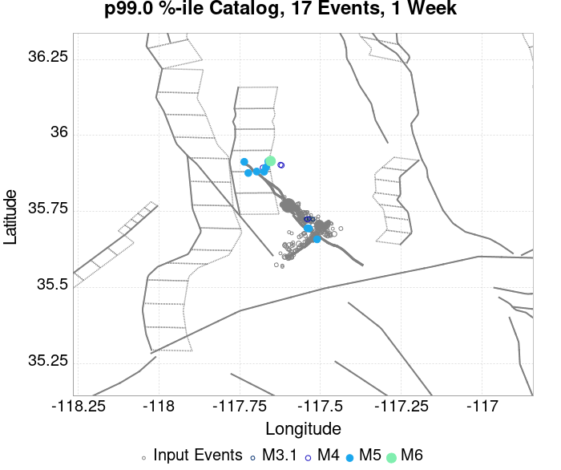
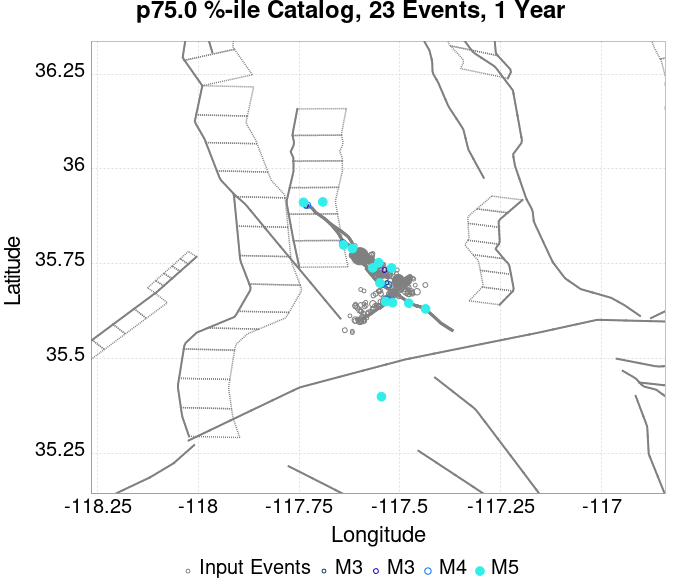
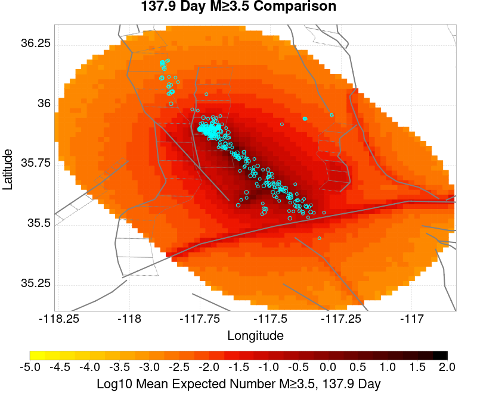
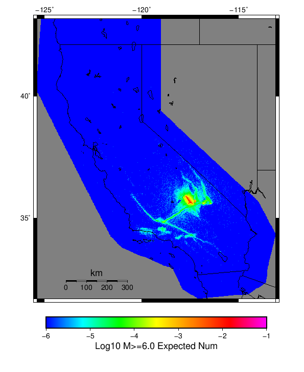

# ComCat M7.1 (ci38457511), ShakeMap Surfaces, FM2_1 Results

|   | ComCat M7.1 (ci38457511), ShakeMap Surfaces, FM2_1 |
|-----|-----|
| Num Simulations | 12150 (incomplete) |
| Start Time | 2019/07/06 03:19:54 UTC |
| Start Time Epoch Milliseconds | 1562383194040 |
| Duration | 10 Years |
| Includes Spontaneous? | false |
| Trigger Ruptures | 283 Trigger Ruptures |
|   | First: M3.98 at 2019/07/04 17:02:55 UTC |
|   | Last: M7.1 at 2019/07/06 03:19:53 UTC |
|   | Largest: M7.1 at 2019/07/06 03:19:53 UTC |
| Trigger Ruptures | *(none)* |
| Config Generated With | u3etas_comcat_event_config_builder.sh --event-id ci38457511 --mag-complete 3.5 --days-before 7 --num-simulations 1000000 --fault-model FM2_1 --finite-surf-shakemap --finite-surf-shakemap-min-mag 5 --hpc-site USC_HPC --nodes 36 --hours 24 --queue scec |

## Table Of Contents

* [Probabilities Summary Table](#probabilities-summary-table)
* [Magnitude Number Distribution](#magnitude-number-distribution)
  * [10 Year Magnitude Number Distribution](#10-year-magnitude-number-distribution)
  * [1 Year Magnitude Number Distribution](#1-year-magnitude-number-distribution)
  * [1 Month Magnitude Number Distribution](#1-month-magnitude-number-distribution)
  * [1 Week Magnitude Number Distribution](#1-week-magnitude-number-distribution)
  * [1 Day Magnitude Number Distribution](#1-day-magnitude-number-distribution)
  * [1 Hour Magnitude Number Distribution](#1-hour-magnitude-number-distribution)
* [Hazard Change Over Time](#hazard-change-over-time)
  * [M&ge;5.0 Hazard Change Over Time](#m50-hazard-change-over-time)
  * [M&ge;6.0 Hazard Change Over Time](#m60-hazard-change-over-time)
  * [M&ge;7.0 Hazard Change Over Time](#m70-hazard-change-over-time)
* [Trigger Rupture Fault Map](#trigger-rupture-fault-map)
* [Trigger Rupture Depth Map](#trigger-rupture-depth-map)
* [Fault Distances To Triggers](#fault-distances-to-triggers)
* [Individual Simulated Catalog Maps](#individual-simulated-catalog-maps)
* [ComCat Data Comparisons](#comcat-data-comparisons)
  * [ComCat Magnitude-Number Distributions](#comcat-magnitude-number-distributions)
  * [ComCat Time-Dependent Mc](#comcat-time-dependent-mc)
  * [ComCat Cumulative Number Vs Time](#comcat-cumulative-number-vs-time)
  * [ComCat Cumulative Number Simulation Percentiles](#comcat-cumulative-number-simulation-percentiles)
  * [ComCat Probability Spatial Distribution](#comcat-probability-spatial-distribution)
  * [ComCat Mean Expectation Spatial Distribution](#comcat-mean-expectation-spatial-distribution)
  * [ComCat Depth Distribution](#comcat-depth-distribution)
* [Section Participation](#section-participation)
  * [Section Participation Plots](#section-participation-plots)
  * [Supra-Seismogenic Parent Sections Table](#supra-seismogenic-parent-sections-table)
  * [M≥6.5 Parent Sections Table](#m65-parent-sections-table)
  * [M≥7 Parent Sections Table](#m7-parent-sections-table)
  * [M≥7.5 Parent Sections Table](#m75-parent-sections-table)
  * [M≥8 Parent Sections Table](#m8-parent-sections-table)
* [Fault Magnitude-Probability Distributions](#fault-magnitude-probability-distributions)
* [Gridded Nucleation](#gridded-nucleation)
* [JSON Input File](#json-input-file)

## Probabilities Summary Table
*[(top)](#table-of-contents)*

| Magnitude | 1 Hour Prob | 1 Day Prob | 1 Week Prob | 1 Month Prob | 1 Year Prob | 10 Year Prob |
|-----|-----|-----|-----|-----|-----|-----|
| **M&ge;4** | 1.000 (100.00%) | 1.000 (100.00%) | 1.000 (100.00%) | 1.000 (100.00%) | 1.000 (100.00%) | 1.000 (100.00%) |
| *95% Conf* | *[99.96% 100.00%]* | *[99.96% 100.00%]* | *[99.96% 100.00%]* | *[99.96% 100.00%]* | *[99.96% 100.00%]* | *[99.96% 100.00%]* |
| **M&ge;4.5** | 0.990 (99.02%) | 1.000 (100.00%) | 1.000 (100.00%) | 1.000 (100.00%) | 1.000 (100.00%) | 1.000 (100.00%) |
| *95% Conf* | *[98.82% 99.18%]* | *[99.96% 100.00%]* | *[99.96% 100.00%]* | *[99.96% 100.00%]* | *[99.96% 100.00%]* | *[99.96% 100.00%]* |
| **M&ge;5** | 0.762 (76.20%) | 0.977 (97.70%) | 0.994 (99.44%) | 0.998 (99.80%) | 1.000 (99.99%) | 1.000 (100.00%) |
| *95% Conf* | *[75.43% 76.95%]* | *[97.41% 97.95%]* | *[99.29% 99.56%]* | *[99.70% 99.87%]* | *[99.95% 100.00%]* | *[99.96% 100.00%]* |
| **M&ge;5.5** | 0.329 (32.94%) | 0.666 (66.55%) | 0.796 (79.64%) | 0.859 (85.93%) | 0.925 (92.49%) | 0.959 (95.86%) |
| *95% Conf* | *[32.10% 33.78%]* | *[65.70% 67.39%]* | *[78.91% 80.35%]* | *[85.30% 86.55%]* | *[92.00% 92.95%]* | *[95.49% 96.20%]* |
| **M&ge;6** | 0.076 (7.63%) | 0.205 (20.46%) | 0.286 (28.62%) | 0.346 (34.61%) | 0.446 (44.62%) | 0.529 (52.86%) |
| *95% Conf* | *[7.17% 8.12%]* | *[19.75% 21.19%]* | *[27.82% 29.43%]* | *[33.76% 35.46%]* | *[43.73% 45.51%]* | *[51.97% 53.75%]* |
| **M&ge;6.5** | 0.014 (1.37%) | 0.041 (4.15%) | 0.063 (6.30%) | 0.082 (8.17%) | 0.114 (11.39%) | 0.147 (14.72%) |
| *95% Conf* | *[1.18% 1.60%]* | *[3.80% 4.52%]* | *[5.87% 6.75%]* | *[7.69% 8.68%]* | *[10.83% 11.97%]* | *[14.10% 15.37%]* |
| **M&ge;7** | 3.29E-3 (0.33%) | 9.96E-3 (1.00%) | 0.015 (1.51%) | 0.020 (1.96%) | 0.026 (2.63%) | 0.037 (3.67%) |
| *95% Conf* | *[0.24% 0.45%]* | *[0.83% 1.19%]* | *[1.31% 1.75%]* | *[1.72% 2.23%]* | *[2.36% 2.94%]* | *[3.35% 4.02%]* |
| **M&ge;7.1** | 2.30E-3 (0.23%) | 7.82E-3 (0.78%) | 0.012 (1.20%) | 0.015 (1.55%) | 0.021 (2.10%) | 0.029 (2.95%) |
| *95% Conf* | *[0.16% 0.34%]* | *[0.64% 0.96%]* | *[1.02% 1.42%]* | *[1.34% 1.79%]* | *[1.85% 2.37%]* | *[2.66% 3.27%]* |
| **M&ge;7.5** | 9.88E-4 (0.10%) | 3.13E-3 (0.31%) | 5.02E-3 (0.50%) | 6.67E-3 (0.67%) | 8.81E-3 (0.88%) | 0.013 (1.26%) |
| *95% Conf* | *[0.05% 0.18%]* | *[0.22% 0.43%]* | *[0.39% 0.65%]* | *[0.53% 0.83%]* | *[0.73% 1.07%]* | *[1.07% 1.48%]* |
| **M&ge;8** | 0.000 (0.00%) | 8.23E-5 (0.01%) | 8.23E-5 (0.01%) | 8.23E-5 (0.01%) | 1.65E-4 (0.02%) | 2.47E-4 (0.02%) |
| *95% Conf* | *[0.00% 0.04%]* | *[0.00% 0.05%]* | *[0.00% 0.05%]* | *[0.00% 0.05%]* | *[0.00% 0.07%]* | *[0.01% 0.08%]* |

## Magnitude Number Distribution
*[(top)](#table-of-contents)*

### 10 Year Magnitude Number Distribution
*[(top)](#table-of-contents)*

**Legend**
* **Mean** (thick black line): mean expected number across all 12150 catalogs
* **2.5%,97.5%** (thin black lines): expected number percentiles across all 12150 catalogs
* **Median** (thin blue line): median expected number across all 12150 catalogs
* **Mode** (thin cyan line): modal expected number across all 12150 catalogs
* **10 yr Probability** (thin red line): 10 year probability calculated as the fraction of catalogs with at least 1 occurrence
* **10 yr Supraseismogenic Probability** (thin dashed red line): same as above, but only for supraseismogenic ruptures on explicitly modeled UCERF3 faults
* **95% Conf** (light red shaded region): binomial 95% confidence bounds on probability
* **Primary** (thin green line): mean expected number from primary triggered aftershocks only (no secondary, tertiary, etc...) across all 12150 catalogs


| Mag | Mean | 2.5 %ile | 97.5 %ile | Median | Mode | 10 yr Probability | 10 yr Prob 95% Conf | 10 yr Supra-Seis Prob | Primary Aftershocks Mean |
|-----|-----|-----|-----|-----|-----|-----|-----|-----|-----|
| **M&ge;2.5** | 5024.592 | 3643.000 | 10246.000 | 4437.000 | 4172.000 | 1.000 (100.00%) | [99.96% 100.00%] | 0.119 (11.93%) | 2394.756 |
| **M&ge;2.6** | 3990.548 | 2885.000 | 8134.000 | 3527.000 | 3348.000 | 1.000 (100.00%) | [99.96% 100.00%] | 0.119 (11.93%) | 1901.705 |
| **M&ge;2.7** | 3169.725 | 2287.000 | 6468.000 | 2803.000 | 2718.000 | 1.000 (100.00%) | [99.96% 100.00%] | 0.119 (11.93%) | 1510.495 |
| **M&ge;2.8** | 2517.734 | 1814.000 | 5150.000 | 2226.000 | 2090.000 | 1.000 (100.00%) | [99.96% 100.00%] | 0.119 (11.93%) | 1200.030 |
| **M&ge;2.9** | 1999.903 | 1433.000 | 4090.000 | 1769.000 | 1683.000 | 1.000 (100.00%) | [99.96% 100.00%] | 0.119 (11.93%) | 953.163 |
| **M&ge;3** | 1588.441 | 1136.000 | 3251.000 | 1406.000 | 1321.000 | 1.000 (100.00%) | [99.96% 100.00%] | 0.119 (11.93%) | 757.101 |
| **M&ge;3.1** | 1261.539 | 898.000 | 2586.000 | 1116.000 | 1050.000 | 1.000 (100.00%) | [99.96% 100.00%] | 0.119 (11.93%) | 601.255 |
| **M&ge;3.2** | 1001.980 | 710.000 | 2064.000 | 888.000 | 863.000 | 1.000 (100.00%) | [99.96% 100.00%] | 0.119 (11.93%) | 477.528 |
| **M&ge;3.3** | 795.827 | 560.000 | 1629.000 | 705.000 | 633.000 | 1.000 (100.00%) | [99.96% 100.00%] | 0.119 (11.93%) | 379.364 |
| **M&ge;3.4** | 631.908 | 441.000 | 1299.000 | 560.000 | 541.000 | 1.000 (100.00%) | [99.96% 100.00%] | 0.119 (11.93%) | 301.262 |
| **M&ge;3.5** | 501.865 | 346.000 | 1034.000 | 445.000 | 425.000 | 1.000 (100.00%) | [99.96% 100.00%] | 0.119 (11.93%) | 239.281 |
| **M&ge;3.6** | 398.432 | 272.000 | 823.000 | 354.000 | 334.000 | 1.000 (100.00%) | [99.96% 100.00%] | 0.119 (11.93%) | 189.928 |
| **M&ge;3.7** | 316.360 | 213.000 | 654.000 | 282.000 | 270.000 | 1.000 (100.00%) | [99.96% 100.00%] | 0.119 (11.93%) | 150.785 |
| **M&ge;3.8** | 251.242 | 166.000 | 520.000 | 224.000 | 221.000 | 1.000 (100.00%) | [99.96% 100.00%] | 0.119 (11.93%) | 119.683 |
| **M&ge;3.9** | 199.417 | 129.000 | 412.000 | 178.000 | 174.000 | 1.000 (100.00%) | [99.96% 100.00%] | 0.119 (11.93%) | 95.002 |
| **M&ge;4** | 158.340 | 101.000 | 328.000 | 141.000 | 130.000 | 1.000 (100.00%) | [99.96% 100.00%] | 0.119 (11.93%) | 75.407 |
| **M&ge;4.1** | 125.727 | 78.000 | 263.000 | 112.000 | 108.000 | 1.000 (100.00%) | [99.96% 100.00%] | 0.119 (11.93%) | 59.904 |
| **M&ge;4.2** | 99.645 | 60.000 | 208.000 | 89.000 | 83.000 | 1.000 (100.00%) | [99.96% 100.00%] | 0.119 (11.93%) | 47.471 |
| **M&ge;4.3** | 79.081 | 46.000 | 165.000 | 71.000 | 72.000 | 1.000 (100.00%) | [99.96% 100.00%] | 0.119 (11.93%) | 37.662 |
| **M&ge;4.4** | 62.666 | 35.000 | 132.000 | 56.000 | 55.000 | 1.000 (100.00%) | [99.96% 100.00%] | 0.119 (11.93%) | 29.835 |
| **M&ge;4.5** | 49.604 | 26.000 | 105.000 | 44.000 | 41.000 | 1.000 (100.00%) | [99.96% 100.00%] | 0.119 (11.93%) | 23.593 |
| **M&ge;4.6** | 39.283 | 20.000 | 85.000 | 35.000 | 33.000 | 1.000 (100.00%) | [99.96% 100.00%] | 0.119 (11.93%) | 18.678 |
| **M&ge;4.7** | 31.039 | 15.000 | 68.000 | 28.000 | 25.000 | 1.000 (100.00%) | [99.96% 100.00%] | 0.119 (11.93%) | 14.743 |
| **M&ge;4.8** | 24.493 | 11.000 | 55.000 | 22.000 | 18.000 | 1.000 (100.00%) | [99.96% 100.00%] | 0.119 (11.93%) | 11.641 |
| **M&ge;4.9** | 19.296 | 8.000 | 44.000 | 17.000 | 15.000 | 1.000 (100.00%) | [99.96% 100.00%] | 0.119 (11.93%) | 9.168 |
| **M&ge;5** | 15.167 | 5.000 | 36.000 | 13.000 | 12.000 | 1.000 (100.00%) | [99.96% 100.00%] | 0.119 (11.93%) | 7.203 |
| **M&ge;5.1** | 11.880 | 4.000 | 28.000 | 10.000 | 10.000 | 1.000 (99.98%) | [99.93% 100.00%] | 0.119 (11.93%) | 5.634 |
| **M&ge;5.2** | 9.296 | 2.000 | 23.000 | 8.000 | 7.000 | 0.999 (99.90%) | [99.82% 99.95%] | 0.119 (11.93%) | 4.406 |
| **M&ge;5.3** | 7.233 | 1.000 | 19.000 | 6.000 | 5.000 | 0.994 (99.43%) | [99.28% 99.55%] | 0.119 (11.93%) | 3.421 |
| **M&ge;5.4** | 5.603 | 1.000 | 15.000 | 5.000 | 4.000 | 0.982 (98.17%) | [97.91% 98.40%] | 0.119 (11.93%) | 2.644 |
| **M&ge;5.5** | 4.321 | 0.000 | 12.000 | 4.000 | 3.000 | 0.959 (95.86%) | [95.49% 96.20%] | 0.119 (11.93%) | 2.026 |
| **M&ge;5.6** | 3.282 | 0.000 | 10.000 | 3.000 | 2.000 | 0.915 (91.51%) | [91.00% 92.00%] | 0.119 (11.93%) | 1.536 |
| **M&ge;5.7** | 2.458 | 0.000 | 8.000 | 2.000 | 1.000 | 0.849 (84.91%) | [84.25% 85.53%] | 0.119 (11.93%) | 1.147 |
| **M&ge;5.8** | 1.804 | 0.000 | 6.000 | 1.000 | 1.000 | 0.759 (75.88%) | [75.11% 76.64%] | 0.119 (11.93%) | 0.838 |
| **M&ge;5.9** | 1.292 | 0.000 | 5.000 | 1.000 | 0.000 | 0.645 (64.54%) | [63.68% 65.39%] | 0.119 (11.93%) | 0.597 |
| **M&ge;6** | 0.920 | 0.000 | 4.000 | 1.000 | 0.000 | 0.529 (52.86%) | [51.97% 53.75%] | 0.119 (11.93%) | 0.418 |
| **M&ge;6.1** | 0.665 | 0.000 | 3.000 | 0.000 | 0.000 | 0.424 (42.37%) | [41.49% 43.26%] | 0.119 (11.90%) | 0.296 |
| **M&ge;6.2** | 0.463 | 0.000 | 3.000 | 0.000 | 0.000 | 0.318 (31.79%) | [30.97% 32.63%] | 0.119 (11.90%) | 0.198 |
| **M&ge;6.3** | 0.366 | 0.000 | 2.000 | 0.000 | 0.000 | 0.263 (26.26%) | [25.48% 27.06%] | 0.119 (11.90%) | 0.151 |
| **M&ge;6.4** | 0.234 | 0.000 | 2.000 | 0.000 | 0.000 | 0.173 (17.25%) | [16.59% 17.94%] | 0.070 (7.00%) | 0.097 |
| **M&ge;6.5** | 0.197 | 0.000 | 2.000 | 0.000 | 0.000 | 0.147 (14.72%) | [14.10% 15.37%] | 0.070 (7.00%) | 0.079 |
| **M&ge;6.6** | 0.142 | 0.000 | 1.000 | 0.000 | 0.000 | 0.114 (11.41%) | [10.85% 11.99%] | 0.061 (6.11%) | 0.058 |
| **M&ge;6.7** | 0.111 | 0.000 | 1.000 | 0.000 | 0.000 | 0.090 (8.95%) | [8.46% 9.48%] | 0.052 (5.21%) | 0.045 |
| **M&ge;6.8** | 0.091 | 0.000 | 1.000 | 0.000 | 0.000 | 0.074 (7.45%) | [6.99% 7.93%] | 0.050 (5.00%) | 0.038 |
| **M&ge;6.9** | 0.053 | 0.000 | 1.000 | 0.000 | 0.000 | 0.045 (4.49%) | [4.14% 4.88%] | 0.028 (2.84%) | 0.023 |
| **M&ge;7** | 0.044 | 0.000 | 1.000 | 0.000 | 0.000 | 0.037 (3.67%) | [3.35% 4.02%] | 0.027 (2.67%) | 0.018 |
| **M&ge;7.1** | 0.034 | 0.000 | 1.000 | 0.000 | 0.000 | 0.029 (2.95%) | [2.66% 3.27%] | 0.024 (2.38%) | 0.014 |
| **M&ge;7.2** | 0.028 | 0.000 | 0.000 | 0.000 | 0.000 | 0.025 (2.49%) | [2.22% 2.78%] | 0.022 (2.16%) | 0.012 |
| **M&ge;7.3** | 0.022 | 0.000 | 0.000 | 0.000 | 0.000 | 0.019 (1.94%) | [1.71% 2.21%] | 0.017 (1.74%) | 9.55E-3 |
| **M&ge;7.4** | 0.019 | 0.000 | 0.000 | 0.000 | 0.000 | 0.016 (1.64%) | [1.42% 1.88%] | 0.015 (1.53%) | 8.89E-3 |
| **M&ge;7.5** | 0.014 | 0.000 | 0.000 | 0.000 | 0.000 | 0.013 (1.26%) | [1.07% 1.48%] | 0.012 (1.21%) | 6.50E-3 |
| **M&ge;7.6** | 0.013 | 0.000 | 0.000 | 0.000 | 0.000 | 0.011 (1.09%) | [0.92% 1.30%] | 0.011 (1.08%) | 5.60E-3 |
| **M&ge;7.7** | 5.35E-3 | 0.000 | 0.000 | 0.000 | 0.000 | 4.94E-3 (0.49%) | [0.38% 0.64%] | 4.86E-3 (0.49%) | 1.40E-3 |
| **M&ge;7.8** | 1.81E-3 | 0.000 | 0.000 | 0.000 | 0.000 | 1.81E-3 (0.18%) | [0.12% 0.28%] | 1.73E-3 (0.17%) | 1.65E-4 |
| **M&ge;7.9** | 6.58E-4 | 0.000 | 0.000 | 0.000 | 0.000 | 6.58E-4 (0.07%) | [0.03% 0.14%] | 6.58E-4 (0.07%) | 8.23E-5 |
| **M&ge;8** | 2.47E-4 | 0.000 | 0.000 | 0.000 | 0.000 | 2.47E-4 (0.02%) | [0.01% 0.08%] | 2.47E-4 (0.02%) | 0.000 |
| **M&ge;8.1** | 2.47E-4 | 0.000 | 0.000 | 0.000 | 0.000 | 2.47E-4 (0.02%) | [0.01% 0.08%] | 2.47E-4 (0.02%) | 0.000 |
| **M&ge;8.2** | 0.000 | 0.000 | 0.000 | 0.000 | 0.000 | 0.000 (0.00%) | [0.00% 0.04%] | 0.000 (0.00%) | 0.000 |
| **M&ge;8.3** | 0.000 | 0.000 | 0.000 | 0.000 | 0.000 | 0.000 (0.00%) | [0.00% 0.04%] | 0.000 (0.00%) | 0.000 |
| **M&ge;8.4** | 0.000 | 0.000 | 0.000 | 0.000 | 0.000 | 0.000 (0.00%) | [0.00% 0.04%] | 0.000 (0.00%) | 0.000 |
| **M&ge;8.5** | 0.000 | 0.000 | 0.000 | 0.000 | 0.000 | 0.000 (0.00%) | [0.00% 0.04%] | 0.000 (0.00%) | 0.000 |
| **M&ge;8.6** | 0.000 | 0.000 | 0.000 | 0.000 | 0.000 | 0.000 (0.00%) | [0.00% 0.04%] | 0.000 (0.00%) | 0.000 |
| **M&ge;8.7** | 0.000 | 0.000 | 0.000 | 0.000 | 0.000 | 0.000 (0.00%) | [0.00% 0.04%] | 0.000 (0.00%) | 0.000 |
| **M&ge;8.8** | 0.000 | 0.000 | 0.000 | 0.000 | 0.000 | 0.000 (0.00%) | [0.00% 0.04%] | 0.000 (0.00%) | 0.000 |
| **M&ge;8.9** | 0.000 | 0.000 | 0.000 | 0.000 | 0.000 | 0.000 (0.00%) | [0.00% 0.04%] | 0.000 (0.00%) | 0.000 |
| **M&ge;9** | 0.000 | 0.000 | 0.000 | 0.000 | 0.000 | 0.000 (0.00%) | [0.00% 0.04%] | 0.000 (0.00%) | 0.000 |

### 1 Year Magnitude Number Distribution
*[(top)](#table-of-contents)*

**Legend**
* **Mean** (thick black line): mean expected number across all 12150 catalogs
* **2.5%,97.5%** (thin black lines): expected number percentiles across all 12150 catalogs
* **Median** (thin blue line): median expected number across all 12150 catalogs
* **Mode** (thin cyan line): modal expected number across all 12150 catalogs
* **1 yr Probability** (thin red line): 1 year probability calculated as the fraction of catalogs with at least 1 occurrence
* **1 yr Supraseismogenic Probability** (thin dashed red line): same as above, but only for supraseismogenic ruptures on explicitly modeled UCERF3 faults
* **95% Conf** (light red shaded region): binomial 95% confidence bounds on probability
* **Primary** (thin green line): mean expected number from primary triggered aftershocks only (no secondary, tertiary, etc...) across all 12150 catalogs


| Mag | Mean | 2.5 %ile | 97.5 %ile | Median | Mode | 1 yr Probability | 1 yr Prob 95% Conf | 1 yr Supra-Seis Prob | Primary Aftershocks Mean |
|-----|-----|-----|-----|-----|-----|-----|-----|-----|-----|
| **M&ge;2.5** | 3838.600 | 2943.000 | 6735.000 | 3482.000 | 3213.000 | 1.000 (100.00%) | [99.96% 100.00%] | 0.092 (9.18%) | 2085.894 |
| **M&ge;2.6** | 3048.600 | 2333.000 | 5338.000 | 2766.000 | 2666.000 | 1.000 (100.00%) | [99.96% 100.00%] | 0.092 (9.18%) | 1656.414 |
| **M&ge;2.7** | 2421.509 | 1848.000 | 4234.000 | 2196.000 | 2171.000 | 1.000 (100.00%) | [99.96% 100.00%] | 0.092 (9.18%) | 1315.632 |
| **M&ge;2.8** | 1923.400 | 1464.000 | 3369.000 | 1746.000 | 1782.000 | 1.000 (100.00%) | [99.96% 100.00%] | 0.092 (9.18%) | 1045.167 |
| **M&ge;2.9** | 1527.702 | 1157.000 | 2670.000 | 1387.000 | 1322.000 | 1.000 (100.00%) | [99.96% 100.00%] | 0.092 (9.18%) | 830.119 |
| **M&ge;3** | 1213.392 | 914.000 | 2118.000 | 1102.000 | 1053.000 | 1.000 (100.00%) | [99.96% 100.00%] | 0.092 (9.18%) | 659.401 |
| **M&ge;3.1** | 963.589 | 722.000 | 1681.000 | 876.000 | 840.000 | 1.000 (100.00%) | [99.96% 100.00%] | 0.092 (9.18%) | 523.666 |
| **M&ge;3.2** | 765.413 | 569.000 | 1336.000 | 696.000 | 649.000 | 1.000 (100.00%) | [99.96% 100.00%] | 0.092 (9.18%) | 415.887 |
| **M&ge;3.3** | 607.987 | 448.000 | 1067.000 | 553.000 | 521.000 | 1.000 (100.00%) | [99.96% 100.00%] | 0.092 (9.18%) | 330.398 |
| **M&ge;3.4** | 482.756 | 352.000 | 850.000 | 440.000 | 416.000 | 1.000 (100.00%) | [99.96% 100.00%] | 0.092 (9.18%) | 262.355 |
| **M&ge;3.5** | 383.444 | 277.000 | 677.000 | 350.000 | 341.000 | 1.000 (100.00%) | [99.96% 100.00%] | 0.092 (9.18%) | 208.370 |
| **M&ge;3.6** | 304.455 | 217.000 | 537.000 | 278.000 | 264.000 | 1.000 (100.00%) | [99.96% 100.00%] | 0.092 (9.18%) | 165.404 |
| **M&ge;3.7** | 241.730 | 170.000 | 425.000 | 221.000 | 202.000 | 1.000 (100.00%) | [99.96% 100.00%] | 0.092 (9.18%) | 131.295 |
| **M&ge;3.8** | 192.002 | 132.000 | 338.000 | 176.000 | 167.000 | 1.000 (100.00%) | [99.96% 100.00%] | 0.092 (9.18%) | 104.254 |
| **M&ge;3.9** | 152.411 | 102.000 | 272.000 | 140.000 | 137.000 | 1.000 (100.00%) | [99.96% 100.00%] | 0.092 (9.18%) | 82.758 |
| **M&ge;4** | 121.001 | 79.000 | 216.000 | 111.000 | 105.000 | 1.000 (100.00%) | [99.96% 100.00%] | 0.092 (9.18%) | 65.681 |
| **M&ge;4.1** | 96.080 | 61.000 | 172.000 | 88.000 | 86.000 | 1.000 (100.00%) | [99.96% 100.00%] | 0.092 (9.18%) | 52.183 |
| **M&ge;4.2** | 76.129 | 47.000 | 138.000 | 70.000 | 66.000 | 1.000 (100.00%) | [99.96% 100.00%] | 0.092 (9.18%) | 41.353 |
| **M&ge;4.3** | 60.413 | 36.000 | 110.000 | 56.000 | 49.000 | 1.000 (100.00%) | [99.96% 100.00%] | 0.092 (9.18%) | 32.813 |
| **M&ge;4.4** | 47.879 | 27.000 | 89.000 | 44.000 | 45.000 | 1.000 (100.00%) | [99.96% 100.00%] | 0.092 (9.18%) | 26.004 |
| **M&ge;4.5** | 37.901 | 20.000 | 72.000 | 35.000 | 33.000 | 1.000 (100.00%) | [99.96% 100.00%] | 0.092 (9.18%) | 20.567 |
| **M&ge;4.6** | 30.013 | 15.000 | 58.000 | 28.000 | 25.000 | 1.000 (100.00%) | [99.96% 100.00%] | 0.092 (9.18%) | 16.273 |
| **M&ge;4.7** | 23.700 | 11.000 | 47.000 | 22.000 | 21.000 | 1.000 (100.00%) | [99.96% 100.00%] | 0.092 (9.18%) | 12.833 |
| **M&ge;4.8** | 18.707 | 8.000 | 38.000 | 17.000 | 16.000 | 1.000 (100.00%) | [99.96% 100.00%] | 0.092 (9.18%) | 10.132 |
| **M&ge;4.9** | 14.746 | 6.000 | 31.000 | 13.000 | 12.000 | 1.000 (100.00%) | [99.96% 100.00%] | 0.092 (9.18%) | 7.981 |
| **M&ge;5** | 11.582 | 4.000 | 25.000 | 10.000 | 9.000 | 1.000 (99.99%) | [99.95% 100.00%] | 0.092 (9.18%) | 6.265 |
| **M&ge;5.1** | 9.058 | 2.000 | 21.000 | 8.000 | 7.000 | 0.999 (99.93%) | [99.85% 99.96%] | 0.092 (9.18%) | 4.900 |
| **M&ge;5.2** | 7.093 | 1.000 | 17.000 | 6.000 | 5.000 | 0.997 (99.68%) | [99.56% 99.77%] | 0.092 (9.18%) | 3.834 |
| **M&ge;5.3** | 5.504 | 1.000 | 14.000 | 5.000 | 4.000 | 0.987 (98.71%) | [98.49% 98.90%] | 0.092 (9.18%) | 2.970 |
| **M&ge;5.4** | 4.265 | 0.000 | 11.000 | 4.000 | 3.000 | 0.964 (96.39%) | [96.04% 96.71%] | 0.092 (9.18%) | 2.298 |
| **M&ge;5.5** | 3.284 | 0.000 | 9.000 | 3.000 | 2.000 | 0.925 (92.49%) | [92.00% 92.95%] | 0.092 (9.18%) | 1.763 |
| **M&ge;5.6** | 2.496 | 0.000 | 7.000 | 2.000 | 2.000 | 0.865 (86.45%) | [85.83% 87.05%] | 0.092 (9.18%) | 1.338 |
| **M&ge;5.7** | 1.868 | 0.000 | 6.000 | 1.000 | 1.000 | 0.781 (78.07%) | [77.32% 78.80%] | 0.092 (9.18%) | 0.998 |
| **M&ge;5.8** | 1.368 | 0.000 | 5.000 | 1.000 | 0.000 | 0.678 (67.79%) | [66.95% 68.62%] | 0.092 (9.18%) | 0.729 |
| **M&ge;5.9** | 0.980 | 0.000 | 4.000 | 1.000 | 0.000 | 0.561 (56.10%) | [55.21% 56.98%] | 0.092 (9.18%) | 0.519 |
| **M&ge;6** | 0.696 | 0.000 | 3.000 | 0.000 | 0.000 | 0.446 (44.62%) | [43.73% 45.51%] | 0.092 (9.18%) | 0.362 |
| **M&ge;6.1** | 0.500 | 0.000 | 3.000 | 0.000 | 0.000 | 0.348 (34.80%) | [33.95% 35.65%] | 0.092 (9.16%) | 0.255 |
| **M&ge;6.2** | 0.343 | 0.000 | 2.000 | 0.000 | 0.000 | 0.254 (25.39%) | [24.62% 26.18%] | 0.092 (9.16%) | 0.170 |
| **M&ge;6.3** | 0.270 | 0.000 | 2.000 | 0.000 | 0.000 | 0.208 (20.82%) | [20.11% 21.56%] | 0.092 (9.16%) | 0.131 |
| **M&ge;6.4** | 0.170 | 0.000 | 1.000 | 0.000 | 0.000 | 0.134 (13.42%) | [12.83% 14.05%] | 0.054 (5.37%) | 0.083 |
| **M&ge;6.5** | 0.142 | 0.000 | 1.000 | 0.000 | 0.000 | 0.114 (11.39%) | [10.83% 11.97%] | 0.054 (5.37%) | 0.067 |
| **M&ge;6.6** | 0.102 | 0.000 | 1.000 | 0.000 | 0.000 | 0.087 (8.66%) | [8.17% 9.18%] | 0.046 (4.60%) | 0.050 |
| **M&ge;6.7** | 0.078 | 0.000 | 1.000 | 0.000 | 0.000 | 0.067 (6.71%) | [6.27% 7.17%] | 0.039 (3.90%) | 0.038 |
| **M&ge;6.8** | 0.065 | 0.000 | 1.000 | 0.000 | 0.000 | 0.056 (5.61%) | [5.21% 6.04%] | 0.038 (3.78%) | 0.032 |
| **M&ge;6.9** | 0.038 | 0.000 | 1.000 | 0.000 | 0.000 | 0.033 (3.31%) | [3.00% 3.65%] | 0.021 (2.06%) | 0.019 |
| **M&ge;7** | 0.030 | 0.000 | 1.000 | 0.000 | 0.000 | 0.026 (2.63%) | [2.36% 2.94%] | 0.019 (1.91%) | 0.015 |
| **M&ge;7.1** | 0.024 | 0.000 | 0.000 | 0.000 | 0.000 | 0.021 (2.10%) | [1.85% 2.37%] | 0.017 (1.69%) | 0.012 |
| **M&ge;7.2** | 0.019 | 0.000 | 0.000 | 0.000 | 0.000 | 0.017 (1.74%) | [1.52% 1.99%] | 0.015 (1.53%) | 9.55E-3 |
| **M&ge;7.3** | 0.016 | 0.000 | 0.000 | 0.000 | 0.000 | 0.014 (1.38%) | [1.19% 1.61%] | 0.012 (1.24%) | 7.98E-3 |
| **M&ge;7.4** | 0.013 | 0.000 | 0.000 | 0.000 | 0.000 | 0.012 (1.19%) | [1.01% 1.41%] | 0.011 (1.11%) | 7.49E-3 |
| **M&ge;7.5** | 9.79E-3 | 0.000 | 0.000 | 0.000 | 0.000 | 8.81E-3 (0.88%) | [0.73% 1.07%] | 8.48E-3 (0.85%) | 5.19E-3 |
| **M&ge;7.6** | 8.56E-3 | 0.000 | 0.000 | 0.000 | 0.000 | 7.57E-3 (0.76%) | [0.61% 0.93%] | 7.49E-3 (0.75%) | 4.44E-3 |
| **M&ge;7.7** | 3.46E-3 | 0.000 | 0.000 | 0.000 | 0.000 | 3.21E-3 (0.32%) | [0.23% 0.44%] | 3.13E-3 (0.31%) | 1.23E-3 |
| **M&ge;7.8** | 1.07E-3 | 0.000 | 0.000 | 0.000 | 0.000 | 1.07E-3 (0.11%) | [0.06% 0.19%] | 9.88E-4 (0.10%) | 1.65E-4 |
| **M&ge;7.9** | 4.94E-4 | 0.000 | 0.000 | 0.000 | 0.000 | 4.94E-4 (0.05%) | [0.02% 0.11%] | 4.94E-4 (0.05%) | 8.23E-5 |
| **M&ge;8** | 1.65E-4 | 0.000 | 0.000 | 0.000 | 0.000 | 1.65E-4 (0.02%) | [0.00% 0.07%] | 1.65E-4 (0.02%) | 0.000 |
| **M&ge;8.1** | 1.65E-4 | 0.000 | 0.000 | 0.000 | 0.000 | 1.65E-4 (0.02%) | [0.00% 0.07%] | 1.65E-4 (0.02%) | 0.000 |
| **M&ge;8.2** | 0.000 | 0.000 | 0.000 | 0.000 | 0.000 | 0.000 (0.00%) | [0.00% 0.04%] | 0.000 (0.00%) | 0.000 |
| **M&ge;8.3** | 0.000 | 0.000 | 0.000 | 0.000 | 0.000 | 0.000 (0.00%) | [0.00% 0.04%] | 0.000 (0.00%) | 0.000 |
| **M&ge;8.4** | 0.000 | 0.000 | 0.000 | 0.000 | 0.000 | 0.000 (0.00%) | [0.00% 0.04%] | 0.000 (0.00%) | 0.000 |
| **M&ge;8.5** | 0.000 | 0.000 | 0.000 | 0.000 | 0.000 | 0.000 (0.00%) | [0.00% 0.04%] | 0.000 (0.00%) | 0.000 |
| **M&ge;8.6** | 0.000 | 0.000 | 0.000 | 0.000 | 0.000 | 0.000 (0.00%) | [0.00% 0.04%] | 0.000 (0.00%) | 0.000 |
| **M&ge;8.7** | 0.000 | 0.000 | 0.000 | 0.000 | 0.000 | 0.000 (0.00%) | [0.00% 0.04%] | 0.000 (0.00%) | 0.000 |
| **M&ge;8.8** | 0.000 | 0.000 | 0.000 | 0.000 | 0.000 | 0.000 (0.00%) | [0.00% 0.04%] | 0.000 (0.00%) | 0.000 |
| **M&ge;8.9** | 0.000 | 0.000 | 0.000 | 0.000 | 0.000 | 0.000 (0.00%) | [0.00% 0.04%] | 0.000 (0.00%) | 0.000 |
| **M&ge;9** | 0.000 | 0.000 | 0.000 | 0.000 | 0.000 | 0.000 (0.00%) | [0.00% 0.04%] | 0.000 (0.00%) | 0.000 |

### 1 Month Magnitude Number Distribution
*[(top)](#table-of-contents)*

**Legend**
* **Mean** (thick black line): mean expected number across all 12150 catalogs
* **2.5%,97.5%** (thin black lines): expected number percentiles across all 12150 catalogs
* **Median** (thin blue line): median expected number across all 12150 catalogs
* **Mode** (thin cyan line): modal expected number across all 12150 catalogs
* **1 mo Probability** (thin red line): 1 month probability calculated as the fraction of catalogs with at least 1 occurrence
* **1 mo Supraseismogenic Probability** (thin dashed red line): same as above, but only for supraseismogenic ruptures on explicitly modeled UCERF3 faults
* **95% Conf** (light red shaded region): binomial 95% confidence bounds on probability
* **Primary** (thin green line): mean expected number from primary triggered aftershocks only (no secondary, tertiary, etc...) across all 12150 catalogs


| Mag | Mean | 2.5 %ile | 97.5 %ile | Median | Mode | 1 mo Probability | 1 mo Prob 95% Conf | 1 mo Supra-Seis Prob | Primary Aftershocks Mean |
|-----|-----|-----|-----|-----|-----|-----|-----|-----|-----|
| **M&ge;2.5** | 2712.488 | 2186.000 | 4184.000 | 2513.000 | 2378.000 | 1.000 (100.00%) | [99.96% 100.00%] | 0.065 (6.46%) | 1690.555 |
| **M&ge;2.6** | 2154.325 | 1729.000 | 3324.000 | 1997.000 | 1977.000 | 1.000 (100.00%) | [99.96% 100.00%] | 0.065 (6.46%) | 1342.555 |
| **M&ge;2.7** | 1711.174 | 1369.000 | 2643.000 | 1586.000 | 1532.000 | 1.000 (100.00%) | [99.96% 100.00%] | 0.065 (6.46%) | 1066.334 |
| **M&ge;2.8** | 1359.219 | 1082.000 | 2105.000 | 1260.000 | 1216.000 | 1.000 (100.00%) | [99.96% 100.00%] | 0.065 (6.46%) | 847.063 |
| **M&ge;2.9** | 1079.564 | 854.000 | 1673.000 | 1001.000 | 941.000 | 1.000 (100.00%) | [99.96% 100.00%] | 0.065 (6.46%) | 672.732 |
| **M&ge;3** | 857.392 | 674.000 | 1335.000 | 796.000 | 737.000 | 1.000 (100.00%) | [99.96% 100.00%] | 0.065 (6.46%) | 534.325 |
| **M&ge;3.1** | 680.848 | 531.000 | 1063.000 | 632.000 | 610.000 | 1.000 (100.00%) | [99.96% 100.00%] | 0.065 (6.46%) | 424.338 |
| **M&ge;3.2** | 540.804 | 419.000 | 840.000 | 502.000 | 471.000 | 1.000 (100.00%) | [99.96% 100.00%] | 0.065 (6.46%) | 337.008 |
| **M&ge;3.3** | 429.650 | 329.000 | 673.000 | 400.000 | 391.000 | 1.000 (100.00%) | [99.96% 100.00%] | 0.065 (6.46%) | 267.752 |
| **M&ge;3.4** | 341.153 | 258.000 | 536.000 | 318.000 | 300.000 | 1.000 (100.00%) | [99.96% 100.00%] | 0.065 (6.46%) | 212.647 |
| **M&ge;3.5** | 270.941 | 202.000 | 427.000 | 252.000 | 247.000 | 1.000 (100.00%) | [99.96% 100.00%] | 0.065 (6.46%) | 168.882 |
| **M&ge;3.6** | 215.171 | 157.000 | 342.000 | 201.000 | 195.000 | 1.000 (100.00%) | [99.96% 100.00%] | 0.065 (6.46%) | 134.065 |
| **M&ge;3.7** | 170.842 | 123.000 | 270.000 | 160.000 | 152.000 | 1.000 (100.00%) | [99.96% 100.00%] | 0.065 (6.46%) | 106.417 |
| **M&ge;3.8** | 135.662 | 95.000 | 216.000 | 127.000 | 123.000 | 1.000 (100.00%) | [99.96% 100.00%] | 0.065 (6.46%) | 84.493 |
| **M&ge;3.9** | 107.697 | 74.000 | 173.000 | 101.000 | 93.000 | 1.000 (100.00%) | [99.96% 100.00%] | 0.065 (6.46%) | 67.081 |
| **M&ge;4** | 85.497 | 56.000 | 138.000 | 80.000 | 77.000 | 1.000 (100.00%) | [99.96% 100.00%] | 0.065 (6.46%) | 53.222 |
| **M&ge;4.1** | 67.890 | 43.000 | 112.000 | 64.000 | 62.000 | 1.000 (100.00%) | [99.96% 100.00%] | 0.065 (6.46%) | 42.280 |
| **M&ge;4.2** | 53.788 | 33.000 | 89.000 | 50.000 | 48.000 | 1.000 (100.00%) | [99.96% 100.00%] | 0.065 (6.46%) | 33.509 |
| **M&ge;4.3** | 42.690 | 25.000 | 73.000 | 40.000 | 40.000 | 1.000 (100.00%) | [99.96% 100.00%] | 0.065 (6.46%) | 26.594 |
| **M&ge;4.4** | 33.843 | 19.000 | 59.000 | 32.000 | 30.000 | 1.000 (100.00%) | [99.96% 100.00%] | 0.065 (6.46%) | 21.077 |
| **M&ge;4.5** | 26.799 | 14.000 | 48.000 | 25.000 | 24.000 | 1.000 (100.00%) | [99.96% 100.00%] | 0.065 (6.46%) | 16.672 |
| **M&ge;4.6** | 21.230 | 10.000 | 39.000 | 20.000 | 19.000 | 1.000 (100.00%) | [99.96% 100.00%] | 0.065 (6.46%) | 13.192 |
| **M&ge;4.7** | 16.768 | 7.000 | 32.000 | 16.000 | 14.000 | 1.000 (100.00%) | [99.96% 100.00%] | 0.065 (6.46%) | 10.405 |
| **M&ge;4.8** | 13.241 | 5.000 | 26.000 | 12.000 | 11.000 | 1.000 (100.00%) | [99.96% 100.00%] | 0.065 (6.46%) | 8.214 |
| **M&ge;4.9** | 10.435 | 3.000 | 22.000 | 10.000 | 9.000 | 1.000 (99.98%) | [99.92% 99.99%] | 0.065 (6.46%) | 6.476 |
| **M&ge;5** | 8.199 | 2.000 | 18.000 | 7.000 | 6.000 | 0.998 (99.80%) | [99.70% 99.87%] | 0.065 (6.46%) | 5.084 |
| **M&ge;5.1** | 6.413 | 1.000 | 14.000 | 6.000 | 5.000 | 0.994 (99.36%) | [99.20% 99.49%] | 0.065 (6.46%) | 3.976 |
| **M&ge;5.2** | 5.023 | 1.000 | 12.000 | 5.000 | 4.000 | 0.983 (98.30%) | [98.05% 98.52%] | 0.065 (6.46%) | 3.108 |
| **M&ge;5.3** | 3.887 | 0.000 | 10.000 | 3.000 | 3.000 | 0.960 (95.97%) | [95.60% 96.31%] | 0.065 (6.46%) | 2.405 |
| **M&ge;5.4** | 3.010 | 0.000 | 8.000 | 3.000 | 2.000 | 0.919 (91.86%) | [91.36% 92.34%] | 0.065 (6.46%) | 1.860 |
| **M&ge;5.5** | 2.316 | 0.000 | 7.000 | 2.000 | 1.000 | 0.859 (85.93%) | [85.30% 86.55%] | 0.065 (6.46%) | 1.427 |
| **M&ge;5.6** | 1.759 | 0.000 | 6.000 | 1.000 | 1.000 | 0.777 (77.70%) | [76.94% 78.43%] | 0.065 (6.46%) | 1.082 |
| **M&ge;5.7** | 1.314 | 0.000 | 5.000 | 1.000 | 1.000 | 0.678 (67.79%) | [66.95% 68.62%] | 0.065 (6.46%) | 0.808 |
| **M&ge;5.8** | 0.960 | 0.000 | 4.000 | 1.000 | 0.000 | 0.568 (56.77%) | [55.89% 57.66%] | 0.065 (6.46%) | 0.587 |
| **M&ge;5.9** | 0.683 | 0.000 | 3.000 | 0.000 | 0.000 | 0.450 (45.02%) | [44.13% 45.91%] | 0.065 (6.46%) | 0.418 |
| **M&ge;6** | 0.483 | 0.000 | 3.000 | 0.000 | 0.000 | 0.346 (34.61%) | [33.76% 35.46%] | 0.065 (6.46%) | 0.292 |
| **M&ge;6.1** | 0.345 | 0.000 | 2.000 | 0.000 | 0.000 | 0.263 (26.27%) | [25.49% 27.07%] | 0.065 (6.45%) | 0.205 |
| **M&ge;6.2** | 0.233 | 0.000 | 2.000 | 0.000 | 0.000 | 0.186 (18.62%) | [17.93% 19.32%] | 0.065 (6.45%) | 0.135 |
| **M&ge;6.3** | 0.183 | 0.000 | 1.000 | 0.000 | 0.000 | 0.151 (15.05%) | [14.42% 15.70%] | 0.065 (6.45%) | 0.103 |
| **M&ge;6.4** | 0.116 | 0.000 | 1.000 | 0.000 | 0.000 | 0.096 (9.60%) | [9.09% 10.15%] | 0.039 (3.93%) | 0.067 |
| **M&ge;6.5** | 0.098 | 0.000 | 1.000 | 0.000 | 0.000 | 0.082 (8.17%) | [7.69% 8.68%] | 0.039 (3.93%) | 0.055 |
| **M&ge;6.6** | 0.071 | 0.000 | 1.000 | 0.000 | 0.000 | 0.062 (6.25%) | [5.83% 6.70%] | 0.034 (3.37%) | 0.041 |
| **M&ge;6.7** | 0.054 | 0.000 | 1.000 | 0.000 | 0.000 | 0.048 (4.79%) | [4.42% 5.19%] | 0.028 (2.83%) | 0.032 |
| **M&ge;6.8** | 0.046 | 0.000 | 1.000 | 0.000 | 0.000 | 0.041 (4.06%) | [3.72% 4.43%] | 0.027 (2.73%) | 0.027 |
| **M&ge;6.9** | 0.027 | 0.000 | 0.000 | 0.000 | 0.000 | 0.024 (2.44%) | [2.18% 2.74%] | 0.016 (1.56%) | 0.016 |
| **M&ge;7** | 0.022 | 0.000 | 0.000 | 0.000 | 0.000 | 0.020 (1.96%) | [1.72% 2.23%] | 0.014 (1.44%) | 0.013 |
| **M&ge;7.1** | 0.018 | 0.000 | 0.000 | 0.000 | 0.000 | 0.015 (1.55%) | [1.34% 1.79%] | 0.013 (1.28%) | 0.010 |
| **M&ge;7.2** | 0.015 | 0.000 | 0.000 | 0.000 | 0.000 | 0.013 (1.31%) | [1.12% 1.53%] | 0.012 (1.16%) | 8.31E-3 |
| **M&ge;7.3** | 0.012 | 0.000 | 0.000 | 0.000 | 0.000 | 0.011 (1.05%) | [0.88% 1.26%] | 9.47E-3 (0.95%) | 7.16E-3 |
| **M&ge;7.4** | 0.010 | 0.000 | 0.000 | 0.000 | 0.000 | 9.14E-3 (0.91%) | [0.76% 1.10%] | 8.56E-3 (0.86%) | 6.67E-3 |
| **M&ge;7.5** | 7.57E-3 | 0.000 | 0.000 | 0.000 | 0.000 | 6.67E-3 (0.67%) | [0.53% 0.83%] | 6.50E-3 (0.65%) | 4.53E-3 |
| **M&ge;7.6** | 6.58E-3 | 0.000 | 0.000 | 0.000 | 0.000 | 5.68E-3 (0.57%) | [0.45% 0.72%] | 5.68E-3 (0.57%) | 3.79E-3 |
| **M&ge;7.7** | 2.47E-3 | 0.000 | 0.000 | 0.000 | 0.000 | 2.22E-3 (0.22%) | [0.15% 0.33%] | 2.22E-3 (0.22%) | 7.41E-4 |
| **M&ge;7.8** | 8.23E-4 | 0.000 | 0.000 | 0.000 | 0.000 | 8.23E-4 (0.08%) | [0.04% 0.16%] | 8.23E-4 (0.08%) | 8.23E-5 |
| **M&ge;7.9** | 3.29E-4 | 0.000 | 0.000 | 0.000 | 0.000 | 3.29E-4 (0.03%) | [0.01% 0.09%] | 3.29E-4 (0.03%) | 8.23E-5 |
| **M&ge;8** | 8.23E-5 | 0.000 | 0.000 | 0.000 | 0.000 | 8.23E-5 (0.01%) | [0.00% 0.05%] | 8.23E-5 (0.01%) | 0.000 |
| **M&ge;8.1** | 8.23E-5 | 0.000 | 0.000 | 0.000 | 0.000 | 8.23E-5 (0.01%) | [0.00% 0.05%] | 8.23E-5 (0.01%) | 0.000 |
| **M&ge;8.2** | 0.000 | 0.000 | 0.000 | 0.000 | 0.000 | 0.000 (0.00%) | [0.00% 0.04%] | 0.000 (0.00%) | 0.000 |
| **M&ge;8.3** | 0.000 | 0.000 | 0.000 | 0.000 | 0.000 | 0.000 (0.00%) | [0.00% 0.04%] | 0.000 (0.00%) | 0.000 |
| **M&ge;8.4** | 0.000 | 0.000 | 0.000 | 0.000 | 0.000 | 0.000 (0.00%) | [0.00% 0.04%] | 0.000 (0.00%) | 0.000 |
| **M&ge;8.5** | 0.000 | 0.000 | 0.000 | 0.000 | 0.000 | 0.000 (0.00%) | [0.00% 0.04%] | 0.000 (0.00%) | 0.000 |
| **M&ge;8.6** | 0.000 | 0.000 | 0.000 | 0.000 | 0.000 | 0.000 (0.00%) | [0.00% 0.04%] | 0.000 (0.00%) | 0.000 |
| **M&ge;8.7** | 0.000 | 0.000 | 0.000 | 0.000 | 0.000 | 0.000 (0.00%) | [0.00% 0.04%] | 0.000 (0.00%) | 0.000 |
| **M&ge;8.8** | 0.000 | 0.000 | 0.000 | 0.000 | 0.000 | 0.000 (0.00%) | [0.00% 0.04%] | 0.000 (0.00%) | 0.000 |
| **M&ge;8.9** | 0.000 | 0.000 | 0.000 | 0.000 | 0.000 | 0.000 (0.00%) | [0.00% 0.04%] | 0.000 (0.00%) | 0.000 |
| **M&ge;9** | 0.000 | 0.000 | 0.000 | 0.000 | 0.000 | 0.000 (0.00%) | [0.00% 0.04%] | 0.000 (0.00%) | 0.000 |

### 1 Week Magnitude Number Distribution
*[(top)](#table-of-contents)*

**Legend**
* **Mean** (thick black line): mean expected number across all 12150 catalogs
* **2.5%,97.5%** (thin black lines): expected number percentiles across all 12150 catalogs
* **Median** (thin blue line): median expected number across all 12150 catalogs
* **Mode** (thin cyan line): modal expected number across all 12150 catalogs
* **1 wk Probability** (thin red line): 1 week probability calculated as the fraction of catalogs with at least 1 occurrence
* **1 wk Supraseismogenic Probability** (thin dashed red line): same as above, but only for supraseismogenic ruptures on explicitly modeled UCERF3 faults
* **95% Conf** (light red shaded region): binomial 95% confidence bounds on probability
* **Primary** (thin green line): mean expected number from primary triggered aftershocks only (no secondary, tertiary, etc...) across all 12150 catalogs


| Mag | Mean | 2.5 %ile | 97.5 %ile | Median | Mode | 1 wk Probability | 1 wk Prob 95% Conf | 1 wk Supra-Seis Prob | Primary Aftershocks Mean |
|-----|-----|-----|-----|-----|-----|-----|-----|-----|-----|
| **M&ge;2.5** | 2108.516 | 1749.000 | 3066.000 | 1983.000 | 1883.000 | 1.000 (100.00%) | [99.96% 100.00%] | 0.051 (5.06%) | 1431.355 |
| **M&ge;2.6** | 1674.574 | 1384.000 | 2439.000 | 1575.000 | 1540.000 | 1.000 (100.00%) | [99.96% 100.00%] | 0.051 (5.06%) | 1136.638 |
| **M&ge;2.7** | 1330.187 | 1093.000 | 1938.000 | 1252.000 | 1249.000 | 1.000 (100.00%) | [99.96% 100.00%] | 0.051 (5.06%) | 902.787 |
| **M&ge;2.8** | 1056.719 | 864.000 | 1542.000 | 995.000 | 956.000 | 1.000 (100.00%) | [99.96% 100.00%] | 0.051 (5.06%) | 717.240 |
| **M&ge;2.9** | 839.284 | 682.000 | 1222.000 | 790.000 | 779.000 | 1.000 (100.00%) | [99.96% 100.00%] | 0.051 (5.06%) | 569.631 |
| **M&ge;3** | 666.552 | 539.000 | 971.000 | 628.000 | 604.000 | 1.000 (100.00%) | [99.96% 100.00%] | 0.051 (5.06%) | 452.437 |
| **M&ge;3.1** | 529.330 | 424.000 | 773.000 | 499.000 | 505.000 | 1.000 (100.00%) | [99.96% 100.00%] | 0.051 (5.06%) | 359.354 |
| **M&ge;3.2** | 420.497 | 333.000 | 619.000 | 397.000 | 387.000 | 1.000 (100.00%) | [99.96% 100.00%] | 0.051 (5.06%) | 285.430 |
| **M&ge;3.3** | 334.104 | 261.000 | 493.000 | 316.000 | 313.000 | 1.000 (100.00%) | [99.96% 100.00%] | 0.051 (5.06%) | 226.786 |
| **M&ge;3.4** | 265.324 | 204.000 | 390.000 | 251.000 | 246.000 | 1.000 (100.00%) | [99.96% 100.00%] | 0.051 (5.06%) | 180.137 |
| **M&ge;3.5** | 210.702 | 159.000 | 312.000 | 199.000 | 194.000 | 1.000 (100.00%) | [99.96% 100.00%] | 0.051 (5.06%) | 143.026 |
| **M&ge;3.6** | 167.346 | 124.000 | 249.000 | 158.000 | 153.000 | 1.000 (100.00%) | [99.96% 100.00%] | 0.051 (5.06%) | 113.557 |
| **M&ge;3.7** | 132.852 | 96.000 | 200.000 | 126.000 | 116.000 | 1.000 (100.00%) | [99.96% 100.00%] | 0.051 (5.06%) | 90.127 |
| **M&ge;3.8** | 105.491 | 75.000 | 161.000 | 100.000 | 100.000 | 1.000 (100.00%) | [99.96% 100.00%] | 0.051 (5.06%) | 71.555 |
| **M&ge;3.9** | 83.730 | 57.000 | 128.000 | 79.000 | 78.000 | 1.000 (100.00%) | [99.96% 100.00%] | 0.051 (5.06%) | 56.799 |
| **M&ge;4** | 66.461 | 44.000 | 102.000 | 63.000 | 60.000 | 1.000 (100.00%) | [99.96% 100.00%] | 0.051 (5.06%) | 45.051 |
| **M&ge;4.1** | 52.791 | 33.000 | 83.000 | 50.000 | 50.000 | 1.000 (100.00%) | [99.96% 100.00%] | 0.051 (5.06%) | 35.786 |
| **M&ge;4.2** | 41.817 | 25.000 | 67.000 | 40.000 | 39.000 | 1.000 (100.00%) | [99.96% 100.00%] | 0.051 (5.06%) | 28.368 |
| **M&ge;4.3** | 33.179 | 19.000 | 55.000 | 31.000 | 30.000 | 1.000 (100.00%) | [99.96% 100.00%] | 0.051 (5.06%) | 22.504 |
| **M&ge;4.4** | 26.293 | 14.000 | 45.000 | 25.000 | 22.000 | 1.000 (100.00%) | [99.96% 100.00%] | 0.051 (5.06%) | 17.840 |
| **M&ge;4.5** | 20.820 | 10.000 | 36.000 | 20.000 | 18.000 | 1.000 (100.00%) | [99.96% 100.00%] | 0.051 (5.06%) | 14.121 |
| **M&ge;4.6** | 16.495 | 7.000 | 30.000 | 16.000 | 14.000 | 1.000 (100.00%) | [99.96% 100.00%] | 0.051 (5.06%) | 11.174 |
| **M&ge;4.7** | 13.019 | 5.000 | 24.000 | 12.000 | 11.000 | 1.000 (100.00%) | [99.96% 100.00%] | 0.051 (5.06%) | 8.805 |
| **M&ge;4.8** | 10.286 | 4.000 | 20.000 | 10.000 | 10.000 | 1.000 (99.98%) | [99.92% 99.99%] | 0.051 (5.06%) | 6.959 |
| **M&ge;4.9** | 8.100 | 2.000 | 17.000 | 8.000 | 7.000 | 0.998 (99.84%) | [99.75% 99.90%] | 0.051 (5.06%) | 5.482 |
| **M&ge;5** | 6.352 | 1.000 | 14.000 | 6.000 | 5.000 | 0.994 (99.44%) | [99.29% 99.56%] | 0.051 (5.06%) | 4.299 |
| **M&ge;5.1** | 4.971 | 1.000 | 11.000 | 5.000 | 4.000 | 0.983 (98.30%) | [98.05% 98.52%] | 0.051 (5.06%) | 3.364 |
| **M&ge;5.2** | 3.895 | 0.000 | 9.000 | 3.000 | 3.000 | 0.964 (96.37%) | [96.02% 96.69%] | 0.051 (5.06%) | 2.633 |
| **M&ge;5.3** | 3.012 | 0.000 | 8.000 | 3.000 | 2.000 | 0.926 (92.63%) | [92.14% 93.08%] | 0.051 (5.06%) | 2.037 |
| **M&ge;5.4** | 2.332 | 0.000 | 7.000 | 2.000 | 1.000 | 0.868 (86.80%) | [86.18% 87.39%] | 0.051 (5.06%) | 1.575 |
| **M&ge;5.5** | 1.793 | 0.000 | 6.000 | 1.000 | 1.000 | 0.796 (79.64%) | [78.91% 80.35%] | 0.051 (5.06%) | 1.209 |
| **M&ge;5.6** | 1.360 | 0.000 | 5.000 | 1.000 | 1.000 | 0.701 (70.14%) | [69.32% 70.95%] | 0.051 (5.06%) | 0.917 |
| **M&ge;5.7** | 1.015 | 0.000 | 4.000 | 1.000 | 0.000 | 0.599 (59.85%) | [58.97% 60.72%] | 0.051 (5.06%) | 0.684 |
| **M&ge;5.8** | 0.740 | 0.000 | 3.000 | 0.000 | 0.000 | 0.491 (49.05%) | [48.16% 49.95%] | 0.051 (5.06%) | 0.496 |
| **M&ge;5.9** | 0.527 | 0.000 | 3.000 | 0.000 | 0.000 | 0.381 (38.08%) | [37.22% 38.95%] | 0.051 (5.06%) | 0.353 |
| **M&ge;6** | 0.372 | 0.000 | 2.000 | 0.000 | 0.000 | 0.286 (28.62%) | [27.82% 29.43%] | 0.051 (5.06%) | 0.246 |
| **M&ge;6.1** | 0.264 | 0.000 | 2.000 | 0.000 | 0.000 | 0.213 (21.31%) | [20.59% 22.05%] | 0.051 (5.05%) | 0.172 |
| **M&ge;6.2** | 0.176 | 0.000 | 1.000 | 0.000 | 0.000 | 0.148 (14.77%) | [14.15% 15.42%] | 0.051 (5.05%) | 0.112 |
| **M&ge;6.3** | 0.137 | 0.000 | 1.000 | 0.000 | 0.000 | 0.117 (11.73%) | [11.16% 12.32%] | 0.051 (5.05%) | 0.085 |
| **M&ge;6.4** | 0.086 | 0.000 | 1.000 | 0.000 | 0.000 | 0.075 (7.48%) | [7.02% 7.97%] | 0.031 (3.09%) | 0.055 |
| **M&ge;6.5** | 0.072 | 0.000 | 1.000 | 0.000 | 0.000 | 0.063 (6.30%) | [5.87% 6.75%] | 0.031 (3.09%) | 0.045 |
| **M&ge;6.6** | 0.053 | 0.000 | 1.000 | 0.000 | 0.000 | 0.048 (4.79%) | [4.42% 5.19%] | 0.026 (2.63%) | 0.034 |
| **M&ge;6.7** | 0.040 | 0.000 | 1.000 | 0.000 | 0.000 | 0.037 (3.66%) | [3.34% 4.02%] | 0.022 (2.17%) | 0.026 |
| **M&ge;6.8** | 0.034 | 0.000 | 1.000 | 0.000 | 0.000 | 0.031 (3.06%) | [2.77% 3.39%] | 0.021 (2.10%) | 0.022 |
| **M&ge;6.9** | 0.020 | 0.000 | 0.000 | 0.000 | 0.000 | 0.019 (1.88%) | [1.65% 2.15%] | 0.012 (1.23%) | 0.013 |
| **M&ge;7** | 0.017 | 0.000 | 0.000 | 0.000 | 0.000 | 0.015 (1.51%) | [1.31% 1.75%] | 0.011 (1.14%) | 0.011 |
| **M&ge;7.1** | 0.013 | 0.000 | 0.000 | 0.000 | 0.000 | 0.012 (1.20%) | [1.02% 1.42%] | 0.010 (1.01%) | 8.48E-3 |
| **M&ge;7.2** | 0.011 | 0.000 | 0.000 | 0.000 | 0.000 | 0.010 (1.01%) | [0.85% 1.21%] | 9.05E-3 (0.91%) | 7.00E-3 |
| **M&ge;7.3** | 8.81E-3 | 0.000 | 0.000 | 0.000 | 0.000 | 8.07E-3 (0.81%) | [0.66% 0.99%] | 7.41E-3 (0.74%) | 5.84E-3 |
| **M&ge;7.4** | 7.65E-3 | 0.000 | 0.000 | 0.000 | 0.000 | 7.00E-3 (0.70%) | [0.56% 0.87%] | 6.75E-3 (0.67%) | 5.35E-3 |
| **M&ge;7.5** | 5.68E-3 | 0.000 | 0.000 | 0.000 | 0.000 | 5.02E-3 (0.50%) | [0.39% 0.65%] | 4.94E-3 (0.49%) | 3.54E-3 |
| **M&ge;7.6** | 4.94E-3 | 0.000 | 0.000 | 0.000 | 0.000 | 4.28E-3 (0.43%) | [0.32% 0.57%] | 4.28E-3 (0.43%) | 2.96E-3 |
| **M&ge;7.7** | 1.65E-3 | 0.000 | 0.000 | 0.000 | 0.000 | 1.40E-3 (0.14%) | [0.08% 0.23%] | 1.40E-3 (0.14%) | 4.94E-4 |
| **M&ge;7.8** | 5.76E-4 | 0.000 | 0.000 | 0.000 | 0.000 | 5.76E-4 (0.06%) | [0.03% 0.12%] | 5.76E-4 (0.06%) | 8.23E-5 |
| **M&ge;7.9** | 2.47E-4 | 0.000 | 0.000 | 0.000 | 0.000 | 2.47E-4 (0.02%) | [0.01% 0.08%] | 2.47E-4 (0.02%) | 8.23E-5 |
| **M&ge;8** | 8.23E-5 | 0.000 | 0.000 | 0.000 | 0.000 | 8.23E-5 (0.01%) | [0.00% 0.05%] | 8.23E-5 (0.01%) | 0.000 |
| **M&ge;8.1** | 8.23E-5 | 0.000 | 0.000 | 0.000 | 0.000 | 8.23E-5 (0.01%) | [0.00% 0.05%] | 8.23E-5 (0.01%) | 0.000 |
| **M&ge;8.2** | 0.000 | 0.000 | 0.000 | 0.000 | 0.000 | 0.000 (0.00%) | [0.00% 0.04%] | 0.000 (0.00%) | 0.000 |
| **M&ge;8.3** | 0.000 | 0.000 | 0.000 | 0.000 | 0.000 | 0.000 (0.00%) | [0.00% 0.04%] | 0.000 (0.00%) | 0.000 |
| **M&ge;8.4** | 0.000 | 0.000 | 0.000 | 0.000 | 0.000 | 0.000 (0.00%) | [0.00% 0.04%] | 0.000 (0.00%) | 0.000 |
| **M&ge;8.5** | 0.000 | 0.000 | 0.000 | 0.000 | 0.000 | 0.000 (0.00%) | [0.00% 0.04%] | 0.000 (0.00%) | 0.000 |
| **M&ge;8.6** | 0.000 | 0.000 | 0.000 | 0.000 | 0.000 | 0.000 (0.00%) | [0.00% 0.04%] | 0.000 (0.00%) | 0.000 |
| **M&ge;8.7** | 0.000 | 0.000 | 0.000 | 0.000 | 0.000 | 0.000 (0.00%) | [0.00% 0.04%] | 0.000 (0.00%) | 0.000 |
| **M&ge;8.8** | 0.000 | 0.000 | 0.000 | 0.000 | 0.000 | 0.000 (0.00%) | [0.00% 0.04%] | 0.000 (0.00%) | 0.000 |
| **M&ge;8.9** | 0.000 | 0.000 | 0.000 | 0.000 | 0.000 | 0.000 (0.00%) | [0.00% 0.04%] | 0.000 (0.00%) | 0.000 |
| **M&ge;9** | 0.000 | 0.000 | 0.000 | 0.000 | 0.000 | 0.000 (0.00%) | [0.00% 0.04%] | 0.000 (0.00%) | 0.000 |

### 1 Day Magnitude Number Distribution
*[(top)](#table-of-contents)*

**Legend**
* **Mean** (thick black line): mean expected number across all 12150 catalogs
* **2.5%,97.5%** (thin black lines): expected number percentiles across all 12150 catalogs
* **Median** (thin blue line): median expected number across all 12150 catalogs
* **Mode** (thin cyan line): modal expected number across all 12150 catalogs
* **1 d Probability** (thin red line): 1 day probability calculated as the fraction of catalogs with at least 1 occurrence
* **1 d Supraseismogenic Probability** (thin dashed red line): same as above, but only for supraseismogenic ruptures on explicitly modeled UCERF3 faults
* **95% Conf** (light red shaded region): binomial 95% confidence bounds on probability
* **Primary** (thin green line): mean expected number from primary triggered aftershocks only (no secondary, tertiary, etc...) across all 12150 catalogs


| Mag | Mean | 2.5 %ile | 97.5 %ile | Median | Mode | 1 d Probability | 1 d Prob 95% Conf | 1 d Supra-Seis Prob | Primary Aftershocks Mean |
|-----|-----|-----|-----|-----|-----|-----|-----|-----|-----|
| **M&ge;2.5** | 1397.312 | 1199.000 | 1890.000 | 1339.000 | 1295.000 | 1.000 (100.00%) | [99.96% 100.00%] | 0.035 (3.46%) | 1064.577 |
| **M&ge;2.6** | 1109.615 | 948.000 | 1499.000 | 1064.000 | 1052.000 | 1.000 (100.00%) | [99.96% 100.00%] | 0.035 (3.46%) | 845.344 |
| **M&ge;2.7** | 881.430 | 747.000 | 1195.000 | 846.000 | 833.000 | 1.000 (100.00%) | [99.96% 100.00%] | 0.035 (3.46%) | 671.487 |
| **M&ge;2.8** | 700.225 | 589.000 | 948.000 | 672.000 | 664.000 | 1.000 (100.00%) | [99.96% 100.00%] | 0.035 (3.46%) | 533.476 |
| **M&ge;2.9** | 556.207 | 464.000 | 758.000 | 534.000 | 529.000 | 1.000 (100.00%) | [99.96% 100.00%] | 0.035 (3.46%) | 423.710 |
| **M&ge;3** | 441.772 | 365.000 | 602.000 | 425.000 | 426.000 | 1.000 (100.00%) | [99.96% 100.00%] | 0.035 (3.46%) | 336.547 |
| **M&ge;3.1** | 350.844 | 287.000 | 477.000 | 338.000 | 327.000 | 1.000 (100.00%) | [99.96% 100.00%] | 0.035 (3.46%) | 267.327 |
| **M&ge;3.2** | 278.714 | 224.000 | 383.000 | 268.000 | 255.000 | 1.000 (100.00%) | [99.96% 100.00%] | 0.035 (3.46%) | 212.330 |
| **M&ge;3.3** | 221.470 | 176.000 | 304.000 | 213.000 | 207.000 | 1.000 (100.00%) | [99.96% 100.00%] | 0.035 (3.46%) | 168.719 |
| **M&ge;3.4** | 175.895 | 137.000 | 242.000 | 169.000 | 168.000 | 1.000 (100.00%) | [99.96% 100.00%] | 0.035 (3.46%) | 134.021 |
| **M&ge;3.5** | 139.706 | 106.000 | 194.000 | 135.000 | 134.000 | 1.000 (100.00%) | [99.96% 100.00%] | 0.035 (3.46%) | 106.445 |
| **M&ge;3.6** | 110.907 | 83.000 | 156.000 | 107.000 | 104.000 | 1.000 (100.00%) | [99.96% 100.00%] | 0.035 (3.46%) | 84.498 |
| **M&ge;3.7** | 88.013 | 63.000 | 126.000 | 85.000 | 80.000 | 1.000 (100.00%) | [99.96% 100.00%] | 0.035 (3.46%) | 67.043 |
| **M&ge;3.8** | 69.889 | 48.000 | 101.000 | 67.000 | 66.000 | 1.000 (100.00%) | [99.96% 100.00%] | 0.035 (3.46%) | 53.241 |
| **M&ge;3.9** | 55.452 | 37.000 | 81.000 | 53.000 | 49.000 | 1.000 (100.00%) | [99.96% 100.00%] | 0.035 (3.46%) | 42.257 |
| **M&ge;4** | 44.008 | 28.000 | 66.000 | 42.000 | 42.000 | 1.000 (100.00%) | [99.96% 100.00%] | 0.035 (3.46%) | 33.509 |
| **M&ge;4.1** | 34.967 | 21.000 | 54.000 | 34.000 | 34.000 | 1.000 (100.00%) | [99.96% 100.00%] | 0.035 (3.46%) | 26.636 |
| **M&ge;4.2** | 27.696 | 16.000 | 44.000 | 27.000 | 26.000 | 1.000 (100.00%) | [99.96% 100.00%] | 0.035 (3.46%) | 21.105 |
| **M&ge;4.3** | 21.974 | 12.000 | 36.000 | 21.000 | 19.000 | 1.000 (100.00%) | [99.96% 100.00%] | 0.035 (3.46%) | 16.741 |
| **M&ge;4.4** | 17.416 | 8.000 | 29.000 | 17.000 | 16.000 | 1.000 (100.00%) | [99.96% 100.00%] | 0.035 (3.46%) | 13.269 |
| **M&ge;4.5** | 13.789 | 6.000 | 24.000 | 13.000 | 13.000 | 1.000 (100.00%) | [99.96% 100.00%] | 0.035 (3.46%) | 10.504 |
| **M&ge;4.6** | 10.906 | 4.000 | 20.000 | 10.000 | 10.000 | 1.000 (99.99%) | [99.95% 100.00%] | 0.035 (3.46%) | 8.300 |
| **M&ge;4.7** | 8.605 | 3.000 | 17.000 | 8.000 | 8.000 | 0.999 (99.92%) | [99.84% 99.96%] | 0.035 (3.46%) | 6.542 |
| **M&ge;4.8** | 6.801 | 2.000 | 14.000 | 6.000 | 6.000 | 0.998 (99.75%) | [99.64% 99.83%] | 0.035 (3.46%) | 5.164 |
| **M&ge;4.9** | 5.362 | 1.000 | 12.000 | 5.000 | 4.000 | 0.991 (99.09%) | [98.91% 99.25%] | 0.035 (3.46%) | 4.068 |
| **M&ge;5** | 4.206 | 1.000 | 10.000 | 4.000 | 3.000 | 0.977 (97.70%) | [97.41% 97.95%] | 0.035 (3.46%) | 3.195 |
| **M&ge;5.1** | 3.292 | 0.000 | 8.000 | 3.000 | 2.000 | 0.945 (94.51%) | [94.09% 94.91%] | 0.035 (3.46%) | 2.501 |
| **M&ge;5.2** | 2.577 | 0.000 | 7.000 | 2.000 | 2.000 | 0.902 (90.25%) | [89.70% 90.77%] | 0.035 (3.46%) | 1.956 |
| **M&ge;5.3** | 1.999 | 0.000 | 6.000 | 2.000 | 1.000 | 0.836 (83.63%) | [82.96% 84.28%] | 0.035 (3.46%) | 1.519 |
| **M&ge;5.4** | 1.540 | 0.000 | 5.000 | 1.000 | 1.000 | 0.755 (75.53%) | [74.75% 76.29%] | 0.035 (3.46%) | 1.170 |
| **M&ge;5.5** | 1.186 | 0.000 | 4.000 | 1.000 | 1.000 | 0.666 (66.55%) | [65.70% 67.39%] | 0.035 (3.46%) | 0.898 |
| **M&ge;5.6** | 0.899 | 0.000 | 3.000 | 1.000 | 0.000 | 0.565 (56.52%) | [55.63% 57.40%] | 0.035 (3.46%) | 0.679 |
| **M&ge;5.7** | 0.673 | 0.000 | 3.000 | 0.000 | 0.000 | 0.467 (46.71%) | [45.82% 47.60%] | 0.035 (3.46%) | 0.508 |
| **M&ge;5.8** | 0.492 | 0.000 | 2.000 | 0.000 | 0.000 | 0.370 (37.04%) | [36.18% 37.90%] | 0.035 (3.46%) | 0.369 |
| **M&ge;5.9** | 0.348 | 0.000 | 2.000 | 0.000 | 0.000 | 0.280 (28.04%) | [27.25% 28.85%] | 0.035 (3.46%) | 0.261 |
| **M&ge;6** | 0.243 | 0.000 | 2.000 | 0.000 | 0.000 | 0.205 (20.46%) | [19.75% 21.19%] | 0.035 (3.46%) | 0.181 |
| **M&ge;6.1** | 0.171 | 0.000 | 1.000 | 0.000 | 0.000 | 0.149 (14.89%) | [14.26% 15.54%] | 0.034 (3.45%) | 0.126 |
| **M&ge;6.2** | 0.113 | 0.000 | 1.000 | 0.000 | 0.000 | 0.100 (10.02%) | [9.49% 10.57%] | 0.034 (3.45%) | 0.081 |
| **M&ge;6.3** | 0.088 | 0.000 | 1.000 | 0.000 | 0.000 | 0.079 (7.87%) | [7.40% 8.36%] | 0.034 (3.45%) | 0.061 |
| **M&ge;6.4** | 0.054 | 0.000 | 1.000 | 0.000 | 0.000 | 0.050 (4.95%) | [4.58% 5.36%] | 0.021 (2.07%) | 0.039 |
| **M&ge;6.5** | 0.046 | 0.000 | 1.000 | 0.000 | 0.000 | 0.041 (4.15%) | [3.80% 4.52%] | 0.021 (2.07%) | 0.032 |
| **M&ge;6.6** | 0.033 | 0.000 | 1.000 | 0.000 | 0.000 | 0.031 (3.13%) | [2.83% 3.46%] | 0.018 (1.75%) | 0.024 |
| **M&ge;6.7** | 0.026 | 0.000 | 0.000 | 0.000 | 0.000 | 0.024 (2.40%) | [2.14% 2.70%] | 0.015 (1.47%) | 0.019 |
| **M&ge;6.8** | 0.022 | 0.000 | 0.000 | 0.000 | 0.000 | 0.021 (2.07%) | [1.83% 2.35%] | 0.014 (1.42%) | 0.016 |
| **M&ge;6.9** | 0.013 | 0.000 | 0.000 | 0.000 | 0.000 | 0.013 (1.28%) | [1.09% 1.50%] | 8.31E-3 (0.83%) | 9.88E-3 |
| **M&ge;7** | 0.011 | 0.000 | 0.000 | 0.000 | 0.000 | 9.96E-3 (1.00%) | [0.83% 1.19%] | 7.49E-3 (0.75%) | 7.57E-3 |
| **M&ge;7.1** | 8.31E-3 | 0.000 | 0.000 | 0.000 | 0.000 | 7.82E-3 (0.78%) | [0.64% 0.96%] | 6.75E-3 (0.67%) | 5.76E-3 |
| **M&ge;7.2** | 7.00E-3 | 0.000 | 0.000 | 0.000 | 0.000 | 6.58E-3 (0.66%) | [0.53% 0.82%] | 5.93E-3 (0.59%) | 4.94E-3 |
| **M&ge;7.3** | 5.51E-3 | 0.000 | 0.000 | 0.000 | 0.000 | 5.10E-3 (0.51%) | [0.39% 0.66%] | 4.61E-3 (0.46%) | 4.03E-3 |
| **M&ge;7.4** | 4.94E-3 | 0.000 | 0.000 | 0.000 | 0.000 | 4.53E-3 (0.45%) | [0.34% 0.59%] | 4.28E-3 (0.43%) | 3.62E-3 |
| **M&ge;7.5** | 3.54E-3 | 0.000 | 0.000 | 0.000 | 0.000 | 3.13E-3 (0.31%) | [0.22% 0.43%] | 3.05E-3 (0.30%) | 2.39E-3 |
| **M&ge;7.6** | 3.13E-3 | 0.000 | 0.000 | 0.000 | 0.000 | 2.72E-3 (0.27%) | [0.19% 0.39%] | 2.72E-3 (0.27%) | 1.98E-3 |
| **M&ge;7.7** | 9.88E-4 | 0.000 | 0.000 | 0.000 | 0.000 | 9.05E-4 (0.09%) | [0.05% 0.17%] | 9.05E-4 (0.09%) | 3.29E-4 |
| **M&ge;7.8** | 4.12E-4 | 0.000 | 0.000 | 0.000 | 0.000 | 4.12E-4 (0.04%) | [0.02% 0.10%] | 4.12E-4 (0.04%) | 8.23E-5 |
| **M&ge;7.9** | 2.47E-4 | 0.000 | 0.000 | 0.000 | 0.000 | 2.47E-4 (0.02%) | [0.01% 0.08%] | 2.47E-4 (0.02%) | 8.23E-5 |
| **M&ge;8** | 8.23E-5 | 0.000 | 0.000 | 0.000 | 0.000 | 8.23E-5 (0.01%) | [0.00% 0.05%] | 8.23E-5 (0.01%) | 0.000 |
| **M&ge;8.1** | 8.23E-5 | 0.000 | 0.000 | 0.000 | 0.000 | 8.23E-5 (0.01%) | [0.00% 0.05%] | 8.23E-5 (0.01%) | 0.000 |
| **M&ge;8.2** | 0.000 | 0.000 | 0.000 | 0.000 | 0.000 | 0.000 (0.00%) | [0.00% 0.04%] | 0.000 (0.00%) | 0.000 |
| **M&ge;8.3** | 0.000 | 0.000 | 0.000 | 0.000 | 0.000 | 0.000 (0.00%) | [0.00% 0.04%] | 0.000 (0.00%) | 0.000 |
| **M&ge;8.4** | 0.000 | 0.000 | 0.000 | 0.000 | 0.000 | 0.000 (0.00%) | [0.00% 0.04%] | 0.000 (0.00%) | 0.000 |
| **M&ge;8.5** | 0.000 | 0.000 | 0.000 | 0.000 | 0.000 | 0.000 (0.00%) | [0.00% 0.04%] | 0.000 (0.00%) | 0.000 |
| **M&ge;8.6** | 0.000 | 0.000 | 0.000 | 0.000 | 0.000 | 0.000 (0.00%) | [0.00% 0.04%] | 0.000 (0.00%) | 0.000 |
| **M&ge;8.7** | 0.000 | 0.000 | 0.000 | 0.000 | 0.000 | 0.000 (0.00%) | [0.00% 0.04%] | 0.000 (0.00%) | 0.000 |
| **M&ge;8.8** | 0.000 | 0.000 | 0.000 | 0.000 | 0.000 | 0.000 (0.00%) | [0.00% 0.04%] | 0.000 (0.00%) | 0.000 |
| **M&ge;8.9** | 0.000 | 0.000 | 0.000 | 0.000 | 0.000 | 0.000 (0.00%) | [0.00% 0.04%] | 0.000 (0.00%) | 0.000 |
| **M&ge;9** | 0.000 | 0.000 | 0.000 | 0.000 | 0.000 | 0.000 (0.00%) | [0.00% 0.04%] | 0.000 (0.00%) | 0.000 |

### 1 Hour Magnitude Number Distribution
*[(top)](#table-of-contents)*

**Legend**
* **Mean** (thick black line): mean expected number across all 12150 catalogs
* **2.5%,97.5%** (thin black lines): expected number percentiles across all 12150 catalogs
* **Median** (thin blue line): median expected number across all 12150 catalogs
* **Mode** (thin cyan line): modal expected number across all 12150 catalogs
* **1 hr Probability** (thin red line): 1 hour probability calculated as the fraction of catalogs with at least 1 occurrence
* **1 hr Supraseismogenic Probability** (thin dashed red line): same as above, but only for supraseismogenic ruptures on explicitly modeled UCERF3 faults
* **95% Conf** (light red shaded region): binomial 95% confidence bounds on probability
* **Primary** (thin green line): mean expected number from primary triggered aftershocks only (no secondary, tertiary, etc...) across all 12150 catalogs


| Mag | Mean | 2.5 %ile | 97.5 %ile | Median | Mode | 1 hr Probability | 1 hr Prob 95% Conf | 1 hr Supra-Seis Prob | Primary Aftershocks Mean |
|-----|-----|-----|-----|-----|-----|-----|-----|-----|-----|
| **M&ge;2.5** | 500.210 | 444.000 | 578.000 | 494.000 | 492.000 | 1.000 (100.00%) | [99.96% 100.00%] | 9.88E-3 (0.99%) | 457.455 |
| **M&ge;2.6** | 397.211 | 349.000 | 461.000 | 393.000 | 395.000 | 1.000 (100.00%) | [99.96% 100.00%] | 9.88E-3 (0.99%) | 363.271 |
| **M&ge;2.7** | 315.497 | 273.000 | 371.000 | 312.000 | 313.000 | 1.000 (100.00%) | [99.96% 100.00%] | 9.88E-3 (0.99%) | 288.566 |
| **M&ge;2.8** | 250.678 | 214.000 | 297.000 | 248.000 | 247.000 | 1.000 (100.00%) | [99.96% 100.00%] | 9.88E-3 (0.99%) | 229.246 |
| **M&ge;2.9** | 199.113 | 167.000 | 238.000 | 197.000 | 192.000 | 1.000 (100.00%) | [99.96% 100.00%] | 9.88E-3 (0.99%) | 182.078 |
| **M&ge;3** | 158.174 | 130.000 | 192.000 | 156.000 | 158.000 | 1.000 (100.00%) | [99.96% 100.00%] | 9.88E-3 (0.99%) | 144.641 |
| **M&ge;3.1** | 125.658 | 101.000 | 154.000 | 124.000 | 129.000 | 1.000 (100.00%) | [99.96% 100.00%] | 9.88E-3 (0.99%) | 114.920 |
| **M&ge;3.2** | 99.776 | 78.000 | 125.000 | 99.000 | 95.000 | 1.000 (100.00%) | [99.96% 100.00%] | 9.88E-3 (0.99%) | 91.242 |
| **M&ge;3.3** | 79.262 | 61.000 | 101.000 | 78.000 | 81.000 | 1.000 (100.00%) | [99.96% 100.00%] | 9.88E-3 (0.99%) | 72.494 |
| **M&ge;3.4** | 62.935 | 46.000 | 82.000 | 62.000 | 63.000 | 1.000 (100.00%) | [99.96% 100.00%] | 9.88E-3 (0.99%) | 57.563 |
| **M&ge;3.5** | 49.996 | 35.000 | 67.000 | 49.000 | 48.000 | 1.000 (100.00%) | [99.96% 100.00%] | 9.88E-3 (0.99%) | 45.728 |
| **M&ge;3.6** | 39.652 | 27.000 | 54.000 | 39.000 | 38.000 | 1.000 (100.00%) | [99.96% 100.00%] | 9.88E-3 (0.99%) | 36.271 |
| **M&ge;3.7** | 31.440 | 20.000 | 45.000 | 31.000 | 31.000 | 1.000 (100.00%) | [99.96% 100.00%] | 9.88E-3 (0.99%) | 28.760 |
| **M&ge;3.8** | 24.972 | 15.000 | 37.000 | 25.000 | 24.000 | 1.000 (100.00%) | [99.96% 100.00%] | 9.88E-3 (0.99%) | 22.848 |
| **M&ge;3.9** | 19.826 | 11.000 | 30.000 | 20.000 | 20.000 | 1.000 (100.00%) | [99.96% 100.00%] | 9.88E-3 (0.99%) | 18.145 |
| **M&ge;4** | 15.730 | 8.000 | 25.000 | 15.000 | 15.000 | 1.000 (100.00%) | [99.96% 100.00%] | 9.88E-3 (0.99%) | 14.395 |
| **M&ge;4.1** | 12.501 | 6.000 | 21.000 | 12.000 | 12.000 | 1.000 (100.00%) | [99.96% 100.00%] | 9.88E-3 (0.99%) | 11.441 |
| **M&ge;4.2** | 9.893 | 4.000 | 17.000 | 10.000 | 9.000 | 1.000 (99.98%) | [99.93% 100.00%] | 9.88E-3 (0.99%) | 9.048 |
| **M&ge;4.3** | 7.845 | 3.000 | 14.000 | 8.000 | 7.000 | 1.000 (99.97%) | [99.91% 99.99%] | 9.88E-3 (0.99%) | 7.175 |
| **M&ge;4.4** | 6.220 | 2.000 | 12.000 | 6.000 | 5.000 | 0.998 (99.80%) | [99.70% 99.87%] | 9.88E-3 (0.99%) | 5.686 |
| **M&ge;4.5** | 4.920 | 1.000 | 10.000 | 5.000 | 4.000 | 0.990 (99.02%) | [98.82% 99.18%] | 9.88E-3 (0.99%) | 4.502 |
| **M&ge;4.6** | 3.896 | 1.000 | 9.000 | 4.000 | 3.000 | 0.975 (97.51%) | [97.21% 97.77%] | 9.88E-3 (0.99%) | 3.564 |
| **M&ge;4.7** | 3.055 | 0.000 | 7.000 | 3.000 | 2.000 | 0.946 (94.63%) | [94.21% 95.02%] | 9.88E-3 (0.99%) | 2.790 |
| **M&ge;4.8** | 2.412 | 0.000 | 6.000 | 2.000 | 2.000 | 0.899 (89.93%) | [89.37% 90.45%] | 9.88E-3 (0.99%) | 2.201 |
| **M&ge;4.9** | 1.896 | 0.000 | 5.000 | 2.000 | 1.000 | 0.839 (83.93%) | [83.26% 84.57%] | 9.88E-3 (0.99%) | 1.731 |
| **M&ge;5** | 1.481 | 0.000 | 4.000 | 1.000 | 1.000 | 0.762 (76.20%) | [75.43% 76.95%] | 9.88E-3 (0.99%) | 1.351 |
| **M&ge;5.1** | 1.161 | 0.000 | 4.000 | 1.000 | 1.000 | 0.673 (67.32%) | [66.47% 68.15%] | 9.88E-3 (0.99%) | 1.060 |
| **M&ge;5.2** | 0.908 | 0.000 | 3.000 | 1.000 | 0.000 | 0.583 (58.31%) | [57.43% 59.19%] | 9.88E-3 (0.99%) | 0.829 |
| **M&ge;5.3** | 0.702 | 0.000 | 3.000 | 0.000 | 0.000 | 0.493 (49.30%) | [48.41% 50.19%] | 9.88E-3 (0.99%) | 0.639 |
| **M&ge;5.4** | 0.543 | 0.000 | 2.000 | 0.000 | 0.000 | 0.408 (40.80%) | [39.92% 41.68%] | 9.88E-3 (0.99%) | 0.493 |
| **M&ge;5.5** | 0.413 | 0.000 | 2.000 | 0.000 | 0.000 | 0.329 (32.94%) | [32.10% 33.78%] | 9.88E-3 (0.99%) | 0.374 |
| **M&ge;5.6** | 0.313 | 0.000 | 2.000 | 0.000 | 0.000 | 0.262 (26.24%) | [25.46% 27.03%] | 9.88E-3 (0.99%) | 0.283 |
| **M&ge;5.7** | 0.235 | 0.000 | 2.000 | 0.000 | 0.000 | 0.204 (20.43%) | [19.72% 21.16%] | 9.88E-3 (0.99%) | 0.213 |
| **M&ge;5.8** | 0.170 | 0.000 | 1.000 | 0.000 | 0.000 | 0.153 (15.30%) | [14.67% 15.96%] | 9.88E-3 (0.99%) | 0.154 |
| **M&ge;5.9** | 0.118 | 0.000 | 1.000 | 0.000 | 0.000 | 0.109 (10.89%) | [10.34% 11.46%] | 9.88E-3 (0.99%) | 0.107 |
| **M&ge;6** | 0.082 | 0.000 | 1.000 | 0.000 | 0.000 | 0.076 (7.63%) | [7.17% 8.12%] | 9.88E-3 (0.99%) | 0.074 |
| **M&ge;6.1** | 0.057 | 0.000 | 1.000 | 0.000 | 0.000 | 0.054 (5.36%) | [4.97% 5.78%] | 9.88E-3 (0.99%) | 0.051 |
| **M&ge;6.2** | 0.037 | 0.000 | 1.000 | 0.000 | 0.000 | 0.035 (3.52%) | [3.21% 3.87%] | 9.88E-3 (0.99%) | 0.033 |
| **M&ge;6.3** | 0.027 | 0.000 | 1.000 | 0.000 | 0.000 | 0.026 (2.63%) | [2.35% 2.93%] | 9.88E-3 (0.99%) | 0.024 |
| **M&ge;6.4** | 0.017 | 0.000 | 0.000 | 0.000 | 0.000 | 0.016 (1.65%) | [1.43% 1.89%] | 5.68E-3 (0.57%) | 0.015 |
| **M&ge;6.5** | 0.014 | 0.000 | 0.000 | 0.000 | 0.000 | 0.014 (1.37%) | [1.18% 1.60%] | 5.68E-3 (0.57%) | 0.012 |
| **M&ge;6.6** | 0.010 | 0.000 | 0.000 | 0.000 | 0.000 | 0.010 (1.02%) | [0.85% 1.22%] | 4.86E-3 (0.49%) | 9.05E-3 |
| **M&ge;6.7** | 8.15E-3 | 0.000 | 0.000 | 0.000 | 0.000 | 8.15E-3 (0.81%) | [0.67% 1.00%] | 4.36E-3 (0.44%) | 7.16E-3 |
| **M&ge;6.8** | 6.67E-3 | 0.000 | 0.000 | 0.000 | 0.000 | 6.67E-3 (0.67%) | [0.53% 0.83%] | 4.20E-3 (0.42%) | 5.93E-3 |
| **M&ge;6.9** | 4.77E-3 | 0.000 | 0.000 | 0.000 | 0.000 | 4.77E-3 (0.48%) | [0.37% 0.62%] | 2.88E-3 (0.29%) | 4.28E-3 |
| **M&ge;7** | 3.29E-3 | 0.000 | 0.000 | 0.000 | 0.000 | 3.29E-3 (0.33%) | [0.24% 0.45%] | 2.39E-3 (0.24%) | 2.88E-3 |
| **M&ge;7.1** | 2.30E-3 | 0.000 | 0.000 | 0.000 | 0.000 | 2.30E-3 (0.23%) | [0.16% 0.34%] | 2.06E-3 (0.21%) | 1.89E-3 |
| **M&ge;7.2** | 2.14E-3 | 0.000 | 0.000 | 0.000 | 0.000 | 2.14E-3 (0.21%) | [0.14% 0.32%] | 1.98E-3 (0.20%) | 1.73E-3 |
| **M&ge;7.3** | 1.56E-3 | 0.000 | 0.000 | 0.000 | 0.000 | 1.56E-3 (0.16%) | [0.10% 0.25%] | 1.40E-3 (0.14%) | 1.40E-3 |
| **M&ge;7.4** | 1.48E-3 | 0.000 | 0.000 | 0.000 | 0.000 | 1.48E-3 (0.15%) | [0.09% 0.24%] | 1.40E-3 (0.14%) | 1.40E-3 |
| **M&ge;7.5** | 9.88E-4 | 0.000 | 0.000 | 0.000 | 0.000 | 9.88E-4 (0.10%) | [0.05% 0.18%] | 9.05E-4 (0.09%) | 9.05E-4 |
| **M&ge;7.6** | 7.41E-4 | 0.000 | 0.000 | 0.000 | 0.000 | 7.41E-4 (0.07%) | [0.04% 0.15%] | 7.41E-4 (0.07%) | 6.58E-4 |
| **M&ge;7.7** | 2.47E-4 | 0.000 | 0.000 | 0.000 | 0.000 | 2.47E-4 (0.02%) | [0.01% 0.08%] | 2.47E-4 (0.02%) | 1.65E-4 |
| **M&ge;7.8** | 0.000 | 0.000 | 0.000 | 0.000 | 0.000 | 0.000 (0.00%) | [0.00% 0.04%] | 0.000 (0.00%) | 0.000 |
| **M&ge;7.9** | 0.000 | 0.000 | 0.000 | 0.000 | 0.000 | 0.000 (0.00%) | [0.00% 0.04%] | 0.000 (0.00%) | 0.000 |
| **M&ge;8** | 0.000 | 0.000 | 0.000 | 0.000 | 0.000 | 0.000 (0.00%) | [0.00% 0.04%] | 0.000 (0.00%) | 0.000 |
| **M&ge;8.1** | 0.000 | 0.000 | 0.000 | 0.000 | 0.000 | 0.000 (0.00%) | [0.00% 0.04%] | 0.000 (0.00%) | 0.000 |
| **M&ge;8.2** | 0.000 | 0.000 | 0.000 | 0.000 | 0.000 | 0.000 (0.00%) | [0.00% 0.04%] | 0.000 (0.00%) | 0.000 |
| **M&ge;8.3** | 0.000 | 0.000 | 0.000 | 0.000 | 0.000 | 0.000 (0.00%) | [0.00% 0.04%] | 0.000 (0.00%) | 0.000 |
| **M&ge;8.4** | 0.000 | 0.000 | 0.000 | 0.000 | 0.000 | 0.000 (0.00%) | [0.00% 0.04%] | 0.000 (0.00%) | 0.000 |
| **M&ge;8.5** | 0.000 | 0.000 | 0.000 | 0.000 | 0.000 | 0.000 (0.00%) | [0.00% 0.04%] | 0.000 (0.00%) | 0.000 |
| **M&ge;8.6** | 0.000 | 0.000 | 0.000 | 0.000 | 0.000 | 0.000 (0.00%) | [0.00% 0.04%] | 0.000 (0.00%) | 0.000 |
| **M&ge;8.7** | 0.000 | 0.000 | 0.000 | 0.000 | 0.000 | 0.000 (0.00%) | [0.00% 0.04%] | 0.000 (0.00%) | 0.000 |
| **M&ge;8.8** | 0.000 | 0.000 | 0.000 | 0.000 | 0.000 | 0.000 (0.00%) | [0.00% 0.04%] | 0.000 (0.00%) | 0.000 |
| **M&ge;8.9** | 0.000 | 0.000 | 0.000 | 0.000 | 0.000 | 0.000 (0.00%) | [0.00% 0.04%] | 0.000 (0.00%) | 0.000 |
| **M&ge;9** | 0.000 | 0.000 | 0.000 | 0.000 | 0.000 | 0.000 (0.00%) | [0.00% 0.04%] | 0.000 (0.00%) | 0.000 |


## Hazard Change Over Time
*[(top)](#table-of-contents)*

These plots show how the probability of ruptures of various magnitudes within the region used to fetch ComCat trigger ruptures changes over time

### M&ge;5.0 Hazard Change Over Time
*[(top)](#table-of-contents)*


| Forecast Duration | UCERF3-ETAS [95% Conf] | UCERF3-ETAS Triggered Only | UCERF3-TD | UCERF3-ETAS/TD Gain | UCERF3-TI |
|-----|-----|-----|-----|-----|-----|
| 1 Hour | 0.758 [0.750 - 0.765] | 0.758 | 2.43E-5 | 31208.14 | 2.41E-5 |
| 1 Day | 0.975 [0.972 - 0.978] | 0.975 | 5.82E-4 | 1674.08 | 5.78E-4 |
| 1 Week | 0.994 [0.992 - 0.995] | 0.994 | 4.07E-3 | 244.23 | 4.04E-3 |
| 1 Month | 0.998 [0.997 - 0.999] | 0.998 | 0.017 | 57.6 | 0.017 |
| 1 Year | 1.000 [0.999 - 1.000] | 1.000 | 0.192 | 5.22 | 0.190 |
| 10 Years | 1.000 [1.000 - 1.000] | 1.000 | 0.881 | 1.14 | 0.879 |
| 30 Years | 1.000 [1.000 - 1.000] \* | \* | 0.998 | 1 \* | 0.998 |
| 100 Years | 1.000 [1.000 - 1.000] \* | \* | 1.000 | 1 \* | 1.000 |

\* *forecast duration is longer than simulation length, only ETAS ruptures from the first 10 years are included*
### M&ge;6.0 Hazard Change Over Time
*[(top)](#table-of-contents)*


| Forecast Duration | UCERF3-ETAS [95% Conf] | UCERF3-ETAS Triggered Only | UCERF3-TD | UCERF3-ETAS/TD Gain | UCERF3-TI |
|-----|-----|-----|-----|-----|-----|
| 1 Hour | 0.074 [0.070 - 0.079] | 0.074 | 2.22E-6 | 33475.39 | 2.04E-6 |
| 1 Day | 0.200 [0.193 - 0.207] | 0.200 | 5.33E-5 | 3753.19 | 4.91E-5 |
| 1 Week | 0.280 [0.272 - 0.288] | 0.280 | 3.73E-4 | 750.48 | 3.43E-4 |
| 1 Month | 0.340 [0.331 - 0.348] | 0.339 | 1.60E-3 | 212.36 | 1.47E-3 |
| 1 Year | 0.446 [0.437 - 0.455] | 0.435 | 0.019 | 23.11 | 0.018 |
| 10 Years | 0.602 [0.594 - 0.609] | 0.516 | 0.178 | 3.39 | 0.164 |
| 30 Years | 0.732 [0.727 - 0.737] \* | \* | 0.447 | 1.64 \* | 0.416 |
| 100 Years | 0.937 [0.936 - 0.938] \* | \* | 0.869 | 1.08 \* | 0.833 |

\* *forecast duration is longer than simulation length, only ETAS ruptures from the first 10 years are included*
### M&ge;7.0 Hazard Change Over Time
*[(top)](#table-of-contents)*


| Forecast Duration | UCERF3-ETAS [95% Conf] | UCERF3-ETAS Triggered Only | UCERF3-TD | UCERF3-ETAS/TD Gain | UCERF3-TI |
|-----|-----|-----|-----|-----|-----|
| 1 Hour | 3.13E-3 [2.25E-3 - 4.34E-3] | 3.13E-3 | 2.63E-7 | 11882.86 | 2.34E-7 |
| 1 Day | 9.39E-3 [7.79E-3 - 0.011] | 9.38E-3 | 6.32E-6 | 1486.23 | 5.62E-6 |
| 1 Week | 0.014 [0.012 - 0.017] | 0.014 | 4.42E-5 | 321.12 | 3.93E-5 |
| 1 Month | 0.018 [0.016 - 0.021] | 0.018 | 1.90E-4 | 94.79 | 1.68E-4 |
| 1 Year | 0.026 [0.023 - 0.029] | 0.024 | 2.30E-3 | 11.22 | 2.05E-3 |
| 10 Years | 0.055 [0.052 - 0.058] | 0.033 | 0.023 | 2.4 | 0.020 |
| 30 Years | 0.099 [0.096 - 0.102] \* | \* | 0.069 | 1.45 \* | 0.060 |
| 100 Years | 0.252 [0.250 - 0.255] \* | \* | 0.227 | 1.11 \* | 0.185 |

\* *forecast duration is longer than simulation length, only ETAS ruptures from the first 10 years are included*

## Trigger Rupture Fault Map
*[(top)](#table-of-contents)*


## Trigger Rupture Depth Map
*[(top)](#table-of-contents)*


## Fault Distances To Triggers
*[(top)](#table-of-contents)*

| Section Name | Strike, Dip, Rake | # Hypos In Poly | Max Mag w/ Hypo In Poly | # Surfs In Poly | Max Mag w/ Surf In Poly | Min Dist To Any (km) | Min Poly Dist To Any (km) | Min Dist To Largest (km) | Min Poly Dist To Largest (km) | Min Hypo Dist To Largest (km) | Min Hypo Poly Dist To Largest (km) |
|-----|-----|-----|-----|-----|-----|-----|-----|-----|-----|-----|-----|
| Airport Lake | 359, 50, -90 | 92 | 7.1 | 92 | 7.1 | 0.036 | 0.000 | 0.036 | 0.000 | 5.612 | 0.000 |
| Little Lake | 327, 90, 180 | 16 | 3.75 | 17 | 7.1 | 2.268 | 0.000 | 11.284 | 0.000 | 13.471 | 1.469 |
| Garlock (Central) | 71, 90, 0 | 2 | 2.76 | 3 | 7.1 | 5.600 | 0.000 | 5.600 | 0.000 | 22.766 | 10.797 |
| So Sierra Nevada | 2, 50, -90 | 0 |  | 0 |  | 4.248 | 4.233 | 4.248 | 4.233 | 16.191 | 15.188 |
| Tank Canyon | 189, 50, -90 | 0 |  | 0 |  | 9.015 | 9.011 | 9.015 | 9.011 | 17.039 | 16.895 |
| Blackwater | 323, 90, 180 | 0 |  | 0 |  | 14.394 | 8.726 | 14.394 | 8.726 | 29.622 | 27.613 |

## Individual Simulated Catalog Maps
*[(top)](#table-of-contents)*

These are map plots of individual catalogs from the simulations, selected as the closest catalog to each of the given percentiles in terms of total number of events.

| Duration | p0.0 %-ile | p25.0 %-ile | p50.0 %-ile | p75.0 %-ile | p90.0 %-ile | p95.0 %-ile | p97.5 %-ile | p98.0 %-ile | p99.0 %-ile | p99.5 %-ile | p99.9 %-ile | p99.99177 %-ile |
|-----|-----|-----|-----|-----|-----|-----|-----|-----|-----|-----|-----|-----|
| **1 Week** |  |  |  |  |  |  |  |  |  |  |  |  |
| **1 Month** |  |  |  |  |  |  |  |  |  |  |  |  |
| **1 Year** |  |  |  |  |  |  |  |  |  |  |  |  |
| **10 Year** |  |  |  |  |  |  |  |  |  |  |  |  |

## ComCat Data Comparisons
*[(top)](#table-of-contents)*

These plots compare simulated sequences with data from ComCat. All plots only consider events with hypocenters inside the ComCat region defined in the JSON input file.

Last updated at 2019/11/20 05:33:18 UTC, 137.1 days after the simulation start time.

Total matching ComCat events found: 2124

### ComCat Magnitude-Number Distributions
*[(top)](#table-of-contents)*

| Incremental MND | Cumulative MND |
|-----|-----|
|  |  |

### ComCat Time-Dependent Mc
*[(top)](#table-of-contents)*

The following plots compare simulation results with ComCat data above a magnitude threshold. Plots labeled as *M&ge;Mc(t)* use the time-dependent magnitude of completeness (Mc) defined in Helmstetter et al. (2006), which is plotted below. In the case of multiple M&ge;5 ruptures, either as input to the simulation or in the comparison data, the maximum calculated time-dependent Mc is used. This time-dependent Mc function is plotted below.


### ComCat Cumulative Number Vs Time
*[(top)](#table-of-contents)*

| M&ge;Mc(t) | M&ge;3.5 | M&ge;4 | M&ge;5 | M&ge;6 | M&ge;7 |
|-----|-----|-----|-----|-----|-----|
|  |  |  |  |  |  |

### ComCat Cumulative Number Simulation Percentiles
*[(top)](#table-of-contents)*


### ComCat Probability Spatial Distribution
*[(top)](#table-of-contents)*

*Note: maps labeled 'Forecast' are for a duration that extends into the future, only forecasted values are plotted (ComCat data omitted)*

|  | 1 Day | 1 Week | 1 Month | Current (137.1 Day) | Forecast: 1 Year |
|-----|-----|-----|-----|-----|-----|
| **M&ge;Mc(t)** |  |  |  |  |  |
|  | Prob: 100.00%, Actual: 314 | Prob: 100.00%, Actual: 823 | Prob: 100.00%, Actual: 1173 | Prob: 100.00%, Actual: 1398 | Prob: 100.00% |
| **M&ge;3.5** |  |  |  |  |  |
|  | Prob: 100.00%, Actual: 218 | Prob: 100.00%, Actual: 273 | Prob: 100.00%, Actual: 302 | Prob: 100.00%, Actual: 320 | Prob: 100.00% |
| **M&ge;4** |  |  |  |  |  |
|  | Prob: 100.00%, Actual: 63 | Prob: 100.00%, Actual: 75 | Prob: 100.00%, Actual: 81 | Prob: 100.00%, Actual: 83 | Prob: 100.00% |
| **M&ge;5** |  |  |  |  |  |
|  | Prob: 97.49%, Actual: 2 | Prob: 99.39%, Actual: 2 | Prob: 99.79%, Actual: 2 | Prob: 99.95%, Actual: 3 | Prob: 99.98% |
| **M&ge;6** |  |  |  |  |  |
|  | Prob: 19.88%, Actual: 0 | Prob: 27.84%, Actual: 0 | Prob: 33.71%, Actual: 0 | Prob: 39.60%, Actual: 0 | Prob: 43.37% |
| **M&ge;7** |  |  |  |  |  |
|  | Prob: 0.89%, Actual: 0 | Prob: 1.36%, Actual: 0 | Prob: 1.71%, Actual: 0 | Prob: 2.03%, Actual: 0 | Prob: 2.29% |
| **M&ge;8** |  |  |  |  |  |
|  | Prob: 0.00%, Actual: 0 | Prob: 0.00%, Actual: 0 | Prob: 0.00%, Actual: 0 | Prob: 0.00%, Actual: 0 | Prob: 0.00% |

### ComCat Mean Expectation Spatial Distribution
*[(top)](#table-of-contents)*

*Note: maps labeled 'Forecast' are for a duration that extends into the future, only forecasted values are plotted (ComCat data omitted)*

|  | 1 Day | 1 Week | 1 Month | Current (137.1 Day) | Forecast: 1 Year |
|-----|-----|-----|-----|-----|-----|
| **M&ge;Mc(t)** |  |  |  |  |  |
|  | Mean: 293.971, Actual: 314 | Mean: 955.251, Actual: 823 | Mean: 1514.851, Actual: 1173 | Mean: 2129.903, Actual: 1398 | Mean: 2544.846 |
| **M&ge;3.5** |  |  |  |  |  |
|  | Mean: 135.653, Actual: 218 | Mean: 202.674, Actual: 273 | Mean: 258.476, Actual: 302 | Mean: 319.885, Actual: 320 | Mean: 361.359 |
| **M&ge;4** |  |  |  |  |  |
|  | Mean: 42.726, Actual: 63 | Mean: 63.916, Actual: 75 | Mean: 81.547, Actual: 81 | Mean: 100.907, Actual: 83 | Mean: 114.019 |
| **M&ge;5** |  |  |  |  |  |
|  | Mean: 4.076, Actual: 2 | Mean: 6.101, Actual: 2 | Mean: 7.809, Actual: 2 | Mean: 9.650, Actual: 3 | Mean: 10.899 |
| **M&ge;6** |  |  |  |  |  |
|  | Mean: 0.232, Actual: 0 | Mean: 0.351, Actual: 0 | Mean: 0.452, Actual: 0 | Mean: 0.563, Actual: 0 | Mean: 0.643 |
| **M&ge;7** |  |  |  |  |  |
|  | Mean: 8.89E-3, Actual: 0 | Mean: 0.014, Actual: 0 | Mean: 0.018, Actual: 0 | Mean: 0.021, Actual: 0 | Mean: 0.024 |
| **M&ge;8** |  |  |  |  |  |
|  | Mean: 0.000, Actual: 0 | Mean: 0.000, Actual: 0 | Mean: 0.000, Actual: 0 | Mean: 0.000, Actual: 0 | Mean: 0.000 |

### ComCat Depth Distribution
*[(top)](#table-of-contents)*

| M&ge;Mc(t) | M&ge;3.5 | M&ge;4 | M&ge;5 | M&ge;6 | M&ge;7 | M&ge;8 |
|-----|-----|-----|-----|-----|-----|-----|
|  |  |  |  |  |  |  |

## Section Participation
*[(top)](#table-of-contents)*

### Section Participation Plots
*[(top)](#table-of-contents)*

| Min Mag | 1 yr Triggered Ruptures (no spontaneous) | 10 yr Triggered Ruptures (no spontaneous) | 10 yr Triggered Ruptures (primary aftershocks only) |
|-----|-----|-----|-----|
| **All Supra. Seis.** |  |  |  |
| **M&ge;6.5** |  |  |  |
| **M&ge;7** |  |  |  |
| **M&ge;7.5** |  |  |  |
| **M&ge;8** |  |  |  |

### Supra-Seismogenic Parent Sections Table
*[(top)](#table-of-contents)*

*First 10 of 77 with matching ruptures shown*

| Parent Name | Triggered 10 Year Mean Count | Triggered 1 Day Prob | Triggered 1 Day 95% Conf | Triggered 1 Week Prob | Triggered 1 Week 95% Conf | Triggered 1 Month Prob | Triggered 1 Month 95% Conf | Triggered 1 Year Prob | Triggered 1 Year 95% Conf | Triggered 10 Year Prob | Triggered 10 Year 95% Conf | Triggered 10 Year Primary Mean Count |
|-----|-----|-----|-----|-----|-----|-----|-----|-----|-----|-----|-----|-----|
| Tank Canyon | 0.055226337 | 0.014 (1.44%) | [1.24% 1.67%] | 0.021 (2.08%) | [1.84% 2.36%] | 0.027 (2.69%) | [2.41% 3.00%] | 0.041 (4.12%) | [3.78% 4.50%] | 0.055 (5.52%) | [5.13% 5.95%] | 0.017860083 |
| Little Lake | 0.025432099 | 7.16E-3 (0.72%) | [0.58% 0.89%] | 0.011 (1.12%) | [0.94% 1.33%] | 0.015 (1.48%) | [1.28% 1.72%] | 0.020 (2.01%) | [1.77% 2.28%] | 0.025 (2.53%) | [2.27% 2.83%] | 0.012263374 |
| Garlock (Central) | 0.024855968 | 8.23E-3 (0.82%) | [0.67% 1.00%] | 0.012 (1.20%) | [1.02% 1.42%] | 0.014 (1.44%) | [1.24% 1.67%] | 0.019 (1.88%) | [1.65% 2.15%] | 0.025 (2.49%) | [2.22% 2.78%] | 0.013909465 |
| Owl Lake | 0.012839506 | 2.55E-3 (0.26%) | [0.18% 0.37%] | 4.53E-3 (0.45%) | [0.34% 0.59%] | 5.60E-3 (0.56%) | [0.44% 0.71%] | 8.56E-3 (0.86%) | [0.70% 1.04%] | 0.013 (1.28%) | [1.09% 1.50%] | 9.053498E-4 |
| Garlock (West) | 0.011440329 | 3.29E-3 (0.33%) | [0.24% 0.45%] | 5.02E-3 (0.50%) | [0.39% 0.65%] | 6.34E-3 (0.63%) | [0.50% 0.80%] | 8.07E-3 (0.81%) | [0.66% 0.99%] | 0.011 (1.14%) | [0.97% 1.35%] | 0.0063374485 |
| Garlock (East) | 0.010781893 | 2.88E-3 (0.29%) | [0.20% 0.41%] | 4.44E-3 (0.44%) | [0.34% 0.58%] | 5.60E-3 (0.56%) | [0.44% 0.71%] | 7.82E-3 (0.78%) | [0.64% 0.96%] | 0.011 (1.08%) | [0.91% 1.28%] | 0.0053497944 |
| Death Valley (So) | 0.009053498 | 9.88E-4 (0.10%) | [0.05% 0.18%] | 2.06E-3 (0.21%) | [0.14% 0.31%] | 3.37E-3 (0.34%) | [0.25% 0.46%] | 6.01E-3 (0.60%) | [0.47% 0.76%] | 8.56E-3 (0.86%) | [0.70% 1.04%] | 0.0010699589 |
| Panamint Valley | 0.0055144033 | 9.88E-4 (0.10%) | [0.05% 0.18%] | 1.48E-3 (0.15%) | [0.09% 0.24%] | 2.47E-3 (0.25%) | [0.17% 0.36%] | 3.54E-3 (0.35%) | [0.26% 0.48%] | 5.51E-3 (0.55%) | [0.43% 0.70%] | 7.4074074E-4 |
| San Andreas (Mojave N) | 0.0031275721 | 6.58E-4 (0.07%) | [0.03% 0.14%] | 8.23E-4 (0.08%) | [0.04% 0.16%] | 1.23E-3 (0.12%) | [0.07% 0.21%] | 1.65E-3 (0.16%) | [0.10% 0.26%] | 3.13E-3 (0.31%) | [0.22% 0.43%] | 2.4691358E-4 |
| San Andreas (Big Bend) | 0.0025514404 | 4.94E-4 (0.05%) | [0.02% 0.11%] | 5.76E-4 (0.06%) | [0.03% 0.12%] | 9.05E-4 (0.09%) | [0.05% 0.17%] | 1.32E-3 (0.13%) | [0.08% 0.22%] | 2.55E-3 (0.26%) | [0.18% 0.37%] | 1.6460905E-4 |

### M≥6.5 Parent Sections Table
*[(top)](#table-of-contents)*

*First 10 of 74 with matching ruptures shown*

| Parent Name | Triggered 10 Year Mean Count | Triggered 1 Day Prob | Triggered 1 Day 95% Conf | Triggered 1 Week Prob | Triggered 1 Week 95% Conf | Triggered 1 Month Prob | Triggered 1 Month 95% Conf | Triggered 1 Year Prob | Triggered 1 Year 95% Conf | Triggered 10 Year Prob | Triggered 10 Year 95% Conf | Triggered 10 Year Primary Mean Count |
|-----|-----|-----|-----|-----|-----|-----|-----|-----|-----|-----|-----|-----|
| Little Lake | 0.025432099 | 7.16E-3 (0.72%) | [0.58% 0.89%] | 0.011 (1.12%) | [0.94% 1.33%] | 0.015 (1.48%) | [1.28% 1.72%] | 0.020 (2.01%) | [1.77% 2.28%] | 0.025 (2.53%) | [2.27% 2.83%] | 0.012263374 |
| Garlock (Central) | 0.024855968 | 8.23E-3 (0.82%) | [0.67% 1.00%] | 0.012 (1.20%) | [1.02% 1.42%] | 0.014 (1.44%) | [1.24% 1.67%] | 0.019 (1.88%) | [1.65% 2.15%] | 0.025 (2.49%) | [2.22% 2.78%] | 0.013909465 |
| Owl Lake | 0.012839506 | 2.55E-3 (0.26%) | [0.18% 0.37%] | 4.53E-3 (0.45%) | [0.34% 0.59%] | 5.60E-3 (0.56%) | [0.44% 0.71%] | 8.56E-3 (0.86%) | [0.70% 1.04%] | 0.013 (1.28%) | [1.09% 1.50%] | 9.053498E-4 |
| Garlock (West) | 0.011440329 | 3.29E-3 (0.33%) | [0.24% 0.45%] | 5.02E-3 (0.50%) | [0.39% 0.65%] | 6.34E-3 (0.63%) | [0.50% 0.80%] | 8.07E-3 (0.81%) | [0.66% 0.99%] | 0.011 (1.14%) | [0.97% 1.35%] | 0.0063374485 |
| Garlock (East) | 0.010781893 | 2.88E-3 (0.29%) | [0.20% 0.41%] | 4.44E-3 (0.44%) | [0.34% 0.58%] | 5.60E-3 (0.56%) | [0.44% 0.71%] | 7.82E-3 (0.78%) | [0.64% 0.96%] | 0.011 (1.08%) | [0.91% 1.28%] | 0.0053497944 |
| Death Valley (So) | 0.009053498 | 9.88E-4 (0.10%) | [0.05% 0.18%] | 2.06E-3 (0.21%) | [0.14% 0.31%] | 3.37E-3 (0.34%) | [0.25% 0.46%] | 6.01E-3 (0.60%) | [0.47% 0.76%] | 8.56E-3 (0.86%) | [0.70% 1.04%] | 0.0010699589 |
| Panamint Valley | 0.0055144033 | 9.88E-4 (0.10%) | [0.05% 0.18%] | 1.48E-3 (0.15%) | [0.09% 0.24%] | 2.47E-3 (0.25%) | [0.17% 0.36%] | 3.54E-3 (0.35%) | [0.26% 0.48%] | 5.51E-3 (0.55%) | [0.43% 0.70%] | 7.4074074E-4 |
| San Andreas (Mojave N) | 0.0031275721 | 6.58E-4 (0.07%) | [0.03% 0.14%] | 8.23E-4 (0.08%) | [0.04% 0.16%] | 1.23E-3 (0.12%) | [0.07% 0.21%] | 1.65E-3 (0.16%) | [0.10% 0.26%] | 3.13E-3 (0.31%) | [0.22% 0.43%] | 2.4691358E-4 |
| San Andreas (Big Bend) | 0.0025514404 | 4.94E-4 (0.05%) | [0.02% 0.11%] | 5.76E-4 (0.06%) | [0.03% 0.12%] | 9.05E-4 (0.09%) | [0.05% 0.17%] | 1.32E-3 (0.13%) | [0.08% 0.22%] | 2.55E-3 (0.26%) | [0.18% 0.37%] | 1.6460905E-4 |
| Blackwater | 0.002469136 | 4.12E-4 (0.04%) | [0.02% 0.10%] | 7.41E-4 (0.07%) | [0.04% 0.15%] | 8.23E-4 (0.08%) | [0.04% 0.16%] | 1.48E-3 (0.15%) | [0.09% 0.24%] | 2.47E-3 (0.25%) | [0.17% 0.36%] | 9.053498E-4 |

### M≥7 Parent Sections Table
*[(top)](#table-of-contents)*

*First 10 of 47 with matching ruptures shown*

| Parent Name | Triggered 10 Year Mean Count | Triggered 1 Day Prob | Triggered 1 Day 95% Conf | Triggered 1 Week Prob | Triggered 1 Week 95% Conf | Triggered 1 Month Prob | Triggered 1 Month 95% Conf | Triggered 1 Year Prob | Triggered 1 Year 95% Conf | Triggered 10 Year Prob | Triggered 10 Year 95% Conf | Triggered 10 Year Primary Mean Count |
|-----|-----|-----|-----|-----|-----|-----|-----|-----|-----|-----|-----|-----|
| Garlock (Central) | 0.019176954 | 6.17E-3 (0.62%) | [0.49% 0.78%] | 9.14E-3 (0.91%) | [0.76% 1.10%] | 0.011 (1.11%) | [0.94% 1.32%] | 0.014 (1.42%) | [1.22% 1.65%] | 0.019 (1.92%) | [1.68% 2.18%] | 0.010781893 |
| Garlock (West) | 0.011358025 | 3.21E-3 (0.32%) | [0.23% 0.44%] | 4.94E-3 (0.49%) | [0.38% 0.64%] | 6.26E-3 (0.63%) | [0.50% 0.79%] | 7.98E-3 (0.80%) | [0.65% 0.98%] | 0.011 (1.14%) | [0.96% 1.34%] | 0.0063374485 |
| Garlock (East) | 0.008065844 | 2.55E-3 (0.26%) | [0.18% 0.37%] | 3.95E-3 (0.40%) | [0.29% 0.53%] | 4.69E-3 (0.47%) | [0.36% 0.61%] | 6.09E-3 (0.61%) | [0.48% 0.77%] | 8.07E-3 (0.81%) | [0.66% 0.99%] | 0.004855967 |
| Panamint Valley | 0.002962963 | 4.94E-4 (0.05%) | [0.02% 0.11%] | 8.23E-4 (0.08%) | [0.04% 0.16%] | 1.15E-3 (0.12%) | [0.07% 0.20%] | 1.56E-3 (0.16%) | [0.10% 0.25%] | 2.96E-3 (0.30%) | [0.21% 0.41%] | 4.9382716E-4 |
| San Andreas (Mojave N) | 0.0026337449 | 4.94E-4 (0.05%) | [0.02% 0.11%] | 5.76E-4 (0.06%) | [0.03% 0.12%] | 9.88E-4 (0.10%) | [0.05% 0.18%] | 1.40E-3 (0.14%) | [0.08% 0.23%] | 2.63E-3 (0.26%) | [0.18% 0.38%] | 2.4691358E-4 |
| San Andreas (Big Bend) | 0.0025514404 | 4.94E-4 (0.05%) | [0.02% 0.11%] | 5.76E-4 (0.06%) | [0.03% 0.12%] | 9.05E-4 (0.09%) | [0.05% 0.17%] | 1.32E-3 (0.13%) | [0.08% 0.22%] | 2.55E-3 (0.26%) | [0.18% 0.37%] | 1.6460905E-4 |
| San Andreas (Mojave S) | 0.0023868312 | 4.94E-4 (0.05%) | [0.02% 0.11%] | 6.58E-4 (0.07%) | [0.03% 0.14%] | 9.05E-4 (0.09%) | [0.05% 0.17%] | 1.48E-3 (0.15%) | [0.09% 0.24%] | 2.39E-3 (0.24%) | [0.16% 0.35%] | 2.4691358E-4 |
| San Andreas (Carrizo) rev | 0.0023045267 | 4.94E-4 (0.05%) | [0.02% 0.11%] | 5.76E-4 (0.06%) | [0.03% 0.12%] | 9.05E-4 (0.09%) | [0.05% 0.17%] | 1.23E-3 (0.12%) | [0.07% 0.21%] | 2.30E-3 (0.23%) | [0.16% 0.34%] | 1.6460905E-4 |
| San Andreas (Cholame) rev | 0.002057613 | 4.94E-4 (0.05%) | [0.02% 0.11%] | 5.76E-4 (0.06%) | [0.03% 0.12%] | 8.23E-4 (0.08%) | [0.04% 0.16%] | 9.05E-4 (0.09%) | [0.05% 0.17%] | 2.06E-3 (0.21%) | [0.14% 0.31%] | 8.230453E-5 |
| Blackwater | 0.0016460905 | 2.47E-4 (0.02%) | [0.01% 0.08%] | 5.76E-4 (0.06%) | [0.03% 0.12%] | 6.58E-4 (0.07%) | [0.03% 0.14%] | 1.15E-3 (0.12%) | [0.07% 0.20%] | 1.65E-3 (0.16%) | [0.10% 0.26%] | 7.4074074E-4 |

### M≥7.5 Parent Sections Table
*[(top)](#table-of-contents)*

*First 10 of 24 with matching ruptures shown*

| Parent Name | Triggered 10 Year Mean Count | Triggered 1 Day Prob | Triggered 1 Day 95% Conf | Triggered 1 Week Prob | Triggered 1 Week 95% Conf | Triggered 1 Month Prob | Triggered 1 Month 95% Conf | Triggered 1 Year Prob | Triggered 1 Year 95% Conf | Triggered 10 Year Prob | Triggered 10 Year 95% Conf | Triggered 10 Year Primary Mean Count |
|-----|-----|-----|-----|-----|-----|-----|-----|-----|-----|-----|-----|-----|
| Garlock (Central) | 0.010288066 | 2.88E-3 (0.29%) | [0.20% 0.41%] | 4.44E-3 (0.44%) | [0.34% 0.58%] | 5.68E-3 (0.57%) | [0.45% 0.72%] | 7.24E-3 (0.72%) | [0.58% 0.90%] | 0.010 (1.03%) | [0.86% 1.23%] | 0.005761317 |
| Garlock (West) | 0.010288066 | 2.88E-3 (0.29%) | [0.20% 0.41%] | 4.44E-3 (0.44%) | [0.34% 0.58%] | 5.68E-3 (0.57%) | [0.45% 0.72%] | 7.24E-3 (0.72%) | [0.58% 0.90%] | 0.010 (1.03%) | [0.86% 1.23%] | 0.005761317 |
| Garlock (East) | 0.0036213992 | 9.05E-4 (0.09%) | [0.05% 0.17%] | 1.48E-3 (0.15%) | [0.09% 0.24%] | 1.98E-3 (0.20%) | [0.13% 0.30%] | 2.63E-3 (0.26%) | [0.18% 0.38%] | 3.62E-3 (0.36%) | [0.27% 0.49%] | 0.0018930042 |
| San Andreas (Big Bend) | 0.0023868312 | 4.94E-4 (0.05%) | [0.02% 0.11%] | 5.76E-4 (0.06%) | [0.03% 0.12%] | 9.05E-4 (0.09%) | [0.05% 0.17%] | 1.23E-3 (0.12%) | [0.07% 0.21%] | 2.39E-3 (0.24%) | [0.16% 0.35%] | 1.6460905E-4 |
| San Andreas (Mojave N) | 0.0023868312 | 4.94E-4 (0.05%) | [0.02% 0.11%] | 5.76E-4 (0.06%) | [0.03% 0.12%] | 9.05E-4 (0.09%) | [0.05% 0.17%] | 1.23E-3 (0.12%) | [0.07% 0.21%] | 2.39E-3 (0.24%) | [0.16% 0.35%] | 1.6460905E-4 |
| San Andreas (Carrizo) rev | 0.0022222223 | 4.94E-4 (0.05%) | [0.02% 0.11%] | 5.76E-4 (0.06%) | [0.03% 0.12%] | 9.05E-4 (0.09%) | [0.05% 0.17%] | 1.15E-3 (0.12%) | [0.07% 0.20%] | 2.22E-3 (0.22%) | [0.15% 0.33%] | 1.6460905E-4 |
| San Andreas (Cholame) rev | 0.0019753086 | 4.94E-4 (0.05%) | [0.02% 0.11%] | 5.76E-4 (0.06%) | [0.03% 0.12%] | 8.23E-4 (0.08%) | [0.04% 0.16%] | 9.05E-4 (0.09%) | [0.05% 0.17%] | 1.98E-3 (0.20%) | [0.13% 0.30%] | 8.230453E-5 |
| San Andreas (Mojave S) | 0.0018930042 | 4.12E-4 (0.04%) | [0.02% 0.10%] | 5.76E-4 (0.06%) | [0.03% 0.12%] | 7.41E-4 (0.07%) | [0.04% 0.15%] | 1.07E-3 (0.11%) | [0.06% 0.19%] | 1.89E-3 (0.19%) | [0.12% 0.29%] | 1.6460905E-4 |
| San Andreas (Parkfield) | 0.0015637861 | 3.29E-4 (0.03%) | [0.01% 0.09%] | 4.12E-4 (0.04%) | [0.02% 0.10%] | 6.58E-4 (0.07%) | [0.03% 0.14%] | 7.41E-4 (0.07%) | [0.04% 0.15%] | 1.56E-3 (0.16%) | [0.10% 0.25%] | 0.0 |
| San Andreas (San Bernardino N) | 9.053498E-4 | 2.47E-4 (0.02%) | [0.01% 0.08%] | 4.12E-4 (0.04%) | [0.02% 0.10%] | 5.76E-4 (0.06%) | [0.03% 0.12%] | 7.41E-4 (0.07%) | [0.04% 0.15%] | 9.05E-4 (0.09%) | [0.05% 0.17%] | 8.230453E-5 |

### M≥8 Parent Sections Table
*[(top)](#table-of-contents)*

| Parent Name | Triggered 10 Year Mean Count | Triggered 1 Day Prob | Triggered 1 Day 95% Conf | Triggered 1 Week Prob | Triggered 1 Week 95% Conf | Triggered 1 Month Prob | Triggered 1 Month 95% Conf | Triggered 1 Year Prob | Triggered 1 Year 95% Conf | Triggered 10 Year Prob | Triggered 10 Year 95% Conf | Triggered 10 Year Primary Mean Count |
|-----|-----|-----|-----|-----|-----|-----|-----|-----|-----|-----|-----|-----|
| San Andreas (Big Bend) | 2.4691358E-4 | 8.23E-5 (0.01%) | [0.00% 0.05%] | 8.23E-5 (0.01%) | [0.00% 0.05%] | 8.23E-5 (0.01%) | [0.00% 0.05%] | 1.65E-4 (0.02%) | [0.00% 0.07%] | 2.47E-4 (0.02%) | [0.01% 0.08%] | 0.0 |
| San Andreas (Carrizo) rev | 2.4691358E-4 | 8.23E-5 (0.01%) | [0.00% 0.05%] | 8.23E-5 (0.01%) | [0.00% 0.05%] | 8.23E-5 (0.01%) | [0.00% 0.05%] | 1.65E-4 (0.02%) | [0.00% 0.07%] | 2.47E-4 (0.02%) | [0.01% 0.08%] | 0.0 |
| San Andreas (Cholame) rev | 2.4691358E-4 | 8.23E-5 (0.01%) | [0.00% 0.05%] | 8.23E-5 (0.01%) | [0.00% 0.05%] | 8.23E-5 (0.01%) | [0.00% 0.05%] | 1.65E-4 (0.02%) | [0.00% 0.07%] | 2.47E-4 (0.02%) | [0.01% 0.08%] | 0.0 |
| San Andreas (Coachella) rev | 2.4691358E-4 | 8.23E-5 (0.01%) | [0.00% 0.05%] | 8.23E-5 (0.01%) | [0.00% 0.05%] | 8.23E-5 (0.01%) | [0.00% 0.05%] | 1.65E-4 (0.02%) | [0.00% 0.07%] | 2.47E-4 (0.02%) | [0.01% 0.08%] | 0.0 |
| San Andreas (Mojave N) | 2.4691358E-4 | 8.23E-5 (0.01%) | [0.00% 0.05%] | 8.23E-5 (0.01%) | [0.00% 0.05%] | 8.23E-5 (0.01%) | [0.00% 0.05%] | 1.65E-4 (0.02%) | [0.00% 0.07%] | 2.47E-4 (0.02%) | [0.01% 0.08%] | 0.0 |
| San Andreas (Mojave S) | 2.4691358E-4 | 8.23E-5 (0.01%) | [0.00% 0.05%] | 8.23E-5 (0.01%) | [0.00% 0.05%] | 8.23E-5 (0.01%) | [0.00% 0.05%] | 1.65E-4 (0.02%) | [0.00% 0.07%] | 2.47E-4 (0.02%) | [0.01% 0.08%] | 0.0 |
| San Andreas (Parkfield) | 2.4691358E-4 | 8.23E-5 (0.01%) | [0.00% 0.05%] | 8.23E-5 (0.01%) | [0.00% 0.05%] | 8.23E-5 (0.01%) | [0.00% 0.05%] | 1.65E-4 (0.02%) | [0.00% 0.07%] | 2.47E-4 (0.02%) | [0.01% 0.08%] | 0.0 |
| San Andreas (San Bernardino N) | 2.4691358E-4 | 8.23E-5 (0.01%) | [0.00% 0.05%] | 8.23E-5 (0.01%) | [0.00% 0.05%] | 8.23E-5 (0.01%) | [0.00% 0.05%] | 1.65E-4 (0.02%) | [0.00% 0.07%] | 2.47E-4 (0.02%) | [0.01% 0.08%] | 0.0 |
| San Andreas (San Bernardino S) | 2.4691358E-4 | 8.23E-5 (0.01%) | [0.00% 0.05%] | 8.23E-5 (0.01%) | [0.00% 0.05%] | 8.23E-5 (0.01%) | [0.00% 0.05%] | 1.65E-4 (0.02%) | [0.00% 0.07%] | 2.47E-4 (0.02%) | [0.01% 0.08%] | 0.0 |
| San Andreas (San Gorgonio Pass-Garnet HIll) | 2.4691358E-4 | 8.23E-5 (0.01%) | [0.00% 0.05%] | 8.23E-5 (0.01%) | [0.00% 0.05%] | 8.23E-5 (0.01%) | [0.00% 0.05%] | 1.65E-4 (0.02%) | [0.00% 0.07%] | 2.47E-4 (0.02%) | [0.01% 0.08%] | 0.0 |

## Fault Magnitude-Probability Distributions
*[(top)](#table-of-contents)*

The first 5 sections (sorted by trigger rate) are plotted below. All fault MPDs are available [here](plots/parent_sect_mpds/README.md)

| 1 Week | 1 Month | 1 Year | 10 Year |
|-----|-----|-----|-----|
|  |  |  |  |
|  |  |  |  |
|  |  |  |  |
|  |  |  |  |
|  |  |  |  |

## Gridded Nucleation
*[(top)](#table-of-contents)*

| Min Mag | Triggered Ruptures (no spontaneous) | Triggered Ruptures (primary aftershocks only) |
|-----|-----|-----|
| **M&ge;2.5** |  |  |
| **M&ge;5** |  |  |
| **M&ge;6** |  |  |
| **M&ge;7** |  |  |


## JSON Input File
*[(top)](#table-of-contents)*

```
{
  "numSimulations": 1000000,
  "duration": 10.0,
  "startTimeMillis": 1562383194040,
  "includeSpontaneous": false,
  "randomSeed": 1574202799595,
  "binaryOutput": true,
  "binaryOutputFilters": [
    {
      "prefix": "results_complete",
      "descendantsOnly": false
    },
    {
      "prefix": "results_m5_preserve_chain",
      "minMag": 5.0,
      "preserveChainBelowMag": true,
      "descendantsOnly": false
    }
  ],
  "forceRecalc": false,
  "simulationName": "ComCat M7.1 (ci38457511), ShakeMap Surfaces, FM2_1",
  "numRetries": 3,
  "outputDir": "/home/scec-02/kmilner/ucerf3/etas_sim/2019_11_19-ComCatM7p1_ci38457511_ShakeMapSurfaces_FM2_1",
  "treatTriggerCatalogAsSpontaneous": false,
  "triggerRuptures": [
    "omitted due to length, see original input file"
  ],
  "cacheDir": "/home/scec-02/kmilner/ucerf3/ucerf3-etas-launcher/inputs/cache_u2_mapped_fm3p1",
  "fssFile": "/home/scec-02/kmilner/ucerf3/ucerf3-etas-launcher/inputs/ucerf2_mapped_fm3p1.zip",
  "probModel": "FULL_TD",
  "applySubSeisForSupraNucl": true,
  "totRateScaleFactor": 1.14,
  "gridSeisCorr": true,
  "timeIndependentERF": false,
  "griddedOnly": false,
  "imposeGR": false,
  "includeIndirectTriggering": true,
  "gridSeisDiscr": 0.1,
  "catalogCompletenessModel": "RELAXED",
  "configCommand": "u3etas_comcat_event_config_builder.sh --event-id ci38457511 --mag-complete 3.5 --days-before 7 --num-simulations 1000000 --fault-model FM2_1 --finite-surf-shakemap --finite-surf-shakemap-min-mag 5 --hpc-site USC_HPC --nodes 36 --hours 24 --queue scec",
  "configTime": 1574202799595,
  "comcatMetadata": {
    "region": {
      "border": [
        {
          "latitude": 35.15123745324938,
          "longitude": -117.46198765392752
        },
        {
          "latitude": 35.170513097218205,
          "longitude": -117.55046477274733
        },
        {
          "latitude": 35.201997575622634,
          "longitude": -117.63356287896195
        },
        {
          "latitude": 35.24474776584818,
          "longitude": -117.70878534540662
        },
        {
          "latitude": 35.2893890362986,
          "longitude": -117.76387551603122
        },
        {
          "latitude": 35.288830898189985,
          "longitude": -117.76465036296011
        },
        {
          "latitude": 35.62116745212862,
          "longitude": -118.13026990137416
        },
        {
          "latitude": 35.621789874646055,
          "longitude": -118.12940866580139
        },
        {
          "latitude": 35.621789874646055,
          "longitude": -118.12940866580136
        },
        {
          "latitude": 35.63100857737423,
          "longitude": -118.14083341711117
        },
        {
          "latitude": 35.69213881200874,
          "longitude": -118.19401186444136
        },
        {
          "latitude": 35.759827796433385,
          "longitude": -118.23338865654299
        },
        {
          "latitude": 35.8320329014668,
          "longitude": -118.25773927868946
        },
        {
          "latitude": 35.906569563076914,
          "longitude": -118.26628547708222
        },
        {
          "latitude": 35.9811764992231,
          "longitude": -118.25872343341653
        },
        {
          "latitude": 36.05358395358725,
          "longitude": -118.23523828089384
        },
        {
          "latitude": 36.12158296055357,
          "longitude": -118.19650389473806
        },
        {
          "latitude": 36.18309350302806,
          "longitude": -118.14366730262441
        },
        {
          "latitude": 36.23622937613509,
          "longitude": -118.07831757407638
        },
        {
          "latitude": 36.279357589115186,
          "longitude": -118.00243964650828
        },
        {
          "latitude": 36.31115024550475,
          "longitude": -117.91835419890715
        },
        {
          "latitude": 36.33062704347584,
          "longitude": -117.82864534929934
        },
        {
          "latitude": 36.337186832826475,
          "longitude": -117.7360785775
        },
        {
          "latitude": 36.33062704347584,
          "longitude": -117.64351180570065
        },
        {
          "latitude": 36.31115024550475,
          "longitude": -117.55380295609284
        },
        {
          "latitude": 36.279357589115186,
          "longitude": -117.46971750849171
        },
        {
          "latitude": 36.23622937613509,
          "longitude": -117.39383958092363
        },
        {
          "latitude": 36.19237301765921,
          "longitude": -117.33990236386252
        },
        {
          "latitude": 36.19237301765921,
          "longitude": -117.3399023638625
        },
        {
          "latitude": 36.19300476664728,
          "longitude": -117.33902822340912
        },
        {
          "latitude": 35.858277657147454,
          "longitude": -116.97410396317103
        },
        {
          "latitude": 35.85771127553969,
          "longitude": -116.97489025431044
        },
        {
          "latitude": 35.849566414597014,
          "longitude": -116.96491461360324
        },
        {
          "latitude": 35.78805819220281,
          "longitude": -116.9122967694479
        },
        {
          "latitude": 35.72006106557635,
          "longitude": -116.87372034968973
        },
        {
          "latitude": 35.64765482528862,
          "longitude": -116.85032807444419
        },
        {
          "latitude": 35.57304829206068,
          "longitude": -116.8427916482061
        },
        {
          "latitude": 35.49851117585832,
          "longitude": -116.8512961557198
        },
        {
          "latitude": 35.42630481575459,
          "longitude": -116.87553976530553
        },
        {
          "latitude": 35.35861392859174,
          "longitude": -116.91474809853695
        },
        {
          "latitude": 35.29748137319737,
          "longitude": -116.96770221389164
        },
        {
          "latitude": 35.24474776584818,
          "longitude": -117.03277884359336
        },
        {
          "latitude": 35.201997575622634,
          "longitude": -117.10800131003803
        },
        {
          "latitude": 35.170513097218205,
          "longitude": -117.19109941625265
        },
        {
          "latitude": 35.15123745324938,
          "longitude": -117.27957653507247
        },
        {
          "latitude": 35.14474752487352,
          "longitude": -117.3707820945
        }
      ]
    },
    "eventID": "ci38457511",
    "minDepth": -10.0,
    "maxDepth": 24.0,
    "minMag": 2.5,
    "startTime": 1561778393040,
    "endTime": 1562383193040,
    "magComplete": 3.5
  }
}
```

