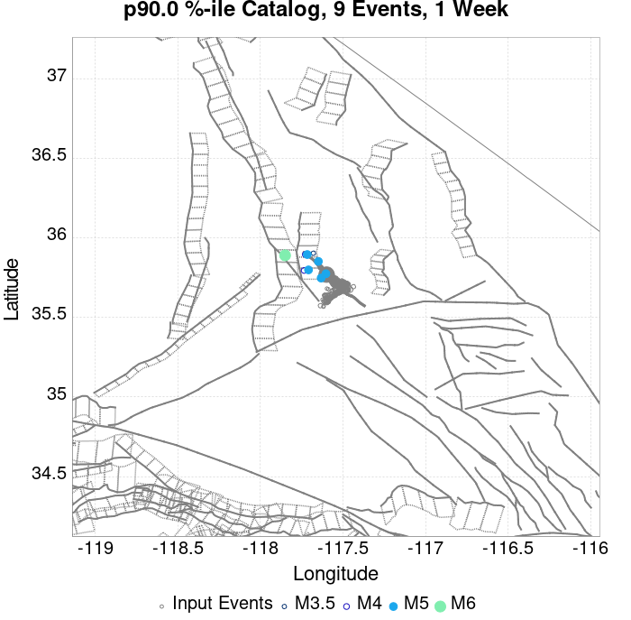
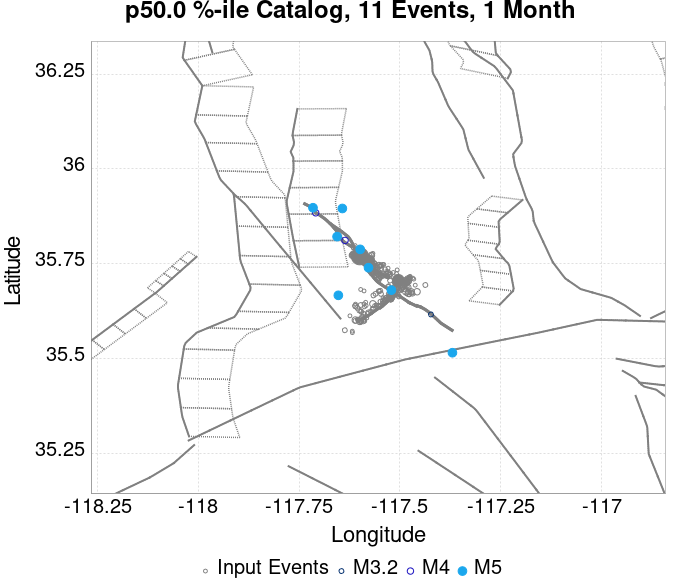
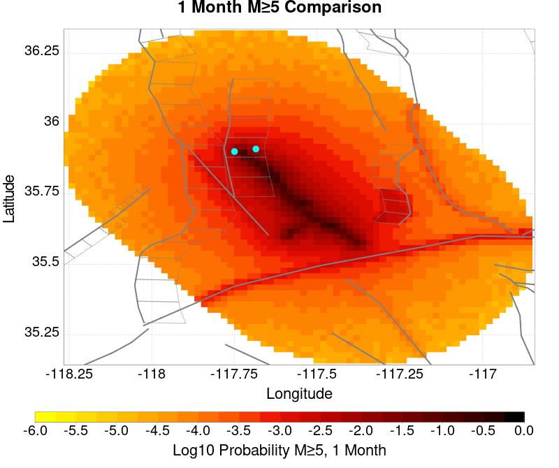
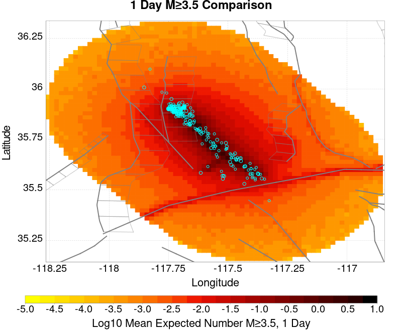
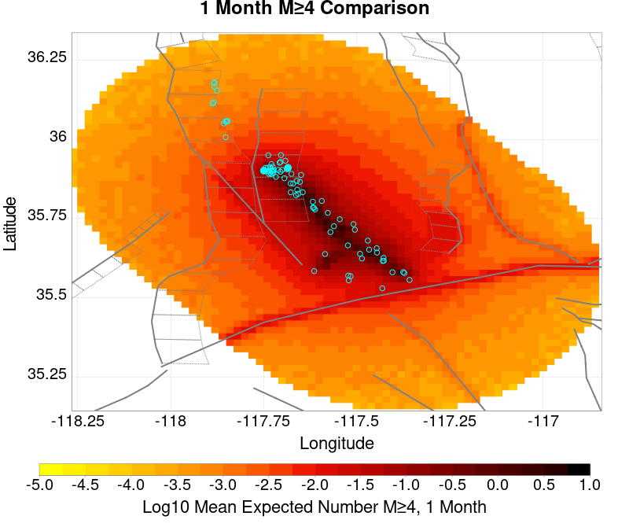
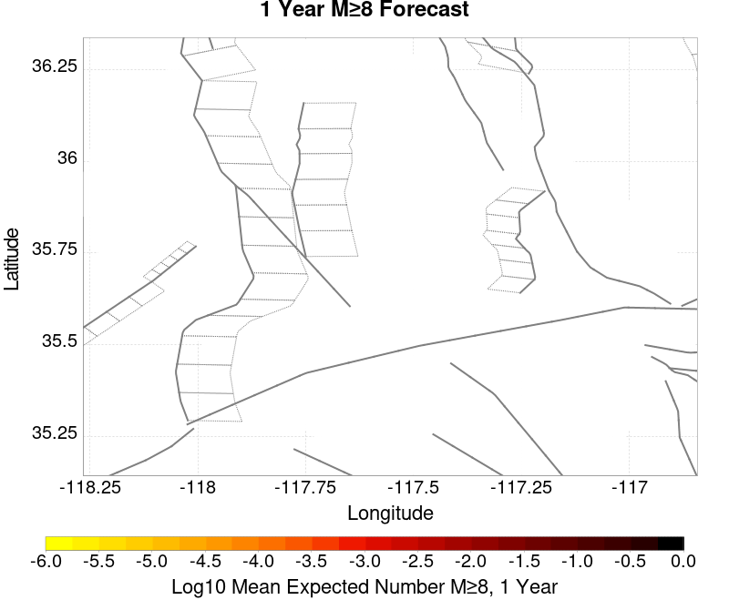
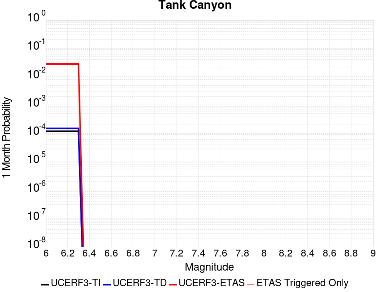
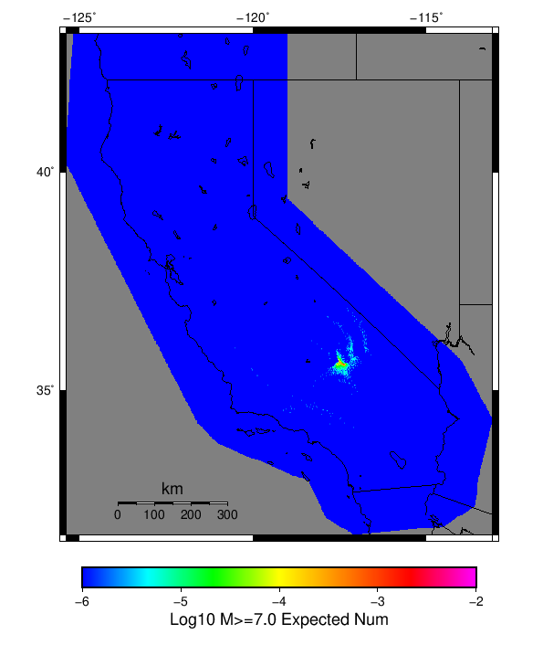

# ComCat M7.1 (ci38457511), ShakeMap Surfaces, FM2_1 Results

|   | ComCat M7.1 (ci38457511), ShakeMap Surfaces, FM2_1 |
|-----|-----|
| Num Simulations | 11867 (incomplete) |
| Start Time | 2019/07/06 03:19:54 UTC |
| Start Time Epoch Milliseconds | 1562383194040 |
| Duration | 10 Years |
| Includes Spontaneous? | false |
| Trigger Ruptures | 283 Trigger Ruptures |
|   | First: M3.98 at 2019/07/04 17:02:55 UTC |
|   | Last: M7.1 at 2019/07/06 03:19:53 UTC |
|   | Largest: M7.1 at 2019/07/06 03:19:53 UTC |
| Trigger Ruptures | *(none)* |
| Config Generated With | u3etas_comcat_event_config_builder.sh --event-id ci38457511 --mag-complete 3.5 --days-before 7 --num-simulations 1000000 --fault-model FM2_1 --finite-surf-shakemap --finite-surf-shakemap-min-mag 5 --hpc-site USC_HPC --nodes 36 --hours 24 --queue scec |

## Table Of Contents

* [Probabilities Summary Table](#probabilities-summary-table)
* [Magnitude Number Distribution](#magnitude-number-distribution)
  * [10 Year Magnitude Number Distribution](#10-year-magnitude-number-distribution)
  * [1 Year Magnitude Number Distribution](#1-year-magnitude-number-distribution)
  * [1 Month Magnitude Number Distribution](#1-month-magnitude-number-distribution)
  * [1 Week Magnitude Number Distribution](#1-week-magnitude-number-distribution)
  * [1 Day Magnitude Number Distribution](#1-day-magnitude-number-distribution)
  * [1 Hour Magnitude Number Distribution](#1-hour-magnitude-number-distribution)
* [Hazard Change Over Time](#hazard-change-over-time)
  * [M&ge;5.0 Hazard Change Over Time](#m50-hazard-change-over-time)
  * [M&ge;6.0 Hazard Change Over Time](#m60-hazard-change-over-time)
  * [M&ge;7.0 Hazard Change Over Time](#m70-hazard-change-over-time)
* [Trigger Rupture Fault Map](#trigger-rupture-fault-map)
* [Trigger Rupture Depth Map](#trigger-rupture-depth-map)
* [Fault Distances To Triggers](#fault-distances-to-triggers)
* [Individual Simulated Catalog Maps](#individual-simulated-catalog-maps)
* [ComCat Data Comparisons](#comcat-data-comparisons)
  * [ComCat Magnitude-Number Distributions](#comcat-magnitude-number-distributions)
  * [ComCat Time-Dependent Mc](#comcat-time-dependent-mc)
  * [ComCat Cumulative Number Vs Time](#comcat-cumulative-number-vs-time)
  * [ComCat Cumulative Number Simulation Percentiles](#comcat-cumulative-number-simulation-percentiles)
  * [ComCat Probability Spatial Distribution](#comcat-probability-spatial-distribution)
  * [ComCat Mean Expectation Spatial Distribution](#comcat-mean-expectation-spatial-distribution)
  * [ComCat Depth Distribution](#comcat-depth-distribution)
* [Section Participation](#section-participation)
  * [Section Participation Plots](#section-participation-plots)
  * [Supra-Seismogenic Parent Sections Table](#supra-seismogenic-parent-sections-table)
  * [M≥6.5 Parent Sections Table](#m65-parent-sections-table)
  * [M≥7 Parent Sections Table](#m7-parent-sections-table)
  * [M≥7.5 Parent Sections Table](#m75-parent-sections-table)
  * [M≥8 Parent Sections Table](#m8-parent-sections-table)
* [Fault Magnitude-Probability Distributions](#fault-magnitude-probability-distributions)
* [Gridded Nucleation](#gridded-nucleation)
* [JSON Input File](#json-input-file)

## Probabilities Summary Table
*[(top)](#table-of-contents)*

| Magnitude | 1 Hour Prob | 1 Day Prob | 1 Week Prob | 1 Month Prob | 1 Year Prob | 10 Year Prob |
|-----|-----|-----|-----|-----|-----|-----|
| **M&ge;4** | 1.000 (100.00%) | 1.000 (100.00%) | 1.000 (100.00%) | 1.000 (100.00%) | 1.000 (100.00%) | 1.000 (100.00%) |
| *95% Conf* | *[99.96% 100.00%]* | *[99.96% 100.00%]* | *[99.96% 100.00%]* | *[99.96% 100.00%]* | *[99.96% 100.00%]* | *[99.96% 100.00%]* |
| **M&ge;4.5** | 0.990 (99.01%) | 1.000 (100.00%) | 1.000 (100.00%) | 1.000 (100.00%) | 1.000 (100.00%) | 1.000 (100.00%) |
| *95% Conf* | *[98.81% 99.17%]* | *[99.96% 100.00%]* | *[99.96% 100.00%]* | *[99.96% 100.00%]* | *[99.96% 100.00%]* | *[99.96% 100.00%]* |
| **M&ge;5** | 0.762 (76.24%) | 0.977 (97.71%) | 0.995 (99.46%) | 0.998 (99.81%) | 1.000 (99.99%) | 1.000 (100.00%) |
| *95% Conf* | *[75.46% 77.00%]* | *[97.42% 97.97%]* | *[99.31% 99.58%]* | *[99.70% 99.87%]* | *[99.95% 100.00%]* | *[99.96% 100.00%]* |
| **M&ge;5.5** | 0.330 (33.02%) | 0.665 (66.50%) | 0.796 (79.64%) | 0.859 (85.89%) | 0.924 (92.43%) | 0.958 (95.81%) |
| *95% Conf* | *[32.17% 33.87%]* | *[65.64% 67.34%]* | *[78.90% 80.36%]* | *[85.25% 86.51%]* | *[91.94% 92.90%]* | *[95.43% 96.16%]* |
| **M&ge;6** | 0.076 (7.59%) | 0.204 (20.43%) | 0.286 (28.59%) | 0.346 (34.58%) | 0.446 (44.56%) | 0.528 (52.75%) |
| *95% Conf* | *[7.13% 8.09%]* | *[19.71% 21.17%]* | *[27.78% 29.42%]* | *[33.73% 35.45%]* | *[43.66% 45.46%]* | *[51.85% 53.65%]* |
| **M&ge;6.5** | 0.014 (1.38%) | 0.041 (4.12%) | 0.063 (6.29%) | 0.082 (8.20%) | 0.114 (11.42%) | 0.148 (14.78%) |
| *95% Conf* | *[1.18% 1.61%]* | *[3.77% 4.50%]* | *[5.86% 6.74%]* | *[7.71% 8.71%]* | *[10.85% 12.01%]* | *[14.15% 15.43%]* |
| **M&ge;7** | 3.29E-3 (0.33%) | 0.010 (1.00%) | 0.015 (1.53%) | 0.020 (1.98%) | 0.027 (2.66%) | 0.037 (3.70%) |
| *95% Conf* | *[0.24% 0.45%]* | *[0.83% 1.20%]* | *[1.32% 1.77%]* | *[1.74% 2.25%]* | *[2.38% 2.97%]* | *[3.37% 4.06%]* |
| **M&ge;7.1** | 2.36E-3 (0.24%) | 7.92E-3 (0.79%) | 0.012 (1.22%) | 0.016 (1.58%) | 0.021 (2.14%) | 0.030 (2.99%) |
| *95% Conf* | *[0.16% 0.35%]* | *[0.64% 0.97%]* | *[1.04% 1.44%]* | *[1.36% 1.82%]* | *[1.89% 2.42%]* | *[2.70% 3.32%]* |
| **M&ge;7.5** | 1.01E-3 (0.10%) | 3.12E-3 (0.31%) | 5.06E-3 (0.51%) | 6.74E-3 (0.67%) | 8.93E-3 (0.89%) | 0.013 (1.27%) |
| *95% Conf* | *[0.05% 0.18%]* | *[0.22% 0.43%]* | *[0.39% 0.65%]* | *[0.54% 0.84%]* | *[0.74% 1.08%]* | *[1.08% 1.49%]* |
| **M&ge;8** | 0.000 (0.00%) | 8.43E-5 (0.01%) | 8.43E-5 (0.01%) | 8.43E-5 (0.01%) | 1.69E-4 (0.02%) | 2.53E-4 (0.03%) |
| *95% Conf* | *[0.00% 0.04%]* | *[0.00% 0.05%]* | *[0.00% 0.05%]* | *[0.00% 0.05%]* | *[0.00% 0.07%]* | *[0.01% 0.08%]* |

## Magnitude Number Distribution
*[(top)](#table-of-contents)*

### 10 Year Magnitude Number Distribution
*[(top)](#table-of-contents)*

**Legend**
* **Mean** (thick black line): mean expected number across all 11867 catalogs
* **2.5%,97.5%** (thin black lines): expected number percentiles across all 11867 catalogs
* **Median** (thin blue line): median expected number across all 11867 catalogs
* **Mode** (thin cyan line): modal expected number across all 11867 catalogs
* **10 yr Probability** (thin red line): 10 year probability calculated as the fraction of catalogs with at least 1 occurrence
* **10 yr Supraseismogenic Probability** (thin dashed red line): same as above, but only for supraseismogenic ruptures on explicitly modeled UCERF3 faults
* **95% Conf** (light red shaded region): binomial 95% confidence bounds on probability
* **Primary** (thin green line): mean expected number from primary triggered aftershocks only (no secondary, tertiary, etc...) across all 11867 catalogs


| Mag | Mean | 2.5 %ile | 97.5 %ile | Median | Mode | 10 yr Probability | 10 yr Prob 95% Conf | 10 yr Supra-Seis Prob | Primary Aftershocks Mean |
|-----|-----|-----|-----|-----|-----|-----|-----|-----|-----|
| **M&ge;2.5** | 5029.582 | 3644.000 | 10387.000 | 4435.000 | 4172.000 | 1.000 (100.00%) | [99.96% 100.00%] | 0.119 (11.94%) | 2394.668 |
| **M&ge;2.6** | 3994.522 | 2885.000 | 8256.000 | 3526.000 | 3348.000 | 1.000 (100.00%) | [99.96% 100.00%] | 0.119 (11.94%) | 1901.629 |
| **M&ge;2.7** | 3172.877 | 2287.000 | 6554.000 | 2801.000 | 2718.000 | 1.000 (100.00%) | [99.96% 100.00%] | 0.119 (11.94%) | 1510.435 |
| **M&ge;2.8** | 2520.228 | 1814.000 | 5177.000 | 2225.000 | 2090.000 | 1.000 (100.00%) | [99.96% 100.00%] | 0.119 (11.94%) | 1199.972 |
| **M&ge;2.9** | 2001.843 | 1432.000 | 4142.000 | 1769.000 | 1683.000 | 1.000 (100.00%) | [99.96% 100.00%] | 0.119 (11.94%) | 953.099 |
| **M&ge;3** | 1589.954 | 1135.000 | 3287.000 | 1405.000 | 1321.000 | 1.000 (100.00%) | [99.96% 100.00%] | 0.119 (11.94%) | 757.039 |
| **M&ge;3.1** | 1262.762 | 898.000 | 2617.000 | 1116.000 | 1050.000 | 1.000 (100.00%) | [99.96% 100.00%] | 0.119 (11.94%) | 601.214 |
| **M&ge;3.2** | 1002.952 | 710.000 | 2080.000 | 888.000 | 863.000 | 1.000 (100.00%) | [99.96% 100.00%] | 0.119 (11.94%) | 477.498 |
| **M&ge;3.3** | 796.603 | 560.000 | 1656.000 | 705.000 | 633.000 | 1.000 (100.00%) | [99.96% 100.00%] | 0.119 (11.94%) | 379.358 |
| **M&ge;3.4** | 632.516 | 441.000 | 1307.000 | 560.000 | 541.000 | 1.000 (100.00%) | [99.96% 100.00%] | 0.119 (11.94%) | 301.267 |
| **M&ge;3.5** | 502.333 | 346.000 | 1048.000 | 445.000 | 425.000 | 1.000 (100.00%) | [99.96% 100.00%] | 0.119 (11.94%) | 239.281 |
| **M&ge;3.6** | 398.790 | 272.000 | 831.000 | 354.000 | 334.000 | 1.000 (100.00%) | [99.96% 100.00%] | 0.119 (11.94%) | 189.929 |
| **M&ge;3.7** | 316.644 | 213.000 | 661.000 | 281.000 | 267.000 | 1.000 (100.00%) | [99.96% 100.00%] | 0.119 (11.94%) | 150.786 |
| **M&ge;3.8** | 251.455 | 166.000 | 525.000 | 224.000 | 221.000 | 1.000 (100.00%) | [99.96% 100.00%] | 0.119 (11.94%) | 119.684 |
| **M&ge;3.9** | 199.589 | 129.000 | 416.000 | 178.000 | 174.000 | 1.000 (100.00%) | [99.96% 100.00%] | 0.119 (11.94%) | 94.997 |
| **M&ge;4** | 158.491 | 101.000 | 333.000 | 141.000 | 130.000 | 1.000 (100.00%) | [99.96% 100.00%] | 0.119 (11.94%) | 75.417 |
| **M&ge;4.1** | 125.850 | 78.000 | 266.000 | 112.000 | 108.000 | 1.000 (100.00%) | [99.96% 100.00%] | 0.119 (11.94%) | 59.917 |
| **M&ge;4.2** | 99.744 | 60.000 | 211.000 | 89.000 | 83.000 | 1.000 (100.00%) | [99.96% 100.00%] | 0.119 (11.94%) | 47.487 |
| **M&ge;4.3** | 79.158 | 46.000 | 168.000 | 71.000 | 72.000 | 1.000 (100.00%) | [99.96% 100.00%] | 0.119 (11.94%) | 37.678 |
| **M&ge;4.4** | 62.726 | 35.000 | 133.000 | 56.000 | 55.000 | 1.000 (100.00%) | [99.96% 100.00%] | 0.119 (11.94%) | 29.846 |
| **M&ge;4.5** | 49.655 | 26.000 | 106.000 | 44.000 | 41.000 | 1.000 (100.00%) | [99.96% 100.00%] | 0.119 (11.94%) | 23.604 |
| **M&ge;4.6** | 39.320 | 20.000 | 86.000 | 35.000 | 33.000 | 1.000 (100.00%) | [99.96% 100.00%] | 0.119 (11.94%) | 18.685 |
| **M&ge;4.7** | 31.073 | 15.000 | 68.000 | 28.000 | 25.000 | 1.000 (100.00%) | [99.96% 100.00%] | 0.119 (11.94%) | 14.751 |
| **M&ge;4.8** | 24.521 | 11.000 | 55.000 | 22.000 | 18.000 | 1.000 (100.00%) | [99.96% 100.00%] | 0.119 (11.94%) | 11.648 |
| **M&ge;4.9** | 19.319 | 8.000 | 44.000 | 17.000 | 15.000 | 1.000 (100.00%) | [99.96% 100.00%] | 0.119 (11.94%) | 9.171 |
| **M&ge;5** | 15.184 | 5.000 | 36.000 | 13.000 | 12.000 | 1.000 (100.00%) | [99.96% 100.00%] | 0.119 (11.94%) | 7.204 |
| **M&ge;5.1** | 11.891 | 4.000 | 29.000 | 10.000 | 10.000 | 1.000 (99.98%) | [99.93% 100.00%] | 0.119 (11.94%) | 5.635 |
| **M&ge;5.2** | 9.307 | 2.000 | 23.000 | 8.000 | 8.000 | 0.999 (99.90%) | [99.82% 99.95%] | 0.119 (11.94%) | 4.408 |
| **M&ge;5.3** | 7.240 | 1.000 | 19.000 | 6.000 | 5.000 | 0.994 (99.42%) | [99.26% 99.54%] | 0.119 (11.94%) | 3.420 |
| **M&ge;5.4** | 5.609 | 1.000 | 15.000 | 5.000 | 4.000 | 0.982 (98.15%) | [97.89% 98.39%] | 0.119 (11.94%) | 2.644 |
| **M&ge;5.5** | 4.323 | 0.000 | 12.000 | 4.000 | 3.000 | 0.958 (95.81%) | [95.43% 96.16%] | 0.119 (11.94%) | 2.024 |
| **M&ge;5.6** | 3.283 | 0.000 | 10.000 | 3.000 | 2.000 | 0.915 (91.46%) | [90.94% 91.96%] | 0.119 (11.94%) | 1.535 |
| **M&ge;5.7** | 2.459 | 0.000 | 8.000 | 2.000 | 1.000 | 0.848 (84.85%) | [84.19% 85.49%] | 0.119 (11.94%) | 1.145 |
| **M&ge;5.8** | 1.804 | 0.000 | 6.000 | 1.000 | 1.000 | 0.758 (75.80%) | [75.02% 76.56%] | 0.119 (11.94%) | 0.837 |
| **M&ge;5.9** | 1.292 | 0.000 | 5.000 | 1.000 | 0.000 | 0.644 (64.42%) | [63.55% 65.28%] | 0.119 (11.94%) | 0.596 |
| **M&ge;6** | 0.920 | 0.000 | 4.000 | 1.000 | 0.000 | 0.528 (52.75%) | [51.85% 53.65%] | 0.119 (11.94%) | 0.418 |
| **M&ge;6.1** | 0.665 | 0.000 | 3.000 | 0.000 | 0.000 | 0.423 (42.29%) | [41.39% 43.18%] | 0.119 (11.92%) | 0.296 |
| **M&ge;6.2** | 0.464 | 0.000 | 3.000 | 0.000 | 0.000 | 0.318 (31.79%) | [30.96% 32.64%] | 0.119 (11.92%) | 0.199 |
| **M&ge;6.3** | 0.366 | 0.000 | 2.000 | 0.000 | 0.000 | 0.262 (26.23%) | [25.44% 27.04%] | 0.119 (11.92%) | 0.152 |
| **M&ge;6.4** | 0.235 | 0.000 | 2.000 | 0.000 | 0.000 | 0.173 (17.28%) | [16.61% 17.98%] | 0.070 (7.04%) | 0.097 |
| **M&ge;6.5** | 0.199 | 0.000 | 2.000 | 0.000 | 0.000 | 0.148 (14.78%) | [14.15% 15.43%] | 0.070 (7.04%) | 0.079 |
| **M&ge;6.6** | 0.143 | 0.000 | 1.000 | 0.000 | 0.000 | 0.115 (11.46%) | [10.90% 12.05%] | 0.061 (6.14%) | 0.059 |
| **M&ge;6.7** | 0.111 | 0.000 | 1.000 | 0.000 | 0.000 | 0.090 (8.99%) | [8.49% 9.52%] | 0.052 (5.22%) | 0.045 |
| **M&ge;6.8** | 0.091 | 0.000 | 1.000 | 0.000 | 0.000 | 0.075 (7.47%) | [7.01% 7.97%] | 0.050 (5.01%) | 0.038 |
| **M&ge;6.9** | 0.054 | 0.000 | 1.000 | 0.000 | 0.000 | 0.045 (4.53%) | [4.16% 4.92%] | 0.029 (2.87%) | 0.023 |
| **M&ge;7** | 0.044 | 0.000 | 1.000 | 0.000 | 0.000 | 0.037 (3.70%) | [3.37% 4.06%] | 0.027 (2.70%) | 0.018 |
| **M&ge;7.1** | 0.035 | 0.000 | 1.000 | 0.000 | 0.000 | 0.030 (2.99%) | [2.70% 3.32%] | 0.024 (2.42%) | 0.014 |
| **M&ge;7.2** | 0.029 | 0.000 | 1.000 | 0.000 | 0.000 | 0.025 (2.52%) | [2.25% 2.82%] | 0.022 (2.19%) | 0.012 |
| **M&ge;7.3** | 0.023 | 0.000 | 0.000 | 0.000 | 0.000 | 0.020 (1.96%) | [1.72% 2.23%] | 0.018 (1.76%) | 9.61E-3 |
| **M&ge;7.4** | 0.019 | 0.000 | 0.000 | 0.000 | 0.000 | 0.017 (1.66%) | [1.44% 1.91%] | 0.016 (1.55%) | 8.93E-3 |
| **M&ge;7.5** | 0.015 | 0.000 | 0.000 | 0.000 | 0.000 | 0.013 (1.27%) | [1.08% 1.49%] | 0.012 (1.22%) | 6.49E-3 |
| **M&ge;7.6** | 0.013 | 0.000 | 0.000 | 0.000 | 0.000 | 0.011 (1.10%) | [0.93% 1.31%] | 0.011 (1.09%) | 5.56E-3 |
| **M&ge;7.7** | 5.48E-3 | 0.000 | 0.000 | 0.000 | 0.000 | 5.06E-3 (0.51%) | [0.39% 0.65%] | 4.97E-3 (0.50%) | 1.43E-3 |
| **M&ge;7.8** | 1.85E-3 | 0.000 | 0.000 | 0.000 | 0.000 | 1.85E-3 (0.19%) | [0.12% 0.29%] | 1.77E-3 (0.18%) | 1.69E-4 |
| **M&ge;7.9** | 6.74E-4 | 0.000 | 0.000 | 0.000 | 0.000 | 6.74E-4 (0.07%) | [0.03% 0.14%] | 6.74E-4 (0.07%) | 8.43E-5 |
| **M&ge;8** | 2.53E-4 | 0.000 | 0.000 | 0.000 | 0.000 | 2.53E-4 (0.03%) | [0.01% 0.08%] | 2.53E-4 (0.03%) | 0.000 |
| **M&ge;8.1** | 2.53E-4 | 0.000 | 0.000 | 0.000 | 0.000 | 2.53E-4 (0.03%) | [0.01% 0.08%] | 2.53E-4 (0.03%) | 0.000 |
| **M&ge;8.2** | 0.000 | 0.000 | 0.000 | 0.000 | 0.000 | 0.000 (0.00%) | [0.00% 0.04%] | 0.000 (0.00%) | 0.000 |
| **M&ge;8.3** | 0.000 | 0.000 | 0.000 | 0.000 | 0.000 | 0.000 (0.00%) | [0.00% 0.04%] | 0.000 (0.00%) | 0.000 |
| **M&ge;8.4** | 0.000 | 0.000 | 0.000 | 0.000 | 0.000 | 0.000 (0.00%) | [0.00% 0.04%] | 0.000 (0.00%) | 0.000 |
| **M&ge;8.5** | 0.000 | 0.000 | 0.000 | 0.000 | 0.000 | 0.000 (0.00%) | [0.00% 0.04%] | 0.000 (0.00%) | 0.000 |
| **M&ge;8.6** | 0.000 | 0.000 | 0.000 | 0.000 | 0.000 | 0.000 (0.00%) | [0.00% 0.04%] | 0.000 (0.00%) | 0.000 |
| **M&ge;8.7** | 0.000 | 0.000 | 0.000 | 0.000 | 0.000 | 0.000 (0.00%) | [0.00% 0.04%] | 0.000 (0.00%) | 0.000 |
| **M&ge;8.8** | 0.000 | 0.000 | 0.000 | 0.000 | 0.000 | 0.000 (0.00%) | [0.00% 0.04%] | 0.000 (0.00%) | 0.000 |
| **M&ge;8.9** | 0.000 | 0.000 | 0.000 | 0.000 | 0.000 | 0.000 (0.00%) | [0.00% 0.04%] | 0.000 (0.00%) | 0.000 |
| **M&ge;9** | 0.000 | 0.000 | 0.000 | 0.000 | 0.000 | 0.000 (0.00%) | [0.00% 0.04%] | 0.000 (0.00%) | 0.000 |

### 1 Year Magnitude Number Distribution
*[(top)](#table-of-contents)*

**Legend**
* **Mean** (thick black line): mean expected number across all 11867 catalogs
* **2.5%,97.5%** (thin black lines): expected number percentiles across all 11867 catalogs
* **Median** (thin blue line): median expected number across all 11867 catalogs
* **Mode** (thin cyan line): modal expected number across all 11867 catalogs
* **1 yr Probability** (thin red line): 1 year probability calculated as the fraction of catalogs with at least 1 occurrence
* **1 yr Supraseismogenic Probability** (thin dashed red line): same as above, but only for supraseismogenic ruptures on explicitly modeled UCERF3 faults
* **95% Conf** (light red shaded region): binomial 95% confidence bounds on probability
* **Primary** (thin green line): mean expected number from primary triggered aftershocks only (no secondary, tertiary, etc...) across all 11867 catalogs


| Mag | Mean | 2.5 %ile | 97.5 %ile | Median | Mode | 1 yr Probability | 1 yr Prob 95% Conf | 1 yr Supra-Seis Prob | Primary Aftershocks Mean |
|-----|-----|-----|-----|-----|-----|-----|-----|-----|-----|
| **M&ge;2.5** | 3841.690 | 2943.000 | 6759.000 | 3482.000 | 3213.000 | 1.000 (100.00%) | [99.96% 100.00%] | 0.092 (9.19%) | 2085.823 |
| **M&ge;2.6** | 3051.032 | 2333.000 | 5370.000 | 2766.000 | 2666.000 | 1.000 (100.00%) | [99.96% 100.00%] | 0.092 (9.19%) | 1656.338 |
| **M&ge;2.7** | 2423.451 | 1848.000 | 4271.000 | 2196.000 | 2171.000 | 1.000 (100.00%) | [99.96% 100.00%] | 0.092 (9.19%) | 1315.590 |
| **M&ge;2.8** | 1924.931 | 1464.000 | 3387.000 | 1746.000 | 1603.000 | 1.000 (100.00%) | [99.96% 100.00%] | 0.092 (9.19%) | 1045.124 |
| **M&ge;2.9** | 1528.907 | 1157.000 | 2684.000 | 1387.000 | 1322.000 | 1.000 (100.00%) | [99.96% 100.00%] | 0.092 (9.19%) | 830.089 |
| **M&ge;3** | 1214.315 | 914.000 | 2130.000 | 1102.000 | 1053.000 | 1.000 (100.00%) | [99.96% 100.00%] | 0.092 (9.19%) | 659.366 |
| **M&ge;3.1** | 964.344 | 722.000 | 1689.000 | 875.000 | 840.000 | 1.000 (100.00%) | [99.96% 100.00%] | 0.092 (9.19%) | 523.644 |
| **M&ge;3.2** | 766.016 | 569.000 | 1345.000 | 696.000 | 649.000 | 1.000 (100.00%) | [99.96% 100.00%] | 0.092 (9.19%) | 415.873 |
| **M&ge;3.3** | 608.473 | 448.000 | 1070.000 | 553.000 | 521.000 | 1.000 (100.00%) | [99.96% 100.00%] | 0.092 (9.19%) | 330.399 |
| **M&ge;3.4** | 483.146 | 352.000 | 853.000 | 440.000 | 416.000 | 1.000 (100.00%) | [99.96% 100.00%] | 0.092 (9.19%) | 262.365 |
| **M&ge;3.5** | 383.742 | 277.000 | 682.000 | 350.000 | 341.000 | 1.000 (100.00%) | [99.96% 100.00%] | 0.092 (9.19%) | 208.375 |
| **M&ge;3.6** | 304.683 | 217.000 | 540.000 | 278.000 | 264.000 | 1.000 (100.00%) | [99.96% 100.00%] | 0.092 (9.19%) | 165.409 |
| **M&ge;3.7** | 241.909 | 170.000 | 427.000 | 221.000 | 202.000 | 1.000 (100.00%) | [99.96% 100.00%] | 0.092 (9.19%) | 131.294 |
| **M&ge;3.8** | 192.138 | 132.000 | 340.000 | 176.000 | 167.000 | 1.000 (100.00%) | [99.96% 100.00%] | 0.092 (9.19%) | 104.253 |
| **M&ge;3.9** | 152.518 | 102.000 | 273.000 | 140.000 | 135.000 | 1.000 (100.00%) | [99.96% 100.00%] | 0.092 (9.19%) | 82.750 |
| **M&ge;4** | 121.099 | 79.000 | 217.000 | 111.000 | 103.000 | 1.000 (100.00%) | [99.96% 100.00%] | 0.092 (9.19%) | 65.685 |
| **M&ge;4.1** | 96.156 | 61.000 | 172.000 | 88.000 | 86.000 | 1.000 (100.00%) | [99.96% 100.00%] | 0.092 (9.19%) | 52.189 |
| **M&ge;4.2** | 76.192 | 47.000 | 138.000 | 70.000 | 66.000 | 1.000 (100.00%) | [99.96% 100.00%] | 0.092 (9.19%) | 41.362 |
| **M&ge;4.3** | 60.462 | 36.000 | 110.000 | 56.000 | 49.000 | 1.000 (100.00%) | [99.96% 100.00%] | 0.092 (9.19%) | 32.822 |
| **M&ge;4.4** | 47.914 | 27.000 | 90.000 | 44.000 | 45.000 | 1.000 (100.00%) | [99.96% 100.00%] | 0.092 (9.19%) | 26.008 |
| **M&ge;4.5** | 37.932 | 20.000 | 72.000 | 35.000 | 33.000 | 1.000 (100.00%) | [99.96% 100.00%] | 0.092 (9.19%) | 20.572 |
| **M&ge;4.6** | 30.035 | 15.000 | 58.000 | 28.000 | 25.000 | 1.000 (100.00%) | [99.96% 100.00%] | 0.092 (9.19%) | 16.275 |
| **M&ge;4.7** | 23.721 | 11.000 | 47.000 | 22.000 | 21.000 | 1.000 (100.00%) | [99.96% 100.00%] | 0.092 (9.19%) | 12.837 |
| **M&ge;4.8** | 18.724 | 8.000 | 38.000 | 17.000 | 16.000 | 1.000 (100.00%) | [99.96% 100.00%] | 0.092 (9.19%) | 10.135 |
| **M&ge;4.9** | 14.762 | 6.000 | 31.000 | 13.000 | 12.000 | 1.000 (100.00%) | [99.96% 100.00%] | 0.092 (9.19%) | 7.982 |
| **M&ge;5** | 11.593 | 4.000 | 25.000 | 10.000 | 9.000 | 1.000 (99.99%) | [99.95% 100.00%] | 0.092 (9.19%) | 6.264 |
| **M&ge;5.1** | 9.064 | 2.000 | 21.000 | 8.000 | 7.000 | 0.999 (99.92%) | [99.85% 99.96%] | 0.092 (9.19%) | 4.899 |
| **M&ge;5.2** | 7.099 | 1.000 | 17.000 | 6.000 | 5.000 | 0.997 (99.68%) | [99.56% 99.77%] | 0.092 (9.19%) | 3.835 |
| **M&ge;5.3** | 5.507 | 1.000 | 14.000 | 5.000 | 4.000 | 0.987 (98.69%) | [98.46% 98.88%] | 0.092 (9.19%) | 2.969 |
| **M&ge;5.4** | 4.267 | 0.000 | 11.000 | 4.000 | 3.000 | 0.963 (96.34%) | [95.99% 96.67%] | 0.092 (9.19%) | 2.297 |
| **M&ge;5.5** | 3.284 | 0.000 | 9.000 | 3.000 | 2.000 | 0.924 (92.43%) | [91.94% 92.90%] | 0.092 (9.19%) | 1.761 |
| **M&ge;5.6** | 2.496 | 0.000 | 8.000 | 2.000 | 2.000 | 0.864 (86.37%) | [85.73% 86.98%] | 0.092 (9.19%) | 1.337 |
| **M&ge;5.7** | 1.868 | 0.000 | 6.000 | 1.000 | 1.000 | 0.780 (77.97%) | [77.21% 78.71%] | 0.092 (9.19%) | 0.997 |
| **M&ge;5.8** | 1.369 | 0.000 | 5.000 | 1.000 | 0.000 | 0.677 (67.72%) | [66.87% 68.56%] | 0.092 (9.19%) | 0.729 |
| **M&ge;5.9** | 0.979 | 0.000 | 4.000 | 1.000 | 0.000 | 0.560 (56.01%) | [55.11% 56.91%] | 0.092 (9.19%) | 0.519 |
| **M&ge;6** | 0.696 | 0.000 | 3.000 | 0.000 | 0.000 | 0.446 (44.56%) | [43.66% 45.46%] | 0.092 (9.19%) | 0.362 |
| **M&ge;6.1** | 0.500 | 0.000 | 3.000 | 0.000 | 0.000 | 0.348 (34.78%) | [33.92% 35.64%] | 0.092 (9.17%) | 0.255 |
| **M&ge;6.2** | 0.344 | 0.000 | 2.000 | 0.000 | 0.000 | 0.254 (25.42%) | [24.64% 26.22%] | 0.092 (9.17%) | 0.171 |
| **M&ge;6.3** | 0.270 | 0.000 | 2.000 | 0.000 | 0.000 | 0.208 (20.83%) | [20.11% 21.58%] | 0.092 (9.17%) | 0.131 |
| **M&ge;6.4** | 0.170 | 0.000 | 1.000 | 0.000 | 0.000 | 0.135 (13.46%) | [12.85% 14.09%] | 0.054 (5.40%) | 0.084 |
| **M&ge;6.5** | 0.143 | 0.000 | 1.000 | 0.000 | 0.000 | 0.114 (11.42%) | [10.85% 12.01%] | 0.054 (5.40%) | 0.068 |
| **M&ge;6.6** | 0.102 | 0.000 | 1.000 | 0.000 | 0.000 | 0.087 (8.69%) | [8.19% 9.21%] | 0.046 (4.63%) | 0.050 |
| **M&ge;6.7** | 0.079 | 0.000 | 1.000 | 0.000 | 0.000 | 0.067 (6.73%) | [6.29% 7.20%] | 0.039 (3.91%) | 0.038 |
| **M&ge;6.8** | 0.066 | 0.000 | 1.000 | 0.000 | 0.000 | 0.056 (5.63%) | [5.22% 6.06%] | 0.038 (3.78%) | 0.032 |
| **M&ge;6.9** | 0.038 | 0.000 | 1.000 | 0.000 | 0.000 | 0.033 (3.34%) | [3.02% 3.68%] | 0.021 (2.07%) | 0.019 |
| **M&ge;7** | 0.030 | 0.000 | 1.000 | 0.000 | 0.000 | 0.027 (2.66%) | [2.38% 2.97%] | 0.019 (1.93%) | 0.015 |
| **M&ge;7.1** | 0.024 | 0.000 | 0.000 | 0.000 | 0.000 | 0.021 (2.14%) | [1.89% 2.42%] | 0.017 (1.72%) | 0.012 |
| **M&ge;7.2** | 0.020 | 0.000 | 0.000 | 0.000 | 0.000 | 0.018 (1.77%) | [1.54% 2.03%] | 0.016 (1.56%) | 9.69E-3 |
| **M&ge;7.3** | 0.016 | 0.000 | 0.000 | 0.000 | 0.000 | 0.014 (1.41%) | [1.21% 1.64%] | 0.013 (1.26%) | 8.09E-3 |
| **M&ge;7.4** | 0.013 | 0.000 | 0.000 | 0.000 | 0.000 | 0.012 (1.21%) | [1.03% 1.43%] | 0.011 (1.13%) | 7.58E-3 |
| **M&ge;7.5** | 9.94E-3 | 0.000 | 0.000 | 0.000 | 0.000 | 8.93E-3 (0.89%) | [0.74% 1.08%] | 8.60E-3 (0.86%) | 5.22E-3 |
| **M&ge;7.6** | 8.68E-3 | 0.000 | 0.000 | 0.000 | 0.000 | 7.67E-3 (0.77%) | [0.62% 0.95%] | 7.58E-3 (0.76%) | 4.47E-3 |
| **M&ge;7.7** | 3.54E-3 | 0.000 | 0.000 | 0.000 | 0.000 | 3.29E-3 (0.33%) | [0.24% 0.45%] | 3.20E-3 (0.32%) | 1.26E-3 |
| **M&ge;7.8** | 1.10E-3 | 0.000 | 0.000 | 0.000 | 0.000 | 1.10E-3 (0.11%) | [0.06% 0.19%] | 1.01E-3 (0.10%) | 1.69E-4 |
| **M&ge;7.9** | 5.06E-4 | 0.000 | 0.000 | 0.000 | 0.000 | 5.06E-4 (0.05%) | [0.02% 0.12%] | 5.06E-4 (0.05%) | 8.43E-5 |
| **M&ge;8** | 1.69E-4 | 0.000 | 0.000 | 0.000 | 0.000 | 1.69E-4 (0.02%) | [0.00% 0.07%] | 1.69E-4 (0.02%) | 0.000 |
| **M&ge;8.1** | 1.69E-4 | 0.000 | 0.000 | 0.000 | 0.000 | 1.69E-4 (0.02%) | [0.00% 0.07%] | 1.69E-4 (0.02%) | 0.000 |
| **M&ge;8.2** | 0.000 | 0.000 | 0.000 | 0.000 | 0.000 | 0.000 (0.00%) | [0.00% 0.04%] | 0.000 (0.00%) | 0.000 |
| **M&ge;8.3** | 0.000 | 0.000 | 0.000 | 0.000 | 0.000 | 0.000 (0.00%) | [0.00% 0.04%] | 0.000 (0.00%) | 0.000 |
| **M&ge;8.4** | 0.000 | 0.000 | 0.000 | 0.000 | 0.000 | 0.000 (0.00%) | [0.00% 0.04%] | 0.000 (0.00%) | 0.000 |
| **M&ge;8.5** | 0.000 | 0.000 | 0.000 | 0.000 | 0.000 | 0.000 (0.00%) | [0.00% 0.04%] | 0.000 (0.00%) | 0.000 |
| **M&ge;8.6** | 0.000 | 0.000 | 0.000 | 0.000 | 0.000 | 0.000 (0.00%) | [0.00% 0.04%] | 0.000 (0.00%) | 0.000 |
| **M&ge;8.7** | 0.000 | 0.000 | 0.000 | 0.000 | 0.000 | 0.000 (0.00%) | [0.00% 0.04%] | 0.000 (0.00%) | 0.000 |
| **M&ge;8.8** | 0.000 | 0.000 | 0.000 | 0.000 | 0.000 | 0.000 (0.00%) | [0.00% 0.04%] | 0.000 (0.00%) | 0.000 |
| **M&ge;8.9** | 0.000 | 0.000 | 0.000 | 0.000 | 0.000 | 0.000 (0.00%) | [0.00% 0.04%] | 0.000 (0.00%) | 0.000 |
| **M&ge;9** | 0.000 | 0.000 | 0.000 | 0.000 | 0.000 | 0.000 (0.00%) | [0.00% 0.04%] | 0.000 (0.00%) | 0.000 |

### 1 Month Magnitude Number Distribution
*[(top)](#table-of-contents)*

**Legend**
* **Mean** (thick black line): mean expected number across all 11867 catalogs
* **2.5%,97.5%** (thin black lines): expected number percentiles across all 11867 catalogs
* **Median** (thin blue line): median expected number across all 11867 catalogs
* **Mode** (thin cyan line): modal expected number across all 11867 catalogs
* **1 mo Probability** (thin red line): 1 month probability calculated as the fraction of catalogs with at least 1 occurrence
* **1 mo Supraseismogenic Probability** (thin dashed red line): same as above, but only for supraseismogenic ruptures on explicitly modeled UCERF3 faults
* **95% Conf** (light red shaded region): binomial 95% confidence bounds on probability
* **Primary** (thin green line): mean expected number from primary triggered aftershocks only (no secondary, tertiary, etc...) across all 11867 catalogs


| Mag | Mean | 2.5 %ile | 97.5 %ile | Median | Mode | 1 mo Probability | 1 mo Prob 95% Conf | 1 mo Supra-Seis Prob | Primary Aftershocks Mean |
|-----|-----|-----|-----|-----|-----|-----|-----|-----|-----|
| **M&ge;2.5** | 2714.012 | 2186.000 | 4184.000 | 2513.000 | 2378.000 | 1.000 (100.00%) | [99.96% 100.00%] | 0.064 (6.45%) | 1690.520 |
| **M&ge;2.6** | 2155.541 | 1729.000 | 3324.000 | 1997.000 | 1977.000 | 1.000 (100.00%) | [99.96% 100.00%] | 0.064 (6.45%) | 1342.520 |
| **M&ge;2.7** | 1712.137 | 1369.000 | 2643.000 | 1586.000 | 1532.000 | 1.000 (100.00%) | [99.96% 100.00%] | 0.064 (6.45%) | 1066.322 |
| **M&ge;2.8** | 1359.984 | 1082.000 | 2105.000 | 1260.000 | 1216.000 | 1.000 (100.00%) | [99.96% 100.00%] | 0.064 (6.45%) | 847.049 |
| **M&ge;2.9** | 1080.170 | 854.000 | 1673.000 | 1001.000 | 941.000 | 1.000 (100.00%) | [99.96% 100.00%] | 0.064 (6.45%) | 672.718 |
| **M&ge;3** | 857.828 | 674.000 | 1335.000 | 796.000 | 737.000 | 1.000 (100.00%) | [99.96% 100.00%] | 0.064 (6.45%) | 534.293 |
| **M&ge;3.1** | 681.223 | 531.000 | 1063.000 | 632.000 | 590.000 | 1.000 (100.00%) | [99.96% 100.00%] | 0.064 (6.45%) | 424.324 |
| **M&ge;3.2** | 541.102 | 419.000 | 840.000 | 502.000 | 471.000 | 1.000 (100.00%) | [99.96% 100.00%] | 0.064 (6.45%) | 337.002 |
| **M&ge;3.3** | 429.897 | 329.000 | 673.000 | 400.000 | 391.000 | 1.000 (100.00%) | [99.96% 100.00%] | 0.064 (6.45%) | 267.758 |
| **M&ge;3.4** | 341.354 | 258.000 | 536.000 | 318.000 | 300.000 | 1.000 (100.00%) | [99.96% 100.00%] | 0.064 (6.45%) | 212.658 |
| **M&ge;3.5** | 271.091 | 202.000 | 427.000 | 252.000 | 247.000 | 1.000 (100.00%) | [99.96% 100.00%] | 0.064 (6.45%) | 168.888 |
| **M&ge;3.6** | 215.288 | 157.000 | 342.000 | 201.000 | 195.000 | 1.000 (100.00%) | [99.96% 100.00%] | 0.064 (6.45%) | 134.071 |
| **M&ge;3.7** | 170.930 | 122.000 | 270.000 | 160.000 | 152.000 | 1.000 (100.00%) | [99.96% 100.00%] | 0.064 (6.45%) | 106.414 |
| **M&ge;3.8** | 135.732 | 95.000 | 217.000 | 127.000 | 123.000 | 1.000 (100.00%) | [99.96% 100.00%] | 0.064 (6.45%) | 84.489 |
| **M&ge;3.9** | 107.753 | 74.000 | 173.000 | 101.000 | 93.000 | 1.000 (100.00%) | [99.96% 100.00%] | 0.064 (6.45%) | 67.075 |
| **M&ge;4** | 85.554 | 56.000 | 138.000 | 80.000 | 77.000 | 1.000 (100.00%) | [99.96% 100.00%] | 0.064 (6.45%) | 53.227 |
| **M&ge;4.1** | 67.937 | 43.000 | 112.000 | 64.000 | 62.000 | 1.000 (100.00%) | [99.96% 100.00%] | 0.064 (6.45%) | 42.287 |
| **M&ge;4.2** | 53.826 | 33.000 | 89.000 | 50.000 | 48.000 | 1.000 (100.00%) | [99.96% 100.00%] | 0.064 (6.45%) | 33.520 |
| **M&ge;4.3** | 42.722 | 25.000 | 73.000 | 40.000 | 40.000 | 1.000 (100.00%) | [99.96% 100.00%] | 0.064 (6.45%) | 26.605 |
| **M&ge;4.4** | 33.866 | 19.000 | 59.000 | 32.000 | 30.000 | 1.000 (100.00%) | [99.96% 100.00%] | 0.064 (6.45%) | 21.083 |
| **M&ge;4.5** | 26.821 | 14.000 | 48.000 | 25.000 | 24.000 | 1.000 (100.00%) | [99.96% 100.00%] | 0.064 (6.45%) | 16.678 |
| **M&ge;4.6** | 21.245 | 10.000 | 39.000 | 20.000 | 19.000 | 1.000 (100.00%) | [99.96% 100.00%] | 0.064 (6.45%) | 13.196 |
| **M&ge;4.7** | 16.786 | 7.000 | 32.000 | 16.000 | 14.000 | 1.000 (100.00%) | [99.96% 100.00%] | 0.064 (6.45%) | 10.409 |
| **M&ge;4.8** | 13.255 | 5.000 | 26.000 | 12.000 | 11.000 | 1.000 (100.00%) | [99.96% 100.00%] | 0.064 (6.45%) | 8.219 |
| **M&ge;4.9** | 10.448 | 4.000 | 22.000 | 10.000 | 9.000 | 1.000 (99.97%) | [99.92% 99.99%] | 0.064 (6.45%) | 6.479 |
| **M&ge;5** | 8.209 | 2.000 | 18.000 | 8.000 | 6.000 | 0.998 (99.81%) | [99.70% 99.87%] | 0.064 (6.45%) | 5.086 |
| **M&ge;5.1** | 6.420 | 1.000 | 14.000 | 6.000 | 5.000 | 0.994 (99.37%) | [99.20% 99.50%] | 0.064 (6.45%) | 3.978 |
| **M&ge;5.2** | 5.029 | 1.000 | 12.000 | 5.000 | 4.000 | 0.983 (98.29%) | [98.04% 98.51%] | 0.064 (6.45%) | 3.110 |
| **M&ge;5.3** | 3.891 | 0.000 | 10.000 | 3.000 | 3.000 | 0.959 (95.94%) | [95.56% 96.28%] | 0.064 (6.45%) | 2.405 |
| **M&ge;5.4** | 3.012 | 0.000 | 8.000 | 3.000 | 2.000 | 0.918 (91.82%) | [91.31% 92.30%] | 0.064 (6.45%) | 1.859 |
| **M&ge;5.5** | 2.317 | 0.000 | 7.000 | 2.000 | 1.000 | 0.859 (85.89%) | [85.25% 86.51%] | 0.064 (6.45%) | 1.426 |
| **M&ge;5.6** | 1.760 | 0.000 | 6.000 | 1.000 | 1.000 | 0.777 (77.65%) | [76.89% 78.40%] | 0.064 (6.45%) | 1.081 |
| **M&ge;5.7** | 1.315 | 0.000 | 5.000 | 1.000 | 1.000 | 0.677 (67.73%) | [66.88% 68.57%] | 0.064 (6.45%) | 0.807 |
| **M&ge;5.8** | 0.960 | 0.000 | 4.000 | 1.000 | 0.000 | 0.567 (56.74%) | [55.84% 57.63%] | 0.064 (6.45%) | 0.587 |
| **M&ge;5.9** | 0.683 | 0.000 | 3.000 | 0.000 | 0.000 | 0.450 (44.97%) | [44.07% 45.87%] | 0.064 (6.45%) | 0.417 |
| **M&ge;6** | 0.483 | 0.000 | 3.000 | 0.000 | 0.000 | 0.346 (34.58%) | [33.73% 35.45%] | 0.064 (6.45%) | 0.292 |
| **M&ge;6.1** | 0.345 | 0.000 | 2.000 | 0.000 | 0.000 | 0.262 (26.25%) | [25.46% 27.05%] | 0.064 (6.44%) | 0.205 |
| **M&ge;6.2** | 0.233 | 0.000 | 2.000 | 0.000 | 0.000 | 0.186 (18.64%) | [17.95% 19.35%] | 0.064 (6.44%) | 0.135 |
| **M&ge;6.3** | 0.183 | 0.000 | 1.000 | 0.000 | 0.000 | 0.151 (15.06%) | [14.42% 15.72%] | 0.064 (6.44%) | 0.103 |
| **M&ge;6.4** | 0.116 | 0.000 | 1.000 | 0.000 | 0.000 | 0.096 (9.65%) | [9.13% 10.20%] | 0.039 (3.94%) | 0.067 |
| **M&ge;6.5** | 0.098 | 0.000 | 1.000 | 0.000 | 0.000 | 0.082 (8.20%) | [7.71% 8.71%] | 0.039 (3.94%) | 0.055 |
| **M&ge;6.6** | 0.071 | 0.000 | 1.000 | 0.000 | 0.000 | 0.063 (6.25%) | [5.83% 6.71%] | 0.034 (3.36%) | 0.042 |
| **M&ge;6.7** | 0.055 | 0.000 | 1.000 | 0.000 | 0.000 | 0.048 (4.79%) | [4.41% 5.19%] | 0.028 (2.81%) | 0.032 |
| **M&ge;6.8** | 0.046 | 0.000 | 1.000 | 0.000 | 0.000 | 0.041 (4.05%) | [3.71% 4.43%] | 0.027 (2.71%) | 0.027 |
| **M&ge;6.9** | 0.028 | 0.000 | 0.000 | 0.000 | 0.000 | 0.025 (2.46%) | [2.19% 2.76%] | 0.016 (1.56%) | 0.016 |
| **M&ge;7** | 0.023 | 0.000 | 0.000 | 0.000 | 0.000 | 0.020 (1.98%) | [1.74% 2.25%] | 0.014 (1.45%) | 0.013 |
| **M&ge;7.1** | 0.018 | 0.000 | 0.000 | 0.000 | 0.000 | 0.016 (1.58%) | [1.36% 1.82%] | 0.013 (1.30%) | 0.010 |
| **M&ge;7.2** | 0.015 | 0.000 | 0.000 | 0.000 | 0.000 | 0.013 (1.33%) | [1.14% 1.56%] | 0.012 (1.18%) | 8.43E-3 |
| **M&ge;7.3** | 0.012 | 0.000 | 0.000 | 0.000 | 0.000 | 0.011 (1.07%) | [0.90% 1.28%] | 9.61E-3 (0.96%) | 7.25E-3 |
| **M&ge;7.4** | 0.010 | 0.000 | 0.000 | 0.000 | 0.000 | 9.27E-3 (0.93%) | [0.77% 1.12%] | 8.68E-3 (0.87%) | 6.74E-3 |
| **M&ge;7.5** | 7.67E-3 | 0.000 | 0.000 | 0.000 | 0.000 | 6.74E-3 (0.67%) | [0.54% 0.84%] | 6.57E-3 (0.66%) | 4.55E-3 |
| **M&ge;7.6** | 6.66E-3 | 0.000 | 0.000 | 0.000 | 0.000 | 5.73E-3 (0.57%) | [0.45% 0.73%] | 5.73E-3 (0.57%) | 3.79E-3 |
| **M&ge;7.7** | 2.53E-3 | 0.000 | 0.000 | 0.000 | 0.000 | 2.28E-3 (0.23%) | [0.15% 0.34%] | 2.28E-3 (0.23%) | 7.58E-4 |
| **M&ge;7.8** | 8.43E-4 | 0.000 | 0.000 | 0.000 | 0.000 | 8.43E-4 (0.08%) | [0.04% 0.16%] | 8.43E-4 (0.08%) | 8.43E-5 |
| **M&ge;7.9** | 3.37E-4 | 0.000 | 0.000 | 0.000 | 0.000 | 3.37E-4 (0.03%) | [0.01% 0.09%] | 3.37E-4 (0.03%) | 8.43E-5 |
| **M&ge;8** | 8.43E-5 | 0.000 | 0.000 | 0.000 | 0.000 | 8.43E-5 (0.01%) | [0.00% 0.05%] | 8.43E-5 (0.01%) | 0.000 |
| **M&ge;8.1** | 8.43E-5 | 0.000 | 0.000 | 0.000 | 0.000 | 8.43E-5 (0.01%) | [0.00% 0.05%] | 8.43E-5 (0.01%) | 0.000 |
| **M&ge;8.2** | 0.000 | 0.000 | 0.000 | 0.000 | 0.000 | 0.000 (0.00%) | [0.00% 0.04%] | 0.000 (0.00%) | 0.000 |
| **M&ge;8.3** | 0.000 | 0.000 | 0.000 | 0.000 | 0.000 | 0.000 (0.00%) | [0.00% 0.04%] | 0.000 (0.00%) | 0.000 |
| **M&ge;8.4** | 0.000 | 0.000 | 0.000 | 0.000 | 0.000 | 0.000 (0.00%) | [0.00% 0.04%] | 0.000 (0.00%) | 0.000 |
| **M&ge;8.5** | 0.000 | 0.000 | 0.000 | 0.000 | 0.000 | 0.000 (0.00%) | [0.00% 0.04%] | 0.000 (0.00%) | 0.000 |
| **M&ge;8.6** | 0.000 | 0.000 | 0.000 | 0.000 | 0.000 | 0.000 (0.00%) | [0.00% 0.04%] | 0.000 (0.00%) | 0.000 |
| **M&ge;8.7** | 0.000 | 0.000 | 0.000 | 0.000 | 0.000 | 0.000 (0.00%) | [0.00% 0.04%] | 0.000 (0.00%) | 0.000 |
| **M&ge;8.8** | 0.000 | 0.000 | 0.000 | 0.000 | 0.000 | 0.000 (0.00%) | [0.00% 0.04%] | 0.000 (0.00%) | 0.000 |
| **M&ge;8.9** | 0.000 | 0.000 | 0.000 | 0.000 | 0.000 | 0.000 (0.00%) | [0.00% 0.04%] | 0.000 (0.00%) | 0.000 |
| **M&ge;9** | 0.000 | 0.000 | 0.000 | 0.000 | 0.000 | 0.000 (0.00%) | [0.00% 0.04%] | 0.000 (0.00%) | 0.000 |

### 1 Week Magnitude Number Distribution
*[(top)](#table-of-contents)*

**Legend**
* **Mean** (thick black line): mean expected number across all 11867 catalogs
* **2.5%,97.5%** (thin black lines): expected number percentiles across all 11867 catalogs
* **Median** (thin blue line): median expected number across all 11867 catalogs
* **Mode** (thin cyan line): modal expected number across all 11867 catalogs
* **1 wk Probability** (thin red line): 1 week probability calculated as the fraction of catalogs with at least 1 occurrence
* **1 wk Supraseismogenic Probability** (thin dashed red line): same as above, but only for supraseismogenic ruptures on explicitly modeled UCERF3 faults
* **95% Conf** (light red shaded region): binomial 95% confidence bounds on probability
* **Primary** (thin green line): mean expected number from primary triggered aftershocks only (no secondary, tertiary, etc...) across all 11867 catalogs


| Mag | Mean | 2.5 %ile | 97.5 %ile | Median | Mode | 1 wk Probability | 1 wk Prob 95% Conf | 1 wk Supra-Seis Prob | Primary Aftershocks Mean |
|-----|-----|-----|-----|-----|-----|-----|-----|-----|-----|
| **M&ge;2.5** | 2108.894 | 1749.000 | 3062.000 | 1983.000 | 1883.000 | 1.000 (100.00%) | [99.96% 100.00%] | 0.050 (5.04%) | 1431.344 |
| **M&ge;2.6** | 1674.868 | 1384.000 | 2438.000 | 1575.000 | 1540.000 | 1.000 (100.00%) | [99.96% 100.00%] | 0.050 (5.04%) | 1136.619 |
| **M&ge;2.7** | 1330.424 | 1093.000 | 1935.000 | 1252.000 | 1249.000 | 1.000 (100.00%) | [99.96% 100.00%] | 0.050 (5.04%) | 902.791 |
| **M&ge;2.8** | 1056.902 | 864.000 | 1540.000 | 995.000 | 956.000 | 1.000 (100.00%) | [99.96% 100.00%] | 0.050 (5.04%) | 717.238 |
| **M&ge;2.9** | 839.424 | 682.000 | 1219.000 | 790.000 | 779.000 | 1.000 (100.00%) | [99.96% 100.00%] | 0.050 (5.04%) | 569.627 |
| **M&ge;3** | 666.616 | 539.000 | 971.000 | 628.000 | 604.000 | 1.000 (100.00%) | [99.96% 100.00%] | 0.050 (5.04%) | 452.409 |
| **M&ge;3.1** | 529.394 | 424.000 | 772.000 | 499.000 | 505.000 | 1.000 (100.00%) | [99.96% 100.00%] | 0.050 (5.04%) | 359.337 |
| **M&ge;3.2** | 420.551 | 333.000 | 616.000 | 397.000 | 387.000 | 1.000 (100.00%) | [99.96% 100.00%] | 0.050 (5.04%) | 285.419 |
| **M&ge;3.3** | 334.153 | 261.000 | 492.000 | 315.000 | 313.000 | 1.000 (100.00%) | [99.96% 100.00%] | 0.050 (5.04%) | 226.786 |
| **M&ge;3.4** | 265.370 | 204.000 | 390.000 | 251.000 | 246.000 | 1.000 (100.00%) | [99.96% 100.00%] | 0.050 (5.04%) | 180.146 |
| **M&ge;3.5** | 210.734 | 159.000 | 312.000 | 199.000 | 194.000 | 1.000 (100.00%) | [99.96% 100.00%] | 0.050 (5.04%) | 143.030 |
| **M&ge;3.6** | 167.373 | 124.000 | 248.000 | 158.000 | 149.000 | 1.000 (100.00%) | [99.96% 100.00%] | 0.050 (5.04%) | 113.564 |
| **M&ge;3.7** | 132.868 | 96.000 | 200.000 | 126.000 | 116.000 | 1.000 (100.00%) | [99.96% 100.00%] | 0.050 (5.04%) | 90.123 |
| **M&ge;3.8** | 105.504 | 75.000 | 161.000 | 100.000 | 100.000 | 1.000 (100.00%) | [99.96% 100.00%] | 0.050 (5.04%) | 71.555 |
| **M&ge;3.9** | 83.743 | 57.000 | 127.000 | 79.000 | 78.000 | 1.000 (100.00%) | [99.96% 100.00%] | 0.050 (5.04%) | 56.800 |
| **M&ge;4** | 66.479 | 44.000 | 102.000 | 63.000 | 60.000 | 1.000 (100.00%) | [99.96% 100.00%] | 0.050 (5.04%) | 45.058 |
| **M&ge;4.1** | 52.806 | 33.000 | 83.000 | 50.000 | 50.000 | 1.000 (100.00%) | [99.96% 100.00%] | 0.050 (5.04%) | 35.796 |
| **M&ge;4.2** | 41.831 | 25.000 | 67.000 | 40.000 | 39.000 | 1.000 (100.00%) | [99.96% 100.00%] | 0.050 (5.04%) | 28.379 |
| **M&ge;4.3** | 33.191 | 19.000 | 55.000 | 31.000 | 30.000 | 1.000 (100.00%) | [99.96% 100.00%] | 0.050 (5.04%) | 22.515 |
| **M&ge;4.4** | 26.300 | 14.000 | 45.000 | 25.000 | 22.000 | 1.000 (100.00%) | [99.96% 100.00%] | 0.050 (5.04%) | 17.846 |
| **M&ge;4.5** | 20.825 | 10.000 | 36.000 | 20.000 | 18.000 | 1.000 (100.00%) | [99.96% 100.00%] | 0.050 (5.04%) | 14.125 |
| **M&ge;4.6** | 16.498 | 7.000 | 30.000 | 16.000 | 14.000 | 1.000 (100.00%) | [99.96% 100.00%] | 0.050 (5.04%) | 11.177 |
| **M&ge;4.7** | 13.026 | 5.000 | 24.000 | 12.000 | 11.000 | 1.000 (100.00%) | [99.96% 100.00%] | 0.050 (5.04%) | 8.809 |
| **M&ge;4.8** | 10.292 | 4.000 | 20.000 | 10.000 | 9.000 | 1.000 (99.97%) | [99.92% 99.99%] | 0.050 (5.04%) | 6.962 |
| **M&ge;4.9** | 8.106 | 2.000 | 17.000 | 8.000 | 7.000 | 0.998 (99.84%) | [99.74% 99.90%] | 0.050 (5.04%) | 5.483 |
| **M&ge;5** | 6.356 | 1.000 | 14.000 | 6.000 | 5.000 | 0.995 (99.46%) | [99.31% 99.58%] | 0.050 (5.04%) | 4.300 |
| **M&ge;5.1** | 4.974 | 1.000 | 11.000 | 5.000 | 4.000 | 0.983 (98.31%) | [98.05% 98.53%] | 0.050 (5.04%) | 3.366 |
| **M&ge;5.2** | 3.898 | 0.000 | 9.000 | 3.000 | 3.000 | 0.964 (96.35%) | [95.99% 96.68%] | 0.050 (5.04%) | 2.634 |
| **M&ge;5.3** | 3.013 | 0.000 | 8.000 | 3.000 | 2.000 | 0.926 (92.58%) | [92.09% 93.05%] | 0.050 (5.04%) | 2.037 |
| **M&ge;5.4** | 2.333 | 0.000 | 7.000 | 2.000 | 1.000 | 0.868 (86.76%) | [86.14% 87.36%] | 0.050 (5.04%) | 1.575 |
| **M&ge;5.5** | 1.793 | 0.000 | 6.000 | 1.000 | 1.000 | 0.796 (79.64%) | [78.90% 80.36%] | 0.050 (5.04%) | 1.209 |
| **M&ge;5.6** | 1.360 | 0.000 | 5.000 | 1.000 | 1.000 | 0.702 (70.16%) | [69.33% 70.98%] | 0.050 (5.04%) | 0.916 |
| **M&ge;5.7** | 1.015 | 0.000 | 4.000 | 1.000 | 0.000 | 0.598 (59.84%) | [58.95% 60.72%] | 0.050 (5.04%) | 0.683 |
| **M&ge;5.8** | 0.740 | 0.000 | 3.000 | 0.000 | 0.000 | 0.491 (49.05%) | [48.15% 49.96%] | 0.050 (5.04%) | 0.495 |
| **M&ge;5.9** | 0.526 | 0.000 | 3.000 | 0.000 | 0.000 | 0.380 (38.02%) | [37.15% 38.90%] | 0.050 (5.04%) | 0.352 |
| **M&ge;6** | 0.371 | 0.000 | 2.000 | 0.000 | 0.000 | 0.286 (28.59%) | [27.78% 29.42%] | 0.050 (5.04%) | 0.245 |
| **M&ge;6.1** | 0.263 | 0.000 | 2.000 | 0.000 | 0.000 | 0.213 (21.29%) | [20.56% 22.04%] | 0.050 (5.03%) | 0.171 |
| **M&ge;6.2** | 0.176 | 0.000 | 1.000 | 0.000 | 0.000 | 0.148 (14.76%) | [14.13% 15.42%] | 0.050 (5.03%) | 0.111 |
| **M&ge;6.3** | 0.136 | 0.000 | 1.000 | 0.000 | 0.000 | 0.117 (11.70%) | [11.13% 12.29%] | 0.050 (5.03%) | 0.084 |
| **M&ge;6.4** | 0.086 | 0.000 | 1.000 | 0.000 | 0.000 | 0.075 (7.48%) | [7.02% 7.97%] | 0.031 (3.08%) | 0.055 |
| **M&ge;6.5** | 0.072 | 0.000 | 1.000 | 0.000 | 0.000 | 0.063 (6.29%) | [5.86% 6.74%] | 0.031 (3.08%) | 0.045 |
| **M&ge;6.6** | 0.052 | 0.000 | 1.000 | 0.000 | 0.000 | 0.048 (4.76%) | [4.39% 5.16%] | 0.026 (2.60%) | 0.034 |
| **M&ge;6.7** | 0.040 | 0.000 | 1.000 | 0.000 | 0.000 | 0.036 (3.63%) | [3.31% 3.99%] | 0.021 (2.14%) | 0.026 |
| **M&ge;6.8** | 0.034 | 0.000 | 1.000 | 0.000 | 0.000 | 0.030 (3.03%) | [2.74% 3.36%] | 0.021 (2.06%) | 0.022 |
| **M&ge;6.9** | 0.021 | 0.000 | 0.000 | 0.000 | 0.000 | 0.019 (1.89%) | [1.65% 2.15%] | 0.012 (1.22%) | 0.013 |
| **M&ge;7** | 0.017 | 0.000 | 0.000 | 0.000 | 0.000 | 0.015 (1.53%) | [1.32% 1.77%] | 0.011 (1.14%) | 0.011 |
| **M&ge;7.1** | 0.013 | 0.000 | 0.000 | 0.000 | 0.000 | 0.012 (1.22%) | [1.04% 1.44%] | 0.010 (1.03%) | 8.60E-3 |
| **M&ge;7.2** | 0.011 | 0.000 | 0.000 | 0.000 | 0.000 | 0.010 (1.03%) | [0.86% 1.23%] | 9.19E-3 (0.92%) | 7.08E-3 |
| **M&ge;7.3** | 8.93E-3 | 0.000 | 0.000 | 0.000 | 0.000 | 8.17E-3 (0.82%) | [0.67% 1.00%] | 7.50E-3 (0.75%) | 5.90E-3 |
| **M&ge;7.4** | 7.75E-3 | 0.000 | 0.000 | 0.000 | 0.000 | 7.08E-3 (0.71%) | [0.57% 0.88%] | 6.83E-3 (0.68%) | 5.39E-3 |
| **M&ge;7.5** | 5.73E-3 | 0.000 | 0.000 | 0.000 | 0.000 | 5.06E-3 (0.51%) | [0.39% 0.65%] | 4.97E-3 (0.50%) | 3.54E-3 |
| **M&ge;7.6** | 4.97E-3 | 0.000 | 0.000 | 0.000 | 0.000 | 4.30E-3 (0.43%) | [0.32% 0.57%] | 4.30E-3 (0.43%) | 2.95E-3 |
| **M&ge;7.7** | 1.69E-3 | 0.000 | 0.000 | 0.000 | 0.000 | 1.43E-3 (0.14%) | [0.09% 0.23%] | 1.43E-3 (0.14%) | 5.06E-4 |
| **M&ge;7.8** | 5.90E-4 | 0.000 | 0.000 | 0.000 | 0.000 | 5.90E-4 (0.06%) | [0.03% 0.13%] | 5.90E-4 (0.06%) | 8.43E-5 |
| **M&ge;7.9** | 2.53E-4 | 0.000 | 0.000 | 0.000 | 0.000 | 2.53E-4 (0.03%) | [0.01% 0.08%] | 2.53E-4 (0.03%) | 8.43E-5 |
| **M&ge;8** | 8.43E-5 | 0.000 | 0.000 | 0.000 | 0.000 | 8.43E-5 (0.01%) | [0.00% 0.05%] | 8.43E-5 (0.01%) | 0.000 |
| **M&ge;8.1** | 8.43E-5 | 0.000 | 0.000 | 0.000 | 0.000 | 8.43E-5 (0.01%) | [0.00% 0.05%] | 8.43E-5 (0.01%) | 0.000 |
| **M&ge;8.2** | 0.000 | 0.000 | 0.000 | 0.000 | 0.000 | 0.000 (0.00%) | [0.00% 0.04%] | 0.000 (0.00%) | 0.000 |
| **M&ge;8.3** | 0.000 | 0.000 | 0.000 | 0.000 | 0.000 | 0.000 (0.00%) | [0.00% 0.04%] | 0.000 (0.00%) | 0.000 |
| **M&ge;8.4** | 0.000 | 0.000 | 0.000 | 0.000 | 0.000 | 0.000 (0.00%) | [0.00% 0.04%] | 0.000 (0.00%) | 0.000 |
| **M&ge;8.5** | 0.000 | 0.000 | 0.000 | 0.000 | 0.000 | 0.000 (0.00%) | [0.00% 0.04%] | 0.000 (0.00%) | 0.000 |
| **M&ge;8.6** | 0.000 | 0.000 | 0.000 | 0.000 | 0.000 | 0.000 (0.00%) | [0.00% 0.04%] | 0.000 (0.00%) | 0.000 |
| **M&ge;8.7** | 0.000 | 0.000 | 0.000 | 0.000 | 0.000 | 0.000 (0.00%) | [0.00% 0.04%] | 0.000 (0.00%) | 0.000 |
| **M&ge;8.8** | 0.000 | 0.000 | 0.000 | 0.000 | 0.000 | 0.000 (0.00%) | [0.00% 0.04%] | 0.000 (0.00%) | 0.000 |
| **M&ge;8.9** | 0.000 | 0.000 | 0.000 | 0.000 | 0.000 | 0.000 (0.00%) | [0.00% 0.04%] | 0.000 (0.00%) | 0.000 |
| **M&ge;9** | 0.000 | 0.000 | 0.000 | 0.000 | 0.000 | 0.000 (0.00%) | [0.00% 0.04%] | 0.000 (0.00%) | 0.000 |

### 1 Day Magnitude Number Distribution
*[(top)](#table-of-contents)*

**Legend**
* **Mean** (thick black line): mean expected number across all 11867 catalogs
* **2.5%,97.5%** (thin black lines): expected number percentiles across all 11867 catalogs
* **Median** (thin blue line): median expected number across all 11867 catalogs
* **Mode** (thin cyan line): modal expected number across all 11867 catalogs
* **1 d Probability** (thin red line): 1 day probability calculated as the fraction of catalogs with at least 1 occurrence
* **1 d Supraseismogenic Probability** (thin dashed red line): same as above, but only for supraseismogenic ruptures on explicitly modeled UCERF3 faults
* **95% Conf** (light red shaded region): binomial 95% confidence bounds on probability
* **Primary** (thin green line): mean expected number from primary triggered aftershocks only (no secondary, tertiary, etc...) across all 11867 catalogs


| Mag | Mean | 2.5 %ile | 97.5 %ile | Median | Mode | 1 d Probability | 1 d Prob 95% Conf | 1 d Supra-Seis Prob | Primary Aftershocks Mean |
|-----|-----|-----|-----|-----|-----|-----|-----|-----|-----|
| **M&ge;2.5** | 1397.168 | 1199.000 | 1889.000 | 1339.000 | 1295.000 | 1.000 (100.00%) | [99.96% 100.00%] | 0.034 (3.44%) | 1064.566 |
| **M&ge;2.6** | 1109.491 | 948.000 | 1496.000 | 1063.000 | 1052.000 | 1.000 (100.00%) | [99.96% 100.00%] | 0.034 (3.44%) | 845.335 |
| **M&ge;2.7** | 881.315 | 747.000 | 1194.000 | 845.000 | 833.000 | 1.000 (100.00%) | [99.96% 100.00%] | 0.034 (3.44%) | 671.486 |
| **M&ge;2.8** | 700.121 | 589.000 | 948.000 | 672.000 | 664.000 | 1.000 (100.00%) | [99.96% 100.00%] | 0.034 (3.44%) | 533.468 |
| **M&ge;2.9** | 556.127 | 464.000 | 757.000 | 534.000 | 529.000 | 1.000 (100.00%) | [99.96% 100.00%] | 0.034 (3.44%) | 423.708 |
| **M&ge;3** | 441.675 | 365.000 | 601.000 | 425.000 | 426.000 | 1.000 (100.00%) | [99.96% 100.00%] | 0.034 (3.44%) | 336.518 |
| **M&ge;3.1** | 350.793 | 287.000 | 476.000 | 338.000 | 327.000 | 1.000 (100.00%) | [99.96% 100.00%] | 0.034 (3.44%) | 267.321 |
| **M&ge;3.2** | 278.677 | 224.000 | 382.000 | 268.000 | 255.000 | 1.000 (100.00%) | [99.96% 100.00%] | 0.034 (3.44%) | 212.330 |
| **M&ge;3.3** | 221.443 | 176.000 | 303.000 | 213.000 | 207.000 | 1.000 (100.00%) | [99.96% 100.00%] | 0.034 (3.44%) | 168.722 |
| **M&ge;3.4** | 175.875 | 136.000 | 242.000 | 169.000 | 167.000 | 1.000 (100.00%) | [99.96% 100.00%] | 0.034 (3.44%) | 134.025 |
| **M&ge;3.5** | 139.681 | 106.000 | 194.000 | 135.000 | 134.000 | 1.000 (100.00%) | [99.96% 100.00%] | 0.034 (3.44%) | 106.446 |
| **M&ge;3.6** | 110.893 | 83.000 | 156.000 | 107.000 | 104.000 | 1.000 (100.00%) | [99.96% 100.00%] | 0.034 (3.44%) | 84.503 |
| **M&ge;3.7** | 87.996 | 63.000 | 125.000 | 85.000 | 80.000 | 1.000 (100.00%) | [99.96% 100.00%] | 0.034 (3.44%) | 67.041 |
| **M&ge;3.8** | 69.872 | 48.000 | 101.000 | 67.000 | 64.000 | 1.000 (100.00%) | [99.96% 100.00%] | 0.034 (3.44%) | 53.239 |
| **M&ge;3.9** | 55.442 | 37.000 | 81.000 | 53.000 | 49.000 | 1.000 (100.00%) | [99.96% 100.00%] | 0.034 (3.44%) | 42.256 |
| **M&ge;4** | 44.006 | 28.000 | 66.000 | 42.000 | 42.000 | 1.000 (100.00%) | [99.96% 100.00%] | 0.034 (3.44%) | 33.514 |
| **M&ge;4.1** | 34.963 | 21.000 | 54.000 | 34.000 | 34.000 | 1.000 (100.00%) | [99.96% 100.00%] | 0.034 (3.44%) | 26.641 |
| **M&ge;4.2** | 27.695 | 16.000 | 44.000 | 27.000 | 26.000 | 1.000 (100.00%) | [99.96% 100.00%] | 0.034 (3.44%) | 21.111 |
| **M&ge;4.3** | 21.973 | 11.000 | 36.000 | 21.000 | 19.000 | 1.000 (100.00%) | [99.96% 100.00%] | 0.034 (3.44%) | 16.746 |
| **M&ge;4.4** | 17.413 | 8.000 | 29.000 | 17.000 | 16.000 | 1.000 (100.00%) | [99.96% 100.00%] | 0.034 (3.44%) | 13.272 |
| **M&ge;4.5** | 13.788 | 6.000 | 24.000 | 13.000 | 13.000 | 1.000 (100.00%) | [99.96% 100.00%] | 0.034 (3.44%) | 10.504 |
| **M&ge;4.6** | 10.904 | 4.000 | 20.000 | 10.000 | 10.000 | 1.000 (99.99%) | [99.95% 100.00%] | 0.034 (3.44%) | 8.300 |
| **M&ge;4.7** | 8.607 | 3.000 | 17.000 | 8.000 | 8.000 | 0.999 (99.92%) | [99.84% 99.96%] | 0.034 (3.44%) | 6.543 |
| **M&ge;4.8** | 6.802 | 2.000 | 14.000 | 6.000 | 6.000 | 0.997 (99.75%) | [99.63% 99.83%] | 0.034 (3.44%) | 5.165 |
| **M&ge;4.9** | 5.363 | 1.000 | 12.000 | 5.000 | 4.000 | 0.991 (99.09%) | [98.90% 99.25%] | 0.034 (3.44%) | 4.068 |
| **M&ge;5** | 4.207 | 1.000 | 10.000 | 4.000 | 3.000 | 0.977 (97.71%) | [97.42% 97.97%] | 0.034 (3.44%) | 3.195 |
| **M&ge;5.1** | 3.292 | 0.000 | 8.000 | 3.000 | 2.000 | 0.945 (94.48%) | [94.05% 94.88%] | 0.034 (3.44%) | 2.501 |
| **M&ge;5.2** | 2.576 | 0.000 | 7.000 | 2.000 | 2.000 | 0.902 (90.19%) | [89.64% 90.72%] | 0.034 (3.44%) | 1.956 |
| **M&ge;5.3** | 1.998 | 0.000 | 6.000 | 2.000 | 1.000 | 0.836 (83.55%) | [82.87% 84.21%] | 0.034 (3.44%) | 1.519 |
| **M&ge;5.4** | 1.540 | 0.000 | 5.000 | 1.000 | 1.000 | 0.755 (75.49%) | [74.70% 76.26%] | 0.034 (3.44%) | 1.170 |
| **M&ge;5.5** | 1.184 | 0.000 | 4.000 | 1.000 | 1.000 | 0.665 (66.50%) | [65.64% 67.34%] | 0.034 (3.44%) | 0.896 |
| **M&ge;5.6** | 0.898 | 0.000 | 3.000 | 1.000 | 0.000 | 0.565 (56.47%) | [55.57% 57.36%] | 0.034 (3.44%) | 0.678 |
| **M&ge;5.7** | 0.672 | 0.000 | 3.000 | 0.000 | 0.000 | 0.466 (46.64%) | [45.74% 47.54%] | 0.034 (3.44%) | 0.507 |
| **M&ge;5.8** | 0.491 | 0.000 | 2.000 | 0.000 | 0.000 | 0.370 (37.02%) | [36.15% 37.90%] | 0.034 (3.44%) | 0.369 |
| **M&ge;5.9** | 0.347 | 0.000 | 2.000 | 0.000 | 0.000 | 0.280 (27.98%) | [27.17% 28.80%] | 0.034 (3.44%) | 0.260 |
| **M&ge;6** | 0.243 | 0.000 | 2.000 | 0.000 | 0.000 | 0.204 (20.43%) | [19.71% 21.17%] | 0.034 (3.44%) | 0.181 |
| **M&ge;6.1** | 0.170 | 0.000 | 1.000 | 0.000 | 0.000 | 0.149 (14.87%) | [14.24% 15.53%] | 0.034 (3.43%) | 0.125 |
| **M&ge;6.2** | 0.112 | 0.000 | 1.000 | 0.000 | 0.000 | 0.100 (9.99%) | [9.46% 10.55%] | 0.034 (3.43%) | 0.080 |
| **M&ge;6.3** | 0.087 | 0.000 | 1.000 | 0.000 | 0.000 | 0.078 (7.83%) | [7.35% 8.33%] | 0.034 (3.43%) | 0.061 |
| **M&ge;6.4** | 0.054 | 0.000 | 1.000 | 0.000 | 0.000 | 0.049 (4.93%) | [4.55% 5.34%] | 0.021 (2.06%) | 0.039 |
| **M&ge;6.5** | 0.046 | 0.000 | 1.000 | 0.000 | 0.000 | 0.041 (4.12%) | [3.77% 4.50%] | 0.021 (2.06%) | 0.032 |
| **M&ge;6.6** | 0.033 | 0.000 | 1.000 | 0.000 | 0.000 | 0.031 (3.08%) | [2.78% 3.42%] | 0.017 (1.74%) | 0.024 |
| **M&ge;6.7** | 0.026 | 0.000 | 0.000 | 0.000 | 0.000 | 0.024 (2.38%) | [2.11% 2.67%] | 0.014 (1.44%) | 0.018 |
| **M&ge;6.8** | 0.022 | 0.000 | 0.000 | 0.000 | 0.000 | 0.020 (2.05%) | [1.80% 2.32%] | 0.014 (1.39%) | 0.016 |
| **M&ge;6.9** | 0.013 | 0.000 | 0.000 | 0.000 | 0.000 | 0.013 (1.28%) | [1.09% 1.50%] | 8.26E-3 (0.83%) | 9.86E-3 |
| **M&ge;7** | 0.011 | 0.000 | 0.000 | 0.000 | 0.000 | 0.010 (1.00%) | [0.83% 1.20%] | 7.50E-3 (0.75%) | 7.58E-3 |
| **M&ge;7.1** | 8.43E-3 | 0.000 | 0.000 | 0.000 | 0.000 | 7.92E-3 (0.79%) | [0.64% 0.97%] | 6.83E-3 (0.68%) | 5.81E-3 |
| **M&ge;7.2** | 7.08E-3 | 0.000 | 0.000 | 0.000 | 0.000 | 6.66E-3 (0.67%) | [0.53% 0.83%] | 5.98E-3 (0.60%) | 4.97E-3 |
| **M&ge;7.3** | 5.56E-3 | 0.000 | 0.000 | 0.000 | 0.000 | 5.14E-3 (0.51%) | [0.40% 0.66%] | 4.63E-3 (0.46%) | 4.04E-3 |
| **M&ge;7.4** | 4.97E-3 | 0.000 | 0.000 | 0.000 | 0.000 | 4.55E-3 (0.46%) | [0.35% 0.60%] | 4.30E-3 (0.43%) | 3.62E-3 |
| **M&ge;7.5** | 3.54E-3 | 0.000 | 0.000 | 0.000 | 0.000 | 3.12E-3 (0.31%) | [0.22% 0.43%] | 3.03E-3 (0.30%) | 2.36E-3 |
| **M&ge;7.6** | 3.12E-3 | 0.000 | 0.000 | 0.000 | 0.000 | 2.70E-3 (0.27%) | [0.19% 0.39%] | 2.70E-3 (0.27%) | 1.94E-3 |
| **M&ge;7.7** | 1.01E-3 | 0.000 | 0.000 | 0.000 | 0.000 | 9.27E-4 (0.09%) | [0.05% 0.17%] | 9.27E-4 (0.09%) | 3.37E-4 |
| **M&ge;7.8** | 4.21E-4 | 0.000 | 0.000 | 0.000 | 0.000 | 4.21E-4 (0.04%) | [0.02% 0.10%] | 4.21E-4 (0.04%) | 8.43E-5 |
| **M&ge;7.9** | 2.53E-4 | 0.000 | 0.000 | 0.000 | 0.000 | 2.53E-4 (0.03%) | [0.01% 0.08%] | 2.53E-4 (0.03%) | 8.43E-5 |
| **M&ge;8** | 8.43E-5 | 0.000 | 0.000 | 0.000 | 0.000 | 8.43E-5 (0.01%) | [0.00% 0.05%] | 8.43E-5 (0.01%) | 0.000 |
| **M&ge;8.1** | 8.43E-5 | 0.000 | 0.000 | 0.000 | 0.000 | 8.43E-5 (0.01%) | [0.00% 0.05%] | 8.43E-5 (0.01%) | 0.000 |
| **M&ge;8.2** | 0.000 | 0.000 | 0.000 | 0.000 | 0.000 | 0.000 (0.00%) | [0.00% 0.04%] | 0.000 (0.00%) | 0.000 |
| **M&ge;8.3** | 0.000 | 0.000 | 0.000 | 0.000 | 0.000 | 0.000 (0.00%) | [0.00% 0.04%] | 0.000 (0.00%) | 0.000 |
| **M&ge;8.4** | 0.000 | 0.000 | 0.000 | 0.000 | 0.000 | 0.000 (0.00%) | [0.00% 0.04%] | 0.000 (0.00%) | 0.000 |
| **M&ge;8.5** | 0.000 | 0.000 | 0.000 | 0.000 | 0.000 | 0.000 (0.00%) | [0.00% 0.04%] | 0.000 (0.00%) | 0.000 |
| **M&ge;8.6** | 0.000 | 0.000 | 0.000 | 0.000 | 0.000 | 0.000 (0.00%) | [0.00% 0.04%] | 0.000 (0.00%) | 0.000 |
| **M&ge;8.7** | 0.000 | 0.000 | 0.000 | 0.000 | 0.000 | 0.000 (0.00%) | [0.00% 0.04%] | 0.000 (0.00%) | 0.000 |
| **M&ge;8.8** | 0.000 | 0.000 | 0.000 | 0.000 | 0.000 | 0.000 (0.00%) | [0.00% 0.04%] | 0.000 (0.00%) | 0.000 |
| **M&ge;8.9** | 0.000 | 0.000 | 0.000 | 0.000 | 0.000 | 0.000 (0.00%) | [0.00% 0.04%] | 0.000 (0.00%) | 0.000 |
| **M&ge;9** | 0.000 | 0.000 | 0.000 | 0.000 | 0.000 | 0.000 (0.00%) | [0.00% 0.04%] | 0.000 (0.00%) | 0.000 |

### 1 Hour Magnitude Number Distribution
*[(top)](#table-of-contents)*

**Legend**
* **Mean** (thick black line): mean expected number across all 11867 catalogs
* **2.5%,97.5%** (thin black lines): expected number percentiles across all 11867 catalogs
* **Median** (thin blue line): median expected number across all 11867 catalogs
* **Mode** (thin cyan line): modal expected number across all 11867 catalogs
* **1 hr Probability** (thin red line): 1 hour probability calculated as the fraction of catalogs with at least 1 occurrence
* **1 hr Supraseismogenic Probability** (thin dashed red line): same as above, but only for supraseismogenic ruptures on explicitly modeled UCERF3 faults
* **95% Conf** (light red shaded region): binomial 95% confidence bounds on probability
* **Primary** (thin green line): mean expected number from primary triggered aftershocks only (no secondary, tertiary, etc...) across all 11867 catalogs


| Mag | Mean | 2.5 %ile | 97.5 %ile | Median | Mode | 1 hr Probability | 1 hr Prob 95% Conf | 1 hr Supra-Seis Prob | Primary Aftershocks Mean |
|-----|-----|-----|-----|-----|-----|-----|-----|-----|-----|
| **M&ge;2.5** | 500.209 | 444.000 | 578.000 | 494.000 | 492.000 | 1.000 (100.00%) | [99.96% 100.00%] | 9.69E-3 (0.97%) | 457.437 |
| **M&ge;2.6** | 397.200 | 349.000 | 461.000 | 393.000 | 395.000 | 1.000 (100.00%) | [99.96% 100.00%] | 9.69E-3 (0.97%) | 363.246 |
| **M&ge;2.7** | 315.490 | 273.000 | 371.000 | 312.000 | 313.000 | 1.000 (100.00%) | [99.96% 100.00%] | 9.69E-3 (0.97%) | 288.551 |
| **M&ge;2.8** | 250.672 | 213.000 | 297.000 | 248.000 | 247.000 | 1.000 (100.00%) | [99.96% 100.00%] | 9.69E-3 (0.97%) | 229.239 |
| **M&ge;2.9** | 199.103 | 167.000 | 238.000 | 197.000 | 195.000 | 1.000 (100.00%) | [99.96% 100.00%] | 9.69E-3 (0.97%) | 182.064 |
| **M&ge;3** | 158.151 | 130.000 | 192.000 | 156.000 | 158.000 | 1.000 (100.00%) | [99.96% 100.00%] | 9.69E-3 (0.97%) | 144.614 |
| **M&ge;3.1** | 125.651 | 101.000 | 154.000 | 124.000 | 129.000 | 1.000 (100.00%) | [99.96% 100.00%] | 9.69E-3 (0.97%) | 114.908 |
| **M&ge;3.2** | 99.771 | 78.000 | 125.000 | 99.000 | 95.000 | 1.000 (100.00%) | [99.96% 100.00%] | 9.69E-3 (0.97%) | 91.230 |
| **M&ge;3.3** | 79.259 | 61.000 | 101.000 | 78.000 | 81.000 | 1.000 (100.00%) | [99.96% 100.00%] | 9.69E-3 (0.97%) | 72.486 |
| **M&ge;3.4** | 62.936 | 46.000 | 82.000 | 62.000 | 59.000 | 1.000 (100.00%) | [99.96% 100.00%] | 9.69E-3 (0.97%) | 57.560 |
| **M&ge;3.5** | 50.000 | 35.000 | 67.000 | 49.000 | 48.000 | 1.000 (100.00%) | [99.96% 100.00%] | 9.69E-3 (0.97%) | 45.727 |
| **M&ge;3.6** | 39.658 | 27.000 | 54.000 | 39.000 | 38.000 | 1.000 (100.00%) | [99.96% 100.00%] | 9.69E-3 (0.97%) | 36.274 |
| **M&ge;3.7** | 31.442 | 20.000 | 45.000 | 31.000 | 31.000 | 1.000 (100.00%) | [99.96% 100.00%] | 9.69E-3 (0.97%) | 28.759 |
| **M&ge;3.8** | 24.970 | 15.000 | 37.000 | 25.000 | 24.000 | 1.000 (100.00%) | [99.96% 100.00%] | 9.69E-3 (0.97%) | 22.845 |
| **M&ge;3.9** | 19.825 | 11.000 | 30.000 | 20.000 | 20.000 | 1.000 (100.00%) | [99.96% 100.00%] | 9.69E-3 (0.97%) | 18.143 |
| **M&ge;4** | 15.732 | 8.000 | 25.000 | 15.000 | 15.000 | 1.000 (100.00%) | [99.96% 100.00%] | 9.69E-3 (0.97%) | 14.398 |
| **M&ge;4.1** | 12.506 | 6.000 | 21.000 | 12.000 | 12.000 | 1.000 (100.00%) | [99.96% 100.00%] | 9.69E-3 (0.97%) | 11.445 |
| **M&ge;4.2** | 9.898 | 4.000 | 17.000 | 10.000 | 9.000 | 1.000 (99.98%) | [99.93% 100.00%] | 9.69E-3 (0.97%) | 9.051 |
| **M&ge;4.3** | 7.849 | 3.000 | 14.000 | 8.000 | 7.000 | 1.000 (99.97%) | [99.91% 99.99%] | 9.69E-3 (0.97%) | 7.179 |
| **M&ge;4.4** | 6.222 | 2.000 | 12.000 | 6.000 | 5.000 | 0.998 (99.80%) | [99.69% 99.87%] | 9.69E-3 (0.97%) | 5.688 |
| **M&ge;4.5** | 4.922 | 1.000 | 10.000 | 5.000 | 4.000 | 0.990 (99.01%) | [98.81% 99.17%] | 9.69E-3 (0.97%) | 4.503 |
| **M&ge;4.6** | 3.896 | 0.000 | 9.000 | 4.000 | 3.000 | 0.975 (97.49%) | [97.19% 97.76%] | 9.69E-3 (0.97%) | 3.563 |
| **M&ge;4.7** | 3.055 | 0.000 | 7.000 | 3.000 | 2.000 | 0.946 (94.64%) | [94.22% 95.04%] | 9.69E-3 (0.97%) | 2.790 |
| **M&ge;4.8** | 2.414 | 0.000 | 6.000 | 2.000 | 2.000 | 0.900 (89.99%) | [89.43% 90.52%] | 9.69E-3 (0.97%) | 2.202 |
| **M&ge;4.9** | 1.897 | 0.000 | 5.000 | 2.000 | 1.000 | 0.840 (83.96%) | [83.28% 84.61%] | 9.69E-3 (0.97%) | 1.731 |
| **M&ge;5** | 1.483 | 0.000 | 4.000 | 1.000 | 1.000 | 0.762 (76.24%) | [75.46% 77.00%] | 9.69E-3 (0.97%) | 1.352 |
| **M&ge;5.1** | 1.162 | 0.000 | 4.000 | 1.000 | 1.000 | 0.673 (67.34%) | [66.48% 68.18%] | 9.69E-3 (0.97%) | 1.060 |
| **M&ge;5.2** | 0.909 | 0.000 | 3.000 | 1.000 | 0.000 | 0.583 (58.35%) | [57.45% 59.24%] | 9.69E-3 (0.97%) | 0.829 |
| **M&ge;5.3** | 0.703 | 0.000 | 3.000 | 0.000 | 0.000 | 0.493 (49.34%) | [48.44% 50.24%] | 9.69E-3 (0.97%) | 0.639 |
| **M&ge;5.4** | 0.545 | 0.000 | 2.000 | 0.000 | 0.000 | 0.409 (40.90%) | [40.02% 41.79%] | 9.69E-3 (0.97%) | 0.494 |
| **M&ge;5.5** | 0.414 | 0.000 | 2.000 | 0.000 | 0.000 | 0.330 (33.02%) | [32.17% 33.87%] | 9.69E-3 (0.97%) | 0.374 |
| **M&ge;5.6** | 0.314 | 0.000 | 2.000 | 0.000 | 0.000 | 0.263 (26.31%) | [25.52% 27.11%] | 9.69E-3 (0.97%) | 0.283 |
| **M&ge;5.7** | 0.236 | 0.000 | 2.000 | 0.000 | 0.000 | 0.205 (20.48%) | [19.76% 21.22%] | 9.69E-3 (0.97%) | 0.213 |
| **M&ge;5.8** | 0.170 | 0.000 | 1.000 | 0.000 | 0.000 | 0.153 (15.29%) | [14.65% 15.96%] | 9.69E-3 (0.97%) | 0.154 |
| **M&ge;5.9** | 0.117 | 0.000 | 1.000 | 0.000 | 0.000 | 0.108 (10.83%) | [10.28% 11.40%] | 9.69E-3 (0.97%) | 0.106 |
| **M&ge;6** | 0.082 | 0.000 | 1.000 | 0.000 | 0.000 | 0.076 (7.59%) | [7.13% 8.09%] | 9.69E-3 (0.97%) | 0.073 |
| **M&ge;6.1** | 0.057 | 0.000 | 1.000 | 0.000 | 0.000 | 0.053 (5.33%) | [4.93% 5.75%] | 9.69E-3 (0.97%) | 0.051 |
| **M&ge;6.2** | 0.037 | 0.000 | 1.000 | 0.000 | 0.000 | 0.035 (3.51%) | [3.19% 3.86%] | 9.69E-3 (0.97%) | 0.032 |
| **M&ge;6.3** | 0.027 | 0.000 | 1.000 | 0.000 | 0.000 | 0.026 (2.63%) | [2.35% 2.94%] | 9.69E-3 (0.97%) | 0.024 |
| **M&ge;6.4** | 0.017 | 0.000 | 0.000 | 0.000 | 0.000 | 0.017 (1.65%) | [1.43% 1.90%] | 5.65E-3 (0.56%) | 0.015 |
| **M&ge;6.5** | 0.014 | 0.000 | 0.000 | 0.000 | 0.000 | 0.014 (1.38%) | [1.18% 1.61%] | 5.65E-3 (0.56%) | 0.012 |
| **M&ge;6.6** | 0.010 | 0.000 | 0.000 | 0.000 | 0.000 | 0.010 (1.03%) | [0.86% 1.23%] | 4.80E-3 (0.48%) | 9.10E-3 |
| **M&ge;6.7** | 8.17E-3 | 0.000 | 0.000 | 0.000 | 0.000 | 8.17E-3 (0.82%) | [0.67% 1.00%] | 4.30E-3 (0.43%) | 7.16E-3 |
| **M&ge;6.8** | 6.66E-3 | 0.000 | 0.000 | 0.000 | 0.000 | 6.66E-3 (0.67%) | [0.53% 0.83%] | 4.13E-3 (0.41%) | 5.90E-3 |
| **M&ge;6.9** | 4.80E-3 | 0.000 | 0.000 | 0.000 | 0.000 | 4.80E-3 (0.48%) | [0.37% 0.63%] | 2.87E-3 (0.29%) | 4.30E-3 |
| **M&ge;7** | 3.29E-3 | 0.000 | 0.000 | 0.000 | 0.000 | 3.29E-3 (0.33%) | [0.24% 0.45%] | 2.36E-3 (0.24%) | 2.87E-3 |
| **M&ge;7.1** | 2.36E-3 | 0.000 | 0.000 | 0.000 | 0.000 | 2.36E-3 (0.24%) | [0.16% 0.35%] | 2.11E-3 (0.21%) | 1.94E-3 |
| **M&ge;7.2** | 2.19E-3 | 0.000 | 0.000 | 0.000 | 0.000 | 2.19E-3 (0.22%) | [0.15% 0.33%] | 2.02E-3 (0.20%) | 1.77E-3 |
| **M&ge;7.3** | 1.60E-3 | 0.000 | 0.000 | 0.000 | 0.000 | 1.60E-3 (0.16%) | [0.10% 0.26%] | 1.43E-3 (0.14%) | 1.43E-3 |
| **M&ge;7.4** | 1.52E-3 | 0.000 | 0.000 | 0.000 | 0.000 | 1.52E-3 (0.15%) | [0.09% 0.24%] | 1.43E-3 (0.14%) | 1.43E-3 |
| **M&ge;7.5** | 1.01E-3 | 0.000 | 0.000 | 0.000 | 0.000 | 1.01E-3 (0.10%) | [0.05% 0.18%] | 9.27E-4 (0.09%) | 9.27E-4 |
| **M&ge;7.6** | 7.58E-4 | 0.000 | 0.000 | 0.000 | 0.000 | 7.58E-4 (0.08%) | [0.04% 0.15%] | 7.58E-4 (0.08%) | 6.74E-4 |
| **M&ge;7.7** | 2.53E-4 | 0.000 | 0.000 | 0.000 | 0.000 | 2.53E-4 (0.03%) | [0.01% 0.08%] | 2.53E-4 (0.03%) | 1.69E-4 |
| **M&ge;7.8** | 0.000 | 0.000 | 0.000 | 0.000 | 0.000 | 0.000 (0.00%) | [0.00% 0.04%] | 0.000 (0.00%) | 0.000 |
| **M&ge;7.9** | 0.000 | 0.000 | 0.000 | 0.000 | 0.000 | 0.000 (0.00%) | [0.00% 0.04%] | 0.000 (0.00%) | 0.000 |
| **M&ge;8** | 0.000 | 0.000 | 0.000 | 0.000 | 0.000 | 0.000 (0.00%) | [0.00% 0.04%] | 0.000 (0.00%) | 0.000 |
| **M&ge;8.1** | 0.000 | 0.000 | 0.000 | 0.000 | 0.000 | 0.000 (0.00%) | [0.00% 0.04%] | 0.000 (0.00%) | 0.000 |
| **M&ge;8.2** | 0.000 | 0.000 | 0.000 | 0.000 | 0.000 | 0.000 (0.00%) | [0.00% 0.04%] | 0.000 (0.00%) | 0.000 |
| **M&ge;8.3** | 0.000 | 0.000 | 0.000 | 0.000 | 0.000 | 0.000 (0.00%) | [0.00% 0.04%] | 0.000 (0.00%) | 0.000 |
| **M&ge;8.4** | 0.000 | 0.000 | 0.000 | 0.000 | 0.000 | 0.000 (0.00%) | [0.00% 0.04%] | 0.000 (0.00%) | 0.000 |
| **M&ge;8.5** | 0.000 | 0.000 | 0.000 | 0.000 | 0.000 | 0.000 (0.00%) | [0.00% 0.04%] | 0.000 (0.00%) | 0.000 |
| **M&ge;8.6** | 0.000 | 0.000 | 0.000 | 0.000 | 0.000 | 0.000 (0.00%) | [0.00% 0.04%] | 0.000 (0.00%) | 0.000 |
| **M&ge;8.7** | 0.000 | 0.000 | 0.000 | 0.000 | 0.000 | 0.000 (0.00%) | [0.00% 0.04%] | 0.000 (0.00%) | 0.000 |
| **M&ge;8.8** | 0.000 | 0.000 | 0.000 | 0.000 | 0.000 | 0.000 (0.00%) | [0.00% 0.04%] | 0.000 (0.00%) | 0.000 |
| **M&ge;8.9** | 0.000 | 0.000 | 0.000 | 0.000 | 0.000 | 0.000 (0.00%) | [0.00% 0.04%] | 0.000 (0.00%) | 0.000 |
| **M&ge;9** | 0.000 | 0.000 | 0.000 | 0.000 | 0.000 | 0.000 (0.00%) | [0.00% 0.04%] | 0.000 (0.00%) | 0.000 |


## Hazard Change Over Time
*[(top)](#table-of-contents)*

These plots show how the probability of ruptures of various magnitudes within the region used to fetch ComCat trigger ruptures changes over time

### M&ge;5.0 Hazard Change Over Time
*[(top)](#table-of-contents)*


| Forecast Duration | UCERF3-ETAS [95% Conf] | UCERF3-ETAS Triggered Only | UCERF3-TD | UCERF3-ETAS/TD Gain | UCERF3-TI |
|-----|-----|-----|-----|-----|-----|
| 1 Hour | 0.758 [0.750 - 0.766] | 0.758 | 2.43E-5 | 31223.35 | 2.41E-5 |
| 1 Day | 0.975 [0.972 - 0.978] | 0.975 | 5.82E-4 | 1674.21 | 5.78E-4 |
| 1 Week | 0.994 [0.993 - 0.995] | 0.994 | 4.07E-3 | 244.27 | 4.04E-3 |
| 1 Month | 0.998 [0.997 - 0.999] | 0.998 | 0.017 | 57.6 | 0.017 |
| 1 Year | 1.000 [0.999 - 1.000] | 1.000 | 0.192 | 5.22 | 0.190 |
| 10 Years | 1.000 [1.000 - 1.000] | 1.000 | 0.881 | 1.14 | 0.879 |
| 30 Years | 1.000 [1.000 - 1.000] \* | \* | 0.998 | 1 \* | 0.998 |
| 100 Years | 1.000 [1.000 - 1.000] \* | \* | 1.000 | 1 \* | 1.000 |

\* *forecast duration is longer than simulation length, only ETAS ruptures from the first 10 years are included*
### M&ge;6.0 Hazard Change Over Time
*[(top)](#table-of-contents)*


| Forecast Duration | UCERF3-ETAS [95% Conf] | UCERF3-ETAS Triggered Only | UCERF3-TD | UCERF3-ETAS/TD Gain | UCERF3-TI |
|-----|-----|-----|-----|-----|-----|
| 1 Hour | 0.074 [0.069 - 0.079] | 0.074 | 2.22E-6 | 33325.87 | 2.04E-6 |
| 1 Day | 0.200 [0.193 - 0.207] | 0.200 | 5.33E-5 | 3746.32 | 4.91E-5 |
| 1 Week | 0.280 [0.272 - 0.288] | 0.280 | 3.73E-4 | 749.62 | 3.43E-4 |
| 1 Month | 0.339 [0.331 - 0.348] | 0.338 | 1.60E-3 | 212.13 | 1.47E-3 |
| 1 Year | 0.445 [0.437 - 0.454] | 0.434 | 0.019 | 23.08 | 0.018 |
| 10 Years | 0.601 [0.593 - 0.608] | 0.514 | 0.178 | 3.38 | 0.164 |
| 30 Years | 0.731 [0.726 - 0.736] \* | \* | 0.447 | 1.64 \* | 0.416 |
| 100 Years | 0.937 [0.935 - 0.938] \* | \* | 0.869 | 1.08 \* | 0.833 |

\* *forecast duration is longer than simulation length, only ETAS ruptures from the first 10 years are included*
### M&ge;7.0 Hazard Change Over Time
*[(top)](#table-of-contents)*


| Forecast Duration | UCERF3-ETAS [95% Conf] | UCERF3-ETAS Triggered Only | UCERF3-TD | UCERF3-ETAS/TD Gain | UCERF3-TI |
|-----|-----|-----|-----|-----|-----|
| 1 Hour | 3.20E-3 [2.30E-3 - 4.44E-3] | 3.20E-3 | 2.63E-7 | 12166.21 | 2.34E-7 |
| 1 Day | 9.53E-3 [7.89E-3 - 0.011] | 9.52E-3 | 6.32E-6 | 1508.31 | 5.62E-6 |
| 1 Week | 0.014 [0.012 - 0.017] | 0.014 | 4.42E-5 | 324.94 | 3.93E-5 |
| 1 Month | 0.018 [0.016 - 0.021] | 0.018 | 1.90E-4 | 96.14 | 1.68E-4 |
| 1 Year | 0.026 [0.024 - 0.029] | 0.024 | 2.30E-3 | 11.36 | 2.05E-3 |
| 10 Years | 0.055 [0.052 - 0.059] | 0.033 | 0.023 | 2.42 | 0.020 |
| 30 Years | 0.099 [0.097 - 0.103] \* | \* | 0.069 | 1.45 \* | 0.060 |
| 100 Years | 0.252 [0.250 - 0.255] \* | \* | 0.227 | 1.11 \* | 0.185 |

\* *forecast duration is longer than simulation length, only ETAS ruptures from the first 10 years are included*

## Trigger Rupture Fault Map
*[(top)](#table-of-contents)*


## Trigger Rupture Depth Map
*[(top)](#table-of-contents)*


## Fault Distances To Triggers
*[(top)](#table-of-contents)*

| Section Name | Strike, Dip, Rake | # Hypos In Poly | Max Mag w/ Hypo In Poly | # Surfs In Poly | Max Mag w/ Surf In Poly | Min Dist To Any (km) | Min Poly Dist To Any (km) | Min Dist To Largest (km) | Min Poly Dist To Largest (km) | Min Hypo Dist To Largest (km) | Min Hypo Poly Dist To Largest (km) |
|-----|-----|-----|-----|-----|-----|-----|-----|-----|-----|-----|-----|
| Airport Lake | 359, 50, -90 | 92 | 7.1 | 92 | 7.1 | 0.036 | 0.000 | 0.036 | 0.000 | 5.612 | 0.000 |
| Little Lake | 327, 90, 180 | 16 | 3.75 | 17 | 7.1 | 2.268 | 0.000 | 11.284 | 0.000 | 13.471 | 1.469 |
| Garlock (Central) | 71, 90, 0 | 2 | 2.76 | 3 | 7.1 | 5.600 | 0.000 | 5.600 | 0.000 | 22.766 | 10.797 |
| So Sierra Nevada | 2, 50, -90 | 0 |  | 0 |  | 4.248 | 4.233 | 4.248 | 4.233 | 16.191 | 15.188 |
| Tank Canyon | 189, 50, -90 | 0 |  | 0 |  | 9.015 | 9.011 | 9.015 | 9.011 | 17.039 | 16.895 |
| Blackwater | 323, 90, 180 | 0 |  | 0 |  | 14.394 | 8.726 | 14.394 | 8.726 | 29.622 | 27.613 |

## Individual Simulated Catalog Maps
*[(top)](#table-of-contents)*

These are map plots of individual catalogs from the simulations, selected as the closest catalog to each of the given percentiles in terms of total number of events.

| Duration | p0.0 %-ile | p25.0 %-ile | p50.0 %-ile | p75.0 %-ile | p90.0 %-ile | p95.0 %-ile | p97.5 %-ile | p98.0 %-ile | p99.0 %-ile | p99.5 %-ile | p99.9 %-ile | p99.991573 %-ile |
|-----|-----|-----|-----|-----|-----|-----|-----|-----|-----|-----|-----|-----|
| **1 Week** |  |  |  |  |  |  |  |  |  |  |  |  |
| **1 Month** |  |  |  |  |  |  |  |  |  |  |  |  |
| **1 Year** |  |  |  |  |  |  |  |  |  |  |  |  |
| **10 Year** |  |  |  |  |  |  |  |  |  |  |  |  |

## ComCat Data Comparisons
*[(top)](#table-of-contents)*

These plots compare simulated sequences with data from ComCat. All plots only consider events with hypocenters inside the ComCat region defined in the JSON input file.

Last updated at 2019/11/20 03:33:17 UTC, 137 days after the simulation start time.

Total matching ComCat events found: 2124

### ComCat Magnitude-Number Distributions
*[(top)](#table-of-contents)*

| Incremental MND | Cumulative MND |
|-----|-----|
|  |  |

### ComCat Time-Dependent Mc
*[(top)](#table-of-contents)*

The following plots compare simulation results with ComCat data above a magnitude threshold. Plots labeled as *M&ge;Mc(t)* use the time-dependent magnitude of completeness (Mc) defined in Helmstetter et al. (2006), which is plotted below. In the case of multiple M&ge;5 ruptures, either as input to the simulation or in the comparison data, the maximum calculated time-dependent Mc is used. This time-dependent Mc function is plotted below.


### ComCat Cumulative Number Vs Time
*[(top)](#table-of-contents)*

| M&ge;Mc(t) | M&ge;3.5 | M&ge;4 | M&ge;5 | M&ge;6 | M&ge;7 |
|-----|-----|-----|-----|-----|-----|
|  |  |  |  |  |  |

### ComCat Cumulative Number Simulation Percentiles
*[(top)](#table-of-contents)*


### ComCat Probability Spatial Distribution
*[(top)](#table-of-contents)*

*Note: maps labeled 'Forecast' are for a duration that extends into the future, only forecasted values are plotted (ComCat data omitted)*

|  | 1 Day | 1 Week | 1 Month | Current (137 Day) | Forecast: 1 Year |
|-----|-----|-----|-----|-----|-----|
| **M&ge;Mc(t)** |  |  |  |  |  |
|  | Prob: 100.00%, Actual: 314 | Prob: 100.00%, Actual: 823 | Prob: 100.00%, Actual: 1173 | Prob: 100.00%, Actual: 1398 | Prob: 100.00% |
| **M&ge;3.5** |  |  |  |  |  |
|  | Prob: 100.00%, Actual: 218 | Prob: 100.00%, Actual: 273 | Prob: 100.00%, Actual: 302 | Prob: 100.00%, Actual: 320 | Prob: 100.00% |
| **M&ge;4** |  |  |  |  |  |
|  | Prob: 100.00%, Actual: 63 | Prob: 100.00%, Actual: 75 | Prob: 100.00%, Actual: 81 | Prob: 100.00%, Actual: 83 | Prob: 100.00% |
| **M&ge;5** |  |  |  |  |  |
|  | Prob: 97.50%, Actual: 2 | Prob: 99.41%, Actual: 2 | Prob: 99.79%, Actual: 2 | Prob: 99.95%, Actual: 3 | Prob: 99.98% |
| **M&ge;6** |  |  |  |  |  |
|  | Prob: 19.84%, Actual: 0 | Prob: 27.81%, Actual: 0 | Prob: 33.67%, Actual: 0 | Prob: 39.59%, Actual: 0 | Prob: 43.29% |
| **M&ge;7** |  |  |  |  |  |
|  | Prob: 0.90%, Actual: 0 | Prob: 1.37%, Actual: 0 | Prob: 1.74%, Actual: 0 | Prob: 2.06%, Actual: 0 | Prob: 2.32% |
| **M&ge;8** |  |  |  |  |  |
|  | Prob: 0.00%, Actual: 0 | Prob: 0.00%, Actual: 0 | Prob: 0.00%, Actual: 0 | Prob: 0.00%, Actual: 0 | Prob: 0.00% |

### ComCat Mean Expectation Spatial Distribution
*[(top)](#table-of-contents)*

*Note: maps labeled 'Forecast' are for a duration that extends into the future, only forecasted values are plotted (ComCat data omitted)*

|  | 1 Day | 1 Week | 1 Month | Current (137 Day) | Forecast: 1 Year |
|-----|-----|-----|-----|-----|-----|
| **M&ge;Mc(t)** |  |  |  |  |  |
|  | Mean: 293.968, Actual: 314 | Mean: 955.362, Actual: 823 | Mean: 1515.505, Actual: 1173 | Mean: 2130.709, Actual: 1398 | Mean: 2545.818 |
| **M&ge;3.5** |  |  |  |  |  |
|  | Mean: 135.632, Actual: 218 | Mean: 202.672, Actual: 273 | Mean: 258.527, Actual: 302 | Mean: 319.946, Actual: 320 | Mean: 361.437 |
| **M&ge;4** |  |  |  |  |  |
|  | Mean: 42.727, Actual: 63 | Mean: 63.925, Actual: 75 | Mean: 81.573, Actual: 81 | Mean: 100.936, Actual: 83 | Mean: 114.049 |
| **M&ge;5** |  |  |  |  |  |
|  | Mean: 4.077, Actual: 2 | Mean: 6.104, Actual: 2 | Mean: 7.816, Actual: 2 | Mean: 9.657, Actual: 3 | Mean: 10.903 |
| **M&ge;6** |  |  |  |  |  |
|  | Mean: 0.231, Actual: 0 | Mean: 0.350, Actual: 0 | Mean: 0.452, Actual: 0 | Mean: 0.563, Actual: 0 | Mean: 0.642 |
| **M&ge;7** |  |  |  |  |  |
|  | Mean: 9.02E-3, Actual: 0 | Mean: 0.014, Actual: 0 | Mean: 0.018, Actual: 0 | Mean: 0.022, Actual: 0 | Mean: 0.024 |
| **M&ge;8** |  |  |  |  |  |
|  | Mean: 0.000, Actual: 0 | Mean: 0.000, Actual: 0 | Mean: 0.000, Actual: 0 | Mean: 0.000, Actual: 0 | Mean: 0.000 |

### ComCat Depth Distribution
*[(top)](#table-of-contents)*

| M&ge;Mc(t) | M&ge;3.5 | M&ge;4 | M&ge;5 | M&ge;6 | M&ge;7 | M&ge;8 |
|-----|-----|-----|-----|-----|-----|-----|
|  |  |  |  |  |  |  |

## Section Participation
*[(top)](#table-of-contents)*

### Section Participation Plots
*[(top)](#table-of-contents)*

| Min Mag | 1 yr Triggered Ruptures (no spontaneous) | 10 yr Triggered Ruptures (no spontaneous) | 10 yr Triggered Ruptures (primary aftershocks only) |
|-----|-----|-----|-----|
| **All Supra. Seis.** |  |  |  |
| **M&ge;6.5** |  |  |  |
| **M&ge;7** |  |  |  |
| **M&ge;7.5** |  |  |  |
| **M&ge;8** |  |  |  |

### Supra-Seismogenic Parent Sections Table
*[(top)](#table-of-contents)*

*First 10 of 76 with matching ruptures shown*

| Parent Name | Triggered 10 Year Mean Count | Triggered 1 Day Prob | Triggered 1 Day 95% Conf | Triggered 1 Week Prob | Triggered 1 Week 95% Conf | Triggered 1 Month Prob | Triggered 1 Month 95% Conf | Triggered 1 Year Prob | Triggered 1 Year 95% Conf | Triggered 10 Year Prob | Triggered 10 Year 95% Conf | Triggered 10 Year Primary Mean Count |
|-----|-----|-----|-----|-----|-----|-----|-----|-----|-----|-----|-----|-----|
| Tank Canyon | 0.055026542 | 0.014 (1.43%) | [1.23% 1.67%] | 0.021 (2.07%) | [1.83% 2.35%] | 0.027 (2.67%) | [2.39% 2.98%] | 0.041 (4.11%) | [3.77% 4.49%] | 0.055 (5.50%) | [5.10% 5.93%] | 0.017696133 |
| Little Lake | 0.025448723 | 6.99E-3 (0.70%) | [0.56% 0.87%] | 0.011 (1.10%) | [0.92% 1.30%] | 0.015 (1.47%) | [1.26% 1.70%] | 0.020 (2.01%) | [1.76% 2.28%] | 0.025 (2.54%) | [2.26% 2.84%] | 0.012303025 |
| Garlock (Central) | 0.02519592 | 8.26E-3 (0.83%) | [0.67% 1.01%] | 0.012 (1.21%) | [1.03% 1.43%] | 0.015 (1.46%) | [1.25% 1.69%] | 0.019 (1.91%) | [1.68% 2.18%] | 0.025 (2.52%) | [2.25% 2.82%] | 0.013988371 |
| Owl Lake | 0.013061431 | 2.61E-3 (0.26%) | [0.18% 0.38%] | 4.63E-3 (0.46%) | [0.35% 0.61%] | 5.73E-3 (0.57%) | [0.45% 0.73%] | 8.68E-3 (0.87%) | [0.71% 1.06%] | 0.013 (1.31%) | [1.11% 1.53%] | 9.2694024E-4 |
| Garlock (West) | 0.01154462 | 3.29E-3 (0.33%) | [0.24% 0.45%] | 5.06E-3 (0.51%) | [0.39% 0.65%] | 6.40E-3 (0.64%) | [0.51% 0.81%] | 8.17E-3 (0.82%) | [0.67% 1.00%] | 0.012 (1.15%) | [0.97% 1.37%] | 0.006320047 |
| Garlock (East) | 0.011039016 | 2.95E-3 (0.29%) | [0.21% 0.41%] | 4.55E-3 (0.46%) | [0.35% 0.60%] | 5.73E-3 (0.57%) | [0.45% 0.73%] | 8.01E-3 (0.80%) | [0.65% 0.98%] | 0.011 (1.10%) | [0.93% 1.31%] | 0.0054773744 |
| Death Valley (So) | 0.009185135 | 1.01E-3 (0.10%) | [0.05% 0.18%] | 2.11E-3 (0.21%) | [0.14% 0.32%] | 3.45E-3 (0.35%) | [0.25% 0.47%] | 6.15E-3 (0.62%) | [0.49% 0.78%] | 8.68E-3 (0.87%) | [0.71% 1.06%] | 0.0010954748 |
| Panamint Valley | 0.005645909 | 1.01E-3 (0.10%) | [0.05% 0.18%] | 1.52E-3 (0.15%) | [0.09% 0.24%] | 2.53E-3 (0.25%) | [0.17% 0.37%] | 3.62E-3 (0.36%) | [0.27% 0.49%] | 5.65E-3 (0.56%) | [0.44% 0.72%] | 7.5840566E-4 |
| San Andreas (Mojave N) | 0.0032021573 | 6.74E-4 (0.07%) | [0.03% 0.14%] | 8.43E-4 (0.08%) | [0.04% 0.16%] | 1.26E-3 (0.13%) | [0.07% 0.21%] | 1.69E-3 (0.17%) | [0.11% 0.27%] | 3.20E-3 (0.32%) | [0.23% 0.44%] | 2.528019E-4 |
| San Andreas (Big Bend) | 0.0026122862 | 5.06E-4 (0.05%) | [0.02% 0.12%] | 5.90E-4 (0.06%) | [0.03% 0.13%] | 9.27E-4 (0.09%) | [0.05% 0.17%] | 1.35E-3 (0.13%) | [0.08% 0.22%] | 2.61E-3 (0.26%) | [0.18% 0.38%] | 1.6853459E-4 |

### M≥6.5 Parent Sections Table
*[(top)](#table-of-contents)*

*First 10 of 73 with matching ruptures shown*

| Parent Name | Triggered 10 Year Mean Count | Triggered 1 Day Prob | Triggered 1 Day 95% Conf | Triggered 1 Week Prob | Triggered 1 Week 95% Conf | Triggered 1 Month Prob | Triggered 1 Month 95% Conf | Triggered 1 Year Prob | Triggered 1 Year 95% Conf | Triggered 10 Year Prob | Triggered 10 Year 95% Conf | Triggered 10 Year Primary Mean Count |
|-----|-----|-----|-----|-----|-----|-----|-----|-----|-----|-----|-----|-----|
| Little Lake | 0.025448723 | 6.99E-3 (0.70%) | [0.56% 0.87%] | 0.011 (1.10%) | [0.92% 1.30%] | 0.015 (1.47%) | [1.26% 1.70%] | 0.020 (2.01%) | [1.76% 2.28%] | 0.025 (2.54%) | [2.26% 2.84%] | 0.012303025 |
| Garlock (Central) | 0.02519592 | 8.26E-3 (0.83%) | [0.67% 1.01%] | 0.012 (1.21%) | [1.03% 1.43%] | 0.015 (1.46%) | [1.25% 1.69%] | 0.019 (1.91%) | [1.68% 2.18%] | 0.025 (2.52%) | [2.25% 2.82%] | 0.013988371 |
| Owl Lake | 0.013061431 | 2.61E-3 (0.26%) | [0.18% 0.38%] | 4.63E-3 (0.46%) | [0.35% 0.61%] | 5.73E-3 (0.57%) | [0.45% 0.73%] | 8.68E-3 (0.87%) | [0.71% 1.06%] | 0.013 (1.31%) | [1.11% 1.53%] | 9.2694024E-4 |
| Garlock (West) | 0.01154462 | 3.29E-3 (0.33%) | [0.24% 0.45%] | 5.06E-3 (0.51%) | [0.39% 0.65%] | 6.40E-3 (0.64%) | [0.51% 0.81%] | 8.17E-3 (0.82%) | [0.67% 1.00%] | 0.012 (1.15%) | [0.97% 1.37%] | 0.006320047 |
| Garlock (East) | 0.011039016 | 2.95E-3 (0.29%) | [0.21% 0.41%] | 4.55E-3 (0.46%) | [0.35% 0.60%] | 5.73E-3 (0.57%) | [0.45% 0.73%] | 8.01E-3 (0.80%) | [0.65% 0.98%] | 0.011 (1.10%) | [0.93% 1.31%] | 0.0054773744 |
| Death Valley (So) | 0.009185135 | 1.01E-3 (0.10%) | [0.05% 0.18%] | 2.11E-3 (0.21%) | [0.14% 0.32%] | 3.45E-3 (0.35%) | [0.25% 0.47%] | 6.15E-3 (0.62%) | [0.49% 0.78%] | 8.68E-3 (0.87%) | [0.71% 1.06%] | 0.0010954748 |
| Panamint Valley | 0.005645909 | 1.01E-3 (0.10%) | [0.05% 0.18%] | 1.52E-3 (0.15%) | [0.09% 0.24%] | 2.53E-3 (0.25%) | [0.17% 0.37%] | 3.62E-3 (0.36%) | [0.27% 0.49%] | 5.65E-3 (0.56%) | [0.44% 0.72%] | 7.5840566E-4 |
| San Andreas (Mojave N) | 0.0032021573 | 6.74E-4 (0.07%) | [0.03% 0.14%] | 8.43E-4 (0.08%) | [0.04% 0.16%] | 1.26E-3 (0.13%) | [0.07% 0.21%] | 1.69E-3 (0.17%) | [0.11% 0.27%] | 3.20E-3 (0.32%) | [0.23% 0.44%] | 2.528019E-4 |
| San Andreas (Big Bend) | 0.0026122862 | 5.06E-4 (0.05%) | [0.02% 0.12%] | 5.90E-4 (0.06%) | [0.03% 0.13%] | 9.27E-4 (0.09%) | [0.05% 0.17%] | 1.35E-3 (0.13%) | [0.08% 0.22%] | 2.61E-3 (0.26%) | [0.18% 0.38%] | 1.6853459E-4 |
| San Andreas (Mojave S) | 0.0025280188 | 5.06E-4 (0.05%) | [0.02% 0.12%] | 6.74E-4 (0.07%) | [0.03% 0.14%] | 9.27E-4 (0.09%) | [0.05% 0.17%] | 1.52E-3 (0.15%) | [0.09% 0.24%] | 2.53E-3 (0.25%) | [0.17% 0.37%] | 2.528019E-4 |

### M≥7 Parent Sections Table
*[(top)](#table-of-contents)*

*First 10 of 47 with matching ruptures shown*

| Parent Name | Triggered 10 Year Mean Count | Triggered 1 Day Prob | Triggered 1 Day 95% Conf | Triggered 1 Week Prob | Triggered 1 Week 95% Conf | Triggered 1 Month Prob | Triggered 1 Month 95% Conf | Triggered 1 Year Prob | Triggered 1 Year 95% Conf | Triggered 10 Year Prob | Triggered 10 Year 95% Conf | Triggered 10 Year Primary Mean Count |
|-----|-----|-----|-----|-----|-----|-----|-----|-----|-----|-----|-----|-----|
| Garlock (Central) | 0.019465744 | 6.24E-3 (0.62%) | [0.49% 0.79%] | 9.27E-3 (0.93%) | [0.77% 1.12%] | 0.011 (1.13%) | [0.95% 1.34%] | 0.014 (1.44%) | [1.24% 1.68%] | 0.019 (1.95%) | [1.71% 2.22%] | 0.010870481 |
| Garlock (West) | 0.011460353 | 3.20E-3 (0.32%) | [0.23% 0.44%] | 4.97E-3 (0.50%) | [0.38% 0.65%] | 6.32E-3 (0.63%) | [0.50% 0.80%] | 8.09E-3 (0.81%) | [0.66% 0.99%] | 0.011 (1.15%) | [0.97% 1.36%] | 0.006320047 |
| Garlock (East) | 0.008258195 | 2.61E-3 (0.26%) | [0.18% 0.38%] | 4.04E-3 (0.40%) | [0.30% 0.54%] | 4.80E-3 (0.48%) | [0.37% 0.63%] | 6.24E-3 (0.62%) | [0.49% 0.79%] | 8.26E-3 (0.83%) | [0.67% 1.01%] | 0.0049717706 |
| Panamint Valley | 0.0030336226 | 5.06E-4 (0.05%) | [0.02% 0.12%] | 8.43E-4 (0.08%) | [0.04% 0.16%] | 1.18E-3 (0.12%) | [0.07% 0.20%] | 1.60E-3 (0.16%) | [0.10% 0.26%] | 3.03E-3 (0.30%) | [0.22% 0.42%] | 5.056038E-4 |
| San Andreas (Mojave N) | 0.0026965535 | 5.06E-4 (0.05%) | [0.02% 0.12%] | 5.90E-4 (0.06%) | [0.03% 0.13%] | 1.01E-3 (0.10%) | [0.05% 0.18%] | 1.43E-3 (0.14%) | [0.09% 0.23%] | 2.70E-3 (0.27%) | [0.19% 0.39%] | 2.528019E-4 |
| San Andreas (Big Bend) | 0.0026122862 | 5.06E-4 (0.05%) | [0.02% 0.12%] | 5.90E-4 (0.06%) | [0.03% 0.13%] | 9.27E-4 (0.09%) | [0.05% 0.17%] | 1.35E-3 (0.13%) | [0.08% 0.22%] | 2.61E-3 (0.26%) | [0.18% 0.38%] | 1.6853459E-4 |
| San Andreas (Mojave S) | 0.0024437516 | 5.06E-4 (0.05%) | [0.02% 0.12%] | 6.74E-4 (0.07%) | [0.03% 0.14%] | 9.27E-4 (0.09%) | [0.05% 0.17%] | 1.52E-3 (0.15%) | [0.09% 0.24%] | 2.44E-3 (0.24%) | [0.17% 0.36%] | 2.528019E-4 |
| San Andreas (Carrizo) rev | 0.0023594843 | 5.06E-4 (0.05%) | [0.02% 0.12%] | 5.90E-4 (0.06%) | [0.03% 0.13%] | 9.27E-4 (0.09%) | [0.05% 0.17%] | 1.26E-3 (0.13%) | [0.07% 0.21%] | 2.36E-3 (0.24%) | [0.16% 0.35%] | 1.6853459E-4 |
| San Andreas (Cholame) rev | 0.0021066824 | 5.06E-4 (0.05%) | [0.02% 0.12%] | 5.90E-4 (0.06%) | [0.03% 0.13%] | 8.43E-4 (0.08%) | [0.04% 0.16%] | 9.27E-4 (0.09%) | [0.05% 0.17%] | 2.11E-3 (0.21%) | [0.14% 0.32%] | 8.4267296E-5 |
| San Andreas (Parkfield) | 0.0016853459 | 3.37E-4 (0.03%) | [0.01% 0.09%] | 4.21E-4 (0.04%) | [0.02% 0.10%] | 6.74E-4 (0.07%) | [0.03% 0.14%] | 7.58E-4 (0.08%) | [0.04% 0.15%] | 1.69E-3 (0.17%) | [0.11% 0.27%] | 0.0 |

### M≥7.5 Parent Sections Table
*[(top)](#table-of-contents)*

*First 10 of 24 with matching ruptures shown*

| Parent Name | Triggered 10 Year Mean Count | Triggered 1 Day Prob | Triggered 1 Day 95% Conf | Triggered 1 Week Prob | Triggered 1 Week 95% Conf | Triggered 1 Month Prob | Triggered 1 Month 95% Conf | Triggered 1 Year Prob | Triggered 1 Year 95% Conf | Triggered 10 Year Prob | Triggered 10 Year 95% Conf | Triggered 10 Year Primary Mean Count |
|-----|-----|-----|-----|-----|-----|-----|-----|-----|-----|-----|-----|-----|
| Garlock (Central) | 0.010364877 | 2.87E-3 (0.29%) | [0.20% 0.40%] | 4.47E-3 (0.45%) | [0.34% 0.59%] | 5.73E-3 (0.57%) | [0.45% 0.73%] | 7.33E-3 (0.73%) | [0.59% 0.91%] | 0.010 (1.04%) | [0.87% 1.24%] | 0.0057301763 |
| Garlock (West) | 0.010364877 | 2.87E-3 (0.29%) | [0.20% 0.40%] | 4.47E-3 (0.45%) | [0.34% 0.59%] | 5.73E-3 (0.57%) | [0.45% 0.73%] | 7.33E-3 (0.73%) | [0.59% 0.91%] | 0.010 (1.04%) | [0.87% 1.24%] | 0.0057301763 |
| Garlock (East) | 0.003707761 | 9.27E-4 (0.09%) | [0.05% 0.17%] | 1.52E-3 (0.15%) | [0.09% 0.24%] | 2.02E-3 (0.20%) | [0.13% 0.31%] | 2.70E-3 (0.27%) | [0.19% 0.39%] | 3.71E-3 (0.37%) | [0.27% 0.50%] | 0.0019381478 |
| San Andreas (Big Bend) | 0.0024437516 | 5.06E-4 (0.05%) | [0.02% 0.12%] | 5.90E-4 (0.06%) | [0.03% 0.13%] | 9.27E-4 (0.09%) | [0.05% 0.17%] | 1.26E-3 (0.13%) | [0.07% 0.21%] | 2.44E-3 (0.24%) | [0.17% 0.36%] | 1.6853459E-4 |
| San Andreas (Mojave N) | 0.0024437516 | 5.06E-4 (0.05%) | [0.02% 0.12%] | 5.90E-4 (0.06%) | [0.03% 0.13%] | 9.27E-4 (0.09%) | [0.05% 0.17%] | 1.26E-3 (0.13%) | [0.07% 0.21%] | 2.44E-3 (0.24%) | [0.17% 0.36%] | 1.6853459E-4 |
| San Andreas (Carrizo) rev | 0.002275217 | 5.06E-4 (0.05%) | [0.02% 0.12%] | 5.90E-4 (0.06%) | [0.03% 0.13%] | 9.27E-4 (0.09%) | [0.05% 0.17%] | 1.18E-3 (0.12%) | [0.07% 0.20%] | 2.28E-3 (0.23%) | [0.15% 0.34%] | 1.6853459E-4 |
| San Andreas (Cholame) rev | 0.0020224152 | 5.06E-4 (0.05%) | [0.02% 0.12%] | 5.90E-4 (0.06%) | [0.03% 0.13%] | 8.43E-4 (0.08%) | [0.04% 0.16%] | 9.27E-4 (0.09%) | [0.05% 0.17%] | 2.02E-3 (0.20%) | [0.13% 0.31%] | 8.4267296E-5 |
| San Andreas (Mojave S) | 0.0019381478 | 4.21E-4 (0.04%) | [0.02% 0.10%] | 5.90E-4 (0.06%) | [0.03% 0.13%] | 7.58E-4 (0.08%) | [0.04% 0.15%] | 1.10E-3 (0.11%) | [0.06% 0.19%] | 1.94E-3 (0.19%) | [0.13% 0.30%] | 1.6853459E-4 |
| San Andreas (Parkfield) | 0.0016010787 | 3.37E-4 (0.03%) | [0.01% 0.09%] | 4.21E-4 (0.04%) | [0.02% 0.10%] | 6.74E-4 (0.07%) | [0.03% 0.14%] | 7.58E-4 (0.08%) | [0.04% 0.15%] | 1.60E-3 (0.16%) | [0.10% 0.26%] | 0.0 |
| San Andreas (San Bernardino N) | 9.2694024E-4 | 2.53E-4 (0.03%) | [0.01% 0.08%] | 4.21E-4 (0.04%) | [0.02% 0.10%] | 5.90E-4 (0.06%) | [0.03% 0.13%] | 7.58E-4 (0.08%) | [0.04% 0.15%] | 9.27E-4 (0.09%) | [0.05% 0.17%] | 8.4267296E-5 |

### M≥8 Parent Sections Table
*[(top)](#table-of-contents)*

| Parent Name | Triggered 10 Year Mean Count | Triggered 1 Day Prob | Triggered 1 Day 95% Conf | Triggered 1 Week Prob | Triggered 1 Week 95% Conf | Triggered 1 Month Prob | Triggered 1 Month 95% Conf | Triggered 1 Year Prob | Triggered 1 Year 95% Conf | Triggered 10 Year Prob | Triggered 10 Year 95% Conf | Triggered 10 Year Primary Mean Count |
|-----|-----|-----|-----|-----|-----|-----|-----|-----|-----|-----|-----|-----|
| San Andreas (Big Bend) | 2.528019E-4 | 8.43E-5 (0.01%) | [0.00% 0.05%] | 8.43E-5 (0.01%) | [0.00% 0.05%] | 8.43E-5 (0.01%) | [0.00% 0.05%] | 1.69E-4 (0.02%) | [0.00% 0.07%] | 2.53E-4 (0.03%) | [0.01% 0.08%] | 0.0 |
| San Andreas (Carrizo) rev | 2.528019E-4 | 8.43E-5 (0.01%) | [0.00% 0.05%] | 8.43E-5 (0.01%) | [0.00% 0.05%] | 8.43E-5 (0.01%) | [0.00% 0.05%] | 1.69E-4 (0.02%) | [0.00% 0.07%] | 2.53E-4 (0.03%) | [0.01% 0.08%] | 0.0 |
| San Andreas (Cholame) rev | 2.528019E-4 | 8.43E-5 (0.01%) | [0.00% 0.05%] | 8.43E-5 (0.01%) | [0.00% 0.05%] | 8.43E-5 (0.01%) | [0.00% 0.05%] | 1.69E-4 (0.02%) | [0.00% 0.07%] | 2.53E-4 (0.03%) | [0.01% 0.08%] | 0.0 |
| San Andreas (Coachella) rev | 2.528019E-4 | 8.43E-5 (0.01%) | [0.00% 0.05%] | 8.43E-5 (0.01%) | [0.00% 0.05%] | 8.43E-5 (0.01%) | [0.00% 0.05%] | 1.69E-4 (0.02%) | [0.00% 0.07%] | 2.53E-4 (0.03%) | [0.01% 0.08%] | 0.0 |
| San Andreas (Mojave N) | 2.528019E-4 | 8.43E-5 (0.01%) | [0.00% 0.05%] | 8.43E-5 (0.01%) | [0.00% 0.05%] | 8.43E-5 (0.01%) | [0.00% 0.05%] | 1.69E-4 (0.02%) | [0.00% 0.07%] | 2.53E-4 (0.03%) | [0.01% 0.08%] | 0.0 |
| San Andreas (Mojave S) | 2.528019E-4 | 8.43E-5 (0.01%) | [0.00% 0.05%] | 8.43E-5 (0.01%) | [0.00% 0.05%] | 8.43E-5 (0.01%) | [0.00% 0.05%] | 1.69E-4 (0.02%) | [0.00% 0.07%] | 2.53E-4 (0.03%) | [0.01% 0.08%] | 0.0 |
| San Andreas (Parkfield) | 2.528019E-4 | 8.43E-5 (0.01%) | [0.00% 0.05%] | 8.43E-5 (0.01%) | [0.00% 0.05%] | 8.43E-5 (0.01%) | [0.00% 0.05%] | 1.69E-4 (0.02%) | [0.00% 0.07%] | 2.53E-4 (0.03%) | [0.01% 0.08%] | 0.0 |
| San Andreas (San Bernardino N) | 2.528019E-4 | 8.43E-5 (0.01%) | [0.00% 0.05%] | 8.43E-5 (0.01%) | [0.00% 0.05%] | 8.43E-5 (0.01%) | [0.00% 0.05%] | 1.69E-4 (0.02%) | [0.00% 0.07%] | 2.53E-4 (0.03%) | [0.01% 0.08%] | 0.0 |
| San Andreas (San Bernardino S) | 2.528019E-4 | 8.43E-5 (0.01%) | [0.00% 0.05%] | 8.43E-5 (0.01%) | [0.00% 0.05%] | 8.43E-5 (0.01%) | [0.00% 0.05%] | 1.69E-4 (0.02%) | [0.00% 0.07%] | 2.53E-4 (0.03%) | [0.01% 0.08%] | 0.0 |
| San Andreas (San Gorgonio Pass-Garnet HIll) | 2.528019E-4 | 8.43E-5 (0.01%) | [0.00% 0.05%] | 8.43E-5 (0.01%) | [0.00% 0.05%] | 8.43E-5 (0.01%) | [0.00% 0.05%] | 1.69E-4 (0.02%) | [0.00% 0.07%] | 2.53E-4 (0.03%) | [0.01% 0.08%] | 0.0 |

## Fault Magnitude-Probability Distributions
*[(top)](#table-of-contents)*

The first 5 sections (sorted by trigger rate) are plotted below. All fault MPDs are available [here](plots/parent_sect_mpds/README.md)

| 1 Week | 1 Month | 1 Year | 10 Year |
|-----|-----|-----|-----|
|  |  |  |  |
|  |  |  |  |
|  |  |  |  |
|  |  |  |  |
|  |  |  |  |

## Gridded Nucleation
*[(top)](#table-of-contents)*

| Min Mag | Triggered Ruptures (no spontaneous) | Triggered Ruptures (primary aftershocks only) |
|-----|-----|-----|
| **M&ge;2.5** |  |  |
| **M&ge;5** |  |  |
| **M&ge;6** |  |  |
| **M&ge;7** |  |  |


## JSON Input File
*[(top)](#table-of-contents)*

```
{
  "numSimulations": 1000000,
  "duration": 10.0,
  "startTimeMillis": 1562383194040,
  "includeSpontaneous": false,
  "randomSeed": 1574202799595,
  "binaryOutput": true,
  "binaryOutputFilters": [
    {
      "prefix": "results_complete",
      "descendantsOnly": false
    },
    {
      "prefix": "results_m5_preserve_chain",
      "minMag": 5.0,
      "preserveChainBelowMag": true,
      "descendantsOnly": false
    }
  ],
  "forceRecalc": false,
  "simulationName": "ComCat M7.1 (ci38457511), ShakeMap Surfaces, FM2_1",
  "numRetries": 3,
  "outputDir": "/home/scec-02/kmilner/ucerf3/etas_sim/2019_11_19-ComCatM7p1_ci38457511_ShakeMapSurfaces_FM2_1",
  "treatTriggerCatalogAsSpontaneous": false,
  "triggerRuptures": [
    "omitted due to length, see original input file"
  ],
  "cacheDir": "/home/scec-02/kmilner/ucerf3/ucerf3-etas-launcher/inputs/cache_u2_mapped_fm3p1",
  "fssFile": "/home/scec-02/kmilner/ucerf3/ucerf3-etas-launcher/inputs/ucerf2_mapped_fm3p1.zip",
  "probModel": "FULL_TD",
  "applySubSeisForSupraNucl": true,
  "totRateScaleFactor": 1.14,
  "gridSeisCorr": true,
  "timeIndependentERF": false,
  "griddedOnly": false,
  "imposeGR": false,
  "includeIndirectTriggering": true,
  "gridSeisDiscr": 0.1,
  "catalogCompletenessModel": "RELAXED",
  "configCommand": "u3etas_comcat_event_config_builder.sh --event-id ci38457511 --mag-complete 3.5 --days-before 7 --num-simulations 1000000 --fault-model FM2_1 --finite-surf-shakemap --finite-surf-shakemap-min-mag 5 --hpc-site USC_HPC --nodes 36 --hours 24 --queue scec",
  "configTime": 1574202799595,
  "comcatMetadata": {
    "region": {
      "border": [
        {
          "latitude": 35.15123745324938,
          "longitude": -117.46198765392752
        },
        {
          "latitude": 35.170513097218205,
          "longitude": -117.55046477274733
        },
        {
          "latitude": 35.201997575622634,
          "longitude": -117.63356287896195
        },
        {
          "latitude": 35.24474776584818,
          "longitude": -117.70878534540662
        },
        {
          "latitude": 35.2893890362986,
          "longitude": -117.76387551603122
        },
        {
          "latitude": 35.288830898189985,
          "longitude": -117.76465036296011
        },
        {
          "latitude": 35.62116745212862,
          "longitude": -118.13026990137416
        },
        {
          "latitude": 35.621789874646055,
          "longitude": -118.12940866580139
        },
        {
          "latitude": 35.621789874646055,
          "longitude": -118.12940866580136
        },
        {
          "latitude": 35.63100857737423,
          "longitude": -118.14083341711117
        },
        {
          "latitude": 35.69213881200874,
          "longitude": -118.19401186444136
        },
        {
          "latitude": 35.759827796433385,
          "longitude": -118.23338865654299
        },
        {
          "latitude": 35.8320329014668,
          "longitude": -118.25773927868946
        },
        {
          "latitude": 35.906569563076914,
          "longitude": -118.26628547708222
        },
        {
          "latitude": 35.9811764992231,
          "longitude": -118.25872343341653
        },
        {
          "latitude": 36.05358395358725,
          "longitude": -118.23523828089384
        },
        {
          "latitude": 36.12158296055357,
          "longitude": -118.19650389473806
        },
        {
          "latitude": 36.18309350302806,
          "longitude": -118.14366730262441
        },
        {
          "latitude": 36.23622937613509,
          "longitude": -118.07831757407638
        },
        {
          "latitude": 36.279357589115186,
          "longitude": -118.00243964650828
        },
        {
          "latitude": 36.31115024550475,
          "longitude": -117.91835419890715
        },
        {
          "latitude": 36.33062704347584,
          "longitude": -117.82864534929934
        },
        {
          "latitude": 36.337186832826475,
          "longitude": -117.7360785775
        },
        {
          "latitude": 36.33062704347584,
          "longitude": -117.64351180570065
        },
        {
          "latitude": 36.31115024550475,
          "longitude": -117.55380295609284
        },
        {
          "latitude": 36.279357589115186,
          "longitude": -117.46971750849171
        },
        {
          "latitude": 36.23622937613509,
          "longitude": -117.39383958092363
        },
        {
          "latitude": 36.19237301765921,
          "longitude": -117.33990236386252
        },
        {
          "latitude": 36.19237301765921,
          "longitude": -117.3399023638625
        },
        {
          "latitude": 36.19300476664728,
          "longitude": -117.33902822340912
        },
        {
          "latitude": 35.858277657147454,
          "longitude": -116.97410396317103
        },
        {
          "latitude": 35.85771127553969,
          "longitude": -116.97489025431044
        },
        {
          "latitude": 35.849566414597014,
          "longitude": -116.96491461360324
        },
        {
          "latitude": 35.78805819220281,
          "longitude": -116.9122967694479
        },
        {
          "latitude": 35.72006106557635,
          "longitude": -116.87372034968973
        },
        {
          "latitude": 35.64765482528862,
          "longitude": -116.85032807444419
        },
        {
          "latitude": 35.57304829206068,
          "longitude": -116.8427916482061
        },
        {
          "latitude": 35.49851117585832,
          "longitude": -116.8512961557198
        },
        {
          "latitude": 35.42630481575459,
          "longitude": -116.87553976530553
        },
        {
          "latitude": 35.35861392859174,
          "longitude": -116.91474809853695
        },
        {
          "latitude": 35.29748137319737,
          "longitude": -116.96770221389164
        },
        {
          "latitude": 35.24474776584818,
          "longitude": -117.03277884359336
        },
        {
          "latitude": 35.201997575622634,
          "longitude": -117.10800131003803
        },
        {
          "latitude": 35.170513097218205,
          "longitude": -117.19109941625265
        },
        {
          "latitude": 35.15123745324938,
          "longitude": -117.27957653507247
        },
        {
          "latitude": 35.14474752487352,
          "longitude": -117.3707820945
        }
      ]
    },
    "eventID": "ci38457511",
    "minDepth": -10.0,
    "maxDepth": 24.0,
    "minMag": 2.5,
    "startTime": 1561778393040,
    "endTime": 1562383193040,
    "magComplete": 3.5
  }
}
```

