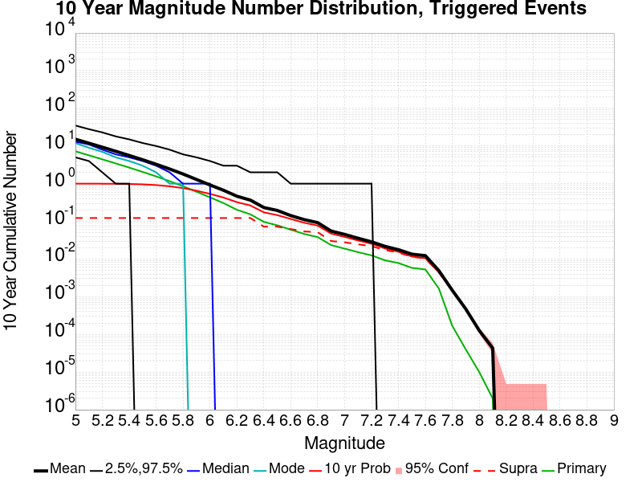
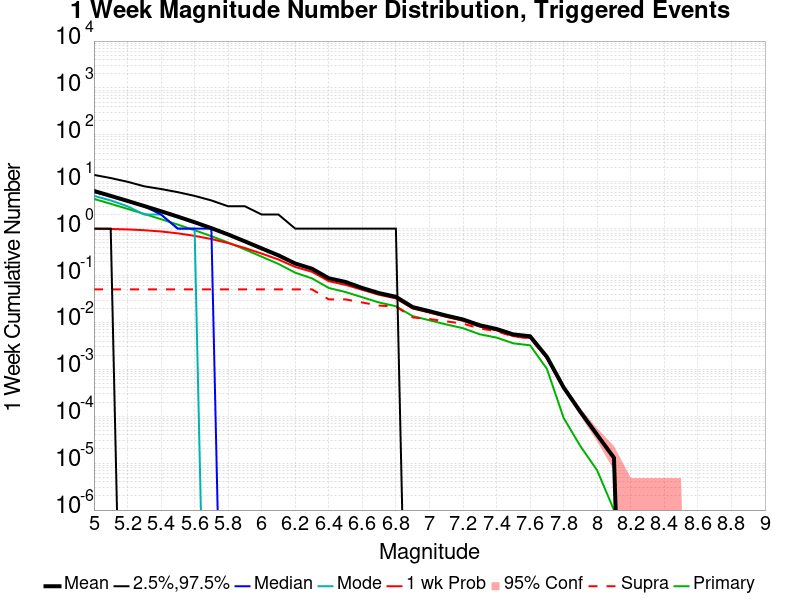
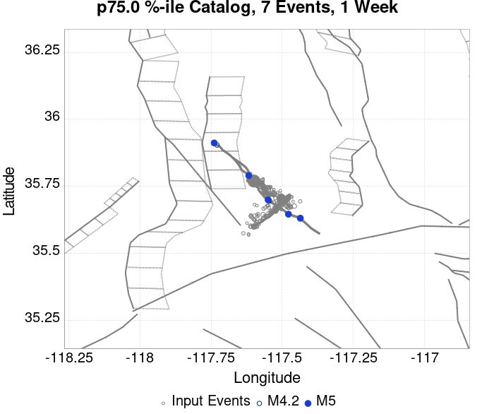
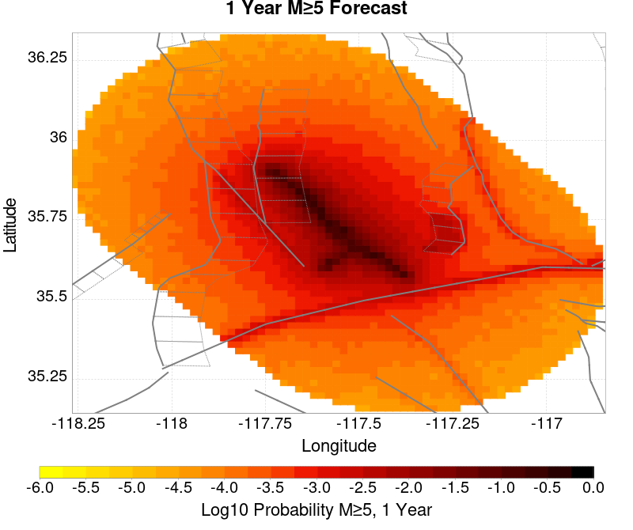
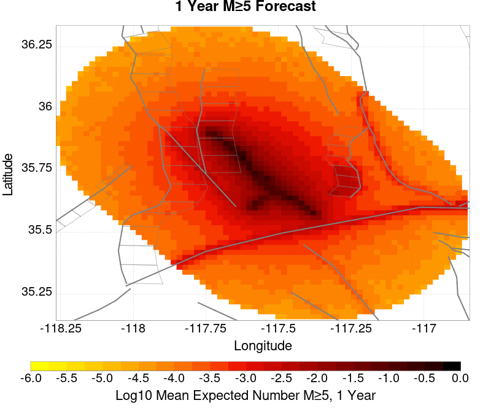
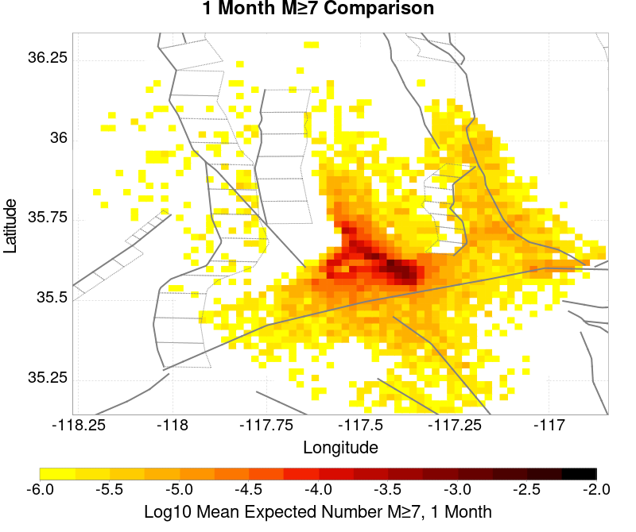
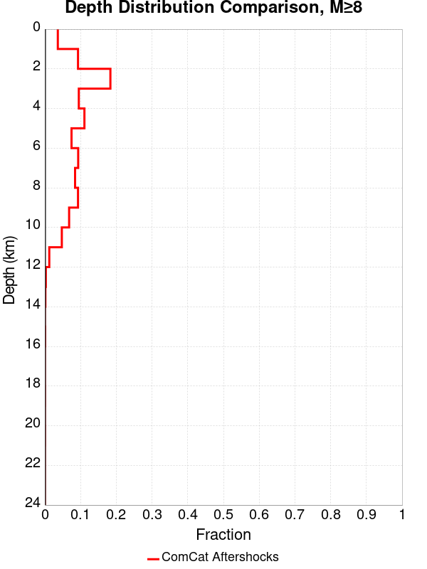

# ComCat M7.1 (ci38457511), ShakeMap Surfaces, FM2_1 Results

|   | ComCat M7.1 (ci38457511), ShakeMap Surfaces, FM2_1 |
|-----|-----|
| Num Simulations | 39715 (incomplete) |
| Start Time | 2019/07/06 03:19:54 UTC |
| Start Time Epoch Milliseconds | 1562383194040 |
| Duration | 10 Years |
| Includes Spontaneous? | false |
| Trigger Ruptures | 283 Trigger Ruptures |
|   | First: M3.98 at 2019/07/04 17:02:55 UTC |
|   | Last: M7.1 at 2019/07/06 03:19:53 UTC |
|   | Largest: M7.1 at 2019/07/06 03:19:53 UTC |
| Trigger Ruptures | *(none)* |
| Config Generated With | u3etas_comcat_event_config_builder.sh --event-id ci38457511 --mag-complete 3.5 --days-before 7 --num-simulations 1000000 --fault-model FM2_1 --finite-surf-shakemap --finite-surf-shakemap-min-mag 5 --hpc-site USC_HPC --nodes 36 --hours 24 --queue scec |

## Table Of Contents

* [Probabilities Summary Table](#probabilities-summary-table)
* [Magnitude Number Distribution](#magnitude-number-distribution)
  * [10 Year Magnitude Number Distribution](#10-year-magnitude-number-distribution)
  * [1 Year Magnitude Number Distribution](#1-year-magnitude-number-distribution)
  * [1 Month Magnitude Number Distribution](#1-month-magnitude-number-distribution)
  * [1 Week Magnitude Number Distribution](#1-week-magnitude-number-distribution)
  * [1 Day Magnitude Number Distribution](#1-day-magnitude-number-distribution)
  * [1 Hour Magnitude Number Distribution](#1-hour-magnitude-number-distribution)
* [Hazard Change Over Time](#hazard-change-over-time)
  * [M&ge;5.0 Hazard Change Over Time](#m50-hazard-change-over-time)
  * [M&ge;6.0 Hazard Change Over Time](#m60-hazard-change-over-time)
  * [M&ge;7.0 Hazard Change Over Time](#m70-hazard-change-over-time)
* [Trigger Rupture Fault Map](#trigger-rupture-fault-map)
* [Trigger Rupture Depth Map](#trigger-rupture-depth-map)
* [Fault Distances To Triggers](#fault-distances-to-triggers)
* [Individual Simulated Catalog Maps](#individual-simulated-catalog-maps)
* [ComCat Data Comparisons](#comcat-data-comparisons)
  * [ComCat Magnitude-Number Distributions](#comcat-magnitude-number-distributions)
  * [ComCat Time-Dependent Mc](#comcat-time-dependent-mc)
  * [ComCat Cumulative Number Vs Time](#comcat-cumulative-number-vs-time)
  * [ComCat Cumulative Number Simulation Percentiles](#comcat-cumulative-number-simulation-percentiles)
  * [ComCat Probability Spatial Distribution](#comcat-probability-spatial-distribution)
  * [ComCat Mean Expectation Spatial Distribution](#comcat-mean-expectation-spatial-distribution)
  * [ComCat Depth Distribution](#comcat-depth-distribution)
* [Section Participation](#section-participation)
  * [Section Participation Plots](#section-participation-plots)
  * [Supra-Seismogenic Parent Sections Table](#supra-seismogenic-parent-sections-table)
  * [M≥6.5 Parent Sections Table](#m65-parent-sections-table)
  * [M≥7 Parent Sections Table](#m7-parent-sections-table)
  * [M≥7.5 Parent Sections Table](#m75-parent-sections-table)
  * [M≥8 Parent Sections Table](#m8-parent-sections-table)
* [Fault Magnitude-Probability Distributions](#fault-magnitude-probability-distributions)
* [Gridded Nucleation](#gridded-nucleation)
* [JSON Input File](#json-input-file)

## Probabilities Summary Table
*[(top)](#table-of-contents)*

| Magnitude | 1 Hour Prob | 1 Day Prob | 1 Week Prob | 1 Month Prob | 1 Year Prob | 10 Year Prob |
|-----|-----|-----|-----|-----|-----|-----|
| **M&ge;4** | 1.000 (100.00%) | 1.000 (100.00%) | 1.000 (100.00%) | 1.000 (100.00%) | 1.000 (100.00%) | 1.000 (100.00%) |
| *95% Conf* | *[99.99% 100.00%]* | *[99.99% 100.00%]* | *[99.99% 100.00%]* | *[99.99% 100.00%]* | *[99.99% 100.00%]* | *[99.99% 100.00%]* |
| **M&ge;4.5** | 0.991 (99.08%) | 1.000 (100.00%) | 1.000 (100.00%) | 1.000 (100.00%) | 1.000 (100.00%) | 1.000 (100.00%) |
| *95% Conf* | *[98.98% 99.17%]* | *[99.99% 100.00%]* | *[99.99% 100.00%]* | *[99.99% 100.00%]* | *[99.99% 100.00%]* | *[99.99% 100.00%]* |
| **M&ge;5** | 0.765 (76.52%) | 0.976 (97.61%) | 0.995 (99.47%) | 0.998 (99.83%) | 1.000 (99.99%) | 1.000 (100.00%) |
| *95% Conf* | *[76.10% 76.94%]* | *[97.45% 97.75%]* | *[99.39% 99.54%]* | *[99.79% 99.87%]* | *[99.97% 100.00%]* | *[99.98% 100.00%]* |
| **M&ge;5.5** | 0.337 (33.69%) | 0.663 (66.31%) | 0.793 (79.25%) | 0.859 (85.87%) | 0.927 (92.70%) | 0.961 (96.09%) |
| *95% Conf* | *[33.22% 34.15%]* | *[65.84% 66.77%]* | *[78.85% 79.65%]* | *[85.52% 86.21%]* | *[92.44% 92.96%]* | *[95.89% 96.27%]* |
| **M&ge;6** | 0.081 (8.08%) | 0.210 (21.01%) | 0.295 (29.54%) | 0.357 (35.66%) | 0.459 (45.87%) | 0.538 (53.82%) |
| *95% Conf* | *[7.81% 8.35%]* | *[20.61% 21.42%]* | *[29.09% 29.99%]* | *[35.19% 36.14%]* | *[45.38% 46.37%]* | *[53.33% 54.31%]* |
| **M&ge;6.5** | 0.015 (1.46%) | 0.042 (4.20%) | 0.065 (6.47%) | 0.082 (8.23%) | 0.115 (11.52%) | 0.147 (14.66%) |
| *95% Conf* | *[1.35% 1.58%]* | *[4.01% 4.40%]* | *[6.23% 6.72%]* | *[7.97% 8.51%]* | *[11.21% 11.84%]* | *[14.31% 15.01%]* |
| **M&ge;7** | 3.95E-3 (0.40%) | 0.010 (1.04%) | 0.016 (1.58%) | 0.020 (2.04%) | 0.029 (2.94%) | 0.039 (3.88%) |
| *95% Conf* | *[0.34% 0.46%]* | *[0.94% 1.15%]* | *[1.46% 1.71%]* | *[1.91% 2.19%]* | *[2.78% 3.12%]* | *[3.70% 4.08%]* |
| **M&ge;7.1** | 2.85E-3 (0.28%) | 8.18E-3 (0.82%) | 0.013 (1.27%) | 0.016 (1.64%) | 0.023 (2.35%) | 0.031 (3.13%) |
| *95% Conf* | *[0.24% 0.34%]* | *[0.73% 0.91%]* | *[1.16% 1.39%]* | *[1.52% 1.77%]* | *[2.20% 2.50%]* | *[2.96% 3.30%]* |
| **M&ge;7.5** | 1.03E-3 (0.10%) | 3.17E-3 (0.32%) | 4.86E-3 (0.49%) | 6.52E-3 (0.65%) | 9.29E-3 (0.93%) | 0.012 (1.25%) |
| *95% Conf* | *[0.08% 0.14%]* | *[0.27% 0.38%]* | *[0.42% 0.56%]* | *[0.58% 0.74%]* | *[0.84% 1.03%]* | *[1.14% 1.36%]* |
| **M&ge;8** | 0.000 (0.00%) | 2.52E-5 (0.00%) | 5.04E-5 (0.01%) | 5.04E-5 (0.01%) | 7.55E-5 (0.01%) | 1.01E-4 (0.01%) |
| *95% Conf* | *[0.00% 0.01%]* | *[0.00% 0.02%]* | *[0.00% 0.02%]* | *[0.00% 0.02%]* | *[0.00% 0.02%]* | *[0.00% 0.03%]* |

## Magnitude Number Distribution
*[(top)](#table-of-contents)*

### 10 Year Magnitude Number Distribution
*[(top)](#table-of-contents)*

**Legend**
* **Mean** (thick black line): mean expected number across all 39715 catalogs
* **2.5%,97.5%** (thin black lines): expected number percentiles across all 39715 catalogs
* **Median** (thin blue line): median expected number across all 39715 catalogs
* **Mode** (thin cyan line): modal expected number across all 39715 catalogs
* **10 yr Probability** (thin red line): 10 year probability calculated as the fraction of catalogs with at least 1 occurrence
* **10 yr Supraseismogenic Probability** (thin dashed red line): same as above, but only for supraseismogenic ruptures on explicitly modeled UCERF3 faults
* **95% Conf** (light red shaded region): binomial 95% confidence bounds on probability
* **Primary** (thin green line): mean expected number from primary triggered aftershocks only (no secondary, tertiary, etc...) across all 39715 catalogs



| Mag | Mean | 2.5 %ile | 97.5 %ile | Median | Mode | 10 yr Probability | 10 yr Prob 95% Conf | 10 yr Supra-Seis Prob | Primary Aftershocks Mean |
|-----|-----|-----|-----|-----|-----|-----|-----|-----|-----|
| **M&ge;2.5** | 5037.723 | 3642.000 | 10405.000 | 4444.000 | 4083.000 | 1.000 (100.00%) | [99.99% 100.00%] | 0.122 (12.23%) | 2394.996 |
| **M&ge;2.6** | 4001.344 | 2886.000 | 8285.000 | 3530.000 | 3348.000 | 1.000 (100.00%) | [99.99% 100.00%] | 0.122 (12.23%) | 1902.204 |
| **M&ge;2.7** | 3178.144 | 2286.000 | 6581.000 | 2805.000 | 2718.000 | 1.000 (100.00%) | [99.99% 100.00%] | 0.122 (12.23%) | 1510.863 |
| **M&ge;2.8** | 2524.446 | 1813.000 | 5234.000 | 2229.000 | 2079.000 | 1.000 (100.00%) | [99.99% 100.00%] | 0.122 (12.23%) | 1200.185 |
| **M&ge;2.9** | 2005.204 | 1435.000 | 4158.000 | 1771.000 | 1677.000 | 1.000 (100.00%) | [99.99% 100.00%] | 0.122 (12.23%) | 953.269 |
| **M&ge;3** | 1592.710 | 1135.000 | 3310.000 | 1407.000 | 1321.000 | 1.000 (100.00%) | [99.99% 100.00%] | 0.122 (12.23%) | 757.220 |
| **M&ge;3.1** | 1264.917 | 898.000 | 2632.000 | 1117.000 | 1050.000 | 1.000 (100.00%) | [99.99% 100.00%] | 0.122 (12.23%) | 601.303 |
| **M&ge;3.2** | 1004.601 | 708.000 | 2094.000 | 889.000 | 819.000 | 1.000 (100.00%) | [99.99% 100.00%] | 0.122 (12.23%) | 477.579 |
| **M&ge;3.3** | 797.917 | 559.000 | 1660.000 | 706.000 | 654.000 | 1.000 (100.00%) | [99.99% 100.00%] | 0.122 (12.23%) | 379.394 |
| **M&ge;3.4** | 633.616 | 440.000 | 1318.000 | 561.000 | 541.000 | 1.000 (100.00%) | [99.99% 100.00%] | 0.122 (12.23%) | 301.295 |
| **M&ge;3.5** | 503.105 | 346.000 | 1047.000 | 446.000 | 412.000 | 1.000 (100.00%) | [99.99% 100.00%] | 0.122 (12.23%) | 239.237 |
| **M&ge;3.6** | 399.473 | 271.000 | 835.000 | 354.000 | 332.000 | 1.000 (100.00%) | [99.99% 100.00%] | 0.122 (12.23%) | 189.939 |
| **M&ge;3.7** | 317.167 | 213.000 | 664.000 | 282.000 | 267.000 | 1.000 (100.00%) | [99.99% 100.00%] | 0.122 (12.23%) | 150.808 |
| **M&ge;3.8** | 251.881 | 166.000 | 527.000 | 224.000 | 210.000 | 1.000 (100.00%) | [99.99% 100.00%] | 0.122 (12.23%) | 119.741 |
| **M&ge;3.9** | 199.944 | 129.000 | 419.000 | 178.000 | 165.000 | 1.000 (100.00%) | [99.99% 100.00%] | 0.122 (12.23%) | 95.073 |
| **M&ge;4** | 158.726 | 101.000 | 332.000 | 141.000 | 131.000 | 1.000 (100.00%) | [99.99% 100.00%] | 0.122 (12.23%) | 75.483 |
| **M&ge;4.1** | 125.984 | 78.000 | 265.000 | 112.000 | 104.000 | 1.000 (100.00%) | [99.99% 100.00%] | 0.122 (12.23%) | 59.918 |
| **M&ge;4.2** | 99.910 | 60.000 | 211.000 | 89.000 | 83.000 | 1.000 (100.00%) | [99.99% 100.00%] | 0.122 (12.23%) | 47.518 |
| **M&ge;4.3** | 79.232 | 46.000 | 168.000 | 71.000 | 66.000 | 1.000 (100.00%) | [99.99% 100.00%] | 0.122 (12.23%) | 37.687 |
| **M&ge;4.4** | 62.793 | 35.000 | 134.000 | 56.000 | 51.000 | 1.000 (100.00%) | [99.99% 100.00%] | 0.122 (12.23%) | 29.853 |
| **M&ge;4.5** | 49.753 | 26.000 | 108.000 | 44.000 | 41.000 | 1.000 (100.00%) | [99.99% 100.00%] | 0.122 (12.23%) | 23.638 |
| **M&ge;4.6** | 39.384 | 20.000 | 86.000 | 35.000 | 33.000 | 1.000 (100.00%) | [99.99% 100.00%] | 0.122 (12.23%) | 18.717 |
| **M&ge;4.7** | 31.129 | 15.000 | 69.000 | 28.000 | 25.000 | 1.000 (100.00%) | [99.99% 100.00%] | 0.122 (12.23%) | 14.789 |
| **M&ge;4.8** | 24.582 | 11.000 | 55.000 | 22.000 | 19.000 | 1.000 (100.00%) | [99.99% 100.00%] | 0.122 (12.23%) | 11.676 |
| **M&ge;4.9** | 19.388 | 8.000 | 45.000 | 17.000 | 15.000 | 1.000 (100.00%) | [99.99% 100.00%] | 0.122 (12.23%) | 9.208 |
| **M&ge;5** | 15.235 | 5.000 | 36.000 | 14.000 | 12.000 | 1.000 (100.00%) | [99.98% 100.00%] | 0.122 (12.23%) | 7.229 |
| **M&ge;5.1** | 11.934 | 4.000 | 29.000 | 11.000 | 10.000 | 1.000 (99.98%) | [99.96% 99.99%] | 0.122 (12.23%) | 5.660 |
| **M&ge;5.2** | 9.342 | 2.000 | 23.000 | 8.000 | 7.000 | 0.999 (99.88%) | [99.84% 99.91%] | 0.122 (12.23%) | 4.428 |
| **M&ge;5.3** | 7.268 | 1.000 | 19.000 | 6.000 | 5.000 | 0.995 (99.48%) | [99.40% 99.54%] | 0.122 (12.23%) | 3.446 |
| **M&ge;5.4** | 5.626 | 1.000 | 15.000 | 5.000 | 4.000 | 0.984 (98.40%) | [98.27% 98.52%] | 0.122 (12.23%) | 2.669 |
| **M&ge;5.5** | 4.331 | 0.000 | 12.000 | 4.000 | 3.000 | 0.961 (96.09%) | [95.89% 96.27%] | 0.122 (12.23%) | 2.049 |
| **M&ge;5.6** | 3.303 | 0.000 | 10.000 | 3.000 | 2.000 | 0.918 (91.81%) | [91.54% 92.08%] | 0.122 (12.23%) | 1.564 |
| **M&ge;5.7** | 2.477 | 0.000 | 8.000 | 2.000 | 1.000 | 0.851 (85.14%) | [84.79% 85.49%] | 0.122 (12.23%) | 1.170 |
| **M&ge;5.8** | 1.821 | 0.000 | 6.000 | 1.000 | 1.000 | 0.764 (76.44%) | [76.02% 76.85%] | 0.122 (12.23%) | 0.858 |
| **M&ge;5.9** | 1.304 | 0.000 | 5.000 | 1.000 | 0.000 | 0.653 (65.29%) | [64.82% 65.76%] | 0.122 (12.23%) | 0.614 |
| **M&ge;6** | 0.935 | 0.000 | 4.000 | 1.000 | 0.000 | 0.538 (53.82%) | [53.33% 54.31%] | 0.122 (12.23%) | 0.436 |
| **M&ge;6.1** | 0.677 | 0.000 | 3.000 | 0.000 | 0.000 | 0.431 (43.06%) | [42.57% 43.55%] | 0.122 (12.21%) | 0.309 |
| **M&ge;6.2** | 0.471 | 0.000 | 3.000 | 0.000 | 0.000 | 0.322 (32.18%) | [31.72% 32.64%] | 0.122 (12.21%) | 0.204 |
| **M&ge;6.3** | 0.372 | 0.000 | 2.000 | 0.000 | 0.000 | 0.265 (26.55%) | [26.12% 26.99%] | 0.122 (12.21%) | 0.155 |
| **M&ge;6.4** | 0.237 | 0.000 | 2.000 | 0.000 | 0.000 | 0.174 (17.44%) | [17.07% 17.82%] | 0.072 (7.18%) | 0.099 |
| **M&ge;6.5** | 0.198 | 0.000 | 2.000 | 0.000 | 0.000 | 0.147 (14.66%) | [14.31% 15.01%] | 0.072 (7.17%) | 0.080 |
| **M&ge;6.6** | 0.143 | 0.000 | 1.000 | 0.000 | 0.000 | 0.115 (11.48%) | [11.17% 11.80%] | 0.062 (6.21%) | 0.060 |
| **M&ge;6.7** | 0.113 | 0.000 | 1.000 | 0.000 | 0.000 | 0.091 (9.09%) | [8.81% 9.38%] | 0.054 (5.43%) | 0.046 |
| **M&ge;6.8** | 0.093 | 0.000 | 1.000 | 0.000 | 0.000 | 0.076 (7.63%) | [7.37% 7.90%] | 0.052 (5.19%) | 0.038 |
| **M&ge;6.9** | 0.056 | 0.000 | 1.000 | 0.000 | 0.000 | 0.047 (4.70%) | [4.50% 4.91%] | 0.030 (3.04%) | 0.023 |
| **M&ge;7** | 0.046 | 0.000 | 1.000 | 0.000 | 0.000 | 0.039 (3.88%) | [3.70% 4.08%] | 0.028 (2.83%) | 0.019 |
| **M&ge;7.1** | 0.036 | 0.000 | 1.000 | 0.000 | 0.000 | 0.031 (3.13%) | [2.96% 3.30%] | 0.025 (2.50%) | 0.015 |
| **M&ge;7.2** | 0.029 | 0.000 | 1.000 | 0.000 | 0.000 | 0.026 (2.58%) | [2.43% 2.74%] | 0.022 (2.21%) | 0.013 |
| **M&ge;7.3** | 0.022 | 0.000 | 0.000 | 0.000 | 0.000 | 0.020 (1.95%) | [1.82% 2.09%] | 0.018 (1.79%) | 9.29E-3 |
| **M&ge;7.4** | 0.019 | 0.000 | 0.000 | 0.000 | 0.000 | 0.016 (1.62%) | [1.50% 1.75%] | 0.015 (1.54%) | 8.21E-3 |
| **M&ge;7.5** | 0.014 | 0.000 | 0.000 | 0.000 | 0.000 | 0.012 (1.25%) | [1.14% 1.36%] | 0.012 (1.22%) | 5.97E-3 |
| **M&ge;7.6** | 0.013 | 0.000 | 0.000 | 0.000 | 0.000 | 0.011 (1.13%) | [1.03% 1.24%] | 0.011 (1.12%) | 5.36E-3 |
| **M&ge;7.7** | 5.36E-3 | 0.000 | 0.000 | 0.000 | 0.000 | 4.88E-3 (0.49%) | [0.42% 0.56%] | 4.76E-3 (0.48%) | 1.66E-3 |
| **M&ge;7.8** | 1.76E-3 | 0.000 | 0.000 | 0.000 | 0.000 | 1.74E-3 (0.17%) | [0.14% 0.22%] | 1.64E-3 (0.16%) | 2.52E-4 |
| **M&ge;7.9** | 4.03E-4 | 0.000 | 0.000 | 0.000 | 0.000 | 4.03E-4 (0.04%) | [0.02% 0.07%] | 4.03E-4 (0.04%) | 5.04E-5 |
| **M&ge;8** | 1.01E-4 | 0.000 | 0.000 | 0.000 | 0.000 | 1.01E-4 (0.01%) | [0.00% 0.03%] | 1.01E-4 (0.01%) | 2.52E-5 |
| **M&ge;8.1** | 7.55E-5 | 0.000 | 0.000 | 0.000 | 0.000 | 7.55E-5 (0.01%) | [0.00% 0.02%] | 7.55E-5 (0.01%) | 0.000 |
| **M&ge;8.2** | 0.000 | 0.000 | 0.000 | 0.000 | 0.000 | 0.000 (0.00%) | [0.00% 0.01%] | 0.000 (0.00%) | 0.000 |
| **M&ge;8.3** | 0.000 | 0.000 | 0.000 | 0.000 | 0.000 | 0.000 (0.00%) | [0.00% 0.01%] | 0.000 (0.00%) | 0.000 |
| **M&ge;8.4** | 0.000 | 0.000 | 0.000 | 0.000 | 0.000 | 0.000 (0.00%) | [0.00% 0.01%] | 0.000 (0.00%) | 0.000 |
| **M&ge;8.5** | 0.000 | 0.000 | 0.000 | 0.000 | 0.000 | 0.000 (0.00%) | [0.00% 0.01%] | 0.000 (0.00%) | 0.000 |
| **M&ge;8.6** | 0.000 | 0.000 | 0.000 | 0.000 | 0.000 | 0.000 (0.00%) | [0.00% 0.01%] | 0.000 (0.00%) | 0.000 |
| **M&ge;8.7** | 0.000 | 0.000 | 0.000 | 0.000 | 0.000 | 0.000 (0.00%) | [0.00% 0.01%] | 0.000 (0.00%) | 0.000 |
| **M&ge;8.8** | 0.000 | 0.000 | 0.000 | 0.000 | 0.000 | 0.000 (0.00%) | [0.00% 0.01%] | 0.000 (0.00%) | 0.000 |
| **M&ge;8.9** | 0.000 | 0.000 | 0.000 | 0.000 | 0.000 | 0.000 (0.00%) | [0.00% 0.01%] | 0.000 (0.00%) | 0.000 |
| **M&ge;9** | 0.000 | 0.000 | 0.000 | 0.000 | 0.000 | 0.000 (0.00%) | [0.00% 0.01%] | 0.000 (0.00%) | 0.000 |

### 1 Year Magnitude Number Distribution
*[(top)](#table-of-contents)*

**Legend**
* **Mean** (thick black line): mean expected number across all 39715 catalogs
* **2.5%,97.5%** (thin black lines): expected number percentiles across all 39715 catalogs
* **Median** (thin blue line): median expected number across all 39715 catalogs
* **Mode** (thin cyan line): modal expected number across all 39715 catalogs
* **1 yr Probability** (thin red line): 1 year probability calculated as the fraction of catalogs with at least 1 occurrence
* **1 yr Supraseismogenic Probability** (thin dashed red line): same as above, but only for supraseismogenic ruptures on explicitly modeled UCERF3 faults
* **95% Conf** (light red shaded region): binomial 95% confidence bounds on probability
* **Primary** (thin green line): mean expected number from primary triggered aftershocks only (no secondary, tertiary, etc...) across all 39715 catalogs


| Mag | Mean | 2.5 %ile | 97.5 %ile | Median | Mode | 1 yr Probability | 1 yr Prob 95% Conf | 1 yr Supra-Seis Prob | Primary Aftershocks Mean |
|-----|-----|-----|-----|-----|-----|-----|-----|-----|-----|
| **M&ge;2.5** | 3858.454 | 2940.000 | 6983.000 | 3492.000 | 3283.000 | 1.000 (100.00%) | [99.99% 100.00%] | 0.094 (9.43%) | 2086.107 |
| **M&ge;2.6** | 3064.647 | 2331.000 | 5545.000 | 2775.000 | 2637.000 | 1.000 (100.00%) | [99.99% 100.00%] | 0.094 (9.43%) | 1656.822 |
| **M&ge;2.7** | 2434.156 | 1846.000 | 4415.000 | 2204.000 | 2072.000 | 1.000 (100.00%) | [99.99% 100.00%] | 0.094 (9.43%) | 1315.967 |
| **M&ge;2.8** | 1933.444 | 1462.000 | 3512.000 | 1751.000 | 1623.000 | 1.000 (100.00%) | [99.99% 100.00%] | 0.094 (9.43%) | 1045.334 |
| **M&ge;2.9** | 1535.690 | 1156.000 | 2789.000 | 1392.000 | 1334.000 | 1.000 (100.00%) | [99.99% 100.00%] | 0.094 (9.43%) | 830.229 |
| **M&ge;3** | 1219.803 | 914.000 | 2218.000 | 1106.000 | 1053.000 | 1.000 (100.00%) | [99.99% 100.00%] | 0.094 (9.43%) | 659.499 |
| **M&ge;3.1** | 968.743 | 722.000 | 1767.000 | 879.000 | 840.000 | 1.000 (100.00%) | [99.99% 100.00%] | 0.094 (9.43%) | 523.711 |
| **M&ge;3.2** | 769.433 | 568.000 | 1407.000 | 698.000 | 649.000 | 1.000 (100.00%) | [99.99% 100.00%] | 0.094 (9.43%) | 415.936 |
| **M&ge;3.3** | 611.154 | 448.000 | 1110.000 | 555.000 | 521.000 | 1.000 (100.00%) | [99.99% 100.00%] | 0.094 (9.43%) | 330.420 |
| **M&ge;3.4** | 485.307 | 352.000 | 889.000 | 441.000 | 416.000 | 1.000 (100.00%) | [99.99% 100.00%] | 0.094 (9.43%) | 262.376 |
| **M&ge;3.5** | 385.374 | 276.000 | 706.000 | 351.000 | 333.000 | 1.000 (100.00%) | [99.99% 100.00%] | 0.094 (9.43%) | 208.327 |
| **M&ge;3.6** | 306.016 | 216.000 | 560.000 | 279.000 | 258.000 | 1.000 (100.00%) | [99.99% 100.00%] | 0.094 (9.43%) | 165.420 |
| **M&ge;3.7** | 242.941 | 169.000 | 445.000 | 222.000 | 202.000 | 1.000 (100.00%) | [99.99% 100.00%] | 0.094 (9.43%) | 131.328 |
| **M&ge;3.8** | 192.927 | 132.000 | 354.000 | 176.000 | 170.000 | 1.000 (100.00%) | [99.99% 100.00%] | 0.094 (9.43%) | 104.275 |
| **M&ge;3.9** | 153.183 | 103.000 | 283.000 | 140.000 | 137.000 | 1.000 (100.00%) | [99.99% 100.00%] | 0.094 (9.43%) | 82.812 |
| **M&ge;4** | 121.601 | 79.000 | 226.000 | 111.000 | 103.000 | 1.000 (100.00%) | [99.99% 100.00%] | 0.094 (9.43%) | 65.740 |
| **M&ge;4.1** | 96.529 | 61.000 | 180.000 | 88.000 | 84.000 | 1.000 (100.00%) | [99.99% 100.00%] | 0.094 (9.43%) | 52.190 |
| **M&ge;4.2** | 76.530 | 47.000 | 144.000 | 70.000 | 68.000 | 1.000 (100.00%) | [99.99% 100.00%] | 0.094 (9.43%) | 41.381 |
| **M&ge;4.3** | 60.684 | 36.000 | 115.000 | 56.000 | 52.000 | 1.000 (100.00%) | [99.99% 100.00%] | 0.094 (9.43%) | 32.823 |
| **M&ge;4.4** | 48.093 | 27.000 | 92.000 | 44.000 | 40.000 | 1.000 (100.00%) | [99.99% 100.00%] | 0.094 (9.43%) | 25.999 |
| **M&ge;4.5** | 38.103 | 20.000 | 74.000 | 35.000 | 33.000 | 1.000 (100.00%) | [99.99% 100.00%] | 0.094 (9.43%) | 20.591 |
| **M&ge;4.6** | 30.156 | 15.000 | 59.000 | 28.000 | 25.000 | 1.000 (100.00%) | [99.99% 100.00%] | 0.094 (9.43%) | 16.300 |
| **M&ge;4.7** | 23.827 | 11.000 | 48.000 | 22.000 | 21.000 | 1.000 (100.00%) | [99.99% 100.00%] | 0.094 (9.43%) | 12.872 |
| **M&ge;4.8** | 18.812 | 8.000 | 39.000 | 17.000 | 16.000 | 1.000 (100.00%) | [99.99% 100.00%] | 0.094 (9.43%) | 10.155 |
| **M&ge;4.9** | 14.837 | 6.000 | 31.000 | 13.000 | 13.000 | 1.000 (100.00%) | [99.99% 100.00%] | 0.094 (9.43%) | 8.007 |
| **M&ge;5** | 11.656 | 4.000 | 26.000 | 11.000 | 9.000 | 1.000 (99.99%) | [99.97% 100.00%] | 0.094 (9.43%) | 6.285 |
| **M&ge;5.1** | 9.124 | 2.000 | 21.000 | 8.000 | 7.000 | 0.999 (99.91%) | [99.88% 99.94%] | 0.094 (9.43%) | 4.922 |
| **M&ge;5.2** | 7.142 | 2.000 | 17.000 | 6.000 | 6.000 | 0.996 (99.61%) | [99.54% 99.67%] | 0.094 (9.43%) | 3.848 |
| **M&ge;5.3** | 5.552 | 1.000 | 14.000 | 5.000 | 4.000 | 0.987 (98.67%) | [98.55% 98.78%] | 0.094 (9.43%) | 2.992 |
| **M&ge;5.4** | 4.301 | 0.000 | 11.000 | 4.000 | 3.000 | 0.966 (96.57%) | [96.38% 96.74%] | 0.094 (9.43%) | 2.318 |
| **M&ge;5.5** | 3.307 | 0.000 | 9.000 | 3.000 | 2.000 | 0.927 (92.70%) | [92.44% 92.96%] | 0.094 (9.43%) | 1.780 |
| **M&ge;5.6** | 2.526 | 0.000 | 8.000 | 2.000 | 2.000 | 0.869 (86.95%) | [86.61% 87.28%] | 0.094 (9.43%) | 1.360 |
| **M&ge;5.7** | 1.892 | 0.000 | 6.000 | 2.000 | 1.000 | 0.786 (78.62%) | [78.22% 79.02%] | 0.094 (9.43%) | 1.015 |
| **M&ge;5.8** | 1.388 | 0.000 | 5.000 | 1.000 | 1.000 | 0.687 (68.65%) | [68.19% 69.11%] | 0.094 (9.43%) | 0.744 |
| **M&ge;5.9** | 0.993 | 0.000 | 4.000 | 1.000 | 0.000 | 0.571 (57.06%) | [56.57% 57.55%] | 0.094 (9.43%) | 0.532 |
| **M&ge;6** | 0.711 | 0.000 | 3.000 | 0.000 | 0.000 | 0.459 (45.87%) | [45.38% 46.37%] | 0.094 (9.43%) | 0.377 |
| **M&ge;6.1** | 0.512 | 0.000 | 3.000 | 0.000 | 0.000 | 0.358 (35.78%) | [35.31% 36.26%] | 0.094 (9.41%) | 0.266 |
| **M&ge;6.2** | 0.351 | 0.000 | 2.000 | 0.000 | 0.000 | 0.260 (25.99%) | [25.56% 26.43%] | 0.094 (9.41%) | 0.175 |
| **M&ge;6.3** | 0.276 | 0.000 | 2.000 | 0.000 | 0.000 | 0.212 (21.23%) | [20.83% 21.63%] | 0.094 (9.41%) | 0.133 |
| **M&ge;6.4** | 0.175 | 0.000 | 1.000 | 0.000 | 0.000 | 0.138 (13.78%) | [13.45% 14.13%] | 0.056 (5.58%) | 0.085 |
| **M&ge;6.5** | 0.146 | 0.000 | 1.000 | 0.000 | 0.000 | 0.115 (11.52%) | [11.21% 11.84%] | 0.056 (5.58%) | 0.069 |
| **M&ge;6.6** | 0.106 | 0.000 | 1.000 | 0.000 | 0.000 | 0.089 (8.95%) | [8.67% 9.23%] | 0.048 (4.82%) | 0.052 |
| **M&ge;6.7** | 0.082 | 0.000 | 1.000 | 0.000 | 0.000 | 0.070 (7.02%) | [6.77% 7.27%] | 0.042 (4.20%) | 0.040 |
| **M&ge;6.8** | 0.069 | 0.000 | 1.000 | 0.000 | 0.000 | 0.059 (5.91%) | [5.68% 6.15%] | 0.040 (4.03%) | 0.033 |
| **M&ge;6.9** | 0.041 | 0.000 | 1.000 | 0.000 | 0.000 | 0.036 (3.58%) | [3.40% 3.77%] | 0.023 (2.32%) | 0.020 |
| **M&ge;7** | 0.033 | 0.000 | 1.000 | 0.000 | 0.000 | 0.029 (2.94%) | [2.78% 3.12%] | 0.022 (2.15%) | 0.016 |
| **M&ge;7.1** | 0.026 | 0.000 | 0.000 | 0.000 | 0.000 | 0.023 (2.35%) | [2.20% 2.50%] | 0.019 (1.89%) | 0.013 |
| **M&ge;7.2** | 0.021 | 0.000 | 0.000 | 0.000 | 0.000 | 0.019 (1.95%) | [1.82% 2.09%] | 0.017 (1.67%) | 0.010 |
| **M&ge;7.3** | 0.016 | 0.000 | 0.000 | 0.000 | 0.000 | 0.015 (1.47%) | [1.35% 1.59%] | 0.013 (1.34%) | 7.76E-3 |
| **M&ge;7.4** | 0.014 | 0.000 | 0.000 | 0.000 | 0.000 | 0.012 (1.24%) | [1.13% 1.35%] | 0.012 (1.17%) | 6.87E-3 |
| **M&ge;7.5** | 0.010 | 0.000 | 0.000 | 0.000 | 0.000 | 9.29E-3 (0.93%) | [0.84% 1.03%] | 9.06E-3 (0.91%) | 4.86E-3 |
| **M&ge;7.6** | 9.52E-3 | 0.000 | 0.000 | 0.000 | 0.000 | 8.38E-3 (0.84%) | [0.75% 0.93%] | 8.28E-3 (0.83%) | 4.36E-3 |
| **M&ge;7.7** | 3.60E-3 | 0.000 | 0.000 | 0.000 | 0.000 | 3.40E-3 (0.34%) | [0.29% 0.40%] | 3.30E-3 (0.33%) | 1.31E-3 |
| **M&ge;7.8** | 1.08E-3 | 0.000 | 0.000 | 0.000 | 0.000 | 1.08E-3 (0.11%) | [0.08% 0.15%] | 1.01E-3 (0.10%) | 1.51E-4 |
| **M&ge;7.9** | 3.02E-4 | 0.000 | 0.000 | 0.000 | 0.000 | 3.02E-4 (0.03%) | [0.02% 0.05%] | 3.02E-4 (0.03%) | 5.04E-5 |
| **M&ge;8** | 7.55E-5 | 0.000 | 0.000 | 0.000 | 0.000 | 7.55E-5 (0.01%) | [0.00% 0.02%] | 7.55E-5 (0.01%) | 2.52E-5 |
| **M&ge;8.1** | 5.04E-5 | 0.000 | 0.000 | 0.000 | 0.000 | 5.04E-5 (0.01%) | [0.00% 0.02%] | 5.04E-5 (0.01%) | 0.000 |
| **M&ge;8.2** | 0.000 | 0.000 | 0.000 | 0.000 | 0.000 | 0.000 (0.00%) | [0.00% 0.01%] | 0.000 (0.00%) | 0.000 |
| **M&ge;8.3** | 0.000 | 0.000 | 0.000 | 0.000 | 0.000 | 0.000 (0.00%) | [0.00% 0.01%] | 0.000 (0.00%) | 0.000 |
| **M&ge;8.4** | 0.000 | 0.000 | 0.000 | 0.000 | 0.000 | 0.000 (0.00%) | [0.00% 0.01%] | 0.000 (0.00%) | 0.000 |
| **M&ge;8.5** | 0.000 | 0.000 | 0.000 | 0.000 | 0.000 | 0.000 (0.00%) | [0.00% 0.01%] | 0.000 (0.00%) | 0.000 |
| **M&ge;8.6** | 0.000 | 0.000 | 0.000 | 0.000 | 0.000 | 0.000 (0.00%) | [0.00% 0.01%] | 0.000 (0.00%) | 0.000 |
| **M&ge;8.7** | 0.000 | 0.000 | 0.000 | 0.000 | 0.000 | 0.000 (0.00%) | [0.00% 0.01%] | 0.000 (0.00%) | 0.000 |
| **M&ge;8.8** | 0.000 | 0.000 | 0.000 | 0.000 | 0.000 | 0.000 (0.00%) | [0.00% 0.01%] | 0.000 (0.00%) | 0.000 |
| **M&ge;8.9** | 0.000 | 0.000 | 0.000 | 0.000 | 0.000 | 0.000 (0.00%) | [0.00% 0.01%] | 0.000 (0.00%) | 0.000 |
| **M&ge;9** | 0.000 | 0.000 | 0.000 | 0.000 | 0.000 | 0.000 (0.00%) | [0.00% 0.01%] | 0.000 (0.00%) | 0.000 |

### 1 Month Magnitude Number Distribution
*[(top)](#table-of-contents)*

**Legend**
* **Mean** (thick black line): mean expected number across all 39715 catalogs
* **2.5%,97.5%** (thin black lines): expected number percentiles across all 39715 catalogs
* **Median** (thin blue line): median expected number across all 39715 catalogs
* **Mode** (thin cyan line): modal expected number across all 39715 catalogs
* **1 mo Probability** (thin red line): 1 month probability calculated as the fraction of catalogs with at least 1 occurrence
* **1 mo Supraseismogenic Probability** (thin dashed red line): same as above, but only for supraseismogenic ruptures on explicitly modeled UCERF3 faults
* **95% Conf** (light red shaded region): binomial 95% confidence bounds on probability
* **Primary** (thin green line): mean expected number from primary triggered aftershocks only (no secondary, tertiary, etc...) across all 39715 catalogs


| Mag | Mean | 2.5 %ile | 97.5 %ile | Median | Mode | 1 mo Probability | 1 mo Prob 95% Conf | 1 mo Supra-Seis Prob | Primary Aftershocks Mean |
|-----|-----|-----|-----|-----|-----|-----|-----|-----|-----|
| **M&ge;2.5** | 2712.779 | 2182.000 | 4236.000 | 2515.000 | 2372.000 | 1.000 (100.00%) | [99.99% 100.00%] | 0.066 (6.60%) | 1690.808 |
| **M&ge;2.6** | 2154.719 | 1728.000 | 3363.000 | 1999.000 | 1977.000 | 1.000 (100.00%) | [99.99% 100.00%] | 0.066 (6.60%) | 1342.921 |
| **M&ge;2.7** | 1711.469 | 1367.000 | 2681.000 | 1588.000 | 1532.000 | 1.000 (100.00%) | [99.99% 100.00%] | 0.066 (6.60%) | 1066.670 |
| **M&ge;2.8** | 1359.410 | 1081.000 | 2133.000 | 1262.000 | 1183.000 | 1.000 (100.00%) | [99.99% 100.00%] | 0.066 (6.60%) | 847.290 |
| **M&ge;2.9** | 1079.725 | 854.000 | 1694.000 | 1002.000 | 950.000 | 1.000 (100.00%) | [99.99% 100.00%] | 0.066 (6.60%) | 672.925 |
| **M&ge;3** | 857.583 | 673.000 | 1348.000 | 797.000 | 781.000 | 1.000 (100.00%) | [99.99% 100.00%] | 0.066 (6.60%) | 534.498 |
| **M&ge;3.1** | 681.060 | 531.000 | 1069.000 | 633.000 | 605.000 | 1.000 (100.00%) | [99.99% 100.00%] | 0.066 (6.60%) | 424.476 |
| **M&ge;3.2** | 540.952 | 418.000 | 854.000 | 503.000 | 471.000 | 1.000 (100.00%) | [99.99% 100.00%] | 0.066 (6.60%) | 337.136 |
| **M&ge;3.3** | 429.682 | 328.000 | 679.000 | 400.000 | 382.000 | 1.000 (100.00%) | [99.99% 100.00%] | 0.066 (6.60%) | 267.836 |
| **M&ge;3.4** | 341.206 | 258.000 | 540.000 | 318.000 | 312.000 | 1.000 (100.00%) | [99.99% 100.00%] | 0.066 (6.60%) | 212.699 |
| **M&ge;3.5** | 270.893 | 202.000 | 433.000 | 253.000 | 247.000 | 1.000 (100.00%) | [99.99% 100.00%] | 0.066 (6.60%) | 168.865 |
| **M&ge;3.6** | 215.115 | 157.000 | 345.000 | 201.000 | 191.000 | 1.000 (100.00%) | [99.99% 100.00%] | 0.066 (6.60%) | 134.082 |
| **M&ge;3.7** | 170.771 | 122.000 | 275.000 | 160.000 | 151.000 | 1.000 (100.00%) | [99.99% 100.00%] | 0.066 (6.60%) | 106.445 |
| **M&ge;3.8** | 135.605 | 95.000 | 219.000 | 127.000 | 121.000 | 1.000 (100.00%) | [99.99% 100.00%] | 0.066 (6.60%) | 84.514 |
| **M&ge;3.9** | 107.671 | 74.000 | 175.000 | 101.000 | 95.000 | 1.000 (100.00%) | [99.99% 100.00%] | 0.066 (6.60%) | 67.120 |
| **M&ge;4** | 85.478 | 56.000 | 140.000 | 80.000 | 79.000 | 1.000 (100.00%) | [99.99% 100.00%] | 0.066 (6.60%) | 53.285 |
| **M&ge;4.1** | 67.854 | 43.000 | 112.000 | 64.000 | 62.000 | 1.000 (100.00%) | [99.99% 100.00%] | 0.066 (6.60%) | 42.299 |
| **M&ge;4.2** | 53.797 | 33.000 | 90.000 | 50.000 | 48.000 | 1.000 (100.00%) | [99.99% 100.00%] | 0.066 (6.60%) | 33.535 |
| **M&ge;4.3** | 42.679 | 25.000 | 73.000 | 40.000 | 39.000 | 1.000 (100.00%) | [99.99% 100.00%] | 0.066 (6.60%) | 26.608 |
| **M&ge;4.4** | 33.838 | 19.000 | 60.000 | 32.000 | 30.000 | 1.000 (100.00%) | [99.99% 100.00%] | 0.066 (6.60%) | 21.084 |
| **M&ge;4.5** | 26.812 | 14.000 | 48.000 | 25.000 | 24.000 | 1.000 (100.00%) | [99.99% 100.00%] | 0.066 (6.60%) | 16.701 |
| **M&ge;4.6** | 21.219 | 10.000 | 39.000 | 20.000 | 19.000 | 1.000 (100.00%) | [99.99% 100.00%] | 0.066 (6.60%) | 13.223 |
| **M&ge;4.7** | 16.763 | 7.000 | 32.000 | 16.000 | 15.000 | 1.000 (100.00%) | [99.99% 100.00%] | 0.066 (6.60%) | 10.439 |
| **M&ge;4.8** | 13.239 | 5.000 | 26.000 | 12.000 | 12.000 | 1.000 (100.00%) | [99.99% 100.00%] | 0.066 (6.60%) | 8.238 |
| **M&ge;4.9** | 10.435 | 3.000 | 22.000 | 10.000 | 9.000 | 1.000 (99.97%) | [99.95% 99.99%] | 0.066 (6.60%) | 6.497 |
| **M&ge;5** | 8.195 | 2.000 | 18.000 | 8.000 | 6.000 | 0.998 (99.83%) | [99.79% 99.87%] | 0.066 (6.60%) | 5.100 |
| **M&ge;5.1** | 6.411 | 1.000 | 15.000 | 6.000 | 5.000 | 0.994 (99.42%) | [99.34% 99.49%] | 0.066 (6.60%) | 3.990 |
| **M&ge;5.2** | 5.017 | 1.000 | 12.000 | 4.000 | 4.000 | 0.983 (98.34%) | [98.20% 98.46%] | 0.066 (6.60%) | 3.118 |
| **M&ge;5.3** | 3.898 | 0.000 | 10.000 | 3.000 | 3.000 | 0.960 (96.05%) | [95.85% 96.24%] | 0.066 (6.60%) | 2.425 |
| **M&ge;5.4** | 3.015 | 0.000 | 8.000 | 3.000 | 2.000 | 0.921 (92.06%) | [91.79% 92.32%] | 0.066 (6.60%) | 1.877 |
| **M&ge;5.5** | 2.318 | 0.000 | 7.000 | 2.000 | 1.000 | 0.859 (85.87%) | [85.52% 86.21%] | 0.066 (6.60%) | 1.439 |
| **M&ge;5.6** | 1.769 | 0.000 | 6.000 | 1.000 | 1.000 | 0.780 (77.96%) | [77.55% 78.37%] | 0.066 (6.60%) | 1.099 |
| **M&ge;5.7** | 1.325 | 0.000 | 5.000 | 1.000 | 1.000 | 0.682 (68.22%) | [67.76% 68.68%] | 0.066 (6.60%) | 0.821 |
| **M&ge;5.8** | 0.971 | 0.000 | 4.000 | 1.000 | 0.000 | 0.575 (57.51%) | [57.02% 58.00%] | 0.066 (6.60%) | 0.601 |
| **M&ge;5.9** | 0.692 | 0.000 | 3.000 | 0.000 | 0.000 | 0.459 (45.94%) | [45.45% 46.43%] | 0.066 (6.60%) | 0.428 |
| **M&ge;6** | 0.493 | 0.000 | 3.000 | 0.000 | 0.000 | 0.357 (35.66%) | [35.19% 36.14%] | 0.066 (6.60%) | 0.303 |
| **M&ge;6.1** | 0.352 | 0.000 | 2.000 | 0.000 | 0.000 | 0.271 (27.09%) | [26.66% 27.53%] | 0.066 (6.59%) | 0.212 |
| **M&ge;6.2** | 0.237 | 0.000 | 2.000 | 0.000 | 0.000 | 0.191 (19.14%) | [18.75% 19.53%] | 0.066 (6.59%) | 0.138 |
| **M&ge;6.3** | 0.185 | 0.000 | 1.000 | 0.000 | 0.000 | 0.154 (15.39%) | [15.04% 15.75%] | 0.066 (6.59%) | 0.105 |
| **M&ge;6.4** | 0.117 | 0.000 | 1.000 | 0.000 | 0.000 | 0.099 (9.89%) | [9.60% 10.19%] | 0.040 (4.04%) | 0.067 |
| **M&ge;6.5** | 0.098 | 0.000 | 1.000 | 0.000 | 0.000 | 0.082 (8.23%) | [7.97% 8.51%] | 0.040 (4.03%) | 0.055 |
| **M&ge;6.6** | 0.072 | 0.000 | 1.000 | 0.000 | 0.000 | 0.064 (6.41%) | [6.18% 6.66%] | 0.035 (3.49%) | 0.042 |
| **M&ge;6.7** | 0.056 | 0.000 | 1.000 | 0.000 | 0.000 | 0.050 (5.04%) | [4.82% 5.26%] | 0.030 (3.04%) | 0.033 |
| **M&ge;6.8** | 0.047 | 0.000 | 1.000 | 0.000 | 0.000 | 0.043 (4.27%) | [4.08% 4.48%] | 0.029 (2.92%) | 0.027 |
| **M&ge;6.9** | 0.028 | 0.000 | 1.000 | 0.000 | 0.000 | 0.025 (2.51%) | [2.35% 2.67%] | 0.016 (1.63%) | 0.016 |
| **M&ge;7** | 0.022 | 0.000 | 0.000 | 0.000 | 0.000 | 0.020 (2.04%) | [1.91% 2.19%] | 0.015 (1.51%) | 0.013 |
| **M&ge;7.1** | 0.018 | 0.000 | 0.000 | 0.000 | 0.000 | 0.016 (1.64%) | [1.52% 1.77%] | 0.013 (1.33%) | 0.010 |
| **M&ge;7.2** | 0.014 | 0.000 | 0.000 | 0.000 | 0.000 | 0.014 (1.35%) | [1.24% 1.47%] | 0.012 (1.17%) | 8.41E-3 |
| **M&ge;7.3** | 0.011 | 0.000 | 0.000 | 0.000 | 0.000 | 0.010 (1.02%) | [0.93% 1.13%] | 9.37E-3 (0.94%) | 6.47E-3 |
| **M&ge;7.4** | 9.37E-3 | 0.000 | 0.000 | 0.000 | 0.000 | 8.79E-3 (0.88%) | [0.79% 0.98%] | 8.31E-3 (0.83%) | 5.79E-3 |
| **M&ge;7.5** | 7.08E-3 | 0.000 | 0.000 | 0.000 | 0.000 | 6.52E-3 (0.65%) | [0.58% 0.74%] | 6.37E-3 (0.64%) | 4.08E-3 |
| **M&ge;7.6** | 6.37E-3 | 0.000 | 0.000 | 0.000 | 0.000 | 5.82E-3 (0.58%) | [0.51% 0.66%] | 5.77E-3 (0.58%) | 3.65E-3 |
| **M&ge;7.7** | 2.14E-3 | 0.000 | 0.000 | 0.000 | 0.000 | 2.01E-3 (0.20%) | [0.16% 0.25%] | 1.96E-3 (0.20%) | 9.82E-4 |
| **M&ge;7.8** | 6.04E-4 | 0.000 | 0.000 | 0.000 | 0.000 | 6.04E-4 (0.06%) | [0.04% 0.09%] | 5.79E-4 (0.06%) | 1.26E-4 |
| **M&ge;7.9** | 1.76E-4 | 0.000 | 0.000 | 0.000 | 0.000 | 1.76E-4 (0.02%) | [0.01% 0.04%] | 1.76E-4 (0.02%) | 5.04E-5 |
| **M&ge;8** | 5.04E-5 | 0.000 | 0.000 | 0.000 | 0.000 | 5.04E-5 (0.01%) | [0.00% 0.02%] | 5.04E-5 (0.01%) | 2.52E-5 |
| **M&ge;8.1** | 2.52E-5 | 0.000 | 0.000 | 0.000 | 0.000 | 2.52E-5 (0.00%) | [0.00% 0.02%] | 2.52E-5 (0.00%) | 0.000 |
| **M&ge;8.2** | 0.000 | 0.000 | 0.000 | 0.000 | 0.000 | 0.000 (0.00%) | [0.00% 0.01%] | 0.000 (0.00%) | 0.000 |
| **M&ge;8.3** | 0.000 | 0.000 | 0.000 | 0.000 | 0.000 | 0.000 (0.00%) | [0.00% 0.01%] | 0.000 (0.00%) | 0.000 |
| **M&ge;8.4** | 0.000 | 0.000 | 0.000 | 0.000 | 0.000 | 0.000 (0.00%) | [0.00% 0.01%] | 0.000 (0.00%) | 0.000 |
| **M&ge;8.5** | 0.000 | 0.000 | 0.000 | 0.000 | 0.000 | 0.000 (0.00%) | [0.00% 0.01%] | 0.000 (0.00%) | 0.000 |
| **M&ge;8.6** | 0.000 | 0.000 | 0.000 | 0.000 | 0.000 | 0.000 (0.00%) | [0.00% 0.01%] | 0.000 (0.00%) | 0.000 |
| **M&ge;8.7** | 0.000 | 0.000 | 0.000 | 0.000 | 0.000 | 0.000 (0.00%) | [0.00% 0.01%] | 0.000 (0.00%) | 0.000 |
| **M&ge;8.8** | 0.000 | 0.000 | 0.000 | 0.000 | 0.000 | 0.000 (0.00%) | [0.00% 0.01%] | 0.000 (0.00%) | 0.000 |
| **M&ge;8.9** | 0.000 | 0.000 | 0.000 | 0.000 | 0.000 | 0.000 (0.00%) | [0.00% 0.01%] | 0.000 (0.00%) | 0.000 |
| **M&ge;9** | 0.000 | 0.000 | 0.000 | 0.000 | 0.000 | 0.000 (0.00%) | [0.00% 0.01%] | 0.000 (0.00%) | 0.000 |

### 1 Week Magnitude Number Distribution
*[(top)](#table-of-contents)*

**Legend**
* **Mean** (thick black line): mean expected number across all 39715 catalogs
* **2.5%,97.5%** (thin black lines): expected number percentiles across all 39715 catalogs
* **Median** (thin blue line): median expected number across all 39715 catalogs
* **Mode** (thin cyan line): modal expected number across all 39715 catalogs
* **1 wk Probability** (thin red line): 1 week probability calculated as the fraction of catalogs with at least 1 occurrence
* **1 wk Supraseismogenic Probability** (thin dashed red line): same as above, but only for supraseismogenic ruptures on explicitly modeled UCERF3 faults
* **95% Conf** (light red shaded region): binomial 95% confidence bounds on probability
* **Primary** (thin green line): mean expected number from primary triggered aftershocks only (no secondary, tertiary, etc...) across all 39715 catalogs



| Mag | Mean | 2.5 %ile | 97.5 %ile | Median | Mode | 1 wk Probability | 1 wk Prob 95% Conf | 1 wk Supra-Seis Prob | Primary Aftershocks Mean |
|-----|-----|-----|-----|-----|-----|-----|-----|-----|-----|
| **M&ge;2.5** | 2110.166 | 1748.000 | 3112.000 | 1984.000 | 1896.000 | 1.000 (100.00%) | [99.99% 100.00%] | 0.052 (5.23%) | 1431.530 |
| **M&ge;2.6** | 1676.038 | 1383.000 | 2472.000 | 1577.000 | 1536.000 | 1.000 (100.00%) | [99.99% 100.00%] | 0.052 (5.23%) | 1136.936 |
| **M&ge;2.7** | 1331.290 | 1093.000 | 1968.000 | 1253.000 | 1221.000 | 1.000 (100.00%) | [99.99% 100.00%] | 0.052 (5.23%) | 903.073 |
| **M&ge;2.8** | 1057.476 | 864.000 | 1565.000 | 995.000 | 962.000 | 1.000 (100.00%) | [99.99% 100.00%] | 0.052 (5.23%) | 717.358 |
| **M&ge;2.9** | 839.898 | 682.000 | 1247.000 | 791.000 | 754.000 | 1.000 (100.00%) | [99.99% 100.00%] | 0.052 (5.23%) | 569.728 |
| **M&ge;3** | 667.107 | 537.000 | 991.000 | 629.000 | 620.000 | 1.000 (100.00%) | [99.99% 100.00%] | 0.052 (5.23%) | 452.549 |
| **M&ge;3.1** | 529.767 | 423.000 | 789.000 | 500.000 | 485.000 | 1.000 (100.00%) | [99.99% 100.00%] | 0.052 (5.23%) | 359.394 |
| **M&ge;3.2** | 420.818 | 332.000 | 629.000 | 397.000 | 379.000 | 1.000 (100.00%) | [99.99% 100.00%] | 0.052 (5.23%) | 285.472 |
| **M&ge;3.3** | 334.274 | 261.000 | 501.000 | 316.000 | 311.000 | 1.000 (100.00%) | [99.99% 100.00%] | 0.052 (5.23%) | 226.793 |
| **M&ge;3.4** | 265.442 | 203.000 | 398.000 | 251.000 | 245.000 | 1.000 (100.00%) | [99.99% 100.00%] | 0.052 (5.23%) | 180.097 |
| **M&ge;3.5** | 210.746 | 159.000 | 318.000 | 200.000 | 192.000 | 1.000 (100.00%) | [99.99% 100.00%] | 0.052 (5.23%) | 142.976 |
| **M&ge;3.6** | 167.364 | 124.000 | 254.000 | 159.000 | 149.000 | 1.000 (100.00%) | [99.99% 100.00%] | 0.052 (5.23%) | 113.541 |
| **M&ge;3.7** | 132.855 | 96.000 | 202.000 | 126.000 | 125.000 | 1.000 (100.00%) | [99.99% 100.00%] | 0.052 (5.23%) | 90.133 |
| **M&ge;3.8** | 105.495 | 74.000 | 162.000 | 100.000 | 100.000 | 1.000 (100.00%) | [99.99% 100.00%] | 0.052 (5.23%) | 71.561 |
| **M&ge;3.9** | 83.766 | 57.000 | 129.000 | 80.000 | 76.000 | 1.000 (100.00%) | [99.99% 100.00%] | 0.052 (5.23%) | 56.830 |
| **M&ge;4** | 66.499 | 44.000 | 104.000 | 63.000 | 60.000 | 1.000 (100.00%) | [99.99% 100.00%] | 0.052 (5.23%) | 45.108 |
| **M&ge;4.1** | 52.796 | 33.000 | 84.000 | 50.000 | 50.000 | 1.000 (100.00%) | [99.99% 100.00%] | 0.052 (5.23%) | 35.803 |
| **M&ge;4.2** | 41.865 | 25.000 | 68.000 | 40.000 | 39.000 | 1.000 (100.00%) | [99.99% 100.00%] | 0.052 (5.23%) | 28.389 |
| **M&ge;4.3** | 33.208 | 19.000 | 55.000 | 32.000 | 31.000 | 1.000 (100.00%) | [99.99% 100.00%] | 0.052 (5.23%) | 22.518 |
| **M&ge;4.4** | 26.327 | 14.000 | 45.000 | 25.000 | 25.000 | 1.000 (100.00%) | [99.99% 100.00%] | 0.052 (5.23%) | 17.841 |
| **M&ge;4.5** | 20.854 | 10.000 | 37.000 | 20.000 | 19.000 | 1.000 (100.00%) | [99.99% 100.00%] | 0.052 (5.23%) | 14.131 |
| **M&ge;4.6** | 16.504 | 7.000 | 30.000 | 16.000 | 14.000 | 1.000 (100.00%) | [99.99% 100.00%] | 0.052 (5.23%) | 11.189 |
| **M&ge;4.7** | 13.031 | 5.000 | 25.000 | 12.000 | 11.000 | 1.000 (100.00%) | [99.99% 100.00%] | 0.052 (5.23%) | 8.829 |
| **M&ge;4.8** | 10.289 | 4.000 | 20.000 | 10.000 | 9.000 | 1.000 (99.97%) | [99.95% 99.99%] | 0.052 (5.23%) | 6.966 |
| **M&ge;4.9** | 8.107 | 2.000 | 17.000 | 8.000 | 7.000 | 0.999 (99.87%) | [99.83% 99.90%] | 0.052 (5.23%) | 5.492 |
| **M&ge;5** | 6.366 | 1.000 | 14.000 | 6.000 | 5.000 | 0.995 (99.47%) | [99.39% 99.54%] | 0.052 (5.23%) | 4.312 |
| **M&ge;5.1** | 4.978 | 1.000 | 11.000 | 5.000 | 4.000 | 0.984 (98.39%) | [98.26% 98.51%] | 0.052 (5.23%) | 3.372 |
| **M&ge;5.2** | 3.893 | 0.000 | 10.000 | 3.000 | 3.000 | 0.963 (96.32%) | [96.13% 96.50%] | 0.052 (5.23%) | 2.635 |
| **M&ge;5.3** | 3.026 | 0.000 | 8.000 | 3.000 | 2.000 | 0.926 (92.57%) | [92.30% 92.82%] | 0.052 (5.23%) | 2.051 |
| **M&ge;5.4** | 2.339 | 0.000 | 7.000 | 2.000 | 1.000 | 0.869 (86.85%) | [86.52% 87.18%] | 0.052 (5.23%) | 1.585 |
| **M&ge;5.5** | 1.798 | 0.000 | 6.000 | 1.000 | 1.000 | 0.793 (79.25%) | [78.85% 79.65%] | 0.052 (5.23%) | 1.215 |
| **M&ge;5.6** | 1.371 | 0.000 | 5.000 | 1.000 | 1.000 | 0.703 (70.27%) | [69.82% 70.72%] | 0.052 (5.23%) | 0.928 |
| **M&ge;5.7** | 1.026 | 0.000 | 4.000 | 1.000 | 0.000 | 0.601 (60.12%) | [59.64% 60.61%] | 0.052 (5.23%) | 0.692 |
| **M&ge;5.8** | 0.751 | 0.000 | 3.000 | 0.000 | 0.000 | 0.495 (49.50%) | [49.01% 49.99%] | 0.052 (5.23%) | 0.505 |
| **M&ge;5.9** | 0.535 | 0.000 | 3.000 | 0.000 | 0.000 | 0.387 (38.71%) | [38.23% 39.19%] | 0.052 (5.23%) | 0.359 |
| **M&ge;6** | 0.381 | 0.000 | 2.000 | 0.000 | 0.000 | 0.295 (29.54%) | [29.09% 29.99%] | 0.052 (5.23%) | 0.254 |
| **M&ge;6.1** | 0.271 | 0.000 | 2.000 | 0.000 | 0.000 | 0.221 (22.06%) | [21.66% 22.48%] | 0.052 (5.22%) | 0.178 |
| **M&ge;6.2** | 0.181 | 0.000 | 1.000 | 0.000 | 0.000 | 0.153 (15.32%) | [14.97% 15.68%] | 0.052 (5.22%) | 0.115 |
| **M&ge;6.3** | 0.141 | 0.000 | 1.000 | 0.000 | 0.000 | 0.122 (12.15%) | [11.84% 12.48%] | 0.052 (5.22%) | 0.088 |
| **M&ge;6.4** | 0.089 | 0.000 | 1.000 | 0.000 | 0.000 | 0.078 (7.79%) | [7.53% 8.06%] | 0.032 (3.21%) | 0.056 |
| **M&ge;6.5** | 0.074 | 0.000 | 1.000 | 0.000 | 0.000 | 0.065 (6.47%) | [6.23% 6.72%] | 0.032 (3.21%) | 0.046 |
| **M&ge;6.6** | 0.055 | 0.000 | 1.000 | 0.000 | 0.000 | 0.050 (5.02%) | [4.81% 5.24%] | 0.027 (2.74%) | 0.035 |
| **M&ge;6.7** | 0.043 | 0.000 | 1.000 | 0.000 | 0.000 | 0.039 (3.94%) | [3.75% 4.13%] | 0.024 (2.37%) | 0.028 |
| **M&ge;6.8** | 0.036 | 0.000 | 1.000 | 0.000 | 0.000 | 0.033 (3.33%) | [3.16% 3.51%] | 0.023 (2.29%) | 0.023 |
| **M&ge;6.9** | 0.021 | 0.000 | 0.000 | 0.000 | 0.000 | 0.019 (1.95%) | [1.81% 2.09%] | 0.013 (1.27%) | 0.014 |
| **M&ge;7** | 0.017 | 0.000 | 0.000 | 0.000 | 0.000 | 0.016 (1.58%) | [1.46% 1.71%] | 0.012 (1.17%) | 0.011 |
| **M&ge;7.1** | 0.014 | 0.000 | 0.000 | 0.000 | 0.000 | 0.013 (1.27%) | [1.16% 1.39%] | 0.010 (1.04%) | 8.74E-3 |
| **M&ge;7.2** | 0.011 | 0.000 | 0.000 | 0.000 | 0.000 | 0.010 (1.03%) | [0.93% 1.13%] | 8.96E-3 (0.90%) | 7.03E-3 |
| **M&ge;7.3** | 8.26E-3 | 0.000 | 0.000 | 0.000 | 0.000 | 7.73E-3 (0.77%) | [0.69% 0.87%] | 7.15E-3 (0.72%) | 5.34E-3 |
| **M&ge;7.4** | 7.05E-3 | 0.000 | 0.000 | 0.000 | 0.000 | 6.62E-3 (0.66%) | [0.59% 0.75%] | 6.35E-3 (0.63%) | 4.76E-3 |
| **M&ge;7.5** | 5.29E-3 | 0.000 | 0.000 | 0.000 | 0.000 | 4.86E-3 (0.49%) | [0.42% 0.56%] | 4.76E-3 (0.48%) | 3.30E-3 |
| **M&ge;7.6** | 4.78E-3 | 0.000 | 0.000 | 0.000 | 0.000 | 4.36E-3 (0.44%) | [0.37% 0.51%] | 4.31E-3 (0.43%) | 3.00E-3 |
| **M&ge;7.7** | 1.56E-3 | 0.000 | 0.000 | 0.000 | 0.000 | 1.46E-3 (0.15%) | [0.11% 0.19%] | 1.41E-3 (0.14%) | 7.55E-4 |
| **M&ge;7.8** | 4.78E-4 | 0.000 | 0.000 | 0.000 | 0.000 | 4.78E-4 (0.05%) | [0.03% 0.08%] | 4.53E-4 (0.05%) | 1.26E-4 |
| **M&ge;7.9** | 1.26E-4 | 0.000 | 0.000 | 0.000 | 0.000 | 1.26E-4 (0.01%) | [0.00% 0.03%] | 1.26E-4 (0.01%) | 5.04E-5 |
| **M&ge;8** | 5.04E-5 | 0.000 | 0.000 | 0.000 | 0.000 | 5.04E-5 (0.01%) | [0.00% 0.02%] | 5.04E-5 (0.01%) | 2.52E-5 |
| **M&ge;8.1** | 2.52E-5 | 0.000 | 0.000 | 0.000 | 0.000 | 2.52E-5 (0.00%) | [0.00% 0.02%] | 2.52E-5 (0.00%) | 0.000 |
| **M&ge;8.2** | 0.000 | 0.000 | 0.000 | 0.000 | 0.000 | 0.000 (0.00%) | [0.00% 0.01%] | 0.000 (0.00%) | 0.000 |
| **M&ge;8.3** | 0.000 | 0.000 | 0.000 | 0.000 | 0.000 | 0.000 (0.00%) | [0.00% 0.01%] | 0.000 (0.00%) | 0.000 |
| **M&ge;8.4** | 0.000 | 0.000 | 0.000 | 0.000 | 0.000 | 0.000 (0.00%) | [0.00% 0.01%] | 0.000 (0.00%) | 0.000 |
| **M&ge;8.5** | 0.000 | 0.000 | 0.000 | 0.000 | 0.000 | 0.000 (0.00%) | [0.00% 0.01%] | 0.000 (0.00%) | 0.000 |
| **M&ge;8.6** | 0.000 | 0.000 | 0.000 | 0.000 | 0.000 | 0.000 (0.00%) | [0.00% 0.01%] | 0.000 (0.00%) | 0.000 |
| **M&ge;8.7** | 0.000 | 0.000 | 0.000 | 0.000 | 0.000 | 0.000 (0.00%) | [0.00% 0.01%] | 0.000 (0.00%) | 0.000 |
| **M&ge;8.8** | 0.000 | 0.000 | 0.000 | 0.000 | 0.000 | 0.000 (0.00%) | [0.00% 0.01%] | 0.000 (0.00%) | 0.000 |
| **M&ge;8.9** | 0.000 | 0.000 | 0.000 | 0.000 | 0.000 | 0.000 (0.00%) | [0.00% 0.01%] | 0.000 (0.00%) | 0.000 |
| **M&ge;9** | 0.000 | 0.000 | 0.000 | 0.000 | 0.000 | 0.000 (0.00%) | [0.00% 0.01%] | 0.000 (0.00%) | 0.000 |

### 1 Day Magnitude Number Distribution
*[(top)](#table-of-contents)*

**Legend**
* **Mean** (thick black line): mean expected number across all 39715 catalogs
* **2.5%,97.5%** (thin black lines): expected number percentiles across all 39715 catalogs
* **Median** (thin blue line): median expected number across all 39715 catalogs
* **Mode** (thin cyan line): modal expected number across all 39715 catalogs
* **1 d Probability** (thin red line): 1 day probability calculated as the fraction of catalogs with at least 1 occurrence
* **1 d Supraseismogenic Probability** (thin dashed red line): same as above, but only for supraseismogenic ruptures on explicitly modeled UCERF3 faults
* **95% Conf** (light red shaded region): binomial 95% confidence bounds on probability
* **Primary** (thin green line): mean expected number from primary triggered aftershocks only (no secondary, tertiary, etc...) across all 39715 catalogs


| Mag | Mean | 2.5 %ile | 97.5 %ile | Median | Mode | 1 d Probability | 1 d Prob 95% Conf | 1 d Supra-Seis Prob | Primary Aftershocks Mean |
|-----|-----|-----|-----|-----|-----|-----|-----|-----|-----|
| **M&ge;2.5** | 1397.973 | 1200.000 | 1888.000 | 1340.000 | 1319.000 | 1.000 (100.00%) | [99.99% 100.00%] | 0.034 (3.40%) | 1064.698 |
| **M&ge;2.6** | 1110.369 | 948.000 | 1499.000 | 1065.000 | 1041.000 | 1.000 (100.00%) | [99.99% 100.00%] | 0.034 (3.40%) | 845.579 |
| **M&ge;2.7** | 882.016 | 748.000 | 1192.000 | 846.000 | 828.000 | 1.000 (100.00%) | [99.99% 100.00%] | 0.034 (3.40%) | 671.683 |
| **M&ge;2.8** | 700.605 | 590.000 | 948.000 | 673.000 | 664.000 | 1.000 (100.00%) | [99.99% 100.00%] | 0.034 (3.40%) | 533.549 |
| **M&ge;2.9** | 556.431 | 464.000 | 755.000 | 535.000 | 530.000 | 1.000 (100.00%) | [99.99% 100.00%] | 0.034 (3.40%) | 423.739 |
| **M&ge;3** | 441.970 | 364.000 | 602.000 | 425.000 | 426.000 | 1.000 (100.00%) | [99.99% 100.00%] | 0.034 (3.40%) | 336.595 |
| **M&ge;3.1** | 350.992 | 286.000 | 480.000 | 338.000 | 327.000 | 1.000 (100.00%) | [99.99% 100.00%] | 0.034 (3.40%) | 267.314 |
| **M&ge;3.2** | 278.817 | 224.000 | 383.000 | 268.000 | 265.000 | 1.000 (100.00%) | [99.99% 100.00%] | 0.034 (3.40%) | 212.341 |
| **M&ge;3.3** | 221.493 | 175.000 | 305.000 | 213.000 | 210.000 | 1.000 (100.00%) | [99.99% 100.00%] | 0.034 (3.40%) | 168.700 |
| **M&ge;3.4** | 175.894 | 136.000 | 244.000 | 170.000 | 167.000 | 1.000 (100.00%) | [99.99% 100.00%] | 0.034 (3.40%) | 133.976 |
| **M&ge;3.5** | 139.659 | 106.000 | 194.000 | 135.000 | 133.000 | 1.000 (100.00%) | [99.99% 100.00%] | 0.034 (3.40%) | 106.367 |
| **M&ge;3.6** | 110.886 | 82.000 | 156.000 | 107.000 | 104.000 | 1.000 (100.00%) | [99.99% 100.00%] | 0.034 (3.40%) | 84.466 |
| **M&ge;3.7** | 88.011 | 63.000 | 125.000 | 85.000 | 80.000 | 1.000 (100.00%) | [99.99% 100.00%] | 0.034 (3.40%) | 67.045 |
| **M&ge;3.8** | 69.886 | 49.000 | 101.000 | 67.000 | 66.000 | 1.000 (100.00%) | [99.99% 100.00%] | 0.034 (3.40%) | 53.233 |
| **M&ge;3.9** | 55.470 | 37.000 | 81.000 | 54.000 | 52.000 | 1.000 (100.00%) | [99.99% 100.00%] | 0.034 (3.40%) | 42.254 |
| **M&ge;4** | 44.031 | 28.000 | 66.000 | 42.000 | 42.000 | 1.000 (100.00%) | [99.99% 100.00%] | 0.034 (3.40%) | 33.537 |
| **M&ge;4.1** | 34.951 | 21.000 | 54.000 | 34.000 | 34.000 | 1.000 (100.00%) | [99.99% 100.00%] | 0.034 (3.40%) | 26.622 |
| **M&ge;4.2** | 27.711 | 16.000 | 44.000 | 27.000 | 26.000 | 1.000 (100.00%) | [99.99% 100.00%] | 0.034 (3.40%) | 21.108 |
| **M&ge;4.3** | 21.977 | 12.000 | 36.000 | 21.000 | 21.000 | 1.000 (100.00%) | [99.99% 100.00%] | 0.034 (3.40%) | 16.738 |
| **M&ge;4.4** | 17.421 | 8.000 | 29.000 | 17.000 | 16.000 | 1.000 (100.00%) | [99.99% 100.00%] | 0.034 (3.40%) | 13.263 |
| **M&ge;4.5** | 13.801 | 6.000 | 24.000 | 13.000 | 13.000 | 1.000 (100.00%) | [99.99% 100.00%] | 0.034 (3.40%) | 10.505 |
| **M&ge;4.6** | 10.917 | 4.000 | 20.000 | 10.000 | 10.000 | 1.000 (99.99%) | [99.98% 100.00%] | 0.034 (3.40%) | 8.314 |
| **M&ge;4.7** | 8.626 | 3.000 | 17.000 | 8.000 | 8.000 | 1.000 (99.95%) | [99.93% 99.97%] | 0.034 (3.40%) | 6.566 |
| **M&ge;4.8** | 6.814 | 2.000 | 14.000 | 6.000 | 6.000 | 0.998 (99.76%) | [99.71% 99.81%] | 0.034 (3.40%) | 5.180 |
| **M&ge;4.9** | 5.367 | 1.000 | 12.000 | 5.000 | 5.000 | 0.991 (99.08%) | [98.98% 99.17%] | 0.034 (3.40%) | 4.081 |
| **M&ge;5** | 4.214 | 1.000 | 10.000 | 4.000 | 3.000 | 0.976 (97.61%) | [97.45% 97.75%] | 0.034 (3.40%) | 3.205 |
| **M&ge;5.1** | 3.294 | 0.000 | 8.000 | 3.000 | 2.000 | 0.946 (94.64%) | [94.41% 94.86%] | 0.034 (3.40%) | 2.506 |
| **M&ge;5.2** | 2.573 | 0.000 | 7.000 | 2.000 | 2.000 | 0.902 (90.22%) | [89.93% 90.51%] | 0.034 (3.40%) | 1.956 |
| **M&ge;5.3** | 2.001 | 0.000 | 6.000 | 2.000 | 1.000 | 0.837 (83.70%) | [83.34% 84.07%] | 0.034 (3.40%) | 1.523 |
| **M&ge;5.4** | 1.545 | 0.000 | 5.000 | 1.000 | 1.000 | 0.755 (75.50%) | [75.07% 75.92%] | 0.034 (3.40%) | 1.175 |
| **M&ge;5.5** | 1.188 | 0.000 | 4.000 | 1.000 | 1.000 | 0.663 (66.31%) | [65.84% 66.77%] | 0.034 (3.40%) | 0.900 |
| **M&ge;5.6** | 0.906 | 0.000 | 3.000 | 1.000 | 0.000 | 0.565 (56.55%) | [56.06% 57.03%] | 0.034 (3.40%) | 0.686 |
| **M&ge;5.7** | 0.677 | 0.000 | 3.000 | 0.000 | 0.000 | 0.467 (46.72%) | [46.22% 47.21%] | 0.034 (3.40%) | 0.512 |
| **M&ge;5.8** | 0.496 | 0.000 | 2.000 | 0.000 | 0.000 | 0.372 (37.17%) | [36.70% 37.65%] | 0.034 (3.40%) | 0.373 |
| **M&ge;5.9** | 0.352 | 0.000 | 2.000 | 0.000 | 0.000 | 0.283 (28.29%) | [27.85% 28.74%] | 0.034 (3.40%) | 0.265 |
| **M&ge;6** | 0.249 | 0.000 | 2.000 | 0.000 | 0.000 | 0.210 (21.01%) | [20.61% 21.42%] | 0.034 (3.40%) | 0.186 |
| **M&ge;6.1** | 0.175 | 0.000 | 1.000 | 0.000 | 0.000 | 0.153 (15.32%) | [14.97% 15.68%] | 0.034 (3.39%) | 0.129 |
| **M&ge;6.2** | 0.115 | 0.000 | 1.000 | 0.000 | 0.000 | 0.103 (10.28%) | [9.99% 10.59%] | 0.034 (3.39%) | 0.083 |
| **M&ge;6.3** | 0.089 | 0.000 | 1.000 | 0.000 | 0.000 | 0.080 (8.04%) | [7.78% 8.32%] | 0.034 (3.39%) | 0.063 |
| **M&ge;6.4** | 0.056 | 0.000 | 1.000 | 0.000 | 0.000 | 0.051 (5.10%) | [4.88% 5.32%] | 0.021 (2.07%) | 0.040 |
| **M&ge;6.5** | 0.046 | 0.000 | 1.000 | 0.000 | 0.000 | 0.042 (4.20%) | [4.01% 4.40%] | 0.021 (2.07%) | 0.033 |
| **M&ge;6.6** | 0.034 | 0.000 | 1.000 | 0.000 | 0.000 | 0.033 (3.25%) | [3.08% 3.43%] | 0.018 (1.77%) | 0.025 |
| **M&ge;6.7** | 0.027 | 0.000 | 1.000 | 0.000 | 0.000 | 0.026 (2.57%) | [2.42% 2.74%] | 0.015 (1.52%) | 0.020 |
| **M&ge;6.8** | 0.023 | 0.000 | 0.000 | 0.000 | 0.000 | 0.022 (2.19%) | [2.05% 2.34%] | 0.015 (1.47%) | 0.017 |
| **M&ge;6.9** | 0.013 | 0.000 | 0.000 | 0.000 | 0.000 | 0.013 (1.27%) | [1.16% 1.39%] | 8.11E-3 (0.81%) | 9.77E-3 |
| **M&ge;7** | 0.011 | 0.000 | 0.000 | 0.000 | 0.000 | 0.010 (1.04%) | [0.94% 1.15%] | 7.53E-3 (0.75%) | 8.01E-3 |
| **M&ge;7.1** | 8.56E-3 | 0.000 | 0.000 | 0.000 | 0.000 | 8.18E-3 (0.82%) | [0.73% 0.91%] | 6.70E-3 (0.67%) | 6.27E-3 |
| **M&ge;7.2** | 6.92E-3 | 0.000 | 0.000 | 0.000 | 0.000 | 6.70E-3 (0.67%) | [0.59% 0.76%] | 5.87E-3 (0.59%) | 5.14E-3 |
| **M&ge;7.3** | 5.19E-3 | 0.000 | 0.000 | 0.000 | 0.000 | 4.96E-3 (0.50%) | [0.43% 0.57%] | 4.56E-3 (0.46%) | 3.83E-3 |
| **M&ge;7.4** | 4.46E-3 | 0.000 | 0.000 | 0.000 | 0.000 | 4.26E-3 (0.43%) | [0.36% 0.50%] | 4.05E-3 (0.41%) | 3.40E-3 |
| **M&ge;7.5** | 3.37E-3 | 0.000 | 0.000 | 0.000 | 0.000 | 3.17E-3 (0.32%) | [0.27% 0.38%] | 3.12E-3 (0.31%) | 2.42E-3 |
| **M&ge;7.6** | 3.07E-3 | 0.000 | 0.000 | 0.000 | 0.000 | 2.87E-3 (0.29%) | [0.24% 0.35%] | 2.85E-3 (0.28%) | 2.19E-3 |
| **M&ge;7.7** | 9.57E-4 | 0.000 | 0.000 | 0.000 | 0.000 | 9.32E-4 (0.09%) | [0.07% 0.13%] | 9.06E-4 (0.09%) | 5.79E-4 |
| **M&ge;7.8** | 2.27E-4 | 0.000 | 0.000 | 0.000 | 0.000 | 2.27E-4 (0.02%) | [0.01% 0.04%] | 2.27E-4 (0.02%) | 7.55E-5 |
| **M&ge;7.9** | 7.55E-5 | 0.000 | 0.000 | 0.000 | 0.000 | 7.55E-5 (0.01%) | [0.00% 0.02%] | 7.55E-5 (0.01%) | 2.52E-5 |
| **M&ge;8** | 2.52E-5 | 0.000 | 0.000 | 0.000 | 0.000 | 2.52E-5 (0.00%) | [0.00% 0.02%] | 2.52E-5 (0.00%) | 0.000 |
| **M&ge;8.1** | 2.52E-5 | 0.000 | 0.000 | 0.000 | 0.000 | 2.52E-5 (0.00%) | [0.00% 0.02%] | 2.52E-5 (0.00%) | 0.000 |
| **M&ge;8.2** | 0.000 | 0.000 | 0.000 | 0.000 | 0.000 | 0.000 (0.00%) | [0.00% 0.01%] | 0.000 (0.00%) | 0.000 |
| **M&ge;8.3** | 0.000 | 0.000 | 0.000 | 0.000 | 0.000 | 0.000 (0.00%) | [0.00% 0.01%] | 0.000 (0.00%) | 0.000 |
| **M&ge;8.4** | 0.000 | 0.000 | 0.000 | 0.000 | 0.000 | 0.000 (0.00%) | [0.00% 0.01%] | 0.000 (0.00%) | 0.000 |
| **M&ge;8.5** | 0.000 | 0.000 | 0.000 | 0.000 | 0.000 | 0.000 (0.00%) | [0.00% 0.01%] | 0.000 (0.00%) | 0.000 |
| **M&ge;8.6** | 0.000 | 0.000 | 0.000 | 0.000 | 0.000 | 0.000 (0.00%) | [0.00% 0.01%] | 0.000 (0.00%) | 0.000 |
| **M&ge;8.7** | 0.000 | 0.000 | 0.000 | 0.000 | 0.000 | 0.000 (0.00%) | [0.00% 0.01%] | 0.000 (0.00%) | 0.000 |
| **M&ge;8.8** | 0.000 | 0.000 | 0.000 | 0.000 | 0.000 | 0.000 (0.00%) | [0.00% 0.01%] | 0.000 (0.00%) | 0.000 |
| **M&ge;8.9** | 0.000 | 0.000 | 0.000 | 0.000 | 0.000 | 0.000 (0.00%) | [0.00% 0.01%] | 0.000 (0.00%) | 0.000 |
| **M&ge;9** | 0.000 | 0.000 | 0.000 | 0.000 | 0.000 | 0.000 (0.00%) | [0.00% 0.01%] | 0.000 (0.00%) | 0.000 |

### 1 Hour Magnitude Number Distribution
*[(top)](#table-of-contents)*

**Legend**
* **Mean** (thick black line): mean expected number across all 39715 catalogs
* **2.5%,97.5%** (thin black lines): expected number percentiles across all 39715 catalogs
* **Median** (thin blue line): median expected number across all 39715 catalogs
* **Mode** (thin cyan line): modal expected number across all 39715 catalogs
* **1 hr Probability** (thin red line): 1 hour probability calculated as the fraction of catalogs with at least 1 occurrence
* **1 hr Supraseismogenic Probability** (thin dashed red line): same as above, but only for supraseismogenic ruptures on explicitly modeled UCERF3 faults
* **95% Conf** (light red shaded region): binomial 95% confidence bounds on probability
* **Primary** (thin green line): mean expected number from primary triggered aftershocks only (no secondary, tertiary, etc...) across all 39715 catalogs


| Mag | Mean | 2.5 %ile | 97.5 %ile | Median | Mode | 1 hr Probability | 1 hr Prob 95% Conf | 1 hr Supra-Seis Prob | Primary Aftershocks Mean |
|-----|-----|-----|-----|-----|-----|-----|-----|-----|-----|
| **M&ge;2.5** | 500.962 | 444.000 | 579.000 | 495.000 | 492.000 | 1.000 (100.00%) | [99.99% 100.00%] | 0.011 (1.13%) | 457.465 |
| **M&ge;2.6** | 397.866 | 349.000 | 463.000 | 393.000 | 391.000 | 1.000 (100.00%) | [99.99% 100.00%] | 0.011 (1.13%) | 363.305 |
| **M&ge;2.7** | 315.987 | 273.000 | 371.000 | 312.000 | 313.000 | 1.000 (100.00%) | [99.99% 100.00%] | 0.011 (1.13%) | 288.546 |
| **M&ge;2.8** | 250.977 | 214.000 | 297.000 | 248.000 | 247.000 | 1.000 (100.00%) | [99.99% 100.00%] | 0.011 (1.13%) | 229.179 |
| **M&ge;2.9** | 199.320 | 167.000 | 239.000 | 197.000 | 199.000 | 1.000 (100.00%) | [99.99% 100.00%] | 0.011 (1.13%) | 182.009 |
| **M&ge;3** | 158.343 | 130.000 | 192.000 | 156.000 | 158.000 | 1.000 (100.00%) | [99.99% 100.00%] | 0.011 (1.13%) | 144.600 |
| **M&ge;3.1** | 125.757 | 101.000 | 155.000 | 124.000 | 127.000 | 1.000 (100.00%) | [99.99% 100.00%] | 0.011 (1.13%) | 114.842 |
| **M&ge;3.2** | 99.891 | 78.000 | 125.000 | 99.000 | 95.000 | 1.000 (100.00%) | [99.99% 100.00%] | 0.011 (1.13%) | 91.217 |
| **M&ge;3.3** | 79.329 | 60.000 | 102.000 | 78.000 | 78.000 | 1.000 (100.00%) | [99.99% 100.00%] | 0.011 (1.13%) | 72.454 |
| **M&ge;3.4** | 63.002 | 46.000 | 83.000 | 62.000 | 63.000 | 1.000 (100.00%) | [99.99% 100.00%] | 0.011 (1.13%) | 57.544 |
| **M&ge;3.5** | 50.026 | 35.000 | 67.000 | 49.000 | 49.000 | 1.000 (100.00%) | [99.99% 100.00%] | 0.011 (1.13%) | 45.693 |
| **M&ge;3.6** | 39.712 | 27.000 | 55.000 | 39.000 | 38.000 | 1.000 (100.00%) | [99.99% 100.00%] | 0.011 (1.13%) | 36.272 |
| **M&ge;3.7** | 31.515 | 20.000 | 45.000 | 31.000 | 32.000 | 1.000 (100.00%) | [99.99% 100.00%] | 0.011 (1.13%) | 28.786 |
| **M&ge;3.8** | 25.021 | 15.000 | 37.000 | 25.000 | 24.000 | 1.000 (100.00%) | [99.99% 100.00%] | 0.011 (1.13%) | 22.858 |
| **M&ge;3.9** | 19.841 | 11.000 | 30.000 | 20.000 | 20.000 | 1.000 (100.00%) | [99.99% 100.00%] | 0.011 (1.13%) | 18.127 |
| **M&ge;4** | 15.750 | 8.000 | 25.000 | 15.000 | 15.000 | 1.000 (100.00%) | [99.99% 100.00%] | 0.011 (1.13%) | 14.391 |
| **M&ge;4.1** | 12.505 | 6.000 | 21.000 | 12.000 | 12.000 | 1.000 (100.00%) | [99.99% 100.00%] | 0.011 (1.13%) | 11.429 |
| **M&ge;4.2** | 9.907 | 4.000 | 17.000 | 10.000 | 9.000 | 1.000 (99.99%) | [99.97% 100.00%] | 0.011 (1.13%) | 9.052 |
| **M&ge;4.3** | 7.856 | 3.000 | 14.000 | 8.000 | 7.000 | 1.000 (99.95%) | [99.93% 99.97%] | 0.011 (1.13%) | 7.179 |
| **M&ge;4.4** | 6.228 | 2.000 | 12.000 | 6.000 | 6.000 | 0.998 (99.75%) | [99.70% 99.80%] | 0.011 (1.13%) | 5.689 |
| **M&ge;4.5** | 4.938 | 1.000 | 10.000 | 5.000 | 4.000 | 0.991 (99.08%) | [98.98% 99.17%] | 0.011 (1.13%) | 4.512 |
| **M&ge;4.6** | 3.910 | 1.000 | 9.000 | 4.000 | 3.000 | 0.976 (97.60%) | [97.44% 97.74%] | 0.011 (1.13%) | 3.574 |
| **M&ge;4.7** | 3.088 | 0.000 | 7.000 | 3.000 | 2.000 | 0.948 (94.75%) | [94.53% 94.97%] | 0.011 (1.13%) | 2.823 |
| **M&ge;4.8** | 2.437 | 0.000 | 6.000 | 2.000 | 2.000 | 0.903 (90.28%) | [89.98% 90.56%] | 0.011 (1.13%) | 2.225 |
| **M&ge;4.9** | 1.918 | 0.000 | 5.000 | 2.000 | 1.000 | 0.841 (84.12%) | [83.76% 84.48%] | 0.011 (1.13%) | 1.752 |
| **M&ge;5** | 1.507 | 0.000 | 4.000 | 1.000 | 1.000 | 0.765 (76.52%) | [76.10% 76.94%] | 0.011 (1.13%) | 1.378 |
| **M&ge;5.1** | 1.179 | 0.000 | 4.000 | 1.000 | 1.000 | 0.677 (67.70%) | [67.24% 68.16%] | 0.011 (1.13%) | 1.078 |
| **M&ge;5.2** | 0.920 | 0.000 | 3.000 | 1.000 | 0.000 | 0.589 (58.87%) | [58.39% 59.36%] | 0.011 (1.13%) | 0.843 |
| **M&ge;5.3** | 0.713 | 0.000 | 3.000 | 0.000 | 0.000 | 0.499 (49.91%) | [49.42% 50.40%] | 0.011 (1.13%) | 0.654 |
| **M&ge;5.4** | 0.552 | 0.000 | 2.000 | 0.000 | 0.000 | 0.415 (41.54%) | [41.05% 42.02%] | 0.011 (1.13%) | 0.504 |
| **M&ge;5.5** | 0.422 | 0.000 | 2.000 | 0.000 | 0.000 | 0.337 (33.69%) | [33.22% 34.15%] | 0.011 (1.13%) | 0.385 |
| **M&ge;5.6** | 0.322 | 0.000 | 2.000 | 0.000 | 0.000 | 0.269 (26.87%) | [26.43% 27.31%] | 0.011 (1.13%) | 0.293 |
| **M&ge;5.7** | 0.240 | 0.000 | 2.000 | 0.000 | 0.000 | 0.208 (20.78%) | [20.39% 21.19%] | 0.011 (1.13%) | 0.218 |
| **M&ge;5.8** | 0.174 | 0.000 | 1.000 | 0.000 | 0.000 | 0.157 (15.65%) | [15.30% 16.02%] | 0.011 (1.13%) | 0.159 |
| **M&ge;5.9** | 0.123 | 0.000 | 1.000 | 0.000 | 0.000 | 0.113 (11.33%) | [11.02% 11.65%] | 0.011 (1.13%) | 0.112 |
| **M&ge;6** | 0.086 | 0.000 | 1.000 | 0.000 | 0.000 | 0.081 (8.08%) | [7.81% 8.35%] | 0.011 (1.13%) | 0.078 |
| **M&ge;6.1** | 0.059 | 0.000 | 1.000 | 0.000 | 0.000 | 0.056 (5.63%) | [5.40% 5.86%] | 0.011 (1.13%) | 0.053 |
| **M&ge;6.2** | 0.038 | 0.000 | 1.000 | 0.000 | 0.000 | 0.036 (3.64%) | [3.46% 3.83%] | 0.011 (1.13%) | 0.034 |
| **M&ge;6.3** | 0.029 | 0.000 | 1.000 | 0.000 | 0.000 | 0.028 (2.80%) | [2.65% 2.97%] | 0.011 (1.13%) | 0.026 |
| **M&ge;6.4** | 0.018 | 0.000 | 0.000 | 0.000 | 0.000 | 0.018 (1.77%) | [1.65% 1.91%] | 6.77E-3 (0.68%) | 0.016 |
| **M&ge;6.5** | 0.015 | 0.000 | 0.000 | 0.000 | 0.000 | 0.015 (1.46%) | [1.35% 1.58%] | 6.77E-3 (0.68%) | 0.013 |
| **M&ge;6.6** | 0.012 | 0.000 | 0.000 | 0.000 | 0.000 | 0.012 (1.16%) | [1.06% 1.27%] | 5.92E-3 (0.59%) | 0.010 |
| **M&ge;6.7** | 9.44E-3 | 0.000 | 0.000 | 0.000 | 0.000 | 9.42E-3 (0.94%) | [0.85% 1.04%] | 5.39E-3 (0.54%) | 8.31E-3 |
| **M&ge;6.8** | 8.08E-3 | 0.000 | 0.000 | 0.000 | 0.000 | 8.08E-3 (0.81%) | [0.72% 0.90%] | 5.21E-3 (0.52%) | 7.10E-3 |
| **M&ge;6.9** | 5.06E-3 | 0.000 | 0.000 | 0.000 | 0.000 | 5.06E-3 (0.51%) | [0.44% 0.58%] | 3.07E-3 (0.31%) | 4.36E-3 |
| **M&ge;7** | 3.95E-3 | 0.000 | 0.000 | 0.000 | 0.000 | 3.95E-3 (0.40%) | [0.34% 0.46%] | 2.74E-3 (0.27%) | 3.45E-3 |
| **M&ge;7.1** | 2.85E-3 | 0.000 | 0.000 | 0.000 | 0.000 | 2.85E-3 (0.28%) | [0.24% 0.34%] | 2.37E-3 (0.24%) | 2.49E-3 |
| **M&ge;7.2** | 2.47E-3 | 0.000 | 0.000 | 0.000 | 0.000 | 2.47E-3 (0.25%) | [0.20% 0.30%] | 2.19E-3 (0.22%) | 2.14E-3 |
| **M&ge;7.3** | 1.81E-3 | 0.000 | 0.000 | 0.000 | 0.000 | 1.81E-3 (0.18%) | [0.14% 0.23%] | 1.61E-3 (0.16%) | 1.66E-3 |
| **M&ge;7.4** | 1.56E-3 | 0.000 | 0.000 | 0.000 | 0.000 | 1.56E-3 (0.16%) | [0.12% 0.20%] | 1.46E-3 (0.15%) | 1.49E-3 |
| **M&ge;7.5** | 1.03E-3 | 0.000 | 0.000 | 0.000 | 0.000 | 1.03E-3 (0.10%) | [0.08% 0.14%] | 1.01E-3 (0.10%) | 9.82E-4 |
| **M&ge;7.6** | 9.06E-4 | 0.000 | 0.000 | 0.000 | 0.000 | 9.06E-4 (0.09%) | [0.06% 0.13%] | 9.06E-4 (0.09%) | 8.56E-4 |
| **M&ge;7.7** | 2.77E-4 | 0.000 | 0.000 | 0.000 | 0.000 | 2.77E-4 (0.03%) | [0.01% 0.05%] | 2.77E-4 (0.03%) | 2.52E-4 |
| **M&ge;7.8** | 2.52E-5 | 0.000 | 0.000 | 0.000 | 0.000 | 2.52E-5 (0.00%) | [0.00% 0.02%] | 2.52E-5 (0.00%) | 2.52E-5 |
| **M&ge;7.9** | 0.000 | 0.000 | 0.000 | 0.000 | 0.000 | 0.000 (0.00%) | [0.00% 0.01%] | 0.000 (0.00%) | 0.000 |
| **M&ge;8** | 0.000 | 0.000 | 0.000 | 0.000 | 0.000 | 0.000 (0.00%) | [0.00% 0.01%] | 0.000 (0.00%) | 0.000 |
| **M&ge;8.1** | 0.000 | 0.000 | 0.000 | 0.000 | 0.000 | 0.000 (0.00%) | [0.00% 0.01%] | 0.000 (0.00%) | 0.000 |
| **M&ge;8.2** | 0.000 | 0.000 | 0.000 | 0.000 | 0.000 | 0.000 (0.00%) | [0.00% 0.01%] | 0.000 (0.00%) | 0.000 |
| **M&ge;8.3** | 0.000 | 0.000 | 0.000 | 0.000 | 0.000 | 0.000 (0.00%) | [0.00% 0.01%] | 0.000 (0.00%) | 0.000 |
| **M&ge;8.4** | 0.000 | 0.000 | 0.000 | 0.000 | 0.000 | 0.000 (0.00%) | [0.00% 0.01%] | 0.000 (0.00%) | 0.000 |
| **M&ge;8.5** | 0.000 | 0.000 | 0.000 | 0.000 | 0.000 | 0.000 (0.00%) | [0.00% 0.01%] | 0.000 (0.00%) | 0.000 |
| **M&ge;8.6** | 0.000 | 0.000 | 0.000 | 0.000 | 0.000 | 0.000 (0.00%) | [0.00% 0.01%] | 0.000 (0.00%) | 0.000 |
| **M&ge;8.7** | 0.000 | 0.000 | 0.000 | 0.000 | 0.000 | 0.000 (0.00%) | [0.00% 0.01%] | 0.000 (0.00%) | 0.000 |
| **M&ge;8.8** | 0.000 | 0.000 | 0.000 | 0.000 | 0.000 | 0.000 (0.00%) | [0.00% 0.01%] | 0.000 (0.00%) | 0.000 |
| **M&ge;8.9** | 0.000 | 0.000 | 0.000 | 0.000 | 0.000 | 0.000 (0.00%) | [0.00% 0.01%] | 0.000 (0.00%) | 0.000 |
| **M&ge;9** | 0.000 | 0.000 | 0.000 | 0.000 | 0.000 | 0.000 (0.00%) | [0.00% 0.01%] | 0.000 (0.00%) | 0.000 |


## Hazard Change Over Time
*[(top)](#table-of-contents)*

These plots show how the probability of ruptures of various magnitudes within the region used to fetch ComCat trigger ruptures changes over time

### M&ge;5.0 Hazard Change Over Time
*[(top)](#table-of-contents)*


| Forecast Duration | UCERF3-ETAS [95% Conf] | UCERF3-ETAS Triggered Only | UCERF3-TD | UCERF3-ETAS/TD Gain | UCERF3-TI |
|-----|-----|-----|-----|-----|-----|
| 1 Hour | 0.760 [0.756 - 0.765] | 0.760 | 2.43E-5 | 31325 | 2.41E-5 |
| 1 Day | 0.975 [0.973 - 0.976] | 0.975 | 5.82E-4 | 1673.29 | 5.78E-4 |
| 1 Week | 0.994 [0.993 - 0.995] | 0.994 | 4.07E-3 | 244.31 | 4.04E-3 |
| 1 Month | 0.998 [0.998 - 0.999] | 0.998 | 0.017 | 57.62 | 0.017 |
| 1 Year | 1.000 [1.000 - 1.000] | 1.000 | 0.192 | 5.22 | 0.190 |
| 10 Years | 1.000 [1.000 - 1.000] | 1.000 | 0.881 | 1.14 | 0.879 |
| 30 Years | 1.000 [1.000 - 1.000] \* | \* | 0.998 | 1 \* | 0.998 |
| 100 Years | 1.000 [1.000 - 1.000] \* | \* | 1.000 | 1 \* | 1.000 |

\* *forecast duration is longer than simulation length, only ETAS ruptures from the first 10 years are included*
### M&ge;6.0 Hazard Change Over Time
*[(top)](#table-of-contents)*


| Forecast Duration | UCERF3-ETAS [95% Conf] | UCERF3-ETAS Triggered Only | UCERF3-TD | UCERF3-ETAS/TD Gain | UCERF3-TI |
|-----|-----|-----|-----|-----|-----|
| 1 Hour | 0.079 [0.076 - 0.082] | 0.079 | 2.22E-6 | 35549.3 | 2.04E-6 |
| 1 Day | 0.206 [0.202 - 0.210] | 0.206 | 5.33E-5 | 3854.89 | 4.91E-5 |
| 1 Week | 0.289 [0.285 - 0.294] | 0.289 | 3.73E-4 | 775.09 | 3.43E-4 |
| 1 Month | 0.350 [0.345 - 0.355] | 0.349 | 1.60E-3 | 218.97 | 1.47E-3 |
| 1 Year | 0.460 [0.455 - 0.464] | 0.449 | 0.019 | 23.81 | 0.018 |
| 10 Years | 0.611 [0.607 - 0.615] | 0.526 | 0.178 | 3.44 | 0.164 |
| 30 Years | 0.738 [0.735 - 0.741] \* | \* | 0.447 | 1.65 \* | 0.416 |
| 100 Years | 0.938 [0.937 - 0.939] \* | \* | 0.869 | 1.08 \* | 0.833 |

\* *forecast duration is longer than simulation length, only ETAS ruptures from the first 10 years are included*
### M&ge;7.0 Hazard Change Over Time
*[(top)](#table-of-contents)*


| Forecast Duration | UCERF3-ETAS [95% Conf] | UCERF3-ETAS Triggered Only | UCERF3-TD | UCERF3-ETAS/TD Gain | UCERF3-TI |
|-----|-----|-----|-----|-----|-----|
| 1 Hour | 3.63E-3 [3.07E-3 - 4.28E-3] | 3.63E-3 | 2.63E-7 | 13775.79 | 2.34E-7 |
| 1 Day | 9.57E-3 [8.65E-3 - 0.011] | 9.57E-3 | 6.32E-6 | 1515.58 | 5.62E-6 |
| 1 Week | 0.014 [0.013 - 0.016] | 0.014 | 4.42E-5 | 325.55 | 3.93E-5 |
| 1 Month | 0.019 [0.017 - 0.020] | 0.018 | 1.90E-4 | 97.98 | 1.68E-4 |
| 1 Year | 0.028 [0.027 - 0.030] | 0.026 | 2.30E-3 | 12.35 | 2.05E-3 |
| 10 Years | 0.056 [0.055 - 0.058] | 0.034 | 0.023 | 2.47 | 0.020 |
| 30 Years | 0.101 [0.099 - 0.102] \* | \* | 0.069 | 1.47 \* | 0.060 |
| 100 Years | 0.253 [0.252 - 0.255] \* | \* | 0.227 | 1.12 \* | 0.185 |

\* *forecast duration is longer than simulation length, only ETAS ruptures from the first 10 years are included*

## Trigger Rupture Fault Map
*[(top)](#table-of-contents)*


## Trigger Rupture Depth Map
*[(top)](#table-of-contents)*


## Fault Distances To Triggers
*[(top)](#table-of-contents)*

| Section Name | Strike, Dip, Rake | # Hypos In Poly | Max Mag w/ Hypo In Poly | # Surfs In Poly | Max Mag w/ Surf In Poly | Min Dist To Any (km) | Min Poly Dist To Any (km) | Min Dist To Largest (km) | Min Poly Dist To Largest (km) | Min Hypo Dist To Largest (km) | Min Hypo Poly Dist To Largest (km) |
|-----|-----|-----|-----|-----|-----|-----|-----|-----|-----|-----|-----|
| Airport Lake | 359, 50, -90 | 92 | 7.1 | 92 | 7.1 | 0.036 | 0.000 | 0.036 | 0.000 | 5.612 | 0.000 |
| Little Lake | 327, 90, 180 | 16 | 3.75 | 17 | 7.1 | 2.268 | 0.000 | 11.284 | 0.000 | 13.471 | 1.469 |
| Garlock (Central) | 71, 90, 0 | 2 | 2.76 | 3 | 7.1 | 5.600 | 0.000 | 5.600 | 0.000 | 22.766 | 10.797 |
| So Sierra Nevada | 2, 50, -90 | 0 |  | 0 |  | 4.248 | 4.233 | 4.248 | 4.233 | 16.191 | 15.188 |
| Tank Canyon | 189, 50, -90 | 0 |  | 0 |  | 9.015 | 9.011 | 9.015 | 9.011 | 17.039 | 16.895 |
| Blackwater | 323, 90, 180 | 0 |  | 0 |  | 14.394 | 8.726 | 14.394 | 8.726 | 29.622 | 27.613 |

## Individual Simulated Catalog Maps
*[(top)](#table-of-contents)*

These are map plots of individual catalogs from the simulations, selected as the closest catalog to each of the given percentiles in terms of total number of events.

| Duration | p0.0 %-ile | p25.0 %-ile | p50.0 %-ile | p75.0 %-ile | p90.0 %-ile | p95.0 %-ile | p97.5 %-ile | p98.0 %-ile | p99.0 %-ile | p99.5 %-ile | p99.9 %-ile | p99.997482 %-ile |
|-----|-----|-----|-----|-----|-----|-----|-----|-----|-----|-----|-----|-----|
| **1 Week** |  |  |  |  |  |  |  |  |  |  |  |  |
| **1 Month** |  |  |  |  |  |  |  |  |  |  |  |  |
| **1 Year** |  |  |  |  |  |  |  |  |  |  |  |  |
| **10 Year** |  |  |  |  |  |  |  |  |  |  |  |  |

## ComCat Data Comparisons
*[(top)](#table-of-contents)*

These plots compare simulated sequences with data from ComCat. All plots only consider events with hypocenters inside the ComCat region defined in the JSON input file.

Last updated at 2019/11/20 14:33:30 UTC, 137.5 days after the simulation start time.

Total matching ComCat events found: 2124

### ComCat Magnitude-Number Distributions
*[(top)](#table-of-contents)*

| Incremental MND | Cumulative MND |
|-----|-----|
|  |  |

### ComCat Time-Dependent Mc
*[(top)](#table-of-contents)*

The following plots compare simulation results with ComCat data above a magnitude threshold. Plots labeled as *M&ge;Mc(t)* use the time-dependent magnitude of completeness (Mc) defined in Helmstetter et al. (2006), which is plotted below. In the case of multiple M&ge;5 ruptures, either as input to the simulation or in the comparison data, the maximum calculated time-dependent Mc is used. This time-dependent Mc function is plotted below.


### ComCat Cumulative Number Vs Time
*[(top)](#table-of-contents)*

| M&ge;Mc(t) | M&ge;3.5 | M&ge;4 | M&ge;5 | M&ge;6 | M&ge;7 |
|-----|-----|-----|-----|-----|-----|
|  |  |  |  |  |  |

### ComCat Cumulative Number Simulation Percentiles
*[(top)](#table-of-contents)*


### ComCat Probability Spatial Distribution
*[(top)](#table-of-contents)*

*Note: maps labeled 'Forecast' are for a duration that extends into the future, only forecasted values are plotted (ComCat data omitted)*

|  | 1 Day | 1 Week | 1 Month | Current (137.5 Day) | Forecast: 1 Year |
|-----|-----|-----|-----|-----|-----|
| **M&ge;Mc(t)** |  |  |  |  |  |
|  | Prob: 100.00%, Actual: 314 | Prob: 100.00%, Actual: 823 | Prob: 100.00%, Actual: 1173 | Prob: 100.00%, Actual: 1398 | Prob: 100.00% |
| **M&ge;3.5** |  |  |  |  |  |
|  | Prob: 100.00%, Actual: 218 | Prob: 100.00%, Actual: 273 | Prob: 100.00%, Actual: 302 | Prob: 100.00%, Actual: 320 | Prob: 100.00% |
| **M&ge;4** |  |  |  |  |  |
|  | Prob: 100.00%, Actual: 63 | Prob: 100.00%, Actual: 75 | Prob: 100.00%, Actual: 81 | Prob: 100.00%, Actual: 83 | Prob: 100.00% |
| **M&ge;5** |  |  |  |  |  |
|  | Prob: 97.44%, Actual: 2 | Prob: 99.42%, Actual: 2 | Prob: 99.82%, Actual: 2 | Prob: 99.95%, Actual: 3 | Prob: 99.98% |
| **M&ge;6** |  |  |  |  |  |
|  | Prob: 20.45%, Actual: 0 | Prob: 28.77%, Actual: 0 | Prob: 34.75%, Actual: 0 | Prob: 41.07%, Actual: 0 | Prob: 44.71% |
| **M&ge;7** |  |  |  |  |  |
|  | Prob: 0.92%, Actual: 0 | Prob: 1.37%, Actual: 0 | Prob: 1.76%, Actual: 0 | Prob: 2.25%, Actual: 0 | Prob: 2.52% |
| **M&ge;8** |  |  |  |  |  |
|  | Prob: 0.00%, Actual: 0 | Prob: 0.00%, Actual: 0 | Prob: 0.00%, Actual: 0 | Prob: 0.00%, Actual: 0 | Prob: 0.00% |

### ComCat Mean Expectation Spatial Distribution
*[(top)](#table-of-contents)*

*Note: maps labeled 'Forecast' are for a duration that extends into the future, only forecasted values are plotted (ComCat data omitted)*

|  | 1 Day | 1 Week | 1 Month | Current (137.5 Day) | Forecast: 1 Year |
|-----|-----|-----|-----|-----|-----|
| **M&ge;Mc(t)** |  |  |  |  |  |
|  | Mean: 294.683, Actual: 314 | Mean: 957.888, Actual: 823 | Mean: 1518.167, Actual: 1173 | Mean: 2140.559, Actual: 1398 | Mean: 2554.945 |
| **M&ge;3.5** |  |  |  |  |  |
|  | Mean: 135.726, Actual: 218 | Mean: 202.935, Actual: 273 | Mean: 258.847, Actual: 302 | Mean: 321.019, Actual: 320 | Mean: 362.431 |
| **M&ge;4** |  |  |  |  |  |
|  | Mean: 42.787, Actual: 63 | Mean: 64.031, Actual: 75 | Mean: 81.671, Actual: 81 | Mean: 101.279, Actual: 83 | Mean: 114.354 |
| **M&ge;5** |  |  |  |  |  |
|  | Mean: 4.091, Actual: 2 | Mean: 6.124, Actual: 2 | Mean: 7.821, Actual: 2 | Mean: 9.697, Actual: 3 | Mean: 10.950 |
| **M&ge;6** |  |  |  |  |  |
|  | Mean: 0.238, Actual: 0 | Mean: 0.361, Actual: 0 | Mean: 0.463, Actual: 0 | Mean: 0.580, Actual: 0 | Mean: 0.656 |
| **M&ge;7** |  |  |  |  |  |
|  | Mean: 9.27E-3, Actual: 0 | Mean: 0.014, Actual: 0 | Mean: 0.018, Actual: 0 | Mean: 0.023, Actual: 0 | Mean: 0.026 |
| **M&ge;8** |  |  |  |  |  |
|  | Mean: 0.000, Actual: 0 | Mean: 0.000, Actual: 0 | Mean: 0.000, Actual: 0 | Mean: 0.000, Actual: 0 | Mean: 0.000 |

### ComCat Depth Distribution
*[(top)](#table-of-contents)*

| M&ge;Mc(t) | M&ge;3.5 | M&ge;4 | M&ge;5 | M&ge;6 | M&ge;7 | M&ge;8 |
|-----|-----|-----|-----|-----|-----|-----|
|  |  |  |  |  |  |  |

## Section Participation
*[(top)](#table-of-contents)*

### Section Participation Plots
*[(top)](#table-of-contents)*

| Min Mag | 1 yr Triggered Ruptures (no spontaneous) | 10 yr Triggered Ruptures (no spontaneous) | 10 yr Triggered Ruptures (primary aftershocks only) |
|-----|-----|-----|-----|
| **All Supra. Seis.** |  |  |  |
| **M&ge;6.5** |  |  |  |
| **M&ge;7** |  |  |  |
| **M&ge;7.5** |  |  |  |
| **M&ge;8** |  |  |  |

### Supra-Seismogenic Parent Sections Table
*[(top)](#table-of-contents)*

*First 10 of 104 with matching ruptures shown*

| Parent Name | Triggered 10 Year Mean Count | Triggered 1 Day Prob | Triggered 1 Day 95% Conf | Triggered 1 Week Prob | Triggered 1 Week 95% Conf | Triggered 1 Month Prob | Triggered 1 Month 95% Conf | Triggered 1 Year Prob | Triggered 1 Year 95% Conf | Triggered 10 Year Prob | Triggered 10 Year 95% Conf | Triggered 10 Year Primary Mean Count |
|-----|-----|-----|-----|-----|-----|-----|-----|-----|-----|-----|-----|-----|
| Tank Canyon | 0.05625079 | 0.014 (1.37%) | [1.26% 1.49%] | 0.021 (2.13%) | [1.99% 2.28%] | 0.027 (2.71%) | [2.56% 2.88%] | 0.042 (4.16%) | [3.97% 4.36%] | 0.056 (5.63%) | [5.40% 5.86%] | 0.018380964 |
| Garlock (Central) | 0.025834069 | 7.86E-3 (0.79%) | [0.70% 0.88%] | 0.012 (1.17%) | [1.06% 1.28%] | 0.015 (1.46%) | [1.35% 1.58%] | 0.020 (2.01%) | [1.88% 2.16%] | 0.026 (2.57%) | [2.42% 2.73%] | 0.013873851 |
| Little Lake | 0.025028327 | 7.65E-3 (0.77%) | [0.68% 0.86%] | 0.012 (1.18%) | [1.08% 1.29%] | 0.015 (1.49%) | [1.37% 1.61%] | 0.020 (2.00%) | [1.86% 2.14%] | 0.025 (2.50%) | [2.35% 2.66%] | 0.01223719 |
| Owl Lake | 0.014201184 | 2.37E-3 (0.24%) | [0.19% 0.29%] | 4.31E-3 (0.43%) | [0.37% 0.50%] | 5.94E-3 (0.59%) | [0.52% 0.68%] | 9.74E-3 (0.97%) | [0.88% 1.08%] | 0.014 (1.42%) | [1.31% 1.54%] | 0.0012086113 |
| Garlock (West) | 0.012010575 | 3.40E-3 (0.34%) | [0.29% 0.40%] | 5.04E-3 (0.50%) | [0.44% 0.58%] | 6.57E-3 (0.66%) | [0.58% 0.74%] | 9.14E-3 (0.91%) | [0.82% 1.01%] | 0.012 (1.20%) | [1.09% 1.31%] | 0.0061437744 |
| Garlock (East) | 0.01135591 | 2.69E-3 (0.27%) | [0.22% 0.33%] | 4.43E-3 (0.44%) | [0.38% 0.51%] | 5.74E-3 (0.57%) | [0.50% 0.65%] | 8.46E-3 (0.85%) | [0.76% 0.94%] | 0.011 (1.14%) | [1.03% 1.25%] | 0.0050107013 |
| Death Valley (So) | 0.008913509 | 9.32E-4 (0.09%) | [0.07% 0.13%] | 2.04E-3 (0.20%) | [0.16% 0.25%] | 3.25E-3 (0.32%) | [0.27% 0.39%] | 5.54E-3 (0.55%) | [0.48% 0.63%] | 8.51E-3 (0.85%) | [0.76% 0.95%] | 0.0011582526 |
| Panamint Valley | 0.0062696715 | 1.23E-3 (0.12%) | [0.09% 0.16%] | 2.12E-3 (0.21%) | [0.17% 0.26%] | 2.87E-3 (0.29%) | [0.24% 0.35%] | 4.28E-3 (0.43%) | [0.37% 0.50%] | 6.22E-3 (0.62%) | [0.55% 0.71%] | 0.001435226 |
| San Andreas (Mojave N) | 0.0027697342 | 3.27E-4 (0.03%) | [0.02% 0.06%] | 6.04E-4 (0.06%) | [0.04% 0.09%] | 8.06E-4 (0.08%) | [0.06% 0.12%] | 1.64E-3 (0.16%) | [0.13% 0.21%] | 2.74E-3 (0.27%) | [0.23% 0.33%] | 2.0143522E-4 |
| San Andreas (Big Bend) | 0.0025179402 | 2.77E-4 (0.03%) | [0.01% 0.05%] | 5.29E-4 (0.05%) | [0.03% 0.08%] | 7.55E-4 (0.08%) | [0.05% 0.11%] | 1.54E-3 (0.15%) | [0.12% 0.20%] | 2.52E-3 (0.25%) | [0.21% 0.31%] | 1.7625582E-4 |

### M≥6.5 Parent Sections Table
*[(top)](#table-of-contents)*

*First 10 of 99 with matching ruptures shown*

| Parent Name | Triggered 10 Year Mean Count | Triggered 1 Day Prob | Triggered 1 Day 95% Conf | Triggered 1 Week Prob | Triggered 1 Week 95% Conf | Triggered 1 Month Prob | Triggered 1 Month 95% Conf | Triggered 1 Year Prob | Triggered 1 Year 95% Conf | Triggered 10 Year Prob | Triggered 10 Year 95% Conf | Triggered 10 Year Primary Mean Count |
|-----|-----|-----|-----|-----|-----|-----|-----|-----|-----|-----|-----|-----|
| Garlock (Central) | 0.025834069 | 7.86E-3 (0.79%) | [0.70% 0.88%] | 0.012 (1.17%) | [1.06% 1.28%] | 0.015 (1.46%) | [1.35% 1.58%] | 0.020 (2.01%) | [1.88% 2.16%] | 0.026 (2.57%) | [2.42% 2.73%] | 0.013873851 |
| Little Lake | 0.025028327 | 7.65E-3 (0.77%) | [0.68% 0.86%] | 0.012 (1.18%) | [1.08% 1.29%] | 0.015 (1.49%) | [1.37% 1.61%] | 0.020 (2.00%) | [1.86% 2.14%] | 0.025 (2.50%) | [2.35% 2.66%] | 0.01223719 |
| Owl Lake | 0.014201184 | 2.37E-3 (0.24%) | [0.19% 0.29%] | 4.31E-3 (0.43%) | [0.37% 0.50%] | 5.94E-3 (0.59%) | [0.52% 0.68%] | 9.74E-3 (0.97%) | [0.88% 1.08%] | 0.014 (1.42%) | [1.31% 1.54%] | 0.0012086113 |
| Garlock (West) | 0.012010575 | 3.40E-3 (0.34%) | [0.29% 0.40%] | 5.04E-3 (0.50%) | [0.44% 0.58%] | 6.57E-3 (0.66%) | [0.58% 0.74%] | 9.14E-3 (0.91%) | [0.82% 1.01%] | 0.012 (1.20%) | [1.09% 1.31%] | 0.0061437744 |
| Garlock (East) | 0.01135591 | 2.69E-3 (0.27%) | [0.22% 0.33%] | 4.43E-3 (0.44%) | [0.38% 0.51%] | 5.74E-3 (0.57%) | [0.50% 0.65%] | 8.46E-3 (0.85%) | [0.76% 0.94%] | 0.011 (1.14%) | [1.03% 1.25%] | 0.0050107013 |
| Death Valley (So) | 0.008913509 | 9.32E-4 (0.09%) | [0.07% 0.13%] | 2.04E-3 (0.20%) | [0.16% 0.25%] | 3.25E-3 (0.32%) | [0.27% 0.39%] | 5.54E-3 (0.55%) | [0.48% 0.63%] | 8.51E-3 (0.85%) | [0.76% 0.95%] | 0.0011582526 |
| Panamint Valley | 0.0062696715 | 1.23E-3 (0.12%) | [0.09% 0.16%] | 2.12E-3 (0.21%) | [0.17% 0.26%] | 2.87E-3 (0.29%) | [0.24% 0.35%] | 4.28E-3 (0.43%) | [0.37% 0.50%] | 6.22E-3 (0.62%) | [0.55% 0.71%] | 0.001435226 |
| San Andreas (Mojave N) | 0.0027697342 | 3.27E-4 (0.03%) | [0.02% 0.06%] | 6.04E-4 (0.06%) | [0.04% 0.09%] | 8.06E-4 (0.08%) | [0.06% 0.12%] | 1.64E-3 (0.16%) | [0.13% 0.21%] | 2.74E-3 (0.27%) | [0.23% 0.33%] | 2.0143522E-4 |
| San Andreas (Big Bend) | 0.0025179402 | 2.77E-4 (0.03%) | [0.01% 0.05%] | 5.29E-4 (0.05%) | [0.03% 0.08%] | 7.55E-4 (0.08%) | [0.05% 0.11%] | 1.54E-3 (0.15%) | [0.12% 0.20%] | 2.52E-3 (0.25%) | [0.21% 0.31%] | 1.7625582E-4 |
| San Andreas (Carrizo) rev | 0.0022661462 | 2.77E-4 (0.03%) | [0.01% 0.05%] | 5.29E-4 (0.05%) | [0.03% 0.08%] | 6.80E-4 (0.07%) | [0.05% 0.10%] | 1.31E-3 (0.13%) | [0.10% 0.17%] | 2.27E-3 (0.23%) | [0.18% 0.28%] | 1.7625582E-4 |

### M≥7 Parent Sections Table
*[(top)](#table-of-contents)*

*First 10 of 56 with matching ruptures shown*

| Parent Name | Triggered 10 Year Mean Count | Triggered 1 Day Prob | Triggered 1 Day 95% Conf | Triggered 1 Week Prob | Triggered 1 Week 95% Conf | Triggered 1 Month Prob | Triggered 1 Month 95% Conf | Triggered 1 Year Prob | Triggered 1 Year 95% Conf | Triggered 10 Year Prob | Triggered 10 Year 95% Conf | Triggered 10 Year Primary Mean Count |
|-----|-----|-----|-----|-----|-----|-----|-----|-----|-----|-----|-----|-----|
| Garlock (Central) | 0.020093163 | 5.94E-3 (0.59%) | [0.52% 0.68%] | 8.96E-3 (0.90%) | [0.81% 1.00%] | 0.011 (1.14%) | [1.04% 1.25%] | 0.016 (1.57%) | [1.45% 1.69%] | 0.020 (2.00%) | [1.87% 2.15%] | 0.010650887 |
| Garlock (West) | 0.011909857 | 3.32E-3 (0.33%) | [0.28% 0.40%] | 4.94E-3 (0.49%) | [0.43% 0.57%] | 6.47E-3 (0.65%) | [0.57% 0.73%] | 9.04E-3 (0.90%) | [0.81% 1.00%] | 0.012 (1.19%) | [1.09% 1.30%] | 0.0060934154 |
| Garlock (East) | 0.008636535 | 2.42E-3 (0.24%) | [0.20% 0.30%] | 3.90E-3 (0.39%) | [0.33% 0.46%] | 4.91E-3 (0.49%) | [0.43% 0.57%] | 6.82E-3 (0.68%) | [0.60% 0.77%] | 8.64E-3 (0.86%) | [0.78% 0.96%] | 0.004758907 |
| Panamint Valley | 0.0030970667 | 5.04E-4 (0.05%) | [0.03% 0.08%] | 8.81E-4 (0.09%) | [0.06% 0.12%] | 1.26E-3 (0.13%) | [0.09% 0.17%] | 1.94E-3 (0.19%) | [0.15% 0.24%] | 3.07E-3 (0.31%) | [0.26% 0.37%] | 6.546645E-4 |
| San Andreas (Big Bend) | 0.0025179402 | 2.77E-4 (0.03%) | [0.01% 0.05%] | 5.29E-4 (0.05%) | [0.03% 0.08%] | 7.55E-4 (0.08%) | [0.05% 0.11%] | 1.54E-3 (0.15%) | [0.12% 0.20%] | 2.52E-3 (0.25%) | [0.21% 0.31%] | 1.7625582E-4 |
| San Andreas (Mojave N) | 0.002492761 | 2.52E-4 (0.03%) | [0.01% 0.05%] | 5.04E-4 (0.05%) | [0.03% 0.08%] | 6.80E-4 (0.07%) | [0.05% 0.10%] | 1.46E-3 (0.15%) | [0.11% 0.19%] | 2.47E-3 (0.25%) | [0.20% 0.30%] | 2.0143522E-4 |
| San Andreas (Carrizo) rev | 0.0022661462 | 2.77E-4 (0.03%) | [0.01% 0.05%] | 5.29E-4 (0.05%) | [0.03% 0.08%] | 6.80E-4 (0.07%) | [0.05% 0.10%] | 1.31E-3 (0.13%) | [0.10% 0.17%] | 2.27E-3 (0.23%) | [0.18% 0.28%] | 1.7625582E-4 |
| San Andreas (Mojave S) | 0.0021654286 | 2.52E-4 (0.03%) | [0.01% 0.05%] | 5.29E-4 (0.05%) | [0.03% 0.08%] | 6.55E-4 (0.07%) | [0.04% 0.10%] | 1.33E-3 (0.13%) | [0.10% 0.18%] | 2.17E-3 (0.22%) | [0.17% 0.27%] | 2.2661463E-4 |
| San Andreas (Cholame) rev | 0.0020898904 | 2.77E-4 (0.03%) | [0.01% 0.05%] | 5.04E-4 (0.05%) | [0.03% 0.08%] | 6.29E-4 (0.06%) | [0.04% 0.09%] | 1.13E-3 (0.11%) | [0.08% 0.15%] | 2.09E-3 (0.21%) | [0.17% 0.26%] | 1.5107641E-4 |
| San Andreas (Parkfield) | 0.0017373788 | 1.76E-4 (0.02%) | [0.01% 0.04%] | 3.78E-4 (0.04%) | [0.02% 0.06%] | 5.04E-4 (0.05%) | [0.03% 0.08%] | 9.32E-4 (0.09%) | [0.07% 0.13%] | 1.74E-3 (0.17%) | [0.14% 0.22%] | 7.5538206E-5 |

### M≥7.5 Parent Sections Table
*[(top)](#table-of-contents)*

*First 10 of 25 with matching ruptures shown*

| Parent Name | Triggered 10 Year Mean Count | Triggered 1 Day Prob | Triggered 1 Day 95% Conf | Triggered 1 Week Prob | Triggered 1 Week 95% Conf | Triggered 1 Month Prob | Triggered 1 Month 95% Conf | Triggered 1 Year Prob | Triggered 1 Year 95% Conf | Triggered 10 Year Prob | Triggered 10 Year 95% Conf | Triggered 10 Year Primary Mean Count |
|-----|-----|-----|-----|-----|-----|-----|-----|-----|-----|-----|-----|-----|
| Garlock (Central) | 0.010348734 | 2.82E-3 (0.28%) | [0.23% 0.34%] | 4.23E-3 (0.42%) | [0.36% 0.49%] | 5.64E-3 (0.56%) | [0.49% 0.64%] | 7.83E-3 (0.78%) | [0.70% 0.88%] | 0.010 (1.03%) | [0.94% 1.14%] | 0.0052876747 |
| Garlock (West) | 0.010348734 | 2.82E-3 (0.28%) | [0.23% 0.34%] | 4.23E-3 (0.42%) | [0.36% 0.49%] | 5.64E-3 (0.56%) | [0.49% 0.64%] | 7.83E-3 (0.78%) | [0.70% 0.88%] | 0.010 (1.03%) | [0.94% 1.14%] | 0.0052876747 |
| Garlock (East) | 0.00380209 | 9.57E-4 (0.10%) | [0.07% 0.13%] | 1.41E-3 (0.14%) | [0.11% 0.18%] | 1.96E-3 (0.20%) | [0.16% 0.25%] | 2.79E-3 (0.28%) | [0.23% 0.34%] | 3.80E-3 (0.38%) | [0.32% 0.45%] | 0.0019388141 |
| San Andreas (Mojave N) | 0.0023416844 | 2.52E-4 (0.03%) | [0.01% 0.05%] | 5.04E-4 (0.05%) | [0.03% 0.08%] | 6.55E-4 (0.07%) | [0.04% 0.10%] | 1.41E-3 (0.14%) | [0.11% 0.18%] | 2.34E-3 (0.23%) | [0.19% 0.29%] | 1.7625582E-4 |
| San Andreas (Big Bend) | 0.0022913257 | 2.77E-4 (0.03%) | [0.01% 0.05%] | 5.29E-4 (0.05%) | [0.03% 0.08%] | 6.80E-4 (0.07%) | [0.05% 0.10%] | 1.38E-3 (0.14%) | [0.11% 0.18%] | 2.29E-3 (0.23%) | [0.19% 0.28%] | 1.7625582E-4 |
| San Andreas (Carrizo) rev | 0.0021654286 | 2.77E-4 (0.03%) | [0.01% 0.05%] | 5.29E-4 (0.05%) | [0.03% 0.08%] | 6.80E-4 (0.07%) | [0.05% 0.10%] | 1.28E-3 (0.13%) | [0.10% 0.17%] | 2.17E-3 (0.22%) | [0.17% 0.27%] | 1.7625582E-4 |
| San Andreas (Cholame) rev | 0.0019388141 | 2.77E-4 (0.03%) | [0.01% 0.05%] | 5.04E-4 (0.05%) | [0.03% 0.08%] | 6.29E-4 (0.06%) | [0.04% 0.09%] | 1.11E-3 (0.11%) | [0.08% 0.15%] | 1.94E-3 (0.19%) | [0.15% 0.24%] | 1.5107641E-4 |
| San Andreas (Mojave S) | 0.0019136346 | 2.27E-4 (0.02%) | [0.01% 0.04%] | 5.04E-4 (0.05%) | [0.03% 0.08%] | 6.04E-4 (0.06%) | [0.04% 0.09%] | 1.18E-3 (0.12%) | [0.09% 0.16%] | 1.91E-3 (0.19%) | [0.15% 0.24%] | 2.0143522E-4 |
| San Andreas (Parkfield) | 0.0016366612 | 1.76E-4 (0.02%) | [0.01% 0.04%] | 3.78E-4 (0.04%) | [0.02% 0.06%] | 5.04E-4 (0.05%) | [0.03% 0.08%] | 9.06E-4 (0.09%) | [0.06% 0.13%] | 1.64E-3 (0.16%) | [0.13% 0.21%] | 7.5538206E-5 |
| San Andreas (San Bernardino N) | 9.0645853E-4 | 1.26E-4 (0.01%) | [0.00% 0.03%] | 2.52E-4 (0.03%) | [0.01% 0.05%] | 3.27E-4 (0.03%) | [0.02% 0.06%] | 6.04E-4 (0.06%) | [0.04% 0.09%] | 9.06E-4 (0.09%) | [0.06% 0.13%] | 1.0071761E-4 |

### M≥8 Parent Sections Table
*[(top)](#table-of-contents)*

| Parent Name | Triggered 10 Year Mean Count | Triggered 1 Day Prob | Triggered 1 Day 95% Conf | Triggered 1 Week Prob | Triggered 1 Week 95% Conf | Triggered 1 Month Prob | Triggered 1 Month 95% Conf | Triggered 1 Year Prob | Triggered 1 Year 95% Conf | Triggered 10 Year Prob | Triggered 10 Year 95% Conf | Triggered 10 Year Primary Mean Count |
|-----|-----|-----|-----|-----|-----|-----|-----|-----|-----|-----|-----|-----|
| San Andreas (Big Bend) | 1.0071761E-4 | 2.52E-5 (0.00%) | [0.00% 0.02%] | 5.04E-5 (0.01%) | [0.00% 0.02%] | 5.04E-5 (0.01%) | [0.00% 0.02%] | 7.55E-5 (0.01%) | [0.00% 0.02%] | 1.01E-4 (0.01%) | [0.00% 0.03%] | 2.5179403E-5 |
| San Andreas (Carrizo) rev | 1.0071761E-4 | 2.52E-5 (0.00%) | [0.00% 0.02%] | 5.04E-5 (0.01%) | [0.00% 0.02%] | 5.04E-5 (0.01%) | [0.00% 0.02%] | 7.55E-5 (0.01%) | [0.00% 0.02%] | 1.01E-4 (0.01%) | [0.00% 0.03%] | 2.5179403E-5 |
| San Andreas (Cholame) rev | 1.0071761E-4 | 2.52E-5 (0.00%) | [0.00% 0.02%] | 5.04E-5 (0.01%) | [0.00% 0.02%] | 5.04E-5 (0.01%) | [0.00% 0.02%] | 7.55E-5 (0.01%) | [0.00% 0.02%] | 1.01E-4 (0.01%) | [0.00% 0.03%] | 2.5179403E-5 |
| San Andreas (Mojave N) | 1.0071761E-4 | 2.52E-5 (0.00%) | [0.00% 0.02%] | 5.04E-5 (0.01%) | [0.00% 0.02%] | 5.04E-5 (0.01%) | [0.00% 0.02%] | 7.55E-5 (0.01%) | [0.00% 0.02%] | 1.01E-4 (0.01%) | [0.00% 0.03%] | 2.5179403E-5 |
| San Andreas (Mojave S) | 1.0071761E-4 | 2.52E-5 (0.00%) | [0.00% 0.02%] | 5.04E-5 (0.01%) | [0.00% 0.02%] | 5.04E-5 (0.01%) | [0.00% 0.02%] | 7.55E-5 (0.01%) | [0.00% 0.02%] | 1.01E-4 (0.01%) | [0.00% 0.03%] | 2.5179403E-5 |
| San Andreas (Parkfield) | 1.0071761E-4 | 2.52E-5 (0.00%) | [0.00% 0.02%] | 5.04E-5 (0.01%) | [0.00% 0.02%] | 5.04E-5 (0.01%) | [0.00% 0.02%] | 7.55E-5 (0.01%) | [0.00% 0.02%] | 1.01E-4 (0.01%) | [0.00% 0.03%] | 2.5179403E-5 |
| San Andreas (San Bernardino N) | 1.0071761E-4 | 2.52E-5 (0.00%) | [0.00% 0.02%] | 5.04E-5 (0.01%) | [0.00% 0.02%] | 5.04E-5 (0.01%) | [0.00% 0.02%] | 7.55E-5 (0.01%) | [0.00% 0.02%] | 1.01E-4 (0.01%) | [0.00% 0.03%] | 2.5179403E-5 |
| San Andreas (San Bernardino S) | 1.0071761E-4 | 2.52E-5 (0.00%) | [0.00% 0.02%] | 5.04E-5 (0.01%) | [0.00% 0.02%] | 5.04E-5 (0.01%) | [0.00% 0.02%] | 7.55E-5 (0.01%) | [0.00% 0.02%] | 1.01E-4 (0.01%) | [0.00% 0.03%] | 2.5179403E-5 |
| San Andreas (San Gorgonio Pass-Garnet HIll) | 1.0071761E-4 | 2.52E-5 (0.00%) | [0.00% 0.02%] | 5.04E-5 (0.01%) | [0.00% 0.02%] | 5.04E-5 (0.01%) | [0.00% 0.02%] | 7.55E-5 (0.01%) | [0.00% 0.02%] | 1.01E-4 (0.01%) | [0.00% 0.03%] | 2.5179403E-5 |
| San Andreas (Coachella) rev | 7.5538206E-5 | 2.52E-5 (0.00%) | [0.00% 0.02%] | 2.52E-5 (0.00%) | [0.00% 0.02%] | 2.52E-5 (0.00%) | [0.00% 0.02%] | 5.04E-5 (0.01%) | [0.00% 0.02%] | 7.55E-5 (0.01%) | [0.00% 0.02%] | 0.0 |

## Fault Magnitude-Probability Distributions
*[(top)](#table-of-contents)*

The first 5 sections (sorted by trigger rate) are plotted below. All fault MPDs are available [here](plots/parent_sect_mpds/README.md)

| 1 Week | 1 Month | 1 Year | 10 Year |
|-----|-----|-----|-----|
|  |  |  |  |
|  |  |  |  |
|  |  |  |  |
|  |  |  |  |
|  |  |  |  |

## Gridded Nucleation
*[(top)](#table-of-contents)*

| Min Mag | Triggered Ruptures (no spontaneous) | Triggered Ruptures (primary aftershocks only) |
|-----|-----|-----|
| **M&ge;2.5** |  |  |
| **M&ge;5** |  |  |
| **M&ge;6** |  |  |
| **M&ge;7** |  |  |


## JSON Input File
*[(top)](#table-of-contents)*

```
{
  "numSimulations": 1000000,
  "duration": 10.0,
  "startTimeMillis": 1562383194040,
  "includeSpontaneous": false,
  "randomSeed": 1574202799595,
  "binaryOutput": true,
  "binaryOutputFilters": [
    {
      "prefix": "results_complete",
      "descendantsOnly": false
    },
    {
      "prefix": "results_m5_preserve_chain",
      "minMag": 5.0,
      "preserveChainBelowMag": true,
      "descendantsOnly": false
    }
  ],
  "forceRecalc": false,
  "simulationName": "ComCat M7.1 (ci38457511), ShakeMap Surfaces, FM2_1",
  "numRetries": 3,
  "outputDir": "/home/scec-02/kmilner/ucerf3/etas_sim/2019_11_19-ComCatM7p1_ci38457511_ShakeMapSurfaces_FM2_1",
  "treatTriggerCatalogAsSpontaneous": false,
  "triggerRuptures": [
    "omitted due to length, see original input file"
  ],
  "cacheDir": "/home/scec-02/kmilner/ucerf3/ucerf3-etas-launcher/inputs/cache_u2_mapped_fm3p1",
  "fssFile": "/home/scec-02/kmilner/ucerf3/ucerf3-etas-launcher/inputs/ucerf2_mapped_fm3p1.zip",
  "probModel": "FULL_TD",
  "applySubSeisForSupraNucl": true,
  "totRateScaleFactor": 1.14,
  "gridSeisCorr": true,
  "timeIndependentERF": false,
  "griddedOnly": false,
  "imposeGR": false,
  "includeIndirectTriggering": true,
  "gridSeisDiscr": 0.1,
  "catalogCompletenessModel": "RELAXED",
  "configCommand": "u3etas_comcat_event_config_builder.sh --event-id ci38457511 --mag-complete 3.5 --days-before 7 --num-simulations 1000000 --fault-model FM2_1 --finite-surf-shakemap --finite-surf-shakemap-min-mag 5 --hpc-site USC_HPC --nodes 36 --hours 24 --queue scec",
  "configTime": 1574202799595,
  "comcatMetadata": {
    "region": {
      "border": [
        {
          "latitude": 35.15123745324938,
          "longitude": -117.46198765392752
        },
        {
          "latitude": 35.170513097218205,
          "longitude": -117.55046477274733
        },
        {
          "latitude": 35.201997575622634,
          "longitude": -117.63356287896195
        },
        {
          "latitude": 35.24474776584818,
          "longitude": -117.70878534540662
        },
        {
          "latitude": 35.2893890362986,
          "longitude": -117.76387551603122
        },
        {
          "latitude": 35.288830898189985,
          "longitude": -117.76465036296011
        },
        {
          "latitude": 35.62116745212862,
          "longitude": -118.13026990137416
        },
        {
          "latitude": 35.621789874646055,
          "longitude": -118.12940866580139
        },
        {
          "latitude": 35.621789874646055,
          "longitude": -118.12940866580136
        },
        {
          "latitude": 35.63100857737423,
          "longitude": -118.14083341711117
        },
        {
          "latitude": 35.69213881200874,
          "longitude": -118.19401186444136
        },
        {
          "latitude": 35.759827796433385,
          "longitude": -118.23338865654299
        },
        {
          "latitude": 35.8320329014668,
          "longitude": -118.25773927868946
        },
        {
          "latitude": 35.906569563076914,
          "longitude": -118.26628547708222
        },
        {
          "latitude": 35.9811764992231,
          "longitude": -118.25872343341653
        },
        {
          "latitude": 36.05358395358725,
          "longitude": -118.23523828089384
        },
        {
          "latitude": 36.12158296055357,
          "longitude": -118.19650389473806
        },
        {
          "latitude": 36.18309350302806,
          "longitude": -118.14366730262441
        },
        {
          "latitude": 36.23622937613509,
          "longitude": -118.07831757407638
        },
        {
          "latitude": 36.279357589115186,
          "longitude": -118.00243964650828
        },
        {
          "latitude": 36.31115024550475,
          "longitude": -117.91835419890715
        },
        {
          "latitude": 36.33062704347584,
          "longitude": -117.82864534929934
        },
        {
          "latitude": 36.337186832826475,
          "longitude": -117.7360785775
        },
        {
          "latitude": 36.33062704347584,
          "longitude": -117.64351180570065
        },
        {
          "latitude": 36.31115024550475,
          "longitude": -117.55380295609284
        },
        {
          "latitude": 36.279357589115186,
          "longitude": -117.46971750849171
        },
        {
          "latitude": 36.23622937613509,
          "longitude": -117.39383958092363
        },
        {
          "latitude": 36.19237301765921,
          "longitude": -117.33990236386252
        },
        {
          "latitude": 36.19237301765921,
          "longitude": -117.3399023638625
        },
        {
          "latitude": 36.19300476664728,
          "longitude": -117.33902822340912
        },
        {
          "latitude": 35.858277657147454,
          "longitude": -116.97410396317103
        },
        {
          "latitude": 35.85771127553969,
          "longitude": -116.97489025431044
        },
        {
          "latitude": 35.849566414597014,
          "longitude": -116.96491461360324
        },
        {
          "latitude": 35.78805819220281,
          "longitude": -116.9122967694479
        },
        {
          "latitude": 35.72006106557635,
          "longitude": -116.87372034968973
        },
        {
          "latitude": 35.64765482528862,
          "longitude": -116.85032807444419
        },
        {
          "latitude": 35.57304829206068,
          "longitude": -116.8427916482061
        },
        {
          "latitude": 35.49851117585832,
          "longitude": -116.8512961557198
        },
        {
          "latitude": 35.42630481575459,
          "longitude": -116.87553976530553
        },
        {
          "latitude": 35.35861392859174,
          "longitude": -116.91474809853695
        },
        {
          "latitude": 35.29748137319737,
          "longitude": -116.96770221389164
        },
        {
          "latitude": 35.24474776584818,
          "longitude": -117.03277884359336
        },
        {
          "latitude": 35.201997575622634,
          "longitude": -117.10800131003803
        },
        {
          "latitude": 35.170513097218205,
          "longitude": -117.19109941625265
        },
        {
          "latitude": 35.15123745324938,
          "longitude": -117.27957653507247
        },
        {
          "latitude": 35.14474752487352,
          "longitude": -117.3707820945
        }
      ]
    },
    "eventID": "ci38457511",
    "minDepth": -10.0,
    "maxDepth": 24.0,
    "minMag": 2.5,
    "startTime": 1561778393040,
    "endTime": 1562383193040,
    "magComplete": 3.5
  }
}
```

