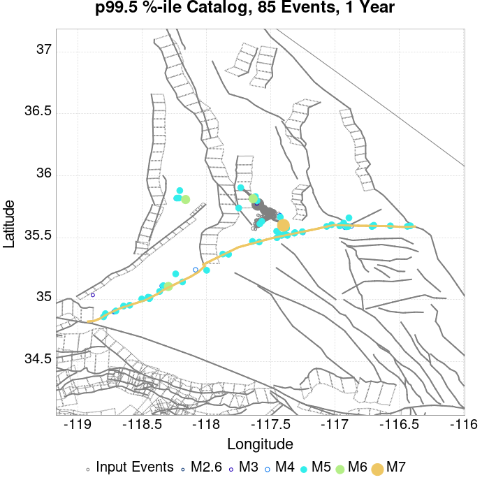
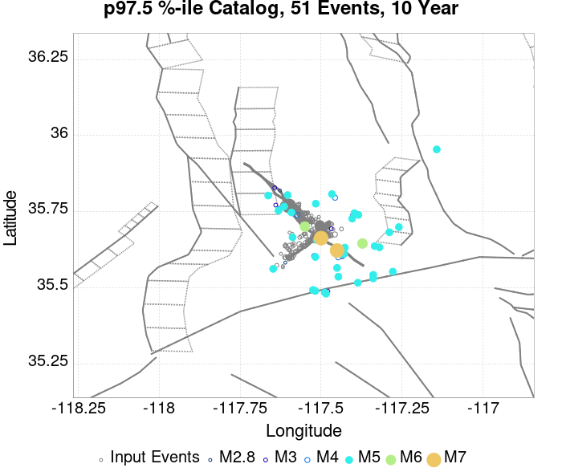
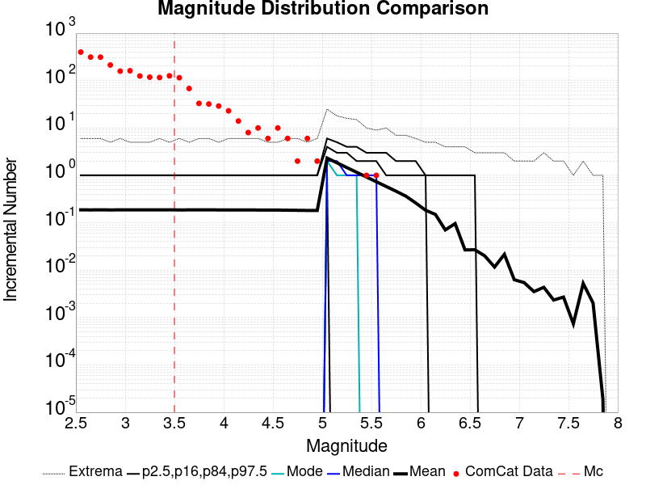
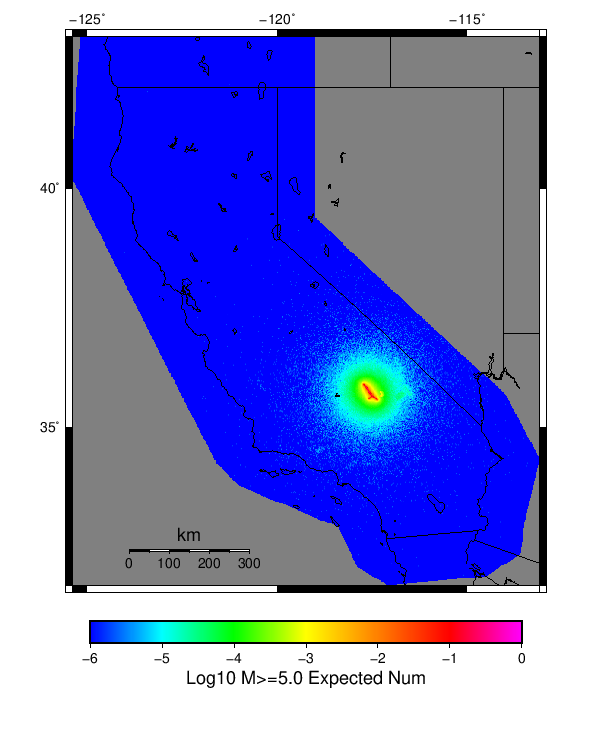

# ComCat M7.1 (ci38457511), ShakeMap Surfaces, FM2_1 Results

|   | ComCat M7.1 (ci38457511), ShakeMap Surfaces, FM2_1 |
|-----|-----|
| Num Simulations | 12049 (incomplete) |
| Start Time | 2019/07/06 03:19:54 UTC |
| Start Time Epoch Milliseconds | 1562383194040 |
| Duration | 10 Years |
| Includes Spontaneous? | false |
| Trigger Ruptures | 283 Trigger Ruptures |
|   | First: M3.98 at 2019/07/04 17:02:55 UTC |
|   | Last: M7.1 at 2019/07/06 03:19:53 UTC |
|   | Largest: M7.1 at 2019/07/06 03:19:53 UTC |
| Trigger Ruptures | *(none)* |
| Config Generated With | u3etas_comcat_event_config_builder.sh --event-id ci38457511 --mag-complete 3.5 --days-before 7 --num-simulations 1000000 --fault-model FM2_1 --finite-surf-shakemap --finite-surf-shakemap-min-mag 5 --hpc-site USC_HPC --nodes 36 --hours 24 --queue scec |

## Table Of Contents

* [Probabilities Summary Table](#probabilities-summary-table)
* [Magnitude Number Distribution](#magnitude-number-distribution)
  * [10 Year Magnitude Number Distribution](#10-year-magnitude-number-distribution)
  * [1 Year Magnitude Number Distribution](#1-year-magnitude-number-distribution)
  * [1 Month Magnitude Number Distribution](#1-month-magnitude-number-distribution)
  * [1 Week Magnitude Number Distribution](#1-week-magnitude-number-distribution)
  * [1 Day Magnitude Number Distribution](#1-day-magnitude-number-distribution)
  * [1 Hour Magnitude Number Distribution](#1-hour-magnitude-number-distribution)
* [Hazard Change Over Time](#hazard-change-over-time)
  * [M&ge;5.0 Hazard Change Over Time](#m50-hazard-change-over-time)
  * [M&ge;6.0 Hazard Change Over Time](#m60-hazard-change-over-time)
  * [M&ge;7.0 Hazard Change Over Time](#m70-hazard-change-over-time)
* [Trigger Rupture Fault Map](#trigger-rupture-fault-map)
* [Trigger Rupture Depth Map](#trigger-rupture-depth-map)
* [Fault Distances To Triggers](#fault-distances-to-triggers)
* [Individual Simulated Catalog Maps](#individual-simulated-catalog-maps)
* [ComCat Data Comparisons](#comcat-data-comparisons)
  * [ComCat Magnitude-Number Distributions](#comcat-magnitude-number-distributions)
  * [ComCat Time-Dependent Mc](#comcat-time-dependent-mc)
  * [ComCat Cumulative Number Vs Time](#comcat-cumulative-number-vs-time)
  * [ComCat Cumulative Number Simulation Percentiles](#comcat-cumulative-number-simulation-percentiles)
  * [ComCat Probability Spatial Distribution](#comcat-probability-spatial-distribution)
  * [ComCat Mean Expectation Spatial Distribution](#comcat-mean-expectation-spatial-distribution)
  * [ComCat Depth Distribution](#comcat-depth-distribution)
* [Section Participation](#section-participation)
  * [Section Participation Plots](#section-participation-plots)
  * [Supra-Seismogenic Parent Sections Table](#supra-seismogenic-parent-sections-table)
  * [M≥6.5 Parent Sections Table](#m65-parent-sections-table)
  * [M≥7 Parent Sections Table](#m7-parent-sections-table)
  * [M≥7.5 Parent Sections Table](#m75-parent-sections-table)
  * [M≥8 Parent Sections Table](#m8-parent-sections-table)
* [Fault Magnitude-Probability Distributions](#fault-magnitude-probability-distributions)
* [Gridded Nucleation](#gridded-nucleation)
* [JSON Input File](#json-input-file)

## Probabilities Summary Table
*[(top)](#table-of-contents)*

| Magnitude | 1 Hour Prob | 1 Day Prob | 1 Week Prob | 1 Month Prob | 1 Year Prob | 10 Year Prob |
|-----|-----|-----|-----|-----|-----|-----|
| **M&ge;4** | 1.000 (100.00%) | 1.000 (100.00%) | 1.000 (100.00%) | 1.000 (100.00%) | 1.000 (100.00%) | 1.000 (100.00%) |
| *95% Conf* | *[99.96% 100.00%]* | *[99.96% 100.00%]* | *[99.96% 100.00%]* | *[99.96% 100.00%]* | *[99.96% 100.00%]* | *[99.96% 100.00%]* |
| **M&ge;4.5** | 0.990 (99.01%) | 1.000 (100.00%) | 1.000 (100.00%) | 1.000 (100.00%) | 1.000 (100.00%) | 1.000 (100.00%) |
| *95% Conf* | *[98.81% 99.18%]* | *[99.96% 100.00%]* | *[99.96% 100.00%]* | *[99.96% 100.00%]* | *[99.96% 100.00%]* | *[99.96% 100.00%]* |
| **M&ge;5** | 0.762 (76.21%) | 0.977 (97.68%) | 0.994 (99.44%) | 0.998 (99.80%) | 1.000 (99.99%) | 1.000 (100.00%) |
| *95% Conf* | *[75.43% 76.96%]* | *[97.40% 97.94%]* | *[99.29% 99.57%]* | *[99.70% 99.87%]* | *[99.95% 100.00%]* | *[99.96% 100.00%]* |
| **M&ge;5.5** | 0.329 (32.94%) | 0.665 (66.46%) | 0.796 (79.62%) | 0.859 (85.88%) | 0.924 (92.45%) | 0.958 (95.84%) |
| *95% Conf* | *[32.10% 33.79%]* | *[65.61% 67.30%]* | *[78.88% 80.33%]* | *[85.25% 86.50%]* | *[91.96% 92.91%]* | *[95.47% 96.19%]* |
| **M&ge;6** | 0.076 (7.58%) | 0.204 (20.40%) | 0.285 (28.54%) | 0.345 (34.52%) | 0.445 (44.53%) | 0.528 (52.76%) |
| *95% Conf* | *[7.11% 8.07%]* | *[19.69% 21.13%]* | *[27.74% 29.36%]* | *[33.67% 35.38%]* | *[43.65% 45.43%]* | *[51.86% 53.65%]* |
| **M&ge;6.5** | 0.014 (1.36%) | 0.041 (4.12%) | 0.063 (6.27%) | 0.082 (8.16%) | 0.114 (11.37%) | 0.147 (14.72%) |
| *95% Conf* | *[1.17% 1.59%]* | *[3.78% 4.50%]* | *[5.84% 6.72%]* | *[7.68% 8.66%]* | *[10.81% 11.95%]* | *[14.10% 15.37%]* |
| **M&ge;7** | 3.24E-3 (0.32%) | 9.88E-3 (0.99%) | 0.015 (1.51%) | 0.020 (1.96%) | 0.026 (2.63%) | 0.037 (3.68%) |
| *95% Conf* | *[0.23% 0.45%]* | *[0.82% 1.19%]* | *[1.30% 1.75%]* | *[1.72% 2.23%]* | *[2.36% 2.94%]* | *[3.35% 4.03%]* |
| **M&ge;7.1** | 2.32E-3 (0.23%) | 7.80E-3 (0.78%) | 0.012 (1.20%) | 0.016 (1.55%) | 0.021 (2.11%) | 0.030 (2.96%) |
| *95% Conf* | *[0.16% 0.34%]* | *[0.63% 0.96%]* | *[1.02% 1.42%]* | *[1.34% 1.79%]* | *[1.86% 2.38%]* | *[2.67% 3.29%]* |
| **M&ge;7.5** | 9.96E-4 (0.10%) | 3.07E-3 (0.31%) | 4.98E-3 (0.50%) | 6.64E-3 (0.66%) | 8.80E-3 (0.88%) | 0.013 (1.26%) |
| *95% Conf* | *[0.05% 0.18%]* | *[0.22% 0.43%]* | *[0.38% 0.65%]* | *[0.53% 0.83%]* | *[0.72% 1.07%]* | *[1.07% 1.48%]* |
| **M&ge;8** | 0.000 (0.00%) | 8.30E-5 (0.01%) | 8.30E-5 (0.01%) | 8.30E-5 (0.01%) | 1.66E-4 (0.02%) | 2.49E-4 (0.02%) |
| *95% Conf* | *[0.00% 0.04%]* | *[0.00% 0.05%]* | *[0.00% 0.05%]* | *[0.00% 0.05%]* | *[0.00% 0.07%]* | *[0.01% 0.08%]* |

## Magnitude Number Distribution
*[(top)](#table-of-contents)*

### 10 Year Magnitude Number Distribution
*[(top)](#table-of-contents)*

**Legend**
* **Mean** (thick black line): mean expected number across all 12049 catalogs
* **2.5%,97.5%** (thin black lines): expected number percentiles across all 12049 catalogs
* **Median** (thin blue line): median expected number across all 12049 catalogs
* **Mode** (thin cyan line): modal expected number across all 12049 catalogs
* **10 yr Probability** (thin red line): 10 year probability calculated as the fraction of catalogs with at least 1 occurrence
* **10 yr Supraseismogenic Probability** (thin dashed red line): same as above, but only for supraseismogenic ruptures on explicitly modeled UCERF3 faults
* **95% Conf** (light red shaded region): binomial 95% confidence bounds on probability
* **Primary** (thin green line): mean expected number from primary triggered aftershocks only (no secondary, tertiary, etc...) across all 12049 catalogs


| Mag | Mean | 2.5 %ile | 97.5 %ile | Median | Mode | 10 yr Probability | 10 yr Prob 95% Conf | 10 yr Supra-Seis Prob | Primary Aftershocks Mean |
|-----|-----|-----|-----|-----|-----|-----|-----|-----|-----|
| **M&ge;2.5** | 5025.289 | 3644.000 | 10294.000 | 4435.000 | 4172.000 | 1.000 (100.00%) | [99.96% 100.00%] | 0.119 (11.90%) | 2394.733 |
| **M&ge;2.6** | 3991.088 | 2885.000 | 8188.000 | 3526.000 | 3348.000 | 1.000 (100.00%) | [99.96% 100.00%] | 0.119 (11.90%) | 1901.676 |
| **M&ge;2.7** | 3170.152 | 2287.000 | 6500.000 | 2802.000 | 2718.000 | 1.000 (100.00%) | [99.96% 100.00%] | 0.119 (11.90%) | 1510.478 |
| **M&ge;2.8** | 2518.063 | 1814.000 | 5158.000 | 2226.000 | 2090.000 | 1.000 (100.00%) | [99.96% 100.00%] | 0.119 (11.90%) | 1200.004 |
| **M&ge;2.9** | 2000.151 | 1433.000 | 4092.000 | 1769.000 | 1683.000 | 1.000 (100.00%) | [99.96% 100.00%] | 0.119 (11.90%) | 953.125 |
| **M&ge;3** | 1588.633 | 1135.000 | 3253.000 | 1405.000 | 1321.000 | 1.000 (100.00%) | [99.96% 100.00%] | 0.119 (11.90%) | 757.074 |
| **M&ge;3.1** | 1261.698 | 898.000 | 2586.000 | 1116.000 | 1050.000 | 1.000 (100.00%) | [99.96% 100.00%] | 0.119 (11.90%) | 601.231 |
| **M&ge;3.2** | 1002.114 | 710.000 | 2075.000 | 888.000 | 863.000 | 1.000 (100.00%) | [99.96% 100.00%] | 0.119 (11.90%) | 477.520 |
| **M&ge;3.3** | 795.943 | 560.000 | 1629.000 | 705.000 | 633.000 | 1.000 (100.00%) | [99.96% 100.00%] | 0.119 (11.90%) | 379.378 |
| **M&ge;3.4** | 632.011 | 441.000 | 1301.000 | 560.000 | 541.000 | 1.000 (100.00%) | [99.96% 100.00%] | 0.119 (11.90%) | 301.287 |
| **M&ge;3.5** | 501.942 | 346.000 | 1035.000 | 445.000 | 425.000 | 1.000 (100.00%) | [99.96% 100.00%] | 0.119 (11.90%) | 239.303 |
| **M&ge;3.6** | 398.484 | 272.000 | 824.000 | 354.000 | 336.000 | 1.000 (100.00%) | [99.96% 100.00%] | 0.119 (11.90%) | 189.945 |
| **M&ge;3.7** | 316.395 | 213.000 | 655.000 | 281.000 | 270.000 | 1.000 (100.00%) | [99.96% 100.00%] | 0.119 (11.90%) | 150.795 |
| **M&ge;3.8** | 251.262 | 166.000 | 520.000 | 224.000 | 210.000 | 1.000 (100.00%) | [99.96% 100.00%] | 0.119 (11.90%) | 119.691 |
| **M&ge;3.9** | 199.431 | 129.000 | 415.000 | 178.000 | 174.000 | 1.000 (100.00%) | [99.96% 100.00%] | 0.119 (11.90%) | 95.007 |
| **M&ge;4** | 158.352 | 100.000 | 328.000 | 141.000 | 130.000 | 1.000 (100.00%) | [99.96% 100.00%] | 0.119 (11.90%) | 75.414 |
| **M&ge;4.1** | 125.737 | 78.000 | 264.000 | 112.000 | 108.000 | 1.000 (100.00%) | [99.96% 100.00%] | 0.119 (11.90%) | 59.914 |
| **M&ge;4.2** | 99.653 | 60.000 | 209.000 | 89.000 | 83.000 | 1.000 (100.00%) | [99.96% 100.00%] | 0.119 (11.90%) | 47.482 |
| **M&ge;4.3** | 79.086 | 46.000 | 166.000 | 71.000 | 72.000 | 1.000 (100.00%) | [99.96% 100.00%] | 0.119 (11.90%) | 37.672 |
| **M&ge;4.4** | 62.665 | 35.000 | 132.000 | 56.000 | 55.000 | 1.000 (100.00%) | [99.96% 100.00%] | 0.119 (11.90%) | 29.839 |
| **M&ge;4.5** | 49.604 | 26.000 | 105.000 | 44.000 | 41.000 | 1.000 (100.00%) | [99.96% 100.00%] | 0.119 (11.90%) | 23.598 |
| **M&ge;4.6** | 39.282 | 20.000 | 85.000 | 35.000 | 33.000 | 1.000 (100.00%) | [99.96% 100.00%] | 0.119 (11.90%) | 18.682 |
| **M&ge;4.7** | 31.040 | 15.000 | 68.000 | 28.000 | 25.000 | 1.000 (100.00%) | [99.96% 100.00%] | 0.119 (11.90%) | 14.748 |
| **M&ge;4.8** | 24.493 | 11.000 | 55.000 | 22.000 | 18.000 | 1.000 (100.00%) | [99.96% 100.00%] | 0.119 (11.90%) | 11.644 |
| **M&ge;4.9** | 19.296 | 8.000 | 44.000 | 17.000 | 15.000 | 1.000 (100.00%) | [99.96% 100.00%] | 0.119 (11.90%) | 9.168 |
| **M&ge;5** | 15.164 | 5.000 | 36.000 | 13.000 | 12.000 | 1.000 (100.00%) | [99.96% 100.00%] | 0.119 (11.90%) | 7.203 |
| **M&ge;5.1** | 11.878 | 4.000 | 28.000 | 10.000 | 10.000 | 1.000 (99.98%) | [99.93% 100.00%] | 0.119 (11.90%) | 5.634 |
| **M&ge;5.2** | 9.294 | 2.000 | 23.000 | 8.000 | 8.000 | 0.999 (99.90%) | [99.82% 99.95%] | 0.119 (11.90%) | 4.406 |
| **M&ge;5.3** | 7.231 | 1.000 | 19.000 | 6.000 | 5.000 | 0.994 (99.43%) | [99.27% 99.55%] | 0.119 (11.90%) | 3.420 |
| **M&ge;5.4** | 5.601 | 1.000 | 15.000 | 5.000 | 4.000 | 0.982 (98.16%) | [97.90% 98.39%] | 0.119 (11.90%) | 2.644 |
| **M&ge;5.5** | 4.319 | 0.000 | 12.000 | 4.000 | 3.000 | 0.958 (95.84%) | [95.47% 96.19%] | 0.119 (11.90%) | 2.025 |
| **M&ge;5.6** | 3.280 | 0.000 | 10.000 | 3.000 | 2.000 | 0.915 (91.49%) | [90.98% 91.98%] | 0.119 (11.90%) | 1.535 |
| **M&ge;5.7** | 2.456 | 0.000 | 8.000 | 2.000 | 1.000 | 0.849 (84.87%) | [84.21% 85.50%] | 0.119 (11.90%) | 1.146 |
| **M&ge;5.8** | 1.803 | 0.000 | 6.000 | 1.000 | 1.000 | 0.758 (75.81%) | [75.03% 76.57%] | 0.119 (11.90%) | 0.837 |
| **M&ge;5.9** | 1.291 | 0.000 | 5.000 | 1.000 | 0.000 | 0.645 (64.47%) | [63.61% 65.32%] | 0.119 (11.90%) | 0.596 |
| **M&ge;6** | 0.919 | 0.000 | 4.000 | 1.000 | 0.000 | 0.528 (52.76%) | [51.86% 53.65%] | 0.119 (11.90%) | 0.418 |
| **M&ge;6.1** | 0.665 | 0.000 | 3.000 | 0.000 | 0.000 | 0.423 (42.33%) | [41.44% 43.22%] | 0.119 (11.88%) | 0.296 |
| **M&ge;6.2** | 0.463 | 0.000 | 3.000 | 0.000 | 0.000 | 0.318 (31.79%) | [30.96% 32.63%] | 0.119 (11.88%) | 0.198 |
| **M&ge;6.3** | 0.366 | 0.000 | 2.000 | 0.000 | 0.000 | 0.262 (26.23%) | [25.44% 27.02%] | 0.119 (11.88%) | 0.152 |
| **M&ge;6.4** | 0.234 | 0.000 | 2.000 | 0.000 | 0.000 | 0.172 (17.25%) | [16.58% 17.94%] | 0.070 (7.00%) | 0.097 |
| **M&ge;6.5** | 0.198 | 0.000 | 2.000 | 0.000 | 0.000 | 0.147 (14.72%) | [14.10% 15.37%] | 0.070 (7.00%) | 0.079 |
| **M&ge;6.6** | 0.142 | 0.000 | 1.000 | 0.000 | 0.000 | 0.114 (11.41%) | [10.85% 12.00%] | 0.061 (6.10%) | 0.059 |
| **M&ge;6.7** | 0.111 | 0.000 | 1.000 | 0.000 | 0.000 | 0.089 (8.95%) | [8.45% 9.47%] | 0.052 (5.20%) | 0.045 |
| **M&ge;6.8** | 0.091 | 0.000 | 1.000 | 0.000 | 0.000 | 0.074 (7.44%) | [6.99% 7.93%] | 0.050 (4.99%) | 0.038 |
| **M&ge;6.9** | 0.054 | 0.000 | 1.000 | 0.000 | 0.000 | 0.045 (4.51%) | [4.15% 4.90%] | 0.028 (2.85%) | 0.023 |
| **M&ge;7** | 0.044 | 0.000 | 1.000 | 0.000 | 0.000 | 0.037 (3.68%) | [3.35% 4.03%] | 0.027 (2.67%) | 0.018 |
| **M&ge;7.1** | 0.035 | 0.000 | 1.000 | 0.000 | 0.000 | 0.030 (2.96%) | [2.67% 3.29%] | 0.024 (2.39%) | 0.014 |
| **M&ge;7.2** | 0.028 | 0.000 | 0.000 | 0.000 | 0.000 | 0.025 (2.50%) | [2.23% 2.80%] | 0.022 (2.17%) | 0.012 |
| **M&ge;7.3** | 0.022 | 0.000 | 0.000 | 0.000 | 0.000 | 0.020 (1.95%) | [1.71% 2.22%] | 0.017 (1.74%) | 9.54E-3 |
| **M&ge;7.4** | 0.019 | 0.000 | 0.000 | 0.000 | 0.000 | 0.016 (1.64%) | [1.43% 1.89%] | 0.015 (1.54%) | 8.88E-3 |
| **M&ge;7.5** | 0.015 | 0.000 | 0.000 | 0.000 | 0.000 | 0.013 (1.26%) | [1.07% 1.48%] | 0.012 (1.21%) | 6.47E-3 |
| **M&ge;7.6** | 0.013 | 0.000 | 0.000 | 0.000 | 0.000 | 0.011 (1.10%) | [0.92% 1.30%] | 0.011 (1.08%) | 5.56E-3 |
| **M&ge;7.7** | 5.39E-3 | 0.000 | 0.000 | 0.000 | 0.000 | 4.98E-3 (0.50%) | [0.38% 0.65%] | 4.90E-3 (0.49%) | 1.41E-3 |
| **M&ge;7.8** | 1.83E-3 | 0.000 | 0.000 | 0.000 | 0.000 | 1.83E-3 (0.18%) | [0.12% 0.28%] | 1.74E-3 (0.17%) | 1.66E-4 |
| **M&ge;7.9** | 6.64E-4 | 0.000 | 0.000 | 0.000 | 0.000 | 6.64E-4 (0.07%) | [0.03% 0.14%] | 6.64E-4 (0.07%) | 8.30E-5 |
| **M&ge;8** | 2.49E-4 | 0.000 | 0.000 | 0.000 | 0.000 | 2.49E-4 (0.02%) | [0.01% 0.08%] | 2.49E-4 (0.02%) | 0.000 |
| **M&ge;8.1** | 2.49E-4 | 0.000 | 0.000 | 0.000 | 0.000 | 2.49E-4 (0.02%) | [0.01% 0.08%] | 2.49E-4 (0.02%) | 0.000 |
| **M&ge;8.2** | 0.000 | 0.000 | 0.000 | 0.000 | 0.000 | 0.000 (0.00%) | [0.00% 0.04%] | 0.000 (0.00%) | 0.000 |
| **M&ge;8.3** | 0.000 | 0.000 | 0.000 | 0.000 | 0.000 | 0.000 (0.00%) | [0.00% 0.04%] | 0.000 (0.00%) | 0.000 |
| **M&ge;8.4** | 0.000 | 0.000 | 0.000 | 0.000 | 0.000 | 0.000 (0.00%) | [0.00% 0.04%] | 0.000 (0.00%) | 0.000 |
| **M&ge;8.5** | 0.000 | 0.000 | 0.000 | 0.000 | 0.000 | 0.000 (0.00%) | [0.00% 0.04%] | 0.000 (0.00%) | 0.000 |
| **M&ge;8.6** | 0.000 | 0.000 | 0.000 | 0.000 | 0.000 | 0.000 (0.00%) | [0.00% 0.04%] | 0.000 (0.00%) | 0.000 |
| **M&ge;8.7** | 0.000 | 0.000 | 0.000 | 0.000 | 0.000 | 0.000 (0.00%) | [0.00% 0.04%] | 0.000 (0.00%) | 0.000 |
| **M&ge;8.8** | 0.000 | 0.000 | 0.000 | 0.000 | 0.000 | 0.000 (0.00%) | [0.00% 0.04%] | 0.000 (0.00%) | 0.000 |
| **M&ge;8.9** | 0.000 | 0.000 | 0.000 | 0.000 | 0.000 | 0.000 (0.00%) | [0.00% 0.04%] | 0.000 (0.00%) | 0.000 |
| **M&ge;9** | 0.000 | 0.000 | 0.000 | 0.000 | 0.000 | 0.000 (0.00%) | [0.00% 0.04%] | 0.000 (0.00%) | 0.000 |

### 1 Year Magnitude Number Distribution
*[(top)](#table-of-contents)*

**Legend**
* **Mean** (thick black line): mean expected number across all 12049 catalogs
* **2.5%,97.5%** (thin black lines): expected number percentiles across all 12049 catalogs
* **Median** (thin blue line): median expected number across all 12049 catalogs
* **Mode** (thin cyan line): modal expected number across all 12049 catalogs
* **1 yr Probability** (thin red line): 1 year probability calculated as the fraction of catalogs with at least 1 occurrence
* **1 yr Supraseismogenic Probability** (thin dashed red line): same as above, but only for supraseismogenic ruptures on explicitly modeled UCERF3 faults
* **95% Conf** (light red shaded region): binomial 95% confidence bounds on probability
* **Primary** (thin green line): mean expected number from primary triggered aftershocks only (no secondary, tertiary, etc...) across all 12049 catalogs


| Mag | Mean | 2.5 %ile | 97.5 %ile | Median | Mode | 1 yr Probability | 1 yr Prob 95% Conf | 1 yr Supra-Seis Prob | Primary Aftershocks Mean |
|-----|-----|-----|-----|-----|-----|-----|-----|-----|-----|
| **M&ge;2.5** | 3838.465 | 2943.000 | 6735.000 | 3482.000 | 3213.000 | 1.000 (100.00%) | [99.96% 100.00%] | 0.092 (9.15%) | 2085.875 |
| **M&ge;2.6** | 3048.485 | 2333.000 | 5338.000 | 2766.000 | 2666.000 | 1.000 (100.00%) | [99.96% 100.00%] | 0.092 (9.15%) | 1656.394 |
| **M&ge;2.7** | 2421.413 | 1848.000 | 4234.000 | 2196.000 | 2171.000 | 1.000 (100.00%) | [99.96% 100.00%] | 0.092 (9.15%) | 1315.625 |
| **M&ge;2.8** | 1923.310 | 1464.000 | 3369.000 | 1746.000 | 1782.000 | 1.000 (100.00%) | [99.96% 100.00%] | 0.092 (9.15%) | 1045.146 |
| **M&ge;2.9** | 1527.625 | 1157.000 | 2670.000 | 1387.000 | 1322.000 | 1.000 (100.00%) | [99.96% 100.00%] | 0.092 (9.15%) | 830.097 |
| **M&ge;3** | 1213.319 | 914.000 | 2118.000 | 1102.000 | 1053.000 | 1.000 (100.00%) | [99.96% 100.00%] | 0.092 (9.15%) | 659.382 |
| **M&ge;3.1** | 963.537 | 723.000 | 1681.000 | 875.000 | 840.000 | 1.000 (100.00%) | [99.96% 100.00%] | 0.092 (9.15%) | 523.647 |
| **M&ge;3.2** | 765.374 | 569.000 | 1336.000 | 696.000 | 649.000 | 1.000 (100.00%) | [99.96% 100.00%] | 0.092 (9.15%) | 415.880 |
| **M&ge;3.3** | 607.973 | 448.000 | 1067.000 | 553.000 | 521.000 | 1.000 (100.00%) | [99.96% 100.00%] | 0.092 (9.15%) | 330.413 |
| **M&ge;3.4** | 482.756 | 352.000 | 850.000 | 440.000 | 416.000 | 1.000 (100.00%) | [99.96% 100.00%] | 0.092 (9.15%) | 262.377 |
| **M&ge;3.5** | 383.438 | 277.000 | 677.000 | 350.000 | 341.000 | 1.000 (100.00%) | [99.96% 100.00%] | 0.092 (9.15%) | 208.386 |
| **M&ge;3.6** | 304.443 | 217.000 | 537.000 | 278.000 | 264.000 | 1.000 (100.00%) | [99.96% 100.00%] | 0.092 (9.15%) | 165.416 |
| **M&ge;3.7** | 241.715 | 170.000 | 425.000 | 221.000 | 202.000 | 1.000 (100.00%) | [99.96% 100.00%] | 0.092 (9.15%) | 131.300 |
| **M&ge;3.8** | 191.985 | 132.000 | 338.000 | 176.000 | 167.000 | 1.000 (100.00%) | [99.96% 100.00%] | 0.092 (9.15%) | 104.256 |
| **M&ge;3.9** | 152.394 | 102.000 | 272.000 | 140.000 | 137.000 | 1.000 (100.00%) | [99.96% 100.00%] | 0.092 (9.15%) | 82.758 |
| **M&ge;4** | 120.988 | 79.000 | 216.000 | 111.000 | 105.000 | 1.000 (100.00%) | [99.96% 100.00%] | 0.092 (9.15%) | 65.682 |
| **M&ge;4.1** | 96.070 | 61.000 | 172.000 | 88.000 | 86.000 | 1.000 (100.00%) | [99.96% 100.00%] | 0.092 (9.15%) | 52.187 |
| **M&ge;4.2** | 76.121 | 47.000 | 138.000 | 70.000 | 66.000 | 1.000 (100.00%) | [99.96% 100.00%] | 0.092 (9.15%) | 41.359 |
| **M&ge;4.3** | 60.408 | 36.000 | 110.000 | 56.000 | 49.000 | 1.000 (100.00%) | [99.96% 100.00%] | 0.092 (9.15%) | 32.819 |
| **M&ge;4.4** | 47.870 | 27.000 | 89.000 | 44.000 | 45.000 | 1.000 (100.00%) | [99.96% 100.00%] | 0.092 (9.15%) | 26.007 |
| **M&ge;4.5** | 37.895 | 20.000 | 72.000 | 35.000 | 33.000 | 1.000 (100.00%) | [99.96% 100.00%] | 0.092 (9.15%) | 20.571 |
| **M&ge;4.6** | 30.008 | 15.000 | 58.000 | 28.000 | 25.000 | 1.000 (100.00%) | [99.96% 100.00%] | 0.092 (9.15%) | 16.276 |
| **M&ge;4.7** | 23.698 | 11.000 | 47.000 | 22.000 | 21.000 | 1.000 (100.00%) | [99.96% 100.00%] | 0.092 (9.15%) | 12.837 |
| **M&ge;4.8** | 18.705 | 8.000 | 38.000 | 17.000 | 16.000 | 1.000 (100.00%) | [99.96% 100.00%] | 0.092 (9.15%) | 10.134 |
| **M&ge;4.9** | 14.744 | 6.000 | 31.000 | 13.000 | 12.000 | 1.000 (100.00%) | [99.96% 100.00%] | 0.092 (9.15%) | 7.981 |
| **M&ge;5** | 11.578 | 4.000 | 25.000 | 10.000 | 9.000 | 1.000 (99.99%) | [99.95% 100.00%] | 0.092 (9.15%) | 6.264 |
| **M&ge;5.1** | 9.055 | 2.000 | 20.000 | 8.000 | 7.000 | 0.999 (99.93%) | [99.85% 99.96%] | 0.092 (9.15%) | 4.899 |
| **M&ge;5.2** | 7.090 | 1.000 | 17.000 | 6.000 | 5.000 | 0.997 (99.68%) | [99.55% 99.77%] | 0.092 (9.15%) | 3.834 |
| **M&ge;5.3** | 5.501 | 1.000 | 14.000 | 5.000 | 4.000 | 0.987 (98.70%) | [98.47% 98.89%] | 0.092 (9.15%) | 2.969 |
| **M&ge;5.4** | 4.262 | 0.000 | 11.000 | 4.000 | 3.000 | 0.964 (96.36%) | [96.00% 96.68%] | 0.092 (9.15%) | 2.297 |
| **M&ge;5.5** | 3.281 | 0.000 | 9.000 | 3.000 | 2.000 | 0.924 (92.45%) | [91.96% 92.91%] | 0.092 (9.15%) | 1.762 |
| **M&ge;5.6** | 2.493 | 0.000 | 7.000 | 2.000 | 2.000 | 0.864 (86.40%) | [85.77% 87.00%] | 0.092 (9.15%) | 1.336 |
| **M&ge;5.7** | 1.866 | 0.000 | 6.000 | 1.000 | 1.000 | 0.780 (78.00%) | [77.25% 78.73%] | 0.092 (9.15%) | 0.997 |
| **M&ge;5.8** | 1.367 | 0.000 | 5.000 | 1.000 | 0.000 | 0.677 (67.73%) | [66.89% 68.56%] | 0.092 (9.15%) | 0.728 |
| **M&ge;5.9** | 0.979 | 0.000 | 4.000 | 1.000 | 0.000 | 0.561 (56.05%) | [55.16% 56.94%] | 0.092 (9.15%) | 0.519 |
| **M&ge;6** | 0.695 | 0.000 | 3.000 | 0.000 | 0.000 | 0.445 (44.53%) | [43.65% 45.43%] | 0.092 (9.15%) | 0.361 |
| **M&ge;6.1** | 0.499 | 0.000 | 3.000 | 0.000 | 0.000 | 0.348 (34.77%) | [33.92% 35.63%] | 0.091 (9.14%) | 0.255 |
| **M&ge;6.2** | 0.343 | 0.000 | 2.000 | 0.000 | 0.000 | 0.254 (25.40%) | [24.62% 26.19%] | 0.091 (9.14%) | 0.170 |
| **M&ge;6.3** | 0.270 | 0.000 | 2.000 | 0.000 | 0.000 | 0.208 (20.81%) | [20.09% 21.54%] | 0.091 (9.14%) | 0.131 |
| **M&ge;6.4** | 0.170 | 0.000 | 1.000 | 0.000 | 0.000 | 0.134 (13.41%) | [12.81% 14.04%] | 0.054 (5.36%) | 0.083 |
| **M&ge;6.5** | 0.142 | 0.000 | 1.000 | 0.000 | 0.000 | 0.114 (11.37%) | [10.81% 11.95%] | 0.054 (5.36%) | 0.067 |
| **M&ge;6.6** | 0.102 | 0.000 | 1.000 | 0.000 | 0.000 | 0.086 (8.65%) | [8.16% 9.17%] | 0.046 (4.59%) | 0.050 |
| **M&ge;6.7** | 0.078 | 0.000 | 1.000 | 0.000 | 0.000 | 0.067 (6.69%) | [6.25% 7.15%] | 0.039 (3.88%) | 0.038 |
| **M&ge;6.8** | 0.065 | 0.000 | 1.000 | 0.000 | 0.000 | 0.056 (5.59%) | [5.19% 6.02%] | 0.038 (3.76%) | 0.032 |
| **M&ge;6.9** | 0.038 | 0.000 | 1.000 | 0.000 | 0.000 | 0.033 (3.31%) | [3.00% 3.65%] | 0.021 (2.06%) | 0.019 |
| **M&ge;7** | 0.030 | 0.000 | 1.000 | 0.000 | 0.000 | 0.026 (2.63%) | [2.36% 2.94%] | 0.019 (1.91%) | 0.015 |
| **M&ge;7.1** | 0.024 | 0.000 | 0.000 | 0.000 | 0.000 | 0.021 (2.11%) | [1.86% 2.38%] | 0.017 (1.69%) | 0.012 |
| **M&ge;7.2** | 0.020 | 0.000 | 0.000 | 0.000 | 0.000 | 0.017 (1.74%) | [1.52% 2.00%] | 0.015 (1.54%) | 9.54E-3 |
| **M&ge;7.3** | 0.016 | 0.000 | 0.000 | 0.000 | 0.000 | 0.014 (1.39%) | [1.19% 1.62%] | 0.012 (1.24%) | 7.97E-3 |
| **M&ge;7.4** | 0.013 | 0.000 | 0.000 | 0.000 | 0.000 | 0.012 (1.20%) | [1.01% 1.41%] | 0.011 (1.11%) | 7.47E-3 |
| **M&ge;7.5** | 9.79E-3 | 0.000 | 0.000 | 0.000 | 0.000 | 8.80E-3 (0.88%) | [0.72% 1.07%] | 8.47E-3 (0.85%) | 5.15E-3 |
| **M&ge;7.6** | 8.55E-3 | 0.000 | 0.000 | 0.000 | 0.000 | 7.55E-3 (0.76%) | [0.61% 0.93%] | 7.47E-3 (0.75%) | 4.40E-3 |
| **M&ge;7.7** | 3.49E-3 | 0.000 | 0.000 | 0.000 | 0.000 | 3.24E-3 (0.32%) | [0.23% 0.45%] | 3.15E-3 (0.32%) | 1.24E-3 |
| **M&ge;7.8** | 1.08E-3 | 0.000 | 0.000 | 0.000 | 0.000 | 1.08E-3 (0.11%) | [0.06% 0.19%] | 9.96E-4 (0.10%) | 1.66E-4 |
| **M&ge;7.9** | 4.98E-4 | 0.000 | 0.000 | 0.000 | 0.000 | 4.98E-4 (0.05%) | [0.02% 0.11%] | 4.98E-4 (0.05%) | 8.30E-5 |
| **M&ge;8** | 1.66E-4 | 0.000 | 0.000 | 0.000 | 0.000 | 1.66E-4 (0.02%) | [0.00% 0.07%] | 1.66E-4 (0.02%) | 0.000 |
| **M&ge;8.1** | 1.66E-4 | 0.000 | 0.000 | 0.000 | 0.000 | 1.66E-4 (0.02%) | [0.00% 0.07%] | 1.66E-4 (0.02%) | 0.000 |
| **M&ge;8.2** | 0.000 | 0.000 | 0.000 | 0.000 | 0.000 | 0.000 (0.00%) | [0.00% 0.04%] | 0.000 (0.00%) | 0.000 |
| **M&ge;8.3** | 0.000 | 0.000 | 0.000 | 0.000 | 0.000 | 0.000 (0.00%) | [0.00% 0.04%] | 0.000 (0.00%) | 0.000 |
| **M&ge;8.4** | 0.000 | 0.000 | 0.000 | 0.000 | 0.000 | 0.000 (0.00%) | [0.00% 0.04%] | 0.000 (0.00%) | 0.000 |
| **M&ge;8.5** | 0.000 | 0.000 | 0.000 | 0.000 | 0.000 | 0.000 (0.00%) | [0.00% 0.04%] | 0.000 (0.00%) | 0.000 |
| **M&ge;8.6** | 0.000 | 0.000 | 0.000 | 0.000 | 0.000 | 0.000 (0.00%) | [0.00% 0.04%] | 0.000 (0.00%) | 0.000 |
| **M&ge;8.7** | 0.000 | 0.000 | 0.000 | 0.000 | 0.000 | 0.000 (0.00%) | [0.00% 0.04%] | 0.000 (0.00%) | 0.000 |
| **M&ge;8.8** | 0.000 | 0.000 | 0.000 | 0.000 | 0.000 | 0.000 (0.00%) | [0.00% 0.04%] | 0.000 (0.00%) | 0.000 |
| **M&ge;8.9** | 0.000 | 0.000 | 0.000 | 0.000 | 0.000 | 0.000 (0.00%) | [0.00% 0.04%] | 0.000 (0.00%) | 0.000 |
| **M&ge;9** | 0.000 | 0.000 | 0.000 | 0.000 | 0.000 | 0.000 (0.00%) | [0.00% 0.04%] | 0.000 (0.00%) | 0.000 |

### 1 Month Magnitude Number Distribution
*[(top)](#table-of-contents)*

**Legend**
* **Mean** (thick black line): mean expected number across all 12049 catalogs
* **2.5%,97.5%** (thin black lines): expected number percentiles across all 12049 catalogs
* **Median** (thin blue line): median expected number across all 12049 catalogs
* **Mode** (thin cyan line): modal expected number across all 12049 catalogs
* **1 mo Probability** (thin red line): 1 month probability calculated as the fraction of catalogs with at least 1 occurrence
* **1 mo Supraseismogenic Probability** (thin dashed red line): same as above, but only for supraseismogenic ruptures on explicitly modeled UCERF3 faults
* **95% Conf** (light red shaded region): binomial 95% confidence bounds on probability
* **Primary** (thin green line): mean expected number from primary triggered aftershocks only (no secondary, tertiary, etc...) across all 12049 catalogs


| Mag | Mean | 2.5 %ile | 97.5 %ile | Median | Mode | 1 mo Probability | 1 mo Prob 95% Conf | 1 mo Supra-Seis Prob | Primary Aftershocks Mean |
|-----|-----|-----|-----|-----|-----|-----|-----|-----|-----|
| **M&ge;2.5** | 2712.196 | 2186.000 | 4182.000 | 2513.000 | 2378.000 | 1.000 (100.00%) | [99.96% 100.00%] | 0.064 (6.42%) | 1690.531 |
| **M&ge;2.6** | 2154.087 | 1729.000 | 3321.000 | 1997.000 | 1977.000 | 1.000 (100.00%) | [99.96% 100.00%] | 0.064 (6.42%) | 1342.530 |
| **M&ge;2.7** | 1710.976 | 1369.000 | 2638.000 | 1586.000 | 1532.000 | 1.000 (100.00%) | [99.96% 100.00%] | 0.064 (6.42%) | 1066.323 |
| **M&ge;2.8** | 1359.054 | 1082.000 | 2100.000 | 1260.000 | 1216.000 | 1.000 (100.00%) | [99.96% 100.00%] | 0.064 (6.42%) | 847.042 |
| **M&ge;2.9** | 1079.439 | 854.000 | 1669.000 | 1001.000 | 941.000 | 1.000 (100.00%) | [99.96% 100.00%] | 0.064 (6.42%) | 672.709 |
| **M&ge;3** | 857.274 | 674.000 | 1334.000 | 796.000 | 737.000 | 1.000 (100.00%) | [99.96% 100.00%] | 0.064 (6.42%) | 534.303 |
| **M&ge;3.1** | 680.767 | 531.000 | 1062.000 | 632.000 | 610.000 | 1.000 (100.00%) | [99.96% 100.00%] | 0.064 (6.42%) | 424.320 |
| **M&ge;3.2** | 540.743 | 418.000 | 839.000 | 502.000 | 471.000 | 1.000 (100.00%) | [99.96% 100.00%] | 0.064 (6.42%) | 337.002 |
| **M&ge;3.3** | 429.613 | 329.000 | 672.000 | 399.000 | 391.000 | 1.000 (100.00%) | [99.96% 100.00%] | 0.064 (6.42%) | 267.767 |
| **M&ge;3.4** | 341.137 | 258.000 | 536.000 | 318.000 | 300.000 | 1.000 (100.00%) | [99.96% 100.00%] | 0.064 (6.42%) | 212.667 |
| **M&ge;3.5** | 270.930 | 202.000 | 427.000 | 252.000 | 247.000 | 1.000 (100.00%) | [99.96% 100.00%] | 0.064 (6.42%) | 168.900 |
| **M&ge;3.6** | 215.160 | 157.000 | 342.000 | 201.000 | 195.000 | 1.000 (100.00%) | [99.96% 100.00%] | 0.064 (6.42%) | 134.081 |
| **M&ge;3.7** | 170.827 | 122.000 | 270.000 | 160.000 | 152.000 | 1.000 (100.00%) | [99.96% 100.00%] | 0.064 (6.42%) | 106.423 |
| **M&ge;3.8** | 135.649 | 95.000 | 216.000 | 127.000 | 123.000 | 1.000 (100.00%) | [99.96% 100.00%] | 0.064 (6.42%) | 84.497 |
| **M&ge;3.9** | 107.685 | 74.000 | 173.000 | 101.000 | 93.000 | 1.000 (100.00%) | [99.96% 100.00%] | 0.064 (6.42%) | 67.082 |
| **M&ge;4** | 85.488 | 56.000 | 138.000 | 80.000 | 77.000 | 1.000 (100.00%) | [99.96% 100.00%] | 0.064 (6.42%) | 53.223 |
| **M&ge;4.1** | 67.883 | 43.000 | 112.000 | 64.000 | 62.000 | 1.000 (100.00%) | [99.96% 100.00%] | 0.064 (6.42%) | 42.283 |
| **M&ge;4.2** | 53.782 | 33.000 | 89.000 | 50.000 | 48.000 | 1.000 (100.00%) | [99.96% 100.00%] | 0.064 (6.42%) | 33.514 |
| **M&ge;4.3** | 42.687 | 25.000 | 73.000 | 40.000 | 40.000 | 1.000 (100.00%) | [99.96% 100.00%] | 0.064 (6.42%) | 26.598 |
| **M&ge;4.4** | 33.838 | 18.000 | 59.000 | 32.000 | 30.000 | 1.000 (100.00%) | [99.96% 100.00%] | 0.064 (6.42%) | 21.078 |
| **M&ge;4.5** | 26.797 | 14.000 | 48.000 | 25.000 | 24.000 | 1.000 (100.00%) | [99.96% 100.00%] | 0.064 (6.42%) | 16.674 |
| **M&ge;4.6** | 21.228 | 10.000 | 39.000 | 20.000 | 19.000 | 1.000 (100.00%) | [99.96% 100.00%] | 0.064 (6.42%) | 13.194 |
| **M&ge;4.7** | 16.769 | 7.000 | 32.000 | 16.000 | 14.000 | 1.000 (100.00%) | [99.96% 100.00%] | 0.064 (6.42%) | 10.407 |
| **M&ge;4.8** | 13.239 | 5.000 | 26.000 | 12.000 | 11.000 | 1.000 (100.00%) | [99.96% 100.00%] | 0.064 (6.42%) | 8.215 |
| **M&ge;4.9** | 10.434 | 4.000 | 22.000 | 10.000 | 9.000 | 1.000 (99.98%) | [99.92% 99.99%] | 0.064 (6.42%) | 6.476 |
| **M&ge;5** | 8.198 | 2.000 | 18.000 | 7.000 | 6.000 | 0.998 (99.80%) | [99.70% 99.87%] | 0.064 (6.42%) | 5.084 |
| **M&ge;5.1** | 6.411 | 1.000 | 14.000 | 6.000 | 5.000 | 0.994 (99.36%) | [99.20% 99.49%] | 0.064 (6.42%) | 3.976 |
| **M&ge;5.2** | 5.022 | 1.000 | 12.000 | 5.000 | 4.000 | 0.983 (98.30%) | [98.05% 98.52%] | 0.064 (6.42%) | 3.108 |
| **M&ge;5.3** | 3.886 | 0.000 | 10.000 | 3.000 | 3.000 | 0.959 (95.95%) | [95.58% 96.29%] | 0.064 (6.42%) | 2.404 |
| **M&ge;5.4** | 3.008 | 0.000 | 8.000 | 3.000 | 2.000 | 0.918 (91.83%) | [91.32% 92.31%] | 0.064 (6.42%) | 1.859 |
| **M&ge;5.5** | 2.315 | 0.000 | 7.000 | 2.000 | 1.000 | 0.859 (85.88%) | [85.25% 86.50%] | 0.064 (6.42%) | 1.426 |
| **M&ge;5.6** | 1.758 | 0.000 | 6.000 | 1.000 | 1.000 | 0.776 (77.62%) | [76.86% 78.36%] | 0.064 (6.42%) | 1.081 |
| **M&ge;5.7** | 1.313 | 0.000 | 5.000 | 1.000 | 1.000 | 0.677 (67.70%) | [66.85% 68.53%] | 0.064 (6.42%) | 0.806 |
| **M&ge;5.8** | 0.959 | 0.000 | 4.000 | 1.000 | 0.000 | 0.567 (56.69%) | [55.80% 57.58%] | 0.064 (6.42%) | 0.586 |
| **M&ge;5.9** | 0.682 | 0.000 | 3.000 | 0.000 | 0.000 | 0.449 (44.94%) | [44.05% 45.84%] | 0.064 (6.42%) | 0.417 |
| **M&ge;6** | 0.482 | 0.000 | 3.000 | 0.000 | 0.000 | 0.345 (34.52%) | [33.67% 35.38%] | 0.064 (6.42%) | 0.292 |
| **M&ge;6.1** | 0.344 | 0.000 | 2.000 | 0.000 | 0.000 | 0.262 (26.23%) | [25.45% 27.03%] | 0.064 (6.42%) | 0.205 |
| **M&ge;6.2** | 0.232 | 0.000 | 2.000 | 0.000 | 0.000 | 0.186 (18.62%) | [17.93% 19.32%] | 0.064 (6.42%) | 0.135 |
| **M&ge;6.3** | 0.183 | 0.000 | 1.000 | 0.000 | 0.000 | 0.150 (15.04%) | [14.41% 15.69%] | 0.064 (6.42%) | 0.103 |
| **M&ge;6.4** | 0.115 | 0.000 | 1.000 | 0.000 | 0.000 | 0.096 (9.60%) | [9.09% 10.15%] | 0.039 (3.91%) | 0.067 |
| **M&ge;6.5** | 0.097 | 0.000 | 1.000 | 0.000 | 0.000 | 0.082 (8.16%) | [7.68% 8.66%] | 0.039 (3.91%) | 0.055 |
| **M&ge;6.6** | 0.071 | 0.000 | 1.000 | 0.000 | 0.000 | 0.062 (6.23%) | [5.81% 6.68%] | 0.033 (3.34%) | 0.041 |
| **M&ge;6.7** | 0.054 | 0.000 | 1.000 | 0.000 | 0.000 | 0.048 (4.76%) | [4.39% 5.16%] | 0.028 (2.81%) | 0.032 |
| **M&ge;6.8** | 0.046 | 0.000 | 1.000 | 0.000 | 0.000 | 0.040 (4.03%) | [3.69% 4.40%] | 0.027 (2.71%) | 0.027 |
| **M&ge;6.9** | 0.027 | 0.000 | 0.000 | 0.000 | 0.000 | 0.024 (2.45%) | [2.18% 2.74%] | 0.016 (1.55%) | 0.016 |
| **M&ge;7** | 0.022 | 0.000 | 0.000 | 0.000 | 0.000 | 0.020 (1.96%) | [1.72% 2.23%] | 0.014 (1.44%) | 0.013 |
| **M&ge;7.1** | 0.018 | 0.000 | 0.000 | 0.000 | 0.000 | 0.016 (1.55%) | [1.34% 1.79%] | 0.013 (1.28%) | 0.010 |
| **M&ge;7.2** | 0.015 | 0.000 | 0.000 | 0.000 | 0.000 | 0.013 (1.31%) | [1.12% 1.53%] | 0.012 (1.16%) | 8.30E-3 |
| **M&ge;7.3** | 0.012 | 0.000 | 0.000 | 0.000 | 0.000 | 0.011 (1.05%) | [0.88% 1.26%] | 9.46E-3 (0.95%) | 7.14E-3 |
| **M&ge;7.4** | 0.010 | 0.000 | 0.000 | 0.000 | 0.000 | 9.13E-3 (0.91%) | [0.75% 1.10%] | 8.55E-3 (0.85%) | 6.64E-3 |
| **M&ge;7.5** | 7.55E-3 | 0.000 | 0.000 | 0.000 | 0.000 | 6.64E-3 (0.66%) | [0.53% 0.83%] | 6.47E-3 (0.65%) | 4.48E-3 |
| **M&ge;7.6** | 6.56E-3 | 0.000 | 0.000 | 0.000 | 0.000 | 5.64E-3 (0.56%) | [0.44% 0.72%] | 5.64E-3 (0.56%) | 3.73E-3 |
| **M&ge;7.7** | 2.49E-3 | 0.000 | 0.000 | 0.000 | 0.000 | 2.24E-3 (0.22%) | [0.15% 0.33%] | 2.24E-3 (0.22%) | 7.47E-4 |
| **M&ge;7.8** | 8.30E-4 | 0.000 | 0.000 | 0.000 | 0.000 | 8.30E-4 (0.08%) | [0.04% 0.16%] | 8.30E-4 (0.08%) | 8.30E-5 |
| **M&ge;7.9** | 3.32E-4 | 0.000 | 0.000 | 0.000 | 0.000 | 3.32E-4 (0.03%) | [0.01% 0.09%] | 3.32E-4 (0.03%) | 8.30E-5 |
| **M&ge;8** | 8.30E-5 | 0.000 | 0.000 | 0.000 | 0.000 | 8.30E-5 (0.01%) | [0.00% 0.05%] | 8.30E-5 (0.01%) | 0.000 |
| **M&ge;8.1** | 8.30E-5 | 0.000 | 0.000 | 0.000 | 0.000 | 8.30E-5 (0.01%) | [0.00% 0.05%] | 8.30E-5 (0.01%) | 0.000 |
| **M&ge;8.2** | 0.000 | 0.000 | 0.000 | 0.000 | 0.000 | 0.000 (0.00%) | [0.00% 0.04%] | 0.000 (0.00%) | 0.000 |
| **M&ge;8.3** | 0.000 | 0.000 | 0.000 | 0.000 | 0.000 | 0.000 (0.00%) | [0.00% 0.04%] | 0.000 (0.00%) | 0.000 |
| **M&ge;8.4** | 0.000 | 0.000 | 0.000 | 0.000 | 0.000 | 0.000 (0.00%) | [0.00% 0.04%] | 0.000 (0.00%) | 0.000 |
| **M&ge;8.5** | 0.000 | 0.000 | 0.000 | 0.000 | 0.000 | 0.000 (0.00%) | [0.00% 0.04%] | 0.000 (0.00%) | 0.000 |
| **M&ge;8.6** | 0.000 | 0.000 | 0.000 | 0.000 | 0.000 | 0.000 (0.00%) | [0.00% 0.04%] | 0.000 (0.00%) | 0.000 |
| **M&ge;8.7** | 0.000 | 0.000 | 0.000 | 0.000 | 0.000 | 0.000 (0.00%) | [0.00% 0.04%] | 0.000 (0.00%) | 0.000 |
| **M&ge;8.8** | 0.000 | 0.000 | 0.000 | 0.000 | 0.000 | 0.000 (0.00%) | [0.00% 0.04%] | 0.000 (0.00%) | 0.000 |
| **M&ge;8.9** | 0.000 | 0.000 | 0.000 | 0.000 | 0.000 | 0.000 (0.00%) | [0.00% 0.04%] | 0.000 (0.00%) | 0.000 |
| **M&ge;9** | 0.000 | 0.000 | 0.000 | 0.000 | 0.000 | 0.000 (0.00%) | [0.00% 0.04%] | 0.000 (0.00%) | 0.000 |

### 1 Week Magnitude Number Distribution
*[(top)](#table-of-contents)*

**Legend**
* **Mean** (thick black line): mean expected number across all 12049 catalogs
* **2.5%,97.5%** (thin black lines): expected number percentiles across all 12049 catalogs
* **Median** (thin blue line): median expected number across all 12049 catalogs
* **Mode** (thin cyan line): modal expected number across all 12049 catalogs
* **1 wk Probability** (thin red line): 1 week probability calculated as the fraction of catalogs with at least 1 occurrence
* **1 wk Supraseismogenic Probability** (thin dashed red line): same as above, but only for supraseismogenic ruptures on explicitly modeled UCERF3 faults
* **95% Conf** (light red shaded region): binomial 95% confidence bounds on probability
* **Primary** (thin green line): mean expected number from primary triggered aftershocks only (no secondary, tertiary, etc...) across all 12049 catalogs


| Mag | Mean | 2.5 %ile | 97.5 %ile | Median | Mode | 1 wk Probability | 1 wk Prob 95% Conf | 1 wk Supra-Seis Prob | Primary Aftershocks Mean |
|-----|-----|-----|-----|-----|-----|-----|-----|-----|-----|
| **M&ge;2.5** | 2108.044 | 1749.000 | 3060.000 | 1983.000 | 1883.000 | 1.000 (100.00%) | [99.96% 100.00%] | 0.050 (5.02%) | 1431.336 |
| **M&ge;2.6** | 1674.188 | 1384.000 | 2436.000 | 1575.000 | 1540.000 | 1.000 (100.00%) | [99.96% 100.00%] | 0.050 (5.02%) | 1136.614 |
| **M&ge;2.7** | 1329.866 | 1093.000 | 1935.000 | 1252.000 | 1249.000 | 1.000 (100.00%) | [99.96% 100.00%] | 0.050 (5.02%) | 902.769 |
| **M&ge;2.8** | 1056.451 | 864.000 | 1538.000 | 994.000 | 956.000 | 1.000 (100.00%) | [99.96% 100.00%] | 0.050 (5.02%) | 717.216 |
| **M&ge;2.9** | 839.069 | 682.000 | 1219.000 | 790.000 | 779.000 | 1.000 (100.00%) | [99.96% 100.00%] | 0.050 (5.02%) | 569.606 |
| **M&ge;3** | 666.361 | 539.000 | 971.000 | 628.000 | 604.000 | 1.000 (100.00%) | [99.96% 100.00%] | 0.050 (5.02%) | 452.410 |
| **M&ge;3.1** | 529.184 | 424.000 | 772.000 | 499.000 | 505.000 | 1.000 (100.00%) | [99.96% 100.00%] | 0.050 (5.02%) | 359.328 |
| **M&ge;3.2** | 420.380 | 333.000 | 616.000 | 397.000 | 387.000 | 1.000 (100.00%) | [99.96% 100.00%] | 0.050 (5.02%) | 285.411 |
| **M&ge;3.3** | 334.026 | 261.000 | 492.000 | 315.000 | 313.000 | 1.000 (100.00%) | [99.96% 100.00%] | 0.050 (5.02%) | 226.790 |
| **M&ge;3.4** | 265.268 | 204.000 | 390.000 | 251.000 | 246.000 | 1.000 (100.00%) | [99.96% 100.00%] | 0.050 (5.02%) | 180.146 |
| **M&ge;3.5** | 210.664 | 159.000 | 311.000 | 199.000 | 194.000 | 1.000 (100.00%) | [99.96% 100.00%] | 0.050 (5.02%) | 143.036 |
| **M&ge;3.6** | 167.316 | 124.000 | 248.000 | 158.000 | 153.000 | 1.000 (100.00%) | [99.96% 100.00%] | 0.050 (5.02%) | 113.567 |
| **M&ge;3.7** | 132.823 | 96.000 | 199.000 | 126.000 | 116.000 | 1.000 (100.00%) | [99.96% 100.00%] | 0.050 (5.02%) | 90.128 |
| **M&ge;3.8** | 105.469 | 75.000 | 161.000 | 100.000 | 100.000 | 1.000 (100.00%) | [99.96% 100.00%] | 0.050 (5.02%) | 71.558 |
| **M&ge;3.9** | 83.713 | 57.000 | 127.000 | 79.000 | 78.000 | 1.000 (100.00%) | [99.96% 100.00%] | 0.050 (5.02%) | 56.803 |
| **M&ge;4** | 66.448 | 44.000 | 102.000 | 63.000 | 60.000 | 1.000 (100.00%) | [99.96% 100.00%] | 0.050 (5.02%) | 45.055 |
| **M&ge;4.1** | 52.782 | 33.000 | 83.000 | 50.000 | 50.000 | 1.000 (100.00%) | [99.96% 100.00%] | 0.050 (5.02%) | 35.792 |
| **M&ge;4.2** | 41.811 | 25.000 | 67.000 | 40.000 | 39.000 | 1.000 (100.00%) | [99.96% 100.00%] | 0.050 (5.02%) | 28.375 |
| **M&ge;4.3** | 33.175 | 19.000 | 55.000 | 31.000 | 30.000 | 1.000 (100.00%) | [99.96% 100.00%] | 0.050 (5.02%) | 22.510 |
| **M&ge;4.4** | 26.287 | 14.000 | 45.000 | 25.000 | 22.000 | 1.000 (100.00%) | [99.96% 100.00%] | 0.050 (5.02%) | 17.842 |
| **M&ge;4.5** | 20.815 | 10.000 | 36.000 | 20.000 | 18.000 | 1.000 (100.00%) | [99.96% 100.00%] | 0.050 (5.02%) | 14.123 |
| **M&ge;4.6** | 16.491 | 7.000 | 30.000 | 16.000 | 14.000 | 1.000 (100.00%) | [99.96% 100.00%] | 0.050 (5.02%) | 11.177 |
| **M&ge;4.7** | 13.019 | 5.000 | 24.000 | 12.000 | 11.000 | 1.000 (100.00%) | [99.96% 100.00%] | 0.050 (5.02%) | 8.809 |
| **M&ge;4.8** | 10.284 | 4.000 | 20.000 | 10.000 | 9.000 | 1.000 (99.98%) | [99.92% 99.99%] | 0.050 (5.02%) | 6.961 |
| **M&ge;4.9** | 8.098 | 2.000 | 17.000 | 8.000 | 7.000 | 0.998 (99.84%) | [99.75% 99.90%] | 0.050 (5.02%) | 5.482 |
| **M&ge;5** | 6.349 | 1.000 | 14.000 | 6.000 | 5.000 | 0.994 (99.44%) | [99.29% 99.57%] | 0.050 (5.02%) | 4.298 |
| **M&ge;5.1** | 4.969 | 1.000 | 11.000 | 5.000 | 4.000 | 0.983 (98.29%) | [98.04% 98.51%] | 0.050 (5.02%) | 3.364 |
| **M&ge;5.2** | 3.894 | 0.000 | 9.000 | 3.000 | 3.000 | 0.963 (96.35%) | [95.99% 96.67%] | 0.050 (5.02%) | 2.633 |
| **M&ge;5.3** | 3.011 | 0.000 | 8.000 | 3.000 | 2.000 | 0.926 (92.60%) | [92.11% 93.05%] | 0.050 (5.02%) | 2.037 |
| **M&ge;5.4** | 2.331 | 0.000 | 7.000 | 2.000 | 1.000 | 0.868 (86.77%) | [86.15% 87.37%] | 0.050 (5.02%) | 1.574 |
| **M&ge;5.5** | 1.792 | 0.000 | 6.000 | 1.000 | 1.000 | 0.796 (79.62%) | [78.88% 80.33%] | 0.050 (5.02%) | 1.209 |
| **M&ge;5.6** | 1.359 | 0.000 | 5.000 | 1.000 | 1.000 | 0.701 (70.10%) | [69.27% 70.91%] | 0.050 (5.02%) | 0.916 |
| **M&ge;5.7** | 1.014 | 0.000 | 4.000 | 1.000 | 0.000 | 0.598 (59.79%) | [58.91% 60.67%] | 0.050 (5.02%) | 0.683 |
| **M&ge;5.8** | 0.739 | 0.000 | 3.000 | 0.000 | 0.000 | 0.490 (49.00%) | [48.10% 49.90%] | 0.050 (5.02%) | 0.495 |
| **M&ge;5.9** | 0.526 | 0.000 | 3.000 | 0.000 | 0.000 | 0.380 (38.00%) | [37.14% 38.88%] | 0.050 (5.02%) | 0.352 |
| **M&ge;6** | 0.371 | 0.000 | 2.000 | 0.000 | 0.000 | 0.285 (28.54%) | [27.74% 29.36%] | 0.050 (5.02%) | 0.245 |
| **M&ge;6.1** | 0.263 | 0.000 | 2.000 | 0.000 | 0.000 | 0.213 (21.28%) | [20.55% 22.02%] | 0.050 (5.01%) | 0.171 |
| **M&ge;6.2** | 0.175 | 0.000 | 1.000 | 0.000 | 0.000 | 0.147 (14.75%) | [14.12% 15.40%] | 0.050 (5.01%) | 0.111 |
| **M&ge;6.3** | 0.136 | 0.000 | 1.000 | 0.000 | 0.000 | 0.117 (11.69%) | [11.13% 12.28%] | 0.050 (5.01%) | 0.085 |
| **M&ge;6.4** | 0.086 | 0.000 | 1.000 | 0.000 | 0.000 | 0.075 (7.46%) | [7.00% 7.95%] | 0.031 (3.07%) | 0.055 |
| **M&ge;6.5** | 0.072 | 0.000 | 1.000 | 0.000 | 0.000 | 0.063 (6.27%) | [5.84% 6.72%] | 0.031 (3.07%) | 0.045 |
| **M&ge;6.6** | 0.052 | 0.000 | 1.000 | 0.000 | 0.000 | 0.048 (4.76%) | [4.39% 5.16%] | 0.026 (2.60%) | 0.034 |
| **M&ge;6.7** | 0.040 | 0.000 | 1.000 | 0.000 | 0.000 | 0.036 (3.63%) | [3.30% 3.98%] | 0.021 (2.14%) | 0.026 |
| **M&ge;6.8** | 0.033 | 0.000 | 1.000 | 0.000 | 0.000 | 0.030 (3.03%) | [2.73% 3.35%] | 0.021 (2.07%) | 0.022 |
| **M&ge;6.9** | 0.020 | 0.000 | 0.000 | 0.000 | 0.000 | 0.019 (1.88%) | [1.65% 2.15%] | 0.012 (1.22%) | 0.013 |
| **M&ge;7** | 0.017 | 0.000 | 0.000 | 0.000 | 0.000 | 0.015 (1.51%) | [1.30% 1.75%] | 0.011 (1.13%) | 0.011 |
| **M&ge;7.1** | 0.013 | 0.000 | 0.000 | 0.000 | 0.000 | 0.012 (1.20%) | [1.02% 1.42%] | 0.010 (1.01%) | 8.47E-3 |
| **M&ge;7.2** | 0.011 | 0.000 | 0.000 | 0.000 | 0.000 | 0.010 (1.01%) | [0.84% 1.21%] | 9.05E-3 (0.90%) | 6.97E-3 |
| **M&ge;7.3** | 8.80E-3 | 0.000 | 0.000 | 0.000 | 0.000 | 8.05E-3 (0.81%) | [0.66% 0.99%] | 7.39E-3 (0.74%) | 5.81E-3 |
| **M&ge;7.4** | 7.64E-3 | 0.000 | 0.000 | 0.000 | 0.000 | 6.97E-3 (0.70%) | [0.56% 0.87%] | 6.72E-3 (0.67%) | 5.31E-3 |
| **M&ge;7.5** | 5.64E-3 | 0.000 | 0.000 | 0.000 | 0.000 | 4.98E-3 (0.50%) | [0.38% 0.65%] | 4.90E-3 (0.49%) | 3.49E-3 |
| **M&ge;7.6** | 4.90E-3 | 0.000 | 0.000 | 0.000 | 0.000 | 4.23E-3 (0.42%) | [0.32% 0.56%] | 4.23E-3 (0.42%) | 2.90E-3 |
| **M&ge;7.7** | 1.66E-3 | 0.000 | 0.000 | 0.000 | 0.000 | 1.41E-3 (0.14%) | [0.08% 0.23%] | 1.41E-3 (0.14%) | 4.98E-4 |
| **M&ge;7.8** | 5.81E-4 | 0.000 | 0.000 | 0.000 | 0.000 | 5.81E-4 (0.06%) | [0.03% 0.13%] | 5.81E-4 (0.06%) | 8.30E-5 |
| **M&ge;7.9** | 2.49E-4 | 0.000 | 0.000 | 0.000 | 0.000 | 2.49E-4 (0.02%) | [0.01% 0.08%] | 2.49E-4 (0.02%) | 8.30E-5 |
| **M&ge;8** | 8.30E-5 | 0.000 | 0.000 | 0.000 | 0.000 | 8.30E-5 (0.01%) | [0.00% 0.05%] | 8.30E-5 (0.01%) | 0.000 |
| **M&ge;8.1** | 8.30E-5 | 0.000 | 0.000 | 0.000 | 0.000 | 8.30E-5 (0.01%) | [0.00% 0.05%] | 8.30E-5 (0.01%) | 0.000 |
| **M&ge;8.2** | 0.000 | 0.000 | 0.000 | 0.000 | 0.000 | 0.000 (0.00%) | [0.00% 0.04%] | 0.000 (0.00%) | 0.000 |
| **M&ge;8.3** | 0.000 | 0.000 | 0.000 | 0.000 | 0.000 | 0.000 (0.00%) | [0.00% 0.04%] | 0.000 (0.00%) | 0.000 |
| **M&ge;8.4** | 0.000 | 0.000 | 0.000 | 0.000 | 0.000 | 0.000 (0.00%) | [0.00% 0.04%] | 0.000 (0.00%) | 0.000 |
| **M&ge;8.5** | 0.000 | 0.000 | 0.000 | 0.000 | 0.000 | 0.000 (0.00%) | [0.00% 0.04%] | 0.000 (0.00%) | 0.000 |
| **M&ge;8.6** | 0.000 | 0.000 | 0.000 | 0.000 | 0.000 | 0.000 (0.00%) | [0.00% 0.04%] | 0.000 (0.00%) | 0.000 |
| **M&ge;8.7** | 0.000 | 0.000 | 0.000 | 0.000 | 0.000 | 0.000 (0.00%) | [0.00% 0.04%] | 0.000 (0.00%) | 0.000 |
| **M&ge;8.8** | 0.000 | 0.000 | 0.000 | 0.000 | 0.000 | 0.000 (0.00%) | [0.00% 0.04%] | 0.000 (0.00%) | 0.000 |
| **M&ge;8.9** | 0.000 | 0.000 | 0.000 | 0.000 | 0.000 | 0.000 (0.00%) | [0.00% 0.04%] | 0.000 (0.00%) | 0.000 |
| **M&ge;9** | 0.000 | 0.000 | 0.000 | 0.000 | 0.000 | 0.000 (0.00%) | [0.00% 0.04%] | 0.000 (0.00%) | 0.000 |

### 1 Day Magnitude Number Distribution
*[(top)](#table-of-contents)*

**Legend**
* **Mean** (thick black line): mean expected number across all 12049 catalogs
* **2.5%,97.5%** (thin black lines): expected number percentiles across all 12049 catalogs
* **Median** (thin blue line): median expected number across all 12049 catalogs
* **Mode** (thin cyan line): modal expected number across all 12049 catalogs
* **1 d Probability** (thin red line): 1 day probability calculated as the fraction of catalogs with at least 1 occurrence
* **1 d Supraseismogenic Probability** (thin dashed red line): same as above, but only for supraseismogenic ruptures on explicitly modeled UCERF3 faults
* **95% Conf** (light red shaded region): binomial 95% confidence bounds on probability
* **Primary** (thin green line): mean expected number from primary triggered aftershocks only (no secondary, tertiary, etc...) across all 12049 catalogs


| Mag | Mean | 2.5 %ile | 97.5 %ile | Median | Mode | 1 d Probability | 1 d Prob 95% Conf | 1 d Supra-Seis Prob | Primary Aftershocks Mean |
|-----|-----|-----|-----|-----|-----|-----|-----|-----|-----|
| **M&ge;2.5** | 1396.826 | 1199.000 | 1889.000 | 1339.000 | 1295.000 | 1.000 (100.00%) | [99.96% 100.00%] | 0.034 (3.42%) | 1064.554 |
| **M&ge;2.6** | 1109.213 | 948.000 | 1496.000 | 1064.000 | 1052.000 | 1.000 (100.00%) | [99.96% 100.00%] | 0.034 (3.42%) | 845.321 |
| **M&ge;2.7** | 881.095 | 747.000 | 1194.000 | 845.000 | 833.000 | 1.000 (100.00%) | [99.96% 100.00%] | 0.034 (3.42%) | 671.465 |
| **M&ge;2.8** | 699.947 | 589.000 | 948.000 | 672.000 | 664.000 | 1.000 (100.00%) | [99.96% 100.00%] | 0.034 (3.42%) | 533.450 |
| **M&ge;2.9** | 555.989 | 464.000 | 757.000 | 534.000 | 529.000 | 1.000 (100.00%) | [99.96% 100.00%] | 0.034 (3.42%) | 423.686 |
| **M&ge;3** | 441.585 | 365.000 | 601.000 | 425.000 | 426.000 | 1.000 (100.00%) | [99.96% 100.00%] | 0.034 (3.42%) | 336.519 |
| **M&ge;3.1** | 350.703 | 287.000 | 476.000 | 338.000 | 327.000 | 1.000 (100.00%) | [99.96% 100.00%] | 0.034 (3.42%) | 267.307 |
| **M&ge;3.2** | 278.604 | 224.000 | 382.000 | 268.000 | 255.000 | 1.000 (100.00%) | [99.96% 100.00%] | 0.034 (3.42%) | 212.318 |
| **M&ge;3.3** | 221.397 | 176.000 | 304.000 | 213.000 | 207.000 | 1.000 (100.00%) | [99.96% 100.00%] | 0.034 (3.42%) | 168.725 |
| **M&ge;3.4** | 175.837 | 137.000 | 242.000 | 169.000 | 167.000 | 1.000 (100.00%) | [99.96% 100.00%] | 0.034 (3.42%) | 134.027 |
| **M&ge;3.5** | 139.658 | 106.000 | 194.000 | 135.000 | 134.000 | 1.000 (100.00%) | [99.96% 100.00%] | 0.034 (3.42%) | 106.450 |
| **M&ge;3.6** | 110.872 | 83.000 | 156.000 | 107.000 | 104.000 | 1.000 (100.00%) | [99.96% 100.00%] | 0.034 (3.42%) | 84.504 |
| **M&ge;3.7** | 87.984 | 63.000 | 125.000 | 85.000 | 80.000 | 1.000 (100.00%) | [99.96% 100.00%] | 0.034 (3.42%) | 67.046 |
| **M&ge;3.8** | 69.864 | 48.000 | 101.000 | 67.000 | 66.000 | 1.000 (100.00%) | [99.96% 100.00%] | 0.034 (3.42%) | 53.243 |
| **M&ge;3.9** | 55.431 | 37.000 | 81.000 | 53.000 | 49.000 | 1.000 (100.00%) | [99.96% 100.00%] | 0.034 (3.42%) | 42.257 |
| **M&ge;4** | 43.991 | 28.000 | 66.000 | 42.000 | 42.000 | 1.000 (100.00%) | [99.96% 100.00%] | 0.034 (3.42%) | 33.509 |
| **M&ge;4.1** | 34.953 | 21.000 | 53.000 | 34.000 | 34.000 | 1.000 (100.00%) | [99.96% 100.00%] | 0.034 (3.42%) | 26.637 |
| **M&ge;4.2** | 27.685 | 16.000 | 44.000 | 27.000 | 26.000 | 1.000 (100.00%) | [99.96% 100.00%] | 0.034 (3.42%) | 21.107 |
| **M&ge;4.3** | 21.964 | 12.000 | 36.000 | 21.000 | 19.000 | 1.000 (100.00%) | [99.96% 100.00%] | 0.034 (3.42%) | 16.742 |
| **M&ge;4.4** | 17.406 | 8.000 | 29.000 | 17.000 | 16.000 | 1.000 (100.00%) | [99.96% 100.00%] | 0.034 (3.42%) | 13.268 |
| **M&ge;4.5** | 13.782 | 6.000 | 24.000 | 13.000 | 13.000 | 1.000 (100.00%) | [99.96% 100.00%] | 0.034 (3.42%) | 10.503 |
| **M&ge;4.6** | 10.900 | 4.000 | 20.000 | 10.000 | 10.000 | 1.000 (99.99%) | [99.95% 100.00%] | 0.034 (3.42%) | 8.299 |
| **M&ge;4.7** | 8.600 | 3.000 | 17.000 | 8.000 | 8.000 | 0.999 (99.92%) | [99.84% 99.96%] | 0.034 (3.42%) | 6.543 |
| **M&ge;4.8** | 6.796 | 2.000 | 14.000 | 6.000 | 6.000 | 0.998 (99.75%) | [99.64% 99.83%] | 0.034 (3.42%) | 5.163 |
| **M&ge;4.9** | 5.358 | 1.000 | 12.000 | 5.000 | 4.000 | 0.991 (99.09%) | [98.90% 99.25%] | 0.034 (3.42%) | 4.067 |
| **M&ge;5** | 4.202 | 1.000 | 10.000 | 4.000 | 3.000 | 0.977 (97.68%) | [97.40% 97.94%] | 0.034 (3.42%) | 3.193 |
| **M&ge;5.1** | 3.288 | 0.000 | 8.000 | 3.000 | 2.000 | 0.945 (94.47%) | [94.05% 94.87%] | 0.034 (3.42%) | 2.500 |
| **M&ge;5.2** | 2.574 | 0.000 | 7.000 | 2.000 | 2.000 | 0.902 (90.18%) | [89.63% 90.70%] | 0.034 (3.42%) | 1.955 |
| **M&ge;5.3** | 1.996 | 0.000 | 6.000 | 2.000 | 1.000 | 0.835 (83.53%) | [82.86% 84.19%] | 0.034 (3.42%) | 1.518 |
| **M&ge;5.4** | 1.538 | 0.000 | 5.000 | 1.000 | 1.000 | 0.755 (75.45%) | [74.67% 76.21%] | 0.034 (3.42%) | 1.169 |
| **M&ge;5.5** | 1.184 | 0.000 | 4.000 | 1.000 | 1.000 | 0.665 (66.46%) | [65.61% 67.30%] | 0.034 (3.42%) | 0.896 |
| **M&ge;5.6** | 0.897 | 0.000 | 3.000 | 1.000 | 0.000 | 0.564 (56.40%) | [55.51% 57.29%] | 0.034 (3.42%) | 0.678 |
| **M&ge;5.7** | 0.671 | 0.000 | 3.000 | 0.000 | 0.000 | 0.466 (46.59%) | [45.70% 47.49%] | 0.034 (3.42%) | 0.507 |
| **M&ge;5.8** | 0.491 | 0.000 | 2.000 | 0.000 | 0.000 | 0.369 (36.95%) | [36.09% 37.82%] | 0.034 (3.42%) | 0.368 |
| **M&ge;5.9** | 0.347 | 0.000 | 2.000 | 0.000 | 0.000 | 0.280 (27.95%) | [27.15% 28.76%] | 0.034 (3.42%) | 0.260 |
| **M&ge;6** | 0.242 | 0.000 | 2.000 | 0.000 | 0.000 | 0.204 (20.40%) | [19.69% 21.13%] | 0.034 (3.42%) | 0.181 |
| **M&ge;6.1** | 0.170 | 0.000 | 1.000 | 0.000 | 0.000 | 0.149 (14.86%) | [14.24% 15.51%] | 0.034 (3.41%) | 0.125 |
| **M&ge;6.2** | 0.112 | 0.000 | 1.000 | 0.000 | 0.000 | 0.100 (9.99%) | [9.47% 10.55%] | 0.034 (3.41%) | 0.080 |
| **M&ge;6.3** | 0.087 | 0.000 | 1.000 | 0.000 | 0.000 | 0.078 (7.83%) | [7.36% 8.33%] | 0.034 (3.41%) | 0.061 |
| **M&ge;6.4** | 0.054 | 0.000 | 1.000 | 0.000 | 0.000 | 0.049 (4.94%) | [4.56% 5.34%] | 0.020 (2.05%) | 0.039 |
| **M&ge;6.5** | 0.046 | 0.000 | 1.000 | 0.000 | 0.000 | 0.041 (4.12%) | [3.78% 4.50%] | 0.020 (2.05%) | 0.032 |
| **M&ge;6.6** | 0.033 | 0.000 | 1.000 | 0.000 | 0.000 | 0.031 (3.10%) | [2.81% 3.43%] | 0.017 (1.73%) | 0.024 |
| **M&ge;6.7** | 0.025 | 0.000 | 0.000 | 0.000 | 0.000 | 0.024 (2.37%) | [2.11% 2.67%] | 0.014 (1.44%) | 0.018 |
| **M&ge;6.8** | 0.022 | 0.000 | 0.000 | 0.000 | 0.000 | 0.020 (2.04%) | [1.80% 2.31%] | 0.014 (1.39%) | 0.016 |
| **M&ge;6.9** | 0.013 | 0.000 | 0.000 | 0.000 | 0.000 | 0.013 (1.28%) | [1.09% 1.50%] | 8.22E-3 (0.82%) | 9.79E-3 |
| **M&ge;7** | 0.011 | 0.000 | 0.000 | 0.000 | 0.000 | 9.88E-3 (0.99%) | [0.82% 1.19%] | 7.39E-3 (0.74%) | 7.47E-3 |
| **M&ge;7.1** | 8.30E-3 | 0.000 | 0.000 | 0.000 | 0.000 | 7.80E-3 (0.78%) | [0.63% 0.96%] | 6.72E-3 (0.67%) | 5.73E-3 |
| **M&ge;7.2** | 6.97E-3 | 0.000 | 0.000 | 0.000 | 0.000 | 6.56E-3 (0.66%) | [0.52% 0.82%] | 5.89E-3 (0.59%) | 4.90E-3 |
| **M&ge;7.3** | 5.48E-3 | 0.000 | 0.000 | 0.000 | 0.000 | 5.06E-3 (0.51%) | [0.39% 0.65%] | 4.56E-3 (0.46%) | 3.98E-3 |
| **M&ge;7.4** | 4.90E-3 | 0.000 | 0.000 | 0.000 | 0.000 | 4.48E-3 (0.45%) | [0.34% 0.59%] | 4.23E-3 (0.42%) | 3.57E-3 |
| **M&ge;7.5** | 3.49E-3 | 0.000 | 0.000 | 0.000 | 0.000 | 3.07E-3 (0.31%) | [0.22% 0.43%] | 2.99E-3 (0.30%) | 2.32E-3 |
| **M&ge;7.6** | 3.07E-3 | 0.000 | 0.000 | 0.000 | 0.000 | 2.66E-3 (0.27%) | [0.18% 0.38%] | 2.66E-3 (0.27%) | 1.91E-3 |
| **M&ge;7.7** | 9.96E-4 | 0.000 | 0.000 | 0.000 | 0.000 | 9.13E-4 (0.09%) | [0.05% 0.17%] | 9.13E-4 (0.09%) | 3.32E-4 |
| **M&ge;7.8** | 4.15E-4 | 0.000 | 0.000 | 0.000 | 0.000 | 4.15E-4 (0.04%) | [0.02% 0.10%] | 4.15E-4 (0.04%) | 8.30E-5 |
| **M&ge;7.9** | 2.49E-4 | 0.000 | 0.000 | 0.000 | 0.000 | 2.49E-4 (0.02%) | [0.01% 0.08%] | 2.49E-4 (0.02%) | 8.30E-5 |
| **M&ge;8** | 8.30E-5 | 0.000 | 0.000 | 0.000 | 0.000 | 8.30E-5 (0.01%) | [0.00% 0.05%] | 8.30E-5 (0.01%) | 0.000 |
| **M&ge;8.1** | 8.30E-5 | 0.000 | 0.000 | 0.000 | 0.000 | 8.30E-5 (0.01%) | [0.00% 0.05%] | 8.30E-5 (0.01%) | 0.000 |
| **M&ge;8.2** | 0.000 | 0.000 | 0.000 | 0.000 | 0.000 | 0.000 (0.00%) | [0.00% 0.04%] | 0.000 (0.00%) | 0.000 |
| **M&ge;8.3** | 0.000 | 0.000 | 0.000 | 0.000 | 0.000 | 0.000 (0.00%) | [0.00% 0.04%] | 0.000 (0.00%) | 0.000 |
| **M&ge;8.4** | 0.000 | 0.000 | 0.000 | 0.000 | 0.000 | 0.000 (0.00%) | [0.00% 0.04%] | 0.000 (0.00%) | 0.000 |
| **M&ge;8.5** | 0.000 | 0.000 | 0.000 | 0.000 | 0.000 | 0.000 (0.00%) | [0.00% 0.04%] | 0.000 (0.00%) | 0.000 |
| **M&ge;8.6** | 0.000 | 0.000 | 0.000 | 0.000 | 0.000 | 0.000 (0.00%) | [0.00% 0.04%] | 0.000 (0.00%) | 0.000 |
| **M&ge;8.7** | 0.000 | 0.000 | 0.000 | 0.000 | 0.000 | 0.000 (0.00%) | [0.00% 0.04%] | 0.000 (0.00%) | 0.000 |
| **M&ge;8.8** | 0.000 | 0.000 | 0.000 | 0.000 | 0.000 | 0.000 (0.00%) | [0.00% 0.04%] | 0.000 (0.00%) | 0.000 |
| **M&ge;8.9** | 0.000 | 0.000 | 0.000 | 0.000 | 0.000 | 0.000 (0.00%) | [0.00% 0.04%] | 0.000 (0.00%) | 0.000 |
| **M&ge;9** | 0.000 | 0.000 | 0.000 | 0.000 | 0.000 | 0.000 (0.00%) | [0.00% 0.04%] | 0.000 (0.00%) | 0.000 |

### 1 Hour Magnitude Number Distribution
*[(top)](#table-of-contents)*

**Legend**
* **Mean** (thick black line): mean expected number across all 12049 catalogs
* **2.5%,97.5%** (thin black lines): expected number percentiles across all 12049 catalogs
* **Median** (thin blue line): median expected number across all 12049 catalogs
* **Mode** (thin cyan line): modal expected number across all 12049 catalogs
* **1 hr Probability** (thin red line): 1 hour probability calculated as the fraction of catalogs with at least 1 occurrence
* **1 hr Supraseismogenic Probability** (thin dashed red line): same as above, but only for supraseismogenic ruptures on explicitly modeled UCERF3 faults
* **95% Conf** (light red shaded region): binomial 95% confidence bounds on probability
* **Primary** (thin green line): mean expected number from primary triggered aftershocks only (no secondary, tertiary, etc...) across all 12049 catalogs


| Mag | Mean | 2.5 %ile | 97.5 %ile | Median | Mode | 1 hr Probability | 1 hr Prob 95% Conf | 1 hr Supra-Seis Prob | Primary Aftershocks Mean |
|-----|-----|-----|-----|-----|-----|-----|-----|-----|-----|
| **M&ge;2.5** | 500.143 | 444.000 | 577.000 | 494.000 | 492.000 | 1.000 (100.00%) | [99.96% 100.00%] | 9.63E-3 (0.96%) | 457.436 |
| **M&ge;2.6** | 397.147 | 349.000 | 461.000 | 393.000 | 395.000 | 1.000 (100.00%) | [99.96% 100.00%] | 9.63E-3 (0.96%) | 363.248 |
| **M&ge;2.7** | 315.448 | 273.000 | 371.000 | 312.000 | 313.000 | 1.000 (100.00%) | [99.96% 100.00%] | 9.63E-3 (0.96%) | 288.551 |
| **M&ge;2.8** | 250.643 | 213.000 | 297.000 | 248.000 | 247.000 | 1.000 (100.00%) | [99.96% 100.00%] | 9.63E-3 (0.96%) | 229.241 |
| **M&ge;2.9** | 199.077 | 167.000 | 238.000 | 197.000 | 192.000 | 1.000 (100.00%) | [99.96% 100.00%] | 9.63E-3 (0.96%) | 182.064 |
| **M&ge;3** | 158.139 | 130.000 | 191.000 | 156.000 | 158.000 | 1.000 (100.00%) | [99.96% 100.00%] | 9.63E-3 (0.96%) | 144.623 |
| **M&ge;3.1** | 125.635 | 101.000 | 154.000 | 124.000 | 129.000 | 1.000 (100.00%) | [99.96% 100.00%] | 9.63E-3 (0.96%) | 114.910 |
| **M&ge;3.2** | 99.757 | 78.000 | 124.000 | 99.000 | 95.000 | 1.000 (100.00%) | [99.96% 100.00%] | 9.63E-3 (0.96%) | 91.231 |
| **M&ge;3.3** | 79.251 | 61.000 | 101.000 | 78.000 | 81.000 | 1.000 (100.00%) | [99.96% 100.00%] | 9.63E-3 (0.96%) | 72.490 |
| **M&ge;3.4** | 62.929 | 46.000 | 82.000 | 62.000 | 63.000 | 1.000 (100.00%) | [99.96% 100.00%] | 9.63E-3 (0.96%) | 57.563 |
| **M&ge;3.5** | 49.993 | 35.000 | 67.000 | 49.000 | 48.000 | 1.000 (100.00%) | [99.96% 100.00%] | 9.63E-3 (0.96%) | 45.729 |
| **M&ge;3.6** | 39.651 | 27.000 | 54.000 | 39.000 | 38.000 | 1.000 (100.00%) | [99.96% 100.00%] | 9.63E-3 (0.96%) | 36.273 |
| **M&ge;3.7** | 31.438 | 20.000 | 44.000 | 31.000 | 31.000 | 1.000 (100.00%) | [99.96% 100.00%] | 9.63E-3 (0.96%) | 28.760 |
| **M&ge;3.8** | 24.969 | 15.000 | 37.000 | 25.000 | 24.000 | 1.000 (100.00%) | [99.96% 100.00%] | 9.63E-3 (0.96%) | 22.847 |
| **M&ge;3.9** | 19.822 | 11.000 | 30.000 | 20.000 | 20.000 | 1.000 (100.00%) | [99.96% 100.00%] | 9.63E-3 (0.96%) | 18.143 |
| **M&ge;4** | 15.728 | 8.000 | 25.000 | 15.000 | 15.000 | 1.000 (100.00%) | [99.96% 100.00%] | 9.63E-3 (0.96%) | 14.396 |
| **M&ge;4.1** | 12.502 | 6.000 | 21.000 | 12.000 | 12.000 | 1.000 (100.00%) | [99.96% 100.00%] | 9.63E-3 (0.96%) | 11.444 |
| **M&ge;4.2** | 9.894 | 4.000 | 17.000 | 10.000 | 9.000 | 1.000 (99.98%) | [99.93% 100.00%] | 9.63E-3 (0.96%) | 9.050 |
| **M&ge;4.3** | 7.845 | 3.000 | 14.000 | 8.000 | 7.000 | 1.000 (99.97%) | [99.91% 99.99%] | 9.63E-3 (0.96%) | 7.177 |
| **M&ge;4.4** | 6.219 | 2.000 | 12.000 | 6.000 | 5.000 | 0.998 (99.80%) | [99.70% 99.87%] | 9.63E-3 (0.96%) | 5.685 |
| **M&ge;4.5** | 4.920 | 1.000 | 10.000 | 5.000 | 4.000 | 0.990 (99.01%) | [98.81% 99.18%] | 9.63E-3 (0.96%) | 4.501 |
| **M&ge;4.6** | 3.896 | 0.000 | 9.000 | 4.000 | 3.000 | 0.975 (97.49%) | [97.19% 97.76%] | 9.63E-3 (0.96%) | 3.563 |
| **M&ge;4.7** | 3.055 | 0.000 | 7.000 | 3.000 | 2.000 | 0.946 (94.63%) | [94.21% 95.02%] | 9.63E-3 (0.96%) | 2.791 |
| **M&ge;4.8** | 2.412 | 0.000 | 6.000 | 2.000 | 2.000 | 0.899 (89.92%) | [89.36% 90.45%] | 9.63E-3 (0.96%) | 2.201 |
| **M&ge;4.9** | 1.896 | 0.000 | 5.000 | 2.000 | 1.000 | 0.839 (83.92%) | [83.24% 84.56%] | 9.63E-3 (0.96%) | 1.731 |
| **M&ge;5** | 1.482 | 0.000 | 4.000 | 1.000 | 1.000 | 0.762 (76.21%) | [75.43% 76.96%] | 9.63E-3 (0.96%) | 1.351 |
| **M&ge;5.1** | 1.161 | 0.000 | 4.000 | 1.000 | 1.000 | 0.673 (67.33%) | [66.48% 68.16%] | 9.63E-3 (0.96%) | 1.060 |
| **M&ge;5.2** | 0.908 | 0.000 | 3.000 | 1.000 | 0.000 | 0.583 (58.34%) | [57.45% 59.22%] | 9.63E-3 (0.96%) | 0.829 |
| **M&ge;5.3** | 0.702 | 0.000 | 3.000 | 0.000 | 0.000 | 0.493 (49.30%) | [48.40% 50.20%] | 9.63E-3 (0.96%) | 0.639 |
| **M&ge;5.4** | 0.543 | 0.000 | 2.000 | 0.000 | 0.000 | 0.408 (40.81%) | [39.93% 41.69%] | 9.63E-3 (0.96%) | 0.493 |
| **M&ge;5.5** | 0.413 | 0.000 | 2.000 | 0.000 | 0.000 | 0.329 (32.94%) | [32.10% 33.79%] | 9.63E-3 (0.96%) | 0.374 |
| **M&ge;5.6** | 0.312 | 0.000 | 2.000 | 0.000 | 0.000 | 0.262 (26.20%) | [25.42% 27.00%] | 9.63E-3 (0.96%) | 0.282 |
| **M&ge;5.7** | 0.235 | 0.000 | 2.000 | 0.000 | 0.000 | 0.204 (20.39%) | [19.68% 21.12%] | 9.63E-3 (0.96%) | 0.212 |
| **M&ge;5.8** | 0.170 | 0.000 | 1.000 | 0.000 | 0.000 | 0.152 (15.25%) | [14.61% 15.90%] | 9.63E-3 (0.96%) | 0.154 |
| **M&ge;5.9** | 0.117 | 0.000 | 1.000 | 0.000 | 0.000 | 0.108 (10.82%) | [10.28% 11.39%] | 9.63E-3 (0.96%) | 0.106 |
| **M&ge;6** | 0.082 | 0.000 | 1.000 | 0.000 | 0.000 | 0.076 (7.58%) | [7.11% 8.07%] | 9.63E-3 (0.96%) | 0.073 |
| **M&ge;6.1** | 0.056 | 0.000 | 1.000 | 0.000 | 0.000 | 0.053 (5.31%) | [4.92% 5.73%] | 9.63E-3 (0.96%) | 0.051 |
| **M&ge;6.2** | 0.037 | 0.000 | 1.000 | 0.000 | 0.000 | 0.035 (3.48%) | [3.16% 3.82%] | 9.63E-3 (0.96%) | 0.032 |
| **M&ge;6.3** | 0.027 | 0.000 | 1.000 | 0.000 | 0.000 | 0.026 (2.61%) | [2.33% 2.91%] | 9.63E-3 (0.96%) | 0.024 |
| **M&ge;6.4** | 0.017 | 0.000 | 0.000 | 0.000 | 0.000 | 0.016 (1.63%) | [1.42% 1.88%] | 5.56E-3 (0.56%) | 0.015 |
| **M&ge;6.5** | 0.014 | 0.000 | 0.000 | 0.000 | 0.000 | 0.014 (1.36%) | [1.17% 1.59%] | 5.56E-3 (0.56%) | 0.012 |
| **M&ge;6.6** | 0.010 | 0.000 | 0.000 | 0.000 | 0.000 | 0.010 (1.01%) | [0.84% 1.21%] | 4.73E-3 (0.47%) | 8.96E-3 |
| **M&ge;6.7** | 8.05E-3 | 0.000 | 0.000 | 0.000 | 0.000 | 8.05E-3 (0.81%) | [0.66% 0.99%] | 4.23E-3 (0.42%) | 7.05E-3 |
| **M&ge;6.8** | 6.56E-3 | 0.000 | 0.000 | 0.000 | 0.000 | 6.56E-3 (0.66%) | [0.52% 0.82%] | 4.07E-3 (0.41%) | 5.81E-3 |
| **M&ge;6.9** | 4.73E-3 | 0.000 | 0.000 | 0.000 | 0.000 | 4.73E-3 (0.47%) | [0.36% 0.62%] | 2.82E-3 (0.28%) | 4.23E-3 |
| **M&ge;7** | 3.24E-3 | 0.000 | 0.000 | 0.000 | 0.000 | 3.24E-3 (0.32%) | [0.23% 0.45%] | 2.32E-3 (0.23%) | 2.82E-3 |
| **M&ge;7.1** | 2.32E-3 | 0.000 | 0.000 | 0.000 | 0.000 | 2.32E-3 (0.23%) | [0.16% 0.34%] | 2.07E-3 (0.21%) | 1.91E-3 |
| **M&ge;7.2** | 2.16E-3 | 0.000 | 0.000 | 0.000 | 0.000 | 2.16E-3 (0.22%) | [0.14% 0.32%] | 1.99E-3 (0.20%) | 1.74E-3 |
| **M&ge;7.3** | 1.58E-3 | 0.000 | 0.000 | 0.000 | 0.000 | 1.58E-3 (0.16%) | [0.10% 0.25%] | 1.41E-3 (0.14%) | 1.41E-3 |
| **M&ge;7.4** | 1.49E-3 | 0.000 | 0.000 | 0.000 | 0.000 | 1.49E-3 (0.15%) | [0.09% 0.24%] | 1.41E-3 (0.14%) | 1.41E-3 |
| **M&ge;7.5** | 9.96E-4 | 0.000 | 0.000 | 0.000 | 0.000 | 9.96E-4 (0.10%) | [0.05% 0.18%] | 9.13E-4 (0.09%) | 9.13E-4 |
| **M&ge;7.6** | 7.47E-4 | 0.000 | 0.000 | 0.000 | 0.000 | 7.47E-4 (0.07%) | [0.04% 0.15%] | 7.47E-4 (0.07%) | 6.64E-4 |
| **M&ge;7.7** | 2.49E-4 | 0.000 | 0.000 | 0.000 | 0.000 | 2.49E-4 (0.02%) | [0.01% 0.08%] | 2.49E-4 (0.02%) | 1.66E-4 |
| **M&ge;7.8** | 0.000 | 0.000 | 0.000 | 0.000 | 0.000 | 0.000 (0.00%) | [0.00% 0.04%] | 0.000 (0.00%) | 0.000 |
| **M&ge;7.9** | 0.000 | 0.000 | 0.000 | 0.000 | 0.000 | 0.000 (0.00%) | [0.00% 0.04%] | 0.000 (0.00%) | 0.000 |
| **M&ge;8** | 0.000 | 0.000 | 0.000 | 0.000 | 0.000 | 0.000 (0.00%) | [0.00% 0.04%] | 0.000 (0.00%) | 0.000 |
| **M&ge;8.1** | 0.000 | 0.000 | 0.000 | 0.000 | 0.000 | 0.000 (0.00%) | [0.00% 0.04%] | 0.000 (0.00%) | 0.000 |
| **M&ge;8.2** | 0.000 | 0.000 | 0.000 | 0.000 | 0.000 | 0.000 (0.00%) | [0.00% 0.04%] | 0.000 (0.00%) | 0.000 |
| **M&ge;8.3** | 0.000 | 0.000 | 0.000 | 0.000 | 0.000 | 0.000 (0.00%) | [0.00% 0.04%] | 0.000 (0.00%) | 0.000 |
| **M&ge;8.4** | 0.000 | 0.000 | 0.000 | 0.000 | 0.000 | 0.000 (0.00%) | [0.00% 0.04%] | 0.000 (0.00%) | 0.000 |
| **M&ge;8.5** | 0.000 | 0.000 | 0.000 | 0.000 | 0.000 | 0.000 (0.00%) | [0.00% 0.04%] | 0.000 (0.00%) | 0.000 |
| **M&ge;8.6** | 0.000 | 0.000 | 0.000 | 0.000 | 0.000 | 0.000 (0.00%) | [0.00% 0.04%] | 0.000 (0.00%) | 0.000 |
| **M&ge;8.7** | 0.000 | 0.000 | 0.000 | 0.000 | 0.000 | 0.000 (0.00%) | [0.00% 0.04%] | 0.000 (0.00%) | 0.000 |
| **M&ge;8.8** | 0.000 | 0.000 | 0.000 | 0.000 | 0.000 | 0.000 (0.00%) | [0.00% 0.04%] | 0.000 (0.00%) | 0.000 |
| **M&ge;8.9** | 0.000 | 0.000 | 0.000 | 0.000 | 0.000 | 0.000 (0.00%) | [0.00% 0.04%] | 0.000 (0.00%) | 0.000 |
| **M&ge;9** | 0.000 | 0.000 | 0.000 | 0.000 | 0.000 | 0.000 (0.00%) | [0.00% 0.04%] | 0.000 (0.00%) | 0.000 |


## Hazard Change Over Time
*[(top)](#table-of-contents)*

These plots show how the probability of ruptures of various magnitudes within the region used to fetch ComCat trigger ruptures changes over time

### M&ge;5.0 Hazard Change Over Time
*[(top)](#table-of-contents)*


| Forecast Duration | UCERF3-ETAS [95% Conf] | UCERF3-ETAS Triggered Only | UCERF3-TD | UCERF3-ETAS/TD Gain | UCERF3-TI |
|-----|-----|-----|-----|-----|-----|
| 1 Hour | 0.758 [0.750 - 0.765] | 0.758 | 2.43E-5 | 31209.88 | 2.41E-5 |
| 1 Day | 0.975 [0.972 - 0.978] | 0.975 | 5.82E-4 | 1673.86 | 5.78E-4 |
| 1 Week | 0.994 [0.992 - 0.995] | 0.994 | 4.07E-3 | 244.23 | 4.04E-3 |
| 1 Month | 0.998 [0.997 - 0.999] | 0.998 | 0.017 | 57.6 | 0.017 |
| 1 Year | 1.000 [0.999 - 1.000] | 1.000 | 0.192 | 5.22 | 0.190 |
| 10 Years | 1.000 [1.000 - 1.000] | 1.000 | 0.881 | 1.14 | 0.879 |
| 30 Years | 1.000 [1.000 - 1.000] \* | \* | 0.998 | 1 \* | 0.998 |
| 100 Years | 1.000 [1.000 - 1.000] \* | \* | 1.000 | 1 \* | 1.000 |

\* *forecast duration is longer than simulation length, only ETAS ruptures from the first 10 years are included*
### M&ge;6.0 Hazard Change Over Time
*[(top)](#table-of-contents)*


| Forecast Duration | UCERF3-ETAS [95% Conf] | UCERF3-ETAS Triggered Only | UCERF3-TD | UCERF3-ETAS/TD Gain | UCERF3-TI |
|-----|-----|-----|-----|-----|-----|
| 1 Hour | 0.074 [0.069 - 0.079] | 0.074 | 2.22E-6 | 33270.57 | 2.04E-6 |
| 1 Day | 0.200 [0.193 - 0.207] | 0.200 | 5.33E-5 | 3742.64 | 4.91E-5 |
| 1 Week | 0.279 [0.271 - 0.288] | 0.279 | 3.73E-4 | 748.54 | 3.43E-4 |
| 1 Month | 0.339 [0.330 - 0.347] | 0.338 | 1.60E-3 | 211.8 | 1.47E-3 |
| 1 Year | 0.445 [0.437 - 0.454] | 0.434 | 0.019 | 23.07 | 0.018 |
| 10 Years | 0.601 [0.593 - 0.608] | 0.515 | 0.178 | 3.38 | 0.164 |
| 30 Years | 0.731 [0.726 - 0.736] \* | \* | 0.447 | 1.64 \* | 0.416 |
| 100 Years | 0.937 [0.935 - 0.938] \* | \* | 0.869 | 1.08 \* | 0.833 |

\* *forecast duration is longer than simulation length, only ETAS ruptures from the first 10 years are included*
### M&ge;7.0 Hazard Change Over Time
*[(top)](#table-of-contents)*


| Forecast Duration | UCERF3-ETAS [95% Conf] | UCERF3-ETAS Triggered Only | UCERF3-TD | UCERF3-ETAS/TD Gain | UCERF3-TI |
|-----|-----|-----|-----|-----|-----|
| 1 Hour | 3.15E-3 [2.26E-3 - 4.37E-3] | 3.15E-3 | 2.63E-7 | 11982.46 | 2.34E-7 |
| 1 Day | 9.38E-3 [7.78E-3 - 0.011] | 9.38E-3 | 6.32E-6 | 1485.54 | 5.62E-6 |
| 1 Week | 0.014 [0.012 - 0.017] | 0.014 | 4.42E-5 | 321.92 | 3.93E-5 |
| 1 Month | 0.018 [0.016 - 0.021] | 0.018 | 1.90E-4 | 95.14 | 1.68E-4 |
| 1 Year | 0.026 [0.023 - 0.029] | 0.024 | 2.30E-3 | 11.24 | 2.05E-3 |
| 10 Years | 0.055 [0.052 - 0.058] | 0.033 | 0.023 | 2.41 | 0.020 |
| 30 Years | 0.099 [0.096 - 0.102] \* | \* | 0.069 | 1.45 \* | 0.060 |
| 100 Years | 0.252 [0.250 - 0.255] \* | \* | 0.227 | 1.11 \* | 0.185 |

\* *forecast duration is longer than simulation length, only ETAS ruptures from the first 10 years are included*

## Trigger Rupture Fault Map
*[(top)](#table-of-contents)*


## Trigger Rupture Depth Map
*[(top)](#table-of-contents)*


## Fault Distances To Triggers
*[(top)](#table-of-contents)*

| Section Name | Strike, Dip, Rake | # Hypos In Poly | Max Mag w/ Hypo In Poly | # Surfs In Poly | Max Mag w/ Surf In Poly | Min Dist To Any (km) | Min Poly Dist To Any (km) | Min Dist To Largest (km) | Min Poly Dist To Largest (km) | Min Hypo Dist To Largest (km) | Min Hypo Poly Dist To Largest (km) |
|-----|-----|-----|-----|-----|-----|-----|-----|-----|-----|-----|-----|
| Airport Lake | 359, 50, -90 | 92 | 7.1 | 92 | 7.1 | 0.036 | 0.000 | 0.036 | 0.000 | 5.612 | 0.000 |
| Little Lake | 327, 90, 180 | 16 | 3.75 | 17 | 7.1 | 2.268 | 0.000 | 11.284 | 0.000 | 13.471 | 1.469 |
| Garlock (Central) | 71, 90, 0 | 2 | 2.76 | 3 | 7.1 | 5.600 | 0.000 | 5.600 | 0.000 | 22.766 | 10.797 |
| So Sierra Nevada | 2, 50, -90 | 0 |  | 0 |  | 4.248 | 4.233 | 4.248 | 4.233 | 16.191 | 15.188 |
| Tank Canyon | 189, 50, -90 | 0 |  | 0 |  | 9.015 | 9.011 | 9.015 | 9.011 | 17.039 | 16.895 |
| Blackwater | 323, 90, 180 | 0 |  | 0 |  | 14.394 | 8.726 | 14.394 | 8.726 | 29.622 | 27.613 |

## Individual Simulated Catalog Maps
*[(top)](#table-of-contents)*

These are map plots of individual catalogs from the simulations, selected as the closest catalog to each of the given percentiles in terms of total number of events.

| Duration | p0.0 %-ile | p25.0 %-ile | p50.0 %-ile | p75.0 %-ile | p90.0 %-ile | p95.0 %-ile | p97.5 %-ile | p98.0 %-ile | p99.0 %-ile | p99.5 %-ile | p99.9 %-ile | p99.991701 %-ile |
|-----|-----|-----|-----|-----|-----|-----|-----|-----|-----|-----|-----|-----|
| **1 Week** |  |  |  |  |  |  |  |  |  |  |  |  |
| **1 Month** |  |  |  |  |  |  |  |  |  |  |  |  |
| **1 Year** |  |  |  |  |  |  |  |  |  |  |  |  |
| **10 Year** |  |  |  |  |  |  |  |  |  |  |  |  |

## ComCat Data Comparisons
*[(top)](#table-of-contents)*

These plots compare simulated sequences with data from ComCat. All plots only consider events with hypocenters inside the ComCat region defined in the JSON input file.

Last updated at 2019/11/20 04:33:16 UTC, 137.1 days after the simulation start time.

Total matching ComCat events found: 2124

### ComCat Magnitude-Number Distributions
*[(top)](#table-of-contents)*

| Incremental MND | Cumulative MND |
|-----|-----|
|  |  |

### ComCat Time-Dependent Mc
*[(top)](#table-of-contents)*

The following plots compare simulation results with ComCat data above a magnitude threshold. Plots labeled as *M&ge;Mc(t)* use the time-dependent magnitude of completeness (Mc) defined in Helmstetter et al. (2006), which is plotted below. In the case of multiple M&ge;5 ruptures, either as input to the simulation or in the comparison data, the maximum calculated time-dependent Mc is used. This time-dependent Mc function is plotted below.


### ComCat Cumulative Number Vs Time
*[(top)](#table-of-contents)*

| M&ge;Mc(t) | M&ge;3.5 | M&ge;4 | M&ge;5 | M&ge;6 | M&ge;7 |
|-----|-----|-----|-----|-----|-----|
|  |  |  |  |  |  |

### ComCat Cumulative Number Simulation Percentiles
*[(top)](#table-of-contents)*


### ComCat Probability Spatial Distribution
*[(top)](#table-of-contents)*

*Note: maps labeled 'Forecast' are for a duration that extends into the future, only forecasted values are plotted (ComCat data omitted)*

|  | 1 Day | 1 Week | 1 Month | Current (137.1 Day) | Forecast: 1 Year |
|-----|-----|-----|-----|-----|-----|
| **M&ge;Mc(t)** |  |  |  |  |  |
|  | Prob: 100.00%, Actual: 314 | Prob: 100.00%, Actual: 823 | Prob: 100.00%, Actual: 1173 | Prob: 100.00%, Actual: 1398 | Prob: 100.00% |
| **M&ge;3.5** |  |  |  |  |  |
|  | Prob: 100.00%, Actual: 218 | Prob: 100.00%, Actual: 273 | Prob: 100.00%, Actual: 302 | Prob: 100.00%, Actual: 320 | Prob: 100.00% |
| **M&ge;4** |  |  |  |  |  |
|  | Prob: 100.00%, Actual: 63 | Prob: 100.00%, Actual: 75 | Prob: 100.00%, Actual: 81 | Prob: 100.00%, Actual: 83 | Prob: 100.00% |
| **M&ge;5** |  |  |  |  |  |
|  | Prob: 97.48%, Actual: 2 | Prob: 99.39%, Actual: 2 | Prob: 99.78%, Actual: 2 | Prob: 99.95%, Actual: 3 | Prob: 99.98% |
| **M&ge;6** |  |  |  |  |  |
|  | Prob: 19.83%, Actual: 0 | Prob: 27.77%, Actual: 0 | Prob: 33.62%, Actual: 0 | Prob: 39.53%, Actual: 0 | Prob: 43.28% |
| **M&ge;7** |  |  |  |  |  |
|  | Prob: 0.89%, Actual: 0 | Prob: 1.36%, Actual: 0 | Prob: 1.72%, Actual: 0 | Prob: 2.03%, Actual: 0 | Prob: 2.29% |
| **M&ge;8** |  |  |  |  |  |
|  | Prob: 0.00%, Actual: 0 | Prob: 0.00%, Actual: 0 | Prob: 0.00%, Actual: 0 | Prob: 0.00%, Actual: 0 | Prob: 0.00% |

### ComCat Mean Expectation Spatial Distribution
*[(top)](#table-of-contents)*

*Note: maps labeled 'Forecast' are for a duration that extends into the future, only forecasted values are plotted (ComCat data omitted)*

|  | 1 Day | 1 Week | 1 Month | Current (137.1 Day) | Forecast: 1 Year |
|-----|-----|-----|-----|-----|-----|
| **M&ge;Mc(t)** |  |  |  |  |  |
|  | Mean: 293.876, Actual: 314 | Mean: 955.105, Actual: 823 | Mean: 1514.721, Actual: 1173 | Mean: 2129.559, Actual: 1398 | Mean: 2544.571 |
| **M&ge;3.5** |  |  |  |  |  |
|  | Mean: 135.629, Actual: 218 | Mean: 202.653, Actual: 273 | Mean: 258.462, Actual: 302 | Mean: 319.840, Actual: 320 | Mean: 361.322 |
| **M&ge;4** |  |  |  |  |  |
|  | Mean: 42.717, Actual: 63 | Mean: 63.911, Actual: 75 | Mean: 81.539, Actual: 81 | Mean: 100.888, Actual: 83 | Mean: 113.998 |
| **M&ge;5** |  |  |  |  |  |
|  | Mean: 4.073, Actual: 2 | Mean: 6.100, Actual: 2 | Mean: 7.808, Actual: 2 | Mean: 9.647, Actual: 3 | Mean: 10.895 |
| **M&ge;6** |  |  |  |  |  |
|  | Mean: 0.231, Actual: 0 | Mean: 0.350, Actual: 0 | Mean: 0.451, Actual: 0 | Mean: 0.562, Actual: 0 | Mean: 0.642 |
| **M&ge;7** |  |  |  |  |  |
|  | Mean: 8.88E-3, Actual: 0 | Mean: 0.014, Actual: 0 | Mean: 0.018, Actual: 0 | Mean: 0.021, Actual: 0 | Mean: 0.024 |
| **M&ge;8** |  |  |  |  |  |
|  | Mean: 0.000, Actual: 0 | Mean: 0.000, Actual: 0 | Mean: 0.000, Actual: 0 | Mean: 0.000, Actual: 0 | Mean: 0.000 |

### ComCat Depth Distribution
*[(top)](#table-of-contents)*

| M&ge;Mc(t) | M&ge;3.5 | M&ge;4 | M&ge;5 | M&ge;6 | M&ge;7 | M&ge;8 |
|-----|-----|-----|-----|-----|-----|-----|
|  |  |  |  |  |  |  |

## Section Participation
*[(top)](#table-of-contents)*

### Section Participation Plots
*[(top)](#table-of-contents)*

| Min Mag | 1 yr Triggered Ruptures (no spontaneous) | 10 yr Triggered Ruptures (no spontaneous) | 10 yr Triggered Ruptures (primary aftershocks only) |
|-----|-----|-----|-----|
| **All Supra. Seis.** |  |  |  |
| **M&ge;6.5** |  |  |  |
| **M&ge;7** |  |  |  |
| **M&ge;7.5** |  |  |  |
| **M&ge;8** |  |  |  |

### Supra-Seismogenic Parent Sections Table
*[(top)](#table-of-contents)*

*First 10 of 76 with matching ruptures shown*

| Parent Name | Triggered 10 Year Mean Count | Triggered 1 Day Prob | Triggered 1 Day 95% Conf | Triggered 1 Week Prob | Triggered 1 Week 95% Conf | Triggered 1 Month Prob | Triggered 1 Month 95% Conf | Triggered 1 Year Prob | Triggered 1 Year 95% Conf | Triggered 10 Year Prob | Triggered 10 Year 95% Conf | Triggered 10 Year Primary Mean Count |
|-----|-----|-----|-----|-----|-----|-----|-----|-----|-----|-----|-----|-----|
| Tank Canyon | 0.05510831 | 0.014 (1.43%) | [1.23% 1.66%] | 0.021 (2.07%) | [1.82% 2.34%] | 0.027 (2.67%) | [2.40% 2.98%] | 0.041 (4.12%) | [3.77% 4.49%] | 0.055 (5.51%) | [5.11% 5.94%] | 0.01776081 |
| Little Lake | 0.025313305 | 6.97E-3 (0.70%) | [0.56% 0.87%] | 0.011 (1.10%) | [0.92% 1.30%] | 0.015 (1.46%) | [1.26% 1.70%] | 0.020 (1.99%) | [1.75% 2.26%] | 0.025 (2.52%) | [2.25% 2.82%] | 0.012200182 |
| Garlock (Central) | 0.024981325 | 8.22E-3 (0.82%) | [0.67% 1.00%] | 0.012 (1.20%) | [1.02% 1.42%] | 0.014 (1.44%) | [1.24% 1.68%] | 0.019 (1.89%) | [1.66% 2.16%] | 0.025 (2.50%) | [2.23% 2.80%] | 0.013943066 |
| Owl Lake | 0.012947133 | 2.57E-3 (0.26%) | [0.18% 0.37%] | 4.56E-3 (0.46%) | [0.35% 0.60%] | 5.64E-3 (0.56%) | [0.44% 0.72%] | 8.63E-3 (0.86%) | [0.71% 1.05%] | 0.013 (1.29%) | [1.10% 1.52%] | 9.1293885E-4 |
| Garlock (West) | 0.011453233 | 3.24E-3 (0.32%) | [0.23% 0.45%] | 4.98E-3 (0.50%) | [0.38% 0.65%] | 6.31E-3 (0.63%) | [0.50% 0.79%] | 8.05E-3 (0.81%) | [0.66% 0.99%] | 0.011 (1.15%) | [0.97% 1.36%] | 0.0063075772 |
| Garlock (East) | 0.010872272 | 2.90E-3 (0.29%) | [0.21% 0.41%] | 4.48E-3 (0.45%) | [0.34% 0.59%] | 5.64E-3 (0.56%) | [0.44% 0.72%] | 7.88E-3 (0.79%) | [0.64% 0.97%] | 0.011 (1.09%) | [0.91% 1.29%] | 0.0053946385 |
| Death Valley (So) | 0.009129388 | 9.96E-4 (0.10%) | [0.05% 0.18%] | 2.07E-3 (0.21%) | [0.14% 0.31%] | 3.40E-3 (0.34%) | [0.25% 0.47%] | 6.06E-3 (0.61%) | [0.48% 0.77%] | 8.63E-3 (0.86%) | [0.71% 1.05%] | 0.0010789277 |
| Panamint Valley | 0.005560627 | 9.96E-4 (0.10%) | [0.05% 0.18%] | 1.49E-3 (0.15%) | [0.09% 0.24%] | 2.49E-3 (0.25%) | [0.17% 0.36%] | 3.57E-3 (0.36%) | [0.26% 0.49%] | 5.56E-3 (0.56%) | [0.43% 0.71%] | 7.4695E-4 |
| San Andreas (Mojave N) | 0.0031537886 | 6.64E-4 (0.07%) | [0.03% 0.14%] | 8.30E-4 (0.08%) | [0.04% 0.16%] | 1.24E-3 (0.12%) | [0.07% 0.21%] | 1.66E-3 (0.17%) | [0.10% 0.26%] | 3.15E-3 (0.32%) | [0.23% 0.44%] | 2.4898333E-4 |
| San Andreas (Big Bend) | 0.0025728275 | 4.98E-4 (0.05%) | [0.02% 0.11%] | 5.81E-4 (0.06%) | [0.03% 0.13%] | 9.13E-4 (0.09%) | [0.05% 0.17%] | 1.33E-3 (0.13%) | [0.08% 0.22%] | 2.57E-3 (0.26%) | [0.18% 0.37%] | 1.6598888E-4 |

### M≥6.5 Parent Sections Table
*[(top)](#table-of-contents)*

*First 10 of 73 with matching ruptures shown*

| Parent Name | Triggered 10 Year Mean Count | Triggered 1 Day Prob | Triggered 1 Day 95% Conf | Triggered 1 Week Prob | Triggered 1 Week 95% Conf | Triggered 1 Month Prob | Triggered 1 Month 95% Conf | Triggered 1 Year Prob | Triggered 1 Year 95% Conf | Triggered 10 Year Prob | Triggered 10 Year 95% Conf | Triggered 10 Year Primary Mean Count |
|-----|-----|-----|-----|-----|-----|-----|-----|-----|-----|-----|-----|-----|
| Little Lake | 0.025313305 | 6.97E-3 (0.70%) | [0.56% 0.87%] | 0.011 (1.10%) | [0.92% 1.30%] | 0.015 (1.46%) | [1.26% 1.70%] | 0.020 (1.99%) | [1.75% 2.26%] | 0.025 (2.52%) | [2.25% 2.82%] | 0.012200182 |
| Garlock (Central) | 0.024981325 | 8.22E-3 (0.82%) | [0.67% 1.00%] | 0.012 (1.20%) | [1.02% 1.42%] | 0.014 (1.44%) | [1.24% 1.68%] | 0.019 (1.89%) | [1.66% 2.16%] | 0.025 (2.50%) | [2.23% 2.80%] | 0.013943066 |
| Owl Lake | 0.012947133 | 2.57E-3 (0.26%) | [0.18% 0.37%] | 4.56E-3 (0.46%) | [0.35% 0.60%] | 5.64E-3 (0.56%) | [0.44% 0.72%] | 8.63E-3 (0.86%) | [0.71% 1.05%] | 0.013 (1.29%) | [1.10% 1.52%] | 9.1293885E-4 |
| Garlock (West) | 0.011453233 | 3.24E-3 (0.32%) | [0.23% 0.45%] | 4.98E-3 (0.50%) | [0.38% 0.65%] | 6.31E-3 (0.63%) | [0.50% 0.79%] | 8.05E-3 (0.81%) | [0.66% 0.99%] | 0.011 (1.15%) | [0.97% 1.36%] | 0.0063075772 |
| Garlock (East) | 0.010872272 | 2.90E-3 (0.29%) | [0.21% 0.41%] | 4.48E-3 (0.45%) | [0.34% 0.59%] | 5.64E-3 (0.56%) | [0.44% 0.72%] | 7.88E-3 (0.79%) | [0.64% 0.97%] | 0.011 (1.09%) | [0.91% 1.29%] | 0.0053946385 |
| Death Valley (So) | 0.009129388 | 9.96E-4 (0.10%) | [0.05% 0.18%] | 2.07E-3 (0.21%) | [0.14% 0.31%] | 3.40E-3 (0.34%) | [0.25% 0.47%] | 6.06E-3 (0.61%) | [0.48% 0.77%] | 8.63E-3 (0.86%) | [0.71% 1.05%] | 0.0010789277 |
| Panamint Valley | 0.005560627 | 9.96E-4 (0.10%) | [0.05% 0.18%] | 1.49E-3 (0.15%) | [0.09% 0.24%] | 2.49E-3 (0.25%) | [0.17% 0.36%] | 3.57E-3 (0.36%) | [0.26% 0.49%] | 5.56E-3 (0.56%) | [0.43% 0.71%] | 7.4695E-4 |
| San Andreas (Mojave N) | 0.0031537886 | 6.64E-4 (0.07%) | [0.03% 0.14%] | 8.30E-4 (0.08%) | [0.04% 0.16%] | 1.24E-3 (0.12%) | [0.07% 0.21%] | 1.66E-3 (0.17%) | [0.10% 0.26%] | 3.15E-3 (0.32%) | [0.23% 0.44%] | 2.4898333E-4 |
| San Andreas (Big Bend) | 0.0025728275 | 4.98E-4 (0.05%) | [0.02% 0.11%] | 5.81E-4 (0.06%) | [0.03% 0.13%] | 9.13E-4 (0.09%) | [0.05% 0.17%] | 1.33E-3 (0.13%) | [0.08% 0.22%] | 2.57E-3 (0.26%) | [0.18% 0.37%] | 1.6598888E-4 |
| Blackwater | 0.0024898332 | 4.15E-4 (0.04%) | [0.02% 0.10%] | 7.47E-4 (0.07%) | [0.04% 0.15%] | 8.30E-4 (0.08%) | [0.04% 0.16%] | 1.49E-3 (0.15%) | [0.09% 0.24%] | 2.49E-3 (0.25%) | [0.17% 0.36%] | 9.1293885E-4 |

### M≥7 Parent Sections Table
*[(top)](#table-of-contents)*

*First 10 of 47 with matching ruptures shown*

| Parent Name | Triggered 10 Year Mean Count | Triggered 1 Day Prob | Triggered 1 Day 95% Conf | Triggered 1 Week Prob | Triggered 1 Week 95% Conf | Triggered 1 Month Prob | Triggered 1 Month 95% Conf | Triggered 1 Year Prob | Triggered 1 Year 95% Conf | Triggered 10 Year Prob | Triggered 10 Year 95% Conf | Triggered 10 Year Primary Mean Count |
|-----|-----|-----|-----|-----|-----|-----|-----|-----|-----|-----|-----|-----|
| Garlock (Central) | 0.01925471 | 6.14E-3 (0.61%) | [0.49% 0.77%] | 9.13E-3 (0.91%) | [0.75% 1.10%] | 0.011 (1.11%) | [0.94% 1.32%] | 0.014 (1.42%) | [1.22% 1.65%] | 0.019 (1.93%) | [1.69% 2.19%] | 0.010789277 |
| Garlock (West) | 0.011370238 | 3.15E-3 (0.32%) | [0.23% 0.44%] | 4.90E-3 (0.49%) | [0.38% 0.64%] | 6.22E-3 (0.62%) | [0.49% 0.78%] | 7.97E-3 (0.80%) | [0.65% 0.98%] | 0.011 (1.14%) | [0.96% 1.35%] | 0.0063075772 |
| Garlock (East) | 0.008133455 | 2.57E-3 (0.26%) | [0.18% 0.37%] | 3.98E-3 (0.40%) | [0.30% 0.53%] | 4.73E-3 (0.47%) | [0.36% 0.62%] | 6.14E-3 (0.61%) | [0.49% 0.77%] | 8.13E-3 (0.81%) | [0.66% 0.99%] | 0.004896672 |
| Panamint Valley | 0.0029878 | 4.98E-4 (0.05%) | [0.02% 0.11%] | 8.30E-4 (0.08%) | [0.04% 0.16%] | 1.16E-3 (0.12%) | [0.07% 0.20%] | 1.58E-3 (0.16%) | [0.10% 0.25%] | 2.99E-3 (0.30%) | [0.21% 0.42%] | 4.9796666E-4 |
| San Andreas (Mojave N) | 0.002655822 | 4.98E-4 (0.05%) | [0.02% 0.11%] | 5.81E-4 (0.06%) | [0.03% 0.13%] | 9.96E-4 (0.10%) | [0.05% 0.18%] | 1.41E-3 (0.14%) | [0.08% 0.23%] | 2.66E-3 (0.27%) | [0.18% 0.38%] | 2.4898333E-4 |
| San Andreas (Big Bend) | 0.0025728275 | 4.98E-4 (0.05%) | [0.02% 0.11%] | 5.81E-4 (0.06%) | [0.03% 0.13%] | 9.13E-4 (0.09%) | [0.05% 0.17%] | 1.33E-3 (0.13%) | [0.08% 0.22%] | 2.57E-3 (0.26%) | [0.18% 0.37%] | 1.6598888E-4 |
| San Andreas (Mojave S) | 0.0024068388 | 4.98E-4 (0.05%) | [0.02% 0.11%] | 6.64E-4 (0.07%) | [0.03% 0.14%] | 9.13E-4 (0.09%) | [0.05% 0.17%] | 1.49E-3 (0.15%) | [0.09% 0.24%] | 2.41E-3 (0.24%) | [0.16% 0.35%] | 2.4898333E-4 |
| San Andreas (Carrizo) rev | 0.0023238442 | 4.98E-4 (0.05%) | [0.02% 0.11%] | 5.81E-4 (0.06%) | [0.03% 0.13%] | 9.13E-4 (0.09%) | [0.05% 0.17%] | 1.24E-3 (0.12%) | [0.07% 0.21%] | 2.32E-3 (0.23%) | [0.16% 0.34%] | 1.6598888E-4 |
| San Andreas (Cholame) rev | 0.002074861 | 4.98E-4 (0.05%) | [0.02% 0.11%] | 5.81E-4 (0.06%) | [0.03% 0.13%] | 8.30E-4 (0.08%) | [0.04% 0.16%] | 9.13E-4 (0.09%) | [0.05% 0.17%] | 2.07E-3 (0.21%) | [0.14% 0.31%] | 8.299444E-5 |
| Blackwater | 0.0016598888 | 2.49E-4 (0.02%) | [0.01% 0.08%] | 5.81E-4 (0.06%) | [0.03% 0.13%] | 6.64E-4 (0.07%) | [0.03% 0.14%] | 1.16E-3 (0.12%) | [0.07% 0.20%] | 1.66E-3 (0.17%) | [0.10% 0.26%] | 7.4695E-4 |

### M≥7.5 Parent Sections Table
*[(top)](#table-of-contents)*

*First 10 of 24 with matching ruptures shown*

| Parent Name | Triggered 10 Year Mean Count | Triggered 1 Day Prob | Triggered 1 Day 95% Conf | Triggered 1 Week Prob | Triggered 1 Week 95% Conf | Triggered 1 Month Prob | Triggered 1 Month 95% Conf | Triggered 1 Year Prob | Triggered 1 Year 95% Conf | Triggered 10 Year Prob | Triggered 10 Year 95% Conf | Triggered 10 Year Primary Mean Count |
|-----|-----|-----|-----|-----|-----|-----|-----|-----|-----|-----|-----|-----|
| Garlock (Central) | 0.01029131 | 2.82E-3 (0.28%) | [0.20% 0.40%] | 4.40E-3 (0.44%) | [0.33% 0.58%] | 5.64E-3 (0.56%) | [0.44% 0.72%] | 7.22E-3 (0.72%) | [0.58% 0.89%] | 0.010 (1.03%) | [0.86% 1.23%] | 0.0057266164 |
| Garlock (West) | 0.01029131 | 2.82E-3 (0.28%) | [0.20% 0.40%] | 4.40E-3 (0.44%) | [0.33% 0.58%] | 5.64E-3 (0.56%) | [0.44% 0.72%] | 7.22E-3 (0.72%) | [0.58% 0.89%] | 0.010 (1.03%) | [0.86% 1.23%] | 0.0057266164 |
| Garlock (East) | 0.0036517554 | 9.13E-4 (0.09%) | [0.05% 0.17%] | 1.49E-3 (0.15%) | [0.09% 0.24%] | 1.99E-3 (0.20%) | [0.13% 0.30%] | 2.66E-3 (0.27%) | [0.18% 0.38%] | 3.65E-3 (0.37%) | [0.27% 0.49%] | 0.0019088722 |
| San Andreas (Big Bend) | 0.0024068388 | 4.98E-4 (0.05%) | [0.02% 0.11%] | 5.81E-4 (0.06%) | [0.03% 0.13%] | 9.13E-4 (0.09%) | [0.05% 0.17%] | 1.24E-3 (0.12%) | [0.07% 0.21%] | 2.41E-3 (0.24%) | [0.16% 0.35%] | 1.6598888E-4 |
| San Andreas (Mojave N) | 0.0024068388 | 4.98E-4 (0.05%) | [0.02% 0.11%] | 5.81E-4 (0.06%) | [0.03% 0.13%] | 9.13E-4 (0.09%) | [0.05% 0.17%] | 1.24E-3 (0.12%) | [0.07% 0.21%] | 2.41E-3 (0.24%) | [0.16% 0.35%] | 1.6598888E-4 |
| San Andreas (Carrizo) rev | 0.00224085 | 4.98E-4 (0.05%) | [0.02% 0.11%] | 5.81E-4 (0.06%) | [0.03% 0.13%] | 9.13E-4 (0.09%) | [0.05% 0.17%] | 1.16E-3 (0.12%) | [0.07% 0.20%] | 2.24E-3 (0.22%) | [0.15% 0.33%] | 1.6598888E-4 |
| San Andreas (Cholame) rev | 0.0019918666 | 4.98E-4 (0.05%) | [0.02% 0.11%] | 5.81E-4 (0.06%) | [0.03% 0.13%] | 8.30E-4 (0.08%) | [0.04% 0.16%] | 9.13E-4 (0.09%) | [0.05% 0.17%] | 1.99E-3 (0.20%) | [0.13% 0.30%] | 8.299444E-5 |
| San Andreas (Mojave S) | 0.0019088722 | 4.15E-4 (0.04%) | [0.02% 0.10%] | 5.81E-4 (0.06%) | [0.03% 0.13%] | 7.47E-4 (0.07%) | [0.04% 0.15%] | 1.08E-3 (0.11%) | [0.06% 0.19%] | 1.91E-3 (0.19%) | [0.12% 0.29%] | 1.6598888E-4 |
| San Andreas (Parkfield) | 0.0015768943 | 3.32E-4 (0.03%) | [0.01% 0.09%] | 4.15E-4 (0.04%) | [0.02% 0.10%] | 6.64E-4 (0.07%) | [0.03% 0.14%] | 7.47E-4 (0.07%) | [0.04% 0.15%] | 1.58E-3 (0.16%) | [0.10% 0.25%] | 0.0 |
| San Andreas (San Bernardino N) | 9.1293885E-4 | 2.49E-4 (0.02%) | [0.01% 0.08%] | 4.15E-4 (0.04%) | [0.02% 0.10%] | 5.81E-4 (0.06%) | [0.03% 0.13%] | 7.47E-4 (0.07%) | [0.04% 0.15%] | 9.13E-4 (0.09%) | [0.05% 0.17%] | 8.299444E-5 |

### M≥8 Parent Sections Table
*[(top)](#table-of-contents)*

| Parent Name | Triggered 10 Year Mean Count | Triggered 1 Day Prob | Triggered 1 Day 95% Conf | Triggered 1 Week Prob | Triggered 1 Week 95% Conf | Triggered 1 Month Prob | Triggered 1 Month 95% Conf | Triggered 1 Year Prob | Triggered 1 Year 95% Conf | Triggered 10 Year Prob | Triggered 10 Year 95% Conf | Triggered 10 Year Primary Mean Count |
|-----|-----|-----|-----|-----|-----|-----|-----|-----|-----|-----|-----|-----|
| San Andreas (Big Bend) | 2.4898333E-4 | 8.30E-5 (0.01%) | [0.00% 0.05%] | 8.30E-5 (0.01%) | [0.00% 0.05%] | 8.30E-5 (0.01%) | [0.00% 0.05%] | 1.66E-4 (0.02%) | [0.00% 0.07%] | 2.49E-4 (0.02%) | [0.01% 0.08%] | 0.0 |
| San Andreas (Carrizo) rev | 2.4898333E-4 | 8.30E-5 (0.01%) | [0.00% 0.05%] | 8.30E-5 (0.01%) | [0.00% 0.05%] | 8.30E-5 (0.01%) | [0.00% 0.05%] | 1.66E-4 (0.02%) | [0.00% 0.07%] | 2.49E-4 (0.02%) | [0.01% 0.08%] | 0.0 |
| San Andreas (Cholame) rev | 2.4898333E-4 | 8.30E-5 (0.01%) | [0.00% 0.05%] | 8.30E-5 (0.01%) | [0.00% 0.05%] | 8.30E-5 (0.01%) | [0.00% 0.05%] | 1.66E-4 (0.02%) | [0.00% 0.07%] | 2.49E-4 (0.02%) | [0.01% 0.08%] | 0.0 |
| San Andreas (Coachella) rev | 2.4898333E-4 | 8.30E-5 (0.01%) | [0.00% 0.05%] | 8.30E-5 (0.01%) | [0.00% 0.05%] | 8.30E-5 (0.01%) | [0.00% 0.05%] | 1.66E-4 (0.02%) | [0.00% 0.07%] | 2.49E-4 (0.02%) | [0.01% 0.08%] | 0.0 |
| San Andreas (Mojave N) | 2.4898333E-4 | 8.30E-5 (0.01%) | [0.00% 0.05%] | 8.30E-5 (0.01%) | [0.00% 0.05%] | 8.30E-5 (0.01%) | [0.00% 0.05%] | 1.66E-4 (0.02%) | [0.00% 0.07%] | 2.49E-4 (0.02%) | [0.01% 0.08%] | 0.0 |
| San Andreas (Mojave S) | 2.4898333E-4 | 8.30E-5 (0.01%) | [0.00% 0.05%] | 8.30E-5 (0.01%) | [0.00% 0.05%] | 8.30E-5 (0.01%) | [0.00% 0.05%] | 1.66E-4 (0.02%) | [0.00% 0.07%] | 2.49E-4 (0.02%) | [0.01% 0.08%] | 0.0 |
| San Andreas (Parkfield) | 2.4898333E-4 | 8.30E-5 (0.01%) | [0.00% 0.05%] | 8.30E-5 (0.01%) | [0.00% 0.05%] | 8.30E-5 (0.01%) | [0.00% 0.05%] | 1.66E-4 (0.02%) | [0.00% 0.07%] | 2.49E-4 (0.02%) | [0.01% 0.08%] | 0.0 |
| San Andreas (San Bernardino N) | 2.4898333E-4 | 8.30E-5 (0.01%) | [0.00% 0.05%] | 8.30E-5 (0.01%) | [0.00% 0.05%] | 8.30E-5 (0.01%) | [0.00% 0.05%] | 1.66E-4 (0.02%) | [0.00% 0.07%] | 2.49E-4 (0.02%) | [0.01% 0.08%] | 0.0 |
| San Andreas (San Bernardino S) | 2.4898333E-4 | 8.30E-5 (0.01%) | [0.00% 0.05%] | 8.30E-5 (0.01%) | [0.00% 0.05%] | 8.30E-5 (0.01%) | [0.00% 0.05%] | 1.66E-4 (0.02%) | [0.00% 0.07%] | 2.49E-4 (0.02%) | [0.01% 0.08%] | 0.0 |
| San Andreas (San Gorgonio Pass-Garnet HIll) | 2.4898333E-4 | 8.30E-5 (0.01%) | [0.00% 0.05%] | 8.30E-5 (0.01%) | [0.00% 0.05%] | 8.30E-5 (0.01%) | [0.00% 0.05%] | 1.66E-4 (0.02%) | [0.00% 0.07%] | 2.49E-4 (0.02%) | [0.01% 0.08%] | 0.0 |

## Fault Magnitude-Probability Distributions
*[(top)](#table-of-contents)*

The first 5 sections (sorted by trigger rate) are plotted below. All fault MPDs are available [here](plots/parent_sect_mpds/README.md)

| 1 Week | 1 Month | 1 Year | 10 Year |
|-----|-----|-----|-----|
|  |  |  |  |
|  |  |  |  |
|  |  |  |  |
|  |  |  |  |
|  |  |  |  |

## Gridded Nucleation
*[(top)](#table-of-contents)*

| Min Mag | Triggered Ruptures (no spontaneous) | Triggered Ruptures (primary aftershocks only) |
|-----|-----|-----|
| **M&ge;2.5** |  |  |
| **M&ge;5** |  |  |
| **M&ge;6** |  |  |
| **M&ge;7** |  |  |


## JSON Input File
*[(top)](#table-of-contents)*

```
{
  "numSimulations": 1000000,
  "duration": 10.0,
  "startTimeMillis": 1562383194040,
  "includeSpontaneous": false,
  "randomSeed": 1574202799595,
  "binaryOutput": true,
  "binaryOutputFilters": [
    {
      "prefix": "results_complete",
      "descendantsOnly": false
    },
    {
      "prefix": "results_m5_preserve_chain",
      "minMag": 5.0,
      "preserveChainBelowMag": true,
      "descendantsOnly": false
    }
  ],
  "forceRecalc": false,
  "simulationName": "ComCat M7.1 (ci38457511), ShakeMap Surfaces, FM2_1",
  "numRetries": 3,
  "outputDir": "/home/scec-02/kmilner/ucerf3/etas_sim/2019_11_19-ComCatM7p1_ci38457511_ShakeMapSurfaces_FM2_1",
  "treatTriggerCatalogAsSpontaneous": false,
  "triggerRuptures": [
    "omitted due to length, see original input file"
  ],
  "cacheDir": "/home/scec-02/kmilner/ucerf3/ucerf3-etas-launcher/inputs/cache_u2_mapped_fm3p1",
  "fssFile": "/home/scec-02/kmilner/ucerf3/ucerf3-etas-launcher/inputs/ucerf2_mapped_fm3p1.zip",
  "probModel": "FULL_TD",
  "applySubSeisForSupraNucl": true,
  "totRateScaleFactor": 1.14,
  "gridSeisCorr": true,
  "timeIndependentERF": false,
  "griddedOnly": false,
  "imposeGR": false,
  "includeIndirectTriggering": true,
  "gridSeisDiscr": 0.1,
  "catalogCompletenessModel": "RELAXED",
  "configCommand": "u3etas_comcat_event_config_builder.sh --event-id ci38457511 --mag-complete 3.5 --days-before 7 --num-simulations 1000000 --fault-model FM2_1 --finite-surf-shakemap --finite-surf-shakemap-min-mag 5 --hpc-site USC_HPC --nodes 36 --hours 24 --queue scec",
  "configTime": 1574202799595,
  "comcatMetadata": {
    "region": {
      "border": [
        {
          "latitude": 35.15123745324938,
          "longitude": -117.46198765392752
        },
        {
          "latitude": 35.170513097218205,
          "longitude": -117.55046477274733
        },
        {
          "latitude": 35.201997575622634,
          "longitude": -117.63356287896195
        },
        {
          "latitude": 35.24474776584818,
          "longitude": -117.70878534540662
        },
        {
          "latitude": 35.2893890362986,
          "longitude": -117.76387551603122
        },
        {
          "latitude": 35.288830898189985,
          "longitude": -117.76465036296011
        },
        {
          "latitude": 35.62116745212862,
          "longitude": -118.13026990137416
        },
        {
          "latitude": 35.621789874646055,
          "longitude": -118.12940866580139
        },
        {
          "latitude": 35.621789874646055,
          "longitude": -118.12940866580136
        },
        {
          "latitude": 35.63100857737423,
          "longitude": -118.14083341711117
        },
        {
          "latitude": 35.69213881200874,
          "longitude": -118.19401186444136
        },
        {
          "latitude": 35.759827796433385,
          "longitude": -118.23338865654299
        },
        {
          "latitude": 35.8320329014668,
          "longitude": -118.25773927868946
        },
        {
          "latitude": 35.906569563076914,
          "longitude": -118.26628547708222
        },
        {
          "latitude": 35.9811764992231,
          "longitude": -118.25872343341653
        },
        {
          "latitude": 36.05358395358725,
          "longitude": -118.23523828089384
        },
        {
          "latitude": 36.12158296055357,
          "longitude": -118.19650389473806
        },
        {
          "latitude": 36.18309350302806,
          "longitude": -118.14366730262441
        },
        {
          "latitude": 36.23622937613509,
          "longitude": -118.07831757407638
        },
        {
          "latitude": 36.279357589115186,
          "longitude": -118.00243964650828
        },
        {
          "latitude": 36.31115024550475,
          "longitude": -117.91835419890715
        },
        {
          "latitude": 36.33062704347584,
          "longitude": -117.82864534929934
        },
        {
          "latitude": 36.337186832826475,
          "longitude": -117.7360785775
        },
        {
          "latitude": 36.33062704347584,
          "longitude": -117.64351180570065
        },
        {
          "latitude": 36.31115024550475,
          "longitude": -117.55380295609284
        },
        {
          "latitude": 36.279357589115186,
          "longitude": -117.46971750849171
        },
        {
          "latitude": 36.23622937613509,
          "longitude": -117.39383958092363
        },
        {
          "latitude": 36.19237301765921,
          "longitude": -117.33990236386252
        },
        {
          "latitude": 36.19237301765921,
          "longitude": -117.3399023638625
        },
        {
          "latitude": 36.19300476664728,
          "longitude": -117.33902822340912
        },
        {
          "latitude": 35.858277657147454,
          "longitude": -116.97410396317103
        },
        {
          "latitude": 35.85771127553969,
          "longitude": -116.97489025431044
        },
        {
          "latitude": 35.849566414597014,
          "longitude": -116.96491461360324
        },
        {
          "latitude": 35.78805819220281,
          "longitude": -116.9122967694479
        },
        {
          "latitude": 35.72006106557635,
          "longitude": -116.87372034968973
        },
        {
          "latitude": 35.64765482528862,
          "longitude": -116.85032807444419
        },
        {
          "latitude": 35.57304829206068,
          "longitude": -116.8427916482061
        },
        {
          "latitude": 35.49851117585832,
          "longitude": -116.8512961557198
        },
        {
          "latitude": 35.42630481575459,
          "longitude": -116.87553976530553
        },
        {
          "latitude": 35.35861392859174,
          "longitude": -116.91474809853695
        },
        {
          "latitude": 35.29748137319737,
          "longitude": -116.96770221389164
        },
        {
          "latitude": 35.24474776584818,
          "longitude": -117.03277884359336
        },
        {
          "latitude": 35.201997575622634,
          "longitude": -117.10800131003803
        },
        {
          "latitude": 35.170513097218205,
          "longitude": -117.19109941625265
        },
        {
          "latitude": 35.15123745324938,
          "longitude": -117.27957653507247
        },
        {
          "latitude": 35.14474752487352,
          "longitude": -117.3707820945
        }
      ]
    },
    "eventID": "ci38457511",
    "minDepth": -10.0,
    "maxDepth": 24.0,
    "minMag": 2.5,
    "startTime": 1561778393040,
    "endTime": 1562383193040,
    "magComplete": 3.5
  }
}
```

