# Parent Section Magnitude-Probability Distributions

Only fault sections with at least one triggered aftershock are plotted. Sections are sorted by total supraseismogenic trigger rate (decreasing)

## Table Of Contents

* [Tank Canyon](#tank-canyon)
* [Little Lake](#little-lake)
* [Garlock (Central)](#garlock-central)
* [Owl Lake](#owl-lake)
* [Garlock (West)](#garlock-west)
* [Garlock (East)](#garlock-east)
* [Death Valley (So)](#death-valley-so)
* [Panamint Valley](#panamint-valley)
* [San Andreas (Mojave N)](#san-andreas-mojave-n)
* [San Andreas (Big Bend)](#san-andreas-big-bend)
* [San Andreas (Mojave S)](#san-andreas-mojave-s)
* [San Andreas (Carrizo) rev](#san-andreas-carrizo-rev)
* [Blackwater](#blackwater)
* [San Andreas (Parkfield)](#san-andreas-parkfield)
* [San Andreas (Cholame) rev](#san-andreas-cholame-rev)
* [Death Valley (Black Mtns Frontal)](#death-valley-black-mtns-frontal)
* [Hunter Mountain-Saline Valley](#hunter-mountain-saline-valley)
* [San Andreas (San Bernardino N)](#san-andreas-san-bernardino-n)
* [Cucamonga](#cucamonga)
* [Pleito](#pleito)
* [San Cayetano](#san-cayetano)
* [Death Valley (No)](#death-valley-no)
* [Gravel Hills-Harper Lk](#gravel-hills-harper-lk)
* [San Andreas (San Bernardino S)](#san-andreas-san-bernardino-s)
* [Cleghorn](#cleghorn)
* [Pitas Point (Lower West)](#pitas-point-lower-west)
* [San Andreas (San Gorgonio Pass-Garnet HIll)](#san-andreas-san-gorgonio-pass-garnet-hill)
* [San Andreas (Coachella) rev](#san-andreas-coachella-rev)
* [Red Mountain](#red-mountain)
* [San Jacinto (San Bernardino)](#san-jacinto-san-bernardino)
* [Santa Ynez (West)](#santa-ynez-west)
* [Santa Ynez (East)](#santa-ynez-east)
* [Pitas Point (Lower)-Montalvo](#pitas-point-lower-montalvo)
* [Lenwood-Lockhart-Old Woman Springs](#lenwood-lockhart-old-woman-springs)
* [So Sierra Nevada](#so-sierra-nevada)
* [Santa Susana alt 1](#santa-susana-alt-1)
* [Death Valley (Fish Lake Valley)](#death-valley-fish-lake-valley)
* [Raymond](#raymond)
* [San Juan](#san-juan)
* [Oak Ridge (Onshore)](#oak-ridge-onshore)
* [San Jacinto (Stepovers Combined)](#san-jacinto-stepovers-combined)
* [Sierra Madre](#sierra-madre)
* [San Jacinto (San Jacinto Valley) rev](#san-jacinto-san-jacinto-valley-rev)
* [Mission Ridge-Arroyo Parida-Santa Ana](#mission-ridge-arroyo-parida-santa-ana)
* [Elysian Park (Upper)](#elysian-park-upper)
* [Clamshell-Sawpit](#clamshell-sawpit)
* [Helendale-So Lockhart](#helendale-so-lockhart)
* [Ventura-Pitas Point](#ventura-pitas-point)
* [Chino alt 1](#chino-alt-1)
* [Simi-Santa Rosa](#simi-santa-rosa)
* [Calico-Hidalgo](#calico-hidalgo)
* [Channel Islands Thrust](#channel-islands-thrust)
* [Elsinore (Stepovers Combined)](#elsinore-stepovers-combined)
* [Elsinore (Glen Ivy) rev](#elsinore-glen-ivy-rev)
* [Santa Cruz Island](#santa-cruz-island)
* [Hollywood](#hollywood)
* [Los Alamos 2011 CFM](#los-alamos-2011-cfm)
* [Whittier alt 1](#whittier-alt-1)
* [North Frontal  (West)](#north-frontal--west)
* [Verdugo](#verdugo)
* [San Jacinto (Anza) rev](#san-jacinto-anza-rev)
* [San Jose](#san-jose)
* [San Gabriel](#san-gabriel)
* [Pinto Mtn](#pinto-mtn)
* [Independence rev 2011](#independence-rev-2011)
* [Santa Rosa Island](#santa-rosa-island)
* [Anacapa-Dume alt 1](#anacapa-dume-alt-1)
* [Mono Lake 2011 CFM](#mono-lake-2011-cfm)
* [Great Valley 12](#great-valley-12)
* [Imperial](#imperial)
* [San Jacinto (Clark) rev](#san-jacinto-clark-rev)
* [Hayward (No) 2011 CFM](#hayward-no-2011-cfm)
* [Calaveras (Central) 2011 CFM](#calaveras-central-2011-cfm)
* [Deep Springs](#deep-springs)
* [Elsinore (Temecula) rev](#elsinore-temecula-rev)
* [Sierra Madre (San Fernando)](#sierra-madre-san-fernando)
* [Great Valley 11](#great-valley-11)
* [Hayward (So) 2011 CFM](#hayward-so-2011-cfm)
* [Newport-Inglewood (Offshore)](#newport-inglewood-offshore)
* [Concord 2011 CFM](#concord-2011-cfm)
* [Holser alt 1](#holser-alt-1)
* [Green Valley 2011 CFM](#green-valley-2011-cfm)
* [Great Valley 10 (Panoche)](#great-valley-10-panoche)
* [Hosgri](#hosgri)
* [Great Valley 08 (Quinto)](#great-valley-08-quinto)
* [San Andreas (Creeping Section) 2011 CFM](#san-andreas-creeping-section-2011-cfm)
* [Los Osos 2011](#los-osos-2011)
* [Santa Monica alt 1](#santa-monica-alt-1)
* [Rose Canyon](#rose-canyon)
* [Johnson Valley (No) 2011 rev](#johnson-valley-no-2011-rev)
* [San Jacinto (Superstition Mtn)](#san-jacinto-superstition-mtn)
* [Puente Hills](#puente-hills)
* [Great Valley 14 (Kettleman Hills)](#great-valley-14-kettleman-hills)
* [San Gregorio (North) 2011 CFM](#san-gregorio-north-2011-cfm)
* [Palos Verdes](#palos-verdes)
* [Calaveras (No) 2011 CFM](#calaveras-no-2011-cfm)
* [Coronado Bank alt1](#coronado-bank-alt1)
* [San Gregorio (South) 2011 CFM](#san-gregorio-south-2011-cfm)
* [San Joaquin Hills](#san-joaquin-hills)
* [Emerson-Copper Mtn 2011](#emerson-copper-mtn-2011)
* [Robinson Creek](#robinson-creek)
* [Round Valley](#round-valley)
* [San Jacinto (Coyote Creek)](#san-jacinto-coyote-creek)
* [Newport-Inglewood alt 1](#newport-inglewood-alt-1)
* [Great Valley 09 (Laguna Seca)](#great-valley-09-laguna-seca)
* [Malibu Coast alt 1](#malibu-coast-alt-1)
* [Earthquake Valley](#earthquake-valley)
* [North Frontal  (East)](#north-frontal--east)
* [Casmalia 2011 CFM](#casmalia-2011-cfm)
* [San Jacinto (Borrego)](#san-jacinto-borrego)
* [Elsinore (Coyote Mountains)](#elsinore-coyote-mountains)
* [Hat Creek-McArthur-Mayfield](#hat-creek-mcarthur-mayfield)
* [Rodgers Creek - Healdsburg 2011 CFM](#rodgers-creek---healdsburg-2011-cfm)
* [Ortigalita (South)](#ortigalita-south)
* [San Luis Range 2011 CFM](#san-luis-range-2011-cfm)
* [Great Valley 04b Gordon Valley](#great-valley-04b-gordon-valley)
* [White Mountains](#white-mountains)
* [Elsinore (Julian)](#elsinore-julian)
* [Calaveras (So) 2011 CFM](#calaveras-so-2011-cfm)
* [Honey Lake 2011 CFM](#honey-lake-2011-cfm)
* [Great Valley 07 (Orestimba)](#great-valley-07-orestimba)
* [Hunting Creek - Berryessa 2011 CFM](#hunting-creek---berryessa-2011-cfm)
* [Ortigalita (North)](#ortigalita-north)
* [Bartlett Springs 2011 CFM](#bartlett-springs-2011-cfm)
* [Rinconada 2011 CFM](#rinconada-2011-cfm)
* [Burnt Mtn](#burnt-mtn)
* [Great Valley 04a Trout Creek](#great-valley-04a-trout-creek)
* [Likely 2011 CFM](#likely-2011-cfm)
* [Little Salmon (Onshore)](#little-salmon-onshore)
* [Maacama 2011 CFM](#maacama-2011-cfm)
* [West Napa 2011 CFM](#west-napa-2011-cfm)
* [Point Reyes 2011 CFM](#point-reyes-2011-cfm)
* [North Tahoe 2011 CFM](#north-tahoe-2011-cfm)
* [Greenville (No) 2011 CFM](#greenville-no-2011-cfm)
* [Great Valley 05 Pittsburg - Kirby Hills alt1](#great-valley-05-pittsburg---kirby-hills-alt1)
* [Great Valley 03 Mysterious Ridge](#great-valley-03-mysterious-ridge)
* [Camp Rock 2011](#camp-rock-2011)
* [Fish Slough 2011 CFM](#fish-slough-2011-cfm)
* [Monterey Bay-Tularcitos](#monterey-bay-tularcitos)
* [Mad River (alt1)](#mad-river-alt1)
* [Lions Head 2011 CFM](#lions-head-2011-cfm)
* [Hartley Springs 2011 CFM](#hartley-springs-2011-cfm)
* [Pisgah-Bullion Mtn-Mesquite Lk](#pisgah-bullion-mtn-mesquite-lk)
* [Gillem - Big Crack 2011 CFM](#gillem---big-crack-2011-cfm)
* [Collayami 2011 CFM](#collayami-2011-cfm)
* [West Tahoe](#west-tahoe)
* [McKinleyville (alt1)](#mckinleyville-alt1)

## Tank Canyon
*[(top)](#table-of-contents)*

| 1 Week | 1 Month | 1 Year | 10 Year |
|-----|-----|-----|-----|
|  |  |  |  |

| Magnitude | 1 wk TI Prob | 1 wk TD Prob | 1 wk ETAS Prob | 1 wk ETAS/TD Gain | 1 wk ETAS Triggered Only | 1 mo TI Prob | 1 mo TD Prob | 1 mo ETAS Prob | 1 mo ETAS/TD Gain | 1 mo ETAS Triggered Only | 1 yr TI Prob | 1 yr TD Prob | 1 yr ETAS Prob | 1 yr ETAS/TD Gain | 1 yr ETAS Triggered Only | 10 yr TI Prob | 10 yr TD Prob | 10 yr ETAS Prob | 10 yr ETAS/TD Gain | 10 yr ETAS Triggered Only |
|-----|-----|-----|-----|-----|-----|-----|-----|-----|-----|-----|-----|-----|-----|-----|-----|-----|-----|-----|-----|-----|
| 6.0 | 2.7748038E-5 | 3.5073965E-5 | 0.020803338 | 593.1276 | 0.020768993 | 1.18914744E-4 | 1.5031699E-4 | 0.027919538 | 185.73773 | 0.027773395 | 0.0014468255 | 0.0018300817 | 0.043693293 | 23.875051 | 0.041939966 | 0.014374418 | 0.018297758 | 0.07414359 | 4.052058 | 0.056886725 |
| 6.1 | 2.7748038E-5 | 3.5073965E-5 | 0.020803338 | 593.1276 | 0.020768993 | 1.18914744E-4 | 1.5031699E-4 | 0.027919538 | 185.73773 | 0.027773395 | 0.0014468255 | 0.0018300817 | 0.043693293 | 23.875051 | 0.041939966 | 0.014374418 | 0.018297758 | 0.07414359 | 4.052058 | 0.056886725 |
| 6.2 | 2.7748038E-5 | 3.5073965E-5 | 0.020803338 | 593.1276 | 0.020768993 | 1.18914744E-4 | 1.5031699E-4 | 0.027919538 | 185.73773 | 0.027773395 | 0.0014468255 | 0.0018300817 | 0.043693293 | 23.875051 | 0.041939966 | 0.014374418 | 0.018297758 | 0.07414359 | 4.052058 | 0.056886725 |
| 6.3 | 2.7748038E-5 | 3.5073965E-5 | 0.020803338 | 593.1276 | 0.020768993 | 1.18914744E-4 | 1.5031699E-4 | 0.027919538 | 185.73773 | 0.027773395 | 0.0014468255 | 0.0018300817 | 0.043693293 | 23.875051 | 0.041939966 | 0.014374418 | 0.018297758 | 0.07414359 | 4.052058 | 0.056886725 |

## Little Lake
*[(top)](#table-of-contents)*

| 1 Week | 1 Month | 1 Year | 10 Year |
|-----|-----|-----|-----|
|  |  |  |  |

| Magnitude | 1 wk TI Prob | 1 wk TD Prob | 1 wk ETAS Prob | 1 wk ETAS/TD Gain | 1 wk ETAS Triggered Only | 1 mo TI Prob | 1 mo TD Prob | 1 mo ETAS Prob | 1 mo ETAS/TD Gain | 1 mo ETAS Triggered Only | 1 yr TI Prob | 1 yr TD Prob | 1 yr ETAS Prob | 1 yr ETAS/TD Gain | 1 yr ETAS Triggered Only | 10 yr TI Prob | 10 yr TD Prob | 10 yr ETAS Prob | 10 yr ETAS/TD Gain | 10 yr ETAS Triggered Only |
|-----|-----|-----|-----|-----|-----|-----|-----|-----|-----|-----|-----|-----|-----|-----|-----|-----|-----|-----|-----|-----|
| 6.0 | 1.27106505E-5 | 1.3900362E-5 | 0.011480992 | 825.9491 | 0.01146725 | 5.447308E-5 | 5.957219E-5 | 0.0146359 | 245.68343 | 0.014577197 | 6.630079E-4 | 7.25151E-4 | 0.021010445 | 28.973892 | 0.020300016 | 0.006610333 | 0.0072377534 | 0.03294351 | 4.551621 | 0.025893165 |
| 6.1 | 1.27106505E-5 | 1.3900362E-5 | 0.011480992 | 825.9491 | 0.01146725 | 5.447308E-5 | 5.957219E-5 | 0.0146359 | 245.68343 | 0.014577197 | 6.630079E-4 | 7.25151E-4 | 0.021010445 | 28.973892 | 0.020300016 | 0.006610333 | 0.0072377534 | 0.03294351 | 4.551621 | 0.025893165 |
| 6.2 | 1.27106505E-5 | 1.3900362E-5 | 0.011480992 | 825.9491 | 0.01146725 | 5.447308E-5 | 5.957219E-5 | 0.0146359 | 245.68343 | 0.014577197 | 6.630079E-4 | 7.25151E-4 | 0.021010445 | 28.973892 | 0.020300016 | 0.006610333 | 0.0072377534 | 0.03294351 | 4.551621 | 0.025893165 |
| 6.3 | 1.27106505E-5 | 1.3900362E-5 | 0.011480992 | 825.9491 | 0.01146725 | 5.447308E-5 | 5.957219E-5 | 0.0146359 | 245.68343 | 0.014577197 | 6.630079E-4 | 7.25151E-4 | 0.021010445 | 28.973892 | 0.020300016 | 0.006610333 | 0.0072377534 | 0.03294351 | 4.551621 | 0.025893165 |
| 6.4 | 1.27106505E-5 | 1.3900362E-5 | 0.011480992 | 825.9491 | 0.01146725 | 5.447308E-5 | 5.957219E-5 | 0.0146359 | 245.68343 | 0.014577197 | 6.630079E-4 | 7.25151E-4 | 0.021010445 | 28.973892 | 0.020300016 | 0.006610333 | 0.0072377534 | 0.03294351 | 4.551621 | 0.025893165 |
| 6.5 | 1.27106505E-5 | 1.3900362E-5 | 0.011480992 | 825.9491 | 0.01146725 | 5.447308E-5 | 5.957219E-5 | 0.0146359 | 245.68343 | 0.014577197 | 6.630079E-4 | 7.25151E-4 | 0.021010445 | 28.973892 | 0.020300016 | 0.006610333 | 0.0072377534 | 0.03294351 | 4.551621 | 0.025893165 |
| 6.6 | 1.08505255E-5 | 1.1856941E-5 | 0.009713304 | 819.2083 | 0.009701562 | 4.6501424E-5 | 5.0815026E-5 | 0.012418651 | 244.38934 | 0.012368465 | 5.6600774E-4 | 6.1859656E-4 | 0.017789394 | 28.757668 | 0.017181424 | 0.005645683 | 0.006178476 | 0.027970387 | 4.527069 | 0.021927388 |
| 6.7 | 7.97625E-6 | 8.706619E-6 | 0.007121106 | 817.8957 | 0.0071124616 | 3.4183482E-5 | 3.7314083E-5 | 0.009137726 | 244.88681 | 0.009100752 | 4.161044E-4 | 4.5429895E-4 | 0.013177899 | 29.007109 | 0.012729383 | 0.004153261 | 0.0045429897 | 0.020787964 | 4.5758333 | 0.016319113 |
| 6.8 | 7.97625E-6 | 8.706619E-6 | 0.007121106 | 817.8957 | 0.0071124616 | 3.4183482E-5 | 3.7314083E-5 | 0.009137726 | 244.88681 | 0.009100752 | 4.161044E-4 | 4.5429895E-4 | 0.013177899 | 29.007109 | 0.012729383 | 0.004153261 | 0.0045429897 | 0.020787964 | 4.5758333 | 0.016319113 |

## Garlock (Central)
*[(top)](#table-of-contents)*

| 1 Week | 1 Month | 1 Year | 10 Year |
|-----|-----|-----|-----|
|  |  |  |  |

| Magnitude | 1 wk TI Prob | 1 wk TD Prob | 1 wk ETAS Prob | 1 wk ETAS/TD Gain | 1 wk ETAS Triggered Only | 1 mo TI Prob | 1 mo TD Prob | 1 mo ETAS Prob | 1 mo ETAS/TD Gain | 1 mo ETAS Triggered Only | 1 yr TI Prob | 1 yr TD Prob | 1 yr ETAS Prob | 1 yr ETAS/TD Gain | 1 yr ETAS Triggered Only | 10 yr TI Prob | 10 yr TD Prob | 10 yr ETAS Prob | 10 yr ETAS/TD Gain | 10 yr ETAS Triggered Only |
|-----|-----|-----|-----|-----|-----|-----|-----|-----|-----|-----|-----|-----|-----|-----|-----|-----|-----|-----|-----|-----|
| 6.0 | 2.575808E-5 | 1.9313613E-5 | 0.011717585 | 606.7008 | 0.011698497 | 1.10387096E-4 | 8.277037E-5 | 0.0147300735 | 177.96312 | 0.014648516 | 0.0013431342 | 0.0010073289 | 0.021273943 | 21.119164 | 0.020287048 | 0.013350452 | 0.0100695705 | 0.03559931 | 3.5353353 | 0.025789427 |
| 6.1 | 2.575808E-5 | 1.9313613E-5 | 0.011717585 | 606.7008 | 0.011698497 | 1.10387096E-4 | 8.277037E-5 | 0.0147300735 | 177.96312 | 0.014648516 | 0.0013431342 | 0.0010073289 | 0.021273943 | 21.119164 | 0.020287048 | 0.013350452 | 0.0100695705 | 0.03559931 | 3.5353353 | 0.025789427 |
| 6.2 | 2.575808E-5 | 1.9313613E-5 | 0.011717585 | 606.7008 | 0.011698497 | 1.10387096E-4 | 8.277037E-5 | 0.0147300735 | 177.96312 | 0.014648516 | 0.0013431342 | 0.0010073289 | 0.021273943 | 21.119164 | 0.020287048 | 0.013350452 | 0.0100695705 | 0.03559931 | 3.5353353 | 0.025789427 |
| 6.3 | 2.575808E-5 | 1.9313613E-5 | 0.011717585 | 606.7008 | 0.011698497 | 1.10387096E-4 | 8.277037E-5 | 0.0147300735 | 177.96312 | 0.014648516 | 0.0013431342 | 0.0010073289 | 0.021273943 | 21.119164 | 0.020287048 | 0.013350452 | 0.0100695705 | 0.03559931 | 3.5353353 | 0.025789427 |
| 6.4 | 2.575808E-5 | 1.9313613E-5 | 0.011717585 | 606.7008 | 0.011698497 | 1.10387096E-4 | 8.277037E-5 | 0.0147300735 | 177.96312 | 0.014648516 | 0.0013431342 | 0.0010073289 | 0.021273943 | 21.119164 | 0.020287048 | 0.013350452 | 0.0100695705 | 0.03559931 | 3.5353353 | 0.025789427 |
| 6.5 | 2.575808E-5 | 1.9313613E-5 | 0.011717585 | 606.7008 | 0.011698497 | 1.10387096E-4 | 8.277037E-5 | 0.0147300735 | 177.96312 | 0.014648516 | 0.0013431342 | 0.0010073289 | 0.021273943 | 21.119164 | 0.020287048 | 0.013350452 | 0.0100695705 | 0.03559931 | 3.5353353 | 0.025789427 |
| 6.6 | 2.540234E-5 | 1.885198E-5 | 0.011261127 | 597.34454 | 0.0112424875 | 1.0886263E-4 | 8.0792066E-5 | 0.014168423 | 175.36897 | 0.0140887685 | 0.0013245966 | 9.83265E-4 | 0.020470945 | 20.819359 | 0.01950686 | 0.013167289 | 0.009831364 | 0.034363616 | 3.4953048 | 0.024775831 |
| 6.7 | 2.4966947E-5 | 1.8286464E-5 | 0.010752698 | 588.0141 | 0.010734608 | 1.06996806E-4 | 7.8368575E-5 | 0.013545821 | 172.84761 | 0.013468509 | 0.0013019076 | 9.5378514E-4 | 0.01960214 | 20.551947 | 0.01866616 | 0.012943068 | 0.009539624 | 0.032993834 | 3.4586096 | 0.02368011 |
| 6.8 | 2.4548952E-5 | 1.7797542E-5 | 0.010324308 | 580.0974 | 0.010306694 | 1.0520555E-4 | 7.627332E-5 | 0.01300566 | 170.51389 | 0.012930373 | 0.001280125 | 9.282974E-4 | 0.018817099 | 20.27055 | 0.017905422 | 0.012727758 | 0.009286596 | 0.03177045 | 3.421108 | 0.02269461 |
| 6.9 | 2.3994342E-5 | 1.7148153E-5 | 0.009703415 | 565.8577 | 0.009686434 | 1.0282884E-4 | 7.349039E-5 | 0.012220621 | 166.28871 | 0.012148024 | 0.0012512221 | 8.944436E-4 | 0.017712861 | 19.803219 | 0.016833475 | 0.012442005 | 0.0089510605 | 0.03009531 | 3.3622062 | 0.021335224 |
| 7.0 | 2.343005E-5 | 1.6491087E-5 | 0.00911061 | 552.45654 | 0.009094269 | 1.0041064E-4 | 7.067455E-5 | 0.01150686 | 162.81477 | 0.011436994 | 0.0012218138 | 8.601883E-4 | 0.016707486 | 19.423056 | 0.015860941 | 0.01215118 | 0.008610493 | 0.028555738 | 3.3163886 | 0.020118477 |
| 7.1 | 2.2814058E-5 | 1.5782754E-5 | 0.008582587 | 543.7952 | 0.008566939 | 9.777087E-5 | 6.763899E-5 | 0.010814488 | 159.8854 | 0.010747576 | 0.0011897103 | 8.2325895E-4 | 0.015686452 | 19.054092 | 0.01487544 | 0.011833611 | 0.00824334 | 0.02701712 | 3.277448 | 0.018929824 |
| 7.2 | 2.2145266E-5 | 1.5027377E-5 | 0.007974554 | 530.6684 | 0.007959646 | 9.490483E-5 | 6.440182E-5 | 0.010041953 | 155.92653 | 0.009978194 | 0.0011548538 | 7.8387547E-4 | 0.014550634 | 18.56243 | 0.013777558 | 0.011488707 | 0.007851825 | 0.025217833 | 3.2117162 | 0.017503442 |
| 7.3 | 1.9954436E-5 | 1.3199953E-5 | 0.0063237785 | 479.07584 | 0.006310662 | 8.551621E-5 | 5.657036E-5 | 0.007955257 | 140.62589 | 0.0078991335 | 0.0010406625 | 6.8859005E-4 | 0.011664172 | 16.93921 | 0.010983145 | 0.010358025 | 0.006900618 | 0.020737633 | 3.0051851 | 0.013933163 |
| 7.4 | 1.918037E-5 | 1.2553606E-5 | 0.0059341276 | 472.70303 | 0.0059216483 | 8.2198996E-5 | 5.3800417E-5 | 0.007459785 | 138.65663 | 0.007406383 | 0.0010003132 | 6.5488677E-4 | 0.010931074 | 16.691547 | 0.010282921 | 0.009958224 | 0.006564366 | 0.019521503 | 2.9738598 | 0.0130427545 |
| 7.5 | 1.6994161E-5 | 1.0764553E-5 | 0.0045535276 | 423.01132 | 0.004542812 | 7.283008E-5 | 4.613333E-5 | 0.0057362723 | 124.34118 | 0.0056904014 | 8.863455E-4 | 5.615903E-4 | 0.008417408 | 14.988521 | 0.007860232 | 0.008828186 | 0.005632708 | 0.015537505 | 2.7584434 | 0.009960904 |
| 7.6 | 1.621788E-5 | 1.012848E-5 | 0.00422872 | 417.50784 | 0.004218634 | 6.950335E-5 | 4.34074E-5 | 0.0053251158 | 122.677605 | 0.0052819373 | 8.458747E-4 | 5.2841863E-4 | 0.007831526 | 14.8206835 | 0.0073069683 | 0.0084266225 | 0.005301458 | 0.014530241 | 2.740801 | 0.00927797 |
| 7.7 | 7.713584E-6 | 3.2171508E-6 | 0.0012350889 | 383.90768 | 0.0012318757 | 3.3057797E-5 | 1.378779E-5 | 0.001515791 | 109.9372 | 0.0015020239 | 4.0240434E-4 | 1.6786634E-4 | 0.00227899 | 13.57622 | 0.0021114782 | 0.0040167645 | 0.0016902693 | 0.004443281 | 2.6287413 | 0.0027576727 |

## Owl Lake
*[(top)](#table-of-contents)*

| 1 Week | 1 Month | 1 Year | 10 Year |
|-----|-----|-----|-----|
|  |  |  |  |

| Magnitude | 1 wk TI Prob | 1 wk TD Prob | 1 wk ETAS Prob | 1 wk ETAS/TD Gain | 1 wk ETAS Triggered Only | 1 mo TI Prob | 1 mo TD Prob | 1 mo ETAS Prob | 1 mo ETAS/TD Gain | 1 mo ETAS Triggered Only | 1 yr TI Prob | 1 yr TD Prob | 1 yr ETAS Prob | 1 yr ETAS/TD Gain | 1 yr ETAS Triggered Only | 10 yr TI Prob | 10 yr TD Prob | 10 yr ETAS Prob | 10 yr ETAS/TD Gain | 10 yr ETAS Triggered Only |
|-----|-----|-----|-----|-----|-----|-----|-----|-----|-----|-----|-----|-----|-----|-----|-----|-----|-----|-----|-----|-----|
| 6.0 | 3.637175E-5 | 4.988367E-5 | 0.004389328 | 87.99127 | 0.0043396605 | 1.5586962E-4 | 2.1378716E-4 | 0.006367528 | 29.784426 | 0.0061550564 | 0.0018960608 | 0.0026025574 | 0.012483649 | 4.796685 | 0.009906875 | 0.018799646 | 0.025995217 | 0.0396567 | 1.5255383 | 0.014026094 |
| 6.1 | 3.637175E-5 | 4.988367E-5 | 0.004389328 | 87.99127 | 0.0043396605 | 1.5586962E-4 | 2.1378716E-4 | 0.006367528 | 29.784426 | 0.0061550564 | 0.0018960608 | 0.0026025574 | 0.012483649 | 4.796685 | 0.009906875 | 0.018799646 | 0.025995217 | 0.0396567 | 1.5255383 | 0.014026094 |
| 6.2 | 3.637175E-5 | 4.988367E-5 | 0.004389328 | 87.99127 | 0.0043396605 | 1.5586962E-4 | 2.1378716E-4 | 0.006367528 | 29.784426 | 0.0061550564 | 0.0018960608 | 0.0026025574 | 0.012483649 | 4.796685 | 0.009906875 | 0.018799646 | 0.025995217 | 0.0396567 | 1.5255383 | 0.014026094 |
| 6.3 | 3.637175E-5 | 4.988367E-5 | 0.004389328 | 87.99127 | 0.0043396605 | 1.5586962E-4 | 2.1378716E-4 | 0.006367528 | 29.784426 | 0.0061550564 | 0.0018960608 | 0.0026025574 | 0.012483649 | 4.796685 | 0.009906875 | 0.018799646 | 0.025995217 | 0.0396567 | 1.5255383 | 0.014026094 |
| 6.4 | 3.637175E-5 | 4.988367E-5 | 0.004389328 | 87.99127 | 0.0043396605 | 1.5586962E-4 | 2.1378716E-4 | 0.006367528 | 29.784426 | 0.0061550564 | 0.0018960608 | 0.0026025574 | 0.012483649 | 4.796685 | 0.009906875 | 0.018799646 | 0.025995217 | 0.0396567 | 1.5255383 | 0.014026094 |
| 6.5 | 3.637175E-5 | 4.988367E-5 | 0.004389328 | 87.99127 | 0.0043396605 | 1.5586962E-4 | 2.1378716E-4 | 0.006367528 | 29.784426 | 0.0061550564 | 0.0018960608 | 0.0026025574 | 0.012483649 | 4.796685 | 0.009906875 | 0.018799646 | 0.025995217 | 0.0396567 | 1.5255383 | 0.014026094 |

## Garlock (West)
*[(top)](#table-of-contents)*

| 1 Week | 1 Month | 1 Year | 10 Year |
|-----|-----|-----|-----|
|  |  |  |  |

| Magnitude | 1 wk TI Prob | 1 wk TD Prob | 1 wk ETAS Prob | 1 wk ETAS/TD Gain | 1 wk ETAS Triggered Only | 1 mo TI Prob | 1 mo TD Prob | 1 mo ETAS Prob | 1 mo ETAS/TD Gain | 1 mo ETAS Triggered Only | 1 yr TI Prob | 1 yr TD Prob | 1 yr ETAS Prob | 1 yr ETAS/TD Gain | 1 yr ETAS Triggered Only | 10 yr TI Prob | 10 yr TD Prob | 10 yr ETAS Prob | 10 yr ETAS/TD Gain | 10 yr ETAS Triggered Only |
|-----|-----|-----|-----|-----|-----|-----|-----|-----|-----|-----|-----|-----|-----|-----|-----|-----|-----|-----|-----|-----|
| 6.0 | 2.516656E-5 | 1.8065048E-5 | 0.0053539355 | 296.36987 | 0.005335967 | 1.07852225E-4 | 7.741977E-5 | 0.0067830593 | 87.614044 | 0.0067061586 | 0.0013123099 | 9.42255E-4 | 0.010256824 | 10.885402 | 0.009323355 | 0.013045873 | 0.009421492 | 0.021151066 | 2.2449806 | 0.011841136 |
| 6.1 | 2.516656E-5 | 1.8065048E-5 | 0.0053539355 | 296.36987 | 0.005335967 | 1.07852225E-4 | 7.741977E-5 | 0.0067830593 | 87.614044 | 0.0067061586 | 0.0013123099 | 9.42255E-4 | 0.010256824 | 10.885402 | 0.009323355 | 0.013045873 | 0.009421492 | 0.021151066 | 2.2449806 | 0.011841136 |
| 6.2 | 2.516656E-5 | 1.8065048E-5 | 0.0053539355 | 296.36987 | 0.005335967 | 1.07852225E-4 | 7.741977E-5 | 0.0067830593 | 87.614044 | 0.0067061586 | 0.0013123099 | 9.42255E-4 | 0.010256824 | 10.885402 | 0.009323355 | 0.013045873 | 0.009421492 | 0.021151066 | 2.2449806 | 0.011841136 |
| 6.3 | 2.516656E-5 | 1.8065048E-5 | 0.0053539355 | 296.36987 | 0.005335967 | 1.07852225E-4 | 7.741977E-5 | 0.0067830593 | 87.614044 | 0.0067061586 | 0.0013123099 | 9.42255E-4 | 0.010256824 | 10.885402 | 0.009323355 | 0.013045873 | 0.009421492 | 0.021151066 | 2.2449806 | 0.011841136 |
| 6.4 | 2.516656E-5 | 1.8065048E-5 | 0.0053539355 | 296.36987 | 0.005335967 | 1.07852225E-4 | 7.741977E-5 | 0.0067830593 | 87.614044 | 0.0067061586 | 0.0013123099 | 9.42255E-4 | 0.010256824 | 10.885402 | 0.009323355 | 0.013045873 | 0.009421492 | 0.021151066 | 2.2449806 | 0.011841136 |
| 6.5 | 2.516656E-5 | 1.8065048E-5 | 0.0053539355 | 296.36987 | 0.005335967 | 1.07852225E-4 | 7.741977E-5 | 0.0067830593 | 87.614044 | 0.0067061586 | 0.0013123099 | 9.42255E-4 | 0.010256824 | 10.885402 | 0.009323355 | 0.013045873 | 0.009421492 | 0.021151066 | 2.2449806 | 0.011841136 |
| 6.6 | 2.498869E-5 | 1.7877663E-5 | 0.005351588 | 299.34497 | 0.005333806 | 1.07089996E-4 | 7.6616736E-5 | 0.0067801005 | 88.49373 | 0.0067039975 | 0.0013030408 | 9.3248655E-4 | 0.010244988 | 10.986741 | 0.009321193 | 0.012954267 | 0.009324339 | 0.021052923 | 2.257846 | 0.011838974 |
| 6.7 | 2.4627925E-5 | 1.7497801E-5 | 0.005344727 | 305.45135 | 0.0053273225 | 1.0554398E-4 | 7.498886E-5 | 0.0067698397 | 90.27795 | 0.006695353 | 0.0012842404 | 9.1268384E-4 | 0.010214574 | 11.191798 | 0.009310387 | 0.012768441 | 0.009128104 | 0.02084402 | 2.2834995 | 0.011823846 |
| 6.8 | 2.4270235E-5 | 1.716136E-5 | 0.005342231 | 311.2942 | 0.0053251614 | 1.04011146E-4 | 7.354704E-5 | 0.006766246 | 91.99889 | 0.006693192 | 0.0012656 | 8.9514436E-4 | 0.01019072 | 11.384443 | 0.009303904 | 0.012584164 | 0.0089538675 | 0.020663278 | 2.3077488 | 0.0118152015 |
| 6.9 | 2.3913764E-5 | 1.6823105E-5 | 0.0053397333 | 317.40475 | 0.005323 | 1.0248353E-4 | 7.2097464E-5 | 0.0067626457 | 93.79866 | 0.00669103 | 0.0012470228 | 8.775101E-4 | 0.01017109 | 11.590853 | 0.009301743 | 0.012400482 | 0.00877859 | 0.020487929 | 2.3338518 | 0.01181304 |
| 7.0 | 2.3579369E-5 | 1.6492264E-5 | 0.005328599 | 323.09686 | 0.005312194 | 1.0105052E-4 | 7.067965E-5 | 0.006750432 | 95.50744 | 0.0066802246 | 0.0012295957 | 8.6026196E-4 | 0.0101432055 | 11.790834 | 0.009290936 | 0.012228143 | 0.008607132 | 0.020305641 | 2.3591645 | 0.011800073 |
| 7.1 | 2.3205374E-5 | 1.6105636E-5 | 0.0053152475 | 330.02405 | 0.005299227 | 9.944781E-5 | 6.902276E-5 | 0.0067250147 | 97.43184 | 0.0066564516 | 0.0012101046 | 8.401051E-4 | 0.010082209 | 12.001127 | 0.009249874 | 0.0120353615 | 0.008406721 | 0.020058304 | 2.3859844 | 0.011750366 |
| 7.2 | 2.2799322E-5 | 1.5676578E-5 | 0.0052715973 | 336.2722 | 0.0052560032 | 9.770772E-5 | 6.718404E-5 | 0.0066605182 | 99.1384 | 0.006593777 | 0.0011889422 | 8.177357E-4 | 0.009949915 | 12.167643 | 0.009139653 | 0.011826012 | 0.008184515 | 0.019686522 | 2.4053376 | 0.011596922 |
| 7.3 | 1.8228246E-5 | 1.1798695E-5 | 0.0051034917 | 432.54715 | 0.0050917533 | 7.811871E-5 | 5.0565202E-5 | 0.0064387065 | 127.33473 | 0.0063884645 | 9.506803E-4 | 6.1551924E-4 | 0.009451487 | 15.355308 | 0.00884141 | 0.0094662355 | 0.006171021 | 0.017322652 | 2.8070965 | 0.011220875 |
| 7.4 | 1.7670916E-5 | 1.132978E-5 | 0.004897715 | 432.28687 | 0.0048864405 | 7.5730306E-5 | 4.8555645E-5 | 0.006173058 | 127.13369 | 0.0061247996 | 9.216264E-4 | 5.9106643E-4 | 0.0090341475 | 15.284488 | 0.008448075 | 0.009178135 | 0.0059269792 | 0.016585074 | 2.7982337 | 0.010721642 |
| 7.5 | 1.6994161E-5 | 1.0764553E-5 | 0.0045535276 | 423.01132 | 0.004542812 | 7.283008E-5 | 4.613333E-5 | 0.0057362723 | 124.34118 | 0.0056904014 | 8.863455E-4 | 5.615903E-4 | 0.008417408 | 14.988521 | 0.007860232 | 0.008828186 | 0.005632708 | 0.015537505 | 2.7584434 | 0.009960904 |
| 7.6 | 1.621788E-5 | 1.012848E-5 | 0.00422872 | 417.50784 | 0.004218634 | 6.950335E-5 | 4.34074E-5 | 0.0053251158 | 122.677605 | 0.0052819373 | 8.458747E-4 | 5.2841863E-4 | 0.007831526 | 14.8206835 | 0.0073069683 | 0.0084266225 | 0.005301458 | 0.014530241 | 2.740801 | 0.00927797 |
| 7.7 | 7.713584E-6 | 3.2171508E-6 | 0.0012350889 | 383.90768 | 0.0012318757 | 3.3057797E-5 | 1.378779E-5 | 0.001515791 | 109.9372 | 0.0015020239 | 4.0240434E-4 | 1.6786634E-4 | 0.00227899 | 13.57622 | 0.0021114782 | 0.0040167645 | 0.0016902693 | 0.004443281 | 2.6287413 | 0.0027576727 |

## Garlock (East)
*[(top)](#table-of-contents)*

| 1 Week | 1 Month | 1 Year | 10 Year |
|-----|-----|-----|-----|
|  |  |  |  |

| Magnitude | 1 wk TI Prob | 1 wk TD Prob | 1 wk ETAS Prob | 1 wk ETAS/TD Gain | 1 wk ETAS Triggered Only | 1 mo TI Prob | 1 mo TD Prob | 1 mo ETAS Prob | 1 mo ETAS/TD Gain | 1 mo ETAS Triggered Only | 1 yr TI Prob | 1 yr TD Prob | 1 yr ETAS Prob | 1 yr ETAS/TD Gain | 1 yr ETAS Triggered Only | 10 yr TI Prob | 10 yr TD Prob | 10 yr ETAS Prob | 10 yr ETAS/TD Gain | 10 yr ETAS Triggered Only |
|-----|-----|-----|-----|-----|-----|-----|-----|-----|-----|-----|-----|-----|-----|-----|-----|-----|-----|-----|-----|-----|
| 6.0 | 2.2327951E-5 | 1.8303952E-5 | 0.0044335253 | 242.21683 | 0.004415302 | 9.5687705E-5 | 7.8444085E-5 | 0.005710052 | 72.79136 | 0.0056320494 | 0.0011643751 | 9.548048E-4 | 0.009237197 | 9.674435 | 0.008290308 | 0.0115829315 | 0.0096519785 | 0.020546237 | 2.1287072 | 0.011000434 |
| 6.1 | 2.2327951E-5 | 1.8303952E-5 | 0.0044335253 | 242.21683 | 0.004415302 | 9.5687705E-5 | 7.8444085E-5 | 0.005710052 | 72.79136 | 0.0056320494 | 0.0011643751 | 9.548048E-4 | 0.009237197 | 9.674435 | 0.008290308 | 0.0115829315 | 0.0096519785 | 0.020546237 | 2.1287072 | 0.011000434 |
| 6.2 | 2.2327951E-5 | 1.8303952E-5 | 0.0044335253 | 242.21683 | 0.004415302 | 9.5687705E-5 | 7.8444085E-5 | 0.005710052 | 72.79136 | 0.0056320494 | 0.0011643751 | 9.548048E-4 | 0.009237197 | 9.674435 | 0.008290308 | 0.0115829315 | 0.0096519785 | 0.020546237 | 2.1287072 | 0.011000434 |
| 6.3 | 2.2327951E-5 | 1.8303952E-5 | 0.0044335253 | 242.21683 | 0.004415302 | 9.5687705E-5 | 7.8444085E-5 | 0.005710052 | 72.79136 | 0.0056320494 | 0.0011643751 | 9.548048E-4 | 0.009237197 | 9.674435 | 0.008290308 | 0.0115829315 | 0.0096519785 | 0.020546237 | 2.1287072 | 0.011000434 |
| 6.4 | 2.2327951E-5 | 1.8303952E-5 | 0.0044335253 | 242.21683 | 0.004415302 | 9.5687705E-5 | 7.8444085E-5 | 0.005710052 | 72.79136 | 0.0056320494 | 0.0011643751 | 9.548048E-4 | 0.009237197 | 9.674435 | 0.008290308 | 0.0115829315 | 0.0096519785 | 0.020546237 | 2.1287072 | 0.011000434 |
| 6.5 | 2.2327951E-5 | 1.8303952E-5 | 0.0044335253 | 242.21683 | 0.004415302 | 9.5687705E-5 | 7.8444085E-5 | 0.005710052 | 72.79136 | 0.0056320494 | 0.0011643751 | 9.548048E-4 | 0.009237197 | 9.674435 | 0.008290308 | 0.0115829315 | 0.0096519785 | 0.020546237 | 2.1287072 | 0.011000434 |
| 6.6 | 2.222123E-5 | 1.816971E-5 | 0.004426908 | 243.6422 | 0.0044088187 | 9.523036E-5 | 7.7868805E-5 | 0.005698675 | 73.18303 | 0.0056212437 | 0.0011588129 | 9.4780687E-4 | 0.009210825 | 9.7180395 | 0.008270857 | 0.011527888 | 0.009581773 | 0.020444697 | 2.133707 | 0.010968016 |
| 6.7 | 2.2076227E-5 | 1.798404E-5 | 0.004422401 | 245.90697 | 0.004404496 | 9.4608964E-5 | 7.707312E-5 | 0.0056914003 | 73.84416 | 0.00561476 | 0.0011512554 | 9.381278E-4 | 0.009188271 | 9.794263 | 0.00825789 | 0.011453095 | 0.009485973 | 0.02032426 | 2.1425593 | 0.010942083 |
| 6.8 | 2.1962227E-5 | 1.7854036E-5 | 0.004409305 | 246.96404 | 0.004391529 | 9.4120434E-5 | 7.651599E-5 | 0.0056778803 | 74.20515 | 0.005601793 | 0.0011453138 | 9.313506E-4 | 0.009159958 | 9.8351345 | 0.008236278 | 0.01139429 | 0.00941876 | 0.020221388 | 2.1469266 | 0.010905342 |
| 6.9 | 1.1702579E-5 | 6.6732687E-6 | 0.0038989424 | 584.26276 | 0.003892295 | 5.0152947E-5 | 2.8599494E-5 | 0.004893289 | 171.09706 | 0.0048648287 | 6.10441E-4 | 3.481581E-4 | 0.0071297577 | 20.478506 | 0.0067839613 | 0.0060876687 | 0.0034954504 | 0.012062595 | 3.4509418 | 0.008597196 |
| 7.0 | 1.153538E-5 | 6.4796777E-6 | 0.0038187862 | 589.3482 | 0.0038123312 | 4.9436403E-5 | 2.7769835E-5 | 0.0047757626 | 171.97662 | 0.0047481246 | 6.01722E-4 | 3.3806017E-4 | 0.0069728172 | 20.625965 | 0.006637001 | 0.006000953 | 0.0033946347 | 0.011788185 | 3.472593 | 0.00842214 |
| 7.1 | 1.135938E-5 | 6.273818E-6 | 0.0036348815 | 579.3731 | 0.0036286304 | 4.868215E-5 | 2.6887597E-5 | 0.0045501273 | 169.22774 | 0.0045233616 | 5.925439E-4 | 3.2732222E-4 | 0.006640239 | 20.286552 | 0.006314984 | 0.0059096646 | 0.0032873498 | 0.011306993 | 3.4395468 | 0.008046093 |
| 7.2 | 1.1168294E-5 | 6.048814E-6 | 0.003353705 | 554.44006 | 0.0033476765 | 4.786324E-5 | 2.5923315E-5 | 0.004196903 | 161.89685 | 0.004171088 | 5.825791E-4 | 3.1558552E-4 | 0.006131661 | 19.429474 | 0.0058179116 | 0.005810542 | 0.0031701238 | 0.010546564 | 3.326862 | 0.0073998994 |
| 7.3 | 1.0952553E-5 | 5.8686815E-6 | 0.0031525365 | 537.1797 | 0.0031466861 | 4.693867E-5 | 2.5151334E-5 | 0.0039281542 | 156.18076 | 0.0039031012 | 5.713284E-4 | 3.0618932E-4 | 0.005748549 | 18.77449 | 0.0054440266 | 0.0056986175 | 0.0030760262 | 0.009964083 | 3.2392712 | 0.0069093104 |
| 7.4 | 1.0735812E-5 | 5.691247E-6 | 0.0029686599 | 521.61847 | 0.0029629853 | 4.6009813E-5 | 2.4390914E-5 | 0.0036983166 | 151.62682 | 0.0036740154 | 5.600255E-4 | 2.9693378E-4 | 0.0054325466 | 18.29548 | 0.005137138 | 0.0055861627 | 0.0029833042 | 0.009481994 | 3.178353 | 0.006518136 |
| 7.5 | 9.0273E-6 | 4.284415E-6 | 0.0018045442 | 421.18802 | 0.0018002676 | 3.8687853E-5 | 1.8361723E-5 | 0.002244342 | 122.22937 | 0.0022260211 | 4.709228E-4 | 2.2354414E-4 | 0.0032982237 | 14.754239 | 0.003075367 | 0.004699261 | 0.0022480614 | 0.0061467006 | 2.734223 | 0.0039074235 |
| 7.6 | 8.549585E-6 | 3.885532E-6 | 0.001583706 | 407.59055 | 0.0015798266 | 3.6640562E-5 | 1.6652246E-5 | 0.0019595257 | 117.673355 | 0.0019429058 | 4.4600753E-4 | 2.027353E-4 | 0.0029036696 | 14.322467 | 0.002701482 | 0.0044511347 | 0.0020396118 | 0.005481829 | 2.6876824 | 0.003449252 |
| 7.7 | 7.713584E-6 | 3.2171508E-6 | 0.0012350889 | 383.90768 | 0.0012318757 | 3.3057797E-5 | 1.378779E-5 | 0.001515791 | 109.9372 | 0.0015020239 | 4.0240434E-4 | 1.6786634E-4 | 0.00227899 | 13.57622 | 0.0021114782 | 0.0040167645 | 0.0016902693 | 0.004443281 | 2.6287413 | 0.0027576727 |

## Death Valley (So)
*[(top)](#table-of-contents)*

| 1 Week | 1 Month | 1 Year | 10 Year |
|-----|-----|-----|-----|
|  |  |  |  |

| Magnitude | 1 wk TI Prob | 1 wk TD Prob | 1 wk ETAS Prob | 1 wk ETAS/TD Gain | 1 wk ETAS Triggered Only | 1 mo TI Prob | 1 mo TD Prob | 1 mo ETAS Prob | 1 mo ETAS/TD Gain | 1 mo ETAS Triggered Only | 1 yr TI Prob | 1 yr TD Prob | 1 yr ETAS Prob | 1 yr ETAS/TD Gain | 1 yr ETAS Triggered Only | 10 yr TI Prob | 10 yr TD Prob | 10 yr ETAS Prob | 10 yr ETAS/TD Gain | 10 yr ETAS Triggered Only |
|-----|-----|-----|-----|-----|-----|-----|-----|-----|-----|-----|-----|-----|-----|-----|-----|-----|-----|-----|-----|-----|
| 6.0 | 4.4658216E-5 | 6.228887E-5 | 0.0020742272 | 33.30013 | 0.0020120637 | 1.9137832E-4 | 2.669324E-4 | 0.0032204844 | 12.064795 | 0.0029543405 | 0.0023275411 | 0.0032461619 | 0.008420478 | 2.5939798 | 0.005191168 | 0.023033133 | 0.032094594 | 0.03971092 | 1.2373087 | 0.007868877 |
| 6.1 | 4.4658216E-5 | 6.228887E-5 | 0.0020742272 | 33.30013 | 0.0020120637 | 1.9137832E-4 | 2.669324E-4 | 0.0032204844 | 12.064795 | 0.0029543405 | 0.0023275411 | 0.0032461619 | 0.008420478 | 2.5939798 | 0.005191168 | 0.023033133 | 0.032094594 | 0.03971092 | 1.2373087 | 0.007868877 |
| 6.2 | 4.4658216E-5 | 6.228887E-5 | 0.0020742272 | 33.30013 | 0.0020120637 | 1.9137832E-4 | 2.669324E-4 | 0.0032204844 | 12.064795 | 0.0029543405 | 0.0023275411 | 0.0032461619 | 0.008420478 | 2.5939798 | 0.005191168 | 0.023033133 | 0.032094594 | 0.03971092 | 1.2373087 | 0.007868877 |
| 6.3 | 4.4658216E-5 | 6.228887E-5 | 0.0020742272 | 33.30013 | 0.0020120637 | 1.9137832E-4 | 2.669324E-4 | 0.0032204844 | 12.064795 | 0.0029543405 | 0.0023275411 | 0.0032461619 | 0.008420478 | 2.5939798 | 0.005191168 | 0.023033133 | 0.032094594 | 0.03971092 | 1.2373087 | 0.007868877 |
| 6.4 | 4.4658216E-5 | 6.228887E-5 | 0.0020742272 | 33.30013 | 0.0020120637 | 1.9137832E-4 | 2.669324E-4 | 0.0032204844 | 12.064795 | 0.0029543405 | 0.0023275411 | 0.0032461619 | 0.008420478 | 2.5939798 | 0.005191168 | 0.023033133 | 0.032094594 | 0.03971092 | 1.2373087 | 0.007868877 |
| 6.5 | 4.4658216E-5 | 6.228887E-5 | 0.0020742272 | 33.30013 | 0.0020120637 | 1.9137832E-4 | 2.669324E-4 | 0.0032204844 | 12.064795 | 0.0029543405 | 0.0023275411 | 0.0032461619 | 0.008420478 | 2.5939798 | 0.005191168 | 0.023033133 | 0.032094594 | 0.03971092 | 1.2373087 | 0.007868877 |
| 6.6 | 3.6853275E-5 | 5.1089468E-5 | 0.0017237617 | 33.74006 | 0.0016727576 | 1.5793304E-4 | 2.1894388E-4 | 0.002667031 | 12.181345 | 0.0024486233 | 0.0019211388 | 0.0026635646 | 0.0069787335 | 2.620073 | 0.0043266932 | 0.019046152 | 0.026430551 | 0.032778513 | 1.2401751 | 0.006520297 |
| 6.7 | 2.9971921E-5 | 4.1332314E-5 | 0.0013920175 | 33.678673 | 0.001350741 | 1.2844476E-4 | 1.7713365E-4 | 0.0021413034 | 12.088631 | 0.0019645176 | 0.0015626932 | 0.0021557007 | 0.005629865 | 2.6116173 | 0.0034816698 | 0.015517498 | 0.021467837 | 0.02664907 | 1.2413487 | 0.0052949046 |
| 6.8 | 2.8134293E-5 | 3.8737995E-5 | 0.0013029826 | 33.635777 | 0.0012642936 | 1.2056997E-4 | 1.6601657E-4 | 0.002007041 | 12.089402 | 0.0018413301 | 0.0014669509 | 0.0020206098 | 0.0052946606 | 2.620328 | 0.0032806797 | 0.014573049 | 0.020142367 | 0.025015088 | 1.241914 | 0.004972888 |
| 6.9 | 5.6768154E-6 | 7.307913E-6 | 6.349833E-5 | 8.688982 | 5.6190824E-5 | 2.4328981E-5 | 3.1319494E-5 | 1.1128085E-4 | 3.553086 | 7.9963866E-5 | 2.961651E-4 | 3.8129094E-4 | 5.152334E-4 | 1.3512866 | 1.339935E-4 | 0.0029577068 | 0.003810565 | 0.004019401 | 1.0548046 | 2.0963499E-4 |
| 7.0 | 5.556207E-6 | 7.1531585E-6 | 5.902124E-5 | 8.251074 | 5.1868454E-5 | 2.3812097E-5 | 3.0656276E-5 | 1.0413433E-4 | 3.3968358 | 7.348031E-5 | 2.8987371E-4 | 3.7321905E-4 | 4.920399E-4 | 1.3183676 | 1.188652E-4 | 0.002894959 | 0.003730121 | 0.0039239023 | 1.0519503 | 1.945067E-4 |
| 7.1 | 5.418659E-6 | 6.9768143E-6 | 5.0200222E-5 | 7.195293 | 4.322371E-5 | 2.3222618E-5 | 2.9900531E-5 | 9.473416E-5 | 3.1683102 | 6.483556E-5 | 2.826987E-4 | 3.64021E-4 | 4.7204093E-4 | 1.296741 | 1.0805928E-4 | 0.0028233933 | 0.003638446 | 0.0038128651 | 1.0479378 | 1.7505603E-4 |
| 7.2 | 5.263499E-6 | 6.7766255E-6 | 5.0000042E-5 | 7.3783097 | 4.322371E-5 | 2.2557659E-5 | 2.90426E-5 | 9.171516E-5 | 3.1579528 | 6.267438E-5 | 2.7460488E-4 | 3.5357912E-4 | 4.5727933E-4 | 1.2932872 | 1.0373691E-4 | 0.002742658 | 0.003534366 | 0.003695882 | 1.0456988 | 1.6208891E-4 |
| 7.3 | 5.0913163E-6 | 6.5556187E-6 | 4.54567E-5 | 6.9340067 | 3.890134E-5 | 2.1819744E-5 | 2.8095446E-5 | 8.644582E-5 | 3.076862 | 5.835201E-5 | 2.65623E-4 | 3.420512E-4 | 4.3927127E-4 | 1.2842267 | 9.725335E-5 | 0.0026530572 | 0.0034194465 | 0.0035680586 | 1.0434608 | 1.491218E-4 |
| 7.4 | 5.018449E-6 | 6.4618785E-6 | 4.3201795E-5 | 6.6856403 | 3.6740155E-5 | 2.1507461E-5 | 2.7693712E-5 | 8.172185E-5 | 2.9509172 | 5.402964E-5 | 2.6182187E-4 | 3.371616E-4 | 4.2574032E-4 | 1.2627189 | 8.8608605E-5 | 0.0026151363 | 0.0033706997 | 0.0035085494 | 1.0408964 | 1.3831588E-4 |
| 7.5 | 4.993322E-6 | 6.430145E-6 | 4.317006E-5 | 6.7137 | 3.6740155E-5 | 2.1399776E-5 | 2.7557713E-5 | 8.1585866E-5 | 2.9605455 | 5.402964E-5 | 2.6051112E-4 | 3.3550634E-4 | 4.240852E-4 | 1.2640156 | 8.8608605E-5 | 0.0026020592 | 0.003354197 | 0.003492049 | 1.0410984 | 1.3831588E-4 |
| 7.6 | 4.882584E-6 | 6.2884383E-6 | 4.302836E-5 | 6.842456 | 3.6740155E-5 | 2.0925192E-5 | 2.6950413E-5 | 8.097859E-5 | 3.0047257 | 5.402964E-5 | 2.5473442E-4 | 3.2811466E-4 | 4.1237325E-4 | 1.2567961 | 8.4286236E-5 | 0.0025444264 | 0.0032805006 | 0.0034075922 | 1.0387416 | 1.2750995E-4 |
| 7.7 | 4.8153906E-6 | 6.202069E-6 | 4.0780822E-5 | 6.575358 | 3.457897E-5 | 2.0637224E-5 | 2.6580266E-5 | 7.196396E-5 | 2.7074206 | 4.5384895E-5 | 2.5122924E-4 | 3.2360948E-4 | 3.992265E-4 | 1.2336675 | 7.5641496E-5 | 0.002509454 | 0.0032355804 | 0.003354061 | 1.036618 | 1.188652E-4 |
| 7.8 | 4.8153906E-6 | 6.202069E-6 | 4.0780822E-5 | 6.575358 | 3.457897E-5 | 2.0637224E-5 | 2.6580266E-5 | 7.196396E-5 | 2.7074206 | 4.5384895E-5 | 2.5122924E-4 | 3.2360948E-4 | 3.992265E-4 | 1.2336675 | 7.5641496E-5 | 0.002509454 | 0.0032355804 | 0.003354061 | 1.036618 | 1.188652E-4 |

## Panamint Valley
*[(top)](#table-of-contents)*

| 1 Week | 1 Month | 1 Year | 10 Year |
|-----|-----|-----|-----|
|  |  |  |  |

| Magnitude | 1 wk TI Prob | 1 wk TD Prob | 1 wk ETAS Prob | 1 wk ETAS/TD Gain | 1 wk ETAS Triggered Only | 1 mo TI Prob | 1 mo TD Prob | 1 mo ETAS Prob | 1 mo ETAS/TD Gain | 1 mo ETAS Triggered Only | 1 yr TI Prob | 1 yr TD Prob | 1 yr ETAS Prob | 1 yr ETAS/TD Gain | 1 yr ETAS Triggered Only | 10 yr TI Prob | 10 yr TD Prob | 10 yr ETAS Prob | 10 yr ETAS/TD Gain | 10 yr ETAS Triggered Only |
|-----|-----|-----|-----|-----|-----|-----|-----|-----|-----|-----|-----|-----|-----|-----|-----|-----|-----|-----|-----|-----|
| 6.0 | 2.4839064E-5 | 2.5506472E-5 | 0.0022385041 | 87.7622 | 0.002213054 | 1.0644879E-4 | 1.09309134E-4 | 0.0030201077 | 27.629053 | 0.002911117 | 0.0012952434 | 0.0013300732 | 0.00584526 | 4.3946905 | 0.0045212 | 0.0128772 | 0.013225966 | 0.01958965 | 1.4811507 | 0.0064489776 |
| 6.1 | 2.4839064E-5 | 2.5506472E-5 | 0.0022385041 | 87.7622 | 0.002213054 | 1.0644879E-4 | 1.09309134E-4 | 0.0030201077 | 27.629053 | 0.002911117 | 0.0012952434 | 0.0013300732 | 0.00584526 | 4.3946905 | 0.0045212 | 0.0128772 | 0.013225966 | 0.01958965 | 1.4811507 | 0.0064489776 |
| 6.2 | 2.4839064E-5 | 2.5506472E-5 | 0.0022385041 | 87.7622 | 0.002213054 | 1.0644879E-4 | 1.09309134E-4 | 0.0030201077 | 27.629053 | 0.002911117 | 0.0012952434 | 0.0013300732 | 0.00584526 | 4.3946905 | 0.0045212 | 0.0128772 | 0.013225966 | 0.01958965 | 1.4811507 | 0.0064489776 |
| 6.3 | 2.4839064E-5 | 2.5506472E-5 | 0.0022385041 | 87.7622 | 0.002213054 | 1.0644879E-4 | 1.09309134E-4 | 0.0030201077 | 27.629053 | 0.002911117 | 0.0012952434 | 0.0013300732 | 0.00584526 | 4.3946905 | 0.0045212 | 0.0128772 | 0.013225966 | 0.01958965 | 1.4811507 | 0.0064489776 |
| 6.4 | 2.4839064E-5 | 2.5506472E-5 | 0.0022385041 | 87.7622 | 0.002213054 | 1.0644879E-4 | 1.09309134E-4 | 0.0030201077 | 27.629053 | 0.002911117 | 0.0012952434 | 0.0013300732 | 0.00584526 | 4.3946905 | 0.0045212 | 0.0128772 | 0.013225966 | 0.01958965 | 1.4811507 | 0.0064489776 |
| 6.5 | 2.4839064E-5 | 2.5506472E-5 | 0.0022385041 | 87.7622 | 0.002213054 | 1.0644879E-4 | 1.09309134E-4 | 0.0030201077 | 27.629053 | 0.002911117 | 0.0012952434 | 0.0013300732 | 0.00584526 | 4.3946905 | 0.0045212 | 0.0128772 | 0.013225966 | 0.01958965 | 1.4811507 | 0.0064489776 |
| 6.6 | 2.151644E-5 | 2.1799351E-5 | 0.00182635 | 83.780014 | 0.0018045899 | 9.221006E-5 | 9.34227E-5 | 0.0024834706 | 26.58316 | 0.0023902713 | 0.0011220792 | 0.001136874 | 0.0048995377 | 4.3096576 | 0.0037669465 | 0.011164304 | 0.0113152405 | 0.016586555 | 1.4658599 | 0.005331645 |
| 6.7 | 2.0301508E-5 | 2.043303E-5 | 0.0016996398 | 83.18101 | 0.0016792412 | 8.7003566E-5 | 8.7567445E-5 | 0.0023090716 | 26.369064 | 0.0022216986 | 0.0010587536 | 0.001065658 | 0.004543618 | 4.2636733 | 0.0034816698 | 0.010537235 | 0.01061009 | 0.015500279 | 1.4609 | 0.0049426313 |
| 6.8 | 1.782843E-5 | 1.789433E-5 | 0.0014745073 | 82.40081 | 0.001456639 | 7.640532E-5 | 7.668799E-5 | 0.0019891905 | 25.93875 | 0.0019126493 | 9.298377E-4 | 9.3332166E-4 | 0.003928088 | 4.208719 | 0.0029975644 | 0.009259567 | 0.009298533 | 0.013510057 | 1.4529234 | 0.004251052 |
| 6.9 | 1.6185495E-5 | 1.6192123E-5 | 0.0012955932 | 80.013794 | 0.0012794218 | 6.936456E-5 | 6.939322E-5 | 0.0017485179 | 25.197243 | 0.0016792412 | 8.4418635E-4 | 8.4458006E-4 | 0.0034725214 | 4.111536 | 0.0026301628 | 0.008409866 | 0.008418168 | 0.012140546 | 1.4421839 | 0.0037539792 |
| 7.0 | 1.4473978E-5 | 1.4401701E-5 | 0.0011403632 | 79.18253 | 0.0011259777 | 6.202986E-5 | 6.172037E-5 | 0.0015420411 | 24.984314 | 0.0014804121 | 7.5495185E-4 | 7.512313E-4 | 0.0030576435 | 4.070176 | 0.002308146 | 0.0075239222 | 0.007491346 | 0.010758174 | 1.4360802 | 0.0032914856 |
| 7.1 | 1.29175705E-5 | 1.2765824E-5 | 9.744811E-4 | 76.33515 | 9.617276E-4 | 5.535984E-5 | 5.470978E-5 | 0.0013232563 | 24.186832 | 0.001268616 | 6.737976E-4 | 6.659326E-4 | 0.0026528994 | 3.983735 | 0.0019882908 | 0.0067175827 | 0.0066437623 | 0.0094904555 | 1.428476 | 0.002865732 |
| 7.2 | 1.1461888E-5 | 1.1226499E-5 | 8.605629E-4 | 76.65461 | 8.4934593E-4 | 4.9121452E-5 | 4.8112932E-5 | 0.00116107 | 24.132181 | 0.0011130106 | 5.978896E-4 | 5.856619E-4 | 0.0023308771 | 3.9799023 | 0.0017462379 | 0.005962835 | 0.005845547 | 0.008350759 | 1.4285675 | 0.0025199424 |
| 7.3 | 1.011261E-5 | 9.918427E-6 | 7.4687536E-4 | 75.301796 | 7.369643E-4 | 4.3339038E-5 | 4.25071E-5 | 0.0010193215 | 23.980028 | 9.768559E-4 | 5.2752503E-4 | 5.1744515E-4 | 0.0020338125 | 3.9304886 | 0.0015171523 | 0.005262745 | 0.005166732 | 0.0073554516 | 1.4236178 | 0.0022000868 |
| 7.4 | 4.3367913E-6 | 4.4250473E-6 | 2.3999323E-4 | 54.235176 | 2.3556923E-4 | 1.8586115E-5 | 1.896443E-5 | 3.1071896E-4 | 16.3843 | 2.9176005E-4 | 2.2626246E-4 | 2.3088178E-4 | 6.5869774E-4 | 2.8529654 | 4.2791473E-4 | 0.0022603222 | 0.0023078213 | 0.0029417435 | 1.2746843 | 6.3538854E-4 |
| 7.5 | 3.7993927E-6 | 3.8762123E-6 | 2.2215511E-4 | 57.31242 | 2.1827973E-4 | 1.628301E-5 | 1.6612312E-5 | 2.8675603E-4 | 17.261656 | 2.701482E-4 | 1.9822762E-4 | 2.0225039E-4 | 5.998281E-4 | 2.9657698 | 3.9765815E-4 | 0.001980509 | 0.002022061 | 0.0026000878 | 1.2858601 | 5.791977E-4 |
| 7.6 | 3.2998898E-6 | 3.365071E-6 | 1.9354875E-4 | 57.51699 | 1.9018432E-4 | 1.4142308E-5 | 1.4421733E-5 | 2.5647102E-4 | 17.783648 | 2.4205277E-4 | 1.7216899E-4 | 1.755846E-4 | 5.342784E-4 | 3.0428545 | 3.587568E-4 | 0.0017203566 | 0.001755846 | 0.0022714625 | 1.293657 | 5.165233E-4 |

## San Andreas (Mojave N)
*[(top)](#table-of-contents)*

| 1 Week | 1 Month | 1 Year | 10 Year |
|-----|-----|-----|-----|
|  |  |  |  |

| Magnitude | 1 wk TI Prob | 1 wk TD Prob | 1 wk ETAS Prob | 1 wk ETAS/TD Gain | 1 wk ETAS Triggered Only | 1 mo TI Prob | 1 mo TD Prob | 1 mo ETAS Prob | 1 mo ETAS/TD Gain | 1 mo ETAS Triggered Only | 1 yr TI Prob | 1 yr TD Prob | 1 yr ETAS Prob | 1 yr ETAS/TD Gain | 1 yr ETAS Triggered Only | 10 yr TI Prob | 10 yr TD Prob | 10 yr ETAS Prob | 10 yr ETAS/TD Gain | 10 yr ETAS Triggered Only |
|-----|-----|-----|-----|-----|-----|-----|-----|-----|-----|-----|-----|-----|-----|-----|-----|-----|-----|-----|-----|-----|
| 6.0 | 1.0523762E-4 | 4.3662923E-4 | 0.0011149452 | 2.5535285 | 6.7861227E-4 | 4.5094037E-4 | 0.0018700866 | 0.0028451157 | 1.5213817 | 9.768559E-4 | 0.005476387 | 0.022559863 | 0.02423502 | 1.0742538 | 0.0017138202 | 0.053433806 | 0.19573303 | 0.19786054 | 1.0108695 | 0.0026452912 |
| 6.1 | 1.0523762E-4 | 4.3662923E-4 | 0.0011149452 | 2.5535285 | 6.7861227E-4 | 4.5094037E-4 | 0.0018700866 | 0.0028451157 | 1.5213817 | 9.768559E-4 | 0.005476387 | 0.022559863 | 0.02423502 | 1.0742538 | 0.0017138202 | 0.053433806 | 0.19573303 | 0.19786054 | 1.0108695 | 0.0026452912 |
| 6.2 | 1.0523762E-4 | 4.3662923E-4 | 0.0011149452 | 2.5535285 | 6.7861227E-4 | 4.5094037E-4 | 0.0018700866 | 0.0028451157 | 1.5213817 | 9.768559E-4 | 0.005476387 | 0.022559863 | 0.02423502 | 1.0742538 | 0.0017138202 | 0.053433806 | 0.19573303 | 0.19786054 | 1.0108695 | 0.0026452912 |
| 6.3 | 1.0523762E-4 | 4.3662923E-4 | 0.0011149452 | 2.5535285 | 6.7861227E-4 | 4.5094037E-4 | 0.0018700866 | 0.0028451157 | 1.5213817 | 9.768559E-4 | 0.005476387 | 0.022559863 | 0.02423502 | 1.0742538 | 0.0017138202 | 0.053433806 | 0.19573303 | 0.19786054 | 1.0108695 | 0.0026452912 |
| 6.4 | 1.0523762E-4 | 4.3662923E-4 | 0.0011149452 | 2.5535285 | 6.7861227E-4 | 4.5094037E-4 | 0.0018700866 | 0.0028451157 | 1.5213817 | 9.768559E-4 | 0.005476387 | 0.022559863 | 0.02423502 | 1.0742538 | 0.0017138202 | 0.053433806 | 0.19573303 | 0.19786054 | 1.0108695 | 0.0026452912 |
| 6.5 | 1.0523762E-4 | 4.3662923E-4 | 0.0011149452 | 2.5535285 | 6.7861227E-4 | 4.5094037E-4 | 0.0018700866 | 0.0028451157 | 1.5213817 | 9.768559E-4 | 0.005476387 | 0.022559863 | 0.02423502 | 1.0742538 | 0.0017138202 | 0.053433806 | 0.19573303 | 0.19786054 | 1.0108695 | 0.0026452912 |
| 6.6 | 1.05157305E-4 | 4.3648225E-4 | 0.0011147984 | 2.5540519 | 6.7861227E-4 | 4.5059633E-4 | 0.0018694578 | 0.0028444873 | 1.5215575 | 9.768559E-4 | 0.005472219 | 0.022552364 | 0.024227533 | 1.0742791 | 0.0017138202 | 0.053394135 | 0.19567315 | 0.1977991 | 1.0108647 | 0.00264313 |
| 6.7 | 1.0507546E-4 | 4.363306E-4 | 0.0011146468 | 2.5545924 | 6.7861227E-4 | 4.5024566E-4 | 0.0018688086 | 0.0028416817 | 1.5205847 | 9.746947E-4 | 0.0054679713 | 0.022544624 | 0.024215583 | 1.0741178 | 0.0017094978 | 0.053353705 | 0.1956114 | 0.19773403 | 1.0108513 | 0.0026388075 |
| 6.8 | 1.0495169E-4 | 4.3606028E-4 | 0.0011143766 | 2.5555565 | 6.7861227E-4 | 4.4971542E-4 | 0.0018676518 | 0.0028405262 | 1.5209078 | 9.746947E-4 | 0.005461548 | 0.022530831 | 0.024199702 | 1.0740705 | 0.0017073366 | 0.053292558 | 0.19550118 | 0.19761889 | 1.0108322 | 0.002632324 |
| 6.9 | 1.01919264E-4 | 4.2973462E-4 | 0.0010583694 | 2.462844 | 6.2890496E-4 | 4.367237E-4 | 0.0018405803 | 0.0027552363 | 1.496939 | 9.1634266E-4 | 0.0053041554 | 0.022207966 | 0.023767501 | 1.070224 | 0.001594955 | 0.051793266 | 0.19291273 | 0.19489944 | 1.0102985 | 0.0024615903 |
| 7.0 | 1.0166431E-4 | 4.2917405E-4 | 0.0010534886 | 2.4546885 | 6.2458264E-4 | 4.356314E-4 | 0.0018381812 | 0.002748525 | 1.4952416 | 9.120203E-4 | 0.0052909213 | 0.022179354 | 0.023732593 | 1.0700309 | 0.0015884714 | 0.0516671 | 0.19268334 | 0.19466189 | 1.0102684 | 0.0024507844 |
| 7.1 | 1.01401034E-4 | 4.2859098E-4 | 0.0010485854 | 2.4465876 | 6.2026025E-4 | 4.3450345E-4 | 0.0018356858 | 0.0027417175 | 1.4935658 | 9.0769795E-4 | 0.005277255 | 0.02214959 | 0.023694426 | 1.0697455 | 0.0015798266 | 0.051536802 | 0.19244485 | 0.19441351 | 1.0102298 | 0.0024378174 |
| 7.2 | 1.0108741E-4 | 4.278926E-4 | 0.0010478875 | 2.4489496 | 6.2026025E-4 | 4.3315982E-4 | 0.001832697 | 0.002736574 | 1.493195 | 9.0553676E-4 | 0.0052609756 | 0.022113942 | 0.023648266 | 1.0693827 | 0.0015690207 | 0.051381566 | 0.19215985 | 0.19411874 | 1.0101941 | 0.0024248501 |
| 7.3 | 1.00634395E-4 | 4.2664207E-4 | 0.0010444775 | 2.4481351 | 6.1809906E-4 | 4.3121897E-4 | 0.001827345 | 0.0027225981 | 1.4899201 | 8.96892E-4 | 0.0052374597 | 0.022050105 | 0.023576073 | 1.0692047 | 0.0015603759 | 0.051157285 | 0.1916488 | 0.1935932 | 1.0101457 | 0.0024053995 |
| 7.4 | 1.0012071E-4 | 4.2521826E-4 | 0.0010430545 | 2.452986 | 6.1809906E-4 | 4.290182E-4 | 0.0018212516 | 0.00271651 | 1.4915622 | 8.96892E-4 | 0.0052107936 | 0.021977417 | 0.023499273 | 1.0692463 | 0.0015560536 | 0.050902903 | 0.19106553 | 0.19300261 | 1.0101383 | 0.0023945936 |
| 7.5 | 9.339507E-5 | 4.0500556E-4 | 9.904497E-4 | 2.445521 | 5.856813E-4 | 4.002032E-4 | 0.0017347414 | 0.0025804564 | 1.4875165 | 8.4718474E-4 | 0.0048615932 | 0.020944512 | 0.022383338 | 1.0686971 | 0.0014696062 | 0.047566023 | 0.18278176 | 0.1846221 | 1.0100685 | 0.0022519554 |
| 7.6 | 9.106496E-5 | 3.9784564E-4 | 9.660113E-4 | 2.4281058 | 5.683918E-4 | 3.9022003E-4 | 0.0017040963 | 0.0025282623 | 1.4836382 | 8.255729E-4 | 0.0047405837 | 0.020578498 | 0.02198611 | 1.0684022 | 0.0014371884 | 0.046407226 | 0.17986235 | 0.1816685 | 1.0100418 | 0.002202248 |
| 7.7 | 8.313271E-5 | 3.7445044E-4 | 8.972615E-4 | 2.396209 | 5.230069E-4 | 3.5623438E-4 | 0.0016039569 | 0.0023677894 | 1.4762176 | 7.6505967E-4 | 0.004328531 | 0.019381423 | 0.020680552 | 1.0670297 | 0.0013248067 | 0.042451844 | 0.17016967 | 0.17184113 | 1.0098224 | 0.0020142249 |
| 7.8 | 5.726896E-5 | 2.6506177E-4 | 6.15081E-4 | 2.3205197 | 3.5011207E-4 | 2.4541531E-4 | 0.0011355855 | 0.0016472047 | 1.4505335 | 5.12201E-4 | 0.0029838376 | 0.013756123 | 0.014604443 | 1.0616685 | 8.6015183E-4 | 0.0294409 | 0.12299887 | 0.12415125 | 1.009369 | 0.0013140008 |
| 7.9 | 2.148629E-5 | 1.04210856E-4 | 2.2522463E-4 | 2.1612396 | 1.2102639E-4 | 9.208085E-5 | 4.46556E-4 | 6.4529624E-4 | 1.4450512 | 1.9882908E-4 | 0.0011205077 | 0.005425832 | 0.005763297 | 1.062196 | 3.3930613E-4 | 0.011148746 | 0.049493838 | 0.04997247 | 1.0096706 | 5.035562E-4 |
| 8.0 | 6.3800603E-6 | 3.136937E-5 | 6.594726E-5 | 2.1022818 | 3.457897E-5 | 2.7342829E-5 | 1.3443502E-4 | 1.862965E-4 | 1.3857735 | 5.1868454E-5 | 3.3284808E-4 | 0.0016358347 | 0.0017242983 | 1.0540786 | 8.8608605E-5 | 0.0033234998 | 0.015136539 | 0.015262119 | 1.0082965 | 1.2750995E-4 |
| 8.1 | 2.2240692E-6 | 1.29589735E-5 | 2.5925918E-5 | 2.0006151 | 1.2967113E-5 | 9.531691E-6 | 5.5538447E-5 | 7.4988035E-5 | 1.3502004 | 1.945067E-5 | 1.1604215E-4 | 6.7617896E-4 | 7.107345E-4 | 1.0511042 | 3.457897E-5 | 0.0011598158 | 0.0061071273 | 0.006154383 | 1.0077378 | 4.754608E-5 |

## San Andreas (Big Bend)
*[(top)](#table-of-contents)*

| 1 Week | 1 Month | 1 Year | 10 Year |
|-----|-----|-----|-----|
|  |  |  |  |

| Magnitude | 1 wk TI Prob | 1 wk TD Prob | 1 wk ETAS Prob | 1 wk ETAS/TD Gain | 1 wk ETAS Triggered Only | 1 mo TI Prob | 1 mo TD Prob | 1 mo ETAS Prob | 1 mo ETAS/TD Gain | 1 mo ETAS Triggered Only | 1 yr TI Prob | 1 yr TD Prob | 1 yr ETAS Prob | 1 yr ETAS/TD Gain | 1 yr ETAS Triggered Only | 10 yr TI Prob | 10 yr TD Prob | 10 yr ETAS Prob | 10 yr ETAS/TD Gain | 10 yr ETAS Triggered Only |
|-----|-----|-----|-----|-----|-----|-----|-----|-----|-----|-----|-----|-----|-----|-----|-----|-----|-----|-----|-----|-----|
| 6.0 | 1.0734612E-4 | 4.329521E-4 | 0.0010680655 | 2.466937 | 6.3538854E-4 | 4.5997367E-4 | 0.0018543553 | 0.0027884133 | 1.5037104 | 9.3579333E-4 | 0.005585809 | 0.0223732 | 0.023945147 | 1.0702603 | 0.001607922 | 0.054474745 | 0.19450675 | 0.19648606 | 1.0101761 | 0.002457268 |
| 6.1 | 1.0734612E-4 | 4.329521E-4 | 0.0010680655 | 2.466937 | 6.3538854E-4 | 4.5997367E-4 | 0.0018543553 | 0.0027884133 | 1.5037104 | 9.3579333E-4 | 0.005585809 | 0.0223732 | 0.023945147 | 1.0702603 | 0.001607922 | 0.054474745 | 0.19450675 | 0.19648606 | 1.0101761 | 0.002457268 |
| 6.2 | 1.0734612E-4 | 4.329521E-4 | 0.0010680655 | 2.466937 | 6.3538854E-4 | 4.5997367E-4 | 0.0018543553 | 0.0027884133 | 1.5037104 | 9.3579333E-4 | 0.005585809 | 0.0223732 | 0.023945147 | 1.0702603 | 0.001607922 | 0.054474745 | 0.19450675 | 0.19648606 | 1.0101761 | 0.002457268 |
| 6.3 | 1.0734612E-4 | 4.329521E-4 | 0.0010680655 | 2.466937 | 6.3538854E-4 | 4.5997367E-4 | 0.0018543553 | 0.0027884133 | 1.5037104 | 9.3579333E-4 | 0.005585809 | 0.0223732 | 0.023945147 | 1.0702603 | 0.001607922 | 0.054474745 | 0.19450675 | 0.19648606 | 1.0101761 | 0.002457268 |
| 6.4 | 1.0734612E-4 | 4.329521E-4 | 0.0010680655 | 2.466937 | 6.3538854E-4 | 4.5997367E-4 | 0.0018543553 | 0.0027884133 | 1.5037104 | 9.3579333E-4 | 0.005585809 | 0.0223732 | 0.023945147 | 1.0702603 | 0.001607922 | 0.054474745 | 0.19450675 | 0.19648606 | 1.0101761 | 0.002457268 |
| 6.5 | 1.0734612E-4 | 4.329521E-4 | 0.0010680655 | 2.466937 | 6.3538854E-4 | 4.5997367E-4 | 0.0018543553 | 0.0027884133 | 1.5037104 | 9.3579333E-4 | 0.005585809 | 0.0223732 | 0.023945147 | 1.0702603 | 0.001607922 | 0.054474745 | 0.19450675 | 0.19648606 | 1.0101761 | 0.002457268 |
| 6.6 | 1.0724574E-4 | 4.3276677E-4 | 0.0010678803 | 2.4675655 | 6.3538854E-4 | 4.595436E-4 | 0.0018535622 | 0.002787621 | 1.5039263 | 9.3579333E-4 | 0.0055806 | 0.022363741 | 0.023935704 | 1.0702907 | 0.001607922 | 0.054425213 | 0.19443108 | 0.19641058 | 1.010181 | 0.002457268 |
| 6.7 | 1.0708281E-4 | 4.324658E-4 | 0.0010675796 | 2.4685872 | 6.3538854E-4 | 4.588456E-4 | 0.0018522742 | 0.002784177 | 1.5031128 | 9.3363214E-4 | 0.005572145 | 0.022348382 | 0.023918256 | 1.0702456 | 0.0016057609 | 0.054344814 | 0.19430833 | 0.1962864 | 1.01018 | 0.0024551067 |
| 6.8 | 1.0689705E-4 | 4.320727E-4 | 0.0010671867 | 2.469924 | 6.3538854E-4 | 4.580498E-4 | 0.0018505919 | 0.0027824962 | 1.503571 | 9.3363214E-4 | 0.0055625057 | 0.022328319 | 0.023896113 | 1.0702155 | 0.0016035996 | 0.054253142 | 0.19414698 | 0.19612022 | 1.0101635 | 0.0024486233 |
| 6.9 | 1.06647094E-4 | 4.3154295E-4 | 0.0010666574 | 2.471729 | 6.3538854E-4 | 4.5697892E-4 | 0.0018483247 | 0.0027802312 | 1.5041898 | 9.3363214E-4 | 0.0055495338 | 0.022301283 | 0.023867007 | 1.0702078 | 0.0016014385 | 0.054129772 | 0.19392996 | 0.19590198 | 1.0101687 | 0.002446462 |
| 7.0 | 1.0639214E-4 | 4.3100046E-4 | 0.0010617947 | 2.463558 | 6.3106616E-4 | 4.5588662E-4 | 0.001846003 | 0.0027735974 | 1.5024879 | 9.2930975E-4 | 0.005536303 | 0.022273595 | 0.023833025 | 1.0700125 | 0.001594955 | 0.054003917 | 0.19370714 | 0.19567448 | 1.0101563 | 0.0024399785 |
| 7.1 | 9.878347E-5 | 4.1491815E-4 | 9.981961E-4 | 2.4057665 | 5.835201E-4 | 4.2328905E-4 | 0.0017771729 | 0.0026314815 | 1.480712 | 8.5582945E-4 | 0.005141373 | 0.02145213 | 0.022902898 | 1.0676281 | 0.0014825733 | 0.05024037 | 0.18707013 | 0.18890257 | 1.0097954 | 0.0022541166 |
| 7.2 | 9.8447454E-5 | 4.1419562E-4 | 9.97474E-4 | 2.4082196 | 5.835201E-4 | 4.2184943E-4 | 0.0017740804 | 0.0026262342 | 1.4803355 | 8.536683E-4 | 0.0051239277 | 0.021415222 | 0.022857586 | 1.0673523 | 0.0014739286 | 0.05007382 | 0.18677177 | 0.18859608 | 1.0097677 | 0.0022433107 |
| 7.3 | 9.7971046E-5 | 4.1292782E-4 | 9.940467E-4 | 2.4073133 | 5.813589E-4 | 4.1980835E-4 | 0.0017686546 | 0.0026121836 | 1.4769326 | 8.4502355E-4 | 0.0050991946 | 0.021350458 | 0.022784458 | 1.0671648 | 0.0014652838 | 0.049837634 | 0.1862459 | 0.18805909 | 1.0097355 | 0.0022281823 |
| 7.4 | 9.740844E-5 | 4.113638E-4 | 9.924836E-4 | 2.412666 | 5.813589E-4 | 4.1739794E-4 | 0.0017619608 | 0.0026054955 | 1.4787477 | 8.4502355E-4 | 0.0050699846 | 0.021270558 | 0.022700444 | 1.0672237 | 0.0014609614 | 0.049558636 | 0.18560115 | 0.18740697 | 1.0097296 | 0.0022173764 |
| 7.5 | 9.6629556E-5 | 4.0913856E-4 | 9.85939E-4 | 2.4097924 | 5.770365E-4 | 4.1406092E-4 | 0.0017524367 | 0.0025895073 | 1.4776609 | 8.3853997E-4 | 0.005029545 | 0.021156862 | 0.022572106 | 1.0668929 | 0.0014458331 | 0.04917225 | 0.18468793 | 0.18647817 | 1.0096933 | 0.0021957646 |
| 7.6 | 9.57783E-5 | 4.0665545E-4 | 9.791368E-4 | 2.4077797 | 5.7271414E-4 | 4.1041384E-4 | 0.0017418092 | 0.0025745737 | 1.4781032 | 8.3421764E-4 | 0.004985346 | 0.021029979 | 0.022436943 | 1.0669028 | 0.0014371884 | 0.048749782 | 0.18367083 | 0.18545271 | 1.0097015 | 0.0021827973 |
| 7.7 | 8.018139E-5 | 3.5930445E-4 | 8.7132136E-4 | 2.4250226 | 5.12201E-4 | 3.4358926E-4 | 0.0015391231 | 0.0022879003 | 1.486496 | 7.499314E-4 | 0.004175178 | 0.018605733 | 0.019869834 | 1.0679414 | 0.0012880666 | 0.040976003 | 0.16405721 | 0.1656904 | 1.009955 | 0.0019537117 |
| 7.8 | 5.450103E-5 | 2.5067478E-4 | 5.898959E-4 | 2.3532317 | 3.3930613E-4 | 2.3355494E-4 | 0.0010739786 | 0.0015705174 | 1.4623358 | 4.970727E-4 | 0.0028398235 | 0.013015171 | 0.013834265 | 1.0629338 | 8.2989526E-4 | 0.028038062 | 0.116878085 | 0.11799079 | 1.0095203 | 0.0012599712 |
| 7.9 | 2.0202247E-5 | 9.5990974E-5 | 2.0836183E-4 | 2.17064 | 1.1238165E-4 | 8.6578184E-5 | 4.1133902E-4 | 5.971245E-4 | 1.4516603 | 1.8586195E-4 | 0.0010535796 | 0.004999033 | 0.0053129885 | 1.0628033 | 3.1553308E-4 | 0.010485985 | 0.04582507 | 0.04627668 | 1.0098552 | 4.7329965E-4 |
| 8.0 | 6.3800603E-6 | 3.136937E-5 | 6.594726E-5 | 2.1022818 | 3.457897E-5 | 2.7342829E-5 | 1.3443502E-4 | 1.862965E-4 | 1.3857735 | 5.1868454E-5 | 3.3284808E-4 | 0.0016358347 | 0.0017242983 | 1.0540786 | 8.8608605E-5 | 0.0033234998 | 0.015136539 | 0.015262119 | 1.0082965 | 1.2750995E-4 |
| 8.1 | 2.2240692E-6 | 1.29589735E-5 | 2.5925918E-5 | 2.0006151 | 1.2967113E-5 | 9.531691E-6 | 5.5538447E-5 | 7.4988035E-5 | 1.3502004 | 1.945067E-5 | 1.1604215E-4 | 6.7617896E-4 | 7.107345E-4 | 1.0511042 | 3.457897E-5 | 0.0011598158 | 0.0061071273 | 0.006154383 | 1.0077378 | 4.754608E-5 |

## San Andreas (Mojave S)
*[(top)](#table-of-contents)*

| 1 Week | 1 Month | 1 Year | 10 Year |
|-----|-----|-----|-----|
|  |  |  |  |

| Magnitude | 1 wk TI Prob | 1 wk TD Prob | 1 wk ETAS Prob | 1 wk ETAS/TD Gain | 1 wk ETAS Triggered Only | 1 mo TI Prob | 1 mo TD Prob | 1 mo ETAS Prob | 1 mo ETAS/TD Gain | 1 mo ETAS Triggered Only | 1 yr TI Prob | 1 yr TD Prob | 1 yr ETAS Prob | 1 yr ETAS/TD Gain | 1 yr ETAS Triggered Only | 10 yr TI Prob | 10 yr TD Prob | 10 yr ETAS Prob | 10 yr ETAS/TD Gain | 10 yr ETAS Triggered Only |
|-----|-----|-----|-----|-----|-----|-----|-----|-----|-----|-----|-----|-----|-----|-----|-----|-----|-----|-----|-----|-----|
| 6.0 | 1.2943693E-4 | 5.2341627E-4 | 0.0011044709 | 2.1101196 | 5.813589E-4 | 5.5461173E-4 | 0.0022414345 | 0.0030759387 | 1.372308 | 8.363788E-4 | 0.0067315125 | 0.026976345 | 0.028399998 | 1.0527741 | 0.0014631227 | 0.0653122 | 0.22817664 | 0.22991142 | 1.0076028 | 0.002247633 |
| 6.1 | 1.2943693E-4 | 5.2341627E-4 | 0.0011044709 | 2.1101196 | 5.813589E-4 | 5.5461173E-4 | 0.0022414345 | 0.0030759387 | 1.372308 | 8.363788E-4 | 0.0067315125 | 0.026976345 | 0.028399998 | 1.0527741 | 0.0014631227 | 0.0653122 | 0.22817664 | 0.22991142 | 1.0076028 | 0.002247633 |
| 6.2 | 1.2943693E-4 | 5.2341627E-4 | 0.0011044709 | 2.1101196 | 5.813589E-4 | 5.5461173E-4 | 0.0022414345 | 0.0030759387 | 1.372308 | 8.363788E-4 | 0.0067315125 | 0.026976345 | 0.028399998 | 1.0527741 | 0.0014631227 | 0.0653122 | 0.22817664 | 0.22991142 | 1.0076028 | 0.002247633 |
| 6.3 | 1.2943693E-4 | 5.2341627E-4 | 0.0011044709 | 2.1101196 | 5.813589E-4 | 5.5461173E-4 | 0.0022414345 | 0.0030759387 | 1.372308 | 8.363788E-4 | 0.0067315125 | 0.026976345 | 0.028399998 | 1.0527741 | 0.0014631227 | 0.0653122 | 0.22817664 | 0.22991142 | 1.0076028 | 0.002247633 |
| 6.4 | 1.2943693E-4 | 5.2341627E-4 | 0.0011044709 | 2.1101196 | 5.813589E-4 | 5.5461173E-4 | 0.0022414345 | 0.0030759387 | 1.372308 | 8.363788E-4 | 0.0067315125 | 0.026976345 | 0.028399998 | 1.0527741 | 0.0014631227 | 0.0653122 | 0.22817664 | 0.22991142 | 1.0076028 | 0.002247633 |
| 6.5 | 1.2943693E-4 | 5.2341627E-4 | 0.0011044709 | 2.1101196 | 5.813589E-4 | 5.5461173E-4 | 0.0022414345 | 0.0030759387 | 1.372308 | 8.363788E-4 | 0.0067315125 | 0.026976345 | 0.028399998 | 1.0527741 | 0.0014631227 | 0.0653122 | 0.22817664 | 0.22991142 | 1.0076028 | 0.002247633 |
| 6.6 | 1.2919602E-4 | 5.22933E-4 | 0.0011039879 | 2.111146 | 5.813589E-4 | 5.535797E-4 | 0.0022393672 | 0.0030717168 | 1.3716896 | 8.3421764E-4 | 0.006719025 | 0.0269518 | 0.028373385 | 1.0527455 | 0.0014609614 | 0.06519468 | 0.2279908 | 0.22972433 | 1.0076035 | 0.0022454718 |
| 6.7 | 1.287887E-4 | 5.2211765E-4 | 0.001103173 | 2.1128821 | 5.813589E-4 | 5.518348E-4 | 0.0022358787 | 0.0030660746 | 1.3713064 | 8.3205645E-4 | 0.0066979113 | 0.026910376 | 0.028329918 | 1.0527508 | 0.0014588003 | 0.06499596 | 0.22767708 | 0.22940965 | 1.0076097 | 0.0022433107 |
| 6.8 | 1.2835562E-4 | 5.210589E-4 | 0.0010977947 | 2.1068535 | 5.770365E-4 | 5.499795E-4 | 0.002231349 | 0.0030550796 | 1.3691627 | 8.255729E-4 | 0.0066754622 | 0.02685659 | 0.028267799 | 1.0525461 | 0.0014501555 | 0.06478462 | 0.22727028 | 0.22899707 | 1.0075979 | 0.002234666 |
| 6.9 | 1.278557E-4 | 5.198382E-4 | 0.0010965747 | 2.1094542 | 5.770365E-4 | 5.4783793E-4 | 0.0022261261 | 0.0030498612 | 1.3700308 | 8.255729E-4 | 0.0066495477 | 0.02679457 | 0.02820587 | 1.0526711 | 0.0014501555 | 0.06454061 | 0.22680105 | 0.2285289 | 1.0076183 | 0.002234666 |
| 7.0 | 1.2736667E-4 | 5.1865564E-4 | 0.0010953929 | 2.111985 | 5.770365E-4 | 5.457429E-4 | 0.0022210667 | 0.003044806 | 1.3708755 | 8.255729E-4 | 0.0066241967 | 0.026734486 | 0.028145872 | 1.0527927 | 0.0014501555 | 0.06430185 | 0.22634536 | 0.2280692 | 1.007616 | 0.0022281823 |
| 7.1 | 1.2686207E-4 | 5.1743153E-4 | 0.0010920094 | 2.1104424 | 5.7487533E-4 | 5.4358126E-4 | 0.0022158294 | 0.0030374166 | 1.3707808 | 8.234117E-4 | 0.006598038 | 0.026672287 | 0.028079556 | 1.0527614 | 0.0014458331 | 0.06405542 | 0.22587313 | 0.227593 | 1.0076144 | 0.0022216986 |
| 7.2 | 1.2627966E-4 | 5.1603396E-4 | 0.0010906126 | 2.1134512 | 5.7487533E-4 | 5.4108625E-4 | 0.0022098501 | 0.0030314424 | 1.3717864 | 8.234117E-4 | 0.0065678447 | 0.026601272 | 0.028004436 | 1.0527481 | 0.0014415107 | 0.06377091 | 0.22533216 | 0.22704989 | 1.0076231 | 0.0022173764 |
| 7.3 | 1.1602937E-4 | 4.828936E-4 | 0.0010315697 | 2.1362255 | 5.4894114E-4 | 4.971739E-4 | 0.0020680462 | 0.002859561 | 1.3827355 | 7.931551E-4 | 0.006036306 | 0.024914496 | 0.02626741 | 1.0543022 | 0.0013874811 | 0.05874951 | 0.21248999 | 0.21417323 | 1.0079215 | 0.0021374125 |
| 7.4 | 1.1524662E-4 | 4.805332E-4 | 0.0010270504 | 2.137314 | 5.4677995E-4 | 4.938206E-4 | 0.0020579463 | 0.0028473123 | 1.3835698 | 7.909939E-4 | 0.0059957043 | 0.024794336 | 0.0261432 | 1.0544021 | 0.0013831587 | 0.058364958 | 0.21155837 | 0.21323508 | 1.0079255 | 0.0021266066 |
| 7.5 | 9.4520525E-5 | 4.1331907E-4 | 9.08026E-4 | 2.1969128 | 4.949115E-4 | 4.0502506E-4 | 0.0017702914 | 0.00248222 | 1.4021534 | 7.131912E-4 | 0.0049200356 | 0.021363411 | 0.022579543 | 1.056926 | 0.0012426816 | 0.048125222 | 0.18482538 | 0.18636867 | 1.00835 | 0.0018931986 |
| 7.6 | 8.245433E-5 | 3.7524698E-4 | 8.31086E-4 | 2.2147706 | 4.5601014E-4 | 3.5332784E-4 | 0.00160733 | 0.0022654322 | 1.409438 | 6.591616E-4 | 0.004293284 | 0.019415388 | 0.020549174 | 1.0583962 | 0.0011562343 | 0.042112812 | 0.16915758 | 0.17063177 | 1.0087149 | 0.0017743333 |
| 7.7 | 7.414645E-5 | 3.5051344E-4 | 7.653156E-4 | 2.183413 | 4.1494763E-4 | 3.1773178E-4 | 0.0015014539 | 0.0021056773 | 1.4024255 | 6.0513197E-4 | 0.0038615242 | 0.018148331 | 0.019175362 | 1.0565909 | 0.0010460138 | 0.037951093 | 0.15877695 | 0.16011503 | 1.0084274 | 0.0015906326 |
| 7.8 | 6.36853E-5 | 3.084882E-4 | 6.7793694E-4 | 2.1976104 | 3.6956274E-4 | 2.7290845E-4 | 0.0013215367 | 0.0018589608 | 1.4066659 | 5.381352E-4 | 0.0033175983 | 0.015991475 | 0.016884658 | 1.0558536 | 9.0769795E-4 | 0.03268505 | 0.14064915 | 0.1418322 | 1.0084113 | 0.0013766752 |
| 7.9 | 2.148629E-5 | 1.04210856E-4 | 2.2522463E-4 | 2.1612396 | 1.2102639E-4 | 9.208085E-5 | 4.46556E-4 | 6.4529624E-4 | 1.4450512 | 1.9882908E-4 | 0.0011205077 | 0.005425832 | 0.005763297 | 1.062196 | 3.3930613E-4 | 0.011148746 | 0.049493838 | 0.04997247 | 1.0096706 | 5.035562E-4 |
| 8.0 | 6.3800603E-6 | 3.136937E-5 | 6.594726E-5 | 2.1022818 | 3.457897E-5 | 2.7342829E-5 | 1.3443502E-4 | 1.862965E-4 | 1.3857735 | 5.1868454E-5 | 3.3284808E-4 | 0.0016358347 | 0.0017242983 | 1.0540786 | 8.8608605E-5 | 0.0033234998 | 0.015136539 | 0.015262119 | 1.0082965 | 1.2750995E-4 |
| 8.1 | 2.2240692E-6 | 1.29589735E-5 | 2.5925918E-5 | 2.0006151 | 1.2967113E-5 | 9.531691E-6 | 5.5538447E-5 | 7.4988035E-5 | 1.3502004 | 1.945067E-5 | 1.1604215E-4 | 6.7617896E-4 | 7.107345E-4 | 1.0511042 | 3.457897E-5 | 0.0011598158 | 0.0061071273 | 0.006154383 | 1.0077378 | 4.754608E-5 |

## San Andreas (Carrizo) rev
*[(top)](#table-of-contents)*

| 1 Week | 1 Month | 1 Year | 10 Year |
|-----|-----|-----|-----|
|  |  |  |  |

| Magnitude | 1 wk TI Prob | 1 wk TD Prob | 1 wk ETAS Prob | 1 wk ETAS/TD Gain | 1 wk ETAS Triggered Only | 1 mo TI Prob | 1 mo TD Prob | 1 mo ETAS Prob | 1 mo ETAS/TD Gain | 1 mo ETAS Triggered Only | 1 yr TI Prob | 1 yr TD Prob | 1 yr ETAS Prob | 1 yr ETAS/TD Gain | 1 yr ETAS Triggered Only | 10 yr TI Prob | 10 yr TD Prob | 10 yr ETAS Prob | 10 yr ETAS/TD Gain | 10 yr ETAS Triggered Only |
|-----|-----|-----|-----|-----|-----|-----|-----|-----|-----|-----|-----|-----|-----|-----|-----|-----|-----|-----|-----|-----|
| 6.0 | 1.1113902E-4 | 4.4923634E-4 | 0.001019533 | 2.2694802 | 5.70553E-4 | 4.7622315E-4 | 0.0019240503 | 0.0027415636 | 1.4248918 | 8.190893E-4 | 0.005782614 | 0.023205092 | 0.02456882 | 1.0587685 | 0.0013961259 | 0.05634437 | 0.20058148 | 0.2022677 | 1.0084066 | 0.002109317 |
| 6.1 | 1.1113902E-4 | 4.4923634E-4 | 0.001019533 | 2.2694802 | 5.70553E-4 | 4.7622315E-4 | 0.0019240503 | 0.0027415636 | 1.4248918 | 8.190893E-4 | 0.005782614 | 0.023205092 | 0.02456882 | 1.0587685 | 0.0013961259 | 0.05634437 | 0.20058148 | 0.2022677 | 1.0084066 | 0.002109317 |
| 6.2 | 1.1113902E-4 | 4.4923634E-4 | 0.001019533 | 2.2694802 | 5.70553E-4 | 4.7622315E-4 | 0.0019240503 | 0.0027415636 | 1.4248918 | 8.190893E-4 | 0.005782614 | 0.023205092 | 0.02456882 | 1.0587685 | 0.0013961259 | 0.05634437 | 0.20058148 | 0.2022677 | 1.0084066 | 0.002109317 |
| 6.3 | 1.1113902E-4 | 4.4923634E-4 | 0.001019533 | 2.2694802 | 5.70553E-4 | 4.7622315E-4 | 0.0019240503 | 0.0027415636 | 1.4248918 | 8.190893E-4 | 0.005782614 | 0.023205092 | 0.02456882 | 1.0587685 | 0.0013961259 | 0.05634437 | 0.20058148 | 0.2022677 | 1.0084066 | 0.002109317 |
| 6.4 | 1.1113902E-4 | 4.4923634E-4 | 0.001019533 | 2.2694802 | 5.70553E-4 | 4.7622315E-4 | 0.0019240503 | 0.0027415636 | 1.4248918 | 8.190893E-4 | 0.005782614 | 0.023205092 | 0.02456882 | 1.0587685 | 0.0013961259 | 0.05634437 | 0.20058148 | 0.2022677 | 1.0084066 | 0.002109317 |
| 6.5 | 1.1113902E-4 | 4.4923634E-4 | 0.001019533 | 2.2694802 | 5.70553E-4 | 4.7622315E-4 | 0.0019240503 | 0.0027415636 | 1.4248918 | 8.190893E-4 | 0.005782614 | 0.023205092 | 0.02456882 | 1.0587685 | 0.0013961259 | 0.05634437 | 0.20058148 | 0.2022677 | 1.0084066 | 0.002109317 |
| 6.6 | 1.1099849E-4 | 4.4896975E-4 | 0.0010192666 | 2.2702343 | 5.70553E-4 | 4.7562108E-4 | 0.0019229094 | 0.0027404237 | 1.4251444 | 8.190893E-4 | 0.005775322 | 0.023191497 | 0.024553133 | 1.0587127 | 0.0013939646 | 0.056275163 | 0.20047371 | 0.20215844 | 1.0084038 | 0.002107156 |
| 6.7 | 1.1077418E-4 | 4.4854544E-4 | 0.0010188424 | 2.2714365 | 5.70553E-4 | 4.7466008E-4 | 0.0019210937 | 0.0027386094 | 1.4255471 | 8.190893E-4 | 0.0057636844 | 0.023169862 | 0.024531528 | 1.0587689 | 0.0013939646 | 0.056164686 | 0.20030232 | 0.20198742 | 1.0084127 | 0.002107156 |
| 6.8 | 1.105471E-4 | 4.4803345E-4 | 0.0010183308 | 2.27289 | 5.70553E-4 | 4.7368725E-4 | 0.0019189026 | 0.0027364201 | 1.4260339 | 8.190893E-4 | 0.0057519027 | 0.023143753 | 0.024505457 | 1.0588367 | 0.0013939646 | 0.056052838 | 0.20009586 | 0.20177965 | 1.008415 | 0.0021049946 |
| 6.9 | 1.1025541E-4 | 4.473621E-4 | 0.0010176599 | 2.2748013 | 5.70553E-4 | 4.7243762E-4 | 0.0019160297 | 0.0027335496 | 1.4266739 | 8.190893E-4 | 0.0057367687 | 0.023109518 | 0.02447127 | 1.058926 | 0.0013939646 | 0.055909142 | 0.19982636 | 0.20151071 | 1.0084292 | 0.0021049946 |
| 7.0 | 1.0991533E-4 | 4.4657878E-4 | 0.001016877 | 2.2770383 | 5.70553E-4 | 4.7098065E-4 | 0.0019126774 | 0.0027302 | 1.4274231 | 8.190893E-4 | 0.0057191234 | 0.023069572 | 0.024431378 | 1.0590304 | 0.0013939646 | 0.055741582 | 0.19951206 | 0.20119709 | 1.0084457 | 0.0021049946 |
| 7.1 | 1.09542365E-4 | 4.457076E-4 | 0.0010160063 | 2.2795355 | 5.70553E-4 | 4.693828E-4 | 0.0019089493 | 0.002726475 | 1.4282595 | 8.190893E-4 | 0.0056997715 | 0.023025142 | 0.024387011 | 1.059147 | 0.0013939646 | 0.05555778 | 0.19916314 | 0.20084889 | 1.0084642 | 0.0021049946 |
| 7.2 | 1.05608764E-4 | 4.3706578E-4 | 0.0010008886 | 2.2900183 | 5.640694E-4 | 4.5253045E-4 | 0.0018719663 | 0.002683051 | 1.4332795 | 8.126058E-4 | 0.005495649 | 0.022584237 | 0.02393827 | 1.0599548 | 0.00138532 | 0.053617116 | 0.19563848 | 0.19732122 | 1.0086013 | 0.0020920276 |
| 7.3 | 1.0511766E-4 | 4.3558737E-4 | 9.994111E-4 | 2.2943988 | 5.640694E-4 | 4.5042645E-4 | 0.0018656392 | 0.0026724148 | 1.4324391 | 8.082834E-4 | 0.0054701613 | 0.0225088 | 0.023858713 | 1.0599726 | 0.0013809976 | 0.053374548 | 0.195048 | 0.19672677 | 1.0086069 | 0.002085544 |
| 7.4 | 1.04579514E-4 | 4.3395188E-4 | 9.977765E-4 | 2.2992792 | 5.640694E-4 | 4.481209E-4 | 0.00185864 | 0.002665421 | 1.4340707 | 8.082834E-4 | 0.005442232 | 0.022425342 | 0.023773259 | 1.0601068 | 0.0013788363 | 0.053108674 | 0.19439563 | 0.19607401 | 1.0086339 | 0.0020833828 |
| 7.5 | 8.967509E-5 | 3.841574E-4 | 9.2856697E-4 | 2.4171522 | 5.4461876E-4 | 3.842652E-4 | 0.0016455129 | 0.0024330476 | 1.4785953 | 7.888327E-4 | 0.004668397 | 0.019879378 | 0.021190558 | 1.0659568 | 0.0013377739 | 0.045715354 | 0.17451581 | 0.17618565 | 1.0095685 | 0.0020228697 |
| 7.6 | 8.902246E-5 | 3.822647E-4 | 9.245149E-4 | 2.4185202 | 5.4245756E-4 | 3.8146903E-4 | 0.0016374114 | 0.002422795 | 1.4796494 | 7.8667153E-4 | 0.004634499 | 0.019782541 | 0.021087494 | 1.0659649 | 0.0013312903 | 0.0453903 | 0.17373076 | 0.17539327 | 1.0095694 | 0.0020120637 |
| 7.7 | 7.776459E-5 | 3.4746045E-4 | 8.5300213E-4 | 2.454962 | 5.057174E-4 | 3.3323426E-4 | 0.0014884217 | 0.002224289 | 1.4943944 | 7.369643E-4 | 0.0040495815 | 0.017998766 | 0.019231815 | 1.0685074 | 0.0012556488 | 0.039765768 | 0.15920663 | 0.16080569 | 1.0100439 | 0.0019018432 |
| 7.8 | 5.2312953E-5 | 2.3975673E-4 | 5.746602E-4 | 2.396847 | 3.3498375E-4 | 2.2417911E-4 | 0.0010272242 | 0.0015129915 | 1.4728931 | 4.8626674E-4 | 0.0027259644 | 0.012452538 | 0.01324222 | 1.0634153 | 7.996386E-4 | 0.026927674 | 0.112169944 | 0.11324445 | 1.0095793 | 0.0012102639 |
| 7.9 | 1.9307261E-5 | 9.060563E-5 | 2.0081611E-4 | 2.2163756 | 1.1022046E-4 | 8.274278E-5 | 3.8826585E-4 | 5.675746E-4 | 1.4618195 | 1.793784E-4 | 0.0010069277 | 0.0047193347 | 0.0050183213 | 1.0633537 | 3.004048E-4 | 0.010023774 | 0.04339103 | 0.04382312 | 1.009958 | 4.5168778E-4 |
| 8.0 | 6.3800603E-6 | 3.136937E-5 | 6.594726E-5 | 2.1022818 | 3.457897E-5 | 2.7342829E-5 | 1.3443502E-4 | 1.862965E-4 | 1.3857735 | 5.1868454E-5 | 3.3284808E-4 | 0.0016358347 | 0.0017242983 | 1.0540786 | 8.8608605E-5 | 0.0033234998 | 0.015136539 | 0.015262119 | 1.0082965 | 1.2750995E-4 |
| 8.1 | 2.2240692E-6 | 1.29589735E-5 | 2.5925918E-5 | 2.0006151 | 1.2967113E-5 | 9.531691E-6 | 5.5538447E-5 | 7.4988035E-5 | 1.3502004 | 1.945067E-5 | 1.1604215E-4 | 6.7617896E-4 | 7.107345E-4 | 1.0511042 | 3.457897E-5 | 0.0011598158 | 0.0061071273 | 0.006154383 | 1.0077378 | 4.754608E-5 |

## Blackwater
*[(top)](#table-of-contents)*

| 1 Week | 1 Month | 1 Year | 10 Year |
|-----|-----|-----|-----|
|  |  |  |  |

| Magnitude | 1 wk TI Prob | 1 wk TD Prob | 1 wk ETAS Prob | 1 wk ETAS/TD Gain | 1 wk ETAS Triggered Only | 1 mo TI Prob | 1 mo TD Prob | 1 mo ETAS Prob | 1 mo ETAS/TD Gain | 1 mo ETAS Triggered Only | 1 yr TI Prob | 1 yr TD Prob | 1 yr ETAS Prob | 1 yr ETAS/TD Gain | 1 yr ETAS Triggered Only | 10 yr TI Prob | 10 yr TD Prob | 10 yr ETAS Prob | 10 yr ETAS/TD Gain | 10 yr ETAS Triggered Only |
|-----|-----|-----|-----|-----|-----|-----|-----|-----|-----|-----|-----|-----|-----|-----|-----|-----|-----|-----|-----|-----|
| 6.0 | 7.413326E-6 | 7.774191E-6 | 6.7341415E-4 | 86.62177 | 6.656452E-4 | 3.177101E-5 | 3.3317654E-5 | 9.172131E-4 | 27.52934 | 8.839249E-4 | 3.867434E-4 | 4.0558857E-4 | 0.001786026 | 4.403541 | 0.0013809976 | 0.0038607102 | 0.0040506064 | 0.0059425933 | 1.4670874 | 0.0018996821 |
| 6.1 | 7.413326E-6 | 7.774191E-6 | 6.7341415E-4 | 86.62177 | 6.656452E-4 | 3.177101E-5 | 3.3317654E-5 | 9.172131E-4 | 27.52934 | 8.839249E-4 | 3.867434E-4 | 4.0558857E-4 | 0.001786026 | 4.403541 | 0.0013809976 | 0.0038607102 | 0.0040506064 | 0.0059425933 | 1.4670874 | 0.0018996821 |
| 6.2 | 7.413326E-6 | 7.774191E-6 | 6.7341415E-4 | 86.62177 | 6.656452E-4 | 3.177101E-5 | 3.3317654E-5 | 9.172131E-4 | 27.52934 | 8.839249E-4 | 3.867434E-4 | 4.0558857E-4 | 0.001786026 | 4.403541 | 0.0013809976 | 0.0038607102 | 0.0040506064 | 0.0059425933 | 1.4670874 | 0.0018996821 |
| 6.3 | 7.413326E-6 | 7.774191E-6 | 6.7341415E-4 | 86.62177 | 6.656452E-4 | 3.177101E-5 | 3.3317654E-5 | 9.172131E-4 | 27.52934 | 8.839249E-4 | 3.867434E-4 | 4.0558857E-4 | 0.001786026 | 4.403541 | 0.0013809976 | 0.0038607102 | 0.0040506064 | 0.0059425933 | 1.4670874 | 0.0018996821 |
| 6.4 | 7.413326E-6 | 7.774191E-6 | 6.7341415E-4 | 86.62177 | 6.656452E-4 | 3.177101E-5 | 3.3317654E-5 | 9.172131E-4 | 27.52934 | 8.839249E-4 | 3.867434E-4 | 4.0558857E-4 | 0.001786026 | 4.403541 | 0.0013809976 | 0.0038607102 | 0.0040506064 | 0.0059425933 | 1.4670874 | 0.0018996821 |
| 6.5 | 7.413326E-6 | 7.774191E-6 | 6.7341415E-4 | 86.62177 | 6.656452E-4 | 3.177101E-5 | 3.3317654E-5 | 9.172131E-4 | 27.52934 | 8.839249E-4 | 3.867434E-4 | 4.0558857E-4 | 0.001786026 | 4.403541 | 0.0013809976 | 0.0038607102 | 0.0040506064 | 0.0059425933 | 1.4670874 | 0.0018996821 |
| 6.6 | 6.51988E-6 | 6.8357062E-6 | 5.622566E-4 | 82.25289 | 5.5542466E-4 | 2.7942044E-5 | 2.9295676E-5 | 7.835273E-4 | 26.745495 | 7.5425376E-4 | 3.4014127E-4 | 3.5663793E-4 | 0.0015686306 | 4.398384 | 0.0012124251 | 0.0033962112 | 0.0035627622 | 0.005233867 | 1.4690475 | 0.0016770799 |
| 6.7 | 5.474748E-6 | 5.7374127E-6 | 4.8984017E-4 | 85.376495 | 4.8410555E-4 | 2.3462993E-5 | 2.4588799E-5 | 6.7508966E-4 | 27.45517 | 6.505168E-4 | 2.856245E-4 | 2.993487E-4 | 0.0013644942 | 4.55821 | 0.0010654645 | 0.0028525768 | 0.0029915334 | 0.004450279 | 1.4876248 | 0.0014631227 |
| 6.8 | 4.643409E-6 | 4.8641823E-6 | 4.0684274E-4 | 83.64052 | 4.019805E-4 | 1.9900172E-5 | 2.0846448E-5 | 5.5897044E-4 | 26.813702 | 5.381352E-4 | 2.4225765E-4 | 2.5379687E-4 | 0.0011483006 | 4.524487 | 8.947308E-4 | 0.0024199372 | 0.0025371225 | 0.003780963 | 1.4902563 | 0.001247004 |
| 6.9 | 3.883733E-6 | 4.0671357E-6 | 3.3904953E-4 | 83.36322 | 3.3498375E-4 | 1.6644462E-5 | 1.7430582E-5 | 4.6694934E-4 | 26.789083 | 4.495266E-4 | 2.0262749E-4 | 2.1221735E-4 | 9.792754E-4 | 4.614493 | 7.6722086E-4 | 0.0020244285 | 0.0021221733 | 0.003168124 | 1.4928676 | 0.001048175 |
| 7.0 | 3.883733E-6 | 4.0671357E-6 | 3.3904953E-4 | 83.36322 | 3.3498375E-4 | 1.6644462E-5 | 1.7430582E-5 | 4.6694934E-4 | 26.789083 | 4.495266E-4 | 2.0262749E-4 | 2.1221735E-4 | 9.792754E-4 | 4.614493 | 7.6722086E-4 | 0.0020244285 | 0.0021221733 | 0.003168124 | 1.4928676 | 0.001048175 |

## San Andreas (Parkfield)
*[(top)](#table-of-contents)*

| 1 Week | 1 Month | 1 Year | 10 Year |
|-----|-----|-----|-----|
|  |  |  |  |

| Magnitude | 1 wk TI Prob | 1 wk TD Prob | 1 wk ETAS Prob | 1 wk ETAS/TD Gain | 1 wk ETAS Triggered Only | 1 mo TI Prob | 1 mo TD Prob | 1 mo ETAS Prob | 1 mo ETAS/TD Gain | 1 mo ETAS Triggered Only | 1 yr TI Prob | 1 yr TD Prob | 1 yr ETAS Prob | 1 yr ETAS/TD Gain | 1 yr ETAS Triggered Only | 10 yr TI Prob | 10 yr TD Prob | 10 yr ETAS Prob | 10 yr ETAS/TD Gain | 10 yr ETAS Triggered Only |
|-----|-----|-----|-----|-----|-----|-----|-----|-----|-----|-----|-----|-----|-----|-----|-----|-----|-----|-----|-----|-----|
| 6.0 | 7.723521E-4 | 0.0013466828 | 0.0018905682 | 1.4038703 | 5.4461876E-4 | 0.0033058827 | 0.0057641217 | 0.0065226224 | 1.13159 | 7.628985E-4 | 0.03951393 | 0.06891971 | 0.07007474 | 1.016759 | 0.0012405205 | 0.3317935 | 0.5395069 | 0.5403777 | 1.0016141 | 0.0018910373 |
| 6.1 | 1.4269065E-4 | 5.017429E-4 | 9.510439E-4 | 1.8954806 | 4.495266E-4 | 6.11388E-4 | 0.002148918 | 0.0027807849 | 1.2940394 | 6.3322735E-4 | 0.007418273 | 0.02591448 | 0.026939703 | 1.0395617 | 0.0010524973 | 0.0717547 | 0.22093078 | 0.22219862 | 1.0057386 | 0.0016273727 |
| 6.2 | 1.4269065E-4 | 5.017429E-4 | 9.510439E-4 | 1.8954806 | 4.495266E-4 | 6.11388E-4 | 0.002148918 | 0.0027807849 | 1.2940394 | 6.3322735E-4 | 0.007418273 | 0.02591448 | 0.026939703 | 1.0395617 | 0.0010524973 | 0.0717547 | 0.22093078 | 0.22219862 | 1.0057386 | 0.0016273727 |
| 6.3 | 1.4269065E-4 | 5.017429E-4 | 9.510439E-4 | 1.8954806 | 4.495266E-4 | 6.11388E-4 | 0.002148918 | 0.0027807849 | 1.2940394 | 6.3322735E-4 | 0.007418273 | 0.02591448 | 0.026939703 | 1.0395617 | 0.0010524973 | 0.0717547 | 0.22093078 | 0.22219862 | 1.0057386 | 0.0016273727 |
| 6.4 | 1.4269065E-4 | 5.017429E-4 | 9.510439E-4 | 1.8954806 | 4.495266E-4 | 6.11388E-4 | 0.002148918 | 0.0027807849 | 1.2940394 | 6.3322735E-4 | 0.007418273 | 0.02591448 | 0.026939703 | 1.0395617 | 0.0010524973 | 0.0717547 | 0.22093078 | 0.22219862 | 1.0057386 | 0.0016273727 |
| 6.5 | 1.4269065E-4 | 5.017429E-4 | 9.510439E-4 | 1.8954806 | 4.495266E-4 | 6.11388E-4 | 0.002148918 | 0.0027807849 | 1.2940394 | 6.3322735E-4 | 0.007418273 | 0.02591448 | 0.026939703 | 1.0395617 | 0.0010524973 | 0.0717547 | 0.22093078 | 0.22219862 | 1.0057386 | 0.0016273727 |
| 6.6 | 1.4257019E-4 | 5.015525E-4 | 9.5085363E-4 | 1.8958207 | 4.495266E-4 | 6.10872E-4 | 0.0021481037 | 0.0027799706 | 1.2941512 | 6.3322735E-4 | 0.0074120336 | 0.025904845 | 0.026930077 | 1.0395769 | 0.0010524973 | 0.07169635 | 0.22085924 | 0.2221272 | 1.005741 | 0.0016273727 |
| 6.7 | 1.4246788E-4 | 5.013712E-4 | 9.5067243E-4 | 1.8961447 | 4.495266E-4 | 6.1043375E-4 | 0.002147328 | 0.0027791956 | 1.2942576 | 6.3322735E-4 | 0.007406734 | 0.025895536 | 0.026920779 | 1.0395914 | 0.0010524973 | 0.07164679 | 0.22079132 | 0.22205938 | 1.0057433 | 0.0016273727 |
| 6.8 | 1.4238524E-4 | 5.0115754E-4 | 9.5045887E-4 | 1.896527 | 4.495266E-4 | 6.1007973E-4 | 0.0021464138 | 0.002778282 | 1.2943832 | 6.3322735E-4 | 0.007402453 | 0.025884695 | 0.02690995 | 1.0396085 | 0.0010524973 | 0.07160675 | 0.22071254 | 0.22198074 | 1.0057459 | 0.0016273727 |
| 6.9 | 1.4226006E-4 | 5.008332E-4 | 9.5013465E-4 | 1.897108 | 4.495266E-4 | 6.095435E-4 | 0.0021450259 | 0.002776895 | 1.2945741 | 6.3322735E-4 | 0.007395969 | 0.025868258 | 0.02689353 | 1.0396343 | 0.0010524973 | 0.0715461 | 0.22059278 | 0.22186117 | 1.00575 | 0.0016273727 |
| 7.0 | 1.421111E-4 | 5.0044054E-4 | 9.497422E-4 | 1.8978121 | 4.495266E-4 | 6.089054E-4 | 0.002143346 | 0.002775216 | 1.2948055 | 6.3322735E-4 | 0.0073882528 | 0.025848212 | 0.026873505 | 1.0396659 | 0.0010524973 | 0.07147392 | 0.22044773 | 0.22171634 | 1.0057547 | 0.0016273727 |
| 7.1 | 7.911531E-5 | 3.2991724E-4 | 7.4472796E-4 | 2.2573175 | 4.1494763E-4 | 3.3902156E-4 | 0.0014133246 | 0.0020046525 | 1.418395 | 5.921648E-4 | 0.0041197776 | 0.017099971 | 0.018079242 | 1.0572673 | 9.963065E-4 | 0.04044234 | 0.15168123 | 0.15297927 | 1.0085576 | 0.0015301193 |
| 7.2 | 7.90033E-5 | 3.296154E-4 | 7.444263E-4 | 2.258469 | 4.1494763E-4 | 3.3854163E-4 | 0.0014120324 | 0.002003361 | 1.4187784 | 5.921648E-4 | 0.004113957 | 0.017084487 | 0.018063772 | 1.0573201 | 9.963065E-4 | 0.040386252 | 0.15155983 | 0.15285805 | 1.0085657 | 0.0015301193 |
| 7.3 | 7.893314E-5 | 3.2935737E-4 | 7.441683E-4 | 2.2594554 | 4.1494763E-4 | 3.3824102E-4 | 0.0014109277 | 0.0020022572 | 1.4191067 | 5.921648E-4 | 0.0041103107 | 0.017071247 | 0.018050546 | 1.0573654 | 9.963065E-4 | 0.04035112 | 0.15145631 | 0.1527547 | 1.0085726 | 0.0015301193 |
| 7.4 | 7.878637E-5 | 3.2884022E-4 | 7.436514E-4 | 2.261437 | 4.1494763E-4 | 3.3761217E-4 | 0.0014087138 | 0.0020000443 | 1.4197664 | 5.921648E-4 | 0.004102683 | 0.017044716 | 0.01802404 | 1.0574563 | 9.963065E-4 | 0.04027762 | 0.15124616 | 0.15254486 | 1.0085866 | 0.0015301193 |
| 7.5 | 6.8967216E-5 | 2.9620552E-4 | 6.9806696E-4 | 2.356698 | 4.019805E-4 | 2.9554032E-4 | 0.001268987 | 0.0018474497 | 1.4558461 | 5.791977E-4 | 0.0035922674 | 0.015367592 | 0.016333692 | 1.0628661 | 9.811783E-4 | 0.035347503 | 0.13755313 | 0.13885227 | 1.0094447 | 0.0015063463 |
| 7.6 | 6.8796966E-5 | 2.9566285E-4 | 6.975245E-4 | 2.359189 | 4.019805E-4 | 2.948108E-4 | 0.0012666635 | 0.0018451276 | 1.4566833 | 5.791977E-4 | 0.003583415 | 0.015339702 | 0.01630583 | 1.0629821 | 9.811783E-4 | 0.0352618 | 0.13732228 | 0.1386199 | 1.0094495 | 0.0015041851 |
| 7.7 | 5.8142083E-5 | 2.6259638E-4 | 6.385439E-4 | 2.4316554 | 3.760463E-4 | 2.4915655E-4 | 0.0011250726 | 0.0016626023 | 1.4777734 | 5.381352E-4 | 0.0030292615 | 0.0136374645 | 0.014539179 | 1.0661204 | 9.1418147E-4 | 0.029882994 | 0.122926764 | 0.12416264 | 1.0100538 | 0.0014090929 |
| 7.8 | 3.7720634E-5 | 1.7457761E-4 | 4.122665E-4 | 2.3615086 | 2.377304E-4 | 1.6164983E-4 | 7.480669E-4 | 0.0010849596 | 1.4503511 | 3.3714494E-4 | 0.0019663102 | 0.009085932 | 0.009644876 | 1.0615176 | 5.640694E-4 | 0.019490024 | 0.08308776 | 0.08388833 | 1.0096353 | 8.7311893E-4 |
| 7.9 | 1.41195915E-5 | 6.798084E-5 | 1.3497304E-4 | 1.985457 | 6.699675E-5 | 6.051113E-5 | 2.9132722E-4 | 4.0583668E-4 | 1.3930613 | 1.1454283E-4 | 7.36474E-4 | 0.0035434929 | 0.003748078 | 1.0577354 | 2.0531262E-4 | 0.00734038 | 0.03258086 | 0.032896567 | 1.0096899 | 3.26339E-4 |
| 8.0 | 5.0866283E-6 | 2.564328E-5 | 5.373797E-5 | 2.0955966 | 2.8095412E-5 | 2.1799653E-5 | 1.09896864E-4 | 1.4663298E-4 | 1.3342781 | 3.6740155E-5 | 2.6537845E-4 | 0.0013374792 | 0.0014087029 | 1.0532522 | 7.1319126E-5 | 0.0026506176 | 0.012337761 | 0.012444487 | 1.0086503 | 1.0805928E-4 |
| 8.1 | 2.2154293E-6 | 1.2907957E-5 | 2.5874902E-5 | 2.00457 | 1.2967113E-5 | 9.494662E-6 | 5.5319815E-5 | 7.476941E-5 | 1.3515846 | 1.945067E-5 | 1.1559138E-4 | 6.7351875E-4 | 7.080744E-4 | 1.0513061 | 3.457897E-5 | 0.0011553128 | 0.0060832473 | 0.0061283563 | 1.0074153 | 4.5384895E-5 |

## San Andreas (Cholame) rev
*[(top)](#table-of-contents)*

| 1 Week | 1 Month | 1 Year | 10 Year |
|-----|-----|-----|-----|
|  |  |  |  |

| Magnitude | 1 wk TI Prob | 1 wk TD Prob | 1 wk ETAS Prob | 1 wk ETAS/TD Gain | 1 wk ETAS Triggered Only | 1 mo TI Prob | 1 mo TD Prob | 1 mo ETAS Prob | 1 mo ETAS/TD Gain | 1 mo ETAS Triggered Only | 1 yr TI Prob | 1 yr TD Prob | 1 yr ETAS Prob | 1 yr ETAS/TD Gain | 1 yr ETAS Triggered Only | 10 yr TI Prob | 10 yr TD Prob | 10 yr ETAS Prob | 10 yr ETAS/TD Gain | 10 yr ETAS Triggered Only |
|-----|-----|-----|-----|-----|-----|-----|-----|-----|-----|-----|-----|-----|-----|-----|-----|-----|-----|-----|-----|-----|
| 6.0 | 1.6051916E-4 | 5.7249254E-4 | 0.0011038398 | 1.9281296 | 5.3165166E-4 | 6.877579E-4 | 0.0024516056 | 0.0031932308 | 1.3025059 | 7.434478E-4 | 0.00834135 | 0.029507428 | 0.030702954 | 1.0405161 | 0.0012318757 | 0.080351114 | 0.2474813 | 0.24890272 | 1.0057435 | 0.0018888762 |
| 6.1 | 1.6051916E-4 | 5.7249254E-4 | 0.0011038398 | 1.9281296 | 5.3165166E-4 | 6.877579E-4 | 0.0024516056 | 0.0031932308 | 1.3025059 | 7.434478E-4 | 0.00834135 | 0.029507428 | 0.030702954 | 1.0405161 | 0.0012318757 | 0.080351114 | 0.2474813 | 0.24890272 | 1.0057435 | 0.0018888762 |
| 6.2 | 1.6051916E-4 | 5.7249254E-4 | 0.0011038398 | 1.9281296 | 5.3165166E-4 | 6.877579E-4 | 0.0024516056 | 0.0031932308 | 1.3025059 | 7.434478E-4 | 0.00834135 | 0.029507428 | 0.030702954 | 1.0405161 | 0.0012318757 | 0.080351114 | 0.2474813 | 0.24890272 | 1.0057435 | 0.0018888762 |
| 6.3 | 1.6051916E-4 | 5.7249254E-4 | 0.0011038398 | 1.9281296 | 5.3165166E-4 | 6.877579E-4 | 0.0024516056 | 0.0031932308 | 1.3025059 | 7.434478E-4 | 0.00834135 | 0.029507428 | 0.030702954 | 1.0405161 | 0.0012318757 | 0.080351114 | 0.2474813 | 0.24890272 | 1.0057435 | 0.0018888762 |
| 6.4 | 1.6051916E-4 | 5.7249254E-4 | 0.0011038398 | 1.9281296 | 5.3165166E-4 | 6.877579E-4 | 0.0024516056 | 0.0031932308 | 1.3025059 | 7.434478E-4 | 0.00834135 | 0.029507428 | 0.030702954 | 1.0405161 | 0.0012318757 | 0.080351114 | 0.2474813 | 0.24890272 | 1.0057435 | 0.0018888762 |
| 6.5 | 1.6051916E-4 | 5.7249254E-4 | 0.0011038398 | 1.9281296 | 5.3165166E-4 | 6.877579E-4 | 0.0024516056 | 0.0031932308 | 1.3025059 | 7.434478E-4 | 0.00834135 | 0.029507428 | 0.030702954 | 1.0405161 | 0.0012318757 | 0.080351114 | 0.2474813 | 0.24890272 | 1.0057435 | 0.0018888762 |
| 6.6 | 1.6029834E-4 | 5.7202484E-4 | 0.0011033724 | 1.9288889 | 5.3165166E-4 | 6.86812E-4 | 0.002449605 | 0.0031912315 | 1.3027536 | 7.434478E-4 | 0.0083299205 | 0.029483816 | 0.030679371 | 1.0405495 | 0.0012318757 | 0.08024513 | 0.24731047 | 0.24873222 | 1.0057487 | 0.0018888762 |
| 6.7 | 1.6007364E-4 | 5.7155016E-4 | 0.0011028979 | 1.9296608 | 5.3165166E-4 | 6.858495E-4 | 0.0024475744 | 0.0031892026 | 1.3030053 | 7.434478E-4 | 0.008318293 | 0.029459693 | 0.030655278 | 1.0405837 | 0.0012318757 | 0.08013727 | 0.2471372 | 0.24855927 | 1.0057541 | 0.0018888762 |
| 6.8 | 1.5980547E-4 | 5.708367E-4 | 0.0011021849 | 1.9308233 | 5.3165166E-4 | 6.8470073E-4 | 0.0024445227 | 0.003186153 | 1.3033845 | 7.434478E-4 | 0.008304413 | 0.029423568 | 0.030619198 | 1.0406351 | 0.0012318757 | 0.08000852 | 0.2468793 | 0.24830185 | 1.0057621 | 0.0018888762 |
| 6.9 | 1.5943033E-4 | 5.6985184E-4 | 0.0011012006 | 1.932433 | 5.3165166E-4 | 6.830939E-4 | 0.0024403096 | 0.0031819432 | 1.3039097 | 7.434478E-4 | 0.008284999 | 0.029373717 | 0.030569408 | 1.0407062 | 0.0012318757 | 0.0798284 | 0.24652228 | 0.2479455 | 1.0057732 | 0.0018888762 |
| 7.0 | 1.5906857E-4 | 5.6890905E-4 | 0.0011002582 | 1.9339792 | 5.3165166E-4 | 6.815443E-4 | 0.0024362765 | 0.0031779131 | 1.3044139 | 7.434478E-4 | 0.008266276 | 0.029325863 | 0.030521613 | 1.0407746 | 0.0012318757 | 0.079654664 | 0.24617939 | 0.24760325 | 1.0057839 | 0.0018888762 |
| 7.1 | 9.4986666E-5 | 3.9541177E-4 | 8.922879E-4 | 2.2566042 | 4.970727E-4 | 4.070222E-4 | 0.0016936905 | 0.0023948862 | 1.4140046 | 7.023853E-4 | 0.0049442407 | 0.020456197 | 0.021607831 | 1.0562977 | 0.001175685 | 0.048356738 | 0.17850818 | 0.17997998 | 1.008245 | 0.0017916228 |
| 7.2 | 9.465065E-5 | 3.9454125E-4 | 8.914178E-4 | 2.259378 | 4.970727E-4 | 4.0558254E-4 | 0.0016899646 | 0.0023911628 | 1.4149189 | 7.023853E-4 | 0.0049267923 | 0.020411683 | 0.021563372 | 1.056423 | 0.001175685 | 0.048189856 | 0.1781604 | 0.17963105 | 1.0082546 | 0.0017894616 |
| 7.3 | 9.4370014E-5 | 3.9359776E-4 | 8.9047477E-4 | 2.262398 | 4.970727E-4 | 4.043802E-4 | 0.0016859263 | 0.0023871274 | 1.4159144 | 7.023853E-4 | 0.00491222 | 0.020363439 | 0.021515183 | 1.0565594 | 0.001175685 | 0.048050456 | 0.17778328 | 0.1792546 | 1.008276 | 0.0017894616 |
| 7.4 | 9.400309E-5 | 3.9239938E-4 | 8.89277E-4 | 2.266255 | 4.970727E-4 | 4.0280816E-4 | 0.0016807971 | 0.0023820018 | 1.4171859 | 7.023853E-4 | 0.004893167 | 0.020302156 | 0.021453973 | 1.0567337 | 0.001175685 | 0.04786817 | 0.17730153 | 0.17877372 | 1.0083033 | 0.0017894616 |
| 7.5 | 7.9358346E-5 | 3.4328582E-4 | 8.250648E-4 | 2.4034338 | 4.819444E-4 | 3.4006286E-4 | 0.0014705557 | 0.002156802 | 1.4666579 | 6.87257E-4 | 0.0041324073 | 0.017785678 | 0.018912856 | 1.0633756 | 0.0011475895 | 0.040564027 | 0.15729399 | 0.15876374 | 1.009344 | 0.0017440767 |
| 7.6 | 7.898946E-5 | 3.4216905E-4 | 8.2394853E-4 | 2.408016 | 4.819444E-4 | 3.3848232E-4 | 0.0014657748 | 0.0021520245 | 1.4681822 | 6.87257E-4 | 0.0041132374 | 0.01772842 | 0.01885142 | 1.0633446 | 0.0011432671 | 0.040379323 | 0.15682538 | 0.15829048 | 1.0093422 | 0.0017375932 |
| 7.7 | 6.8013156E-5 | 3.0816178E-4 | 7.597103E-4 | 2.4652972 | 4.5168778E-4 | 2.914524E-4 | 0.0013201776 | 0.0019612024 | 1.4855595 | 6.418721E-4 | 0.0035426598 | 0.015981914 | 0.01703673 | 1.0660006 | 0.001071948 | 0.03486713 | 0.14234997 | 0.14375311 | 1.0098569 | 0.0016360175 |
| 7.8 | 4.7216392E-5 | 2.1851076E-4 | 5.2533206E-4 | 2.4041474 | 3.0688834E-4 | 2.0234026E-4 | 9.36238E-4 | 0.0013702296 | 1.4635484 | 4.343983E-4 | 0.0024607095 | 0.011356776 | 0.012061867 | 1.0620855 | 7.131912E-4 | 0.024336396 | 0.10266637 | 0.10364378 | 1.0095203 | 0.0010892375 |
| 7.9 | 1.604325E-5 | 7.688082E-5 | 1.654826E-4 | 2.1524565 | 8.8608605E-5 | 6.875498E-5 | 3.29461E-4 | 4.7205226E-4 | 1.4328016 | 1.4263825E-4 | 8.367703E-4 | 0.0040061846 | 0.0042472677 | 1.0601777 | 2.4205277E-4 | 0.008336265 | 0.036792822 | 0.037150867 | 1.0097314 | 3.717239E-4 |
| 8.0 | 5.458507E-6 | 2.769139E-5 | 5.5786022E-5 | 2.0145621 | 2.8095412E-5 | 2.3393392E-5 | 1.1867371E-4 | 1.5757044E-4 | 1.3277619 | 3.890134E-5 | 2.847773E-4 | 0.0014442017 | 0.0015175758 | 1.050806 | 7.348031E-5 | 0.0028441267 | 0.013304143 | 0.01341503 | 1.0083348 | 1.1238165E-4 |
| 8.1 | 2.2240692E-6 | 1.29589735E-5 | 2.5925918E-5 | 2.0006151 | 1.2967113E-5 | 9.531691E-6 | 5.5538447E-5 | 7.4988035E-5 | 1.3502004 | 1.945067E-5 | 1.1604215E-4 | 6.7617896E-4 | 7.107345E-4 | 1.0511042 | 3.457897E-5 | 0.0011598158 | 0.0061071273 | 0.006154383 | 1.0077378 | 4.754608E-5 |

## Death Valley (Black Mtns Frontal)
*[(top)](#table-of-contents)*

| 1 Week | 1 Month | 1 Year | 10 Year |
|-----|-----|-----|-----|
|  |  |  |  |

| Magnitude | 1 wk TI Prob | 1 wk TD Prob | 1 wk ETAS Prob | 1 wk ETAS/TD Gain | 1 wk ETAS Triggered Only | 1 mo TI Prob | 1 mo TD Prob | 1 mo ETAS Prob | 1 mo ETAS/TD Gain | 1 mo ETAS Triggered Only | 1 yr TI Prob | 1 yr TD Prob | 1 yr ETAS Prob | 1 yr ETAS/TD Gain | 1 yr ETAS Triggered Only | 10 yr TI Prob | 10 yr TD Prob | 10 yr ETAS Prob | 10 yr ETAS/TD Gain | 10 yr ETAS Triggered Only |
|-----|-----|-----|-----|-----|-----|-----|-----|-----|-----|-----|-----|-----|-----|-----|-----|-----|-----|-----|-----|-----|
| 6.0 | 3.897727E-5 | 4.947383E-5 | 6.58898E-4 | 13.318112 | 6.0945435E-4 | 1.6703474E-4 | 2.1201522E-4 | 0.0010244487 | 4.8319583 | 8.126058E-4 | 0.0020317512 | 0.0025785444 | 0.0038762235 | 1.5032603 | 0.0013010337 | 0.020132754 | 0.025518417 | 0.027247472 | 1.0677571 | 0.0017743333 |
| 6.1 | 3.897727E-5 | 4.947383E-5 | 6.58898E-4 | 13.318112 | 6.0945435E-4 | 1.6703474E-4 | 2.1201522E-4 | 0.0010244487 | 4.8319583 | 8.126058E-4 | 0.0020317512 | 0.0025785444 | 0.0038762235 | 1.5032603 | 0.0013010337 | 0.020132754 | 0.025518417 | 0.027247472 | 1.0677571 | 0.0017743333 |
| 6.2 | 3.897727E-5 | 4.947383E-5 | 6.58898E-4 | 13.318112 | 6.0945435E-4 | 1.6703474E-4 | 2.1201522E-4 | 0.0010244487 | 4.8319583 | 8.126058E-4 | 0.0020317512 | 0.0025785444 | 0.0038762235 | 1.5032603 | 0.0013010337 | 0.020132754 | 0.025518417 | 0.027247472 | 1.0677571 | 0.0017743333 |
| 6.3 | 3.897727E-5 | 4.947383E-5 | 6.58898E-4 | 13.318112 | 6.0945435E-4 | 1.6703474E-4 | 2.1201522E-4 | 0.0010244487 | 4.8319583 | 8.126058E-4 | 0.0020317512 | 0.0025785444 | 0.0038762235 | 1.5032603 | 0.0013010337 | 0.020132754 | 0.025518417 | 0.027247472 | 1.0677571 | 0.0017743333 |
| 6.4 | 3.897727E-5 | 4.947383E-5 | 6.58898E-4 | 13.318112 | 6.0945435E-4 | 1.6703474E-4 | 2.1201522E-4 | 0.0010244487 | 4.8319583 | 8.126058E-4 | 0.0020317512 | 0.0025785444 | 0.0038762235 | 1.5032603 | 0.0013010337 | 0.020132754 | 0.025518417 | 0.027247472 | 1.0677571 | 0.0017743333 |
| 6.5 | 3.897727E-5 | 4.947383E-5 | 6.58898E-4 | 13.318112 | 6.0945435E-4 | 1.6703474E-4 | 2.1201522E-4 | 0.0010244487 | 4.8319583 | 8.126058E-4 | 0.0020317512 | 0.0025785444 | 0.0038762235 | 1.5032603 | 0.0013010337 | 0.020132754 | 0.025518417 | 0.027247472 | 1.0677571 | 0.0017743333 |
| 6.6 | 3.4230983E-5 | 4.342495E-5 | 5.6640914E-4 | 13.043404 | 5.230069E-4 | 1.4669597E-4 | 1.8609542E-4 | 8.8835E-4 | 4.7736263 | 7.023853E-4 | 0.0017845602 | 0.0022636733 | 0.0033892584 | 1.4972383 | 0.0011281389 | 0.017702973 | 0.022437919 | 0.023965396 | 1.0680757 | 0.0015625372 |
| 6.7 | 3.1676747E-5 | 4.019097E-5 | 5.2211597E-4 | 12.990877 | 4.819444E-4 | 1.3575044E-4 | 1.7223743E-4 | 8.118382E-4 | 4.713483 | 6.397109E-4 | 0.0016515085 | 0.0020952902 | 0.0031240156 | 1.4909704 | 0.0010308855 | 0.016392887 | 0.020786978 | 0.022179479 | 1.0669891 | 0.0014220601 |
| 6.8 | 2.9047482E-5 | 3.684629E-5 | 4.6690638E-4 | 12.671734 | 4.3007592E-4 | 1.2448327E-4 | 1.5790488E-4 | 7.3701114E-4 | 4.6674376 | 5.791977E-4 | 0.00151453 | 0.0019211107 | 0.002852949 | 1.485052 | 9.3363214E-4 | 0.015042495 | 0.019076241 | 0.020346096 | 1.0665673 | 0.0012945501 |
| 6.9 | 2.5887868E-5 | 3.279623E-5 | 4.0666907E-4 | 12.399872 | 3.738851E-4 | 1.10943285E-4 | 1.4054945E-4 | 6.526784E-4 | 4.6437635 | 5.12201E-4 | 0.0013498975 | 0.0017101576 | 0.0025407912 | 1.4857059 | 8.3205645E-4 | 0.01341727 | 0.01700073 | 0.018135183 | 1.0667297 | 0.001154073 |
| 7.0 | 2.244997E-5 | 2.8405042E-5 | 3.3312355E-4 | 11.72762 | 3.0472717E-4 | 9.621061E-5 | 1.2173196E-4 | 5.495946E-4 | 4.5147934 | 4.2791473E-4 | 0.0011707348 | 0.0014813873 | 0.002191364 | 1.4792647 | 7.1103004E-4 | 0.011645862 | 0.014745472 | 0.015720699 | 1.0661374 | 9.89823E-4 |
| 7.1 | 1.989245E-5 | 2.5153167E-5 | 2.758444E-4 | 10.966586 | 2.506975E-4 | 8.525057E-5 | 1.07796564E-4 | 4.6219278E-4 | 4.2876396 | 3.5443442E-4 | 0.0010374314 | 0.0013119389 | 0.0018903767 | 1.4409031 | 5.791977E-4 | 0.010326017 | 0.013071986 | 0.013884634 | 1.0621672 | 8.234117E-4 |
| 7.2 | 1.8805691E-5 | 2.3778988E-5 | 2.6150374E-4 | 10.997261 | 2.377304E-4 | 8.059333E-5 | 1.0190769E-4 | 4.4117923E-4 | 4.3292046 | 3.3930613E-4 | 9.807821E-4 | 0.0012403254 | 0.0017950612 | 1.4472502 | 5.5542466E-4 | 0.009764646 | 0.012364016 | 0.013130289 | 1.0619761 | 7.758656E-4 |
| 7.3 | 6.7321266E-6 | 8.65193E-6 | 5.8358768E-5 | 6.745173 | 4.970727E-5 | 2.8851653E-5 | 3.707942E-5 | 1.10557005E-4 | 2.9816272 | 7.348031E-5 | 3.5121225E-4 | 4.5139133E-4 | 5.723631E-4 | 1.2679975 | 1.2102639E-4 | 0.0035065769 | 0.004508958 | 0.0046875277 | 1.0396034 | 1.793784E-4 |
| 7.4 | 6.319214E-6 | 8.125558E-6 | 4.918775E-5 | 6.0534606 | 4.1062525E-5 | 2.7082066E-5 | 3.48236E-5 | 9.7495795E-5 | 2.7997048 | 6.267438E-5 | 3.2967425E-4 | 4.2393777E-4 | 5.276307E-4 | 1.2445947 | 1.0373691E-4 | 0.003291856 | 0.0042355005 | 0.004394751 | 1.037599 | 1.5992773E-4 |
| 7.5 | 6.0176867E-6 | 7.741697E-6 | 4.8803904E-5 | 6.304032 | 4.1062525E-5 | 2.578983E-5 | 3.317852E-5 | 9.3689705E-5 | 2.823806 | 6.0513194E-5 | 3.1394596E-4 | 4.0391652E-4 | 5.032909E-4 | 1.246027 | 9.941454E-5 | 0.0031350278 | 0.004036032 | 0.004184552 | 1.0367985 | 1.491218E-4 |
| 7.6 | 5.6024205E-6 | 7.211712E-6 | 4.827394E-5 | 6.6938257 | 4.1062525E-5 | 2.4010153E-5 | 3.0907213E-5 | 8.925742E-5 | 2.8879156 | 5.835201E-5 | 2.9228439E-4 | 3.762732E-4 | 4.6916923E-4 | 1.2468845 | 9.2930975E-5 | 0.0029190024 | 0.0037605667 | 0.0038962094 | 1.0360698 | 1.3615469E-4 |
| 7.7 | 5.132066E-6 | 6.6084267E-6 | 4.1187166E-5 | 6.232522 | 3.457897E-5 | 2.1994381E-5 | 2.8321763E-5 | 7.370538E-5 | 2.602429 | 4.5384895E-5 | 2.677487E-4 | 3.4480577E-4 | 4.204212E-4 | 1.2192986 | 7.5641496E-5 | 0.0026742632 | 0.00344691 | 0.0035653657 | 1.0343657 | 1.188652E-4 |
| 7.8 | 4.8153906E-6 | 6.202069E-6 | 4.0780822E-5 | 6.575358 | 3.457897E-5 | 2.0637224E-5 | 2.6580266E-5 | 7.196396E-5 | 2.7074206 | 4.5384895E-5 | 2.5122924E-4 | 3.2360948E-4 | 3.992265E-4 | 1.2336675 | 7.5641496E-5 | 0.002509454 | 0.0032355804 | 0.003354061 | 1.036618 | 1.188652E-4 |

## Hunter Mountain-Saline Valley
*[(top)](#table-of-contents)*

| 1 Week | 1 Month | 1 Year | 10 Year |
|-----|-----|-----|-----|
|  |  |  |  |

| Magnitude | 1 wk TI Prob | 1 wk TD Prob | 1 wk ETAS Prob | 1 wk ETAS/TD Gain | 1 wk ETAS Triggered Only | 1 mo TI Prob | 1 mo TD Prob | 1 mo ETAS Prob | 1 mo ETAS/TD Gain | 1 mo ETAS Triggered Only | 1 yr TI Prob | 1 yr TD Prob | 1 yr ETAS Prob | 1 yr ETAS/TD Gain | 1 yr ETAS Triggered Only | 10 yr TI Prob | 10 yr TD Prob | 10 yr ETAS Prob | 10 yr ETAS/TD Gain | 10 yr ETAS Triggered Only |
|-----|-----|-----|-----|-----|-----|-----|-----|-----|-----|-----|-----|-----|-----|-----|-----|-----|-----|-----|-----|-----|
| 6.0 | 2.6350473E-5 | 3.0151663E-5 | 5.099204E-4 | 16.91185 | 4.797832E-4 | 1.12925714E-4 | 1.2921583E-4 | 7.774877E-4 | 6.0169697 | 6.4835564E-4 | 0.0013740034 | 0.0015722114 | 0.0025432159 | 1.6176043 | 9.725335E-4 | 0.01365539 | 0.015625311 | 0.016988985 | 1.0872734 | 0.00138532 |
| 6.1 | 2.6350473E-5 | 3.0151663E-5 | 5.099204E-4 | 16.91185 | 4.797832E-4 | 1.12925714E-4 | 1.2921583E-4 | 7.774877E-4 | 6.0169697 | 6.4835564E-4 | 0.0013740034 | 0.0015722114 | 0.0025432159 | 1.6176043 | 9.725335E-4 | 0.01365539 | 0.015625311 | 0.016988985 | 1.0872734 | 0.00138532 |
| 6.2 | 2.6350473E-5 | 3.0151663E-5 | 5.099204E-4 | 16.91185 | 4.797832E-4 | 1.12925714E-4 | 1.2921583E-4 | 7.774877E-4 | 6.0169697 | 6.4835564E-4 | 0.0013740034 | 0.0015722114 | 0.0025432159 | 1.6176043 | 9.725335E-4 | 0.01365539 | 0.015625311 | 0.016988985 | 1.0872734 | 0.00138532 |
| 6.3 | 2.6350473E-5 | 3.0151663E-5 | 5.099204E-4 | 16.91185 | 4.797832E-4 | 1.12925714E-4 | 1.2921583E-4 | 7.774877E-4 | 6.0169697 | 6.4835564E-4 | 0.0013740034 | 0.0015722114 | 0.0025432159 | 1.6176043 | 9.725335E-4 | 0.01365539 | 0.015625311 | 0.016988985 | 1.0872734 | 0.00138532 |
| 6.4 | 2.6350473E-5 | 3.0151663E-5 | 5.099204E-4 | 16.91185 | 4.797832E-4 | 1.12925714E-4 | 1.2921583E-4 | 7.774877E-4 | 6.0169697 | 6.4835564E-4 | 0.0013740034 | 0.0015722114 | 0.0025432159 | 1.6176043 | 9.725335E-4 | 0.01365539 | 0.015625311 | 0.016988985 | 1.0872734 | 0.00138532 |
| 6.5 | 2.6350473E-5 | 3.0151663E-5 | 5.099204E-4 | 16.91185 | 4.797832E-4 | 1.12925714E-4 | 1.2921583E-4 | 7.774877E-4 | 6.0169697 | 6.4835564E-4 | 0.0013740034 | 0.0015722114 | 0.0025432159 | 1.6176043 | 9.725335E-4 | 0.01365539 | 0.015625311 | 0.016988985 | 1.0872734 | 0.00138532 |
| 6.6 | 2.3915805E-5 | 2.727318E-5 | 4.85432E-4 | 17.798878 | 4.5817133E-4 | 1.0249228E-4 | 1.1688063E-4 | 7.327465E-4 | 6.269187 | 6.1593787E-4 | 0.0012471292 | 0.0014222359 | 0.0023372753 | 1.6433809 | 9.1634266E-4 | 0.012401534 | 0.014145577 | 0.015438859 | 1.0914266 | 0.0013118397 |
| 6.7 | 2.1143418E-5 | 2.4001838E-5 | 4.454229E-4 | 18.557867 | 4.2143118E-4 | 9.06115E-5 | 1.0286176E-4 | 6.6255126E-4 | 6.441181 | 5.5974704E-4 | 0.0011026367 | 0.0012517641 | 0.0020978884 | 1.6759454 | 8.4718474E-4 | 0.010971815 | 0.012461145 | 0.013652059 | 1.0955702 | 0.0012059415 |
| 6.8 | 1.8590634E-5 | 2.0984402E-5 | 4.1647305E-4 | 19.846792 | 3.9549696E-4 | 7.967171E-5 | 8.993084E-5 | 6.0640776E-4 | 6.7430453 | 5.165233E-4 | 9.6957135E-4 | 0.0010944982 | 0.0018738323 | 1.7120469 | 7.8018795E-4 | 0.00965352 | 0.010904897 | 0.012010045 | 1.1013442 | 0.001117333 |
| 6.9 | 1.6592752E-5 | 1.863061E-5 | 4.054756E-4 | 21.763947 | 3.8685222E-4 | 7.110986E-5 | 7.984381E-5 | 5.8119884E-4 | 7.2791967 | 5.01395E-4 | 8.6541864E-4 | 9.7180397E-4 | 0.0017145292 | 1.7642748 | 7.434478E-4 | 0.008620561 | 0.009689213 | 0.010746494 | 1.1091194 | 0.0010676257 |
| 7.0 | 1.4621345E-5 | 1.6318016E-5 | 3.772301E-4 | 23.1174 | 3.60918E-4 | 6.2661406E-5 | 6.993326E-5 | 5.367167E-4 | 7.6746984 | 4.6681607E-4 | 7.6263555E-4 | 8.512428E-4 | 0.0015530302 | 1.8244268 | 7.023853E-4 | 0.0076002358 | 0.008493364 | 0.009496208 | 1.1180738 | 0.0010114348 |
| 7.1 | 1.4214311E-5 | 1.5853855E-5 | 3.6596035E-4 | 23.083368 | 3.5011207E-4 | 6.0917053E-5 | 6.79441E-5 | 5.2176224E-4 | 7.6792865 | 4.5384897E-4 | 7.414127E-4 | 8.2704343E-4 | 0.0015115726 | 1.8276823 | 6.8509585E-4 | 0.0073894397 | 0.0082531925 | 0.00923699 | 1.119202 | 9.919842E-4 |
| 7.2 | 5.322531E-6 | 5.4705556E-6 | 2.7561726E-4 | 50.38195 | 2.701482E-4 | 2.2810646E-5 | 2.3445109E-5 | 3.519376E-4 | 15.011131 | 3.285002E-4 | 2.7768422E-4 | 2.8542118E-4 | 7.9531537E-4 | 2.7864625 | 5.100398E-4 | 0.0027733748 | 0.002851954 | 0.0035911265 | 1.259181 | 7.4128667E-4 |
| 7.3 | 4.9197506E-6 | 5.0347303E-6 | 2.622145E-4 | 52.081146 | 2.571811E-4 | 2.1084476E-5 | 2.1577318E-5 | 3.371036E-4 | 15.623054 | 3.1553308E-4 | 2.5667323E-4 | 2.6268652E-4 | 7.4018305E-4 | 2.8177428 | 4.77622E-4 | 0.0025637697 | 0.0026251655 | 0.0033235515 | 1.266035 | 7.0022413E-4 |
| 7.4 | 4.3367913E-6 | 4.4250473E-6 | 2.3999323E-4 | 54.235176 | 2.3556923E-4 | 1.8586115E-5 | 1.896443E-5 | 3.1071896E-4 | 16.3843 | 2.9176005E-4 | 2.2626246E-4 | 2.3088178E-4 | 6.5869774E-4 | 2.8529654 | 4.2791473E-4 | 0.0022603222 | 0.0023078213 | 0.0029417435 | 1.2746843 | 6.3538854E-4 |
| 7.5 | 3.7993927E-6 | 3.8762123E-6 | 2.2215511E-4 | 57.31242 | 2.1827973E-4 | 1.628301E-5 | 1.6612312E-5 | 2.8675603E-4 | 17.261656 | 2.701482E-4 | 1.9822762E-4 | 2.0225039E-4 | 5.998281E-4 | 2.9657698 | 3.9765815E-4 | 0.001980509 | 0.002022061 | 0.0026000878 | 1.2858601 | 5.791977E-4 |
| 7.6 | 3.2998898E-6 | 3.365071E-6 | 1.9354875E-4 | 57.51699 | 1.9018432E-4 | 1.4142308E-5 | 1.4421733E-5 | 2.5647102E-4 | 17.783648 | 2.4205277E-4 | 1.7216899E-4 | 1.755846E-4 | 5.342784E-4 | 3.0428545 | 3.587568E-4 | 0.0017203566 | 0.001755846 | 0.0022714625 | 1.293657 | 5.165233E-4 |

## San Andreas (San Bernardino N)
*[(top)](#table-of-contents)*

| 1 Week | 1 Month | 1 Year | 10 Year |
|-----|-----|-----|-----|
|  |  |  |  |

| Magnitude | 1 wk TI Prob | 1 wk TD Prob | 1 wk ETAS Prob | 1 wk ETAS/TD Gain | 1 wk ETAS Triggered Only | 1 mo TI Prob | 1 mo TD Prob | 1 mo ETAS Prob | 1 mo ETAS/TD Gain | 1 mo ETAS Triggered Only | 1 yr TI Prob | 1 yr TD Prob | 1 yr ETAS Prob | 1 yr ETAS/TD Gain | 1 yr ETAS Triggered Only | 10 yr TI Prob | 10 yr TD Prob | 10 yr ETAS Prob | 10 yr ETAS/TD Gain | 10 yr ETAS Triggered Only |
|-----|-----|-----|-----|-----|-----|-----|-----|-----|-----|-----|-----|-----|-----|-----|-----|-----|-----|-----|-----|-----|
| 6.0 | 1.0995041E-4 | 4.016633E-4 | 6.868252E-4 | 1.7099526 | 2.852765E-4 | 4.7113094E-4 | 0.0017203542 | 0.0021691073 | 1.2608494 | 4.495266E-4 | 0.0057209437 | 0.020758318 | 0.021566752 | 1.0389451 | 8.255729E-4 | 0.055758867 | 0.17985137 | 0.18089181 | 1.0057851 | 0.001268616 |
| 6.1 | 1.0995041E-4 | 4.016633E-4 | 6.868252E-4 | 1.7099526 | 2.852765E-4 | 4.7113094E-4 | 0.0017203542 | 0.0021691073 | 1.2608494 | 4.495266E-4 | 0.0057209437 | 0.020758318 | 0.021566752 | 1.0389451 | 8.255729E-4 | 0.055758867 | 0.17985137 | 0.18089181 | 1.0057851 | 0.001268616 |
| 6.2 | 1.0995041E-4 | 4.016633E-4 | 6.868252E-4 | 1.7099526 | 2.852765E-4 | 4.7113094E-4 | 0.0017203542 | 0.0021691073 | 1.2608494 | 4.495266E-4 | 0.0057209437 | 0.020758318 | 0.021566752 | 1.0389451 | 8.255729E-4 | 0.055758867 | 0.17985137 | 0.18089181 | 1.0057851 | 0.001268616 |
| 6.3 | 1.0995041E-4 | 4.016633E-4 | 6.868252E-4 | 1.7099526 | 2.852765E-4 | 4.7113094E-4 | 0.0017203542 | 0.0021691073 | 1.2608494 | 4.495266E-4 | 0.0057209437 | 0.020758318 | 0.021566752 | 1.0389451 | 8.255729E-4 | 0.055758867 | 0.17985137 | 0.18089181 | 1.0057851 | 0.001268616 |
| 6.4 | 1.0995041E-4 | 4.016633E-4 | 6.868252E-4 | 1.7099526 | 2.852765E-4 | 4.7113094E-4 | 0.0017203542 | 0.0021691073 | 1.2608494 | 4.495266E-4 | 0.0057209437 | 0.020758318 | 0.021566752 | 1.0389451 | 8.255729E-4 | 0.055758867 | 0.17985137 | 0.18089181 | 1.0057851 | 0.001268616 |
| 6.5 | 1.0995041E-4 | 4.016633E-4 | 6.868252E-4 | 1.7099526 | 2.852765E-4 | 4.7113094E-4 | 0.0017203542 | 0.0021691073 | 1.2608494 | 4.495266E-4 | 0.0057209437 | 0.020758318 | 0.021566752 | 1.0389451 | 8.255729E-4 | 0.055758867 | 0.17985137 | 0.18089181 | 1.0057851 | 0.001268616 |
| 6.6 | 1.09829954E-4 | 4.014158E-4 | 6.865778E-4 | 1.7103904 | 2.852765E-4 | 4.7061488E-4 | 0.0017192949 | 0.0021680486 | 1.2610103 | 4.495266E-4 | 0.0057146936 | 0.020745667 | 0.021554112 | 1.0389694 | 8.255729E-4 | 0.05569951 | 0.17974973 | 0.1807903 | 1.005789 | 0.001268616 |
| 6.7 | 1.0968671E-4 | 4.0112622E-4 | 6.862883E-4 | 1.7109035 | 2.852765E-4 | 4.7000122E-4 | 0.0017180555 | 0.0021668097 | 1.261199 | 4.495266E-4 | 0.005707261 | 0.020730862 | 0.021539321 | 1.0389978 | 8.255729E-4 | 0.05562892 | 0.17963059 | 0.18067133 | 1.0057937 | 0.001268616 |
| 6.8 | 9.6153904E-5 | 3.6562132E-4 | 6.2918954E-4 | 1.7208776 | 2.6366464E-4 | 4.1202307E-4 | 0.0015660744 | 0.001971741 | 1.259034 | 4.063029E-4 | 0.0050048484 | 0.018912675 | 0.01963146 | 1.0380055 | 7.326419E-4 | 0.048936214 | 0.16500922 | 0.16596022 | 1.0057634 | 0.0011389448 |
| 6.9 | 9.59246E-5 | 3.6505362E-4 | 6.28622E-4 | 1.721999 | 2.6366464E-4 | 4.1104064E-4 | 0.0015636444 | 0.0019693119 | 1.2594372 | 4.063029E-4 | 0.0049929423 | 0.0188836 | 0.019602409 | 1.0380652 | 7.326419E-4 | 0.048822403 | 0.164772 | 0.1657233 | 1.0057733 | 0.0011389448 |
| 7.0 | 9.5669224E-5 | 3.64425E-4 | 6.2799355E-4 | 1.723245 | 2.6366464E-4 | 4.0994651E-4 | 0.0015609534 | 0.0019666222 | 1.2598852 | 4.063029E-4 | 0.004979682 | 0.018851407 | 0.019570239 | 1.0381314 | 7.326419E-4 | 0.048695635 | 0.16450974 | 0.16546133 | 1.0057843 | 0.0011389448 |
| 7.1 | 9.5384006E-5 | 3.6372882E-4 | 6.2729756E-4 | 1.7246298 | 2.6366464E-4 | 4.0872456E-4 | 0.0015579734 | 0.0019636434 | 1.260383 | 4.063029E-4 | 0.0049648727 | 0.018815754 | 0.01953461 | 1.038205 | 7.326419E-4 | 0.04855404 | 0.16421874 | 0.16517064 | 1.0057966 | 0.0011389448 |
| 7.2 | 7.876192E-5 | 3.2410742E-4 | 5.682422E-4 | 1.7532529 | 2.4421397E-4 | 3.375074E-4 | 0.0013883485 | 0.0017617146 | 1.2689282 | 3.738851E-4 | 0.0041014124 | 0.01678248 | 0.01744333 | 1.0393773 | 6.721287E-4 | 0.040265374 | 0.14711435 | 0.14801018 | 1.0060892 | 0.0010503362 |
| 7.3 | 7.8294186E-5 | 3.2266052E-4 | 5.667957E-4 | 1.7566316 | 2.4421397E-4 | 3.3550337E-4 | 0.0013821543 | 0.0017555226 | 1.270135 | 3.738851E-4 | 0.004077105 | 0.016708223 | 0.017364873 | 1.0393009 | 6.678063E-4 | 0.040031098 | 0.14649805 | 0.14739083 | 1.0060941 | 0.0010460138 |
| 7.4 | 7.778049E-5 | 3.210994E-4 | 5.630744E-4 | 1.7535831 | 2.4205277E-4 | 3.3330236E-4 | 0.0013754707 | 0.0017466833 | 1.2698804 | 3.717239E-4 | 0.0040504076 | 0.016628098 | 0.017280549 | 1.0392379 | 6.63484E-4 | 0.039773732 | 0.14583014 | 0.14671993 | 1.0061015 | 0.0010416914 |
| 7.5 | 5.9146343E-5 | 2.6189696E-4 | 4.779589E-4 | 1.8249884 | 2.1611855E-4 | 2.534597E-4 | 0.0011219733 | 0.0014544225 | 1.2963076 | 3.328226E-4 | 0.0030815054 | 0.01358183 | 0.014168085 | 1.0431646 | 5.94326E-4 | 0.03039124 | 0.120311 | 0.1211209 | 1.0067317 | 9.2066504E-4 |
| 7.6 | 4.7335114E-5 | 2.2432729E-4 | 4.0582614E-4 | 1.8090806 | 1.8153958E-4 | 2.02849E-4 | 9.6108246E-4 | 0.0012439257 | 1.2942965 | 2.831153E-4 | 0.0024668893 | 0.011644533 | 0.012152906 | 1.0436577 | 5.143622E-4 | 0.024396837 | 0.10364283 | 0.104369275 | 1.0070091 | 8.104446E-4 |
| 7.7 | 3.8561506E-5 | 1.9188043E-4 | 3.6258134E-4 | 1.8896211 | 1.7073366E-4 | 1.6525312E-4 | 8.22116E-4 | 0.0010898827 | 1.3257042 | 2.67987E-4 | 0.0020101 | 0.009968772 | 0.010445912 | 1.0478635 | 4.819444E-4 | 0.01992015 | 0.08914556 | 0.08981683 | 1.00753 | 7.369643E-4 |
| 7.8 | 3.2975342E-5 | 1.6895565E-4 | 3.2453472E-4 | 1.9208279 | 1.5560536E-4 | 1.4131523E-4 | 7.23923E-4 | 9.74439E-4 | 1.3460535 | 2.506975E-4 | 0.0017191551 | 0.008783187 | 0.009226623 | 1.0504869 | 4.473654E-4 | 0.017059162 | 0.07850971 | 0.079133056 | 1.0079397 | 6.764511E-4 |
| 7.9 | 2.148629E-5 | 1.04210856E-4 | 2.2522463E-4 | 2.1612396 | 1.2102639E-4 | 9.208085E-5 | 4.46556E-4 | 6.4529624E-4 | 1.4450512 | 1.9882908E-4 | 0.0011205077 | 0.005425832 | 0.005763297 | 1.062196 | 3.3930613E-4 | 0.011148746 | 0.049493838 | 0.04997247 | 1.0096706 | 5.035562E-4 |
| 8.0 | 6.3800603E-6 | 3.136937E-5 | 6.594726E-5 | 2.1022818 | 3.457897E-5 | 2.7342829E-5 | 1.3443502E-4 | 1.862965E-4 | 1.3857735 | 5.1868454E-5 | 3.3284808E-4 | 0.0016358347 | 0.0017242983 | 1.0540786 | 8.8608605E-5 | 0.0033234998 | 0.015136539 | 0.015262119 | 1.0082965 | 1.2750995E-4 |
| 8.1 | 2.2240692E-6 | 1.29589735E-5 | 2.5925918E-5 | 2.0006151 | 1.2967113E-5 | 9.531691E-6 | 5.5538447E-5 | 7.4988035E-5 | 1.3502004 | 1.945067E-5 | 1.1604215E-4 | 6.7617896E-4 | 7.107345E-4 | 1.0511042 | 3.457897E-5 | 0.0011598158 | 0.0061071273 | 0.006154383 | 1.0077378 | 4.754608E-5 |

## Cucamonga
*[(top)](#table-of-contents)*

| 1 Week | 1 Month | 1 Year | 10 Year |
|-----|-----|-----|-----|
|  |  |  |  |

| Magnitude | 1 wk TI Prob | 1 wk TD Prob | 1 wk ETAS Prob | 1 wk ETAS/TD Gain | 1 wk ETAS Triggered Only | 1 mo TI Prob | 1 mo TD Prob | 1 mo ETAS Prob | 1 mo ETAS/TD Gain | 1 mo ETAS Triggered Only | 1 yr TI Prob | 1 yr TD Prob | 1 yr ETAS Prob | 1 yr ETAS/TD Gain | 1 yr ETAS Triggered Only | 10 yr TI Prob | 10 yr TD Prob | 10 yr ETAS Prob | 10 yr ETAS/TD Gain | 10 yr ETAS Triggered Only |
|-----|-----|-----|-----|-----|-----|-----|-----|-----|-----|-----|-----|-----|-----|-----|-----|-----|-----|-----|-----|-----|
| 6.0 | 9.287573E-5 | 1.8282168E-4 | 3.6432807E-4 | 1.9928057 | 1.8153958E-4 | 3.9797812E-4 | 7.831635E-4 | 0.001091971 | 1.3943079 | 3.0904953E-4 | 0.0048346235 | 0.009502821 | 0.010149296 | 1.0680299 | 6.52678E-4 | 0.047307868 | 0.09186649 | 0.0928694 | 1.0109171 | 0.0011043658 |
| 6.1 | 9.287573E-5 | 1.8282168E-4 | 3.6432807E-4 | 1.9928057 | 1.8153958E-4 | 3.9797812E-4 | 7.831635E-4 | 0.001091971 | 1.3943079 | 3.0904953E-4 | 0.0048346235 | 0.009502821 | 0.010149296 | 1.0680299 | 6.52678E-4 | 0.047307868 | 0.09186649 | 0.0928694 | 1.0109171 | 0.0011043658 |
| 6.2 | 9.287573E-5 | 1.8282168E-4 | 3.6432807E-4 | 1.9928057 | 1.8153958E-4 | 3.9797812E-4 | 7.831635E-4 | 0.001091971 | 1.3943079 | 3.0904953E-4 | 0.0048346235 | 0.009502821 | 0.010149296 | 1.0680299 | 6.52678E-4 | 0.047307868 | 0.09186649 | 0.0928694 | 1.0109171 | 0.0011043658 |
| 6.3 | 9.287573E-5 | 1.8282168E-4 | 3.6432807E-4 | 1.9928057 | 1.8153958E-4 | 3.9797812E-4 | 7.831635E-4 | 0.001091971 | 1.3943079 | 3.0904953E-4 | 0.0048346235 | 0.009502821 | 0.010149296 | 1.0680299 | 6.52678E-4 | 0.047307868 | 0.09186649 | 0.0928694 | 1.0109171 | 0.0011043658 |
| 6.4 | 9.287573E-5 | 1.8282168E-4 | 3.6432807E-4 | 1.9928057 | 1.8153958E-4 | 3.9797812E-4 | 7.831635E-4 | 0.001091971 | 1.3943079 | 3.0904953E-4 | 0.0048346235 | 0.009502821 | 0.010149296 | 1.0680299 | 6.52678E-4 | 0.047307868 | 0.09186649 | 0.0928694 | 1.0109171 | 0.0011043658 |
| 6.5 | 9.287573E-5 | 1.8282168E-4 | 3.6432807E-4 | 1.9928057 | 1.8153958E-4 | 3.9797812E-4 | 7.831635E-4 | 0.001091971 | 1.3943079 | 3.0904953E-4 | 0.0048346235 | 0.009502821 | 0.010149296 | 1.0680299 | 6.52678E-4 | 0.047307868 | 0.09186649 | 0.0928694 | 1.0109171 | 0.0011043658 |

## Pleito
*[(top)](#table-of-contents)*

| 1 Week | 1 Month | 1 Year | 10 Year |
|-----|-----|-----|-----|
|  |  |  |  |

| Magnitude | 1 wk TI Prob | 1 wk TD Prob | 1 wk ETAS Prob | 1 wk ETAS/TD Gain | 1 wk ETAS Triggered Only | 1 mo TI Prob | 1 mo TD Prob | 1 mo ETAS Prob | 1 mo ETAS/TD Gain | 1 mo ETAS Triggered Only | 1 yr TI Prob | 1 yr TD Prob | 1 yr ETAS Prob | 1 yr ETAS/TD Gain | 1 yr ETAS Triggered Only | 10 yr TI Prob | 10 yr TD Prob | 10 yr ETAS Prob | 10 yr ETAS/TD Gain | 10 yr ETAS Triggered Only |
|-----|-----|-----|-----|-----|-----|-----|-----|-----|-----|-----|-----|-----|-----|-----|-----|-----|-----|-----|-----|-----|
| 6.0 | 2.8975299E-5 | 3.5014233E-5 | 1.9925859E-4 | 5.6907883 | 1.642501E-4 | 1.2417394E-4 | 1.5005456E-4 | 4.2448394E-4 | 2.8288639 | 2.7447057E-4 | 0.0015107692 | 0.0018257706 | 0.0023995964 | 1.3142923 | 5.7487533E-4 | 0.015005396 | 0.018145941 | 0.019187827 | 1.057417 | 0.0010611421 |
| 6.1 | 2.8975299E-5 | 3.5014233E-5 | 1.9925859E-4 | 5.6907883 | 1.642501E-4 | 1.2417394E-4 | 1.5005456E-4 | 4.2448394E-4 | 2.8288639 | 2.7447057E-4 | 0.0015107692 | 0.0018257706 | 0.0023995964 | 1.3142923 | 5.7487533E-4 | 0.015005396 | 0.018145941 | 0.019187827 | 1.057417 | 0.0010611421 |
| 6.2 | 2.8975299E-5 | 3.5014233E-5 | 1.9925859E-4 | 5.6907883 | 1.642501E-4 | 1.2417394E-4 | 1.5005456E-4 | 4.2448394E-4 | 2.8288639 | 2.7447057E-4 | 0.0015107692 | 0.0018257706 | 0.0023995964 | 1.3142923 | 5.7487533E-4 | 0.015005396 | 0.018145941 | 0.019187827 | 1.057417 | 0.0010611421 |
| 6.3 | 2.8975299E-5 | 3.5014233E-5 | 1.9925859E-4 | 5.6907883 | 1.642501E-4 | 1.2417394E-4 | 1.5005456E-4 | 4.2448394E-4 | 2.8288639 | 2.7447057E-4 | 0.0015107692 | 0.0018257706 | 0.0023995964 | 1.3142923 | 5.7487533E-4 | 0.015005396 | 0.018145941 | 0.019187827 | 1.057417 | 0.0010611421 |
| 6.4 | 2.8975299E-5 | 3.5014233E-5 | 1.9925859E-4 | 5.6907883 | 1.642501E-4 | 1.2417394E-4 | 1.5005456E-4 | 4.2448394E-4 | 2.8288639 | 2.7447057E-4 | 0.0015107692 | 0.0018257706 | 0.0023995964 | 1.3142923 | 5.7487533E-4 | 0.015005396 | 0.018145941 | 0.019187827 | 1.057417 | 0.0010611421 |
| 6.5 | 2.8975299E-5 | 3.5014233E-5 | 1.9925859E-4 | 5.6907883 | 1.642501E-4 | 1.2417394E-4 | 1.5005456E-4 | 4.2448394E-4 | 2.8288639 | 2.7447057E-4 | 0.0015107692 | 0.0018257706 | 0.0023995964 | 1.3142923 | 5.7487533E-4 | 0.015005396 | 0.018145941 | 0.019187827 | 1.057417 | 0.0010611421 |
| 6.6 | 2.6446418E-5 | 3.190913E-5 | 1.8102617E-4 | 5.673178 | 1.491218E-4 | 1.1333687E-4 | 1.367484E-4 | 3.8092898E-4 | 2.7856193 | 2.4421397E-4 | 0.0013790029 | 0.0016640209 | 0.0021926302 | 1.3176699 | 5.2949047E-4 | 0.013704768 | 0.016553096 | 0.017530786 | 1.0590638 | 9.941454E-4 |
| 6.7 | 2.26497E-5 | 2.7271499E-5 | 1.6126134E-4 | 5.9131823 | 1.339935E-4 | 9.706653E-5 | 1.1687469E-4 | 3.3728985E-4 | 2.8859103 | 2.2044092E-4 | 0.0011811443 | 0.0014223875 | 0.0018820653 | 1.3231733 | 4.6033252E-4 | 0.01174886 | 0.0141689 | 0.015021127 | 1.0601476 | 8.644742E-4 |
| 6.8 | 1.799965E-5 | 2.159839E-5 | 1.4046102E-4 | 6.50331 | 1.188652E-4 | 7.713908E-5 | 9.256323E-5 | 2.74086E-4 | 2.9610682 | 1.8153958E-4 | 9.387636E-4 | 0.0011267258 | 0.0014958722 | 1.3276275 | 3.6956274E-4 | 0.009348078 | 0.011244575 | 0.011949746 | 1.0627122 | 7.131912E-4 |
| 6.9 | 1.799965E-5 | 2.159839E-5 | 1.4046102E-4 | 6.50331 | 1.188652E-4 | 7.713908E-5 | 9.256323E-5 | 2.74086E-4 | 2.9610682 | 1.8153958E-4 | 9.387636E-4 | 0.0011267258 | 0.0014958722 | 1.3276275 | 3.6956274E-4 | 0.009348078 | 0.011244575 | 0.011949746 | 1.0627122 | 7.131912E-4 |
| 7.0 | 1.3666451E-5 | 1.6355421E-5 | 1.0280143E-4 | 6.285465 | 8.644742E-5 | 5.8569192E-5 | 7.009466E-5 | 2.0840084E-4 | 2.9731343 | 1.3831588E-4 | 7.128466E-4 | 8.5340254E-4 | 0.0011427542 | 1.3390566 | 2.8959886E-4 | 0.0071056425 | 0.008534024 | 0.00910185 | 1.0665368 | 5.7271414E-4 |

## San Cayetano
*[(top)](#table-of-contents)*

| 1 Week | 1 Month | 1 Year | 10 Year |
|-----|-----|-----|-----|
|  |  |  |  |

| Magnitude | 1 wk TI Prob | 1 wk TD Prob | 1 wk ETAS Prob | 1 wk ETAS/TD Gain | 1 wk ETAS Triggered Only | 1 mo TI Prob | 1 mo TD Prob | 1 mo ETAS Prob | 1 mo ETAS/TD Gain | 1 mo ETAS Triggered Only | 1 yr TI Prob | 1 yr TD Prob | 1 yr ETAS Prob | 1 yr ETAS/TD Gain | 1 yr ETAS Triggered Only | 10 yr TI Prob | 10 yr TD Prob | 10 yr ETAS Prob | 10 yr ETAS/TD Gain | 10 yr ETAS Triggered Only |
|-----|-----|-----|-----|-----|-----|-----|-----|-----|-----|-----|-----|-----|-----|-----|-----|-----|-----|-----|-----|-----|
| 6.0 | 8.1875E-5 | 1.8670029E-4 | 4.1790397E-4 | 2.238368 | 2.3124686E-4 | 3.5084566E-4 | 7.9996156E-4 | 0.0011389962 | 1.4238137 | 3.3930613E-4 | 0.004263182 | 0.009708474 | 0.010303451 | 1.0612843 | 6.008096E-4 | 0.041823186 | 0.09218576 | 0.09305294 | 1.0094069 | 9.55244E-4 |
| 6.1 | 8.1875E-5 | 1.8670029E-4 | 4.1790397E-4 | 2.238368 | 2.3124686E-4 | 3.5084566E-4 | 7.9996156E-4 | 0.0011389962 | 1.4238137 | 3.3930613E-4 | 0.004263182 | 0.009708474 | 0.010303451 | 1.0612843 | 6.008096E-4 | 0.041823186 | 0.09218576 | 0.09305294 | 1.0094069 | 9.55244E-4 |
| 6.2 | 8.1875E-5 | 1.8670029E-4 | 4.1790397E-4 | 2.238368 | 2.3124686E-4 | 3.5084566E-4 | 7.9996156E-4 | 0.0011389962 | 1.4238137 | 3.3930613E-4 | 0.004263182 | 0.009708474 | 0.010303451 | 1.0612843 | 6.008096E-4 | 0.041823186 | 0.09218576 | 0.09305294 | 1.0094069 | 9.55244E-4 |
| 6.3 | 8.1875E-5 | 1.8670029E-4 | 4.1790397E-4 | 2.238368 | 2.3124686E-4 | 3.5084566E-4 | 7.9996156E-4 | 0.0011389962 | 1.4238137 | 3.3930613E-4 | 0.004263182 | 0.009708474 | 0.010303451 | 1.0612843 | 6.008096E-4 | 0.041823186 | 0.09218576 | 0.09305294 | 1.0094069 | 9.55244E-4 |
| 6.4 | 8.1875E-5 | 1.8670029E-4 | 4.1790397E-4 | 2.238368 | 2.3124686E-4 | 3.5084566E-4 | 7.9996156E-4 | 0.0011389962 | 1.4238137 | 3.3930613E-4 | 0.004263182 | 0.009708474 | 0.010303451 | 1.0612843 | 6.008096E-4 | 0.041823186 | 0.09218576 | 0.09305294 | 1.0094069 | 9.55244E-4 |
| 6.5 | 8.1875E-5 | 1.8670029E-4 | 4.1790397E-4 | 2.238368 | 2.3124686E-4 | 3.5084566E-4 | 7.9996156E-4 | 0.0011389962 | 1.4238137 | 3.3930613E-4 | 0.004263182 | 0.009708474 | 0.010303451 | 1.0612843 | 6.008096E-4 | 0.041823186 | 0.09218576 | 0.09305294 | 1.0094069 | 9.55244E-4 |
| 6.6 | 8.1875E-5 | 1.8670029E-4 | 4.1790397E-4 | 2.238368 | 2.3124686E-4 | 3.5084566E-4 | 7.9996156E-4 | 0.0011389962 | 1.4238137 | 3.3930613E-4 | 0.004263182 | 0.009708474 | 0.010303451 | 1.0612843 | 6.008096E-4 | 0.041823186 | 0.09218576 | 0.09305294 | 1.0094069 | 9.55244E-4 |
| 6.7 | 5.4643962E-5 | 1.3262422E-4 | 2.9901345E-4 | 2.2545915 | 1.664113E-4 | 2.341674E-4 | 5.6833174E-4 | 8.188868E-4 | 1.4408605 | 2.506975E-4 | 0.0028472608 | 0.006909191 | 0.0073513193 | 1.0639913 | 4.4520423E-4 | 0.028110553 | 0.06647811 | 0.06714591 | 1.0100454 | 7.153524E-4 |
| 6.8 | 5.4643962E-5 | 1.3262422E-4 | 2.9901345E-4 | 2.2545915 | 1.664113E-4 | 2.341674E-4 | 5.6833174E-4 | 8.188868E-4 | 1.4408605 | 2.506975E-4 | 0.0028472608 | 0.006909191 | 0.0073513193 | 1.0639913 | 4.4520423E-4 | 0.028110553 | 0.06647811 | 0.06714591 | 1.0100454 | 7.153524E-4 |
| 6.9 | 4.9065253E-5 | 1.1962955E-4 | 2.7089444E-4 | 2.264444 | 1.5128299E-4 | 2.102627E-4 | 5.1266217E-4 | 7.351502E-4 | 1.4339856 | 2.2260212E-4 | 0.002556943 | 0.006235295 | 0.0066283257 | 1.0630332 | 3.9549696E-4 | 0.02527722 | 0.06024073 | 0.060845967 | 1.010047 | 6.440333E-4 |
| 7.0 | 3.8281665E-5 | 9.1909E-5 | 1.9563637E-4 | 2.1285877 | 1.0373691E-4 | 1.6405396E-4 | 3.938957E-4 | 5.516001E-4 | 1.400371 | 1.5776654E-4 | 0.0019955272 | 0.0047956803 | 0.0050795884 | 1.0592009 | 2.852765E-4 | 0.019777026 | 0.04680347 | 0.04727316 | 1.0100353 | 4.927503E-4 |
| 7.1 | 3.8281665E-5 | 9.1909E-5 | 1.9563637E-4 | 2.1285877 | 1.0373691E-4 | 1.6405396E-4 | 3.938957E-4 | 5.516001E-4 | 1.400371 | 1.5776654E-4 | 0.0019955272 | 0.0047956803 | 0.0050795884 | 1.0592009 | 2.852765E-4 | 0.019777026 | 0.04680347 | 0.04727316 | 1.0100353 | 4.927503E-4 |

## Death Valley (No)
*[(top)](#table-of-contents)*

| 1 Week | 1 Month | 1 Year | 10 Year |
|-----|-----|-----|-----|
|  |  |  |  |

| Magnitude | 1 wk TI Prob | 1 wk TD Prob | 1 wk ETAS Prob | 1 wk ETAS/TD Gain | 1 wk ETAS Triggered Only | 1 mo TI Prob | 1 mo TD Prob | 1 mo ETAS Prob | 1 mo ETAS/TD Gain | 1 mo ETAS Triggered Only | 1 yr TI Prob | 1 yr TD Prob | 1 yr ETAS Prob | 1 yr ETAS/TD Gain | 1 yr ETAS Triggered Only | 10 yr TI Prob | 10 yr TD Prob | 10 yr ETAS Prob | 10 yr ETAS/TD Gain | 10 yr ETAS Triggered Only |
|-----|-----|-----|-----|-----|-----|-----|-----|-----|-----|-----|-----|-----|-----|-----|-----|-----|-----|-----|-----|-----|
| 6.0 | 4.5975892E-5 | 5.9477E-5 | 3.6634709E-4 | 6.1594753 | 3.0688834E-4 | 1.9702465E-4 | 2.548782E-4 | 6.7836256E-4 | 2.661517 | 4.2359237E-4 | 0.0023961363 | 0.003099011 | 0.0037324305 | 1.2043941 | 6.3538854E-4 | 0.02370464 | 0.030588351 | 0.031455714 | 1.028356 | 8.947308E-4 |
| 6.1 | 4.5975892E-5 | 5.9477E-5 | 3.6634709E-4 | 6.1594753 | 3.0688834E-4 | 1.9702465E-4 | 2.548782E-4 | 6.7836256E-4 | 2.661517 | 4.2359237E-4 | 0.0023961363 | 0.003099011 | 0.0037324305 | 1.2043941 | 6.3538854E-4 | 0.02370464 | 0.030588351 | 0.031455714 | 1.028356 | 8.947308E-4 |
| 6.2 | 4.5975892E-5 | 5.9477E-5 | 3.6634709E-4 | 6.1594753 | 3.0688834E-4 | 1.9702465E-4 | 2.548782E-4 | 6.7836256E-4 | 2.661517 | 4.2359237E-4 | 0.0023961363 | 0.003099011 | 0.0037324305 | 1.2043941 | 6.3538854E-4 | 0.02370464 | 0.030588351 | 0.031455714 | 1.028356 | 8.947308E-4 |
| 6.3 | 4.5975892E-5 | 5.9477E-5 | 3.6634709E-4 | 6.1594753 | 3.0688834E-4 | 1.9702465E-4 | 2.548782E-4 | 6.7836256E-4 | 2.661517 | 4.2359237E-4 | 0.0023961363 | 0.003099011 | 0.0037324305 | 1.2043941 | 6.3538854E-4 | 0.02370464 | 0.030588351 | 0.031455714 | 1.028356 | 8.947308E-4 |
| 6.4 | 4.5975892E-5 | 5.9477E-5 | 3.6634709E-4 | 6.1594753 | 3.0688834E-4 | 1.9702465E-4 | 2.548782E-4 | 6.7836256E-4 | 2.661517 | 4.2359237E-4 | 0.0023961363 | 0.003099011 | 0.0037324305 | 1.2043941 | 6.3538854E-4 | 0.02370464 | 0.030588351 | 0.031455714 | 1.028356 | 8.947308E-4 |
| 6.5 | 4.5975892E-5 | 5.9477E-5 | 3.6634709E-4 | 6.1594753 | 3.0688834E-4 | 1.9702465E-4 | 2.548782E-4 | 6.7836256E-4 | 2.661517 | 4.2359237E-4 | 0.0023961363 | 0.003099011 | 0.0037324305 | 1.2043941 | 6.3538854E-4 | 0.02370464 | 0.030588351 | 0.031455714 | 1.028356 | 8.947308E-4 |
| 6.6 | 4.1757343E-5 | 5.400243E-5 | 3.198139E-4 | 5.922213 | 2.6582583E-4 | 1.7894777E-4 | 2.3142013E-4 | 6.095401E-4 | 2.6339111 | 3.7820748E-4 | 0.002176512 | 0.0028141933 | 0.0033788304 | 1.2006391 | 5.662306E-4 | 0.021553177 | 0.02781613 | 0.028597727 | 1.0280987 | 8.03961E-4 |
| 6.7 | 3.751902E-5 | 4.847215E-5 | 2.8402996E-4 | 5.8596525 | 2.3556923E-4 | 1.607859E-4 | 2.0772294E-4 | 5.4479786E-4 | 2.622714 | 3.3714494E-4 | 0.0019558107 | 0.0025263957 | 0.003035147 | 1.2013743 | 5.100398E-4 | 0.019386867 | 0.025007667 | 0.025719881 | 1.0284798 | 7.304807E-4 |
| 6.8 | 3.358376E-5 | 4.333242E-5 | 2.4215288E-4 | 5.588261 | 1.9882908E-4 | 1.4392247E-4 | 1.8569885E-4 | 4.666008E-4 | 2.5126748 | 2.8095412E-4 | 0.0017508477 | 0.0022588398 | 0.0026987258 | 1.1947398 | 4.4088185E-4 | 0.017371172 | 0.022389125 | 0.023025077 | 1.0284045 | 6.505168E-4 |
| 6.9 | 2.9934512E-5 | 3.8558388E-5 | 2.0712437E-4 | 5.371707 | 1.6857247E-4 | 1.2828446E-4 | 1.6524145E-4 | 4.0293258E-4 | 2.4384472 | 2.377304E-4 | 0.0015607442 | 0.002010258 | 0.0023984893 | 1.1931251 | 3.890134E-4 | 0.0154982805 | 0.019950643 | 0.02051193 | 1.0281339 | 5.7271414E-4 |
| 7.0 | 2.6778222E-5 | 3.444248E-5 | 1.8139803E-4 | 5.266695 | 1.4696062E-4 | 1.1475876E-4 | 1.4760396E-4 | 3.6152976E-4 | 2.449323 | 2.1395736E-4 | 0.0013962924 | 0.001795896 | 0.0021453793 | 1.194601 | 3.5011207E-4 | 0.013875516 | 0.017843472 | 0.0183529 | 1.0285499 | 5.186845E-4 |
| 7.1 | 2.3953568E-5 | 3.076199E-5 | 1.6259025E-4 | 5.285427 | 1.3183232E-4 | 1.0265411E-4 | 1.3183212E-4 | 3.2847407E-4 | 2.4916089 | 1.9666788E-4 | 0.0012490972 | 0.0016041726 | 0.0019191995 | 1.1963797 | 3.1553308E-4 | 0.012420994 | 0.015955374 | 0.016416868 | 1.0289241 | 4.6897726E-4 |
| 7.2 | 2.121599E-5 | 2.720663E-5 | 1.4174635E-4 | 5.209993 | 1.1454283E-4 | 9.09225E-5 | 1.16596304E-4 | 2.9163194E-4 | 2.5012107 | 1.7505603E-4 | 0.0011064193 | 0.0014189329 | 0.0017016466 | 1.1992438 | 2.831153E-4 | 0.0110092675 | 0.0141279865 | 0.014537072 | 1.0289557 | 4.1494763E-4 |
| 7.3 | 1.8611821E-5 | 2.3849978E-5 | 1.2326214E-4 | 5.1682286 | 9.941454E-5 | 7.976251E-5 | 1.0221185E-4 | 2.5564033E-4 | 2.5010831 | 1.5344417E-4 | 9.706759E-4 | 0.0012440139 | 0.0014965581 | 1.2030075 | 2.528587E-4 | 0.009664469 | 0.0123994695 | 0.012768718 | 1.0297794 | 3.738851E-4 |
| 7.4 | 6.786848E-6 | 8.734327E-6 | 5.195766E-5 | 5.9486737 | 4.322371E-5 | 2.9086168E-5 | 3.7432535E-5 | 1.0226567E-4 | 2.7319996 | 6.483556E-5 | 3.5406655E-4 | 4.5568874E-4 | 5.6153856E-4 | 1.2322854 | 1.0589809E-4 | 0.0035350295 | 0.004551757 | 0.004717411 | 1.0363934 | 1.664113E-4 |
| 7.5 | 6.183793E-6 | 7.958103E-6 | 4.9020302E-5 | 6.159797 | 4.1062525E-5 | 2.65017E-5 | 3.410595E-5 | 9.4617084E-5 | 2.7742105 | 6.0513194E-5 | 3.2261043E-4 | 4.1520374E-4 | 5.14577E-4 | 1.2393361 | 9.941454E-5 | 0.003221425 | 0.0041484893 | 0.0042969924 | 1.0357969 | 1.491218E-4 |
| 7.6 | 5.6024205E-6 | 7.211712E-6 | 4.827394E-5 | 6.6938257 | 4.1062525E-5 | 2.4010153E-5 | 3.0907213E-5 | 8.925742E-5 | 2.8879156 | 5.835201E-5 | 2.9228439E-4 | 3.762732E-4 | 4.6916923E-4 | 1.2468845 | 9.2930975E-5 | 0.0029190024 | 0.0037605667 | 0.0038962094 | 1.0360698 | 1.3615469E-4 |
| 7.7 | 5.132066E-6 | 6.6084267E-6 | 4.1187166E-5 | 6.232522 | 3.457897E-5 | 2.1994381E-5 | 2.8321763E-5 | 7.370538E-5 | 2.602429 | 4.5384895E-5 | 2.677487E-4 | 3.4480577E-4 | 4.204212E-4 | 1.2192986 | 7.5641496E-5 | 0.0026742632 | 0.00344691 | 0.0035653657 | 1.0343657 | 1.188652E-4 |
| 7.8 | 4.8153906E-6 | 6.202069E-6 | 4.0780822E-5 | 6.575358 | 3.457897E-5 | 2.0637224E-5 | 2.6580266E-5 | 7.196396E-5 | 2.7074206 | 4.5384895E-5 | 2.5122924E-4 | 3.2360948E-4 | 3.992265E-4 | 1.2336675 | 7.5641496E-5 | 0.002509454 | 0.0032355804 | 0.003354061 | 1.036618 | 1.188652E-4 |

## Gravel Hills-Harper Lk
*[(top)](#table-of-contents)*

| 1 Week | 1 Month | 1 Year | 10 Year |
|-----|-----|-----|-----|
|  |  |  |  |

| Magnitude | 1 wk TI Prob | 1 wk TD Prob | 1 wk ETAS Prob | 1 wk ETAS/TD Gain | 1 wk ETAS Triggered Only | 1 mo TI Prob | 1 mo TD Prob | 1 mo ETAS Prob | 1 mo ETAS/TD Gain | 1 mo ETAS Triggered Only | 1 yr TI Prob | 1 yr TD Prob | 1 yr ETAS Prob | 1 yr ETAS/TD Gain | 1 yr ETAS Triggered Only | 10 yr TI Prob | 10 yr TD Prob | 10 yr ETAS Prob | 10 yr ETAS/TD Gain | 10 yr ETAS Triggered Only |
|-----|-----|-----|-----|-----|-----|-----|-----|-----|-----|-----|-----|-----|-----|-----|-----|-----|-----|-----|-----|-----|
| 6.0 | 1.0695174E-5 | 1.1443446E-5 | 2.4700997E-4 | 21.58528 | 2.3556923E-4 | 4.583565E-5 | 4.904268E-5 | 3.8184892E-4 | 7.7860537 | 3.328226E-4 | 5.5790617E-4 | 5.9697754E-4 | 0.0011585503 | 1.9406934 | 5.6190824E-4 | 0.0055650757 | 0.005958305 | 0.006744586 | 1.1319638 | 7.909939E-4 |
| 6.1 | 1.0695174E-5 | 1.1443446E-5 | 2.4700997E-4 | 21.58528 | 2.3556923E-4 | 4.583565E-5 | 4.904268E-5 | 3.8184892E-4 | 7.7860537 | 3.328226E-4 | 5.5790617E-4 | 5.9697754E-4 | 0.0011585503 | 1.9406934 | 5.6190824E-4 | 0.0055650757 | 0.005958305 | 0.006744586 | 1.1319638 | 7.909939E-4 |
| 6.2 | 1.0695174E-5 | 1.1443446E-5 | 2.4700997E-4 | 21.58528 | 2.3556923E-4 | 4.583565E-5 | 4.904268E-5 | 3.8184892E-4 | 7.7860537 | 3.328226E-4 | 5.5790617E-4 | 5.9697754E-4 | 0.0011585503 | 1.9406934 | 5.6190824E-4 | 0.0055650757 | 0.005958305 | 0.006744586 | 1.1319638 | 7.909939E-4 |
| 6.3 | 1.0695174E-5 | 1.1443446E-5 | 2.4700997E-4 | 21.58528 | 2.3556923E-4 | 4.583565E-5 | 4.904268E-5 | 3.8184892E-4 | 7.7860537 | 3.328226E-4 | 5.5790617E-4 | 5.9697754E-4 | 0.0011585503 | 1.9406934 | 5.6190824E-4 | 0.0055650757 | 0.005958305 | 0.006744586 | 1.1319638 | 7.909939E-4 |
| 6.4 | 1.0695174E-5 | 1.1443446E-5 | 2.4700997E-4 | 21.58528 | 2.3556923E-4 | 4.583565E-5 | 4.904268E-5 | 3.8184892E-4 | 7.7860537 | 3.328226E-4 | 5.5790617E-4 | 5.9697754E-4 | 0.0011585503 | 1.9406934 | 5.6190824E-4 | 0.0055650757 | 0.005958305 | 0.006744586 | 1.1319638 | 7.909939E-4 |
| 6.5 | 1.0695174E-5 | 1.1443446E-5 | 2.4700997E-4 | 21.58528 | 2.3556923E-4 | 4.583565E-5 | 4.904268E-5 | 3.8184892E-4 | 7.7860537 | 3.328226E-4 | 5.5790617E-4 | 5.9697754E-4 | 0.0011585503 | 1.9406934 | 5.6190824E-4 | 0.0055650757 | 0.005958305 | 0.006744586 | 1.1319638 | 7.909939E-4 |
| 6.6 | 9.406204E-6 | 1.0059137E-5 | 2.0456388E-4 | 20.336126 | 1.945067E-4 | 4.0311683E-5 | 4.3110133E-5 | 3.2621322E-4 | 7.5669737 | 2.831153E-4 | 4.906842E-4 | 5.247856E-4 | 0.0010107971 | 1.9261146 | 4.8626674E-4 | 0.0048960214 | 0.005239992 | 0.005921498 | 1.1300585 | 6.8509585E-4 |
| 6.7 | 7.8983985E-6 | 8.44031E-6 | 1.6188319E-4 | 19.179768 | 1.5344417E-4 | 3.384984E-5 | 3.6172514E-5 | 2.695721E-4 | 7.452402 | 2.3340803E-4 | 4.1204385E-4 | 4.4035696E-4 | 8.443207E-4 | 1.9173552 | 4.041417E-4 | 0.004112807 | 0.0043993196 | 0.004958756 | 1.1271642 | 5.6190824E-4 |
| 6.8 | 6.69903E-6 | 7.1536347E-6 | 1.2601799E-4 | 17.615938 | 1.188652E-4 | 2.8709812E-5 | 3.0658328E-5 | 2.2083682E-4 | 7.2031593 | 1.9018432E-4 | 3.494859E-4 | 3.7324644E-4 | 7.01624E-4 | 1.8797876 | 3.285002E-4 | 0.003489368 | 0.00373063 | 0.004191398 | 1.1235095 | 4.624937E-4 |
| 6.9 | 5.603049E-6 | 5.978078E-6 | 1.0755319E-4 | 17.991264 | 1.0157572E-4 | 2.4012847E-5 | 2.5620335E-5 | 1.877051E-4 | 7.326411 | 1.6208891E-4 | 2.9231719E-4 | 3.1192758E-4 | 5.971151E-4 | 1.9142747 | 2.852765E-4 | 0.0029193296 | 0.003119276 | 0.0035156936 | 1.1270865 | 3.9765815E-4 |
| 7.0 | 5.603049E-6 | 5.978078E-6 | 1.0755319E-4 | 17.991264 | 1.0157572E-4 | 2.4012847E-5 | 2.5620335E-5 | 1.877051E-4 | 7.326411 | 1.6208891E-4 | 2.9231719E-4 | 3.1192758E-4 | 5.971151E-4 | 1.9142747 | 2.852765E-4 | 0.0029193296 | 0.003119276 | 0.0035156936 | 1.1270865 | 3.9765815E-4 |

## San Andreas (San Bernardino S)
*[(top)](#table-of-contents)*

| 1 Week | 1 Month | 1 Year | 10 Year |
|-----|-----|-----|-----|
|  |  |  |  |

| Magnitude | 1 wk TI Prob | 1 wk TD Prob | 1 wk ETAS Prob | 1 wk ETAS/TD Gain | 1 wk ETAS Triggered Only | 1 mo TI Prob | 1 mo TD Prob | 1 mo ETAS Prob | 1 mo ETAS/TD Gain | 1 mo ETAS Triggered Only | 1 yr TI Prob | 1 yr TD Prob | 1 yr ETAS Prob | 1 yr ETAS/TD Gain | 1 yr ETAS Triggered Only | 10 yr TI Prob | 10 yr TD Prob | 10 yr ETAS Prob | 10 yr ETAS/TD Gain | 10 yr ETAS Triggered Only |
|-----|-----|-----|-----|-----|-----|-----|-----|-----|-----|-----|-----|-----|-----|-----|-----|-----|-----|-----|-----|-----|
| 6.0 | 8.432835E-5 | 3.0557657E-4 | 4.935423E-4 | 1.6151181 | 1.8802314E-4 | 3.6135715E-4 | 0.0013090015 | 0.0015852712 | 1.2110537 | 2.7663176E-4 | 0.004390651 | 0.015828904 | 0.016313855 | 1.030637 | 4.927503E-4 | 0.043049086 | 0.14053506 | 0.14117773 | 1.0045731 | 7.477702E-4 |
| 6.1 | 8.432835E-5 | 3.0557657E-4 | 4.935423E-4 | 1.6151181 | 1.8802314E-4 | 3.6135715E-4 | 0.0013090015 | 0.0015852712 | 1.2110537 | 2.7663176E-4 | 0.004390651 | 0.015828904 | 0.016313855 | 1.030637 | 4.927503E-4 | 0.043049086 | 0.14053506 | 0.14117773 | 1.0045731 | 7.477702E-4 |
| 6.2 | 8.432835E-5 | 3.0557657E-4 | 4.935423E-4 | 1.6151181 | 1.8802314E-4 | 3.6135715E-4 | 0.0013090015 | 0.0015852712 | 1.2110537 | 2.7663176E-4 | 0.004390651 | 0.015828904 | 0.016313855 | 1.030637 | 4.927503E-4 | 0.043049086 | 0.14053506 | 0.14117773 | 1.0045731 | 7.477702E-4 |
| 6.3 | 8.432835E-5 | 3.0557657E-4 | 4.935423E-4 | 1.6151181 | 1.8802314E-4 | 3.6135715E-4 | 0.0013090015 | 0.0015852712 | 1.2110537 | 2.7663176E-4 | 0.004390651 | 0.015828904 | 0.016313855 | 1.030637 | 4.927503E-4 | 0.043049086 | 0.14053506 | 0.14117773 | 1.0045731 | 7.477702E-4 |
| 6.4 | 8.432835E-5 | 3.0557657E-4 | 4.935423E-4 | 1.6151181 | 1.8802314E-4 | 3.6135715E-4 | 0.0013090015 | 0.0015852712 | 1.2110537 | 2.7663176E-4 | 0.004390651 | 0.015828904 | 0.016313855 | 1.030637 | 4.927503E-4 | 0.043049086 | 0.14053506 | 0.14117773 | 1.0045731 | 7.477702E-4 |
| 6.5 | 8.432835E-5 | 3.0557657E-4 | 4.935423E-4 | 1.6151181 | 1.8802314E-4 | 3.6135715E-4 | 0.0013090015 | 0.0015852712 | 1.2110537 | 2.7663176E-4 | 0.004390651 | 0.015828904 | 0.016313855 | 1.030637 | 4.927503E-4 | 0.043049086 | 0.14053506 | 0.14117773 | 1.0045731 | 7.477702E-4 |
| 6.6 | 8.422796E-5 | 3.053887E-4 | 4.9335446E-4 | 1.6154966 | 1.8802314E-4 | 3.6092702E-4 | 0.0013081972 | 0.001584467 | 1.2111837 | 2.7663176E-4 | 0.0043854355 | 0.015819253 | 0.016304208 | 1.030656 | 4.927503E-4 | 0.04299896 | 0.14045276 | 0.1410955 | 1.0045762 | 7.477702E-4 |
| 6.7 | 8.4024105E-5 | 3.050066E-4 | 4.929724E-4 | 1.6162679 | 1.8802314E-4 | 3.600536E-4 | 0.0013065612 | 0.0015828315 | 1.2114484 | 2.7663176E-4 | 0.004374844 | 0.015799625 | 0.016284589 | 1.0306947 | 4.927503E-4 | 0.042897146 | 0.14028531 | 0.14092818 | 1.0045825 | 7.477702E-4 |
| 6.8 | 8.383834E-5 | 3.0460325E-4 | 4.925691E-4 | 1.6170843 | 1.8802314E-4 | 3.592577E-4 | 0.0013048343 | 0.001581105 | 1.2117287 | 2.7663176E-4 | 0.004365193 | 0.015778905 | 0.01626388 | 1.0307357 | 4.927503E-4 | 0.042804368 | 0.14010844 | 0.14075144 | 1.0045893 | 7.477702E-4 |
| 6.9 | 8.269897E-5 | 3.0217436E-4 | 4.901407E-4 | 1.6220459 | 1.8802314E-4 | 3.54376E-4 | 0.0012944351 | 0.0015707088 | 1.2134318 | 2.7663176E-4 | 0.004305995 | 0.015654119 | 0.016137028 | 1.0308487 | 4.905891E-4 | 0.042235088 | 0.13903125 | 0.13967133 | 1.0046039 | 7.434478E-4 |
| 7.0 | 8.240144E-5 | 3.0153047E-4 | 4.894969E-4 | 1.6233746 | 1.8802314E-4 | 3.5310123E-4 | 0.0012916784 | 0.0015679528 | 1.2138879 | 2.7663176E-4 | 0.004290536 | 0.015621036 | 0.016103962 | 1.030915 | 4.905891E-4 | 0.042086378 | 0.13874839 | 0.1393887 | 1.0046148 | 7.434478E-4 |
| 7.1 | 8.209429E-5 | 3.0086326E-4 | 4.8882986E-4 | 1.6247575 | 1.8802314E-4 | 3.5178522E-4 | 0.0012888217 | 0.0015650969 | 1.2143626 | 2.7663176E-4 | 0.0042745764 | 0.015586754 | 0.016069697 | 1.0309842 | 4.905891E-4 | 0.041932825 | 0.13845524 | 0.13909575 | 1.0046262 | 7.434478E-4 |
| 7.2 | 6.547198E-5 | 2.6130548E-4 | 4.298339E-4 | 1.6449479 | 1.6857247E-4 | 2.80564E-4 | 0.0011194341 | 0.0013633748 | 1.2179142 | 2.4421397E-4 | 0.003410517 | 0.013550194 | 0.013974442 | 1.0313094 | 4.3007592E-4 | 0.03358648 | 0.12084773 | 0.12142344 | 1.0047638 | 6.548392E-4 |
| 7.3 | 6.498085E-5 | 2.5983856E-4 | 4.2836723E-4 | 1.6485898 | 1.6857247E-4 | 2.7845963E-4 | 0.0011131528 | 0.001357095 | 1.2191452 | 2.4421397E-4 | 0.0033849762 | 0.013474667 | 0.013896816 | 1.031329 | 4.2791473E-4 | 0.033338774 | 0.12019604 | 0.12077027 | 1.0047774 | 6.52678E-4 |
| 7.4 | 5.658229E-5 | 2.4132969E-4 | 4.0554014E-4 | 1.6804404 | 1.642501E-4 | 2.4247299E-4 | 0.0010338924 | 0.001273536 | 1.2317877 | 2.398916E-4 | 0.0029481123 | 0.0125208525 | 0.012939141 | 1.0334073 | 4.2359237E-4 | 0.02909307 | 0.111656904 | 0.112232864 | 1.0051583 | 6.4835564E-4 |
| 7.5 | 5.1594427E-5 | 2.278611E-4 | 3.855917E-4 | 1.6922226 | 1.5776654E-4 | 2.2110023E-4 | 9.7621355E-4 | 0.0012072347 | 1.2366502 | 2.3124686E-4 | 0.002688572 | 0.011826312 | 0.012232081 | 1.0343107 | 4.1062525E-4 | 0.026562763 | 0.10549111 | 0.106049806 | 1.0052961 | 6.2458264E-4 |
| 7.6 | 3.6604233E-5 | 1.7518568E-4 | 3.091557E-4 | 1.7647316 | 1.339935E-4 | 1.5686586E-4 | 7.5060193E-4 | 9.4712223E-4 | 1.2618169 | 1.9666788E-4 | 0.0019081688 | 0.009104266 | 0.009451191 | 1.0381057 | 3.5011207E-4 | 0.018918669 | 0.08175703 | 0.08225316 | 1.0060682 | 5.402964E-4 |
| 7.7 | 2.7987022E-5 | 1.432022E-4 | 2.68533E-4 | 1.8752017 | 1.2534876E-4 | 1.1993887E-4 | 6.13598E-4 | 7.9718605E-4 | 1.2991992 | 1.8370077E-4 | 0.0014592775 | 0.0074482826 | 0.007765756 | 1.0426236 | 3.1985546E-4 | 0.01449732 | 0.06712321 | 0.06756272 | 1.0065479 | 4.7113845E-4 |
| 7.8 | 2.2592892E-5 | 1.21067766E-4 | 2.3127488E-4 | 1.9102929 | 1.1022046E-4 | 9.682308E-5 | 5.1877514E-4 | 6.851001E-4 | 1.3206109 | 1.664113E-4 | 0.0011781835 | 0.0063007227 | 0.0065906444 | 1.0460141 | 2.9176005E-4 | 0.011719566 | 0.05660409 | 0.057003707 | 1.0070598 | 4.2359237E-4 |
| 7.9 | 1.2843913E-5 | 6.366969E-5 | 1.4795056E-4 | 2.3237205 | 8.4286236E-5 | 5.504418E-5 | 2.7284448E-4 | 4.0248025E-4 | 1.4751269 | 1.2967113E-4 | 6.699568E-4 | 0.003317339 | 0.0035305868 | 1.0642828 | 2.1395736E-4 | 0.0066794064 | 0.030455248 | 0.030740218 | 1.009357 | 2.9392124E-4 |
| 8.0 | 6.3800603E-6 | 3.136937E-5 | 6.594726E-5 | 2.1022818 | 3.457897E-5 | 2.7342829E-5 | 1.3443502E-4 | 1.862965E-4 | 1.3857735 | 5.1868454E-5 | 3.3284808E-4 | 0.0016358347 | 0.0017242983 | 1.0540786 | 8.8608605E-5 | 0.0033234998 | 0.015136539 | 0.015262119 | 1.0082965 | 1.2750995E-4 |
| 8.1 | 2.2240692E-6 | 1.29589735E-5 | 2.5925918E-5 | 2.0006151 | 1.2967113E-5 | 9.531691E-6 | 5.5538447E-5 | 7.4988035E-5 | 1.3502004 | 1.945067E-5 | 1.1604215E-4 | 6.7617896E-4 | 7.107345E-4 | 1.0511042 | 3.457897E-5 | 0.0011598158 | 0.0061071273 | 0.006154383 | 1.0077378 | 4.754608E-5 |

## Cleghorn
*[(top)](#table-of-contents)*

| 1 Week | 1 Month | 1 Year | 10 Year |
|-----|-----|-----|-----|
|  |  |  |  |

| Magnitude | 1 wk TI Prob | 1 wk TD Prob | 1 wk ETAS Prob | 1 wk ETAS/TD Gain | 1 wk ETAS Triggered Only | 1 mo TI Prob | 1 mo TD Prob | 1 mo ETAS Prob | 1 mo ETAS/TD Gain | 1 mo ETAS Triggered Only | 1 yr TI Prob | 1 yr TD Prob | 1 yr ETAS Prob | 1 yr ETAS/TD Gain | 1 yr ETAS Triggered Only | 10 yr TI Prob | 10 yr TD Prob | 10 yr ETAS Prob | 10 yr ETAS/TD Gain | 10 yr ETAS Triggered Only |
|-----|-----|-----|-----|-----|-----|-----|-----|-----|-----|-----|-----|-----|-----|-----|-----|-----|-----|-----|-----|-----|
| 6.0 | 5.4416636E-5 | 8.607012E-5 | 1.8331509E-4 | 2.1298344 | 9.725335E-5 | 2.331933E-4 | 3.6884286E-4 | 5.1790965E-4 | 1.4041471 | 1.491218E-4 | 0.0028354323 | 0.0044848183 | 0.0048096934 | 1.072439 | 3.26339E-4 | 0.027995259 | 0.04426744 | 0.04484165 | 1.0129714 | 6.008096E-4 |
| 6.1 | 5.4416636E-5 | 8.607012E-5 | 1.8331509E-4 | 2.1298344 | 9.725335E-5 | 2.331933E-4 | 3.6884286E-4 | 5.1790965E-4 | 1.4041471 | 1.491218E-4 | 0.0028354323 | 0.0044848183 | 0.0048096934 | 1.072439 | 3.26339E-4 | 0.027995259 | 0.04426744 | 0.04484165 | 1.0129714 | 6.008096E-4 |
| 6.2 | 5.4416636E-5 | 8.607012E-5 | 1.8331509E-4 | 2.1298344 | 9.725335E-5 | 2.331933E-4 | 3.6884286E-4 | 5.1790965E-4 | 1.4041471 | 1.491218E-4 | 0.0028354323 | 0.0044848183 | 0.0048096934 | 1.072439 | 3.26339E-4 | 0.027995259 | 0.04426744 | 0.04484165 | 1.0129714 | 6.008096E-4 |
| 6.3 | 5.4416636E-5 | 8.607012E-5 | 1.8331509E-4 | 2.1298344 | 9.725335E-5 | 2.331933E-4 | 3.6884286E-4 | 5.1790965E-4 | 1.4041471 | 1.491218E-4 | 0.0028354323 | 0.0044848183 | 0.0048096934 | 1.072439 | 3.26339E-4 | 0.027995259 | 0.04426744 | 0.04484165 | 1.0129714 | 6.008096E-4 |
| 6.4 | 5.4416636E-5 | 8.607012E-5 | 1.8331509E-4 | 2.1298344 | 9.725335E-5 | 2.331933E-4 | 3.6884286E-4 | 5.1790965E-4 | 1.4041471 | 1.491218E-4 | 0.0028354323 | 0.0044848183 | 0.0048096934 | 1.072439 | 3.26339E-4 | 0.027995259 | 0.04426744 | 0.04484165 | 1.0129714 | 6.008096E-4 |
| 6.5 | 5.4416636E-5 | 8.607012E-5 | 1.8331509E-4 | 2.1298344 | 9.725335E-5 | 2.331933E-4 | 3.6884286E-4 | 5.1790965E-4 | 1.4041471 | 1.491218E-4 | 0.0028354323 | 0.0044848183 | 0.0048096934 | 1.072439 | 3.26339E-4 | 0.027995259 | 0.04426744 | 0.04484165 | 1.0129714 | 6.008096E-4 |
| 6.6 | 3.7632213E-5 | 5.9786213E-5 | 1.3110107E-4 | 2.1928313 | 7.1319126E-5 | 1.6127095E-4 | 2.5622663E-4 | 3.6209758E-4 | 1.4131926 | 1.0589809E-4 | 0.0019617055 | 0.0031189616 | 0.0033559506 | 1.0759833 | 2.377304E-4 | 0.019444784 | 0.031117557 | 0.031563565 | 1.014333 | 4.6033252E-4 |
| 6.7 | 3.7632213E-5 | 5.9786213E-5 | 1.3110107E-4 | 2.1928313 | 7.1319126E-5 | 1.6127095E-4 | 2.5622663E-4 | 3.6209758E-4 | 1.4131926 | 1.0589809E-4 | 0.0019617055 | 0.0031189616 | 0.0033559506 | 1.0759833 | 2.377304E-4 | 0.019444784 | 0.031117557 | 0.031563565 | 1.014333 | 4.6033252E-4 |

## Pitas Point (Lower West)
*[(top)](#table-of-contents)*

| 1 Week | 1 Month | 1 Year | 10 Year |
|-----|-----|-----|-----|
|  |  |  |  |

| Magnitude | 1 wk TI Prob | 1 wk TD Prob | 1 wk ETAS Prob | 1 wk ETAS/TD Gain | 1 wk ETAS Triggered Only | 1 mo TI Prob | 1 mo TD Prob | 1 mo ETAS Prob | 1 mo ETAS/TD Gain | 1 mo ETAS Triggered Only | 1 yr TI Prob | 1 yr TD Prob | 1 yr ETAS Prob | 1 yr ETAS/TD Gain | 1 yr ETAS Triggered Only | 10 yr TI Prob | 10 yr TD Prob | 10 yr ETAS Prob | 10 yr ETAS/TD Gain | 10 yr ETAS Triggered Only |
|-----|-----|-----|-----|-----|-----|-----|-----|-----|-----|-----|-----|-----|-----|-----|-----|-----|-----|-----|-----|-----|
| 6.0 | 3.3491036E-5 | 4.2920976E-5 | 1.1855923E-4 | 2.7622676 | 7.5641496E-5 | 1.4352512E-4 | 1.8393977E-4 | 3.1142627E-4 | 1.6930883 | 1.2750995E-4 | 0.0017460176 | 0.0022381744 | 0.0024753727 | 1.1059785 | 2.377304E-4 | 0.017323626 | 0.022255175 | 0.022667225 | 1.0185149 | 4.2143118E-4 |
| 6.1 | 3.3491036E-5 | 4.2920976E-5 | 1.1855923E-4 | 2.7622676 | 7.5641496E-5 | 1.4352512E-4 | 1.8393977E-4 | 3.1142627E-4 | 1.6930883 | 1.2750995E-4 | 0.0017460176 | 0.0022381744 | 0.0024753727 | 1.1059785 | 2.377304E-4 | 0.017323626 | 0.022255175 | 0.022667225 | 1.0185149 | 4.2143118E-4 |
| 6.2 | 3.3491036E-5 | 4.2920976E-5 | 1.1855923E-4 | 2.7622676 | 7.5641496E-5 | 1.4352512E-4 | 1.8393977E-4 | 3.1142627E-4 | 1.6930883 | 1.2750995E-4 | 0.0017460176 | 0.0022381744 | 0.0024753727 | 1.1059785 | 2.377304E-4 | 0.017323626 | 0.022255175 | 0.022667225 | 1.0185149 | 4.2143118E-4 |
| 6.3 | 3.3491036E-5 | 4.2920976E-5 | 1.1855923E-4 | 2.7622676 | 7.5641496E-5 | 1.4352512E-4 | 1.8393977E-4 | 3.1142627E-4 | 1.6930883 | 1.2750995E-4 | 0.0017460176 | 0.0022381744 | 0.0024753727 | 1.1059785 | 2.377304E-4 | 0.017323626 | 0.022255175 | 0.022667225 | 1.0185149 | 4.2143118E-4 |
| 6.4 | 3.3491036E-5 | 4.2920976E-5 | 1.1855923E-4 | 2.7622676 | 7.5641496E-5 | 1.4352512E-4 | 1.8393977E-4 | 3.1142627E-4 | 1.6930883 | 1.2750995E-4 | 0.0017460176 | 0.0022381744 | 0.0024753727 | 1.1059785 | 2.377304E-4 | 0.017323626 | 0.022255175 | 0.022667225 | 1.0185149 | 4.2143118E-4 |
| 6.5 | 3.3491036E-5 | 4.2920976E-5 | 1.1855923E-4 | 2.7622676 | 7.5641496E-5 | 1.4352512E-4 | 1.8393977E-4 | 3.1142627E-4 | 1.6930883 | 1.2750995E-4 | 0.0017460176 | 0.0022381744 | 0.0024753727 | 1.1059785 | 2.377304E-4 | 0.017323626 | 0.022255175 | 0.022667225 | 1.0185149 | 4.2143118E-4 |
| 6.6 | 3.3491036E-5 | 4.2920976E-5 | 1.1855923E-4 | 2.7622676 | 7.5641496E-5 | 1.4352512E-4 | 1.8393977E-4 | 3.1142627E-4 | 1.6930883 | 1.2750995E-4 | 0.0017460176 | 0.0022381744 | 0.0024753727 | 1.1059785 | 2.377304E-4 | 0.017323626 | 0.022255175 | 0.022667225 | 1.0185149 | 4.2143118E-4 |
| 6.7 | 3.3491036E-5 | 4.2920976E-5 | 1.1855923E-4 | 2.7622676 | 7.5641496E-5 | 1.4352512E-4 | 1.8393977E-4 | 3.1142627E-4 | 1.6930883 | 1.2750995E-4 | 0.0017460176 | 0.0022381744 | 0.0024753727 | 1.1059785 | 2.377304E-4 | 0.017323626 | 0.022255175 | 0.022667225 | 1.0185149 | 4.2143118E-4 |
| 6.8 | 1.993871E-5 | 2.5410276E-5 | 8.37608E-5 | 3.296336 | 5.835201E-5 | 8.544882E-5 | 1.08901186E-4 | 2.1046583E-4 | 1.9326314 | 1.0157572E-4 | 0.0010398427 | 0.0013258704 | 0.0014963776 | 1.1286002 | 1.7073366E-4 | 0.010349905 | 0.013258544 | 0.013537905 | 1.0210704 | 2.831153E-4 |
| 6.9 | 1.993871E-5 | 2.5410276E-5 | 8.37608E-5 | 3.296336 | 5.835201E-5 | 8.544882E-5 | 1.08901186E-4 | 2.1046583E-4 | 1.9326314 | 1.0157572E-4 | 0.0010398427 | 0.0013258704 | 0.0014963776 | 1.1286002 | 1.7073366E-4 | 0.010349905 | 0.013258544 | 0.013537905 | 1.0210704 | 2.831153E-4 |
| 7.0 | 1.993871E-5 | 2.5410276E-5 | 8.37608E-5 | 3.296336 | 5.835201E-5 | 8.544882E-5 | 1.08901186E-4 | 2.1046583E-4 | 1.9326314 | 1.0157572E-4 | 0.0010398427 | 0.0013258704 | 0.0014963776 | 1.1286002 | 1.7073366E-4 | 0.010349905 | 0.013258544 | 0.013537905 | 1.0210704 | 2.831153E-4 |
| 7.1 | 1.993871E-5 | 2.5410276E-5 | 8.37608E-5 | 3.296336 | 5.835201E-5 | 8.544882E-5 | 1.08901186E-4 | 2.1046583E-4 | 1.9326314 | 1.0157572E-4 | 0.0010398427 | 0.0013258704 | 0.0014963776 | 1.1286002 | 1.7073366E-4 | 0.010349905 | 0.013258544 | 0.013537905 | 1.0210704 | 2.831153E-4 |

## San Andreas (San Gorgonio Pass-Garnet HIll)
*[(top)](#table-of-contents)*

| 1 Week | 1 Month | 1 Year | 10 Year |
|-----|-----|-----|-----|
|  |  |  |  |

| Magnitude | 1 wk TI Prob | 1 wk TD Prob | 1 wk ETAS Prob | 1 wk ETAS/TD Gain | 1 wk ETAS Triggered Only | 1 mo TI Prob | 1 mo TD Prob | 1 mo ETAS Prob | 1 mo ETAS/TD Gain | 1 mo ETAS Triggered Only | 1 yr TI Prob | 1 yr TD Prob | 1 yr ETAS Prob | 1 yr ETAS/TD Gain | 1 yr ETAS Triggered Only | 10 yr TI Prob | 10 yr TD Prob | 10 yr ETAS Prob | 10 yr ETAS/TD Gain | 10 yr ETAS Triggered Only |
|-----|-----|-----|-----|-----|-----|-----|-----|-----|-----|-----|-----|-----|-----|-----|-----|-----|-----|-----|-----|-----|
| 6.0 | 6.406053E-5 | 2.5446463E-4 | 3.6249642E-4 | 1.4245454 | 1.0805928E-4 | 2.7451623E-4 | 0.0010901445 | 0.0012477391 | 1.144563 | 1.5776654E-4 | 0.0033371134 | 0.013198856 | 0.01347397 | 1.0208437 | 2.7879293E-4 | 0.03287443 | 0.11774556 | 0.118113555 | 1.0031253 | 4.1710882E-4 |
| 6.1 | 6.406053E-5 | 2.5446463E-4 | 3.6249642E-4 | 1.4245454 | 1.0805928E-4 | 2.7451623E-4 | 0.0010901445 | 0.0012477391 | 1.144563 | 1.5776654E-4 | 0.0033371134 | 0.013198856 | 0.01347397 | 1.0208437 | 2.7879293E-4 | 0.03287443 | 0.11774556 | 0.118113555 | 1.0031253 | 4.1710882E-4 |
| 6.2 | 6.406053E-5 | 2.5446463E-4 | 3.6249642E-4 | 1.4245454 | 1.0805928E-4 | 2.7451623E-4 | 0.0010901445 | 0.0012477391 | 1.144563 | 1.5776654E-4 | 0.0033371134 | 0.013198856 | 0.01347397 | 1.0208437 | 2.7879293E-4 | 0.03287443 | 0.11774556 | 0.118113555 | 1.0031253 | 4.1710882E-4 |
| 6.3 | 6.406053E-5 | 2.5446463E-4 | 3.6249642E-4 | 1.4245454 | 1.0805928E-4 | 2.7451623E-4 | 0.0010901445 | 0.0012477391 | 1.144563 | 1.5776654E-4 | 0.0033371134 | 0.013198856 | 0.01347397 | 1.0208437 | 2.7879293E-4 | 0.03287443 | 0.11774556 | 0.118113555 | 1.0031253 | 4.1710882E-4 |
| 6.4 | 6.406053E-5 | 2.5446463E-4 | 3.6249642E-4 | 1.4245454 | 1.0805928E-4 | 2.7451623E-4 | 0.0010901445 | 0.0012477391 | 1.144563 | 1.5776654E-4 | 0.0033371134 | 0.013198856 | 0.01347397 | 1.0208437 | 2.7879293E-4 | 0.03287443 | 0.11774556 | 0.118113555 | 1.0031253 | 4.1710882E-4 |
| 6.5 | 6.406053E-5 | 2.5446463E-4 | 3.6249642E-4 | 1.4245454 | 1.0805928E-4 | 2.7451623E-4 | 0.0010901445 | 0.0012477391 | 1.144563 | 1.5776654E-4 | 0.0033371134 | 0.013198856 | 0.01347397 | 1.0208437 | 2.7879293E-4 | 0.03287443 | 0.11774556 | 0.118113555 | 1.0031253 | 4.1710882E-4 |
| 6.6 | 6.394007E-5 | 2.5425098E-4 | 3.6228276E-4 | 1.4249022 | 1.0805928E-4 | 2.7400005E-4 | 0.0010892297 | 0.0012468244 | 1.1446846 | 1.5776654E-4 | 0.0033308482 | 0.013187864 | 0.01346298 | 1.0208613 | 2.7879293E-4 | 0.032813635 | 0.11764885 | 0.118016884 | 1.0031283 | 4.1710882E-4 |
| 6.7 | 6.367558E-5 | 2.5377903E-4 | 3.6181087E-4 | 1.4256926 | 1.0805928E-4 | 2.728668E-4 | 0.001087209 | 0.0012448039 | 1.1449537 | 1.5776654E-4 | 0.003317093 | 0.013163578 | 0.013438701 | 1.0209004 | 2.7879293E-4 | 0.032680146 | 0.11743534 | 0.11780347 | 1.0031347 | 4.1710882E-4 |
| 6.8 | 6.342804E-5 | 2.53231E-4 | 3.612629E-4 | 1.426614 | 1.0805928E-4 | 2.7180612E-4 | 0.0010848623 | 0.0012424577 | 1.1452676 | 1.5776654E-4 | 0.0033042182 | 0.013135359 | 0.01341049 | 1.0209458 | 2.7879293E-4 | 0.03255518 | 0.11718895 | 0.11755718 | 1.0031421 | 4.1710882E-4 |
| 6.9 | 6.311567E-5 | 2.5253315E-4 | 3.6056514E-4 | 1.4277933 | 1.0805928E-4 | 2.704677E-4 | 0.001081874 | 0.0012394699 | 1.1456693 | 1.5776654E-4 | 0.0032879722 | 0.013099421 | 0.013374561 | 1.0210041 | 2.7879293E-4 | 0.03239748 | 0.116875 | 0.11724145 | 1.0031354 | 4.1494763E-4 |
| 7.0 | 6.275471E-5 | 2.516945E-4 | 3.5972657E-4 | 1.4292191 | 1.0805928E-4 | 2.6892102E-4 | 0.0010782827 | 0.0012358791 | 1.146155 | 1.5776654E-4 | 0.0032691984 | 0.013056225 | 0.013331378 | 1.0210744 | 2.7879293E-4 | 0.032215208 | 0.11649866 | 0.11686526 | 1.0031469 | 4.1494763E-4 |
| 7.1 | 5.698032E-5 | 2.4105505E-4 | 3.4908828E-4 | 1.4481683 | 1.0805928E-4 | 2.4417852E-4 | 0.0010327251 | 0.0011881697 | 1.1505189 | 1.5560536E-4 | 0.0029688207 | 0.012508327 | 0.012781498 | 1.0218391 | 2.7663176E-4 | 0.029294705 | 0.111619234 | 0.11198403 | 1.0032681 | 4.1062525E-4 |
| 7.2 | 5.6554676E-5 | 2.3997852E-4 | 3.4801185E-4 | 1.4501792 | 1.0805928E-4 | 2.4235467E-4 | 0.0010281149 | 0.0011835602 | 1.1511946 | 1.5560536E-4 | 0.0029466755 | 0.012452842 | 0.012726028 | 1.0219377 | 2.7663176E-4 | 0.02907908 | 0.11113716 | 0.11150215 | 1.0032841 | 4.1062525E-4 |
| 7.3 | 5.6086934E-5 | 2.3837794E-4 | 3.4641146E-4 | 1.4532027 | 1.0805928E-4 | 2.4035043E-4 | 0.0010212607 | 0.0011767071 | 1.1522104 | 1.5560536E-4 | 0.0029223398 | 0.012370342 | 0.012643552 | 1.0220859 | 2.7663176E-4 | 0.028842075 | 0.11042753 | 0.11079089 | 1.0032904 | 4.0846405E-4 |
| 7.4 | 3.770566E-5 | 1.74606E-4 | 2.7400316E-4 | 1.5692655 | 9.941454E-5 | 1.6158567E-4 | 7.4812124E-4 | 8.9065277E-4 | 1.1905193 | 1.4263825E-4 | 0.0019655304 | 0.009074706 | 0.009327412 | 1.0278473 | 2.550199E-4 | 0.019482363 | 0.081598505 | 0.081951804 | 1.0043298 | 3.8469103E-4 |
| 7.5 | 3.2925338E-5 | 1.6180723E-4 | 2.5472319E-4 | 1.5742385 | 9.2930975E-5 | 1.4110096E-4 | 6.932988E-4 | 8.2719943E-4 | 1.1931355 | 1.339935E-4 | 0.0017165504 | 0.008412451 | 0.008652467 | 1.0285311 | 2.4205277E-4 | 0.017033515 | 0.07553181 | 0.07586546 | 1.0044174 | 3.60918E-4 |
| 7.6 | 2.755807E-5 | 1.3971048E-4 | 2.2830672E-4 | 1.6341416 | 8.8608605E-5 | 1.1810067E-4 | 5.986425E-4 | 7.2823605E-4 | 1.216479 | 1.2967113E-4 | 0.0014369272 | 0.0072677988 | 0.0075016557 | 1.0321772 | 2.3556923E-4 | 0.014276713 | 0.06540738 | 0.06573459 | 1.0050027 | 3.5011207E-4 |
| 7.7 | 2.1845604E-5 | 1.16577445E-4 | 2.0301479E-4 | 1.7414585 | 8.644742E-5 | 9.3620656E-5 | 4.9953954E-4 | 6.248257E-4 | 1.2508032 | 1.2534876E-4 | 0.0011392354 | 0.006068057 | 0.0062936046 | 1.0371697 | 2.2692449E-4 | 0.011334128 | 0.054707337 | 0.055017866 | 1.0056762 | 3.285002E-4 |
| 7.8 | 1.6634915E-5 | 9.5212796E-5 | 1.686861E-4 | 1.7716748 | 7.348031E-5 | 7.1290546E-5 | 4.0800648E-4 | 5.1818194E-4 | 1.2700337 | 1.1022046E-4 | 8.6761673E-4 | 0.0049589034 | 0.005158897 | 1.0403302 | 2.0099025E-4 | 0.008642371 | 0.044416133 | 0.044686675 | 1.006091 | 2.831153E-4 |
| 7.9 | 8.077817E-6 | 4.28294E-5 | 9.253454E-5 | 2.160538 | 4.970727E-5 | 3.461876E-5 | 1.8354366E-4 | 2.6133205E-4 | 1.4238142 | 7.780268E-5 | 4.2140187E-4 | 0.0022327097 | 0.0023642476 | 1.0589141 | 1.3183232E-4 | 0.0042060367 | 0.020394128 | 0.02056138 | 1.008201 | 1.7073366E-4 |
| 8.0 | 4.568552E-6 | 2.316693E-5 | 4.9100556E-5 | 2.1194243 | 2.5934227E-5 | 1.957936E-5 | 9.928437E-5 | 1.4034282E-4 | 1.4135439 | 4.1062525E-5 | 2.3835264E-4 | 0.0012083502 | 0.0012752659 | 1.0553778 | 6.699675E-5 | 0.0023809716 | 0.011144294 | 0.011231916 | 1.0078624 | 8.8608605E-5 |
| 8.1 | 2.2240692E-6 | 1.29589735E-5 | 2.5925918E-5 | 2.0006151 | 1.2967113E-5 | 9.531691E-6 | 5.5538447E-5 | 7.4988035E-5 | 1.3502004 | 1.945067E-5 | 1.1604215E-4 | 6.7617896E-4 | 7.107345E-4 | 1.0511042 | 3.457897E-5 | 0.0011598158 | 0.0061071273 | 0.006154383 | 1.0077378 | 4.754608E-5 |

## San Andreas (Coachella) rev
*[(top)](#table-of-contents)*

| 1 Week | 1 Month | 1 Year | 10 Year |
|-----|-----|-----|-----|
|  |  |  |  |

| Magnitude | 1 wk TI Prob | 1 wk TD Prob | 1 wk ETAS Prob | 1 wk ETAS/TD Gain | 1 wk ETAS Triggered Only | 1 mo TI Prob | 1 mo TD Prob | 1 mo ETAS Prob | 1 mo ETAS/TD Gain | 1 mo ETAS Triggered Only | 1 yr TI Prob | 1 yr TD Prob | 1 yr ETAS Prob | 1 yr ETAS/TD Gain | 1 yr ETAS Triggered Only | 10 yr TI Prob | 10 yr TD Prob | 10 yr ETAS Prob | 10 yr ETAS/TD Gain | 10 yr ETAS Triggered Only |
|-----|-----|-----|-----|-----|-----|-----|-----|-----|-----|-----|-----|-----|-----|-----|-----|-----|-----|-----|-----|-----|
| 6.0 | 1.4215116E-4 | 5.186186E-4 | 6.3742214E-4 | 1.229077 | 1.188652E-4 | 6.09077E-4 | 0.0022216013 | 0.0023854866 | 1.073769 | 1.642501E-4 | 0.0073903278 | 0.026862355 | 0.02712735 | 1.0098649 | 2.7230938E-4 | 0.07149333 | 0.23013055 | 0.23044501 | 1.0013665 | 4.0846405E-4 |
| 6.1 | 1.4215116E-4 | 5.186186E-4 | 6.3742214E-4 | 1.229077 | 1.188652E-4 | 6.09077E-4 | 0.0022216013 | 0.0023854866 | 1.073769 | 1.642501E-4 | 0.0073903278 | 0.026862355 | 0.02712735 | 1.0098649 | 2.7230938E-4 | 0.07149333 | 0.23013055 | 0.23044501 | 1.0013665 | 4.0846405E-4 |
| 6.2 | 1.4215116E-4 | 5.186186E-4 | 6.3742214E-4 | 1.229077 | 1.188652E-4 | 6.09077E-4 | 0.0022216013 | 0.0023854866 | 1.073769 | 1.642501E-4 | 0.0073903278 | 0.026862355 | 0.02712735 | 1.0098649 | 2.7230938E-4 | 0.07149333 | 0.23013055 | 0.23044501 | 1.0013665 | 4.0846405E-4 |
| 6.3 | 1.4215116E-4 | 5.186186E-4 | 6.3742214E-4 | 1.229077 | 1.188652E-4 | 6.09077E-4 | 0.0022216013 | 0.0023854866 | 1.073769 | 1.642501E-4 | 0.0073903278 | 0.026862355 | 0.02712735 | 1.0098649 | 2.7230938E-4 | 0.07149333 | 0.23013055 | 0.23044501 | 1.0013665 | 4.0846405E-4 |
| 6.4 | 1.4215116E-4 | 5.186186E-4 | 6.3742214E-4 | 1.229077 | 1.188652E-4 | 6.09077E-4 | 0.0022216013 | 0.0023854866 | 1.073769 | 1.642501E-4 | 0.0073903278 | 0.026862355 | 0.02712735 | 1.0098649 | 2.7230938E-4 | 0.07149333 | 0.23013055 | 0.23044501 | 1.0013665 | 4.0846405E-4 |
| 6.5 | 1.4215116E-4 | 5.186186E-4 | 6.3742214E-4 | 1.229077 | 1.188652E-4 | 6.09077E-4 | 0.0022216013 | 0.0023854866 | 1.073769 | 1.642501E-4 | 0.0073903278 | 0.026862355 | 0.02712735 | 1.0098649 | 2.7230938E-4 | 0.07149333 | 0.23013055 | 0.23044501 | 1.0013665 | 4.0846405E-4 |
| 6.6 | 1.419504E-4 | 5.181686E-4 | 6.3697225E-4 | 1.229276 | 1.188652E-4 | 6.08217E-4 | 0.0022196763 | 0.0023835618 | 1.0738331 | 1.642501E-4 | 0.007379928 | 0.026839495 | 0.027104497 | 1.0098735 | 2.7230938E-4 | 0.071396045 | 0.22996132 | 0.23027585 | 1.0013678 | 4.0846405E-4 |
| 6.7 | 1.417257E-4 | 5.176668E-4 | 6.364705E-4 | 1.2294984 | 1.188652E-4 | 6.0725445E-4 | 0.0022175293 | 0.002381415 | 1.0739048 | 1.642501E-4 | 0.007368289 | 0.026814 | 0.027079009 | 1.0098832 | 2.7230938E-4 | 0.071287155 | 0.22977221 | 0.23008683 | 1.0013692 | 4.0846405E-4 |
| 6.8 | 1.414573E-4 | 5.168337E-4 | 6.3563744E-4 | 1.2298685 | 1.188652E-4 | 6.0610473E-4 | 0.0022139647 | 0.0023778512 | 1.074024 | 1.642501E-4 | 0.0073543857 | 0.02677167 | 0.02703669 | 1.0098993 | 2.7230938E-4 | 0.07115707 | 0.22946371 | 0.22977845 | 1.0013716 | 4.0846405E-4 |
| 6.9 | 1.4122782E-4 | 5.16135E-4 | 6.349388E-4 | 1.2301798 | 1.188652E-4 | 6.0512166E-4 | 0.0022109754 | 0.0023748623 | 1.0741242 | 1.642501E-4 | 0.0073424974 | 0.026736172 | 0.0270012 | 1.0099127 | 2.7230938E-4 | 0.071045816 | 0.22920302 | 0.22951785 | 1.0013736 | 4.0846405E-4 |
| 7.0 | 3.518344E-5 | 1.7667694E-4 | 2.4366185E-4 | 1.3791379 | 6.699675E-5 | 1.5077746E-4 | 7.570029E-4 | 8.5850176E-4 | 1.1340798 | 1.0157572E-4 | 0.0018341698 | 0.009183929 | 0.00937665 | 1.0209845 | 1.945067E-4 | 0.018191047 | 0.08167031 | 0.08191442 | 1.002989 | 2.6582583E-4 |
| 7.1 | 3.494209E-5 | 1.7597742E-4 | 2.4296239E-4 | 1.3806452 | 6.699675E-5 | 1.4974322E-4 | 7.5400673E-4 | 8.555058E-4 | 1.134613 | 1.0157572E-4 | 0.0018215991 | 0.009147758 | 0.009340485 | 1.0210682 | 1.945067E-4 | 0.018067393 | 0.08135258 | 0.08159678 | 1.0030018 | 2.6582583E-4 |
| 7.2 | 3.469566E-5 | 1.7526992E-4 | 2.4225493E-4 | 1.382182 | 6.699675E-5 | 1.486872E-4 | 7.509763E-4 | 8.5247576E-4 | 1.1351566 | 1.0157572E-4 | 0.0018087636 | 0.009111172 | 0.009303906 | 1.0211537 | 1.945067E-4 | 0.017941121 | 0.081028596 | 0.081272885 | 1.0030148 | 2.6582583E-4 |
| 7.3 | 3.4415007E-5 | 1.7414277E-4 | 2.4112785E-4 | 1.3846562 | 6.699675E-5 | 1.4748455E-4 | 7.4614846E-4 | 8.4764836E-4 | 1.1360319 | 1.0157572E-4 | 0.0017941454 | 0.009052882 | 0.0092456285 | 1.0212911 | 1.945067E-4 | 0.017797293 | 0.0805192 | 0.080761634 | 1.0030109 | 2.6366464E-4 |
| 7.4 | 2.4040828E-5 | 1.2752844E-4 | 1.9019483E-4 | 1.4913914 | 6.267438E-5 | 1.03028055E-4 | 5.4645713E-4 | 6.3933735E-4 | 1.1699679 | 9.2930975E-5 | 0.0012536447 | 0.006636575 | 0.0068126163 | 1.0265259 | 1.7721721E-4 | 0.012465959 | 0.05921359 | 0.05944131 | 1.0038457 | 2.4205277E-4 |
| 7.5 | 2.3755325E-5 | 1.2645396E-4 | 1.8912042E-4 | 1.4955673 | 6.267438E-5 | 1.01804566E-4 | 5.418541E-4 | 6.3473475E-4 | 1.1714126 | 9.2930975E-5 | 0.0012387658 | 0.006580873 | 0.006756924 | 1.0267519 | 1.7721721E-4 | 0.012318831 | 0.058711812 | 0.058939654 | 1.0038806 | 2.4205277E-4 |
| 7.6 | 1.8671783E-5 | 1.0518968E-4 | 1.6353556E-4 | 1.554673 | 5.835201E-5 | 8.001947E-5 | 4.507533E-4 | 5.39322E-4 | 1.1964903 | 8.8608605E-5 | 9.7380154E-4 | 0.005477352 | 0.005647151 | 1.0310001 | 1.7073366E-4 | 0.009695454 | 0.048804447 | 0.04902441 | 1.004507 | 2.3124686E-4 |
| 7.7 | 1.3209655E-5 | 8.279697E-5 | 1.3898315E-4 | 1.6786017 | 5.6190824E-5 | 5.6611578E-5 | 3.5481108E-4 | 4.390674E-4 | 1.2374681 | 8.4286236E-5 | 6.89028E-4 | 0.004313955 | 0.0044774967 | 1.0379099 | 1.642501E-4 | 0.0068689547 | 0.038274445 | 0.038478132 | 1.0053219 | 2.1179618E-4 |
| 7.8 | 1.2769314E-5 | 8.019109E-5 | 1.363774E-4 | 1.7006553 | 5.6190824E-5 | 5.4724485E-5 | 3.4364598E-4 | 4.2790326E-4 | 1.2451862 | 8.4286236E-5 | 6.660669E-4 | 0.004178549 | 0.0043378086 | 1.0381136 | 1.5992773E-4 | 0.00664074 | 0.03708048 | 0.03728026 | 1.0053878 | 2.0747381E-4 |
| 7.9 | 5.8437E-6 | 3.3993063E-5 | 6.857086E-5 | 2.0172014 | 3.457897E-5 | 2.5044188E-5 | 1.4567829E-4 | 2.0186094E-4 | 1.3856623 | 5.6190824E-5 | 3.0487034E-4 | 0.0017725222 | 0.0018717606 | 1.0559871 | 9.941454E-5 | 0.003044524 | 0.015995512 | 0.016123109 | 1.007977 | 1.2967113E-4 |
| 8.0 | 2.9995317E-6 | 1.7081222E-5 | 3.437041E-5 | 2.0121753 | 1.7289485E-5 | 1.2855072E-5 | 7.320436E-5 | 1.01297715E-4 | 1.3837662 | 2.8095412E-5 | 1.5649926E-4 | 8.9110894E-4 | 9.3429413E-4 | 1.0484623 | 4.322371E-5 | 0.001563891 | 0.008076503 | 0.00813224 | 1.0069011 | 5.6190824E-5 |
| 8.1 | 2.2240692E-6 | 1.29589735E-5 | 2.5925918E-5 | 2.0006151 | 1.2967113E-5 | 9.531691E-6 | 5.5538447E-5 | 7.4988035E-5 | 1.3502004 | 1.945067E-5 | 1.1604215E-4 | 6.7617896E-4 | 7.107345E-4 | 1.0511042 | 3.457897E-5 | 0.0011598158 | 0.0061071273 | 0.006154383 | 1.0077378 | 4.754608E-5 |

## Red Mountain
*[(top)](#table-of-contents)*

| 1 Week | 1 Month | 1 Year | 10 Year |
|-----|-----|-----|-----|
|  |  |  |  |

| Magnitude | 1 wk TI Prob | 1 wk TD Prob | 1 wk ETAS Prob | 1 wk ETAS/TD Gain | 1 wk ETAS Triggered Only | 1 mo TI Prob | 1 mo TD Prob | 1 mo ETAS Prob | 1 mo ETAS/TD Gain | 1 mo ETAS Triggered Only | 1 yr TI Prob | 1 yr TD Prob | 1 yr ETAS Prob | 1 yr ETAS/TD Gain | 1 yr ETAS Triggered Only | 10 yr TI Prob | 10 yr TD Prob | 10 yr ETAS Prob | 10 yr ETAS/TD Gain | 10 yr ETAS Triggered Only |
|-----|-----|-----|-----|-----|-----|-----|-----|-----|-----|-----|-----|-----|-----|-----|-----|-----|-----|-----|-----|-----|
| 6.0 | 2.454631E-5 | 2.766036E-5 | 7.520513E-5 | 2.7188773 | 4.754608E-5 | 1.0519423E-4 | 1.18539596E-4 | 2.071377E-4 | 1.7474135 | 8.8608605E-5 | 0.0012799873 | 0.0014423667 | 0.0016106961 | 1.1167035 | 1.6857247E-4 | 0.012726397 | 0.014340373 | 0.014666293 | 1.0227274 | 3.306614E-4 |
| 6.1 | 2.454631E-5 | 2.766036E-5 | 7.520513E-5 | 2.7188773 | 4.754608E-5 | 1.0519423E-4 | 1.18539596E-4 | 2.071377E-4 | 1.7474135 | 8.8608605E-5 | 0.0012799873 | 0.0014423667 | 0.0016106961 | 1.1167035 | 1.6857247E-4 | 0.012726397 | 0.014340373 | 0.014666293 | 1.0227274 | 3.306614E-4 |
| 6.2 | 2.454631E-5 | 2.766036E-5 | 7.520513E-5 | 2.7188773 | 4.754608E-5 | 1.0519423E-4 | 1.18539596E-4 | 2.071377E-4 | 1.7474135 | 8.8608605E-5 | 0.0012799873 | 0.0014423667 | 0.0016106961 | 1.1167035 | 1.6857247E-4 | 0.012726397 | 0.014340373 | 0.014666293 | 1.0227274 | 3.306614E-4 |
| 6.3 | 2.454631E-5 | 2.766036E-5 | 7.520513E-5 | 2.7188773 | 4.754608E-5 | 1.0519423E-4 | 1.18539596E-4 | 2.071377E-4 | 1.7474135 | 8.8608605E-5 | 0.0012799873 | 0.0014423667 | 0.0016106961 | 1.1167035 | 1.6857247E-4 | 0.012726397 | 0.014340373 | 0.014666293 | 1.0227274 | 3.306614E-4 |
| 6.4 | 2.454631E-5 | 2.766036E-5 | 7.520513E-5 | 2.7188773 | 4.754608E-5 | 1.0519423E-4 | 1.18539596E-4 | 2.071377E-4 | 1.7474135 | 8.8608605E-5 | 0.0012799873 | 0.0014423667 | 0.0016106961 | 1.1167035 | 1.6857247E-4 | 0.012726397 | 0.014340373 | 0.014666293 | 1.0227274 | 3.306614E-4 |
| 6.5 | 2.454631E-5 | 2.766036E-5 | 7.520513E-5 | 2.7188773 | 4.754608E-5 | 1.0519423E-4 | 1.18539596E-4 | 2.071377E-4 | 1.7474135 | 8.8608605E-5 | 0.0012799873 | 0.0014423667 | 0.0016106961 | 1.1167035 | 1.6857247E-4 | 0.012726397 | 0.014340373 | 0.014666293 | 1.0227274 | 3.306614E-4 |
| 6.6 | 2.2412336E-5 | 2.524622E-5 | 6.846884E-5 | 2.7120433 | 4.322371E-5 | 9.6049334E-5 | 1.08194174E-4 | 1.8814938E-4 | 1.7389975 | 7.9963866E-5 | 0.0011687733 | 0.0013165694 | 0.0014741282 | 1.1196737 | 1.5776654E-4 | 0.011626452 | 0.013097815 | 0.013402817 | 1.0232865 | 3.0904953E-4 |
| 6.7 | 1.9718891E-5 | 2.2200657E-5 | 5.8939993E-5 | 2.6548762 | 3.6740155E-5 | 8.45068E-5 | 9.5142765E-5 | 1.6861608E-4 | 1.7722428 | 7.348031E-5 | 0.0010283845 | 0.0011578472 | 0.0012981616 | 1.1211855 | 1.4047706E-4 | 0.010236385 | 0.01152803 | 0.011805745 | 1.0240904 | 2.8095412E-4 |
| 6.8 | 1.7471099E-5 | 1.9655563E-5 | 5.4233853E-5 | 2.7592113 | 3.457897E-5 | 7.487399E-5 | 8.4235966E-5 | 1.4042205E-4 | 1.6670084 | 5.6190824E-5 | 9.1120956E-4 | 0.0010251886 | 0.0011396139 | 1.111614 | 1.1454283E-4 | 0.009074822 | 0.010214295 | 0.010451737 | 1.0232459 | 2.398916E-4 |
| 6.9 | 1.4678319E-5 | 1.6492819E-5 | 3.8104317E-5 | 2.310358 | 2.1611855E-5 | 6.2905565E-5 | 7.068214E-5 | 1.1174176E-4 | 1.5809052 | 4.1062525E-5 | 7.656061E-4 | 8.6031196E-4 | 9.488443E-4 | 1.1029073 | 8.8608605E-5 | 0.007629738 | 0.008579323 | 0.008782874 | 1.0237257 | 2.0531262E-4 |
| 7.0 | 1.3467646E-5 | 1.5122167E-5 | 3.6733694E-5 | 2.4291291 | 2.1611855E-5 | 5.7717203E-5 | 6.480822E-5 | 1.0586808E-4 | 1.6335596 | 4.1062525E-5 | 7.024804E-4 | 7.888507E-4 | 8.7307044E-4 | 1.1067626 | 8.4286236E-5 | 0.0070026387 | 0.007869966 | 0.008060798 | 1.0242481 | 1.9234551E-4 |
| 7.1 | 1.1752249E-5 | 1.3174863E-5 | 3.046412E-5 | 2.3122911 | 1.7289485E-5 | 5.0365805E-5 | 5.6463014E-5 | 9.104003E-5 | 1.6123835 | 3.457897E-5 | 6.1303115E-4 | 6.87316E-4 | 7.542667E-4 | 1.0974089 | 6.699675E-5 | 0.0061134277 | 0.00686129 | 0.0070158276 | 1.0225232 | 1.5560536E-4 |
| 7.2 | 1.0311001E-5 | 1.1541763E-5 | 2.6669888E-5 | 2.310729 | 1.5128298E-5 | 4.4189255E-5 | 4.94643E-5 | 7.97194E-5 | 1.6116554 | 3.0256597E-5 | 5.378713E-4 | 6.0215656E-4 | 6.604734E-4 | 1.0968467 | 5.835201E-5 | 0.0053657135 | 0.00601458 | 0.0061413227 | 1.0210726 | 1.2750995E-4 |
| 7.3 | 8.985892E-6 | 1.0043356E-5 | 2.0849175E-5 | 2.0759172 | 1.0805928E-5 | 3.85104E-5 | 4.304278E-5 | 6.897589E-5 | 1.6024961 | 2.5934227E-5 | 4.6876323E-4 | 5.2401435E-4 | 5.736955E-4 | 1.0948089 | 4.970727E-5 | 0.0046777567 | 0.005237055 | 0.005348848 | 1.0213466 | 1.1238165E-4 |
| 7.4 | 7.757385E-6 | 8.661384E-6 | 1.730605E-5 | 1.9980701 | 8.644743E-6 | 3.3245513E-5 | 3.7120215E-5 | 5.6570163E-5 | 1.5239719 | 1.945067E-5 | 4.0468894E-4 | 4.519386E-4 | 4.9082236E-4 | 1.0860378 | 3.890134E-5 | 0.0040395274 | 0.004519386 | 0.0046140486 | 1.0209459 | 9.509216E-5 |

## San Jacinto (San Bernardino)
*[(top)](#table-of-contents)*

| 1 Week | 1 Month | 1 Year | 10 Year |
|-----|-----|-----|-----|
|  |  |  |  |

| Magnitude | 1 wk TI Prob | 1 wk TD Prob | 1 wk ETAS Prob | 1 wk ETAS/TD Gain | 1 wk ETAS Triggered Only | 1 mo TI Prob | 1 mo TD Prob | 1 mo ETAS Prob | 1 mo ETAS/TD Gain | 1 mo ETAS Triggered Only | 1 yr TI Prob | 1 yr TD Prob | 1 yr ETAS Prob | 1 yr ETAS/TD Gain | 1 yr ETAS Triggered Only | 10 yr TI Prob | 10 yr TD Prob | 10 yr ETAS Prob | 10 yr ETAS/TD Gain | 10 yr ETAS Triggered Only |
|-----|-----|-----|-----|-----|-----|-----|-----|-----|-----|-----|-----|-----|-----|-----|-----|-----|-----|-----|-----|-----|
| 6.0 | 6.770798E-5 | 1.266041E-4 | 1.9359236E-4 | 1.5291162 | 6.699675E-5 | 2.901448E-4 | 5.424351E-4 | 6.4611575E-4 | 1.1911392 | 1.0373691E-4 | 0.0035267917 | 0.0065838103 | 0.006804947 | 1.0335879 | 2.2260212E-4 | 0.03471343 | 0.064538844 | 0.06488455 | 1.0053567 | 3.6956274E-4 |
| 6.1 | 6.770798E-5 | 1.266041E-4 | 1.9359236E-4 | 1.5291162 | 6.699675E-5 | 2.901448E-4 | 5.424351E-4 | 6.4611575E-4 | 1.1911392 | 1.0373691E-4 | 0.0035267917 | 0.0065838103 | 0.006804947 | 1.0335879 | 2.2260212E-4 | 0.03471343 | 0.064538844 | 0.06488455 | 1.0053567 | 3.6956274E-4 |
| 6.2 | 6.770798E-5 | 1.266041E-4 | 1.9359236E-4 | 1.5291162 | 6.699675E-5 | 2.901448E-4 | 5.424351E-4 | 6.4611575E-4 | 1.1911392 | 1.0373691E-4 | 0.0035267917 | 0.0065838103 | 0.006804947 | 1.0335879 | 2.2260212E-4 | 0.03471343 | 0.064538844 | 0.06488455 | 1.0053567 | 3.6956274E-4 |
| 6.3 | 6.770798E-5 | 1.266041E-4 | 1.9359236E-4 | 1.5291162 | 6.699675E-5 | 2.901448E-4 | 5.424351E-4 | 6.4611575E-4 | 1.1911392 | 1.0373691E-4 | 0.0035267917 | 0.0065838103 | 0.006804947 | 1.0335879 | 2.2260212E-4 | 0.03471343 | 0.064538844 | 0.06488455 | 1.0053567 | 3.6956274E-4 |
| 6.4 | 6.770798E-5 | 1.266041E-4 | 1.9359236E-4 | 1.5291162 | 6.699675E-5 | 2.901448E-4 | 5.424351E-4 | 6.4611575E-4 | 1.1911392 | 1.0373691E-4 | 0.0035267917 | 0.0065838103 | 0.006804947 | 1.0335879 | 2.2260212E-4 | 0.03471343 | 0.064538844 | 0.06488455 | 1.0053567 | 3.6956274E-4 |
| 6.5 | 6.770798E-5 | 1.266041E-4 | 1.9359236E-4 | 1.5291162 | 6.699675E-5 | 2.901448E-4 | 5.424351E-4 | 6.4611575E-4 | 1.1911392 | 1.0373691E-4 | 0.0035267917 | 0.0065838103 | 0.006804947 | 1.0335879 | 2.2260212E-4 | 0.03471343 | 0.064538844 | 0.06488455 | 1.0053567 | 3.6956274E-4 |
| 6.6 | 6.742141E-5 | 1.2610736E-4 | 1.9309568E-4 | 1.5312005 | 6.699675E-5 | 2.889169E-4 | 5.403072E-4 | 6.43988E-4 | 1.1918924 | 1.0373691E-4 | 0.00351189 | 0.0065580956 | 0.006779238 | 1.0337205 | 2.2260212E-4 | 0.034569066 | 0.064300194 | 0.064646 | 1.0053779 | 3.6956274E-4 |
| 6.7 | 6.71276E-5 | 1.2559396E-4 | 1.9258229E-4 | 1.5333723 | 6.699675E-5 | 2.8765798E-4 | 5.3810794E-4 | 6.39629E-4 | 1.188663 | 1.0157572E-4 | 0.0034966122 | 0.0065315217 | 0.006748376 | 1.0332011 | 2.1827973E-4 | 0.034421038 | 0.06405372 | 0.06439557 | 1.0053369 | 3.6524035E-4 |
| 6.8 | 6.664797E-5 | 1.246922E-4 | 1.9168059E-4 | 1.53723 | 6.699675E-5 | 2.8560287E-4 | 5.34245E-4 | 6.357664E-4 | 1.190028 | 1.0157572E-4 | 0.0034716716 | 0.0064848163 | 0.0067016804 | 1.0334419 | 2.1827973E-4 | 0.034179345 | 0.06361825 | 0.063960254 | 1.0053759 | 3.6524035E-4 |
| 6.9 | 6.6334556E-5 | 1.2409322E-4 | 1.9108166E-4 | 1.5398235 | 6.699675E-5 | 2.8425996E-4 | 5.316793E-4 | 6.3320104E-4 | 1.1909454 | 1.0157572E-4 | 0.0034553735 | 0.0064537986 | 0.0066685225 | 1.033271 | 2.1611855E-4 | 0.034021374 | 0.06332935 | 0.06366943 | 1.0053701 | 3.6307916E-4 |
| 7.0 | 6.6140106E-5 | 1.237124E-4 | 1.9070086E-4 | 1.5414854 | 6.699675E-5 | 2.834268E-4 | 5.3004787E-4 | 6.3156977E-4 | 1.1915334 | 1.0157572E-4 | 0.0034452619 | 0.0064340793 | 0.0066488073 | 1.0333736 | 2.1611855E-4 | 0.033923354 | 0.06314599 | 0.063486144 | 1.0053867 | 3.6307916E-4 |
| 7.1 | 3.950743E-5 | 7.372838E-5 | 9.966069E-5 | 1.3517277 | 2.5934227E-5 | 1.6930657E-4 | 3.1591134E-4 | 3.569609E-4 | 1.1299402 | 4.1062525E-5 | 0.0020593586 | 0.003838852 | 0.003918509 | 1.0207502 | 7.9963866E-5 | 0.020403787 | 0.03836328 | 0.038492132 | 1.0033587 | 1.339935E-4 |
| 7.2 | 3.9056304E-5 | 7.278862E-5 | 9.872096E-5 | 1.3562691 | 2.5934227E-5 | 1.6737341E-4 | 3.1188547E-4 | 3.529352E-4 | 1.1316179 | 4.1062525E-5 | 0.0020358667 | 0.0037901076 | 0.0038697685 | 1.021018 | 7.9963866E-5 | 0.020173162 | 0.03790224 | 0.038029075 | 1.0033464 | 1.3183232E-4 |
| 7.3 | 3.8629096E-5 | 7.181476E-5 | 9.774712E-5 | 1.3611008 | 2.5934227E-5 | 1.6554276E-4 | 3.0771297E-4 | 3.4876284E-4 | 1.1334032 | 4.1062525E-5 | 0.00201362 | 0.0037395307 | 0.0038191956 | 1.0213034 | 7.9963866E-5 | 0.019954717 | 0.03741947 | 0.037546366 | 1.0033913 | 1.3183232E-4 |
| 7.4 | 2.2630244E-5 | 3.4288696E-5 | 4.077203E-5 | 1.1890808 | 6.4835567E-6 | 9.698315E-5 | 1.4694584E-4 | 1.5775017E-4 | 1.073526 | 1.0805928E-5 | 0.0011801302 | 0.0017880509 | 0.0018053094 | 1.0096521 | 1.7289485E-5 | 0.011738827 | 0.01851639 | 0.018556692 | 1.0021765 | 4.1062525E-5 |
| 7.5 | 2.187835E-5 | 3.2830816E-5 | 3.931416E-5 | 1.1974773 | 6.4835567E-6 | 9.376098E-5 | 1.4069847E-4 | 1.5150287E-4 | 1.0767912 | 1.0805928E-5 | 0.0011409421 | 0.0017121107 | 0.0017293707 | 1.010081 | 1.7289485E-5 | 0.01135102 | 0.017765915 | 0.017806249 | 1.0022702 | 4.1062525E-5 |
| 7.6 | 2.1126454E-5 | 3.1434487E-5 | 3.791784E-5 | 1.2062497 | 6.4835567E-6 | 9.053881E-5 | 1.3471482E-4 | 1.455193E-4 | 1.0802026 | 1.0805928E-5 | 0.0011017525 | 0.0016393713 | 0.0016566324 | 1.0105292 | 1.7289485E-5 | 0.010963061 | 0.017041424 | 0.017081788 | 1.0023685 | 4.1062525E-5 |
| 7.7 | 1.5200701E-5 | 2.0237094E-5 | 2.4559378E-5 | 1.2135823 | 4.3223713E-6 | 6.514423E-5 | 8.672961E-5 | 9.3212606E-5 | 1.0747495 | 6.4835567E-6 | 7.9284236E-4 | 0.0010557924 | 0.001064428 | 1.0081793 | 8.644743E-6 | 0.007900197 | 0.011221906 | 0.011249686 | 1.0024755 | 2.8095412E-5 |
| 7.8 | 1.5303123E-6 | 1.9707616E-6 | 1.9707616E-6 | 1.0 | 0.0 | 6.5584645E-6 | 8.446107E-6 | 1.0607275E-5 | 1.2558773 | 2.1611856E-6 | 7.984638E-5 | 1.0282895E-4 | 1.04989915E-4 | 1.0210152 | 2.1611856E-6 | 7.98177E-4 | 0.001066982 | 0.0010712998 | 1.0040467 | 4.3223713E-6 |

## Santa Ynez (West)
*[(top)](#table-of-contents)*

| 1 Week | 1 Month | 1 Year | 10 Year |
|-----|-----|-----|-----|
|  |  |  |  |

| Magnitude | 1 wk TI Prob | 1 wk TD Prob | 1 wk ETAS Prob | 1 wk ETAS/TD Gain | 1 wk ETAS Triggered Only | 1 mo TI Prob | 1 mo TD Prob | 1 mo ETAS Prob | 1 mo ETAS/TD Gain | 1 mo ETAS Triggered Only | 1 yr TI Prob | 1 yr TD Prob | 1 yr ETAS Prob | 1 yr ETAS/TD Gain | 1 yr ETAS Triggered Only | 10 yr TI Prob | 10 yr TD Prob | 10 yr ETAS Prob | 10 yr ETAS/TD Gain | 10 yr ETAS Triggered Only |
|-----|-----|-----|-----|-----|-----|-----|-----|-----|-----|-----|-----|-----|-----|-----|-----|-----|-----|-----|-----|-----|
| 6.0 | 2.685192E-5 | 3.1815256E-5 | 7.503759E-5 | 2.3585413 | 4.322371E-5 | 1.1507458E-4 | 1.3634498E-4 | 2.249415E-4 | 1.6497967 | 8.8608605E-5 | 0.0014001325 | 0.0016589161 | 0.0018552578 | 1.1183554 | 1.9666788E-4 | 0.013913437 | 0.016483301 | 0.016827643 | 1.0208904 | 3.5011207E-4 |
| 6.1 | 2.685192E-5 | 3.1815256E-5 | 7.503759E-5 | 2.3585413 | 4.322371E-5 | 1.1507458E-4 | 1.3634498E-4 | 2.249415E-4 | 1.6497967 | 8.8608605E-5 | 0.0014001325 | 0.0016589161 | 0.0018552578 | 1.1183554 | 1.9666788E-4 | 0.013913437 | 0.016483301 | 0.016827643 | 1.0208904 | 3.5011207E-4 |
| 6.2 | 2.685192E-5 | 3.1815256E-5 | 7.503759E-5 | 2.3585413 | 4.322371E-5 | 1.1507458E-4 | 1.3634498E-4 | 2.249415E-4 | 1.6497967 | 8.8608605E-5 | 0.0014001325 | 0.0016589161 | 0.0018552578 | 1.1183554 | 1.9666788E-4 | 0.013913437 | 0.016483301 | 0.016827643 | 1.0208904 | 3.5011207E-4 |
| 6.3 | 2.685192E-5 | 3.1815256E-5 | 7.503759E-5 | 2.3585413 | 4.322371E-5 | 1.1507458E-4 | 1.3634498E-4 | 2.249415E-4 | 1.6497967 | 8.8608605E-5 | 0.0014001325 | 0.0016589161 | 0.0018552578 | 1.1183554 | 1.9666788E-4 | 0.013913437 | 0.016483301 | 0.016827643 | 1.0208904 | 3.5011207E-4 |
| 6.4 | 2.685192E-5 | 3.1815256E-5 | 7.503759E-5 | 2.3585413 | 4.322371E-5 | 1.1507458E-4 | 1.3634498E-4 | 2.249415E-4 | 1.6497967 | 8.8608605E-5 | 0.0014001325 | 0.0016589161 | 0.0018552578 | 1.1183554 | 1.9666788E-4 | 0.013913437 | 0.016483301 | 0.016827643 | 1.0208904 | 3.5011207E-4 |
| 6.5 | 2.685192E-5 | 3.1815256E-5 | 7.503759E-5 | 2.3585413 | 4.322371E-5 | 1.1507458E-4 | 1.3634498E-4 | 2.249415E-4 | 1.6497967 | 8.8608605E-5 | 0.0014001325 | 0.0016589161 | 0.0018552578 | 1.1183554 | 1.9666788E-4 | 0.013913437 | 0.016483301 | 0.016827643 | 1.0208904 | 3.5011207E-4 |
| 6.6 | 2.3238055E-5 | 2.7473923E-5 | 6.853532E-5 | 2.4945588 | 4.1062525E-5 | 9.9587865E-5 | 1.1774108E-4 | 2.0417832E-4 | 1.7341299 | 8.644742E-5 | 0.0012118078 | 0.0014327333 | 0.0016096965 | 1.1235145 | 1.7721721E-4 | 0.012052209 | 0.014252615 | 0.014561521 | 1.0216736 | 3.1337191E-4 |
| 6.7 | 2.0120693E-5 | 2.3740045E-5 | 6.2640465E-5 | 2.638599 | 3.890134E-5 | 8.622869E-5 | 1.0174008E-4 | 1.7737388E-4 | 1.7434021 | 7.5641496E-5 | 0.0010493286 | 0.001238158 | 0.0013935707 | 1.1255193 | 1.5560536E-4 | 0.010443876 | 0.012329982 | 0.012603203 | 1.0221591 | 2.7663176E-4 |
| 6.8 | 1.7365224E-5 | 2.0450778E-5 | 5.502904E-5 | 2.6908042 | 3.457897E-5 | 7.442026E-5 | 8.764423E-5 | 1.589571E-4 | 1.8136631 | 7.1319126E-5 | 9.056901E-4 | 0.0010667199 | 0.0012048882 | 1.1295264 | 1.3831588E-4 | 0.009020077 | 0.010633079 | 0.010876834 | 1.0229243 | 2.4637516E-4 |
| 6.9 | 1.6294387E-5 | 1.9182638E-5 | 5.3760945E-5 | 2.8025835 | 3.457897E-5 | 6.983122E-5 | 8.220969E-5 | 1.5352295E-4 | 1.8674556 | 7.1319126E-5 | 8.4986346E-4 | 0.0010006167 | 0.0011366352 | 1.1359346 | 1.3615469E-4 | 0.008466206 | 0.009978135 | 0.010213493 | 1.0235873 | 2.377304E-4 |
| 7.0 | 6.8679647E-6 | 7.996758E-6 | 2.5286105E-5 | 3.1620445 | 1.7289485E-5 | 2.9433802E-5 | 3.427155E-5 | 7.3171555E-5 | 2.1350524 | 3.890134E-5 | 3.5829764E-4 | 4.1720842E-4 | 4.906581E-4 | 1.1760503 | 7.348031E-5 | 0.0035772047 | 0.0041674105 | 0.004290085 | 1.0294366 | 1.2318758E-4 |
| 7.1 | 6.1421692E-6 | 7.1455725E-6 | 2.0112593E-5 | 2.814693 | 1.2967113E-5 | 2.6323318E-5 | 3.0623705E-5 | 6.30405E-5 | 2.0585523 | 3.241778E-5 | 3.2043926E-4 | 3.7281192E-4 | 4.397837E-4 | 1.1796396 | 6.699675E-5 | 0.0031997757 | 0.0037250149 | 0.0038326716 | 1.028901 | 1.0805928E-4 |
| 7.2 | 5.357108E-6 | 6.2256004E-6 | 1.9192634E-5 | 3.0828567 | 1.2967113E-5 | 2.2958831E-5 | 2.6681053E-5 | 5.909797E-5 | 2.214979 | 3.241778E-5 | 2.7948793E-4 | 3.248254E-4 | 3.874794E-4 | 1.1928853 | 6.267438E-5 | 0.0027913668 | 0.0032466452 | 0.0033457368 | 1.0305213 | 9.941454E-5 |
| 7.3 | 4.632513E-6 | 5.3767917E-6 | 1.6182661E-5 | 3.0097244 | 1.0805928E-5 | 1.9853476E-5 | 2.3043369E-5 | 5.329927E-5 | 2.312998 | 3.0256597E-5 | 2.4168925E-4 | 2.8054876E-4 | 3.3456323E-4 | 1.1925316 | 5.402964E-5 | 0.0024142656 | 0.00280507 | 0.0028955853 | 1.0322684 | 9.076979E-5 |

## Santa Ynez (East)
*[(top)](#table-of-contents)*

| 1 Week | 1 Month | 1 Year | 10 Year |
|-----|-----|-----|-----|
|  |  |  |  |

| Magnitude | 1 wk TI Prob | 1 wk TD Prob | 1 wk ETAS Prob | 1 wk ETAS/TD Gain | 1 wk ETAS Triggered Only | 1 mo TI Prob | 1 mo TD Prob | 1 mo ETAS Prob | 1 mo ETAS/TD Gain | 1 mo ETAS Triggered Only | 1 yr TI Prob | 1 yr TD Prob | 1 yr ETAS Prob | 1 yr ETAS/TD Gain | 1 yr ETAS Triggered Only | 10 yr TI Prob | 10 yr TD Prob | 10 yr ETAS Prob | 10 yr ETAS/TD Gain | 10 yr ETAS Triggered Only |
|-----|-----|-----|-----|-----|-----|-----|-----|-----|-----|-----|-----|-----|-----|-----|-----|-----|-----|-----|-----|-----|
| 6.0 | 2.3428358E-5 | 2.7130885E-5 | 7.6836805E-5 | 2.8320787 | 4.970727E-5 | 1.00403384E-4 | 1.16270545E-4 | 2.1351258E-4 | 1.8363428 | 9.725335E-5 | 0.0012217257 | 0.0014147647 | 0.0016154706 | 1.1418653 | 2.0099025E-4 | 0.012150308 | 0.014066651 | 0.01441823 | 1.0249938 | 3.565956E-4 |
| 6.1 | 2.3428358E-5 | 2.7130885E-5 | 7.6836805E-5 | 2.8320787 | 4.970727E-5 | 1.00403384E-4 | 1.16270545E-4 | 2.1351258E-4 | 1.8363428 | 9.725335E-5 | 0.0012217257 | 0.0014147647 | 0.0016154706 | 1.1418653 | 2.0099025E-4 | 0.012150308 | 0.014066651 | 0.01441823 | 1.0249938 | 3.565956E-4 |
| 6.2 | 2.3428358E-5 | 2.7130885E-5 | 7.6836805E-5 | 2.8320787 | 4.970727E-5 | 1.00403384E-4 | 1.16270545E-4 | 2.1351258E-4 | 1.8363428 | 9.725335E-5 | 0.0012217257 | 0.0014147647 | 0.0016154706 | 1.1418653 | 2.0099025E-4 | 0.012150308 | 0.014066651 | 0.01441823 | 1.0249938 | 3.565956E-4 |
| 6.3 | 2.3428358E-5 | 2.7130885E-5 | 7.6836805E-5 | 2.8320787 | 4.970727E-5 | 1.00403384E-4 | 1.16270545E-4 | 2.1351258E-4 | 1.8363428 | 9.725335E-5 | 0.0012217257 | 0.0014147647 | 0.0016154706 | 1.1418653 | 2.0099025E-4 | 0.012150308 | 0.014066651 | 0.01441823 | 1.0249938 | 3.565956E-4 |
| 6.4 | 2.3428358E-5 | 2.7130885E-5 | 7.6836805E-5 | 2.8320787 | 4.970727E-5 | 1.00403384E-4 | 1.16270545E-4 | 2.1351258E-4 | 1.8363428 | 9.725335E-5 | 0.0012217257 | 0.0014147647 | 0.0016154706 | 1.1418653 | 2.0099025E-4 | 0.012150308 | 0.014066651 | 0.01441823 | 1.0249938 | 3.565956E-4 |
| 6.5 | 2.3428358E-5 | 2.7130885E-5 | 7.6836805E-5 | 2.8320787 | 4.970727E-5 | 1.00403384E-4 | 1.16270545E-4 | 2.1351258E-4 | 1.8363428 | 9.725335E-5 | 0.0012217257 | 0.0014147647 | 0.0016154706 | 1.1418653 | 2.0099025E-4 | 0.012150308 | 0.014066651 | 0.01441823 | 1.0249938 | 3.565956E-4 |
| 6.6 | 2.1941343E-5 | 2.5408908E-5 | 7.295378E-5 | 2.871189 | 4.754608E-5 | 9.403093E-5 | 1.0889128E-4 | 2.0181214E-4 | 1.8533361 | 9.2930975E-5 | 0.0011442254 | 0.0013250347 | 0.0015171254 | 1.1449703 | 1.9234551E-4 | 0.011383517 | 0.013180321 | 0.013508757 | 1.0249187 | 3.328226E-4 |
| 6.7 | 1.9331053E-5 | 2.2379061E-5 | 6.776294E-5 | 3.0279617 | 4.5384895E-5 | 8.2844745E-5 | 9.590723E-5 | 1.8234635E-4 | 1.9012786 | 8.644742E-5 | 0.001008168 | 0.0011671331 | 0.0013333502 | 1.1424148 | 1.664113E-4 | 0.010036064 | 0.011618788 | 0.011909295 | 1.0250032 | 2.9392124E-4 |
| 6.8 | 1.7302833E-5 | 2.0024241E-5 | 6.108594E-5 | 3.0505996 | 4.1062525E-5 | 7.415289E-5 | 8.5815846E-5 | 1.6145085E-4 | 1.881364 | 7.5641496E-5 | 9.024375E-4 | 0.0010443943 | 0.0011847247 | 1.1343653 | 1.4047706E-4 | 0.008987815 | 0.010403484 | 0.010660128 | 1.024669 | 2.5934225E-4 |
| 6.9 | 1.5430072E-5 | 1.7849516E-5 | 5.2427866E-5 | 2.937215 | 3.457897E-5 | 6.6127206E-5 | 7.6496166E-5 | 1.4132677E-4 | 1.8475014 | 6.483556E-5 | 8.048013E-4 | 9.3102927E-4 | 0.0010584205 | 1.1368284 | 1.2750995E-4 | 0.008018929 | 0.0092798015 | 0.009502479 | 1.023996 | 2.247633E-4 |
| 7.0 | 1.355306E-5 | 1.5666186E-5 | 4.808346E-5 | 3.0692513 | 3.241778E-5 | 5.808325E-5 | 6.7139554E-5 | 1.2980972E-4 | 1.9334315 | 6.267438E-5 | 7.0693414E-4 | 8.172031E-4 | 9.3813054E-4 | 1.1479772 | 1.2102639E-4 | 0.0070468946 | 0.008150392 | 0.008358319 | 1.0255113 | 2.0963499E-4 |
| 7.1 | 1.17999725E-5 | 1.36319095E-5 | 4.172694E-5 | 3.0609753 | 2.8095412E-5 | 5.0570332E-5 | 5.842164E-5 | 1.1460918E-4 | 1.9617591 | 5.6190824E-5 | 6.155198E-4 | 7.11136E-4 | 8.255973E-4 | 1.1609557 | 1.1454283E-4 | 0.0061381776 | 0.0070969095 | 0.0072857444 | 1.026608 | 1.9018432E-4 |
| 7.2 | 5.357108E-6 | 6.2256004E-6 | 1.9192634E-5 | 3.0828567 | 1.2967113E-5 | 2.2958831E-5 | 2.6681053E-5 | 5.909797E-5 | 2.214979 | 3.241778E-5 | 2.7948793E-4 | 3.248254E-4 | 3.874794E-4 | 1.1928853 | 6.267438E-5 | 0.0027913668 | 0.0032466452 | 0.0033457368 | 1.0305213 | 9.941454E-5 |
| 7.3 | 4.632513E-6 | 5.3767917E-6 | 1.6182661E-5 | 3.0097244 | 1.0805928E-5 | 1.9853476E-5 | 2.3043369E-5 | 5.329927E-5 | 2.312998 | 3.0256597E-5 | 2.4168925E-4 | 2.8054876E-4 | 3.3456323E-4 | 1.1925316 | 5.402964E-5 | 0.0024142656 | 0.00280507 | 0.0028955853 | 1.0322684 | 9.076979E-5 |

## Pitas Point (Lower)-Montalvo
*[(top)](#table-of-contents)*

| 1 Week | 1 Month | 1 Year | 10 Year |
|-----|-----|-----|-----|
|  |  |  |  |

| Magnitude | 1 wk TI Prob | 1 wk TD Prob | 1 wk ETAS Prob | 1 wk ETAS/TD Gain | 1 wk ETAS Triggered Only | 1 mo TI Prob | 1 mo TD Prob | 1 mo ETAS Prob | 1 mo ETAS/TD Gain | 1 mo ETAS Triggered Only | 1 yr TI Prob | 1 yr TD Prob | 1 yr ETAS Prob | 1 yr ETAS/TD Gain | 1 yr ETAS Triggered Only | 10 yr TI Prob | 10 yr TD Prob | 10 yr ETAS Prob | 10 yr ETAS/TD Gain | 10 yr ETAS Triggered Only |
|-----|-----|-----|-----|-----|-----|-----|-----|-----|-----|-----|-----|-----|-----|-----|-----|-----|-----|-----|-----|-----|
| 6.0 | 2.7185706E-5 | 3.4195575E-5 | 9.254559E-5 | 2.7063615 | 5.835201E-5 | 1.1650496E-4 | 1.4655244E-4 | 2.52435E-4 | 1.7224894 | 1.0589809E-4 | 0.0014175249 | 0.0017842753 | 0.0019827497 | 1.1112353 | 1.9882908E-4 | 0.014085168 | 0.017842641 | 0.018178016 | 1.0187962 | 3.4146733E-4 |
| 6.1 | 2.7185706E-5 | 3.4195575E-5 | 9.254559E-5 | 2.7063615 | 5.835201E-5 | 1.1650496E-4 | 1.4655244E-4 | 2.52435E-4 | 1.7224894 | 1.0589809E-4 | 0.0014175249 | 0.0017842753 | 0.0019827497 | 1.1112353 | 1.9882908E-4 | 0.014085168 | 0.017842641 | 0.018178016 | 1.0187962 | 3.4146733E-4 |
| 6.2 | 2.7185706E-5 | 3.4195575E-5 | 9.254559E-5 | 2.7063615 | 5.835201E-5 | 1.1650496E-4 | 1.4655244E-4 | 2.52435E-4 | 1.7224894 | 1.0589809E-4 | 0.0014175249 | 0.0017842753 | 0.0019827497 | 1.1112353 | 1.9882908E-4 | 0.014085168 | 0.017842641 | 0.018178016 | 1.0187962 | 3.4146733E-4 |
| 6.3 | 2.7185706E-5 | 3.4195575E-5 | 9.254559E-5 | 2.7063615 | 5.835201E-5 | 1.1650496E-4 | 1.4655244E-4 | 2.52435E-4 | 1.7224894 | 1.0589809E-4 | 0.0014175249 | 0.0017842753 | 0.0019827497 | 1.1112353 | 1.9882908E-4 | 0.014085168 | 0.017842641 | 0.018178016 | 1.0187962 | 3.4146733E-4 |
| 6.4 | 2.7185706E-5 | 3.4195575E-5 | 9.254559E-5 | 2.7063615 | 5.835201E-5 | 1.1650496E-4 | 1.4655244E-4 | 2.52435E-4 | 1.7224894 | 1.0589809E-4 | 0.0014175249 | 0.0017842753 | 0.0019827497 | 1.1112353 | 1.9882908E-4 | 0.014085168 | 0.017842641 | 0.018178016 | 1.0187962 | 3.4146733E-4 |
| 6.5 | 2.7185706E-5 | 3.4195575E-5 | 9.254559E-5 | 2.7063615 | 5.835201E-5 | 1.1650496E-4 | 1.4655244E-4 | 2.52435E-4 | 1.7224894 | 1.0589809E-4 | 0.0014175249 | 0.0017842753 | 0.0019827497 | 1.1112353 | 1.9882908E-4 | 0.014085168 | 0.017842641 | 0.018178016 | 1.0187962 | 3.4146733E-4 |
| 6.6 | 2.7185706E-5 | 3.4195575E-5 | 9.254559E-5 | 2.7063615 | 5.835201E-5 | 1.1650496E-4 | 1.4655244E-4 | 2.52435E-4 | 1.7224894 | 1.0589809E-4 | 0.0014175249 | 0.0017842753 | 0.0019827497 | 1.1112353 | 1.9882908E-4 | 0.014085168 | 0.017842641 | 0.018178016 | 1.0187962 | 3.4146733E-4 |
| 6.7 | 2.7185706E-5 | 3.4195575E-5 | 9.254559E-5 | 2.7063615 | 5.835201E-5 | 1.1650496E-4 | 1.4655244E-4 | 2.52435E-4 | 1.7224894 | 1.0589809E-4 | 0.0014175249 | 0.0017842753 | 0.0019827497 | 1.1112353 | 1.9882908E-4 | 0.014085168 | 0.017842641 | 0.018178016 | 1.0187962 | 3.4146733E-4 |
| 6.8 | 2.7185706E-5 | 3.4195575E-5 | 9.254559E-5 | 2.7063615 | 5.835201E-5 | 1.1650496E-4 | 1.4655244E-4 | 2.52435E-4 | 1.7224894 | 1.0589809E-4 | 0.0014175249 | 0.0017842753 | 0.0019827497 | 1.1112353 | 1.9882908E-4 | 0.014085168 | 0.017842641 | 0.018178016 | 1.0187962 | 3.4146733E-4 |
| 6.9 | 2.7185706E-5 | 3.4195575E-5 | 9.254559E-5 | 2.7063615 | 5.835201E-5 | 1.1650496E-4 | 1.4655244E-4 | 2.52435E-4 | 1.7224894 | 1.0589809E-4 | 0.0014175249 | 0.0017842753 | 0.0019827497 | 1.1112353 | 1.9882908E-4 | 0.014085168 | 0.017842641 | 0.018178016 | 1.0187962 | 3.4146733E-4 |
| 7.0 | 2.7185706E-5 | 3.4195575E-5 | 9.254559E-5 | 2.7063615 | 5.835201E-5 | 1.1650496E-4 | 1.4655244E-4 | 2.52435E-4 | 1.7224894 | 1.0589809E-4 | 0.0014175249 | 0.0017842753 | 0.0019827497 | 1.1112353 | 1.9882908E-4 | 0.014085168 | 0.017842641 | 0.018178016 | 1.0187962 | 3.4146733E-4 |
| 7.1 | 2.7185706E-5 | 3.4195575E-5 | 9.254559E-5 | 2.7063615 | 5.835201E-5 | 1.1650496E-4 | 1.4655244E-4 | 2.52435E-4 | 1.7224894 | 1.0589809E-4 | 0.0014175249 | 0.0017842753 | 0.0019827497 | 1.1112353 | 1.9882908E-4 | 0.014085168 | 0.017842641 | 0.018178016 | 1.0187962 | 3.4146733E-4 |

## Lenwood-Lockhart-Old Woman Springs
*[(top)](#table-of-contents)*

| 1 Week | 1 Month | 1 Year | 10 Year |
|-----|-----|-----|-----|
|  |  |  |  |

| Magnitude | 1 wk TI Prob | 1 wk TD Prob | 1 wk ETAS Prob | 1 wk ETAS/TD Gain | 1 wk ETAS Triggered Only | 1 mo TI Prob | 1 mo TD Prob | 1 mo ETAS Prob | 1 mo ETAS/TD Gain | 1 mo ETAS Triggered Only | 1 yr TI Prob | 1 yr TD Prob | 1 yr ETAS Prob | 1 yr ETAS/TD Gain | 1 yr ETAS Triggered Only | 10 yr TI Prob | 10 yr TD Prob | 10 yr ETAS Prob | 10 yr ETAS/TD Gain | 10 yr ETAS Triggered Only |
|-----|-----|-----|-----|-----|-----|-----|-----|-----|-----|-----|-----|-----|-----|-----|-----|-----|-----|-----|-----|-----|
| 6.0 | 1.1036675E-5 | 1.13471315E-5 | 1.1508286E-4 | 10.142022 | 1.0373691E-4 | 4.7299174E-5 | 4.862975E-5 | 1.9558323E-4 | 4.021884 | 1.4696062E-4 | 5.7571527E-4 | 5.9192255E-4 | 8.12233E-4 | 1.3721946 | 2.2044092E-4 | 0.0057422607 | 0.005905067 | 0.0061994013 | 1.0498443 | 2.960824E-4 |
| 6.1 | 1.1036675E-5 | 1.13471315E-5 | 1.1508286E-4 | 10.142022 | 1.0373691E-4 | 4.7299174E-5 | 4.862975E-5 | 1.9558323E-4 | 4.021884 | 1.4696062E-4 | 5.7571527E-4 | 5.9192255E-4 | 8.12233E-4 | 1.3721946 | 2.2044092E-4 | 0.0057422607 | 0.005905067 | 0.0061994013 | 1.0498443 | 2.960824E-4 |
| 6.2 | 1.1036675E-5 | 1.13471315E-5 | 1.1508286E-4 | 10.142022 | 1.0373691E-4 | 4.7299174E-5 | 4.862975E-5 | 1.9558323E-4 | 4.021884 | 1.4696062E-4 | 5.7571527E-4 | 5.9192255E-4 | 8.12233E-4 | 1.3721946 | 2.2044092E-4 | 0.0057422607 | 0.005905067 | 0.0061994013 | 1.0498443 | 2.960824E-4 |
| 6.3 | 1.1036675E-5 | 1.13471315E-5 | 1.1508286E-4 | 10.142022 | 1.0373691E-4 | 4.7299174E-5 | 4.862975E-5 | 1.9558323E-4 | 4.021884 | 1.4696062E-4 | 5.7571527E-4 | 5.9192255E-4 | 8.12233E-4 | 1.3721946 | 2.2044092E-4 | 0.0057422607 | 0.005905067 | 0.0061994013 | 1.0498443 | 2.960824E-4 |
| 6.4 | 1.1036675E-5 | 1.13471315E-5 | 1.1508286E-4 | 10.142022 | 1.0373691E-4 | 4.7299174E-5 | 4.862975E-5 | 1.9558323E-4 | 4.021884 | 1.4696062E-4 | 5.7571527E-4 | 5.9192255E-4 | 8.12233E-4 | 1.3721946 | 2.2044092E-4 | 0.0057422607 | 0.005905067 | 0.0061994013 | 1.0498443 | 2.960824E-4 |
| 6.5 | 1.1036675E-5 | 1.13471315E-5 | 1.1508286E-4 | 10.142022 | 1.0373691E-4 | 4.7299174E-5 | 4.862975E-5 | 1.9558323E-4 | 4.021884 | 1.4696062E-4 | 5.7571527E-4 | 5.9192255E-4 | 8.12233E-4 | 1.3721946 | 2.2044092E-4 | 0.0057422607 | 0.005905067 | 0.0061994013 | 1.0498443 | 2.960824E-4 |
| 6.6 | 1.006756E-5 | 1.03174325E-5 | 9.892513E-5 | 9.588153 | 8.8608605E-5 | 4.314597E-5 | 4.421691E-5 | 1.6956012E-4 | 3.834735 | 1.2534876E-4 | 5.251756E-4 | 5.3822406E-4 | 7.26146E-4 | 1.3491518 | 1.8802314E-4 | 0.0052393614 | 0.005370801 | 0.0056244507 | 1.0472276 | 2.550199E-4 |
| 6.7 | 8.832586E-6 | 9.00346E-6 | 8.032194E-5 | 8.92123 | 7.1319126E-5 | 3.785339E-5 | 3.858578E-5 | 1.4664089E-4 | 3.800387 | 1.0805928E-4 | 4.6076757E-4 | 4.696966E-4 | 6.360297E-4 | 1.3541288 | 1.664113E-4 | 0.0045981337 | 0.004688617 | 0.0049187797 | 1.0490897 | 2.3124686E-4 |
| 6.8 | 7.710114E-6 | 7.83513E-6 | 7.050902E-5 | 8.999086 | 6.267438E-5 | 3.304293E-5 | 3.3578788E-5 | 1.2866776E-4 | 3.8318167 | 9.509216E-5 | 4.0222338E-4 | 4.08761E-4 | 5.578218E-4 | 1.364665 | 1.491218E-4 | 0.0040149614 | 0.004081657 | 0.004288284 | 1.0506233 | 2.0747381E-4 |
| 6.9 | 6.7952105E-6 | 6.8845156E-6 | 5.8752612E-5 | 8.534022 | 5.1868454E-5 | 2.9122006E-5 | 2.9504821E-5 | 1.05144085E-4 | 3.5636237 | 7.5641496E-5 | 3.5450273E-4 | 3.5917785E-4 | 4.650379E-4 | 1.2947288 | 1.0589809E-4 | 0.0035393774 | 0.0035875305 | 0.0037425777 | 1.0432184 | 1.5560536E-4 |
| 7.0 | 6.0172265E-6 | 6.073082E-6 | 4.713536E-5 | 7.761357 | 4.1062525E-5 | 2.5787858E-5 | 2.6027325E-5 | 9.0861206E-5 | 3.4909928 | 6.483556E-5 | 3.1392195E-4 | 3.168524E-4 | 4.0975396E-4 | 1.2932013 | 9.2930975E-5 | 0.0031347885 | 0.0031655584 | 0.003305591 | 1.0442362 | 1.4047706E-4 |
| 7.1 | 5.316028E-6 | 5.341159E-6 | 3.991994E-5 | 7.4740224 | 3.457897E-5 | 2.2782777E-5 | 2.289057E-5 | 8.124125E-5 | 3.549114 | 5.835201E-5 | 2.77345E-4 | 2.7867281E-4 | 3.6509617E-4 | 1.3101248 | 8.644742E-5 | 0.0027699913 | 0.0027847814 | 0.002909781 | 1.0448867 | 1.2534876E-4 |
| 7.2 | 4.6786963E-6 | 4.6755235E-6 | 3.4931978E-5 | 7.4712443 | 3.0256597E-5 | 2.0051402E-5 | 2.0037893E-5 | 7.1905306E-5 | 3.5884664 | 5.1868454E-5 | 2.4409847E-4 | 2.4394978E-4 | 3.2173347E-4 | 1.3188512 | 7.780268E-5 | 0.0024383052 | 0.0024383632 | 0.0025547827 | 1.0477449 | 1.1670402E-4 |
| 7.3 | 4.0944874E-6 | 4.0799887E-6 | 3.001411E-5 | 7.3564196 | 2.5934227E-5 | 1.7547685E-5 | 1.7485638E-5 | 6.286974E-5 | 3.5955076 | 4.5384895E-5 | 2.1362212E-4 | 2.1288253E-4 | 2.777043E-4 | 1.3044955 | 6.483556E-5 | 0.0021341688 | 0.002128325 | 0.0022275278 | 1.0466108 | 9.941454E-5 |
| 7.4 | 3.5544638E-6 | 3.5373362E-6 | 2.7310292E-5 | 7.720582 | 2.377304E-5 | 1.5233327E-5 | 1.5160012E-5 | 5.6221914E-5 | 3.7085667 | 4.1062525E-5 | 1.8544997E-4 | 1.8457315E-4 | 2.407536E-4 | 1.3043804 | 5.6190824E-5 | 0.0018529529 | 0.0018457314 | 0.0019320194 | 1.04675 | 8.644742E-5 |

## So Sierra Nevada
*[(top)](#table-of-contents)*

| 1 Week | 1 Month | 1 Year | 10 Year |
|-----|-----|-----|-----|
|  |  |  |  |

| Magnitude | 1 wk TI Prob | 1 wk TD Prob | 1 wk ETAS Prob | 1 wk ETAS/TD Gain | 1 wk ETAS Triggered Only | 1 mo TI Prob | 1 mo TD Prob | 1 mo ETAS Prob | 1 mo ETAS/TD Gain | 1 mo ETAS Triggered Only | 1 yr TI Prob | 1 yr TD Prob | 1 yr ETAS Prob | 1 yr ETAS/TD Gain | 1 yr ETAS Triggered Only | 10 yr TI Prob | 10 yr TD Prob | 10 yr ETAS Prob | 10 yr ETAS/TD Gain | 10 yr ETAS Triggered Only |
|-----|-----|-----|-----|-----|-----|-----|-----|-----|-----|-----|-----|-----|-----|-----|-----|-----|-----|-----|-----|-----|
| 6.0 | 1.1224332E-6 | 1.1279002E-6 | 6.5963395E-5 | 58.483356 | 6.483556E-5 | 4.8104193E-6 | 4.83385E-6 | 1.04247905E-4 | 21.566227 | 9.941454E-5 | 5.856528E-5 | 5.8850677E-5 | 2.3389641E-4 | 3.9744046 | 1.7505603E-4 | 5.8549846E-4 | 5.8836513E-4 | 8.4107503E-4 | 1.4295121 | 2.528587E-4 |
| 6.1 | 1.1224332E-6 | 1.1279002E-6 | 6.5963395E-5 | 58.483356 | 6.483556E-5 | 4.8104193E-6 | 4.83385E-6 | 1.04247905E-4 | 21.566227 | 9.941454E-5 | 5.856528E-5 | 5.8850677E-5 | 2.3389641E-4 | 3.9744046 | 1.7505603E-4 | 5.8549846E-4 | 5.8836513E-4 | 8.4107503E-4 | 1.4295121 | 2.528587E-4 |
| 6.2 | 1.1224332E-6 | 1.1279002E-6 | 6.5963395E-5 | 58.483356 | 6.483556E-5 | 4.8104193E-6 | 4.83385E-6 | 1.04247905E-4 | 21.566227 | 9.941454E-5 | 5.856528E-5 | 5.8850677E-5 | 2.3389641E-4 | 3.9744046 | 1.7505603E-4 | 5.8549846E-4 | 5.8836513E-4 | 8.4107503E-4 | 1.4295121 | 2.528587E-4 |
| 6.3 | 1.1224332E-6 | 1.1279002E-6 | 6.5963395E-5 | 58.483356 | 6.483556E-5 | 4.8104193E-6 | 4.83385E-6 | 1.04247905E-4 | 21.566227 | 9.941454E-5 | 5.856528E-5 | 5.8850677E-5 | 2.3389641E-4 | 3.9744046 | 1.7505603E-4 | 5.8549846E-4 | 5.8836513E-4 | 8.4107503E-4 | 1.4295121 | 2.528587E-4 |
| 6.4 | 1.1224332E-6 | 1.1279002E-6 | 6.5963395E-5 | 58.483356 | 6.483556E-5 | 4.8104193E-6 | 4.83385E-6 | 1.04247905E-4 | 21.566227 | 9.941454E-5 | 5.856528E-5 | 5.8850677E-5 | 2.3389641E-4 | 3.9744046 | 1.7505603E-4 | 5.8549846E-4 | 5.8836513E-4 | 8.4107503E-4 | 1.4295121 | 2.528587E-4 |
| 6.5 | 1.1224332E-6 | 1.1279002E-6 | 6.5963395E-5 | 58.483356 | 6.483556E-5 | 4.8104193E-6 | 4.83385E-6 | 1.04247905E-4 | 21.566227 | 9.941454E-5 | 5.856528E-5 | 5.8850677E-5 | 2.3389641E-4 | 3.9744046 | 1.7505603E-4 | 5.8549846E-4 | 5.8836513E-4 | 8.4107503E-4 | 1.4295121 | 2.528587E-4 |
| 6.6 | 9.894615E-7 | 9.942721E-7 | 5.2862673E-5 | 53.167206 | 5.1868454E-5 | 4.2405422E-6 | 4.26116E-6 | 9.0708214E-5 | 21.28721 | 8.644742E-5 | 5.162738E-5 | 5.187853E-5 | 2.0315367E-4 | 3.9159489 | 1.5128299E-4 | 5.161539E-4 | 5.186781E-4 | 7.346845E-4 | 1.4164557 | 2.1611855E-4 |
| 6.7 | 9.162716E-7 | 9.207134E-7 | 4.846675E-5 | 52.640434 | 4.754608E-5 | 3.926872E-6 | 3.945909E-6 | 8.390946E-5 | 21.264923 | 7.9963866E-5 | 4.780862E-5 | 4.8040525E-5 | 1.820276E-4 | 3.7890425 | 1.339935E-4 | 4.7798335E-4 | 4.8031515E-4 | 6.7040813E-4 | 1.3957672 | 1.9018432E-4 |
| 6.8 | 7.657727E-7 | 7.694662E-7 | 4.8315513E-5 | 62.790943 | 4.754608E-5 | 3.281879E-6 | 3.297709E-6 | 8.110013E-5 | 24.59287 | 7.780268E-5 | 3.9956143E-5 | 4.0149003E-5 | 1.6117054E-4 | 4.0143094 | 1.2102639E-4 | 3.994896E-4 | 4.014309E-4 | 5.7425635E-4 | 1.4305235 | 1.7289484E-4 |
| 6.9 | 7.1341805E-7 | 7.168437E-7 | 4.1779338E-5 | 58.282352 | 4.1062525E-5 | 3.0575022E-6 | 3.0721847E-6 | 7.222991E-5 | 23.510927 | 6.915794E-5 | 3.7224454E-5 | 3.740334E-5 | 1.4978078E-4 | 4.004476 | 1.1238165E-4 | 3.721822E-4 | 3.7398373E-4 | 5.36012E-4 | 1.4332496 | 1.6208891E-4 |
| 7.0 | 6.4606763E-7 | 6.491541E-7 | 3.52281E-5 | 54.2677 | 3.457897E-5 | 2.7688584E-6 | 2.7820868E-6 | 6.1133935E-5 | 21.974129 | 5.835201E-5 | 3.3710327E-5 | 3.3871514E-5 | 1.2896046E-4 | 3.8073425 | 9.509216E-5 | 3.3705216E-4 | 3.386767E-4 | 4.8126664E-4 | 1.4210207 | 1.4263825E-4 |
| 7.1 | 5.6480405E-7 | 5.674726E-7 | 3.2985237E-5 | 58.126568 | 3.241778E-5 | 2.4205865E-6 | 2.432024E-6 | 5.862271E-5 | 24.104494 | 5.6190824E-5 | 2.9470242E-5 | 2.9609624E-5 | 1.11732246E-4 | 3.773511 | 8.212505E-5 | 2.9466333E-4 | 2.960699E-4 | 4.1706045E-4 | 1.4086554 | 1.2102639E-4 |
| 7.2 | 4.8135706E-7 | 4.835969E-7 | 3.074018E-5 | 63.565704 | 3.0256597E-5 | 2.062957E-6 | 2.0725574E-6 | 5.39409E-5 | 26.026253 | 5.1868454E-5 | 2.5116213E-5 | 2.5233227E-5 | 9.006716E-5 | 3.5693872 | 6.483556E-5 | 2.5113375E-4 | 2.5231662E-4 | 3.4522417E-4 | 1.3682181 | 9.2930975E-5 |
| 7.3 | 4.2344834E-7 | 4.253936E-7 | 2.6359608E-5 | 61.96522 | 2.5934227E-5 | 1.8147773E-6 | 1.823115E-6 | 4.720793E-5 | 25.894104 | 4.5384895E-5 | 2.209469E-5 | 2.2196331E-5 | 7.406363E-5 | 3.3367512 | 5.1868454E-5 | 2.2092494E-4 | 2.2195408E-4 | 2.9973948E-4 | 1.3504572 | 7.780268E-5 |
| 7.4 | 3.701308E-7 | 3.7181007E-7 | 2.1983657E-5 | 59.12604 | 2.1611855E-5 | 1.5862739E-6 | 1.5934714E-6 | 3.6172383E-5 | 22.700365 | 3.457897E-5 | 1.9312713E-5 | 1.9400473E-5 | 5.6139914E-5 | 2.8937395 | 3.6740155E-5 | 1.9311035E-4 | 1.9400066E-4 | 2.5018057E-4 | 1.2895863 | 5.6190824E-5 |
| 7.5 | 3.2063204E-7 | 3.2207842E-7 | 1.9772742E-5 | 61.39108 | 1.945067E-5 | 1.3741366E-6 | 1.3803361E-6 | 3.1636893E-5 | 22.919703 | 3.0256597E-5 | 1.6729984E-5 | 1.6805592E-5 | 4.9222832E-5 | 2.9289553 | 3.241778E-5 | 1.6728725E-4 | 1.6805592E-4 | 2.1991566E-4 | 1.3085862 | 5.1868454E-5 |

## Santa Susana alt 1
*[(top)](#table-of-contents)*

| 1 Week | 1 Month | 1 Year | 10 Year |
|-----|-----|-----|-----|
|  |  |  |  |

| Magnitude | 1 wk TI Prob | 1 wk TD Prob | 1 wk ETAS Prob | 1 wk ETAS/TD Gain | 1 wk ETAS Triggered Only | 1 mo TI Prob | 1 mo TD Prob | 1 mo ETAS Prob | 1 mo ETAS/TD Gain | 1 mo ETAS Triggered Only | 1 yr TI Prob | 1 yr TD Prob | 1 yr ETAS Prob | 1 yr ETAS/TD Gain | 1 yr ETAS Triggered Only | 10 yr TI Prob | 10 yr TD Prob | 10 yr ETAS Prob | 10 yr ETAS/TD Gain | 10 yr ETAS Triggered Only |
|-----|-----|-----|-----|-----|-----|-----|-----|-----|-----|-----|-----|-----|-----|-----|-----|-----|-----|-----|-----|-----|
| 6.0 | 9.5099895E-5 | 2.0216104E-4 | 2.5401902E-4 | 1.2565181 | 5.1868454E-5 | 4.075073E-4 | 8.6613704E-4 | 9.48191E-4 | 1.0947355 | 8.212505E-5 | 0.00495012 | 0.010495704 | 0.010636845 | 1.0134475 | 1.4263825E-4 | 0.048412967 | 0.10018345 | 0.10040903 | 1.0022517 | 2.506975E-4 |
| 6.1 | 9.5099895E-5 | 2.0216104E-4 | 2.5401902E-4 | 1.2565181 | 5.1868454E-5 | 4.075073E-4 | 8.6613704E-4 | 9.48191E-4 | 1.0947355 | 8.212505E-5 | 0.00495012 | 0.010495704 | 0.010636845 | 1.0134475 | 1.4263825E-4 | 0.048412967 | 0.10018345 | 0.10040903 | 1.0022517 | 2.506975E-4 |
| 6.2 | 9.5099895E-5 | 2.0216104E-4 | 2.5401902E-4 | 1.2565181 | 5.1868454E-5 | 4.075073E-4 | 8.6613704E-4 | 9.48191E-4 | 1.0947355 | 8.212505E-5 | 0.00495012 | 0.010495704 | 0.010636845 | 1.0134475 | 1.4263825E-4 | 0.048412967 | 0.10018345 | 0.10040903 | 1.0022517 | 2.506975E-4 |
| 6.3 | 9.5099895E-5 | 2.0216104E-4 | 2.5401902E-4 | 1.2565181 | 5.1868454E-5 | 4.075073E-4 | 8.6613704E-4 | 9.48191E-4 | 1.0947355 | 8.212505E-5 | 0.00495012 | 0.010495704 | 0.010636845 | 1.0134475 | 1.4263825E-4 | 0.048412967 | 0.10018345 | 0.10040903 | 1.0022517 | 2.506975E-4 |
| 6.4 | 9.5099895E-5 | 2.0216104E-4 | 2.5401902E-4 | 1.2565181 | 5.1868454E-5 | 4.075073E-4 | 8.6613704E-4 | 9.48191E-4 | 1.0947355 | 8.212505E-5 | 0.00495012 | 0.010495704 | 0.010636845 | 1.0134475 | 1.4263825E-4 | 0.048412967 | 0.10018345 | 0.10040903 | 1.0022517 | 2.506975E-4 |
| 6.5 | 9.5099895E-5 | 2.0216104E-4 | 2.5401902E-4 | 1.2565181 | 5.1868454E-5 | 4.075073E-4 | 8.6613704E-4 | 9.48191E-4 | 1.0947355 | 8.212505E-5 | 0.00495012 | 0.010495704 | 0.010636845 | 1.0134475 | 1.4263825E-4 | 0.048412967 | 0.10018345 | 0.10040903 | 1.0022517 | 2.506975E-4 |
| 6.6 | 6.811134E-5 | 1.4962441E-4 | 1.8419822E-4 | 1.2310705 | 3.457897E-5 | 2.9187306E-4 | 6.410975E-4 | 6.972523E-4 | 1.0875916 | 5.6190824E-5 | 0.0035477648 | 0.007785119 | 0.007888048 | 1.0132213 | 1.0373691E-4 | 0.034916576 | 0.075827375 | 0.076007135 | 1.0023706 | 1.945067E-4 |
| 6.7 | 6.811134E-5 | 1.4962441E-4 | 1.8419822E-4 | 1.2310705 | 3.457897E-5 | 2.9187306E-4 | 6.410975E-4 | 6.972523E-4 | 1.0875916 | 5.6190824E-5 | 0.0035477648 | 0.007785119 | 0.007888048 | 1.0132213 | 1.0373691E-4 | 0.034916576 | 0.075827375 | 0.076007135 | 1.0023706 | 1.945067E-4 |

## Death Valley (Fish Lake Valley)
*[(top)](#table-of-contents)*

| 1 Week | 1 Month | 1 Year | 10 Year |
|-----|-----|-----|-----|
|  |  |  |  |

| Magnitude | 1 wk TI Prob | 1 wk TD Prob | 1 wk ETAS Prob | 1 wk ETAS/TD Gain | 1 wk ETAS Triggered Only | 1 mo TI Prob | 1 mo TD Prob | 1 mo ETAS Prob | 1 mo ETAS/TD Gain | 1 mo ETAS Triggered Only | 1 yr TI Prob | 1 yr TD Prob | 1 yr ETAS Prob | 1 yr ETAS/TD Gain | 1 yr ETAS Triggered Only | 10 yr TI Prob | 10 yr TD Prob | 10 yr ETAS Prob | 10 yr ETAS/TD Gain | 10 yr ETAS Triggered Only |
|-----|-----|-----|-----|-----|-----|-----|-----|-----|-----|-----|-----|-----|-----|-----|-----|-----|-----|-----|-----|-----|
| 6.0 | 4.3822485E-5 | 5.789578E-5 | 1.4866031E-4 | 2.5677228 | 9.076979E-5 | 1.8779714E-4 | 2.4810387E-4 | 3.6045763E-4 | 1.4528497 | 1.1238165E-4 | 0.0022840325 | 0.0030169503 | 0.0031850142 | 1.0557065 | 1.6857247E-4 | 0.022606993 | 0.02980764 | 0.030040381 | 1.0078081 | 2.398916E-4 |
| 6.1 | 4.3822485E-5 | 5.789578E-5 | 1.4866031E-4 | 2.5677228 | 9.076979E-5 | 1.8779714E-4 | 2.4810387E-4 | 3.6045763E-4 | 1.4528497 | 1.1238165E-4 | 0.0022840325 | 0.0030169503 | 0.0031850142 | 1.0557065 | 1.6857247E-4 | 0.022606993 | 0.02980764 | 0.030040381 | 1.0078081 | 2.398916E-4 |
| 6.2 | 4.3822485E-5 | 5.789578E-5 | 1.4866031E-4 | 2.5677228 | 9.076979E-5 | 1.8779714E-4 | 2.4810387E-4 | 3.6045763E-4 | 1.4528497 | 1.1238165E-4 | 0.0022840325 | 0.0030169503 | 0.0031850142 | 1.0557065 | 1.6857247E-4 | 0.022606993 | 0.02980764 | 0.030040381 | 1.0078081 | 2.398916E-4 |
| 6.3 | 4.3822485E-5 | 5.789578E-5 | 1.4866031E-4 | 2.5677228 | 9.076979E-5 | 1.8779714E-4 | 2.4810387E-4 | 3.6045763E-4 | 1.4528497 | 1.1238165E-4 | 0.0022840325 | 0.0030169503 | 0.0031850142 | 1.0557065 | 1.6857247E-4 | 0.022606993 | 0.02980764 | 0.030040381 | 1.0078081 | 2.398916E-4 |
| 6.4 | 4.3822485E-5 | 5.789578E-5 | 1.4866031E-4 | 2.5677228 | 9.076979E-5 | 1.8779714E-4 | 2.4810387E-4 | 3.6045763E-4 | 1.4528497 | 1.1238165E-4 | 0.0022840325 | 0.0030169503 | 0.0031850142 | 1.0557065 | 1.6857247E-4 | 0.022606993 | 0.02980764 | 0.030040381 | 1.0078081 | 2.398916E-4 |
| 6.5 | 4.3822485E-5 | 5.789578E-5 | 1.4866031E-4 | 2.5677228 | 9.076979E-5 | 1.8779714E-4 | 2.4810387E-4 | 3.6045763E-4 | 1.4528497 | 1.1238165E-4 | 0.0022840325 | 0.0030169503 | 0.0031850142 | 1.0557065 | 1.6857247E-4 | 0.022606993 | 0.02980764 | 0.030040381 | 1.0078081 | 2.398916E-4 |
| 6.6 | 3.9688453E-5 | 5.2355826E-5 | 1.3879871E-4 | 2.6510656 | 8.644742E-5 | 1.7008229E-4 | 2.2436565E-4 | 3.3240067E-4 | 1.4815133 | 1.0805928E-4 | 0.002068785 | 0.002728719 | 0.0028903657 | 1.059239 | 1.6208891E-4 | 0.020496314 | 0.027001087 | 0.027226089 | 1.0083331 | 2.3124686E-4 |
| 6.7 | 3.5513025E-5 | 4.675536E-5 | 1.2671549E-4 | 2.710181 | 7.9963866E-5 | 1.5218981E-4 | 2.003676E-4 | 2.9976224E-4 | 1.4960613 | 9.941454E-5 | 0.0018513361 | 0.0024372523 | 0.0025860106 | 1.0610353 | 1.491218E-4 | 0.018359885 | 0.024155488 | 0.024364278 | 1.0086435 | 2.1395736E-4 |
| 6.8 | 3.1370295E-5 | 4.1173662E-5 | 1.2113424E-4 | 2.942032 | 7.9963866E-5 | 1.344372E-4 | 1.764495E-4 | 2.7584648E-4 | 1.563317 | 9.941454E-5 | 0.0016355439 | 0.0021466594 | 0.002291148 | 1.0673085 | 1.4479943E-4 | 0.016235588 | 0.021308923 | 0.021514092 | 1.0096283 | 2.0963499E-4 |
| 6.9 | 2.7690912E-5 | 3.6226913E-5 | 1.07543456E-4 | 2.9686065 | 7.1319126E-5 | 1.1866994E-4 | 1.5525181E-4 | 2.4600752E-4 | 1.584571 | 9.076979E-5 | 0.0014438488 | 0.0018890527 | 0.0020206359 | 1.0696557 | 1.3183232E-4 | 0.014345038 | 0.01877914 | 0.018965753 | 1.0099373 | 1.9018432E-4 |
| 7.0 | 2.4585379E-5 | 3.2061664E-5 | 9.905627E-5 | 3.0895548 | 6.699675E-5 | 1.0536166E-4 | 1.3740273E-4 | 2.2383827E-4 | 1.6290672 | 8.644742E-5 | 0.0012820233 | 0.0016720932 | 0.0017993898 | 1.0761302 | 1.2750995E-4 | 0.012746523 | 0.01664401 | 0.016826779 | 1.0109811 | 1.8586195E-4 |
| 7.1 | 2.173166E-5 | 2.8279528E-5 | 9.311326E-5 | 3.292603 | 6.483556E-5 | 9.313236E-5 | 1.2119515E-4 | 2.0547117E-4 | 1.6953745 | 8.4286236E-5 | 0.0011332966 | 0.0014750471 | 0.0016002109 | 1.0848541 | 1.2534876E-4 | 0.011275344 | 0.014701023 | 0.014879894 | 1.0121672 | 1.8153958E-4 |
| 7.2 | 6.825694E-6 | 8.797788E-6 | 4.985995E-5 | 5.6673284 | 4.1062525E-5 | 2.9252646E-5 | 3.77045E-5 | 9.3893206E-5 | 2.4902387 | 5.6190824E-5 | 3.5609276E-4 | 4.5899855E-4 | 5.497267E-4 | 1.1976653 | 9.076979E-5 | 0.0035552268 | 0.004584719 | 0.0047224006 | 1.0300306 | 1.3831588E-4 |
| 7.3 | 6.481329E-6 | 8.352135E-6 | 4.9414317E-5 | 5.9163694 | 4.1062525E-5 | 2.7776827E-5 | 3.5794616E-5 | 9.198343E-5 | 2.569756 | 5.6190824E-5 | 3.381304E-4 | 4.357552E-4 | 5.2648544E-4 | 1.2082138 | 9.076979E-5 | 0.0033761635 | 0.0043532187 | 0.0044909324 | 1.0316349 | 1.3831588E-4 |
| 7.4 | 6.1412834E-6 | 7.910633E-6 | 4.8972834E-5 | 6.1907606 | 4.1062525E-5 | 2.631952E-5 | 3.3902514E-5 | 8.793032E-5 | 2.5936224 | 5.402964E-5 | 3.2039304E-4 | 4.1272782E-4 | 5.0129986E-4 | 1.2146015 | 8.8608605E-5 | 0.003199315 | 0.004123822 | 0.004259415 | 1.0328804 | 1.3615469E-4 |
| 7.5 | 5.8397554E-6 | 7.51827E-6 | 4.6419318E-5 | 6.174202 | 3.890134E-5 | 2.5027284E-5 | 3.2221E-5 | 8.4087784E-5 | 2.6097198 | 5.1868454E-5 | 3.0466457E-4 | 3.9226297E-4 | 4.786765E-4 | 1.2202948 | 8.644742E-5 | 0.003042472 | 0.003919913 | 0.004049076 | 1.0329504 | 1.2967113E-4 |
| 7.6 | 5.5352266E-6 | 7.1253426E-6 | 4.6026405E-5 | 6.4595356 | 3.890134E-5 | 2.3722185E-5 | 3.0537067E-5 | 8.024282E-5 | 2.6277184 | 4.970727E-5 | 2.8877932E-4 | 3.7176826E-4 | 4.5602315E-4 | 1.2266328 | 8.4286236E-5 | 0.0028840434 | 0.0037156683 | 0.0038427045 | 1.0341893 | 1.2750995E-4 |
| 7.7 | 5.132066E-6 | 6.6084267E-6 | 4.1187166E-5 | 6.232522 | 3.457897E-5 | 2.1994381E-5 | 2.8321763E-5 | 7.370538E-5 | 2.602429 | 4.5384895E-5 | 2.677487E-4 | 3.4480577E-4 | 4.204212E-4 | 1.2192986 | 7.5641496E-5 | 0.0026742632 | 0.00344691 | 0.0035653657 | 1.0343657 | 1.188652E-4 |
| 7.8 | 4.8153906E-6 | 6.202069E-6 | 4.0780822E-5 | 6.575358 | 3.457897E-5 | 2.0637224E-5 | 2.6580266E-5 | 7.196396E-5 | 2.7074206 | 4.5384895E-5 | 2.5122924E-4 | 3.2360948E-4 | 3.992265E-4 | 1.2336675 | 7.5641496E-5 | 0.002509454 | 0.0032355804 | 0.003354061 | 1.036618 | 1.188652E-4 |

## Raymond
*[(top)](#table-of-contents)*

| 1 Week | 1 Month | 1 Year | 10 Year |
|-----|-----|-----|-----|
|  |  |  |  |

| Magnitude | 1 wk TI Prob | 1 wk TD Prob | 1 wk ETAS Prob | 1 wk ETAS/TD Gain | 1 wk ETAS Triggered Only | 1 mo TI Prob | 1 mo TD Prob | 1 mo ETAS Prob | 1 mo ETAS/TD Gain | 1 mo ETAS Triggered Only | 1 yr TI Prob | 1 yr TD Prob | 1 yr ETAS Prob | 1 yr ETAS/TD Gain | 1 yr ETAS Triggered Only | 10 yr TI Prob | 10 yr TD Prob | 10 yr ETAS Prob | 10 yr ETAS/TD Gain | 10 yr ETAS Triggered Only |
|-----|-----|-----|-----|-----|-----|-----|-----|-----|-----|-----|-----|-----|-----|-----|-----|-----|-----|-----|-----|-----|
| 6.0 | 2.9380968E-5 | 3.7712594E-5 | 7.877357E-5 | 2.0887868 | 4.1062525E-5 | 1.2591235E-4 | 1.616254E-4 | 2.3509383E-4 | 1.4545599 | 7.348031E-5 | 0.0015319049 | 0.0019677528 | 0.0021144242 | 1.0745375 | 1.4696062E-4 | 0.015213877 | 0.0196723 | 0.01989688 | 1.011416 | 2.2908566E-4 |
| 6.1 | 2.9380968E-5 | 3.7712594E-5 | 7.877357E-5 | 2.0887868 | 4.1062525E-5 | 1.2591235E-4 | 1.616254E-4 | 2.3509383E-4 | 1.4545599 | 7.348031E-5 | 0.0015319049 | 0.0019677528 | 0.0021144242 | 1.0745375 | 1.4696062E-4 | 0.015213877 | 0.0196723 | 0.01989688 | 1.011416 | 2.2908566E-4 |
| 6.2 | 2.9380968E-5 | 3.7712594E-5 | 7.877357E-5 | 2.0887868 | 4.1062525E-5 | 1.2591235E-4 | 1.616254E-4 | 2.3509383E-4 | 1.4545599 | 7.348031E-5 | 0.0015319049 | 0.0019677528 | 0.0021144242 | 1.0745375 | 1.4696062E-4 | 0.015213877 | 0.0196723 | 0.01989688 | 1.011416 | 2.2908566E-4 |
| 6.3 | 2.9380968E-5 | 3.7712594E-5 | 7.877357E-5 | 2.0887868 | 4.1062525E-5 | 1.2591235E-4 | 1.616254E-4 | 2.3509383E-4 | 1.4545599 | 7.348031E-5 | 0.0015319049 | 0.0019677528 | 0.0021144242 | 1.0745375 | 1.4696062E-4 | 0.015213877 | 0.0196723 | 0.01989688 | 1.011416 | 2.2908566E-4 |
| 6.4 | 2.9380968E-5 | 3.7712594E-5 | 7.877357E-5 | 2.0887868 | 4.1062525E-5 | 1.2591235E-4 | 1.616254E-4 | 2.3509383E-4 | 1.4545599 | 7.348031E-5 | 0.0015319049 | 0.0019677528 | 0.0021144242 | 1.0745375 | 1.4696062E-4 | 0.015213877 | 0.0196723 | 0.01989688 | 1.011416 | 2.2908566E-4 |
| 6.5 | 2.9380968E-5 | 3.7712594E-5 | 7.877357E-5 | 2.0887868 | 4.1062525E-5 | 1.2591235E-4 | 1.616254E-4 | 2.3509383E-4 | 1.4545599 | 7.348031E-5 | 0.0015319049 | 0.0019677528 | 0.0021144242 | 1.0745375 | 1.4696062E-4 | 0.015213877 | 0.0196723 | 0.01989688 | 1.011416 | 2.2908566E-4 |
| 6.6 | 2.9380968E-5 | 3.7712594E-5 | 7.877357E-5 | 2.0887868 | 4.1062525E-5 | 1.2591235E-4 | 1.616254E-4 | 2.3509383E-4 | 1.4545599 | 7.348031E-5 | 0.0015319049 | 0.0019677528 | 0.0021144242 | 1.0745375 | 1.4696062E-4 | 0.015213877 | 0.0196723 | 0.01989688 | 1.011416 | 2.2908566E-4 |

## San Juan
*[(top)](#table-of-contents)*

| 1 Week | 1 Month | 1 Year | 10 Year |
|-----|-----|-----|-----|
|  |  | 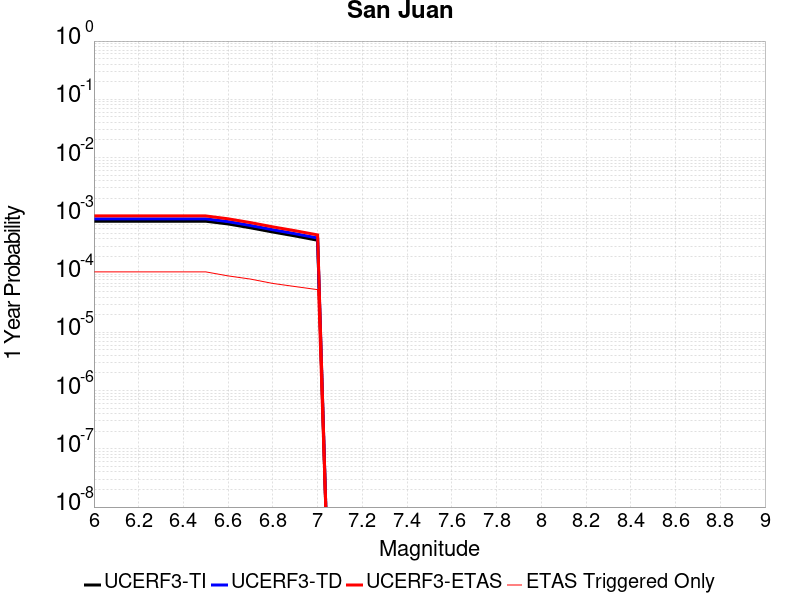 |  |

| Magnitude | 1 wk TI Prob | 1 wk TD Prob | 1 wk ETAS Prob | 1 wk ETAS/TD Gain | 1 wk ETAS Triggered Only | 1 mo TI Prob | 1 mo TD Prob | 1 mo ETAS Prob | 1 mo ETAS/TD Gain | 1 mo ETAS Triggered Only | 1 yr TI Prob | 1 yr TD Prob | 1 yr ETAS Prob | 1 yr ETAS/TD Gain | 1 yr ETAS Triggered Only | 10 yr TI Prob | 10 yr TD Prob | 10 yr ETAS Prob | 10 yr ETAS/TD Gain | 10 yr ETAS Triggered Only |
|-----|-----|-----|-----|-----|-----|-----|-----|-----|-----|-----|-----|-----|-----|-----|-----|-----|-----|-----|-----|-----|
| 6.0 | 1.5480582E-5 | 1.6991073E-5 | 6.021405E-5 | 3.543864 | 4.322371E-5 | 6.6343666E-5 | 7.281725E-5 | 1.4845324E-4 | 2.0387096 | 7.5641496E-5 | 8.074348E-4 | 8.8626205E-4 | 0.0010050219 | 1.1340009 | 1.188652E-4 | 0.008045073 | 0.008834435 | 0.0090465015 | 1.0240046 | 2.1395736E-4 |
| 6.1 | 1.5480582E-5 | 1.6991073E-5 | 6.021405E-5 | 3.543864 | 4.322371E-5 | 6.6343666E-5 | 7.281725E-5 | 1.4845324E-4 | 2.0387096 | 7.5641496E-5 | 8.074348E-4 | 8.8626205E-4 | 0.0010050219 | 1.1340009 | 1.188652E-4 | 0.008045073 | 0.008834435 | 0.0090465015 | 1.0240046 | 2.1395736E-4 |
| 6.2 | 1.5480582E-5 | 1.6991073E-5 | 6.021405E-5 | 3.543864 | 4.322371E-5 | 6.6343666E-5 | 7.281725E-5 | 1.4845324E-4 | 2.0387096 | 7.5641496E-5 | 8.074348E-4 | 8.8626205E-4 | 0.0010050219 | 1.1340009 | 1.188652E-4 | 0.008045073 | 0.008834435 | 0.0090465015 | 1.0240046 | 2.1395736E-4 |
| 6.3 | 1.5480582E-5 | 1.6991073E-5 | 6.021405E-5 | 3.543864 | 4.322371E-5 | 6.6343666E-5 | 7.281725E-5 | 1.4845324E-4 | 2.0387096 | 7.5641496E-5 | 8.074348E-4 | 8.8626205E-4 | 0.0010050219 | 1.1340009 | 1.188652E-4 | 0.008045073 | 0.008834435 | 0.0090465015 | 1.0240046 | 2.1395736E-4 |
| 6.4 | 1.5480582E-5 | 1.6991073E-5 | 6.021405E-5 | 3.543864 | 4.322371E-5 | 6.6343666E-5 | 7.281725E-5 | 1.4845324E-4 | 2.0387096 | 7.5641496E-5 | 8.074348E-4 | 8.8626205E-4 | 0.0010050219 | 1.1340009 | 1.188652E-4 | 0.008045073 | 0.008834435 | 0.0090465015 | 1.0240046 | 2.1395736E-4 |
| 6.5 | 1.5480582E-5 | 1.6991073E-5 | 6.021405E-5 | 3.543864 | 4.322371E-5 | 6.6343666E-5 | 7.281725E-5 | 1.4845324E-4 | 2.0387096 | 7.5641496E-5 | 8.074348E-4 | 8.8626205E-4 | 0.0010050219 | 1.1340009 | 1.188652E-4 | 0.008045073 | 0.008834435 | 0.0090465015 | 1.0240046 | 2.1395736E-4 |
| 6.6 | 1.3888578E-5 | 1.5238386E-5 | 5.4139135E-5 | 3.5528128 | 3.890134E-5 | 5.952112E-5 | 6.530614E-5 | 1.3445957E-4 | 2.0589113 | 6.915794E-5 | 7.244287E-4 | 7.9488434E-4 | 9.050172E-4 | 1.1385521 | 1.1022046E-4 | 0.007220716 | 0.007927506 | 0.008120472 | 1.0243411 | 1.945067E-4 |
| 6.7 | 1.19326105E-5 | 1.3077807E-5 | 4.981748E-5 | 3.8093145 | 3.6740155E-5 | 5.1138755E-5 | 5.6046945E-5 | 1.1223462E-4 | 2.002511 | 5.6190824E-5 | 6.2243646E-4 | 6.8222906E-4 | 7.7509665E-4 | 1.1361238 | 9.2930975E-5 | 0.0062069595 | 0.006808338 | 0.00697147 | 1.0239606 | 1.642501E-4 |
| 6.8 | 1.0103744E-5 | 1.1057104E-5 | 3.9152204E-5 | 3.5409098 | 2.8095412E-5 | 4.330104E-5 | 4.7387122E-5 | 9.060879E-5 | 1.9120972 | 4.322371E-5 | 5.270626E-4 | 5.768559E-4 | 6.5245375E-4 | 1.1310515 | 7.5641496E-5 | 0.005258143 | 0.0057604914 | 0.0058937133 | 1.0231268 | 1.339935E-4 |
| 6.9 | 8.642364E-6 | 9.446245E-6 | 3.321906E-5 | 3.516642 | 2.377304E-5 | 3.703818E-5 | 4.048367E-5 | 7.938343E-5 | 1.9608755 | 3.890134E-5 | 4.508465E-4 | 4.928469E-4 | 5.598106E-4 | 1.1358713 | 6.699675E-5 | 0.0044993293 | 0.0049243723 | 0.0050405012 | 1.0235826 | 1.1670402E-4 |
| 7.0 | 7.3015253E-6 | 7.97175E-6 | 2.7422266E-5 | 3.4399304 | 1.945067E-5 | 3.1291875E-5 | 3.4164583E-5 | 6.8742374E-5 | 2.0120945 | 3.457897E-5 | 3.8091198E-4 | 4.1594342E-4 | 4.7859174E-4 | 1.1506174 | 6.267438E-5 | 0.0038025973 | 0.004158416 | 0.004259569 | 1.024325 | 1.0157572E-4 |

## Oak Ridge (Onshore)
*[(top)](#table-of-contents)*

| 1 Week | 1 Month | 1 Year | 10 Year |
|-----|-----|-----|-----|
|  |  |  |  |

| Magnitude | 1 wk TI Prob | 1 wk TD Prob | 1 wk ETAS Prob | 1 wk ETAS/TD Gain | 1 wk ETAS Triggered Only | 1 mo TI Prob | 1 mo TD Prob | 1 mo ETAS Prob | 1 mo ETAS/TD Gain | 1 mo ETAS Triggered Only | 1 yr TI Prob | 1 yr TD Prob | 1 yr ETAS Prob | 1 yr ETAS/TD Gain | 1 yr ETAS Triggered Only | 10 yr TI Prob | 10 yr TD Prob | 10 yr ETAS Prob | 10 yr ETAS/TD Gain | 10 yr ETAS Triggered Only |
|-----|-----|-----|-----|-----|-----|-----|-----|-----|-----|-----|-----|-----|-----|-----|-----|-----|-----|-----|-----|-----|
| 6.0 | 4.0081308E-5 | 5.2264888E-5 | 7.603669E-5 | 1.454833 | 2.377304E-5 | 1.7176573E-4 | 2.2397783E-4 | 2.6935257E-4 | 1.2025858 | 4.5384895E-5 | 0.0020892418 | 0.0027243528 | 0.002842894 | 1.0435117 | 1.188652E-4 | 0.020697087 | 0.02699201 | 0.027189678 | 1.0073231 | 2.0315145E-4 |
| 6.1 | 4.0081308E-5 | 5.2264888E-5 | 7.603669E-5 | 1.454833 | 2.377304E-5 | 1.7176573E-4 | 2.2397783E-4 | 2.6935257E-4 | 1.2025858 | 4.5384895E-5 | 0.0020892418 | 0.0027243528 | 0.002842894 | 1.0435117 | 1.188652E-4 | 0.020697087 | 0.02699201 | 0.027189678 | 1.0073231 | 2.0315145E-4 |
| 6.2 | 4.0081308E-5 | 5.2264888E-5 | 7.603669E-5 | 1.454833 | 2.377304E-5 | 1.7176573E-4 | 2.2397783E-4 | 2.6935257E-4 | 1.2025858 | 4.5384895E-5 | 0.0020892418 | 0.0027243528 | 0.002842894 | 1.0435117 | 1.188652E-4 | 0.020697087 | 0.02699201 | 0.027189678 | 1.0073231 | 2.0315145E-4 |
| 6.3 | 4.0081308E-5 | 5.2264888E-5 | 7.603669E-5 | 1.454833 | 2.377304E-5 | 1.7176573E-4 | 2.2397783E-4 | 2.6935257E-4 | 1.2025858 | 4.5384895E-5 | 0.0020892418 | 0.0027243528 | 0.002842894 | 1.0435117 | 1.188652E-4 | 0.020697087 | 0.02699201 | 0.027189678 | 1.0073231 | 2.0315145E-4 |
| 6.4 | 4.0081308E-5 | 5.2264888E-5 | 7.603669E-5 | 1.454833 | 2.377304E-5 | 1.7176573E-4 | 2.2397783E-4 | 2.6935257E-4 | 1.2025858 | 4.5384895E-5 | 0.0020892418 | 0.0027243528 | 0.002842894 | 1.0435117 | 1.188652E-4 | 0.020697087 | 0.02699201 | 0.027189678 | 1.0073231 | 2.0315145E-4 |
| 6.5 | 4.0081308E-5 | 5.2264888E-5 | 7.603669E-5 | 1.454833 | 2.377304E-5 | 1.7176573E-4 | 2.2397783E-4 | 2.6935257E-4 | 1.2025858 | 4.5384895E-5 | 0.0020892418 | 0.0027243528 | 0.002842894 | 1.0435117 | 1.188652E-4 | 0.020697087 | 0.02699201 | 0.027189678 | 1.0073231 | 2.0315145E-4 |
| 6.6 | 4.0081308E-5 | 5.2264888E-5 | 7.603669E-5 | 1.454833 | 2.377304E-5 | 1.7176573E-4 | 2.2397783E-4 | 2.6935257E-4 | 1.2025858 | 4.5384895E-5 | 0.0020892418 | 0.0027243528 | 0.002842894 | 1.0435117 | 1.188652E-4 | 0.020697087 | 0.02699201 | 0.027189678 | 1.0073231 | 2.0315145E-4 |
| 6.7 | 3.0016534E-5 | 3.908297E-5 | 5.8532878E-5 | 1.497657 | 1.945067E-5 | 1.2863595E-4 | 1.6749227E-4 | 2.0422626E-4 | 1.2193176 | 3.6740155E-5 | 0.0015650174 | 0.0020381245 | 0.002128709 | 1.0444452 | 9.076979E-5 | 0.015540415 | 0.020274134 | 0.020428702 | 1.0076239 | 1.5776654E-4 |
| 6.8 | 2.4562401E-5 | 3.183199E-5 | 4.9120925E-5 | 1.5431308 | 1.7289485E-5 | 1.0526319E-4 | 1.3642012E-4 | 1.645117E-4 | 1.2059196 | 2.8095412E-5 | 0.0012808258 | 0.0016604326 | 0.0017316332 | 1.0428808 | 7.1319126E-5 | 0.012734687 | 0.01655699 | 0.016682388 | 1.0075737 | 1.2750995E-4 |
| 6.9 | 2.3845261E-5 | 3.090968E-5 | 4.8198628E-5 | 1.5593377 | 1.7289485E-5 | 1.0218997E-4 | 1.3246776E-4 | 1.5839854E-4 | 1.1957517 | 2.5934227E-5 | 0.0012434528 | 0.0016123839 | 0.0016814303 | 1.0428226 | 6.915794E-5 | 0.01236518 | 0.016083475 | 0.016202556 | 1.0074039 | 1.2102639E-4 |
| 7.0 | 2.2210486E-5 | 2.8783488E-5 | 4.6072473E-5 | 1.6006564 | 1.7289485E-5 | 9.5184325E-5 | 1.2335637E-4 | 1.492874E-4 | 1.2102123 | 2.5934227E-5 | 0.001158253 | 0.0015016058 | 0.0015706599 | 1.0459868 | 6.915794E-5 | 0.011522347 | 0.014990693 | 0.015107776 | 1.0078104 | 1.188652E-4 |
| 7.1 | 1.9072411E-5 | 2.4648589E-5 | 3.9776514E-5 | 1.6137441 | 1.5128298E-5 | 8.173635E-5 | 1.05636806E-4 | 1.2724639E-4 | 1.2045648 | 2.1611855E-5 | 9.946857E-4 | 0.0012861256 | 0.0013444027 | 1.045312 | 5.835201E-5 | 0.009902451 | 0.012860967 | 0.0129633695 | 1.0079623 | 1.0373691E-4 |

## San Jacinto (Stepovers Combined)
*[(top)](#table-of-contents)*

| 1 Week | 1 Month | 1 Year | 10 Year |
|-----|-----|-----|-----|
|  |  |  |  |

| Magnitude | 1 wk TI Prob | 1 wk TD Prob | 1 wk ETAS Prob | 1 wk ETAS/TD Gain | 1 wk ETAS Triggered Only | 1 mo TI Prob | 1 mo TD Prob | 1 mo ETAS Prob | 1 mo ETAS/TD Gain | 1 mo ETAS Triggered Only | 1 yr TI Prob | 1 yr TD Prob | 1 yr ETAS Prob | 1 yr ETAS/TD Gain | 1 yr ETAS Triggered Only | 10 yr TI Prob | 10 yr TD Prob | 10 yr ETAS Prob | 10 yr ETAS/TD Gain | 10 yr ETAS Triggered Only |
|-----|-----|-----|-----|-----|-----|-----|-----|-----|-----|-----|-----|-----|-----|-----|-----|-----|-----|-----|-----|-----|
| 6.0 | 1.1968766E-4 | 2.2716755E-4 | 2.7038145E-4 | 1.1902292 | 4.322371E-5 | 5.128463E-4 | 9.731359E-4 | 0.001031431 | 1.0599045 | 5.835201E-5 | 0.0062260423 | 0.0117805805 | 0.011891638 | 1.0094272 | 1.1238165E-4 | 0.06054471 | 0.113027595 | 0.11321162 | 1.0016282 | 2.0747381E-4 |
| 6.1 | 1.1968766E-4 | 2.2716755E-4 | 2.7038145E-4 | 1.1902292 | 4.322371E-5 | 5.128463E-4 | 9.731359E-4 | 0.001031431 | 1.0599045 | 5.835201E-5 | 0.0062260423 | 0.0117805805 | 0.011891638 | 1.0094272 | 1.1238165E-4 | 0.06054471 | 0.113027595 | 0.11321162 | 1.0016282 | 2.0747381E-4 |
| 6.2 | 1.1968766E-4 | 2.2716755E-4 | 2.7038145E-4 | 1.1902292 | 4.322371E-5 | 5.128463E-4 | 9.731359E-4 | 0.001031431 | 1.0599045 | 5.835201E-5 | 0.0062260423 | 0.0117805805 | 0.011891638 | 1.0094272 | 1.1238165E-4 | 0.06054471 | 0.113027595 | 0.11321162 | 1.0016282 | 2.0747381E-4 |
| 6.3 | 1.1968766E-4 | 2.2716755E-4 | 2.7038145E-4 | 1.1902292 | 4.322371E-5 | 5.128463E-4 | 9.731359E-4 | 0.001031431 | 1.0599045 | 5.835201E-5 | 0.0062260423 | 0.0117805805 | 0.011891638 | 1.0094272 | 1.1238165E-4 | 0.06054471 | 0.113027595 | 0.11321162 | 1.0016282 | 2.0747381E-4 |
| 6.4 | 1.1968766E-4 | 2.2716755E-4 | 2.7038145E-4 | 1.1902292 | 4.322371E-5 | 5.128463E-4 | 9.731359E-4 | 0.001031431 | 1.0599045 | 5.835201E-5 | 0.0062260423 | 0.0117805805 | 0.011891638 | 1.0094272 | 1.1238165E-4 | 0.06054471 | 0.113027595 | 0.11321162 | 1.0016282 | 2.0747381E-4 |
| 6.5 | 1.1968766E-4 | 2.2716755E-4 | 2.7038145E-4 | 1.1902292 | 4.322371E-5 | 5.128463E-4 | 9.731359E-4 | 0.001031431 | 1.0599045 | 5.835201E-5 | 0.0062260423 | 0.0117805805 | 0.011891638 | 1.0094272 | 1.1238165E-4 | 0.06054471 | 0.113027595 | 0.11321162 | 1.0016282 | 2.0747381E-4 |
| 6.6 | 1.1957375E-4 | 2.2692814E-4 | 2.7014205E-4 | 1.1904299 | 4.322371E-5 | 5.1235827E-4 | 9.7211095E-4 | 0.0010304062 | 1.0599678 | 5.835201E-5 | 0.006220135 | 0.011768302 | 0.011879361 | 1.0094371 | 1.1238165E-4 | 0.06048886 | 0.11292298 | 0.113107026 | 1.0016298 | 2.0747381E-4 |
| 6.7 | 1.1951502E-4 | 2.2680471E-4 | 2.7001862E-4 | 1.1905335 | 4.322371E-5 | 5.1210664E-4 | 9.7158254E-4 | 0.0010298778 | 1.0600004 | 5.835201E-5 | 0.006217089 | 0.011761972 | 0.011873032 | 1.0094423 | 1.1238165E-4 | 0.060460065 | 0.11286904 | 0.1130531 | 1.0016307 | 2.0747381E-4 |
| 6.8 | 1.1939376E-4 | 2.2654171E-4 | 2.6975563E-4 | 1.1907548 | 4.322371E-5 | 5.1158713E-4 | 9.704564E-4 | 0.0010287517 | 1.06007 | 5.835201E-5 | 0.0062108003 | 0.011748434 | 0.011859496 | 1.0094533 | 1.1238165E-4 | 0.06040061 | 0.11275068 | 0.11293476 | 1.0016327 | 2.0747381E-4 |
| 6.9 | 1.19143144E-4 | 2.2600606E-4 | 2.6922E-4 | 1.191207 | 4.322371E-5 | 5.1051355E-4 | 9.6816255E-4 | 0.0010264581 | 1.0602125 | 5.835201E-5 | 0.0061978037 | 0.011720859 | 0.011831924 | 1.0094758 | 1.1238165E-4 | 0.060277723 | 0.11250938 | 0.1126935 | 1.0016366 | 2.0747381E-4 |
| 7.0 | 9.224271E-5 | 1.62278E-4 | 1.9252968E-4 | 1.1864189 | 3.0256597E-5 | 3.9526602E-4 | 6.952914E-4 | 7.406447E-4 | 1.0652293 | 4.5384895E-5 | 0.0048017497 | 0.008436837 | 0.008524698 | 1.010414 | 8.8608605E-5 | 0.046993118 | 0.083286285 | 0.08343091 | 1.0017365 | 1.5776654E-4 |
| 7.1 | 9.189464E-5 | 1.6160391E-4 | 1.9185562E-4 | 1.1871966 | 3.0256597E-5 | 3.9377474E-4 | 6.9240405E-4 | 7.3775754E-4 | 1.0655015 | 4.5384895E-5 | 0.004783673 | 0.008401991 | 0.008489856 | 1.0104575 | 8.8608605E-5 | 0.04682 | 0.0829684 | 0.08311109 | 1.0017198 | 1.5560536E-4 |
| 7.2 | 9.121798E-5 | 1.6023654E-4 | 1.9048828E-4 | 1.1887944 | 3.0256597E-5 | 3.9087565E-4 | 6.8654754E-4 | 7.319013E-4 | 1.0660605 | 4.5384895E-5 | 0.004748531 | 0.008331316 | 0.008419186 | 1.010547 | 8.8608605E-5 | 0.046483368 | 0.08232578 | 0.08246461 | 1.0016863 | 1.5128299E-4 |
| 7.3 | 8.9773785E-5 | 1.5732428E-4 | 1.8757612E-4 | 1.1922897 | 3.0256597E-5 | 3.8468806E-4 | 6.740732E-4 | 7.194275E-4 | 1.067284 | 4.5384895E-5 | 0.004673523 | 0.008180636 | 0.00826852 | 1.0107429 | 8.8608605E-5 | 0.0457645 | 0.08092336 | 0.08106241 | 1.0017182 | 1.5128299E-4 |
| 7.4 | 7.3478965E-5 | 1.1931325E-4 | 1.3011789E-4 | 1.0905569 | 1.0805928E-5 | 3.1487184E-4 | 5.1127357E-4 | 5.263941E-4 | 1.0295743 | 1.5128298E-5 | 0.0038268273 | 0.006212538 | 0.006238311 | 1.0041486 | 2.5934227E-5 | 0.037615944 | 0.06262941 | 0.062684104 | 1.0008733 | 5.835201E-5 |
| 7.5 | 6.7516885E-5 | 1.08003216E-4 | 1.1880798E-4 | 1.1000412 | 1.0805928E-5 | 2.8932598E-4 | 4.6281965E-4 | 4.7794095E-4 | 1.0326722 | 1.5128298E-5 | 0.003516855 | 0.005625739 | 0.0056493785 | 1.004202 | 2.377304E-5 | 0.034617163 | 0.057019595 | 0.057072584 | 1.0009292 | 5.6190824E-5 |
| 7.6 | 2.8268712E-5 | 4.2655167E-5 | 4.913845E-5 | 1.1519928 | 6.4835567E-6 | 1.21146004E-4 | 1.8279799E-4 | 1.9360194E-4 | 1.0591033 | 1.0805928E-5 | 0.0014739545 | 0.0022238137 | 0.0022410648 | 1.0077574 | 1.7289485E-5 | 0.014642165 | 0.022920644 | 0.022960765 | 1.0017505 | 4.1062525E-5 |
| 7.7 | 1.673878E-5 | 2.1973781E-5 | 2.6296058E-5 | 1.1967015 | 4.3223713E-6 | 7.173566E-5 | 9.417205E-5 | 1.00655E-4 | 1.0688415 | 6.4835567E-6 | 8.730317E-4 | 0.0011463144 | 0.0011549493 | 1.0075327 | 8.644743E-6 | 0.008696098 | 0.01216197 | 0.0121897245 | 1.002282 | 2.8095412E-5 |
| 7.8 | 1.5303123E-6 | 1.9707616E-6 | 1.9707616E-6 | 1.0 | 0.0 | 6.5584645E-6 | 8.446107E-6 | 1.0607275E-5 | 1.2558773 | 2.1611856E-6 | 7.984638E-5 | 1.0282895E-4 | 1.04989915E-4 | 1.0210152 | 2.1611856E-6 | 7.98177E-4 | 0.001066982 | 0.0010712998 | 1.0040467 | 4.3223713E-6 |

## Sierra Madre
*[(top)](#table-of-contents)*

| 1 Week | 1 Month | 1 Year | 10 Year |
|-----|-----|-----|-----|
|  |  |  |  |

| Magnitude | 1 wk TI Prob | 1 wk TD Prob | 1 wk ETAS Prob | 1 wk ETAS/TD Gain | 1 wk ETAS Triggered Only | 1 mo TI Prob | 1 mo TD Prob | 1 mo ETAS Prob | 1 mo ETAS/TD Gain | 1 mo ETAS Triggered Only | 1 yr TI Prob | 1 yr TD Prob | 1 yr ETAS Prob | 1 yr ETAS/TD Gain | 1 yr ETAS Triggered Only | 10 yr TI Prob | 10 yr TD Prob | 10 yr ETAS Prob | 10 yr ETAS/TD Gain | 10 yr ETAS Triggered Only |
|-----|-----|-----|-----|-----|-----|-----|-----|-----|-----|-----|-----|-----|-----|-----|-----|-----|-----|-----|-----|-----|
| 6.0 | 2.62475E-5 | 2.6538886E-5 | 6.976145E-5 | 2.6286502 | 4.322371E-5 | 1.12484435E-4 | 1.1373365E-4 | 1.7856184E-4 | 1.5700002 | 6.483556E-5 | 0.0013686377 | 0.0013839207 | 0.0015134123 | 1.0935687 | 1.2967113E-4 | 0.01360239 | 0.0137668215 | 0.0139607815 | 1.014089 | 1.9666788E-4 |
| 6.1 | 2.62475E-5 | 2.6538886E-5 | 6.976145E-5 | 2.6286502 | 4.322371E-5 | 1.12484435E-4 | 1.1373365E-4 | 1.7856184E-4 | 1.5700002 | 6.483556E-5 | 0.0013686377 | 0.0013839207 | 0.0015134123 | 1.0935687 | 1.2967113E-4 | 0.01360239 | 0.0137668215 | 0.0139607815 | 1.014089 | 1.9666788E-4 |
| 6.2 | 2.62475E-5 | 2.6538886E-5 | 6.976145E-5 | 2.6286502 | 4.322371E-5 | 1.12484435E-4 | 1.1373365E-4 | 1.7856184E-4 | 1.5700002 | 6.483556E-5 | 0.0013686377 | 0.0013839207 | 0.0015134123 | 1.0935687 | 1.2967113E-4 | 0.01360239 | 0.0137668215 | 0.0139607815 | 1.014089 | 1.9666788E-4 |
| 6.3 | 2.62475E-5 | 2.6538886E-5 | 6.976145E-5 | 2.6286502 | 4.322371E-5 | 1.12484435E-4 | 1.1373365E-4 | 1.7856184E-4 | 1.5700002 | 6.483556E-5 | 0.0013686377 | 0.0013839207 | 0.0015134123 | 1.0935687 | 1.2967113E-4 | 0.01360239 | 0.0137668215 | 0.0139607815 | 1.014089 | 1.9666788E-4 |
| 6.4 | 2.62475E-5 | 2.6538886E-5 | 6.976145E-5 | 2.6286502 | 4.322371E-5 | 1.12484435E-4 | 1.1373365E-4 | 1.7856184E-4 | 1.5700002 | 6.483556E-5 | 0.0013686377 | 0.0013839207 | 0.0015134123 | 1.0935687 | 1.2967113E-4 | 0.01360239 | 0.0137668215 | 0.0139607815 | 1.014089 | 1.9666788E-4 |
| 6.5 | 2.62475E-5 | 2.6538886E-5 | 6.976145E-5 | 2.6286502 | 4.322371E-5 | 1.12484435E-4 | 1.1373365E-4 | 1.7856184E-4 | 1.5700002 | 6.483556E-5 | 0.0013686377 | 0.0013839207 | 0.0015134123 | 1.0935687 | 1.2967113E-4 | 0.01360239 | 0.0137668215 | 0.0139607815 | 1.014089 | 1.9666788E-4 |
| 6.6 | 2.3026172E-5 | 2.2750124E-5 | 5.948944E-5 | 2.6149063 | 3.6740155E-5 | 9.867986E-5 | 9.749739E-5 | 1.4936079E-4 | 1.5319465 | 5.1868454E-5 | 0.001200765 | 0.0011864736 | 0.0012944046 | 1.0909679 | 1.0805928E-4 | 0.011942975 | 0.011814732 | 0.011985584 | 1.0144609 | 1.7289484E-4 |
| 6.7 | 2.1771615E-5 | 2.125092E-5 | 5.7990295E-5 | 2.7288368 | 3.6740155E-5 | 9.3303584E-5 | 9.107268E-5 | 1.429364E-4 | 1.5694762 | 5.1868454E-5 | 0.0011353791 | 0.0011083324 | 0.0012141132 | 1.0954413 | 1.0589809E-4 | 0.0112959575 | 0.011041103 | 0.011207813 | 1.0150992 | 1.6857247E-4 |
| 6.8 | 1.8811277E-5 | 1.813049E-5 | 5.0547686E-5 | 2.7879934 | 3.241778E-5 | 8.061727E-5 | 7.770026E-5 | 1.2308163E-4 | 1.5840569 | 4.5384895E-5 | 9.810732E-4 | 9.4567396E-4 | 0.001036358 | 1.0958935 | 9.076979E-5 | 0.009767532 | 0.009429028 | 0.009572463 | 1.0152119 | 1.4479943E-4 |
| 6.9 | 1.5745054E-5 | 1.4611581E-5 | 3.8384274E-5 | 2.6269763 | 2.377304E-5 | 6.747706E-5 | 6.262E-5 | 9.7196804E-5 | 1.5521687 | 3.457897E-5 | 8.2122354E-4 | 7.622106E-4 | 8.356349E-4 | 1.0963308 | 7.348031E-5 | 0.008181954 | 0.007607908 | 0.0077194343 | 1.0146593 | 1.1238165E-4 |
| 7.0 | 1.4540266E-5 | 1.3339557E-5 | 3.062881E-5 | 2.2960892 | 1.7289485E-5 | 6.231394E-5 | 5.7168716E-5 | 8.526252E-5 | 1.4914192 | 2.8095412E-5 | 7.584081E-4 | 6.958848E-4 | 7.563559E-4 | 1.0868981 | 6.0513194E-5 | 0.0075582503 | 0.0069488278 | 0.007041113 | 1.0132806 | 9.2930975E-5 |
| 7.1 | 1.2284893E-5 | 1.0947419E-5 | 2.8236715E-5 | 2.5793033 | 1.7289485E-5 | 5.264848E-5 | 4.6917092E-5 | 7.28501E-5 | 1.5527412 | 2.5934227E-5 | 6.4080674E-4 | 5.7114166E-4 | 6.2298053E-4 | 1.0907636 | 5.1868454E-5 | 0.0063896202 | 0.0057081603 | 0.005781221 | 1.0127994 | 7.348031E-5 |
| 7.2 | 5.5504106E-6 | 3.3297895E-6 | 1.1974503E-5 | 3.596174 | 8.644743E-6 | 2.3787257E-5 | 1.4270517E-5 | 2.507629E-5 | 1.7572097 | 1.0805928E-5 | 2.8957136E-4 | 1.7374175E-4 | 1.9318904E-4 | 1.1119322 | 1.945067E-5 | 0.002891943 | 0.0017411701 | 0.0017670592 | 1.0148687 | 2.5934227E-5 |

## San Jacinto (San Jacinto Valley) rev
*[(top)](#table-of-contents)*

| 1 Week | 1 Month | 1 Year | 10 Year |
|-----|-----|-----|-----|
|  |  |  |  |

| Magnitude | 1 wk TI Prob | 1 wk TD Prob | 1 wk ETAS Prob | 1 wk ETAS/TD Gain | 1 wk ETAS Triggered Only | 1 mo TI Prob | 1 mo TD Prob | 1 mo ETAS Prob | 1 mo ETAS/TD Gain | 1 mo ETAS Triggered Only | 1 yr TI Prob | 1 yr TD Prob | 1 yr ETAS Prob | 1 yr ETAS/TD Gain | 1 yr ETAS Triggered Only | 10 yr TI Prob | 10 yr TD Prob | 10 yr ETAS Prob | 10 yr ETAS/TD Gain | 10 yr ETAS Triggered Only |
|-----|-----|-----|-----|-----|-----|-----|-----|-----|-----|-----|-----|-----|-----|-----|-----|-----|-----|-----|-----|-----|
| 6.0 | 7.806946E-5 | 1.580409E-4 | 1.9693609E-4 | 1.2461084 | 3.890134E-5 | 3.345405E-4 | 6.770383E-4 | 7.3103135E-4 | 1.0797489 | 5.402964E-5 | 0.004065426 | 0.008203736 | 0.008308765 | 1.0128026 | 1.0589809E-4 | 0.03991852 | 0.07910823 | 0.07928138 | 1.0021888 | 1.8802314E-4 |
| 6.1 | 7.806946E-5 | 1.580409E-4 | 1.9693609E-4 | 1.2461084 | 3.890134E-5 | 3.345405E-4 | 6.770383E-4 | 7.3103135E-4 | 1.0797489 | 5.402964E-5 | 0.004065426 | 0.008203736 | 0.008308765 | 1.0128026 | 1.0589809E-4 | 0.03991852 | 0.07910823 | 0.07928138 | 1.0021888 | 1.8802314E-4 |
| 6.2 | 7.806946E-5 | 1.580409E-4 | 1.9693609E-4 | 1.2461084 | 3.890134E-5 | 3.345405E-4 | 6.770383E-4 | 7.3103135E-4 | 1.0797489 | 5.402964E-5 | 0.004065426 | 0.008203736 | 0.008308765 | 1.0128026 | 1.0589809E-4 | 0.03991852 | 0.07910823 | 0.07928138 | 1.0021888 | 1.8802314E-4 |
| 6.3 | 7.806946E-5 | 1.580409E-4 | 1.9693609E-4 | 1.2461084 | 3.890134E-5 | 3.345405E-4 | 6.770383E-4 | 7.3103135E-4 | 1.0797489 | 5.402964E-5 | 0.004065426 | 0.008203736 | 0.008308765 | 1.0128026 | 1.0589809E-4 | 0.03991852 | 0.07910823 | 0.07928138 | 1.0021888 | 1.8802314E-4 |
| 6.4 | 7.806946E-5 | 1.580409E-4 | 1.9693609E-4 | 1.2461084 | 3.890134E-5 | 3.345405E-4 | 6.770383E-4 | 7.3103135E-4 | 1.0797489 | 5.402964E-5 | 0.004065426 | 0.008203736 | 0.008308765 | 1.0128026 | 1.0589809E-4 | 0.03991852 | 0.07910823 | 0.07928138 | 1.0021888 | 1.8802314E-4 |
| 6.5 | 7.806946E-5 | 1.580409E-4 | 1.9693609E-4 | 1.2461084 | 3.890134E-5 | 3.345405E-4 | 6.770383E-4 | 7.3103135E-4 | 1.0797489 | 5.402964E-5 | 0.004065426 | 0.008203736 | 0.008308765 | 1.0128026 | 1.0589809E-4 | 0.03991852 | 0.07910823 | 0.07928138 | 1.0021888 | 1.8802314E-4 |
| 6.6 | 7.8012505E-5 | 1.5793537E-4 | 1.9683057E-4 | 1.2462729 | 3.890134E-5 | 3.3429646E-4 | 6.765863E-4 | 7.3057937E-4 | 1.0798022 | 5.402964E-5 | 0.004062466 | 0.008198286 | 0.008303316 | 1.0128112 | 1.0589809E-4 | 0.039889984 | 0.079058796 | 0.079231955 | 1.0021902 | 1.8802314E-4 |
| 6.7 | 7.8012505E-5 | 1.5793537E-4 | 1.9683057E-4 | 1.2462729 | 3.890134E-5 | 3.3429646E-4 | 6.765863E-4 | 7.3057937E-4 | 1.0798022 | 5.402964E-5 | 0.004062466 | 0.008198286 | 0.008303316 | 1.0128112 | 1.0589809E-4 | 0.039889984 | 0.079058796 | 0.079231955 | 1.0021902 | 1.8802314E-4 |
| 6.8 | 7.7891236E-5 | 1.5767448E-4 | 1.9656969E-4 | 1.2466804 | 3.890134E-5 | 3.3377687E-4 | 6.754689E-4 | 7.29462E-4 | 1.0799344 | 5.402964E-5 | 0.004056163 | 0.0081848195 | 0.008289851 | 1.0128324 | 1.0589809E-4 | 0.039829224 | 0.0789369 | 0.07911008 | 1.0021939 | 1.8802314E-4 |
| 6.9 | 7.764062E-5 | 1.5713525E-4 | 1.9603047E-4 | 1.2475271 | 3.890134E-5 | 3.327031E-4 | 6.731594E-4 | 7.271526E-4 | 1.0802088 | 5.402964E-5 | 0.0040431386 | 0.008156981 | 0.008262016 | 1.0128766 | 1.0589809E-4 | 0.039703645 | 0.07868492 | 0.07885815 | 1.0022016 | 1.8802314E-4 |
| 7.0 | 5.0739076E-5 | 9.3390074E-5 | 1.1932188E-4 | 1.2776719 | 2.5934227E-5 | 2.1743505E-4 | 4.0015313E-4 | 4.4119923E-4 | 1.102576 | 4.1062525E-5 | 0.0026440579 | 0.0048604817 | 0.0049422076 | 1.0168144 | 8.212505E-5 | 0.026128192 | 0.04834233 | 0.0484719 | 1.0026803 | 1.3615469E-4 |
| 7.1 | 5.0390987E-5 | 9.2688424E-5 | 1.1862024E-4 | 1.2797742 | 2.5934227E-5 | 2.159435E-4 | 3.9714726E-4 | 4.3819347E-4 | 1.1033527 | 4.1062525E-5 | 0.002625942 | 0.004824109 | 0.0049058376 | 1.0169418 | 8.212505E-5 | 0.025951283 | 0.048000354 | 0.048129972 | 1.0027003 | 1.3615469E-4 |
| 7.2 | 4.9789487E-5 | 9.143531E-5 | 1.1736716E-4 | 1.2836088 | 2.5934227E-5 | 2.1336606E-4 | 3.917791E-4 | 4.3282553E-4 | 1.1047693 | 4.1062525E-5 | 0.0025946372 | 0.0047591375 | 0.004840872 | 1.0171741 | 8.212505E-5 | 0.025645511 | 0.047391243 | 0.047518887 | 1.0026934 | 1.339935E-4 |
| 7.3 | 4.9191407E-5 | 9.01359E-5 | 1.1606779E-4 | 1.2876977 | 2.5934227E-5 | 2.1080328E-4 | 3.8621208E-4 | 4.2725875E-4 | 1.1062801 | 4.1062525E-5 | 0.002563509 | 0.004691701 | 0.004773441 | 1.0174222 | 8.212505E-5 | 0.025341382 | 0.04674962 | 0.04687735 | 1.0027322 | 1.339935E-4 |
| 7.4 | 3.3192722E-5 | 5.2610532E-5 | 5.9093745E-5 | 1.1232303 | 6.4835567E-6 | 1.4224676E-4 | 2.2545758E-4 | 2.3626107E-4 | 1.0479181 | 1.0805928E-5 | 0.0017304786 | 0.0027420863 | 0.0027614837 | 1.0070739 | 1.945067E-5 | 0.01717065 | 0.028029768 | 0.028071782 | 1.0014988 | 4.322371E-5 |
| 7.5 | 2.8249084E-5 | 4.2866195E-5 | 4.9349474E-5 | 1.1512445 | 6.4835567E-6 | 1.2106189E-4 | 1.8370226E-4 | 1.945062E-4 | 1.0588123 | 1.0805928E-5 | 0.0014729318 | 0.0022347996 | 0.0022520504 | 1.0077192 | 1.7289485E-5 | 0.014632072 | 0.023027074 | 0.023067191 | 1.0017421 | 4.1062525E-5 |
| 7.6 | 2.7497194E-5 | 4.146988E-5 | 4.7953166E-5 | 1.1563373 | 6.4835567E-6 | 1.17839794E-4 | 1.7771887E-4 | 1.8852288E-4 | 1.0607927 | 1.0805928E-5 | 0.0014337553 | 0.0021620982 | 0.0021793502 | 1.0079794 | 1.7289485E-5 | 0.0142454 | 0.022306465 | 0.02234661 | 1.0017998 | 4.1062525E-5 |
| 7.7 | 1.673878E-5 | 2.1973781E-5 | 2.6296058E-5 | 1.1967015 | 4.3223713E-6 | 7.173566E-5 | 9.417205E-5 | 1.00655E-4 | 1.0688415 | 6.4835567E-6 | 8.730317E-4 | 0.0011463144 | 0.0011549493 | 1.0075327 | 8.644743E-6 | 0.008696098 | 0.01216197 | 0.0121897245 | 1.002282 | 2.8095412E-5 |
| 7.8 | 1.5303123E-6 | 1.9707616E-6 | 1.9707616E-6 | 1.0 | 0.0 | 6.5584645E-6 | 8.446107E-6 | 1.0607275E-5 | 1.2558773 | 2.1611856E-6 | 7.984638E-5 | 1.0282895E-4 | 1.04989915E-4 | 1.0210152 | 2.1611856E-6 | 7.98177E-4 | 0.001066982 | 0.0010712998 | 1.0040467 | 4.3223713E-6 |

## Mission Ridge-Arroyo Parida-Santa Ana
*[(top)](#table-of-contents)*

| 1 Week | 1 Month | 1 Year | 10 Year |
|-----|-----|-----|-----|
|  |  |  |  |

| Magnitude | 1 wk TI Prob | 1 wk TD Prob | 1 wk ETAS Prob | 1 wk ETAS/TD Gain | 1 wk ETAS Triggered Only | 1 mo TI Prob | 1 mo TD Prob | 1 mo ETAS Prob | 1 mo ETAS/TD Gain | 1 mo ETAS Triggered Only | 1 yr TI Prob | 1 yr TD Prob | 1 yr ETAS Prob | 1 yr ETAS/TD Gain | 1 yr ETAS Triggered Only | 10 yr TI Prob | 10 yr TD Prob | 10 yr ETAS Prob | 10 yr ETAS/TD Gain | 10 yr ETAS Triggered Only |
|-----|-----|-----|-----|-----|-----|-----|-----|-----|-----|-----|-----|-----|-----|-----|-----|-----|-----|-----|-----|-----|
| 6.0 | 7.834363E-6 | 8.254548E-6 | 2.7705059E-5 | 3.3563383 | 1.945067E-5 | 3.357541E-5 | 3.5376324E-5 | 7.211518E-5 | 2.0385153 | 3.6740155E-5 | 4.0870393E-4 | 4.306516E-4 | 5.10581E-4 | 1.1856011 | 7.9963866E-5 | 0.0040795305 | 0.00430111 | 0.0044689574 | 1.0390242 | 1.6857247E-4 |
| 6.1 | 7.834363E-6 | 8.254548E-6 | 2.7705059E-5 | 3.3563383 | 1.945067E-5 | 3.357541E-5 | 3.5376324E-5 | 7.211518E-5 | 2.0385153 | 3.6740155E-5 | 4.0870393E-4 | 4.306516E-4 | 5.10581E-4 | 1.1856011 | 7.9963866E-5 | 0.0040795305 | 0.00430111 | 0.0044689574 | 1.0390242 | 1.6857247E-4 |
| 6.2 | 7.834363E-6 | 8.254548E-6 | 2.7705059E-5 | 3.3563383 | 1.945067E-5 | 3.357541E-5 | 3.5376324E-5 | 7.211518E-5 | 2.0385153 | 3.6740155E-5 | 4.0870393E-4 | 4.306516E-4 | 5.10581E-4 | 1.1856011 | 7.9963866E-5 | 0.0040795305 | 0.00430111 | 0.0044689574 | 1.0390242 | 1.6857247E-4 |
| 6.3 | 7.834363E-6 | 8.254548E-6 | 2.7705059E-5 | 3.3563383 | 1.945067E-5 | 3.357541E-5 | 3.5376324E-5 | 7.211518E-5 | 2.0385153 | 3.6740155E-5 | 4.0870393E-4 | 4.306516E-4 | 5.10581E-4 | 1.1856011 | 7.9963866E-5 | 0.0040795305 | 0.00430111 | 0.0044689574 | 1.0390242 | 1.6857247E-4 |
| 6.4 | 7.834363E-6 | 8.254548E-6 | 2.7705059E-5 | 3.3563383 | 1.945067E-5 | 3.357541E-5 | 3.5376324E-5 | 7.211518E-5 | 2.0385153 | 3.6740155E-5 | 4.0870393E-4 | 4.306516E-4 | 5.10581E-4 | 1.1856011 | 7.9963866E-5 | 0.0040795305 | 0.00430111 | 0.0044689574 | 1.0390242 | 1.6857247E-4 |
| 6.5 | 7.834363E-6 | 8.254548E-6 | 2.7705059E-5 | 3.3563383 | 1.945067E-5 | 3.357541E-5 | 3.5376324E-5 | 7.211518E-5 | 2.0385153 | 3.6740155E-5 | 4.0870393E-4 | 4.306516E-4 | 5.10581E-4 | 1.1856011 | 7.9963866E-5 | 0.0040795305 | 0.00430111 | 0.0044689574 | 1.0390242 | 1.6857247E-4 |
| 6.6 | 6.3056787E-6 | 6.639724E-6 | 2.1767923E-5 | 3.2784379 | 1.5128298E-5 | 2.7024058E-5 | 2.8455815E-5 | 5.4389304E-5 | 1.9113599 | 2.5934227E-5 | 3.2896822E-4 | 3.4642397E-4 | 4.069162E-4 | 1.1746191 | 6.0513194E-5 | 0.0032848166 | 0.0034617314 | 0.0035995685 | 1.0398173 | 1.3831588E-4 |
| 6.7 | 4.9162536E-6 | 5.1728953E-6 | 1.5978767E-5 | 3.0889409 | 1.0805928E-5 | 2.1069487E-5 | 2.2169526E-5 | 4.3780903E-5 | 1.9748236 | 2.1611855E-5 | 2.564908E-4 | 2.699095E-4 | 3.1528214E-4 | 1.1681032 | 4.5384895E-5 | 0.0025619497 | 0.002698656 | 0.0027999575 | 1.0375378 | 1.0157572E-4 |
| 6.8 | 4.5714046E-6 | 4.809432E-6 | 1.5615307E-5 | 3.246809 | 1.0805928E-5 | 1.9591585E-5 | 2.0611853E-5 | 4.006212E-5 | 1.9436449 | 1.945067E-5 | 2.3850145E-4 | 2.509493E-4 | 2.9416216E-4 | 1.1721976 | 4.322371E-5 | 0.0023824563 | 0.0025094931 | 0.0026043465 | 1.0377979 | 9.509216E-5 |

## Elysian Park (Upper)
*[(top)](#table-of-contents)*

| 1 Week | 1 Month | 1 Year | 10 Year |
|-----|-----|-----|-----|
|  |  |  |  |

| Magnitude | 1 wk TI Prob | 1 wk TD Prob | 1 wk ETAS Prob | 1 wk ETAS/TD Gain | 1 wk ETAS Triggered Only | 1 mo TI Prob | 1 mo TD Prob | 1 mo ETAS Prob | 1 mo ETAS/TD Gain | 1 mo ETAS Triggered Only | 1 yr TI Prob | 1 yr TD Prob | 1 yr ETAS Prob | 1 yr ETAS/TD Gain | 1 yr ETAS Triggered Only | 10 yr TI Prob | 10 yr TD Prob | 10 yr ETAS Prob | 10 yr ETAS/TD Gain | 10 yr ETAS Triggered Only |
|-----|-----|-----|-----|-----|-----|-----|-----|-----|-----|-----|-----|-----|-----|-----|-----|-----|-----|-----|-----|-----|
| 6.0 | 2.4686513E-5 | 3.0328916E-5 | 6.0584596E-5 | 1.9975853 | 3.0256597E-5 | 1.0579505E-4 | 1.2998107E-4 | 1.7752097E-4 | 1.3657448 | 4.754608E-5 | 0.0012872935 | 0.0015825125 | 0.0016860852 | 1.0654483 | 1.0373691E-4 | 0.01279862 | 0.015824199 | 0.015985848 | 1.0102154 | 1.642501E-4 |
| 6.1 | 2.4686513E-5 | 3.0328916E-5 | 6.0584596E-5 | 1.9975853 | 3.0256597E-5 | 1.0579505E-4 | 1.2998107E-4 | 1.7752097E-4 | 1.3657448 | 4.754608E-5 | 0.0012872935 | 0.0015825125 | 0.0016860852 | 1.0654483 | 1.0373691E-4 | 0.01279862 | 0.015824199 | 0.015985848 | 1.0102154 | 1.642501E-4 |
| 6.2 | 2.4686513E-5 | 3.0328916E-5 | 6.0584596E-5 | 1.9975853 | 3.0256597E-5 | 1.0579505E-4 | 1.2998107E-4 | 1.7752097E-4 | 1.3657448 | 4.754608E-5 | 0.0012872935 | 0.0015825125 | 0.0016860852 | 1.0654483 | 1.0373691E-4 | 0.01279862 | 0.015824199 | 0.015985848 | 1.0102154 | 1.642501E-4 |
| 6.3 | 2.4686513E-5 | 3.0328916E-5 | 6.0584596E-5 | 1.9975853 | 3.0256597E-5 | 1.0579505E-4 | 1.2998107E-4 | 1.7752097E-4 | 1.3657448 | 4.754608E-5 | 0.0012872935 | 0.0015825125 | 0.0016860852 | 1.0654483 | 1.0373691E-4 | 0.01279862 | 0.015824199 | 0.015985848 | 1.0102154 | 1.642501E-4 |
| 6.4 | 2.4686513E-5 | 3.0328916E-5 | 6.0584596E-5 | 1.9975853 | 3.0256597E-5 | 1.0579505E-4 | 1.2998107E-4 | 1.7752097E-4 | 1.3657448 | 4.754608E-5 | 0.0012872935 | 0.0015825125 | 0.0016860852 | 1.0654483 | 1.0373691E-4 | 0.01279862 | 0.015824199 | 0.015985848 | 1.0102154 | 1.642501E-4 |
| 6.5 | 2.4686513E-5 | 3.0328916E-5 | 6.0584596E-5 | 1.9975853 | 3.0256597E-5 | 1.0579505E-4 | 1.2998107E-4 | 1.7752097E-4 | 1.3657448 | 4.754608E-5 | 0.0012872935 | 0.0015825125 | 0.0016860852 | 1.0654483 | 1.0373691E-4 | 0.01279862 | 0.015824199 | 0.015985848 | 1.0102154 | 1.642501E-4 |

## Clamshell-Sawpit
*[(top)](#table-of-contents)*

| 1 Week | 1 Month | 1 Year | 10 Year |
|-----|-----|-----|-----|
|  | 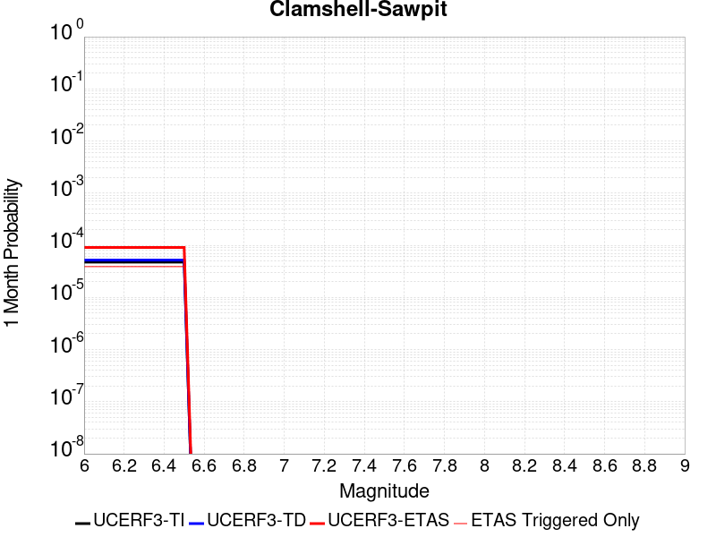 |  |  |

| Magnitude | 1 wk TI Prob | 1 wk TD Prob | 1 wk ETAS Prob | 1 wk ETAS/TD Gain | 1 wk ETAS Triggered Only | 1 mo TI Prob | 1 mo TD Prob | 1 mo ETAS Prob | 1 mo ETAS/TD Gain | 1 mo ETAS Triggered Only | 1 yr TI Prob | 1 yr TD Prob | 1 yr ETAS Prob | 1 yr ETAS/TD Gain | 1 yr ETAS Triggered Only | 10 yr TI Prob | 10 yr TD Prob | 10 yr ETAS Prob | 10 yr ETAS/TD Gain | 10 yr ETAS Triggered Only |
|-----|-----|-----|-----|-----|-----|-----|-----|-----|-----|-----|-----|-----|-----|-----|-----|-----|-----|-----|-----|-----|
| 6.0 | 1.1112015E-5 | 1.2128283E-5 | 4.670683E-5 | 3.8510673 | 3.457897E-5 | 4.7622052E-5 | 5.1978353E-5 | 1.01683036E-4 | 1.9562573 | 4.970727E-5 | 5.796442E-4 | 6.328364E-4 | 7.2138896E-4 | 1.1399295 | 8.8608605E-5 | 0.0057813465 | 0.0063283644 | 0.0064701 | 1.0223969 | 1.4263825E-4 |
| 6.1 | 1.1112015E-5 | 1.2128283E-5 | 4.670683E-5 | 3.8510673 | 3.457897E-5 | 4.7622052E-5 | 5.1978353E-5 | 1.01683036E-4 | 1.9562573 | 4.970727E-5 | 5.796442E-4 | 6.328364E-4 | 7.2138896E-4 | 1.1399295 | 8.8608605E-5 | 0.0057813465 | 0.0063283644 | 0.0064701 | 1.0223969 | 1.4263825E-4 |
| 6.2 | 1.1112015E-5 | 1.2128283E-5 | 4.670683E-5 | 3.8510673 | 3.457897E-5 | 4.7622052E-5 | 5.1978353E-5 | 1.01683036E-4 | 1.9562573 | 4.970727E-5 | 5.796442E-4 | 6.328364E-4 | 7.2138896E-4 | 1.1399295 | 8.8608605E-5 | 0.0057813465 | 0.0063283644 | 0.0064701 | 1.0223969 | 1.4263825E-4 |
| 6.3 | 1.1112015E-5 | 1.2128283E-5 | 4.670683E-5 | 3.8510673 | 3.457897E-5 | 4.7622052E-5 | 5.1978353E-5 | 1.01683036E-4 | 1.9562573 | 4.970727E-5 | 5.796442E-4 | 6.328364E-4 | 7.2138896E-4 | 1.1399295 | 8.8608605E-5 | 0.0057813465 | 0.0063283644 | 0.0064701 | 1.0223969 | 1.4263825E-4 |
| 6.4 | 1.1112015E-5 | 1.2128283E-5 | 4.670683E-5 | 3.8510673 | 3.457897E-5 | 4.7622052E-5 | 5.1978353E-5 | 1.01683036E-4 | 1.9562573 | 4.970727E-5 | 5.796442E-4 | 6.328364E-4 | 7.2138896E-4 | 1.1399295 | 8.8608605E-5 | 0.0057813465 | 0.0063283644 | 0.0064701 | 1.0223969 | 1.4263825E-4 |
| 6.5 | 1.1112015E-5 | 1.2128283E-5 | 4.670683E-5 | 3.8510673 | 3.457897E-5 | 4.7622052E-5 | 5.1978353E-5 | 1.01683036E-4 | 1.9562573 | 4.970727E-5 | 5.796442E-4 | 6.328364E-4 | 7.2138896E-4 | 1.1399295 | 8.8608605E-5 | 0.0057813465 | 0.0063283644 | 0.0064701 | 1.0223969 | 1.4263825E-4 |

## Helendale-So Lockhart
*[(top)](#table-of-contents)*

| 1 Week | 1 Month | 1 Year | 10 Year |
|-----|-----|-----|-----|
|  |  |  |  |

| Magnitude | 1 wk TI Prob | 1 wk TD Prob | 1 wk ETAS Prob | 1 wk ETAS/TD Gain | 1 wk ETAS Triggered Only | 1 mo TI Prob | 1 mo TD Prob | 1 mo ETAS Prob | 1 mo ETAS/TD Gain | 1 mo ETAS Triggered Only | 1 yr TI Prob | 1 yr TD Prob | 1 yr ETAS Prob | 1 yr ETAS/TD Gain | 1 yr ETAS Triggered Only | 10 yr TI Prob | 10 yr TD Prob | 10 yr ETAS Prob | 10 yr ETAS/TD Gain | 10 yr ETAS Triggered Only |
|-----|-----|-----|-----|-----|-----|-----|-----|-----|-----|-----|-----|-----|-----|-----|-----|-----|-----|-----|-----|-----|
| 6.0 | 7.171715E-6 | 7.4314485E-6 | 4.8493668E-5 | 6.5254664 | 4.1062525E-5 | 3.073556E-5 | 3.184873E-5 | 9.2359995E-5 | 2.8999586 | 6.0513194E-5 | 3.7414118E-4 | 3.8769832E-4 | 4.6763118E-4 | 1.2061728 | 7.9963866E-5 | 0.003735119 | 0.0038711112 | 0.003995975 | 1.0322552 | 1.2534876E-4 |
| 6.1 | 7.171715E-6 | 7.4314485E-6 | 4.8493668E-5 | 6.5254664 | 4.1062525E-5 | 3.073556E-5 | 3.184873E-5 | 9.2359995E-5 | 2.8999586 | 6.0513194E-5 | 3.7414118E-4 | 3.8769832E-4 | 4.6763118E-4 | 1.2061728 | 7.9963866E-5 | 0.003735119 | 0.0038711112 | 0.003995975 | 1.0322552 | 1.2534876E-4 |
| 6.2 | 7.171715E-6 | 7.4314485E-6 | 4.8493668E-5 | 6.5254664 | 4.1062525E-5 | 3.073556E-5 | 3.184873E-5 | 9.2359995E-5 | 2.8999586 | 6.0513194E-5 | 3.7414118E-4 | 3.8769832E-4 | 4.6763118E-4 | 1.2061728 | 7.9963866E-5 | 0.003735119 | 0.0038711112 | 0.003995975 | 1.0322552 | 1.2534876E-4 |
| 6.3 | 7.171715E-6 | 7.4314485E-6 | 4.8493668E-5 | 6.5254664 | 4.1062525E-5 | 3.073556E-5 | 3.184873E-5 | 9.2359995E-5 | 2.8999586 | 6.0513194E-5 | 3.7414118E-4 | 3.8769832E-4 | 4.6763118E-4 | 1.2061728 | 7.9963866E-5 | 0.003735119 | 0.0038711112 | 0.003995975 | 1.0322552 | 1.2534876E-4 |
| 6.4 | 7.171715E-6 | 7.4314485E-6 | 4.8493668E-5 | 6.5254664 | 4.1062525E-5 | 3.073556E-5 | 3.184873E-5 | 9.2359995E-5 | 2.8999586 | 6.0513194E-5 | 3.7414118E-4 | 3.8769832E-4 | 4.6763118E-4 | 1.2061728 | 7.9963866E-5 | 0.003735119 | 0.0038711112 | 0.003995975 | 1.0322552 | 1.2534876E-4 |
| 6.5 | 7.171715E-6 | 7.4314485E-6 | 4.8493668E-5 | 6.5254664 | 4.1062525E-5 | 3.073556E-5 | 3.184873E-5 | 9.2359995E-5 | 2.8999586 | 6.0513194E-5 | 3.7414118E-4 | 3.8769832E-4 | 4.6763118E-4 | 1.2061728 | 7.9963866E-5 | 0.003735119 | 0.0038711112 | 0.003995975 | 1.0322552 | 1.2534876E-4 |
| 6.6 | 6.5580157E-6 | 6.7948727E-6 | 4.3534776E-5 | 6.407004 | 3.6740155E-5 | 2.810548E-5 | 2.9120609E-5 | 8.5309795E-5 | 2.9295335 | 5.6190824E-5 | 3.421305E-4 | 3.5449475E-4 | 4.3010942E-4 | 1.2133027 | 7.5641496E-5 | 0.0034160423 | 0.0035401797 | 0.003654317 | 1.0322405 | 1.1454283E-4 |
| 6.7 | 5.6879685E-6 | 5.8928526E-6 | 3.614927E-5 | 6.1344266 | 3.0256597E-5 | 2.4376779E-5 | 2.5254889E-5 | 6.6316374E-5 | 2.6258829 | 4.1062525E-5 | 2.9674688E-4 | 3.074438E-4 | 3.6793842E-4 | 1.1967664 | 6.0513194E-5 | 0.0029635092 | 0.0030710634 | 0.0031593998 | 1.0287641 | 8.8608605E-5 |
| 6.8 | 4.958099E-6 | 5.135111E-6 | 2.890803E-5 | 5.6294847 | 2.377304E-5 | 2.1248823E-5 | 2.2007483E-5 | 5.4424552E-5 | 2.473002 | 3.241778E-5 | 2.586737E-4 | 2.6791706E-4 | 3.154504E-4 | 1.1774181 | 4.754608E-5 | 0.0025837282 | 0.0026768132 | 0.002745786 | 1.0257667 | 6.915794E-5 |
| 6.9 | 4.3792215E-6 | 4.5342804E-6 | 2.8307213E-5 | 6.242934 | 2.377304E-5 | 1.8767958E-5 | 1.9432535E-5 | 4.9688544E-5 | 2.556977 | 3.0256597E-5 | 2.2847592E-4 | 2.3657428E-4 | 2.8194845E-4 | 1.1917967 | 4.5384895E-5 | 0.0022824116 | 0.0023640923 | 0.0024244625 | 1.0255363 | 6.0513194E-5 |
| 7.0 | 3.858262E-6 | 3.9935144E-6 | 2.5605284E-5 | 6.4117165 | 2.1611855E-5 | 1.6535305E-5 | 1.7115E-5 | 4.520993E-5 | 2.6415386 | 2.8095412E-5 | 2.0129874E-4 | 2.0836401E-4 | 2.49418E-4 | 1.1970301 | 4.1062525E-5 | 0.0020111648 | 0.0020825516 | 0.002134312 | 1.0248543 | 5.1868454E-5 |
| 7.1 | 3.3854772E-6 | 3.502769E-6 | 1.6469838E-5 | 4.7019477 | 1.2967113E-5 | 1.4509107E-5 | 1.501183E-5 | 3.446221E-5 | 2.29567 | 1.945067E-5 | 1.7663406E-4 | 1.827625E-4 | 2.1085277E-4 | 1.1536982 | 2.8095412E-5 | 0.0017649373 | 0.0018269841 | 0.0018614999 | 1.0188922 | 3.457897E-5 |
| 7.2 | 2.9527619E-6 | 3.05382E-6 | 1.3859714E-5 | 4.5384846 | 1.0805928E-5 | 1.2654632E-5 | 1.3087783E-5 | 3.0377041E-5 | 2.3210227 | 1.7289485E-5 | 1.5405925E-4 | 1.5934087E-4 | 1.8527097E-4 | 1.1627334 | 2.5934227E-5 | 0.0015395249 | 0.0015931253 | 0.0016254914 | 1.0203161 | 3.241778E-5 |
| 7.3 | 2.553375E-6 | 2.6399916E-6 | 1.34458905E-5 | 5.0931563 | 1.0805928E-5 | 1.0942989E-5 | 1.13142505E-5 | 2.6442378E-5 | 2.3370862 | 1.5128298E-5 | 1.3322275E-4 | 1.3775099E-4 | 1.6152076E-4 | 1.172556 | 2.377304E-5 | 0.0013314291 | 0.0013775099 | 0.0014077249 | 1.0219344 | 3.0256597E-5 |

## Ventura-Pitas Point
*[(top)](#table-of-contents)*

| 1 Week | 1 Month | 1 Year | 10 Year |
|-----|-----|-----|-----|
|  |  |  |  |

| Magnitude | 1 wk TI Prob | 1 wk TD Prob | 1 wk ETAS Prob | 1 wk ETAS/TD Gain | 1 wk ETAS Triggered Only | 1 mo TI Prob | 1 mo TD Prob | 1 mo ETAS Prob | 1 mo ETAS/TD Gain | 1 mo ETAS Triggered Only | 1 yr TI Prob | 1 yr TD Prob | 1 yr ETAS Prob | 1 yr ETAS/TD Gain | 1 yr ETAS Triggered Only | 10 yr TI Prob | 10 yr TD Prob | 10 yr ETAS Prob | 10 yr ETAS/TD Gain | 10 yr ETAS Triggered Only |
|-----|-----|-----|-----|-----|-----|-----|-----|-----|-----|-----|-----|-----|-----|-----|-----|-----|-----|-----|-----|-----|
| 6.0 | 1.3734005E-5 | 1.4989571E-5 | 3.2278796E-5 | 2.1534169 | 1.7289485E-5 | 5.885869E-5 | 6.423993E-5 | 9.233354E-5 | 1.4373231 | 2.8095412E-5 | 7.1636896E-4 | 7.819278E-4 | 8.5319113E-4 | 1.091138 | 7.1319126E-5 | 0.00714064 | 0.007800344 | 0.007918282 | 1.0151196 | 1.188652E-4 |
| 6.1 | 1.3734005E-5 | 1.4989571E-5 | 3.2278796E-5 | 2.1534169 | 1.7289485E-5 | 5.885869E-5 | 6.423993E-5 | 9.233354E-5 | 1.4373231 | 2.8095412E-5 | 7.1636896E-4 | 7.819278E-4 | 8.5319113E-4 | 1.091138 | 7.1319126E-5 | 0.00714064 | 0.007800344 | 0.007918282 | 1.0151196 | 1.188652E-4 |
| 6.2 | 1.3734005E-5 | 1.4989571E-5 | 3.2278796E-5 | 2.1534169 | 1.7289485E-5 | 5.885869E-5 | 6.423993E-5 | 9.233354E-5 | 1.4373231 | 2.8095412E-5 | 7.1636896E-4 | 7.819278E-4 | 8.5319113E-4 | 1.091138 | 7.1319126E-5 | 0.00714064 | 0.007800344 | 0.007918282 | 1.0151196 | 1.188652E-4 |
| 6.3 | 1.3734005E-5 | 1.4989571E-5 | 3.2278796E-5 | 2.1534169 | 1.7289485E-5 | 5.885869E-5 | 6.423993E-5 | 9.233354E-5 | 1.4373231 | 2.8095412E-5 | 7.1636896E-4 | 7.819278E-4 | 8.5319113E-4 | 1.091138 | 7.1319126E-5 | 0.00714064 | 0.007800344 | 0.007918282 | 1.0151196 | 1.188652E-4 |
| 6.4 | 1.3734005E-5 | 1.4989571E-5 | 3.2278796E-5 | 2.1534169 | 1.7289485E-5 | 5.885869E-5 | 6.423993E-5 | 9.233354E-5 | 1.4373231 | 2.8095412E-5 | 7.1636896E-4 | 7.819278E-4 | 8.5319113E-4 | 1.091138 | 7.1319126E-5 | 0.00714064 | 0.007800344 | 0.007918282 | 1.0151196 | 1.188652E-4 |
| 6.5 | 1.3734005E-5 | 1.4989571E-5 | 3.2278796E-5 | 2.1534169 | 1.7289485E-5 | 5.885869E-5 | 6.423993E-5 | 9.233354E-5 | 1.4373231 | 2.8095412E-5 | 7.1636896E-4 | 7.819278E-4 | 8.5319113E-4 | 1.091138 | 7.1319126E-5 | 0.00714064 | 0.007800344 | 0.007918282 | 1.0151196 | 1.188652E-4 |
| 6.6 | 1.3017341E-5 | 1.42015815E-5 | 3.149082E-5 | 2.2174165 | 1.7289485E-5 | 5.5787412E-5 | 6.0862993E-5 | 8.8956695E-5 | 1.4615892 | 2.8095412E-5 | 6.7900005E-4 | 7.408419E-4 | 8.121082E-4 | 1.0961963 | 7.1319126E-5 | 0.006769291 | 0.0073922575 | 0.007508099 | 1.0156707 | 1.1670402E-4 |
| 6.7 | 1.0029534E-5 | 1.09311E-5 | 2.3898072E-5 | 2.1862457 | 1.2967113E-5 | 4.298301E-5 | 4.6847203E-5 | 6.8458045E-5 | 1.4613049 | 2.1611855E-5 | 5.2319246E-4 | 5.70299E-4 | 6.242978E-4 | 1.0946851 | 5.402964E-5 | 0.005219624 | 0.005696553 | 0.005784657 | 1.0154662 | 8.8608605E-5 |
| 6.8 | 7.869905E-6 | 8.563513E-6 | 1.9369347E-5 | 2.261846 | 1.0805928E-5 | 3.372773E-5 | 3.6700705E-5 | 5.3989555E-5 | 1.4710767 | 1.7289485E-5 | 4.1055772E-4 | 4.4682005E-4 | 4.9434486E-4 | 1.1063623 | 4.754608E-5 | 0.0040980005 | 0.004467117 | 0.0045445724 | 1.017339 | 7.780268E-5 |
| 6.9 | 7.3736396E-6 | 8.021501E-6 | 1.8827343E-5 | 2.3471096 | 1.0805928E-5 | 3.1600932E-5 | 3.4377863E-5 | 5.1666753E-5 | 1.5029076 | 1.7289485E-5 | 3.8467342E-4 | 4.1855048E-4 | 4.6391637E-4 | 1.1083881 | 4.5384895E-5 | 0.003840082 | 0.0041855047 | 0.0042586774 | 1.0174824 | 7.348031E-5 |

## Chino alt 1
*[(top)](#table-of-contents)*

| 1 Week | 1 Month | 1 Year | 10 Year |
|-----|-----|-----|-----|
|  |  |  |  |

| Magnitude | 1 wk TI Prob | 1 wk TD Prob | 1 wk ETAS Prob | 1 wk ETAS/TD Gain | 1 wk ETAS Triggered Only | 1 mo TI Prob | 1 mo TD Prob | 1 mo ETAS Prob | 1 mo ETAS/TD Gain | 1 mo ETAS Triggered Only | 1 yr TI Prob | 1 yr TD Prob | 1 yr ETAS Prob | 1 yr ETAS/TD Gain | 1 yr ETAS Triggered Only | 10 yr TI Prob | 10 yr TD Prob | 10 yr ETAS Prob | 10 yr ETAS/TD Gain | 10 yr ETAS Triggered Only |
|-----|-----|-----|-----|-----|-----|-----|-----|-----|-----|-----|-----|-----|-----|-----|-----|-----|-----|-----|-----|-----|
| 6.0 | 2.1665033E-5 | 2.5894844E-5 | 4.966727E-5 | 1.918037 | 2.377304E-5 | 9.2846836E-5 | 1.10977904E-4 | 1.4987492E-4 | 1.3504934 | 3.890134E-5 | 0.001129824 | 0.0013511538 | 0.0014266932 | 1.0559072 | 7.5641496E-5 | 0.01124097 | 0.013511333 | 0.013628592 | 1.0086786 | 1.188652E-4 |
| 6.1 | 2.1665033E-5 | 2.5894844E-5 | 4.966727E-5 | 1.918037 | 2.377304E-5 | 9.2846836E-5 | 1.10977904E-4 | 1.4987492E-4 | 1.3504934 | 3.890134E-5 | 0.001129824 | 0.0013511538 | 0.0014266932 | 1.0559072 | 7.5641496E-5 | 0.01124097 | 0.013511333 | 0.013628592 | 1.0086786 | 1.188652E-4 |
| 6.2 | 2.1665033E-5 | 2.5894844E-5 | 4.966727E-5 | 1.918037 | 2.377304E-5 | 9.2846836E-5 | 1.10977904E-4 | 1.4987492E-4 | 1.3504934 | 3.890134E-5 | 0.001129824 | 0.0013511538 | 0.0014266932 | 1.0559072 | 7.5641496E-5 | 0.01124097 | 0.013511333 | 0.013628592 | 1.0086786 | 1.188652E-4 |
| 6.3 | 2.1665033E-5 | 2.5894844E-5 | 4.966727E-5 | 1.918037 | 2.377304E-5 | 9.2846836E-5 | 1.10977904E-4 | 1.4987492E-4 | 1.3504934 | 3.890134E-5 | 0.001129824 | 0.0013511538 | 0.0014266932 | 1.0559072 | 7.5641496E-5 | 0.01124097 | 0.013511333 | 0.013628592 | 1.0086786 | 1.188652E-4 |
| 6.4 | 2.1665033E-5 | 2.5894844E-5 | 4.966727E-5 | 1.918037 | 2.377304E-5 | 9.2846836E-5 | 1.10977904E-4 | 1.4987492E-4 | 1.3504934 | 3.890134E-5 | 0.001129824 | 0.0013511538 | 0.0014266932 | 1.0559072 | 7.5641496E-5 | 0.01124097 | 0.013511333 | 0.013628592 | 1.0086786 | 1.188652E-4 |
| 6.5 | 2.1665033E-5 | 2.5894844E-5 | 4.966727E-5 | 1.918037 | 2.377304E-5 | 9.2846836E-5 | 1.10977904E-4 | 1.4987492E-4 | 1.3504934 | 3.890134E-5 | 0.001129824 | 0.0013511538 | 0.0014266932 | 1.0559072 | 7.5641496E-5 | 0.01124097 | 0.013511333 | 0.013628592 | 1.0086786 | 1.188652E-4 |

## Simi-Santa Rosa
*[(top)](#table-of-contents)*

| 1 Week | 1 Month | 1 Year | 10 Year |
|-----|-----|-----|-----|
|  |  |  |  |

| Magnitude | 1 wk TI Prob | 1 wk TD Prob | 1 wk ETAS Prob | 1 wk ETAS/TD Gain | 1 wk ETAS Triggered Only | 1 mo TI Prob | 1 mo TD Prob | 1 mo ETAS Prob | 1 mo ETAS/TD Gain | 1 mo ETAS Triggered Only | 1 yr TI Prob | 1 yr TD Prob | 1 yr ETAS Prob | 1 yr ETAS/TD Gain | 1 yr ETAS Triggered Only | 10 yr TI Prob | 10 yr TD Prob | 10 yr ETAS Prob | 10 yr ETAS/TD Gain | 10 yr ETAS Triggered Only |
|-----|-----|-----|-----|-----|-----|-----|-----|-----|-----|-----|-----|-----|-----|-----|-----|-----|-----|-----|-----|-----|
| 6.0 | 1.765222E-5 | 1.996643E-5 | 3.0772142E-5 | 1.541194 | 1.0805928E-5 | 7.565018E-5 | 8.556876E-5 | 1.0717877E-4 | 1.2525455 | 2.1611855E-5 | 9.206518E-4 | 0.0010415068 | 0.0011084338 | 1.0642598 | 6.699675E-5 | 0.009168469 | 0.010386396 | 0.010495472 | 1.0105017 | 1.1022046E-4 |
| 6.1 | 1.765222E-5 | 1.996643E-5 | 3.0772142E-5 | 1.541194 | 1.0805928E-5 | 7.565018E-5 | 8.556876E-5 | 1.0717877E-4 | 1.2525455 | 2.1611855E-5 | 9.206518E-4 | 0.0010415068 | 0.0011084338 | 1.0642598 | 6.699675E-5 | 0.009168469 | 0.010386396 | 0.010495472 | 1.0105017 | 1.1022046E-4 |
| 6.2 | 1.765222E-5 | 1.996643E-5 | 3.0772142E-5 | 1.541194 | 1.0805928E-5 | 7.565018E-5 | 8.556876E-5 | 1.0717877E-4 | 1.2525455 | 2.1611855E-5 | 9.206518E-4 | 0.0010415068 | 0.0011084338 | 1.0642598 | 6.699675E-5 | 0.009168469 | 0.010386396 | 0.010495472 | 1.0105017 | 1.1022046E-4 |
| 6.3 | 1.765222E-5 | 1.996643E-5 | 3.0772142E-5 | 1.541194 | 1.0805928E-5 | 7.565018E-5 | 8.556876E-5 | 1.0717877E-4 | 1.2525455 | 2.1611855E-5 | 9.206518E-4 | 0.0010415068 | 0.0011084338 | 1.0642598 | 6.699675E-5 | 0.009168469 | 0.010386396 | 0.010495472 | 1.0105017 | 1.1022046E-4 |
| 6.4 | 1.765222E-5 | 1.996643E-5 | 3.0772142E-5 | 1.541194 | 1.0805928E-5 | 7.565018E-5 | 8.556876E-5 | 1.0717877E-4 | 1.2525455 | 2.1611855E-5 | 9.206518E-4 | 0.0010415068 | 0.0011084338 | 1.0642598 | 6.699675E-5 | 0.009168469 | 0.010386396 | 0.010495472 | 1.0105017 | 1.1022046E-4 |
| 6.5 | 1.765222E-5 | 1.996643E-5 | 3.0772142E-5 | 1.541194 | 1.0805928E-5 | 7.565018E-5 | 8.556876E-5 | 1.0717877E-4 | 1.2525455 | 2.1611855E-5 | 9.206518E-4 | 0.0010415068 | 0.0011084338 | 1.0642598 | 6.699675E-5 | 0.009168469 | 0.010386396 | 0.010495472 | 1.0105017 | 1.1022046E-4 |
| 6.6 | 1.4207836E-5 | 1.605233E-5 | 2.2535782E-5 | 1.4038948 | 6.4835567E-6 | 6.0889306E-5 | 6.8795016E-5 | 8.392227E-5 | 1.2198889 | 1.5128298E-5 | 7.4107514E-4 | 8.374578E-4 | 8.914422E-4 | 1.0644622 | 5.402964E-5 | 0.0073860865 | 0.0083626695 | 0.008454824 | 1.0110197 | 9.2930975E-5 |
| 6.7 | 1.1077219E-5 | 1.2498523E-5 | 1.6820839E-5 | 1.3458263 | 4.3223713E-6 | 4.747293E-5 | 5.3565098E-5 | 6.220938E-5 | 1.161379 | 8.644743E-6 | 5.7782966E-4 | 6.521551E-4 | 6.953506E-4 | 1.0662351 | 4.322371E-5 | 0.0057632946 | 0.0065215505 | 0.0065924046 | 1.0108646 | 7.1319126E-5 |
| 6.8 | 1.1077219E-5 | 1.2498523E-5 | 1.6820839E-5 | 1.3458263 | 4.3223713E-6 | 4.747293E-5 | 5.3565098E-5 | 6.220938E-5 | 1.161379 | 8.644743E-6 | 5.7782966E-4 | 6.521551E-4 | 6.953506E-4 | 1.0662351 | 4.322371E-5 | 0.0057632946 | 0.0065215505 | 0.0065924046 | 1.0108646 | 7.1319126E-5 |

## Calico-Hidalgo
*[(top)](#table-of-contents)*

| 1 Week | 1 Month | 1 Year | 10 Year |
|-----|-----|-----|-----|
|  |  |  |  |

| Magnitude | 1 wk TI Prob | 1 wk TD Prob | 1 wk ETAS Prob | 1 wk ETAS/TD Gain | 1 wk ETAS Triggered Only | 1 mo TI Prob | 1 mo TD Prob | 1 mo ETAS Prob | 1 mo ETAS/TD Gain | 1 mo ETAS Triggered Only | 1 yr TI Prob | 1 yr TD Prob | 1 yr ETAS Prob | 1 yr ETAS/TD Gain | 1 yr ETAS Triggered Only | 10 yr TI Prob | 10 yr TD Prob | 10 yr ETAS Prob | 10 yr ETAS/TD Gain | 10 yr ETAS Triggered Only |
|-----|-----|-----|-----|-----|-----|-----|-----|-----|-----|-----|-----|-----|-----|-----|-----|-----|-----|-----|-----|-----|
| 6.0 | 2.0989894E-5 | 2.9615694E-5 | 6.4193635E-5 | 2.1675549 | 3.457897E-5 | 8.995359E-5 | 1.269188E-4 | 1.7445885E-4 | 1.3745706 | 4.754608E-5 | 0.0010946346 | 0.0015442439 | 0.0016176107 | 1.0475099 | 7.348031E-5 | 0.010892583 | 0.015345532 | 0.015449806 | 1.006795 | 1.0589809E-4 |
| 6.1 | 2.0989894E-5 | 2.9615694E-5 | 6.4193635E-5 | 2.1675549 | 3.457897E-5 | 8.995359E-5 | 1.269188E-4 | 1.7445885E-4 | 1.3745706 | 4.754608E-5 | 0.0010946346 | 0.0015442439 | 0.0016176107 | 1.0475099 | 7.348031E-5 | 0.010892583 | 0.015345532 | 0.015449806 | 1.006795 | 1.0589809E-4 |
| 6.2 | 2.0989894E-5 | 2.9615694E-5 | 6.4193635E-5 | 2.1675549 | 3.457897E-5 | 8.995359E-5 | 1.269188E-4 | 1.7445885E-4 | 1.3745706 | 4.754608E-5 | 0.0010946346 | 0.0015442439 | 0.0016176107 | 1.0475099 | 7.348031E-5 | 0.010892583 | 0.015345532 | 0.015449806 | 1.006795 | 1.0589809E-4 |
| 6.3 | 2.0989894E-5 | 2.9615694E-5 | 6.4193635E-5 | 2.1675549 | 3.457897E-5 | 8.995359E-5 | 1.269188E-4 | 1.7445885E-4 | 1.3745706 | 4.754608E-5 | 0.0010946346 | 0.0015442439 | 0.0016176107 | 1.0475099 | 7.348031E-5 | 0.010892583 | 0.015345532 | 0.015449806 | 1.006795 | 1.0589809E-4 |
| 6.4 | 2.0989894E-5 | 2.9615694E-5 | 6.4193635E-5 | 2.1675549 | 3.457897E-5 | 8.995359E-5 | 1.269188E-4 | 1.7445885E-4 | 1.3745706 | 4.754608E-5 | 0.0010946346 | 0.0015442439 | 0.0016176107 | 1.0475099 | 7.348031E-5 | 0.010892583 | 0.015345532 | 0.015449806 | 1.006795 | 1.0589809E-4 |
| 6.5 | 2.0989894E-5 | 2.9615694E-5 | 6.4193635E-5 | 2.1675549 | 3.457897E-5 | 8.995359E-5 | 1.269188E-4 | 1.7445885E-4 | 1.3745706 | 4.754608E-5 | 0.0010946346 | 0.0015442439 | 0.0016176107 | 1.0475099 | 7.348031E-5 | 0.010892583 | 0.015345532 | 0.015449806 | 1.006795 | 1.0589809E-4 |
| 6.6 | 1.929251E-5 | 2.7260403E-5 | 5.9677302E-5 | 2.189157 | 3.241778E-5 | 8.2679566E-5 | 1.1682564E-4 | 1.600443E-4 | 1.3699416 | 4.322371E-5 | 0.0010061589 | 0.0014215263 | 0.0014884279 | 1.0470631 | 6.699675E-5 | 0.0100161545 | 0.0141346 | 0.014228348 | 1.0066326 | 9.509216E-5 |
| 6.7 | 1.699933E-5 | 2.4101535E-5 | 5.0035138E-5 | 2.0760145 | 2.5934227E-5 | 7.2852235E-5 | 1.03288774E-4 | 1.4002513E-4 | 1.3556665 | 3.6740155E-5 | 8.86615E-4 | 0.0012569166 | 0.0013130368 | 1.0446491 | 5.6190824E-5 | 0.00883086 | 0.012508152 | 0.01258925 | 1.0064836 | 8.212505E-5 |
| 6.8 | 1.4895645E-5 | 2.0902306E-5 | 4.035257E-5 | 1.930532 | 1.945067E-5 | 6.383692E-5 | 8.9578796E-5 | 1.1983268E-4 | 1.3377349 | 3.0256597E-5 | 7.769373E-4 | 0.001090176 | 0.0011355114 | 1.0415854 | 4.5384895E-5 | 0.0077422657 | 0.010858163 | 0.010922295 | 1.0059063 | 6.483556E-5 |
| 6.9 | 1.3209459E-5 | 1.8371871E-5 | 3.349989E-5 | 1.8234339 | 1.5128298E-5 | 5.6610737E-5 | 7.8734774E-5 | 1.0466696E-4 | 1.3293612 | 2.5934227E-5 | 6.8901776E-4 | 9.5827354E-4 | 9.949785E-4 | 1.0383033 | 3.6740155E-5 | 0.0068688532 | 0.009551193 | 0.009604706 | 1.0056028 | 5.402964E-5 |
| 7.0 | 1.1401334E-5 | 1.5655183E-5 | 3.0783245E-5 | 1.9663293 | 1.5128298E-5 | 4.8861944E-5 | 6.709247E-5 | 9.302496E-5 | 1.3865186 | 2.5934227E-5 | 5.9473177E-4 | 8.166432E-4 | 8.533533E-4 | 1.0449525 | 3.6740155E-5 | 0.0059314263 | 0.008146102 | 0.008197548 | 1.0063154 | 5.1868454E-5 |
| 7.1 | 1.0049503E-5 | 1.3644847E-5 | 2.4450628E-5 | 1.7919312 | 1.0805928E-5 | 4.3068587E-5 | 5.847716E-5 | 8.008775E-5 | 1.3695561 | 2.1611855E-5 | 5.2423385E-4 | 7.118249E-4 | 7.4205996E-4 | 1.0424755 | 3.0256597E-5 | 0.005229989 | 0.007105075 | 0.0071501373 | 1.0063423 | 4.5384895E-5 |
| 7.2 | 8.817072E-6 | 1.1833239E-5 | 1.831672E-5 | 1.547904 | 6.4835567E-6 | 3.7786904E-5 | 5.0713446E-5 | 6.584098E-5 | 1.2982943 | 1.5128298E-5 | 4.5995842E-4 | 6.1735895E-4 | 6.411173E-4 | 1.0384839 | 2.377304E-5 | 0.004590076 | 0.006166015 | 0.0062046763 | 1.00627 | 3.890134E-5 |
| 7.3 | 7.683954E-6 | 1.0189235E-5 | 1.6672726E-5 | 1.6363078 | 6.4835567E-6 | 3.2930817E-5 | 4.3667966E-5 | 5.8795606E-5 | 1.3464241 | 1.5128298E-5 | 4.008589E-4 | 5.316249E-4 | 5.5538525E-4 | 1.044694 | 2.377304E-5 | 0.004001366 | 0.00531305 | 0.0053517446 | 1.007283 | 3.890134E-5 |
| 7.4 | 6.633441E-6 | 8.756893E-6 | 1.3079226E-5 | 1.4935921 | 4.3223713E-6 | 2.8428722E-5 | 3.7529542E-5 | 4.8335063E-5 | 1.2879205 | 1.0805928E-5 | 3.460647E-4 | 4.5692216E-4 | 4.7636393E-4 | 1.0425495 | 1.945067E-5 | 0.0034552629 | 0.0045692218 | 0.004601491 | 1.0070624 | 3.241778E-5 |

## Channel Islands Thrust
*[(top)](#table-of-contents)*

| 1 Week | 1 Month | 1 Year | 10 Year |
|-----|-----|-----|-----|
|  |  |  |  |

| Magnitude | 1 wk TI Prob | 1 wk TD Prob | 1 wk ETAS Prob | 1 wk ETAS/TD Gain | 1 wk ETAS Triggered Only | 1 mo TI Prob | 1 mo TD Prob | 1 mo ETAS Prob | 1 mo ETAS/TD Gain | 1 mo ETAS Triggered Only | 1 yr TI Prob | 1 yr TD Prob | 1 yr ETAS Prob | 1 yr ETAS/TD Gain | 1 yr ETAS Triggered Only | 10 yr TI Prob | 10 yr TD Prob | 10 yr ETAS Prob | 10 yr ETAS/TD Gain | 10 yr ETAS Triggered Only |
|-----|-----|-----|-----|-----|-----|-----|-----|-----|-----|-----|-----|-----|-----|-----|-----|-----|-----|-----|-----|-----|
| 6.0 | 1.9940422E-5 | 2.234876E-5 | 4.396013E-5 | 1.9670054 | 2.1611855E-5 | 8.545615E-5 | 9.577758E-5 | 1.238703E-4 | 1.2933121 | 2.8095412E-5 | 0.001039932 | 0.0011655908 | 0.0012238747 | 1.0500038 | 5.835201E-5 | 0.010350789 | 0.0116068935 | 0.011705154 | 1.0084658 | 9.941454E-5 |
| 6.1 | 1.9940422E-5 | 2.234876E-5 | 4.396013E-5 | 1.9670054 | 2.1611855E-5 | 8.545615E-5 | 9.577758E-5 | 1.238703E-4 | 1.2933121 | 2.8095412E-5 | 0.001039932 | 0.0011655908 | 0.0012238747 | 1.0500038 | 5.835201E-5 | 0.010350789 | 0.0116068935 | 0.011705154 | 1.0084658 | 9.941454E-5 |
| 6.2 | 1.9940422E-5 | 2.234876E-5 | 4.396013E-5 | 1.9670054 | 2.1611855E-5 | 8.545615E-5 | 9.577758E-5 | 1.238703E-4 | 1.2933121 | 2.8095412E-5 | 0.001039932 | 0.0011655908 | 0.0012238747 | 1.0500038 | 5.835201E-5 | 0.010350789 | 0.0116068935 | 0.011705154 | 1.0084658 | 9.941454E-5 |
| 6.3 | 1.9940422E-5 | 2.234876E-5 | 4.396013E-5 | 1.9670054 | 2.1611855E-5 | 8.545615E-5 | 9.577758E-5 | 1.238703E-4 | 1.2933121 | 2.8095412E-5 | 0.001039932 | 0.0011655908 | 0.0012238747 | 1.0500038 | 5.835201E-5 | 0.010350789 | 0.0116068935 | 0.011705154 | 1.0084658 | 9.941454E-5 |
| 6.4 | 1.9940422E-5 | 2.234876E-5 | 4.396013E-5 | 1.9670054 | 2.1611855E-5 | 8.545615E-5 | 9.577758E-5 | 1.238703E-4 | 1.2933121 | 2.8095412E-5 | 0.001039932 | 0.0011655908 | 0.0012238747 | 1.0500038 | 5.835201E-5 | 0.010350789 | 0.0116068935 | 0.011705154 | 1.0084658 | 9.941454E-5 |
| 6.5 | 1.9940422E-5 | 2.234876E-5 | 4.396013E-5 | 1.9670054 | 2.1611855E-5 | 8.545615E-5 | 9.577758E-5 | 1.238703E-4 | 1.2933121 | 2.8095412E-5 | 0.001039932 | 0.0011655908 | 0.0012238747 | 1.0500038 | 5.835201E-5 | 0.010350789 | 0.0116068935 | 0.011705154 | 1.0084658 | 9.941454E-5 |
| 6.6 | 1.9940422E-5 | 2.234876E-5 | 4.396013E-5 | 1.9670054 | 2.1611855E-5 | 8.545615E-5 | 9.577758E-5 | 1.238703E-4 | 1.2933121 | 2.8095412E-5 | 0.001039932 | 0.0011655908 | 0.0012238747 | 1.0500038 | 5.835201E-5 | 0.010350789 | 0.0116068935 | 0.011705154 | 1.0084658 | 9.941454E-5 |
| 6.7 | 1.5039115E-5 | 1.6832886E-5 | 3.628323E-5 | 2.1554966 | 1.945067E-5 | 6.445176E-5 | 7.213959E-5 | 9.807195E-5 | 1.3594747 | 2.5934227E-5 | 7.844176E-4 | 8.780601E-4 | 9.2556444E-4 | 1.0541015 | 4.754608E-5 | 0.007816545 | 0.00875716 | 0.008834282 | 1.0088067 | 7.780268E-5 |
| 6.8 | 1.4337753E-5 | 1.605477E-5 | 3.5505127E-5 | 2.2115002 | 1.945067E-5 | 6.1446066E-5 | 6.8804984E-5 | 9.473743E-5 | 1.3768977 | 2.5934227E-5 | 7.4784906E-4 | 8.3749247E-4 | 8.828393E-4 | 1.054146 | 4.5384895E-5 | 0.007453373 | 0.008354535 | 0.008427402 | 1.0087218 | 7.348031E-5 |
| 6.9 | 1.1226918E-5 | 1.2540004E-5 | 2.7668113E-5 | 2.206388 | 1.5128298E-5 | 4.8114474E-5 | 5.3742377E-5 | 7.535307E-5 | 1.4021164 | 2.1611855E-5 | 5.856363E-4 | 6.542256E-4 | 6.9310144E-4 | 1.0594227 | 3.890134E-5 | 0.0058409534 | 0.0065336456 | 0.0065873223 | 1.0082154 | 5.402964E-5 |
| 7.0 | 1.0975239E-5 | 1.2259085E-5 | 2.73872E-5 | 2.2340329 | 1.5128298E-5 | 4.703589E-5 | 5.253849E-5 | 7.414921E-5 | 1.4113312 | 2.1611855E-5 | 5.725115E-4 | 6.395769E-4 | 6.784533E-4 | 1.0607847 | 3.890134E-5 | 0.005710388 | 0.006388001 | 0.006441686 | 1.008404 | 5.402964E-5 |
| 7.1 | 9.782044E-6 | 1.0913239E-5 | 2.6041373E-5 | 2.3862185 | 1.5128298E-5 | 4.1922372E-5 | 4.6770787E-5 | 6.622055E-5 | 1.4158528 | 1.945067E-5 | 5.102853E-4 | 5.693929E-4 | 6.039522E-4 | 1.0606949 | 3.457897E-5 | 0.0050911517 | 0.005689868 | 0.0057371436 | 1.0083088 | 4.754608E-5 |
| 7.2 | 8.244729E-6 | 9.190053E-6 | 1.7834715E-5 | 1.9406543 | 8.644743E-6 | 3.5334073E-5 | 3.938594E-5 | 5.235254E-5 | 1.3292191 | 1.2967113E-5 | 4.3010744E-4 | 4.7952382E-4 | 5.076057E-4 | 1.0585622 | 2.8095412E-5 | 0.004292759 | 0.0047952384 | 0.004833953 | 1.0080736 | 3.890134E-5 |

## Elsinore (Stepovers Combined)
*[(top)](#table-of-contents)*

| 1 Week | 1 Month | 1 Year | 10 Year |
|-----|-----|-----|-----|
|  |  |  |  |

| Magnitude | 1 wk TI Prob | 1 wk TD Prob | 1 wk ETAS Prob | 1 wk ETAS/TD Gain | 1 wk ETAS Triggered Only | 1 mo TI Prob | 1 mo TD Prob | 1 mo ETAS Prob | 1 mo ETAS/TD Gain | 1 mo ETAS Triggered Only | 1 yr TI Prob | 1 yr TD Prob | 1 yr ETAS Prob | 1 yr ETAS/TD Gain | 1 yr ETAS Triggered Only | 10 yr TI Prob | 10 yr TD Prob | 10 yr ETAS Prob | 10 yr ETAS/TD Gain | 10 yr ETAS Triggered Only |
|-----|-----|-----|-----|-----|-----|-----|-----|-----|-----|-----|-----|-----|-----|-----|-----|-----|-----|-----|-----|-----|
| 6.0 | 6.646544E-5 | 8.957985E-5 | 1.1767275E-4 | 1.3136073 | 2.8095412E-5 | 2.8482082E-4 | 3.8387964E-4 | 4.2276605E-4 | 1.1012985 | 3.890134E-5 | 0.00346218 | 0.0046677003 | 0.004730082 | 1.0133646 | 6.267438E-5 | 0.03408735 | 0.046230808 | 0.046323564 | 1.0020064 | 9.725335E-5 |
| 6.1 | 6.646544E-5 | 8.957985E-5 | 1.1767275E-4 | 1.3136073 | 2.8095412E-5 | 2.8482082E-4 | 3.8387964E-4 | 4.2276605E-4 | 1.1012985 | 3.890134E-5 | 0.00346218 | 0.0046677003 | 0.004730082 | 1.0133646 | 6.267438E-5 | 0.03408735 | 0.046230808 | 0.046323564 | 1.0020064 | 9.725335E-5 |
| 6.2 | 6.646544E-5 | 8.957985E-5 | 1.1767275E-4 | 1.3136073 | 2.8095412E-5 | 2.8482082E-4 | 3.8387964E-4 | 4.2276605E-4 | 1.1012985 | 3.890134E-5 | 0.00346218 | 0.0046677003 | 0.004730082 | 1.0133646 | 6.267438E-5 | 0.03408735 | 0.046230808 | 0.046323564 | 1.0020064 | 9.725335E-5 |
| 6.3 | 6.646544E-5 | 8.957985E-5 | 1.1767275E-4 | 1.3136073 | 2.8095412E-5 | 2.8482082E-4 | 3.8387964E-4 | 4.2276605E-4 | 1.1012985 | 3.890134E-5 | 0.00346218 | 0.0046677003 | 0.004730082 | 1.0133646 | 6.267438E-5 | 0.03408735 | 0.046230808 | 0.046323564 | 1.0020064 | 9.725335E-5 |
| 6.4 | 6.646544E-5 | 8.957985E-5 | 1.1767275E-4 | 1.3136073 | 2.8095412E-5 | 2.8482082E-4 | 3.8387964E-4 | 4.2276605E-4 | 1.1012985 | 3.890134E-5 | 0.00346218 | 0.0046677003 | 0.004730082 | 1.0133646 | 6.267438E-5 | 0.03408735 | 0.046230808 | 0.046323564 | 1.0020064 | 9.725335E-5 |
| 6.5 | 6.646544E-5 | 8.957985E-5 | 1.1767275E-4 | 1.3136073 | 2.8095412E-5 | 2.8482082E-4 | 3.8387964E-4 | 4.2276605E-4 | 1.1012985 | 3.890134E-5 | 0.00346218 | 0.0046677003 | 0.004730082 | 1.0133646 | 6.267438E-5 | 0.03408735 | 0.046230808 | 0.046323564 | 1.0020064 | 9.725335E-5 |
| 6.6 | 6.646544E-5 | 8.957985E-5 | 1.1767275E-4 | 1.3136073 | 2.8095412E-5 | 2.8482082E-4 | 3.8387964E-4 | 4.2276605E-4 | 1.1012985 | 3.890134E-5 | 0.00346218 | 0.0046677003 | 0.004730082 | 1.0133646 | 6.267438E-5 | 0.03408735 | 0.046230808 | 0.046323564 | 1.0020064 | 9.725335E-5 |
| 6.7 | 6.642995E-5 | 8.952384E-5 | 1.1761674E-4 | 1.3138036 | 2.8095412E-5 | 2.8466873E-4 | 3.8363968E-4 | 4.225261E-4 | 1.1013619 | 3.890134E-5 | 0.0034603344 | 0.0046647936 | 0.0047271755 | 1.0133729 | 6.267438E-5 | 0.03406946 | 0.046203177 | 0.046295937 | 1.0020076 | 9.725335E-5 |
| 6.8 | 6.636925E-5 | 8.943652E-5 | 1.1752942E-4 | 1.3141099 | 2.8095412E-5 | 2.8440863E-4 | 3.8326555E-4 | 4.2215196E-4 | 1.1014608 | 3.890134E-5 | 0.0034571777 | 0.004660258 | 0.0047226404 | 1.013386 | 6.267438E-5 | 0.034038864 | 0.04615963 | 0.046252392 | 1.0020096 | 9.725335E-5 |
| 6.9 | 2.99202E-5 | 3.4639877E-5 | 4.544543E-5 | 1.3119397 | 1.0805928E-5 | 1.2822312E-4 | 1.4844954E-4 | 1.6141473E-4 | 1.0873374 | 1.2967113E-5 | 0.0015599986 | 0.001806118 | 0.0018255335 | 1.0107498 | 1.945067E-5 | 0.015490928 | 0.018018924 | 0.018048635 | 1.0016489 | 3.0256597E-5 |
| 7.0 | 2.9867753E-5 | 3.4571654E-5 | 4.5377208E-5 | 1.3125553 | 1.0805928E-5 | 1.2799838E-4 | 1.4815718E-4 | 1.6112239E-4 | 1.0875098 | 1.2967113E-5 | 0.0015572662 | 0.0018025645 | 0.0018219801 | 1.0107712 | 1.945067E-5 | 0.0154639855 | 0.017983891 | 0.018013604 | 1.0016521 | 3.0256597E-5 |
| 7.1 | 2.2490323E-5 | 2.6387466E-5 | 3.2870852E-5 | 1.2456994 | 6.4835567E-6 | 9.638354E-5 | 1.1308515E-4 | 1.2172892E-4 | 1.0764359 | 8.644743E-6 | 0.0011728378 | 0.0013761043 | 0.0013912118 | 1.0109785 | 1.5128298E-5 | 0.011666672 | 0.013749547 | 0.013772993 | 1.0017053 | 2.377304E-5 |
| 7.2 | 2.1634029E-5 | 2.517618E-5 | 3.1659572E-5 | 1.2575209 | 6.4835567E-6 | 9.271397E-5 | 1.0789436E-4 | 1.1653817E-4 | 1.0801136 | 8.644743E-6 | 0.001128208 | 0.001312983 | 0.0013280914 | 1.0115069 | 1.5128298E-5 | 0.011224974 | 0.013125413 | 0.013148874 | 1.0017874 | 2.377304E-5 |
| 7.3 | 1.2803008E-5 | 1.6803417E-5 | 1.6803417E-5 | 1.0 | 0.0 | 5.486888E-5 | 7.2013085E-5 | 7.417412E-5 | 1.0300088 | 2.1611856E-6 | 6.678239E-4 | 8.76483E-4 | 8.851201E-4 | 1.0098543 | 8.644743E-6 | 0.006658205 | 0.008745466 | 0.0087561775 | 1.0012248 | 1.0805928E-5 |
| 7.4 | 1.2585987E-5 | 1.6510478E-5 | 1.6510478E-5 | 1.0 | 0.0 | 5.393883E-5 | 7.07577E-5 | 7.291873E-5 | 1.0305413 | 2.1611856E-6 | 6.565074E-4 | 8.612108E-4 | 8.6984807E-4 | 1.0100292 | 8.644743E-6 | 0.0065457127 | 0.008593576 | 0.008604289 | 1.0012467 | 1.0805928E-5 |
| 7.5 | 1.1869309E-5 | 1.5627958E-5 | 1.5627958E-5 | 1.0 | 0.0 | 5.0867475E-5 | 6.697567E-5 | 6.913672E-5 | 1.032266 | 2.1611856E-6 | 6.191355E-4 | 8.151996E-4 | 8.238373E-4 | 1.0105958 | 8.644743E-6 | 0.0061741336 | 0.008135691 | 0.008146409 | 1.0013174 | 1.0805928E-5 |
| 7.6 | 1.0456552E-5 | 1.3574289E-5 | 1.3574289E-5 | 1.0 | 0.0 | 4.4813027E-5 | 5.817464E-5 | 6.0335697E-5 | 1.0371478 | 2.1611856E-6 | 5.45462E-4 | 7.081186E-4 | 7.145976E-4 | 1.0091496 | 6.4835567E-6 | 0.0054412507 | 0.0070718653 | 0.0070804493 | 1.0012138 | 8.644743E-6 |
| 7.7 | 4.463199E-6 | 5.214875E-6 | 5.214875E-6 | 1.0 | 0.0 | 1.9127854E-5 | 2.2349386E-5 | 2.2349386E-5 | 1.0 | 0.0 | 2.3285674E-4 | 2.7209E-4 | 2.764112E-4 | 1.0158815 | 4.3223713E-6 | 0.0023261288 | 0.0027239968 | 0.0027283072 | 1.0015825 | 4.3223713E-6 |
| 7.8 | 2.1601753E-7 | 2.7489222E-7 | 2.7489222E-7 | 1.0 | 0.0 | 9.257891E-7 | 1.1781094E-6 | 1.1781094E-6 | 1.0 | 0.0 | 1.1271423E-5 | 1.4343483E-5 | 1.4343483E-5 | 1.0 | 0.0 | 1.1270852E-4 | 1.435847E-4 | 1.435847E-4 | 1.0 | 0.0 |

## Elsinore (Glen Ivy) rev
*[(top)](#table-of-contents)*

| 1 Week | 1 Month | 1 Year | 10 Year |
|-----|-----|-----|-----|
|  |  |  |  |

| Magnitude | 1 wk TI Prob | 1 wk TD Prob | 1 wk ETAS Prob | 1 wk ETAS/TD Gain | 1 wk ETAS Triggered Only | 1 mo TI Prob | 1 mo TD Prob | 1 mo ETAS Prob | 1 mo ETAS/TD Gain | 1 mo ETAS Triggered Only | 1 yr TI Prob | 1 yr TD Prob | 1 yr ETAS Prob | 1 yr ETAS/TD Gain | 1 yr ETAS Triggered Only | 10 yr TI Prob | 10 yr TD Prob | 10 yr ETAS Prob | 10 yr ETAS/TD Gain | 10 yr ETAS Triggered Only |
|-----|-----|-----|-----|-----|-----|-----|-----|-----|-----|-----|-----|-----|-----|-----|-----|-----|-----|-----|-----|-----|
| 6.0 | 5.3687647E-5 | 7.371829E-5 | 9.748958E-5 | 1.3224611 | 2.377304E-5 | 2.3006962E-4 | 3.1591902E-4 | 3.4832655E-4 | 1.1025819 | 3.241778E-5 | 0.0027974995 | 0.0038433792 | 0.003899354 | 1.0145639 | 5.6190824E-5 | 0.02762544 | 0.03826734 | 0.038352557 | 1.002227 | 8.8608605E-5 |
| 6.1 | 5.3687647E-5 | 7.371829E-5 | 9.748958E-5 | 1.3224611 | 2.377304E-5 | 2.3006962E-4 | 3.1591902E-4 | 3.4832655E-4 | 1.1025819 | 3.241778E-5 | 0.0027974995 | 0.0038433792 | 0.003899354 | 1.0145639 | 5.6190824E-5 | 0.02762544 | 0.03826734 | 0.038352557 | 1.002227 | 8.8608605E-5 |
| 6.2 | 5.3687647E-5 | 7.371829E-5 | 9.748958E-5 | 1.3224611 | 2.377304E-5 | 2.3006962E-4 | 3.1591902E-4 | 3.4832655E-4 | 1.1025819 | 3.241778E-5 | 0.0027974995 | 0.0038433792 | 0.003899354 | 1.0145639 | 5.6190824E-5 | 0.02762544 | 0.03826734 | 0.038352557 | 1.002227 | 8.8608605E-5 |
| 6.3 | 5.3687647E-5 | 7.371829E-5 | 9.748958E-5 | 1.3224611 | 2.377304E-5 | 2.3006962E-4 | 3.1591902E-4 | 3.4832655E-4 | 1.1025819 | 3.241778E-5 | 0.0027974995 | 0.0038433792 | 0.003899354 | 1.0145639 | 5.6190824E-5 | 0.02762544 | 0.03826734 | 0.038352557 | 1.002227 | 8.8608605E-5 |
| 6.4 | 5.3687647E-5 | 7.371829E-5 | 9.748958E-5 | 1.3224611 | 2.377304E-5 | 2.3006962E-4 | 3.1591902E-4 | 3.4832655E-4 | 1.1025819 | 3.241778E-5 | 0.0027974995 | 0.0038433792 | 0.003899354 | 1.0145639 | 5.6190824E-5 | 0.02762544 | 0.03826734 | 0.038352557 | 1.002227 | 8.8608605E-5 |
| 6.5 | 5.3687647E-5 | 7.371829E-5 | 9.748958E-5 | 1.3224611 | 2.377304E-5 | 2.3006962E-4 | 3.1591902E-4 | 3.4832655E-4 | 1.1025819 | 3.241778E-5 | 0.0027974995 | 0.0038433792 | 0.003899354 | 1.0145639 | 5.6190824E-5 | 0.02762544 | 0.03826734 | 0.038352557 | 1.002227 | 8.8608605E-5 |
| 6.6 | 5.366434E-5 | 7.368723E-5 | 9.745852E-5 | 1.3225971 | 2.377304E-5 | 2.2996974E-4 | 3.157859E-4 | 3.4819345E-4 | 1.102625 | 3.241778E-5 | 0.0027962867 | 0.0038417643 | 0.003897739 | 1.0145701 | 5.6190824E-5 | 0.027613612 | 0.03825175 | 0.03833697 | 1.0022279 | 8.8608605E-5 |
| 6.7 | 5.3605272E-5 | 7.360545E-5 | 9.737674E-5 | 1.3229556 | 2.377304E-5 | 2.2971665E-4 | 3.1543552E-4 | 3.4784307E-4 | 1.1027391 | 3.241778E-5 | 0.0027932131 | 0.0038375156 | 0.0038934909 | 1.0145863 | 5.6190824E-5 | 0.027583642 | 0.038210876 | 0.0382961 | 1.0022303 | 8.8608605E-5 |
| 6.8 | 5.3532647E-5 | 7.3514246E-5 | 9.728554E-5 | 1.3233563 | 2.377304E-5 | 2.2940546E-4 | 3.1504474E-4 | 3.474523E-4 | 1.1028665 | 3.241778E-5 | 0.002789434 | 0.0038327747 | 0.0038887502 | 1.0146044 | 5.6190824E-5 | 0.02754679 | 0.038164973 | 0.0382502 | 1.0022331 | 8.8608605E-5 |
| 6.9 | 1.7045348E-5 | 1.8678082E-5 | 2.5161518E-5 | 1.3471147 | 6.4835567E-6 | 7.304944E-5 | 8.004709E-5 | 8.6530126E-5 | 1.0809903 | 6.4835567E-6 | 8.8901405E-4 | 9.74247E-4 | 9.872015E-4 | 1.013297 | 1.2967113E-5 | 0.008854659 | 0.009768393 | 0.009787654 | 1.0019717 | 1.945067E-5 |
| 7.0 | 1.6940774E-5 | 1.8528288E-5 | 2.5011725E-5 | 1.349921 | 6.4835567E-6 | 7.2601295E-5 | 7.940515E-5 | 8.588819E-5 | 1.0816451 | 6.4835567E-6 | 8.835623E-4 | 9.6643844E-4 | 9.79393E-4 | 1.0134045 | 1.2967113E-5 | 0.0088005755 | 0.00969088 | 0.009710142 | 1.0019877 | 1.945067E-5 |
| 7.1 | 1.6789645E-5 | 1.8323519E-5 | 2.4806957E-5 | 1.3538314 | 6.4835567E-6 | 7.195364E-5 | 7.852762E-5 | 8.501067E-5 | 1.0825576 | 6.4835567E-6 | 8.7568344E-4 | 9.55764E-4 | 9.6871867E-4 | 1.0135543 | 1.2967113E-5 | 0.008722408 | 0.009584869 | 0.009604134 | 1.0020099 | 1.945067E-5 |
| 7.2 | 1.5933345E-5 | 1.7110096E-5 | 2.3593542E-5 | 1.3789251 | 6.4835567E-6 | 6.828398E-5 | 7.332754E-5 | 7.981062E-5 | 1.0884126 | 6.4835567E-6 | 8.310403E-4 | 8.925052E-4 | 9.0546074E-4 | 1.0145159 | 1.2967113E-5 | 0.008279393 | 0.0089570135 | 0.00897629 | 1.0021521 | 1.945067E-5 |
| 7.3 | 7.1186646E-6 | 8.762552E-6 | 8.762552E-6 | 1.0 | 0.0 | 3.0508205E-5 | 3.7553385E-5 | 3.7553385E-5 | 1.0 | 0.0 | 3.713741E-4 | 4.5714018E-4 | 4.636208E-4 | 1.0141764 | 6.4835567E-6 | 0.0037075407 | 0.004571716 | 0.00457817 | 1.0014117 | 6.4835567E-6 |
| 7.4 | 6.937813E-6 | 8.529489E-6 | 8.529489E-6 | 1.0 | 0.0 | 2.9733144E-5 | 3.6554575E-5 | 3.6554575E-5 | 1.0 | 0.0 | 3.619409E-4 | 4.4498467E-4 | 4.5146537E-4 | 1.0145638 | 6.4835567E-6 | 0.0036135197 | 0.0044503105 | 0.004456765 | 1.0014504 | 6.4835567E-6 |
| 7.5 | 6.22113E-6 | 7.646963E-6 | 7.646963E-6 | 1.0 | 0.0 | 2.6661715E-5 | 3.277242E-5 | 3.277242E-5 | 1.0 | 0.0 | 3.2455803E-4 | 3.989543E-4 | 4.0543528E-4 | 1.0162449 | 6.4835567E-6 | 0.003240844 | 0.0039905123 | 0.0039969697 | 1.0016183 | 6.4835567E-6 |
| 7.6 | 5.9726967E-6 | 7.281061E-6 | 7.281061E-6 | 1.0 | 0.0 | 2.559702E-5 | 3.1204305E-5 | 3.1204305E-5 | 1.0 | 0.0 | 3.1159917E-4 | 3.798693E-4 | 3.8419003E-4 | 1.0113742 | 4.3223713E-6 | 0.003111626 | 0.0038002636 | 0.0038045696 | 1.0011331 | 4.3223713E-6 |
| 7.7 | 4.463199E-6 | 5.214875E-6 | 5.214875E-6 | 1.0 | 0.0 | 1.9127854E-5 | 2.2349386E-5 | 2.2349386E-5 | 1.0 | 0.0 | 2.3285674E-4 | 2.7209E-4 | 2.764112E-4 | 1.0158815 | 4.3223713E-6 | 0.0023261288 | 0.0027239968 | 0.0027283072 | 1.0015825 | 4.3223713E-6 |
| 7.8 | 2.1601753E-7 | 2.7489222E-7 | 2.7489222E-7 | 1.0 | 0.0 | 9.257891E-7 | 1.1781094E-6 | 1.1781094E-6 | 1.0 | 0.0 | 1.1271423E-5 | 1.4343483E-5 | 1.4343483E-5 | 1.0 | 0.0 | 1.1270852E-4 | 1.435847E-4 | 1.435847E-4 | 1.0 | 0.0 |

## Santa Cruz Island
*[(top)](#table-of-contents)*

| 1 Week | 1 Month | 1 Year | 10 Year |
|-----|-----|-----|-----|
|  |  |  |  |

| Magnitude | 1 wk TI Prob | 1 wk TD Prob | 1 wk ETAS Prob | 1 wk ETAS/TD Gain | 1 wk ETAS Triggered Only | 1 mo TI Prob | 1 mo TD Prob | 1 mo ETAS Prob | 1 mo ETAS/TD Gain | 1 mo ETAS Triggered Only | 1 yr TI Prob | 1 yr TD Prob | 1 yr ETAS Prob | 1 yr ETAS/TD Gain | 1 yr ETAS Triggered Only | 10 yr TI Prob | 10 yr TD Prob | 10 yr ETAS Prob | 10 yr ETAS/TD Gain | 10 yr ETAS Triggered Only |
|-----|-----|-----|-----|-----|-----|-----|-----|-----|-----|-----|-----|-----|-----|-----|-----|-----|-----|-----|-----|-----|
| 6.0 | 1.4571279E-5 | 1.590773E-5 | 2.6713486E-5 | 1.6792771 | 1.0805928E-5 | 6.2446845E-5 | 6.817458E-5 | 8.978496E-5 | 1.316986 | 2.1611855E-5 | 7.600251E-4 | 8.2977675E-4 | 8.6864585E-4 | 1.0468428 | 3.890134E-5 | 0.00757431 | 0.008273421 | 0.008352723 | 1.0095851 | 7.9963866E-5 |
| 6.1 | 1.4571279E-5 | 1.590773E-5 | 2.6713486E-5 | 1.6792771 | 1.0805928E-5 | 6.2446845E-5 | 6.817458E-5 | 8.978496E-5 | 1.316986 | 2.1611855E-5 | 7.600251E-4 | 8.2977675E-4 | 8.6864585E-4 | 1.0468428 | 3.890134E-5 | 0.00757431 | 0.008273421 | 0.008352723 | 1.0095851 | 7.9963866E-5 |
| 6.2 | 1.4571279E-5 | 1.590773E-5 | 2.6713486E-5 | 1.6792771 | 1.0805928E-5 | 6.2446845E-5 | 6.817458E-5 | 8.978496E-5 | 1.316986 | 2.1611855E-5 | 7.600251E-4 | 8.2977675E-4 | 8.6864585E-4 | 1.0468428 | 3.890134E-5 | 0.00757431 | 0.008273421 | 0.008352723 | 1.0095851 | 7.9963866E-5 |
| 6.3 | 1.4571279E-5 | 1.590773E-5 | 2.6713486E-5 | 1.6792771 | 1.0805928E-5 | 6.2446845E-5 | 6.817458E-5 | 8.978496E-5 | 1.316986 | 2.1611855E-5 | 7.600251E-4 | 8.2977675E-4 | 8.6864585E-4 | 1.0468428 | 3.890134E-5 | 0.00757431 | 0.008273421 | 0.008352723 | 1.0095851 | 7.9963866E-5 |
| 6.4 | 1.4571279E-5 | 1.590773E-5 | 2.6713486E-5 | 1.6792771 | 1.0805928E-5 | 6.2446845E-5 | 6.817458E-5 | 8.978496E-5 | 1.316986 | 2.1611855E-5 | 7.600251E-4 | 8.2977675E-4 | 8.6864585E-4 | 1.0468428 | 3.890134E-5 | 0.00757431 | 0.008273421 | 0.008352723 | 1.0095851 | 7.9963866E-5 |
| 6.5 | 1.4571279E-5 | 1.590773E-5 | 2.6713486E-5 | 1.6792771 | 1.0805928E-5 | 6.2446845E-5 | 6.817458E-5 | 8.978496E-5 | 1.316986 | 2.1611855E-5 | 7.600251E-4 | 8.2977675E-4 | 8.6864585E-4 | 1.0468428 | 3.890134E-5 | 0.00757431 | 0.008273421 | 0.008352723 | 1.0095851 | 7.9963866E-5 |
| 6.6 | 1.2903651E-5 | 1.4078563E-5 | 2.4884339E-5 | 1.767534 | 1.0805928E-5 | 5.530019E-5 | 6.033568E-5 | 8.194623E-5 | 1.358172 | 2.1611855E-5 | 6.730718E-4 | 7.344058E-4 | 7.689594E-4 | 1.0470496 | 3.457897E-5 | 0.006710368 | 0.0073263342 | 0.007397131 | 1.0096633 | 7.1319126E-5 |
| 6.7 | 1.1244336E-5 | 1.2259967E-5 | 2.3065762E-5 | 1.8813887 | 1.0805928E-5 | 4.8189122E-5 | 5.2542026E-5 | 6.98306E-5 | 1.3290428 | 1.7289485E-5 | 5.8654463E-4 | 6.395773E-4 | 6.6981453E-4 | 1.047277 | 3.0256597E-5 | 0.0058499887 | 0.0063838377 | 0.0064439643 | 1.0094186 | 6.0513194E-5 |
| 6.8 | 9.568355E-6 | 1.0419911E-5 | 1.9064562E-5 | 1.8296282 | 8.644743E-6 | 4.100659E-5 | 4.465636E-5 | 5.7622896E-5 | 1.2903625 | 1.2967113E-5 | 4.991409E-4 | 5.4362084E-4 | 5.6522095E-4 | 1.0397338 | 2.1611855E-5 | 0.0049802125 | 0.0054293126 | 0.0054701525 | 1.0075221 | 4.1062525E-5 |
| 6.9 | 8.213362E-6 | 8.934158E-6 | 1.5417658E-5 | 1.7256978 | 6.4835567E-6 | 3.5199646E-5 | 3.8289054E-5 | 4.9094568E-5 | 1.2822089 | 1.0805928E-5 | 4.2847142E-4 | 4.6613417E-4 | 4.8341558E-4 | 1.037074 | 1.7289485E-5 | 0.0042764624 | 0.0046579046 | 0.0046923226 | 1.0073892 | 3.457897E-5 |
| 7.0 | 6.972259E-6 | 7.5758644E-6 | 1.18982025E-5 | 1.5705407 | 4.3223713E-6 | 2.9880768E-5 | 3.2467946E-5 | 3.6790178E-5 | 1.133123 | 4.3223713E-6 | 3.637376E-4 | 3.9528962E-4 | 4.0609128E-4 | 1.027326 | 1.0805928E-5 | 0.0036314281 | 0.003952149 | 0.003980133 | 1.0070808 | 2.8095412E-5 |
| 7.1 | 6.5867994E-6 | 7.155847E-6 | 1.1478187E-5 | 1.6040292 | 4.3223713E-6 | 2.8228835E-5 | 3.0667914E-5 | 3.4990153E-5 | 1.1409369 | 4.3223713E-6 | 3.4363187E-4 | 3.7338186E-4 | 3.8418378E-4 | 1.0289298 | 1.0805928E-5 | 0.0034310098 | 0.0037338187 | 0.0037618093 | 1.0074965 | 2.8095412E-5 |

## Hollywood
*[(top)](#table-of-contents)*

| 1 Week | 1 Month | 1 Year | 10 Year |
|-----|-----|-----|-----|
|  |  |  |  |

| Magnitude | 1 wk TI Prob | 1 wk TD Prob | 1 wk ETAS Prob | 1 wk ETAS/TD Gain | 1 wk ETAS Triggered Only | 1 mo TI Prob | 1 mo TD Prob | 1 mo ETAS Prob | 1 mo ETAS/TD Gain | 1 mo ETAS Triggered Only | 1 yr TI Prob | 1 yr TD Prob | 1 yr ETAS Prob | 1 yr ETAS/TD Gain | 1 yr ETAS Triggered Only | 10 yr TI Prob | 10 yr TD Prob | 10 yr ETAS Prob | 10 yr ETAS/TD Gain | 10 yr ETAS Triggered Only |
|-----|-----|-----|-----|-----|-----|-----|-----|-----|-----|-----|-----|-----|-----|-----|-----|-----|-----|-----|-----|-----|
| 6.0 | 1.8637298E-5 | 2.1684791E-5 | 2.8168208E-5 | 1.2989845 | 6.4835567E-6 | 7.987169E-5 | 9.2934824E-5 | 1.08061715E-4 | 1.1627688 | 1.5128298E-5 | 9.720039E-4 | 0.0011314814 | 0.0011595449 | 1.0248026 | 2.8095412E-5 | 0.009677634 | 0.011314785 | 0.01138957 | 1.0066096 | 7.5641496E-5 |
| 6.1 | 1.8637298E-5 | 2.1684791E-5 | 2.8168208E-5 | 1.2989845 | 6.4835567E-6 | 7.987169E-5 | 9.2934824E-5 | 1.08061715E-4 | 1.1627688 | 1.5128298E-5 | 9.720039E-4 | 0.0011314814 | 0.0011595449 | 1.0248026 | 2.8095412E-5 | 0.009677634 | 0.011314785 | 0.01138957 | 1.0066096 | 7.5641496E-5 |
| 6.2 | 1.8637298E-5 | 2.1684791E-5 | 2.8168208E-5 | 1.2989845 | 6.4835567E-6 | 7.987169E-5 | 9.2934824E-5 | 1.08061715E-4 | 1.1627688 | 1.5128298E-5 | 9.720039E-4 | 0.0011314814 | 0.0011595449 | 1.0248026 | 2.8095412E-5 | 0.009677634 | 0.011314785 | 0.01138957 | 1.0066096 | 7.5641496E-5 |
| 6.3 | 1.8637298E-5 | 2.1684791E-5 | 2.8168208E-5 | 1.2989845 | 6.4835567E-6 | 7.987169E-5 | 9.2934824E-5 | 1.08061715E-4 | 1.1627688 | 1.5128298E-5 | 9.720039E-4 | 0.0011314814 | 0.0011595449 | 1.0248026 | 2.8095412E-5 | 0.009677634 | 0.011314785 | 0.01138957 | 1.0066096 | 7.5641496E-5 |
| 6.4 | 1.8637298E-5 | 2.1684791E-5 | 2.8168208E-5 | 1.2989845 | 6.4835567E-6 | 7.987169E-5 | 9.2934824E-5 | 1.08061715E-4 | 1.1627688 | 1.5128298E-5 | 9.720039E-4 | 0.0011314814 | 0.0011595449 | 1.0248026 | 2.8095412E-5 | 0.009677634 | 0.011314785 | 0.01138957 | 1.0066096 | 7.5641496E-5 |
| 6.5 | 1.8637298E-5 | 2.1684791E-5 | 2.8168208E-5 | 1.2989845 | 6.4835567E-6 | 7.987169E-5 | 9.2934824E-5 | 1.08061715E-4 | 1.1627688 | 1.5128298E-5 | 9.720039E-4 | 0.0011314814 | 0.0011595449 | 1.0248026 | 2.8095412E-5 | 0.009677634 | 0.011314785 | 0.01138957 | 1.0066096 | 7.5641496E-5 |

## Los Alamos 2011 CFM
*[(top)](#table-of-contents)*

| 1 Week | 1 Month | 1 Year | 10 Year |
|-----|-----|-----|-----|
|  |  |  |  |

| Magnitude | 1 wk TI Prob | 1 wk TD Prob | 1 wk ETAS Prob | 1 wk ETAS/TD Gain | 1 wk ETAS Triggered Only | 1 mo TI Prob | 1 mo TD Prob | 1 mo ETAS Prob | 1 mo ETAS/TD Gain | 1 mo ETAS Triggered Only | 1 yr TI Prob | 1 yr TD Prob | 1 yr ETAS Prob | 1 yr ETAS/TD Gain | 1 yr ETAS Triggered Only | 10 yr TI Prob | 10 yr TD Prob | 10 yr ETAS Prob | 10 yr ETAS/TD Gain | 10 yr ETAS Triggered Only |
|-----|-----|-----|-----|-----|-----|-----|-----|-----|-----|-----|-----|-----|-----|-----|-----|-----|-----|-----|-----|-----|
| 6.0 | 1.3678262E-5 | 1.5031193E-5 | 3.448157E-5 | 2.2940009 | 1.945067E-5 | 5.8619804E-5 | 6.441852E-5 | 9.035107E-5 | 1.4025637 | 2.5934227E-5 | 7.134624E-4 | 7.841395E-4 | 8.316483E-4 | 1.0605872 | 4.754608E-5 | 0.0071117613 | 0.007826112 | 0.007899017 | 1.0093156 | 7.348031E-5 |
| 6.1 | 1.3678262E-5 | 1.5031193E-5 | 3.448157E-5 | 2.2940009 | 1.945067E-5 | 5.8619804E-5 | 6.441852E-5 | 9.035107E-5 | 1.4025637 | 2.5934227E-5 | 7.134624E-4 | 7.841395E-4 | 8.316483E-4 | 1.0605872 | 4.754608E-5 | 0.0071117613 | 0.007826112 | 0.007899017 | 1.0093156 | 7.348031E-5 |
| 6.2 | 1.3678262E-5 | 1.5031193E-5 | 3.448157E-5 | 2.2940009 | 1.945067E-5 | 5.8619804E-5 | 6.441852E-5 | 9.035107E-5 | 1.4025637 | 2.5934227E-5 | 7.134624E-4 | 7.841395E-4 | 8.316483E-4 | 1.0605872 | 4.754608E-5 | 0.0071117613 | 0.007826112 | 0.007899017 | 1.0093156 | 7.348031E-5 |
| 6.3 | 1.3678262E-5 | 1.5031193E-5 | 3.448157E-5 | 2.2940009 | 1.945067E-5 | 5.8619804E-5 | 6.441852E-5 | 9.035107E-5 | 1.4025637 | 2.5934227E-5 | 7.134624E-4 | 7.841395E-4 | 8.316483E-4 | 1.0605872 | 4.754608E-5 | 0.0071117613 | 0.007826112 | 0.007899017 | 1.0093156 | 7.348031E-5 |
| 6.4 | 1.3678262E-5 | 1.5031193E-5 | 3.448157E-5 | 2.2940009 | 1.945067E-5 | 5.8619804E-5 | 6.441852E-5 | 9.035107E-5 | 1.4025637 | 2.5934227E-5 | 7.134624E-4 | 7.841395E-4 | 8.316483E-4 | 1.0605872 | 4.754608E-5 | 0.0071117613 | 0.007826112 | 0.007899017 | 1.0093156 | 7.348031E-5 |
| 6.5 | 1.3678262E-5 | 1.5031193E-5 | 3.448157E-5 | 2.2940009 | 1.945067E-5 | 5.8619804E-5 | 6.441852E-5 | 9.035107E-5 | 1.4025637 | 2.5934227E-5 | 7.134624E-4 | 7.841395E-4 | 8.316483E-4 | 1.0605872 | 4.754608E-5 | 0.0071117613 | 0.007826112 | 0.007899017 | 1.0093156 | 7.348031E-5 |
| 6.6 | 1.3678262E-5 | 1.5031193E-5 | 3.448157E-5 | 2.2940009 | 1.945067E-5 | 5.8619804E-5 | 6.441852E-5 | 9.035107E-5 | 1.4025637 | 2.5934227E-5 | 7.134624E-4 | 7.841395E-4 | 8.316483E-4 | 1.0605872 | 4.754608E-5 | 0.0071117613 | 0.007826112 | 0.007899017 | 1.0093156 | 7.348031E-5 |
| 6.7 | 8.282411E-6 | 9.085969E-6 | 2.2052966E-5 | 2.427145 | 1.2967113E-5 | 3.5495563E-5 | 3.893987E-5 | 5.622868E-5 | 1.4439874 | 1.7289485E-5 | 4.3207276E-4 | 4.740929E-4 | 5.086555E-4 | 1.0729026 | 3.457897E-5 | 0.0043123364 | 0.004740929 | 0.0047904006 | 1.010435 | 4.970727E-5 |
| 6.8 | 8.282411E-6 | 9.085969E-6 | 2.2052966E-5 | 2.427145 | 1.2967113E-5 | 3.5495563E-5 | 3.893987E-5 | 5.622868E-5 | 1.4439874 | 1.7289485E-5 | 4.3207276E-4 | 4.740929E-4 | 5.086555E-4 | 1.0729026 | 3.457897E-5 | 0.0043123364 | 0.004740929 | 0.0047904006 | 1.010435 | 4.970727E-5 |

## Whittier alt 1
*[(top)](#table-of-contents)*

| 1 Week | 1 Month | 1 Year | 10 Year |
|-----|-----|-----|-----|
|  |  |  |  |

| Magnitude | 1 wk TI Prob | 1 wk TD Prob | 1 wk ETAS Prob | 1 wk ETAS/TD Gain | 1 wk ETAS Triggered Only | 1 mo TI Prob | 1 mo TD Prob | 1 mo ETAS Prob | 1 mo ETAS/TD Gain | 1 mo ETAS Triggered Only | 1 yr TI Prob | 1 yr TD Prob | 1 yr ETAS Prob | 1 yr ETAS/TD Gain | 1 yr ETAS Triggered Only | 10 yr TI Prob | 10 yr TD Prob | 10 yr ETAS Prob | 10 yr ETAS/TD Gain | 10 yr ETAS Triggered Only |
|-----|-----|-----|-----|-----|-----|-----|-----|-----|-----|-----|-----|-----|-----|-----|-----|-----|-----|-----|-----|-----|
| 6.0 | 1.9677844E-5 | 3.0721494E-5 | 4.8010446E-5 | 1.562764 | 1.7289485E-5 | 8.4330895E-5 | 1.3166165E-4 | 1.5543155E-4 | 1.1805378 | 2.377304E-5 | 0.001026245 | 0.0016026449 | 0.0016565879 | 1.0336587 | 5.402964E-5 | 0.010215186 | 0.015995702 | 0.01606588 | 1.0043874 | 7.1319126E-5 |
| 6.1 | 1.9677844E-5 | 3.0721494E-5 | 4.8010446E-5 | 1.562764 | 1.7289485E-5 | 8.4330895E-5 | 1.3166165E-4 | 1.5543155E-4 | 1.1805378 | 2.377304E-5 | 0.001026245 | 0.0016026449 | 0.0016565879 | 1.0336587 | 5.402964E-5 | 0.010215186 | 0.015995702 | 0.01606588 | 1.0043874 | 7.1319126E-5 |
| 6.2 | 1.9677844E-5 | 3.0721494E-5 | 4.8010446E-5 | 1.562764 | 1.7289485E-5 | 8.4330895E-5 | 1.3166165E-4 | 1.5543155E-4 | 1.1805378 | 2.377304E-5 | 0.001026245 | 0.0016026449 | 0.0016565879 | 1.0336587 | 5.402964E-5 | 0.010215186 | 0.015995702 | 0.01606588 | 1.0043874 | 7.1319126E-5 |
| 6.3 | 1.9677844E-5 | 3.0721494E-5 | 4.8010446E-5 | 1.562764 | 1.7289485E-5 | 8.4330895E-5 | 1.3166165E-4 | 1.5543155E-4 | 1.1805378 | 2.377304E-5 | 0.001026245 | 0.0016026449 | 0.0016565879 | 1.0336587 | 5.402964E-5 | 0.010215186 | 0.015995702 | 0.01606588 | 1.0043874 | 7.1319126E-5 |
| 6.4 | 1.9677844E-5 | 3.0721494E-5 | 4.8010446E-5 | 1.562764 | 1.7289485E-5 | 8.4330895E-5 | 1.3166165E-4 | 1.5543155E-4 | 1.1805378 | 2.377304E-5 | 0.001026245 | 0.0016026449 | 0.0016565879 | 1.0336587 | 5.402964E-5 | 0.010215186 | 0.015995702 | 0.01606588 | 1.0043874 | 7.1319126E-5 |
| 6.5 | 1.9677844E-5 | 3.0721494E-5 | 4.8010446E-5 | 1.562764 | 1.7289485E-5 | 8.4330895E-5 | 1.3166165E-4 | 1.5543155E-4 | 1.1805378 | 2.377304E-5 | 0.001026245 | 0.0016026449 | 0.0016565879 | 1.0336587 | 5.402964E-5 | 0.010215186 | 0.015995702 | 0.01606588 | 1.0043874 | 7.1319126E-5 |
| 6.6 | 1.9631225E-5 | 3.06427E-5 | 4.793165E-5 | 1.5642112 | 1.7289485E-5 | 8.413111E-5 | 1.3132399E-4 | 1.550939E-4 | 1.1810021 | 2.377304E-5 | 0.0010238149 | 0.00159854 | 0.0016524832 | 1.0337453 | 5.402964E-5 | 0.010191108 | 0.015955312 | 0.016025495 | 1.0043986 | 7.1319126E-5 |
| 6.7 | 1.9536663E-5 | 3.0504027E-5 | 4.7792986E-5 | 1.5667762 | 1.7289485E-5 | 8.372587E-5 | 1.3072975E-4 | 1.5449968E-4 | 1.1818249 | 2.377304E-5 | 0.0010188858 | 0.0015913156 | 0.0016452593 | 1.0338988 | 5.402964E-5 | 0.010142268 | 0.015884183 | 0.01595437 | 1.0044186 | 7.1319126E-5 |
| 6.8 | 1.9439643E-5 | 3.0352345E-5 | 4.7641304E-5 | 1.5696087 | 1.7289485E-5 | 8.331009E-5 | 1.3007974E-4 | 1.5384969E-4 | 1.1827337 | 2.377304E-5 | 0.0010138283 | 0.0015834133 | 0.0016373574 | 1.0340682 | 5.402964E-5 | 0.010092155 | 0.015806418 | 0.01587661 | 1.0044407 | 7.1319126E-5 |
| 6.9 | 1.9363486E-5 | 3.025448E-5 | 4.754344E-5 | 1.5714513 | 1.7289485E-5 | 8.298373E-5 | 1.2966036E-4 | 1.5343032E-4 | 1.1833248 | 2.377304E-5 | 0.0010098586 | 0.0015783148 | 0.0016322592 | 1.0341785 | 5.402964E-5 | 0.010052818 | 0.0157561 | 0.015826296 | 1.0044551 | 7.1319126E-5 |
| 7.0 | 3.152724E-6 | 4.1925437E-6 | 4.1925437E-6 | 1.0 | 0.0 | 1.3511604E-5 | 1.7967934E-5 | 1.7967934E-5 | 1.0 | 0.0 | 1.6449137E-4 | 2.1873988E-4 | 2.2522201E-4 | 1.029634 | 6.4835567E-6 | 0.0016436966 | 0.0021877585 | 0.002194228 | 1.0029571 | 6.4835567E-6 |
| 7.1 | 3.0699127E-6 | 4.0761943E-6 | 4.0761943E-6 | 1.0 | 0.0 | 1.3156702E-5 | 1.74693E-5 | 1.74693E-5 | 1.0 | 0.0 | 1.6017107E-4 | 2.1267022E-4 | 2.191524E-4 | 1.0304799 | 6.4835567E-6 | 0.0016005568 | 0.0021271154 | 0.0021335853 | 1.0030416 | 6.4835567E-6 |
| 7.2 | 2.2585555E-6 | 2.9159935E-6 | 2.9159935E-6 | 1.0 | 0.0 | 9.679487E-6 | 1.249706E-5 | 1.249706E-5 | 1.0 | 0.0 | 1.1784139E-4 | 1.5214195E-4 | 1.5862452E-4 | 1.0426087 | 6.4835567E-6 | 0.0011777892 | 0.0015224252 | 0.001528899 | 1.0042522 | 6.4835567E-6 |
| 7.3 | 2.1766068E-6 | 2.8138447E-6 | 2.8138447E-6 | 1.0 | 0.0 | 9.3282815E-6 | 1.2059283E-5 | 1.2059283E-5 | 1.0 | 0.0 | 1.13565904E-4 | 1.4681274E-4 | 1.5329535E-4 | 1.0441556 | 6.4835567E-6 | 0.0011350788 | 0.0014690856 | 0.0014755597 | 1.0044068 | 6.4835567E-6 |
| 7.4 | 2.0680952E-6 | 2.676193E-6 | 2.676193E-6 | 1.0 | 0.0 | 8.863235E-6 | 1.1469352E-5 | 1.1469352E-5 | 1.0 | 0.0 | 1.0790454E-4 | 1.3963127E-4 | 1.4611392E-4 | 1.0464269 | 6.4835567E-6 | 0.0010785216 | 0.0013971858 | 0.0014036604 | 1.0046339 | 6.4835567E-6 |
| 7.5 | 1.4388213E-6 | 1.9265901E-6 | 1.9265901E-6 | 1.0 | 0.0 | 6.1663623E-6 | 8.256791E-6 | 8.256791E-6 | 1.0 | 0.0 | 7.507287E-5 | 1.0052218E-4 | 1.07005086E-4 | 1.0644922 | 6.4835567E-6 | 7.504752E-4 | 0.0010053911 | 0.0010118682 | 1.0064423 | 6.4835567E-6 |
| 7.6 | 1.2179905E-6 | 1.5985206E-6 | 1.5985206E-6 | 1.0 | 0.0 | 5.219949E-6 | 6.850787E-6 | 6.850787E-6 | 1.0 | 0.0 | 6.355102E-5 | 8.3405495E-5 | 8.772751E-5 | 1.0518192 | 4.3223713E-6 | 6.353285E-4 | 8.343059E-4 | 8.3862466E-4 | 1.0051764 | 4.3223713E-6 |
| 7.7 | 9.55754E-7 | 1.2252901E-6 | 1.2252901E-6 | 1.0 | 0.0 | 4.096082E-6 | 5.251235E-6 | 5.251235E-6 | 1.0 | 0.0 | 4.9868657E-5 | 6.393224E-5 | 6.825433E-5 | 1.0676043 | 4.3223713E-6 | 4.985747E-4 | 6.396533E-4 | 6.439729E-4 | 1.0067531 | 4.3223713E-6 |
| 7.8 | 2.1601753E-7 | 2.7489222E-7 | 2.7489222E-7 | 1.0 | 0.0 | 9.257891E-7 | 1.1781094E-6 | 1.1781094E-6 | 1.0 | 0.0 | 1.1271423E-5 | 1.4343483E-5 | 1.4343483E-5 | 1.0 | 0.0 | 1.1270852E-4 | 1.435847E-4 | 1.435847E-4 | 1.0 | 0.0 |

## North Frontal  (West)
*[(top)](#table-of-contents)*

| 1 Week | 1 Month | 1 Year | 10 Year |
|-----|-----|-----|-----|
|  |  |  |  |

| Magnitude | 1 wk TI Prob | 1 wk TD Prob | 1 wk ETAS Prob | 1 wk ETAS/TD Gain | 1 wk ETAS Triggered Only | 1 mo TI Prob | 1 mo TD Prob | 1 mo ETAS Prob | 1 mo ETAS/TD Gain | 1 mo ETAS Triggered Only | 1 yr TI Prob | 1 yr TD Prob | 1 yr ETAS Prob | 1 yr ETAS/TD Gain | 1 yr ETAS Triggered Only | 10 yr TI Prob | 10 yr TD Prob | 10 yr ETAS Prob | 10 yr ETAS/TD Gain | 10 yr ETAS Triggered Only |
|-----|-----|-----|-----|-----|-----|-----|-----|-----|-----|-----|-----|-----|-----|-----|-----|-----|-----|-----|-----|-----|
| 6.0 | 1.416208E-5 | 1.5408456E-5 | 3.053652E-5 | 1.9818029 | 1.5128298E-5 | 6.0693215E-5 | 6.603497E-5 | 8.76454E-5 | 1.3272573 | 2.1611855E-5 | 7.386894E-4 | 8.037511E-4 | 8.361428E-4 | 1.0403007 | 3.241778E-5 | 0.007362387 | 0.008015518 | 0.008081978 | 1.0082914 | 6.699675E-5 |
| 6.1 | 1.416208E-5 | 1.5408456E-5 | 3.053652E-5 | 1.9818029 | 1.5128298E-5 | 6.0693215E-5 | 6.603497E-5 | 8.76454E-5 | 1.3272573 | 2.1611855E-5 | 7.386894E-4 | 8.037511E-4 | 8.361428E-4 | 1.0403007 | 3.241778E-5 | 0.007362387 | 0.008015518 | 0.008081978 | 1.0082914 | 6.699675E-5 |
| 6.2 | 1.416208E-5 | 1.5408456E-5 | 3.053652E-5 | 1.9818029 | 1.5128298E-5 | 6.0693215E-5 | 6.603497E-5 | 8.76454E-5 | 1.3272573 | 2.1611855E-5 | 7.386894E-4 | 8.037511E-4 | 8.361428E-4 | 1.0403007 | 3.241778E-5 | 0.007362387 | 0.008015518 | 0.008081978 | 1.0082914 | 6.699675E-5 |
| 6.3 | 1.416208E-5 | 1.5408456E-5 | 3.053652E-5 | 1.9818029 | 1.5128298E-5 | 6.0693215E-5 | 6.603497E-5 | 8.76454E-5 | 1.3272573 | 2.1611855E-5 | 7.386894E-4 | 8.037511E-4 | 8.361428E-4 | 1.0403007 | 3.241778E-5 | 0.007362387 | 0.008015518 | 0.008081978 | 1.0082914 | 6.699675E-5 |
| 6.4 | 1.416208E-5 | 1.5408456E-5 | 3.053652E-5 | 1.9818029 | 1.5128298E-5 | 6.0693215E-5 | 6.603497E-5 | 8.76454E-5 | 1.3272573 | 2.1611855E-5 | 7.386894E-4 | 8.037511E-4 | 8.361428E-4 | 1.0403007 | 3.241778E-5 | 0.007362387 | 0.008015518 | 0.008081978 | 1.0082914 | 6.699675E-5 |
| 6.5 | 1.416208E-5 | 1.5408456E-5 | 3.053652E-5 | 1.9818029 | 1.5128298E-5 | 6.0693215E-5 | 6.603497E-5 | 8.76454E-5 | 1.3272573 | 2.1611855E-5 | 7.386894E-4 | 8.037511E-4 | 8.361428E-4 | 1.0403007 | 3.241778E-5 | 0.007362387 | 0.008015518 | 0.008081978 | 1.0082914 | 6.699675E-5 |
| 6.6 | 1.416208E-5 | 1.5408456E-5 | 3.053652E-5 | 1.9818029 | 1.5128298E-5 | 6.0693215E-5 | 6.603497E-5 | 8.76454E-5 | 1.3272573 | 2.1611855E-5 | 7.386894E-4 | 8.037511E-4 | 8.361428E-4 | 1.0403007 | 3.241778E-5 | 0.007362387 | 0.008015518 | 0.008081978 | 1.0082914 | 6.699675E-5 |
| 6.7 | 1.02118975E-5 | 1.1093774E-5 | 2.1899583E-5 | 1.9740425 | 1.0805928E-5 | 4.3764543E-5 | 4.754425E-5 | 6.267183E-5 | 1.3181789 | 1.5128298E-5 | 5.32703E-4 | 5.787631E-4 | 6.0252234E-4 | 1.0410519 | 2.377304E-5 | 0.0053142784 | 0.00577899 | 0.005830559 | 1.0089235 | 5.1868454E-5 |
| 6.8 | 1.02118975E-5 | 1.1093774E-5 | 2.1899583E-5 | 1.9740425 | 1.0805928E-5 | 4.3764543E-5 | 4.754425E-5 | 6.267183E-5 | 1.3181789 | 1.5128298E-5 | 5.32703E-4 | 5.787631E-4 | 6.0252234E-4 | 1.0410519 | 2.377304E-5 | 0.0053142784 | 0.00577899 | 0.005830559 | 1.0089235 | 5.1868454E-5 |
| 6.9 | 7.711016E-6 | 8.362843E-6 | 1.4846345E-5 | 1.775275 | 6.4835567E-6 | 3.3046796E-5 | 3.5840614E-5 | 4.4485045E-5 | 1.241191 | 8.644743E-6 | 4.0227044E-4 | 4.3633426E-4 | 4.5145597E-4 | 1.0346562 | 1.5128298E-5 | 0.0040154303 | 0.004360873 | 0.004397453 | 1.0083882 | 3.6740155E-5 |
| 7.0 | 7.711016E-6 | 8.362843E-6 | 1.4846345E-5 | 1.775275 | 6.4835567E-6 | 3.3046796E-5 | 3.5840614E-5 | 4.4485045E-5 | 1.241191 | 8.644743E-6 | 4.0227044E-4 | 4.3633426E-4 | 4.5145597E-4 | 1.0346562 | 1.5128298E-5 | 0.0040154303 | 0.004360873 | 0.004397453 | 1.0083882 | 3.6740155E-5 |
| 7.1 | 6.4475635E-6 | 6.9876623E-6 | 1.3471174E-5 | 1.9278513 | 6.4835567E-6 | 2.7632123E-5 | 2.9947125E-5 | 3.8591606E-5 | 1.2886583 | 8.644743E-6 | 3.3636915E-4 | 3.6460624E-4 | 3.7972903E-4 | 1.0414771 | 1.5128298E-5 | 0.0033586046 | 0.0036460625 | 0.0036826686 | 1.0100399 | 3.6740155E-5 |

## Verdugo
*[(top)](#table-of-contents)*

| 1 Week | 1 Month | 1 Year | 10 Year |
|-----|-----|-----|-----|
|  |  |  |  |

| Magnitude | 1 wk TI Prob | 1 wk TD Prob | 1 wk ETAS Prob | 1 wk ETAS/TD Gain | 1 wk ETAS Triggered Only | 1 mo TI Prob | 1 mo TD Prob | 1 mo ETAS Prob | 1 mo ETAS/TD Gain | 1 mo ETAS Triggered Only | 1 yr TI Prob | 1 yr TD Prob | 1 yr ETAS Prob | 1 yr ETAS/TD Gain | 1 yr ETAS Triggered Only | 10 yr TI Prob | 10 yr TD Prob | 10 yr ETAS Prob | 10 yr ETAS/TD Gain | 10 yr ETAS Triggered Only |
|-----|-----|-----|-----|-----|-----|-----|-----|-----|-----|-----|-----|-----|-----|-----|-----|-----|-----|-----|-----|-----|
| 6.0 | 9.032242E-6 | 9.607573E-6 | 2.689689E-5 | 2.799551 | 1.7289485E-5 | 3.8709033E-5 | 4.1174942E-5 | 6.71081E-5 | 1.6298287 | 2.5934227E-5 | 4.7118057E-4 | 5.0123956E-4 | 5.487618E-4 | 1.0948094 | 4.754608E-5 | 0.0047018277 | 0.0050059874 | 0.005070498 | 1.0128868 | 6.483556E-5 |
| 6.1 | 9.032242E-6 | 9.607573E-6 | 2.689689E-5 | 2.799551 | 1.7289485E-5 | 3.8709033E-5 | 4.1174942E-5 | 6.71081E-5 | 1.6298287 | 2.5934227E-5 | 4.7118057E-4 | 5.0123956E-4 | 5.487618E-4 | 1.0948094 | 4.754608E-5 | 0.0047018277 | 0.0050059874 | 0.005070498 | 1.0128868 | 6.483556E-5 |
| 6.2 | 9.032242E-6 | 9.607573E-6 | 2.689689E-5 | 2.799551 | 1.7289485E-5 | 3.8709033E-5 | 4.1174942E-5 | 6.71081E-5 | 1.6298287 | 2.5934227E-5 | 4.7118057E-4 | 5.0123956E-4 | 5.487618E-4 | 1.0948094 | 4.754608E-5 | 0.0047018277 | 0.0050059874 | 0.005070498 | 1.0128868 | 6.483556E-5 |
| 6.3 | 9.032242E-6 | 9.607573E-6 | 2.689689E-5 | 2.799551 | 1.7289485E-5 | 3.8709033E-5 | 4.1174942E-5 | 6.71081E-5 | 1.6298287 | 2.5934227E-5 | 4.7118057E-4 | 5.0123956E-4 | 5.487618E-4 | 1.0948094 | 4.754608E-5 | 0.0047018277 | 0.0050059874 | 0.005070498 | 1.0128868 | 6.483556E-5 |
| 6.4 | 9.032242E-6 | 9.607573E-6 | 2.689689E-5 | 2.799551 | 1.7289485E-5 | 3.8709033E-5 | 4.1174942E-5 | 6.71081E-5 | 1.6298287 | 2.5934227E-5 | 4.7118057E-4 | 5.0123956E-4 | 5.487618E-4 | 1.0948094 | 4.754608E-5 | 0.0047018277 | 0.0050059874 | 0.005070498 | 1.0128868 | 6.483556E-5 |
| 6.5 | 9.032242E-6 | 9.607573E-6 | 2.689689E-5 | 2.799551 | 1.7289485E-5 | 3.8709033E-5 | 4.1174942E-5 | 6.71081E-5 | 1.6298287 | 2.5934227E-5 | 4.7118057E-4 | 5.0123956E-4 | 5.487618E-4 | 1.0948094 | 4.754608E-5 | 0.0047018277 | 0.0050059874 | 0.005070498 | 1.0128868 | 6.483556E-5 |
| 6.6 | 7.857296E-6 | 8.353911E-6 | 2.564325E-5 | 3.0696104 | 1.7289485E-5 | 3.367369E-5 | 3.580226E-5 | 5.957445E-5 | 1.6639857 | 2.377304E-5 | 4.0990004E-4 | 4.3585425E-4 | 4.7905912E-4 | 1.0991269 | 4.322371E-5 | 0.0040914477 | 0.004354794 | 0.0044150436 | 1.0138353 | 6.0513194E-5 |
| 6.7 | 5.667953E-6 | 6.022347E-6 | 1.682821E-5 | 2.7942944 | 1.0805928E-5 | 2.4291001E-5 | 2.5810059E-5 | 4.0937968E-5 | 1.5861245 | 1.5128298E-5 | 2.957028E-4 | 3.1423746E-4 | 3.3800304E-4 | 1.0756294 | 2.377304E-5 | 0.0029530963 | 0.0031423746 | 0.003176845 | 1.0109695 | 3.457897E-5 |
| 6.8 | 5.667953E-6 | 6.022347E-6 | 1.682821E-5 | 2.7942944 | 1.0805928E-5 | 2.4291001E-5 | 2.5810059E-5 | 4.0937968E-5 | 1.5861245 | 1.5128298E-5 | 2.957028E-4 | 3.1423746E-4 | 3.3800304E-4 | 1.0756294 | 2.377304E-5 | 0.0029530963 | 0.0031423746 | 0.003176845 | 1.0109695 | 3.457897E-5 |

## San Jacinto (Anza) rev
*[(top)](#table-of-contents)*

| 1 Week | 1 Month | 1 Year | 10 Year |
|-----|-----|-----|-----|
| 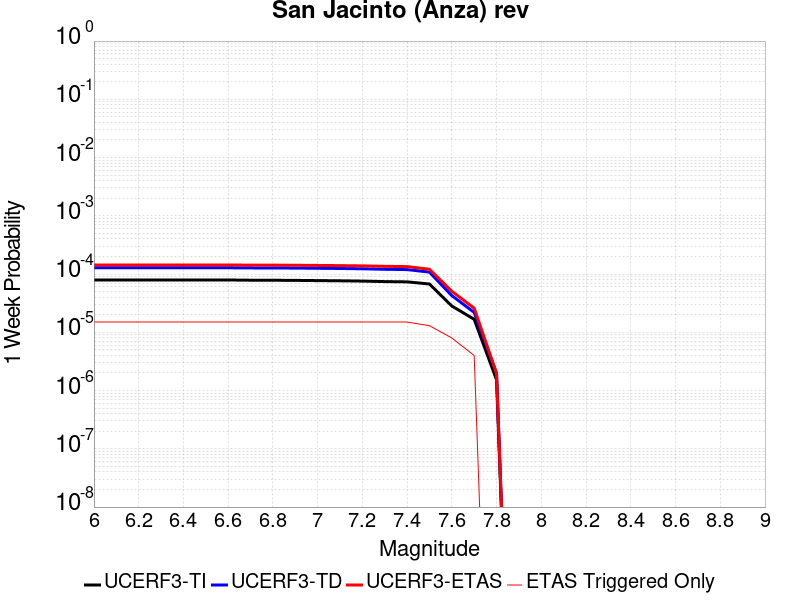 |  |  |  |

| Magnitude | 1 wk TI Prob | 1 wk TD Prob | 1 wk ETAS Prob | 1 wk ETAS/TD Gain | 1 wk ETAS Triggered Only | 1 mo TI Prob | 1 mo TD Prob | 1 mo ETAS Prob | 1 mo ETAS/TD Gain | 1 mo ETAS Triggered Only | 1 yr TI Prob | 1 yr TD Prob | 1 yr ETAS Prob | 1 yr ETAS/TD Gain | 1 yr ETAS Triggered Only | 10 yr TI Prob | 10 yr TD Prob | 10 yr ETAS Prob | 10 yr ETAS/TD Gain | 10 yr ETAS Triggered Only |
|-----|-----|-----|-----|-----|-----|-----|-----|-----|-----|-----|-----|-----|-----|-----|-----|-----|-----|-----|-----|-----|
| 6.0 | 7.9249476E-5 | 1.2833404E-4 | 1.3913859E-4 | 1.0841907 | 1.0805928E-5 | 3.3959642E-4 | 5.4991845E-4 | 5.650384E-4 | 1.0274949 | 1.5128298E-5 | 0.00412675 | 0.0066802585 | 0.00670602 | 1.0038563 | 2.5934227E-5 | 0.04050952 | 0.067083985 | 0.067144476 | 1.0009017 | 6.483556E-5 |
| 6.1 | 7.9249476E-5 | 1.2833404E-4 | 1.3913859E-4 | 1.0841907 | 1.0805928E-5 | 3.3959642E-4 | 5.4991845E-4 | 5.650384E-4 | 1.0274949 | 1.5128298E-5 | 0.00412675 | 0.0066802585 | 0.00670602 | 1.0038563 | 2.5934227E-5 | 0.04050952 | 0.067083985 | 0.067144476 | 1.0009017 | 6.483556E-5 |
| 6.2 | 7.9249476E-5 | 1.2833404E-4 | 1.3913859E-4 | 1.0841907 | 1.0805928E-5 | 3.3959642E-4 | 5.4991845E-4 | 5.650384E-4 | 1.0274949 | 1.5128298E-5 | 0.00412675 | 0.0066802585 | 0.00670602 | 1.0038563 | 2.5934227E-5 | 0.04050952 | 0.067083985 | 0.067144476 | 1.0009017 | 6.483556E-5 |
| 6.3 | 7.9249476E-5 | 1.2833404E-4 | 1.3913859E-4 | 1.0841907 | 1.0805928E-5 | 3.3959642E-4 | 5.4991845E-4 | 5.650384E-4 | 1.0274949 | 1.5128298E-5 | 0.00412675 | 0.0066802585 | 0.00670602 | 1.0038563 | 2.5934227E-5 | 0.04050952 | 0.067083985 | 0.067144476 | 1.0009017 | 6.483556E-5 |
| 6.4 | 7.9249476E-5 | 1.2833404E-4 | 1.3913859E-4 | 1.0841907 | 1.0805928E-5 | 3.3959642E-4 | 5.4991845E-4 | 5.650384E-4 | 1.0274949 | 1.5128298E-5 | 0.00412675 | 0.0066802585 | 0.00670602 | 1.0038563 | 2.5934227E-5 | 0.04050952 | 0.067083985 | 0.067144476 | 1.0009017 | 6.483556E-5 |
| 6.5 | 7.9249476E-5 | 1.2833404E-4 | 1.3913859E-4 | 1.0841907 | 1.0805928E-5 | 3.3959642E-4 | 5.4991845E-4 | 5.650384E-4 | 1.0274949 | 1.5128298E-5 | 0.00412675 | 0.0066802585 | 0.00670602 | 1.0038563 | 2.5934227E-5 | 0.04050952 | 0.067083985 | 0.067144476 | 1.0009017 | 6.483556E-5 |
| 6.6 | 7.913556E-5 | 1.2821962E-4 | 1.3902415E-4 | 1.084266 | 1.0805928E-5 | 3.3910832E-4 | 5.494282E-4 | 5.645482E-4 | 1.0275195 | 1.5128298E-5 | 0.00412083 | 0.006674327 | 0.0067000883 | 1.0038598 | 2.5934227E-5 | 0.04045248 | 0.067026526 | 0.06708702 | 1.0009025 | 6.483556E-5 |
| 6.7 | 7.843403E-5 | 1.2742344E-4 | 1.3822799E-4 | 1.0847925 | 1.0805928E-5 | 3.3610253E-4 | 5.460175E-4 | 5.611375E-4 | 1.0276915 | 1.5128298E-5 | 0.0040843724 | 0.0066330545 | 0.0066588167 | 1.003884 | 2.5934227E-5 | 0.04010115 | 0.0666332 | 0.066693716 | 1.0009081 | 6.483556E-5 |
| 6.8 | 7.825213E-5 | 1.2717218E-4 | 1.3797673E-4 | 1.08496 | 1.0805928E-5 | 3.3532316E-4 | 5.449411E-4 | 5.600612E-4 | 1.0277462 | 1.5128298E-5 | 0.004074919 | 0.00662003 | 0.006645792 | 1.0038916 | 2.5934227E-5 | 0.04001003 | 0.06650948 | 0.06657 | 1.00091 | 6.483556E-5 |
| 6.9 | 7.788025E-5 | 1.2661066E-4 | 1.374152E-4 | 1.0853369 | 1.0805928E-5 | 3.3372978E-4 | 5.4253556E-4 | 5.5765564E-4 | 1.0278693 | 1.5128298E-5 | 0.004055592 | 0.0065909196 | 0.0066166827 | 1.0039089 | 2.5934227E-5 | 0.03982372 | 0.06623408 | 0.06629462 | 1.0009141 | 6.483556E-5 |
| 7.0 | 7.723858E-5 | 1.2564783E-4 | 1.3645239E-4 | 1.0859909 | 1.0805928E-5 | 3.309805E-4 | 5.3841085E-4 | 5.5353105E-4 | 1.028083 | 1.5128298E-5 | 0.0040222434 | 0.006541004 | 0.0065667685 | 1.0039389 | 2.5934227E-5 | 0.03950216 | 0.065760486 | 0.06582105 | 1.0009211 | 6.483556E-5 |
| 7.1 | 7.661684E-5 | 1.246636E-4 | 1.3546819E-4 | 1.0866699 | 1.0805928E-5 | 3.2831656E-4 | 5.3419446E-4 | 5.493147E-4 | 1.0283047 | 1.5128298E-5 | 0.0039899293 | 0.0064899763 | 0.0065157423 | 1.0039701 | 2.5934227E-5 | 0.039190482 | 0.06527789 | 0.06533647 | 1.0008974 | 6.267438E-5 |
| 7.2 | 7.571461E-5 | 1.2320194E-4 | 1.3400654E-4 | 1.0876982 | 1.0805928E-5 | 3.2445084E-4 | 5.279328E-4 | 5.430531E-4 | 1.0286406 | 1.5128298E-5 | 0.003943036 | 0.0064141913 | 0.006439959 | 1.0040174 | 2.5934227E-5 | 0.038738023 | 0.06456287 | 0.064619474 | 1.0008768 | 6.0513194E-5 |
| 7.3 | 7.427039E-5 | 1.20714394E-4 | 1.3151902E-4 | 1.0895057 | 1.0805928E-5 | 3.1826284E-4 | 5.172761E-4 | 5.323966E-4 | 1.029231 | 1.5128298E-5 | 0.0038679668 | 0.0062852004 | 0.0063109715 | 1.0041003 | 2.5934227E-5 | 0.038013313 | 0.063324034 | 0.06338072 | 1.0008951 | 6.0513194E-5 |
| 7.4 | 7.3478965E-5 | 1.1931325E-4 | 1.3011789E-4 | 1.0905569 | 1.0805928E-5 | 3.1487184E-4 | 5.1127357E-4 | 5.263941E-4 | 1.0295743 | 1.5128298E-5 | 0.0038268273 | 0.006212538 | 0.006238311 | 1.0041486 | 2.5934227E-5 | 0.037615944 | 0.06262941 | 0.062684104 | 1.0008733 | 5.835201E-5 |
| 7.5 | 6.7516885E-5 | 1.08003216E-4 | 1.1880798E-4 | 1.1000412 | 1.0805928E-5 | 2.8932598E-4 | 4.6281965E-4 | 4.7794095E-4 | 1.0326722 | 1.5128298E-5 | 0.003516855 | 0.005625739 | 0.0056493785 | 1.004202 | 2.377304E-5 | 0.034617163 | 0.057019595 | 0.057072584 | 1.0009292 | 5.6190824E-5 |
| 7.6 | 2.8268712E-5 | 4.2655167E-5 | 4.913845E-5 | 1.1519928 | 6.4835567E-6 | 1.21146004E-4 | 1.8279799E-4 | 1.9360194E-4 | 1.0591033 | 1.0805928E-5 | 0.0014739545 | 0.0022238137 | 0.0022410648 | 1.0077574 | 1.7289485E-5 | 0.014642165 | 0.022920644 | 0.022960765 | 1.0017505 | 4.1062525E-5 |
| 7.7 | 1.673878E-5 | 2.1973781E-5 | 2.6296058E-5 | 1.1967015 | 4.3223713E-6 | 7.173566E-5 | 9.417205E-5 | 1.00655E-4 | 1.0688415 | 6.4835567E-6 | 8.730317E-4 | 0.0011463144 | 0.0011549493 | 1.0075327 | 8.644743E-6 | 0.008696098 | 0.01216197 | 0.0121897245 | 1.002282 | 2.8095412E-5 |
| 7.8 | 1.5303123E-6 | 1.9707616E-6 | 1.9707616E-6 | 1.0 | 0.0 | 6.5584645E-6 | 8.446107E-6 | 1.0607275E-5 | 1.2558773 | 2.1611856E-6 | 7.984638E-5 | 1.0282895E-4 | 1.04989915E-4 | 1.0210152 | 2.1611856E-6 | 7.98177E-4 | 0.001066982 | 0.0010712998 | 1.0040467 | 4.3223713E-6 |

## San Jose
*[(top)](#table-of-contents)*

| 1 Week | 1 Month | 1 Year | 10 Year |
|-----|-----|-----|-----|
|  |  |  |  |

| Magnitude | 1 wk TI Prob | 1 wk TD Prob | 1 wk ETAS Prob | 1 wk ETAS/TD Gain | 1 wk ETAS Triggered Only | 1 mo TI Prob | 1 mo TD Prob | 1 mo ETAS Prob | 1 mo ETAS/TD Gain | 1 mo ETAS Triggered Only | 1 yr TI Prob | 1 yr TD Prob | 1 yr ETAS Prob | 1 yr ETAS/TD Gain | 1 yr ETAS Triggered Only | 10 yr TI Prob | 10 yr TD Prob | 10 yr ETAS Prob | 10 yr ETAS/TD Gain | 10 yr ETAS Triggered Only |
|-----|-----|-----|-----|-----|-----|-----|-----|-----|-----|-----|-----|-----|-----|-----|-----|-----|-----|-----|-----|-----|
| 6.0 | 9.706857E-6 | 1.0473486E-5 | 2.5601626E-5 | 2.4444227 | 1.5128298E-5 | 4.160015E-5 | 4.488637E-5 | 6.433616E-5 | 1.4333118 | 1.945067E-5 | 5.063641E-4 | 5.4649153E-4 | 5.896916E-4 | 1.0790498 | 4.322371E-5 | 0.0050521186 | 0.0054649157 | 0.0055293967 | 1.0117991 | 6.483556E-5 |
| 6.1 | 9.706857E-6 | 1.0473486E-5 | 2.5601626E-5 | 2.4444227 | 1.5128298E-5 | 4.160015E-5 | 4.488637E-5 | 6.433616E-5 | 1.4333118 | 1.945067E-5 | 5.063641E-4 | 5.4649153E-4 | 5.896916E-4 | 1.0790498 | 4.322371E-5 | 0.0050521186 | 0.0054649157 | 0.0055293967 | 1.0117991 | 6.483556E-5 |
| 6.2 | 9.706857E-6 | 1.0473486E-5 | 2.5601626E-5 | 2.4444227 | 1.5128298E-5 | 4.160015E-5 | 4.488637E-5 | 6.433616E-5 | 1.4333118 | 1.945067E-5 | 5.063641E-4 | 5.4649153E-4 | 5.896916E-4 | 1.0790498 | 4.322371E-5 | 0.0050521186 | 0.0054649157 | 0.0055293967 | 1.0117991 | 6.483556E-5 |
| 6.3 | 9.706857E-6 | 1.0473486E-5 | 2.5601626E-5 | 2.4444227 | 1.5128298E-5 | 4.160015E-5 | 4.488637E-5 | 6.433616E-5 | 1.4333118 | 1.945067E-5 | 5.063641E-4 | 5.4649153E-4 | 5.896916E-4 | 1.0790498 | 4.322371E-5 | 0.0050521186 | 0.0054649157 | 0.0055293967 | 1.0117991 | 6.483556E-5 |
| 6.4 | 9.706857E-6 | 1.0473486E-5 | 2.5601626E-5 | 2.4444227 | 1.5128298E-5 | 4.160015E-5 | 4.488637E-5 | 6.433616E-5 | 1.4333118 | 1.945067E-5 | 5.063641E-4 | 5.4649153E-4 | 5.896916E-4 | 1.0790498 | 4.322371E-5 | 0.0050521186 | 0.0054649157 | 0.0055293967 | 1.0117991 | 6.483556E-5 |
| 6.5 | 9.706857E-6 | 1.0473486E-5 | 2.5601626E-5 | 2.4444227 | 1.5128298E-5 | 4.160015E-5 | 4.488637E-5 | 6.433616E-5 | 1.4333118 | 1.945067E-5 | 5.063641E-4 | 5.4649153E-4 | 5.896916E-4 | 1.0790498 | 4.322371E-5 | 0.0050521186 | 0.0054649157 | 0.0055293967 | 1.0117991 | 6.483556E-5 |

## San Gabriel
*[(top)](#table-of-contents)*

| 1 Week | 1 Month | 1 Year | 10 Year |
|-----|-----|-----|-----|
|  |  |  |  |

| Magnitude | 1 wk TI Prob | 1 wk TD Prob | 1 wk ETAS Prob | 1 wk ETAS/TD Gain | 1 wk ETAS Triggered Only | 1 mo TI Prob | 1 mo TD Prob | 1 mo ETAS Prob | 1 mo ETAS/TD Gain | 1 mo ETAS Triggered Only | 1 yr TI Prob | 1 yr TD Prob | 1 yr ETAS Prob | 1 yr ETAS/TD Gain | 1 yr ETAS Triggered Only | 10 yr TI Prob | 10 yr TD Prob | 10 yr ETAS Prob | 10 yr ETAS/TD Gain | 10 yr ETAS Triggered Only |
|-----|-----|-----|-----|-----|-----|-----|-----|-----|-----|-----|-----|-----|-----|-----|-----|-----|-----|-----|-----|-----|
| 6.0 | 1.26160985E-5 | 1.3513258E-5 | 3.080251E-5 | 2.2794287 | 1.7289485E-5 | 5.406787E-5 | 5.791289E-5 | 8.384561E-5 | 1.4477885 | 2.5934227E-5 | 6.580775E-4 | 7.048994E-4 | 7.480926E-4 | 1.0612757 | 4.322371E-5 | 0.006561321 | 0.007030387 | 0.0070926207 | 1.0088521 | 6.267438E-5 |
| 6.1 | 1.26160985E-5 | 1.3513258E-5 | 3.080251E-5 | 2.2794287 | 1.7289485E-5 | 5.406787E-5 | 5.791289E-5 | 8.384561E-5 | 1.4477885 | 2.5934227E-5 | 6.580775E-4 | 7.048994E-4 | 7.480926E-4 | 1.0612757 | 4.322371E-5 | 0.006561321 | 0.007030387 | 0.0070926207 | 1.0088521 | 6.267438E-5 |
| 6.2 | 1.26160985E-5 | 1.3513258E-5 | 3.080251E-5 | 2.2794287 | 1.7289485E-5 | 5.406787E-5 | 5.791289E-5 | 8.384561E-5 | 1.4477885 | 2.5934227E-5 | 6.580775E-4 | 7.048994E-4 | 7.480926E-4 | 1.0612757 | 4.322371E-5 | 0.006561321 | 0.007030387 | 0.0070926207 | 1.0088521 | 6.267438E-5 |
| 6.3 | 1.26160985E-5 | 1.3513258E-5 | 3.080251E-5 | 2.2794287 | 1.7289485E-5 | 5.406787E-5 | 5.791289E-5 | 8.384561E-5 | 1.4477885 | 2.5934227E-5 | 6.580775E-4 | 7.048994E-4 | 7.480926E-4 | 1.0612757 | 4.322371E-5 | 0.006561321 | 0.007030387 | 0.0070926207 | 1.0088521 | 6.267438E-5 |
| 6.4 | 1.26160985E-5 | 1.3513258E-5 | 3.080251E-5 | 2.2794287 | 1.7289485E-5 | 5.406787E-5 | 5.791289E-5 | 8.384561E-5 | 1.4477885 | 2.5934227E-5 | 6.580775E-4 | 7.048994E-4 | 7.480926E-4 | 1.0612757 | 4.322371E-5 | 0.006561321 | 0.007030387 | 0.0070926207 | 1.0088521 | 6.267438E-5 |
| 6.5 | 1.26160985E-5 | 1.3513258E-5 | 3.080251E-5 | 2.2794287 | 1.7289485E-5 | 5.406787E-5 | 5.791289E-5 | 8.384561E-5 | 1.4477885 | 2.5934227E-5 | 6.580775E-4 | 7.048994E-4 | 7.480926E-4 | 1.0612757 | 4.322371E-5 | 0.006561321 | 0.007030387 | 0.0070926207 | 1.0088521 | 6.267438E-5 |
| 6.6 | 1.1803596E-5 | 1.264043E-5 | 2.7768538E-5 | 2.1968033 | 1.5128298E-5 | 5.058586E-5 | 5.417236E-5 | 7.794411E-5 | 1.438817 | 2.377304E-5 | 6.1570876E-4 | 6.5938674E-4 | 6.982624E-4 | 1.0589573 | 3.890134E-5 | 0.0061400565 | 0.006578034 | 0.006633855 | 1.008486 | 5.6190824E-5 |
| 6.7 | 9.549731E-6 | 1.0215835E-5 | 2.534398E-5 | 2.4808526 | 1.5128298E-5 | 4.0926778E-5 | 4.378162E-5 | 6.323144E-5 | 1.4442462 | 1.945067E-5 | 4.9816957E-4 | 5.329474E-4 | 5.6750793E-4 | 1.064848 | 3.457897E-5 | 0.0049705426 | 0.005320286 | 0.005369729 | 1.0092933 | 4.970727E-5 |
| 6.8 | 9.157154E-6 | 9.798772E-6 | 2.2765758E-5 | 2.3233278 | 1.2967113E-5 | 3.9244354E-5 | 4.1994266E-5 | 5.9283026E-5 | 1.4116933 | 1.7289485E-5 | 4.7769528E-4 | 5.111967E-4 | 5.435979E-4 | 1.0633831 | 3.241778E-5 | 0.004766697 | 0.005103788 | 0.005151091 | 1.0092683 | 4.754608E-5 |
| 6.9 | 7.844496E-6 | 8.385175E-6 | 2.1352178E-5 | 2.5464203 | 1.2967113E-5 | 3.3618835E-5 | 3.593617E-5 | 5.1063922E-5 | 1.4209619 | 1.5128298E-5 | 4.0923245E-4 | 4.374709E-4 | 4.633938E-4 | 1.0592562 | 2.5934227E-5 | 0.0040847966 | 0.0043696202 | 0.0044083516 | 1.0088638 | 3.890134E-5 |
| 7.0 | 6.7619258E-6 | 7.2223247E-6 | 2.0189345E-5 | 2.795408 | 1.2967113E-5 | 2.897936E-5 | 3.0952655E-5 | 4.6080484E-5 | 1.4887409 | 1.5128298E-5 | 3.527666E-4 | 3.7681893E-4 | 3.9842265E-4 | 1.0573318 | 2.1611855E-5 | 0.0035220713 | 0.0037652855 | 0.0037975812 | 1.0085772 | 3.241778E-5 |
| 7.1 | 5.927114E-6 | 6.3258008E-6 | 1.9292831E-5 | 3.049864 | 1.2967113E-5 | 2.540167E-5 | 2.7110491E-5 | 4.223838E-5 | 1.5580087 | 1.5128298E-5 | 3.0922145E-4 | 3.300555E-4 | 3.5166022E-4 | 1.0654578 | 2.1611855E-5 | 0.0030879152 | 0.0032991117 | 0.0033292684 | 1.0091408 | 3.0256597E-5 |
| 7.2 | 4.9482483E-6 | 5.276545E-6 | 1.3921242E-5 | 2.6383252 | 8.644743E-6 | 2.1206606E-5 | 2.2613764E-5 | 3.341945E-5 | 1.4778366 | 1.0805928E-5 | 2.5815985E-4 | 2.7532259E-4 | 2.926073E-4 | 1.0627799 | 1.7289485E-5 | 0.0025786015 | 0.0027532259 | 0.0027790887 | 1.0093937 | 2.5934227E-5 |

## Pinto Mtn
*[(top)](#table-of-contents)*

| 1 Week | 1 Month | 1 Year | 10 Year |
|-----|-----|-----|-----|
|  |  |  |  |

| Magnitude | 1 wk TI Prob | 1 wk TD Prob | 1 wk ETAS Prob | 1 wk ETAS/TD Gain | 1 wk ETAS Triggered Only | 1 mo TI Prob | 1 mo TD Prob | 1 mo ETAS Prob | 1 mo ETAS/TD Gain | 1 mo ETAS Triggered Only | 1 yr TI Prob | 1 yr TD Prob | 1 yr ETAS Prob | 1 yr ETAS/TD Gain | 1 yr ETAS Triggered Only | 10 yr TI Prob | 10 yr TD Prob | 10 yr ETAS Prob | 10 yr ETAS/TD Gain | 10 yr ETAS Triggered Only |
|-----|-----|-----|-----|-----|-----|-----|-----|-----|-----|-----|-----|-----|-----|-----|-----|-----|-----|-----|-----|-----|
| 6.0 | 3.51701E-5 | 4.3047E-5 | 6.465792E-5 | 1.502031 | 2.1611855E-5 | 1.5072028E-4 | 1.844764E-4 | 2.1040585E-4 | 1.1405569 | 2.5934227E-5 | 0.0018334748 | 0.0022440937 | 0.002285064 | 1.018257 | 4.1062525E-5 | 0.018184211 | 0.022254989 | 0.022314155 | 1.0026586 | 6.0513194E-5 |
| 6.1 | 3.51701E-5 | 4.3047E-5 | 6.465792E-5 | 1.502031 | 2.1611855E-5 | 1.5072028E-4 | 1.844764E-4 | 2.1040585E-4 | 1.1405569 | 2.5934227E-5 | 0.0018334748 | 0.0022440937 | 0.002285064 | 1.018257 | 4.1062525E-5 | 0.018184211 | 0.022254989 | 0.022314155 | 1.0026586 | 6.0513194E-5 |
| 6.2 | 3.51701E-5 | 4.3047E-5 | 6.465792E-5 | 1.502031 | 2.1611855E-5 | 1.5072028E-4 | 1.844764E-4 | 2.1040585E-4 | 1.1405569 | 2.5934227E-5 | 0.0018334748 | 0.0022440937 | 0.002285064 | 1.018257 | 4.1062525E-5 | 0.018184211 | 0.022254989 | 0.022314155 | 1.0026586 | 6.0513194E-5 |
| 6.3 | 3.51701E-5 | 4.3047E-5 | 6.465792E-5 | 1.502031 | 2.1611855E-5 | 1.5072028E-4 | 1.844764E-4 | 2.1040585E-4 | 1.1405569 | 2.5934227E-5 | 0.0018334748 | 0.0022440937 | 0.002285064 | 1.018257 | 4.1062525E-5 | 0.018184211 | 0.022254989 | 0.022314155 | 1.0026586 | 6.0513194E-5 |
| 6.4 | 3.51701E-5 | 4.3047E-5 | 6.465792E-5 | 1.502031 | 2.1611855E-5 | 1.5072028E-4 | 1.844764E-4 | 2.1040585E-4 | 1.1405569 | 2.5934227E-5 | 0.0018334748 | 0.0022440937 | 0.002285064 | 1.018257 | 4.1062525E-5 | 0.018184211 | 0.022254989 | 0.022314155 | 1.0026586 | 6.0513194E-5 |
| 6.5 | 3.51701E-5 | 4.3047E-5 | 6.465792E-5 | 1.502031 | 2.1611855E-5 | 1.5072028E-4 | 1.844764E-4 | 2.1040585E-4 | 1.1405569 | 2.5934227E-5 | 0.0018334748 | 0.0022440937 | 0.002285064 | 1.018257 | 4.1062525E-5 | 0.018184211 | 0.022254989 | 0.022314155 | 1.0026586 | 6.0513194E-5 |
| 6.6 | 3.3749162E-5 | 4.1291092E-5 | 6.290206E-5 | 1.5233808 | 2.1611855E-5 | 1.4463125E-4 | 1.7695212E-4 | 2.0288177E-4 | 1.1465348 | 2.5934227E-5 | 0.0017594631 | 0.0021526704 | 0.002191488 | 1.0180323 | 3.890134E-5 | 0.017455976 | 0.021358717 | 0.021411594 | 1.0024756 | 5.402964E-5 |
| 6.7 | 2.7121987E-5 | 3.3122094E-5 | 4.8249894E-5 | 1.4567283 | 1.5128298E-5 | 1.162319E-4 | 1.4194637E-4 | 1.6139427E-4 | 1.1370089 | 1.945067E-5 | 0.0014142047 | 0.0017272272 | 0.0017531166 | 1.014989 | 2.5934227E-5 | 0.014052387 | 0.01717749 | 0.017211474 | 1.0019785 | 3.457897E-5 |
| 6.8 | 2.2587206E-5 | 2.7508535E-5 | 4.047529E-5 | 1.4713721 | 1.2967113E-5 | 9.679872E-5 | 1.1789061E-4 | 1.3517805E-4 | 1.1466397 | 1.7289485E-5 | 0.0011778872 | 0.001434766 | 0.0014585049 | 1.0165455 | 2.377304E-5 | 0.011716634 | 0.014293642 | 0.014319206 | 1.0017885 | 2.5934227E-5 |
| 6.9 | 2.1440546E-5 | 2.6093185E-5 | 3.689883E-5 | 1.4141176 | 1.0805928E-5 | 9.1884816E-5 | 1.1182535E-4 | 1.2695196E-4 | 1.1352699 | 1.5128298E-5 | 0.0011181235 | 0.0013610155 | 0.001382598 | 1.0158576 | 2.1611855E-5 | 0.011125144 | 0.013565313 | 0.013588764 | 1.0017288 | 2.377304E-5 |
| 7.0 | 1.7893128E-5 | 2.1693293E-5 | 2.817671E-5 | 1.2988673 | 6.4835567E-6 | 7.6682576E-5 | 9.2970135E-5 | 1.01614074E-4 | 1.0929754 | 8.644743E-6 | 9.332105E-4 | 0.001131712 | 0.0011446645 | 1.011445 | 1.2967113E-5 | 0.009293012 | 0.011297592 | 0.011312549 | 1.0013239 | 1.5128298E-5 |
| 7.1 | 1.5338705E-5 | 1.854412E-5 | 2.5027557E-5 | 1.3496222 | 6.4835567E-6 | 6.573565E-5 | 7.947455E-5 | 8.8118606E-5 | 1.1087651 | 8.644743E-6 | 8.0003764E-4 | 9.675582E-4 | 9.805127E-4 | 1.0133889 | 1.2967113E-5 | 0.007971635 | 0.009671222 | 0.009684064 | 1.0013279 | 1.2967113E-5 |
| 7.2 | 1.4525263E-5 | 1.7549126E-5 | 2.4032568E-5 | 1.3694453 | 6.4835567E-6 | 6.2249645E-5 | 7.521054E-5 | 8.385463E-5 | 1.114932 | 8.644743E-6 | 7.5762585E-4 | 9.1568835E-4 | 9.2864357E-4 | 1.0141481 | 1.2967113E-5 | 0.007550481 | 0.009156883 | 0.009169731 | 1.0014031 | 1.2967113E-5 |

## Independence rev 2011
*[(top)](#table-of-contents)*

| 1 Week | 1 Month | 1 Year | 10 Year |
|-----|-----|-----|-----|
|  |  |  |  |

| Magnitude | 1 wk TI Prob | 1 wk TD Prob | 1 wk ETAS Prob | 1 wk ETAS/TD Gain | 1 wk ETAS Triggered Only | 1 mo TI Prob | 1 mo TD Prob | 1 mo ETAS Prob | 1 mo ETAS/TD Gain | 1 mo ETAS Triggered Only | 1 yr TI Prob | 1 yr TD Prob | 1 yr ETAS Prob | 1 yr ETAS/TD Gain | 1 yr ETAS Triggered Only | 10 yr TI Prob | 10 yr TD Prob | 10 yr ETAS Prob | 10 yr ETAS/TD Gain | 10 yr ETAS Triggered Only |
|-----|-----|-----|-----|-----|-----|-----|-----|-----|-----|-----|-----|-----|-----|-----|-----|-----|-----|-----|-----|-----|
| 6.0 | 2.8756149E-6 | 2.9249488E-6 | 2.0214382E-5 | 6.9110208 | 1.7289485E-5 | 1.2324005E-5 | 1.2535451E-5 | 4.279167E-5 | 3.4136522 | 3.0256597E-5 | 1.5003444E-4 | 1.5261132E-4 | 1.9582843E-4 | 1.2831842 | 4.322371E-5 | 0.0014993318 | 0.001525348 | 0.001583611 | 1.0381966 | 5.835201E-5 |
| 6.1 | 2.8756149E-6 | 2.9249488E-6 | 2.0214382E-5 | 6.9110208 | 1.7289485E-5 | 1.2324005E-5 | 1.2535451E-5 | 4.279167E-5 | 3.4136522 | 3.0256597E-5 | 1.5003444E-4 | 1.5261132E-4 | 1.9582843E-4 | 1.2831842 | 4.322371E-5 | 0.0014993318 | 0.001525348 | 0.001583611 | 1.0381966 | 5.835201E-5 |
| 6.2 | 2.8756149E-6 | 2.9249488E-6 | 2.0214382E-5 | 6.9110208 | 1.7289485E-5 | 1.2324005E-5 | 1.2535451E-5 | 4.279167E-5 | 3.4136522 | 3.0256597E-5 | 1.5003444E-4 | 1.5261132E-4 | 1.9582843E-4 | 1.2831842 | 4.322371E-5 | 0.0014993318 | 0.001525348 | 0.001583611 | 1.0381966 | 5.835201E-5 |
| 6.3 | 2.8756149E-6 | 2.9249488E-6 | 2.0214382E-5 | 6.9110208 | 1.7289485E-5 | 1.2324005E-5 | 1.2535451E-5 | 4.279167E-5 | 3.4136522 | 3.0256597E-5 | 1.5003444E-4 | 1.5261132E-4 | 1.9582843E-4 | 1.2831842 | 4.322371E-5 | 0.0014993318 | 0.001525348 | 0.001583611 | 1.0381966 | 5.835201E-5 |
| 6.4 | 2.8756149E-6 | 2.9249488E-6 | 2.0214382E-5 | 6.9110208 | 1.7289485E-5 | 1.2324005E-5 | 1.2535451E-5 | 4.279167E-5 | 3.4136522 | 3.0256597E-5 | 1.5003444E-4 | 1.5261132E-4 | 1.9582843E-4 | 1.2831842 | 4.322371E-5 | 0.0014993318 | 0.001525348 | 0.001583611 | 1.0381966 | 5.835201E-5 |
| 6.5 | 2.8756149E-6 | 2.9249488E-6 | 2.0214382E-5 | 6.9110208 | 1.7289485E-5 | 1.2324005E-5 | 1.2535451E-5 | 4.279167E-5 | 3.4136522 | 3.0256597E-5 | 1.5003444E-4 | 1.5261132E-4 | 1.9582843E-4 | 1.2831842 | 4.322371E-5 | 0.0014993318 | 0.001525348 | 0.001583611 | 1.0381966 | 5.835201E-5 |
| 6.6 | 2.5516226E-6 | 2.5957236E-6 | 1.9885163E-5 | 7.66074 | 1.7289485E-5 | 1.093548E-5 | 1.1124498E-5 | 4.1380757E-5 | 3.7197866 | 3.0256597E-5 | 1.3313134E-4 | 1.3543516E-4 | 1.7865302E-4 | 1.3191037 | 4.322371E-5 | 0.0013305161 | 0.0013538024 | 0.0014120754 | 1.043044 | 5.835201E-5 |
| 6.7 | 2.2186603E-6 | 2.256487E-6 | 1.7384751E-5 | 7.704344 | 1.5128298E-5 | 9.50851E-6 | 9.670638E-6 | 3.3443448E-5 | 3.4582465 | 2.377304E-5 | 1.15759954E-4 | 1.1773639E-4 | 1.5231129E-4 | 1.2936636 | 3.457897E-5 | 0.0011569967 | 0.0011770084 | 0.0012244985 | 1.0403482 | 4.754608E-5 |
| 6.8 | 1.9751235E-6 | 2.0086552E-6 | 1.7136923E-5 | 8.531541 | 1.5128298E-5 | 8.464787E-6 | 8.608508E-6 | 3.2381344E-5 | 3.7615511 | 2.377304E-5 | 1.0305391E-4 | 1.0480621E-4 | 1.3938156E-4 | 1.3298979 | 3.457897E-5 | 0.0010300614 | 0.0010478286 | 0.0010953249 | 1.0453283 | 4.754608E-5 |
| 6.9 | 1.7189924E-6 | 1.7480062E-6 | 1.6876278E-5 | 9.654587 | 1.5128298E-5 | 7.36709E-6 | 7.4914487E-6 | 2.9103143E-5 | 3.8848484 | 2.1611855E-5 | 8.969063E-5 | 9.1207185E-5 | 1.2362201E-4 | 1.3553977 | 3.241778E-5 | 8.965443E-4 | 9.119541E-4 | 9.5513836E-4 | 1.0473536 | 4.322371E-5 |
| 7.0 | 1.4014381E-6 | 1.4248745E-6 | 1.439197E-5 | 10.100517 | 1.2967113E-5 | 6.0061493E-6 | 6.1066053E-6 | 2.5557156E-5 | 4.185166 | 1.945067E-5 | 7.312241E-5 | 7.434792E-5 | 1.0244124E-4 | 1.3778629 | 2.8095412E-5 | 7.3098356E-4 | 7.434792E-4 | 7.780324E-4 | 1.046475 | 3.457897E-5 |
| 7.1 | 1.4014381E-6 | 1.4248745E-6 | 1.439197E-5 | 10.100517 | 1.2967113E-5 | 6.0061493E-6 | 6.1066053E-6 | 2.5557156E-5 | 4.185166 | 1.945067E-5 | 7.312241E-5 | 7.434792E-5 | 1.0244124E-4 | 1.3778629 | 2.8095412E-5 | 7.3098356E-4 | 7.434792E-4 | 7.780324E-4 | 1.046475 | 3.457897E-5 |

## Santa Rosa Island
*[(top)](#table-of-contents)*

| 1 Week | 1 Month | 1 Year | 10 Year |
|-----|-----|-----|-----|
|  |  |  |  |

| Magnitude | 1 wk TI Prob | 1 wk TD Prob | 1 wk ETAS Prob | 1 wk ETAS/TD Gain | 1 wk ETAS Triggered Only | 1 mo TI Prob | 1 mo TD Prob | 1 mo ETAS Prob | 1 mo ETAS/TD Gain | 1 mo ETAS Triggered Only | 1 yr TI Prob | 1 yr TD Prob | 1 yr ETAS Prob | 1 yr ETAS/TD Gain | 1 yr ETAS Triggered Only | 10 yr TI Prob | 10 yr TD Prob | 10 yr ETAS Prob | 10 yr ETAS/TD Gain | 10 yr ETAS Triggered Only |
|-----|-----|-----|-----|-----|-----|-----|-----|-----|-----|-----|-----|-----|-----|-----|-----|-----|-----|-----|-----|-----|
| 6.0 | 1.7608221E-5 | 1.9925783E-5 | 4.153721E-5 | 2.084596 | 2.1611855E-5 | 7.546163E-5 | 8.539441E-5 | 1.1348742E-4 | 1.3289795 | 2.8095412E-5 | 9.18358E-4 | 0.0010393565 | 0.0010803763 | 1.0394666 | 4.1062525E-5 | 0.009145721 | 0.010362199 | 0.010413529 | 1.0049536 | 5.1868454E-5 |
| 6.1 | 1.7608221E-5 | 1.9925783E-5 | 4.153721E-5 | 2.084596 | 2.1611855E-5 | 7.546163E-5 | 8.539441E-5 | 1.1348742E-4 | 1.3289795 | 2.8095412E-5 | 9.18358E-4 | 0.0010393565 | 0.0010803763 | 1.0394666 | 4.1062525E-5 | 0.009145721 | 0.010362199 | 0.010413529 | 1.0049536 | 5.1868454E-5 |
| 6.2 | 1.7608221E-5 | 1.9925783E-5 | 4.153721E-5 | 2.084596 | 2.1611855E-5 | 7.546163E-5 | 8.539441E-5 | 1.1348742E-4 | 1.3289795 | 2.8095412E-5 | 9.18358E-4 | 0.0010393565 | 0.0010803763 | 1.0394666 | 4.1062525E-5 | 0.009145721 | 0.010362199 | 0.010413529 | 1.0049536 | 5.1868454E-5 |
| 6.3 | 1.7608221E-5 | 1.9925783E-5 | 4.153721E-5 | 2.084596 | 2.1611855E-5 | 7.546163E-5 | 8.539441E-5 | 1.1348742E-4 | 1.3289795 | 2.8095412E-5 | 9.18358E-4 | 0.0010393565 | 0.0010803763 | 1.0394666 | 4.1062525E-5 | 0.009145721 | 0.010362199 | 0.010413529 | 1.0049536 | 5.1868454E-5 |
| 6.4 | 1.7608221E-5 | 1.9925783E-5 | 4.153721E-5 | 2.084596 | 2.1611855E-5 | 7.546163E-5 | 8.539441E-5 | 1.1348742E-4 | 1.3289795 | 2.8095412E-5 | 9.18358E-4 | 0.0010393565 | 0.0010803763 | 1.0394666 | 4.1062525E-5 | 0.009145721 | 0.010362199 | 0.010413529 | 1.0049536 | 5.1868454E-5 |
| 6.5 | 1.7608221E-5 | 1.9925783E-5 | 4.153721E-5 | 2.084596 | 2.1611855E-5 | 7.546163E-5 | 8.539441E-5 | 1.1348742E-4 | 1.3289795 | 2.8095412E-5 | 9.18358E-4 | 0.0010393565 | 0.0010803763 | 1.0394666 | 4.1062525E-5 | 0.009145721 | 0.010362199 | 0.010413529 | 1.0049536 | 5.1868454E-5 |
| 6.6 | 1.4172421E-5 | 1.6018337E-5 | 3.3307544E-5 | 2.0793383 | 1.7289485E-5 | 6.0737537E-5 | 6.8649184E-5 | 9.025956E-5 | 1.3147943 | 2.1611855E-5 | 7.392286E-4 | 8.356556E-4 | 8.658869E-4 | 1.0361768 | 3.0256597E-5 | 0.0073677436 | 0.008342039 | 0.008378473 | 1.0043675 | 3.6740155E-5 |
| 6.7 | 1.1049608E-5 | 1.2472602E-5 | 2.7600712E-5 | 2.2129073 | 1.5128298E-5 | 4.7354602E-5 | 5.3453863E-5 | 7.0742426E-5 | 1.3234296 | 1.7289485E-5 | 5.763898E-4 | 6.507749E-4 | 6.745325E-4 | 1.0365065 | 2.377304E-5 | 0.0057489704 | 0.0065052104 | 0.006530976 | 1.0039607 | 2.5934227E-5 |
| 6.8 | 1.0274539E-5 | 1.1595605E-5 | 2.6723728E-5 | 2.304643 | 1.5128298E-5 | 4.4032997E-5 | 4.9695453E-5 | 6.6984074E-5 | 1.3478914 | 1.7289485E-5 | 5.3596986E-4 | 6.050421E-4 | 6.288008E-4 | 1.0392678 | 2.377304E-5 | 0.00534679 | 0.0060504214 | 0.0060761985 | 1.0042604 | 2.5934227E-5 |

## Anacapa-Dume alt 1
*[(top)](#table-of-contents)*

| 1 Week | 1 Month | 1 Year | 10 Year |
|-----|-----|-----|-----|
|  |  |  |  |

| Magnitude | 1 wk TI Prob | 1 wk TD Prob | 1 wk ETAS Prob | 1 wk ETAS/TD Gain | 1 wk ETAS Triggered Only | 1 mo TI Prob | 1 mo TD Prob | 1 mo ETAS Prob | 1 mo ETAS/TD Gain | 1 mo ETAS Triggered Only | 1 yr TI Prob | 1 yr TD Prob | 1 yr ETAS Prob | 1 yr ETAS/TD Gain | 1 yr ETAS Triggered Only | 10 yr TI Prob | 10 yr TD Prob | 10 yr ETAS Prob | 10 yr ETAS/TD Gain | 10 yr ETAS Triggered Only |
|-----|-----|-----|-----|-----|-----|-----|-----|-----|-----|-----|-----|-----|-----|-----|-----|-----|-----|-----|-----|-----|
| 6.0 | 2.8047281E-5 | 3.3042823E-5 | 4.8170623E-5 | 1.457824 | 1.5128298E-5 | 1.20197095E-4 | 1.4160581E-4 | 1.6537547E-4 | 1.167858 | 2.377304E-5 | 0.0014624172 | 0.0017229331 | 0.00175961 | 1.0212874 | 3.6740155E-5 | 0.014528306 | 0.017120155 | 0.017166886 | 1.0027297 | 4.754608E-5 |
| 6.1 | 2.8047281E-5 | 3.3042823E-5 | 4.8170623E-5 | 1.457824 | 1.5128298E-5 | 1.20197095E-4 | 1.4160581E-4 | 1.6537547E-4 | 1.167858 | 2.377304E-5 | 0.0014624172 | 0.0017229331 | 0.00175961 | 1.0212874 | 3.6740155E-5 | 0.014528306 | 0.017120155 | 0.017166886 | 1.0027297 | 4.754608E-5 |
| 6.2 | 2.8047281E-5 | 3.3042823E-5 | 4.8170623E-5 | 1.457824 | 1.5128298E-5 | 1.20197095E-4 | 1.4160581E-4 | 1.6537547E-4 | 1.167858 | 2.377304E-5 | 0.0014624172 | 0.0017229331 | 0.00175961 | 1.0212874 | 3.6740155E-5 | 0.014528306 | 0.017120155 | 0.017166886 | 1.0027297 | 4.754608E-5 |
| 6.3 | 2.8047281E-5 | 3.3042823E-5 | 4.8170623E-5 | 1.457824 | 1.5128298E-5 | 1.20197095E-4 | 1.4160581E-4 | 1.6537547E-4 | 1.167858 | 2.377304E-5 | 0.0014624172 | 0.0017229331 | 0.00175961 | 1.0212874 | 3.6740155E-5 | 0.014528306 | 0.017120155 | 0.017166886 | 1.0027297 | 4.754608E-5 |
| 6.4 | 2.8047281E-5 | 3.3042823E-5 | 4.8170623E-5 | 1.457824 | 1.5128298E-5 | 1.20197095E-4 | 1.4160581E-4 | 1.6537547E-4 | 1.167858 | 2.377304E-5 | 0.0014624172 | 0.0017229331 | 0.00175961 | 1.0212874 | 3.6740155E-5 | 0.014528306 | 0.017120155 | 0.017166886 | 1.0027297 | 4.754608E-5 |
| 6.5 | 2.8047281E-5 | 3.3042823E-5 | 4.8170623E-5 | 1.457824 | 1.5128298E-5 | 1.20197095E-4 | 1.4160581E-4 | 1.6537547E-4 | 1.167858 | 2.377304E-5 | 0.0014624172 | 0.0017229331 | 0.00175961 | 1.0212874 | 3.6740155E-5 | 0.014528306 | 0.017120155 | 0.017166886 | 1.0027297 | 4.754608E-5 |
| 6.6 | 2.8047281E-5 | 3.3042823E-5 | 4.8170623E-5 | 1.457824 | 1.5128298E-5 | 1.20197095E-4 | 1.4160581E-4 | 1.6537547E-4 | 1.167858 | 2.377304E-5 | 0.0014624172 | 0.0017229331 | 0.00175961 | 1.0212874 | 3.6740155E-5 | 0.014528306 | 0.017120155 | 0.017166886 | 1.0027297 | 4.754608E-5 |
| 6.7 | 1.8557415E-5 | 2.1779932E-5 | 3.2585624E-5 | 1.4961307 | 1.0805928E-5 | 7.952935E-5 | 9.334038E-5 | 1.1062825E-4 | 1.1852132 | 1.7289485E-5 | 9.6783973E-4 | 0.0011360307 | 0.0011597767 | 1.0209026 | 2.377304E-5 | 0.009636354 | 0.011322291 | 0.011350067 | 1.0024533 | 2.8095412E-5 |
| 6.8 | 1.8557415E-5 | 2.1779932E-5 | 3.2585624E-5 | 1.4961307 | 1.0805928E-5 | 7.952935E-5 | 9.334038E-5 | 1.1062825E-4 | 1.1852132 | 1.7289485E-5 | 9.6783973E-4 | 0.0011360307 | 0.0011597767 | 1.0209026 | 2.377304E-5 | 0.009636354 | 0.011322291 | 0.011350067 | 1.0024533 | 2.8095412E-5 |
| 6.9 | 1.3238843E-5 | 1.5484396E-5 | 1.7645549E-5 | 1.1395696 | 2.1611856E-6 | 5.6736666E-5 | 6.636107E-5 | 7.5005235E-5 | 1.1302596 | 8.644743E-6 | 6.9054996E-4 | 8.078341E-4 | 8.207907E-4 | 1.0160388 | 1.2967113E-5 | 0.0068840804 | 0.008067372 | 0.008084523 | 1.0021259 | 1.7289485E-5 |
| 7.0 | 1.3238843E-5 | 1.5484396E-5 | 1.7645549E-5 | 1.1395696 | 2.1611856E-6 | 5.6736666E-5 | 6.636107E-5 | 7.5005235E-5 | 1.1302596 | 8.644743E-6 | 6.9054996E-4 | 8.078341E-4 | 8.207907E-4 | 1.0160388 | 1.2967113E-5 | 0.0068840804 | 0.008067372 | 0.008084523 | 1.0021259 | 1.7289485E-5 |
| 7.1 | 1.0270256E-5 | 1.1981463E-5 | 1.41426235E-5 | 1.1803752 | 2.1611856E-6 | 4.401464E-5 | 5.134913E-5 | 5.567128E-5 | 1.0841718 | 4.3223713E-6 | 5.3574645E-4 | 6.2517566E-4 | 6.3165516E-4 | 1.0103643 | 6.4835567E-6 | 0.005344567 | 0.0062517566 | 0.0062624947 | 1.0017177 | 1.0805928E-5 |

## Mono Lake 2011 CFM
*[(top)](#table-of-contents)*

| 1 Week | 1 Month | 1 Year | 10 Year |
|-----|-----|-----|-----|
|  |  |  |  |

| Magnitude | 1 wk TI Prob | 1 wk TD Prob | 1 wk ETAS Prob | 1 wk ETAS/TD Gain | 1 wk ETAS Triggered Only | 1 mo TI Prob | 1 mo TD Prob | 1 mo ETAS Prob | 1 mo ETAS/TD Gain | 1 mo ETAS Triggered Only | 1 yr TI Prob | 1 yr TD Prob | 1 yr ETAS Prob | 1 yr ETAS/TD Gain | 1 yr ETAS Triggered Only | 10 yr TI Prob | 10 yr TD Prob | 10 yr ETAS Prob | 10 yr ETAS/TD Gain | 10 yr ETAS Triggered Only |
|-----|-----|-----|-----|-----|-----|-----|-----|-----|-----|-----|-----|-----|-----|-----|-----|-----|-----|-----|-----|-----|
| 6.0 | 5.046952E-5 | 7.691228E-5 | 8.987839E-5 | 1.1685832 | 1.2967113E-5 | 2.1628001E-4 | 3.29613E-4 | 3.447363E-4 | 1.045882 | 1.5128298E-5 | 0.0026300293 | 0.0040091043 | 0.0040349346 | 1.0064429 | 2.5934227E-5 | 0.0259912 | 0.039705824 | 0.039745256 | 1.0009931 | 4.1062525E-5 |
| 6.1 | 5.046952E-5 | 7.691228E-5 | 8.987839E-5 | 1.1685832 | 1.2967113E-5 | 2.1628001E-4 | 3.29613E-4 | 3.447363E-4 | 1.045882 | 1.5128298E-5 | 0.0026300293 | 0.0040091043 | 0.0040349346 | 1.0064429 | 2.5934227E-5 | 0.0259912 | 0.039705824 | 0.039745256 | 1.0009931 | 4.1062525E-5 |
| 6.2 | 5.046952E-5 | 7.691228E-5 | 8.987839E-5 | 1.1685832 | 1.2967113E-5 | 2.1628001E-4 | 3.29613E-4 | 3.447363E-4 | 1.045882 | 1.5128298E-5 | 0.0026300293 | 0.0040091043 | 0.0040349346 | 1.0064429 | 2.5934227E-5 | 0.0259912 | 0.039705824 | 0.039745256 | 1.0009931 | 4.1062525E-5 |
| 6.3 | 5.046952E-5 | 7.691228E-5 | 8.987839E-5 | 1.1685832 | 1.2967113E-5 | 2.1628001E-4 | 3.29613E-4 | 3.447363E-4 | 1.045882 | 1.5128298E-5 | 0.0026300293 | 0.0040091043 | 0.0040349346 | 1.0064429 | 2.5934227E-5 | 0.0259912 | 0.039705824 | 0.039745256 | 1.0009931 | 4.1062525E-5 |
| 6.4 | 5.046952E-5 | 7.691228E-5 | 8.987839E-5 | 1.1685832 | 1.2967113E-5 | 2.1628001E-4 | 3.29613E-4 | 3.447363E-4 | 1.045882 | 1.5128298E-5 | 0.0026300293 | 0.0040091043 | 0.0040349346 | 1.0064429 | 2.5934227E-5 | 0.0259912 | 0.039705824 | 0.039745256 | 1.0009931 | 4.1062525E-5 |
| 6.5 | 5.046952E-5 | 7.691228E-5 | 8.987839E-5 | 1.1685832 | 1.2967113E-5 | 2.1628001E-4 | 3.29613E-4 | 3.447363E-4 | 1.045882 | 1.5128298E-5 | 0.0026300293 | 0.0040091043 | 0.0040349346 | 1.0064429 | 2.5934227E-5 | 0.0259912 | 0.039705824 | 0.039745256 | 1.0009931 | 4.1062525E-5 |
| 6.6 | 4.2686057E-5 | 6.480708E-5 | 7.3451265E-5 | 1.1333833 | 8.644743E-6 | 1.8292743E-4 | 2.7774464E-4 | 2.8854757E-4 | 1.0388951 | 1.0805928E-5 | 0.0022248663 | 0.0033799042 | 0.003401443 | 1.0063726 | 2.1611855E-5 | 0.02202723 | 0.033641294 | 0.0336768 | 1.0010554 | 3.6740155E-5 |

## Great Valley 12
*[(top)](#table-of-contents)*

| 1 Week | 1 Month | 1 Year | 10 Year |
|-----|-----|-----|-----|
|  |  |  |  |

| Magnitude | 1 wk TI Prob | 1 wk TD Prob | 1 wk ETAS Prob | 1 wk ETAS/TD Gain | 1 wk ETAS Triggered Only | 1 mo TI Prob | 1 mo TD Prob | 1 mo ETAS Prob | 1 mo ETAS/TD Gain | 1 mo ETAS Triggered Only | 1 yr TI Prob | 1 yr TD Prob | 1 yr ETAS Prob | 1 yr ETAS/TD Gain | 1 yr ETAS Triggered Only | 10 yr TI Prob | 10 yr TD Prob | 10 yr ETAS Prob | 10 yr ETAS/TD Gain | 10 yr ETAS Triggered Only |
|-----|-----|-----|-----|-----|-----|-----|-----|-----|-----|-----|-----|-----|-----|-----|-----|-----|-----|-----|-----|-----|
| 6.0 | 4.2144962E-5 | 6.0987146E-5 | 7.179241E-5 | 1.1771729 | 1.0805928E-5 | 1.8060877E-4 | 2.6137347E-4 | 2.7433722E-4 | 1.0495985 | 1.2967113E-5 | 0.002196694 | 0.0031813493 | 0.003207201 | 1.008126 | 2.5934227E-5 | 0.021751061 | 0.031729307 | 0.031769067 | 1.0012531 | 4.1062525E-5 |
| 6.1 | 4.2144962E-5 | 6.0987146E-5 | 7.179241E-5 | 1.1771729 | 1.0805928E-5 | 1.8060877E-4 | 2.6137347E-4 | 2.7433722E-4 | 1.0495985 | 1.2967113E-5 | 0.002196694 | 0.0031813493 | 0.003207201 | 1.008126 | 2.5934227E-5 | 0.021751061 | 0.031729307 | 0.031769067 | 1.0012531 | 4.1062525E-5 |
| 6.2 | 4.2144962E-5 | 6.0987146E-5 | 7.179241E-5 | 1.1771729 | 1.0805928E-5 | 1.8060877E-4 | 2.6137347E-4 | 2.7433722E-4 | 1.0495985 | 1.2967113E-5 | 0.002196694 | 0.0031813493 | 0.003207201 | 1.008126 | 2.5934227E-5 | 0.021751061 | 0.031729307 | 0.031769067 | 1.0012531 | 4.1062525E-5 |
| 6.3 | 4.2144962E-5 | 6.0987146E-5 | 7.179241E-5 | 1.1771729 | 1.0805928E-5 | 1.8060877E-4 | 2.6137347E-4 | 2.7433722E-4 | 1.0495985 | 1.2967113E-5 | 0.002196694 | 0.0031813493 | 0.003207201 | 1.008126 | 2.5934227E-5 | 0.021751061 | 0.031729307 | 0.031769067 | 1.0012531 | 4.1062525E-5 |

## Imperial
*[(top)](#table-of-contents)*

| 1 Week | 1 Month | 1 Year | 10 Year |
|-----|-----|-----|-----|
|  |  |  |  |

| Magnitude | 1 wk TI Prob | 1 wk TD Prob | 1 wk ETAS Prob | 1 wk ETAS/TD Gain | 1 wk ETAS Triggered Only | 1 mo TI Prob | 1 mo TD Prob | 1 mo ETAS Prob | 1 mo ETAS/TD Gain | 1 mo ETAS Triggered Only | 1 yr TI Prob | 1 yr TD Prob | 1 yr ETAS Prob | 1 yr ETAS/TD Gain | 1 yr ETAS Triggered Only | 10 yr TI Prob | 10 yr TD Prob | 10 yr ETAS Prob | 10 yr ETAS/TD Gain | 10 yr ETAS Triggered Only |
|-----|-----|-----|-----|-----|-----|-----|-----|-----|-----|-----|-----|-----|-----|-----|-----|-----|-----|-----|-----|-----|
| 6.0 | 3.2610117E-4 | 4.2223663E-4 | 4.3951883E-4 | 1.04093 | 1.7289485E-5 | 0.001396828 | 0.0018087402 | 0.001830313 | 1.011927 | 2.1611855E-5 | 0.016874276 | 0.0221874 | 0.02221276 | 1.001143 | 2.5934227E-5 | 0.1564893 | 0.21658373 | 0.2166142 | 1.0001407 | 3.890134E-5 |
| 6.1 | 3.2610117E-4 | 4.2223663E-4 | 4.3951883E-4 | 1.04093 | 1.7289485E-5 | 0.001396828 | 0.0018087402 | 0.001830313 | 1.011927 | 2.1611855E-5 | 0.016874276 | 0.0221874 | 0.02221276 | 1.001143 | 2.5934227E-5 | 0.1564893 | 0.21658373 | 0.2166142 | 1.0001407 | 3.890134E-5 |
| 6.2 | 3.2610117E-4 | 4.2223663E-4 | 4.3951883E-4 | 1.04093 | 1.7289485E-5 | 0.001396828 | 0.0018087402 | 0.001830313 | 1.011927 | 2.1611855E-5 | 0.016874276 | 0.0221874 | 0.02221276 | 1.001143 | 2.5934227E-5 | 0.1564893 | 0.21658373 | 0.2166142 | 1.0001407 | 3.890134E-5 |
| 6.3 | 3.2610117E-4 | 4.2223663E-4 | 4.3951883E-4 | 1.04093 | 1.7289485E-5 | 0.001396828 | 0.0018087402 | 0.001830313 | 1.011927 | 2.1611855E-5 | 0.016874276 | 0.0221874 | 0.02221276 | 1.001143 | 2.5934227E-5 | 0.1564893 | 0.21658373 | 0.2166142 | 1.0001407 | 3.890134E-5 |
| 6.4 | 3.2610117E-4 | 4.2223663E-4 | 4.3951883E-4 | 1.04093 | 1.7289485E-5 | 0.001396828 | 0.0018087402 | 0.001830313 | 1.011927 | 2.1611855E-5 | 0.016874276 | 0.0221874 | 0.02221276 | 1.001143 | 2.5934227E-5 | 0.1564893 | 0.21658373 | 0.2166142 | 1.0001407 | 3.890134E-5 |
| 6.5 | 3.2610117E-4 | 4.2223663E-4 | 4.3951883E-4 | 1.04093 | 1.7289485E-5 | 0.001396828 | 0.0018087402 | 0.001830313 | 1.011927 | 2.1611855E-5 | 0.016874276 | 0.0221874 | 0.02221276 | 1.001143 | 2.5934227E-5 | 0.1564893 | 0.21658373 | 0.2166142 | 1.0001407 | 3.890134E-5 |
| 6.6 | 2.7505832E-4 | 3.51371E-4 | 3.6433357E-4 | 1.0368913 | 1.2967113E-5 | 0.0011782888 | 0.0015054093 | 0.0015205148 | 1.0100342 | 1.5128298E-5 | 0.014251595 | 0.018531771 | 0.018550862 | 1.0010301 | 1.945067E-5 | 0.13371493 | 0.18699032 | 0.18701668 | 1.0001409 | 3.241778E-5 |
| 6.7 | 2.2892522E-4 | 2.8752215E-4 | 2.9832497E-4 | 1.0375721 | 1.0805928E-5 | 9.807391E-4 | 0.0012320514 | 0.0012450025 | 1.0105119 | 1.2967113E-5 | 0.011875284 | 0.015238598 | 0.0152556235 | 1.0011173 | 1.7289485E-5 | 0.11260368 | 0.1593126 | 0.15933622 | 1.0001483 | 2.8095412E-5 |
| 6.8 | 1.8687606E-4 | 2.3508105E-4 | 2.4372376E-4 | 1.0367649 | 8.644743E-6 | 8.0065156E-4 | 0.0010074902 | 0.0010182853 | 1.0107148 | 1.0805928E-5 | 0.009704442 | 0.012523335 | 0.012538275 | 1.0011929 | 1.5128298E-5 | 0.09291432 | 0.13362566 | 0.13364813 | 1.0001682 | 2.5934227E-5 |
| 6.9 | 1.8687606E-4 | 2.3508105E-4 | 2.4372376E-4 | 1.0367649 | 8.644743E-6 | 8.0065156E-4 | 0.0010074902 | 0.0010182853 | 1.0107148 | 1.0805928E-5 | 0.009704442 | 0.012523335 | 0.012538275 | 1.0011929 | 1.5128298E-5 | 0.09291432 | 0.13362566 | 0.13364813 | 1.0001682 | 2.5934227E-5 |

## San Jacinto (Clark) rev
*[(top)](#table-of-contents)*

| 1 Week | 1 Month | 1 Year | 10 Year |
|-----|-----|-----|-----|
|  |  |  |  |

| Magnitude | 1 wk TI Prob | 1 wk TD Prob | 1 wk ETAS Prob | 1 wk ETAS/TD Gain | 1 wk ETAS Triggered Only | 1 mo TI Prob | 1 mo TD Prob | 1 mo ETAS Prob | 1 mo ETAS/TD Gain | 1 mo ETAS Triggered Only | 1 yr TI Prob | 1 yr TD Prob | 1 yr ETAS Prob | 1 yr ETAS/TD Gain | 1 yr ETAS Triggered Only | 10 yr TI Prob | 10 yr TD Prob | 10 yr ETAS Prob | 10 yr ETAS/TD Gain | 10 yr ETAS Triggered Only |
|-----|-----|-----|-----|-----|-----|-----|-----|-----|-----|-----|-----|-----|-----|-----|-----|-----|-----|-----|-----|-----|
| 6.0 | 6.1857165E-5 | 9.865906E-5 | 1.0730295E-4 | 1.0876137 | 8.644743E-6 | 2.650752E-4 | 4.227864E-4 | 4.314275E-4 | 1.0204384 | 8.644743E-6 | 0.0032225149 | 0.0051406594 | 0.00515356 | 1.0025095 | 1.2967113E-5 | 0.031761836 | 0.05230213 | 0.052338995 | 1.0007049 | 3.890134E-5 |
| 6.1 | 6.1857165E-5 | 9.865906E-5 | 1.0730295E-4 | 1.0876137 | 8.644743E-6 | 2.650752E-4 | 4.227864E-4 | 4.314275E-4 | 1.0204384 | 8.644743E-6 | 0.0032225149 | 0.0051406594 | 0.00515356 | 1.0025095 | 1.2967113E-5 | 0.031761836 | 0.05230213 | 0.052338995 | 1.0007049 | 3.890134E-5 |
| 6.2 | 6.1857165E-5 | 9.865906E-5 | 1.0730295E-4 | 1.0876137 | 8.644743E-6 | 2.650752E-4 | 4.227864E-4 | 4.314275E-4 | 1.0204384 | 8.644743E-6 | 0.0032225149 | 0.0051406594 | 0.00515356 | 1.0025095 | 1.2967113E-5 | 0.031761836 | 0.05230213 | 0.052338995 | 1.0007049 | 3.890134E-5 |
| 6.3 | 6.1857165E-5 | 9.865906E-5 | 1.0730295E-4 | 1.0876137 | 8.644743E-6 | 2.650752E-4 | 4.227864E-4 | 4.314275E-4 | 1.0204384 | 8.644743E-6 | 0.0032225149 | 0.0051406594 | 0.00515356 | 1.0025095 | 1.2967113E-5 | 0.031761836 | 0.05230213 | 0.052338995 | 1.0007049 | 3.890134E-5 |
| 6.4 | 6.1857165E-5 | 9.865906E-5 | 1.0730295E-4 | 1.0876137 | 8.644743E-6 | 2.650752E-4 | 4.227864E-4 | 4.314275E-4 | 1.0204384 | 8.644743E-6 | 0.0032225149 | 0.0051406594 | 0.00515356 | 1.0025095 | 1.2967113E-5 | 0.031761836 | 0.05230213 | 0.052338995 | 1.0007049 | 3.890134E-5 |
| 6.5 | 6.1857165E-5 | 9.865906E-5 | 1.0730295E-4 | 1.0876137 | 8.644743E-6 | 2.650752E-4 | 4.227864E-4 | 4.314275E-4 | 1.0204384 | 8.644743E-6 | 0.0032225149 | 0.0051406594 | 0.00515356 | 1.0025095 | 1.2967113E-5 | 0.031761836 | 0.05230213 | 0.052338995 | 1.0007049 | 3.890134E-5 |
| 6.6 | 6.1629326E-5 | 9.831641E-5 | 1.069603E-4 | 1.0879191 | 8.644743E-6 | 2.6409896E-4 | 4.2131837E-4 | 4.2995947E-4 | 1.0205097 | 8.644743E-6 | 0.0032106643 | 0.00512287 | 0.005135771 | 1.0025183 | 1.2967113E-5 | 0.031646714 | 0.052133482 | 0.052170355 | 1.0007073 | 3.890134E-5 |
| 6.7 | 6.116108E-5 | 9.7617616E-5 | 1.0626151E-4 | 1.0885485 | 8.644743E-6 | 2.6209257E-4 | 4.183245E-4 | 4.2696562E-4 | 1.0206565 | 8.644743E-6 | 0.0031863083 | 0.0050865905 | 0.0050994917 | 1.0025363 | 1.2967113E-5 | 0.031410076 | 0.051788114 | 0.051824998 | 1.0007123 | 3.890134E-5 |
| 6.8 | 6.110044E-5 | 9.753308E-5 | 1.0617698E-4 | 1.0886253 | 8.644743E-6 | 2.6183276E-4 | 4.1796232E-4 | 4.2660345E-4 | 1.0206745 | 8.644743E-6 | 0.0031831542 | 0.0050822017 | 0.005095103 | 1.0025386 | 1.2967113E-5 | 0.03137943 | 0.051745888 | 0.051782776 | 1.0007129 | 3.890134E-5 |
| 6.9 | 6.0730574E-5 | 9.694897E-5 | 1.0559287E-4 | 1.0891594 | 8.644743E-6 | 2.6024794E-4 | 4.154598E-4 | 4.2410096E-4 | 1.020799 | 8.644743E-6 | 0.0031639151 | 0.005051875 | 0.0050647766 | 1.0025538 | 1.2967113E-5 | 0.031192465 | 0.051456194 | 0.051493093 | 1.0007172 | 3.890134E-5 |
| 7.0 | 6.0346E-5 | 9.636309E-5 | 1.0500699E-4 | 1.0897014 | 8.644743E-6 | 2.5860008E-4 | 4.1294965E-4 | 4.2159084E-4 | 1.0209255 | 8.644743E-6 | 0.0031439106 | 0.005021455 | 0.0050343573 | 1.0025693 | 1.2967113E-5 | 0.030998027 | 0.051163334 | 0.051200245 | 1.0007215 | 3.890134E-5 |
| 7.1 | 5.9163158E-5 | 9.465252E-5 | 1.0329644E-4 | 1.0913227 | 8.644743E-6 | 2.5353173E-4 | 4.0562096E-4 | 4.1426218E-4 | 1.0213038 | 8.644743E-6 | 0.0030823802 | 0.0049326345 | 0.0049455375 | 1.0026159 | 1.2967113E-5 | 0.030399747 | 0.050306328 | 0.05034327 | 1.0007343 | 3.890134E-5 |
| 7.2 | 5.863685E-5 | 9.390979E-5 | 1.0255371E-4 | 1.0920451 | 8.644743E-6 | 2.512766E-4 | 4.0243877E-4 | 4.1108005E-4 | 1.0214722 | 8.644743E-6 | 0.0030550007 | 0.004894066 | 0.00490697 | 1.0026366 | 1.2967113E-5 | 0.030133424 | 0.04993242 | 0.04996938 | 1.0007402 | 3.890134E-5 |
| 7.3 | 5.8209655E-5 | 9.342446E-5 | 1.020684E-4 | 1.0925232 | 8.644743E-6 | 2.4944608E-4 | 4.0035948E-4 | 4.0900076E-4 | 1.0215838 | 8.644743E-6 | 0.0030327768 | 0.004868864 | 0.004881768 | 1.0026503 | 1.2967113E-5 | 0.0299172 | 0.049677737 | 0.049714707 | 1.0007442 | 3.890134E-5 |
| 7.4 | 5.7813933E-5 | 9.282713E-5 | 1.0147107E-4 | 1.0931187 | 8.644743E-6 | 2.4775046E-4 | 3.978003E-4 | 4.064416E-4 | 1.0217227 | 8.644743E-6 | 0.0030121899 | 0.0048378445 | 0.004850749 | 1.0026674 | 1.2967113E-5 | 0.029716864 | 0.049371965 | 0.049406894 | 1.0007074 | 3.6740155E-5 |
| 7.5 | 5.731269E-5 | 9.1954265E-5 | 1.0059822E-4 | 1.0940027 | 8.644743E-6 | 2.4560269E-4 | 3.9406057E-4 | 4.027019E-4 | 1.0219289 | 8.644743E-6 | 0.0029861126 | 0.0047925147 | 0.0048054196 | 1.0026927 | 1.2967113E-5 | 0.029463045 | 0.04892991 | 0.048964854 | 1.0007142 | 3.6740155E-5 |
| 7.6 | 1.8838993E-5 | 2.7586504E-5 | 3.1908756E-5 | 1.15668 | 4.3223713E-6 | 8.073604E-5 | 1.1822497E-4 | 1.2254683E-4 | 1.0365562 | 4.3223713E-6 | 9.82518E-4 | 0.001438873 | 0.0014453472 | 1.0044996 | 6.4835567E-6 | 0.009781853 | 0.015056286 | 0.015077572 | 1.0014138 | 2.1611855E-5 |
| 7.7 | 1.2895799E-5 | 1.7139906E-5 | 1.9301055E-5 | 1.1260887 | 2.1611856E-6 | 5.526654E-5 | 7.3456744E-5 | 7.561777E-5 | 1.0294191 | 2.1611856E-6 | 6.726624E-4 | 8.943358E-4 | 8.9865434E-4 | 1.0048287 | 4.3223713E-6 | 0.006706299 | 0.009567577 | 0.009586842 | 1.0020136 | 1.945067E-5 |

## Hayward (No) 2011 CFM
*[(top)](#table-of-contents)*

| 1 Week | 1 Month | 1 Year | 10 Year |
|-----|-----|-----|-----|
|  |  |  |  |

| Magnitude | 1 wk TI Prob | 1 wk TD Prob | 1 wk ETAS Prob | 1 wk ETAS/TD Gain | 1 wk ETAS Triggered Only | 1 mo TI Prob | 1 mo TD Prob | 1 mo ETAS Prob | 1 mo ETAS/TD Gain | 1 mo ETAS Triggered Only | 1 yr TI Prob | 1 yr TD Prob | 1 yr ETAS Prob | 1 yr ETAS/TD Gain | 1 yr ETAS Triggered Only | 10 yr TI Prob | 10 yr TD Prob | 10 yr ETAS Prob | 10 yr ETAS/TD Gain | 10 yr ETAS Triggered Only |
|-----|-----|-----|-----|-----|-----|-----|-----|-----|-----|-----|-----|-----|-----|-----|-----|-----|-----|-----|-----|-----|
| 6.0 | 1.382333E-4 | 3.232079E-4 | 3.340103E-4 | 1.0334226 | 1.0805928E-5 | 5.9229386E-4 | 0.0013846606 | 0.0014040844 | 1.0140278 | 1.945067E-5 | 0.007187361 | 0.016766893 | 0.016796643 | 1.0017743 | 3.0256597E-5 | 0.06959299 | 0.1516654 | 0.15169658 | 1.0002055 | 3.6740155E-5 |
| 6.1 | 1.382333E-4 | 3.232079E-4 | 3.340103E-4 | 1.0334226 | 1.0805928E-5 | 5.9229386E-4 | 0.0013846606 | 0.0014040844 | 1.0140278 | 1.945067E-5 | 0.007187361 | 0.016766893 | 0.016796643 | 1.0017743 | 3.0256597E-5 | 0.06959299 | 0.1516654 | 0.15169658 | 1.0002055 | 3.6740155E-5 |
| 6.2 | 1.382333E-4 | 3.232079E-4 | 3.340103E-4 | 1.0334226 | 1.0805928E-5 | 5.9229386E-4 | 0.0013846606 | 0.0014040844 | 1.0140278 | 1.945067E-5 | 0.007187361 | 0.016766893 | 0.016796643 | 1.0017743 | 3.0256597E-5 | 0.06959299 | 0.1516654 | 0.15169658 | 1.0002055 | 3.6740155E-5 |
| 6.3 | 1.382333E-4 | 3.232079E-4 | 3.340103E-4 | 1.0334226 | 1.0805928E-5 | 5.9229386E-4 | 0.0013846606 | 0.0014040844 | 1.0140278 | 1.945067E-5 | 0.007187361 | 0.016766893 | 0.016796643 | 1.0017743 | 3.0256597E-5 | 0.06959299 | 0.1516654 | 0.15169658 | 1.0002055 | 3.6740155E-5 |
| 6.4 | 1.382333E-4 | 3.232079E-4 | 3.340103E-4 | 1.0334226 | 1.0805928E-5 | 5.9229386E-4 | 0.0013846606 | 0.0014040844 | 1.0140278 | 1.945067E-5 | 0.007187361 | 0.016766893 | 0.016796643 | 1.0017743 | 3.0256597E-5 | 0.06959299 | 0.1516654 | 0.15169658 | 1.0002055 | 3.6740155E-5 |
| 6.5 | 1.382333E-4 | 3.232079E-4 | 3.340103E-4 | 1.0334226 | 1.0805928E-5 | 5.9229386E-4 | 0.0013846606 | 0.0014040844 | 1.0140278 | 1.945067E-5 | 0.007187361 | 0.016766893 | 0.016796643 | 1.0017743 | 3.0256597E-5 | 0.06959299 | 0.1516654 | 0.15169658 | 1.0002055 | 3.6740155E-5 |
| 6.6 | 7.644285E-5 | 1.8948103E-4 | 1.9164181E-4 | 1.0114037 | 2.1611856E-6 | 3.2757106E-4 | 8.1190845E-4 | 8.1838673E-4 | 1.007979 | 6.4835567E-6 | 0.003980886 | 0.009857853 | 0.009872831 | 1.0015196 | 1.5128298E-5 | 0.039103247 | 0.092153184 | 0.09217281 | 1.0002129 | 2.1611855E-5 |
| 6.7 | 7.460781E-5 | 1.8587815E-4 | 1.8803893E-4 | 1.0116247 | 2.1611856E-6 | 3.1970858E-4 | 7.96477E-4 | 8.029554E-4 | 1.0081338 | 6.4835567E-6 | 0.003885506 | 0.009671659 | 0.00968664 | 1.001549 | 1.5128298E-5 | 0.03818268 | 0.09049087 | 0.090510525 | 1.0002172 | 2.1611855E-5 |
| 6.8 | 7.23009E-5 | 1.8048302E-4 | 1.8264381E-4 | 1.0119723 | 2.1611856E-6 | 3.098242E-4 | 7.733689E-4 | 7.798475E-4 | 1.0083771 | 6.4835567E-6 | 0.0037655863 | 0.009392778 | 0.009407764 | 1.0015955 | 1.5128298E-5 | 0.037024144 | 0.088001564 | 0.08802128 | 1.000224 | 2.1611855E-5 |
| 6.9 | 6.957746E-5 | 1.7407205E-4 | 1.7623286E-4 | 1.0124133 | 2.1611856E-6 | 2.98155E-4 | 7.4590935E-4 | 7.523881E-4 | 1.0086857 | 6.4835567E-6 | 0.003623996 | 0.009061288 | 0.009076279 | 1.0016544 | 1.5128298E-5 | 0.035654634 | 0.08503664 | 0.08505642 | 1.0002326 | 2.1611855E-5 |
| 7.0 | 2.1073694E-5 | 5.2247637E-5 | 5.440871E-5 | 1.0413622 | 2.1611856E-6 | 9.031271E-5 | 2.2390416E-4 | 2.2606486E-4 | 1.0096501 | 2.1611856E-6 | 0.0010990025 | 0.0027234992 | 0.0027321205 | 1.0031655 | 8.644743E-6 | 0.010935834 | 0.026391491 | 0.026399907 | 1.0003189 | 8.644743E-6 |
| 7.1 | 1.8670535E-5 | 4.6669888E-5 | 4.8830974E-5 | 1.0463058 | 2.1611856E-6 | 8.001412E-5 | 2.0000339E-4 | 2.0216413E-4 | 1.0108036 | 2.1611856E-6 | 9.737365E-4 | 0.0024331913 | 0.002439659 | 1.0026581 | 6.4835567E-6 | 0.009694808 | 0.023618827 | 0.023625158 | 1.000268 | 6.4835567E-6 |
| 7.2 | 6.6138855E-6 | 1.8792352E-5 | 2.0953497E-5 | 1.1150013 | 2.1611856E-6 | 2.8344915E-5 | 8.053787E-5 | 8.269888E-5 | 1.0268322 | 2.1611856E-6 | 3.4504468E-4 | 9.8041E-4 | 9.868871E-4 | 1.0066066 | 6.4835567E-6 | 0.0034450945 | 0.009560432 | 0.009566854 | 1.0006716 | 6.4835567E-6 |
| 7.3 | 5.4382035E-6 | 1.5442325E-5 | 1.7603477E-5 | 1.1399499 | 2.1611856E-6 | 2.3306378E-5 | 6.618139E-5 | 6.834244E-5 | 1.0326533 | 2.1611856E-6 | 2.8371823E-4 | 8.0575846E-4 | 8.122368E-4 | 1.0080401 | 6.4835567E-6 | 0.0028335627 | 0.007868089 | 0.007874521 | 1.0008175 | 6.4835567E-6 |

## Calaveras (Central) 2011 CFM
*[(top)](#table-of-contents)*

| 1 Week | 1 Month | 1 Year | 10 Year |
|-----|-----|-----|-----|
|  |  |  |  |

| Magnitude | 1 wk TI Prob | 1 wk TD Prob | 1 wk ETAS Prob | 1 wk ETAS/TD Gain | 1 wk ETAS Triggered Only | 1 mo TI Prob | 1 mo TD Prob | 1 mo ETAS Prob | 1 mo ETAS/TD Gain | 1 mo ETAS Triggered Only | 1 yr TI Prob | 1 yr TD Prob | 1 yr ETAS Prob | 1 yr ETAS/TD Gain | 1 yr ETAS Triggered Only | 10 yr TI Prob | 10 yr TD Prob | 10 yr ETAS Prob | 10 yr ETAS/TD Gain | 10 yr ETAS Triggered Only |
|-----|-----|-----|-----|-----|-----|-----|-----|-----|-----|-----|-----|-----|-----|-----|-----|-----|-----|-----|-----|-----|
| 6.0 | 2.6808938E-4 | 5.8386003E-4 | 5.989795E-4 | 1.0258957 | 1.5128298E-5 | 0.0011484486 | 0.0025008651 | 0.0025202672 | 1.0077581 | 1.945067E-5 | 0.013892986 | 0.030145591 | 0.030168647 | 1.0007648 | 2.377304E-5 | 0.13055827 | 0.25237754 | 0.25240502 | 1.0001088 | 3.6740155E-5 |
| 6.1 | 2.6808938E-4 | 5.8386003E-4 | 5.989795E-4 | 1.0258957 | 1.5128298E-5 | 0.0011484486 | 0.0025008651 | 0.0025202672 | 1.0077581 | 1.945067E-5 | 0.013892986 | 0.030145591 | 0.030168647 | 1.0007648 | 2.377304E-5 | 0.13055827 | 0.25237754 | 0.25240502 | 1.0001088 | 3.6740155E-5 |
| 6.2 | 2.6808938E-4 | 5.8386003E-4 | 5.989795E-4 | 1.0258957 | 1.5128298E-5 | 0.0011484486 | 0.0025008651 | 0.0025202672 | 1.0077581 | 1.945067E-5 | 0.013892986 | 0.030145591 | 0.030168647 | 1.0007648 | 2.377304E-5 | 0.13055827 | 0.25237754 | 0.25240502 | 1.0001088 | 3.6740155E-5 |
| 6.3 | 2.6808938E-4 | 5.8386003E-4 | 5.989795E-4 | 1.0258957 | 1.5128298E-5 | 0.0011484486 | 0.0025008651 | 0.0025202672 | 1.0077581 | 1.945067E-5 | 0.013892986 | 0.030145591 | 0.030168647 | 1.0007648 | 2.377304E-5 | 0.13055827 | 0.25237754 | 0.25240502 | 1.0001088 | 3.6740155E-5 |
| 6.4 | 1.1043065E-4 | 2.3596571E-4 | 2.4676908E-4 | 1.0457836 | 1.0805928E-5 | 4.7318838E-4 | 0.0010110455 | 0.0010218405 | 1.0106771 | 1.0805928E-5 | 0.0057458607 | 0.0122675765 | 0.012280384 | 1.001044 | 1.2967113E-5 | 0.055995476 | 0.1116302 | 0.11164364 | 1.0001204 | 1.5128298E-5 |
| 6.5 | 4.6058474E-5 | 1.0043265E-4 | 1.0475459E-4 | 1.0430332 | 4.3223713E-6 | 1.9737853E-4 | 4.3038116E-4 | 4.3470168E-4 | 1.0100389 | 4.3223713E-6 | 0.002400435 | 0.0052319476 | 0.0052362476 | 1.0008218 | 4.3223713E-6 | 0.023746708 | 0.04974921 | 0.049755372 | 1.0001239 | 6.4835567E-6 |
| 6.6 | 4.0714523E-5 | 8.96959E-5 | 9.401789E-5 | 1.0481849 | 4.3223713E-6 | 1.7447914E-4 | 3.8438084E-4 | 3.8870156E-4 | 1.0112407 | 4.3223713E-6 | 0.0021222138 | 0.004674486 | 0.004678788 | 1.0009203 | 4.3223713E-6 | 0.02102061 | 0.04470526 | 0.044711456 | 1.0001385 | 6.4835567E-6 |
| 6.7 | 3.6925157E-5 | 8.2311366E-5 | 8.663339E-5 | 1.0525081 | 4.3223713E-6 | 1.5824108E-4 | 3.527417E-4 | 3.5706256E-4 | 1.0122494 | 4.3223713E-6 | 0.0019248825 | 0.0042908536 | 0.0042951573 | 1.001003 | 4.3223713E-6 | 0.019082947 | 0.041160695 | 0.041166913 | 1.000151 | 6.4835567E-6 |
| 6.8 | 3.241399E-5 | 7.175236E-5 | 7.6074415E-5 | 1.0602359 | 4.3223713E-6 | 1.389097E-4 | 3.075001E-4 | 3.1182115E-4 | 1.0140522 | 4.3223713E-6 | 0.0016899136 | 0.0037420401 | 0.0037463463 | 1.0011507 | 4.3223713E-6 | 0.016771203 | 0.036092106 | 0.036098357 | 1.0001732 | 6.4835567E-6 |
| 6.9 | 2.7363296E-5 | 6.059934E-5 | 6.059934E-5 | 1.0 | 0.0 | 1.1726599E-4 | 2.5971147E-4 | 2.5971147E-4 | 1.0 | 0.0 | 0.0014267784 | 0.003161987 | 0.003161987 | 1.0 | 0.0 | 0.014176525 | 0.030637112 | 0.030639205 | 1.0000684 | 2.1611856E-6 |

## Deep Springs
*[(top)](#table-of-contents)*

| 1 Week | 1 Month | 1 Year | 10 Year |
|-----|-----|-----|-----|
|  |  |  |  |

| Magnitude | 1 wk TI Prob | 1 wk TD Prob | 1 wk ETAS Prob | 1 wk ETAS/TD Gain | 1 wk ETAS Triggered Only | 1 mo TI Prob | 1 mo TD Prob | 1 mo ETAS Prob | 1 mo ETAS/TD Gain | 1 mo ETAS Triggered Only | 1 yr TI Prob | 1 yr TD Prob | 1 yr ETAS Prob | 1 yr ETAS/TD Gain | 1 yr ETAS Triggered Only | 10 yr TI Prob | 10 yr TD Prob | 10 yr ETAS Prob | 10 yr ETAS/TD Gain | 10 yr ETAS Triggered Only |
|-----|-----|-----|-----|-----|-----|-----|-----|-----|-----|-----|-----|-----|-----|-----|-----|-----|-----|-----|-----|-----|
| 6.0 | 1.5918817E-5 | 1.7845163E-5 | 3.0812043E-5 | 1.7266328 | 1.2967113E-5 | 6.8221714E-5 | 7.64782E-5 | 9.3766364E-5 | 1.2260535 | 1.7289485E-5 | 8.3028286E-4 | 9.3093317E-4 | 9.525249E-4 | 1.0231936 | 2.1611855E-5 | 0.008271876 | 0.009290814 | 0.009325071 | 1.0036873 | 3.457897E-5 |
| 6.1 | 1.5918817E-5 | 1.7845163E-5 | 3.0812043E-5 | 1.7266328 | 1.2967113E-5 | 6.8221714E-5 | 7.64782E-5 | 9.3766364E-5 | 1.2260535 | 1.7289485E-5 | 8.3028286E-4 | 9.3093317E-4 | 9.525249E-4 | 1.0231936 | 2.1611855E-5 | 0.008271876 | 0.009290814 | 0.009325071 | 1.0036873 | 3.457897E-5 |
| 6.2 | 1.5918817E-5 | 1.7845163E-5 | 3.0812043E-5 | 1.7266328 | 1.2967113E-5 | 6.8221714E-5 | 7.64782E-5 | 9.3766364E-5 | 1.2260535 | 1.7289485E-5 | 8.3028286E-4 | 9.3093317E-4 | 9.525249E-4 | 1.0231936 | 2.1611855E-5 | 0.008271876 | 0.009290814 | 0.009325071 | 1.0036873 | 3.457897E-5 |
| 6.3 | 1.5918817E-5 | 1.7845163E-5 | 3.0812043E-5 | 1.7266328 | 1.2967113E-5 | 6.8221714E-5 | 7.64782E-5 | 9.3766364E-5 | 1.2260535 | 1.7289485E-5 | 8.3028286E-4 | 9.3093317E-4 | 9.525249E-4 | 1.0231936 | 2.1611855E-5 | 0.008271876 | 0.009290814 | 0.009325071 | 1.0036873 | 3.457897E-5 |
| 6.4 | 1.5918817E-5 | 1.7845163E-5 | 3.0812043E-5 | 1.7266328 | 1.2967113E-5 | 6.8221714E-5 | 7.64782E-5 | 9.3766364E-5 | 1.2260535 | 1.7289485E-5 | 8.3028286E-4 | 9.3093317E-4 | 9.525249E-4 | 1.0231936 | 2.1611855E-5 | 0.008271876 | 0.009290814 | 0.009325071 | 1.0036873 | 3.457897E-5 |
| 6.5 | 1.5918817E-5 | 1.7845163E-5 | 3.0812043E-5 | 1.7266328 | 1.2967113E-5 | 6.8221714E-5 | 7.64782E-5 | 9.3766364E-5 | 1.2260535 | 1.7289485E-5 | 8.3028286E-4 | 9.3093317E-4 | 9.525249E-4 | 1.0231936 | 2.1611855E-5 | 0.008271876 | 0.009290814 | 0.009325071 | 1.0036873 | 3.457897E-5 |
| 6.6 | 1.1008706E-5 | 1.2328163E-5 | 2.3133958E-5 | 1.876513 | 1.0805928E-5 | 4.7179317E-5 | 5.2834985E-5 | 6.580141E-5 | 1.2454137 | 1.2967113E-5 | 5.7425676E-4 | 6.4326596E-4 | 6.605443E-4 | 1.0268604 | 1.7289485E-5 | 0.0057277507 | 0.0064326595 | 0.006458427 | 1.0040057 | 2.5934227E-5 |
| 6.7 | 1.1008706E-5 | 1.2328163E-5 | 2.3133958E-5 | 1.876513 | 1.0805928E-5 | 4.7179317E-5 | 5.2834985E-5 | 6.580141E-5 | 1.2454137 | 1.2967113E-5 | 5.7425676E-4 | 6.4326596E-4 | 6.605443E-4 | 1.0268604 | 1.7289485E-5 | 0.0057277507 | 0.0064326595 | 0.006458427 | 1.0040057 | 2.5934227E-5 |

## Elsinore (Temecula) rev
*[(top)](#table-of-contents)*

| 1 Week | 1 Month | 1 Year | 10 Year |
|-----|-----|-----|-----|
|  |  |  |  |

| Magnitude | 1 wk TI Prob | 1 wk TD Prob | 1 wk ETAS Prob | 1 wk ETAS/TD Gain | 1 wk ETAS Triggered Only | 1 mo TI Prob | 1 mo TD Prob | 1 mo ETAS Prob | 1 mo ETAS/TD Gain | 1 mo ETAS Triggered Only | 1 yr TI Prob | 1 yr TD Prob | 1 yr ETAS Prob | 1 yr ETAS/TD Gain | 1 yr ETAS Triggered Only | 10 yr TI Prob | 10 yr TD Prob | 10 yr ETAS Prob | 10 yr ETAS/TD Gain | 10 yr ETAS Triggered Only |
|-----|-----|-----|-----|-----|-----|-----|-----|-----|-----|-----|-----|-----|-----|-----|-----|-----|-----|-----|-----|-----|
| 6.0 | 2.9985375E-5 | 3.4747958E-5 | 4.555351E-5 | 1.3109695 | 1.0805928E-5 | 1.2850242E-4 | 1.4891267E-4 | 1.6187786E-4 | 1.0870657 | 1.2967113E-5 | 0.0015633941 | 0.0018117457 | 0.0018311611 | 1.0107164 | 1.945067E-5 | 0.01552441 | 0.018074041 | 0.01810375 | 1.0016438 | 3.0256597E-5 |
| 6.1 | 2.9985375E-5 | 3.4747958E-5 | 4.555351E-5 | 1.3109695 | 1.0805928E-5 | 1.2850242E-4 | 1.4891267E-4 | 1.6187786E-4 | 1.0870657 | 1.2967113E-5 | 0.0015633941 | 0.0018117457 | 0.0018311611 | 1.0107164 | 1.945067E-5 | 0.01552441 | 0.018074041 | 0.01810375 | 1.0016438 | 3.0256597E-5 |
| 6.2 | 2.9985375E-5 | 3.4747958E-5 | 4.555351E-5 | 1.3109695 | 1.0805928E-5 | 1.2850242E-4 | 1.4891267E-4 | 1.6187786E-4 | 1.0870657 | 1.2967113E-5 | 0.0015633941 | 0.0018117457 | 0.0018311611 | 1.0107164 | 1.945067E-5 | 0.01552441 | 0.018074041 | 0.01810375 | 1.0016438 | 3.0256597E-5 |
| 6.3 | 2.9985375E-5 | 3.4747958E-5 | 4.555351E-5 | 1.3109695 | 1.0805928E-5 | 1.2850242E-4 | 1.4891267E-4 | 1.6187786E-4 | 1.0870657 | 1.2967113E-5 | 0.0015633941 | 0.0018117457 | 0.0018311611 | 1.0107164 | 1.945067E-5 | 0.01552441 | 0.018074041 | 0.01810375 | 1.0016438 | 3.0256597E-5 |
| 6.4 | 2.9985375E-5 | 3.4747958E-5 | 4.555351E-5 | 1.3109695 | 1.0805928E-5 | 1.2850242E-4 | 1.4891267E-4 | 1.6187786E-4 | 1.0870657 | 1.2967113E-5 | 0.0015633941 | 0.0018117457 | 0.0018311611 | 1.0107164 | 1.945067E-5 | 0.01552441 | 0.018074041 | 0.01810375 | 1.0016438 | 3.0256597E-5 |
| 6.5 | 2.9985375E-5 | 3.4747958E-5 | 4.555351E-5 | 1.3109695 | 1.0805928E-5 | 1.2850242E-4 | 1.4891267E-4 | 1.6187786E-4 | 1.0870657 | 1.2967113E-5 | 0.0015633941 | 0.0018117457 | 0.0018311611 | 1.0107164 | 1.945067E-5 | 0.01552441 | 0.018074041 | 0.01810375 | 1.0016438 | 3.0256597E-5 |
| 6.6 | 2.9915182E-5 | 3.46808E-5 | 4.5486355E-5 | 1.3115716 | 1.0805928E-5 | 1.2820162E-4 | 1.486249E-4 | 1.6159008E-4 | 1.0872343 | 1.2967113E-5 | 0.0015597371 | 0.0018082478 | 0.0018276633 | 1.0107372 | 1.945067E-5 | 0.015488351 | 0.018039845 | 0.018069554 | 1.001647 | 3.0256597E-5 |
| 6.7 | 2.9879424E-5 | 3.463569E-5 | 4.544124E-5 | 1.3119774 | 1.0805928E-5 | 1.2804838E-4 | 1.4843159E-4 | 1.6139678E-4 | 1.0873479 | 1.2967113E-5 | 0.0015578741 | 0.0018058982 | 0.0018253138 | 1.0107511 | 1.945067E-5 | 0.01546998 | 0.018016884 | 0.018046595 | 1.0016491 | 3.0256597E-5 |
| 6.8 | 2.9818717E-5 | 3.45724E-5 | 4.5377954E-5 | 1.3125485 | 1.0805928E-5 | 1.2778824E-4 | 1.4816038E-4 | 1.6112557E-4 | 1.0875078 | 1.2967113E-5 | 0.0015547115 | 0.0018026017 | 0.0018220174 | 1.0107709 | 1.945067E-5 | 0.015438793 | 0.017984249 | 0.018013962 | 1.0016521 | 3.0256597E-5 |
| 6.9 | 2.9704783E-5 | 3.4430177E-5 | 4.5235734E-5 | 1.3138397 | 1.0805928E-5 | 1.273E-4 | 1.4755092E-4 | 1.6051612E-4 | 1.0878693 | 1.2967113E-5 | 0.0015487756 | 0.001795194 | 0.0018146097 | 1.0108154 | 1.945067E-5 | 0.015380259 | 0.017911145 | 0.01794086 | 1.001659 | 3.0256597E-5 |
| 7.0 | 2.9613002E-5 | 3.4300047E-5 | 4.5105604E-5 | 1.3150303 | 1.0805928E-5 | 1.269067E-4 | 1.4699328E-4 | 1.599585E-4 | 1.0882027 | 1.2967113E-5 | 0.0015439938 | 0.0017884158 | 0.0018078318 | 1.0108565 | 1.945067E-5 | 0.015333103 | 0.017844401 | 0.017874118 | 1.0016654 | 3.0256597E-5 |
| 7.1 | 2.2180364E-5 | 2.6018337E-5 | 3.2501724E-5 | 1.2491853 | 6.4835567E-6 | 9.505524E-5 | 1.115033E-4 | 1.2014708E-4 | 1.0775204 | 8.644743E-6 | 0.0011566831 | 0.0013568681 | 0.0013719758 | 1.0111343 | 1.5128298E-5 | 0.01150681 | 0.013559197 | 0.013582648 | 1.0017295 | 2.377304E-5 |
| 7.2 | 2.1985565E-5 | 2.5725127E-5 | 3.2208514E-5 | 1.2520256 | 6.4835567E-6 | 9.422044E-5 | 1.1024679E-4 | 1.1889057E-4 | 1.078404 | 8.644743E-6 | 0.0011465302 | 0.0013415889 | 0.001356697 | 1.0112612 | 1.5128298E-5 | 0.0114063285 | 0.013408055 | 0.013431509 | 1.0017493 | 2.377304E-5 |
| 7.3 | 1.3039819E-5 | 1.715471E-5 | 1.715471E-5 | 1.0 | 0.0 | 5.5883742E-5 | 7.3518546E-5 | 7.567958E-5 | 1.0293943 | 2.1611856E-6 | 6.801722E-4 | 8.947971E-4 | 9.0343406E-4 | 1.0096525 | 8.644743E-6 | 0.006780941 | 0.008927152 | 0.008937861 | 1.0011996 | 1.0805928E-5 |
| 7.4 | 1.2750458E-5 | 1.6749926E-5 | 1.6749926E-5 | 1.0 | 0.0 | 5.464368E-5 | 7.178385E-5 | 7.394488E-5 | 1.0301046 | 2.1611856E-6 | 6.650837E-4 | 8.736942E-4 | 8.823314E-4 | 1.0098858 | 8.644743E-6 | 0.006630967 | 0.008717438 | 0.008728149 | 1.0012288 | 1.0805928E-5 |
| 7.5 | 1.1924516E-5 | 1.570584E-5 | 1.570584E-5 | 1.0 | 0.0 | 5.1104067E-5 | 6.730944E-5 | 6.947048E-5 | 1.032106 | 2.1611856E-6 | 6.220144E-4 | 8.192601E-4 | 8.2789775E-4 | 1.0105432 | 8.644743E-6 | 0.006202762 | 0.008175999 | 0.008186716 | 1.0013108 | 1.0805928E-5 |
| 7.6 | 1.0456552E-5 | 1.3574289E-5 | 1.3574289E-5 | 1.0 | 0.0 | 4.4813027E-5 | 5.817464E-5 | 6.0335697E-5 | 1.0371478 | 2.1611856E-6 | 5.45462E-4 | 7.081186E-4 | 7.145976E-4 | 1.0091496 | 6.4835567E-6 | 0.0054412507 | 0.0070718653 | 0.0070804493 | 1.0012138 | 8.644743E-6 |
| 7.7 | 4.463199E-6 | 5.214875E-6 | 5.214875E-6 | 1.0 | 0.0 | 1.9127854E-5 | 2.2349386E-5 | 2.2349386E-5 | 1.0 | 0.0 | 2.3285674E-4 | 2.7209E-4 | 2.764112E-4 | 1.0158815 | 4.3223713E-6 | 0.0023261288 | 0.0027239968 | 0.0027283072 | 1.0015825 | 4.3223713E-6 |
| 7.8 | 2.1601753E-7 | 2.7489222E-7 | 2.7489222E-7 | 1.0 | 0.0 | 9.257891E-7 | 1.1781094E-6 | 1.1781094E-6 | 1.0 | 0.0 | 1.1271423E-5 | 1.4343483E-5 | 1.4343483E-5 | 1.0 | 0.0 | 1.1270852E-4 | 1.435847E-4 | 1.435847E-4 | 1.0 | 0.0 |

## Sierra Madre (San Fernando)
*[(top)](#table-of-contents)*

| 1 Week | 1 Month | 1 Year | 10 Year |
|-----|-----|-----|-----|
|  |  |  |  |

| Magnitude | 1 wk TI Prob | 1 wk TD Prob | 1 wk ETAS Prob | 1 wk ETAS/TD Gain | 1 wk ETAS Triggered Only | 1 mo TI Prob | 1 mo TD Prob | 1 mo ETAS Prob | 1 mo ETAS/TD Gain | 1 mo ETAS Triggered Only | 1 yr TI Prob | 1 yr TD Prob | 1 yr ETAS Prob | 1 yr ETAS/TD Gain | 1 yr ETAS Triggered Only | 10 yr TI Prob | 10 yr TD Prob | 10 yr ETAS Prob | 10 yr ETAS/TD Gain | 10 yr ETAS Triggered Only |
|-----|-----|-----|-----|-----|-----|-----|-----|-----|-----|-----|-----|-----|-----|-----|-----|-----|-----|-----|-----|-----|
| 6.0 | 2.76706E-5 | 4.4463613E-6 | 1.3091065E-5 | 2.9442196 | 8.644743E-6 | 1.1858289E-4 | 1.9055766E-5 | 3.202263E-5 | 1.6804694 | 1.2967113E-5 | 0.0014427905 | 2.3199158E-4 | 2.557591E-4 | 1.1024499 | 2.377304E-5 | 0.01433459 | 0.0023232098 | 0.002353396 | 1.0129933 | 3.0256597E-5 |
| 6.1 | 2.76706E-5 | 4.4463613E-6 | 1.3091065E-5 | 2.9442196 | 8.644743E-6 | 1.1858289E-4 | 1.9055766E-5 | 3.202263E-5 | 1.6804694 | 1.2967113E-5 | 0.0014427905 | 2.3199158E-4 | 2.557591E-4 | 1.1024499 | 2.377304E-5 | 0.01433459 | 0.0023232098 | 0.002353396 | 1.0129933 | 3.0256597E-5 |
| 6.2 | 2.76706E-5 | 4.4463613E-6 | 1.3091065E-5 | 2.9442196 | 8.644743E-6 | 1.1858289E-4 | 1.9055766E-5 | 3.202263E-5 | 1.6804694 | 1.2967113E-5 | 0.0014427905 | 2.3199158E-4 | 2.557591E-4 | 1.1024499 | 2.377304E-5 | 0.01433459 | 0.0023232098 | 0.002353396 | 1.0129933 | 3.0256597E-5 |
| 6.3 | 2.76706E-5 | 4.4463613E-6 | 1.3091065E-5 | 2.9442196 | 8.644743E-6 | 1.1858289E-4 | 1.9055766E-5 | 3.202263E-5 | 1.6804694 | 1.2967113E-5 | 0.0014427905 | 2.3199158E-4 | 2.557591E-4 | 1.1024499 | 2.377304E-5 | 0.01433459 | 0.0023232098 | 0.002353396 | 1.0129933 | 3.0256597E-5 |
| 6.4 | 2.76706E-5 | 4.4463613E-6 | 1.3091065E-5 | 2.9442196 | 8.644743E-6 | 1.1858289E-4 | 1.9055766E-5 | 3.202263E-5 | 1.6804694 | 1.2967113E-5 | 0.0014427905 | 2.3199158E-4 | 2.557591E-4 | 1.1024499 | 2.377304E-5 | 0.01433459 | 0.0023232098 | 0.002353396 | 1.0129933 | 3.0256597E-5 |
| 6.5 | 2.76706E-5 | 4.4463613E-6 | 1.3091065E-5 | 2.9442196 | 8.644743E-6 | 1.1858289E-4 | 1.9055766E-5 | 3.202263E-5 | 1.6804694 | 1.2967113E-5 | 0.0014427905 | 2.3199158E-4 | 2.557591E-4 | 1.1024499 | 2.377304E-5 | 0.01433459 | 0.0023232098 | 0.002353396 | 1.0129933 | 3.0256597E-5 |
| 6.6 | 7.4064433E-6 | 4.4463613E-6 | 1.3091065E-5 | 2.9442198 | 8.644743E-6 | 3.1741514E-5 | 1.9055766E-5 | 3.202263E-5 | 1.6804695 | 1.2967113E-5 | 3.863844E-4 | 2.3199158E-4 | 2.557591E-4 | 1.1024499 | 2.377304E-5 | 0.0038571327 | 0.0023232098 | 0.002353396 | 1.0129933 | 3.0256597E-5 |
| 6.7 | 7.4064433E-6 | 4.4463613E-6 | 1.3091065E-5 | 2.9442198 | 8.644743E-6 | 3.1741514E-5 | 1.9055766E-5 | 3.202263E-5 | 1.6804695 | 1.2967113E-5 | 3.863844E-4 | 2.3199158E-4 | 2.557591E-4 | 1.1024499 | 2.377304E-5 | 0.0038571327 | 0.0023232098 | 0.002353396 | 1.0129933 | 3.0256597E-5 |
| 6.8 | 6.925624E-6 | 4.2295183E-6 | 1.2874224E-5 | 3.0438983 | 8.644743E-6 | 2.9680907E-5 | 1.8126451E-5 | 3.109333E-5 | 1.7153567 | 1.2967113E-5 | 3.613051E-4 | 2.2067946E-4 | 2.4444726E-4 | 1.1077029 | 2.377304E-5 | 0.0036071825 | 0.0022100909 | 0.0022402806 | 1.01366 | 3.0256597E-5 |
| 6.9 | 6.8073305E-6 | 4.1955877E-6 | 1.28402935E-5 | 3.060428 | 8.644743E-6 | 2.9173947E-5 | 1.7981036E-5 | 3.0947915E-5 | 1.721142 | 1.2967113E-5 | 3.551349E-4 | 2.1890938E-4 | 2.4267723E-4 | 1.1085739 | 2.377304E-5 | 0.003545679 | 0.0021923676 | 0.0022225578 | 1.0137706 | 3.0256597E-5 |
| 7.0 | 6.5550776E-6 | 4.0390173E-6 | 1.2683725E-5 | 3.1402996 | 8.644743E-6 | 2.8092887E-5 | 1.7310029E-5 | 3.0276917E-5 | 1.7490969 | 1.2967113E-5 | 3.4197723E-4 | 2.1074146E-4 | 2.345095E-4 | 1.1127828 | 2.377304E-5 | 0.0034145142 | 0.0021107546 | 0.0021409472 | 1.0143043 | 3.0256597E-5 |
| 7.1 | 6.141366E-6 | 3.8129206E-6 | 1.245763E-5 | 3.2672145 | 8.644743E-6 | 2.6319874E-5 | 1.6341055E-5 | 2.9307956E-5 | 1.7935168 | 1.2967113E-5 | 3.2039735E-4 | 1.9894639E-4 | 2.227147E-4 | 1.119471 | 2.377304E-5 | 0.003199358 | 0.001992886 | 0.0020230822 | 1.0151521 | 3.0256597E-5 |
| 7.2 | 5.5504106E-6 | 3.3297895E-6 | 1.1974503E-5 | 3.596174 | 8.644743E-6 | 2.3787257E-5 | 1.4270517E-5 | 2.507629E-5 | 1.7572097 | 1.0805928E-5 | 2.8957136E-4 | 1.7374175E-4 | 1.9318904E-4 | 1.1119322 | 1.945067E-5 | 0.002891943 | 0.0017411701 | 0.0017670592 | 1.0148687 | 2.5934227E-5 |

## Great Valley 11
*[(top)](#table-of-contents)*

| 1 Week | 1 Month | 1 Year | 10 Year |
|-----|-----|-----|-----|
|  |  |  |  |

| Magnitude | 1 wk TI Prob | 1 wk TD Prob | 1 wk ETAS Prob | 1 wk ETAS/TD Gain | 1 wk ETAS Triggered Only | 1 mo TI Prob | 1 mo TD Prob | 1 mo ETAS Prob | 1 mo ETAS/TD Gain | 1 mo ETAS Triggered Only | 1 yr TI Prob | 1 yr TD Prob | 1 yr ETAS Prob | 1 yr ETAS/TD Gain | 1 yr ETAS Triggered Only | 10 yr TI Prob | 10 yr TD Prob | 10 yr ETAS Prob | 10 yr ETAS/TD Gain | 10 yr ETAS Triggered Only |
|-----|-----|-----|-----|-----|-----|-----|-----|-----|-----|-----|-----|-----|-----|-----|-----|-----|-----|-----|-----|-----|
| 6.0 | 3.056394E-5 | 3.967284E-5 | 5.047834E-5 | 1.2723652 | 1.0805928E-5 | 1.3098175E-4 | 1.7002384E-4 | 1.8731039E-4 | 1.1016713 | 1.7289485E-5 | 0.0015935361 | 0.0020699822 | 0.0020980195 | 1.0135447 | 2.8095412E-5 | 0.015821574 | 0.02069238 | 0.020722011 | 1.001432 | 3.0256597E-5 |
| 6.1 | 3.056394E-5 | 3.967284E-5 | 5.047834E-5 | 1.2723652 | 1.0805928E-5 | 1.3098175E-4 | 1.7002384E-4 | 1.8731039E-4 | 1.1016713 | 1.7289485E-5 | 0.0015935361 | 0.0020699822 | 0.0020980195 | 1.0135447 | 2.8095412E-5 | 0.015821574 | 0.02069238 | 0.020722011 | 1.001432 | 3.0256597E-5 |
| 6.2 | 3.056394E-5 | 3.967284E-5 | 5.047834E-5 | 1.2723652 | 1.0805928E-5 | 1.3098175E-4 | 1.7002384E-4 | 1.8731039E-4 | 1.1016713 | 1.7289485E-5 | 0.0015935361 | 0.0020699822 | 0.0020980195 | 1.0135447 | 2.8095412E-5 | 0.015821574 | 0.02069238 | 0.020722011 | 1.001432 | 3.0256597E-5 |
| 6.3 | 3.056394E-5 | 3.967284E-5 | 5.047834E-5 | 1.2723652 | 1.0805928E-5 | 1.3098175E-4 | 1.7002384E-4 | 1.8731039E-4 | 1.1016713 | 1.7289485E-5 | 0.0015935361 | 0.0020699822 | 0.0020980195 | 1.0135447 | 2.8095412E-5 | 0.015821574 | 0.02069238 | 0.020722011 | 1.001432 | 3.0256597E-5 |
| 6.4 | 3.056394E-5 | 3.967284E-5 | 5.047834E-5 | 1.2723652 | 1.0805928E-5 | 1.3098175E-4 | 1.7002384E-4 | 1.8731039E-4 | 1.1016713 | 1.7289485E-5 | 0.0015935361 | 0.0020699822 | 0.0020980195 | 1.0135447 | 2.8095412E-5 | 0.015821574 | 0.02069238 | 0.020722011 | 1.001432 | 3.0256597E-5 |

## Hayward (So) 2011 CFM
*[(top)](#table-of-contents)*

| 1 Week | 1 Month | 1 Year | 10 Year |
|-----|-----|-----|-----|
|  |  |  |  |

| Magnitude | 1 wk TI Prob | 1 wk TD Prob | 1 wk ETAS Prob | 1 wk ETAS/TD Gain | 1 wk ETAS Triggered Only | 1 mo TI Prob | 1 mo TD Prob | 1 mo ETAS Prob | 1 mo ETAS/TD Gain | 1 mo ETAS Triggered Only | 1 yr TI Prob | 1 yr TD Prob | 1 yr ETAS Prob | 1 yr ETAS/TD Gain | 1 yr ETAS Triggered Only | 10 yr TI Prob | 10 yr TD Prob | 10 yr ETAS Prob | 10 yr ETAS/TD Gain | 10 yr ETAS Triggered Only |
|-----|-----|-----|-----|-----|-----|-----|-----|-----|-----|-----|-----|-----|-----|-----|-----|-----|-----|-----|-----|-----|
| 6.0 | 1.2701664E-4 | 2.8183177E-4 | 2.8399235E-4 | 1.0076662 | 2.1611856E-6 | 5.4424343E-4 | 0.001207496 | 0.0012139718 | 1.005363 | 6.4835567E-6 | 0.0066060508 | 0.014638459 | 0.014657625 | 1.0013093 | 1.945067E-5 | 0.06413091 | 0.13469909 | 0.1347234 | 1.0001805 | 2.8095412E-5 |
| 6.1 | 1.2701664E-4 | 2.8183177E-4 | 2.8399235E-4 | 1.0076662 | 2.1611856E-6 | 5.4424343E-4 | 0.001207496 | 0.0012139718 | 1.005363 | 6.4835567E-6 | 0.0066060508 | 0.014638459 | 0.014657625 | 1.0013093 | 1.945067E-5 | 0.06413091 | 0.13469909 | 0.1347234 | 1.0001805 | 2.8095412E-5 |
| 6.2 | 1.2701664E-4 | 2.8183177E-4 | 2.8399235E-4 | 1.0076662 | 2.1611856E-6 | 5.4424343E-4 | 0.001207496 | 0.0012139718 | 1.005363 | 6.4835567E-6 | 0.0066060508 | 0.014638459 | 0.014657625 | 1.0013093 | 1.945067E-5 | 0.06413091 | 0.13469909 | 0.1347234 | 1.0001805 | 2.8095412E-5 |
| 6.3 | 1.2701664E-4 | 2.8183177E-4 | 2.8399235E-4 | 1.0076662 | 2.1611856E-6 | 5.4424343E-4 | 0.001207496 | 0.0012139718 | 1.005363 | 6.4835567E-6 | 0.0066060508 | 0.014638459 | 0.014657625 | 1.0013093 | 1.945067E-5 | 0.06413091 | 0.13469909 | 0.1347234 | 1.0001805 | 2.8095412E-5 |
| 6.4 | 1.2701664E-4 | 2.8183177E-4 | 2.8399235E-4 | 1.0076662 | 2.1611856E-6 | 5.4424343E-4 | 0.001207496 | 0.0012139718 | 1.005363 | 6.4835567E-6 | 0.0066060508 | 0.014638459 | 0.014657625 | 1.0013093 | 1.945067E-5 | 0.06413091 | 0.13469909 | 0.1347234 | 1.0001805 | 2.8095412E-5 |
| 6.5 | 1.2701664E-4 | 2.8183177E-4 | 2.8399235E-4 | 1.0076662 | 2.1611856E-6 | 5.4424343E-4 | 0.001207496 | 0.0012139718 | 1.005363 | 6.4835567E-6 | 0.0066060508 | 0.014638459 | 0.014657625 | 1.0013093 | 1.945067E-5 | 0.06413091 | 0.13469909 | 0.1347234 | 1.0001805 | 2.8095412E-5 |
| 6.6 | 1.2617561E-4 | 2.8017466E-4 | 2.8233524E-4 | 1.0077115 | 2.1611856E-6 | 5.4064055E-4 | 0.0012004005 | 0.0012068764 | 1.0053947 | 6.4835567E-6 | 0.0065624514 | 0.014553229 | 0.014572397 | 1.001317 | 1.945067E-5 | 0.06372008 | 0.1339794 | 0.13400373 | 1.0001816 | 2.8095412E-5 |
| 6.7 | 6.106194E-5 | 1.5483651E-4 | 1.5699735E-4 | 1.0139557 | 2.1611856E-6 | 2.6166777E-4 | 6.6351274E-4 | 6.6999195E-4 | 1.009765 | 6.4835567E-6 | 0.0031811513 | 0.0080654435 | 0.008078306 | 1.0015948 | 1.2967113E-5 | 0.031359967 | 0.075871445 | 0.07588743 | 1.0002106 | 1.7289485E-5 |
| 6.8 | 6.005265E-5 | 1.523396E-4 | 1.5450046E-4 | 1.0141845 | 2.1611856E-6 | 2.573431E-4 | 6.528171E-4 | 6.592964E-4 | 1.0099251 | 6.4835567E-6 | 0.0031286513 | 0.00793618 | 0.007949044 | 1.001621 | 1.2967113E-5 | 0.030849686 | 0.07472291 | 0.074738905 | 1.0002141 | 1.7289485E-5 |
| 6.9 | 5.8771016E-5 | 1.4917298E-4 | 1.5133385E-4 | 1.0144856 | 2.1611856E-6 | 2.5185148E-4 | 6.392526E-4 | 6.45732E-4 | 1.0101359 | 6.4835567E-6 | 0.0030619805 | 0.007772221 | 0.0077850875 | 1.0016555 | 1.2967113E-5 | 0.030201323 | 0.073260926 | 0.07327695 | 1.0002187 | 1.7289485E-5 |
| 7.0 | 1.1420259E-5 | 2.9975652E-5 | 3.2136773E-5 | 1.0720959 | 2.1611856E-6 | 4.894305E-5 | 1.2846253E-4 | 1.3062343E-4 | 1.0168213 | 2.1611856E-6 | 5.957187E-4 | 0.0015632241 | 0.0015696975 | 1.0041411 | 6.4835567E-6 | 0.005941243 | 0.015188666 | 0.015195051 | 1.0004203 | 6.4835567E-6 |
| 7.1 | 9.497712E-6 | 2.5505822E-5 | 2.7666953E-5 | 1.0847309 | 2.1611856E-6 | 4.0703846E-5 | 1.0930784E-4 | 1.1146879E-4 | 1.0197694 | 2.1611856E-6 | 4.954566E-4 | 0.0013303217 | 0.0013367966 | 1.0048672 | 6.4835567E-6 | 0.0049435347 | 0.01294365 | 0.01295005 | 1.0004945 | 6.4835567E-6 |
| 7.2 | 6.6138855E-6 | 1.8792352E-5 | 2.0953497E-5 | 1.1150013 | 2.1611856E-6 | 2.8344915E-5 | 8.053787E-5 | 8.269888E-5 | 1.0268322 | 2.1611856E-6 | 3.4504468E-4 | 9.8041E-4 | 9.868871E-4 | 1.0066066 | 6.4835567E-6 | 0.0034450945 | 0.009560432 | 0.009566854 | 1.0006716 | 6.4835567E-6 |
| 7.3 | 5.4382035E-6 | 1.5442325E-5 | 1.7603477E-5 | 1.1399499 | 2.1611856E-6 | 2.3306378E-5 | 6.618139E-5 | 6.834244E-5 | 1.0326533 | 2.1611856E-6 | 2.8371823E-4 | 8.0575846E-4 | 8.122368E-4 | 1.0080401 | 6.4835567E-6 | 0.0028335627 | 0.007868089 | 0.007874521 | 1.0008175 | 6.4835567E-6 |

## Newport-Inglewood (Offshore)
*[(top)](#table-of-contents)*

| 1 Week | 1 Month | 1 Year | 10 Year |
|-----|-----|-----|-----|
|  |  |  |  |

| Magnitude | 1 wk TI Prob | 1 wk TD Prob | 1 wk ETAS Prob | 1 wk ETAS/TD Gain | 1 wk ETAS Triggered Only | 1 mo TI Prob | 1 mo TD Prob | 1 mo ETAS Prob | 1 mo ETAS/TD Gain | 1 mo ETAS Triggered Only | 1 yr TI Prob | 1 yr TD Prob | 1 yr ETAS Prob | 1 yr ETAS/TD Gain | 1 yr ETAS Triggered Only | 10 yr TI Prob | 10 yr TD Prob | 10 yr ETAS Prob | 10 yr ETAS/TD Gain | 10 yr ETAS Triggered Only |
|-----|-----|-----|-----|-----|-----|-----|-----|-----|-----|-----|-----|-----|-----|-----|-----|-----|-----|-----|-----|-----|
| 6.0 | 1.9418812E-5 | 2.0497266E-5 | 3.3464115E-5 | 1.6326135 | 1.2967113E-5 | 8.322083E-5 | 8.7843E-5 | 1.00808975E-4 | 1.147604 | 1.2967113E-5 | 0.0010127426 | 0.0010690573 | 0.0010884872 | 1.0181748 | 1.945067E-5 | 0.010081396 | 0.010648402 | 0.010676199 | 1.0026103 | 2.8095412E-5 |
| 6.1 | 1.9418812E-5 | 2.0497266E-5 | 3.3464115E-5 | 1.6326135 | 1.2967113E-5 | 8.322083E-5 | 8.7843E-5 | 1.00808975E-4 | 1.147604 | 1.2967113E-5 | 0.0010127426 | 0.0010690573 | 0.0010884872 | 1.0181748 | 1.945067E-5 | 0.010081396 | 0.010648402 | 0.010676199 | 1.0026103 | 2.8095412E-5 |
| 6.2 | 1.9418812E-5 | 2.0497266E-5 | 3.3464115E-5 | 1.6326135 | 1.2967113E-5 | 8.322083E-5 | 8.7843E-5 | 1.00808975E-4 | 1.147604 | 1.2967113E-5 | 0.0010127426 | 0.0010690573 | 0.0010884872 | 1.0181748 | 1.945067E-5 | 0.010081396 | 0.010648402 | 0.010676199 | 1.0026103 | 2.8095412E-5 |
| 6.3 | 1.9418812E-5 | 2.0497266E-5 | 3.3464115E-5 | 1.6326135 | 1.2967113E-5 | 8.322083E-5 | 8.7843E-5 | 1.00808975E-4 | 1.147604 | 1.2967113E-5 | 0.0010127426 | 0.0010690573 | 0.0010884872 | 1.0181748 | 1.945067E-5 | 0.010081396 | 0.010648402 | 0.010676199 | 1.0026103 | 2.8095412E-5 |
| 6.4 | 1.9418812E-5 | 2.0497266E-5 | 3.3464115E-5 | 1.6326135 | 1.2967113E-5 | 8.322083E-5 | 8.7843E-5 | 1.00808975E-4 | 1.147604 | 1.2967113E-5 | 0.0010127426 | 0.0010690573 | 0.0010884872 | 1.0181748 | 1.945067E-5 | 0.010081396 | 0.010648402 | 0.010676199 | 1.0026103 | 2.8095412E-5 |
| 6.5 | 1.9418812E-5 | 2.0497266E-5 | 3.3464115E-5 | 1.6326135 | 1.2967113E-5 | 8.322083E-5 | 8.7843E-5 | 1.00808975E-4 | 1.147604 | 1.2967113E-5 | 0.0010127426 | 0.0010690573 | 0.0010884872 | 1.0181748 | 1.945067E-5 | 0.010081396 | 0.010648402 | 0.010676199 | 1.0026103 | 2.8095412E-5 |
| 6.6 | 1.6939659E-5 | 1.7683546E-5 | 3.065043E-5 | 1.733274 | 1.2967113E-5 | 7.259652E-5 | 7.578494E-5 | 8.8751076E-5 | 1.1710911 | 1.2967113E-5 | 8.8350417E-4 | 9.2238374E-4 | 9.418165E-4 | 1.021068 | 1.945067E-5 | 0.008799998 | 0.00919468 | 0.009222516 | 1.0030276 | 2.8095412E-5 |
| 6.7 | 1.4691289E-5 | 1.5149292E-5 | 2.8116208E-5 | 1.8559421 | 1.2967113E-5 | 6.2961146E-5 | 6.492444E-5 | 7.7890705E-5 | 1.1997132 | 1.2967113E-5 | 7.662824E-4 | 7.9025986E-4 | 8.0969516E-4 | 1.0245936 | 1.945067E-5 | 0.007636454 | 0.007883489 | 0.007911364 | 1.0035357 | 2.8095412E-5 |
| 6.8 | 1.26037085E-5 | 1.2822538E-5 | 2.5789484E-5 | 2.0112622 | 1.2967113E-5 | 5.4014774E-5 | 5.4953085E-5 | 6.7919485E-5 | 1.235954 | 1.2967113E-5 | 6.5743143E-4 | 6.689387E-4 | 6.8621663E-4 | 1.0258288 | 1.7289485E-5 | 0.006554899 | 0.0066781086 | 0.0067017227 | 1.0035361 | 2.377304E-5 |
| 6.9 | 1.1764378E-5 | 1.1934175E-5 | 2.4901134E-5 | 2.08654 | 1.2967113E-5 | 5.0417784E-5 | 5.114597E-5 | 6.411242E-5 | 1.2535185 | 1.2967113E-5 | 6.1366364E-4 | 6.226143E-4 | 6.39893E-4 | 1.0277519 | 1.7289485E-5 | 0.006119718 | 0.006217534 | 0.006239012 | 1.0034543 | 2.1611855E-5 |
| 7.0 | 4.071841E-6 | 3.3071306E-6 | 7.629487E-6 | 2.306981 | 4.3223713E-6 | 1.745063E-5 | 1.4173362E-5 | 1.8495672E-5 | 1.3049601 | 4.3223713E-6 | 2.124407E-4 | 1.7255088E-4 | 1.8119413E-4 | 1.050091 | 8.644743E-6 | 0.0021223773 | 0.0017245489 | 0.0017331787 | 1.0050042 | 8.644743E-6 |
| 7.1 | 3.6344509E-6 | 2.9049047E-6 | 5.0660838E-6 | 1.743976 | 2.1611856E-6 | 1.5576124E-5 | 1.2449554E-5 | 1.4610712E-5 | 1.1735933 | 2.1611856E-6 | 1.8962282E-4 | 1.5156664E-4 | 1.5804921E-4 | 1.0427705 | 6.4835567E-6 | 0.0018946109 | 0.0015150115 | 0.0015214853 | 1.004273 | 6.4835567E-6 |
| 7.2 | 3.2446756E-6 | 2.5395498E-6 | 4.7007297E-6 | 1.8510091 | 2.1611856E-6 | 1.3905678E-5 | 1.0883761E-5 | 1.3044923E-5 | 1.1985675 | 2.1611856E-6 | 1.6928847E-4 | 1.325056E-4 | 1.368274E-4 | 1.032616 | 4.3223713E-6 | 0.0016915957 | 0.0013246438 | 0.0013289605 | 1.0032587 | 4.3223713E-6 |
| 7.3 | 2.898987E-6 | 2.2514312E-6 | 4.412612E-6 | 1.9599141 | 2.1611856E-6 | 1.24241715E-5 | 9.648977E-6 | 1.1810142E-5 | 1.2239786 | 2.1611856E-6 | 1.5125379E-4 | 1.1747381E-4 | 1.21795674E-4 | 1.03679 | 4.3223713E-6 | 0.0015115088 | 0.0011744945 | 0.0011788119 | 1.0036758 | 4.3223713E-6 |
| 7.4 | 2.5994284E-6 | 2.0116724E-6 | 4.1728536E-6 | 2.0743206 | 2.1611856E-6 | 1.114036E-5 | 8.621447E-6 | 1.0782614E-5 | 1.2506733 | 2.1611856E-6 | 1.3562544E-4 | 1.049649E-4 | 1.0928682E-4 | 1.0411749 | 4.3223713E-6 | 0.0013554269 | 0.00104953 | 0.0010538478 | 1.004114 | 4.3223713E-6 |
| 7.5 | 2.2517988E-6 | 1.7516537E-6 | 3.9128354E-6 | 2.2337952 | 2.1611856E-6 | 9.650531E-6 | 7.5070875E-6 | 9.668257E-6 | 1.2878839 | 2.1611856E-6 | 1.17488875E-4 | 9.139879E-5 | 9.572077E-5 | 1.047287 | 4.3223713E-6 | 0.0011742678 | 9.1398787E-4 | 9.183063E-4 | 1.0047249 | 4.3223713E-6 |

## Concord 2011 CFM
*[(top)](#table-of-contents)*

| 1 Week | 1 Month | 1 Year | 10 Year |
|-----|-----|-----|-----|
|  |  |  |  |

| Magnitude | 1 wk TI Prob | 1 wk TD Prob | 1 wk ETAS Prob | 1 wk ETAS/TD Gain | 1 wk ETAS Triggered Only | 1 mo TI Prob | 1 mo TD Prob | 1 mo ETAS Prob | 1 mo ETAS/TD Gain | 1 mo ETAS Triggered Only | 1 yr TI Prob | 1 yr TD Prob | 1 yr ETAS Prob | 1 yr ETAS/TD Gain | 1 yr ETAS Triggered Only | 10 yr TI Prob | 10 yr TD Prob | 10 yr ETAS Prob | 10 yr ETAS/TD Gain | 10 yr ETAS Triggered Only |
|-----|-----|-----|-----|-----|-----|-----|-----|-----|-----|-----|-----|-----|-----|-----|-----|-----|-----|-----|-----|-----|
| 6.0 | 7.9834055E-5 | 1.7647086E-4 | 1.8727488E-4 | 1.0612227 | 1.0805928E-5 | 3.421011E-4 | 7.562273E-4 | 7.6702505E-4 | 1.0142784 | 1.0805928E-5 | 0.0041571283 | 0.009193515 | 0.009212787 | 1.0020963 | 1.945067E-5 | 0.040802166 | 0.08864039 | 0.088664025 | 1.0002667 | 2.5934227E-5 |
| 6.1 | 7.9834055E-5 | 1.7647086E-4 | 1.8727488E-4 | 1.0612227 | 1.0805928E-5 | 3.421011E-4 | 7.562273E-4 | 7.6702505E-4 | 1.0142784 | 1.0805928E-5 | 0.0041571283 | 0.009193515 | 0.009212787 | 1.0020963 | 1.945067E-5 | 0.040802166 | 0.08864039 | 0.088664025 | 1.0002667 | 2.5934227E-5 |
| 6.2 | 7.9834055E-5 | 1.7647086E-4 | 1.8727488E-4 | 1.0612227 | 1.0805928E-5 | 3.421011E-4 | 7.562273E-4 | 7.6702505E-4 | 1.0142784 | 1.0805928E-5 | 0.0041571283 | 0.009193515 | 0.009212787 | 1.0020963 | 1.945067E-5 | 0.040802166 | 0.08864039 | 0.088664025 | 1.0002667 | 2.5934227E-5 |
| 6.3 | 7.9834055E-5 | 1.7647086E-4 | 1.8727488E-4 | 1.0612227 | 1.0805928E-5 | 3.421011E-4 | 7.562273E-4 | 7.6702505E-4 | 1.0142784 | 1.0805928E-5 | 0.0041571283 | 0.009193515 | 0.009212787 | 1.0020963 | 1.945067E-5 | 0.040802166 | 0.08864039 | 0.088664025 | 1.0002667 | 2.5934227E-5 |
| 6.4 | 7.9834055E-5 | 1.7647086E-4 | 1.8727488E-4 | 1.0612227 | 1.0805928E-5 | 3.421011E-4 | 7.562273E-4 | 7.6702505E-4 | 1.0142784 | 1.0805928E-5 | 0.0041571283 | 0.009193515 | 0.009212787 | 1.0020963 | 1.945067E-5 | 0.040802166 | 0.08864039 | 0.088664025 | 1.0002667 | 2.5934227E-5 |
| 6.5 | 7.9834055E-5 | 1.7647086E-4 | 1.8727488E-4 | 1.0612227 | 1.0805928E-5 | 3.421011E-4 | 7.562273E-4 | 7.6702505E-4 | 1.0142784 | 1.0805928E-5 | 0.0041571283 | 0.009193515 | 0.009212787 | 1.0020963 | 1.945067E-5 | 0.040802166 | 0.08864039 | 0.088664025 | 1.0002667 | 2.5934227E-5 |
| 6.6 | 6.153684E-5 | 1.4011236E-4 | 1.46595E-4 | 1.0462675 | 6.4835567E-6 | 2.6370265E-4 | 6.004815E-4 | 6.069612E-4 | 1.0107908 | 6.4835567E-6 | 0.0032058533 | 0.0073108627 | 0.007323735 | 1.0017607 | 1.2967113E-5 | 0.03159998 | 0.071543366 | 0.07156142 | 1.0002524 | 1.945067E-5 |
| 6.7 | 6.153684E-5 | 1.4011236E-4 | 1.46595E-4 | 1.0462675 | 6.4835567E-6 | 2.6370265E-4 | 6.004815E-4 | 6.069612E-4 | 1.0107908 | 6.4835567E-6 | 0.0032058533 | 0.0073108627 | 0.007323735 | 1.0017607 | 1.2967113E-5 | 0.03159998 | 0.071543366 | 0.07156142 | 1.0002524 | 1.945067E-5 |

## Holser alt 1
*[(top)](#table-of-contents)*

| 1 Week | 1 Month | 1 Year | 10 Year |
|-----|-----|-----|-----|
|  |  |  |  |

| Magnitude | 1 wk TI Prob | 1 wk TD Prob | 1 wk ETAS Prob | 1 wk ETAS/TD Gain | 1 wk ETAS Triggered Only | 1 mo TI Prob | 1 mo TD Prob | 1 mo ETAS Prob | 1 mo ETAS/TD Gain | 1 mo ETAS Triggered Only | 1 yr TI Prob | 1 yr TD Prob | 1 yr ETAS Prob | 1 yr ETAS/TD Gain | 1 yr ETAS Triggered Only | 10 yr TI Prob | 10 yr TD Prob | 10 yr ETAS Prob | 10 yr ETAS/TD Gain | 10 yr ETAS Triggered Only |
|-----|-----|-----|-----|-----|-----|-----|-----|-----|-----|-----|-----|-----|-----|-----|-----|-----|-----|-----|-----|-----|
| 6.0 | 7.962936E-6 | 8.4235735E-6 | 1.4907076E-5 | 1.7696855 | 6.4835567E-6 | 3.4126424E-5 | 3.6100817E-5 | 4.6906353E-5 | 1.2993156 | 1.0805928E-5 | 4.1540997E-4 | 4.394895E-4 | 4.5245088E-4 | 1.029492 | 1.2967113E-5 | 0.004146343 | 0.0043911743 | 0.0044169948 | 1.00588 | 2.5934227E-5 |
| 6.1 | 7.962936E-6 | 8.4235735E-6 | 1.4907076E-5 | 1.7696855 | 6.4835567E-6 | 3.4126424E-5 | 3.6100817E-5 | 4.6906353E-5 | 1.2993156 | 1.0805928E-5 | 4.1540997E-4 | 4.394895E-4 | 4.5245088E-4 | 1.029492 | 1.2967113E-5 | 0.004146343 | 0.0043911743 | 0.0044169948 | 1.00588 | 2.5934227E-5 |
| 6.2 | 7.962936E-6 | 8.4235735E-6 | 1.4907076E-5 | 1.7696855 | 6.4835567E-6 | 3.4126424E-5 | 3.6100817E-5 | 4.6906353E-5 | 1.2993156 | 1.0805928E-5 | 4.1540997E-4 | 4.394895E-4 | 4.5245088E-4 | 1.029492 | 1.2967113E-5 | 0.004146343 | 0.0043911743 | 0.0044169948 | 1.00588 | 2.5934227E-5 |
| 6.3 | 7.962936E-6 | 8.4235735E-6 | 1.4907076E-5 | 1.7696855 | 6.4835567E-6 | 3.4126424E-5 | 3.6100817E-5 | 4.6906353E-5 | 1.2993156 | 1.0805928E-5 | 4.1540997E-4 | 4.394895E-4 | 4.5245088E-4 | 1.029492 | 1.2967113E-5 | 0.004146343 | 0.0043911743 | 0.0044169948 | 1.00588 | 2.5934227E-5 |
| 6.4 | 7.962936E-6 | 8.4235735E-6 | 1.4907076E-5 | 1.7696855 | 6.4835567E-6 | 3.4126424E-5 | 3.6100817E-5 | 4.6906353E-5 | 1.2993156 | 1.0805928E-5 | 4.1540997E-4 | 4.394895E-4 | 4.5245088E-4 | 1.029492 | 1.2967113E-5 | 0.004146343 | 0.0043911743 | 0.0044169948 | 1.00588 | 2.5934227E-5 |
| 6.5 | 7.962936E-6 | 8.4235735E-6 | 1.4907076E-5 | 1.7696855 | 6.4835567E-6 | 3.4126424E-5 | 3.6100817E-5 | 4.6906353E-5 | 1.2993156 | 1.0805928E-5 | 4.1540997E-4 | 4.394895E-4 | 4.5245088E-4 | 1.029492 | 1.2967113E-5 | 0.004146343 | 0.0043911743 | 0.0044169948 | 1.00588 | 2.5934227E-5 |
| 6.6 | 5.506786E-6 | 5.810526E-6 | 7.971699E-6 | 1.3719411 | 2.1611856E-6 | 2.3600298E-5 | 2.4902254E-5 | 2.9224517E-5 | 1.1735692 | 4.3223713E-6 | 2.8729573E-4 | 3.0318493E-4 | 3.0966653E-4 | 1.0213784 | 6.4835567E-6 | 0.002869246 | 0.0030318494 | 0.003044777 | 1.004264 | 1.2967113E-5 |
| 6.7 | 5.506786E-6 | 5.810526E-6 | 7.971699E-6 | 1.3719411 | 2.1611856E-6 | 2.3600298E-5 | 2.4902254E-5 | 2.9224517E-5 | 1.1735692 | 4.3223713E-6 | 2.8729573E-4 | 3.0318493E-4 | 3.0966653E-4 | 1.0213784 | 6.4835567E-6 | 0.002869246 | 0.0030318494 | 0.003044777 | 1.004264 | 1.2967113E-5 |

## Green Valley 2011 CFM
*[(top)](#table-of-contents)*

| 1 Week | 1 Month | 1 Year | 10 Year |
|-----|-----|-----|-----|
|  |  |  |  |

| Magnitude | 1 wk TI Prob | 1 wk TD Prob | 1 wk ETAS Prob | 1 wk ETAS/TD Gain | 1 wk ETAS Triggered Only | 1 mo TI Prob | 1 mo TD Prob | 1 mo ETAS Prob | 1 mo ETAS/TD Gain | 1 mo ETAS Triggered Only | 1 yr TI Prob | 1 yr TD Prob | 1 yr ETAS Prob | 1 yr ETAS/TD Gain | 1 yr ETAS Triggered Only | 10 yr TI Prob | 10 yr TD Prob | 10 yr ETAS Prob | 10 yr ETAS/TD Gain | 10 yr ETAS Triggered Only |
|-----|-----|-----|-----|-----|-----|-----|-----|-----|-----|-----|-----|-----|-----|-----|-----|-----|-----|-----|-----|-----|
| 6.0 | 7.9834055E-5 | 1.7647086E-4 | 1.8727488E-4 | 1.0612227 | 1.0805928E-5 | 3.421011E-4 | 7.562273E-4 | 7.6702505E-4 | 1.0142784 | 1.0805928E-5 | 0.0041571283 | 0.009193515 | 0.009212787 | 1.0020963 | 1.945067E-5 | 0.040802166 | 0.08864039 | 0.088664025 | 1.0002667 | 2.5934227E-5 |
| 6.1 | 7.9834055E-5 | 1.7647086E-4 | 1.8727488E-4 | 1.0612227 | 1.0805928E-5 | 3.421011E-4 | 7.562273E-4 | 7.6702505E-4 | 1.0142784 | 1.0805928E-5 | 0.0041571283 | 0.009193515 | 0.009212787 | 1.0020963 | 1.945067E-5 | 0.040802166 | 0.08864039 | 0.088664025 | 1.0002667 | 2.5934227E-5 |
| 6.2 | 7.9834055E-5 | 1.7647086E-4 | 1.8727488E-4 | 1.0612227 | 1.0805928E-5 | 3.421011E-4 | 7.562273E-4 | 7.6702505E-4 | 1.0142784 | 1.0805928E-5 | 0.0041571283 | 0.009193515 | 0.009212787 | 1.0020963 | 1.945067E-5 | 0.040802166 | 0.08864039 | 0.088664025 | 1.0002667 | 2.5934227E-5 |
| 6.3 | 7.9834055E-5 | 1.7647086E-4 | 1.8727488E-4 | 1.0612227 | 1.0805928E-5 | 3.421011E-4 | 7.562273E-4 | 7.6702505E-4 | 1.0142784 | 1.0805928E-5 | 0.0041571283 | 0.009193515 | 0.009212787 | 1.0020963 | 1.945067E-5 | 0.040802166 | 0.08864039 | 0.088664025 | 1.0002667 | 2.5934227E-5 |
| 6.4 | 7.9834055E-5 | 1.7647086E-4 | 1.8727488E-4 | 1.0612227 | 1.0805928E-5 | 3.421011E-4 | 7.562273E-4 | 7.6702505E-4 | 1.0142784 | 1.0805928E-5 | 0.0041571283 | 0.009193515 | 0.009212787 | 1.0020963 | 1.945067E-5 | 0.040802166 | 0.08864039 | 0.088664025 | 1.0002667 | 2.5934227E-5 |
| 6.5 | 7.9834055E-5 | 1.7647086E-4 | 1.8727488E-4 | 1.0612227 | 1.0805928E-5 | 3.421011E-4 | 7.562273E-4 | 7.6702505E-4 | 1.0142784 | 1.0805928E-5 | 0.0041571283 | 0.009193515 | 0.009212787 | 1.0020963 | 1.945067E-5 | 0.040802166 | 0.08864039 | 0.088664025 | 1.0002667 | 2.5934227E-5 |
| 6.6 | 6.153684E-5 | 1.4011236E-4 | 1.46595E-4 | 1.0462675 | 6.4835567E-6 | 2.6370265E-4 | 6.004815E-4 | 6.069612E-4 | 1.0107908 | 6.4835567E-6 | 0.0032058533 | 0.0073108627 | 0.007323735 | 1.0017607 | 1.2967113E-5 | 0.03159998 | 0.071543366 | 0.07156142 | 1.0002524 | 1.945067E-5 |
| 6.7 | 6.153684E-5 | 1.4011236E-4 | 1.46595E-4 | 1.0462675 | 6.4835567E-6 | 2.6370265E-4 | 6.004815E-4 | 6.069612E-4 | 1.0107908 | 6.4835567E-6 | 0.0032058533 | 0.0073108627 | 0.007323735 | 1.0017607 | 1.2967113E-5 | 0.03159998 | 0.071543366 | 0.07156142 | 1.0002524 | 1.945067E-5 |

## Great Valley 10 (Panoche)
*[(top)](#table-of-contents)*

| 1 Week | 1 Month | 1 Year | 10 Year |
|-----|-----|-----|-----|
|  |  |  |  |

| Magnitude | 1 wk TI Prob | 1 wk TD Prob | 1 wk ETAS Prob | 1 wk ETAS/TD Gain | 1 wk ETAS Triggered Only | 1 mo TI Prob | 1 mo TD Prob | 1 mo ETAS Prob | 1 mo ETAS/TD Gain | 1 mo ETAS Triggered Only | 1 yr TI Prob | 1 yr TD Prob | 1 yr ETAS Prob | 1 yr ETAS/TD Gain | 1 yr ETAS Triggered Only | 10 yr TI Prob | 10 yr TD Prob | 10 yr ETAS Prob | 10 yr ETAS/TD Gain | 10 yr ETAS Triggered Only |
|-----|-----|-----|-----|-----|-----|-----|-----|-----|-----|-----|-----|-----|-----|-----|-----|-----|-----|-----|-----|-----|
| 6.0 | 3.6887384E-5 | 5.0836705E-5 | 6.164208E-5 | 1.2125508 | 1.0805928E-5 | 1.580792E-4 | 2.1787158E-4 | 2.3083587E-4 | 1.0595043 | 1.2967113E-5 | 0.0019229152 | 0.002652291 | 0.0026695344 | 1.0065014 | 1.7289485E-5 | 0.01906361 | 0.026489226 | 0.026514472 | 1.0009531 | 2.5934227E-5 |
| 6.1 | 3.6887384E-5 | 5.0836705E-5 | 6.164208E-5 | 1.2125508 | 1.0805928E-5 | 1.580792E-4 | 2.1787158E-4 | 2.3083587E-4 | 1.0595043 | 1.2967113E-5 | 0.0019229152 | 0.002652291 | 0.0026695344 | 1.0065014 | 1.7289485E-5 | 0.01906361 | 0.026489226 | 0.026514472 | 1.0009531 | 2.5934227E-5 |
| 6.2 | 3.6887384E-5 | 5.0836705E-5 | 6.164208E-5 | 1.2125508 | 1.0805928E-5 | 1.580792E-4 | 2.1787158E-4 | 2.3083587E-4 | 1.0595043 | 1.2967113E-5 | 0.0019229152 | 0.002652291 | 0.0026695344 | 1.0065014 | 1.7289485E-5 | 0.01906361 | 0.026489226 | 0.026514472 | 1.0009531 | 2.5934227E-5 |
| 6.3 | 3.6887384E-5 | 5.0836705E-5 | 6.164208E-5 | 1.2125508 | 1.0805928E-5 | 1.580792E-4 | 2.1787158E-4 | 2.3083587E-4 | 1.0595043 | 1.2967113E-5 | 0.0019229152 | 0.002652291 | 0.0026695344 | 1.0065014 | 1.7289485E-5 | 0.01906361 | 0.026489226 | 0.026514472 | 1.0009531 | 2.5934227E-5 |
| 6.4 | 3.6887384E-5 | 5.0836705E-5 | 6.164208E-5 | 1.2125508 | 1.0805928E-5 | 1.580792E-4 | 2.1787158E-4 | 2.3083587E-4 | 1.0595043 | 1.2967113E-5 | 0.0019229152 | 0.002652291 | 0.0026695344 | 1.0065014 | 1.7289485E-5 | 0.01906361 | 0.026489226 | 0.026514472 | 1.0009531 | 2.5934227E-5 |

## Hosgri
*[(top)](#table-of-contents)*

| 1 Week | 1 Month | 1 Year | 10 Year |
|-----|-----|-----|-----|
|  |  |  |  |

| Magnitude | 1 wk TI Prob | 1 wk TD Prob | 1 wk ETAS Prob | 1 wk ETAS/TD Gain | 1 wk ETAS Triggered Only | 1 mo TI Prob | 1 mo TD Prob | 1 mo ETAS Prob | 1 mo ETAS/TD Gain | 1 mo ETAS Triggered Only | 1 yr TI Prob | 1 yr TD Prob | 1 yr ETAS Prob | 1 yr ETAS/TD Gain | 1 yr ETAS Triggered Only | 10 yr TI Prob | 10 yr TD Prob | 10 yr ETAS Prob | 10 yr ETAS/TD Gain | 10 yr ETAS Triggered Only |
|-----|-----|-----|-----|-----|-----|-----|-----|-----|-----|-----|-----|-----|-----|-----|-----|-----|-----|-----|-----|-----|
| 6.0 | 3.1107833E-5 | 3.720853E-5 | 5.017516E-5 | 1.3484855 | 1.2967113E-5 | 1.3331248E-4 | 1.5945687E-4 | 1.7242193E-4 | 1.0813075 | 1.2967113E-5 | 0.0016218709 | 0.001939923 | 0.0019550219 | 1.0077833 | 1.5128298E-5 | 0.01610085 | 0.01925631 | 0.019281745 | 1.0013208 | 2.5934227E-5 |
| 6.1 | 3.1107833E-5 | 3.720853E-5 | 5.017516E-5 | 1.3484855 | 1.2967113E-5 | 1.3331248E-4 | 1.5945687E-4 | 1.7242193E-4 | 1.0813075 | 1.2967113E-5 | 0.0016218709 | 0.001939923 | 0.0019550219 | 1.0077833 | 1.5128298E-5 | 0.01610085 | 0.01925631 | 0.019281745 | 1.0013208 | 2.5934227E-5 |
| 6.2 | 3.1107833E-5 | 3.720853E-5 | 5.017516E-5 | 1.3484855 | 1.2967113E-5 | 1.3331248E-4 | 1.5945687E-4 | 1.7242193E-4 | 1.0813075 | 1.2967113E-5 | 0.0016218709 | 0.001939923 | 0.0019550219 | 1.0077833 | 1.5128298E-5 | 0.01610085 | 0.01925631 | 0.019281745 | 1.0013208 | 2.5934227E-5 |
| 6.3 | 3.1107833E-5 | 3.720853E-5 | 5.017516E-5 | 1.3484855 | 1.2967113E-5 | 1.3331248E-4 | 1.5945687E-4 | 1.7242193E-4 | 1.0813075 | 1.2967113E-5 | 0.0016218709 | 0.001939923 | 0.0019550219 | 1.0077833 | 1.5128298E-5 | 0.01610085 | 0.01925631 | 0.019281745 | 1.0013208 | 2.5934227E-5 |
| 6.4 | 3.1107833E-5 | 3.720853E-5 | 5.017516E-5 | 1.3484855 | 1.2967113E-5 | 1.3331248E-4 | 1.5945687E-4 | 1.7242193E-4 | 1.0813075 | 1.2967113E-5 | 0.0016218709 | 0.001939923 | 0.0019550219 | 1.0077833 | 1.5128298E-5 | 0.01610085 | 0.01925631 | 0.019281745 | 1.0013208 | 2.5934227E-5 |
| 6.5 | 3.1107833E-5 | 3.720853E-5 | 5.017516E-5 | 1.3484855 | 1.2967113E-5 | 1.3331248E-4 | 1.5945687E-4 | 1.7242193E-4 | 1.0813075 | 1.2967113E-5 | 0.0016218709 | 0.001939923 | 0.0019550219 | 1.0077833 | 1.5128298E-5 | 0.01610085 | 0.01925631 | 0.019281745 | 1.0013208 | 2.5934227E-5 |
| 6.6 | 2.743495E-5 | 3.2780124E-5 | 4.5746812E-5 | 1.3955656 | 1.2967113E-5 | 1.1757306E-4 | 1.4048017E-4 | 1.5344546E-4 | 1.0922927 | 1.2967113E-5 | 0.0014305119 | 0.0017092682 | 0.0017222132 | 1.0075734 | 1.2967113E-5 | 0.014213383 | 0.016987413 | 0.017008657 | 1.0012506 | 2.1611855E-5 |
| 6.7 | 2.418707E-5 | 2.8858389E-5 | 3.7502883E-5 | 1.2995487 | 8.644743E-6 | 1.0365475E-4 | 1.2367443E-4 | 1.323181E-4 | 1.0698905 | 8.644743E-6 | 0.001261266 | 0.0015049598 | 0.0015135915 | 1.0057355 | 8.644743E-6 | 0.012541314 | 0.014973709 | 0.014986482 | 1.0008531 | 1.2967113E-5 |
| 6.8 | 2.1292695E-5 | 2.5360874E-5 | 3.4005396E-5 | 1.3408606 | 8.644743E-6 | 9.125122E-5 | 1.0868641E-4 | 1.17330215E-4 | 1.0795298 | 8.644743E-6 | 0.0011104173 | 0.0013227165 | 0.0013313498 | 1.006527 | 8.644743E-6 | 0.011048851 | 0.013174292 | 0.013187088 | 1.0009713 | 1.2967113E-5 |
| 6.9 | 1.8692357E-5 | 2.221764E-5 | 3.0862193E-5 | 1.3890849 | 8.644743E-6 | 8.010764E-5 | 9.521646E-5 | 1.0386038E-4 | 1.0907818 | 8.644743E-6 | 9.7487407E-4 | 0.001158906 | 0.0011675408 | 1.0074507 | 8.644743E-6 | 0.009706085 | 0.01155437 | 0.0115671875 | 1.0011094 | 1.2967113E-5 |
| 7.0 | 1.6336586E-5 | 1.9370036E-5 | 2.3692324E-5 | 1.223143 | 4.3223713E-6 | 7.001206E-5 | 8.301328E-5 | 8.733529E-5 | 1.0520641 | 4.3223713E-6 | 8.520634E-4 | 0.0010104795 | 0.0010147975 | 1.0042732 | 4.3223713E-6 | 0.008488038 | 0.010084504 | 0.010093062 | 1.0008485 | 8.644743E-6 |
| 7.1 | 1.4184237E-5 | 1.6776847E-5 | 2.1099146E-5 | 1.2576348 | 4.3223713E-6 | 6.0788174E-5 | 7.1900264E-5 | 7.622232E-5 | 1.0601119 | 4.3223713E-6 | 7.398447E-4 | 8.7529485E-4 | 8.7961345E-4 | 1.0049338 | 4.3223713E-6 | 0.007373864 | 0.008744048 | 0.008750475 | 1.000735 | 6.4835567E-6 |
| 7.2 | 1.2201091E-5 | 1.4405841E-5 | 1.872815E-5 | 1.3000386 | 4.3223713E-6 | 5.228934E-5 | 6.1739316E-5 | 6.6061424E-5 | 1.0700057 | 4.3223713E-6 | 6.3643674E-4 | 7.516762E-4 | 7.5599534E-4 | 1.005746 | 4.3223713E-6 | 0.006346171 | 0.007516762 | 0.0075231967 | 1.000856 | 6.4835567E-6 |

## Great Valley 08 (Quinto)
*[(top)](#table-of-contents)*

| 1 Week | 1 Month | 1 Year | 10 Year |
|-----|-----|-----|-----|
|  |  |  |  |

| Magnitude | 1 wk TI Prob | 1 wk TD Prob | 1 wk ETAS Prob | 1 wk ETAS/TD Gain | 1 wk ETAS Triggered Only | 1 mo TI Prob | 1 mo TD Prob | 1 mo ETAS Prob | 1 mo ETAS/TD Gain | 1 mo ETAS Triggered Only | 1 yr TI Prob | 1 yr TD Prob | 1 yr ETAS Prob | 1 yr ETAS/TD Gain | 1 yr ETAS Triggered Only | 10 yr TI Prob | 10 yr TD Prob | 10 yr ETAS Prob | 10 yr ETAS/TD Gain | 10 yr ETAS Triggered Only |
|-----|-----|-----|-----|-----|-----|-----|-----|-----|-----|-----|-----|-----|-----|-----|-----|-----|-----|-----|-----|-----|
| 6.0 | 2.5524263E-5 | 3.1194424E-5 | 3.335554E-5 | 1.069279 | 2.1611856E-6 | 1.0938511E-4 | 1.3368827E-4 | 1.3801007E-4 | 1.0323274 | 4.3223713E-6 | 0.0013309501 | 0.0016272905 | 0.0016423942 | 1.0092815 | 1.5128298E-5 | 0.013230069 | 0.016236922 | 0.016262436 | 1.0015713 | 2.5934227E-5 |
| 6.1 | 2.5524263E-5 | 3.1194424E-5 | 3.335554E-5 | 1.069279 | 2.1611856E-6 | 1.0938511E-4 | 1.3368827E-4 | 1.3801007E-4 | 1.0323274 | 4.3223713E-6 | 0.0013309501 | 0.0016272905 | 0.0016423942 | 1.0092815 | 1.5128298E-5 | 0.013230069 | 0.016236922 | 0.016262436 | 1.0015713 | 2.5934227E-5 |
| 6.2 | 2.5524263E-5 | 3.1194424E-5 | 3.335554E-5 | 1.069279 | 2.1611856E-6 | 1.0938511E-4 | 1.3368827E-4 | 1.3801007E-4 | 1.0323274 | 4.3223713E-6 | 0.0013309501 | 0.0016272905 | 0.0016423942 | 1.0092815 | 1.5128298E-5 | 0.013230069 | 0.016236922 | 0.016262436 | 1.0015713 | 2.5934227E-5 |
| 6.3 | 2.5524263E-5 | 3.1194424E-5 | 3.335554E-5 | 1.069279 | 2.1611856E-6 | 1.0938511E-4 | 1.3368827E-4 | 1.3801007E-4 | 1.0323274 | 4.3223713E-6 | 0.0013309501 | 0.0016272905 | 0.0016423942 | 1.0092815 | 1.5128298E-5 | 0.013230069 | 0.016236922 | 0.016262436 | 1.0015713 | 2.5934227E-5 |
| 6.4 | 2.5524263E-5 | 3.1194424E-5 | 3.335554E-5 | 1.069279 | 2.1611856E-6 | 1.0938511E-4 | 1.3368827E-4 | 1.3801007E-4 | 1.0323274 | 4.3223713E-6 | 0.0013309501 | 0.0016272905 | 0.0016423942 | 1.0092815 | 1.5128298E-5 | 0.013230069 | 0.016236922 | 0.016262436 | 1.0015713 | 2.5934227E-5 |
| 6.5 | 2.5524263E-5 | 3.1194424E-5 | 3.335554E-5 | 1.069279 | 2.1611856E-6 | 1.0938511E-4 | 1.3368827E-4 | 1.3801007E-4 | 1.0323274 | 4.3223713E-6 | 0.0013309501 | 0.0016272905 | 0.0016423942 | 1.0092815 | 1.5128298E-5 | 0.013230069 | 0.016236922 | 0.016262436 | 1.0015713 | 2.5934227E-5 |
| 6.6 | 2.0986998E-5 | 2.5576908E-5 | 2.7738039E-5 | 1.0844954 | 2.1611856E-6 | 8.994117E-5 | 1.0961532E-4 | 1.1393722E-4 | 1.0394279 | 4.3223713E-6 | 0.0010944837 | 0.0013345632 | 0.0013496713 | 1.0113206 | 1.5128298E-5 | 0.010891088 | 0.013345085 | 0.013370673 | 1.0019174 | 2.5934227E-5 |

## San Andreas (Creeping Section) 2011 CFM
*[(top)](#table-of-contents)*

| 1 Week | 1 Month | 1 Year | 10 Year |
|-----|-----|-----|-----|
|  |  |  |  |

| Magnitude | 1 wk TI Prob | 1 wk TD Prob | 1 wk ETAS Prob | 1 wk ETAS/TD Gain | 1 wk ETAS Triggered Only | 1 mo TI Prob | 1 mo TD Prob | 1 mo ETAS Prob | 1 mo ETAS/TD Gain | 1 mo ETAS Triggered Only | 1 yr TI Prob | 1 yr TD Prob | 1 yr ETAS Prob | 1 yr ETAS/TD Gain | 1 yr ETAS Triggered Only | 10 yr TI Prob | 10 yr TD Prob | 10 yr ETAS Prob | 10 yr ETAS/TD Gain | 10 yr ETAS Triggered Only |
|-----|-----|-----|-----|-----|-----|-----|-----|-----|-----|-----|-----|-----|-----|-----|-----|-----|-----|-----|-----|-----|
| 6.0 | 2.0678692E-4 | 4.6456268E-4 | 4.7104323E-4 | 1.0139498 | 6.4835567E-6 | 8.8592863E-4 | 0.0019886654 | 0.00199945 | 1.005423 | 1.0805928E-5 | 0.010732949 | 0.023858009 | 0.023870666 | 1.0005306 | 1.2967113E-5 | 0.10229127 | 0.20777887 | 0.20779942 | 1.0000988 | 2.5934227E-5 |
| 6.1 | 1.5597911E-4 | 3.5018445E-4 | 3.5666573E-4 | 1.0185082 | 6.4835567E-6 | 6.683106E-4 | 0.0014995098 | 0.0015081416 | 1.0057564 | 8.644743E-6 | 0.008106367 | 0.018075831 | 0.01808644 | 1.000587 | 1.0805928E-5 | 0.0781696 | 0.16418044 | 0.1642003 | 1.000121 | 2.377304E-5 |
| 6.2 | 1.5597911E-4 | 3.5018445E-4 | 3.5666573E-4 | 1.0185082 | 6.4835567E-6 | 6.683106E-4 | 0.0014995098 | 0.0015081416 | 1.0057564 | 8.644743E-6 | 0.008106367 | 0.018075831 | 0.01808644 | 1.000587 | 1.0805928E-5 | 0.0781696 | 0.16418044 | 0.1642003 | 1.000121 | 2.377304E-5 |
| 6.3 | 1.5597911E-4 | 3.5018445E-4 | 3.5666573E-4 | 1.0185082 | 6.4835567E-6 | 6.683106E-4 | 0.0014995098 | 0.0015081416 | 1.0057564 | 8.644743E-6 | 0.008106367 | 0.018075831 | 0.01808644 | 1.000587 | 1.0805928E-5 | 0.0781696 | 0.16418044 | 0.1642003 | 1.000121 | 2.377304E-5 |

## Los Osos 2011
*[(top)](#table-of-contents)*

| 1 Week | 1 Month | 1 Year | 10 Year |
|-----|-----|-----|-----|
|  |  |  |  |

| Magnitude | 1 wk TI Prob | 1 wk TD Prob | 1 wk ETAS Prob | 1 wk ETAS/TD Gain | 1 wk ETAS Triggered Only | 1 mo TI Prob | 1 mo TD Prob | 1 mo ETAS Prob | 1 mo ETAS/TD Gain | 1 mo ETAS Triggered Only | 1 yr TI Prob | 1 yr TD Prob | 1 yr ETAS Prob | 1 yr ETAS/TD Gain | 1 yr ETAS Triggered Only | 10 yr TI Prob | 10 yr TD Prob | 10 yr ETAS Prob | 10 yr ETAS/TD Gain | 10 yr ETAS Triggered Only |
|-----|-----|-----|-----|-----|-----|-----|-----|-----|-----|-----|-----|-----|-----|-----|-----|-----|-----|-----|-----|-----|
| 6.0 | 8.431995E-6 | 8.921914E-6 | 1.756658E-5 | 1.968925 | 8.644743E-6 | 3.6136626E-5 | 3.8236416E-5 | 4.6880825E-5 | 1.226078 | 8.644743E-6 | 4.3987457E-4 | 4.6546472E-4 | 4.8490634E-4 | 1.0417682 | 1.945067E-5 | 0.004390049 | 0.0046484126 | 0.0046742265 | 1.0055532 | 2.5934227E-5 |
| 6.1 | 8.431995E-6 | 8.921914E-6 | 1.756658E-5 | 1.968925 | 8.644743E-6 | 3.6136626E-5 | 3.8236416E-5 | 4.6880825E-5 | 1.226078 | 8.644743E-6 | 4.3987457E-4 | 4.6546472E-4 | 4.8490634E-4 | 1.0417682 | 1.945067E-5 | 0.004390049 | 0.0046484126 | 0.0046742265 | 1.0055532 | 2.5934227E-5 |
| 6.2 | 8.431995E-6 | 8.921914E-6 | 1.756658E-5 | 1.968925 | 8.644743E-6 | 3.6136626E-5 | 3.8236416E-5 | 4.6880825E-5 | 1.226078 | 8.644743E-6 | 4.3987457E-4 | 4.6546472E-4 | 4.8490634E-4 | 1.0417682 | 1.945067E-5 | 0.004390049 | 0.0046484126 | 0.0046742265 | 1.0055532 | 2.5934227E-5 |
| 6.3 | 8.431995E-6 | 8.921914E-6 | 1.756658E-5 | 1.968925 | 8.644743E-6 | 3.6136626E-5 | 3.8236416E-5 | 4.6880825E-5 | 1.226078 | 8.644743E-6 | 4.3987457E-4 | 4.6546472E-4 | 4.8490634E-4 | 1.0417682 | 1.945067E-5 | 0.004390049 | 0.0046484126 | 0.0046742265 | 1.0055532 | 2.5934227E-5 |
| 6.4 | 8.431995E-6 | 8.921914E-6 | 1.756658E-5 | 1.968925 | 8.644743E-6 | 3.6136626E-5 | 3.8236416E-5 | 4.6880825E-5 | 1.226078 | 8.644743E-6 | 4.3987457E-4 | 4.6546472E-4 | 4.8490634E-4 | 1.0417682 | 1.945067E-5 | 0.004390049 | 0.0046484126 | 0.0046742265 | 1.0055532 | 2.5934227E-5 |
| 6.5 | 8.431995E-6 | 8.921914E-6 | 1.756658E-5 | 1.968925 | 8.644743E-6 | 3.6136626E-5 | 3.8236416E-5 | 4.6880825E-5 | 1.226078 | 8.644743E-6 | 4.3987457E-4 | 4.6546472E-4 | 4.8490634E-4 | 1.0417682 | 1.945067E-5 | 0.004390049 | 0.0046484126 | 0.0046742265 | 1.0055532 | 2.5934227E-5 |
| 6.6 | 7.640001E-6 | 8.0825275E-6 | 1.6727201E-5 | 2.0695505 | 8.644743E-6 | 3.274245E-5 | 3.4639146E-5 | 4.3283588E-5 | 1.249557 | 8.644743E-6 | 3.9856642E-4 | 4.2168552E-4 | 4.389677E-4 | 1.0409836 | 1.7289485E-5 | 0.0039785234 | 0.004212338 | 0.004233859 | 1.005109 | 2.1611855E-5 |
| 6.7 | 6.515521E-6 | 6.8883687E-6 | 1.553305E-5 | 2.2549682 | 8.644743E-6 | 2.7923363E-5 | 2.9521441E-5 | 3.8165927E-5 | 1.2928206 | 8.644743E-6 | 3.399139E-4 | 3.593989E-4 | 3.7668218E-4 | 1.0480894 | 1.7289485E-5 | 0.0033939444 | 0.003591573 | 0.0036131071 | 1.0059958 | 2.1611855E-5 |
| 6.8 | 4.831725E-6 | 5.104944E-6 | 1.1588468E-5 | 2.270048 | 6.4835567E-6 | 2.0707228E-5 | 2.1878332E-5 | 2.8361746E-5 | 1.2963395 | 6.4835567E-6 | 2.5208134E-4 | 2.6636868E-4 | 2.7717173E-4 | 1.0405568 | 1.0805928E-5 | 0.0025179558 | 0.0026636869 | 0.0026766194 | 1.0048552 | 1.2967113E-5 |
| 6.9 | 4.831725E-6 | 5.104944E-6 | 1.1588468E-5 | 2.270048 | 6.4835567E-6 | 2.0707228E-5 | 2.1878332E-5 | 2.8361746E-5 | 1.2963395 | 6.4835567E-6 | 2.5208134E-4 | 2.6636868E-4 | 2.7717173E-4 | 1.0405568 | 1.0805928E-5 | 0.0025179558 | 0.0026636869 | 0.0026766194 | 1.0048552 | 1.2967113E-5 |

## Santa Monica alt 1
*[(top)](#table-of-contents)*

| 1 Week | 1 Month | 1 Year | 10 Year |
|-----|-----|-----|-----|
|  | 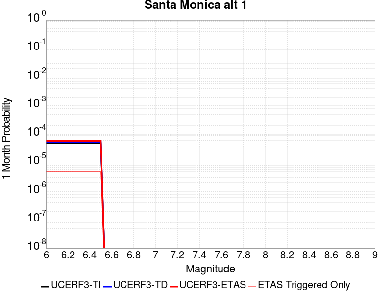 |  |  |

| Magnitude | 1 wk TI Prob | 1 wk TD Prob | 1 wk ETAS Prob | 1 wk ETAS/TD Gain | 1 wk ETAS Triggered Only | 1 mo TI Prob | 1 mo TD Prob | 1 mo ETAS Prob | 1 mo ETAS/TD Gain | 1 mo ETAS Triggered Only | 1 yr TI Prob | 1 yr TD Prob | 1 yr ETAS Prob | 1 yr ETAS/TD Gain | 1 yr ETAS Triggered Only | 10 yr TI Prob | 10 yr TD Prob | 10 yr ETAS Prob | 10 yr ETAS/TD Gain | 10 yr ETAS Triggered Only |
|-----|-----|-----|-----|-----|-----|-----|-----|-----|-----|-----|-----|-----|-----|-----|-----|-----|-----|-----|-----|-----|
| 6.0 | 1.14914055E-5 | 1.2581658E-5 | 2.1226291E-5 | 1.6870823 | 8.644743E-6 | 4.9247952E-5 | 5.392139E-5 | 6.256567E-5 | 1.1603125 | 8.644743E-6 | 5.9942884E-4 | 6.564929E-4 | 6.716113E-4 | 1.023029 | 1.5128298E-5 | 0.005978145 | 0.006564929 | 0.006588546 | 1.0035975 | 2.377304E-5 |
| 6.1 | 1.14914055E-5 | 1.2581658E-5 | 2.1226291E-5 | 1.6870823 | 8.644743E-6 | 4.9247952E-5 | 5.392139E-5 | 6.256567E-5 | 1.1603125 | 8.644743E-6 | 5.9942884E-4 | 6.564929E-4 | 6.716113E-4 | 1.023029 | 1.5128298E-5 | 0.005978145 | 0.006564929 | 0.006588546 | 1.0035975 | 2.377304E-5 |
| 6.2 | 1.14914055E-5 | 1.2581658E-5 | 2.1226291E-5 | 1.6870823 | 8.644743E-6 | 4.9247952E-5 | 5.392139E-5 | 6.256567E-5 | 1.1603125 | 8.644743E-6 | 5.9942884E-4 | 6.564929E-4 | 6.716113E-4 | 1.023029 | 1.5128298E-5 | 0.005978145 | 0.006564929 | 0.006588546 | 1.0035975 | 2.377304E-5 |
| 6.3 | 1.14914055E-5 | 1.2581658E-5 | 2.1226291E-5 | 1.6870823 | 8.644743E-6 | 4.9247952E-5 | 5.392139E-5 | 6.256567E-5 | 1.1603125 | 8.644743E-6 | 5.9942884E-4 | 6.564929E-4 | 6.716113E-4 | 1.023029 | 1.5128298E-5 | 0.005978145 | 0.006564929 | 0.006588546 | 1.0035975 | 2.377304E-5 |
| 6.4 | 1.14914055E-5 | 1.2581658E-5 | 2.1226291E-5 | 1.6870823 | 8.644743E-6 | 4.9247952E-5 | 5.392139E-5 | 6.256567E-5 | 1.1603125 | 8.644743E-6 | 5.9942884E-4 | 6.564929E-4 | 6.716113E-4 | 1.023029 | 1.5128298E-5 | 0.005978145 | 0.006564929 | 0.006588546 | 1.0035975 | 2.377304E-5 |
| 6.5 | 1.14914055E-5 | 1.2581658E-5 | 2.1226291E-5 | 1.6870823 | 8.644743E-6 | 4.9247952E-5 | 5.392139E-5 | 6.256567E-5 | 1.1603125 | 8.644743E-6 | 5.9942884E-4 | 6.564929E-4 | 6.716113E-4 | 1.023029 | 1.5128298E-5 | 0.005978145 | 0.006564929 | 0.006588546 | 1.0035975 | 2.377304E-5 |

## Rose Canyon
*[(top)](#table-of-contents)*

| 1 Week | 1 Month | 1 Year | 10 Year |
|-----|-----|-----|-----|
|  | 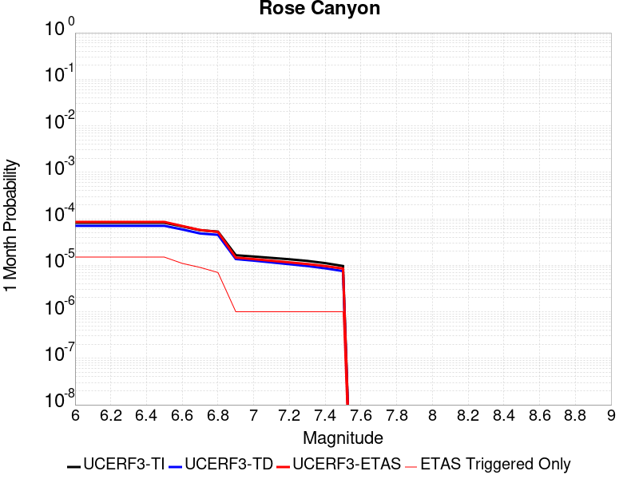 |  |  |

| Magnitude | 1 wk TI Prob | 1 wk TD Prob | 1 wk ETAS Prob | 1 wk ETAS/TD Gain | 1 wk ETAS Triggered Only | 1 mo TI Prob | 1 mo TD Prob | 1 mo ETAS Prob | 1 mo ETAS/TD Gain | 1 mo ETAS Triggered Only | 1 yr TI Prob | 1 yr TD Prob | 1 yr ETAS Prob | 1 yr ETAS/TD Gain | 1 yr ETAS Triggered Only | 10 yr TI Prob | 10 yr TD Prob | 10 yr ETAS Prob | 10 yr ETAS/TD Gain | 10 yr ETAS Triggered Only |
|-----|-----|-----|-----|-----|-----|-----|-----|-----|-----|-----|-----|-----|-----|-----|-----|-----|-----|-----|-----|-----|
| 6.0 | 1.9167945E-5 | 1.6478027E-5 | 2.9444926E-5 | 1.7869207 | 1.2967113E-5 | 8.214574E-5 | 7.06186E-5 | 8.358479E-5 | 1.1836089 | 1.2967113E-5 | 9.996655E-4 | 8.5951196E-4 | 8.7894587E-4 | 1.0226104 | 1.945067E-5 | 0.009951805 | 0.008568751 | 0.00859232 | 1.0027506 | 2.377304E-5 |
| 6.1 | 1.9167945E-5 | 1.6478027E-5 | 2.9444926E-5 | 1.7869207 | 1.2967113E-5 | 8.214574E-5 | 7.06186E-5 | 8.358479E-5 | 1.1836089 | 1.2967113E-5 | 9.996655E-4 | 8.5951196E-4 | 8.7894587E-4 | 1.0226104 | 1.945067E-5 | 0.009951805 | 0.008568751 | 0.00859232 | 1.0027506 | 2.377304E-5 |
| 6.2 | 1.9167945E-5 | 1.6478027E-5 | 2.9444926E-5 | 1.7869207 | 1.2967113E-5 | 8.214574E-5 | 7.06186E-5 | 8.358479E-5 | 1.1836089 | 1.2967113E-5 | 9.996655E-4 | 8.5951196E-4 | 8.7894587E-4 | 1.0226104 | 1.945067E-5 | 0.009951805 | 0.008568751 | 0.00859232 | 1.0027506 | 2.377304E-5 |
| 6.3 | 1.9167945E-5 | 1.6478027E-5 | 2.9444926E-5 | 1.7869207 | 1.2967113E-5 | 8.214574E-5 | 7.06186E-5 | 8.358479E-5 | 1.1836089 | 1.2967113E-5 | 9.996655E-4 | 8.5951196E-4 | 8.7894587E-4 | 1.0226104 | 1.945067E-5 | 0.009951805 | 0.008568751 | 0.00859232 | 1.0027506 | 2.377304E-5 |
| 6.4 | 1.9167945E-5 | 1.6478027E-5 | 2.9444926E-5 | 1.7869207 | 1.2967113E-5 | 8.214574E-5 | 7.06186E-5 | 8.358479E-5 | 1.1836089 | 1.2967113E-5 | 9.996655E-4 | 8.5951196E-4 | 8.7894587E-4 | 1.0226104 | 1.945067E-5 | 0.009951805 | 0.008568751 | 0.00859232 | 1.0027506 | 2.377304E-5 |
| 6.5 | 1.9167945E-5 | 1.6478027E-5 | 2.9444926E-5 | 1.7869207 | 1.2967113E-5 | 8.214574E-5 | 7.06186E-5 | 8.358479E-5 | 1.1836089 | 1.2967113E-5 | 9.996655E-4 | 8.5951196E-4 | 8.7894587E-4 | 1.0226104 | 1.945067E-5 | 0.009951805 | 0.008568751 | 0.00859232 | 1.0027506 | 2.377304E-5 |
| 6.6 | 1.6032436E-5 | 1.3771202E-5 | 2.457698E-5 | 1.7846649 | 1.0805928E-5 | 6.870863E-5 | 5.901849E-5 | 6.982378E-5 | 1.1830832 | 1.0805928E-5 | 8.362065E-4 | 7.183819E-4 | 7.35659E-4 | 1.02405 | 1.7289485E-5 | 0.008330669 | 0.0071673454 | 0.0071888026 | 1.0029937 | 2.1611855E-5 |
| 6.7 | 1.32651885E-5 | 1.1282621E-5 | 1.9927265E-5 | 1.7661911 | 8.644743E-6 | 5.684957E-5 | 4.8353573E-5 | 5.69979E-5 | 1.1787732 | 8.644743E-6 | 6.919237E-4 | 5.8861315E-4 | 6.0373254E-4 | 1.0256865 | 1.5128298E-5 | 0.0068977326 | 0.005877156 | 0.005896492 | 1.00329 | 1.945067E-5 |
| 6.8 | 1.2374002E-5 | 1.0546746E-5 | 1.7030234E-5 | 1.6147382 | 6.4835567E-6 | 5.303036E-5 | 4.5199937E-5 | 5.16832E-5 | 1.1434352 | 6.4835567E-6 | 6.4545334E-4 | 5.5023754E-4 | 5.6319754E-4 | 1.0235534 | 1.2967113E-5 | 0.006435818 | 0.005495354 | 0.0055125486 | 1.0031289 | 1.7289485E-5 |
| 6.9 | 3.8401595E-6 | 3.178941E-6 | 5.3401195E-6 | 1.6798424 | 2.1611856E-6 | 1.6457723E-5 | 1.3623983E-5 | 1.578514E-5 | 1.1586288 | 2.1611856E-6 | 2.0035435E-4 | 1.6586324E-4 | 1.701849E-4 | 1.0260556 | 4.3223713E-6 | 0.0020017382 | 0.0016577742 | 0.0016620894 | 1.002603 | 4.3223713E-6 |
| 7.0 | 3.6026508E-6 | 2.9376413E-6 | 5.0988206E-6 | 1.7356852 | 2.1611856E-6 | 1.543984E-5 | 1.2589852E-5 | 1.4751011E-5 | 1.1716588 | 2.1611856E-6 | 1.8796384E-4 | 1.5327454E-4 | 1.5759624E-4 | 1.0281959 | 4.3223713E-6 | 0.0018780495 | 0.0015320673 | 0.0015363831 | 1.0028169 | 4.3223713E-6 |
| 7.1 | 3.3657313E-6 | 2.6902792E-6 | 4.851459E-6 | 1.8033291 | 2.1611856E-6 | 1.4424483E-5 | 1.1529739E-5 | 1.3690899E-5 | 1.1874423 | 2.1611856E-6 | 1.7560393E-4 | 1.4036939E-4 | 1.4469115E-4 | 1.0307885 | 4.3223713E-6 | 0.0017546522 | 0.0014031857 | 0.001407502 | 1.0030761 | 4.3223713E-6 |
| 7.2 | 3.1430025E-6 | 2.4618412E-6 | 4.623021E-6 | 1.8778715 | 2.1611856E-6 | 1.3469941E-5 | 1.0550727E-5 | 1.2711889E-5 | 1.2048354 | 2.1611856E-6 | 1.639842E-4 | 1.2845139E-4 | 1.3277319E-4 | 1.0336455 | 4.3223713E-6 | 0.0016386324 | 0.0012841492 | 0.001288466 | 1.0033616 | 4.3223713E-6 |
| 7.3 | 2.898987E-6 | 2.2514312E-6 | 4.412612E-6 | 1.9599141 | 2.1611856E-6 | 1.24241715E-5 | 9.648977E-6 | 1.1810142E-5 | 1.2239786 | 2.1611856E-6 | 1.5125379E-4 | 1.1747381E-4 | 1.21795674E-4 | 1.03679 | 4.3223713E-6 | 0.0015115088 | 0.0011744945 | 0.0011788119 | 1.0036758 | 4.3223713E-6 |
| 7.4 | 2.5994284E-6 | 2.0116724E-6 | 4.1728536E-6 | 2.0743206 | 2.1611856E-6 | 1.114036E-5 | 8.621447E-6 | 1.0782614E-5 | 1.2506733 | 2.1611856E-6 | 1.3562544E-4 | 1.049649E-4 | 1.0928682E-4 | 1.0411749 | 4.3223713E-6 | 0.0013554269 | 0.00104953 | 0.0010538478 | 1.004114 | 4.3223713E-6 |
| 7.5 | 2.2517988E-6 | 1.7516537E-6 | 3.9128354E-6 | 2.2337952 | 2.1611856E-6 | 9.650531E-6 | 7.5070875E-6 | 9.668257E-6 | 1.2878839 | 2.1611856E-6 | 1.17488875E-4 | 9.139879E-5 | 9.572077E-5 | 1.047287 | 4.3223713E-6 | 0.0011742678 | 9.1398787E-4 | 9.183063E-4 | 1.0047249 | 4.3223713E-6 |

## Johnson Valley (No) 2011 rev
*[(top)](#table-of-contents)*

| 1 Week | 1 Month | 1 Year | 10 Year |
|-----|-----|-----|-----|
|  |  |  |  |

| Magnitude | 1 wk TI Prob | 1 wk TD Prob | 1 wk ETAS Prob | 1 wk ETAS/TD Gain | 1 wk ETAS Triggered Only | 1 mo TI Prob | 1 mo TD Prob | 1 mo ETAS Prob | 1 mo ETAS/TD Gain | 1 mo ETAS Triggered Only | 1 yr TI Prob | 1 yr TD Prob | 1 yr ETAS Prob | 1 yr ETAS/TD Gain | 1 yr ETAS Triggered Only | 10 yr TI Prob | 10 yr TD Prob | 10 yr ETAS Prob | 10 yr ETAS/TD Gain | 10 yr ETAS Triggered Only |
|-----|-----|-----|-----|-----|-----|-----|-----|-----|-----|-----|-----|-----|-----|-----|-----|-----|-----|-----|-----|-----|
| 6.0 | 1.5411064E-5 | 1.0176766E-5 | 1.6660257E-5 | 1.6370875 | 6.4835567E-6 | 6.6045744E-5 | 4.3614225E-5 | 5.225859E-5 | 1.1982006 | 8.644743E-6 | 8.0381025E-4 | 5.3091673E-4 | 5.48197E-4 | 1.0325481 | 1.7289485E-5 | 0.00800909 | 0.005300697 | 0.005322194 | 1.0040556 | 2.1611855E-5 |
| 6.1 | 1.5411064E-5 | 1.0176766E-5 | 1.6660257E-5 | 1.6370875 | 6.4835567E-6 | 6.6045744E-5 | 4.3614225E-5 | 5.225859E-5 | 1.1982006 | 8.644743E-6 | 8.0381025E-4 | 5.3091673E-4 | 5.48197E-4 | 1.0325481 | 1.7289485E-5 | 0.00800909 | 0.005300697 | 0.005322194 | 1.0040556 | 2.1611855E-5 |
| 6.2 | 1.5411064E-5 | 1.0176766E-5 | 1.6660257E-5 | 1.6370875 | 6.4835567E-6 | 6.6045744E-5 | 4.3614225E-5 | 5.225859E-5 | 1.1982006 | 8.644743E-6 | 8.0381025E-4 | 5.3091673E-4 | 5.48197E-4 | 1.0325481 | 1.7289485E-5 | 0.00800909 | 0.005300697 | 0.005322194 | 1.0040556 | 2.1611855E-5 |
| 6.3 | 1.5411064E-5 | 1.0176766E-5 | 1.6660257E-5 | 1.6370875 | 6.4835567E-6 | 6.6045744E-5 | 4.3614225E-5 | 5.225859E-5 | 1.1982006 | 8.644743E-6 | 8.0381025E-4 | 5.3091673E-4 | 5.48197E-4 | 1.0325481 | 1.7289485E-5 | 0.00800909 | 0.005300697 | 0.005322194 | 1.0040556 | 2.1611855E-5 |
| 6.4 | 1.5411064E-5 | 1.0176766E-5 | 1.6660257E-5 | 1.6370875 | 6.4835567E-6 | 6.6045744E-5 | 4.3614225E-5 | 5.225859E-5 | 1.1982006 | 8.644743E-6 | 8.0381025E-4 | 5.3091673E-4 | 5.48197E-4 | 1.0325481 | 1.7289485E-5 | 0.00800909 | 0.005300697 | 0.005322194 | 1.0040556 | 2.1611855E-5 |
| 6.5 | 1.5411064E-5 | 1.0176766E-5 | 1.6660257E-5 | 1.6370875 | 6.4835567E-6 | 6.6045744E-5 | 4.3614225E-5 | 5.225859E-5 | 1.1982006 | 8.644743E-6 | 8.0381025E-4 | 5.3091673E-4 | 5.48197E-4 | 1.0325481 | 1.7289485E-5 | 0.00800909 | 0.005300697 | 0.005322194 | 1.0040556 | 2.1611855E-5 |
| 6.6 | 1.4834682E-5 | 9.547515E-6 | 1.603101E-5 | 1.6790767 | 6.4835567E-6 | 6.357566E-5 | 4.091752E-5 | 4.956191E-5 | 1.2112638 | 8.644743E-6 | 7.7375874E-4 | 4.9809937E-4 | 5.1538023E-4 | 1.0346936 | 1.7289485E-5 | 0.0077107013 | 0.0049739927 | 0.004995497 | 1.0043234 | 2.1611855E-5 |
| 6.7 | 1.0814841E-5 | 5.8714368E-6 | 8.03261E-6 | 1.3680824 | 2.1611856E-6 | 4.6348494E-5 | 2.5163265E-5 | 2.7324395E-5 | 1.0858843 | 2.1611856E-6 | 5.641468E-4 | 3.063563E-4 | 3.1283786E-4 | 1.021157 | 6.4835567E-6 | 0.005627168 | 0.0030629311 | 0.003073704 | 1.0035172 | 1.0805928E-5 |
| 6.8 | 1.0245956E-5 | 5.404906E-6 | 7.56608E-6 | 1.3998541 | 2.1611856E-6 | 4.3910502E-5 | 2.3163884E-5 | 2.5325018E-5 | 1.0932976 | 2.1611856E-6 | 5.344792E-4 | 2.8202028E-4 | 2.88502E-4 | 1.0229832 | 6.4835567E-6 | 0.0053319554 | 0.0028202015 | 0.0028309769 | 1.0038208 | 1.0805928E-5 |
| 6.9 | 3.2082864E-6 | 9.347539E-10 | 9.347539E-10 | 1.0 | 0.0 | 1.3749726E-5 | 4.006089E-9 | 4.006089E-9 | 1.0 | 0.0 | 1.6739006E-4 | 4.8774126E-8 | 4.8774126E-8 | 1.0 | 0.0 | 0.0016726403 | 4.8774126E-7 | 4.8774126E-7 | 1.0 | 0.0 |
| 7.0 | 3.1573343E-6 | 9.347539E-10 | 9.347539E-10 | 1.0 | 0.0 | 1.3531363E-5 | 4.006089E-9 | 4.006089E-9 | 1.0 | 0.0 | 1.6473189E-4 | 4.8774126E-8 | 4.8774126E-8 | 1.0 | 0.0 | 0.0016460982 | 4.8774126E-7 | 4.8774126E-7 | 1.0 | 0.0 |
| 7.1 | 3.0995338E-6 | 9.347539E-10 | 9.347539E-10 | 1.0 | 0.0 | 1.32836485E-5 | 4.006089E-9 | 4.006089E-9 | 1.0 | 0.0 | 1.6171642E-4 | 4.8774126E-8 | 4.8774126E-8 | 1.0 | 0.0 | 0.0016159879 | 4.8774126E-7 | 4.8774126E-7 | 1.0 | 0.0 |
| 7.2 | 2.8879267E-6 | 9.331039E-10 | 9.331039E-10 | 1.0 | 0.0 | 1.237677E-5 | 3.999017E-9 | 3.999017E-9 | 1.0 | 0.0 | 1.5067676E-4 | 4.868803E-8 | 4.868803E-8 | 1.0 | 0.0 | 0.0015057464 | 4.868803E-7 | 4.868803E-7 | 1.0 | 0.0 |
| 7.3 | 2.4973094E-6 | 8.4248597E-10 | 8.4248597E-10 | 1.0 | 0.0 | 1.0702711E-5 | 3.6106542E-9 | 3.6106542E-9 | 1.0 | 0.0 | 1.3029772E-4 | 4.3959716E-8 | 4.3959716E-8 | 1.0 | 0.0 | 0.0013022134 | 4.3959716E-7 | 4.3959716E-7 | 1.0 | 0.0 |

## San Jacinto (Superstition Mtn)
*[(top)](#table-of-contents)*

| 1 Week | 1 Month | 1 Year | 10 Year |
|-----|-----|-----|-----|
|  |  |  |  |

| Magnitude | 1 wk TI Prob | 1 wk TD Prob | 1 wk ETAS Prob | 1 wk ETAS/TD Gain | 1 wk ETAS Triggered Only | 1 mo TI Prob | 1 mo TD Prob | 1 mo ETAS Prob | 1 mo ETAS/TD Gain | 1 mo ETAS Triggered Only | 1 yr TI Prob | 1 yr TD Prob | 1 yr ETAS Prob | 1 yr ETAS/TD Gain | 1 yr ETAS Triggered Only | 10 yr TI Prob | 10 yr TD Prob | 10 yr ETAS Prob | 10 yr ETAS/TD Gain | 10 yr ETAS Triggered Only |
|-----|-----|-----|-----|-----|-----|-----|-----|-----|-----|-----|-----|-----|-----|-----|-----|-----|-----|-----|-----|-----|
| 6.0 | 6.369931E-5 | 1.1782884E-4 | 1.221507E-4 | 1.0366791 | 4.3223713E-6 | 2.729685E-4 | 5.049214E-4 | 5.0924165E-4 | 1.0085561 | 4.3223713E-6 | 0.003318327 | 0.006136903 | 0.006143347 | 1.00105 | 6.4835567E-6 | 0.032692123 | 0.059778612 | 0.05979893 | 1.0003399 | 2.1611855E-5 |
| 6.1 | 6.369931E-5 | 1.1782884E-4 | 1.221507E-4 | 1.0366791 | 4.3223713E-6 | 2.729685E-4 | 5.049214E-4 | 5.0924165E-4 | 1.0085561 | 4.3223713E-6 | 0.003318327 | 0.006136903 | 0.006143347 | 1.00105 | 6.4835567E-6 | 0.032692123 | 0.059778612 | 0.05979893 | 1.0003399 | 2.1611855E-5 |
| 6.2 | 6.369931E-5 | 1.1782884E-4 | 1.221507E-4 | 1.0366791 | 4.3223713E-6 | 2.729685E-4 | 5.049214E-4 | 5.0924165E-4 | 1.0085561 | 4.3223713E-6 | 0.003318327 | 0.006136903 | 0.006143347 | 1.00105 | 6.4835567E-6 | 0.032692123 | 0.059778612 | 0.05979893 | 1.0003399 | 2.1611855E-5 |
| 6.3 | 6.369931E-5 | 1.1782884E-4 | 1.221507E-4 | 1.0366791 | 4.3223713E-6 | 2.729685E-4 | 5.049214E-4 | 5.0924165E-4 | 1.0085561 | 4.3223713E-6 | 0.003318327 | 0.006136903 | 0.006143347 | 1.00105 | 6.4835567E-6 | 0.032692123 | 0.059778612 | 0.05979893 | 1.0003399 | 2.1611855E-5 |
| 6.4 | 6.369931E-5 | 1.1782884E-4 | 1.221507E-4 | 1.0366791 | 4.3223713E-6 | 2.729685E-4 | 5.049214E-4 | 5.0924165E-4 | 1.0085561 | 4.3223713E-6 | 0.003318327 | 0.006136903 | 0.006143347 | 1.00105 | 6.4835567E-6 | 0.032692123 | 0.059778612 | 0.05979893 | 1.0003399 | 2.1611855E-5 |
| 6.5 | 6.369931E-5 | 1.1782884E-4 | 1.221507E-4 | 1.0366791 | 4.3223713E-6 | 2.729685E-4 | 5.049214E-4 | 5.0924165E-4 | 1.0085561 | 4.3223713E-6 | 0.003318327 | 0.006136903 | 0.006143347 | 1.00105 | 6.4835567E-6 | 0.032692123 | 0.059778612 | 0.05979893 | 1.0003399 | 2.1611855E-5 |
| 6.6 | 6.356468E-5 | 1.1754235E-4 | 1.21864214E-4 | 1.0367686 | 4.3223713E-6 | 2.723916E-4 | 5.036941E-4 | 5.080143E-4 | 1.008577 | 4.3223713E-6 | 0.003311325 | 0.0061220443 | 0.006128488 | 1.0010526 | 6.4835567E-6 | 0.032624163 | 0.059641294 | 0.05966162 | 1.0003407 | 2.1611855E-5 |
| 6.7 | 3.0048706E-5 | 4.931984E-5 | 5.1480918E-5 | 1.0438176 | 2.1611856E-6 | 1.2877381E-4 | 2.1135958E-4 | 2.1352031E-4 | 1.010223 | 2.1611856E-6 | 0.0015666935 | 0.0025713246 | 0.0025756357 | 1.0016767 | 4.3223713E-6 | 0.015556943 | 0.025631001 | 0.02564153 | 1.0004108 | 1.0805928E-5 |
| 6.8 | 2.9819825E-5 | 4.8735175E-5 | 5.0896255E-5 | 1.0443434 | 2.1611856E-6 | 1.2779298E-4 | 2.088543E-4 | 2.1101502E-4 | 1.0103457 | 2.1611856E-6 | 0.0015547692 | 0.0025408939 | 0.0025430496 | 1.0008484 | 2.1611856E-6 | 0.015439362 | 0.025341224 | 0.025349649 | 1.0003325 | 8.644743E-6 |
| 6.9 | 2.9555731E-5 | 4.8134865E-5 | 5.029595E-5 | 1.0448964 | 2.1611856E-6 | 1.2666127E-4 | 2.0628194E-4 | 2.0844268E-4 | 1.0104747 | 2.1611856E-6 | 0.0015410101 | 0.002509648 | 0.0025118038 | 1.000859 | 2.1611856E-6 | 0.015303677 | 0.025041468 | 0.025049897 | 1.0003365 | 8.644743E-6 |
| 7.0 | 2.915559E-5 | 4.744423E-5 | 4.9605314E-5 | 1.04555 | 2.1611856E-6 | 1.2494654E-4 | 2.0332253E-4 | 2.0548329E-4 | 1.0106272 | 2.1611856E-6 | 0.0015201626 | 0.0024736994 | 0.0024758554 | 1.0008715 | 2.1611856E-6 | 0.015098056 | 0.024688803 | 0.024697235 | 1.0003415 | 8.644743E-6 |
| 7.1 | 1.5605729E-5 | 2.3894689E-5 | 2.3894689E-5 | 1.0 | 0.0 | 6.687998E-5 | 1.0240406E-4 | 1.0240406E-4 | 1.0 | 0.0 | 8.139595E-4 | 0.0012464593 | 0.0012464593 | 1.0 | 0.0 | 0.008109846 | 0.01256506 | 0.012569327 | 1.0003396 | 4.3223713E-6 |
| 7.2 | 1.4951773E-5 | 2.282491E-5 | 2.282491E-5 | 1.0 | 0.0 | 6.407745E-5 | 9.781964E-5 | 9.781964E-5 | 1.0 | 0.0 | 7.7986374E-4 | 0.001190706 | 0.001190706 | 1.0 | 0.0 | 0.0077713258 | 0.012013012 | 0.012017282 | 1.0003555 | 4.3223713E-6 |
| 7.3 | 1.3807349E-5 | 2.1078144E-5 | 2.1078144E-5 | 1.0 | 0.0 | 5.917301E-5 | 9.033404E-5 | 9.033404E-5 | 1.0 | 0.0 | 7.2019326E-4 | 0.0010996633 | 0.0010996633 | 1.0 | 0.0 | 0.0071786367 | 0.011102179 | 0.011106454 | 1.000385 | 4.3223713E-6 |
| 7.4 | 2.3105063E-6 | 3.2496644E-6 | 3.2496644E-6 | 1.0 | 0.0 | 9.902133E-6 | 1.3927083E-5 | 1.3927083E-5 | 1.0 | 0.0 | 1.2055179E-4 | 1.6955346E-4 | 1.6955346E-4 | 1.0 | 0.0 | 0.0012048641 | 0.0017464611 | 0.0017486186 | 1.0012352 | 2.1611856E-6 |
| 7.5 | 2.3105063E-6 | 3.2496644E-6 | 3.2496644E-6 | 1.0 | 0.0 | 9.902133E-6 | 1.3927083E-5 | 1.3927083E-5 | 1.0 | 0.0 | 1.2055179E-4 | 1.6955346E-4 | 1.6955346E-4 | 1.0 | 0.0 | 0.0012048641 | 0.0017464611 | 0.0017486186 | 1.0012352 | 2.1611856E-6 |
| 7.6 | 2.3105063E-6 | 3.2496644E-6 | 3.2496644E-6 | 1.0 | 0.0 | 9.902133E-6 | 1.3927083E-5 | 1.3927083E-5 | 1.0 | 0.0 | 1.2055179E-4 | 1.6955346E-4 | 1.6955346E-4 | 1.0 | 0.0 | 0.0012048641 | 0.0017464611 | 0.0017486186 | 1.0012352 | 2.1611856E-6 |
| 7.7 | 1.5389671E-6 | 2.0643286E-6 | 2.0643286E-6 | 1.0 | 0.0 | 6.5955564E-6 | 8.847107E-6 | 8.847107E-6 | 1.0 | 0.0 | 8.029794E-5 | 1.07710875E-4 | 1.07710875E-4 | 1.0 | 0.0 | 8.0268935E-4 | 0.0011189707 | 0.0011211294 | 1.0019293 | 2.1611856E-6 |
| 7.8 | 7.6409924E-7 | 1.0693483E-6 | 1.0693483E-6 | 1.0 | 0.0 | 3.274707E-6 | 4.582921E-6 | 4.582921E-6 | 1.0 | 0.0 | 3.9868828E-5 | 5.5797067E-5 | 5.5797067E-5 | 1.0 | 0.0 | 3.9861677E-4 | 5.7725405E-4 | 5.79414E-4 | 1.0037417 | 2.1611856E-6 |

## Puente Hills
*[(top)](#table-of-contents)*

| 1 Week | 1 Month | 1 Year | 10 Year |
|-----|-----|-----|-----|
|  |  |  |  |

| Magnitude | 1 wk TI Prob | 1 wk TD Prob | 1 wk ETAS Prob | 1 wk ETAS/TD Gain | 1 wk ETAS Triggered Only | 1 mo TI Prob | 1 mo TD Prob | 1 mo ETAS Prob | 1 mo ETAS/TD Gain | 1 mo ETAS Triggered Only | 1 yr TI Prob | 1 yr TD Prob | 1 yr ETAS Prob | 1 yr ETAS/TD Gain | 1 yr ETAS Triggered Only | 10 yr TI Prob | 10 yr TD Prob | 10 yr ETAS Prob | 10 yr ETAS/TD Gain | 10 yr ETAS Triggered Only |
|-----|-----|-----|-----|-----|-----|-----|-----|-----|-----|-----|-----|-----|-----|-----|-----|-----|-----|-----|-----|-----|
| 6.0 | 1.0287503E-5 | 2.7754043E-6 | 4.936584E-6 | 1.77869 | 2.1611856E-6 | 4.4088552E-5 | 1.189455E-5 | 1.405571E-5 | 1.1816933 | 2.1611856E-6 | 5.3664594E-4 | 1.4480915E-4 | 1.577744E-4 | 1.0895332 | 1.2967113E-5 | 0.0053535183 | 0.0014474059 | 0.0014689865 | 1.0149099 | 2.1611855E-5 |
| 6.1 | 1.0287503E-5 | 2.7754043E-6 | 4.936584E-6 | 1.77869 | 2.1611856E-6 | 4.4088552E-5 | 1.189455E-5 | 1.405571E-5 | 1.1816933 | 2.1611856E-6 | 5.3664594E-4 | 1.4480915E-4 | 1.577744E-4 | 1.0895332 | 1.2967113E-5 | 0.0053535183 | 0.0014474059 | 0.0014689865 | 1.0149099 | 2.1611855E-5 |
| 6.2 | 1.0287503E-5 | 2.7754043E-6 | 4.936584E-6 | 1.77869 | 2.1611856E-6 | 4.4088552E-5 | 1.189455E-5 | 1.405571E-5 | 1.1816933 | 2.1611856E-6 | 5.3664594E-4 | 1.4480915E-4 | 1.577744E-4 | 1.0895332 | 1.2967113E-5 | 0.0053535183 | 0.0014474059 | 0.0014689865 | 1.0149099 | 2.1611855E-5 |
| 6.3 | 1.0287503E-5 | 2.7754043E-6 | 4.936584E-6 | 1.77869 | 2.1611856E-6 | 4.4088552E-5 | 1.189455E-5 | 1.405571E-5 | 1.1816933 | 2.1611856E-6 | 5.3664594E-4 | 1.4480915E-4 | 1.577744E-4 | 1.0895332 | 1.2967113E-5 | 0.0053535183 | 0.0014474059 | 0.0014689865 | 1.0149099 | 2.1611855E-5 |
| 6.4 | 1.0287503E-5 | 2.7754043E-6 | 4.936584E-6 | 1.77869 | 2.1611856E-6 | 4.4088552E-5 | 1.189455E-5 | 1.405571E-5 | 1.1816933 | 2.1611856E-6 | 5.3664594E-4 | 1.4480915E-4 | 1.577744E-4 | 1.0895332 | 1.2967113E-5 | 0.0053535183 | 0.0014474059 | 0.0014689865 | 1.0149099 | 2.1611855E-5 |
| 6.5 | 1.0287503E-5 | 2.7754043E-6 | 4.936584E-6 | 1.77869 | 2.1611856E-6 | 4.4088552E-5 | 1.189455E-5 | 1.405571E-5 | 1.1816933 | 2.1611856E-6 | 5.3664594E-4 | 1.4480915E-4 | 1.577744E-4 | 1.0895332 | 1.2967113E-5 | 0.0053535183 | 0.0014474059 | 0.0014689865 | 1.0149099 | 2.1611855E-5 |
| 6.6 | 1.0067095E-5 | 2.542514E-6 | 4.7036942E-6 | 1.850017 | 2.1611856E-6 | 4.314398E-5 | 1.0896458E-5 | 1.3057619E-5 | 1.1983362 | 2.1611856E-6 | 5.251514E-4 | 1.3265885E-4 | 1.4562425E-4 | 1.0977348 | 1.2967113E-5 | 0.0052391207 | 0.0013260479 | 0.0013476311 | 1.0162764 | 2.1611855E-5 |
| 6.7 | 7.591482E-6 | 1.9997742E-6 | 4.1609555E-6 | 2.0807126 | 2.1611856E-6 | 3.2534514E-5 | 8.570445E-6 | 1.0731612E-5 | 1.2521651 | 2.1611856E-6 | 3.9603573E-4 | 1.0434237E-4 | 1.1298621E-4 | 1.0828412 | 8.644743E-6 | 0.003953307 | 0.0010431492 | 0.0010582617 | 1.0144874 | 1.5128298E-5 |
| 6.8 | 7.141342E-6 | 1.7041792E-6 | 3.865361E-6 | 2.2681658 | 2.1611856E-6 | 3.060539E-5 | 7.3036163E-6 | 9.464786E-6 | 1.295904 | 2.1611856E-6 | 3.7255694E-4 | 8.891999E-5 | 9.540297E-5 | 1.072908 | 6.4835567E-6 | 0.0037193296 | 8.8904874E-4 | 9.0200437E-4 | 1.0145724 | 1.2967113E-5 |
| 6.9 | 6.066927E-6 | 1.6035817E-6 | 3.7647637E-6 | 2.3477218 | 2.1611856E-6 | 2.6000856E-5 | 6.8724867E-6 | 9.033657E-6 | 1.3144671 | 2.1611856E-6 | 3.1651446E-4 | 8.367139E-5 | 9.01544E-5 | 1.0774819 | 6.4835567E-6 | 0.0031606401 | 8.3660224E-4 | 8.495585E-4 | 1.0154867 | 1.2967113E-5 |
| 7.0 | 4.852166E-6 | 1.2478142E-6 | 3.4089971E-6 | 2.7319748 | 2.1611856E-6 | 2.0794832E-5 | 5.347775E-6 | 7.5089492E-6 | 1.4041258 | 2.1611856E-6 | 2.5314768E-4 | 6.510917E-5 | 7.15923E-5 | 1.0995733 | 6.4835567E-6 | 0.0025285948 | 6.510916E-4 | 6.6405034E-4 | 1.019903 | 1.2967113E-5 |

## Great Valley 14 (Kettleman Hills)
*[(top)](#table-of-contents)*

| 1 Week | 1 Month | 1 Year | 10 Year |
|-----|-----|-----|-----|
|  |  |  |  |

| Magnitude | 1 wk TI Prob | 1 wk TD Prob | 1 wk ETAS Prob | 1 wk ETAS/TD Gain | 1 wk ETAS Triggered Only | 1 mo TI Prob | 1 mo TD Prob | 1 mo ETAS Prob | 1 mo ETAS/TD Gain | 1 mo ETAS Triggered Only | 1 yr TI Prob | 1 yr TD Prob | 1 yr ETAS Prob | 1 yr ETAS/TD Gain | 1 yr ETAS Triggered Only | 10 yr TI Prob | 10 yr TD Prob | 10 yr ETAS Prob | 10 yr ETAS/TD Gain | 10 yr ETAS Triggered Only |
|-----|-----|-----|-----|-----|-----|-----|-----|-----|-----|-----|-----|-----|-----|-----|-----|-----|-----|-----|-----|-----|
| 6.0 | 2.0537544E-5 | 2.4301013E-5 | 2.8623279E-5 | 1.1778636 | 4.3223713E-6 | 8.801508E-5 | 1.041472E-4 | 1.14951996E-4 | 1.1037455 | 1.0805928E-5 | 0.0010710567 | 0.0012679921 | 0.0012831013 | 1.0119158 | 1.5128298E-5 | 0.010659092 | 0.0126799205 | 0.012701258 | 1.0016828 | 2.1611855E-5 |
| 6.1 | 2.0537544E-5 | 2.4301013E-5 | 2.8623279E-5 | 1.1778636 | 4.3223713E-6 | 8.801508E-5 | 1.041472E-4 | 1.14951996E-4 | 1.1037455 | 1.0805928E-5 | 0.0010710567 | 0.0012679921 | 0.0012831013 | 1.0119158 | 1.5128298E-5 | 0.010659092 | 0.0126799205 | 0.012701258 | 1.0016828 | 2.1611855E-5 |
| 6.2 | 2.0537544E-5 | 2.4301013E-5 | 2.8623279E-5 | 1.1778636 | 4.3223713E-6 | 8.801508E-5 | 1.041472E-4 | 1.14951996E-4 | 1.1037455 | 1.0805928E-5 | 0.0010710567 | 0.0012679921 | 0.0012831013 | 1.0119158 | 1.5128298E-5 | 0.010659092 | 0.0126799205 | 0.012701258 | 1.0016828 | 2.1611855E-5 |
| 6.3 | 2.0537544E-5 | 2.4301013E-5 | 2.8623279E-5 | 1.1778636 | 4.3223713E-6 | 8.801508E-5 | 1.041472E-4 | 1.14951996E-4 | 1.1037455 | 1.0805928E-5 | 0.0010710567 | 0.0012679921 | 0.0012831013 | 1.0119158 | 1.5128298E-5 | 0.010659092 | 0.0126799205 | 0.012701258 | 1.0016828 | 2.1611855E-5 |
| 6.4 | 2.0537544E-5 | 2.4301013E-5 | 2.8623279E-5 | 1.1778636 | 4.3223713E-6 | 8.801508E-5 | 1.041472E-4 | 1.14951996E-4 | 1.1037455 | 1.0805928E-5 | 0.0010710567 | 0.0012679921 | 0.0012831013 | 1.0119158 | 1.5128298E-5 | 0.010659092 | 0.0126799205 | 0.012701258 | 1.0016828 | 2.1611855E-5 |
| 6.5 | 2.0537544E-5 | 2.4301013E-5 | 2.8623279E-5 | 1.1778636 | 4.3223713E-6 | 8.801508E-5 | 1.041472E-4 | 1.14951996E-4 | 1.1037455 | 1.0805928E-5 | 0.0010710567 | 0.0012679921 | 0.0012831013 | 1.0119158 | 1.5128298E-5 | 0.010659092 | 0.0126799205 | 0.012701258 | 1.0016828 | 2.1611855E-5 |
| 6.6 | 2.0537544E-5 | 2.4301013E-5 | 2.8623279E-5 | 1.1778636 | 4.3223713E-6 | 8.801508E-5 | 1.041472E-4 | 1.14951996E-4 | 1.1037455 | 1.0805928E-5 | 0.0010710567 | 0.0012679921 | 0.0012831013 | 1.0119158 | 1.5128298E-5 | 0.010659092 | 0.0126799205 | 0.012701258 | 1.0016828 | 2.1611855E-5 |
| 6.7 | 2.0537544E-5 | 2.4301013E-5 | 2.8623279E-5 | 1.1778636 | 4.3223713E-6 | 8.801508E-5 | 1.041472E-4 | 1.14951996E-4 | 1.1037455 | 1.0805928E-5 | 0.0010710567 | 0.0012679921 | 0.0012831013 | 1.0119158 | 1.5128298E-5 | 0.010659092 | 0.0126799205 | 0.012701258 | 1.0016828 | 2.1611855E-5 |
| 6.8 | 2.0537544E-5 | 2.4301013E-5 | 2.8623279E-5 | 1.1778636 | 4.3223713E-6 | 8.801508E-5 | 1.041472E-4 | 1.14951996E-4 | 1.1037455 | 1.0805928E-5 | 0.0010710567 | 0.0012679921 | 0.0012831013 | 1.0119158 | 1.5128298E-5 | 0.010659092 | 0.0126799205 | 0.012701258 | 1.0016828 | 2.1611855E-5 |
| 6.9 | 2.0537544E-5 | 2.4301013E-5 | 2.8623279E-5 | 1.1778636 | 4.3223713E-6 | 8.801508E-5 | 1.041472E-4 | 1.14951996E-4 | 1.1037455 | 1.0805928E-5 | 0.0010710567 | 0.0012679921 | 0.0012831013 | 1.0119158 | 1.5128298E-5 | 0.010659092 | 0.0126799205 | 0.012701258 | 1.0016828 | 2.1611855E-5 |

## San Gregorio (North) 2011 CFM
*[(top)](#table-of-contents)*

| 1 Week | 1 Month | 1 Year | 10 Year |
|-----|-----|-----|-----|
|  |  |  |  |

| Magnitude | 1 wk TI Prob | 1 wk TD Prob | 1 wk ETAS Prob | 1 wk ETAS/TD Gain | 1 wk ETAS Triggered Only | 1 mo TI Prob | 1 mo TD Prob | 1 mo ETAS Prob | 1 mo ETAS/TD Gain | 1 mo ETAS Triggered Only | 1 yr TI Prob | 1 yr TD Prob | 1 yr ETAS Prob | 1 yr ETAS/TD Gain | 1 yr ETAS Triggered Only | 10 yr TI Prob | 10 yr TD Prob | 10 yr ETAS Prob | 10 yr ETAS/TD Gain | 10 yr ETAS Triggered Only |
|-----|-----|-----|-----|-----|-----|-----|-----|-----|-----|-----|-----|-----|-----|-----|-----|-----|-----|-----|-----|-----|
| 6.0 | 5.5588036E-5 | 7.309379E-5 | 7.957687E-5 | 1.0886954 | 6.4835567E-6 | 2.3821268E-4 | 3.1322511E-4 | 3.2186715E-4 | 1.0275905 | 8.644743E-6 | 0.0028963822 | 0.0038075363 | 0.003820454 | 1.0033927 | 1.2967113E-5 | 0.028589217 | 0.037540782 | 0.0375595 | 1.0004987 | 1.945067E-5 |
| 6.1 | 5.5588036E-5 | 7.309379E-5 | 7.957687E-5 | 1.0886954 | 6.4835567E-6 | 2.3821268E-4 | 3.1322511E-4 | 3.2186715E-4 | 1.0275905 | 8.644743E-6 | 0.0028963822 | 0.0038075363 | 0.003820454 | 1.0033927 | 1.2967113E-5 | 0.028589217 | 0.037540782 | 0.0375595 | 1.0004987 | 1.945067E-5 |
| 6.2 | 5.5588036E-5 | 7.309379E-5 | 7.957687E-5 | 1.0886954 | 6.4835567E-6 | 2.3821268E-4 | 3.1322511E-4 | 3.2186715E-4 | 1.0275905 | 8.644743E-6 | 0.0028963822 | 0.0038075363 | 0.003820454 | 1.0033927 | 1.2967113E-5 | 0.028589217 | 0.037540782 | 0.0375595 | 1.0004987 | 1.945067E-5 |
| 6.3 | 5.5588036E-5 | 7.309379E-5 | 7.957687E-5 | 1.0886954 | 6.4835567E-6 | 2.3821268E-4 | 3.1322511E-4 | 3.2186715E-4 | 1.0275905 | 8.644743E-6 | 0.0028963822 | 0.0038075363 | 0.003820454 | 1.0033927 | 1.2967113E-5 | 0.028589217 | 0.037540782 | 0.0375595 | 1.0004987 | 1.945067E-5 |
| 6.4 | 5.5588036E-5 | 7.309379E-5 | 7.957687E-5 | 1.0886954 | 6.4835567E-6 | 2.3821268E-4 | 3.1322511E-4 | 3.2186715E-4 | 1.0275905 | 8.644743E-6 | 0.0028963822 | 0.0038075363 | 0.003820454 | 1.0033927 | 1.2967113E-5 | 0.028589217 | 0.037540782 | 0.0375595 | 1.0004987 | 1.945067E-5 |
| 6.5 | 5.5588036E-5 | 7.309379E-5 | 7.957687E-5 | 1.0886954 | 6.4835567E-6 | 2.3821268E-4 | 3.1322511E-4 | 3.2186715E-4 | 1.0275905 | 8.644743E-6 | 0.0028963822 | 0.0038075363 | 0.003820454 | 1.0033927 | 1.2967113E-5 | 0.028589217 | 0.037540782 | 0.0375595 | 1.0004987 | 1.945067E-5 |
| 6.6 | 5.0958548E-5 | 6.682393E-5 | 7.330705E-5 | 1.097018 | 6.4835567E-6 | 2.183755E-4 | 2.863609E-4 | 2.9500318E-4 | 1.0301796 | 8.644743E-6 | 0.00265548 | 0.0034816042 | 0.0034945263 | 1.0037115 | 1.2967113E-5 | 0.026239716 | 0.034387864 | 0.034406647 | 1.0005462 | 1.945067E-5 |
| 6.7 | 4.7004516E-5 | 6.144922E-5 | 6.793238E-5 | 1.1055043 | 6.4835567E-6 | 2.0143238E-4 | 2.6333152E-4 | 2.71974E-4 | 1.0328197 | 8.644743E-6 | 0.0024496808 | 0.0032021217 | 0.0032150473 | 1.0040365 | 1.2967113E-5 | 0.024228523 | 0.0316763 | 0.031695135 | 1.0005946 | 1.945067E-5 |
| 6.8 | 4.3033368E-5 | 5.6114783E-5 | 6.0436912E-5 | 1.077023 | 4.3223713E-6 | 1.8441568E-4 | 2.4047414E-4 | 2.4695613E-4 | 1.0269551 | 6.4835567E-6 | 0.0022429486 | 0.0029246213 | 0.0029353956 | 1.003684 | 1.0805928E-5 | 0.02220445 | 0.028973768 | 0.028990556 | 1.0005795 | 1.7289485E-5 |
| 6.9 | 3.8965114E-5 | 5.0579423E-5 | 5.4901575E-5 | 1.0854528 | 4.3223713E-6 | 1.6698265E-4 | 2.1675539E-4 | 2.2323754E-4 | 1.0299053 | 6.4835567E-6 | 0.002031118 | 0.0026365893 | 0.0026473668 | 1.0040877 | 1.0805928E-5 | 0.020126536 | 0.026162632 | 0.026177363 | 1.0005631 | 1.5128298E-5 |
| 7.0 | 3.5280933E-5 | 4.5518376E-5 | 4.984055E-5 | 1.0949545 | 4.3223713E-6 | 1.5119524E-4 | 1.9506861E-4 | 2.0155091E-4 | 1.0332308 | 6.4835567E-6 | 0.0018392478 | 0.0023731652 | 0.0023839455 | 1.0045426 | 1.0805928E-5 | 0.018240994 | 0.023584368 | 0.023599138 | 1.0006263 | 1.5128298E-5 |
| 7.1 | 3.1442076E-5 | 4.0255403E-5 | 4.24165E-5 | 1.0536847 | 2.1611856E-6 | 1.347448E-4 | 1.7251623E-4 | 1.7467704E-4 | 1.0125253 | 2.1611856E-6 | 0.0016392834 | 0.002099158 | 0.002105628 | 1.0030822 | 6.4835567E-6 | 0.016272435 | 0.02089746 | 0.020908039 | 1.0005063 | 1.0805928E-5 |
| 7.2 | 2.8039283E-5 | 3.552108E-5 | 3.7682188E-5 | 1.0608401 | 2.1611856E-6 | 1.2016282E-4 | 1.5222882E-4 | 1.5438968E-4 | 1.0141948 | 2.1611856E-6 | 0.0014620004 | 0.00185261 | 0.0018590816 | 1.0034932 | 6.4835567E-6 | 0.0145241935 | 0.018474856 | 0.018485462 | 1.0005741 | 1.0805928E-5 |
| 7.3 | 2.4776145E-5 | 3.1098632E-5 | 3.3259752E-5 | 1.0694923 | 2.1611856E-6 | 1.0617916E-4 | 1.3327754E-4 | 1.3543844E-4 | 1.0162135 | 2.1611856E-6 | 0.0012919646 | 0.0016222443 | 0.0016265595 | 1.0026602 | 4.3223713E-6 | 0.012844792 | 0.0162039 | 0.016210278 | 1.0003936 | 6.4835567E-6 |
| 7.4 | 2.1508438E-5 | 2.6824098E-5 | 2.8985225E-5 | 1.0805666 | 2.1611856E-6 | 9.217577E-5 | 1.1495983E-4 | 1.1712077E-4 | 1.0187973 | 2.1611856E-6 | 0.0011216622 | 0.0013995317 | 0.0014038481 | 1.0030841 | 4.3223713E-6 | 0.011160175 | 0.014002349 | 0.014008742 | 1.0004566 | 6.4835567E-6 |

## Palos Verdes
*[(top)](#table-of-contents)*

| 1 Week | 1 Month | 1 Year | 10 Year |
|-----|-----|-----|-----|
|  |  |  |  |

| Magnitude | 1 wk TI Prob | 1 wk TD Prob | 1 wk ETAS Prob | 1 wk ETAS/TD Gain | 1 wk ETAS Triggered Only | 1 mo TI Prob | 1 mo TD Prob | 1 mo ETAS Prob | 1 mo ETAS/TD Gain | 1 mo ETAS Triggered Only | 1 yr TI Prob | 1 yr TD Prob | 1 yr ETAS Prob | 1 yr ETAS/TD Gain | 1 yr ETAS Triggered Only | 10 yr TI Prob | 10 yr TD Prob | 10 yr ETAS Prob | 10 yr ETAS/TD Gain | 10 yr ETAS Triggered Only |
|-----|-----|-----|-----|-----|-----|-----|-----|-----|-----|-----|-----|-----|-----|-----|-----|-----|-----|-----|-----|-----|
| 6.0 | 2.416717E-5 | 2.7219172E-5 | 3.3702552E-5 | 1.2381917 | 6.4835567E-6 | 1.0356947E-4 | 1.16648946E-4 | 1.2529269E-4 | 1.0741004 | 8.644743E-6 | 0.0012602288 | 0.0014193773 | 0.0014301679 | 1.0076023 | 1.0805928E-5 | 0.01253106 | 0.014113327 | 0.014132503 | 1.0013587 | 1.945067E-5 |
| 6.1 | 2.416717E-5 | 2.7219172E-5 | 3.3702552E-5 | 1.2381917 | 6.4835567E-6 | 1.0356947E-4 | 1.16648946E-4 | 1.2529269E-4 | 1.0741004 | 8.644743E-6 | 0.0012602288 | 0.0014193773 | 0.0014301679 | 1.0076023 | 1.0805928E-5 | 0.01253106 | 0.014113327 | 0.014132503 | 1.0013587 | 1.945067E-5 |
| 6.2 | 2.416717E-5 | 2.7219172E-5 | 3.3702552E-5 | 1.2381917 | 6.4835567E-6 | 1.0356947E-4 | 1.16648946E-4 | 1.2529269E-4 | 1.0741004 | 8.644743E-6 | 0.0012602288 | 0.0014193773 | 0.0014301679 | 1.0076023 | 1.0805928E-5 | 0.01253106 | 0.014113327 | 0.014132503 | 1.0013587 | 1.945067E-5 |
| 6.3 | 2.416717E-5 | 2.7219172E-5 | 3.3702552E-5 | 1.2381917 | 6.4835567E-6 | 1.0356947E-4 | 1.16648946E-4 | 1.2529269E-4 | 1.0741004 | 8.644743E-6 | 0.0012602288 | 0.0014193773 | 0.0014301679 | 1.0076023 | 1.0805928E-5 | 0.01253106 | 0.014113327 | 0.014132503 | 1.0013587 | 1.945067E-5 |
| 6.4 | 2.416717E-5 | 2.7219172E-5 | 3.3702552E-5 | 1.2381917 | 6.4835567E-6 | 1.0356947E-4 | 1.16648946E-4 | 1.2529269E-4 | 1.0741004 | 8.644743E-6 | 0.0012602288 | 0.0014193773 | 0.0014301679 | 1.0076023 | 1.0805928E-5 | 0.01253106 | 0.014113327 | 0.014132503 | 1.0013587 | 1.945067E-5 |
| 6.5 | 2.416717E-5 | 2.7219172E-5 | 3.3702552E-5 | 1.2381917 | 6.4835567E-6 | 1.0356947E-4 | 1.16648946E-4 | 1.2529269E-4 | 1.0741004 | 8.644743E-6 | 0.0012602288 | 0.0014193773 | 0.0014301679 | 1.0076023 | 1.0805928E-5 | 0.01253106 | 0.014113327 | 0.014132503 | 1.0013587 | 1.945067E-5 |
| 6.6 | 2.2181084E-5 | 2.4975725E-5 | 3.145912E-5 | 1.2595879 | 6.4835567E-6 | 9.505832E-5 | 1.07035E-4 | 1.1567882E-4 | 1.0807569 | 8.644743E-6 | 0.0011567206 | 0.0013024732 | 0.0013132651 | 1.0082856 | 1.0805928E-5 | 0.0115071805 | 0.012958492 | 0.01297769 | 1.0014815 | 1.945067E-5 |
| 6.7 | 1.9382267E-5 | 2.1828162E-5 | 2.8311577E-5 | 1.2970207 | 6.4835567E-6 | 8.306422E-5 | 9.354648E-5 | 1.0219041E-4 | 1.0924026 | 8.644743E-6 | 0.0010108376 | 0.0011384335 | 0.001149227 | 1.0094811 | 1.0805928E-5 | 0.0100625185 | 0.011335945 | 0.011355175 | 1.0016963 | 1.945067E-5 |
| 6.8 | 1.6157266E-5 | 1.8180996E-5 | 2.4664434E-5 | 1.3566053 | 6.4835567E-6 | 6.9243586E-5 | 7.791678E-5 | 8.656085E-5 | 1.1109397 | 8.644743E-6 | 8.4271457E-4 | 9.483226E-4 | 9.591183E-4 | 1.011384 | 1.0805928E-5 | 0.00839526 | 0.009452482 | 0.009471748 | 1.0020382 | 1.945067E-5 |
| 6.9 | 1.3828139E-5 | 1.5540487E-5 | 2.2023944E-5 | 1.4171977 | 6.4835567E-6 | 5.9262107E-5 | 6.6600944E-5 | 7.524511E-5 | 1.1297904 | 8.644743E-6 | 7.212773E-4 | 8.1066263E-4 | 8.214598E-4 | 1.0133189 | 1.0805928E-5 | 0.007189407 | 0.008086668 | 0.008101674 | 1.0018556 | 1.5128298E-5 |
| 7.0 | 1.1833321E-5 | 1.3284609E-5 | 1.976808E-5 | 1.4880438 | 6.4835567E-6 | 5.0713246E-5 | 5.6933346E-5 | 6.5577595E-5 | 1.151831 | 8.644743E-6 | 6.1725883E-4 | 6.930404E-4 | 7.038388E-4 | 1.0155813 | 1.0805928E-5 | 0.0061554713 | 0.006918346 | 0.0069312234 | 1.0018613 | 1.2967113E-5 |
| 7.1 | 1.0044758E-5 | 1.1258023E-5 | 1.5580346E-5 | 1.3839326 | 4.3223713E-6 | 4.304825E-5 | 4.8248323E-5 | 5.4731565E-5 | 1.1343725 | 6.4835567E-6 | 5.239864E-4 | 5.873616E-4 | 5.960012E-4 | 1.0147092 | 8.644743E-6 | 0.005227526 | 0.005867563 | 0.0058783055 | 1.0018308 | 1.0805928E-5 |
| 7.2 | 8.481934E-6 | 9.495382E-6 | 1.3817712E-5 | 1.4552034 | 4.3223713E-6 | 3.635064E-5 | 4.0694402E-5 | 4.7177695E-5 | 1.1593165 | 6.4835567E-6 | 4.4247916E-4 | 4.9543753E-4 | 5.019179E-4 | 1.01308 | 6.4835567E-6 | 0.0044159917 | 0.0049527287 | 0.0049613304 | 1.0017368 | 8.644743E-6 |

## Calaveras (No) 2011 CFM
*[(top)](#table-of-contents)*

| 1 Week | 1 Month | 1 Year | 10 Year |
|-----|-----|-----|-----|
|  |  | 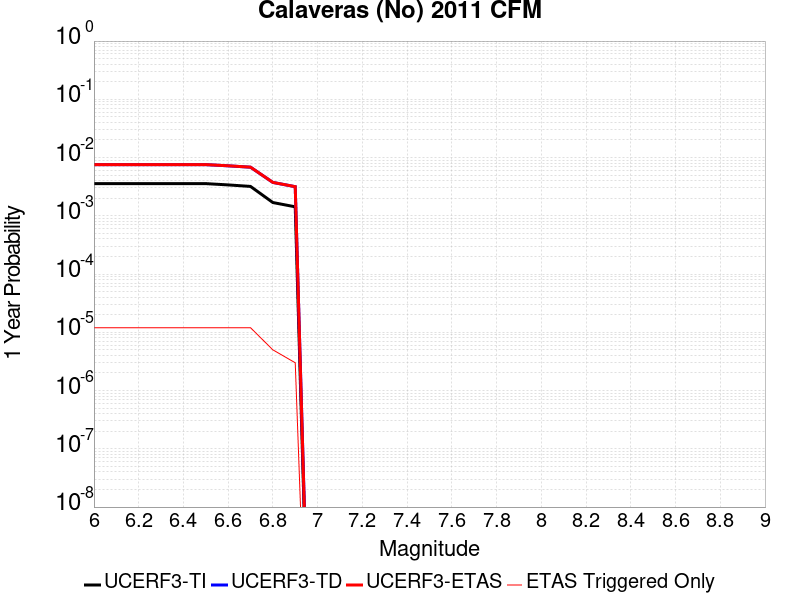 |  |

| Magnitude | 1 wk TI Prob | 1 wk TD Prob | 1 wk ETAS Prob | 1 wk ETAS/TD Gain | 1 wk ETAS Triggered Only | 1 mo TI Prob | 1 mo TD Prob | 1 mo ETAS Prob | 1 mo ETAS/TD Gain | 1 mo ETAS Triggered Only | 1 yr TI Prob | 1 yr TD Prob | 1 yr ETAS Prob | 1 yr ETAS/TD Gain | 1 yr ETAS Triggered Only | 10 yr TI Prob | 10 yr TD Prob | 10 yr ETAS Prob | 10 yr ETAS/TD Gain | 10 yr ETAS Triggered Only |
|-----|-----|-----|-----|-----|-----|-----|-----|-----|-----|-----|-----|-----|-----|-----|-----|-----|-----|-----|-----|-----|
| 6.0 | 6.853089E-5 | 1.452927E-4 | 1.517753E-4 | 1.0446177 | 6.4835567E-6 | 2.9367075E-4 | 6.225777E-4 | 6.290572E-4 | 1.0104076 | 6.4835567E-6 | 0.0035695804 | 0.007561221 | 0.00757409 | 1.001702 | 1.2967113E-5 | 0.03512784 | 0.07195558 | 0.07197363 | 1.0002508 | 1.945067E-5 |
| 6.1 | 6.853089E-5 | 1.452927E-4 | 1.517753E-4 | 1.0446177 | 6.4835567E-6 | 2.9367075E-4 | 6.225777E-4 | 6.290572E-4 | 1.0104076 | 6.4835567E-6 | 0.0035695804 | 0.007561221 | 0.00757409 | 1.001702 | 1.2967113E-5 | 0.03512784 | 0.07195558 | 0.07197363 | 1.0002508 | 1.945067E-5 |
| 6.2 | 6.853089E-5 | 1.452927E-4 | 1.517753E-4 | 1.0446177 | 6.4835567E-6 | 2.9367075E-4 | 6.225777E-4 | 6.290572E-4 | 1.0104076 | 6.4835567E-6 | 0.0035695804 | 0.007561221 | 0.00757409 | 1.001702 | 1.2967113E-5 | 0.03512784 | 0.07195558 | 0.07197363 | 1.0002508 | 1.945067E-5 |
| 6.3 | 6.853089E-5 | 1.452927E-4 | 1.517753E-4 | 1.0446177 | 6.4835567E-6 | 2.9367075E-4 | 6.225777E-4 | 6.290572E-4 | 1.0104076 | 6.4835567E-6 | 0.0035695804 | 0.007561221 | 0.00757409 | 1.001702 | 1.2967113E-5 | 0.03512784 | 0.07195558 | 0.07197363 | 1.0002508 | 1.945067E-5 |
| 6.4 | 6.853089E-5 | 1.452927E-4 | 1.517753E-4 | 1.0446177 | 6.4835567E-6 | 2.9367075E-4 | 6.225777E-4 | 6.290572E-4 | 1.0104076 | 6.4835567E-6 | 0.0035695804 | 0.007561221 | 0.00757409 | 1.001702 | 1.2967113E-5 | 0.03512784 | 0.07195558 | 0.07197363 | 1.0002508 | 1.945067E-5 |
| 6.5 | 6.853089E-5 | 1.452927E-4 | 1.517753E-4 | 1.0446177 | 6.4835567E-6 | 2.9367075E-4 | 6.225777E-4 | 6.290572E-4 | 1.0104076 | 6.4835567E-6 | 0.0035695804 | 0.007561221 | 0.00757409 | 1.001702 | 1.2967113E-5 | 0.03512784 | 0.07195558 | 0.07197363 | 1.0002508 | 1.945067E-5 |
| 6.6 | 6.5130276E-5 | 1.385732E-4 | 1.4505586E-4 | 1.0467814 | 6.4835567E-6 | 2.7909988E-4 | 5.9379323E-4 | 6.0027296E-4 | 1.0109124 | 6.4835567E-6 | 0.003392747 | 0.0072131394 | 0.007226013 | 1.0017847 | 1.2967113E-5 | 0.033414144 | 0.06881748 | 0.068835594 | 1.0002632 | 1.945067E-5 |
| 6.7 | 6.1341E-5 | 1.3118902E-4 | 1.3767173E-4 | 1.049415 | 6.4835567E-6 | 2.6286353E-4 | 5.6216074E-4 | 5.6864065E-4 | 1.0115268 | 6.4835567E-6 | 0.003195667 | 0.0068304855 | 0.006843364 | 1.0018854 | 1.2967113E-5 | 0.03150101 | 0.06536239 | 0.065380566 | 1.0002781 | 1.945067E-5 |
| 6.8 | 3.241399E-5 | 7.175236E-5 | 7.6074415E-5 | 1.0602359 | 4.3223713E-6 | 1.389097E-4 | 3.075001E-4 | 3.1182115E-4 | 1.0140522 | 4.3223713E-6 | 0.0016899136 | 0.0037420401 | 0.0037463463 | 1.0011507 | 4.3223713E-6 | 0.016771203 | 0.036092106 | 0.036098357 | 1.0001732 | 6.4835567E-6 |
| 6.9 | 2.7363296E-5 | 6.059934E-5 | 6.059934E-5 | 1.0 | 0.0 | 1.1726599E-4 | 2.5971147E-4 | 2.5971147E-4 | 1.0 | 0.0 | 0.0014267784 | 0.003161987 | 0.003161987 | 1.0 | 0.0 | 0.014176525 | 0.030637112 | 0.030639205 | 1.0000684 | 2.1611856E-6 |

## Coronado Bank alt1
*[(top)](#table-of-contents)*

| 1 Week | 1 Month | 1 Year | 10 Year |
|-----|-----|-----|-----|
|  |  |  |  |

| Magnitude | 1 wk TI Prob | 1 wk TD Prob | 1 wk ETAS Prob | 1 wk ETAS/TD Gain | 1 wk ETAS Triggered Only | 1 mo TI Prob | 1 mo TD Prob | 1 mo ETAS Prob | 1 mo ETAS/TD Gain | 1 mo ETAS Triggered Only | 1 yr TI Prob | 1 yr TD Prob | 1 yr ETAS Prob | 1 yr ETAS/TD Gain | 1 yr ETAS Triggered Only | 10 yr TI Prob | 10 yr TD Prob | 10 yr ETAS Prob | 10 yr ETAS/TD Gain | 10 yr ETAS Triggered Only |
|-----|-----|-----|-----|-----|-----|-----|-----|-----|-----|-----|-----|-----|-----|-----|-----|-----|-----|-----|-----|-----|
| 6.0 | 2.2805418E-5 | 2.2997261E-5 | 3.1641805E-5 | 1.3758944 | 8.644743E-6 | 9.773385E-5 | 9.8556375E-5 | 1.0936124E-4 | 1.1096313 | 1.0805928E-5 | 0.00118926 | 0.0011993361 | 0.0012122877 | 1.0107989 | 1.2967113E-5 | 0.011829156 | 0.011935918 | 0.011953001 | 1.0014312 | 1.7289485E-5 |
| 6.1 | 2.2805418E-5 | 2.2997261E-5 | 3.1641805E-5 | 1.3758944 | 8.644743E-6 | 9.773385E-5 | 9.8556375E-5 | 1.0936124E-4 | 1.1096313 | 1.0805928E-5 | 0.00118926 | 0.0011993361 | 0.0012122877 | 1.0107989 | 1.2967113E-5 | 0.011829156 | 0.011935918 | 0.011953001 | 1.0014312 | 1.7289485E-5 |
| 6.2 | 2.2805418E-5 | 2.2997261E-5 | 3.1641805E-5 | 1.3758944 | 8.644743E-6 | 9.773385E-5 | 9.8556375E-5 | 1.0936124E-4 | 1.1096313 | 1.0805928E-5 | 0.00118926 | 0.0011993361 | 0.0012122877 | 1.0107989 | 1.2967113E-5 | 0.011829156 | 0.011935918 | 0.011953001 | 1.0014312 | 1.7289485E-5 |
| 6.3 | 2.2805418E-5 | 2.2997261E-5 | 3.1641805E-5 | 1.3758944 | 8.644743E-6 | 9.773385E-5 | 9.8556375E-5 | 1.0936124E-4 | 1.1096313 | 1.0805928E-5 | 0.00118926 | 0.0011993361 | 0.0012122877 | 1.0107989 | 1.2967113E-5 | 0.011829156 | 0.011935918 | 0.011953001 | 1.0014312 | 1.7289485E-5 |
| 6.4 | 2.2805418E-5 | 2.2997261E-5 | 3.1641805E-5 | 1.3758944 | 8.644743E-6 | 9.773385E-5 | 9.8556375E-5 | 1.0936124E-4 | 1.1096313 | 1.0805928E-5 | 0.00118926 | 0.0011993361 | 0.0012122877 | 1.0107989 | 1.2967113E-5 | 0.011829156 | 0.011935918 | 0.011953001 | 1.0014312 | 1.7289485E-5 |
| 6.5 | 2.2805418E-5 | 2.2997261E-5 | 3.1641805E-5 | 1.3758944 | 8.644743E-6 | 9.773385E-5 | 9.8556375E-5 | 1.0936124E-4 | 1.1096313 | 1.0805928E-5 | 0.00118926 | 0.0011993361 | 0.0012122877 | 1.0107989 | 1.2967113E-5 | 0.011829156 | 0.011935918 | 0.011953001 | 1.0014312 | 1.7289485E-5 |
| 6.6 | 2.0608364E-5 | 2.2997261E-5 | 3.1641805E-5 | 1.3758944 | 8.644743E-6 | 8.831857E-5 | 9.8556375E-5 | 1.0936124E-4 | 1.1096313 | 1.0805928E-5 | 0.0010747481 | 0.0011993361 | 0.0012122877 | 1.0107989 | 1.2967113E-5 | 0.010695651 | 0.011935918 | 0.011953001 | 1.0014312 | 1.7289485E-5 |
| 6.7 | 1.8279972E-5 | 2.0392206E-5 | 2.6875632E-5 | 1.3179364 | 6.4835567E-6 | 7.834038E-5 | 8.7392655E-5 | 9.603664E-5 | 1.0989097 | 8.644743E-6 | 9.533768E-4 | 0.0010635584 | 0.0010743529 | 1.0101494 | 1.0805928E-5 | 0.00949297 | 0.010591865 | 0.010606833 | 1.0014131 | 1.5128298E-5 |
| 6.8 | 1.5100513E-5 | 1.6821805E-5 | 2.1144104E-5 | 1.2569462 | 4.3223713E-6 | 6.471488E-5 | 7.209186E-5 | 7.857495E-5 | 1.0899282 | 6.4835567E-6 | 7.876188E-4 | 8.77436E-4 | 8.8607316E-4 | 1.0098436 | 8.644743E-6 | 0.007848332 | 0.008746733 | 0.008759586 | 1.0014695 | 1.2967113E-5 |
| 6.9 | 1.3558665E-5 | 1.5095915E-5 | 1.9418221E-5 | 1.2863228 | 4.3223713E-6 | 5.810727E-5 | 6.4695574E-5 | 7.1178714E-5 | 1.10021 | 6.4835567E-6 | 7.0722634E-4 | 7.874548E-4 | 7.9609273E-4 | 1.0109694 | 8.644743E-6 | 0.0070497985 | 0.007853617 | 0.007866482 | 1.0016382 | 1.2967113E-5 |
| 7.0 | 1.1606914E-5 | 1.2905324E-5 | 1.722764E-5 | 1.3349249 | 4.3223713E-6 | 4.9742972E-5 | 5.5307755E-5 | 6.179095E-5 | 1.1172204 | 6.4835567E-6 | 6.0545234E-4 | 6.7323423E-4 | 6.818731E-4 | 1.0128319 | 8.644743E-6 | 0.0060380544 | 0.006718854 | 0.006731734 | 1.001917 | 1.2967113E-5 |
| 7.1 | 9.601701E-6 | 1.06512E-5 | 1.2812362E-5 | 1.2029032 | 2.1611856E-6 | 4.11495E-5 | 4.564759E-5 | 4.9969767E-5 | 1.0946857 | 4.3223713E-6 | 5.0088E-4 | 5.556874E-4 | 5.621674E-4 | 1.0116612 | 6.4835567E-6 | 0.0049975254 | 0.005549817 | 0.0055584135 | 1.001549 | 8.644743E-6 |
| 7.2 | 8.368532E-6 | 9.267938E-6 | 1.1429103E-5 | 1.2331873 | 2.1611856E-6 | 3.5864643E-5 | 3.971952E-5 | 4.404172E-5 | 1.108818 | 4.3223713E-6 | 4.3656456E-4 | 4.8354716E-4 | 4.900276E-4 | 1.0134019 | 6.4835567E-6 | 0.004357079 | 0.0048317458 | 0.004840349 | 1.0017805 | 8.644743E-6 |
| 7.3 | 6.710382E-6 | 7.416545E-6 | 7.416545E-6 | 1.0 | 0.0 | 2.8758463E-5 | 3.1785192E-5 | 3.3946308E-5 | 1.0679913 | 2.1611856E-6 | 3.5007801E-4 | 3.8698473E-4 | 3.9130542E-4 | 1.011165 | 4.3223713E-6 | 0.0034952704 | 0.0038698472 | 0.0038763057 | 1.0016689 | 6.4835567E-6 |

## San Gregorio (South) 2011 CFM
*[(top)](#table-of-contents)*

| 1 Week | 1 Month | 1 Year | 10 Year |
|-----|-----|-----|-----|
| 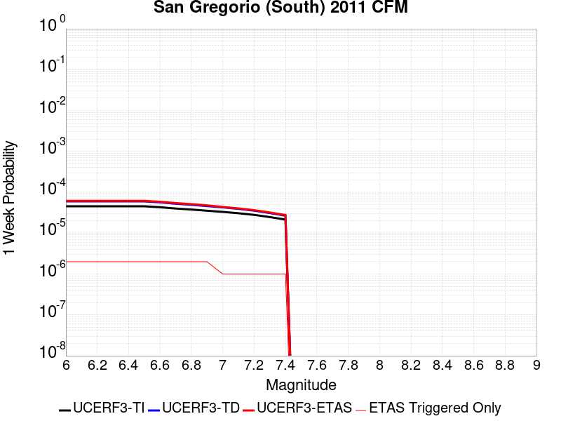 |  |  |  |

| Magnitude | 1 wk TI Prob | 1 wk TD Prob | 1 wk ETAS Prob | 1 wk ETAS/TD Gain | 1 wk ETAS Triggered Only | 1 mo TI Prob | 1 mo TD Prob | 1 mo ETAS Prob | 1 mo ETAS/TD Gain | 1 mo ETAS Triggered Only | 1 yr TI Prob | 1 yr TD Prob | 1 yr ETAS Prob | 1 yr ETAS/TD Gain | 1 yr ETAS Triggered Only | 10 yr TI Prob | 10 yr TD Prob | 10 yr ETAS Prob | 10 yr ETAS/TD Gain | 10 yr ETAS Triggered Only |
|-----|-----|-----|-----|-----|-----|-----|-----|-----|-----|-----|-----|-----|-----|-----|-----|-----|-----|-----|-----|-----|
| 6.0 | 4.5472258E-5 | 5.991556E-5 | 6.207662E-5 | 1.0360683 | 2.1611856E-6 | 1.9486654E-4 | 2.5675958E-4 | 2.632415E-4 | 1.025245 | 6.4835567E-6 | 0.0023699186 | 0.0031223015 | 0.0031330737 | 1.00345 | 1.0805928E-5 | 0.023448035 | 0.03088203 | 0.030898787 | 1.0005425 | 1.7289485E-5 |
| 6.1 | 4.5472258E-5 | 5.991556E-5 | 6.207662E-5 | 1.0360683 | 2.1611856E-6 | 1.9486654E-4 | 2.5675958E-4 | 2.632415E-4 | 1.025245 | 6.4835567E-6 | 0.0023699186 | 0.0031223015 | 0.0031330737 | 1.00345 | 1.0805928E-5 | 0.023448035 | 0.03088203 | 0.030898787 | 1.0005425 | 1.7289485E-5 |
| 6.2 | 4.5472258E-5 | 5.991556E-5 | 6.207662E-5 | 1.0360683 | 2.1611856E-6 | 1.9486654E-4 | 2.5675958E-4 | 2.632415E-4 | 1.025245 | 6.4835567E-6 | 0.0023699186 | 0.0031223015 | 0.0031330737 | 1.00345 | 1.0805928E-5 | 0.023448035 | 0.03088203 | 0.030898787 | 1.0005425 | 1.7289485E-5 |
| 6.3 | 4.5472258E-5 | 5.991556E-5 | 6.207662E-5 | 1.0360683 | 2.1611856E-6 | 1.9486654E-4 | 2.5675958E-4 | 2.632415E-4 | 1.025245 | 6.4835567E-6 | 0.0023699186 | 0.0031223015 | 0.0031330737 | 1.00345 | 1.0805928E-5 | 0.023448035 | 0.03088203 | 0.030898787 | 1.0005425 | 1.7289485E-5 |
| 6.4 | 4.5472258E-5 | 5.991556E-5 | 6.207662E-5 | 1.0360683 | 2.1611856E-6 | 1.9486654E-4 | 2.5675958E-4 | 2.632415E-4 | 1.025245 | 6.4835567E-6 | 0.0023699186 | 0.0031223015 | 0.0031330737 | 1.00345 | 1.0805928E-5 | 0.023448035 | 0.03088203 | 0.030898787 | 1.0005425 | 1.7289485E-5 |
| 6.5 | 4.5472258E-5 | 5.991556E-5 | 6.207662E-5 | 1.0360683 | 2.1611856E-6 | 1.9486654E-4 | 2.5675958E-4 | 2.632415E-4 | 1.025245 | 6.4835567E-6 | 0.0023699186 | 0.0031223015 | 0.0031330737 | 1.00345 | 1.0805928E-5 | 0.023448035 | 0.03088203 | 0.030898787 | 1.0005425 | 1.7289485E-5 |
| 6.6 | 4.315749E-5 | 5.674213E-5 | 5.890319E-5 | 1.0380857 | 2.1611856E-6 | 1.8494757E-4 | 2.4316214E-4 | 2.4964413E-4 | 1.026657 | 6.4835567E-6 | 0.0022494113 | 0.002957233 | 0.002968007 | 1.0036433 | 1.0805928E-5 | 0.02226778 | 0.02927816 | 0.029294943 | 1.0005733 | 1.7289485E-5 |
| 6.7 | 4.008459E-5 | 5.251357E-5 | 5.467464E-5 | 1.0411526 | 2.1611856E-6 | 1.7177979E-4 | 2.250431E-4 | 2.293645E-4 | 1.0192026 | 4.3223713E-6 | 0.0020894127 | 0.002737236 | 0.002745857 | 1.0031495 | 8.644743E-6 | 0.020698763 | 0.02713696 | 0.027151676 | 1.0005424 | 1.5128298E-5 |
| 6.8 | 3.7885424E-5 | 4.9452636E-5 | 5.161371E-5 | 1.0437 | 2.1611856E-6 | 1.62356E-4 | 2.1192706E-4 | 2.1624852E-4 | 1.0203912 | 4.3223713E-6 | 0.001974892 | 0.0025779405 | 0.002586563 | 1.0033447 | 8.644743E-6 | 0.019574333 | 0.025582204 | 0.025596946 | 1.0005763 | 1.5128298E-5 |
| 6.9 | 3.543751E-5 | 4.6004345E-5 | 4.8165428E-5 | 1.0469757 | 2.1611856E-6 | 1.5186622E-4 | 1.97151E-4 | 2.0147253E-4 | 1.0219198 | 4.3223713E-6 | 0.001847403 | 0.0023984574 | 0.0024070814 | 1.0035956 | 8.644743E-6 | 0.018321203 | 0.023827864 | 0.023840522 | 1.0005312 | 1.2967113E-5 |
| 7.0 | 3.3186065E-5 | 4.2815023E-5 | 4.4976117E-5 | 1.0504751 | 2.1611856E-6 | 1.4221824E-4 | 1.834845E-4 | 1.8780607E-4 | 1.0235528 | 4.3223713E-6 | 0.0017301317 | 0.0022324256 | 0.002241051 | 1.0038637 | 8.644743E-6 | 0.017167237 | 0.022202516 | 0.022215195 | 1.000571 | 1.2967113E-5 |
| 7.1 | 3.076152E-5 | 3.9376442E-5 | 4.1537543E-5 | 1.0548831 | 2.1611856E-6 | 1.3182842E-4 | 1.6874976E-4 | 1.7091057E-4 | 1.0128049 | 2.1611856E-6 | 0.0016038293 | 0.0020533882 | 0.0020598583 | 1.003151 | 6.4835567E-6 | 0.015923034 | 0.020447142 | 0.020457728 | 1.0005177 | 1.0805928E-5 |
| 7.2 | 2.8039283E-5 | 3.552108E-5 | 3.7682188E-5 | 1.0608401 | 2.1611856E-6 | 1.2016282E-4 | 1.5222882E-4 | 1.5438968E-4 | 1.0141948 | 2.1611856E-6 | 0.0014620004 | 0.00185261 | 0.0018590816 | 1.0034932 | 6.4835567E-6 | 0.0145241935 | 0.018474856 | 0.018485462 | 1.0005741 | 1.0805928E-5 |
| 7.3 | 2.4776145E-5 | 3.1098632E-5 | 3.3259752E-5 | 1.0694923 | 2.1611856E-6 | 1.0617916E-4 | 1.3327754E-4 | 1.3543844E-4 | 1.0162135 | 2.1611856E-6 | 0.0012919646 | 0.0016222443 | 0.0016265595 | 1.0026602 | 4.3223713E-6 | 0.012844792 | 0.0162039 | 0.016210278 | 1.0003936 | 6.4835567E-6 |
| 7.4 | 2.1508438E-5 | 2.6824098E-5 | 2.8985225E-5 | 1.0805666 | 2.1611856E-6 | 9.217577E-5 | 1.1495983E-4 | 1.1712077E-4 | 1.0187973 | 2.1611856E-6 | 0.0011216622 | 0.0013995317 | 0.0014038481 | 1.0030841 | 4.3223713E-6 | 0.011160175 | 0.014002349 | 0.014008742 | 1.0004566 | 6.4835567E-6 |

## San Joaquin Hills
*[(top)](#table-of-contents)*

| 1 Week | 1 Month | 1 Year | 10 Year |
|-----|-----|-----|-----|
|  |  |  |  |

| Magnitude | 1 wk TI Prob | 1 wk TD Prob | 1 wk ETAS Prob | 1 wk ETAS/TD Gain | 1 wk ETAS Triggered Only | 1 mo TI Prob | 1 mo TD Prob | 1 mo ETAS Prob | 1 mo ETAS/TD Gain | 1 mo ETAS Triggered Only | 1 yr TI Prob | 1 yr TD Prob | 1 yr ETAS Prob | 1 yr ETAS/TD Gain | 1 yr ETAS Triggered Only | 10 yr TI Prob | 10 yr TD Prob | 10 yr ETAS Prob | 10 yr ETAS/TD Gain | 10 yr ETAS Triggered Only |
|-----|-----|-----|-----|-----|-----|-----|-----|-----|-----|-----|-----|-----|-----|-----|-----|-----|-----|-----|-----|-----|
| 6.0 | 7.517352E-6 | 7.930626E-6 | 1.4414131E-5 | 1.8175275 | 6.4835567E-6 | 3.2216827E-5 | 3.398822E-5 | 4.4793782E-5 | 1.3179208 | 1.0805928E-5 | 3.9216926E-4 | 4.137751E-4 | 4.2673683E-4 | 1.0313256 | 1.2967113E-5 | 0.003914779 | 0.0041346652 | 0.004151883 | 1.0041643 | 1.7289485E-5 |
| 6.1 | 7.517352E-6 | 7.930626E-6 | 1.4414131E-5 | 1.8175275 | 6.4835567E-6 | 3.2216827E-5 | 3.398822E-5 | 4.4793782E-5 | 1.3179208 | 1.0805928E-5 | 3.9216926E-4 | 4.137751E-4 | 4.2673683E-4 | 1.0313256 | 1.2967113E-5 | 0.003914779 | 0.0041346652 | 0.004151883 | 1.0041643 | 1.7289485E-5 |
| 6.2 | 7.517352E-6 | 7.930626E-6 | 1.4414131E-5 | 1.8175275 | 6.4835567E-6 | 3.2216827E-5 | 3.398822E-5 | 4.4793782E-5 | 1.3179208 | 1.0805928E-5 | 3.9216926E-4 | 4.137751E-4 | 4.2673683E-4 | 1.0313256 | 1.2967113E-5 | 0.003914779 | 0.0041346652 | 0.004151883 | 1.0041643 | 1.7289485E-5 |
| 6.3 | 7.517352E-6 | 7.930626E-6 | 1.4414131E-5 | 1.8175275 | 6.4835567E-6 | 3.2216827E-5 | 3.398822E-5 | 4.4793782E-5 | 1.3179208 | 1.0805928E-5 | 3.9216926E-4 | 4.137751E-4 | 4.2673683E-4 | 1.0313256 | 1.2967113E-5 | 0.003914779 | 0.0041346652 | 0.004151883 | 1.0041643 | 1.7289485E-5 |
| 6.4 | 7.517352E-6 | 7.930626E-6 | 1.4414131E-5 | 1.8175275 | 6.4835567E-6 | 3.2216827E-5 | 3.398822E-5 | 4.4793782E-5 | 1.3179208 | 1.0805928E-5 | 3.9216926E-4 | 4.137751E-4 | 4.2673683E-4 | 1.0313256 | 1.2967113E-5 | 0.003914779 | 0.0041346652 | 0.004151883 | 1.0041643 | 1.7289485E-5 |
| 6.5 | 7.517352E-6 | 7.930626E-6 | 1.4414131E-5 | 1.8175275 | 6.4835567E-6 | 3.2216827E-5 | 3.398822E-5 | 4.4793782E-5 | 1.3179208 | 1.0805928E-5 | 3.9216926E-4 | 4.137751E-4 | 4.2673683E-4 | 1.0313256 | 1.2967113E-5 | 0.003914779 | 0.0041346652 | 0.004151883 | 1.0041643 | 1.7289485E-5 |
| 6.6 | 7.1722156E-6 | 7.567309E-6 | 1.1889648E-5 | 1.5711857 | 4.3223713E-6 | 3.0737705E-5 | 3.2431184E-5 | 4.1075647E-5 | 1.2665478 | 8.644743E-6 | 3.7416728E-4 | 3.9482507E-4 | 4.0562675E-4 | 1.027358 | 1.0805928E-5 | 0.003735379 | 0.003945838 | 0.003960907 | 1.0038189 | 1.5128298E-5 |
| 6.7 | 5.595255E-6 | 5.8979463E-6 | 1.0220292E-5 | 1.732856 | 4.3223713E-6 | 2.3979444E-5 | 2.5276911E-5 | 3.3921435E-5 | 1.3419929 | 8.644743E-6 | 2.9191063E-4 | 3.077464E-4 | 3.1854902E-4 | 1.0351022 | 1.0805928E-5 | 0.0029152746 | 0.003077464 | 0.0030925458 | 1.0049007 | 1.5128298E-5 |
| 6.8 | 5.595255E-6 | 5.8979463E-6 | 1.0220292E-5 | 1.732856 | 4.3223713E-6 | 2.3979444E-5 | 2.5276911E-5 | 3.3921435E-5 | 1.3419929 | 8.644743E-6 | 2.9191063E-4 | 3.077464E-4 | 3.1854902E-4 | 1.0351022 | 1.0805928E-5 | 0.0029152746 | 0.003077464 | 0.0030925458 | 1.0049007 | 1.5128298E-5 |
| 6.9 | 5.595255E-6 | 5.8979463E-6 | 1.0220292E-5 | 1.732856 | 4.3223713E-6 | 2.3979444E-5 | 2.5276911E-5 | 3.3921435E-5 | 1.3419929 | 8.644743E-6 | 2.9191063E-4 | 3.077464E-4 | 3.1854902E-4 | 1.0351022 | 1.0805928E-5 | 0.0029152746 | 0.003077464 | 0.0030925458 | 1.0049007 | 1.5128298E-5 |

## Emerson-Copper Mtn 2011
*[(top)](#table-of-contents)*

| 1 Week | 1 Month | 1 Year | 10 Year |
|-----|-----|-----|-----|
|  |  |  |  |

| Magnitude | 1 wk TI Prob | 1 wk TD Prob | 1 wk ETAS Prob | 1 wk ETAS/TD Gain | 1 wk ETAS Triggered Only | 1 mo TI Prob | 1 mo TD Prob | 1 mo ETAS Prob | 1 mo ETAS/TD Gain | 1 mo ETAS Triggered Only | 1 yr TI Prob | 1 yr TD Prob | 1 yr ETAS Prob | 1 yr ETAS/TD Gain | 1 yr ETAS Triggered Only | 10 yr TI Prob | 10 yr TD Prob | 10 yr ETAS Prob | 10 yr ETAS/TD Gain | 10 yr ETAS Triggered Only |
|-----|-----|-----|-----|-----|-----|-----|-----|-----|-----|-----|-----|-----|-----|-----|-----|-----|-----|-----|-----|-----|
| 6.0 | 1.3738761E-5 | 7.363802E-6 | 1.38473115E-5 | 1.8804567 | 6.4835567E-6 | 5.8879075E-5 | 3.1558855E-5 | 4.236444E-5 | 1.3423947 | 1.0805928E-5 | 7.166169E-4 | 3.841763E-4 | 3.971384E-4 | 1.03374 | 1.2967113E-5 | 0.007143104 | 0.0038365931 | 0.0038538163 | 1.0044892 | 1.7289485E-5 |
| 6.1 | 1.3738761E-5 | 7.363802E-6 | 1.38473115E-5 | 1.8804567 | 6.4835567E-6 | 5.8879075E-5 | 3.1558855E-5 | 4.236444E-5 | 1.3423947 | 1.0805928E-5 | 7.166169E-4 | 3.841763E-4 | 3.971384E-4 | 1.03374 | 1.2967113E-5 | 0.007143104 | 0.0038365931 | 0.0038538163 | 1.0044892 | 1.7289485E-5 |
| 6.2 | 1.3738761E-5 | 7.363802E-6 | 1.38473115E-5 | 1.8804567 | 6.4835567E-6 | 5.8879075E-5 | 3.1558855E-5 | 4.236444E-5 | 1.3423947 | 1.0805928E-5 | 7.166169E-4 | 3.841763E-4 | 3.971384E-4 | 1.03374 | 1.2967113E-5 | 0.007143104 | 0.0038365931 | 0.0038538163 | 1.0044892 | 1.7289485E-5 |
| 6.3 | 1.3738761E-5 | 7.363802E-6 | 1.38473115E-5 | 1.8804567 | 6.4835567E-6 | 5.8879075E-5 | 3.1558855E-5 | 4.236444E-5 | 1.3423947 | 1.0805928E-5 | 7.166169E-4 | 3.841763E-4 | 3.971384E-4 | 1.03374 | 1.2967113E-5 | 0.007143104 | 0.0038365931 | 0.0038538163 | 1.0044892 | 1.7289485E-5 |
| 6.4 | 1.3738761E-5 | 7.363802E-6 | 1.38473115E-5 | 1.8804567 | 6.4835567E-6 | 5.8879075E-5 | 3.1558855E-5 | 4.236444E-5 | 1.3423947 | 1.0805928E-5 | 7.166169E-4 | 3.841763E-4 | 3.971384E-4 | 1.03374 | 1.2967113E-5 | 0.007143104 | 0.0038365931 | 0.0038538163 | 1.0044892 | 1.7289485E-5 |
| 6.5 | 1.3738761E-5 | 7.363802E-6 | 1.38473115E-5 | 1.8804567 | 6.4835567E-6 | 5.8879075E-5 | 3.1558855E-5 | 4.236444E-5 | 1.3423947 | 1.0805928E-5 | 7.166169E-4 | 3.841763E-4 | 3.971384E-4 | 1.03374 | 1.2967113E-5 | 0.007143104 | 0.0038365931 | 0.0038538163 | 1.0044892 | 1.7289485E-5 |
| 6.6 | 1.2946993E-5 | 6.644407E-6 | 1.096675E-5 | 1.6505234 | 4.3223713E-6 | 5.5485933E-5 | 2.8475804E-5 | 3.71203E-5 | 1.3035734 | 8.644743E-6 | 6.7533186E-4 | 3.4665258E-4 | 3.5745476E-4 | 1.0311614 | 1.0805928E-5 | 0.006732832 | 0.0034625726 | 0.0034776484 | 1.004354 | 1.5128298E-5 |
| 6.7 | 1.1127743E-5 | 5.301015E-6 | 9.6233625E-6 | 1.8153813 | 4.3223713E-6 | 4.7689457E-5 | 2.2718517E-5 | 3.1363063E-5 | 1.3805066 | 8.644743E-6 | 5.8046443E-4 | 2.765771E-4 | 2.8738007E-4 | 1.0390594 | 1.0805928E-5 | 0.005789506 | 0.00276373 | 0.0027788165 | 1.0054587 | 1.5128298E-5 |
| 6.8 | 9.893959E-6 | 4.385705E-6 | 8.708057E-6 | 1.9855547 | 4.3223713E-6 | 4.2401993E-5 | 1.8795821E-5 | 2.7440401E-5 | 1.4599203 | 8.644743E-6 | 5.16122E-4 | 2.2882903E-4 | 2.3963249E-4 | 1.0472119 | 1.0805928E-5 | 0.005149249 | 0.0022873012 | 0.0023002387 | 1.0056562 | 1.2967113E-5 |
| 6.9 | 8.432605E-6 | 3.3001859E-6 | 7.6225424E-6 | 2.3097312 | 4.3223713E-6 | 3.6139234E-5 | 1.4143652E-5 | 2.2788272E-5 | 1.6112014 | 8.644743E-6 | 4.3990635E-4 | 1.7219881E-4 | 1.8300288E-4 | 1.0627419 | 1.0805928E-5 | 0.0043903654 | 0.0017219725 | 0.0017349173 | 1.0075175 | 1.2967113E-5 |
| 7.0 | 8.181617E-6 | 3.2873893E-6 | 7.6097463E-6 | 2.3148296 | 4.3223713E-6 | 3.5063604E-5 | 1.40888105E-5 | 2.2733431E-5 | 1.6135806 | 8.644743E-6 | 4.2681574E-4 | 1.7153122E-4 | 1.823353E-4 | 1.062986 | 1.0805928E-5 | 0.004259969 | 0.0017153069 | 0.0017282518 | 1.0075467 | 1.2967113E-5 |
| 7.1 | 3.1700695E-6 | 5.4303326E-9 | 5.4303326E-9 | 1.0 | 0.0 | 1.3585942E-5 | 2.3272854E-8 | 2.3272854E-8 | 1.0 | 0.0 | 1.6539628E-4 | 2.83347E-7 | 2.83347E-7 | 1.0 | 0.0 | 0.0016527324 | 2.833469E-6 | 2.833469E-6 | 1.0 | 0.0 |
| 7.2 | 2.8879267E-6 | 9.331039E-10 | 9.331039E-10 | 1.0 | 0.0 | 1.237677E-5 | 3.999017E-9 | 3.999017E-9 | 1.0 | 0.0 | 1.5067676E-4 | 4.868803E-8 | 4.868803E-8 | 1.0 | 0.0 | 0.0015057464 | 4.868803E-7 | 4.868803E-7 | 1.0 | 0.0 |
| 7.3 | 2.4973094E-6 | 8.4248597E-10 | 8.4248597E-10 | 1.0 | 0.0 | 1.0702711E-5 | 3.6106542E-9 | 3.6106542E-9 | 1.0 | 0.0 | 1.3029772E-4 | 4.3959716E-8 | 4.3959716E-8 | 1.0 | 0.0 | 0.0013022134 | 4.3959716E-7 | 4.3959716E-7 | 1.0 | 0.0 |

## Robinson Creek
*[(top)](#table-of-contents)*

| 1 Week | 1 Month | 1 Year | 10 Year |
|-----|-----|-----|-----|
|  |  |  |  |

| Magnitude | 1 wk TI Prob | 1 wk TD Prob | 1 wk ETAS Prob | 1 wk ETAS/TD Gain | 1 wk ETAS Triggered Only | 1 mo TI Prob | 1 mo TD Prob | 1 mo ETAS Prob | 1 mo ETAS/TD Gain | 1 mo ETAS Triggered Only | 1 yr TI Prob | 1 yr TD Prob | 1 yr ETAS Prob | 1 yr ETAS/TD Gain | 1 yr ETAS Triggered Only | 10 yr TI Prob | 10 yr TD Prob | 10 yr ETAS Prob | 10 yr ETAS/TD Gain | 10 yr ETAS Triggered Only |
|-----|-----|-----|-----|-----|-----|-----|-----|-----|-----|-----|-----|-----|-----|-----|-----|-----|-----|-----|-----|-----|
| 6.0 | 1.0723721E-5 | 1.1667189E-5 | 1.3828349E-5 | 1.1852341 | 2.1611856E-6 | 4.5957993E-5 | 5.000224E-5 | 5.648547E-5 | 1.1296588 | 6.4835567E-6 | 5.593949E-4 | 6.087773E-4 | 6.152569E-4 | 1.0106436 | 6.4835567E-6 | 0.0055798884 | 0.0060877725 | 0.006104957 | 1.0028228 | 1.7289485E-5 |
| 6.1 | 1.0723721E-5 | 1.1667189E-5 | 1.3828349E-5 | 1.1852341 | 2.1611856E-6 | 4.5957993E-5 | 5.000224E-5 | 5.648547E-5 | 1.1296588 | 6.4835567E-6 | 5.593949E-4 | 6.087773E-4 | 6.152569E-4 | 1.0106436 | 6.4835567E-6 | 0.0055798884 | 0.0060877725 | 0.006104957 | 1.0028228 | 1.7289485E-5 |
| 6.2 | 1.0723721E-5 | 1.1667189E-5 | 1.3828349E-5 | 1.1852341 | 2.1611856E-6 | 4.5957993E-5 | 5.000224E-5 | 5.648547E-5 | 1.1296588 | 6.4835567E-6 | 5.593949E-4 | 6.087773E-4 | 6.152569E-4 | 1.0106436 | 6.4835567E-6 | 0.0055798884 | 0.0060877725 | 0.006104957 | 1.0028228 | 1.7289485E-5 |
| 6.3 | 1.0723721E-5 | 1.1667189E-5 | 1.3828349E-5 | 1.1852341 | 2.1611856E-6 | 4.5957993E-5 | 5.000224E-5 | 5.648547E-5 | 1.1296588 | 6.4835567E-6 | 5.593949E-4 | 6.087773E-4 | 6.152569E-4 | 1.0106436 | 6.4835567E-6 | 0.0055798884 | 0.0060877725 | 0.006104957 | 1.0028228 | 1.7289485E-5 |
| 6.4 | 1.0723721E-5 | 1.1667189E-5 | 1.3828349E-5 | 1.1852341 | 2.1611856E-6 | 4.5957993E-5 | 5.000224E-5 | 5.648547E-5 | 1.1296588 | 6.4835567E-6 | 5.593949E-4 | 6.087773E-4 | 6.152569E-4 | 1.0106436 | 6.4835567E-6 | 0.0055798884 | 0.0060877725 | 0.006104957 | 1.0028228 | 1.7289485E-5 |
| 6.5 | 1.0723721E-5 | 1.1667189E-5 | 1.3828349E-5 | 1.1852341 | 2.1611856E-6 | 4.5957993E-5 | 5.000224E-5 | 5.648547E-5 | 1.1296588 | 6.4835567E-6 | 5.593949E-4 | 6.087773E-4 | 6.152569E-4 | 1.0106436 | 6.4835567E-6 | 0.0055798884 | 0.0060877725 | 0.006104957 | 1.0028228 | 1.7289485E-5 |

## Round Valley
*[(top)](#table-of-contents)*

| 1 Week | 1 Month | 1 Year | 10 Year |
|-----|-----|-----|-----|
|  |  |  |  |

| Magnitude | 1 wk TI Prob | 1 wk TD Prob | 1 wk ETAS Prob | 1 wk ETAS/TD Gain | 1 wk ETAS Triggered Only | 1 mo TI Prob | 1 mo TD Prob | 1 mo ETAS Prob | 1 mo ETAS/TD Gain | 1 mo ETAS Triggered Only | 1 yr TI Prob | 1 yr TD Prob | 1 yr ETAS Prob | 1 yr ETAS/TD Gain | 1 yr ETAS Triggered Only | 10 yr TI Prob | 10 yr TD Prob | 10 yr ETAS Prob | 10 yr ETAS/TD Gain | 10 yr ETAS Triggered Only |
|-----|-----|-----|-----|-----|-----|-----|-----|-----|-----|-----|-----|-----|-----|-----|-----|-----|-----|-----|-----|-----|
| 6.0 | 1.5129573E-5 | 1.668525E-5 | 2.5329848E-5 | 1.5180982 | 8.644743E-6 | 6.483941E-5 | 7.1506845E-5 | 8.2312E-5 | 1.1511066 | 1.0805928E-5 | 7.8913395E-4 | 8.7035226E-4 | 8.811488E-4 | 1.0124048 | 1.0805928E-5 | 0.007863375 | 0.008679682 | 0.0086968215 | 1.0019747 | 1.7289485E-5 |
| 6.1 | 1.5129573E-5 | 1.668525E-5 | 2.5329848E-5 | 1.5180982 | 8.644743E-6 | 6.483941E-5 | 7.1506845E-5 | 8.2312E-5 | 1.1511066 | 1.0805928E-5 | 7.8913395E-4 | 8.7035226E-4 | 8.811488E-4 | 1.0124048 | 1.0805928E-5 | 0.007863375 | 0.008679682 | 0.0086968215 | 1.0019747 | 1.7289485E-5 |
| 6.2 | 1.5129573E-5 | 1.668525E-5 | 2.5329848E-5 | 1.5180982 | 8.644743E-6 | 6.483941E-5 | 7.1506845E-5 | 8.2312E-5 | 1.1511066 | 1.0805928E-5 | 7.8913395E-4 | 8.7035226E-4 | 8.811488E-4 | 1.0124048 | 1.0805928E-5 | 0.007863375 | 0.008679682 | 0.0086968215 | 1.0019747 | 1.7289485E-5 |
| 6.3 | 1.5129573E-5 | 1.668525E-5 | 2.5329848E-5 | 1.5180982 | 8.644743E-6 | 6.483941E-5 | 7.1506845E-5 | 8.2312E-5 | 1.1511066 | 1.0805928E-5 | 7.8913395E-4 | 8.7035226E-4 | 8.811488E-4 | 1.0124048 | 1.0805928E-5 | 0.007863375 | 0.008679682 | 0.0086968215 | 1.0019747 | 1.7289485E-5 |
| 6.4 | 1.5129573E-5 | 1.668525E-5 | 2.5329848E-5 | 1.5180982 | 8.644743E-6 | 6.483941E-5 | 7.1506845E-5 | 8.2312E-5 | 1.1511066 | 1.0805928E-5 | 7.8913395E-4 | 8.7035226E-4 | 8.811488E-4 | 1.0124048 | 1.0805928E-5 | 0.007863375 | 0.008679682 | 0.0086968215 | 1.0019747 | 1.7289485E-5 |
| 6.5 | 1.5129573E-5 | 1.668525E-5 | 2.5329848E-5 | 1.5180982 | 8.644743E-6 | 6.483941E-5 | 7.1506845E-5 | 8.2312E-5 | 1.1511066 | 1.0805928E-5 | 7.8913395E-4 | 8.7035226E-4 | 8.811488E-4 | 1.0124048 | 1.0805928E-5 | 0.007863375 | 0.008679682 | 0.0086968215 | 1.0019747 | 1.7289485E-5 |
| 6.6 | 1.4434947E-5 | 1.5912143E-5 | 2.4556746E-5 | 1.543271 | 8.644743E-6 | 6.186259E-5 | 6.81937E-5 | 7.899889E-5 | 1.1584486 | 1.0805928E-5 | 7.529168E-4 | 8.3004584E-4 | 8.4084284E-4 | 1.0130076 | 1.0805928E-5 | 0.0075037093 | 0.00827966 | 0.008296805 | 1.0020709 | 1.7289485E-5 |
| 6.7 | 1.15477105E-5 | 1.2717341E-5 | 1.9200816E-5 | 1.5098137 | 6.4835567E-6 | 4.948925E-5 | 5.4502318E-5 | 6.314659E-5 | 1.1586038 | 8.644743E-6 | 6.02365E-4 | 6.6346437E-4 | 6.721034E-4 | 1.0130211 | 8.644743E-6 | 0.0060073487 | 0.0066247126 | 0.006637594 | 1.0019444 | 1.2967113E-5 |
| 6.8 | 8.959772E-6 | 9.845762E-6 | 1.2006926E-5 | 1.219502 | 2.1611856E-6 | 3.8398455E-5 | 4.2195978E-5 | 4.435707E-5 | 1.0512156 | 2.1611856E-6 | 4.674009E-4 | 5.1371043E-4 | 5.1587046E-4 | 1.0042049 | 2.1611856E-6 | 0.0046641906 | 0.0051345914 | 0.0051388917 | 1.0008374 | 4.3223713E-6 |
| 6.9 | 7.926176E-6 | 8.705021E-6 | 1.0866188E-5 | 1.2482667 | 2.1611856E-6 | 3.3968885E-5 | 3.7307233E-5 | 3.9468337E-5 | 1.0579273 | 2.1611856E-6 | 4.1349267E-4 | 4.5421557E-4 | 4.5637577E-4 | 1.0047559 | 2.1611856E-6 | 0.004127241 | 0.0045421557 | 0.0045464584 | 1.0009472 | 4.3223713E-6 |
| 7.0 | 7.926176E-6 | 8.705021E-6 | 1.0866188E-5 | 1.2482667 | 2.1611856E-6 | 3.3968885E-5 | 3.7307233E-5 | 3.9468337E-5 | 1.0579273 | 2.1611856E-6 | 4.1349267E-4 | 4.5421557E-4 | 4.5637577E-4 | 1.0047559 | 2.1611856E-6 | 0.004127241 | 0.0045421557 | 0.0045464584 | 1.0009472 | 4.3223713E-6 |

## San Jacinto (Coyote Creek)
*[(top)](#table-of-contents)*

| 1 Week | 1 Month | 1 Year | 10 Year |
|-----|-----|-----|-----|
|  |  |  |  |

| Magnitude | 1 wk TI Prob | 1 wk TD Prob | 1 wk ETAS Prob | 1 wk ETAS/TD Gain | 1 wk ETAS Triggered Only | 1 mo TI Prob | 1 mo TD Prob | 1 mo ETAS Prob | 1 mo ETAS/TD Gain | 1 mo ETAS Triggered Only | 1 yr TI Prob | 1 yr TD Prob | 1 yr ETAS Prob | 1 yr ETAS/TD Gain | 1 yr ETAS Triggered Only | 10 yr TI Prob | 10 yr TD Prob | 10 yr ETAS Prob | 10 yr ETAS/TD Gain | 10 yr ETAS Triggered Only |
|-----|-----|-----|-----|-----|-----|-----|-----|-----|-----|-----|-----|-----|-----|-----|-----|-----|-----|-----|-----|-----|
| 6.0 | 4.69665E-5 | 6.4235006E-5 | 6.639605E-5 | 1.0336428 | 2.1611856E-6 | 2.0126947E-4 | 2.7526915E-4 | 2.7959034E-4 | 1.0156981 | 4.3223713E-6 | 0.002447702 | 0.0033471098 | 0.0033514178 | 1.0012871 | 4.3223713E-6 | 0.024209166 | 0.033357523 | 0.033374235 | 1.000501 | 1.7289485E-5 |
| 6.1 | 4.69665E-5 | 6.4235006E-5 | 6.639605E-5 | 1.0336428 | 2.1611856E-6 | 2.0126947E-4 | 2.7526915E-4 | 2.7959034E-4 | 1.0156981 | 4.3223713E-6 | 0.002447702 | 0.0033471098 | 0.0033514178 | 1.0012871 | 4.3223713E-6 | 0.024209166 | 0.033357523 | 0.033374235 | 1.000501 | 1.7289485E-5 |
| 6.2 | 4.69665E-5 | 6.4235006E-5 | 6.639605E-5 | 1.0336428 | 2.1611856E-6 | 2.0126947E-4 | 2.7526915E-4 | 2.7959034E-4 | 1.0156981 | 4.3223713E-6 | 0.002447702 | 0.0033471098 | 0.0033514178 | 1.0012871 | 4.3223713E-6 | 0.024209166 | 0.033357523 | 0.033374235 | 1.000501 | 1.7289485E-5 |
| 6.3 | 4.69665E-5 | 6.4235006E-5 | 6.639605E-5 | 1.0336428 | 2.1611856E-6 | 2.0126947E-4 | 2.7526915E-4 | 2.7959034E-4 | 1.0156981 | 4.3223713E-6 | 0.002447702 | 0.0033471098 | 0.0033514178 | 1.0012871 | 4.3223713E-6 | 0.024209166 | 0.033357523 | 0.033374235 | 1.000501 | 1.7289485E-5 |
| 6.4 | 4.69665E-5 | 6.4235006E-5 | 6.639605E-5 | 1.0336428 | 2.1611856E-6 | 2.0126947E-4 | 2.7526915E-4 | 2.7959034E-4 | 1.0156981 | 4.3223713E-6 | 0.002447702 | 0.0033471098 | 0.0033514178 | 1.0012871 | 4.3223713E-6 | 0.024209166 | 0.033357523 | 0.033374235 | 1.000501 | 1.7289485E-5 |
| 6.5 | 4.69665E-5 | 6.4235006E-5 | 6.639605E-5 | 1.0336428 | 2.1611856E-6 | 2.0126947E-4 | 2.7526915E-4 | 2.7959034E-4 | 1.0156981 | 4.3223713E-6 | 0.002447702 | 0.0033471098 | 0.0033514178 | 1.0012871 | 4.3223713E-6 | 0.024209166 | 0.033357523 | 0.033374235 | 1.000501 | 1.7289485E-5 |
| 6.6 | 4.65626E-5 | 6.365397E-5 | 6.581502E-5 | 1.03395 | 2.1611856E-6 | 1.9953873E-4 | 2.7277967E-4 | 2.7710086E-4 | 1.0158414 | 4.3223713E-6 | 0.0024266774 | 0.0033169023 | 0.0033212104 | 1.0012988 | 4.3223713E-6 | 0.024003487 | 0.033065155 | 0.03308187 | 1.0005056 | 1.7289485E-5 |
| 6.7 | 4.6128687E-5 | 6.303452E-5 | 6.519557E-5 | 1.0342836 | 2.1611856E-6 | 1.9767939E-4 | 2.7012554E-4 | 2.7444673E-4 | 1.015997 | 4.3223713E-6 | 0.00240409 | 0.0032846953 | 0.0032890036 | 1.0013115 | 4.3223713E-6 | 0.023782477 | 0.032753225 | 0.03276995 | 1.0005106 | 1.7289485E-5 |
| 6.8 | 4.5828285E-5 | 6.268431E-5 | 6.4845364E-5 | 1.0344751 | 2.1611856E-6 | 1.9639214E-4 | 2.6862495E-4 | 2.7294617E-4 | 1.0160865 | 4.3223713E-6 | 0.0023884522 | 0.0032664812 | 0.0032707895 | 1.0013189 | 4.3223713E-6 | 0.02362944 | 0.03257484 | 0.032591563 | 1.0005134 | 1.7289485E-5 |
| 6.9 | 4.523555E-5 | 6.1988314E-5 | 6.414937E-5 | 1.0348623 | 2.1611856E-6 | 1.9385223E-4 | 2.656427E-4 | 2.6996396E-4 | 1.0162671 | 4.3223713E-6 | 0.0023575963 | 0.003230282 | 0.0032345904 | 1.0013337 | 4.3223713E-6 | 0.023327406 | 0.032220315 | 0.032234956 | 1.0004544 | 1.5128298E-5 |
| 7.0 | 3.2913522E-5 | 4.3638418E-5 | 4.579951E-5 | 1.0495226 | 2.1611856E-6 | 1.4105032E-4 | 1.8701174E-4 | 1.9133331E-4 | 1.0231085 | 4.3223713E-6 | 0.0017159348 | 0.0022750867 | 0.0022793992 | 1.0018955 | 4.3223713E-6 | 0.017027453 | 0.022874728 | 0.022885287 | 1.0004616 | 1.0805928E-5 |
| 7.1 | 3.2150587E-5 | 4.262259E-5 | 4.4783683E-5 | 1.050703 | 2.1611856E-6 | 1.3778094E-4 | 1.8265881E-4 | 1.869804E-4 | 1.0236593 | 4.3223713E-6 | 0.0016761922 | 0.002222199 | 0.0022265117 | 1.0019407 | 4.3223713E-6 | 0.016636053 | 0.02235371 | 0.022364276 | 1.0004725 | 1.0805928E-5 |
| 7.2 | 3.1169668E-5 | 4.115963E-5 | 4.3320724E-5 | 1.0525053 | 2.1611856E-6 | 1.3357744E-4 | 1.7638985E-4 | 1.8071146E-4 | 1.0245004 | 4.3223713E-6 | 0.0016250921 | 0.0021460268 | 0.00215034 | 1.0020097 | 4.3223713E-6 | 0.016132593 | 0.021605676 | 0.02161625 | 1.0004894 | 1.0805928E-5 |
| 7.3 | 1.8423585E-5 | 2.7220098E-5 | 2.9381225E-5 | 1.0793946 | 2.1611856E-6 | 7.895583E-5 | 1.1665466E-4 | 1.20976525E-4 | 1.0370483 | 4.3223713E-6 | 9.608633E-4 | 0.0014197543 | 0.0014240706 | 1.0030401 | 4.3223713E-6 | 0.009567193 | 0.014355129 | 0.014365779 | 1.000742 | 1.0805928E-5 |
| 7.4 | 6.9267962E-6 | 9.391728E-6 | 1.1552893E-5 | 1.2301137 | 2.1611856E-6 | 2.968593E-5 | 4.024971E-5 | 4.457191E-5 | 1.1073846 | 4.3223713E-6 | 3.6136628E-4 | 4.899425E-4 | 4.942628E-4 | 1.0088179 | 4.3223713E-6 | 0.003607792 | 0.005030186 | 0.005038787 | 1.0017099 | 8.644743E-6 |
| 7.5 | 6.1587302E-6 | 8.234252E-6 | 1.039542E-5 | 1.2624607 | 2.1611856E-6 | 2.6394291E-5 | 3.5289235E-5 | 3.9611456E-5 | 1.1224798 | 4.3223713E-6 | 3.213031E-4 | 4.2957254E-4 | 4.3389306E-4 | 1.0100577 | 4.3223713E-6 | 0.0032083893 | 0.004419193 | 0.0044278 | 1.0019475 | 8.644743E-6 |
| 7.6 | 5.383844E-6 | 7.2529047E-6 | 9.414074E-6 | 1.297973 | 2.1611856E-6 | 2.3073413E-5 | 3.108356E-5 | 3.5405796E-5 | 1.1390522 | 4.3223713E-6 | 2.8088258E-4 | 3.7838623E-4 | 3.8270696E-4 | 1.0114188 | 4.3223713E-6 | 0.0028052782 | 0.0038957447 | 0.0039043557 | 1.0022104 | 8.644743E-6 |
| 7.7 | 3.843031E-6 | 4.8339584E-6 | 6.9951334E-6 | 1.4470818 | 2.1611856E-6 | 1.647003E-5 | 2.0716834E-5 | 2.5039115E-5 | 1.2086362 | 4.3223713E-6 | 2.0050416E-4 | 2.5220422E-4 | 2.565255E-4 | 1.0171341 | 4.3223713E-6 | 0.0020032334 | 0.002619455 | 0.0026280773 | 1.0032916 | 8.644743E-6 |
| 7.8 | 1.5303123E-6 | 1.9707616E-6 | 1.9707616E-6 | 1.0 | 0.0 | 6.5584645E-6 | 8.446107E-6 | 1.0607275E-5 | 1.2558773 | 2.1611856E-6 | 7.984638E-5 | 1.0282895E-4 | 1.04989915E-4 | 1.0210152 | 2.1611856E-6 | 7.98177E-4 | 0.001066982 | 0.0010712998 | 1.0040467 | 4.3223713E-6 |

## Newport-Inglewood alt 1
*[(top)](#table-of-contents)*

| 1 Week | 1 Month | 1 Year | 10 Year |
|-----|-----|-----|-----|
|  |  |  |  |

| Magnitude | 1 wk TI Prob | 1 wk TD Prob | 1 wk ETAS Prob | 1 wk ETAS/TD Gain | 1 wk ETAS Triggered Only | 1 mo TI Prob | 1 mo TD Prob | 1 mo ETAS Prob | 1 mo ETAS/TD Gain | 1 mo ETAS Triggered Only | 1 yr TI Prob | 1 yr TD Prob | 1 yr ETAS Prob | 1 yr ETAS/TD Gain | 1 yr ETAS Triggered Only | 10 yr TI Prob | 10 yr TD Prob | 10 yr ETAS Prob | 10 yr ETAS/TD Gain | 10 yr ETAS Triggered Only |
|-----|-----|-----|-----|-----|-----|-----|-----|-----|-----|-----|-----|-----|-----|-----|-----|-----|-----|-----|-----|-----|
| 6.0 | 1.1148327E-5 | 8.39976E-6 | 1.704443E-5 | 2.0291567 | 8.644743E-6 | 4.777767E-5 | 3.599853E-5 | 4.680407E-5 | 1.3001661 | 1.0805928E-5 | 5.8153784E-4 | 4.3820433E-4 | 4.5548624E-4 | 1.039438 | 1.7289485E-5 | 0.005800184 | 0.0043744235 | 0.0043916376 | 1.0039351 | 1.7289485E-5 |
| 6.1 | 1.1148327E-5 | 8.39976E-6 | 1.704443E-5 | 2.0291567 | 8.644743E-6 | 4.777767E-5 | 3.599853E-5 | 4.680407E-5 | 1.3001661 | 1.0805928E-5 | 5.8153784E-4 | 4.3820433E-4 | 4.5548624E-4 | 1.039438 | 1.7289485E-5 | 0.005800184 | 0.0043744235 | 0.0043916376 | 1.0039351 | 1.7289485E-5 |
| 6.2 | 1.1148327E-5 | 8.39976E-6 | 1.704443E-5 | 2.0291567 | 8.644743E-6 | 4.777767E-5 | 3.599853E-5 | 4.680407E-5 | 1.3001661 | 1.0805928E-5 | 5.8153784E-4 | 4.3820433E-4 | 4.5548624E-4 | 1.039438 | 1.7289485E-5 | 0.005800184 | 0.0043744235 | 0.0043916376 | 1.0039351 | 1.7289485E-5 |
| 6.3 | 1.1148327E-5 | 8.39976E-6 | 1.704443E-5 | 2.0291567 | 8.644743E-6 | 4.777767E-5 | 3.599853E-5 | 4.680407E-5 | 1.3001661 | 1.0805928E-5 | 5.8153784E-4 | 4.3820433E-4 | 4.5548624E-4 | 1.039438 | 1.7289485E-5 | 0.005800184 | 0.0043744235 | 0.0043916376 | 1.0039351 | 1.7289485E-5 |
| 6.4 | 1.1148327E-5 | 8.39976E-6 | 1.704443E-5 | 2.0291567 | 8.644743E-6 | 4.777767E-5 | 3.599853E-5 | 4.680407E-5 | 1.3001661 | 1.0805928E-5 | 5.8153784E-4 | 4.3820433E-4 | 4.5548624E-4 | 1.039438 | 1.7289485E-5 | 0.005800184 | 0.0043744235 | 0.0043916376 | 1.0039351 | 1.7289485E-5 |
| 6.5 | 1.1148327E-5 | 8.39976E-6 | 1.704443E-5 | 2.0291567 | 8.644743E-6 | 4.777767E-5 | 3.599853E-5 | 4.680407E-5 | 1.3001661 | 1.0805928E-5 | 5.8153784E-4 | 4.3820433E-4 | 4.5548624E-4 | 1.039438 | 1.7289485E-5 | 0.005800184 | 0.0043744235 | 0.0043916376 | 1.0039351 | 1.7289485E-5 |
| 6.6 | 1.00224415E-5 | 7.532022E-6 | 1.6176698E-5 | 2.1477232 | 8.644743E-6 | 4.2952615E-5 | 3.2279753E-5 | 4.3085332E-5 | 1.3347479 | 1.0805928E-5 | 5.228226E-4 | 3.9294525E-4 | 4.1022795E-4 | 1.0439824 | 1.7289485E-5 | 0.005215943 | 0.0039235037 | 0.0039407257 | 1.0043894 | 1.7289485E-5 |
| 6.7 | 8.770557E-6 | 6.5171002E-6 | 1.5161786E-5 | 2.326462 | 8.644743E-6 | 3.7587557E-5 | 2.7930188E-5 | 3.8735812E-5 | 1.3868798 | 1.0805928E-5 | 4.575324E-4 | 3.400069E-4 | 3.572905E-4 | 1.0508331 | 1.7289485E-5 | 0.0045659156 | 0.0033958422 | 0.0034130728 | 1.005074 | 1.7289485E-5 |
| 6.8 | 8.263289E-6 | 6.1460423E-6 | 1.4790731E-5 | 2.4065456 | 8.644743E-6 | 3.5413614E-5 | 2.633997E-5 | 3.7145615E-5 | 1.4102374 | 1.0805928E-5 | 4.3107543E-4 | 3.206518E-4 | 3.3793575E-4 | 1.0539025 | 1.7289485E-5 | 0.0043024016 | 0.0032028586 | 0.0032200927 | 1.0053809 | 1.7289485E-5 |
| 6.9 | 7.711276E-6 | 5.7474776E-6 | 1.439217E-5 | 2.5040846 | 8.644743E-6 | 3.304791E-5 | 2.4631869E-5 | 3.543753E-5 | 1.4386863 | 1.0805928E-5 | 4.0228397E-4 | 2.9986154E-4 | 3.1714584E-4 | 1.0576409 | 1.7289485E-5 | 0.004015565 | 0.0029955322 | 0.0030127699 | 1.0057545 | 1.7289485E-5 |
| 7.0 | 6.9854723E-6 | 5.2637565E-6 | 1.3908453E-5 | 2.6423056 | 8.644743E-6 | 2.9937395E-5 | 2.2558817E-5 | 3.1203363E-5 | 1.3832004 | 8.644743E-6 | 3.644268E-4 | 2.7462872E-4 | 2.8975288E-4 | 1.0550712 | 1.5128298E-5 | 0.0036382976 | 0.0027438495 | 0.0027589363 | 1.0054984 | 1.5128298E-5 |
| 7.1 | 6.123445E-6 | 4.66162E-6 | 1.1145146E-5 | 2.390831 | 6.4835567E-6 | 2.6243071E-5 | 1.9978273E-5 | 2.6461701E-5 | 1.3245239 | 6.4835567E-6 | 3.1946256E-4 | 2.4321795E-4 | 2.5402126E-4 | 1.0444182 | 1.0805928E-5 | 0.0031900369 | 0.0024304604 | 0.00244124 | 1.0044352 | 1.0805928E-5 |
| 7.2 | 3.0524068E-6 | 2.3598534E-6 | 4.5210336E-6 | 1.9158113 | 2.1611856E-6 | 1.3081678E-5 | 1.011364E-5 | 1.2274803E-5 | 1.213688 | 2.1611856E-6 | 1.5925779E-4 | 1.2313046E-4 | 1.274523E-4 | 1.0350996 | 4.3223713E-6 | 0.001591437 | 0.001231 | 0.001235317 | 1.0035069 | 4.3223713E-6 |
| 7.3 | 2.8490606E-6 | 2.204696E-6 | 4.365877E-6 | 1.9802624 | 2.1611856E-6 | 1.2210203E-5 | 9.448685E-6 | 1.160985E-5 | 1.2287265 | 2.1611856E-6 | 1.4864908E-4 | 1.1503552E-4 | 1.19357384E-4 | 1.0375699 | 4.3223713E-6 | 0.0014854969 | 0.0011501369 | 0.0011544543 | 1.0037538 | 4.3223713E-6 |
| 7.4 | 2.5994284E-6 | 2.0116724E-6 | 4.1728536E-6 | 2.0743206 | 2.1611856E-6 | 1.114036E-5 | 8.621447E-6 | 1.0782614E-5 | 1.2506733 | 2.1611856E-6 | 1.3562544E-4 | 1.049649E-4 | 1.0928682E-4 | 1.0411749 | 4.3223713E-6 | 0.0013554269 | 0.00104953 | 0.0010538478 | 1.004114 | 4.3223713E-6 |
| 7.5 | 2.2517988E-6 | 1.7516537E-6 | 3.9128354E-6 | 2.2337952 | 2.1611856E-6 | 9.650531E-6 | 7.5070875E-6 | 9.668257E-6 | 1.2878839 | 2.1611856E-6 | 1.17488875E-4 | 9.139879E-5 | 9.572077E-5 | 1.047287 | 4.3223713E-6 | 0.0011742678 | 9.1398787E-4 | 9.183063E-4 | 1.0047249 | 4.3223713E-6 |

## Great Valley 09 (Laguna Seca)
*[(top)](#table-of-contents)*

| 1 Week | 1 Month | 1 Year | 10 Year |
|-----|-----|-----|-----|
|  |  |  |  |

| Magnitude | 1 wk TI Prob | 1 wk TD Prob | 1 wk ETAS Prob | 1 wk ETAS/TD Gain | 1 wk ETAS Triggered Only | 1 mo TI Prob | 1 mo TD Prob | 1 mo ETAS Prob | 1 mo ETAS/TD Gain | 1 mo ETAS Triggered Only | 1 yr TI Prob | 1 yr TD Prob | 1 yr ETAS Prob | 1 yr ETAS/TD Gain | 1 yr ETAS Triggered Only | 10 yr TI Prob | 10 yr TD Prob | 10 yr ETAS Prob | 10 yr ETAS/TD Gain | 10 yr ETAS Triggered Only |
|-----|-----|-----|-----|-----|-----|-----|-----|-----|-----|-----|-----|-----|-----|-----|-----|-----|-----|-----|-----|-----|
| 6.0 | 2.7186308E-5 | 3.3603857E-5 | 3.7926082E-5 | 1.1286229 | 4.3223713E-6 | 1.16507545E-4 | 1.4401274E-4 | 1.5049535E-4 | 1.0450143 | 6.4835567E-6 | 0.0014175563 | 0.0017526768 | 0.0017634638 | 1.0061545 | 1.0805928E-5 | 0.014085478 | 0.017460305 | 0.017477293 | 1.000973 | 1.7289485E-5 |
| 6.1 | 2.7186308E-5 | 3.3603857E-5 | 3.7926082E-5 | 1.1286229 | 4.3223713E-6 | 1.16507545E-4 | 1.4401274E-4 | 1.5049535E-4 | 1.0450143 | 6.4835567E-6 | 0.0014175563 | 0.0017526768 | 0.0017634638 | 1.0061545 | 1.0805928E-5 | 0.014085478 | 0.017460305 | 0.017477293 | 1.000973 | 1.7289485E-5 |
| 6.2 | 2.7186308E-5 | 3.3603857E-5 | 3.7926082E-5 | 1.1286229 | 4.3223713E-6 | 1.16507545E-4 | 1.4401274E-4 | 1.5049535E-4 | 1.0450143 | 6.4835567E-6 | 0.0014175563 | 0.0017526768 | 0.0017634638 | 1.0061545 | 1.0805928E-5 | 0.014085478 | 0.017460305 | 0.017477293 | 1.000973 | 1.7289485E-5 |
| 6.3 | 2.7186308E-5 | 3.3603857E-5 | 3.7926082E-5 | 1.1286229 | 4.3223713E-6 | 1.16507545E-4 | 1.4401274E-4 | 1.5049535E-4 | 1.0450143 | 6.4835567E-6 | 0.0014175563 | 0.0017526768 | 0.0017634638 | 1.0061545 | 1.0805928E-5 | 0.014085478 | 0.017460305 | 0.017477293 | 1.000973 | 1.7289485E-5 |
| 6.4 | 2.7186308E-5 | 3.3603857E-5 | 3.7926082E-5 | 1.1286229 | 4.3223713E-6 | 1.16507545E-4 | 1.4401274E-4 | 1.5049535E-4 | 1.0450143 | 6.4835567E-6 | 0.0014175563 | 0.0017526768 | 0.0017634638 | 1.0061545 | 1.0805928E-5 | 0.014085478 | 0.017460305 | 0.017477293 | 1.000973 | 1.7289485E-5 |
| 6.5 | 2.7186308E-5 | 3.3603857E-5 | 3.7926082E-5 | 1.1286229 | 4.3223713E-6 | 1.16507545E-4 | 1.4401274E-4 | 1.5049535E-4 | 1.0450143 | 6.4835567E-6 | 0.0014175563 | 0.0017526768 | 0.0017634638 | 1.0061545 | 1.0805928E-5 | 0.014085478 | 0.017460305 | 0.017477293 | 1.000973 | 1.7289485E-5 |
| 6.6 | 1.8800807E-5 | 2.3153776E-5 | 2.7476046E-5 | 1.1866767 | 4.3223713E-6 | 8.05724E-5 | 9.923046E-5 | 1.0571338E-4 | 1.0653319 | 6.4835567E-6 | 9.805275E-4 | 0.0012081307 | 0.0012167651 | 1.0071468 | 8.644743E-6 | 0.009762122 | 0.012081286 | 0.012096232 | 1.001237 | 1.5128298E-5 |
| 6.7 | 1.8800807E-5 | 2.3153776E-5 | 2.7476046E-5 | 1.1866767 | 4.3223713E-6 | 8.05724E-5 | 9.923046E-5 | 1.0571338E-4 | 1.0653319 | 6.4835567E-6 | 9.805275E-4 | 0.0012081307 | 0.0012167651 | 1.0071468 | 8.644743E-6 | 0.009762122 | 0.012081286 | 0.012096232 | 1.001237 | 1.5128298E-5 |

## Malibu Coast alt 1
*[(top)](#table-of-contents)*

| 1 Week | 1 Month | 1 Year | 10 Year |
|-----|-----|-----|-----|
|  |  |  |  |

| Magnitude | 1 wk TI Prob | 1 wk TD Prob | 1 wk ETAS Prob | 1 wk ETAS/TD Gain | 1 wk ETAS Triggered Only | 1 mo TI Prob | 1 mo TD Prob | 1 mo ETAS Prob | 1 mo ETAS/TD Gain | 1 mo ETAS Triggered Only | 1 yr TI Prob | 1 yr TD Prob | 1 yr ETAS Prob | 1 yr ETAS/TD Gain | 1 yr ETAS Triggered Only | 10 yr TI Prob | 10 yr TD Prob | 10 yr ETAS Prob | 10 yr ETAS/TD Gain | 10 yr ETAS Triggered Only |
|-----|-----|-----|-----|-----|-----|-----|-----|-----|-----|-----|-----|-----|-----|-----|-----|-----|-----|-----|-----|-----|
| 6.0 | 5.5048527E-6 | 5.7432603E-6 | 1.0065606E-5 | 1.7525946 | 4.3223713E-6 | 2.3592012E-5 | 2.4613972E-5 | 3.109737E-5 | 1.2634032 | 6.4835567E-6 | 2.8719488E-4 | 2.996751E-4 | 3.1263835E-4 | 1.0432576 | 1.2967113E-5 | 0.00286824 | 0.002996751 | 0.0030139887 | 1.0057521 | 1.7289485E-5 |
| 6.1 | 5.5048527E-6 | 5.7432603E-6 | 1.0065606E-5 | 1.7525946 | 4.3223713E-6 | 2.3592012E-5 | 2.4613972E-5 | 3.109737E-5 | 1.2634032 | 6.4835567E-6 | 2.8719488E-4 | 2.996751E-4 | 3.1263835E-4 | 1.0432576 | 1.2967113E-5 | 0.00286824 | 0.002996751 | 0.0030139887 | 1.0057521 | 1.7289485E-5 |
| 6.2 | 5.5048527E-6 | 5.7432603E-6 | 1.0065606E-5 | 1.7525946 | 4.3223713E-6 | 2.3592012E-5 | 2.4613972E-5 | 3.109737E-5 | 1.2634032 | 6.4835567E-6 | 2.8719488E-4 | 2.996751E-4 | 3.1263835E-4 | 1.0432576 | 1.2967113E-5 | 0.00286824 | 0.002996751 | 0.0030139887 | 1.0057521 | 1.7289485E-5 |
| 6.3 | 5.5048527E-6 | 5.7432603E-6 | 1.0065606E-5 | 1.7525946 | 4.3223713E-6 | 2.3592012E-5 | 2.4613972E-5 | 3.109737E-5 | 1.2634032 | 6.4835567E-6 | 2.8719488E-4 | 2.996751E-4 | 3.1263835E-4 | 1.0432576 | 1.2967113E-5 | 0.00286824 | 0.002996751 | 0.0030139887 | 1.0057521 | 1.7289485E-5 |
| 6.4 | 5.5048527E-6 | 5.7432603E-6 | 1.0065606E-5 | 1.7525946 | 4.3223713E-6 | 2.3592012E-5 | 2.4613972E-5 | 3.109737E-5 | 1.2634032 | 6.4835567E-6 | 2.8719488E-4 | 2.996751E-4 | 3.1263835E-4 | 1.0432576 | 1.2967113E-5 | 0.00286824 | 0.002996751 | 0.0030139887 | 1.0057521 | 1.7289485E-5 |
| 6.5 | 5.5048527E-6 | 5.7432603E-6 | 1.0065606E-5 | 1.7525946 | 4.3223713E-6 | 2.3592012E-5 | 2.4613972E-5 | 3.109737E-5 | 1.2634032 | 6.4835567E-6 | 2.8719488E-4 | 2.996751E-4 | 3.1263835E-4 | 1.0432576 | 1.2967113E-5 | 0.00286824 | 0.002996751 | 0.0030139887 | 1.0057521 | 1.7289485E-5 |

## Earthquake Valley
*[(top)](#table-of-contents)*

| 1 Week | 1 Month | 1 Year | 10 Year |
|-----|-----|-----|-----|
|  |  |  |  |

| Magnitude | 1 wk TI Prob | 1 wk TD Prob | 1 wk ETAS Prob | 1 wk ETAS/TD Gain | 1 wk ETAS Triggered Only | 1 mo TI Prob | 1 mo TD Prob | 1 mo ETAS Prob | 1 mo ETAS/TD Gain | 1 mo ETAS Triggered Only | 1 yr TI Prob | 1 yr TD Prob | 1 yr ETAS Prob | 1 yr ETAS/TD Gain | 1 yr ETAS Triggered Only | 10 yr TI Prob | 10 yr TD Prob | 10 yr ETAS Prob | 10 yr ETAS/TD Gain | 10 yr ETAS Triggered Only |
|-----|-----|-----|-----|-----|-----|-----|-----|-----|-----|-----|-----|-----|-----|-----|-----|-----|-----|-----|-----|-----|
| 6.0 | 3.5437843E-5 | 4.817542E-5 | 5.4658667E-5 | 1.1345757 | 6.4835567E-6 | 1.5186763E-4 | 2.064661E-4 | 2.1510906E-4 | 1.0418614 | 8.644743E-6 | 0.0018474202 | 0.0025134909 | 0.0025242695 | 1.0042883 | 1.0805928E-5 | 0.018321373 | 0.025109923 | 0.025126778 | 1.0006713 | 1.7289485E-5 |
| 6.1 | 3.5437843E-5 | 4.817542E-5 | 5.4658667E-5 | 1.1345757 | 6.4835567E-6 | 1.5186763E-4 | 2.064661E-4 | 2.1510906E-4 | 1.0418614 | 8.644743E-6 | 0.0018474202 | 0.0025134909 | 0.0025242695 | 1.0042883 | 1.0805928E-5 | 0.018321373 | 0.025109923 | 0.025126778 | 1.0006713 | 1.7289485E-5 |
| 6.2 | 3.5437843E-5 | 4.817542E-5 | 5.4658667E-5 | 1.1345757 | 6.4835567E-6 | 1.5186763E-4 | 2.064661E-4 | 2.1510906E-4 | 1.0418614 | 8.644743E-6 | 0.0018474202 | 0.0025134909 | 0.0025242695 | 1.0042883 | 1.0805928E-5 | 0.018321373 | 0.025109923 | 0.025126778 | 1.0006713 | 1.7289485E-5 |
| 6.3 | 3.5437843E-5 | 4.817542E-5 | 5.4658667E-5 | 1.1345757 | 6.4835567E-6 | 1.5186763E-4 | 2.064661E-4 | 2.1510906E-4 | 1.0418614 | 8.644743E-6 | 0.0018474202 | 0.0025134909 | 0.0025242695 | 1.0042883 | 1.0805928E-5 | 0.018321373 | 0.025109923 | 0.025126778 | 1.0006713 | 1.7289485E-5 |
| 6.4 | 3.5437843E-5 | 4.817542E-5 | 5.4658667E-5 | 1.1345757 | 6.4835567E-6 | 1.5186763E-4 | 2.064661E-4 | 2.1510906E-4 | 1.0418614 | 8.644743E-6 | 0.0018474202 | 0.0025134909 | 0.0025242695 | 1.0042883 | 1.0805928E-5 | 0.018321373 | 0.025109923 | 0.025126778 | 1.0006713 | 1.7289485E-5 |
| 6.5 | 3.5437843E-5 | 4.817542E-5 | 5.4658667E-5 | 1.1345757 | 6.4835567E-6 | 1.5186763E-4 | 2.064661E-4 | 2.1510906E-4 | 1.0418614 | 8.644743E-6 | 0.0018474202 | 0.0025134909 | 0.0025242695 | 1.0042883 | 1.0805928E-5 | 0.018321373 | 0.025109923 | 0.025126778 | 1.0006713 | 1.7289485E-5 |
| 6.6 | 3.5437843E-5 | 4.817542E-5 | 5.4658667E-5 | 1.1345757 | 6.4835567E-6 | 1.5186763E-4 | 2.064661E-4 | 2.1510906E-4 | 1.0418614 | 8.644743E-6 | 0.0018474202 | 0.0025134909 | 0.0025242695 | 1.0042883 | 1.0805928E-5 | 0.018321373 | 0.025109923 | 0.025126778 | 1.0006713 | 1.7289485E-5 |

## North Frontal  (East)
*[(top)](#table-of-contents)*

| 1 Week | 1 Month | 1 Year | 10 Year |
|-----|-----|-----|-----|
|  |  |  |  |

| Magnitude | 1 wk TI Prob | 1 wk TD Prob | 1 wk ETAS Prob | 1 wk ETAS/TD Gain | 1 wk ETAS Triggered Only | 1 mo TI Prob | 1 mo TD Prob | 1 mo ETAS Prob | 1 mo ETAS/TD Gain | 1 mo ETAS Triggered Only | 1 yr TI Prob | 1 yr TD Prob | 1 yr ETAS Prob | 1 yr ETAS/TD Gain | 1 yr ETAS Triggered Only | 10 yr TI Prob | 10 yr TD Prob | 10 yr ETAS Prob | 10 yr ETAS/TD Gain | 10 yr ETAS Triggered Only |
|-----|-----|-----|-----|-----|-----|-----|-----|-----|-----|-----|-----|-----|-----|-----|-----|-----|-----|-----|-----|-----|
| 6.0 | 9.1043175E-6 | 9.692292E-6 | 1.833695E-5 | 1.8919107 | 8.644743E-6 | 3.901792E-5 | 4.153805E-5 | 5.234353E-5 | 1.2601345 | 1.0805928E-5 | 4.7493965E-4 | 5.0566456E-4 | 5.186251E-4 | 1.0256307 | 1.2967113E-5 | 0.004739259 | 0.0050506443 | 0.0050678463 | 1.0034059 | 1.7289485E-5 |
| 6.1 | 9.1043175E-6 | 9.692292E-6 | 1.833695E-5 | 1.8919107 | 8.644743E-6 | 3.901792E-5 | 4.153805E-5 | 5.234353E-5 | 1.2601345 | 1.0805928E-5 | 4.7493965E-4 | 5.0566456E-4 | 5.186251E-4 | 1.0256307 | 1.2967113E-5 | 0.004739259 | 0.0050506443 | 0.0050678463 | 1.0034059 | 1.7289485E-5 |
| 6.2 | 9.1043175E-6 | 9.692292E-6 | 1.833695E-5 | 1.8919107 | 8.644743E-6 | 3.901792E-5 | 4.153805E-5 | 5.234353E-5 | 1.2601345 | 1.0805928E-5 | 4.7493965E-4 | 5.0566456E-4 | 5.186251E-4 | 1.0256307 | 1.2967113E-5 | 0.004739259 | 0.0050506443 | 0.0050678463 | 1.0034059 | 1.7289485E-5 |
| 6.3 | 9.1043175E-6 | 9.692292E-6 | 1.833695E-5 | 1.8919107 | 8.644743E-6 | 3.901792E-5 | 4.153805E-5 | 5.234353E-5 | 1.2601345 | 1.0805928E-5 | 4.7493965E-4 | 5.0566456E-4 | 5.186251E-4 | 1.0256307 | 1.2967113E-5 | 0.004739259 | 0.0050506443 | 0.0050678463 | 1.0034059 | 1.7289485E-5 |
| 6.4 | 9.1043175E-6 | 9.692292E-6 | 1.833695E-5 | 1.8919107 | 8.644743E-6 | 3.901792E-5 | 4.153805E-5 | 5.234353E-5 | 1.2601345 | 1.0805928E-5 | 4.7493965E-4 | 5.0566456E-4 | 5.186251E-4 | 1.0256307 | 1.2967113E-5 | 0.004739259 | 0.0050506443 | 0.0050678463 | 1.0034059 | 1.7289485E-5 |
| 6.5 | 9.1043175E-6 | 9.692292E-6 | 1.833695E-5 | 1.8919107 | 8.644743E-6 | 3.901792E-5 | 4.153805E-5 | 5.234353E-5 | 1.2601345 | 1.0805928E-5 | 4.7493965E-4 | 5.0566456E-4 | 5.186251E-4 | 1.0256307 | 1.2967113E-5 | 0.004739259 | 0.0050506443 | 0.0050678463 | 1.0034059 | 1.7289485E-5 |
| 6.6 | 9.1043175E-6 | 9.692292E-6 | 1.833695E-5 | 1.8919107 | 8.644743E-6 | 3.901792E-5 | 4.153805E-5 | 5.234353E-5 | 1.2601345 | 1.0805928E-5 | 4.7493965E-4 | 5.0566456E-4 | 5.186251E-4 | 1.0256307 | 1.2967113E-5 | 0.004739259 | 0.0050506443 | 0.0050678463 | 1.0034059 | 1.7289485E-5 |
| 6.7 | 5.803986E-6 | 6.1718774E-6 | 1.0494222E-5 | 1.700329 | 4.3223713E-6 | 2.4873989E-5 | 2.6450904E-5 | 3.2934287E-5 | 1.2451102 | 6.4835567E-6 | 3.0279873E-4 | 3.2203976E-4 | 3.306817E-4 | 1.0268351 | 8.644743E-6 | 0.0030238647 | 0.0032203975 | 0.0032333229 | 1.0040135 | 1.2967113E-5 |
| 6.8 | 5.803986E-6 | 6.1718774E-6 | 1.0494222E-5 | 1.700329 | 4.3223713E-6 | 2.4873989E-5 | 2.6450904E-5 | 3.2934287E-5 | 1.2451102 | 6.4835567E-6 | 3.0279873E-4 | 3.2203976E-4 | 3.306817E-4 | 1.0268351 | 8.644743E-6 | 0.0030238647 | 0.0032203975 | 0.0032333229 | 1.0040135 | 1.2967113E-5 |

## Casmalia 2011 CFM
*[(top)](#table-of-contents)*

| 1 Week | 1 Month | 1 Year | 10 Year |
|-----|-----|-----|-----|
|  |  |  |  |

| Magnitude | 1 wk TI Prob | 1 wk TD Prob | 1 wk ETAS Prob | 1 wk ETAS/TD Gain | 1 wk ETAS Triggered Only | 1 mo TI Prob | 1 mo TD Prob | 1 mo ETAS Prob | 1 mo ETAS/TD Gain | 1 mo ETAS Triggered Only | 1 yr TI Prob | 1 yr TD Prob | 1 yr ETAS Prob | 1 yr ETAS/TD Gain | 1 yr ETAS Triggered Only | 10 yr TI Prob | 10 yr TD Prob | 10 yr ETAS Prob | 10 yr ETAS/TD Gain | 10 yr ETAS Triggered Only |
|-----|-----|-----|-----|-----|-----|-----|-----|-----|-----|-----|-----|-----|-----|-----|-----|-----|-----|-----|-----|-----|
| 6.0 | 4.5215784E-6 | 4.6811892E-6 | 6.8423647E-6 | 1.4616723 | 2.1611856E-6 | 1.9378049E-5 | 2.0062238E-5 | 2.4384522E-5 | 1.2154437 | 4.3223713E-6 | 2.359022E-4 | 2.4425777E-4 | 2.5290038E-4 | 1.0353832 | 8.644743E-6 | 0.0023565195 | 0.0024425776 | 0.0024598248 | 1.0070611 | 1.7289485E-5 |
| 6.1 | 4.5215784E-6 | 4.6811892E-6 | 6.8423647E-6 | 1.4616723 | 2.1611856E-6 | 1.9378049E-5 | 2.0062238E-5 | 2.4384522E-5 | 1.2154437 | 4.3223713E-6 | 2.359022E-4 | 2.4425777E-4 | 2.5290038E-4 | 1.0353832 | 8.644743E-6 | 0.0023565195 | 0.0024425776 | 0.0024598248 | 1.0070611 | 1.7289485E-5 |
| 6.2 | 4.5215784E-6 | 4.6811892E-6 | 6.8423647E-6 | 1.4616723 | 2.1611856E-6 | 1.9378049E-5 | 2.0062238E-5 | 2.4384522E-5 | 1.2154437 | 4.3223713E-6 | 2.359022E-4 | 2.4425777E-4 | 2.5290038E-4 | 1.0353832 | 8.644743E-6 | 0.0023565195 | 0.0024425776 | 0.0024598248 | 1.0070611 | 1.7289485E-5 |
| 6.3 | 4.5215784E-6 | 4.6811892E-6 | 6.8423647E-6 | 1.4616723 | 2.1611856E-6 | 1.9378049E-5 | 2.0062238E-5 | 2.4384522E-5 | 1.2154437 | 4.3223713E-6 | 2.359022E-4 | 2.4425777E-4 | 2.5290038E-4 | 1.0353832 | 8.644743E-6 | 0.0023565195 | 0.0024425776 | 0.0024598248 | 1.0070611 | 1.7289485E-5 |
| 6.4 | 4.5215784E-6 | 4.6811892E-6 | 6.8423647E-6 | 1.4616723 | 2.1611856E-6 | 1.9378049E-5 | 2.0062238E-5 | 2.4384522E-5 | 1.2154437 | 4.3223713E-6 | 2.359022E-4 | 2.4425777E-4 | 2.5290038E-4 | 1.0353832 | 8.644743E-6 | 0.0023565195 | 0.0024425776 | 0.0024598248 | 1.0070611 | 1.7289485E-5 |
| 6.5 | 4.5215784E-6 | 4.6811892E-6 | 6.8423647E-6 | 1.4616723 | 2.1611856E-6 | 1.9378049E-5 | 2.0062238E-5 | 2.4384522E-5 | 1.2154437 | 4.3223713E-6 | 2.359022E-4 | 2.4425777E-4 | 2.5290038E-4 | 1.0353832 | 8.644743E-6 | 0.0023565195 | 0.0024425776 | 0.0024598248 | 1.0070611 | 1.7289485E-5 |

## San Jacinto (Borrego)
*[(top)](#table-of-contents)*

| 1 Week | 1 Month | 1 Year | 10 Year |
|-----|-----|-----|-----|
|  |  |  |  |

| Magnitude | 1 wk TI Prob | 1 wk TD Prob | 1 wk ETAS Prob | 1 wk ETAS/TD Gain | 1 wk ETAS Triggered Only | 1 mo TI Prob | 1 mo TD Prob | 1 mo ETAS Prob | 1 mo ETAS/TD Gain | 1 mo ETAS Triggered Only | 1 yr TI Prob | 1 yr TD Prob | 1 yr ETAS Prob | 1 yr ETAS/TD Gain | 1 yr ETAS Triggered Only | 10 yr TI Prob | 10 yr TD Prob | 10 yr ETAS Prob | 10 yr ETAS/TD Gain | 10 yr ETAS Triggered Only |
|-----|-----|-----|-----|-----|-----|-----|-----|-----|-----|-----|-----|-----|-----|-----|-----|-----|-----|-----|-----|-----|
| 6.0 | 9.239128E-5 | 6.746147E-5 | 6.962251E-5 | 1.0320337 | 2.1611856E-6 | 3.9590252E-4 | 2.890956E-4 | 2.9341673E-4 | 1.014947 | 4.3223713E-6 | 0.004809465 | 0.003515305 | 0.0035217658 | 1.0018378 | 6.4835567E-6 | 0.047066994 | 0.03517175 | 0.035186347 | 1.000415 | 1.5128298E-5 |
| 6.1 | 9.239128E-5 | 6.746147E-5 | 6.962251E-5 | 1.0320337 | 2.1611856E-6 | 3.9590252E-4 | 2.890956E-4 | 2.9341673E-4 | 1.014947 | 4.3223713E-6 | 0.004809465 | 0.003515305 | 0.0035217658 | 1.0018378 | 6.4835567E-6 | 0.047066994 | 0.03517175 | 0.035186347 | 1.000415 | 1.5128298E-5 |
| 6.2 | 9.239128E-5 | 6.746147E-5 | 6.962251E-5 | 1.0320337 | 2.1611856E-6 | 3.9590252E-4 | 2.890956E-4 | 2.9341673E-4 | 1.014947 | 4.3223713E-6 | 0.004809465 | 0.003515305 | 0.0035217658 | 1.0018378 | 6.4835567E-6 | 0.047066994 | 0.03517175 | 0.035186347 | 1.000415 | 1.5128298E-5 |
| 6.3 | 9.239128E-5 | 6.746147E-5 | 6.962251E-5 | 1.0320337 | 2.1611856E-6 | 3.9590252E-4 | 2.890956E-4 | 2.9341673E-4 | 1.014947 | 4.3223713E-6 | 0.004809465 | 0.003515305 | 0.0035217658 | 1.0018378 | 6.4835567E-6 | 0.047066994 | 0.03517175 | 0.035186347 | 1.000415 | 1.5128298E-5 |
| 6.4 | 9.239128E-5 | 6.746147E-5 | 6.962251E-5 | 1.0320337 | 2.1611856E-6 | 3.9590252E-4 | 2.890956E-4 | 2.9341673E-4 | 1.014947 | 4.3223713E-6 | 0.004809465 | 0.003515305 | 0.0035217658 | 1.0018378 | 6.4835567E-6 | 0.047066994 | 0.03517175 | 0.035186347 | 1.000415 | 1.5128298E-5 |
| 6.5 | 9.239128E-5 | 6.746147E-5 | 6.962251E-5 | 1.0320337 | 2.1611856E-6 | 3.9590252E-4 | 2.890956E-4 | 2.9341673E-4 | 1.014947 | 4.3223713E-6 | 0.004809465 | 0.003515305 | 0.0035217658 | 1.0018378 | 6.4835567E-6 | 0.047066994 | 0.03517175 | 0.035186347 | 1.000415 | 1.5128298E-5 |
| 6.6 | 9.205471E-5 | 6.722113E-5 | 6.938217E-5 | 1.0321482 | 2.1611856E-6 | 3.9446054E-4 | 2.8806578E-4 | 2.9238692E-4 | 1.0150005 | 4.3223713E-6 | 0.004791986 | 0.0035028076 | 0.0035092684 | 1.0018445 | 6.4835567E-6 | 0.046899613 | 0.035048313 | 0.035062913 | 1.0004165 | 1.5128298E-5 |
| 6.7 | 9.1629794E-5 | 6.682258E-5 | 6.8983616E-5 | 1.0323399 | 2.1611856E-6 | 3.9264E-4 | 2.8635806E-4 | 2.906792E-4 | 1.01509 | 4.3223713E-6 | 0.0047699185 | 0.0034820824 | 0.0034885434 | 1.0018555 | 6.4835567E-6 | 0.046688255 | 0.034847513 | 0.034862112 | 1.000419 | 1.5128298E-5 |
| 6.8 | 4.5613822E-5 | 6.5666274E-5 | 6.782732E-5 | 1.0329095 | 2.1611856E-6 | 1.9547316E-4 | 2.8140357E-4 | 2.8572473E-4 | 1.0153557 | 4.3223713E-6 | 0.0023772882 | 0.0034219522 | 0.0034262598 | 1.0012589 | 4.3223713E-6 | 0.02352017 | 0.034074746 | 0.03408727 | 1.0003676 | 1.2967113E-5 |
| 6.9 | 4.4921322E-5 | 6.461979E-5 | 6.6780834E-5 | 1.0334425 | 2.1611856E-6 | 1.9250574E-4 | 2.7691957E-4 | 2.8124076E-4 | 1.0156045 | 4.3223713E-6 | 0.002341238 | 0.0033675297 | 0.0033718375 | 1.0012792 | 4.3223713E-6 | 0.02316725 | 0.033549417 | 0.033559863 | 1.0003113 | 1.0805928E-5 |
| 7.0 | 4.3896973E-5 | 6.325712E-5 | 6.5418164E-5 | 1.0341629 | 2.1611856E-6 | 1.8811632E-4 | 2.710808E-4 | 2.7540198E-4 | 1.0159407 | 4.3223713E-6 | 0.0022879103 | 0.0032966596 | 0.0033009676 | 1.0013068 | 4.3223713E-6 | 0.02264498 | 0.032856427 | 0.032866877 | 1.000318 | 1.0805928E-5 |
| 7.1 | 2.9838686E-5 | 3.9105144E-5 | 3.9105144E-5 | 1.0 | 0.0 | 1.2787382E-4 | 1.6758604E-4 | 1.6974687E-4 | 1.0128938 | 2.1611856E-6 | 0.0015557519 | 0.0020390416 | 0.0020411985 | 1.0010577 | 2.1611856E-6 | 0.015449053 | 0.020523686 | 0.020530038 | 1.0003095 | 6.4835567E-6 |
| 7.2 | 2.8857767E-5 | 3.7642178E-5 | 3.7642178E-5 | 1.0 | 0.0 | 1.2367028E-4 | 1.6131697E-4 | 1.6347782E-4 | 1.013395 | 2.1611856E-6 | 0.0015046457 | 0.0019628557 | 0.0019650126 | 1.0010989 | 2.1611856E-6 | 0.014944986 | 0.019774253 | 0.019780608 | 1.0003214 | 6.4835567E-6 |
| 7.3 | 1.6111655E-5 | 2.3702598E-5 | 2.3702598E-5 | 1.0 | 0.0 | 6.9048125E-5 | 1.0158089E-4 | 1.03741855E-4 | 1.0212734 | 2.1611856E-6 | 8.4033667E-4 | 0.0012364498 | 0.0012386084 | 1.0017457 | 2.1611856E-6 | 0.0083716605 | 0.012510133 | 0.012516535 | 1.0005118 | 6.4835567E-6 |
| 7.4 | 4.6148393E-6 | 5.874165E-6 | 5.874165E-6 | 1.0 | 0.0 | 1.9777734E-5 | 2.5174792E-5 | 2.7335922E-5 | 1.085845 | 2.1611856E-6 | 2.4076729E-4 | 3.064673E-4 | 3.0862782E-4 | 1.0070498 | 2.1611856E-6 | 0.002405066 | 0.0031677345 | 0.0031720432 | 1.0013602 | 4.3223713E-6 |
| 7.5 | 4.6148393E-6 | 5.874165E-6 | 5.874165E-6 | 1.0 | 0.0 | 1.9777734E-5 | 2.5174792E-5 | 2.7335922E-5 | 1.085845 | 2.1611856E-6 | 2.4076729E-4 | 3.064673E-4 | 3.0862782E-4 | 1.0070498 | 2.1611856E-6 | 0.002405066 | 0.0031677345 | 0.0031720432 | 1.0013602 | 4.3223713E-6 |
| 7.6 | 3.839952E-6 | 4.892815E-6 | 4.892815E-6 | 1.0 | 0.0 | 1.6456834E-5 | 2.0969073E-5 | 2.3130213E-5 | 1.1030632 | 2.1611856E-6 | 2.0034352E-4 | 2.5527467E-4 | 2.574353E-4 | 1.008464 | 2.1611856E-6 | 0.00200163 | 0.0026436278 | 0.002647939 | 1.0016307 | 4.3223713E-6 |
| 7.7 | 3.068414E-6 | 3.707481E-6 | 3.707481E-6 | 1.0 | 0.0 | 1.3150278E-5 | 1.5889133E-5 | 1.8050283E-5 | 1.1360145 | 2.1611856E-6 | 1.6009288E-4 | 1.9343739E-4 | 1.9559816E-4 | 1.0111704 | 2.1611856E-6 | 0.001599776 | 0.0020167015 | 0.0020210152 | 1.002139 | 4.3223713E-6 |
| 7.8 | 1.5303123E-6 | 1.9707616E-6 | 1.9707616E-6 | 1.0 | 0.0 | 6.5584645E-6 | 8.446107E-6 | 1.0607275E-5 | 1.2558773 | 2.1611856E-6 | 7.984638E-5 | 1.0282895E-4 | 1.04989915E-4 | 1.0210152 | 2.1611856E-6 | 7.98177E-4 | 0.001066982 | 0.0010712998 | 1.0040467 | 4.3223713E-6 |

## Elsinore (Coyote Mountains)
*[(top)](#table-of-contents)*

| 1 Week | 1 Month | 1 Year | 10 Year |
|-----|-----|-----|-----|
|  |  |  |  |

| Magnitude | 1 wk TI Prob | 1 wk TD Prob | 1 wk ETAS Prob | 1 wk ETAS/TD Gain | 1 wk ETAS Triggered Only | 1 mo TI Prob | 1 mo TD Prob | 1 mo ETAS Prob | 1 mo ETAS/TD Gain | 1 mo ETAS Triggered Only | 1 yr TI Prob | 1 yr TD Prob | 1 yr ETAS Prob | 1 yr ETAS/TD Gain | 1 yr ETAS Triggered Only | 10 yr TI Prob | 10 yr TD Prob | 10 yr ETAS Prob | 10 yr ETAS/TD Gain | 10 yr ETAS Triggered Only |
|-----|-----|-----|-----|-----|-----|-----|-----|-----|-----|-----|-----|-----|-----|-----|-----|-----|-----|-----|-----|-----|
| 6.0 | 3.0311965E-5 | 3.994109E-5 | 3.994109E-5 | 1.0 | 0.0 | 1.2990195E-4 | 1.7116935E-4 | 1.7333016E-4 | 1.0126239 | 2.1611856E-6 | 0.0015804088 | 0.0020827882 | 0.0020935715 | 1.0051774 | 1.0805928E-5 | 0.015692165 | 0.020715257 | 0.02073007 | 1.0007151 | 1.5128298E-5 |
| 6.1 | 3.0311965E-5 | 3.994109E-5 | 3.994109E-5 | 1.0 | 0.0 | 1.2990195E-4 | 1.7116935E-4 | 1.7333016E-4 | 1.0126239 | 2.1611856E-6 | 0.0015804088 | 0.0020827882 | 0.0020935715 | 1.0051774 | 1.0805928E-5 | 0.015692165 | 0.020715257 | 0.02073007 | 1.0007151 | 1.5128298E-5 |
| 6.2 | 3.0311965E-5 | 3.994109E-5 | 3.994109E-5 | 1.0 | 0.0 | 1.2990195E-4 | 1.7116935E-4 | 1.7333016E-4 | 1.0126239 | 2.1611856E-6 | 0.0015804088 | 0.0020827882 | 0.0020935715 | 1.0051774 | 1.0805928E-5 | 0.015692165 | 0.020715257 | 0.02073007 | 1.0007151 | 1.5128298E-5 |
| 6.3 | 3.0311965E-5 | 3.994109E-5 | 3.994109E-5 | 1.0 | 0.0 | 1.2990195E-4 | 1.7116935E-4 | 1.7333016E-4 | 1.0126239 | 2.1611856E-6 | 0.0015804088 | 0.0020827882 | 0.0020935715 | 1.0051774 | 1.0805928E-5 | 0.015692165 | 0.020715257 | 0.02073007 | 1.0007151 | 1.5128298E-5 |
| 6.4 | 3.0311965E-5 | 3.994109E-5 | 3.994109E-5 | 1.0 | 0.0 | 1.2990195E-4 | 1.7116935E-4 | 1.7333016E-4 | 1.0126239 | 2.1611856E-6 | 0.0015804088 | 0.0020827882 | 0.0020935715 | 1.0051774 | 1.0805928E-5 | 0.015692165 | 0.020715257 | 0.02073007 | 1.0007151 | 1.5128298E-5 |
| 6.5 | 3.0311965E-5 | 3.994109E-5 | 3.994109E-5 | 1.0 | 0.0 | 1.2990195E-4 | 1.7116935E-4 | 1.7333016E-4 | 1.0126239 | 2.1611856E-6 | 0.0015804088 | 0.0020827882 | 0.0020935715 | 1.0051774 | 1.0805928E-5 | 0.015692165 | 0.020715257 | 0.02073007 | 1.0007151 | 1.5128298E-5 |
| 6.6 | 3.0265346E-5 | 3.988092E-5 | 3.988092E-5 | 1.0 | 0.0 | 1.2970218E-4 | 1.7091153E-4 | 1.7307235E-4 | 1.0126429 | 2.1611856E-6 | 0.0015779801 | 0.0020796552 | 0.0020904387 | 1.0051852 | 1.0805928E-5 | 0.01566822 | 0.020684522 | 0.020699337 | 1.0007162 | 1.5128298E-5 |
| 6.7 | 3.0194358E-5 | 3.978925E-5 | 3.978925E-5 | 1.0 | 0.0 | 1.2939797E-4 | 1.705187E-4 | 1.7267952E-4 | 1.0126721 | 2.1611856E-6 | 0.0015742818 | 0.002074882 | 0.0020856655 | 1.0051972 | 1.0805928E-5 | 0.01563176 | 0.020637691 | 0.020652507 | 1.0007179 | 1.5128298E-5 |
| 6.8 | 3.012086E-5 | 3.969423E-5 | 3.969423E-5 | 1.0 | 0.0 | 1.2908301E-4 | 1.7011153E-4 | 1.7227234E-4 | 1.0127023 | 2.1611856E-6 | 0.0015704527 | 0.002069934 | 0.0020807176 | 1.0052096 | 1.0805928E-5 | 0.0155940065 | 0.020589132 | 0.02060395 | 1.0007197 | 1.5128298E-5 |
| 6.9 | 1.1573938E-5 | 1.5760072E-5 | 1.5760072E-5 | 1.0 | 0.0 | 4.9601647E-5 | 6.7541885E-5 | 6.9702925E-5 | 1.0319955 | 2.1611856E-6 | 6.037327E-4 | 8.2209584E-4 | 8.2857406E-4 | 1.0078801 | 6.4835567E-6 | 0.006020951 | 0.0082034515 | 0.008212025 | 1.0010451 | 8.644743E-6 |
| 7.0 | 1.1534603E-5 | 1.5714604E-5 | 1.5714604E-5 | 1.0 | 0.0 | 4.9433074E-5 | 6.7347035E-5 | 6.9508074E-5 | 1.0320882 | 2.1611856E-6 | 6.016815E-4 | 8.1972533E-4 | 8.2620356E-4 | 1.007903 | 6.4835567E-6 | 0.00600055 | 0.008179921 | 0.008188495 | 1.0010482 | 8.644743E-6 |
| 7.1 | 1.1452482E-5 | 1.5613095E-5 | 1.5613095E-5 | 1.0 | 0.0 | 4.908114E-5 | 6.691202E-5 | 6.907306E-5 | 1.0322968 | 2.1611856E-6 | 5.973991E-4 | 8.14433E-4 | 8.2091126E-4 | 1.0079544 | 6.4835567E-6 | 0.0059579564 | 0.008127386 | 0.00813596 | 1.001055 | 8.644743E-6 |
| 7.2 | 1.1348771E-5 | 1.5475387E-5 | 1.5475387E-5 | 1.0 | 0.0 | 4.8636684E-5 | 6.632187E-5 | 6.8482914E-5 | 1.0325842 | 2.1611856E-6 | 5.919907E-4 | 8.0725324E-4 | 8.137316E-4 | 1.0080252 | 6.4835567E-6 | 0.005904162 | 0.008056112 | 0.008064686 | 1.0010644 | 8.644743E-6 |
| 7.3 | 1.1250434E-5 | 1.531563E-5 | 1.531563E-5 | 1.0 | 0.0 | 4.8215254E-5 | 6.5637236E-5 | 6.779828E-5 | 1.032924 | 2.1611856E-6 | 5.8686256E-4 | 7.9892395E-4 | 8.0540235E-4 | 1.0081089 | 6.4835567E-6 | 0.005853152 | 0.007973419 | 0.007981995 | 1.0010755 | 8.644743E-6 |
| 7.4 | 1.1178093E-5 | 1.5190572E-5 | 1.5190572E-5 | 1.0 | 0.0 | 4.7905232E-5 | 6.5101296E-5 | 6.726234E-5 | 1.0331951 | 2.1611856E-6 | 5.830901E-4 | 7.924037E-4 | 7.988821E-4 | 1.0081756 | 6.4835567E-6 | 0.005815625 | 0.007908682 | 0.007917258 | 1.0010844 | 8.644743E-6 |
| 7.5 | 9.060744E-6 | 1.1679365E-5 | 1.1679365E-5 | 1.0 | 0.0 | 3.883118E-5 | 5.0053855E-5 | 5.2214935E-5 | 1.0431751 | 2.1611856E-6 | 4.7266704E-4 | 6.0930493E-4 | 6.1362464E-4 | 1.0070896 | 4.3223713E-6 | 0.0047166296 | 0.0060878657 | 0.00609431 | 1.0010585 | 6.4835567E-6 |
| 7.6 | 8.950329E-6 | 1.1523338E-5 | 1.1523338E-5 | 1.0 | 0.0 | 3.835799E-5 | 4.938519E-5 | 5.154627E-5 | 1.0437597 | 2.1611856E-6 | 4.6690844E-4 | 6.0116843E-4 | 6.054882E-4 | 1.0071856 | 4.3223713E-6 | 0.0046592862 | 0.006006978 | 0.0060134227 | 1.0010729 | 6.4835567E-6 |
| 7.7 | 4.2479364E-6 | 4.9388354E-6 | 4.9388354E-6 | 1.0 | 0.0 | 1.8205315E-5 | 2.116638E-5 | 2.116638E-5 | 1.0 | 0.0 | 2.2162717E-4 | 2.5769032E-4 | 2.5985093E-4 | 1.0083846 | 2.1611856E-6 | 0.0022140627 | 0.002580199 | 0.0025823547 | 1.0008354 | 2.1611856E-6 |
| 7.8 | 2.1601753E-7 | 2.7489222E-7 | 2.7489222E-7 | 1.0 | 0.0 | 9.257891E-7 | 1.1781094E-6 | 1.1781094E-6 | 1.0 | 0.0 | 1.1271423E-5 | 1.4343483E-5 | 1.4343483E-5 | 1.0 | 0.0 | 1.1270852E-4 | 1.435847E-4 | 1.435847E-4 | 1.0 | 0.0 |

## Hat Creek-McArthur-Mayfield
*[(top)](#table-of-contents)*

| 1 Week | 1 Month | 1 Year | 10 Year |
|-----|-----|-----|-----|
|  |  |  |  |

| Magnitude | 1 wk TI Prob | 1 wk TD Prob | 1 wk ETAS Prob | 1 wk ETAS/TD Gain | 1 wk ETAS Triggered Only | 1 mo TI Prob | 1 mo TD Prob | 1 mo ETAS Prob | 1 mo ETAS/TD Gain | 1 mo ETAS Triggered Only | 1 yr TI Prob | 1 yr TD Prob | 1 yr ETAS Prob | 1 yr ETAS/TD Gain | 1 yr ETAS Triggered Only | 10 yr TI Prob | 10 yr TD Prob | 10 yr ETAS Prob | 10 yr ETAS/TD Gain | 10 yr ETAS Triggered Only |
|-----|-----|-----|-----|-----|-----|-----|-----|-----|-----|-----|-----|-----|-----|-----|-----|-----|-----|-----|-----|-----|
| 6.0 | 2.1823456E-5 | 2.4773932E-5 | 3.125733E-5 | 1.2617023 | 6.4835567E-6 | 9.352575E-5 | 1.0617048E-4 | 1.16975265E-4 | 1.1017683 | 1.0805928E-5 | 0.0011380811 | 0.0012920036 | 0.0013049539 | 1.0100235 | 1.2967113E-5 | 0.011322702 | 0.01285923 | 0.012874164 | 1.0011613 | 1.5128298E-5 |
| 6.1 | 2.1823456E-5 | 2.4773932E-5 | 3.125733E-5 | 1.2617023 | 6.4835567E-6 | 9.352575E-5 | 1.0617048E-4 | 1.16975265E-4 | 1.1017683 | 1.0805928E-5 | 0.0011380811 | 0.0012920036 | 0.0013049539 | 1.0100235 | 1.2967113E-5 | 0.011322702 | 0.01285923 | 0.012874164 | 1.0011613 | 1.5128298E-5 |
| 6.2 | 2.1823456E-5 | 2.4773932E-5 | 3.125733E-5 | 1.2617023 | 6.4835567E-6 | 9.352575E-5 | 1.0617048E-4 | 1.16975265E-4 | 1.1017683 | 1.0805928E-5 | 0.0011380811 | 0.0012920036 | 0.0013049539 | 1.0100235 | 1.2967113E-5 | 0.011322702 | 0.01285923 | 0.012874164 | 1.0011613 | 1.5128298E-5 |
| 6.3 | 2.1823456E-5 | 2.4773932E-5 | 3.125733E-5 | 1.2617023 | 6.4835567E-6 | 9.352575E-5 | 1.0617048E-4 | 1.16975265E-4 | 1.1017683 | 1.0805928E-5 | 0.0011380811 | 0.0012920036 | 0.0013049539 | 1.0100235 | 1.2967113E-5 | 0.011322702 | 0.01285923 | 0.012874164 | 1.0011613 | 1.5128298E-5 |
| 6.4 | 2.1823456E-5 | 2.4773932E-5 | 3.125733E-5 | 1.2617023 | 6.4835567E-6 | 9.352575E-5 | 1.0617048E-4 | 1.16975265E-4 | 1.1017683 | 1.0805928E-5 | 0.0011380811 | 0.0012920036 | 0.0013049539 | 1.0100235 | 1.2967113E-5 | 0.011322702 | 0.01285923 | 0.012874164 | 1.0011613 | 1.5128298E-5 |
| 6.5 | 2.1823456E-5 | 2.4773932E-5 | 3.125733E-5 | 1.2617023 | 6.4835567E-6 | 9.352575E-5 | 1.0617048E-4 | 1.16975265E-4 | 1.1017683 | 1.0805928E-5 | 0.0011380811 | 0.0012920036 | 0.0013049539 | 1.0100235 | 1.2967113E-5 | 0.011322702 | 0.01285923 | 0.012874164 | 1.0011613 | 1.5128298E-5 |
| 6.6 | 1.9340694E-5 | 2.1946753E-5 | 2.410789E-5 | 1.0984719 | 2.1611856E-6 | 8.288605E-5 | 9.405493E-5 | 1.0053787E-4 | 1.0689273 | 6.4835567E-6 | 0.0010086704 | 0.001144661 | 0.001151137 | 1.0056577 | 6.4835567E-6 | 0.010041044 | 0.011401833 | 0.01141038 | 1.0007496 | 8.644743E-6 |
| 6.7 | 1.6797176E-5 | 1.9037067E-5 | 2.1198211E-5 | 1.113523 | 2.1611856E-6 | 7.1985916E-5 | 8.1585684E-5 | 8.806871E-5 | 1.0794628 | 6.4835567E-6 | 8.7607605E-4 | 9.929959E-4 | 9.994732E-4 | 1.0065228 | 6.4835567E-6 | 0.0087263035 | 0.00989965 | 0.009908209 | 1.0008646 | 8.644743E-6 |
| 6.8 | 1.4852288E-5 | 1.6815693E-5 | 1.8976842E-5 | 1.1285198 | 2.1611856E-6 | 6.365111E-5 | 7.206607E-5 | 7.854916E-5 | 1.0899603 | 6.4835567E-6 | 7.7467674E-4 | 8.771936E-4 | 8.8367146E-4 | 1.0073848 | 6.4835567E-6 | 0.007719817 | 0.008751296 | 0.008759866 | 1.0009792 | 8.644743E-6 |
| 6.9 | 1.2757133E-5 | 1.4418652E-5 | 1.6579806E-5 | 1.149886 | 2.1611856E-6 | 5.467228E-5 | 6.179356E-5 | 6.827672E-5 | 1.1049163 | 6.4835567E-6 | 6.654317E-4 | 7.522186E-4 | 7.586973E-4 | 1.0086128 | 6.4835567E-6 | 0.0066344263 | 0.007510623 | 0.007519203 | 1.0011424 | 8.644743E-6 |
| 7.0 | 1.10079245E-5 | 1.2422667E-5 | 1.4583827E-5 | 1.173969 | 2.1611856E-6 | 4.7175967E-5 | 5.3239713E-5 | 5.7561854E-5 | 1.0811826 | 4.3223713E-6 | 5.74216E-4 | 6.4814166E-4 | 6.5246125E-4 | 1.0066645 | 4.3223713E-6 | 0.005727345 | 0.0064763394 | 0.006482781 | 1.0009947 | 6.4835567E-6 |
| 7.1 | 9.3994E-6 | 1.059216E-5 | 1.2753322E-5 | 1.2040342 | 2.1611856E-6 | 4.0282524E-5 | 4.5394972E-5 | 4.9717146E-5 | 1.0952126 | 4.3223713E-6 | 4.9032934E-4 | 5.526838E-4 | 5.570038E-4 | 1.0078163 | 4.3223713E-6 | 0.004892489 | 0.005526838 | 0.0055332854 | 1.0011666 | 6.4835567E-6 |

## Rodgers Creek - Healdsburg 2011 CFM
*[(top)](#table-of-contents)*

| 1 Week | 1 Month | 1 Year | 10 Year |
|-----|-----|-----|-----|
|  |  |  |  |

| Magnitude | 1 wk TI Prob | 1 wk TD Prob | 1 wk ETAS Prob | 1 wk ETAS/TD Gain | 1 wk ETAS Triggered Only | 1 mo TI Prob | 1 mo TD Prob | 1 mo ETAS Prob | 1 mo ETAS/TD Gain | 1 mo ETAS Triggered Only | 1 yr TI Prob | 1 yr TD Prob | 1 yr ETAS Prob | 1 yr ETAS/TD Gain | 1 yr ETAS Triggered Only | 10 yr TI Prob | 10 yr TD Prob | 10 yr ETAS Prob | 10 yr ETAS/TD Gain | 10 yr ETAS Triggered Only |
|-----|-----|-----|-----|-----|-----|-----|-----|-----|-----|-----|-----|-----|-----|-----|-----|-----|-----|-----|-----|-----|
| 6.0 | 9.830927E-5 | 2.4955187E-4 | 2.5603382E-4 | 1.0259743 | 6.4835567E-6 | 4.212574E-4 | 0.0010693158 | 0.0010757925 | 1.0060568 | 6.4835567E-6 | 0.0051167537 | 0.012984863 | 0.012997662 | 1.0009856 | 1.2967113E-5 | 0.05000532 | 0.12216672 | 0.12218 | 1.0001087 | 1.5128298E-5 |
| 6.1 | 9.830927E-5 | 2.4955187E-4 | 2.5603382E-4 | 1.0259743 | 6.4835567E-6 | 4.212574E-4 | 0.0010693158 | 0.0010757925 | 1.0060568 | 6.4835567E-6 | 0.0051167537 | 0.012984863 | 0.012997662 | 1.0009856 | 1.2967113E-5 | 0.05000532 | 0.12216672 | 0.12218 | 1.0001087 | 1.5128298E-5 |
| 6.2 | 9.830927E-5 | 2.4955187E-4 | 2.5603382E-4 | 1.0259743 | 6.4835567E-6 | 4.212574E-4 | 0.0010693158 | 0.0010757925 | 1.0060568 | 6.4835567E-6 | 0.0051167537 | 0.012984863 | 0.012997662 | 1.0009856 | 1.2967113E-5 | 0.05000532 | 0.12216672 | 0.12218 | 1.0001087 | 1.5128298E-5 |
| 6.3 | 9.830927E-5 | 2.4955187E-4 | 2.5603382E-4 | 1.0259743 | 6.4835567E-6 | 4.212574E-4 | 0.0010693158 | 0.0010757925 | 1.0060568 | 6.4835567E-6 | 0.0051167537 | 0.012984863 | 0.012997662 | 1.0009856 | 1.2967113E-5 | 0.05000532 | 0.12216672 | 0.12218 | 1.0001087 | 1.5128298E-5 |
| 6.4 | 9.830927E-5 | 2.4955187E-4 | 2.5603382E-4 | 1.0259743 | 6.4835567E-6 | 4.212574E-4 | 0.0010693158 | 0.0010757925 | 1.0060568 | 6.4835567E-6 | 0.0051167537 | 0.012984863 | 0.012997662 | 1.0009856 | 1.2967113E-5 | 0.05000532 | 0.12216672 | 0.12218 | 1.0001087 | 1.5128298E-5 |
| 6.5 | 9.830927E-5 | 2.4955187E-4 | 2.5603382E-4 | 1.0259743 | 6.4835567E-6 | 4.212574E-4 | 0.0010693158 | 0.0010757925 | 1.0060568 | 6.4835567E-6 | 0.0051167537 | 0.012984863 | 0.012997662 | 1.0009856 | 1.2967113E-5 | 0.05000532 | 0.12216672 | 0.12218 | 1.0001087 | 1.5128298E-5 |
| 6.6 | 9.722793E-5 | 2.4745433E-4 | 2.539363E-4 | 1.0261946 | 6.4835567E-6 | 4.1662456E-4 | 0.001060334 | 0.0010668107 | 1.0061082 | 6.4835567E-6 | 0.0050606127 | 0.012876847 | 0.012889647 | 1.0009941 | 1.2967113E-5 | 0.049469102 | 0.12122572 | 0.12123902 | 1.0001097 | 1.5128298E-5 |
| 6.7 | 9.631043E-5 | 2.4569524E-4 | 2.521772E-4 | 1.0263821 | 6.4835567E-6 | 4.1269368E-4 | 0.0010528011 | 0.0010592778 | 1.0061519 | 6.4835567E-6 | 0.0050129755 | 0.012786214 | 0.012799015 | 1.0010012 | 1.2967113E-5 | 0.049013894 | 0.12043094 | 0.120444246 | 1.0001105 | 1.5128298E-5 |
| 6.8 | 9.5157004E-5 | 2.4311169E-4 | 2.4959366E-4 | 1.0266626 | 6.4835567E-6 | 4.0775197E-4 | 0.0010417376 | 0.0010482145 | 1.0062174 | 6.4835567E-6 | 0.0049530854 | 0.012653089 | 0.012665892 | 1.0010118 | 1.2967113E-5 | 0.048441324 | 0.1192606 | 0.11927393 | 1.0001117 | 1.5128298E-5 |
| 6.9 | 9.3715214E-5 | 2.3986747E-4 | 2.4634946E-4 | 1.0270233 | 6.4835567E-6 | 4.015748E-4 | 0.0010278448 | 0.0010343217 | 1.0063014 | 6.4835567E-6 | 0.004878218 | 0.012485896 | 0.012498702 | 1.0010256 | 1.2967113E-5 | 0.047725122 | 0.11779124 | 0.11780459 | 1.0001132 | 1.5128298E-5 |
| 7.0 | 9.21773E-5 | 2.3636219E-4 | 2.4284421E-4 | 1.0274241 | 6.4835567E-6 | 3.9498575E-4 | 0.0010128339 | 0.0010193109 | 1.0063949 | 6.4835567E-6 | 0.0047983527 | 0.012305218 | 0.012318025 | 1.0010408 | 1.2967113E-5 | 0.046960585 | 0.11620537 | 0.11621683 | 1.0000986 | 1.2967113E-5 |
| 7.1 | 1.8670535E-5 | 4.6669888E-5 | 4.8830974E-5 | 1.0463058 | 2.1611856E-6 | 8.001412E-5 | 2.0000339E-4 | 2.0216413E-4 | 1.0108036 | 2.1611856E-6 | 9.737365E-4 | 0.0024331913 | 0.002439659 | 1.0026581 | 6.4835567E-6 | 0.009694808 | 0.023618827 | 0.023625158 | 1.000268 | 6.4835567E-6 |
| 7.2 | 6.6138855E-6 | 1.8792352E-5 | 2.0953497E-5 | 1.1150013 | 2.1611856E-6 | 2.8344915E-5 | 8.053787E-5 | 8.269888E-5 | 1.0268322 | 2.1611856E-6 | 3.4504468E-4 | 9.8041E-4 | 9.868871E-4 | 1.0066066 | 6.4835567E-6 | 0.0034450945 | 0.009560432 | 0.009566854 | 1.0006716 | 6.4835567E-6 |
| 7.3 | 5.4382035E-6 | 1.5442325E-5 | 1.7603477E-5 | 1.1399499 | 2.1611856E-6 | 2.3306378E-5 | 6.618139E-5 | 6.834244E-5 | 1.0326533 | 2.1611856E-6 | 2.8371823E-4 | 8.0575846E-4 | 8.122368E-4 | 1.0080401 | 6.4835567E-6 | 0.0028335627 | 0.007868089 | 0.007874521 | 1.0008175 | 6.4835567E-6 |

## Ortigalita (South)
*[(top)](#table-of-contents)*

| 1 Week | 1 Month | 1 Year | 10 Year |
|-----|-----|-----|-----|
|  |  |  |  |

| Magnitude | 1 wk TI Prob | 1 wk TD Prob | 1 wk ETAS Prob | 1 wk ETAS/TD Gain | 1 wk ETAS Triggered Only | 1 mo TI Prob | 1 mo TD Prob | 1 mo ETAS Prob | 1 mo ETAS/TD Gain | 1 mo ETAS Triggered Only | 1 yr TI Prob | 1 yr TD Prob | 1 yr ETAS Prob | 1 yr ETAS/TD Gain | 1 yr ETAS Triggered Only | 10 yr TI Prob | 10 yr TD Prob | 10 yr ETAS Prob | 10 yr ETAS/TD Gain | 10 yr ETAS Triggered Only |
|-----|-----|-----|-----|-----|-----|-----|-----|-----|-----|-----|-----|-----|-----|-----|-----|-----|-----|-----|-----|-----|
| 6.0 | 1.4857814E-5 | 1.6363798E-5 | 1.6363798E-5 | 1.0 | 0.0 | 6.3674786E-5 | 7.0129216E-5 | 7.229025E-5 | 1.030815 | 2.1611856E-6 | 7.749648E-4 | 8.5358426E-4 | 8.600623E-4 | 1.0075892 | 6.4835567E-6 | 0.007722678 | 0.00851246 | 0.008525317 | 1.0015104 | 1.2967113E-5 |
| 6.1 | 1.4857814E-5 | 1.6363798E-5 | 1.6363798E-5 | 1.0 | 0.0 | 6.3674786E-5 | 7.0129216E-5 | 7.229025E-5 | 1.030815 | 2.1611856E-6 | 7.749648E-4 | 8.5358426E-4 | 8.600623E-4 | 1.0075892 | 6.4835567E-6 | 0.007722678 | 0.00851246 | 0.008525317 | 1.0015104 | 1.2967113E-5 |
| 6.2 | 1.4857814E-5 | 1.6363798E-5 | 1.6363798E-5 | 1.0 | 0.0 | 6.3674786E-5 | 7.0129216E-5 | 7.229025E-5 | 1.030815 | 2.1611856E-6 | 7.749648E-4 | 8.5358426E-4 | 8.600623E-4 | 1.0075892 | 6.4835567E-6 | 0.007722678 | 0.00851246 | 0.008525317 | 1.0015104 | 1.2967113E-5 |
| 6.3 | 1.4857814E-5 | 1.6363798E-5 | 1.6363798E-5 | 1.0 | 0.0 | 6.3674786E-5 | 7.0129216E-5 | 7.229025E-5 | 1.030815 | 2.1611856E-6 | 7.749648E-4 | 8.5358426E-4 | 8.600623E-4 | 1.0075892 | 6.4835567E-6 | 0.007722678 | 0.00851246 | 0.008525317 | 1.0015104 | 1.2967113E-5 |
| 6.4 | 1.4857814E-5 | 1.6363798E-5 | 1.6363798E-5 | 1.0 | 0.0 | 6.3674786E-5 | 7.0129216E-5 | 7.229025E-5 | 1.030815 | 2.1611856E-6 | 7.749648E-4 | 8.5358426E-4 | 8.600623E-4 | 1.0075892 | 6.4835567E-6 | 0.007722678 | 0.00851246 | 0.008525317 | 1.0015104 | 1.2967113E-5 |
| 6.5 | 1.4857814E-5 | 1.6363798E-5 | 1.6363798E-5 | 1.0 | 0.0 | 6.3674786E-5 | 7.0129216E-5 | 7.229025E-5 | 1.030815 | 2.1611856E-6 | 7.749648E-4 | 8.5358426E-4 | 8.600623E-4 | 1.0075892 | 6.4835567E-6 | 0.007722678 | 0.00851246 | 0.008525317 | 1.0015104 | 1.2967113E-5 |
| 6.6 | 1.3155901E-5 | 1.4481668E-5 | 1.4481668E-5 | 1.0 | 0.0 | 5.6381214E-5 | 6.206335E-5 | 6.4224405E-5 | 1.0348201 | 2.1611856E-6 | 6.862251E-4 | 7.554543E-4 | 7.619329E-4 | 1.0085758 | 6.4835567E-6 | 0.006841099 | 0.0075381896 | 0.007551059 | 1.0017072 | 1.2967113E-5 |
| 6.7 | 1.1435482E-5 | 1.257952E-5 | 1.257952E-5 | 1.0 | 0.0 | 4.9008286E-5 | 5.3911648E-5 | 5.607272E-5 | 1.0400854 | 2.1611856E-6 | 5.965125E-4 | 6.56271E-4 | 6.6059054E-4 | 1.0065819 | 4.3223713E-6 | 0.0059491387 | 0.006552586 | 0.006563321 | 1.0016383 | 1.0805928E-5 |
| 6.8 | 9.95085E-6 | 1.09376715E-5 | 1.09376715E-5 | 1.0 | 0.0 | 4.2645803E-5 | 4.687542E-5 | 4.687542E-5 | 1.0 | 0.0 | 5.1908894E-4 | 5.706525E-4 | 5.728124E-4 | 1.003785 | 2.1611856E-6 | 0.0051787808 | 0.0057010585 | 0.005707505 | 1.0011308 | 6.4835567E-6 |
| 6.9 | 8.322863E-6 | 9.140197E-6 | 9.140197E-6 | 1.0 | 0.0 | 3.5668927E-5 | 3.917221E-5 | 3.917221E-5 | 1.0 | 0.0 | 4.3418267E-4 | 4.7690995E-4 | 4.7690995E-4 | 1.0 | 0.0 | 0.004333353 | 0.0047679534 | 0.004772255 | 1.0009022 | 4.3223713E-6 |
| 7.0 | 7.83641E-6 | 8.6048385E-6 | 8.6048385E-6 | 1.0 | 0.0 | 3.3584183E-5 | 3.687788E-5 | 3.687788E-5 | 1.0 | 0.0 | 4.088107E-4 | 4.4898817E-4 | 4.4898817E-4 | 1.0 | 0.0 | 0.0040805945 | 0.0044898815 | 0.0044941846 | 1.0009583 | 4.3223713E-6 |

## San Luis Range 2011 CFM
*[(top)](#table-of-contents)*

| 1 Week | 1 Month | 1 Year | 10 Year |
|-----|-----|-----|-----|
|  |  |  |  |

| Magnitude | 1 wk TI Prob | 1 wk TD Prob | 1 wk ETAS Prob | 1 wk ETAS/TD Gain | 1 wk ETAS Triggered Only | 1 mo TI Prob | 1 mo TD Prob | 1 mo ETAS Prob | 1 mo ETAS/TD Gain | 1 mo ETAS Triggered Only | 1 yr TI Prob | 1 yr TD Prob | 1 yr ETAS Prob | 1 yr ETAS/TD Gain | 1 yr ETAS Triggered Only | 10 yr TI Prob | 10 yr TD Prob | 10 yr ETAS Prob | 10 yr ETAS/TD Gain | 10 yr ETAS Triggered Only |
|-----|-----|-----|-----|-----|-----|-----|-----|-----|-----|-----|-----|-----|-----|-----|-----|-----|-----|-----|-----|-----|
| 6.0 | 2.8589725E-6 | 2.906881E-6 | 5.0680605E-6 | 1.7434701 | 2.1611856E-6 | 1.2252682E-5 | 1.24580165E-5 | 1.6780334E-5 | 1.3469507 | 4.3223713E-6 | 1.491662E-4 | 1.5166836E-4 | 1.6247264E-4 | 1.0712363 | 1.0805928E-5 | 0.0014906611 | 0.0015158989 | 0.0015288462 | 1.0085411 | 1.2967113E-5 |
| 6.1 | 2.8589725E-6 | 2.906881E-6 | 5.0680605E-6 | 1.7434701 | 2.1611856E-6 | 1.2252682E-5 | 1.24580165E-5 | 1.6780334E-5 | 1.3469507 | 4.3223713E-6 | 1.491662E-4 | 1.5166836E-4 | 1.6247264E-4 | 1.0712363 | 1.0805928E-5 | 0.0014906611 | 0.0015158989 | 0.0015288462 | 1.0085411 | 1.2967113E-5 |
| 6.2 | 2.8589725E-6 | 2.906881E-6 | 5.0680605E-6 | 1.7434701 | 2.1611856E-6 | 1.2252682E-5 | 1.24580165E-5 | 1.6780334E-5 | 1.3469507 | 4.3223713E-6 | 1.491662E-4 | 1.5166836E-4 | 1.6247264E-4 | 1.0712363 | 1.0805928E-5 | 0.0014906611 | 0.0015158989 | 0.0015288462 | 1.0085411 | 1.2967113E-5 |
| 6.3 | 2.8589725E-6 | 2.906881E-6 | 5.0680605E-6 | 1.7434701 | 2.1611856E-6 | 1.2252682E-5 | 1.24580165E-5 | 1.6780334E-5 | 1.3469507 | 4.3223713E-6 | 1.491662E-4 | 1.5166836E-4 | 1.6247264E-4 | 1.0712363 | 1.0805928E-5 | 0.0014906611 | 0.0015158989 | 0.0015288462 | 1.0085411 | 1.2967113E-5 |
| 6.4 | 2.8589725E-6 | 2.906881E-6 | 5.0680605E-6 | 1.7434701 | 2.1611856E-6 | 1.2252682E-5 | 1.24580165E-5 | 1.6780334E-5 | 1.3469507 | 4.3223713E-6 | 1.491662E-4 | 1.5166836E-4 | 1.6247264E-4 | 1.0712363 | 1.0805928E-5 | 0.0014906611 | 0.0015158989 | 0.0015288462 | 1.0085411 | 1.2967113E-5 |
| 6.5 | 2.8589725E-6 | 2.906881E-6 | 5.0680605E-6 | 1.7434701 | 2.1611856E-6 | 1.2252682E-5 | 1.24580165E-5 | 1.6780334E-5 | 1.3469507 | 4.3223713E-6 | 1.491662E-4 | 1.5166836E-4 | 1.6247264E-4 | 1.0712363 | 1.0805928E-5 | 0.0014906611 | 0.0015158989 | 0.0015288462 | 1.0085411 | 1.2967113E-5 |
| 6.6 | 2.4544863E-6 | 2.495234E-6 | 2.495234E-6 | 1.0 | 0.0 | 1.0519184E-5 | 1.06938305E-5 | 1.06938305E-5 | 1.0 | 0.0 | 1.2806353E-4 | 1.3019213E-4 | 1.3667483E-4 | 1.0497935 | 6.4835567E-6 | 0.0012798976 | 0.0013014051 | 0.0013100386 | 1.006634 | 8.644743E-6 |
| 6.7 | 2.1688998E-6 | 2.204711E-6 | 2.204711E-6 | 1.0 | 0.0 | 9.295252E-6 | 9.448742E-6 | 9.448742E-6 | 1.0 | 0.0 | 1.1316381E-4 | 1.1503485E-4 | 1.2151766E-4 | 1.0563552 | 6.4835567E-6 | 0.001131062 | 0.0011499968 | 0.0011586316 | 1.0075085 | 8.644743E-6 |
| 6.8 | 1.9191828E-6 | 1.950576E-6 | 1.950576E-6 | 1.0 | 0.0 | 8.2250435E-6 | 8.359599E-6 | 8.359599E-6 | 1.0 | 0.0 | 1.001353E-4 | 1.01775826E-4 | 1.0825872E-4 | 1.0636978 | 6.4835567E-6 | 0.0010009019 | 0.0010175342 | 0.0010261701 | 1.0084871 | 8.644743E-6 |
| 6.9 | 1.6115068E-6 | 1.6374516E-6 | 1.6374516E-6 | 1.0 | 0.0 | 6.9064395E-6 | 7.0176447E-6 | 7.0176447E-6 | 1.0 | 0.0 | 8.4082654E-5 | 8.5438915E-5 | 8.976091E-5 | 1.0505859 | 4.3223713E-6 | 8.405085E-4 | 8.543001E-4 | 8.6077815E-4 | 1.0075828 | 6.4835567E-6 |
| 7.0 | 1.367995E-6 | 1.3898027E-6 | 1.3898027E-6 | 1.0 | 0.0 | 5.8628225E-6 | 5.956297E-6 | 5.956297E-6 | 1.0 | 0.0 | 7.137752E-5 | 7.251792E-5 | 7.683998E-5 | 1.0595999 | 4.3223713E-6 | 7.13546E-4 | 7.251792E-4 | 7.316581E-4 | 1.0089341 | 6.4835567E-6 |
| 7.1 | 1.367995E-6 | 1.3898027E-6 | 1.3898027E-6 | 1.0 | 0.0 | 5.8628225E-6 | 5.956297E-6 | 5.956297E-6 | 1.0 | 0.0 | 7.137752E-5 | 7.251792E-5 | 7.683998E-5 | 1.0595999 | 4.3223713E-6 | 7.13546E-4 | 7.251792E-4 | 7.316581E-4 | 1.0089341 | 6.4835567E-6 |

## Great Valley 04b Gordon Valley
*[(top)](#table-of-contents)*

| 1 Week | 1 Month | 1 Year | 10 Year |
|-----|-----|-----|-----|
|  |  |  |  |

| Magnitude | 1 wk TI Prob | 1 wk TD Prob | 1 wk ETAS Prob | 1 wk ETAS/TD Gain | 1 wk ETAS Triggered Only | 1 mo TI Prob | 1 mo TD Prob | 1 mo ETAS Prob | 1 mo ETAS/TD Gain | 1 mo ETAS Triggered Only | 1 yr TI Prob | 1 yr TD Prob | 1 yr ETAS Prob | 1 yr ETAS/TD Gain | 1 yr ETAS Triggered Only | 10 yr TI Prob | 10 yr TD Prob | 10 yr ETAS Prob | 10 yr ETAS/TD Gain | 10 yr ETAS Triggered Only |
|-----|-----|-----|-----|-----|-----|-----|-----|-----|-----|-----|-----|-----|-----|-----|-----|-----|-----|-----|-----|-----|
| 6.0 | 2.4076155E-5 | 2.8932132E-5 | 2.8932132E-5 | 1.0 | 0.0 | 1.03179445E-4 | 1.2399205E-4 | 1.2399205E-4 | 1.0 | 0.0 | 0.0012554857 | 0.0015091051 | 0.001511263 | 1.0014299 | 2.1611856E-6 | 0.012484163 | 0.015042224 | 0.015054996 | 1.0008491 | 1.2967113E-5 |
| 6.1 | 2.4076155E-5 | 2.8932132E-5 | 2.8932132E-5 | 1.0 | 0.0 | 1.03179445E-4 | 1.2399205E-4 | 1.2399205E-4 | 1.0 | 0.0 | 0.0012554857 | 0.0015091051 | 0.001511263 | 1.0014299 | 2.1611856E-6 | 0.012484163 | 0.015042224 | 0.015054996 | 1.0008491 | 1.2967113E-5 |
| 6.2 | 2.4076155E-5 | 2.8932132E-5 | 2.8932132E-5 | 1.0 | 0.0 | 1.03179445E-4 | 1.2399205E-4 | 1.2399205E-4 | 1.0 | 0.0 | 0.0012554857 | 0.0015091051 | 0.001511263 | 1.0014299 | 2.1611856E-6 | 0.012484163 | 0.015042224 | 0.015054996 | 1.0008491 | 1.2967113E-5 |
| 6.3 | 2.4076155E-5 | 2.8932132E-5 | 2.8932132E-5 | 1.0 | 0.0 | 1.03179445E-4 | 1.2399205E-4 | 1.2399205E-4 | 1.0 | 0.0 | 0.0012554857 | 0.0015091051 | 0.001511263 | 1.0014299 | 2.1611856E-6 | 0.012484163 | 0.015042224 | 0.015054996 | 1.0008491 | 1.2967113E-5 |
| 6.4 | 2.4076155E-5 | 2.8932132E-5 | 2.8932132E-5 | 1.0 | 0.0 | 1.03179445E-4 | 1.2399205E-4 | 1.2399205E-4 | 1.0 | 0.0 | 0.0012554857 | 0.0015091051 | 0.001511263 | 1.0014299 | 2.1611856E-6 | 0.012484163 | 0.015042224 | 0.015054996 | 1.0008491 | 1.2967113E-5 |
| 6.5 | 2.4076155E-5 | 2.8932132E-5 | 2.8932132E-5 | 1.0 | 0.0 | 1.03179445E-4 | 1.2399205E-4 | 1.2399205E-4 | 1.0 | 0.0 | 0.0012554857 | 0.0015091051 | 0.001511263 | 1.0014299 | 2.1611856E-6 | 0.012484163 | 0.015042224 | 0.015054996 | 1.0008491 | 1.2967113E-5 |
| 6.6 | 1.664996E-5 | 1.9973098E-5 | 1.9973098E-5 | 1.0 | 0.0 | 7.135502E-5 | 8.559899E-5 | 8.559899E-5 | 1.0 | 0.0 | 8.68401E-4 | 0.0010421677 | 0.0010421677 | 1.0 | 0.0 | 0.008650154 | 0.010421675 | 0.010430229 | 1.0008209 | 8.644743E-6 |
| 6.7 | 1.664996E-5 | 1.9973098E-5 | 1.9973098E-5 | 1.0 | 0.0 | 7.135502E-5 | 8.559899E-5 | 8.559899E-5 | 1.0 | 0.0 | 8.68401E-4 | 0.0010421677 | 0.0010421677 | 1.0 | 0.0 | 0.008650154 | 0.010421675 | 0.010430229 | 1.0008209 | 8.644743E-6 |

## White Mountains
*[(top)](#table-of-contents)*

| 1 Week | 1 Month | 1 Year | 10 Year |
|-----|-----|-----|-----|
|  |  |  |  |

| Magnitude | 1 wk TI Prob | 1 wk TD Prob | 1 wk ETAS Prob | 1 wk ETAS/TD Gain | 1 wk ETAS Triggered Only | 1 mo TI Prob | 1 mo TD Prob | 1 mo ETAS Prob | 1 mo ETAS/TD Gain | 1 mo ETAS Triggered Only | 1 yr TI Prob | 1 yr TD Prob | 1 yr ETAS Prob | 1 yr ETAS/TD Gain | 1 yr ETAS Triggered Only | 10 yr TI Prob | 10 yr TD Prob | 10 yr ETAS Prob | 10 yr ETAS/TD Gain | 10 yr ETAS Triggered Only |
|-----|-----|-----|-----|-----|-----|-----|-----|-----|-----|-----|-----|-----|-----|-----|-----|-----|-----|-----|-----|-----|
| 6.0 | 1.17818645E-5 | 9.78196E-6 | 1.1943124E-5 | 1.2209337 | 2.1611856E-6 | 5.049273E-5 | 4.19221E-5 | 4.4083194E-5 | 1.0515503 | 2.1611856E-6 | 6.145756E-4 | 5.1029754E-4 | 5.167778E-4 | 1.012699 | 6.4835567E-6 | 0.006128787 | 0.005092789 | 0.00510569 | 1.0025332 | 1.2967113E-5 |
| 6.1 | 1.17818645E-5 | 9.78196E-6 | 1.1943124E-5 | 1.2209337 | 2.1611856E-6 | 5.049273E-5 | 4.19221E-5 | 4.4083194E-5 | 1.0515503 | 2.1611856E-6 | 6.145756E-4 | 5.1029754E-4 | 5.167778E-4 | 1.012699 | 6.4835567E-6 | 0.006128787 | 0.005092789 | 0.00510569 | 1.0025332 | 1.2967113E-5 |
| 6.2 | 1.17818645E-5 | 9.78196E-6 | 1.1943124E-5 | 1.2209337 | 2.1611856E-6 | 5.049273E-5 | 4.19221E-5 | 4.4083194E-5 | 1.0515503 | 2.1611856E-6 | 6.145756E-4 | 5.1029754E-4 | 5.167778E-4 | 1.012699 | 6.4835567E-6 | 0.006128787 | 0.005092789 | 0.00510569 | 1.0025332 | 1.2967113E-5 |
| 6.3 | 1.17818645E-5 | 9.78196E-6 | 1.1943124E-5 | 1.2209337 | 2.1611856E-6 | 5.049273E-5 | 4.19221E-5 | 4.4083194E-5 | 1.0515503 | 2.1611856E-6 | 6.145756E-4 | 5.1029754E-4 | 5.167778E-4 | 1.012699 | 6.4835567E-6 | 0.006128787 | 0.005092789 | 0.00510569 | 1.0025332 | 1.2967113E-5 |
| 6.4 | 1.17818645E-5 | 9.78196E-6 | 1.1943124E-5 | 1.2209337 | 2.1611856E-6 | 5.049273E-5 | 4.19221E-5 | 4.4083194E-5 | 1.0515503 | 2.1611856E-6 | 6.145756E-4 | 5.1029754E-4 | 5.167778E-4 | 1.012699 | 6.4835567E-6 | 0.006128787 | 0.005092789 | 0.00510569 | 1.0025332 | 1.2967113E-5 |
| 6.5 | 1.17818645E-5 | 9.78196E-6 | 1.1943124E-5 | 1.2209337 | 2.1611856E-6 | 5.049273E-5 | 4.19221E-5 | 4.4083194E-5 | 1.0515503 | 2.1611856E-6 | 6.145756E-4 | 5.1029754E-4 | 5.167778E-4 | 1.012699 | 6.4835567E-6 | 0.006128787 | 0.005092789 | 0.00510569 | 1.0025332 | 1.2967113E-5 |
| 6.6 | 1.0418851E-5 | 8.601228E-6 | 1.07623955E-5 | 1.2512625 | 2.1611856E-6 | 4.4651457E-5 | 3.6861973E-5 | 3.9023078E-5 | 1.058627 | 2.1611856E-6 | 5.434959E-4 | 4.4871747E-4 | 4.551981E-4 | 1.0144426 | 6.4835567E-6 | 0.0054216855 | 0.0044796285 | 0.004490386 | 1.0024015 | 1.0805928E-5 |
| 6.7 | 9.210677E-6 | 7.477168E-6 | 9.638337E-6 | 1.2890358 | 2.1611856E-6 | 3.9473733E-5 | 3.20447E-5 | 3.4205816E-5 | 1.0674406 | 2.1611856E-6 | 4.804867E-4 | 3.900896E-4 | 3.9657063E-4 | 1.0166142 | 6.4835567E-6 | 0.0047944915 | 0.0038955477 | 0.0039063115 | 1.0027632 | 1.0805928E-5 |
| 6.8 | 8.211876E-6 | 6.649268E-6 | 8.81044E-6 | 1.3250239 | 2.1611856E-6 | 3.519328E-5 | 2.8496637E-5 | 3.065776E-5 | 1.0758379 | 2.1611856E-6 | 4.2839395E-4 | 3.469065E-4 | 3.5338782E-4 | 1.0186832 | 6.4835567E-6 | 0.0042756903 | 0.00346514 | 0.0034759084 | 1.0031077 | 1.0805928E-5 |
| 6.9 | 7.3301526E-6 | 5.9145773E-6 | 8.07575E-6 | 1.3653977 | 2.1611856E-6 | 3.141456E-5 | 2.5348027E-5 | 2.7509157E-5 | 1.0852584 | 2.1611856E-6 | 3.8240515E-4 | 3.0858364E-4 | 3.1506518E-4 | 1.0210042 | 6.4835567E-6 | 0.0038174777 | 0.003083034 | 0.0030938066 | 1.0034941 | 1.0805928E-5 |
| 7.0 | 6.338452E-6 | 5.1713537E-6 | 7.332528E-6 | 1.4179127 | 2.1611856E-6 | 2.7164511E-5 | 2.2162842E-5 | 2.432398E-5 | 1.0975118 | 2.1611856E-6 | 3.3067772E-4 | 2.6981422E-4 | 2.7629602E-4 | 1.0240232 | 6.4835567E-6 | 0.003301861 | 0.0026963425 | 0.0027071193 | 1.0039968 | 1.0805928E-5 |
| 7.1 | 5.5617493E-6 | 4.5614056E-6 | 6.7225815E-6 | 1.473796 | 2.1611856E-6 | 2.3835852E-5 | 1.954882E-5 | 2.1709962E-5 | 1.1105511 | 2.1611856E-6 | 2.9016283E-4 | 2.3799589E-4 | 2.444779E-4 | 1.0272359 | 6.4835567E-6 | 0.0028978426 | 0.0023788814 | 0.0023896617 | 1.0045316 | 1.0805928E-5 |
| 7.2 | 4.850874E-6 | 3.965666E-6 | 6.126843E-6 | 1.5449721 | 2.1611856E-6 | 2.0789295E-5 | 1.6995684E-5 | 1.9156834E-5 | 1.1271586 | 2.1611856E-6 | 2.5308027E-4 | 2.0691776E-4 | 2.1123922E-4 | 1.020885 | 4.3223713E-6 | 0.0025279224 | 0.002068716 | 0.002077343 | 1.0041702 | 8.644743E-6 |
| 7.3 | 4.1947515E-6 | 3.448504E-6 | 5.609682E-6 | 1.6267002 | 2.1611856E-6 | 1.7977383E-5 | 1.4779303E-5 | 1.6940456E-5 | 1.1462284 | 2.1611856E-6 | 2.1885266E-4 | 1.7993801E-4 | 1.842596E-4 | 1.0240171 | 4.3223713E-6 | 0.0021863724 | 0.00179938 | 0.0018080092 | 1.0047957 | 8.644743E-6 |

## Elsinore (Julian)
*[(top)](#table-of-contents)*

| 1 Week | 1 Month | 1 Year | 10 Year |
|-----|-----|-----|-----|
|  |  |  |  |

| Magnitude | 1 wk TI Prob | 1 wk TD Prob | 1 wk ETAS Prob | 1 wk ETAS/TD Gain | 1 wk ETAS Triggered Only | 1 mo TI Prob | 1 mo TD Prob | 1 mo ETAS Prob | 1 mo ETAS/TD Gain | 1 mo ETAS Triggered Only | 1 yr TI Prob | 1 yr TD Prob | 1 yr ETAS Prob | 1 yr ETAS/TD Gain | 1 yr ETAS Triggered Only | 10 yr TI Prob | 10 yr TD Prob | 10 yr ETAS Prob | 10 yr ETAS/TD Gain | 10 yr ETAS Triggered Only |
|-----|-----|-----|-----|-----|-----|-----|-----|-----|-----|-----|-----|-----|-----|-----|-----|-----|-----|-----|-----|-----|
| 6.0 | 1.6316579E-5 | 2.2937022E-5 | 2.2937022E-5 | 1.0 | 0.0 | 6.992632E-5 | 9.8298326E-5 | 1.004593E-4 | 1.0219839 | 2.1611856E-6 | 8.510204E-4 | 0.0011962154 | 0.0012070084 | 1.0090226 | 1.0805928E-5 | 0.008477687 | 0.011913514 | 0.011926327 | 1.0010755 | 1.2967113E-5 |
| 6.1 | 1.6316579E-5 | 2.2937022E-5 | 2.2937022E-5 | 1.0 | 0.0 | 6.992632E-5 | 9.8298326E-5 | 1.004593E-4 | 1.0219839 | 2.1611856E-6 | 8.510204E-4 | 0.0011962154 | 0.0012070084 | 1.0090226 | 1.0805928E-5 | 0.008477687 | 0.011913514 | 0.011926327 | 1.0010755 | 1.2967113E-5 |
| 6.2 | 1.6316579E-5 | 2.2937022E-5 | 2.2937022E-5 | 1.0 | 0.0 | 6.992632E-5 | 9.8298326E-5 | 1.004593E-4 | 1.0219839 | 2.1611856E-6 | 8.510204E-4 | 0.0011962154 | 0.0012070084 | 1.0090226 | 1.0805928E-5 | 0.008477687 | 0.011913514 | 0.011926327 | 1.0010755 | 1.2967113E-5 |
| 6.3 | 1.6316579E-5 | 2.2937022E-5 | 2.2937022E-5 | 1.0 | 0.0 | 6.992632E-5 | 9.8298326E-5 | 1.004593E-4 | 1.0219839 | 2.1611856E-6 | 8.510204E-4 | 0.0011962154 | 0.0012070084 | 1.0090226 | 1.0805928E-5 | 0.008477687 | 0.011913514 | 0.011926327 | 1.0010755 | 1.2967113E-5 |
| 6.4 | 1.6316579E-5 | 2.2937022E-5 | 2.2937022E-5 | 1.0 | 0.0 | 6.992632E-5 | 9.8298326E-5 | 1.004593E-4 | 1.0219839 | 2.1611856E-6 | 8.510204E-4 | 0.0011962154 | 0.0012070084 | 1.0090226 | 1.0805928E-5 | 0.008477687 | 0.011913514 | 0.011926327 | 1.0010755 | 1.2967113E-5 |
| 6.5 | 1.6316579E-5 | 2.2937022E-5 | 2.2937022E-5 | 1.0 | 0.0 | 6.992632E-5 | 9.8298326E-5 | 1.004593E-4 | 1.0219839 | 2.1611856E-6 | 8.510204E-4 | 0.0011962154 | 0.0012070084 | 1.0090226 | 1.0805928E-5 | 0.008477687 | 0.011913514 | 0.011926327 | 1.0010755 | 1.2967113E-5 |
| 6.6 | 1.6187845E-5 | 2.2737193E-5 | 2.2737193E-5 | 1.0 | 0.0 | 6.937464E-5 | 9.744198E-5 | 9.960296E-5 | 1.0221771 | 2.1611856E-6 | 8.443089E-4 | 0.0011858008 | 0.001196594 | 1.009102 | 1.0805928E-5 | 0.008411082 | 0.01181048 | 0.011823294 | 1.0010849 | 1.2967113E-5 |
| 6.7 | 1.5985162E-5 | 2.2371887E-5 | 2.2371887E-5 | 1.0 | 0.0 | 6.850604E-5 | 9.58765E-5 | 9.8037475E-5 | 1.0225391 | 2.1611856E-6 | 8.3374185E-4 | 0.0011667616 | 0.0011775548 | 1.0092506 | 1.0805928E-5 | 0.008306207 | 0.011622093 | 0.01163491 | 1.0011028 | 1.2967113E-5 |
| 6.8 | 1.5961046E-5 | 2.2344699E-5 | 2.2344699E-5 | 1.0 | 0.0 | 6.840269E-5 | 9.575999E-5 | 9.7920965E-5 | 1.0225666 | 2.1611856E-6 | 8.324845E-4 | 0.0011653446 | 0.001176138 | 1.009262 | 1.0805928E-5 | 0.008293727 | 0.011608072 | 0.011620888 | 1.0011041 | 1.2967113E-5 |
| 6.9 | 1.5722166E-5 | 2.1942922E-5 | 2.1942922E-5 | 1.0 | 0.0 | 6.737897E-5 | 9.4038216E-5 | 9.61992E-5 | 1.0229799 | 2.1611856E-6 | 8.2003017E-4 | 0.0011444042 | 0.0011551977 | 1.0094316 | 1.0805928E-5 | 0.008170107 | 0.011400834 | 0.011413652 | 1.0011244 | 1.2967113E-5 |
| 7.0 | 1.5513018E-5 | 2.1584812E-5 | 2.1584812E-5 | 1.0 | 0.0 | 6.648267E-5 | 9.250357E-5 | 9.466456E-5 | 1.0233611 | 2.1611856E-6 | 8.0912595E-4 | 0.0011257393 | 0.0011365331 | 1.0095881 | 1.0805928E-5 | 0.008061862 | 0.011216079 | 0.011228901 | 1.0011431 | 1.2967113E-5 |
| 7.1 | 1.527908E-5 | 2.1219155E-5 | 2.1219155E-5 | 1.0 | 0.0 | 6.5480126E-5 | 9.093658E-5 | 9.3097566E-5 | 1.0237637 | 2.1611856E-6 | 7.9692894E-4 | 0.0011066807 | 0.0011174746 | 1.0097535 | 1.0805928E-5 | 0.007940771 | 0.011027294 | 0.0110401185 | 1.0011629 | 1.2967113E-5 |
| 7.2 | 1.5025522E-5 | 2.082222E-5 | 2.082222E-5 | 1.0 | 0.0 | 6.4393505E-5 | 8.9235546E-5 | 9.139654E-5 | 1.0242168 | 2.1611856E-6 | 7.8370894E-4 | 0.0010859915 | 0.0010967857 | 1.0099394 | 1.0805928E-5 | 0.0078095077 | 0.010822412 | 0.010835239 | 1.0011852 | 1.2967113E-5 |
| 7.3 | 1.4779679E-5 | 2.0420333E-5 | 2.0420333E-5 | 1.0 | 0.0 | 6.333994E-5 | 8.751328E-5 | 8.9674286E-5 | 1.0246934 | 2.1611856E-6 | 7.708909E-4 | 0.0010650436 | 0.0010758381 | 1.0101352 | 1.0805928E-5 | 0.007682222 | 0.010614914 | 0.010627743 | 1.0012087 | 1.2967113E-5 |
| 7.4 | 1.4238534E-5 | 1.9488383E-5 | 1.9488383E-5 | 1.0 | 0.0 | 6.1020863E-5 | 8.351947E-5 | 8.5680476E-5 | 1.0258743 | 2.1611856E-6 | 7.4267574E-4 | 0.001016465 | 0.00102726 | 1.0106201 | 1.0805928E-5 | 0.007401986 | 0.010133445 | 0.010146282 | 1.0012667 | 1.2967113E-5 |
| 7.5 | 1.1924516E-5 | 1.570584E-5 | 1.570584E-5 | 1.0 | 0.0 | 5.1104067E-5 | 6.730944E-5 | 6.947048E-5 | 1.032106 | 2.1611856E-6 | 6.220144E-4 | 8.192601E-4 | 8.2789775E-4 | 1.0105432 | 8.644743E-6 | 0.006202762 | 0.008175999 | 0.008186716 | 1.0013108 | 1.0805928E-5 |
| 7.6 | 1.0456552E-5 | 1.3574289E-5 | 1.3574289E-5 | 1.0 | 0.0 | 4.4813027E-5 | 5.817464E-5 | 6.0335697E-5 | 1.0371478 | 2.1611856E-6 | 5.45462E-4 | 7.081186E-4 | 7.145976E-4 | 1.0091496 | 6.4835567E-6 | 0.0054412507 | 0.0070718653 | 0.0070804493 | 1.0012138 | 8.644743E-6 |
| 7.7 | 4.463199E-6 | 5.214875E-6 | 5.214875E-6 | 1.0 | 0.0 | 1.9127854E-5 | 2.2349386E-5 | 2.2349386E-5 | 1.0 | 0.0 | 2.3285674E-4 | 2.7209E-4 | 2.764112E-4 | 1.0158815 | 4.3223713E-6 | 0.0023261288 | 0.0027239968 | 0.0027283072 | 1.0015825 | 4.3223713E-6 |
| 7.8 | 2.1601753E-7 | 2.7489222E-7 | 2.7489222E-7 | 1.0 | 0.0 | 9.257891E-7 | 1.1781094E-6 | 1.1781094E-6 | 1.0 | 0.0 | 1.1271423E-5 | 1.4343483E-5 | 1.4343483E-5 | 1.0 | 0.0 | 1.1270852E-4 | 1.435847E-4 | 1.435847E-4 | 1.0 | 0.0 |

## Calaveras (So) 2011 CFM
*[(top)](#table-of-contents)*

| 1 Week | 1 Month | 1 Year | 10 Year |
|-----|-----|-----|-----|
|  |  |  |  |

| Magnitude | 1 wk TI Prob | 1 wk TD Prob | 1 wk ETAS Prob | 1 wk ETAS/TD Gain | 1 wk ETAS Triggered Only | 1 mo TI Prob | 1 mo TD Prob | 1 mo ETAS Prob | 1 mo ETAS/TD Gain | 1 mo ETAS Triggered Only | 1 yr TI Prob | 1 yr TD Prob | 1 yr ETAS Prob | 1 yr ETAS/TD Gain | 1 yr ETAS Triggered Only | 10 yr TI Prob | 10 yr TD Prob | 10 yr ETAS Prob | 10 yr ETAS/TD Gain | 10 yr ETAS Triggered Only |
|-----|-----|-----|-----|-----|-----|-----|-----|-----|-----|-----|-----|-----|-----|-----|-----|-----|-----|-----|-----|-----|
| 6.0 | 1.00604906E-4 | 2.1600646E-4 | 2.2248863E-4 | 1.030009 | 6.4835567E-6 | 4.3109263E-4 | 9.255689E-4 | 9.3204645E-4 | 1.0069984 | 6.4835567E-6 | 0.0052359286 | 0.0112380525 | 0.0112466 | 1.0007606 | 8.644743E-6 | 0.05114268 | 0.102641135 | 0.102650836 | 1.0000944 | 1.0805928E-5 |
| 6.1 | 1.00604906E-4 | 2.1600646E-4 | 2.2248863E-4 | 1.030009 | 6.4835567E-6 | 4.3109263E-4 | 9.255689E-4 | 9.3204645E-4 | 1.0069984 | 6.4835567E-6 | 0.0052359286 | 0.0112380525 | 0.0112466 | 1.0007606 | 8.644743E-6 | 0.05114268 | 0.102641135 | 0.102650836 | 1.0000944 | 1.0805928E-5 |
| 6.2 | 1.00604906E-4 | 2.1600646E-4 | 2.2248863E-4 | 1.030009 | 6.4835567E-6 | 4.3109263E-4 | 9.255689E-4 | 9.3204645E-4 | 1.0069984 | 6.4835567E-6 | 0.0052359286 | 0.0112380525 | 0.0112466 | 1.0007606 | 8.644743E-6 | 0.05114268 | 0.102641135 | 0.102650836 | 1.0000944 | 1.0805928E-5 |
| 6.3 | 1.00604906E-4 | 2.1600646E-4 | 2.2248863E-4 | 1.030009 | 6.4835567E-6 | 4.3109263E-4 | 9.255689E-4 | 9.3204645E-4 | 1.0069984 | 6.4835567E-6 | 0.0052359286 | 0.0112380525 | 0.0112466 | 1.0007606 | 8.644743E-6 | 0.05114268 | 0.102641135 | 0.102650836 | 1.0000944 | 1.0805928E-5 |
| 6.4 | 1.00604906E-4 | 2.1600646E-4 | 2.2248863E-4 | 1.030009 | 6.4835567E-6 | 4.3109263E-4 | 9.255689E-4 | 9.3204645E-4 | 1.0069984 | 6.4835567E-6 | 0.0052359286 | 0.0112380525 | 0.0112466 | 1.0007606 | 8.644743E-6 | 0.05114268 | 0.102641135 | 0.102650836 | 1.0000944 | 1.0805928E-5 |
| 6.5 | 3.6232093E-5 | 8.0470694E-5 | 8.0470694E-5 | 1.0 | 0.0 | 1.5527116E-4 | 3.448549E-4 | 3.448549E-4 | 1.0 | 0.0 | 0.0018887871 | 0.004195091 | 0.004195091 | 1.0 | 0.0 | 0.018728139 | 0.040133998 | 0.040136073 | 1.0000517 | 2.1611856E-6 |
| 6.6 | 3.4288823E-5 | 7.645369E-5 | 7.645369E-5 | 1.0 | 0.0 | 1.4694381E-4 | 3.2764356E-4 | 3.2764356E-4 | 1.0 | 0.0 | 0.0017875729 | 0.003986383 | 0.003986383 | 1.0 | 0.0 | 0.017732618 | 0.03829094 | 0.03829302 | 1.0000542 | 2.1611856E-6 |
| 6.7 | 3.365726E-5 | 7.5152966E-5 | 7.5152966E-5 | 1.0 | 0.0 | 1.4423742E-4 | 3.220704E-4 | 3.220704E-4 | 1.0 | 0.0 | 0.001754676 | 0.003918774 | 0.003918774 | 1.0 | 0.0 | 0.017408855 | 0.037675563 | 0.037677642 | 1.0000552 | 2.1611856E-6 |
| 6.8 | 2.9146076E-5 | 6.459388E-5 | 6.459388E-5 | 1.0 | 0.0 | 1.2490578E-4 | 2.768274E-4 | 2.768274E-4 | 1.0 | 0.0 | 0.001519667 | 0.0033697556 | 0.0033697556 | 1.0 | 0.0 | 0.015093167 | 0.032588553 | 0.032590643 | 1.0000641 | 2.1611856E-6 |
| 6.9 | 2.7363296E-5 | 6.059934E-5 | 6.059934E-5 | 1.0 | 0.0 | 1.1726599E-4 | 2.5971147E-4 | 2.5971147E-4 | 1.0 | 0.0 | 0.0014267784 | 0.003161987 | 0.003161987 | 1.0 | 0.0 | 0.014176525 | 0.030637112 | 0.030639205 | 1.0000684 | 2.1611856E-6 |

## Honey Lake 2011 CFM
*[(top)](#table-of-contents)*

| 1 Week | 1 Month | 1 Year | 10 Year |
|-----|-----|-----|-----|
|  |  |  |  |

| Magnitude | 1 wk TI Prob | 1 wk TD Prob | 1 wk ETAS Prob | 1 wk ETAS/TD Gain | 1 wk ETAS Triggered Only | 1 mo TI Prob | 1 mo TD Prob | 1 mo ETAS Prob | 1 mo ETAS/TD Gain | 1 mo ETAS Triggered Only | 1 yr TI Prob | 1 yr TD Prob | 1 yr ETAS Prob | 1 yr ETAS/TD Gain | 1 yr ETAS Triggered Only | 10 yr TI Prob | 10 yr TD Prob | 10 yr ETAS Prob | 10 yr ETAS/TD Gain | 10 yr ETAS Triggered Only |
|-----|-----|-----|-----|-----|-----|-----|-----|-----|-----|-----|-----|-----|-----|-----|-----|-----|-----|-----|-----|-----|
| 6.0 | 4.2419113E-5 | 5.7836412E-5 | 5.7836412E-5 | 1.0 | 0.0 | 1.8178353E-4 | 2.4785337E-4 | 2.50014E-4 | 1.0087174 | 2.1611856E-6 | 0.002210968 | 0.0030145324 | 0.0030209965 | 1.0021443 | 6.4835567E-6 | 0.021890994 | 0.029842986 | 0.029853469 | 1.0003513 | 1.0805928E-5 |
| 6.1 | 4.2419113E-5 | 5.7836412E-5 | 5.7836412E-5 | 1.0 | 0.0 | 1.8178353E-4 | 2.4785337E-4 | 2.50014E-4 | 1.0087174 | 2.1611856E-6 | 0.002210968 | 0.0030145324 | 0.0030209965 | 1.0021443 | 6.4835567E-6 | 0.021890994 | 0.029842986 | 0.029853469 | 1.0003513 | 1.0805928E-5 |
| 6.2 | 4.2419113E-5 | 5.7836412E-5 | 5.7836412E-5 | 1.0 | 0.0 | 1.8178353E-4 | 2.4785337E-4 | 2.50014E-4 | 1.0087174 | 2.1611856E-6 | 0.002210968 | 0.0030145324 | 0.0030209965 | 1.0021443 | 6.4835567E-6 | 0.021890994 | 0.029842986 | 0.029853469 | 1.0003513 | 1.0805928E-5 |
| 6.3 | 4.2419113E-5 | 5.7836412E-5 | 5.7836412E-5 | 1.0 | 0.0 | 1.8178353E-4 | 2.4785337E-4 | 2.50014E-4 | 1.0087174 | 2.1611856E-6 | 0.002210968 | 0.0030145324 | 0.0030209965 | 1.0021443 | 6.4835567E-6 | 0.021890994 | 0.029842986 | 0.029853469 | 1.0003513 | 1.0805928E-5 |
| 6.4 | 4.2419113E-5 | 5.7836412E-5 | 5.7836412E-5 | 1.0 | 0.0 | 1.8178353E-4 | 2.4785337E-4 | 2.50014E-4 | 1.0087174 | 2.1611856E-6 | 0.002210968 | 0.0030145324 | 0.0030209965 | 1.0021443 | 6.4835567E-6 | 0.021890994 | 0.029842986 | 0.029853469 | 1.0003513 | 1.0805928E-5 |
| 6.5 | 4.2419113E-5 | 5.7836412E-5 | 5.7836412E-5 | 1.0 | 0.0 | 1.8178353E-4 | 2.4785337E-4 | 2.50014E-4 | 1.0087174 | 2.1611856E-6 | 0.002210968 | 0.0030145324 | 0.0030209965 | 1.0021443 | 6.4835567E-6 | 0.021890994 | 0.029842986 | 0.029853469 | 1.0003513 | 1.0805928E-5 |
| 6.6 | 3.5778685E-5 | 4.865727E-5 | 4.865727E-5 | 1.0 | 0.0 | 1.533282E-4 | 2.0852126E-4 | 2.10682E-4 | 1.0103621 | 2.1611856E-6 | 0.0018651724 | 0.002536925 | 0.0025433921 | 1.0025492 | 6.4835567E-6 | 0.01849595 | 0.025190448 | 0.025200982 | 1.0004182 | 1.0805928E-5 |
| 6.7 | 2.9777242E-5 | 4.0327057E-5 | 4.0327057E-5 | 1.0 | 0.0 | 1.2761052E-4 | 1.7282547E-4 | 1.7498629E-4 | 1.0125029 | 2.1611856E-6 | 0.0015525507 | 0.0021032947 | 0.0021097646 | 1.0030761 | 6.4835567E-6 | 0.0154174855 | 0.020948831 | 0.02095941 | 1.000505 | 1.0805928E-5 |
| 6.8 | 2.4307292E-5 | 3.2781874E-5 | 3.2781874E-5 | 1.0 | 0.0 | 1.0416994E-4 | 1.4049283E-4 | 1.4265372E-4 | 1.0153807 | 2.1611856E-6 | 0.0012675312 | 0.0017103229 | 0.0017167954 | 1.0037843 | 6.4835567E-6 | 0.012603257 | 0.017085526 | 0.017096147 | 1.0006217 | 1.0805928E-5 |
| 6.9 | 2.2774519E-5 | 3.0696156E-5 | 3.0696156E-5 | 1.0 | 0.0 | 9.760143E-5 | 1.3155496E-4 | 1.3371586E-4 | 1.0164258 | 2.1611856E-6 | 0.0011876496 | 0.0016016681 | 0.0016081412 | 1.0040416 | 6.4835567E-6 | 0.011813223 | 0.016015066 | 0.0160257 | 1.0006639 | 1.0805928E-5 |

## Great Valley 07 (Orestimba)
*[(top)](#table-of-contents)*

| 1 Week | 1 Month | 1 Year | 10 Year |
|-----|-----|-----|-----|
|  |  |  |  |

| Magnitude | 1 wk TI Prob | 1 wk TD Prob | 1 wk ETAS Prob | 1 wk ETAS/TD Gain | 1 wk ETAS Triggered Only | 1 mo TI Prob | 1 mo TD Prob | 1 mo ETAS Prob | 1 mo ETAS/TD Gain | 1 mo ETAS Triggered Only | 1 yr TI Prob | 1 yr TD Prob | 1 yr ETAS Prob | 1 yr ETAS/TD Gain | 1 yr ETAS Triggered Only | 10 yr TI Prob | 10 yr TD Prob | 10 yr ETAS Prob | 10 yr ETAS/TD Gain | 10 yr ETAS Triggered Only |
|-----|-----|-----|-----|-----|-----|-----|-----|-----|-----|-----|-----|-----|-----|-----|-----|-----|-----|-----|-----|-----|
| 6.0 | 2.841624E-5 | 3.5190245E-5 | 3.5190245E-5 | 1.0 | 0.0 | 1.21778205E-4 | 1.5081046E-4 | 1.5297132E-4 | 1.0143284 | 2.1611856E-6 | 0.0014816412 | 0.0018352446 | 0.0018417162 | 1.0035263 | 6.4835567E-6 | 0.014718015 | 0.018267011 | 0.01827762 | 1.0005808 | 1.0805928E-5 |
| 6.1 | 2.841624E-5 | 3.5190245E-5 | 3.5190245E-5 | 1.0 | 0.0 | 1.21778205E-4 | 1.5081046E-4 | 1.5297132E-4 | 1.0143284 | 2.1611856E-6 | 0.0014816412 | 0.0018352446 | 0.0018417162 | 1.0035263 | 6.4835567E-6 | 0.014718015 | 0.018267011 | 0.01827762 | 1.0005808 | 1.0805928E-5 |
| 6.2 | 2.841624E-5 | 3.5190245E-5 | 3.5190245E-5 | 1.0 | 0.0 | 1.21778205E-4 | 1.5081046E-4 | 1.5297132E-4 | 1.0143284 | 2.1611856E-6 | 0.0014816412 | 0.0018352446 | 0.0018417162 | 1.0035263 | 6.4835567E-6 | 0.014718015 | 0.018267011 | 0.01827762 | 1.0005808 | 1.0805928E-5 |
| 6.3 | 2.841624E-5 | 3.5190245E-5 | 3.5190245E-5 | 1.0 | 0.0 | 1.21778205E-4 | 1.5081046E-4 | 1.5297132E-4 | 1.0143284 | 2.1611856E-6 | 0.0014816412 | 0.0018352446 | 0.0018417162 | 1.0035263 | 6.4835567E-6 | 0.014718015 | 0.018267011 | 0.01827762 | 1.0005808 | 1.0805928E-5 |
| 6.4 | 2.841624E-5 | 3.5190245E-5 | 3.5190245E-5 | 1.0 | 0.0 | 1.21778205E-4 | 1.5081046E-4 | 1.5297132E-4 | 1.0143284 | 2.1611856E-6 | 0.0014816412 | 0.0018352446 | 0.0018417162 | 1.0035263 | 6.4835567E-6 | 0.014718015 | 0.018267011 | 0.01827762 | 1.0005808 | 1.0805928E-5 |
| 6.5 | 2.841624E-5 | 3.5190245E-5 | 3.5190245E-5 | 1.0 | 0.0 | 1.21778205E-4 | 1.5081046E-4 | 1.5297132E-4 | 1.0143284 | 2.1611856E-6 | 0.0014816412 | 0.0018352446 | 0.0018417162 | 1.0035263 | 6.4835567E-6 | 0.014718015 | 0.018267011 | 0.01827762 | 1.0005808 | 1.0805928E-5 |
| 6.6 | 1.9500372E-5 | 2.4072657E-5 | 2.4072657E-5 | 1.0 | 0.0 | 8.357035E-5 | 1.03168066E-4 | 1.0532903E-4 | 1.020946 | 2.1611856E-6 | 0.001016994 | 0.0012559886 | 0.0012624641 | 1.0051557 | 6.4835567E-6 | 0.010123523 | 0.012551772 | 0.012562443 | 1.0008501 | 1.0805928E-5 |
| 6.7 | 1.83568E-5 | 2.264984E-5 | 2.264984E-5 | 1.0 | 0.0 | 7.866963E-5 | 9.707074E-5 | 9.9231715E-5 | 1.0222619 | 2.1611856E-6 | 9.5738185E-4 | 0.0011818361 | 0.0011861534 | 1.003653 | 4.3223713E-6 | 0.009532678 | 0.011818337 | 0.011826879 | 1.0007228 | 8.644743E-6 |

## Hunting Creek - Berryessa 2011 CFM
*[(top)](#table-of-contents)*

| 1 Week | 1 Month | 1 Year | 10 Year |
|-----|-----|-----|-----|
|  |  |  |  |

| Magnitude | 1 wk TI Prob | 1 wk TD Prob | 1 wk ETAS Prob | 1 wk ETAS/TD Gain | 1 wk ETAS Triggered Only | 1 mo TI Prob | 1 mo TD Prob | 1 mo ETAS Prob | 1 mo ETAS/TD Gain | 1 mo ETAS Triggered Only | 1 yr TI Prob | 1 yr TD Prob | 1 yr ETAS Prob | 1 yr ETAS/TD Gain | 1 yr ETAS Triggered Only | 10 yr TI Prob | 10 yr TD Prob | 10 yr ETAS Prob | 10 yr ETAS/TD Gain | 10 yr ETAS Triggered Only |
|-----|-----|-----|-----|-----|-----|-----|-----|-----|-----|-----|-----|-----|-----|-----|-----|-----|-----|-----|-----|-----|
| 6.0 | 8.539243E-5 | 1.6866675E-4 | 1.7514921E-4 | 1.0384336 | 6.4835567E-6 | 3.6591623E-4 | 7.2268036E-4 | 7.291592E-4 | 1.008965 | 6.4835567E-6 | 0.004445933 | 0.008761587 | 0.008770156 | 1.000978 | 8.644743E-6 | 0.04358031 | 0.08407048 | 0.08408038 | 1.0001178 | 1.0805928E-5 |
| 6.1 | 8.539243E-5 | 1.6866675E-4 | 1.7514921E-4 | 1.0384336 | 6.4835567E-6 | 3.6591623E-4 | 7.2268036E-4 | 7.291592E-4 | 1.008965 | 6.4835567E-6 | 0.004445933 | 0.008761587 | 0.008770156 | 1.000978 | 8.644743E-6 | 0.04358031 | 0.08407048 | 0.08408038 | 1.0001178 | 1.0805928E-5 |
| 6.2 | 8.539243E-5 | 1.6866675E-4 | 1.7514921E-4 | 1.0384336 | 6.4835567E-6 | 3.6591623E-4 | 7.2268036E-4 | 7.291592E-4 | 1.008965 | 6.4835567E-6 | 0.004445933 | 0.008761587 | 0.008770156 | 1.000978 | 8.644743E-6 | 0.04358031 | 0.08407048 | 0.08408038 | 1.0001178 | 1.0805928E-5 |
| 6.3 | 8.539243E-5 | 1.6866675E-4 | 1.7514921E-4 | 1.0384336 | 6.4835567E-6 | 3.6591623E-4 | 7.2268036E-4 | 7.291592E-4 | 1.008965 | 6.4835567E-6 | 0.004445933 | 0.008761587 | 0.008770156 | 1.000978 | 8.644743E-6 | 0.04358031 | 0.08407048 | 0.08408038 | 1.0001178 | 1.0805928E-5 |
| 6.4 | 8.539243E-5 | 1.6866675E-4 | 1.7514921E-4 | 1.0384336 | 6.4835567E-6 | 3.6591623E-4 | 7.2268036E-4 | 7.291592E-4 | 1.008965 | 6.4835567E-6 | 0.004445933 | 0.008761587 | 0.008770156 | 1.000978 | 8.644743E-6 | 0.04358031 | 0.08407048 | 0.08408038 | 1.0001178 | 1.0805928E-5 |
| 6.5 | 8.539243E-5 | 1.6866675E-4 | 1.7514921E-4 | 1.0384336 | 6.4835567E-6 | 3.6591623E-4 | 7.2268036E-4 | 7.291592E-4 | 1.008965 | 6.4835567E-6 | 0.004445933 | 0.008761587 | 0.008770156 | 1.000978 | 8.644743E-6 | 0.04358031 | 0.08407048 | 0.08408038 | 1.0001178 | 1.0805928E-5 |
| 6.6 | 8.234729E-5 | 1.6319305E-4 | 1.6967555E-4 | 1.0397229 | 6.4835567E-6 | 3.528692E-4 | 6.9923437E-4 | 7.0571335E-4 | 1.0092659 | 6.4835567E-6 | 0.004287722 | 0.008478905 | 0.008487476 | 1.0010109 | 8.644743E-6 | 0.042059302 | 0.0815029 | 0.08151283 | 1.0001218 | 1.0805928E-5 |
| 6.7 | 6.651597E-5 | 1.3351835E-4 | 1.4000104E-4 | 1.0485528 | 6.4835567E-6 | 2.8503727E-4 | 5.7215174E-4 | 5.786316E-4 | 1.0113254 | 6.4835567E-6 | 0.0034648073 | 0.006946119 | 0.0069547035 | 1.0012358 | 8.644743E-6 | 0.034112815 | 0.06753316 | 0.06754323 | 1.0001493 | 1.0805928E-5 |
| 6.8 | 5.133638E-5 | 1.0202814E-4 | 1.08511034E-4 | 1.0635402 | 6.4835567E-6 | 2.199945E-4 | 4.3726346E-4 | 4.4374418E-4 | 1.014821 | 6.4835567E-6 | 0.0026751433 | 0.005315561 | 0.0053241597 | 1.0016177 | 8.644743E-6 | 0.026431682 | 0.052353263 | 0.052363504 | 1.0001956 | 1.0805928E-5 |
| 6.9 | 5.133638E-5 | 1.0202814E-4 | 1.08511034E-4 | 1.0635402 | 6.4835567E-6 | 2.199945E-4 | 4.3726346E-4 | 4.4374418E-4 | 1.014821 | 6.4835567E-6 | 0.0026751433 | 0.005315561 | 0.0053241597 | 1.0016177 | 8.644743E-6 | 0.026431682 | 0.052353263 | 0.052363504 | 1.0001956 | 1.0805928E-5 |

## Ortigalita (North)
*[(top)](#table-of-contents)*

| 1 Week | 1 Month | 1 Year | 10 Year |
|-----|-----|-----|-----|
|  |  |  | 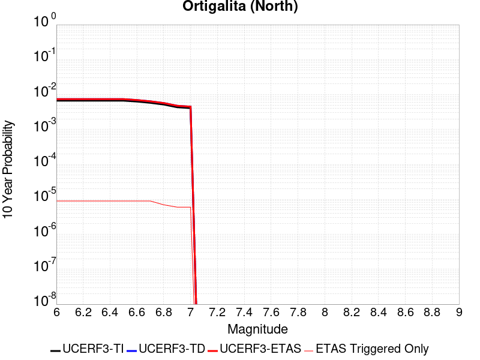 |

| Magnitude | 1 wk TI Prob | 1 wk TD Prob | 1 wk ETAS Prob | 1 wk ETAS/TD Gain | 1 wk ETAS Triggered Only | 1 mo TI Prob | 1 mo TD Prob | 1 mo ETAS Prob | 1 mo ETAS/TD Gain | 1 mo ETAS Triggered Only | 1 yr TI Prob | 1 yr TD Prob | 1 yr ETAS Prob | 1 yr ETAS/TD Gain | 1 yr ETAS Triggered Only | 10 yr TI Prob | 10 yr TD Prob | 10 yr ETAS Prob | 10 yr ETAS/TD Gain | 10 yr ETAS Triggered Only |
|-----|-----|-----|-----|-----|-----|-----|-----|-----|-----|-----|-----|-----|-----|-----|-----|-----|-----|-----|-----|-----|
| 6.0 | 1.2851045E-5 | 1.4149535E-5 | 1.4149535E-5 | 1.0 | 0.0 | 5.5074743E-5 | 6.0639988E-5 | 6.2801046E-5 | 1.0356375 | 2.1611856E-6 | 6.7032874E-4 | 7.381366E-4 | 7.4245577E-4 | 1.0058515 | 4.3223713E-6 | 0.006683103 | 0.007366162 | 0.007376888 | 1.0014561 | 1.0805928E-5 |
| 6.1 | 1.2851045E-5 | 1.4149535E-5 | 1.4149535E-5 | 1.0 | 0.0 | 5.5074743E-5 | 6.0639988E-5 | 6.2801046E-5 | 1.0356375 | 2.1611856E-6 | 6.7032874E-4 | 7.381366E-4 | 7.4245577E-4 | 1.0058515 | 4.3223713E-6 | 0.006683103 | 0.007366162 | 0.007376888 | 1.0014561 | 1.0805928E-5 |
| 6.2 | 1.2851045E-5 | 1.4149535E-5 | 1.4149535E-5 | 1.0 | 0.0 | 5.5074743E-5 | 6.0639988E-5 | 6.2801046E-5 | 1.0356375 | 2.1611856E-6 | 6.7032874E-4 | 7.381366E-4 | 7.4245577E-4 | 1.0058515 | 4.3223713E-6 | 0.006683103 | 0.007366162 | 0.007376888 | 1.0014561 | 1.0805928E-5 |
| 6.3 | 1.2851045E-5 | 1.4149535E-5 | 1.4149535E-5 | 1.0 | 0.0 | 5.5074743E-5 | 6.0639988E-5 | 6.2801046E-5 | 1.0356375 | 2.1611856E-6 | 6.7032874E-4 | 7.381366E-4 | 7.4245577E-4 | 1.0058515 | 4.3223713E-6 | 0.006683103 | 0.007366162 | 0.007376888 | 1.0014561 | 1.0805928E-5 |
| 6.4 | 1.2851045E-5 | 1.4149535E-5 | 1.4149535E-5 | 1.0 | 0.0 | 5.5074743E-5 | 6.0639988E-5 | 6.2801046E-5 | 1.0356375 | 2.1611856E-6 | 6.7032874E-4 | 7.381366E-4 | 7.4245577E-4 | 1.0058515 | 4.3223713E-6 | 0.006683103 | 0.007366162 | 0.007376888 | 1.0014561 | 1.0805928E-5 |
| 6.5 | 1.2851045E-5 | 1.4149535E-5 | 1.4149535E-5 | 1.0 | 0.0 | 5.5074743E-5 | 6.0639988E-5 | 6.2801046E-5 | 1.0356375 | 2.1611856E-6 | 6.7032874E-4 | 7.381366E-4 | 7.4245577E-4 | 1.0058515 | 4.3223713E-6 | 0.006683103 | 0.007366162 | 0.007376888 | 1.0014561 | 1.0805928E-5 |
| 6.6 | 1.2121653E-5 | 1.3341035E-5 | 1.3341035E-5 | 1.0 | 0.0 | 5.1948908E-5 | 5.7175144E-5 | 5.9336206E-5 | 1.0377972 | 2.1611856E-6 | 6.322944E-4 | 6.9597963E-4 | 7.00299E-4 | 1.0062062 | 4.3223713E-6 | 0.0063049835 | 0.006947282 | 0.006958013 | 1.0015446 | 1.0805928E-5 |
| 6.7 | 1.1138555E-5 | 1.225241E-5 | 1.225241E-5 | 1.0 | 0.0 | 4.7735793E-5 | 5.2509804E-5 | 5.4670876E-5 | 1.0411556 | 2.1611856E-6 | 5.810283E-4 | 6.3921354E-4 | 6.4353313E-4 | 1.0067577 | 4.3223713E-6 | 0.0057951147 | 0.0063829916 | 0.006393729 | 1.0016822 | 1.0805928E-5 |
| 6.8 | 9.95085E-6 | 1.09376715E-5 | 1.09376715E-5 | 1.0 | 0.0 | 4.2645803E-5 | 4.687542E-5 | 4.687542E-5 | 1.0 | 0.0 | 5.1908894E-4 | 5.706525E-4 | 5.728124E-4 | 1.003785 | 2.1611856E-6 | 0.0051787808 | 0.0057010585 | 0.005707505 | 1.0011308 | 6.4835567E-6 |
| 6.9 | 8.322863E-6 | 9.140197E-6 | 9.140197E-6 | 1.0 | 0.0 | 3.5668927E-5 | 3.917221E-5 | 3.917221E-5 | 1.0 | 0.0 | 4.3418267E-4 | 4.7690995E-4 | 4.7690995E-4 | 1.0 | 0.0 | 0.004333353 | 0.0047679534 | 0.004772255 | 1.0009022 | 4.3223713E-6 |
| 7.0 | 7.83641E-6 | 8.6048385E-6 | 8.6048385E-6 | 1.0 | 0.0 | 3.3584183E-5 | 3.687788E-5 | 3.687788E-5 | 1.0 | 0.0 | 4.088107E-4 | 4.4898817E-4 | 4.4898817E-4 | 1.0 | 0.0 | 0.0040805945 | 0.0044898815 | 0.0044941846 | 1.0009583 | 4.3223713E-6 |

## Bartlett Springs 2011 CFM
*[(top)](#table-of-contents)*

| 1 Week | 1 Month | 1 Year | 10 Year |
|-----|-----|-----|-----|
|  |  |  | 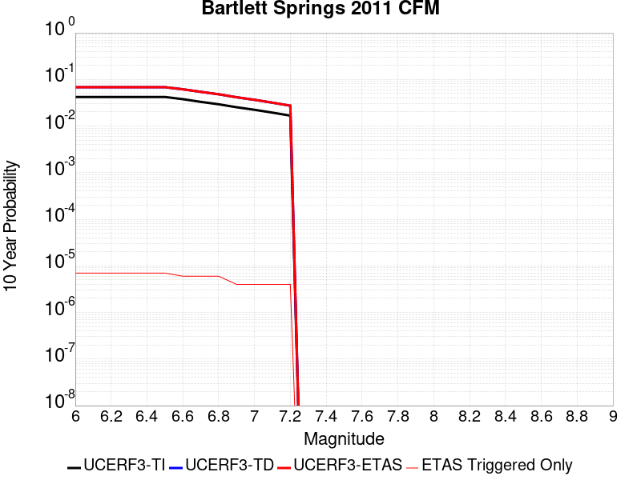 |

| Magnitude | 1 wk TI Prob | 1 wk TD Prob | 1 wk ETAS Prob | 1 wk ETAS/TD Gain | 1 wk ETAS Triggered Only | 1 mo TI Prob | 1 mo TD Prob | 1 mo ETAS Prob | 1 mo ETAS/TD Gain | 1 mo ETAS Triggered Only | 1 yr TI Prob | 1 yr TD Prob | 1 yr ETAS Prob | 1 yr ETAS/TD Gain | 1 yr ETAS Triggered Only | 10 yr TI Prob | 10 yr TD Prob | 10 yr ETAS Prob | 10 yr ETAS/TD Gain | 10 yr ETAS Triggered Only |
|-----|-----|-----|-----|-----|-----|-----|-----|-----|-----|-----|-----|-----|-----|-----|-----|-----|-----|-----|-----|-----|
| 6.0 | 8.242153E-5 | 1.3548869E-4 | 1.376496E-4 | 1.0159489 | 2.1611856E-6 | 3.531873E-4 | 5.805392E-4 | 5.8269914E-4 | 1.0037205 | 2.1611856E-6 | 0.0042915796 | 0.007045981 | 0.007050273 | 1.0006092 | 4.3223713E-6 | 0.042096417 | 0.06832537 | 0.06833141 | 1.0000885 | 6.4835567E-6 |
| 6.1 | 8.242153E-5 | 1.3548869E-4 | 1.376496E-4 | 1.0159489 | 2.1611856E-6 | 3.531873E-4 | 5.805392E-4 | 5.8269914E-4 | 1.0037205 | 2.1611856E-6 | 0.0042915796 | 0.007045981 | 0.007050273 | 1.0006092 | 4.3223713E-6 | 0.042096417 | 0.06832537 | 0.06833141 | 1.0000885 | 6.4835567E-6 |
| 6.2 | 8.242153E-5 | 1.3548869E-4 | 1.376496E-4 | 1.0159489 | 2.1611856E-6 | 3.531873E-4 | 5.805392E-4 | 5.8269914E-4 | 1.0037205 | 2.1611856E-6 | 0.0042915796 | 0.007045981 | 0.007050273 | 1.0006092 | 4.3223713E-6 | 0.042096417 | 0.06832537 | 0.06833141 | 1.0000885 | 6.4835567E-6 |
| 6.3 | 8.242153E-5 | 1.3548869E-4 | 1.376496E-4 | 1.0159489 | 2.1611856E-6 | 3.531873E-4 | 5.805392E-4 | 5.8269914E-4 | 1.0037205 | 2.1611856E-6 | 0.0042915796 | 0.007045981 | 0.007050273 | 1.0006092 | 4.3223713E-6 | 0.042096417 | 0.06832537 | 0.06833141 | 1.0000885 | 6.4835567E-6 |
| 6.4 | 8.242153E-5 | 1.3548869E-4 | 1.376496E-4 | 1.0159489 | 2.1611856E-6 | 3.531873E-4 | 5.805392E-4 | 5.8269914E-4 | 1.0037205 | 2.1611856E-6 | 0.0042915796 | 0.007045981 | 0.007050273 | 1.0006092 | 4.3223713E-6 | 0.042096417 | 0.06832537 | 0.06833141 | 1.0000885 | 6.4835567E-6 |
| 6.5 | 8.242153E-5 | 1.3548869E-4 | 1.376496E-4 | 1.0159489 | 2.1611856E-6 | 3.531873E-4 | 5.805392E-4 | 5.8269914E-4 | 1.0037205 | 2.1611856E-6 | 0.0042915796 | 0.007045981 | 0.007050273 | 1.0006092 | 4.3223713E-6 | 0.042096417 | 0.06832537 | 0.06833141 | 1.0000885 | 6.4835567E-6 |
| 6.6 | 7.3732925E-5 | 1.2139435E-4 | 1.2355526E-4 | 1.0178008 | 2.1611856E-6 | 3.1595997E-4 | 5.201647E-4 | 5.2232476E-4 | 1.0041527 | 2.1611856E-6 | 0.0038400285 | 0.006316066 | 0.0063203606 | 1.00068 | 4.3223713E-6 | 0.037743475 | 0.061516248 | 0.061520305 | 1.0000659 | 4.3223713E-6 |
| 6.7 | 6.4427455E-5 | 1.0639332E-4 | 1.08554275E-4 | 1.020311 | 2.1611856E-6 | 2.7608842E-4 | 4.5590108E-4 | 4.5806126E-4 | 1.0047383 | 2.1611856E-6 | 0.0033561962 | 0.005538538 | 0.0055428366 | 1.000776 | 4.3223713E-6 | 0.03305959 | 0.054209318 | 0.054213405 | 1.0000755 | 4.3223713E-6 |
| 6.8 | 5.705542E-5 | 9.3937684E-5 | 9.609867E-5 | 1.0230044 | 2.1611856E-6 | 2.445003E-4 | 4.025391E-4 | 4.046994E-4 | 1.0053667 | 2.1611856E-6 | 0.0029727279 | 0.0048922407 | 0.0048965416 | 1.0008792 | 4.3223713E-6 | 0.029332744 | 0.04807333 | 0.04807744 | 1.0000856 | 4.3223713E-6 |
| 6.9 | 4.917994E-5 | 8.06976E-5 | 8.06976E-5 | 1.0 | 0.0 | 2.1075415E-4 | 3.458147E-4 | 3.458147E-4 | 1.0 | 0.0 | 0.0025629124 | 0.004204774 | 0.004206926 | 1.0005118 | 2.1611856E-6 | 0.02533555 | 0.04150473 | 0.0415068 | 1.00005 | 2.1611856E-6 |
| 7.0 | 4.3285007E-5 | 7.0767834E-5 | 7.0767834E-5 | 1.0 | 0.0 | 1.8549398E-4 | 3.03271E-4 | 3.03271E-4 | 1.0 | 0.0 | 0.00225605 | 0.0036888847 | 0.003691038 | 1.0005836 | 2.1611856E-6 | 0.022332832 | 0.036549065 | 0.036551148 | 1.000057 | 2.1611856E-6 |
| 7.1 | 3.7582267E-5 | 6.121996E-5 | 6.121996E-5 | 1.0 | 0.0 | 1.6105692E-4 | 2.623618E-4 | 2.623618E-4 | 1.0 | 0.0 | 0.0019591043 | 0.0031925675 | 0.0031947219 | 1.0006747 | 2.1611856E-6 | 0.019419227 | 0.03175786 | 0.031759955 | 1.0000659 | 2.1611856E-6 |
| 7.2 | 3.232781E-5 | 5.250154E-5 | 5.250154E-5 | 1.0 | 0.0 | 1.385404E-4 | 2.2500534E-4 | 2.2500534E-4 | 1.0 | 0.0 | 0.0016854245 | 0.0027391335 | 0.0027412889 | 1.0007869 | 2.1611856E-6 | 0.016726987 | 0.027359791 | 0.027361894 | 1.0000768 | 2.1611856E-6 |

## Rinconada 2011 CFM
*[(top)](#table-of-contents)*

| 1 Week | 1 Month | 1 Year | 10 Year |
|-----|-----|-----|-----|
|  |  |  |  |

| Magnitude | 1 wk TI Prob | 1 wk TD Prob | 1 wk ETAS Prob | 1 wk ETAS/TD Gain | 1 wk ETAS Triggered Only | 1 mo TI Prob | 1 mo TD Prob | 1 mo ETAS Prob | 1 mo ETAS/TD Gain | 1 mo ETAS Triggered Only | 1 yr TI Prob | 1 yr TD Prob | 1 yr ETAS Prob | 1 yr ETAS/TD Gain | 1 yr ETAS Triggered Only | 10 yr TI Prob | 10 yr TD Prob | 10 yr ETAS Prob | 10 yr ETAS/TD Gain | 10 yr ETAS Triggered Only |
|-----|-----|-----|-----|-----|-----|-----|-----|-----|-----|-----|-----|-----|-----|-----|-----|-----|-----|-----|-----|-----|
| 6.0 | 1.1071962E-5 | 1.1724135E-5 | 1.6046455E-5 | 1.3686686 | 4.3223713E-6 | 4.74504E-5 | 5.024544E-5 | 5.4567594E-5 | 1.0860208 | 4.3223713E-6 | 5.775555E-4 | 6.115867E-4 | 6.1590644E-4 | 1.0070632 | 4.3223713E-6 | 0.0057605673 | 0.006101035 | 0.006107479 | 1.0010562 | 6.4835567E-6 |
| 6.1 | 1.1071962E-5 | 1.1724135E-5 | 1.6046455E-5 | 1.3686686 | 4.3223713E-6 | 4.74504E-5 | 5.024544E-5 | 5.4567594E-5 | 1.0860208 | 4.3223713E-6 | 5.775555E-4 | 6.115867E-4 | 6.1590644E-4 | 1.0070632 | 4.3223713E-6 | 0.0057605673 | 0.006101035 | 0.006107479 | 1.0010562 | 6.4835567E-6 |
| 6.2 | 1.1071962E-5 | 1.1724135E-5 | 1.6046455E-5 | 1.3686686 | 4.3223713E-6 | 4.74504E-5 | 5.024544E-5 | 5.4567594E-5 | 1.0860208 | 4.3223713E-6 | 5.775555E-4 | 6.115867E-4 | 6.1590644E-4 | 1.0070632 | 4.3223713E-6 | 0.0057605673 | 0.006101035 | 0.006107479 | 1.0010562 | 6.4835567E-6 |
| 6.3 | 1.1071962E-5 | 1.1724135E-5 | 1.6046455E-5 | 1.3686686 | 4.3223713E-6 | 4.74504E-5 | 5.024544E-5 | 5.4567594E-5 | 1.0860208 | 4.3223713E-6 | 5.775555E-4 | 6.115867E-4 | 6.1590644E-4 | 1.0070632 | 4.3223713E-6 | 0.0057605673 | 0.006101035 | 0.006107479 | 1.0010562 | 6.4835567E-6 |
| 6.4 | 1.1071962E-5 | 1.1724135E-5 | 1.6046455E-5 | 1.3686686 | 4.3223713E-6 | 4.74504E-5 | 5.024544E-5 | 5.4567594E-5 | 1.0860208 | 4.3223713E-6 | 5.775555E-4 | 6.115867E-4 | 6.1590644E-4 | 1.0070632 | 4.3223713E-6 | 0.0057605673 | 0.006101035 | 0.006107479 | 1.0010562 | 6.4835567E-6 |
| 6.5 | 1.1071962E-5 | 1.1724135E-5 | 1.6046455E-5 | 1.3686686 | 4.3223713E-6 | 4.74504E-5 | 5.024544E-5 | 5.4567594E-5 | 1.0860208 | 4.3223713E-6 | 5.775555E-4 | 6.115867E-4 | 6.1590644E-4 | 1.0070632 | 4.3223713E-6 | 0.0057605673 | 0.006101035 | 0.006107479 | 1.0010562 | 6.4835567E-6 |
| 6.6 | 1.0302408E-5 | 1.0909815E-5 | 1.5232138E-5 | 1.3961867 | 4.3223713E-6 | 4.4152428E-5 | 4.6755624E-5 | 5.1077794E-5 | 1.0924417 | 4.3223713E-6 | 5.374232E-4 | 5.6912116E-4 | 5.734411E-4 | 1.0075905 | 4.3223713E-6 | 0.0053612534 | 0.005678627 | 0.005685074 | 1.0011352 | 6.4835567E-6 |
| 6.7 | 9.66584E-6 | 1.0235816E-5 | 1.4558143E-5 | 1.4222747 | 4.3223713E-6 | 4.142437E-5 | 4.386716E-5 | 4.818934E-5 | 1.0985289 | 4.3223713E-6 | 5.0422497E-4 | 5.339719E-4 | 5.38292E-4 | 1.0080904 | 4.3223713E-6 | 0.005030824 | 0.0053288722 | 0.005335321 | 1.0012102 | 6.4835567E-6 |
| 6.8 | 8.79599E-6 | 9.312425E-6 | 1.3634756E-5 | 1.4641466 | 4.3223713E-6 | 3.7696555E-5 | 3.9909897E-5 | 4.4232092E-5 | 1.1082989 | 4.3223713E-6 | 4.588589E-4 | 4.8581464E-4 | 4.9013493E-4 | 1.0088929 | 4.3223713E-6 | 0.004579126 | 0.0048494954 | 0.004855947 | 1.0013305 | 6.4835567E-6 |
| 6.9 | 7.69202E-6 | 8.138578E-6 | 1.2460913E-5 | 1.5310923 | 4.3223713E-6 | 3.2965385E-5 | 3.4879264E-5 | 3.9201484E-5 | 1.1239195 | 4.3223713E-6 | 4.0127963E-4 | 4.2459206E-4 | 4.2891258E-4 | 1.0101757 | 4.3223713E-6 | 0.004005558 | 0.004239751 | 0.004246207 | 1.0015228 | 6.4835567E-6 |
| 7.0 | 6.497495E-6 | 6.8676477E-6 | 1.1189989E-5 | 1.6293772 | 4.3223713E-6 | 2.784611E-5 | 2.9432555E-5 | 3.3754797E-5 | 1.1468525 | 4.3223713E-6 | 3.3897365E-4 | 3.5830197E-4 | 3.6262278E-4 | 1.0120592 | 4.3223713E-6 | 0.0033845706 | 0.0035791604 | 0.0035856208 | 1.001805 | 6.4835567E-6 |
| 7.1 | 5.7995403E-6 | 6.1257683E-6 | 1.0448113E-5 | 1.7056004 | 4.3223713E-6 | 2.4854935E-5 | 2.625314E-5 | 3.0575397E-5 | 1.1646378 | 4.3223713E-6 | 3.0256683E-4 | 3.196045E-4 | 3.239255E-4 | 1.0135198 | 4.3223713E-6 | 0.0030215518 | 0.0031933533 | 0.0031998162 | 1.0020238 | 6.4835567E-6 |
| 7.2 | 5.130714E-6 | 5.414656E-6 | 9.737004E-6 | 1.7982682 | 4.3223713E-6 | 2.1988588E-5 | 2.320557E-5 | 2.7527842E-5 | 1.1862601 | 4.3223713E-6 | 2.6767817E-4 | 2.825105E-4 | 2.8683164E-4 | 1.0152955 | 4.3223713E-6 | 0.0026735596 | 0.0028234075 | 0.0028298728 | 1.0022899 | 6.4835567E-6 |
| 7.3 | 4.295291E-6 | 4.5275724E-6 | 6.6887483E-6 | 1.4773365 | 2.1611856E-6 | 1.840826E-5 | 1.9403846E-5 | 2.1564989E-5 | 1.1113771 | 2.1611856E-6 | 2.2409752E-4 | 2.3623534E-4 | 2.3839601E-4 | 1.0091463 | 2.1611856E-6 | 0.0022387167 | 0.0023617179 | 0.0023660301 | 1.0018258 | 4.3223713E-6 |
| 7.4 | 3.6962015E-6 | 3.894617E-6 | 6.0557936E-6 | 1.554914 | 2.1611856E-6 | 1.5840767E-5 | 1.6691214E-5 | 1.8852363E-5 | 1.1294782 | 2.1611856E-6 | 1.9284427E-4 | 2.0321553E-4 | 2.0537627E-4 | 1.0106328 | 2.1611856E-6 | 0.0019267701 | 0.0020321554 | 0.002034312 | 1.0010613 | 2.1611856E-6 |

## Burnt Mtn
*[(top)](#table-of-contents)*

| 1 Week | 1 Month | 1 Year | 10 Year |
|-----|-----|-----|-----|
|  |  |  |  |

| Magnitude | 1 wk TI Prob | 1 wk TD Prob | 1 wk ETAS Prob | 1 wk ETAS/TD Gain | 1 wk ETAS Triggered Only | 1 mo TI Prob | 1 mo TD Prob | 1 mo ETAS Prob | 1 mo ETAS/TD Gain | 1 mo ETAS Triggered Only | 1 yr TI Prob | 1 yr TD Prob | 1 yr ETAS Prob | 1 yr ETAS/TD Gain | 1 yr ETAS Triggered Only | 10 yr TI Prob | 10 yr TD Prob | 10 yr ETAS Prob | 10 yr ETAS/TD Gain | 10 yr ETAS Triggered Only |
|-----|-----|-----|-----|-----|-----|-----|-----|-----|-----|-----|-----|-----|-----|-----|-----|-----|-----|-----|-----|-----|
| 6.0 | 1.1997946E-5 | 8.64995E-6 | 8.64995E-6 | 1.0 | 0.0 | 5.1418756E-5 | 3.7071215E-5 | 4.139343E-5 | 1.116592 | 4.3223713E-6 | 6.2584353E-4 | 4.5134206E-4 | 4.578227E-4 | 1.0143585 | 6.4835567E-6 | 0.006240839 | 0.0045134206 | 0.0045198747 | 1.00143 | 6.4835567E-6 |
| 6.1 | 1.1997946E-5 | 8.64995E-6 | 8.64995E-6 | 1.0 | 0.0 | 5.1418756E-5 | 3.7071215E-5 | 4.139343E-5 | 1.116592 | 4.3223713E-6 | 6.2584353E-4 | 4.5134206E-4 | 4.578227E-4 | 1.0143585 | 6.4835567E-6 | 0.006240839 | 0.0045134206 | 0.0045198747 | 1.00143 | 6.4835567E-6 |
| 6.2 | 1.1997946E-5 | 8.64995E-6 | 8.64995E-6 | 1.0 | 0.0 | 5.1418756E-5 | 3.7071215E-5 | 4.139343E-5 | 1.116592 | 4.3223713E-6 | 6.2584353E-4 | 4.5134206E-4 | 4.578227E-4 | 1.0143585 | 6.4835567E-6 | 0.006240839 | 0.0045134206 | 0.0045198747 | 1.00143 | 6.4835567E-6 |
| 6.3 | 1.1997946E-5 | 8.64995E-6 | 8.64995E-6 | 1.0 | 0.0 | 5.1418756E-5 | 3.7071215E-5 | 4.139343E-5 | 1.116592 | 4.3223713E-6 | 6.2584353E-4 | 4.5134206E-4 | 4.578227E-4 | 1.0143585 | 6.4835567E-6 | 0.006240839 | 0.0045134206 | 0.0045198747 | 1.00143 | 6.4835567E-6 |
| 6.4 | 1.1997946E-5 | 8.64995E-6 | 8.64995E-6 | 1.0 | 0.0 | 5.1418756E-5 | 3.7071215E-5 | 4.139343E-5 | 1.116592 | 4.3223713E-6 | 6.2584353E-4 | 4.5134206E-4 | 4.578227E-4 | 1.0143585 | 6.4835567E-6 | 0.006240839 | 0.0045134206 | 0.0045198747 | 1.00143 | 6.4835567E-6 |
| 6.5 | 1.1997946E-5 | 8.64995E-6 | 8.64995E-6 | 1.0 | 0.0 | 5.1418756E-5 | 3.7071215E-5 | 4.139343E-5 | 1.116592 | 4.3223713E-6 | 6.2584353E-4 | 4.5134206E-4 | 4.578227E-4 | 1.0143585 | 6.4835567E-6 | 0.006240839 | 0.0045134206 | 0.0045198747 | 1.00143 | 6.4835567E-6 |
| 6.6 | 1.1997946E-5 | 8.64995E-6 | 8.64995E-6 | 1.0 | 0.0 | 5.1418756E-5 | 3.7071215E-5 | 4.139343E-5 | 1.116592 | 4.3223713E-6 | 6.2584353E-4 | 4.5134206E-4 | 4.578227E-4 | 1.0143585 | 6.4835567E-6 | 0.006240839 | 0.0045134206 | 0.0045198747 | 1.00143 | 6.4835567E-6 |

## Great Valley 04a Trout Creek
*[(top)](#table-of-contents)*

| 1 Week | 1 Month | 1 Year | 10 Year |
|-----|-----|-----|-----|
|  |  |  |  |

| Magnitude | 1 wk TI Prob | 1 wk TD Prob | 1 wk ETAS Prob | 1 wk ETAS/TD Gain | 1 wk ETAS Triggered Only | 1 mo TI Prob | 1 mo TD Prob | 1 mo ETAS Prob | 1 mo ETAS/TD Gain | 1 mo ETAS Triggered Only | 1 yr TI Prob | 1 yr TD Prob | 1 yr ETAS Prob | 1 yr ETAS/TD Gain | 1 yr ETAS Triggered Only | 10 yr TI Prob | 10 yr TD Prob | 10 yr ETAS Prob | 10 yr ETAS/TD Gain | 10 yr ETAS Triggered Only |
|-----|-----|-----|-----|-----|-----|-----|-----|-----|-----|-----|-----|-----|-----|-----|-----|-----|-----|-----|-----|-----|
| 6.0 | 2.9044959E-5 | 3.7163332E-5 | 3.9324437E-5 | 1.0581516 | 2.1611856E-6 | 1.2447246E-4 | 1.5927143E-4 | 1.6143227E-4 | 1.0135671 | 2.1611856E-6 | 0.0015143986 | 0.001939099 | 0.001943413 | 1.0022247 | 4.3223713E-6 | 0.015041199 | 0.019386286 | 0.019392643 | 1.000328 | 6.4835567E-6 |
| 6.1 | 2.9044959E-5 | 3.7163332E-5 | 3.9324437E-5 | 1.0581516 | 2.1611856E-6 | 1.2447246E-4 | 1.5927143E-4 | 1.6143227E-4 | 1.0135671 | 2.1611856E-6 | 0.0015143986 | 0.001939099 | 0.001943413 | 1.0022247 | 4.3223713E-6 | 0.015041199 | 0.019386286 | 0.019392643 | 1.000328 | 6.4835567E-6 |
| 6.2 | 2.9044959E-5 | 3.7163332E-5 | 3.9324437E-5 | 1.0581516 | 2.1611856E-6 | 1.2447246E-4 | 1.5927143E-4 | 1.6143227E-4 | 1.0135671 | 2.1611856E-6 | 0.0015143986 | 0.001939099 | 0.001943413 | 1.0022247 | 4.3223713E-6 | 0.015041199 | 0.019386286 | 0.019392643 | 1.000328 | 6.4835567E-6 |
| 6.3 | 2.9044959E-5 | 3.7163332E-5 | 3.9324437E-5 | 1.0581516 | 2.1611856E-6 | 1.2447246E-4 | 1.5927143E-4 | 1.6143227E-4 | 1.0135671 | 2.1611856E-6 | 0.0015143986 | 0.001939099 | 0.001943413 | 1.0022247 | 4.3223713E-6 | 0.015041199 | 0.019386286 | 0.019392643 | 1.000328 | 6.4835567E-6 |
| 6.4 | 2.9044959E-5 | 3.7163332E-5 | 3.9324437E-5 | 1.0581516 | 2.1611856E-6 | 1.2447246E-4 | 1.5927143E-4 | 1.6143227E-4 | 1.0135671 | 2.1611856E-6 | 0.0015143986 | 0.001939099 | 0.001943413 | 1.0022247 | 4.3223713E-6 | 0.015041199 | 0.019386286 | 0.019392643 | 1.000328 | 6.4835567E-6 |

## Likely 2011 CFM
*[(top)](#table-of-contents)*

| 1 Week | 1 Month | 1 Year | 10 Year |
|-----|-----|-----|-----|
|  |  |  |  |

| Magnitude | 1 wk TI Prob | 1 wk TD Prob | 1 wk ETAS Prob | 1 wk ETAS/TD Gain | 1 wk ETAS Triggered Only | 1 mo TI Prob | 1 mo TD Prob | 1 mo ETAS Prob | 1 mo ETAS/TD Gain | 1 mo ETAS Triggered Only | 1 yr TI Prob | 1 yr TD Prob | 1 yr ETAS Prob | 1 yr ETAS/TD Gain | 1 yr ETAS Triggered Only | 10 yr TI Prob | 10 yr TD Prob | 10 yr ETAS Prob | 10 yr ETAS/TD Gain | 10 yr ETAS Triggered Only |
|-----|-----|-----|-----|-----|-----|-----|-----|-----|-----|-----|-----|-----|-----|-----|-----|-----|-----|-----|-----|-----|
| 6.0 | 4.8283173E-6 | 4.977288E-6 | 4.977288E-6 | 1.0 | 0.0 | 2.0692623E-5 | 2.1331109E-5 | 2.1331109E-5 | 1.0 | 0.0 | 2.5190358E-4 | 2.5968385E-4 | 2.640051E-4 | 1.0166404 | 4.3223713E-6 | 0.0025161821 | 0.0025946426 | 0.0025989537 | 1.0016615 | 4.3223713E-6 |
| 6.1 | 4.8283173E-6 | 4.977288E-6 | 4.977288E-6 | 1.0 | 0.0 | 2.0692623E-5 | 2.1331109E-5 | 2.1331109E-5 | 1.0 | 0.0 | 2.5190358E-4 | 2.5968385E-4 | 2.640051E-4 | 1.0166404 | 4.3223713E-6 | 0.0025161821 | 0.0025946426 | 0.0025989537 | 1.0016615 | 4.3223713E-6 |
| 6.2 | 4.8283173E-6 | 4.977288E-6 | 4.977288E-6 | 1.0 | 0.0 | 2.0692623E-5 | 2.1331109E-5 | 2.1331109E-5 | 1.0 | 0.0 | 2.5190358E-4 | 2.5968385E-4 | 2.640051E-4 | 1.0166404 | 4.3223713E-6 | 0.0025161821 | 0.0025946426 | 0.0025989537 | 1.0016615 | 4.3223713E-6 |
| 6.3 | 4.8283173E-6 | 4.977288E-6 | 4.977288E-6 | 1.0 | 0.0 | 2.0692623E-5 | 2.1331109E-5 | 2.1331109E-5 | 1.0 | 0.0 | 2.5190358E-4 | 2.5968385E-4 | 2.640051E-4 | 1.0166404 | 4.3223713E-6 | 0.0025161821 | 0.0025946426 | 0.0025989537 | 1.0016615 | 4.3223713E-6 |
| 6.4 | 4.8283173E-6 | 4.977288E-6 | 4.977288E-6 | 1.0 | 0.0 | 2.0692623E-5 | 2.1331109E-5 | 2.1331109E-5 | 1.0 | 0.0 | 2.5190358E-4 | 2.5968385E-4 | 2.640051E-4 | 1.0166404 | 4.3223713E-6 | 0.0025161821 | 0.0025946426 | 0.0025989537 | 1.0016615 | 4.3223713E-6 |
| 6.5 | 4.8283173E-6 | 4.977288E-6 | 4.977288E-6 | 1.0 | 0.0 | 2.0692623E-5 | 2.1331109E-5 | 2.1331109E-5 | 1.0 | 0.0 | 2.5190358E-4 | 2.5968385E-4 | 2.640051E-4 | 1.0166404 | 4.3223713E-6 | 0.0025161821 | 0.0025946426 | 0.0025989537 | 1.0016615 | 4.3223713E-6 |
| 6.6 | 4.1529042E-6 | 4.2800852E-6 | 4.2800852E-6 | 1.0 | 0.0 | 1.779804E-5 | 1.834314E-5 | 1.834314E-5 | 1.0 | 0.0 | 2.1666959E-4 | 2.2331333E-4 | 2.2763472E-4 | 1.0193514 | 4.3223713E-6 | 0.0021645846 | 0.00223172 | 0.0022360326 | 1.0019325 | 4.3223713E-6 |
| 6.7 | 3.5450967E-6 | 3.6525942E-6 | 3.6525942E-6 | 1.0 | 0.0 | 1.5193183E-5 | 1.5653928E-5 | 1.5653928E-5 | 1.0 | 0.0 | 1.849613E-4 | 1.905783E-4 | 1.9489985E-4 | 1.022676 | 4.3223713E-6 | 0.0018480743 | 0.0019049724 | 0.0019092865 | 1.0022646 | 4.3223713E-6 |
| 6.8 | 2.9935204E-6 | 3.0833778E-6 | 3.0833778E-6 | 1.0 | 0.0 | 1.282931E-5 | 1.3214457E-5 | 1.3214457E-5 | 1.0 | 0.0 | 1.5618566E-4 | 1.6088245E-4 | 1.6520412E-4 | 1.0268623 | 4.3223713E-6 | 0.0015607593 | 0.0016084755 | 0.0016127909 | 1.0026829 | 4.3223713E-6 |
| 6.9 | 2.4887156E-6 | 2.5627064E-6 | 2.5627064E-6 | 1.0 | 0.0 | 1.0665881E-5 | 1.0983028E-5 | 1.0983028E-5 | 1.0 | 0.0 | 1.2984936E-4 | 1.3371836E-4 | 1.3804015E-4 | 1.0323201 | 4.3223713E-6 | 0.0012977351 | 0.0013371836 | 0.0013415002 | 1.0032281 | 4.3223713E-6 |

## Little Salmon (Onshore)
*[(top)](#table-of-contents)*

| 1 Week | 1 Month | 1 Year | 10 Year |
|-----|-----|-----|-----|
|  |  |  |  |

| Magnitude | 1 wk TI Prob | 1 wk TD Prob | 1 wk ETAS Prob | 1 wk ETAS/TD Gain | 1 wk ETAS Triggered Only | 1 mo TI Prob | 1 mo TD Prob | 1 mo ETAS Prob | 1 mo ETAS/TD Gain | 1 mo ETAS Triggered Only | 1 yr TI Prob | 1 yr TD Prob | 1 yr ETAS Prob | 1 yr ETAS/TD Gain | 1 yr ETAS Triggered Only | 10 yr TI Prob | 10 yr TD Prob | 10 yr ETAS Prob | 10 yr ETAS/TD Gain | 10 yr ETAS Triggered Only |
|-----|-----|-----|-----|-----|-----|-----|-----|-----|-----|-----|-----|-----|-----|-----|-----|-----|-----|-----|-----|-----|
| 6.0 | 4.6568723E-5 | 7.707324E-5 | 7.707324E-5 | 1.0 | 0.0 | 1.9956498E-4 | 3.302865E-4 | 3.3244697E-4 | 1.0065413 | 2.1611856E-6 | 0.0024269961 | 0.004016383 | 0.0040185354 | 1.000536 | 2.1611856E-6 | 0.024006605 | 0.039698143 | 0.039702293 | 1.0001045 | 4.3223713E-6 |
| 6.1 | 4.6568723E-5 | 7.707324E-5 | 7.707324E-5 | 1.0 | 0.0 | 1.9956498E-4 | 3.302865E-4 | 3.3244697E-4 | 1.0065413 | 2.1611856E-6 | 0.0024269961 | 0.004016383 | 0.0040185354 | 1.000536 | 2.1611856E-6 | 0.024006605 | 0.039698143 | 0.039702293 | 1.0001045 | 4.3223713E-6 |
| 6.2 | 4.6568723E-5 | 7.707324E-5 | 7.707324E-5 | 1.0 | 0.0 | 1.9956498E-4 | 3.302865E-4 | 3.3244697E-4 | 1.0065413 | 2.1611856E-6 | 0.0024269961 | 0.004016383 | 0.0040185354 | 1.000536 | 2.1611856E-6 | 0.024006605 | 0.039698143 | 0.039702293 | 1.0001045 | 4.3223713E-6 |
| 6.3 | 4.6568723E-5 | 7.707324E-5 | 7.707324E-5 | 1.0 | 0.0 | 1.9956498E-4 | 3.302865E-4 | 3.3244697E-4 | 1.0065413 | 2.1611856E-6 | 0.0024269961 | 0.004016383 | 0.0040185354 | 1.000536 | 2.1611856E-6 | 0.024006605 | 0.039698143 | 0.039702293 | 1.0001045 | 4.3223713E-6 |
| 6.4 | 4.6568723E-5 | 7.707324E-5 | 7.707324E-5 | 1.0 | 0.0 | 1.9956498E-4 | 3.302865E-4 | 3.3244697E-4 | 1.0065413 | 2.1611856E-6 | 0.0024269961 | 0.004016383 | 0.0040185354 | 1.000536 | 2.1611856E-6 | 0.024006605 | 0.039698143 | 0.039702293 | 1.0001045 | 4.3223713E-6 |
| 6.5 | 4.6568723E-5 | 7.707324E-5 | 7.707324E-5 | 1.0 | 0.0 | 1.9956498E-4 | 3.302865E-4 | 3.3244697E-4 | 1.0065413 | 2.1611856E-6 | 0.0024269961 | 0.004016383 | 0.0040185354 | 1.000536 | 2.1611856E-6 | 0.024006605 | 0.039698143 | 0.039702293 | 1.0001045 | 4.3223713E-6 |
| 6.6 | 4.6568723E-5 | 7.707324E-5 | 7.707324E-5 | 1.0 | 0.0 | 1.9956498E-4 | 3.302865E-4 | 3.3244697E-4 | 1.0065413 | 2.1611856E-6 | 0.0024269961 | 0.004016383 | 0.0040185354 | 1.000536 | 2.1611856E-6 | 0.024006605 | 0.039698143 | 0.039702293 | 1.0001045 | 4.3223713E-6 |
| 6.7 | 4.6568723E-5 | 7.707324E-5 | 7.707324E-5 | 1.0 | 0.0 | 1.9956498E-4 | 3.302865E-4 | 3.3244697E-4 | 1.0065413 | 2.1611856E-6 | 0.0024269961 | 0.004016383 | 0.0040185354 | 1.000536 | 2.1611856E-6 | 0.024006605 | 0.039698143 | 0.039702293 | 1.0001045 | 4.3223713E-6 |
| 6.8 | 2.817612E-5 | 4.3363176E-5 | 4.3363176E-5 | 1.0 | 0.0 | 1.2074922E-4 | 1.858391E-4 | 1.858391E-4 | 1.0 | 0.0 | 0.0014691303 | 0.0022620468 | 0.0022620468 | 1.0 | 0.0 | 0.014594556 | 0.022384832 | 0.022386944 | 1.0000944 | 2.1611856E-6 |
| 6.9 | 2.817612E-5 | 4.3363176E-5 | 4.3363176E-5 | 1.0 | 0.0 | 1.2074922E-4 | 1.858391E-4 | 1.858391E-4 | 1.0 | 0.0 | 0.0014691303 | 0.0022620468 | 0.0022620468 | 1.0 | 0.0 | 0.014594556 | 0.022384832 | 0.022386944 | 1.0000944 | 2.1611856E-6 |
| 7.0 | 2.817612E-5 | 4.3363176E-5 | 4.3363176E-5 | 1.0 | 0.0 | 1.2074922E-4 | 1.858391E-4 | 1.858391E-4 | 1.0 | 0.0 | 0.0014691303 | 0.0022620468 | 0.0022620468 | 1.0 | 0.0 | 0.014594556 | 0.022384832 | 0.022386944 | 1.0000944 | 2.1611856E-6 |
| 7.1 | 6.2777285E-6 | 5.618754E-6 | 5.618754E-6 | 1.0 | 0.0 | 2.6904274E-5 | 2.4080293E-5 | 2.4080293E-5 | 1.0 | 0.0 | 3.275103E-4 | 2.931631E-4 | 2.931631E-4 | 1.0 | 0.0 | 0.0032702803 | 0.0029313108 | 0.0029313108 | 1.0 | 0.0 |
| 7.2 | 6.2777285E-6 | 5.618754E-6 | 5.618754E-6 | 1.0 | 0.0 | 2.6904274E-5 | 2.4080293E-5 | 2.4080293E-5 | 1.0 | 0.0 | 3.275103E-4 | 2.931631E-4 | 2.931631E-4 | 1.0 | 0.0 | 0.0032702803 | 0.0029313108 | 0.0029313108 | 1.0 | 0.0 |
| 7.3 | 6.061432E-6 | 5.4547E-6 | 5.4547E-6 | 1.0 | 0.0 | 2.5977308E-5 | 2.3377217E-5 | 2.3377217E-5 | 1.0 | 0.0 | 3.1622782E-4 | 2.846054E-4 | 2.846054E-4 | 1.0 | 0.0 | 0.003157782 | 0.002845529 | 0.002845529 | 1.0 | 0.0 |
| 7.4 | 5.3761873E-6 | 4.8759243E-6 | 4.8759243E-6 | 1.0 | 0.0 | 2.30406E-5 | 2.089679E-5 | 2.089679E-5 | 1.0 | 0.0 | 2.804832E-4 | 2.5441346E-4 | 2.5441346E-4 | 1.0 | 0.0 | 0.0028012944 | 0.0025439227 | 0.0025439227 | 1.0 | 0.0 |
| 7.5 | 4.876217E-6 | 4.4262965E-6 | 4.4262965E-6 | 1.0 | 0.0 | 2.0897905E-5 | 1.8969842E-5 | 1.8969842E-5 | 1.0 | 0.0 | 2.544023E-4 | 2.3095783E-4 | 2.3095783E-4 | 1.0 | 0.0 | 0.0025411125 | 0.0023095782 | 0.0023095782 | 1.0 | 0.0 |

## Maacama 2011 CFM
*[(top)](#table-of-contents)*

| 1 Week | 1 Month | 1 Year | 10 Year |
|-----|-----|-----|-----|
|  |  |  |  |

| Magnitude | 1 wk TI Prob | 1 wk TD Prob | 1 wk ETAS Prob | 1 wk ETAS/TD Gain | 1 wk ETAS Triggered Only | 1 mo TI Prob | 1 mo TD Prob | 1 mo ETAS Prob | 1 mo ETAS/TD Gain | 1 mo ETAS Triggered Only | 1 yr TI Prob | 1 yr TD Prob | 1 yr ETAS Prob | 1 yr ETAS/TD Gain | 1 yr ETAS Triggered Only | 10 yr TI Prob | 10 yr TD Prob | 10 yr ETAS Prob | 10 yr ETAS/TD Gain | 10 yr ETAS Triggered Only |
|-----|-----|-----|-----|-----|-----|-----|-----|-----|-----|-----|-----|-----|-----|-----|-----|-----|-----|-----|-----|-----|
| 6.0 | 1.1397471E-4 | 2.3888213E-4 | 2.410428E-4 | 1.0090449 | 2.1611856E-6 | 4.883716E-4 | 0.0010233513 | 0.0010255104 | 1.0021098 | 2.1611856E-6 | 0.005929726 | 0.0123792365 | 0.012381371 | 1.0001724 | 2.1611856E-6 | 0.057739746 | 0.11623567 | 0.116239496 | 1.0000329 | 4.3223713E-6 |
| 6.1 | 1.1397471E-4 | 2.3888213E-4 | 2.410428E-4 | 1.0090449 | 2.1611856E-6 | 4.883716E-4 | 0.0010233513 | 0.0010255104 | 1.0021098 | 2.1611856E-6 | 0.005929726 | 0.0123792365 | 0.012381371 | 1.0001724 | 2.1611856E-6 | 0.057739746 | 0.11623567 | 0.116239496 | 1.0000329 | 4.3223713E-6 |
| 6.2 | 1.1397471E-4 | 2.3888213E-4 | 2.410428E-4 | 1.0090449 | 2.1611856E-6 | 4.883716E-4 | 0.0010233513 | 0.0010255104 | 1.0021098 | 2.1611856E-6 | 0.005929726 | 0.0123792365 | 0.012381371 | 1.0001724 | 2.1611856E-6 | 0.057739746 | 0.11623567 | 0.116239496 | 1.0000329 | 4.3223713E-6 |
| 6.3 | 1.1397471E-4 | 2.3888213E-4 | 2.410428E-4 | 1.0090449 | 2.1611856E-6 | 4.883716E-4 | 0.0010233513 | 0.0010255104 | 1.0021098 | 2.1611856E-6 | 0.005929726 | 0.0123792365 | 0.012381371 | 1.0001724 | 2.1611856E-6 | 0.057739746 | 0.11623567 | 0.116239496 | 1.0000329 | 4.3223713E-6 |
| 6.4 | 1.1397471E-4 | 2.3888213E-4 | 2.410428E-4 | 1.0090449 | 2.1611856E-6 | 4.883716E-4 | 0.0010233513 | 0.0010255104 | 1.0021098 | 2.1611856E-6 | 0.005929726 | 0.0123792365 | 0.012381371 | 1.0001724 | 2.1611856E-6 | 0.057739746 | 0.11623567 | 0.116239496 | 1.0000329 | 4.3223713E-6 |
| 6.5 | 1.1397471E-4 | 2.3888213E-4 | 2.410428E-4 | 1.0090449 | 2.1611856E-6 | 4.883716E-4 | 0.0010233513 | 0.0010255104 | 1.0021098 | 2.1611856E-6 | 0.005929726 | 0.0123792365 | 0.012381371 | 1.0001724 | 2.1611856E-6 | 0.057739746 | 0.11623567 | 0.116239496 | 1.0000329 | 4.3223713E-6 |
| 6.6 | 1.0527533E-4 | 2.2283354E-4 | 2.2499423E-4 | 1.0096965 | 2.1611856E-6 | 4.5110195E-4 | 9.5463224E-4 | 9.5679134E-4 | 1.0022618 | 2.1611856E-6 | 0.0054783444 | 0.011553699 | 0.011555836 | 1.0001849 | 2.1611856E-6 | 0.053452436 | 0.108992726 | 0.10899658 | 1.0000353 | 4.3223713E-6 |
| 6.7 | 9.575816E-5 | 2.0519714E-4 | 2.0735788E-4 | 1.0105301 | 2.1611856E-6 | 4.1032754E-4 | 8.7910803E-4 | 8.812673E-4 | 1.0024562 | 2.1611856E-6 | 0.0049843 | 0.010645687 | 0.010647825 | 1.0002009 | 2.1611856E-6 | 0.048739783 | 0.1009658 | 0.10096969 | 1.0000385 | 4.3223713E-6 |
| 6.8 | 8.04535E-5 | 1.726804E-4 | 1.726804E-4 | 1.0 | 0.0 | 3.4475516E-4 | 7.3985505E-4 | 7.3985505E-4 | 1.0 | 0.0 | 0.004189318 | 0.0089691775 | 0.0089691775 | 1.0 | 0.0 | 0.041112173 | 0.08595115 | 0.08595115 | 1.0 | 0.0 |
| 6.9 | 7.2530966E-5 | 1.5590987E-4 | 1.5590987E-4 | 1.0 | 0.0 | 3.1080993E-4 | 6.6803093E-4 | 6.6803093E-4 | 1.0 | 0.0 | 0.0037775463 | 0.00810342 | 0.00810342 | 1.0 | 0.0 | 0.037139744 | 0.078110136 | 0.078110136 | 1.0 | 0.0 |
| 7.0 | 6.260435E-5 | 1.3465792E-4 | 1.3465792E-4 | 1.0 | 0.0 | 2.6827675E-4 | 5.7700626E-4 | 5.7700626E-4 | 1.0 | 0.0 | 0.0032613778 | 0.0070053353 | 0.0070053353 | 1.0 | 0.0 | 0.03213927 | 0.068087414 | 0.068087414 | 1.0 | 0.0 |
| 7.1 | 5.5055898E-5 | 1.1855079E-4 | 1.1855079E-4 | 1.0 | 0.0 | 2.359325E-4 | 5.080153E-4 | 5.080153E-4 | 1.0 | 0.0 | 0.0028686945 | 0.0061722714 | 0.0061722714 | 1.0 | 0.0 | 0.02831944 | 0.060414217 | 0.060414217 | 1.0 | 0.0 |
| 7.2 | 4.9762843E-5 | 1.0731735E-4 | 1.0731735E-4 | 1.0 | 0.0 | 2.132519E-4 | 4.5990077E-4 | 4.5990077E-4 | 1.0 | 0.0 | 0.0025932505 | 0.0055908677 | 0.0055908677 | 1.0 | 0.0 | 0.025631964 | 0.05502247 | 0.05502247 | 1.0 | 0.0 |
| 7.3 | 4.247324E-5 | 9.040619E-5 | 9.040619E-5 | 1.0 | 0.0 | 1.8201546E-4 | 3.874551E-4 | 3.874551E-4 | 1.0 | 0.0 | 0.002213786 | 0.004714052 | 0.004714052 | 1.0 | 0.0 | 0.021918617 | 0.046766482 | 0.046766482 | 1.0 | 0.0 |

## West Napa 2011 CFM
*[(top)](#table-of-contents)*

| 1 Week | 1 Month | 1 Year | 10 Year |
|-----|-----|-----|-----|
|  | 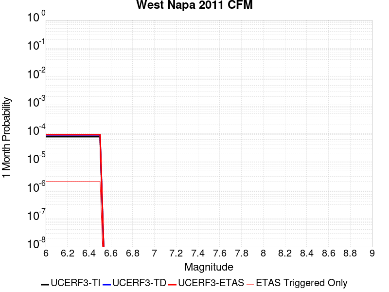 |  |  |

| Magnitude | 1 wk TI Prob | 1 wk TD Prob | 1 wk ETAS Prob | 1 wk ETAS/TD Gain | 1 wk ETAS Triggered Only | 1 mo TI Prob | 1 mo TD Prob | 1 mo ETAS Prob | 1 mo ETAS/TD Gain | 1 mo ETAS Triggered Only | 1 yr TI Prob | 1 yr TD Prob | 1 yr ETAS Prob | 1 yr ETAS/TD Gain | 1 yr ETAS Triggered Only | 10 yr TI Prob | 10 yr TD Prob | 10 yr ETAS Prob | 10 yr ETAS/TD Gain | 10 yr ETAS Triggered Only |
|-----|-----|-----|-----|-----|-----|-----|-----|-----|-----|-----|-----|-----|-----|-----|-----|-----|-----|-----|-----|-----|
| 6.0 | 1.7783477E-5 | 2.0537549E-5 | 2.485983E-5 | 1.2104576 | 4.3223713E-6 | 7.621267E-5 | 8.801807E-5 | 9.234006E-5 | 1.0491035 | 4.3223713E-6 | 9.2749426E-4 | 0.0010716199 | 0.0010759376 | 1.0040292 | 4.3223713E-6 | 0.009236327 | 0.010716184 | 0.010720461 | 1.000399 | 4.3223713E-6 |
| 6.1 | 1.7783477E-5 | 2.0537549E-5 | 2.485983E-5 | 1.2104576 | 4.3223713E-6 | 7.621267E-5 | 8.801807E-5 | 9.234006E-5 | 1.0491035 | 4.3223713E-6 | 9.2749426E-4 | 0.0010716199 | 0.0010759376 | 1.0040292 | 4.3223713E-6 | 0.009236327 | 0.010716184 | 0.010720461 | 1.000399 | 4.3223713E-6 |
| 6.2 | 1.7783477E-5 | 2.0537549E-5 | 2.485983E-5 | 1.2104576 | 4.3223713E-6 | 7.621267E-5 | 8.801807E-5 | 9.234006E-5 | 1.0491035 | 4.3223713E-6 | 9.2749426E-4 | 0.0010716199 | 0.0010759376 | 1.0040292 | 4.3223713E-6 | 0.009236327 | 0.010716184 | 0.010720461 | 1.000399 | 4.3223713E-6 |
| 6.3 | 1.7783477E-5 | 2.0537549E-5 | 2.485983E-5 | 1.2104576 | 4.3223713E-6 | 7.621267E-5 | 8.801807E-5 | 9.234006E-5 | 1.0491035 | 4.3223713E-6 | 9.2749426E-4 | 0.0010716199 | 0.0010759376 | 1.0040292 | 4.3223713E-6 | 0.009236327 | 0.010716184 | 0.010720461 | 1.000399 | 4.3223713E-6 |
| 6.4 | 1.7783477E-5 | 2.0537549E-5 | 2.485983E-5 | 1.2104576 | 4.3223713E-6 | 7.621267E-5 | 8.801807E-5 | 9.234006E-5 | 1.0491035 | 4.3223713E-6 | 9.2749426E-4 | 0.0010716199 | 0.0010759376 | 1.0040292 | 4.3223713E-6 | 0.009236327 | 0.010716184 | 0.010720461 | 1.000399 | 4.3223713E-6 |
| 6.5 | 1.7783477E-5 | 2.0537549E-5 | 2.485983E-5 | 1.2104576 | 4.3223713E-6 | 7.621267E-5 | 8.801807E-5 | 9.234006E-5 | 1.0491035 | 4.3223713E-6 | 9.2749426E-4 | 0.0010716199 | 0.0010759376 | 1.0040292 | 4.3223713E-6 | 0.009236327 | 0.010716184 | 0.010720461 | 1.000399 | 4.3223713E-6 |

## Point Reyes 2011 CFM
*[(top)](#table-of-contents)*

| 1 Week | 1 Month | 1 Year | 10 Year |
|-----|-----|-----|-----|
|  |  |  |  |

| Magnitude | 1 wk TI Prob | 1 wk TD Prob | 1 wk ETAS Prob | 1 wk ETAS/TD Gain | 1 wk ETAS Triggered Only | 1 mo TI Prob | 1 mo TD Prob | 1 mo ETAS Prob | 1 mo ETAS/TD Gain | 1 mo ETAS Triggered Only | 1 yr TI Prob | 1 yr TD Prob | 1 yr ETAS Prob | 1 yr ETAS/TD Gain | 1 yr ETAS Triggered Only | 10 yr TI Prob | 10 yr TD Prob | 10 yr ETAS Prob | 10 yr ETAS/TD Gain | 10 yr ETAS Triggered Only |
|-----|-----|-----|-----|-----|-----|-----|-----|-----|-----|-----|-----|-----|-----|-----|-----|-----|-----|-----|-----|-----|
| 6.0 | 5.880186E-6 | 6.1172223E-6 | 6.1172223E-6 | 1.0 | 0.0 | 2.5200554E-5 | 2.6216505E-5 | 2.8377633E-5 | 1.0824339 | 2.1611856E-6 | 3.0677355E-4 | 3.191572E-4 | 3.234782E-4 | 1.0135387 | 4.3223713E-6 | 0.003063504 | 0.0031887568 | 0.0031930653 | 1.0013512 | 4.3223713E-6 |
| 6.1 | 5.880186E-6 | 6.1172223E-6 | 6.1172223E-6 | 1.0 | 0.0 | 2.5200554E-5 | 2.6216505E-5 | 2.8377633E-5 | 1.0824339 | 2.1611856E-6 | 3.0677355E-4 | 3.191572E-4 | 3.234782E-4 | 1.0135387 | 4.3223713E-6 | 0.003063504 | 0.0031887568 | 0.0031930653 | 1.0013512 | 4.3223713E-6 |
| 6.2 | 5.880186E-6 | 6.1172223E-6 | 6.1172223E-6 | 1.0 | 0.0 | 2.5200554E-5 | 2.6216505E-5 | 2.8377633E-5 | 1.0824339 | 2.1611856E-6 | 3.0677355E-4 | 3.191572E-4 | 3.234782E-4 | 1.0135387 | 4.3223713E-6 | 0.003063504 | 0.0031887568 | 0.0031930653 | 1.0013512 | 4.3223713E-6 |
| 6.3 | 5.880186E-6 | 6.1172223E-6 | 6.1172223E-6 | 1.0 | 0.0 | 2.5200554E-5 | 2.6216505E-5 | 2.8377633E-5 | 1.0824339 | 2.1611856E-6 | 3.0677355E-4 | 3.191572E-4 | 3.234782E-4 | 1.0135387 | 4.3223713E-6 | 0.003063504 | 0.0031887568 | 0.0031930653 | 1.0013512 | 4.3223713E-6 |
| 6.4 | 5.880186E-6 | 6.1172223E-6 | 6.1172223E-6 | 1.0 | 0.0 | 2.5200554E-5 | 2.6216505E-5 | 2.8377633E-5 | 1.0824339 | 2.1611856E-6 | 3.0677355E-4 | 3.191572E-4 | 3.234782E-4 | 1.0135387 | 4.3223713E-6 | 0.003063504 | 0.0031887568 | 0.0031930653 | 1.0013512 | 4.3223713E-6 |
| 6.5 | 5.880186E-6 | 6.1172223E-6 | 6.1172223E-6 | 1.0 | 0.0 | 2.5200554E-5 | 2.6216505E-5 | 2.8377633E-5 | 1.0824339 | 2.1611856E-6 | 3.0677355E-4 | 3.191572E-4 | 3.234782E-4 | 1.0135387 | 4.3223713E-6 | 0.003063504 | 0.0031887568 | 0.0031930653 | 1.0013512 | 4.3223713E-6 |
| 6.6 | 4.962286E-6 | 5.1612233E-6 | 5.1612233E-6 | 1.0 | 0.0 | 2.1266766E-5 | 2.211944E-5 | 2.211944E-5 | 1.0 | 0.0 | 2.588921E-4 | 2.6928863E-4 | 2.7144924E-4 | 1.0080234 | 2.1611856E-6 | 0.002585907 | 0.002691363 | 0.0026935183 | 1.0008008 | 2.1611856E-6 |
| 6.7 | 3.6899585E-6 | 3.8359885E-6 | 3.8359885E-6 | 1.0 | 0.0 | 1.5814012E-5 | 1.6439944E-5 | 1.6439944E-5 | 1.0 | 0.0 | 1.9251858E-4 | 2.0015506E-4 | 2.0231582E-4 | 1.0107954 | 2.1611856E-6 | 0.0019235188 | 0.0020014285 | 0.0020035855 | 1.0010777 | 2.1611856E-6 |
| 6.8 | 3.560543E-6 | 3.7012655E-6 | 3.7012655E-6 | 1.0 | 0.0 | 1.525938E-5 | 1.5862566E-5 | 1.5862566E-5 | 1.0 | 0.0 | 1.8576712E-4 | 1.9312675E-4 | 1.9528752E-4 | 1.0111884 | 2.1611856E-6 | 0.001856119 | 0.0019312674 | 0.0019334245 | 1.0011169 | 2.1611856E-6 |

## North Tahoe 2011 CFM
*[(top)](#table-of-contents)*

| 1 Week | 1 Month | 1 Year | 10 Year |
|-----|-----|-----|-----|
|  | 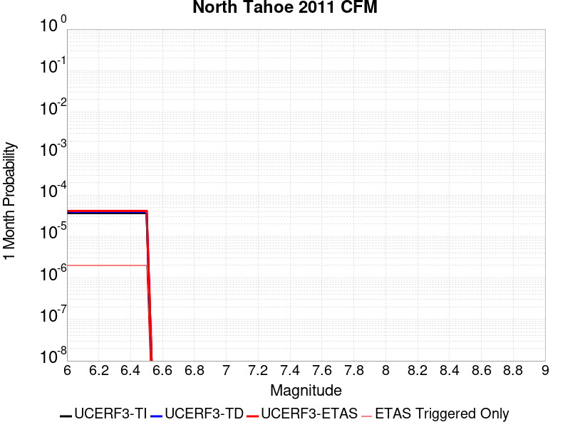 | 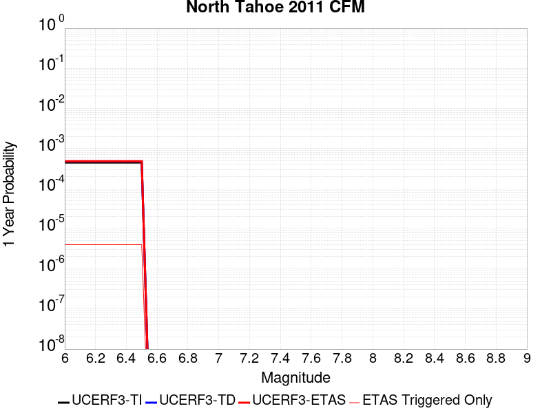 |  |

| Magnitude | 1 wk TI Prob | 1 wk TD Prob | 1 wk ETAS Prob | 1 wk ETAS/TD Gain | 1 wk ETAS Triggered Only | 1 mo TI Prob | 1 mo TD Prob | 1 mo ETAS Prob | 1 mo ETAS/TD Gain | 1 mo ETAS Triggered Only | 1 yr TI Prob | 1 yr TD Prob | 1 yr ETAS Prob | 1 yr ETAS/TD Gain | 1 yr ETAS Triggered Only | 10 yr TI Prob | 10 yr TD Prob | 10 yr ETAS Prob | 10 yr ETAS/TD Gain | 10 yr ETAS Triggered Only |
|-----|-----|-----|-----|-----|-----|-----|-----|-----|-----|-----|-----|-----|-----|-----|-----|-----|-----|-----|-----|-----|
| 6.0 | 8.589771E-6 | 9.184696E-6 | 9.184696E-6 | 1.0 | 0.0 | 3.6812784E-5 | 3.936298E-5 | 4.1524083E-5 | 1.0549018 | 2.1611856E-6 | 4.4810347E-4 | 4.792443E-4 | 4.835646E-4 | 1.0090148 | 4.3223713E-6 | 0.0044720094 | 0.004792443 | 0.004796745 | 1.0008976 | 4.3223713E-6 |
| 6.1 | 8.589771E-6 | 9.184696E-6 | 9.184696E-6 | 1.0 | 0.0 | 3.6812784E-5 | 3.936298E-5 | 4.1524083E-5 | 1.0549018 | 2.1611856E-6 | 4.4810347E-4 | 4.792443E-4 | 4.835646E-4 | 1.0090148 | 4.3223713E-6 | 0.0044720094 | 0.004792443 | 0.004796745 | 1.0008976 | 4.3223713E-6 |
| 6.2 | 8.589771E-6 | 9.184696E-6 | 9.184696E-6 | 1.0 | 0.0 | 3.6812784E-5 | 3.936298E-5 | 4.1524083E-5 | 1.0549018 | 2.1611856E-6 | 4.4810347E-4 | 4.792443E-4 | 4.835646E-4 | 1.0090148 | 4.3223713E-6 | 0.0044720094 | 0.004792443 | 0.004796745 | 1.0008976 | 4.3223713E-6 |
| 6.3 | 8.589771E-6 | 9.184696E-6 | 9.184696E-6 | 1.0 | 0.0 | 3.6812784E-5 | 3.936298E-5 | 4.1524083E-5 | 1.0549018 | 2.1611856E-6 | 4.4810347E-4 | 4.792443E-4 | 4.835646E-4 | 1.0090148 | 4.3223713E-6 | 0.0044720094 | 0.004792443 | 0.004796745 | 1.0008976 | 4.3223713E-6 |
| 6.4 | 8.589771E-6 | 9.184696E-6 | 9.184696E-6 | 1.0 | 0.0 | 3.6812784E-5 | 3.936298E-5 | 4.1524083E-5 | 1.0549018 | 2.1611856E-6 | 4.4810347E-4 | 4.792443E-4 | 4.835646E-4 | 1.0090148 | 4.3223713E-6 | 0.0044720094 | 0.004792443 | 0.004796745 | 1.0008976 | 4.3223713E-6 |
| 6.5 | 8.589771E-6 | 9.184696E-6 | 9.184696E-6 | 1.0 | 0.0 | 3.6812784E-5 | 3.936298E-5 | 4.1524083E-5 | 1.0549018 | 2.1611856E-6 | 4.4810347E-4 | 4.792443E-4 | 4.835646E-4 | 1.0090148 | 4.3223713E-6 | 0.0044720094 | 0.004792443 | 0.004796745 | 1.0008976 | 4.3223713E-6 |

## Greenville (No) 2011 CFM
*[(top)](#table-of-contents)*

| 1 Week | 1 Month | 1 Year | 10 Year |
|-----|-----|-----|-----|
|  | 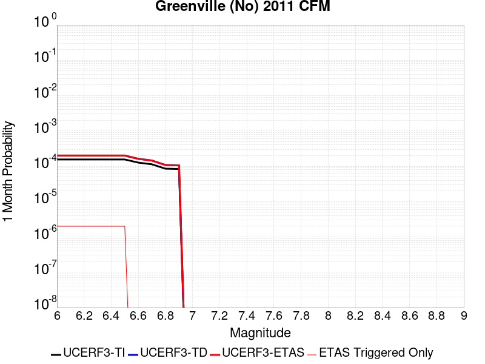 |  |  |

| Magnitude | 1 wk TI Prob | 1 wk TD Prob | 1 wk ETAS Prob | 1 wk ETAS/TD Gain | 1 wk ETAS Triggered Only | 1 mo TI Prob | 1 mo TD Prob | 1 mo ETAS Prob | 1 mo ETAS/TD Gain | 1 mo ETAS Triggered Only | 1 yr TI Prob | 1 yr TD Prob | 1 yr ETAS Prob | 1 yr ETAS/TD Gain | 1 yr ETAS Triggered Only | 10 yr TI Prob | 10 yr TD Prob | 10 yr ETAS Prob | 10 yr ETAS/TD Gain | 10 yr ETAS Triggered Only |
|-----|-----|-----|-----|-----|-----|-----|-----|-----|-----|-----|-----|-----|-----|-----|-----|-----|-----|-----|-----|-----|
| 6.0 | 3.63306E-5 | 4.6667676E-5 | 4.6667676E-5 | 1.0 | 0.0 | 1.5569327E-4 | 1.9999327E-4 | 1.9999327E-4 | 1.0 | 0.0 | 0.0018939174 | 0.0024329948 | 0.0024329948 | 1.0 | 0.0 | 0.018778576 | 0.024141787 | 0.024143897 | 1.0000874 | 2.1611856E-6 |
| 6.1 | 3.63306E-5 | 4.6667676E-5 | 4.6667676E-5 | 1.0 | 0.0 | 1.5569327E-4 | 1.9999327E-4 | 1.9999327E-4 | 1.0 | 0.0 | 0.0018939174 | 0.0024329948 | 0.0024329948 | 1.0 | 0.0 | 0.018778576 | 0.024141787 | 0.024143897 | 1.0000874 | 2.1611856E-6 |
| 6.2 | 3.63306E-5 | 4.6667676E-5 | 4.6667676E-5 | 1.0 | 0.0 | 1.5569327E-4 | 1.9999327E-4 | 1.9999327E-4 | 1.0 | 0.0 | 0.0018939174 | 0.0024329948 | 0.0024329948 | 1.0 | 0.0 | 0.018778576 | 0.024141787 | 0.024143897 | 1.0000874 | 2.1611856E-6 |
| 6.3 | 3.63306E-5 | 4.6667676E-5 | 4.6667676E-5 | 1.0 | 0.0 | 1.5569327E-4 | 1.9999327E-4 | 1.9999327E-4 | 1.0 | 0.0 | 0.0018939174 | 0.0024329948 | 0.0024329948 | 1.0 | 0.0 | 0.018778576 | 0.024141787 | 0.024143897 | 1.0000874 | 2.1611856E-6 |
| 6.4 | 3.63306E-5 | 4.6667676E-5 | 4.6667676E-5 | 1.0 | 0.0 | 1.5569327E-4 | 1.9999327E-4 | 1.9999327E-4 | 1.0 | 0.0 | 0.0018939174 | 0.0024329948 | 0.0024329948 | 1.0 | 0.0 | 0.018778576 | 0.024141787 | 0.024143897 | 1.0000874 | 2.1611856E-6 |
| 6.5 | 3.63306E-5 | 4.6667676E-5 | 4.6667676E-5 | 1.0 | 0.0 | 1.5569327E-4 | 1.9999327E-4 | 1.9999327E-4 | 1.0 | 0.0 | 0.0018939174 | 0.0024329948 | 0.0024329948 | 1.0 | 0.0 | 0.018778576 | 0.024141787 | 0.024143897 | 1.0000874 | 2.1611856E-6 |
| 6.6 | 2.9615265E-5 | 3.7887366E-5 | 3.7887366E-5 | 1.0 | 0.0 | 1.2691639E-4 | 1.6236881E-4 | 1.6236881E-4 | 1.0 | 0.0 | 0.0015441116 | 0.0019758374 | 0.0019758374 | 1.0 | 0.0 | 0.015334264 | 0.019660108 | 0.019662227 | 1.0001078 | 2.1611856E-6 |
| 6.7 | 2.6531234E-5 | 3.391368E-5 | 3.391368E-5 | 1.0 | 0.0 | 1.13700335E-4 | 1.453407E-4 | 1.453407E-4 | 1.0 | 0.0 | 0.0013834225 | 0.0017688754 | 0.0017688754 | 1.0 | 0.0 | 0.013748418 | 0.01762526 | 0.01762738 | 1.0001204 | 2.1611856E-6 |
| 6.8 | 1.9943202E-5 | 2.533084E-5 | 2.533084E-5 | 1.0 | 0.0 | 8.546806E-5 | 1.08560555E-4 | 1.08560555E-4 | 1.0 | 0.0 | 0.001040077 | 0.0013216892 | 0.0013216892 | 1.0 | 0.0 | 0.010352224 | 0.013213348 | 0.013213348 | 1.0 | 0.0 |
| 6.9 | 1.950561E-5 | 2.4769395E-5 | 2.4769395E-5 | 1.0 | 0.0 | 8.35928E-5 | 1.0615455E-4 | 1.0615455E-4 | 1.0 | 0.0 | 0.0010172671 | 0.0012924309 | 0.0012924309 | 1.0 | 0.0 | 0.010126229 | 0.012924177 | 0.012924177 | 1.0 | 0.0 |

## Great Valley 05 Pittsburg - Kirby Hills alt1
*[(top)](#table-of-contents)*

| 1 Week | 1 Month | 1 Year | 10 Year |
|-----|-----|-----|-----|
| 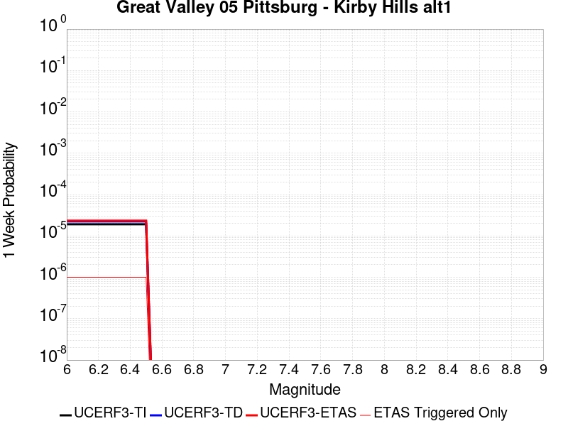 |  |  |  |

| Magnitude | 1 wk TI Prob | 1 wk TD Prob | 1 wk ETAS Prob | 1 wk ETAS/TD Gain | 1 wk ETAS Triggered Only | 1 mo TI Prob | 1 mo TD Prob | 1 mo ETAS Prob | 1 mo ETAS/TD Gain | 1 mo ETAS Triggered Only | 1 yr TI Prob | 1 yr TD Prob | 1 yr ETAS Prob | 1 yr ETAS/TD Gain | 1 yr ETAS Triggered Only | 10 yr TI Prob | 10 yr TD Prob | 10 yr ETAS Prob | 10 yr ETAS/TD Gain | 10 yr ETAS Triggered Only |
|-----|-----|-----|-----|-----|-----|-----|-----|-----|-----|-----|-----|-----|-----|-----|-----|-----|-----|-----|-----|-----|
| 6.0 | 1.9185833E-5 | 2.2430931E-5 | 2.2430931E-5 | 1.0 | 0.0 | 8.222241E-5 | 9.6132564E-5 | 9.829354E-5 | 1.0224792 | 2.1611856E-6 | 0.0010005981 | 0.0011704137 | 0.0011725723 | 1.0018444 | 2.1611856E-6 | 0.009961046 | 0.011704094 | 0.01170623 | 1.0001825 | 2.1611856E-6 |
| 6.1 | 1.9185833E-5 | 2.2430931E-5 | 2.2430931E-5 | 1.0 | 0.0 | 8.222241E-5 | 9.6132564E-5 | 9.829354E-5 | 1.0224792 | 2.1611856E-6 | 0.0010005981 | 0.0011704137 | 0.0011725723 | 1.0018444 | 2.1611856E-6 | 0.009961046 | 0.011704094 | 0.01170623 | 1.0001825 | 2.1611856E-6 |
| 6.2 | 1.9185833E-5 | 2.2430931E-5 | 2.2430931E-5 | 1.0 | 0.0 | 8.222241E-5 | 9.6132564E-5 | 9.829354E-5 | 1.0224792 | 2.1611856E-6 | 0.0010005981 | 0.0011704137 | 0.0011725723 | 1.0018444 | 2.1611856E-6 | 0.009961046 | 0.011704094 | 0.01170623 | 1.0001825 | 2.1611856E-6 |
| 6.3 | 1.9185833E-5 | 2.2430931E-5 | 2.2430931E-5 | 1.0 | 0.0 | 8.222241E-5 | 9.6132564E-5 | 9.829354E-5 | 1.0224792 | 2.1611856E-6 | 0.0010005981 | 0.0011704137 | 0.0011725723 | 1.0018444 | 2.1611856E-6 | 0.009961046 | 0.011704094 | 0.01170623 | 1.0001825 | 2.1611856E-6 |
| 6.4 | 1.9185833E-5 | 2.2430931E-5 | 2.2430931E-5 | 1.0 | 0.0 | 8.222241E-5 | 9.6132564E-5 | 9.829354E-5 | 1.0224792 | 2.1611856E-6 | 0.0010005981 | 0.0011704137 | 0.0011725723 | 1.0018444 | 2.1611856E-6 | 0.009961046 | 0.011704094 | 0.01170623 | 1.0001825 | 2.1611856E-6 |
| 6.5 | 1.9185833E-5 | 2.2430931E-5 | 2.2430931E-5 | 1.0 | 0.0 | 8.222241E-5 | 9.6132564E-5 | 9.829354E-5 | 1.0224792 | 2.1611856E-6 | 0.0010005981 | 0.0011704137 | 0.0011725723 | 1.0018444 | 2.1611856E-6 | 0.009961046 | 0.011704094 | 0.01170623 | 1.0001825 | 2.1611856E-6 |

## Great Valley 03 Mysterious Ridge
*[(top)](#table-of-contents)*

| 1 Week | 1 Month | 1 Year | 10 Year |
|-----|-----|-----|-----|
|  |  |  |  |

| Magnitude | 1 wk TI Prob | 1 wk TD Prob | 1 wk ETAS Prob | 1 wk ETAS/TD Gain | 1 wk ETAS Triggered Only | 1 mo TI Prob | 1 mo TD Prob | 1 mo ETAS Prob | 1 mo ETAS/TD Gain | 1 mo ETAS Triggered Only | 1 yr TI Prob | 1 yr TD Prob | 1 yr ETAS Prob | 1 yr ETAS/TD Gain | 1 yr ETAS Triggered Only | 10 yr TI Prob | 10 yr TD Prob | 10 yr ETAS Prob | 10 yr ETAS/TD Gain | 10 yr ETAS Triggered Only |
|-----|-----|-----|-----|-----|-----|-----|-----|-----|-----|-----|-----|-----|-----|-----|-----|-----|-----|-----|-----|-----|
| 6.0 | 1.9343506E-5 | 2.1910257E-5 | 2.4071394E-5 | 1.0986359 | 2.1611856E-6 | 8.289811E-5 | 9.389859E-5 | 9.605957E-5 | 1.023014 | 2.1611856E-6 | 0.0010088171 | 0.0011427705 | 0.0011449292 | 1.001889 | 2.1611856E-6 | 0.010042497 | 0.011384191 | 0.011386327 | 1.0001876 | 2.1611856E-6 |
| 6.1 | 1.9343506E-5 | 2.1910257E-5 | 2.4071394E-5 | 1.0986359 | 2.1611856E-6 | 8.289811E-5 | 9.389859E-5 | 9.605957E-5 | 1.023014 | 2.1611856E-6 | 0.0010088171 | 0.0011427705 | 0.0011449292 | 1.001889 | 2.1611856E-6 | 0.010042497 | 0.011384191 | 0.011386327 | 1.0001876 | 2.1611856E-6 |
| 6.2 | 1.9343506E-5 | 2.1910257E-5 | 2.4071394E-5 | 1.0986359 | 2.1611856E-6 | 8.289811E-5 | 9.389859E-5 | 9.605957E-5 | 1.023014 | 2.1611856E-6 | 0.0010088171 | 0.0011427705 | 0.0011449292 | 1.001889 | 2.1611856E-6 | 0.010042497 | 0.011384191 | 0.011386327 | 1.0001876 | 2.1611856E-6 |
| 6.3 | 1.9343506E-5 | 2.1910257E-5 | 2.4071394E-5 | 1.0986359 | 2.1611856E-6 | 8.289811E-5 | 9.389859E-5 | 9.605957E-5 | 1.023014 | 2.1611856E-6 | 0.0010088171 | 0.0011427705 | 0.0011449292 | 1.001889 | 2.1611856E-6 | 0.010042497 | 0.011384191 | 0.011386327 | 1.0001876 | 2.1611856E-6 |
| 6.4 | 1.9343506E-5 | 2.1910257E-5 | 2.4071394E-5 | 1.0986359 | 2.1611856E-6 | 8.289811E-5 | 9.389859E-5 | 9.605957E-5 | 1.023014 | 2.1611856E-6 | 0.0010088171 | 0.0011427705 | 0.0011449292 | 1.001889 | 2.1611856E-6 | 0.010042497 | 0.011384191 | 0.011386327 | 1.0001876 | 2.1611856E-6 |
| 6.5 | 1.9343506E-5 | 2.1910257E-5 | 2.4071394E-5 | 1.0986359 | 2.1611856E-6 | 8.289811E-5 | 9.389859E-5 | 9.605957E-5 | 1.023014 | 2.1611856E-6 | 0.0010088171 | 0.0011427705 | 0.0011449292 | 1.001889 | 2.1611856E-6 | 0.010042497 | 0.011384191 | 0.011386327 | 1.0001876 | 2.1611856E-6 |
| 6.6 | 1.7440449E-5 | 1.9750794E-5 | 2.1911937E-5 | 1.1094205 | 2.1611856E-6 | 7.474264E-5 | 8.464438E-5 | 8.680538E-5 | 1.0255303 | 2.1611856E-6 | 9.096117E-4 | 0.0010302118 | 0.0010323707 | 1.0020957 | 2.1611856E-6 | 0.009058975 | 0.010269466 | 0.010271605 | 1.0002083 | 2.1611856E-6 |
| 6.7 | 1.468422E-5 | 1.6604492E-5 | 1.8765642E-5 | 1.1301545 | 2.1611856E-6 | 6.2930856E-5 | 7.116102E-5 | 7.332205E-5 | 1.0303682 | 2.1611856E-6 | 7.659138E-4 | 8.6619187E-4 | 8.683512E-4 | 1.0024929 | 2.1611856E-6 | 0.007632794 | 0.008642968 | 0.008645111 | 1.0002478 | 2.1611856E-6 |
| 6.8 | 1.211602E-5 | 1.3673764E-5 | 1.5834921E-5 | 1.1580513 | 2.1611856E-6 | 5.1924766E-5 | 5.8601363E-5 | 6.076242E-5 | 1.0368773 | 2.1611856E-6 | 6.320007E-4 | 7.133854E-4 | 7.1554503E-4 | 1.0030273 | 2.1611856E-6 | 0.006302063 | 0.007125407 | 0.0071275528 | 1.0003011 | 2.1611856E-6 |
| 6.9 | 9.837659E-6 | 1.1085766E-5 | 1.3246928E-5 | 1.1949493 | 2.1611856E-6 | 4.2160715E-5 | 4.7510377E-5 | 4.967146E-5 | 1.0454866 | 2.1611856E-6 | 5.131858E-4 | 5.7842984E-4 | 5.8058975E-4 | 1.0037341 | 2.1611856E-6 | 0.005120023 | 0.005783415 | 0.0057855635 | 1.0003716 | 2.1611856E-6 |
| 7.0 | 9.54151E-6 | 1.0750372E-5 | 1.2911534E-5 | 1.2010314 | 2.1611856E-6 | 4.0891544E-5 | 4.6073023E-5 | 4.823411E-5 | 1.0469056 | 2.1611856E-6 | 4.977408E-4 | 5.609391E-4 | 5.6309905E-4 | 1.0038506 | 2.1611856E-6 | 0.0049662744 | 0.0056093903 | 0.00561154 | 1.0003831 | 2.1611856E-6 |

## Camp Rock 2011
*[(top)](#table-of-contents)*

| 1 Week | 1 Month | 1 Year | 10 Year |
|-----|-----|-----|-----|
|  |  | 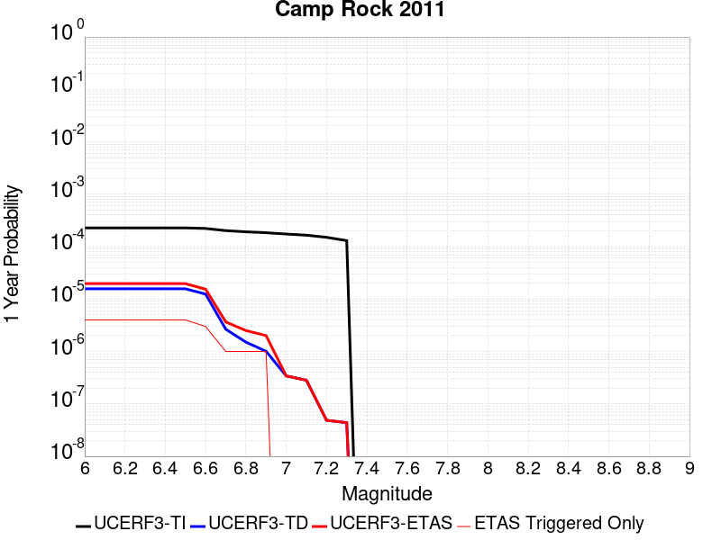 |  |

| Magnitude | 1 wk TI Prob | 1 wk TD Prob | 1 wk ETAS Prob | 1 wk ETAS/TD Gain | 1 wk ETAS Triggered Only | 1 mo TI Prob | 1 mo TD Prob | 1 mo ETAS Prob | 1 mo ETAS/TD Gain | 1 mo ETAS Triggered Only | 1 yr TI Prob | 1 yr TD Prob | 1 yr ETAS Prob | 1 yr ETAS/TD Gain | 1 yr ETAS Triggered Only | 10 yr TI Prob | 10 yr TD Prob | 10 yr ETAS Prob | 10 yr ETAS/TD Gain | 10 yr ETAS Triggered Only |
|-----|-----|-----|-----|-----|-----|-----|-----|-----|-----|-----|-----|-----|-----|-----|-----|-----|-----|-----|-----|-----|
| 6.0 | 4.366639E-6 | 3.0054525E-7 | 2.4617302E-6 | 8.190881 | 2.1611856E-6 | 1.8714034E-5 | 1.2880505E-6 | 3.4492332E-6 | 2.6778712 | 2.1611856E-6 | 2.2781953E-4 | 1.5681926E-5 | 1.7843076E-5 | 1.1378117 | 2.1611856E-6 | 0.002275861 | 1.5681045E-4 | 1.5897129E-4 | 1.01378 | 2.1611856E-6 |
| 6.1 | 4.366639E-6 | 3.0054525E-7 | 2.4617302E-6 | 8.190881 | 2.1611856E-6 | 1.8714034E-5 | 1.2880505E-6 | 3.4492332E-6 | 2.6778712 | 2.1611856E-6 | 2.2781953E-4 | 1.5681926E-5 | 1.7843076E-5 | 1.1378117 | 2.1611856E-6 | 0.002275861 | 1.5681045E-4 | 1.5897129E-4 | 1.01378 | 2.1611856E-6 |
| 6.2 | 4.366639E-6 | 3.0054525E-7 | 2.4617302E-6 | 8.190881 | 2.1611856E-6 | 1.8714034E-5 | 1.2880505E-6 | 3.4492332E-6 | 2.6778712 | 2.1611856E-6 | 2.2781953E-4 | 1.5681926E-5 | 1.7843076E-5 | 1.1378117 | 2.1611856E-6 | 0.002275861 | 1.5681045E-4 | 1.5897129E-4 | 1.01378 | 2.1611856E-6 |
| 6.3 | 4.366639E-6 | 3.0054525E-7 | 2.4617302E-6 | 8.190881 | 2.1611856E-6 | 1.8714034E-5 | 1.2880505E-6 | 3.4492332E-6 | 2.6778712 | 2.1611856E-6 | 2.2781953E-4 | 1.5681926E-5 | 1.7843076E-5 | 1.1378117 | 2.1611856E-6 | 0.002275861 | 1.5681045E-4 | 1.5897129E-4 | 1.01378 | 2.1611856E-6 |
| 6.4 | 4.366639E-6 | 3.0054525E-7 | 2.4617302E-6 | 8.190881 | 2.1611856E-6 | 1.8714034E-5 | 1.2880505E-6 | 3.4492332E-6 | 2.6778712 | 2.1611856E-6 | 2.2781953E-4 | 1.5681926E-5 | 1.7843076E-5 | 1.1378117 | 2.1611856E-6 | 0.002275861 | 1.5681045E-4 | 1.5897129E-4 | 1.01378 | 2.1611856E-6 |
| 6.5 | 4.366639E-6 | 3.0054525E-7 | 2.4617302E-6 | 8.190881 | 2.1611856E-6 | 1.8714034E-5 | 1.2880505E-6 | 3.4492332E-6 | 2.6778712 | 2.1611856E-6 | 2.2781953E-4 | 1.5681926E-5 | 1.7843076E-5 | 1.1378117 | 2.1611856E-6 | 0.002275861 | 1.5681045E-4 | 1.5897129E-4 | 1.01378 | 2.1611856E-6 |
| 6.6 | 4.2648153E-6 | 2.3829955E-7 | 2.3994846E-6 | 10.069195 | 2.1611856E-6 | 1.8277651E-5 | 1.0212834E-6 | 3.1824668E-6 | 3.1161444 | 2.1611856E-6 | 2.2250768E-4 | 1.2434075E-5 | 1.4595234E-5 | 1.1738094 | 2.1611856E-6 | 0.0022228502 | 1.2433571E-4 | 1.2649663E-4 | 1.0173796 | 2.1611856E-6 |
| 6.7 | 3.873362E-6 | 5.1035617E-8 | 5.1035617E-8 | 1.0 | 0.0 | 1.6600017E-5 | 2.1872405E-7 | 2.1872405E-7 | 1.0 | 0.0 | 2.0208646E-4 | 2.662963E-6 | 2.662963E-6 | 1.0 | 0.0 | 0.002019028 | 2.6629392E-5 | 2.6629392E-5 | 1.0 | 0.0 |
| 6.8 | 3.6782014E-6 | 2.8925031E-8 | 2.8925031E-8 | 1.0 | 0.0 | 1.5763624E-5 | 1.2396441E-7 | 1.2396441E-7 | 1.0 | 0.0 | 1.9190523E-4 | 1.509266E-6 | 1.509266E-6 | 1.0 | 0.0 | 0.0019173959 | 1.5092586E-5 | 1.5092586E-5 | 1.0 | 0.0 |
| 6.9 | 3.5366595E-6 | 1.9346416E-8 | 1.9346416E-8 | 1.0 | 0.0 | 1.5157024E-5 | 8.291321E-8 | 8.291321E-8 | 1.0 | 0.0 | 1.8452114E-4 | 1.0094681E-6 | 1.0094681E-6 | 1.0 | 0.0 | 0.00184368 | 1.0094653E-5 | 1.0094653E-5 | 1.0 | 0.0 |
| 7.0 | 3.3366227E-6 | 6.549833E-9 | 6.549833E-9 | 1.0 | 0.0 | 1.4299733E-5 | 2.8070712E-8 | 2.8070712E-8 | 1.0 | 0.0 | 1.7408533E-4 | 3.417609E-7 | 3.417609E-7 | 1.0 | 0.0 | 0.0017394903 | 3.4176064E-6 | 3.4176064E-6 | 1.0 | 0.0 |
| 7.1 | 3.1700695E-6 | 5.4303326E-9 | 5.4303326E-9 | 1.0 | 0.0 | 1.3585942E-5 | 2.3272854E-8 | 2.3272854E-8 | 1.0 | 0.0 | 1.6539628E-4 | 2.83347E-7 | 2.83347E-7 | 1.0 | 0.0 | 0.0016527324 | 2.833469E-6 | 2.833469E-6 | 1.0 | 0.0 |
| 7.2 | 2.8879267E-6 | 9.331039E-10 | 9.331039E-10 | 1.0 | 0.0 | 1.237677E-5 | 3.999017E-9 | 3.999017E-9 | 1.0 | 0.0 | 1.5067676E-4 | 4.868803E-8 | 4.868803E-8 | 1.0 | 0.0 | 0.0015057464 | 4.868803E-7 | 4.868803E-7 | 1.0 | 0.0 |
| 7.3 | 2.4973094E-6 | 8.4248597E-10 | 8.4248597E-10 | 1.0 | 0.0 | 1.0702711E-5 | 3.6106542E-9 | 3.6106542E-9 | 1.0 | 0.0 | 1.3029772E-4 | 4.3959716E-8 | 4.3959716E-8 | 1.0 | 0.0 | 0.0013022134 | 4.3959716E-7 | 4.3959716E-7 | 1.0 | 0.0 |

## Fish Slough 2011 CFM
*[(top)](#table-of-contents)*

| 1 Week | 1 Month | 1 Year | 10 Year |
|-----|-----|-----|-----|
|  | 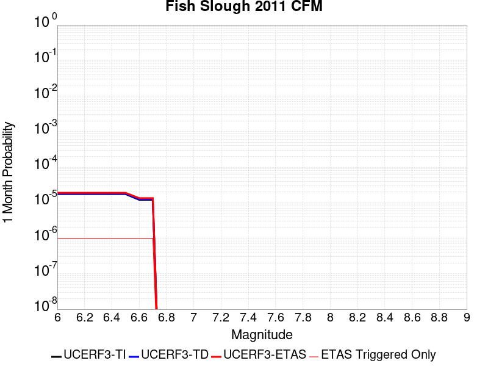 | 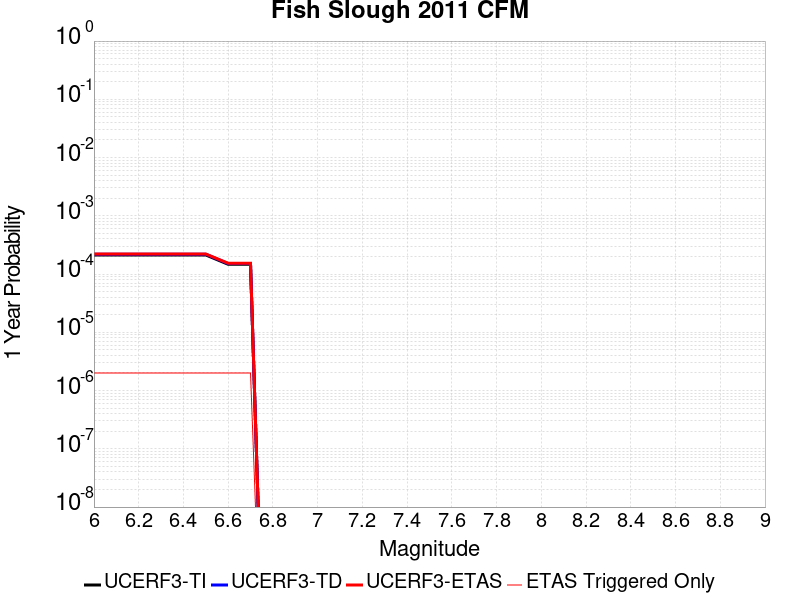 |  |

| Magnitude | 1 wk TI Prob | 1 wk TD Prob | 1 wk ETAS Prob | 1 wk ETAS/TD Gain | 1 wk ETAS Triggered Only | 1 mo TI Prob | 1 mo TD Prob | 1 mo ETAS Prob | 1 mo ETAS/TD Gain | 1 mo ETAS Triggered Only | 1 yr TI Prob | 1 yr TD Prob | 1 yr ETAS Prob | 1 yr ETAS/TD Gain | 1 yr ETAS Triggered Only | 10 yr TI Prob | 10 yr TD Prob | 10 yr ETAS Prob | 10 yr ETAS/TD Gain | 10 yr ETAS Triggered Only |
|-----|-----|-----|-----|-----|-----|-----|-----|-----|-----|-----|-----|-----|-----|-----|-----|-----|-----|-----|-----|-----|
| 6.0 | 4.080039E-6 | 4.1994913E-6 | 6.3606676E-6 | 1.5146282 | 2.1611856E-6 | 1.7485765E-5 | 1.7997761E-5 | 2.0158906E-5 | 1.1200787 | 2.1611856E-6 | 2.1286838E-4 | 2.1911228E-4 | 2.2127299E-4 | 1.0098612 | 2.1611856E-6 | 0.002126646 | 0.002190098 | 0.0021922544 | 1.0009847 | 2.1611856E-6 |
| 6.1 | 4.080039E-6 | 4.1994913E-6 | 6.3606676E-6 | 1.5146282 | 2.1611856E-6 | 1.7485765E-5 | 1.7997761E-5 | 2.0158906E-5 | 1.1200787 | 2.1611856E-6 | 2.1286838E-4 | 2.1911228E-4 | 2.2127299E-4 | 1.0098612 | 2.1611856E-6 | 0.002126646 | 0.002190098 | 0.0021922544 | 1.0009847 | 2.1611856E-6 |
| 6.2 | 4.080039E-6 | 4.1994913E-6 | 6.3606676E-6 | 1.5146282 | 2.1611856E-6 | 1.7485765E-5 | 1.7997761E-5 | 2.0158906E-5 | 1.1200787 | 2.1611856E-6 | 2.1286838E-4 | 2.1911228E-4 | 2.2127299E-4 | 1.0098612 | 2.1611856E-6 | 0.002126646 | 0.002190098 | 0.0021922544 | 1.0009847 | 2.1611856E-6 |
| 6.3 | 4.080039E-6 | 4.1994913E-6 | 6.3606676E-6 | 1.5146282 | 2.1611856E-6 | 1.7485765E-5 | 1.7997761E-5 | 2.0158906E-5 | 1.1200787 | 2.1611856E-6 | 2.1286838E-4 | 2.1911228E-4 | 2.2127299E-4 | 1.0098612 | 2.1611856E-6 | 0.002126646 | 0.002190098 | 0.0021922544 | 1.0009847 | 2.1611856E-6 |
| 6.4 | 4.080039E-6 | 4.1994913E-6 | 6.3606676E-6 | 1.5146282 | 2.1611856E-6 | 1.7485765E-5 | 1.7997761E-5 | 2.0158906E-5 | 1.1200787 | 2.1611856E-6 | 2.1286838E-4 | 2.1911228E-4 | 2.2127299E-4 | 1.0098612 | 2.1611856E-6 | 0.002126646 | 0.002190098 | 0.0021922544 | 1.0009847 | 2.1611856E-6 |
| 6.5 | 4.080039E-6 | 4.1994913E-6 | 6.3606676E-6 | 1.5146282 | 2.1611856E-6 | 1.7485765E-5 | 1.7997761E-5 | 2.0158906E-5 | 1.1200787 | 2.1611856E-6 | 2.1286838E-4 | 2.1911228E-4 | 2.2127299E-4 | 1.0098612 | 2.1611856E-6 | 0.002126646 | 0.002190098 | 0.0021922544 | 1.0009847 | 2.1611856E-6 |
| 6.6 | 2.8215584E-6 | 2.9034215E-6 | 5.064601E-6 | 1.744356 | 2.1611856E-6 | 1.2092337E-5 | 1.2443235E-5 | 1.4604394E-5 | 1.1736814 | 2.1611856E-6 | 1.4721425E-4 | 1.514964E-4 | 1.5365725E-4 | 1.0142634 | 2.1611856E-6 | 0.0014711677 | 0.0015149639 | 0.0015171218 | 1.0014244 | 2.1611856E-6 |
| 6.7 | 2.8215584E-6 | 2.9034215E-6 | 5.064601E-6 | 1.744356 | 2.1611856E-6 | 1.2092337E-5 | 1.2443235E-5 | 1.4604394E-5 | 1.1736814 | 2.1611856E-6 | 1.4721425E-4 | 1.514964E-4 | 1.5365725E-4 | 1.0142634 | 2.1611856E-6 | 0.0014711677 | 0.0015149639 | 0.0015171218 | 1.0014244 | 2.1611856E-6 |

## Monterey Bay-Tularcitos
*[(top)](#table-of-contents)*

| 1 Week | 1 Month | 1 Year | 10 Year |
|-----|-----|-----|-----|
| 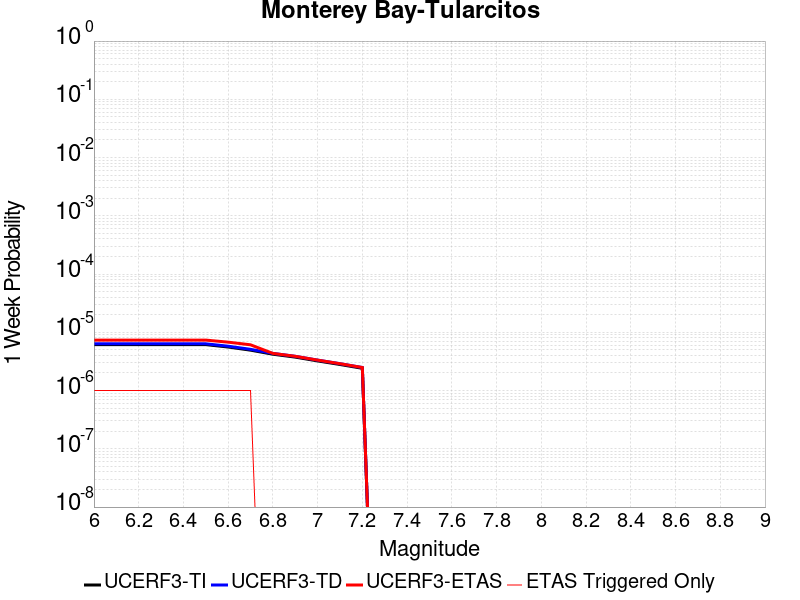 |  |  |  |

| Magnitude | 1 wk TI Prob | 1 wk TD Prob | 1 wk ETAS Prob | 1 wk ETAS/TD Gain | 1 wk ETAS Triggered Only | 1 mo TI Prob | 1 mo TD Prob | 1 mo ETAS Prob | 1 mo ETAS/TD Gain | 1 mo ETAS Triggered Only | 1 yr TI Prob | 1 yr TD Prob | 1 yr ETAS Prob | 1 yr ETAS/TD Gain | 1 yr ETAS Triggered Only | 10 yr TI Prob | 10 yr TD Prob | 10 yr ETAS Prob | 10 yr ETAS/TD Gain | 10 yr ETAS Triggered Only |
|-----|-----|-----|-----|-----|-----|-----|-----|-----|-----|-----|-----|-----|-----|-----|-----|-----|-----|-----|-----|-----|
| 6.0 | 6.147834E-6 | 6.3537386E-6 | 8.51491E-6 | 1.3401418 | 2.1611856E-6 | 2.6347594E-5 | 2.7230071E-5 | 2.9391198E-5 | 1.0793655 | 2.1611856E-6 | 3.2073475E-4 | 3.314838E-4 | 3.336443E-4 | 1.0065175 | 2.1611856E-6 | 0.0032027222 | 0.003310695 | 0.0033128492 | 1.0006506 | 2.1611856E-6 |
| 6.1 | 6.147834E-6 | 6.3537386E-6 | 8.51491E-6 | 1.3401418 | 2.1611856E-6 | 2.6347594E-5 | 2.7230071E-5 | 2.9391198E-5 | 1.0793655 | 2.1611856E-6 | 3.2073475E-4 | 3.314838E-4 | 3.336443E-4 | 1.0065175 | 2.1611856E-6 | 0.0032027222 | 0.003310695 | 0.0033128492 | 1.0006506 | 2.1611856E-6 |
| 6.2 | 6.147834E-6 | 6.3537386E-6 | 8.51491E-6 | 1.3401418 | 2.1611856E-6 | 2.6347594E-5 | 2.7230071E-5 | 2.9391198E-5 | 1.0793655 | 2.1611856E-6 | 3.2073475E-4 | 3.314838E-4 | 3.336443E-4 | 1.0065175 | 2.1611856E-6 | 0.0032027222 | 0.003310695 | 0.0033128492 | 1.0006506 | 2.1611856E-6 |
| 6.3 | 6.147834E-6 | 6.3537386E-6 | 8.51491E-6 | 1.3401418 | 2.1611856E-6 | 2.6347594E-5 | 2.7230071E-5 | 2.9391198E-5 | 1.0793655 | 2.1611856E-6 | 3.2073475E-4 | 3.314838E-4 | 3.336443E-4 | 1.0065175 | 2.1611856E-6 | 0.0032027222 | 0.003310695 | 0.0033128492 | 1.0006506 | 2.1611856E-6 |
| 6.4 | 6.147834E-6 | 6.3537386E-6 | 8.51491E-6 | 1.3401418 | 2.1611856E-6 | 2.6347594E-5 | 2.7230071E-5 | 2.9391198E-5 | 1.0793655 | 2.1611856E-6 | 3.2073475E-4 | 3.314838E-4 | 3.336443E-4 | 1.0065175 | 2.1611856E-6 | 0.0032027222 | 0.003310695 | 0.0033128492 | 1.0006506 | 2.1611856E-6 |
| 6.5 | 6.147834E-6 | 6.3537386E-6 | 8.51491E-6 | 1.3401418 | 2.1611856E-6 | 2.6347594E-5 | 2.7230071E-5 | 2.9391198E-5 | 1.0793655 | 2.1611856E-6 | 3.2073475E-4 | 3.314838E-4 | 3.336443E-4 | 1.0065175 | 2.1611856E-6 | 0.0032027222 | 0.003310695 | 0.0033128492 | 1.0006506 | 2.1611856E-6 |
| 6.6 | 5.589465E-6 | 5.775827E-6 | 7.937E-6 | 1.3741755 | 2.1611856E-6 | 2.3954632E-5 | 2.4753355E-5 | 2.6914488E-5 | 1.0873066 | 2.1611856E-6 | 2.916086E-4 | 3.0133853E-4 | 3.0349905E-4 | 1.0071698 | 2.1611856E-6 | 0.0029122625 | 0.0030100958 | 0.0030122504 | 1.0007159 | 2.1611856E-6 |
| 6.7 | 4.9405426E-6 | 5.1041475E-6 | 7.265322E-6 | 1.4234154 | 2.1611856E-6 | 2.1173582E-5 | 2.187478E-5 | 2.4035917E-5 | 1.0987959 | 2.1611856E-6 | 2.5775787E-4 | 2.6630092E-4 | 2.6846153E-4 | 1.0081134 | 2.1611856E-6 | 0.002574591 | 0.002660607 | 0.0026627623 | 1.0008101 | 2.1611856E-6 |
| 6.8 | 4.208054E-6 | 4.3459117E-6 | 4.3459117E-6 | 1.0 | 0.0 | 1.8034392E-5 | 1.8625247E-5 | 1.8625247E-5 | 1.0 | 0.0 | 2.1954661E-4 | 2.2674672E-4 | 2.2674672E-4 | 1.0 | 0.0 | 0.0021932982 | 0.002265932 | 0.002265932 | 1.0 | 0.0 |
| 6.9 | 3.7512484E-6 | 3.873087E-6 | 3.873087E-6 | 1.0 | 0.0 | 1.607668E-5 | 1.6598884E-5 | 1.6598884E-5 | 1.0 | 0.0 | 1.95716E-4 | 2.0208056E-4 | 2.0208056E-4 | 1.0 | 0.0 | 0.0019554372 | 0.0020197425 | 0.0020197425 | 1.0 | 0.0 |
| 7.0 | 3.2285764E-6 | 3.3316937E-6 | 3.3316937E-6 | 1.0 | 0.0 | 1.3836683E-5 | 1.4278654E-5 | 1.4278654E-5 | 1.0 | 0.0 | 1.6844859E-4 | 1.7383658E-4 | 1.7383658E-4 | 1.0 | 0.0 | 0.0016832096 | 0.001737775 | 0.001737775 | 1.0 | 0.0 |
| 7.1 | 2.8032086E-6 | 2.8916106E-6 | 2.8916106E-6 | 1.0 | 0.0 | 1.2013696E-5 | 1.2392602E-5 | 1.2392602E-5 | 1.0 | 0.0 | 1.4625693E-4 | 1.5087728E-4 | 1.5087728E-4 | 1.0 | 0.0 | 0.001461607 | 0.0015085127 | 0.0015085127 | 1.0 | 0.0 |
| 7.2 | 2.4112803E-6 | 2.4866415E-6 | 2.4866415E-6 | 1.0 | 0.0 | 1.0334018E-5 | 1.0657035E-5 | 1.0657035E-5 | 1.0 | 0.0 | 1.258094E-4 | 1.297494E-4 | 1.297494E-4 | 1.0 | 0.0 | 0.001257382 | 0.001297494 | 0.001297494 | 1.0 | 0.0 |

## Mad River (alt1)
*[(top)](#table-of-contents)*

| 1 Week | 1 Month | 1 Year | 10 Year |
|-----|-----|-----|-----|
|  |  |  |  |

| Magnitude | 1 wk TI Prob | 1 wk TD Prob | 1 wk ETAS Prob | 1 wk ETAS/TD Gain | 1 wk ETAS Triggered Only | 1 mo TI Prob | 1 mo TD Prob | 1 mo ETAS Prob | 1 mo ETAS/TD Gain | 1 mo ETAS Triggered Only | 1 yr TI Prob | 1 yr TD Prob | 1 yr ETAS Prob | 1 yr ETAS/TD Gain | 1 yr ETAS Triggered Only | 10 yr TI Prob | 10 yr TD Prob | 10 yr ETAS Prob | 10 yr ETAS/TD Gain | 10 yr ETAS Triggered Only |
|-----|-----|-----|-----|-----|-----|-----|-----|-----|-----|-----|-----|-----|-----|-----|-----|-----|-----|-----|-----|-----|
| 6.0 | 1.0467587E-5 | 1.1164802E-5 | 1.1164802E-5 | 1.0 | 0.0 | 4.4860317E-5 | 4.7848524E-5 | 4.7848524E-5 | 1.0 | 0.0 | 5.460375E-4 | 5.8244454E-4 | 5.8460445E-4 | 1.0037084 | 2.1611856E-6 | 0.0054469774 | 0.0058135465 | 0.005815695 | 1.0003695 | 2.1611856E-6 |
| 6.1 | 1.0467587E-5 | 1.1164802E-5 | 1.1164802E-5 | 1.0 | 0.0 | 4.4860317E-5 | 4.7848524E-5 | 4.7848524E-5 | 1.0 | 0.0 | 5.460375E-4 | 5.8244454E-4 | 5.8460445E-4 | 1.0037084 | 2.1611856E-6 | 0.0054469774 | 0.0058135465 | 0.005815695 | 1.0003695 | 2.1611856E-6 |
| 6.2 | 1.0467587E-5 | 1.1164802E-5 | 1.1164802E-5 | 1.0 | 0.0 | 4.4860317E-5 | 4.7848524E-5 | 4.7848524E-5 | 1.0 | 0.0 | 5.460375E-4 | 5.8244454E-4 | 5.8460445E-4 | 1.0037084 | 2.1611856E-6 | 0.0054469774 | 0.0058135465 | 0.005815695 | 1.0003695 | 2.1611856E-6 |
| 6.3 | 1.0467587E-5 | 1.1164802E-5 | 1.1164802E-5 | 1.0 | 0.0 | 4.4860317E-5 | 4.7848524E-5 | 4.7848524E-5 | 1.0 | 0.0 | 5.460375E-4 | 5.8244454E-4 | 5.8460445E-4 | 1.0037084 | 2.1611856E-6 | 0.0054469774 | 0.0058135465 | 0.005815695 | 1.0003695 | 2.1611856E-6 |
| 6.4 | 1.0467587E-5 | 1.1164802E-5 | 1.1164802E-5 | 1.0 | 0.0 | 4.4860317E-5 | 4.7848524E-5 | 4.7848524E-5 | 1.0 | 0.0 | 5.460375E-4 | 5.8244454E-4 | 5.8460445E-4 | 1.0037084 | 2.1611856E-6 | 0.0054469774 | 0.0058135465 | 0.005815695 | 1.0003695 | 2.1611856E-6 |
| 6.5 | 1.0467587E-5 | 1.1164802E-5 | 1.1164802E-5 | 1.0 | 0.0 | 4.4860317E-5 | 4.7848524E-5 | 4.7848524E-5 | 1.0 | 0.0 | 5.460375E-4 | 5.8244454E-4 | 5.8460445E-4 | 1.0037084 | 2.1611856E-6 | 0.0054469774 | 0.0058135465 | 0.005815695 | 1.0003695 | 2.1611856E-6 |
| 6.6 | 1.0467587E-5 | 1.1164802E-5 | 1.1164802E-5 | 1.0 | 0.0 | 4.4860317E-5 | 4.7848524E-5 | 4.7848524E-5 | 1.0 | 0.0 | 5.460375E-4 | 5.8244454E-4 | 5.8460445E-4 | 1.0037084 | 2.1611856E-6 | 0.0054469774 | 0.0058135465 | 0.005815695 | 1.0003695 | 2.1611856E-6 |
| 6.7 | 6.8156337E-6 | 7.26067E-6 | 7.26067E-6 | 1.0 | 0.0 | 2.9209532E-5 | 3.1117E-5 | 3.1117E-5 | 1.0 | 0.0 | 3.5556802E-4 | 3.7882148E-4 | 3.7882148E-4 | 1.0 | 0.0 | 0.0035499963 | 0.0037854728 | 0.0037854728 | 1.0 | 0.0 |
| 6.8 | 6.8156337E-6 | 7.26067E-6 | 7.26067E-6 | 1.0 | 0.0 | 2.9209532E-5 | 3.1117E-5 | 3.1117E-5 | 1.0 | 0.0 | 3.5556802E-4 | 3.7882148E-4 | 3.7882148E-4 | 1.0 | 0.0 | 0.0035499963 | 0.0037854728 | 0.0037854728 | 1.0 | 0.0 |
| 6.9 | 5.008665E-6 | 5.3308395E-6 | 5.3308395E-6 | 1.0 | 0.0 | 2.146553E-5 | 2.2846454E-5 | 2.2846454E-5 | 1.0 | 0.0 | 2.6131148E-4 | 2.7815558E-4 | 2.7815558E-4 | 1.0 | 0.0 | 0.0026100443 | 0.002781556 | 0.002781556 | 1.0 | 0.0 |
| 7.0 | 5.008665E-6 | 5.3308395E-6 | 5.3308395E-6 | 1.0 | 0.0 | 2.146553E-5 | 2.2846454E-5 | 2.2846454E-5 | 1.0 | 0.0 | 2.6131148E-4 | 2.7815558E-4 | 2.7815558E-4 | 1.0 | 0.0 | 0.0026100443 | 0.002781556 | 0.002781556 | 1.0 | 0.0 |
| 7.1 | 5.008665E-6 | 5.3308395E-6 | 5.3308395E-6 | 1.0 | 0.0 | 2.146553E-5 | 2.2846454E-5 | 2.2846454E-5 | 1.0 | 0.0 | 2.6131148E-4 | 2.7815558E-4 | 2.7815558E-4 | 1.0 | 0.0 | 0.0026100443 | 0.002781556 | 0.002781556 | 1.0 | 0.0 |

## Lions Head 2011 CFM
*[(top)](#table-of-contents)*

| 1 Week | 1 Month | 1 Year | 10 Year |
|-----|-----|-----|-----|
|  |  |  |  |

| Magnitude | 1 wk TI Prob | 1 wk TD Prob | 1 wk ETAS Prob | 1 wk ETAS/TD Gain | 1 wk ETAS Triggered Only | 1 mo TI Prob | 1 mo TD Prob | 1 mo ETAS Prob | 1 mo ETAS/TD Gain | 1 mo ETAS Triggered Only | 1 yr TI Prob | 1 yr TD Prob | 1 yr ETAS Prob | 1 yr ETAS/TD Gain | 1 yr ETAS Triggered Only | 10 yr TI Prob | 10 yr TD Prob | 10 yr ETAS Prob | 10 yr ETAS/TD Gain | 10 yr ETAS Triggered Only |
|-----|-----|-----|-----|-----|-----|-----|-----|-----|-----|-----|-----|-----|-----|-----|-----|-----|-----|-----|-----|-----|
| 6.0 | 3.9644272E-7 | 3.975295E-7 | 3.975295E-7 | 1.0 | 0.0 | 1.6990391E-6 | 1.7036973E-6 | 1.7036973E-6 | 1.0 | 0.0 | 2.0685604E-5 | 2.0742418E-5 | 2.0742418E-5 | 1.0 | 0.0 | 2.0683679E-4 | 2.0741469E-4 | 2.0957543E-4 | 1.0104175 | 2.1611856E-6 |
| 6.1 | 3.9644272E-7 | 3.975295E-7 | 3.975295E-7 | 1.0 | 0.0 | 1.6990391E-6 | 1.7036973E-6 | 1.7036973E-6 | 1.0 | 0.0 | 2.0685604E-5 | 2.0742418E-5 | 2.0742418E-5 | 1.0 | 0.0 | 2.0683679E-4 | 2.0741469E-4 | 2.0957543E-4 | 1.0104175 | 2.1611856E-6 |
| 6.2 | 3.9644272E-7 | 3.975295E-7 | 3.975295E-7 | 1.0 | 0.0 | 1.6990391E-6 | 1.7036973E-6 | 1.7036973E-6 | 1.0 | 0.0 | 2.0685604E-5 | 2.0742418E-5 | 2.0742418E-5 | 1.0 | 0.0 | 2.0683679E-4 | 2.0741469E-4 | 2.0957543E-4 | 1.0104175 | 2.1611856E-6 |
| 6.3 | 3.9644272E-7 | 3.975295E-7 | 3.975295E-7 | 1.0 | 0.0 | 1.6990391E-6 | 1.7036973E-6 | 1.7036973E-6 | 1.0 | 0.0 | 2.0685604E-5 | 2.0742418E-5 | 2.0742418E-5 | 1.0 | 0.0 | 2.0683679E-4 | 2.0741469E-4 | 2.0957543E-4 | 1.0104175 | 2.1611856E-6 |
| 6.4 | 3.9644272E-7 | 3.975295E-7 | 3.975295E-7 | 1.0 | 0.0 | 1.6990391E-6 | 1.7036973E-6 | 1.7036973E-6 | 1.0 | 0.0 | 2.0685604E-5 | 2.0742418E-5 | 2.0742418E-5 | 1.0 | 0.0 | 2.0683679E-4 | 2.0741469E-4 | 2.0957543E-4 | 1.0104175 | 2.1611856E-6 |
| 6.5 | 3.9644272E-7 | 3.975295E-7 | 3.975295E-7 | 1.0 | 0.0 | 1.6990391E-6 | 1.7036973E-6 | 1.7036973E-6 | 1.0 | 0.0 | 2.0685604E-5 | 2.0742418E-5 | 2.0742418E-5 | 1.0 | 0.0 | 2.0683679E-4 | 2.0741469E-4 | 2.0957543E-4 | 1.0104175 | 2.1611856E-6 |
| 6.6 | 2.741605E-7 | 2.7490307E-7 | 2.7490307E-7 | 1.0 | 0.0 | 1.174973E-6 | 1.178156E-6 | 1.178156E-6 | 1.0 | 0.0 | 1.4305203E-5 | 1.4344049E-5 | 1.4344049E-5 | 1.0 | 0.0 | 1.4304282E-4 | 1.434405E-4 | 1.434405E-4 | 1.0 | 0.0 |
| 6.7 | 2.741605E-7 | 2.7490307E-7 | 2.7490307E-7 | 1.0 | 0.0 | 1.174973E-6 | 1.178156E-6 | 1.178156E-6 | 1.0 | 0.0 | 1.4305203E-5 | 1.4344049E-5 | 1.4344049E-5 | 1.0 | 0.0 | 1.4304282E-4 | 1.434405E-4 | 1.434405E-4 | 1.0 | 0.0 |

## Hartley Springs 2011 CFM
*[(top)](#table-of-contents)*

| 1 Week | 1 Month | 1 Year | 10 Year |
|-----|-----|-----|-----|
|  |  |  |  |

| Magnitude | 1 wk TI Prob | 1 wk TD Prob | 1 wk ETAS Prob | 1 wk ETAS/TD Gain | 1 wk ETAS Triggered Only | 1 mo TI Prob | 1 mo TD Prob | 1 mo ETAS Prob | 1 mo ETAS/TD Gain | 1 mo ETAS Triggered Only | 1 yr TI Prob | 1 yr TD Prob | 1 yr ETAS Prob | 1 yr ETAS/TD Gain | 1 yr ETAS Triggered Only | 10 yr TI Prob | 10 yr TD Prob | 10 yr ETAS Prob | 10 yr ETAS/TD Gain | 10 yr ETAS Triggered Only |
|-----|-----|-----|-----|-----|-----|-----|-----|-----|-----|-----|-----|-----|-----|-----|-----|-----|-----|-----|-----|-----|
| 6.0 | 9.687499E-6 | 1.0368633E-5 | 1.0368633E-5 | 1.0 | 0.0 | 4.1517193E-5 | 4.4436638E-5 | 4.659773E-5 | 1.0486331 | 2.1611856E-6 | 5.0535455E-4 | 5.409523E-4 | 5.4311234E-4 | 1.003993 | 2.1611856E-6 | 0.0050420687 | 0.005403274 | 0.0054054237 | 1.0003978 | 2.1611856E-6 |
| 6.1 | 9.687499E-6 | 1.0368633E-5 | 1.0368633E-5 | 1.0 | 0.0 | 4.1517193E-5 | 4.4436638E-5 | 4.659773E-5 | 1.0486331 | 2.1611856E-6 | 5.0535455E-4 | 5.409523E-4 | 5.4311234E-4 | 1.003993 | 2.1611856E-6 | 0.0050420687 | 0.005403274 | 0.0054054237 | 1.0003978 | 2.1611856E-6 |
| 6.2 | 9.687499E-6 | 1.0368633E-5 | 1.0368633E-5 | 1.0 | 0.0 | 4.1517193E-5 | 4.4436638E-5 | 4.659773E-5 | 1.0486331 | 2.1611856E-6 | 5.0535455E-4 | 5.409523E-4 | 5.4311234E-4 | 1.003993 | 2.1611856E-6 | 0.0050420687 | 0.005403274 | 0.0054054237 | 1.0003978 | 2.1611856E-6 |
| 6.3 | 9.687499E-6 | 1.0368633E-5 | 1.0368633E-5 | 1.0 | 0.0 | 4.1517193E-5 | 4.4436638E-5 | 4.659773E-5 | 1.0486331 | 2.1611856E-6 | 5.0535455E-4 | 5.409523E-4 | 5.4311234E-4 | 1.003993 | 2.1611856E-6 | 0.0050420687 | 0.005403274 | 0.0054054237 | 1.0003978 | 2.1611856E-6 |
| 6.4 | 9.687499E-6 | 1.0368633E-5 | 1.0368633E-5 | 1.0 | 0.0 | 4.1517193E-5 | 4.4436638E-5 | 4.659773E-5 | 1.0486331 | 2.1611856E-6 | 5.0535455E-4 | 5.409523E-4 | 5.4311234E-4 | 1.003993 | 2.1611856E-6 | 0.0050420687 | 0.005403274 | 0.0054054237 | 1.0003978 | 2.1611856E-6 |
| 6.5 | 9.687499E-6 | 1.0368633E-5 | 1.0368633E-5 | 1.0 | 0.0 | 4.1517193E-5 | 4.4436638E-5 | 4.659773E-5 | 1.0486331 | 2.1611856E-6 | 5.0535455E-4 | 5.409523E-4 | 5.4311234E-4 | 1.003993 | 2.1611856E-6 | 0.0050420687 | 0.005403274 | 0.0054054237 | 1.0003978 | 2.1611856E-6 |
| 6.6 | 6.6994126E-6 | 7.1661625E-6 | 7.1661625E-6 | 1.0 | 0.0 | 2.8711453E-5 | 3.0712123E-5 | 3.0712123E-5 | 1.0 | 0.0 | 3.4950586E-4 | 3.739201E-4 | 3.739201E-4 | 1.0 | 0.0 | 0.0034895667 | 0.0037392012 | 0.0037392012 | 1.0 | 0.0 |
| 6.7 | 6.6994126E-6 | 7.1661625E-6 | 7.1661625E-6 | 1.0 | 0.0 | 2.8711453E-5 | 3.0712123E-5 | 3.0712123E-5 | 1.0 | 0.0 | 3.4950586E-4 | 3.739201E-4 | 3.739201E-4 | 1.0 | 0.0 | 0.0034895667 | 0.0037392012 | 0.0037392012 | 1.0 | 0.0 |

## Pisgah-Bullion Mtn-Mesquite Lk
*[(top)](#table-of-contents)*

| 1 Week | 1 Month | 1 Year | 10 Year |
|-----|-----|-----|-----|
|  |  |  |  |

| Magnitude | 1 wk TI Prob | 1 wk TD Prob | 1 wk ETAS Prob | 1 wk ETAS/TD Gain | 1 wk ETAS Triggered Only | 1 mo TI Prob | 1 mo TD Prob | 1 mo ETAS Prob | 1 mo ETAS/TD Gain | 1 mo ETAS Triggered Only | 1 yr TI Prob | 1 yr TD Prob | 1 yr ETAS Prob | 1 yr ETAS/TD Gain | 1 yr ETAS Triggered Only | 10 yr TI Prob | 10 yr TD Prob | 10 yr ETAS Prob | 10 yr ETAS/TD Gain | 10 yr ETAS Triggered Only |
|-----|-----|-----|-----|-----|-----|-----|-----|-----|-----|-----|-----|-----|-----|-----|-----|-----|-----|-----|-----|-----|
| 6.0 | 9.757405E-6 | 3.2571834E-6 | 5.418362E-6 | 1.6635115 | 2.1611856E-6 | 4.181678E-5 | 1.3959294E-5 | 1.612045E-5 | 1.1548184 | 2.1611856E-6 | 5.090004E-4 | 1.6994326E-4 | 1.7210408E-4 | 1.012715 | 2.1611856E-6 | 0.005078361 | 0.0016983406 | 0.0017004982 | 1.0012704 | 2.1611856E-6 |
| 6.1 | 9.757405E-6 | 3.2571834E-6 | 5.418362E-6 | 1.6635115 | 2.1611856E-6 | 4.181678E-5 | 1.3959294E-5 | 1.612045E-5 | 1.1548184 | 2.1611856E-6 | 5.090004E-4 | 1.6994326E-4 | 1.7210408E-4 | 1.012715 | 2.1611856E-6 | 0.005078361 | 0.0016983406 | 0.0017004982 | 1.0012704 | 2.1611856E-6 |
| 6.2 | 9.757405E-6 | 3.2571834E-6 | 5.418362E-6 | 1.6635115 | 2.1611856E-6 | 4.181678E-5 | 1.3959294E-5 | 1.612045E-5 | 1.1548184 | 2.1611856E-6 | 5.090004E-4 | 1.6994326E-4 | 1.7210408E-4 | 1.012715 | 2.1611856E-6 | 0.005078361 | 0.0016983406 | 0.0017004982 | 1.0012704 | 2.1611856E-6 |
| 6.3 | 9.757405E-6 | 3.2571834E-6 | 5.418362E-6 | 1.6635115 | 2.1611856E-6 | 4.181678E-5 | 1.3959294E-5 | 1.612045E-5 | 1.1548184 | 2.1611856E-6 | 5.090004E-4 | 1.6994326E-4 | 1.7210408E-4 | 1.012715 | 2.1611856E-6 | 0.005078361 | 0.0016983406 | 0.0017004982 | 1.0012704 | 2.1611856E-6 |
| 6.4 | 9.757405E-6 | 3.2571834E-6 | 5.418362E-6 | 1.6635115 | 2.1611856E-6 | 4.181678E-5 | 1.3959294E-5 | 1.612045E-5 | 1.1548184 | 2.1611856E-6 | 5.090004E-4 | 1.6994326E-4 | 1.7210408E-4 | 1.012715 | 2.1611856E-6 | 0.005078361 | 0.0016983406 | 0.0017004982 | 1.0012704 | 2.1611856E-6 |
| 6.5 | 9.757405E-6 | 3.2571834E-6 | 5.418362E-6 | 1.6635115 | 2.1611856E-6 | 4.181678E-5 | 1.3959294E-5 | 1.612045E-5 | 1.1548184 | 2.1611856E-6 | 5.090004E-4 | 1.6994326E-4 | 1.7210408E-4 | 1.012715 | 2.1611856E-6 | 0.005078361 | 0.0016983406 | 0.0017004982 | 1.0012704 | 2.1611856E-6 |
| 6.6 | 8.852213E-6 | 2.7291178E-6 | 4.8902975E-6 | 1.7918968 | 2.1611856E-6 | 3.7937505E-5 | 1.1696178E-5 | 1.3857339E-5 | 1.1847749 | 2.1611856E-6 | 4.6179123E-4 | 1.4239372E-4 | 1.4455461E-4 | 1.0151753 | 2.1611856E-6 | 0.004608328 | 0.0014232274 | 0.0014253855 | 1.0015163 | 2.1611856E-6 |
| 6.7 | 7.756385E-6 | 2.2853417E-6 | 4.4465223E-6 | 1.9456707 | 2.1611856E-6 | 3.3241224E-5 | 9.794297E-6 | 1.1955461E-5 | 1.2206554 | 2.1611856E-6 | 4.0463675E-4 | 1.1924106E-4 | 1.2140199E-4 | 1.0181223 | 2.1611856E-6 | 0.0040390077 | 0.0011919696 | 0.0011941283 | 1.0018109 | 2.1611856E-6 |
| 6.8 | 6.8437944E-6 | 2.0638372E-6 | 4.225018E-6 | 2.0471663 | 2.1611856E-6 | 2.9330216E-5 | 8.844998E-6 | 1.1006165E-5 | 1.2443377 | 2.1611856E-6 | 3.570369E-4 | 1.07684544E-4 | 1.09845496E-4 | 1.0200675 | 2.1611856E-6 | 0.0035646379 | 0.0010765212 | 0.0010786802 | 1.0020055 | 2.1611856E-6 |
| 6.9 | 5.8630926E-6 | 1.8587051E-6 | 1.8587051E-6 | 1.0 | 0.0 | 2.5127298E-5 | 7.965866E-6 | 7.965866E-6 | 1.0 | 0.0 | 3.058819E-4 | 9.698211E-5 | 9.698211E-5 | 1.0 | 0.0 | 0.003054612 | 9.695946E-4 | 9.695946E-4 | 1.0 | 0.0 |
| 7.0 | 5.1241714E-6 | 1.7030331E-6 | 1.7030331E-6 | 1.0 | 0.0 | 2.196055E-5 | 7.2987045E-6 | 7.2987045E-6 | 1.0 | 0.0 | 2.6733687E-4 | 8.8860106E-5 | 8.8860106E-5 | 1.0 | 0.0 | 0.0026701551 | 8.88442E-4 | 8.88442E-4 | 1.0 | 0.0 |
| 7.1 | 4.4490575E-6 | 1.5093489E-6 | 1.5093489E-6 | 1.0 | 0.0 | 1.906725E-5 | 6.468633E-6 | 6.468633E-6 | 1.0 | 0.0 | 2.3211904E-4 | 7.875475E-5 | 7.875475E-5 | 1.0 | 0.0 | 0.0023187674 | 7.8746333E-4 | 7.8746333E-4 | 1.0 | 0.0 |
| 7.2 | 3.827017E-6 | 1.2527248E-6 | 1.2527248E-6 | 1.0 | 0.0 | 1.6401398E-5 | 5.3688204E-6 | 5.3688204E-6 | 1.0 | 0.0 | 1.9966872E-4 | 6.536539E-5 | 6.536539E-5 | 1.0 | 0.0 | 0.0019948941 | 6.5365393E-4 | 6.5365393E-4 | 1.0 | 0.0 |

## Gillem - Big Crack 2011 CFM
*[(top)](#table-of-contents)*

| 1 Week | 1 Month | 1 Year | 10 Year |
|-----|-----|-----|-----|
|  |  |  |  |

| Magnitude | 1 wk TI Prob | 1 wk TD Prob | 1 wk ETAS Prob | 1 wk ETAS/TD Gain | 1 wk ETAS Triggered Only | 1 mo TI Prob | 1 mo TD Prob | 1 mo ETAS Prob | 1 mo ETAS/TD Gain | 1 mo ETAS Triggered Only | 1 yr TI Prob | 1 yr TD Prob | 1 yr ETAS Prob | 1 yr ETAS/TD Gain | 1 yr ETAS Triggered Only | 10 yr TI Prob | 10 yr TD Prob | 10 yr ETAS Prob | 10 yr ETAS/TD Gain | 10 yr ETAS Triggered Only |
|-----|-----|-----|-----|-----|-----|-----|-----|-----|-----|-----|-----|-----|-----|-----|-----|-----|-----|-----|-----|-----|
| 6.0 | 1.910764E-5 | 2.1994592E-5 | 2.1994592E-5 | 1.0 | 0.0 | 8.1887316E-5 | 9.426067E-5 | 9.642165E-5 | 1.0229256 | 2.1611856E-6 | 9.96522E-4 | 0.0011472917 | 0.0011494504 | 1.0018816 | 2.1611856E-6 | 0.009920651 | 0.011440402 | 0.011442538 | 1.0001868 | 2.1611856E-6 |
| 6.1 | 1.910764E-5 | 2.1994592E-5 | 2.1994592E-5 | 1.0 | 0.0 | 8.1887316E-5 | 9.426067E-5 | 9.642165E-5 | 1.0229256 | 2.1611856E-6 | 9.96522E-4 | 0.0011472917 | 0.0011494504 | 1.0018816 | 2.1611856E-6 | 0.009920651 | 0.011440402 | 0.011442538 | 1.0001868 | 2.1611856E-6 |
| 6.2 | 1.910764E-5 | 2.1994592E-5 | 2.1994592E-5 | 1.0 | 0.0 | 8.1887316E-5 | 9.426067E-5 | 9.642165E-5 | 1.0229256 | 2.1611856E-6 | 9.96522E-4 | 0.0011472917 | 0.0011494504 | 1.0018816 | 2.1611856E-6 | 0.009920651 | 0.011440402 | 0.011442538 | 1.0001868 | 2.1611856E-6 |
| 6.3 | 1.910764E-5 | 2.1994592E-5 | 2.1994592E-5 | 1.0 | 0.0 | 8.1887316E-5 | 9.426067E-5 | 9.642165E-5 | 1.0229256 | 2.1611856E-6 | 9.96522E-4 | 0.0011472917 | 0.0011494504 | 1.0018816 | 2.1611856E-6 | 0.009920651 | 0.011440402 | 0.011442538 | 1.0001868 | 2.1611856E-6 |
| 6.4 | 1.910764E-5 | 2.1994592E-5 | 2.1994592E-5 | 1.0 | 0.0 | 8.1887316E-5 | 9.426067E-5 | 9.642165E-5 | 1.0229256 | 2.1611856E-6 | 9.96522E-4 | 0.0011472917 | 0.0011494504 | 1.0018816 | 2.1611856E-6 | 0.009920651 | 0.011440402 | 0.011442538 | 1.0001868 | 2.1611856E-6 |
| 6.5 | 1.910764E-5 | 2.1994592E-5 | 2.1994592E-5 | 1.0 | 0.0 | 8.1887316E-5 | 9.426067E-5 | 9.642165E-5 | 1.0229256 | 2.1611856E-6 | 9.96522E-4 | 0.0011472917 | 0.0011494504 | 1.0018816 | 2.1611856E-6 | 0.009920651 | 0.011440402 | 0.011442538 | 1.0001868 | 2.1611856E-6 |
| 6.6 | 1.3213953E-5 | 1.5149388E-5 | 1.5149388E-5 | 1.0 | 0.0 | 5.6629997E-5 | 6.4925705E-5 | 6.708675E-5 | 1.0332849 | 2.1611856E-6 | 6.892521E-4 | 7.904269E-4 | 7.925864E-4 | 1.002732 | 2.1611856E-6 | 0.0068711825 | 0.0079000015 | 0.007902145 | 1.0002714 | 2.1611856E-6 |
| 6.7 | 1.21310995E-5 | 1.3896347E-5 | 1.3896347E-5 | 1.0 | 0.0 | 5.198939E-5 | 5.9555772E-5 | 6.171683E-5 | 1.0362862 | 2.1611856E-6 | 6.32787E-4 | 7.2509155E-4 | 7.272512E-4 | 1.0029784 | 2.1611856E-6 | 0.0063098813 | 0.0072509153 | 0.007253061 | 1.0002959 | 2.1611856E-6 |

## Collayami 2011 CFM
*[(top)](#table-of-contents)*

| 1 Week | 1 Month | 1 Year | 10 Year |
|-----|-----|-----|-----|
|  |  |  | 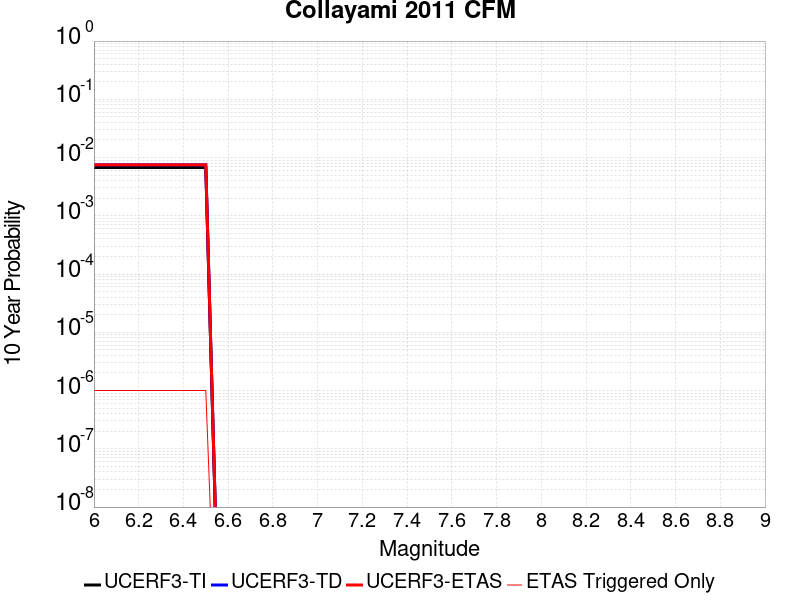 |

| Magnitude | 1 wk TI Prob | 1 wk TD Prob | 1 wk ETAS Prob | 1 wk ETAS/TD Gain | 1 wk ETAS Triggered Only | 1 mo TI Prob | 1 mo TD Prob | 1 mo ETAS Prob | 1 mo ETAS/TD Gain | 1 mo ETAS Triggered Only | 1 yr TI Prob | 1 yr TD Prob | 1 yr ETAS Prob | 1 yr ETAS/TD Gain | 1 yr ETAS Triggered Only | 10 yr TI Prob | 10 yr TD Prob | 10 yr ETAS Prob | 10 yr ETAS/TD Gain | 10 yr ETAS Triggered Only |
|-----|-----|-----|-----|-----|-----|-----|-----|-----|-----|-----|-----|-----|-----|-----|-----|-----|-----|-----|-----|-----|
| 6.0 | 1.2952825E-5 | 1.4354933E-5 | 1.4354933E-5 | 1.0 | 0.0 | 5.551093E-5 | 6.152114E-5 | 6.152114E-5 | 1.0 | 0.0 | 6.7563594E-4 | 7.490199E-4 | 7.490199E-4 | 1.0 | 0.0 | 0.006735855 | 0.007490199 | 0.007492344 | 1.0002863 | 2.1611856E-6 |
| 6.1 | 1.2952825E-5 | 1.4354933E-5 | 1.4354933E-5 | 1.0 | 0.0 | 5.551093E-5 | 6.152114E-5 | 6.152114E-5 | 1.0 | 0.0 | 6.7563594E-4 | 7.490199E-4 | 7.490199E-4 | 1.0 | 0.0 | 0.006735855 | 0.007490199 | 0.007492344 | 1.0002863 | 2.1611856E-6 |
| 6.2 | 1.2952825E-5 | 1.4354933E-5 | 1.4354933E-5 | 1.0 | 0.0 | 5.551093E-5 | 6.152114E-5 | 6.152114E-5 | 1.0 | 0.0 | 6.7563594E-4 | 7.490199E-4 | 7.490199E-4 | 1.0 | 0.0 | 0.006735855 | 0.007490199 | 0.007492344 | 1.0002863 | 2.1611856E-6 |
| 6.3 | 1.2952825E-5 | 1.4354933E-5 | 1.4354933E-5 | 1.0 | 0.0 | 5.551093E-5 | 6.152114E-5 | 6.152114E-5 | 1.0 | 0.0 | 6.7563594E-4 | 7.490199E-4 | 7.490199E-4 | 1.0 | 0.0 | 0.006735855 | 0.007490199 | 0.007492344 | 1.0002863 | 2.1611856E-6 |
| 6.4 | 1.2952825E-5 | 1.4354933E-5 | 1.4354933E-5 | 1.0 | 0.0 | 5.551093E-5 | 6.152114E-5 | 6.152114E-5 | 1.0 | 0.0 | 6.7563594E-4 | 7.490199E-4 | 7.490199E-4 | 1.0 | 0.0 | 0.006735855 | 0.007490199 | 0.007492344 | 1.0002863 | 2.1611856E-6 |
| 6.5 | 1.2952825E-5 | 1.4354933E-5 | 1.4354933E-5 | 1.0 | 0.0 | 5.551093E-5 | 6.152114E-5 | 6.152114E-5 | 1.0 | 0.0 | 6.7563594E-4 | 7.490199E-4 | 7.490199E-4 | 1.0 | 0.0 | 0.006735855 | 0.007490199 | 0.007492344 | 1.0002863 | 2.1611856E-6 |

## West Tahoe
*[(top)](#table-of-contents)*

| 1 Week | 1 Month | 1 Year | 10 Year |
|-----|-----|-----|-----|
|  |  |  |  |

| Magnitude | 1 wk TI Prob | 1 wk TD Prob | 1 wk ETAS Prob | 1 wk ETAS/TD Gain | 1 wk ETAS Triggered Only | 1 mo TI Prob | 1 mo TD Prob | 1 mo ETAS Prob | 1 mo ETAS/TD Gain | 1 mo ETAS Triggered Only | 1 yr TI Prob | 1 yr TD Prob | 1 yr ETAS Prob | 1 yr ETAS/TD Gain | 1 yr ETAS Triggered Only | 10 yr TI Prob | 10 yr TD Prob | 10 yr ETAS Prob | 10 yr ETAS/TD Gain | 10 yr ETAS Triggered Only |
|-----|-----|-----|-----|-----|-----|-----|-----|-----|-----|-----|-----|-----|-----|-----|-----|-----|-----|-----|-----|-----|
| 6.0 | 9.18365E-6 | 9.709047E-6 | 9.709047E-6 | 1.0 | 0.0 | 3.9357907E-5 | 4.1609703E-5 | 4.1609703E-5 | 1.0 | 0.0 | 4.7907716E-4 | 5.065095E-4 | 5.086696E-4 | 1.0042647 | 2.1611856E-6 | 0.0047804564 | 0.0050564157 | 0.0050585656 | 1.0004252 | 2.1611856E-6 |
| 6.1 | 9.18365E-6 | 9.709047E-6 | 9.709047E-6 | 1.0 | 0.0 | 3.9357907E-5 | 4.1609703E-5 | 4.1609703E-5 | 1.0 | 0.0 | 4.7907716E-4 | 5.065095E-4 | 5.086696E-4 | 1.0042647 | 2.1611856E-6 | 0.0047804564 | 0.0050564157 | 0.0050585656 | 1.0004252 | 2.1611856E-6 |
| 6.2 | 9.18365E-6 | 9.709047E-6 | 9.709047E-6 | 1.0 | 0.0 | 3.9357907E-5 | 4.1609703E-5 | 4.1609703E-5 | 1.0 | 0.0 | 4.7907716E-4 | 5.065095E-4 | 5.086696E-4 | 1.0042647 | 2.1611856E-6 | 0.0047804564 | 0.0050564157 | 0.0050585656 | 1.0004252 | 2.1611856E-6 |
| 6.3 | 9.18365E-6 | 9.709047E-6 | 9.709047E-6 | 1.0 | 0.0 | 3.9357907E-5 | 4.1609703E-5 | 4.1609703E-5 | 1.0 | 0.0 | 4.7907716E-4 | 5.065095E-4 | 5.086696E-4 | 1.0042647 | 2.1611856E-6 | 0.0047804564 | 0.0050564157 | 0.0050585656 | 1.0004252 | 2.1611856E-6 |
| 6.4 | 9.18365E-6 | 9.709047E-6 | 9.709047E-6 | 1.0 | 0.0 | 3.9357907E-5 | 4.1609703E-5 | 4.1609703E-5 | 1.0 | 0.0 | 4.7907716E-4 | 5.065095E-4 | 5.086696E-4 | 1.0042647 | 2.1611856E-6 | 0.0047804564 | 0.0050564157 | 0.0050585656 | 1.0004252 | 2.1611856E-6 |
| 6.5 | 9.18365E-6 | 9.709047E-6 | 9.709047E-6 | 1.0 | 0.0 | 3.9357907E-5 | 4.1609703E-5 | 4.1609703E-5 | 1.0 | 0.0 | 4.7907716E-4 | 5.065095E-4 | 5.086696E-4 | 1.0042647 | 2.1611856E-6 | 0.0047804564 | 0.0050564157 | 0.0050585656 | 1.0004252 | 2.1611856E-6 |
| 6.6 | 8.164356E-6 | 8.6257305E-6 | 8.6257305E-6 | 1.0 | 0.0 | 3.4989625E-5 | 3.6967052E-5 | 3.6967052E-5 | 1.0 | 0.0 | 4.259154E-4 | 4.500096E-4 | 4.521698E-4 | 1.0048003 | 2.1611856E-6 | 0.004251 | 0.004493797 | 0.0044959486 | 1.0004787 | 2.1611856E-6 |
| 6.7 | 7.1083327E-6 | 7.510388E-6 | 7.510388E-6 | 1.0 | 0.0 | 3.0463927E-5 | 3.2187138E-5 | 3.2187138E-5 | 1.0 | 0.0 | 3.708352E-4 | 3.918357E-4 | 3.9399604E-4 | 1.0055134 | 2.1611856E-6 | 0.0037021697 | 0.0039141746 | 0.0039163274 | 1.00055 | 2.1611856E-6 |
| 6.8 | 6.3750726E-6 | 6.7311666E-6 | 6.7311666E-6 | 1.0 | 0.0 | 2.7321454E-5 | 2.8847693E-5 | 2.8847693E-5 | 1.0 | 0.0 | 3.3258792E-4 | 3.5119147E-4 | 3.5119147E-4 | 1.0 | 0.0 | 0.0033209058 | 0.0035090533 | 0.0035090533 | 1.0 | 0.0 |
| 6.9 | 5.126961E-6 | 5.410055E-6 | 5.410055E-6 | 1.0 | 0.0 | 2.1972504E-5 | 2.3185894E-5 | 2.3185894E-5 | 1.0 | 0.0 | 2.674824E-4 | 2.8227826E-4 | 2.8227826E-4 | 1.0 | 0.0 | 0.0026716068 | 0.0028218026 | 0.0028218026 | 1.0 | 0.0 |
| 7.0 | 4.331526E-6 | 4.5688944E-6 | 4.5688944E-6 | 1.0 | 0.0 | 1.856355E-5 | 1.9580977E-5 | 1.9580977E-5 | 1.0 | 0.0 | 2.2598778E-4 | 2.3839838E-4 | 2.3839838E-4 | 1.0 | 0.0 | 0.002257581 | 0.002383984 | 0.002383984 | 1.0 | 0.0 |

## McKinleyville (alt1)
*[(top)](#table-of-contents)*

| 1 Week | 1 Month | 1 Year | 10 Year |
|-----|-----|-----|-----|
|  |  |  |  |

| Magnitude | 1 wk TI Prob | 1 wk TD Prob | 1 wk ETAS Prob | 1 wk ETAS/TD Gain | 1 wk ETAS Triggered Only | 1 mo TI Prob | 1 mo TD Prob | 1 mo ETAS Prob | 1 mo ETAS/TD Gain | 1 mo ETAS Triggered Only | 1 yr TI Prob | 1 yr TD Prob | 1 yr ETAS Prob | 1 yr ETAS/TD Gain | 1 yr ETAS Triggered Only | 10 yr TI Prob | 10 yr TD Prob | 10 yr ETAS Prob | 10 yr ETAS/TD Gain | 10 yr ETAS Triggered Only |
|-----|-----|-----|-----|-----|-----|-----|-----|-----|-----|-----|-----|-----|-----|-----|-----|-----|-----|-----|-----|-----|
| 6.0 | 8.589568E-6 | 9.025071E-6 | 1.1186237E-5 | 1.2394625 | 2.1611856E-6 | 3.6811918E-5 | 3.8678438E-5 | 4.083954E-5 | 1.0558735 | 2.1611856E-6 | 4.480929E-4 | 4.7083167E-4 | 4.7299184E-4 | 1.004588 | 2.1611856E-6 | 0.0044719046 | 0.0047006467 | 0.004702798 | 1.0004576 | 2.1611856E-6 |
| 6.1 | 8.589568E-6 | 9.025071E-6 | 1.1186237E-5 | 1.2394625 | 2.1611856E-6 | 3.6811918E-5 | 3.8678438E-5 | 4.083954E-5 | 1.0558735 | 2.1611856E-6 | 4.480929E-4 | 4.7083167E-4 | 4.7299184E-4 | 1.004588 | 2.1611856E-6 | 0.0044719046 | 0.0047006467 | 0.004702798 | 1.0004576 | 2.1611856E-6 |
| 6.2 | 8.589568E-6 | 9.025071E-6 | 1.1186237E-5 | 1.2394625 | 2.1611856E-6 | 3.6811918E-5 | 3.8678438E-5 | 4.083954E-5 | 1.0558735 | 2.1611856E-6 | 4.480929E-4 | 4.7083167E-4 | 4.7299184E-4 | 1.004588 | 2.1611856E-6 | 0.0044719046 | 0.0047006467 | 0.004702798 | 1.0004576 | 2.1611856E-6 |
| 6.3 | 8.589568E-6 | 9.025071E-6 | 1.1186237E-5 | 1.2394625 | 2.1611856E-6 | 3.6811918E-5 | 3.8678438E-5 | 4.083954E-5 | 1.0558735 | 2.1611856E-6 | 4.480929E-4 | 4.7083167E-4 | 4.7299184E-4 | 1.004588 | 2.1611856E-6 | 0.0044719046 | 0.0047006467 | 0.004702798 | 1.0004576 | 2.1611856E-6 |
| 6.4 | 8.589568E-6 | 9.025071E-6 | 1.1186237E-5 | 1.2394625 | 2.1611856E-6 | 3.6811918E-5 | 3.8678438E-5 | 4.083954E-5 | 1.0558735 | 2.1611856E-6 | 4.480929E-4 | 4.7083167E-4 | 4.7299184E-4 | 1.004588 | 2.1611856E-6 | 0.0044719046 | 0.0047006467 | 0.004702798 | 1.0004576 | 2.1611856E-6 |
| 6.5 | 8.589568E-6 | 9.025071E-6 | 1.1186237E-5 | 1.2394625 | 2.1611856E-6 | 3.6811918E-5 | 3.8678438E-5 | 4.083954E-5 | 1.0558735 | 2.1611856E-6 | 4.480929E-4 | 4.7083167E-4 | 4.7299184E-4 | 1.004588 | 2.1611856E-6 | 0.0044719046 | 0.0047006467 | 0.004702798 | 1.0004576 | 2.1611856E-6 |
| 6.6 | 8.589568E-6 | 9.025071E-6 | 1.1186237E-5 | 1.2394625 | 2.1611856E-6 | 3.6811918E-5 | 3.8678438E-5 | 4.083954E-5 | 1.0558735 | 2.1611856E-6 | 4.480929E-4 | 4.7083167E-4 | 4.7299184E-4 | 1.004588 | 2.1611856E-6 | 0.0044719046 | 0.0047006467 | 0.004702798 | 1.0004576 | 2.1611856E-6 |
| 6.7 | 6.9296007E-6 | 7.2824996E-6 | 9.443669E-6 | 1.2967621 | 2.1611856E-6 | 2.969795E-5 | 3.1210464E-5 | 3.3371583E-5 | 1.0692434 | 2.1611856E-6 | 3.6151256E-4 | 3.7994332E-4 | 3.821037E-4 | 1.005686 | 2.1611856E-6 | 0.00360925 | 0.0037951136 | 0.0037972666 | 1.0005673 | 2.1611856E-6 |
| 6.8 | 6.1661035E-6 | 6.476121E-6 | 8.637293E-6 | 1.3337139 | 2.1611856E-6 | 2.642589E-5 | 2.7754631E-5 | 2.9915756E-5 | 1.0778654 | 2.1611856E-6 | 3.2168772E-4 | 3.378816E-4 | 3.4004205E-4 | 1.0063941 | 2.1611856E-6 | 0.0032122245 | 0.0033757745 | 0.0033779284 | 1.000638 | 2.1611856E-6 |
| 6.9 | 4.91344E-6 | 5.1595584E-6 | 7.320733E-6 | 1.4188681 | 2.1611856E-6 | 2.1057429E-5 | 2.211232E-5 | 2.4273457E-5 | 1.0977346 | 2.1611856E-6 | 2.5634404E-4 | 2.6920447E-4 | 2.7136505E-4 | 1.0080259 | 2.1611856E-6 | 0.0025604854 | 0.002690766 | 0.0026929213 | 1.000801 | 2.1611856E-6 |
| 7.0 | 4.584584E-6 | 4.812518E-6 | 6.9736934E-6 | 1.4490737 | 2.1611856E-6 | 1.964807E-5 | 2.0625028E-5 | 2.278617E-5 | 1.1047825 | 2.1611856E-6 | 2.3918899E-4 | 2.5110084E-4 | 2.5326147E-4 | 1.0086046 | 2.1611856E-6 | 0.002389317 | 0.0025101388 | 0.0025122946 | 1.0008588 | 2.1611856E-6 |
| 7.1 | 3.7650907E-6 | 3.950512E-6 | 6.1116893E-6 | 1.5470625 | 2.1611856E-6 | 1.6136004E-5 | 1.6930768E-5 | 1.9091916E-5 | 1.1276462 | 2.1611856E-6 | 1.9643812E-4 | 2.0613208E-4 | 2.0829283E-4 | 1.0104823 | 2.1611856E-6 | 0.0019626457 | 0.002061321 | 0.0020634776 | 1.0010463 | 2.1611856E-6 |

