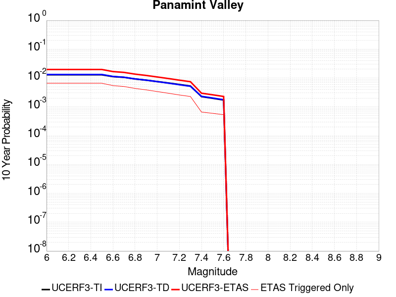
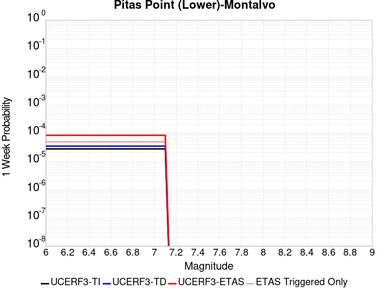
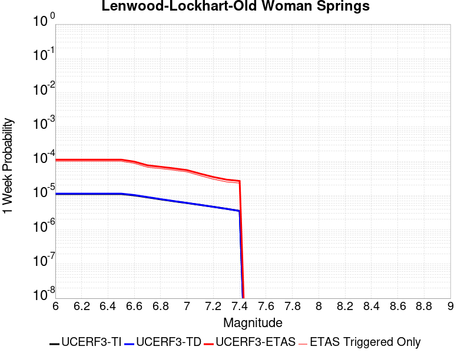
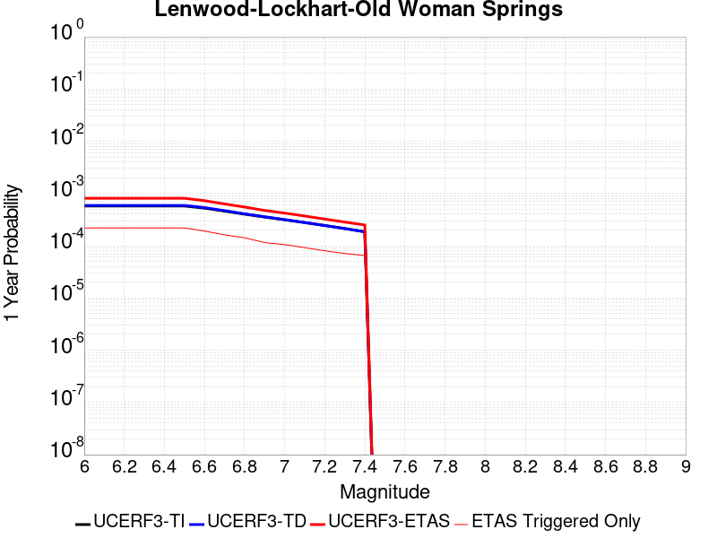
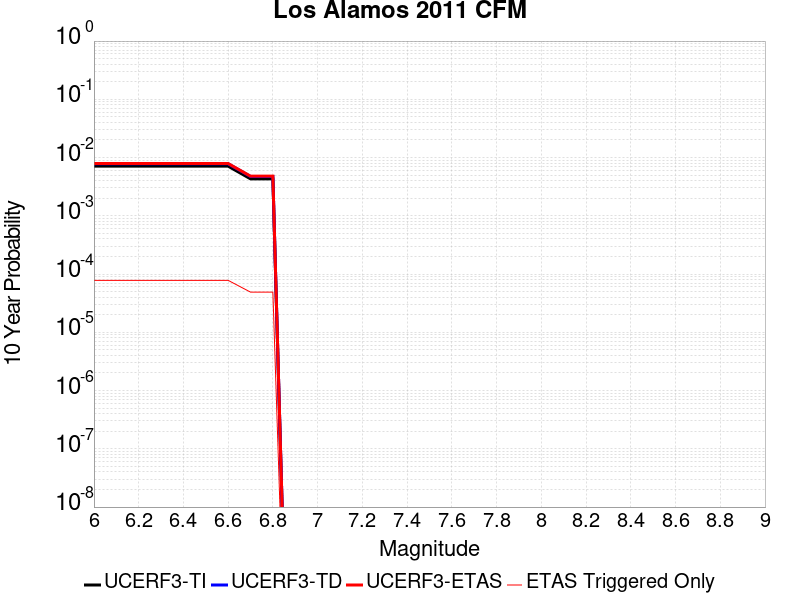
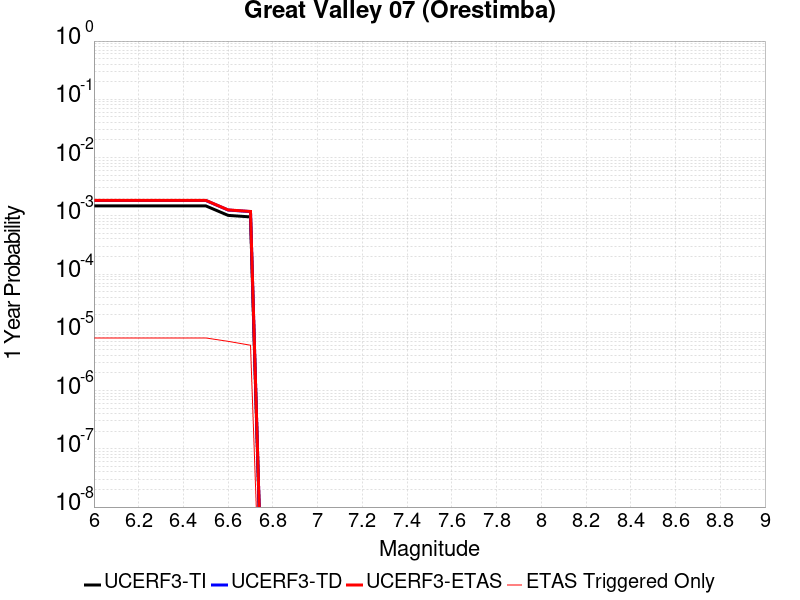
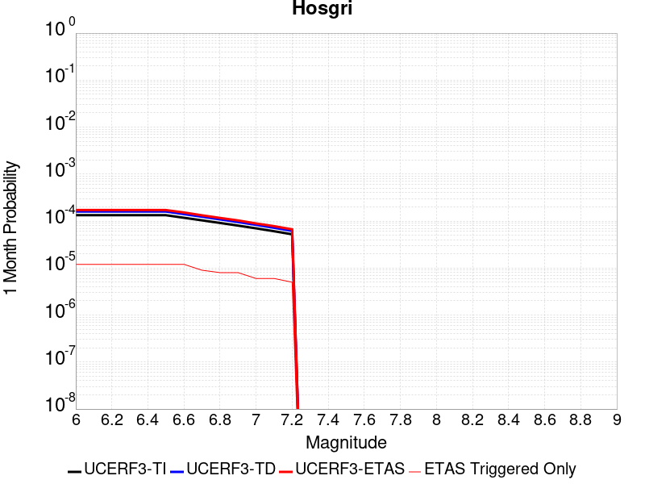
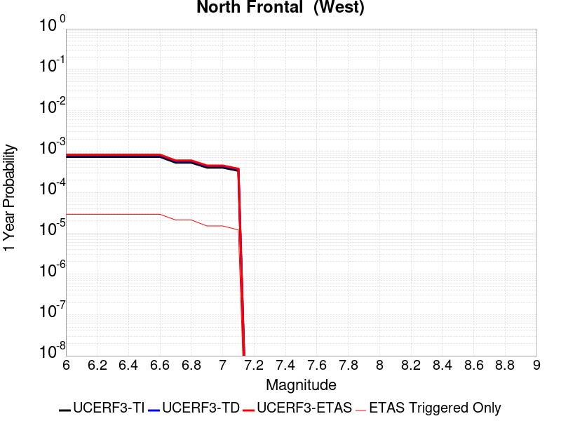

# Parent Section Magnitude-Probability Distributions

Only fault sections with at least one triggered aftershock are plotted. Sections are sorted by total supraseismogenic trigger rate (decreasing)

## Table Of Contents

* [Tank Canyon](#tank-canyon)
* [Little Lake](#little-lake)
* [Garlock (Central)](#garlock-central)
* [Owl Lake](#owl-lake)
* [Garlock (West)](#garlock-west)
* [Garlock (East)](#garlock-east)
* [Death Valley (So)](#death-valley-so)
* [Panamint Valley](#panamint-valley)
* [San Andreas (Mojave N)](#san-andreas-mojave-n)
* [San Andreas (Big Bend)](#san-andreas-big-bend)
* [San Andreas (Carrizo) rev](#san-andreas-carrizo-rev)
* [San Andreas (Mojave S)](#san-andreas-mojave-s)
* [Death Valley (Black Mtns Frontal)](#death-valley-black-mtns-frontal)
* [Blackwater](#blackwater)
* [San Andreas (Cholame) rev](#san-andreas-cholame-rev)
* [San Andreas (Parkfield)](#san-andreas-parkfield)
* [Hunter Mountain-Saline Valley](#hunter-mountain-saline-valley)
* [Cucamonga](#cucamonga)
* [San Andreas (San Bernardino N)](#san-andreas-san-bernardino-n)
* [San Cayetano](#san-cayetano)
* [Pleito](#pleito)
* [Death Valley (No)](#death-valley-no)
* [San Andreas (San Bernardino S)](#san-andreas-san-bernardino-s)
* [Gravel Hills-Harper Lk](#gravel-hills-harper-lk)
* [Pitas Point (Lower West)](#pitas-point-lower-west)
* [Cleghorn](#cleghorn)
* [Santa Ynez (West)](#santa-ynez-west)
* [Santa Ynez (East)](#santa-ynez-east)
* [Pitas Point (Lower)-Montalvo](#pitas-point-lower-montalvo)
* [San Andreas (San Gorgonio Pass-Garnet HIll)](#san-andreas-san-gorgonio-pass-garnet-hill)
* [Red Mountain](#red-mountain)
* [San Juan](#san-juan)
* [So Sierra Nevada](#so-sierra-nevada)
* [San Andreas (Coachella) rev](#san-andreas-coachella-rev)
* [San Jacinto (San Bernardino)](#san-jacinto-san-bernardino)
* [Death Valley (Fish Lake Valley)](#death-valley-fish-lake-valley)
* [Mission Ridge-Arroyo Parida-Santa Ana](#mission-ridge-arroyo-parida-santa-ana)
* [San Jacinto (Stepovers Combined)](#san-jacinto-stepovers-combined)
* [Santa Susana alt 1](#santa-susana-alt-1)
* [San Jacinto (San Jacinto Valley) rev](#san-jacinto-san-jacinto-valley-rev)
* [Oak Ridge (Onshore)](#oak-ridge-onshore)
* [Lenwood-Lockhart-Old Woman Springs](#lenwood-lockhart-old-woman-springs)
* [Helendale-So Lockhart](#helendale-so-lockhart)
* [Raymond](#raymond)
* [Sierra Madre](#sierra-madre)
* [Ventura-Pitas Point](#ventura-pitas-point)
* [Channel Islands Thrust](#channel-islands-thrust)
* [Los Alamos 2011 CFM](#los-alamos-2011-cfm)
* [Santa Cruz Island](#santa-cruz-island)
* [Chino alt 1](#chino-alt-1)
* [Elysian Park (Upper)](#elysian-park-upper)
* [Simi-Santa Rosa](#simi-santa-rosa)
* [San Gregorio (North) 2011 CFM](#san-gregorio-north-2011-cfm)
* [San Jose](#san-jose)
* [Whittier alt 1](#whittier-alt-1)
* [San Jacinto (Anza) rev](#san-jacinto-anza-rev)
* [Independence rev 2011](#independence-rev-2011)
* [Great Valley 12](#great-valley-12)
* [Verdugo](#verdugo)
* [Elsinore (Stepovers Combined)](#elsinore-stepovers-combined)
* [Calaveras (No) 2011 CFM](#calaveras-no-2011-cfm)
* [San Gregorio (South) 2011 CFM](#san-gregorio-south-2011-cfm)
* [Hayward (So) 2011 CFM](#hayward-so-2011-cfm)
* [Pinto Mtn](#pinto-mtn)
* [Anacapa-Dume alt 1](#anacapa-dume-alt-1)
* [Elsinore (Glen Ivy) rev](#elsinore-glen-ivy-rev)
* [Emerson-Copper Mtn 2011](#emerson-copper-mtn-2011)
* [Hayward (No) 2011 CFM](#hayward-no-2011-cfm)
* [San Jacinto (Clark) rev](#san-jacinto-clark-rev)
* [Los Osos 2011](#los-osos-2011)
* [Mono Lake 2011 CFM](#mono-lake-2011-cfm)
* [Concord 2011 CFM](#concord-2011-cfm)
* [Great Valley 10 (Panoche)](#great-valley-10-panoche)
* [Casmalia 2011 CFM](#casmalia-2011-cfm)
* [Great Valley 09 (Laguna Seca)](#great-valley-09-laguna-seca)
* [Great Valley 04b Gordon Valley](#great-valley-04b-gordon-valley)
* [Rodgers Creek - Healdsburg 2011 CFM](#rodgers-creek---healdsburg-2011-cfm)
* [Rose Canyon](#rose-canyon)
* [San Gabriel](#san-gabriel)
* [Elsinore (Temecula) rev](#elsinore-temecula-rev)
* [Great Valley 07 (Orestimba)](#great-valley-07-orestimba)
* [Great Valley 03 Mysterious Ridge](#great-valley-03-mysterious-ridge)
* [Newport-Inglewood (Offshore)](#newport-inglewood-offshore)
* [Hosgri](#hosgri)
* [Holser alt 1](#holser-alt-1)
* [Calaveras (Central) 2011 CFM](#calaveras-central-2011-cfm)
* [San Luis Range 2011 CFM](#san-luis-range-2011-cfm)
* [Clamshell-Sawpit](#clamshell-sawpit)
* [Malibu Coast alt 1](#malibu-coast-alt-1)
* [Newport-Inglewood alt 1](#newport-inglewood-alt-1)
* [Imperial](#imperial)
* [Santa Rosa Island](#santa-rosa-island)
* [Great Valley 04a Trout Creek](#great-valley-04a-trout-creek)
* [Deep Springs](#deep-springs)
* [Burnt Mtn](#burnt-mtn)
* [North Frontal  (West)](#north-frontal--west)
* [San Andreas (Creeping Section) 2011 CFM](#san-andreas-creeping-section-2011-cfm)
* [Green Valley 2011 CFM](#green-valley-2011-cfm)
* [Robinson Creek](#robinson-creek)
* [Hollywood](#hollywood)
* [Palos Verdes](#palos-verdes)

## Tank Canyon
*[(top)](#table-of-contents)*

| 1 Week | 1 Month | 1 Year | 10 Year |
|-----|-----|-----|-----|
|  |  |  |  |

| Magnitude | 1 wk TI Prob | 1 wk TD Prob | 1 wk ETAS Prob | 1 wk ETAS/TD Gain | 1 wk ETAS Triggered Only | 1 mo TI Prob | 1 mo TD Prob | 1 mo ETAS Prob | 1 mo ETAS/TD Gain | 1 mo ETAS Triggered Only | 1 yr TI Prob | 1 yr TD Prob | 1 yr ETAS Prob | 1 yr ETAS/TD Gain | 1 yr ETAS Triggered Only | 10 yr TI Prob | 10 yr TD Prob | 10 yr ETAS Prob | 10 yr ETAS/TD Gain | 10 yr ETAS Triggered Only |
|-----|-----|-----|-----|-----|-----|-----|-----|-----|-----|-----|-----|-----|-----|-----|-----|-----|-----|-----|-----|-----|
| 6.0 | 2.7748038E-5 | 3.5073965E-5 | 0.020780154 | 592.4666 | 0.020745806 | 1.18914744E-4 | 1.5031699E-4 | 0.02652642 | 176.46986 | 0.026380068 | 0.0014468255 | 0.0018300817 | 0.042400543 | 23.168661 | 0.040644847 | 0.014374418 | 0.018297758 | 0.07223463 | 3.947731 | 0.05494219 |
| 6.1 | 2.7748038E-5 | 3.5073965E-5 | 0.020780154 | 592.4666 | 0.020745806 | 1.18914744E-4 | 1.5031699E-4 | 0.02652642 | 176.46986 | 0.026380068 | 0.0014468255 | 0.0018300817 | 0.042400543 | 23.168661 | 0.040644847 | 0.014374418 | 0.018297758 | 0.07223463 | 3.947731 | 0.05494219 |
| 6.2 | 2.7748038E-5 | 3.5073965E-5 | 0.020780154 | 592.4666 | 0.020745806 | 1.18914744E-4 | 1.5031699E-4 | 0.02652642 | 176.46986 | 0.026380068 | 0.0014468255 | 0.0018300817 | 0.042400543 | 23.168661 | 0.040644847 | 0.014374418 | 0.018297758 | 0.07223463 | 3.947731 | 0.05494219 |
| 6.3 | 2.7748038E-5 | 3.5073965E-5 | 0.020780154 | 592.4666 | 0.020745806 | 1.18914744E-4 | 1.5031699E-4 | 0.02652642 | 176.46986 | 0.026380068 | 0.0014468255 | 0.0018300817 | 0.042400543 | 23.168661 | 0.040644847 | 0.014374418 | 0.018297758 | 0.07223463 | 3.947731 | 0.05494219 |

## Little Lake
*[(top)](#table-of-contents)*

| 1 Week | 1 Month | 1 Year | 10 Year |
|-----|-----|-----|-----|
|  |  |  |  |

| Magnitude | 1 wk TI Prob | 1 wk TD Prob | 1 wk ETAS Prob | 1 wk ETAS/TD Gain | 1 wk ETAS Triggered Only | 1 mo TI Prob | 1 mo TD Prob | 1 mo ETAS Prob | 1 mo ETAS/TD Gain | 1 mo ETAS Triggered Only | 1 yr TI Prob | 1 yr TD Prob | 1 yr ETAS Prob | 1 yr ETAS/TD Gain | 1 yr ETAS Triggered Only | 10 yr TI Prob | 10 yr TD Prob | 10 yr ETAS Prob | 10 yr ETAS/TD Gain | 10 yr ETAS Triggered Only |
|-----|-----|-----|-----|-----|-----|-----|-----|-----|-----|-----|-----|-----|-----|-----|-----|-----|-----|-----|-----|-----|
| 6.0 | 1.27106505E-5 | 1.3900362E-5 | 0.012487265 | 898.341 | 0.0124735385 | 5.447308E-5 | 5.957219E-5 | 0.015626142 | 262.30597 | 0.015567497 | 6.630079E-4 | 7.25151E-4 | 0.021521002 | 29.677961 | 0.020810943 | 0.006610333 | 0.0072377534 | 0.03255392 | 4.497793 | 0.025500733 |
| 6.1 | 1.27106505E-5 | 1.3900362E-5 | 0.012487265 | 898.341 | 0.0124735385 | 5.447308E-5 | 5.957219E-5 | 0.015626142 | 262.30597 | 0.015567497 | 6.630079E-4 | 7.25151E-4 | 0.021521002 | 29.677961 | 0.020810943 | 0.006610333 | 0.0072377534 | 0.03255392 | 4.497793 | 0.025500733 |
| 6.2 | 1.27106505E-5 | 1.3900362E-5 | 0.012487265 | 898.341 | 0.0124735385 | 5.447308E-5 | 5.957219E-5 | 0.015626142 | 262.30597 | 0.015567497 | 6.630079E-4 | 7.25151E-4 | 0.021521002 | 29.677961 | 0.020810943 | 0.006610333 | 0.0072377534 | 0.03255392 | 4.497793 | 0.025500733 |
| 6.3 | 1.27106505E-5 | 1.3900362E-5 | 0.012487265 | 898.341 | 0.0124735385 | 5.447308E-5 | 5.957219E-5 | 0.015626142 | 262.30597 | 0.015567497 | 6.630079E-4 | 7.25151E-4 | 0.021521002 | 29.677961 | 0.020810943 | 0.006610333 | 0.0072377534 | 0.03255392 | 4.497793 | 0.025500733 |
| 6.4 | 1.27106505E-5 | 1.3900362E-5 | 0.012487265 | 898.341 | 0.0124735385 | 5.447308E-5 | 5.957219E-5 | 0.015626142 | 262.30597 | 0.015567497 | 6.630079E-4 | 7.25151E-4 | 0.021521002 | 29.677961 | 0.020810943 | 0.006610333 | 0.0072377534 | 0.03255392 | 4.497793 | 0.025500733 |
| 6.5 | 1.27106505E-5 | 1.3900362E-5 | 0.012487265 | 898.341 | 0.0124735385 | 5.447308E-5 | 5.957219E-5 | 0.015626142 | 262.30597 | 0.015567497 | 6.630079E-4 | 7.25151E-4 | 0.021521002 | 29.677961 | 0.020810943 | 0.006610333 | 0.0072377534 | 0.03255392 | 4.497793 | 0.025500733 |
| 6.6 | 1.08505255E-5 | 1.1856941E-5 | 0.010596327 | 893.6814 | 0.010584596 | 4.6501424E-5 | 5.0815026E-5 | 0.013337878 | 262.479 | 0.013287738 | 5.6600774E-4 | 6.1859656E-4 | 0.018226977 | 29.46505 | 0.01761928 | 0.005645683 | 0.006178476 | 0.027475808 | 4.44702 | 0.021429734 |
| 6.7 | 7.97625E-6 | 8.706619E-6 | 0.008020361 | 921.17975 | 0.008011725 | 3.4183482E-5 | 3.7314083E-5 | 0.010133013 | 271.56003 | 0.010096076 | 4.161044E-4 | 4.5429895E-4 | 0.013768554 | 30.307253 | 0.013320306 | 0.004153261 | 0.0045429897 | 0.020623324 | 4.539593 | 0.016153721 |
| 6.8 | 7.97625E-6 | 8.706619E-6 | 0.008020361 | 921.17975 | 0.008011725 | 3.4183482E-5 | 3.7314083E-5 | 0.010133013 | 271.56003 | 0.010096076 | 4.161044E-4 | 4.5429895E-4 | 0.013768554 | 30.307253 | 0.013320306 | 0.004153261 | 0.0045429897 | 0.020623324 | 4.539593 | 0.016153721 |

## Garlock (Central)
*[(top)](#table-of-contents)*

| 1 Week | 1 Month | 1 Year | 10 Year |
|-----|-----|-----|-----|
|  |  |  |  |

| Magnitude | 1 wk TI Prob | 1 wk TD Prob | 1 wk ETAS Prob | 1 wk ETAS/TD Gain | 1 wk ETAS Triggered Only | 1 mo TI Prob | 1 mo TD Prob | 1 mo ETAS Prob | 1 mo ETAS/TD Gain | 1 mo ETAS Triggered Only | 1 yr TI Prob | 1 yr TD Prob | 1 yr ETAS Prob | 1 yr ETAS/TD Gain | 1 yr ETAS Triggered Only | 10 yr TI Prob | 10 yr TD Prob | 10 yr ETAS Prob | 10 yr ETAS/TD Gain | 10 yr ETAS Triggered Only |
|-----|-----|-----|-----|-----|-----|-----|-----|-----|-----|-----|-----|-----|-----|-----|-----|-----|-----|-----|-----|-----|
| 6.0 | 2.575808E-5 | 1.9313613E-5 | 0.011287619 | 584.4385 | 0.011268523 | 1.10387096E-4 | 8.277037E-5 | 0.013988149 | 168.99948 | 0.01390653 | 0.0013431342 | 0.0010073289 | 0.020430831 | 20.282187 | 0.019443087 | 0.013350452 | 0.0100695705 | 0.035087842 | 3.484542 | 0.025272757 |
| 6.1 | 2.575808E-5 | 1.9313613E-5 | 0.011287619 | 584.4385 | 0.011268523 | 1.10387096E-4 | 8.277037E-5 | 0.013988149 | 168.99948 | 0.01390653 | 0.0013431342 | 0.0010073289 | 0.020430831 | 20.282187 | 0.019443087 | 0.013350452 | 0.0100695705 | 0.035087842 | 3.484542 | 0.025272757 |
| 6.2 | 2.575808E-5 | 1.9313613E-5 | 0.011287619 | 584.4385 | 0.011268523 | 1.10387096E-4 | 8.277037E-5 | 0.013988149 | 168.99948 | 0.01390653 | 0.0013431342 | 0.0010073289 | 0.020430831 | 20.282187 | 0.019443087 | 0.013350452 | 0.0100695705 | 0.035087842 | 3.484542 | 0.025272757 |
| 6.3 | 2.575808E-5 | 1.9313613E-5 | 0.011287619 | 584.4385 | 0.011268523 | 1.10387096E-4 | 8.277037E-5 | 0.013988149 | 168.99948 | 0.01390653 | 0.0013431342 | 0.0010073289 | 0.020430831 | 20.282187 | 0.019443087 | 0.013350452 | 0.0100695705 | 0.035087842 | 3.484542 | 0.025272757 |
| 6.4 | 2.575808E-5 | 1.9313613E-5 | 0.011287619 | 584.4385 | 0.011268523 | 1.10387096E-4 | 8.277037E-5 | 0.013988149 | 168.99948 | 0.01390653 | 0.0013431342 | 0.0010073289 | 0.020430831 | 20.282187 | 0.019443087 | 0.013350452 | 0.0100695705 | 0.035087842 | 3.484542 | 0.025272757 |
| 6.5 | 2.575808E-5 | 1.9313613E-5 | 0.011287619 | 584.4385 | 0.011268523 | 1.10387096E-4 | 8.277037E-5 | 0.013988149 | 168.99948 | 0.01390653 | 0.0013431342 | 0.0010073289 | 0.020430831 | 20.282187 | 0.019443087 | 0.013350452 | 0.0100695705 | 0.035087842 | 3.484542 | 0.025272757 |
| 6.6 | 2.540234E-5 | 1.885198E-5 | 0.010863787 | 576.2677 | 0.01084514 | 1.0886263E-4 | 8.0792066E-5 | 0.013530283 | 167.47044 | 0.013450578 | 0.0013245966 | 9.83265E-4 | 0.019691443 | 20.026588 | 0.018726591 | 0.013167289 | 0.009831364 | 0.03388822 | 3.44695 | 0.024295717 |
| 6.7 | 2.4966947E-5 | 1.8286464E-5 | 0.010211879 | 558.4393 | 0.010193779 | 1.06996806E-4 | 7.8368575E-5 | 0.012811453 | 163.47691 | 0.0127340825 | 0.0013019076 | 9.5378514E-4 | 0.018751482 | 19.660069 | 0.017814688 | 0.012943068 | 0.009539624 | 0.03250682 | 3.407558 | 0.023188407 |
| 6.8 | 2.4548952E-5 | 1.7797542E-5 | 0.009950857 | 559.1141 | 0.009933236 | 1.0520555E-4 | 7.627332E-5 | 0.0124511635 | 163.24403 | 0.012375834 | 0.001280125 | 9.282974E-4 | 0.01827092 | 19.682182 | 0.017358737 | 0.012727758 | 0.009286596 | 0.03154982 | 3.39735 | 0.02247191 |
| 6.9 | 2.3994342E-5 | 1.7148153E-5 | 0.009136028 | 532.7703 | 0.009119036 | 1.0282884E-4 | 7.349039E-5 | 0.011471448 | 156.09453 | 0.011398795 | 0.0012512221 | 8.944436E-4 | 0.016805943 | 18.789272 | 0.015925745 | 0.012442005 | 0.0089510605 | 0.029478895 | 3.293341 | 0.020713238 |
| 7.0 | 2.343005E-5 | 1.6491087E-5 | 0.008646865 | 524.33563 | 0.008630516 | 1.0041064E-4 | 7.067455E-5 | 0.0109150475 | 154.441 | 0.01084514 | 0.0012218138 | 8.601883E-4 | 0.015926195 | 18.514778 | 0.015078978 | 0.01215118 | 0.008610493 | 0.028015316 | 3.2536254 | 0.019573359 |
| 7.1 | 2.2814058E-5 | 1.5782754E-5 | 0.008092516 | 512.7442 | 0.008076861 | 9.777087E-5 | 6.763899E-5 | 0.0101630315 | 150.25404 | 0.010096076 | 0.0011897103 | 8.2325895E-4 | 0.014946128 | 18.154833 | 0.014134506 | 0.011833611 | 0.00824334 | 0.026621765 | 3.2294877 | 0.018531185 |
| 7.2 | 2.2145266E-5 | 1.5027377E-5 | 0.0073101465 | 486.45523 | 0.007295229 | 9.490483E-5 | 6.440182E-5 | 0.009280548 | 144.1038 | 0.00921674 | 0.0011548538 | 7.8387547E-4 | 0.013833401 | 17.647446 | 0.013059762 | 0.011488707 | 0.007851825 | 0.024945015 | 3.1769702 | 0.017228464 |
| 7.3 | 1.9954436E-5 | 1.3199953E-5 | 0.0059079276 | 447.57187 | 0.0058948053 | 8.551621E-5 | 5.657036E-5 | 0.007449085 | 131.67824 | 0.0073929327 | 0.0010406625 | 6.8859005E-4 | 0.01116826 | 16.219027 | 0.0104868915 | 0.010358025 | 0.006900618 | 0.020614155 | 2.987291 | 0.013808826 |
| 7.4 | 1.918037E-5 | 1.2553606E-5 | 0.005614177 | 447.21628 | 0.0056016934 | 8.2198996E-5 | 5.3800417E-5 | 0.007120673 | 132.3535 | 0.007067253 | 0.0010003132 | 6.5488677E-4 | 0.01064671 | 16.25733 | 0.009998372 | 0.009958224 | 0.006564366 | 0.019538399 | 2.9764335 | 0.013059762 |
| 7.5 | 1.6994161E-5 | 1.0764553E-5 | 0.0041468544 | 385.2324 | 0.0041361344 | 7.283008E-5 | 4.613333E-5 | 0.0053870366 | 116.771034 | 0.00534115 | 8.863455E-4 | 5.615903E-4 | 0.0081456695 | 14.504648 | 0.0075883404 | 0.008828186 | 0.005632708 | 0.0157043 | 2.788055 | 0.010128643 |
| 7.6 | 1.621788E-5 | 1.012848E-5 | 0.0037879765 | 373.99258 | 0.0037778863 | 6.950335E-5 | 4.34074E-5 | 0.0049283933 | 113.53809 | 0.004885198 | 8.458747E-4 | 5.2841863E-4 | 0.0075268354 | 14.244076 | 0.007002117 | 0.0084266225 | 0.005301458 | 0.014598917 | 2.7537553 | 0.009347012 |
| 7.7 | 7.713584E-6 | 3.2171508E-6 | 8.825499E-4 | 274.32657 | 8.793356E-4 | 3.3057797E-5 | 1.378779E-5 | 0.0012187867 | 88.39609 | 0.0012050155 | 4.0240434E-4 | 1.6786634E-4 | 0.0021867424 | 13.026689 | 0.0020192151 | 0.0040167645 | 0.0016902693 | 0.004583921 | 2.711947 | 0.0028985508 |

## Owl Lake
*[(top)](#table-of-contents)*

| 1 Week | 1 Month | 1 Year | 10 Year |
|-----|-----|-----|-----|
|  |  |  |  |

| Magnitude | 1 wk TI Prob | 1 wk TD Prob | 1 wk ETAS Prob | 1 wk ETAS/TD Gain | 1 wk ETAS Triggered Only | 1 mo TI Prob | 1 mo TD Prob | 1 mo ETAS Prob | 1 mo ETAS/TD Gain | 1 mo ETAS Triggered Only | 1 yr TI Prob | 1 yr TD Prob | 1 yr ETAS Prob | 1 yr ETAS/TD Gain | 1 yr ETAS Triggered Only | 10 yr TI Prob | 10 yr TD Prob | 10 yr ETAS Prob | 10 yr ETAS/TD Gain | 10 yr ETAS Triggered Only |
|-----|-----|-----|-----|-----|-----|-----|-----|-----|-----|-----|-----|-----|-----|-----|-----|-----|-----|-----|-----|-----|
| 6.0 | 3.637175E-5 | 4.988367E-5 | 0.0041858116 | 83.91145 | 0.0041361344 | 1.5586962E-4 | 2.1378716E-4 | 0.0060096495 | 28.110432 | 0.0057971017 | 0.0018960608 | 0.0026025574 | 0.012055176 | 4.63205 | 0.009477284 | 0.018799646 | 0.025995217 | 0.039603688 | 1.523499 | 0.013971666 |
| 6.1 | 3.637175E-5 | 4.988367E-5 | 0.0041858116 | 83.91145 | 0.0041361344 | 1.5586962E-4 | 2.1378716E-4 | 0.0060096495 | 28.110432 | 0.0057971017 | 0.0018960608 | 0.0026025574 | 0.012055176 | 4.63205 | 0.009477284 | 0.018799646 | 0.025995217 | 0.039603688 | 1.523499 | 0.013971666 |
| 6.2 | 3.637175E-5 | 4.988367E-5 | 0.0041858116 | 83.91145 | 0.0041361344 | 1.5586962E-4 | 2.1378716E-4 | 0.0060096495 | 28.110432 | 0.0057971017 | 0.0018960608 | 0.0026025574 | 0.012055176 | 4.63205 | 0.009477284 | 0.018799646 | 0.025995217 | 0.039603688 | 1.523499 | 0.013971666 |
| 6.3 | 3.637175E-5 | 4.988367E-5 | 0.0041858116 | 83.91145 | 0.0041361344 | 1.5586962E-4 | 2.1378716E-4 | 0.0060096495 | 28.110432 | 0.0057971017 | 0.0018960608 | 0.0026025574 | 0.012055176 | 4.63205 | 0.009477284 | 0.018799646 | 0.025995217 | 0.039603688 | 1.523499 | 0.013971666 |
| 6.4 | 3.637175E-5 | 4.988367E-5 | 0.0041858116 | 83.91145 | 0.0041361344 | 1.5586962E-4 | 2.1378716E-4 | 0.0060096495 | 28.110432 | 0.0057971017 | 0.0018960608 | 0.0026025574 | 0.012055176 | 4.63205 | 0.009477284 | 0.018799646 | 0.025995217 | 0.039603688 | 1.523499 | 0.013971666 |
| 6.5 | 3.637175E-5 | 4.988367E-5 | 0.0041858116 | 83.91145 | 0.0041361344 | 1.5586962E-4 | 2.1378716E-4 | 0.0060096495 | 28.110432 | 0.0057971017 | 0.0018960608 | 0.0026025574 | 0.012055176 | 4.63205 | 0.009477284 | 0.018799646 | 0.025995217 | 0.039603688 | 1.523499 | 0.013971666 |

## Garlock (West)
*[(top)](#table-of-contents)*

| 1 Week | 1 Month | 1 Year | 10 Year |
|-----|-----|-----|-----|
|  |  |  |  |

| Magnitude | 1 wk TI Prob | 1 wk TD Prob | 1 wk ETAS Prob | 1 wk ETAS/TD Gain | 1 wk ETAS Triggered Only | 1 mo TI Prob | 1 mo TD Prob | 1 mo ETAS Prob | 1 mo ETAS/TD Gain | 1 mo ETAS Triggered Only | 1 yr TI Prob | 1 yr TD Prob | 1 yr ETAS Prob | 1 yr ETAS/TD Gain | 1 yr ETAS Triggered Only | 10 yr TI Prob | 10 yr TD Prob | 10 yr ETAS Prob | 10 yr ETAS/TD Gain | 10 yr ETAS Triggered Only |
|-----|-----|-----|-----|-----|-----|-----|-----|-----|-----|-----|-----|-----|-----|-----|-----|-----|-----|-----|-----|-----|
| 6.0 | 2.516656E-5 | 1.8065048E-5 | 0.0047729053 | 264.2066 | 0.004754926 | 1.07852225E-4 | 7.741977E-5 | 0.006134596 | 79.238106 | 0.006057645 | 0.0013123099 | 9.42255E-4 | 0.009597177 | 10.185328 | 0.008663084 | 0.013045873 | 0.009421492 | 0.020841938 | 2.2121696 | 0.011529067 |
| 6.1 | 2.516656E-5 | 1.8065048E-5 | 0.0047729053 | 264.2066 | 0.004754926 | 1.07852225E-4 | 7.741977E-5 | 0.006134596 | 79.238106 | 0.006057645 | 0.0013123099 | 9.42255E-4 | 0.009597177 | 10.185328 | 0.008663084 | 0.013045873 | 0.009421492 | 0.020841938 | 2.2121696 | 0.011529067 |
| 6.2 | 2.516656E-5 | 1.8065048E-5 | 0.0047729053 | 264.2066 | 0.004754926 | 1.07852225E-4 | 7.741977E-5 | 0.006134596 | 79.238106 | 0.006057645 | 0.0013123099 | 9.42255E-4 | 0.009597177 | 10.185328 | 0.008663084 | 0.013045873 | 0.009421492 | 0.020841938 | 2.2121696 | 0.011529067 |
| 6.3 | 2.516656E-5 | 1.8065048E-5 | 0.0047729053 | 264.2066 | 0.004754926 | 1.07852225E-4 | 7.741977E-5 | 0.006134596 | 79.238106 | 0.006057645 | 0.0013123099 | 9.42255E-4 | 0.009597177 | 10.185328 | 0.008663084 | 0.013045873 | 0.009421492 | 0.020841938 | 2.2121696 | 0.011529067 |
| 6.4 | 2.516656E-5 | 1.8065048E-5 | 0.0047729053 | 264.2066 | 0.004754926 | 1.07852225E-4 | 7.741977E-5 | 0.006134596 | 79.238106 | 0.006057645 | 0.0013123099 | 9.42255E-4 | 0.009597177 | 10.185328 | 0.008663084 | 0.013045873 | 0.009421492 | 0.020841938 | 2.2121696 | 0.011529067 |
| 6.5 | 2.516656E-5 | 1.8065048E-5 | 0.0047729053 | 264.2066 | 0.004754926 | 1.07852225E-4 | 7.741977E-5 | 0.006134596 | 79.238106 | 0.006057645 | 0.0013123099 | 9.42255E-4 | 0.009597177 | 10.185328 | 0.008663084 | 0.013045873 | 0.009421492 | 0.020841938 | 2.2121696 | 0.011529067 |
| 6.6 | 2.498869E-5 | 1.7877663E-5 | 0.0047727185 | 266.96548 | 0.004754926 | 1.07089996E-4 | 7.6616736E-5 | 0.006133798 | 80.0582 | 0.006057645 | 0.0013030408 | 9.3248655E-4 | 0.009587493 | 10.281642 | 0.008663084 | 0.012954267 | 0.009324339 | 0.020745905 | 2.2249196 | 0.011529067 |
| 6.7 | 2.4627925E-5 | 1.7497801E-5 | 0.0047723404 | 272.73944 | 0.004754926 | 1.0554398E-4 | 7.498886E-5 | 0.00613218 | 81.77455 | 0.006057645 | 0.0012842404 | 9.1268384E-4 | 0.009567861 | 10.483215 | 0.008663084 | 0.012768441 | 0.009128104 | 0.020551933 | 2.2515006 | 0.011529067 |
| 6.8 | 2.4270235E-5 | 1.716136E-5 | 0.004739438 | 276.1692 | 0.0047223577 | 1.04011146E-4 | 7.354704E-5 | 0.0060981815 | 82.91539 | 0.0060250773 | 0.0012656 | 8.9514436E-4 | 0.009517935 | 10.63285 | 0.008630516 | 0.012584164 | 0.0089538675 | 0.02034743 | 2.2724736 | 0.011496499 |
| 6.9 | 2.3913764E-5 | 1.6823105E-5 | 0.004706534 | 279.76608 | 0.00468979 | 1.0248353E-4 | 7.2097464E-5 | 0.0060641747 | 84.110794 | 0.0059925094 | 0.0012470228 | 8.775101E-4 | 0.009467914 | 10.789521 | 0.008597949 | 0.012400482 | 0.00877859 | 0.020141885 | 2.2944326 | 0.011463931 |
| 7.0 | 2.3579369E-5 | 1.6492264E-5 | 0.004706205 | 285.35834 | 0.00468979 | 1.0105052E-4 | 7.067965E-5 | 0.0060627656 | 85.77809 | 0.0059925094 | 0.0012295957 | 8.6026196E-4 | 0.009450814 | 10.985972 | 0.008597949 | 0.012228143 | 0.008607132 | 0.019972391 | 2.3204467 | 0.011463931 |
| 7.1 | 2.3205374E-5 | 1.6105636E-5 | 0.00470582 | 292.18466 | 0.00468979 | 9.944781E-5 | 6.902276E-5 | 0.0060611186 | 87.813324 | 0.0059925094 | 0.0012101046 | 8.401051E-4 | 0.00939829 | 11.18704 | 0.00856538 | 0.0120353615 | 0.008406721 | 0.019741984 | 2.3483572 | 0.011431363 |
| 7.2 | 2.2799322E-5 | 1.5676578E-5 | 0.004640258 | 295.9994 | 0.004624654 | 9.770772E-5 | 6.718404E-5 | 0.0059941593 | 89.219986 | 0.005927373 | 0.0011889422 | 8.177357E-4 | 0.009311029 | 11.386355 | 0.0085002445 | 0.011826012 | 0.008184515 | 0.019425413 | 2.3734348 | 0.011333659 |
| 7.3 | 1.8228246E-5 | 1.1798695E-5 | 0.0044409926 | 376.39694 | 0.004429246 | 7.811871E-5 | 5.0565202E-5 | 0.005717108 | 113.06408 | 0.0056668296 | 9.506803E-4 | 6.1551924E-4 | 0.0087199565 | 14.166829 | 0.008109428 | 0.0094662355 | 0.006171021 | 0.017013969 | 2.757075 | 0.010910275 |
| 7.4 | 1.7670916E-5 | 1.132978E-5 | 0.0043102554 | 380.4359 | 0.0042989743 | 7.5730306E-5 | 4.8555645E-5 | 0.005552278 | 114.34876 | 0.0055039898 | 9.216264E-4 | 5.9106643E-4 | 0.0084678605 | 14.326411 | 0.007881452 | 0.009178135 | 0.0059269792 | 0.01644884 | 2.7752485 | 0.010584596 |
| 7.5 | 1.6994161E-5 | 1.0764553E-5 | 0.0041468544 | 385.2324 | 0.0041361344 | 7.283008E-5 | 4.613333E-5 | 0.0053870366 | 116.771034 | 0.00534115 | 8.863455E-4 | 5.615903E-4 | 0.0081456695 | 14.504648 | 0.0075883404 | 0.008828186 | 0.005632708 | 0.0157043 | 2.788055 | 0.010128643 |
| 7.6 | 1.621788E-5 | 1.012848E-5 | 0.0037879765 | 373.99258 | 0.0037778863 | 6.950335E-5 | 4.34074E-5 | 0.0049283933 | 113.53809 | 0.004885198 | 8.458747E-4 | 5.2841863E-4 | 0.0075268354 | 14.244076 | 0.007002117 | 0.0084266225 | 0.005301458 | 0.014598917 | 2.7537553 | 0.009347012 |
| 7.7 | 7.713584E-6 | 3.2171508E-6 | 8.825499E-4 | 274.32657 | 8.793356E-4 | 3.3057797E-5 | 1.378779E-5 | 0.0012187867 | 88.39609 | 0.0012050155 | 4.0240434E-4 | 1.6786634E-4 | 0.0021867424 | 13.026689 | 0.0020192151 | 0.0040167645 | 0.0016902693 | 0.004583921 | 2.711947 | 0.0028985508 |

## Garlock (East)
*[(top)](#table-of-contents)*

| 1 Week | 1 Month | 1 Year | 10 Year |
|-----|-----|-----|-----|
|  |  |  |  |

| Magnitude | 1 wk TI Prob | 1 wk TD Prob | 1 wk ETAS Prob | 1 wk ETAS/TD Gain | 1 wk ETAS Triggered Only | 1 mo TI Prob | 1 mo TD Prob | 1 mo ETAS Prob | 1 mo ETAS/TD Gain | 1 mo ETAS Triggered Only | 1 yr TI Prob | 1 yr TD Prob | 1 yr ETAS Prob | 1 yr ETAS/TD Gain | 1 yr ETAS Triggered Only | 10 yr TI Prob | 10 yr TD Prob | 10 yr ETAS Prob | 10 yr ETAS/TD Gain | 10 yr ETAS Triggered Only |
|-----|-----|-----|-----|-----|-----|-----|-----|-----|-----|-----|-----|-----|-----|-----|-----|-----|-----|-----|-----|-----|
| 6.0 | 2.2327951E-5 | 1.8303952E-5 | 0.004219497 | 230.52383 | 0.00420127 | 9.5687705E-5 | 7.8444085E-5 | 0.005516871 | 70.328705 | 0.0054388535 | 0.0011643751 | 9.548048E-4 | 0.00905649 | 9.485174 | 0.008109428 | 0.0115829315 | 0.0096519785 | 0.02055371 | 2.1294813 | 0.0110079795 |
| 6.1 | 2.2327951E-5 | 1.8303952E-5 | 0.004219497 | 230.52383 | 0.00420127 | 9.5687705E-5 | 7.8444085E-5 | 0.005516871 | 70.328705 | 0.0054388535 | 0.0011643751 | 9.548048E-4 | 0.00905649 | 9.485174 | 0.008109428 | 0.0115829315 | 0.0096519785 | 0.02055371 | 2.1294813 | 0.0110079795 |
| 6.2 | 2.2327951E-5 | 1.8303952E-5 | 0.004219497 | 230.52383 | 0.00420127 | 9.5687705E-5 | 7.8444085E-5 | 0.005516871 | 70.328705 | 0.0054388535 | 0.0011643751 | 9.548048E-4 | 0.00905649 | 9.485174 | 0.008109428 | 0.0115829315 | 0.0096519785 | 0.02055371 | 2.1294813 | 0.0110079795 |
| 6.3 | 2.2327951E-5 | 1.8303952E-5 | 0.004219497 | 230.52383 | 0.00420127 | 9.5687705E-5 | 7.8444085E-5 | 0.005516871 | 70.328705 | 0.0054388535 | 0.0011643751 | 9.548048E-4 | 0.00905649 | 9.485174 | 0.008109428 | 0.0115829315 | 0.0096519785 | 0.02055371 | 2.1294813 | 0.0110079795 |
| 6.4 | 2.2327951E-5 | 1.8303952E-5 | 0.004219497 | 230.52383 | 0.00420127 | 9.5687705E-5 | 7.8444085E-5 | 0.005516871 | 70.328705 | 0.0054388535 | 0.0011643751 | 9.548048E-4 | 0.00905649 | 9.485174 | 0.008109428 | 0.0115829315 | 0.0096519785 | 0.02055371 | 2.1294813 | 0.0110079795 |
| 6.5 | 2.2327951E-5 | 1.8303952E-5 | 0.004219497 | 230.52383 | 0.00420127 | 9.5687705E-5 | 7.8444085E-5 | 0.005516871 | 70.328705 | 0.0054388535 | 0.0011643751 | 9.548048E-4 | 0.00905649 | 9.485174 | 0.008109428 | 0.0115829315 | 0.0096519785 | 0.02055371 | 2.1294813 | 0.0110079795 |
| 6.6 | 2.222123E-5 | 1.816971E-5 | 0.004186796 | 230.42723 | 0.0041687023 | 9.523036E-5 | 7.7868805E-5 | 0.0054837335 | 70.42273 | 0.0054062856 | 0.0011588129 | 9.4780687E-4 | 0.008984474 | 9.479225 | 0.008044292 | 0.011527888 | 0.009581773 | 0.020419765 | 2.131105 | 0.010942843 |
| 6.7 | 2.2076227E-5 | 1.798404E-5 | 0.004186611 | 232.79591 | 0.0041687023 | 9.4608964E-5 | 7.707312E-5 | 0.005482942 | 71.13948 | 0.0054062856 | 0.0011512554 | 9.381278E-4 | 0.008974873 | 9.566792 | 0.008044292 | 0.011453095 | 0.009485973 | 0.020292753 | 2.1392379 | 0.010910275 |
| 6.8 | 2.1962227E-5 | 1.7854036E-5 | 0.0041864817 | 234.48378 | 0.0041687023 | 9.4120434E-5 | 7.651599E-5 | 0.0054823877 | 71.65022 | 0.0054062856 | 0.0011453138 | 9.313506E-4 | 0.008968151 | 9.6291895 | 0.008044292 | 0.01139429 | 0.00941876 | 0.020194013 | 2.1440203 | 0.010877707 |
| 6.9 | 1.1702579E-5 | 6.6732687E-6 | 0.0038171022 | 571.9989 | 0.0038104544 | 5.0152947E-5 | 2.8599494E-5 | 0.004750822 | 166.11562 | 0.0047223577 | 6.10441E-4 | 3.481581E-4 | 0.007087384 | 20.356798 | 0.006741573 | 0.0060876687 | 0.0034954504 | 0.012193161 | 3.4882948 | 0.00872822 |
| 7.0 | 1.153538E-5 | 6.4796777E-6 | 0.0037843415 | 584.0324 | 0.0037778863 | 4.9436403E-5 | 2.7769835E-5 | 0.0046848627 | 168.7033 | 0.004657222 | 6.01722E-4 | 3.3806017E-4 | 0.006914569 | 20.453665 | 0.006578733 | 0.006000953 | 0.0033946347 | 0.011898481 | 3.5050843 | 0.008532812 |
| 7.1 | 1.135938E-5 | 6.273818E-6 | 0.0036212977 | 577.20795 | 0.0036150464 | 4.868215E-5 | 2.6887597E-5 | 0.0044560144 | 165.72751 | 0.004429246 | 5.925439E-4 | 3.2732222E-4 | 0.0066434434 | 20.29634 | 0.006318189 | 0.0059096646 | 0.0032873498 | 0.011499964 | 3.4982476 | 0.0082397 |
| 7.2 | 1.1168294E-5 | 6.048814E-6 | 0.003197692 | 528.64777 | 0.0031916625 | 4.786324E-5 | 2.5923315E-5 | 0.0039991145 | 154.26709 | 0.003973294 | 5.825791E-4 | 3.1558552E-4 | 0.0061108577 | 19.363554 | 0.0057971017 | 0.005810542 | 0.0031701238 | 0.010734408 | 3.3861165 | 0.0075883404 |
| 7.3 | 1.0952553E-5 | 5.8686815E-6 | 0.0029369702 | 500.44806 | 0.0029311187 | 4.693867E-5 | 2.5151334E-5 | 0.003672674 | 146.02303 | 0.0036476145 | 5.713284E-4 | 3.0618932E-4 | 0.005580588 | 18.225937 | 0.0052760136 | 0.0056986175 | 0.0030760262 | 0.009991669 | 3.2482393 | 0.006936981 |
| 7.4 | 1.0735812E-5 | 5.691247E-6 | 0.0027739543 | 487.4071 | 0.0027682788 | 4.6009813E-5 | 2.4390914E-5 | 0.0035090803 | 143.86833 | 0.0034847744 | 5.600255E-4 | 2.9693378E-4 | 0.0053109145 | 17.885853 | 0.0050154696 | 0.0055861627 | 0.0029833042 | 0.009477469 | 3.1768363 | 0.006513597 |
| 7.5 | 9.0273E-6 | 4.284415E-6 | 0.001372134 | 320.2617 | 0.0013678554 | 3.8687853E-5 | 1.8361723E-5 | 0.0018421354 | 100.32475 | 0.0018238073 | 4.709228E-4 | 2.2354414E-4 | 0.0029260826 | 13.089507 | 0.0027031428 | 0.004699261 | 0.0022480614 | 0.006017455 | 2.6767306 | 0.0037778863 |
| 7.6 | 8.549585E-6 | 3.885532E-6 | 0.0011111927 | 285.98215 | 0.0011073115 | 3.6640562E-5 | 1.6652246E-5 | 0.0015147546 | 90.96398 | 0.0014981274 | 4.4600753E-4 | 2.027353E-4 | 0.002547155 | 12.563944 | 0.002344895 | 0.0044511347 | 0.0020396118 | 0.005289768 | 2.5935168 | 0.0032567985 |
| 7.7 | 7.713584E-6 | 3.2171508E-6 | 8.825499E-4 | 274.32657 | 8.793356E-4 | 3.3057797E-5 | 1.378779E-5 | 0.0012187867 | 88.39609 | 0.0012050155 | 4.0240434E-4 | 1.6786634E-4 | 0.0021867424 | 13.026689 | 0.0020192151 | 0.0040167645 | 0.0016902693 | 0.004583921 | 2.711947 | 0.0028985508 |

## Death Valley (So)
*[(top)](#table-of-contents)*

| 1 Week | 1 Month | 1 Year | 10 Year |
|-----|-----|-----|-----|
|  |  |  |  |

| Magnitude | 1 wk TI Prob | 1 wk TD Prob | 1 wk ETAS Prob | 1 wk ETAS/TD Gain | 1 wk ETAS Triggered Only | 1 mo TI Prob | 1 mo TD Prob | 1 mo ETAS Prob | 1 mo ETAS/TD Gain | 1 mo ETAS Triggered Only | 1 yr TI Prob | 1 yr TD Prob | 1 yr ETAS Prob | 1 yr ETAS/TD Gain | 1 yr ETAS Triggered Only | 10 yr TI Prob | 10 yr TD Prob | 10 yr ETAS Prob | 10 yr ETAS/TD Gain | 10 yr ETAS Triggered Only |
|-----|-----|-----|-----|-----|-----|-----|-----|-----|-----|-----|-----|-----|-----|-----|-----|-----|-----|-----|-----|-----|
| 6.0 | 4.4658216E-5 | 6.228887E-5 | 0.002179076 | 34.983395 | 0.002116919 | 1.9137832E-4 | 2.669324E-4 | 0.003555421 | 13.319555 | 0.0032893666 | 0.0023275411 | 0.0032461619 | 0.008797209 | 2.7100341 | 0.0055691255 | 0.023033133 | 0.032094594 | 0.040322024 | 1.2563494 | 0.0085002445 |
| 6.1 | 4.4658216E-5 | 6.228887E-5 | 0.002179076 | 34.983395 | 0.002116919 | 1.9137832E-4 | 2.669324E-4 | 0.003555421 | 13.319555 | 0.0032893666 | 0.0023275411 | 0.0032461619 | 0.008797209 | 2.7100341 | 0.0055691255 | 0.023033133 | 0.032094594 | 0.040322024 | 1.2563494 | 0.0085002445 |
| 6.2 | 4.4658216E-5 | 6.228887E-5 | 0.002179076 | 34.983395 | 0.002116919 | 1.9137832E-4 | 2.669324E-4 | 0.003555421 | 13.319555 | 0.0032893666 | 0.0023275411 | 0.0032461619 | 0.008797209 | 2.7100341 | 0.0055691255 | 0.023033133 | 0.032094594 | 0.040322024 | 1.2563494 | 0.0085002445 |
| 6.3 | 4.4658216E-5 | 6.228887E-5 | 0.002179076 | 34.983395 | 0.002116919 | 1.9137832E-4 | 2.669324E-4 | 0.003555421 | 13.319555 | 0.0032893666 | 0.0023275411 | 0.0032461619 | 0.008797209 | 2.7100341 | 0.0055691255 | 0.023033133 | 0.032094594 | 0.040322024 | 1.2563494 | 0.0085002445 |
| 6.4 | 4.4658216E-5 | 6.228887E-5 | 0.002179076 | 34.983395 | 0.002116919 | 1.9137832E-4 | 2.669324E-4 | 0.003555421 | 13.319555 | 0.0032893666 | 0.0023275411 | 0.0032461619 | 0.008797209 | 2.7100341 | 0.0055691255 | 0.023033133 | 0.032094594 | 0.040322024 | 1.2563494 | 0.0085002445 |
| 6.5 | 4.4658216E-5 | 6.228887E-5 | 0.002179076 | 34.983395 | 0.002116919 | 1.9137832E-4 | 2.669324E-4 | 0.003555421 | 13.319555 | 0.0032893666 | 0.0023275411 | 0.0032461619 | 0.008797209 | 2.7100341 | 0.0055691255 | 0.023033133 | 0.032094594 | 0.040322024 | 1.2563494 | 0.0085002445 |
| 6.6 | 3.6853275E-5 | 5.1089468E-5 | 0.0018422372 | 36.05904 | 0.0017912393 | 1.5793304E-4 | 2.1894388E-4 | 0.0030191774 | 13.789732 | 0.0028008467 | 0.0019211388 | 0.0026635646 | 0.007210938 | 2.707251 | 0.004559518 | 0.019046152 | 0.026430551 | 0.033406135 | 1.2639213 | 0.007164957 |
| 6.7 | 2.9971921E-5 | 4.1332314E-5 | 0.001604531 | 38.820255 | 0.0015632634 | 1.2844476E-4 | 1.7713365E-4 | 0.0025541754 | 14.419482 | 0.002377463 | 0.0015626932 | 0.0021557007 | 0.0058604474 | 2.7185814 | 0.0037127503 | 0.015517498 | 0.021467837 | 0.027140487 | 1.2642394 | 0.0057971017 |
| 6.8 | 2.8134293E-5 | 3.8737995E-5 | 0.0014391071 | 37.149757 | 0.0014004234 | 1.2056997E-4 | 1.6601657E-4 | 0.002380272 | 14.337557 | 0.002214623 | 0.0014669509 | 0.0020206098 | 0.005530845 | 2.7372158 | 0.0035173425 | 0.014573049 | 0.020142367 | 0.025535492 | 1.2677504 | 0.0055039898 |
| 6.9 | 5.6768154E-6 | 7.307913E-6 | 1.375789E-4 | 18.826017 | 1.3027195E-4 | 2.4328981E-5 | 3.1319494E-5 | 1.9415432E-4 | 6.1991525 | 1.6283993E-4 | 2.961651E-4 | 3.8129094E-4 | 5.4406875E-4 | 1.4269124 | 1.6283993E-4 | 0.0029577068 | 0.003810565 | 0.004135004 | 1.0851419 | 3.2567987E-4 |
| 7.0 | 5.556207E-6 | 7.1531585E-6 | 1.3742417E-4 | 19.211678 | 1.3027195E-4 | 2.3812097E-5 | 3.0656276E-5 | 1.9349121E-4 | 6.311635 | 1.6283993E-4 | 2.8987371E-4 | 3.7321905E-4 | 5.359982E-4 | 1.4361491 | 1.6283993E-4 | 0.002894959 | 0.003730121 | 0.004054586 | 1.0869851 | 3.2567987E-4 |
| 7.1 | 5.418659E-6 | 6.9768143E-6 | 1.3724784E-4 | 19.671993 | 1.3027195E-4 | 2.3222618E-5 | 2.9900531E-5 | 1.9273559E-4 | 6.445892 | 1.6283993E-4 | 2.826987E-4 | 3.64021E-4 | 5.268016E-4 | 1.4471738 | 1.6283993E-4 | 0.0028233933 | 0.003638446 | 0.003962941 | 1.089185 | 3.2567987E-4 |
| 7.2 | 5.263499E-6 | 6.7766255E-6 | 1.3704768E-4 | 20.223589 | 1.3027195E-4 | 2.2557659E-5 | 2.90426E-5 | 1.918778E-4 | 6.606771 | 1.6283993E-4 | 2.7460488E-4 | 3.5357912E-4 | 5.1636144E-4 | 1.4603845 | 1.6283993E-4 | 0.002742658 | 0.003534366 | 0.0037939888 | 1.0734568 | 2.605439E-4 |
| 7.3 | 5.0913163E-6 | 6.5556187E-6 | 1.3682671E-4 | 20.87167 | 1.3027195E-4 | 2.1819744E-5 | 2.8095446E-5 | 1.909308E-4 | 6.7957916 | 1.6283993E-4 | 2.65623E-4 | 3.420512E-4 | 5.0483545E-4 | 1.475906 | 1.6283993E-4 | 0.0026530572 | 0.0034194465 | 0.0036790995 | 1.0759342 | 2.605439E-4 |
| 7.4 | 5.018449E-6 | 6.4618785E-6 | 1.3673298E-4 | 21.159943 | 1.3027195E-4 | 2.1507461E-5 | 2.7693712E-5 | 1.9052913E-4 | 6.87987 | 1.6283993E-4 | 2.6182187E-4 | 3.371616E-4 | 4.9994665E-4 | 1.4828101 | 1.6283993E-4 | 0.0026151363 | 0.0033706997 | 0.0036303652 | 1.0770361 | 2.605439E-4 |
| 7.5 | 4.993322E-6 | 6.430145E-6 | 1.3670124E-4 | 21.259436 | 1.3027195E-4 | 2.1399776E-5 | 2.7557713E-5 | 1.9039316E-4 | 6.908888 | 1.6283993E-4 | 2.6051112E-4 | 3.3550634E-4 | 4.982916E-4 | 1.4851929 | 1.6283993E-4 | 0.0026020592 | 0.003354197 | 0.0036138669 | 1.0774164 | 2.605439E-4 |
| 7.6 | 4.882584E-6 | 6.2884383E-6 | 1.3655957E-4 | 21.715975 | 1.3027195E-4 | 2.0925192E-5 | 2.6950413E-5 | 1.8978595E-4 | 7.0420427 | 1.6283993E-4 | 2.5473442E-4 | 3.2811466E-4 | 4.909012E-4 | 1.4961269 | 1.6283993E-4 | 0.0025444264 | 0.0032805006 | 0.0035401897 | 1.0791614 | 2.605439E-4 |
| 7.7 | 4.8153906E-6 | 6.202069E-6 | 1.0390542E-4 | 16.753347 | 9.770396E-5 | 2.0637224E-5 | 2.6580266E-5 | 1.5684875E-4 | 5.900947 | 1.3027195E-4 | 2.5122924E-4 | 3.2360948E-4 | 4.5383928E-4 | 1.4024289 | 1.3027195E-4 | 0.002509454 | 0.0032355804 | 0.0034628187 | 1.0702311 | 2.279759E-4 |
| 7.8 | 4.8153906E-6 | 6.202069E-6 | 1.0390542E-4 | 16.753347 | 9.770396E-5 | 2.0637224E-5 | 2.6580266E-5 | 1.5684875E-4 | 5.900947 | 1.3027195E-4 | 2.5122924E-4 | 3.2360948E-4 | 4.5383928E-4 | 1.4024289 | 1.3027195E-4 | 0.002509454 | 0.0032355804 | 0.0034628187 | 1.0702311 | 2.279759E-4 |

## Panamint Valley
*[(top)](#table-of-contents)*

| 1 Week | 1 Month | 1 Year | 10 Year |
|-----|-----|-----|-----|
|  |  |  |  |

| Magnitude | 1 wk TI Prob | 1 wk TD Prob | 1 wk ETAS Prob | 1 wk ETAS/TD Gain | 1 wk ETAS Triggered Only | 1 mo TI Prob | 1 mo TD Prob | 1 mo ETAS Prob | 1 mo ETAS/TD Gain | 1 mo ETAS Triggered Only | 1 yr TI Prob | 1 yr TD Prob | 1 yr ETAS Prob | 1 yr ETAS/TD Gain | 1 yr ETAS Triggered Only | 10 yr TI Prob | 10 yr TD Prob | 10 yr ETAS Prob | 10 yr ETAS/TD Gain | 10 yr ETAS Triggered Only |
|-----|-----|-----|-----|-----|-----|-----|-----|-----|-----|-----|-----|-----|-----|-----|-----|-----|-----|-----|-----|-----|
| 6.0 | 2.4839064E-5 | 2.5506472E-5 | 0.00204467 | 80.162796 | 0.0020192151 | 1.0644879E-4 | 1.09309134E-4 | 0.0029424143 | 26.918282 | 0.0028334148 | 0.0012952434 | 0.0013300732 | 0.005460706 | 4.105568 | 0.0041361344 | 0.0128772 | 0.013225966 | 0.019332042 | 1.4616734 | 0.006187917 |
| 6.1 | 2.4839064E-5 | 2.5506472E-5 | 0.00204467 | 80.162796 | 0.0020192151 | 1.0644879E-4 | 1.09309134E-4 | 0.0029424143 | 26.918282 | 0.0028334148 | 0.0012952434 | 0.0013300732 | 0.005460706 | 4.105568 | 0.0041361344 | 0.0128772 | 0.013225966 | 0.019332042 | 1.4616734 | 0.006187917 |
| 6.2 | 2.4839064E-5 | 2.5506472E-5 | 0.00204467 | 80.162796 | 0.0020192151 | 1.0644879E-4 | 1.09309134E-4 | 0.0029424143 | 26.918282 | 0.0028334148 | 0.0012952434 | 0.0013300732 | 0.005460706 | 4.105568 | 0.0041361344 | 0.0128772 | 0.013225966 | 0.019332042 | 1.4616734 | 0.006187917 |
| 6.3 | 2.4839064E-5 | 2.5506472E-5 | 0.00204467 | 80.162796 | 0.0020192151 | 1.0644879E-4 | 1.09309134E-4 | 0.0029424143 | 26.918282 | 0.0028334148 | 0.0012952434 | 0.0013300732 | 0.005460706 | 4.105568 | 0.0041361344 | 0.0128772 | 0.013225966 | 0.019332042 | 1.4616734 | 0.006187917 |
| 6.4 | 2.4839064E-5 | 2.5506472E-5 | 0.00204467 | 80.162796 | 0.0020192151 | 1.0644879E-4 | 1.09309134E-4 | 0.0029424143 | 26.918282 | 0.0028334148 | 0.0012952434 | 0.0013300732 | 0.005460706 | 4.105568 | 0.0041361344 | 0.0128772 | 0.013225966 | 0.019332042 | 1.4616734 | 0.006187917 |
| 6.5 | 2.4839064E-5 | 2.5506472E-5 | 0.00204467 | 80.162796 | 0.0020192151 | 1.0644879E-4 | 1.09309134E-4 | 0.0029424143 | 26.918282 | 0.0028334148 | 0.0012952434 | 0.0013300732 | 0.005460706 | 4.105568 | 0.0041361344 | 0.0128772 | 0.013225966 | 0.019332042 | 1.4616734 | 0.006187917 |
| 6.6 | 2.151644E-5 | 2.1799351E-5 | 0.0015524613 | 71.21594 | 0.0015306954 | 9.221006E-5 | 9.34227E-5 | 0.002242709 | 24.006039 | 0.0021494871 | 0.0011220792 | 0.001136874 | 0.0044225007 | 3.8900537 | 0.0032893666 | 0.011164304 | 0.0113152405 | 0.016241759 | 1.435388 | 0.0049829017 |
| 6.7 | 2.0301508E-5 | 2.043303E-5 | 0.0014208278 | 69.535835 | 0.0014004234 | 8.7003566E-5 | 8.7567445E-5 | 0.0021066058 | 24.056952 | 0.0020192151 | 0.0010587536 | 0.001065658 | 0.004091253 | 3.83918 | 0.0030288226 | 0.010537235 | 0.01061009 | 0.015153453 | 1.4282116 | 0.004592086 |
| 6.8 | 1.782843E-5 | 1.789433E-5 | 0.0012880231 | 71.97939 | 0.0012701515 | 7.640532E-5 | 7.668799E-5 | 0.0018677898 | 24.355703 | 0.0017912393 | 9.298377E-4 | 9.3332166E-4 | 0.0036339415 | 3.8935575 | 0.0027031428 | 0.009259567 | 0.009298533 | 0.013331677 | 1.4337398 | 0.004070998 |
| 6.9 | 1.6185495E-5 | 1.6192123E-5 | 0.0010257834 | 63.350758 | 0.0010096076 | 6.936456E-5 | 6.939322E-5 | 0.0015348509 | 22.118166 | 0.0014655594 | 8.4418635E-4 | 8.4458006E-4 | 0.0031224135 | 3.6970012 | 0.002279759 | 0.008409866 | 0.008418168 | 0.011970488 | 1.4219826 | 0.0035824785 |
| 7.0 | 1.4473978E-5 | 1.4401701E-5 | 8.937247E-4 | 62.05688 | 8.793356E-4 | 6.202986E-5 | 6.172037E-5 | 0.0013317934 | 21.57786 | 0.0012701515 | 7.5495185E-4 | 7.512313E-4 | 0.002736386 | 3.6425347 | 0.001986647 | 0.0075239222 | 0.007491346 | 0.010691423 | 1.4271698 | 0.0032242306 |
| 7.1 | 1.29175705E-5 | 1.2765824E-5 | 7.6181995E-4 | 59.676517 | 7.490637E-4 | 5.535984E-5 | 5.470978E-5 | 0.0011619608 | 21.238628 | 0.0011073115 | 6.737976E-4 | 6.659326E-4 | 0.002455979 | 3.6880293 | 0.0017912393 | 0.0067175827 | 0.0066437623 | 0.009587759 | 1.4431219 | 0.0029636866 |
| 7.2 | 1.1461888E-5 | 1.1226499E-5 | 6.951465E-4 | 61.92015 | 6.839277E-4 | 4.9121452E-5 | 4.8112932E-5 | 0.001057672 | 21.98311 | 0.0010096076 | 5.978896E-4 | 5.856619E-4 | 0.0022782052 | 3.8899667 | 0.0016935352 | 0.005962835 | 0.005845547 | 0.008532888 | 1.4597245 | 0.0027031428 |
| 7.3 | 1.011261E-5 | 9.918427E-6 | 5.961364E-4 | 60.10392 | 5.8622373E-4 | 4.3339038E-5 | 4.25071E-5 | 9.2180533E-4 | 21.685915 | 8.793356E-4 | 5.2752503E-4 | 5.1744515E-4 | 0.001982246 | 3.8308332 | 0.0014655594 | 0.005262745 | 0.005166732 | 0.007531911 | 1.4577708 | 0.002377463 |
| 7.4 | 4.3367913E-6 | 4.4250473E-6 | 1.6726425E-4 | 37.799427 | 1.6283993E-4 | 1.8586115E-5 | 1.896443E-5 | 3.1207074E-4 | 16.455582 | 2.9311187E-4 | 2.2626246E-4 | 2.3088178E-4 | 7.5184926E-4 | 3.2564251 | 5.210878E-4 | 0.0022603222 | 0.0023078213 | 0.0031851274 | 1.3801448 | 8.793356E-4 |
| 7.5 | 3.7993927E-6 | 3.8762123E-6 | 1.6671552E-4 | 43.009903 | 1.6283993E-4 | 1.628301E-5 | 1.6612312E-5 | 3.0971933E-4 | 18.64396 | 2.9311187E-4 | 1.9822762E-4 | 2.0225039E-4 | 7.2323275E-4 | 3.5759277 | 5.210878E-4 | 0.001980509 | 0.002022061 | 0.0028021124 | 1.3857703 | 7.816317E-4 |
| 7.6 | 3.2998898E-6 | 3.365071E-6 | 1.010687E-4 | 30.034641 | 9.770396E-5 | 1.4142308E-5 | 1.4421733E-5 | 2.4239435E-4 | 16.807573 | 2.279759E-4 | 1.7216899E-4 | 1.755846E-4 | 5.663318E-4 | 3.2254071 | 3.9081584E-4 | 0.0017203566 | 0.001755846 | 0.0023410404 | 1.3332834 | 5.8622373E-4 |

## San Andreas (Mojave N)
*[(top)](#table-of-contents)*

| 1 Week | 1 Month | 1 Year | 10 Year |
|-----|-----|-----|-----|
|  |  |  |  |

| Magnitude | 1 wk TI Prob | 1 wk TD Prob | 1 wk ETAS Prob | 1 wk ETAS/TD Gain | 1 wk ETAS Triggered Only | 1 mo TI Prob | 1 mo TD Prob | 1 mo ETAS Prob | 1 mo ETAS/TD Gain | 1 mo ETAS Triggered Only | 1 yr TI Prob | 1 yr TD Prob | 1 yr ETAS Prob | 1 yr ETAS/TD Gain | 1 yr ETAS Triggered Only | 10 yr TI Prob | 10 yr TD Prob | 10 yr ETAS Prob | 10 yr ETAS/TD Gain | 10 yr ETAS Triggered Only |
|-----|-----|-----|-----|-----|-----|-----|-----|-----|-----|-----|-----|-----|-----|-----|-----|-----|-----|-----|-----|-----|
| 6.0 | 1.0523762E-4 | 4.3662923E-4 | 0.001022597 | 2.342026 | 5.8622373E-4 | 4.5094037E-4 | 0.0018700866 | 0.0026502565 | 1.4171839 | 7.816317E-4 | 0.005476387 | 0.022559863 | 0.024119692 | 1.0691417 | 0.0015958312 | 0.053433806 | 0.19573303 | 0.19793327 | 1.0112411 | 0.0027357107 |
| 6.1 | 1.0523762E-4 | 4.3662923E-4 | 0.001022597 | 2.342026 | 5.8622373E-4 | 4.5094037E-4 | 0.0018700866 | 0.0026502565 | 1.4171839 | 7.816317E-4 | 0.005476387 | 0.022559863 | 0.024119692 | 1.0691417 | 0.0015958312 | 0.053433806 | 0.19573303 | 0.19793327 | 1.0112411 | 0.0027357107 |
| 6.2 | 1.0523762E-4 | 4.3662923E-4 | 0.001022597 | 2.342026 | 5.8622373E-4 | 4.5094037E-4 | 0.0018700866 | 0.0026502565 | 1.4171839 | 7.816317E-4 | 0.005476387 | 0.022559863 | 0.024119692 | 1.0691417 | 0.0015958312 | 0.053433806 | 0.19573303 | 0.19793327 | 1.0112411 | 0.0027357107 |
| 6.3 | 1.0523762E-4 | 4.3662923E-4 | 0.001022597 | 2.342026 | 5.8622373E-4 | 4.5094037E-4 | 0.0018700866 | 0.0026502565 | 1.4171839 | 7.816317E-4 | 0.005476387 | 0.022559863 | 0.024119692 | 1.0691417 | 0.0015958312 | 0.053433806 | 0.19573303 | 0.19793327 | 1.0112411 | 0.0027357107 |
| 6.4 | 1.0523762E-4 | 4.3662923E-4 | 0.001022597 | 2.342026 | 5.8622373E-4 | 4.5094037E-4 | 0.0018700866 | 0.0026502565 | 1.4171839 | 7.816317E-4 | 0.005476387 | 0.022559863 | 0.024119692 | 1.0691417 | 0.0015958312 | 0.053433806 | 0.19573303 | 0.19793327 | 1.0112411 | 0.0027357107 |
| 6.5 | 1.0523762E-4 | 4.3662923E-4 | 0.001022597 | 2.342026 | 5.8622373E-4 | 4.5094037E-4 | 0.0018700866 | 0.0026502565 | 1.4171839 | 7.816317E-4 | 0.005476387 | 0.022559863 | 0.024119692 | 1.0691417 | 0.0015958312 | 0.053433806 | 0.19573303 | 0.19793327 | 1.0112411 | 0.0027357107 |
| 6.6 | 1.05157305E-4 | 4.3648225E-4 | 0.0010224502 | 2.342478 | 5.8622373E-4 | 4.5059633E-4 | 0.0018694578 | 0.002649628 | 1.4173244 | 7.816317E-4 | 0.005472219 | 0.022552364 | 0.024112206 | 1.0691653 | 0.0015958312 | 0.053394135 | 0.19567315 | 0.19784737 | 1.0111115 | 0.0027031428 |
| 6.7 | 1.0507546E-4 | 4.363306E-4 | 0.0010222986 | 2.3429449 | 5.8622373E-4 | 4.5024566E-4 | 0.0018688086 | 0.0026489797 | 1.4174696 | 7.816317E-4 | 0.0054679713 | 0.022544624 | 0.02410448 | 1.0691897 | 0.0015958312 | 0.053353705 | 0.1956114 | 0.19778578 | 1.0111158 | 0.0027031428 |
| 6.8 | 1.0495169E-4 | 4.3606028E-4 | 0.0010220284 | 2.343778 | 5.8622373E-4 | 4.4971542E-4 | 0.0018676518 | 0.0026478237 | 1.4177288 | 7.816317E-4 | 0.005461548 | 0.022530831 | 0.024090707 | 1.069233 | 0.0015958312 | 0.053292558 | 0.19550118 | 0.19767585 | 1.0111235 | 0.0027031428 |
| 6.9 | 1.01919264E-4 | 4.2973462E-4 | 8.854905E-4 | 2.060552 | 4.559518E-4 | 4.367237E-4 | 0.0018405803 | 0.002490741 | 1.3532369 | 6.5135973E-4 | 0.0053041554 | 0.022207966 | 0.02357729 | 1.0616591 | 0.0014004234 | 0.051793266 | 0.19291273 | 0.19491039 | 1.0103554 | 0.002475167 |
| 7.0 | 1.0166431E-4 | 4.2917405E-4 | 8.849302E-4 | 2.0619378 | 4.559518E-4 | 4.356314E-4 | 0.0018381812 | 0.0024883435 | 1.3536987 | 6.5135973E-4 | 0.0052909213 | 0.022179354 | 0.023548717 | 1.0617404 | 0.0014004234 | 0.0516671 | 0.19268334 | 0.19465528 | 1.0102341 | 0.002442599 |
| 7.1 | 1.01401034E-4 | 4.2859098E-4 | 8.8434736E-4 | 2.063383 | 4.559518E-4 | 4.3450345E-4 | 0.0018356858 | 0.00248585 | 1.3541805 | 6.5135973E-4 | 0.005277255 | 0.02214959 | 0.023518996 | 1.0618253 | 0.0014004234 | 0.051536802 | 0.19244485 | 0.19441737 | 1.0102499 | 0.002442599 |
| 7.2 | 1.0108741E-4 | 4.278926E-4 | 8.836493E-4 | 2.0651193 | 4.559518E-4 | 4.3315982E-4 | 0.001832697 | 0.002482863 | 1.3547591 | 6.5135973E-4 | 0.0052609756 | 0.022113942 | 0.023483396 | 1.0619272 | 0.0014004234 | 0.051381566 | 0.19215985 | 0.19413307 | 1.0102687 | 0.002442599 |
| 7.3 | 1.00634395E-4 | 4.2664207E-4 | 8.823993E-4 | 2.0682428 | 4.559518E-4 | 4.3121897E-4 | 0.001827345 | 0.0024775146 | 1.3558 | 6.5135973E-4 | 0.0052374597 | 0.022050105 | 0.023419648 | 1.0621105 | 0.0014004234 | 0.051157285 | 0.1916488 | 0.19362327 | 1.0103025 | 0.002442599 |
| 7.4 | 1.0012071E-4 | 4.2521826E-4 | 8.809762E-4 | 2.0718212 | 4.559518E-4 | 4.290182E-4 | 0.0018212516 | 0.0024714249 | 1.3569926 | 6.5135973E-4 | 0.0052107936 | 0.021977417 | 0.023347063 | 1.0623206 | 0.0014004234 | 0.050902903 | 0.19106553 | 0.1930151 | 1.0102036 | 0.002410031 |
| 7.5 | 9.339507E-5 | 4.0500556E-4 | 8.607727E-4 | 2.1253355 | 4.559518E-4 | 4.002032E-4 | 0.0017347414 | 0.0023524598 | 1.3560866 | 6.1879173E-4 | 0.0048615932 | 0.020944512 | 0.022251833 | 1.0624183 | 0.0013352875 | 0.047566023 | 0.18278176 | 0.18464482 | 1.0101929 | 0.002279759 |
| 7.6 | 9.106496E-5 | 3.9784564E-4 | 8.5361605E-4 | 2.145596 | 4.559518E-4 | 3.9022003E-4 | 0.0017040963 | 0.0023218335 | 1.3625014 | 6.1879173E-4 | 0.0047405837 | 0.020578498 | 0.021886306 | 1.0635523 | 0.0013352875 | 0.046407226 | 0.17986235 | 0.18170536 | 1.0102468 | 0.002247191 |
| 7.7 | 8.313271E-5 | 3.7445044E-4 | 7.651199E-4 | 2.0433142 | 3.9081584E-4 | 3.5623438E-4 | 0.0016039569 | 0.0021567247 | 1.3446275 | 5.5365573E-4 | 0.004328531 | 0.019381423 | 0.020531146 | 1.0593209 | 0.0011724475 | 0.042451844 | 0.17016967 | 0.17184527 | 1.0098467 | 0.0020192151 |
| 7.8 | 5.726896E-5 | 2.6506177E-4 | 5.255366E-4 | 1.9826949 | 2.605439E-4 | 2.4541531E-4 | 0.0011355855 | 0.0014934265 | 1.3151159 | 3.5824784E-4 | 0.0029838376 | 0.013756123 | 0.014430643 | 1.0490341 | 6.839277E-4 | 0.0294409 | 0.12299887 | 0.124084234 | 1.0088241 | 0.0012375835 |
| 7.9 | 2.148629E-5 | 1.04210856E-4 | 2.3446923E-4 | 2.24995 | 1.3027195E-4 | 9.208085E-5 | 4.46556E-4 | 6.4187666E-4 | 1.4373934 | 1.9540792E-4 | 0.0011205077 | 0.005425832 | 0.0057173534 | 1.0537285 | 2.9311187E-4 | 0.011148746 | 0.049493838 | 0.049896266 | 1.0081309 | 4.233838E-4 |
| 8.0 | 6.3800603E-6 | 3.136937E-5 | 9.6503296E-5 | 3.0763543 | 6.513597E-5 | 2.7342829E-5 | 1.3443502E-4 | 1.9956223E-4 | 1.4844513 | 6.513597E-5 | 3.3284808E-4 | 0.0016358347 | 0.0017333787 | 1.0596296 | 9.770396E-5 | 0.0033234998 | 0.015136539 | 0.015264839 | 1.0084761 | 1.3027195E-4 |
| 8.1 | 2.2240692E-6 | 1.29589735E-5 | 4.5526536E-5 | 3.5131285 | 3.2567987E-5 | 9.531691E-6 | 5.5538447E-5 | 8.810462E-5 | 1.5863718 | 3.2567987E-5 | 1.1604215E-4 | 6.7617896E-4 | 7.412709E-4 | 1.0962644 | 6.513597E-5 | 0.0011598158 | 0.0061071273 | 0.0062042344 | 1.0159006 | 9.770396E-5 |

## San Andreas (Big Bend)
*[(top)](#table-of-contents)*

| 1 Week | 1 Month | 1 Year | 10 Year |
|-----|-----|-----|-----|
|  |  |  |  |

| Magnitude | 1 wk TI Prob | 1 wk TD Prob | 1 wk ETAS Prob | 1 wk ETAS/TD Gain | 1 wk ETAS Triggered Only | 1 mo TI Prob | 1 mo TD Prob | 1 mo ETAS Prob | 1 mo ETAS/TD Gain | 1 mo ETAS Triggered Only | 1 yr TI Prob | 1 yr TD Prob | 1 yr ETAS Prob | 1 yr ETAS/TD Gain | 1 yr ETAS Triggered Only | 10 yr TI Prob | 10 yr TD Prob | 10 yr ETAS Prob | 10 yr ETAS/TD Gain | 10 yr ETAS Triggered Only |
|-----|-----|-----|-----|-----|-----|-----|-----|-----|-----|-----|-----|-----|-----|-----|-----|-----|-----|-----|-----|-----|
| 6.0 | 1.0734612E-4 | 4.329521E-4 | 9.212604E-4 | 2.1278574 | 4.885198E-4 | 4.5997367E-4 | 0.0018543553 | 0.0025695225 | 1.3856689 | 7.164957E-4 | 0.005585809 | 0.0223732 | 0.02374229 | 1.0611933 | 0.0014004234 | 0.054474745 | 0.19450675 | 0.19644801 | 1.0099804 | 0.002410031 |
| 6.1 | 1.0734612E-4 | 4.329521E-4 | 9.212604E-4 | 2.1278574 | 4.885198E-4 | 4.5997367E-4 | 0.0018543553 | 0.0025695225 | 1.3856689 | 7.164957E-4 | 0.005585809 | 0.0223732 | 0.02374229 | 1.0611933 | 0.0014004234 | 0.054474745 | 0.19450675 | 0.19644801 | 1.0099804 | 0.002410031 |
| 6.2 | 1.0734612E-4 | 4.329521E-4 | 9.212604E-4 | 2.1278574 | 4.885198E-4 | 4.5997367E-4 | 0.0018543553 | 0.0025695225 | 1.3856689 | 7.164957E-4 | 0.005585809 | 0.0223732 | 0.02374229 | 1.0611933 | 0.0014004234 | 0.054474745 | 0.19450675 | 0.19644801 | 1.0099804 | 0.002410031 |
| 6.3 | 1.0734612E-4 | 4.329521E-4 | 9.212604E-4 | 2.1278574 | 4.885198E-4 | 4.5997367E-4 | 0.0018543553 | 0.0025695225 | 1.3856689 | 7.164957E-4 | 0.005585809 | 0.0223732 | 0.02374229 | 1.0611933 | 0.0014004234 | 0.054474745 | 0.19450675 | 0.19644801 | 1.0099804 | 0.002410031 |
| 6.4 | 1.0734612E-4 | 4.329521E-4 | 9.212604E-4 | 2.1278574 | 4.885198E-4 | 4.5997367E-4 | 0.0018543553 | 0.0025695225 | 1.3856689 | 7.164957E-4 | 0.005585809 | 0.0223732 | 0.02374229 | 1.0611933 | 0.0014004234 | 0.054474745 | 0.19450675 | 0.19644801 | 1.0099804 | 0.002410031 |
| 6.5 | 1.0734612E-4 | 4.329521E-4 | 9.212604E-4 | 2.1278574 | 4.885198E-4 | 4.5997367E-4 | 0.0018543553 | 0.0025695225 | 1.3856689 | 7.164957E-4 | 0.005585809 | 0.0223732 | 0.02374229 | 1.0611933 | 0.0014004234 | 0.054474745 | 0.19450675 | 0.19644801 | 1.0099804 | 0.002410031 |
| 6.6 | 1.0724574E-4 | 4.3276677E-4 | 9.210751E-4 | 2.1283407 | 4.885198E-4 | 4.595436E-4 | 0.0018535622 | 0.0025687297 | 1.3858342 | 7.164957E-4 | 0.0055806 | 0.022363741 | 0.023732845 | 1.0612198 | 0.0014004234 | 0.054425213 | 0.19443108 | 0.19637252 | 1.0099852 | 0.002410031 |
| 6.7 | 1.0708281E-4 | 4.324658E-4 | 9.207743E-4 | 2.1291263 | 4.885198E-4 | 4.588456E-4 | 0.0018522742 | 0.0025674426 | 1.3861029 | 7.164957E-4 | 0.005572145 | 0.022348382 | 0.023717508 | 1.0612628 | 0.0014004234 | 0.054344814 | 0.19430833 | 0.19625007 | 1.0099931 | 0.002410031 |
| 6.8 | 1.0689705E-4 | 4.320727E-4 | 9.203814E-4 | 2.1301541 | 4.885198E-4 | 4.580498E-4 | 0.0018505919 | 0.0025657616 | 1.3864546 | 7.164957E-4 | 0.0055625057 | 0.022328319 | 0.023697473 | 1.0613192 | 0.0014004234 | 0.054253142 | 0.19414698 | 0.19608912 | 1.0100034 | 0.002410031 |
| 6.9 | 1.06647094E-4 | 4.3154295E-4 | 9.1985194E-4 | 2.131542 | 4.885198E-4 | 4.5697892E-4 | 0.0018483247 | 0.0025634961 | 1.3869295 | 7.164957E-4 | 0.0055495338 | 0.022301283 | 0.023670476 | 1.0613952 | 0.0014004234 | 0.054129772 | 0.19392996 | 0.1958726 | 1.0100173 | 0.002410031 |
| 7.0 | 1.0639214E-4 | 4.3100046E-4 | 9.193097E-4 | 2.1329668 | 4.885198E-4 | 4.5588662E-4 | 0.001846003 | 0.002561176 | 1.3874171 | 7.164957E-4 | 0.005536303 | 0.022273595 | 0.023642827 | 1.0614733 | 0.0014004234 | 0.054003917 | 0.19370714 | 0.19565032 | 1.0100316 | 0.002410031 |
| 7.1 | 9.878347E-5 | 4.1491815E-4 | 9.032352E-4 | 2.1769 | 4.885198E-4 | 4.2328905E-4 | 0.0017771729 | 0.002427375 | 1.3658632 | 6.5135973E-4 | 0.005141373 | 0.02145213 | 0.022726903 | 1.059424 | 0.0013027195 | 0.05024037 | 0.18707013 | 0.18892342 | 1.0099069 | 0.002279759 |
| 7.2 | 9.8447454E-5 | 4.1419562E-4 | 9.0251304E-4 | 2.1789536 | 4.885198E-4 | 4.2184943E-4 | 0.0017740804 | 0.0024242846 | 1.366502 | 6.5135973E-4 | 0.0051239277 | 0.021415222 | 0.022690043 | 1.0595287 | 0.0013027195 | 0.05007382 | 0.18677177 | 0.18862572 | 1.0099263 | 0.002279759 |
| 7.3 | 9.7971046E-5 | 4.1292782E-4 | 9.0124586E-4 | 2.1825747 | 4.885198E-4 | 4.1980835E-4 | 0.0017686546 | 0.0024188622 | 1.3676285 | 6.5135973E-4 | 0.0050991946 | 0.021350458 | 0.022625364 | 1.0597132 | 0.0013027195 | 0.049837634 | 0.1862459 | 0.18810107 | 1.0099608 | 0.002279759 |
| 7.4 | 9.740844E-5 | 4.113638E-4 | 8.9968264E-4 | 2.1870728 | 4.885198E-4 | 4.1739794E-4 | 0.0017619608 | 0.0024121727 | 1.3690275 | 6.5135973E-4 | 0.0050699846 | 0.021270558 | 0.022545567 | 1.0599425 | 0.0013027195 | 0.049558636 | 0.18560115 | 0.18743125 | 1.0098604 | 0.002247191 |
| 7.5 | 9.6629556E-5 | 4.0913856E-4 | 8.9745846E-4 | 2.193532 | 4.885198E-4 | 4.1406092E-4 | 0.0017524367 | 0.002402655 | 1.3710366 | 6.5135973E-4 | 0.005029545 | 0.021156862 | 0.02240014 | 1.0587648 | 0.0012701515 | 0.04917225 | 0.18468793 | 0.18646699 | 1.0096328 | 0.002182055 |
| 7.6 | 9.57783E-5 | 4.0665545E-4 | 8.949766E-4 | 2.2008228 | 4.885198E-4 | 4.1041384E-4 | 0.0017418092 | 0.0023920343 | 1.3733045 | 6.5135973E-4 | 0.004985346 | 0.021029979 | 0.02227342 | 1.059127 | 0.0012701515 | 0.048749782 | 0.18367083 | 0.18542553 | 1.0095534 | 0.0021494871 |
| 7.7 | 8.018139E-5 | 3.5930445E-4 | 7.4997987E-4 | 2.0873103 | 3.9081584E-4 | 3.4358926E-4 | 0.0015391231 | 0.0020919268 | 1.3591679 | 5.5365573E-4 | 0.004175178 | 0.018605733 | 0.019692443 | 1.0584072 | 0.0011073115 | 0.040976003 | 0.16405721 | 0.1656907 | 1.0099568 | 0.0019540791 |
| 7.8 | 5.450103E-5 | 2.5067478E-4 | 5.1115337E-4 | 2.0391095 | 2.605439E-4 | 2.3355494E-4 | 0.0010739786 | 0.0014318416 | 1.3332125 | 3.5824784E-4 | 0.0028398235 | 0.013015171 | 0.013625909 | 1.0469251 | 6.1879173E-4 | 0.028038062 | 0.116878085 | 0.1179135 | 1.0088589 | 0.0011724475 |
| 7.9 | 2.0202247E-5 | 9.5990974E-5 | 2.2625041E-4 | 2.3569968 | 1.3027195E-4 | 8.6578184E-5 | 4.1133902E-4 | 6.0666655E-4 | 1.4748578 | 1.9540792E-4 | 0.0010535796 | 0.004999033 | 0.0052582743 | 1.0518583 | 2.605439E-4 | 0.010485985 | 0.04582507 | 0.046197977 | 1.0081376 | 3.9081584E-4 |
| 8.0 | 6.3800603E-6 | 3.136937E-5 | 9.6503296E-5 | 3.0763543 | 6.513597E-5 | 2.7342829E-5 | 1.3443502E-4 | 1.9956223E-4 | 1.4844513 | 6.513597E-5 | 3.3284808E-4 | 0.0016358347 | 0.0017333787 | 1.0596296 | 9.770396E-5 | 0.0033234998 | 0.015136539 | 0.015264839 | 1.0084761 | 1.3027195E-4 |
| 8.1 | 2.2240692E-6 | 1.29589735E-5 | 4.5526536E-5 | 3.5131285 | 3.2567987E-5 | 9.531691E-6 | 5.5538447E-5 | 8.810462E-5 | 1.5863718 | 3.2567987E-5 | 1.1604215E-4 | 6.7617896E-4 | 7.412709E-4 | 1.0962644 | 6.513597E-5 | 0.0011598158 | 0.0061071273 | 0.0062042344 | 1.0159006 | 9.770396E-5 |

## San Andreas (Carrizo) rev
*[(top)](#table-of-contents)*

| 1 Week | 1 Month | 1 Year | 10 Year |
|-----|-----|-----|-----|
|  |  |  |  |

| Magnitude | 1 wk TI Prob | 1 wk TD Prob | 1 wk ETAS Prob | 1 wk ETAS/TD Gain | 1 wk ETAS Triggered Only | 1 mo TI Prob | 1 mo TD Prob | 1 mo ETAS Prob | 1 mo ETAS/TD Gain | 1 mo ETAS Triggered Only | 1 yr TI Prob | 1 yr TD Prob | 1 yr ETAS Prob | 1 yr ETAS/TD Gain | 1 yr ETAS Triggered Only | 10 yr TI Prob | 10 yr TD Prob | 10 yr ETAS Prob | 10 yr ETAS/TD Gain | 10 yr ETAS Triggered Only |
|-----|-----|-----|-----|-----|-----|-----|-----|-----|-----|-----|-----|-----|-----|-----|-----|-----|-----|-----|-----|-----|
| 6.0 | 1.1113902E-4 | 4.4923634E-4 | 9.3753665E-4 | 2.0869565 | 4.885198E-4 | 4.7622315E-4 | 0.0019240503 | 0.0025741567 | 1.3378843 | 6.5135973E-4 | 0.005782614 | 0.023205092 | 0.024413958 | 1.0520948 | 0.0012375835 | 0.05634437 | 0.20058148 | 0.20235188 | 1.0088264 | 0.002214623 |
| 6.1 | 1.1113902E-4 | 4.4923634E-4 | 9.3753665E-4 | 2.0869565 | 4.885198E-4 | 4.7622315E-4 | 0.0019240503 | 0.0025741567 | 1.3378843 | 6.5135973E-4 | 0.005782614 | 0.023205092 | 0.024413958 | 1.0520948 | 0.0012375835 | 0.05634437 | 0.20058148 | 0.20235188 | 1.0088264 | 0.002214623 |
| 6.2 | 1.1113902E-4 | 4.4923634E-4 | 9.3753665E-4 | 2.0869565 | 4.885198E-4 | 4.7622315E-4 | 0.0019240503 | 0.0025741567 | 1.3378843 | 6.5135973E-4 | 0.005782614 | 0.023205092 | 0.024413958 | 1.0520948 | 0.0012375835 | 0.05634437 | 0.20058148 | 0.20235188 | 1.0088264 | 0.002214623 |
| 6.3 | 1.1113902E-4 | 4.4923634E-4 | 9.3753665E-4 | 2.0869565 | 4.885198E-4 | 4.7622315E-4 | 0.0019240503 | 0.0025741567 | 1.3378843 | 6.5135973E-4 | 0.005782614 | 0.023205092 | 0.024413958 | 1.0520948 | 0.0012375835 | 0.05634437 | 0.20058148 | 0.20235188 | 1.0088264 | 0.002214623 |
| 6.4 | 1.1113902E-4 | 4.4923634E-4 | 9.3753665E-4 | 2.0869565 | 4.885198E-4 | 4.7622315E-4 | 0.0019240503 | 0.0025741567 | 1.3378843 | 6.5135973E-4 | 0.005782614 | 0.023205092 | 0.024413958 | 1.0520948 | 0.0012375835 | 0.05634437 | 0.20058148 | 0.20235188 | 1.0088264 | 0.002214623 |
| 6.5 | 1.1113902E-4 | 4.4923634E-4 | 9.3753665E-4 | 2.0869565 | 4.885198E-4 | 4.7622315E-4 | 0.0019240503 | 0.0025741567 | 1.3378843 | 6.5135973E-4 | 0.005782614 | 0.023205092 | 0.024413958 | 1.0520948 | 0.0012375835 | 0.05634437 | 0.20058148 | 0.20235188 | 1.0088264 | 0.002214623 |
| 6.6 | 1.1099849E-4 | 4.4896975E-4 | 9.372702E-4 | 2.0876021 | 4.885198E-4 | 4.7562108E-4 | 0.0019229094 | 0.0025730166 | 1.3380852 | 6.5135973E-4 | 0.005775322 | 0.023191497 | 0.02440038 | 1.052126 | 0.0012375835 | 0.056275163 | 0.20047371 | 0.20224436 | 1.0088323 | 0.002214623 |
| 6.7 | 1.1077418E-4 | 4.4854544E-4 | 9.368461E-4 | 2.0886314 | 4.885198E-4 | 4.7466008E-4 | 0.0019210937 | 0.002571202 | 1.3384054 | 6.5135973E-4 | 0.0057636844 | 0.023169862 | 0.024378771 | 1.0521759 | 0.0012375835 | 0.056164686 | 0.20030232 | 0.20207335 | 1.0088418 | 0.002214623 |
| 6.8 | 1.105471E-4 | 4.4803345E-4 | 9.3633437E-4 | 2.089876 | 4.885198E-4 | 4.7368725E-4 | 0.0019189026 | 0.0025690126 | 1.3387924 | 6.5135973E-4 | 0.0057519027 | 0.023143753 | 0.024352696 | 1.0522362 | 0.0012375835 | 0.056052838 | 0.20009586 | 0.20186734 | 1.0088532 | 0.002214623 |
| 6.9 | 1.1025541E-4 | 4.473621E-4 | 9.3566335E-4 | 2.0915122 | 4.885198E-4 | 4.7243762E-4 | 0.0019160297 | 0.0025661413 | 1.3393015 | 6.5135973E-4 | 0.0057367687 | 0.023109518 | 0.024318501 | 1.0523154 | 0.0012375835 | 0.055909142 | 0.19982636 | 0.20159844 | 1.0088681 | 0.002214623 |
| 7.0 | 1.0991533E-4 | 4.4657878E-4 | 9.348804E-4 | 2.0934277 | 4.885198E-4 | 4.7098065E-4 | 0.0019126774 | 0.0025627913 | 1.3398973 | 6.5135973E-4 | 0.0057191234 | 0.023069572 | 0.024278603 | 1.0524081 | 0.0012375835 | 0.055741582 | 0.19951206 | 0.20128484 | 1.0088856 | 0.002214623 |
| 7.1 | 1.09542365E-4 | 4.457076E-4 | 9.340097E-4 | 2.0955658 | 4.885198E-4 | 4.693828E-4 | 0.0019089493 | 0.0025590656 | 1.3405623 | 6.5135973E-4 | 0.0056997715 | 0.023025142 | 0.024234232 | 1.0525117 | 0.0012375835 | 0.05555778 | 0.19916314 | 0.20093669 | 1.008905 | 0.002214623 |
| 7.2 | 1.05608764E-4 | 4.3706578E-4 | 9.2537206E-4 | 2.1172376 | 4.885198E-4 | 4.5253045E-4 | 0.0018719663 | 0.0025221067 | 1.3473035 | 6.5135973E-4 | 0.005495649 | 0.022584237 | 0.02379387 | 1.053561 | 0.0012375835 | 0.053617116 | 0.19563848 | 0.19739364 | 1.0089715 | 0.002182055 |
| 7.3 | 1.0511766E-4 | 4.3558737E-4 | 9.2389435E-4 | 2.121031 | 4.885198E-4 | 4.5042645E-4 | 0.0018656392 | 0.0025157838 | 1.3484836 | 6.5135973E-4 | 0.0054701613 | 0.0225088 | 0.023718527 | 1.0537447 | 0.0012375835 | 0.053374548 | 0.195048 | 0.19680446 | 1.0090052 | 0.002182055 |
| 7.4 | 1.04579514E-4 | 4.3395188E-4 | 9.2225964E-4 | 2.125258 | 4.885198E-4 | 4.481209E-4 | 0.00185864 | 0.002508789 | 1.3497983 | 6.5135973E-4 | 0.005442232 | 0.022425342 | 0.023635173 | 1.0539492 | 0.0012375835 | 0.053108674 | 0.19439563 | 0.1961535 | 1.0090427 | 0.002182055 |
| 7.5 | 8.967509E-5 | 3.841574E-4 | 8.7248953E-4 | 2.271177 | 4.885198E-4 | 3.842652E-4 | 0.0016455129 | 0.0022958007 | 1.3951886 | 6.5135973E-4 | 0.004668397 | 0.019879378 | 0.021060439 | 1.0594113 | 0.0012050155 | 0.045715354 | 0.17451581 | 0.1762364 | 1.0098593 | 0.0020843511 |
| 7.6 | 8.902246E-5 | 3.822647E-4 | 8.705977E-4 | 2.2774734 | 4.885198E-4 | 3.8146903E-4 | 0.0016374114 | 0.0022877045 | 1.397147 | 6.5135973E-4 | 0.004634499 | 0.019782541 | 0.020963717 | 1.0597081 | 0.0012050155 | 0.0453903 | 0.17373076 | 0.17542608 | 1.0097584 | 0.002051783 |
| 7.7 | 7.776459E-5 | 3.4746045E-4 | 7.381405E-4 | 2.124387 | 3.9081584E-4 | 3.3323426E-4 | 0.0014884217 | 0.0020412533 | 1.3714215 | 5.5365573E-4 | 0.0040495815 | 0.017998766 | 0.019086149 | 1.0604142 | 0.0011073115 | 0.039765768 | 0.15920663 | 0.1608496 | 1.0103198 | 0.0019540791 |
| 7.8 | 5.2312953E-5 | 2.3975673E-4 | 5.0023815E-4 | 2.0864406 | 2.605439E-4 | 2.2417911E-4 | 0.0010272242 | 0.0013851041 | 1.348395 | 3.5824784E-4 | 0.0027259644 | 0.012452538 | 0.0130636245 | 1.0490732 | 6.1879173E-4 | 0.026927674 | 0.112169944 | 0.11321088 | 1.00928 | 0.0011724475 |
| 7.9 | 1.9307261E-5 | 9.060563E-5 | 2.2086577E-4 | 2.4376605 | 1.3027195E-4 | 8.274278E-5 | 3.8826585E-4 | 5.8359787E-4 | 1.5030884 | 1.9540792E-4 | 0.0010069277 | 0.0047193347 | 0.004978649 | 1.0549473 | 2.605439E-4 | 0.010023774 | 0.04339103 | 0.04376489 | 1.008616 | 3.9081584E-4 |
| 8.0 | 6.3800603E-6 | 3.136937E-5 | 9.6503296E-5 | 3.0763543 | 6.513597E-5 | 2.7342829E-5 | 1.3443502E-4 | 1.9956223E-4 | 1.4844513 | 6.513597E-5 | 3.3284808E-4 | 0.0016358347 | 0.0017333787 | 1.0596296 | 9.770396E-5 | 0.0033234998 | 0.015136539 | 0.015264839 | 1.0084761 | 1.3027195E-4 |
| 8.1 | 2.2240692E-6 | 1.29589735E-5 | 4.5526536E-5 | 3.5131285 | 3.2567987E-5 | 9.531691E-6 | 5.5538447E-5 | 8.810462E-5 | 1.5863718 | 3.2567987E-5 | 1.1604215E-4 | 6.7617896E-4 | 7.412709E-4 | 1.0962644 | 6.513597E-5 | 0.0011598158 | 0.0061071273 | 0.0062042344 | 1.0159006 | 9.770396E-5 |

## San Andreas (Mojave S)
*[(top)](#table-of-contents)*

| 1 Week | 1 Month | 1 Year | 10 Year |
|-----|-----|-----|-----|
|  |  |  |  |

| Magnitude | 1 wk TI Prob | 1 wk TD Prob | 1 wk ETAS Prob | 1 wk ETAS/TD Gain | 1 wk ETAS Triggered Only | 1 mo TI Prob | 1 mo TD Prob | 1 mo ETAS Prob | 1 mo ETAS/TD Gain | 1 mo ETAS Triggered Only | 1 yr TI Prob | 1 yr TD Prob | 1 yr ETAS Prob | 1 yr ETAS/TD Gain | 1 yr ETAS Triggered Only | 10 yr TI Prob | 10 yr TD Prob | 10 yr ETAS Prob | 10 yr ETAS/TD Gain | 10 yr ETAS Triggered Only |
|-----|-----|-----|-----|-----|-----|-----|-----|-----|-----|-----|-----|-----|-----|-----|-----|-----|-----|-----|-----|-----|
| 6.0 | 1.2943693E-4 | 5.2341627E-4 | 9.791295E-4 | 1.8706515 | 4.559518E-4 | 5.5461173E-4 | 0.0022414345 | 0.0028263445 | 1.2609533 | 5.8622373E-4 | 0.0067315125 | 0.026976345 | 0.028180543 | 1.044639 | 0.0012375835 | 0.0653122 | 0.22817664 | 0.22983566 | 1.0072708 | 0.0021494871 |
| 6.1 | 1.2943693E-4 | 5.2341627E-4 | 9.791295E-4 | 1.8706515 | 4.559518E-4 | 5.5461173E-4 | 0.0022414345 | 0.0028263445 | 1.2609533 | 5.8622373E-4 | 0.0067315125 | 0.026976345 | 0.028180543 | 1.044639 | 0.0012375835 | 0.0653122 | 0.22817664 | 0.22983566 | 1.0072708 | 0.0021494871 |
| 6.2 | 1.2943693E-4 | 5.2341627E-4 | 9.791295E-4 | 1.8706515 | 4.559518E-4 | 5.5461173E-4 | 0.0022414345 | 0.0028263445 | 1.2609533 | 5.8622373E-4 | 0.0067315125 | 0.026976345 | 0.028180543 | 1.044639 | 0.0012375835 | 0.0653122 | 0.22817664 | 0.22983566 | 1.0072708 | 0.0021494871 |
| 6.3 | 1.2943693E-4 | 5.2341627E-4 | 9.791295E-4 | 1.8706515 | 4.559518E-4 | 5.5461173E-4 | 0.0022414345 | 0.0028263445 | 1.2609533 | 5.8622373E-4 | 0.0067315125 | 0.026976345 | 0.028180543 | 1.044639 | 0.0012375835 | 0.0653122 | 0.22817664 | 0.22983566 | 1.0072708 | 0.0021494871 |
| 6.4 | 1.2943693E-4 | 5.2341627E-4 | 9.791295E-4 | 1.8706515 | 4.559518E-4 | 5.5461173E-4 | 0.0022414345 | 0.0028263445 | 1.2609533 | 5.8622373E-4 | 0.0067315125 | 0.026976345 | 0.028180543 | 1.044639 | 0.0012375835 | 0.0653122 | 0.22817664 | 0.22983566 | 1.0072708 | 0.0021494871 |
| 6.5 | 1.2943693E-4 | 5.2341627E-4 | 9.791295E-4 | 1.8706515 | 4.559518E-4 | 5.5461173E-4 | 0.0022414345 | 0.0028263445 | 1.2609533 | 5.8622373E-4 | 0.0067315125 | 0.026976345 | 0.028180543 | 1.044639 | 0.0012375835 | 0.0653122 | 0.22817664 | 0.22983566 | 1.0072708 | 0.0021494871 |
| 6.6 | 1.2919602E-4 | 5.22933E-4 | 9.786465E-4 | 1.8714564 | 4.559518E-4 | 5.535797E-4 | 0.0022393672 | 0.0028242783 | 1.2611947 | 5.8622373E-4 | 0.006719025 | 0.0269518 | 0.028156027 | 1.0446808 | 0.0012375835 | 0.06519468 | 0.2279908 | 0.22965023 | 1.0072784 | 0.0021494871 |
| 6.7 | 1.287887E-4 | 5.2211765E-4 | 9.778314E-4 | 1.8728181 | 4.559518E-4 | 5.518348E-4 | 0.0022358787 | 0.0028207917 | 1.2616032 | 5.8622373E-4 | 0.0066979113 | 0.026910376 | 0.028114656 | 1.0447515 | 0.0012375835 | 0.06499596 | 0.22767708 | 0.22933719 | 1.0072914 | 0.0021494871 |
| 6.8 | 1.2835562E-4 | 5.210589E-4 | 9.767731E-4 | 1.8745925 | 4.559518E-4 | 5.499795E-4 | 0.002231349 | 0.0028162645 | 1.2621355 | 5.8622373E-4 | 0.0066754622 | 0.02685659 | 0.028060935 | 1.0448436 | 0.0012375835 | 0.06478462 | 0.22727028 | 0.22893125 | 1.0073084 | 0.0021494871 |
| 6.9 | 1.278557E-4 | 5.198382E-4 | 9.7555295E-4 | 1.8766474 | 4.559518E-4 | 5.4783793E-4 | 0.0022261261 | 0.002811045 | 1.2627518 | 5.8622373E-4 | 0.0066495477 | 0.02679457 | 0.027998993 | 1.0449502 | 0.0012375835 | 0.06454061 | 0.22680105 | 0.22846304 | 1.0073279 | 0.0021494871 |
| 7.0 | 1.2736667E-4 | 5.1865564E-4 | 9.743709E-4 | 1.8786472 | 4.559518E-4 | 5.457429E-4 | 0.0022210667 | 0.0028059885 | 1.2633517 | 5.8622373E-4 | 0.0066241967 | 0.026734486 | 0.027938982 | 1.0450541 | 0.0012375835 | 0.06430185 | 0.22634536 | 0.22798313 | 1.0072356 | 0.002116919 |
| 7.1 | 1.2686207E-4 | 5.1743153E-4 | 9.731474E-4 | 1.8807269 | 4.559518E-4 | 5.4358126E-4 | 0.0022158294 | 0.0028007543 | 1.2639755 | 5.8622373E-4 | 0.006598038 | 0.026672287 | 0.027876861 | 1.045162 | 0.0012375835 | 0.06405542 | 0.22587313 | 0.2275119 | 1.0072552 | 0.002116919 |
| 7.2 | 1.2627966E-4 | 5.1603396E-4 | 9.717505E-4 | 1.8831134 | 4.559518E-4 | 5.4108625E-4 | 0.0022098501 | 0.0027947784 | 1.2646914 | 5.8622373E-4 | 0.0065678447 | 0.026601272 | 0.027774232 | 1.0440942 | 0.0012050155 | 0.06377091 | 0.22533216 | 0.22694683 | 1.0071658 | 0.0020843511 |
| 7.3 | 1.1602937E-4 | 4.828936E-4 | 9.0607296E-4 | 1.8763407 | 4.233838E-4 | 4.971739E-4 | 0.0020680462 | 0.002620557 | 1.2671655 | 5.5365573E-4 | 0.006036306 | 0.024914496 | 0.026025977 | 1.0446118 | 0.0011398795 | 0.05874951 | 0.21248999 | 0.21408014 | 1.0074834 | 0.0020192151 |
| 7.4 | 1.1524662E-4 | 4.805332E-4 | 9.037136E-4 | 1.8806475 | 4.233838E-4 | 4.938206E-4 | 0.0020579463 | 0.0026104627 | 1.2684795 | 5.5365573E-4 | 0.0059957043 | 0.024794336 | 0.025905954 | 1.0448335 | 0.0011398795 | 0.058364958 | 0.21155837 | 0.21312474 | 1.0074039 | 0.001986647 |
| 7.5 | 9.4520525E-5 | 4.1331907E-4 | 8.365279E-4 | 2.0239277 | 4.233838E-4 | 4.0502506E-4 | 0.0017702914 | 0.0022904566 | 1.2938303 | 5.210878E-4 | 0.0049200356 | 0.021363411 | 0.022383321 | 1.047741 | 0.0010421756 | 0.048125222 | 0.18482538 | 0.18631211 | 1.0080439 | 0.0018238073 |
| 7.6 | 8.245433E-5 | 3.7524698E-4 | 7.333604E-4 | 1.9543406 | 3.5824784E-4 | 3.5332784E-4 | 0.00160733 | 0.0020625489 | 1.2832143 | 4.559518E-4 | 0.004293284 | 0.019415388 | 0.020373458 | 1.0493459 | 9.770396E-4 | 0.042112812 | 0.16915758 | 0.17053758 | 1.0081581 | 0.0016609672 |
| 7.7 | 7.414645E-5 | 3.5051344E-4 | 6.7607913E-4 | 1.9288251 | 3.2567987E-4 | 3.1773178E-4 | 0.0015014539 | 0.0019242021 | 1.2815591 | 4.233838E-4 | 0.0038615242 | 0.018148331 | 0.018979732 | 1.0458114 | 8.467676E-4 | 0.037951093 | 0.15877695 | 0.16000982 | 1.0077647 | 0.0014655594 |
| 7.8 | 6.36853E-5 | 3.084882E-4 | 5.689517E-4 | 1.8443224 | 2.605439E-4 | 2.7290845E-4 | 0.0013215367 | 0.0016793112 | 1.2707261 | 3.5824784E-4 | 0.0033175983 | 0.015991475 | 0.016696515 | 1.0440884 | 7.164957E-4 | 0.03268505 | 0.14064915 | 0.14176865 | 1.0079595 | 0.0013027195 |
| 7.9 | 2.148629E-5 | 1.04210856E-4 | 2.3446923E-4 | 2.24995 | 1.3027195E-4 | 9.208085E-5 | 4.46556E-4 | 6.4187666E-4 | 1.4373934 | 1.9540792E-4 | 0.0011205077 | 0.005425832 | 0.0057173534 | 1.0537285 | 2.9311187E-4 | 0.011148746 | 0.049493838 | 0.049896266 | 1.0081309 | 4.233838E-4 |
| 8.0 | 6.3800603E-6 | 3.136937E-5 | 9.6503296E-5 | 3.0763543 | 6.513597E-5 | 2.7342829E-5 | 1.3443502E-4 | 1.9956223E-4 | 1.4844513 | 6.513597E-5 | 3.3284808E-4 | 0.0016358347 | 0.0017333787 | 1.0596296 | 9.770396E-5 | 0.0033234998 | 0.015136539 | 0.015264839 | 1.0084761 | 1.3027195E-4 |
| 8.1 | 2.2240692E-6 | 1.29589735E-5 | 4.5526536E-5 | 3.5131285 | 3.2567987E-5 | 9.531691E-6 | 5.5538447E-5 | 8.810462E-5 | 1.5863718 | 3.2567987E-5 | 1.1604215E-4 | 6.7617896E-4 | 7.412709E-4 | 1.0962644 | 6.513597E-5 | 0.0011598158 | 0.0061071273 | 0.0062042344 | 1.0159006 | 9.770396E-5 |

## Death Valley (Black Mtns Frontal)
*[(top)](#table-of-contents)*

| 1 Week | 1 Month | 1 Year | 10 Year |
|-----|-----|-----|-----|
|  |  |  |  |

| Magnitude | 1 wk TI Prob | 1 wk TD Prob | 1 wk ETAS Prob | 1 wk ETAS/TD Gain | 1 wk ETAS Triggered Only | 1 mo TI Prob | 1 mo TD Prob | 1 mo ETAS Prob | 1 mo ETAS/TD Gain | 1 mo ETAS Triggered Only | 1 yr TI Prob | 1 yr TD Prob | 1 yr ETAS Prob | 1 yr ETAS/TD Gain | 1 yr ETAS Triggered Only | 10 yr TI Prob | 10 yr TD Prob | 10 yr ETAS Prob | 10 yr ETAS/TD Gain | 10 yr ETAS Triggered Only |
|-----|-----|-----|-----|-----|-----|-----|-----|-----|-----|-----|-----|-----|-----|-----|-----|-----|-----|-----|-----|-----|
| 6.0 | 3.897727E-5 | 4.947383E-5 | 9.287659E-4 | 18.772873 | 8.793356E-4 | 1.6703474E-4 | 2.1201522E-4 | 0.0012214087 | 5.760948 | 0.0010096076 | 0.0020317512 | 0.0025785444 | 0.0041052927 | 1.5920969 | 0.0015306954 | 0.020132754 | 0.025518417 | 0.027517842 | 1.0783522 | 0.002051783 |
| 6.1 | 3.897727E-5 | 4.947383E-5 | 9.287659E-4 | 18.772873 | 8.793356E-4 | 1.6703474E-4 | 2.1201522E-4 | 0.0012214087 | 5.760948 | 0.0010096076 | 0.0020317512 | 0.0025785444 | 0.0041052927 | 1.5920969 | 0.0015306954 | 0.020132754 | 0.025518417 | 0.027517842 | 1.0783522 | 0.002051783 |
| 6.2 | 3.897727E-5 | 4.947383E-5 | 9.287659E-4 | 18.772873 | 8.793356E-4 | 1.6703474E-4 | 2.1201522E-4 | 0.0012214087 | 5.760948 | 0.0010096076 | 0.0020317512 | 0.0025785444 | 0.0041052927 | 1.5920969 | 0.0015306954 | 0.020132754 | 0.025518417 | 0.027517842 | 1.0783522 | 0.002051783 |
| 6.3 | 3.897727E-5 | 4.947383E-5 | 9.287659E-4 | 18.772873 | 8.793356E-4 | 1.6703474E-4 | 2.1201522E-4 | 0.0012214087 | 5.760948 | 0.0010096076 | 0.0020317512 | 0.0025785444 | 0.0041052927 | 1.5920969 | 0.0015306954 | 0.020132754 | 0.025518417 | 0.027517842 | 1.0783522 | 0.002051783 |
| 6.4 | 3.897727E-5 | 4.947383E-5 | 9.287659E-4 | 18.772873 | 8.793356E-4 | 1.6703474E-4 | 2.1201522E-4 | 0.0012214087 | 5.760948 | 0.0010096076 | 0.0020317512 | 0.0025785444 | 0.0041052927 | 1.5920969 | 0.0015306954 | 0.020132754 | 0.025518417 | 0.027517842 | 1.0783522 | 0.002051783 |
| 6.5 | 3.897727E-5 | 4.947383E-5 | 9.287659E-4 | 18.772873 | 8.793356E-4 | 1.6703474E-4 | 2.1201522E-4 | 0.0012214087 | 5.760948 | 0.0010096076 | 0.0020317512 | 0.0025785444 | 0.0041052927 | 1.5920969 | 0.0015306954 | 0.020132754 | 0.025518417 | 0.027517842 | 1.0783522 | 0.002051783 |
| 6.6 | 3.4230983E-5 | 4.342495E-5 | 6.621898E-4 | 15.2490635 | 6.1879173E-4 | 1.4669597E-4 | 1.8609542E-4 | 9.350197E-4 | 5.02441 | 7.490637E-4 | 0.0017845602 | 0.0022636733 | 0.0035309496 | 1.5598317 | 0.0012701515 | 0.017702973 | 0.022437919 | 0.024125293 | 1.0752019 | 0.0017261032 |
| 6.7 | 3.1676747E-5 | 4.019097E-5 | 5.612578E-4 | 13.964773 | 5.210878E-4 | 1.3575044E-4 | 1.7223743E-4 | 8.2348497E-4 | 4.781103 | 6.5135973E-4 | 0.0016515085 | 0.0020952902 | 0.0031677817 | 1.5118583 | 0.0010747436 | 0.016392887 | 0.020786978 | 0.022190183 | 1.0675039 | 0.0014329914 |
| 6.8 | 2.9047482E-5 | 3.684629E-5 | 4.927813E-4 | 13.373973 | 4.559518E-4 | 1.2448327E-4 | 1.5790488E-4 | 7.4403605E-4 | 4.7119255 | 5.8622373E-4 | 0.00151453 | 0.0019211107 | 0.0029287785 | 1.5245236 | 0.0010096076 | 0.015042495 | 0.019076241 | 0.020418003 | 1.0703368 | 0.0013678554 |
| 6.9 | 2.5887868E-5 | 3.279623E-5 | 4.2359924E-4 | 12.916096 | 3.9081584E-4 | 1.10943285E-4 | 1.4054945E-4 | 6.61564E-4 | 4.7069836 | 5.210878E-4 | 0.0013498975 | 0.0017101576 | 0.0026205017 | 1.5323159 | 9.119036E-4 | 0.01341727 | 0.01700073 | 0.018249288 | 1.0734414 | 0.0012701515 |
| 7.0 | 2.244997E-5 | 2.8405042E-5 | 3.866427E-4 | 13.611763 | 3.5824784E-4 | 9.621061E-5 | 1.2173196E-4 | 5.7762826E-4 | 4.7450833 | 4.559518E-4 | 0.0011707348 | 0.0014813873 | 0.002261861 | 1.5268533 | 7.816317E-4 | 0.011645862 | 0.014745472 | 0.015804369 | 1.0718116 | 0.0010747436 |
| 7.1 | 1.989245E-5 | 2.5153167E-5 | 3.1825766E-4 | 12.652786 | 2.9311187E-4 | 8.525057E-5 | 1.07796564E-4 | 4.9857027E-4 | 4.6251035 | 3.9081584E-4 | 0.0010374314 | 0.0013119389 | 0.001962444 | 1.495835 | 6.5135973E-4 | 0.010326017 | 0.013071986 | 0.014004111 | 1.0713071 | 9.4447157E-4 |
| 7.2 | 1.8805691E-5 | 2.3778988E-5 | 3.168839E-4 | 13.326215 | 2.9311187E-4 | 8.059333E-5 | 1.0190769E-4 | 4.9268367E-4 | 4.8346076 | 3.9081584E-4 | 9.807821E-4 | 0.0012403254 | 0.0018583497 | 1.4982759 | 6.1879173E-4 | 0.009764646 | 0.012364016 | 0.013200314 | 1.0676397 | 8.467676E-4 |
| 7.3 | 6.7321266E-6 | 8.65193E-6 | 1.3892274E-4 | 16.056849 | 1.3027195E-4 | 2.8851653E-5 | 3.707942E-5 | 2.3248009E-4 | 6.269788 | 1.9540792E-4 | 3.5121225E-4 | 4.5139133E-4 | 6.4671104E-4 | 1.4327059 | 1.9540792E-4 | 0.0035065769 | 0.004508958 | 0.004800748 | 1.0647135 | 2.9311187E-4 |
| 7.4 | 6.319214E-6 | 8.125558E-6 | 1.3839644E-4 | 17.032238 | 1.3027195E-4 | 2.7082066E-5 | 3.48236E-5 | 2.3022472E-4 | 6.6111693 | 1.9540792E-4 | 3.2967425E-4 | 4.2393777E-4 | 6.192628E-4 | 1.46074 | 1.9540792E-4 | 0.003291856 | 0.0042355005 | 0.004527371 | 1.0689105 | 2.9311187E-4 |
| 7.5 | 6.0176867E-6 | 7.741697E-6 | 1.3801263E-4 | 17.82718 | 1.3027195E-4 | 2.578983E-5 | 3.317852E-5 | 2.2857996E-4 | 6.8893957 | 1.9540792E-4 | 3.1394596E-4 | 4.0391652E-4 | 5.992455E-4 | 1.4835875 | 1.9540792E-4 | 0.0031350278 | 0.004036032 | 0.004327961 | 1.0723307 | 2.9311187E-4 |
| 7.6 | 5.6024205E-6 | 7.211712E-6 | 1.3748271E-4 | 19.063812 | 1.3027195E-4 | 2.4010153E-5 | 3.0907213E-5 | 1.937421E-4 | 6.268508 | 1.6283993E-4 | 2.9228439E-4 | 3.762732E-4 | 5.390519E-4 | 1.4326077 | 1.6283993E-4 | 0.0029190024 | 0.0037605667 | 0.0040201307 | 1.0690227 | 2.605439E-4 |
| 7.7 | 5.132066E-6 | 6.6084267E-6 | 1.0431174E-4 | 15.784655 | 9.770396E-5 | 2.1994381E-5 | 2.8321763E-5 | 1.5859002E-4 | 5.5995812 | 1.3027195E-4 | 2.677487E-4 | 3.4480577E-4 | 4.7503278E-4 | 1.3776822 | 1.3027195E-4 | 0.0026742632 | 0.00344691 | 0.0036741002 | 1.0659112 | 2.279759E-4 |
| 7.8 | 4.8153906E-6 | 6.202069E-6 | 1.0390542E-4 | 16.753347 | 9.770396E-5 | 2.0637224E-5 | 2.6580266E-5 | 1.5684875E-4 | 5.900947 | 1.3027195E-4 | 2.5122924E-4 | 3.2360948E-4 | 4.5383928E-4 | 1.4024289 | 1.3027195E-4 | 0.002509454 | 0.0032355804 | 0.0034628187 | 1.0702311 | 2.279759E-4 |

## Blackwater
*[(top)](#table-of-contents)*

| 1 Week | 1 Month | 1 Year | 10 Year |
|-----|-----|-----|-----|
|  |  |  |  |

| Magnitude | 1 wk TI Prob | 1 wk TD Prob | 1 wk ETAS Prob | 1 wk ETAS/TD Gain | 1 wk ETAS Triggered Only | 1 mo TI Prob | 1 mo TD Prob | 1 mo ETAS Prob | 1 mo ETAS/TD Gain | 1 mo ETAS Triggered Only | 1 yr TI Prob | 1 yr TD Prob | 1 yr ETAS Prob | 1 yr ETAS/TD Gain | 1 yr ETAS Triggered Only | 10 yr TI Prob | 10 yr TD Prob | 10 yr ETAS Prob | 10 yr ETAS/TD Gain | 10 yr ETAS Triggered Only |
|-----|-----|-----|-----|-----|-----|-----|-----|-----|-----|-----|-----|-----|-----|-----|-----|-----|-----|-----|-----|-----|
| 6.0 | 7.413326E-6 | 7.774191E-6 | 7.242643E-4 | 93.16267 | 7.164957E-4 | 3.177101E-5 | 3.3317654E-5 | 7.8235636E-4 | 23.481735 | 7.490637E-4 | 3.867434E-4 | 4.0558857E-4 | 0.0017728892 | 4.371152 | 0.0013678554 | 0.0038607102 | 0.0040506064 | 0.0061265146 | 1.5124933 | 0.0020843511 |
| 6.1 | 7.413326E-6 | 7.774191E-6 | 7.242643E-4 | 93.16267 | 7.164957E-4 | 3.177101E-5 | 3.3317654E-5 | 7.8235636E-4 | 23.481735 | 7.490637E-4 | 3.867434E-4 | 4.0558857E-4 | 0.0017728892 | 4.371152 | 0.0013678554 | 0.0038607102 | 0.0040506064 | 0.0061265146 | 1.5124933 | 0.0020843511 |
| 6.2 | 7.413326E-6 | 7.774191E-6 | 7.242643E-4 | 93.16267 | 7.164957E-4 | 3.177101E-5 | 3.3317654E-5 | 7.8235636E-4 | 23.481735 | 7.490637E-4 | 3.867434E-4 | 4.0558857E-4 | 0.0017728892 | 4.371152 | 0.0013678554 | 0.0038607102 | 0.0040506064 | 0.0061265146 | 1.5124933 | 0.0020843511 |
| 6.3 | 7.413326E-6 | 7.774191E-6 | 7.242643E-4 | 93.16267 | 7.164957E-4 | 3.177101E-5 | 3.3317654E-5 | 7.8235636E-4 | 23.481735 | 7.490637E-4 | 3.867434E-4 | 4.0558857E-4 | 0.0017728892 | 4.371152 | 0.0013678554 | 0.0038607102 | 0.0040506064 | 0.0061265146 | 1.5124933 | 0.0020843511 |
| 6.4 | 7.413326E-6 | 7.774191E-6 | 7.242643E-4 | 93.16267 | 7.164957E-4 | 3.177101E-5 | 3.3317654E-5 | 7.8235636E-4 | 23.481735 | 7.490637E-4 | 3.867434E-4 | 4.0558857E-4 | 0.0017728892 | 4.371152 | 0.0013678554 | 0.0038607102 | 0.0040506064 | 0.0061265146 | 1.5124933 | 0.0020843511 |
| 6.5 | 7.413326E-6 | 7.774191E-6 | 7.242643E-4 | 93.16267 | 7.164957E-4 | 3.177101E-5 | 3.3317654E-5 | 7.8235636E-4 | 23.481735 | 7.490637E-4 | 3.867434E-4 | 4.0558857E-4 | 0.0017728892 | 4.371152 | 0.0013678554 | 0.0038607102 | 0.0040506064 | 0.0061265146 | 1.5124933 | 0.0020843511 |
| 6.6 | 6.51988E-6 | 6.8357062E-6 | 6.58191E-4 | 96.28719 | 6.5135973E-4 | 2.7942044E-5 | 2.9295676E-5 | 7.1320334E-4 | 24.345005 | 6.839277E-4 | 3.4014127E-4 | 3.5663793E-4 | 0.0016263364 | 4.5601892 | 0.0012701515 | 0.0033962112 | 0.0035627622 | 0.0054125236 | 1.519193 | 0.0018563751 |
| 6.7 | 5.474748E-6 | 5.7374127E-6 | 5.268222E-4 | 91.82226 | 5.210878E-4 | 2.3462993E-5 | 2.4588799E-5 | 5.7823095E-4 | 23.516031 | 5.5365573E-4 | 2.856245E-4 | 2.993487E-4 | 0.0014063288 | 4.697962 | 0.0011073115 | 0.0028525768 | 0.0029915334 | 0.0046150615 | 1.5427076 | 0.0016283992 |
| 6.8 | 4.643409E-6 | 4.8641823E-6 | 4.6081375E-4 | 94.73612 | 4.559518E-4 | 1.9900172E-5 | 2.0846448E-5 | 5.0935603E-4 | 24.43371 | 4.885198E-4 | 2.4225765E-4 | 2.5379687E-4 | 0.0012305884 | 4.8487144 | 9.770396E-4 | 0.0024199372 | 0.0025371225 | 0.0039989636 | 1.5761807 | 0.0014655594 |
| 6.9 | 3.883733E-6 | 4.0671357E-6 | 3.6231353E-4 | 89.083206 | 3.5824784E-4 | 1.6644462E-5 | 1.7430582E-5 | 4.082396E-4 | 23.420881 | 3.9081584E-4 | 2.0262749E-4 | 2.1221735E-4 | 0.0010913664 | 5.142682 | 8.793356E-4 | 0.0020244285 | 0.0021221733 | 0.0033571306 | 1.5819303 | 0.0012375835 |
| 7.0 | 3.883733E-6 | 4.0671357E-6 | 3.6231353E-4 | 89.083206 | 3.5824784E-4 | 1.6644462E-5 | 1.7430582E-5 | 4.082396E-4 | 23.420881 | 3.9081584E-4 | 2.0262749E-4 | 2.1221735E-4 | 0.0010913664 | 5.142682 | 8.793356E-4 | 0.0020244285 | 0.0021221733 | 0.0033571306 | 1.5819303 | 0.0012375835 |

## San Andreas (Cholame) rev
*[(top)](#table-of-contents)*

| 1 Week | 1 Month | 1 Year | 10 Year |
|-----|-----|-----|-----|
|  |  |  |  |

| Magnitude | 1 wk TI Prob | 1 wk TD Prob | 1 wk ETAS Prob | 1 wk ETAS/TD Gain | 1 wk ETAS Triggered Only | 1 mo TI Prob | 1 mo TD Prob | 1 mo ETAS Prob | 1 mo ETAS/TD Gain | 1 mo ETAS Triggered Only | 1 yr TI Prob | 1 yr TD Prob | 1 yr ETAS Prob | 1 yr ETAS/TD Gain | 1 yr ETAS Triggered Only | 10 yr TI Prob | 10 yr TD Prob | 10 yr ETAS Prob | 10 yr ETAS/TD Gain | 10 yr ETAS Triggered Only |
|-----|-----|-----|-----|-----|-----|-----|-----|-----|-----|-----|-----|-----|-----|-----|-----|-----|-----|-----|-----|-----|
| 6.0 | 1.6051916E-4 | 5.7249254E-4 | 0.0010281834 | 1.7959768 | 4.559518E-4 | 6.877579E-4 | 0.0024516056 | 0.0030363922 | 1.2385321 | 5.8622373E-4 | 0.00834135 | 0.029507428 | 0.030518852 | 1.034277 | 0.0010421756 | 0.080351114 | 0.2474813 | 0.24897629 | 1.0060408 | 0.001986647 |
| 6.1 | 1.6051916E-4 | 5.7249254E-4 | 0.0010281834 | 1.7959768 | 4.559518E-4 | 6.877579E-4 | 0.0024516056 | 0.0030363922 | 1.2385321 | 5.8622373E-4 | 0.00834135 | 0.029507428 | 0.030518852 | 1.034277 | 0.0010421756 | 0.080351114 | 0.2474813 | 0.24897629 | 1.0060408 | 0.001986647 |
| 6.2 | 1.6051916E-4 | 5.7249254E-4 | 0.0010281834 | 1.7959768 | 4.559518E-4 | 6.877579E-4 | 0.0024516056 | 0.0030363922 | 1.2385321 | 5.8622373E-4 | 0.00834135 | 0.029507428 | 0.030518852 | 1.034277 | 0.0010421756 | 0.080351114 | 0.2474813 | 0.24897629 | 1.0060408 | 0.001986647 |
| 6.3 | 1.6051916E-4 | 5.7249254E-4 | 0.0010281834 | 1.7959768 | 4.559518E-4 | 6.877579E-4 | 0.0024516056 | 0.0030363922 | 1.2385321 | 5.8622373E-4 | 0.00834135 | 0.029507428 | 0.030518852 | 1.034277 | 0.0010421756 | 0.080351114 | 0.2474813 | 0.24897629 | 1.0060408 | 0.001986647 |
| 6.4 | 1.6051916E-4 | 5.7249254E-4 | 0.0010281834 | 1.7959768 | 4.559518E-4 | 6.877579E-4 | 0.0024516056 | 0.0030363922 | 1.2385321 | 5.8622373E-4 | 0.00834135 | 0.029507428 | 0.030518852 | 1.034277 | 0.0010421756 | 0.080351114 | 0.2474813 | 0.24897629 | 1.0060408 | 0.001986647 |
| 6.5 | 1.6051916E-4 | 5.7249254E-4 | 0.0010281834 | 1.7959768 | 4.559518E-4 | 6.877579E-4 | 0.0024516056 | 0.0030363922 | 1.2385321 | 5.8622373E-4 | 0.00834135 | 0.029507428 | 0.030518852 | 1.034277 | 0.0010421756 | 0.080351114 | 0.2474813 | 0.24897629 | 1.0060408 | 0.001986647 |
| 6.6 | 1.6029834E-4 | 5.7202484E-4 | 0.0010277159 | 1.796628 | 4.559518E-4 | 6.86812E-4 | 0.002449605 | 0.0030343926 | 1.2387273 | 5.8622373E-4 | 0.0083299205 | 0.029483816 | 0.030495264 | 1.0343052 | 0.0010421756 | 0.08024513 | 0.24731047 | 0.2488058 | 1.0060464 | 0.001986647 |
| 6.7 | 1.6007364E-4 | 5.7155016E-4 | 0.0010272413 | 1.79729 | 4.559518E-4 | 6.858495E-4 | 0.0024475744 | 0.0030323633 | 1.2389259 | 5.8622373E-4 | 0.008318293 | 0.029459693 | 0.030471167 | 1.0343342 | 0.0010421756 | 0.08013727 | 0.2471372 | 0.24863288 | 1.006052 | 0.001986647 |
| 6.8 | 1.5980547E-4 | 5.708367E-4 | 0.0010265283 | 1.7982869 | 4.559518E-4 | 6.8470073E-4 | 0.0024445227 | 0.0030293134 | 1.2392249 | 5.8622373E-4 | 0.008304413 | 0.029423568 | 0.03043508 | 1.0343776 | 0.0010421756 | 0.08000852 | 0.2468793 | 0.24837549 | 1.0060604 | 0.001986647 |
| 6.9 | 1.5943033E-4 | 5.6985184E-4 | 0.0010255438 | 1.7996675 | 4.559518E-4 | 6.830939E-4 | 0.0024403096 | 0.0030251027 | 1.2396389 | 5.8622373E-4 | 0.008284999 | 0.029373717 | 0.03038528 | 1.0344377 | 0.0010421756 | 0.0798284 | 0.24652228 | 0.24801916 | 1.006072 | 0.001986647 |
| 7.0 | 1.5906857E-4 | 5.6890905E-4 | 0.0010246015 | 1.8009934 | 4.559518E-4 | 6.815443E-4 | 0.0024362765 | 0.0030210721 | 1.2400366 | 5.8622373E-4 | 0.008266276 | 0.029325863 | 0.030337477 | 1.0344956 | 0.0010421756 | 0.079654664 | 0.24617939 | 0.24767695 | 1.0060833 | 0.001986647 |
| 7.1 | 9.4986666E-5 | 3.9541177E-4 | 8.511833E-4 | 2.1526504 | 4.559518E-4 | 4.070222E-4 | 0.0016936905 | 0.0022789214 | 1.3455359 | 5.8622373E-4 | 0.0049442407 | 0.020456197 | 0.021445151 | 1.048345 | 0.0010096076 | 0.048356738 | 0.17850818 | 0.18005992 | 1.0086929 | 0.0018889431 |
| 7.2 | 9.465065E-5 | 3.9454125E-4 | 8.5031317E-4 | 2.1551945 | 4.559518E-4 | 4.0558254E-4 | 0.0016899646 | 0.0022751975 | 1.346299 | 5.8622373E-4 | 0.0049267923 | 0.020411683 | 0.021400683 | 1.0484526 | 0.0010096076 | 0.048189856 | 0.1781604 | 0.1797128 | 1.0087135 | 0.0018889431 |
| 7.3 | 9.4370014E-5 | 3.9359776E-4 | 8.493701E-4 | 2.1579647 | 4.559518E-4 | 4.043802E-4 | 0.0016859263 | 0.0022711616 | 1.34713 | 5.8622373E-4 | 0.00491222 | 0.020363439 | 0.021352487 | 1.0485698 | 0.0010096076 | 0.048050456 | 0.17778328 | 0.1793364 | 1.008736 | 0.0018889431 |
| 7.4 | 9.400309E-5 | 3.9239938E-4 | 8.481723E-4 | 2.1615026 | 4.559518E-4 | 4.0280816E-4 | 0.0016807971 | 0.0022660354 | 1.348191 | 5.8622373E-4 | 0.004893167 | 0.020302156 | 0.021291267 | 1.0487195 | 0.0010096076 | 0.04786817 | 0.17730153 | 0.17885557 | 1.0087649 | 0.0018889431 |
| 7.5 | 7.9358346E-5 | 3.4328582E-4 | 7.990811E-4 | 2.3277428 | 4.559518E-4 | 3.4006286E-4 | 0.0014705557 | 0.0020559174 | 1.3980547 | 5.8622373E-4 | 0.0041324073 | 0.017785678 | 0.018777328 | 1.0557556 | 0.0010096076 | 0.040564027 | 0.15729399 | 0.15883093 | 1.0097711 | 0.0018238073 |
| 7.6 | 7.898946E-5 | 3.4216905E-4 | 7.9796487E-4 | 2.3320777 | 4.559518E-4 | 3.3848232E-4 | 0.0014657748 | 0.0020511393 | 1.3993549 | 5.8622373E-4 | 0.0041132374 | 0.01772842 | 0.01872013 | 1.055939 | 0.0010096076 | 0.040379323 | 0.15682538 | 0.15836316 | 1.0098057 | 0.0018238073 |
| 7.7 | 6.8013156E-5 | 3.0816178E-4 | 6.662992E-4 | 2.1621735 | 3.5824784E-4 | 2.914524E-4 | 0.0013201776 | 0.0018080524 | 1.3695525 | 4.885198E-4 | 0.0035426598 | 0.015981914 | 0.016879244 | 1.0561466 | 9.119036E-4 | 0.03486713 | 0.14234997 | 0.14383037 | 1.0103997 | 0.0017261032 |
| 7.8 | 4.7216392E-5 | 2.1851076E-4 | 4.789977E-4 | 2.1921012 | 2.605439E-4 | 2.0234026E-4 | 9.36238E-4 | 0.001261613 | 1.3475344 | 3.2567987E-4 | 0.0024607095 | 0.011356776 | 0.011871946 | 1.0453624 | 5.210878E-4 | 0.024336396 | 0.10266637 | 0.10363078 | 1.0093936 | 0.0010747436 |
| 7.9 | 1.604325E-5 | 7.688082E-5 | 2.0714274E-4 | 2.694336 | 1.3027195E-4 | 6.875498E-5 | 3.29461E-4 | 5.248045E-4 | 1.5929185 | 1.9540792E-4 | 8.367703E-4 | 0.0040061846 | 0.0042332476 | 1.056678 | 2.279759E-4 | 0.008336265 | 0.036792822 | 0.03713789 | 1.0093787 | 3.5824784E-4 |
| 8.0 | 5.458507E-6 | 2.769139E-5 | 9.2825554E-5 | 3.3521452 | 6.513597E-5 | 2.3393392E-5 | 1.1867371E-4 | 1.8380195E-4 | 1.548801 | 6.513597E-5 | 2.847773E-4 | 0.0014442017 | 0.0015417645 | 1.0675548 | 9.770396E-5 | 0.0028441267 | 0.013304143 | 0.0134326825 | 1.0096616 | 1.3027195E-4 |
| 8.1 | 2.2240692E-6 | 1.29589735E-5 | 4.5526536E-5 | 3.5131285 | 3.2567987E-5 | 9.531691E-6 | 5.5538447E-5 | 8.810462E-5 | 1.5863718 | 3.2567987E-5 | 1.1604215E-4 | 6.7617896E-4 | 7.412709E-4 | 1.0962644 | 6.513597E-5 | 0.0011598158 | 0.0061071273 | 0.0062042344 | 1.0159006 | 9.770396E-5 |

## San Andreas (Parkfield)
*[(top)](#table-of-contents)*

| 1 Week | 1 Month | 1 Year | 10 Year |
|-----|-----|-----|-----|
|  |  |  |  |

| Magnitude | 1 wk TI Prob | 1 wk TD Prob | 1 wk ETAS Prob | 1 wk ETAS/TD Gain | 1 wk ETAS Triggered Only | 1 mo TI Prob | 1 mo TD Prob | 1 mo ETAS Prob | 1 mo ETAS/TD Gain | 1 mo ETAS Triggered Only | 1 yr TI Prob | 1 yr TD Prob | 1 yr ETAS Prob | 1 yr ETAS/TD Gain | 1 yr ETAS Triggered Only | 10 yr TI Prob | 10 yr TD Prob | 10 yr ETAS Prob | 10 yr ETAS/TD Gain | 10 yr ETAS Triggered Only |
|-----|-----|-----|-----|-----|-----|-----|-----|-----|-----|-----|-----|-----|-----|-----|-----|-----|-----|-----|-----|-----|
| 6.0 | 7.723521E-4 | 0.0013466828 | 0.0017369724 | 1.2898154 | 3.9081584E-4 | 0.0033058827 | 0.0057641217 | 0.0062822057 | 1.0898808 | 5.210878E-4 | 0.03951393 | 0.06891971 | 0.06982941 | 1.0131994 | 9.770396E-4 | 0.3317935 | 0.5395069 | 0.54036176 | 1.0015845 | 0.0018563751 |
| 6.1 | 1.4269065E-4 | 5.017429E-4 | 7.947077E-4 | 1.5838943 | 2.9311187E-4 | 6.11388E-4 | 0.002148918 | 0.002571392 | 1.1965984 | 4.233838E-4 | 0.007418273 | 0.02591448 | 0.026707582 | 1.0306045 | 8.141996E-4 | 0.0717547 | 0.22093078 | 0.22214867 | 1.0055126 | 0.0015632634 |
| 6.2 | 1.4269065E-4 | 5.017429E-4 | 7.947077E-4 | 1.5838943 | 2.9311187E-4 | 6.11388E-4 | 0.002148918 | 0.002571392 | 1.1965984 | 4.233838E-4 | 0.007418273 | 0.02591448 | 0.026707582 | 1.0306045 | 8.141996E-4 | 0.0717547 | 0.22093078 | 0.22214867 | 1.0055126 | 0.0015632634 |
| 6.3 | 1.4269065E-4 | 5.017429E-4 | 7.947077E-4 | 1.5838943 | 2.9311187E-4 | 6.11388E-4 | 0.002148918 | 0.002571392 | 1.1965984 | 4.233838E-4 | 0.007418273 | 0.02591448 | 0.026707582 | 1.0306045 | 8.141996E-4 | 0.0717547 | 0.22093078 | 0.22214867 | 1.0055126 | 0.0015632634 |
| 6.4 | 1.4269065E-4 | 5.017429E-4 | 7.947077E-4 | 1.5838943 | 2.9311187E-4 | 6.11388E-4 | 0.002148918 | 0.002571392 | 1.1965984 | 4.233838E-4 | 0.007418273 | 0.02591448 | 0.026707582 | 1.0306045 | 8.141996E-4 | 0.0717547 | 0.22093078 | 0.22214867 | 1.0055126 | 0.0015632634 |
| 6.5 | 1.4269065E-4 | 5.017429E-4 | 7.947077E-4 | 1.5838943 | 2.9311187E-4 | 6.11388E-4 | 0.002148918 | 0.002571392 | 1.1965984 | 4.233838E-4 | 0.007418273 | 0.02591448 | 0.026707582 | 1.0306045 | 8.141996E-4 | 0.0717547 | 0.22093078 | 0.22214867 | 1.0055126 | 0.0015632634 |
| 6.6 | 1.4257019E-4 | 5.015525E-4 | 7.9451734E-4 | 1.584116 | 2.9311187E-4 | 6.10872E-4 | 0.0021481037 | 0.002570578 | 1.1966732 | 4.233838E-4 | 0.0074120336 | 0.025904845 | 0.026697952 | 1.0306162 | 8.141996E-4 | 0.07169635 | 0.22085924 | 0.22207725 | 1.0055149 | 0.0015632634 |
| 6.7 | 1.4246788E-4 | 5.013712E-4 | 7.9433614E-4 | 1.5843273 | 2.9311187E-4 | 6.1043375E-4 | 0.002147328 | 0.0025698026 | 1.1967443 | 4.233838E-4 | 0.007406734 | 0.025895536 | 0.026688652 | 1.0306275 | 8.141996E-4 | 0.07164679 | 0.22079132 | 0.22200942 | 1.005517 | 0.0015632634 |
| 6.8 | 1.4238524E-4 | 5.0115754E-4 | 7.941225E-4 | 1.5845766 | 2.9311187E-4 | 6.1007973E-4 | 0.0021464138 | 0.0025688887 | 1.1968284 | 4.233838E-4 | 0.007402453 | 0.025884695 | 0.02667782 | 1.0306407 | 8.141996E-4 | 0.07160675 | 0.22071254 | 0.22193079 | 1.0055195 | 0.0015632634 |
| 6.9 | 1.4226006E-4 | 5.008332E-4 | 7.937983E-4 | 1.5849553 | 2.9311187E-4 | 6.095435E-4 | 0.0021450259 | 0.0025675017 | 1.1969559 | 4.233838E-4 | 0.007395969 | 0.025868258 | 0.026661396 | 1.0306606 | 8.141996E-4 | 0.0715461 | 0.22059278 | 0.22181119 | 1.0055234 | 0.0015632634 |
| 7.0 | 1.421111E-4 | 5.0044054E-4 | 7.9340575E-4 | 1.5854145 | 2.9311187E-4 | 6.089054E-4 | 0.002143346 | 0.0025658223 | 1.1971107 | 4.233838E-4 | 0.0073882528 | 0.025848212 | 0.026641367 | 1.0306851 | 8.141996E-4 | 0.07147392 | 0.22044773 | 0.22166638 | 1.0055281 | 0.0015632634 |
| 7.1 | 7.911531E-5 | 3.2991724E-4 | 6.229324E-4 | 1.8881475 | 2.9311187E-4 | 3.3902156E-4 | 0.0014133246 | 0.00183611 | 1.2991425 | 4.233838E-4 | 0.0041197776 | 0.017099971 | 0.017868238 | 1.044928 | 7.816317E-4 | 0.04044234 | 0.15168123 | 0.1529245 | 1.0081966 | 0.0014655594 |
| 7.2 | 7.90033E-5 | 3.296154E-4 | 6.2263064E-4 | 1.8889611 | 2.9311187E-4 | 3.3854163E-4 | 0.0014120324 | 0.0018348184 | 1.2994167 | 4.233838E-4 | 0.004113957 | 0.017084487 | 0.017852765 | 1.0449693 | 7.816317E-4 | 0.040386252 | 0.15155983 | 0.15280327 | 1.0082042 | 0.0014655594 |
| 7.3 | 7.893314E-5 | 3.2935737E-4 | 6.223727E-4 | 1.8896577 | 2.9311187E-4 | 3.3824102E-4 | 0.0014109277 | 0.0018337142 | 1.2996514 | 4.233838E-4 | 0.0041103107 | 0.017071247 | 0.017839536 | 1.0450048 | 7.816317E-4 | 0.04035112 | 0.15145631 | 0.1526999 | 1.0082109 | 0.0014655594 |
| 7.4 | 7.878637E-5 | 3.2884022E-4 | 6.218557E-4 | 1.8910574 | 2.9311187E-4 | 3.3761217E-4 | 0.0014087138 | 0.0018315011 | 1.300123 | 4.233838E-4 | 0.004102683 | 0.017044716 | 0.017813023 | 1.0450761 | 7.816317E-4 | 0.04027762 | 0.15124616 | 0.15249006 | 1.0082244 | 0.0014655594 |
| 7.5 | 6.8967216E-5 | 2.9620552E-4 | 5.8923056E-4 | 1.9892627 | 2.9311187E-4 | 2.9554032E-4 | 0.001268987 | 0.0016918336 | 1.3332158 | 4.233838E-4 | 0.0035922674 | 0.015367592 | 0.01613721 | 1.0500807 | 7.816317E-4 | 0.035347503 | 0.13755313 | 0.13881709 | 1.0091889 | 0.0014655594 |
| 7.6 | 6.8796966E-5 | 2.9566285E-4 | 5.8868807E-4 | 1.991079 | 2.9311187E-4 | 2.948108E-4 | 0.0012666635 | 0.0016895111 | 1.3338279 | 4.233838E-4 | 0.003583415 | 0.015339702 | 0.016109344 | 1.0501732 | 7.816317E-4 | 0.0352618 | 0.13732228 | 0.13858658 | 1.0092069 | 0.0014655594 |
| 7.7 | 5.8142083E-5 | 2.6259638E-4 | 4.905124E-4 | 1.8679329 | 2.279759E-4 | 2.4915655E-4 | 0.0011250726 | 0.0014829173 | 1.3180637 | 3.5824784E-4 | 0.0030292615 | 0.0136374645 | 0.014344189 | 1.0518223 | 7.164957E-4 | 0.029882994 | 0.122926764 | 0.12415504 | 1.0099919 | 0.0014004234 |
| 7.8 | 3.7720634E-5 | 1.7457761E-4 | 3.048268E-4 | 1.746082 | 1.3027195E-4 | 1.6164983E-4 | 7.480669E-4 | 9.433286E-4 | 1.2610217 | 1.9540792E-4 | 0.0019663102 | 0.009085932 | 0.009408652 | 1.0355188 | 3.2567987E-4 | 0.019490024 | 0.08308776 | 0.08377458 | 1.0082662 | 7.490637E-4 |
| 7.9 | 1.41195915E-5 | 6.798084E-5 | 1.331124E-4 | 1.9580867 | 6.513597E-5 | 6.051113E-5 | 2.9132722E-4 | 4.215612E-4 | 1.4470367 | 1.3027195E-4 | 7.36474E-4 | 0.0035434929 | 0.0037057558 | 1.0457917 | 1.6283993E-4 | 0.00734038 | 0.03258086 | 0.03286442 | 1.0087034 | 2.9311187E-4 |
| 8.0 | 5.0866283E-6 | 2.564328E-5 | 9.077758E-5 | 3.5400145 | 6.513597E-5 | 2.1799653E-5 | 1.09896864E-4 | 1.7502568E-4 | 1.5926358 | 6.513597E-5 | 2.6537845E-4 | 0.0013374792 | 0.0014350525 | 1.0729531 | 9.770396E-5 | 0.0026506176 | 0.012337761 | 0.012466425 | 1.0104285 | 1.3027195E-4 |
| 8.1 | 2.2154293E-6 | 1.2907957E-5 | 4.547552E-5 | 3.5230613 | 3.2567987E-5 | 9.494662E-6 | 5.5319815E-5 | 8.7886E-5 | 1.5886893 | 3.2567987E-5 | 1.1559138E-4 | 6.7351875E-4 | 7.3861086E-4 | 1.0966449 | 6.513597E-5 | 0.0011553128 | 0.0060832473 | 0.006180357 | 1.0159634 | 9.770396E-5 |

## Hunter Mountain-Saline Valley
*[(top)](#table-of-contents)*

| 1 Week | 1 Month | 1 Year | 10 Year |
|-----|-----|-----|-----|
|  |  |  |  |

| Magnitude | 1 wk TI Prob | 1 wk TD Prob | 1 wk ETAS Prob | 1 wk ETAS/TD Gain | 1 wk ETAS Triggered Only | 1 mo TI Prob | 1 mo TD Prob | 1 mo ETAS Prob | 1 mo ETAS/TD Gain | 1 mo ETAS Triggered Only | 1 yr TI Prob | 1 yr TD Prob | 1 yr ETAS Prob | 1 yr ETAS/TD Gain | 1 yr ETAS Triggered Only | 10 yr TI Prob | 10 yr TD Prob | 10 yr ETAS Prob | 10 yr ETAS/TD Gain | 10 yr ETAS Triggered Only |
|-----|-----|-----|-----|-----|-----|-----|-----|-----|-----|-----|-----|-----|-----|-----|-----|-----|-----|-----|-----|-----|
| 6.0 | 2.6350473E-5 | 3.0151663E-5 | 5.512237E-4 | 18.281702 | 5.210878E-4 | 1.12925714E-4 | 1.2921583E-4 | 8.781827E-4 | 6.7962475 | 7.490637E-4 | 0.0013740034 | 0.0015722114 | 0.0026127484 | 1.6618302 | 0.0010421756 | 0.01365539 | 0.015625311 | 0.017228266 | 1.1025871 | 0.0016283992 |
| 6.1 | 2.6350473E-5 | 3.0151663E-5 | 5.512237E-4 | 18.281702 | 5.210878E-4 | 1.12925714E-4 | 1.2921583E-4 | 8.781827E-4 | 6.7962475 | 7.490637E-4 | 0.0013740034 | 0.0015722114 | 0.0026127484 | 1.6618302 | 0.0010421756 | 0.01365539 | 0.015625311 | 0.017228266 | 1.1025871 | 0.0016283992 |
| 6.2 | 2.6350473E-5 | 3.0151663E-5 | 5.512237E-4 | 18.281702 | 5.210878E-4 | 1.12925714E-4 | 1.2921583E-4 | 8.781827E-4 | 6.7962475 | 7.490637E-4 | 0.0013740034 | 0.0015722114 | 0.0026127484 | 1.6618302 | 0.0010421756 | 0.01365539 | 0.015625311 | 0.017228266 | 1.1025871 | 0.0016283992 |
| 6.3 | 2.6350473E-5 | 3.0151663E-5 | 5.512237E-4 | 18.281702 | 5.210878E-4 | 1.12925714E-4 | 1.2921583E-4 | 8.781827E-4 | 6.7962475 | 7.490637E-4 | 0.0013740034 | 0.0015722114 | 0.0026127484 | 1.6618302 | 0.0010421756 | 0.01365539 | 0.015625311 | 0.017228266 | 1.1025871 | 0.0016283992 |
| 6.4 | 2.6350473E-5 | 3.0151663E-5 | 5.512237E-4 | 18.281702 | 5.210878E-4 | 1.12925714E-4 | 1.2921583E-4 | 8.781827E-4 | 6.7962475 | 7.490637E-4 | 0.0013740034 | 0.0015722114 | 0.0026127484 | 1.6618302 | 0.0010421756 | 0.01365539 | 0.015625311 | 0.017228266 | 1.1025871 | 0.0016283992 |
| 6.5 | 2.6350473E-5 | 3.0151663E-5 | 5.512237E-4 | 18.281702 | 5.210878E-4 | 1.12925714E-4 | 1.2921583E-4 | 8.781827E-4 | 6.7962475 | 7.490637E-4 | 0.0013740034 | 0.0015722114 | 0.0026127484 | 1.6618302 | 0.0010421756 | 0.01365539 | 0.015625311 | 0.017228266 | 1.1025871 | 0.0016283992 |
| 6.6 | 2.3915805E-5 | 2.727318E-5 | 5.1577965E-4 | 18.911606 | 4.885198E-4 | 1.0249228E-4 | 1.1688063E-4 | 8.007284E-4 | 6.850822 | 6.839277E-4 | 0.0012471292 | 0.0014222359 | 0.0023978858 | 1.6859974 | 9.770396E-4 | 0.012401534 | 0.014145577 | 0.015622512 | 1.1044097 | 0.0014981274 |
| 6.7 | 2.1143418E-5 | 2.4001838E-5 | 4.1480828E-4 | 17.282354 | 3.9081584E-4 | 9.06115E-5 | 1.0286176E-4 | 6.564606E-4 | 6.381969 | 5.5365573E-4 | 0.0011026367 | 0.0012517641 | 0.0020974718 | 1.6756127 | 8.467676E-4 | 0.010971815 | 0.012461145 | 0.013811955 | 1.1084018 | 0.0013678554 |
| 6.8 | 1.8590634E-5 | 2.0984402E-5 | 3.466574E-4 | 16.519768 | 3.2567987E-4 | 7.967171E-5 | 8.993084E-5 | 5.4584164E-4 | 6.069571 | 4.559518E-4 | 9.6957135E-4 | 0.0010944982 | 0.0018102097 | 1.6539174 | 7.164957E-4 | 0.00965352 | 0.010904897 | 0.012128985 | 1.1122512 | 0.0012375835 |
| 6.9 | 1.6592752E-5 | 1.863061E-5 | 3.443044E-4 | 18.480576 | 3.2567987E-4 | 7.110986E-5 | 7.984381E-5 | 5.357592E-4 | 6.7100906 | 4.559518E-4 | 8.6541864E-4 | 9.7180397E-4 | 0.0016876033 | 1.7365677 | 7.164957E-4 | 0.008620561 | 0.009689213 | 0.010914805 | 1.1264904 | 0.0012375835 |
| 7.0 | 1.4621345E-5 | 1.6318016E-5 | 3.4199256E-4 | 20.957973 | 3.2567987E-4 | 6.2661406E-5 | 6.993326E-5 | 5.258532E-4 | 7.519357 | 4.559518E-4 | 7.6263555E-4 | 8.512428E-4 | 0.0015671286 | 1.8409889 | 7.164957E-4 | 0.0076002358 | 0.008493364 | 0.009720436 | 1.1444743 | 0.0012375835 |
| 7.1 | 1.4214311E-5 | 1.5853855E-5 | 3.4152856E-4 | 21.542303 | 3.2567987E-4 | 6.0917053E-5 | 6.79441E-5 | 5.2386493E-4 | 7.710234 | 4.559518E-4 | 7.414127E-4 | 8.2704343E-4 | 0.0015429466 | 1.8656173 | 7.164957E-4 | 0.0073894397 | 0.0082531925 | 0.009480562 | 1.1487145 | 0.0012375835 |
| 7.2 | 5.322531E-6 | 5.4705556E-6 | 2.008774E-4 | 36.71974 | 1.9540792E-4 | 2.2810646E-5 | 2.3445109E-5 | 3.4911733E-4 | 14.890839 | 3.2567987E-4 | 2.7768422E-4 | 2.8542118E-4 | 8.714776E-4 | 3.053304 | 5.8622373E-4 | 0.0027733748 | 0.002851954 | 0.003826207 | 1.341609 | 9.770396E-4 |
| 7.3 | 4.9197506E-6 | 5.0347303E-6 | 1.6787383E-4 | 33.343163 | 1.6283993E-4 | 2.1084476E-5 | 2.1577318E-5 | 3.1468287E-4 | 14.583965 | 2.9311187E-4 | 2.5667323E-4 | 2.6268652E-4 | 7.836374E-4 | 2.9831657 | 5.210878E-4 | 0.0025637697 | 0.0026251655 | 0.0035346753 | 1.3464581 | 9.119036E-4 |
| 7.4 | 4.3367913E-6 | 4.4250473E-6 | 1.6726425E-4 | 37.799427 | 1.6283993E-4 | 1.8586115E-5 | 1.896443E-5 | 3.1207074E-4 | 16.455582 | 2.9311187E-4 | 2.2626246E-4 | 2.3088178E-4 | 7.5184926E-4 | 3.2564251 | 5.210878E-4 | 0.0022603222 | 0.0023078213 | 0.0031851274 | 1.3801448 | 8.793356E-4 |
| 7.5 | 3.7993927E-6 | 3.8762123E-6 | 1.6671552E-4 | 43.009903 | 1.6283993E-4 | 1.628301E-5 | 1.6612312E-5 | 3.0971933E-4 | 18.64396 | 2.9311187E-4 | 1.9822762E-4 | 2.0225039E-4 | 7.2323275E-4 | 3.5759277 | 5.210878E-4 | 0.001980509 | 0.002022061 | 0.0028021124 | 1.3857703 | 7.816317E-4 |
| 7.6 | 3.2998898E-6 | 3.365071E-6 | 1.010687E-4 | 30.034641 | 9.770396E-5 | 1.4142308E-5 | 1.4421733E-5 | 2.4239435E-4 | 16.807573 | 2.279759E-4 | 1.7216899E-4 | 1.755846E-4 | 5.663318E-4 | 3.2254071 | 3.9081584E-4 | 0.0017203566 | 0.001755846 | 0.0023410404 | 1.3332834 | 5.8622373E-4 |

## Cucamonga
*[(top)](#table-of-contents)*

| 1 Week | 1 Month | 1 Year | 10 Year |
|-----|-----|-----|-----|
|  |  |  |  |

| Magnitude | 1 wk TI Prob | 1 wk TD Prob | 1 wk ETAS Prob | 1 wk ETAS/TD Gain | 1 wk ETAS Triggered Only | 1 mo TI Prob | 1 mo TD Prob | 1 mo ETAS Prob | 1 mo ETAS/TD Gain | 1 mo ETAS Triggered Only | 1 yr TI Prob | 1 yr TD Prob | 1 yr ETAS Prob | 1 yr ETAS/TD Gain | 1 yr ETAS Triggered Only | 10 yr TI Prob | 10 yr TD Prob | 10 yr ETAS Prob | 10 yr ETAS/TD Gain | 10 yr ETAS Triggered Only |
|-----|-----|-----|-----|-----|-----|-----|-----|-----|-----|-----|-----|-----|-----|-----|-----|-----|-----|-----|-----|-----|
| 6.0 | 9.287573E-5 | 1.8282168E-4 | 4.7587996E-4 | 2.6029735 | 2.9311187E-4 | 3.9797812E-4 | 7.831635E-4 | 0.0012062157 | 1.5401838 | 4.233838E-4 | 0.0048346235 | 0.009502821 | 0.010406059 | 1.0950495 | 9.119036E-4 | 0.047307868 | 0.09186649 | 0.09304953 | 1.0128778 | 0.0013027195 |
| 6.1 | 9.287573E-5 | 1.8282168E-4 | 4.7587996E-4 | 2.6029735 | 2.9311187E-4 | 3.9797812E-4 | 7.831635E-4 | 0.0012062157 | 1.5401838 | 4.233838E-4 | 0.0048346235 | 0.009502821 | 0.010406059 | 1.0950495 | 9.119036E-4 | 0.047307868 | 0.09186649 | 0.09304953 | 1.0128778 | 0.0013027195 |
| 6.2 | 9.287573E-5 | 1.8282168E-4 | 4.7587996E-4 | 2.6029735 | 2.9311187E-4 | 3.9797812E-4 | 7.831635E-4 | 0.0012062157 | 1.5401838 | 4.233838E-4 | 0.0048346235 | 0.009502821 | 0.010406059 | 1.0950495 | 9.119036E-4 | 0.047307868 | 0.09186649 | 0.09304953 | 1.0128778 | 0.0013027195 |
| 6.3 | 9.287573E-5 | 1.8282168E-4 | 4.7587996E-4 | 2.6029735 | 2.9311187E-4 | 3.9797812E-4 | 7.831635E-4 | 0.0012062157 | 1.5401838 | 4.233838E-4 | 0.0048346235 | 0.009502821 | 0.010406059 | 1.0950495 | 9.119036E-4 | 0.047307868 | 0.09186649 | 0.09304953 | 1.0128778 | 0.0013027195 |
| 6.4 | 9.287573E-5 | 1.8282168E-4 | 4.7587996E-4 | 2.6029735 | 2.9311187E-4 | 3.9797812E-4 | 7.831635E-4 | 0.0012062157 | 1.5401838 | 4.233838E-4 | 0.0048346235 | 0.009502821 | 0.010406059 | 1.0950495 | 9.119036E-4 | 0.047307868 | 0.09186649 | 0.09304953 | 1.0128778 | 0.0013027195 |
| 6.5 | 9.287573E-5 | 1.8282168E-4 | 4.7587996E-4 | 2.6029735 | 2.9311187E-4 | 3.9797812E-4 | 7.831635E-4 | 0.0012062157 | 1.5401838 | 4.233838E-4 | 0.0048346235 | 0.009502821 | 0.010406059 | 1.0950495 | 9.119036E-4 | 0.047307868 | 0.09186649 | 0.09304953 | 1.0128778 | 0.0013027195 |

## San Andreas (San Bernardino N)
*[(top)](#table-of-contents)*

| 1 Week | 1 Month | 1 Year | 10 Year |
|-----|-----|-----|-----|
|  |  |  |  |

| Magnitude | 1 wk TI Prob | 1 wk TD Prob | 1 wk ETAS Prob | 1 wk ETAS/TD Gain | 1 wk ETAS Triggered Only | 1 mo TI Prob | 1 mo TD Prob | 1 mo ETAS Prob | 1 mo ETAS/TD Gain | 1 mo ETAS Triggered Only | 1 yr TI Prob | 1 yr TD Prob | 1 yr ETAS Prob | 1 yr ETAS/TD Gain | 1 yr ETAS Triggered Only | 10 yr TI Prob | 10 yr TD Prob | 10 yr ETAS Prob | 10 yr ETAS/TD Gain | 10 yr ETAS Triggered Only |
|-----|-----|-----|-----|-----|-----|-----|-----|-----|-----|-----|-----|-----|-----|-----|-----|-----|-----|-----|-----|-----|
| 6.0 | 1.0995041E-4 | 4.016633E-4 | 7.5976725E-4 | 1.8915526 | 3.5824784E-4 | 4.7113094E-4 | 0.0017203542 | 0.0022080336 | 1.2834761 | 4.885198E-4 | 0.0057209437 | 0.020758318 | 0.021715075 | 1.0460904 | 9.770396E-4 | 0.055758867 | 0.17985137 | 0.18091978 | 1.0059406 | 0.0013027195 |
| 6.1 | 1.0995041E-4 | 4.016633E-4 | 7.5976725E-4 | 1.8915526 | 3.5824784E-4 | 4.7113094E-4 | 0.0017203542 | 0.0022080336 | 1.2834761 | 4.885198E-4 | 0.0057209437 | 0.020758318 | 0.021715075 | 1.0460904 | 9.770396E-4 | 0.055758867 | 0.17985137 | 0.18091978 | 1.0059406 | 0.0013027195 |
| 6.2 | 1.0995041E-4 | 4.016633E-4 | 7.5976725E-4 | 1.8915526 | 3.5824784E-4 | 4.7113094E-4 | 0.0017203542 | 0.0022080336 | 1.2834761 | 4.885198E-4 | 0.0057209437 | 0.020758318 | 0.021715075 | 1.0460904 | 9.770396E-4 | 0.055758867 | 0.17985137 | 0.18091978 | 1.0059406 | 0.0013027195 |
| 6.3 | 1.0995041E-4 | 4.016633E-4 | 7.5976725E-4 | 1.8915526 | 3.5824784E-4 | 4.7113094E-4 | 0.0017203542 | 0.0022080336 | 1.2834761 | 4.885198E-4 | 0.0057209437 | 0.020758318 | 0.021715075 | 1.0460904 | 9.770396E-4 | 0.055758867 | 0.17985137 | 0.18091978 | 1.0059406 | 0.0013027195 |
| 6.4 | 1.0995041E-4 | 4.016633E-4 | 7.5976725E-4 | 1.8915526 | 3.5824784E-4 | 4.7113094E-4 | 0.0017203542 | 0.0022080336 | 1.2834761 | 4.885198E-4 | 0.0057209437 | 0.020758318 | 0.021715075 | 1.0460904 | 9.770396E-4 | 0.055758867 | 0.17985137 | 0.18091978 | 1.0059406 | 0.0013027195 |
| 6.5 | 1.0995041E-4 | 4.016633E-4 | 7.5976725E-4 | 1.8915526 | 3.5824784E-4 | 4.7113094E-4 | 0.0017203542 | 0.0022080336 | 1.2834761 | 4.885198E-4 | 0.0057209437 | 0.020758318 | 0.021715075 | 1.0460904 | 9.770396E-4 | 0.055758867 | 0.17985137 | 0.18091978 | 1.0059406 | 0.0013027195 |
| 6.6 | 1.09829954E-4 | 4.014158E-4 | 7.5951987E-4 | 1.8921025 | 3.5824784E-4 | 4.7061488E-4 | 0.0017192949 | 0.0022069747 | 1.2836511 | 4.885198E-4 | 0.0057146936 | 0.020745667 | 0.021702437 | 1.0461191 | 9.770396E-4 | 0.05569951 | 0.17974973 | 0.18081829 | 1.0059447 | 0.0013027195 |
| 6.7 | 1.0968671E-4 | 4.0112622E-4 | 7.5923034E-4 | 1.8927468 | 3.5824784E-4 | 4.7000122E-4 | 0.0017180555 | 0.002205736 | 1.283856 | 4.885198E-4 | 0.005707261 | 0.020730862 | 0.021687647 | 1.0461527 | 9.770396E-4 | 0.05562892 | 0.17963059 | 0.1806993 | 1.0059495 | 0.0013027195 |
| 6.8 | 9.6153904E-5 | 3.6562132E-4 | 7.2373817E-4 | 1.9794748 | 3.5824784E-4 | 4.1202307E-4 | 0.0015660744 | 0.0020538291 | 1.3114505 | 4.885198E-4 | 0.0050048484 | 0.018912675 | 0.019807331 | 1.0473046 | 9.119036E-4 | 0.048936214 | 0.16500922 | 0.16604258 | 1.0062625 | 0.0012375835 |
| 6.9 | 9.59246E-5 | 3.6505362E-4 | 7.231707E-4 | 1.9809985 | 3.5824784E-4 | 4.1104064E-4 | 0.0015636444 | 0.0020514003 | 1.3119353 | 4.885198E-4 | 0.0049929423 | 0.0188836 | 0.019778285 | 1.0473789 | 9.119036E-4 | 0.048822403 | 0.164772 | 0.16580567 | 1.0062733 | 0.0012375835 |
| 7.0 | 9.5669224E-5 | 3.64425E-4 | 7.225423E-4 | 1.9826913 | 3.5824784E-4 | 4.0994651E-4 | 0.0015609534 | 0.0020487108 | 1.3124739 | 4.885198E-4 | 0.004979682 | 0.018851407 | 0.019746121 | 1.0474614 | 9.119036E-4 | 0.048695635 | 0.16450974 | 0.16554374 | 1.0062853 | 0.0012375835 |
| 7.1 | 9.5384006E-5 | 3.6372882E-4 | 7.2184636E-4 | 1.9845729 | 3.5824784E-4 | 4.0872456E-4 | 0.0015579734 | 0.0020457322 | 1.3130726 | 4.885198E-4 | 0.0049648727 | 0.018815754 | 0.019710498 | 1.047553 | 9.119036E-4 | 0.04855404 | 0.16421874 | 0.16525309 | 1.0062987 | 0.0012375835 |
| 7.2 | 7.876192E-5 | 3.2410742E-4 | 5.8456685E-4 | 1.8036208 | 2.605439E-4 | 3.375074E-4 | 0.0013883485 | 0.0017786218 | 1.2811061 | 3.9081584E-4 | 0.0041014124 | 0.01678248 | 0.01748695 | 1.0419766 | 7.164957E-4 | 0.040265374 | 0.14711435 | 0.1480032 | 1.0060419 | 0.0010421756 |
| 7.3 | 7.8294186E-5 | 3.2266052E-4 | 5.8312033E-4 | 1.8072256 | 2.605439E-4 | 3.3550337E-4 | 0.0013821543 | 0.0017724299 | 1.2823677 | 3.9081584E-4 | 0.004077105 | 0.016708223 | 0.017412748 | 1.0421664 | 7.164957E-4 | 0.040031098 | 0.14649805 | 0.14738755 | 1.0060717 | 0.0010421756 |
| 7.4 | 7.778049E-5 | 3.210994E-4 | 5.815596E-4 | 1.8111515 | 2.605439E-4 | 3.3330236E-4 | 0.0013754707 | 0.001765749 | 1.2837416 | 3.9081584E-4 | 0.0040504076 | 0.016628098 | 0.017332679 | 1.042373 | 7.164957E-4 | 0.039773732 | 0.14583014 | 0.14672033 | 1.0061044 | 0.0010421756 |
| 7.5 | 5.9146343E-5 | 2.6189696E-4 | 5.223726E-4 | 1.994573 | 2.605439E-4 | 2.534597E-4 | 0.0011219733 | 0.0014798192 | 1.3189434 | 3.5824784E-4 | 0.0030815054 | 0.01358183 | 0.014192218 | 1.0449414 | 6.1879173E-4 | 0.03039124 | 0.120311 | 0.121113196 | 1.0066676 | 9.119036E-4 |
| 7.6 | 4.7335114E-5 | 2.2432729E-4 | 4.1969138E-4 | 1.8708886 | 1.9540792E-4 | 2.02849E-4 | 9.6108246E-4 | 0.0012539127 | 1.3046879 | 2.9311187E-4 | 0.0024668893 | 0.011644533 | 0.012191742 | 1.0469928 | 5.5365573E-4 | 0.024396837 | 0.10364283 | 0.104343444 | 1.00676 | 7.816317E-4 |
| 7.7 | 3.8561506E-5 | 1.9188043E-4 | 3.8725085E-4 | 2.0181882 | 1.9540792E-4 | 1.6525312E-4 | 8.22116E-4 | 0.001114987 | 1.3562404 | 2.9311187E-4 | 0.0020101 | 0.009968772 | 0.010484666 | 1.0517509 | 5.210878E-4 | 0.01992015 | 0.08914556 | 0.08976852 | 1.006988 | 6.839277E-4 |
| 7.8 | 3.2975342E-5 | 1.6895565E-4 | 3.3176807E-4 | 1.96364 | 1.6283993E-4 | 1.4131523E-4 | 7.23923E-4 | 9.842783E-4 | 1.359645 | 2.605439E-4 | 0.0017191551 | 0.008783187 | 0.009267416 | 1.0551313 | 4.885198E-4 | 0.017059162 | 0.07850971 | 0.07910994 | 1.0076452 | 6.5135973E-4 |
| 7.9 | 2.148629E-5 | 1.04210856E-4 | 2.3446923E-4 | 2.24995 | 1.3027195E-4 | 9.208085E-5 | 4.46556E-4 | 6.4187666E-4 | 1.4373934 | 1.9540792E-4 | 0.0011205077 | 0.005425832 | 0.0057173534 | 1.0537285 | 2.9311187E-4 | 0.011148746 | 0.049493838 | 0.049896266 | 1.0081309 | 4.233838E-4 |
| 8.0 | 6.3800603E-6 | 3.136937E-5 | 9.6503296E-5 | 3.0763543 | 6.513597E-5 | 2.7342829E-5 | 1.3443502E-4 | 1.9956223E-4 | 1.4844513 | 6.513597E-5 | 3.3284808E-4 | 0.0016358347 | 0.0017333787 | 1.0596296 | 9.770396E-5 | 0.0033234998 | 0.015136539 | 0.015264839 | 1.0084761 | 1.3027195E-4 |
| 8.1 | 2.2240692E-6 | 1.29589735E-5 | 4.5526536E-5 | 3.5131285 | 3.2567987E-5 | 9.531691E-6 | 5.5538447E-5 | 8.810462E-5 | 1.5863718 | 3.2567987E-5 | 1.1604215E-4 | 6.7617896E-4 | 7.412709E-4 | 1.0962644 | 6.513597E-5 | 0.0011598158 | 0.0061071273 | 0.0062042344 | 1.0159006 | 9.770396E-5 |

## San Cayetano
*[(top)](#table-of-contents)*

| 1 Week | 1 Month | 1 Year | 10 Year |
|-----|-----|-----|-----|
|  |  |  |  |

| Magnitude | 1 wk TI Prob | 1 wk TD Prob | 1 wk ETAS Prob | 1 wk ETAS/TD Gain | 1 wk ETAS Triggered Only | 1 mo TI Prob | 1 mo TD Prob | 1 mo ETAS Prob | 1 mo ETAS/TD Gain | 1 mo ETAS Triggered Only | 1 yr TI Prob | 1 yr TD Prob | 1 yr ETAS Prob | 1 yr ETAS/TD Gain | 1 yr ETAS Triggered Only | 10 yr TI Prob | 10 yr TD Prob | 10 yr ETAS Prob | 10 yr ETAS/TD Gain | 10 yr ETAS Triggered Only |
|-----|-----|-----|-----|-----|-----|-----|-----|-----|-----|-----|-----|-----|-----|-----|-----|-----|-----|-----|-----|-----|
| 6.0 | 8.1875E-5 | 1.8670029E-4 | 5.7744316E-4 | 3.0928884 | 3.9081584E-4 | 3.5084566E-4 | 7.9996156E-4 | 0.0012880906 | 1.6101905 | 4.885198E-4 | 0.004263182 | 0.009708474 | 0.010385762 | 1.0697626 | 6.839277E-4 | 0.041823186 | 0.09218576 | 0.093220554 | 1.0112251 | 0.0011398795 |
| 6.1 | 8.1875E-5 | 1.8670029E-4 | 5.7744316E-4 | 3.0928884 | 3.9081584E-4 | 3.5084566E-4 | 7.9996156E-4 | 0.0012880906 | 1.6101905 | 4.885198E-4 | 0.004263182 | 0.009708474 | 0.010385762 | 1.0697626 | 6.839277E-4 | 0.041823186 | 0.09218576 | 0.093220554 | 1.0112251 | 0.0011398795 |
| 6.2 | 8.1875E-5 | 1.8670029E-4 | 5.7744316E-4 | 3.0928884 | 3.9081584E-4 | 3.5084566E-4 | 7.9996156E-4 | 0.0012880906 | 1.6101905 | 4.885198E-4 | 0.004263182 | 0.009708474 | 0.010385762 | 1.0697626 | 6.839277E-4 | 0.041823186 | 0.09218576 | 0.093220554 | 1.0112251 | 0.0011398795 |
| 6.3 | 8.1875E-5 | 1.8670029E-4 | 5.7744316E-4 | 3.0928884 | 3.9081584E-4 | 3.5084566E-4 | 7.9996156E-4 | 0.0012880906 | 1.6101905 | 4.885198E-4 | 0.004263182 | 0.009708474 | 0.010385762 | 1.0697626 | 6.839277E-4 | 0.041823186 | 0.09218576 | 0.093220554 | 1.0112251 | 0.0011398795 |
| 6.4 | 8.1875E-5 | 1.8670029E-4 | 5.7744316E-4 | 3.0928884 | 3.9081584E-4 | 3.5084566E-4 | 7.9996156E-4 | 0.0012880906 | 1.6101905 | 4.885198E-4 | 0.004263182 | 0.009708474 | 0.010385762 | 1.0697626 | 6.839277E-4 | 0.041823186 | 0.09218576 | 0.093220554 | 1.0112251 | 0.0011398795 |
| 6.5 | 8.1875E-5 | 1.8670029E-4 | 5.7744316E-4 | 3.0928884 | 3.9081584E-4 | 3.5084566E-4 | 7.9996156E-4 | 0.0012880906 | 1.6101905 | 4.885198E-4 | 0.004263182 | 0.009708474 | 0.010385762 | 1.0697626 | 6.839277E-4 | 0.041823186 | 0.09218576 | 0.093220554 | 1.0112251 | 0.0011398795 |
| 6.6 | 8.1875E-5 | 1.8670029E-4 | 5.7744316E-4 | 3.0928884 | 3.9081584E-4 | 3.5084566E-4 | 7.9996156E-4 | 0.0012880906 | 1.6101905 | 4.885198E-4 | 0.004263182 | 0.009708474 | 0.010385762 | 1.0697626 | 6.839277E-4 | 0.041823186 | 0.09218576 | 0.093220554 | 1.0112251 | 0.0011398795 |
| 6.7 | 5.4643962E-5 | 1.3262422E-4 | 3.9313355E-4 | 2.9642665 | 2.605439E-4 | 2.341674E-4 | 5.6833174E-4 | 8.9382654E-4 | 1.5727197 | 3.2567987E-4 | 0.0028472608 | 0.006909191 | 0.0073619927 | 1.0655361 | 4.559518E-4 | 0.028110553 | 0.06647811 | 0.06723818 | 1.0114335 | 8.141996E-4 |
| 6.8 | 5.4643962E-5 | 1.3262422E-4 | 3.9313355E-4 | 2.9642665 | 2.605439E-4 | 2.341674E-4 | 5.6833174E-4 | 8.9382654E-4 | 1.5727197 | 3.2567987E-4 | 0.0028472608 | 0.006909191 | 0.0073619927 | 1.0655361 | 4.559518E-4 | 0.028110553 | 0.06647811 | 0.06723818 | 1.0114335 | 8.141996E-4 |
| 6.9 | 4.9065253E-5 | 1.1962955E-4 | 3.4757817E-4 | 2.9054542 | 2.279759E-4 | 2.102627E-4 | 5.1266217E-4 | 8.056238E-4 | 1.5714515 | 2.9311187E-4 | 0.002556943 | 0.006235295 | 0.0066236737 | 1.0622872 | 3.9081584E-4 | 0.02527722 | 0.06024073 | 0.060914066 | 1.0111774 | 7.164957E-4 |
| 7.0 | 3.8281665E-5 | 9.1909E-5 | 2.5473395E-4 | 2.7715888 | 1.6283993E-4 | 1.6405396E-4 | 3.938957E-4 | 6.217818E-4 | 1.5785443 | 2.279759E-4 | 0.0019955272 | 0.0047956803 | 0.0051197982 | 1.0675853 | 3.2567987E-4 | 0.019777026 | 0.04680347 | 0.0473933 | 1.0126023 | 6.1879173E-4 |
| 7.1 | 3.8281665E-5 | 9.1909E-5 | 2.5473395E-4 | 2.7715888 | 1.6283993E-4 | 1.6405396E-4 | 3.938957E-4 | 6.217818E-4 | 1.5785443 | 2.279759E-4 | 0.0019955272 | 0.0047956803 | 0.0051197982 | 1.0675853 | 3.2567987E-4 | 0.019777026 | 0.04680347 | 0.0473933 | 1.0126023 | 6.1879173E-4 |

## Pleito
*[(top)](#table-of-contents)*

| 1 Week | 1 Month | 1 Year | 10 Year |
|-----|-----|-----|-----|
|  |  |  |  |

| Magnitude | 1 wk TI Prob | 1 wk TD Prob | 1 wk ETAS Prob | 1 wk ETAS/TD Gain | 1 wk ETAS Triggered Only | 1 mo TI Prob | 1 mo TD Prob | 1 mo ETAS Prob | 1 mo ETAS/TD Gain | 1 mo ETAS Triggered Only | 1 yr TI Prob | 1 yr TD Prob | 1 yr ETAS Prob | 1 yr ETAS/TD Gain | 1 yr ETAS Triggered Only | 10 yr TI Prob | 10 yr TD Prob | 10 yr ETAS Prob | 10 yr ETAS/TD Gain | 10 yr ETAS Triggered Only |
|-----|-----|-----|-----|-----|-----|-----|-----|-----|-----|-----|-----|-----|-----|-----|-----|-----|-----|-----|-----|-----|
| 6.0 | 2.8975299E-5 | 3.5014233E-5 | 1.6528161E-4 | 4.7204123 | 1.3027195E-4 | 1.2417394E-4 | 1.5005456E-4 | 4.1055935E-4 | 2.736067 | 2.605439E-4 | 0.0015107692 | 0.0018257706 | 0.002475941 | 1.3561075 | 6.5135973E-4 | 0.015005396 | 0.018145941 | 0.019297114 | 1.0634396 | 0.0011724475 |
| 6.1 | 2.8975299E-5 | 3.5014233E-5 | 1.6528161E-4 | 4.7204123 | 1.3027195E-4 | 1.2417394E-4 | 1.5005456E-4 | 4.1055935E-4 | 2.736067 | 2.605439E-4 | 0.0015107692 | 0.0018257706 | 0.002475941 | 1.3561075 | 6.5135973E-4 | 0.015005396 | 0.018145941 | 0.019297114 | 1.0634396 | 0.0011724475 |
| 6.2 | 2.8975299E-5 | 3.5014233E-5 | 1.6528161E-4 | 4.7204123 | 1.3027195E-4 | 1.2417394E-4 | 1.5005456E-4 | 4.1055935E-4 | 2.736067 | 2.605439E-4 | 0.0015107692 | 0.0018257706 | 0.002475941 | 1.3561075 | 6.5135973E-4 | 0.015005396 | 0.018145941 | 0.019297114 | 1.0634396 | 0.0011724475 |
| 6.3 | 2.8975299E-5 | 3.5014233E-5 | 1.6528161E-4 | 4.7204123 | 1.3027195E-4 | 1.2417394E-4 | 1.5005456E-4 | 4.1055935E-4 | 2.736067 | 2.605439E-4 | 0.0015107692 | 0.0018257706 | 0.002475941 | 1.3561075 | 6.5135973E-4 | 0.015005396 | 0.018145941 | 0.019297114 | 1.0634396 | 0.0011724475 |
| 6.4 | 2.8975299E-5 | 3.5014233E-5 | 1.6528161E-4 | 4.7204123 | 1.3027195E-4 | 1.2417394E-4 | 1.5005456E-4 | 4.1055935E-4 | 2.736067 | 2.605439E-4 | 0.0015107692 | 0.0018257706 | 0.002475941 | 1.3561075 | 6.5135973E-4 | 0.015005396 | 0.018145941 | 0.019297114 | 1.0634396 | 0.0011724475 |
| 6.5 | 2.8975299E-5 | 3.5014233E-5 | 1.6528161E-4 | 4.7204123 | 1.3027195E-4 | 1.2417394E-4 | 1.5005456E-4 | 4.1055935E-4 | 2.736067 | 2.605439E-4 | 0.0015107692 | 0.0018257706 | 0.002475941 | 1.3561075 | 6.5135973E-4 | 0.015005396 | 0.018145941 | 0.019297114 | 1.0634396 | 0.0011724475 |
| 6.6 | 2.6446418E-5 | 3.190913E-5 | 1.6217692E-4 | 5.0824614 | 1.3027195E-4 | 1.1333687E-4 | 1.367484E-4 | 3.646931E-4 | 2.6668913 | 2.279759E-4 | 0.0013790029 | 0.0016640209 | 0.002281783 | 1.3712466 | 6.1879173E-4 | 0.013704768 | 0.016553096 | 0.017674109 | 1.0677221 | 0.0011398795 |
| 6.7 | 2.26497E-5 | 2.7271499E-5 | 9.2405695E-5 | 3.3883615 | 6.513597E-5 | 9.706653E-5 | 1.1687469E-4 | 2.471314E-4 | 2.1144989 | 1.3027195E-4 | 0.0011811443 | 0.0014223875 | 0.0019102124 | 1.342962 | 4.885198E-4 | 0.01174886 | 0.0141689 | 0.015035777 | 1.0611817 | 8.793356E-4 |
| 6.8 | 1.799965E-5 | 2.159839E-5 | 8.673295E-5 | 4.0157137 | 6.513597E-5 | 7.713908E-5 | 9.256323E-5 | 2.228231E-4 | 2.407253 | 1.3027195E-4 | 9.387636E-4 | 0.0011267258 | 0.0015171013 | 1.3464689 | 3.9081584E-4 | 0.009348078 | 0.011244575 | 0.011920812 | 1.060139 | 6.839277E-4 |
| 6.9 | 1.799965E-5 | 2.159839E-5 | 8.673295E-5 | 4.0157137 | 6.513597E-5 | 7.713908E-5 | 9.256323E-5 | 2.228231E-4 | 2.407253 | 1.3027195E-4 | 9.387636E-4 | 0.0011267258 | 0.0015171013 | 1.3464689 | 3.9081584E-4 | 0.009348078 | 0.011244575 | 0.011920812 | 1.060139 | 6.839277E-4 |
| 7.0 | 1.3666451E-5 | 1.6355421E-5 | 8.1490325E-5 | 4.9824657 | 6.513597E-5 | 5.8569192E-5 | 7.009466E-5 | 1.6779178E-4 | 2.393788 | 9.770396E-5 | 7.128466E-4 | 8.5340254E-4 | 0.0011137241 | 1.3050395 | 2.605439E-4 | 0.0071056425 | 0.008534024 | 0.008986084 | 1.0529716 | 4.559518E-4 |

## Death Valley (No)
*[(top)](#table-of-contents)*

| 1 Week | 1 Month | 1 Year | 10 Year |
|-----|-----|-----|-----|
|  |  |  |  |

| Magnitude | 1 wk TI Prob | 1 wk TD Prob | 1 wk ETAS Prob | 1 wk ETAS/TD Gain | 1 wk ETAS Triggered Only | 1 mo TI Prob | 1 mo TD Prob | 1 mo ETAS Prob | 1 mo ETAS/TD Gain | 1 mo ETAS Triggered Only | 1 yr TI Prob | 1 yr TD Prob | 1 yr ETAS Prob | 1 yr ETAS/TD Gain | 1 yr ETAS Triggered Only | 10 yr TI Prob | 10 yr TD Prob | 10 yr ETAS Prob | 10 yr ETAS/TD Gain | 10 yr ETAS Triggered Only |
|-----|-----|-----|-----|-----|-----|-----|-----|-----|-----|-----|-----|-----|-----|-----|-----|-----|-----|-----|-----|-----|
| 6.0 | 4.5975892E-5 | 5.9477E-5 | 3.8513748E-4 | 6.4754024 | 3.2567987E-4 | 1.9702465E-4 | 2.548782E-4 | 7.432735E-4 | 2.9161909 | 4.885198E-4 | 0.0023961363 | 0.003099011 | 0.0039106873 | 1.2619146 | 8.141996E-4 | 0.02370464 | 0.030588351 | 0.03159865 | 1.0330288 | 0.0010421756 |
| 6.1 | 4.5975892E-5 | 5.9477E-5 | 3.8513748E-4 | 6.4754024 | 3.2567987E-4 | 1.9702465E-4 | 2.548782E-4 | 7.432735E-4 | 2.9161909 | 4.885198E-4 | 0.0023961363 | 0.003099011 | 0.0039106873 | 1.2619146 | 8.141996E-4 | 0.02370464 | 0.030588351 | 0.03159865 | 1.0330288 | 0.0010421756 |
| 6.2 | 4.5975892E-5 | 5.9477E-5 | 3.8513748E-4 | 6.4754024 | 3.2567987E-4 | 1.9702465E-4 | 2.548782E-4 | 7.432735E-4 | 2.9161909 | 4.885198E-4 | 0.0023961363 | 0.003099011 | 0.0039106873 | 1.2619146 | 8.141996E-4 | 0.02370464 | 0.030588351 | 0.03159865 | 1.0330288 | 0.0010421756 |
| 6.3 | 4.5975892E-5 | 5.9477E-5 | 3.8513748E-4 | 6.4754024 | 3.2567987E-4 | 1.9702465E-4 | 2.548782E-4 | 7.432735E-4 | 2.9161909 | 4.885198E-4 | 0.0023961363 | 0.003099011 | 0.0039106873 | 1.2619146 | 8.141996E-4 | 0.02370464 | 0.030588351 | 0.03159865 | 1.0330288 | 0.0010421756 |
| 6.4 | 4.5975892E-5 | 5.9477E-5 | 3.8513748E-4 | 6.4754024 | 3.2567987E-4 | 1.9702465E-4 | 2.548782E-4 | 7.432735E-4 | 2.9161909 | 4.885198E-4 | 0.0023961363 | 0.003099011 | 0.0039106873 | 1.2619146 | 8.141996E-4 | 0.02370464 | 0.030588351 | 0.03159865 | 1.0330288 | 0.0010421756 |
| 6.5 | 4.5975892E-5 | 5.9477E-5 | 3.8513748E-4 | 6.4754024 | 3.2567987E-4 | 1.9702465E-4 | 2.548782E-4 | 7.432735E-4 | 2.9161909 | 4.885198E-4 | 0.0023961363 | 0.003099011 | 0.0039106873 | 1.2619146 | 8.141996E-4 | 0.02370464 | 0.030588351 | 0.03159865 | 1.0330288 | 0.0010421756 |
| 6.6 | 4.1757343E-5 | 5.400243E-5 | 3.4709848E-4 | 6.42746 | 2.9311187E-4 | 1.7894777E-4 | 2.3142013E-4 | 6.872664E-4 | 2.969778 | 4.559518E-4 | 0.002176512 | 0.0028141933 | 0.0035286725 | 1.2538842 | 7.164957E-4 | 0.021553177 | 0.02781613 | 0.028702667 | 1.0318713 | 9.119036E-4 |
| 6.7 | 3.751902E-5 | 4.847215E-5 | 3.415698E-4 | 7.0467234 | 2.9311187E-4 | 1.607859E-4 | 2.0772294E-4 | 6.6358E-4 | 3.1945438 | 4.559518E-4 | 0.0019558107 | 0.0025263957 | 0.0031761099 | 1.2571703 | 6.5135973E-4 | 0.019386867 | 0.025007667 | 0.02583326 | 1.0330136 | 8.467676E-4 |
| 6.8 | 3.358376E-5 | 4.333242E-5 | 3.03865E-4 | 7.0124173 | 2.605439E-4 | 1.4392247E-4 | 1.8569885E-4 | 6.0900406E-4 | 3.279525 | 4.233838E-4 | 0.0017508477 | 0.0022588398 | 0.0028437395 | 1.2589381 | 5.8622373E-4 | 0.017371172 | 0.022389125 | 0.023153257 | 1.0341296 | 7.816317E-4 |
| 6.9 | 2.9934512E-5 | 3.8558388E-5 | 2.9909224E-4 | 7.7568655 | 2.605439E-4 | 1.2828446E-4 | 1.6524145E-4 | 5.559927E-4 | 3.364729 | 3.9081584E-4 | 0.0015607442 | 0.002010258 | 0.0025628007 | 1.2748616 | 5.5365573E-4 | 0.0154982805 | 0.019950643 | 0.020684762 | 1.0367968 | 7.490637E-4 |
| 7.0 | 2.6778222E-5 | 3.444248E-5 | 2.6241053E-4 | 7.618805 | 2.279759E-4 | 1.1475876E-4 | 1.4760396E-4 | 5.057989E-4 | 3.4267302 | 3.5824784E-4 | 0.0013962924 | 0.001795896 | 0.002316048 | 1.2896336 | 5.210878E-4 | 0.013875516 | 0.017843472 | 0.018547183 | 1.039438 | 7.164957E-4 |
| 7.1 | 2.3953568E-5 | 3.076199E-5 | 1.935969E-4 | 6.2933807 | 1.6283993E-4 | 1.0265411E-4 | 1.3183212E-4 | 4.2490533E-4 | 3.2230792 | 2.9311187E-4 | 0.0012490972 | 0.0016041726 | 0.0020268771 | 1.2635032 | 4.233838E-4 | 0.012420994 | 0.015955374 | 0.016532242 | 1.0361552 | 5.8622373E-4 |
| 7.2 | 2.121599E-5 | 2.720663E-5 | 1.9004213E-4 | 6.9851403 | 1.6283993E-4 | 9.09225E-5 | 1.16596304E-4 | 4.0967402E-4 | 3.5136104 | 2.9311187E-4 | 0.0011064193 | 0.0014189329 | 0.001841716 | 1.2979585 | 4.233838E-4 | 0.0110092675 | 0.0141279865 | 0.014705928 | 1.0409076 | 5.8622373E-4 |
| 7.3 | 1.8611821E-5 | 2.3849978E-5 | 1.8668603E-4 | 7.8275137 | 1.6283993E-4 | 7.976251E-5 | 1.0221185E-4 | 3.9529375E-4 | 3.8673966 | 2.9311187E-4 | 9.706759E-4 | 0.0012440139 | 0.0016343435 | 1.3137664 | 3.9081584E-4 | 0.009664469 | 0.0123994695 | 0.01294626 | 1.0440979 | 5.5365573E-4 |
| 7.4 | 6.786848E-6 | 8.734327E-6 | 1.3900513E-4 | 15.914807 | 1.3027195E-4 | 2.9086168E-5 | 3.7432535E-5 | 2.3283313E-4 | 6.220074 | 1.9540792E-4 | 3.5406655E-4 | 4.5568874E-4 | 6.5100763E-4 | 1.4286234 | 1.9540792E-4 | 0.0035350295 | 0.004551757 | 0.004843535 | 1.0641022 | 2.9311187E-4 |
| 7.5 | 6.183793E-6 | 7.958103E-6 | 1.38229E-4 | 17.369593 | 1.3027195E-4 | 2.65017E-5 | 3.410595E-5 | 2.295072E-4 | 6.729242 | 1.9540792E-4 | 3.2261043E-4 | 4.1520374E-4 | 6.1053055E-4 | 1.470436 | 1.9540792E-4 | 0.003221425 | 0.0041484893 | 0.0044403854 | 1.070362 | 2.9311187E-4 |
| 7.6 | 5.6024205E-6 | 7.211712E-6 | 1.3748271E-4 | 19.063812 | 1.3027195E-4 | 2.4010153E-5 | 3.0907213E-5 | 1.937421E-4 | 6.268508 | 1.6283993E-4 | 2.9228439E-4 | 3.762732E-4 | 5.390519E-4 | 1.4326077 | 1.6283993E-4 | 0.0029190024 | 0.0037605667 | 0.0040201307 | 1.0690227 | 2.605439E-4 |
| 7.7 | 5.132066E-6 | 6.6084267E-6 | 1.0431174E-4 | 15.784655 | 9.770396E-5 | 2.1994381E-5 | 2.8321763E-5 | 1.5859002E-4 | 5.5995812 | 1.3027195E-4 | 2.677487E-4 | 3.4480577E-4 | 4.7503278E-4 | 1.3776822 | 1.3027195E-4 | 0.0026742632 | 0.00344691 | 0.0036741002 | 1.0659112 | 2.279759E-4 |
| 7.8 | 4.8153906E-6 | 6.202069E-6 | 1.0390542E-4 | 16.753347 | 9.770396E-5 | 2.0637224E-5 | 2.6580266E-5 | 1.5684875E-4 | 5.900947 | 1.3027195E-4 | 2.5122924E-4 | 3.2360948E-4 | 4.5383928E-4 | 1.4024289 | 1.3027195E-4 | 0.002509454 | 0.0032355804 | 0.0034628187 | 1.0702311 | 2.279759E-4 |

## San Andreas (San Bernardino S)
*[(top)](#table-of-contents)*

| 1 Week | 1 Month | 1 Year | 10 Year |
|-----|-----|-----|-----|
|  |  |  |  |

| Magnitude | 1 wk TI Prob | 1 wk TD Prob | 1 wk ETAS Prob | 1 wk ETAS/TD Gain | 1 wk ETAS Triggered Only | 1 mo TI Prob | 1 mo TD Prob | 1 mo ETAS Prob | 1 mo ETAS/TD Gain | 1 mo ETAS Triggered Only | 1 yr TI Prob | 1 yr TD Prob | 1 yr ETAS Prob | 1 yr ETAS/TD Gain | 1 yr ETAS Triggered Only | 10 yr TI Prob | 10 yr TD Prob | 10 yr ETAS Prob | 10 yr ETAS/TD Gain | 10 yr ETAS Triggered Only |
|-----|-----|-----|-----|-----|-----|-----|-----|-----|-----|-----|-----|-----|-----|-----|-----|-----|-----|-----|-----|-----|
| 6.0 | 8.432835E-5 | 3.0557657E-4 | 6.311569E-4 | 2.0654624 | 3.2567987E-4 | 3.6135715E-4 | 0.0013090015 | 0.0016993057 | 1.2981695 | 3.9081584E-4 | 0.004390651 | 0.015828904 | 0.01656611 | 1.0465734 | 7.490637E-4 | 0.043049086 | 0.14053506 | 0.1413468 | 1.005776 | 9.4447157E-4 |
| 6.1 | 8.432835E-5 | 3.0557657E-4 | 6.311569E-4 | 2.0654624 | 3.2567987E-4 | 3.6135715E-4 | 0.0013090015 | 0.0016993057 | 1.2981695 | 3.9081584E-4 | 0.004390651 | 0.015828904 | 0.01656611 | 1.0465734 | 7.490637E-4 | 0.043049086 | 0.14053506 | 0.1413468 | 1.005776 | 9.4447157E-4 |
| 6.2 | 8.432835E-5 | 3.0557657E-4 | 6.311569E-4 | 2.0654624 | 3.2567987E-4 | 3.6135715E-4 | 0.0013090015 | 0.0016993057 | 1.2981695 | 3.9081584E-4 | 0.004390651 | 0.015828904 | 0.01656611 | 1.0465734 | 7.490637E-4 | 0.043049086 | 0.14053506 | 0.1413468 | 1.005776 | 9.4447157E-4 |
| 6.3 | 8.432835E-5 | 3.0557657E-4 | 6.311569E-4 | 2.0654624 | 3.2567987E-4 | 3.6135715E-4 | 0.0013090015 | 0.0016993057 | 1.2981695 | 3.9081584E-4 | 0.004390651 | 0.015828904 | 0.01656611 | 1.0465734 | 7.490637E-4 | 0.043049086 | 0.14053506 | 0.1413468 | 1.005776 | 9.4447157E-4 |
| 6.4 | 8.432835E-5 | 3.0557657E-4 | 6.311569E-4 | 2.0654624 | 3.2567987E-4 | 3.6135715E-4 | 0.0013090015 | 0.0016993057 | 1.2981695 | 3.9081584E-4 | 0.004390651 | 0.015828904 | 0.01656611 | 1.0465734 | 7.490637E-4 | 0.043049086 | 0.14053506 | 0.1413468 | 1.005776 | 9.4447157E-4 |
| 6.5 | 8.432835E-5 | 3.0557657E-4 | 6.311569E-4 | 2.0654624 | 3.2567987E-4 | 3.6135715E-4 | 0.0013090015 | 0.0016993057 | 1.2981695 | 3.9081584E-4 | 0.004390651 | 0.015828904 | 0.01656611 | 1.0465734 | 7.490637E-4 | 0.043049086 | 0.14053506 | 0.1413468 | 1.005776 | 9.4447157E-4 |
| 6.6 | 8.422796E-5 | 3.053887E-4 | 6.309691E-4 | 2.066118 | 3.2567987E-4 | 3.6092702E-4 | 0.0013081972 | 0.0016985018 | 1.298353 | 3.9081584E-4 | 0.0043854355 | 0.015819253 | 0.016556468 | 1.0466024 | 7.490637E-4 | 0.04299896 | 0.14045276 | 0.14126457 | 1.00578 | 9.4447157E-4 |
| 6.7 | 8.4024105E-5 | 3.050066E-4 | 6.305871E-4 | 2.067454 | 3.2567987E-4 | 3.600536E-4 | 0.0013065612 | 0.0016968664 | 1.298727 | 3.9081584E-4 | 0.004374844 | 0.015799625 | 0.016536852 | 1.0466611 | 7.490637E-4 | 0.042897146 | 0.14028531 | 0.14109729 | 1.0057881 | 9.4447157E-4 |
| 6.8 | 8.383834E-5 | 3.0460325E-4 | 6.301839E-4 | 2.068868 | 3.2567987E-4 | 3.592577E-4 | 0.0013048343 | 0.0016951401 | 1.2991229 | 3.9081584E-4 | 0.004365193 | 0.015778905 | 0.016516149 | 1.0467234 | 7.490637E-4 | 0.042804368 | 0.14010844 | 0.14092058 | 1.0057966 | 9.4447157E-4 |
| 6.9 | 8.269897E-5 | 3.0217436E-4 | 6.277558E-4 | 2.0774622 | 3.2567987E-4 | 3.54376E-4 | 0.0012944351 | 0.0016847451 | 1.3015292 | 3.9081584E-4 | 0.004305995 | 0.015654119 | 0.016391456 | 1.0471019 | 7.490637E-4 | 0.042235088 | 0.13903125 | 0.1398444 | 1.0058488 | 9.4447157E-4 |
| 7.0 | 8.240144E-5 | 3.0153047E-4 | 6.271121E-4 | 2.0797637 | 3.2567987E-4 | 3.5310123E-4 | 0.0012916784 | 0.0016819894 | 1.3021735 | 3.9081584E-4 | 0.004290536 | 0.015621036 | 0.0163584 | 1.0472032 | 7.490637E-4 | 0.042086378 | 0.13874839 | 0.13956183 | 1.0058626 | 9.4447157E-4 |
| 7.1 | 8.209429E-5 | 3.0086326E-4 | 6.264451E-4 | 2.082159 | 3.2567987E-4 | 3.5178522E-4 | 0.0012888217 | 0.0016791339 | 1.3028442 | 3.9081584E-4 | 0.0042745764 | 0.015586754 | 0.016324144 | 1.0473087 | 7.490637E-4 | 0.041932825 | 0.13845524 | 0.13926895 | 1.005877 | 9.4447157E-4 |
| 7.2 | 6.547198E-5 | 2.6130548E-4 | 4.892218E-4 | 1.8722218 | 2.279759E-4 | 2.80564E-4 | 0.0011194341 | 0.001412218 | 1.2615463 | 2.9311187E-4 | 0.003410517 | 0.013550194 | 0.014096348 | 1.040306 | 5.5365573E-4 | 0.03358648 | 0.12084773 | 0.121506274 | 1.0054493 | 7.490637E-4 |
| 7.3 | 6.498085E-5 | 2.5983856E-4 | 4.8775523E-4 | 1.8771472 | 2.279759E-4 | 2.7845963E-4 | 0.0011131528 | 0.0014059384 | 1.2630237 | 2.9311187E-4 | 0.0033849762 | 0.013474667 | 0.014020863 | 1.040535 | 5.5365573E-4 | 0.033338774 | 0.12019604 | 0.12085506 | 1.0054829 | 7.490637E-4 |
| 7.4 | 5.658229E-5 | 2.4132969E-4 | 4.6925058E-4 | 1.9444379 | 2.279759E-4 | 2.4247299E-4 | 0.0010338924 | 0.0013267013 | 1.2832102 | 2.9311187E-4 | 0.0029481123 | 0.0125208525 | 0.013067576 | 1.043665 | 5.5365573E-4 | 0.02909307 | 0.111656904 | 0.11232233 | 1.0059595 | 7.490637E-4 |
| 7.5 | 5.1594427E-5 | 2.278611E-4 | 4.5578505E-4 | 2.0002759 | 2.279759E-4 | 2.2110023E-4 | 9.7621355E-4 | 0.0012690392 | 1.2999607 | 2.9311187E-4 | 0.002688572 | 0.011826312 | 0.012341238 | 1.0435406 | 5.210878E-4 | 0.026562763 | 0.10549111 | 0.10613202 | 1.0060755 | 7.164957E-4 |
| 7.6 | 3.6604233E-5 | 1.7518568E-4 | 3.3799707E-4 | 1.9293648 | 1.6283993E-4 | 1.5686586E-4 | 7.5060193E-4 | 9.784068E-4 | 1.3034961 | 2.279759E-4 | 0.0019081688 | 0.009104266 | 0.009556067 | 1.0496252 | 4.559518E-4 | 0.018918669 | 0.08175703 | 0.08229533 | 1.006584 | 5.8622373E-4 |
| 7.7 | 2.7987022E-5 | 1.432022E-4 | 3.060188E-4 | 2.13697 | 1.6283993E-4 | 1.1993887E-4 | 6.13598E-4 | 8.41434E-4 | 1.3713115 | 2.279759E-4 | 0.0014592775 | 0.0074482826 | 0.007868513 | 1.0564197 | 4.233838E-4 | 0.01449732 | 0.06712321 | 0.06757894 | 1.0067894 | 4.885198E-4 |
| 7.8 | 2.2592892E-5 | 1.21067766E-4 | 2.5132395E-4 | 2.0758948 | 1.3027195E-4 | 9.682308E-5 | 5.1877514E-4 | 7.140817E-4 | 1.3764763 | 1.9540792E-4 | 0.0011781835 | 0.0063007227 | 0.0066890763 | 1.0616363 | 3.9081584E-4 | 0.011719566 | 0.05660409 | 0.057034235 | 1.0075991 | 4.559518E-4 |
| 7.9 | 1.2843913E-5 | 6.366969E-5 | 1.9393335E-4 | 3.0459287 | 1.3027195E-4 | 5.504418E-5 | 2.7284448E-4 | 4.3564E-4 | 1.5966604 | 1.6283993E-4 | 6.699568E-4 | 0.003317339 | 0.0035770189 | 1.0782795 | 2.605439E-4 | 0.0066794064 | 0.030455248 | 0.030739434 | 1.0093312 | 2.9311187E-4 |
| 8.0 | 6.3800603E-6 | 3.136937E-5 | 9.6503296E-5 | 3.0763543 | 6.513597E-5 | 2.7342829E-5 | 1.3443502E-4 | 1.9956223E-4 | 1.4844513 | 6.513597E-5 | 3.3284808E-4 | 0.0016358347 | 0.0017333787 | 1.0596296 | 9.770396E-5 | 0.0033234998 | 0.015136539 | 0.015264839 | 1.0084761 | 1.3027195E-4 |
| 8.1 | 2.2240692E-6 | 1.29589735E-5 | 4.5526536E-5 | 3.5131285 | 3.2567987E-5 | 9.531691E-6 | 5.5538447E-5 | 8.810462E-5 | 1.5863718 | 3.2567987E-5 | 1.1604215E-4 | 6.7617896E-4 | 7.412709E-4 | 1.0962644 | 6.513597E-5 | 0.0011598158 | 0.0061071273 | 0.0062042344 | 1.0159006 | 9.770396E-5 |

## Gravel Hills-Harper Lk
*[(top)](#table-of-contents)*

| 1 Week | 1 Month | 1 Year | 10 Year |
|-----|-----|-----|-----|
|  |  |  |  |

| Magnitude | 1 wk TI Prob | 1 wk TD Prob | 1 wk ETAS Prob | 1 wk ETAS/TD Gain | 1 wk ETAS Triggered Only | 1 mo TI Prob | 1 mo TD Prob | 1 mo ETAS Prob | 1 mo ETAS/TD Gain | 1 mo ETAS Triggered Only | 1 yr TI Prob | 1 yr TD Prob | 1 yr ETAS Prob | 1 yr ETAS/TD Gain | 1 yr ETAS Triggered Only | 10 yr TI Prob | 10 yr TD Prob | 10 yr ETAS Prob | 10 yr ETAS/TD Gain | 10 yr ETAS Triggered Only |
|-----|-----|-----|-----|-----|-----|-----|-----|-----|-----|-----|-----|-----|-----|-----|-----|-----|-----|-----|-----|-----|
| 6.0 | 1.0695174E-5 | 1.1443446E-5 | 1.417139E-4 | 12.383848 | 1.3027195E-4 | 4.583565E-5 | 4.904268E-5 | 2.770074E-4 | 5.6482925 | 2.279759E-4 | 5.5790617E-4 | 5.9697754E-4 | 0.0010852057 | 1.8178334 | 4.885198E-4 | 0.0055650757 | 0.005958305 | 0.006670532 | 1.1195351 | 7.164957E-4 |
| 6.1 | 1.0695174E-5 | 1.1443446E-5 | 1.417139E-4 | 12.383848 | 1.3027195E-4 | 4.583565E-5 | 4.904268E-5 | 2.770074E-4 | 5.6482925 | 2.279759E-4 | 5.5790617E-4 | 5.9697754E-4 | 0.0010852057 | 1.8178334 | 4.885198E-4 | 0.0055650757 | 0.005958305 | 0.006670532 | 1.1195351 | 7.164957E-4 |
| 6.2 | 1.0695174E-5 | 1.1443446E-5 | 1.417139E-4 | 12.383848 | 1.3027195E-4 | 4.583565E-5 | 4.904268E-5 | 2.770074E-4 | 5.6482925 | 2.279759E-4 | 5.5790617E-4 | 5.9697754E-4 | 0.0010852057 | 1.8178334 | 4.885198E-4 | 0.0055650757 | 0.005958305 | 0.006670532 | 1.1195351 | 7.164957E-4 |
| 6.3 | 1.0695174E-5 | 1.1443446E-5 | 1.417139E-4 | 12.383848 | 1.3027195E-4 | 4.583565E-5 | 4.904268E-5 | 2.770074E-4 | 5.6482925 | 2.279759E-4 | 5.5790617E-4 | 5.9697754E-4 | 0.0010852057 | 1.8178334 | 4.885198E-4 | 0.0055650757 | 0.005958305 | 0.006670532 | 1.1195351 | 7.164957E-4 |
| 6.4 | 1.0695174E-5 | 1.1443446E-5 | 1.417139E-4 | 12.383848 | 1.3027195E-4 | 4.583565E-5 | 4.904268E-5 | 2.770074E-4 | 5.6482925 | 2.279759E-4 | 5.5790617E-4 | 5.9697754E-4 | 0.0010852057 | 1.8178334 | 4.885198E-4 | 0.0055650757 | 0.005958305 | 0.006670532 | 1.1195351 | 7.164957E-4 |
| 6.5 | 1.0695174E-5 | 1.1443446E-5 | 1.417139E-4 | 12.383848 | 1.3027195E-4 | 4.583565E-5 | 4.904268E-5 | 2.770074E-4 | 5.6482925 | 2.279759E-4 | 5.5790617E-4 | 5.9697754E-4 | 0.0010852057 | 1.8178334 | 4.885198E-4 | 0.0055650757 | 0.005958305 | 0.006670532 | 1.1195351 | 7.164957E-4 |
| 6.6 | 9.406204E-6 | 1.0059137E-5 | 1.0776211E-4 | 10.712859 | 9.770396E-5 | 4.0311683E-5 | 4.3110133E-5 | 2.3850962E-4 | 5.532565 | 1.9540792E-4 | 4.906842E-4 | 5.247856E-4 | 9.153963E-4 | 1.7443244 | 3.9081584E-4 | 0.0048960214 | 0.005239992 | 0.0057583493 | 1.0989233 | 5.210878E-4 |
| 6.7 | 7.8983985E-6 | 8.44031E-6 | 4.100802E-5 | 4.8585916 | 3.2567987E-5 | 3.384984E-5 | 3.6172514E-5 | 1.6643974E-4 | 4.601277 | 1.3027195E-4 | 4.1204385E-4 | 4.4035696E-4 | 7.3333975E-4 | 1.6653302 | 2.9311187E-4 | 0.004112807 | 0.0043993196 | 0.004820841 | 1.0958151 | 4.233838E-4 |
| 6.8 | 6.69903E-6 | 7.1536347E-6 | 3.9721388E-5 | 5.552616 | 3.2567987E-5 | 2.8709812E-5 | 3.0658328E-5 | 1.2835929E-4 | 4.186767 | 9.770396E-5 | 3.494859E-4 | 3.7324644E-4 | 6.0113723E-4 | 1.6105639 | 2.279759E-4 | 0.003489368 | 0.00373063 | 0.004055095 | 1.0869732 | 3.2567987E-4 |
| 6.9 | 5.603049E-6 | 5.978078E-6 | 3.854587E-5 | 6.44787 | 3.2567987E-5 | 2.4012847E-5 | 2.5620335E-5 | 1.2332179E-4 | 4.8134336 | 9.770396E-5 | 2.9231719E-4 | 3.1192758E-4 | 5.072745E-4 | 1.6262574 | 1.9540792E-4 | 0.0029193296 | 0.003119276 | 0.0034114735 | 1.0936748 | 2.9311187E-4 |
| 7.0 | 5.603049E-6 | 5.978078E-6 | 3.854587E-5 | 6.44787 | 3.2567987E-5 | 2.4012847E-5 | 2.5620335E-5 | 1.2332179E-4 | 4.8134336 | 9.770396E-5 | 2.9231719E-4 | 3.1192758E-4 | 5.072745E-4 | 1.6262574 | 1.9540792E-4 | 0.0029193296 | 0.003119276 | 0.0034114735 | 1.0936748 | 2.9311187E-4 |

## Pitas Point (Lower West)
*[(top)](#table-of-contents)*

| 1 Week | 1 Month | 1 Year | 10 Year |
|-----|-----|-----|-----|
|  |  |  |  |

| Magnitude | 1 wk TI Prob | 1 wk TD Prob | 1 wk ETAS Prob | 1 wk ETAS/TD Gain | 1 wk ETAS Triggered Only | 1 mo TI Prob | 1 mo TD Prob | 1 mo ETAS Prob | 1 mo ETAS/TD Gain | 1 mo ETAS Triggered Only | 1 yr TI Prob | 1 yr TD Prob | 1 yr ETAS Prob | 1 yr ETAS/TD Gain | 1 yr ETAS Triggered Only | 10 yr TI Prob | 10 yr TD Prob | 10 yr ETAS Prob | 10 yr ETAS/TD Gain | 10 yr ETAS Triggered Only |
|-----|-----|-----|-----|-----|-----|-----|-----|-----|-----|-----|-----|-----|-----|-----|-----|-----|-----|-----|-----|-----|
| 6.0 | 3.3491036E-5 | 4.2920976E-5 | 1.4062074E-4 | 3.2762709 | 9.770396E-5 | 1.4352512E-4 | 1.8393977E-4 | 3.7931174E-4 | 2.062152 | 1.9540792E-4 | 0.0017460176 | 0.0022381744 | 0.0025306302 | 1.1306671 | 2.9311187E-4 | 0.017323626 | 0.022255175 | 0.022860194 | 1.0271856 | 6.1879173E-4 |
| 6.1 | 3.3491036E-5 | 4.2920976E-5 | 1.4062074E-4 | 3.2762709 | 9.770396E-5 | 1.4352512E-4 | 1.8393977E-4 | 3.7931174E-4 | 2.062152 | 1.9540792E-4 | 0.0017460176 | 0.0022381744 | 0.0025306302 | 1.1306671 | 2.9311187E-4 | 0.017323626 | 0.022255175 | 0.022860194 | 1.0271856 | 6.1879173E-4 |
| 6.2 | 3.3491036E-5 | 4.2920976E-5 | 1.4062074E-4 | 3.2762709 | 9.770396E-5 | 1.4352512E-4 | 1.8393977E-4 | 3.7931174E-4 | 2.062152 | 1.9540792E-4 | 0.0017460176 | 0.0022381744 | 0.0025306302 | 1.1306671 | 2.9311187E-4 | 0.017323626 | 0.022255175 | 0.022860194 | 1.0271856 | 6.1879173E-4 |
| 6.3 | 3.3491036E-5 | 4.2920976E-5 | 1.4062074E-4 | 3.2762709 | 9.770396E-5 | 1.4352512E-4 | 1.8393977E-4 | 3.7931174E-4 | 2.062152 | 1.9540792E-4 | 0.0017460176 | 0.0022381744 | 0.0025306302 | 1.1306671 | 2.9311187E-4 | 0.017323626 | 0.022255175 | 0.022860194 | 1.0271856 | 6.1879173E-4 |
| 6.4 | 3.3491036E-5 | 4.2920976E-5 | 1.4062074E-4 | 3.2762709 | 9.770396E-5 | 1.4352512E-4 | 1.8393977E-4 | 3.7931174E-4 | 2.062152 | 1.9540792E-4 | 0.0017460176 | 0.0022381744 | 0.0025306302 | 1.1306671 | 2.9311187E-4 | 0.017323626 | 0.022255175 | 0.022860194 | 1.0271856 | 6.1879173E-4 |
| 6.5 | 3.3491036E-5 | 4.2920976E-5 | 1.4062074E-4 | 3.2762709 | 9.770396E-5 | 1.4352512E-4 | 1.8393977E-4 | 3.7931174E-4 | 2.062152 | 1.9540792E-4 | 0.0017460176 | 0.0022381744 | 0.0025306302 | 1.1306671 | 2.9311187E-4 | 0.017323626 | 0.022255175 | 0.022860194 | 1.0271856 | 6.1879173E-4 |
| 6.6 | 3.3491036E-5 | 4.2920976E-5 | 1.4062074E-4 | 3.2762709 | 9.770396E-5 | 1.4352512E-4 | 1.8393977E-4 | 3.7931174E-4 | 2.062152 | 1.9540792E-4 | 0.0017460176 | 0.0022381744 | 0.0025306302 | 1.1306671 | 2.9311187E-4 | 0.017323626 | 0.022255175 | 0.022860194 | 1.0271856 | 6.1879173E-4 |
| 6.7 | 3.3491036E-5 | 4.2920976E-5 | 1.4062074E-4 | 3.2762709 | 9.770396E-5 | 1.4352512E-4 | 1.8393977E-4 | 3.7931174E-4 | 2.062152 | 1.9540792E-4 | 0.0017460176 | 0.0022381744 | 0.0025306302 | 1.1306671 | 2.9311187E-4 | 0.017323626 | 0.022255175 | 0.022860194 | 1.0271856 | 6.1879173E-4 |
| 6.8 | 1.993871E-5 | 2.5410276E-5 | 1.2311175E-4 | 4.8449593 | 9.770396E-5 | 8.544882E-5 | 1.08901186E-4 | 2.7172337E-4 | 2.495137 | 1.6283993E-4 | 0.0010398427 | 0.0013258704 | 0.0015535441 | 1.1717163 | 2.279759E-4 | 0.010349905 | 0.013258544 | 0.01370845 | 1.0339333 | 4.559518E-4 |
| 6.9 | 1.993871E-5 | 2.5410276E-5 | 1.2311175E-4 | 4.8449593 | 9.770396E-5 | 8.544882E-5 | 1.08901186E-4 | 2.7172337E-4 | 2.495137 | 1.6283993E-4 | 0.0010398427 | 0.0013258704 | 0.0015535441 | 1.1717163 | 2.279759E-4 | 0.010349905 | 0.013258544 | 0.01370845 | 1.0339333 | 4.559518E-4 |
| 7.0 | 1.993871E-5 | 2.5410276E-5 | 1.2311175E-4 | 4.8449593 | 9.770396E-5 | 8.544882E-5 | 1.08901186E-4 | 2.7172337E-4 | 2.495137 | 1.6283993E-4 | 0.0010398427 | 0.0013258704 | 0.0015535441 | 1.1717163 | 2.279759E-4 | 0.010349905 | 0.013258544 | 0.01370845 | 1.0339333 | 4.559518E-4 |
| 7.1 | 1.993871E-5 | 2.5410276E-5 | 1.2311175E-4 | 4.8449593 | 9.770396E-5 | 8.544882E-5 | 1.08901186E-4 | 2.7172337E-4 | 2.495137 | 1.6283993E-4 | 0.0010398427 | 0.0013258704 | 0.0015535441 | 1.1717163 | 2.279759E-4 | 0.010349905 | 0.013258544 | 0.01370845 | 1.0339333 | 4.559518E-4 |

## Cleghorn
*[(top)](#table-of-contents)*

| 1 Week | 1 Month | 1 Year | 10 Year |
|-----|-----|-----|-----|
|  |  |  |  |

| Magnitude | 1 wk TI Prob | 1 wk TD Prob | 1 wk ETAS Prob | 1 wk ETAS/TD Gain | 1 wk ETAS Triggered Only | 1 mo TI Prob | 1 mo TD Prob | 1 mo ETAS Prob | 1 mo ETAS/TD Gain | 1 mo ETAS Triggered Only | 1 yr TI Prob | 1 yr TD Prob | 1 yr ETAS Prob | 1 yr ETAS/TD Gain | 1 yr ETAS Triggered Only | 10 yr TI Prob | 10 yr TD Prob | 10 yr ETAS Prob | 10 yr ETAS/TD Gain | 10 yr ETAS Triggered Only |
|-----|-----|-----|-----|-----|-----|-----|-----|-----|-----|-----|-----|-----|-----|-----|-----|-----|-----|-----|-----|-----|
| 6.0 | 5.4416636E-5 | 8.607012E-5 | 2.1633084E-4 | 2.5134258 | 1.3027195E-4 | 2.331933E-4 | 3.6884286E-4 | 5.3162273E-4 | 1.4413258 | 1.6283993E-4 | 0.0028354323 | 0.0044848183 | 0.0047441935 | 1.0578341 | 2.605439E-4 | 0.027995259 | 0.04426744 | 0.04485884 | 1.0133597 | 6.1879173E-4 |
| 6.1 | 5.4416636E-5 | 8.607012E-5 | 2.1633084E-4 | 2.5134258 | 1.3027195E-4 | 2.331933E-4 | 3.6884286E-4 | 5.3162273E-4 | 1.4413258 | 1.6283993E-4 | 0.0028354323 | 0.0044848183 | 0.0047441935 | 1.0578341 | 2.605439E-4 | 0.027995259 | 0.04426744 | 0.04485884 | 1.0133597 | 6.1879173E-4 |
| 6.2 | 5.4416636E-5 | 8.607012E-5 | 2.1633084E-4 | 2.5134258 | 1.3027195E-4 | 2.331933E-4 | 3.6884286E-4 | 5.3162273E-4 | 1.4413258 | 1.6283993E-4 | 0.0028354323 | 0.0044848183 | 0.0047441935 | 1.0578341 | 2.605439E-4 | 0.027995259 | 0.04426744 | 0.04485884 | 1.0133597 | 6.1879173E-4 |
| 6.3 | 5.4416636E-5 | 8.607012E-5 | 2.1633084E-4 | 2.5134258 | 1.3027195E-4 | 2.331933E-4 | 3.6884286E-4 | 5.3162273E-4 | 1.4413258 | 1.6283993E-4 | 0.0028354323 | 0.0044848183 | 0.0047441935 | 1.0578341 | 2.605439E-4 | 0.027995259 | 0.04426744 | 0.04485884 | 1.0133597 | 6.1879173E-4 |
| 6.4 | 5.4416636E-5 | 8.607012E-5 | 2.1633084E-4 | 2.5134258 | 1.3027195E-4 | 2.331933E-4 | 3.6884286E-4 | 5.3162273E-4 | 1.4413258 | 1.6283993E-4 | 0.0028354323 | 0.0044848183 | 0.0047441935 | 1.0578341 | 2.605439E-4 | 0.027995259 | 0.04426744 | 0.04485884 | 1.0133597 | 6.1879173E-4 |
| 6.5 | 5.4416636E-5 | 8.607012E-5 | 2.1633084E-4 | 2.5134258 | 1.3027195E-4 | 2.331933E-4 | 3.6884286E-4 | 5.3162273E-4 | 1.4413258 | 1.6283993E-4 | 0.0028354323 | 0.0044848183 | 0.0047441935 | 1.0578341 | 2.605439E-4 | 0.027995259 | 0.04426744 | 0.04485884 | 1.0133597 | 6.1879173E-4 |
| 6.6 | 3.7632213E-5 | 5.9786213E-5 | 1.9005037E-4 | 3.1788328 | 1.3027195E-4 | 1.6127095E-4 | 2.5622663E-4 | 4.1902484E-4 | 1.635368 | 1.6283993E-4 | 0.0019617055 | 0.0031189616 | 0.0033786928 | 1.083275 | 2.605439E-4 | 0.019444784 | 0.031117557 | 0.03171709 | 1.0192668 | 6.1879173E-4 |
| 6.7 | 3.7632213E-5 | 5.9786213E-5 | 1.9005037E-4 | 3.1788328 | 1.3027195E-4 | 1.6127095E-4 | 2.5622663E-4 | 4.1902484E-4 | 1.635368 | 1.6283993E-4 | 0.0019617055 | 0.0031189616 | 0.0033786928 | 1.083275 | 2.605439E-4 | 0.019444784 | 0.031117557 | 0.03171709 | 1.0192668 | 6.1879173E-4 |

## Santa Ynez (West)
*[(top)](#table-of-contents)*

| 1 Week | 1 Month | 1 Year | 10 Year |
|-----|-----|-----|-----|
|  |  |  |  |

| Magnitude | 1 wk TI Prob | 1 wk TD Prob | 1 wk ETAS Prob | 1 wk ETAS/TD Gain | 1 wk ETAS Triggered Only | 1 mo TI Prob | 1 mo TD Prob | 1 mo ETAS Prob | 1 mo ETAS/TD Gain | 1 mo ETAS Triggered Only | 1 yr TI Prob | 1 yr TD Prob | 1 yr ETAS Prob | 1 yr ETAS/TD Gain | 1 yr ETAS Triggered Only | 10 yr TI Prob | 10 yr TD Prob | 10 yr ETAS Prob | 10 yr ETAS/TD Gain | 10 yr ETAS Triggered Only |
|-----|-----|-----|-----|-----|-----|-----|-----|-----|-----|-----|-----|-----|-----|-----|-----|-----|-----|-----|-----|-----|
| 6.0 | 2.685192E-5 | 3.1815256E-5 | 9.694915E-5 | 3.0472538 | 6.513597E-5 | 1.1507458E-4 | 1.3634498E-4 | 2.991627E-4 | 2.19416 | 1.6283993E-4 | 0.0014001325 | 0.0016589161 | 0.0019190278 | 1.1567961 | 2.605439E-4 | 0.013913437 | 0.016483301 | 0.01702783 | 1.0330353 | 5.5365573E-4 |
| 6.1 | 2.685192E-5 | 3.1815256E-5 | 9.694915E-5 | 3.0472538 | 6.513597E-5 | 1.1507458E-4 | 1.3634498E-4 | 2.991627E-4 | 2.19416 | 1.6283993E-4 | 0.0014001325 | 0.0016589161 | 0.0019190278 | 1.1567961 | 2.605439E-4 | 0.013913437 | 0.016483301 | 0.01702783 | 1.0330353 | 5.5365573E-4 |
| 6.2 | 2.685192E-5 | 3.1815256E-5 | 9.694915E-5 | 3.0472538 | 6.513597E-5 | 1.1507458E-4 | 1.3634498E-4 | 2.991627E-4 | 2.19416 | 1.6283993E-4 | 0.0014001325 | 0.0016589161 | 0.0019190278 | 1.1567961 | 2.605439E-4 | 0.013913437 | 0.016483301 | 0.01702783 | 1.0330353 | 5.5365573E-4 |
| 6.3 | 2.685192E-5 | 3.1815256E-5 | 9.694915E-5 | 3.0472538 | 6.513597E-5 | 1.1507458E-4 | 1.3634498E-4 | 2.991627E-4 | 2.19416 | 1.6283993E-4 | 0.0014001325 | 0.0016589161 | 0.0019190278 | 1.1567961 | 2.605439E-4 | 0.013913437 | 0.016483301 | 0.01702783 | 1.0330353 | 5.5365573E-4 |
| 6.4 | 2.685192E-5 | 3.1815256E-5 | 9.694915E-5 | 3.0472538 | 6.513597E-5 | 1.1507458E-4 | 1.3634498E-4 | 2.991627E-4 | 2.19416 | 1.6283993E-4 | 0.0014001325 | 0.0016589161 | 0.0019190278 | 1.1567961 | 2.605439E-4 | 0.013913437 | 0.016483301 | 0.01702783 | 1.0330353 | 5.5365573E-4 |
| 6.5 | 2.685192E-5 | 3.1815256E-5 | 9.694915E-5 | 3.0472538 | 6.513597E-5 | 1.1507458E-4 | 1.3634498E-4 | 2.991627E-4 | 2.19416 | 1.6283993E-4 | 0.0014001325 | 0.0016589161 | 0.0019190278 | 1.1567961 | 2.605439E-4 | 0.013913437 | 0.016483301 | 0.01702783 | 1.0330353 | 5.5365573E-4 |
| 6.6 | 2.3238055E-5 | 2.7473923E-5 | 9.2608105E-5 | 3.3707638 | 6.513597E-5 | 9.9587865E-5 | 1.1774108E-4 | 2.8056183E-4 | 2.3828712 | 1.6283993E-4 | 0.0012118078 | 0.0014327333 | 0.0016603825 | 1.1588916 | 2.279759E-4 | 0.012052209 | 0.014252615 | 0.014766276 | 1.0360397 | 5.210878E-4 |
| 6.7 | 2.0120693E-5 | 2.3740045E-5 | 8.887447E-5 | 3.743652 | 6.513597E-5 | 8.622869E-5 | 1.0174008E-4 | 2.6456345E-4 | 2.6003857 | 1.6283993E-4 | 0.0010493286 | 0.001238158 | 0.0014658516 | 1.183897 | 2.279759E-4 | 0.010443876 | 0.012329982 | 0.012812478 | 1.039132 | 4.885198E-4 |
| 6.8 | 1.7365224E-5 | 2.0450778E-5 | 8.5585416E-5 | 4.184947 | 6.513597E-5 | 7.442026E-5 | 8.764423E-5 | 2.504699E-4 | 2.8578024 | 1.6283993E-4 | 9.056901E-4 | 0.0010667199 | 0.0012944526 | 1.2134888 | 2.279759E-4 | 0.009020077 | 0.010633079 | 0.011084183 | 1.0424246 | 4.559518E-4 |
| 6.9 | 1.6294387E-5 | 1.9182638E-5 | 8.431736E-5 | 4.395504 | 6.513597E-5 | 6.983122E-5 | 8.220969E-5 | 2.4503624E-4 | 2.9806247 | 1.6283993E-4 | 8.4986346E-4 | 0.0010006167 | 0.0012283645 | 1.2276074 | 2.279759E-4 | 0.008466206 | 0.009978135 | 0.010397295 | 1.0420078 | 4.233838E-4 |
| 7.0 | 6.8679647E-6 | 7.996758E-6 | 7.313221E-5 | 9.145232 | 6.513597E-5 | 2.9433802E-5 | 3.427155E-5 | 1.3197216E-4 | 3.8507788 | 9.770396E-5 | 3.5829764E-4 | 4.1720842E-4 | 5.47426E-4 | 1.3121164 | 1.3027195E-4 | 0.0035772047 | 0.0041674105 | 0.0043620043 | 1.0466942 | 1.9540792E-4 |
| 7.1 | 6.1421692E-6 | 7.1455725E-6 | 7.228108E-5 | 10.115505 | 6.513597E-5 | 2.6323318E-5 | 3.0623705E-5 | 1.2832467E-4 | 4.1903706 | 9.770396E-5 | 3.2043926E-4 | 3.7281192E-4 | 5.030353E-4 | 1.3493005 | 1.3027195E-4 | 0.0031997757 | 0.0037250149 | 0.0038872482 | 1.0435524 | 1.6283993E-4 |
| 7.2 | 5.357108E-6 | 6.2256004E-6 | 7.1361166E-5 | 11.462536 | 6.513597E-5 | 2.2958831E-5 | 2.6681053E-5 | 1.2438241E-4 | 4.661825 | 9.770396E-5 | 2.7948793E-4 | 3.248254E-4 | 4.5505504E-4 | 1.400922 | 1.3027195E-4 | 0.0027913668 | 0.0032466452 | 0.0034089563 | 1.0499935 | 1.6283993E-4 |
| 7.3 | 4.632513E-6 | 5.3767917E-6 | 7.051241E-5 | 13.114217 | 6.513597E-5 | 1.9853476E-5 | 2.3043369E-5 | 1.2074508E-4 | 5.2399054 | 9.770396E-5 | 2.4168925E-4 | 2.8054876E-4 | 4.1078415E-4 | 1.4642166 | 1.3027195E-4 | 0.0024142656 | 0.00280507 | 0.0029674533 | 1.0578891 | 1.6283993E-4 |

## Santa Ynez (East)
*[(top)](#table-of-contents)*

| 1 Week | 1 Month | 1 Year | 10 Year |
|-----|-----|-----|-----|
|  |  |  |  |

| Magnitude | 1 wk TI Prob | 1 wk TD Prob | 1 wk ETAS Prob | 1 wk ETAS/TD Gain | 1 wk ETAS Triggered Only | 1 mo TI Prob | 1 mo TD Prob | 1 mo ETAS Prob | 1 mo ETAS/TD Gain | 1 mo ETAS Triggered Only | 1 yr TI Prob | 1 yr TD Prob | 1 yr ETAS Prob | 1 yr ETAS/TD Gain | 1 yr ETAS Triggered Only | 10 yr TI Prob | 10 yr TD Prob | 10 yr ETAS Prob | 10 yr ETAS/TD Gain | 10 yr ETAS Triggered Only |
|-----|-----|-----|-----|-----|-----|-----|-----|-----|-----|-----|-----|-----|-----|-----|-----|-----|-----|-----|-----|-----|
| 6.0 | 2.3428358E-5 | 2.7130885E-5 | 1.248322E-4 | 4.60111 | 9.770396E-5 | 1.00403384E-4 | 1.16270545E-4 | 2.7909153E-4 | 2.4003632 | 1.6283993E-4 | 0.0012217257 | 0.0014147647 | 0.00167494 | 1.1839 | 2.605439E-4 | 0.012150308 | 0.014066651 | 0.014548299 | 1.0342404 | 4.885198E-4 |
| 6.1 | 2.3428358E-5 | 2.7130885E-5 | 1.248322E-4 | 4.60111 | 9.770396E-5 | 1.00403384E-4 | 1.16270545E-4 | 2.7909153E-4 | 2.4003632 | 1.6283993E-4 | 0.0012217257 | 0.0014147647 | 0.00167494 | 1.1839 | 2.605439E-4 | 0.012150308 | 0.014066651 | 0.014548299 | 1.0342404 | 4.885198E-4 |
| 6.2 | 2.3428358E-5 | 2.7130885E-5 | 1.248322E-4 | 4.60111 | 9.770396E-5 | 1.00403384E-4 | 1.16270545E-4 | 2.7909153E-4 | 2.4003632 | 1.6283993E-4 | 0.0012217257 | 0.0014147647 | 0.00167494 | 1.1839 | 2.605439E-4 | 0.012150308 | 0.014066651 | 0.014548299 | 1.0342404 | 4.885198E-4 |
| 6.3 | 2.3428358E-5 | 2.7130885E-5 | 1.248322E-4 | 4.60111 | 9.770396E-5 | 1.00403384E-4 | 1.16270545E-4 | 2.7909153E-4 | 2.4003632 | 1.6283993E-4 | 0.0012217257 | 0.0014147647 | 0.00167494 | 1.1839 | 2.605439E-4 | 0.012150308 | 0.014066651 | 0.014548299 | 1.0342404 | 4.885198E-4 |
| 6.4 | 2.3428358E-5 | 2.7130885E-5 | 1.248322E-4 | 4.60111 | 9.770396E-5 | 1.00403384E-4 | 1.16270545E-4 | 2.7909153E-4 | 2.4003632 | 1.6283993E-4 | 0.0012217257 | 0.0014147647 | 0.00167494 | 1.1839 | 2.605439E-4 | 0.012150308 | 0.014066651 | 0.014548299 | 1.0342404 | 4.885198E-4 |
| 6.5 | 2.3428358E-5 | 2.7130885E-5 | 1.248322E-4 | 4.60111 | 9.770396E-5 | 1.00403384E-4 | 1.16270545E-4 | 2.7909153E-4 | 2.4003632 | 1.6283993E-4 | 0.0012217257 | 0.0014147647 | 0.00167494 | 1.1839 | 2.605439E-4 | 0.012150308 | 0.014066651 | 0.014548299 | 1.0342404 | 4.885198E-4 |
| 6.6 | 2.1941343E-5 | 2.5408908E-5 | 1.2311038E-4 | 4.845166 | 9.770396E-5 | 9.403093E-5 | 1.0889128E-4 | 2.7171348E-4 | 2.495273 | 1.6283993E-4 | 0.0011442254 | 0.0013250347 | 0.0015852334 | 1.1963712 | 2.605439E-4 | 0.011383517 | 0.013180321 | 0.0136302635 | 1.0341374 | 4.559518E-4 |
| 6.7 | 1.9331053E-5 | 2.2379061E-5 | 1.2008083E-4 | 5.3657675 | 9.770396E-5 | 8.2844745E-5 | 9.590723E-5 | 2.5873154E-4 | 2.6977272 | 1.6283993E-4 | 0.001008168 | 0.0011671331 | 0.0014273729 | 1.2229736 | 2.605439E-4 | 0.010036064 | 0.011618788 | 0.012069443 | 1.0387866 | 4.559518E-4 |
| 6.8 | 1.7302833E-5 | 2.0024241E-5 | 1.17726246E-4 | 5.879186 | 9.770396E-5 | 7.415289E-5 | 8.5815846E-5 | 2.1607662E-4 | 2.5179102 | 1.3027195E-4 | 9.024375E-4 | 0.0010443943 | 0.0012721322 | 1.2180573 | 2.279759E-4 | 0.008987815 | 0.010403484 | 0.010822463 | 1.040273 | 4.233838E-4 |
| 6.9 | 1.5430072E-5 | 1.7849516E-5 | 1.1555173E-4 | 6.473662 | 9.770396E-5 | 6.6127206E-5 | 7.6496166E-5 | 2.0675814E-4 | 2.7028563 | 1.3027195E-4 | 8.048013E-4 | 9.3102927E-4 | 0.0011587929 | 1.2446364 | 2.279759E-4 | 0.008018929 | 0.0092798015 | 0.0096669905 | 1.0417238 | 3.9081584E-4 |
| 7.0 | 1.355306E-5 | 1.5666186E-5 | 1.1336861E-4 | 7.2365165 | 9.770396E-5 | 5.808325E-5 | 6.7139554E-5 | 1.9740275E-4 | 2.9401858 | 1.3027195E-4 | 7.0693414E-4 | 8.172031E-4 | 0.0010449927 | 1.2787429 | 2.279759E-4 | 0.0070468946 | 0.008150392 | 0.008505721 | 1.0435964 | 3.5824784E-4 |
| 7.1 | 1.17999725E-5 | 1.36319095E-5 | 1.11334535E-4 | 8.1672 | 9.770396E-5 | 5.0570332E-5 | 5.842164E-5 | 1.8868597E-4 | 3.2297275 | 1.3027195E-4 | 6.155198E-4 | 7.11136E-4 | 9.3894976E-4 | 1.320352 | 2.279759E-4 | 0.0061381776 | 0.0070969095 | 0.007420278 | 1.0455647 | 3.2567987E-4 |
| 7.2 | 5.357108E-6 | 6.2256004E-6 | 7.1361166E-5 | 11.462536 | 6.513597E-5 | 2.2958831E-5 | 2.6681053E-5 | 1.2438241E-4 | 4.661825 | 9.770396E-5 | 2.7948793E-4 | 3.248254E-4 | 4.5505504E-4 | 1.400922 | 1.3027195E-4 | 0.0027913668 | 0.0032466452 | 0.0034089563 | 1.0499935 | 1.6283993E-4 |
| 7.3 | 4.632513E-6 | 5.3767917E-6 | 7.051241E-5 | 13.114217 | 6.513597E-5 | 1.9853476E-5 | 2.3043369E-5 | 1.2074508E-4 | 5.2399054 | 9.770396E-5 | 2.4168925E-4 | 2.8054876E-4 | 4.1078415E-4 | 1.4642166 | 1.3027195E-4 | 0.0024142656 | 0.00280507 | 0.0029674533 | 1.0578891 | 1.6283993E-4 |

## Pitas Point (Lower)-Montalvo
*[(top)](#table-of-contents)*

| 1 Week | 1 Month | 1 Year | 10 Year |
|-----|-----|-----|-----|
|  |  |  |  |

| Magnitude | 1 wk TI Prob | 1 wk TD Prob | 1 wk ETAS Prob | 1 wk ETAS/TD Gain | 1 wk ETAS Triggered Only | 1 mo TI Prob | 1 mo TD Prob | 1 mo ETAS Prob | 1 mo ETAS/TD Gain | 1 mo ETAS Triggered Only | 1 yr TI Prob | 1 yr TD Prob | 1 yr ETAS Prob | 1 yr ETAS/TD Gain | 1 yr ETAS Triggered Only | 10 yr TI Prob | 10 yr TD Prob | 10 yr ETAS Prob | 10 yr ETAS/TD Gain | 10 yr ETAS Triggered Only |
|-----|-----|-----|-----|-----|-----|-----|-----|-----|-----|-----|-----|-----|-----|-----|-----|-----|-----|-----|-----|-----|
| 6.0 | 2.7185706E-5 | 3.4195575E-5 | 9.9329314E-5 | 2.904742 | 6.513597E-5 | 1.1650496E-4 | 1.4655244E-4 | 2.4424208E-4 | 1.6665848 | 9.770396E-5 | 0.0014175249 | 0.0017842753 | 0.0020118444 | 1.1275415 | 2.279759E-4 | 0.014085168 | 0.017842641 | 0.01835443 | 1.0286835 | 5.210878E-4 |
| 6.1 | 2.7185706E-5 | 3.4195575E-5 | 9.9329314E-5 | 2.904742 | 6.513597E-5 | 1.1650496E-4 | 1.4655244E-4 | 2.4424208E-4 | 1.6665848 | 9.770396E-5 | 0.0014175249 | 0.0017842753 | 0.0020118444 | 1.1275415 | 2.279759E-4 | 0.014085168 | 0.017842641 | 0.01835443 | 1.0286835 | 5.210878E-4 |
| 6.2 | 2.7185706E-5 | 3.4195575E-5 | 9.9329314E-5 | 2.904742 | 6.513597E-5 | 1.1650496E-4 | 1.4655244E-4 | 2.4424208E-4 | 1.6665848 | 9.770396E-5 | 0.0014175249 | 0.0017842753 | 0.0020118444 | 1.1275415 | 2.279759E-4 | 0.014085168 | 0.017842641 | 0.01835443 | 1.0286835 | 5.210878E-4 |
| 6.3 | 2.7185706E-5 | 3.4195575E-5 | 9.9329314E-5 | 2.904742 | 6.513597E-5 | 1.1650496E-4 | 1.4655244E-4 | 2.4424208E-4 | 1.6665848 | 9.770396E-5 | 0.0014175249 | 0.0017842753 | 0.0020118444 | 1.1275415 | 2.279759E-4 | 0.014085168 | 0.017842641 | 0.01835443 | 1.0286835 | 5.210878E-4 |
| 6.4 | 2.7185706E-5 | 3.4195575E-5 | 9.9329314E-5 | 2.904742 | 6.513597E-5 | 1.1650496E-4 | 1.4655244E-4 | 2.4424208E-4 | 1.6665848 | 9.770396E-5 | 0.0014175249 | 0.0017842753 | 0.0020118444 | 1.1275415 | 2.279759E-4 | 0.014085168 | 0.017842641 | 0.01835443 | 1.0286835 | 5.210878E-4 |
| 6.5 | 2.7185706E-5 | 3.4195575E-5 | 9.9329314E-5 | 2.904742 | 6.513597E-5 | 1.1650496E-4 | 1.4655244E-4 | 2.4424208E-4 | 1.6665848 | 9.770396E-5 | 0.0014175249 | 0.0017842753 | 0.0020118444 | 1.1275415 | 2.279759E-4 | 0.014085168 | 0.017842641 | 0.01835443 | 1.0286835 | 5.210878E-4 |
| 6.6 | 2.7185706E-5 | 3.4195575E-5 | 9.9329314E-5 | 2.904742 | 6.513597E-5 | 1.1650496E-4 | 1.4655244E-4 | 2.4424208E-4 | 1.6665848 | 9.770396E-5 | 0.0014175249 | 0.0017842753 | 0.0020118444 | 1.1275415 | 2.279759E-4 | 0.014085168 | 0.017842641 | 0.01835443 | 1.0286835 | 5.210878E-4 |
| 6.7 | 2.7185706E-5 | 3.4195575E-5 | 9.9329314E-5 | 2.904742 | 6.513597E-5 | 1.1650496E-4 | 1.4655244E-4 | 2.4424208E-4 | 1.6665848 | 9.770396E-5 | 0.0014175249 | 0.0017842753 | 0.0020118444 | 1.1275415 | 2.279759E-4 | 0.014085168 | 0.017842641 | 0.01835443 | 1.0286835 | 5.210878E-4 |
| 6.8 | 2.7185706E-5 | 3.4195575E-5 | 9.9329314E-5 | 2.904742 | 6.513597E-5 | 1.1650496E-4 | 1.4655244E-4 | 2.4424208E-4 | 1.6665848 | 9.770396E-5 | 0.0014175249 | 0.0017842753 | 0.0020118444 | 1.1275415 | 2.279759E-4 | 0.014085168 | 0.017842641 | 0.01835443 | 1.0286835 | 5.210878E-4 |
| 6.9 | 2.7185706E-5 | 3.4195575E-5 | 9.9329314E-5 | 2.904742 | 6.513597E-5 | 1.1650496E-4 | 1.4655244E-4 | 2.4424208E-4 | 1.6665848 | 9.770396E-5 | 0.0014175249 | 0.0017842753 | 0.0020118444 | 1.1275415 | 2.279759E-4 | 0.014085168 | 0.017842641 | 0.01835443 | 1.0286835 | 5.210878E-4 |
| 7.0 | 2.7185706E-5 | 3.4195575E-5 | 9.9329314E-5 | 2.904742 | 6.513597E-5 | 1.1650496E-4 | 1.4655244E-4 | 2.4424208E-4 | 1.6665848 | 9.770396E-5 | 0.0014175249 | 0.0017842753 | 0.0020118444 | 1.1275415 | 2.279759E-4 | 0.014085168 | 0.017842641 | 0.01835443 | 1.0286835 | 5.210878E-4 |
| 7.1 | 2.7185706E-5 | 3.4195575E-5 | 9.9329314E-5 | 2.904742 | 6.513597E-5 | 1.1650496E-4 | 1.4655244E-4 | 2.4424208E-4 | 1.6665848 | 9.770396E-5 | 0.0014175249 | 0.0017842753 | 0.0020118444 | 1.1275415 | 2.279759E-4 | 0.014085168 | 0.017842641 | 0.01835443 | 1.0286835 | 5.210878E-4 |

## San Andreas (San Gorgonio Pass-Garnet HIll)
*[(top)](#table-of-contents)*

| 1 Week | 1 Month | 1 Year | 10 Year |
|-----|-----|-----|-----|
|  |  |  |  |

| Magnitude | 1 wk TI Prob | 1 wk TD Prob | 1 wk ETAS Prob | 1 wk ETAS/TD Gain | 1 wk ETAS Triggered Only | 1 mo TI Prob | 1 mo TD Prob | 1 mo ETAS Prob | 1 mo ETAS/TD Gain | 1 mo ETAS Triggered Only | 1 yr TI Prob | 1 yr TD Prob | 1 yr ETAS Prob | 1 yr ETAS/TD Gain | 1 yr ETAS Triggered Only | 10 yr TI Prob | 10 yr TD Prob | 10 yr ETAS Prob | 10 yr ETAS/TD Gain | 10 yr ETAS Triggered Only |
|-----|-----|-----|-----|-----|-----|-----|-----|-----|-----|-----|-----|-----|-----|-----|-----|-----|-----|-----|-----|-----|
| 6.0 | 6.406053E-5 | 2.5446463E-4 | 3.5214372E-4 | 1.3838612 | 9.770396E-5 | 2.7451623E-4 | 0.0010901445 | 0.001252807 | 1.1492118 | 1.6283993E-4 | 0.0033371134 | 0.013198856 | 0.013520237 | 1.0243492 | 3.2567987E-4 | 0.03287443 | 0.11774556 | 0.11814783 | 1.0034164 | 4.559518E-4 |
| 6.1 | 6.406053E-5 | 2.5446463E-4 | 3.5214372E-4 | 1.3838612 | 9.770396E-5 | 2.7451623E-4 | 0.0010901445 | 0.001252807 | 1.1492118 | 1.6283993E-4 | 0.0033371134 | 0.013198856 | 0.013520237 | 1.0243492 | 3.2567987E-4 | 0.03287443 | 0.11774556 | 0.11814783 | 1.0034164 | 4.559518E-4 |
| 6.2 | 6.406053E-5 | 2.5446463E-4 | 3.5214372E-4 | 1.3838612 | 9.770396E-5 | 2.7451623E-4 | 0.0010901445 | 0.001252807 | 1.1492118 | 1.6283993E-4 | 0.0033371134 | 0.013198856 | 0.013520237 | 1.0243492 | 3.2567987E-4 | 0.03287443 | 0.11774556 | 0.11814783 | 1.0034164 | 4.559518E-4 |
| 6.3 | 6.406053E-5 | 2.5446463E-4 | 3.5214372E-4 | 1.3838612 | 9.770396E-5 | 2.7451623E-4 | 0.0010901445 | 0.001252807 | 1.1492118 | 1.6283993E-4 | 0.0033371134 | 0.013198856 | 0.013520237 | 1.0243492 | 3.2567987E-4 | 0.03287443 | 0.11774556 | 0.11814783 | 1.0034164 | 4.559518E-4 |
| 6.4 | 6.406053E-5 | 2.5446463E-4 | 3.5214372E-4 | 1.3838612 | 9.770396E-5 | 2.7451623E-4 | 0.0010901445 | 0.001252807 | 1.1492118 | 1.6283993E-4 | 0.0033371134 | 0.013198856 | 0.013520237 | 1.0243492 | 3.2567987E-4 | 0.03287443 | 0.11774556 | 0.11814783 | 1.0034164 | 4.559518E-4 |
| 6.5 | 6.406053E-5 | 2.5446463E-4 | 3.5214372E-4 | 1.3838612 | 9.770396E-5 | 2.7451623E-4 | 0.0010901445 | 0.001252807 | 1.1492118 | 1.6283993E-4 | 0.0033371134 | 0.013198856 | 0.013520237 | 1.0243492 | 3.2567987E-4 | 0.03287443 | 0.11774556 | 0.11814783 | 1.0034164 | 4.559518E-4 |
| 6.6 | 6.394007E-5 | 2.5425098E-4 | 3.519301E-4 | 1.3841839 | 9.770396E-5 | 2.7400005E-4 | 0.0010892297 | 0.0012518922 | 1.1493373 | 1.6283993E-4 | 0.0033308482 | 0.013187864 | 0.013509248 | 1.0243697 | 3.2567987E-4 | 0.032813635 | 0.11764885 | 0.11805116 | 1.0034196 | 4.559518E-4 |
| 6.7 | 6.367558E-5 | 2.5377903E-4 | 3.5145818E-4 | 1.3848985 | 9.770396E-5 | 2.728668E-4 | 0.001087209 | 0.0012498718 | 1.1496152 | 1.6283993E-4 | 0.003317093 | 0.013163578 | 0.013484971 | 1.0244153 | 3.2567987E-4 | 0.032680146 | 0.11743534 | 0.11783775 | 1.0034267 | 4.559518E-4 |
| 6.8 | 6.342804E-5 | 2.53231E-4 | 3.509102E-4 | 1.3857317 | 9.770396E-5 | 2.7180612E-4 | 0.0010848623 | 0.0012475256 | 1.1499391 | 1.6283993E-4 | 0.0033042182 | 0.013135359 | 0.013456761 | 1.0244684 | 3.2567987E-4 | 0.03255518 | 0.11718895 | 0.11759148 | 1.0034348 | 4.559518E-4 |
| 6.9 | 6.311567E-5 | 2.5253315E-4 | 3.5021245E-4 | 1.3867979 | 9.770396E-5 | 2.704677E-4 | 0.001081874 | 0.0012445378 | 1.1503537 | 1.6283993E-4 | 0.0032879722 | 0.013099421 | 0.013420834 | 1.0245365 | 3.2567987E-4 | 0.03239748 | 0.116875 | 0.11727766 | 1.0034453 | 4.559518E-4 |
| 7.0 | 6.275471E-5 | 2.516945E-4 | 3.4937385E-4 | 1.388087 | 9.770396E-5 | 2.6892102E-4 | 0.0010782827 | 0.001240947 | 1.150855 | 1.6283993E-4 | 0.0032691984 | 0.013056225 | 0.0133776525 | 1.0246187 | 3.2567987E-4 | 0.032215208 | 0.11649866 | 0.11690149 | 1.0034578 | 4.559518E-4 |
| 7.1 | 5.698032E-5 | 2.4105505E-4 | 3.3873547E-4 | 1.4052203 | 9.770396E-5 | 2.4417852E-4 | 0.0010327251 | 0.0011953968 | 1.157517 | 1.6283993E-4 | 0.0029688207 | 0.012508327 | 0.012829933 | 1.0257114 | 3.2567987E-4 | 0.029294705 | 0.111619234 | 0.11199536 | 1.0033697 | 4.233838E-4 |
| 7.2 | 5.6554676E-5 | 2.3997852E-4 | 3.3765903E-4 | 1.4070386 | 9.770396E-5 | 2.4235467E-4 | 0.0010281149 | 0.0011907874 | 1.1582241 | 1.6283993E-4 | 0.0029466755 | 0.012452842 | 0.012774466 | 1.0258274 | 3.2567987E-4 | 0.02907908 | 0.11113716 | 0.11151349 | 1.0033861 | 4.233838E-4 |
| 7.3 | 5.6086934E-5 | 2.3837794E-4 | 3.360586E-4 | 1.4097723 | 9.770396E-5 | 2.4035043E-4 | 0.0010212607 | 0.0011839344 | 1.1592871 | 1.6283993E-4 | 0.0029223398 | 0.012370342 | 0.012691994 | 1.0260018 | 3.2567987E-4 | 0.028842075 | 0.11042753 | 0.11080416 | 1.0034107 | 4.233838E-4 |
| 7.4 | 3.770566E-5 | 1.74606E-4 | 2.722929E-4 | 1.5594704 | 9.770396E-5 | 1.6158567E-4 | 7.4812124E-4 | 8.7829574E-4 | 1.1740018 | 1.3027195E-4 | 0.0019655304 | 0.009074706 | 0.009365158 | 1.0320067 | 2.9311187E-4 | 0.019482363 | 0.081598505 | 0.08195743 | 1.0043987 | 3.9081584E-4 |
| 7.5 | 3.2925338E-5 | 1.6180723E-4 | 2.5949537E-4 | 1.6037316 | 9.770396E-5 | 1.4110096E-4 | 6.932988E-4 | 8.234805E-4 | 1.1877713 | 1.3027195E-4 | 0.0017165504 | 0.008412451 | 0.008670803 | 1.0307107 | 2.605439E-4 | 0.017033515 | 0.07553181 | 0.075863 | 1.0043848 | 3.5824784E-4 |
| 7.6 | 2.755807E-5 | 1.3971048E-4 | 2.3740079E-4 | 1.6992339 | 9.770396E-5 | 1.1810067E-4 | 5.986425E-4 | 7.2883646E-4 | 1.217482 | 1.3027195E-4 | 0.0014369272 | 0.0072677988 | 0.007526449 | 1.0355885 | 2.605439E-4 | 0.014276713 | 0.06540738 | 0.065742195 | 1.005119 | 3.5824784E-4 |
| 7.7 | 2.1845604E-5 | 1.16577445E-4 | 2.1427001E-4 | 1.8380057 | 9.770396E-5 | 9.3620656E-5 | 4.9953954E-4 | 6.297464E-4 | 1.2606537 | 1.3027195E-4 | 0.0011392354 | 0.006068057 | 0.00632702 | 1.0426764 | 2.605439E-4 | 0.011334128 | 0.054707337 | 0.0550152 | 1.0056274 | 3.2567987E-4 |
| 7.8 | 1.6634915E-5 | 9.5212796E-5 | 1.6034256E-4 | 1.6840442 | 6.513597E-5 | 7.1290546E-5 | 4.0800648E-4 | 5.0567056E-4 | 1.239369 | 9.770396E-5 | 8.6761673E-4 | 0.0049589034 | 0.005185749 | 1.045745 | 2.279759E-4 | 0.008642371 | 0.044416133 | 0.044696227 | 1.006306 | 2.9311187E-4 |
| 7.9 | 8.077817E-6 | 4.28294E-5 | 1.0796258E-4 | 2.5207586 | 6.513597E-5 | 3.461876E-5 | 1.8354366E-4 | 2.4866767E-4 | 1.3548149 | 6.513597E-5 | 4.2140187E-4 | 0.0022327097 | 0.0023626906 | 1.0582167 | 1.3027195E-4 | 0.0042060367 | 0.020394128 | 0.020553648 | 1.0078218 | 1.6283993E-4 |
| 8.0 | 4.568552E-6 | 2.316693E-5 | 8.830139E-5 | 3.8115277 | 6.513597E-5 | 1.957936E-5 | 9.928437E-5 | 1.6441388E-4 | 1.6559895 | 6.513597E-5 | 2.3835264E-4 | 0.0012083502 | 0.0013059361 | 1.0807596 | 9.770396E-5 | 0.0023809716 | 0.011144294 | 0.011273115 | 1.0115592 | 1.3027195E-4 |
| 8.1 | 2.2240692E-6 | 1.29589735E-5 | 4.5526536E-5 | 3.5131285 | 3.2567987E-5 | 9.531691E-6 | 5.5538447E-5 | 8.810462E-5 | 1.5863718 | 3.2567987E-5 | 1.1604215E-4 | 6.7617896E-4 | 7.412709E-4 | 1.0962644 | 6.513597E-5 | 0.0011598158 | 0.0061071273 | 0.0062042344 | 1.0159006 | 9.770396E-5 |

## Red Mountain
*[(top)](#table-of-contents)*

| 1 Week | 1 Month | 1 Year | 10 Year |
|-----|-----|-----|-----|
|  |  |  |  |

| Magnitude | 1 wk TI Prob | 1 wk TD Prob | 1 wk ETAS Prob | 1 wk ETAS/TD Gain | 1 wk ETAS Triggered Only | 1 mo TI Prob | 1 mo TD Prob | 1 mo ETAS Prob | 1 mo ETAS/TD Gain | 1 mo ETAS Triggered Only | 1 yr TI Prob | 1 yr TD Prob | 1 yr ETAS Prob | 1 yr ETAS/TD Gain | 1 yr ETAS Triggered Only | 10 yr TI Prob | 10 yr TD Prob | 10 yr ETAS Prob | 10 yr ETAS/TD Gain | 10 yr ETAS Triggered Only |
|-----|-----|-----|-----|-----|-----|-----|-----|-----|-----|-----|-----|-----|-----|-----|-----|-----|-----|-----|-----|-----|
| 6.0 | 2.454631E-5 | 2.766036E-5 | 6.0227445E-5 | 2.1773918 | 3.2567987E-5 | 1.0519423E-4 | 1.18539596E-4 | 1.8366784E-4 | 1.5494219 | 6.513597E-5 | 0.0012799873 | 0.0014423667 | 0.0016049718 | 1.1127349 | 1.6283993E-4 | 0.012726397 | 0.014340373 | 0.014789786 | 1.031339 | 4.559518E-4 |
| 6.1 | 2.454631E-5 | 2.766036E-5 | 6.0227445E-5 | 2.1773918 | 3.2567987E-5 | 1.0519423E-4 | 1.18539596E-4 | 1.8366784E-4 | 1.5494219 | 6.513597E-5 | 0.0012799873 | 0.0014423667 | 0.0016049718 | 1.1127349 | 1.6283993E-4 | 0.012726397 | 0.014340373 | 0.014789786 | 1.031339 | 4.559518E-4 |
| 6.2 | 2.454631E-5 | 2.766036E-5 | 6.0227445E-5 | 2.1773918 | 3.2567987E-5 | 1.0519423E-4 | 1.18539596E-4 | 1.8366784E-4 | 1.5494219 | 6.513597E-5 | 0.0012799873 | 0.0014423667 | 0.0016049718 | 1.1127349 | 1.6283993E-4 | 0.012726397 | 0.014340373 | 0.014789786 | 1.031339 | 4.559518E-4 |
| 6.3 | 2.454631E-5 | 2.766036E-5 | 6.0227445E-5 | 2.1773918 | 3.2567987E-5 | 1.0519423E-4 | 1.18539596E-4 | 1.8366784E-4 | 1.5494219 | 6.513597E-5 | 0.0012799873 | 0.0014423667 | 0.0016049718 | 1.1127349 | 1.6283993E-4 | 0.012726397 | 0.014340373 | 0.014789786 | 1.031339 | 4.559518E-4 |
| 6.4 | 2.454631E-5 | 2.766036E-5 | 6.0227445E-5 | 2.1773918 | 3.2567987E-5 | 1.0519423E-4 | 1.18539596E-4 | 1.8366784E-4 | 1.5494219 | 6.513597E-5 | 0.0012799873 | 0.0014423667 | 0.0016049718 | 1.1127349 | 1.6283993E-4 | 0.012726397 | 0.014340373 | 0.014789786 | 1.031339 | 4.559518E-4 |
| 6.5 | 2.454631E-5 | 2.766036E-5 | 6.0227445E-5 | 2.1773918 | 3.2567987E-5 | 1.0519423E-4 | 1.18539596E-4 | 1.8366784E-4 | 1.5494219 | 6.513597E-5 | 0.0012799873 | 0.0014423667 | 0.0016049718 | 1.1127349 | 1.6283993E-4 | 0.012726397 | 0.014340373 | 0.014789786 | 1.031339 | 4.559518E-4 |
| 6.6 | 2.2412336E-5 | 2.524622E-5 | 5.7813384E-5 | 2.2899818 | 3.2567987E-5 | 9.6049334E-5 | 1.08194174E-4 | 1.7332309E-4 | 1.6019633 | 6.513597E-5 | 0.0011687733 | 0.0013165694 | 0.0014791948 | 1.1235222 | 1.6283993E-4 | 0.011626452 | 0.013097815 | 0.013547795 | 1.0343553 | 4.559518E-4 |
| 6.7 | 1.9718891E-5 | 2.2200657E-5 | 5.476792E-5 | 2.4669504 | 3.2567987E-5 | 8.45068E-5 | 9.5142765E-5 | 1.6027254E-4 | 1.6845479 | 6.513597E-5 | 0.0010283845 | 0.0011578472 | 0.0013204986 | 1.1404774 | 1.6283993E-4 | 0.010236385 | 0.01152803 | 0.011978725 | 1.0390956 | 4.559518E-4 |
| 6.8 | 1.7471099E-5 | 1.9655563E-5 | 5.222291E-5 | 2.656902 | 3.2567987E-5 | 7.487399E-5 | 8.4235966E-5 | 1.4936645E-4 | 1.773191 | 6.513597E-5 | 9.1120956E-4 | 0.0010251886 | 0.0011878615 | 1.1586761 | 1.6283993E-4 | 0.009074822 | 0.010214295 | 0.010504413 | 1.0284032 | 2.9311187E-4 |
| 6.9 | 1.4678319E-5 | 1.6492819E-5 | 4.906027E-5 | 2.9746442 | 3.2567987E-5 | 6.2905565E-5 | 7.068214E-5 | 1.358135E-4 | 1.9214685 | 6.513597E-5 | 7.656061E-4 | 8.6031196E-4 | 9.904718E-4 | 1.1512938 | 1.3027195E-4 | 0.007629738 | 0.008579323 | 0.008805343 | 1.0263448 | 2.279759E-4 |
| 7.0 | 1.3467646E-5 | 1.5122167E-5 | 4.768966E-5 | 3.1536262 | 3.2567987E-5 | 5.7717203E-5 | 6.480822E-5 | 1.2993997E-4 | 2.0049922 | 6.513597E-5 | 7.024804E-4 | 7.888507E-4 | 9.1901986E-4 | 1.1650112 | 1.3027195E-4 | 0.0070026387 | 0.007869966 | 0.008096148 | 1.0287398 | 2.279759E-4 |
| 7.1 | 1.1752249E-5 | 1.3174863E-5 | 4.5742418E-5 | 3.4719467 | 3.2567987E-5 | 5.0365805E-5 | 5.6463014E-5 | 1.2159531E-4 | 2.1535392 | 6.513597E-5 | 6.1303115E-4 | 6.87316E-4 | 8.174984E-4 | 1.1894069 | 1.3027195E-4 | 0.0061134277 | 0.00686129 | 0.007055357 | 1.0282843 | 1.9540792E-4 |
| 7.2 | 1.0311001E-5 | 1.1541763E-5 | 1.1541763E-5 | 1.0 | 0.0 | 4.4189255E-5 | 4.94643E-5 | 8.2030674E-5 | 1.6583815 | 3.2567987E-5 | 5.378713E-4 | 6.0215656E-4 | 6.672533E-4 | 1.108106 | 6.513597E-5 | 0.0053657135 | 0.00601458 | 0.006111696 | 1.0161468 | 9.770396E-5 |
| 7.3 | 8.985892E-6 | 1.0043356E-5 | 1.0043356E-5 | 1.0 | 0.0 | 3.85104E-5 | 4.304278E-5 | 7.5609365E-5 | 1.7566097 | 3.2567987E-5 | 4.6876323E-4 | 5.2401435E-4 | 5.891162E-4 | 1.1242367 | 6.513597E-5 | 0.0046777567 | 0.005237055 | 0.00530185 | 1.0123724 | 6.513597E-5 |
| 7.4 | 7.757385E-6 | 8.661384E-6 | 8.661384E-6 | 1.0 | 0.0 | 3.3245513E-5 | 3.7120215E-5 | 3.7120215E-5 | 1.0 | 0.0 | 4.0468894E-4 | 4.519386E-4 | 4.8449187E-4 | 1.0720303 | 3.2567987E-5 | 0.0040395274 | 0.004519386 | 0.004551807 | 1.0071738 | 3.2567987E-5 |

## San Juan
*[(top)](#table-of-contents)*

| 1 Week | 1 Month | 1 Year | 10 Year |
|-----|-----|-----|-----|
|  |  |  |  |

| Magnitude | 1 wk TI Prob | 1 wk TD Prob | 1 wk ETAS Prob | 1 wk ETAS/TD Gain | 1 wk ETAS Triggered Only | 1 mo TI Prob | 1 mo TD Prob | 1 mo ETAS Prob | 1 mo ETAS/TD Gain | 1 mo ETAS Triggered Only | 1 yr TI Prob | 1 yr TD Prob | 1 yr ETAS Prob | 1 yr ETAS/TD Gain | 1 yr ETAS Triggered Only | 10 yr TI Prob | 10 yr TD Prob | 10 yr ETAS Prob | 10 yr ETAS/TD Gain | 10 yr ETAS Triggered Only |
|-----|-----|-----|-----|-----|-----|-----|-----|-----|-----|-----|-----|-----|-----|-----|-----|-----|-----|-----|-----|-----|
| 6.0 | 1.5480582E-5 | 1.6991073E-5 | 1.6991073E-5 | 1.0 | 0.0 | 6.6343666E-5 | 7.281725E-5 | 1.705141E-4 | 2.3416715 | 9.770396E-5 | 8.074348E-4 | 8.8626205E-4 | 0.0010164186 | 1.14686 | 1.3027195E-4 | 0.008045073 | 0.008834435 | 0.009254077 | 1.0475008 | 4.233838E-4 |
| 6.1 | 1.5480582E-5 | 1.6991073E-5 | 1.6991073E-5 | 1.0 | 0.0 | 6.6343666E-5 | 7.281725E-5 | 1.705141E-4 | 2.3416715 | 9.770396E-5 | 8.074348E-4 | 8.8626205E-4 | 0.0010164186 | 1.14686 | 1.3027195E-4 | 0.008045073 | 0.008834435 | 0.009254077 | 1.0475008 | 4.233838E-4 |
| 6.2 | 1.5480582E-5 | 1.6991073E-5 | 1.6991073E-5 | 1.0 | 0.0 | 6.6343666E-5 | 7.281725E-5 | 1.705141E-4 | 2.3416715 | 9.770396E-5 | 8.074348E-4 | 8.8626205E-4 | 0.0010164186 | 1.14686 | 1.3027195E-4 | 0.008045073 | 0.008834435 | 0.009254077 | 1.0475008 | 4.233838E-4 |
| 6.3 | 1.5480582E-5 | 1.6991073E-5 | 1.6991073E-5 | 1.0 | 0.0 | 6.6343666E-5 | 7.281725E-5 | 1.705141E-4 | 2.3416715 | 9.770396E-5 | 8.074348E-4 | 8.8626205E-4 | 0.0010164186 | 1.14686 | 1.3027195E-4 | 0.008045073 | 0.008834435 | 0.009254077 | 1.0475008 | 4.233838E-4 |
| 6.4 | 1.5480582E-5 | 1.6991073E-5 | 1.6991073E-5 | 1.0 | 0.0 | 6.6343666E-5 | 7.281725E-5 | 1.705141E-4 | 2.3416715 | 9.770396E-5 | 8.074348E-4 | 8.8626205E-4 | 0.0010164186 | 1.14686 | 1.3027195E-4 | 0.008045073 | 0.008834435 | 0.009254077 | 1.0475008 | 4.233838E-4 |
| 6.5 | 1.5480582E-5 | 1.6991073E-5 | 1.6991073E-5 | 1.0 | 0.0 | 6.6343666E-5 | 7.281725E-5 | 1.705141E-4 | 2.3416715 | 9.770396E-5 | 8.074348E-4 | 8.8626205E-4 | 0.0010164186 | 1.14686 | 1.3027195E-4 | 0.008045073 | 0.008834435 | 0.009254077 | 1.0475008 | 4.233838E-4 |
| 6.6 | 1.3888578E-5 | 1.5238386E-5 | 1.5238386E-5 | 1.0 | 0.0 | 5.952112E-5 | 6.530614E-5 | 1.3043787E-4 | 1.9973291 | 6.513597E-5 | 7.244287E-4 | 7.9488434E-4 | 8.9251064E-4 | 1.1228182 | 9.770396E-5 | 0.007220716 | 0.007927506 | 0.008315224 | 1.0489079 | 3.9081584E-4 |
| 6.7 | 1.19326105E-5 | 1.3077807E-5 | 1.3077807E-5 | 1.0 | 0.0 | 5.1138755E-5 | 5.6046945E-5 | 1.2117926E-4 | 2.162103 | 6.513597E-5 | 6.2243646E-4 | 6.8222906E-4 | 7.7986636E-4 | 1.1431152 | 9.770396E-5 | 0.0062069595 | 0.006808338 | 0.007164147 | 1.0522608 | 3.5824784E-4 |
| 6.8 | 1.0103744E-5 | 1.1057104E-5 | 1.1057104E-5 | 1.0 | 0.0 | 4.330104E-5 | 4.7387122E-5 | 7.995356E-5 | 1.6872425 | 3.2567987E-5 | 5.270626E-4 | 5.768559E-4 | 6.419543E-4 | 1.1128503 | 6.513597E-5 | 0.005258143 | 0.0057604914 | 0.0060519148 | 1.05059 | 2.9311187E-4 |
| 6.9 | 8.642364E-6 | 9.446245E-6 | 9.446245E-6 | 1.0 | 0.0 | 3.703818E-5 | 4.048367E-5 | 7.305034E-5 | 1.8044397 | 3.2567987E-5 | 4.508465E-4 | 4.928469E-4 | 5.5795076E-4 | 1.1320976 | 6.513597E-5 | 0.0044993293 | 0.0049243723 | 0.0052160406 | 1.0592296 | 2.9311187E-4 |
| 7.0 | 7.3015253E-6 | 7.97175E-6 | 7.97175E-6 | 1.0 | 0.0 | 3.1291875E-5 | 3.4164583E-5 | 6.673146E-5 | 1.9532349 | 3.2567987E-5 | 3.8091198E-4 | 4.1594342E-4 | 4.810523E-4 | 1.156533 | 6.513597E-5 | 0.0038025973 | 0.004158416 | 0.0044178762 | 1.062394 | 2.605439E-4 |

## So Sierra Nevada
*[(top)](#table-of-contents)*

| 1 Week | 1 Month | 1 Year | 10 Year |
|-----|-----|-----|-----|
|  |  |  |  |

| Magnitude | 1 wk TI Prob | 1 wk TD Prob | 1 wk ETAS Prob | 1 wk ETAS/TD Gain | 1 wk ETAS Triggered Only | 1 mo TI Prob | 1 mo TD Prob | 1 mo ETAS Prob | 1 mo ETAS/TD Gain | 1 mo ETAS Triggered Only | 1 yr TI Prob | 1 yr TD Prob | 1 yr ETAS Prob | 1 yr ETAS/TD Gain | 1 yr ETAS Triggered Only | 10 yr TI Prob | 10 yr TD Prob | 10 yr ETAS Prob | 10 yr ETAS/TD Gain | 10 yr ETAS Triggered Only |
|-----|-----|-----|-----|-----|-----|-----|-----|-----|-----|-----|-----|-----|-----|-----|-----|-----|-----|-----|-----|-----|
| 6.0 | 1.1224332E-6 | 1.1279002E-6 | 1.9653559E-4 | 174.2491 | 1.9540792E-4 | 4.8104193E-6 | 4.83385E-6 | 2.3280864E-4 | 48.16216 | 2.279759E-4 | 5.856528E-5 | 5.8850677E-5 | 4.1707745E-4 | 7.0870457 | 3.5824784E-4 | 5.8549846E-4 | 5.8836513E-4 | 0.0010114998 | 1.7191703 | 4.233838E-4 |
| 6.1 | 1.1224332E-6 | 1.1279002E-6 | 1.9653559E-4 | 174.2491 | 1.9540792E-4 | 4.8104193E-6 | 4.83385E-6 | 2.3280864E-4 | 48.16216 | 2.279759E-4 | 5.856528E-5 | 5.8850677E-5 | 4.1707745E-4 | 7.0870457 | 3.5824784E-4 | 5.8549846E-4 | 5.8836513E-4 | 0.0010114998 | 1.7191703 | 4.233838E-4 |
| 6.2 | 1.1224332E-6 | 1.1279002E-6 | 1.9653559E-4 | 174.2491 | 1.9540792E-4 | 4.8104193E-6 | 4.83385E-6 | 2.3280864E-4 | 48.16216 | 2.279759E-4 | 5.856528E-5 | 5.8850677E-5 | 4.1707745E-4 | 7.0870457 | 3.5824784E-4 | 5.8549846E-4 | 5.8836513E-4 | 0.0010114998 | 1.7191703 | 4.233838E-4 |
| 6.3 | 1.1224332E-6 | 1.1279002E-6 | 1.9653559E-4 | 174.2491 | 1.9540792E-4 | 4.8104193E-6 | 4.83385E-6 | 2.3280864E-4 | 48.16216 | 2.279759E-4 | 5.856528E-5 | 5.8850677E-5 | 4.1707745E-4 | 7.0870457 | 3.5824784E-4 | 5.8549846E-4 | 5.8836513E-4 | 0.0010114998 | 1.7191703 | 4.233838E-4 |
| 6.4 | 1.1224332E-6 | 1.1279002E-6 | 1.9653559E-4 | 174.2491 | 1.9540792E-4 | 4.8104193E-6 | 4.83385E-6 | 2.3280864E-4 | 48.16216 | 2.279759E-4 | 5.856528E-5 | 5.8850677E-5 | 4.1707745E-4 | 7.0870457 | 3.5824784E-4 | 5.8549846E-4 | 5.8836513E-4 | 0.0010114998 | 1.7191703 | 4.233838E-4 |
| 6.5 | 1.1224332E-6 | 1.1279002E-6 | 1.9653559E-4 | 174.2491 | 1.9540792E-4 | 4.8104193E-6 | 4.83385E-6 | 2.3280864E-4 | 48.16216 | 2.279759E-4 | 5.856528E-5 | 5.8850677E-5 | 4.1707745E-4 | 7.0870457 | 3.5824784E-4 | 5.8549846E-4 | 5.8836513E-4 | 0.0010114998 | 1.7191703 | 4.233838E-4 |
| 6.6 | 9.894615E-7 | 9.942721E-7 | 1.9640199E-4 | 197.53343 | 1.9540792E-4 | 4.2405422E-6 | 4.26116E-6 | 2.3223608E-4 | 54.50067 | 2.279759E-4 | 5.162738E-5 | 5.187853E-5 | 3.775415E-4 | 7.277413 | 3.2567987E-4 | 5.161539E-4 | 5.186781E-4 | 8.767401E-4 | 1.6903358 | 3.5824784E-4 |
| 6.7 | 9.162716E-7 | 9.207134E-7 | 1.9632844E-4 | 213.23514 | 1.9540792E-4 | 3.926872E-6 | 3.945909E-6 | 2.3192092E-4 | 58.775024 | 2.279759E-4 | 4.780862E-5 | 4.8040525E-5 | 3.411383E-4 | 7.1010528 | 2.9311187E-4 | 4.7798335E-4 | 4.8031515E-4 | 8.0583856E-4 | 1.6777289 | 3.2567987E-4 |
| 6.8 | 7.657727E-7 | 7.694662E-7 | 1.9617724E-4 | 254.95235 | 1.9540792E-4 | 3.281879E-6 | 3.297709E-6 | 2.3127286E-4 | 70.13137 | 2.279759E-4 | 3.9956143E-5 | 4.0149003E-5 | 3.332491E-4 | 8.300308 | 2.9311187E-4 | 3.994896E-4 | 4.014309E-4 | 7.2698004E-4 | 1.8109717 | 3.2567987E-4 |
| 6.9 | 7.1341805E-7 | 7.168437E-7 | 1.6355666E-4 | 228.16222 | 1.6283993E-4 | 3.0575022E-6 | 3.0721847E-6 | 1.984795E-4 | 64.60533 | 1.9540792E-4 | 3.7224454E-5 | 3.740334E-5 | 2.9793748E-4 | 7.9655313 | 2.605439E-4 | 3.721822E-4 | 3.7398373E-4 | 6.66986E-4 | 1.7834626 | 2.9311187E-4 |
| 7.0 | 6.4606763E-7 | 6.491541E-7 | 9.835305E-5 | 151.50955 | 9.770396E-5 | 2.7688584E-6 | 2.7820868E-6 | 1.3305366E-4 | 47.82513 | 1.3027195E-4 | 3.3710327E-5 | 3.3871514E-5 | 2.2927282E-4 | 6.7688975 | 1.9540792E-4 | 3.3705216E-4 | 3.386767E-4 | 5.665754E-4 | 1.6729093 | 2.279759E-4 |
| 7.1 | 5.6480405E-7 | 5.674726E-7 | 9.8271375E-5 | 173.17377 | 9.770396E-5 | 2.4205865E-6 | 2.432024E-6 | 1.3270364E-4 | 54.565105 | 1.3027195E-4 | 2.9470242E-5 | 2.9609624E-5 | 2.2501175E-4 | 7.5992775 | 1.9540792E-4 | 2.9466333E-4 | 2.960699E-4 | 5.2397826E-4 | 1.7697791 | 2.279759E-4 |
| 7.2 | 4.8135706E-7 | 4.835969E-7 | 9.8187506E-5 | 203.03583 | 9.770396E-5 | 2.062957E-6 | 2.0725574E-6 | 1.3234423E-4 | 63.85552 | 1.3027195E-4 | 2.5116213E-5 | 2.5233227E-5 | 1.8806904E-4 | 7.45323 | 1.6283993E-4 | 2.5113375E-4 | 2.5231662E-4 | 4.1511547E-4 | 1.6452165 | 1.6283993E-4 |
| 7.3 | 4.2344834E-7 | 4.253936E-7 | 6.556134E-5 | 154.11923 | 6.513597E-5 | 1.8147773E-6 | 1.823115E-6 | 9.952689E-5 | 54.59167 | 9.770396E-5 | 2.209469E-5 | 2.2196331E-5 | 1.5246538E-4 | 6.8689456 | 1.3027195E-4 | 2.2092494E-4 | 2.2195408E-4 | 3.521971E-4 | 1.5868016 | 1.3027195E-4 |
| 7.4 | 3.701308E-7 | 3.7181007E-7 | 3.2939784E-5 | 88.59304 | 3.2567987E-5 | 1.5862739E-6 | 1.5934714E-6 | 6.672934E-5 | 41.87671 | 6.513597E-5 | 1.9312713E-5 | 1.9400473E-5 | 8.453518E-5 | 4.357377 | 6.513597E-5 | 1.9311035E-4 | 1.9400066E-4 | 2.59124E-4 | 1.3356862 | 6.513597E-5 |
| 7.5 | 3.2063204E-7 | 3.2207842E-7 | 3.2890053E-5 | 102.11815 | 3.2567987E-5 | 1.3741366E-6 | 1.3803361E-6 | 6.6516215E-5 | 48.18842 | 6.513597E-5 | 1.6729984E-5 | 1.6805592E-5 | 8.194047E-5 | 4.875786 | 6.513597E-5 | 1.6728725E-4 | 1.6805592E-4 | 2.3318095E-4 | 1.38752 | 6.513597E-5 |

## San Andreas (Coachella) rev
*[(top)](#table-of-contents)*

| 1 Week | 1 Month | 1 Year | 10 Year |
|-----|-----|-----|-----|
|  |  |  |  |

| Magnitude | 1 wk TI Prob | 1 wk TD Prob | 1 wk ETAS Prob | 1 wk ETAS/TD Gain | 1 wk ETAS Triggered Only | 1 mo TI Prob | 1 mo TD Prob | 1 mo ETAS Prob | 1 mo ETAS/TD Gain | 1 mo ETAS Triggered Only | 1 yr TI Prob | 1 yr TD Prob | 1 yr ETAS Prob | 1 yr ETAS/TD Gain | 1 yr ETAS Triggered Only | 10 yr TI Prob | 10 yr TD Prob | 10 yr ETAS Prob | 10 yr ETAS/TD Gain | 10 yr ETAS Triggered Only |
|-----|-----|-----|-----|-----|-----|-----|-----|-----|-----|-----|-----|-----|-----|-----|-----|-----|-----|-----|-----|-----|
| 6.0 | 1.4215116E-4 | 5.186186E-4 | 6.48823E-4 | 1.25106 | 1.3027195E-4 | 6.09077E-4 | 0.0022216013 | 0.0023840794 | 1.0731356 | 1.6283993E-4 | 0.0073903278 | 0.026862355 | 0.0271159 | 1.0094386 | 2.605439E-4 | 0.07149333 | 0.23013055 | 0.2304565 | 1.0014163 | 4.233838E-4 |
| 6.1 | 1.4215116E-4 | 5.186186E-4 | 6.48823E-4 | 1.25106 | 1.3027195E-4 | 6.09077E-4 | 0.0022216013 | 0.0023840794 | 1.0731356 | 1.6283993E-4 | 0.0073903278 | 0.026862355 | 0.0271159 | 1.0094386 | 2.605439E-4 | 0.07149333 | 0.23013055 | 0.2304565 | 1.0014163 | 4.233838E-4 |
| 6.2 | 1.4215116E-4 | 5.186186E-4 | 6.48823E-4 | 1.25106 | 1.3027195E-4 | 6.09077E-4 | 0.0022216013 | 0.0023840794 | 1.0731356 | 1.6283993E-4 | 0.0073903278 | 0.026862355 | 0.0271159 | 1.0094386 | 2.605439E-4 | 0.07149333 | 0.23013055 | 0.2304565 | 1.0014163 | 4.233838E-4 |
| 6.3 | 1.4215116E-4 | 5.186186E-4 | 6.48823E-4 | 1.25106 | 1.3027195E-4 | 6.09077E-4 | 0.0022216013 | 0.0023840794 | 1.0731356 | 1.6283993E-4 | 0.0073903278 | 0.026862355 | 0.0271159 | 1.0094386 | 2.605439E-4 | 0.07149333 | 0.23013055 | 0.2304565 | 1.0014163 | 4.233838E-4 |
| 6.4 | 1.4215116E-4 | 5.186186E-4 | 6.48823E-4 | 1.25106 | 1.3027195E-4 | 6.09077E-4 | 0.0022216013 | 0.0023840794 | 1.0731356 | 1.6283993E-4 | 0.0073903278 | 0.026862355 | 0.0271159 | 1.0094386 | 2.605439E-4 | 0.07149333 | 0.23013055 | 0.2304565 | 1.0014163 | 4.233838E-4 |
| 6.5 | 1.4215116E-4 | 5.186186E-4 | 6.48823E-4 | 1.25106 | 1.3027195E-4 | 6.09077E-4 | 0.0022216013 | 0.0023840794 | 1.0731356 | 1.6283993E-4 | 0.0073903278 | 0.026862355 | 0.0271159 | 1.0094386 | 2.605439E-4 | 0.07149333 | 0.23013055 | 0.2304565 | 1.0014163 | 4.233838E-4 |
| 6.6 | 1.419504E-4 | 5.181686E-4 | 6.483731E-4 | 1.2512782 | 1.3027195E-4 | 6.08217E-4 | 0.0022196763 | 0.0023821546 | 1.0731992 | 1.6283993E-4 | 0.007379928 | 0.026839495 | 0.027093047 | 1.009447 | 2.605439E-4 | 0.071396045 | 0.22996132 | 0.23028734 | 1.0014178 | 4.233838E-4 |
| 6.7 | 1.417257E-4 | 5.176668E-4 | 6.4787135E-4 | 1.2515218 | 1.3027195E-4 | 6.0725445E-4 | 0.0022175293 | 0.002380008 | 1.0732702 | 1.6283993E-4 | 0.007368289 | 0.026814 | 0.027067559 | 1.0094562 | 2.605439E-4 | 0.071287155 | 0.22977221 | 0.23009832 | 1.0014192 | 4.233838E-4 |
| 6.8 | 1.414573E-4 | 5.168337E-4 | 6.470383E-4 | 1.2519275 | 1.3027195E-4 | 6.0610473E-4 | 0.0022139647 | 0.002376444 | 1.0733885 | 1.6283993E-4 | 0.0073543857 | 0.02677167 | 0.02702524 | 1.0094715 | 2.605439E-4 | 0.07115707 | 0.22946371 | 0.22978994 | 1.0014217 | 4.233838E-4 |
| 6.9 | 1.4122782E-4 | 5.16135E-4 | 6.4633973E-4 | 1.2522687 | 1.3027195E-4 | 6.0512166E-4 | 0.0022109754 | 0.0023734553 | 1.0734879 | 1.6283993E-4 | 0.0073424974 | 0.026736172 | 0.02698975 | 1.0094844 | 2.605439E-4 | 0.071045816 | 0.22920302 | 0.22952935 | 1.0014238 | 4.233838E-4 |
| 7.0 | 3.518344E-5 | 1.7667694E-4 | 2.0923918E-4 | 1.1843038 | 3.2567987E-5 | 1.5077746E-4 | 7.570029E-4 | 8.220896E-4 | 1.0859795 | 6.513597E-5 | 0.0018341698 | 0.009183929 | 0.0093452735 | 1.0175681 | 1.6283993E-4 | 0.018191047 | 0.08167031 | 0.08190957 | 1.0029297 | 2.605439E-4 |
| 7.1 | 3.494209E-5 | 1.7597742E-4 | 2.0853967E-4 | 1.1850365 | 3.2567987E-5 | 1.4974322E-4 | 7.5400673E-4 | 8.1909355E-4 | 1.0863214 | 6.513597E-5 | 0.0018215991 | 0.009147758 | 0.009309107 | 1.0176382 | 1.6283993E-4 | 0.018067393 | 0.08135258 | 0.08159193 | 1.0029421 | 2.605439E-4 |
| 7.2 | 3.469566E-5 | 1.7526992E-4 | 2.078322E-4 | 1.1857836 | 3.2567987E-5 | 1.486872E-4 | 7.509763E-4 | 8.160634E-4 | 1.0866699 | 6.513597E-5 | 0.0018087636 | 0.009111172 | 0.009272528 | 1.0177097 | 1.6283993E-4 | 0.017941121 | 0.081028596 | 0.08126803 | 1.002955 | 2.605439E-4 |
| 7.3 | 3.4415007E-5 | 1.7414277E-4 | 2.0670508E-4 | 1.1869863 | 3.2567987E-5 | 1.4748455E-4 | 7.4614846E-4 | 8.112358E-4 | 1.0872312 | 6.513597E-5 | 0.0017941454 | 0.009052882 | 0.0092142485 | 1.0178248 | 1.6283993E-4 | 0.017797293 | 0.0805192 | 0.08075876 | 1.0029752 | 2.605439E-4 |
| 7.4 | 2.4040828E-5 | 1.2752844E-4 | 1.6009227E-4 | 1.2553457 | 3.2567987E-5 | 1.03028055E-4 | 5.4645713E-4 | 5.790073E-4 | 1.0595659 | 3.2567987E-5 | 0.0012536447 | 0.006636575 | 0.0067659826 | 1.0194991 | 1.3027195E-4 | 0.012465959 | 0.05921359 | 0.059428066 | 1.003622 | 2.279759E-4 |
| 7.5 | 2.3755325E-5 | 1.2645396E-4 | 1.5901783E-4 | 1.2575155 | 3.2567987E-5 | 1.01804566E-4 | 5.418541E-4 | 5.7440443E-4 | 1.0600722 | 3.2567987E-5 | 0.0012387658 | 0.006580873 | 0.0067102876 | 1.0196652 | 1.3027195E-4 | 0.012318831 | 0.058711812 | 0.058926404 | 1.003655 | 2.279759E-4 |
| 7.6 | 1.8671783E-5 | 1.0518968E-4 | 1.3775424E-4 | 1.3095794 | 3.2567987E-5 | 8.001947E-5 | 4.507533E-4 | 4.8330662E-4 | 1.0722197 | 3.2567987E-5 | 9.7380154E-4 | 0.005477352 | 0.0056069107 | 1.0236535 | 1.3027195E-4 | 0.009695454 | 0.048804447 | 0.0490213 | 1.0044433 | 2.279759E-4 |
| 7.7 | 1.3209655E-5 | 8.279697E-5 | 1.15362265E-4 | 1.393315 | 3.2567987E-5 | 5.6611578E-5 | 3.5481108E-4 | 3.873675E-4 | 1.091757 | 3.2567987E-5 | 6.89028E-4 | 0.004313955 | 0.004443665 | 1.0300676 | 1.3027195E-4 | 0.0068689547 | 0.038274445 | 0.03846237 | 1.00491 | 1.9540792E-4 |
| 7.8 | 1.2769314E-5 | 8.019109E-5 | 1.1275646E-4 | 1.4060972 | 3.2567987E-5 | 5.4724485E-5 | 3.4364598E-4 | 3.7620278E-4 | 1.0947393 | 3.2567987E-5 | 6.660669E-4 | 0.004178549 | 0.004308277 | 1.031046 | 1.3027195E-4 | 0.00664074 | 0.03708048 | 0.037268642 | 1.0050744 | 1.9540792E-4 |
| 7.9 | 5.8437E-6 | 3.3993063E-5 | 6.6559944E-5 | 1.9580448 | 3.2567987E-5 | 2.5044188E-5 | 1.4567829E-4 | 1.7824153E-4 | 1.2235284 | 3.2567987E-5 | 3.0487034E-4 | 0.0017725222 | 0.001870053 | 1.0550237 | 9.770396E-5 | 0.003044524 | 0.015995512 | 0.016123699 | 1.008014 | 1.3027195E-4 |
| 8.0 | 2.9995317E-6 | 1.7081222E-5 | 4.964865E-5 | 2.906622 | 3.2567987E-5 | 1.2855072E-5 | 7.320436E-5 | 1.0576996E-4 | 1.4448588 | 3.2567987E-5 | 1.5649926E-4 | 8.9110894E-4 | 9.561869E-4 | 1.0730302 | 6.513597E-5 | 0.001563891 | 0.008076503 | 0.008173417 | 1.0119996 | 9.770396E-5 |
| 8.1 | 2.2240692E-6 | 1.29589735E-5 | 4.5526536E-5 | 3.5131285 | 3.2567987E-5 | 9.531691E-6 | 5.5538447E-5 | 8.810462E-5 | 1.5863718 | 3.2567987E-5 | 1.1604215E-4 | 6.7617896E-4 | 7.412709E-4 | 1.0962644 | 6.513597E-5 | 0.0011598158 | 0.0061071273 | 0.0062042344 | 1.0159006 | 9.770396E-5 |

## San Jacinto (San Bernardino)
*[(top)](#table-of-contents)*

| 1 Week | 1 Month | 1 Year | 10 Year |
|-----|-----|-----|-----|
|  |  |  |  |

| Magnitude | 1 wk TI Prob | 1 wk TD Prob | 1 wk ETAS Prob | 1 wk ETAS/TD Gain | 1 wk ETAS Triggered Only | 1 mo TI Prob | 1 mo TD Prob | 1 mo ETAS Prob | 1 mo ETAS/TD Gain | 1 mo ETAS Triggered Only | 1 yr TI Prob | 1 yr TD Prob | 1 yr ETAS Prob | 1 yr ETAS/TD Gain | 1 yr ETAS Triggered Only | 10 yr TI Prob | 10 yr TD Prob | 10 yr ETAS Prob | 10 yr ETAS/TD Gain | 10 yr ETAS Triggered Only |
|-----|-----|-----|-----|-----|-----|-----|-----|-----|-----|-----|-----|-----|-----|-----|-----|-----|-----|-----|-----|-----|
| 6.0 | 6.770798E-5 | 1.266041E-4 | 2.2429568E-4 | 1.7716305 | 9.770396E-5 | 2.901448E-4 | 5.424351E-4 | 6.726364E-4 | 1.2400311 | 1.3027195E-4 | 0.0035267917 | 0.0065838103 | 0.006874992 | 1.044227 | 2.9311187E-4 | 0.03471343 | 0.064538844 | 0.0649349 | 1.0061368 | 4.233838E-4 |
| 6.1 | 6.770798E-5 | 1.266041E-4 | 2.2429568E-4 | 1.7716305 | 9.770396E-5 | 2.901448E-4 | 5.424351E-4 | 6.726364E-4 | 1.2400311 | 1.3027195E-4 | 0.0035267917 | 0.0065838103 | 0.006874992 | 1.044227 | 2.9311187E-4 | 0.03471343 | 0.064538844 | 0.0649349 | 1.0061368 | 4.233838E-4 |
| 6.2 | 6.770798E-5 | 1.266041E-4 | 2.2429568E-4 | 1.7716305 | 9.770396E-5 | 2.901448E-4 | 5.424351E-4 | 6.726364E-4 | 1.2400311 | 1.3027195E-4 | 0.0035267917 | 0.0065838103 | 0.006874992 | 1.044227 | 2.9311187E-4 | 0.03471343 | 0.064538844 | 0.0649349 | 1.0061368 | 4.233838E-4 |
| 6.3 | 6.770798E-5 | 1.266041E-4 | 2.2429568E-4 | 1.7716305 | 9.770396E-5 | 2.901448E-4 | 5.424351E-4 | 6.726364E-4 | 1.2400311 | 1.3027195E-4 | 0.0035267917 | 0.0065838103 | 0.006874992 | 1.044227 | 2.9311187E-4 | 0.03471343 | 0.064538844 | 0.0649349 | 1.0061368 | 4.233838E-4 |
| 6.4 | 6.770798E-5 | 1.266041E-4 | 2.2429568E-4 | 1.7716305 | 9.770396E-5 | 2.901448E-4 | 5.424351E-4 | 6.726364E-4 | 1.2400311 | 1.3027195E-4 | 0.0035267917 | 0.0065838103 | 0.006874992 | 1.044227 | 2.9311187E-4 | 0.03471343 | 0.064538844 | 0.0649349 | 1.0061368 | 4.233838E-4 |
| 6.5 | 6.770798E-5 | 1.266041E-4 | 2.2429568E-4 | 1.7716305 | 9.770396E-5 | 2.901448E-4 | 5.424351E-4 | 6.726364E-4 | 1.2400311 | 1.3027195E-4 | 0.0035267917 | 0.0065838103 | 0.006874992 | 1.044227 | 2.9311187E-4 | 0.03471343 | 0.064538844 | 0.0649349 | 1.0061368 | 4.233838E-4 |
| 6.6 | 6.742141E-5 | 1.2610736E-4 | 2.2379901E-4 | 1.7746704 | 9.770396E-5 | 2.889169E-4 | 5.403072E-4 | 6.705088E-4 | 1.2409769 | 1.3027195E-4 | 0.00351189 | 0.0065580956 | 0.006849285 | 1.0444015 | 2.9311187E-4 | 0.034569066 | 0.064300194 | 0.06469636 | 1.0061611 | 4.233838E-4 |
| 6.7 | 6.71276E-5 | 1.2559396E-4 | 2.2328564E-4 | 1.7778375 | 9.770396E-5 | 2.8765798E-4 | 5.3810794E-4 | 6.683098E-4 | 1.2419623 | 1.3027195E-4 | 0.0034966122 | 0.0065315217 | 0.0068227192 | 1.0445834 | 2.9311187E-4 | 0.034421038 | 0.06405372 | 0.06444999 | 1.0061865 | 4.233838E-4 |
| 6.8 | 6.664797E-5 | 1.246922E-4 | 2.2238397E-4 | 1.7834634 | 9.770396E-5 | 2.8560287E-4 | 5.34245E-4 | 6.644473E-4 | 1.2437128 | 1.3027195E-4 | 0.0034716716 | 0.0064848163 | 0.0067760274 | 1.0449066 | 2.9311187E-4 | 0.034179345 | 0.06361825 | 0.0640147 | 1.0062317 | 4.233838E-4 |
| 6.9 | 6.6334556E-5 | 1.2409322E-4 | 2.2178506E-4 | 1.7872455 | 9.770396E-5 | 2.8425996E-4 | 5.316793E-4 | 6.61882E-4 | 1.2448895 | 1.3027195E-4 | 0.0034553735 | 0.0064537986 | 0.006712661 | 1.0401101 | 2.605439E-4 | 0.034021374 | 0.06332935 | 0.06369541 | 1.0057803 | 3.9081584E-4 |
| 7.0 | 6.6140106E-5 | 1.237124E-4 | 2.2140426E-4 | 1.7896692 | 9.770396E-5 | 2.834268E-4 | 5.3004787E-4 | 6.602508E-4 | 1.2456436 | 1.3027195E-4 | 0.0034452619 | 0.0064340793 | 0.006692947 | 1.0402339 | 2.605439E-4 | 0.033923354 | 0.06314599 | 0.063512124 | 1.0057982 | 3.9081584E-4 |
| 7.1 | 3.950743E-5 | 7.372838E-5 | 1.0629396E-4 | 1.4416968 | 3.2567987E-5 | 1.6930657E-4 | 3.1591134E-4 | 3.4846904E-4 | 1.1030596 | 3.2567987E-5 | 0.0020593586 | 0.003838852 | 0.003936181 | 1.0253537 | 9.770396E-5 | 0.020403787 | 0.03836328 | 0.038488556 | 1.0032655 | 1.3027195E-4 |
| 7.2 | 3.9056304E-5 | 7.278862E-5 | 1.0535424E-4 | 1.4473999 | 3.2567987E-5 | 1.6737341E-4 | 3.1188547E-4 | 3.444433E-4 | 1.1043904 | 3.2567987E-5 | 0.0020358667 | 0.0037901076 | 0.0038874412 | 1.025681 | 9.770396E-5 | 0.020173162 | 0.03790224 | 0.038027573 | 1.0033067 | 1.3027195E-4 |
| 7.3 | 3.8629096E-5 | 7.181476E-5 | 1.043804E-4 | 1.4534674 | 3.2567987E-5 | 1.6554276E-4 | 3.0771297E-4 | 3.4027093E-4 | 1.1058062 | 3.2567987E-5 | 0.00201362 | 0.0037395307 | 0.0038368693 | 1.0260296 | 9.770396E-5 | 0.019954717 | 0.03741947 | 0.037544865 | 1.0033511 | 1.3027195E-4 |
| 7.4 | 2.2630244E-5 | 3.4288696E-5 | 6.6855566E-5 | 1.9497844 | 3.2567987E-5 | 9.698315E-5 | 1.4694584E-4 | 1.7950904E-4 | 1.2216 | 3.2567987E-5 | 0.0011801302 | 0.0017880509 | 0.0018530703 | 1.0363634 | 6.513597E-5 | 0.011738827 | 0.01851639 | 0.01858032 | 1.0034527 | 6.513597E-5 |
| 7.5 | 2.187835E-5 | 3.2830816E-5 | 6.539773E-5 | 1.9919618 | 3.2567987E-5 | 9.376098E-5 | 1.4069847E-4 | 1.7326187E-4 | 1.231441 | 3.2567987E-5 | 0.0011409421 | 0.0017121107 | 0.0017771352 | 1.0379791 | 6.513597E-5 | 0.01135102 | 0.017765915 | 0.017829895 | 1.0036012 | 6.513597E-5 |
| 7.6 | 2.1126454E-5 | 3.1434487E-5 | 6.400145E-5 | 2.0360265 | 3.2567987E-5 | 9.053881E-5 | 1.3471482E-4 | 1.6727843E-4 | 1.2417225 | 3.2567987E-5 | 0.0011017525 | 0.0016393713 | 0.0017044005 | 1.0396671 | 6.513597E-5 | 0.010963061 | 0.017041424 | 0.01710545 | 1.0037571 | 6.513597E-5 |
| 7.7 | 1.5200701E-5 | 2.0237094E-5 | 2.0237094E-5 | 1.0 | 0.0 | 6.514423E-5 | 8.672961E-5 | 8.672961E-5 | 1.0 | 0.0 | 7.9284236E-4 | 0.0010557924 | 0.0010557924 | 1.0 | 0.0 | 0.007900197 | 0.011221906 | 0.011221906 | 1.0 | 0.0 |
| 7.8 | 1.5303123E-6 | 1.9707616E-6 | 1.9707616E-6 | 1.0 | 0.0 | 6.5584645E-6 | 8.446107E-6 | 8.446107E-6 | 1.0 | 0.0 | 7.984638E-5 | 1.0282895E-4 | 1.0282895E-4 | 1.0 | 0.0 | 7.98177E-4 | 0.001066982 | 0.001066982 | 1.0 | 0.0 |

## Death Valley (Fish Lake Valley)
*[(top)](#table-of-contents)*

| 1 Week | 1 Month | 1 Year | 10 Year |
|-----|-----|-----|-----|
|  |  |  |  |

| Magnitude | 1 wk TI Prob | 1 wk TD Prob | 1 wk ETAS Prob | 1 wk ETAS/TD Gain | 1 wk ETAS Triggered Only | 1 mo TI Prob | 1 mo TD Prob | 1 mo ETAS Prob | 1 mo ETAS/TD Gain | 1 mo ETAS Triggered Only | 1 yr TI Prob | 1 yr TD Prob | 1 yr ETAS Prob | 1 yr ETAS/TD Gain | 1 yr ETAS Triggered Only | 10 yr TI Prob | 10 yr TD Prob | 10 yr ETAS Prob | 10 yr ETAS/TD Gain | 10 yr ETAS Triggered Only |
|-----|-----|-----|-----|-----|-----|-----|-----|-----|-----|-----|-----|-----|-----|-----|-----|-----|-----|-----|-----|-----|
| 6.0 | 4.3822485E-5 | 5.789578E-5 | 2.5329238E-4 | 4.3749714 | 1.9540792E-4 | 1.8779714E-4 | 2.4810387E-4 | 5.085831E-4 | 2.0498798 | 2.605439E-4 | 0.0022840325 | 0.0030169503 | 0.003309178 | 1.096862 | 2.9311187E-4 | 0.022606993 | 0.02980764 | 0.030186808 | 1.0127205 | 3.9081584E-4 |
| 6.1 | 4.3822485E-5 | 5.789578E-5 | 2.5329238E-4 | 4.3749714 | 1.9540792E-4 | 1.8779714E-4 | 2.4810387E-4 | 5.085831E-4 | 2.0498798 | 2.605439E-4 | 0.0022840325 | 0.0030169503 | 0.003309178 | 1.096862 | 2.9311187E-4 | 0.022606993 | 0.02980764 | 0.030186808 | 1.0127205 | 3.9081584E-4 |
| 6.2 | 4.3822485E-5 | 5.789578E-5 | 2.5329238E-4 | 4.3749714 | 1.9540792E-4 | 1.8779714E-4 | 2.4810387E-4 | 5.085831E-4 | 2.0498798 | 2.605439E-4 | 0.0022840325 | 0.0030169503 | 0.003309178 | 1.096862 | 2.9311187E-4 | 0.022606993 | 0.02980764 | 0.030186808 | 1.0127205 | 3.9081584E-4 |
| 6.3 | 4.3822485E-5 | 5.789578E-5 | 2.5329238E-4 | 4.3749714 | 1.9540792E-4 | 1.8779714E-4 | 2.4810387E-4 | 5.085831E-4 | 2.0498798 | 2.605439E-4 | 0.0022840325 | 0.0030169503 | 0.003309178 | 1.096862 | 2.9311187E-4 | 0.022606993 | 0.02980764 | 0.030186808 | 1.0127205 | 3.9081584E-4 |
| 6.4 | 4.3822485E-5 | 5.789578E-5 | 2.5329238E-4 | 4.3749714 | 1.9540792E-4 | 1.8779714E-4 | 2.4810387E-4 | 5.085831E-4 | 2.0498798 | 2.605439E-4 | 0.0022840325 | 0.0030169503 | 0.003309178 | 1.096862 | 2.9311187E-4 | 0.022606993 | 0.02980764 | 0.030186808 | 1.0127205 | 3.9081584E-4 |
| 6.5 | 4.3822485E-5 | 5.789578E-5 | 2.5329238E-4 | 4.3749714 | 1.9540792E-4 | 1.8779714E-4 | 2.4810387E-4 | 5.085831E-4 | 2.0498798 | 2.605439E-4 | 0.0022840325 | 0.0030169503 | 0.003309178 | 1.096862 | 2.9311187E-4 | 0.022606993 | 0.02980764 | 0.030186808 | 1.0127205 | 3.9081584E-4 |
| 6.6 | 3.9688453E-5 | 5.2355826E-5 | 2.4775352E-4 | 4.7321095 | 1.9540792E-4 | 1.7008229E-4 | 2.2436565E-4 | 4.8485107E-4 | 2.1609862 | 2.605439E-4 | 0.002068785 | 0.002728719 | 0.003021031 | 1.1071243 | 2.9311187E-4 | 0.020496314 | 0.027001087 | 0.02738135 | 1.0140833 | 3.9081584E-4 |
| 6.7 | 3.5513025E-5 | 4.675536E-5 | 2.4215413E-4 | 5.179174 | 1.9540792E-4 | 1.5218981E-4 | 2.003676E-4 | 4.608593E-4 | 2.3000689 | 2.605439E-4 | 0.0018513361 | 0.0024372523 | 0.0027296497 | 1.1199701 | 2.9311187E-4 | 0.018359885 | 0.024155488 | 0.024536865 | 1.0157883 | 3.9081584E-4 |
| 6.8 | 3.1370295E-5 | 4.1173662E-5 | 2.3657353E-4 | 5.745749 | 1.9540792E-4 | 1.344372E-4 | 1.764495E-4 | 4.3694742E-4 | 2.4763312 | 2.605439E-4 | 0.0016355439 | 0.0021466594 | 0.002406644 | 1.1211113 | 2.605439E-4 | 0.016235588 | 0.021308923 | 0.021659538 | 1.0164539 | 3.5824784E-4 |
| 6.9 | 2.7690912E-5 | 3.6226913E-5 | 2.3162775E-4 | 6.393803 | 1.9540792E-4 | 1.1866994E-4 | 1.5525181E-4 | 4.1575526E-4 | 2.6779413 | 2.605439E-4 | 0.0014438488 | 0.0018890527 | 0.0021491044 | 1.1376625 | 2.605439E-4 | 0.014345038 | 0.01877914 | 0.01913066 | 1.0187186 | 3.5824784E-4 |
| 7.0 | 2.4585379E-5 | 3.2061664E-5 | 2.2746332E-4 | 7.0945573 | 1.9540792E-4 | 1.0536166E-4 | 1.3740273E-4 | 3.9791083E-4 | 2.8959455 | 2.605439E-4 | 0.0012820233 | 0.0016720932 | 0.0019322013 | 1.1555585 | 2.605439E-4 | 0.012746523 | 0.01664401 | 0.016996296 | 1.0211658 | 3.5824784E-4 |
| 7.1 | 2.173166E-5 | 2.8279528E-5 | 1.9111486E-4 | 6.758064 | 1.6283993E-4 | 9.313236E-5 | 1.2119515E-4 | 3.4914343E-4 | 2.8808365 | 2.279759E-4 | 0.0011332966 | 0.0014750471 | 0.0017026867 | 1.154327 | 2.279759E-4 | 0.011275344 | 0.014701023 | 0.015021916 | 1.0218278 | 3.2567987E-4 |
| 7.2 | 6.825694E-6 | 8.797788E-6 | 1.06500884E-4 | 12.105416 | 9.770396E-5 | 2.9252646E-5 | 3.77045E-5 | 2.0053828E-4 | 5.318683 | 1.6283993E-4 | 3.5609276E-4 | 4.5899855E-4 | 6.2176376E-4 | 1.3546094 | 1.6283993E-4 | 0.0035552268 | 0.004584719 | 0.0048440685 | 1.0565683 | 2.605439E-4 |
| 7.3 | 6.481329E-6 | 8.352135E-6 | 1.06055275E-4 | 12.697984 | 9.770396E-5 | 2.7776827E-5 | 3.5794616E-5 | 1.9862871E-4 | 5.549123 | 1.6283993E-4 | 3.381304E-4 | 4.357552E-4 | 5.985242E-4 | 1.373533 | 1.6283993E-4 | 0.0033761635 | 0.0043532187 | 0.0046126284 | 1.0595903 | 2.605439E-4 |
| 7.4 | 6.1412834E-6 | 7.910633E-6 | 1.0561381E-4 | 13.350868 | 9.770396E-5 | 2.631952E-5 | 3.3902514E-5 | 1.9673692E-4 | 5.8030186 | 1.6283993E-4 | 3.2039304E-4 | 4.1272782E-4 | 5.7550054E-4 | 1.3943827 | 1.6283993E-4 | 0.003199315 | 0.004123822 | 0.0043832916 | 1.0629196 | 2.605439E-4 |
| 7.5 | 5.8397554E-6 | 7.51827E-6 | 1.05221494E-4 | 13.99544 | 9.770396E-5 | 2.5027284E-5 | 3.2221E-5 | 1.9505568E-4 | 6.0536814 | 1.6283993E-4 | 3.0466457E-4 | 3.9226297E-4 | 5.5503903E-4 | 1.4149667 | 1.6283993E-4 | 0.003042472 | 0.003919913 | 0.0041794353 | 1.0662062 | 2.605439E-4 |
| 7.6 | 5.5352266E-6 | 7.1253426E-6 | 1.0482861E-4 | 14.712079 | 9.770396E-5 | 2.3722185E-5 | 3.0537067E-5 | 1.6080504E-4 | 5.2658963 | 1.3027195E-4 | 2.8877932E-4 | 3.7176826E-4 | 5.019918E-4 | 1.3502815 | 1.3027195E-4 | 0.0028840434 | 0.0037156683 | 0.003942797 | 1.0611273 | 2.279759E-4 |
| 7.7 | 5.132066E-6 | 6.6084267E-6 | 1.0431174E-4 | 15.784655 | 9.770396E-5 | 2.1994381E-5 | 2.8321763E-5 | 1.5859002E-4 | 5.5995812 | 1.3027195E-4 | 2.677487E-4 | 3.4480577E-4 | 4.7503278E-4 | 1.3776822 | 1.3027195E-4 | 0.0026742632 | 0.00344691 | 0.0036741002 | 1.0659112 | 2.279759E-4 |
| 7.8 | 4.8153906E-6 | 6.202069E-6 | 1.0390542E-4 | 16.753347 | 9.770396E-5 | 2.0637224E-5 | 2.6580266E-5 | 1.5684875E-4 | 5.900947 | 1.3027195E-4 | 2.5122924E-4 | 3.2360948E-4 | 4.5383928E-4 | 1.4024289 | 1.3027195E-4 | 0.002509454 | 0.0032355804 | 0.0034628187 | 1.0702311 | 2.279759E-4 |

## Mission Ridge-Arroyo Parida-Santa Ana
*[(top)](#table-of-contents)*

| 1 Week | 1 Month | 1 Year | 10 Year |
|-----|-----|-----|-----|
|  |  |  |  |

| Magnitude | 1 wk TI Prob | 1 wk TD Prob | 1 wk ETAS Prob | 1 wk ETAS/TD Gain | 1 wk ETAS Triggered Only | 1 mo TI Prob | 1 mo TD Prob | 1 mo ETAS Prob | 1 mo ETAS/TD Gain | 1 mo ETAS Triggered Only | 1 yr TI Prob | 1 yr TD Prob | 1 yr ETAS Prob | 1 yr ETAS/TD Gain | 1 yr ETAS Triggered Only | 10 yr TI Prob | 10 yr TD Prob | 10 yr ETAS Prob | 10 yr ETAS/TD Gain | 10 yr ETAS Triggered Only |
|-----|-----|-----|-----|-----|-----|-----|-----|-----|-----|-----|-----|-----|-----|-----|-----|-----|-----|-----|-----|-----|
| 6.0 | 7.834363E-6 | 8.254548E-6 | 4.0822266E-5 | 4.945427 | 3.2567987E-5 | 3.357541E-5 | 3.5376324E-5 | 1.0050999E-4 | 2.8411653 | 6.513597E-5 | 4.0870393E-4 | 4.306516E-4 | 5.608674E-4 | 1.3023694 | 1.3027195E-4 | 0.0040795305 | 0.00430111 | 0.004657817 | 1.0829337 | 3.5824784E-4 |
| 6.1 | 7.834363E-6 | 8.254548E-6 | 4.0822266E-5 | 4.945427 | 3.2567987E-5 | 3.357541E-5 | 3.5376324E-5 | 1.0050999E-4 | 2.8411653 | 6.513597E-5 | 4.0870393E-4 | 4.306516E-4 | 5.608674E-4 | 1.3023694 | 1.3027195E-4 | 0.0040795305 | 0.00430111 | 0.004657817 | 1.0829337 | 3.5824784E-4 |
| 6.2 | 7.834363E-6 | 8.254548E-6 | 4.0822266E-5 | 4.945427 | 3.2567987E-5 | 3.357541E-5 | 3.5376324E-5 | 1.0050999E-4 | 2.8411653 | 6.513597E-5 | 4.0870393E-4 | 4.306516E-4 | 5.608674E-4 | 1.3023694 | 1.3027195E-4 | 0.0040795305 | 0.00430111 | 0.004657817 | 1.0829337 | 3.5824784E-4 |
| 6.3 | 7.834363E-6 | 8.254548E-6 | 4.0822266E-5 | 4.945427 | 3.2567987E-5 | 3.357541E-5 | 3.5376324E-5 | 1.0050999E-4 | 2.8411653 | 6.513597E-5 | 4.0870393E-4 | 4.306516E-4 | 5.608674E-4 | 1.3023694 | 1.3027195E-4 | 0.0040795305 | 0.00430111 | 0.004657817 | 1.0829337 | 3.5824784E-4 |
| 6.4 | 7.834363E-6 | 8.254548E-6 | 4.0822266E-5 | 4.945427 | 3.2567987E-5 | 3.357541E-5 | 3.5376324E-5 | 1.0050999E-4 | 2.8411653 | 6.513597E-5 | 4.0870393E-4 | 4.306516E-4 | 5.608674E-4 | 1.3023694 | 1.3027195E-4 | 0.0040795305 | 0.00430111 | 0.004657817 | 1.0829337 | 3.5824784E-4 |
| 6.5 | 7.834363E-6 | 8.254548E-6 | 4.0822266E-5 | 4.945427 | 3.2567987E-5 | 3.357541E-5 | 3.5376324E-5 | 1.0050999E-4 | 2.8411653 | 6.513597E-5 | 4.0870393E-4 | 4.306516E-4 | 5.608674E-4 | 1.3023694 | 1.3027195E-4 | 0.0040795305 | 0.00430111 | 0.004657817 | 1.0829337 | 3.5824784E-4 |
| 6.6 | 6.3056787E-6 | 6.639724E-6 | 3.9207494E-5 | 5.904989 | 3.2567987E-5 | 2.7024058E-5 | 2.8455815E-5 | 9.358993E-5 | 3.2889564 | 6.513597E-5 | 3.2896822E-4 | 3.4642397E-4 | 4.7665078E-4 | 1.3759174 | 1.3027195E-4 | 0.0032848166 | 0.0034617314 | 0.0037862838 | 1.0937544 | 3.2567987E-4 |
| 6.7 | 4.9162536E-6 | 5.1728953E-6 | 3.7740712E-5 | 7.2958584 | 3.2567987E-5 | 2.1069487E-5 | 2.2169526E-5 | 8.7304055E-5 | 3.9380207 | 6.513597E-5 | 2.564908E-4 | 2.699095E-4 | 4.001463E-4 | 1.4825202 | 1.3027195E-4 | 0.0025619497 | 0.002698656 | 0.0030234568 | 1.1203566 | 3.2567987E-4 |
| 6.8 | 4.5714046E-6 | 4.809432E-6 | 3.737726E-5 | 7.7716575 | 3.2567987E-5 | 1.9591585E-5 | 2.0611853E-5 | 8.5746484E-5 | 4.160057 | 6.513597E-5 | 2.3850145E-4 | 2.509493E-4 | 3.8118855E-4 | 1.5189863 | 1.3027195E-4 | 0.0023824563 | 0.0025094931 | 0.0027693831 | 1.1035627 | 2.605439E-4 |

## San Jacinto (Stepovers Combined)
*[(top)](#table-of-contents)*

| 1 Week | 1 Month | 1 Year | 10 Year |
|-----|-----|-----|-----|
|  |  |  |  |

| Magnitude | 1 wk TI Prob | 1 wk TD Prob | 1 wk ETAS Prob | 1 wk ETAS/TD Gain | 1 wk ETAS Triggered Only | 1 mo TI Prob | 1 mo TD Prob | 1 mo ETAS Prob | 1 mo ETAS/TD Gain | 1 mo ETAS Triggered Only | 1 yr TI Prob | 1 yr TD Prob | 1 yr ETAS Prob | 1 yr ETAS/TD Gain | 1 yr ETAS Triggered Only | 10 yr TI Prob | 10 yr TD Prob | 10 yr ETAS Prob | 10 yr ETAS/TD Gain | 10 yr ETAS Triggered Only |
|-----|-----|-----|-----|-----|-----|-----|-----|-----|-----|-----|-----|-----|-----|-----|-----|-----|-----|-----|-----|-----|
| 6.0 | 1.1968766E-4 | 2.2716755E-4 | 2.5972814E-4 | 1.143333 | 3.2567987E-5 | 5.128463E-4 | 9.731359E-4 | 0.0010056722 | 1.0334345 | 3.2567987E-5 | 0.0062260423 | 0.0117805805 | 0.011909317 | 1.0109279 | 1.3027195E-4 | 0.06054471 | 0.113027595 | 0.113229804 | 1.001789 | 2.279759E-4 |
| 6.1 | 1.1968766E-4 | 2.2716755E-4 | 2.5972814E-4 | 1.143333 | 3.2567987E-5 | 5.128463E-4 | 9.731359E-4 | 0.0010056722 | 1.0334345 | 3.2567987E-5 | 0.0062260423 | 0.0117805805 | 0.011909317 | 1.0109279 | 1.3027195E-4 | 0.06054471 | 0.113027595 | 0.113229804 | 1.001789 | 2.279759E-4 |
| 6.2 | 1.1968766E-4 | 2.2716755E-4 | 2.5972814E-4 | 1.143333 | 3.2567987E-5 | 5.128463E-4 | 9.731359E-4 | 0.0010056722 | 1.0334345 | 3.2567987E-5 | 0.0062260423 | 0.0117805805 | 0.011909317 | 1.0109279 | 1.3027195E-4 | 0.06054471 | 0.113027595 | 0.113229804 | 1.001789 | 2.279759E-4 |
| 6.3 | 1.1968766E-4 | 2.2716755E-4 | 2.5972814E-4 | 1.143333 | 3.2567987E-5 | 5.128463E-4 | 9.731359E-4 | 0.0010056722 | 1.0334345 | 3.2567987E-5 | 0.0062260423 | 0.0117805805 | 0.011909317 | 1.0109279 | 1.3027195E-4 | 0.06054471 | 0.113027595 | 0.113229804 | 1.001789 | 2.279759E-4 |
| 6.4 | 1.1968766E-4 | 2.2716755E-4 | 2.5972814E-4 | 1.143333 | 3.2567987E-5 | 5.128463E-4 | 9.731359E-4 | 0.0010056722 | 1.0334345 | 3.2567987E-5 | 0.0062260423 | 0.0117805805 | 0.011909317 | 1.0109279 | 1.3027195E-4 | 0.06054471 | 0.113027595 | 0.113229804 | 1.001789 | 2.279759E-4 |
| 6.5 | 1.1968766E-4 | 2.2716755E-4 | 2.5972814E-4 | 1.143333 | 3.2567987E-5 | 5.128463E-4 | 9.731359E-4 | 0.0010056722 | 1.0334345 | 3.2567987E-5 | 0.0062260423 | 0.0117805805 | 0.011909317 | 1.0109279 | 1.3027195E-4 | 0.06054471 | 0.113027595 | 0.113229804 | 1.001789 | 2.279759E-4 |
| 6.6 | 1.1957375E-4 | 2.2692814E-4 | 2.5948873E-4 | 1.1434841 | 3.2567987E-5 | 5.1235827E-4 | 9.7211095E-4 | 0.0010046472 | 1.0334698 | 3.2567987E-5 | 0.006220135 | 0.011768302 | 0.0118970405 | 1.0109395 | 1.3027195E-4 | 0.06048886 | 0.11292298 | 0.11312521 | 1.0017909 | 2.279759E-4 |
| 6.7 | 1.1951502E-4 | 2.2680471E-4 | 2.593653E-4 | 1.1435623 | 3.2567987E-5 | 5.1210664E-4 | 9.7158254E-4 | 0.0010041188 | 1.033488 | 3.2567987E-5 | 0.006217089 | 0.011761972 | 0.011890711 | 1.0109454 | 1.3027195E-4 | 0.060460065 | 0.11286904 | 0.113071285 | 1.0017918 | 2.279759E-4 |
| 6.8 | 1.1939376E-4 | 2.2654171E-4 | 2.5910232E-4 | 1.143729 | 3.2567987E-5 | 5.1158713E-4 | 9.704564E-4 | 0.0010029927 | 1.0335269 | 3.2567987E-5 | 0.0062108003 | 0.011748434 | 0.011877175 | 1.0109582 | 1.3027195E-4 | 0.06040061 | 0.11275068 | 0.112952955 | 1.001794 | 2.279759E-4 |
| 6.9 | 1.19143144E-4 | 2.2600606E-4 | 2.585667E-4 | 1.1440697 | 3.2567987E-5 | 5.1051355E-4 | 9.6816255E-4 | 0.001000699 | 1.0336064 | 3.2567987E-5 | 0.0061978037 | 0.011720859 | 0.011849605 | 1.0109843 | 1.3027195E-4 | 0.060277723 | 0.11250938 | 0.112711705 | 1.0017983 | 2.279759E-4 |
| 7.0 | 9.224271E-5 | 1.62278E-4 | 1.948407E-4 | 1.20066 | 3.2567987E-5 | 3.9526602E-4 | 6.952914E-4 | 7.278367E-4 | 1.0468082 | 3.2567987E-5 | 0.0048017497 | 0.008436837 | 0.008533716 | 1.011483 | 9.770396E-5 | 0.046993118 | 0.083286285 | 0.083435565 | 1.0017923 | 1.6283993E-4 |
| 7.1 | 9.189464E-5 | 1.6160391E-4 | 1.9416663E-4 | 1.2014971 | 3.2567987E-5 | 3.9377474E-4 | 6.9240405E-4 | 7.2494947E-4 | 1.0470035 | 3.2567987E-5 | 0.004783673 | 0.008401991 | 0.0084988745 | 1.011531 | 9.770396E-5 | 0.04682 | 0.0829684 | 0.08311772 | 1.0017998 | 1.6283993E-4 |
| 7.2 | 9.121798E-5 | 1.6023654E-4 | 1.927993E-4 | 1.2032169 | 3.2567987E-5 | 3.9087565E-4 | 6.8654754E-4 | 7.190932E-4 | 1.0474048 | 3.2567987E-5 | 0.004748531 | 0.008331316 | 0.008428206 | 1.0116296 | 9.770396E-5 | 0.046483368 | 0.08232578 | 0.082475215 | 1.0018152 | 1.6283993E-4 |
| 7.3 | 8.9773785E-5 | 1.5732428E-4 | 1.8988714E-4 | 1.2069793 | 3.2567987E-5 | 3.8468806E-4 | 6.740732E-4 | 7.0661923E-4 | 1.0482826 | 3.2567987E-5 | 0.004673523 | 0.008180636 | 0.008277541 | 1.0118456 | 9.770396E-5 | 0.0457645 | 0.08092336 | 0.08107303 | 1.0018494 | 1.6283993E-4 |
| 7.4 | 7.3478965E-5 | 1.1931325E-4 | 1.5187735E-4 | 1.2729294 | 3.2567987E-5 | 3.1487184E-4 | 5.1127357E-4 | 5.438249E-4 | 1.0636672 | 3.2567987E-5 | 0.0038268273 | 0.006212538 | 0.006277269 | 1.0104195 | 6.513597E-5 | 0.037615944 | 0.06262941 | 0.06272099 | 1.0014623 | 9.770396E-5 |
| 7.5 | 6.7516885E-5 | 1.08003216E-4 | 1.4056769E-4 | 1.3015139 | 3.2567987E-5 | 2.8932598E-4 | 4.6281965E-4 | 4.953726E-4 | 1.0703361 | 3.2567987E-5 | 0.003516855 | 0.005625739 | 0.0056905085 | 1.0115131 | 6.513597E-5 | 0.034617163 | 0.057019595 | 0.05711173 | 1.0016158 | 9.770396E-5 |
| 7.6 | 2.8268712E-5 | 4.2655167E-5 | 7.522177E-5 | 1.7634853 | 3.2567987E-5 | 1.21146004E-4 | 1.8279799E-4 | 2.1536002E-4 | 1.1781312 | 3.2567987E-5 | 0.0014739545 | 0.0022238137 | 0.0022888049 | 1.0292251 | 6.513597E-5 | 0.014642165 | 0.022920644 | 0.022984287 | 1.0027766 | 6.513597E-5 |
| 7.7 | 1.673878E-5 | 2.1973781E-5 | 2.1973781E-5 | 1.0 | 0.0 | 7.173566E-5 | 9.417205E-5 | 9.417205E-5 | 1.0 | 0.0 | 8.730317E-4 | 0.0011463144 | 0.0011463144 | 1.0 | 0.0 | 0.008696098 | 0.01216197 | 0.01216197 | 1.0 | 0.0 |
| 7.8 | 1.5303123E-6 | 1.9707616E-6 | 1.9707616E-6 | 1.0 | 0.0 | 6.5584645E-6 | 8.446107E-6 | 8.446107E-6 | 1.0 | 0.0 | 7.984638E-5 | 1.0282895E-4 | 1.0282895E-4 | 1.0 | 0.0 | 7.98177E-4 | 0.001066982 | 0.001066982 | 1.0 | 0.0 |

## Santa Susana alt 1
*[(top)](#table-of-contents)*

| 1 Week | 1 Month | 1 Year | 10 Year |
|-----|-----|-----|-----|
|  |  |  |  |

| Magnitude | 1 wk TI Prob | 1 wk TD Prob | 1 wk ETAS Prob | 1 wk ETAS/TD Gain | 1 wk ETAS Triggered Only | 1 mo TI Prob | 1 mo TD Prob | 1 mo ETAS Prob | 1 mo ETAS/TD Gain | 1 mo ETAS Triggered Only | 1 yr TI Prob | 1 yr TD Prob | 1 yr ETAS Prob | 1 yr ETAS/TD Gain | 1 yr ETAS Triggered Only | 10 yr TI Prob | 10 yr TD Prob | 10 yr ETAS Prob | 10 yr ETAS/TD Gain | 10 yr ETAS Triggered Only |
|-----|-----|-----|-----|-----|-----|-----|-----|-----|-----|-----|-----|-----|-----|-----|-----|-----|-----|-----|-----|-----|
| 6.0 | 9.5099895E-5 | 2.0216104E-4 | 2.3472245E-4 | 1.1610667 | 3.2567987E-5 | 4.075073E-4 | 8.6613704E-4 | 9.6375635E-4 | 1.1127065 | 9.770396E-5 | 0.00495012 | 0.010495704 | 0.010624608 | 1.0122817 | 1.3027195E-4 | 0.048412967 | 0.10018345 | 0.10041789 | 1.0023401 | 2.605439E-4 |
| 6.1 | 9.5099895E-5 | 2.0216104E-4 | 2.3472245E-4 | 1.1610667 | 3.2567987E-5 | 4.075073E-4 | 8.6613704E-4 | 9.6375635E-4 | 1.1127065 | 9.770396E-5 | 0.00495012 | 0.010495704 | 0.010624608 | 1.0122817 | 1.3027195E-4 | 0.048412967 | 0.10018345 | 0.10041789 | 1.0023401 | 2.605439E-4 |
| 6.2 | 9.5099895E-5 | 2.0216104E-4 | 2.3472245E-4 | 1.1610667 | 3.2567987E-5 | 4.075073E-4 | 8.6613704E-4 | 9.6375635E-4 | 1.1127065 | 9.770396E-5 | 0.00495012 | 0.010495704 | 0.010624608 | 1.0122817 | 1.3027195E-4 | 0.048412967 | 0.10018345 | 0.10041789 | 1.0023401 | 2.605439E-4 |
| 6.3 | 9.5099895E-5 | 2.0216104E-4 | 2.3472245E-4 | 1.1610667 | 3.2567987E-5 | 4.075073E-4 | 8.6613704E-4 | 9.6375635E-4 | 1.1127065 | 9.770396E-5 | 0.00495012 | 0.010495704 | 0.010624608 | 1.0122817 | 1.3027195E-4 | 0.048412967 | 0.10018345 | 0.10041789 | 1.0023401 | 2.605439E-4 |
| 6.4 | 9.5099895E-5 | 2.0216104E-4 | 2.3472245E-4 | 1.1610667 | 3.2567987E-5 | 4.075073E-4 | 8.6613704E-4 | 9.6375635E-4 | 1.1127065 | 9.770396E-5 | 0.00495012 | 0.010495704 | 0.010624608 | 1.0122817 | 1.3027195E-4 | 0.048412967 | 0.10018345 | 0.10041789 | 1.0023401 | 2.605439E-4 |
| 6.5 | 9.5099895E-5 | 2.0216104E-4 | 2.3472245E-4 | 1.1610667 | 3.2567987E-5 | 4.075073E-4 | 8.6613704E-4 | 9.6375635E-4 | 1.1127065 | 9.770396E-5 | 0.00495012 | 0.010495704 | 0.010624608 | 1.0122817 | 1.3027195E-4 | 0.048412967 | 0.10018345 | 0.10041789 | 1.0023401 | 2.605439E-4 |
| 6.6 | 6.811134E-5 | 1.4962441E-4 | 1.8218753E-4 | 1.2176323 | 3.2567987E-5 | 2.9187306E-4 | 6.410975E-4 | 7.387388E-4 | 1.1523033 | 9.770396E-5 | 0.0035477648 | 0.007785119 | 0.007914376 | 1.0166032 | 1.3027195E-4 | 0.034916576 | 0.075827375 | 0.07606816 | 1.0031755 | 2.605439E-4 |
| 6.7 | 6.811134E-5 | 1.4962441E-4 | 1.8218753E-4 | 1.2176323 | 3.2567987E-5 | 2.9187306E-4 | 6.410975E-4 | 7.387388E-4 | 1.1523033 | 9.770396E-5 | 0.0035477648 | 0.007785119 | 0.007914376 | 1.0166032 | 1.3027195E-4 | 0.034916576 | 0.075827375 | 0.07606816 | 1.0031755 | 2.605439E-4 |

## San Jacinto (San Jacinto Valley) rev
*[(top)](#table-of-contents)*

| 1 Week | 1 Month | 1 Year | 10 Year |
|-----|-----|-----|-----|
|  |  |  |  |

| Magnitude | 1 wk TI Prob | 1 wk TD Prob | 1 wk ETAS Prob | 1 wk ETAS/TD Gain | 1 wk ETAS Triggered Only | 1 mo TI Prob | 1 mo TD Prob | 1 mo ETAS Prob | 1 mo ETAS/TD Gain | 1 mo ETAS Triggered Only | 1 yr TI Prob | 1 yr TD Prob | 1 yr ETAS Prob | 1 yr ETAS/TD Gain | 1 yr ETAS Triggered Only | 10 yr TI Prob | 10 yr TD Prob | 10 yr ETAS Prob | 10 yr ETAS/TD Gain | 10 yr ETAS Triggered Only |
|-----|-----|-----|-----|-----|-----|-----|-----|-----|-----|-----|-----|-----|-----|-----|-----|-----|-----|-----|-----|-----|
| 6.0 | 7.806946E-5 | 1.580409E-4 | 1.9060374E-4 | 1.2060406 | 3.2567987E-5 | 3.345405E-4 | 6.770383E-4 | 7.095842E-4 | 1.048071 | 3.2567987E-5 | 0.004065426 | 0.008203736 | 0.008332939 | 1.0157493 | 1.3027195E-4 | 0.03991852 | 0.07910823 | 0.07931817 | 1.0026538 | 2.279759E-4 |
| 6.1 | 7.806946E-5 | 1.580409E-4 | 1.9060374E-4 | 1.2060406 | 3.2567987E-5 | 3.345405E-4 | 6.770383E-4 | 7.095842E-4 | 1.048071 | 3.2567987E-5 | 0.004065426 | 0.008203736 | 0.008332939 | 1.0157493 | 1.3027195E-4 | 0.03991852 | 0.07910823 | 0.07931817 | 1.0026538 | 2.279759E-4 |
| 6.2 | 7.806946E-5 | 1.580409E-4 | 1.9060374E-4 | 1.2060406 | 3.2567987E-5 | 3.345405E-4 | 6.770383E-4 | 7.095842E-4 | 1.048071 | 3.2567987E-5 | 0.004065426 | 0.008203736 | 0.008332939 | 1.0157493 | 1.3027195E-4 | 0.03991852 | 0.07910823 | 0.07931817 | 1.0026538 | 2.279759E-4 |
| 6.3 | 7.806946E-5 | 1.580409E-4 | 1.9060374E-4 | 1.2060406 | 3.2567987E-5 | 3.345405E-4 | 6.770383E-4 | 7.095842E-4 | 1.048071 | 3.2567987E-5 | 0.004065426 | 0.008203736 | 0.008332939 | 1.0157493 | 1.3027195E-4 | 0.03991852 | 0.07910823 | 0.07931817 | 1.0026538 | 2.279759E-4 |
| 6.4 | 7.806946E-5 | 1.580409E-4 | 1.9060374E-4 | 1.2060406 | 3.2567987E-5 | 3.345405E-4 | 6.770383E-4 | 7.095842E-4 | 1.048071 | 3.2567987E-5 | 0.004065426 | 0.008203736 | 0.008332939 | 1.0157493 | 1.3027195E-4 | 0.03991852 | 0.07910823 | 0.07931817 | 1.0026538 | 2.279759E-4 |
| 6.5 | 7.806946E-5 | 1.580409E-4 | 1.9060374E-4 | 1.2060406 | 3.2567987E-5 | 3.345405E-4 | 6.770383E-4 | 7.095842E-4 | 1.048071 | 3.2567987E-5 | 0.004065426 | 0.008203736 | 0.008332939 | 1.0157493 | 1.3027195E-4 | 0.03991852 | 0.07910823 | 0.07931817 | 1.0026538 | 2.279759E-4 |
| 6.6 | 7.8012505E-5 | 1.5793537E-4 | 1.904982E-4 | 1.2061783 | 3.2567987E-5 | 3.3429646E-4 | 6.765863E-4 | 7.0913223E-4 | 1.0481032 | 3.2567987E-5 | 0.004062466 | 0.008198286 | 0.008327491 | 1.0157598 | 1.3027195E-4 | 0.039889984 | 0.079058796 | 0.079268746 | 1.0026556 | 2.279759E-4 |
| 6.7 | 7.8012505E-5 | 1.5793537E-4 | 1.904982E-4 | 1.2061783 | 3.2567987E-5 | 3.3429646E-4 | 6.765863E-4 | 7.0913223E-4 | 1.0481032 | 3.2567987E-5 | 0.004062466 | 0.008198286 | 0.008327491 | 1.0157598 | 1.3027195E-4 | 0.039889984 | 0.079058796 | 0.079268746 | 1.0026556 | 2.279759E-4 |
| 6.8 | 7.7891236E-5 | 1.5767448E-4 | 1.9023733E-4 | 1.2065195 | 3.2567987E-5 | 3.3377687E-4 | 6.754689E-4 | 7.080149E-4 | 1.0481828 | 3.2567987E-5 | 0.004056163 | 0.0081848195 | 0.008314026 | 1.015786 | 1.3027195E-4 | 0.039829224 | 0.0789369 | 0.07914688 | 1.0026602 | 2.279759E-4 |
| 6.9 | 7.764062E-5 | 1.5713525E-4 | 1.8969811E-4 | 1.2072283 | 3.2567987E-5 | 3.327031E-4 | 6.731594E-4 | 7.0570543E-4 | 1.0483482 | 3.2567987E-5 | 0.0040431386 | 0.008156981 | 0.008286191 | 1.0158403 | 1.3027195E-4 | 0.039703645 | 0.07868492 | 0.07889496 | 1.0026693 | 2.279759E-4 |
| 7.0 | 5.0739076E-5 | 9.3390074E-5 | 1.2595502E-4 | 1.3486981 | 3.2567987E-5 | 2.1743505E-4 | 4.0015313E-4 | 4.327081E-4 | 1.0813563 | 3.2567987E-5 | 0.0026440579 | 0.0048604817 | 0.004957711 | 1.020004 | 9.770396E-5 | 0.026128192 | 0.04834233 | 0.048466302 | 1.0025645 | 1.3027195E-4 |
| 7.1 | 5.0390987E-5 | 9.2688424E-5 | 1.2525338E-4 | 1.351338 | 3.2567987E-5 | 2.159435E-4 | 3.9714726E-4 | 4.297023E-4 | 1.0819722 | 3.2567987E-5 | 0.002625942 | 0.004824109 | 0.0049213413 | 1.0201555 | 9.770396E-5 | 0.025951283 | 0.048000354 | 0.048124373 | 1.0025837 | 1.3027195E-4 |
| 7.2 | 4.9789487E-5 | 9.143531E-5 | 1.2400032E-4 | 1.3561535 | 3.2567987E-5 | 2.1336606E-4 | 3.917791E-4 | 4.243343E-4 | 1.0830959 | 3.2567987E-5 | 0.0025946372 | 0.0047591375 | 0.0048563764 | 1.0204321 | 9.770396E-5 | 0.025645511 | 0.047391243 | 0.04751534 | 1.0026186 | 1.3027195E-4 |
| 7.3 | 4.9191407E-5 | 9.01359E-5 | 1.2270095E-4 | 1.3612883 | 3.2567987E-5 | 2.1080328E-4 | 3.8621208E-4 | 4.1876748E-4 | 1.0842941 | 3.2567987E-5 | 0.002563509 | 0.004691701 | 0.004788947 | 1.0207272 | 9.770396E-5 | 0.025341382 | 0.04674962 | 0.046873804 | 1.0026563 | 1.3027195E-4 |
| 7.4 | 3.3192722E-5 | 5.2610532E-5 | 8.5176805E-5 | 1.6190068 | 3.2567987E-5 | 1.4224676E-4 | 2.2545758E-4 | 2.5801823E-4 | 1.1444203 | 3.2567987E-5 | 0.0017304786 | 0.0027420863 | 0.0028070437 | 1.023689 | 6.513597E-5 | 0.01717065 | 0.028029768 | 0.02809308 | 1.0022587 | 6.513597E-5 |
| 7.5 | 2.8249084E-5 | 4.2866195E-5 | 7.5432785E-5 | 1.7597266 | 3.2567987E-5 | 1.2106189E-4 | 1.8370226E-4 | 2.1626426E-4 | 1.1772542 | 3.2567987E-5 | 0.0014729318 | 0.0022347996 | 0.0022997898 | 1.0290811 | 6.513597E-5 | 0.014632072 | 0.023027074 | 0.02309071 | 1.0027635 | 6.513597E-5 |
| 7.6 | 2.7497194E-5 | 4.146988E-5 | 7.4036514E-5 | 1.7853081 | 3.2567987E-5 | 1.17839794E-4 | 1.7771887E-4 | 2.1028107E-4 | 1.1832231 | 3.2567987E-5 | 0.0014337553 | 0.0021620982 | 0.0022270933 | 1.0300611 | 6.513597E-5 | 0.0142454 | 0.022306465 | 0.022370147 | 1.002855 | 6.513597E-5 |
| 7.7 | 1.673878E-5 | 2.1973781E-5 | 2.1973781E-5 | 1.0 | 0.0 | 7.173566E-5 | 9.417205E-5 | 9.417205E-5 | 1.0 | 0.0 | 8.730317E-4 | 0.0011463144 | 0.0011463144 | 1.0 | 0.0 | 0.008696098 | 0.01216197 | 0.01216197 | 1.0 | 0.0 |
| 7.8 | 1.5303123E-6 | 1.9707616E-6 | 1.9707616E-6 | 1.0 | 0.0 | 6.5584645E-6 | 8.446107E-6 | 8.446107E-6 | 1.0 | 0.0 | 7.984638E-5 | 1.0282895E-4 | 1.0282895E-4 | 1.0 | 0.0 | 7.98177E-4 | 0.001066982 | 0.001066982 | 1.0 | 0.0 |

## Oak Ridge (Onshore)
*[(top)](#table-of-contents)*

| 1 Week | 1 Month | 1 Year | 10 Year |
|-----|-----|-----|-----|
|  |  |  |  |

| Magnitude | 1 wk TI Prob | 1 wk TD Prob | 1 wk ETAS Prob | 1 wk ETAS/TD Gain | 1 wk ETAS Triggered Only | 1 mo TI Prob | 1 mo TD Prob | 1 mo ETAS Prob | 1 mo ETAS/TD Gain | 1 mo ETAS Triggered Only | 1 yr TI Prob | 1 yr TD Prob | 1 yr ETAS Prob | 1 yr ETAS/TD Gain | 1 yr ETAS Triggered Only | 10 yr TI Prob | 10 yr TD Prob | 10 yr ETAS Prob | 10 yr ETAS/TD Gain | 10 yr ETAS Triggered Only |
|-----|-----|-----|-----|-----|-----|-----|-----|-----|-----|-----|-----|-----|-----|-----|-----|-----|-----|-----|-----|-----|
| 6.0 | 4.0081308E-5 | 5.2264888E-5 | 8.4831176E-5 | 1.6231006 | 3.2567987E-5 | 1.7176573E-4 | 2.2397783E-4 | 2.890992E-4 | 1.2907492 | 6.513597E-5 | 0.0020892418 | 0.0027243528 | 0.0028542697 | 1.0476873 | 1.3027195E-4 | 0.020697087 | 0.02699201 | 0.027182143 | 1.0070441 | 1.9540792E-4 |
| 6.1 | 4.0081308E-5 | 5.2264888E-5 | 8.4831176E-5 | 1.6231006 | 3.2567987E-5 | 1.7176573E-4 | 2.2397783E-4 | 2.890992E-4 | 1.2907492 | 6.513597E-5 | 0.0020892418 | 0.0027243528 | 0.0028542697 | 1.0476873 | 1.3027195E-4 | 0.020697087 | 0.02699201 | 0.027182143 | 1.0070441 | 1.9540792E-4 |
| 6.2 | 4.0081308E-5 | 5.2264888E-5 | 8.4831176E-5 | 1.6231006 | 3.2567987E-5 | 1.7176573E-4 | 2.2397783E-4 | 2.890992E-4 | 1.2907492 | 6.513597E-5 | 0.0020892418 | 0.0027243528 | 0.0028542697 | 1.0476873 | 1.3027195E-4 | 0.020697087 | 0.02699201 | 0.027182143 | 1.0070441 | 1.9540792E-4 |
| 6.3 | 4.0081308E-5 | 5.2264888E-5 | 8.4831176E-5 | 1.6231006 | 3.2567987E-5 | 1.7176573E-4 | 2.2397783E-4 | 2.890992E-4 | 1.2907492 | 6.513597E-5 | 0.0020892418 | 0.0027243528 | 0.0028542697 | 1.0476873 | 1.3027195E-4 | 0.020697087 | 0.02699201 | 0.027182143 | 1.0070441 | 1.9540792E-4 |
| 6.4 | 4.0081308E-5 | 5.2264888E-5 | 8.4831176E-5 | 1.6231006 | 3.2567987E-5 | 1.7176573E-4 | 2.2397783E-4 | 2.890992E-4 | 1.2907492 | 6.513597E-5 | 0.0020892418 | 0.0027243528 | 0.0028542697 | 1.0476873 | 1.3027195E-4 | 0.020697087 | 0.02699201 | 0.027182143 | 1.0070441 | 1.9540792E-4 |
| 6.5 | 4.0081308E-5 | 5.2264888E-5 | 8.4831176E-5 | 1.6231006 | 3.2567987E-5 | 1.7176573E-4 | 2.2397783E-4 | 2.890992E-4 | 1.2907492 | 6.513597E-5 | 0.0020892418 | 0.0027243528 | 0.0028542697 | 1.0476873 | 1.3027195E-4 | 0.020697087 | 0.02699201 | 0.027182143 | 1.0070441 | 1.9540792E-4 |
| 6.6 | 4.0081308E-5 | 5.2264888E-5 | 8.4831176E-5 | 1.6231006 | 3.2567987E-5 | 1.7176573E-4 | 2.2397783E-4 | 2.890992E-4 | 1.2907492 | 6.513597E-5 | 0.0020892418 | 0.0027243528 | 0.0028542697 | 1.0476873 | 1.3027195E-4 | 0.020697087 | 0.02699201 | 0.027182143 | 1.0070441 | 1.9540792E-4 |
| 6.7 | 3.0016534E-5 | 3.908297E-5 | 7.164968E-5 | 1.8332713 | 3.2567987E-5 | 1.2863595E-4 | 1.6749227E-4 | 2.000548E-4 | 1.1944121 | 3.2567987E-5 | 0.0015650174 | 0.0020381245 | 0.0021356293 | 1.0478405 | 9.770396E-5 | 0.015540415 | 0.020274134 | 0.020401767 | 1.0062952 | 1.3027195E-4 |
| 6.8 | 2.4562401E-5 | 3.183199E-5 | 6.439894E-5 | 2.0230887 | 3.2567987E-5 | 1.0526319E-4 | 1.3642012E-4 | 1.6898366E-4 | 1.2387005 | 3.2567987E-5 | 0.0012808258 | 0.0016604326 | 0.0017579743 | 1.0587448 | 9.770396E-5 | 0.012734687 | 0.01655699 | 0.016685104 | 1.0077379 | 1.3027195E-4 |
| 6.9 | 2.3845261E-5 | 3.090968E-5 | 6.347666E-5 | 2.0536175 | 3.2567987E-5 | 1.0218997E-4 | 1.3246776E-4 | 1.6503142E-4 | 1.2458234 | 3.2567987E-5 | 0.0012434528 | 0.0016123839 | 0.0017099302 | 1.0604982 | 9.770396E-5 | 0.01236518 | 0.016083475 | 0.016211653 | 1.0079695 | 1.3027195E-4 |
| 7.0 | 2.2210486E-5 | 2.8783488E-5 | 6.135053E-5 | 2.131449 | 3.2567987E-5 | 9.5184325E-5 | 1.2335637E-4 | 1.5592034E-4 | 1.2639829 | 3.2567987E-5 | 0.001158253 | 0.0015016058 | 0.001599163 | 1.0649686 | 9.770396E-5 | 0.011522347 | 0.014990693 | 0.015119012 | 1.00856 | 1.3027195E-4 |
| 7.1 | 1.9072411E-5 | 2.4648589E-5 | 5.721577E-5 | 2.3212595 | 3.2567987E-5 | 8.173635E-5 | 1.05636806E-4 | 1.3820136E-4 | 1.3082689 | 3.2567987E-5 | 9.946857E-4 | 0.0012861256 | 0.0013837039 | 1.0758699 | 9.770396E-5 | 0.009902451 | 0.012860967 | 0.012989563 | 1.009999 | 1.3027195E-4 |

## Lenwood-Lockhart-Old Woman Springs
*[(top)](#table-of-contents)*

| 1 Week | 1 Month | 1 Year | 10 Year |
|-----|-----|-----|-----|
|  |  |  |  |

| Magnitude | 1 wk TI Prob | 1 wk TD Prob | 1 wk ETAS Prob | 1 wk ETAS/TD Gain | 1 wk ETAS Triggered Only | 1 mo TI Prob | 1 mo TD Prob | 1 mo ETAS Prob | 1 mo ETAS/TD Gain | 1 mo ETAS Triggered Only | 1 yr TI Prob | 1 yr TD Prob | 1 yr ETAS Prob | 1 yr ETAS/TD Gain | 1 yr ETAS Triggered Only | 10 yr TI Prob | 10 yr TD Prob | 10 yr ETAS Prob | 10 yr ETAS/TD Gain | 10 yr ETAS Triggered Only |
|-----|-----|-----|-----|-----|-----|-----|-----|-----|-----|-----|-----|-----|-----|-----|-----|-----|-----|-----|-----|-----|
| 6.0 | 1.1036675E-5 | 1.13471315E-5 | 7.648236E-5 | 6.7402377 | 6.513597E-5 | 4.7299174E-5 | 4.862975E-5 | 2.1146175E-4 | 4.348403 | 1.6283993E-4 | 5.7571527E-4 | 5.9192255E-4 | 7.546661E-4 | 1.2749406 | 1.6283993E-4 | 0.0057422607 | 0.005905067 | 0.006131697 | 1.0383788 | 2.279759E-4 |
| 6.1 | 1.1036675E-5 | 1.13471315E-5 | 7.648236E-5 | 6.7402377 | 6.513597E-5 | 4.7299174E-5 | 4.862975E-5 | 2.1146175E-4 | 4.348403 | 1.6283993E-4 | 5.7571527E-4 | 5.9192255E-4 | 7.546661E-4 | 1.2749406 | 1.6283993E-4 | 0.0057422607 | 0.005905067 | 0.006131697 | 1.0383788 | 2.279759E-4 |
| 6.2 | 1.1036675E-5 | 1.13471315E-5 | 7.648236E-5 | 6.7402377 | 6.513597E-5 | 4.7299174E-5 | 4.862975E-5 | 2.1146175E-4 | 4.348403 | 1.6283993E-4 | 5.7571527E-4 | 5.9192255E-4 | 7.546661E-4 | 1.2749406 | 1.6283993E-4 | 0.0057422607 | 0.005905067 | 0.006131697 | 1.0383788 | 2.279759E-4 |
| 6.3 | 1.1036675E-5 | 1.13471315E-5 | 7.648236E-5 | 6.7402377 | 6.513597E-5 | 4.7299174E-5 | 4.862975E-5 | 2.1146175E-4 | 4.348403 | 1.6283993E-4 | 5.7571527E-4 | 5.9192255E-4 | 7.546661E-4 | 1.2749406 | 1.6283993E-4 | 0.0057422607 | 0.005905067 | 0.006131697 | 1.0383788 | 2.279759E-4 |
| 6.4 | 1.1036675E-5 | 1.13471315E-5 | 7.648236E-5 | 6.7402377 | 6.513597E-5 | 4.7299174E-5 | 4.862975E-5 | 2.1146175E-4 | 4.348403 | 1.6283993E-4 | 5.7571527E-4 | 5.9192255E-4 | 7.546661E-4 | 1.2749406 | 1.6283993E-4 | 0.0057422607 | 0.005905067 | 0.006131697 | 1.0383788 | 2.279759E-4 |
| 6.5 | 1.1036675E-5 | 1.13471315E-5 | 7.648236E-5 | 6.7402377 | 6.513597E-5 | 4.7299174E-5 | 4.862975E-5 | 2.1146175E-4 | 4.348403 | 1.6283993E-4 | 5.7571527E-4 | 5.9192255E-4 | 7.546661E-4 | 1.2749406 | 1.6283993E-4 | 0.0057422607 | 0.005905067 | 0.006131697 | 1.0383788 | 2.279759E-4 |
| 6.6 | 1.006756E-5 | 1.03174325E-5 | 7.5452735E-5 | 7.3131304 | 6.513597E-5 | 4.314597E-5 | 4.421691E-5 | 1.744831E-4 | 3.9460716 | 1.3027195E-4 | 5.251756E-4 | 5.3822406E-4 | 6.6842587E-4 | 1.2419101 | 1.3027195E-4 | 0.0052393614 | 0.005370801 | 0.005565159 | 1.036188 | 1.9540792E-4 |
| 6.7 | 8.832586E-6 | 9.00346E-6 | 4.157115E-5 | 4.617242 | 3.2567987E-5 | 3.785339E-5 | 3.858578E-5 | 1.3628596E-4 | 3.5320258 | 9.770396E-5 | 4.6076757E-4 | 4.696966E-4 | 5.6735467E-4 | 1.2079173 | 9.770396E-5 | 0.0045981337 | 0.004688617 | 0.0048506935 | 1.0345681 | 1.6283993E-4 |
| 6.8 | 7.710114E-6 | 7.83513E-6 | 4.040286E-5 | 5.156629 | 3.2567987E-5 | 3.304293E-5 | 3.3578788E-5 | 1.3127946E-4 | 3.909595 | 9.770396E-5 | 4.0222338E-4 | 4.08761E-4 | 5.06425E-4 | 1.238927 | 9.770396E-5 | 0.0040149614 | 0.004081657 | 0.0042438325 | 1.0397327 | 1.6283993E-4 |
| 6.9 | 6.7952105E-6 | 6.8845156E-6 | 3.9452276E-5 | 5.7305813 | 3.2567987E-5 | 2.9122006E-5 | 2.9504821E-5 | 1.272059E-4 | 4.3113594 | 9.770396E-5 | 3.5450273E-4 | 3.5917785E-4 | 4.5684673E-4 | 1.2719234 | 9.770396E-5 | 0.0035393774 | 0.0035875305 | 0.0037497862 | 1.0452276 | 1.6283993E-4 |
| 7.0 | 6.0172265E-6 | 6.073082E-6 | 6.073082E-6 | 1.0 | 0.0 | 2.5787858E-5 | 2.6027325E-5 | 9.11616E-5 | 3.5025344 | 6.513597E-5 | 3.1392195E-4 | 3.168524E-4 | 3.8196775E-4 | 1.2055068 | 6.513597E-5 | 0.0031347885 | 0.0031655584 | 0.003295418 | 1.0410227 | 1.3027195E-4 |
| 7.1 | 5.316028E-6 | 5.341159E-6 | 5.341159E-6 | 1.0 | 0.0 | 2.2782777E-5 | 2.289057E-5 | 8.802505E-5 | 3.845472 | 6.513597E-5 | 2.77345E-4 | 2.7867281E-4 | 3.4379066E-4 | 1.2336712 | 6.513597E-5 | 0.0027699913 | 0.0027847814 | 0.002882213 | 1.0349872 | 9.770396E-5 |
| 7.2 | 4.6786963E-6 | 4.6755235E-6 | 4.6755235E-6 | 1.0 | 0.0 | 2.0051402E-5 | 2.0037893E-5 | 8.5172556E-5 | 4.2505746 | 6.513597E-5 | 2.4409847E-4 | 2.4394978E-4 | 3.0906984E-4 | 1.2669405 | 6.513597E-5 | 0.0024383052 | 0.0024383632 | 0.0025358289 | 1.0399718 | 9.770396E-5 |
| 7.3 | 4.0944874E-6 | 4.0799887E-6 | 4.0799887E-6 | 1.0 | 0.0 | 1.7547685E-5 | 1.7485638E-5 | 8.262047E-5 | 4.7250476 | 6.513597E-5 | 2.1362212E-4 | 2.1288253E-4 | 2.7800465E-4 | 1.3059063 | 6.513597E-5 | 0.0021341688 | 0.002128325 | 0.002225821 | 1.0458088 | 9.770396E-5 |
| 7.4 | 3.5544638E-6 | 3.5373362E-6 | 3.5373362E-6 | 1.0 | 0.0 | 1.5233327E-5 | 1.5160012E-5 | 8.0294994E-5 | 5.2964997 | 6.513597E-5 | 1.8544997E-4 | 1.8457315E-4 | 2.496971E-4 | 1.3528354 | 6.513597E-5 | 0.0018529529 | 0.0018457314 | 0.0019432551 | 1.0528374 | 9.770396E-5 |

## Helendale-So Lockhart
*[(top)](#table-of-contents)*

| 1 Week | 1 Month | 1 Year | 10 Year |
|-----|-----|-----|-----|
|  |  |  |  |

| Magnitude | 1 wk TI Prob | 1 wk TD Prob | 1 wk ETAS Prob | 1 wk ETAS/TD Gain | 1 wk ETAS Triggered Only | 1 mo TI Prob | 1 mo TD Prob | 1 mo ETAS Prob | 1 mo ETAS/TD Gain | 1 mo ETAS Triggered Only | 1 yr TI Prob | 1 yr TD Prob | 1 yr ETAS Prob | 1 yr ETAS/TD Gain | 1 yr ETAS Triggered Only | 10 yr TI Prob | 10 yr TD Prob | 10 yr ETAS Prob | 10 yr ETAS/TD Gain | 10 yr ETAS Triggered Only |
|-----|-----|-----|-----|-----|-----|-----|-----|-----|-----|-----|-----|-----|-----|-----|-----|-----|-----|-----|-----|-----|
| 6.0 | 7.171715E-6 | 7.4314485E-6 | 7.4314485E-6 | 1.0 | 0.0 | 3.073556E-5 | 3.184873E-5 | 6.4415675E-5 | 2.022551 | 3.2567987E-5 | 3.7414118E-4 | 3.8769832E-4 | 4.5280904E-4 | 1.1679417 | 6.513597E-5 | 0.003735119 | 0.0038711112 | 0.0040657627 | 1.0502831 | 1.9540792E-4 |
| 6.1 | 7.171715E-6 | 7.4314485E-6 | 7.4314485E-6 | 1.0 | 0.0 | 3.073556E-5 | 3.184873E-5 | 6.4415675E-5 | 2.022551 | 3.2567987E-5 | 3.7414118E-4 | 3.8769832E-4 | 4.5280904E-4 | 1.1679417 | 6.513597E-5 | 0.003735119 | 0.0038711112 | 0.0040657627 | 1.0502831 | 1.9540792E-4 |
| 6.2 | 7.171715E-6 | 7.4314485E-6 | 7.4314485E-6 | 1.0 | 0.0 | 3.073556E-5 | 3.184873E-5 | 6.4415675E-5 | 2.022551 | 3.2567987E-5 | 3.7414118E-4 | 3.8769832E-4 | 4.5280904E-4 | 1.1679417 | 6.513597E-5 | 0.003735119 | 0.0038711112 | 0.0040657627 | 1.0502831 | 1.9540792E-4 |
| 6.3 | 7.171715E-6 | 7.4314485E-6 | 7.4314485E-6 | 1.0 | 0.0 | 3.073556E-5 | 3.184873E-5 | 6.4415675E-5 | 2.022551 | 3.2567987E-5 | 3.7414118E-4 | 3.8769832E-4 | 4.5280904E-4 | 1.1679417 | 6.513597E-5 | 0.003735119 | 0.0038711112 | 0.0040657627 | 1.0502831 | 1.9540792E-4 |
| 6.4 | 7.171715E-6 | 7.4314485E-6 | 7.4314485E-6 | 1.0 | 0.0 | 3.073556E-5 | 3.184873E-5 | 6.4415675E-5 | 2.022551 | 3.2567987E-5 | 3.7414118E-4 | 3.8769832E-4 | 4.5280904E-4 | 1.1679417 | 6.513597E-5 | 0.003735119 | 0.0038711112 | 0.0040657627 | 1.0502831 | 1.9540792E-4 |
| 6.5 | 7.171715E-6 | 7.4314485E-6 | 7.4314485E-6 | 1.0 | 0.0 | 3.073556E-5 | 3.184873E-5 | 6.4415675E-5 | 2.022551 | 3.2567987E-5 | 3.7414118E-4 | 3.8769832E-4 | 4.5280904E-4 | 1.1679417 | 6.513597E-5 | 0.003735119 | 0.0038711112 | 0.0040657627 | 1.0502831 | 1.9540792E-4 |
| 6.6 | 6.5580157E-6 | 6.7948727E-6 | 6.7948727E-6 | 1.0 | 0.0 | 2.810548E-5 | 2.9120609E-5 | 6.168765E-5 | 2.1183503 | 3.2567987E-5 | 3.421305E-4 | 3.5449475E-4 | 4.1960762E-4 | 1.183678 | 6.513597E-5 | 0.0034160423 | 0.0035401797 | 0.0037348957 | 1.0550017 | 1.9540792E-4 |
| 6.7 | 5.6879685E-6 | 5.8928526E-6 | 5.8928526E-6 | 1.0 | 0.0 | 2.4376779E-5 | 2.5254889E-5 | 5.782205E-5 | 2.289539 | 3.2567987E-5 | 2.9674688E-4 | 3.074438E-4 | 3.7255976E-4 | 1.2117978 | 6.513597E-5 | 0.0029635092 | 0.0030710634 | 0.0032009352 | 1.0422889 | 1.3027195E-4 |
| 6.8 | 4.958099E-6 | 5.135111E-6 | 5.135111E-6 | 1.0 | 0.0 | 2.1248823E-5 | 2.2007483E-5 | 5.4574753E-5 | 2.479827 | 3.2567987E-5 | 2.586737E-4 | 2.6791706E-4 | 3.330356E-4 | 1.2430547 | 6.513597E-5 | 0.0025837282 | 0.0026768132 | 0.0027742556 | 1.0364023 | 9.770396E-5 |
| 6.9 | 4.3792215E-6 | 4.5342804E-6 | 4.5342804E-6 | 1.0 | 0.0 | 1.8767958E-5 | 1.9432535E-5 | 5.1999887E-5 | 2.6759188 | 3.2567987E-5 | 2.2847592E-4 | 2.3657428E-4 | 3.0169485E-4 | 1.2752647 | 6.513597E-5 | 0.0022824116 | 0.0023640923 | 0.0024615654 | 1.0412306 | 9.770396E-5 |
| 7.0 | 3.858262E-6 | 3.9935144E-6 | 3.9935144E-6 | 1.0 | 0.0 | 1.6535305E-5 | 1.7115E-5 | 4.968243E-5 | 2.9028587 | 3.2567987E-5 | 2.0129874E-4 | 2.0836401E-4 | 2.7348642E-4 | 1.3125415 | 6.513597E-5 | 0.0020111648 | 0.0020825516 | 0.002180052 | 1.0468178 | 9.770396E-5 |
| 7.1 | 3.3854772E-6 | 3.502769E-6 | 3.502769E-6 | 1.0 | 0.0 | 1.4509107E-5 | 1.501183E-5 | 4.7579328E-5 | 3.1694555 | 3.2567987E-5 | 1.7663406E-4 | 1.827625E-4 | 2.4788655E-4 | 1.3563317 | 6.513597E-5 | 0.0017649373 | 0.0018269841 | 0.0019245095 | 1.0533806 | 9.770396E-5 |
| 7.2 | 2.9527619E-6 | 3.05382E-6 | 3.05382E-6 | 1.0 | 0.0 | 1.2654632E-5 | 1.3087783E-5 | 4.5655343E-5 | 3.4883938 | 3.2567987E-5 | 1.5405925E-4 | 1.5934087E-4 | 2.2446646E-4 | 1.4087187 | 6.513597E-5 | 0.0015395249 | 0.0015931253 | 0.0016906735 | 1.0612308 | 9.770396E-5 |
| 7.3 | 2.553375E-6 | 2.6399916E-6 | 2.6399916E-6 | 1.0 | 0.0 | 1.0942989E-5 | 1.13142505E-5 | 1.13142505E-5 | 1.0 | 0.0 | 1.3322275E-4 | 1.3775099E-4 | 1.703145E-4 | 1.2363939 | 3.2567987E-5 | 0.0013314291 | 0.0013775099 | 0.0014425562 | 1.0472201 | 6.513597E-5 |

## Raymond
*[(top)](#table-of-contents)*

| 1 Week | 1 Month | 1 Year | 10 Year |
|-----|-----|-----|-----|
|  |  |  |  |

| Magnitude | 1 wk TI Prob | 1 wk TD Prob | 1 wk ETAS Prob | 1 wk ETAS/TD Gain | 1 wk ETAS Triggered Only | 1 mo TI Prob | 1 mo TD Prob | 1 mo ETAS Prob | 1 mo ETAS/TD Gain | 1 mo ETAS Triggered Only | 1 yr TI Prob | 1 yr TD Prob | 1 yr ETAS Prob | 1 yr ETAS/TD Gain | 1 yr ETAS Triggered Only | 10 yr TI Prob | 10 yr TD Prob | 10 yr ETAS Prob | 10 yr ETAS/TD Gain | 10 yr ETAS Triggered Only |
|-----|-----|-----|-----|-----|-----|-----|-----|-----|-----|-----|-----|-----|-----|-----|-----|-----|-----|-----|-----|-----|
| 6.0 | 2.9380968E-5 | 3.7712594E-5 | 1.0284611E-4 | 2.7271025 | 6.513597E-5 | 1.2591235E-4 | 1.616254E-4 | 2.2675084E-4 | 1.4029406 | 6.513597E-5 | 0.0015319049 | 0.0019677528 | 0.0020652644 | 1.0495548 | 9.770396E-5 | 0.015213877 | 0.0196723 | 0.019831937 | 1.0081148 | 1.6283993E-4 |
| 6.1 | 2.9380968E-5 | 3.7712594E-5 | 1.0284611E-4 | 2.7271025 | 6.513597E-5 | 1.2591235E-4 | 1.616254E-4 | 2.2675084E-4 | 1.4029406 | 6.513597E-5 | 0.0015319049 | 0.0019677528 | 0.0020652644 | 1.0495548 | 9.770396E-5 | 0.015213877 | 0.0196723 | 0.019831937 | 1.0081148 | 1.6283993E-4 |
| 6.2 | 2.9380968E-5 | 3.7712594E-5 | 1.0284611E-4 | 2.7271025 | 6.513597E-5 | 1.2591235E-4 | 1.616254E-4 | 2.2675084E-4 | 1.4029406 | 6.513597E-5 | 0.0015319049 | 0.0019677528 | 0.0020652644 | 1.0495548 | 9.770396E-5 | 0.015213877 | 0.0196723 | 0.019831937 | 1.0081148 | 1.6283993E-4 |
| 6.3 | 2.9380968E-5 | 3.7712594E-5 | 1.0284611E-4 | 2.7271025 | 6.513597E-5 | 1.2591235E-4 | 1.616254E-4 | 2.2675084E-4 | 1.4029406 | 6.513597E-5 | 0.0015319049 | 0.0019677528 | 0.0020652644 | 1.0495548 | 9.770396E-5 | 0.015213877 | 0.0196723 | 0.019831937 | 1.0081148 | 1.6283993E-4 |
| 6.4 | 2.9380968E-5 | 3.7712594E-5 | 1.0284611E-4 | 2.7271025 | 6.513597E-5 | 1.2591235E-4 | 1.616254E-4 | 2.2675084E-4 | 1.4029406 | 6.513597E-5 | 0.0015319049 | 0.0019677528 | 0.0020652644 | 1.0495548 | 9.770396E-5 | 0.015213877 | 0.0196723 | 0.019831937 | 1.0081148 | 1.6283993E-4 |
| 6.5 | 2.9380968E-5 | 3.7712594E-5 | 1.0284611E-4 | 2.7271025 | 6.513597E-5 | 1.2591235E-4 | 1.616254E-4 | 2.2675084E-4 | 1.4029406 | 6.513597E-5 | 0.0015319049 | 0.0019677528 | 0.0020652644 | 1.0495548 | 9.770396E-5 | 0.015213877 | 0.0196723 | 0.019831937 | 1.0081148 | 1.6283993E-4 |
| 6.6 | 2.9380968E-5 | 3.7712594E-5 | 1.0284611E-4 | 2.7271025 | 6.513597E-5 | 1.2591235E-4 | 1.616254E-4 | 2.2675084E-4 | 1.4029406 | 6.513597E-5 | 0.0015319049 | 0.0019677528 | 0.0020652644 | 1.0495548 | 9.770396E-5 | 0.015213877 | 0.0196723 | 0.019831937 | 1.0081148 | 1.6283993E-4 |

## Sierra Madre
*[(top)](#table-of-contents)*

| 1 Week | 1 Month | 1 Year | 10 Year |
|-----|-----|-----|-----|
|  |  |  |  |

| Magnitude | 1 wk TI Prob | 1 wk TD Prob | 1 wk ETAS Prob | 1 wk ETAS/TD Gain | 1 wk ETAS Triggered Only | 1 mo TI Prob | 1 mo TD Prob | 1 mo ETAS Prob | 1 mo ETAS/TD Gain | 1 mo ETAS Triggered Only | 1 yr TI Prob | 1 yr TD Prob | 1 yr ETAS Prob | 1 yr ETAS/TD Gain | 1 yr ETAS Triggered Only | 10 yr TI Prob | 10 yr TD Prob | 10 yr ETAS Prob | 10 yr ETAS/TD Gain | 10 yr ETAS Triggered Only |
|-----|-----|-----|-----|-----|-----|-----|-----|-----|-----|-----|-----|-----|-----|-----|-----|-----|-----|-----|-----|-----|
| 6.0 | 2.62475E-5 | 2.6538886E-5 | 5.9106005E-5 | 2.2271473 | 3.2567987E-5 | 1.12484435E-4 | 1.1373365E-4 | 1.4629793E-4 | 1.2863206 | 3.2567987E-5 | 0.0013686377 | 0.0013839207 | 0.0015140122 | 1.0940022 | 1.3027195E-4 | 0.01360239 | 0.0137668215 | 0.01392742 | 1.0116656 | 1.6283993E-4 |
| 6.1 | 2.62475E-5 | 2.6538886E-5 | 5.9106005E-5 | 2.2271473 | 3.2567987E-5 | 1.12484435E-4 | 1.1373365E-4 | 1.4629793E-4 | 1.2863206 | 3.2567987E-5 | 0.0013686377 | 0.0013839207 | 0.0015140122 | 1.0940022 | 1.3027195E-4 | 0.01360239 | 0.0137668215 | 0.01392742 | 1.0116656 | 1.6283993E-4 |
| 6.2 | 2.62475E-5 | 2.6538886E-5 | 5.9106005E-5 | 2.2271473 | 3.2567987E-5 | 1.12484435E-4 | 1.1373365E-4 | 1.4629793E-4 | 1.2863206 | 3.2567987E-5 | 0.0013686377 | 0.0013839207 | 0.0015140122 | 1.0940022 | 1.3027195E-4 | 0.01360239 | 0.0137668215 | 0.01392742 | 1.0116656 | 1.6283993E-4 |
| 6.3 | 2.62475E-5 | 2.6538886E-5 | 5.9106005E-5 | 2.2271473 | 3.2567987E-5 | 1.12484435E-4 | 1.1373365E-4 | 1.4629793E-4 | 1.2863206 | 3.2567987E-5 | 0.0013686377 | 0.0013839207 | 0.0015140122 | 1.0940022 | 1.3027195E-4 | 0.01360239 | 0.0137668215 | 0.01392742 | 1.0116656 | 1.6283993E-4 |
| 6.4 | 2.62475E-5 | 2.6538886E-5 | 5.9106005E-5 | 2.2271473 | 3.2567987E-5 | 1.12484435E-4 | 1.1373365E-4 | 1.4629793E-4 | 1.2863206 | 3.2567987E-5 | 0.0013686377 | 0.0013839207 | 0.0015140122 | 1.0940022 | 1.3027195E-4 | 0.01360239 | 0.0137668215 | 0.01392742 | 1.0116656 | 1.6283993E-4 |
| 6.5 | 2.62475E-5 | 2.6538886E-5 | 5.9106005E-5 | 2.2271473 | 3.2567987E-5 | 1.12484435E-4 | 1.1373365E-4 | 1.4629793E-4 | 1.2863206 | 3.2567987E-5 | 0.0013686377 | 0.0013839207 | 0.0015140122 | 1.0940022 | 1.3027195E-4 | 0.01360239 | 0.0137668215 | 0.01392742 | 1.0116656 | 1.6283993E-4 |
| 6.6 | 2.3026172E-5 | 2.2750124E-5 | 5.5317367E-5 | 2.4315195 | 3.2567987E-5 | 9.867986E-5 | 9.749739E-5 | 1.300622E-4 | 1.334007 | 3.2567987E-5 | 0.001200765 | 0.0011864736 | 0.0013165909 | 1.1096673 | 1.3027195E-4 | 0.011942975 | 0.011814732 | 0.011975648 | 1.0136199 | 1.6283993E-4 |
| 6.7 | 2.1771615E-5 | 2.125092E-5 | 5.3818214E-5 | 2.5325122 | 3.2567987E-5 | 9.3303584E-5 | 9.107268E-5 | 1.236377E-4 | 1.3575717 | 3.2567987E-5 | 0.0011353791 | 0.0011083324 | 0.0012384601 | 1.1174084 | 1.3027195E-4 | 0.0112959575 | 0.011041103 | 0.011202144 | 1.0145857 | 1.6283993E-4 |
| 6.8 | 1.8811277E-5 | 1.813049E-5 | 5.0697883E-5 | 2.7962778 | 3.2567987E-5 | 8.061727E-5 | 7.770026E-5 | 1.1026571E-4 | 1.4191165 | 3.2567987E-5 | 9.810732E-4 | 9.4567396E-4 | 0.0010432855 | 1.103219 | 9.770396E-5 | 0.009767532 | 0.009429028 | 0.009558072 | 1.0136858 | 1.3027195E-4 |
| 6.9 | 1.5745054E-5 | 1.4611581E-5 | 4.717909E-5 | 3.2288835 | 3.2567987E-5 | 6.747706E-5 | 6.262E-5 | 9.518595E-5 | 1.5200566 | 3.2567987E-5 | 8.2122354E-4 | 7.622106E-4 | 8.598401E-4 | 1.1280873 | 9.770396E-5 | 0.008181954 | 0.007607908 | 0.0077371886 | 1.0169929 | 1.3027195E-4 |
| 7.0 | 1.4540266E-5 | 1.3339557E-5 | 4.590711E-5 | 3.4414268 | 3.2567987E-5 | 6.231394E-5 | 5.7168716E-5 | 8.973484E-5 | 1.5696493 | 3.2567987E-5 | 7.584081E-4 | 6.958848E-4 | 7.9352077E-4 | 1.1403048 | 9.770396E-5 | 0.0075582503 | 0.0069488278 | 0.0070781945 | 1.018617 | 1.3027195E-4 |
| 7.1 | 1.2284893E-5 | 1.0947419E-5 | 4.3515047E-5 | 3.9749138 | 3.2567987E-5 | 5.264848E-5 | 4.6917092E-5 | 7.948355E-5 | 1.6941278 | 3.2567987E-5 | 6.4080674E-4 | 5.7114166E-4 | 6.6878984E-4 | 1.1709701 | 9.770396E-5 | 0.0063896202 | 0.0057081603 | 0.0058053066 | 1.0170188 | 9.770396E-5 |
| 7.2 | 5.5504106E-6 | 3.3297895E-6 | 3.3297895E-6 | 1.0 | 0.0 | 2.3787257E-5 | 1.4270517E-5 | 1.4270517E-5 | 1.0 | 0.0 | 2.8957136E-4 | 1.7374175E-4 | 1.7374175E-4 | 1.0 | 0.0 | 0.002891943 | 0.0017411701 | 0.0017411701 | 1.0 | 0.0 |

## Ventura-Pitas Point
*[(top)](#table-of-contents)*

| 1 Week | 1 Month | 1 Year | 10 Year |
|-----|-----|-----|-----|
|  |  |  |  |

| Magnitude | 1 wk TI Prob | 1 wk TD Prob | 1 wk ETAS Prob | 1 wk ETAS/TD Gain | 1 wk ETAS Triggered Only | 1 mo TI Prob | 1 mo TD Prob | 1 mo ETAS Prob | 1 mo ETAS/TD Gain | 1 mo ETAS Triggered Only | 1 yr TI Prob | 1 yr TD Prob | 1 yr ETAS Prob | 1 yr ETAS/TD Gain | 1 yr ETAS Triggered Only | 10 yr TI Prob | 10 yr TD Prob | 10 yr ETAS Prob | 10 yr ETAS/TD Gain | 10 yr ETAS Triggered Only |
|-----|-----|-----|-----|-----|-----|-----|-----|-----|-----|-----|-----|-----|-----|-----|-----|-----|-----|-----|-----|-----|
| 6.0 | 1.3734005E-5 | 1.4989571E-5 | 1.4989571E-5 | 1.0 | 0.0 | 5.885869E-5 | 6.423993E-5 | 6.423993E-5 | 1.0 | 0.0 | 7.1636896E-4 | 7.819278E-4 | 8.4701285E-4 | 1.0832367 | 6.513597E-5 | 0.00714064 | 0.007800344 | 0.007961914 | 1.0207132 | 1.6283993E-4 |
| 6.1 | 1.3734005E-5 | 1.4989571E-5 | 1.4989571E-5 | 1.0 | 0.0 | 5.885869E-5 | 6.423993E-5 | 6.423993E-5 | 1.0 | 0.0 | 7.1636896E-4 | 7.819278E-4 | 8.4701285E-4 | 1.0832367 | 6.513597E-5 | 0.00714064 | 0.007800344 | 0.007961914 | 1.0207132 | 1.6283993E-4 |
| 6.2 | 1.3734005E-5 | 1.4989571E-5 | 1.4989571E-5 | 1.0 | 0.0 | 5.885869E-5 | 6.423993E-5 | 6.423993E-5 | 1.0 | 0.0 | 7.1636896E-4 | 7.819278E-4 | 8.4701285E-4 | 1.0832367 | 6.513597E-5 | 0.00714064 | 0.007800344 | 0.007961914 | 1.0207132 | 1.6283993E-4 |
| 6.3 | 1.3734005E-5 | 1.4989571E-5 | 1.4989571E-5 | 1.0 | 0.0 | 5.885869E-5 | 6.423993E-5 | 6.423993E-5 | 1.0 | 0.0 | 7.1636896E-4 | 7.819278E-4 | 8.4701285E-4 | 1.0832367 | 6.513597E-5 | 0.00714064 | 0.007800344 | 0.007961914 | 1.0207132 | 1.6283993E-4 |
| 6.4 | 1.3734005E-5 | 1.4989571E-5 | 1.4989571E-5 | 1.0 | 0.0 | 5.885869E-5 | 6.423993E-5 | 6.423993E-5 | 1.0 | 0.0 | 7.1636896E-4 | 7.819278E-4 | 8.4701285E-4 | 1.0832367 | 6.513597E-5 | 0.00714064 | 0.007800344 | 0.007961914 | 1.0207132 | 1.6283993E-4 |
| 6.5 | 1.3734005E-5 | 1.4989571E-5 | 1.4989571E-5 | 1.0 | 0.0 | 5.885869E-5 | 6.423993E-5 | 6.423993E-5 | 1.0 | 0.0 | 7.1636896E-4 | 7.819278E-4 | 8.4701285E-4 | 1.0832367 | 6.513597E-5 | 0.00714064 | 0.007800344 | 0.007961914 | 1.0207132 | 1.6283993E-4 |
| 6.6 | 1.3017341E-5 | 1.42015815E-5 | 1.42015815E-5 | 1.0 | 0.0 | 5.5787412E-5 | 6.0862993E-5 | 6.0862993E-5 | 1.0 | 0.0 | 6.7900005E-4 | 7.408419E-4 | 8.059296E-4 | 1.0878564 | 6.513597E-5 | 0.006769291 | 0.0073922575 | 0.0075538936 | 1.0218656 | 1.6283993E-4 |
| 6.7 | 1.0029534E-5 | 1.09311E-5 | 1.09311E-5 | 1.0 | 0.0 | 4.298301E-5 | 4.6847203E-5 | 4.6847203E-5 | 1.0 | 0.0 | 5.2319246E-4 | 5.70299E-4 | 6.353978E-4 | 1.1141486 | 6.513597E-5 | 0.005219624 | 0.005696553 | 0.005826083 | 1.0227383 | 1.3027195E-4 |
| 6.8 | 7.869905E-6 | 8.563513E-6 | 8.563513E-6 | 1.0 | 0.0 | 3.372773E-5 | 3.6700705E-5 | 3.6700705E-5 | 1.0 | 0.0 | 4.1055772E-4 | 4.4682005E-4 | 4.7937347E-4 | 1.0728558 | 3.2567987E-5 | 0.0040980005 | 0.004467117 | 0.0045319623 | 1.0145161 | 6.513597E-5 |
| 6.9 | 7.3736396E-6 | 8.021501E-6 | 8.021501E-6 | 1.0 | 0.0 | 3.1600932E-5 | 3.4377863E-5 | 3.4377863E-5 | 1.0 | 0.0 | 3.8467342E-4 | 4.1855048E-4 | 4.5110483E-4 | 1.0777788 | 3.2567987E-5 | 0.003840082 | 0.0041855047 | 0.004250368 | 1.0154971 | 6.513597E-5 |

## Channel Islands Thrust
*[(top)](#table-of-contents)*

| 1 Week | 1 Month | 1 Year | 10 Year |
|-----|-----|-----|-----|
|  |  |  |  |

| Magnitude | 1 wk TI Prob | 1 wk TD Prob | 1 wk ETAS Prob | 1 wk ETAS/TD Gain | 1 wk ETAS Triggered Only | 1 mo TI Prob | 1 mo TD Prob | 1 mo ETAS Prob | 1 mo ETAS/TD Gain | 1 mo ETAS Triggered Only | 1 yr TI Prob | 1 yr TD Prob | 1 yr ETAS Prob | 1 yr ETAS/TD Gain | 1 yr ETAS Triggered Only | 10 yr TI Prob | 10 yr TD Prob | 10 yr ETAS Prob | 10 yr ETAS/TD Gain | 10 yr ETAS Triggered Only |
|-----|-----|-----|-----|-----|-----|-----|-----|-----|-----|-----|-----|-----|-----|-----|-----|-----|-----|-----|-----|-----|
| 6.0 | 1.9940422E-5 | 2.234876E-5 | 5.4916018E-5 | 2.457229 | 3.2567987E-5 | 8.545615E-5 | 9.577758E-5 | 1.2834245E-4 | 1.3400052 | 3.2567987E-5 | 0.001039932 | 0.0011655908 | 0.0012957109 | 1.1116345 | 1.3027195E-4 | 0.010350789 | 0.0116068935 | 0.0117356535 | 1.0110934 | 1.3027195E-4 |
| 6.1 | 1.9940422E-5 | 2.234876E-5 | 5.4916018E-5 | 2.457229 | 3.2567987E-5 | 8.545615E-5 | 9.577758E-5 | 1.2834245E-4 | 1.3400052 | 3.2567987E-5 | 0.001039932 | 0.0011655908 | 0.0012957109 | 1.1116345 | 1.3027195E-4 | 0.010350789 | 0.0116068935 | 0.0117356535 | 1.0110934 | 1.3027195E-4 |
| 6.2 | 1.9940422E-5 | 2.234876E-5 | 5.4916018E-5 | 2.457229 | 3.2567987E-5 | 8.545615E-5 | 9.577758E-5 | 1.2834245E-4 | 1.3400052 | 3.2567987E-5 | 0.001039932 | 0.0011655908 | 0.0012957109 | 1.1116345 | 1.3027195E-4 | 0.010350789 | 0.0116068935 | 0.0117356535 | 1.0110934 | 1.3027195E-4 |
| 6.3 | 1.9940422E-5 | 2.234876E-5 | 5.4916018E-5 | 2.457229 | 3.2567987E-5 | 8.545615E-5 | 9.577758E-5 | 1.2834245E-4 | 1.3400052 | 3.2567987E-5 | 0.001039932 | 0.0011655908 | 0.0012957109 | 1.1116345 | 1.3027195E-4 | 0.010350789 | 0.0116068935 | 0.0117356535 | 1.0110934 | 1.3027195E-4 |
| 6.4 | 1.9940422E-5 | 2.234876E-5 | 5.4916018E-5 | 2.457229 | 3.2567987E-5 | 8.545615E-5 | 9.577758E-5 | 1.2834245E-4 | 1.3400052 | 3.2567987E-5 | 0.001039932 | 0.0011655908 | 0.0012957109 | 1.1116345 | 1.3027195E-4 | 0.010350789 | 0.0116068935 | 0.0117356535 | 1.0110934 | 1.3027195E-4 |
| 6.5 | 1.9940422E-5 | 2.234876E-5 | 5.4916018E-5 | 2.457229 | 3.2567987E-5 | 8.545615E-5 | 9.577758E-5 | 1.2834245E-4 | 1.3400052 | 3.2567987E-5 | 0.001039932 | 0.0011655908 | 0.0012957109 | 1.1116345 | 1.3027195E-4 | 0.010350789 | 0.0116068935 | 0.0117356535 | 1.0110934 | 1.3027195E-4 |
| 6.6 | 1.9940422E-5 | 2.234876E-5 | 5.4916018E-5 | 2.457229 | 3.2567987E-5 | 8.545615E-5 | 9.577758E-5 | 1.2834245E-4 | 1.3400052 | 3.2567987E-5 | 0.001039932 | 0.0011655908 | 0.0012957109 | 1.1116345 | 1.3027195E-4 | 0.010350789 | 0.0116068935 | 0.0117356535 | 1.0110934 | 1.3027195E-4 |
| 6.7 | 1.5039115E-5 | 1.6832886E-5 | 4.9400325E-5 | 2.9347506 | 3.2567987E-5 | 6.445176E-5 | 7.213959E-5 | 1.0470523E-4 | 1.4514253 | 3.2567987E-5 | 7.844176E-4 | 8.780601E-4 | 0.0010082177 | 1.148233 | 1.3027195E-4 | 0.007816545 | 0.00875716 | 0.008886292 | 1.0147458 | 1.3027195E-4 |
| 6.8 | 1.4337753E-5 | 1.605477E-5 | 4.8622234E-5 | 3.0285225 | 3.2567987E-5 | 6.1446066E-5 | 6.8804984E-5 | 1.0137073E-4 | 1.473305 | 3.2567987E-5 | 7.4784906E-4 | 8.3749247E-4 | 9.3511457E-4 | 1.1165648 | 9.770396E-5 | 0.007453373 | 0.008354535 | 0.008451424 | 1.011597 | 9.770396E-5 |
| 6.9 | 1.1226918E-5 | 1.2540004E-5 | 4.510758E-5 | 3.5970948 | 3.2567987E-5 | 4.8114474E-5 | 5.3742377E-5 | 8.630861E-5 | 1.6059694 | 3.2567987E-5 | 5.856363E-4 | 6.542256E-4 | 7.518656E-4 | 1.1492453 | 9.770396E-5 | 0.0058409534 | 0.0065336456 | 0.0066307113 | 1.0148562 | 9.770396E-5 |
| 7.0 | 1.0975239E-5 | 1.2259085E-5 | 4.4826673E-5 | 3.656608 | 3.2567987E-5 | 4.703589E-5 | 5.253849E-5 | 8.5104766E-5 | 1.6198555 | 3.2567987E-5 | 5.725115E-4 | 6.395769E-4 | 7.3721836E-4 | 1.1526657 | 9.770396E-5 | 0.005710388 | 0.006388001 | 0.006485081 | 1.0151972 | 9.770396E-5 |
| 7.1 | 9.782044E-6 | 1.0913239E-5 | 4.3480868E-5 | 3.9842315 | 3.2567987E-5 | 4.1922372E-5 | 4.6770787E-5 | 7.933725E-5 | 1.6962992 | 3.2567987E-5 | 5.102853E-4 | 5.693929E-4 | 6.670412E-4 | 1.1714956 | 9.770396E-5 | 0.0050911517 | 0.005689868 | 0.005787016 | 1.0170739 | 9.770396E-5 |
| 7.2 | 8.244729E-6 | 9.190053E-6 | 9.190053E-6 | 1.0 | 0.0 | 3.5334073E-5 | 3.938594E-5 | 3.938594E-5 | 1.0 | 0.0 | 4.3010744E-4 | 4.7952382E-4 | 5.4462854E-4 | 1.1357696 | 6.513597E-5 | 0.004292759 | 0.0047952384 | 0.0048600617 | 1.0135183 | 6.513597E-5 |

## Los Alamos 2011 CFM
*[(top)](#table-of-contents)*

| 1 Week | 1 Month | 1 Year | 10 Year |
|-----|-----|-----|-----|
|  |  |  |  |

| Magnitude | 1 wk TI Prob | 1 wk TD Prob | 1 wk ETAS Prob | 1 wk ETAS/TD Gain | 1 wk ETAS Triggered Only | 1 mo TI Prob | 1 mo TD Prob | 1 mo ETAS Prob | 1 mo ETAS/TD Gain | 1 mo ETAS Triggered Only | 1 yr TI Prob | 1 yr TD Prob | 1 yr ETAS Prob | 1 yr ETAS/TD Gain | 1 yr ETAS Triggered Only | 10 yr TI Prob | 10 yr TD Prob | 10 yr ETAS Prob | 10 yr ETAS/TD Gain | 10 yr ETAS Triggered Only |
|-----|-----|-----|-----|-----|-----|-----|-----|-----|-----|-----|-----|-----|-----|-----|-----|-----|-----|-----|-----|-----|
| 6.0 | 1.3678262E-5 | 1.5031193E-5 | 4.759869E-5 | 3.1666608 | 3.2567987E-5 | 5.8619804E-5 | 6.441852E-5 | 9.6984404E-5 | 1.5055361 | 3.2567987E-5 | 7.134624E-4 | 7.841395E-4 | 8.492244E-4 | 1.0830017 | 6.513597E-5 | 0.0071117613 | 0.007826112 | 0.007955365 | 1.0165155 | 1.3027195E-4 |
| 6.1 | 1.3678262E-5 | 1.5031193E-5 | 4.759869E-5 | 3.1666608 | 3.2567987E-5 | 5.8619804E-5 | 6.441852E-5 | 9.6984404E-5 | 1.5055361 | 3.2567987E-5 | 7.134624E-4 | 7.841395E-4 | 8.492244E-4 | 1.0830017 | 6.513597E-5 | 0.0071117613 | 0.007826112 | 0.007955365 | 1.0165155 | 1.3027195E-4 |
| 6.2 | 1.3678262E-5 | 1.5031193E-5 | 4.759869E-5 | 3.1666608 | 3.2567987E-5 | 5.8619804E-5 | 6.441852E-5 | 9.6984404E-5 | 1.5055361 | 3.2567987E-5 | 7.134624E-4 | 7.841395E-4 | 8.492244E-4 | 1.0830017 | 6.513597E-5 | 0.0071117613 | 0.007826112 | 0.007955365 | 1.0165155 | 1.3027195E-4 |
| 6.3 | 1.3678262E-5 | 1.5031193E-5 | 4.759869E-5 | 3.1666608 | 3.2567987E-5 | 5.8619804E-5 | 6.441852E-5 | 9.6984404E-5 | 1.5055361 | 3.2567987E-5 | 7.134624E-4 | 7.841395E-4 | 8.492244E-4 | 1.0830017 | 6.513597E-5 | 0.0071117613 | 0.007826112 | 0.007955365 | 1.0165155 | 1.3027195E-4 |
| 6.4 | 1.3678262E-5 | 1.5031193E-5 | 4.759869E-5 | 3.1666608 | 3.2567987E-5 | 5.8619804E-5 | 6.441852E-5 | 9.6984404E-5 | 1.5055361 | 3.2567987E-5 | 7.134624E-4 | 7.841395E-4 | 8.492244E-4 | 1.0830017 | 6.513597E-5 | 0.0071117613 | 0.007826112 | 0.007955365 | 1.0165155 | 1.3027195E-4 |
| 6.5 | 1.3678262E-5 | 1.5031193E-5 | 4.759869E-5 | 3.1666608 | 3.2567987E-5 | 5.8619804E-5 | 6.441852E-5 | 9.6984404E-5 | 1.5055361 | 3.2567987E-5 | 7.134624E-4 | 7.841395E-4 | 8.492244E-4 | 1.0830017 | 6.513597E-5 | 0.0071117613 | 0.007826112 | 0.007955365 | 1.0165155 | 1.3027195E-4 |
| 6.6 | 1.3678262E-5 | 1.5031193E-5 | 4.759869E-5 | 3.1666608 | 3.2567987E-5 | 5.8619804E-5 | 6.441852E-5 | 9.6984404E-5 | 1.5055361 | 3.2567987E-5 | 7.134624E-4 | 7.841395E-4 | 8.492244E-4 | 1.0830017 | 6.513597E-5 | 0.0071117613 | 0.007826112 | 0.007955365 | 1.0165155 | 1.3027195E-4 |
| 6.7 | 8.282411E-6 | 9.085969E-6 | 4.165366E-5 | 4.5843935 | 3.2567987E-5 | 3.5495563E-5 | 3.893987E-5 | 7.150658E-5 | 1.8363335 | 3.2567987E-5 | 4.3207276E-4 | 4.740929E-4 | 5.39198E-4 | 1.1373256 | 6.513597E-5 | 0.0043123364 | 0.004740929 | 0.00483817 | 1.0205109 | 9.770396E-5 |
| 6.8 | 8.282411E-6 | 9.085969E-6 | 4.165366E-5 | 4.5843935 | 3.2567987E-5 | 3.5495563E-5 | 3.893987E-5 | 7.150658E-5 | 1.8363335 | 3.2567987E-5 | 4.3207276E-4 | 4.740929E-4 | 5.39198E-4 | 1.1373256 | 6.513597E-5 | 0.0043123364 | 0.004740929 | 0.00483817 | 1.0205109 | 9.770396E-5 |

## Santa Cruz Island
*[(top)](#table-of-contents)*

| 1 Week | 1 Month | 1 Year | 10 Year |
|-----|-----|-----|-----|
|  |  |  |  |

| Magnitude | 1 wk TI Prob | 1 wk TD Prob | 1 wk ETAS Prob | 1 wk ETAS/TD Gain | 1 wk ETAS Triggered Only | 1 mo TI Prob | 1 mo TD Prob | 1 mo ETAS Prob | 1 mo ETAS/TD Gain | 1 mo ETAS Triggered Only | 1 yr TI Prob | 1 yr TD Prob | 1 yr ETAS Prob | 1 yr ETAS/TD Gain | 1 yr ETAS Triggered Only | 10 yr TI Prob | 10 yr TD Prob | 10 yr ETAS Prob | 10 yr ETAS/TD Gain | 10 yr ETAS Triggered Only |
|-----|-----|-----|-----|-----|-----|-----|-----|-----|-----|-----|-----|-----|-----|-----|-----|-----|-----|-----|-----|-----|
| 6.0 | 1.4571279E-5 | 1.590773E-5 | 1.590773E-5 | 1.0 | 0.0 | 6.2446845E-5 | 6.817458E-5 | 6.817458E-5 | 1.0 | 0.0 | 7.600251E-4 | 8.2977675E-4 | 8.948587E-4 | 1.078433 | 6.513597E-5 | 0.00757431 | 0.008273421 | 0.008370317 | 1.0117117 | 9.770396E-5 |
| 6.1 | 1.4571279E-5 | 1.590773E-5 | 1.590773E-5 | 1.0 | 0.0 | 6.2446845E-5 | 6.817458E-5 | 6.817458E-5 | 1.0 | 0.0 | 7.600251E-4 | 8.2977675E-4 | 8.948587E-4 | 1.078433 | 6.513597E-5 | 0.00757431 | 0.008273421 | 0.008370317 | 1.0117117 | 9.770396E-5 |
| 6.2 | 1.4571279E-5 | 1.590773E-5 | 1.590773E-5 | 1.0 | 0.0 | 6.2446845E-5 | 6.817458E-5 | 6.817458E-5 | 1.0 | 0.0 | 7.600251E-4 | 8.2977675E-4 | 8.948587E-4 | 1.078433 | 6.513597E-5 | 0.00757431 | 0.008273421 | 0.008370317 | 1.0117117 | 9.770396E-5 |
| 6.3 | 1.4571279E-5 | 1.590773E-5 | 1.590773E-5 | 1.0 | 0.0 | 6.2446845E-5 | 6.817458E-5 | 6.817458E-5 | 1.0 | 0.0 | 7.600251E-4 | 8.2977675E-4 | 8.948587E-4 | 1.078433 | 6.513597E-5 | 0.00757431 | 0.008273421 | 0.008370317 | 1.0117117 | 9.770396E-5 |
| 6.4 | 1.4571279E-5 | 1.590773E-5 | 1.590773E-5 | 1.0 | 0.0 | 6.2446845E-5 | 6.817458E-5 | 6.817458E-5 | 1.0 | 0.0 | 7.600251E-4 | 8.2977675E-4 | 8.948587E-4 | 1.078433 | 6.513597E-5 | 0.00757431 | 0.008273421 | 0.008370317 | 1.0117117 | 9.770396E-5 |
| 6.5 | 1.4571279E-5 | 1.590773E-5 | 1.590773E-5 | 1.0 | 0.0 | 6.2446845E-5 | 6.817458E-5 | 6.817458E-5 | 1.0 | 0.0 | 7.600251E-4 | 8.2977675E-4 | 8.948587E-4 | 1.078433 | 6.513597E-5 | 0.00757431 | 0.008273421 | 0.008370317 | 1.0117117 | 9.770396E-5 |
| 6.6 | 1.2903651E-5 | 1.4078563E-5 | 1.4078563E-5 | 1.0 | 0.0 | 5.530019E-5 | 6.033568E-5 | 6.033568E-5 | 1.0 | 0.0 | 6.730718E-4 | 7.344058E-4 | 7.99494E-4 | 1.088627 | 6.513597E-5 | 0.006710368 | 0.0073263342 | 0.0074233226 | 1.0132383 | 9.770396E-5 |
| 6.7 | 1.1244336E-5 | 1.2259967E-5 | 1.2259967E-5 | 1.0 | 0.0 | 4.8189122E-5 | 5.2542026E-5 | 5.2542026E-5 | 1.0 | 0.0 | 5.8654463E-4 | 6.395773E-4 | 7.046716E-4 | 1.1017771 | 6.513597E-5 | 0.0058499887 | 0.0063838377 | 0.006480918 | 1.0152072 | 9.770396E-5 |
| 6.8 | 9.568355E-6 | 1.0419911E-5 | 1.0419911E-5 | 1.0 | 0.0 | 4.100659E-5 | 4.465636E-5 | 4.465636E-5 | 1.0 | 0.0 | 4.991409E-4 | 5.4362084E-4 | 5.761711E-4 | 1.0598768 | 3.2567987E-5 | 0.0049802125 | 0.0054293126 | 0.005494095 | 1.011932 | 6.513597E-5 |
| 6.9 | 8.213362E-6 | 8.934158E-6 | 8.934158E-6 | 1.0 | 0.0 | 3.5199646E-5 | 3.8289054E-5 | 3.8289054E-5 | 1.0 | 0.0 | 4.2847142E-4 | 4.6613417E-4 | 4.98687E-4 | 1.0698357 | 3.2567987E-5 | 0.0042764624 | 0.0046579046 | 0.0047227372 | 1.0139189 | 6.513597E-5 |
| 7.0 | 6.972259E-6 | 7.5758644E-6 | 7.5758644E-6 | 1.0 | 0.0 | 2.9880768E-5 | 3.2467946E-5 | 3.2467946E-5 | 1.0 | 0.0 | 3.637376E-4 | 3.9528962E-4 | 4.2784473E-4 | 1.0823576 | 3.2567987E-5 | 0.0036314281 | 0.003952149 | 0.0040170276 | 1.0164161 | 6.513597E-5 |
| 7.1 | 6.5867994E-6 | 7.155847E-6 | 7.155847E-6 | 1.0 | 0.0 | 2.8228835E-5 | 3.0667914E-5 | 3.0667914E-5 | 1.0 | 0.0 | 3.4363187E-4 | 3.7338186E-4 | 4.059377E-4 | 1.0871918 | 3.2567987E-5 | 0.0034310098 | 0.0037338187 | 0.0037987116 | 1.0173798 | 6.513597E-5 |

## Chino alt 1
*[(top)](#table-of-contents)*

| 1 Week | 1 Month | 1 Year | 10 Year |
|-----|-----|-----|-----|
|  |  |  |  |

| Magnitude | 1 wk TI Prob | 1 wk TD Prob | 1 wk ETAS Prob | 1 wk ETAS/TD Gain | 1 wk ETAS Triggered Only | 1 mo TI Prob | 1 mo TD Prob | 1 mo ETAS Prob | 1 mo ETAS/TD Gain | 1 mo ETAS Triggered Only | 1 yr TI Prob | 1 yr TD Prob | 1 yr ETAS Prob | 1 yr ETAS/TD Gain | 1 yr ETAS Triggered Only | 10 yr TI Prob | 10 yr TD Prob | 10 yr ETAS Prob | 10 yr ETAS/TD Gain | 10 yr ETAS Triggered Only |
|-----|-----|-----|-----|-----|-----|-----|-----|-----|-----|-----|-----|-----|-----|-----|-----|-----|-----|-----|-----|-----|
| 6.0 | 2.1665033E-5 | 2.5894844E-5 | 5.8461985E-5 | 2.257669 | 3.2567987E-5 | 9.2846836E-5 | 1.10977904E-4 | 1.4354227E-4 | 1.2934312 | 3.2567987E-5 | 0.001129824 | 0.0013511538 | 0.0014487258 | 1.0722138 | 9.770396E-5 | 0.01124097 | 0.013511333 | 0.013639844 | 1.0095114 | 1.3027195E-4 |
| 6.1 | 2.1665033E-5 | 2.5894844E-5 | 5.8461985E-5 | 2.257669 | 3.2567987E-5 | 9.2846836E-5 | 1.10977904E-4 | 1.4354227E-4 | 1.2934312 | 3.2567987E-5 | 0.001129824 | 0.0013511538 | 0.0014487258 | 1.0722138 | 9.770396E-5 | 0.01124097 | 0.013511333 | 0.013639844 | 1.0095114 | 1.3027195E-4 |
| 6.2 | 2.1665033E-5 | 2.5894844E-5 | 5.8461985E-5 | 2.257669 | 3.2567987E-5 | 9.2846836E-5 | 1.10977904E-4 | 1.4354227E-4 | 1.2934312 | 3.2567987E-5 | 0.001129824 | 0.0013511538 | 0.0014487258 | 1.0722138 | 9.770396E-5 | 0.01124097 | 0.013511333 | 0.013639844 | 1.0095114 | 1.3027195E-4 |
| 6.3 | 2.1665033E-5 | 2.5894844E-5 | 5.8461985E-5 | 2.257669 | 3.2567987E-5 | 9.2846836E-5 | 1.10977904E-4 | 1.4354227E-4 | 1.2934312 | 3.2567987E-5 | 0.001129824 | 0.0013511538 | 0.0014487258 | 1.0722138 | 9.770396E-5 | 0.01124097 | 0.013511333 | 0.013639844 | 1.0095114 | 1.3027195E-4 |
| 6.4 | 2.1665033E-5 | 2.5894844E-5 | 5.8461985E-5 | 2.257669 | 3.2567987E-5 | 9.2846836E-5 | 1.10977904E-4 | 1.4354227E-4 | 1.2934312 | 3.2567987E-5 | 0.001129824 | 0.0013511538 | 0.0014487258 | 1.0722138 | 9.770396E-5 | 0.01124097 | 0.013511333 | 0.013639844 | 1.0095114 | 1.3027195E-4 |
| 6.5 | 2.1665033E-5 | 2.5894844E-5 | 5.8461985E-5 | 2.257669 | 3.2567987E-5 | 9.2846836E-5 | 1.10977904E-4 | 1.4354227E-4 | 1.2934312 | 3.2567987E-5 | 0.001129824 | 0.0013511538 | 0.0014487258 | 1.0722138 | 9.770396E-5 | 0.01124097 | 0.013511333 | 0.013639844 | 1.0095114 | 1.3027195E-4 |

## Elysian Park (Upper)
*[(top)](#table-of-contents)*

| 1 Week | 1 Month | 1 Year | 10 Year |
|-----|-----|-----|-----|
|  |  |  |  |

| Magnitude | 1 wk TI Prob | 1 wk TD Prob | 1 wk ETAS Prob | 1 wk ETAS/TD Gain | 1 wk ETAS Triggered Only | 1 mo TI Prob | 1 mo TD Prob | 1 mo ETAS Prob | 1 mo ETAS/TD Gain | 1 mo ETAS Triggered Only | 1 yr TI Prob | 1 yr TD Prob | 1 yr ETAS Prob | 1 yr ETAS/TD Gain | 1 yr ETAS Triggered Only | 10 yr TI Prob | 10 yr TD Prob | 10 yr ETAS Prob | 10 yr ETAS/TD Gain | 10 yr ETAS Triggered Only |
|-----|-----|-----|-----|-----|-----|-----|-----|-----|-----|-----|-----|-----|-----|-----|-----|-----|-----|-----|-----|-----|
| 6.0 | 2.4686513E-5 | 3.0328916E-5 | 9.5462914E-5 | 3.1475873 | 6.513597E-5 | 1.0579505E-4 | 1.2998107E-4 | 1.9510857E-4 | 1.5010538 | 6.513597E-5 | 0.0012872935 | 0.0015825125 | 0.0017125783 | 1.0821894 | 1.3027195E-4 | 0.01279862 | 0.015824199 | 0.015952408 | 1.0081022 | 1.3027195E-4 |
| 6.1 | 2.4686513E-5 | 3.0328916E-5 | 9.5462914E-5 | 3.1475873 | 6.513597E-5 | 1.0579505E-4 | 1.2998107E-4 | 1.9510857E-4 | 1.5010538 | 6.513597E-5 | 0.0012872935 | 0.0015825125 | 0.0017125783 | 1.0821894 | 1.3027195E-4 | 0.01279862 | 0.015824199 | 0.015952408 | 1.0081022 | 1.3027195E-4 |
| 6.2 | 2.4686513E-5 | 3.0328916E-5 | 9.5462914E-5 | 3.1475873 | 6.513597E-5 | 1.0579505E-4 | 1.2998107E-4 | 1.9510857E-4 | 1.5010538 | 6.513597E-5 | 0.0012872935 | 0.0015825125 | 0.0017125783 | 1.0821894 | 1.3027195E-4 | 0.01279862 | 0.015824199 | 0.015952408 | 1.0081022 | 1.3027195E-4 |
| 6.3 | 2.4686513E-5 | 3.0328916E-5 | 9.5462914E-5 | 3.1475873 | 6.513597E-5 | 1.0579505E-4 | 1.2998107E-4 | 1.9510857E-4 | 1.5010538 | 6.513597E-5 | 0.0012872935 | 0.0015825125 | 0.0017125783 | 1.0821894 | 1.3027195E-4 | 0.01279862 | 0.015824199 | 0.015952408 | 1.0081022 | 1.3027195E-4 |
| 6.4 | 2.4686513E-5 | 3.0328916E-5 | 9.5462914E-5 | 3.1475873 | 6.513597E-5 | 1.0579505E-4 | 1.2998107E-4 | 1.9510857E-4 | 1.5010538 | 6.513597E-5 | 0.0012872935 | 0.0015825125 | 0.0017125783 | 1.0821894 | 1.3027195E-4 | 0.01279862 | 0.015824199 | 0.015952408 | 1.0081022 | 1.3027195E-4 |
| 6.5 | 2.4686513E-5 | 3.0328916E-5 | 9.5462914E-5 | 3.1475873 | 6.513597E-5 | 1.0579505E-4 | 1.2998107E-4 | 1.9510857E-4 | 1.5010538 | 6.513597E-5 | 0.0012872935 | 0.0015825125 | 0.0017125783 | 1.0821894 | 1.3027195E-4 | 0.01279862 | 0.015824199 | 0.015952408 | 1.0081022 | 1.3027195E-4 |

## Simi-Santa Rosa
*[(top)](#table-of-contents)*

| 1 Week | 1 Month | 1 Year | 10 Year |
|-----|-----|-----|-----|
|  |  |  |  |

| Magnitude | 1 wk TI Prob | 1 wk TD Prob | 1 wk ETAS Prob | 1 wk ETAS/TD Gain | 1 wk ETAS Triggered Only | 1 mo TI Prob | 1 mo TD Prob | 1 mo ETAS Prob | 1 mo ETAS/TD Gain | 1 mo ETAS Triggered Only | 1 yr TI Prob | 1 yr TD Prob | 1 yr ETAS Prob | 1 yr ETAS/TD Gain | 1 yr ETAS Triggered Only | 10 yr TI Prob | 10 yr TD Prob | 10 yr ETAS Prob | 10 yr ETAS/TD Gain | 10 yr ETAS Triggered Only |
|-----|-----|-----|-----|-----|-----|-----|-----|-----|-----|-----|-----|-----|-----|-----|-----|-----|-----|-----|-----|-----|
| 6.0 | 1.765222E-5 | 1.996643E-5 | 1.996643E-5 | 1.0 | 0.0 | 7.565018E-5 | 8.556876E-5 | 1.1813396E-4 | 1.3805734 | 3.2567987E-5 | 9.206518E-4 | 0.0010415068 | 0.0011065749 | 1.062475 | 6.513597E-5 | 0.009168469 | 0.010386396 | 0.010483085 | 1.0093092 | 9.770396E-5 |
| 6.1 | 1.765222E-5 | 1.996643E-5 | 1.996643E-5 | 1.0 | 0.0 | 7.565018E-5 | 8.556876E-5 | 1.1813396E-4 | 1.3805734 | 3.2567987E-5 | 9.206518E-4 | 0.0010415068 | 0.0011065749 | 1.062475 | 6.513597E-5 | 0.009168469 | 0.010386396 | 0.010483085 | 1.0093092 | 9.770396E-5 |
| 6.2 | 1.765222E-5 | 1.996643E-5 | 1.996643E-5 | 1.0 | 0.0 | 7.565018E-5 | 8.556876E-5 | 1.1813396E-4 | 1.3805734 | 3.2567987E-5 | 9.206518E-4 | 0.0010415068 | 0.0011065749 | 1.062475 | 6.513597E-5 | 0.009168469 | 0.010386396 | 0.010483085 | 1.0093092 | 9.770396E-5 |
| 6.3 | 1.765222E-5 | 1.996643E-5 | 1.996643E-5 | 1.0 | 0.0 | 7.565018E-5 | 8.556876E-5 | 1.1813396E-4 | 1.3805734 | 3.2567987E-5 | 9.206518E-4 | 0.0010415068 | 0.0011065749 | 1.062475 | 6.513597E-5 | 0.009168469 | 0.010386396 | 0.010483085 | 1.0093092 | 9.770396E-5 |
| 6.4 | 1.765222E-5 | 1.996643E-5 | 1.996643E-5 | 1.0 | 0.0 | 7.565018E-5 | 8.556876E-5 | 1.1813396E-4 | 1.3805734 | 3.2567987E-5 | 9.206518E-4 | 0.0010415068 | 0.0011065749 | 1.062475 | 6.513597E-5 | 0.009168469 | 0.010386396 | 0.010483085 | 1.0093092 | 9.770396E-5 |
| 6.5 | 1.765222E-5 | 1.996643E-5 | 1.996643E-5 | 1.0 | 0.0 | 7.565018E-5 | 8.556876E-5 | 1.1813396E-4 | 1.3805734 | 3.2567987E-5 | 9.206518E-4 | 0.0010415068 | 0.0011065749 | 1.062475 | 6.513597E-5 | 0.009168469 | 0.010386396 | 0.010483085 | 1.0093092 | 9.770396E-5 |
| 6.6 | 1.4207836E-5 | 1.605233E-5 | 1.605233E-5 | 1.0 | 0.0 | 6.0889306E-5 | 6.8795016E-5 | 1.0136076E-4 | 1.4733737 | 3.2567987E-5 | 7.4107514E-4 | 8.374578E-4 | 9.0253924E-4 | 1.0777131 | 6.513597E-5 | 0.0073860865 | 0.0083626695 | 0.008459557 | 1.0115856 | 9.770396E-5 |
| 6.7 | 1.1077219E-5 | 1.2498523E-5 | 1.2498523E-5 | 1.0 | 0.0 | 4.747293E-5 | 5.3565098E-5 | 5.3565098E-5 | 1.0 | 0.0 | 5.7782966E-4 | 6.521551E-4 | 6.847018E-4 | 1.0499065 | 3.2567987E-5 | 0.0057632946 | 0.0065215505 | 0.006586262 | 1.0099226 | 6.513597E-5 |
| 6.8 | 1.1077219E-5 | 1.2498523E-5 | 1.2498523E-5 | 1.0 | 0.0 | 4.747293E-5 | 5.3565098E-5 | 5.3565098E-5 | 1.0 | 0.0 | 5.7782966E-4 | 6.521551E-4 | 6.847018E-4 | 1.0499065 | 3.2567987E-5 | 0.0057632946 | 0.0065215505 | 0.006586262 | 1.0099226 | 6.513597E-5 |

## San Gregorio (North) 2011 CFM
*[(top)](#table-of-contents)*

| 1 Week | 1 Month | 1 Year | 10 Year |
|-----|-----|-----|-----|
|  |  |  |  |

| Magnitude | 1 wk TI Prob | 1 wk TD Prob | 1 wk ETAS Prob | 1 wk ETAS/TD Gain | 1 wk ETAS Triggered Only | 1 mo TI Prob | 1 mo TD Prob | 1 mo ETAS Prob | 1 mo ETAS/TD Gain | 1 mo ETAS Triggered Only | 1 yr TI Prob | 1 yr TD Prob | 1 yr ETAS Prob | 1 yr ETAS/TD Gain | 1 yr ETAS Triggered Only | 10 yr TI Prob | 10 yr TD Prob | 10 yr ETAS Prob | 10 yr ETAS/TD Gain | 10 yr ETAS Triggered Only |
|-----|-----|-----|-----|-----|-----|-----|-----|-----|-----|-----|-----|-----|-----|-----|-----|-----|-----|-----|-----|-----|
| 6.0 | 5.5588036E-5 | 7.309379E-5 | 1.38225E-4 | 1.8910636 | 6.513597E-5 | 2.3821268E-4 | 3.1322511E-4 | 4.1089847E-4 | 1.3118311 | 9.770396E-5 | 0.0028963822 | 0.0038075363 | 0.0039048682 | 1.025563 | 9.770396E-5 | 0.028589217 | 0.037540782 | 0.037634816 | 1.002505 | 9.770396E-5 |
| 6.1 | 5.5588036E-5 | 7.309379E-5 | 1.38225E-4 | 1.8910636 | 6.513597E-5 | 2.3821268E-4 | 3.1322511E-4 | 4.1089847E-4 | 1.3118311 | 9.770396E-5 | 0.0028963822 | 0.0038075363 | 0.0039048682 | 1.025563 | 9.770396E-5 | 0.028589217 | 0.037540782 | 0.037634816 | 1.002505 | 9.770396E-5 |
| 6.2 | 5.5588036E-5 | 7.309379E-5 | 1.38225E-4 | 1.8910636 | 6.513597E-5 | 2.3821268E-4 | 3.1322511E-4 | 4.1089847E-4 | 1.3118311 | 9.770396E-5 | 0.0028963822 | 0.0038075363 | 0.0039048682 | 1.025563 | 9.770396E-5 | 0.028589217 | 0.037540782 | 0.037634816 | 1.002505 | 9.770396E-5 |
| 6.3 | 5.5588036E-5 | 7.309379E-5 | 1.38225E-4 | 1.8910636 | 6.513597E-5 | 2.3821268E-4 | 3.1322511E-4 | 4.1089847E-4 | 1.3118311 | 9.770396E-5 | 0.0028963822 | 0.0038075363 | 0.0039048682 | 1.025563 | 9.770396E-5 | 0.028589217 | 0.037540782 | 0.037634816 | 1.002505 | 9.770396E-5 |
| 6.4 | 5.5588036E-5 | 7.309379E-5 | 1.38225E-4 | 1.8910636 | 6.513597E-5 | 2.3821268E-4 | 3.1322511E-4 | 4.1089847E-4 | 1.3118311 | 9.770396E-5 | 0.0028963822 | 0.0038075363 | 0.0039048682 | 1.025563 | 9.770396E-5 | 0.028589217 | 0.037540782 | 0.037634816 | 1.002505 | 9.770396E-5 |
| 6.5 | 5.5588036E-5 | 7.309379E-5 | 1.38225E-4 | 1.8910636 | 6.513597E-5 | 2.3821268E-4 | 3.1322511E-4 | 4.1089847E-4 | 1.3118311 | 9.770396E-5 | 0.0028963822 | 0.0038075363 | 0.0039048682 | 1.025563 | 9.770396E-5 | 0.028589217 | 0.037540782 | 0.037634816 | 1.002505 | 9.770396E-5 |
| 6.6 | 5.0958548E-5 | 6.682393E-5 | 1.3195554E-4 | 1.9746752 | 6.513597E-5 | 2.183755E-4 | 2.863609E-4 | 3.840369E-4 | 1.341094 | 9.770396E-5 | 0.00265548 | 0.0034816042 | 0.0035789679 | 1.0279652 | 9.770396E-5 | 0.026239716 | 0.034387864 | 0.034482207 | 1.0027435 | 9.770396E-5 |
| 6.7 | 4.7004516E-5 | 6.144922E-5 | 1.2658119E-4 | 2.0599315 | 6.513597E-5 | 2.0143238E-4 | 2.6333152E-4 | 3.6100976E-4 | 1.3709326 | 9.770396E-5 | 0.0024496808 | 0.0032021217 | 0.0032995127 | 1.0304146 | 9.770396E-5 | 0.024228523 | 0.0316763 | 0.03177091 | 1.0029868 | 9.770396E-5 |
| 6.8 | 4.3033368E-5 | 5.6114783E-5 | 1.212471E-4 | 2.160698 | 6.513597E-5 | 1.8441568E-4 | 2.4047414E-4 | 3.3815458E-4 | 1.4061995 | 9.770396E-5 | 0.0022429486 | 0.0029246213 | 0.0030220395 | 1.0333097 | 9.770396E-5 | 0.02220445 | 0.028973768 | 0.029068641 | 1.0032744 | 9.770396E-5 |
| 6.9 | 3.8965114E-5 | 5.0579423E-5 | 1.157121E-4 | 2.2877307 | 6.513597E-5 | 1.6698265E-4 | 2.1675539E-4 | 3.1443816E-4 | 1.450659 | 9.770396E-5 | 0.002031118 | 0.0026365893 | 0.0027340357 | 1.0369593 | 9.770396E-5 | 0.020126536 | 0.026162632 | 0.02625778 | 1.0036368 | 9.770396E-5 |
| 7.0 | 3.5280933E-5 | 4.5518376E-5 | 1.1065138E-4 | 2.4309168 | 6.513597E-5 | 1.5119524E-4 | 1.9506861E-4 | 2.927535E-4 | 1.500772 | 9.770396E-5 | 0.0018392478 | 0.0023731652 | 0.0024706372 | 1.0410726 | 9.770396E-5 | 0.018240994 | 0.023584368 | 0.023679767 | 1.004045 | 9.770396E-5 |
| 7.1 | 3.1442076E-5 | 4.0255403E-5 | 7.282208E-5 | 1.8090013 | 3.2567987E-5 | 1.347448E-4 | 1.7251623E-4 | 2.050786E-4 | 1.1887496 | 3.2567987E-5 | 0.0016392834 | 0.002099158 | 0.0021316574 | 1.0154822 | 3.2567987E-5 | 0.016272435 | 0.02089746 | 0.020929346 | 1.0015259 | 3.2567987E-5 |
| 7.2 | 2.8039283E-5 | 3.552108E-5 | 6.808791E-5 | 1.916831 | 3.2567987E-5 | 1.2016282E-4 | 1.5222882E-4 | 1.8479185E-4 | 1.2139084 | 3.2567987E-5 | 0.0014620004 | 0.00185261 | 0.0018851176 | 1.0175469 | 3.2567987E-5 | 0.0145241935 | 0.018474856 | 0.018506823 | 1.0017302 | 3.2567987E-5 |
| 7.3 | 2.4776145E-5 | 3.1098632E-5 | 6.3665604E-5 | 2.0472155 | 3.2567987E-5 | 1.0617916E-4 | 1.3327754E-4 | 1.658412E-4 | 1.2443296 | 3.2567987E-5 | 0.0012919646 | 0.0016222443 | 0.0016547594 | 1.0200434 | 3.2567987E-5 | 0.012844792 | 0.0162039 | 0.01623594 | 1.0019773 | 3.2567987E-5 |
| 7.4 | 2.1508438E-5 | 2.6824098E-5 | 5.9391212E-5 | 2.214099 | 3.2567987E-5 | 9.217577E-5 | 1.1495983E-4 | 1.4752407E-4 | 1.2832663 | 3.2567987E-5 | 0.0011216622 | 0.0013995317 | 0.0014320542 | 1.0232381 | 3.2567987E-5 | 0.011160175 | 0.014002349 | 0.014034461 | 1.0022933 | 3.2567987E-5 |

## San Jose
*[(top)](#table-of-contents)*

| 1 Week | 1 Month | 1 Year | 10 Year |
|-----|-----|-----|-----|
|  |  |  |  |

| Magnitude | 1 wk TI Prob | 1 wk TD Prob | 1 wk ETAS Prob | 1 wk ETAS/TD Gain | 1 wk ETAS Triggered Only | 1 mo TI Prob | 1 mo TD Prob | 1 mo ETAS Prob | 1 mo ETAS/TD Gain | 1 mo ETAS Triggered Only | 1 yr TI Prob | 1 yr TD Prob | 1 yr ETAS Prob | 1 yr ETAS/TD Gain | 1 yr ETAS Triggered Only | 10 yr TI Prob | 10 yr TD Prob | 10 yr ETAS Prob | 10 yr ETAS/TD Gain | 10 yr ETAS Triggered Only |
|-----|-----|-----|-----|-----|-----|-----|-----|-----|-----|-----|-----|-----|-----|-----|-----|-----|-----|-----|-----|-----|
| 6.0 | 9.706857E-6 | 1.0473486E-5 | 1.0473486E-5 | 1.0 | 0.0 | 4.160015E-5 | 4.488637E-5 | 4.488637E-5 | 1.0 | 0.0 | 5.063641E-4 | 5.4649153E-4 | 5.790417E-4 | 1.0595621 | 3.2567987E-5 | 0.0050521186 | 0.0054649157 | 0.0055620857 | 1.0177807 | 9.770396E-5 |
| 6.1 | 9.706857E-6 | 1.0473486E-5 | 1.0473486E-5 | 1.0 | 0.0 | 4.160015E-5 | 4.488637E-5 | 4.488637E-5 | 1.0 | 0.0 | 5.063641E-4 | 5.4649153E-4 | 5.790417E-4 | 1.0595621 | 3.2567987E-5 | 0.0050521186 | 0.0054649157 | 0.0055620857 | 1.0177807 | 9.770396E-5 |
| 6.2 | 9.706857E-6 | 1.0473486E-5 | 1.0473486E-5 | 1.0 | 0.0 | 4.160015E-5 | 4.488637E-5 | 4.488637E-5 | 1.0 | 0.0 | 5.063641E-4 | 5.4649153E-4 | 5.790417E-4 | 1.0595621 | 3.2567987E-5 | 0.0050521186 | 0.0054649157 | 0.0055620857 | 1.0177807 | 9.770396E-5 |
| 6.3 | 9.706857E-6 | 1.0473486E-5 | 1.0473486E-5 | 1.0 | 0.0 | 4.160015E-5 | 4.488637E-5 | 4.488637E-5 | 1.0 | 0.0 | 5.063641E-4 | 5.4649153E-4 | 5.790417E-4 | 1.0595621 | 3.2567987E-5 | 0.0050521186 | 0.0054649157 | 0.0055620857 | 1.0177807 | 9.770396E-5 |
| 6.4 | 9.706857E-6 | 1.0473486E-5 | 1.0473486E-5 | 1.0 | 0.0 | 4.160015E-5 | 4.488637E-5 | 4.488637E-5 | 1.0 | 0.0 | 5.063641E-4 | 5.4649153E-4 | 5.790417E-4 | 1.0595621 | 3.2567987E-5 | 0.0050521186 | 0.0054649157 | 0.0055620857 | 1.0177807 | 9.770396E-5 |
| 6.5 | 9.706857E-6 | 1.0473486E-5 | 1.0473486E-5 | 1.0 | 0.0 | 4.160015E-5 | 4.488637E-5 | 4.488637E-5 | 1.0 | 0.0 | 5.063641E-4 | 5.4649153E-4 | 5.790417E-4 | 1.0595621 | 3.2567987E-5 | 0.0050521186 | 0.0054649157 | 0.0055620857 | 1.0177807 | 9.770396E-5 |

## Whittier alt 1
*[(top)](#table-of-contents)*

| 1 Week | 1 Month | 1 Year | 10 Year |
|-----|-----|-----|-----|
|  |  |  |  |

| Magnitude | 1 wk TI Prob | 1 wk TD Prob | 1 wk ETAS Prob | 1 wk ETAS/TD Gain | 1 wk ETAS Triggered Only | 1 mo TI Prob | 1 mo TD Prob | 1 mo ETAS Prob | 1 mo ETAS/TD Gain | 1 mo ETAS Triggered Only | 1 yr TI Prob | 1 yr TD Prob | 1 yr ETAS Prob | 1 yr ETAS/TD Gain | 1 yr ETAS Triggered Only | 10 yr TI Prob | 10 yr TD Prob | 10 yr ETAS Prob | 10 yr ETAS/TD Gain | 10 yr ETAS Triggered Only |
|-----|-----|-----|-----|-----|-----|-----|-----|-----|-----|-----|-----|-----|-----|-----|-----|-----|-----|-----|-----|-----|
| 6.0 | 1.9677844E-5 | 3.0721494E-5 | 6.328848E-5 | 2.0600717 | 3.2567987E-5 | 8.4330895E-5 | 1.3166165E-4 | 1.6422535E-4 | 1.2473286 | 3.2567987E-5 | 0.001026245 | 0.0016026449 | 0.0017001923 | 1.0608665 | 9.770396E-5 | 0.010215186 | 0.015995702 | 0.016091844 | 1.0060104 | 9.770396E-5 |
| 6.1 | 1.9677844E-5 | 3.0721494E-5 | 6.328848E-5 | 2.0600717 | 3.2567987E-5 | 8.4330895E-5 | 1.3166165E-4 | 1.6422535E-4 | 1.2473286 | 3.2567987E-5 | 0.001026245 | 0.0016026449 | 0.0017001923 | 1.0608665 | 9.770396E-5 | 0.010215186 | 0.015995702 | 0.016091844 | 1.0060104 | 9.770396E-5 |
| 6.2 | 1.9677844E-5 | 3.0721494E-5 | 6.328848E-5 | 2.0600717 | 3.2567987E-5 | 8.4330895E-5 | 1.3166165E-4 | 1.6422535E-4 | 1.2473286 | 3.2567987E-5 | 0.001026245 | 0.0016026449 | 0.0017001923 | 1.0608665 | 9.770396E-5 | 0.010215186 | 0.015995702 | 0.016091844 | 1.0060104 | 9.770396E-5 |
| 6.3 | 1.9677844E-5 | 3.0721494E-5 | 6.328848E-5 | 2.0600717 | 3.2567987E-5 | 8.4330895E-5 | 1.3166165E-4 | 1.6422535E-4 | 1.2473286 | 3.2567987E-5 | 0.001026245 | 0.0016026449 | 0.0017001923 | 1.0608665 | 9.770396E-5 | 0.010215186 | 0.015995702 | 0.016091844 | 1.0060104 | 9.770396E-5 |
| 6.4 | 1.9677844E-5 | 3.0721494E-5 | 6.328848E-5 | 2.0600717 | 3.2567987E-5 | 8.4330895E-5 | 1.3166165E-4 | 1.6422535E-4 | 1.2473286 | 3.2567987E-5 | 0.001026245 | 0.0016026449 | 0.0017001923 | 1.0608665 | 9.770396E-5 | 0.010215186 | 0.015995702 | 0.016091844 | 1.0060104 | 9.770396E-5 |
| 6.5 | 1.9677844E-5 | 3.0721494E-5 | 6.328848E-5 | 2.0600717 | 3.2567987E-5 | 8.4330895E-5 | 1.3166165E-4 | 1.6422535E-4 | 1.2473286 | 3.2567987E-5 | 0.001026245 | 0.0016026449 | 0.0017001923 | 1.0608665 | 9.770396E-5 | 0.010215186 | 0.015995702 | 0.016091844 | 1.0060104 | 9.770396E-5 |
| 6.6 | 1.9631225E-5 | 3.06427E-5 | 6.3209685E-5 | 2.0627975 | 3.2567987E-5 | 8.413111E-5 | 1.3132399E-4 | 1.638877E-4 | 1.2479646 | 3.2567987E-5 | 0.0010238149 | 0.00159854 | 0.0016960878 | 1.061023 | 9.770396E-5 | 0.010191108 | 0.015955312 | 0.016051458 | 1.0060259 | 9.770396E-5 |
| 6.7 | 1.9536663E-5 | 3.0504027E-5 | 6.307102E-5 | 2.0676293 | 3.2567987E-5 | 8.372587E-5 | 1.3072975E-4 | 1.6329347E-4 | 1.249092 | 3.2567987E-5 | 0.0010188858 | 0.0015913156 | 0.0016888641 | 1.0613005 | 9.770396E-5 | 0.010142268 | 0.015884183 | 0.015980335 | 1.0060533 | 9.770396E-5 |
| 6.8 | 1.9439643E-5 | 3.0352345E-5 | 6.291934E-5 | 2.072965 | 3.2567987E-5 | 8.331009E-5 | 1.3007974E-4 | 1.626435E-4 | 1.2503368 | 3.2567987E-5 | 0.0010138283 | 0.0015834133 | 0.0016809626 | 1.0616069 | 9.770396E-5 | 0.010092155 | 0.015806418 | 0.015902577 | 1.0060836 | 9.770396E-5 |
| 6.9 | 1.9363486E-5 | 3.025448E-5 | 6.282148E-5 | 2.0764356 | 3.2567987E-5 | 8.298373E-5 | 1.2966036E-4 | 1.6222413E-4 | 1.2511467 | 3.2567987E-5 | 0.0010098586 | 0.0015783148 | 0.0016758646 | 1.0618063 | 9.770396E-5 | 0.010052818 | 0.0157561 | 0.015852265 | 1.0061033 | 9.770396E-5 |
| 7.0 | 3.152724E-6 | 4.1925437E-6 | 4.1925437E-6 | 1.0 | 0.0 | 1.3511604E-5 | 1.7967934E-5 | 1.7967934E-5 | 1.0 | 0.0 | 1.6449137E-4 | 2.1873988E-4 | 2.1873988E-4 | 1.0 | 0.0 | 0.0016436966 | 0.0021877585 | 0.0021877585 | 1.0 | 0.0 |
| 7.1 | 3.0699127E-6 | 4.0761943E-6 | 4.0761943E-6 | 1.0 | 0.0 | 1.3156702E-5 | 1.74693E-5 | 1.74693E-5 | 1.0 | 0.0 | 1.6017107E-4 | 2.1267022E-4 | 2.1267022E-4 | 1.0 | 0.0 | 0.0016005568 | 0.0021271154 | 0.0021271154 | 1.0 | 0.0 |
| 7.2 | 2.2585555E-6 | 2.9159935E-6 | 2.9159935E-6 | 1.0 | 0.0 | 9.679487E-6 | 1.249706E-5 | 1.249706E-5 | 1.0 | 0.0 | 1.1784139E-4 | 1.5214195E-4 | 1.5214195E-4 | 1.0 | 0.0 | 0.0011777892 | 0.0015224252 | 0.0015224252 | 1.0 | 0.0 |
| 7.3 | 2.1766068E-6 | 2.8138447E-6 | 2.8138447E-6 | 1.0 | 0.0 | 9.3282815E-6 | 1.2059283E-5 | 1.2059283E-5 | 1.0 | 0.0 | 1.13565904E-4 | 1.4681274E-4 | 1.4681274E-4 | 1.0 | 0.0 | 0.0011350788 | 0.0014690856 | 0.0014690856 | 1.0 | 0.0 |
| 7.4 | 2.0680952E-6 | 2.676193E-6 | 2.676193E-6 | 1.0 | 0.0 | 8.863235E-6 | 1.1469352E-5 | 1.1469352E-5 | 1.0 | 0.0 | 1.0790454E-4 | 1.3963127E-4 | 1.3963127E-4 | 1.0 | 0.0 | 0.0010785216 | 0.0013971858 | 0.0013971858 | 1.0 | 0.0 |
| 7.5 | 1.4388213E-6 | 1.9265901E-6 | 1.9265901E-6 | 1.0 | 0.0 | 6.1663623E-6 | 8.256791E-6 | 8.256791E-6 | 1.0 | 0.0 | 7.507287E-5 | 1.0052218E-4 | 1.0052218E-4 | 1.0 | 0.0 | 7.504752E-4 | 0.0010053911 | 0.0010053911 | 1.0 | 0.0 |
| 7.6 | 1.2179905E-6 | 1.5985206E-6 | 1.5985206E-6 | 1.0 | 0.0 | 5.219949E-6 | 6.850787E-6 | 6.850787E-6 | 1.0 | 0.0 | 6.355102E-5 | 8.3405495E-5 | 8.3405495E-5 | 1.0 | 0.0 | 6.353285E-4 | 8.343059E-4 | 8.343059E-4 | 1.0 | 0.0 |
| 7.7 | 9.55754E-7 | 1.2252901E-6 | 1.2252901E-6 | 1.0 | 0.0 | 4.096082E-6 | 5.251235E-6 | 5.251235E-6 | 1.0 | 0.0 | 4.9868657E-5 | 6.393224E-5 | 6.393224E-5 | 1.0 | 0.0 | 4.985747E-4 | 6.396533E-4 | 6.396533E-4 | 1.0 | 0.0 |
| 7.8 | 2.1601753E-7 | 2.7489222E-7 | 2.7489222E-7 | 1.0 | 0.0 | 9.257891E-7 | 1.1781094E-6 | 1.1781094E-6 | 1.0 | 0.0 | 1.1271423E-5 | 1.4343483E-5 | 1.4343483E-5 | 1.0 | 0.0 | 1.1270852E-4 | 1.435847E-4 | 1.435847E-4 | 1.0 | 0.0 |

## San Jacinto (Anza) rev
*[(top)](#table-of-contents)*

| 1 Week | 1 Month | 1 Year | 10 Year |
|-----|-----|-----|-----|
|  |  |  |  |

| Magnitude | 1 wk TI Prob | 1 wk TD Prob | 1 wk ETAS Prob | 1 wk ETAS/TD Gain | 1 wk ETAS Triggered Only | 1 mo TI Prob | 1 mo TD Prob | 1 mo ETAS Prob | 1 mo ETAS/TD Gain | 1 mo ETAS Triggered Only | 1 yr TI Prob | 1 yr TD Prob | 1 yr ETAS Prob | 1 yr ETAS/TD Gain | 1 yr ETAS Triggered Only | 10 yr TI Prob | 10 yr TD Prob | 10 yr ETAS Prob | 10 yr ETAS/TD Gain | 10 yr ETAS Triggered Only |
|-----|-----|-----|-----|-----|-----|-----|-----|-----|-----|-----|-----|-----|-----|-----|-----|-----|-----|-----|-----|-----|
| 6.0 | 7.9249476E-5 | 1.2833404E-4 | 1.6089785E-4 | 1.2537426 | 3.2567987E-5 | 3.3959642E-4 | 5.4991845E-4 | 5.824685E-4 | 1.0591908 | 3.2567987E-5 | 0.00412675 | 0.0066802585 | 0.0067449594 | 1.0096854 | 6.513597E-5 | 0.04050952 | 0.067083985 | 0.067175135 | 1.0013587 | 9.770396E-5 |
| 6.1 | 7.9249476E-5 | 1.2833404E-4 | 1.6089785E-4 | 1.2537426 | 3.2567987E-5 | 3.3959642E-4 | 5.4991845E-4 | 5.824685E-4 | 1.0591908 | 3.2567987E-5 | 0.00412675 | 0.0066802585 | 0.0067449594 | 1.0096854 | 6.513597E-5 | 0.04050952 | 0.067083985 | 0.067175135 | 1.0013587 | 9.770396E-5 |
| 6.2 | 7.9249476E-5 | 1.2833404E-4 | 1.6089785E-4 | 1.2537426 | 3.2567987E-5 | 3.3959642E-4 | 5.4991845E-4 | 5.824685E-4 | 1.0591908 | 3.2567987E-5 | 0.00412675 | 0.0066802585 | 0.0067449594 | 1.0096854 | 6.513597E-5 | 0.04050952 | 0.067083985 | 0.067175135 | 1.0013587 | 9.770396E-5 |
| 6.3 | 7.9249476E-5 | 1.2833404E-4 | 1.6089785E-4 | 1.2537426 | 3.2567987E-5 | 3.3959642E-4 | 5.4991845E-4 | 5.824685E-4 | 1.0591908 | 3.2567987E-5 | 0.00412675 | 0.0066802585 | 0.0067449594 | 1.0096854 | 6.513597E-5 | 0.04050952 | 0.067083985 | 0.067175135 | 1.0013587 | 9.770396E-5 |
| 6.4 | 7.9249476E-5 | 1.2833404E-4 | 1.6089785E-4 | 1.2537426 | 3.2567987E-5 | 3.3959642E-4 | 5.4991845E-4 | 5.824685E-4 | 1.0591908 | 3.2567987E-5 | 0.00412675 | 0.0066802585 | 0.0067449594 | 1.0096854 | 6.513597E-5 | 0.04050952 | 0.067083985 | 0.067175135 | 1.0013587 | 9.770396E-5 |
| 6.5 | 7.9249476E-5 | 1.2833404E-4 | 1.6089785E-4 | 1.2537426 | 3.2567987E-5 | 3.3959642E-4 | 5.4991845E-4 | 5.824685E-4 | 1.0591908 | 3.2567987E-5 | 0.00412675 | 0.0066802585 | 0.0067449594 | 1.0096854 | 6.513597E-5 | 0.04050952 | 0.067083985 | 0.067175135 | 1.0013587 | 9.770396E-5 |
| 6.6 | 7.913556E-5 | 1.2821962E-4 | 1.6078343E-4 | 1.2539691 | 3.2567987E-5 | 3.3910832E-4 | 5.494282E-4 | 5.819783E-4 | 1.0592436 | 3.2567987E-5 | 0.00412083 | 0.006674327 | 0.0067390283 | 1.0096941 | 6.513597E-5 | 0.04045248 | 0.067026526 | 0.06711768 | 1.0013599 | 9.770396E-5 |
| 6.7 | 7.843403E-5 | 1.2742344E-4 | 1.5998728E-4 | 1.2555561 | 3.2567987E-5 | 3.3610253E-4 | 5.460175E-4 | 5.785677E-4 | 1.0596138 | 3.2567987E-5 | 0.0040843724 | 0.0066330545 | 0.0066977586 | 1.0097548 | 6.513597E-5 | 0.04010115 | 0.0666332 | 0.0667244 | 1.0013686 | 9.770396E-5 |
| 6.8 | 7.825213E-5 | 1.2717218E-4 | 1.5973602E-4 | 1.2560611 | 3.2567987E-5 | 3.3532316E-4 | 5.449411E-4 | 5.7749136E-4 | 1.0597316 | 3.2567987E-5 | 0.004074919 | 0.00662003 | 0.0066847345 | 1.0097741 | 6.513597E-5 | 0.04001003 | 0.06650948 | 0.06660069 | 1.0013713 | 9.770396E-5 |
| 6.9 | 7.788025E-5 | 1.2661066E-4 | 1.5917451E-4 | 1.2571969 | 3.2567987E-5 | 3.3372978E-4 | 5.4253556E-4 | 5.7508587E-4 | 1.0599966 | 3.2567987E-5 | 0.004055592 | 0.0065909196 | 0.006655626 | 1.0098176 | 6.513597E-5 | 0.03982372 | 0.06623408 | 0.066325314 | 1.0013775 | 9.770396E-5 |
| 7.0 | 7.723858E-5 | 1.2564783E-4 | 1.5821173E-4 | 1.259168 | 3.2567987E-5 | 3.309805E-4 | 5.3841085E-4 | 5.7096133E-4 | 1.0604565 | 3.2567987E-5 | 0.0040222434 | 0.006541004 | 0.006605714 | 1.009893 | 6.513597E-5 | 0.03950216 | 0.065760486 | 0.06585176 | 1.0013881 | 9.770396E-5 |
| 7.1 | 7.661684E-5 | 1.246636E-4 | 1.5722752E-4 | 1.2612144 | 3.2567987E-5 | 3.2831656E-4 | 5.3419446E-4 | 5.6674506E-4 | 1.060934 | 3.2567987E-5 | 0.0039899293 | 0.0064899763 | 0.0065546897 | 1.0099713 | 6.513597E-5 | 0.039190482 | 0.06527789 | 0.06536922 | 1.001399 | 9.770396E-5 |
| 7.2 | 7.571461E-5 | 1.2320194E-4 | 1.5576591E-4 | 1.2643138 | 3.2567987E-5 | 3.2445084E-4 | 5.279328E-4 | 5.6048355E-4 | 1.0616571 | 3.2567987E-5 | 0.003943036 | 0.0064141913 | 0.0064789094 | 1.0100899 | 6.513597E-5 | 0.038738023 | 0.06456287 | 0.06465427 | 1.0014156 | 9.770396E-5 |
| 7.3 | 7.427039E-5 | 1.20714394E-4 | 1.5327845E-4 | 1.2697612 | 3.2567987E-5 | 3.1826284E-4 | 5.172761E-4 | 5.498273E-4 | 1.062928 | 3.2567987E-5 | 0.0038679668 | 0.0062852004 | 0.006349927 | 1.0102983 | 6.513597E-5 | 0.038013313 | 0.063324034 | 0.06341555 | 1.0014452 | 9.770396E-5 |
| 7.4 | 7.3478965E-5 | 1.1931325E-4 | 1.5187735E-4 | 1.2729294 | 3.2567987E-5 | 3.1487184E-4 | 5.1127357E-4 | 5.438249E-4 | 1.0636672 | 3.2567987E-5 | 0.0038268273 | 0.006212538 | 0.006277269 | 1.0104195 | 6.513597E-5 | 0.037615944 | 0.06262941 | 0.06272099 | 1.0014623 | 9.770396E-5 |
| 7.5 | 6.7516885E-5 | 1.08003216E-4 | 1.4056769E-4 | 1.3015139 | 3.2567987E-5 | 2.8932598E-4 | 4.6281965E-4 | 4.953726E-4 | 1.0703361 | 3.2567987E-5 | 0.003516855 | 0.005625739 | 0.0056905085 | 1.0115131 | 6.513597E-5 | 0.034617163 | 0.057019595 | 0.05711173 | 1.0016158 | 9.770396E-5 |
| 7.6 | 2.8268712E-5 | 4.2655167E-5 | 7.522177E-5 | 1.7634853 | 3.2567987E-5 | 1.21146004E-4 | 1.8279799E-4 | 2.1536002E-4 | 1.1781312 | 3.2567987E-5 | 0.0014739545 | 0.0022238137 | 0.0022888049 | 1.0292251 | 6.513597E-5 | 0.014642165 | 0.022920644 | 0.022984287 | 1.0027766 | 6.513597E-5 |
| 7.7 | 1.673878E-5 | 2.1973781E-5 | 2.1973781E-5 | 1.0 | 0.0 | 7.173566E-5 | 9.417205E-5 | 9.417205E-5 | 1.0 | 0.0 | 8.730317E-4 | 0.0011463144 | 0.0011463144 | 1.0 | 0.0 | 0.008696098 | 0.01216197 | 0.01216197 | 1.0 | 0.0 |
| 7.8 | 1.5303123E-6 | 1.9707616E-6 | 1.9707616E-6 | 1.0 | 0.0 | 6.5584645E-6 | 8.446107E-6 | 8.446107E-6 | 1.0 | 0.0 | 7.984638E-5 | 1.0282895E-4 | 1.0282895E-4 | 1.0 | 0.0 | 7.98177E-4 | 0.001066982 | 0.001066982 | 1.0 | 0.0 |

## Independence rev 2011
*[(top)](#table-of-contents)*

| 1 Week | 1 Month | 1 Year | 10 Year |
|-----|-----|-----|-----|
|  |  |  |  |

| Magnitude | 1 wk TI Prob | 1 wk TD Prob | 1 wk ETAS Prob | 1 wk ETAS/TD Gain | 1 wk ETAS Triggered Only | 1 mo TI Prob | 1 mo TD Prob | 1 mo ETAS Prob | 1 mo ETAS/TD Gain | 1 mo ETAS Triggered Only | 1 yr TI Prob | 1 yr TD Prob | 1 yr ETAS Prob | 1 yr ETAS/TD Gain | 1 yr ETAS Triggered Only | 10 yr TI Prob | 10 yr TD Prob | 10 yr ETAS Prob | 10 yr ETAS/TD Gain | 10 yr ETAS Triggered Only |
|-----|-----|-----|-----|-----|-----|-----|-----|-----|-----|-----|-----|-----|-----|-----|-----|-----|-----|-----|-----|-----|
| 6.0 | 2.8756149E-6 | 2.9249488E-6 | 3.5492838E-5 | 12.134516 | 3.2567987E-5 | 1.2324005E-5 | 1.2535451E-5 | 7.767061E-5 | 6.196076 | 6.513597E-5 | 1.5003444E-4 | 1.5261132E-4 | 2.1773734E-4 | 1.4267445 | 6.513597E-5 | 0.0014993318 | 0.001525348 | 0.0016229029 | 1.0639559 | 9.770396E-5 |
| 6.1 | 2.8756149E-6 | 2.9249488E-6 | 3.5492838E-5 | 12.134516 | 3.2567987E-5 | 1.2324005E-5 | 1.2535451E-5 | 7.767061E-5 | 6.196076 | 6.513597E-5 | 1.5003444E-4 | 1.5261132E-4 | 2.1773734E-4 | 1.4267445 | 6.513597E-5 | 0.0014993318 | 0.001525348 | 0.0016229029 | 1.0639559 | 9.770396E-5 |
| 6.2 | 2.8756149E-6 | 2.9249488E-6 | 3.5492838E-5 | 12.134516 | 3.2567987E-5 | 1.2324005E-5 | 1.2535451E-5 | 7.767061E-5 | 6.196076 | 6.513597E-5 | 1.5003444E-4 | 1.5261132E-4 | 2.1773734E-4 | 1.4267445 | 6.513597E-5 | 0.0014993318 | 0.001525348 | 0.0016229029 | 1.0639559 | 9.770396E-5 |
| 6.3 | 2.8756149E-6 | 2.9249488E-6 | 3.5492838E-5 | 12.134516 | 3.2567987E-5 | 1.2324005E-5 | 1.2535451E-5 | 7.767061E-5 | 6.196076 | 6.513597E-5 | 1.5003444E-4 | 1.5261132E-4 | 2.1773734E-4 | 1.4267445 | 6.513597E-5 | 0.0014993318 | 0.001525348 | 0.0016229029 | 1.0639559 | 9.770396E-5 |
| 6.4 | 2.8756149E-6 | 2.9249488E-6 | 3.5492838E-5 | 12.134516 | 3.2567987E-5 | 1.2324005E-5 | 1.2535451E-5 | 7.767061E-5 | 6.196076 | 6.513597E-5 | 1.5003444E-4 | 1.5261132E-4 | 2.1773734E-4 | 1.4267445 | 6.513597E-5 | 0.0014993318 | 0.001525348 | 0.0016229029 | 1.0639559 | 9.770396E-5 |
| 6.5 | 2.8756149E-6 | 2.9249488E-6 | 3.5492838E-5 | 12.134516 | 3.2567987E-5 | 1.2324005E-5 | 1.2535451E-5 | 7.767061E-5 | 6.196076 | 6.513597E-5 | 1.5003444E-4 | 1.5261132E-4 | 2.1773734E-4 | 1.4267445 | 6.513597E-5 | 0.0014993318 | 0.001525348 | 0.0016229029 | 1.0639559 | 9.770396E-5 |
| 6.6 | 2.5516226E-6 | 2.5957236E-6 | 3.5163626E-5 | 13.546753 | 3.2567987E-5 | 1.093548E-5 | 1.1124498E-5 | 7.625974E-5 | 6.855118 | 6.513597E-5 | 1.3313134E-4 | 1.3543516E-4 | 2.0056231E-4 | 1.4808733 | 6.513597E-5 | 0.0013305161 | 0.0013538024 | 0.001451374 | 1.0720723 | 9.770396E-5 |
| 6.7 | 2.2186603E-6 | 2.256487E-6 | 3.48244E-5 | 15.433016 | 3.2567987E-5 | 9.50851E-6 | 9.670638E-6 | 4.223831E-5 | 4.367686 | 3.2567987E-5 | 1.15759954E-4 | 1.1773639E-4 | 1.5030055E-4 | 1.2765852 | 3.2567987E-5 | 0.0011569967 | 0.0011770084 | 0.0012420678 | 1.0552751 | 6.513597E-5 |
| 6.8 | 1.9751235E-6 | 2.0086552E-6 | 3.4576577E-5 | 17.213795 | 3.2567987E-5 | 8.464787E-6 | 8.608508E-6 | 4.1176212E-5 | 4.7831993 | 3.2567987E-5 | 1.0305391E-4 | 1.0480621E-4 | 1.3737078E-4 | 1.3107122 | 3.2567987E-5 | 0.0010300614 | 0.0010478286 | 0.0011128963 | 1.0620977 | 6.513597E-5 |
| 6.9 | 1.7189924E-6 | 1.7480062E-6 | 3.4315934E-5 | 19.631472 | 3.2567987E-5 | 7.36709E-6 | 7.4914487E-6 | 4.005919E-5 | 5.3473225 | 3.2567987E-5 | 8.969063E-5 | 9.1207185E-5 | 1.237722E-4 | 1.3570445 | 3.2567987E-5 | 8.965443E-4 | 9.119541E-4 | 9.770306E-4 | 1.0713595 | 6.513597E-5 |
| 7.0 | 1.4014381E-6 | 1.4248745E-6 | 3.3992816E-5 | 23.856707 | 3.2567987E-5 | 6.0061493E-6 | 6.1066053E-6 | 3.8674392E-5 | 6.3332067 | 3.2567987E-5 | 7.312241E-5 | 7.434792E-5 | 1.0691348E-4 | 1.4380158 | 3.2567987E-5 | 7.3098356E-4 | 7.434792E-4 | 8.085667E-4 | 1.0875446 | 6.513597E-5 |
| 7.1 | 1.4014381E-6 | 1.4248745E-6 | 3.3992816E-5 | 23.856707 | 3.2567987E-5 | 6.0061493E-6 | 6.1066053E-6 | 3.8674392E-5 | 6.3332067 | 3.2567987E-5 | 7.312241E-5 | 7.434792E-5 | 1.0691348E-4 | 1.4380158 | 3.2567987E-5 | 7.3098356E-4 | 7.434792E-4 | 8.085667E-4 | 1.0875446 | 6.513597E-5 |

## Great Valley 12
*[(top)](#table-of-contents)*

| 1 Week | 1 Month | 1 Year | 10 Year |
|-----|-----|-----|-----|
|  |  |  |  |

| Magnitude | 1 wk TI Prob | 1 wk TD Prob | 1 wk ETAS Prob | 1 wk ETAS/TD Gain | 1 wk ETAS Triggered Only | 1 mo TI Prob | 1 mo TD Prob | 1 mo ETAS Prob | 1 mo ETAS/TD Gain | 1 mo ETAS Triggered Only | 1 yr TI Prob | 1 yr TD Prob | 1 yr ETAS Prob | 1 yr ETAS/TD Gain | 1 yr ETAS Triggered Only | 10 yr TI Prob | 10 yr TD Prob | 10 yr ETAS Prob | 10 yr ETAS/TD Gain | 10 yr ETAS Triggered Only |
|-----|-----|-----|-----|-----|-----|-----|-----|-----|-----|-----|-----|-----|-----|-----|-----|-----|-----|-----|-----|-----|
| 6.0 | 4.2144962E-5 | 6.0987146E-5 | 6.0987146E-5 | 1.0 | 0.0 | 1.8060877E-4 | 2.6137347E-4 | 2.6137347E-4 | 1.0 | 0.0 | 0.002196694 | 0.0031813493 | 0.003246278 | 1.0204092 | 6.513597E-5 | 0.021751061 | 0.031729307 | 0.03182391 | 1.0029815 | 9.770396E-5 |
| 6.1 | 4.2144962E-5 | 6.0987146E-5 | 6.0987146E-5 | 1.0 | 0.0 | 1.8060877E-4 | 2.6137347E-4 | 2.6137347E-4 | 1.0 | 0.0 | 0.002196694 | 0.0031813493 | 0.003246278 | 1.0204092 | 6.513597E-5 | 0.021751061 | 0.031729307 | 0.03182391 | 1.0029815 | 9.770396E-5 |
| 6.2 | 4.2144962E-5 | 6.0987146E-5 | 6.0987146E-5 | 1.0 | 0.0 | 1.8060877E-4 | 2.6137347E-4 | 2.6137347E-4 | 1.0 | 0.0 | 0.002196694 | 0.0031813493 | 0.003246278 | 1.0204092 | 6.513597E-5 | 0.021751061 | 0.031729307 | 0.03182391 | 1.0029815 | 9.770396E-5 |
| 6.3 | 4.2144962E-5 | 6.0987146E-5 | 6.0987146E-5 | 1.0 | 0.0 | 1.8060877E-4 | 2.6137347E-4 | 2.6137347E-4 | 1.0 | 0.0 | 0.002196694 | 0.0031813493 | 0.003246278 | 1.0204092 | 6.513597E-5 | 0.021751061 | 0.031729307 | 0.03182391 | 1.0029815 | 9.770396E-5 |

## Verdugo
*[(top)](#table-of-contents)*

| 1 Week | 1 Month | 1 Year | 10 Year |
|-----|-----|-----|-----|
|  |  |  |  |

| Magnitude | 1 wk TI Prob | 1 wk TD Prob | 1 wk ETAS Prob | 1 wk ETAS/TD Gain | 1 wk ETAS Triggered Only | 1 mo TI Prob | 1 mo TD Prob | 1 mo ETAS Prob | 1 mo ETAS/TD Gain | 1 mo ETAS Triggered Only | 1 yr TI Prob | 1 yr TD Prob | 1 yr ETAS Prob | 1 yr ETAS/TD Gain | 1 yr ETAS Triggered Only | 10 yr TI Prob | 10 yr TD Prob | 10 yr ETAS Prob | 10 yr ETAS/TD Gain | 10 yr ETAS Triggered Only |
|-----|-----|-----|-----|-----|-----|-----|-----|-----|-----|-----|-----|-----|-----|-----|-----|-----|-----|-----|-----|-----|
| 6.0 | 9.032242E-6 | 9.607573E-6 | 4.2175245E-5 | 4.389792 | 3.2567987E-5 | 3.8709033E-5 | 4.1174942E-5 | 7.374159E-5 | 1.7909336 | 3.2567987E-5 | 4.7118057E-4 | 5.0123956E-4 | 5.6634285E-4 | 1.1298846 | 6.513597E-5 | 0.0047018277 | 0.0050059874 | 0.005103202 | 1.0194197 | 9.770396E-5 |
| 6.1 | 9.032242E-6 | 9.607573E-6 | 4.2175245E-5 | 4.389792 | 3.2567987E-5 | 3.8709033E-5 | 4.1174942E-5 | 7.374159E-5 | 1.7909336 | 3.2567987E-5 | 4.7118057E-4 | 5.0123956E-4 | 5.6634285E-4 | 1.1298846 | 6.513597E-5 | 0.0047018277 | 0.0050059874 | 0.005103202 | 1.0194197 | 9.770396E-5 |
| 6.2 | 9.032242E-6 | 9.607573E-6 | 4.2175245E-5 | 4.389792 | 3.2567987E-5 | 3.8709033E-5 | 4.1174942E-5 | 7.374159E-5 | 1.7909336 | 3.2567987E-5 | 4.7118057E-4 | 5.0123956E-4 | 5.6634285E-4 | 1.1298846 | 6.513597E-5 | 0.0047018277 | 0.0050059874 | 0.005103202 | 1.0194197 | 9.770396E-5 |
| 6.3 | 9.032242E-6 | 9.607573E-6 | 4.2175245E-5 | 4.389792 | 3.2567987E-5 | 3.8709033E-5 | 4.1174942E-5 | 7.374159E-5 | 1.7909336 | 3.2567987E-5 | 4.7118057E-4 | 5.0123956E-4 | 5.6634285E-4 | 1.1298846 | 6.513597E-5 | 0.0047018277 | 0.0050059874 | 0.005103202 | 1.0194197 | 9.770396E-5 |
| 6.4 | 9.032242E-6 | 9.607573E-6 | 4.2175245E-5 | 4.389792 | 3.2567987E-5 | 3.8709033E-5 | 4.1174942E-5 | 7.374159E-5 | 1.7909336 | 3.2567987E-5 | 4.7118057E-4 | 5.0123956E-4 | 5.6634285E-4 | 1.1298846 | 6.513597E-5 | 0.0047018277 | 0.0050059874 | 0.005103202 | 1.0194197 | 9.770396E-5 |
| 6.5 | 9.032242E-6 | 9.607573E-6 | 4.2175245E-5 | 4.389792 | 3.2567987E-5 | 3.8709033E-5 | 4.1174942E-5 | 7.374159E-5 | 1.7909336 | 3.2567987E-5 | 4.7118057E-4 | 5.0123956E-4 | 5.6634285E-4 | 1.1298846 | 6.513597E-5 | 0.0047018277 | 0.0050059874 | 0.005103202 | 1.0194197 | 9.770396E-5 |
| 6.6 | 7.857296E-6 | 8.353911E-6 | 4.0921623E-5 | 4.898499 | 3.2567987E-5 | 3.367369E-5 | 3.580226E-5 | 6.836908E-5 | 1.9096303 | 3.2567987E-5 | 4.0990004E-4 | 4.3585425E-4 | 5.0096185E-4 | 1.1493793 | 6.513597E-5 | 0.0040914477 | 0.004354794 | 0.0044520725 | 1.0223383 | 9.770396E-5 |
| 6.7 | 5.667953E-6 | 6.022347E-6 | 6.022347E-6 | 1.0 | 0.0 | 2.4291001E-5 | 2.5810059E-5 | 2.5810059E-5 | 1.0 | 0.0 | 2.957028E-4 | 3.1423746E-4 | 3.1423746E-4 | 1.0 | 0.0 | 0.0029530963 | 0.0031423746 | 0.0031748402 | 1.0103315 | 3.2567987E-5 |
| 6.8 | 5.667953E-6 | 6.022347E-6 | 6.022347E-6 | 1.0 | 0.0 | 2.4291001E-5 | 2.5810059E-5 | 2.5810059E-5 | 1.0 | 0.0 | 2.957028E-4 | 3.1423746E-4 | 3.1423746E-4 | 1.0 | 0.0 | 0.0029530963 | 0.0031423746 | 0.0031748402 | 1.0103315 | 3.2567987E-5 |

## Elsinore (Stepovers Combined)
*[(top)](#table-of-contents)*

| 1 Week | 1 Month | 1 Year | 10 Year |
|-----|-----|-----|-----|
|  |  |  |  |

| Magnitude | 1 wk TI Prob | 1 wk TD Prob | 1 wk ETAS Prob | 1 wk ETAS/TD Gain | 1 wk ETAS Triggered Only | 1 mo TI Prob | 1 mo TD Prob | 1 mo ETAS Prob | 1 mo ETAS/TD Gain | 1 mo ETAS Triggered Only | 1 yr TI Prob | 1 yr TD Prob | 1 yr ETAS Prob | 1 yr ETAS/TD Gain | 1 yr ETAS Triggered Only | 10 yr TI Prob | 10 yr TD Prob | 10 yr ETAS Prob | 10 yr ETAS/TD Gain | 10 yr ETAS Triggered Only |
|-----|-----|-----|-----|-----|-----|-----|-----|-----|-----|-----|-----|-----|-----|-----|-----|-----|-----|-----|-----|-----|
| 6.0 | 6.646544E-5 | 8.957985E-5 | 1.5471E-4 | 1.7270623 | 6.513597E-5 | 2.8482082E-4 | 3.8387964E-4 | 4.489906E-4 | 1.169613 | 6.513597E-5 | 0.00346218 | 0.0046677003 | 0.004732532 | 1.0138894 | 6.513597E-5 | 0.03408735 | 0.046230808 | 0.04629293 | 1.0013438 | 6.513597E-5 |
| 6.1 | 6.646544E-5 | 8.957985E-5 | 1.5471E-4 | 1.7270623 | 6.513597E-5 | 2.8482082E-4 | 3.8387964E-4 | 4.489906E-4 | 1.169613 | 6.513597E-5 | 0.00346218 | 0.0046677003 | 0.004732532 | 1.0138894 | 6.513597E-5 | 0.03408735 | 0.046230808 | 0.04629293 | 1.0013438 | 6.513597E-5 |
| 6.2 | 6.646544E-5 | 8.957985E-5 | 1.5471E-4 | 1.7270623 | 6.513597E-5 | 2.8482082E-4 | 3.8387964E-4 | 4.489906E-4 | 1.169613 | 6.513597E-5 | 0.00346218 | 0.0046677003 | 0.004732532 | 1.0138894 | 6.513597E-5 | 0.03408735 | 0.046230808 | 0.04629293 | 1.0013438 | 6.513597E-5 |
| 6.3 | 6.646544E-5 | 8.957985E-5 | 1.5471E-4 | 1.7270623 | 6.513597E-5 | 2.8482082E-4 | 3.8387964E-4 | 4.489906E-4 | 1.169613 | 6.513597E-5 | 0.00346218 | 0.0046677003 | 0.004732532 | 1.0138894 | 6.513597E-5 | 0.03408735 | 0.046230808 | 0.04629293 | 1.0013438 | 6.513597E-5 |
| 6.4 | 6.646544E-5 | 8.957985E-5 | 1.5471E-4 | 1.7270623 | 6.513597E-5 | 2.8482082E-4 | 3.8387964E-4 | 4.489906E-4 | 1.169613 | 6.513597E-5 | 0.00346218 | 0.0046677003 | 0.004732532 | 1.0138894 | 6.513597E-5 | 0.03408735 | 0.046230808 | 0.04629293 | 1.0013438 | 6.513597E-5 |
| 6.5 | 6.646544E-5 | 8.957985E-5 | 1.5471E-4 | 1.7270623 | 6.513597E-5 | 2.8482082E-4 | 3.8387964E-4 | 4.489906E-4 | 1.169613 | 6.513597E-5 | 0.00346218 | 0.0046677003 | 0.004732532 | 1.0138894 | 6.513597E-5 | 0.03408735 | 0.046230808 | 0.04629293 | 1.0013438 | 6.513597E-5 |
| 6.6 | 6.646544E-5 | 8.957985E-5 | 1.5471E-4 | 1.7270623 | 6.513597E-5 | 2.8482082E-4 | 3.8387964E-4 | 4.489906E-4 | 1.169613 | 6.513597E-5 | 0.00346218 | 0.0046677003 | 0.004732532 | 1.0138894 | 6.513597E-5 | 0.03408735 | 0.046230808 | 0.04629293 | 1.0013438 | 6.513597E-5 |
| 6.7 | 6.642995E-5 | 8.952384E-5 | 1.5465399E-4 | 1.7275172 | 6.513597E-5 | 2.8466873E-4 | 3.8363968E-4 | 4.4875065E-4 | 1.1697191 | 6.513597E-5 | 0.0034603344 | 0.0046647936 | 0.004729626 | 1.0138981 | 6.513597E-5 | 0.03406946 | 0.046203177 | 0.046265304 | 1.0013447 | 6.513597E-5 |
| 6.8 | 6.636925E-5 | 8.943652E-5 | 1.5456666E-4 | 1.7282276 | 6.513597E-5 | 2.8440863E-4 | 3.8326555E-4 | 4.4837655E-4 | 1.1698848 | 6.513597E-5 | 0.0034571777 | 0.004660258 | 0.00472509 | 1.0139117 | 6.513597E-5 | 0.034038864 | 0.04615963 | 0.046221755 | 1.001346 | 6.513597E-5 |
| 6.9 | 2.99202E-5 | 3.4639877E-5 | 6.720673E-5 | 1.940155 | 3.2567987E-5 | 1.2822312E-4 | 1.4844954E-4 | 1.810127E-4 | 1.219355 | 3.2567987E-5 | 0.0015599986 | 0.001806118 | 0.0018386272 | 1.0179994 | 3.2567987E-5 | 0.015490928 | 0.018018924 | 0.018050905 | 1.0017749 | 3.2567987E-5 |
| 7.0 | 2.9867753E-5 | 3.4571654E-5 | 6.713851E-5 | 1.9420104 | 3.2567987E-5 | 1.2799838E-4 | 1.4815718E-4 | 1.8072035E-4 | 1.219788 | 3.2567987E-5 | 0.0015572662 | 0.0018025645 | 0.0018350737 | 1.018035 | 3.2567987E-5 | 0.0154639855 | 0.017983891 | 0.018015875 | 1.0017784 | 3.2567987E-5 |
| 7.1 | 2.2490323E-5 | 2.6387466E-5 | 5.8954593E-5 | 2.2341893 | 3.2567987E-5 | 9.638354E-5 | 1.1308515E-4 | 1.4564945E-4 | 1.2879627 | 3.2567987E-5 | 0.0011728378 | 0.0013761043 | 0.0014086275 | 1.0236342 | 3.2567987E-5 | 0.011666672 | 0.013749547 | 0.013781668 | 1.0023361 | 3.2567987E-5 |
| 7.2 | 2.1634029E-5 | 2.517618E-5 | 5.7743346E-5 | 2.2935705 | 3.2567987E-5 | 9.271397E-5 | 1.0789436E-4 | 1.4045883E-4 | 1.3018181 | 3.2567987E-5 | 0.001128208 | 0.001312983 | 0.0013455081 | 1.024772 | 3.2567987E-5 | 0.011224974 | 0.013125413 | 0.013157554 | 1.0024487 | 3.2567987E-5 |
| 7.3 | 1.2803008E-5 | 1.6803417E-5 | 1.6803417E-5 | 1.0 | 0.0 | 5.486888E-5 | 7.2013085E-5 | 7.2013085E-5 | 1.0 | 0.0 | 6.678239E-4 | 8.76483E-4 | 8.76483E-4 | 1.0 | 0.0 | 0.006658205 | 0.008745466 | 0.008745466 | 1.0 | 0.0 |
| 7.4 | 1.2585987E-5 | 1.6510478E-5 | 1.6510478E-5 | 1.0 | 0.0 | 5.393883E-5 | 7.07577E-5 | 7.07577E-5 | 1.0 | 0.0 | 6.565074E-4 | 8.612108E-4 | 8.612108E-4 | 1.0 | 0.0 | 0.0065457127 | 0.008593576 | 0.008593576 | 1.0 | 0.0 |
| 7.5 | 1.1869309E-5 | 1.5627958E-5 | 1.5627958E-5 | 1.0 | 0.0 | 5.0867475E-5 | 6.697567E-5 | 6.697567E-5 | 1.0 | 0.0 | 6.191355E-4 | 8.151996E-4 | 8.151996E-4 | 1.0 | 0.0 | 0.0061741336 | 0.008135691 | 0.008135691 | 1.0 | 0.0 |
| 7.6 | 1.0456552E-5 | 1.3574289E-5 | 1.3574289E-5 | 1.0 | 0.0 | 4.4813027E-5 | 5.817464E-5 | 5.817464E-5 | 1.0 | 0.0 | 5.45462E-4 | 7.081186E-4 | 7.081186E-4 | 1.0 | 0.0 | 0.0054412507 | 0.0070718653 | 0.0070718653 | 1.0 | 0.0 |
| 7.7 | 4.463199E-6 | 5.214875E-6 | 5.214875E-6 | 1.0 | 0.0 | 1.9127854E-5 | 2.2349386E-5 | 2.2349386E-5 | 1.0 | 0.0 | 2.3285674E-4 | 2.7209E-4 | 2.7209E-4 | 1.0 | 0.0 | 0.0023261288 | 0.0027239968 | 0.0027239968 | 1.0 | 0.0 |
| 7.8 | 2.1601753E-7 | 2.7489222E-7 | 2.7489222E-7 | 1.0 | 0.0 | 9.257891E-7 | 1.1781094E-6 | 1.1781094E-6 | 1.0 | 0.0 | 1.1271423E-5 | 1.4343483E-5 | 1.4343483E-5 | 1.0 | 0.0 | 1.1270852E-4 | 1.435847E-4 | 1.435847E-4 | 1.0 | 0.0 |

## Calaveras (No) 2011 CFM
*[(top)](#table-of-contents)*

| 1 Week | 1 Month | 1 Year | 10 Year |
|-----|-----|-----|-----|
|  |  |  |  |

| Magnitude | 1 wk TI Prob | 1 wk TD Prob | 1 wk ETAS Prob | 1 wk ETAS/TD Gain | 1 wk ETAS Triggered Only | 1 mo TI Prob | 1 mo TD Prob | 1 mo ETAS Prob | 1 mo ETAS/TD Gain | 1 mo ETAS Triggered Only | 1 yr TI Prob | 1 yr TD Prob | 1 yr ETAS Prob | 1 yr ETAS/TD Gain | 1 yr ETAS Triggered Only | 10 yr TI Prob | 10 yr TD Prob | 10 yr ETAS Prob | 10 yr ETAS/TD Gain | 10 yr ETAS Triggered Only |
|-----|-----|-----|-----|-----|-----|-----|-----|-----|-----|-----|-----|-----|-----|-----|-----|-----|-----|-----|-----|-----|
| 6.0 | 6.853089E-5 | 1.452927E-4 | 1.7785594E-4 | 1.2241218 | 3.2567987E-5 | 2.9367075E-4 | 6.225777E-4 | 6.5512536E-4 | 1.052279 | 3.2567987E-5 | 0.0035695804 | 0.007561221 | 0.0075935423 | 1.0042747 | 3.2567987E-5 | 0.03512784 | 0.07195558 | 0.07201603 | 1.0008401 | 6.513597E-5 |
| 6.1 | 6.853089E-5 | 1.452927E-4 | 1.7785594E-4 | 1.2241218 | 3.2567987E-5 | 2.9367075E-4 | 6.225777E-4 | 6.5512536E-4 | 1.052279 | 3.2567987E-5 | 0.0035695804 | 0.007561221 | 0.0075935423 | 1.0042747 | 3.2567987E-5 | 0.03512784 | 0.07195558 | 0.07201603 | 1.0008401 | 6.513597E-5 |
| 6.2 | 6.853089E-5 | 1.452927E-4 | 1.7785594E-4 | 1.2241218 | 3.2567987E-5 | 2.9367075E-4 | 6.225777E-4 | 6.5512536E-4 | 1.052279 | 3.2567987E-5 | 0.0035695804 | 0.007561221 | 0.0075935423 | 1.0042747 | 3.2567987E-5 | 0.03512784 | 0.07195558 | 0.07201603 | 1.0008401 | 6.513597E-5 |
| 6.3 | 6.853089E-5 | 1.452927E-4 | 1.7785594E-4 | 1.2241218 | 3.2567987E-5 | 2.9367075E-4 | 6.225777E-4 | 6.5512536E-4 | 1.052279 | 3.2567987E-5 | 0.0035695804 | 0.007561221 | 0.0075935423 | 1.0042747 | 3.2567987E-5 | 0.03512784 | 0.07195558 | 0.07201603 | 1.0008401 | 6.513597E-5 |
| 6.4 | 6.853089E-5 | 1.452927E-4 | 1.7785594E-4 | 1.2241218 | 3.2567987E-5 | 2.9367075E-4 | 6.225777E-4 | 6.5512536E-4 | 1.052279 | 3.2567987E-5 | 0.0035695804 | 0.007561221 | 0.0075935423 | 1.0042747 | 3.2567987E-5 | 0.03512784 | 0.07195558 | 0.07201603 | 1.0008401 | 6.513597E-5 |
| 6.5 | 6.853089E-5 | 1.452927E-4 | 1.7785594E-4 | 1.2241218 | 3.2567987E-5 | 2.9367075E-4 | 6.225777E-4 | 6.5512536E-4 | 1.052279 | 3.2567987E-5 | 0.0035695804 | 0.007561221 | 0.0075935423 | 1.0042747 | 3.2567987E-5 | 0.03512784 | 0.07195558 | 0.07201603 | 1.0008401 | 6.513597E-5 |
| 6.6 | 6.5130276E-5 | 1.385732E-4 | 1.7113666E-4 | 1.2349911 | 3.2567987E-5 | 2.7909988E-4 | 5.9379323E-4 | 6.2634185E-4 | 1.0548148 | 3.2567987E-5 | 0.003392747 | 0.0072131394 | 0.0072454726 | 1.0044825 | 3.2567987E-5 | 0.033414144 | 0.06881748 | 0.06887814 | 1.0008813 | 6.513597E-5 |
| 6.7 | 6.1341E-5 | 1.3118902E-4 | 1.6375275E-4 | 1.2482198 | 3.2567987E-5 | 2.6286353E-4 | 5.6216074E-4 | 5.947104E-4 | 1.057901 | 3.2567987E-5 | 0.003195667 | 0.0068304855 | 0.0068628313 | 1.0047355 | 3.2567987E-5 | 0.03150101 | 0.06536239 | 0.065423265 | 1.0009314 | 6.513597E-5 |
| 6.8 | 3.241399E-5 | 7.175236E-5 | 1.0431801E-4 | 1.4538617 | 3.2567987E-5 | 1.389097E-4 | 3.075001E-4 | 3.400581E-4 | 1.1058795 | 3.2567987E-5 | 0.0016899136 | 0.0037420401 | 0.0037744862 | 1.0086707 | 3.2567987E-5 | 0.016771203 | 0.036092106 | 0.0361235 | 1.0008698 | 3.2567987E-5 |
| 6.9 | 2.7363296E-5 | 6.059934E-5 | 6.059934E-5 | 1.0 | 0.0 | 1.1726599E-4 | 2.5971147E-4 | 2.5971147E-4 | 1.0 | 0.0 | 0.0014267784 | 0.003161987 | 0.003161987 | 1.0 | 0.0 | 0.014176525 | 0.030637112 | 0.030637112 | 1.0 | 0.0 |

## San Gregorio (South) 2011 CFM
*[(top)](#table-of-contents)*

| 1 Week | 1 Month | 1 Year | 10 Year |
|-----|-----|-----|-----|
|  |  |  |  |

| Magnitude | 1 wk TI Prob | 1 wk TD Prob | 1 wk ETAS Prob | 1 wk ETAS/TD Gain | 1 wk ETAS Triggered Only | 1 mo TI Prob | 1 mo TD Prob | 1 mo ETAS Prob | 1 mo ETAS/TD Gain | 1 mo ETAS Triggered Only | 1 yr TI Prob | 1 yr TD Prob | 1 yr ETAS Prob | 1 yr ETAS/TD Gain | 1 yr ETAS Triggered Only | 10 yr TI Prob | 10 yr TD Prob | 10 yr ETAS Prob | 10 yr ETAS/TD Gain | 10 yr ETAS Triggered Only |
|-----|-----|-----|-----|-----|-----|-----|-----|-----|-----|-----|-----|-----|-----|-----|-----|-----|-----|-----|-----|-----|
| 6.0 | 4.5472258E-5 | 5.991556E-5 | 9.24816E-5 | 1.5435321 | 3.2567987E-5 | 1.9486654E-4 | 2.5675958E-4 | 3.2187885E-4 | 1.2536196 | 6.513597E-5 | 0.0023699186 | 0.0031223015 | 0.003187234 | 1.0207964 | 6.513597E-5 | 0.023448035 | 0.03088203 | 0.030945156 | 1.0020441 | 6.513597E-5 |
| 6.1 | 4.5472258E-5 | 5.991556E-5 | 9.24816E-5 | 1.5435321 | 3.2567987E-5 | 1.9486654E-4 | 2.5675958E-4 | 3.2187885E-4 | 1.2536196 | 6.513597E-5 | 0.0023699186 | 0.0031223015 | 0.003187234 | 1.0207964 | 6.513597E-5 | 0.023448035 | 0.03088203 | 0.030945156 | 1.0020441 | 6.513597E-5 |
| 6.2 | 4.5472258E-5 | 5.991556E-5 | 9.24816E-5 | 1.5435321 | 3.2567987E-5 | 1.9486654E-4 | 2.5675958E-4 | 3.2187885E-4 | 1.2536196 | 6.513597E-5 | 0.0023699186 | 0.0031223015 | 0.003187234 | 1.0207964 | 6.513597E-5 | 0.023448035 | 0.03088203 | 0.030945156 | 1.0020441 | 6.513597E-5 |
| 6.3 | 4.5472258E-5 | 5.991556E-5 | 9.24816E-5 | 1.5435321 | 3.2567987E-5 | 1.9486654E-4 | 2.5675958E-4 | 3.2187885E-4 | 1.2536196 | 6.513597E-5 | 0.0023699186 | 0.0031223015 | 0.003187234 | 1.0207964 | 6.513597E-5 | 0.023448035 | 0.03088203 | 0.030945156 | 1.0020441 | 6.513597E-5 |
| 6.4 | 4.5472258E-5 | 5.991556E-5 | 9.24816E-5 | 1.5435321 | 3.2567987E-5 | 1.9486654E-4 | 2.5675958E-4 | 3.2187885E-4 | 1.2536196 | 6.513597E-5 | 0.0023699186 | 0.0031223015 | 0.003187234 | 1.0207964 | 6.513597E-5 | 0.023448035 | 0.03088203 | 0.030945156 | 1.0020441 | 6.513597E-5 |
| 6.5 | 4.5472258E-5 | 5.991556E-5 | 9.24816E-5 | 1.5435321 | 3.2567987E-5 | 1.9486654E-4 | 2.5675958E-4 | 3.2187885E-4 | 1.2536196 | 6.513597E-5 | 0.0023699186 | 0.0031223015 | 0.003187234 | 1.0207964 | 6.513597E-5 | 0.023448035 | 0.03088203 | 0.030945156 | 1.0020441 | 6.513597E-5 |
| 6.6 | 4.315749E-5 | 5.674213E-5 | 8.930827E-5 | 1.5739323 | 3.2567987E-5 | 1.8494757E-4 | 2.4316214E-4 | 3.0828227E-4 | 1.2678053 | 6.513597E-5 | 0.0022494113 | 0.002957233 | 0.0030221762 | 1.0219609 | 6.513597E-5 | 0.02226778 | 0.02927816 | 0.029341388 | 1.0021596 | 6.513597E-5 |
| 6.7 | 4.008459E-5 | 5.251357E-5 | 8.5079846E-5 | 1.6201497 | 3.2567987E-5 | 1.7177979E-4 | 2.250431E-4 | 2.901644E-4 | 1.2893727 | 6.513597E-5 | 0.0020894127 | 0.002737236 | 0.0028021936 | 1.0237311 | 6.513597E-5 | 0.020698763 | 0.02713696 | 0.027200326 | 1.0023352 | 6.513597E-5 |
| 6.8 | 3.7885424E-5 | 4.9452636E-5 | 8.201901E-5 | 1.6585367 | 3.2567987E-5 | 1.62356E-4 | 2.1192706E-4 | 2.7704923E-4 | 1.3072858 | 6.513597E-5 | 0.001974892 | 0.0025779405 | 0.0026429084 | 1.0252016 | 6.513597E-5 | 0.019574333 | 0.025582204 | 0.025645673 | 1.002481 | 6.513597E-5 |
| 6.9 | 3.543751E-5 | 4.6004345E-5 | 7.857083E-5 | 1.7079003 | 3.2567987E-5 | 1.5186622E-4 | 1.97151E-4 | 2.6227414E-4 | 1.3303211 | 6.513597E-5 | 0.001847403 | 0.0023984574 | 0.0024634372 | 1.0270923 | 6.513597E-5 | 0.018321203 | 0.023827864 | 0.023891447 | 1.0026685 | 6.513597E-5 |
| 7.0 | 3.3186065E-5 | 4.2815023E-5 | 7.538161E-5 | 1.7606347 | 3.2567987E-5 | 1.4221824E-4 | 1.834845E-4 | 2.4860853E-4 | 1.3549293 | 6.513597E-5 | 0.0017301317 | 0.0022324256 | 0.0022974163 | 1.0291121 | 6.513597E-5 | 0.017167237 | 0.022202516 | 0.022266205 | 1.0028685 | 6.513597E-5 |
| 7.1 | 3.076152E-5 | 3.9376442E-5 | 7.194315E-5 | 1.8270606 | 3.2567987E-5 | 1.3182842E-4 | 1.6874976E-4 | 2.0131224E-4 | 1.1929632 | 3.2567987E-5 | 0.0016038293 | 0.0020533882 | 0.0020858892 | 1.015828 | 3.2567987E-5 | 0.015923034 | 0.020447142 | 0.020479046 | 1.0015602 | 3.2567987E-5 |
| 7.2 | 2.8039283E-5 | 3.552108E-5 | 6.808791E-5 | 1.916831 | 3.2567987E-5 | 1.2016282E-4 | 1.5222882E-4 | 1.8479185E-4 | 1.2139084 | 3.2567987E-5 | 0.0014620004 | 0.00185261 | 0.0018851176 | 1.0175469 | 3.2567987E-5 | 0.0145241935 | 0.018474856 | 0.018506823 | 1.0017302 | 3.2567987E-5 |
| 7.3 | 2.4776145E-5 | 3.1098632E-5 | 6.3665604E-5 | 2.0472155 | 3.2567987E-5 | 1.0617916E-4 | 1.3327754E-4 | 1.658412E-4 | 1.2443296 | 3.2567987E-5 | 0.0012919646 | 0.0016222443 | 0.0016547594 | 1.0200434 | 3.2567987E-5 | 0.012844792 | 0.0162039 | 0.01623594 | 1.0019773 | 3.2567987E-5 |
| 7.4 | 2.1508438E-5 | 2.6824098E-5 | 5.9391212E-5 | 2.214099 | 3.2567987E-5 | 9.217577E-5 | 1.1495983E-4 | 1.4752407E-4 | 1.2832663 | 3.2567987E-5 | 0.0011216622 | 0.0013995317 | 0.0014320542 | 1.0232381 | 3.2567987E-5 | 0.011160175 | 0.014002349 | 0.014034461 | 1.0022933 | 3.2567987E-5 |

## Hayward (So) 2011 CFM
*[(top)](#table-of-contents)*

| 1 Week | 1 Month | 1 Year | 10 Year |
|-----|-----|-----|-----|
|  |  |  |  |

| Magnitude | 1 wk TI Prob | 1 wk TD Prob | 1 wk ETAS Prob | 1 wk ETAS/TD Gain | 1 wk ETAS Triggered Only | 1 mo TI Prob | 1 mo TD Prob | 1 mo ETAS Prob | 1 mo ETAS/TD Gain | 1 mo ETAS Triggered Only | 1 yr TI Prob | 1 yr TD Prob | 1 yr ETAS Prob | 1 yr ETAS/TD Gain | 1 yr ETAS Triggered Only | 10 yr TI Prob | 10 yr TD Prob | 10 yr ETAS Prob | 10 yr ETAS/TD Gain | 10 yr ETAS Triggered Only |
|-----|-----|-----|-----|-----|-----|-----|-----|-----|-----|-----|-----|-----|-----|-----|-----|-----|-----|-----|-----|-----|
| 6.0 | 1.2701664E-4 | 2.8183177E-4 | 3.143906E-4 | 1.1155257 | 3.2567987E-5 | 5.4424343E-4 | 0.001207496 | 0.0012725533 | 1.0538778 | 6.513597E-5 | 0.0066060508 | 0.014638459 | 0.014702641 | 1.0043845 | 6.513597E-5 | 0.06413091 | 0.13469909 | 0.13475545 | 1.0004184 | 6.513597E-5 |
| 6.1 | 1.2701664E-4 | 2.8183177E-4 | 3.143906E-4 | 1.1155257 | 3.2567987E-5 | 5.4424343E-4 | 0.001207496 | 0.0012725533 | 1.0538778 | 6.513597E-5 | 0.0066060508 | 0.014638459 | 0.014702641 | 1.0043845 | 6.513597E-5 | 0.06413091 | 0.13469909 | 0.13475545 | 1.0004184 | 6.513597E-5 |
| 6.2 | 1.2701664E-4 | 2.8183177E-4 | 3.143906E-4 | 1.1155257 | 3.2567987E-5 | 5.4424343E-4 | 0.001207496 | 0.0012725533 | 1.0538778 | 6.513597E-5 | 0.0066060508 | 0.014638459 | 0.014702641 | 1.0043845 | 6.513597E-5 | 0.06413091 | 0.13469909 | 0.13475545 | 1.0004184 | 6.513597E-5 |
| 6.3 | 1.2701664E-4 | 2.8183177E-4 | 3.143906E-4 | 1.1155257 | 3.2567987E-5 | 5.4424343E-4 | 0.001207496 | 0.0012725533 | 1.0538778 | 6.513597E-5 | 0.0066060508 | 0.014638459 | 0.014702641 | 1.0043845 | 6.513597E-5 | 0.06413091 | 0.13469909 | 0.13475545 | 1.0004184 | 6.513597E-5 |
| 6.4 | 1.2701664E-4 | 2.8183177E-4 | 3.143906E-4 | 1.1155257 | 3.2567987E-5 | 5.4424343E-4 | 0.001207496 | 0.0012725533 | 1.0538778 | 6.513597E-5 | 0.0066060508 | 0.014638459 | 0.014702641 | 1.0043845 | 6.513597E-5 | 0.06413091 | 0.13469909 | 0.13475545 | 1.0004184 | 6.513597E-5 |
| 6.5 | 1.2701664E-4 | 2.8183177E-4 | 3.143906E-4 | 1.1155257 | 3.2567987E-5 | 5.4424343E-4 | 0.001207496 | 0.0012725533 | 1.0538778 | 6.513597E-5 | 0.0066060508 | 0.014638459 | 0.014702641 | 1.0043845 | 6.513597E-5 | 0.06413091 | 0.13469909 | 0.13475545 | 1.0004184 | 6.513597E-5 |
| 6.6 | 1.2617561E-4 | 2.8017466E-4 | 3.1273352E-4 | 1.1162091 | 3.2567987E-5 | 5.4064055E-4 | 0.0012004005 | 0.0012654583 | 1.0541967 | 6.513597E-5 | 0.0065624514 | 0.014553229 | 0.014617418 | 1.0044106 | 6.513597E-5 | 0.06372008 | 0.1339794 | 0.13403581 | 1.000421 | 6.513597E-5 |
| 6.7 | 6.106194E-5 | 1.5483651E-4 | 1.8739945E-4 | 1.2103053 | 3.2567987E-5 | 2.6166777E-4 | 6.6351274E-4 | 7.286055E-4 | 1.0981033 | 6.513597E-5 | 0.0031811513 | 0.0080654435 | 0.008130054 | 1.0080107 | 6.513597E-5 | 0.031359967 | 0.075871445 | 0.07593164 | 1.0007933 | 6.513597E-5 |
| 6.8 | 6.005265E-5 | 1.523396E-4 | 1.8490263E-4 | 1.2137529 | 3.2567987E-5 | 2.573431E-4 | 6.528171E-4 | 7.1791053E-4 | 1.0997117 | 6.513597E-5 | 0.0031286513 | 0.00793618 | 0.0080007985 | 1.0081424 | 6.513597E-5 | 0.030849686 | 0.07472291 | 0.074783176 | 1.0008066 | 6.513597E-5 |
| 6.9 | 5.8771016E-5 | 1.4917298E-4 | 1.8173612E-4 | 1.218291 | 3.2567987E-5 | 2.5185148E-4 | 6.392526E-4 | 7.043469E-4 | 1.1018288 | 6.513597E-5 | 0.0030619805 | 0.007772221 | 0.007836851 | 1.0083154 | 6.513597E-5 | 0.030201323 | 0.073260926 | 0.07332129 | 1.000824 | 6.513597E-5 |
| 7.0 | 1.1420259E-5 | 2.9975652E-5 | 6.254266E-5 | 2.0864487 | 3.2567987E-5 | 4.894305E-5 | 1.2846253E-4 | 1.6102633E-4 | 1.2534887 | 3.2567987E-5 | 5.957187E-4 | 0.0015632241 | 0.0015957413 | 1.0208013 | 3.2567987E-5 | 0.005941243 | 0.015188666 | 0.015220739 | 1.0021117 | 3.2567987E-5 |
| 7.1 | 9.497712E-6 | 2.5505822E-5 | 5.8072976E-5 | 2.276852 | 3.2567987E-5 | 4.0703846E-5 | 1.0930784E-4 | 1.4187227E-4 | 1.2979149 | 3.2567987E-5 | 4.954566E-4 | 0.0013303217 | 0.0013628462 | 1.0244488 | 3.2567987E-5 | 0.0049435347 | 0.01294365 | 0.012975796 | 1.0024836 | 3.2567987E-5 |
| 7.2 | 6.6138855E-6 | 1.8792352E-5 | 5.1359726E-5 | 2.733012 | 3.2567987E-5 | 2.8344915E-5 | 8.053787E-5 | 1.1310323E-4 | 1.4043484 | 3.2567987E-5 | 3.4504468E-4 | 9.8041E-4 | 0.001012946 | 1.0331862 | 3.2567987E-5 | 0.0034450945 | 0.009560432 | 0.009592689 | 1.003374 | 3.2567987E-5 |
| 7.3 | 5.4382035E-6 | 1.5442325E-5 | 4.8009806E-5 | 3.1089754 | 3.2567987E-5 | 2.3306378E-5 | 6.618139E-5 | 9.874722E-5 | 1.4920692 | 3.2567987E-5 | 2.8371823E-4 | 8.0575846E-4 | 8.383002E-4 | 1.0403864 | 3.2567987E-5 | 0.0028335627 | 0.007868089 | 0.007900401 | 1.0041066 | 3.2567987E-5 |

## Pinto Mtn
*[(top)](#table-of-contents)*

| 1 Week | 1 Month | 1 Year | 10 Year |
|-----|-----|-----|-----|
|  |  |  |  |

| Magnitude | 1 wk TI Prob | 1 wk TD Prob | 1 wk ETAS Prob | 1 wk ETAS/TD Gain | 1 wk ETAS Triggered Only | 1 mo TI Prob | 1 mo TD Prob | 1 mo ETAS Prob | 1 mo ETAS/TD Gain | 1 mo ETAS Triggered Only | 1 yr TI Prob | 1 yr TD Prob | 1 yr ETAS Prob | 1 yr ETAS/TD Gain | 1 yr ETAS Triggered Only | 10 yr TI Prob | 10 yr TD Prob | 10 yr ETAS Prob | 10 yr ETAS/TD Gain | 10 yr ETAS Triggered Only |
|-----|-----|-----|-----|-----|-----|-----|-----|-----|-----|-----|-----|-----|-----|-----|-----|-----|-----|-----|-----|-----|
| 6.0 | 3.51701E-5 | 4.3047E-5 | 7.5613585E-5 | 1.7565355 | 3.2567987E-5 | 1.5072028E-4 | 1.844764E-4 | 2.1703838E-4 | 1.1765102 | 3.2567987E-5 | 0.0018334748 | 0.0022440937 | 0.0023090835 | 1.0289603 | 6.513597E-5 | 0.018184211 | 0.022254989 | 0.022318676 | 1.0028616 | 6.513597E-5 |
| 6.1 | 3.51701E-5 | 4.3047E-5 | 7.5613585E-5 | 1.7565355 | 3.2567987E-5 | 1.5072028E-4 | 1.844764E-4 | 2.1703838E-4 | 1.1765102 | 3.2567987E-5 | 0.0018334748 | 0.0022440937 | 0.0023090835 | 1.0289603 | 6.513597E-5 | 0.018184211 | 0.022254989 | 0.022318676 | 1.0028616 | 6.513597E-5 |
| 6.2 | 3.51701E-5 | 4.3047E-5 | 7.5613585E-5 | 1.7565355 | 3.2567987E-5 | 1.5072028E-4 | 1.844764E-4 | 2.1703838E-4 | 1.1765102 | 3.2567987E-5 | 0.0018334748 | 0.0022440937 | 0.0023090835 | 1.0289603 | 6.513597E-5 | 0.018184211 | 0.022254989 | 0.022318676 | 1.0028616 | 6.513597E-5 |
| 6.3 | 3.51701E-5 | 4.3047E-5 | 7.5613585E-5 | 1.7565355 | 3.2567987E-5 | 1.5072028E-4 | 1.844764E-4 | 2.1703838E-4 | 1.1765102 | 3.2567987E-5 | 0.0018334748 | 0.0022440937 | 0.0023090835 | 1.0289603 | 6.513597E-5 | 0.018184211 | 0.022254989 | 0.022318676 | 1.0028616 | 6.513597E-5 |
| 6.4 | 3.51701E-5 | 4.3047E-5 | 7.5613585E-5 | 1.7565355 | 3.2567987E-5 | 1.5072028E-4 | 1.844764E-4 | 2.1703838E-4 | 1.1765102 | 3.2567987E-5 | 0.0018334748 | 0.0022440937 | 0.0023090835 | 1.0289603 | 6.513597E-5 | 0.018184211 | 0.022254989 | 0.022318676 | 1.0028616 | 6.513597E-5 |
| 6.5 | 3.51701E-5 | 4.3047E-5 | 7.5613585E-5 | 1.7565355 | 3.2567987E-5 | 1.5072028E-4 | 1.844764E-4 | 2.1703838E-4 | 1.1765102 | 3.2567987E-5 | 0.0018334748 | 0.0022440937 | 0.0023090835 | 1.0289603 | 6.513597E-5 | 0.018184211 | 0.022254989 | 0.022318676 | 1.0028616 | 6.513597E-5 |
| 6.6 | 3.3749162E-5 | 4.1291092E-5 | 7.385774E-5 | 1.7887087 | 3.2567987E-5 | 1.4463125E-4 | 1.7695212E-4 | 2.0951434E-4 | 1.1840172 | 3.2567987E-5 | 0.0017594631 | 0.0021526704 | 0.002217666 | 1.0301931 | 6.513597E-5 | 0.017455976 | 0.021358717 | 0.021422463 | 1.0029845 | 6.513597E-5 |
| 6.7 | 2.7121987E-5 | 3.3122094E-5 | 3.3122094E-5 | 1.0 | 0.0 | 1.162319E-4 | 1.4194637E-4 | 1.4194637E-4 | 1.0 | 0.0 | 0.0014142047 | 0.0017272272 | 0.0017272272 | 1.0 | 0.0 | 0.014052387 | 0.01717749 | 0.01717749 | 1.0 | 0.0 |
| 6.8 | 2.2587206E-5 | 2.7508535E-5 | 2.7508535E-5 | 1.0 | 0.0 | 9.679872E-5 | 1.1789061E-4 | 1.1789061E-4 | 1.0 | 0.0 | 0.0011778872 | 0.001434766 | 0.001434766 | 1.0 | 0.0 | 0.011716634 | 0.014293642 | 0.014293642 | 1.0 | 0.0 |
| 6.9 | 2.1440546E-5 | 2.6093185E-5 | 2.6093185E-5 | 1.0 | 0.0 | 9.1884816E-5 | 1.1182535E-4 | 1.1182535E-4 | 1.0 | 0.0 | 0.0011181235 | 0.0013610155 | 0.0013610155 | 1.0 | 0.0 | 0.011125144 | 0.013565313 | 0.013565313 | 1.0 | 0.0 |
| 7.0 | 1.7893128E-5 | 2.1693293E-5 | 2.1693293E-5 | 1.0 | 0.0 | 7.6682576E-5 | 9.2970135E-5 | 9.2970135E-5 | 1.0 | 0.0 | 9.332105E-4 | 0.001131712 | 0.001131712 | 1.0 | 0.0 | 0.009293012 | 0.011297592 | 0.011297592 | 1.0 | 0.0 |
| 7.1 | 1.5338705E-5 | 1.854412E-5 | 1.854412E-5 | 1.0 | 0.0 | 6.573565E-5 | 7.947455E-5 | 7.947455E-5 | 1.0 | 0.0 | 8.0003764E-4 | 9.675582E-4 | 9.675582E-4 | 1.0 | 0.0 | 0.007971635 | 0.009671222 | 0.009671222 | 1.0 | 0.0 |
| 7.2 | 1.4525263E-5 | 1.7549126E-5 | 1.7549126E-5 | 1.0 | 0.0 | 6.2249645E-5 | 7.521054E-5 | 7.521054E-5 | 1.0 | 0.0 | 7.5762585E-4 | 9.1568835E-4 | 9.1568835E-4 | 1.0 | 0.0 | 0.007550481 | 0.009156883 | 0.009156883 | 1.0 | 0.0 |

## Anacapa-Dume alt 1
*[(top)](#table-of-contents)*

| 1 Week | 1 Month | 1 Year | 10 Year |
|-----|-----|-----|-----|
|  |  |  |  |

| Magnitude | 1 wk TI Prob | 1 wk TD Prob | 1 wk ETAS Prob | 1 wk ETAS/TD Gain | 1 wk ETAS Triggered Only | 1 mo TI Prob | 1 mo TD Prob | 1 mo ETAS Prob | 1 mo ETAS/TD Gain | 1 mo ETAS Triggered Only | 1 yr TI Prob | 1 yr TD Prob | 1 yr ETAS Prob | 1 yr ETAS/TD Gain | 1 yr ETAS Triggered Only | 10 yr TI Prob | 10 yr TD Prob | 10 yr ETAS Prob | 10 yr ETAS/TD Gain | 10 yr ETAS Triggered Only |
|-----|-----|-----|-----|-----|-----|-----|-----|-----|-----|-----|-----|-----|-----|-----|-----|-----|-----|-----|-----|-----|
| 6.0 | 2.8047281E-5 | 3.3042823E-5 | 6.560973E-5 | 1.985597 | 3.2567987E-5 | 1.20197095E-4 | 1.4160581E-4 | 1.7416918E-4 | 1.2299579 | 3.2567987E-5 | 0.0014624172 | 0.0017229331 | 0.001755445 | 1.0188701 | 3.2567987E-5 | 0.014528306 | 0.017120155 | 0.017184176 | 1.0037395 | 6.513597E-5 |
| 6.1 | 2.8047281E-5 | 3.3042823E-5 | 6.560973E-5 | 1.985597 | 3.2567987E-5 | 1.20197095E-4 | 1.4160581E-4 | 1.7416918E-4 | 1.2299579 | 3.2567987E-5 | 0.0014624172 | 0.0017229331 | 0.001755445 | 1.0188701 | 3.2567987E-5 | 0.014528306 | 0.017120155 | 0.017184176 | 1.0037395 | 6.513597E-5 |
| 6.2 | 2.8047281E-5 | 3.3042823E-5 | 6.560973E-5 | 1.985597 | 3.2567987E-5 | 1.20197095E-4 | 1.4160581E-4 | 1.7416918E-4 | 1.2299579 | 3.2567987E-5 | 0.0014624172 | 0.0017229331 | 0.001755445 | 1.0188701 | 3.2567987E-5 | 0.014528306 | 0.017120155 | 0.017184176 | 1.0037395 | 6.513597E-5 |
| 6.3 | 2.8047281E-5 | 3.3042823E-5 | 6.560973E-5 | 1.985597 | 3.2567987E-5 | 1.20197095E-4 | 1.4160581E-4 | 1.7416918E-4 | 1.2299579 | 3.2567987E-5 | 0.0014624172 | 0.0017229331 | 0.001755445 | 1.0188701 | 3.2567987E-5 | 0.014528306 | 0.017120155 | 0.017184176 | 1.0037395 | 6.513597E-5 |
| 6.4 | 2.8047281E-5 | 3.3042823E-5 | 6.560973E-5 | 1.985597 | 3.2567987E-5 | 1.20197095E-4 | 1.4160581E-4 | 1.7416918E-4 | 1.2299579 | 3.2567987E-5 | 0.0014624172 | 0.0017229331 | 0.001755445 | 1.0188701 | 3.2567987E-5 | 0.014528306 | 0.017120155 | 0.017184176 | 1.0037395 | 6.513597E-5 |
| 6.5 | 2.8047281E-5 | 3.3042823E-5 | 6.560973E-5 | 1.985597 | 3.2567987E-5 | 1.20197095E-4 | 1.4160581E-4 | 1.7416918E-4 | 1.2299579 | 3.2567987E-5 | 0.0014624172 | 0.0017229331 | 0.001755445 | 1.0188701 | 3.2567987E-5 | 0.014528306 | 0.017120155 | 0.017184176 | 1.0037395 | 6.513597E-5 |
| 6.6 | 2.8047281E-5 | 3.3042823E-5 | 6.560973E-5 | 1.985597 | 3.2567987E-5 | 1.20197095E-4 | 1.4160581E-4 | 1.7416918E-4 | 1.2299579 | 3.2567987E-5 | 0.0014624172 | 0.0017229331 | 0.001755445 | 1.0188701 | 3.2567987E-5 | 0.014528306 | 0.017120155 | 0.017184176 | 1.0037395 | 6.513597E-5 |
| 6.7 | 1.8557415E-5 | 2.1779932E-5 | 5.434721E-5 | 2.4952881 | 3.2567987E-5 | 7.952935E-5 | 9.334038E-5 | 1.2590532E-4 | 1.3488837 | 3.2567987E-5 | 9.6783973E-4 | 0.0011360307 | 0.0011685616 | 1.0286356 | 3.2567987E-5 | 0.009636354 | 0.011322291 | 0.011354489 | 1.0028439 | 3.2567987E-5 |
| 6.8 | 1.8557415E-5 | 2.1779932E-5 | 5.434721E-5 | 2.4952881 | 3.2567987E-5 | 7.952935E-5 | 9.334038E-5 | 1.2590532E-4 | 1.3488837 | 3.2567987E-5 | 9.6783973E-4 | 0.0011360307 | 0.0011685616 | 1.0286356 | 3.2567987E-5 | 0.009636354 | 0.011322291 | 0.011354489 | 1.0028439 | 3.2567987E-5 |
| 6.9 | 1.3238843E-5 | 1.5484396E-5 | 1.5484396E-5 | 1.0 | 0.0 | 5.6736666E-5 | 6.636107E-5 | 6.636107E-5 | 1.0 | 0.0 | 6.9054996E-4 | 8.078341E-4 | 8.078341E-4 | 1.0 | 0.0 | 0.0068840804 | 0.008067372 | 0.008067372 | 1.0 | 0.0 |
| 7.0 | 1.3238843E-5 | 1.5484396E-5 | 1.5484396E-5 | 1.0 | 0.0 | 5.6736666E-5 | 6.636107E-5 | 6.636107E-5 | 1.0 | 0.0 | 6.9054996E-4 | 8.078341E-4 | 8.078341E-4 | 1.0 | 0.0 | 0.0068840804 | 0.008067372 | 0.008067372 | 1.0 | 0.0 |
| 7.1 | 1.0270256E-5 | 1.1981463E-5 | 1.1981463E-5 | 1.0 | 0.0 | 4.401464E-5 | 5.134913E-5 | 5.134913E-5 | 1.0 | 0.0 | 5.3574645E-4 | 6.2517566E-4 | 6.2517566E-4 | 1.0 | 0.0 | 0.005344567 | 0.0062517566 | 0.0062517566 | 1.0 | 0.0 |

## Elsinore (Glen Ivy) rev
*[(top)](#table-of-contents)*

| 1 Week | 1 Month | 1 Year | 10 Year |
|-----|-----|-----|-----|
|  |  |  |  |

| Magnitude | 1 wk TI Prob | 1 wk TD Prob | 1 wk ETAS Prob | 1 wk ETAS/TD Gain | 1 wk ETAS Triggered Only | 1 mo TI Prob | 1 mo TD Prob | 1 mo ETAS Prob | 1 mo ETAS/TD Gain | 1 mo ETAS Triggered Only | 1 yr TI Prob | 1 yr TD Prob | 1 yr ETAS Prob | 1 yr ETAS/TD Gain | 1 yr ETAS Triggered Only | 10 yr TI Prob | 10 yr TD Prob | 10 yr ETAS Prob | 10 yr ETAS/TD Gain | 10 yr ETAS Triggered Only |
|-----|-----|-----|-----|-----|-----|-----|-----|-----|-----|-----|-----|-----|-----|-----|-----|-----|-----|-----|-----|-----|
| 6.0 | 5.3687647E-5 | 7.371829E-5 | 1.3884947E-4 | 1.8835143 | 6.513597E-5 | 2.3006962E-4 | 3.1591902E-4 | 3.8103442E-4 | 1.2061142 | 6.513597E-5 | 0.0027974995 | 0.0038433792 | 0.003908265 | 1.0168824 | 6.513597E-5 | 0.02762544 | 0.03826734 | 0.038329985 | 1.001637 | 6.513597E-5 |
| 6.1 | 5.3687647E-5 | 7.371829E-5 | 1.3884947E-4 | 1.8835143 | 6.513597E-5 | 2.3006962E-4 | 3.1591902E-4 | 3.8103442E-4 | 1.2061142 | 6.513597E-5 | 0.0027974995 | 0.0038433792 | 0.003908265 | 1.0168824 | 6.513597E-5 | 0.02762544 | 0.03826734 | 0.038329985 | 1.001637 | 6.513597E-5 |
| 6.2 | 5.3687647E-5 | 7.371829E-5 | 1.3884947E-4 | 1.8835143 | 6.513597E-5 | 2.3006962E-4 | 3.1591902E-4 | 3.8103442E-4 | 1.2061142 | 6.513597E-5 | 0.0027974995 | 0.0038433792 | 0.003908265 | 1.0168824 | 6.513597E-5 | 0.02762544 | 0.03826734 | 0.038329985 | 1.001637 | 6.513597E-5 |
| 6.3 | 5.3687647E-5 | 7.371829E-5 | 1.3884947E-4 | 1.8835143 | 6.513597E-5 | 2.3006962E-4 | 3.1591902E-4 | 3.8103442E-4 | 1.2061142 | 6.513597E-5 | 0.0027974995 | 0.0038433792 | 0.003908265 | 1.0168824 | 6.513597E-5 | 0.02762544 | 0.03826734 | 0.038329985 | 1.001637 | 6.513597E-5 |
| 6.4 | 5.3687647E-5 | 7.371829E-5 | 1.3884947E-4 | 1.8835143 | 6.513597E-5 | 2.3006962E-4 | 3.1591902E-4 | 3.8103442E-4 | 1.2061142 | 6.513597E-5 | 0.0027974995 | 0.0038433792 | 0.003908265 | 1.0168824 | 6.513597E-5 | 0.02762544 | 0.03826734 | 0.038329985 | 1.001637 | 6.513597E-5 |
| 6.5 | 5.3687647E-5 | 7.371829E-5 | 1.3884947E-4 | 1.8835143 | 6.513597E-5 | 2.3006962E-4 | 3.1591902E-4 | 3.8103442E-4 | 1.2061142 | 6.513597E-5 | 0.0027974995 | 0.0038433792 | 0.003908265 | 1.0168824 | 6.513597E-5 | 0.02762544 | 0.03826734 | 0.038329985 | 1.001637 | 6.513597E-5 |
| 6.6 | 5.366434E-5 | 7.368723E-5 | 1.388184E-4 | 1.8838868 | 6.513597E-5 | 2.2996974E-4 | 3.157859E-4 | 3.809013E-4 | 1.2062011 | 6.513597E-5 | 0.0027962867 | 0.0038417643 | 0.00390665 | 1.0168896 | 6.513597E-5 | 0.027613612 | 0.03825175 | 0.038314395 | 1.0016377 | 6.513597E-5 |
| 6.7 | 5.3605272E-5 | 7.360545E-5 | 1.3873662E-4 | 1.884869 | 6.513597E-5 | 2.2971665E-4 | 3.1543552E-4 | 3.8055095E-4 | 1.2064302 | 6.513597E-5 | 0.0027932131 | 0.0038375156 | 0.0039024015 | 1.0169083 | 6.513597E-5 | 0.027583642 | 0.038210876 | 0.038273524 | 1.0016395 | 6.513597E-5 |
| 6.8 | 5.3532647E-5 | 7.3514246E-5 | 1.3864542E-4 | 1.8859668 | 6.513597E-5 | 2.2940546E-4 | 3.1504474E-4 | 3.801602E-4 | 1.2066864 | 6.513597E-5 | 0.002789434 | 0.0038327747 | 0.003897661 | 1.0169294 | 6.513597E-5 | 0.02754679 | 0.038164973 | 0.03822762 | 1.0016415 | 6.513597E-5 |
| 6.9 | 1.7045348E-5 | 1.8678082E-5 | 5.124546E-5 | 2.7436147 | 3.2567987E-5 | 7.304944E-5 | 8.004709E-5 | 1.1261246E-4 | 1.4068278 | 3.2567987E-5 | 8.8901405E-4 | 9.74247E-4 | 0.0010067832 | 1.0333964 | 3.2567987E-5 | 0.008854659 | 0.009768393 | 0.009800643 | 1.0033015 | 3.2567987E-5 |
| 7.0 | 1.6940774E-5 | 1.8528288E-5 | 5.109567E-5 | 2.7577114 | 3.2567987E-5 | 7.2601295E-5 | 7.940515E-5 | 1.1197055E-4 | 1.4101169 | 3.2567987E-5 | 8.835623E-4 | 9.6643844E-4 | 9.98975E-4 | 1.0336664 | 3.2567987E-5 | 0.0088005755 | 0.00969088 | 0.0097231325 | 1.0033281 | 3.2567987E-5 |
| 7.1 | 1.6789645E-5 | 1.8323519E-5 | 5.0890907E-5 | 2.7773545 | 3.2567987E-5 | 7.195364E-5 | 7.852762E-5 | 1.1109305E-4 | 1.4147003 | 3.2567987E-5 | 8.7568344E-4 | 9.55764E-4 | 9.883008E-4 | 1.0340428 | 3.2567987E-5 | 0.008722408 | 0.009584869 | 0.009617126 | 1.0033653 | 3.2567987E-5 |
| 7.2 | 1.5933345E-5 | 1.7110096E-5 | 4.9677525E-5 | 2.903404 | 3.2567987E-5 | 6.828398E-5 | 7.332754E-5 | 1.0589314E-4 | 1.4441115 | 3.2567987E-5 | 8.310403E-4 | 8.925052E-4 | 9.250441E-4 | 1.036458 | 3.2567987E-5 | 0.008279393 | 0.0089570135 | 0.008989289 | 1.0036035 | 3.2567987E-5 |
| 7.3 | 7.1186646E-6 | 8.762552E-6 | 8.762552E-6 | 1.0 | 0.0 | 3.0508205E-5 | 3.7553385E-5 | 3.7553385E-5 | 1.0 | 0.0 | 3.713741E-4 | 4.5714018E-4 | 4.5714018E-4 | 1.0 | 0.0 | 0.0037075407 | 0.004571716 | 0.004571716 | 1.0 | 0.0 |
| 7.4 | 6.937813E-6 | 8.529489E-6 | 8.529489E-6 | 1.0 | 0.0 | 2.9733144E-5 | 3.6554575E-5 | 3.6554575E-5 | 1.0 | 0.0 | 3.619409E-4 | 4.4498467E-4 | 4.4498467E-4 | 1.0 | 0.0 | 0.0036135197 | 0.0044503105 | 0.0044503105 | 1.0 | 0.0 |
| 7.5 | 6.22113E-6 | 7.646963E-6 | 7.646963E-6 | 1.0 | 0.0 | 2.6661715E-5 | 3.277242E-5 | 3.277242E-5 | 1.0 | 0.0 | 3.2455803E-4 | 3.989543E-4 | 3.989543E-4 | 1.0 | 0.0 | 0.003240844 | 0.0039905123 | 0.0039905123 | 1.0 | 0.0 |
| 7.6 | 5.9726967E-6 | 7.281061E-6 | 7.281061E-6 | 1.0 | 0.0 | 2.559702E-5 | 3.1204305E-5 | 3.1204305E-5 | 1.0 | 0.0 | 3.1159917E-4 | 3.798693E-4 | 3.798693E-4 | 1.0 | 0.0 | 0.003111626 | 0.0038002636 | 0.0038002636 | 1.0 | 0.0 |
| 7.7 | 4.463199E-6 | 5.214875E-6 | 5.214875E-6 | 1.0 | 0.0 | 1.9127854E-5 | 2.2349386E-5 | 2.2349386E-5 | 1.0 | 0.0 | 2.3285674E-4 | 2.7209E-4 | 2.7209E-4 | 1.0 | 0.0 | 0.0023261288 | 0.0027239968 | 0.0027239968 | 1.0 | 0.0 |
| 7.8 | 2.1601753E-7 | 2.7489222E-7 | 2.7489222E-7 | 1.0 | 0.0 | 9.257891E-7 | 1.1781094E-6 | 1.1781094E-6 | 1.0 | 0.0 | 1.1271423E-5 | 1.4343483E-5 | 1.4343483E-5 | 1.0 | 0.0 | 1.1270852E-4 | 1.435847E-4 | 1.435847E-4 | 1.0 | 0.0 |

## Emerson-Copper Mtn 2011
*[(top)](#table-of-contents)*

| 1 Week | 1 Month | 1 Year | 10 Year |
|-----|-----|-----|-----|
|  |  |  |  |

| Magnitude | 1 wk TI Prob | 1 wk TD Prob | 1 wk ETAS Prob | 1 wk ETAS/TD Gain | 1 wk ETAS Triggered Only | 1 mo TI Prob | 1 mo TD Prob | 1 mo ETAS Prob | 1 mo ETAS/TD Gain | 1 mo ETAS Triggered Only | 1 yr TI Prob | 1 yr TD Prob | 1 yr ETAS Prob | 1 yr ETAS/TD Gain | 1 yr ETAS Triggered Only | 10 yr TI Prob | 10 yr TD Prob | 10 yr ETAS Prob | 10 yr ETAS/TD Gain | 10 yr ETAS Triggered Only |
|-----|-----|-----|-----|-----|-----|-----|-----|-----|-----|-----|-----|-----|-----|-----|-----|-----|-----|-----|-----|-----|
| 6.0 | 1.3738761E-5 | 7.363802E-6 | 3.9931547E-5 | 5.422681 | 3.2567987E-5 | 5.8879075E-5 | 3.1558855E-5 | 9.669277E-5 | 3.0638871 | 6.513597E-5 | 7.166169E-4 | 3.841763E-4 | 4.4928724E-4 | 1.169482 | 6.513597E-5 | 0.007143104 | 0.0038365931 | 0.0039014793 | 1.0169125 | 6.513597E-5 |
| 6.1 | 1.3738761E-5 | 7.363802E-6 | 3.9931547E-5 | 5.422681 | 3.2567987E-5 | 5.8879075E-5 | 3.1558855E-5 | 9.669277E-5 | 3.0638871 | 6.513597E-5 | 7.166169E-4 | 3.841763E-4 | 4.4928724E-4 | 1.169482 | 6.513597E-5 | 0.007143104 | 0.0038365931 | 0.0039014793 | 1.0169125 | 6.513597E-5 |
| 6.2 | 1.3738761E-5 | 7.363802E-6 | 3.9931547E-5 | 5.422681 | 3.2567987E-5 | 5.8879075E-5 | 3.1558855E-5 | 9.669277E-5 | 3.0638871 | 6.513597E-5 | 7.166169E-4 | 3.841763E-4 | 4.4928724E-4 | 1.169482 | 6.513597E-5 | 0.007143104 | 0.0038365931 | 0.0039014793 | 1.0169125 | 6.513597E-5 |
| 6.3 | 1.3738761E-5 | 7.363802E-6 | 3.9931547E-5 | 5.422681 | 3.2567987E-5 | 5.8879075E-5 | 3.1558855E-5 | 9.669277E-5 | 3.0638871 | 6.513597E-5 | 7.166169E-4 | 3.841763E-4 | 4.4928724E-4 | 1.169482 | 6.513597E-5 | 0.007143104 | 0.0038365931 | 0.0039014793 | 1.0169125 | 6.513597E-5 |
| 6.4 | 1.3738761E-5 | 7.363802E-6 | 3.9931547E-5 | 5.422681 | 3.2567987E-5 | 5.8879075E-5 | 3.1558855E-5 | 9.669277E-5 | 3.0638871 | 6.513597E-5 | 7.166169E-4 | 3.841763E-4 | 4.4928724E-4 | 1.169482 | 6.513597E-5 | 0.007143104 | 0.0038365931 | 0.0039014793 | 1.0169125 | 6.513597E-5 |
| 6.5 | 1.3738761E-5 | 7.363802E-6 | 3.9931547E-5 | 5.422681 | 3.2567987E-5 | 5.8879075E-5 | 3.1558855E-5 | 9.669277E-5 | 3.0638871 | 6.513597E-5 | 7.166169E-4 | 3.841763E-4 | 4.4928724E-4 | 1.169482 | 6.513597E-5 | 0.007143104 | 0.0038365931 | 0.0039014793 | 1.0169125 | 6.513597E-5 |
| 6.6 | 1.2946993E-5 | 6.644407E-6 | 6.644407E-6 | 1.0 | 0.0 | 5.5485933E-5 | 2.8475804E-5 | 6.104286E-5 | 2.1436749 | 3.2567987E-5 | 6.7533186E-4 | 3.4665258E-4 | 3.7920926E-4 | 1.0939174 | 3.2567987E-5 | 0.006732832 | 0.0034625726 | 0.0034950278 | 1.0093732 | 3.2567987E-5 |
| 6.7 | 1.1127743E-5 | 5.301015E-6 | 5.301015E-6 | 1.0 | 0.0 | 4.7689457E-5 | 2.2718517E-5 | 5.5285764E-5 | 2.433511 | 3.2567987E-5 | 5.8046443E-4 | 2.765771E-4 | 3.0913608E-4 | 1.1177212 | 3.2567987E-5 | 0.005789506 | 0.00276373 | 0.002796208 | 1.0117515 | 3.2567987E-5 |
| 6.8 | 9.893959E-6 | 4.385705E-6 | 4.385705E-6 | 1.0 | 0.0 | 4.2401993E-5 | 1.8795821E-5 | 5.1363193E-5 | 2.7326922 | 3.2567987E-5 | 5.16122E-4 | 2.2882903E-4 | 2.6138956E-4 | 1.142292 | 3.2567987E-5 | 0.005149249 | 0.0022873012 | 0.0023197948 | 1.014206 | 3.2567987E-5 |
| 6.9 | 8.432605E-6 | 3.3001859E-6 | 3.3001859E-6 | 1.0 | 0.0 | 3.6139234E-5 | 1.4143652E-5 | 4.671118E-5 | 3.3026247 | 3.2567987E-5 | 4.3990635E-4 | 1.7219881E-4 | 2.0476119E-4 | 1.1890975 | 3.2567987E-5 | 0.0043903654 | 0.0017219725 | 0.0017544844 | 1.0188806 | 3.2567987E-5 |
| 7.0 | 8.181617E-6 | 3.2873893E-6 | 3.2873893E-6 | 1.0 | 0.0 | 3.5063604E-5 | 1.40888105E-5 | 4.6656336E-5 | 3.311588 | 3.2567987E-5 | 4.2681574E-4 | 1.7153122E-4 | 2.0409362E-4 | 1.1898336 | 3.2567987E-5 | 0.004259969 | 0.0017153069 | 0.001747819 | 1.0189542 | 3.2567987E-5 |
| 7.1 | 3.1700695E-6 | 5.4303326E-9 | 5.4303326E-9 | 1.0 | 0.0 | 1.3585942E-5 | 2.3272854E-8 | 2.3272854E-8 | 1.0 | 0.0 | 1.6539628E-4 | 2.83347E-7 | 2.83347E-7 | 1.0 | 0.0 | 0.0016527324 | 2.833469E-6 | 2.833469E-6 | 1.0 | 0.0 |
| 7.2 | 2.8879267E-6 | 9.331039E-10 | 9.331039E-10 | 1.0 | 0.0 | 1.237677E-5 | 3.999017E-9 | 3.999017E-9 | 1.0 | 0.0 | 1.5067676E-4 | 4.868803E-8 | 4.868803E-8 | 1.0 | 0.0 | 0.0015057464 | 4.868803E-7 | 4.868803E-7 | 1.0 | 0.0 |
| 7.3 | 2.4973094E-6 | 8.4248597E-10 | 8.4248597E-10 | 1.0 | 0.0 | 1.0702711E-5 | 3.6106542E-9 | 3.6106542E-9 | 1.0 | 0.0 | 1.3029772E-4 | 4.3959716E-8 | 4.3959716E-8 | 1.0 | 0.0 | 0.0013022134 | 4.3959716E-7 | 4.3959716E-7 | 1.0 | 0.0 |

## Hayward (No) 2011 CFM
*[(top)](#table-of-contents)*

| 1 Week | 1 Month | 1 Year | 10 Year |
|-----|-----|-----|-----|
|  |  |  |  |

| Magnitude | 1 wk TI Prob | 1 wk TD Prob | 1 wk ETAS Prob | 1 wk ETAS/TD Gain | 1 wk ETAS Triggered Only | 1 mo TI Prob | 1 mo TD Prob | 1 mo ETAS Prob | 1 mo ETAS/TD Gain | 1 mo ETAS Triggered Only | 1 yr TI Prob | 1 yr TD Prob | 1 yr ETAS Prob | 1 yr ETAS/TD Gain | 1 yr ETAS Triggered Only | 10 yr TI Prob | 10 yr TD Prob | 10 yr ETAS Prob | 10 yr ETAS/TD Gain | 10 yr ETAS Triggered Only |
|-----|-----|-----|-----|-----|-----|-----|-----|-----|-----|-----|-----|-----|-----|-----|-----|-----|-----|-----|-----|-----|
| 6.0 | 1.382333E-4 | 3.232079E-4 | 3.5576534E-4 | 1.1007322 | 3.2567987E-5 | 5.9229386E-4 | 0.0013846606 | 0.0014497064 | 1.046976 | 6.513597E-5 | 0.007187361 | 0.016766893 | 0.016830938 | 1.0038197 | 6.513597E-5 | 0.06959299 | 0.1516654 | 0.15172066 | 1.0003643 | 6.513597E-5 |
| 6.1 | 1.382333E-4 | 3.232079E-4 | 3.5576534E-4 | 1.1007322 | 3.2567987E-5 | 5.9229386E-4 | 0.0013846606 | 0.0014497064 | 1.046976 | 6.513597E-5 | 0.007187361 | 0.016766893 | 0.016830938 | 1.0038197 | 6.513597E-5 | 0.06959299 | 0.1516654 | 0.15172066 | 1.0003643 | 6.513597E-5 |
| 6.2 | 1.382333E-4 | 3.232079E-4 | 3.5576534E-4 | 1.1007322 | 3.2567987E-5 | 5.9229386E-4 | 0.0013846606 | 0.0014497064 | 1.046976 | 6.513597E-5 | 0.007187361 | 0.016766893 | 0.016830938 | 1.0038197 | 6.513597E-5 | 0.06959299 | 0.1516654 | 0.15172066 | 1.0003643 | 6.513597E-5 |
| 6.3 | 1.382333E-4 | 3.232079E-4 | 3.5576534E-4 | 1.1007322 | 3.2567987E-5 | 5.9229386E-4 | 0.0013846606 | 0.0014497064 | 1.046976 | 6.513597E-5 | 0.007187361 | 0.016766893 | 0.016830938 | 1.0038197 | 6.513597E-5 | 0.06959299 | 0.1516654 | 0.15172066 | 1.0003643 | 6.513597E-5 |
| 6.4 | 1.382333E-4 | 3.232079E-4 | 3.5576534E-4 | 1.1007322 | 3.2567987E-5 | 5.9229386E-4 | 0.0013846606 | 0.0014497064 | 1.046976 | 6.513597E-5 | 0.007187361 | 0.016766893 | 0.016830938 | 1.0038197 | 6.513597E-5 | 0.06959299 | 0.1516654 | 0.15172066 | 1.0003643 | 6.513597E-5 |
| 6.5 | 1.382333E-4 | 3.232079E-4 | 3.5576534E-4 | 1.1007322 | 3.2567987E-5 | 5.9229386E-4 | 0.0013846606 | 0.0014497064 | 1.046976 | 6.513597E-5 | 0.007187361 | 0.016766893 | 0.016830938 | 1.0038197 | 6.513597E-5 | 0.06959299 | 0.1516654 | 0.15172066 | 1.0003643 | 6.513597E-5 |
| 6.6 | 7.644285E-5 | 1.8948103E-4 | 2.2204284E-4 | 1.1718473 | 3.2567987E-5 | 3.2757106E-4 | 8.1190845E-4 | 8.7699154E-4 | 1.0801606 | 6.513597E-5 | 0.003980886 | 0.009857853 | 0.009922346 | 1.0065424 | 6.513597E-5 | 0.039103247 | 0.092153184 | 0.09221232 | 1.0006417 | 6.513597E-5 |
| 6.7 | 7.460781E-5 | 1.8587815E-4 | 2.1844008E-4 | 1.1751789 | 3.2567987E-5 | 3.1970858E-4 | 7.96477E-4 | 8.6156116E-4 | 1.081715 | 6.513597E-5 | 0.003885506 | 0.009671659 | 0.0097361645 | 1.0066696 | 6.513597E-5 | 0.03818268 | 0.09049087 | 0.09055011 | 1.0006547 | 6.513597E-5 |
| 6.8 | 7.23009E-5 | 1.8048302E-4 | 2.1304513E-4 | 1.1804165 | 3.2567987E-5 | 3.098242E-4 | 7.733689E-4 | 8.384545E-4 | 1.0841585 | 6.513597E-5 | 0.0037655863 | 0.009392778 | 0.009457302 | 1.0068696 | 6.513597E-5 | 0.037024144 | 0.088001564 | 0.08806097 | 1.0006751 | 6.513597E-5 |
| 6.9 | 6.957746E-5 | 1.7407205E-4 | 2.0663436E-4 | 1.1870623 | 3.2567987E-5 | 2.98155E-4 | 7.4590935E-4 | 8.1099675E-4 | 1.087259 | 6.513597E-5 | 0.003623996 | 0.009061288 | 0.009125833 | 1.0071232 | 6.513597E-5 | 0.035654634 | 0.08503664 | 0.08509624 | 1.0007008 | 6.513597E-5 |
| 7.0 | 2.1073694E-5 | 5.2247637E-5 | 8.4813924E-5 | 1.6233064 | 3.2567987E-5 | 9.031271E-5 | 2.2390416E-4 | 2.5646485E-4 | 1.1454225 | 3.2567987E-5 | 0.0010990025 | 0.0027234992 | 0.0027559786 | 1.0119256 | 3.2567987E-5 | 0.010935834 | 0.026391491 | 0.0264232 | 1.0012015 | 3.2567987E-5 |
| 7.1 | 1.8670535E-5 | 4.6669888E-5 | 7.923636E-5 | 1.6978047 | 3.2567987E-5 | 8.001412E-5 | 2.0000339E-4 | 2.3256485E-4 | 1.1628046 | 3.2567987E-5 | 9.737365E-4 | 0.0024331913 | 0.0024656802 | 1.0133523 | 3.2567987E-5 | 0.009694808 | 0.023618827 | 0.023650626 | 1.0013463 | 3.2567987E-5 |
| 7.2 | 6.6138855E-6 | 1.8792352E-5 | 5.1359726E-5 | 2.733012 | 3.2567987E-5 | 2.8344915E-5 | 8.053787E-5 | 1.1310323E-4 | 1.4043484 | 3.2567987E-5 | 3.4504468E-4 | 9.8041E-4 | 0.001012946 | 1.0331862 | 3.2567987E-5 | 0.0034450945 | 0.009560432 | 0.009592689 | 1.003374 | 3.2567987E-5 |
| 7.3 | 5.4382035E-6 | 1.5442325E-5 | 4.8009806E-5 | 3.1089754 | 3.2567987E-5 | 2.3306378E-5 | 6.618139E-5 | 9.874722E-5 | 1.4920692 | 3.2567987E-5 | 2.8371823E-4 | 8.0575846E-4 | 8.383002E-4 | 1.0403864 | 3.2567987E-5 | 0.0028335627 | 0.007868089 | 0.007900401 | 1.0041066 | 3.2567987E-5 |

## San Jacinto (Clark) rev
*[(top)](#table-of-contents)*

| 1 Week | 1 Month | 1 Year | 10 Year |
|-----|-----|-----|-----|
|  |  |  |  |

| Magnitude | 1 wk TI Prob | 1 wk TD Prob | 1 wk ETAS Prob | 1 wk ETAS/TD Gain | 1 wk ETAS Triggered Only | 1 mo TI Prob | 1 mo TD Prob | 1 mo ETAS Prob | 1 mo ETAS/TD Gain | 1 mo ETAS Triggered Only | 1 yr TI Prob | 1 yr TD Prob | 1 yr ETAS Prob | 1 yr ETAS/TD Gain | 1 yr ETAS Triggered Only | 10 yr TI Prob | 10 yr TD Prob | 10 yr ETAS Prob | 10 yr ETAS/TD Gain | 10 yr ETAS Triggered Only |
|-----|-----|-----|-----|-----|-----|-----|-----|-----|-----|-----|-----|-----|-----|-----|-----|-----|-----|-----|-----|-----|
| 6.0 | 6.1857165E-5 | 9.865906E-5 | 1.3122383E-4 | 1.3300738 | 3.2567987E-5 | 2.650752E-4 | 4.227864E-4 | 4.553406E-4 | 1.0769992 | 3.2567987E-5 | 0.0032225149 | 0.0051406594 | 0.00517306 | 1.0063028 | 3.2567987E-5 | 0.031761836 | 0.05230213 | 0.052363858 | 1.0011803 | 6.513597E-5 |
| 6.1 | 6.1857165E-5 | 9.865906E-5 | 1.3122383E-4 | 1.3300738 | 3.2567987E-5 | 2.650752E-4 | 4.227864E-4 | 4.553406E-4 | 1.0769992 | 3.2567987E-5 | 0.0032225149 | 0.0051406594 | 0.00517306 | 1.0063028 | 3.2567987E-5 | 0.031761836 | 0.05230213 | 0.052363858 | 1.0011803 | 6.513597E-5 |
| 6.2 | 6.1857165E-5 | 9.865906E-5 | 1.3122383E-4 | 1.3300738 | 3.2567987E-5 | 2.650752E-4 | 4.227864E-4 | 4.553406E-4 | 1.0769992 | 3.2567987E-5 | 0.0032225149 | 0.0051406594 | 0.00517306 | 1.0063028 | 3.2567987E-5 | 0.031761836 | 0.05230213 | 0.052363858 | 1.0011803 | 6.513597E-5 |
| 6.3 | 6.1857165E-5 | 9.865906E-5 | 1.3122383E-4 | 1.3300738 | 3.2567987E-5 | 2.650752E-4 | 4.227864E-4 | 4.553406E-4 | 1.0769992 | 3.2567987E-5 | 0.0032225149 | 0.0051406594 | 0.00517306 | 1.0063028 | 3.2567987E-5 | 0.031761836 | 0.05230213 | 0.052363858 | 1.0011803 | 6.513597E-5 |
| 6.4 | 6.1857165E-5 | 9.865906E-5 | 1.3122383E-4 | 1.3300738 | 3.2567987E-5 | 2.650752E-4 | 4.227864E-4 | 4.553406E-4 | 1.0769992 | 3.2567987E-5 | 0.0032225149 | 0.0051406594 | 0.00517306 | 1.0063028 | 3.2567987E-5 | 0.031761836 | 0.05230213 | 0.052363858 | 1.0011803 | 6.513597E-5 |
| 6.5 | 6.1857165E-5 | 9.865906E-5 | 1.3122383E-4 | 1.3300738 | 3.2567987E-5 | 2.650752E-4 | 4.227864E-4 | 4.553406E-4 | 1.0769992 | 3.2567987E-5 | 0.0032225149 | 0.0051406594 | 0.00517306 | 1.0063028 | 3.2567987E-5 | 0.031761836 | 0.05230213 | 0.052363858 | 1.0011803 | 6.513597E-5 |
| 6.6 | 6.1629326E-5 | 9.831641E-5 | 1.3088119E-4 | 1.3312243 | 3.2567987E-5 | 2.6409896E-4 | 4.2131837E-4 | 4.5387264E-4 | 1.0772676 | 3.2567987E-5 | 0.0032106643 | 0.00512287 | 0.0051552714 | 1.0063248 | 3.2567987E-5 | 0.031646714 | 0.052133482 | 0.05219522 | 1.0011842 | 6.513597E-5 |
| 6.7 | 6.116108E-5 | 9.7617616E-5 | 1.3018242E-4 | 1.3335956 | 3.2567987E-5 | 2.6209257E-4 | 4.183245E-4 | 4.5087887E-4 | 1.0778208 | 3.2567987E-5 | 0.0031863083 | 0.0050865905 | 0.0051189926 | 1.0063702 | 3.2567987E-5 | 0.031410076 | 0.051788114 | 0.051849876 | 1.0011926 | 6.513597E-5 |
| 6.8 | 6.110044E-5 | 9.753308E-5 | 1.3009789E-4 | 1.3338847 | 3.2567987E-5 | 2.6183276E-4 | 4.1796232E-4 | 4.505167E-4 | 1.0778883 | 3.2567987E-5 | 0.0031831542 | 0.0050822017 | 0.0051146043 | 1.0063757 | 3.2567987E-5 | 0.03137943 | 0.051745888 | 0.051807653 | 1.0011936 | 6.513597E-5 |
| 6.9 | 6.0730574E-5 | 9.694897E-5 | 1.295138E-4 | 1.3358966 | 3.2567987E-5 | 2.6024794E-4 | 4.154598E-4 | 4.4801427E-4 | 1.0783577 | 3.2567987E-5 | 0.0031639151 | 0.005051875 | 0.0050842785 | 1.0064142 | 3.2567987E-5 | 0.031192465 | 0.051456194 | 0.05151798 | 1.0012007 | 6.513597E-5 |
| 7.0 | 6.0346E-5 | 9.636309E-5 | 1.2892793E-4 | 1.337939 | 3.2567987E-5 | 2.5860008E-4 | 4.1294965E-4 | 4.455042E-4 | 1.0788342 | 3.2567987E-5 | 0.0031439106 | 0.005021455 | 0.0050538597 | 1.0064532 | 3.2567987E-5 | 0.030998027 | 0.051163334 | 0.051225137 | 1.001208 | 6.513597E-5 |
| 7.1 | 5.9163158E-5 | 9.465252E-5 | 1.2721743E-4 | 1.3440468 | 3.2567987E-5 | 2.5353173E-4 | 4.0562096E-4 | 4.3817572E-4 | 1.0802591 | 3.2567987E-5 | 0.0030823802 | 0.0049326345 | 0.0049650418 | 1.00657 | 3.2567987E-5 | 0.030399747 | 0.050306328 | 0.050368186 | 1.0012296 | 6.513597E-5 |
| 7.2 | 5.863685E-5 | 9.390979E-5 | 1.2647471E-4 | 1.3467683 | 3.2567987E-5 | 2.512766E-4 | 4.0243877E-4 | 4.3499368E-4 | 1.080894 | 3.2567987E-5 | 0.0030550007 | 0.004894066 | 0.0049264748 | 1.0066221 | 3.2567987E-5 | 0.030133424 | 0.04993242 | 0.0499943 | 1.0012393 | 6.513597E-5 |
| 7.3 | 5.8209655E-5 | 9.342446E-5 | 1.259894E-4 | 1.3485698 | 3.2567987E-5 | 2.4944608E-4 | 4.0035948E-4 | 4.329144E-4 | 1.0813143 | 3.2567987E-5 | 0.0030327768 | 0.004868864 | 0.004901273 | 1.0066564 | 3.2567987E-5 | 0.0299172 | 0.049677737 | 0.04973964 | 1.001246 | 6.513597E-5 |
| 7.4 | 5.7813933E-5 | 9.282713E-5 | 1.253921E-4 | 1.3508129 | 3.2567987E-5 | 2.4775046E-4 | 3.978003E-4 | 4.303553E-4 | 1.0818377 | 3.2567987E-5 | 0.0030121899 | 0.0048378445 | 0.004870255 | 1.0066993 | 3.2567987E-5 | 0.029716864 | 0.049371965 | 0.049433887 | 1.0012542 | 6.513597E-5 |
| 7.5 | 5.731269E-5 | 9.1954265E-5 | 1.2451925E-4 | 1.3541434 | 3.2567987E-5 | 2.4560269E-4 | 3.9406057E-4 | 4.266157E-4 | 1.0826145 | 3.2567987E-5 | 0.0029861126 | 0.0047925147 | 0.0048249266 | 1.006763 | 3.2567987E-5 | 0.029463045 | 0.04892991 | 0.04899186 | 1.0012661 | 6.513597E-5 |
| 7.6 | 1.8838993E-5 | 2.7586504E-5 | 6.015359E-5 | 2.1805441 | 3.2567987E-5 | 8.073604E-5 | 1.1822497E-4 | 1.507891E-4 | 1.2754421 | 3.2567987E-5 | 9.82518E-4 | 0.001438873 | 0.0014713941 | 1.0226018 | 3.2567987E-5 | 0.009781853 | 0.015056286 | 0.015088364 | 1.0021305 | 3.2567987E-5 |
| 7.7 | 1.2895799E-5 | 1.7139906E-5 | 1.7139906E-5 | 1.0 | 0.0 | 5.526654E-5 | 7.3456744E-5 | 7.3456744E-5 | 1.0 | 0.0 | 6.726624E-4 | 8.943358E-4 | 8.943358E-4 | 1.0 | 0.0 | 0.006706299 | 0.009567577 | 0.009567577 | 1.0 | 0.0 |

## Los Osos 2011
*[(top)](#table-of-contents)*

| 1 Week | 1 Month | 1 Year | 10 Year |
|-----|-----|-----|-----|
|  |  |  |  |

| Magnitude | 1 wk TI Prob | 1 wk TD Prob | 1 wk ETAS Prob | 1 wk ETAS/TD Gain | 1 wk ETAS Triggered Only | 1 mo TI Prob | 1 mo TD Prob | 1 mo ETAS Prob | 1 mo ETAS/TD Gain | 1 mo ETAS Triggered Only | 1 yr TI Prob | 1 yr TD Prob | 1 yr ETAS Prob | 1 yr ETAS/TD Gain | 1 yr ETAS Triggered Only | 10 yr TI Prob | 10 yr TD Prob | 10 yr ETAS Prob | 10 yr ETAS/TD Gain | 10 yr ETAS Triggered Only |
|-----|-----|-----|-----|-----|-----|-----|-----|-----|-----|-----|-----|-----|-----|-----|-----|-----|-----|-----|-----|-----|
| 6.0 | 8.431995E-6 | 8.921914E-6 | 4.148961E-5 | 4.650304 | 3.2567987E-5 | 3.6136626E-5 | 3.8236416E-5 | 7.080316E-5 | 1.8517206 | 3.2567987E-5 | 4.3987457E-4 | 4.6546472E-4 | 5.305704E-4 | 1.1398723 | 6.513597E-5 | 0.004390049 | 0.0046484126 | 0.0047132457 | 1.0139474 | 6.513597E-5 |
| 6.1 | 8.431995E-6 | 8.921914E-6 | 4.148961E-5 | 4.650304 | 3.2567987E-5 | 3.6136626E-5 | 3.8236416E-5 | 7.080316E-5 | 1.8517206 | 3.2567987E-5 | 4.3987457E-4 | 4.6546472E-4 | 5.305704E-4 | 1.1398723 | 6.513597E-5 | 0.004390049 | 0.0046484126 | 0.0047132457 | 1.0139474 | 6.513597E-5 |
| 6.2 | 8.431995E-6 | 8.921914E-6 | 4.148961E-5 | 4.650304 | 3.2567987E-5 | 3.6136626E-5 | 3.8236416E-5 | 7.080316E-5 | 1.8517206 | 3.2567987E-5 | 4.3987457E-4 | 4.6546472E-4 | 5.305704E-4 | 1.1398723 | 6.513597E-5 | 0.004390049 | 0.0046484126 | 0.0047132457 | 1.0139474 | 6.513597E-5 |
| 6.3 | 8.431995E-6 | 8.921914E-6 | 4.148961E-5 | 4.650304 | 3.2567987E-5 | 3.6136626E-5 | 3.8236416E-5 | 7.080316E-5 | 1.8517206 | 3.2567987E-5 | 4.3987457E-4 | 4.6546472E-4 | 5.305704E-4 | 1.1398723 | 6.513597E-5 | 0.004390049 | 0.0046484126 | 0.0047132457 | 1.0139474 | 6.513597E-5 |
| 6.4 | 8.431995E-6 | 8.921914E-6 | 4.148961E-5 | 4.650304 | 3.2567987E-5 | 3.6136626E-5 | 3.8236416E-5 | 7.080316E-5 | 1.8517206 | 3.2567987E-5 | 4.3987457E-4 | 4.6546472E-4 | 5.305704E-4 | 1.1398723 | 6.513597E-5 | 0.004390049 | 0.0046484126 | 0.0047132457 | 1.0139474 | 6.513597E-5 |
| 6.5 | 8.431995E-6 | 8.921914E-6 | 4.148961E-5 | 4.650304 | 3.2567987E-5 | 3.6136626E-5 | 3.8236416E-5 | 7.080316E-5 | 1.8517206 | 3.2567987E-5 | 4.3987457E-4 | 4.6546472E-4 | 5.305704E-4 | 1.1398723 | 6.513597E-5 | 0.004390049 | 0.0046484126 | 0.0047132457 | 1.0139474 | 6.513597E-5 |
| 6.6 | 7.640001E-6 | 8.0825275E-6 | 4.065025E-5 | 5.029398 | 3.2567987E-5 | 3.274245E-5 | 3.4639146E-5 | 6.7206005E-5 | 1.9401749 | 3.2567987E-5 | 3.9856642E-4 | 4.2168552E-4 | 4.8679402E-4 | 1.1544006 | 6.513597E-5 | 0.0039785234 | 0.004212338 | 0.0042771995 | 1.015398 | 6.513597E-5 |
| 6.7 | 6.515521E-6 | 6.8883687E-6 | 3.945613E-5 | 5.7279353 | 3.2567987E-5 | 2.7923363E-5 | 2.9521441E-5 | 6.208847E-5 | 2.1031651 | 3.2567987E-5 | 3.399139E-4 | 3.593989E-4 | 4.2451147E-4 | 1.1811707 | 6.513597E-5 | 0.0033939444 | 0.003591573 | 0.003656475 | 1.0180707 | 6.513597E-5 |
| 6.8 | 4.831725E-6 | 5.104944E-6 | 3.7672762E-5 | 7.3796625 | 3.2567987E-5 | 2.0707228E-5 | 2.1878332E-5 | 5.4445605E-5 | 2.4885628 | 3.2567987E-5 | 2.5208134E-4 | 2.6636868E-4 | 2.98928E-4 | 1.122234 | 3.2567987E-5 | 0.0025179558 | 0.0026636869 | 0.0026961681 | 1.012194 | 3.2567987E-5 |
| 6.9 | 4.831725E-6 | 5.104944E-6 | 3.7672762E-5 | 7.3796625 | 3.2567987E-5 | 2.0707228E-5 | 2.1878332E-5 | 5.4445605E-5 | 2.4885628 | 3.2567987E-5 | 2.5208134E-4 | 2.6636868E-4 | 2.98928E-4 | 1.122234 | 3.2567987E-5 | 0.0025179558 | 0.0026636869 | 0.0026961681 | 1.012194 | 3.2567987E-5 |

## Mono Lake 2011 CFM
*[(top)](#table-of-contents)*

| 1 Week | 1 Month | 1 Year | 10 Year |
|-----|-----|-----|-----|
|  |  |  |  |

| Magnitude | 1 wk TI Prob | 1 wk TD Prob | 1 wk ETAS Prob | 1 wk ETAS/TD Gain | 1 wk ETAS Triggered Only | 1 mo TI Prob | 1 mo TD Prob | 1 mo ETAS Prob | 1 mo ETAS/TD Gain | 1 mo ETAS Triggered Only | 1 yr TI Prob | 1 yr TD Prob | 1 yr ETAS Prob | 1 yr ETAS/TD Gain | 1 yr ETAS Triggered Only | 10 yr TI Prob | 10 yr TD Prob | 10 yr ETAS Prob | 10 yr ETAS/TD Gain | 10 yr ETAS Triggered Only |
|-----|-----|-----|-----|-----|-----|-----|-----|-----|-----|-----|-----|-----|-----|-----|-----|-----|-----|-----|-----|-----|
| 6.0 | 5.046952E-5 | 7.691228E-5 | 7.691228E-5 | 1.0 | 0.0 | 2.1628001E-4 | 3.29613E-4 | 3.29613E-4 | 1.0 | 0.0 | 0.0026300293 | 0.0040091043 | 0.004041542 | 1.008091 | 3.2567987E-5 | 0.0259912 | 0.039705824 | 0.039737098 | 1.0007876 | 3.2567987E-5 |
| 6.1 | 5.046952E-5 | 7.691228E-5 | 7.691228E-5 | 1.0 | 0.0 | 2.1628001E-4 | 3.29613E-4 | 3.29613E-4 | 1.0 | 0.0 | 0.0026300293 | 0.0040091043 | 0.004041542 | 1.008091 | 3.2567987E-5 | 0.0259912 | 0.039705824 | 0.039737098 | 1.0007876 | 3.2567987E-5 |
| 6.2 | 5.046952E-5 | 7.691228E-5 | 7.691228E-5 | 1.0 | 0.0 | 2.1628001E-4 | 3.29613E-4 | 3.29613E-4 | 1.0 | 0.0 | 0.0026300293 | 0.0040091043 | 0.004041542 | 1.008091 | 3.2567987E-5 | 0.0259912 | 0.039705824 | 0.039737098 | 1.0007876 | 3.2567987E-5 |
| 6.3 | 5.046952E-5 | 7.691228E-5 | 7.691228E-5 | 1.0 | 0.0 | 2.1628001E-4 | 3.29613E-4 | 3.29613E-4 | 1.0 | 0.0 | 0.0026300293 | 0.0040091043 | 0.004041542 | 1.008091 | 3.2567987E-5 | 0.0259912 | 0.039705824 | 0.039737098 | 1.0007876 | 3.2567987E-5 |
| 6.4 | 5.046952E-5 | 7.691228E-5 | 7.691228E-5 | 1.0 | 0.0 | 2.1628001E-4 | 3.29613E-4 | 3.29613E-4 | 1.0 | 0.0 | 0.0026300293 | 0.0040091043 | 0.004041542 | 1.008091 | 3.2567987E-5 | 0.0259912 | 0.039705824 | 0.039737098 | 1.0007876 | 3.2567987E-5 |
| 6.5 | 5.046952E-5 | 7.691228E-5 | 7.691228E-5 | 1.0 | 0.0 | 2.1628001E-4 | 3.29613E-4 | 3.29613E-4 | 1.0 | 0.0 | 0.0026300293 | 0.0040091043 | 0.004041542 | 1.008091 | 3.2567987E-5 | 0.0259912 | 0.039705824 | 0.039737098 | 1.0007876 | 3.2567987E-5 |
| 6.6 | 4.2686057E-5 | 6.480708E-5 | 6.480708E-5 | 1.0 | 0.0 | 1.8292743E-4 | 2.7774464E-4 | 2.7774464E-4 | 1.0 | 0.0 | 0.0022248663 | 0.0033799042 | 0.003412362 | 1.0096033 | 3.2567987E-5 | 0.02202723 | 0.033641294 | 0.033672765 | 1.0009356 | 3.2567987E-5 |

## Concord 2011 CFM
*[(top)](#table-of-contents)*

| 1 Week | 1 Month | 1 Year | 10 Year |
|-----|-----|-----|-----|
|  |  |  |  |

| Magnitude | 1 wk TI Prob | 1 wk TD Prob | 1 wk ETAS Prob | 1 wk ETAS/TD Gain | 1 wk ETAS Triggered Only | 1 mo TI Prob | 1 mo TD Prob | 1 mo ETAS Prob | 1 mo ETAS/TD Gain | 1 mo ETAS Triggered Only | 1 yr TI Prob | 1 yr TD Prob | 1 yr ETAS Prob | 1 yr ETAS/TD Gain | 1 yr ETAS Triggered Only | 10 yr TI Prob | 10 yr TD Prob | 10 yr ETAS Prob | 10 yr ETAS/TD Gain | 10 yr ETAS Triggered Only |
|-----|-----|-----|-----|-----|-----|-----|-----|-----|-----|-----|-----|-----|-----|-----|-----|-----|-----|-----|-----|-----|
| 6.0 | 7.9834055E-5 | 1.7647086E-4 | 1.7647086E-4 | 1.0 | 0.0 | 3.421011E-4 | 7.562273E-4 | 7.562273E-4 | 1.0 | 0.0 | 0.0041571283 | 0.009193515 | 0.009225784 | 1.0035099 | 3.2567987E-5 | 0.040802166 | 0.08864039 | 0.088670075 | 1.0003349 | 3.2567987E-5 |
| 6.1 | 7.9834055E-5 | 1.7647086E-4 | 1.7647086E-4 | 1.0 | 0.0 | 3.421011E-4 | 7.562273E-4 | 7.562273E-4 | 1.0 | 0.0 | 0.0041571283 | 0.009193515 | 0.009225784 | 1.0035099 | 3.2567987E-5 | 0.040802166 | 0.08864039 | 0.088670075 | 1.0003349 | 3.2567987E-5 |
| 6.2 | 7.9834055E-5 | 1.7647086E-4 | 1.7647086E-4 | 1.0 | 0.0 | 3.421011E-4 | 7.562273E-4 | 7.562273E-4 | 1.0 | 0.0 | 0.0041571283 | 0.009193515 | 0.009225784 | 1.0035099 | 3.2567987E-5 | 0.040802166 | 0.08864039 | 0.088670075 | 1.0003349 | 3.2567987E-5 |
| 6.3 | 7.9834055E-5 | 1.7647086E-4 | 1.7647086E-4 | 1.0 | 0.0 | 3.421011E-4 | 7.562273E-4 | 7.562273E-4 | 1.0 | 0.0 | 0.0041571283 | 0.009193515 | 0.009225784 | 1.0035099 | 3.2567987E-5 | 0.040802166 | 0.08864039 | 0.088670075 | 1.0003349 | 3.2567987E-5 |
| 6.4 | 7.9834055E-5 | 1.7647086E-4 | 1.7647086E-4 | 1.0 | 0.0 | 3.421011E-4 | 7.562273E-4 | 7.562273E-4 | 1.0 | 0.0 | 0.0041571283 | 0.009193515 | 0.009225784 | 1.0035099 | 3.2567987E-5 | 0.040802166 | 0.08864039 | 0.088670075 | 1.0003349 | 3.2567987E-5 |
| 6.5 | 7.9834055E-5 | 1.7647086E-4 | 1.7647086E-4 | 1.0 | 0.0 | 3.421011E-4 | 7.562273E-4 | 7.562273E-4 | 1.0 | 0.0 | 0.0041571283 | 0.009193515 | 0.009225784 | 1.0035099 | 3.2567987E-5 | 0.040802166 | 0.08864039 | 0.088670075 | 1.0003349 | 3.2567987E-5 |
| 6.6 | 6.153684E-5 | 1.4011236E-4 | 1.4011236E-4 | 1.0 | 0.0 | 2.6370265E-4 | 6.004815E-4 | 6.004815E-4 | 1.0 | 0.0 | 0.0032058533 | 0.0073108627 | 0.0073431926 | 1.0044222 | 3.2567987E-5 | 0.03159998 | 0.071543366 | 0.0715736 | 1.0004226 | 3.2567987E-5 |
| 6.7 | 6.153684E-5 | 1.4011236E-4 | 1.4011236E-4 | 1.0 | 0.0 | 2.6370265E-4 | 6.004815E-4 | 6.004815E-4 | 1.0 | 0.0 | 0.0032058533 | 0.0073108627 | 0.0073431926 | 1.0044222 | 3.2567987E-5 | 0.03159998 | 0.071543366 | 0.0715736 | 1.0004226 | 3.2567987E-5 |

## Great Valley 10 (Panoche)
*[(top)](#table-of-contents)*

| 1 Week | 1 Month | 1 Year | 10 Year |
|-----|-----|-----|-----|
|  |  |  |  |

| Magnitude | 1 wk TI Prob | 1 wk TD Prob | 1 wk ETAS Prob | 1 wk ETAS/TD Gain | 1 wk ETAS Triggered Only | 1 mo TI Prob | 1 mo TD Prob | 1 mo ETAS Prob | 1 mo ETAS/TD Gain | 1 mo ETAS Triggered Only | 1 yr TI Prob | 1 yr TD Prob | 1 yr ETAS Prob | 1 yr ETAS/TD Gain | 1 yr ETAS Triggered Only | 10 yr TI Prob | 10 yr TD Prob | 10 yr ETAS Prob | 10 yr ETAS/TD Gain | 10 yr ETAS Triggered Only |
|-----|-----|-----|-----|-----|-----|-----|-----|-----|-----|-----|-----|-----|-----|-----|-----|-----|-----|-----|-----|-----|
| 6.0 | 3.6887384E-5 | 5.0836705E-5 | 8.3403036E-5 | 1.6406066 | 3.2567987E-5 | 1.580792E-4 | 2.1787158E-4 | 2.5043247E-4 | 1.14945 | 3.2567987E-5 | 0.0019229152 | 0.002652291 | 0.0026847725 | 1.0122466 | 3.2567987E-5 | 0.01906361 | 0.026489226 | 0.02652093 | 1.0011969 | 3.2567987E-5 |
| 6.1 | 3.6887384E-5 | 5.0836705E-5 | 8.3403036E-5 | 1.6406066 | 3.2567987E-5 | 1.580792E-4 | 2.1787158E-4 | 2.5043247E-4 | 1.14945 | 3.2567987E-5 | 0.0019229152 | 0.002652291 | 0.0026847725 | 1.0122466 | 3.2567987E-5 | 0.01906361 | 0.026489226 | 0.02652093 | 1.0011969 | 3.2567987E-5 |
| 6.2 | 3.6887384E-5 | 5.0836705E-5 | 8.3403036E-5 | 1.6406066 | 3.2567987E-5 | 1.580792E-4 | 2.1787158E-4 | 2.5043247E-4 | 1.14945 | 3.2567987E-5 | 0.0019229152 | 0.002652291 | 0.0026847725 | 1.0122466 | 3.2567987E-5 | 0.01906361 | 0.026489226 | 0.02652093 | 1.0011969 | 3.2567987E-5 |
| 6.3 | 3.6887384E-5 | 5.0836705E-5 | 8.3403036E-5 | 1.6406066 | 3.2567987E-5 | 1.580792E-4 | 2.1787158E-4 | 2.5043247E-4 | 1.14945 | 3.2567987E-5 | 0.0019229152 | 0.002652291 | 0.0026847725 | 1.0122466 | 3.2567987E-5 | 0.01906361 | 0.026489226 | 0.02652093 | 1.0011969 | 3.2567987E-5 |
| 6.4 | 3.6887384E-5 | 5.0836705E-5 | 8.3403036E-5 | 1.6406066 | 3.2567987E-5 | 1.580792E-4 | 2.1787158E-4 | 2.5043247E-4 | 1.14945 | 3.2567987E-5 | 0.0019229152 | 0.002652291 | 0.0026847725 | 1.0122466 | 3.2567987E-5 | 0.01906361 | 0.026489226 | 0.02652093 | 1.0011969 | 3.2567987E-5 |

## Casmalia 2011 CFM
*[(top)](#table-of-contents)*

| 1 Week | 1 Month | 1 Year | 10 Year |
|-----|-----|-----|-----|
|  |  |  |  |

| Magnitude | 1 wk TI Prob | 1 wk TD Prob | 1 wk ETAS Prob | 1 wk ETAS/TD Gain | 1 wk ETAS Triggered Only | 1 mo TI Prob | 1 mo TD Prob | 1 mo ETAS Prob | 1 mo ETAS/TD Gain | 1 mo ETAS Triggered Only | 1 yr TI Prob | 1 yr TD Prob | 1 yr ETAS Prob | 1 yr ETAS/TD Gain | 1 yr ETAS Triggered Only | 10 yr TI Prob | 10 yr TD Prob | 10 yr ETAS Prob | 10 yr ETAS/TD Gain | 10 yr ETAS Triggered Only |
|-----|-----|-----|-----|-----|-----|-----|-----|-----|-----|-----|-----|-----|-----|-----|-----|-----|-----|-----|-----|-----|
| 6.0 | 4.5215784E-6 | 4.6811892E-6 | 4.6811892E-6 | 1.0 | 0.0 | 1.9378049E-5 | 2.0062238E-5 | 2.0062238E-5 | 1.0 | 0.0 | 2.359022E-4 | 2.4425777E-4 | 2.768178E-4 | 1.133302 | 3.2567987E-5 | 0.0023565195 | 0.0024425776 | 0.002475066 | 1.0133009 | 3.2567987E-5 |
| 6.1 | 4.5215784E-6 | 4.6811892E-6 | 4.6811892E-6 | 1.0 | 0.0 | 1.9378049E-5 | 2.0062238E-5 | 2.0062238E-5 | 1.0 | 0.0 | 2.359022E-4 | 2.4425777E-4 | 2.768178E-4 | 1.133302 | 3.2567987E-5 | 0.0023565195 | 0.0024425776 | 0.002475066 | 1.0133009 | 3.2567987E-5 |
| 6.2 | 4.5215784E-6 | 4.6811892E-6 | 4.6811892E-6 | 1.0 | 0.0 | 1.9378049E-5 | 2.0062238E-5 | 2.0062238E-5 | 1.0 | 0.0 | 2.359022E-4 | 2.4425777E-4 | 2.768178E-4 | 1.133302 | 3.2567987E-5 | 0.0023565195 | 0.0024425776 | 0.002475066 | 1.0133009 | 3.2567987E-5 |
| 6.3 | 4.5215784E-6 | 4.6811892E-6 | 4.6811892E-6 | 1.0 | 0.0 | 1.9378049E-5 | 2.0062238E-5 | 2.0062238E-5 | 1.0 | 0.0 | 2.359022E-4 | 2.4425777E-4 | 2.768178E-4 | 1.133302 | 3.2567987E-5 | 0.0023565195 | 0.0024425776 | 0.002475066 | 1.0133009 | 3.2567987E-5 |
| 6.4 | 4.5215784E-6 | 4.6811892E-6 | 4.6811892E-6 | 1.0 | 0.0 | 1.9378049E-5 | 2.0062238E-5 | 2.0062238E-5 | 1.0 | 0.0 | 2.359022E-4 | 2.4425777E-4 | 2.768178E-4 | 1.133302 | 3.2567987E-5 | 0.0023565195 | 0.0024425776 | 0.002475066 | 1.0133009 | 3.2567987E-5 |
| 6.5 | 4.5215784E-6 | 4.6811892E-6 | 4.6811892E-6 | 1.0 | 0.0 | 1.9378049E-5 | 2.0062238E-5 | 2.0062238E-5 | 1.0 | 0.0 | 2.359022E-4 | 2.4425777E-4 | 2.768178E-4 | 1.133302 | 3.2567987E-5 | 0.0023565195 | 0.0024425776 | 0.002475066 | 1.0133009 | 3.2567987E-5 |

## Great Valley 09 (Laguna Seca)
*[(top)](#table-of-contents)*

| 1 Week | 1 Month | 1 Year | 10 Year |
|-----|-----|-----|-----|
|  |  |  |  |

| Magnitude | 1 wk TI Prob | 1 wk TD Prob | 1 wk ETAS Prob | 1 wk ETAS/TD Gain | 1 wk ETAS Triggered Only | 1 mo TI Prob | 1 mo TD Prob | 1 mo ETAS Prob | 1 mo ETAS/TD Gain | 1 mo ETAS Triggered Only | 1 yr TI Prob | 1 yr TD Prob | 1 yr ETAS Prob | 1 yr ETAS/TD Gain | 1 yr ETAS Triggered Only | 10 yr TI Prob | 10 yr TD Prob | 10 yr ETAS Prob | 10 yr ETAS/TD Gain | 10 yr ETAS Triggered Only |
|-----|-----|-----|-----|-----|-----|-----|-----|-----|-----|-----|-----|-----|-----|-----|-----|-----|-----|-----|-----|-----|
| 6.0 | 2.7186308E-5 | 3.3603857E-5 | 6.6170745E-5 | 1.9691415 | 3.2567987E-5 | 1.16507545E-4 | 1.4401274E-4 | 1.7657604E-4 | 1.226114 | 3.2567987E-5 | 0.0014175563 | 0.0017526768 | 0.0017851877 | 1.0185493 | 3.2567987E-5 | 0.014085478 | 0.017460305 | 0.017492304 | 1.0018327 | 3.2567987E-5 |
| 6.1 | 2.7186308E-5 | 3.3603857E-5 | 6.6170745E-5 | 1.9691415 | 3.2567987E-5 | 1.16507545E-4 | 1.4401274E-4 | 1.7657604E-4 | 1.226114 | 3.2567987E-5 | 0.0014175563 | 0.0017526768 | 0.0017851877 | 1.0185493 | 3.2567987E-5 | 0.014085478 | 0.017460305 | 0.017492304 | 1.0018327 | 3.2567987E-5 |
| 6.2 | 2.7186308E-5 | 3.3603857E-5 | 6.6170745E-5 | 1.9691415 | 3.2567987E-5 | 1.16507545E-4 | 1.4401274E-4 | 1.7657604E-4 | 1.226114 | 3.2567987E-5 | 0.0014175563 | 0.0017526768 | 0.0017851877 | 1.0185493 | 3.2567987E-5 | 0.014085478 | 0.017460305 | 0.017492304 | 1.0018327 | 3.2567987E-5 |
| 6.3 | 2.7186308E-5 | 3.3603857E-5 | 6.6170745E-5 | 1.9691415 | 3.2567987E-5 | 1.16507545E-4 | 1.4401274E-4 | 1.7657604E-4 | 1.226114 | 3.2567987E-5 | 0.0014175563 | 0.0017526768 | 0.0017851877 | 1.0185493 | 3.2567987E-5 | 0.014085478 | 0.017460305 | 0.017492304 | 1.0018327 | 3.2567987E-5 |
| 6.4 | 2.7186308E-5 | 3.3603857E-5 | 6.6170745E-5 | 1.9691415 | 3.2567987E-5 | 1.16507545E-4 | 1.4401274E-4 | 1.7657604E-4 | 1.226114 | 3.2567987E-5 | 0.0014175563 | 0.0017526768 | 0.0017851877 | 1.0185493 | 3.2567987E-5 | 0.014085478 | 0.017460305 | 0.017492304 | 1.0018327 | 3.2567987E-5 |
| 6.5 | 2.7186308E-5 | 3.3603857E-5 | 6.6170745E-5 | 1.9691415 | 3.2567987E-5 | 1.16507545E-4 | 1.4401274E-4 | 1.7657604E-4 | 1.226114 | 3.2567987E-5 | 0.0014175563 | 0.0017526768 | 0.0017851877 | 1.0185493 | 3.2567987E-5 | 0.014085478 | 0.017460305 | 0.017492304 | 1.0018327 | 3.2567987E-5 |
| 6.6 | 1.8800807E-5 | 2.3153776E-5 | 5.5721008E-5 | 2.4065626 | 3.2567987E-5 | 8.05724E-5 | 9.923046E-5 | 1.3179521E-4 | 1.3281729 | 3.2567987E-5 | 9.805275E-4 | 0.0012081307 | 0.0012406594 | 1.0269247 | 3.2567987E-5 | 0.009762122 | 0.012081286 | 0.01211346 | 1.0026631 | 3.2567987E-5 |
| 6.7 | 1.8800807E-5 | 2.3153776E-5 | 5.5721008E-5 | 2.4065626 | 3.2567987E-5 | 8.05724E-5 | 9.923046E-5 | 1.3179521E-4 | 1.3281729 | 3.2567987E-5 | 9.805275E-4 | 0.0012081307 | 0.0012406594 | 1.0269247 | 3.2567987E-5 | 0.009762122 | 0.012081286 | 0.01211346 | 1.0026631 | 3.2567987E-5 |

## Great Valley 04b Gordon Valley
*[(top)](#table-of-contents)*

| 1 Week | 1 Month | 1 Year | 10 Year |
|-----|-----|-----|-----|
|  |  |  |  |

| Magnitude | 1 wk TI Prob | 1 wk TD Prob | 1 wk ETAS Prob | 1 wk ETAS/TD Gain | 1 wk ETAS Triggered Only | 1 mo TI Prob | 1 mo TD Prob | 1 mo ETAS Prob | 1 mo ETAS/TD Gain | 1 mo ETAS Triggered Only | 1 yr TI Prob | 1 yr TD Prob | 1 yr ETAS Prob | 1 yr ETAS/TD Gain | 1 yr ETAS Triggered Only | 10 yr TI Prob | 10 yr TD Prob | 10 yr ETAS Prob | 10 yr ETAS/TD Gain | 10 yr ETAS Triggered Only |
|-----|-----|-----|-----|-----|-----|-----|-----|-----|-----|-----|-----|-----|-----|-----|-----|-----|-----|-----|-----|-----|
| 6.0 | 2.4076155E-5 | 2.8932132E-5 | 2.8932132E-5 | 1.0 | 0.0 | 1.03179445E-4 | 1.2399205E-4 | 1.2399205E-4 | 1.0 | 0.0 | 0.0012554857 | 0.0015091051 | 0.0015091051 | 1.0 | 0.0 | 0.012484163 | 0.015042224 | 0.0150743015 | 1.0021325 | 3.2567987E-5 |
| 6.1 | 2.4076155E-5 | 2.8932132E-5 | 2.8932132E-5 | 1.0 | 0.0 | 1.03179445E-4 | 1.2399205E-4 | 1.2399205E-4 | 1.0 | 0.0 | 0.0012554857 | 0.0015091051 | 0.0015091051 | 1.0 | 0.0 | 0.012484163 | 0.015042224 | 0.0150743015 | 1.0021325 | 3.2567987E-5 |
| 6.2 | 2.4076155E-5 | 2.8932132E-5 | 2.8932132E-5 | 1.0 | 0.0 | 1.03179445E-4 | 1.2399205E-4 | 1.2399205E-4 | 1.0 | 0.0 | 0.0012554857 | 0.0015091051 | 0.0015091051 | 1.0 | 0.0 | 0.012484163 | 0.015042224 | 0.0150743015 | 1.0021325 | 3.2567987E-5 |
| 6.3 | 2.4076155E-5 | 2.8932132E-5 | 2.8932132E-5 | 1.0 | 0.0 | 1.03179445E-4 | 1.2399205E-4 | 1.2399205E-4 | 1.0 | 0.0 | 0.0012554857 | 0.0015091051 | 0.0015091051 | 1.0 | 0.0 | 0.012484163 | 0.015042224 | 0.0150743015 | 1.0021325 | 3.2567987E-5 |
| 6.4 | 2.4076155E-5 | 2.8932132E-5 | 2.8932132E-5 | 1.0 | 0.0 | 1.03179445E-4 | 1.2399205E-4 | 1.2399205E-4 | 1.0 | 0.0 | 0.0012554857 | 0.0015091051 | 0.0015091051 | 1.0 | 0.0 | 0.012484163 | 0.015042224 | 0.0150743015 | 1.0021325 | 3.2567987E-5 |
| 6.5 | 2.4076155E-5 | 2.8932132E-5 | 2.8932132E-5 | 1.0 | 0.0 | 1.03179445E-4 | 1.2399205E-4 | 1.2399205E-4 | 1.0 | 0.0 | 0.0012554857 | 0.0015091051 | 0.0015091051 | 1.0 | 0.0 | 0.012484163 | 0.015042224 | 0.0150743015 | 1.0021325 | 3.2567987E-5 |
| 6.6 | 1.664996E-5 | 1.9973098E-5 | 1.9973098E-5 | 1.0 | 0.0 | 7.135502E-5 | 8.559899E-5 | 8.559899E-5 | 1.0 | 0.0 | 8.68401E-4 | 0.0010421677 | 0.0010421677 | 1.0 | 0.0 | 0.008650154 | 0.010421675 | 0.010453903 | 1.0030924 | 3.2567987E-5 |
| 6.7 | 1.664996E-5 | 1.9973098E-5 | 1.9973098E-5 | 1.0 | 0.0 | 7.135502E-5 | 8.559899E-5 | 8.559899E-5 | 1.0 | 0.0 | 8.68401E-4 | 0.0010421677 | 0.0010421677 | 1.0 | 0.0 | 0.008650154 | 0.010421675 | 0.010453903 | 1.0030924 | 3.2567987E-5 |

## Rodgers Creek - Healdsburg 2011 CFM
*[(top)](#table-of-contents)*

| 1 Week | 1 Month | 1 Year | 10 Year |
|-----|-----|-----|-----|
|  |  |  |  |

| Magnitude | 1 wk TI Prob | 1 wk TD Prob | 1 wk ETAS Prob | 1 wk ETAS/TD Gain | 1 wk ETAS Triggered Only | 1 mo TI Prob | 1 mo TD Prob | 1 mo ETAS Prob | 1 mo ETAS/TD Gain | 1 mo ETAS Triggered Only | 1 yr TI Prob | 1 yr TD Prob | 1 yr ETAS Prob | 1 yr ETAS/TD Gain | 1 yr ETAS Triggered Only | 10 yr TI Prob | 10 yr TD Prob | 10 yr ETAS Prob | 10 yr ETAS/TD Gain | 10 yr ETAS Triggered Only |
|-----|-----|-----|-----|-----|-----|-----|-----|-----|-----|-----|-----|-----|-----|-----|-----|-----|-----|-----|-----|-----|
| 6.0 | 9.830927E-5 | 2.4955187E-4 | 2.8211175E-4 | 1.1304733 | 3.2567987E-5 | 4.212574E-4 | 0.0010693158 | 0.001101849 | 1.0304242 | 3.2567987E-5 | 0.0051167537 | 0.012984863 | 0.013017008 | 1.0024756 | 3.2567987E-5 | 0.05000532 | 0.12216672 | 0.12219531 | 1.000234 | 3.2567987E-5 |
| 6.1 | 9.830927E-5 | 2.4955187E-4 | 2.8211175E-4 | 1.1304733 | 3.2567987E-5 | 4.212574E-4 | 0.0010693158 | 0.001101849 | 1.0304242 | 3.2567987E-5 | 0.0051167537 | 0.012984863 | 0.013017008 | 1.0024756 | 3.2567987E-5 | 0.05000532 | 0.12216672 | 0.12219531 | 1.000234 | 3.2567987E-5 |
| 6.2 | 9.830927E-5 | 2.4955187E-4 | 2.8211175E-4 | 1.1304733 | 3.2567987E-5 | 4.212574E-4 | 0.0010693158 | 0.001101849 | 1.0304242 | 3.2567987E-5 | 0.0051167537 | 0.012984863 | 0.013017008 | 1.0024756 | 3.2567987E-5 | 0.05000532 | 0.12216672 | 0.12219531 | 1.000234 | 3.2567987E-5 |
| 6.3 | 9.830927E-5 | 2.4955187E-4 | 2.8211175E-4 | 1.1304733 | 3.2567987E-5 | 4.212574E-4 | 0.0010693158 | 0.001101849 | 1.0304242 | 3.2567987E-5 | 0.0051167537 | 0.012984863 | 0.013017008 | 1.0024756 | 3.2567987E-5 | 0.05000532 | 0.12216672 | 0.12219531 | 1.000234 | 3.2567987E-5 |
| 6.4 | 9.830927E-5 | 2.4955187E-4 | 2.8211175E-4 | 1.1304733 | 3.2567987E-5 | 4.212574E-4 | 0.0010693158 | 0.001101849 | 1.0304242 | 3.2567987E-5 | 0.0051167537 | 0.012984863 | 0.013017008 | 1.0024756 | 3.2567987E-5 | 0.05000532 | 0.12216672 | 0.12219531 | 1.000234 | 3.2567987E-5 |
| 6.5 | 9.830927E-5 | 2.4955187E-4 | 2.8211175E-4 | 1.1304733 | 3.2567987E-5 | 4.212574E-4 | 0.0010693158 | 0.001101849 | 1.0304242 | 3.2567987E-5 | 0.0051167537 | 0.012984863 | 0.013017008 | 1.0024756 | 3.2567987E-5 | 0.05000532 | 0.12216672 | 0.12219531 | 1.000234 | 3.2567987E-5 |
| 6.6 | 9.722793E-5 | 2.4745433E-4 | 2.8001427E-4 | 1.1315795 | 3.2567987E-5 | 4.1662456E-4 | 0.001060334 | 0.0010928675 | 1.0306823 | 3.2567987E-5 | 0.0050606127 | 0.012876847 | 0.012908995 | 1.0024966 | 3.2567987E-5 | 0.049469102 | 0.12122572 | 0.12125435 | 1.000236 | 3.2567987E-5 |
| 6.7 | 9.631043E-5 | 2.4569524E-4 | 2.7825523E-4 | 1.1325219 | 3.2567987E-5 | 4.1269368E-4 | 0.0010528011 | 0.0010853348 | 1.030902 | 3.2567987E-5 | 0.0050129755 | 0.012786214 | 0.012818366 | 1.0025146 | 3.2567987E-5 | 0.049013894 | 0.12043094 | 0.12045959 | 1.0002378 | 3.2567987E-5 |
| 6.8 | 9.5157004E-5 | 2.4311169E-4 | 2.7567177E-4 | 1.1339304 | 3.2567987E-5 | 4.0775197E-4 | 0.0010417376 | 0.0010742717 | 1.0312306 | 3.2567987E-5 | 0.0049530854 | 0.012653089 | 0.012685245 | 1.0025413 | 3.2567987E-5 | 0.048441324 | 0.1192606 | 0.11928929 | 1.0002406 | 3.2567987E-5 |
| 6.9 | 9.3715214E-5 | 2.3986747E-4 | 2.7242766E-4 | 1.1357423 | 3.2567987E-5 | 4.015748E-4 | 0.0010278448 | 0.0010603793 | 1.0316532 | 3.2567987E-5 | 0.004878218 | 0.012485896 | 0.012518058 | 1.0025758 | 3.2567987E-5 | 0.047725122 | 0.11779124 | 0.11781997 | 1.0002439 | 3.2567987E-5 |
| 7.0 | 9.21773E-5 | 2.3636219E-4 | 2.6892248E-4 | 1.1377559 | 3.2567987E-5 | 3.9498575E-4 | 0.0010128339 | 0.001045369 | 1.0321227 | 3.2567987E-5 | 0.0047983527 | 0.012305218 | 0.012337385 | 1.0026141 | 3.2567987E-5 | 0.046960585 | 0.11620537 | 0.11623415 | 1.0002477 | 3.2567987E-5 |
| 7.1 | 1.8670535E-5 | 4.6669888E-5 | 7.923636E-5 | 1.6978047 | 3.2567987E-5 | 8.001412E-5 | 2.0000339E-4 | 2.3256485E-4 | 1.1628046 | 3.2567987E-5 | 9.737365E-4 | 0.0024331913 | 0.0024656802 | 1.0133523 | 3.2567987E-5 | 0.009694808 | 0.023618827 | 0.023650626 | 1.0013463 | 3.2567987E-5 |
| 7.2 | 6.6138855E-6 | 1.8792352E-5 | 5.1359726E-5 | 2.733012 | 3.2567987E-5 | 2.8344915E-5 | 8.053787E-5 | 1.1310323E-4 | 1.4043484 | 3.2567987E-5 | 3.4504468E-4 | 9.8041E-4 | 0.001012946 | 1.0331862 | 3.2567987E-5 | 0.0034450945 | 0.009560432 | 0.009592689 | 1.003374 | 3.2567987E-5 |
| 7.3 | 5.4382035E-6 | 1.5442325E-5 | 4.8009806E-5 | 3.1089754 | 3.2567987E-5 | 2.3306378E-5 | 6.618139E-5 | 9.874722E-5 | 1.4920692 | 3.2567987E-5 | 2.8371823E-4 | 8.0575846E-4 | 8.383002E-4 | 1.0403864 | 3.2567987E-5 | 0.0028335627 | 0.007868089 | 0.007900401 | 1.0041066 | 3.2567987E-5 |

## Rose Canyon
*[(top)](#table-of-contents)*

| 1 Week | 1 Month | 1 Year | 10 Year |
|-----|-----|-----|-----|
|  |  |  |  |

| Magnitude | 1 wk TI Prob | 1 wk TD Prob | 1 wk ETAS Prob | 1 wk ETAS/TD Gain | 1 wk ETAS Triggered Only | 1 mo TI Prob | 1 mo TD Prob | 1 mo ETAS Prob | 1 mo ETAS/TD Gain | 1 mo ETAS Triggered Only | 1 yr TI Prob | 1 yr TD Prob | 1 yr ETAS Prob | 1 yr ETAS/TD Gain | 1 yr ETAS Triggered Only | 10 yr TI Prob | 10 yr TD Prob | 10 yr ETAS Prob | 10 yr ETAS/TD Gain | 10 yr ETAS Triggered Only |
|-----|-----|-----|-----|-----|-----|-----|-----|-----|-----|-----|-----|-----|-----|-----|-----|-----|-----|-----|-----|-----|
| 6.0 | 1.9167945E-5 | 1.6478027E-5 | 4.9045477E-5 | 2.9764168 | 3.2567987E-5 | 8.214574E-5 | 7.06186E-5 | 1.0318428E-4 | 1.4611489 | 3.2567987E-5 | 9.996655E-4 | 8.5951196E-4 | 8.920519E-4 | 1.0378587 | 3.2567987E-5 | 0.009951805 | 0.008568751 | 0.00860104 | 1.0037682 | 3.2567987E-5 |
| 6.1 | 1.9167945E-5 | 1.6478027E-5 | 4.9045477E-5 | 2.9764168 | 3.2567987E-5 | 8.214574E-5 | 7.06186E-5 | 1.0318428E-4 | 1.4611489 | 3.2567987E-5 | 9.996655E-4 | 8.5951196E-4 | 8.920519E-4 | 1.0378587 | 3.2567987E-5 | 0.009951805 | 0.008568751 | 0.00860104 | 1.0037682 | 3.2567987E-5 |
| 6.2 | 1.9167945E-5 | 1.6478027E-5 | 4.9045477E-5 | 2.9764168 | 3.2567987E-5 | 8.214574E-5 | 7.06186E-5 | 1.0318428E-4 | 1.4611489 | 3.2567987E-5 | 9.996655E-4 | 8.5951196E-4 | 8.920519E-4 | 1.0378587 | 3.2567987E-5 | 0.009951805 | 0.008568751 | 0.00860104 | 1.0037682 | 3.2567987E-5 |
| 6.3 | 1.9167945E-5 | 1.6478027E-5 | 4.9045477E-5 | 2.9764168 | 3.2567987E-5 | 8.214574E-5 | 7.06186E-5 | 1.0318428E-4 | 1.4611489 | 3.2567987E-5 | 9.996655E-4 | 8.5951196E-4 | 8.920519E-4 | 1.0378587 | 3.2567987E-5 | 0.009951805 | 0.008568751 | 0.00860104 | 1.0037682 | 3.2567987E-5 |
| 6.4 | 1.9167945E-5 | 1.6478027E-5 | 4.9045477E-5 | 2.9764168 | 3.2567987E-5 | 8.214574E-5 | 7.06186E-5 | 1.0318428E-4 | 1.4611489 | 3.2567987E-5 | 9.996655E-4 | 8.5951196E-4 | 8.920519E-4 | 1.0378587 | 3.2567987E-5 | 0.009951805 | 0.008568751 | 0.00860104 | 1.0037682 | 3.2567987E-5 |
| 6.5 | 1.9167945E-5 | 1.6478027E-5 | 4.9045477E-5 | 2.9764168 | 3.2567987E-5 | 8.214574E-5 | 7.06186E-5 | 1.0318428E-4 | 1.4611489 | 3.2567987E-5 | 9.996655E-4 | 8.5951196E-4 | 8.920519E-4 | 1.0378587 | 3.2567987E-5 | 0.009951805 | 0.008568751 | 0.00860104 | 1.0037682 | 3.2567987E-5 |
| 6.6 | 1.6032436E-5 | 1.3771202E-5 | 4.633874E-5 | 3.3649015 | 3.2567987E-5 | 6.870863E-5 | 5.901849E-5 | 9.158455E-5 | 1.5517943 | 3.2567987E-5 | 8.362065E-4 | 7.183819E-4 | 7.509265E-4 | 1.0453026 | 3.2567987E-5 | 0.008330669 | 0.0071673454 | 0.00719968 | 1.0045114 | 3.2567987E-5 |
| 6.7 | 1.32651885E-5 | 1.1282621E-5 | 1.1282621E-5 | 1.0 | 0.0 | 5.684957E-5 | 4.8353573E-5 | 4.8353573E-5 | 1.0 | 0.0 | 6.919237E-4 | 5.8861315E-4 | 5.8861315E-4 | 1.0 | 0.0 | 0.0068977326 | 0.005877156 | 0.005877156 | 1.0 | 0.0 |
| 6.8 | 1.2374002E-5 | 1.0546746E-5 | 1.0546746E-5 | 1.0 | 0.0 | 5.303036E-5 | 4.5199937E-5 | 4.5199937E-5 | 1.0 | 0.0 | 6.4545334E-4 | 5.5023754E-4 | 5.5023754E-4 | 1.0 | 0.0 | 0.006435818 | 0.005495354 | 0.005495354 | 1.0 | 0.0 |
| 6.9 | 3.8401595E-6 | 3.178941E-6 | 3.178941E-6 | 1.0 | 0.0 | 1.6457723E-5 | 1.3623983E-5 | 1.3623983E-5 | 1.0 | 0.0 | 2.0035435E-4 | 1.6586324E-4 | 1.6586324E-4 | 1.0 | 0.0 | 0.0020017382 | 0.0016577742 | 0.0016577742 | 1.0 | 0.0 |
| 7.0 | 3.6026508E-6 | 2.9376413E-6 | 2.9376413E-6 | 1.0 | 0.0 | 1.543984E-5 | 1.2589852E-5 | 1.2589852E-5 | 1.0 | 0.0 | 1.8796384E-4 | 1.5327454E-4 | 1.5327454E-4 | 1.0 | 0.0 | 0.0018780495 | 0.0015320673 | 0.0015320673 | 1.0 | 0.0 |
| 7.1 | 3.3657313E-6 | 2.6902792E-6 | 2.6902792E-6 | 1.0 | 0.0 | 1.4424483E-5 | 1.1529739E-5 | 1.1529739E-5 | 1.0 | 0.0 | 1.7560393E-4 | 1.4036939E-4 | 1.4036939E-4 | 1.0 | 0.0 | 0.0017546522 | 0.0014031857 | 0.0014031857 | 1.0 | 0.0 |
| 7.2 | 3.1430025E-6 | 2.4618412E-6 | 2.4618412E-6 | 1.0 | 0.0 | 1.3469941E-5 | 1.0550727E-5 | 1.0550727E-5 | 1.0 | 0.0 | 1.639842E-4 | 1.2845139E-4 | 1.2845139E-4 | 1.0 | 0.0 | 0.0016386324 | 0.0012841492 | 0.0012841492 | 1.0 | 0.0 |
| 7.3 | 2.898987E-6 | 2.2514312E-6 | 2.2514312E-6 | 1.0 | 0.0 | 1.24241715E-5 | 9.648977E-6 | 9.648977E-6 | 1.0 | 0.0 | 1.5125379E-4 | 1.1747381E-4 | 1.1747381E-4 | 1.0 | 0.0 | 0.0015115088 | 0.0011744945 | 0.0011744945 | 1.0 | 0.0 |
| 7.4 | 2.5994284E-6 | 2.0116724E-6 | 2.0116724E-6 | 1.0 | 0.0 | 1.114036E-5 | 8.621447E-6 | 8.621447E-6 | 1.0 | 0.0 | 1.3562544E-4 | 1.049649E-4 | 1.049649E-4 | 1.0 | 0.0 | 0.0013554269 | 0.00104953 | 0.00104953 | 1.0 | 0.0 |
| 7.5 | 2.2517988E-6 | 1.7516537E-6 | 1.7516537E-6 | 1.0 | 0.0 | 9.650531E-6 | 7.5070875E-6 | 7.5070875E-6 | 1.0 | 0.0 | 1.17488875E-4 | 9.139879E-5 | 9.139879E-5 | 1.0 | 0.0 | 0.0011742678 | 9.1398787E-4 | 9.1398787E-4 | 1.0 | 0.0 |

## San Gabriel
*[(top)](#table-of-contents)*

| 1 Week | 1 Month | 1 Year | 10 Year |
|-----|-----|-----|-----|
|  |  |  |  |

| Magnitude | 1 wk TI Prob | 1 wk TD Prob | 1 wk ETAS Prob | 1 wk ETAS/TD Gain | 1 wk ETAS Triggered Only | 1 mo TI Prob | 1 mo TD Prob | 1 mo ETAS Prob | 1 mo ETAS/TD Gain | 1 mo ETAS Triggered Only | 1 yr TI Prob | 1 yr TD Prob | 1 yr ETAS Prob | 1 yr ETAS/TD Gain | 1 yr ETAS Triggered Only | 10 yr TI Prob | 10 yr TD Prob | 10 yr ETAS Prob | 10 yr ETAS/TD Gain | 10 yr ETAS Triggered Only |
|-----|-----|-----|-----|-----|-----|-----|-----|-----|-----|-----|-----|-----|-----|-----|-----|-----|-----|-----|-----|-----|
| 6.0 | 1.26160985E-5 | 1.3513258E-5 | 1.3513258E-5 | 1.0 | 0.0 | 5.406787E-5 | 5.791289E-5 | 5.791289E-5 | 1.0 | 0.0 | 6.580775E-4 | 7.048994E-4 | 7.048994E-4 | 1.0 | 0.0 | 0.006561321 | 0.007030387 | 0.0070627257 | 1.0045999 | 3.2567987E-5 |
| 6.1 | 1.26160985E-5 | 1.3513258E-5 | 1.3513258E-5 | 1.0 | 0.0 | 5.406787E-5 | 5.791289E-5 | 5.791289E-5 | 1.0 | 0.0 | 6.580775E-4 | 7.048994E-4 | 7.048994E-4 | 1.0 | 0.0 | 0.006561321 | 0.007030387 | 0.0070627257 | 1.0045999 | 3.2567987E-5 |
| 6.2 | 1.26160985E-5 | 1.3513258E-5 | 1.3513258E-5 | 1.0 | 0.0 | 5.406787E-5 | 5.791289E-5 | 5.791289E-5 | 1.0 | 0.0 | 6.580775E-4 | 7.048994E-4 | 7.048994E-4 | 1.0 | 0.0 | 0.006561321 | 0.007030387 | 0.0070627257 | 1.0045999 | 3.2567987E-5 |
| 6.3 | 1.26160985E-5 | 1.3513258E-5 | 1.3513258E-5 | 1.0 | 0.0 | 5.406787E-5 | 5.791289E-5 | 5.791289E-5 | 1.0 | 0.0 | 6.580775E-4 | 7.048994E-4 | 7.048994E-4 | 1.0 | 0.0 | 0.006561321 | 0.007030387 | 0.0070627257 | 1.0045999 | 3.2567987E-5 |
| 6.4 | 1.26160985E-5 | 1.3513258E-5 | 1.3513258E-5 | 1.0 | 0.0 | 5.406787E-5 | 5.791289E-5 | 5.791289E-5 | 1.0 | 0.0 | 6.580775E-4 | 7.048994E-4 | 7.048994E-4 | 1.0 | 0.0 | 0.006561321 | 0.007030387 | 0.0070627257 | 1.0045999 | 3.2567987E-5 |
| 6.5 | 1.26160985E-5 | 1.3513258E-5 | 1.3513258E-5 | 1.0 | 0.0 | 5.406787E-5 | 5.791289E-5 | 5.791289E-5 | 1.0 | 0.0 | 6.580775E-4 | 7.048994E-4 | 7.048994E-4 | 1.0 | 0.0 | 0.006561321 | 0.007030387 | 0.0070627257 | 1.0045999 | 3.2567987E-5 |
| 6.6 | 1.1803596E-5 | 1.264043E-5 | 1.264043E-5 | 1.0 | 0.0 | 5.058586E-5 | 5.417236E-5 | 5.417236E-5 | 1.0 | 0.0 | 6.1570876E-4 | 6.5938674E-4 | 6.5938674E-4 | 1.0 | 0.0 | 0.0061400565 | 0.006578034 | 0.0066103875 | 1.0049185 | 3.2567987E-5 |
| 6.7 | 9.549731E-6 | 1.0215835E-5 | 1.0215835E-5 | 1.0 | 0.0 | 4.0926778E-5 | 4.378162E-5 | 4.378162E-5 | 1.0 | 0.0 | 4.9816957E-4 | 5.329474E-4 | 5.329474E-4 | 1.0 | 0.0 | 0.0049705426 | 0.005320286 | 0.0053526806 | 1.0060889 | 3.2567987E-5 |
| 6.8 | 9.157154E-6 | 9.798772E-6 | 9.798772E-6 | 1.0 | 0.0 | 3.9244354E-5 | 4.1994266E-5 | 4.1994266E-5 | 1.0 | 0.0 | 4.7769528E-4 | 5.111967E-4 | 5.111967E-4 | 1.0 | 0.0 | 0.004766697 | 0.005103788 | 0.0051361895 | 1.0063486 | 3.2567987E-5 |
| 6.9 | 7.844496E-6 | 8.385175E-6 | 8.385175E-6 | 1.0 | 0.0 | 3.3618835E-5 | 3.593617E-5 | 3.593617E-5 | 1.0 | 0.0 | 4.0923245E-4 | 4.374709E-4 | 4.374709E-4 | 1.0 | 0.0 | 0.0040847966 | 0.0043696202 | 0.004402046 | 1.0074207 | 3.2567987E-5 |
| 7.0 | 6.7619258E-6 | 7.2223247E-6 | 7.2223247E-6 | 1.0 | 0.0 | 2.897936E-5 | 3.0952655E-5 | 3.0952655E-5 | 1.0 | 0.0 | 3.527666E-4 | 3.7681893E-4 | 3.7681893E-4 | 1.0 | 0.0 | 0.0035220713 | 0.0037652855 | 0.003797731 | 1.0086169 | 3.2567987E-5 |
| 7.1 | 5.927114E-6 | 6.3258008E-6 | 6.3258008E-6 | 1.0 | 0.0 | 2.540167E-5 | 2.7110491E-5 | 2.7110491E-5 | 1.0 | 0.0 | 3.0922145E-4 | 3.300555E-4 | 3.300555E-4 | 1.0 | 0.0 | 0.0030879152 | 0.0032991117 | 0.0032991117 | 1.0 | 0.0 |
| 7.2 | 4.9482483E-6 | 5.276545E-6 | 5.276545E-6 | 1.0 | 0.0 | 2.1206606E-5 | 2.2613764E-5 | 2.2613764E-5 | 1.0 | 0.0 | 2.5815985E-4 | 2.7532259E-4 | 2.7532259E-4 | 1.0 | 0.0 | 0.0025786015 | 0.0027532259 | 0.0027532259 | 1.0 | 0.0 |

## Elsinore (Temecula) rev
*[(top)](#table-of-contents)*

| 1 Week | 1 Month | 1 Year | 10 Year |
|-----|-----|-----|-----|
|  |  |  |  |

| Magnitude | 1 wk TI Prob | 1 wk TD Prob | 1 wk ETAS Prob | 1 wk ETAS/TD Gain | 1 wk ETAS Triggered Only | 1 mo TI Prob | 1 mo TD Prob | 1 mo ETAS Prob | 1 mo ETAS/TD Gain | 1 mo ETAS Triggered Only | 1 yr TI Prob | 1 yr TD Prob | 1 yr ETAS Prob | 1 yr ETAS/TD Gain | 1 yr ETAS Triggered Only | 10 yr TI Prob | 10 yr TD Prob | 10 yr ETAS Prob | 10 yr ETAS/TD Gain | 10 yr ETAS Triggered Only |
|-----|-----|-----|-----|-----|-----|-----|-----|-----|-----|-----|-----|-----|-----|-----|-----|-----|-----|-----|-----|-----|
| 6.0 | 2.9985375E-5 | 3.4747958E-5 | 6.731481E-5 | 1.9372307 | 3.2567987E-5 | 1.2850242E-4 | 1.4891267E-4 | 1.8147581E-4 | 1.2186726 | 3.2567987E-5 | 0.0015633941 | 0.0018117457 | 0.0018442547 | 1.0179435 | 3.2567987E-5 | 0.01552441 | 0.018074041 | 0.01810602 | 1.0017693 | 3.2567987E-5 |
| 6.1 | 2.9985375E-5 | 3.4747958E-5 | 6.731481E-5 | 1.9372307 | 3.2567987E-5 | 1.2850242E-4 | 1.4891267E-4 | 1.8147581E-4 | 1.2186726 | 3.2567987E-5 | 0.0015633941 | 0.0018117457 | 0.0018442547 | 1.0179435 | 3.2567987E-5 | 0.01552441 | 0.018074041 | 0.01810602 | 1.0017693 | 3.2567987E-5 |
| 6.2 | 2.9985375E-5 | 3.4747958E-5 | 6.731481E-5 | 1.9372307 | 3.2567987E-5 | 1.2850242E-4 | 1.4891267E-4 | 1.8147581E-4 | 1.2186726 | 3.2567987E-5 | 0.0015633941 | 0.0018117457 | 0.0018442547 | 1.0179435 | 3.2567987E-5 | 0.01552441 | 0.018074041 | 0.01810602 | 1.0017693 | 3.2567987E-5 |
| 6.3 | 2.9985375E-5 | 3.4747958E-5 | 6.731481E-5 | 1.9372307 | 3.2567987E-5 | 1.2850242E-4 | 1.4891267E-4 | 1.8147581E-4 | 1.2186726 | 3.2567987E-5 | 0.0015633941 | 0.0018117457 | 0.0018442547 | 1.0179435 | 3.2567987E-5 | 0.01552441 | 0.018074041 | 0.01810602 | 1.0017693 | 3.2567987E-5 |
| 6.4 | 2.9985375E-5 | 3.4747958E-5 | 6.731481E-5 | 1.9372307 | 3.2567987E-5 | 1.2850242E-4 | 1.4891267E-4 | 1.8147581E-4 | 1.2186726 | 3.2567987E-5 | 0.0015633941 | 0.0018117457 | 0.0018442547 | 1.0179435 | 3.2567987E-5 | 0.01552441 | 0.018074041 | 0.01810602 | 1.0017693 | 3.2567987E-5 |
| 6.5 | 2.9985375E-5 | 3.4747958E-5 | 6.731481E-5 | 1.9372307 | 3.2567987E-5 | 1.2850242E-4 | 1.4891267E-4 | 1.8147581E-4 | 1.2186726 | 3.2567987E-5 | 0.0015633941 | 0.0018117457 | 0.0018442547 | 1.0179435 | 3.2567987E-5 | 0.01552441 | 0.018074041 | 0.01810602 | 1.0017693 | 3.2567987E-5 |
| 6.6 | 2.9915182E-5 | 3.46808E-5 | 6.724766E-5 | 1.9390457 | 3.2567987E-5 | 1.2820162E-4 | 1.486249E-4 | 1.8118805E-4 | 1.2190962 | 3.2567987E-5 | 0.0015597371 | 0.0018082478 | 0.0018407569 | 1.0179782 | 3.2567987E-5 | 0.015488351 | 0.018039845 | 0.018071825 | 1.0017728 | 3.2567987E-5 |
| 6.7 | 2.9879424E-5 | 3.463569E-5 | 6.720255E-5 | 1.9402688 | 3.2567987E-5 | 1.2804838E-4 | 1.4843159E-4 | 1.8099473E-4 | 1.2193816 | 3.2567987E-5 | 0.0015578741 | 0.0018058982 | 0.0018384074 | 1.0180017 | 3.2567987E-5 | 0.01546998 | 0.018016884 | 0.018048866 | 1.001775 | 3.2567987E-5 |
| 6.8 | 2.9818717E-5 | 3.45724E-5 | 6.713926E-5 | 1.9419901 | 3.2567987E-5 | 1.2778824E-4 | 1.4816038E-4 | 1.8072354E-4 | 1.2197832 | 3.2567987E-5 | 0.0015547115 | 0.0018026017 | 0.0018351111 | 1.0180347 | 3.2567987E-5 | 0.015438793 | 0.017984249 | 0.01801623 | 1.0017784 | 3.2567987E-5 |
| 6.9 | 2.9704783E-5 | 3.4430177E-5 | 6.699704E-5 | 1.9458814 | 3.2567987E-5 | 1.273E-4 | 1.4755092E-4 | 1.801141E-4 | 1.2206911 | 3.2567987E-5 | 0.0015487756 | 0.001795194 | 0.0018277034 | 1.0181092 | 3.2567987E-5 | 0.015380259 | 0.017911145 | 0.01794313 | 1.0017858 | 3.2567987E-5 |
| 7.0 | 2.9613002E-5 | 3.4300047E-5 | 6.6866916E-5 | 1.9494702 | 3.2567987E-5 | 1.269067E-4 | 1.4699328E-4 | 1.7955647E-4 | 1.2215285 | 3.2567987E-5 | 0.0015439938 | 0.0017884158 | 0.0018209256 | 1.018178 | 3.2567987E-5 | 0.015333103 | 0.017844401 | 0.017876389 | 1.0017926 | 3.2567987E-5 |
| 7.1 | 2.2180364E-5 | 2.6018337E-5 | 5.8585476E-5 | 2.2516994 | 3.2567987E-5 | 9.505524E-5 | 1.115033E-4 | 1.4406766E-4 | 1.2920483 | 3.2567987E-5 | 0.0011566831 | 0.0013568681 | 0.0013893918 | 1.0239698 | 3.2567987E-5 | 0.01150681 | 0.013559197 | 0.013591324 | 1.0023693 | 3.2567987E-5 |
| 7.2 | 2.1985565E-5 | 2.5725127E-5 | 5.8292273E-5 | 2.2659664 | 3.2567987E-5 | 9.422044E-5 | 1.1024679E-4 | 1.4281119E-4 | 1.2953773 | 3.2567987E-5 | 0.0011465302 | 0.0013415889 | 0.0013741131 | 1.0242431 | 3.2567987E-5 | 0.0114063285 | 0.013408055 | 0.013440186 | 1.0023965 | 3.2567987E-5 |
| 7.3 | 1.3039819E-5 | 1.715471E-5 | 1.715471E-5 | 1.0 | 0.0 | 5.5883742E-5 | 7.3518546E-5 | 7.3518546E-5 | 1.0 | 0.0 | 6.801722E-4 | 8.947971E-4 | 8.947971E-4 | 1.0 | 0.0 | 0.006780941 | 0.008927152 | 0.008927152 | 1.0 | 0.0 |
| 7.4 | 1.2750458E-5 | 1.6749926E-5 | 1.6749926E-5 | 1.0 | 0.0 | 5.464368E-5 | 7.178385E-5 | 7.178385E-5 | 1.0 | 0.0 | 6.650837E-4 | 8.736942E-4 | 8.736942E-4 | 1.0 | 0.0 | 0.006630967 | 0.008717438 | 0.008717438 | 1.0 | 0.0 |
| 7.5 | 1.1924516E-5 | 1.570584E-5 | 1.570584E-5 | 1.0 | 0.0 | 5.1104067E-5 | 6.730944E-5 | 6.730944E-5 | 1.0 | 0.0 | 6.220144E-4 | 8.192601E-4 | 8.192601E-4 | 1.0 | 0.0 | 0.006202762 | 0.008175999 | 0.008175999 | 1.0 | 0.0 |
| 7.6 | 1.0456552E-5 | 1.3574289E-5 | 1.3574289E-5 | 1.0 | 0.0 | 4.4813027E-5 | 5.817464E-5 | 5.817464E-5 | 1.0 | 0.0 | 5.45462E-4 | 7.081186E-4 | 7.081186E-4 | 1.0 | 0.0 | 0.0054412507 | 0.0070718653 | 0.0070718653 | 1.0 | 0.0 |
| 7.7 | 4.463199E-6 | 5.214875E-6 | 5.214875E-6 | 1.0 | 0.0 | 1.9127854E-5 | 2.2349386E-5 | 2.2349386E-5 | 1.0 | 0.0 | 2.3285674E-4 | 2.7209E-4 | 2.7209E-4 | 1.0 | 0.0 | 0.0023261288 | 0.0027239968 | 0.0027239968 | 1.0 | 0.0 |
| 7.8 | 2.1601753E-7 | 2.7489222E-7 | 2.7489222E-7 | 1.0 | 0.0 | 9.257891E-7 | 1.1781094E-6 | 1.1781094E-6 | 1.0 | 0.0 | 1.1271423E-5 | 1.4343483E-5 | 1.4343483E-5 | 1.0 | 0.0 | 1.1270852E-4 | 1.435847E-4 | 1.435847E-4 | 1.0 | 0.0 |

## Great Valley 07 (Orestimba)
*[(top)](#table-of-contents)*

| 1 Week | 1 Month | 1 Year | 10 Year |
|-----|-----|-----|-----|
|  |  |  |  |

| Magnitude | 1 wk TI Prob | 1 wk TD Prob | 1 wk ETAS Prob | 1 wk ETAS/TD Gain | 1 wk ETAS Triggered Only | 1 mo TI Prob | 1 mo TD Prob | 1 mo ETAS Prob | 1 mo ETAS/TD Gain | 1 mo ETAS Triggered Only | 1 yr TI Prob | 1 yr TD Prob | 1 yr ETAS Prob | 1 yr ETAS/TD Gain | 1 yr ETAS Triggered Only | 10 yr TI Prob | 10 yr TD Prob | 10 yr ETAS Prob | 10 yr ETAS/TD Gain | 10 yr ETAS Triggered Only |
|-----|-----|-----|-----|-----|-----|-----|-----|-----|-----|-----|-----|-----|-----|-----|-----|-----|-----|-----|-----|-----|
| 6.0 | 2.841624E-5 | 3.5190245E-5 | 3.5190245E-5 | 1.0 | 0.0 | 1.21778205E-4 | 1.5081046E-4 | 1.5081046E-4 | 1.0 | 0.0 | 0.0014816412 | 0.0018352446 | 0.0018677529 | 1.0177133 | 3.2567987E-5 | 0.014718015 | 0.018267011 | 0.018298985 | 1.0017503 | 3.2567987E-5 |
| 6.1 | 2.841624E-5 | 3.5190245E-5 | 3.5190245E-5 | 1.0 | 0.0 | 1.21778205E-4 | 1.5081046E-4 | 1.5081046E-4 | 1.0 | 0.0 | 0.0014816412 | 0.0018352446 | 0.0018677529 | 1.0177133 | 3.2567987E-5 | 0.014718015 | 0.018267011 | 0.018298985 | 1.0017503 | 3.2567987E-5 |
| 6.2 | 2.841624E-5 | 3.5190245E-5 | 3.5190245E-5 | 1.0 | 0.0 | 1.21778205E-4 | 1.5081046E-4 | 1.5081046E-4 | 1.0 | 0.0 | 0.0014816412 | 0.0018352446 | 0.0018677529 | 1.0177133 | 3.2567987E-5 | 0.014718015 | 0.018267011 | 0.018298985 | 1.0017503 | 3.2567987E-5 |
| 6.3 | 2.841624E-5 | 3.5190245E-5 | 3.5190245E-5 | 1.0 | 0.0 | 1.21778205E-4 | 1.5081046E-4 | 1.5081046E-4 | 1.0 | 0.0 | 0.0014816412 | 0.0018352446 | 0.0018677529 | 1.0177133 | 3.2567987E-5 | 0.014718015 | 0.018267011 | 0.018298985 | 1.0017503 | 3.2567987E-5 |
| 6.4 | 2.841624E-5 | 3.5190245E-5 | 3.5190245E-5 | 1.0 | 0.0 | 1.21778205E-4 | 1.5081046E-4 | 1.5081046E-4 | 1.0 | 0.0 | 0.0014816412 | 0.0018352446 | 0.0018677529 | 1.0177133 | 3.2567987E-5 | 0.014718015 | 0.018267011 | 0.018298985 | 1.0017503 | 3.2567987E-5 |
| 6.5 | 2.841624E-5 | 3.5190245E-5 | 3.5190245E-5 | 1.0 | 0.0 | 1.21778205E-4 | 1.5081046E-4 | 1.5081046E-4 | 1.0 | 0.0 | 0.0014816412 | 0.0018352446 | 0.0018677529 | 1.0177133 | 3.2567987E-5 | 0.014718015 | 0.018267011 | 0.018298985 | 1.0017503 | 3.2567987E-5 |
| 6.6 | 1.9500372E-5 | 2.4072657E-5 | 2.4072657E-5 | 1.0 | 0.0 | 8.357035E-5 | 1.03168066E-4 | 1.03168066E-4 | 1.0 | 0.0 | 0.001016994 | 0.0012559886 | 0.0012885157 | 1.0258976 | 3.2567987E-5 | 0.010123523 | 0.012551772 | 0.012583931 | 1.0025622 | 3.2567987E-5 |
| 6.7 | 1.83568E-5 | 2.264984E-5 | 2.264984E-5 | 1.0 | 0.0 | 7.866963E-5 | 9.707074E-5 | 9.707074E-5 | 1.0 | 0.0 | 9.5738185E-4 | 0.0011818361 | 0.0012143656 | 1.0275246 | 3.2567987E-5 | 0.009532678 | 0.011818337 | 0.01185052 | 1.0027231 | 3.2567987E-5 |

## Great Valley 03 Mysterious Ridge
*[(top)](#table-of-contents)*

| 1 Week | 1 Month | 1 Year | 10 Year |
|-----|-----|-----|-----|
|  |  |  |  |

| Magnitude | 1 wk TI Prob | 1 wk TD Prob | 1 wk ETAS Prob | 1 wk ETAS/TD Gain | 1 wk ETAS Triggered Only | 1 mo TI Prob | 1 mo TD Prob | 1 mo ETAS Prob | 1 mo ETAS/TD Gain | 1 mo ETAS Triggered Only | 1 yr TI Prob | 1 yr TD Prob | 1 yr ETAS Prob | 1 yr ETAS/TD Gain | 1 yr ETAS Triggered Only | 10 yr TI Prob | 10 yr TD Prob | 10 yr ETAS Prob | 10 yr ETAS/TD Gain | 10 yr ETAS Triggered Only |
|-----|-----|-----|-----|-----|-----|-----|-----|-----|-----|-----|-----|-----|-----|-----|-----|-----|-----|-----|-----|-----|
| 6.0 | 1.9343506E-5 | 2.1910257E-5 | 5.447753E-5 | 2.486394 | 3.2567987E-5 | 8.289811E-5 | 9.389859E-5 | 1.2646352E-4 | 1.3468095 | 3.2567987E-5 | 0.0010088171 | 0.0011427705 | 0.0011753013 | 1.0284666 | 3.2567987E-5 | 0.010042497 | 0.011384191 | 0.011416388 | 1.0028282 | 3.2567987E-5 |
| 6.1 | 1.9343506E-5 | 2.1910257E-5 | 5.447753E-5 | 2.486394 | 3.2567987E-5 | 8.289811E-5 | 9.389859E-5 | 1.2646352E-4 | 1.3468095 | 3.2567987E-5 | 0.0010088171 | 0.0011427705 | 0.0011753013 | 1.0284666 | 3.2567987E-5 | 0.010042497 | 0.011384191 | 0.011416388 | 1.0028282 | 3.2567987E-5 |
| 6.2 | 1.9343506E-5 | 2.1910257E-5 | 5.447753E-5 | 2.486394 | 3.2567987E-5 | 8.289811E-5 | 9.389859E-5 | 1.2646352E-4 | 1.3468095 | 3.2567987E-5 | 0.0010088171 | 0.0011427705 | 0.0011753013 | 1.0284666 | 3.2567987E-5 | 0.010042497 | 0.011384191 | 0.011416388 | 1.0028282 | 3.2567987E-5 |
| 6.3 | 1.9343506E-5 | 2.1910257E-5 | 5.447753E-5 | 2.486394 | 3.2567987E-5 | 8.289811E-5 | 9.389859E-5 | 1.2646352E-4 | 1.3468095 | 3.2567987E-5 | 0.0010088171 | 0.0011427705 | 0.0011753013 | 1.0284666 | 3.2567987E-5 | 0.010042497 | 0.011384191 | 0.011416388 | 1.0028282 | 3.2567987E-5 |
| 6.4 | 1.9343506E-5 | 2.1910257E-5 | 5.447753E-5 | 2.486394 | 3.2567987E-5 | 8.289811E-5 | 9.389859E-5 | 1.2646352E-4 | 1.3468095 | 3.2567987E-5 | 0.0010088171 | 0.0011427705 | 0.0011753013 | 1.0284666 | 3.2567987E-5 | 0.010042497 | 0.011384191 | 0.011416388 | 1.0028282 | 3.2567987E-5 |
| 6.5 | 1.9343506E-5 | 2.1910257E-5 | 5.447753E-5 | 2.486394 | 3.2567987E-5 | 8.289811E-5 | 9.389859E-5 | 1.2646352E-4 | 1.3468095 | 3.2567987E-5 | 0.0010088171 | 0.0011427705 | 0.0011753013 | 1.0284666 | 3.2567987E-5 | 0.010042497 | 0.011384191 | 0.011416388 | 1.0028282 | 3.2567987E-5 |
| 6.6 | 1.7440449E-5 | 1.9750794E-5 | 5.2318137E-5 | 2.648913 | 3.2567987E-5 | 7.474264E-5 | 8.464438E-5 | 1.1720961E-4 | 1.38473 | 3.2567987E-5 | 9.096117E-4 | 0.0010302118 | 0.0010627462 | 1.0315803 | 3.2567987E-5 | 0.009058975 | 0.010269466 | 0.0103017 | 1.0031388 | 3.2567987E-5 |
| 6.7 | 1.468422E-5 | 1.6604492E-5 | 4.9171937E-5 | 2.9613636 | 3.2567987E-5 | 6.2930856E-5 | 7.116102E-5 | 1.03726685E-4 | 1.4576335 | 3.2567987E-5 | 7.659138E-4 | 8.6619187E-4 | 8.987317E-4 | 1.0375664 | 3.2567987E-5 | 0.007632794 | 0.008642968 | 0.008675254 | 1.0037355 | 3.2567987E-5 |
| 6.8 | 1.211602E-5 | 1.3673764E-5 | 4.6241305E-5 | 3.3817537 | 3.2567987E-5 | 5.1924766E-5 | 5.8601363E-5 | 9.116744E-5 | 1.5557221 | 3.2567987E-5 | 6.320007E-4 | 7.133854E-4 | 7.459302E-4 | 1.0456202 | 3.2567987E-5 | 0.006302063 | 0.007125407 | 0.007157743 | 1.004538 | 3.2567987E-5 |
| 6.9 | 9.837659E-6 | 1.1085766E-5 | 4.3653392E-5 | 3.9377873 | 3.2567987E-5 | 4.2160715E-5 | 4.7510377E-5 | 8.007682E-5 | 1.6854595 | 3.2567987E-5 | 5.131858E-4 | 5.7842984E-4 | 6.10979E-4 | 1.0562716 | 3.2567987E-5 | 0.005120023 | 0.005783415 | 0.005815794 | 1.0055987 | 3.2567987E-5 |
| 7.0 | 9.54151E-6 | 1.0750372E-5 | 4.3318007E-5 | 4.029443 | 3.2567987E-5 | 4.0891544E-5 | 4.6073023E-5 | 7.863951E-5 | 1.7068449 | 3.2567987E-5 | 4.977408E-4 | 5.609391E-4 | 5.9348874E-4 | 1.0580271 | 3.2567987E-5 | 0.0049662744 | 0.0056093903 | 0.0056417757 | 1.0057734 | 3.2567987E-5 |

## Newport-Inglewood (Offshore)
*[(top)](#table-of-contents)*

| 1 Week | 1 Month | 1 Year | 10 Year |
|-----|-----|-----|-----|
|  |  |  |  |

| Magnitude | 1 wk TI Prob | 1 wk TD Prob | 1 wk ETAS Prob | 1 wk ETAS/TD Gain | 1 wk ETAS Triggered Only | 1 mo TI Prob | 1 mo TD Prob | 1 mo ETAS Prob | 1 mo ETAS/TD Gain | 1 mo ETAS Triggered Only | 1 yr TI Prob | 1 yr TD Prob | 1 yr ETAS Prob | 1 yr ETAS/TD Gain | 1 yr ETAS Triggered Only | 10 yr TI Prob | 10 yr TD Prob | 10 yr ETAS Prob | 10 yr ETAS/TD Gain | 10 yr ETAS Triggered Only |
|-----|-----|-----|-----|-----|-----|-----|-----|-----|-----|-----|-----|-----|-----|-----|-----|-----|-----|-----|-----|-----|
| 6.0 | 1.9418812E-5 | 2.0497266E-5 | 5.3064585E-5 | 2.5888615 | 3.2567987E-5 | 8.322083E-5 | 8.7843E-5 | 1.2040812E-4 | 1.3707197 | 3.2567987E-5 | 0.0010127426 | 0.0010690573 | 0.0011015905 | 1.0304316 | 3.2567987E-5 | 0.010081396 | 0.010648402 | 0.010680623 | 1.0030259 | 3.2567987E-5 |
| 6.1 | 1.9418812E-5 | 2.0497266E-5 | 5.3064585E-5 | 2.5888615 | 3.2567987E-5 | 8.322083E-5 | 8.7843E-5 | 1.2040812E-4 | 1.3707197 | 3.2567987E-5 | 0.0010127426 | 0.0010690573 | 0.0011015905 | 1.0304316 | 3.2567987E-5 | 0.010081396 | 0.010648402 | 0.010680623 | 1.0030259 | 3.2567987E-5 |
| 6.2 | 1.9418812E-5 | 2.0497266E-5 | 5.3064585E-5 | 2.5888615 | 3.2567987E-5 | 8.322083E-5 | 8.7843E-5 | 1.2040812E-4 | 1.3707197 | 3.2567987E-5 | 0.0010127426 | 0.0010690573 | 0.0011015905 | 1.0304316 | 3.2567987E-5 | 0.010081396 | 0.010648402 | 0.010680623 | 1.0030259 | 3.2567987E-5 |
| 6.3 | 1.9418812E-5 | 2.0497266E-5 | 5.3064585E-5 | 2.5888615 | 3.2567987E-5 | 8.322083E-5 | 8.7843E-5 | 1.2040812E-4 | 1.3707197 | 3.2567987E-5 | 0.0010127426 | 0.0010690573 | 0.0011015905 | 1.0304316 | 3.2567987E-5 | 0.010081396 | 0.010648402 | 0.010680623 | 1.0030259 | 3.2567987E-5 |
| 6.4 | 1.9418812E-5 | 2.0497266E-5 | 5.3064585E-5 | 2.5888615 | 3.2567987E-5 | 8.322083E-5 | 8.7843E-5 | 1.2040812E-4 | 1.3707197 | 3.2567987E-5 | 0.0010127426 | 0.0010690573 | 0.0011015905 | 1.0304316 | 3.2567987E-5 | 0.010081396 | 0.010648402 | 0.010680623 | 1.0030259 | 3.2567987E-5 |
| 6.5 | 1.9418812E-5 | 2.0497266E-5 | 5.3064585E-5 | 2.5888615 | 3.2567987E-5 | 8.322083E-5 | 8.7843E-5 | 1.2040812E-4 | 1.3707197 | 3.2567987E-5 | 0.0010127426 | 0.0010690573 | 0.0011015905 | 1.0304316 | 3.2567987E-5 | 0.010081396 | 0.010648402 | 0.010680623 | 1.0030259 | 3.2567987E-5 |
| 6.6 | 1.6939659E-5 | 1.7683546E-5 | 5.0250954E-5 | 2.8416786 | 3.2567987E-5 | 7.259652E-5 | 7.578494E-5 | 1.0835046E-4 | 1.4297096 | 3.2567987E-5 | 8.8350417E-4 | 9.2238374E-4 | 9.549217E-4 | 1.0352759 | 3.2567987E-5 | 0.008799998 | 0.00919468 | 0.009226948 | 1.0035095 | 3.2567987E-5 |
| 6.7 | 1.4691289E-5 | 1.5149292E-5 | 4.7716785E-5 | 3.14977 | 3.2567987E-5 | 6.2961146E-5 | 6.492444E-5 | 9.749031E-5 | 1.5015966 | 3.2567987E-5 | 7.662824E-4 | 7.9025986E-4 | 8.2280213E-4 | 1.0411792 | 3.2567987E-5 | 0.007636454 | 0.007883489 | 0.0079158 | 1.0040987 | 3.2567987E-5 |
| 6.8 | 1.26037085E-5 | 1.2822538E-5 | 4.5390105E-5 | 3.539869 | 3.2567987E-5 | 5.4014774E-5 | 5.4953085E-5 | 8.751928E-5 | 1.5926181 | 3.2567987E-5 | 6.5743143E-4 | 6.689387E-4 | 7.014849E-4 | 1.0486535 | 3.2567987E-5 | 0.006554899 | 0.0066781086 | 0.006710459 | 1.0048443 | 3.2567987E-5 |
| 6.9 | 1.1764378E-5 | 1.1934175E-5 | 4.4501772E-5 | 3.728936 | 3.2567987E-5 | 5.0417784E-5 | 5.114597E-5 | 8.3712286E-5 | 1.6367329 | 3.2567987E-5 | 6.1366364E-4 | 6.226143E-4 | 6.5516203E-4 | 1.0522759 | 3.2567987E-5 | 0.006119718 | 0.006217534 | 0.0062498995 | 1.0052055 | 3.2567987E-5 |
| 7.0 | 4.071841E-6 | 3.3071306E-6 | 3.3071306E-6 | 1.0 | 0.0 | 1.745063E-5 | 1.4173362E-5 | 1.4173362E-5 | 1.0 | 0.0 | 2.124407E-4 | 1.7255088E-4 | 1.7255088E-4 | 1.0 | 0.0 | 0.0021223773 | 0.0017245489 | 0.0017245489 | 1.0 | 0.0 |
| 7.1 | 3.6344509E-6 | 2.9049047E-6 | 2.9049047E-6 | 1.0 | 0.0 | 1.5576124E-5 | 1.2449554E-5 | 1.2449554E-5 | 1.0 | 0.0 | 1.8962282E-4 | 1.5156664E-4 | 1.5156664E-4 | 1.0 | 0.0 | 0.0018946109 | 0.0015150115 | 0.0015150115 | 1.0 | 0.0 |
| 7.2 | 3.2446756E-6 | 2.5395498E-6 | 2.5395498E-6 | 1.0 | 0.0 | 1.3905678E-5 | 1.0883761E-5 | 1.0883761E-5 | 1.0 | 0.0 | 1.6928847E-4 | 1.325056E-4 | 1.325056E-4 | 1.0 | 0.0 | 0.0016915957 | 0.0013246438 | 0.0013246438 | 1.0 | 0.0 |
| 7.3 | 2.898987E-6 | 2.2514312E-6 | 2.2514312E-6 | 1.0 | 0.0 | 1.24241715E-5 | 9.648977E-6 | 9.648977E-6 | 1.0 | 0.0 | 1.5125379E-4 | 1.1747381E-4 | 1.1747381E-4 | 1.0 | 0.0 | 0.0015115088 | 0.0011744945 | 0.0011744945 | 1.0 | 0.0 |
| 7.4 | 2.5994284E-6 | 2.0116724E-6 | 2.0116724E-6 | 1.0 | 0.0 | 1.114036E-5 | 8.621447E-6 | 8.621447E-6 | 1.0 | 0.0 | 1.3562544E-4 | 1.049649E-4 | 1.049649E-4 | 1.0 | 0.0 | 0.0013554269 | 0.00104953 | 0.00104953 | 1.0 | 0.0 |
| 7.5 | 2.2517988E-6 | 1.7516537E-6 | 1.7516537E-6 | 1.0 | 0.0 | 9.650531E-6 | 7.5070875E-6 | 7.5070875E-6 | 1.0 | 0.0 | 1.17488875E-4 | 9.139879E-5 | 9.139879E-5 | 1.0 | 0.0 | 0.0011742678 | 9.1398787E-4 | 9.1398787E-4 | 1.0 | 0.0 |

## Hosgri
*[(top)](#table-of-contents)*

| 1 Week | 1 Month | 1 Year | 10 Year |
|-----|-----|-----|-----|
|  |  |  |  |

| Magnitude | 1 wk TI Prob | 1 wk TD Prob | 1 wk ETAS Prob | 1 wk ETAS/TD Gain | 1 wk ETAS Triggered Only | 1 mo TI Prob | 1 mo TD Prob | 1 mo ETAS Prob | 1 mo ETAS/TD Gain | 1 mo ETAS Triggered Only | 1 yr TI Prob | 1 yr TD Prob | 1 yr ETAS Prob | 1 yr ETAS/TD Gain | 1 yr ETAS Triggered Only | 10 yr TI Prob | 10 yr TD Prob | 10 yr ETAS Prob | 10 yr ETAS/TD Gain | 10 yr ETAS Triggered Only |
|-----|-----|-----|-----|-----|-----|-----|-----|-----|-----|-----|-----|-----|-----|-----|-----|-----|-----|-----|-----|-----|
| 6.0 | 3.1107833E-5 | 3.720853E-5 | 6.9775306E-5 | 1.8752502 | 3.2567987E-5 | 1.3331248E-4 | 1.5945687E-4 | 1.9201968E-4 | 1.2042106 | 3.2567987E-5 | 0.0016218709 | 0.001939923 | 0.0019724278 | 1.0167557 | 3.2567987E-5 | 0.01610085 | 0.01925631 | 0.019288251 | 1.0016587 | 3.2567987E-5 |
| 6.1 | 3.1107833E-5 | 3.720853E-5 | 6.9775306E-5 | 1.8752502 | 3.2567987E-5 | 1.3331248E-4 | 1.5945687E-4 | 1.9201968E-4 | 1.2042106 | 3.2567987E-5 | 0.0016218709 | 0.001939923 | 0.0019724278 | 1.0167557 | 3.2567987E-5 | 0.01610085 | 0.01925631 | 0.019288251 | 1.0016587 | 3.2567987E-5 |
| 6.2 | 3.1107833E-5 | 3.720853E-5 | 6.9775306E-5 | 1.8752502 | 3.2567987E-5 | 1.3331248E-4 | 1.5945687E-4 | 1.9201968E-4 | 1.2042106 | 3.2567987E-5 | 0.0016218709 | 0.001939923 | 0.0019724278 | 1.0167557 | 3.2567987E-5 | 0.01610085 | 0.01925631 | 0.019288251 | 1.0016587 | 3.2567987E-5 |
| 6.3 | 3.1107833E-5 | 3.720853E-5 | 6.9775306E-5 | 1.8752502 | 3.2567987E-5 | 1.3331248E-4 | 1.5945687E-4 | 1.9201968E-4 | 1.2042106 | 3.2567987E-5 | 0.0016218709 | 0.001939923 | 0.0019724278 | 1.0167557 | 3.2567987E-5 | 0.01610085 | 0.01925631 | 0.019288251 | 1.0016587 | 3.2567987E-5 |
| 6.4 | 3.1107833E-5 | 3.720853E-5 | 6.9775306E-5 | 1.8752502 | 3.2567987E-5 | 1.3331248E-4 | 1.5945687E-4 | 1.9201968E-4 | 1.2042106 | 3.2567987E-5 | 0.0016218709 | 0.001939923 | 0.0019724278 | 1.0167557 | 3.2567987E-5 | 0.01610085 | 0.01925631 | 0.019288251 | 1.0016587 | 3.2567987E-5 |
| 6.5 | 3.1107833E-5 | 3.720853E-5 | 6.9775306E-5 | 1.8752502 | 3.2567987E-5 | 1.3331248E-4 | 1.5945687E-4 | 1.9201968E-4 | 1.2042106 | 3.2567987E-5 | 0.0016218709 | 0.001939923 | 0.0019724278 | 1.0167557 | 3.2567987E-5 | 0.01610085 | 0.01925631 | 0.019288251 | 1.0016587 | 3.2567987E-5 |
| 6.6 | 2.743495E-5 | 3.2780124E-5 | 6.534704E-5 | 1.993496 | 3.2567987E-5 | 1.1757306E-4 | 1.4048017E-4 | 1.7304358E-4 | 1.2318008 | 3.2567987E-5 | 0.0014305119 | 0.0017092682 | 0.0017417806 | 1.0190212 | 3.2567987E-5 | 0.014213383 | 0.016987413 | 0.017019428 | 1.0018846 | 3.2567987E-5 |
| 6.7 | 2.418707E-5 | 2.8858389E-5 | 6.142543E-5 | 2.1285121 | 3.2567987E-5 | 1.0365475E-4 | 1.2367443E-4 | 1.562384E-4 | 1.2633039 | 3.2567987E-5 | 0.001261266 | 0.0015049598 | 0.0015374788 | 1.0216079 | 3.2567987E-5 | 0.012541314 | 0.014973709 | 0.01500579 | 1.0021424 | 3.2567987E-5 |
| 6.8 | 2.1292695E-5 | 2.5360874E-5 | 5.792803E-5 | 2.28415 | 3.2567987E-5 | 9.125122E-5 | 1.0868641E-4 | 1.4125086E-4 | 1.2996184 | 3.2567987E-5 | 0.0011104173 | 0.0013227165 | 0.0013552414 | 1.0245894 | 3.2567987E-5 | 0.011048851 | 0.013174292 | 0.013206431 | 1.0024395 | 3.2567987E-5 |
| 6.9 | 1.8692357E-5 | 2.221764E-5 | 5.4784905E-5 | 2.465829 | 3.2567987E-5 | 8.010764E-5 | 9.521646E-5 | 1.2778134E-4 | 1.342009 | 3.2567987E-5 | 9.7487407E-4 | 0.001158906 | 0.0011914363 | 1.0280697 | 3.2567987E-5 | 0.009706085 | 0.01155437 | 0.011586562 | 1.0027862 | 3.2567987E-5 |
| 7.0 | 1.6336586E-5 | 1.9370036E-5 | 1.9370036E-5 | 1.0 | 0.0 | 7.001206E-5 | 8.301328E-5 | 8.301328E-5 | 1.0 | 0.0 | 8.520634E-4 | 0.0010104795 | 0.0010104795 | 1.0 | 0.0 | 0.008488038 | 0.010084504 | 0.010084504 | 1.0 | 0.0 |
| 7.1 | 1.4184237E-5 | 1.6776847E-5 | 1.6776847E-5 | 1.0 | 0.0 | 6.0788174E-5 | 7.1900264E-5 | 7.1900264E-5 | 1.0 | 0.0 | 7.398447E-4 | 8.7529485E-4 | 8.7529485E-4 | 1.0 | 0.0 | 0.007373864 | 0.008744048 | 0.008744048 | 1.0 | 0.0 |
| 7.2 | 1.2201091E-5 | 1.4405841E-5 | 1.4405841E-5 | 1.0 | 0.0 | 5.228934E-5 | 6.1739316E-5 | 6.1739316E-5 | 1.0 | 0.0 | 6.3643674E-4 | 7.516762E-4 | 7.516762E-4 | 1.0 | 0.0 | 0.006346171 | 0.007516762 | 0.007516762 | 1.0 | 0.0 |

## Holser alt 1
*[(top)](#table-of-contents)*

| 1 Week | 1 Month | 1 Year | 10 Year |
|-----|-----|-----|-----|
|  |  |  |  |

| Magnitude | 1 wk TI Prob | 1 wk TD Prob | 1 wk ETAS Prob | 1 wk ETAS/TD Gain | 1 wk ETAS Triggered Only | 1 mo TI Prob | 1 mo TD Prob | 1 mo ETAS Prob | 1 mo ETAS/TD Gain | 1 mo ETAS Triggered Only | 1 yr TI Prob | 1 yr TD Prob | 1 yr ETAS Prob | 1 yr ETAS/TD Gain | 1 yr ETAS Triggered Only | 10 yr TI Prob | 10 yr TD Prob | 10 yr ETAS Prob | 10 yr ETAS/TD Gain | 10 yr ETAS Triggered Only |
|-----|-----|-----|-----|-----|-----|-----|-----|-----|-----|-----|-----|-----|-----|-----|-----|-----|-----|-----|-----|-----|
| 6.0 | 7.962936E-6 | 8.4235735E-6 | 8.4235735E-6 | 1.0 | 0.0 | 3.4126424E-5 | 3.6100817E-5 | 3.6100817E-5 | 1.0 | 0.0 | 4.1540997E-4 | 4.394895E-4 | 4.394895E-4 | 1.0 | 0.0 | 0.004146343 | 0.0043911743 | 0.004423599 | 1.0073842 | 3.2567987E-5 |
| 6.1 | 7.962936E-6 | 8.4235735E-6 | 8.4235735E-6 | 1.0 | 0.0 | 3.4126424E-5 | 3.6100817E-5 | 3.6100817E-5 | 1.0 | 0.0 | 4.1540997E-4 | 4.394895E-4 | 4.394895E-4 | 1.0 | 0.0 | 0.004146343 | 0.0043911743 | 0.004423599 | 1.0073842 | 3.2567987E-5 |
| 6.2 | 7.962936E-6 | 8.4235735E-6 | 8.4235735E-6 | 1.0 | 0.0 | 3.4126424E-5 | 3.6100817E-5 | 3.6100817E-5 | 1.0 | 0.0 | 4.1540997E-4 | 4.394895E-4 | 4.394895E-4 | 1.0 | 0.0 | 0.004146343 | 0.0043911743 | 0.004423599 | 1.0073842 | 3.2567987E-5 |
| 6.3 | 7.962936E-6 | 8.4235735E-6 | 8.4235735E-6 | 1.0 | 0.0 | 3.4126424E-5 | 3.6100817E-5 | 3.6100817E-5 | 1.0 | 0.0 | 4.1540997E-4 | 4.394895E-4 | 4.394895E-4 | 1.0 | 0.0 | 0.004146343 | 0.0043911743 | 0.004423599 | 1.0073842 | 3.2567987E-5 |
| 6.4 | 7.962936E-6 | 8.4235735E-6 | 8.4235735E-6 | 1.0 | 0.0 | 3.4126424E-5 | 3.6100817E-5 | 3.6100817E-5 | 1.0 | 0.0 | 4.1540997E-4 | 4.394895E-4 | 4.394895E-4 | 1.0 | 0.0 | 0.004146343 | 0.0043911743 | 0.004423599 | 1.0073842 | 3.2567987E-5 |
| 6.5 | 7.962936E-6 | 8.4235735E-6 | 8.4235735E-6 | 1.0 | 0.0 | 3.4126424E-5 | 3.6100817E-5 | 3.6100817E-5 | 1.0 | 0.0 | 4.1540997E-4 | 4.394895E-4 | 4.394895E-4 | 1.0 | 0.0 | 0.004146343 | 0.0043911743 | 0.004423599 | 1.0073842 | 3.2567987E-5 |
| 6.6 | 5.506786E-6 | 5.810526E-6 | 5.810526E-6 | 1.0 | 0.0 | 2.3600298E-5 | 2.4902254E-5 | 2.4902254E-5 | 1.0 | 0.0 | 2.8729573E-4 | 3.0318493E-4 | 3.0318493E-4 | 1.0 | 0.0 | 0.002869246 | 0.0030318494 | 0.0030643186 | 1.0107094 | 3.2567987E-5 |
| 6.7 | 5.506786E-6 | 5.810526E-6 | 5.810526E-6 | 1.0 | 0.0 | 2.3600298E-5 | 2.4902254E-5 | 2.4902254E-5 | 1.0 | 0.0 | 2.8729573E-4 | 3.0318493E-4 | 3.0318493E-4 | 1.0 | 0.0 | 0.002869246 | 0.0030318494 | 0.0030643186 | 1.0107094 | 3.2567987E-5 |

## Calaveras (Central) 2011 CFM
*[(top)](#table-of-contents)*

| 1 Week | 1 Month | 1 Year | 10 Year |
|-----|-----|-----|-----|
|  |  |  |  |

| Magnitude | 1 wk TI Prob | 1 wk TD Prob | 1 wk ETAS Prob | 1 wk ETAS/TD Gain | 1 wk ETAS Triggered Only | 1 mo TI Prob | 1 mo TD Prob | 1 mo ETAS Prob | 1 mo ETAS/TD Gain | 1 mo ETAS Triggered Only | 1 yr TI Prob | 1 yr TD Prob | 1 yr ETAS Prob | 1 yr ETAS/TD Gain | 1 yr ETAS Triggered Only | 10 yr TI Prob | 10 yr TD Prob | 10 yr ETAS Prob | 10 yr ETAS/TD Gain | 10 yr ETAS Triggered Only |
|-----|-----|-----|-----|-----|-----|-----|-----|-----|-----|-----|-----|-----|-----|-----|-----|-----|-----|-----|-----|-----|
| 6.0 | 2.6808938E-4 | 5.8386003E-4 | 6.16409E-4 | 1.0557479 | 3.2567987E-5 | 0.0011484486 | 0.0025008651 | 0.0025333518 | 1.0129901 | 3.2567987E-5 | 0.013892986 | 0.030145591 | 0.030177178 | 1.0010477 | 3.2567987E-5 | 0.13055827 | 0.25237754 | 0.2524019 | 1.0000964 | 3.2567987E-5 |
| 6.1 | 2.6808938E-4 | 5.8386003E-4 | 6.16409E-4 | 1.0557479 | 3.2567987E-5 | 0.0011484486 | 0.0025008651 | 0.0025333518 | 1.0129901 | 3.2567987E-5 | 0.013892986 | 0.030145591 | 0.030177178 | 1.0010477 | 3.2567987E-5 | 0.13055827 | 0.25237754 | 0.2524019 | 1.0000964 | 3.2567987E-5 |
| 6.2 | 2.6808938E-4 | 5.8386003E-4 | 6.16409E-4 | 1.0557479 | 3.2567987E-5 | 0.0011484486 | 0.0025008651 | 0.0025333518 | 1.0129901 | 3.2567987E-5 | 0.013892986 | 0.030145591 | 0.030177178 | 1.0010477 | 3.2567987E-5 | 0.13055827 | 0.25237754 | 0.2524019 | 1.0000964 | 3.2567987E-5 |
| 6.3 | 2.6808938E-4 | 5.8386003E-4 | 6.16409E-4 | 1.0557479 | 3.2567987E-5 | 0.0011484486 | 0.0025008651 | 0.0025333518 | 1.0129901 | 3.2567987E-5 | 0.013892986 | 0.030145591 | 0.030177178 | 1.0010477 | 3.2567987E-5 | 0.13055827 | 0.25237754 | 0.2524019 | 1.0000964 | 3.2567987E-5 |
| 6.4 | 1.1043065E-4 | 2.3596571E-4 | 2.6852603E-4 | 1.1379874 | 3.2567987E-5 | 4.7318838E-4 | 0.0010110455 | 0.0010435806 | 1.0321796 | 3.2567987E-5 | 0.0057458607 | 0.0122675765 | 0.012299744 | 1.0026222 | 3.2567987E-5 | 0.055995476 | 0.1116302 | 0.11165913 | 1.0002592 | 3.2567987E-5 |
| 6.5 | 4.6058474E-5 | 1.0043265E-4 | 1.3299736E-4 | 1.3242443 | 3.2567987E-5 | 1.9737853E-4 | 4.3038116E-4 | 4.6293513E-4 | 1.0756398 | 3.2567987E-5 | 0.002400435 | 0.0052319476 | 0.0052643456 | 1.0061922 | 3.2567987E-5 | 0.023746708 | 0.04974921 | 0.049780156 | 1.000622 | 3.2567987E-5 |
| 6.6 | 4.0714523E-5 | 8.96959E-5 | 1.2226097E-4 | 1.3630608 | 3.2567987E-5 | 1.7447914E-4 | 3.8438084E-4 | 4.1693632E-4 | 1.0846958 | 3.2567987E-5 | 0.0021222138 | 0.004674486 | 0.0047069015 | 1.0069346 | 3.2567987E-5 | 0.02102061 | 0.04470526 | 0.044736374 | 1.000696 | 3.2567987E-5 |
| 6.7 | 3.6925157E-5 | 8.2311366E-5 | 1.14876675E-4 | 1.3956356 | 3.2567987E-5 | 1.5824108E-4 | 3.527417E-4 | 3.8529822E-4 | 1.0922955 | 3.2567987E-5 | 0.0019248825 | 0.0042908536 | 0.004323282 | 1.0075575 | 3.2567987E-5 | 0.019082947 | 0.041160695 | 0.041191924 | 1.0007586 | 3.2567987E-5 |
| 6.8 | 3.241399E-5 | 7.175236E-5 | 1.0431801E-4 | 1.4538617 | 3.2567987E-5 | 1.389097E-4 | 3.075001E-4 | 3.400581E-4 | 1.1058795 | 3.2567987E-5 | 0.0016899136 | 0.0037420401 | 0.0037744862 | 1.0086707 | 3.2567987E-5 | 0.016771203 | 0.036092106 | 0.0361235 | 1.0008698 | 3.2567987E-5 |
| 6.9 | 2.7363296E-5 | 6.059934E-5 | 6.059934E-5 | 1.0 | 0.0 | 1.1726599E-4 | 2.5971147E-4 | 2.5971147E-4 | 1.0 | 0.0 | 0.0014267784 | 0.003161987 | 0.003161987 | 1.0 | 0.0 | 0.014176525 | 0.030637112 | 0.030637112 | 1.0 | 0.0 |

## San Luis Range 2011 CFM
*[(top)](#table-of-contents)*

| 1 Week | 1 Month | 1 Year | 10 Year |
|-----|-----|-----|-----|
|  |  |  |  |

| Magnitude | 1 wk TI Prob | 1 wk TD Prob | 1 wk ETAS Prob | 1 wk ETAS/TD Gain | 1 wk ETAS Triggered Only | 1 mo TI Prob | 1 mo TD Prob | 1 mo ETAS Prob | 1 mo ETAS/TD Gain | 1 mo ETAS Triggered Only | 1 yr TI Prob | 1 yr TD Prob | 1 yr ETAS Prob | 1 yr ETAS/TD Gain | 1 yr ETAS Triggered Only | 10 yr TI Prob | 10 yr TD Prob | 10 yr ETAS Prob | 10 yr ETAS/TD Gain | 10 yr ETAS Triggered Only |
|-----|-----|-----|-----|-----|-----|-----|-----|-----|-----|-----|-----|-----|-----|-----|-----|-----|-----|-----|-----|-----|
| 6.0 | 2.8589725E-6 | 2.906881E-6 | 2.906881E-6 | 1.0 | 0.0 | 1.2252682E-5 | 1.24580165E-5 | 1.24580165E-5 | 1.0 | 0.0 | 1.491662E-4 | 1.5166836E-4 | 1.842314E-4 | 1.214699 | 3.2567987E-5 | 0.0014906611 | 0.0015158989 | 0.0015484174 | 1.0214517 | 3.2567987E-5 |
| 6.1 | 2.8589725E-6 | 2.906881E-6 | 2.906881E-6 | 1.0 | 0.0 | 1.2252682E-5 | 1.24580165E-5 | 1.24580165E-5 | 1.0 | 0.0 | 1.491662E-4 | 1.5166836E-4 | 1.842314E-4 | 1.214699 | 3.2567987E-5 | 0.0014906611 | 0.0015158989 | 0.0015484174 | 1.0214517 | 3.2567987E-5 |
| 6.2 | 2.8589725E-6 | 2.906881E-6 | 2.906881E-6 | 1.0 | 0.0 | 1.2252682E-5 | 1.24580165E-5 | 1.24580165E-5 | 1.0 | 0.0 | 1.491662E-4 | 1.5166836E-4 | 1.842314E-4 | 1.214699 | 3.2567987E-5 | 0.0014906611 | 0.0015158989 | 0.0015484174 | 1.0214517 | 3.2567987E-5 |
| 6.3 | 2.8589725E-6 | 2.906881E-6 | 2.906881E-6 | 1.0 | 0.0 | 1.2252682E-5 | 1.24580165E-5 | 1.24580165E-5 | 1.0 | 0.0 | 1.491662E-4 | 1.5166836E-4 | 1.842314E-4 | 1.214699 | 3.2567987E-5 | 0.0014906611 | 0.0015158989 | 0.0015484174 | 1.0214517 | 3.2567987E-5 |
| 6.4 | 2.8589725E-6 | 2.906881E-6 | 2.906881E-6 | 1.0 | 0.0 | 1.2252682E-5 | 1.24580165E-5 | 1.24580165E-5 | 1.0 | 0.0 | 1.491662E-4 | 1.5166836E-4 | 1.842314E-4 | 1.214699 | 3.2567987E-5 | 0.0014906611 | 0.0015158989 | 0.0015484174 | 1.0214517 | 3.2567987E-5 |
| 6.5 | 2.8589725E-6 | 2.906881E-6 | 2.906881E-6 | 1.0 | 0.0 | 1.2252682E-5 | 1.24580165E-5 | 1.24580165E-5 | 1.0 | 0.0 | 1.491662E-4 | 1.5166836E-4 | 1.842314E-4 | 1.214699 | 3.2567987E-5 | 0.0014906611 | 0.0015158989 | 0.0015484174 | 1.0214517 | 3.2567987E-5 |
| 6.6 | 2.4544863E-6 | 2.495234E-6 | 2.495234E-6 | 1.0 | 0.0 | 1.0519184E-5 | 1.06938305E-5 | 1.06938305E-5 | 1.0 | 0.0 | 1.2806353E-4 | 1.3019213E-4 | 1.6275587E-4 | 1.2501208 | 3.2567987E-5 | 0.0012798976 | 0.0013014051 | 0.0013339308 | 1.0249927 | 3.2567987E-5 |
| 6.7 | 2.1688998E-6 | 2.204711E-6 | 2.204711E-6 | 1.0 | 0.0 | 9.295252E-6 | 9.448742E-6 | 9.448742E-6 | 1.0 | 0.0 | 1.1316381E-4 | 1.1503485E-4 | 1.4759909E-4 | 1.2830815 | 3.2567987E-5 | 0.001131062 | 0.0011499968 | 0.0011825273 | 1.0282875 | 3.2567987E-5 |
| 6.8 | 1.9191828E-6 | 1.950576E-6 | 1.950576E-6 | 1.0 | 0.0 | 8.2250435E-6 | 8.359599E-6 | 8.359599E-6 | 1.0 | 0.0 | 1.001353E-4 | 1.01775826E-4 | 1.343405E-4 | 1.3199646 | 3.2567987E-5 | 0.0010009019 | 0.0010175342 | 0.001050069 | 1.0319742 | 3.2567987E-5 |
| 6.9 | 1.6115068E-6 | 1.6374516E-6 | 1.6374516E-6 | 1.0 | 0.0 | 6.9064395E-6 | 7.0176447E-6 | 7.0176447E-6 | 1.0 | 0.0 | 8.4082654E-5 | 8.5438915E-5 | 8.5438915E-5 | 1.0 | 0.0 | 8.405085E-4 | 8.543001E-4 | 8.543001E-4 | 1.0 | 0.0 |
| 7.0 | 1.367995E-6 | 1.3898027E-6 | 1.3898027E-6 | 1.0 | 0.0 | 5.8628225E-6 | 5.956297E-6 | 5.956297E-6 | 1.0 | 0.0 | 7.137752E-5 | 7.251792E-5 | 7.251792E-5 | 1.0 | 0.0 | 7.13546E-4 | 7.251792E-4 | 7.251792E-4 | 1.0 | 0.0 |
| 7.1 | 1.367995E-6 | 1.3898027E-6 | 1.3898027E-6 | 1.0 | 0.0 | 5.8628225E-6 | 5.956297E-6 | 5.956297E-6 | 1.0 | 0.0 | 7.137752E-5 | 7.251792E-5 | 7.251792E-5 | 1.0 | 0.0 | 7.13546E-4 | 7.251792E-4 | 7.251792E-4 | 1.0 | 0.0 |

## Clamshell-Sawpit
*[(top)](#table-of-contents)*

| 1 Week | 1 Month | 1 Year | 10 Year |
|-----|-----|-----|-----|
|  |  |  |  |

| Magnitude | 1 wk TI Prob | 1 wk TD Prob | 1 wk ETAS Prob | 1 wk ETAS/TD Gain | 1 wk ETAS Triggered Only | 1 mo TI Prob | 1 mo TD Prob | 1 mo ETAS Prob | 1 mo ETAS/TD Gain | 1 mo ETAS Triggered Only | 1 yr TI Prob | 1 yr TD Prob | 1 yr ETAS Prob | 1 yr ETAS/TD Gain | 1 yr ETAS Triggered Only | 10 yr TI Prob | 10 yr TD Prob | 10 yr ETAS Prob | 10 yr ETAS/TD Gain | 10 yr ETAS Triggered Only |
|-----|-----|-----|-----|-----|-----|-----|-----|-----|-----|-----|-----|-----|-----|-----|-----|-----|-----|-----|-----|-----|
| 6.0 | 1.1112015E-5 | 1.2128283E-5 | 1.2128283E-5 | 1.0 | 0.0 | 4.7622052E-5 | 5.1978353E-5 | 5.1978353E-5 | 1.0 | 0.0 | 5.796442E-4 | 6.328364E-4 | 6.328364E-4 | 1.0 | 0.0 | 0.0057813465 | 0.0063283644 | 0.0063607264 | 1.0051138 | 3.2567987E-5 |
| 6.1 | 1.1112015E-5 | 1.2128283E-5 | 1.2128283E-5 | 1.0 | 0.0 | 4.7622052E-5 | 5.1978353E-5 | 5.1978353E-5 | 1.0 | 0.0 | 5.796442E-4 | 6.328364E-4 | 6.328364E-4 | 1.0 | 0.0 | 0.0057813465 | 0.0063283644 | 0.0063607264 | 1.0051138 | 3.2567987E-5 |
| 6.2 | 1.1112015E-5 | 1.2128283E-5 | 1.2128283E-5 | 1.0 | 0.0 | 4.7622052E-5 | 5.1978353E-5 | 5.1978353E-5 | 1.0 | 0.0 | 5.796442E-4 | 6.328364E-4 | 6.328364E-4 | 1.0 | 0.0 | 0.0057813465 | 0.0063283644 | 0.0063607264 | 1.0051138 | 3.2567987E-5 |
| 6.3 | 1.1112015E-5 | 1.2128283E-5 | 1.2128283E-5 | 1.0 | 0.0 | 4.7622052E-5 | 5.1978353E-5 | 5.1978353E-5 | 1.0 | 0.0 | 5.796442E-4 | 6.328364E-4 | 6.328364E-4 | 1.0 | 0.0 | 0.0057813465 | 0.0063283644 | 0.0063607264 | 1.0051138 | 3.2567987E-5 |
| 6.4 | 1.1112015E-5 | 1.2128283E-5 | 1.2128283E-5 | 1.0 | 0.0 | 4.7622052E-5 | 5.1978353E-5 | 5.1978353E-5 | 1.0 | 0.0 | 5.796442E-4 | 6.328364E-4 | 6.328364E-4 | 1.0 | 0.0 | 0.0057813465 | 0.0063283644 | 0.0063607264 | 1.0051138 | 3.2567987E-5 |
| 6.5 | 1.1112015E-5 | 1.2128283E-5 | 1.2128283E-5 | 1.0 | 0.0 | 4.7622052E-5 | 5.1978353E-5 | 5.1978353E-5 | 1.0 | 0.0 | 5.796442E-4 | 6.328364E-4 | 6.328364E-4 | 1.0 | 0.0 | 0.0057813465 | 0.0063283644 | 0.0063607264 | 1.0051138 | 3.2567987E-5 |

## Malibu Coast alt 1
*[(top)](#table-of-contents)*

| 1 Week | 1 Month | 1 Year | 10 Year |
|-----|-----|-----|-----|
|  |  |  |  |

| Magnitude | 1 wk TI Prob | 1 wk TD Prob | 1 wk ETAS Prob | 1 wk ETAS/TD Gain | 1 wk ETAS Triggered Only | 1 mo TI Prob | 1 mo TD Prob | 1 mo ETAS Prob | 1 mo ETAS/TD Gain | 1 mo ETAS Triggered Only | 1 yr TI Prob | 1 yr TD Prob | 1 yr ETAS Prob | 1 yr ETAS/TD Gain | 1 yr ETAS Triggered Only | 10 yr TI Prob | 10 yr TD Prob | 10 yr ETAS Prob | 10 yr ETAS/TD Gain | 10 yr ETAS Triggered Only |
|-----|-----|-----|-----|-----|-----|-----|-----|-----|-----|-----|-----|-----|-----|-----|-----|-----|-----|-----|-----|-----|
| 6.0 | 5.5048527E-6 | 5.7432603E-6 | 5.7432603E-6 | 1.0 | 0.0 | 2.3592012E-5 | 2.4613972E-5 | 5.7181158E-5 | 2.3231177 | 3.2567987E-5 | 2.8719488E-4 | 2.996751E-4 | 3.3223335E-4 | 1.1086451 | 3.2567987E-5 | 0.00286824 | 0.002996751 | 0.0030292214 | 1.0108352 | 3.2567987E-5 |
| 6.1 | 5.5048527E-6 | 5.7432603E-6 | 5.7432603E-6 | 1.0 | 0.0 | 2.3592012E-5 | 2.4613972E-5 | 5.7181158E-5 | 2.3231177 | 3.2567987E-5 | 2.8719488E-4 | 2.996751E-4 | 3.3223335E-4 | 1.1086451 | 3.2567987E-5 | 0.00286824 | 0.002996751 | 0.0030292214 | 1.0108352 | 3.2567987E-5 |
| 6.2 | 5.5048527E-6 | 5.7432603E-6 | 5.7432603E-6 | 1.0 | 0.0 | 2.3592012E-5 | 2.4613972E-5 | 5.7181158E-5 | 2.3231177 | 3.2567987E-5 | 2.8719488E-4 | 2.996751E-4 | 3.3223335E-4 | 1.1086451 | 3.2567987E-5 | 0.00286824 | 0.002996751 | 0.0030292214 | 1.0108352 | 3.2567987E-5 |
| 6.3 | 5.5048527E-6 | 5.7432603E-6 | 5.7432603E-6 | 1.0 | 0.0 | 2.3592012E-5 | 2.4613972E-5 | 5.7181158E-5 | 2.3231177 | 3.2567987E-5 | 2.8719488E-4 | 2.996751E-4 | 3.3223335E-4 | 1.1086451 | 3.2567987E-5 | 0.00286824 | 0.002996751 | 0.0030292214 | 1.0108352 | 3.2567987E-5 |
| 6.4 | 5.5048527E-6 | 5.7432603E-6 | 5.7432603E-6 | 1.0 | 0.0 | 2.3592012E-5 | 2.4613972E-5 | 5.7181158E-5 | 2.3231177 | 3.2567987E-5 | 2.8719488E-4 | 2.996751E-4 | 3.3223335E-4 | 1.1086451 | 3.2567987E-5 | 0.00286824 | 0.002996751 | 0.0030292214 | 1.0108352 | 3.2567987E-5 |
| 6.5 | 5.5048527E-6 | 5.7432603E-6 | 5.7432603E-6 | 1.0 | 0.0 | 2.3592012E-5 | 2.4613972E-5 | 5.7181158E-5 | 2.3231177 | 3.2567987E-5 | 2.8719488E-4 | 2.996751E-4 | 3.3223335E-4 | 1.1086451 | 3.2567987E-5 | 0.00286824 | 0.002996751 | 0.0030292214 | 1.0108352 | 3.2567987E-5 |

## Newport-Inglewood alt 1
*[(top)](#table-of-contents)*

| 1 Week | 1 Month | 1 Year | 10 Year |
|-----|-----|-----|-----|
|  |  |  |  |

| Magnitude | 1 wk TI Prob | 1 wk TD Prob | 1 wk ETAS Prob | 1 wk ETAS/TD Gain | 1 wk ETAS Triggered Only | 1 mo TI Prob | 1 mo TD Prob | 1 mo ETAS Prob | 1 mo ETAS/TD Gain | 1 mo ETAS Triggered Only | 1 yr TI Prob | 1 yr TD Prob | 1 yr ETAS Prob | 1 yr ETAS/TD Gain | 1 yr ETAS Triggered Only | 10 yr TI Prob | 10 yr TD Prob | 10 yr ETAS Prob | 10 yr ETAS/TD Gain | 10 yr ETAS Triggered Only |
|-----|-----|-----|-----|-----|-----|-----|-----|-----|-----|-----|-----|-----|-----|-----|-----|-----|-----|-----|-----|-----|
| 6.0 | 1.1148327E-5 | 8.39976E-6 | 4.0967472E-5 | 4.8772197 | 3.2567987E-5 | 4.777767E-5 | 3.599853E-5 | 6.856534E-5 | 1.9046706 | 3.2567987E-5 | 5.8153784E-4 | 4.3820433E-4 | 4.7075804E-4 | 1.0742888 | 3.2567987E-5 | 0.005800184 | 0.0043744235 | 0.004406849 | 1.0074126 | 3.2567987E-5 |
| 6.1 | 1.1148327E-5 | 8.39976E-6 | 4.0967472E-5 | 4.8772197 | 3.2567987E-5 | 4.777767E-5 | 3.599853E-5 | 6.856534E-5 | 1.9046706 | 3.2567987E-5 | 5.8153784E-4 | 4.3820433E-4 | 4.7075804E-4 | 1.0742888 | 3.2567987E-5 | 0.005800184 | 0.0043744235 | 0.004406849 | 1.0074126 | 3.2567987E-5 |
| 6.2 | 1.1148327E-5 | 8.39976E-6 | 4.0967472E-5 | 4.8772197 | 3.2567987E-5 | 4.777767E-5 | 3.599853E-5 | 6.856534E-5 | 1.9046706 | 3.2567987E-5 | 5.8153784E-4 | 4.3820433E-4 | 4.7075804E-4 | 1.0742888 | 3.2567987E-5 | 0.005800184 | 0.0043744235 | 0.004406849 | 1.0074126 | 3.2567987E-5 |
| 6.3 | 1.1148327E-5 | 8.39976E-6 | 4.0967472E-5 | 4.8772197 | 3.2567987E-5 | 4.777767E-5 | 3.599853E-5 | 6.856534E-5 | 1.9046706 | 3.2567987E-5 | 5.8153784E-4 | 4.3820433E-4 | 4.7075804E-4 | 1.0742888 | 3.2567987E-5 | 0.005800184 | 0.0043744235 | 0.004406849 | 1.0074126 | 3.2567987E-5 |
| 6.4 | 1.1148327E-5 | 8.39976E-6 | 4.0967472E-5 | 4.8772197 | 3.2567987E-5 | 4.777767E-5 | 3.599853E-5 | 6.856534E-5 | 1.9046706 | 3.2567987E-5 | 5.8153784E-4 | 4.3820433E-4 | 4.7075804E-4 | 1.0742888 | 3.2567987E-5 | 0.005800184 | 0.0043744235 | 0.004406849 | 1.0074126 | 3.2567987E-5 |
| 6.5 | 1.1148327E-5 | 8.39976E-6 | 4.0967472E-5 | 4.8772197 | 3.2567987E-5 | 4.777767E-5 | 3.599853E-5 | 6.856534E-5 | 1.9046706 | 3.2567987E-5 | 5.8153784E-4 | 4.3820433E-4 | 4.7075804E-4 | 1.0742888 | 3.2567987E-5 | 0.005800184 | 0.0043744235 | 0.004406849 | 1.0074126 | 3.2567987E-5 |
| 6.6 | 1.00224415E-5 | 7.532022E-6 | 4.0099763E-5 | 5.323904 | 3.2567987E-5 | 4.2952615E-5 | 3.2279753E-5 | 6.484669E-5 | 2.0088966 | 3.2567987E-5 | 5.228226E-4 | 3.9294525E-4 | 4.2550045E-4 | 1.0828491 | 3.2567987E-5 | 0.005215943 | 0.0039235037 | 0.003955944 | 1.0082681 | 3.2567987E-5 |
| 6.7 | 8.770557E-6 | 6.5171002E-6 | 3.9084873E-5 | 5.9972796 | 3.2567987E-5 | 3.7587557E-5 | 2.7930188E-5 | 6.0497263E-5 | 2.166017 | 3.2567987E-5 | 4.575324E-4 | 3.400069E-4 | 3.725638E-4 | 1.0957537 | 3.2567987E-5 | 0.0045659156 | 0.0033958422 | 0.0034282994 | 1.009558 | 3.2567987E-5 |
| 6.8 | 8.263289E-6 | 6.1460423E-6 | 3.8713828E-5 | 6.298985 | 3.2567987E-5 | 3.5413614E-5 | 2.633997E-5 | 5.89071E-5 | 2.2364147 | 3.2567987E-5 | 4.3107543E-4 | 3.206518E-4 | 3.5320935E-4 | 1.1015356 | 3.2567987E-5 | 0.0043024016 | 0.0032028586 | 0.0032353222 | 1.0101359 | 3.2567987E-5 |
| 6.9 | 7.711276E-6 | 5.7474776E-6 | 3.8315276E-5 | 6.666451 | 3.2567987E-5 | 3.304791E-5 | 2.4631869E-5 | 5.7199053E-5 | 2.3221564 | 3.2567987E-5 | 4.0228397E-4 | 2.9986154E-4 | 3.3241976E-4 | 1.1085775 | 3.2567987E-5 | 0.004015565 | 0.0029955322 | 0.0030280026 | 1.0108396 | 3.2567987E-5 |
| 7.0 | 6.9854723E-6 | 5.2637565E-6 | 3.783157E-5 | 7.187181 | 3.2567987E-5 | 2.9937395E-5 | 2.2558817E-5 | 5.5126067E-5 | 2.4436595 | 3.2567987E-5 | 3.644268E-4 | 2.7462872E-4 | 3.0718776E-4 | 1.1185566 | 3.2567987E-5 | 0.0036382976 | 0.0027438495 | 0.002776328 | 1.0118369 | 3.2567987E-5 |
| 7.1 | 6.123445E-6 | 4.66162E-6 | 3.7229453E-5 | 7.9863763 | 3.2567987E-5 | 2.6243071E-5 | 1.9978273E-5 | 5.254561E-5 | 2.6301377 | 3.2567987E-5 | 3.1946256E-4 | 2.4321795E-4 | 2.75778E-4 | 1.1338719 | 3.2567987E-5 | 0.0031900369 | 0.0024304604 | 0.0024629491 | 1.0133674 | 3.2567987E-5 |
| 7.2 | 3.0524068E-6 | 2.3598534E-6 | 2.3598534E-6 | 1.0 | 0.0 | 1.3081678E-5 | 1.011364E-5 | 1.011364E-5 | 1.0 | 0.0 | 1.5925779E-4 | 1.2313046E-4 | 1.2313046E-4 | 1.0 | 0.0 | 0.001591437 | 0.001231 | 0.001231 | 1.0 | 0.0 |
| 7.3 | 2.8490606E-6 | 2.204696E-6 | 2.204696E-6 | 1.0 | 0.0 | 1.2210203E-5 | 9.448685E-6 | 9.448685E-6 | 1.0 | 0.0 | 1.4864908E-4 | 1.1503552E-4 | 1.1503552E-4 | 1.0 | 0.0 | 0.0014854969 | 0.0011501369 | 0.0011501369 | 1.0 | 0.0 |
| 7.4 | 2.5994284E-6 | 2.0116724E-6 | 2.0116724E-6 | 1.0 | 0.0 | 1.114036E-5 | 8.621447E-6 | 8.621447E-6 | 1.0 | 0.0 | 1.3562544E-4 | 1.049649E-4 | 1.049649E-4 | 1.0 | 0.0 | 0.0013554269 | 0.00104953 | 0.00104953 | 1.0 | 0.0 |
| 7.5 | 2.2517988E-6 | 1.7516537E-6 | 1.7516537E-6 | 1.0 | 0.0 | 9.650531E-6 | 7.5070875E-6 | 7.5070875E-6 | 1.0 | 0.0 | 1.17488875E-4 | 9.139879E-5 | 9.139879E-5 | 1.0 | 0.0 | 0.0011742678 | 9.1398787E-4 | 9.1398787E-4 | 1.0 | 0.0 |

## Imperial
*[(top)](#table-of-contents)*

| 1 Week | 1 Month | 1 Year | 10 Year |
|-----|-----|-----|-----|
|  |  |  |  |

| Magnitude | 1 wk TI Prob | 1 wk TD Prob | 1 wk ETAS Prob | 1 wk ETAS/TD Gain | 1 wk ETAS Triggered Only | 1 mo TI Prob | 1 mo TD Prob | 1 mo ETAS Prob | 1 mo ETAS/TD Gain | 1 mo ETAS Triggered Only | 1 yr TI Prob | 1 yr TD Prob | 1 yr ETAS Prob | 1 yr ETAS/TD Gain | 1 yr ETAS Triggered Only | 10 yr TI Prob | 10 yr TD Prob | 10 yr ETAS Prob | 10 yr ETAS/TD Gain | 10 yr ETAS Triggered Only |
|-----|-----|-----|-----|-----|-----|-----|-----|-----|-----|-----|-----|-----|-----|-----|-----|-----|-----|-----|-----|-----|
| 6.0 | 3.2610117E-4 | 4.2223663E-4 | 4.2223663E-4 | 1.0 | 0.0 | 0.001396828 | 0.0018087402 | 0.0018087402 | 1.0 | 0.0 | 0.016874276 | 0.0221874 | 0.022219246 | 1.0014353 | 3.2567987E-5 | 0.1564893 | 0.21658373 | 0.21660924 | 1.0001178 | 3.2567987E-5 |
| 6.1 | 3.2610117E-4 | 4.2223663E-4 | 4.2223663E-4 | 1.0 | 0.0 | 0.001396828 | 0.0018087402 | 0.0018087402 | 1.0 | 0.0 | 0.016874276 | 0.0221874 | 0.022219246 | 1.0014353 | 3.2567987E-5 | 0.1564893 | 0.21658373 | 0.21660924 | 1.0001178 | 3.2567987E-5 |
| 6.2 | 3.2610117E-4 | 4.2223663E-4 | 4.2223663E-4 | 1.0 | 0.0 | 0.001396828 | 0.0018087402 | 0.0018087402 | 1.0 | 0.0 | 0.016874276 | 0.0221874 | 0.022219246 | 1.0014353 | 3.2567987E-5 | 0.1564893 | 0.21658373 | 0.21660924 | 1.0001178 | 3.2567987E-5 |
| 6.3 | 3.2610117E-4 | 4.2223663E-4 | 4.2223663E-4 | 1.0 | 0.0 | 0.001396828 | 0.0018087402 | 0.0018087402 | 1.0 | 0.0 | 0.016874276 | 0.0221874 | 0.022219246 | 1.0014353 | 3.2567987E-5 | 0.1564893 | 0.21658373 | 0.21660924 | 1.0001178 | 3.2567987E-5 |
| 6.4 | 3.2610117E-4 | 4.2223663E-4 | 4.2223663E-4 | 1.0 | 0.0 | 0.001396828 | 0.0018087402 | 0.0018087402 | 1.0 | 0.0 | 0.016874276 | 0.0221874 | 0.022219246 | 1.0014353 | 3.2567987E-5 | 0.1564893 | 0.21658373 | 0.21660924 | 1.0001178 | 3.2567987E-5 |
| 6.5 | 3.2610117E-4 | 4.2223663E-4 | 4.2223663E-4 | 1.0 | 0.0 | 0.001396828 | 0.0018087402 | 0.0018087402 | 1.0 | 0.0 | 0.016874276 | 0.0221874 | 0.022219246 | 1.0014353 | 3.2567987E-5 | 0.1564893 | 0.21658373 | 0.21660924 | 1.0001178 | 3.2567987E-5 |
| 6.6 | 2.7505832E-4 | 3.51371E-4 | 3.51371E-4 | 1.0 | 0.0 | 0.0011782888 | 0.0015054093 | 0.0015054093 | 1.0 | 0.0 | 0.014251595 | 0.018531771 | 0.018563736 | 1.0017248 | 3.2567987E-5 | 0.13371493 | 0.18699032 | 0.1870168 | 1.0001416 | 3.2567987E-5 |
| 6.7 | 2.2892522E-4 | 2.8752215E-4 | 2.8752215E-4 | 1.0 | 0.0 | 9.807391E-4 | 0.0012320514 | 0.0012320514 | 1.0 | 0.0 | 0.011875284 | 0.015238598 | 0.015270669 | 1.0021046 | 3.2567987E-5 | 0.11260368 | 0.1593126 | 0.15934 | 1.0001719 | 3.2567987E-5 |
| 6.8 | 1.8687606E-4 | 2.3508105E-4 | 2.3508105E-4 | 1.0 | 0.0 | 8.0065156E-4 | 0.0010074902 | 0.0010074902 | 1.0 | 0.0 | 0.009704442 | 0.012523335 | 0.012555496 | 1.002568 | 3.2567987E-5 | 0.09291432 | 0.13362566 | 0.13365388 | 1.0002111 | 3.2567987E-5 |
| 6.9 | 1.8687606E-4 | 2.3508105E-4 | 2.3508105E-4 | 1.0 | 0.0 | 8.0065156E-4 | 0.0010074902 | 0.0010074902 | 1.0 | 0.0 | 0.009704442 | 0.012523335 | 0.012555496 | 1.002568 | 3.2567987E-5 | 0.09291432 | 0.13362566 | 0.13365388 | 1.0002111 | 3.2567987E-5 |

## Santa Rosa Island
*[(top)](#table-of-contents)*

| 1 Week | 1 Month | 1 Year | 10 Year |
|-----|-----|-----|-----|
|  |  |  |  |

| Magnitude | 1 wk TI Prob | 1 wk TD Prob | 1 wk ETAS Prob | 1 wk ETAS/TD Gain | 1 wk ETAS Triggered Only | 1 mo TI Prob | 1 mo TD Prob | 1 mo ETAS Prob | 1 mo ETAS/TD Gain | 1 mo ETAS Triggered Only | 1 yr TI Prob | 1 yr TD Prob | 1 yr ETAS Prob | 1 yr ETAS/TD Gain | 1 yr ETAS Triggered Only | 10 yr TI Prob | 10 yr TD Prob | 10 yr ETAS Prob | 10 yr ETAS/TD Gain | 10 yr ETAS Triggered Only |
|-----|-----|-----|-----|-----|-----|-----|-----|-----|-----|-----|-----|-----|-----|-----|-----|-----|-----|-----|-----|-----|
| 6.0 | 1.7608221E-5 | 1.9925783E-5 | 5.249312E-5 | 2.6344318 | 3.2567987E-5 | 7.546163E-5 | 8.539441E-5 | 1.17959615E-4 | 1.3813505 | 3.2567987E-5 | 9.18358E-4 | 0.0010393565 | 0.0010718906 | 1.0313022 | 3.2567987E-5 | 0.009145721 | 0.010362199 | 0.010394429 | 1.0031104 | 3.2567987E-5 |
| 6.1 | 1.7608221E-5 | 1.9925783E-5 | 5.249312E-5 | 2.6344318 | 3.2567987E-5 | 7.546163E-5 | 8.539441E-5 | 1.17959615E-4 | 1.3813505 | 3.2567987E-5 | 9.18358E-4 | 0.0010393565 | 0.0010718906 | 1.0313022 | 3.2567987E-5 | 0.009145721 | 0.010362199 | 0.010394429 | 1.0031104 | 3.2567987E-5 |
| 6.2 | 1.7608221E-5 | 1.9925783E-5 | 5.249312E-5 | 2.6344318 | 3.2567987E-5 | 7.546163E-5 | 8.539441E-5 | 1.17959615E-4 | 1.3813505 | 3.2567987E-5 | 9.18358E-4 | 0.0010393565 | 0.0010718906 | 1.0313022 | 3.2567987E-5 | 0.009145721 | 0.010362199 | 0.010394429 | 1.0031104 | 3.2567987E-5 |
| 6.3 | 1.7608221E-5 | 1.9925783E-5 | 5.249312E-5 | 2.6344318 | 3.2567987E-5 | 7.546163E-5 | 8.539441E-5 | 1.17959615E-4 | 1.3813505 | 3.2567987E-5 | 9.18358E-4 | 0.0010393565 | 0.0010718906 | 1.0313022 | 3.2567987E-5 | 0.009145721 | 0.010362199 | 0.010394429 | 1.0031104 | 3.2567987E-5 |
| 6.4 | 1.7608221E-5 | 1.9925783E-5 | 5.249312E-5 | 2.6344318 | 3.2567987E-5 | 7.546163E-5 | 8.539441E-5 | 1.17959615E-4 | 1.3813505 | 3.2567987E-5 | 9.18358E-4 | 0.0010393565 | 0.0010718906 | 1.0313022 | 3.2567987E-5 | 0.009145721 | 0.010362199 | 0.010394429 | 1.0031104 | 3.2567987E-5 |
| 6.5 | 1.7608221E-5 | 1.9925783E-5 | 5.249312E-5 | 2.6344318 | 3.2567987E-5 | 7.546163E-5 | 8.539441E-5 | 1.17959615E-4 | 1.3813505 | 3.2567987E-5 | 9.18358E-4 | 0.0010393565 | 0.0010718906 | 1.0313022 | 3.2567987E-5 | 0.009145721 | 0.010362199 | 0.010394429 | 1.0031104 | 3.2567987E-5 |
| 6.6 | 1.4172421E-5 | 1.6018337E-5 | 1.6018337E-5 | 1.0 | 0.0 | 6.0737537E-5 | 6.8649184E-5 | 6.8649184E-5 | 1.0 | 0.0 | 7.392286E-4 | 8.356556E-4 | 8.356556E-4 | 1.0 | 0.0 | 0.0073677436 | 0.008342039 | 0.008342039 | 1.0 | 0.0 |
| 6.7 | 1.1049608E-5 | 1.2472602E-5 | 1.2472602E-5 | 1.0 | 0.0 | 4.7354602E-5 | 5.3453863E-5 | 5.3453863E-5 | 1.0 | 0.0 | 5.763898E-4 | 6.507749E-4 | 6.507749E-4 | 1.0 | 0.0 | 0.0057489704 | 0.0065052104 | 0.0065052104 | 1.0 | 0.0 |
| 6.8 | 1.0274539E-5 | 1.1595605E-5 | 1.1595605E-5 | 1.0 | 0.0 | 4.4032997E-5 | 4.9695453E-5 | 4.9695453E-5 | 1.0 | 0.0 | 5.3596986E-4 | 6.050421E-4 | 6.050421E-4 | 1.0 | 0.0 | 0.00534679 | 0.0060504214 | 0.0060504214 | 1.0 | 0.0 |

## Great Valley 04a Trout Creek
*[(top)](#table-of-contents)*

| 1 Week | 1 Month | 1 Year | 10 Year |
|-----|-----|-----|-----|
|  |  |  |  |

| Magnitude | 1 wk TI Prob | 1 wk TD Prob | 1 wk ETAS Prob | 1 wk ETAS/TD Gain | 1 wk ETAS Triggered Only | 1 mo TI Prob | 1 mo TD Prob | 1 mo ETAS Prob | 1 mo ETAS/TD Gain | 1 mo ETAS Triggered Only | 1 yr TI Prob | 1 yr TD Prob | 1 yr ETAS Prob | 1 yr ETAS/TD Gain | 1 yr ETAS Triggered Only | 10 yr TI Prob | 10 yr TD Prob | 10 yr ETAS Prob | 10 yr ETAS/TD Gain | 10 yr ETAS Triggered Only |
|-----|-----|-----|-----|-----|-----|-----|-----|-----|-----|-----|-----|-----|-----|-----|-----|-----|-----|-----|-----|-----|
| 6.0 | 2.9044959E-5 | 3.7163332E-5 | 3.7163332E-5 | 1.0 | 0.0 | 1.2447246E-4 | 1.5927143E-4 | 1.5927143E-4 | 1.0 | 0.0 | 0.0015143986 | 0.001939099 | 0.001939099 | 1.0 | 0.0 | 0.015041199 | 0.019386286 | 0.019418223 | 1.0016474 | 3.2567987E-5 |
| 6.1 | 2.9044959E-5 | 3.7163332E-5 | 3.7163332E-5 | 1.0 | 0.0 | 1.2447246E-4 | 1.5927143E-4 | 1.5927143E-4 | 1.0 | 0.0 | 0.0015143986 | 0.001939099 | 0.001939099 | 1.0 | 0.0 | 0.015041199 | 0.019386286 | 0.019418223 | 1.0016474 | 3.2567987E-5 |
| 6.2 | 2.9044959E-5 | 3.7163332E-5 | 3.7163332E-5 | 1.0 | 0.0 | 1.2447246E-4 | 1.5927143E-4 | 1.5927143E-4 | 1.0 | 0.0 | 0.0015143986 | 0.001939099 | 0.001939099 | 1.0 | 0.0 | 0.015041199 | 0.019386286 | 0.019418223 | 1.0016474 | 3.2567987E-5 |
| 6.3 | 2.9044959E-5 | 3.7163332E-5 | 3.7163332E-5 | 1.0 | 0.0 | 1.2447246E-4 | 1.5927143E-4 | 1.5927143E-4 | 1.0 | 0.0 | 0.0015143986 | 0.001939099 | 0.001939099 | 1.0 | 0.0 | 0.015041199 | 0.019386286 | 0.019418223 | 1.0016474 | 3.2567987E-5 |
| 6.4 | 2.9044959E-5 | 3.7163332E-5 | 3.7163332E-5 | 1.0 | 0.0 | 1.2447246E-4 | 1.5927143E-4 | 1.5927143E-4 | 1.0 | 0.0 | 0.0015143986 | 0.001939099 | 0.001939099 | 1.0 | 0.0 | 0.015041199 | 0.019386286 | 0.019418223 | 1.0016474 | 3.2567987E-5 |

## Deep Springs
*[(top)](#table-of-contents)*

| 1 Week | 1 Month | 1 Year | 10 Year |
|-----|-----|-----|-----|
|  |  |  |  |

| Magnitude | 1 wk TI Prob | 1 wk TD Prob | 1 wk ETAS Prob | 1 wk ETAS/TD Gain | 1 wk ETAS Triggered Only | 1 mo TI Prob | 1 mo TD Prob | 1 mo ETAS Prob | 1 mo ETAS/TD Gain | 1 mo ETAS Triggered Only | 1 yr TI Prob | 1 yr TD Prob | 1 yr ETAS Prob | 1 yr ETAS/TD Gain | 1 yr ETAS Triggered Only | 10 yr TI Prob | 10 yr TD Prob | 10 yr ETAS Prob | 10 yr ETAS/TD Gain | 10 yr ETAS Triggered Only |
|-----|-----|-----|-----|-----|-----|-----|-----|-----|-----|-----|-----|-----|-----|-----|-----|-----|-----|-----|-----|-----|
| 6.0 | 1.5918817E-5 | 1.7845163E-5 | 1.7845163E-5 | 1.0 | 0.0 | 6.8221714E-5 | 7.64782E-5 | 7.64782E-5 | 1.0 | 0.0 | 8.3028286E-4 | 9.3093317E-4 | 9.3093317E-4 | 1.0 | 0.0 | 0.008271876 | 0.009290814 | 0.009323079 | 1.0034728 | 3.2567987E-5 |
| 6.1 | 1.5918817E-5 | 1.7845163E-5 | 1.7845163E-5 | 1.0 | 0.0 | 6.8221714E-5 | 7.64782E-5 | 7.64782E-5 | 1.0 | 0.0 | 8.3028286E-4 | 9.3093317E-4 | 9.3093317E-4 | 1.0 | 0.0 | 0.008271876 | 0.009290814 | 0.009323079 | 1.0034728 | 3.2567987E-5 |
| 6.2 | 1.5918817E-5 | 1.7845163E-5 | 1.7845163E-5 | 1.0 | 0.0 | 6.8221714E-5 | 7.64782E-5 | 7.64782E-5 | 1.0 | 0.0 | 8.3028286E-4 | 9.3093317E-4 | 9.3093317E-4 | 1.0 | 0.0 | 0.008271876 | 0.009290814 | 0.009323079 | 1.0034728 | 3.2567987E-5 |
| 6.3 | 1.5918817E-5 | 1.7845163E-5 | 1.7845163E-5 | 1.0 | 0.0 | 6.8221714E-5 | 7.64782E-5 | 7.64782E-5 | 1.0 | 0.0 | 8.3028286E-4 | 9.3093317E-4 | 9.3093317E-4 | 1.0 | 0.0 | 0.008271876 | 0.009290814 | 0.009323079 | 1.0034728 | 3.2567987E-5 |
| 6.4 | 1.5918817E-5 | 1.7845163E-5 | 1.7845163E-5 | 1.0 | 0.0 | 6.8221714E-5 | 7.64782E-5 | 7.64782E-5 | 1.0 | 0.0 | 8.3028286E-4 | 9.3093317E-4 | 9.3093317E-4 | 1.0 | 0.0 | 0.008271876 | 0.009290814 | 0.009323079 | 1.0034728 | 3.2567987E-5 |
| 6.5 | 1.5918817E-5 | 1.7845163E-5 | 1.7845163E-5 | 1.0 | 0.0 | 6.8221714E-5 | 7.64782E-5 | 7.64782E-5 | 1.0 | 0.0 | 8.3028286E-4 | 9.3093317E-4 | 9.3093317E-4 | 1.0 | 0.0 | 0.008271876 | 0.009290814 | 0.009323079 | 1.0034728 | 3.2567987E-5 |
| 6.6 | 1.1008706E-5 | 1.2328163E-5 | 1.2328163E-5 | 1.0 | 0.0 | 4.7179317E-5 | 5.2834985E-5 | 5.2834985E-5 | 1.0 | 0.0 | 5.7425676E-4 | 6.4326596E-4 | 6.4326596E-4 | 1.0 | 0.0 | 0.0057277507 | 0.0064326595 | 0.006465018 | 1.0050304 | 3.2567987E-5 |
| 6.7 | 1.1008706E-5 | 1.2328163E-5 | 1.2328163E-5 | 1.0 | 0.0 | 4.7179317E-5 | 5.2834985E-5 | 5.2834985E-5 | 1.0 | 0.0 | 5.7425676E-4 | 6.4326596E-4 | 6.4326596E-4 | 1.0 | 0.0 | 0.0057277507 | 0.0064326595 | 0.006465018 | 1.0050304 | 3.2567987E-5 |

## Burnt Mtn
*[(top)](#table-of-contents)*

| 1 Week | 1 Month | 1 Year | 10 Year |
|-----|-----|-----|-----|
|  |  |  |  |

| Magnitude | 1 wk TI Prob | 1 wk TD Prob | 1 wk ETAS Prob | 1 wk ETAS/TD Gain | 1 wk ETAS Triggered Only | 1 mo TI Prob | 1 mo TD Prob | 1 mo ETAS Prob | 1 mo ETAS/TD Gain | 1 mo ETAS Triggered Only | 1 yr TI Prob | 1 yr TD Prob | 1 yr ETAS Prob | 1 yr ETAS/TD Gain | 1 yr ETAS Triggered Only | 10 yr TI Prob | 10 yr TD Prob | 10 yr ETAS Prob | 10 yr ETAS/TD Gain | 10 yr ETAS Triggered Only |
|-----|-----|-----|-----|-----|-----|-----|-----|-----|-----|-----|-----|-----|-----|-----|-----|-----|-----|-----|-----|-----|
| 6.0 | 1.1997946E-5 | 8.64995E-6 | 8.64995E-6 | 1.0 | 0.0 | 5.1418756E-5 | 3.7071215E-5 | 6.9637994E-5 | 1.8784924 | 3.2567987E-5 | 6.2584353E-4 | 4.5134206E-4 | 4.8389533E-4 | 1.0721256 | 3.2567987E-5 | 0.006240839 | 0.0045134206 | 0.0045458414 | 1.0071832 | 3.2567987E-5 |
| 6.1 | 1.1997946E-5 | 8.64995E-6 | 8.64995E-6 | 1.0 | 0.0 | 5.1418756E-5 | 3.7071215E-5 | 6.9637994E-5 | 1.8784924 | 3.2567987E-5 | 6.2584353E-4 | 4.5134206E-4 | 4.8389533E-4 | 1.0721256 | 3.2567987E-5 | 0.006240839 | 0.0045134206 | 0.0045458414 | 1.0071832 | 3.2567987E-5 |
| 6.2 | 1.1997946E-5 | 8.64995E-6 | 8.64995E-6 | 1.0 | 0.0 | 5.1418756E-5 | 3.7071215E-5 | 6.9637994E-5 | 1.8784924 | 3.2567987E-5 | 6.2584353E-4 | 4.5134206E-4 | 4.8389533E-4 | 1.0721256 | 3.2567987E-5 | 0.006240839 | 0.0045134206 | 0.0045458414 | 1.0071832 | 3.2567987E-5 |
| 6.3 | 1.1997946E-5 | 8.64995E-6 | 8.64995E-6 | 1.0 | 0.0 | 5.1418756E-5 | 3.7071215E-5 | 6.9637994E-5 | 1.8784924 | 3.2567987E-5 | 6.2584353E-4 | 4.5134206E-4 | 4.8389533E-4 | 1.0721256 | 3.2567987E-5 | 0.006240839 | 0.0045134206 | 0.0045458414 | 1.0071832 | 3.2567987E-5 |
| 6.4 | 1.1997946E-5 | 8.64995E-6 | 8.64995E-6 | 1.0 | 0.0 | 5.1418756E-5 | 3.7071215E-5 | 6.9637994E-5 | 1.8784924 | 3.2567987E-5 | 6.2584353E-4 | 4.5134206E-4 | 4.8389533E-4 | 1.0721256 | 3.2567987E-5 | 0.006240839 | 0.0045134206 | 0.0045458414 | 1.0071832 | 3.2567987E-5 |
| 6.5 | 1.1997946E-5 | 8.64995E-6 | 8.64995E-6 | 1.0 | 0.0 | 5.1418756E-5 | 3.7071215E-5 | 6.9637994E-5 | 1.8784924 | 3.2567987E-5 | 6.2584353E-4 | 4.5134206E-4 | 4.8389533E-4 | 1.0721256 | 3.2567987E-5 | 0.006240839 | 0.0045134206 | 0.0045458414 | 1.0071832 | 3.2567987E-5 |
| 6.6 | 1.1997946E-5 | 8.64995E-6 | 8.64995E-6 | 1.0 | 0.0 | 5.1418756E-5 | 3.7071215E-5 | 6.9637994E-5 | 1.8784924 | 3.2567987E-5 | 6.2584353E-4 | 4.5134206E-4 | 4.8389533E-4 | 1.0721256 | 3.2567987E-5 | 0.006240839 | 0.0045134206 | 0.0045458414 | 1.0071832 | 3.2567987E-5 |

## North Frontal  (West)
*[(top)](#table-of-contents)*

| 1 Week | 1 Month | 1 Year | 10 Year |
|-----|-----|-----|-----|
|  |  |  |  |

| Magnitude | 1 wk TI Prob | 1 wk TD Prob | 1 wk ETAS Prob | 1 wk ETAS/TD Gain | 1 wk ETAS Triggered Only | 1 mo TI Prob | 1 mo TD Prob | 1 mo ETAS Prob | 1 mo ETAS/TD Gain | 1 mo ETAS Triggered Only | 1 yr TI Prob | 1 yr TD Prob | 1 yr ETAS Prob | 1 yr ETAS/TD Gain | 1 yr ETAS Triggered Only | 10 yr TI Prob | 10 yr TD Prob | 10 yr ETAS Prob | 10 yr ETAS/TD Gain | 10 yr ETAS Triggered Only |
|-----|-----|-----|-----|-----|-----|-----|-----|-----|-----|-----|-----|-----|-----|-----|-----|-----|-----|-----|-----|-----|
| 6.0 | 1.416208E-5 | 1.5408456E-5 | 1.5408456E-5 | 1.0 | 0.0 | 6.0693215E-5 | 6.603497E-5 | 6.603497E-5 | 1.0 | 0.0 | 7.386894E-4 | 8.037511E-4 | 8.362929E-4 | 1.0404874 | 3.2567987E-5 | 0.007362387 | 0.008015518 | 0.008047825 | 1.0040306 | 3.2567987E-5 |
| 6.1 | 1.416208E-5 | 1.5408456E-5 | 1.5408456E-5 | 1.0 | 0.0 | 6.0693215E-5 | 6.603497E-5 | 6.603497E-5 | 1.0 | 0.0 | 7.386894E-4 | 8.037511E-4 | 8.362929E-4 | 1.0404874 | 3.2567987E-5 | 0.007362387 | 0.008015518 | 0.008047825 | 1.0040306 | 3.2567987E-5 |
| 6.2 | 1.416208E-5 | 1.5408456E-5 | 1.5408456E-5 | 1.0 | 0.0 | 6.0693215E-5 | 6.603497E-5 | 6.603497E-5 | 1.0 | 0.0 | 7.386894E-4 | 8.037511E-4 | 8.362929E-4 | 1.0404874 | 3.2567987E-5 | 0.007362387 | 0.008015518 | 0.008047825 | 1.0040306 | 3.2567987E-5 |
| 6.3 | 1.416208E-5 | 1.5408456E-5 | 1.5408456E-5 | 1.0 | 0.0 | 6.0693215E-5 | 6.603497E-5 | 6.603497E-5 | 1.0 | 0.0 | 7.386894E-4 | 8.037511E-4 | 8.362929E-4 | 1.0404874 | 3.2567987E-5 | 0.007362387 | 0.008015518 | 0.008047825 | 1.0040306 | 3.2567987E-5 |
| 6.4 | 1.416208E-5 | 1.5408456E-5 | 1.5408456E-5 | 1.0 | 0.0 | 6.0693215E-5 | 6.603497E-5 | 6.603497E-5 | 1.0 | 0.0 | 7.386894E-4 | 8.037511E-4 | 8.362929E-4 | 1.0404874 | 3.2567987E-5 | 0.007362387 | 0.008015518 | 0.008047825 | 1.0040306 | 3.2567987E-5 |
| 6.5 | 1.416208E-5 | 1.5408456E-5 | 1.5408456E-5 | 1.0 | 0.0 | 6.0693215E-5 | 6.603497E-5 | 6.603497E-5 | 1.0 | 0.0 | 7.386894E-4 | 8.037511E-4 | 8.362929E-4 | 1.0404874 | 3.2567987E-5 | 0.007362387 | 0.008015518 | 0.008047825 | 1.0040306 | 3.2567987E-5 |
| 6.6 | 1.416208E-5 | 1.5408456E-5 | 1.5408456E-5 | 1.0 | 0.0 | 6.0693215E-5 | 6.603497E-5 | 6.603497E-5 | 1.0 | 0.0 | 7.386894E-4 | 8.037511E-4 | 8.362929E-4 | 1.0404874 | 3.2567987E-5 | 0.007362387 | 0.008015518 | 0.008047825 | 1.0040306 | 3.2567987E-5 |
| 6.7 | 1.02118975E-5 | 1.1093774E-5 | 1.1093774E-5 | 1.0 | 0.0 | 4.3764543E-5 | 4.754425E-5 | 4.754425E-5 | 1.0 | 0.0 | 5.32703E-4 | 5.787631E-4 | 6.113122E-4 | 1.0562391 | 3.2567987E-5 | 0.0053142784 | 0.00577899 | 0.00581137 | 1.0056031 | 3.2567987E-5 |
| 6.8 | 1.02118975E-5 | 1.1093774E-5 | 1.1093774E-5 | 1.0 | 0.0 | 4.3764543E-5 | 4.754425E-5 | 4.754425E-5 | 1.0 | 0.0 | 5.32703E-4 | 5.787631E-4 | 6.113122E-4 | 1.0562391 | 3.2567987E-5 | 0.0053142784 | 0.00577899 | 0.00581137 | 1.0056031 | 3.2567987E-5 |
| 6.9 | 7.711016E-6 | 8.362843E-6 | 8.362843E-6 | 1.0 | 0.0 | 3.3046796E-5 | 3.5840614E-5 | 3.5840614E-5 | 1.0 | 0.0 | 4.0227044E-4 | 4.3633426E-4 | 4.6888803E-4 | 1.0746074 | 3.2567987E-5 | 0.0040154303 | 0.004360873 | 0.0043932986 | 1.0074357 | 3.2567987E-5 |
| 7.0 | 7.711016E-6 | 8.362843E-6 | 8.362843E-6 | 1.0 | 0.0 | 3.3046796E-5 | 3.5840614E-5 | 3.5840614E-5 | 1.0 | 0.0 | 4.0227044E-4 | 4.3633426E-4 | 4.6888803E-4 | 1.0746074 | 3.2567987E-5 | 0.0040154303 | 0.004360873 | 0.0043932986 | 1.0074357 | 3.2567987E-5 |
| 7.1 | 6.4475635E-6 | 6.9876623E-6 | 6.9876623E-6 | 1.0 | 0.0 | 2.7632123E-5 | 2.9947125E-5 | 2.9947125E-5 | 1.0 | 0.0 | 3.3636915E-4 | 3.6460624E-4 | 3.9716234E-4 | 1.0892911 | 3.2567987E-5 | 0.0033586046 | 0.0036460625 | 0.0036785116 | 1.0088998 | 3.2567987E-5 |

## San Andreas (Creeping Section) 2011 CFM
*[(top)](#table-of-contents)*

| 1 Week | 1 Month | 1 Year | 10 Year |
|-----|-----|-----|-----|
|  |  |  |  |

| Magnitude | 1 wk TI Prob | 1 wk TD Prob | 1 wk ETAS Prob | 1 wk ETAS/TD Gain | 1 wk ETAS Triggered Only | 1 mo TI Prob | 1 mo TD Prob | 1 mo ETAS Prob | 1 mo ETAS/TD Gain | 1 mo ETAS Triggered Only | 1 yr TI Prob | 1 yr TD Prob | 1 yr ETAS Prob | 1 yr ETAS/TD Gain | 1 yr ETAS Triggered Only | 10 yr TI Prob | 10 yr TD Prob | 10 yr ETAS Prob | 10 yr ETAS/TD Gain | 10 yr ETAS Triggered Only |
|-----|-----|-----|-----|-----|-----|-----|-----|-----|-----|-----|-----|-----|-----|-----|-----|-----|-----|-----|-----|-----|
| 6.0 | 2.0678692E-4 | 4.6456268E-4 | 4.6456268E-4 | 1.0 | 0.0 | 8.8592863E-4 | 0.0019886654 | 0.0019886654 | 1.0 | 0.0 | 0.010732949 | 0.023858009 | 0.023858009 | 1.0 | 0.0 | 0.10229127 | 0.20777887 | 0.20780466 | 1.0001242 | 3.2567987E-5 |
| 6.1 | 1.5597911E-4 | 3.5018445E-4 | 3.5018445E-4 | 1.0 | 0.0 | 6.683106E-4 | 0.0014995098 | 0.0014995098 | 1.0 | 0.0 | 0.008106367 | 0.018075831 | 0.018075831 | 1.0 | 0.0 | 0.0781696 | 0.16418044 | 0.16420765 | 1.0001658 | 3.2567987E-5 |
| 6.2 | 1.5597911E-4 | 3.5018445E-4 | 3.5018445E-4 | 1.0 | 0.0 | 6.683106E-4 | 0.0014995098 | 0.0014995098 | 1.0 | 0.0 | 0.008106367 | 0.018075831 | 0.018075831 | 1.0 | 0.0 | 0.0781696 | 0.16418044 | 0.16420765 | 1.0001658 | 3.2567987E-5 |
| 6.3 | 1.5597911E-4 | 3.5018445E-4 | 3.5018445E-4 | 1.0 | 0.0 | 6.683106E-4 | 0.0014995098 | 0.0014995098 | 1.0 | 0.0 | 0.008106367 | 0.018075831 | 0.018075831 | 1.0 | 0.0 | 0.0781696 | 0.16418044 | 0.16420765 | 1.0001658 | 3.2567987E-5 |

## Green Valley 2011 CFM
*[(top)](#table-of-contents)*

| 1 Week | 1 Month | 1 Year | 10 Year |
|-----|-----|-----|-----|
|  |  |  |  |

| Magnitude | 1 wk TI Prob | 1 wk TD Prob | 1 wk ETAS Prob | 1 wk ETAS/TD Gain | 1 wk ETAS Triggered Only | 1 mo TI Prob | 1 mo TD Prob | 1 mo ETAS Prob | 1 mo ETAS/TD Gain | 1 mo ETAS Triggered Only | 1 yr TI Prob | 1 yr TD Prob | 1 yr ETAS Prob | 1 yr ETAS/TD Gain | 1 yr ETAS Triggered Only | 10 yr TI Prob | 10 yr TD Prob | 10 yr ETAS Prob | 10 yr ETAS/TD Gain | 10 yr ETAS Triggered Only |
|-----|-----|-----|-----|-----|-----|-----|-----|-----|-----|-----|-----|-----|-----|-----|-----|-----|-----|-----|-----|-----|
| 6.0 | 7.9834055E-5 | 1.7647086E-4 | 1.7647086E-4 | 1.0 | 0.0 | 3.421011E-4 | 7.562273E-4 | 7.562273E-4 | 1.0 | 0.0 | 0.0041571283 | 0.009193515 | 0.009225784 | 1.0035099 | 3.2567987E-5 | 0.040802166 | 0.08864039 | 0.088670075 | 1.0003349 | 3.2567987E-5 |
| 6.1 | 7.9834055E-5 | 1.7647086E-4 | 1.7647086E-4 | 1.0 | 0.0 | 3.421011E-4 | 7.562273E-4 | 7.562273E-4 | 1.0 | 0.0 | 0.0041571283 | 0.009193515 | 0.009225784 | 1.0035099 | 3.2567987E-5 | 0.040802166 | 0.08864039 | 0.088670075 | 1.0003349 | 3.2567987E-5 |
| 6.2 | 7.9834055E-5 | 1.7647086E-4 | 1.7647086E-4 | 1.0 | 0.0 | 3.421011E-4 | 7.562273E-4 | 7.562273E-4 | 1.0 | 0.0 | 0.0041571283 | 0.009193515 | 0.009225784 | 1.0035099 | 3.2567987E-5 | 0.040802166 | 0.08864039 | 0.088670075 | 1.0003349 | 3.2567987E-5 |
| 6.3 | 7.9834055E-5 | 1.7647086E-4 | 1.7647086E-4 | 1.0 | 0.0 | 3.421011E-4 | 7.562273E-4 | 7.562273E-4 | 1.0 | 0.0 | 0.0041571283 | 0.009193515 | 0.009225784 | 1.0035099 | 3.2567987E-5 | 0.040802166 | 0.08864039 | 0.088670075 | 1.0003349 | 3.2567987E-5 |
| 6.4 | 7.9834055E-5 | 1.7647086E-4 | 1.7647086E-4 | 1.0 | 0.0 | 3.421011E-4 | 7.562273E-4 | 7.562273E-4 | 1.0 | 0.0 | 0.0041571283 | 0.009193515 | 0.009225784 | 1.0035099 | 3.2567987E-5 | 0.040802166 | 0.08864039 | 0.088670075 | 1.0003349 | 3.2567987E-5 |
| 6.5 | 7.9834055E-5 | 1.7647086E-4 | 1.7647086E-4 | 1.0 | 0.0 | 3.421011E-4 | 7.562273E-4 | 7.562273E-4 | 1.0 | 0.0 | 0.0041571283 | 0.009193515 | 0.009225784 | 1.0035099 | 3.2567987E-5 | 0.040802166 | 0.08864039 | 0.088670075 | 1.0003349 | 3.2567987E-5 |
| 6.6 | 6.153684E-5 | 1.4011236E-4 | 1.4011236E-4 | 1.0 | 0.0 | 2.6370265E-4 | 6.004815E-4 | 6.004815E-4 | 1.0 | 0.0 | 0.0032058533 | 0.0073108627 | 0.0073431926 | 1.0044222 | 3.2567987E-5 | 0.03159998 | 0.071543366 | 0.0715736 | 1.0004226 | 3.2567987E-5 |
| 6.7 | 6.153684E-5 | 1.4011236E-4 | 1.4011236E-4 | 1.0 | 0.0 | 2.6370265E-4 | 6.004815E-4 | 6.004815E-4 | 1.0 | 0.0 | 0.0032058533 | 0.0073108627 | 0.0073431926 | 1.0044222 | 3.2567987E-5 | 0.03159998 | 0.071543366 | 0.0715736 | 1.0004226 | 3.2567987E-5 |

## Robinson Creek
*[(top)](#table-of-contents)*

| 1 Week | 1 Month | 1 Year | 10 Year |
|-----|-----|-----|-----|
|  |  |  |  |

| Magnitude | 1 wk TI Prob | 1 wk TD Prob | 1 wk ETAS Prob | 1 wk ETAS/TD Gain | 1 wk ETAS Triggered Only | 1 mo TI Prob | 1 mo TD Prob | 1 mo ETAS Prob | 1 mo ETAS/TD Gain | 1 mo ETAS Triggered Only | 1 yr TI Prob | 1 yr TD Prob | 1 yr ETAS Prob | 1 yr ETAS/TD Gain | 1 yr ETAS Triggered Only | 10 yr TI Prob | 10 yr TD Prob | 10 yr ETAS Prob | 10 yr ETAS/TD Gain | 10 yr ETAS Triggered Only |
|-----|-----|-----|-----|-----|-----|-----|-----|-----|-----|-----|-----|-----|-----|-----|-----|-----|-----|-----|-----|-----|
| 6.0 | 1.0723721E-5 | 1.1667189E-5 | 1.1667189E-5 | 1.0 | 0.0 | 4.5957993E-5 | 5.000224E-5 | 5.000224E-5 | 1.0 | 0.0 | 5.593949E-4 | 6.087773E-4 | 6.087773E-4 | 1.0 | 0.0 | 0.0055798884 | 0.0060877725 | 0.0061201425 | 1.0053172 | 3.2567987E-5 |
| 6.1 | 1.0723721E-5 | 1.1667189E-5 | 1.1667189E-5 | 1.0 | 0.0 | 4.5957993E-5 | 5.000224E-5 | 5.000224E-5 | 1.0 | 0.0 | 5.593949E-4 | 6.087773E-4 | 6.087773E-4 | 1.0 | 0.0 | 0.0055798884 | 0.0060877725 | 0.0061201425 | 1.0053172 | 3.2567987E-5 |
| 6.2 | 1.0723721E-5 | 1.1667189E-5 | 1.1667189E-5 | 1.0 | 0.0 | 4.5957993E-5 | 5.000224E-5 | 5.000224E-5 | 1.0 | 0.0 | 5.593949E-4 | 6.087773E-4 | 6.087773E-4 | 1.0 | 0.0 | 0.0055798884 | 0.0060877725 | 0.0061201425 | 1.0053172 | 3.2567987E-5 |
| 6.3 | 1.0723721E-5 | 1.1667189E-5 | 1.1667189E-5 | 1.0 | 0.0 | 4.5957993E-5 | 5.000224E-5 | 5.000224E-5 | 1.0 | 0.0 | 5.593949E-4 | 6.087773E-4 | 6.087773E-4 | 1.0 | 0.0 | 0.0055798884 | 0.0060877725 | 0.0061201425 | 1.0053172 | 3.2567987E-5 |
| 6.4 | 1.0723721E-5 | 1.1667189E-5 | 1.1667189E-5 | 1.0 | 0.0 | 4.5957993E-5 | 5.000224E-5 | 5.000224E-5 | 1.0 | 0.0 | 5.593949E-4 | 6.087773E-4 | 6.087773E-4 | 1.0 | 0.0 | 0.0055798884 | 0.0060877725 | 0.0061201425 | 1.0053172 | 3.2567987E-5 |
| 6.5 | 1.0723721E-5 | 1.1667189E-5 | 1.1667189E-5 | 1.0 | 0.0 | 4.5957993E-5 | 5.000224E-5 | 5.000224E-5 | 1.0 | 0.0 | 5.593949E-4 | 6.087773E-4 | 6.087773E-4 | 1.0 | 0.0 | 0.0055798884 | 0.0060877725 | 0.0061201425 | 1.0053172 | 3.2567987E-5 |

## Hollywood
*[(top)](#table-of-contents)*

| 1 Week | 1 Month | 1 Year | 10 Year |
|-----|-----|-----|-----|
|  |  |  |  |

| Magnitude | 1 wk TI Prob | 1 wk TD Prob | 1 wk ETAS Prob | 1 wk ETAS/TD Gain | 1 wk ETAS Triggered Only | 1 mo TI Prob | 1 mo TD Prob | 1 mo ETAS Prob | 1 mo ETAS/TD Gain | 1 mo ETAS Triggered Only | 1 yr TI Prob | 1 yr TD Prob | 1 yr ETAS Prob | 1 yr ETAS/TD Gain | 1 yr ETAS Triggered Only | 10 yr TI Prob | 10 yr TD Prob | 10 yr ETAS Prob | 10 yr ETAS/TD Gain | 10 yr ETAS Triggered Only |
|-----|-----|-----|-----|-----|-----|-----|-----|-----|-----|-----|-----|-----|-----|-----|-----|-----|-----|-----|-----|-----|
| 6.0 | 1.8637298E-5 | 2.1684791E-5 | 2.1684791E-5 | 1.0 | 0.0 | 7.987169E-5 | 9.2934824E-5 | 9.2934824E-5 | 1.0 | 0.0 | 9.720039E-4 | 0.0011314814 | 0.0011640125 | 1.0287509 | 3.2567987E-5 | 0.009677634 | 0.011314785 | 0.011346985 | 1.0028458 | 3.2567987E-5 |
| 6.1 | 1.8637298E-5 | 2.1684791E-5 | 2.1684791E-5 | 1.0 | 0.0 | 7.987169E-5 | 9.2934824E-5 | 9.2934824E-5 | 1.0 | 0.0 | 9.720039E-4 | 0.0011314814 | 0.0011640125 | 1.0287509 | 3.2567987E-5 | 0.009677634 | 0.011314785 | 0.011346985 | 1.0028458 | 3.2567987E-5 |
| 6.2 | 1.8637298E-5 | 2.1684791E-5 | 2.1684791E-5 | 1.0 | 0.0 | 7.987169E-5 | 9.2934824E-5 | 9.2934824E-5 | 1.0 | 0.0 | 9.720039E-4 | 0.0011314814 | 0.0011640125 | 1.0287509 | 3.2567987E-5 | 0.009677634 | 0.011314785 | 0.011346985 | 1.0028458 | 3.2567987E-5 |
| 6.3 | 1.8637298E-5 | 2.1684791E-5 | 2.1684791E-5 | 1.0 | 0.0 | 7.987169E-5 | 9.2934824E-5 | 9.2934824E-5 | 1.0 | 0.0 | 9.720039E-4 | 0.0011314814 | 0.0011640125 | 1.0287509 | 3.2567987E-5 | 0.009677634 | 0.011314785 | 0.011346985 | 1.0028458 | 3.2567987E-5 |
| 6.4 | 1.8637298E-5 | 2.1684791E-5 | 2.1684791E-5 | 1.0 | 0.0 | 7.987169E-5 | 9.2934824E-5 | 9.2934824E-5 | 1.0 | 0.0 | 9.720039E-4 | 0.0011314814 | 0.0011640125 | 1.0287509 | 3.2567987E-5 | 0.009677634 | 0.011314785 | 0.011346985 | 1.0028458 | 3.2567987E-5 |
| 6.5 | 1.8637298E-5 | 2.1684791E-5 | 2.1684791E-5 | 1.0 | 0.0 | 7.987169E-5 | 9.2934824E-5 | 9.2934824E-5 | 1.0 | 0.0 | 9.720039E-4 | 0.0011314814 | 0.0011640125 | 1.0287509 | 3.2567987E-5 | 0.009677634 | 0.011314785 | 0.011346985 | 1.0028458 | 3.2567987E-5 |

## Palos Verdes
*[(top)](#table-of-contents)*

| 1 Week | 1 Month | 1 Year | 10 Year |
|-----|-----|-----|-----|
|  |  |  |  |

| Magnitude | 1 wk TI Prob | 1 wk TD Prob | 1 wk ETAS Prob | 1 wk ETAS/TD Gain | 1 wk ETAS Triggered Only | 1 mo TI Prob | 1 mo TD Prob | 1 mo ETAS Prob | 1 mo ETAS/TD Gain | 1 mo ETAS Triggered Only | 1 yr TI Prob | 1 yr TD Prob | 1 yr ETAS Prob | 1 yr ETAS/TD Gain | 1 yr ETAS Triggered Only | 10 yr TI Prob | 10 yr TD Prob | 10 yr ETAS Prob | 10 yr ETAS/TD Gain | 10 yr ETAS Triggered Only |
|-----|-----|-----|-----|-----|-----|-----|-----|-----|-----|-----|-----|-----|-----|-----|-----|-----|-----|-----|-----|-----|
| 6.0 | 2.416717E-5 | 2.7219172E-5 | 2.7219172E-5 | 1.0 | 0.0 | 1.0356947E-4 | 1.16648946E-4 | 1.16648946E-4 | 1.0 | 0.0 | 0.0012602288 | 0.0014193773 | 0.0014518991 | 1.0229127 | 3.2567987E-5 | 0.01253106 | 0.014113327 | 0.014145435 | 1.002275 | 3.2567987E-5 |
| 6.1 | 2.416717E-5 | 2.7219172E-5 | 2.7219172E-5 | 1.0 | 0.0 | 1.0356947E-4 | 1.16648946E-4 | 1.16648946E-4 | 1.0 | 0.0 | 0.0012602288 | 0.0014193773 | 0.0014518991 | 1.0229127 | 3.2567987E-5 | 0.01253106 | 0.014113327 | 0.014145435 | 1.002275 | 3.2567987E-5 |
| 6.2 | 2.416717E-5 | 2.7219172E-5 | 2.7219172E-5 | 1.0 | 0.0 | 1.0356947E-4 | 1.16648946E-4 | 1.16648946E-4 | 1.0 | 0.0 | 0.0012602288 | 0.0014193773 | 0.0014518991 | 1.0229127 | 3.2567987E-5 | 0.01253106 | 0.014113327 | 0.014145435 | 1.002275 | 3.2567987E-5 |
| 6.3 | 2.416717E-5 | 2.7219172E-5 | 2.7219172E-5 | 1.0 | 0.0 | 1.0356947E-4 | 1.16648946E-4 | 1.16648946E-4 | 1.0 | 0.0 | 0.0012602288 | 0.0014193773 | 0.0014518991 | 1.0229127 | 3.2567987E-5 | 0.01253106 | 0.014113327 | 0.014145435 | 1.002275 | 3.2567987E-5 |
| 6.4 | 2.416717E-5 | 2.7219172E-5 | 2.7219172E-5 | 1.0 | 0.0 | 1.0356947E-4 | 1.16648946E-4 | 1.16648946E-4 | 1.0 | 0.0 | 0.0012602288 | 0.0014193773 | 0.0014518991 | 1.0229127 | 3.2567987E-5 | 0.01253106 | 0.014113327 | 0.014145435 | 1.002275 | 3.2567987E-5 |
| 6.5 | 2.416717E-5 | 2.7219172E-5 | 2.7219172E-5 | 1.0 | 0.0 | 1.0356947E-4 | 1.16648946E-4 | 1.16648946E-4 | 1.0 | 0.0 | 0.0012602288 | 0.0014193773 | 0.0014518991 | 1.0229127 | 3.2567987E-5 | 0.01253106 | 0.014113327 | 0.014145435 | 1.002275 | 3.2567987E-5 |
| 6.6 | 2.2181084E-5 | 2.4975725E-5 | 2.4975725E-5 | 1.0 | 0.0 | 9.505832E-5 | 1.07035E-4 | 1.07035E-4 | 1.0 | 0.0 | 0.0011567206 | 0.0013024732 | 0.0013349988 | 1.0249722 | 3.2567987E-5 | 0.0115071805 | 0.012958492 | 0.012990638 | 1.0024807 | 3.2567987E-5 |
| 6.7 | 1.9382267E-5 | 2.1828162E-5 | 2.1828162E-5 | 1.0 | 0.0 | 8.306422E-5 | 9.354648E-5 | 9.354648E-5 | 1.0 | 0.0 | 0.0010108376 | 0.0011384335 | 0.0011709643 | 1.0285752 | 3.2567987E-5 | 0.0100625185 | 0.011335945 | 0.011368143 | 1.0028404 | 3.2567987E-5 |
| 6.8 | 1.6157266E-5 | 1.8180996E-5 | 1.8180996E-5 | 1.0 | 0.0 | 6.9243586E-5 | 7.791678E-5 | 7.791678E-5 | 1.0 | 0.0 | 8.4271457E-4 | 9.483226E-4 | 9.808597E-4 | 1.0343101 | 3.2567987E-5 | 0.00839526 | 0.009452482 | 0.009484742 | 1.0034128 | 3.2567987E-5 |
| 6.9 | 1.3828139E-5 | 1.5540487E-5 | 1.5540487E-5 | 1.0 | 0.0 | 5.9262107E-5 | 6.6600944E-5 | 6.6600944E-5 | 1.0 | 0.0 | 7.212773E-4 | 8.1066263E-4 | 8.432042E-4 | 1.0401419 | 3.2567987E-5 | 0.007189407 | 0.008086668 | 0.008118972 | 1.0039948 | 3.2567987E-5 |
| 7.0 | 1.1833321E-5 | 1.3284609E-5 | 1.3284609E-5 | 1.0 | 0.0 | 5.0713246E-5 | 5.6933346E-5 | 5.6933346E-5 | 1.0 | 0.0 | 6.1725883E-4 | 6.930404E-4 | 7.255858E-4 | 1.0469604 | 3.2567987E-5 | 0.0061554713 | 0.006918346 | 0.0069506885 | 1.0046749 | 3.2567987E-5 |
| 7.1 | 1.0044758E-5 | 1.1258023E-5 | 1.1258023E-5 | 1.0 | 0.0 | 4.304825E-5 | 4.8248323E-5 | 4.8248323E-5 | 1.0 | 0.0 | 5.239864E-4 | 5.873616E-4 | 6.199104E-4 | 1.0554154 | 3.2567987E-5 | 0.005227526 | 0.005867563 | 0.00589994 | 1.005518 | 3.2567987E-5 |
| 7.2 | 8.481934E-6 | 9.495382E-6 | 9.495382E-6 | 1.0 | 0.0 | 3.635064E-5 | 4.0694402E-5 | 4.0694402E-5 | 1.0 | 0.0 | 4.4247916E-4 | 4.9543753E-4 | 4.9543753E-4 | 1.0 | 0.0 | 0.0044159917 | 0.0049527287 | 0.0049527287 | 1.0 | 0.0 |

