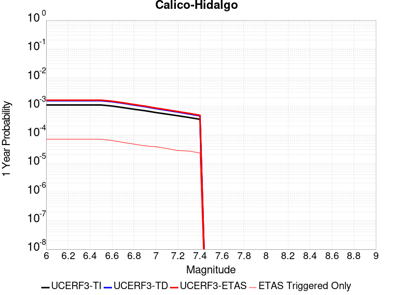
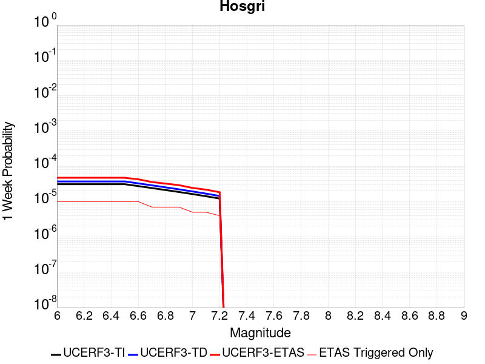

# Parent Section Magnitude-Probability Distributions

Only fault sections with at least one triggered aftershock are plotted. Sections are sorted by total supraseismogenic trigger rate (decreasing)

## Table Of Contents

* [Tank Canyon](#tank-canyon)
* [Garlock (Central)](#garlock-central)
* [Little Lake](#little-lake)
* [Owl Lake](#owl-lake)
* [Garlock (West)](#garlock-west)
* [Garlock (East)](#garlock-east)
* [Death Valley (So)](#death-valley-so)
* [Panamint Valley](#panamint-valley)
* [San Andreas (Mojave N)](#san-andreas-mojave-n)
* [San Andreas (Big Bend)](#san-andreas-big-bend)
* [San Andreas (Carrizo) rev](#san-andreas-carrizo-rev)
* [San Andreas (Mojave S)](#san-andreas-mojave-s)
* [San Andreas (Cholame) rev](#san-andreas-cholame-rev)
* [San Andreas (Parkfield)](#san-andreas-parkfield)
* [Blackwater](#blackwater)
* [Death Valley (Black Mtns Frontal)](#death-valley-black-mtns-frontal)
* [Hunter Mountain-Saline Valley](#hunter-mountain-saline-valley)
* [San Andreas (San Bernardino N)](#san-andreas-san-bernardino-n)
* [Cucamonga](#cucamonga)
* [Pleito](#pleito)
* [San Cayetano](#san-cayetano)
* [San Andreas (San Bernardino S)](#san-andreas-san-bernardino-s)
* [Death Valley (No)](#death-valley-no)
* [Cleghorn](#cleghorn)
* [Gravel Hills-Harper Lk](#gravel-hills-harper-lk)
* [Pitas Point (Lower West)](#pitas-point-lower-west)
* [Santa Ynez (West)](#santa-ynez-west)
* [Pitas Point (Lower)-Montalvo](#pitas-point-lower-montalvo)
* [San Andreas (San Gorgonio Pass-Garnet HIll)](#san-andreas-san-gorgonio-pass-garnet-hill)
* [San Andreas (Coachella) rev](#san-andreas-coachella-rev)
* [Santa Ynez (East)](#santa-ynez-east)
* [Red Mountain](#red-mountain)
* [San Juan](#san-juan)
* [San Jacinto (San Bernardino)](#san-jacinto-san-bernardino)
* [So Sierra Nevada](#so-sierra-nevada)
* [Death Valley (Fish Lake Valley)](#death-valley-fish-lake-valley)
* [Mission Ridge-Arroyo Parida-Santa Ana](#mission-ridge-arroyo-parida-santa-ana)
* [Lenwood-Lockhart-Old Woman Springs](#lenwood-lockhart-old-woman-springs)
* [Oak Ridge (Onshore)](#oak-ridge-onshore)
* [Santa Susana alt 1](#santa-susana-alt-1)
* [Raymond](#raymond)
* [San Jacinto (Stepovers Combined)](#san-jacinto-stepovers-combined)
* [Ventura-Pitas Point](#ventura-pitas-point)
* [San Jacinto (San Jacinto Valley) rev](#san-jacinto-san-jacinto-valley-rev)
* [Sierra Madre](#sierra-madre)
* [Channel Islands Thrust](#channel-islands-thrust)
* [Helendale-So Lockhart](#helendale-so-lockhart)
* [Los Alamos 2011 CFM](#los-alamos-2011-cfm)
* [Elysian Park (Upper)](#elysian-park-upper)
* [Santa Cruz Island](#santa-cruz-island)
* [Verdugo](#verdugo)
* [Chino alt 1](#chino-alt-1)
* [San Jose](#san-jose)
* [Simi-Santa Rosa](#simi-santa-rosa)
* [San Jacinto (Anza) rev](#san-jacinto-anza-rev)
* [Hayward (No) 2011 CFM](#hayward-no-2011-cfm)
* [Great Valley 12](#great-valley-12)
* [Anacapa-Dume alt 1](#anacapa-dume-alt-1)
* [San Gregorio (North) 2011 CFM](#san-gregorio-north-2011-cfm)
* [Whittier alt 1](#whittier-alt-1)
* [Pinto Mtn](#pinto-mtn)
* [San Gabriel](#san-gabriel)
* [Independence rev 2011](#independence-rev-2011)
* [Los Osos 2011](#los-osos-2011)
* [Hayward (So) 2011 CFM](#hayward-so-2011-cfm)
* [San Gregorio (South) 2011 CFM](#san-gregorio-south-2011-cfm)
* [Emerson-Copper Mtn 2011](#emerson-copper-mtn-2011)
* [Elsinore (Stepovers Combined)](#elsinore-stepovers-combined)
* [San Jacinto (Clark) rev](#san-jacinto-clark-rev)
* [Calaveras (No) 2011 CFM](#calaveras-no-2011-cfm)
* [Elsinore (Glen Ivy) rev](#elsinore-glen-ivy-rev)
* [Clamshell-Sawpit](#clamshell-sawpit)
* [Newport-Inglewood (Offshore)](#newport-inglewood-offshore)
* [Mono Lake 2011 CFM](#mono-lake-2011-cfm)
* [Santa Rosa Island](#santa-rosa-island)
* [Great Valley 03 Mysterious Ridge](#great-valley-03-mysterious-ridge)
* [Imperial](#imperial)
* [Deep Springs](#deep-springs)
* [Calico-Hidalgo](#calico-hidalgo)
* [North Frontal  (West)](#north-frontal--west)
* [Elsinore (Temecula) rev](#elsinore-temecula-rev)
* [Robinson Creek](#robinson-creek)
* [Concord 2011 CFM](#concord-2011-cfm)
* [Burnt Mtn](#burnt-mtn)
* [San Luis Range 2011 CFM](#san-luis-range-2011-cfm)
* [Calaveras (Central) 2011 CFM](#calaveras-central-2011-cfm)
* [Newport-Inglewood alt 1](#newport-inglewood-alt-1)
* [Great Valley 09 (Laguna Seca)](#great-valley-09-laguna-seca)
* [Great Valley 04a Trout Creek](#great-valley-04a-trout-creek)
* [Great Valley 04b Gordon Valley](#great-valley-04b-gordon-valley)
* [Palos Verdes](#palos-verdes)
* [Malibu Coast alt 1](#malibu-coast-alt-1)
* [Great Valley 07 (Orestimba)](#great-valley-07-orestimba)
* [North Frontal  (East)](#north-frontal--east)
* [Holser alt 1](#holser-alt-1)
* [Green Valley 2011 CFM](#green-valley-2011-cfm)
* [Rose Canyon](#rose-canyon)
* [Great Valley 10 (Panoche)](#great-valley-10-panoche)
* [Hosgri](#hosgri)
* [Rodgers Creek - Healdsburg 2011 CFM](#rodgers-creek---healdsburg-2011-cfm)
* [Great Valley 08 (Quinto)](#great-valley-08-quinto)
* [San Andreas (Creeping Section) 2011 CFM](#san-andreas-creeping-section-2011-cfm)
* [Casmalia 2011 CFM](#casmalia-2011-cfm)
* [Hollywood](#hollywood)

## Tank Canyon
*[(top)](#table-of-contents)*

| 1 Week | 1 Month | 1 Year | 10 Year |
|-----|-----|-----|-----|
|  |  |  |  |

| Magnitude | 1 wk TI Prob | 1 wk TD Prob | 1 wk ETAS Prob | 1 wk ETAS/TD Gain | 1 wk ETAS Triggered Only | 1 mo TI Prob | 1 mo TD Prob | 1 mo ETAS Prob | 1 mo ETAS/TD Gain | 1 mo ETAS Triggered Only | 1 yr TI Prob | 1 yr TD Prob | 1 yr ETAS Prob | 1 yr ETAS/TD Gain | 1 yr ETAS Triggered Only | 10 yr TI Prob | 10 yr TD Prob | 10 yr ETAS Prob | 10 yr ETAS/TD Gain | 10 yr ETAS Triggered Only |
|-----|-----|-----|-----|-----|-----|-----|-----|-----|-----|-----|-----|-----|-----|-----|-----|-----|-----|-----|-----|-----|
| 6.0 | 2.7748038E-5 | 3.5073965E-5 | 0.021290142 | 607.00696 | 0.021255814 | 1.18914744E-4 | 1.5031699E-4 | 0.02735553 | 181.9856 | 0.027209302 | 0.0014468255 | 0.0018300817 | 0.04342823 | 23.730215 | 0.04167442 | 0.014374418 | 0.018297758 | 0.073387235 | 4.0107226 | 0.05611628 |
| 6.1 | 2.7748038E-5 | 3.5073965E-5 | 0.021290142 | 607.00696 | 0.021255814 | 1.18914744E-4 | 1.5031699E-4 | 0.02735553 | 181.9856 | 0.027209302 | 0.0014468255 | 0.0018300817 | 0.04342823 | 23.730215 | 0.04167442 | 0.014374418 | 0.018297758 | 0.073387235 | 4.0107226 | 0.05611628 |
| 6.2 | 2.7748038E-5 | 3.5073965E-5 | 0.021290142 | 607.00696 | 0.021255814 | 1.18914744E-4 | 1.5031699E-4 | 0.02735553 | 181.9856 | 0.027209302 | 0.0014468255 | 0.0018300817 | 0.04342823 | 23.730215 | 0.04167442 | 0.014374418 | 0.018297758 | 0.073387235 | 4.0107226 | 0.05611628 |
| 6.3 | 2.7748038E-5 | 3.5073965E-5 | 0.021290142 | 607.00696 | 0.021255814 | 1.18914744E-4 | 1.5031699E-4 | 0.02735553 | 181.9856 | 0.027209302 | 0.0014468255 | 0.0018300817 | 0.04342823 | 23.730215 | 0.04167442 | 0.014374418 | 0.018297758 | 0.073387235 | 4.0107226 | 0.05611628 |

## Garlock (Central)
*[(top)](#table-of-contents)*

| 1 Week | 1 Month | 1 Year | 10 Year |
|-----|-----|-----|-----|
|  |  |  |  |

| Magnitude | 1 wk TI Prob | 1 wk TD Prob | 1 wk ETAS Prob | 1 wk ETAS/TD Gain | 1 wk ETAS Triggered Only | 1 mo TI Prob | 1 mo TD Prob | 1 mo ETAS Prob | 1 mo ETAS/TD Gain | 1 mo ETAS Triggered Only | 1 yr TI Prob | 1 yr TD Prob | 1 yr ETAS Prob | 1 yr ETAS/TD Gain | 1 yr ETAS Triggered Only | 10 yr TI Prob | 10 yr TD Prob | 10 yr ETAS Prob | 10 yr ETAS/TD Gain | 10 yr ETAS Triggered Only |
|-----|-----|-----|-----|-----|-----|-----|-----|-----|-----|-----|-----|-----|-----|-----|-----|-----|-----|-----|-----|-----|
| 6.0 | 2.575808E-5 | 1.9313613E-5 | 0.011716763 | 606.6582 | 0.011697674 | 1.10387096E-4 | 8.277037E-5 | 0.014686213 | 177.43321 | 0.014604651 | 0.0013431342 | 0.0010073289 | 0.02087102 | 20.719173 | 0.01988372 | 0.013350452 | 0.0100695705 | 0.035347328 | 3.5103114 | 0.025534883 |
| 6.1 | 2.575808E-5 | 1.9313613E-5 | 0.011716763 | 606.6582 | 0.011697674 | 1.10387096E-4 | 8.277037E-5 | 0.014686213 | 177.43321 | 0.014604651 | 0.0013431342 | 0.0010073289 | 0.02087102 | 20.719173 | 0.01988372 | 0.013350452 | 0.0100695705 | 0.035347328 | 3.5103114 | 0.025534883 |
| 6.2 | 2.575808E-5 | 1.9313613E-5 | 0.011716763 | 606.6582 | 0.011697674 | 1.10387096E-4 | 8.277037E-5 | 0.014686213 | 177.43321 | 0.014604651 | 0.0013431342 | 0.0010073289 | 0.02087102 | 20.719173 | 0.01988372 | 0.013350452 | 0.0100695705 | 0.035347328 | 3.5103114 | 0.025534883 |
| 6.3 | 2.575808E-5 | 1.9313613E-5 | 0.011716763 | 606.6582 | 0.011697674 | 1.10387096E-4 | 8.277037E-5 | 0.014686213 | 177.43321 | 0.014604651 | 0.0013431342 | 0.0010073289 | 0.02087102 | 20.719173 | 0.01988372 | 0.013350452 | 0.0100695705 | 0.035347328 | 3.5103114 | 0.025534883 |
| 6.4 | 2.575808E-5 | 1.9313613E-5 | 0.011716763 | 606.6582 | 0.011697674 | 1.10387096E-4 | 8.277037E-5 | 0.014686213 | 177.43321 | 0.014604651 | 0.0013431342 | 0.0010073289 | 0.02087102 | 20.719173 | 0.01988372 | 0.013350452 | 0.0100695705 | 0.035347328 | 3.5103114 | 0.025534883 |
| 6.5 | 2.575808E-5 | 1.9313613E-5 | 0.011716763 | 606.6582 | 0.011697674 | 1.10387096E-4 | 8.277037E-5 | 0.014686213 | 177.43321 | 0.014604651 | 0.0013431342 | 0.0010073289 | 0.02087102 | 20.719173 | 0.01988372 | 0.013350452 | 0.0100695705 | 0.035347328 | 3.5103114 | 0.025534883 |
| 6.6 | 2.540234E-5 | 1.885198E-5 | 0.011320964 | 600.5186 | 0.011302326 | 1.0886263E-4 | 8.0792066E-5 | 0.014242439 | 176.28511 | 0.014162791 | 0.0013245966 | 9.83265E-4 | 0.02017368 | 20.517033 | 0.019209303 | 0.013167289 | 0.009831364 | 0.03417109 | 3.475722 | 0.024581395 |
| 6.7 | 2.4966947E-5 | 1.8286464E-5 | 0.010715765 | 585.9944 | 0.010697674 | 1.06996806E-4 | 7.8368575E-5 | 0.01354243 | 172.80434 | 0.013465117 | 0.0013019076 | 9.5378514E-4 | 0.01921542 | 20.146488 | 0.01827907 | 0.012943068 | 0.009539624 | 0.032803927 | 3.438702 | 0.023488373 |
| 6.8 | 2.4548952E-5 | 1.7797542E-5 | 0.010436216 | 586.3853 | 0.010418605 | 1.0520555E-4 | 7.627332E-5 | 0.013168298 | 172.6462 | 0.013093024 | 0.001280125 | 9.282974E-4 | 0.018656012 | 20.09702 | 0.017744185 | 0.012727758 | 0.009286596 | 0.031750448 | 3.418954 | 0.022674419 |
| 6.9 | 2.3994342E-5 | 1.7148153E-5 | 0.009668145 | 563.80096 | 0.009651163 | 1.0282884E-4 | 7.349039E-5 | 0.012258641 | 166.80605 | 0.012186047 | 0.0012512221 | 8.944436E-4 | 0.017391304 | 19.443712 | 0.016511628 | 0.012442005 | 0.0089510605 | 0.029947469 | 3.3456895 | 0.021186046 |
| 7.0 | 2.343005E-5 | 1.6491087E-5 | 0.009109365 | 552.38104 | 0.009093023 | 1.0041064E-4 | 7.067455E-5 | 0.011558235 | 163.54169 | 0.011488372 | 0.0012218138 | 8.601883E-4 | 0.016404945 | 19.071342 | 0.015558139 | 0.01215118 | 0.008610493 | 0.028415227 | 3.30007 | 0.019976744 |
| 7.1 | 2.2814058E-5 | 1.5782754E-5 | 0.008504021 | 538.81726 | 0.008488372 | 9.777087E-5 | 6.763899E-5 | 0.010741335 | 158.8039 | 0.010674419 | 0.0011897103 | 8.2325895E-4 | 0.015346177 | 18.640766 | 0.014534884 | 0.011833611 | 0.00824334 | 0.026902204 | 3.2635076 | 0.018813953 |
| 7.2 | 2.2145266E-5 | 1.5027377E-5 | 0.0077358414 | 514.7832 | 0.00772093 | 9.490483E-5 | 6.440182E-5 | 0.009784706 | 151.93213 | 0.00972093 | 0.0011548538 | 7.8387547E-4 | 0.014099011 | 17.98629 | 0.013325581 | 0.011488707 | 0.007851825 | 0.02504137 | 3.189242 | 0.017325582 |
| 7.3 | 1.9954436E-5 | 1.3199953E-5 | 0.0062224204 | 471.39716 | 0.006209302 | 8.551621E-5 | 5.657036E-5 | 0.007916591 | 139.94238 | 0.007860465 | 0.0010406625 | 6.8859005E-4 | 0.011425378 | 16.592422 | 0.010744186 | 0.010358025 | 0.006900618 | 0.020827105 | 3.0181506 | 0.014023256 |
| 7.4 | 1.918037E-5 | 1.2553606E-5 | 0.005896201 | 469.68182 | 0.0058837207 | 8.2198996E-5 | 5.3800417E-5 | 0.0075417696 | 140.18051 | 0.0074883723 | 0.0010003132 | 6.5488677E-4 | 0.010857503 | 16.579206 | 0.010209302 | 0.009958224 | 0.006564366 | 0.019733164 | 3.0061035 | 0.013255814 |
| 7.5 | 1.6994161E-5 | 1.0764553E-5 | 0.0043362994 | 402.83136 | 0.0043255812 | 7.283008E-5 | 4.613333E-5 | 0.0057202904 | 123.99474 | 0.0056744185 | 8.863455E-4 | 5.615903E-4 | 0.008278185 | 14.740612 | 0.00772093 | 0.008828186 | 0.005632708 | 0.015877003 | 2.8187158 | 0.010302326 |
| 7.6 | 1.621788E-5 | 1.012848E-5 | 0.0040333434 | 398.21805 | 0.004023256 | 6.950335E-5 | 4.34074E-5 | 0.005298993 | 122.075806 | 0.005255814 | 8.458747E-4 | 5.2841863E-4 | 0.007710668 | 14.591968 | 0.0071860463 | 0.0084266225 | 0.005301458 | 0.014832058 | 2.7977319 | 0.009581395 |
| 7.7 | 7.713584E-6 | 3.2171508E-6 | 9.10191E-4 | 282.91833 | 9.0697675E-4 | 3.3057797E-5 | 1.378779E-5 | 0.0013160955 | 95.4537 | 0.0013023256 | 4.0240434E-4 | 1.6786634E-4 | 0.0021442787 | 12.773726 | 0.0019767443 | 0.0040167645 | 0.0016902693 | 0.0044530337 | 2.6345112 | 0.0027674418 |

## Little Lake
*[(top)](#table-of-contents)*

| 1 Week | 1 Month | 1 Year | 10 Year |
|-----|-----|-----|-----|
|  |  |  |  |

| Magnitude | 1 wk TI Prob | 1 wk TD Prob | 1 wk ETAS Prob | 1 wk ETAS/TD Gain | 1 wk ETAS Triggered Only | 1 mo TI Prob | 1 mo TD Prob | 1 mo ETAS Prob | 1 mo ETAS/TD Gain | 1 mo ETAS Triggered Only | 1 yr TI Prob | 1 yr TD Prob | 1 yr ETAS Prob | 1 yr ETAS/TD Gain | 1 yr ETAS Triggered Only | 10 yr TI Prob | 10 yr TD Prob | 10 yr ETAS Prob | 10 yr ETAS/TD Gain | 10 yr ETAS Triggered Only |
|-----|-----|-----|-----|-----|-----|-----|-----|-----|-----|-----|-----|-----|-----|-----|-----|-----|-----|-----|-----|-----|
| 6.0 | 1.27106505E-5 | 1.3900362E-5 | 0.011990478 | 862.6018 | 0.011976744 | 5.447308E-5 | 5.957219E-5 | 0.01501217 | 251.99962 | 0.0149534885 | 6.630079E-4 | 7.25151E-4 | 0.020757126 | 28.624557 | 0.020046512 | 0.006610333 | 0.0072377534 | 0.032102983 | 4.43549 | 0.025046512 |
| 6.1 | 1.27106505E-5 | 1.3900362E-5 | 0.011990478 | 862.6018 | 0.011976744 | 5.447308E-5 | 5.957219E-5 | 0.01501217 | 251.99962 | 0.0149534885 | 6.630079E-4 | 7.25151E-4 | 0.020757126 | 28.624557 | 0.020046512 | 0.006610333 | 0.0072377534 | 0.032102983 | 4.43549 | 0.025046512 |
| 6.2 | 1.27106505E-5 | 1.3900362E-5 | 0.011990478 | 862.6018 | 0.011976744 | 5.447308E-5 | 5.957219E-5 | 0.01501217 | 251.99962 | 0.0149534885 | 6.630079E-4 | 7.25151E-4 | 0.020757126 | 28.624557 | 0.020046512 | 0.006610333 | 0.0072377534 | 0.032102983 | 4.43549 | 0.025046512 |
| 6.3 | 1.27106505E-5 | 1.3900362E-5 | 0.011990478 | 862.6018 | 0.011976744 | 5.447308E-5 | 5.957219E-5 | 0.01501217 | 251.99962 | 0.0149534885 | 6.630079E-4 | 7.25151E-4 | 0.020757126 | 28.624557 | 0.020046512 | 0.006610333 | 0.0072377534 | 0.032102983 | 4.43549 | 0.025046512 |
| 6.4 | 1.27106505E-5 | 1.3900362E-5 | 0.011990478 | 862.6018 | 0.011976744 | 5.447308E-5 | 5.957219E-5 | 0.01501217 | 251.99962 | 0.0149534885 | 6.630079E-4 | 7.25151E-4 | 0.020757126 | 28.624557 | 0.020046512 | 0.006610333 | 0.0072377534 | 0.032102983 | 4.43549 | 0.025046512 |
| 6.5 | 1.27106505E-5 | 1.3900362E-5 | 0.011990478 | 862.6018 | 0.011976744 | 5.447308E-5 | 5.957219E-5 | 0.01501217 | 251.99962 | 0.0149534885 | 6.630079E-4 | 7.25151E-4 | 0.020757126 | 28.624557 | 0.020046512 | 0.006610333 | 0.0072377534 | 0.032102983 | 4.43549 | 0.025046512 |
| 6.6 | 1.08505255E-5 | 1.1856941E-5 | 0.010360572 | 873.79803 | 0.010348837 | 4.6501424E-5 | 5.0815026E-5 | 0.0130269 | 256.3592 | 0.012976744 | 5.6600774E-4 | 6.1859656E-4 | 0.017747529 | 28.689991 | 0.017139535 | 0.005645683 | 0.006178476 | 0.027302962 | 4.419045 | 0.021255814 |
| 6.7 | 7.97625E-6 | 8.706619E-6 | 0.008031893 | 922.50415 | 0.0080232555 | 3.4183482E-5 | 3.7314083E-5 | 0.010106706 | 270.855 | 0.010069767 | 4.161044E-4 | 4.5429895E-4 | 0.013727336 | 30.216526 | 0.01327907 | 0.004153261 | 0.0045429897 | 0.020840704 | 4.587443 | 0.016372094 |
| 6.8 | 7.97625E-6 | 8.706619E-6 | 0.008031893 | 922.50415 | 0.0080232555 | 3.4183482E-5 | 3.7314083E-5 | 0.010106706 | 270.855 | 0.010069767 | 4.161044E-4 | 4.5429895E-4 | 0.013727336 | 30.216526 | 0.01327907 | 0.004153261 | 0.0045429897 | 0.020840704 | 4.587443 | 0.016372094 |

## Owl Lake
*[(top)](#table-of-contents)*

| 1 Week | 1 Month | 1 Year | 10 Year |
|-----|-----|-----|-----|
|  |  |  |  |

| Magnitude | 1 wk TI Prob | 1 wk TD Prob | 1 wk ETAS Prob | 1 wk ETAS/TD Gain | 1 wk ETAS Triggered Only | 1 mo TI Prob | 1 mo TD Prob | 1 mo ETAS Prob | 1 mo ETAS/TD Gain | 1 mo ETAS Triggered Only | 1 yr TI Prob | 1 yr TD Prob | 1 yr ETAS Prob | 1 yr ETAS/TD Gain | 1 yr ETAS Triggered Only | 10 yr TI Prob | 10 yr TD Prob | 10 yr ETAS Prob | 10 yr ETAS/TD Gain | 10 yr ETAS Triggered Only |
|-----|-----|-----|-----|-----|-----|-----|-----|-----|-----|-----|-----|-----|-----|-----|-----|-----|-----|-----|-----|-----|
| 6.0 | 3.637175E-5 | 4.988367E-5 | 0.0043519945 | 87.24287 | 0.0043023257 | 1.5586962E-4 | 2.1378716E-4 | 0.0062125046 | 29.059296 | 0.006 | 0.0018960608 | 0.0026025574 | 0.012321384 | 4.734337 | 0.009744186 | 0.018799646 | 0.025995217 | 0.039812494 | 1.5315315 | 0.014186046 |
| 6.1 | 3.637175E-5 | 4.988367E-5 | 0.0043519945 | 87.24287 | 0.0043023257 | 1.5586962E-4 | 2.1378716E-4 | 0.0062125046 | 29.059296 | 0.006 | 0.0018960608 | 0.0026025574 | 0.012321384 | 4.734337 | 0.009744186 | 0.018799646 | 0.025995217 | 0.039812494 | 1.5315315 | 0.014186046 |
| 6.2 | 3.637175E-5 | 4.988367E-5 | 0.0043519945 | 87.24287 | 0.0043023257 | 1.5586962E-4 | 2.1378716E-4 | 0.0062125046 | 29.059296 | 0.006 | 0.0018960608 | 0.0026025574 | 0.012321384 | 4.734337 | 0.009744186 | 0.018799646 | 0.025995217 | 0.039812494 | 1.5315315 | 0.014186046 |
| 6.3 | 3.637175E-5 | 4.988367E-5 | 0.0043519945 | 87.24287 | 0.0043023257 | 1.5586962E-4 | 2.1378716E-4 | 0.0062125046 | 29.059296 | 0.006 | 0.0018960608 | 0.0026025574 | 0.012321384 | 4.734337 | 0.009744186 | 0.018799646 | 0.025995217 | 0.039812494 | 1.5315315 | 0.014186046 |
| 6.4 | 3.637175E-5 | 4.988367E-5 | 0.0043519945 | 87.24287 | 0.0043023257 | 1.5586962E-4 | 2.1378716E-4 | 0.0062125046 | 29.059296 | 0.006 | 0.0018960608 | 0.0026025574 | 0.012321384 | 4.734337 | 0.009744186 | 0.018799646 | 0.025995217 | 0.039812494 | 1.5315315 | 0.014186046 |
| 6.5 | 3.637175E-5 | 4.988367E-5 | 0.0043519945 | 87.24287 | 0.0043023257 | 1.5586962E-4 | 2.1378716E-4 | 0.0062125046 | 29.059296 | 0.006 | 0.0018960608 | 0.0026025574 | 0.012321384 | 4.734337 | 0.009744186 | 0.018799646 | 0.025995217 | 0.039812494 | 1.5315315 | 0.014186046 |

## Garlock (West)
*[(top)](#table-of-contents)*

| 1 Week | 1 Month | 1 Year | 10 Year |
|-----|-----|-----|-----|
|  |  |  |  |

| Magnitude | 1 wk TI Prob | 1 wk TD Prob | 1 wk ETAS Prob | 1 wk ETAS/TD Gain | 1 wk ETAS Triggered Only | 1 mo TI Prob | 1 mo TD Prob | 1 mo ETAS Prob | 1 mo ETAS/TD Gain | 1 mo ETAS Triggered Only | 1 yr TI Prob | 1 yr TD Prob | 1 yr ETAS Prob | 1 yr ETAS/TD Gain | 1 yr ETAS Triggered Only | 10 yr TI Prob | 10 yr TD Prob | 10 yr ETAS Prob | 10 yr ETAS/TD Gain | 10 yr ETAS Triggered Only |
|-----|-----|-----|-----|-----|-----|-----|-----|-----|-----|-----|-----|-----|-----|-----|-----|-----|-----|-----|-----|-----|
| 6.0 | 2.516656E-5 | 1.8065048E-5 | 0.005157507 | 285.49646 | 0.005139535 | 1.07852225E-4 | 7.741977E-5 | 0.006704814 | 86.60338 | 0.006627907 | 0.0013123099 | 9.42255E-4 | 0.009957009 | 10.567212 | 0.009023256 | 0.013045873 | 0.009421492 | 0.02126236 | 2.2567935 | 0.011953488 |
| 6.1 | 2.516656E-5 | 1.8065048E-5 | 0.005157507 | 285.49646 | 0.005139535 | 1.07852225E-4 | 7.741977E-5 | 0.006704814 | 86.60338 | 0.006627907 | 0.0013123099 | 9.42255E-4 | 0.009957009 | 10.567212 | 0.009023256 | 0.013045873 | 0.009421492 | 0.02126236 | 2.2567935 | 0.011953488 |
| 6.2 | 2.516656E-5 | 1.8065048E-5 | 0.005157507 | 285.49646 | 0.005139535 | 1.07852225E-4 | 7.741977E-5 | 0.006704814 | 86.60338 | 0.006627907 | 0.0013123099 | 9.42255E-4 | 0.009957009 | 10.567212 | 0.009023256 | 0.013045873 | 0.009421492 | 0.02126236 | 2.2567935 | 0.011953488 |
| 6.3 | 2.516656E-5 | 1.8065048E-5 | 0.005157507 | 285.49646 | 0.005139535 | 1.07852225E-4 | 7.741977E-5 | 0.006704814 | 86.60338 | 0.006627907 | 0.0013123099 | 9.42255E-4 | 0.009957009 | 10.567212 | 0.009023256 | 0.013045873 | 0.009421492 | 0.02126236 | 2.2567935 | 0.011953488 |
| 6.4 | 2.516656E-5 | 1.8065048E-5 | 0.005157507 | 285.49646 | 0.005139535 | 1.07852225E-4 | 7.741977E-5 | 0.006704814 | 86.60338 | 0.006627907 | 0.0013123099 | 9.42255E-4 | 0.009957009 | 10.567212 | 0.009023256 | 0.013045873 | 0.009421492 | 0.02126236 | 2.2567935 | 0.011953488 |
| 6.5 | 2.516656E-5 | 1.8065048E-5 | 0.005157507 | 285.49646 | 0.005139535 | 1.07852225E-4 | 7.741977E-5 | 0.006704814 | 86.60338 | 0.006627907 | 0.0013123099 | 9.42255E-4 | 0.009957009 | 10.567212 | 0.009023256 | 0.013045873 | 0.009421492 | 0.02126236 | 2.2567935 | 0.011953488 |
| 6.6 | 2.498869E-5 | 1.7877663E-5 | 0.0051573208 | 288.47845 | 0.005139535 | 1.07089996E-4 | 7.6616736E-5 | 0.006704016 | 87.50067 | 0.006627907 | 0.0013030408 | 9.3248655E-4 | 0.009947328 | 10.66753 | 0.009023256 | 0.012954267 | 0.009324339 | 0.02116637 | 2.2700126 | 0.011953488 |
| 6.7 | 2.4627925E-5 | 1.7497801E-5 | 0.0051569426 | 294.71948 | 0.005139535 | 1.0554398E-4 | 7.498886E-5 | 0.006702399 | 89.3786 | 0.006627907 | 0.0012842404 | 9.1268384E-4 | 0.009927704 | 10.877484 | 0.009023256 | 0.012768441 | 0.009128104 | 0.02097248 | 2.2975724 | 0.011953488 |
| 6.8 | 2.4270235E-5 | 1.716136E-5 | 0.0051333527 | 299.12274 | 0.0051162792 | 1.04011146E-4 | 7.354704E-5 | 0.0066777123 | 90.79512 | 0.006604651 | 0.0012656 | 8.9514436E-4 | 0.009887088 | 11.045244 | 0.009 | 0.012584164 | 0.0089538675 | 0.02077728 | 2.3204808 | 0.011930233 |
| 6.9 | 2.3913764E-5 | 1.6823105E-5 | 0.005109761 | 303.73468 | 0.005093023 | 1.0248353E-4 | 7.2097464E-5 | 0.0066530183 | 92.278114 | 0.0065813954 | 0.0012470228 | 8.775101E-4 | 0.009846377 | 11.220814 | 0.0089767445 | 0.012400482 | 0.00877859 | 0.02058104 | 2.3444586 | 0.011906977 |
| 7.0 | 2.3579369E-5 | 1.6492264E-5 | 0.0050629205 | 306.9876 | 0.0050465115 | 1.0105052E-4 | 7.067965E-5 | 0.0066051013 | 93.45125 | 0.0065348838 | 0.0012295957 | 8.6026196E-4 | 0.009782813 | 11.3719 | 0.008930232 | 0.012228143 | 0.008607132 | 0.020365514 | 2.3661206 | 0.011860465 |
| 7.1 | 2.3205374E-5 | 1.6105636E-5 | 0.005062536 | 314.3332 | 0.0050465115 | 9.944781E-5 | 6.902276E-5 | 0.0065802014 | 95.333786 | 0.0065116277 | 0.0012101046 | 8.401051E-4 | 0.009716363 | 11.565652 | 0.008883721 | 0.0120353615 | 0.008406721 | 0.020121358 | 2.3934846 | 0.0118139535 |
| 7.2 | 2.2799322E-5 | 1.5676578E-5 | 0.005015598 | 319.94214 | 0.005 | 9.770772E-5 | 6.718404E-5 | 0.0065086116 | 96.87734 | 0.0064418605 | 0.0011889422 | 8.177357E-4 | 0.009601245 | 11.741257 | 0.008790698 | 0.011826012 | 0.008184515 | 0.01978645 | 2.417547 | 0.011697674 |
| 7.3 | 1.8228246E-5 | 1.1798695E-5 | 0.0047791842 | 405.06042 | 0.0047674417 | 7.811871E-5 | 5.0565202E-5 | 0.0062130443 | 122.87193 | 0.0061627906 | 9.506803E-4 | 6.1551924E-4 | 0.009028942 | 14.668821 | 0.008418605 | 0.0094662355 | 0.006171021 | 0.017357375 | 2.8127234 | 0.011255814 |
| 7.4 | 1.7670916E-5 | 1.132978E-5 | 0.004639184 | 409.46817 | 0.004627907 | 7.5730306E-5 | 4.8555645E-5 | 0.00602501 | 124.08464 | 0.005976744 | 9.216264E-4 | 5.9106643E-4 | 0.008749032 | 14.802114 | 0.008162791 | 0.009178135 | 0.0059269792 | 0.016746193 | 2.8254178 | 0.010883721 |
| 7.5 | 1.6994161E-5 | 1.0764553E-5 | 0.0043362994 | 402.83136 | 0.0043255812 | 7.283008E-5 | 4.613333E-5 | 0.0057202904 | 123.99474 | 0.0056744185 | 8.863455E-4 | 5.615903E-4 | 0.008278185 | 14.740612 | 0.00772093 | 0.008828186 | 0.005632708 | 0.015877003 | 2.8187158 | 0.010302326 |
| 7.6 | 1.621788E-5 | 1.012848E-5 | 0.0040333434 | 398.21805 | 0.004023256 | 6.950335E-5 | 4.34074E-5 | 0.005298993 | 122.075806 | 0.005255814 | 8.458747E-4 | 5.2841863E-4 | 0.007710668 | 14.591968 | 0.0071860463 | 0.0084266225 | 0.005301458 | 0.014832058 | 2.7977319 | 0.009581395 |
| 7.7 | 7.713584E-6 | 3.2171508E-6 | 9.10191E-4 | 282.91833 | 9.0697675E-4 | 3.3057797E-5 | 1.378779E-5 | 0.0013160955 | 95.4537 | 0.0013023256 | 4.0240434E-4 | 1.6786634E-4 | 0.0021442787 | 12.773726 | 0.0019767443 | 0.0040167645 | 0.0016902693 | 0.0044530337 | 2.6345112 | 0.0027674418 |

## Garlock (East)
*[(top)](#table-of-contents)*

| 1 Week | 1 Month | 1 Year | 10 Year |
|-----|-----|-----|-----|
|  |  |  |  |

| Magnitude | 1 wk TI Prob | 1 wk TD Prob | 1 wk ETAS Prob | 1 wk ETAS/TD Gain | 1 wk ETAS Triggered Only | 1 mo TI Prob | 1 mo TD Prob | 1 mo ETAS Prob | 1 mo ETAS/TD Gain | 1 mo ETAS Triggered Only | 1 yr TI Prob | 1 yr TD Prob | 1 yr ETAS Prob | 1 yr ETAS/TD Gain | 1 yr ETAS Triggered Only | 10 yr TI Prob | 10 yr TD Prob | 10 yr ETAS Prob | 10 yr ETAS/TD Gain | 10 yr ETAS Triggered Only |
|-----|-----|-----|-----|-----|-----|-----|-----|-----|-----|-----|-----|-----|-----|-----|-----|-----|-----|-----|-----|-----|
| 6.0 | 2.2327951E-5 | 1.8303952E-5 | 0.0044368277 | 242.39726 | 0.0044186045 | 9.5687705E-5 | 7.8444085E-5 | 0.0058221794 | 74.22076 | 0.005744186 | 0.0011643751 | 9.548048E-4 | 0.009342138 | 9.784343 | 0.008395349 | 0.0115829315 | 0.0096519785 | 0.020845214 | 2.159683 | 0.011302326 |
| 6.1 | 2.2327951E-5 | 1.8303952E-5 | 0.0044368277 | 242.39726 | 0.0044186045 | 9.5687705E-5 | 7.8444085E-5 | 0.0058221794 | 74.22076 | 0.005744186 | 0.0011643751 | 9.548048E-4 | 0.009342138 | 9.784343 | 0.008395349 | 0.0115829315 | 0.0096519785 | 0.020845214 | 2.159683 | 0.011302326 |
| 6.2 | 2.2327951E-5 | 1.8303952E-5 | 0.0044368277 | 242.39726 | 0.0044186045 | 9.5687705E-5 | 7.8444085E-5 | 0.0058221794 | 74.22076 | 0.005744186 | 0.0011643751 | 9.548048E-4 | 0.009342138 | 9.784343 | 0.008395349 | 0.0115829315 | 0.0096519785 | 0.020845214 | 2.159683 | 0.011302326 |
| 6.3 | 2.2327951E-5 | 1.8303952E-5 | 0.0044368277 | 242.39726 | 0.0044186045 | 9.5687705E-5 | 7.8444085E-5 | 0.0058221794 | 74.22076 | 0.005744186 | 0.0011643751 | 9.548048E-4 | 0.009342138 | 9.784343 | 0.008395349 | 0.0115829315 | 0.0096519785 | 0.020845214 | 2.159683 | 0.011302326 |
| 6.4 | 2.2327951E-5 | 1.8303952E-5 | 0.0044368277 | 242.39726 | 0.0044186045 | 9.5687705E-5 | 7.8444085E-5 | 0.0058221794 | 74.22076 | 0.005744186 | 0.0011643751 | 9.548048E-4 | 0.009342138 | 9.784343 | 0.008395349 | 0.0115829315 | 0.0096519785 | 0.020845214 | 2.159683 | 0.011302326 |
| 6.5 | 2.2327951E-5 | 1.8303952E-5 | 0.0044368277 | 242.39726 | 0.0044186045 | 9.5687705E-5 | 7.8444085E-5 | 0.0058221794 | 74.22076 | 0.005744186 | 0.0011643751 | 9.548048E-4 | 0.009342138 | 9.784343 | 0.008395349 | 0.0115829315 | 0.0096519785 | 0.020845214 | 2.159683 | 0.011302326 |
| 6.6 | 2.222123E-5 | 1.816971E-5 | 0.0044134385 | 242.90088 | 0.004395349 | 9.523036E-5 | 7.7868805E-5 | 0.0057983533 | 74.46311 | 0.00572093 | 0.0011588129 | 9.4780687E-4 | 0.009288731 | 9.800236 | 0.0083488375 | 0.011527888 | 0.009581773 | 0.02068367 | 2.1586475 | 0.011209303 |
| 6.7 | 2.2076227E-5 | 1.798404E-5 | 0.0044132536 | 245.39835 | 0.004395349 | 9.4608964E-5 | 7.707312E-5 | 0.0057975627 | 75.22159 | 0.00572093 | 0.0011512554 | 9.381278E-4 | 0.009279133 | 9.891118 | 0.0083488375 | 0.011453095 | 0.009485973 | 0.020565908 | 2.1680336 | 0.0111860465 |
| 6.8 | 2.1962227E-5 | 1.7854036E-5 | 0.004413124 | 247.17798 | 0.004395349 | 9.4120434E-5 | 7.651599E-5 | 0.0057970085 | 75.762054 | 0.00572093 | 0.0011453138 | 9.313506E-4 | 0.009272412 | 9.955877 | 0.0083488375 | 0.01139429 | 0.00941876 | 0.020476412 | 2.174003 | 0.0111627905 |
| 6.9 | 1.1702579E-5 | 6.6732687E-6 | 0.0039601354 | 593.4326 | 0.0039534885 | 5.0152947E-5 | 2.8599494E-5 | 0.0050284564 | 175.82327 | 0.005 | 6.10441E-4 | 3.481581E-4 | 0.0072294823 | 20.764942 | 0.006883721 | 0.0060876687 | 0.0034954504 | 0.012209072 | 3.4928465 | 0.008744186 |
| 7.0 | 1.153538E-5 | 6.4796777E-6 | 0.003913431 | 603.9546 | 0.003906977 | 4.9436403E-5 | 2.7769835E-5 | 0.0049578655 | 178.53421 | 0.0049302327 | 6.01722E-4 | 3.3806017E-4 | 0.0070799664 | 20.942917 | 0.006744186 | 0.006000953 | 0.0033946347 | 0.0119469 | 3.5193474 | 0.008581395 |
| 7.1 | 1.135938E-5 | 6.273818E-6 | 0.0037504365 | 597.7917 | 0.0037441861 | 4.868215E-5 | 2.6887597E-5 | 0.0047244355 | 175.71059 | 0.0046976744 | 5.925439E-4 | 3.2732222E-4 | 0.006767074 | 20.674044 | 0.0064418605 | 0.0059096646 | 0.0032873498 | 0.011492845 | 3.496082 | 0.008232558 |
| 7.2 | 1.1168294E-5 | 6.048814E-6 | 0.0032850988 | 543.09796 | 0.0032790697 | 4.786324E-5 | 2.5923315E-5 | 0.004188606 | 161.5768 | 0.0041627907 | 5.825791E-4 | 3.1558552E-4 | 0.006104456 | 19.34327 | 0.005790698 | 0.005810542 | 0.0031701238 | 0.010588393 | 3.3400564 | 0.0074418606 |
| 7.3 | 1.0952553E-5 | 5.8686815E-6 | 0.0030291067 | 516.14777 | 0.0030232558 | 4.693867E-5 | 2.5151334E-5 | 0.003862264 | 153.561 | 0.0038372092 | 5.713284E-4 | 3.0618932E-4 | 0.0056068916 | 18.311844 | 0.0053023254 | 0.0056986175 | 0.0030760262 | 0.009915388 | 3.223441 | 0.0068604653 |
| 7.4 | 1.0735812E-5 | 5.691247E-6 | 0.0028428845 | 499.5187 | 0.0028372093 | 4.6009813E-5 | 2.4390914E-5 | 0.0036754645 | 150.68991 | 0.0036511628 | 5.600255E-4 | 2.9693378E-4 | 0.005318698 | 17.912067 | 0.005023256 | 0.0055861627 | 0.0029833042 | 0.0094291335 | 3.160634 | 0.006465116 |
| 7.5 | 9.0273E-6 | 4.284415E-6 | 0.001422883 | 332.10672 | 0.0014186046 | 3.8687853E-5 | 1.8361723E-5 | 0.0019950697 | 108.653725 | 0.0019767443 | 4.709228E-4 | 2.2354414E-4 | 0.0029671167 | 13.273069 | 0.002744186 | 0.004699261 | 0.0022480614 | 0.0060302373 | 2.6824167 | 0.0037906978 |
| 7.6 | 8.549585E-6 | 3.885532E-6 | 0.0012131832 | 312.2309 | 0.0012093023 | 3.6640562E-5 | 1.6652246E-5 | 0.0016910429 | 101.55044 | 0.0016744186 | 4.4600753E-4 | 2.027353E-4 | 0.0025975986 | 12.812759 | 0.0023953489 | 0.0044511347 | 0.0020396118 | 0.0053119934 | 2.604414 | 0.0032790697 |
| 7.7 | 7.713584E-6 | 3.2171508E-6 | 9.10191E-4 | 282.91833 | 9.0697675E-4 | 3.3057797E-5 | 1.378779E-5 | 0.0013160955 | 95.4537 | 0.0013023256 | 4.0240434E-4 | 1.6786634E-4 | 0.0021442787 | 12.773726 | 0.0019767443 | 0.0040167645 | 0.0016902693 | 0.0044530337 | 2.6345112 | 0.0027674418 |

## Death Valley (So)
*[(top)](#table-of-contents)*

| 1 Week | 1 Month | 1 Year | 10 Year |
|-----|-----|-----|-----|
|  |  |  |  |

| Magnitude | 1 wk TI Prob | 1 wk TD Prob | 1 wk ETAS Prob | 1 wk ETAS/TD Gain | 1 wk ETAS Triggered Only | 1 mo TI Prob | 1 mo TD Prob | 1 mo ETAS Prob | 1 mo ETAS/TD Gain | 1 mo ETAS Triggered Only | 1 yr TI Prob | 1 yr TD Prob | 1 yr ETAS Prob | 1 yr ETAS/TD Gain | 1 yr ETAS Triggered Only | 10 yr TI Prob | 10 yr TD Prob | 10 yr ETAS Prob | 10 yr ETAS/TD Gain | 10 yr ETAS Triggered Only |
|-----|-----|-----|-----|-----|-----|-----|-----|-----|-----|-----|-----|-----|-----|-----|-----|-----|-----|-----|-----|-----|
| 6.0 | 4.4658216E-5 | 6.228887E-5 | 0.0020854187 | 33.479797 | 0.002023256 | 1.9137832E-4 | 2.669324E-4 | 0.0034986276 | 13.106792 | 0.003232558 | 0.0023275411 | 0.0032461619 | 0.008693538 | 2.6780975 | 0.0054651164 | 0.023033133 | 0.032094594 | 0.040220495 | 1.2531861 | 0.008395349 |
| 6.1 | 4.4658216E-5 | 6.228887E-5 | 0.0020854187 | 33.479797 | 0.002023256 | 1.9137832E-4 | 2.669324E-4 | 0.0034986276 | 13.106792 | 0.003232558 | 0.0023275411 | 0.0032461619 | 0.008693538 | 2.6780975 | 0.0054651164 | 0.023033133 | 0.032094594 | 0.040220495 | 1.2531861 | 0.008395349 |
| 6.2 | 4.4658216E-5 | 6.228887E-5 | 0.0020854187 | 33.479797 | 0.002023256 | 1.9137832E-4 | 2.669324E-4 | 0.0034986276 | 13.106792 | 0.003232558 | 0.0023275411 | 0.0032461619 | 0.008693538 | 2.6780975 | 0.0054651164 | 0.023033133 | 0.032094594 | 0.040220495 | 1.2531861 | 0.008395349 |
| 6.3 | 4.4658216E-5 | 6.228887E-5 | 0.0020854187 | 33.479797 | 0.002023256 | 1.9137832E-4 | 2.669324E-4 | 0.0034986276 | 13.106792 | 0.003232558 | 0.0023275411 | 0.0032461619 | 0.008693538 | 2.6780975 | 0.0054651164 | 0.023033133 | 0.032094594 | 0.040220495 | 1.2531861 | 0.008395349 |
| 6.4 | 4.4658216E-5 | 6.228887E-5 | 0.0020854187 | 33.479797 | 0.002023256 | 1.9137832E-4 | 2.669324E-4 | 0.0034986276 | 13.106792 | 0.003232558 | 0.0023275411 | 0.0032461619 | 0.008693538 | 2.6780975 | 0.0054651164 | 0.023033133 | 0.032094594 | 0.040220495 | 1.2531861 | 0.008395349 |
| 6.5 | 4.4658216E-5 | 6.228887E-5 | 0.0020854187 | 33.479797 | 0.002023256 | 1.9137832E-4 | 2.669324E-4 | 0.0034986276 | 13.106792 | 0.003232558 | 0.0023275411 | 0.0032461619 | 0.008693538 | 2.6780975 | 0.0054651164 | 0.023033133 | 0.032094594 | 0.040220495 | 1.2531861 | 0.008395349 |
| 6.6 | 3.6853275E-5 | 5.1089468E-5 | 0.0017719318 | 34.68292 | 0.0017209302 | 1.5793304E-4 | 2.1894388E-4 | 0.00298578 | 13.637192 | 0.0027674418 | 0.0019211388 | 0.0026635646 | 0.0072327573 | 2.7154427 | 0.0045813955 | 0.019046152 | 0.026430551 | 0.033404026 | 1.2638414 | 0.0071627907 |
| 6.7 | 2.9971921E-5 | 4.1332314E-5 | 0.0015528977 | 37.571033 | 0.0015116279 | 1.2844476E-4 | 1.7713365E-4 | 0.0025488066 | 14.389172 | 0.002372093 | 0.0015626932 | 0.0021557007 | 0.005961432 | 2.7654269 | 0.0038139536 | 0.015517498 | 0.021467837 | 0.027225247 | 1.2681878 | 0.0058837207 |
| 6.8 | 2.8134293E-5 | 3.8737995E-5 | 0.0014107779 | 36.418453 | 0.001372093 | 1.2056997E-4 | 1.6601657E-4 | 0.0023517 | 14.165455 | 0.0021860464 | 0.0014669509 | 0.0020206098 | 0.0055947686 | 2.7688515 | 0.0035813954 | 0.014573049 | 0.020142367 | 0.025565764 | 1.2692533 | 0.0055348836 |
| 6.9 | 5.6768154E-6 | 7.307913E-6 | 1.2358613E-4 | 16.911276 | 1.1627907E-4 | 2.4328981E-5 | 3.1319494E-5 | 1.7085E-4 | 5.455069 | 1.3953488E-4 | 2.961651E-4 | 3.8129094E-4 | 5.4401957E-4 | 1.4267833 | 1.627907E-4 | 0.0029577068 | 0.003810565 | 0.0041117384 | 1.0790365 | 3.0232558E-4 |
| 7.0 | 5.556207E-6 | 7.1531585E-6 | 1.234314E-4 | 17.25551 | 1.1627907E-4 | 2.3812097E-5 | 3.0656276E-5 | 1.7018688E-4 | 5.5514536 | 1.3953488E-4 | 2.8987371E-4 | 3.7321905E-4 | 5.3594896E-4 | 1.4360173 | 1.627907E-4 | 0.002894959 | 0.003730121 | 0.0040313187 | 1.0807475 | 3.0232558E-4 |
| 7.1 | 5.418659E-6 | 6.9768143E-6 | 1.2325507E-4 | 17.666382 | 1.1627907E-4 | 2.3222618E-5 | 2.9900531E-5 | 1.6943124E-4 | 5.666496 | 1.3953488E-4 | 2.826987E-4 | 3.64021E-4 | 5.2675244E-4 | 1.4470387 | 1.627907E-4 | 0.0028233933 | 0.003638446 | 0.0039165006 | 1.0764211 | 2.7906976E-4 |
| 7.2 | 5.263499E-6 | 6.7766255E-6 | 1.2305491E-4 | 18.15873 | 1.1627907E-4 | 2.2557659E-5 | 2.90426E-5 | 1.6857343E-4 | 5.804351 | 1.3953488E-4 | 2.7460488E-4 | 3.5357912E-4 | 5.1631226E-4 | 1.4602454 | 1.627907E-4 | 0.002742658 | 0.003534366 | 0.003766102 | 1.0655665 | 2.3255814E-4 |
| 7.3 | 5.0913163E-6 | 6.5556187E-6 | 1.2283392E-4 | 18.737198 | 1.1627907E-4 | 2.1819744E-5 | 2.8095446E-5 | 1.6762641E-4 | 5.9663196 | 1.3953488E-4 | 2.65623E-4 | 3.420512E-4 | 5.047862E-4 | 1.4757621 | 1.627907E-4 | 0.0026530572 | 0.0034194465 | 0.0036512096 | 1.0677779 | 2.3255814E-4 |
| 7.4 | 5.018449E-6 | 6.4618785E-6 | 1.227402E-4 | 18.994507 | 1.1627907E-4 | 2.1507461E-5 | 2.7693712E-5 | 1.6722473E-4 | 6.038365 | 1.3953488E-4 | 2.6182187E-4 | 3.371616E-4 | 4.998974E-4 | 1.4826641 | 1.627907E-4 | 0.0026151363 | 0.0033706997 | 0.003602474 | 1.0687615 | 2.3255814E-4 |
| 7.5 | 4.993322E-6 | 6.430145E-6 | 1.2270847E-4 | 19.083313 | 1.1627907E-4 | 2.1399776E-5 | 2.7557713E-5 | 1.6708876E-4 | 6.06323 | 1.3953488E-4 | 2.6051112E-4 | 3.3550634E-4 | 4.982424E-4 | 1.4850463 | 1.627907E-4 | 0.0026020592 | 0.003354197 | 0.0035859752 | 1.069101 | 2.3255814E-4 |
| 7.6 | 4.882584E-6 | 6.2884383E-6 | 1.2256678E-4 | 19.490814 | 1.1627907E-4 | 2.0925192E-5 | 2.6950413E-5 | 1.6648154E-4 | 6.177328 | 1.3953488E-4 | 2.5473442E-4 | 3.2811466E-4 | 4.9085193E-4 | 1.4959768 | 1.627907E-4 | 0.0025444264 | 0.0032805006 | 0.003512296 | 1.0706584 | 2.3255814E-4 |
| 7.7 | 4.8153906E-6 | 6.202069E-6 | 9.9224744E-5 | 15.998653 | 9.3023256E-5 | 2.0637224E-5 | 2.6580266E-5 | 1.4285624E-4 | 5.3745227 | 1.1627907E-4 | 2.5122924E-4 | 3.2360948E-4 | 4.6309922E-4 | 1.4310434 | 1.3953488E-4 | 0.002509454 | 0.0032355804 | 0.0034442055 | 1.0644784 | 2.0930232E-4 |
| 7.8 | 4.8153906E-6 | 6.202069E-6 | 9.9224744E-5 | 15.998653 | 9.3023256E-5 | 2.0637224E-5 | 2.6580266E-5 | 1.4285624E-4 | 5.3745227 | 1.1627907E-4 | 2.5122924E-4 | 3.2360948E-4 | 4.6309922E-4 | 1.4310434 | 1.3953488E-4 | 0.002509454 | 0.0032355804 | 0.0034442055 | 1.0644784 | 2.0930232E-4 |

## Panamint Valley
*[(top)](#table-of-contents)*

| 1 Week | 1 Month | 1 Year | 10 Year |
|-----|-----|-----|-----|
|  |  |  |  |

| Magnitude | 1 wk TI Prob | 1 wk TD Prob | 1 wk ETAS Prob | 1 wk ETAS/TD Gain | 1 wk ETAS Triggered Only | 1 mo TI Prob | 1 mo TD Prob | 1 mo ETAS Prob | 1 mo ETAS/TD Gain | 1 mo ETAS Triggered Only | 1 yr TI Prob | 1 yr TD Prob | 1 yr ETAS Prob | 1 yr ETAS/TD Gain | 1 yr ETAS Triggered Only | 10 yr TI Prob | 10 yr TD Prob | 10 yr ETAS Prob | 10 yr ETAS/TD Gain | 10 yr ETAS Triggered Only |
|-----|-----|-----|-----|-----|-----|-----|-----|-----|-----|-----|-----|-----|-----|-----|-----|-----|-----|-----|-----|-----|
| 6.0 | 2.4839064E-5 | 2.5506472E-5 | 0.0021649867 | 84.8799 | 0.0021395348 | 1.0644879E-4 | 1.09309134E-4 | 0.0030392213 | 27.803911 | 0.0029302326 | 0.0012952434 | 0.0013300732 | 0.0057660257 | 4.3351192 | 0.0044418606 | 0.0128772 | 0.013225966 | 0.019467885 | 1.4719443 | 0.0063255816 |
| 6.1 | 2.4839064E-5 | 2.5506472E-5 | 0.0021649867 | 84.8799 | 0.0021395348 | 1.0644879E-4 | 1.09309134E-4 | 0.0030392213 | 27.803911 | 0.0029302326 | 0.0012952434 | 0.0013300732 | 0.0057660257 | 4.3351192 | 0.0044418606 | 0.0128772 | 0.013225966 | 0.019467885 | 1.4719443 | 0.0063255816 |
| 6.2 | 2.4839064E-5 | 2.5506472E-5 | 0.0021649867 | 84.8799 | 0.0021395348 | 1.0644879E-4 | 1.09309134E-4 | 0.0030392213 | 27.803911 | 0.0029302326 | 0.0012952434 | 0.0013300732 | 0.0057660257 | 4.3351192 | 0.0044418606 | 0.0128772 | 0.013225966 | 0.019467885 | 1.4719443 | 0.0063255816 |
| 6.3 | 2.4839064E-5 | 2.5506472E-5 | 0.0021649867 | 84.8799 | 0.0021395348 | 1.0644879E-4 | 1.09309134E-4 | 0.0030392213 | 27.803911 | 0.0029302326 | 0.0012952434 | 0.0013300732 | 0.0057660257 | 4.3351192 | 0.0044418606 | 0.0128772 | 0.013225966 | 0.019467885 | 1.4719443 | 0.0063255816 |
| 6.4 | 2.4839064E-5 | 2.5506472E-5 | 0.0021649867 | 84.8799 | 0.0021395348 | 1.0644879E-4 | 1.09309134E-4 | 0.0030392213 | 27.803911 | 0.0029302326 | 0.0012952434 | 0.0013300732 | 0.0057660257 | 4.3351192 | 0.0044418606 | 0.0128772 | 0.013225966 | 0.019467885 | 1.4719443 | 0.0063255816 |
| 6.5 | 2.4839064E-5 | 2.5506472E-5 | 0.0021649867 | 84.8799 | 0.0021395348 | 1.0644879E-4 | 1.09309134E-4 | 0.0030392213 | 27.803911 | 0.0029302326 | 0.0012952434 | 0.0013300732 | 0.0057660257 | 4.3351192 | 0.0044418606 | 0.0128772 | 0.013225966 | 0.019467885 | 1.4719443 | 0.0063255816 |
| 6.6 | 2.151644E-5 | 2.1799351E-5 | 0.0016729261 | 76.74202 | 0.0016511627 | 9.221006E-5 | 9.34227E-5 | 0.0023722795 | 25.392967 | 0.0022790697 | 0.0011220792 | 0.001136874 | 0.004667739 | 4.1057663 | 0.0035348837 | 0.011164304 | 0.0113152405 | 0.016373627 | 1.447042 | 0.0051162792 |
| 6.7 | 2.0301508E-5 | 2.043303E-5 | 0.0015552854 | 76.11624 | 0.0015348837 | 8.7003566E-5 | 8.7567445E-5 | 0.002226915 | 25.430855 | 0.0021395348 | 0.0010587536 | 0.001065658 | 0.0042947712 | 4.030159 | 0.003232558 | 0.010537235 | 0.01061009 | 0.015211903 | 1.4337206 | 0.004651163 |
| 6.8 | 1.782843E-5 | 1.789433E-5 | 0.0013899629 | 77.676155 | 0.001372093 | 7.640532E-5 | 7.668799E-5 | 0.0019602645 | 25.561558 | 0.001883721 | 9.298377E-4 | 9.3332166E-4 | 0.003767883 | 4.037068 | 0.0028372093 | 0.009259567 | 0.009298533 | 0.013376537 | 1.4385642 | 0.004116279 |
| 6.9 | 1.6185495E-5 | 1.6192123E-5 | 0.0010859423 | 67.06608 | 0.0010697674 | 6.936456E-5 | 6.939322E-5 | 0.001557662 | 22.44689 | 0.0014883721 | 8.4418635E-4 | 8.4458006E-4 | 0.0032146696 | 3.8062344 | 0.002372093 | 0.008409866 | 0.008418168 | 0.011969415 | 1.4218551 | 0.0035813954 |
| 7.0 | 1.4473978E-5 | 1.4401701E-5 | 9.446209E-4 | 65.59093 | 9.302326E-4 | 6.202986E-5 | 6.172037E-5 | 0.0013639656 | 22.099115 | 0.0013023256 | 7.5495185E-4 | 7.512313E-4 | 0.0027962055 | 3.7221632 | 0.0020465117 | 0.0075239222 | 0.007491346 | 0.010607362 | 1.4159486 | 0.003139535 |
| 7.1 | 1.29175705E-5 | 1.2765824E-5 | 7.569424E-4 | 59.294437 | 7.4418605E-4 | 5.535984E-5 | 5.470978E-5 | 0.0011244187 | 20.552425 | 0.0010697674 | 6.737976E-4 | 6.659326E-4 | 0.002385717 | 3.5825198 | 0.0017209302 | 0.0067175827 | 0.0066437623 | 0.009369717 | 1.4103028 | 0.002744186 |
| 7.2 | 1.1461888E-5 | 1.1226499E-5 | 7.0889306E-4 | 63.144627 | 6.976744E-4 | 4.9121452E-5 | 4.8112932E-5 | 0.0010480648 | 21.783434 | 0.001 | 5.978896E-4 | 5.856619E-4 | 0.0022126155 | 3.7779741 | 0.0016279069 | 0.005962835 | 0.005845547 | 0.008342493 | 1.4271536 | 0.002511628 |
| 7.3 | 1.011261E-5 | 9.918427E-6 | 5.91308E-4 | 59.617115 | 5.8139535E-4 | 4.3339038E-5 | 4.25071E-5 | 9.0293563E-4 | 21.241995 | 8.604651E-4 | 5.2752503E-4 | 5.1744515E-4 | 0.0019353158 | 3.7401369 | 0.0014186046 | 0.005262745 | 0.005166732 | 0.0073414836 | 1.4209144 | 0.0021860464 |
| 7.4 | 4.3367913E-6 | 4.4250473E-6 | 1.9047073E-4 | 43.043774 | 1.8604651E-4 | 1.8586115E-5 | 1.896443E-5 | 3.212843E-4 | 16.941414 | 3.0232558E-4 | 2.2626246E-4 | 2.3088178E-4 | 7.6564203E-4 | 3.3161647 | 5.348837E-4 | 0.0022603222 | 0.0023078213 | 0.0031663005 | 1.371987 | 8.604651E-4 |
| 7.5 | 3.7993927E-6 | 3.8762123E-6 | 1.8992201E-4 | 48.996803 | 1.8604651E-4 | 1.628301E-5 | 1.6612312E-5 | 3.1893287E-4 | 19.198584 | 3.0232558E-4 | 1.9822762E-4 | 2.0225039E-4 | 7.370259E-4 | 3.6441262 | 5.348837E-4 | 0.001980509 | 0.002022061 | 0.00281116 | 1.3902448 | 7.906977E-4 |
| 7.6 | 3.2998898E-6 | 3.365071E-6 | 1.1964375E-4 | 35.5546 | 1.1627907E-4 | 1.4142308E-5 | 1.4421733E-5 | 2.4697653E-4 | 17.125301 | 2.3255814E-4 | 1.7216899E-4 | 1.755846E-4 | 5.9411576E-4 | 3.3836439 | 4.1860464E-4 | 0.0017203566 | 0.001755846 | 0.0023826505 | 1.3569815 | 6.27907E-4 |

## San Andreas (Mojave N)
*[(top)](#table-of-contents)*

| 1 Week | 1 Month | 1 Year | 10 Year |
|-----|-----|-----|-----|
|  |  |  |  |

| Magnitude | 1 wk TI Prob | 1 wk TD Prob | 1 wk ETAS Prob | 1 wk ETAS/TD Gain | 1 wk ETAS Triggered Only | 1 mo TI Prob | 1 mo TD Prob | 1 mo ETAS Prob | 1 mo ETAS/TD Gain | 1 mo ETAS Triggered Only | 1 yr TI Prob | 1 yr TD Prob | 1 yr ETAS Prob | 1 yr ETAS/TD Gain | 1 yr ETAS Triggered Only | 10 yr TI Prob | 10 yr TD Prob | 10 yr ETAS Prob | 10 yr ETAS/TD Gain | 10 yr ETAS Triggered Only |
|-----|-----|-----|-----|-----|-----|-----|-----|-----|-----|-----|-----|-----|-----|-----|-----|-----|-----|-----|-----|-----|
| 6.0 | 1.0523762E-4 | 4.3662923E-4 | 0.0010875077 | 2.4906893 | 6.511628E-4 | 4.5094037E-4 | 0.0018700866 | 0.0027057303 | 1.4468476 | 8.372093E-4 | 0.005476387 | 0.022559863 | 0.024128312 | 1.0695239 | 0.0016046512 | 0.053433806 | 0.19573303 | 0.19792138 | 1.0111803 | 0.0027209301 |
| 6.1 | 1.0523762E-4 | 4.3662923E-4 | 0.0010875077 | 2.4906893 | 6.511628E-4 | 4.5094037E-4 | 0.0018700866 | 0.0027057303 | 1.4468476 | 8.372093E-4 | 0.005476387 | 0.022559863 | 0.024128312 | 1.0695239 | 0.0016046512 | 0.053433806 | 0.19573303 | 0.19792138 | 1.0111803 | 0.0027209301 |
| 6.2 | 1.0523762E-4 | 4.3662923E-4 | 0.0010875077 | 2.4906893 | 6.511628E-4 | 4.5094037E-4 | 0.0018700866 | 0.0027057303 | 1.4468476 | 8.372093E-4 | 0.005476387 | 0.022559863 | 0.024128312 | 1.0695239 | 0.0016046512 | 0.053433806 | 0.19573303 | 0.19792138 | 1.0111803 | 0.0027209301 |
| 6.3 | 1.0523762E-4 | 4.3662923E-4 | 0.0010875077 | 2.4906893 | 6.511628E-4 | 4.5094037E-4 | 0.0018700866 | 0.0027057303 | 1.4468476 | 8.372093E-4 | 0.005476387 | 0.022559863 | 0.024128312 | 1.0695239 | 0.0016046512 | 0.053433806 | 0.19573303 | 0.19792138 | 1.0111803 | 0.0027209301 |
| 6.4 | 1.0523762E-4 | 4.3662923E-4 | 0.0010875077 | 2.4906893 | 6.511628E-4 | 4.5094037E-4 | 0.0018700866 | 0.0027057303 | 1.4468476 | 8.372093E-4 | 0.005476387 | 0.022559863 | 0.024128312 | 1.0695239 | 0.0016046512 | 0.053433806 | 0.19573303 | 0.19792138 | 1.0111803 | 0.0027209301 |
| 6.5 | 1.0523762E-4 | 4.3662923E-4 | 0.0010875077 | 2.4906893 | 6.511628E-4 | 4.5094037E-4 | 0.0018700866 | 0.0027057303 | 1.4468476 | 8.372093E-4 | 0.005476387 | 0.022559863 | 0.024128312 | 1.0695239 | 0.0016046512 | 0.053433806 | 0.19573303 | 0.19792138 | 1.0111803 | 0.0027209301 |
| 6.6 | 1.05157305E-4 | 4.3648225E-4 | 0.0010873608 | 2.4911914 | 6.511628E-4 | 4.5059633E-4 | 0.0018694578 | 0.0027051019 | 1.4469981 | 8.372093E-4 | 0.005472219 | 0.022552364 | 0.024120826 | 1.0695475 | 0.0016046512 | 0.053394135 | 0.19567315 | 0.19784297 | 1.011089 | 0.0026976743 |
| 6.7 | 1.0507546E-4 | 4.363306E-4 | 0.0010872092 | 2.49171 | 6.511628E-4 | 4.5024566E-4 | 0.0018688086 | 0.0027044534 | 1.4471537 | 8.372093E-4 | 0.0054679713 | 0.022544624 | 0.0241131 | 1.069572 | 0.0016046512 | 0.053353705 | 0.1956114 | 0.19778137 | 1.0110933 | 0.0026976743 |
| 6.8 | 1.0495169E-4 | 4.3606028E-4 | 0.0010869391 | 2.492635 | 6.511628E-4 | 4.4971542E-4 | 0.0018676518 | 0.0027032974 | 1.4474312 | 8.372093E-4 | 0.005461548 | 0.022530831 | 0.02409933 | 1.0696156 | 0.0016046512 | 0.053292558 | 0.19550118 | 0.19767146 | 1.0111011 | 0.0026976743 |
| 6.9 | 1.01919264E-4 | 4.2973462E-4 | 9.876343E-4 | 2.2982423 | 5.581395E-4 | 4.367237E-4 | 0.0018405803 | 0.0025601834 | 1.3909655 | 7.209302E-4 | 0.0053041554 | 0.022207966 | 0.023617806 | 1.0634835 | 0.0014418605 | 0.051793266 | 0.19291273 | 0.19492106 | 1.0104105 | 0.0024883721 |
| 7.0 | 1.0166431E-4 | 4.2917405E-4 | 9.870741E-4 | 2.2999387 | 5.581395E-4 | 4.356314E-4 | 0.0018381812 | 0.0025577862 | 1.3914766 | 7.209302E-4 | 0.0052909213 | 0.022179354 | 0.023589235 | 1.0635673 | 0.0014418605 | 0.0516671 | 0.19268334 | 0.19467346 | 1.0103285 | 0.0024651163 |
| 7.1 | 1.01401034E-4 | 4.2859098E-4 | 9.864913E-4 | 2.301708 | 5.581395E-4 | 4.3450345E-4 | 0.0018356858 | 0.0025552926 | 1.3920099 | 7.209302E-4 | 0.005277255 | 0.02214959 | 0.023559514 | 1.0636547 | 0.0014418605 | 0.051536802 | 0.19244485 | 0.19443557 | 1.0103444 | 0.0024651163 |
| 7.2 | 1.0108741E-4 | 4.278926E-4 | 9.857933E-4 | 2.3038335 | 5.581395E-4 | 4.3315982E-4 | 0.001832697 | 0.0025523058 | 1.3926502 | 7.209302E-4 | 0.0052609756 | 0.022113942 | 0.023523917 | 1.0637596 | 0.0014418605 | 0.051381566 | 0.19215985 | 0.19415127 | 1.0103633 | 0.0024651163 |
| 7.3 | 1.00634395E-4 | 4.2664207E-4 | 9.845435E-4 | 2.3076568 | 5.581395E-4 | 4.3121897E-4 | 0.001827345 | 0.002546958 | 1.3938024 | 7.209302E-4 | 0.0052374597 | 0.022050105 | 0.023460172 | 1.0639483 | 0.0014418605 | 0.051157285 | 0.1916488 | 0.19364148 | 1.0103976 | 0.0024651163 |
| 7.4 | 1.0012071E-4 | 4.2521826E-4 | 9.831205E-4 | 2.3120372 | 5.581395E-4 | 4.290182E-4 | 0.0018212516 | 0.0025408687 | 1.3951224 | 7.209302E-4 | 0.0052107936 | 0.021977417 | 0.023387589 | 1.0641646 | 0.0014418605 | 0.050902903 | 0.19106553 | 0.19304085 | 1.0103383 | 0.0024418605 |
| 7.5 | 9.339507E-5 | 4.0500556E-4 | 9.6291903E-4 | 2.377545 | 5.581395E-4 | 4.002032E-4 | 0.0017347414 | 0.0024312055 | 1.4014801 | 6.976744E-4 | 0.0048615932 | 0.020944512 | 0.022310635 | 1.0652258 | 0.0013953488 | 0.047566023 | 0.18278176 | 0.18470126 | 1.0105016 | 0.0023488372 |
| 7.6 | 9.106496E-5 | 3.9784564E-4 | 9.5576316E-4 | 2.4023466 | 5.581395E-4 | 3.9022003E-4 | 0.0017040963 | 0.002400582 | 1.4087125 | 6.976744E-4 | 0.0047405837 | 0.020578498 | 0.021945132 | 1.0664108 | 0.0013953488 | 0.046407226 | 0.17986235 | 0.18176965 | 1.0106041 | 0.0023255814 |
| 7.7 | 8.313271E-5 | 3.7445044E-4 | 8.858868E-4 | 2.3658319 | 5.1162794E-4 | 3.5623438E-4 | 0.0016039569 | 0.0022540751 | 1.4053216 | 6.511628E-4 | 0.004328531 | 0.019381423 | 0.020590091 | 1.0623623 | 0.0012325582 | 0.042451844 | 0.17016967 | 0.17192581 | 1.0103201 | 0.002116279 |
| 7.8 | 5.726896E-5 | 2.6506177E-4 | 6.8355544E-4 | 2.5788536 | 4.1860464E-4 | 2.4541531E-4 | 0.0011355855 | 0.0016466323 | 1.4500295 | 5.1162794E-4 | 0.0029838376 | 0.013756123 | 0.014604752 | 1.0616909 | 8.604651E-4 | 0.0294409 | 0.12299887 | 0.1242226 | 1.0099491 | 0.0013953488 |
| 7.9 | 2.148629E-5 | 1.04210856E-4 | 2.437312E-4 | 2.3388274 | 1.3953488E-4 | 9.208085E-5 | 4.46556E-4 | 6.325194E-4 | 1.4164392 | 1.8604651E-4 | 0.0011205077 | 0.005425832 | 0.005726517 | 1.0554173 | 3.0232558E-4 | 0.011148746 | 0.049493838 | 0.049913827 | 1.0084857 | 4.4186047E-4 |
| 8.0 | 6.3800603E-6 | 3.136937E-5 | 7.787954E-5 | 2.4826617 | 4.6511628E-5 | 2.7342829E-5 | 1.3443502E-4 | 1.8094039E-4 | 1.345932 | 4.6511628E-5 | 3.3284808E-4 | 0.0016358347 | 0.001705488 | 1.0425797 | 6.976744E-5 | 0.0033234998 | 0.015136539 | 0.015273961 | 1.0090789 | 1.3953488E-4 |
| 8.1 | 2.2240692E-6 | 1.29589735E-5 | 3.6214486E-5 | 2.794549 | 2.3255814E-5 | 9.531691E-6 | 5.5538447E-5 | 7.879297E-5 | 1.4187104 | 2.3255814E-5 | 1.1604215E-4 | 6.7617896E-4 | 7.226591E-4 | 1.0687394 | 4.6511628E-5 | 0.0011598158 | 0.0061071273 | 0.0061764685 | 1.0113542 | 6.976744E-5 |

## San Andreas (Big Bend)
*[(top)](#table-of-contents)*

| 1 Week | 1 Month | 1 Year | 10 Year |
|-----|-----|-----|-----|
|  |  |  |  |

| Magnitude | 1 wk TI Prob | 1 wk TD Prob | 1 wk ETAS Prob | 1 wk ETAS/TD Gain | 1 wk ETAS Triggered Only | 1 mo TI Prob | 1 mo TD Prob | 1 mo ETAS Prob | 1 mo ETAS/TD Gain | 1 mo ETAS Triggered Only | 1 yr TI Prob | 1 yr TD Prob | 1 yr ETAS Prob | 1 yr ETAS/TD Gain | 1 yr ETAS Triggered Only | 10 yr TI Prob | 10 yr TD Prob | 10 yr ETAS Prob | 10 yr ETAS/TD Gain | 10 yr ETAS Triggered Only |
|-----|-----|-----|-----|-----|-----|-----|-----|-----|-----|-----|-----|-----|-----|-----|-----|-----|-----|-----|-----|-----|
| 6.0 | 1.0734612E-4 | 4.329521E-4 | 0.0010373415 | 2.3959727 | 6.0465117E-4 | 4.5997367E-4 | 0.0018543553 | 0.0026667996 | 1.4381275 | 8.1395346E-4 | 0.005585809 | 0.0223732 | 0.023873743 | 1.0670688 | 0.0015348837 | 0.054474745 | 0.19450675 | 0.19658604 | 1.0106901 | 0.0025813954 |
| 6.1 | 1.0734612E-4 | 4.329521E-4 | 0.0010373415 | 2.3959727 | 6.0465117E-4 | 4.5997367E-4 | 0.0018543553 | 0.0026667996 | 1.4381275 | 8.1395346E-4 | 0.005585809 | 0.0223732 | 0.023873743 | 1.0670688 | 0.0015348837 | 0.054474745 | 0.19450675 | 0.19658604 | 1.0106901 | 0.0025813954 |
| 6.2 | 1.0734612E-4 | 4.329521E-4 | 0.0010373415 | 2.3959727 | 6.0465117E-4 | 4.5997367E-4 | 0.0018543553 | 0.0026667996 | 1.4381275 | 8.1395346E-4 | 0.005585809 | 0.0223732 | 0.023873743 | 1.0670688 | 0.0015348837 | 0.054474745 | 0.19450675 | 0.19658604 | 1.0106901 | 0.0025813954 |
| 6.3 | 1.0734612E-4 | 4.329521E-4 | 0.0010373415 | 2.3959727 | 6.0465117E-4 | 4.5997367E-4 | 0.0018543553 | 0.0026667996 | 1.4381275 | 8.1395346E-4 | 0.005585809 | 0.0223732 | 0.023873743 | 1.0670688 | 0.0015348837 | 0.054474745 | 0.19450675 | 0.19658604 | 1.0106901 | 0.0025813954 |
| 6.4 | 1.0734612E-4 | 4.329521E-4 | 0.0010373415 | 2.3959727 | 6.0465117E-4 | 4.5997367E-4 | 0.0018543553 | 0.0026667996 | 1.4381275 | 8.1395346E-4 | 0.005585809 | 0.0223732 | 0.023873743 | 1.0670688 | 0.0015348837 | 0.054474745 | 0.19450675 | 0.19658604 | 1.0106901 | 0.0025813954 |
| 6.5 | 1.0734612E-4 | 4.329521E-4 | 0.0010373415 | 2.3959727 | 6.0465117E-4 | 4.5997367E-4 | 0.0018543553 | 0.0026667996 | 1.4381275 | 8.1395346E-4 | 0.005585809 | 0.0223732 | 0.023873743 | 1.0670688 | 0.0015348837 | 0.054474745 | 0.19450675 | 0.19658604 | 1.0106901 | 0.0025813954 |
| 6.6 | 1.0724574E-4 | 4.3276677E-4 | 0.0010371562 | 2.396571 | 6.0465117E-4 | 4.595436E-4 | 0.0018535622 | 0.002666007 | 1.4383154 | 8.1395346E-4 | 0.0055806 | 0.022363741 | 0.023864299 | 1.0670978 | 0.0015348837 | 0.054425213 | 0.19443108 | 0.19651057 | 1.0106952 | 0.0025813954 |
| 6.7 | 1.0708281E-4 | 4.324658E-4 | 0.0010368555 | 2.3975432 | 6.0465117E-4 | 4.588456E-4 | 0.0018522742 | 0.00266472 | 1.4386207 | 8.1395346E-4 | 0.005572145 | 0.022348382 | 0.023848962 | 1.067145 | 0.0015348837 | 0.054344814 | 0.19430833 | 0.19638814 | 1.0107037 | 0.0025813954 |
| 6.8 | 1.0689705E-4 | 4.320727E-4 | 0.0010364626 | 2.3988154 | 6.0465117E-4 | 4.580498E-4 | 0.0018505919 | 0.0026630391 | 1.4390202 | 8.1395346E-4 | 0.0055625057 | 0.022328319 | 0.023828931 | 1.0672067 | 0.0015348837 | 0.054253142 | 0.19414698 | 0.19622721 | 1.0107147 | 0.0025813954 |
| 6.9 | 1.06647094E-4 | 4.3154295E-4 | 0.0010359331 | 2.4005332 | 6.0465117E-4 | 4.5697892E-4 | 0.0018483247 | 0.0026607737 | 1.4395597 | 8.1395346E-4 | 0.0055495338 | 0.022301283 | 0.023801936 | 1.0672901 | 0.0015348837 | 0.054129772 | 0.19392996 | 0.19601074 | 1.0107296 | 0.0025813954 |
| 7.0 | 1.0639214E-4 | 4.3100046E-4 | 0.001035391 | 2.4022968 | 6.0465117E-4 | 4.5588662E-4 | 0.001846003 | 0.002658454 | 1.4401135 | 8.1395346E-4 | 0.005536303 | 0.022273595 | 0.023774292 | 1.0673755 | 0.0015348837 | 0.054003917 | 0.19370714 | 0.1957885 | 1.0107449 | 0.0025813954 |
| 7.1 | 9.878347E-5 | 4.1491815E-4 | 9.960723E-4 | 2.4006476 | 5.8139535E-4 | 4.2328905E-4 | 0.0017771729 | 0.0024968218 | 1.4049404 | 7.209302E-4 | 0.005141373 | 0.02145213 | 0.022817547 | 1.0636494 | 0.0013953488 | 0.05024037 | 0.18707013 | 0.18899848 | 1.0103081 | 0.002372093 |
| 7.2 | 9.8447454E-5 | 4.1419562E-4 | 9.953502E-4 | 2.403092 | 5.8139535E-4 | 4.2184943E-4 | 0.0017740804 | 0.0024937317 | 1.4056475 | 7.209302E-4 | 0.0051239277 | 0.021415222 | 0.022780688 | 1.0637615 | 0.0013953488 | 0.05007382 | 0.18677177 | 0.18870081 | 1.0103284 | 0.002372093 |
| 7.3 | 9.7971046E-5 | 4.1292782E-4 | 9.940831E-4 | 2.4074016 | 5.8139535E-4 | 4.1980835E-4 | 0.0017686546 | 0.0024883098 | 1.4068941 | 7.209302E-4 | 0.0050991946 | 0.021350458 | 0.022716016 | 1.0639591 | 0.0013953488 | 0.049837634 | 0.1862459 | 0.1881762 | 1.0103643 | 0.002372093 |
| 7.4 | 9.740844E-5 | 4.113638E-4 | 9.9252E-4 | 2.4127548 | 5.8139535E-4 | 4.1739794E-4 | 0.0017619608 | 0.0024816208 | 1.4084427 | 7.209302E-4 | 0.0050699846 | 0.021270558 | 0.022636227 | 1.0642047 | 0.0013953488 | 0.049558636 | 0.18560115 | 0.18751404 | 1.0103065 | 0.0023488372 |
| 7.5 | 9.6629556E-5 | 4.0913856E-4 | 9.90296E-4 | 2.4204416 | 5.8139535E-4 | 4.1406092E-4 | 0.0017524367 | 0.0024721036 | 1.4106663 | 7.209302E-4 | 0.005029545 | 0.021156862 | 0.022499926 | 1.0634812 | 0.001372093 | 0.04917225 | 0.18468793 | 0.18656504 | 1.0101637 | 0.0023023256 |
| 7.6 | 9.57783E-5 | 4.0665545E-4 | 9.878144E-4 | 2.4291186 | 5.8139535E-4 | 4.1041384E-4 | 0.0017418092 | 0.0024614837 | 1.4131764 | 7.209302E-4 | 0.004985346 | 0.021029979 | 0.022373218 | 1.0638726 | 0.001372093 | 0.048749782 | 0.18367083 | 0.18553132 | 1.0101293 | 0.0022790697 |
| 7.7 | 8.018139E-5 | 3.5930445E-4 | 8.7074854E-4 | 2.4234283 | 5.1162794E-4 | 3.4358926E-4 | 0.0015391231 | 0.0021892837 | 1.4224228 | 6.511628E-4 | 0.004175178 | 0.018605733 | 0.019769713 | 1.0625602 | 0.0011860465 | 0.040976003 | 0.16405721 | 0.16576798 | 1.0104278 | 0.0020465117 |
| 7.8 | 5.450103E-5 | 2.5067478E-4 | 6.691745E-4 | 2.6694927 | 4.1860464E-4 | 2.3355494E-4 | 0.0010739786 | 0.001585057 | 1.475874 | 5.1162794E-4 | 0.0028398235 | 0.013015171 | 0.01381853 | 1.0617249 | 8.1395346E-4 | 0.028038062 | 0.116878085 | 0.118048735 | 1.010016 | 0.0013255813 |
| 7.9 | 2.0202247E-5 | 9.5990974E-5 | 2.3551246E-4 | 2.4534855 | 1.3953488E-4 | 8.6578184E-5 | 4.1133902E-4 | 5.97309E-4 | 1.4521087 | 1.8604651E-4 | 0.0010535796 | 0.004999033 | 0.0052767075 | 1.0555457 | 2.7906976E-4 | 0.010485985 | 0.04582507 | 0.046224494 | 1.0087162 | 4.1860464E-4 |
| 8.0 | 6.3800603E-6 | 3.136937E-5 | 7.787954E-5 | 2.4826617 | 4.6511628E-5 | 2.7342829E-5 | 1.3443502E-4 | 1.8094039E-4 | 1.345932 | 4.6511628E-5 | 3.3284808E-4 | 0.0016358347 | 0.001705488 | 1.0425797 | 6.976744E-5 | 0.0033234998 | 0.015136539 | 0.015273961 | 1.0090789 | 1.3953488E-4 |
| 8.1 | 2.2240692E-6 | 1.29589735E-5 | 3.6214486E-5 | 2.794549 | 2.3255814E-5 | 9.531691E-6 | 5.5538447E-5 | 7.879297E-5 | 1.4187104 | 2.3255814E-5 | 1.1604215E-4 | 6.7617896E-4 | 7.226591E-4 | 1.0687394 | 4.6511628E-5 | 0.0011598158 | 0.0061071273 | 0.0061764685 | 1.0113542 | 6.976744E-5 |

## San Andreas (Carrizo) rev
*[(top)](#table-of-contents)*

| 1 Week | 1 Month | 1 Year | 10 Year |
|-----|-----|-----|-----|
|  |  |  |  |

| Magnitude | 1 wk TI Prob | 1 wk TD Prob | 1 wk ETAS Prob | 1 wk ETAS/TD Gain | 1 wk ETAS Triggered Only | 1 mo TI Prob | 1 mo TD Prob | 1 mo ETAS Prob | 1 mo ETAS/TD Gain | 1 mo ETAS Triggered Only | 1 yr TI Prob | 1 yr TD Prob | 1 yr ETAS Prob | 1 yr ETAS/TD Gain | 1 yr ETAS Triggered Only | 10 yr TI Prob | 10 yr TD Prob | 10 yr ETAS Prob | 10 yr ETAS/TD Gain | 10 yr ETAS Triggered Only |
|-----|-----|-----|-----|-----|-----|-----|-----|-----|-----|-----|-----|-----|-----|-----|-----|-----|-----|-----|-----|-----|
| 6.0 | 1.1113902E-4 | 4.4923634E-4 | 0.0010303705 | 2.2936046 | 5.8139535E-4 | 4.7622315E-4 | 0.0019240503 | 0.0026435934 | 1.3739731 | 7.209302E-4 | 0.005782614 | 0.023205092 | 0.024499914 | 1.055799 | 0.0013255813 | 0.05634437 | 0.20058148 | 0.202422 | 1.0091759 | 0.0023023256 |
| 6.1 | 1.1113902E-4 | 4.4923634E-4 | 0.0010303705 | 2.2936046 | 5.8139535E-4 | 4.7622315E-4 | 0.0019240503 | 0.0026435934 | 1.3739731 | 7.209302E-4 | 0.005782614 | 0.023205092 | 0.024499914 | 1.055799 | 0.0013255813 | 0.05634437 | 0.20058148 | 0.202422 | 1.0091759 | 0.0023023256 |
| 6.2 | 1.1113902E-4 | 4.4923634E-4 | 0.0010303705 | 2.2936046 | 5.8139535E-4 | 4.7622315E-4 | 0.0019240503 | 0.0026435934 | 1.3739731 | 7.209302E-4 | 0.005782614 | 0.023205092 | 0.024499914 | 1.055799 | 0.0013255813 | 0.05634437 | 0.20058148 | 0.202422 | 1.0091759 | 0.0023023256 |
| 6.3 | 1.1113902E-4 | 4.4923634E-4 | 0.0010303705 | 2.2936046 | 5.8139535E-4 | 4.7622315E-4 | 0.0019240503 | 0.0026435934 | 1.3739731 | 7.209302E-4 | 0.005782614 | 0.023205092 | 0.024499914 | 1.055799 | 0.0013255813 | 0.05634437 | 0.20058148 | 0.202422 | 1.0091759 | 0.0023023256 |
| 6.4 | 1.1113902E-4 | 4.4923634E-4 | 0.0010303705 | 2.2936046 | 5.8139535E-4 | 4.7622315E-4 | 0.0019240503 | 0.0026435934 | 1.3739731 | 7.209302E-4 | 0.005782614 | 0.023205092 | 0.024499914 | 1.055799 | 0.0013255813 | 0.05634437 | 0.20058148 | 0.202422 | 1.0091759 | 0.0023023256 |
| 6.5 | 1.1113902E-4 | 4.4923634E-4 | 0.0010303705 | 2.2936046 | 5.8139535E-4 | 4.7622315E-4 | 0.0019240503 | 0.0026435934 | 1.3739731 | 7.209302E-4 | 0.005782614 | 0.023205092 | 0.024499914 | 1.055799 | 0.0013255813 | 0.05634437 | 0.20058148 | 0.202422 | 1.0091759 | 0.0023023256 |
| 6.6 | 1.1099849E-4 | 4.4896975E-4 | 0.001030104 | 2.294373 | 5.8139535E-4 | 4.7562108E-4 | 0.0019229094 | 0.0026424534 | 1.3741955 | 7.209302E-4 | 0.005775322 | 0.023191497 | 0.024486337 | 1.0558325 | 0.0013255813 | 0.056275163 | 0.20047371 | 0.20231448 | 1.0091821 | 0.0023023256 |
| 6.7 | 1.1077418E-4 | 4.4854544E-4 | 0.00102968 | 2.295598 | 5.8139535E-4 | 4.7466008E-4 | 0.0019210937 | 0.002640639 | 1.3745499 | 7.209302E-4 | 0.0057636844 | 0.023169862 | 0.02446473 | 1.0558859 | 0.0013255813 | 0.056164686 | 0.20030232 | 0.20214349 | 1.0091919 | 0.0023023256 |
| 6.8 | 1.105471E-4 | 4.4803345E-4 | 0.0010291684 | 2.297079 | 5.8139535E-4 | 4.7368725E-4 | 0.0019189026 | 0.0026384494 | 1.3749783 | 7.209302E-4 | 0.0057519027 | 0.023143753 | 0.024438657 | 1.0559504 | 0.0013255813 | 0.056052838 | 0.20009586 | 0.2019375 | 1.0092038 | 0.0023023256 |
| 6.9 | 1.1025541E-4 | 4.473621E-4 | 0.0010284974 | 2.2990265 | 5.8139535E-4 | 4.7243762E-4 | 0.0019160297 | 0.0026355786 | 1.3755417 | 7.209302E-4 | 0.0057367687 | 0.023109518 | 0.024404466 | 1.0560353 | 0.0013255813 | 0.055909142 | 0.19982636 | 0.20166862 | 1.0092193 | 0.0023023256 |
| 7.0 | 1.0991533E-4 | 4.4657878E-4 | 0.0010277145 | 2.3013062 | 5.8139535E-4 | 4.7098065E-4 | 0.0019126774 | 0.002632229 | 1.376201 | 7.209302E-4 | 0.0057191234 | 0.023069572 | 0.024364572 | 1.0561346 | 0.0013255813 | 0.055741582 | 0.19951206 | 0.20135504 | 1.0092374 | 0.0023023256 |
| 7.1 | 1.09542365E-4 | 4.457076E-4 | 0.0010268438 | 2.303851 | 5.8139535E-4 | 4.693828E-4 | 0.0019089493 | 0.0026285034 | 1.3769372 | 7.209302E-4 | 0.0056997715 | 0.023025142 | 0.024320202 | 1.0562454 | 0.0013255813 | 0.05555778 | 0.19916314 | 0.20100693 | 1.0092577 | 0.0023023256 |
| 7.2 | 1.05608764E-4 | 4.3706578E-4 | 0.001018207 | 2.3296425 | 5.8139535E-4 | 4.5253045E-4 | 0.0018719663 | 0.0025915469 | 1.3843983 | 7.209302E-4 | 0.005495649 | 0.022584237 | 0.02385715 | 1.0563629 | 0.0013023256 | 0.053617116 | 0.19563848 | 0.19745296 | 1.0092747 | 0.002255814 |
| 7.3 | 1.0511766E-4 | 4.3558737E-4 | 0.0010167295 | 2.3341575 | 5.8139535E-4 | 4.5042645E-4 | 0.0018656392 | 0.0025852246 | 1.3857044 | 7.209302E-4 | 0.0054701613 | 0.0225088 | 0.023781812 | 1.0565562 | 0.0013023256 | 0.053374548 | 0.195048 | 0.19686383 | 1.0093096 | 0.002255814 |
| 7.4 | 1.04579514E-4 | 4.3395188E-4 | 0.0010150949 | 2.3391879 | 5.8139535E-4 | 4.481209E-4 | 0.00185864 | 0.0025782303 | 1.3871596 | 7.209302E-4 | 0.005442232 | 0.022425342 | 0.023698464 | 1.0567715 | 0.0013023256 | 0.053108674 | 0.19439563 | 0.19621292 | 1.0093484 | 0.002255814 |
| 7.5 | 8.967509E-5 | 3.841574E-4 | 9.653294E-4 | 2.5128486 | 5.8139535E-4 | 3.842652E-4 | 0.0016455129 | 0.0023652567 | 1.437398 | 7.209302E-4 | 0.004668397 | 0.019879378 | 0.02113302 | 1.0630624 | 0.0012790698 | 0.045715354 | 0.17451581 | 0.17632036 | 1.0103403 | 0.0021860464 |
| 7.6 | 8.902246E-5 | 3.822647E-4 | 9.634378E-4 | 2.520342 | 5.8139535E-4 | 3.8146903E-4 | 0.0016374114 | 0.0023571611 | 1.4395657 | 7.209302E-4 | 0.004634499 | 0.019782541 | 0.021036306 | 1.0633774 | 0.0012790698 | 0.0453903 | 0.17373076 | 0.1755178 | 1.0102863 | 0.0021627906 |
| 7.7 | 7.776459E-5 | 3.4746045E-4 | 8.5891056E-4 | 2.4719665 | 5.1162794E-4 | 3.3323426E-4 | 0.0014884217 | 0.0021386151 | 1.4368342 | 6.511628E-4 | 0.0040495815 | 0.017998766 | 0.019163465 | 1.0647099 | 0.0011860465 | 0.039765768 | 0.15920663 | 0.16092733 | 1.0108079 | 0.0020465117 |
| 7.8 | 5.2312953E-5 | 2.3975673E-4 | 6.58261E-4 | 2.7455373 | 4.1860464E-4 | 2.2417911E-4 | 0.0010272242 | 0.0015383266 | 1.4975567 | 5.1162794E-4 | 0.0027259644 | 0.012452538 | 0.013256356 | 1.0645505 | 8.1395346E-4 | 0.026927674 | 0.112169944 | 0.11334684 | 1.0104921 | 0.0013255813 |
| 7.9 | 1.9307261E-5 | 9.060563E-5 | 2.3012787E-4 | 2.5398848 | 1.3953488E-4 | 8.274278E-5 | 3.8826585E-4 | 5.742401E-4 | 1.478987 | 1.8604651E-4 | 0.0010069277 | 0.0047193347 | 0.004997087 | 1.0588542 | 2.7906976E-4 | 0.010023774 | 0.04339103 | 0.043791473 | 1.0092287 | 4.1860464E-4 |
| 8.0 | 6.3800603E-6 | 3.136937E-5 | 7.787954E-5 | 2.4826617 | 4.6511628E-5 | 2.7342829E-5 | 1.3443502E-4 | 1.8094039E-4 | 1.345932 | 4.6511628E-5 | 3.3284808E-4 | 0.0016358347 | 0.001705488 | 1.0425797 | 6.976744E-5 | 0.0033234998 | 0.015136539 | 0.015273961 | 1.0090789 | 1.3953488E-4 |
| 8.1 | 2.2240692E-6 | 1.29589735E-5 | 3.6214486E-5 | 2.794549 | 2.3255814E-5 | 9.531691E-6 | 5.5538447E-5 | 7.879297E-5 | 1.4187104 | 2.3255814E-5 | 1.1604215E-4 | 6.7617896E-4 | 7.226591E-4 | 1.0687394 | 4.6511628E-5 | 0.0011598158 | 0.0061071273 | 0.0061764685 | 1.0113542 | 6.976744E-5 |

## San Andreas (Mojave S)
*[(top)](#table-of-contents)*

| 1 Week | 1 Month | 1 Year | 10 Year |
|-----|-----|-----|-----|
|  |  |  |  |

| Magnitude | 1 wk TI Prob | 1 wk TD Prob | 1 wk ETAS Prob | 1 wk ETAS/TD Gain | 1 wk ETAS Triggered Only | 1 mo TI Prob | 1 mo TD Prob | 1 mo ETAS Prob | 1 mo ETAS/TD Gain | 1 mo ETAS Triggered Only | 1 yr TI Prob | 1 yr TD Prob | 1 yr ETAS Prob | 1 yr ETAS/TD Gain | 1 yr ETAS Triggered Only | 10 yr TI Prob | 10 yr TD Prob | 10 yr ETAS Prob | 10 yr ETAS/TD Gain | 10 yr ETAS Triggered Only |
|-----|-----|-----|-----|-----|-----|-----|-----|-----|-----|-----|-----|-----|-----|-----|-----|-----|-----|-----|-----|-----|
| 6.0 | 1.2943693E-4 | 5.2341627E-4 | 0.0011509946 | 2.1990042 | 6.27907E-4 | 5.5461173E-4 | 0.0022414345 | 0.0030071563 | 1.3416213 | 7.674419E-4 | 0.0067315125 | 0.026976345 | 0.028334053 | 1.0503296 | 0.0013953488 | 0.0653122 | 0.22817664 | 0.22991773 | 1.0076305 | 0.002255814 |
| 6.1 | 1.2943693E-4 | 5.2341627E-4 | 0.0011509946 | 2.1990042 | 6.27907E-4 | 5.5461173E-4 | 0.0022414345 | 0.0030071563 | 1.3416213 | 7.674419E-4 | 0.0067315125 | 0.026976345 | 0.028334053 | 1.0503296 | 0.0013953488 | 0.0653122 | 0.22817664 | 0.22991773 | 1.0076305 | 0.002255814 |
| 6.2 | 1.2943693E-4 | 5.2341627E-4 | 0.0011509946 | 2.1990042 | 6.27907E-4 | 5.5461173E-4 | 0.0022414345 | 0.0030071563 | 1.3416213 | 7.674419E-4 | 0.0067315125 | 0.026976345 | 0.028334053 | 1.0503296 | 0.0013953488 | 0.0653122 | 0.22817664 | 0.22991773 | 1.0076305 | 0.002255814 |
| 6.3 | 1.2943693E-4 | 5.2341627E-4 | 0.0011509946 | 2.1990042 | 6.27907E-4 | 5.5461173E-4 | 0.0022414345 | 0.0030071563 | 1.3416213 | 7.674419E-4 | 0.0067315125 | 0.026976345 | 0.028334053 | 1.0503296 | 0.0013953488 | 0.0653122 | 0.22817664 | 0.22991773 | 1.0076305 | 0.002255814 |
| 6.4 | 1.2943693E-4 | 5.2341627E-4 | 0.0011509946 | 2.1990042 | 6.27907E-4 | 5.5461173E-4 | 0.0022414345 | 0.0030071563 | 1.3416213 | 7.674419E-4 | 0.0067315125 | 0.026976345 | 0.028334053 | 1.0503296 | 0.0013953488 | 0.0653122 | 0.22817664 | 0.22991773 | 1.0076305 | 0.002255814 |
| 6.5 | 1.2943693E-4 | 5.2341627E-4 | 0.0011509946 | 2.1990042 | 6.27907E-4 | 5.5461173E-4 | 0.0022414345 | 0.0030071563 | 1.3416213 | 7.674419E-4 | 0.0067315125 | 0.026976345 | 0.028334053 | 1.0503296 | 0.0013953488 | 0.0653122 | 0.22817664 | 0.22991773 | 1.0076305 | 0.002255814 |
| 6.6 | 1.2919602E-4 | 5.22933E-4 | 0.0011505117 | 2.2001128 | 6.27907E-4 | 5.535797E-4 | 0.0022393672 | 0.0030050906 | 1.3419373 | 7.674419E-4 | 0.006719025 | 0.0269518 | 0.02830954 | 1.0503767 | 0.0013953488 | 0.06519468 | 0.2279908 | 0.2297323 | 1.0076385 | 0.002255814 |
| 6.7 | 1.287887E-4 | 5.2211765E-4 | 0.0011496968 | 2.201988 | 6.27907E-4 | 5.518348E-4 | 0.0022358787 | 0.0030016047 | 1.3424721 | 7.674419E-4 | 0.0066979113 | 0.026910376 | 0.028268175 | 1.0504564 | 0.0013953488 | 0.06499596 | 0.22767708 | 0.2294193 | 1.0076522 | 0.002255814 |
| 6.8 | 1.2835562E-4 | 5.210589E-4 | 0.0011486387 | 2.2044315 | 6.27907E-4 | 5.499795E-4 | 0.002231349 | 0.0029970785 | 1.3431689 | 7.674419E-4 | 0.0066754622 | 0.02685659 | 0.028214464 | 1.0505602 | 0.0013953488 | 0.06478462 | 0.22727028 | 0.22901341 | 1.0076699 | 0.002255814 |
| 6.9 | 1.278557E-4 | 5.198382E-4 | 0.0011474187 | 2.2072613 | 6.27907E-4 | 5.4783793E-4 | 0.0022261261 | 0.0029918596 | 1.3439758 | 7.674419E-4 | 0.0066495477 | 0.02679457 | 0.028152531 | 1.0506804 | 0.0013953488 | 0.06454061 | 0.22680105 | 0.22854525 | 1.0076904 | 0.002255814 |
| 7.0 | 1.2736667E-4 | 5.1865564E-4 | 0.0011462369 | 2.2100155 | 6.27907E-4 | 5.457429E-4 | 0.0022210667 | 0.0029868041 | 1.344761 | 7.674419E-4 | 0.0066241967 | 0.026734486 | 0.028092531 | 1.0507975 | 0.0013953488 | 0.06430185 | 0.22634536 | 0.2280726 | 1.007631 | 0.002232558 |
| 7.1 | 1.2686207E-4 | 5.1743153E-4 | 0.0011450136 | 2.2128794 | 6.27907E-4 | 5.4358126E-4 | 0.0022158294 | 0.0029815708 | 1.3455777 | 7.674419E-4 | 0.006598038 | 0.026672287 | 0.028030418 | 1.0509192 | 0.0013953488 | 0.06405542 | 0.22587313 | 0.22760141 | 1.0076516 | 0.002232558 |
| 7.2 | 1.2627966E-4 | 5.1603396E-4 | 0.001143617 | 2.216166 | 6.27907E-4 | 5.4108625E-4 | 0.0022098501 | 0.002975596 | 1.3465148 | 7.674419E-4 | 0.0065678447 | 0.026601272 | 0.027936865 | 1.0502079 | 0.001372093 | 0.06377091 | 0.22533216 | 0.22704363 | 1.0075953 | 0.0022093023 |
| 7.3 | 1.1602937E-4 | 4.828936E-4 | 0.0010872527 | 2.2515368 | 6.0465117E-4 | 4.971739E-4 | 0.0020680462 | 0.0028106933 | 1.3591056 | 7.4418605E-4 | 0.006036306 | 0.024914496 | 0.026207052 | 1.0518796 | 0.0013255813 | 0.05874951 | 0.21248999 | 0.21419321 | 1.0080155 | 0.0021627906 |
| 7.4 | 1.1524662E-4 | 4.805332E-4 | 0.0010848938 | 2.2576876 | 6.0465117E-4 | 4.938206E-4 | 0.0020579463 | 0.0028006008 | 1.3608717 | 7.4418605E-4 | 0.0059957043 | 0.024794336 | 0.026087051 | 1.0521375 | 0.0013255813 | 0.058364958 | 0.21155837 | 0.21324527 | 1.0079737 | 0.0021395348 |
| 7.5 | 9.4520525E-5 | 4.1331907E-4 | 0.0010177203 | 2.4623115 | 6.0465117E-4 | 4.0502506E-4 | 0.0017702914 | 0.0024899454 | 1.4065173 | 7.209302E-4 | 0.0049200356 | 0.021363411 | 0.022592396 | 1.0575275 | 0.001255814 | 0.048125222 | 0.18482538 | 0.18643677 | 1.0087185 | 0.0019767443 |
| 7.6 | 8.245433E-5 | 3.7524698E-4 | 9.0993E-4 | 2.424883 | 5.348837E-4 | 3.5332784E-4 | 0.00160733 | 0.0022574463 | 1.4044696 | 6.511628E-4 | 0.004293284 | 0.019415388 | 0.020578407 | 1.059902 | 0.0011860465 | 0.042112812 | 0.16915758 | 0.17068401 | 1.0090237 | 0.0018372093 |
| 7.7 | 7.414645E-5 | 3.5051344E-4 | 8.61962E-4 | 2.4591413 | 5.1162794E-4 | 3.1773178E-4 | 0.0015014539 | 0.002128418 | 1.4175714 | 6.27907E-4 | 0.0038615242 | 0.018148331 | 0.01917585 | 1.0566179 | 0.0010465116 | 0.037951093 | 0.15877695 | 0.16016595 | 1.008748 | 0.0016511627 |
| 7.8 | 6.36853E-5 | 3.084882E-4 | 7.5021235E-4 | 2.4318995 | 4.4186047E-4 | 2.7290845E-4 | 0.0013215367 | 0.0018789386 | 1.4217831 | 5.581395E-4 | 0.0033175983 | 0.015991475 | 0.016906833 | 1.0572402 | 9.302326E-4 | 0.03268505 | 0.14064915 | 0.14194818 | 1.0092359 | 0.0015116279 |
| 7.9 | 2.148629E-5 | 1.04210856E-4 | 2.437312E-4 | 2.3388274 | 1.3953488E-4 | 9.208085E-5 | 4.46556E-4 | 6.325194E-4 | 1.4164392 | 1.8604651E-4 | 0.0011205077 | 0.005425832 | 0.005726517 | 1.0554173 | 3.0232558E-4 | 0.011148746 | 0.049493838 | 0.049913827 | 1.0084857 | 4.4186047E-4 |
| 8.0 | 6.3800603E-6 | 3.136937E-5 | 7.787954E-5 | 2.4826617 | 4.6511628E-5 | 2.7342829E-5 | 1.3443502E-4 | 1.8094039E-4 | 1.345932 | 4.6511628E-5 | 3.3284808E-4 | 0.0016358347 | 0.001705488 | 1.0425797 | 6.976744E-5 | 0.0033234998 | 0.015136539 | 0.015273961 | 1.0090789 | 1.3953488E-4 |
| 8.1 | 2.2240692E-6 | 1.29589735E-5 | 3.6214486E-5 | 2.794549 | 2.3255814E-5 | 9.531691E-6 | 5.5538447E-5 | 7.879297E-5 | 1.4187104 | 2.3255814E-5 | 1.1604215E-4 | 6.7617896E-4 | 7.226591E-4 | 1.0687394 | 4.6511628E-5 | 0.0011598158 | 0.0061071273 | 0.0061764685 | 1.0113542 | 6.976744E-5 |

## San Andreas (Cholame) rev
*[(top)](#table-of-contents)*

| 1 Week | 1 Month | 1 Year | 10 Year |
|-----|-----|-----|-----|
|  |  |  |  |

| Magnitude | 1 wk TI Prob | 1 wk TD Prob | 1 wk ETAS Prob | 1 wk ETAS/TD Gain | 1 wk ETAS Triggered Only | 1 mo TI Prob | 1 mo TD Prob | 1 mo ETAS Prob | 1 mo ETAS/TD Gain | 1 mo ETAS Triggered Only | 1 yr TI Prob | 1 yr TD Prob | 1 yr ETAS Prob | 1 yr ETAS/TD Gain | 1 yr ETAS Triggered Only | 10 yr TI Prob | 10 yr TD Prob | 10 yr ETAS Prob | 10 yr ETAS/TD Gain | 10 yr ETAS Triggered Only |
|-----|-----|-----|-----|-----|-----|-----|-----|-----|-----|-----|-----|-----|-----|-----|-----|-----|-----|-----|-----|-----|
| 6.0 | 1.6051916E-4 | 5.7249254E-4 | 0.0011303126 | 1.9743707 | 5.581395E-4 | 6.877579E-4 | 0.0024516056 | 0.003124371 | 1.2744182 | 6.744186E-4 | 0.00834135 | 0.029507428 | 0.030613339 | 1.037479 | 0.0011395349 | 0.080351114 | 0.2474813 | 0.24909134 | 1.0065057 | 0.0021395348 |
| 6.1 | 1.6051916E-4 | 5.7249254E-4 | 0.0011303126 | 1.9743707 | 5.581395E-4 | 6.877579E-4 | 0.0024516056 | 0.003124371 | 1.2744182 | 6.744186E-4 | 0.00834135 | 0.029507428 | 0.030613339 | 1.037479 | 0.0011395349 | 0.080351114 | 0.2474813 | 0.24909134 | 1.0065057 | 0.0021395348 |
| 6.2 | 1.6051916E-4 | 5.7249254E-4 | 0.0011303126 | 1.9743707 | 5.581395E-4 | 6.877579E-4 | 0.0024516056 | 0.003124371 | 1.2744182 | 6.744186E-4 | 0.00834135 | 0.029507428 | 0.030613339 | 1.037479 | 0.0011395349 | 0.080351114 | 0.2474813 | 0.24909134 | 1.0065057 | 0.0021395348 |
| 6.3 | 1.6051916E-4 | 5.7249254E-4 | 0.0011303126 | 1.9743707 | 5.581395E-4 | 6.877579E-4 | 0.0024516056 | 0.003124371 | 1.2744182 | 6.744186E-4 | 0.00834135 | 0.029507428 | 0.030613339 | 1.037479 | 0.0011395349 | 0.080351114 | 0.2474813 | 0.24909134 | 1.0065057 | 0.0021395348 |
| 6.4 | 1.6051916E-4 | 5.7249254E-4 | 0.0011303126 | 1.9743707 | 5.581395E-4 | 6.877579E-4 | 0.0024516056 | 0.003124371 | 1.2744182 | 6.744186E-4 | 0.00834135 | 0.029507428 | 0.030613339 | 1.037479 | 0.0011395349 | 0.080351114 | 0.2474813 | 0.24909134 | 1.0065057 | 0.0021395348 |
| 6.5 | 1.6051916E-4 | 5.7249254E-4 | 0.0011303126 | 1.9743707 | 5.581395E-4 | 6.877579E-4 | 0.0024516056 | 0.003124371 | 1.2744182 | 6.744186E-4 | 0.00834135 | 0.029507428 | 0.030613339 | 1.037479 | 0.0011395349 | 0.080351114 | 0.2474813 | 0.24909134 | 1.0065057 | 0.0021395348 |
| 6.6 | 1.6029834E-4 | 5.7202484E-4 | 0.0011298452 | 1.9751679 | 5.581395E-4 | 6.86812E-4 | 0.002449605 | 0.0031223714 | 1.2746428 | 6.744186E-4 | 0.0083299205 | 0.029483816 | 0.030589754 | 1.0375099 | 0.0011395349 | 0.08024513 | 0.24731047 | 0.24892089 | 1.0065117 | 0.0021395348 |
| 6.7 | 1.6007364E-4 | 5.7155016E-4 | 0.0011293706 | 1.9759783 | 5.581395E-4 | 6.858495E-4 | 0.0024475744 | 0.0031203423 | 1.2748712 | 6.744186E-4 | 0.008318293 | 0.029459693 | 0.030565657 | 1.0375416 | 0.0011395349 | 0.08013727 | 0.2471372 | 0.24874797 | 1.0065178 | 0.0021395348 |
| 6.8 | 1.5980547E-4 | 5.708367E-4 | 0.0011286577 | 1.9771987 | 5.581395E-4 | 6.8470073E-4 | 0.0024445227 | 0.0031172927 | 1.2752153 | 6.744186E-4 | 0.008304413 | 0.029423568 | 0.030529574 | 1.0375891 | 0.0011395349 | 0.08000852 | 0.2468793 | 0.24849063 | 1.0065268 | 0.0021395348 |
| 6.9 | 1.5943033E-4 | 5.6985184E-4 | 0.0011276733 | 1.9788886 | 5.581395E-4 | 6.830939E-4 | 0.0024403096 | 0.0031130824 | 1.2756916 | 6.744186E-4 | 0.008284999 | 0.029373717 | 0.03047978 | 1.0376549 | 0.0011395349 | 0.0798284 | 0.24652228 | 0.24813436 | 1.0065393 | 0.0021395348 |
| 7.0 | 1.5906857E-4 | 5.6890905E-4 | 0.001126731 | 1.9805117 | 5.581395E-4 | 6.815443E-4 | 0.0024362765 | 0.003109052 | 1.276149 | 6.744186E-4 | 0.008266276 | 0.029325863 | 0.03043198 | 1.0377182 | 0.0011395349 | 0.079654664 | 0.24617939 | 0.24779221 | 1.0065514 | 0.0021395348 |
| 7.1 | 9.4986666E-5 | 3.9541177E-4 | 9.30084E-4 | 2.352191 | 5.348837E-4 | 4.070222E-4 | 0.0016936905 | 0.0023437506 | 1.3838127 | 6.511628E-4 | 0.0049442407 | 0.020456197 | 0.02152686 | 1.0523393 | 0.0010930232 | 0.048356738 | 0.17850818 | 0.18015115 | 1.0092039 | 0.002 |
| 7.2 | 9.465065E-5 | 3.9454125E-4 | 9.2921394E-4 | 2.3551757 | 5.348837E-4 | 4.0558254E-4 | 0.0016899646 | 0.002340027 | 1.3846604 | 6.511628E-4 | 0.0049267923 | 0.020411683 | 0.021482397 | 1.0524559 | 0.0010930232 | 0.048189856 | 0.1781604 | 0.17980407 | 1.0092258 | 0.002 |
| 7.3 | 9.4370014E-5 | 3.9359776E-4 | 9.28271E-4 | 2.3584254 | 5.348837E-4 | 4.043802E-4 | 0.0016859263 | 0.0023359912 | 1.3855833 | 6.511628E-4 | 0.00491222 | 0.020363439 | 0.021434205 | 1.0525827 | 0.0010930232 | 0.048050456 | 0.17778328 | 0.17942771 | 1.0092497 | 0.002 |
| 7.4 | 9.400309E-5 | 3.9239938E-4 | 9.2707324E-4 | 2.3625755 | 5.348837E-4 | 4.0280816E-4 | 0.0016807971 | 0.0023308652 | 1.3867619 | 6.511628E-4 | 0.004893167 | 0.020302156 | 0.021372989 | 1.0527447 | 0.0010930232 | 0.04786817 | 0.17730153 | 0.17894693 | 1.0092802 | 0.002 |
| 7.5 | 7.9358346E-5 | 3.4328582E-4 | 8.7798596E-4 | 2.5575945 | 5.348837E-4 | 3.4006286E-4 | 0.0014705557 | 0.002120761 | 1.4421494 | 6.511628E-4 | 0.0041324073 | 0.017785678 | 0.01885926 | 1.0603622 | 0.0010930232 | 0.040564027 | 0.15729399 | 0.15894021 | 1.0104659 | 0.0019534884 |
| 7.6 | 7.898946E-5 | 3.4216905E-4 | 8.768698E-4 | 2.56268 | 5.348837E-4 | 3.3848232E-4 | 0.0014657748 | 0.0021159833 | 1.4435936 | 6.511628E-4 | 0.0041132374 | 0.01772842 | 0.018802065 | 1.0605607 | 0.0010930232 | 0.040379323 | 0.15682538 | 0.15847251 | 1.0105029 | 0.0019534884 |
| 7.7 | 6.8013156E-5 | 3.0816178E-4 | 7.731347E-4 | 2.5088599 | 4.651163E-4 | 2.914524E-4 | 0.0013201776 | 0.0019008053 | 1.4398104 | 5.8139535E-4 | 0.0035426598 | 0.015981914 | 0.016965931 | 1.0615708 | 0.001 | 0.03486713 | 0.14234997 | 0.14392567 | 1.011069 | 0.0018372093 |
| 7.8 | 4.7216392E-5 | 2.1851076E-4 | 6.137732E-4 | 2.8088925 | 3.9534885E-4 | 2.0234026E-4 | 9.36238E-4 | 0.0014009188 | 1.4963276 | 4.651163E-4 | 0.0024607095 | 0.011356776 | 0.012046527 | 1.0607347 | 6.976744E-4 | 0.024336396 | 0.10266637 | 0.103751525 | 1.0105697 | 0.0012093023 |
| 7.9 | 1.604325E-5 | 7.688082E-5 | 1.9315095E-4 | 2.5123425 | 1.1627907E-4 | 6.875498E-5 | 3.29461E-4 | 4.9219804E-4 | 1.4939494 | 1.627907E-4 | 8.367703E-4 | 0.0040061846 | 0.004237811 | 1.0578172 | 2.3255814E-4 | 0.008336265 | 0.036792822 | 0.037151225 | 1.0097411 | 3.7209303E-4 |
| 8.0 | 5.458507E-6 | 2.769139E-5 | 7.420173E-5 | 2.6795957 | 4.6511628E-5 | 2.3393392E-5 | 1.1867371E-4 | 1.6517982E-4 | 1.3918822 | 4.6511628E-5 | 2.847773E-4 | 0.0014442017 | 0.0015138683 | 1.0482389 | 6.976744E-5 | 0.0028441267 | 0.013304143 | 0.0134418225 | 1.0103486 | 1.3953488E-4 |
| 8.1 | 2.2240692E-6 | 1.29589735E-5 | 3.6214486E-5 | 2.794549 | 2.3255814E-5 | 9.531691E-6 | 5.5538447E-5 | 7.879297E-5 | 1.4187104 | 2.3255814E-5 | 1.1604215E-4 | 6.7617896E-4 | 7.226591E-4 | 1.0687394 | 4.6511628E-5 | 0.0011598158 | 0.0061071273 | 0.0061764685 | 1.0113542 | 6.976744E-5 |

## San Andreas (Parkfield)
*[(top)](#table-of-contents)*

| 1 Week | 1 Month | 1 Year | 10 Year |
|-----|-----|-----|-----|
|  |  |  |  |

| Magnitude | 1 wk TI Prob | 1 wk TD Prob | 1 wk ETAS Prob | 1 wk ETAS/TD Gain | 1 wk ETAS Triggered Only | 1 mo TI Prob | 1 mo TD Prob | 1 mo ETAS Prob | 1 mo ETAS/TD Gain | 1 mo ETAS Triggered Only | 1 yr TI Prob | 1 yr TD Prob | 1 yr ETAS Prob | 1 yr ETAS/TD Gain | 1 yr ETAS Triggered Only | 10 yr TI Prob | 10 yr TD Prob | 10 yr ETAS Prob | 10 yr ETAS/TD Gain | 10 yr ETAS Triggered Only |
|-----|-----|-----|-----|-----|-----|-----|-----|-----|-----|-----|-----|-----|-----|-----|-----|-----|-----|-----|-----|-----|
| 6.0 | 7.723521E-4 | 0.0013466828 | 0.0018808462 | 1.3966513 | 5.348837E-4 | 0.0033058827 | 0.0057641217 | 0.006411531 | 1.1123171 | 6.511628E-4 | 0.03951393 | 0.06891971 | 0.06995906 | 1.0150806 | 0.001116279 | 0.3317935 | 0.5395069 | 0.5404707 | 1.0017865 | 0.0020930232 |
| 6.1 | 1.4269065E-4 | 5.017429E-4 | 9.201375E-4 | 1.8338825 | 4.1860464E-4 | 6.11388E-4 | 0.002148918 | 0.0026826526 | 1.2483735 | 5.348837E-4 | 0.007418273 | 0.02591448 | 0.026820607 | 1.034966 | 9.302326E-4 | 0.0717547 | 0.22093078 | 0.22232586 | 1.0063145 | 0.0017906977 |
| 6.2 | 1.4269065E-4 | 5.017429E-4 | 9.201375E-4 | 1.8338825 | 4.1860464E-4 | 6.11388E-4 | 0.002148918 | 0.0026826526 | 1.2483735 | 5.348837E-4 | 0.007418273 | 0.02591448 | 0.026820607 | 1.034966 | 9.302326E-4 | 0.0717547 | 0.22093078 | 0.22232586 | 1.0063145 | 0.0017906977 |
| 6.3 | 1.4269065E-4 | 5.017429E-4 | 9.201375E-4 | 1.8338825 | 4.1860464E-4 | 6.11388E-4 | 0.002148918 | 0.0026826526 | 1.2483735 | 5.348837E-4 | 0.007418273 | 0.02591448 | 0.026820607 | 1.034966 | 9.302326E-4 | 0.0717547 | 0.22093078 | 0.22232586 | 1.0063145 | 0.0017906977 |
| 6.4 | 1.4269065E-4 | 5.017429E-4 | 9.201375E-4 | 1.8338825 | 4.1860464E-4 | 6.11388E-4 | 0.002148918 | 0.0026826526 | 1.2483735 | 5.348837E-4 | 0.007418273 | 0.02591448 | 0.026820607 | 1.034966 | 9.302326E-4 | 0.0717547 | 0.22093078 | 0.22232586 | 1.0063145 | 0.0017906977 |
| 6.5 | 1.4269065E-4 | 5.017429E-4 | 9.201375E-4 | 1.8338825 | 4.1860464E-4 | 6.11388E-4 | 0.002148918 | 0.0026826526 | 1.2483735 | 5.348837E-4 | 0.007418273 | 0.02591448 | 0.026820607 | 1.034966 | 9.302326E-4 | 0.0717547 | 0.22093078 | 0.22232586 | 1.0063145 | 0.0017906977 |
| 6.6 | 1.4257019E-4 | 5.015525E-4 | 9.199472E-4 | 1.8341992 | 4.1860464E-4 | 6.10872E-4 | 0.0021481037 | 0.0026818383 | 1.2484679 | 5.348837E-4 | 0.0074120336 | 0.025904845 | 0.02681098 | 1.0349793 | 9.302326E-4 | 0.07169635 | 0.22085924 | 0.22225444 | 1.0063171 | 0.0017906977 |
| 6.7 | 1.4246788E-4 | 5.013712E-4 | 9.19766E-4 | 1.8345009 | 4.1860464E-4 | 6.1043375E-4 | 0.002147328 | 0.0026810633 | 1.2485578 | 5.348837E-4 | 0.007406734 | 0.025895536 | 0.026801681 | 1.0349922 | 9.302326E-4 | 0.07164679 | 0.22079132 | 0.22218664 | 1.0063196 | 0.0017906977 |
| 6.8 | 1.4238524E-4 | 5.0115754E-4 | 9.195524E-4 | 1.8348569 | 4.1860464E-4 | 6.1007973E-4 | 0.0021464138 | 0.0026801494 | 1.2486639 | 5.348837E-4 | 0.007402453 | 0.025884695 | 0.02679085 | 1.0350074 | 9.302326E-4 | 0.07160675 | 0.22071254 | 0.22210802 | 1.0063225 | 0.0017906977 |
| 6.9 | 1.4226006E-4 | 5.008332E-4 | 9.1922825E-4 | 1.8353978 | 4.1860464E-4 | 6.095435E-4 | 0.0021450259 | 0.0026787624 | 1.2488252 | 5.348837E-4 | 0.007395969 | 0.025868258 | 0.026774427 | 1.0350301 | 9.302326E-4 | 0.0715461 | 0.22059278 | 0.22198845 | 1.0063269 | 0.0017906977 |
| 7.0 | 1.421111E-4 | 5.0044054E-4 | 9.1883575E-4 | 1.8360536 | 4.1860464E-4 | 6.089054E-4 | 0.002143346 | 0.0026770832 | 1.2490206 | 5.348837E-4 | 0.0073882528 | 0.025848212 | 0.0267544 | 1.035058 | 9.302326E-4 | 0.07147392 | 0.22044773 | 0.22184367 | 1.0063323 | 0.0017906977 |
| 7.1 | 7.911531E-5 | 3.2991724E-4 | 7.251357E-4 | 2.197932 | 3.9534885E-4 | 3.3902156E-4 | 0.0014133246 | 0.0019242294 | 1.3614914 | 5.1162794E-4 | 0.0041197776 | 0.017099971 | 0.017968582 | 1.0507959 | 8.8372093E-4 | 0.04044234 | 0.15168123 | 0.15308195 | 1.0092345 | 0.0016511627 |
| 7.2 | 7.90033E-5 | 3.296154E-4 | 7.248339E-4 | 2.1990292 | 3.9534885E-4 | 3.3854163E-4 | 0.0014120324 | 0.0019229379 | 1.3618227 | 5.1162794E-4 | 0.004113957 | 0.017084487 | 0.017953109 | 1.0508428 | 8.8372093E-4 | 0.040386252 | 0.15155983 | 0.15296075 | 1.0092432 | 0.0016511627 |
| 7.3 | 7.893314E-5 | 3.2935737E-4 | 7.24576E-4 | 2.199969 | 3.9534885E-4 | 3.3824102E-4 | 0.0014109277 | 0.0019218337 | 1.3621064 | 5.1162794E-4 | 0.0041103107 | 0.017071247 | 0.017939882 | 1.0508829 | 8.8372093E-4 | 0.04035112 | 0.15145631 | 0.1528574 | 1.0092508 | 0.0016511627 |
| 7.4 | 7.878637E-5 | 3.2884022E-4 | 7.2405906E-4 | 2.2018569 | 3.9534885E-4 | 3.3761217E-4 | 0.0014087138 | 0.0019196209 | 1.3626764 | 5.1162794E-4 | 0.004102683 | 0.017044716 | 0.017913373 | 1.0509635 | 8.8372093E-4 | 0.04027762 | 0.15124616 | 0.1526476 | 1.0092659 | 0.0016511627 |
| 7.5 | 6.8967216E-5 | 2.9620552E-4 | 6.914372E-4 | 2.334316 | 3.9534885E-4 | 2.9554032E-4 | 0.001268987 | 0.0017799657 | 1.4026666 | 5.1162794E-4 | 0.0035922674 | 0.015367592 | 0.016237732 | 1.0566218 | 8.8372093E-4 | 0.035347503 | 0.13755313 | 0.13897717 | 1.0103526 | 0.0016511627 |
| 7.6 | 6.8796966E-5 | 2.9566285E-4 | 6.908948E-4 | 2.3367658 | 3.9534885E-4 | 2.948108E-4 | 0.0012666635 | 0.0017776433 | 1.4034061 | 5.1162794E-4 | 0.003583415 | 0.015339702 | 0.016209867 | 1.0567263 | 8.8372093E-4 | 0.0352618 | 0.13732228 | 0.1387467 | 1.0103729 | 0.0016511627 |
| 7.7 | 5.8142083E-5 | 2.6259638E-4 | 6.1134197E-4 | 2.328067 | 3.488372E-4 | 2.4915655E-4 | 0.0011250726 | 0.0015896655 | 1.4129449 | 4.651163E-4 | 0.0030292615 | 0.0136374645 | 0.014440319 | 1.0588712 | 8.1395346E-4 | 0.029882994 | 0.122926764 | 0.124293365 | 1.0111172 | 0.0015581396 |
| 7.8 | 3.7720634E-5 | 1.7457761E-4 | 4.5359865E-4 | 2.5982637 | 2.7906976E-4 | 1.6164983E-4 | 7.480669E-4 | 0.0010966432 | 1.4659693 | 3.488372E-4 | 0.0019663102 | 0.009085932 | 0.00959291 | 1.0557983 | 5.1162794E-4 | 0.019490024 | 0.08308776 | 0.0839407 | 1.0102656 | 9.302326E-4 |
| 7.9 | 1.41195915E-5 | 6.798084E-5 | 1.3774354E-4 | 2.026211 | 6.976744E-5 | 6.051113E-5 | 2.9132722E-4 | 4.0757243E-4 | 1.3990194 | 1.1627907E-4 | 7.36474E-4 | 0.0035434929 | 0.0037057067 | 1.0457779 | 1.627907E-4 | 0.00734038 | 0.03258086 | 0.032873336 | 1.0089769 | 3.0232558E-4 |
| 8.0 | 5.0866283E-6 | 2.564328E-5 | 7.2153714E-5 | 2.8137474 | 4.6511628E-5 | 2.1799653E-5 | 1.09896864E-4 | 1.5640339E-4 | 1.4231833 | 4.6511628E-5 | 2.6537845E-4 | 0.0013374792 | 0.0014071533 | 1.0520936 | 6.976744E-5 | 0.0026506176 | 0.012337761 | 0.012475574 | 1.01117 | 1.3953488E-4 |
| 8.1 | 2.2154293E-6 | 1.2907957E-5 | 3.616347E-5 | 2.8016417 | 2.3255814E-5 | 9.494662E-6 | 5.5319815E-5 | 7.857434E-5 | 1.4203652 | 2.3255814E-5 | 1.1559138E-4 | 6.7351875E-4 | 7.199991E-4 | 1.0690111 | 4.6511628E-5 | 0.0011553128 | 0.0060832473 | 0.0061525903 | 1.011399 | 6.976744E-5 |

## Blackwater
*[(top)](#table-of-contents)*

| 1 Week | 1 Month | 1 Year | 10 Year |
|-----|-----|-----|-----|
|  |  |  |  |

| Magnitude | 1 wk TI Prob | 1 wk TD Prob | 1 wk ETAS Prob | 1 wk ETAS/TD Gain | 1 wk ETAS Triggered Only | 1 mo TI Prob | 1 mo TD Prob | 1 mo ETAS Prob | 1 mo ETAS/TD Gain | 1 mo ETAS Triggered Only | 1 yr TI Prob | 1 yr TD Prob | 1 yr ETAS Prob | 1 yr ETAS/TD Gain | 1 yr ETAS Triggered Only | 10 yr TI Prob | 10 yr TD Prob | 10 yr ETAS Prob | 10 yr ETAS/TD Gain | 10 yr ETAS Triggered Only |
|-----|-----|-----|-----|-----|-----|-----|-----|-----|-----|-----|-----|-----|-----|-----|-----|-----|-----|-----|-----|-----|
| 6.0 | 7.413326E-6 | 7.774191E-6 | 8.2172133E-4 | 105.69864 | 8.1395346E-4 | 3.177101E-5 | 3.3317654E-5 | 8.937541E-4 | 26.82524 | 8.604651E-4 | 3.867434E-4 | 4.0558857E-4 | 0.001893357 | 4.6681714 | 0.0014883721 | 0.0038607102 | 0.0040506064 | 0.0061351517 | 1.5146254 | 0.0020930232 |
| 6.1 | 7.413326E-6 | 7.774191E-6 | 8.2172133E-4 | 105.69864 | 8.1395346E-4 | 3.177101E-5 | 3.3317654E-5 | 8.937541E-4 | 26.82524 | 8.604651E-4 | 3.867434E-4 | 4.0558857E-4 | 0.001893357 | 4.6681714 | 0.0014883721 | 0.0038607102 | 0.0040506064 | 0.0061351517 | 1.5146254 | 0.0020930232 |
| 6.2 | 7.413326E-6 | 7.774191E-6 | 8.2172133E-4 | 105.69864 | 8.1395346E-4 | 3.177101E-5 | 3.3317654E-5 | 8.937541E-4 | 26.82524 | 8.604651E-4 | 3.867434E-4 | 4.0558857E-4 | 0.001893357 | 4.6681714 | 0.0014883721 | 0.0038607102 | 0.0040506064 | 0.0061351517 | 1.5146254 | 0.0020930232 |
| 6.3 | 7.413326E-6 | 7.774191E-6 | 8.2172133E-4 | 105.69864 | 8.1395346E-4 | 3.177101E-5 | 3.3317654E-5 | 8.937541E-4 | 26.82524 | 8.604651E-4 | 3.867434E-4 | 4.0558857E-4 | 0.001893357 | 4.6681714 | 0.0014883721 | 0.0038607102 | 0.0040506064 | 0.0061351517 | 1.5146254 | 0.0020930232 |
| 6.4 | 7.413326E-6 | 7.774191E-6 | 8.2172133E-4 | 105.69864 | 8.1395346E-4 | 3.177101E-5 | 3.3317654E-5 | 8.937541E-4 | 26.82524 | 8.604651E-4 | 3.867434E-4 | 4.0558857E-4 | 0.001893357 | 4.6681714 | 0.0014883721 | 0.0038607102 | 0.0040506064 | 0.0061351517 | 1.5146254 | 0.0020930232 |
| 6.5 | 7.413326E-6 | 7.774191E-6 | 8.2172133E-4 | 105.69864 | 8.1395346E-4 | 3.177101E-5 | 3.3317654E-5 | 8.937541E-4 | 26.82524 | 8.604651E-4 | 3.867434E-4 | 4.0558857E-4 | 0.001893357 | 4.6681714 | 0.0014883721 | 0.0038607102 | 0.0040506064 | 0.0061351517 | 1.5146254 | 0.0020930232 |
| 6.6 | 6.51988E-6 | 6.8357062E-6 | 7.27761E-4 | 106.464645 | 7.209302E-4 | 2.7942044E-5 | 2.9295676E-5 | 7.9671503E-4 | 27.195654 | 7.674419E-4 | 3.4014127E-4 | 3.5663793E-4 | 0.0017049941 | 4.7807426 | 0.0013488372 | 0.0033962112 | 0.0035627622 | 0.0054165986 | 1.520337 | 0.0018604652 |
| 6.7 | 5.474748E-6 | 5.7374127E-6 | 6.103851E-4 | 106.386826 | 6.0465117E-4 | 2.3462993E-5 | 2.4588799E-5 | 6.757356E-4 | 27.48144 | 6.511628E-4 | 2.856245E-4 | 2.993487E-4 | 0.0014850402 | 4.960904 | 0.0011860465 | 0.0028525768 | 0.0029915334 | 0.004637757 | 1.5502942 | 0.0016511627 |
| 6.8 | 4.643409E-6 | 4.8641823E-6 | 5.164896E-4 | 106.182205 | 5.1162794E-4 | 1.9900172E-5 | 2.0846448E-5 | 5.789744E-4 | 27.773287 | 5.581395E-4 | 2.4225765E-4 | 2.5379687E-4 | 0.001276793 | 5.0307674 | 0.0010232559 | 0.0024199372 | 0.0025371225 | 0.0039985217 | 1.5760065 | 0.0014651163 |
| 6.9 | 3.883733E-6 | 4.0671357E-6 | 4.226701E-4 | 103.92328 | 4.1860464E-4 | 1.6644462E-5 | 1.7430582E-5 | 4.8253874E-4 | 27.683456 | 4.651163E-4 | 2.0262749E-4 | 2.1221735E-4 | 0.0011190017 | 5.272904 | 9.0697675E-4 | 0.0020244285 | 0.0021221733 | 0.0033521159 | 1.5795673 | 0.0012325582 |
| 7.0 | 3.883733E-6 | 4.0671357E-6 | 4.226701E-4 | 103.92328 | 4.1860464E-4 | 1.6644462E-5 | 1.7430582E-5 | 4.8253874E-4 | 27.683456 | 4.651163E-4 | 2.0262749E-4 | 2.1221735E-4 | 0.0011190017 | 5.272904 | 9.0697675E-4 | 0.0020244285 | 0.0021221733 | 0.0033521159 | 1.5795673 | 0.0012325582 |

## Death Valley (Black Mtns Frontal)
*[(top)](#table-of-contents)*

| 1 Week | 1 Month | 1 Year | 10 Year |
|-----|-----|-----|-----|
|  |  |  |  |

| Magnitude | 1 wk TI Prob | 1 wk TD Prob | 1 wk ETAS Prob | 1 wk ETAS/TD Gain | 1 wk ETAS Triggered Only | 1 mo TI Prob | 1 mo TD Prob | 1 mo ETAS Prob | 1 mo ETAS/TD Gain | 1 mo ETAS Triggered Only | 1 yr TI Prob | 1 yr TD Prob | 1 yr ETAS Prob | 1 yr ETAS/TD Gain | 1 yr ETAS Triggered Only | 10 yr TI Prob | 10 yr TD Prob | 10 yr ETAS Prob | 10 yr ETAS/TD Gain | 10 yr ETAS Triggered Only |
|-----|-----|-----|-----|-----|-----|-----|-----|-----|-----|-----|-----|-----|-----|-----|-----|-----|-----|-----|-----|-----|
| 6.0 | 3.897727E-5 | 4.947383E-5 | 8.168777E-4 | 16.51131 | 7.674419E-4 | 1.6703474E-4 | 2.1201522E-4 | 0.0011187997 | 5.276978 | 9.0697675E-4 | 0.0020317512 | 0.0025785444 | 0.004016687 | 1.5577343 | 0.0014418605 | 0.020132754 | 0.025518417 | 0.027444718 | 1.0754867 | 0.0019767443 |
| 6.1 | 3.897727E-5 | 4.947383E-5 | 8.168777E-4 | 16.51131 | 7.674419E-4 | 1.6703474E-4 | 2.1201522E-4 | 0.0011187997 | 5.276978 | 9.0697675E-4 | 0.0020317512 | 0.0025785444 | 0.004016687 | 1.5577343 | 0.0014418605 | 0.020132754 | 0.025518417 | 0.027444718 | 1.0754867 | 0.0019767443 |
| 6.2 | 3.897727E-5 | 4.947383E-5 | 8.168777E-4 | 16.51131 | 7.674419E-4 | 1.6703474E-4 | 2.1201522E-4 | 0.0011187997 | 5.276978 | 9.0697675E-4 | 0.0020317512 | 0.0025785444 | 0.004016687 | 1.5577343 | 0.0014418605 | 0.020132754 | 0.025518417 | 0.027444718 | 1.0754867 | 0.0019767443 |
| 6.3 | 3.897727E-5 | 4.947383E-5 | 8.168777E-4 | 16.51131 | 7.674419E-4 | 1.6703474E-4 | 2.1201522E-4 | 0.0011187997 | 5.276978 | 9.0697675E-4 | 0.0020317512 | 0.0025785444 | 0.004016687 | 1.5577343 | 0.0014418605 | 0.020132754 | 0.025518417 | 0.027444718 | 1.0754867 | 0.0019767443 |
| 6.4 | 3.897727E-5 | 4.947383E-5 | 8.168777E-4 | 16.51131 | 7.674419E-4 | 1.6703474E-4 | 2.1201522E-4 | 0.0011187997 | 5.276978 | 9.0697675E-4 | 0.0020317512 | 0.0025785444 | 0.004016687 | 1.5577343 | 0.0014418605 | 0.020132754 | 0.025518417 | 0.027444718 | 1.0754867 | 0.0019767443 |
| 6.5 | 3.897727E-5 | 4.947383E-5 | 8.168777E-4 | 16.51131 | 7.674419E-4 | 1.6703474E-4 | 2.1201522E-4 | 0.0011187997 | 5.276978 | 9.0697675E-4 | 0.0020317512 | 0.0025785444 | 0.004016687 | 1.5577343 | 0.0014418605 | 0.020132754 | 0.025518417 | 0.027444718 | 1.0754867 | 0.0019767443 |
| 6.6 | 3.4230983E-5 | 4.342495E-5 | 6.2479504E-4 | 14.387928 | 5.8139535E-4 | 1.4669597E-4 | 1.8609542E-4 | 9.068915E-4 | 4.8732605 | 7.209302E-4 | 0.0017845602 | 0.0022636733 | 0.0035166445 | 1.5535125 | 0.001255814 | 0.017702973 | 0.022437919 | 0.02414297 | 1.0759897 | 0.001744186 |
| 6.7 | 3.1676747E-5 | 4.019097E-5 | 5.517983E-4 | 13.729409 | 5.1162794E-4 | 1.3575044E-4 | 1.7223743E-4 | 8.2328805E-4 | 4.77996 | 6.511628E-4 | 0.0016515085 | 0.0020952902 | 0.0032092303 | 1.53164 | 0.001116279 | 0.016392887 | 0.020786978 | 0.022289958 | 1.0723038 | 0.0015348837 |
| 6.8 | 2.9047482E-5 | 3.684629E-5 | 4.7869046E-4 | 12.991551 | 4.4186047E-4 | 1.2448327E-4 | 1.5790488E-4 | 7.392084E-4 | 4.6813526 | 5.8139535E-4 | 0.00151453 | 0.0019211107 | 0.0029191894 | 1.5195322 | 0.001 | 0.015042495 | 0.019076241 | 0.02044497 | 1.0717505 | 0.0013953488 |
| 6.9 | 2.5887868E-5 | 3.279623E-5 | 4.0487706E-4 | 12.345231 | 3.7209303E-4 | 1.10943285E-4 | 1.4054945E-4 | 6.5210543E-4 | 4.6396866 | 5.1162794E-4 | 0.0013498975 | 0.0017101576 | 0.0026155834 | 1.5294399 | 9.0697675E-4 | 0.01341727 | 0.01700073 | 0.018258056 | 1.0739571 | 0.0012790698 |
| 7.0 | 2.244997E-5 | 2.8405042E-5 | 3.539772E-4 | 12.461773 | 3.255814E-4 | 9.621061E-5 | 1.2173196E-4 | 5.6353863E-4 | 4.62934 | 4.4186047E-4 | 0.0011707348 | 0.0014813873 | 0.0022709137 | 1.5329642 | 7.906977E-4 | 0.011645862 | 0.014745472 | 0.015845291 | 1.0745869 | 0.001116279 |
| 7.1 | 1.989245E-5 | 2.5153167E-5 | 3.042159E-4 | 12.094537 | 2.7906976E-4 | 8.525057E-5 | 1.07796564E-4 | 4.7984946E-4 | 4.451436 | 3.7209303E-4 | 0.0010374314 | 0.0013119389 | 0.0019622473 | 1.4956851 | 6.511628E-4 | 0.010326017 | 0.013071986 | 0.013990059 | 1.070232 | 9.302326E-4 |
| 7.2 | 1.8805691E-5 | 2.3778988E-5 | 3.0284212E-4 | 12.7357025 | 2.7906976E-4 | 8.059333E-5 | 1.0190769E-4 | 4.739628E-4 | 4.650903 | 3.7209303E-4 | 9.807821E-4 | 0.0012403254 | 0.0018674536 | 1.5056158 | 6.27907E-4 | 0.009764646 | 0.012364016 | 0.013213842 | 1.0687338 | 8.604651E-4 |
| 7.3 | 6.7321266E-6 | 8.65193E-6 | 1.2493E-4 | 14.439551 | 1.1627907E-4 | 2.8851653E-5 | 3.707942E-5 | 1.9986408E-4 | 5.3901625 | 1.627907E-4 | 3.5121225E-4 | 4.5139133E-4 | 6.3735386E-4 | 1.4119763 | 1.8604651E-4 | 0.0035065769 | 0.004508958 | 0.0047636186 | 1.0564787 | 2.5581397E-4 |
| 7.4 | 6.319214E-6 | 8.125558E-6 | 1.2440368E-4 | 15.31017 | 1.1627907E-4 | 2.7082066E-5 | 3.48236E-5 | 1.9760864E-4 | 5.6745605 | 1.627907E-4 | 3.2967425E-4 | 4.2393777E-4 | 6.099054E-4 | 1.4386673 | 1.8604651E-4 | 0.003291856 | 0.0042355005 | 0.004490231 | 1.0601418 | 2.5581397E-4 |
| 7.5 | 6.0176867E-6 | 7.741697E-6 | 1.2401986E-4 | 16.019726 | 1.1627907E-4 | 2.578983E-5 | 3.317852E-5 | 1.9596382E-4 | 5.906346 | 1.627907E-4 | 3.1394596E-4 | 4.0391652E-4 | 5.898879E-4 | 1.4604203 | 1.8604651E-4 | 0.0031350278 | 0.004036032 | 0.0042908136 | 1.0631267 | 2.5581397E-4 |
| 7.6 | 5.6024205E-6 | 7.211712E-6 | 1.2348994E-4 | 17.123528 | 1.1627907E-4 | 2.4010153E-5 | 3.0907213E-5 | 1.7043778E-4 | 5.5144987 | 1.3953488E-4 | 2.9228439E-4 | 3.762732E-4 | 5.3900265E-4 | 1.4324769 | 1.627907E-4 | 0.0029190024 | 0.0037605667 | 0.00399225 | 1.0616087 | 2.3255814E-4 |
| 7.7 | 5.132066E-6 | 6.6084267E-6 | 9.963107E-5 | 15.076366 | 9.3023256E-5 | 2.1994381E-5 | 2.8321763E-5 | 1.4459754E-4 | 5.1055274 | 1.1627907E-4 | 2.677487E-4 | 3.4480577E-4 | 4.8429254E-4 | 1.4045372 | 1.3953488E-4 | 0.0026742632 | 0.00344691 | 0.003655491 | 1.0605124 | 2.0930232E-4 |
| 7.8 | 4.8153906E-6 | 6.202069E-6 | 9.9224744E-5 | 15.998653 | 9.3023256E-5 | 2.0637224E-5 | 2.6580266E-5 | 1.4285624E-4 | 5.3745227 | 1.1627907E-4 | 2.5122924E-4 | 3.2360948E-4 | 4.6309922E-4 | 1.4310434 | 1.3953488E-4 | 0.002509454 | 0.0032355804 | 0.0034442055 | 1.0644784 | 2.0930232E-4 |

## Hunter Mountain-Saline Valley
*[(top)](#table-of-contents)*

| 1 Week | 1 Month | 1 Year | 10 Year |
|-----|-----|-----|-----|
|  |  |  |  |

| Magnitude | 1 wk TI Prob | 1 wk TD Prob | 1 wk ETAS Prob | 1 wk ETAS/TD Gain | 1 wk ETAS Triggered Only | 1 mo TI Prob | 1 mo TD Prob | 1 mo ETAS Prob | 1 mo ETAS/TD Gain | 1 mo ETAS Triggered Only | 1 yr TI Prob | 1 yr TD Prob | 1 yr ETAS Prob | 1 yr ETAS/TD Gain | 1 yr ETAS Triggered Only | 10 yr TI Prob | 10 yr TD Prob | 10 yr ETAS Prob | 10 yr ETAS/TD Gain | 10 yr ETAS Triggered Only |
|-----|-----|-----|-----|-----|-----|-----|-----|-----|-----|-----|-----|-----|-----|-----|-----|-----|-----|-----|-----|-----|
| 6.0 | 2.6350473E-5 | 3.0151663E-5 | 5.18509E-4 | 17.196697 | 4.883721E-4 | 1.12925714E-4 | 1.2921583E-4 | 8.733057E-4 | 6.7585044 | 7.4418605E-4 | 0.0013740034 | 0.0015722114 | 0.0026635162 | 1.6941209 | 0.0010930232 | 0.01365539 | 0.015625311 | 0.017227782 | 1.1025561 | 0.0016279069 |
| 6.1 | 2.6350473E-5 | 3.0151663E-5 | 5.18509E-4 | 17.196697 | 4.883721E-4 | 1.12925714E-4 | 1.2921583E-4 | 8.733057E-4 | 6.7585044 | 7.4418605E-4 | 0.0013740034 | 0.0015722114 | 0.0026635162 | 1.6941209 | 0.0010930232 | 0.01365539 | 0.015625311 | 0.017227782 | 1.1025561 | 0.0016279069 |
| 6.2 | 2.6350473E-5 | 3.0151663E-5 | 5.18509E-4 | 17.196697 | 4.883721E-4 | 1.12925714E-4 | 1.2921583E-4 | 8.733057E-4 | 6.7585044 | 7.4418605E-4 | 0.0013740034 | 0.0015722114 | 0.0026635162 | 1.6941209 | 0.0010930232 | 0.01365539 | 0.015625311 | 0.017227782 | 1.1025561 | 0.0016279069 |
| 6.3 | 2.6350473E-5 | 3.0151663E-5 | 5.18509E-4 | 17.196697 | 4.883721E-4 | 1.12925714E-4 | 1.2921583E-4 | 8.733057E-4 | 6.7585044 | 7.4418605E-4 | 0.0013740034 | 0.0015722114 | 0.0026635162 | 1.6941209 | 0.0010930232 | 0.01365539 | 0.015625311 | 0.017227782 | 1.1025561 | 0.0016279069 |
| 6.4 | 2.6350473E-5 | 3.0151663E-5 | 5.18509E-4 | 17.196697 | 4.883721E-4 | 1.12925714E-4 | 1.2921583E-4 | 8.733057E-4 | 6.7585044 | 7.4418605E-4 | 0.0013740034 | 0.0015722114 | 0.0026635162 | 1.6941209 | 0.0010930232 | 0.01365539 | 0.015625311 | 0.017227782 | 1.1025561 | 0.0016279069 |
| 6.5 | 2.6350473E-5 | 3.0151663E-5 | 5.18509E-4 | 17.196697 | 4.883721E-4 | 1.12925714E-4 | 1.2921583E-4 | 8.733057E-4 | 6.7585044 | 7.4418605E-4 | 0.0013740034 | 0.0015722114 | 0.0026635162 | 1.6941209 | 0.0010930232 | 0.01365539 | 0.015625311 | 0.017227782 | 1.1025561 | 0.0016279069 |
| 6.6 | 2.3915805E-5 | 2.727318E-5 | 4.923768E-4 | 18.053514 | 4.651163E-4 | 1.0249228E-4 | 1.1688063E-4 | 8.144735E-4 | 6.968422 | 6.976744E-4 | 0.0012471292 | 0.0014222359 | 0.0024440363 | 1.7184466 | 0.0010232559 | 0.012401534 | 0.014145577 | 0.015635822 | 1.1053506 | 0.0015116279 |
| 6.7 | 2.1143418E-5 | 2.4001838E-5 | 4.1934117E-4 | 17.471212 | 3.9534885E-4 | 9.06115E-5 | 1.0286176E-4 | 6.841973E-4 | 6.6516194 | 5.8139535E-4 | 0.0011026367 | 0.0012517641 | 0.0021576055 | 1.7236519 | 9.0697675E-4 | 0.010971815 | 0.012461145 | 0.013839106 | 1.1105806 | 0.0013953488 |
| 6.8 | 1.8590634E-5 | 2.0984402E-5 | 3.4655895E-4 | 16.515076 | 3.255814E-4 | 7.967171E-5 | 8.993084E-5 | 5.78259E-4 | 6.4300413 | 4.883721E-4 | 9.6957135E-4 | 0.0010944982 | 0.0018843305 | 1.7216387 | 7.906977E-4 | 0.00965352 | 0.010904897 | 0.012147016 | 1.1139047 | 0.001255814 |
| 6.9 | 1.6592752E-5 | 1.863061E-5 | 3.4420594E-4 | 18.47529 | 3.255814E-4 | 7.110986E-5 | 7.984381E-5 | 5.681769E-4 | 7.1161046 | 4.883721E-4 | 8.6541864E-4 | 9.7180397E-4 | 0.0017617332 | 1.8128484 | 7.906977E-4 | 0.008620561 | 0.009689213 | 0.010932859 | 1.1283537 | 0.001255814 |
| 7.0 | 1.4621345E-5 | 1.6318016E-5 | 3.418941E-4 | 20.95194 | 3.255814E-4 | 6.2661406E-5 | 6.993326E-5 | 5.582712E-4 | 7.982914 | 4.883721E-4 | 7.6263555E-4 | 8.512428E-4 | 0.0016412674 | 1.9280838 | 7.906977E-4 | 0.0076002358 | 0.008493364 | 0.009738511 | 1.1466024 | 0.001255814 |
| 7.1 | 1.4214311E-5 | 1.5853855E-5 | 3.1817466E-4 | 20.06923 | 3.0232558E-4 | 6.0917053E-5 | 6.79441E-5 | 5.0977455E-4 | 7.502852 | 4.4186047E-4 | 7.414127E-4 | 8.2704343E-4 | 0.001570614 | 1.8990707 | 7.4418605E-4 | 0.0073894397 | 0.0082531925 | 0.009452514 | 1.1453161 | 0.0012093023 |
| 7.2 | 5.322531E-6 | 5.4705556E-6 | 2.1477173E-4 | 39.259583 | 2.0930232E-4 | 2.2810646E-5 | 2.3445109E-5 | 3.4901887E-4 | 14.886639 | 3.255814E-4 | 2.7768422E-4 | 2.8542118E-4 | 8.666506E-4 | 3.036392 | 5.8139535E-4 | 0.0027733748 | 0.002851954 | 0.0037795336 | 1.3252435 | 9.302326E-4 |
| 7.3 | 4.9197506E-6 | 5.0347303E-6 | 1.9108031E-4 | 37.952442 | 1.8604651E-4 | 2.1084476E-5 | 2.1577318E-5 | 3.2389638E-4 | 15.010965 | 3.0232558E-4 | 2.5667323E-4 | 2.6268652E-4 | 7.974297E-4 | 3.0356708 | 5.348837E-4 | 0.0025637697 | 0.0026251655 | 0.0035065666 | 1.3357507 | 8.8372093E-4 |
| 7.4 | 4.3367913E-6 | 4.4250473E-6 | 1.9047073E-4 | 43.043774 | 1.8604651E-4 | 1.8586115E-5 | 1.896443E-5 | 3.212843E-4 | 16.941414 | 3.0232558E-4 | 2.2626246E-4 | 2.3088178E-4 | 7.6564203E-4 | 3.3161647 | 5.348837E-4 | 0.0022603222 | 0.0023078213 | 0.0031663005 | 1.371987 | 8.604651E-4 |
| 7.5 | 3.7993927E-6 | 3.8762123E-6 | 1.8992201E-4 | 48.996803 | 1.8604651E-4 | 1.628301E-5 | 1.6612312E-5 | 3.1893287E-4 | 19.198584 | 3.0232558E-4 | 1.9822762E-4 | 2.0225039E-4 | 7.370259E-4 | 3.6441262 | 5.348837E-4 | 0.001980509 | 0.002022061 | 0.00281116 | 1.3902448 | 7.906977E-4 |
| 7.6 | 3.2998898E-6 | 3.365071E-6 | 1.1964375E-4 | 35.5546 | 1.1627907E-4 | 1.4142308E-5 | 1.4421733E-5 | 2.4697653E-4 | 17.125301 | 2.3255814E-4 | 1.7216899E-4 | 1.755846E-4 | 5.9411576E-4 | 3.3836439 | 4.1860464E-4 | 0.0017203566 | 0.001755846 | 0.0023826505 | 1.3569815 | 6.27907E-4 |

## San Andreas (San Bernardino N)
*[(top)](#table-of-contents)*

| 1 Week | 1 Month | 1 Year | 10 Year |
|-----|-----|-----|-----|
|  |  |  |  |

| Magnitude | 1 wk TI Prob | 1 wk TD Prob | 1 wk ETAS Prob | 1 wk ETAS/TD Gain | 1 wk ETAS Triggered Only | 1 mo TI Prob | 1 mo TD Prob | 1 mo ETAS Prob | 1 mo ETAS/TD Gain | 1 mo ETAS Triggered Only | 1 yr TI Prob | 1 yr TD Prob | 1 yr ETAS Prob | 1 yr ETAS/TD Gain | 1 yr ETAS Triggered Only | 10 yr TI Prob | 10 yr TD Prob | 10 yr ETAS Prob | 10 yr ETAS/TD Gain | 10 yr ETAS Triggered Only |
|-----|-----|-----|-----|-----|-----|-----|-----|-----|-----|-----|-----|-----|-----|-----|-----|-----|-----|-----|-----|-----|
| 6.0 | 1.0995041E-4 | 4.016633E-4 | 7.9685333E-4 | 1.9838839 | 3.9534885E-4 | 4.7113094E-4 | 0.0017203542 | 0.0022543177 | 1.31038 | 5.348837E-4 | 0.0057209437 | 0.020758318 | 0.021760331 | 1.0482705 | 0.0010232559 | 0.055758867 | 0.17985137 | 0.18101484 | 1.006469 | 0.0014186046 |
| 6.1 | 1.0995041E-4 | 4.016633E-4 | 7.9685333E-4 | 1.9838839 | 3.9534885E-4 | 4.7113094E-4 | 0.0017203542 | 0.0022543177 | 1.31038 | 5.348837E-4 | 0.0057209437 | 0.020758318 | 0.021760331 | 1.0482705 | 0.0010232559 | 0.055758867 | 0.17985137 | 0.18101484 | 1.006469 | 0.0014186046 |
| 6.2 | 1.0995041E-4 | 4.016633E-4 | 7.9685333E-4 | 1.9838839 | 3.9534885E-4 | 4.7113094E-4 | 0.0017203542 | 0.0022543177 | 1.31038 | 5.348837E-4 | 0.0057209437 | 0.020758318 | 0.021760331 | 1.0482705 | 0.0010232559 | 0.055758867 | 0.17985137 | 0.18101484 | 1.006469 | 0.0014186046 |
| 6.3 | 1.0995041E-4 | 4.016633E-4 | 7.9685333E-4 | 1.9838839 | 3.9534885E-4 | 4.7113094E-4 | 0.0017203542 | 0.0022543177 | 1.31038 | 5.348837E-4 | 0.0057209437 | 0.020758318 | 0.021760331 | 1.0482705 | 0.0010232559 | 0.055758867 | 0.17985137 | 0.18101484 | 1.006469 | 0.0014186046 |
| 6.4 | 1.0995041E-4 | 4.016633E-4 | 7.9685333E-4 | 1.9838839 | 3.9534885E-4 | 4.7113094E-4 | 0.0017203542 | 0.0022543177 | 1.31038 | 5.348837E-4 | 0.0057209437 | 0.020758318 | 0.021760331 | 1.0482705 | 0.0010232559 | 0.055758867 | 0.17985137 | 0.18101484 | 1.006469 | 0.0014186046 |
| 6.5 | 1.0995041E-4 | 4.016633E-4 | 7.9685333E-4 | 1.9838839 | 3.9534885E-4 | 4.7113094E-4 | 0.0017203542 | 0.0022543177 | 1.31038 | 5.348837E-4 | 0.0057209437 | 0.020758318 | 0.021760331 | 1.0482705 | 0.0010232559 | 0.055758867 | 0.17985137 | 0.18101484 | 1.006469 | 0.0014186046 |
| 6.6 | 1.09829954E-4 | 4.014158E-4 | 7.9660595E-4 | 1.9844908 | 3.9534885E-4 | 4.7061488E-4 | 0.0017192949 | 0.002253259 | 1.3105716 | 5.348837E-4 | 0.0057146936 | 0.020745667 | 0.021747693 | 1.0483006 | 0.0010232559 | 0.05569951 | 0.17974973 | 0.18091334 | 1.0064735 | 0.0014186046 |
| 6.7 | 1.0968671E-4 | 4.0112622E-4 | 7.963165E-4 | 1.9852017 | 3.9534885E-4 | 4.7000122E-4 | 0.0017180555 | 0.0022520202 | 1.310796 | 5.348837E-4 | 0.005707261 | 0.020730862 | 0.021732906 | 1.0483358 | 0.0010232559 | 0.05562892 | 0.17963059 | 0.18079437 | 1.0064788 | 0.0014186046 |
| 6.8 | 9.6153904E-5 | 3.6562132E-4 | 7.608256E-4 | 2.0809114 | 3.9534885E-4 | 4.1202307E-4 | 0.0015660744 | 0.0021001205 | 1.3410094 | 5.348837E-4 | 0.0050048484 | 0.018912675 | 0.019848129 | 1.0494618 | 9.534884E-4 | 0.048936214 | 0.16500922 | 0.16613549 | 1.0068254 | 0.0013488372 |
| 6.9 | 9.59246E-5 | 3.6505362E-4 | 7.602581E-4 | 2.082593 | 3.9534885E-4 | 4.1104064E-4 | 0.0015636444 | 0.0020976916 | 1.3415402 | 5.348837E-4 | 0.0049929423 | 0.0188836 | 0.019819085 | 1.0495394 | 9.534884E-4 | 0.048822403 | 0.164772 | 0.16589859 | 1.0068372 | 0.0013488372 |
| 7.0 | 9.5669224E-5 | 3.64425E-4 | 7.5962977E-4 | 2.0844612 | 3.9534885E-4 | 4.0994651E-4 | 0.0015609534 | 0.0020950022 | 1.3421298 | 5.348837E-4 | 0.004979682 | 0.018851407 | 0.019786922 | 1.0496256 | 9.534884E-4 | 0.048695635 | 0.16450974 | 0.16563669 | 1.0068502 | 0.0013488372 |
| 7.1 | 9.5384006E-5 | 3.6372882E-4 | 7.5893383E-4 | 2.0865376 | 3.9534885E-4 | 4.0872456E-4 | 0.0015579734 | 0.0020920238 | 1.3427852 | 5.348837E-4 | 0.0049648727 | 0.018815754 | 0.019751301 | 1.0497215 | 9.534884E-4 | 0.04855404 | 0.16421874 | 0.16534607 | 1.0068648 | 0.0013488372 |
| 7.2 | 7.876192E-5 | 3.2410742E-4 | 6.26335E-4 | 1.9324921 | 3.0232558E-4 | 3.375074E-4 | 0.0013883485 | 0.0018063721 | 1.301094 | 4.1860464E-4 | 0.0041014124 | 0.01678248 | 0.01749131 | 1.0422363 | 7.209302E-4 | 0.040265374 | 0.14711435 | 0.14804658 | 1.0063367 | 0.0010930232 |
| 7.3 | 7.8294186E-5 | 3.2266052E-4 | 6.248886E-4 | 1.936675 | 3.0232558E-4 | 3.3550337E-4 | 0.0013821543 | 0.0018001803 | 1.3024453 | 4.1860464E-4 | 0.004077105 | 0.016708223 | 0.017417109 | 1.0424273 | 7.209302E-4 | 0.040031098 | 0.14649805 | 0.14743094 | 1.006368 | 0.0010930232 |
| 7.4 | 7.778049E-5 | 3.210994E-4 | 6.2332785E-4 | 1.9412304 | 3.0232558E-4 | 3.3330236E-4 | 0.0013754707 | 0.0017934996 | 1.3039169 | 4.1860464E-4 | 0.0040504076 | 0.016628098 | 0.01733704 | 1.0426352 | 7.209302E-4 | 0.039773732 | 0.14583014 | 0.14676377 | 1.0064021 | 0.0010930232 |
| 7.5 | 5.9146343E-5 | 2.6189696E-4 | 5.6414335E-4 | 2.154066 | 3.0232558E-4 | 2.534597E-4 | 0.0011219733 | 0.0015168786 | 1.3519739 | 3.9534885E-4 | 0.0030815054 | 0.01358183 | 0.014224149 | 1.0472925 | 6.511628E-4 | 0.03039124 | 0.120311 | 0.12117023 | 1.0071417 | 9.767442E-4 |
| 7.6 | 4.7335114E-5 | 2.2432729E-4 | 4.5683325E-4 | 2.0364587 | 2.3255814E-4 | 2.02849E-4 | 9.6108246E-4 | 0.001286351 | 1.3384397 | 3.255814E-4 | 0.0024668893 | 0.011644533 | 0.012219158 | 1.0493472 | 5.8139535E-4 | 0.024396837 | 0.10364283 | 0.10441411 | 1.0074418 | 8.604651E-4 |
| 7.7 | 3.8561506E-5 | 1.9188043E-4 | 4.2439395E-4 | 2.2117624 | 2.3255814E-4 | 1.6525312E-4 | 8.22116E-4 | 0.0011474297 | 1.395703 | 3.255814E-4 | 0.0020101 | 0.009968772 | 0.010521348 | 1.0554307 | 5.581395E-4 | 0.01992015 | 0.08914556 | 0.08984459 | 1.0078415 | 7.674419E-4 |
| 7.8 | 3.2975342E-5 | 1.6895565E-4 | 3.5497072E-4 | 2.1009698 | 1.8604651E-4 | 1.4131523E-4 | 7.23923E-4 | 0.0010027908 | 1.3852174 | 2.7906976E-4 | 0.0017191551 | 0.008783187 | 0.009290321 | 1.0577393 | 5.1162794E-4 | 0.017059162 | 0.07850971 | 0.07917404 | 1.0084617 | 7.209302E-4 |
| 7.9 | 2.148629E-5 | 1.04210856E-4 | 2.437312E-4 | 2.3388274 | 1.3953488E-4 | 9.208085E-5 | 4.46556E-4 | 6.325194E-4 | 1.4164392 | 1.8604651E-4 | 0.0011205077 | 0.005425832 | 0.005726517 | 1.0554173 | 3.0232558E-4 | 0.011148746 | 0.049493838 | 0.049913827 | 1.0084857 | 4.4186047E-4 |
| 8.0 | 6.3800603E-6 | 3.136937E-5 | 7.787954E-5 | 2.4826617 | 4.6511628E-5 | 2.7342829E-5 | 1.3443502E-4 | 1.8094039E-4 | 1.345932 | 4.6511628E-5 | 3.3284808E-4 | 0.0016358347 | 0.001705488 | 1.0425797 | 6.976744E-5 | 0.0033234998 | 0.015136539 | 0.015273961 | 1.0090789 | 1.3953488E-4 |
| 8.1 | 2.2240692E-6 | 1.29589735E-5 | 3.6214486E-5 | 2.794549 | 2.3255814E-5 | 9.531691E-6 | 5.5538447E-5 | 7.879297E-5 | 1.4187104 | 2.3255814E-5 | 1.1604215E-4 | 6.7617896E-4 | 7.226591E-4 | 1.0687394 | 4.6511628E-5 | 0.0011598158 | 0.0061071273 | 0.0061764685 | 1.0113542 | 6.976744E-5 |

## Cucamonga
*[(top)](#table-of-contents)*

| 1 Week | 1 Month | 1 Year | 10 Year |
|-----|-----|-----|-----|
|  |  |  |  |

| Magnitude | 1 wk TI Prob | 1 wk TD Prob | 1 wk ETAS Prob | 1 wk ETAS/TD Gain | 1 wk ETAS Triggered Only | 1 mo TI Prob | 1 mo TD Prob | 1 mo ETAS Prob | 1 mo ETAS/TD Gain | 1 mo ETAS Triggered Only | 1 yr TI Prob | 1 yr TD Prob | 1 yr ETAS Prob | 1 yr ETAS/TD Gain | 1 yr ETAS Triggered Only | 10 yr TI Prob | 10 yr TD Prob | 10 yr ETAS Prob | 10 yr ETAS/TD Gain | 10 yr ETAS Triggered Only |
|-----|-----|-----|-----|-----|-----|-----|-----|-----|-----|-----|-----|-----|-----|-----|-----|-----|-----|-----|-----|-----|
| 6.0 | 9.287573E-5 | 1.8282168E-4 | 4.153373E-4 | 2.2718165 | 2.3255814E-4 | 3.9797812E-4 | 7.831635E-4 | 0.0011317275 | 1.4450718 | 3.488372E-4 | 0.0048346235 | 0.009502821 | 0.010332074 | 1.087264 | 8.372093E-4 | 0.047307868 | 0.09186649 | 0.09309141 | 1.0133338 | 0.0013488372 |
| 6.1 | 9.287573E-5 | 1.8282168E-4 | 4.153373E-4 | 2.2718165 | 2.3255814E-4 | 3.9797812E-4 | 7.831635E-4 | 0.0011317275 | 1.4450718 | 3.488372E-4 | 0.0048346235 | 0.009502821 | 0.010332074 | 1.087264 | 8.372093E-4 | 0.047307868 | 0.09186649 | 0.09309141 | 1.0133338 | 0.0013488372 |
| 6.2 | 9.287573E-5 | 1.8282168E-4 | 4.153373E-4 | 2.2718165 | 2.3255814E-4 | 3.9797812E-4 | 7.831635E-4 | 0.0011317275 | 1.4450718 | 3.488372E-4 | 0.0048346235 | 0.009502821 | 0.010332074 | 1.087264 | 8.372093E-4 | 0.047307868 | 0.09186649 | 0.09309141 | 1.0133338 | 0.0013488372 |
| 6.3 | 9.287573E-5 | 1.8282168E-4 | 4.153373E-4 | 2.2718165 | 2.3255814E-4 | 3.9797812E-4 | 7.831635E-4 | 0.0011317275 | 1.4450718 | 3.488372E-4 | 0.0048346235 | 0.009502821 | 0.010332074 | 1.087264 | 8.372093E-4 | 0.047307868 | 0.09186649 | 0.09309141 | 1.0133338 | 0.0013488372 |
| 6.4 | 9.287573E-5 | 1.8282168E-4 | 4.153373E-4 | 2.2718165 | 2.3255814E-4 | 3.9797812E-4 | 7.831635E-4 | 0.0011317275 | 1.4450718 | 3.488372E-4 | 0.0048346235 | 0.009502821 | 0.010332074 | 1.087264 | 8.372093E-4 | 0.047307868 | 0.09186649 | 0.09309141 | 1.0133338 | 0.0013488372 |
| 6.5 | 9.287573E-5 | 1.8282168E-4 | 4.153373E-4 | 2.2718165 | 2.3255814E-4 | 3.9797812E-4 | 7.831635E-4 | 0.0011317275 | 1.4450718 | 3.488372E-4 | 0.0048346235 | 0.009502821 | 0.010332074 | 1.087264 | 8.372093E-4 | 0.047307868 | 0.09186649 | 0.09309141 | 1.0133338 | 0.0013488372 |

## Pleito
*[(top)](#table-of-contents)*

| 1 Week | 1 Month | 1 Year | 10 Year |
|-----|-----|-----|-----|
|  |  |  |  |

| Magnitude | 1 wk TI Prob | 1 wk TD Prob | 1 wk ETAS Prob | 1 wk ETAS/TD Gain | 1 wk ETAS Triggered Only | 1 mo TI Prob | 1 mo TD Prob | 1 mo ETAS Prob | 1 mo ETAS/TD Gain | 1 mo ETAS Triggered Only | 1 yr TI Prob | 1 yr TD Prob | 1 yr ETAS Prob | 1 yr ETAS/TD Gain | 1 yr ETAS Triggered Only | 10 yr TI Prob | 10 yr TD Prob | 10 yr ETAS Prob | 10 yr ETAS/TD Gain | 10 yr ETAS Triggered Only |
|-----|-----|-----|-----|-----|-----|-----|-----|-----|-----|-----|-----|-----|-----|-----|-----|-----|-----|-----|-----|-----|
| 6.0 | 2.8975299E-5 | 3.5014233E-5 | 1.5128923E-4 | 4.320792 | 1.1627907E-4 | 1.2417394E-4 | 1.5005456E-4 | 4.0583013E-4 | 2.7045505 | 2.5581397E-4 | 0.0015107692 | 0.0018257706 | 0.0024989578 | 1.3687141 | 6.744186E-4 | 0.015005396 | 0.018145941 | 0.019378968 | 1.0679505 | 0.001255814 |
| 6.1 | 2.8975299E-5 | 3.5014233E-5 | 1.5128923E-4 | 4.320792 | 1.1627907E-4 | 1.2417394E-4 | 1.5005456E-4 | 4.0583013E-4 | 2.7045505 | 2.5581397E-4 | 0.0015107692 | 0.0018257706 | 0.0024989578 | 1.3687141 | 6.744186E-4 | 0.015005396 | 0.018145941 | 0.019378968 | 1.0679505 | 0.001255814 |
| 6.2 | 2.8975299E-5 | 3.5014233E-5 | 1.5128923E-4 | 4.320792 | 1.1627907E-4 | 1.2417394E-4 | 1.5005456E-4 | 4.0583013E-4 | 2.7045505 | 2.5581397E-4 | 0.0015107692 | 0.0018257706 | 0.0024989578 | 1.3687141 | 6.744186E-4 | 0.015005396 | 0.018145941 | 0.019378968 | 1.0679505 | 0.001255814 |
| 6.3 | 2.8975299E-5 | 3.5014233E-5 | 1.5128923E-4 | 4.320792 | 1.1627907E-4 | 1.2417394E-4 | 1.5005456E-4 | 4.0583013E-4 | 2.7045505 | 2.5581397E-4 | 0.0015107692 | 0.0018257706 | 0.0024989578 | 1.3687141 | 6.744186E-4 | 0.015005396 | 0.018145941 | 0.019378968 | 1.0679505 | 0.001255814 |
| 6.4 | 2.8975299E-5 | 3.5014233E-5 | 1.5128923E-4 | 4.320792 | 1.1627907E-4 | 1.2417394E-4 | 1.5005456E-4 | 4.0583013E-4 | 2.7045505 | 2.5581397E-4 | 0.0015107692 | 0.0018257706 | 0.0024989578 | 1.3687141 | 6.744186E-4 | 0.015005396 | 0.018145941 | 0.019378968 | 1.0679505 | 0.001255814 |
| 6.5 | 2.8975299E-5 | 3.5014233E-5 | 1.5128923E-4 | 4.320792 | 1.1627907E-4 | 1.2417394E-4 | 1.5005456E-4 | 4.0583013E-4 | 2.7045505 | 2.5581397E-4 | 0.0015107692 | 0.0018257706 | 0.0024989578 | 1.3687141 | 6.744186E-4 | 0.015005396 | 0.018145941 | 0.019378968 | 1.0679505 | 0.001255814 |
| 6.6 | 2.6446418E-5 | 3.190913E-5 | 1.481845E-4 | 4.643953 | 1.1627907E-4 | 1.1333687E-4 | 1.367484E-4 | 3.6927473E-4 | 2.7003953 | 2.3255814E-4 | 0.0013790029 | 0.0016640209 | 0.0023141 | 1.3906677 | 6.511628E-4 | 0.013704768 | 0.016553096 | 0.017765254 | 1.0732284 | 0.0012325582 |
| 6.7 | 2.26497E-5 | 2.7271499E-5 | 9.703704E-5 | 3.5581849 | 6.976744E-5 | 9.706653E-5 | 1.1687469E-4 | 2.5639325E-4 | 2.193745 | 1.3953488E-4 | 0.0011811443 | 0.0014223875 | 0.0019565106 | 1.3755115 | 5.348837E-4 | 0.01174886 | 0.0141689 | 0.015154731 | 1.0695771 | 0.001 |
| 6.8 | 1.799965E-5 | 2.159839E-5 | 9.136432E-5 | 4.230145 | 6.976744E-5 | 7.713908E-5 | 9.256323E-5 | 2.3208519E-4 | 2.5073154 | 1.3953488E-4 | 9.387636E-4 | 0.0011267258 | 0.0015448588 | 1.3711045 | 4.1860464E-4 | 0.009348078 | 0.011244575 | 0.012026381 | 1.0695275 | 7.906977E-4 |
| 6.9 | 1.799965E-5 | 2.159839E-5 | 9.136432E-5 | 4.230145 | 6.976744E-5 | 7.713908E-5 | 9.256323E-5 | 2.3208519E-4 | 2.5073154 | 1.3953488E-4 | 9.387636E-4 | 0.0011267258 | 0.0015448588 | 1.3711045 | 4.1860464E-4 | 0.009348078 | 0.011244575 | 0.012026381 | 1.0695275 | 7.906977E-4 |
| 7.0 | 1.3666451E-5 | 1.6355421E-5 | 8.612172E-5 | 5.2656374 | 6.976744E-5 | 5.8569192E-5 | 7.009466E-5 | 1.8636558E-4 | 2.6587698 | 1.1627907E-4 | 7.128466E-4 | 8.5340254E-4 | 0.0011787061 | 1.3811842 | 3.255814E-4 | 0.0071056425 | 0.008534024 | 0.009110457 | 1.0675454 | 5.8139535E-4 |

## San Cayetano
*[(top)](#table-of-contents)*

| 1 Week | 1 Month | 1 Year | 10 Year |
|-----|-----|-----|-----|
|  |  |  |  |

| Magnitude | 1 wk TI Prob | 1 wk TD Prob | 1 wk ETAS Prob | 1 wk ETAS/TD Gain | 1 wk ETAS Triggered Only | 1 mo TI Prob | 1 mo TD Prob | 1 mo ETAS Prob | 1 mo ETAS/TD Gain | 1 mo ETAS Triggered Only | 1 yr TI Prob | 1 yr TD Prob | 1 yr ETAS Prob | 1 yr ETAS/TD Gain | 1 yr ETAS Triggered Only | 10 yr TI Prob | 10 yr TD Prob | 10 yr ETAS Prob | 10 yr ETAS/TD Gain | 10 yr ETAS Triggered Only |
|-----|-----|-----|-----|-----|-----|-----|-----|-----|-----|-----|-----|-----|-----|-----|-----|-----|-----|-----|-----|-----|
| 6.0 | 8.1875E-5 | 1.8670029E-4 | 5.3547235E-4 | 2.8680854 | 3.488372E-4 | 3.5084566E-4 | 7.9996156E-4 | 0.0012414686 | 1.5519103 | 4.4186047E-4 | 0.004263182 | 0.009708474 | 0.010330285 | 1.0640483 | 6.27907E-4 | 0.041823186 | 0.09218576 | 0.093156904 | 1.0105348 | 0.0010697674 |
| 6.1 | 8.1875E-5 | 1.8670029E-4 | 5.3547235E-4 | 2.8680854 | 3.488372E-4 | 3.5084566E-4 | 7.9996156E-4 | 0.0012414686 | 1.5519103 | 4.4186047E-4 | 0.004263182 | 0.009708474 | 0.010330285 | 1.0640483 | 6.27907E-4 | 0.041823186 | 0.09218576 | 0.093156904 | 1.0105348 | 0.0010697674 |
| 6.2 | 8.1875E-5 | 1.8670029E-4 | 5.3547235E-4 | 2.8680854 | 3.488372E-4 | 3.5084566E-4 | 7.9996156E-4 | 0.0012414686 | 1.5519103 | 4.4186047E-4 | 0.004263182 | 0.009708474 | 0.010330285 | 1.0640483 | 6.27907E-4 | 0.041823186 | 0.09218576 | 0.093156904 | 1.0105348 | 0.0010697674 |
| 6.3 | 8.1875E-5 | 1.8670029E-4 | 5.3547235E-4 | 2.8680854 | 3.488372E-4 | 3.5084566E-4 | 7.9996156E-4 | 0.0012414686 | 1.5519103 | 4.4186047E-4 | 0.004263182 | 0.009708474 | 0.010330285 | 1.0640483 | 6.27907E-4 | 0.041823186 | 0.09218576 | 0.093156904 | 1.0105348 | 0.0010697674 |
| 6.4 | 8.1875E-5 | 1.8670029E-4 | 5.3547235E-4 | 2.8680854 | 3.488372E-4 | 3.5084566E-4 | 7.9996156E-4 | 0.0012414686 | 1.5519103 | 4.4186047E-4 | 0.004263182 | 0.009708474 | 0.010330285 | 1.0640483 | 6.27907E-4 | 0.041823186 | 0.09218576 | 0.093156904 | 1.0105348 | 0.0010697674 |
| 6.5 | 8.1875E-5 | 1.8670029E-4 | 5.3547235E-4 | 2.8680854 | 3.488372E-4 | 3.5084566E-4 | 7.9996156E-4 | 0.0012414686 | 1.5519103 | 4.4186047E-4 | 0.004263182 | 0.009708474 | 0.010330285 | 1.0640483 | 6.27907E-4 | 0.041823186 | 0.09218576 | 0.093156904 | 1.0105348 | 0.0010697674 |
| 6.6 | 8.1875E-5 | 1.8670029E-4 | 5.3547235E-4 | 2.8680854 | 3.488372E-4 | 3.5084566E-4 | 7.9996156E-4 | 0.0012414686 | 1.5519103 | 4.4186047E-4 | 0.004263182 | 0.009708474 | 0.010330285 | 1.0640483 | 6.27907E-4 | 0.041823186 | 0.09218576 | 0.093156904 | 1.0105348 | 0.0010697674 |
| 6.7 | 5.4643962E-5 | 1.3262422E-4 | 3.8840424E-4 | 2.9286072 | 2.5581397E-4 | 2.341674E-4 | 5.6833174E-4 | 8.937281E-4 | 1.5725465 | 3.255814E-4 | 0.0028472608 | 0.006909191 | 0.0073710936 | 1.0668534 | 4.651163E-4 | 0.028110553 | 0.06647811 | 0.06721624 | 1.0111034 | 7.906977E-4 |
| 6.8 | 5.4643962E-5 | 1.3262422E-4 | 3.8840424E-4 | 2.9286072 | 2.5581397E-4 | 2.341674E-4 | 5.6833174E-4 | 8.937281E-4 | 1.5725465 | 3.255814E-4 | 0.0028472608 | 0.006909191 | 0.0073710936 | 1.0668534 | 4.651163E-4 | 0.028110553 | 0.06647811 | 0.06721624 | 1.0111034 | 7.906977E-4 |
| 6.9 | 4.9065253E-5 | 1.1962955E-4 | 3.2890684E-4 | 2.749378 | 2.0930232E-4 | 2.102627E-4 | 5.1266217E-4 | 7.915889E-4 | 1.544075 | 2.7906976E-4 | 0.002556943 | 0.006235295 | 0.0066281785 | 1.0630096 | 3.9534885E-4 | 0.02527722 | 0.06024073 | 0.060896378 | 1.0108838 | 6.976744E-4 |
| 7.0 | 3.8281665E-5 | 9.1909E-5 | 2.3143105E-4 | 2.5180457 | 1.3953488E-4 | 1.6405396E-4 | 3.938957E-4 | 6.031156E-4 | 1.5311556 | 2.0930232E-4 | 0.0019955272 | 0.0047956803 | 0.005096556 | 1.0627389 | 3.0232558E-4 | 0.019777026 | 0.04680347 | 0.047335487 | 1.0113671 | 5.581395E-4 |
| 7.1 | 3.8281665E-5 | 9.1909E-5 | 2.3143105E-4 | 2.5180457 | 1.3953488E-4 | 1.6405396E-4 | 3.938957E-4 | 6.031156E-4 | 1.5311556 | 2.0930232E-4 | 0.0019955272 | 0.0047956803 | 0.005096556 | 1.0627389 | 3.0232558E-4 | 0.019777026 | 0.04680347 | 0.047335487 | 1.0113671 | 5.581395E-4 |

## San Andreas (San Bernardino S)
*[(top)](#table-of-contents)*

| 1 Week | 1 Month | 1 Year | 10 Year |
|-----|-----|-----|-----|
|  |  |  |  |

| Magnitude | 1 wk TI Prob | 1 wk TD Prob | 1 wk ETAS Prob | 1 wk ETAS/TD Gain | 1 wk ETAS Triggered Only | 1 mo TI Prob | 1 mo TD Prob | 1 mo ETAS Prob | 1 mo ETAS/TD Gain | 1 mo ETAS Triggered Only | 1 yr TI Prob | 1 yr TD Prob | 1 yr ETAS Prob | 1 yr ETAS/TD Gain | 1 yr ETAS Triggered Only | 10 yr TI Prob | 10 yr TD Prob | 10 yr ETAS Prob | 10 yr ETAS/TD Gain | 10 yr ETAS Triggered Only |
|-----|-----|-----|-----|-----|-----|-----|-----|-----|-----|-----|-----|-----|-----|-----|-----|-----|-----|-----|-----|-----|
| 6.0 | 8.432835E-5 | 3.0557657E-4 | 6.543072E-4 | 2.1412218 | 3.488372E-4 | 3.6135715E-4 | 0.0013090015 | 0.0017502836 | 1.3371135 | 4.4186047E-4 | 0.004390651 | 0.015828904 | 0.016584199 | 1.0477161 | 7.674419E-4 | 0.043049086 | 0.14053506 | 0.14143449 | 1.0064001 | 0.0010465116 |
| 6.1 | 8.432835E-5 | 3.0557657E-4 | 6.543072E-4 | 2.1412218 | 3.488372E-4 | 3.6135715E-4 | 0.0013090015 | 0.0017502836 | 1.3371135 | 4.4186047E-4 | 0.004390651 | 0.015828904 | 0.016584199 | 1.0477161 | 7.674419E-4 | 0.043049086 | 0.14053506 | 0.14143449 | 1.0064001 | 0.0010465116 |
| 6.2 | 8.432835E-5 | 3.0557657E-4 | 6.543072E-4 | 2.1412218 | 3.488372E-4 | 3.6135715E-4 | 0.0013090015 | 0.0017502836 | 1.3371135 | 4.4186047E-4 | 0.004390651 | 0.015828904 | 0.016584199 | 1.0477161 | 7.674419E-4 | 0.043049086 | 0.14053506 | 0.14143449 | 1.0064001 | 0.0010465116 |
| 6.3 | 8.432835E-5 | 3.0557657E-4 | 6.543072E-4 | 2.1412218 | 3.488372E-4 | 3.6135715E-4 | 0.0013090015 | 0.0017502836 | 1.3371135 | 4.4186047E-4 | 0.004390651 | 0.015828904 | 0.016584199 | 1.0477161 | 7.674419E-4 | 0.043049086 | 0.14053506 | 0.14143449 | 1.0064001 | 0.0010465116 |
| 6.4 | 8.432835E-5 | 3.0557657E-4 | 6.543072E-4 | 2.1412218 | 3.488372E-4 | 3.6135715E-4 | 0.0013090015 | 0.0017502836 | 1.3371135 | 4.4186047E-4 | 0.004390651 | 0.015828904 | 0.016584199 | 1.0477161 | 7.674419E-4 | 0.043049086 | 0.14053506 | 0.14143449 | 1.0064001 | 0.0010465116 |
| 6.5 | 8.432835E-5 | 3.0557657E-4 | 6.543072E-4 | 2.1412218 | 3.488372E-4 | 3.6135715E-4 | 0.0013090015 | 0.0017502836 | 1.3371135 | 4.4186047E-4 | 0.004390651 | 0.015828904 | 0.016584199 | 1.0477161 | 7.674419E-4 | 0.043049086 | 0.14053506 | 0.14143449 | 1.0064001 | 0.0010465116 |
| 6.6 | 8.422796E-5 | 3.053887E-4 | 6.541194E-4 | 2.141924 | 3.488372E-4 | 3.6092702E-4 | 0.0013081972 | 0.0017494796 | 1.337321 | 4.4186047E-4 | 0.0043854355 | 0.015819253 | 0.016574554 | 1.0477457 | 7.674419E-4 | 0.04299896 | 0.14045276 | 0.14135228 | 1.0064045 | 0.0010465116 |
| 6.7 | 8.4024105E-5 | 3.050066E-4 | 6.537374E-4 | 2.143355 | 3.488372E-4 | 3.600536E-4 | 0.0013065612 | 0.0017478443 | 1.337744 | 4.4186047E-4 | 0.004374844 | 0.015799625 | 0.01655494 | 1.047806 | 7.674419E-4 | 0.042897146 | 0.14028531 | 0.14118502 | 1.0064133 | 0.0010465116 |
| 6.8 | 8.383834E-5 | 3.0460325E-4 | 6.533342E-4 | 2.1448696 | 3.488372E-4 | 3.592577E-4 | 0.0013048343 | 0.0017461182 | 1.3381915 | 4.4186047E-4 | 0.004365193 | 0.015778905 | 0.016534237 | 1.0478698 | 7.674419E-4 | 0.042804368 | 0.14010844 | 0.14100832 | 1.0064228 | 0.0010465116 |
| 6.9 | 8.269897E-5 | 3.0217436E-4 | 6.509062E-4 | 2.1540747 | 3.488372E-4 | 3.54376E-4 | 0.0012944351 | 0.0017357236 | 1.340912 | 4.4186047E-4 | 0.004305995 | 0.015654119 | 0.016409546 | 1.0482575 | 7.674419E-4 | 0.042235088 | 0.13903125 | 0.13993226 | 1.0064807 | 0.0010465116 |
| 7.0 | 8.240144E-5 | 3.0153047E-4 | 6.502625E-4 | 2.15654 | 3.488372E-4 | 3.5310123E-4 | 0.0012916784 | 0.001732968 | 1.3416406 | 4.4186047E-4 | 0.004290536 | 0.015621036 | 0.01637649 | 1.0483613 | 7.674419E-4 | 0.042086378 | 0.13874839 | 0.1396497 | 1.006496 | 0.0010465116 |
| 7.1 | 8.209429E-5 | 3.0086326E-4 | 6.495955E-4 | 2.1591055 | 3.488372E-4 | 3.5178522E-4 | 0.0012888217 | 0.0017301127 | 1.3423988 | 4.4186047E-4 | 0.0042745764 | 0.015586754 | 0.016342234 | 1.0484693 | 7.674419E-4 | 0.041932825 | 0.13845524 | 0.13935687 | 1.0065119 | 0.0010465116 |
| 7.2 | 6.547198E-5 | 2.6130548E-4 | 5.170526E-4 | 1.9787285 | 2.5581397E-4 | 2.80564E-4 | 0.0011194341 | 0.0014446512 | 1.290519 | 3.255814E-4 | 0.003410517 | 0.013550194 | 0.01407783 | 1.0389394 | 5.348837E-4 | 0.03358648 | 0.12084773 | 0.12154288 | 1.0057522 | 7.906977E-4 |
| 7.3 | 6.498085E-5 | 2.5983856E-4 | 5.1558606E-4 | 1.9842553 | 2.5581397E-4 | 2.7845963E-4 | 0.0011131528 | 0.0014383718 | 1.2921603 | 3.255814E-4 | 0.0033849762 | 0.013474667 | 0.014002344 | 1.0391606 | 5.348837E-4 | 0.033338774 | 0.12019604 | 0.1208917 | 1.0057877 | 7.906977E-4 |
| 7.4 | 5.658229E-5 | 2.4132969E-4 | 4.970819E-4 | 2.0597627 | 2.5581397E-4 | 2.4247299E-4 | 0.0010338924 | 0.0013591372 | 1.3145828 | 3.255814E-4 | 0.0029481123 | 0.0125208525 | 0.013049039 | 1.0421846 | 5.348837E-4 | 0.02909307 | 0.111656904 | 0.112359315 | 1.0062908 | 7.906977E-4 |
| 7.5 | 5.1594427E-5 | 2.278611E-4 | 4.8361678E-4 | 2.122419 | 2.5581397E-4 | 2.2110023E-4 | 9.7621355E-4 | 0.0013014771 | 1.3331889 | 3.255814E-4 | 0.002688572 | 0.011826312 | 0.012331889 | 1.0427502 | 5.1162794E-4 | 0.026562763 | 0.10549111 | 0.1061776 | 1.0065075 | 7.674419E-4 |
| 7.6 | 3.6604233E-5 | 1.7518568E-4 | 3.611996E-4 | 2.06181 | 1.8604651E-4 | 1.5686586E-4 | 7.5060193E-4 | 0.0010062238 | 1.3405559 | 2.5581397E-4 | 0.0019081688 | 0.009104266 | 0.009542104 | 1.0480915 | 4.4186047E-4 | 0.018918669 | 0.08175703 | 0.082354955 | 1.0073135 | 6.511628E-4 |
| 7.7 | 2.7987022E-5 | 1.432022E-4 | 3.2922206E-4 | 2.2990015 | 1.8604651E-4 | 1.1993887E-4 | 6.13598E-4 | 8.6925493E-4 | 1.4166523 | 2.5581397E-4 | 0.0014592775 | 0.0074482826 | 0.007863769 | 1.0557829 | 4.1860464E-4 | 0.01449732 | 0.06712321 | 0.06764389 | 1.0077571 | 5.581395E-4 |
| 7.8 | 2.2592892E-5 | 1.21067766E-4 | 2.6058574E-4 | 2.1523957 | 1.3953488E-4 | 9.682308E-5 | 5.1877514E-4 | 7.279689E-4 | 1.4032454 | 2.0930232E-4 | 0.0011781835 | 0.0063007227 | 0.0066704713 | 1.0586835 | 3.7209303E-4 | 0.011719566 | 0.05660409 | 0.05708676 | 1.008527 | 5.1162794E-4 |
| 7.9 | 1.2843913E-5 | 6.366969E-5 | 1.7994136E-4 | 2.8261697 | 1.1627907E-4 | 5.504418E-5 | 2.7284448E-4 | 4.123413E-4 | 1.5112686 | 1.3953488E-4 | 6.699568E-4 | 0.003317339 | 0.003549126 | 1.0698713 | 2.3255814E-4 | 0.0066794064 | 0.030455248 | 0.030748367 | 1.0096246 | 3.0232558E-4 |
| 8.0 | 6.3800603E-6 | 3.136937E-5 | 7.787954E-5 | 2.4826617 | 4.6511628E-5 | 2.7342829E-5 | 1.3443502E-4 | 1.8094039E-4 | 1.345932 | 4.6511628E-5 | 3.3284808E-4 | 0.0016358347 | 0.001705488 | 1.0425797 | 6.976744E-5 | 0.0033234998 | 0.015136539 | 0.015273961 | 1.0090789 | 1.3953488E-4 |
| 8.1 | 2.2240692E-6 | 1.29589735E-5 | 3.6214486E-5 | 2.794549 | 2.3255814E-5 | 9.531691E-6 | 5.5538447E-5 | 7.879297E-5 | 1.4187104 | 2.3255814E-5 | 1.1604215E-4 | 6.7617896E-4 | 7.226591E-4 | 1.0687394 | 4.6511628E-5 | 0.0011598158 | 0.0061071273 | 0.0061764685 | 1.0113542 | 6.976744E-5 |

## Death Valley (No)
*[(top)](#table-of-contents)*

| 1 Week | 1 Month | 1 Year | 10 Year |
|-----|-----|-----|-----|
|  |  |  |  |

| Magnitude | 1 wk TI Prob | 1 wk TD Prob | 1 wk ETAS Prob | 1 wk ETAS/TD Gain | 1 wk ETAS Triggered Only | 1 mo TI Prob | 1 mo TD Prob | 1 mo ETAS Prob | 1 mo ETAS/TD Gain | 1 mo ETAS Triggered Only | 1 yr TI Prob | 1 yr TD Prob | 1 yr ETAS Prob | 1 yr ETAS/TD Gain | 1 yr ETAS Triggered Only | 10 yr TI Prob | 10 yr TD Prob | 10 yr ETAS Prob | 10 yr ETAS/TD Gain | 10 yr ETAS Triggered Only |
|-----|-----|-----|-----|-----|-----|-----|-----|-----|-----|-----|-----|-----|-----|-----|-----|-----|-----|-----|-----|-----|
| 6.0 | 4.5975892E-5 | 5.9477E-5 | 3.617846E-4 | 6.082765 | 3.0232558E-4 | 1.9702465E-4 | 2.548782E-4 | 6.96626E-4 | 2.7331724 | 4.4186047E-4 | 0.0023961363 | 0.003099011 | 0.0038872582 | 1.2543545 | 7.906977E-4 | 0.02370464 | 0.030588351 | 0.031557765 | 1.0316921 | 0.001 |
| 6.1 | 4.5975892E-5 | 5.9477E-5 | 3.617846E-4 | 6.082765 | 3.0232558E-4 | 1.9702465E-4 | 2.548782E-4 | 6.96626E-4 | 2.7331724 | 4.4186047E-4 | 0.0023961363 | 0.003099011 | 0.0038872582 | 1.2543545 | 7.906977E-4 | 0.02370464 | 0.030588351 | 0.031557765 | 1.0316921 | 0.001 |
| 6.2 | 4.5975892E-5 | 5.9477E-5 | 3.617846E-4 | 6.082765 | 3.0232558E-4 | 1.9702465E-4 | 2.548782E-4 | 6.96626E-4 | 2.7331724 | 4.4186047E-4 | 0.0023961363 | 0.003099011 | 0.0038872582 | 1.2543545 | 7.906977E-4 | 0.02370464 | 0.030588351 | 0.031557765 | 1.0316921 | 0.001 |
| 6.3 | 4.5975892E-5 | 5.9477E-5 | 3.617846E-4 | 6.082765 | 3.0232558E-4 | 1.9702465E-4 | 2.548782E-4 | 6.96626E-4 | 2.7331724 | 4.4186047E-4 | 0.0023961363 | 0.003099011 | 0.0038872582 | 1.2543545 | 7.906977E-4 | 0.02370464 | 0.030588351 | 0.031557765 | 1.0316921 | 0.001 |
| 6.4 | 4.5975892E-5 | 5.9477E-5 | 3.617846E-4 | 6.082765 | 3.0232558E-4 | 1.9702465E-4 | 2.548782E-4 | 6.96626E-4 | 2.7331724 | 4.4186047E-4 | 0.0023961363 | 0.003099011 | 0.0038872582 | 1.2543545 | 7.906977E-4 | 0.02370464 | 0.030588351 | 0.031557765 | 1.0316921 | 0.001 |
| 6.5 | 4.5975892E-5 | 5.9477E-5 | 3.617846E-4 | 6.082765 | 3.0232558E-4 | 1.9702465E-4 | 2.548782E-4 | 6.96626E-4 | 2.7331724 | 4.4186047E-4 | 0.0023961363 | 0.003099011 | 0.0038872582 | 1.2543545 | 7.906977E-4 | 0.02370464 | 0.030588351 | 0.031557765 | 1.0316921 | 0.001 |
| 6.6 | 4.1757343E-5 | 5.400243E-5 | 3.3305713E-4 | 6.167447 | 2.7906976E-4 | 1.7894777E-4 | 2.3142013E-4 | 6.499279E-4 | 2.808433 | 4.1860464E-4 | 0.002176512 | 0.0028141933 | 0.0035099043 | 1.2472152 | 6.976744E-4 | 0.021553177 | 0.02781613 | 0.028675267 | 1.0308864 | 8.8372093E-4 |
| 6.7 | 3.751902E-5 | 4.847215E-5 | 3.042737E-4 | 6.2772894 | 2.5581397E-4 | 1.607859E-4 | 2.0772294E-4 | 6.0298963E-4 | 2.9028554 | 3.9534885E-4 | 0.0019558107 | 0.0025263957 | 0.0031527164 | 1.2479107 | 6.27907E-4 | 0.019386867 | 0.025007667 | 0.025801266 | 1.0317342 | 8.1395346E-4 |
| 6.8 | 3.358376E-5 | 4.333242E-5 | 2.7588048E-4 | 6.3666067 | 2.3255814E-4 | 1.4392247E-4 | 1.8569885E-4 | 5.344713E-4 | 2.8781614 | 3.488372E-4 | 0.0017508477 | 0.0022588398 | 0.0028157185 | 1.2465332 | 5.581395E-4 | 0.017371172 | 0.022389125 | 0.02311665 | 1.0324945 | 7.4418605E-4 |
| 6.9 | 2.9934512E-5 | 3.8558388E-5 | 2.7110756E-4 | 7.0310917 | 2.3255814E-4 | 1.2828446E-4 | 1.6524145E-4 | 4.9076905E-4 | 2.9700117 | 3.255814E-4 | 0.0015607442 | 0.002010258 | 0.0025440664 | 1.2655423 | 5.348837E-4 | 0.0154982805 | 0.019950643 | 0.020657191 | 1.0354148 | 7.209302E-4 |
| 7.0 | 2.6778222E-5 | 3.444248E-5 | 2.437376E-4 | 7.0766563 | 2.0930232E-4 | 1.1475876E-4 | 1.4760396E-4 | 4.4988492E-4 | 3.047919 | 3.0232558E-4 | 0.0013962924 | 0.001795896 | 0.002306605 | 1.2843757 | 5.1162794E-4 | 0.013875516 | 0.017843472 | 0.018528696 | 1.0384021 | 6.976744E-4 |
| 7.1 | 2.3953568E-5 | 3.076199E-5 | 1.9354768E-4 | 6.2917805 | 1.627907E-4 | 1.0265411E-4 | 1.3183212E-4 | 3.8761235E-4 | 2.9401968 | 2.5581397E-4 | 0.0012490972 | 0.0016041726 | 0.0020221057 | 1.2605288 | 4.1860464E-4 | 0.012420994 | 0.015955374 | 0.016504606 | 1.0344231 | 5.581395E-4 |
| 7.2 | 2.121599E-5 | 2.720663E-5 | 1.899929E-4 | 6.9833307 | 1.627907E-4 | 9.09225E-5 | 1.16596304E-4 | 3.7238043E-4 | 3.1937585 | 2.5581397E-4 | 0.0011064193 | 0.0014189329 | 0.0018369437 | 1.2945951 | 4.1860464E-4 | 0.0110092675 | 0.0141279865 | 0.014678241 | 1.0389478 | 5.581395E-4 |
| 7.3 | 1.8611821E-5 | 2.3849978E-5 | 1.6338153E-4 | 6.850385 | 1.3953488E-4 | 7.976251E-5 | 1.0221185E-4 | 3.347462E-4 | 3.2750237 | 2.3255814E-4 | 9.706759E-4 | 0.0012440139 | 0.0016156441 | 1.2987347 | 3.7209303E-4 | 0.009664469 | 0.0123994695 | 0.012904754 | 1.0407505 | 5.1162794E-4 |
| 7.4 | 6.786848E-6 | 8.734327E-6 | 1.2501238E-4 | 14.312766 | 1.1627907E-4 | 2.9086168E-5 | 3.7432535E-5 | 2.0021714E-4 | 5.3487463 | 1.627907E-4 | 3.5406655E-4 | 4.5568874E-4 | 6.4165046E-4 | 1.4080894 | 1.8604651E-4 | 0.0035350295 | 0.004551757 | 0.004806407 | 1.0559453 | 2.5581397E-4 |
| 7.5 | 6.183793E-6 | 7.958103E-6 | 1.2423625E-4 | 15.611289 | 1.1627907E-4 | 2.65017E-5 | 3.410595E-5 | 1.968911E-4 | 5.772925 | 1.627907E-4 | 3.2261043E-4 | 4.1520374E-4 | 6.0117303E-4 | 1.4478989 | 1.8604651E-4 | 0.003221425 | 0.0041484893 | 0.004403242 | 1.0614085 | 2.5581397E-4 |
| 7.6 | 5.6024205E-6 | 7.211712E-6 | 1.2348994E-4 | 17.123528 | 1.1627907E-4 | 2.4010153E-5 | 3.0907213E-5 | 1.7043778E-4 | 5.5144987 | 1.3953488E-4 | 2.9228439E-4 | 3.762732E-4 | 5.3900265E-4 | 1.4324769 | 1.627907E-4 | 0.0029190024 | 0.0037605667 | 0.00399225 | 1.0616087 | 2.3255814E-4 |
| 7.7 | 5.132066E-6 | 6.6084267E-6 | 9.963107E-5 | 15.076366 | 9.3023256E-5 | 2.1994381E-5 | 2.8321763E-5 | 1.4459754E-4 | 5.1055274 | 1.1627907E-4 | 2.677487E-4 | 3.4480577E-4 | 4.8429254E-4 | 1.4045372 | 1.3953488E-4 | 0.0026742632 | 0.00344691 | 0.003655491 | 1.0605124 | 2.0930232E-4 |
| 7.8 | 4.8153906E-6 | 6.202069E-6 | 9.9224744E-5 | 15.998653 | 9.3023256E-5 | 2.0637224E-5 | 2.6580266E-5 | 1.4285624E-4 | 5.3745227 | 1.1627907E-4 | 2.5122924E-4 | 3.2360948E-4 | 4.6309922E-4 | 1.4310434 | 1.3953488E-4 | 0.002509454 | 0.0032355804 | 0.0034442055 | 1.0644784 | 2.0930232E-4 |

## Cleghorn
*[(top)](#table-of-contents)*

| 1 Week | 1 Month | 1 Year | 10 Year |
|-----|-----|-----|-----|
|  |  |  |  |

| Magnitude | 1 wk TI Prob | 1 wk TD Prob | 1 wk ETAS Prob | 1 wk ETAS/TD Gain | 1 wk ETAS Triggered Only | 1 mo TI Prob | 1 mo TD Prob | 1 mo ETAS Prob | 1 mo ETAS/TD Gain | 1 mo ETAS Triggered Only | 1 yr TI Prob | 1 yr TD Prob | 1 yr ETAS Prob | 1 yr ETAS/TD Gain | 1 yr ETAS Triggered Only | 10 yr TI Prob | 10 yr TD Prob | 10 yr ETAS Prob | 10 yr ETAS/TD Gain | 10 yr ETAS Triggered Only |
|-----|-----|-----|-----|-----|-----|-----|-----|-----|-----|-----|-----|-----|-----|-----|-----|-----|-----|-----|-----|-----|
| 6.0 | 5.4416636E-5 | 8.607012E-5 | 2.2559299E-4 | 2.6210375 | 1.3953488E-4 | 2.331933E-4 | 3.6884286E-4 | 5.5482076E-4 | 1.5042199 | 1.8604651E-4 | 0.0028354323 | 0.0044848183 | 0.0048552426 | 1.0825951 | 3.7209303E-4 | 0.027995259 | 0.04426744 | 0.04504536 | 1.0175732 | 8.1395346E-4 |
| 6.1 | 5.4416636E-5 | 8.607012E-5 | 2.2559299E-4 | 2.6210375 | 1.3953488E-4 | 2.331933E-4 | 3.6884286E-4 | 5.5482076E-4 | 1.5042199 | 1.8604651E-4 | 0.0028354323 | 0.0044848183 | 0.0048552426 | 1.0825951 | 3.7209303E-4 | 0.027995259 | 0.04426744 | 0.04504536 | 1.0175732 | 8.1395346E-4 |
| 6.2 | 5.4416636E-5 | 8.607012E-5 | 2.2559299E-4 | 2.6210375 | 1.3953488E-4 | 2.331933E-4 | 3.6884286E-4 | 5.5482076E-4 | 1.5042199 | 1.8604651E-4 | 0.0028354323 | 0.0044848183 | 0.0048552426 | 1.0825951 | 3.7209303E-4 | 0.027995259 | 0.04426744 | 0.04504536 | 1.0175732 | 8.1395346E-4 |
| 6.3 | 5.4416636E-5 | 8.607012E-5 | 2.2559299E-4 | 2.6210375 | 1.3953488E-4 | 2.331933E-4 | 3.6884286E-4 | 5.5482076E-4 | 1.5042199 | 1.8604651E-4 | 0.0028354323 | 0.0044848183 | 0.0048552426 | 1.0825951 | 3.7209303E-4 | 0.027995259 | 0.04426744 | 0.04504536 | 1.0175732 | 8.1395346E-4 |
| 6.4 | 5.4416636E-5 | 8.607012E-5 | 2.2559299E-4 | 2.6210375 | 1.3953488E-4 | 2.331933E-4 | 3.6884286E-4 | 5.5482076E-4 | 1.5042199 | 1.8604651E-4 | 0.0028354323 | 0.0044848183 | 0.0048552426 | 1.0825951 | 3.7209303E-4 | 0.027995259 | 0.04426744 | 0.04504536 | 1.0175732 | 8.1395346E-4 |
| 6.5 | 5.4416636E-5 | 8.607012E-5 | 2.2559299E-4 | 2.6210375 | 1.3953488E-4 | 2.331933E-4 | 3.6884286E-4 | 5.5482076E-4 | 1.5042199 | 1.8604651E-4 | 0.0028354323 | 0.0044848183 | 0.0048552426 | 1.0825951 | 3.7209303E-4 | 0.027995259 | 0.04426744 | 0.04504536 | 1.0175732 | 8.1395346E-4 |
| 6.6 | 3.7632213E-5 | 5.9786213E-5 | 1.5280391E-4 | 2.5558386 | 9.3023256E-5 | 1.6127095E-4 | 2.5622663E-4 | 3.9572577E-4 | 1.5444365 | 1.3953488E-4 | 0.0019617055 | 0.0031189616 | 0.0034203443 | 1.0966291 | 3.0232558E-4 | 0.019444784 | 0.031117557 | 0.031838585 | 1.0231711 | 7.4418605E-4 |
| 6.7 | 3.7632213E-5 | 5.9786213E-5 | 1.5280391E-4 | 2.5558386 | 9.3023256E-5 | 1.6127095E-4 | 2.5622663E-4 | 3.9572577E-4 | 1.5444365 | 1.3953488E-4 | 0.0019617055 | 0.0031189616 | 0.0034203443 | 1.0966291 | 3.0232558E-4 | 0.019444784 | 0.031117557 | 0.031838585 | 1.0231711 | 7.4418605E-4 |

## Gravel Hills-Harper Lk
*[(top)](#table-of-contents)*

| 1 Week | 1 Month | 1 Year | 10 Year |
|-----|-----|-----|-----|
|  |  |  |  |

| Magnitude | 1 wk TI Prob | 1 wk TD Prob | 1 wk ETAS Prob | 1 wk ETAS/TD Gain | 1 wk ETAS Triggered Only | 1 mo TI Prob | 1 mo TD Prob | 1 mo ETAS Prob | 1 mo ETAS/TD Gain | 1 mo ETAS Triggered Only | 1 yr TI Prob | 1 yr TD Prob | 1 yr ETAS Prob | 1 yr ETAS/TD Gain | 1 yr ETAS Triggered Only | 10 yr TI Prob | 10 yr TD Prob | 10 yr ETAS Prob | 10 yr ETAS/TD Gain | 10 yr ETAS Triggered Only |
|-----|-----|-----|-----|-----|-----|-----|-----|-----|-----|-----|-----|-----|-----|-----|-----|-----|-----|-----|-----|-----|
| 6.0 | 1.0695174E-5 | 1.1443446E-5 | 1.5097673E-4 | 13.193293 | 1.3953488E-4 | 4.583565E-5 | 4.904268E-5 | 3.0484408E-4 | 6.2158937 | 2.5581397E-4 | 5.5790617E-4 | 5.9697754E-4 | 0.0011780257 | 1.9733168 | 5.8139535E-4 | 0.0055650757 | 0.005958305 | 0.0067442916 | 1.1319144 | 7.906977E-4 |
| 6.1 | 1.0695174E-5 | 1.1443446E-5 | 1.5097673E-4 | 13.193293 | 1.3953488E-4 | 4.583565E-5 | 4.904268E-5 | 3.0484408E-4 | 6.2158937 | 2.5581397E-4 | 5.5790617E-4 | 5.9697754E-4 | 0.0011780257 | 1.9733168 | 5.8139535E-4 | 0.0055650757 | 0.005958305 | 0.0067442916 | 1.1319144 | 7.906977E-4 |
| 6.2 | 1.0695174E-5 | 1.1443446E-5 | 1.5097673E-4 | 13.193293 | 1.3953488E-4 | 4.583565E-5 | 4.904268E-5 | 3.0484408E-4 | 6.2158937 | 2.5581397E-4 | 5.5790617E-4 | 5.9697754E-4 | 0.0011780257 | 1.9733168 | 5.8139535E-4 | 0.0055650757 | 0.005958305 | 0.0067442916 | 1.1319144 | 7.906977E-4 |
| 6.3 | 1.0695174E-5 | 1.1443446E-5 | 1.5097673E-4 | 13.193293 | 1.3953488E-4 | 4.583565E-5 | 4.904268E-5 | 3.0484408E-4 | 6.2158937 | 2.5581397E-4 | 5.5790617E-4 | 5.9697754E-4 | 0.0011780257 | 1.9733168 | 5.8139535E-4 | 0.0055650757 | 0.005958305 | 0.0067442916 | 1.1319144 | 7.906977E-4 |
| 6.4 | 1.0695174E-5 | 1.1443446E-5 | 1.5097673E-4 | 13.193293 | 1.3953488E-4 | 4.583565E-5 | 4.904268E-5 | 3.0484408E-4 | 6.2158937 | 2.5581397E-4 | 5.5790617E-4 | 5.9697754E-4 | 0.0011780257 | 1.9733168 | 5.8139535E-4 | 0.0055650757 | 0.005958305 | 0.0067442916 | 1.1319144 | 7.906977E-4 |
| 6.5 | 1.0695174E-5 | 1.1443446E-5 | 1.5097673E-4 | 13.193293 | 1.3953488E-4 | 4.583565E-5 | 4.904268E-5 | 3.0484408E-4 | 6.2158937 | 2.5581397E-4 | 5.5790617E-4 | 5.9697754E-4 | 0.0011780257 | 1.9733168 | 5.8139535E-4 | 0.0055650757 | 0.005958305 | 0.0067442916 | 1.1319144 | 7.906977E-4 |
| 6.6 | 9.406204E-6 | 1.0059137E-5 | 1.2633704E-4 | 12.559431 | 1.1627907E-4 | 4.0311683E-5 | 4.3110133E-5 | 2.7565824E-4 | 6.3942795 | 2.3255814E-4 | 4.906842E-4 | 5.247856E-4 | 0.0010129014 | 1.9301243 | 4.883721E-4 | 0.0048960214 | 0.005239992 | 0.0058646086 | 1.1192019 | 6.27907E-4 |
| 6.7 | 7.8983985E-6 | 8.44031E-6 | 7.8207166E-5 | 9.265911 | 6.976744E-5 | 3.384984E-5 | 3.6172514E-5 | 2.222123E-4 | 6.1431255 | 1.8604651E-4 | 4.1204385E-4 | 4.4035696E-4 | 8.587773E-4 | 1.9501843 | 4.1860464E-4 | 0.004112807 | 0.0043993196 | 0.0049550035 | 1.1263114 | 5.581395E-4 |
| 6.8 | 6.69903E-6 | 7.1536347E-6 | 5.366493E-5 | 7.501771 | 4.6511628E-5 | 2.8709812E-5 | 3.0658328E-5 | 1.4693383E-4 | 4.7926235 | 1.1627907E-4 | 3.494859E-4 | 3.7324644E-4 | 6.7545916E-4 | 1.8096869 | 3.0232558E-4 | 0.003489368 | 0.00373063 | 0.004147673 | 1.1117889 | 4.1860464E-4 |
| 6.9 | 5.603049E-6 | 5.978078E-6 | 5.2489428E-5 | 8.780318 | 4.6511628E-5 | 2.4012847E-5 | 2.5620335E-5 | 1.4189642E-4 | 5.5384297 | 1.1627907E-4 | 2.9231719E-4 | 3.1192758E-4 | 5.909103E-4 | 1.894383 | 2.7906976E-4 | 0.0029193296 | 0.003119276 | 0.0035133914 | 1.1263485 | 3.9534885E-4 |
| 7.0 | 5.603049E-6 | 5.978078E-6 | 5.2489428E-5 | 8.780318 | 4.6511628E-5 | 2.4012847E-5 | 2.5620335E-5 | 1.4189642E-4 | 5.5384297 | 1.1627907E-4 | 2.9231719E-4 | 3.1192758E-4 | 5.909103E-4 | 1.894383 | 2.7906976E-4 | 0.0029193296 | 0.003119276 | 0.0035133914 | 1.1263485 | 3.9534885E-4 |

## Pitas Point (Lower West)
*[(top)](#table-of-contents)*

| 1 Week | 1 Month | 1 Year | 10 Year |
|-----|-----|-----|-----|
|  |  |  |  |

| Magnitude | 1 wk TI Prob | 1 wk TD Prob | 1 wk ETAS Prob | 1 wk ETAS/TD Gain | 1 wk ETAS Triggered Only | 1 mo TI Prob | 1 mo TD Prob | 1 mo ETAS Prob | 1 mo ETAS/TD Gain | 1 mo ETAS Triggered Only | 1 yr TI Prob | 1 yr TD Prob | 1 yr ETAS Prob | 1 yr ETAS/TD Gain | 1 yr ETAS Triggered Only | 10 yr TI Prob | 10 yr TD Prob | 10 yr ETAS Prob | 10 yr ETAS/TD Gain | 10 yr ETAS Triggered Only |
|-----|-----|-----|-----|-----|-----|-----|-----|-----|-----|-----|-----|-----|-----|-----|-----|-----|-----|-----|-----|-----|
| 6.0 | 3.3491036E-5 | 4.2920976E-5 | 1.12685426E-4 | 2.625416 | 6.976744E-5 | 1.4352512E-4 | 1.8393977E-4 | 3.4670052E-4 | 1.884859 | 1.627907E-4 | 0.0017460176 | 0.0022381744 | 0.002563027 | 1.1451418 | 3.255814E-4 | 0.017323626 | 0.022255175 | 0.022869106 | 1.0275861 | 6.27907E-4 |
| 6.1 | 3.3491036E-5 | 4.2920976E-5 | 1.12685426E-4 | 2.625416 | 6.976744E-5 | 1.4352512E-4 | 1.8393977E-4 | 3.4670052E-4 | 1.884859 | 1.627907E-4 | 0.0017460176 | 0.0022381744 | 0.002563027 | 1.1451418 | 3.255814E-4 | 0.017323626 | 0.022255175 | 0.022869106 | 1.0275861 | 6.27907E-4 |
| 6.2 | 3.3491036E-5 | 4.2920976E-5 | 1.12685426E-4 | 2.625416 | 6.976744E-5 | 1.4352512E-4 | 1.8393977E-4 | 3.4670052E-4 | 1.884859 | 1.627907E-4 | 0.0017460176 | 0.0022381744 | 0.002563027 | 1.1451418 | 3.255814E-4 | 0.017323626 | 0.022255175 | 0.022869106 | 1.0275861 | 6.27907E-4 |
| 6.3 | 3.3491036E-5 | 4.2920976E-5 | 1.12685426E-4 | 2.625416 | 6.976744E-5 | 1.4352512E-4 | 1.8393977E-4 | 3.4670052E-4 | 1.884859 | 1.627907E-4 | 0.0017460176 | 0.0022381744 | 0.002563027 | 1.1451418 | 3.255814E-4 | 0.017323626 | 0.022255175 | 0.022869106 | 1.0275861 | 6.27907E-4 |
| 6.4 | 3.3491036E-5 | 4.2920976E-5 | 1.12685426E-4 | 2.625416 | 6.976744E-5 | 1.4352512E-4 | 1.8393977E-4 | 3.4670052E-4 | 1.884859 | 1.627907E-4 | 0.0017460176 | 0.0022381744 | 0.002563027 | 1.1451418 | 3.255814E-4 | 0.017323626 | 0.022255175 | 0.022869106 | 1.0275861 | 6.27907E-4 |
| 6.5 | 3.3491036E-5 | 4.2920976E-5 | 1.12685426E-4 | 2.625416 | 6.976744E-5 | 1.4352512E-4 | 1.8393977E-4 | 3.4670052E-4 | 1.884859 | 1.627907E-4 | 0.0017460176 | 0.0022381744 | 0.002563027 | 1.1451418 | 3.255814E-4 | 0.017323626 | 0.022255175 | 0.022869106 | 1.0275861 | 6.27907E-4 |
| 6.6 | 3.3491036E-5 | 4.2920976E-5 | 1.12685426E-4 | 2.625416 | 6.976744E-5 | 1.4352512E-4 | 1.8393977E-4 | 3.4670052E-4 | 1.884859 | 1.627907E-4 | 0.0017460176 | 0.0022381744 | 0.002563027 | 1.1451418 | 3.255814E-4 | 0.017323626 | 0.022255175 | 0.022869106 | 1.0275861 | 6.27907E-4 |
| 6.7 | 3.3491036E-5 | 4.2920976E-5 | 1.12685426E-4 | 2.625416 | 6.976744E-5 | 1.4352512E-4 | 1.8393977E-4 | 3.4670052E-4 | 1.884859 | 1.627907E-4 | 0.0017460176 | 0.0022381744 | 0.002563027 | 1.1451418 | 3.255814E-4 | 0.017323626 | 0.022255175 | 0.022869106 | 1.0275861 | 6.27907E-4 |
| 6.8 | 1.993871E-5 | 2.5410276E-5 | 9.517594E-5 | 3.7455692 | 6.976744E-5 | 8.544882E-5 | 1.08901186E-4 | 2.4842087E-4 | 2.2811587 | 1.3953488E-4 | 0.0010398427 | 0.0013258704 | 0.0015116703 | 1.1401342 | 1.8604651E-4 | 0.010349905 | 0.013258544 | 0.013648651 | 1.0294231 | 3.9534885E-4 |
| 6.9 | 1.993871E-5 | 2.5410276E-5 | 9.517594E-5 | 3.7455692 | 6.976744E-5 | 8.544882E-5 | 1.08901186E-4 | 2.4842087E-4 | 2.2811587 | 1.3953488E-4 | 0.0010398427 | 0.0013258704 | 0.0015116703 | 1.1401342 | 1.8604651E-4 | 0.010349905 | 0.013258544 | 0.013648651 | 1.0294231 | 3.9534885E-4 |
| 7.0 | 1.993871E-5 | 2.5410276E-5 | 9.517594E-5 | 3.7455692 | 6.976744E-5 | 8.544882E-5 | 1.08901186E-4 | 2.4842087E-4 | 2.2811587 | 1.3953488E-4 | 0.0010398427 | 0.0013258704 | 0.0015116703 | 1.1401342 | 1.8604651E-4 | 0.010349905 | 0.013258544 | 0.013648651 | 1.0294231 | 3.9534885E-4 |
| 7.1 | 1.993871E-5 | 2.5410276E-5 | 9.517594E-5 | 3.7455692 | 6.976744E-5 | 8.544882E-5 | 1.08901186E-4 | 2.4842087E-4 | 2.2811587 | 1.3953488E-4 | 0.0010398427 | 0.0013258704 | 0.0015116703 | 1.1401342 | 1.8604651E-4 | 0.010349905 | 0.013258544 | 0.013648651 | 1.0294231 | 3.9534885E-4 |

## Santa Ynez (West)
*[(top)](#table-of-contents)*

| 1 Week | 1 Month | 1 Year | 10 Year |
|-----|-----|-----|-----|
|  |  |  |  |

| Magnitude | 1 wk TI Prob | 1 wk TD Prob | 1 wk ETAS Prob | 1 wk ETAS/TD Gain | 1 wk ETAS Triggered Only | 1 mo TI Prob | 1 mo TD Prob | 1 mo ETAS Prob | 1 mo ETAS/TD Gain | 1 mo ETAS Triggered Only | 1 yr TI Prob | 1 yr TD Prob | 1 yr ETAS Prob | 1 yr ETAS/TD Gain | 1 yr ETAS Triggered Only | 10 yr TI Prob | 10 yr TD Prob | 10 yr ETAS Prob | 10 yr ETAS/TD Gain | 10 yr ETAS Triggered Only |
|-----|-----|-----|-----|-----|-----|-----|-----|-----|-----|-----|-----|-----|-----|-----|-----|-----|-----|-----|-----|-----|
| 6.0 | 2.685192E-5 | 3.1815256E-5 | 7.83254E-5 | 2.461882 | 4.6511628E-5 | 1.1507458E-4 | 1.3634498E-4 | 2.7586083E-4 | 2.0232563 | 1.3953488E-4 | 0.0014001325 | 0.0016589161 | 0.0019143057 | 1.1539496 | 2.5581397E-4 | 0.013913437 | 0.016483301 | 0.017009368 | 1.0319152 | 5.348837E-4 |
| 6.1 | 2.685192E-5 | 3.1815256E-5 | 7.83254E-5 | 2.461882 | 4.6511628E-5 | 1.1507458E-4 | 1.3634498E-4 | 2.7586083E-4 | 2.0232563 | 1.3953488E-4 | 0.0014001325 | 0.0016589161 | 0.0019143057 | 1.1539496 | 2.5581397E-4 | 0.013913437 | 0.016483301 | 0.017009368 | 1.0319152 | 5.348837E-4 |
| 6.2 | 2.685192E-5 | 3.1815256E-5 | 7.83254E-5 | 2.461882 | 4.6511628E-5 | 1.1507458E-4 | 1.3634498E-4 | 2.7586083E-4 | 2.0232563 | 1.3953488E-4 | 0.0014001325 | 0.0016589161 | 0.0019143057 | 1.1539496 | 2.5581397E-4 | 0.013913437 | 0.016483301 | 0.017009368 | 1.0319152 | 5.348837E-4 |
| 6.3 | 2.685192E-5 | 3.1815256E-5 | 7.83254E-5 | 2.461882 | 4.6511628E-5 | 1.1507458E-4 | 1.3634498E-4 | 2.7586083E-4 | 2.0232563 | 1.3953488E-4 | 0.0014001325 | 0.0016589161 | 0.0019143057 | 1.1539496 | 2.5581397E-4 | 0.013913437 | 0.016483301 | 0.017009368 | 1.0319152 | 5.348837E-4 |
| 6.4 | 2.685192E-5 | 3.1815256E-5 | 7.83254E-5 | 2.461882 | 4.6511628E-5 | 1.1507458E-4 | 1.3634498E-4 | 2.7586083E-4 | 2.0232563 | 1.3953488E-4 | 0.0014001325 | 0.0016589161 | 0.0019143057 | 1.1539496 | 2.5581397E-4 | 0.013913437 | 0.016483301 | 0.017009368 | 1.0319152 | 5.348837E-4 |
| 6.5 | 2.685192E-5 | 3.1815256E-5 | 7.83254E-5 | 2.461882 | 4.6511628E-5 | 1.1507458E-4 | 1.3634498E-4 | 2.7586083E-4 | 2.0232563 | 1.3953488E-4 | 0.0014001325 | 0.0016589161 | 0.0019143057 | 1.1539496 | 2.5581397E-4 | 0.013913437 | 0.016483301 | 0.017009368 | 1.0319152 | 5.348837E-4 |
| 6.6 | 2.3238055E-5 | 2.7473923E-5 | 7.398427E-5 | 2.6928906 | 4.6511628E-5 | 9.9587865E-5 | 1.1774108E-4 | 2.5725953E-4 | 2.18496 | 1.3953488E-4 | 0.0012118078 | 0.0014327333 | 0.0016417357 | 1.1458768 | 2.0930232E-4 | 0.012052209 | 0.014252615 | 0.014734027 | 1.0337771 | 4.883721E-4 |
| 6.7 | 2.0120693E-5 | 2.3740045E-5 | 7.025057E-5 | 2.959159 | 4.6511628E-5 | 8.622869E-5 | 1.0174008E-4 | 2.4126077E-4 | 2.3713443 | 1.3953488E-4 | 0.0010493286 | 0.001238158 | 0.0014472011 | 1.168834 | 2.0930232E-4 | 0.010443876 | 0.012329982 | 0.012789363 | 1.0372573 | 4.651163E-4 |
| 6.8 | 1.7365224E-5 | 2.0450778E-5 | 6.696145E-5 | 3.2742743 | 4.6511628E-5 | 7.442026E-5 | 8.764423E-5 | 2.2716688E-4 | 2.5919206 | 1.3953488E-4 | 9.056901E-4 | 0.0010667199 | 0.001275799 | 1.1960019 | 2.0930232E-4 | 0.009020077 | 0.010633079 | 0.011070241 | 1.0411134 | 4.4186047E-4 |
| 6.9 | 1.6294387E-5 | 1.9182638E-5 | 6.569338E-5 | 3.4246266 | 4.6511628E-5 | 6.983122E-5 | 8.220969E-5 | 2.217331E-4 | 2.697165 | 1.3953488E-4 | 8.4986346E-4 | 0.0010006167 | 0.0012097097 | 1.208964 | 2.0930232E-4 | 0.008466206 | 0.009978135 | 0.010392563 | 1.0415336 | 4.1860464E-4 |
| 7.0 | 6.8679647E-6 | 7.996758E-6 | 5.4508015E-5 | 6.816264 | 4.6511628E-5 | 2.9433802E-5 | 3.427155E-5 | 1.04036604E-4 | 3.035655 | 6.976744E-5 | 3.5829764E-4 | 4.1720842E-4 | 5.33439E-4 | 1.2785912 | 1.1627907E-4 | 0.0035772047 | 0.0041674105 | 0.004352682 | 1.0444572 | 1.8604651E-4 |
| 7.1 | 6.1421692E-6 | 7.1455725E-6 | 5.365687E-5 | 7.5091066 | 4.6511628E-5 | 2.6323318E-5 | 3.0623705E-5 | 1.0038901E-4 | 3.2781472 | 6.976744E-5 | 3.2043926E-4 | 3.7281192E-4 | 4.8904767E-4 | 1.3117812 | 1.1627907E-4 | 0.0031997757 | 0.0037250149 | 0.00386403 | 1.0373193 | 1.3953488E-4 |
| 7.2 | 5.357108E-6 | 6.2256004E-6 | 5.2736938E-5 | 8.470981 | 4.6511628E-5 | 2.2958831E-5 | 2.6681053E-5 | 9.644663E-5 | 3.6147988 | 6.976744E-5 | 2.7948793E-4 | 3.248254E-4 | 4.410667E-4 | 1.3578578 | 1.1627907E-4 | 0.0027913668 | 0.0032466452 | 0.003385727 | 1.0428387 | 1.3953488E-4 |
| 7.3 | 4.632513E-6 | 5.3767917E-6 | 5.1888168E-5 | 9.650396 | 4.6511628E-5 | 1.9853476E-5 | 2.3043369E-5 | 9.2809205E-5 | 4.0275884 | 6.976744E-5 | 2.4168925E-4 | 2.8054876E-4 | 3.967952E-4 | 1.4143538 | 1.1627907E-4 | 0.0024142656 | 0.00280507 | 0.0029442136 | 1.0496043 | 1.3953488E-4 |

## Pitas Point (Lower)-Montalvo
*[(top)](#table-of-contents)*

| 1 Week | 1 Month | 1 Year | 10 Year |
|-----|-----|-----|-----|
|  |  |  |  |

| Magnitude | 1 wk TI Prob | 1 wk TD Prob | 1 wk ETAS Prob | 1 wk ETAS/TD Gain | 1 wk ETAS Triggered Only | 1 mo TI Prob | 1 mo TD Prob | 1 mo ETAS Prob | 1 mo ETAS/TD Gain | 1 mo ETAS Triggered Only | 1 yr TI Prob | 1 yr TD Prob | 1 yr ETAS Prob | 1 yr ETAS/TD Gain | 1 yr ETAS Triggered Only | 10 yr TI Prob | 10 yr TD Prob | 10 yr ETAS Prob | 10 yr ETAS/TD Gain | 10 yr ETAS Triggered Only |
|-----|-----|-----|-----|-----|-----|-----|-----|-----|-----|-----|-----|-----|-----|-----|-----|-----|-----|-----|-----|-----|
| 6.0 | 2.7185706E-5 | 3.4195575E-5 | 1.5047066E-4 | 4.4002967 | 1.1627907E-4 | 1.1650496E-4 | 1.4655244E-4 | 3.093193E-4 | 2.1106389 | 1.627907E-4 | 0.0014175249 | 0.0017842753 | 0.0020396328 | 1.1431155 | 2.5581397E-4 | 0.014085168 | 0.017842641 | 0.018367982 | 1.0294429 | 5.348837E-4 |
| 6.1 | 2.7185706E-5 | 3.4195575E-5 | 1.5047066E-4 | 4.4002967 | 1.1627907E-4 | 1.1650496E-4 | 1.4655244E-4 | 3.093193E-4 | 2.1106389 | 1.627907E-4 | 0.0014175249 | 0.0017842753 | 0.0020396328 | 1.1431155 | 2.5581397E-4 | 0.014085168 | 0.017842641 | 0.018367982 | 1.0294429 | 5.348837E-4 |
| 6.2 | 2.7185706E-5 | 3.4195575E-5 | 1.5047066E-4 | 4.4002967 | 1.1627907E-4 | 1.1650496E-4 | 1.4655244E-4 | 3.093193E-4 | 2.1106389 | 1.627907E-4 | 0.0014175249 | 0.0017842753 | 0.0020396328 | 1.1431155 | 2.5581397E-4 | 0.014085168 | 0.017842641 | 0.018367982 | 1.0294429 | 5.348837E-4 |
| 6.3 | 2.7185706E-5 | 3.4195575E-5 | 1.5047066E-4 | 4.4002967 | 1.1627907E-4 | 1.1650496E-4 | 1.4655244E-4 | 3.093193E-4 | 2.1106389 | 1.627907E-4 | 0.0014175249 | 0.0017842753 | 0.0020396328 | 1.1431155 | 2.5581397E-4 | 0.014085168 | 0.017842641 | 0.018367982 | 1.0294429 | 5.348837E-4 |
| 6.4 | 2.7185706E-5 | 3.4195575E-5 | 1.5047066E-4 | 4.4002967 | 1.1627907E-4 | 1.1650496E-4 | 1.4655244E-4 | 3.093193E-4 | 2.1106389 | 1.627907E-4 | 0.0014175249 | 0.0017842753 | 0.0020396328 | 1.1431155 | 2.5581397E-4 | 0.014085168 | 0.017842641 | 0.018367982 | 1.0294429 | 5.348837E-4 |
| 6.5 | 2.7185706E-5 | 3.4195575E-5 | 1.5047066E-4 | 4.4002967 | 1.1627907E-4 | 1.1650496E-4 | 1.4655244E-4 | 3.093193E-4 | 2.1106389 | 1.627907E-4 | 0.0014175249 | 0.0017842753 | 0.0020396328 | 1.1431155 | 2.5581397E-4 | 0.014085168 | 0.017842641 | 0.018367982 | 1.0294429 | 5.348837E-4 |
| 6.6 | 2.7185706E-5 | 3.4195575E-5 | 1.5047066E-4 | 4.4002967 | 1.1627907E-4 | 1.1650496E-4 | 1.4655244E-4 | 3.093193E-4 | 2.1106389 | 1.627907E-4 | 0.0014175249 | 0.0017842753 | 0.0020396328 | 1.1431155 | 2.5581397E-4 | 0.014085168 | 0.017842641 | 0.018367982 | 1.0294429 | 5.348837E-4 |
| 6.7 | 2.7185706E-5 | 3.4195575E-5 | 1.5047066E-4 | 4.4002967 | 1.1627907E-4 | 1.1650496E-4 | 1.4655244E-4 | 3.093193E-4 | 2.1106389 | 1.627907E-4 | 0.0014175249 | 0.0017842753 | 0.0020396328 | 1.1431155 | 2.5581397E-4 | 0.014085168 | 0.017842641 | 0.018367982 | 1.0294429 | 5.348837E-4 |
| 6.8 | 2.7185706E-5 | 3.4195575E-5 | 1.5047066E-4 | 4.4002967 | 1.1627907E-4 | 1.1650496E-4 | 1.4655244E-4 | 3.093193E-4 | 2.1106389 | 1.627907E-4 | 0.0014175249 | 0.0017842753 | 0.0020396328 | 1.1431155 | 2.5581397E-4 | 0.014085168 | 0.017842641 | 0.018367982 | 1.0294429 | 5.348837E-4 |
| 6.9 | 2.7185706E-5 | 3.4195575E-5 | 1.5047066E-4 | 4.4002967 | 1.1627907E-4 | 1.1650496E-4 | 1.4655244E-4 | 3.093193E-4 | 2.1106389 | 1.627907E-4 | 0.0014175249 | 0.0017842753 | 0.0020396328 | 1.1431155 | 2.5581397E-4 | 0.014085168 | 0.017842641 | 0.018367982 | 1.0294429 | 5.348837E-4 |
| 7.0 | 2.7185706E-5 | 3.4195575E-5 | 1.5047066E-4 | 4.4002967 | 1.1627907E-4 | 1.1650496E-4 | 1.4655244E-4 | 3.093193E-4 | 2.1106389 | 1.627907E-4 | 0.0014175249 | 0.0017842753 | 0.0020396328 | 1.1431155 | 2.5581397E-4 | 0.014085168 | 0.017842641 | 0.018367982 | 1.0294429 | 5.348837E-4 |
| 7.1 | 2.7185706E-5 | 3.4195575E-5 | 1.5047066E-4 | 4.4002967 | 1.1627907E-4 | 1.1650496E-4 | 1.4655244E-4 | 3.093193E-4 | 2.1106389 | 1.627907E-4 | 0.0014175249 | 0.0017842753 | 0.0020396328 | 1.1431155 | 2.5581397E-4 | 0.014085168 | 0.017842641 | 0.018367982 | 1.0294429 | 5.348837E-4 |

## San Andreas (San Gorgonio Pass-Garnet HIll)
*[(top)](#table-of-contents)*

| 1 Week | 1 Month | 1 Year | 10 Year |
|-----|-----|-----|-----|
|  |  |  |  |

| Magnitude | 1 wk TI Prob | 1 wk TD Prob | 1 wk ETAS Prob | 1 wk ETAS/TD Gain | 1 wk ETAS Triggered Only | 1 mo TI Prob | 1 mo TD Prob | 1 mo ETAS Prob | 1 mo ETAS/TD Gain | 1 mo ETAS Triggered Only | 1 yr TI Prob | 1 yr TD Prob | 1 yr ETAS Prob | 1 yr ETAS/TD Gain | 1 yr ETAS Triggered Only | 10 yr TI Prob | 10 yr TD Prob | 10 yr ETAS Prob | 10 yr ETAS/TD Gain | 10 yr ETAS Triggered Only |
|-----|-----|-----|-----|-----|-----|-----|-----|-----|-----|-----|-----|-----|-----|-----|-----|-----|-----|-----|-----|-----|
| 6.0 | 6.406053E-5 | 2.5446463E-4 | 3.7071411E-4 | 1.4568394 | 1.1627907E-4 | 2.7451623E-4 | 0.0010901445 | 0.0012759882 | 1.1704762 | 1.8604651E-4 | 0.0033371134 | 0.013198856 | 0.0134971915 | 1.0226032 | 3.0232558E-4 | 0.03287443 | 0.11774556 | 0.11817643 | 1.0036594 | 4.883721E-4 |
| 6.1 | 6.406053E-5 | 2.5446463E-4 | 3.7071411E-4 | 1.4568394 | 1.1627907E-4 | 2.7451623E-4 | 0.0010901445 | 0.0012759882 | 1.1704762 | 1.8604651E-4 | 0.0033371134 | 0.013198856 | 0.0134971915 | 1.0226032 | 3.0232558E-4 | 0.03287443 | 0.11774556 | 0.11817643 | 1.0036594 | 4.883721E-4 |
| 6.2 | 6.406053E-5 | 2.5446463E-4 | 3.7071411E-4 | 1.4568394 | 1.1627907E-4 | 2.7451623E-4 | 0.0010901445 | 0.0012759882 | 1.1704762 | 1.8604651E-4 | 0.0033371134 | 0.013198856 | 0.0134971915 | 1.0226032 | 3.0232558E-4 | 0.03287443 | 0.11774556 | 0.11817643 | 1.0036594 | 4.883721E-4 |
| 6.3 | 6.406053E-5 | 2.5446463E-4 | 3.7071411E-4 | 1.4568394 | 1.1627907E-4 | 2.7451623E-4 | 0.0010901445 | 0.0012759882 | 1.1704762 | 1.8604651E-4 | 0.0033371134 | 0.013198856 | 0.0134971915 | 1.0226032 | 3.0232558E-4 | 0.03287443 | 0.11774556 | 0.11817643 | 1.0036594 | 4.883721E-4 |
| 6.4 | 6.406053E-5 | 2.5446463E-4 | 3.7071411E-4 | 1.4568394 | 1.1627907E-4 | 2.7451623E-4 | 0.0010901445 | 0.0012759882 | 1.1704762 | 1.8604651E-4 | 0.0033371134 | 0.013198856 | 0.0134971915 | 1.0226032 | 3.0232558E-4 | 0.03287443 | 0.11774556 | 0.11817643 | 1.0036594 | 4.883721E-4 |
| 6.5 | 6.406053E-5 | 2.5446463E-4 | 3.7071411E-4 | 1.4568394 | 1.1627907E-4 | 2.7451623E-4 | 0.0010901445 | 0.0012759882 | 1.1704762 | 1.8604651E-4 | 0.0033371134 | 0.013198856 | 0.0134971915 | 1.0226032 | 3.0232558E-4 | 0.03287443 | 0.11774556 | 0.11817643 | 1.0036594 | 4.883721E-4 |
| 6.6 | 6.394007E-5 | 2.5425098E-4 | 3.7050046E-4 | 1.4572234 | 1.1627907E-4 | 2.7400005E-4 | 0.0010892297 | 0.0012750735 | 1.1706195 | 1.8604651E-4 | 0.0033308482 | 0.013187864 | 0.013486202 | 1.0226222 | 3.0232558E-4 | 0.032813635 | 0.11764885 | 0.11807976 | 1.0036627 | 4.883721E-4 |
| 6.7 | 6.367558E-5 | 2.5377903E-4 | 3.7002857E-4 | 1.458074 | 1.1627907E-4 | 2.728668E-4 | 0.001087209 | 0.0012730531 | 1.1709371 | 1.8604651E-4 | 0.003317093 | 0.013163578 | 0.013461924 | 1.0226645 | 3.0232558E-4 | 0.032680146 | 0.11743534 | 0.11786636 | 1.0036702 | 4.883721E-4 |
| 6.8 | 6.342804E-5 | 2.53231E-4 | 3.6948064E-4 | 1.4590656 | 1.1627907E-4 | 2.7180612E-4 | 0.0010848623 | 0.0012707069 | 1.1713072 | 1.8604651E-4 | 0.0033042182 | 0.013135359 | 0.0134337135 | 1.0227138 | 3.0232558E-4 | 0.03255518 | 0.11718895 | 0.117620096 | 1.003679 | 4.883721E-4 |
| 6.9 | 6.311567E-5 | 2.5253315E-4 | 3.6878287E-4 | 1.4603344 | 1.1627907E-4 | 2.704677E-4 | 0.001081874 | 0.0012677192 | 1.1717808 | 1.8604651E-4 | 0.0032879722 | 0.013099421 | 0.013397786 | 1.022777 | 3.0232558E-4 | 0.03239748 | 0.116875 | 0.11730629 | 1.0036902 | 4.883721E-4 |
| 7.0 | 6.275471E-5 | 2.516945E-4 | 3.679443E-4 | 1.4618686 | 1.1627907E-4 | 2.6892102E-4 | 0.0010782827 | 0.0012641286 | 1.1723536 | 1.8604651E-4 | 0.0032691984 | 0.013056225 | 0.013354603 | 1.0228534 | 3.0232558E-4 | 0.032215208 | 0.11649866 | 0.116930135 | 1.0037037 | 4.883721E-4 |
| 7.1 | 5.698032E-5 | 2.4105505E-4 | 3.573061E-4 | 1.4822593 | 1.1627907E-4 | 2.4417852E-4 | 0.0010327251 | 0.0012185794 | 1.179965 | 1.8604651E-4 | 0.0029688207 | 0.012508327 | 0.012806871 | 1.0238676 | 3.0232558E-4 | 0.029294705 | 0.111619234 | 0.112032436 | 1.0037019 | 4.651163E-4 |
| 7.2 | 5.6554676E-5 | 2.3997852E-4 | 3.5622966E-4 | 1.4844233 | 1.1627907E-4 | 2.4235467E-4 | 0.0010281149 | 0.0012139701 | 1.1807728 | 1.8604651E-4 | 0.0029466755 | 0.012452842 | 0.012751402 | 1.0239753 | 3.0232558E-4 | 0.02907908 | 0.11113716 | 0.111550584 | 1.0037199 | 4.651163E-4 |
| 7.3 | 5.6086934E-5 | 2.3837794E-4 | 3.546293E-4 | 1.4876766 | 1.1627907E-4 | 2.4035043E-4 | 0.0010212607 | 0.0012071172 | 1.1819873 | 1.8604651E-4 | 0.0029223398 | 0.012370342 | 0.012668928 | 1.0241373 | 3.0232558E-4 | 0.028842075 | 0.11042753 | 0.11084129 | 1.0037469 | 4.651163E-4 |
| 7.4 | 3.770566E-5 | 1.74606E-4 | 2.9086476E-4 | 1.6658349 | 1.1627907E-4 | 1.6158567E-4 | 7.4812124E-4 | 9.107902E-4 | 1.2174366 | 1.627907E-4 | 0.0019655304 | 0.009074706 | 0.009351243 | 1.0304735 | 2.7906976E-4 | 0.019482363 | 0.081598505 | 0.08200431 | 1.0049732 | 4.4186047E-4 |
| 7.5 | 3.2925338E-5 | 1.6180723E-4 | 2.7806748E-4 | 1.7185109 | 1.1627907E-4 | 1.4110096E-4 | 6.932988E-4 | 8.5597666E-4 | 1.2346432 | 1.627907E-4 | 0.0017165504 | 0.008412451 | 0.008666113 | 1.0301532 | 2.5581397E-4 | 0.017033515 | 0.07553181 | 0.07591879 | 1.0051235 | 4.1860464E-4 |
| 7.6 | 2.755807E-5 | 1.3971048E-4 | 2.559733E-4 | 1.8321697 | 1.1627907E-4 | 1.1810067E-4 | 5.986425E-4 | 7.613358E-4 | 1.2717702 | 1.627907E-4 | 0.0014369272 | 0.0072677988 | 0.007521753 | 1.0349425 | 2.5581397E-4 | 0.014276713 | 0.06540738 | 0.0657986 | 1.0059813 | 4.1860464E-4 |
| 7.7 | 2.1845604E-5 | 1.16577445E-4 | 2.3284295E-4 | 1.9973242 | 1.1627907E-4 | 9.3620656E-5 | 4.9953954E-4 | 6.6224893E-4 | 1.3257188 | 1.627907E-4 | 0.0011392354 | 0.006068057 | 0.0063223187 | 1.0419017 | 2.5581397E-4 | 0.011334128 | 0.054707337 | 0.05505907 | 1.0064294 | 3.7209303E-4 |
| 7.8 | 1.6634915E-5 | 9.5212796E-5 | 1.649736E-4 | 1.7326831 | 6.976744E-5 | 7.1290546E-5 | 4.0800648E-4 | 5.242381E-4 | 1.284877 | 1.1627907E-4 | 8.6761673E-4 | 0.0049589034 | 0.005167168 | 1.041998 | 2.0930232E-4 | 0.008642371 | 0.044416133 | 0.044727255 | 1.0070046 | 3.255814E-4 |
| 7.9 | 8.077817E-6 | 4.28294E-5 | 8.933903E-5 | 2.0859277 | 4.6511628E-5 | 3.461876E-5 | 1.8354366E-4 | 2.3004675E-4 | 1.2533625 | 4.6511628E-5 | 4.2140187E-4 | 0.0022327097 | 0.002325525 | 1.0415708 | 9.3023256E-5 | 0.0042060367 | 0.020394128 | 0.020530818 | 1.0067024 | 1.3953488E-4 |
| 8.0 | 4.568552E-6 | 2.316693E-5 | 6.967748E-5 | 3.007627 | 4.6511628E-5 | 1.957936E-5 | 9.928437E-5 | 1.4579139E-4 | 1.4684223 | 4.6511628E-5 | 2.3835264E-4 | 0.0012083502 | 0.0012780334 | 1.057668 | 6.976744E-5 | 0.0023809716 | 0.011144294 | 0.011259278 | 1.0103177 | 1.1627907E-4 |
| 8.1 | 2.2240692E-6 | 1.29589735E-5 | 3.6214486E-5 | 2.794549 | 2.3255814E-5 | 9.531691E-6 | 5.5538447E-5 | 7.879297E-5 | 1.4187104 | 2.3255814E-5 | 1.1604215E-4 | 6.7617896E-4 | 7.226591E-4 | 1.0687394 | 4.6511628E-5 | 0.0011598158 | 0.0061071273 | 0.0061764685 | 1.0113542 | 6.976744E-5 |

## San Andreas (Coachella) rev
*[(top)](#table-of-contents)*

| 1 Week | 1 Month | 1 Year | 10 Year |
|-----|-----|-----|-----|
|  |  |  |  |

| Magnitude | 1 wk TI Prob | 1 wk TD Prob | 1 wk ETAS Prob | 1 wk ETAS/TD Gain | 1 wk ETAS Triggered Only | 1 mo TI Prob | 1 mo TD Prob | 1 mo ETAS Prob | 1 mo ETAS/TD Gain | 1 mo ETAS Triggered Only | 1 yr TI Prob | 1 yr TD Prob | 1 yr ETAS Prob | 1 yr ETAS/TD Gain | 1 yr ETAS Triggered Only | 10 yr TI Prob | 10 yr TD Prob | 10 yr ETAS Prob | 10 yr ETAS/TD Gain | 10 yr ETAS Triggered Only |
|-----|-----|-----|-----|-----|-----|-----|-----|-----|-----|-----|-----|-----|-----|-----|-----|-----|-----|-----|-----|-----|
| 6.0 | 1.4215116E-4 | 5.186186E-4 | 6.580811E-4 | 1.2689115 | 1.3953488E-4 | 6.09077E-4 | 0.0022216013 | 0.0024072344 | 1.0835583 | 1.8604651E-4 | 0.0073903278 | 0.026862355 | 0.027111297 | 1.0092673 | 2.5581397E-4 | 0.07149333 | 0.23013055 | 0.23047073 | 1.0014782 | 4.4186047E-4 |
| 6.1 | 1.4215116E-4 | 5.186186E-4 | 6.580811E-4 | 1.2689115 | 1.3953488E-4 | 6.09077E-4 | 0.0022216013 | 0.0024072344 | 1.0835583 | 1.8604651E-4 | 0.0073903278 | 0.026862355 | 0.027111297 | 1.0092673 | 2.5581397E-4 | 0.07149333 | 0.23013055 | 0.23047073 | 1.0014782 | 4.4186047E-4 |
| 6.2 | 1.4215116E-4 | 5.186186E-4 | 6.580811E-4 | 1.2689115 | 1.3953488E-4 | 6.09077E-4 | 0.0022216013 | 0.0024072344 | 1.0835583 | 1.8604651E-4 | 0.0073903278 | 0.026862355 | 0.027111297 | 1.0092673 | 2.5581397E-4 | 0.07149333 | 0.23013055 | 0.23047073 | 1.0014782 | 4.4186047E-4 |
| 6.3 | 1.4215116E-4 | 5.186186E-4 | 6.580811E-4 | 1.2689115 | 1.3953488E-4 | 6.09077E-4 | 0.0022216013 | 0.0024072344 | 1.0835583 | 1.8604651E-4 | 0.0073903278 | 0.026862355 | 0.027111297 | 1.0092673 | 2.5581397E-4 | 0.07149333 | 0.23013055 | 0.23047073 | 1.0014782 | 4.4186047E-4 |
| 6.4 | 1.4215116E-4 | 5.186186E-4 | 6.580811E-4 | 1.2689115 | 1.3953488E-4 | 6.09077E-4 | 0.0022216013 | 0.0024072344 | 1.0835583 | 1.8604651E-4 | 0.0073903278 | 0.026862355 | 0.027111297 | 1.0092673 | 2.5581397E-4 | 0.07149333 | 0.23013055 | 0.23047073 | 1.0014782 | 4.4186047E-4 |
| 6.5 | 1.4215116E-4 | 5.186186E-4 | 6.580811E-4 | 1.2689115 | 1.3953488E-4 | 6.09077E-4 | 0.0022216013 | 0.0024072344 | 1.0835583 | 1.8604651E-4 | 0.0073903278 | 0.026862355 | 0.027111297 | 1.0092673 | 2.5581397E-4 | 0.07149333 | 0.23013055 | 0.23047073 | 1.0014782 | 4.4186047E-4 |
| 6.6 | 1.419504E-4 | 5.181686E-4 | 6.576312E-4 | 1.2691451 | 1.3953488E-4 | 6.08217E-4 | 0.0022196763 | 0.0024053098 | 1.0836309 | 1.8604651E-4 | 0.007379928 | 0.026839495 | 0.027088443 | 1.0092754 | 2.5581397E-4 | 0.071396045 | 0.22996132 | 0.23030156 | 1.0014796 | 4.4186047E-4 |
| 6.7 | 1.417257E-4 | 5.176668E-4 | 6.5712945E-4 | 1.2694062 | 1.3953488E-4 | 6.0725445E-4 | 0.0022175293 | 0.0024031631 | 1.0837121 | 1.8604651E-4 | 0.007368289 | 0.026814 | 0.027062956 | 1.0092845 | 2.5581397E-4 | 0.071287155 | 0.22977221 | 0.23011255 | 1.0014812 | 4.4186047E-4 |
| 6.8 | 1.414573E-4 | 5.168337E-4 | 6.5629644E-4 | 1.2698407 | 1.3953488E-4 | 6.0610473E-4 | 0.0022139647 | 0.0023995992 | 1.0838472 | 1.8604651E-4 | 0.0073543857 | 0.02677167 | 0.027020637 | 1.0092996 | 2.5581397E-4 | 0.07115707 | 0.22946371 | 0.22980419 | 1.0014838 | 4.4186047E-4 |
| 6.9 | 1.4122782E-4 | 5.16135E-4 | 6.555979E-4 | 1.2702062 | 1.3953488E-4 | 6.0512166E-4 | 0.0022109754 | 0.0023966106 | 1.0839608 | 1.8604651E-4 | 0.0073424974 | 0.026736172 | 0.026985146 | 1.0093123 | 2.5581397E-4 | 0.071045816 | 0.22920302 | 0.2295436 | 1.001486 | 4.4186047E-4 |
| 7.0 | 3.518344E-5 | 1.7667694E-4 | 2.2318035E-4 | 1.2632115 | 4.6511628E-5 | 1.5077746E-4 | 7.570029E-4 | 8.499558E-4 | 1.1227906 | 9.3023256E-5 | 0.0018341698 | 0.009183929 | 0.009345225 | 1.0175629 | 1.627907E-4 | 0.018191047 | 0.08167031 | 0.081926584 | 1.003138 | 2.7906976E-4 |
| 7.1 | 3.494209E-5 | 1.7597742E-4 | 2.2248087E-4 | 1.264258 | 4.6511628E-5 | 1.4974322E-4 | 7.5400673E-4 | 8.469598E-4 | 1.1232789 | 9.3023256E-5 | 0.0018215991 | 0.009147758 | 0.009309059 | 1.017633 | 1.627907E-4 | 0.018067393 | 0.08135258 | 0.08160894 | 1.0031513 | 2.7906976E-4 |
| 7.2 | 3.469566E-5 | 1.7526992E-4 | 2.217734E-4 | 1.265325 | 4.6511628E-5 | 1.486872E-4 | 7.509763E-4 | 8.439297E-4 | 1.1237768 | 9.3023256E-5 | 0.0018087636 | 0.009111172 | 0.009272479 | 1.0177044 | 1.627907E-4 | 0.017941121 | 0.081028596 | 0.08128505 | 1.003165 | 2.7906976E-4 |
| 7.3 | 3.4415007E-5 | 1.7414277E-4 | 2.206463E-4 | 1.2670425 | 4.6511628E-5 | 1.4748455E-4 | 7.4614846E-4 | 8.3910226E-4 | 1.1245782 | 9.3023256E-5 | 0.0017941454 | 0.009052882 | 0.009214199 | 1.0178194 | 1.627907E-4 | 0.017797293 | 0.0805192 | 0.0807758 | 1.0031868 | 2.7906976E-4 |
| 7.4 | 2.4040828E-5 | 1.2752844E-4 | 1.7403414E-4 | 1.3646692 | 4.6511628E-5 | 1.03028055E-4 | 5.4645713E-4 | 6.161864E-4 | 1.1276026 | 6.976744E-5 | 0.0012536447 | 0.006636575 | 0.006775184 | 1.0208856 | 1.3953488E-4 | 0.012465959 | 0.05921359 | 0.059454255 | 1.0040643 | 2.5581397E-4 |
| 7.5 | 2.3755325E-5 | 1.2645396E-4 | 1.729597E-4 | 1.3677682 | 4.6511628E-5 | 1.01804566E-4 | 5.418541E-4 | 6.1158376E-4 | 1.1286871 | 6.976744E-5 | 0.0012387658 | 0.006580873 | 0.0067194896 | 1.0210636 | 1.3953488E-4 | 0.012318831 | 0.058711812 | 0.058952607 | 1.0041013 | 2.5581397E-4 |
| 7.6 | 1.8671783E-5 | 1.0518968E-4 | 1.5169641E-4 | 1.4421226 | 4.6511628E-5 | 8.001947E-5 | 4.507533E-4 | 5.204893E-4 | 1.1547099 | 6.976744E-5 | 9.7380154E-4 | 0.005477352 | 0.005616123 | 1.0253353 | 1.3953488E-4 | 0.009695454 | 0.048804447 | 0.04904778 | 1.0049858 | 2.5581397E-4 |
| 7.7 | 1.3209655E-5 | 8.279697E-5 | 1.2930475E-4 | 1.5617087 | 4.6511628E-5 | 5.6611578E-5 | 3.5481108E-4 | 4.2455376E-4 | 1.1965629 | 6.976744E-5 | 6.89028E-4 | 0.004313955 | 0.004452888 | 1.0322055 | 1.3953488E-4 | 0.0068689547 | 0.038274445 | 0.038475733 | 1.0052592 | 2.0930232E-4 |
| 7.8 | 1.2769314E-5 | 8.019109E-5 | 1.2669899E-4 | 1.5799634 | 4.6511628E-5 | 5.4724485E-5 | 3.4364598E-4 | 4.1338944E-4 | 1.2029516 | 6.976744E-5 | 6.660669E-4 | 0.004178549 | 0.004317501 | 1.0332536 | 1.3953488E-4 | 0.00664074 | 0.03708048 | 0.03728202 | 1.0054352 | 2.0930232E-4 |
| 7.9 | 5.8437E-6 | 3.3993063E-5 | 5.724809E-5 | 1.6841109 | 2.3255814E-5 | 2.5044188E-5 | 1.4567829E-4 | 1.6893072E-4 | 1.1596149 | 2.3255814E-5 | 3.0487034E-4 | 0.0017725222 | 0.0018421661 | 1.0392908 | 6.976744E-5 | 0.003044524 | 0.015995512 | 0.016087046 | 1.0057225 | 9.3023256E-5 |
| 8.0 | 2.9995317E-6 | 1.7081222E-5 | 4.033664E-5 | 2.361461 | 2.3255814E-5 | 1.2855072E-5 | 7.320436E-5 | 9.6458476E-5 | 1.3176602 | 2.3255814E-5 | 1.5649926E-4 | 8.9110894E-4 | 9.3757914E-4 | 1.0521487 | 4.6511628E-5 | 0.001563891 | 0.008076503 | 0.008145707 | 1.0085685 | 6.976744E-5 |
| 8.1 | 2.2240692E-6 | 1.29589735E-5 | 3.6214486E-5 | 2.794549 | 2.3255814E-5 | 9.531691E-6 | 5.5538447E-5 | 7.879297E-5 | 1.4187104 | 2.3255814E-5 | 1.1604215E-4 | 6.7617896E-4 | 7.226591E-4 | 1.0687394 | 4.6511628E-5 | 0.0011598158 | 0.0061071273 | 0.0061764685 | 1.0113542 | 6.976744E-5 |

## Santa Ynez (East)
*[(top)](#table-of-contents)*

| 1 Week | 1 Month | 1 Year | 10 Year |
|-----|-----|-----|-----|
|  |  |  |  |

| Magnitude | 1 wk TI Prob | 1 wk TD Prob | 1 wk ETAS Prob | 1 wk ETAS/TD Gain | 1 wk ETAS Triggered Only | 1 mo TI Prob | 1 mo TD Prob | 1 mo ETAS Prob | 1 mo ETAS/TD Gain | 1 mo ETAS Triggered Only | 1 yr TI Prob | 1 yr TD Prob | 1 yr ETAS Prob | 1 yr ETAS/TD Gain | 1 yr ETAS Triggered Only | 10 yr TI Prob | 10 yr TD Prob | 10 yr ETAS Prob | 10 yr ETAS/TD Gain | 10 yr ETAS Triggered Only |
|-----|-----|-----|-----|-----|-----|-----|-----|-----|-----|-----|-----|-----|-----|-----|-----|-----|-----|-----|-----|-----|
| 6.0 | 2.3428358E-5 | 2.7130885E-5 | 9.689643E-5 | 3.5714438 | 6.976744E-5 | 1.00403384E-4 | 1.16270545E-4 | 2.325361E-4 | 1.999957 | 1.1627907E-4 | 0.0012217257 | 0.0014147647 | 0.0016469938 | 1.1641468 | 2.3255814E-4 | 0.012150308 | 0.014066651 | 0.014502296 | 1.0309701 | 4.4186047E-4 |
| 6.1 | 2.3428358E-5 | 2.7130885E-5 | 9.689643E-5 | 3.5714438 | 6.976744E-5 | 1.00403384E-4 | 1.16270545E-4 | 2.325361E-4 | 1.999957 | 1.1627907E-4 | 0.0012217257 | 0.0014147647 | 0.0016469938 | 1.1641468 | 2.3255814E-4 | 0.012150308 | 0.014066651 | 0.014502296 | 1.0309701 | 4.4186047E-4 |
| 6.2 | 2.3428358E-5 | 2.7130885E-5 | 9.689643E-5 | 3.5714438 | 6.976744E-5 | 1.00403384E-4 | 1.16270545E-4 | 2.325361E-4 | 1.999957 | 1.1627907E-4 | 0.0012217257 | 0.0014147647 | 0.0016469938 | 1.1641468 | 2.3255814E-4 | 0.012150308 | 0.014066651 | 0.014502296 | 1.0309701 | 4.4186047E-4 |
| 6.3 | 2.3428358E-5 | 2.7130885E-5 | 9.689643E-5 | 3.5714438 | 6.976744E-5 | 1.00403384E-4 | 1.16270545E-4 | 2.325361E-4 | 1.999957 | 1.1627907E-4 | 0.0012217257 | 0.0014147647 | 0.0016469938 | 1.1641468 | 2.3255814E-4 | 0.012150308 | 0.014066651 | 0.014502296 | 1.0309701 | 4.4186047E-4 |
| 6.4 | 2.3428358E-5 | 2.7130885E-5 | 9.689643E-5 | 3.5714438 | 6.976744E-5 | 1.00403384E-4 | 1.16270545E-4 | 2.325361E-4 | 1.999957 | 1.1627907E-4 | 0.0012217257 | 0.0014147647 | 0.0016469938 | 1.1641468 | 2.3255814E-4 | 0.012150308 | 0.014066651 | 0.014502296 | 1.0309701 | 4.4186047E-4 |
| 6.5 | 2.3428358E-5 | 2.7130885E-5 | 9.689643E-5 | 3.5714438 | 6.976744E-5 | 1.00403384E-4 | 1.16270545E-4 | 2.325361E-4 | 1.999957 | 1.1627907E-4 | 0.0012217257 | 0.0014147647 | 0.0016469938 | 1.1641468 | 2.3255814E-4 | 0.012150308 | 0.014066651 | 0.014502296 | 1.0309701 | 4.4186047E-4 |
| 6.6 | 2.1941343E-5 | 2.5408908E-5 | 9.5174575E-5 | 3.7457168 | 6.976744E-5 | 9.403093E-5 | 1.0889128E-4 | 2.251577E-4 | 2.0677292 | 1.1627907E-4 | 0.0011442254 | 0.0013250347 | 0.0015572847 | 1.1752784 | 2.3255814E-4 | 0.011383517 | 0.013180321 | 0.013593408 | 1.0313412 | 4.1860464E-4 |
| 6.7 | 1.9331053E-5 | 2.2379061E-5 | 9.214494E-5 | 4.1174626 | 6.976744E-5 | 8.2844745E-5 | 9.590723E-5 | 2.1217515E-4 | 2.2122958 | 1.1627907E-4 | 0.001008168 | 0.0011671331 | 0.0013994199 | 1.1990234 | 2.3255814E-4 | 0.010036064 | 0.011618788 | 0.012032529 | 1.0356096 | 4.1860464E-4 |
| 6.8 | 1.7302833E-5 | 2.0024241E-5 | 8.979029E-5 | 4.4840794 | 6.976744E-5 | 7.415289E-5 | 8.5815846E-5 | 1.7883112E-4 | 2.0838938 | 9.3023256E-5 | 9.024375E-4 | 0.0010443943 | 0.0012302465 | 1.1779522 | 1.8604651E-4 | 0.008987815 | 0.010403484 | 0.010771706 | 1.0353941 | 3.7209303E-4 |
| 6.9 | 1.5430072E-5 | 1.7849516E-5 | 8.7615714E-5 | 4.9085765 | 6.976744E-5 | 6.6127206E-5 | 7.6496166E-5 | 1.695123E-4 | 2.215958 | 9.3023256E-5 | 8.048013E-4 | 9.3102927E-4 | 0.0011169026 | 1.1996428 | 1.8604651E-4 | 0.008018929 | 0.0092798015 | 0.009602361 | 1.0347594 | 3.255814E-4 |
| 7.0 | 1.355306E-5 | 1.5666186E-5 | 8.543253E-5 | 5.453308 | 6.976744E-5 | 5.808325E-5 | 6.7139554E-5 | 1.6015656E-4 | 2.385428 | 9.3023256E-5 | 7.0693414E-4 | 8.172031E-4 | 0.0010030975 | 1.2274765 | 1.8604651E-4 | 0.0070468946 | 0.008150392 | 0.008450254 | 1.0367911 | 3.0232558E-4 |
| 7.1 | 1.17999725E-5 | 1.36319095E-5 | 8.33984E-5 | 6.117881 | 6.976744E-5 | 5.0570332E-5 | 5.842164E-5 | 1.5143945E-4 | 2.592181 | 9.3023256E-5 | 6.155198E-4 | 7.11136E-4 | 8.970502E-4 | 1.2614328 | 1.8604651E-4 | 0.0061381776 | 0.0070969095 | 0.007350908 | 1.03579 | 2.5581397E-4 |
| 7.2 | 5.357108E-6 | 6.2256004E-6 | 5.2736938E-5 | 8.470981 | 4.6511628E-5 | 2.2958831E-5 | 2.6681053E-5 | 9.644663E-5 | 3.6147988 | 6.976744E-5 | 2.7948793E-4 | 3.248254E-4 | 4.410667E-4 | 1.3578578 | 1.1627907E-4 | 0.0027913668 | 0.0032466452 | 0.003385727 | 1.0428387 | 1.3953488E-4 |
| 7.3 | 4.632513E-6 | 5.3767917E-6 | 5.1888168E-5 | 9.650396 | 4.6511628E-5 | 1.9853476E-5 | 2.3043369E-5 | 9.2809205E-5 | 4.0275884 | 6.976744E-5 | 2.4168925E-4 | 2.8054876E-4 | 3.967952E-4 | 1.4143538 | 1.1627907E-4 | 0.0024142656 | 0.00280507 | 0.0029442136 | 1.0496043 | 1.3953488E-4 |

## Red Mountain
*[(top)](#table-of-contents)*

| 1 Week | 1 Month | 1 Year | 10 Year |
|-----|-----|-----|-----|
|  |  |  |  |

| Magnitude | 1 wk TI Prob | 1 wk TD Prob | 1 wk ETAS Prob | 1 wk ETAS/TD Gain | 1 wk ETAS Triggered Only | 1 mo TI Prob | 1 mo TD Prob | 1 mo ETAS Prob | 1 mo ETAS/TD Gain | 1 mo ETAS Triggered Only | 1 yr TI Prob | 1 yr TD Prob | 1 yr ETAS Prob | 1 yr ETAS/TD Gain | 1 yr ETAS Triggered Only | 10 yr TI Prob | 10 yr TD Prob | 10 yr ETAS Prob | 10 yr ETAS/TD Gain | 10 yr ETAS Triggered Only |
|-----|-----|-----|-----|-----|-----|-----|-----|-----|-----|-----|-----|-----|-----|-----|-----|-----|-----|-----|-----|-----|
| 6.0 | 2.454631E-5 | 2.766036E-5 | 5.0915532E-5 | 1.84074 | 2.3255814E-5 | 1.0519423E-4 | 1.18539596E-4 | 1.8829877E-4 | 1.5884883 | 6.976744E-5 | 0.0012799873 | 0.0014423667 | 0.0016281449 | 1.1288009 | 1.8604651E-4 | 0.012726397 | 0.014340373 | 0.014775897 | 1.0303705 | 4.4186047E-4 |
| 6.1 | 2.454631E-5 | 2.766036E-5 | 5.0915532E-5 | 1.84074 | 2.3255814E-5 | 1.0519423E-4 | 1.18539596E-4 | 1.8829877E-4 | 1.5884883 | 6.976744E-5 | 0.0012799873 | 0.0014423667 | 0.0016281449 | 1.1288009 | 1.8604651E-4 | 0.012726397 | 0.014340373 | 0.014775897 | 1.0303705 | 4.4186047E-4 |
| 6.2 | 2.454631E-5 | 2.766036E-5 | 5.0915532E-5 | 1.84074 | 2.3255814E-5 | 1.0519423E-4 | 1.18539596E-4 | 1.8829877E-4 | 1.5884883 | 6.976744E-5 | 0.0012799873 | 0.0014423667 | 0.0016281449 | 1.1288009 | 1.8604651E-4 | 0.012726397 | 0.014340373 | 0.014775897 | 1.0303705 | 4.4186047E-4 |
| 6.3 | 2.454631E-5 | 2.766036E-5 | 5.0915532E-5 | 1.84074 | 2.3255814E-5 | 1.0519423E-4 | 1.18539596E-4 | 1.8829877E-4 | 1.5884883 | 6.976744E-5 | 0.0012799873 | 0.0014423667 | 0.0016281449 | 1.1288009 | 1.8604651E-4 | 0.012726397 | 0.014340373 | 0.014775897 | 1.0303705 | 4.4186047E-4 |
| 6.4 | 2.454631E-5 | 2.766036E-5 | 5.0915532E-5 | 1.84074 | 2.3255814E-5 | 1.0519423E-4 | 1.18539596E-4 | 1.8829877E-4 | 1.5884883 | 6.976744E-5 | 0.0012799873 | 0.0014423667 | 0.0016281449 | 1.1288009 | 1.8604651E-4 | 0.012726397 | 0.014340373 | 0.014775897 | 1.0303705 | 4.4186047E-4 |
| 6.5 | 2.454631E-5 | 2.766036E-5 | 5.0915532E-5 | 1.84074 | 2.3255814E-5 | 1.0519423E-4 | 1.18539596E-4 | 1.8829877E-4 | 1.5884883 | 6.976744E-5 | 0.0012799873 | 0.0014423667 | 0.0016281449 | 1.1288009 | 1.8604651E-4 | 0.012726397 | 0.014340373 | 0.014775897 | 1.0303705 | 4.4186047E-4 |
| 6.6 | 2.2412336E-5 | 2.524622E-5 | 4.8501446E-5 | 1.921137 | 2.3255814E-5 | 9.6049334E-5 | 1.08194174E-4 | 1.7795406E-4 | 1.6447657 | 6.976744E-5 | 0.0011687733 | 0.0013165694 | 0.0015023709 | 1.1411256 | 1.8604651E-4 | 0.011626452 | 0.013097815 | 0.013533888 | 1.0332936 | 4.4186047E-4 |
| 6.7 | 1.9718891E-5 | 2.2200657E-5 | 4.5455956E-5 | 2.047505 | 2.3255814E-5 | 8.45068E-5 | 9.5142765E-5 | 1.6490357E-4 | 1.7332224 | 6.976744E-5 | 0.0010283845 | 0.0011578472 | 0.0013436783 | 1.1604971 | 1.8604651E-4 | 0.010236385 | 0.01152803 | 0.011964796 | 1.0378873 | 4.4186047E-4 |
| 6.8 | 1.7471099E-5 | 1.9655563E-5 | 4.291092E-5 | 2.1831439 | 2.3255814E-5 | 7.487399E-5 | 8.4235966E-5 | 1.5399753E-4 | 1.8281684 | 6.976744E-5 | 9.1120956E-4 | 0.0010251886 | 0.0012110444 | 1.1812893 | 1.8604651E-4 | 0.009074822 | 0.010214295 | 0.010536551 | 1.0315495 | 3.255814E-4 |
| 6.9 | 1.4678319E-5 | 1.6492819E-5 | 3.974825E-5 | 2.4100337 | 2.3255814E-5 | 6.2905565E-5 | 7.068214E-5 | 1.4044465E-4 | 1.9869893 | 6.976744E-5 | 7.656061E-4 | 8.6031196E-4 | 9.997268E-4 | 1.1620516 | 1.3953488E-4 | 0.007629738 | 0.008579323 | 0.008832943 | 1.0295616 | 2.5581397E-4 |
| 7.0 | 1.3467646E-5 | 1.5122167E-5 | 3.8377628E-5 | 2.5378394 | 2.3255814E-5 | 5.7717203E-5 | 6.480822E-5 | 1.3457114E-4 | 2.0764518 | 6.976744E-5 | 7.024804E-4 | 7.888507E-4 | 9.282755E-4 | 1.1767442 | 1.3953488E-4 | 0.0070026387 | 0.007869966 | 0.008123767 | 1.0322493 | 2.5581397E-4 |
| 7.1 | 1.1752249E-5 | 1.3174863E-5 | 3.643037E-5 | 2.7651424 | 2.3255814E-5 | 5.0365805E-5 | 5.6463014E-5 | 1.2622651E-4 | 2.2355611 | 6.976744E-5 | 6.1303115E-4 | 6.87316E-4 | 8.26755E-4 | 1.2028747 | 1.3953488E-4 | 0.0061134277 | 0.00686129 | 0.0070922524 | 1.0336617 | 2.3255814E-4 |
| 7.2 | 1.0311001E-5 | 1.1541763E-5 | 1.1541763E-5 | 1.0 | 0.0 | 4.4189255E-5 | 4.94643E-5 | 9.597363E-5 | 1.9402605 | 4.6511628E-5 | 5.378713E-4 | 6.0215656E-4 | 6.951238E-4 | 1.1543905 | 9.3023256E-5 | 0.0053657135 | 0.00601458 | 0.0061532753 | 1.02306 | 1.3953488E-4 |
| 7.3 | 8.985892E-6 | 1.0043356E-5 | 1.0043356E-5 | 1.0 | 0.0 | 3.85104E-5 | 4.304278E-5 | 8.9552406E-5 | 2.0805442 | 4.6511628E-5 | 4.6876323E-4 | 5.2401435E-4 | 6.169888E-4 | 1.1774274 | 9.3023256E-5 | 0.0046777567 | 0.005237055 | 0.0053527253 | 1.0220869 | 1.1627907E-4 |
| 7.4 | 7.757385E-6 | 8.661384E-6 | 8.661384E-6 | 1.0 | 0.0 | 3.3245513E-5 | 3.7120215E-5 | 6.0375165E-5 | 1.6264768 | 2.3255814E-5 | 4.0468894E-4 | 4.519386E-4 | 5.216745E-4 | 1.1543039 | 6.976744E-5 | 0.0040395274 | 0.004519386 | 0.004611989 | 1.0204902 | 9.3023256E-5 |

## San Juan
*[(top)](#table-of-contents)*

| 1 Week | 1 Month | 1 Year | 10 Year |
|-----|-----|-----|-----|
|  |  |  |  |

| Magnitude | 1 wk TI Prob | 1 wk TD Prob | 1 wk ETAS Prob | 1 wk ETAS/TD Gain | 1 wk ETAS Triggered Only | 1 mo TI Prob | 1 mo TD Prob | 1 mo ETAS Prob | 1 mo ETAS/TD Gain | 1 mo ETAS Triggered Only | 1 yr TI Prob | 1 yr TD Prob | 1 yr ETAS Prob | 1 yr ETAS/TD Gain | 1 yr ETAS Triggered Only | 10 yr TI Prob | 10 yr TD Prob | 10 yr ETAS Prob | 10 yr ETAS/TD Gain | 10 yr ETAS Triggered Only |
|-----|-----|-----|-----|-----|-----|-----|-----|-----|-----|-----|-----|-----|-----|-----|-----|-----|-----|-----|-----|-----|
| 6.0 | 1.5480582E-5 | 1.6991073E-5 | 6.350191E-5 | 3.7373693 | 4.6511628E-5 | 6.6343666E-5 | 7.281725E-5 | 1.8908786E-4 | 2.5967453 | 1.1627907E-4 | 8.074348E-4 | 8.8626205E-4 | 0.0010721437 | 1.2097366 | 1.8604651E-4 | 0.008045073 | 0.008834435 | 0.009249341 | 1.0469646 | 4.1860464E-4 |
| 6.1 | 1.5480582E-5 | 1.6991073E-5 | 6.350191E-5 | 3.7373693 | 4.6511628E-5 | 6.6343666E-5 | 7.281725E-5 | 1.8908786E-4 | 2.5967453 | 1.1627907E-4 | 8.074348E-4 | 8.8626205E-4 | 0.0010721437 | 1.2097366 | 1.8604651E-4 | 0.008045073 | 0.008834435 | 0.009249341 | 1.0469646 | 4.1860464E-4 |
| 6.2 | 1.5480582E-5 | 1.6991073E-5 | 6.350191E-5 | 3.7373693 | 4.6511628E-5 | 6.6343666E-5 | 7.281725E-5 | 1.8908786E-4 | 2.5967453 | 1.1627907E-4 | 8.074348E-4 | 8.8626205E-4 | 0.0010721437 | 1.2097366 | 1.8604651E-4 | 0.008045073 | 0.008834435 | 0.009249341 | 1.0469646 | 4.1860464E-4 |
| 6.3 | 1.5480582E-5 | 1.6991073E-5 | 6.350191E-5 | 3.7373693 | 4.6511628E-5 | 6.6343666E-5 | 7.281725E-5 | 1.8908786E-4 | 2.5967453 | 1.1627907E-4 | 8.074348E-4 | 8.8626205E-4 | 0.0010721437 | 1.2097366 | 1.8604651E-4 | 0.008045073 | 0.008834435 | 0.009249341 | 1.0469646 | 4.1860464E-4 |
| 6.4 | 1.5480582E-5 | 1.6991073E-5 | 6.350191E-5 | 3.7373693 | 4.6511628E-5 | 6.6343666E-5 | 7.281725E-5 | 1.8908786E-4 | 2.5967453 | 1.1627907E-4 | 8.074348E-4 | 8.8626205E-4 | 0.0010721437 | 1.2097366 | 1.8604651E-4 | 0.008045073 | 0.008834435 | 0.009249341 | 1.0469646 | 4.1860464E-4 |
| 6.5 | 1.5480582E-5 | 1.6991073E-5 | 6.350191E-5 | 3.7373693 | 4.6511628E-5 | 6.6343666E-5 | 7.281725E-5 | 1.8908786E-4 | 2.5967453 | 1.1627907E-4 | 8.074348E-4 | 8.8626205E-4 | 0.0010721437 | 1.2097366 | 1.8604651E-4 | 0.008045073 | 0.008834435 | 0.009249341 | 1.0469646 | 4.1860464E-4 |
| 6.6 | 1.3888578E-5 | 1.5238386E-5 | 6.1749306E-5 | 4.052221 | 4.6511628E-5 | 5.952112E-5 | 6.530614E-5 | 1.5832332E-4 | 2.4243252 | 9.3023256E-5 | 7.244287E-4 | 7.9488434E-4 | 9.343083E-4 | 1.1754016 | 1.3953488E-4 | 0.007220716 | 0.007927506 | 0.00829665 | 1.0465648 | 3.7209303E-4 |
| 6.7 | 1.19326105E-5 | 1.3077807E-5 | 5.9588827E-5 | 4.5564847 | 4.6511628E-5 | 5.1138755E-5 | 5.6046945E-5 | 1.4906499E-4 | 2.6596453 | 9.3023256E-5 | 6.2243646E-4 | 6.8222906E-4 | 8.216688E-4 | 1.2043884 | 1.3953488E-4 | 0.0062069595 | 0.006808338 | 0.007131703 | 1.0474954 | 3.255814E-4 |
| 6.8 | 1.0103744E-5 | 1.1057104E-5 | 5.7568217E-5 | 5.206446 | 4.6511628E-5 | 4.330104E-5 | 4.7387122E-5 | 1.17151256E-4 | 2.472217 | 6.976744E-5 | 5.270626E-4 | 5.768559E-4 | 6.9306785E-4 | 1.2014576 | 1.1627907E-4 | 0.005258143 | 0.0057604914 | 0.006037954 | 1.0481664 | 2.7906976E-4 |
| 6.9 | 8.642364E-6 | 9.446245E-6 | 5.5957433E-5 | 5.9237757 | 4.6511628E-5 | 3.703818E-5 | 4.048367E-5 | 1.10248286E-4 | 2.723278 | 6.976744E-5 | 4.508465E-4 | 4.928469E-4 | 5.858243E-4 | 1.1886537 | 9.3023256E-5 | 0.0044993293 | 0.0049243723 | 0.0051789265 | 1.0516927 | 2.5581397E-4 |
| 7.0 | 7.3015253E-6 | 7.97175E-6 | 5.4483007E-5 | 6.8345103 | 4.6511628E-5 | 3.1291875E-5 | 3.4164583E-5 | 1.0392964E-4 | 3.0420287 | 6.976744E-5 | 3.8091198E-4 | 4.1594342E-4 | 5.08928E-4 | 1.223551 | 9.3023256E-5 | 0.0038025973 | 0.004158416 | 0.004390007 | 1.0556922 | 2.3255814E-4 |

## San Jacinto (San Bernardino)
*[(top)](#table-of-contents)*

| 1 Week | 1 Month | 1 Year | 10 Year |
|-----|-----|-----|-----|
|  |  |  |  |

| Magnitude | 1 wk TI Prob | 1 wk TD Prob | 1 wk ETAS Prob | 1 wk ETAS/TD Gain | 1 wk ETAS Triggered Only | 1 mo TI Prob | 1 mo TD Prob | 1 mo ETAS Prob | 1 mo ETAS/TD Gain | 1 mo ETAS Triggered Only | 1 yr TI Prob | 1 yr TD Prob | 1 yr ETAS Prob | 1 yr ETAS/TD Gain | 1 yr ETAS Triggered Only | 10 yr TI Prob | 10 yr TD Prob | 10 yr ETAS Prob | 10 yr ETAS/TD Gain | 10 yr ETAS Triggered Only |
|-----|-----|-----|-----|-----|-----|-----|-----|-----|-----|-----|-----|-----|-----|-----|-----|-----|-----|-----|-----|-----|
| 6.0 | 6.770798E-5 | 1.266041E-4 | 1.9636271E-4 | 1.550998 | 6.976744E-5 | 2.901448E-4 | 5.424351E-4 | 6.354079E-4 | 1.1713989 | 9.3023256E-5 | 0.0035267917 | 0.0065838103 | 0.006814837 | 1.0350902 | 2.3255814E-4 | 0.03471343 | 0.064538844 | 0.06488692 | 1.0053933 | 3.7209303E-4 |
| 6.1 | 6.770798E-5 | 1.266041E-4 | 1.9636271E-4 | 1.550998 | 6.976744E-5 | 2.901448E-4 | 5.424351E-4 | 6.354079E-4 | 1.1713989 | 9.3023256E-5 | 0.0035267917 | 0.0065838103 | 0.006814837 | 1.0350902 | 2.3255814E-4 | 0.03471343 | 0.064538844 | 0.06488692 | 1.0053933 | 3.7209303E-4 |
| 6.2 | 6.770798E-5 | 1.266041E-4 | 1.9636271E-4 | 1.550998 | 6.976744E-5 | 2.901448E-4 | 5.424351E-4 | 6.354079E-4 | 1.1713989 | 9.3023256E-5 | 0.0035267917 | 0.0065838103 | 0.006814837 | 1.0350902 | 2.3255814E-4 | 0.03471343 | 0.064538844 | 0.06488692 | 1.0053933 | 3.7209303E-4 |
| 6.3 | 6.770798E-5 | 1.266041E-4 | 1.9636271E-4 | 1.550998 | 6.976744E-5 | 2.901448E-4 | 5.424351E-4 | 6.354079E-4 | 1.1713989 | 9.3023256E-5 | 0.0035267917 | 0.0065838103 | 0.006814837 | 1.0350902 | 2.3255814E-4 | 0.03471343 | 0.064538844 | 0.06488692 | 1.0053933 | 3.7209303E-4 |
| 6.4 | 6.770798E-5 | 1.266041E-4 | 1.9636271E-4 | 1.550998 | 6.976744E-5 | 2.901448E-4 | 5.424351E-4 | 6.354079E-4 | 1.1713989 | 9.3023256E-5 | 0.0035267917 | 0.0065838103 | 0.006814837 | 1.0350902 | 2.3255814E-4 | 0.03471343 | 0.064538844 | 0.06488692 | 1.0053933 | 3.7209303E-4 |
| 6.5 | 6.770798E-5 | 1.266041E-4 | 1.9636271E-4 | 1.550998 | 6.976744E-5 | 2.901448E-4 | 5.424351E-4 | 6.354079E-4 | 1.1713989 | 9.3023256E-5 | 0.0035267917 | 0.0065838103 | 0.006814837 | 1.0350902 | 2.3255814E-4 | 0.03471343 | 0.064538844 | 0.06488692 | 1.0053933 | 3.7209303E-4 |
| 6.6 | 6.742141E-5 | 1.2610736E-4 | 1.9586601E-4 | 1.5531687 | 6.976744E-5 | 2.889169E-4 | 5.403072E-4 | 6.332802E-4 | 1.1720743 | 9.3023256E-5 | 0.00351189 | 0.0065580956 | 0.0067891288 | 1.0352287 | 2.3255814E-4 | 0.034569066 | 0.064300194 | 0.06464837 | 1.0054147 | 3.7209303E-4 |
| 6.7 | 6.71276E-5 | 1.2559396E-4 | 1.9535264E-4 | 1.5554303 | 6.976744E-5 | 2.8765798E-4 | 5.3810794E-4 | 6.310812E-4 | 1.172778 | 9.3023256E-5 | 0.0034966122 | 0.0065315217 | 0.006762561 | 1.035373 | 2.3255814E-4 | 0.034421038 | 0.06405372 | 0.064401984 | 1.005437 | 3.7209303E-4 |
| 6.8 | 6.664797E-5 | 1.246922E-4 | 1.9445094E-4 | 1.5594475 | 6.976744E-5 | 2.8560287E-4 | 5.34245E-4 | 6.272185E-4 | 1.1740279 | 9.3023256E-5 | 0.0034716716 | 0.0064848163 | 0.0067158663 | 1.0356294 | 2.3255814E-4 | 0.034179345 | 0.06361825 | 0.06396668 | 1.0054767 | 3.7209303E-4 |
| 6.9 | 6.6334556E-5 | 1.2409322E-4 | 1.9385201E-4 | 1.5621482 | 6.976744E-5 | 2.8425996E-4 | 5.316793E-4 | 6.246531E-4 | 1.1748682 | 9.3023256E-5 | 0.0034553735 | 0.0064537986 | 0.00666175 | 1.0322216 | 2.0930232E-4 | 0.034021374 | 0.06332935 | 0.06365609 | 1.0051595 | 3.488372E-4 |
| 7.0 | 6.6140106E-5 | 1.237124E-4 | 1.934712E-4 | 1.5638789 | 6.976744E-5 | 2.834268E-4 | 5.3004787E-4 | 6.230218E-4 | 1.1754067 | 9.3023256E-5 | 0.0034452619 | 0.0064340793 | 0.006642035 | 1.032321 | 2.0930232E-4 | 0.033923354 | 0.06314599 | 0.0634728 | 1.0051755 | 3.488372E-4 |
| 7.1 | 3.950743E-5 | 7.372838E-5 | 9.6982476E-5 | 1.3154023 | 2.3255814E-5 | 1.6930657E-4 | 3.1591134E-4 | 3.391598E-4 | 1.0735917 | 2.3255814E-5 | 0.0020593586 | 0.003838852 | 0.003931518 | 1.024139 | 9.3023256E-5 | 0.020403787 | 0.03836328 | 0.0384751 | 1.0029147 | 1.1627907E-4 |
| 7.2 | 3.9056304E-5 | 7.278862E-5 | 9.604274E-5 | 1.3194747 | 2.3255814E-5 | 1.6737341E-4 | 3.1188547E-4 | 3.3513404E-4 | 1.0745419 | 2.3255814E-5 | 0.0020358667 | 0.0037901076 | 0.0038827783 | 1.0244507 | 9.3023256E-5 | 0.020173162 | 0.03790224 | 0.03801411 | 1.0029516 | 1.1627907E-4 |
| 7.3 | 3.8629096E-5 | 7.181476E-5 | 9.50689E-5 | 1.3238074 | 2.3255814E-5 | 1.6554276E-4 | 3.0771297E-4 | 3.3096163E-4 | 1.075553 | 2.3255814E-5 | 0.00201362 | 0.0037395307 | 0.0038322061 | 1.0247827 | 9.3023256E-5 | 0.019954717 | 0.03741947 | 0.037531395 | 1.0029912 | 1.1627907E-4 |
| 7.4 | 2.2630244E-5 | 3.4288696E-5 | 5.754371E-5 | 1.6782123 | 2.3255814E-5 | 9.698315E-5 | 1.4694584E-4 | 1.7019823E-4 | 1.1582379 | 2.3255814E-5 | 0.0011801302 | 0.0017880509 | 0.0018344793 | 1.0259659 | 4.6511628E-5 | 0.011738827 | 0.01851639 | 0.01856204 | 1.0024654 | 4.6511628E-5 |
| 7.5 | 2.187835E-5 | 3.2830816E-5 | 5.6085868E-5 | 1.7083299 | 2.3255814E-5 | 9.376098E-5 | 1.4069847E-4 | 1.6395102E-4 | 1.1652651 | 2.3255814E-5 | 0.0011409421 | 0.0017121107 | 0.0017585427 | 1.0271198 | 4.6511628E-5 | 0.01135102 | 0.017765915 | 0.0178116 | 1.0025715 | 4.6511628E-5 |
| 7.6 | 2.1126454E-5 | 3.1434487E-5 | 5.4689568E-5 | 1.7397952 | 2.3255814E-5 | 9.053881E-5 | 1.3471482E-4 | 1.579675E-4 | 1.1726067 | 2.3255814E-5 | 0.0011017525 | 0.0016393713 | 0.0016858067 | 1.0283251 | 4.6511628E-5 | 0.010963061 | 0.017041424 | 0.017087143 | 1.0026828 | 4.6511628E-5 |
| 7.7 | 1.5200701E-5 | 2.0237094E-5 | 2.0237094E-5 | 1.0 | 0.0 | 6.514423E-5 | 8.672961E-5 | 8.672961E-5 | 1.0 | 0.0 | 7.9284236E-4 | 0.0010557924 | 0.0010557924 | 1.0 | 0.0 | 0.007900197 | 0.011221906 | 0.011221906 | 1.0 | 0.0 |
| 7.8 | 1.5303123E-6 | 1.9707616E-6 | 1.9707616E-6 | 1.0 | 0.0 | 6.5584645E-6 | 8.446107E-6 | 8.446107E-6 | 1.0 | 0.0 | 7.984638E-5 | 1.0282895E-4 | 1.0282895E-4 | 1.0 | 0.0 | 7.98177E-4 | 0.001066982 | 0.001066982 | 1.0 | 0.0 |

## So Sierra Nevada
*[(top)](#table-of-contents)*

| 1 Week | 1 Month | 1 Year | 10 Year |
|-----|-----|-----|-----|
|  |  |  |  |

| Magnitude | 1 wk TI Prob | 1 wk TD Prob | 1 wk ETAS Prob | 1 wk ETAS/TD Gain | 1 wk ETAS Triggered Only | 1 mo TI Prob | 1 mo TD Prob | 1 mo ETAS Prob | 1 mo ETAS/TD Gain | 1 mo ETAS Triggered Only | 1 yr TI Prob | 1 yr TD Prob | 1 yr ETAS Prob | 1 yr ETAS/TD Gain | 1 yr ETAS Triggered Only | 10 yr TI Prob | 10 yr TD Prob | 10 yr ETAS Prob | 10 yr ETAS/TD Gain | 10 yr ETAS Triggered Only |
|-----|-----|-----|-----|-----|-----|-----|-----|-----|-----|-----|-----|-----|-----|-----|-----|-----|-----|-----|-----|-----|
| 6.0 | 1.1224332E-6 | 1.1279002E-6 | 1.6391842E-4 | 145.3306 | 1.627907E-4 | 4.8104193E-6 | 4.83385E-6 | 2.1413516E-4 | 44.29909 | 2.0930232E-4 | 5.856528E-5 | 5.8850677E-5 | 3.6115845E-4 | 6.1368613 | 3.0232558E-4 | 5.8549846E-4 | 5.8836513E-4 | 9.602392E-4 | 1.6320465 | 3.7209303E-4 |
| 6.1 | 1.1224332E-6 | 1.1279002E-6 | 1.6391842E-4 | 145.3306 | 1.627907E-4 | 4.8104193E-6 | 4.83385E-6 | 2.1413516E-4 | 44.29909 | 2.0930232E-4 | 5.856528E-5 | 5.8850677E-5 | 3.6115845E-4 | 6.1368613 | 3.0232558E-4 | 5.8549846E-4 | 5.8836513E-4 | 9.602392E-4 | 1.6320465 | 3.7209303E-4 |
| 6.2 | 1.1224332E-6 | 1.1279002E-6 | 1.6391842E-4 | 145.3306 | 1.627907E-4 | 4.8104193E-6 | 4.83385E-6 | 2.1413516E-4 | 44.29909 | 2.0930232E-4 | 5.856528E-5 | 5.8850677E-5 | 3.6115845E-4 | 6.1368613 | 3.0232558E-4 | 5.8549846E-4 | 5.8836513E-4 | 9.602392E-4 | 1.6320465 | 3.7209303E-4 |
| 6.3 | 1.1224332E-6 | 1.1279002E-6 | 1.6391842E-4 | 145.3306 | 1.627907E-4 | 4.8104193E-6 | 4.83385E-6 | 2.1413516E-4 | 44.29909 | 2.0930232E-4 | 5.856528E-5 | 5.8850677E-5 | 3.6115845E-4 | 6.1368613 | 3.0232558E-4 | 5.8549846E-4 | 5.8836513E-4 | 9.602392E-4 | 1.6320465 | 3.7209303E-4 |
| 6.4 | 1.1224332E-6 | 1.1279002E-6 | 1.6391842E-4 | 145.3306 | 1.627907E-4 | 4.8104193E-6 | 4.83385E-6 | 2.1413516E-4 | 44.29909 | 2.0930232E-4 | 5.856528E-5 | 5.8850677E-5 | 3.6115845E-4 | 6.1368613 | 3.0232558E-4 | 5.8549846E-4 | 5.8836513E-4 | 9.602392E-4 | 1.6320465 | 3.7209303E-4 |
| 6.5 | 1.1224332E-6 | 1.1279002E-6 | 1.6391842E-4 | 145.3306 | 1.627907E-4 | 4.8104193E-6 | 4.83385E-6 | 2.1413516E-4 | 44.29909 | 2.0930232E-4 | 5.856528E-5 | 5.8850677E-5 | 3.6115845E-4 | 6.1368613 | 3.0232558E-4 | 5.8549846E-4 | 5.8836513E-4 | 9.602392E-4 | 1.6320465 | 3.7209303E-4 |
| 6.6 | 9.894615E-7 | 9.942721E-7 | 1.4052902E-4 | 141.33858 | 1.3953488E-4 | 4.2405422E-6 | 4.26116E-6 | 1.9030688E-4 | 44.660812 | 1.8604651E-4 | 5.162738E-5 | 5.187853E-5 | 3.076792E-4 | 5.930762 | 2.5581397E-4 | 5.161539E-4 | 5.186781E-4 | 8.208469E-4 | 1.5825747 | 3.0232558E-4 |
| 6.7 | 9.162716E-7 | 9.207134E-7 | 1.4045546E-4 | 152.5507 | 1.3953488E-4 | 3.926872E-6 | 3.945909E-6 | 1.8999168E-4 | 48.149025 | 1.8604651E-4 | 4.780862E-5 | 4.8040525E-5 | 2.805875E-4 | 5.8406415 | 2.3255814E-4 | 4.7798335E-4 | 4.8031515E-4 | 7.592509E-4 | 1.5807348 | 2.7906976E-4 |
| 6.8 | 7.657727E-7 | 7.694662E-7 | 1.4030424E-4 | 182.33969 | 1.3953488E-4 | 3.281879E-6 | 3.297709E-6 | 1.8934361E-4 | 57.41671 | 1.8604651E-4 | 3.9956143E-5 | 4.0149003E-5 | 2.726978E-4 | 6.792144 | 2.3255814E-4 | 3.994896E-4 | 4.014309E-4 | 6.8038865E-4 | 1.6949085 | 2.7906976E-4 |
| 6.9 | 7.1341805E-7 | 7.168437E-7 | 1.1699583E-4 | 163.20967 | 1.1627907E-4 | 3.0575022E-6 | 3.0721847E-6 | 1.6586238E-4 | 53.98842 | 1.627907E-4 | 3.7224454E-5 | 3.740334E-5 | 2.4669783E-4 | 6.5956097 | 2.0930232E-4 | 3.721822E-4 | 3.7398373E-4 | 6.29702E-4 | 1.6837685 | 2.5581397E-4 |
| 7.0 | 6.4606763E-7 | 6.491541E-7 | 7.041655E-5 | 108.47432 | 6.976744E-5 | 2.7688584E-6 | 2.7820868E-6 | 1.1906083E-4 | 42.795513 | 1.1627907E-4 | 3.3710327E-5 | 3.3871514E-5 | 1.9665669E-4 | 5.805961 | 1.627907E-4 | 3.3705216E-4 | 3.386767E-4 | 5.4790813E-4 | 1.617791 | 2.0930232E-4 |
| 7.1 | 5.6480405E-7 | 5.674726E-7 | 7.033488E-5 | 123.94408 | 6.976744E-5 | 2.4205865E-6 | 2.432024E-6 | 1.18710814E-4 | 48.811527 | 1.1627907E-4 | 2.9470242E-5 | 2.9609624E-5 | 1.923955E-4 | 6.497735 | 1.627907E-4 | 2.9466333E-4 | 2.960699E-4 | 5.0531025E-4 | 1.7067262 | 2.0930232E-4 |
| 7.2 | 4.8135706E-7 | 4.835969E-7 | 7.025101E-5 | 145.26768 | 6.976744E-5 | 2.062957E-6 | 2.0725574E-6 | 1.1835139E-4 | 57.10403 | 1.1627907E-4 | 2.5116213E-5 | 2.5233227E-5 | 1.6476458E-4 | 6.529668 | 1.3953488E-4 | 2.5113375E-4 | 2.5231662E-4 | 3.918163E-4 | 1.5528755 | 1.3953488E-4 |
| 7.3 | 4.2344834E-7 | 4.253936E-7 | 4.6937002E-5 | 110.337814 | 4.6511628E-5 | 1.8147773E-6 | 1.823115E-6 | 9.4846204E-5 | 52.024258 | 9.3023256E-5 | 2.209469E-5 | 2.2196331E-5 | 1.3847282E-4 | 6.2385454 | 1.1627907E-4 | 2.2092494E-4 | 2.2195408E-4 | 3.3820735E-4 | 1.5237716 | 1.1627907E-4 |
| 7.4 | 3.701308E-7 | 3.7181007E-7 | 2.3627616E-5 | 63.547543 | 2.3255814E-5 | 1.5862739E-6 | 1.5934714E-6 | 7.13608E-5 | 44.783234 | 6.976744E-5 | 1.9312713E-5 | 1.9400473E-5 | 8.916656E-5 | 4.596102 | 6.976744E-5 | 1.9311035E-4 | 1.9400066E-4 | 2.6375457E-4 | 1.359555 | 6.976744E-5 |
| 7.5 | 3.2063204E-7 | 3.2207842E-7 | 2.3577884E-5 | 73.205414 | 2.3255814E-5 | 1.3741366E-6 | 1.3803361E-6 | 7.114768E-5 | 51.543736 | 6.976744E-5 | 1.6729984E-5 | 1.6805592E-5 | 8.657186E-5 | 5.1513724 | 6.976744E-5 | 1.6728725E-4 | 1.6805592E-4 | 2.3781163E-4 | 1.4150745 | 6.976744E-5 |

## Death Valley (Fish Lake Valley)
*[(top)](#table-of-contents)*

| 1 Week | 1 Month | 1 Year | 10 Year |
|-----|-----|-----|-----|
|  |  |  |  |

| Magnitude | 1 wk TI Prob | 1 wk TD Prob | 1 wk ETAS Prob | 1 wk ETAS/TD Gain | 1 wk ETAS Triggered Only | 1 mo TI Prob | 1 mo TD Prob | 1 mo ETAS Prob | 1 mo ETAS/TD Gain | 1 mo ETAS Triggered Only | 1 yr TI Prob | 1 yr TD Prob | 1 yr ETAS Prob | 1 yr ETAS/TD Gain | 1 yr ETAS Triggered Only | 10 yr TI Prob | 10 yr TD Prob | 10 yr ETAS Prob | 10 yr ETAS/TD Gain | 10 yr ETAS Triggered Only |
|-----|-----|-----|-----|-----|-----|-----|-----|-----|-----|-----|-----|-----|-----|-----|-----|-----|-----|-----|-----|-----|
| 6.0 | 4.3822485E-5 | 5.789578E-5 | 2.2067706E-4 | 3.8116257 | 1.627907E-4 | 1.8779714E-4 | 2.4810387E-4 | 4.5735424E-4 | 1.8433985 | 2.0930232E-4 | 0.0022840325 | 0.0030169503 | 0.0032719926 | 1.0845364 | 2.5581397E-4 | 0.022606993 | 0.02980764 | 0.030123517 | 1.0105971 | 3.255814E-4 |
| 6.1 | 4.3822485E-5 | 5.789578E-5 | 2.2067706E-4 | 3.8116257 | 1.627907E-4 | 1.8779714E-4 | 2.4810387E-4 | 4.5735424E-4 | 1.8433985 | 2.0930232E-4 | 0.0022840325 | 0.0030169503 | 0.0032719926 | 1.0845364 | 2.5581397E-4 | 0.022606993 | 0.02980764 | 0.030123517 | 1.0105971 | 3.255814E-4 |
| 6.2 | 4.3822485E-5 | 5.789578E-5 | 2.2067706E-4 | 3.8116257 | 1.627907E-4 | 1.8779714E-4 | 2.4810387E-4 | 4.5735424E-4 | 1.8433985 | 2.0930232E-4 | 0.0022840325 | 0.0030169503 | 0.0032719926 | 1.0845364 | 2.5581397E-4 | 0.022606993 | 0.02980764 | 0.030123517 | 1.0105971 | 3.255814E-4 |
| 6.3 | 4.3822485E-5 | 5.789578E-5 | 2.2067706E-4 | 3.8116257 | 1.627907E-4 | 1.8779714E-4 | 2.4810387E-4 | 4.5735424E-4 | 1.8433985 | 2.0930232E-4 | 0.0022840325 | 0.0030169503 | 0.0032719926 | 1.0845364 | 2.5581397E-4 | 0.022606993 | 0.02980764 | 0.030123517 | 1.0105971 | 3.255814E-4 |
| 6.4 | 4.3822485E-5 | 5.789578E-5 | 2.2067706E-4 | 3.8116257 | 1.627907E-4 | 1.8779714E-4 | 2.4810387E-4 | 4.5735424E-4 | 1.8433985 | 2.0930232E-4 | 0.0022840325 | 0.0030169503 | 0.0032719926 | 1.0845364 | 2.5581397E-4 | 0.022606993 | 0.02980764 | 0.030123517 | 1.0105971 | 3.255814E-4 |
| 6.5 | 4.3822485E-5 | 5.789578E-5 | 2.2067706E-4 | 3.8116257 | 1.627907E-4 | 1.8779714E-4 | 2.4810387E-4 | 4.5735424E-4 | 1.8433985 | 2.0930232E-4 | 0.0022840325 | 0.0030169503 | 0.0032719926 | 1.0845364 | 2.5581397E-4 | 0.022606993 | 0.02980764 | 0.030123517 | 1.0105971 | 3.255814E-4 |
| 6.6 | 3.9688453E-5 | 5.2355826E-5 | 2.15138E-4 | 4.1091514 | 1.627907E-4 | 1.7008229E-4 | 2.2436565E-4 | 4.3362103E-4 | 1.9326533 | 2.0930232E-4 | 0.002068785 | 0.002728719 | 0.0029838348 | 1.0934929 | 2.5581397E-4 | 0.020496314 | 0.027001087 | 0.027317876 | 1.0117325 | 3.255814E-4 |
| 6.7 | 3.5513025E-5 | 4.675536E-5 | 2.0953844E-4 | 4.481592 | 1.627907E-4 | 1.5218981E-4 | 2.003676E-4 | 4.09628E-4 | 2.0443823 | 2.0930232E-4 | 0.0018513361 | 0.0024372523 | 0.0026924426 | 1.1047041 | 2.5581397E-4 | 0.018359885 | 0.024155488 | 0.024473205 | 1.013153 | 3.255814E-4 |
| 6.8 | 3.1370295E-5 | 4.1173662E-5 | 2.0395766E-4 | 4.953595 | 1.627907E-4 | 1.344372E-4 | 1.764495E-4 | 3.857149E-4 | 2.185979 | 2.0930232E-4 | 0.0016355439 | 0.0021466594 | 0.0023787182 | 1.1081023 | 2.3255814E-4 | 0.016235588 | 0.021308923 | 0.021604806 | 1.0138854 | 3.0232558E-4 |
| 6.9 | 2.7690912E-5 | 3.6226913E-5 | 1.9901172E-4 | 5.493477 | 1.627907E-4 | 1.1866994E-4 | 1.5525181E-4 | 3.6452163E-4 | 2.347938 | 2.0930232E-4 | 0.0014438488 | 0.0018890527 | 0.0021211714 | 1.1228758 | 2.3255814E-4 | 0.014345038 | 0.01877914 | 0.019075789 | 1.0157967 | 3.0232558E-4 |
| 7.0 | 2.4585379E-5 | 3.2061664E-5 | 1.9484715E-4 | 6.077262 | 1.627907E-4 | 1.0536166E-4 | 1.3740273E-4 | 3.466763E-4 | 2.523067 | 2.0930232E-4 | 0.0012820233 | 0.0016720932 | 0.0019042625 | 1.1388495 | 2.3255814E-4 | 0.012746523 | 0.01664401 | 0.016941305 | 1.0178618 | 3.0232558E-4 |
| 7.1 | 2.173166E-5 | 2.8279528E-5 | 1.6781046E-4 | 5.933991 | 1.3953488E-4 | 9.313236E-5 | 1.2119515E-4 | 3.072191E-4 | 2.5349126 | 1.8604651E-4 | 0.0011332966 | 0.0014750471 | 0.0016840406 | 1.1416861 | 2.0930232E-4 | 0.011275344 | 0.014701023 | 0.01497599 | 1.0187039 | 2.7906976E-4 |
| 7.2 | 6.825694E-6 | 8.797788E-6 | 1.01820224E-4 | 11.57339 | 9.3023256E-5 | 2.9252646E-5 | 3.77045E-5 | 1.7723412E-4 | 4.700609 | 1.3953488E-4 | 3.5609276E-4 | 4.5899855E-4 | 6.217145E-4 | 1.3545022 | 1.627907E-4 | 0.0035552268 | 0.004584719 | 0.004816211 | 1.050492 | 2.3255814E-4 |
| 7.3 | 6.481329E-6 | 8.352135E-6 | 1.01374615E-4 | 12.137568 | 9.3023256E-5 | 2.7776827E-5 | 3.5794616E-5 | 1.753245E-4 | 4.8980694 | 1.3953488E-4 | 3.381304E-4 | 4.357552E-4 | 5.98475E-4 | 1.3734201 | 1.627907E-4 | 0.0033761635 | 0.0043532187 | 0.0045847646 | 1.0531895 | 2.3255814E-4 |
| 7.4 | 6.1412834E-6 | 7.910633E-6 | 1.0093315E-4 | 12.759175 | 9.3023256E-5 | 2.631952E-5 | 3.3902514E-5 | 1.7343267E-4 | 5.1156287 | 1.3953488E-4 | 3.2039304E-4 | 4.1272782E-4 | 5.7545135E-4 | 1.3942635 | 1.627907E-4 | 0.003199315 | 0.004123822 | 0.0043554213 | 1.0561613 | 2.3255814E-4 |
| 7.5 | 5.8397554E-6 | 7.51827E-6 | 1.0054083E-4 | 13.372867 | 9.3023256E-5 | 2.5027284E-5 | 3.2221E-5 | 1.717514E-4 | 5.3304176 | 1.3953488E-4 | 3.0466457E-4 | 3.9226297E-4 | 5.549898E-4 | 1.4148412 | 1.627907E-4 | 0.003042472 | 0.003919913 | 0.0041515594 | 1.0590948 | 2.3255814E-4 |
| 7.6 | 5.5352266E-6 | 7.1253426E-6 | 1.0014793E-4 | 14.055175 | 9.3023256E-5 | 2.3722185E-5 | 3.0537067E-5 | 1.4681258E-4 | 4.8076844 | 1.1627907E-4 | 2.8877932E-4 | 3.7176826E-4 | 5.112513E-4 | 1.3751881 | 1.3953488E-4 | 0.0028840434 | 0.0037156683 | 0.003924193 | 1.0561204 | 2.0930232E-4 |
| 7.7 | 5.132066E-6 | 6.6084267E-6 | 9.963107E-5 | 15.076366 | 9.3023256E-5 | 2.1994381E-5 | 2.8321763E-5 | 1.4459754E-4 | 5.1055274 | 1.1627907E-4 | 2.677487E-4 | 3.4480577E-4 | 4.8429254E-4 | 1.4045372 | 1.3953488E-4 | 0.0026742632 | 0.00344691 | 0.003655491 | 1.0605124 | 2.0930232E-4 |
| 7.8 | 4.8153906E-6 | 6.202069E-6 | 9.9224744E-5 | 15.998653 | 9.3023256E-5 | 2.0637224E-5 | 2.6580266E-5 | 1.4285624E-4 | 5.3745227 | 1.1627907E-4 | 2.5122924E-4 | 3.2360948E-4 | 4.6309922E-4 | 1.4310434 | 1.3953488E-4 | 0.002509454 | 0.0032355804 | 0.0034442055 | 1.0644784 | 2.0930232E-4 |

## Mission Ridge-Arroyo Parida-Santa Ana
*[(top)](#table-of-contents)*

| 1 Week | 1 Month | 1 Year | 10 Year |
|-----|-----|-----|-----|
|  |  |  |  |

| Magnitude | 1 wk TI Prob | 1 wk TD Prob | 1 wk ETAS Prob | 1 wk ETAS/TD Gain | 1 wk ETAS Triggered Only | 1 mo TI Prob | 1 mo TD Prob | 1 mo ETAS Prob | 1 mo ETAS/TD Gain | 1 mo ETAS Triggered Only | 1 yr TI Prob | 1 yr TD Prob | 1 yr ETAS Prob | 1 yr ETAS/TD Gain | 1 yr ETAS Triggered Only | 10 yr TI Prob | 10 yr TD Prob | 10 yr ETAS Prob | 10 yr ETAS/TD Gain | 10 yr ETAS Triggered Only |
|-----|-----|-----|-----|-----|-----|-----|-----|-----|-----|-----|-----|-----|-----|-----|-----|-----|-----|-----|-----|-----|
| 6.0 | 7.834363E-6 | 8.254548E-6 | 3.151017E-5 | 3.8173099 | 2.3255814E-5 | 3.357541E-5 | 3.5376324E-5 | 8.188631E-5 | 2.3147206 | 4.6511628E-5 | 4.0870393E-4 | 4.306516E-4 | 5.236348E-4 | 1.2159128 | 9.3023256E-5 | 0.0040795305 | 0.00430111 | 0.004602135 | 1.0699878 | 3.0232558E-4 |
| 6.1 | 7.834363E-6 | 8.254548E-6 | 3.151017E-5 | 3.8173099 | 2.3255814E-5 | 3.357541E-5 | 3.5376324E-5 | 8.188631E-5 | 2.3147206 | 4.6511628E-5 | 4.0870393E-4 | 4.306516E-4 | 5.236348E-4 | 1.2159128 | 9.3023256E-5 | 0.0040795305 | 0.00430111 | 0.004602135 | 1.0699878 | 3.0232558E-4 |
| 6.2 | 7.834363E-6 | 8.254548E-6 | 3.151017E-5 | 3.8173099 | 2.3255814E-5 | 3.357541E-5 | 3.5376324E-5 | 8.188631E-5 | 2.3147206 | 4.6511628E-5 | 4.0870393E-4 | 4.306516E-4 | 5.236348E-4 | 1.2159128 | 9.3023256E-5 | 0.0040795305 | 0.00430111 | 0.004602135 | 1.0699878 | 3.0232558E-4 |
| 6.3 | 7.834363E-6 | 8.254548E-6 | 3.151017E-5 | 3.8173099 | 2.3255814E-5 | 3.357541E-5 | 3.5376324E-5 | 8.188631E-5 | 2.3147206 | 4.6511628E-5 | 4.0870393E-4 | 4.306516E-4 | 5.236348E-4 | 1.2159128 | 9.3023256E-5 | 0.0040795305 | 0.00430111 | 0.004602135 | 1.0699878 | 3.0232558E-4 |
| 6.4 | 7.834363E-6 | 8.254548E-6 | 3.151017E-5 | 3.8173099 | 2.3255814E-5 | 3.357541E-5 | 3.5376324E-5 | 8.188631E-5 | 2.3147206 | 4.6511628E-5 | 4.0870393E-4 | 4.306516E-4 | 5.236348E-4 | 1.2159128 | 9.3023256E-5 | 0.0040795305 | 0.00430111 | 0.004602135 | 1.0699878 | 3.0232558E-4 |
| 6.5 | 7.834363E-6 | 8.254548E-6 | 3.151017E-5 | 3.8173099 | 2.3255814E-5 | 3.357541E-5 | 3.5376324E-5 | 8.188631E-5 | 2.3147206 | 4.6511628E-5 | 4.0870393E-4 | 4.306516E-4 | 5.236348E-4 | 1.2159128 | 9.3023256E-5 | 0.0040795305 | 0.00430111 | 0.004602135 | 1.0699878 | 3.0232558E-4 |
| 6.6 | 6.3056787E-6 | 6.639724E-6 | 2.9895384E-5 | 4.502504 | 2.3255814E-5 | 2.7024058E-5 | 2.8455815E-5 | 7.496612E-5 | 2.6344745 | 4.6511628E-5 | 3.2896822E-4 | 3.4642397E-4 | 4.39415E-4 | 1.2684313 | 9.3023256E-5 | 0.0032848166 | 0.0034617314 | 0.003739835 | 1.0803366 | 2.7906976E-4 |
| 6.7 | 4.9162536E-6 | 5.1728953E-6 | 2.8428589E-5 | 5.4956822 | 2.3255814E-5 | 2.1069487E-5 | 2.2169526E-5 | 6.868012E-5 | 3.097952 | 4.6511628E-5 | 2.564908E-4 | 2.699095E-4 | 3.6290765E-4 | 1.3445531 | 9.3023256E-5 | 0.0025619497 | 0.002698656 | 0.0029305865 | 1.085943 | 2.3255814E-4 |
| 6.8 | 4.5714046E-6 | 4.809432E-6 | 2.8065135E-5 | 5.835436 | 2.3255814E-5 | 1.9591585E-5 | 2.0611853E-5 | 6.712252E-5 | 3.2565012 | 4.6511628E-5 | 2.3850145E-4 | 2.509493E-4 | 3.439492E-4 | 1.3705925 | 9.3023256E-5 | 0.0023824563 | 0.0025094931 | 0.0026950727 | 1.073951 | 1.8604651E-4 |

## Lenwood-Lockhart-Old Woman Springs
*[(top)](#table-of-contents)*

| 1 Week | 1 Month | 1 Year | 10 Year |
|-----|-----|-----|-----|
|  |  |  |  |

| Magnitude | 1 wk TI Prob | 1 wk TD Prob | 1 wk ETAS Prob | 1 wk ETAS/TD Gain | 1 wk ETAS Triggered Only | 1 mo TI Prob | 1 mo TD Prob | 1 mo ETAS Prob | 1 mo ETAS/TD Gain | 1 mo ETAS Triggered Only | 1 yr TI Prob | 1 yr TD Prob | 1 yr ETAS Prob | 1 yr ETAS/TD Gain | 1 yr ETAS Triggered Only | 10 yr TI Prob | 10 yr TD Prob | 10 yr ETAS Prob | 10 yr ETAS/TD Gain | 10 yr ETAS Triggered Only |
|-----|-----|-----|-----|-----|-----|-----|-----|-----|-----|-----|-----|-----|-----|-----|-----|-----|-----|-----|-----|-----|
| 6.0 | 1.1036675E-5 | 1.13471315E-5 | 8.111378E-5 | 7.148395 | 6.976744E-5 | 4.7299174E-5 | 4.862975E-5 | 1.8815785E-4 | 3.8691921 | 1.3953488E-4 | 5.7571527E-4 | 5.9192255E-4 | 7.546169E-4 | 1.2748575 | 1.627907E-4 | 0.0057422607 | 0.005905067 | 0.0061593708 | 1.0430653 | 2.5581397E-4 |
| 6.1 | 1.1036675E-5 | 1.13471315E-5 | 8.111378E-5 | 7.148395 | 6.976744E-5 | 4.7299174E-5 | 4.862975E-5 | 1.8815785E-4 | 3.8691921 | 1.3953488E-4 | 5.7571527E-4 | 5.9192255E-4 | 7.546169E-4 | 1.2748575 | 1.627907E-4 | 0.0057422607 | 0.005905067 | 0.0061593708 | 1.0430653 | 2.5581397E-4 |
| 6.2 | 1.1036675E-5 | 1.13471315E-5 | 8.111378E-5 | 7.148395 | 6.976744E-5 | 4.7299174E-5 | 4.862975E-5 | 1.8815785E-4 | 3.8691921 | 1.3953488E-4 | 5.7571527E-4 | 5.9192255E-4 | 7.546169E-4 | 1.2748575 | 1.627907E-4 | 0.0057422607 | 0.005905067 | 0.0061593708 | 1.0430653 | 2.5581397E-4 |
| 6.3 | 1.1036675E-5 | 1.13471315E-5 | 8.111378E-5 | 7.148395 | 6.976744E-5 | 4.7299174E-5 | 4.862975E-5 | 1.8815785E-4 | 3.8691921 | 1.3953488E-4 | 5.7571527E-4 | 5.9192255E-4 | 7.546169E-4 | 1.2748575 | 1.627907E-4 | 0.0057422607 | 0.005905067 | 0.0061593708 | 1.0430653 | 2.5581397E-4 |
| 6.4 | 1.1036675E-5 | 1.13471315E-5 | 8.111378E-5 | 7.148395 | 6.976744E-5 | 4.7299174E-5 | 4.862975E-5 | 1.8815785E-4 | 3.8691921 | 1.3953488E-4 | 5.7571527E-4 | 5.9192255E-4 | 7.546169E-4 | 1.2748575 | 1.627907E-4 | 0.0057422607 | 0.005905067 | 0.0061593708 | 1.0430653 | 2.5581397E-4 |
| 6.5 | 1.1036675E-5 | 1.13471315E-5 | 8.111378E-5 | 7.148395 | 6.976744E-5 | 4.7299174E-5 | 4.862975E-5 | 1.8815785E-4 | 3.8691921 | 1.3953488E-4 | 5.7571527E-4 | 5.9192255E-4 | 7.546169E-4 | 1.2748575 | 1.627907E-4 | 0.0057422607 | 0.005905067 | 0.0061593708 | 1.0430653 | 2.5581397E-4 |
| 6.6 | 1.006756E-5 | 1.03174325E-5 | 8.008415E-5 | 7.7620234 | 6.976744E-5 | 4.314597E-5 | 4.421691E-5 | 1.6049083E-4 | 3.6296258 | 1.1627907E-4 | 5.251756E-4 | 5.3822406E-4 | 6.7768386E-4 | 1.259111 | 1.3953488E-4 | 0.0052393614 | 0.005370801 | 0.0056021097 | 1.0430679 | 2.3255814E-4 |
| 6.7 | 8.832586E-6 | 9.00346E-6 | 5.551467E-5 | 6.165926 | 4.6511628E-5 | 3.785339E-5 | 3.858578E-5 | 1.3160544E-4 | 3.4107242 | 9.3023256E-5 | 4.6076757E-4 | 4.696966E-4 | 5.6267617E-4 | 1.1979567 | 9.3023256E-5 | 0.0045981337 | 0.004688617 | 0.0048737912 | 1.0394944 | 1.8604651E-4 |
| 6.8 | 7.710114E-6 | 7.83513E-6 | 3.1090764E-5 | 3.968123 | 2.3255814E-5 | 3.304293E-5 | 3.3578788E-5 | 1.0334389E-4 | 3.077654 | 6.976744E-5 | 4.0222338E-4 | 4.08761E-4 | 4.7849992E-4 | 1.1706105 | 6.976744E-5 | 0.0040149614 | 0.004081657 | 0.004243783 | 1.0397207 | 1.627907E-4 |
| 6.9 | 6.7952105E-6 | 6.8845156E-6 | 3.0140169E-5 | 4.3779655 | 2.3255814E-5 | 2.9122006E-5 | 2.9504821E-5 | 9.9270204E-5 | 3.3645418 | 6.976744E-5 | 3.5450273E-4 | 3.5917785E-4 | 4.2892023E-4 | 1.1941723 | 6.976744E-5 | 0.0035393774 | 0.0035875305 | 0.0037265648 | 1.0387548 | 1.3953488E-4 |
| 7.0 | 6.0172265E-6 | 6.073082E-6 | 6.073082E-6 | 1.0 | 0.0 | 2.5787858E-5 | 2.6027325E-5 | 7.253774E-5 | 2.7869842 | 4.6511628E-5 | 3.1392195E-4 | 3.168524E-4 | 3.633493E-4 | 1.1467462 | 4.6511628E-5 | 0.0031347885 | 0.0031655584 | 0.0032582872 | 1.0292931 | 9.3023256E-5 |
| 7.1 | 5.316028E-6 | 5.341159E-6 | 5.341159E-6 | 1.0 | 0.0 | 2.2782777E-5 | 2.289057E-5 | 6.940113E-5 | 3.0318656 | 4.6511628E-5 | 2.77345E-4 | 2.7867281E-4 | 3.251715E-4 | 1.1668576 | 4.6511628E-5 | 0.0027699913 | 0.0027847814 | 0.0028543544 | 1.0249833 | 6.976744E-5 |
| 7.2 | 4.6786963E-6 | 4.6755235E-6 | 4.6755235E-6 | 1.0 | 0.0 | 2.0051402E-5 | 2.0037893E-5 | 6.6548586E-5 | 3.321137 | 4.6511628E-5 | 2.4409847E-4 | 2.4394978E-4 | 2.9045006E-4 | 1.1906141 | 4.6511628E-5 | 0.0024383052 | 0.0024383632 | 0.0025079604 | 1.0285426 | 6.976744E-5 |
| 7.3 | 4.0944874E-6 | 4.0799887E-6 | 4.0799887E-6 | 1.0 | 0.0 | 1.7547685E-5 | 1.7485638E-5 | 6.399645E-5 | 3.6599438 | 4.6511628E-5 | 2.1362212E-4 | 2.1288253E-4 | 2.5938425E-4 | 1.2184384 | 4.6511628E-5 | 0.0021341688 | 0.002128325 | 0.0021979439 | 1.0327107 | 6.976744E-5 |
| 7.4 | 3.5544638E-6 | 3.5373362E-6 | 3.5373362E-6 | 1.0 | 0.0 | 1.5233327E-5 | 1.5160012E-5 | 6.167094E-5 | 4.0680003 | 4.6511628E-5 | 1.8544997E-4 | 1.8457315E-4 | 2.3107619E-4 | 1.2519491 | 4.6511628E-5 | 0.0018529529 | 0.0018457314 | 0.0019153701 | 1.0377296 | 6.976744E-5 |

## Oak Ridge (Onshore)
*[(top)](#table-of-contents)*

| 1 Week | 1 Month | 1 Year | 10 Year |
|-----|-----|-----|-----|
|  |  |  |  |

| Magnitude | 1 wk TI Prob | 1 wk TD Prob | 1 wk ETAS Prob | 1 wk ETAS/TD Gain | 1 wk ETAS Triggered Only | 1 mo TI Prob | 1 mo TD Prob | 1 mo ETAS Prob | 1 mo ETAS/TD Gain | 1 mo ETAS Triggered Only | 1 yr TI Prob | 1 yr TD Prob | 1 yr ETAS Prob | 1 yr ETAS/TD Gain | 1 yr ETAS Triggered Only | 10 yr TI Prob | 10 yr TD Prob | 10 yr ETAS Prob | 10 yr ETAS/TD Gain | 10 yr ETAS Triggered Only |
|-----|-----|-----|-----|-----|-----|-----|-----|-----|-----|-----|-----|-----|-----|-----|-----|-----|-----|-----|-----|-----|
| 6.0 | 4.0081308E-5 | 5.2264888E-5 | 7.5519485E-5 | 1.4449373 | 2.3255814E-5 | 1.7176573E-4 | 2.2397783E-4 | 2.7047904E-4 | 1.2076153 | 4.6511628E-5 | 0.0020892418 | 0.0027243528 | 0.0028635075 | 1.0510781 | 1.3953488E-4 | 0.020697087 | 0.02699201 | 0.027218292 | 1.0083833 | 2.3255814E-4 |
| 6.1 | 4.0081308E-5 | 5.2264888E-5 | 7.5519485E-5 | 1.4449373 | 2.3255814E-5 | 1.7176573E-4 | 2.2397783E-4 | 2.7047904E-4 | 1.2076153 | 4.6511628E-5 | 0.0020892418 | 0.0027243528 | 0.0028635075 | 1.0510781 | 1.3953488E-4 | 0.020697087 | 0.02699201 | 0.027218292 | 1.0083833 | 2.3255814E-4 |
| 6.2 | 4.0081308E-5 | 5.2264888E-5 | 7.5519485E-5 | 1.4449373 | 2.3255814E-5 | 1.7176573E-4 | 2.2397783E-4 | 2.7047904E-4 | 1.2076153 | 4.6511628E-5 | 0.0020892418 | 0.0027243528 | 0.0028635075 | 1.0510781 | 1.3953488E-4 | 0.020697087 | 0.02699201 | 0.027218292 | 1.0083833 | 2.3255814E-4 |
| 6.3 | 4.0081308E-5 | 5.2264888E-5 | 7.5519485E-5 | 1.4449373 | 2.3255814E-5 | 1.7176573E-4 | 2.2397783E-4 | 2.7047904E-4 | 1.2076153 | 4.6511628E-5 | 0.0020892418 | 0.0027243528 | 0.0028635075 | 1.0510781 | 1.3953488E-4 | 0.020697087 | 0.02699201 | 0.027218292 | 1.0083833 | 2.3255814E-4 |
| 6.4 | 4.0081308E-5 | 5.2264888E-5 | 7.5519485E-5 | 1.4449373 | 2.3255814E-5 | 1.7176573E-4 | 2.2397783E-4 | 2.7047904E-4 | 1.2076153 | 4.6511628E-5 | 0.0020892418 | 0.0027243528 | 0.0028635075 | 1.0510781 | 1.3953488E-4 | 0.020697087 | 0.02699201 | 0.027218292 | 1.0083833 | 2.3255814E-4 |
| 6.5 | 4.0081308E-5 | 5.2264888E-5 | 7.5519485E-5 | 1.4449373 | 2.3255814E-5 | 1.7176573E-4 | 2.2397783E-4 | 2.7047904E-4 | 1.2076153 | 4.6511628E-5 | 0.0020892418 | 0.0027243528 | 0.0028635075 | 1.0510781 | 1.3953488E-4 | 0.020697087 | 0.02699201 | 0.027218292 | 1.0083833 | 2.3255814E-4 |
| 6.6 | 4.0081308E-5 | 5.2264888E-5 | 7.5519485E-5 | 1.4449373 | 2.3255814E-5 | 1.7176573E-4 | 2.2397783E-4 | 2.7047904E-4 | 1.2076153 | 4.6511628E-5 | 0.0020892418 | 0.0027243528 | 0.0028635075 | 1.0510781 | 1.3953488E-4 | 0.020697087 | 0.02699201 | 0.027218292 | 1.0083833 | 2.3255814E-4 |
| 6.7 | 3.0016534E-5 | 3.908297E-5 | 6.233787E-5 | 1.5950137 | 2.3255814E-5 | 1.2863595E-4 | 1.6749227E-4 | 1.9074419E-4 | 1.1388239 | 2.3255814E-5 | 0.0015650174 | 0.0020381245 | 0.002130958 | 1.0455486 | 9.3023256E-5 | 0.015540415 | 0.020274134 | 0.020388056 | 1.005619 | 1.1627907E-4 |
| 6.8 | 2.4562401E-5 | 3.183199E-5 | 5.5087065E-5 | 1.7305567 | 2.3255814E-5 | 1.0526319E-4 | 1.3642012E-4 | 1.5967275E-4 | 1.1704488 | 2.3255814E-5 | 0.0012808258 | 0.0016604326 | 0.0017300841 | 1.0419478 | 6.976744E-5 | 0.012734687 | 0.01655699 | 0.016648473 | 1.0055254 | 9.3023256E-5 |
| 6.9 | 2.3845261E-5 | 3.090968E-5 | 5.4164775E-5 | 1.7523564 | 2.3255814E-5 | 1.0218997E-4 | 1.3246776E-4 | 1.557205E-4 | 1.1755351 | 2.3255814E-5 | 0.0012434528 | 0.0016123839 | 0.0016820388 | 1.0432 | 6.976744E-5 | 0.01236518 | 0.016083475 | 0.016175004 | 1.0056908 | 9.3023256E-5 |
| 7.0 | 2.2210486E-5 | 2.8783488E-5 | 5.203863E-5 | 1.8079336 | 2.3255814E-5 | 9.5184325E-5 | 1.2335637E-4 | 1.4660931E-4 | 1.1885022 | 2.3255814E-5 | 0.001158253 | 0.0015016058 | 0.0015712685 | 1.0463921 | 6.976744E-5 | 0.011522347 | 0.014990693 | 0.015082322 | 1.0061123 | 9.3023256E-5 |
| 7.1 | 1.9072411E-5 | 2.4648589E-5 | 4.7903828E-5 | 1.9434716 | 2.3255814E-5 | 8.173635E-5 | 1.05636806E-4 | 1.2889017E-4 | 1.2201256 | 2.3255814E-5 | 9.946857E-4 | 0.0012861256 | 0.0013558033 | 1.0541764 | 6.976744E-5 | 0.009902451 | 0.012860967 | 0.012952793 | 1.0071399 | 9.3023256E-5 |

## Santa Susana alt 1
*[(top)](#table-of-contents)*

| 1 Week | 1 Month | 1 Year | 10 Year |
|-----|-----|-----|-----|
|  |  |  |  |

| Magnitude | 1 wk TI Prob | 1 wk TD Prob | 1 wk ETAS Prob | 1 wk ETAS/TD Gain | 1 wk ETAS Triggered Only | 1 mo TI Prob | 1 mo TD Prob | 1 mo ETAS Prob | 1 mo ETAS/TD Gain | 1 mo ETAS Triggered Only | 1 yr TI Prob | 1 yr TD Prob | 1 yr ETAS Prob | 1 yr ETAS/TD Gain | 1 yr ETAS Triggered Only | 10 yr TI Prob | 10 yr TD Prob | 10 yr ETAS Prob | 10 yr ETAS/TD Gain | 10 yr ETAS Triggered Only |
|-----|-----|-----|-----|-----|-----|-----|-----|-----|-----|-----|-----|-----|-----|-----|-----|-----|-----|-----|-----|-----|
| 6.0 | 9.5099895E-5 | 2.0216104E-4 | 2.4866327E-4 | 1.2300256 | 4.6511628E-5 | 4.075073E-4 | 8.6613704E-4 | 9.590797E-4 | 1.1073071 | 9.3023256E-5 | 0.00495012 | 0.010495704 | 0.010610762 | 1.0109625 | 1.1627907E-4 | 0.048412967 | 0.10018345 | 0.10039271 | 1.0020888 | 2.3255814E-4 |
| 6.1 | 9.5099895E-5 | 2.0216104E-4 | 2.4866327E-4 | 1.2300256 | 4.6511628E-5 | 4.075073E-4 | 8.6613704E-4 | 9.590797E-4 | 1.1073071 | 9.3023256E-5 | 0.00495012 | 0.010495704 | 0.010610762 | 1.0109625 | 1.1627907E-4 | 0.048412967 | 0.10018345 | 0.10039271 | 1.0020888 | 2.3255814E-4 |
| 6.2 | 9.5099895E-5 | 2.0216104E-4 | 2.4866327E-4 | 1.2300256 | 4.6511628E-5 | 4.075073E-4 | 8.6613704E-4 | 9.590797E-4 | 1.1073071 | 9.3023256E-5 | 0.00495012 | 0.010495704 | 0.010610762 | 1.0109625 | 1.1627907E-4 | 0.048412967 | 0.10018345 | 0.10039271 | 1.0020888 | 2.3255814E-4 |
| 6.3 | 9.5099895E-5 | 2.0216104E-4 | 2.4866327E-4 | 1.2300256 | 4.6511628E-5 | 4.075073E-4 | 8.6613704E-4 | 9.590797E-4 | 1.1073071 | 9.3023256E-5 | 0.00495012 | 0.010495704 | 0.010610762 | 1.0109625 | 1.1627907E-4 | 0.048412967 | 0.10018345 | 0.10039271 | 1.0020888 | 2.3255814E-4 |
| 6.4 | 9.5099895E-5 | 2.0216104E-4 | 2.4866327E-4 | 1.2300256 | 4.6511628E-5 | 4.075073E-4 | 8.6613704E-4 | 9.590797E-4 | 1.1073071 | 9.3023256E-5 | 0.00495012 | 0.010495704 | 0.010610762 | 1.0109625 | 1.1627907E-4 | 0.048412967 | 0.10018345 | 0.10039271 | 1.0020888 | 2.3255814E-4 |
| 6.5 | 9.5099895E-5 | 2.0216104E-4 | 2.4866327E-4 | 1.2300256 | 4.6511628E-5 | 4.075073E-4 | 8.6613704E-4 | 9.590797E-4 | 1.1073071 | 9.3023256E-5 | 0.00495012 | 0.010495704 | 0.010610762 | 1.0109625 | 1.1627907E-4 | 0.048412967 | 0.10018345 | 0.10039271 | 1.0020888 | 2.3255814E-4 |
| 6.6 | 6.811134E-5 | 1.4962441E-4 | 1.9612908E-4 | 1.3108094 | 4.6511628E-5 | 2.9187306E-4 | 6.410975E-4 | 7.3406106E-4 | 1.145007 | 9.3023256E-5 | 0.0035477648 | 0.007785119 | 0.007900493 | 1.0148197 | 1.1627907E-4 | 0.034916576 | 0.075827375 | 0.0760423 | 1.0028344 | 2.3255814E-4 |
| 6.7 | 6.811134E-5 | 1.4962441E-4 | 1.9612908E-4 | 1.3108094 | 4.6511628E-5 | 2.9187306E-4 | 6.410975E-4 | 7.3406106E-4 | 1.145007 | 9.3023256E-5 | 0.0035477648 | 0.007785119 | 0.007900493 | 1.0148197 | 1.1627907E-4 | 0.034916576 | 0.075827375 | 0.0760423 | 1.0028344 | 2.3255814E-4 |

## Raymond
*[(top)](#table-of-contents)*

| 1 Week | 1 Month | 1 Year | 10 Year |
|-----|-----|-----|-----|
|  |  |  |  |

| Magnitude | 1 wk TI Prob | 1 wk TD Prob | 1 wk ETAS Prob | 1 wk ETAS/TD Gain | 1 wk ETAS Triggered Only | 1 mo TI Prob | 1 mo TD Prob | 1 mo ETAS Prob | 1 mo ETAS/TD Gain | 1 mo ETAS Triggered Only | 1 yr TI Prob | 1 yr TD Prob | 1 yr ETAS Prob | 1 yr ETAS/TD Gain | 1 yr ETAS Triggered Only | 10 yr TI Prob | 10 yr TD Prob | 10 yr ETAS Prob | 10 yr ETAS/TD Gain | 10 yr ETAS Triggered Only |
|-----|-----|-----|-----|-----|-----|-----|-----|-----|-----|-----|-----|-----|-----|-----|-----|-----|-----|-----|-----|-----|
| 6.0 | 2.9380968E-5 | 3.7712594E-5 | 8.422247E-5 | 2.2332716 | 4.6511628E-5 | 1.2591235E-4 | 1.616254E-4 | 2.3138156E-4 | 1.4315916 | 6.976744E-5 | 0.0015319049 | 0.0019677528 | 0.002130223 | 1.0825665 | 1.627907E-4 | 0.015213877 | 0.0196723 | 0.019877486 | 1.0104301 | 2.0930232E-4 |
| 6.1 | 2.9380968E-5 | 3.7712594E-5 | 8.422247E-5 | 2.2332716 | 4.6511628E-5 | 1.2591235E-4 | 1.616254E-4 | 2.3138156E-4 | 1.4315916 | 6.976744E-5 | 0.0015319049 | 0.0019677528 | 0.002130223 | 1.0825665 | 1.627907E-4 | 0.015213877 | 0.0196723 | 0.019877486 | 1.0104301 | 2.0930232E-4 |
| 6.2 | 2.9380968E-5 | 3.7712594E-5 | 8.422247E-5 | 2.2332716 | 4.6511628E-5 | 1.2591235E-4 | 1.616254E-4 | 2.3138156E-4 | 1.4315916 | 6.976744E-5 | 0.0015319049 | 0.0019677528 | 0.002130223 | 1.0825665 | 1.627907E-4 | 0.015213877 | 0.0196723 | 0.019877486 | 1.0104301 | 2.0930232E-4 |
| 6.3 | 2.9380968E-5 | 3.7712594E-5 | 8.422247E-5 | 2.2332716 | 4.6511628E-5 | 1.2591235E-4 | 1.616254E-4 | 2.3138156E-4 | 1.4315916 | 6.976744E-5 | 0.0015319049 | 0.0019677528 | 0.002130223 | 1.0825665 | 1.627907E-4 | 0.015213877 | 0.0196723 | 0.019877486 | 1.0104301 | 2.0930232E-4 |
| 6.4 | 2.9380968E-5 | 3.7712594E-5 | 8.422247E-5 | 2.2332716 | 4.6511628E-5 | 1.2591235E-4 | 1.616254E-4 | 2.3138156E-4 | 1.4315916 | 6.976744E-5 | 0.0015319049 | 0.0019677528 | 0.002130223 | 1.0825665 | 1.627907E-4 | 0.015213877 | 0.0196723 | 0.019877486 | 1.0104301 | 2.0930232E-4 |
| 6.5 | 2.9380968E-5 | 3.7712594E-5 | 8.422247E-5 | 2.2332716 | 4.6511628E-5 | 1.2591235E-4 | 1.616254E-4 | 2.3138156E-4 | 1.4315916 | 6.976744E-5 | 0.0015319049 | 0.0019677528 | 0.002130223 | 1.0825665 | 1.627907E-4 | 0.015213877 | 0.0196723 | 0.019877486 | 1.0104301 | 2.0930232E-4 |
| 6.6 | 2.9380968E-5 | 3.7712594E-5 | 8.422247E-5 | 2.2332716 | 4.6511628E-5 | 1.2591235E-4 | 1.616254E-4 | 2.3138156E-4 | 1.4315916 | 6.976744E-5 | 0.0015319049 | 0.0019677528 | 0.002130223 | 1.0825665 | 1.627907E-4 | 0.015213877 | 0.0196723 | 0.019877486 | 1.0104301 | 2.0930232E-4 |

## San Jacinto (Stepovers Combined)
*[(top)](#table-of-contents)*

| 1 Week | 1 Month | 1 Year | 10 Year |
|-----|-----|-----|-----|
|  |  |  |  |

| Magnitude | 1 wk TI Prob | 1 wk TD Prob | 1 wk ETAS Prob | 1 wk ETAS/TD Gain | 1 wk ETAS Triggered Only | 1 mo TI Prob | 1 mo TD Prob | 1 mo ETAS Prob | 1 mo ETAS/TD Gain | 1 mo ETAS Triggered Only | 1 yr TI Prob | 1 yr TD Prob | 1 yr ETAS Prob | 1 yr ETAS/TD Gain | 1 yr ETAS Triggered Only | 10 yr TI Prob | 10 yr TD Prob | 10 yr ETAS Prob | 10 yr ETAS/TD Gain | 10 yr ETAS Triggered Only |
|-----|-----|-----|-----|-----|-----|-----|-----|-----|-----|-----|-----|-----|-----|-----|-----|-----|-----|-----|-----|-----|
| 6.0 | 1.1968766E-4 | 2.2716755E-4 | 2.504181E-4 | 1.1023498 | 2.3255814E-5 | 5.128463E-4 | 9.731359E-4 | 9.96369E-4 | 1.0238745 | 2.3255814E-5 | 0.0062260423 | 0.0117805805 | 0.01189549 | 1.0097542 | 1.1627907E-4 | 0.06054471 | 0.113027595 | 0.11319262 | 1.00146 | 1.8604651E-4 |
| 6.1 | 1.1968766E-4 | 2.2716755E-4 | 2.504181E-4 | 1.1023498 | 2.3255814E-5 | 5.128463E-4 | 9.731359E-4 | 9.96369E-4 | 1.0238745 | 2.3255814E-5 | 0.0062260423 | 0.0117805805 | 0.01189549 | 1.0097542 | 1.1627907E-4 | 0.06054471 | 0.113027595 | 0.11319262 | 1.00146 | 1.8604651E-4 |
| 6.2 | 1.1968766E-4 | 2.2716755E-4 | 2.504181E-4 | 1.1023498 | 2.3255814E-5 | 5.128463E-4 | 9.731359E-4 | 9.96369E-4 | 1.0238745 | 2.3255814E-5 | 0.0062260423 | 0.0117805805 | 0.01189549 | 1.0097542 | 1.1627907E-4 | 0.06054471 | 0.113027595 | 0.11319262 | 1.00146 | 1.8604651E-4 |
| 6.3 | 1.1968766E-4 | 2.2716755E-4 | 2.504181E-4 | 1.1023498 | 2.3255814E-5 | 5.128463E-4 | 9.731359E-4 | 9.96369E-4 | 1.0238745 | 2.3255814E-5 | 0.0062260423 | 0.0117805805 | 0.01189549 | 1.0097542 | 1.1627907E-4 | 0.06054471 | 0.113027595 | 0.11319262 | 1.00146 | 1.8604651E-4 |
| 6.4 | 1.1968766E-4 | 2.2716755E-4 | 2.504181E-4 | 1.1023498 | 2.3255814E-5 | 5.128463E-4 | 9.731359E-4 | 9.96369E-4 | 1.0238745 | 2.3255814E-5 | 0.0062260423 | 0.0117805805 | 0.01189549 | 1.0097542 | 1.1627907E-4 | 0.06054471 | 0.113027595 | 0.11319262 | 1.00146 | 1.8604651E-4 |
| 6.5 | 1.1968766E-4 | 2.2716755E-4 | 2.504181E-4 | 1.1023498 | 2.3255814E-5 | 5.128463E-4 | 9.731359E-4 | 9.96369E-4 | 1.0238745 | 2.3255814E-5 | 0.0062260423 | 0.0117805805 | 0.01189549 | 1.0097542 | 1.1627907E-4 | 0.06054471 | 0.113027595 | 0.11319262 | 1.00146 | 1.8604651E-4 |
| 6.6 | 1.1957375E-4 | 2.2692814E-4 | 2.5017868E-4 | 1.1024578 | 2.3255814E-5 | 5.1235827E-4 | 9.7211095E-4 | 9.953441E-4 | 1.0238998 | 2.3255814E-5 | 0.006220135 | 0.011768302 | 0.011883212 | 1.0097644 | 1.1627907E-4 | 0.06048886 | 0.11292298 | 0.11308802 | 1.0014615 | 1.8604651E-4 |
| 6.7 | 1.1951502E-4 | 2.2680471E-4 | 2.5005525E-4 | 1.1025134 | 2.3255814E-5 | 5.1210664E-4 | 9.7158254E-4 | 9.948157E-4 | 1.0239128 | 2.3255814E-5 | 0.006217089 | 0.011761972 | 0.011876883 | 1.0097698 | 1.1627907E-4 | 0.060460065 | 0.11286904 | 0.113034084 | 1.0014623 | 1.8604651E-4 |
| 6.8 | 1.1939376E-4 | 2.2654171E-4 | 2.4979227E-4 | 1.1026325 | 2.3255814E-5 | 5.1158713E-4 | 9.704564E-4 | 9.936896E-4 | 1.0239406 | 2.3255814E-5 | 0.0062108003 | 0.011748434 | 0.011863347 | 1.0097811 | 1.1627907E-4 | 0.06040061 | 0.11275068 | 0.112915754 | 1.001464 | 1.8604651E-4 |
| 6.9 | 1.19143144E-4 | 2.2600606E-4 | 2.492566E-4 | 1.1028758 | 2.3255814E-5 | 5.1051355E-4 | 9.6816255E-4 | 9.913958E-4 | 1.0239973 | 2.3255814E-5 | 0.0061978037 | 0.011720859 | 0.011835776 | 1.0098044 | 1.1627907E-4 | 0.060277723 | 0.11250938 | 0.11267449 | 1.0014676 | 1.8604651E-4 |
| 7.0 | 9.224271E-5 | 1.62278E-4 | 1.8553004E-4 | 1.1432853 | 2.3255814E-5 | 3.9526602E-4 | 6.952914E-4 | 7.18531E-4 | 1.0334244 | 2.3255814E-5 | 0.0048017497 | 0.008436837 | 0.008529075 | 1.0109328 | 9.3023256E-5 | 0.046993118 | 0.083286285 | 0.0834142 | 1.0015358 | 1.3953488E-4 |
| 7.1 | 9.189464E-5 | 1.6160391E-4 | 1.8485596E-4 | 1.143883 | 2.3255814E-5 | 3.9377474E-4 | 6.9240405E-4 | 7.1564375E-4 | 1.0335639 | 2.3255814E-5 | 0.004783673 | 0.008401991 | 0.008494233 | 1.0109786 | 9.3023256E-5 | 0.04682 | 0.0829684 | 0.083096355 | 1.0015422 | 1.3953488E-4 |
| 7.2 | 9.121798E-5 | 1.6023654E-4 | 1.8348862E-4 | 1.145111 | 2.3255814E-5 | 3.9087565E-4 | 6.8654754E-4 | 7.097874E-4 | 1.0338503 | 2.3255814E-5 | 0.004748531 | 0.008331316 | 0.008423564 | 1.0110725 | 9.3023256E-5 | 0.046483368 | 0.08232578 | 0.08245383 | 1.0015553 | 1.3953488E-4 |
| 7.3 | 8.9773785E-5 | 1.5732428E-4 | 1.8057643E-4 | 1.1477976 | 2.3255814E-5 | 3.8468806E-4 | 6.740732E-4 | 6.9731334E-4 | 1.0344771 | 2.3255814E-5 | 0.004673523 | 0.008180636 | 0.008272898 | 1.0112782 | 9.3023256E-5 | 0.0457645 | 0.08092336 | 0.08105161 | 1.0015848 | 1.3953488E-4 |
| 7.4 | 7.3478965E-5 | 1.1931325E-4 | 1.4256629E-4 | 1.1948906 | 2.3255814E-5 | 3.1487184E-4 | 5.1127357E-4 | 5.345175E-4 | 1.0454628 | 2.3255814E-5 | 0.0038268273 | 0.006212538 | 0.0062587606 | 1.0074402 | 4.6511628E-5 | 0.037615944 | 0.06262941 | 0.0626948 | 1.0010442 | 6.976744E-5 |
| 7.5 | 6.7516885E-5 | 1.08003216E-4 | 1.3125651E-4 | 1.215302 | 2.3255814E-5 | 2.8932598E-4 | 4.6281965E-4 | 4.860647E-4 | 1.0502249 | 2.3255814E-5 | 0.003516855 | 0.005625739 | 0.005671989 | 1.0082211 | 4.6511628E-5 | 0.034617163 | 0.057019595 | 0.057085384 | 1.0011538 | 6.976744E-5 |
| 7.6 | 2.8268712E-5 | 4.2655167E-5 | 6.590999E-5 | 1.5451819 | 2.3255814E-5 | 1.21146004E-4 | 1.8279799E-4 | 2.0604955E-4 | 1.1271981 | 2.3255814E-5 | 0.0014739545 | 0.0022238137 | 0.002270222 | 1.0208688 | 4.6511628E-5 | 0.014642165 | 0.022920644 | 0.02296609 | 1.0019827 | 4.6511628E-5 |
| 7.7 | 1.673878E-5 | 2.1973781E-5 | 2.1973781E-5 | 1.0 | 0.0 | 7.173566E-5 | 9.417205E-5 | 9.417205E-5 | 1.0 | 0.0 | 8.730317E-4 | 0.0011463144 | 0.0011463144 | 1.0 | 0.0 | 0.008696098 | 0.01216197 | 0.01216197 | 1.0 | 0.0 |
| 7.8 | 1.5303123E-6 | 1.9707616E-6 | 1.9707616E-6 | 1.0 | 0.0 | 6.5584645E-6 | 8.446107E-6 | 8.446107E-6 | 1.0 | 0.0 | 7.984638E-5 | 1.0282895E-4 | 1.0282895E-4 | 1.0 | 0.0 | 7.98177E-4 | 0.001066982 | 0.001066982 | 1.0 | 0.0 |

## Ventura-Pitas Point
*[(top)](#table-of-contents)*

| 1 Week | 1 Month | 1 Year | 10 Year |
|-----|-----|-----|-----|
|  |  |  |  |

| Magnitude | 1 wk TI Prob | 1 wk TD Prob | 1 wk ETAS Prob | 1 wk ETAS/TD Gain | 1 wk ETAS Triggered Only | 1 mo TI Prob | 1 mo TD Prob | 1 mo ETAS Prob | 1 mo ETAS/TD Gain | 1 mo ETAS Triggered Only | 1 yr TI Prob | 1 yr TD Prob | 1 yr ETAS Prob | 1 yr ETAS/TD Gain | 1 yr ETAS Triggered Only | 10 yr TI Prob | 10 yr TD Prob | 10 yr ETAS Prob | 10 yr ETAS/TD Gain | 10 yr ETAS Triggered Only |
|-----|-----|-----|-----|-----|-----|-----|-----|-----|-----|-----|-----|-----|-----|-----|-----|-----|-----|-----|-----|-----|
| 6.0 | 1.3734005E-5 | 1.4989571E-5 | 1.4989571E-5 | 1.0 | 0.0 | 5.885869E-5 | 6.423993E-5 | 8.749425E-5 | 1.3619916 | 2.3255814E-5 | 7.1636896E-4 | 7.819278E-4 | 8.748783E-4 | 1.1188735 | 9.3023256E-5 | 0.00714064 | 0.007800344 | 0.007961865 | 1.0207069 | 1.627907E-4 |
| 6.1 | 1.3734005E-5 | 1.4989571E-5 | 1.4989571E-5 | 1.0 | 0.0 | 5.885869E-5 | 6.423993E-5 | 8.749425E-5 | 1.3619916 | 2.3255814E-5 | 7.1636896E-4 | 7.819278E-4 | 8.748783E-4 | 1.1188735 | 9.3023256E-5 | 0.00714064 | 0.007800344 | 0.007961865 | 1.0207069 | 1.627907E-4 |
| 6.2 | 1.3734005E-5 | 1.4989571E-5 | 1.4989571E-5 | 1.0 | 0.0 | 5.885869E-5 | 6.423993E-5 | 8.749425E-5 | 1.3619916 | 2.3255814E-5 | 7.1636896E-4 | 7.819278E-4 | 8.748783E-4 | 1.1188735 | 9.3023256E-5 | 0.00714064 | 0.007800344 | 0.007961865 | 1.0207069 | 1.627907E-4 |
| 6.3 | 1.3734005E-5 | 1.4989571E-5 | 1.4989571E-5 | 1.0 | 0.0 | 5.885869E-5 | 6.423993E-5 | 8.749425E-5 | 1.3619916 | 2.3255814E-5 | 7.1636896E-4 | 7.819278E-4 | 8.748783E-4 | 1.1188735 | 9.3023256E-5 | 0.00714064 | 0.007800344 | 0.007961865 | 1.0207069 | 1.627907E-4 |
| 6.4 | 1.3734005E-5 | 1.4989571E-5 | 1.4989571E-5 | 1.0 | 0.0 | 5.885869E-5 | 6.423993E-5 | 8.749425E-5 | 1.3619916 | 2.3255814E-5 | 7.1636896E-4 | 7.819278E-4 | 8.748783E-4 | 1.1188735 | 9.3023256E-5 | 0.00714064 | 0.007800344 | 0.007961865 | 1.0207069 | 1.627907E-4 |
| 6.5 | 1.3734005E-5 | 1.4989571E-5 | 1.4989571E-5 | 1.0 | 0.0 | 5.885869E-5 | 6.423993E-5 | 8.749425E-5 | 1.3619916 | 2.3255814E-5 | 7.1636896E-4 | 7.819278E-4 | 8.748783E-4 | 1.1188735 | 9.3023256E-5 | 0.00714064 | 0.007800344 | 0.007961865 | 1.0207069 | 1.627907E-4 |
| 6.6 | 1.3017341E-5 | 1.42015815E-5 | 1.42015815E-5 | 1.0 | 0.0 | 5.5787412E-5 | 6.0862993E-5 | 8.411739E-5 | 1.3820778 | 2.3255814E-5 | 6.7900005E-4 | 7.408419E-4 | 8.337962E-4 | 1.1254712 | 9.3023256E-5 | 0.006769291 | 0.0073922575 | 0.007553845 | 1.021859 | 1.627907E-4 |
| 6.7 | 1.0029534E-5 | 1.09311E-5 | 1.09311E-5 | 1.0 | 0.0 | 4.298301E-5 | 4.6847203E-5 | 7.010192E-5 | 1.4963951 | 2.3255814E-5 | 5.2319246E-4 | 5.70299E-4 | 6.4002664E-4 | 1.1222651 | 6.976744E-5 | 0.005219624 | 0.005696553 | 0.0058121695 | 1.0202959 | 1.1627907E-4 |
| 6.8 | 7.869905E-6 | 8.563513E-6 | 8.563513E-6 | 1.0 | 0.0 | 3.372773E-5 | 3.6700705E-5 | 3.6700705E-5 | 1.0 | 0.0 | 4.1055772E-4 | 4.4682005E-4 | 4.7006545E-4 | 1.0520241 | 2.3255814E-5 | 0.0040980005 | 0.004467117 | 0.004513421 | 1.0103655 | 4.6511628E-5 |
| 6.9 | 7.3736396E-6 | 8.021501E-6 | 8.021501E-6 | 1.0 | 0.0 | 3.1600932E-5 | 3.4377863E-5 | 3.4377863E-5 | 1.0 | 0.0 | 3.8467342E-4 | 4.1855048E-4 | 4.4179655E-4 | 1.0555395 | 2.3255814E-5 | 0.003840082 | 0.0041855047 | 0.0042318217 | 1.0110661 | 4.6511628E-5 |

## San Jacinto (San Jacinto Valley) rev
*[(top)](#table-of-contents)*

| 1 Week | 1 Month | 1 Year | 10 Year |
|-----|-----|-----|-----|
|  |  |  |  |

| Magnitude | 1 wk TI Prob | 1 wk TD Prob | 1 wk ETAS Prob | 1 wk ETAS/TD Gain | 1 wk ETAS Triggered Only | 1 mo TI Prob | 1 mo TD Prob | 1 mo ETAS Prob | 1 mo ETAS/TD Gain | 1 mo ETAS Triggered Only | 1 yr TI Prob | 1 yr TD Prob | 1 yr ETAS Prob | 1 yr ETAS/TD Gain | 1 yr ETAS Triggered Only | 10 yr TI Prob | 10 yr TD Prob | 10 yr ETAS Prob | 10 yr ETAS/TD Gain | 10 yr ETAS Triggered Only |
|-----|-----|-----|-----|-----|-----|-----|-----|-----|-----|-----|-----|-----|-----|-----|-----|-----|-----|-----|-----|-----|
| 6.0 | 7.806946E-5 | 1.580409E-4 | 1.8129303E-4 | 1.1471274 | 2.3255814E-5 | 3.345405E-4 | 6.770383E-4 | 7.002784E-4 | 1.0343261 | 2.3255814E-5 | 0.004065426 | 0.008203736 | 0.008319061 | 1.0140576 | 1.1627907E-4 | 0.03991852 | 0.07910823 | 0.079279564 | 1.0021658 | 1.8604651E-4 |
| 6.1 | 7.806946E-5 | 1.580409E-4 | 1.8129303E-4 | 1.1471274 | 2.3255814E-5 | 3.345405E-4 | 6.770383E-4 | 7.002784E-4 | 1.0343261 | 2.3255814E-5 | 0.004065426 | 0.008203736 | 0.008319061 | 1.0140576 | 1.1627907E-4 | 0.03991852 | 0.07910823 | 0.079279564 | 1.0021658 | 1.8604651E-4 |
| 6.2 | 7.806946E-5 | 1.580409E-4 | 1.8129303E-4 | 1.1471274 | 2.3255814E-5 | 3.345405E-4 | 6.770383E-4 | 7.002784E-4 | 1.0343261 | 2.3255814E-5 | 0.004065426 | 0.008203736 | 0.008319061 | 1.0140576 | 1.1627907E-4 | 0.03991852 | 0.07910823 | 0.079279564 | 1.0021658 | 1.8604651E-4 |
| 6.3 | 7.806946E-5 | 1.580409E-4 | 1.8129303E-4 | 1.1471274 | 2.3255814E-5 | 3.345405E-4 | 6.770383E-4 | 7.002784E-4 | 1.0343261 | 2.3255814E-5 | 0.004065426 | 0.008203736 | 0.008319061 | 1.0140576 | 1.1627907E-4 | 0.03991852 | 0.07910823 | 0.079279564 | 1.0021658 | 1.8604651E-4 |
| 6.4 | 7.806946E-5 | 1.580409E-4 | 1.8129303E-4 | 1.1471274 | 2.3255814E-5 | 3.345405E-4 | 6.770383E-4 | 7.002784E-4 | 1.0343261 | 2.3255814E-5 | 0.004065426 | 0.008203736 | 0.008319061 | 1.0140576 | 1.1627907E-4 | 0.03991852 | 0.07910823 | 0.079279564 | 1.0021658 | 1.8604651E-4 |
| 6.5 | 7.806946E-5 | 1.580409E-4 | 1.8129303E-4 | 1.1471274 | 2.3255814E-5 | 3.345405E-4 | 6.770383E-4 | 7.002784E-4 | 1.0343261 | 2.3255814E-5 | 0.004065426 | 0.008203736 | 0.008319061 | 1.0140576 | 1.1627907E-4 | 0.03991852 | 0.07910823 | 0.079279564 | 1.0021658 | 1.8604651E-4 |
| 6.6 | 7.8012505E-5 | 1.5793537E-4 | 1.8118751E-4 | 1.1472256 | 2.3255814E-5 | 3.3429646E-4 | 6.765863E-4 | 6.9982634E-4 | 1.0343491 | 2.3255814E-5 | 0.004062466 | 0.008198286 | 0.008313613 | 1.014067 | 1.1627907E-4 | 0.039889984 | 0.079058796 | 0.07923013 | 1.0021672 | 1.8604651E-4 |
| 6.7 | 7.8012505E-5 | 1.5793537E-4 | 1.8118751E-4 | 1.1472256 | 2.3255814E-5 | 3.3429646E-4 | 6.765863E-4 | 6.9982634E-4 | 1.0343491 | 2.3255814E-5 | 0.004062466 | 0.008198286 | 0.008313613 | 1.014067 | 1.1627907E-4 | 0.039889984 | 0.079058796 | 0.07923013 | 1.0021672 | 1.8604651E-4 |
| 6.8 | 7.7891236E-5 | 1.5767448E-4 | 1.8092663E-4 | 1.1474693 | 2.3255814E-5 | 3.3377687E-4 | 6.754689E-4 | 6.98709E-4 | 1.0344058 | 2.3255814E-5 | 0.004056163 | 0.0081848195 | 0.008300147 | 1.0140904 | 1.1627907E-4 | 0.039829224 | 0.0789369 | 0.07910826 | 1.0021708 | 1.8604651E-4 |
| 6.9 | 7.764062E-5 | 1.5713525E-4 | 1.803874E-4 | 1.1479754 | 2.3255814E-5 | 3.327031E-4 | 6.731594E-4 | 6.9639954E-4 | 1.034524 | 2.3255814E-5 | 0.0040431386 | 0.008156981 | 0.008272312 | 1.0141389 | 1.1627907E-4 | 0.039703645 | 0.07868492 | 0.07885633 | 1.0021784 | 1.8604651E-4 |
| 7.0 | 5.0739076E-5 | 9.3390074E-5 | 1.1664372E-4 | 1.2489948 | 2.3255814E-5 | 2.1743505E-4 | 4.0015313E-4 | 4.2339964E-4 | 1.058094 | 2.3255814E-5 | 0.0026440579 | 0.0048604817 | 0.004953053 | 1.0190457 | 9.3023256E-5 | 0.026128192 | 0.04834233 | 0.04845299 | 1.002289 | 1.1627907E-4 |
| 7.1 | 5.0390987E-5 | 9.2688424E-5 | 1.1594208E-4 | 1.2508799 | 2.3255814E-5 | 2.159435E-4 | 3.9714726E-4 | 4.2039383E-4 | 1.0585339 | 2.3255814E-5 | 0.002625942 | 0.004824109 | 0.0049166833 | 1.01919 | 9.3023256E-5 | 0.025951283 | 0.048000354 | 0.04811105 | 1.0023062 | 1.1627907E-4 |
| 7.2 | 4.9789487E-5 | 9.143531E-5 | 1.1468899E-4 | 1.2543185 | 2.3255814E-5 | 2.1336606E-4 | 3.917791E-4 | 4.150258E-4 | 1.0593363 | 2.3255814E-5 | 0.0025946372 | 0.0047591375 | 0.004851718 | 1.0194532 | 9.3023256E-5 | 0.025645511 | 0.047391243 | 0.04750201 | 1.0023373 | 1.1627907E-4 |
| 7.3 | 4.9191407E-5 | 9.01359E-5 | 1.1338962E-4 | 1.2579851 | 2.3255814E-5 | 2.1080328E-4 | 3.8621208E-4 | 4.094589E-4 | 1.0601919 | 2.3255814E-5 | 0.002563509 | 0.004691701 | 0.004784288 | 1.0197341 | 9.3023256E-5 | 0.025341382 | 0.04674962 | 0.046860464 | 1.002371 | 1.1627907E-4 |
| 7.4 | 3.3192722E-5 | 5.2610532E-5 | 7.586512E-5 | 1.442014 | 2.3255814E-5 | 1.4224676E-4 | 2.2545758E-4 | 2.4870815E-4 | 1.1031262 | 2.3255814E-5 | 0.0017304786 | 0.0027420863 | 0.0027884704 | 1.0169157 | 4.6511628E-5 | 0.01717065 | 0.028029768 | 0.028074976 | 1.0016129 | 4.6511628E-5 |
| 7.5 | 2.8249084E-5 | 4.2866195E-5 | 6.6121014E-5 | 1.5424978 | 2.3255814E-5 | 1.2106189E-4 | 1.8370226E-4 | 2.069538E-4 | 1.1265719 | 2.3255814E-5 | 0.0014729318 | 0.0022347996 | 0.0022812071 | 1.0207659 | 4.6511628E-5 | 0.014632072 | 0.023027074 | 0.023072515 | 1.0019734 | 4.6511628E-5 |
| 7.6 | 2.7497194E-5 | 4.146988E-5 | 6.472473E-5 | 1.5607648 | 2.3255814E-5 | 1.17839794E-4 | 1.7771887E-4 | 2.0097055E-4 | 1.1308341 | 2.3255814E-5 | 0.0014337553 | 0.0021620982 | 0.0022085092 | 1.0214658 | 4.6511628E-5 | 0.0142454 | 0.022306465 | 0.022351937 | 1.0020386 | 4.6511628E-5 |
| 7.7 | 1.673878E-5 | 2.1973781E-5 | 2.1973781E-5 | 1.0 | 0.0 | 7.173566E-5 | 9.417205E-5 | 9.417205E-5 | 1.0 | 0.0 | 8.730317E-4 | 0.0011463144 | 0.0011463144 | 1.0 | 0.0 | 0.008696098 | 0.01216197 | 0.01216197 | 1.0 | 0.0 |
| 7.8 | 1.5303123E-6 | 1.9707616E-6 | 1.9707616E-6 | 1.0 | 0.0 | 6.5584645E-6 | 8.446107E-6 | 8.446107E-6 | 1.0 | 0.0 | 7.984638E-5 | 1.0282895E-4 | 1.0282895E-4 | 1.0 | 0.0 | 7.98177E-4 | 0.001066982 | 0.001066982 | 1.0 | 0.0 |

## Sierra Madre
*[(top)](#table-of-contents)*

| 1 Week | 1 Month | 1 Year | 10 Year |
|-----|-----|-----|-----|
|  |  |  |  |

| Magnitude | 1 wk TI Prob | 1 wk TD Prob | 1 wk ETAS Prob | 1 wk ETAS/TD Gain | 1 wk ETAS Triggered Only | 1 mo TI Prob | 1 mo TD Prob | 1 mo ETAS Prob | 1 mo ETAS/TD Gain | 1 mo ETAS Triggered Only | 1 yr TI Prob | 1 yr TD Prob | 1 yr ETAS Prob | 1 yr ETAS/TD Gain | 1 yr ETAS Triggered Only | 10 yr TI Prob | 10 yr TD Prob | 10 yr ETAS Prob | 10 yr ETAS/TD Gain | 10 yr ETAS Triggered Only |
|-----|-----|-----|-----|-----|-----|-----|-----|-----|-----|-----|-----|-----|-----|-----|-----|-----|-----|-----|-----|-----|
| 6.0 | 2.62475E-5 | 2.6538886E-5 | 4.9794082E-5 | 1.8762687 | 2.3255814E-5 | 1.12484435E-4 | 1.1373365E-4 | 1.3698681E-4 | 1.2044529 | 2.3255814E-5 | 0.0013686377 | 0.0013839207 | 0.0015000388 | 1.0839052 | 1.1627907E-4 | 0.01360239 | 0.0137668215 | 0.01392737 | 1.0116621 | 1.627907E-4 |
| 6.1 | 2.62475E-5 | 2.6538886E-5 | 4.9794082E-5 | 1.8762687 | 2.3255814E-5 | 1.12484435E-4 | 1.1373365E-4 | 1.3698681E-4 | 1.2044529 | 2.3255814E-5 | 0.0013686377 | 0.0013839207 | 0.0015000388 | 1.0839052 | 1.1627907E-4 | 0.01360239 | 0.0137668215 | 0.01392737 | 1.0116621 | 1.627907E-4 |
| 6.2 | 2.62475E-5 | 2.6538886E-5 | 4.9794082E-5 | 1.8762687 | 2.3255814E-5 | 1.12484435E-4 | 1.1373365E-4 | 1.3698681E-4 | 1.2044529 | 2.3255814E-5 | 0.0013686377 | 0.0013839207 | 0.0015000388 | 1.0839052 | 1.1627907E-4 | 0.01360239 | 0.0137668215 | 0.01392737 | 1.0116621 | 1.627907E-4 |
| 6.3 | 2.62475E-5 | 2.6538886E-5 | 4.9794082E-5 | 1.8762687 | 2.3255814E-5 | 1.12484435E-4 | 1.1373365E-4 | 1.3698681E-4 | 1.2044529 | 2.3255814E-5 | 0.0013686377 | 0.0013839207 | 0.0015000388 | 1.0839052 | 1.1627907E-4 | 0.01360239 | 0.0137668215 | 0.01392737 | 1.0116621 | 1.627907E-4 |
| 6.4 | 2.62475E-5 | 2.6538886E-5 | 4.9794082E-5 | 1.8762687 | 2.3255814E-5 | 1.12484435E-4 | 1.1373365E-4 | 1.3698681E-4 | 1.2044529 | 2.3255814E-5 | 0.0013686377 | 0.0013839207 | 0.0015000388 | 1.0839052 | 1.1627907E-4 | 0.01360239 | 0.0137668215 | 0.01392737 | 1.0116621 | 1.627907E-4 |
| 6.5 | 2.62475E-5 | 2.6538886E-5 | 4.9794082E-5 | 1.8762687 | 2.3255814E-5 | 1.12484435E-4 | 1.1373365E-4 | 1.3698681E-4 | 1.2044529 | 2.3255814E-5 | 0.0013686377 | 0.0013839207 | 0.0015000388 | 1.0839052 | 1.1627907E-4 | 0.01360239 | 0.0137668215 | 0.01392737 | 1.0116621 | 1.627907E-4 |
| 6.6 | 2.3026172E-5 | 2.2750124E-5 | 4.6005407E-5 | 2.0222049 | 2.3255814E-5 | 9.867986E-5 | 9.749739E-5 | 1.20750934E-4 | 1.2385043 | 2.3255814E-5 | 0.001200765 | 0.0011864736 | 0.0013026147 | 1.0978876 | 1.1627907E-4 | 0.011942975 | 0.011814732 | 0.011975599 | 1.0136158 | 1.627907E-4 |
| 6.7 | 2.1771615E-5 | 2.125092E-5 | 4.450624E-5 | 2.0943205 | 2.3255814E-5 | 9.3303584E-5 | 9.107268E-5 | 1.1432638E-4 | 1.2553312 | 2.3255814E-5 | 0.0011353791 | 0.0011083324 | 0.0012244827 | 1.1047972 | 1.1627907E-4 | 0.0112959575 | 0.011041103 | 0.011202096 | 1.0145813 | 1.627907E-4 |
| 6.8 | 1.8811277E-5 | 1.813049E-5 | 4.1385883E-5 | 2.2826676 | 2.3255814E-5 | 8.061727E-5 | 7.770026E-5 | 1.0095426E-4 | 1.2992784 | 2.3255814E-5 | 9.810732E-4 | 9.4567396E-4 | 0.0010386093 | 1.0982741 | 9.3023256E-5 | 0.009767532 | 0.009429028 | 0.009567248 | 1.0146589 | 1.3953488E-4 |
| 6.9 | 1.5745054E-5 | 1.4611581E-5 | 3.7867056E-5 | 2.5915782 | 2.3255814E-5 | 6.747706E-5 | 6.262E-5 | 8.587436E-5 | 1.3713567 | 2.3255814E-5 | 8.2122354E-4 | 7.622106E-4 | 8.551629E-4 | 1.121951 | 9.3023256E-5 | 0.008181954 | 0.007607908 | 0.007723302 | 1.0151677 | 1.1627907E-4 |
| 7.0 | 1.4540266E-5 | 1.3339557E-5 | 3.6595062E-5 | 2.743349 | 2.3255814E-5 | 6.231394E-5 | 5.7168716E-5 | 8.04232E-5 | 1.4067694 | 2.3255814E-5 | 7.584081E-4 | 6.958848E-4 | 7.888433E-4 | 1.1335832 | 9.3023256E-5 | 0.0075582503 | 0.0069488278 | 0.007064299 | 1.0166173 | 1.1627907E-4 |
| 7.1 | 1.2284893E-5 | 1.0947419E-5 | 3.4202978E-5 | 3.1242962 | 2.3255814E-5 | 5.264848E-5 | 4.6917092E-5 | 7.0171816E-5 | 1.4956557 | 2.3255814E-5 | 6.4080674E-4 | 5.7114166E-4 | 6.4086926E-4 | 1.1220846 | 6.976744E-5 | 0.0063896202 | 0.0057081603 | 0.0057775294 | 1.0121527 | 6.976744E-5 |
| 7.2 | 5.5504106E-6 | 3.3297895E-6 | 3.3297895E-6 | 1.0 | 0.0 | 2.3787257E-5 | 1.4270517E-5 | 1.4270517E-5 | 1.0 | 0.0 | 2.8957136E-4 | 1.7374175E-4 | 1.7374175E-4 | 1.0 | 0.0 | 0.002891943 | 0.0017411701 | 0.0017411701 | 1.0 | 0.0 |

## Channel Islands Thrust
*[(top)](#table-of-contents)*

| 1 Week | 1 Month | 1 Year | 10 Year |
|-----|-----|-----|-----|
|  |  |  |  |

| Magnitude | 1 wk TI Prob | 1 wk TD Prob | 1 wk ETAS Prob | 1 wk ETAS/TD Gain | 1 wk ETAS Triggered Only | 1 mo TI Prob | 1 mo TD Prob | 1 mo ETAS Prob | 1 mo ETAS/TD Gain | 1 mo ETAS Triggered Only | 1 yr TI Prob | 1 yr TD Prob | 1 yr ETAS Prob | 1 yr ETAS/TD Gain | 1 yr ETAS Triggered Only | 10 yr TI Prob | 10 yr TD Prob | 10 yr ETAS Prob | 10 yr ETAS/TD Gain | 10 yr ETAS Triggered Only |
|-----|-----|-----|-----|-----|-----|-----|-----|-----|-----|-----|-----|-----|-----|-----|-----|-----|-----|-----|-----|-----|
| 6.0 | 1.9940422E-5 | 2.234876E-5 | 4.5604054E-5 | 2.040563 | 2.3255814E-5 | 8.545615E-5 | 9.577758E-5 | 1.1903117E-4 | 1.2427874 | 2.3255814E-5 | 0.001039932 | 0.0011655908 | 0.0012817343 | 1.0996435 | 1.1627907E-4 | 0.010350789 | 0.0116068935 | 0.011744808 | 1.0118822 | 1.3953488E-4 |
| 6.1 | 1.9940422E-5 | 2.234876E-5 | 4.5604054E-5 | 2.040563 | 2.3255814E-5 | 8.545615E-5 | 9.577758E-5 | 1.1903117E-4 | 1.2427874 | 2.3255814E-5 | 0.001039932 | 0.0011655908 | 0.0012817343 | 1.0996435 | 1.1627907E-4 | 0.010350789 | 0.0116068935 | 0.011744808 | 1.0118822 | 1.3953488E-4 |
| 6.2 | 1.9940422E-5 | 2.234876E-5 | 4.5604054E-5 | 2.040563 | 2.3255814E-5 | 8.545615E-5 | 9.577758E-5 | 1.1903117E-4 | 1.2427874 | 2.3255814E-5 | 0.001039932 | 0.0011655908 | 0.0012817343 | 1.0996435 | 1.1627907E-4 | 0.010350789 | 0.0116068935 | 0.011744808 | 1.0118822 | 1.3953488E-4 |
| 6.3 | 1.9940422E-5 | 2.234876E-5 | 4.5604054E-5 | 2.040563 | 2.3255814E-5 | 8.545615E-5 | 9.577758E-5 | 1.1903117E-4 | 1.2427874 | 2.3255814E-5 | 0.001039932 | 0.0011655908 | 0.0012817343 | 1.0996435 | 1.1627907E-4 | 0.010350789 | 0.0116068935 | 0.011744808 | 1.0118822 | 1.3953488E-4 |
| 6.4 | 1.9940422E-5 | 2.234876E-5 | 4.5604054E-5 | 2.040563 | 2.3255814E-5 | 8.545615E-5 | 9.577758E-5 | 1.1903117E-4 | 1.2427874 | 2.3255814E-5 | 0.001039932 | 0.0011655908 | 0.0012817343 | 1.0996435 | 1.1627907E-4 | 0.010350789 | 0.0116068935 | 0.011744808 | 1.0118822 | 1.3953488E-4 |
| 6.5 | 1.9940422E-5 | 2.234876E-5 | 4.5604054E-5 | 2.040563 | 2.3255814E-5 | 8.545615E-5 | 9.577758E-5 | 1.1903117E-4 | 1.2427874 | 2.3255814E-5 | 0.001039932 | 0.0011655908 | 0.0012817343 | 1.0996435 | 1.1627907E-4 | 0.010350789 | 0.0116068935 | 0.011744808 | 1.0118822 | 1.3953488E-4 |
| 6.6 | 1.9940422E-5 | 2.234876E-5 | 4.5604054E-5 | 2.040563 | 2.3255814E-5 | 8.545615E-5 | 9.577758E-5 | 1.1903117E-4 | 1.2427874 | 2.3255814E-5 | 0.001039932 | 0.0011655908 | 0.0012817343 | 1.0996435 | 1.1627907E-4 | 0.010350789 | 0.0116068935 | 0.011744808 | 1.0118822 | 1.3953488E-4 |
| 6.7 | 1.5039115E-5 | 1.6832886E-5 | 4.0088307E-5 | 2.381547 | 2.3255814E-5 | 6.445176E-5 | 7.213959E-5 | 9.539373E-5 | 1.3223492 | 2.3255814E-5 | 7.844176E-4 | 8.780601E-4 | 9.94237E-4 | 1.132311 | 1.1627907E-4 | 0.007816545 | 0.00875716 | 0.008895474 | 1.0157943 | 1.3953488E-4 |
| 6.8 | 1.4337753E-5 | 1.605477E-5 | 3.931021E-5 | 2.4485066 | 2.3255814E-5 | 6.1446066E-5 | 6.8804984E-5 | 9.20592E-5 | 1.3379728 | 2.3255814E-5 | 7.4784906E-4 | 8.3749247E-4 | 9.304378E-4 | 1.1109805 | 9.3023256E-5 | 0.007453373 | 0.008354535 | 0.008469843 | 1.0138018 | 1.1627907E-4 |
| 6.9 | 1.1226918E-5 | 1.2540004E-5 | 3.5795525E-5 | 2.8545067 | 2.3255814E-5 | 4.8114474E-5 | 5.3742377E-5 | 7.699694E-5 | 1.4327044 | 2.3255814E-5 | 5.856363E-4 | 6.542256E-4 | 7.47188E-4 | 1.1420953 | 9.3023256E-5 | 0.0058409534 | 0.0065336456 | 0.006626061 | 1.0141445 | 9.3023256E-5 |
| 7.0 | 1.0975239E-5 | 1.2259085E-5 | 3.5514615E-5 | 2.8970037 | 2.3255814E-5 | 4.703589E-5 | 5.253849E-5 | 7.579308E-5 | 1.4426202 | 2.3255814E-5 | 5.725115E-4 | 6.395769E-4 | 7.325406E-4 | 1.145352 | 9.3023256E-5 | 0.005710388 | 0.006388001 | 0.0064804303 | 1.0144691 | 9.3023256E-5 |
| 7.1 | 9.782044E-6 | 1.0913239E-5 | 3.41688E-5 | 3.1309495 | 2.3255814E-5 | 4.1922372E-5 | 4.6770787E-5 | 7.002551E-5 | 1.4972062 | 2.3255814E-5 | 5.102853E-4 | 5.693929E-4 | 6.623632E-4 | 1.1632797 | 9.3023256E-5 | 0.0050911517 | 0.005689868 | 0.0057823616 | 1.0162559 | 9.3023256E-5 |
| 7.2 | 8.244729E-6 | 9.190053E-6 | 9.190053E-6 | 1.0 | 0.0 | 3.5334073E-5 | 3.938594E-5 | 3.938594E-5 | 1.0 | 0.0 | 4.3010744E-4 | 4.7952382E-4 | 5.492578E-4 | 1.1454234 | 6.976744E-5 | 0.004292759 | 0.0047952384 | 0.0048646713 | 1.0144795 | 6.976744E-5 |

## Helendale-So Lockhart
*[(top)](#table-of-contents)*

| 1 Week | 1 Month | 1 Year | 10 Year |
|-----|-----|-----|-----|
|  |  |  |  |

| Magnitude | 1 wk TI Prob | 1 wk TD Prob | 1 wk ETAS Prob | 1 wk ETAS/TD Gain | 1 wk ETAS Triggered Only | 1 mo TI Prob | 1 mo TD Prob | 1 mo ETAS Prob | 1 mo ETAS/TD Gain | 1 mo ETAS Triggered Only | 1 yr TI Prob | 1 yr TD Prob | 1 yr ETAS Prob | 1 yr ETAS/TD Gain | 1 yr ETAS Triggered Only | 10 yr TI Prob | 10 yr TD Prob | 10 yr ETAS Prob | 10 yr ETAS/TD Gain | 10 yr ETAS Triggered Only |
|-----|-----|-----|-----|-----|-----|-----|-----|-----|-----|-----|-----|-----|-----|-----|-----|-----|-----|-----|-----|-----|
| 6.0 | 7.171715E-6 | 7.4314485E-6 | 7.4314485E-6 | 1.0 | 0.0 | 3.073556E-5 | 3.184873E-5 | 5.51038E-5 | 1.7301728 | 2.3255814E-5 | 3.7414118E-4 | 3.8769832E-4 | 4.341919E-4 | 1.119922 | 4.6511628E-5 | 0.003735119 | 0.0038711112 | 0.004010106 | 1.0359056 | 1.3953488E-4 |
| 6.1 | 7.171715E-6 | 7.4314485E-6 | 7.4314485E-6 | 1.0 | 0.0 | 3.073556E-5 | 3.184873E-5 | 5.51038E-5 | 1.7301728 | 2.3255814E-5 | 3.7414118E-4 | 3.8769832E-4 | 4.341919E-4 | 1.119922 | 4.6511628E-5 | 0.003735119 | 0.0038711112 | 0.004010106 | 1.0359056 | 1.3953488E-4 |
| 6.2 | 7.171715E-6 | 7.4314485E-6 | 7.4314485E-6 | 1.0 | 0.0 | 3.073556E-5 | 3.184873E-5 | 5.51038E-5 | 1.7301728 | 2.3255814E-5 | 3.7414118E-4 | 3.8769832E-4 | 4.341919E-4 | 1.119922 | 4.6511628E-5 | 0.003735119 | 0.0038711112 | 0.004010106 | 1.0359056 | 1.3953488E-4 |
| 6.3 | 7.171715E-6 | 7.4314485E-6 | 7.4314485E-6 | 1.0 | 0.0 | 3.073556E-5 | 3.184873E-5 | 5.51038E-5 | 1.7301728 | 2.3255814E-5 | 3.7414118E-4 | 3.8769832E-4 | 4.341919E-4 | 1.119922 | 4.6511628E-5 | 0.003735119 | 0.0038711112 | 0.004010106 | 1.0359056 | 1.3953488E-4 |
| 6.4 | 7.171715E-6 | 7.4314485E-6 | 7.4314485E-6 | 1.0 | 0.0 | 3.073556E-5 | 3.184873E-5 | 5.51038E-5 | 1.7301728 | 2.3255814E-5 | 3.7414118E-4 | 3.8769832E-4 | 4.341919E-4 | 1.119922 | 4.6511628E-5 | 0.003735119 | 0.0038711112 | 0.004010106 | 1.0359056 | 1.3953488E-4 |
| 6.5 | 7.171715E-6 | 7.4314485E-6 | 7.4314485E-6 | 1.0 | 0.0 | 3.073556E-5 | 3.184873E-5 | 5.51038E-5 | 1.7301728 | 2.3255814E-5 | 3.7414118E-4 | 3.8769832E-4 | 4.341919E-4 | 1.119922 | 4.6511628E-5 | 0.003735119 | 0.0038711112 | 0.004010106 | 1.0359056 | 1.3953488E-4 |
| 6.6 | 6.5580157E-6 | 6.7948727E-6 | 6.7948727E-6 | 1.0 | 0.0 | 2.810548E-5 | 2.9120609E-5 | 5.2375744E-5 | 1.79858 | 2.3255814E-5 | 3.421305E-4 | 3.5449475E-4 | 4.009899E-4 | 1.131159 | 4.6511628E-5 | 0.0034160423 | 0.0035401797 | 0.0036792206 | 1.039275 | 1.3953488E-4 |
| 6.7 | 5.6879685E-6 | 5.8928526E-6 | 5.8928526E-6 | 1.0 | 0.0 | 2.4376779E-5 | 2.5254889E-5 | 4.8510115E-5 | 1.9208208 | 2.3255814E-5 | 2.9674688E-4 | 3.074438E-4 | 3.5394114E-4 | 1.1512384 | 4.6511628E-5 | 0.0029635092 | 0.0030710634 | 0.003163801 | 1.0301973 | 9.3023256E-5 |
| 6.8 | 4.958099E-6 | 5.135111E-6 | 5.135111E-6 | 1.0 | 0.0 | 2.1248823E-5 | 2.2007483E-5 | 4.5262786E-5 | 2.0566998 | 2.3255814E-5 | 2.586737E-4 | 2.6791706E-4 | 3.1441622E-4 | 1.1735581 | 4.6511628E-5 | 0.0025837282 | 0.0026768132 | 0.002746394 | 1.0259938 | 6.976744E-5 |
| 6.9 | 4.3792215E-6 | 4.5342804E-6 | 4.5342804E-6 | 1.0 | 0.0 | 1.8767958E-5 | 1.9432535E-5 | 4.2687898E-5 | 2.196723 | 2.3255814E-5 | 2.2847592E-4 | 2.3657428E-4 | 2.830749E-4 | 1.1965582 | 4.6511628E-5 | 0.0022824116 | 0.0023640923 | 0.002433695 | 1.0294415 | 6.976744E-5 |
| 7.0 | 3.858262E-6 | 3.9935144E-6 | 3.9935144E-6 | 1.0 | 0.0 | 1.6535305E-5 | 1.7115E-5 | 4.0370414E-5 | 2.358774 | 2.3255814E-5 | 2.0129874E-4 | 2.0836401E-4 | 2.5486594E-4 | 1.2231765 | 4.6511628E-5 | 0.0020111648 | 0.0020825516 | 0.0021521735 | 1.0334312 | 6.976744E-5 |
| 7.1 | 3.3854772E-6 | 3.502769E-6 | 3.502769E-6 | 1.0 | 0.0 | 1.4509107E-5 | 1.501183E-5 | 3.8267295E-5 | 2.5491426 | 2.3255814E-5 | 1.7663406E-4 | 1.827625E-4 | 2.2926563E-4 | 1.2544457 | 4.6511628E-5 | 0.0017649373 | 0.0018269841 | 0.0018966241 | 1.0381174 | 6.976744E-5 |
| 7.2 | 2.9527619E-6 | 3.05382E-6 | 3.05382E-6 | 1.0 | 0.0 | 1.2654632E-5 | 1.3087783E-5 | 3.6343292E-5 | 2.776887 | 2.3255814E-5 | 1.5405925E-4 | 1.5934087E-4 | 2.0584509E-4 | 1.2918537 | 4.6511628E-5 | 0.0015395249 | 0.0015931253 | 0.0016627816 | 1.0437231 | 6.976744E-5 |
| 7.3 | 2.553375E-6 | 2.6399916E-6 | 2.6399916E-6 | 1.0 | 0.0 | 1.0942989E-5 | 1.13142505E-5 | 1.13142505E-5 | 1.0 | 0.0 | 1.3322275E-4 | 1.3775099E-4 | 1.6100361E-4 | 1.1688018 | 2.3255814E-5 | 0.0013314291 | 0.0013775099 | 0.0014239575 | 1.0337185 | 4.6511628E-5 |

## Los Alamos 2011 CFM
*[(top)](#table-of-contents)*

| 1 Week | 1 Month | 1 Year | 10 Year |
|-----|-----|-----|-----|
|  |  |  |  |

| Magnitude | 1 wk TI Prob | 1 wk TD Prob | 1 wk ETAS Prob | 1 wk ETAS/TD Gain | 1 wk ETAS Triggered Only | 1 mo TI Prob | 1 mo TD Prob | 1 mo ETAS Prob | 1 mo ETAS/TD Gain | 1 mo ETAS Triggered Only | 1 yr TI Prob | 1 yr TD Prob | 1 yr ETAS Prob | 1 yr ETAS/TD Gain | 1 yr ETAS Triggered Only | 10 yr TI Prob | 10 yr TD Prob | 10 yr ETAS Prob | 10 yr ETAS/TD Gain | 10 yr ETAS Triggered Only |
|-----|-----|-----|-----|-----|-----|-----|-----|-----|-----|-----|-----|-----|-----|-----|-----|-----|-----|-----|-----|-----|
| 6.0 | 1.3678262E-5 | 1.5031193E-5 | 6.154212E-5 | 4.094294 | 4.6511628E-5 | 5.8619804E-5 | 6.441852E-5 | 1.1092715E-4 | 1.7219762 | 4.6511628E-5 | 7.134624E-4 | 7.841395E-4 | 8.5385225E-4 | 1.0889034 | 6.976744E-5 | 0.0071117613 | 0.007826112 | 0.007964555 | 1.0176898 | 1.3953488E-4 |
| 6.1 | 1.3678262E-5 | 1.5031193E-5 | 6.154212E-5 | 4.094294 | 4.6511628E-5 | 5.8619804E-5 | 6.441852E-5 | 1.1092715E-4 | 1.7219762 | 4.6511628E-5 | 7.134624E-4 | 7.841395E-4 | 8.5385225E-4 | 1.0889034 | 6.976744E-5 | 0.0071117613 | 0.007826112 | 0.007964555 | 1.0176898 | 1.3953488E-4 |
| 6.2 | 1.3678262E-5 | 1.5031193E-5 | 6.154212E-5 | 4.094294 | 4.6511628E-5 | 5.8619804E-5 | 6.441852E-5 | 1.1092715E-4 | 1.7219762 | 4.6511628E-5 | 7.134624E-4 | 7.841395E-4 | 8.5385225E-4 | 1.0889034 | 6.976744E-5 | 0.0071117613 | 0.007826112 | 0.007964555 | 1.0176898 | 1.3953488E-4 |
| 6.3 | 1.3678262E-5 | 1.5031193E-5 | 6.154212E-5 | 4.094294 | 4.6511628E-5 | 5.8619804E-5 | 6.441852E-5 | 1.1092715E-4 | 1.7219762 | 4.6511628E-5 | 7.134624E-4 | 7.841395E-4 | 8.5385225E-4 | 1.0889034 | 6.976744E-5 | 0.0071117613 | 0.007826112 | 0.007964555 | 1.0176898 | 1.3953488E-4 |
| 6.4 | 1.3678262E-5 | 1.5031193E-5 | 6.154212E-5 | 4.094294 | 4.6511628E-5 | 5.8619804E-5 | 6.441852E-5 | 1.1092715E-4 | 1.7219762 | 4.6511628E-5 | 7.134624E-4 | 7.841395E-4 | 8.5385225E-4 | 1.0889034 | 6.976744E-5 | 0.0071117613 | 0.007826112 | 0.007964555 | 1.0176898 | 1.3953488E-4 |
| 6.5 | 1.3678262E-5 | 1.5031193E-5 | 6.154212E-5 | 4.094294 | 4.6511628E-5 | 5.8619804E-5 | 6.441852E-5 | 1.1092715E-4 | 1.7219762 | 4.6511628E-5 | 7.134624E-4 | 7.841395E-4 | 8.5385225E-4 | 1.0889034 | 6.976744E-5 | 0.0071117613 | 0.007826112 | 0.007964555 | 1.0176898 | 1.3953488E-4 |
| 6.6 | 1.3678262E-5 | 1.5031193E-5 | 6.154212E-5 | 4.094294 | 4.6511628E-5 | 5.8619804E-5 | 6.441852E-5 | 1.1092715E-4 | 1.7219762 | 4.6511628E-5 | 7.134624E-4 | 7.841395E-4 | 8.5385225E-4 | 1.0889034 | 6.976744E-5 | 0.0071117613 | 0.007826112 | 0.007964555 | 1.0176898 | 1.3953488E-4 |
| 6.7 | 8.282411E-6 | 9.085969E-6 | 3.2341573E-5 | 3.559507 | 2.3255814E-5 | 3.5495563E-5 | 3.893987E-5 | 6.219478E-5 | 1.5972005 | 2.3255814E-5 | 4.3207276E-4 | 4.740929E-4 | 5.205825E-4 | 1.09806 | 4.6511628E-5 | 0.0043123364 | 0.004740929 | 0.004810366 | 1.0146462 | 6.976744E-5 |
| 6.8 | 8.282411E-6 | 9.085969E-6 | 3.2341573E-5 | 3.559507 | 2.3255814E-5 | 3.5495563E-5 | 3.893987E-5 | 6.219478E-5 | 1.5972005 | 2.3255814E-5 | 4.3207276E-4 | 4.740929E-4 | 5.205825E-4 | 1.09806 | 4.6511628E-5 | 0.0043123364 | 0.004740929 | 0.004810366 | 1.0146462 | 6.976744E-5 |

## Elysian Park (Upper)
*[(top)](#table-of-contents)*

| 1 Week | 1 Month | 1 Year | 10 Year |
|-----|-----|-----|-----|
|  |  |  |  |

| Magnitude | 1 wk TI Prob | 1 wk TD Prob | 1 wk ETAS Prob | 1 wk ETAS/TD Gain | 1 wk ETAS Triggered Only | 1 mo TI Prob | 1 mo TD Prob | 1 mo ETAS Prob | 1 mo ETAS/TD Gain | 1 mo ETAS Triggered Only | 1 yr TI Prob | 1 yr TD Prob | 1 yr ETAS Prob | 1 yr ETAS/TD Gain | 1 yr ETAS Triggered Only | 10 yr TI Prob | 10 yr TD Prob | 10 yr ETAS Prob | 10 yr ETAS/TD Gain | 10 yr ETAS Triggered Only |
|-----|-----|-----|-----|-----|-----|-----|-----|-----|-----|-----|-----|-----|-----|-----|-----|-----|-----|-----|-----|-----|
| 6.0 | 2.4686513E-5 | 3.0328916E-5 | 7.683913E-5 | 2.5335271 | 4.6511628E-5 | 1.0579505E-4 | 1.2998107E-4 | 1.7648665E-4 | 1.3577874 | 4.6511628E-5 | 0.0012872935 | 0.0015825125 | 0.0016986076 | 1.0733613 | 1.1627907E-4 | 0.01279862 | 0.015824199 | 0.015938638 | 1.007232 | 1.1627907E-4 |
| 6.1 | 2.4686513E-5 | 3.0328916E-5 | 7.683913E-5 | 2.5335271 | 4.6511628E-5 | 1.0579505E-4 | 1.2998107E-4 | 1.7648665E-4 | 1.3577874 | 4.6511628E-5 | 0.0012872935 | 0.0015825125 | 0.0016986076 | 1.0733613 | 1.1627907E-4 | 0.01279862 | 0.015824199 | 0.015938638 | 1.007232 | 1.1627907E-4 |
| 6.2 | 2.4686513E-5 | 3.0328916E-5 | 7.683913E-5 | 2.5335271 | 4.6511628E-5 | 1.0579505E-4 | 1.2998107E-4 | 1.7648665E-4 | 1.3577874 | 4.6511628E-5 | 0.0012872935 | 0.0015825125 | 0.0016986076 | 1.0733613 | 1.1627907E-4 | 0.01279862 | 0.015824199 | 0.015938638 | 1.007232 | 1.1627907E-4 |
| 6.3 | 2.4686513E-5 | 3.0328916E-5 | 7.683913E-5 | 2.5335271 | 4.6511628E-5 | 1.0579505E-4 | 1.2998107E-4 | 1.7648665E-4 | 1.3577874 | 4.6511628E-5 | 0.0012872935 | 0.0015825125 | 0.0016986076 | 1.0733613 | 1.1627907E-4 | 0.01279862 | 0.015824199 | 0.015938638 | 1.007232 | 1.1627907E-4 |
| 6.4 | 2.4686513E-5 | 3.0328916E-5 | 7.683913E-5 | 2.5335271 | 4.6511628E-5 | 1.0579505E-4 | 1.2998107E-4 | 1.7648665E-4 | 1.3577874 | 4.6511628E-5 | 0.0012872935 | 0.0015825125 | 0.0016986076 | 1.0733613 | 1.1627907E-4 | 0.01279862 | 0.015824199 | 0.015938638 | 1.007232 | 1.1627907E-4 |
| 6.5 | 2.4686513E-5 | 3.0328916E-5 | 7.683913E-5 | 2.5335271 | 4.6511628E-5 | 1.0579505E-4 | 1.2998107E-4 | 1.7648665E-4 | 1.3577874 | 4.6511628E-5 | 0.0012872935 | 0.0015825125 | 0.0016986076 | 1.0733613 | 1.1627907E-4 | 0.01279862 | 0.015824199 | 0.015938638 | 1.007232 | 1.1627907E-4 |

## Santa Cruz Island
*[(top)](#table-of-contents)*

| 1 Week | 1 Month | 1 Year | 10 Year |
|-----|-----|-----|-----|
|  |  |  |  |

| Magnitude | 1 wk TI Prob | 1 wk TD Prob | 1 wk ETAS Prob | 1 wk ETAS/TD Gain | 1 wk ETAS Triggered Only | 1 mo TI Prob | 1 mo TD Prob | 1 mo ETAS Prob | 1 mo ETAS/TD Gain | 1 mo ETAS Triggered Only | 1 yr TI Prob | 1 yr TD Prob | 1 yr ETAS Prob | 1 yr ETAS/TD Gain | 1 yr ETAS Triggered Only | 10 yr TI Prob | 10 yr TD Prob | 10 yr ETAS Prob | 10 yr ETAS/TD Gain | 10 yr ETAS Triggered Only |
|-----|-----|-----|-----|-----|-----|-----|-----|-----|-----|-----|-----|-----|-----|-----|-----|-----|-----|-----|-----|-----|
| 6.0 | 1.4571279E-5 | 1.590773E-5 | 1.590773E-5 | 1.0 | 0.0 | 6.2446845E-5 | 6.817458E-5 | 6.817458E-5 | 1.0 | 0.0 | 7.600251E-4 | 8.2977675E-4 | 8.762498E-4 | 1.0560067 | 4.6511628E-5 | 0.00757431 | 0.008273421 | 0.008365675 | 1.0111506 | 9.3023256E-5 |
| 6.1 | 1.4571279E-5 | 1.590773E-5 | 1.590773E-5 | 1.0 | 0.0 | 6.2446845E-5 | 6.817458E-5 | 6.817458E-5 | 1.0 | 0.0 | 7.600251E-4 | 8.2977675E-4 | 8.762498E-4 | 1.0560067 | 4.6511628E-5 | 0.00757431 | 0.008273421 | 0.008365675 | 1.0111506 | 9.3023256E-5 |
| 6.2 | 1.4571279E-5 | 1.590773E-5 | 1.590773E-5 | 1.0 | 0.0 | 6.2446845E-5 | 6.817458E-5 | 6.817458E-5 | 1.0 | 0.0 | 7.600251E-4 | 8.2977675E-4 | 8.762498E-4 | 1.0560067 | 4.6511628E-5 | 0.00757431 | 0.008273421 | 0.008365675 | 1.0111506 | 9.3023256E-5 |
| 6.3 | 1.4571279E-5 | 1.590773E-5 | 1.590773E-5 | 1.0 | 0.0 | 6.2446845E-5 | 6.817458E-5 | 6.817458E-5 | 1.0 | 0.0 | 7.600251E-4 | 8.2977675E-4 | 8.762498E-4 | 1.0560067 | 4.6511628E-5 | 0.00757431 | 0.008273421 | 0.008365675 | 1.0111506 | 9.3023256E-5 |
| 6.4 | 1.4571279E-5 | 1.590773E-5 | 1.590773E-5 | 1.0 | 0.0 | 6.2446845E-5 | 6.817458E-5 | 6.817458E-5 | 1.0 | 0.0 | 7.600251E-4 | 8.2977675E-4 | 8.762498E-4 | 1.0560067 | 4.6511628E-5 | 0.00757431 | 0.008273421 | 0.008365675 | 1.0111506 | 9.3023256E-5 |
| 6.5 | 1.4571279E-5 | 1.590773E-5 | 1.590773E-5 | 1.0 | 0.0 | 6.2446845E-5 | 6.817458E-5 | 6.817458E-5 | 1.0 | 0.0 | 7.600251E-4 | 8.2977675E-4 | 8.762498E-4 | 1.0560067 | 4.6511628E-5 | 0.00757431 | 0.008273421 | 0.008365675 | 1.0111506 | 9.3023256E-5 |
| 6.6 | 1.2903651E-5 | 1.4078563E-5 | 1.4078563E-5 | 1.0 | 0.0 | 5.530019E-5 | 6.033568E-5 | 6.033568E-5 | 1.0 | 0.0 | 6.730718E-4 | 7.344058E-4 | 7.808833E-4 | 1.0632858 | 4.6511628E-5 | 0.006710368 | 0.0073263342 | 0.0074186763 | 1.0126041 | 9.3023256E-5 |
| 6.7 | 1.1244336E-5 | 1.2259967E-5 | 1.2259967E-5 | 1.0 | 0.0 | 4.8189122E-5 | 5.2542026E-5 | 5.2542026E-5 | 1.0 | 0.0 | 5.8654463E-4 | 6.395773E-4 | 6.860592E-4 | 1.072676 | 4.6511628E-5 | 0.0058499887 | 0.0063838377 | 0.006476267 | 1.0144787 | 9.3023256E-5 |
| 6.8 | 9.568355E-6 | 1.0419911E-5 | 1.0419911E-5 | 1.0 | 0.0 | 4.100659E-5 | 4.465636E-5 | 4.465636E-5 | 1.0 | 0.0 | 4.991409E-4 | 5.4362084E-4 | 5.6686404E-4 | 1.0427562 | 2.3255814E-5 | 0.0049802125 | 0.0054293126 | 0.005475572 | 1.0085202 | 4.6511628E-5 |
| 6.9 | 8.213362E-6 | 8.934158E-6 | 8.934158E-6 | 1.0 | 0.0 | 3.5199646E-5 | 3.8289054E-5 | 3.8289054E-5 | 1.0 | 0.0 | 4.2847142E-4 | 4.6613417E-4 | 4.8937916E-4 | 1.0498675 | 2.3255814E-5 | 0.0042764624 | 0.0046579046 | 0.0047041997 | 1.009939 | 4.6511628E-5 |
| 7.0 | 6.972259E-6 | 7.5758644E-6 | 7.5758644E-6 | 1.0 | 0.0 | 2.9880768E-5 | 3.2467946E-5 | 3.2467946E-5 | 1.0 | 0.0 | 3.637376E-4 | 3.9528962E-4 | 4.1853625E-4 | 1.058809 | 2.3255814E-5 | 0.0036314281 | 0.003952149 | 0.003998477 | 1.0117222 | 4.6511628E-5 |
| 7.1 | 6.5867994E-6 | 7.155847E-6 | 7.155847E-6 | 1.0 | 0.0 | 2.8228835E-5 | 3.0667914E-5 | 3.0667914E-5 | 1.0 | 0.0 | 3.4363187E-4 | 3.7338186E-4 | 3.96629E-4 | 1.062261 | 2.3255814E-5 | 0.0034310098 | 0.0037338187 | 0.0037801566 | 1.0124103 | 4.6511628E-5 |

## Verdugo
*[(top)](#table-of-contents)*

| 1 Week | 1 Month | 1 Year | 10 Year |
|-----|-----|-----|-----|
|  |  |  |  |

| Magnitude | 1 wk TI Prob | 1 wk TD Prob | 1 wk ETAS Prob | 1 wk ETAS/TD Gain | 1 wk ETAS Triggered Only | 1 mo TI Prob | 1 mo TD Prob | 1 mo ETAS Prob | 1 mo ETAS/TD Gain | 1 mo ETAS Triggered Only | 1 yr TI Prob | 1 yr TD Prob | 1 yr ETAS Prob | 1 yr ETAS/TD Gain | 1 yr ETAS Triggered Only | 10 yr TI Prob | 10 yr TD Prob | 10 yr ETAS Prob | 10 yr ETAS/TD Gain | 10 yr ETAS Triggered Only |
|-----|-----|-----|-----|-----|-----|-----|-----|-----|-----|-----|-----|-----|-----|-----|-----|-----|-----|-----|-----|-----|
| 6.0 | 9.032242E-6 | 9.607573E-6 | 3.2863165E-5 | 3.420548 | 2.3255814E-5 | 3.8709033E-5 | 4.1174942E-5 | 8.768465E-5 | 2.1295636 | 4.6511628E-5 | 4.7118057E-4 | 5.0123956E-4 | 5.9421617E-4 | 1.1854934 | 9.3023256E-5 | 0.0047018277 | 0.0050059874 | 0.005121684 | 1.0231117 | 1.1627907E-4 |
| 6.1 | 9.032242E-6 | 9.607573E-6 | 3.2863165E-5 | 3.420548 | 2.3255814E-5 | 3.8709033E-5 | 4.1174942E-5 | 8.768465E-5 | 2.1295636 | 4.6511628E-5 | 4.7118057E-4 | 5.0123956E-4 | 5.9421617E-4 | 1.1854934 | 9.3023256E-5 | 0.0047018277 | 0.0050059874 | 0.005121684 | 1.0231117 | 1.1627907E-4 |
| 6.2 | 9.032242E-6 | 9.607573E-6 | 3.2863165E-5 | 3.420548 | 2.3255814E-5 | 3.8709033E-5 | 4.1174942E-5 | 8.768465E-5 | 2.1295636 | 4.6511628E-5 | 4.7118057E-4 | 5.0123956E-4 | 5.9421617E-4 | 1.1854934 | 9.3023256E-5 | 0.0047018277 | 0.0050059874 | 0.005121684 | 1.0231117 | 1.1627907E-4 |
| 6.3 | 9.032242E-6 | 9.607573E-6 | 3.2863165E-5 | 3.420548 | 2.3255814E-5 | 3.8709033E-5 | 4.1174942E-5 | 8.768465E-5 | 2.1295636 | 4.6511628E-5 | 4.7118057E-4 | 5.0123956E-4 | 5.9421617E-4 | 1.1854934 | 9.3023256E-5 | 0.0047018277 | 0.0050059874 | 0.005121684 | 1.0231117 | 1.1627907E-4 |
| 6.4 | 9.032242E-6 | 9.607573E-6 | 3.2863165E-5 | 3.420548 | 2.3255814E-5 | 3.8709033E-5 | 4.1174942E-5 | 8.768465E-5 | 2.1295636 | 4.6511628E-5 | 4.7118057E-4 | 5.0123956E-4 | 5.9421617E-4 | 1.1854934 | 9.3023256E-5 | 0.0047018277 | 0.0050059874 | 0.005121684 | 1.0231117 | 1.1627907E-4 |
| 6.5 | 9.032242E-6 | 9.607573E-6 | 3.2863165E-5 | 3.420548 | 2.3255814E-5 | 3.8709033E-5 | 4.1174942E-5 | 8.768465E-5 | 2.1295636 | 4.6511628E-5 | 4.7118057E-4 | 5.0123956E-4 | 5.9421617E-4 | 1.1854934 | 9.3023256E-5 | 0.0047018277 | 0.0050059874 | 0.005121684 | 1.0231117 | 1.1627907E-4 |
| 6.6 | 7.857296E-6 | 8.353911E-6 | 3.1609532E-5 | 3.7838004 | 2.3255814E-5 | 3.367369E-5 | 3.580226E-5 | 8.2312225E-5 | 2.299079 | 4.6511628E-5 | 4.0990004E-4 | 4.3585425E-4 | 5.28837E-4 | 1.2133344 | 9.3023256E-5 | 0.0040914477 | 0.004354794 | 0.0044705668 | 1.0265851 | 1.1627907E-4 |
| 6.7 | 5.667953E-6 | 6.022347E-6 | 6.022347E-6 | 1.0 | 0.0 | 2.4291001E-5 | 2.5810059E-5 | 2.5810059E-5 | 1.0 | 0.0 | 2.957028E-4 | 3.1423746E-4 | 3.1423746E-4 | 1.0 | 0.0 | 0.0029530963 | 0.0031423746 | 0.0031655573 | 1.0073775 | 2.3255814E-5 |
| 6.8 | 5.667953E-6 | 6.022347E-6 | 6.022347E-6 | 1.0 | 0.0 | 2.4291001E-5 | 2.5810059E-5 | 2.5810059E-5 | 1.0 | 0.0 | 2.957028E-4 | 3.1423746E-4 | 3.1423746E-4 | 1.0 | 0.0 | 0.0029530963 | 0.0031423746 | 0.0031655573 | 1.0073775 | 2.3255814E-5 |

## Chino alt 1
*[(top)](#table-of-contents)*

| 1 Week | 1 Month | 1 Year | 10 Year |
|-----|-----|-----|-----|
|  |  |  |  |

| Magnitude | 1 wk TI Prob | 1 wk TD Prob | 1 wk ETAS Prob | 1 wk ETAS/TD Gain | 1 wk ETAS Triggered Only | 1 mo TI Prob | 1 mo TD Prob | 1 mo ETAS Prob | 1 mo ETAS/TD Gain | 1 mo ETAS Triggered Only | 1 yr TI Prob | 1 yr TD Prob | 1 yr ETAS Prob | 1 yr ETAS/TD Gain | 1 yr ETAS Triggered Only | 10 yr TI Prob | 10 yr TD Prob | 10 yr ETAS Prob | 10 yr ETAS/TD Gain | 10 yr ETAS Triggered Only |
|-----|-----|-----|-----|-----|-----|-----|-----|-----|-----|-----|-----|-----|-----|-----|-----|-----|-----|-----|-----|-----|
| 6.0 | 2.1665033E-5 | 2.5894844E-5 | 4.9150054E-5 | 1.8980634 | 2.3255814E-5 | 9.2846836E-5 | 1.10977904E-4 | 1.3423113E-4 | 1.2095304 | 2.3255814E-5 | 0.001129824 | 0.0013511538 | 0.001420827 | 1.0515656 | 6.976744E-5 | 0.01124097 | 0.013511333 | 0.013603099 | 1.0067918 | 9.3023256E-5 |
| 6.1 | 2.1665033E-5 | 2.5894844E-5 | 4.9150054E-5 | 1.8980634 | 2.3255814E-5 | 9.2846836E-5 | 1.10977904E-4 | 1.3423113E-4 | 1.2095304 | 2.3255814E-5 | 0.001129824 | 0.0013511538 | 0.001420827 | 1.0515656 | 6.976744E-5 | 0.01124097 | 0.013511333 | 0.013603099 | 1.0067918 | 9.3023256E-5 |
| 6.2 | 2.1665033E-5 | 2.5894844E-5 | 4.9150054E-5 | 1.8980634 | 2.3255814E-5 | 9.2846836E-5 | 1.10977904E-4 | 1.3423113E-4 | 1.2095304 | 2.3255814E-5 | 0.001129824 | 0.0013511538 | 0.001420827 | 1.0515656 | 6.976744E-5 | 0.01124097 | 0.013511333 | 0.013603099 | 1.0067918 | 9.3023256E-5 |
| 6.3 | 2.1665033E-5 | 2.5894844E-5 | 4.9150054E-5 | 1.8980634 | 2.3255814E-5 | 9.2846836E-5 | 1.10977904E-4 | 1.3423113E-4 | 1.2095304 | 2.3255814E-5 | 0.001129824 | 0.0013511538 | 0.001420827 | 1.0515656 | 6.976744E-5 | 0.01124097 | 0.013511333 | 0.013603099 | 1.0067918 | 9.3023256E-5 |
| 6.4 | 2.1665033E-5 | 2.5894844E-5 | 4.9150054E-5 | 1.8980634 | 2.3255814E-5 | 9.2846836E-5 | 1.10977904E-4 | 1.3423113E-4 | 1.2095304 | 2.3255814E-5 | 0.001129824 | 0.0013511538 | 0.001420827 | 1.0515656 | 6.976744E-5 | 0.01124097 | 0.013511333 | 0.013603099 | 1.0067918 | 9.3023256E-5 |
| 6.5 | 2.1665033E-5 | 2.5894844E-5 | 4.9150054E-5 | 1.8980634 | 2.3255814E-5 | 9.2846836E-5 | 1.10977904E-4 | 1.3423113E-4 | 1.2095304 | 2.3255814E-5 | 0.001129824 | 0.0013511538 | 0.001420827 | 1.0515656 | 6.976744E-5 | 0.01124097 | 0.013511333 | 0.013603099 | 1.0067918 | 9.3023256E-5 |

## San Jose
*[(top)](#table-of-contents)*

| 1 Week | 1 Month | 1 Year | 10 Year |
|-----|-----|-----|-----|
|  |  |  |  |

| Magnitude | 1 wk TI Prob | 1 wk TD Prob | 1 wk ETAS Prob | 1 wk ETAS/TD Gain | 1 wk ETAS Triggered Only | 1 mo TI Prob | 1 mo TD Prob | 1 mo ETAS Prob | 1 mo ETAS/TD Gain | 1 mo ETAS Triggered Only | 1 yr TI Prob | 1 yr TD Prob | 1 yr ETAS Prob | 1 yr ETAS/TD Gain | 1 yr ETAS Triggered Only | 10 yr TI Prob | 10 yr TD Prob | 10 yr ETAS Prob | 10 yr ETAS/TD Gain | 10 yr ETAS Triggered Only |
|-----|-----|-----|-----|-----|-----|-----|-----|-----|-----|-----|-----|-----|-----|-----|-----|-----|-----|-----|-----|-----|
| 6.0 | 9.706857E-6 | 1.0473486E-5 | 1.0473486E-5 | 1.0 | 0.0 | 4.160015E-5 | 4.488637E-5 | 4.488637E-5 | 1.0 | 0.0 | 5.063641E-4 | 5.4649153E-4 | 5.9297774E-4 | 1.085063 | 4.6511628E-5 | 0.0050521186 | 0.0054649157 | 0.0055574304 | 1.0169289 | 9.3023256E-5 |
| 6.1 | 9.706857E-6 | 1.0473486E-5 | 1.0473486E-5 | 1.0 | 0.0 | 4.160015E-5 | 4.488637E-5 | 4.488637E-5 | 1.0 | 0.0 | 5.063641E-4 | 5.4649153E-4 | 5.9297774E-4 | 1.085063 | 4.6511628E-5 | 0.0050521186 | 0.0054649157 | 0.0055574304 | 1.0169289 | 9.3023256E-5 |
| 6.2 | 9.706857E-6 | 1.0473486E-5 | 1.0473486E-5 | 1.0 | 0.0 | 4.160015E-5 | 4.488637E-5 | 4.488637E-5 | 1.0 | 0.0 | 5.063641E-4 | 5.4649153E-4 | 5.9297774E-4 | 1.085063 | 4.6511628E-5 | 0.0050521186 | 0.0054649157 | 0.0055574304 | 1.0169289 | 9.3023256E-5 |
| 6.3 | 9.706857E-6 | 1.0473486E-5 | 1.0473486E-5 | 1.0 | 0.0 | 4.160015E-5 | 4.488637E-5 | 4.488637E-5 | 1.0 | 0.0 | 5.063641E-4 | 5.4649153E-4 | 5.9297774E-4 | 1.085063 | 4.6511628E-5 | 0.0050521186 | 0.0054649157 | 0.0055574304 | 1.0169289 | 9.3023256E-5 |
| 6.4 | 9.706857E-6 | 1.0473486E-5 | 1.0473486E-5 | 1.0 | 0.0 | 4.160015E-5 | 4.488637E-5 | 4.488637E-5 | 1.0 | 0.0 | 5.063641E-4 | 5.4649153E-4 | 5.9297774E-4 | 1.085063 | 4.6511628E-5 | 0.0050521186 | 0.0054649157 | 0.0055574304 | 1.0169289 | 9.3023256E-5 |
| 6.5 | 9.706857E-6 | 1.0473486E-5 | 1.0473486E-5 | 1.0 | 0.0 | 4.160015E-5 | 4.488637E-5 | 4.488637E-5 | 1.0 | 0.0 | 5.063641E-4 | 5.4649153E-4 | 5.9297774E-4 | 1.085063 | 4.6511628E-5 | 0.0050521186 | 0.0054649157 | 0.0055574304 | 1.0169289 | 9.3023256E-5 |

## Simi-Santa Rosa
*[(top)](#table-of-contents)*

| 1 Week | 1 Month | 1 Year | 10 Year |
|-----|-----|-----|-----|
|  |  |  |  |

| Magnitude | 1 wk TI Prob | 1 wk TD Prob | 1 wk ETAS Prob | 1 wk ETAS/TD Gain | 1 wk ETAS Triggered Only | 1 mo TI Prob | 1 mo TD Prob | 1 mo ETAS Prob | 1 mo ETAS/TD Gain | 1 mo ETAS Triggered Only | 1 yr TI Prob | 1 yr TD Prob | 1 yr ETAS Prob | 1 yr ETAS/TD Gain | 1 yr ETAS Triggered Only | 10 yr TI Prob | 10 yr TD Prob | 10 yr ETAS Prob | 10 yr ETAS/TD Gain | 10 yr ETAS Triggered Only |
|-----|-----|-----|-----|-----|-----|-----|-----|-----|-----|-----|-----|-----|-----|-----|-----|-----|-----|-----|-----|-----|
| 6.0 | 1.765222E-5 | 1.996643E-5 | 1.996643E-5 | 1.0 | 0.0 | 7.565018E-5 | 8.556876E-5 | 1.3207641E-4 | 1.543512 | 4.6511628E-5 | 9.206518E-4 | 0.0010415068 | 0.0011112016 | 1.0669173 | 6.976744E-5 | 0.009168469 | 0.010386396 | 0.010478453 | 1.0088632 | 9.3023256E-5 |
| 6.1 | 1.765222E-5 | 1.996643E-5 | 1.996643E-5 | 1.0 | 0.0 | 7.565018E-5 | 8.556876E-5 | 1.3207641E-4 | 1.543512 | 4.6511628E-5 | 9.206518E-4 | 0.0010415068 | 0.0011112016 | 1.0669173 | 6.976744E-5 | 0.009168469 | 0.010386396 | 0.010478453 | 1.0088632 | 9.3023256E-5 |
| 6.2 | 1.765222E-5 | 1.996643E-5 | 1.996643E-5 | 1.0 | 0.0 | 7.565018E-5 | 8.556876E-5 | 1.3207641E-4 | 1.543512 | 4.6511628E-5 | 9.206518E-4 | 0.0010415068 | 0.0011112016 | 1.0669173 | 6.976744E-5 | 0.009168469 | 0.010386396 | 0.010478453 | 1.0088632 | 9.3023256E-5 |
| 6.3 | 1.765222E-5 | 1.996643E-5 | 1.996643E-5 | 1.0 | 0.0 | 7.565018E-5 | 8.556876E-5 | 1.3207641E-4 | 1.543512 | 4.6511628E-5 | 9.206518E-4 | 0.0010415068 | 0.0011112016 | 1.0669173 | 6.976744E-5 | 0.009168469 | 0.010386396 | 0.010478453 | 1.0088632 | 9.3023256E-5 |
| 6.4 | 1.765222E-5 | 1.996643E-5 | 1.996643E-5 | 1.0 | 0.0 | 7.565018E-5 | 8.556876E-5 | 1.3207641E-4 | 1.543512 | 4.6511628E-5 | 9.206518E-4 | 0.0010415068 | 0.0011112016 | 1.0669173 | 6.976744E-5 | 0.009168469 | 0.010386396 | 0.010478453 | 1.0088632 | 9.3023256E-5 |
| 6.5 | 1.765222E-5 | 1.996643E-5 | 1.996643E-5 | 1.0 | 0.0 | 7.565018E-5 | 8.556876E-5 | 1.3207641E-4 | 1.543512 | 4.6511628E-5 | 9.206518E-4 | 0.0010415068 | 0.0011112016 | 1.0669173 | 6.976744E-5 | 0.009168469 | 0.010386396 | 0.010478453 | 1.0088632 | 9.3023256E-5 |
| 6.6 | 1.4207836E-5 | 1.605233E-5 | 1.605233E-5 | 1.0 | 0.0 | 6.0889306E-5 | 6.8795016E-5 | 1.1530345E-4 | 1.6760436 | 4.6511628E-5 | 7.4107514E-4 | 8.374578E-4 | 9.071668E-4 | 1.0832388 | 6.976744E-5 | 0.0073860865 | 0.0083626695 | 0.008454915 | 1.0110306 | 9.3023256E-5 |
| 6.7 | 1.1077219E-5 | 1.2498523E-5 | 1.2498523E-5 | 1.0 | 0.0 | 4.747293E-5 | 5.3565098E-5 | 7.681966E-5 | 1.4341366 | 2.3255814E-5 | 5.7782966E-4 | 6.521551E-4 | 6.9863634E-4 | 1.0712733 | 4.6511628E-5 | 0.0057632946 | 0.0065215505 | 0.006590863 | 1.0106282 | 6.976744E-5 |
| 6.8 | 1.1077219E-5 | 1.2498523E-5 | 1.2498523E-5 | 1.0 | 0.0 | 4.747293E-5 | 5.3565098E-5 | 7.681966E-5 | 1.4341366 | 2.3255814E-5 | 5.7782966E-4 | 6.521551E-4 | 6.9863634E-4 | 1.0712733 | 4.6511628E-5 | 0.0057632946 | 0.0065215505 | 0.006590863 | 1.0106282 | 6.976744E-5 |

## San Jacinto (Anza) rev
*[(top)](#table-of-contents)*

| 1 Week | 1 Month | 1 Year | 10 Year |
|-----|-----|-----|-----|
|  |  |  |  |

| Magnitude | 1 wk TI Prob | 1 wk TD Prob | 1 wk ETAS Prob | 1 wk ETAS/TD Gain | 1 wk ETAS Triggered Only | 1 mo TI Prob | 1 mo TD Prob | 1 mo ETAS Prob | 1 mo ETAS/TD Gain | 1 mo ETAS Triggered Only | 1 yr TI Prob | 1 yr TD Prob | 1 yr ETAS Prob | 1 yr ETAS/TD Gain | 1 yr ETAS Triggered Only | 10 yr TI Prob | 10 yr TD Prob | 10 yr ETAS Prob | 10 yr ETAS/TD Gain | 10 yr ETAS Triggered Only |
|-----|-----|-----|-----|-----|-----|-----|-----|-----|-----|-----|-----|-----|-----|-----|-----|-----|-----|-----|-----|-----|
| 6.0 | 7.9249476E-5 | 1.2833404E-4 | 1.5158688E-4 | 1.1811899 | 2.3255814E-5 | 3.3959642E-4 | 5.4991845E-4 | 5.7316147E-4 | 1.0422664 | 2.3255814E-5 | 0.00412675 | 0.0066802585 | 0.0067264596 | 1.006916 | 4.6511628E-5 | 0.04050952 | 0.067083985 | 0.06714907 | 1.0009702 | 6.976744E-5 |
| 6.1 | 7.9249476E-5 | 1.2833404E-4 | 1.5158688E-4 | 1.1811899 | 2.3255814E-5 | 3.3959642E-4 | 5.4991845E-4 | 5.7316147E-4 | 1.0422664 | 2.3255814E-5 | 0.00412675 | 0.0066802585 | 0.0067264596 | 1.006916 | 4.6511628E-5 | 0.04050952 | 0.067083985 | 0.06714907 | 1.0009702 | 6.976744E-5 |
| 6.2 | 7.9249476E-5 | 1.2833404E-4 | 1.5158688E-4 | 1.1811899 | 2.3255814E-5 | 3.3959642E-4 | 5.4991845E-4 | 5.7316147E-4 | 1.0422664 | 2.3255814E-5 | 0.00412675 | 0.0066802585 | 0.0067264596 | 1.006916 | 4.6511628E-5 | 0.04050952 | 0.067083985 | 0.06714907 | 1.0009702 | 6.976744E-5 |
| 6.3 | 7.9249476E-5 | 1.2833404E-4 | 1.5158688E-4 | 1.1811899 | 2.3255814E-5 | 3.3959642E-4 | 5.4991845E-4 | 5.7316147E-4 | 1.0422664 | 2.3255814E-5 | 0.00412675 | 0.0066802585 | 0.0067264596 | 1.006916 | 4.6511628E-5 | 0.04050952 | 0.067083985 | 0.06714907 | 1.0009702 | 6.976744E-5 |
| 6.4 | 7.9249476E-5 | 1.2833404E-4 | 1.5158688E-4 | 1.1811899 | 2.3255814E-5 | 3.3959642E-4 | 5.4991845E-4 | 5.7316147E-4 | 1.0422664 | 2.3255814E-5 | 0.00412675 | 0.0066802585 | 0.0067264596 | 1.006916 | 4.6511628E-5 | 0.04050952 | 0.067083985 | 0.06714907 | 1.0009702 | 6.976744E-5 |
| 6.5 | 7.9249476E-5 | 1.2833404E-4 | 1.5158688E-4 | 1.1811899 | 2.3255814E-5 | 3.3959642E-4 | 5.4991845E-4 | 5.7316147E-4 | 1.0422664 | 2.3255814E-5 | 0.00412675 | 0.0066802585 | 0.0067264596 | 1.006916 | 4.6511628E-5 | 0.04050952 | 0.067083985 | 0.06714907 | 1.0009702 | 6.976744E-5 |
| 6.6 | 7.913556E-5 | 1.2821962E-4 | 1.5147244E-4 | 1.1813515 | 2.3255814E-5 | 3.3910832E-4 | 5.494282E-4 | 5.7267124E-4 | 1.042304 | 2.3255814E-5 | 0.00412083 | 0.006674327 | 0.006720528 | 1.0069222 | 4.6511628E-5 | 0.04045248 | 0.067026526 | 0.06709162 | 1.0009711 | 6.976744E-5 |
| 6.7 | 7.843403E-5 | 1.2742344E-4 | 1.506763E-4 | 1.1824849 | 2.3255814E-5 | 3.3610253E-4 | 5.460175E-4 | 5.692606E-4 | 1.0425684 | 2.3255814E-5 | 0.0040843724 | 0.0066330545 | 0.006679258 | 1.0069656 | 4.6511628E-5 | 0.04010115 | 0.0666332 | 0.06669832 | 1.0009773 | 6.976744E-5 |
| 6.8 | 7.825213E-5 | 1.2717218E-4 | 1.5042504E-4 | 1.1828455 | 2.3255814E-5 | 3.3532316E-4 | 5.449411E-4 | 5.6818424E-4 | 1.0426526 | 2.3255814E-5 | 0.004074919 | 0.00662003 | 0.0066662333 | 1.0069793 | 4.6511628E-5 | 0.04001003 | 0.06650948 | 0.0665746 | 1.0009792 | 6.976744E-5 |
| 6.9 | 7.788025E-5 | 1.2661066E-4 | 1.4986352E-4 | 1.1836565 | 2.3255814E-5 | 3.3372978E-4 | 5.4253556E-4 | 5.6577876E-4 | 1.0428418 | 2.3255814E-5 | 0.004055592 | 0.0065909196 | 0.0066371243 | 1.0070105 | 4.6511628E-5 | 0.03982372 | 0.06623408 | 0.06629923 | 1.0009836 | 6.976744E-5 |
| 7.0 | 7.723858E-5 | 1.2564783E-4 | 1.4890073E-4 | 1.1850641 | 2.3255814E-5 | 3.309805E-4 | 5.3841085E-4 | 5.6165416E-4 | 1.0431702 | 2.3255814E-5 | 0.0040222434 | 0.006541004 | 0.0065872115 | 1.0070642 | 4.6511628E-5 | 0.03950216 | 0.065760486 | 0.06582566 | 1.0009911 | 6.976744E-5 |
| 7.1 | 7.661684E-5 | 1.246636E-4 | 1.4791652E-4 | 1.1865253 | 2.3255814E-5 | 3.2831656E-4 | 5.3419446E-4 | 5.574379E-4 | 1.0435112 | 2.3255814E-5 | 0.0039899293 | 0.0064899763 | 0.006536186 | 1.0071201 | 4.6511628E-5 | 0.039190482 | 0.06527789 | 0.065343104 | 1.000999 | 6.976744E-5 |
| 7.2 | 7.571461E-5 | 1.2320194E-4 | 1.4645488E-4 | 1.1887385 | 2.3255814E-5 | 3.2445084E-4 | 5.279328E-4 | 5.511763E-4 | 1.0440274 | 2.3255814E-5 | 0.003943036 | 0.0064141913 | 0.0064604045 | 1.0072049 | 4.6511628E-5 | 0.038738023 | 0.06456287 | 0.06462813 | 1.0010109 | 6.976744E-5 |
| 7.3 | 7.427039E-5 | 1.20714394E-4 | 1.4396741E-4 | 1.1926283 | 2.3255814E-5 | 3.1826284E-4 | 5.172761E-4 | 5.405199E-4 | 1.044935 | 2.3255814E-5 | 0.0038679668 | 0.0062852004 | 0.0063314196 | 1.0073537 | 4.6511628E-5 | 0.038013313 | 0.063324034 | 0.06338938 | 1.001032 | 6.976744E-5 |
| 7.4 | 7.3478965E-5 | 1.1931325E-4 | 1.4256629E-4 | 1.1948906 | 2.3255814E-5 | 3.1487184E-4 | 5.1127357E-4 | 5.345175E-4 | 1.0454628 | 2.3255814E-5 | 0.0038268273 | 0.006212538 | 0.0062587606 | 1.0074402 | 4.6511628E-5 | 0.037615944 | 0.06262941 | 0.0626948 | 1.0010442 | 6.976744E-5 |
| 7.5 | 6.7516885E-5 | 1.08003216E-4 | 1.3125651E-4 | 1.215302 | 2.3255814E-5 | 2.8932598E-4 | 4.6281965E-4 | 4.860647E-4 | 1.0502249 | 2.3255814E-5 | 0.003516855 | 0.005625739 | 0.005671989 | 1.0082211 | 4.6511628E-5 | 0.034617163 | 0.057019595 | 0.057085384 | 1.0011538 | 6.976744E-5 |
| 7.6 | 2.8268712E-5 | 4.2655167E-5 | 6.590999E-5 | 1.5451819 | 2.3255814E-5 | 1.21146004E-4 | 1.8279799E-4 | 2.0604955E-4 | 1.1271981 | 2.3255814E-5 | 0.0014739545 | 0.0022238137 | 0.002270222 | 1.0208688 | 4.6511628E-5 | 0.014642165 | 0.022920644 | 0.02296609 | 1.0019827 | 4.6511628E-5 |
| 7.7 | 1.673878E-5 | 2.1973781E-5 | 2.1973781E-5 | 1.0 | 0.0 | 7.173566E-5 | 9.417205E-5 | 9.417205E-5 | 1.0 | 0.0 | 8.730317E-4 | 0.0011463144 | 0.0011463144 | 1.0 | 0.0 | 0.008696098 | 0.01216197 | 0.01216197 | 1.0 | 0.0 |
| 7.8 | 1.5303123E-6 | 1.9707616E-6 | 1.9707616E-6 | 1.0 | 0.0 | 6.5584645E-6 | 8.446107E-6 | 8.446107E-6 | 1.0 | 0.0 | 7.984638E-5 | 1.0282895E-4 | 1.0282895E-4 | 1.0 | 0.0 | 7.98177E-4 | 0.001066982 | 0.001066982 | 1.0 | 0.0 |

## Hayward (No) 2011 CFM
*[(top)](#table-of-contents)*

| 1 Week | 1 Month | 1 Year | 10 Year |
|-----|-----|-----|-----|
|  |  |  |  |

| Magnitude | 1 wk TI Prob | 1 wk TD Prob | 1 wk ETAS Prob | 1 wk ETAS/TD Gain | 1 wk ETAS Triggered Only | 1 mo TI Prob | 1 mo TD Prob | 1 mo ETAS Prob | 1 mo ETAS/TD Gain | 1 mo ETAS Triggered Only | 1 yr TI Prob | 1 yr TD Prob | 1 yr ETAS Prob | 1 yr ETAS/TD Gain | 1 yr ETAS Triggered Only | 10 yr TI Prob | 10 yr TD Prob | 10 yr ETAS Prob | 10 yr ETAS/TD Gain | 10 yr ETAS Triggered Only |
|-----|-----|-----|-----|-----|-----|-----|-----|-----|-----|-----|-----|-----|-----|-----|-----|-----|-----|-----|-----|-----|
| 6.0 | 1.382333E-4 | 3.232079E-4 | 3.6970447E-4 | 1.1438597 | 4.6511628E-5 | 5.9229386E-4 | 0.0013846606 | 0.0014543314 | 1.0503162 | 6.976744E-5 | 0.007187361 | 0.016766893 | 0.01683549 | 1.0040913 | 6.976744E-5 | 0.06959299 | 0.1516654 | 0.15172459 | 1.0003903 | 6.976744E-5 |
| 6.1 | 1.382333E-4 | 3.232079E-4 | 3.6970447E-4 | 1.1438597 | 4.6511628E-5 | 5.9229386E-4 | 0.0013846606 | 0.0014543314 | 1.0503162 | 6.976744E-5 | 0.007187361 | 0.016766893 | 0.01683549 | 1.0040913 | 6.976744E-5 | 0.06959299 | 0.1516654 | 0.15172459 | 1.0003903 | 6.976744E-5 |
| 6.2 | 1.382333E-4 | 3.232079E-4 | 3.6970447E-4 | 1.1438597 | 4.6511628E-5 | 5.9229386E-4 | 0.0013846606 | 0.0014543314 | 1.0503162 | 6.976744E-5 | 0.007187361 | 0.016766893 | 0.01683549 | 1.0040913 | 6.976744E-5 | 0.06959299 | 0.1516654 | 0.15172459 | 1.0003903 | 6.976744E-5 |
| 6.3 | 1.382333E-4 | 3.232079E-4 | 3.6970447E-4 | 1.1438597 | 4.6511628E-5 | 5.9229386E-4 | 0.0013846606 | 0.0014543314 | 1.0503162 | 6.976744E-5 | 0.007187361 | 0.016766893 | 0.01683549 | 1.0040913 | 6.976744E-5 | 0.06959299 | 0.1516654 | 0.15172459 | 1.0003903 | 6.976744E-5 |
| 6.4 | 1.382333E-4 | 3.232079E-4 | 3.6970447E-4 | 1.1438597 | 4.6511628E-5 | 5.9229386E-4 | 0.0013846606 | 0.0014543314 | 1.0503162 | 6.976744E-5 | 0.007187361 | 0.016766893 | 0.01683549 | 1.0040913 | 6.976744E-5 | 0.06959299 | 0.1516654 | 0.15172459 | 1.0003903 | 6.976744E-5 |
| 6.5 | 1.382333E-4 | 3.232079E-4 | 3.6970447E-4 | 1.1438597 | 4.6511628E-5 | 5.9229386E-4 | 0.0013846606 | 0.0014543314 | 1.0503162 | 6.976744E-5 | 0.007187361 | 0.016766893 | 0.01683549 | 1.0040913 | 6.976744E-5 | 0.06959299 | 0.1516654 | 0.15172459 | 1.0003903 | 6.976744E-5 |
| 6.6 | 7.644285E-5 | 1.8948103E-4 | 2.1273244E-4 | 1.1227111 | 2.3255814E-5 | 3.2757106E-4 | 8.1190845E-4 | 8.583823E-4 | 1.0572402 | 4.6511628E-5 | 0.003980886 | 0.009857853 | 0.009903906 | 1.0046717 | 4.6511628E-5 | 0.039103247 | 0.092153184 | 0.092195414 | 1.0004582 | 4.6511628E-5 |
| 6.7 | 7.460781E-5 | 1.8587815E-4 | 2.0912965E-4 | 1.12509 | 2.3255814E-5 | 3.1970858E-4 | 7.96477E-4 | 8.4295165E-4 | 1.0583502 | 4.6511628E-5 | 0.003885506 | 0.009671659 | 0.009717721 | 1.0047625 | 4.6511628E-5 | 0.03818268 | 0.09049087 | 0.090533175 | 1.0004675 | 4.6511628E-5 |
| 6.8 | 7.23009E-5 | 1.8048302E-4 | 2.0373464E-4 | 1.12883 | 2.3255814E-5 | 3.098242E-4 | 7.733689E-4 | 8.198446E-4 | 1.0600951 | 4.6511628E-5 | 0.0037655863 | 0.009392778 | 0.009438853 | 1.0049053 | 4.6511628E-5 | 0.037024144 | 0.088001564 | 0.08804398 | 1.000482 | 4.6511628E-5 |
| 6.9 | 6.957746E-5 | 1.7407205E-4 | 1.9732381E-4 | 1.1335756 | 2.3255814E-5 | 2.98155E-4 | 7.4590935E-4 | 7.923863E-4 | 1.0623091 | 4.6511628E-5 | 0.003623996 | 0.009061288 | 0.009107378 | 1.0050865 | 4.6511628E-5 | 0.035654634 | 0.08503664 | 0.0850792 | 1.0005004 | 4.6511628E-5 |
| 7.0 | 2.1073694E-5 | 5.2247637E-5 | 7.5502234E-5 | 1.4450842 | 2.3255814E-5 | 9.031271E-5 | 2.2390416E-4 | 2.4715476E-4 | 1.1038418 | 2.3255814E-5 | 0.0010990025 | 0.0027234992 | 0.0027466917 | 1.0085157 | 2.3255814E-5 | 0.010935834 | 0.026391491 | 0.026414134 | 1.000858 | 2.3255814E-5 |
| 7.1 | 1.8670535E-5 | 4.6669888E-5 | 6.9924616E-5 | 1.4982812 | 2.3255814E-5 | 8.001412E-5 | 2.0000339E-4 | 2.2325454E-4 | 1.1162539 | 2.3255814E-5 | 9.737365E-4 | 0.0024331913 | 0.0024563905 | 1.0095345 | 2.3255814E-5 | 0.009694808 | 0.023618827 | 0.023641534 | 1.0009614 | 2.3255814E-5 |
| 7.2 | 6.6138855E-6 | 1.8792352E-5 | 4.204773E-5 | 2.2374916 | 2.3255814E-5 | 2.8344915E-5 | 8.053787E-5 | 1.0379181E-4 | 1.288733 | 2.3255814E-5 | 3.4504468E-4 | 9.8041E-4 | 0.001003643 | 1.0236973 | 2.3255814E-5 | 0.0034450945 | 0.009560432 | 0.009583466 | 1.0024092 | 2.3255814E-5 |
| 7.3 | 5.4382035E-6 | 1.5442325E-5 | 3.869778E-5 | 2.5059555 | 2.3255814E-5 | 2.3306378E-5 | 6.618139E-5 | 8.943566E-5 | 1.3513718 | 2.3255814E-5 | 2.8371823E-4 | 8.0575846E-4 | 8.2899554E-4 | 1.0288388 | 2.3255814E-5 | 0.0028335627 | 0.007868089 | 0.007891162 | 1.0029324 | 2.3255814E-5 |

## Great Valley 12
*[(top)](#table-of-contents)*

| 1 Week | 1 Month | 1 Year | 10 Year |
|-----|-----|-----|-----|
|  |  |  |  |

| Magnitude | 1 wk TI Prob | 1 wk TD Prob | 1 wk ETAS Prob | 1 wk ETAS/TD Gain | 1 wk ETAS Triggered Only | 1 mo TI Prob | 1 mo TD Prob | 1 mo ETAS Prob | 1 mo ETAS/TD Gain | 1 mo ETAS Triggered Only | 1 yr TI Prob | 1 yr TD Prob | 1 yr ETAS Prob | 1 yr ETAS/TD Gain | 1 yr ETAS Triggered Only | 10 yr TI Prob | 10 yr TD Prob | 10 yr ETAS Prob | 10 yr ETAS/TD Gain | 10 yr ETAS Triggered Only |
|-----|-----|-----|-----|-----|-----|-----|-----|-----|-----|-----|-----|-----|-----|-----|-----|-----|-----|-----|-----|-----|
| 6.0 | 4.2144962E-5 | 6.0987146E-5 | 6.0987146E-5 | 1.0 | 0.0 | 1.8060877E-4 | 2.6137347E-4 | 2.6137347E-4 | 1.0 | 0.0 | 0.002196694 | 0.0031813493 | 0.0032277128 | 1.0145736 | 4.6511628E-5 | 0.021751061 | 0.031729307 | 0.03179686 | 1.0021291 | 6.976744E-5 |
| 6.1 | 4.2144962E-5 | 6.0987146E-5 | 6.0987146E-5 | 1.0 | 0.0 | 1.8060877E-4 | 2.6137347E-4 | 2.6137347E-4 | 1.0 | 0.0 | 0.002196694 | 0.0031813493 | 0.0032277128 | 1.0145736 | 4.6511628E-5 | 0.021751061 | 0.031729307 | 0.03179686 | 1.0021291 | 6.976744E-5 |
| 6.2 | 4.2144962E-5 | 6.0987146E-5 | 6.0987146E-5 | 1.0 | 0.0 | 1.8060877E-4 | 2.6137347E-4 | 2.6137347E-4 | 1.0 | 0.0 | 0.002196694 | 0.0031813493 | 0.0032277128 | 1.0145736 | 4.6511628E-5 | 0.021751061 | 0.031729307 | 0.03179686 | 1.0021291 | 6.976744E-5 |
| 6.3 | 4.2144962E-5 | 6.0987146E-5 | 6.0987146E-5 | 1.0 | 0.0 | 1.8060877E-4 | 2.6137347E-4 | 2.6137347E-4 | 1.0 | 0.0 | 0.002196694 | 0.0031813493 | 0.0032277128 | 1.0145736 | 4.6511628E-5 | 0.021751061 | 0.031729307 | 0.03179686 | 1.0021291 | 6.976744E-5 |

## Anacapa-Dume alt 1
*[(top)](#table-of-contents)*

| 1 Week | 1 Month | 1 Year | 10 Year |
|-----|-----|-----|-----|
|  |  |  |  |

| Magnitude | 1 wk TI Prob | 1 wk TD Prob | 1 wk ETAS Prob | 1 wk ETAS/TD Gain | 1 wk ETAS Triggered Only | 1 mo TI Prob | 1 mo TD Prob | 1 mo ETAS Prob | 1 mo ETAS/TD Gain | 1 mo ETAS Triggered Only | 1 yr TI Prob | 1 yr TD Prob | 1 yr ETAS Prob | 1 yr ETAS/TD Gain | 1 yr ETAS Triggered Only | 10 yr TI Prob | 10 yr TD Prob | 10 yr ETAS Prob | 10 yr ETAS/TD Gain | 10 yr ETAS Triggered Only |
|-----|-----|-----|-----|-----|-----|-----|-----|-----|-----|-----|-----|-----|-----|-----|-----|-----|-----|-----|-----|-----|
| 6.0 | 2.8047281E-5 | 3.3042823E-5 | 5.6297868E-5 | 1.7037851 | 2.3255814E-5 | 1.20197095E-4 | 1.4160581E-4 | 1.6485833E-4 | 1.164206 | 2.3255814E-5 | 0.0014624172 | 0.0017229331 | 0.0017461489 | 1.0134746 | 2.3255814E-5 | 0.014528306 | 0.017120155 | 0.017188728 | 1.0040054 | 6.976744E-5 |
| 6.1 | 2.8047281E-5 | 3.3042823E-5 | 5.6297868E-5 | 1.7037851 | 2.3255814E-5 | 1.20197095E-4 | 1.4160581E-4 | 1.6485833E-4 | 1.164206 | 2.3255814E-5 | 0.0014624172 | 0.0017229331 | 0.0017461489 | 1.0134746 | 2.3255814E-5 | 0.014528306 | 0.017120155 | 0.017188728 | 1.0040054 | 6.976744E-5 |
| 6.2 | 2.8047281E-5 | 3.3042823E-5 | 5.6297868E-5 | 1.7037851 | 2.3255814E-5 | 1.20197095E-4 | 1.4160581E-4 | 1.6485833E-4 | 1.164206 | 2.3255814E-5 | 0.0014624172 | 0.0017229331 | 0.0017461489 | 1.0134746 | 2.3255814E-5 | 0.014528306 | 0.017120155 | 0.017188728 | 1.0040054 | 6.976744E-5 |
| 6.3 | 2.8047281E-5 | 3.3042823E-5 | 5.6297868E-5 | 1.7037851 | 2.3255814E-5 | 1.20197095E-4 | 1.4160581E-4 | 1.6485833E-4 | 1.164206 | 2.3255814E-5 | 0.0014624172 | 0.0017229331 | 0.0017461489 | 1.0134746 | 2.3255814E-5 | 0.014528306 | 0.017120155 | 0.017188728 | 1.0040054 | 6.976744E-5 |
| 6.4 | 2.8047281E-5 | 3.3042823E-5 | 5.6297868E-5 | 1.7037851 | 2.3255814E-5 | 1.20197095E-4 | 1.4160581E-4 | 1.6485833E-4 | 1.164206 | 2.3255814E-5 | 0.0014624172 | 0.0017229331 | 0.0017461489 | 1.0134746 | 2.3255814E-5 | 0.014528306 | 0.017120155 | 0.017188728 | 1.0040054 | 6.976744E-5 |
| 6.5 | 2.8047281E-5 | 3.3042823E-5 | 5.6297868E-5 | 1.7037851 | 2.3255814E-5 | 1.20197095E-4 | 1.4160581E-4 | 1.6485833E-4 | 1.164206 | 2.3255814E-5 | 0.0014624172 | 0.0017229331 | 0.0017461489 | 1.0134746 | 2.3255814E-5 | 0.014528306 | 0.017120155 | 0.017188728 | 1.0040054 | 6.976744E-5 |
| 6.6 | 2.8047281E-5 | 3.3042823E-5 | 5.6297868E-5 | 1.7037851 | 2.3255814E-5 | 1.20197095E-4 | 1.4160581E-4 | 1.6485833E-4 | 1.164206 | 2.3255814E-5 | 0.0014624172 | 0.0017229331 | 0.0017461489 | 1.0134746 | 2.3255814E-5 | 0.014528306 | 0.017120155 | 0.017188728 | 1.0040054 | 6.976744E-5 |
| 6.7 | 1.8557415E-5 | 2.1779932E-5 | 4.5035238E-5 | 2.0677402 | 2.3255814E-5 | 7.952935E-5 | 9.334038E-5 | 1.1659402E-4 | 1.2491274 | 2.3255814E-5 | 9.6783973E-4 | 0.0011360307 | 0.00115926 | 1.0204479 | 2.3255814E-5 | 0.009636354 | 0.011322291 | 0.011345283 | 1.0020307 | 2.3255814E-5 |
| 6.8 | 1.8557415E-5 | 2.1779932E-5 | 4.5035238E-5 | 2.0677402 | 2.3255814E-5 | 7.952935E-5 | 9.334038E-5 | 1.1659402E-4 | 1.2491274 | 2.3255814E-5 | 9.6783973E-4 | 0.0011360307 | 0.00115926 | 1.0204479 | 2.3255814E-5 | 0.009636354 | 0.011322291 | 0.011345283 | 1.0020307 | 2.3255814E-5 |
| 6.9 | 1.3238843E-5 | 1.5484396E-5 | 1.5484396E-5 | 1.0 | 0.0 | 5.6736666E-5 | 6.636107E-5 | 6.636107E-5 | 1.0 | 0.0 | 6.9054996E-4 | 8.078341E-4 | 8.078341E-4 | 1.0 | 0.0 | 0.0068840804 | 0.008067372 | 0.008067372 | 1.0 | 0.0 |
| 7.0 | 1.3238843E-5 | 1.5484396E-5 | 1.5484396E-5 | 1.0 | 0.0 | 5.6736666E-5 | 6.636107E-5 | 6.636107E-5 | 1.0 | 0.0 | 6.9054996E-4 | 8.078341E-4 | 8.078341E-4 | 1.0 | 0.0 | 0.0068840804 | 0.008067372 | 0.008067372 | 1.0 | 0.0 |
| 7.1 | 1.0270256E-5 | 1.1981463E-5 | 1.1981463E-5 | 1.0 | 0.0 | 4.401464E-5 | 5.134913E-5 | 5.134913E-5 | 1.0 | 0.0 | 5.3574645E-4 | 6.2517566E-4 | 6.2517566E-4 | 1.0 | 0.0 | 0.005344567 | 0.0062517566 | 0.0062517566 | 1.0 | 0.0 |

## San Gregorio (North) 2011 CFM
*[(top)](#table-of-contents)*

| 1 Week | 1 Month | 1 Year | 10 Year |
|-----|-----|-----|-----|
|  |  |  |  |

| Magnitude | 1 wk TI Prob | 1 wk TD Prob | 1 wk ETAS Prob | 1 wk ETAS/TD Gain | 1 wk ETAS Triggered Only | 1 mo TI Prob | 1 mo TD Prob | 1 mo ETAS Prob | 1 mo ETAS/TD Gain | 1 mo ETAS Triggered Only | 1 yr TI Prob | 1 yr TD Prob | 1 yr ETAS Prob | 1 yr ETAS/TD Gain | 1 yr ETAS Triggered Only | 10 yr TI Prob | 10 yr TD Prob | 10 yr ETAS Prob | 10 yr ETAS/TD Gain | 10 yr ETAS Triggered Only |
|-----|-----|-----|-----|-----|-----|-----|-----|-----|-----|-----|-----|-----|-----|-----|-----|-----|-----|-----|-----|-----|
| 6.0 | 5.5588036E-5 | 7.309379E-5 | 1.1960202E-4 | 1.6362815 | 4.6511628E-5 | 2.3821268E-4 | 3.1322511E-4 | 3.8297073E-4 | 1.2226692 | 6.976744E-5 | 0.0028963822 | 0.0038075363 | 0.0038770381 | 1.0182538 | 6.976744E-5 | 0.028589217 | 0.037540782 | 0.03760793 | 1.0017887 | 6.976744E-5 |
| 6.1 | 5.5588036E-5 | 7.309379E-5 | 1.1960202E-4 | 1.6362815 | 4.6511628E-5 | 2.3821268E-4 | 3.1322511E-4 | 3.8297073E-4 | 1.2226692 | 6.976744E-5 | 0.0028963822 | 0.0038075363 | 0.0038770381 | 1.0182538 | 6.976744E-5 | 0.028589217 | 0.037540782 | 0.03760793 | 1.0017887 | 6.976744E-5 |
| 6.2 | 5.5588036E-5 | 7.309379E-5 | 1.1960202E-4 | 1.6362815 | 4.6511628E-5 | 2.3821268E-4 | 3.1322511E-4 | 3.8297073E-4 | 1.2226692 | 6.976744E-5 | 0.0028963822 | 0.0038075363 | 0.0038770381 | 1.0182538 | 6.976744E-5 | 0.028589217 | 0.037540782 | 0.03760793 | 1.0017887 | 6.976744E-5 |
| 6.3 | 5.5588036E-5 | 7.309379E-5 | 1.1960202E-4 | 1.6362815 | 4.6511628E-5 | 2.3821268E-4 | 3.1322511E-4 | 3.8297073E-4 | 1.2226692 | 6.976744E-5 | 0.0028963822 | 0.0038075363 | 0.0038770381 | 1.0182538 | 6.976744E-5 | 0.028589217 | 0.037540782 | 0.03760793 | 1.0017887 | 6.976744E-5 |
| 6.4 | 5.5588036E-5 | 7.309379E-5 | 1.1960202E-4 | 1.6362815 | 4.6511628E-5 | 2.3821268E-4 | 3.1322511E-4 | 3.8297073E-4 | 1.2226692 | 6.976744E-5 | 0.0028963822 | 0.0038075363 | 0.0038770381 | 1.0182538 | 6.976744E-5 | 0.028589217 | 0.037540782 | 0.03760793 | 1.0017887 | 6.976744E-5 |
| 6.5 | 5.5588036E-5 | 7.309379E-5 | 1.1960202E-4 | 1.6362815 | 4.6511628E-5 | 2.3821268E-4 | 3.1322511E-4 | 3.8297073E-4 | 1.2226692 | 6.976744E-5 | 0.0028963822 | 0.0038075363 | 0.0038770381 | 1.0182538 | 6.976744E-5 | 0.028589217 | 0.037540782 | 0.03760793 | 1.0017887 | 6.976744E-5 |
| 6.6 | 5.0958548E-5 | 6.682393E-5 | 1.1333245E-4 | 1.695986 | 4.6511628E-5 | 2.183755E-4 | 2.863609E-4 | 3.5610836E-4 | 1.2435648 | 6.976744E-5 | 0.00265548 | 0.0034816042 | 0.0035511288 | 1.0199691 | 6.976744E-5 | 0.026239716 | 0.034387864 | 0.034455232 | 1.0019591 | 6.976744E-5 |
| 6.7 | 4.7004516E-5 | 6.144922E-5 | 1.0795799E-4 | 1.7568651 | 4.6511628E-5 | 2.0143238E-4 | 2.6333152E-4 | 3.330806E-4 | 1.2648717 | 6.976744E-5 | 0.0024496808 | 0.0032021217 | 0.0032716657 | 1.0217181 | 6.976744E-5 | 0.024228523 | 0.0316763 | 0.031743858 | 1.0021328 | 6.976744E-5 |
| 6.8 | 4.3033368E-5 | 5.6114783E-5 | 1.026238E-4 | 1.8288194 | 4.6511628E-5 | 1.8441568E-4 | 2.4047414E-4 | 3.102248E-4 | 1.2900548 | 6.976744E-5 | 0.0022429486 | 0.0029246213 | 0.0029941846 | 1.0237855 | 6.976744E-5 | 0.02220445 | 0.028973768 | 0.029041514 | 1.0023382 | 6.976744E-5 |
| 6.9 | 3.8965114E-5 | 5.0579423E-5 | 9.70887E-5 | 1.9195296 | 4.6511628E-5 | 1.6698265E-4 | 2.1675539E-4 | 2.865077E-4 | 1.321802 | 6.976744E-5 | 0.002031118 | 0.0026365893 | 0.0027061729 | 1.0263915 | 6.976744E-5 | 0.020126536 | 0.026162632 | 0.026230574 | 1.002597 | 6.976744E-5 |
| 7.0 | 3.5280933E-5 | 4.5518376E-5 | 9.202788E-5 | 2.0217745 | 4.6511628E-5 | 1.5119524E-4 | 1.9506861E-4 | 2.6482245E-4 | 1.3575861 | 6.976744E-5 | 0.0018392478 | 0.0023731652 | 0.002442767 | 1.0293287 | 6.976744E-5 | 0.018240994 | 0.023584368 | 0.02365249 | 1.0028884 | 6.976744E-5 |
| 7.1 | 3.1442076E-5 | 4.0255403E-5 | 6.3510284E-5 | 1.5776834 | 2.3255814E-5 | 1.347448E-4 | 1.7251623E-4 | 1.9576804E-4 | 1.1347804 | 2.3255814E-5 | 0.0016392834 | 0.002099158 | 0.002122365 | 1.0110554 | 2.3255814E-5 | 0.016272435 | 0.02089746 | 0.02092023 | 1.0010896 | 2.3255814E-5 |
| 7.2 | 2.8039283E-5 | 3.552108E-5 | 5.8776066E-5 | 1.6546813 | 2.3255814E-5 | 1.2016282E-4 | 1.5222882E-4 | 1.754811E-4 | 1.1527455 | 2.3255814E-5 | 0.0014620004 | 0.00185261 | 0.0018758227 | 1.0125297 | 2.3255814E-5 | 0.0145241935 | 0.018474856 | 0.018497681 | 1.0012355 | 2.3255814E-5 |
| 7.3 | 2.4776145E-5 | 3.1098632E-5 | 5.4353724E-5 | 1.747785 | 2.3255814E-5 | 1.0617916E-4 | 1.3327754E-4 | 1.5653027E-4 | 1.1744684 | 2.3255814E-5 | 0.0012919646 | 0.0016222443 | 0.0016454624 | 1.0143123 | 2.3255814E-5 | 0.012844792 | 0.0162039 | 0.01622678 | 1.0014119 | 2.3255814E-5 |
| 7.4 | 2.1508438E-5 | 2.6824098E-5 | 5.007929E-5 | 1.8669515 | 2.3255814E-5 | 9.217577E-5 | 1.1495983E-4 | 1.3821297E-4 | 1.2022718 | 2.3255814E-5 | 0.0011216622 | 0.0013995317 | 0.0014227551 | 1.0165936 | 2.3255814E-5 | 0.011160175 | 0.014002349 | 0.014025279 | 1.0016376 | 2.3255814E-5 |

## Whittier alt 1
*[(top)](#table-of-contents)*

| 1 Week | 1 Month | 1 Year | 10 Year |
|-----|-----|-----|-----|
|  |  |  |  |

| Magnitude | 1 wk TI Prob | 1 wk TD Prob | 1 wk ETAS Prob | 1 wk ETAS/TD Gain | 1 wk ETAS Triggered Only | 1 mo TI Prob | 1 mo TD Prob | 1 mo ETAS Prob | 1 mo ETAS/TD Gain | 1 mo ETAS Triggered Only | 1 yr TI Prob | 1 yr TD Prob | 1 yr ETAS Prob | 1 yr ETAS/TD Gain | 1 yr ETAS Triggered Only | 10 yr TI Prob | 10 yr TD Prob | 10 yr ETAS Prob | 10 yr ETAS/TD Gain | 10 yr ETAS Triggered Only |
|-----|-----|-----|-----|-----|-----|-----|-----|-----|-----|-----|-----|-----|-----|-----|-----|-----|-----|-----|-----|-----|
| 6.0 | 1.9677844E-5 | 3.0721494E-5 | 5.3976593E-5 | 1.7569652 | 2.3255814E-5 | 8.4330895E-5 | 1.3166165E-4 | 1.549144E-4 | 1.1766099 | 2.3255814E-5 | 0.001026245 | 0.0016026449 | 0.0016723005 | 1.0434629 | 6.976744E-5 | 0.010215186 | 0.015995702 | 0.016064353 | 1.0042919 | 6.976744E-5 |
| 6.1 | 1.9677844E-5 | 3.0721494E-5 | 5.3976593E-5 | 1.7569652 | 2.3255814E-5 | 8.4330895E-5 | 1.3166165E-4 | 1.549144E-4 | 1.1766099 | 2.3255814E-5 | 0.001026245 | 0.0016026449 | 0.0016723005 | 1.0434629 | 6.976744E-5 | 0.010215186 | 0.015995702 | 0.016064353 | 1.0042919 | 6.976744E-5 |
| 6.2 | 1.9677844E-5 | 3.0721494E-5 | 5.3976593E-5 | 1.7569652 | 2.3255814E-5 | 8.4330895E-5 | 1.3166165E-4 | 1.549144E-4 | 1.1766099 | 2.3255814E-5 | 0.001026245 | 0.0016026449 | 0.0016723005 | 1.0434629 | 6.976744E-5 | 0.010215186 | 0.015995702 | 0.016064353 | 1.0042919 | 6.976744E-5 |
| 6.3 | 1.9677844E-5 | 3.0721494E-5 | 5.3976593E-5 | 1.7569652 | 2.3255814E-5 | 8.4330895E-5 | 1.3166165E-4 | 1.549144E-4 | 1.1766099 | 2.3255814E-5 | 0.001026245 | 0.0016026449 | 0.0016723005 | 1.0434629 | 6.976744E-5 | 0.010215186 | 0.015995702 | 0.016064353 | 1.0042919 | 6.976744E-5 |
| 6.4 | 1.9677844E-5 | 3.0721494E-5 | 5.3976593E-5 | 1.7569652 | 2.3255814E-5 | 8.4330895E-5 | 1.3166165E-4 | 1.549144E-4 | 1.1766099 | 2.3255814E-5 | 0.001026245 | 0.0016026449 | 0.0016723005 | 1.0434629 | 6.976744E-5 | 0.010215186 | 0.015995702 | 0.016064353 | 1.0042919 | 6.976744E-5 |
| 6.5 | 1.9677844E-5 | 3.0721494E-5 | 5.3976593E-5 | 1.7569652 | 2.3255814E-5 | 8.4330895E-5 | 1.3166165E-4 | 1.549144E-4 | 1.1766099 | 2.3255814E-5 | 0.001026245 | 0.0016026449 | 0.0016723005 | 1.0434629 | 6.976744E-5 | 0.010215186 | 0.015995702 | 0.016064353 | 1.0042919 | 6.976744E-5 |
| 6.6 | 1.9631225E-5 | 3.06427E-5 | 5.38978E-5 | 1.7589117 | 2.3255814E-5 | 8.413111E-5 | 1.3132399E-4 | 1.5457674E-4 | 1.1770641 | 2.3255814E-5 | 0.0010238149 | 0.00159854 | 0.0016681958 | 1.0435747 | 6.976744E-5 | 0.010191108 | 0.015955312 | 0.016023967 | 1.0043029 | 6.976744E-5 |
| 6.7 | 1.9536663E-5 | 3.0504027E-5 | 5.3759133E-5 | 1.7623618 | 2.3255814E-5 | 8.372587E-5 | 1.3072975E-4 | 1.5398252E-4 | 1.1778691 | 2.3255814E-5 | 0.0010188858 | 0.0015913156 | 0.001660972 | 1.0437728 | 6.976744E-5 | 0.010142268 | 0.015884183 | 0.015952842 | 1.0043225 | 6.976744E-5 |
| 6.8 | 1.9439643E-5 | 3.0352345E-5 | 5.360745E-5 | 1.7661717 | 2.3255814E-5 | 8.331009E-5 | 1.3007974E-4 | 1.5333253E-4 | 1.1787579 | 2.3255814E-5 | 0.0010138283 | 0.0015834133 | 0.0016530703 | 1.0439917 | 6.976744E-5 | 0.010092155 | 0.015806418 | 0.015875082 | 1.0043441 | 6.976744E-5 |
| 6.9 | 1.9363486E-5 | 3.025448E-5 | 5.350959E-5 | 1.7686502 | 2.3255814E-5 | 8.298373E-5 | 1.2966036E-4 | 1.5291316E-4 | 1.1793362 | 2.3255814E-5 | 0.0010098586 | 0.0015783148 | 0.0016479722 | 1.044134 | 6.976744E-5 | 0.010052818 | 0.0157561 | 0.015824769 | 1.0043582 | 6.976744E-5 |
| 7.0 | 3.152724E-6 | 4.1925437E-6 | 4.1925437E-6 | 1.0 | 0.0 | 1.3511604E-5 | 1.7967934E-5 | 1.7967934E-5 | 1.0 | 0.0 | 1.6449137E-4 | 2.1873988E-4 | 2.1873988E-4 | 1.0 | 0.0 | 0.0016436966 | 0.0021877585 | 0.0021877585 | 1.0 | 0.0 |
| 7.1 | 3.0699127E-6 | 4.0761943E-6 | 4.0761943E-6 | 1.0 | 0.0 | 1.3156702E-5 | 1.74693E-5 | 1.74693E-5 | 1.0 | 0.0 | 1.6017107E-4 | 2.1267022E-4 | 2.1267022E-4 | 1.0 | 0.0 | 0.0016005568 | 0.0021271154 | 0.0021271154 | 1.0 | 0.0 |
| 7.2 | 2.2585555E-6 | 2.9159935E-6 | 2.9159935E-6 | 1.0 | 0.0 | 9.679487E-6 | 1.249706E-5 | 1.249706E-5 | 1.0 | 0.0 | 1.1784139E-4 | 1.5214195E-4 | 1.5214195E-4 | 1.0 | 0.0 | 0.0011777892 | 0.0015224252 | 0.0015224252 | 1.0 | 0.0 |
| 7.3 | 2.1766068E-6 | 2.8138447E-6 | 2.8138447E-6 | 1.0 | 0.0 | 9.3282815E-6 | 1.2059283E-5 | 1.2059283E-5 | 1.0 | 0.0 | 1.13565904E-4 | 1.4681274E-4 | 1.4681274E-4 | 1.0 | 0.0 | 0.0011350788 | 0.0014690856 | 0.0014690856 | 1.0 | 0.0 |
| 7.4 | 2.0680952E-6 | 2.676193E-6 | 2.676193E-6 | 1.0 | 0.0 | 8.863235E-6 | 1.1469352E-5 | 1.1469352E-5 | 1.0 | 0.0 | 1.0790454E-4 | 1.3963127E-4 | 1.3963127E-4 | 1.0 | 0.0 | 0.0010785216 | 0.0013971858 | 0.0013971858 | 1.0 | 0.0 |
| 7.5 | 1.4388213E-6 | 1.9265901E-6 | 1.9265901E-6 | 1.0 | 0.0 | 6.1663623E-6 | 8.256791E-6 | 8.256791E-6 | 1.0 | 0.0 | 7.507287E-5 | 1.0052218E-4 | 1.0052218E-4 | 1.0 | 0.0 | 7.504752E-4 | 0.0010053911 | 0.0010053911 | 1.0 | 0.0 |
| 7.6 | 1.2179905E-6 | 1.5985206E-6 | 1.5985206E-6 | 1.0 | 0.0 | 5.219949E-6 | 6.850787E-6 | 6.850787E-6 | 1.0 | 0.0 | 6.355102E-5 | 8.3405495E-5 | 8.3405495E-5 | 1.0 | 0.0 | 6.353285E-4 | 8.343059E-4 | 8.343059E-4 | 1.0 | 0.0 |
| 7.7 | 9.55754E-7 | 1.2252901E-6 | 1.2252901E-6 | 1.0 | 0.0 | 4.096082E-6 | 5.251235E-6 | 5.251235E-6 | 1.0 | 0.0 | 4.9868657E-5 | 6.393224E-5 | 6.393224E-5 | 1.0 | 0.0 | 4.985747E-4 | 6.396533E-4 | 6.396533E-4 | 1.0 | 0.0 |
| 7.8 | 2.1601753E-7 | 2.7489222E-7 | 2.7489222E-7 | 1.0 | 0.0 | 9.257891E-7 | 1.1781094E-6 | 1.1781094E-6 | 1.0 | 0.0 | 1.1271423E-5 | 1.4343483E-5 | 1.4343483E-5 | 1.0 | 0.0 | 1.1270852E-4 | 1.435847E-4 | 1.435847E-4 | 1.0 | 0.0 |

## Pinto Mtn
*[(top)](#table-of-contents)*

| 1 Week | 1 Month | 1 Year | 10 Year |
|-----|-----|-----|-----|
|  |  |  |  |

| Magnitude | 1 wk TI Prob | 1 wk TD Prob | 1 wk ETAS Prob | 1 wk ETAS/TD Gain | 1 wk ETAS Triggered Only | 1 mo TI Prob | 1 mo TD Prob | 1 mo ETAS Prob | 1 mo ETAS/TD Gain | 1 mo ETAS Triggered Only | 1 yr TI Prob | 1 yr TD Prob | 1 yr ETAS Prob | 1 yr ETAS/TD Gain | 1 yr ETAS Triggered Only | 10 yr TI Prob | 10 yr TD Prob | 10 yr ETAS Prob | 10 yr ETAS/TD Gain | 10 yr ETAS Triggered Only |
|-----|-----|-----|-----|-----|-----|-----|-----|-----|-----|-----|-----|-----|-----|-----|-----|-----|-----|-----|-----|-----|
| 6.0 | 3.51701E-5 | 4.3047E-5 | 8.9556626E-5 | 2.0804384 | 4.6511628E-5 | 1.5072028E-4 | 1.844764E-4 | 2.3097945E-4 | 1.2520813 | 4.6511628E-5 | 0.0018334748 | 0.0022440937 | 0.0023137045 | 1.0310196 | 6.976744E-5 | 0.018184211 | 0.022254989 | 0.022323204 | 1.0030651 | 6.976744E-5 |
| 6.1 | 3.51701E-5 | 4.3047E-5 | 8.9556626E-5 | 2.0804384 | 4.6511628E-5 | 1.5072028E-4 | 1.844764E-4 | 2.3097945E-4 | 1.2520813 | 4.6511628E-5 | 0.0018334748 | 0.0022440937 | 0.0023137045 | 1.0310196 | 6.976744E-5 | 0.018184211 | 0.022254989 | 0.022323204 | 1.0030651 | 6.976744E-5 |
| 6.2 | 3.51701E-5 | 4.3047E-5 | 8.9556626E-5 | 2.0804384 | 4.6511628E-5 | 1.5072028E-4 | 1.844764E-4 | 2.3097945E-4 | 1.2520813 | 4.6511628E-5 | 0.0018334748 | 0.0022440937 | 0.0023137045 | 1.0310196 | 6.976744E-5 | 0.018184211 | 0.022254989 | 0.022323204 | 1.0030651 | 6.976744E-5 |
| 6.3 | 3.51701E-5 | 4.3047E-5 | 8.9556626E-5 | 2.0804384 | 4.6511628E-5 | 1.5072028E-4 | 1.844764E-4 | 2.3097945E-4 | 1.2520813 | 4.6511628E-5 | 0.0018334748 | 0.0022440937 | 0.0023137045 | 1.0310196 | 6.976744E-5 | 0.018184211 | 0.022254989 | 0.022323204 | 1.0030651 | 6.976744E-5 |
| 6.4 | 3.51701E-5 | 4.3047E-5 | 8.9556626E-5 | 2.0804384 | 4.6511628E-5 | 1.5072028E-4 | 1.844764E-4 | 2.3097945E-4 | 1.2520813 | 4.6511628E-5 | 0.0018334748 | 0.0022440937 | 0.0023137045 | 1.0310196 | 6.976744E-5 | 0.018184211 | 0.022254989 | 0.022323204 | 1.0030651 | 6.976744E-5 |
| 6.5 | 3.51701E-5 | 4.3047E-5 | 8.9556626E-5 | 2.0804384 | 4.6511628E-5 | 1.5072028E-4 | 1.844764E-4 | 2.3097945E-4 | 1.2520813 | 4.6511628E-5 | 0.0018334748 | 0.0022440937 | 0.0023137045 | 1.0310196 | 6.976744E-5 | 0.018184211 | 0.022254989 | 0.022323204 | 1.0030651 | 6.976744E-5 |
| 6.6 | 3.3749162E-5 | 4.1291092E-5 | 8.78008E-5 | 2.126386 | 4.6511628E-5 | 1.4463125E-4 | 1.7695212E-4 | 2.2345553E-4 | 1.2628021 | 4.6511628E-5 | 0.0017594631 | 0.0021526704 | 0.0022222875 | 1.0323399 | 6.976744E-5 | 0.017455976 | 0.021358717 | 0.021426994 | 1.0031967 | 6.976744E-5 |
| 6.7 | 2.7121987E-5 | 3.3122094E-5 | 5.637714E-5 | 1.7021006 | 2.3255814E-5 | 1.162319E-4 | 1.4194637E-4 | 1.6519889E-4 | 1.1638119 | 2.3255814E-5 | 0.0014142047 | 0.0017272272 | 0.0017504428 | 1.013441 | 2.3255814E-5 | 0.014052387 | 0.01717749 | 0.017200347 | 1.0013306 | 2.3255814E-5 |
| 6.8 | 2.2587206E-5 | 2.7508535E-5 | 5.076371E-5 | 1.8453803 | 2.3255814E-5 | 9.679872E-5 | 1.1789061E-4 | 1.4114368E-4 | 1.1972427 | 2.3255814E-5 | 0.0011778872 | 0.001434766 | 0.0014579885 | 1.0161855 | 2.3255814E-5 | 0.011716634 | 0.014293642 | 0.014316565 | 1.0016037 | 2.3255814E-5 |
| 6.9 | 2.1440546E-5 | 2.6093185E-5 | 4.9348393E-5 | 1.8912368 | 2.3255814E-5 | 9.1884816E-5 | 1.1182535E-4 | 1.3507856E-4 | 1.2079422 | 2.3255814E-5 | 0.0011181235 | 0.0013610155 | 0.0013842396 | 1.0170639 | 2.3255814E-5 | 0.011125144 | 0.013565313 | 0.013588253 | 1.0016911 | 2.3255814E-5 |
| 7.0 | 1.7893128E-5 | 2.1693293E-5 | 4.4948603E-5 | 2.0720046 | 2.3255814E-5 | 7.6682576E-5 | 9.2970135E-5 | 1.1622378E-4 | 1.2501196 | 2.3255814E-5 | 9.332105E-4 | 0.001131712 | 0.0011549415 | 1.0205259 | 2.3255814E-5 | 0.009293012 | 0.011297592 | 0.011320584 | 1.0020353 | 2.3255814E-5 |
| 7.1 | 1.5338705E-5 | 1.854412E-5 | 4.1799503E-5 | 2.254057 | 2.3255814E-5 | 6.573565E-5 | 7.947455E-5 | 1.0272852E-4 | 1.2925963 | 2.3255814E-5 | 8.0003764E-4 | 9.675582E-4 | 9.907915E-4 | 1.0240123 | 2.3255814E-5 | 0.007971635 | 0.009671222 | 0.009694253 | 1.0023814 | 2.3255814E-5 |
| 7.2 | 1.4525263E-5 | 1.7549126E-5 | 4.080453E-5 | 2.3251603 | 2.3255814E-5 | 6.2249645E-5 | 7.521054E-5 | 9.84646E-5 | 1.3091862 | 2.3255814E-5 | 7.5762585E-4 | 9.1568835E-4 | 9.3892287E-4 | 1.0253738 | 2.3255814E-5 | 0.007550481 | 0.009156883 | 0.0091799265 | 1.0025165 | 2.3255814E-5 |

## San Gabriel
*[(top)](#table-of-contents)*

| 1 Week | 1 Month | 1 Year | 10 Year |
|-----|-----|-----|-----|
|  |  |  |  |

| Magnitude | 1 wk TI Prob | 1 wk TD Prob | 1 wk ETAS Prob | 1 wk ETAS/TD Gain | 1 wk ETAS Triggered Only | 1 mo TI Prob | 1 mo TD Prob | 1 mo ETAS Prob | 1 mo ETAS/TD Gain | 1 mo ETAS Triggered Only | 1 yr TI Prob | 1 yr TD Prob | 1 yr ETAS Prob | 1 yr ETAS/TD Gain | 1 yr ETAS Triggered Only | 10 yr TI Prob | 10 yr TD Prob | 10 yr ETAS Prob | 10 yr ETAS/TD Gain | 10 yr ETAS Triggered Only |
|-----|-----|-----|-----|-----|-----|-----|-----|-----|-----|-----|-----|-----|-----|-----|-----|-----|-----|-----|-----|-----|
| 6.0 | 1.26160985E-5 | 1.3513258E-5 | 3.6768757E-5 | 2.7209396 | 2.3255814E-5 | 5.406787E-5 | 5.791289E-5 | 1.0442182E-4 | 1.8030844 | 4.6511628E-5 | 6.580775E-4 | 7.048994E-4 | 7.513782E-4 | 1.0659368 | 4.6511628E-5 | 0.006561321 | 0.007030387 | 0.007099664 | 1.009854 | 6.976744E-5 |
| 6.1 | 1.26160985E-5 | 1.3513258E-5 | 3.6768757E-5 | 2.7209396 | 2.3255814E-5 | 5.406787E-5 | 5.791289E-5 | 1.0442182E-4 | 1.8030844 | 4.6511628E-5 | 6.580775E-4 | 7.048994E-4 | 7.513782E-4 | 1.0659368 | 4.6511628E-5 | 0.006561321 | 0.007030387 | 0.007099664 | 1.009854 | 6.976744E-5 |
| 6.2 | 1.26160985E-5 | 1.3513258E-5 | 3.6768757E-5 | 2.7209396 | 2.3255814E-5 | 5.406787E-5 | 5.791289E-5 | 1.0442182E-4 | 1.8030844 | 4.6511628E-5 | 6.580775E-4 | 7.048994E-4 | 7.513782E-4 | 1.0659368 | 4.6511628E-5 | 0.006561321 | 0.007030387 | 0.007099664 | 1.009854 | 6.976744E-5 |
| 6.3 | 1.26160985E-5 | 1.3513258E-5 | 3.6768757E-5 | 2.7209396 | 2.3255814E-5 | 5.406787E-5 | 5.791289E-5 | 1.0442182E-4 | 1.8030844 | 4.6511628E-5 | 6.580775E-4 | 7.048994E-4 | 7.513782E-4 | 1.0659368 | 4.6511628E-5 | 0.006561321 | 0.007030387 | 0.007099664 | 1.009854 | 6.976744E-5 |
| 6.4 | 1.26160985E-5 | 1.3513258E-5 | 3.6768757E-5 | 2.7209396 | 2.3255814E-5 | 5.406787E-5 | 5.791289E-5 | 1.0442182E-4 | 1.8030844 | 4.6511628E-5 | 6.580775E-4 | 7.048994E-4 | 7.513782E-4 | 1.0659368 | 4.6511628E-5 | 0.006561321 | 0.007030387 | 0.007099664 | 1.009854 | 6.976744E-5 |
| 6.5 | 1.26160985E-5 | 1.3513258E-5 | 3.6768757E-5 | 2.7209396 | 2.3255814E-5 | 5.406787E-5 | 5.791289E-5 | 1.0442182E-4 | 1.8030844 | 4.6511628E-5 | 6.580775E-4 | 7.048994E-4 | 7.513782E-4 | 1.0659368 | 4.6511628E-5 | 0.006561321 | 0.007030387 | 0.007099664 | 1.009854 | 6.976744E-5 |
| 6.6 | 1.1803596E-5 | 1.264043E-5 | 3.589595E-5 | 2.839773 | 2.3255814E-5 | 5.058586E-5 | 5.417236E-5 | 1.0068147E-4 | 1.8585395 | 4.6511628E-5 | 6.1570876E-4 | 6.5938674E-4 | 7.058677E-4 | 1.0704912 | 4.6511628E-5 | 0.0061400565 | 0.006578034 | 0.0066473424 | 1.0105363 | 6.976744E-5 |
| 6.7 | 9.549731E-6 | 1.0215835E-5 | 3.347141E-5 | 3.2764246 | 2.3255814E-5 | 4.0926778E-5 | 4.378162E-5 | 9.029121E-5 | 2.0623085 | 4.6511628E-5 | 4.9816957E-4 | 5.329474E-4 | 5.794343E-4 | 1.0872259 | 4.6511628E-5 | 0.0049705426 | 0.005320286 | 0.0053896825 | 1.0130438 | 6.976744E-5 |
| 6.8 | 9.157154E-6 | 9.798772E-6 | 3.305436E-5 | 3.3733163 | 2.3255814E-5 | 3.9244354E-5 | 4.1994266E-5 | 8.850394E-5 | 2.1075244 | 4.6511628E-5 | 4.7769528E-4 | 5.111967E-4 | 5.576846E-4 | 1.0909393 | 4.6511628E-5 | 0.004766697 | 0.005103788 | 0.0051731993 | 1.0136 | 6.976744E-5 |
| 6.9 | 7.844496E-6 | 8.385175E-6 | 3.1640793E-5 | 3.773421 | 2.3255814E-5 | 3.3618835E-5 | 3.593617E-5 | 8.2446124E-5 | 2.294238 | 4.6511628E-5 | 4.0923245E-4 | 4.374709E-4 | 4.839622E-4 | 1.1062728 | 4.6511628E-5 | 0.0040847966 | 0.0043696202 | 0.004439083 | 1.0158967 | 6.976744E-5 |
| 7.0 | 6.7619258E-6 | 7.2223247E-6 | 3.0477971E-5 | 4.219967 | 2.3255814E-5 | 2.897936E-5 | 3.0952655E-5 | 7.746284E-5 | 2.5026236 | 4.6511628E-5 | 3.527666E-4 | 3.7681893E-4 | 4.2331303E-4 | 1.1233858 | 4.6511628E-5 | 0.0035220713 | 0.0037652855 | 0.0038347903 | 1.0184593 | 6.976744E-5 |
| 7.1 | 5.927114E-6 | 6.3258008E-6 | 2.9581468E-5 | 4.67632 | 2.3255814E-5 | 2.540167E-5 | 2.7110491E-5 | 7.362086E-5 | 2.7155855 | 4.6511628E-5 | 3.0922145E-4 | 3.300555E-4 | 3.765518E-4 | 1.1408741 | 4.6511628E-5 | 0.0030879152 | 0.0032991117 | 0.00334547 | 1.0140517 | 4.6511628E-5 |
| 7.2 | 4.9482483E-6 | 5.276545E-6 | 5.276545E-6 | 1.0 | 0.0 | 2.1206606E-5 | 2.2613764E-5 | 4.5869052E-5 | 2.0283687 | 2.3255814E-5 | 2.5815985E-4 | 2.7532259E-4 | 2.9857198E-4 | 1.0844443 | 2.3255814E-5 | 0.0025786015 | 0.0027532259 | 0.0027764176 | 1.0084234 | 2.3255814E-5 |

## Independence rev 2011
*[(top)](#table-of-contents)*

| 1 Week | 1 Month | 1 Year | 10 Year |
|-----|-----|-----|-----|
|  |  |  |  |

| Magnitude | 1 wk TI Prob | 1 wk TD Prob | 1 wk ETAS Prob | 1 wk ETAS/TD Gain | 1 wk ETAS Triggered Only | 1 mo TI Prob | 1 mo TD Prob | 1 mo ETAS Prob | 1 mo ETAS/TD Gain | 1 mo ETAS Triggered Only | 1 yr TI Prob | 1 yr TD Prob | 1 yr ETAS Prob | 1 yr ETAS/TD Gain | 1 yr ETAS Triggered Only | 10 yr TI Prob | 10 yr TD Prob | 10 yr ETAS Prob | 10 yr ETAS/TD Gain | 10 yr ETAS Triggered Only |
|-----|-----|-----|-----|-----|-----|-----|-----|-----|-----|-----|-----|-----|-----|-----|-----|-----|-----|-----|-----|-----|
| 6.0 | 2.8756149E-6 | 2.9249488E-6 | 2.6180694E-5 | 8.950821 | 2.3255814E-5 | 1.2324005E-5 | 1.2535451E-5 | 5.9046495E-5 | 4.7103605 | 4.6511628E-5 | 1.5003444E-4 | 1.5261132E-4 | 1.9911585E-4 | 1.3047253 | 4.6511628E-5 | 0.0014993318 | 0.001525348 | 0.001595009 | 1.045669 | 6.976744E-5 |
| 6.1 | 2.8756149E-6 | 2.9249488E-6 | 2.6180694E-5 | 8.950821 | 2.3255814E-5 | 1.2324005E-5 | 1.2535451E-5 | 5.9046495E-5 | 4.7103605 | 4.6511628E-5 | 1.5003444E-4 | 1.5261132E-4 | 1.9911585E-4 | 1.3047253 | 4.6511628E-5 | 0.0014993318 | 0.001525348 | 0.001595009 | 1.045669 | 6.976744E-5 |
| 6.2 | 2.8756149E-6 | 2.9249488E-6 | 2.6180694E-5 | 8.950821 | 2.3255814E-5 | 1.2324005E-5 | 1.2535451E-5 | 5.9046495E-5 | 4.7103605 | 4.6511628E-5 | 1.5003444E-4 | 1.5261132E-4 | 1.9911585E-4 | 1.3047253 | 4.6511628E-5 | 0.0014993318 | 0.001525348 | 0.001595009 | 1.045669 | 6.976744E-5 |
| 6.3 | 2.8756149E-6 | 2.9249488E-6 | 2.6180694E-5 | 8.950821 | 2.3255814E-5 | 1.2324005E-5 | 1.2535451E-5 | 5.9046495E-5 | 4.7103605 | 4.6511628E-5 | 1.5003444E-4 | 1.5261132E-4 | 1.9911585E-4 | 1.3047253 | 4.6511628E-5 | 0.0014993318 | 0.001525348 | 0.001595009 | 1.045669 | 6.976744E-5 |
| 6.4 | 2.8756149E-6 | 2.9249488E-6 | 2.6180694E-5 | 8.950821 | 2.3255814E-5 | 1.2324005E-5 | 1.2535451E-5 | 5.9046495E-5 | 4.7103605 | 4.6511628E-5 | 1.5003444E-4 | 1.5261132E-4 | 1.9911585E-4 | 1.3047253 | 4.6511628E-5 | 0.0014993318 | 0.001525348 | 0.001595009 | 1.045669 | 6.976744E-5 |
| 6.5 | 2.8756149E-6 | 2.9249488E-6 | 2.6180694E-5 | 8.950821 | 2.3255814E-5 | 1.2324005E-5 | 1.2535451E-5 | 5.9046495E-5 | 4.7103605 | 4.6511628E-5 | 1.5003444E-4 | 1.5261132E-4 | 1.9911585E-4 | 1.3047253 | 4.6511628E-5 | 0.0014993318 | 0.001525348 | 0.001595009 | 1.045669 | 6.976744E-5 |
| 6.6 | 2.5516226E-6 | 2.5957236E-6 | 2.5851477E-5 | 9.959257 | 2.3255814E-5 | 1.093548E-5 | 1.1124498E-5 | 5.7635607E-5 | 5.1809626 | 4.6511628E-5 | 1.3313134E-4 | 1.3543516E-4 | 1.8194049E-4 | 1.3433771 | 4.6511628E-5 | 0.0013305161 | 0.0013538024 | 0.0014234753 | 1.0514647 | 6.976744E-5 |
| 6.7 | 2.2186603E-6 | 2.256487E-6 | 2.5512249E-5 | 11.30618 | 2.3255814E-5 | 9.50851E-6 | 9.670638E-6 | 3.2926226E-5 | 3.4047627 | 2.3255814E-5 | 1.15759954E-4 | 1.1773639E-4 | 1.4098946E-4 | 1.1975012 | 2.3255814E-5 | 0.0011569967 | 0.0011770084 | 0.0012234653 | 1.0394703 | 4.6511628E-5 |
| 6.8 | 1.9751235E-6 | 2.0086552E-6 | 2.5264422E-5 | 12.57778 | 2.3255814E-5 | 8.464787E-6 | 8.608508E-6 | 3.186412E-5 | 3.7014685 | 2.3255814E-5 | 1.0305391E-4 | 1.0480621E-4 | 1.2805959E-4 | 1.2218702 | 2.3255814E-5 | 0.0010300614 | 0.0010478286 | 0.0010942915 | 1.044342 | 4.6511628E-5 |
| 6.9 | 1.7189924E-6 | 1.7480062E-6 | 2.500378E-5 | 14.304171 | 2.3255814E-5 | 7.36709E-6 | 7.4914487E-6 | 3.0747087E-5 | 4.1042914 | 2.3255814E-5 | 8.969063E-5 | 9.1207185E-5 | 1.14460876E-4 | 1.2549546 | 2.3255814E-5 | 8.965443E-4 | 9.119541E-4 | 9.584233E-4 | 1.0509557 | 4.6511628E-5 |
| 7.0 | 1.4014381E-6 | 1.4248745E-6 | 2.4680656E-5 | 17.321283 | 2.3255814E-5 | 6.0061493E-6 | 6.1066053E-6 | 2.9362278E-5 | 4.8082814 | 2.3255814E-5 | 7.312241E-5 | 7.434792E-5 | 9.7602E-5 | 1.3127738 | 2.3255814E-5 | 7.3098356E-4 | 7.434792E-4 | 7.8995625E-4 | 1.0625129 | 4.6511628E-5 |
| 7.1 | 1.4014381E-6 | 1.4248745E-6 | 2.4680656E-5 | 17.321283 | 2.3255814E-5 | 6.0061493E-6 | 6.1066053E-6 | 2.9362278E-5 | 4.8082814 | 2.3255814E-5 | 7.312241E-5 | 7.434792E-5 | 9.7602E-5 | 1.3127738 | 2.3255814E-5 | 7.3098356E-4 | 7.434792E-4 | 7.8995625E-4 | 1.0625129 | 4.6511628E-5 |

## Los Osos 2011
*[(top)](#table-of-contents)*

| 1 Week | 1 Month | 1 Year | 10 Year |
|-----|-----|-----|-----|
|  |  |  |  |

| Magnitude | 1 wk TI Prob | 1 wk TD Prob | 1 wk ETAS Prob | 1 wk ETAS/TD Gain | 1 wk ETAS Triggered Only | 1 mo TI Prob | 1 mo TD Prob | 1 mo ETAS Prob | 1 mo ETAS/TD Gain | 1 mo ETAS Triggered Only | 1 yr TI Prob | 1 yr TD Prob | 1 yr ETAS Prob | 1 yr ETAS/TD Gain | 1 yr ETAS Triggered Only | 10 yr TI Prob | 10 yr TD Prob | 10 yr ETAS Prob | 10 yr ETAS/TD Gain | 10 yr ETAS Triggered Only |
|-----|-----|-----|-----|-----|-----|-----|-----|-----|-----|-----|-----|-----|-----|-----|-----|-----|-----|-----|-----|-----|
| 6.0 | 8.431995E-6 | 8.921914E-6 | 3.217752E-5 | 3.6065714 | 2.3255814E-5 | 3.6136626E-5 | 3.8236416E-5 | 6.149134E-5 | 1.6081879 | 2.3255814E-5 | 4.3987457E-4 | 4.6546472E-4 | 5.351997E-4 | 1.149818 | 6.976744E-5 | 0.004390049 | 0.0046484126 | 0.0047178557 | 1.0149391 | 6.976744E-5 |
| 6.1 | 8.431995E-6 | 8.921914E-6 | 3.217752E-5 | 3.6065714 | 2.3255814E-5 | 3.6136626E-5 | 3.8236416E-5 | 6.149134E-5 | 1.6081879 | 2.3255814E-5 | 4.3987457E-4 | 4.6546472E-4 | 5.351997E-4 | 1.149818 | 6.976744E-5 | 0.004390049 | 0.0046484126 | 0.0047178557 | 1.0149391 | 6.976744E-5 |
| 6.2 | 8.431995E-6 | 8.921914E-6 | 3.217752E-5 | 3.6065714 | 2.3255814E-5 | 3.6136626E-5 | 3.8236416E-5 | 6.149134E-5 | 1.6081879 | 2.3255814E-5 | 4.3987457E-4 | 4.6546472E-4 | 5.351997E-4 | 1.149818 | 6.976744E-5 | 0.004390049 | 0.0046484126 | 0.0047178557 | 1.0149391 | 6.976744E-5 |
| 6.3 | 8.431995E-6 | 8.921914E-6 | 3.217752E-5 | 3.6065714 | 2.3255814E-5 | 3.6136626E-5 | 3.8236416E-5 | 6.149134E-5 | 1.6081879 | 2.3255814E-5 | 4.3987457E-4 | 4.6546472E-4 | 5.351997E-4 | 1.149818 | 6.976744E-5 | 0.004390049 | 0.0046484126 | 0.0047178557 | 1.0149391 | 6.976744E-5 |
| 6.4 | 8.431995E-6 | 8.921914E-6 | 3.217752E-5 | 3.6065714 | 2.3255814E-5 | 3.6136626E-5 | 3.8236416E-5 | 6.149134E-5 | 1.6081879 | 2.3255814E-5 | 4.3987457E-4 | 4.6546472E-4 | 5.351997E-4 | 1.149818 | 6.976744E-5 | 0.004390049 | 0.0046484126 | 0.0047178557 | 1.0149391 | 6.976744E-5 |
| 6.5 | 8.431995E-6 | 8.921914E-6 | 3.217752E-5 | 3.6065714 | 2.3255814E-5 | 3.6136626E-5 | 3.8236416E-5 | 6.149134E-5 | 1.6081879 | 2.3255814E-5 | 4.3987457E-4 | 4.6546472E-4 | 5.351997E-4 | 1.149818 | 6.976744E-5 | 0.004390049 | 0.0046484126 | 0.0047178557 | 1.0149391 | 6.976744E-5 |
| 6.6 | 7.640001E-6 | 8.0825275E-6 | 3.1338153E-5 | 3.8772714 | 2.3255814E-5 | 3.274245E-5 | 3.4639146E-5 | 5.7894154E-5 | 1.6713505 | 2.3255814E-5 | 3.9856642E-4 | 4.2168552E-4 | 4.6817752E-4 | 1.1102529 | 4.6511628E-5 | 0.0039785234 | 0.004212338 | 0.0042586536 | 1.0109953 | 4.6511628E-5 |
| 6.7 | 6.515521E-6 | 6.8883687E-6 | 3.0144023E-5 | 4.3760757 | 2.3255814E-5 | 2.7923363E-5 | 2.9521441E-5 | 5.277657E-5 | 1.7877369 | 2.3255814E-5 | 3.399139E-4 | 3.593989E-4 | 4.058938E-4 | 1.1293685 | 4.6511628E-5 | 0.0033939444 | 0.003591573 | 0.0036379176 | 1.0129037 | 4.6511628E-5 |
| 6.8 | 4.831725E-6 | 5.104944E-6 | 2.8360639E-5 | 5.555524 | 2.3255814E-5 | 2.0707228E-5 | 2.1878332E-5 | 4.513364E-5 | 2.0629377 | 2.3255814E-5 | 2.5208134E-4 | 2.6636868E-4 | 2.896183E-4 | 1.0872836 | 2.3255814E-5 | 0.0025179558 | 0.0026636869 | 0.0026868808 | 1.0087074 | 2.3255814E-5 |
| 6.9 | 4.831725E-6 | 5.104944E-6 | 2.8360639E-5 | 5.555524 | 2.3255814E-5 | 2.0707228E-5 | 2.1878332E-5 | 4.513364E-5 | 2.0629377 | 2.3255814E-5 | 2.5208134E-4 | 2.6636868E-4 | 2.896183E-4 | 1.0872836 | 2.3255814E-5 | 0.0025179558 | 0.0026636869 | 0.0026868808 | 1.0087074 | 2.3255814E-5 |

## Hayward (So) 2011 CFM
*[(top)](#table-of-contents)*

| 1 Week | 1 Month | 1 Year | 10 Year |
|-----|-----|-----|-----|
|  |  |  |  |

| Magnitude | 1 wk TI Prob | 1 wk TD Prob | 1 wk ETAS Prob | 1 wk ETAS/TD Gain | 1 wk ETAS Triggered Only | 1 mo TI Prob | 1 mo TD Prob | 1 mo ETAS Prob | 1 mo ETAS/TD Gain | 1 mo ETAS Triggered Only | 1 yr TI Prob | 1 yr TD Prob | 1 yr ETAS Prob | 1 yr ETAS/TD Gain | 1 yr ETAS Triggered Only | 10 yr TI Prob | 10 yr TD Prob | 10 yr ETAS Prob | 10 yr ETAS/TD Gain | 10 yr ETAS Triggered Only |
|-----|-----|-----|-----|-----|-----|-----|-----|-----|-----|-----|-----|-----|-----|-----|-----|-----|-----|-----|-----|-----|
| 6.0 | 1.2701664E-4 | 2.8183177E-4 | 3.0508105E-4 | 1.0824934 | 2.3255814E-5 | 5.4424343E-4 | 0.001207496 | 0.0012539515 | 1.0384725 | 4.6511628E-5 | 0.0066060508 | 0.014638459 | 0.01468429 | 1.0031308 | 4.6511628E-5 | 0.06413091 | 0.13469909 | 0.13473932 | 1.0002987 | 4.6511628E-5 |
| 6.1 | 1.2701664E-4 | 2.8183177E-4 | 3.0508105E-4 | 1.0824934 | 2.3255814E-5 | 5.4424343E-4 | 0.001207496 | 0.0012539515 | 1.0384725 | 4.6511628E-5 | 0.0066060508 | 0.014638459 | 0.01468429 | 1.0031308 | 4.6511628E-5 | 0.06413091 | 0.13469909 | 0.13473932 | 1.0002987 | 4.6511628E-5 |
| 6.2 | 1.2701664E-4 | 2.8183177E-4 | 3.0508105E-4 | 1.0824934 | 2.3255814E-5 | 5.4424343E-4 | 0.001207496 | 0.0012539515 | 1.0384725 | 4.6511628E-5 | 0.0066060508 | 0.014638459 | 0.01468429 | 1.0031308 | 4.6511628E-5 | 0.06413091 | 0.13469909 | 0.13473932 | 1.0002987 | 4.6511628E-5 |
| 6.3 | 1.2701664E-4 | 2.8183177E-4 | 3.0508105E-4 | 1.0824934 | 2.3255814E-5 | 5.4424343E-4 | 0.001207496 | 0.0012539515 | 1.0384725 | 4.6511628E-5 | 0.0066060508 | 0.014638459 | 0.01468429 | 1.0031308 | 4.6511628E-5 | 0.06413091 | 0.13469909 | 0.13473932 | 1.0002987 | 4.6511628E-5 |
| 6.4 | 1.2701664E-4 | 2.8183177E-4 | 3.0508105E-4 | 1.0824934 | 2.3255814E-5 | 5.4424343E-4 | 0.001207496 | 0.0012539515 | 1.0384725 | 4.6511628E-5 | 0.0066060508 | 0.014638459 | 0.01468429 | 1.0031308 | 4.6511628E-5 | 0.06413091 | 0.13469909 | 0.13473932 | 1.0002987 | 4.6511628E-5 |
| 6.5 | 1.2701664E-4 | 2.8183177E-4 | 3.0508105E-4 | 1.0824934 | 2.3255814E-5 | 5.4424343E-4 | 0.001207496 | 0.0012539515 | 1.0384725 | 4.6511628E-5 | 0.0066060508 | 0.014638459 | 0.01468429 | 1.0031308 | 4.6511628E-5 | 0.06413091 | 0.13469909 | 0.13473932 | 1.0002987 | 4.6511628E-5 |
| 6.6 | 1.2617561E-4 | 2.8017466E-4 | 3.0342393E-4 | 1.0829815 | 2.3255814E-5 | 5.4064055E-4 | 0.0012004005 | 0.0012468564 | 1.0387002 | 4.6511628E-5 | 0.0065624514 | 0.014553229 | 0.014599064 | 1.0031495 | 4.6511628E-5 | 0.06372008 | 0.1339794 | 0.13401969 | 1.0003006 | 4.6511628E-5 |
| 6.7 | 6.106194E-5 | 1.5483651E-4 | 1.7808873E-4 | 1.1501727 | 2.3255814E-5 | 2.6166777E-4 | 6.6351274E-4 | 7.099935E-4 | 1.0700525 | 4.6511628E-5 | 0.0031811513 | 0.0080654435 | 0.008111579 | 1.0057203 | 4.6511628E-5 | 0.031359967 | 0.075871445 | 0.07591443 | 1.0005665 | 4.6511628E-5 |
| 6.8 | 6.005265E-5 | 1.523396E-4 | 1.7559188E-4 | 1.1526345 | 2.3255814E-5 | 2.573431E-4 | 6.528171E-4 | 6.9929834E-4 | 1.0712011 | 4.6511628E-5 | 0.0031286513 | 0.00793618 | 0.007982322 | 1.0058142 | 4.6511628E-5 | 0.030849686 | 0.07472291 | 0.07476594 | 1.0005759 | 4.6511628E-5 |
| 6.9 | 5.8771016E-5 | 1.4917298E-4 | 1.7242532E-4 | 1.1558751 | 2.3255814E-5 | 2.5185148E-4 | 6.392526E-4 | 6.857345E-4 | 1.0727129 | 4.6511628E-5 | 0.0030619805 | 0.007772221 | 0.007818371 | 1.0059378 | 4.6511628E-5 | 0.030201323 | 0.073260926 | 0.073304035 | 1.0005884 | 4.6511628E-5 |
| 7.0 | 1.1420259E-5 | 2.9975652E-5 | 5.3230768E-5 | 1.7758002 | 2.3255814E-5 | 4.894305E-5 | 1.2846253E-4 | 1.5171536E-4 | 1.1810086 | 2.3255814E-5 | 5.957187E-4 | 0.0015632241 | 0.0015864436 | 1.0148536 | 2.3255814E-5 | 0.005941243 | 0.015188666 | 0.015211568 | 1.0015079 | 2.3255814E-5 |
| 7.1 | 9.497712E-6 | 2.5505822E-5 | 4.876104E-5 | 1.9117613 | 2.3255814E-5 | 4.0703846E-5 | 1.0930784E-4 | 1.3256111E-4 | 1.212732 | 2.3255814E-5 | 4.954566E-4 | 0.0013303217 | 0.0013535465 | 1.0174581 | 2.3255814E-5 | 0.0049435347 | 0.01294365 | 0.012966605 | 1.0017735 | 2.3255814E-5 |
| 7.2 | 6.6138855E-6 | 1.8792352E-5 | 4.204773E-5 | 2.2374916 | 2.3255814E-5 | 2.8344915E-5 | 8.053787E-5 | 1.0379181E-4 | 1.288733 | 2.3255814E-5 | 3.4504468E-4 | 9.8041E-4 | 0.001003643 | 1.0236973 | 2.3255814E-5 | 0.0034450945 | 0.009560432 | 0.009583466 | 1.0024092 | 2.3255814E-5 |
| 7.3 | 5.4382035E-6 | 1.5442325E-5 | 3.869778E-5 | 2.5059555 | 2.3255814E-5 | 2.3306378E-5 | 6.618139E-5 | 8.943566E-5 | 1.3513718 | 2.3255814E-5 | 2.8371823E-4 | 8.0575846E-4 | 8.2899554E-4 | 1.0288388 | 2.3255814E-5 | 0.0028335627 | 0.007868089 | 0.007891162 | 1.0029324 | 2.3255814E-5 |

## San Gregorio (South) 2011 CFM
*[(top)](#table-of-contents)*

| 1 Week | 1 Month | 1 Year | 10 Year |
|-----|-----|-----|-----|
|  |  |  |  |

| Magnitude | 1 wk TI Prob | 1 wk TD Prob | 1 wk ETAS Prob | 1 wk ETAS/TD Gain | 1 wk ETAS Triggered Only | 1 mo TI Prob | 1 mo TD Prob | 1 mo ETAS Prob | 1 mo ETAS/TD Gain | 1 mo ETAS Triggered Only | 1 yr TI Prob | 1 yr TD Prob | 1 yr ETAS Prob | 1 yr ETAS/TD Gain | 1 yr ETAS Triggered Only | 10 yr TI Prob | 10 yr TD Prob | 10 yr ETAS Prob | 10 yr ETAS/TD Gain | 10 yr ETAS Triggered Only |
|-----|-----|-----|-----|-----|-----|-----|-----|-----|-----|-----|-----|-----|-----|-----|-----|-----|-----|-----|-----|-----|
| 6.0 | 4.5472258E-5 | 5.991556E-5 | 8.316998E-5 | 1.3881198 | 2.3255814E-5 | 1.9486654E-4 | 2.5675958E-4 | 3.032593E-4 | 1.181102 | 4.6511628E-5 | 0.0023699186 | 0.0031223015 | 0.003168668 | 1.01485 | 4.6511628E-5 | 0.023448035 | 0.03088203 | 0.030927107 | 1.0014596 | 4.6511628E-5 |
| 6.1 | 4.5472258E-5 | 5.991556E-5 | 8.316998E-5 | 1.3881198 | 2.3255814E-5 | 1.9486654E-4 | 2.5675958E-4 | 3.032593E-4 | 1.181102 | 4.6511628E-5 | 0.0023699186 | 0.0031223015 | 0.003168668 | 1.01485 | 4.6511628E-5 | 0.023448035 | 0.03088203 | 0.030927107 | 1.0014596 | 4.6511628E-5 |
| 6.2 | 4.5472258E-5 | 5.991556E-5 | 8.316998E-5 | 1.3881198 | 2.3255814E-5 | 1.9486654E-4 | 2.5675958E-4 | 3.032593E-4 | 1.181102 | 4.6511628E-5 | 0.0023699186 | 0.0031223015 | 0.003168668 | 1.01485 | 4.6511628E-5 | 0.023448035 | 0.03088203 | 0.030927107 | 1.0014596 | 4.6511628E-5 |
| 6.3 | 4.5472258E-5 | 5.991556E-5 | 8.316998E-5 | 1.3881198 | 2.3255814E-5 | 1.9486654E-4 | 2.5675958E-4 | 3.032593E-4 | 1.181102 | 4.6511628E-5 | 0.0023699186 | 0.0031223015 | 0.003168668 | 1.01485 | 4.6511628E-5 | 0.023448035 | 0.03088203 | 0.030927107 | 1.0014596 | 4.6511628E-5 |
| 6.4 | 4.5472258E-5 | 5.991556E-5 | 8.316998E-5 | 1.3881198 | 2.3255814E-5 | 1.9486654E-4 | 2.5675958E-4 | 3.032593E-4 | 1.181102 | 4.6511628E-5 | 0.0023699186 | 0.0031223015 | 0.003168668 | 1.01485 | 4.6511628E-5 | 0.023448035 | 0.03088203 | 0.030927107 | 1.0014596 | 4.6511628E-5 |
| 6.5 | 4.5472258E-5 | 5.991556E-5 | 8.316998E-5 | 1.3881198 | 2.3255814E-5 | 1.9486654E-4 | 2.5675958E-4 | 3.032593E-4 | 1.181102 | 4.6511628E-5 | 0.0023699186 | 0.0031223015 | 0.003168668 | 1.01485 | 4.6511628E-5 | 0.023448035 | 0.03088203 | 0.030927107 | 1.0014596 | 4.6511628E-5 |
| 6.6 | 4.315749E-5 | 5.674213E-5 | 7.999662E-5 | 1.4098277 | 2.3255814E-5 | 1.8494757E-4 | 2.4316214E-4 | 2.8966245E-4 | 1.1912317 | 4.6511628E-5 | 0.0022494113 | 0.002957233 | 0.003003607 | 1.0156816 | 4.6511628E-5 | 0.02226778 | 0.02927816 | 0.02932331 | 1.0015421 | 4.6511628E-5 |
| 6.7 | 4.008459E-5 | 5.251357E-5 | 7.576816E-5 | 1.4428302 | 2.3255814E-5 | 1.7177979E-4 | 2.250431E-4 | 2.7154427E-4 | 1.2066323 | 4.6511628E-5 | 0.0020894127 | 0.002737236 | 0.0027836203 | 1.0169457 | 4.6511628E-5 | 0.020698763 | 0.02713696 | 0.027182208 | 1.0016675 | 4.6511628E-5 |
| 6.8 | 3.7885424E-5 | 4.9452636E-5 | 7.27073E-5 | 1.4702412 | 2.3255814E-5 | 1.62356E-4 | 2.1192706E-4 | 2.5842883E-4 | 1.2194234 | 4.6511628E-5 | 0.001974892 | 0.0025779405 | 0.0026243322 | 1.0179956 | 4.6511628E-5 | 0.019574333 | 0.025582204 | 0.025627526 | 1.0017716 | 4.6511628E-5 |
| 6.9 | 3.543751E-5 | 4.6004345E-5 | 6.925909E-5 | 1.5054902 | 2.3255814E-5 | 1.5186622E-4 | 1.97151E-4 | 2.4365347E-4 | 1.2358723 | 4.6511628E-5 | 0.001847403 | 0.0023984574 | 0.0024448573 | 1.0193458 | 4.6511628E-5 | 0.018321203 | 0.023827864 | 0.023873266 | 1.0019054 | 4.6511628E-5 |
| 7.0 | 3.3186065E-5 | 4.2815023E-5 | 6.606984E-5 | 1.5431463 | 2.3255814E-5 | 1.4221824E-4 | 1.834845E-4 | 2.2998759E-4 | 1.2534443 | 4.6511628E-5 | 0.0017301317 | 0.0022324256 | 0.0022788334 | 1.0207881 | 4.6511628E-5 | 0.017167237 | 0.022202516 | 0.022247994 | 1.0020484 | 4.6511628E-5 |
| 7.1 | 3.076152E-5 | 3.9376442E-5 | 6.263134E-5 | 1.5905789 | 2.3255814E-5 | 1.3182842E-4 | 1.6874976E-4 | 1.9200164E-4 | 1.1377891 | 2.3255814E-5 | 0.0016038293 | 0.0020533882 | 0.0020765963 | 1.0113024 | 2.3255814E-5 | 0.015923034 | 0.020447142 | 0.020469923 | 1.0011141 | 2.3255814E-5 |
| 7.2 | 2.8039283E-5 | 3.552108E-5 | 5.8776066E-5 | 1.6546813 | 2.3255814E-5 | 1.2016282E-4 | 1.5222882E-4 | 1.754811E-4 | 1.1527455 | 2.3255814E-5 | 0.0014620004 | 0.00185261 | 0.0018758227 | 1.0125297 | 2.3255814E-5 | 0.0145241935 | 0.018474856 | 0.018497681 | 1.0012355 | 2.3255814E-5 |
| 7.3 | 2.4776145E-5 | 3.1098632E-5 | 5.4353724E-5 | 1.747785 | 2.3255814E-5 | 1.0617916E-4 | 1.3327754E-4 | 1.5653027E-4 | 1.1744684 | 2.3255814E-5 | 0.0012919646 | 0.0016222443 | 0.0016454624 | 1.0143123 | 2.3255814E-5 | 0.012844792 | 0.0162039 | 0.01622678 | 1.0014119 | 2.3255814E-5 |
| 7.4 | 2.1508438E-5 | 2.6824098E-5 | 5.007929E-5 | 1.8669515 | 2.3255814E-5 | 9.217577E-5 | 1.1495983E-4 | 1.3821297E-4 | 1.2022718 | 2.3255814E-5 | 0.0011216622 | 0.0013995317 | 0.0014227551 | 1.0165936 | 2.3255814E-5 | 0.011160175 | 0.014002349 | 0.014025279 | 1.0016376 | 2.3255814E-5 |

## Emerson-Copper Mtn 2011
*[(top)](#table-of-contents)*

| 1 Week | 1 Month | 1 Year | 10 Year |
|-----|-----|-----|-----|
|  |  |  |  |

| Magnitude | 1 wk TI Prob | 1 wk TD Prob | 1 wk ETAS Prob | 1 wk ETAS/TD Gain | 1 wk ETAS Triggered Only | 1 mo TI Prob | 1 mo TD Prob | 1 mo ETAS Prob | 1 mo ETAS/TD Gain | 1 mo ETAS Triggered Only | 1 yr TI Prob | 1 yr TD Prob | 1 yr ETAS Prob | 1 yr ETAS/TD Gain | 1 yr ETAS Triggered Only | 10 yr TI Prob | 10 yr TD Prob | 10 yr ETAS Prob | 10 yr ETAS/TD Gain | 10 yr ETAS Triggered Only |
|-----|-----|-----|-----|-----|-----|-----|-----|-----|-----|-----|-----|-----|-----|-----|-----|-----|-----|-----|-----|-----|
| 6.0 | 1.3738761E-5 | 7.363802E-6 | 3.0619445E-5 | 4.1581025 | 2.3255814E-5 | 5.8879075E-5 | 3.1558855E-5 | 7.806902E-5 | 2.4737594 | 4.6511628E-5 | 7.166169E-4 | 3.841763E-4 | 4.3067004E-4 | 1.121022 | 4.6511628E-5 | 0.007143104 | 0.0038365931 | 0.0038829264 | 1.0120766 | 4.6511628E-5 |
| 6.1 | 1.3738761E-5 | 7.363802E-6 | 3.0619445E-5 | 4.1581025 | 2.3255814E-5 | 5.8879075E-5 | 3.1558855E-5 | 7.806902E-5 | 2.4737594 | 4.6511628E-5 | 7.166169E-4 | 3.841763E-4 | 4.3067004E-4 | 1.121022 | 4.6511628E-5 | 0.007143104 | 0.0038365931 | 0.0038829264 | 1.0120766 | 4.6511628E-5 |
| 6.2 | 1.3738761E-5 | 7.363802E-6 | 3.0619445E-5 | 4.1581025 | 2.3255814E-5 | 5.8879075E-5 | 3.1558855E-5 | 7.806902E-5 | 2.4737594 | 4.6511628E-5 | 7.166169E-4 | 3.841763E-4 | 4.3067004E-4 | 1.121022 | 4.6511628E-5 | 0.007143104 | 0.0038365931 | 0.0038829264 | 1.0120766 | 4.6511628E-5 |
| 6.3 | 1.3738761E-5 | 7.363802E-6 | 3.0619445E-5 | 4.1581025 | 2.3255814E-5 | 5.8879075E-5 | 3.1558855E-5 | 7.806902E-5 | 2.4737594 | 4.6511628E-5 | 7.166169E-4 | 3.841763E-4 | 4.3067004E-4 | 1.121022 | 4.6511628E-5 | 0.007143104 | 0.0038365931 | 0.0038829264 | 1.0120766 | 4.6511628E-5 |
| 6.4 | 1.3738761E-5 | 7.363802E-6 | 3.0619445E-5 | 4.1581025 | 2.3255814E-5 | 5.8879075E-5 | 3.1558855E-5 | 7.806902E-5 | 2.4737594 | 4.6511628E-5 | 7.166169E-4 | 3.841763E-4 | 4.3067004E-4 | 1.121022 | 4.6511628E-5 | 0.007143104 | 0.0038365931 | 0.0038829264 | 1.0120766 | 4.6511628E-5 |
| 6.5 | 1.3738761E-5 | 7.363802E-6 | 3.0619445E-5 | 4.1581025 | 2.3255814E-5 | 5.8879075E-5 | 3.1558855E-5 | 7.806902E-5 | 2.4737594 | 4.6511628E-5 | 7.166169E-4 | 3.841763E-4 | 4.3067004E-4 | 1.121022 | 4.6511628E-5 | 0.007143104 | 0.0038365931 | 0.0038829264 | 1.0120766 | 4.6511628E-5 |
| 6.6 | 1.2946993E-5 | 6.644407E-6 | 6.644407E-6 | 1.0 | 0.0 | 5.5485933E-5 | 2.8475804E-5 | 5.1730956E-5 | 1.8166636 | 2.3255814E-5 | 6.7533186E-4 | 3.4665258E-4 | 3.699003E-4 | 1.0670636 | 2.3255814E-5 | 0.006732832 | 0.0034625726 | 0.0034857478 | 1.0066931 | 2.3255814E-5 |
| 6.7 | 1.1127743E-5 | 5.301015E-6 | 5.301015E-6 | 1.0 | 0.0 | 4.7689457E-5 | 2.2718517E-5 | 4.5973804E-5 | 2.023627 | 2.3255814E-5 | 5.8046443E-4 | 2.765771E-4 | 2.998265E-4 | 1.0840611 | 2.3255814E-5 | 0.005789506 | 0.00276373 | 0.0027869216 | 1.0083914 | 2.3255814E-5 |
| 6.8 | 9.893959E-6 | 4.385705E-6 | 4.385705E-6 | 1.0 | 0.0 | 4.2401993E-5 | 1.8795821E-5 | 4.2051197E-5 | 2.2372632 | 2.3255814E-5 | 5.16122E-4 | 2.2882903E-4 | 2.520795E-4 | 1.1016064 | 2.3255814E-5 | 0.005149249 | 0.0022873012 | 0.002310504 | 1.0101441 | 2.3255814E-5 |
| 6.9 | 8.432605E-6 | 3.3001859E-6 | 3.3001859E-6 | 1.0 | 0.0 | 3.6139234E-5 | 1.4143652E-5 | 3.739914E-5 | 2.6442347 | 2.3255814E-5 | 4.3990635E-4 | 1.7219881E-4 | 1.9545062E-4 | 1.1350288 | 2.3255814E-5 | 0.0043903654 | 0.0017219725 | 0.0017451883 | 1.0134821 | 2.3255814E-5 |
| 7.0 | 8.181617E-6 | 3.2873893E-6 | 3.2873893E-6 | 1.0 | 0.0 | 3.5063604E-5 | 1.40888105E-5 | 3.7344296E-5 | 2.6506352 | 2.3255814E-5 | 4.2681574E-4 | 1.7153122E-4 | 1.9478305E-4 | 1.1355544 | 2.3255814E-5 | 0.004259969 | 0.0017153069 | 0.0017385228 | 1.0135345 | 2.3255814E-5 |
| 7.1 | 3.1700695E-6 | 5.4303326E-9 | 5.4303326E-9 | 1.0 | 0.0 | 1.3585942E-5 | 2.3272854E-8 | 2.3272854E-8 | 1.0 | 0.0 | 1.6539628E-4 | 2.83347E-7 | 2.83347E-7 | 1.0 | 0.0 | 0.0016527324 | 2.833469E-6 | 2.833469E-6 | 1.0 | 0.0 |
| 7.2 | 2.8879267E-6 | 9.331039E-10 | 9.331039E-10 | 1.0 | 0.0 | 1.237677E-5 | 3.999017E-9 | 3.999017E-9 | 1.0 | 0.0 | 1.5067676E-4 | 4.868803E-8 | 4.868803E-8 | 1.0 | 0.0 | 0.0015057464 | 4.868803E-7 | 4.868803E-7 | 1.0 | 0.0 |
| 7.3 | 2.4973094E-6 | 8.4248597E-10 | 8.4248597E-10 | 1.0 | 0.0 | 1.0702711E-5 | 3.6106542E-9 | 3.6106542E-9 | 1.0 | 0.0 | 1.3029772E-4 | 4.3959716E-8 | 4.3959716E-8 | 1.0 | 0.0 | 0.0013022134 | 4.3959716E-7 | 4.3959716E-7 | 1.0 | 0.0 |

## Elsinore (Stepovers Combined)
*[(top)](#table-of-contents)*

| 1 Week | 1 Month | 1 Year | 10 Year |
|-----|-----|-----|-----|
|  |  |  |  |

| Magnitude | 1 wk TI Prob | 1 wk TD Prob | 1 wk ETAS Prob | 1 wk ETAS/TD Gain | 1 wk ETAS Triggered Only | 1 mo TI Prob | 1 mo TD Prob | 1 mo ETAS Prob | 1 mo ETAS/TD Gain | 1 mo ETAS Triggered Only | 1 yr TI Prob | 1 yr TD Prob | 1 yr ETAS Prob | 1 yr ETAS/TD Gain | 1 yr ETAS Triggered Only | 10 yr TI Prob | 10 yr TD Prob | 10 yr ETAS Prob | 10 yr ETAS/TD Gain | 10 yr ETAS Triggered Only |
|-----|-----|-----|-----|-----|-----|-----|-----|-----|-----|-----|-----|-----|-----|-----|-----|-----|-----|-----|-----|-----|
| 6.0 | 6.646544E-5 | 8.957985E-5 | 1.3608731E-4 | 1.5191733 | 4.6511628E-5 | 2.8482082E-4 | 3.8387964E-4 | 4.3037342E-4 | 1.1211154 | 4.6511628E-5 | 0.00346218 | 0.0046677003 | 0.004713995 | 1.0099181 | 4.6511628E-5 | 0.03408735 | 0.046230808 | 0.04627517 | 1.0009595 | 4.6511628E-5 |
| 6.1 | 6.646544E-5 | 8.957985E-5 | 1.3608731E-4 | 1.5191733 | 4.6511628E-5 | 2.8482082E-4 | 3.8387964E-4 | 4.3037342E-4 | 1.1211154 | 4.6511628E-5 | 0.00346218 | 0.0046677003 | 0.004713995 | 1.0099181 | 4.6511628E-5 | 0.03408735 | 0.046230808 | 0.04627517 | 1.0009595 | 4.6511628E-5 |
| 6.2 | 6.646544E-5 | 8.957985E-5 | 1.3608731E-4 | 1.5191733 | 4.6511628E-5 | 2.8482082E-4 | 3.8387964E-4 | 4.3037342E-4 | 1.1211154 | 4.6511628E-5 | 0.00346218 | 0.0046677003 | 0.004713995 | 1.0099181 | 4.6511628E-5 | 0.03408735 | 0.046230808 | 0.04627517 | 1.0009595 | 4.6511628E-5 |
| 6.3 | 6.646544E-5 | 8.957985E-5 | 1.3608731E-4 | 1.5191733 | 4.6511628E-5 | 2.8482082E-4 | 3.8387964E-4 | 4.3037342E-4 | 1.1211154 | 4.6511628E-5 | 0.00346218 | 0.0046677003 | 0.004713995 | 1.0099181 | 4.6511628E-5 | 0.03408735 | 0.046230808 | 0.04627517 | 1.0009595 | 4.6511628E-5 |
| 6.4 | 6.646544E-5 | 8.957985E-5 | 1.3608731E-4 | 1.5191733 | 4.6511628E-5 | 2.8482082E-4 | 3.8387964E-4 | 4.3037342E-4 | 1.1211154 | 4.6511628E-5 | 0.00346218 | 0.0046677003 | 0.004713995 | 1.0099181 | 4.6511628E-5 | 0.03408735 | 0.046230808 | 0.04627517 | 1.0009595 | 4.6511628E-5 |
| 6.5 | 6.646544E-5 | 8.957985E-5 | 1.3608731E-4 | 1.5191733 | 4.6511628E-5 | 2.8482082E-4 | 3.8387964E-4 | 4.3037342E-4 | 1.1211154 | 4.6511628E-5 | 0.00346218 | 0.0046677003 | 0.004713995 | 1.0099181 | 4.6511628E-5 | 0.03408735 | 0.046230808 | 0.04627517 | 1.0009595 | 4.6511628E-5 |
| 6.6 | 6.646544E-5 | 8.957985E-5 | 1.3608731E-4 | 1.5191733 | 4.6511628E-5 | 2.8482082E-4 | 3.8387964E-4 | 4.3037342E-4 | 1.1211154 | 4.6511628E-5 | 0.00346218 | 0.0046677003 | 0.004713995 | 1.0099181 | 4.6511628E-5 | 0.03408735 | 0.046230808 | 0.04627517 | 1.0009595 | 4.6511628E-5 |
| 6.7 | 6.642995E-5 | 8.952384E-5 | 1.360313E-4 | 1.5194981 | 4.6511628E-5 | 2.8466873E-4 | 3.8363968E-4 | 4.3013346E-4 | 1.1211913 | 4.6511628E-5 | 0.0034603344 | 0.0046647936 | 0.0047110883 | 1.0099243 | 4.6511628E-5 | 0.03406946 | 0.046203177 | 0.04624754 | 1.0009601 | 4.6511628E-5 |
| 6.8 | 6.636925E-5 | 8.943652E-5 | 1.3594399E-4 | 1.5200053 | 4.6511628E-5 | 2.8440863E-4 | 3.8326555E-4 | 4.2975933E-4 | 1.1213096 | 4.6511628E-5 | 0.0034571777 | 0.004660258 | 0.0047065527 | 1.009934 | 4.6511628E-5 | 0.034038864 | 0.04615963 | 0.046203993 | 1.0009611 | 4.6511628E-5 |
| 6.9 | 2.99202E-5 | 3.4639877E-5 | 5.7894886E-5 | 1.6713363 | 2.3255814E-5 | 1.2822312E-4 | 1.4844954E-4 | 1.717019E-4 | 1.1566348 | 2.3255814E-5 | 0.0015599986 | 0.001806118 | 0.0018293317 | 1.0128529 | 2.3255814E-5 | 0.015490928 | 0.018018924 | 0.01804176 | 1.0012674 | 2.3255814E-5 |
| 7.0 | 2.9867753E-5 | 3.4571654E-5 | 5.7826663E-5 | 1.6726612 | 2.3255814E-5 | 1.2799838E-4 | 1.4815718E-4 | 1.7140956E-4 | 1.1569439 | 2.3255814E-5 | 0.0015572662 | 0.0018025645 | 0.0018257784 | 1.0128783 | 2.3255814E-5 | 0.0154639855 | 0.017983891 | 0.018006729 | 1.0012699 | 2.3255814E-5 |
| 7.1 | 2.2490323E-5 | 2.6387466E-5 | 4.9642666E-5 | 1.8812972 | 2.3255814E-5 | 9.638354E-5 | 1.1308515E-4 | 1.3633833E-4 | 1.2056254 | 2.3255814E-5 | 0.0011728378 | 0.0013761043 | 0.0013993281 | 1.0168765 | 2.3255814E-5 | 0.011666672 | 0.013749547 | 0.013772483 | 1.0016681 | 2.3255814E-5 |
| 7.2 | 2.1634029E-5 | 2.517618E-5 | 4.8431408E-5 | 1.9236996 | 2.3255814E-5 | 9.271397E-5 | 1.0789436E-4 | 1.3114767E-4 | 1.2155192 | 2.3255814E-5 | 0.001128208 | 0.001312983 | 0.0013362082 | 1.017689 | 2.3255814E-5 | 0.011224974 | 0.013125413 | 0.013148364 | 1.0017486 | 2.3255814E-5 |
| 7.3 | 1.2803008E-5 | 1.6803417E-5 | 1.6803417E-5 | 1.0 | 0.0 | 5.486888E-5 | 7.2013085E-5 | 7.2013085E-5 | 1.0 | 0.0 | 6.678239E-4 | 8.76483E-4 | 8.76483E-4 | 1.0 | 0.0 | 0.006658205 | 0.008745466 | 0.008745466 | 1.0 | 0.0 |
| 7.4 | 1.2585987E-5 | 1.6510478E-5 | 1.6510478E-5 | 1.0 | 0.0 | 5.393883E-5 | 7.07577E-5 | 7.07577E-5 | 1.0 | 0.0 | 6.565074E-4 | 8.612108E-4 | 8.612108E-4 | 1.0 | 0.0 | 0.0065457127 | 0.008593576 | 0.008593576 | 1.0 | 0.0 |
| 7.5 | 1.1869309E-5 | 1.5627958E-5 | 1.5627958E-5 | 1.0 | 0.0 | 5.0867475E-5 | 6.697567E-5 | 6.697567E-5 | 1.0 | 0.0 | 6.191355E-4 | 8.151996E-4 | 8.151996E-4 | 1.0 | 0.0 | 0.0061741336 | 0.008135691 | 0.008135691 | 1.0 | 0.0 |
| 7.6 | 1.0456552E-5 | 1.3574289E-5 | 1.3574289E-5 | 1.0 | 0.0 | 4.4813027E-5 | 5.817464E-5 | 5.817464E-5 | 1.0 | 0.0 | 5.45462E-4 | 7.081186E-4 | 7.081186E-4 | 1.0 | 0.0 | 0.0054412507 | 0.0070718653 | 0.0070718653 | 1.0 | 0.0 |
| 7.7 | 4.463199E-6 | 5.214875E-6 | 5.214875E-6 | 1.0 | 0.0 | 1.9127854E-5 | 2.2349386E-5 | 2.2349386E-5 | 1.0 | 0.0 | 2.3285674E-4 | 2.7209E-4 | 2.7209E-4 | 1.0 | 0.0 | 0.0023261288 | 0.0027239968 | 0.0027239968 | 1.0 | 0.0 |
| 7.8 | 2.1601753E-7 | 2.7489222E-7 | 2.7489222E-7 | 1.0 | 0.0 | 9.257891E-7 | 1.1781094E-6 | 1.1781094E-6 | 1.0 | 0.0 | 1.1271423E-5 | 1.4343483E-5 | 1.4343483E-5 | 1.0 | 0.0 | 1.1270852E-4 | 1.435847E-4 | 1.435847E-4 | 1.0 | 0.0 |

## San Jacinto (Clark) rev
*[(top)](#table-of-contents)*

| 1 Week | 1 Month | 1 Year | 10 Year |
|-----|-----|-----|-----|
|  |  |  |  |

| Magnitude | 1 wk TI Prob | 1 wk TD Prob | 1 wk ETAS Prob | 1 wk ETAS/TD Gain | 1 wk ETAS Triggered Only | 1 mo TI Prob | 1 mo TD Prob | 1 mo ETAS Prob | 1 mo ETAS/TD Gain | 1 mo ETAS Triggered Only | 1 yr TI Prob | 1 yr TD Prob | 1 yr ETAS Prob | 1 yr ETAS/TD Gain | 1 yr ETAS Triggered Only | 10 yr TI Prob | 10 yr TD Prob | 10 yr ETAS Prob | 10 yr ETAS/TD Gain | 10 yr ETAS Triggered Only |
|-----|-----|-----|-----|-----|-----|-----|-----|-----|-----|-----|-----|-----|-----|-----|-----|-----|-----|-----|-----|-----|
| 6.0 | 6.1857165E-5 | 9.865906E-5 | 1.2191258E-4 | 1.2356957 | 2.3255814E-5 | 2.650752E-4 | 4.227864E-4 | 4.4603238E-4 | 1.0549828 | 2.3255814E-5 | 0.0032225149 | 0.0051406594 | 0.005163796 | 1.0045006 | 2.3255814E-5 | 0.031761836 | 0.05230213 | 0.052346207 | 1.0008428 | 4.6511628E-5 |
| 6.1 | 6.1857165E-5 | 9.865906E-5 | 1.2191258E-4 | 1.2356957 | 2.3255814E-5 | 2.650752E-4 | 4.227864E-4 | 4.4603238E-4 | 1.0549828 | 2.3255814E-5 | 0.0032225149 | 0.0051406594 | 0.005163796 | 1.0045006 | 2.3255814E-5 | 0.031761836 | 0.05230213 | 0.052346207 | 1.0008428 | 4.6511628E-5 |
| 6.2 | 6.1857165E-5 | 9.865906E-5 | 1.2191258E-4 | 1.2356957 | 2.3255814E-5 | 2.650752E-4 | 4.227864E-4 | 4.4603238E-4 | 1.0549828 | 2.3255814E-5 | 0.0032225149 | 0.0051406594 | 0.005163796 | 1.0045006 | 2.3255814E-5 | 0.031761836 | 0.05230213 | 0.052346207 | 1.0008428 | 4.6511628E-5 |
| 6.3 | 6.1857165E-5 | 9.865906E-5 | 1.2191258E-4 | 1.2356957 | 2.3255814E-5 | 2.650752E-4 | 4.227864E-4 | 4.4603238E-4 | 1.0549828 | 2.3255814E-5 | 0.0032225149 | 0.0051406594 | 0.005163796 | 1.0045006 | 2.3255814E-5 | 0.031761836 | 0.05230213 | 0.052346207 | 1.0008428 | 4.6511628E-5 |
| 6.4 | 6.1857165E-5 | 9.865906E-5 | 1.2191258E-4 | 1.2356957 | 2.3255814E-5 | 2.650752E-4 | 4.227864E-4 | 4.4603238E-4 | 1.0549828 | 2.3255814E-5 | 0.0032225149 | 0.0051406594 | 0.005163796 | 1.0045006 | 2.3255814E-5 | 0.031761836 | 0.05230213 | 0.052346207 | 1.0008428 | 4.6511628E-5 |
| 6.5 | 6.1857165E-5 | 9.865906E-5 | 1.2191258E-4 | 1.2356957 | 2.3255814E-5 | 2.650752E-4 | 4.227864E-4 | 4.4603238E-4 | 1.0549828 | 2.3255814E-5 | 0.0032225149 | 0.0051406594 | 0.005163796 | 1.0045006 | 2.3255814E-5 | 0.031761836 | 0.05230213 | 0.052346207 | 1.0008428 | 4.6511628E-5 |
| 6.6 | 6.1629326E-5 | 9.831641E-5 | 1.2156994E-4 | 1.2365173 | 2.3255814E-5 | 2.6409896E-4 | 4.2131837E-4 | 4.445644E-4 | 1.0551745 | 2.3255814E-5 | 0.0032106643 | 0.00512287 | 0.005146007 | 1.0045164 | 2.3255814E-5 | 0.031646714 | 0.052133482 | 0.052177567 | 1.0008457 | 4.6511628E-5 |
| 6.7 | 6.116108E-5 | 9.7617616E-5 | 1.20871155E-4 | 1.2382106 | 2.3255814E-5 | 2.6209257E-4 | 4.183245E-4 | 4.415706E-4 | 1.0555695 | 2.3255814E-5 | 0.0031863083 | 0.0050865905 | 0.005109728 | 1.0045488 | 2.3255814E-5 | 0.031410076 | 0.051788114 | 0.051832214 | 1.0008516 | 4.6511628E-5 |
| 6.8 | 6.110044E-5 | 9.753308E-5 | 1.2078662E-4 | 1.238417 | 2.3255814E-5 | 2.6183276E-4 | 4.1796232E-4 | 4.4120842E-4 | 1.0556177 | 2.3255814E-5 | 0.0031831542 | 0.0050822017 | 0.0051053395 | 1.0045527 | 2.3255814E-5 | 0.03137943 | 0.051745888 | 0.05178999 | 1.0008523 | 4.6511628E-5 |
| 6.9 | 6.0730574E-5 | 9.694897E-5 | 1.2020253E-4 | 1.2398536 | 2.3255814E-5 | 2.6024794E-4 | 4.154598E-4 | 4.3870596E-4 | 1.0559528 | 2.3255814E-5 | 0.0031639151 | 0.005051875 | 0.0050750133 | 1.0045801 | 2.3255814E-5 | 0.031192465 | 0.051456194 | 0.051500313 | 1.0008574 | 4.6511628E-5 |
| 7.0 | 6.0346E-5 | 9.636309E-5 | 1.19616656E-4 | 1.241312 | 2.3255814E-5 | 2.5860008E-4 | 4.1294965E-4 | 4.3619587E-4 | 1.0562931 | 2.3255814E-5 | 0.0031439106 | 0.005021455 | 0.0050445944 | 1.004608 | 2.3255814E-5 | 0.030998027 | 0.051163334 | 0.051207468 | 1.0008626 | 4.6511628E-5 |
| 7.1 | 5.9163158E-5 | 9.465252E-5 | 1.1790613E-4 | 1.2456734 | 2.3255814E-5 | 2.5353173E-4 | 4.0562096E-4 | 4.2886732E-4 | 1.0573106 | 2.3255814E-5 | 0.0030823802 | 0.0049326345 | 0.0049557756 | 1.0046915 | 2.3255814E-5 | 0.030399747 | 0.050306328 | 0.0503505 | 1.0008781 | 4.6511628E-5 |
| 7.2 | 5.863685E-5 | 9.390979E-5 | 1.17163414E-4 | 1.2476166 | 2.3255814E-5 | 2.512766E-4 | 4.0243877E-4 | 4.2568526E-4 | 1.0577639 | 2.3255814E-5 | 0.0030550007 | 0.004894066 | 0.004917208 | 1.0047286 | 2.3255814E-5 | 0.030133424 | 0.04993242 | 0.049976606 | 1.000885 | 4.6511628E-5 |
| 7.3 | 5.8209655E-5 | 9.342446E-5 | 1.1667811E-4 | 1.2489032 | 2.3255814E-5 | 2.4944608E-4 | 4.0035948E-4 | 4.23606E-4 | 1.0580641 | 2.3255814E-5 | 0.0030327768 | 0.004868864 | 0.0048920065 | 1.0047532 | 2.3255814E-5 | 0.0299172 | 0.049677737 | 0.049721938 | 1.0008898 | 4.6511628E-5 |
| 7.4 | 5.7813933E-5 | 9.282713E-5 | 1.1608079E-4 | 1.250505 | 2.3255814E-5 | 2.4775046E-4 | 3.978003E-4 | 4.2104683E-4 | 1.0584378 | 2.3255814E-5 | 0.0030121899 | 0.0048378445 | 0.004860988 | 1.0047837 | 2.3255814E-5 | 0.029716864 | 0.049371965 | 0.04941618 | 1.0008955 | 4.6511628E-5 |
| 7.5 | 5.731269E-5 | 9.1954265E-5 | 1.1520794E-4 | 1.2528831 | 2.3255814E-5 | 2.4560269E-4 | 3.9406057E-4 | 4.1730722E-4 | 1.0589926 | 2.3255814E-5 | 0.0029861126 | 0.0047925147 | 0.004815659 | 1.0048293 | 2.3255814E-5 | 0.029463045 | 0.04892991 | 0.048974145 | 1.0009041 | 4.6511628E-5 |
| 7.6 | 1.8838993E-5 | 2.7586504E-5 | 5.0841678E-5 | 1.8429909 | 2.3255814E-5 | 8.073604E-5 | 1.1822497E-4 | 1.4147803E-4 | 1.1966848 | 2.3255814E-5 | 9.82518E-4 | 0.001438873 | 0.0014620953 | 1.0161393 | 2.3255814E-5 | 0.009781853 | 0.015056286 | 0.015079192 | 1.0015213 | 2.3255814E-5 |
| 7.7 | 1.2895799E-5 | 1.7139906E-5 | 1.7139906E-5 | 1.0 | 0.0 | 5.526654E-5 | 7.3456744E-5 | 7.3456744E-5 | 1.0 | 0.0 | 6.726624E-4 | 8.943358E-4 | 8.943358E-4 | 1.0 | 0.0 | 0.006706299 | 0.009567577 | 0.009567577 | 1.0 | 0.0 |

## Calaveras (No) 2011 CFM
*[(top)](#table-of-contents)*

| 1 Week | 1 Month | 1 Year | 10 Year |
|-----|-----|-----|-----|
|  |  |  |  |

| Magnitude | 1 wk TI Prob | 1 wk TD Prob | 1 wk ETAS Prob | 1 wk ETAS/TD Gain | 1 wk ETAS Triggered Only | 1 mo TI Prob | 1 mo TD Prob | 1 mo ETAS Prob | 1 mo ETAS/TD Gain | 1 mo ETAS Triggered Only | 1 yr TI Prob | 1 yr TD Prob | 1 yr ETAS Prob | 1 yr ETAS/TD Gain | 1 yr ETAS Triggered Only | 10 yr TI Prob | 10 yr TD Prob | 10 yr ETAS Prob | 10 yr ETAS/TD Gain | 10 yr ETAS Triggered Only |
|-----|-----|-----|-----|-----|-----|-----|-----|-----|-----|-----|-----|-----|-----|-----|-----|-----|-----|-----|-----|-----|
| 6.0 | 6.853089E-5 | 1.452927E-4 | 1.6854513E-4 | 1.1600386 | 2.3255814E-5 | 2.9367075E-4 | 6.225777E-4 | 6.45819E-4 | 1.0373309 | 2.3255814E-5 | 0.0035695804 | 0.007561221 | 0.007584301 | 1.0030524 | 2.3255814E-5 | 0.03512784 | 0.07195558 | 0.071998745 | 1.0005999 | 4.6511628E-5 |
| 6.1 | 6.853089E-5 | 1.452927E-4 | 1.6854513E-4 | 1.1600386 | 2.3255814E-5 | 2.9367075E-4 | 6.225777E-4 | 6.45819E-4 | 1.0373309 | 2.3255814E-5 | 0.0035695804 | 0.007561221 | 0.007584301 | 1.0030524 | 2.3255814E-5 | 0.03512784 | 0.07195558 | 0.071998745 | 1.0005999 | 4.6511628E-5 |
| 6.2 | 6.853089E-5 | 1.452927E-4 | 1.6854513E-4 | 1.1600386 | 2.3255814E-5 | 2.9367075E-4 | 6.225777E-4 | 6.45819E-4 | 1.0373309 | 2.3255814E-5 | 0.0035695804 | 0.007561221 | 0.007584301 | 1.0030524 | 2.3255814E-5 | 0.03512784 | 0.07195558 | 0.071998745 | 1.0005999 | 4.6511628E-5 |
| 6.3 | 6.853089E-5 | 1.452927E-4 | 1.6854513E-4 | 1.1600386 | 2.3255814E-5 | 2.9367075E-4 | 6.225777E-4 | 6.45819E-4 | 1.0373309 | 2.3255814E-5 | 0.0035695804 | 0.007561221 | 0.007584301 | 1.0030524 | 2.3255814E-5 | 0.03512784 | 0.07195558 | 0.071998745 | 1.0005999 | 4.6511628E-5 |
| 6.4 | 6.853089E-5 | 1.452927E-4 | 1.6854513E-4 | 1.1600386 | 2.3255814E-5 | 2.9367075E-4 | 6.225777E-4 | 6.45819E-4 | 1.0373309 | 2.3255814E-5 | 0.0035695804 | 0.007561221 | 0.007584301 | 1.0030524 | 2.3255814E-5 | 0.03512784 | 0.07195558 | 0.071998745 | 1.0005999 | 4.6511628E-5 |
| 6.5 | 6.853089E-5 | 1.452927E-4 | 1.6854513E-4 | 1.1600386 | 2.3255814E-5 | 2.9367075E-4 | 6.225777E-4 | 6.45819E-4 | 1.0373309 | 2.3255814E-5 | 0.0035695804 | 0.007561221 | 0.007584301 | 1.0030524 | 2.3255814E-5 | 0.03512784 | 0.07195558 | 0.071998745 | 1.0005999 | 4.6511628E-5 |
| 6.6 | 6.5130276E-5 | 1.385732E-4 | 1.618258E-4 | 1.1678001 | 2.3255814E-5 | 2.7909988E-4 | 5.9379323E-4 | 6.1703526E-4 | 1.0391415 | 2.3255814E-5 | 0.003392747 | 0.0072131394 | 0.0072362274 | 1.0032009 | 2.3255814E-5 | 0.033414144 | 0.06881748 | 0.06886079 | 1.0006293 | 4.6511628E-5 |
| 6.7 | 6.1341E-5 | 1.3118902E-4 | 1.5444179E-4 | 1.1772462 | 2.3255814E-5 | 2.6286353E-4 | 5.6216074E-4 | 5.8540347E-4 | 1.0413454 | 2.3255814E-5 | 0.003195667 | 0.0068304855 | 0.0068535823 | 1.0033815 | 2.3255814E-5 | 0.03150101 | 0.06536239 | 0.06540585 | 1.0006651 | 4.6511628E-5 |
| 6.8 | 3.241399E-5 | 7.175236E-5 | 9.50065E-5 | 1.3240889 | 2.3255814E-5 | 1.389097E-4 | 3.075001E-4 | 3.3074876E-4 | 1.0756054 | 2.3255814E-5 | 0.0016899136 | 0.0037420401 | 0.003765209 | 1.0061915 | 2.3255814E-5 | 0.016771203 | 0.036092106 | 0.036114525 | 1.0006211 | 2.3255814E-5 |
| 6.9 | 2.7363296E-5 | 6.059934E-5 | 6.059934E-5 | 1.0 | 0.0 | 1.1726599E-4 | 2.5971147E-4 | 2.5971147E-4 | 1.0 | 0.0 | 0.0014267784 | 0.003161987 | 0.003161987 | 1.0 | 0.0 | 0.014176525 | 0.030637112 | 0.030637112 | 1.0 | 0.0 |

## Elsinore (Glen Ivy) rev
*[(top)](#table-of-contents)*

| 1 Week | 1 Month | 1 Year | 10 Year |
|-----|-----|-----|-----|
|  |  |  |  |

| Magnitude | 1 wk TI Prob | 1 wk TD Prob | 1 wk ETAS Prob | 1 wk ETAS/TD Gain | 1 wk ETAS Triggered Only | 1 mo TI Prob | 1 mo TD Prob | 1 mo ETAS Prob | 1 mo ETAS/TD Gain | 1 mo ETAS Triggered Only | 1 yr TI Prob | 1 yr TD Prob | 1 yr ETAS Prob | 1 yr ETAS/TD Gain | 1 yr ETAS Triggered Only | 10 yr TI Prob | 10 yr TD Prob | 10 yr ETAS Prob | 10 yr ETAS/TD Gain | 10 yr ETAS Triggered Only |
|-----|-----|-----|-----|-----|-----|-----|-----|-----|-----|-----|-----|-----|-----|-----|-----|-----|-----|-----|-----|-----|
| 6.0 | 5.3687647E-5 | 7.371829E-5 | 1.202265E-4 | 1.6308908 | 4.6511628E-5 | 2.3006962E-4 | 3.1591902E-4 | 3.6241594E-4 | 1.14718 | 4.6511628E-5 | 0.0027974995 | 0.0038433792 | 0.003889712 | 1.0120553 | 4.6511628E-5 | 0.02762544 | 0.03826734 | 0.038312074 | 1.001169 | 4.6511628E-5 |
| 6.1 | 5.3687647E-5 | 7.371829E-5 | 1.202265E-4 | 1.6308908 | 4.6511628E-5 | 2.3006962E-4 | 3.1591902E-4 | 3.6241594E-4 | 1.14718 | 4.6511628E-5 | 0.0027974995 | 0.0038433792 | 0.003889712 | 1.0120553 | 4.6511628E-5 | 0.02762544 | 0.03826734 | 0.038312074 | 1.001169 | 4.6511628E-5 |
| 6.2 | 5.3687647E-5 | 7.371829E-5 | 1.202265E-4 | 1.6308908 | 4.6511628E-5 | 2.3006962E-4 | 3.1591902E-4 | 3.6241594E-4 | 1.14718 | 4.6511628E-5 | 0.0027974995 | 0.0038433792 | 0.003889712 | 1.0120553 | 4.6511628E-5 | 0.02762544 | 0.03826734 | 0.038312074 | 1.001169 | 4.6511628E-5 |
| 6.3 | 5.3687647E-5 | 7.371829E-5 | 1.202265E-4 | 1.6308908 | 4.6511628E-5 | 2.3006962E-4 | 3.1591902E-4 | 3.6241594E-4 | 1.14718 | 4.6511628E-5 | 0.0027974995 | 0.0038433792 | 0.003889712 | 1.0120553 | 4.6511628E-5 | 0.02762544 | 0.03826734 | 0.038312074 | 1.001169 | 4.6511628E-5 |
| 6.4 | 5.3687647E-5 | 7.371829E-5 | 1.202265E-4 | 1.6308908 | 4.6511628E-5 | 2.3006962E-4 | 3.1591902E-4 | 3.6241594E-4 | 1.14718 | 4.6511628E-5 | 0.0027974995 | 0.0038433792 | 0.003889712 | 1.0120553 | 4.6511628E-5 | 0.02762544 | 0.03826734 | 0.038312074 | 1.001169 | 4.6511628E-5 |
| 6.5 | 5.3687647E-5 | 7.371829E-5 | 1.202265E-4 | 1.6308908 | 4.6511628E-5 | 2.3006962E-4 | 3.1591902E-4 | 3.6241594E-4 | 1.14718 | 4.6511628E-5 | 0.0027974995 | 0.0038433792 | 0.003889712 | 1.0120553 | 4.6511628E-5 | 0.02762544 | 0.03826734 | 0.038312074 | 1.001169 | 4.6511628E-5 |
| 6.6 | 5.366434E-5 | 7.368723E-5 | 1.2019543E-4 | 1.6311569 | 4.6511628E-5 | 2.2996974E-4 | 3.157859E-4 | 3.6228285E-4 | 1.147242 | 4.6511628E-5 | 0.0027962867 | 0.0038417643 | 0.0038880971 | 1.0120603 | 4.6511628E-5 | 0.027613612 | 0.03825175 | 0.038296483 | 1.0011694 | 4.6511628E-5 |
| 6.7 | 5.3605272E-5 | 7.360545E-5 | 1.20113655E-4 | 1.6318581 | 4.6511628E-5 | 2.2971665E-4 | 3.1543552E-4 | 3.6193247E-4 | 1.1474056 | 4.6511628E-5 | 0.0027932131 | 0.0038375156 | 0.0038838487 | 1.0120738 | 4.6511628E-5 | 0.027583642 | 0.038210876 | 0.03825561 | 1.0011708 | 4.6511628E-5 |
| 6.8 | 5.3532647E-5 | 7.3514246E-5 | 1.2002246E-4 | 1.6326421 | 4.6511628E-5 | 2.2940546E-4 | 3.1504474E-4 | 3.6154172E-4 | 1.1475885 | 4.6511628E-5 | 0.002789434 | 0.0038327747 | 0.003879108 | 1.0120888 | 4.6511628E-5 | 0.02754679 | 0.038164973 | 0.03820971 | 1.0011722 | 4.6511628E-5 |
| 6.9 | 1.7045348E-5 | 1.8678082E-5 | 4.193346E-5 | 2.2450626 | 2.3255814E-5 | 7.304944E-5 | 8.004709E-5 | 1.0330104E-4 | 1.2905034 | 2.3255814E-5 | 8.8901405E-4 | 9.74247E-4 | 9.974801E-4 | 1.0238473 | 2.3255814E-5 | 0.008854659 | 0.009768393 | 0.009791422 | 1.0023575 | 2.3255814E-5 |
| 7.0 | 1.6940774E-5 | 1.8528288E-5 | 4.178367E-5 | 2.2551284 | 2.3255814E-5 | 7.2601295E-5 | 7.940515E-5 | 1.0265912E-4 | 1.2928522 | 2.3255814E-5 | 8.835623E-4 | 9.6643844E-4 | 9.896718E-4 | 1.0240402 | 2.3255814E-5 | 0.0088005755 | 0.00969088 | 0.0097139105 | 1.0023766 | 2.3255814E-5 |
| 7.1 | 1.6789645E-5 | 1.8323519E-5 | 4.1578907E-5 | 2.269155 | 2.3255814E-5 | 7.195364E-5 | 7.852762E-5 | 1.0178161E-4 | 1.2961249 | 2.3255814E-5 | 8.7568344E-4 | 9.55764E-4 | 9.789976E-4 | 1.0243089 | 2.3255814E-5 | 0.008722408 | 0.009584869 | 0.009607903 | 1.002403 | 2.3255814E-5 |
| 7.2 | 1.5933345E-5 | 1.7110096E-5 | 4.0365514E-5 | 2.3591633 | 2.3255814E-5 | 6.828398E-5 | 7.332754E-5 | 9.658164E-5 | 1.3171265 | 2.3255814E-5 | 8.310403E-4 | 8.925052E-4 | 9.1574027E-4 | 1.0260335 | 2.3255814E-5 | 0.008279393 | 0.0089570135 | 0.008980061 | 1.0025731 | 2.3255814E-5 |
| 7.3 | 7.1186646E-6 | 8.762552E-6 | 8.762552E-6 | 1.0 | 0.0 | 3.0508205E-5 | 3.7553385E-5 | 3.7553385E-5 | 1.0 | 0.0 | 3.713741E-4 | 4.5714018E-4 | 4.5714018E-4 | 1.0 | 0.0 | 0.0037075407 | 0.004571716 | 0.004571716 | 1.0 | 0.0 |
| 7.4 | 6.937813E-6 | 8.529489E-6 | 8.529489E-6 | 1.0 | 0.0 | 2.9733144E-5 | 3.6554575E-5 | 3.6554575E-5 | 1.0 | 0.0 | 3.619409E-4 | 4.4498467E-4 | 4.4498467E-4 | 1.0 | 0.0 | 0.0036135197 | 0.0044503105 | 0.0044503105 | 1.0 | 0.0 |
| 7.5 | 6.22113E-6 | 7.646963E-6 | 7.646963E-6 | 1.0 | 0.0 | 2.6661715E-5 | 3.277242E-5 | 3.277242E-5 | 1.0 | 0.0 | 3.2455803E-4 | 3.989543E-4 | 3.989543E-4 | 1.0 | 0.0 | 0.003240844 | 0.0039905123 | 0.0039905123 | 1.0 | 0.0 |
| 7.6 | 5.9726967E-6 | 7.281061E-6 | 7.281061E-6 | 1.0 | 0.0 | 2.559702E-5 | 3.1204305E-5 | 3.1204305E-5 | 1.0 | 0.0 | 3.1159917E-4 | 3.798693E-4 | 3.798693E-4 | 1.0 | 0.0 | 0.003111626 | 0.0038002636 | 0.0038002636 | 1.0 | 0.0 |
| 7.7 | 4.463199E-6 | 5.214875E-6 | 5.214875E-6 | 1.0 | 0.0 | 1.9127854E-5 | 2.2349386E-5 | 2.2349386E-5 | 1.0 | 0.0 | 2.3285674E-4 | 2.7209E-4 | 2.7209E-4 | 1.0 | 0.0 | 0.0023261288 | 0.0027239968 | 0.0027239968 | 1.0 | 0.0 |
| 7.8 | 2.1601753E-7 | 2.7489222E-7 | 2.7489222E-7 | 1.0 | 0.0 | 9.257891E-7 | 1.1781094E-6 | 1.1781094E-6 | 1.0 | 0.0 | 1.1271423E-5 | 1.4343483E-5 | 1.4343483E-5 | 1.0 | 0.0 | 1.1270852E-4 | 1.435847E-4 | 1.435847E-4 | 1.0 | 0.0 |

## Clamshell-Sawpit
*[(top)](#table-of-contents)*

| 1 Week | 1 Month | 1 Year | 10 Year |
|-----|-----|-----|-----|
|  |  |  |  |

| Magnitude | 1 wk TI Prob | 1 wk TD Prob | 1 wk ETAS Prob | 1 wk ETAS/TD Gain | 1 wk ETAS Triggered Only | 1 mo TI Prob | 1 mo TD Prob | 1 mo ETAS Prob | 1 mo ETAS/TD Gain | 1 mo ETAS Triggered Only | 1 yr TI Prob | 1 yr TD Prob | 1 yr ETAS Prob | 1 yr ETAS/TD Gain | 1 yr ETAS Triggered Only | 10 yr TI Prob | 10 yr TD Prob | 10 yr ETAS Prob | 10 yr ETAS/TD Gain | 10 yr ETAS Triggered Only |
|-----|-----|-----|-----|-----|-----|-----|-----|-----|-----|-----|-----|-----|-----|-----|-----|-----|-----|-----|-----|-----|
| 6.0 | 1.1112015E-5 | 1.2128283E-5 | 1.2128283E-5 | 1.0 | 0.0 | 4.7622052E-5 | 5.1978353E-5 | 5.1978353E-5 | 1.0 | 0.0 | 5.796442E-4 | 6.328364E-4 | 6.560775E-4 | 1.0367253 | 2.3255814E-5 | 0.0057813465 | 0.0063283644 | 0.0063745817 | 1.0073032 | 4.6511628E-5 |
| 6.1 | 1.1112015E-5 | 1.2128283E-5 | 1.2128283E-5 | 1.0 | 0.0 | 4.7622052E-5 | 5.1978353E-5 | 5.1978353E-5 | 1.0 | 0.0 | 5.796442E-4 | 6.328364E-4 | 6.560775E-4 | 1.0367253 | 2.3255814E-5 | 0.0057813465 | 0.0063283644 | 0.0063745817 | 1.0073032 | 4.6511628E-5 |
| 6.2 | 1.1112015E-5 | 1.2128283E-5 | 1.2128283E-5 | 1.0 | 0.0 | 4.7622052E-5 | 5.1978353E-5 | 5.1978353E-5 | 1.0 | 0.0 | 5.796442E-4 | 6.328364E-4 | 6.560775E-4 | 1.0367253 | 2.3255814E-5 | 0.0057813465 | 0.0063283644 | 0.0063745817 | 1.0073032 | 4.6511628E-5 |
| 6.3 | 1.1112015E-5 | 1.2128283E-5 | 1.2128283E-5 | 1.0 | 0.0 | 4.7622052E-5 | 5.1978353E-5 | 5.1978353E-5 | 1.0 | 0.0 | 5.796442E-4 | 6.328364E-4 | 6.560775E-4 | 1.0367253 | 2.3255814E-5 | 0.0057813465 | 0.0063283644 | 0.0063745817 | 1.0073032 | 4.6511628E-5 |
| 6.4 | 1.1112015E-5 | 1.2128283E-5 | 1.2128283E-5 | 1.0 | 0.0 | 4.7622052E-5 | 5.1978353E-5 | 5.1978353E-5 | 1.0 | 0.0 | 5.796442E-4 | 6.328364E-4 | 6.560775E-4 | 1.0367253 | 2.3255814E-5 | 0.0057813465 | 0.0063283644 | 0.0063745817 | 1.0073032 | 4.6511628E-5 |
| 6.5 | 1.1112015E-5 | 1.2128283E-5 | 1.2128283E-5 | 1.0 | 0.0 | 4.7622052E-5 | 5.1978353E-5 | 5.1978353E-5 | 1.0 | 0.0 | 5.796442E-4 | 6.328364E-4 | 6.560775E-4 | 1.0367253 | 2.3255814E-5 | 0.0057813465 | 0.0063283644 | 0.0063745817 | 1.0073032 | 4.6511628E-5 |

## Newport-Inglewood (Offshore)
*[(top)](#table-of-contents)*

| 1 Week | 1 Month | 1 Year | 10 Year |
|-----|-----|-----|-----|
|  |  |  |  |

| Magnitude | 1 wk TI Prob | 1 wk TD Prob | 1 wk ETAS Prob | 1 wk ETAS/TD Gain | 1 wk ETAS Triggered Only | 1 mo TI Prob | 1 mo TD Prob | 1 mo ETAS Prob | 1 mo ETAS/TD Gain | 1 mo ETAS Triggered Only | 1 yr TI Prob | 1 yr TD Prob | 1 yr ETAS Prob | 1 yr ETAS/TD Gain | 1 yr ETAS Triggered Only | 10 yr TI Prob | 10 yr TD Prob | 10 yr ETAS Prob | 10 yr ETAS/TD Gain | 10 yr ETAS Triggered Only |
|-----|-----|-----|-----|-----|-----|-----|-----|-----|-----|-----|-----|-----|-----|-----|-----|-----|-----|-----|-----|-----|
| 6.0 | 1.9418812E-5 | 2.0497266E-5 | 4.3752603E-5 | 2.134558 | 2.3255814E-5 | 8.322083E-5 | 8.7843E-5 | 1.1109677E-4 | 1.2647197 | 2.3255814E-5 | 0.0010127426 | 0.0010690573 | 0.0010922883 | 1.0217303 | 2.3255814E-5 | 0.010081396 | 0.010648402 | 0.010694419 | 1.0043215 | 4.6511628E-5 |
| 6.1 | 1.9418812E-5 | 2.0497266E-5 | 4.3752603E-5 | 2.134558 | 2.3255814E-5 | 8.322083E-5 | 8.7843E-5 | 1.1109677E-4 | 1.2647197 | 2.3255814E-5 | 0.0010127426 | 0.0010690573 | 0.0010922883 | 1.0217303 | 2.3255814E-5 | 0.010081396 | 0.010648402 | 0.010694419 | 1.0043215 | 4.6511628E-5 |
| 6.2 | 1.9418812E-5 | 2.0497266E-5 | 4.3752603E-5 | 2.134558 | 2.3255814E-5 | 8.322083E-5 | 8.7843E-5 | 1.1109677E-4 | 1.2647197 | 2.3255814E-5 | 0.0010127426 | 0.0010690573 | 0.0010922883 | 1.0217303 | 2.3255814E-5 | 0.010081396 | 0.010648402 | 0.010694419 | 1.0043215 | 4.6511628E-5 |
| 6.3 | 1.9418812E-5 | 2.0497266E-5 | 4.3752603E-5 | 2.134558 | 2.3255814E-5 | 8.322083E-5 | 8.7843E-5 | 1.1109677E-4 | 1.2647197 | 2.3255814E-5 | 0.0010127426 | 0.0010690573 | 0.0010922883 | 1.0217303 | 2.3255814E-5 | 0.010081396 | 0.010648402 | 0.010694419 | 1.0043215 | 4.6511628E-5 |
| 6.4 | 1.9418812E-5 | 2.0497266E-5 | 4.3752603E-5 | 2.134558 | 2.3255814E-5 | 8.322083E-5 | 8.7843E-5 | 1.1109677E-4 | 1.2647197 | 2.3255814E-5 | 0.0010127426 | 0.0010690573 | 0.0010922883 | 1.0217303 | 2.3255814E-5 | 0.010081396 | 0.010648402 | 0.010694419 | 1.0043215 | 4.6511628E-5 |
| 6.5 | 1.9418812E-5 | 2.0497266E-5 | 4.3752603E-5 | 2.134558 | 2.3255814E-5 | 8.322083E-5 | 8.7843E-5 | 1.1109677E-4 | 1.2647197 | 2.3255814E-5 | 0.0010127426 | 0.0010690573 | 0.0010922883 | 1.0217303 | 2.3255814E-5 | 0.010081396 | 0.010648402 | 0.010694419 | 1.0043215 | 4.6511628E-5 |
| 6.6 | 1.6939659E-5 | 1.7683546E-5 | 4.0938947E-5 | 2.315087 | 2.3255814E-5 | 7.259652E-5 | 7.578494E-5 | 9.9038996E-5 | 1.3068427 | 2.3255814E-5 | 8.8350417E-4 | 9.2238374E-4 | 9.456181E-4 | 1.0251895 | 2.3255814E-5 | 0.008799998 | 0.00919468 | 0.009240763 | 1.005012 | 4.6511628E-5 |
| 6.7 | 1.4691289E-5 | 1.5149292E-5 | 3.8404753E-5 | 2.5350857 | 2.3255814E-5 | 6.2961146E-5 | 6.492444E-5 | 8.817874E-5 | 1.3581749 | 2.3255814E-5 | 7.662824E-4 | 7.9025986E-4 | 8.134973E-4 | 1.0294048 | 2.3255814E-5 | 0.007636454 | 0.007883489 | 0.007929634 | 1.0058534 | 4.6511628E-5 |
| 6.8 | 1.26037085E-5 | 1.2822538E-5 | 3.6078054E-5 | 2.8136437 | 2.3255814E-5 | 5.4014774E-5 | 5.4953085E-5 | 7.8207624E-5 | 1.4231707 | 2.3255814E-5 | 6.5743143E-4 | 6.689387E-4 | 6.9217896E-4 | 1.034742 | 2.3255814E-5 | 0.006554899 | 0.0066781086 | 0.0067243096 | 1.0069183 | 4.6511628E-5 |
| 6.9 | 1.1764378E-5 | 1.1934175E-5 | 3.518971E-5 | 2.9486506 | 2.3255814E-5 | 5.0417784E-5 | 5.114597E-5 | 7.4400596E-5 | 1.4546717 | 2.3255814E-5 | 6.1366364E-4 | 6.226143E-4 | 6.458556E-4 | 1.0373286 | 2.3255814E-5 | 0.006119718 | 0.006217534 | 0.0062637567 | 1.0074342 | 4.6511628E-5 |
| 7.0 | 4.071841E-6 | 3.3071306E-6 | 3.3071306E-6 | 1.0 | 0.0 | 1.745063E-5 | 1.4173362E-5 | 1.4173362E-5 | 1.0 | 0.0 | 2.124407E-4 | 1.7255088E-4 | 1.7255088E-4 | 1.0 | 0.0 | 0.0021223773 | 0.0017245489 | 0.0017245489 | 1.0 | 0.0 |
| 7.1 | 3.6344509E-6 | 2.9049047E-6 | 2.9049047E-6 | 1.0 | 0.0 | 1.5576124E-5 | 1.2449554E-5 | 1.2449554E-5 | 1.0 | 0.0 | 1.8962282E-4 | 1.5156664E-4 | 1.5156664E-4 | 1.0 | 0.0 | 0.0018946109 | 0.0015150115 | 0.0015150115 | 1.0 | 0.0 |
| 7.2 | 3.2446756E-6 | 2.5395498E-6 | 2.5395498E-6 | 1.0 | 0.0 | 1.3905678E-5 | 1.0883761E-5 | 1.0883761E-5 | 1.0 | 0.0 | 1.6928847E-4 | 1.325056E-4 | 1.325056E-4 | 1.0 | 0.0 | 0.0016915957 | 0.0013246438 | 0.0013246438 | 1.0 | 0.0 |
| 7.3 | 2.898987E-6 | 2.2514312E-6 | 2.2514312E-6 | 1.0 | 0.0 | 1.24241715E-5 | 9.648977E-6 | 9.648977E-6 | 1.0 | 0.0 | 1.5125379E-4 | 1.1747381E-4 | 1.1747381E-4 | 1.0 | 0.0 | 0.0015115088 | 0.0011744945 | 0.0011744945 | 1.0 | 0.0 |
| 7.4 | 2.5994284E-6 | 2.0116724E-6 | 2.0116724E-6 | 1.0 | 0.0 | 1.114036E-5 | 8.621447E-6 | 8.621447E-6 | 1.0 | 0.0 | 1.3562544E-4 | 1.049649E-4 | 1.049649E-4 | 1.0 | 0.0 | 0.0013554269 | 0.00104953 | 0.00104953 | 1.0 | 0.0 |
| 7.5 | 2.2517988E-6 | 1.7516537E-6 | 1.7516537E-6 | 1.0 | 0.0 | 9.650531E-6 | 7.5070875E-6 | 7.5070875E-6 | 1.0 | 0.0 | 1.17488875E-4 | 9.139879E-5 | 9.139879E-5 | 1.0 | 0.0 | 0.0011742678 | 9.1398787E-4 | 9.1398787E-4 | 1.0 | 0.0 |

## Mono Lake 2011 CFM
*[(top)](#table-of-contents)*

| 1 Week | 1 Month | 1 Year | 10 Year |
|-----|-----|-----|-----|
|  |  |  |  |

| Magnitude | 1 wk TI Prob | 1 wk TD Prob | 1 wk ETAS Prob | 1 wk ETAS/TD Gain | 1 wk ETAS Triggered Only | 1 mo TI Prob | 1 mo TD Prob | 1 mo ETAS Prob | 1 mo ETAS/TD Gain | 1 mo ETAS Triggered Only | 1 yr TI Prob | 1 yr TD Prob | 1 yr ETAS Prob | 1 yr ETAS/TD Gain | 1 yr ETAS Triggered Only | 10 yr TI Prob | 10 yr TD Prob | 10 yr ETAS Prob | 10 yr ETAS/TD Gain | 10 yr ETAS Triggered Only |
|-----|-----|-----|-----|-----|-----|-----|-----|-----|-----|-----|-----|-----|-----|-----|-----|-----|-----|-----|-----|-----|
| 6.0 | 5.046952E-5 | 7.691228E-5 | 1.001663E-4 | 1.3023448 | 2.3255814E-5 | 2.1628001E-4 | 3.29613E-4 | 3.5286113E-4 | 1.0705316 | 2.3255814E-5 | 0.0026300293 | 0.0040091043 | 0.0040554293 | 1.011555 | 4.6511628E-5 | 0.0259912 | 0.039705824 | 0.039750487 | 1.0011249 | 4.6511628E-5 |
| 6.1 | 5.046952E-5 | 7.691228E-5 | 1.001663E-4 | 1.3023448 | 2.3255814E-5 | 2.1628001E-4 | 3.29613E-4 | 3.5286113E-4 | 1.0705316 | 2.3255814E-5 | 0.0026300293 | 0.0040091043 | 0.0040554293 | 1.011555 | 4.6511628E-5 | 0.0259912 | 0.039705824 | 0.039750487 | 1.0011249 | 4.6511628E-5 |
| 6.2 | 5.046952E-5 | 7.691228E-5 | 1.001663E-4 | 1.3023448 | 2.3255814E-5 | 2.1628001E-4 | 3.29613E-4 | 3.5286113E-4 | 1.0705316 | 2.3255814E-5 | 0.0026300293 | 0.0040091043 | 0.0040554293 | 1.011555 | 4.6511628E-5 | 0.0259912 | 0.039705824 | 0.039750487 | 1.0011249 | 4.6511628E-5 |
| 6.3 | 5.046952E-5 | 7.691228E-5 | 1.001663E-4 | 1.3023448 | 2.3255814E-5 | 2.1628001E-4 | 3.29613E-4 | 3.5286113E-4 | 1.0705316 | 2.3255814E-5 | 0.0026300293 | 0.0040091043 | 0.0040554293 | 1.011555 | 4.6511628E-5 | 0.0259912 | 0.039705824 | 0.039750487 | 1.0011249 | 4.6511628E-5 |
| 6.4 | 5.046952E-5 | 7.691228E-5 | 1.001663E-4 | 1.3023448 | 2.3255814E-5 | 2.1628001E-4 | 3.29613E-4 | 3.5286113E-4 | 1.0705316 | 2.3255814E-5 | 0.0026300293 | 0.0040091043 | 0.0040554293 | 1.011555 | 4.6511628E-5 | 0.0259912 | 0.039705824 | 0.039750487 | 1.0011249 | 4.6511628E-5 |
| 6.5 | 5.046952E-5 | 7.691228E-5 | 1.001663E-4 | 1.3023448 | 2.3255814E-5 | 2.1628001E-4 | 3.29613E-4 | 3.5286113E-4 | 1.0705316 | 2.3255814E-5 | 0.0026300293 | 0.0040091043 | 0.0040554293 | 1.011555 | 4.6511628E-5 | 0.0259912 | 0.039705824 | 0.039750487 | 1.0011249 | 4.6511628E-5 |
| 6.6 | 4.2686057E-5 | 6.480708E-5 | 8.806139E-5 | 1.3588235 | 2.3255814E-5 | 1.8292743E-4 | 2.7774464E-4 | 3.00994E-4 | 1.0837077 | 2.3255814E-5 | 0.0022248663 | 0.0033799042 | 0.0034262585 | 1.0137147 | 4.6511628E-5 | 0.02202723 | 0.033641294 | 0.033686243 | 1.0013361 | 4.6511628E-5 |

## Santa Rosa Island
*[(top)](#table-of-contents)*

| 1 Week | 1 Month | 1 Year | 10 Year |
|-----|-----|-----|-----|
|  |  |  |  |

| Magnitude | 1 wk TI Prob | 1 wk TD Prob | 1 wk ETAS Prob | 1 wk ETAS/TD Gain | 1 wk ETAS Triggered Only | 1 mo TI Prob | 1 mo TD Prob | 1 mo ETAS Prob | 1 mo ETAS/TD Gain | 1 mo ETAS Triggered Only | 1 yr TI Prob | 1 yr TD Prob | 1 yr ETAS Prob | 1 yr ETAS/TD Gain | 1 yr ETAS Triggered Only | 10 yr TI Prob | 10 yr TD Prob | 10 yr ETAS Prob | 10 yr ETAS/TD Gain | 10 yr ETAS Triggered Only |
|-----|-----|-----|-----|-----|-----|-----|-----|-----|-----|-----|-----|-----|-----|-----|-----|-----|-----|-----|-----|-----|
| 6.0 | 1.7608221E-5 | 1.9925783E-5 | 4.3181135E-5 | 2.1670985 | 2.3255814E-5 | 7.546163E-5 | 8.539441E-5 | 1.0864824E-4 | 1.2723109 | 2.3255814E-5 | 9.18358E-4 | 0.0010393565 | 0.0010625881 | 1.022352 | 2.3255814E-5 | 0.009145721 | 0.010362199 | 0.010385213 | 1.002221 | 2.3255814E-5 |
| 6.1 | 1.7608221E-5 | 1.9925783E-5 | 4.3181135E-5 | 2.1670985 | 2.3255814E-5 | 7.546163E-5 | 8.539441E-5 | 1.0864824E-4 | 1.2723109 | 2.3255814E-5 | 9.18358E-4 | 0.0010393565 | 0.0010625881 | 1.022352 | 2.3255814E-5 | 0.009145721 | 0.010362199 | 0.010385213 | 1.002221 | 2.3255814E-5 |
| 6.2 | 1.7608221E-5 | 1.9925783E-5 | 4.3181135E-5 | 2.1670985 | 2.3255814E-5 | 7.546163E-5 | 8.539441E-5 | 1.0864824E-4 | 1.2723109 | 2.3255814E-5 | 9.18358E-4 | 0.0010393565 | 0.0010625881 | 1.022352 | 2.3255814E-5 | 0.009145721 | 0.010362199 | 0.010385213 | 1.002221 | 2.3255814E-5 |
| 6.3 | 1.7608221E-5 | 1.9925783E-5 | 4.3181135E-5 | 2.1670985 | 2.3255814E-5 | 7.546163E-5 | 8.539441E-5 | 1.0864824E-4 | 1.2723109 | 2.3255814E-5 | 9.18358E-4 | 0.0010393565 | 0.0010625881 | 1.022352 | 2.3255814E-5 | 0.009145721 | 0.010362199 | 0.010385213 | 1.002221 | 2.3255814E-5 |
| 6.4 | 1.7608221E-5 | 1.9925783E-5 | 4.3181135E-5 | 2.1670985 | 2.3255814E-5 | 7.546163E-5 | 8.539441E-5 | 1.0864824E-4 | 1.2723109 | 2.3255814E-5 | 9.18358E-4 | 0.0010393565 | 0.0010625881 | 1.022352 | 2.3255814E-5 | 0.009145721 | 0.010362199 | 0.010385213 | 1.002221 | 2.3255814E-5 |
| 6.5 | 1.7608221E-5 | 1.9925783E-5 | 4.3181135E-5 | 2.1670985 | 2.3255814E-5 | 7.546163E-5 | 8.539441E-5 | 1.0864824E-4 | 1.2723109 | 2.3255814E-5 | 9.18358E-4 | 0.0010393565 | 0.0010625881 | 1.022352 | 2.3255814E-5 | 0.009145721 | 0.010362199 | 0.010385213 | 1.002221 | 2.3255814E-5 |
| 6.6 | 1.4172421E-5 | 1.6018337E-5 | 1.6018337E-5 | 1.0 | 0.0 | 6.0737537E-5 | 6.8649184E-5 | 6.8649184E-5 | 1.0 | 0.0 | 7.392286E-4 | 8.356556E-4 | 8.356556E-4 | 1.0 | 0.0 | 0.0073677436 | 0.008342039 | 0.008342039 | 1.0 | 0.0 |
| 6.7 | 1.1049608E-5 | 1.2472602E-5 | 1.2472602E-5 | 1.0 | 0.0 | 4.7354602E-5 | 5.3453863E-5 | 5.3453863E-5 | 1.0 | 0.0 | 5.763898E-4 | 6.507749E-4 | 6.507749E-4 | 1.0 | 0.0 | 0.0057489704 | 0.0065052104 | 0.0065052104 | 1.0 | 0.0 |
| 6.8 | 1.0274539E-5 | 1.1595605E-5 | 1.1595605E-5 | 1.0 | 0.0 | 4.4032997E-5 | 4.9695453E-5 | 4.9695453E-5 | 1.0 | 0.0 | 5.3596986E-4 | 6.050421E-4 | 6.050421E-4 | 1.0 | 0.0 | 0.00534679 | 0.0060504214 | 0.0060504214 | 1.0 | 0.0 |

## Great Valley 03 Mysterious Ridge
*[(top)](#table-of-contents)*

| 1 Week | 1 Month | 1 Year | 10 Year |
|-----|-----|-----|-----|
|  |  |  |  |

| Magnitude | 1 wk TI Prob | 1 wk TD Prob | 1 wk ETAS Prob | 1 wk ETAS/TD Gain | 1 wk ETAS Triggered Only | 1 mo TI Prob | 1 mo TD Prob | 1 mo ETAS Prob | 1 mo ETAS/TD Gain | 1 mo ETAS Triggered Only | 1 yr TI Prob | 1 yr TD Prob | 1 yr ETAS Prob | 1 yr ETAS/TD Gain | 1 yr ETAS Triggered Only | 10 yr TI Prob | 10 yr TD Prob | 10 yr ETAS Prob | 10 yr ETAS/TD Gain | 10 yr ETAS Triggered Only |
|-----|-----|-----|-----|-----|-----|-----|-----|-----|-----|-----|-----|-----|-----|-----|-----|-----|-----|-----|-----|-----|
| 6.0 | 1.9343506E-5 | 2.1910257E-5 | 4.516556E-5 | 2.061389 | 2.3255814E-5 | 8.289811E-5 | 9.389859E-5 | 1.17152216E-4 | 1.2476462 | 2.3255814E-5 | 0.0010088171 | 0.0011427705 | 0.0011659997 | 1.0203271 | 2.3255814E-5 | 0.010042497 | 0.011384191 | 0.011407182 | 1.0020195 | 2.3255814E-5 |
| 6.1 | 1.9343506E-5 | 2.1910257E-5 | 4.516556E-5 | 2.061389 | 2.3255814E-5 | 8.289811E-5 | 9.389859E-5 | 1.17152216E-4 | 1.2476462 | 2.3255814E-5 | 0.0010088171 | 0.0011427705 | 0.0011659997 | 1.0203271 | 2.3255814E-5 | 0.010042497 | 0.011384191 | 0.011407182 | 1.0020195 | 2.3255814E-5 |
| 6.2 | 1.9343506E-5 | 2.1910257E-5 | 4.516556E-5 | 2.061389 | 2.3255814E-5 | 8.289811E-5 | 9.389859E-5 | 1.17152216E-4 | 1.2476462 | 2.3255814E-5 | 0.0010088171 | 0.0011427705 | 0.0011659997 | 1.0203271 | 2.3255814E-5 | 0.010042497 | 0.011384191 | 0.011407182 | 1.0020195 | 2.3255814E-5 |
| 6.3 | 1.9343506E-5 | 2.1910257E-5 | 4.516556E-5 | 2.061389 | 2.3255814E-5 | 8.289811E-5 | 9.389859E-5 | 1.17152216E-4 | 1.2476462 | 2.3255814E-5 | 0.0010088171 | 0.0011427705 | 0.0011659997 | 1.0203271 | 2.3255814E-5 | 0.010042497 | 0.011384191 | 0.011407182 | 1.0020195 | 2.3255814E-5 |
| 6.4 | 1.9343506E-5 | 2.1910257E-5 | 4.516556E-5 | 2.061389 | 2.3255814E-5 | 8.289811E-5 | 9.389859E-5 | 1.17152216E-4 | 1.2476462 | 2.3255814E-5 | 0.0010088171 | 0.0011427705 | 0.0011659997 | 1.0203271 | 2.3255814E-5 | 0.010042497 | 0.011384191 | 0.011407182 | 1.0020195 | 2.3255814E-5 |
| 6.5 | 1.9343506E-5 | 2.1910257E-5 | 4.516556E-5 | 2.061389 | 2.3255814E-5 | 8.289811E-5 | 9.389859E-5 | 1.17152216E-4 | 1.2476462 | 2.3255814E-5 | 0.0010088171 | 0.0011427705 | 0.0011659997 | 1.0203271 | 2.3255814E-5 | 0.010042497 | 0.011384191 | 0.011407182 | 1.0020195 | 2.3255814E-5 |
| 6.6 | 1.7440449E-5 | 1.9750794E-5 | 4.300615E-5 | 2.177439 | 2.3255814E-5 | 7.474264E-5 | 8.464438E-5 | 1.0789823E-4 | 1.274724 | 2.3255814E-5 | 9.096117E-4 | 0.0010302118 | 0.0010534436 | 1.0225506 | 2.3255814E-5 | 0.009058975 | 0.010269466 | 0.0102924835 | 1.0022413 | 2.3255814E-5 |
| 6.7 | 1.468422E-5 | 1.6604492E-5 | 3.985992E-5 | 2.4005504 | 2.3255814E-5 | 6.2930856E-5 | 7.116102E-5 | 9.4415176E-5 | 1.3267822 | 2.3255814E-5 | 7.659138E-4 | 8.6619187E-4 | 8.8942755E-4 | 1.0268251 | 2.3255814E-5 | 0.007632794 | 0.008642968 | 0.008666023 | 1.0026674 | 2.3255814E-5 |
| 6.8 | 1.211602E-5 | 1.3673764E-5 | 3.692926E-5 | 2.7007384 | 2.3255814E-5 | 5.1924766E-5 | 5.8601363E-5 | 8.185581E-5 | 1.3968244 | 2.3255814E-5 | 6.320007E-4 | 7.133854E-4 | 7.3662464E-4 | 1.032576 | 2.3255814E-5 | 0.006302063 | 0.007125407 | 0.0071484973 | 1.0032406 | 2.3255814E-5 |
| 6.9 | 9.837659E-6 | 1.1085766E-5 | 3.4341323E-5 | 3.0977852 | 2.3255814E-5 | 4.2160715E-5 | 4.7510377E-5 | 7.076508E-5 | 1.489466 | 2.3255814E-5 | 5.131858E-4 | 5.7842984E-4 | 6.0167216E-4 | 1.0401819 | 2.3255814E-5 | 0.005120023 | 0.005783415 | 0.005806536 | 1.0039979 | 2.3255814E-5 |
| 7.0 | 9.54151E-6 | 1.0750372E-5 | 3.4005938E-5 | 3.1632335 | 2.3255814E-5 | 4.0891544E-5 | 4.6073023E-5 | 6.932777E-5 | 1.5047367 | 2.3255814E-5 | 4.977408E-4 | 5.609391E-4 | 5.841818E-4 | 1.0414355 | 2.3255814E-5 | 0.0049662744 | 0.0056093903 | 0.005632516 | 1.0041226 | 2.3255814E-5 |

## Imperial
*[(top)](#table-of-contents)*

| 1 Week | 1 Month | 1 Year | 10 Year |
|-----|-----|-----|-----|
|  |  |  |  |

| Magnitude | 1 wk TI Prob | 1 wk TD Prob | 1 wk ETAS Prob | 1 wk ETAS/TD Gain | 1 wk ETAS Triggered Only | 1 mo TI Prob | 1 mo TD Prob | 1 mo ETAS Prob | 1 mo ETAS/TD Gain | 1 mo ETAS Triggered Only | 1 yr TI Prob | 1 yr TD Prob | 1 yr ETAS Prob | 1 yr ETAS/TD Gain | 1 yr ETAS Triggered Only | 10 yr TI Prob | 10 yr TD Prob | 10 yr ETAS Prob | 10 yr ETAS/TD Gain | 10 yr ETAS Triggered Only |
|-----|-----|-----|-----|-----|-----|-----|-----|-----|-----|-----|-----|-----|-----|-----|-----|-----|-----|-----|-----|-----|
| 6.0 | 3.2610117E-4 | 4.2223663E-4 | 4.2223663E-4 | 1.0 | 0.0 | 0.001396828 | 0.0018087402 | 0.0018087402 | 1.0 | 0.0 | 0.016874276 | 0.0221874 | 0.022210142 | 1.0010248 | 2.3255814E-5 | 0.1564893 | 0.21658373 | 0.21660194 | 1.0000842 | 2.3255814E-5 |
| 6.1 | 3.2610117E-4 | 4.2223663E-4 | 4.2223663E-4 | 1.0 | 0.0 | 0.001396828 | 0.0018087402 | 0.0018087402 | 1.0 | 0.0 | 0.016874276 | 0.0221874 | 0.022210142 | 1.0010248 | 2.3255814E-5 | 0.1564893 | 0.21658373 | 0.21660194 | 1.0000842 | 2.3255814E-5 |
| 6.2 | 3.2610117E-4 | 4.2223663E-4 | 4.2223663E-4 | 1.0 | 0.0 | 0.001396828 | 0.0018087402 | 0.0018087402 | 1.0 | 0.0 | 0.016874276 | 0.0221874 | 0.022210142 | 1.0010248 | 2.3255814E-5 | 0.1564893 | 0.21658373 | 0.21660194 | 1.0000842 | 2.3255814E-5 |
| 6.3 | 3.2610117E-4 | 4.2223663E-4 | 4.2223663E-4 | 1.0 | 0.0 | 0.001396828 | 0.0018087402 | 0.0018087402 | 1.0 | 0.0 | 0.016874276 | 0.0221874 | 0.022210142 | 1.0010248 | 2.3255814E-5 | 0.1564893 | 0.21658373 | 0.21660194 | 1.0000842 | 2.3255814E-5 |
| 6.4 | 3.2610117E-4 | 4.2223663E-4 | 4.2223663E-4 | 1.0 | 0.0 | 0.001396828 | 0.0018087402 | 0.0018087402 | 1.0 | 0.0 | 0.016874276 | 0.0221874 | 0.022210142 | 1.0010248 | 2.3255814E-5 | 0.1564893 | 0.21658373 | 0.21660194 | 1.0000842 | 2.3255814E-5 |
| 6.5 | 3.2610117E-4 | 4.2223663E-4 | 4.2223663E-4 | 1.0 | 0.0 | 0.001396828 | 0.0018087402 | 0.0018087402 | 1.0 | 0.0 | 0.016874276 | 0.0221874 | 0.022210142 | 1.0010248 | 2.3255814E-5 | 0.1564893 | 0.21658373 | 0.21660194 | 1.0000842 | 2.3255814E-5 |
| 6.6 | 2.7505832E-4 | 3.51371E-4 | 3.51371E-4 | 1.0 | 0.0 | 0.0011782888 | 0.0015054093 | 0.0015054093 | 1.0 | 0.0 | 0.014251595 | 0.018531771 | 0.018554596 | 1.0012317 | 2.3255814E-5 | 0.13371493 | 0.18699032 | 0.18700923 | 1.0001011 | 2.3255814E-5 |
| 6.7 | 2.2892522E-4 | 2.8752215E-4 | 2.8752215E-4 | 1.0 | 0.0 | 9.807391E-4 | 0.0012320514 | 0.0012320514 | 1.0 | 0.0 | 0.011875284 | 0.015238598 | 0.015261499 | 1.0015029 | 2.3255814E-5 | 0.11260368 | 0.1593126 | 0.15933216 | 1.0001227 | 2.3255814E-5 |
| 6.8 | 1.8687606E-4 | 2.3508105E-4 | 2.3508105E-4 | 1.0 | 0.0 | 8.0065156E-4 | 0.0010074902 | 0.0010074902 | 1.0 | 0.0 | 0.009704442 | 0.012523335 | 0.0125463 | 1.0018338 | 2.3255814E-5 | 0.09291432 | 0.13362566 | 0.1336458 | 1.0001508 | 2.3255814E-5 |
| 6.9 | 1.8687606E-4 | 2.3508105E-4 | 2.3508105E-4 | 1.0 | 0.0 | 8.0065156E-4 | 0.0010074902 | 0.0010074902 | 1.0 | 0.0 | 0.009704442 | 0.012523335 | 0.0125463 | 1.0018338 | 2.3255814E-5 | 0.09291432 | 0.13362566 | 0.1336458 | 1.0001508 | 2.3255814E-5 |

## Deep Springs
*[(top)](#table-of-contents)*

| 1 Week | 1 Month | 1 Year | 10 Year |
|-----|-----|-----|-----|
|  |  |  |  |

| Magnitude | 1 wk TI Prob | 1 wk TD Prob | 1 wk ETAS Prob | 1 wk ETAS/TD Gain | 1 wk ETAS Triggered Only | 1 mo TI Prob | 1 mo TD Prob | 1 mo ETAS Prob | 1 mo ETAS/TD Gain | 1 mo ETAS Triggered Only | 1 yr TI Prob | 1 yr TD Prob | 1 yr ETAS Prob | 1 yr ETAS/TD Gain | 1 yr ETAS Triggered Only | 10 yr TI Prob | 10 yr TD Prob | 10 yr ETAS Prob | 10 yr ETAS/TD Gain | 10 yr ETAS Triggered Only |
|-----|-----|-----|-----|-----|-----|-----|-----|-----|-----|-----|-----|-----|-----|-----|-----|-----|-----|-----|-----|-----|
| 6.0 | 1.5918817E-5 | 1.7845163E-5 | 1.7845163E-5 | 1.0 | 0.0 | 6.8221714E-5 | 7.64782E-5 | 7.64782E-5 | 1.0 | 0.0 | 8.3028286E-4 | 9.3093317E-4 | 9.3093317E-4 | 1.0 | 0.0 | 0.008271876 | 0.009290814 | 0.009313853 | 1.0024798 | 2.3255814E-5 |
| 6.1 | 1.5918817E-5 | 1.7845163E-5 | 1.7845163E-5 | 1.0 | 0.0 | 6.8221714E-5 | 7.64782E-5 | 7.64782E-5 | 1.0 | 0.0 | 8.3028286E-4 | 9.3093317E-4 | 9.3093317E-4 | 1.0 | 0.0 | 0.008271876 | 0.009290814 | 0.009313853 | 1.0024798 | 2.3255814E-5 |
| 6.2 | 1.5918817E-5 | 1.7845163E-5 | 1.7845163E-5 | 1.0 | 0.0 | 6.8221714E-5 | 7.64782E-5 | 7.64782E-5 | 1.0 | 0.0 | 8.3028286E-4 | 9.3093317E-4 | 9.3093317E-4 | 1.0 | 0.0 | 0.008271876 | 0.009290814 | 0.009313853 | 1.0024798 | 2.3255814E-5 |
| 6.3 | 1.5918817E-5 | 1.7845163E-5 | 1.7845163E-5 | 1.0 | 0.0 | 6.8221714E-5 | 7.64782E-5 | 7.64782E-5 | 1.0 | 0.0 | 8.3028286E-4 | 9.3093317E-4 | 9.3093317E-4 | 1.0 | 0.0 | 0.008271876 | 0.009290814 | 0.009313853 | 1.0024798 | 2.3255814E-5 |
| 6.4 | 1.5918817E-5 | 1.7845163E-5 | 1.7845163E-5 | 1.0 | 0.0 | 6.8221714E-5 | 7.64782E-5 | 7.64782E-5 | 1.0 | 0.0 | 8.3028286E-4 | 9.3093317E-4 | 9.3093317E-4 | 1.0 | 0.0 | 0.008271876 | 0.009290814 | 0.009313853 | 1.0024798 | 2.3255814E-5 |
| 6.5 | 1.5918817E-5 | 1.7845163E-5 | 1.7845163E-5 | 1.0 | 0.0 | 6.8221714E-5 | 7.64782E-5 | 7.64782E-5 | 1.0 | 0.0 | 8.3028286E-4 | 9.3093317E-4 | 9.3093317E-4 | 1.0 | 0.0 | 0.008271876 | 0.009290814 | 0.009313853 | 1.0024798 | 2.3255814E-5 |
| 6.6 | 1.1008706E-5 | 1.2328163E-5 | 1.2328163E-5 | 1.0 | 0.0 | 4.7179317E-5 | 5.2834985E-5 | 5.2834985E-5 | 1.0 | 0.0 | 5.7425676E-4 | 6.4326596E-4 | 6.4326596E-4 | 1.0 | 0.0 | 0.0057277507 | 0.0064326595 | 0.0064557656 | 1.003592 | 2.3255814E-5 |
| 6.7 | 1.1008706E-5 | 1.2328163E-5 | 1.2328163E-5 | 1.0 | 0.0 | 4.7179317E-5 | 5.2834985E-5 | 5.2834985E-5 | 1.0 | 0.0 | 5.7425676E-4 | 6.4326596E-4 | 6.4326596E-4 | 1.0 | 0.0 | 0.0057277507 | 0.0064326595 | 0.0064557656 | 1.003592 | 2.3255814E-5 |

## Calico-Hidalgo
*[(top)](#table-of-contents)*

| 1 Week | 1 Month | 1 Year | 10 Year |
|-----|-----|-----|-----|
|  |  |  |  |

| Magnitude | 1 wk TI Prob | 1 wk TD Prob | 1 wk ETAS Prob | 1 wk ETAS/TD Gain | 1 wk ETAS Triggered Only | 1 mo TI Prob | 1 mo TD Prob | 1 mo ETAS Prob | 1 mo ETAS/TD Gain | 1 mo ETAS Triggered Only | 1 yr TI Prob | 1 yr TD Prob | 1 yr ETAS Prob | 1 yr ETAS/TD Gain | 1 yr ETAS Triggered Only | 10 yr TI Prob | 10 yr TD Prob | 10 yr ETAS Prob | 10 yr ETAS/TD Gain | 10 yr ETAS Triggered Only |
|-----|-----|-----|-----|-----|-----|-----|-----|-----|-----|-----|-----|-----|-----|-----|-----|-----|-----|-----|-----|-----|
| 6.0 | 2.0989894E-5 | 2.9615694E-5 | 2.9615694E-5 | 1.0 | 0.0 | 8.995359E-5 | 1.269188E-4 | 1.269188E-4 | 1.0 | 0.0 | 0.0010946346 | 0.0015442439 | 0.0015674637 | 1.0150365 | 2.3255814E-5 | 0.010892583 | 0.015345532 | 0.015368432 | 1.0014923 | 2.3255814E-5 |
| 6.1 | 2.0989894E-5 | 2.9615694E-5 | 2.9615694E-5 | 1.0 | 0.0 | 8.995359E-5 | 1.269188E-4 | 1.269188E-4 | 1.0 | 0.0 | 0.0010946346 | 0.0015442439 | 0.0015674637 | 1.0150365 | 2.3255814E-5 | 0.010892583 | 0.015345532 | 0.015368432 | 1.0014923 | 2.3255814E-5 |
| 6.2 | 2.0989894E-5 | 2.9615694E-5 | 2.9615694E-5 | 1.0 | 0.0 | 8.995359E-5 | 1.269188E-4 | 1.269188E-4 | 1.0 | 0.0 | 0.0010946346 | 0.0015442439 | 0.0015674637 | 1.0150365 | 2.3255814E-5 | 0.010892583 | 0.015345532 | 0.015368432 | 1.0014923 | 2.3255814E-5 |
| 6.3 | 2.0989894E-5 | 2.9615694E-5 | 2.9615694E-5 | 1.0 | 0.0 | 8.995359E-5 | 1.269188E-4 | 1.269188E-4 | 1.0 | 0.0 | 0.0010946346 | 0.0015442439 | 0.0015674637 | 1.0150365 | 2.3255814E-5 | 0.010892583 | 0.015345532 | 0.015368432 | 1.0014923 | 2.3255814E-5 |
| 6.4 | 2.0989894E-5 | 2.9615694E-5 | 2.9615694E-5 | 1.0 | 0.0 | 8.995359E-5 | 1.269188E-4 | 1.269188E-4 | 1.0 | 0.0 | 0.0010946346 | 0.0015442439 | 0.0015674637 | 1.0150365 | 2.3255814E-5 | 0.010892583 | 0.015345532 | 0.015368432 | 1.0014923 | 2.3255814E-5 |
| 6.5 | 2.0989894E-5 | 2.9615694E-5 | 2.9615694E-5 | 1.0 | 0.0 | 8.995359E-5 | 1.269188E-4 | 1.269188E-4 | 1.0 | 0.0 | 0.0010946346 | 0.0015442439 | 0.0015674637 | 1.0150365 | 2.3255814E-5 | 0.010892583 | 0.015345532 | 0.015368432 | 1.0014923 | 2.3255814E-5 |
| 6.6 | 1.929251E-5 | 2.7260403E-5 | 2.7260403E-5 | 1.0 | 0.0 | 8.2679566E-5 | 1.1682564E-4 | 1.1682564E-4 | 1.0 | 0.0 | 0.0010061589 | 0.0014215263 | 0.0014447491 | 1.0163364 | 2.3255814E-5 | 0.0100161545 | 0.0141346 | 0.014157527 | 1.0016221 | 2.3255814E-5 |
| 6.7 | 1.699933E-5 | 2.4101535E-5 | 2.4101535E-5 | 1.0 | 0.0 | 7.2852235E-5 | 1.03288774E-4 | 1.03288774E-4 | 1.0 | 0.0 | 8.86615E-4 | 0.0012569166 | 0.0012801432 | 1.018479 | 2.3255814E-5 | 0.00883086 | 0.012508152 | 0.012531118 | 1.001836 | 2.3255814E-5 |
| 6.8 | 1.4895645E-5 | 2.0902306E-5 | 2.0902306E-5 | 1.0 | 0.0 | 6.383692E-5 | 8.9578796E-5 | 8.9578796E-5 | 1.0 | 0.0 | 7.769373E-4 | 0.001090176 | 0.001090176 | 1.0 | 0.0 | 0.0077422657 | 0.010858163 | 0.010858163 | 1.0 | 0.0 |
| 6.9 | 1.3209459E-5 | 1.8371871E-5 | 1.8371871E-5 | 1.0 | 0.0 | 5.6610737E-5 | 7.8734774E-5 | 7.8734774E-5 | 1.0 | 0.0 | 6.8901776E-4 | 9.5827354E-4 | 9.5827354E-4 | 1.0 | 0.0 | 0.0068688532 | 0.009551193 | 0.009551193 | 1.0 | 0.0 |
| 7.0 | 1.1401334E-5 | 1.5655183E-5 | 1.5655183E-5 | 1.0 | 0.0 | 4.8861944E-5 | 6.709247E-5 | 6.709247E-5 | 1.0 | 0.0 | 5.9473177E-4 | 8.166432E-4 | 8.166432E-4 | 1.0 | 0.0 | 0.0059314263 | 0.008146102 | 0.008146102 | 1.0 | 0.0 |
| 7.1 | 1.0049503E-5 | 1.3644847E-5 | 1.3644847E-5 | 1.0 | 0.0 | 4.3068587E-5 | 5.847716E-5 | 5.847716E-5 | 1.0 | 0.0 | 5.2423385E-4 | 7.118249E-4 | 7.118249E-4 | 1.0 | 0.0 | 0.005229989 | 0.007105075 | 0.007105075 | 1.0 | 0.0 |
| 7.2 | 8.817072E-6 | 1.1833239E-5 | 1.1833239E-5 | 1.0 | 0.0 | 3.7786904E-5 | 5.0713446E-5 | 5.0713446E-5 | 1.0 | 0.0 | 4.5995842E-4 | 6.1735895E-4 | 6.1735895E-4 | 1.0 | 0.0 | 0.004590076 | 0.006166015 | 0.006166015 | 1.0 | 0.0 |
| 7.3 | 7.683954E-6 | 1.0189235E-5 | 1.0189235E-5 | 1.0 | 0.0 | 3.2930817E-5 | 4.3667966E-5 | 4.3667966E-5 | 1.0 | 0.0 | 4.008589E-4 | 5.316249E-4 | 5.316249E-4 | 1.0 | 0.0 | 0.004001366 | 0.00531305 | 0.00531305 | 1.0 | 0.0 |
| 7.4 | 6.633441E-6 | 8.756893E-6 | 8.756893E-6 | 1.0 | 0.0 | 2.8428722E-5 | 3.7529542E-5 | 3.7529542E-5 | 1.0 | 0.0 | 3.460647E-4 | 4.5692216E-4 | 4.5692216E-4 | 1.0 | 0.0 | 0.0034552629 | 0.0045692218 | 0.0045692218 | 1.0 | 0.0 |

## North Frontal  (West)
*[(top)](#table-of-contents)*

| 1 Week | 1 Month | 1 Year | 10 Year |
|-----|-----|-----|-----|
|  |  |  |  |

| Magnitude | 1 wk TI Prob | 1 wk TD Prob | 1 wk ETAS Prob | 1 wk ETAS/TD Gain | 1 wk ETAS Triggered Only | 1 mo TI Prob | 1 mo TD Prob | 1 mo ETAS Prob | 1 mo ETAS/TD Gain | 1 mo ETAS Triggered Only | 1 yr TI Prob | 1 yr TD Prob | 1 yr ETAS Prob | 1 yr ETAS/TD Gain | 1 yr ETAS Triggered Only | 10 yr TI Prob | 10 yr TD Prob | 10 yr ETAS Prob | 10 yr ETAS/TD Gain | 10 yr ETAS Triggered Only |
|-----|-----|-----|-----|-----|-----|-----|-----|-----|-----|-----|-----|-----|-----|-----|-----|-----|-----|-----|-----|-----|
| 6.0 | 1.416208E-5 | 1.5408456E-5 | 1.5408456E-5 | 1.0 | 0.0 | 6.0693215E-5 | 6.603497E-5 | 6.603497E-5 | 1.0 | 0.0 | 7.386894E-4 | 8.037511E-4 | 8.269882E-4 | 1.0289109 | 2.3255814E-5 | 0.007362387 | 0.008015518 | 0.008038588 | 1.0028781 | 2.3255814E-5 |
| 6.1 | 1.416208E-5 | 1.5408456E-5 | 1.5408456E-5 | 1.0 | 0.0 | 6.0693215E-5 | 6.603497E-5 | 6.603497E-5 | 1.0 | 0.0 | 7.386894E-4 | 8.037511E-4 | 8.269882E-4 | 1.0289109 | 2.3255814E-5 | 0.007362387 | 0.008015518 | 0.008038588 | 1.0028781 | 2.3255814E-5 |
| 6.2 | 1.416208E-5 | 1.5408456E-5 | 1.5408456E-5 | 1.0 | 0.0 | 6.0693215E-5 | 6.603497E-5 | 6.603497E-5 | 1.0 | 0.0 | 7.386894E-4 | 8.037511E-4 | 8.269882E-4 | 1.0289109 | 2.3255814E-5 | 0.007362387 | 0.008015518 | 0.008038588 | 1.0028781 | 2.3255814E-5 |
| 6.3 | 1.416208E-5 | 1.5408456E-5 | 1.5408456E-5 | 1.0 | 0.0 | 6.0693215E-5 | 6.603497E-5 | 6.603497E-5 | 1.0 | 0.0 | 7.386894E-4 | 8.037511E-4 | 8.269882E-4 | 1.0289109 | 2.3255814E-5 | 0.007362387 | 0.008015518 | 0.008038588 | 1.0028781 | 2.3255814E-5 |
| 6.4 | 1.416208E-5 | 1.5408456E-5 | 1.5408456E-5 | 1.0 | 0.0 | 6.0693215E-5 | 6.603497E-5 | 6.603497E-5 | 1.0 | 0.0 | 7.386894E-4 | 8.037511E-4 | 8.269882E-4 | 1.0289109 | 2.3255814E-5 | 0.007362387 | 0.008015518 | 0.008038588 | 1.0028781 | 2.3255814E-5 |
| 6.5 | 1.416208E-5 | 1.5408456E-5 | 1.5408456E-5 | 1.0 | 0.0 | 6.0693215E-5 | 6.603497E-5 | 6.603497E-5 | 1.0 | 0.0 | 7.386894E-4 | 8.037511E-4 | 8.269882E-4 | 1.0289109 | 2.3255814E-5 | 0.007362387 | 0.008015518 | 0.008038588 | 1.0028781 | 2.3255814E-5 |
| 6.6 | 1.416208E-5 | 1.5408456E-5 | 1.5408456E-5 | 1.0 | 0.0 | 6.0693215E-5 | 6.603497E-5 | 6.603497E-5 | 1.0 | 0.0 | 7.386894E-4 | 8.037511E-4 | 8.269882E-4 | 1.0289109 | 2.3255814E-5 | 0.007362387 | 0.008015518 | 0.008038588 | 1.0028781 | 2.3255814E-5 |
| 6.7 | 1.02118975E-5 | 1.1093774E-5 | 1.1093774E-5 | 1.0 | 0.0 | 4.3764543E-5 | 4.754425E-5 | 4.754425E-5 | 1.0 | 0.0 | 5.32703E-4 | 5.787631E-4 | 6.020054E-4 | 1.0401586 | 2.3255814E-5 | 0.0053142784 | 0.00577899 | 0.0058021117 | 1.0040009 | 2.3255814E-5 |
| 6.8 | 1.02118975E-5 | 1.1093774E-5 | 1.1093774E-5 | 1.0 | 0.0 | 4.3764543E-5 | 4.754425E-5 | 4.754425E-5 | 1.0 | 0.0 | 5.32703E-4 | 5.787631E-4 | 6.020054E-4 | 1.0401586 | 2.3255814E-5 | 0.0053142784 | 0.00577899 | 0.0058021117 | 1.0040009 | 2.3255814E-5 |
| 6.9 | 7.711016E-6 | 8.362843E-6 | 8.362843E-6 | 1.0 | 0.0 | 3.3046796E-5 | 3.5840614E-5 | 3.5840614E-5 | 1.0 | 0.0 | 4.0227044E-4 | 4.3633426E-4 | 4.5957993E-4 | 1.0532749 | 2.3255814E-5 | 0.0040154303 | 0.004360873 | 0.004384027 | 1.0053096 | 2.3255814E-5 |
| 7.0 | 7.711016E-6 | 8.362843E-6 | 8.362843E-6 | 1.0 | 0.0 | 3.3046796E-5 | 3.5840614E-5 | 3.5840614E-5 | 1.0 | 0.0 | 4.0227044E-4 | 4.3633426E-4 | 4.5957993E-4 | 1.0532749 | 2.3255814E-5 | 0.0040154303 | 0.004360873 | 0.004384027 | 1.0053096 | 2.3255814E-5 |
| 7.1 | 6.4475635E-6 | 6.9876623E-6 | 6.9876623E-6 | 1.0 | 0.0 | 2.7632123E-5 | 2.9947125E-5 | 2.9947125E-5 | 1.0 | 0.0 | 3.3636915E-4 | 3.6460624E-4 | 3.8785356E-4 | 1.0637602 | 2.3255814E-5 | 0.0033586046 | 0.0036460625 | 0.0036692333 | 1.006355 | 2.3255814E-5 |

## Elsinore (Temecula) rev
*[(top)](#table-of-contents)*

| 1 Week | 1 Month | 1 Year | 10 Year |
|-----|-----|-----|-----|
|  |  |  |  |

| Magnitude | 1 wk TI Prob | 1 wk TD Prob | 1 wk ETAS Prob | 1 wk ETAS/TD Gain | 1 wk ETAS Triggered Only | 1 mo TI Prob | 1 mo TD Prob | 1 mo ETAS Prob | 1 mo ETAS/TD Gain | 1 mo ETAS Triggered Only | 1 yr TI Prob | 1 yr TD Prob | 1 yr ETAS Prob | 1 yr ETAS/TD Gain | 1 yr ETAS Triggered Only | 10 yr TI Prob | 10 yr TD Prob | 10 yr ETAS Prob | 10 yr ETAS/TD Gain | 10 yr ETAS Triggered Only |
|-----|-----|-----|-----|-----|-----|-----|-----|-----|-----|-----|-----|-----|-----|-----|-----|-----|-----|-----|-----|-----|
| 6.0 | 2.9985375E-5 | 3.4747958E-5 | 5.8002963E-5 | 1.6692481 | 2.3255814E-5 | 1.2850242E-4 | 1.4891267E-4 | 1.7216503E-4 | 1.1561476 | 2.3255814E-5 | 0.0015633941 | 0.0018117457 | 0.0018349594 | 1.0128129 | 2.3255814E-5 | 0.01552441 | 0.018074041 | 0.018096875 | 1.0012635 | 2.3255814E-5 |
| 6.1 | 2.9985375E-5 | 3.4747958E-5 | 5.8002963E-5 | 1.6692481 | 2.3255814E-5 | 1.2850242E-4 | 1.4891267E-4 | 1.7216503E-4 | 1.1561476 | 2.3255814E-5 | 0.0015633941 | 0.0018117457 | 0.0018349594 | 1.0128129 | 2.3255814E-5 | 0.01552441 | 0.018074041 | 0.018096875 | 1.0012635 | 2.3255814E-5 |
| 6.2 | 2.9985375E-5 | 3.4747958E-5 | 5.8002963E-5 | 1.6692481 | 2.3255814E-5 | 1.2850242E-4 | 1.4891267E-4 | 1.7216503E-4 | 1.1561476 | 2.3255814E-5 | 0.0015633941 | 0.0018117457 | 0.0018349594 | 1.0128129 | 2.3255814E-5 | 0.01552441 | 0.018074041 | 0.018096875 | 1.0012635 | 2.3255814E-5 |
| 6.3 | 2.9985375E-5 | 3.4747958E-5 | 5.8002963E-5 | 1.6692481 | 2.3255814E-5 | 1.2850242E-4 | 1.4891267E-4 | 1.7216503E-4 | 1.1561476 | 2.3255814E-5 | 0.0015633941 | 0.0018117457 | 0.0018349594 | 1.0128129 | 2.3255814E-5 | 0.01552441 | 0.018074041 | 0.018096875 | 1.0012635 | 2.3255814E-5 |
| 6.4 | 2.9985375E-5 | 3.4747958E-5 | 5.8002963E-5 | 1.6692481 | 2.3255814E-5 | 1.2850242E-4 | 1.4891267E-4 | 1.7216503E-4 | 1.1561476 | 2.3255814E-5 | 0.0015633941 | 0.0018117457 | 0.0018349594 | 1.0128129 | 2.3255814E-5 | 0.01552441 | 0.018074041 | 0.018096875 | 1.0012635 | 2.3255814E-5 |
| 6.5 | 2.9985375E-5 | 3.4747958E-5 | 5.8002963E-5 | 1.6692481 | 2.3255814E-5 | 1.2850242E-4 | 1.4891267E-4 | 1.7216503E-4 | 1.1561476 | 2.3255814E-5 | 0.0015633941 | 0.0018117457 | 0.0018349594 | 1.0128129 | 2.3255814E-5 | 0.01552441 | 0.018074041 | 0.018096875 | 1.0012635 | 2.3255814E-5 |
| 6.6 | 2.9915182E-5 | 3.46808E-5 | 5.793581E-5 | 1.6705441 | 2.3255814E-5 | 1.2820162E-4 | 1.486249E-4 | 1.7187725E-4 | 1.1564499 | 2.3255814E-5 | 0.0015597371 | 0.0018082478 | 0.0018314616 | 1.0128378 | 2.3255814E-5 | 0.015488351 | 0.018039845 | 0.018062681 | 1.0012659 | 2.3255814E-5 |
| 6.7 | 2.9879424E-5 | 3.463569E-5 | 5.78907E-5 | 1.6714175 | 2.3255814E-5 | 1.2804838E-4 | 1.4843159E-4 | 1.7168395E-4 | 1.1566538 | 2.3255814E-5 | 0.0015578741 | 0.0018058982 | 0.001829112 | 1.0128545 | 2.3255814E-5 | 0.01546998 | 0.018016884 | 0.018039722 | 1.0012676 | 2.3255814E-5 |
| 6.8 | 2.9818717E-5 | 3.45724E-5 | 5.782741E-5 | 1.6726466 | 2.3255814E-5 | 1.2778824E-4 | 1.4816038E-4 | 1.7141274E-4 | 1.1569406 | 2.3255814E-5 | 0.0015547115 | 0.0018026017 | 0.0018258156 | 1.012878 | 2.3255814E-5 | 0.015438793 | 0.017984249 | 0.018007087 | 1.0012698 | 2.3255814E-5 |
| 6.9 | 2.9704783E-5 | 3.4430177E-5 | 5.7685193E-5 | 1.6754253 | 2.3255814E-5 | 1.273E-4 | 1.4755092E-4 | 1.7080331E-4 | 1.1575888 | 2.3255814E-5 | 0.0015487756 | 0.001795194 | 0.001818408 | 1.0129312 | 2.3255814E-5 | 0.015380259 | 0.017911145 | 0.017933985 | 1.0012752 | 2.3255814E-5 |
| 7.0 | 2.9613002E-5 | 3.4300047E-5 | 5.7555062E-5 | 1.6779879 | 2.3255814E-5 | 1.269067E-4 | 1.4699328E-4 | 1.7024568E-4 | 1.1581868 | 2.3255814E-5 | 0.0015439938 | 0.0017884158 | 0.0018116301 | 1.0129803 | 2.3255814E-5 | 0.015333103 | 0.017844401 | 0.017867243 | 1.00128 | 2.3255814E-5 |
| 7.1 | 2.2180364E-5 | 2.6018337E-5 | 4.9273545E-5 | 1.8938007 | 2.3255814E-5 | 9.505524E-5 | 1.115033E-4 | 1.3475653E-4 | 1.208543 | 2.3255814E-5 | 0.0011566831 | 0.0013568681 | 0.0013800922 | 1.0171161 | 2.3255814E-5 | 0.01150681 | 0.013559197 | 0.013582137 | 1.0016918 | 2.3255814E-5 |
| 7.2 | 2.1985565E-5 | 2.5725127E-5 | 4.8980342E-5 | 1.9039884 | 2.3255814E-5 | 9.422044E-5 | 1.1024679E-4 | 1.3350004E-4 | 1.21092 | 2.3255814E-5 | 0.0011465302 | 0.0013415889 | 0.0013648135 | 1.0173112 | 2.3255814E-5 | 0.0114063285 | 0.013408055 | 0.013430999 | 1.0017112 | 2.3255814E-5 |
| 7.3 | 1.3039819E-5 | 1.715471E-5 | 1.715471E-5 | 1.0 | 0.0 | 5.5883742E-5 | 7.3518546E-5 | 7.3518546E-5 | 1.0 | 0.0 | 6.801722E-4 | 8.947971E-4 | 8.947971E-4 | 1.0 | 0.0 | 0.006780941 | 0.008927152 | 0.008927152 | 1.0 | 0.0 |
| 7.4 | 1.2750458E-5 | 1.6749926E-5 | 1.6749926E-5 | 1.0 | 0.0 | 5.464368E-5 | 7.178385E-5 | 7.178385E-5 | 1.0 | 0.0 | 6.650837E-4 | 8.736942E-4 | 8.736942E-4 | 1.0 | 0.0 | 0.006630967 | 0.008717438 | 0.008717438 | 1.0 | 0.0 |
| 7.5 | 1.1924516E-5 | 1.570584E-5 | 1.570584E-5 | 1.0 | 0.0 | 5.1104067E-5 | 6.730944E-5 | 6.730944E-5 | 1.0 | 0.0 | 6.220144E-4 | 8.192601E-4 | 8.192601E-4 | 1.0 | 0.0 | 0.006202762 | 0.008175999 | 0.008175999 | 1.0 | 0.0 |
| 7.6 | 1.0456552E-5 | 1.3574289E-5 | 1.3574289E-5 | 1.0 | 0.0 | 4.4813027E-5 | 5.817464E-5 | 5.817464E-5 | 1.0 | 0.0 | 5.45462E-4 | 7.081186E-4 | 7.081186E-4 | 1.0 | 0.0 | 0.0054412507 | 0.0070718653 | 0.0070718653 | 1.0 | 0.0 |
| 7.7 | 4.463199E-6 | 5.214875E-6 | 5.214875E-6 | 1.0 | 0.0 | 1.9127854E-5 | 2.2349386E-5 | 2.2349386E-5 | 1.0 | 0.0 | 2.3285674E-4 | 2.7209E-4 | 2.7209E-4 | 1.0 | 0.0 | 0.0023261288 | 0.0027239968 | 0.0027239968 | 1.0 | 0.0 |
| 7.8 | 2.1601753E-7 | 2.7489222E-7 | 2.7489222E-7 | 1.0 | 0.0 | 9.257891E-7 | 1.1781094E-6 | 1.1781094E-6 | 1.0 | 0.0 | 1.1271423E-5 | 1.4343483E-5 | 1.4343483E-5 | 1.0 | 0.0 | 1.1270852E-4 | 1.435847E-4 | 1.435847E-4 | 1.0 | 0.0 |

## Robinson Creek
*[(top)](#table-of-contents)*

| 1 Week | 1 Month | 1 Year | 10 Year |
|-----|-----|-----|-----|
|  |  |  |  |

| Magnitude | 1 wk TI Prob | 1 wk TD Prob | 1 wk ETAS Prob | 1 wk ETAS/TD Gain | 1 wk ETAS Triggered Only | 1 mo TI Prob | 1 mo TD Prob | 1 mo ETAS Prob | 1 mo ETAS/TD Gain | 1 mo ETAS Triggered Only | 1 yr TI Prob | 1 yr TD Prob | 1 yr ETAS Prob | 1 yr ETAS/TD Gain | 1 yr ETAS Triggered Only | 10 yr TI Prob | 10 yr TD Prob | 10 yr ETAS Prob | 10 yr ETAS/TD Gain | 10 yr ETAS Triggered Only |
|-----|-----|-----|-----|-----|-----|-----|-----|-----|-----|-----|-----|-----|-----|-----|-----|-----|-----|-----|-----|-----|
| 6.0 | 1.0723721E-5 | 1.1667189E-5 | 1.1667189E-5 | 1.0 | 0.0 | 4.5957993E-5 | 5.000224E-5 | 5.000224E-5 | 1.0 | 0.0 | 5.593949E-4 | 6.087773E-4 | 6.087773E-4 | 1.0 | 0.0 | 0.0055798884 | 0.0060877725 | 0.006110887 | 1.0037968 | 2.3255814E-5 |
| 6.1 | 1.0723721E-5 | 1.1667189E-5 | 1.1667189E-5 | 1.0 | 0.0 | 4.5957993E-5 | 5.000224E-5 | 5.000224E-5 | 1.0 | 0.0 | 5.593949E-4 | 6.087773E-4 | 6.087773E-4 | 1.0 | 0.0 | 0.0055798884 | 0.0060877725 | 0.006110887 | 1.0037968 | 2.3255814E-5 |
| 6.2 | 1.0723721E-5 | 1.1667189E-5 | 1.1667189E-5 | 1.0 | 0.0 | 4.5957993E-5 | 5.000224E-5 | 5.000224E-5 | 1.0 | 0.0 | 5.593949E-4 | 6.087773E-4 | 6.087773E-4 | 1.0 | 0.0 | 0.0055798884 | 0.0060877725 | 0.006110887 | 1.0037968 | 2.3255814E-5 |
| 6.3 | 1.0723721E-5 | 1.1667189E-5 | 1.1667189E-5 | 1.0 | 0.0 | 4.5957993E-5 | 5.000224E-5 | 5.000224E-5 | 1.0 | 0.0 | 5.593949E-4 | 6.087773E-4 | 6.087773E-4 | 1.0 | 0.0 | 0.0055798884 | 0.0060877725 | 0.006110887 | 1.0037968 | 2.3255814E-5 |
| 6.4 | 1.0723721E-5 | 1.1667189E-5 | 1.1667189E-5 | 1.0 | 0.0 | 4.5957993E-5 | 5.000224E-5 | 5.000224E-5 | 1.0 | 0.0 | 5.593949E-4 | 6.087773E-4 | 6.087773E-4 | 1.0 | 0.0 | 0.0055798884 | 0.0060877725 | 0.006110887 | 1.0037968 | 2.3255814E-5 |
| 6.5 | 1.0723721E-5 | 1.1667189E-5 | 1.1667189E-5 | 1.0 | 0.0 | 4.5957993E-5 | 5.000224E-5 | 5.000224E-5 | 1.0 | 0.0 | 5.593949E-4 | 6.087773E-4 | 6.087773E-4 | 1.0 | 0.0 | 0.0055798884 | 0.0060877725 | 0.006110887 | 1.0037968 | 2.3255814E-5 |

## Concord 2011 CFM
*[(top)](#table-of-contents)*

| 1 Week | 1 Month | 1 Year | 10 Year |
|-----|-----|-----|-----|
|  |  |  |  |

| Magnitude | 1 wk TI Prob | 1 wk TD Prob | 1 wk ETAS Prob | 1 wk ETAS/TD Gain | 1 wk ETAS Triggered Only | 1 mo TI Prob | 1 mo TD Prob | 1 mo ETAS Prob | 1 mo ETAS/TD Gain | 1 mo ETAS Triggered Only | 1 yr TI Prob | 1 yr TD Prob | 1 yr ETAS Prob | 1 yr ETAS/TD Gain | 1 yr ETAS Triggered Only | 10 yr TI Prob | 10 yr TD Prob | 10 yr ETAS Prob | 10 yr ETAS/TD Gain | 10 yr ETAS Triggered Only |
|-----|-----|-----|-----|-----|-----|-----|-----|-----|-----|-----|-----|-----|-----|-----|-----|-----|-----|-----|-----|-----|
| 6.0 | 7.9834055E-5 | 1.7647086E-4 | 1.7647086E-4 | 1.0 | 0.0 | 3.421011E-4 | 7.562273E-4 | 7.562273E-4 | 1.0 | 0.0 | 0.0041571283 | 0.009193515 | 0.009216557 | 1.0025064 | 2.3255814E-5 | 0.040802166 | 0.08864039 | 0.08866159 | 1.0002391 | 2.3255814E-5 |
| 6.1 | 7.9834055E-5 | 1.7647086E-4 | 1.7647086E-4 | 1.0 | 0.0 | 3.421011E-4 | 7.562273E-4 | 7.562273E-4 | 1.0 | 0.0 | 0.0041571283 | 0.009193515 | 0.009216557 | 1.0025064 | 2.3255814E-5 | 0.040802166 | 0.08864039 | 0.08866159 | 1.0002391 | 2.3255814E-5 |
| 6.2 | 7.9834055E-5 | 1.7647086E-4 | 1.7647086E-4 | 1.0 | 0.0 | 3.421011E-4 | 7.562273E-4 | 7.562273E-4 | 1.0 | 0.0 | 0.0041571283 | 0.009193515 | 0.009216557 | 1.0025064 | 2.3255814E-5 | 0.040802166 | 0.08864039 | 0.08866159 | 1.0002391 | 2.3255814E-5 |
| 6.3 | 7.9834055E-5 | 1.7647086E-4 | 1.7647086E-4 | 1.0 | 0.0 | 3.421011E-4 | 7.562273E-4 | 7.562273E-4 | 1.0 | 0.0 | 0.0041571283 | 0.009193515 | 0.009216557 | 1.0025064 | 2.3255814E-5 | 0.040802166 | 0.08864039 | 0.08866159 | 1.0002391 | 2.3255814E-5 |
| 6.4 | 7.9834055E-5 | 1.7647086E-4 | 1.7647086E-4 | 1.0 | 0.0 | 3.421011E-4 | 7.562273E-4 | 7.562273E-4 | 1.0 | 0.0 | 0.0041571283 | 0.009193515 | 0.009216557 | 1.0025064 | 2.3255814E-5 | 0.040802166 | 0.08864039 | 0.08866159 | 1.0002391 | 2.3255814E-5 |
| 6.5 | 7.9834055E-5 | 1.7647086E-4 | 1.7647086E-4 | 1.0 | 0.0 | 3.421011E-4 | 7.562273E-4 | 7.562273E-4 | 1.0 | 0.0 | 0.0041571283 | 0.009193515 | 0.009216557 | 1.0025064 | 2.3255814E-5 | 0.040802166 | 0.08864039 | 0.08866159 | 1.0002391 | 2.3255814E-5 |
| 6.6 | 6.153684E-5 | 1.4011236E-4 | 1.4011236E-4 | 1.0 | 0.0 | 2.6370265E-4 | 6.004815E-4 | 6.004815E-4 | 1.0 | 0.0 | 0.0032058533 | 0.0073108627 | 0.0073339487 | 1.0031577 | 2.3255814E-5 | 0.03159998 | 0.071543366 | 0.07156496 | 1.0003018 | 2.3255814E-5 |
| 6.7 | 6.153684E-5 | 1.4011236E-4 | 1.4011236E-4 | 1.0 | 0.0 | 2.6370265E-4 | 6.004815E-4 | 6.004815E-4 | 1.0 | 0.0 | 0.0032058533 | 0.0073108627 | 0.0073339487 | 1.0031577 | 2.3255814E-5 | 0.03159998 | 0.071543366 | 0.07156496 | 1.0003018 | 2.3255814E-5 |

## Burnt Mtn
*[(top)](#table-of-contents)*

| 1 Week | 1 Month | 1 Year | 10 Year |
|-----|-----|-----|-----|
|  |  |  |  |

| Magnitude | 1 wk TI Prob | 1 wk TD Prob | 1 wk ETAS Prob | 1 wk ETAS/TD Gain | 1 wk ETAS Triggered Only | 1 mo TI Prob | 1 mo TD Prob | 1 mo ETAS Prob | 1 mo ETAS/TD Gain | 1 mo ETAS Triggered Only | 1 yr TI Prob | 1 yr TD Prob | 1 yr ETAS Prob | 1 yr ETAS/TD Gain | 1 yr ETAS Triggered Only | 10 yr TI Prob | 10 yr TD Prob | 10 yr ETAS Prob | 10 yr ETAS/TD Gain | 10 yr ETAS Triggered Only |
|-----|-----|-----|-----|-----|-----|-----|-----|-----|-----|-----|-----|-----|-----|-----|-----|-----|-----|-----|-----|-----|
| 6.0 | 1.1997946E-5 | 8.64995E-6 | 8.64995E-6 | 1.0 | 0.0 | 5.1418756E-5 | 3.7071215E-5 | 6.032617E-5 | 1.6273048 | 2.3255814E-5 | 6.2584353E-4 | 4.5134206E-4 | 4.7458737E-4 | 1.0515027 | 2.3255814E-5 | 0.006240839 | 0.0045134206 | 0.0045365714 | 1.0051293 | 2.3255814E-5 |
| 6.1 | 1.1997946E-5 | 8.64995E-6 | 8.64995E-6 | 1.0 | 0.0 | 5.1418756E-5 | 3.7071215E-5 | 6.032617E-5 | 1.6273048 | 2.3255814E-5 | 6.2584353E-4 | 4.5134206E-4 | 4.7458737E-4 | 1.0515027 | 2.3255814E-5 | 0.006240839 | 0.0045134206 | 0.0045365714 | 1.0051293 | 2.3255814E-5 |
| 6.2 | 1.1997946E-5 | 8.64995E-6 | 8.64995E-6 | 1.0 | 0.0 | 5.1418756E-5 | 3.7071215E-5 | 6.032617E-5 | 1.6273048 | 2.3255814E-5 | 6.2584353E-4 | 4.5134206E-4 | 4.7458737E-4 | 1.0515027 | 2.3255814E-5 | 0.006240839 | 0.0045134206 | 0.0045365714 | 1.0051293 | 2.3255814E-5 |
| 6.3 | 1.1997946E-5 | 8.64995E-6 | 8.64995E-6 | 1.0 | 0.0 | 5.1418756E-5 | 3.7071215E-5 | 6.032617E-5 | 1.6273048 | 2.3255814E-5 | 6.2584353E-4 | 4.5134206E-4 | 4.7458737E-4 | 1.0515027 | 2.3255814E-5 | 0.006240839 | 0.0045134206 | 0.0045365714 | 1.0051293 | 2.3255814E-5 |
| 6.4 | 1.1997946E-5 | 8.64995E-6 | 8.64995E-6 | 1.0 | 0.0 | 5.1418756E-5 | 3.7071215E-5 | 6.032617E-5 | 1.6273048 | 2.3255814E-5 | 6.2584353E-4 | 4.5134206E-4 | 4.7458737E-4 | 1.0515027 | 2.3255814E-5 | 0.006240839 | 0.0045134206 | 0.0045365714 | 1.0051293 | 2.3255814E-5 |
| 6.5 | 1.1997946E-5 | 8.64995E-6 | 8.64995E-6 | 1.0 | 0.0 | 5.1418756E-5 | 3.7071215E-5 | 6.032617E-5 | 1.6273048 | 2.3255814E-5 | 6.2584353E-4 | 4.5134206E-4 | 4.7458737E-4 | 1.0515027 | 2.3255814E-5 | 0.006240839 | 0.0045134206 | 0.0045365714 | 1.0051293 | 2.3255814E-5 |
| 6.6 | 1.1997946E-5 | 8.64995E-6 | 8.64995E-6 | 1.0 | 0.0 | 5.1418756E-5 | 3.7071215E-5 | 6.032617E-5 | 1.6273048 | 2.3255814E-5 | 6.2584353E-4 | 4.5134206E-4 | 4.7458737E-4 | 1.0515027 | 2.3255814E-5 | 0.006240839 | 0.0045134206 | 0.0045365714 | 1.0051293 | 2.3255814E-5 |

## San Luis Range 2011 CFM
*[(top)](#table-of-contents)*

| 1 Week | 1 Month | 1 Year | 10 Year |
|-----|-----|-----|-----|
|  |  |  |  |

| Magnitude | 1 wk TI Prob | 1 wk TD Prob | 1 wk ETAS Prob | 1 wk ETAS/TD Gain | 1 wk ETAS Triggered Only | 1 mo TI Prob | 1 mo TD Prob | 1 mo ETAS Prob | 1 mo ETAS/TD Gain | 1 mo ETAS Triggered Only | 1 yr TI Prob | 1 yr TD Prob | 1 yr ETAS Prob | 1 yr ETAS/TD Gain | 1 yr ETAS Triggered Only | 10 yr TI Prob | 10 yr TD Prob | 10 yr ETAS Prob | 10 yr ETAS/TD Gain | 10 yr ETAS Triggered Only |
|-----|-----|-----|-----|-----|-----|-----|-----|-----|-----|-----|-----|-----|-----|-----|-----|-----|-----|-----|-----|-----|
| 6.0 | 2.8589725E-6 | 2.906881E-6 | 2.906881E-6 | 1.0 | 0.0 | 1.2252682E-5 | 1.24580165E-5 | 1.24580165E-5 | 1.0 | 0.0 | 1.491662E-4 | 1.5166836E-4 | 1.7492064E-4 | 1.1533101 | 2.3255814E-5 | 0.0014906611 | 0.0015158989 | 0.0015391194 | 1.015318 | 2.3255814E-5 |
| 6.1 | 2.8589725E-6 | 2.906881E-6 | 2.906881E-6 | 1.0 | 0.0 | 1.2252682E-5 | 1.24580165E-5 | 1.24580165E-5 | 1.0 | 0.0 | 1.491662E-4 | 1.5166836E-4 | 1.7492064E-4 | 1.1533101 | 2.3255814E-5 | 0.0014906611 | 0.0015158989 | 0.0015391194 | 1.015318 | 2.3255814E-5 |
| 6.2 | 2.8589725E-6 | 2.906881E-6 | 2.906881E-6 | 1.0 | 0.0 | 1.2252682E-5 | 1.24580165E-5 | 1.24580165E-5 | 1.0 | 0.0 | 1.491662E-4 | 1.5166836E-4 | 1.7492064E-4 | 1.1533101 | 2.3255814E-5 | 0.0014906611 | 0.0015158989 | 0.0015391194 | 1.015318 | 2.3255814E-5 |
| 6.3 | 2.8589725E-6 | 2.906881E-6 | 2.906881E-6 | 1.0 | 0.0 | 1.2252682E-5 | 1.24580165E-5 | 1.24580165E-5 | 1.0 | 0.0 | 1.491662E-4 | 1.5166836E-4 | 1.7492064E-4 | 1.1533101 | 2.3255814E-5 | 0.0014906611 | 0.0015158989 | 0.0015391194 | 1.015318 | 2.3255814E-5 |
| 6.4 | 2.8589725E-6 | 2.906881E-6 | 2.906881E-6 | 1.0 | 0.0 | 1.2252682E-5 | 1.24580165E-5 | 1.24580165E-5 | 1.0 | 0.0 | 1.491662E-4 | 1.5166836E-4 | 1.7492064E-4 | 1.1533101 | 2.3255814E-5 | 0.0014906611 | 0.0015158989 | 0.0015391194 | 1.015318 | 2.3255814E-5 |
| 6.5 | 2.8589725E-6 | 2.906881E-6 | 2.906881E-6 | 1.0 | 0.0 | 1.2252682E-5 | 1.24580165E-5 | 1.24580165E-5 | 1.0 | 0.0 | 1.491662E-4 | 1.5166836E-4 | 1.7492064E-4 | 1.1533101 | 2.3255814E-5 | 0.0014906611 | 0.0015158989 | 0.0015391194 | 1.015318 | 2.3255814E-5 |
| 6.6 | 2.4544863E-6 | 2.495234E-6 | 2.495234E-6 | 1.0 | 0.0 | 1.0519184E-5 | 1.06938305E-5 | 1.06938305E-5 | 1.0 | 0.0 | 1.2806353E-4 | 1.3019213E-4 | 1.5344491E-4 | 1.1786036 | 2.3255814E-5 | 0.0012798976 | 0.0013014051 | 0.0013246307 | 1.0178465 | 2.3255814E-5 |
| 6.7 | 2.1688998E-6 | 2.204711E-6 | 2.204711E-6 | 1.0 | 0.0 | 9.295252E-6 | 9.448742E-6 | 9.448742E-6 | 1.0 | 0.0 | 1.1316381E-4 | 1.1503485E-4 | 1.3828799E-4 | 1.20214 | 2.3255814E-5 | 0.001131062 | 0.0011499968 | 0.0011732259 | 1.0201993 | 2.3255814E-5 |
| 6.8 | 1.9191828E-6 | 1.950576E-6 | 1.950576E-6 | 1.0 | 0.0 | 8.2250435E-6 | 8.359599E-6 | 8.359599E-6 | 1.0 | 0.0 | 1.001353E-4 | 1.01775826E-4 | 1.2502927E-4 | 1.2284771 | 2.3255814E-5 | 0.0010009019 | 0.0010175342 | 0.0010407664 | 1.0228318 | 2.3255814E-5 |
| 6.9 | 1.6115068E-6 | 1.6374516E-6 | 1.6374516E-6 | 1.0 | 0.0 | 6.9064395E-6 | 7.0176447E-6 | 7.0176447E-6 | 1.0 | 0.0 | 8.4082654E-5 | 8.5438915E-5 | 8.5438915E-5 | 1.0 | 0.0 | 8.405085E-4 | 8.543001E-4 | 8.543001E-4 | 1.0 | 0.0 |
| 7.0 | 1.367995E-6 | 1.3898027E-6 | 1.3898027E-6 | 1.0 | 0.0 | 5.8628225E-6 | 5.956297E-6 | 5.956297E-6 | 1.0 | 0.0 | 7.137752E-5 | 7.251792E-5 | 7.251792E-5 | 1.0 | 0.0 | 7.13546E-4 | 7.251792E-4 | 7.251792E-4 | 1.0 | 0.0 |
| 7.1 | 1.367995E-6 | 1.3898027E-6 | 1.3898027E-6 | 1.0 | 0.0 | 5.8628225E-6 | 5.956297E-6 | 5.956297E-6 | 1.0 | 0.0 | 7.137752E-5 | 7.251792E-5 | 7.251792E-5 | 1.0 | 0.0 | 7.13546E-4 | 7.251792E-4 | 7.251792E-4 | 1.0 | 0.0 |

## Calaveras (Central) 2011 CFM
*[(top)](#table-of-contents)*

| 1 Week | 1 Month | 1 Year | 10 Year |
|-----|-----|-----|-----|
|  |  |  |  |

| Magnitude | 1 wk TI Prob | 1 wk TD Prob | 1 wk ETAS Prob | 1 wk ETAS/TD Gain | 1 wk ETAS Triggered Only | 1 mo TI Prob | 1 mo TD Prob | 1 mo ETAS Prob | 1 mo ETAS/TD Gain | 1 mo ETAS Triggered Only | 1 yr TI Prob | 1 yr TD Prob | 1 yr ETAS Prob | 1 yr ETAS/TD Gain | 1 yr ETAS Triggered Only | 10 yr TI Prob | 10 yr TD Prob | 10 yr ETAS Prob | 10 yr ETAS/TD Gain | 10 yr ETAS Triggered Only |
|-----|-----|-----|-----|-----|-----|-----|-----|-----|-----|-----|-----|-----|-----|-----|-----|-----|-----|-----|-----|-----|
| 6.0 | 2.6808938E-4 | 5.8386003E-4 | 6.0710224E-4 | 1.0398079 | 2.3255814E-5 | 0.0011484486 | 0.0025008651 | 0.0025240628 | 1.0092758 | 2.3255814E-5 | 0.013892986 | 0.030145591 | 0.030168146 | 1.0007482 | 2.3255814E-5 | 0.13055827 | 0.25237754 | 0.2523949 | 1.0000689 | 2.3255814E-5 |
| 6.1 | 2.6808938E-4 | 5.8386003E-4 | 6.0710224E-4 | 1.0398079 | 2.3255814E-5 | 0.0011484486 | 0.0025008651 | 0.0025240628 | 1.0092758 | 2.3255814E-5 | 0.013892986 | 0.030145591 | 0.030168146 | 1.0007482 | 2.3255814E-5 | 0.13055827 | 0.25237754 | 0.2523949 | 1.0000689 | 2.3255814E-5 |
| 6.2 | 2.6808938E-4 | 5.8386003E-4 | 6.0710224E-4 | 1.0398079 | 2.3255814E-5 | 0.0011484486 | 0.0025008651 | 0.0025240628 | 1.0092758 | 2.3255814E-5 | 0.013892986 | 0.030145591 | 0.030168146 | 1.0007482 | 2.3255814E-5 | 0.13055827 | 0.25237754 | 0.2523949 | 1.0000689 | 2.3255814E-5 |
| 6.3 | 2.6808938E-4 | 5.8386003E-4 | 6.0710224E-4 | 1.0398079 | 2.3255814E-5 | 0.0011484486 | 0.0025008651 | 0.0025240628 | 1.0092758 | 2.3255814E-5 | 0.013892986 | 0.030145591 | 0.030168146 | 1.0007482 | 2.3255814E-5 | 0.13055827 | 0.25237754 | 0.2523949 | 1.0000689 | 2.3255814E-5 |
| 6.4 | 1.1043065E-4 | 2.3596571E-4 | 2.5921603E-4 | 1.0985327 | 2.3255814E-5 | 4.7318838E-4 | 0.0010110455 | 0.0010342778 | 1.0229785 | 2.3255814E-5 | 0.0057458607 | 0.0122675765 | 0.012290547 | 1.0018724 | 2.3255814E-5 | 0.055995476 | 0.1116302 | 0.11165086 | 1.0001851 | 2.3255814E-5 |
| 6.5 | 4.6058474E-5 | 1.0043265E-4 | 1.2368613E-4 | 1.231533 | 2.3255814E-5 | 1.9737853E-4 | 4.3038116E-4 | 4.5362697E-4 | 1.0540122 | 2.3255814E-5 | 0.002400435 | 0.0052319476 | 0.0052550817 | 1.0044217 | 2.3255814E-5 | 0.023746708 | 0.04974921 | 0.04977131 | 1.0004442 | 2.3255814E-5 |
| 6.6 | 4.0714523E-5 | 8.96959E-5 | 1.1294963E-4 | 1.2592508 | 2.3255814E-5 | 1.7447914E-4 | 3.8438084E-4 | 4.0762773E-4 | 1.0604788 | 2.3255814E-5 | 0.0021222138 | 0.004674486 | 0.004697633 | 1.0049518 | 2.3255814E-5 | 0.02102061 | 0.04470526 | 0.04472748 | 1.000497 | 2.3255814E-5 |
| 6.7 | 3.6925157E-5 | 8.2311366E-5 | 1.0556527E-4 | 1.2825114 | 2.3255814E-5 | 1.5824108E-4 | 3.527417E-4 | 3.7598933E-4 | 1.0659055 | 2.3255814E-5 | 0.0019248825 | 0.0042908536 | 0.0043140096 | 1.0053966 | 2.3255814E-5 | 0.019082947 | 0.041160695 | 0.041182995 | 1.0005417 | 2.3255814E-5 |
| 6.8 | 3.241399E-5 | 7.175236E-5 | 9.50065E-5 | 1.3240889 | 2.3255814E-5 | 1.389097E-4 | 3.075001E-4 | 3.3074876E-4 | 1.0756054 | 2.3255814E-5 | 0.0016899136 | 0.0037420401 | 0.003765209 | 1.0061915 | 2.3255814E-5 | 0.016771203 | 0.036092106 | 0.036114525 | 1.0006211 | 2.3255814E-5 |
| 6.9 | 2.7363296E-5 | 6.059934E-5 | 6.059934E-5 | 1.0 | 0.0 | 1.1726599E-4 | 2.5971147E-4 | 2.5971147E-4 | 1.0 | 0.0 | 0.0014267784 | 0.003161987 | 0.003161987 | 1.0 | 0.0 | 0.014176525 | 0.030637112 | 0.030637112 | 1.0 | 0.0 |

## Newport-Inglewood alt 1
*[(top)](#table-of-contents)*

| 1 Week | 1 Month | 1 Year | 10 Year |
|-----|-----|-----|-----|
|  |  |  |  |

| Magnitude | 1 wk TI Prob | 1 wk TD Prob | 1 wk ETAS Prob | 1 wk ETAS/TD Gain | 1 wk ETAS Triggered Only | 1 mo TI Prob | 1 mo TD Prob | 1 mo ETAS Prob | 1 mo ETAS/TD Gain | 1 mo ETAS Triggered Only | 1 yr TI Prob | 1 yr TD Prob | 1 yr ETAS Prob | 1 yr ETAS/TD Gain | 1 yr ETAS Triggered Only | 10 yr TI Prob | 10 yr TD Prob | 10 yr ETAS Prob | 10 yr ETAS/TD Gain | 10 yr ETAS Triggered Only |
|-----|-----|-----|-----|-----|-----|-----|-----|-----|-----|-----|-----|-----|-----|-----|-----|-----|-----|-----|-----|-----|
| 6.0 | 1.1148327E-5 | 8.39976E-6 | 3.1655378E-5 | 3.7686052 | 2.3255814E-5 | 4.777767E-5 | 3.599853E-5 | 5.9253507E-5 | 1.6459979 | 2.3255814E-5 | 5.8153784E-4 | 4.3820433E-4 | 4.6144996E-4 | 1.0530474 | 2.3255814E-5 | 0.005800184 | 0.0043744235 | 0.0043975776 | 1.005293 | 2.3255814E-5 |
| 6.1 | 1.1148327E-5 | 8.39976E-6 | 3.1655378E-5 | 3.7686052 | 2.3255814E-5 | 4.777767E-5 | 3.599853E-5 | 5.9253507E-5 | 1.6459979 | 2.3255814E-5 | 5.8153784E-4 | 4.3820433E-4 | 4.6144996E-4 | 1.0530474 | 2.3255814E-5 | 0.005800184 | 0.0043744235 | 0.0043975776 | 1.005293 | 2.3255814E-5 |
| 6.2 | 1.1148327E-5 | 8.39976E-6 | 3.1655378E-5 | 3.7686052 | 2.3255814E-5 | 4.777767E-5 | 3.599853E-5 | 5.9253507E-5 | 1.6459979 | 2.3255814E-5 | 5.8153784E-4 | 4.3820433E-4 | 4.6144996E-4 | 1.0530474 | 2.3255814E-5 | 0.005800184 | 0.0043744235 | 0.0043975776 | 1.005293 | 2.3255814E-5 |
| 6.3 | 1.1148327E-5 | 8.39976E-6 | 3.1655378E-5 | 3.7686052 | 2.3255814E-5 | 4.777767E-5 | 3.599853E-5 | 5.9253507E-5 | 1.6459979 | 2.3255814E-5 | 5.8153784E-4 | 4.3820433E-4 | 4.6144996E-4 | 1.0530474 | 2.3255814E-5 | 0.005800184 | 0.0043744235 | 0.0043975776 | 1.005293 | 2.3255814E-5 |
| 6.4 | 1.1148327E-5 | 8.39976E-6 | 3.1655378E-5 | 3.7686052 | 2.3255814E-5 | 4.777767E-5 | 3.599853E-5 | 5.9253507E-5 | 1.6459979 | 2.3255814E-5 | 5.8153784E-4 | 4.3820433E-4 | 4.6144996E-4 | 1.0530474 | 2.3255814E-5 | 0.005800184 | 0.0043744235 | 0.0043975776 | 1.005293 | 2.3255814E-5 |
| 6.5 | 1.1148327E-5 | 8.39976E-6 | 3.1655378E-5 | 3.7686052 | 2.3255814E-5 | 4.777767E-5 | 3.599853E-5 | 5.9253507E-5 | 1.6459979 | 2.3255814E-5 | 5.8153784E-4 | 4.3820433E-4 | 4.6144996E-4 | 1.0530474 | 2.3255814E-5 | 0.005800184 | 0.0043744235 | 0.0043975776 | 1.005293 | 2.3255814E-5 |
| 6.6 | 1.00224415E-5 | 7.532022E-6 | 3.078766E-5 | 4.087569 | 2.3255814E-5 | 4.2952615E-5 | 3.2279753E-5 | 5.5534816E-5 | 1.7204226 | 2.3255814E-5 | 5.228226E-4 | 3.9294525E-4 | 4.1619194E-4 | 1.0591601 | 2.3255814E-5 | 0.005215943 | 0.0039235037 | 0.0039466685 | 1.0059041 | 2.3255814E-5 |
| 6.7 | 8.770557E-6 | 6.5171002E-6 | 2.9772762E-5 | 4.5684066 | 2.3255814E-5 | 3.7587557E-5 | 2.7930188E-5 | 5.118535E-5 | 1.8326175 | 2.3255814E-5 | 4.575324E-4 | 3.400069E-4 | 3.632548E-4 | 1.0683748 | 2.3255814E-5 | 0.0045659156 | 0.0033958422 | 0.003419019 | 1.0068251 | 2.3255814E-5 |
| 6.8 | 8.263289E-6 | 6.1460423E-6 | 2.9401714E-5 | 4.783845 | 2.3255814E-5 | 3.5413614E-5 | 2.633997E-5 | 4.959517E-5 | 1.8828864 | 2.3255814E-5 | 4.3107543E-4 | 3.206518E-4 | 3.4390017E-4 | 1.0725034 | 2.3255814E-5 | 0.0043024016 | 0.0032028586 | 0.00322604 | 1.0072377 | 2.3255814E-5 |
| 6.9 | 7.711276E-6 | 5.7474776E-6 | 2.9003158E-5 | 5.0462413 | 2.3255814E-5 | 3.304791E-5 | 2.4631869E-5 | 4.788711E-5 | 1.944112 | 2.3255814E-5 | 4.0228397E-4 | 2.9986154E-4 | 3.2311038E-4 | 1.0775319 | 2.3255814E-5 | 0.004015565 | 0.0029955322 | 0.0030187182 | 1.0077403 | 2.3255814E-5 |
| 7.0 | 6.9854723E-6 | 5.2637565E-6 | 2.8519447E-5 | 5.418079 | 2.3255814E-5 | 2.9937395E-5 | 2.2558817E-5 | 4.5814108E-5 | 2.0308735 | 2.3255814E-5 | 3.644268E-4 | 2.7462872E-4 | 2.9787814E-4 | 1.0846577 | 2.3255814E-5 | 0.0036382976 | 0.0027438495 | 0.0027670416 | 1.0084524 | 2.3255814E-5 |
| 7.1 | 6.123445E-6 | 4.66162E-6 | 2.7917325E-5 | 5.98876 | 2.3255814E-5 | 2.6243071E-5 | 1.9978273E-5 | 4.3233624E-5 | 2.164032 | 2.3255814E-5 | 3.1946256E-4 | 2.4321795E-4 | 2.664681E-4 | 1.0955939 | 2.3255814E-5 | 0.0031900369 | 0.0024304604 | 0.0024536597 | 1.0095452 | 2.3255814E-5 |
| 7.2 | 3.0524068E-6 | 2.3598534E-6 | 2.3598534E-6 | 1.0 | 0.0 | 1.3081678E-5 | 1.011364E-5 | 1.011364E-5 | 1.0 | 0.0 | 1.5925779E-4 | 1.2313046E-4 | 1.2313046E-4 | 1.0 | 0.0 | 0.001591437 | 0.001231 | 0.001231 | 1.0 | 0.0 |
| 7.3 | 2.8490606E-6 | 2.204696E-6 | 2.204696E-6 | 1.0 | 0.0 | 1.2210203E-5 | 9.448685E-6 | 9.448685E-6 | 1.0 | 0.0 | 1.4864908E-4 | 1.1503552E-4 | 1.1503552E-4 | 1.0 | 0.0 | 0.0014854969 | 0.0011501369 | 0.0011501369 | 1.0 | 0.0 |
| 7.4 | 2.5994284E-6 | 2.0116724E-6 | 2.0116724E-6 | 1.0 | 0.0 | 1.114036E-5 | 8.621447E-6 | 8.621447E-6 | 1.0 | 0.0 | 1.3562544E-4 | 1.049649E-4 | 1.049649E-4 | 1.0 | 0.0 | 0.0013554269 | 0.00104953 | 0.00104953 | 1.0 | 0.0 |
| 7.5 | 2.2517988E-6 | 1.7516537E-6 | 1.7516537E-6 | 1.0 | 0.0 | 9.650531E-6 | 7.5070875E-6 | 7.5070875E-6 | 1.0 | 0.0 | 1.17488875E-4 | 9.139879E-5 | 9.139879E-5 | 1.0 | 0.0 | 0.0011742678 | 9.1398787E-4 | 9.1398787E-4 | 1.0 | 0.0 |

## Great Valley 09 (Laguna Seca)
*[(top)](#table-of-contents)*

| 1 Week | 1 Month | 1 Year | 10 Year |
|-----|-----|-----|-----|
|  |  |  |  |

| Magnitude | 1 wk TI Prob | 1 wk TD Prob | 1 wk ETAS Prob | 1 wk ETAS/TD Gain | 1 wk ETAS Triggered Only | 1 mo TI Prob | 1 mo TD Prob | 1 mo ETAS Prob | 1 mo ETAS/TD Gain | 1 mo ETAS Triggered Only | 1 yr TI Prob | 1 yr TD Prob | 1 yr ETAS Prob | 1 yr ETAS/TD Gain | 1 yr ETAS Triggered Only | 10 yr TI Prob | 10 yr TD Prob | 10 yr ETAS Prob | 10 yr ETAS/TD Gain | 10 yr ETAS Triggered Only |
|-----|-----|-----|-----|-----|-----|-----|-----|-----|-----|-----|-----|-----|-----|-----|-----|-----|-----|-----|-----|-----|
| 6.0 | 2.7186308E-5 | 3.3603857E-5 | 5.685889E-5 | 1.6920346 | 2.3255814E-5 | 1.16507545E-4 | 1.4401274E-4 | 1.672652E-4 | 1.1614611 | 2.3255814E-5 | 0.0014175563 | 0.0017526768 | 0.0017758919 | 1.0132455 | 2.3255814E-5 | 0.014085478 | 0.017460305 | 0.017483154 | 1.0013087 | 2.3255814E-5 |
| 6.1 | 2.7186308E-5 | 3.3603857E-5 | 5.685889E-5 | 1.6920346 | 2.3255814E-5 | 1.16507545E-4 | 1.4401274E-4 | 1.672652E-4 | 1.1614611 | 2.3255814E-5 | 0.0014175563 | 0.0017526768 | 0.0017758919 | 1.0132455 | 2.3255814E-5 | 0.014085478 | 0.017460305 | 0.017483154 | 1.0013087 | 2.3255814E-5 |
| 6.2 | 2.7186308E-5 | 3.3603857E-5 | 5.685889E-5 | 1.6920346 | 2.3255814E-5 | 1.16507545E-4 | 1.4401274E-4 | 1.672652E-4 | 1.1614611 | 2.3255814E-5 | 0.0014175563 | 0.0017526768 | 0.0017758919 | 1.0132455 | 2.3255814E-5 | 0.014085478 | 0.017460305 | 0.017483154 | 1.0013087 | 2.3255814E-5 |
| 6.3 | 2.7186308E-5 | 3.3603857E-5 | 5.685889E-5 | 1.6920346 | 2.3255814E-5 | 1.16507545E-4 | 1.4401274E-4 | 1.672652E-4 | 1.1614611 | 2.3255814E-5 | 0.0014175563 | 0.0017526768 | 0.0017758919 | 1.0132455 | 2.3255814E-5 | 0.014085478 | 0.017460305 | 0.017483154 | 1.0013087 | 2.3255814E-5 |
| 6.4 | 2.7186308E-5 | 3.3603857E-5 | 5.685889E-5 | 1.6920346 | 2.3255814E-5 | 1.16507545E-4 | 1.4401274E-4 | 1.672652E-4 | 1.1614611 | 2.3255814E-5 | 0.0014175563 | 0.0017526768 | 0.0017758919 | 1.0132455 | 2.3255814E-5 | 0.014085478 | 0.017460305 | 0.017483154 | 1.0013087 | 2.3255814E-5 |
| 6.5 | 2.7186308E-5 | 3.3603857E-5 | 5.685889E-5 | 1.6920346 | 2.3255814E-5 | 1.16507545E-4 | 1.4401274E-4 | 1.672652E-4 | 1.1614611 | 2.3255814E-5 | 0.0014175563 | 0.0017526768 | 0.0017758919 | 1.0132455 | 2.3255814E-5 | 0.014085478 | 0.017460305 | 0.017483154 | 1.0013087 | 2.3255814E-5 |
| 6.6 | 1.8800807E-5 | 2.3153776E-5 | 4.640905E-5 | 2.0043838 | 2.3255814E-5 | 8.05724E-5 | 9.923046E-5 | 1.2248397E-4 | 1.2343384 | 2.3255814E-5 | 9.805275E-4 | 0.0012081307 | 0.0012313585 | 1.0192262 | 2.3255814E-5 | 0.009762122 | 0.012081286 | 0.012104261 | 1.0019017 | 2.3255814E-5 |
| 6.7 | 1.8800807E-5 | 2.3153776E-5 | 4.640905E-5 | 2.0043838 | 2.3255814E-5 | 8.05724E-5 | 9.923046E-5 | 1.2248397E-4 | 1.2343384 | 2.3255814E-5 | 9.805275E-4 | 0.0012081307 | 0.0012313585 | 1.0192262 | 2.3255814E-5 | 0.009762122 | 0.012081286 | 0.012104261 | 1.0019017 | 2.3255814E-5 |

## Great Valley 04a Trout Creek
*[(top)](#table-of-contents)*

| 1 Week | 1 Month | 1 Year | 10 Year |
|-----|-----|-----|-----|
|  |  |  |  |

| Magnitude | 1 wk TI Prob | 1 wk TD Prob | 1 wk ETAS Prob | 1 wk ETAS/TD Gain | 1 wk ETAS Triggered Only | 1 mo TI Prob | 1 mo TD Prob | 1 mo ETAS Prob | 1 mo ETAS/TD Gain | 1 mo ETAS Triggered Only | 1 yr TI Prob | 1 yr TD Prob | 1 yr ETAS Prob | 1 yr ETAS/TD Gain | 1 yr ETAS Triggered Only | 10 yr TI Prob | 10 yr TD Prob | 10 yr ETAS Prob | 10 yr ETAS/TD Gain | 10 yr ETAS Triggered Only |
|-----|-----|-----|-----|-----|-----|-----|-----|-----|-----|-----|-----|-----|-----|-----|-----|-----|-----|-----|-----|-----|
| 6.0 | 2.9044959E-5 | 3.7163332E-5 | 3.7163332E-5 | 1.0 | 0.0 | 1.2447246E-4 | 1.5927143E-4 | 1.5927143E-4 | 1.0 | 0.0 | 0.0015143986 | 0.001939099 | 0.001939099 | 1.0 | 0.0 | 0.015041199 | 0.019386286 | 0.01940909 | 1.0011764 | 2.3255814E-5 |
| 6.1 | 2.9044959E-5 | 3.7163332E-5 | 3.7163332E-5 | 1.0 | 0.0 | 1.2447246E-4 | 1.5927143E-4 | 1.5927143E-4 | 1.0 | 0.0 | 0.0015143986 | 0.001939099 | 0.001939099 | 1.0 | 0.0 | 0.015041199 | 0.019386286 | 0.01940909 | 1.0011764 | 2.3255814E-5 |
| 6.2 | 2.9044959E-5 | 3.7163332E-5 | 3.7163332E-5 | 1.0 | 0.0 | 1.2447246E-4 | 1.5927143E-4 | 1.5927143E-4 | 1.0 | 0.0 | 0.0015143986 | 0.001939099 | 0.001939099 | 1.0 | 0.0 | 0.015041199 | 0.019386286 | 0.01940909 | 1.0011764 | 2.3255814E-5 |
| 6.3 | 2.9044959E-5 | 3.7163332E-5 | 3.7163332E-5 | 1.0 | 0.0 | 1.2447246E-4 | 1.5927143E-4 | 1.5927143E-4 | 1.0 | 0.0 | 0.0015143986 | 0.001939099 | 0.001939099 | 1.0 | 0.0 | 0.015041199 | 0.019386286 | 0.01940909 | 1.0011764 | 2.3255814E-5 |
| 6.4 | 2.9044959E-5 | 3.7163332E-5 | 3.7163332E-5 | 1.0 | 0.0 | 1.2447246E-4 | 1.5927143E-4 | 1.5927143E-4 | 1.0 | 0.0 | 0.0015143986 | 0.001939099 | 0.001939099 | 1.0 | 0.0 | 0.015041199 | 0.019386286 | 0.01940909 | 1.0011764 | 2.3255814E-5 |

## Great Valley 04b Gordon Valley
*[(top)](#table-of-contents)*

| 1 Week | 1 Month | 1 Year | 10 Year |
|-----|-----|-----|-----|
|  |  |  |  |

| Magnitude | 1 wk TI Prob | 1 wk TD Prob | 1 wk ETAS Prob | 1 wk ETAS/TD Gain | 1 wk ETAS Triggered Only | 1 mo TI Prob | 1 mo TD Prob | 1 mo ETAS Prob | 1 mo ETAS/TD Gain | 1 mo ETAS Triggered Only | 1 yr TI Prob | 1 yr TD Prob | 1 yr ETAS Prob | 1 yr ETAS/TD Gain | 1 yr ETAS Triggered Only | 10 yr TI Prob | 10 yr TD Prob | 10 yr ETAS Prob | 10 yr ETAS/TD Gain | 10 yr ETAS Triggered Only |
|-----|-----|-----|-----|-----|-----|-----|-----|-----|-----|-----|-----|-----|-----|-----|-----|-----|-----|-----|-----|-----|
| 6.0 | 2.4076155E-5 | 2.8932132E-5 | 2.8932132E-5 | 1.0 | 0.0 | 1.03179445E-4 | 1.2399205E-4 | 1.2399205E-4 | 1.0 | 0.0 | 0.0012554857 | 0.0015091051 | 0.0015091051 | 1.0 | 0.0 | 0.012484163 | 0.015042224 | 0.01506513 | 1.0015228 | 2.3255814E-5 |
| 6.1 | 2.4076155E-5 | 2.8932132E-5 | 2.8932132E-5 | 1.0 | 0.0 | 1.03179445E-4 | 1.2399205E-4 | 1.2399205E-4 | 1.0 | 0.0 | 0.0012554857 | 0.0015091051 | 0.0015091051 | 1.0 | 0.0 | 0.012484163 | 0.015042224 | 0.01506513 | 1.0015228 | 2.3255814E-5 |
| 6.2 | 2.4076155E-5 | 2.8932132E-5 | 2.8932132E-5 | 1.0 | 0.0 | 1.03179445E-4 | 1.2399205E-4 | 1.2399205E-4 | 1.0 | 0.0 | 0.0012554857 | 0.0015091051 | 0.0015091051 | 1.0 | 0.0 | 0.012484163 | 0.015042224 | 0.01506513 | 1.0015228 | 2.3255814E-5 |
| 6.3 | 2.4076155E-5 | 2.8932132E-5 | 2.8932132E-5 | 1.0 | 0.0 | 1.03179445E-4 | 1.2399205E-4 | 1.2399205E-4 | 1.0 | 0.0 | 0.0012554857 | 0.0015091051 | 0.0015091051 | 1.0 | 0.0 | 0.012484163 | 0.015042224 | 0.01506513 | 1.0015228 | 2.3255814E-5 |
| 6.4 | 2.4076155E-5 | 2.8932132E-5 | 2.8932132E-5 | 1.0 | 0.0 | 1.03179445E-4 | 1.2399205E-4 | 1.2399205E-4 | 1.0 | 0.0 | 0.0012554857 | 0.0015091051 | 0.0015091051 | 1.0 | 0.0 | 0.012484163 | 0.015042224 | 0.01506513 | 1.0015228 | 2.3255814E-5 |
| 6.5 | 2.4076155E-5 | 2.8932132E-5 | 2.8932132E-5 | 1.0 | 0.0 | 1.03179445E-4 | 1.2399205E-4 | 1.2399205E-4 | 1.0 | 0.0 | 0.0012554857 | 0.0015091051 | 0.0015091051 | 1.0 | 0.0 | 0.012484163 | 0.015042224 | 0.01506513 | 1.0015228 | 2.3255814E-5 |
| 6.6 | 1.664996E-5 | 1.9973098E-5 | 1.9973098E-5 | 1.0 | 0.0 | 7.135502E-5 | 8.559899E-5 | 8.559899E-5 | 1.0 | 0.0 | 8.68401E-4 | 0.0010421677 | 0.0010421677 | 1.0 | 0.0 | 0.008650154 | 0.010421675 | 0.010444688 | 1.0022082 | 2.3255814E-5 |
| 6.7 | 1.664996E-5 | 1.9973098E-5 | 1.9973098E-5 | 1.0 | 0.0 | 7.135502E-5 | 8.559899E-5 | 8.559899E-5 | 1.0 | 0.0 | 8.68401E-4 | 0.0010421677 | 0.0010421677 | 1.0 | 0.0 | 0.008650154 | 0.010421675 | 0.010444688 | 1.0022082 | 2.3255814E-5 |

## Palos Verdes
*[(top)](#table-of-contents)*

| 1 Week | 1 Month | 1 Year | 10 Year |
|-----|-----|-----|-----|
|  |  |  |  |

| Magnitude | 1 wk TI Prob | 1 wk TD Prob | 1 wk ETAS Prob | 1 wk ETAS/TD Gain | 1 wk ETAS Triggered Only | 1 mo TI Prob | 1 mo TD Prob | 1 mo ETAS Prob | 1 mo ETAS/TD Gain | 1 mo ETAS Triggered Only | 1 yr TI Prob | 1 yr TD Prob | 1 yr ETAS Prob | 1 yr ETAS/TD Gain | 1 yr ETAS Triggered Only | 10 yr TI Prob | 10 yr TD Prob | 10 yr ETAS Prob | 10 yr ETAS/TD Gain | 10 yr ETAS Triggered Only |
|-----|-----|-----|-----|-----|-----|-----|-----|-----|-----|-----|-----|-----|-----|-----|-----|-----|-----|-----|-----|-----|
| 6.0 | 2.416717E-5 | 2.7219172E-5 | 2.7219172E-5 | 1.0 | 0.0 | 1.0356947E-4 | 1.16648946E-4 | 1.16648946E-4 | 1.0 | 0.0 | 0.0012602288 | 0.0014193773 | 0.0014426002 | 1.0163612 | 2.3255814E-5 | 0.01253106 | 0.014113327 | 0.014136255 | 1.0016246 | 2.3255814E-5 |
| 6.1 | 2.416717E-5 | 2.7219172E-5 | 2.7219172E-5 | 1.0 | 0.0 | 1.0356947E-4 | 1.16648946E-4 | 1.16648946E-4 | 1.0 | 0.0 | 0.0012602288 | 0.0014193773 | 0.0014426002 | 1.0163612 | 2.3255814E-5 | 0.01253106 | 0.014113327 | 0.014136255 | 1.0016246 | 2.3255814E-5 |
| 6.2 | 2.416717E-5 | 2.7219172E-5 | 2.7219172E-5 | 1.0 | 0.0 | 1.0356947E-4 | 1.16648946E-4 | 1.16648946E-4 | 1.0 | 0.0 | 0.0012602288 | 0.0014193773 | 0.0014426002 | 1.0163612 | 2.3255814E-5 | 0.01253106 | 0.014113327 | 0.014136255 | 1.0016246 | 2.3255814E-5 |
| 6.3 | 2.416717E-5 | 2.7219172E-5 | 2.7219172E-5 | 1.0 | 0.0 | 1.0356947E-4 | 1.16648946E-4 | 1.16648946E-4 | 1.0 | 0.0 | 0.0012602288 | 0.0014193773 | 0.0014426002 | 1.0163612 | 2.3255814E-5 | 0.01253106 | 0.014113327 | 0.014136255 | 1.0016246 | 2.3255814E-5 |
| 6.4 | 2.416717E-5 | 2.7219172E-5 | 2.7219172E-5 | 1.0 | 0.0 | 1.0356947E-4 | 1.16648946E-4 | 1.16648946E-4 | 1.0 | 0.0 | 0.0012602288 | 0.0014193773 | 0.0014426002 | 1.0163612 | 2.3255814E-5 | 0.01253106 | 0.014113327 | 0.014136255 | 1.0016246 | 2.3255814E-5 |
| 6.5 | 2.416717E-5 | 2.7219172E-5 | 2.7219172E-5 | 1.0 | 0.0 | 1.0356947E-4 | 1.16648946E-4 | 1.16648946E-4 | 1.0 | 0.0 | 0.0012602288 | 0.0014193773 | 0.0014426002 | 1.0163612 | 2.3255814E-5 | 0.01253106 | 0.014113327 | 0.014136255 | 1.0016246 | 2.3255814E-5 |
| 6.6 | 2.2181084E-5 | 2.4975725E-5 | 2.4975725E-5 | 1.0 | 0.0 | 9.505832E-5 | 1.07035E-4 | 1.07035E-4 | 1.0 | 0.0 | 0.0011567206 | 0.0013024732 | 0.0013256988 | 1.0178319 | 2.3255814E-5 | 0.0115071805 | 0.012958492 | 0.012981446 | 1.0017713 | 2.3255814E-5 |
| 6.7 | 1.9382267E-5 | 2.1828162E-5 | 2.1828162E-5 | 1.0 | 0.0 | 8.306422E-5 | 9.354648E-5 | 9.354648E-5 | 1.0 | 0.0 | 0.0010108376 | 0.0011384335 | 0.0011616627 | 1.0204047 | 2.3255814E-5 | 0.0100625185 | 0.011335945 | 0.011358937 | 1.0020282 | 2.3255814E-5 |
| 6.8 | 1.6157266E-5 | 1.8180996E-5 | 1.8180996E-5 | 1.0 | 0.0 | 6.9243586E-5 | 7.791678E-5 | 7.791678E-5 | 1.0 | 0.0 | 8.4271457E-4 | 9.483226E-4 | 9.7155635E-4 | 1.0244999 | 2.3255814E-5 | 0.00839526 | 0.009452482 | 0.009475517 | 1.002437 | 2.3255814E-5 |
| 6.9 | 1.3828139E-5 | 1.5540487E-5 | 1.5540487E-5 | 1.0 | 0.0 | 5.9262107E-5 | 6.6600944E-5 | 6.6600944E-5 | 1.0 | 0.0 | 7.212773E-4 | 8.1066263E-4 | 8.338996E-4 | 1.0286641 | 2.3255814E-5 | 0.007189407 | 0.008086668 | 0.008109735 | 1.0028526 | 2.3255814E-5 |
| 7.0 | 1.1833321E-5 | 1.3284609E-5 | 1.3284609E-5 | 1.0 | 0.0 | 5.0713246E-5 | 5.6933346E-5 | 5.6933346E-5 | 1.0 | 0.0 | 6.1725883E-4 | 6.930404E-4 | 7.162801E-4 | 1.033533 | 2.3255814E-5 | 0.0061554713 | 0.006918346 | 0.0069414405 | 1.0033382 | 2.3255814E-5 |
| 7.1 | 1.0044758E-5 | 1.1258023E-5 | 1.1258023E-5 | 1.0 | 0.0 | 4.304825E-5 | 4.8248323E-5 | 4.8248323E-5 | 1.0 | 0.0 | 5.239864E-4 | 5.873616E-4 | 6.106037E-4 | 1.0395705 | 2.3255814E-5 | 0.005227526 | 0.005867563 | 0.0058906823 | 1.0039402 | 2.3255814E-5 |
| 7.2 | 8.481934E-6 | 9.495382E-6 | 9.495382E-6 | 1.0 | 0.0 | 3.635064E-5 | 4.0694402E-5 | 4.0694402E-5 | 1.0 | 0.0 | 4.4247916E-4 | 4.9543753E-4 | 4.9543753E-4 | 1.0 | 0.0 | 0.0044159917 | 0.0049527287 | 0.0049527287 | 1.0 | 0.0 |

## Malibu Coast alt 1
*[(top)](#table-of-contents)*

| 1 Week | 1 Month | 1 Year | 10 Year |
|-----|-----|-----|-----|
|  |  |  |  |

| Magnitude | 1 wk TI Prob | 1 wk TD Prob | 1 wk ETAS Prob | 1 wk ETAS/TD Gain | 1 wk ETAS Triggered Only | 1 mo TI Prob | 1 mo TD Prob | 1 mo ETAS Prob | 1 mo ETAS/TD Gain | 1 mo ETAS Triggered Only | 1 yr TI Prob | 1 yr TD Prob | 1 yr ETAS Prob | 1 yr ETAS/TD Gain | 1 yr ETAS Triggered Only | 10 yr TI Prob | 10 yr TD Prob | 10 yr ETAS Prob | 10 yr ETAS/TD Gain | 10 yr ETAS Triggered Only |
|-----|-----|-----|-----|-----|-----|-----|-----|-----|-----|-----|-----|-----|-----|-----|-----|-----|-----|-----|-----|-----|
| 6.0 | 5.5048527E-6 | 5.7432603E-6 | 5.7432603E-6 | 1.0 | 0.0 | 2.3592012E-5 | 2.4613972E-5 | 4.7869213E-5 | 1.9447984 | 2.3255814E-5 | 2.8719488E-4 | 2.996751E-4 | 3.2292397E-4 | 1.0775802 | 2.3255814E-5 | 0.00286824 | 0.002996751 | 0.0030199373 | 1.007737 | 2.3255814E-5 |
| 6.1 | 5.5048527E-6 | 5.7432603E-6 | 5.7432603E-6 | 1.0 | 0.0 | 2.3592012E-5 | 2.4613972E-5 | 4.7869213E-5 | 1.9447984 | 2.3255814E-5 | 2.8719488E-4 | 2.996751E-4 | 3.2292397E-4 | 1.0775802 | 2.3255814E-5 | 0.00286824 | 0.002996751 | 0.0030199373 | 1.007737 | 2.3255814E-5 |
| 6.2 | 5.5048527E-6 | 5.7432603E-6 | 5.7432603E-6 | 1.0 | 0.0 | 2.3592012E-5 | 2.4613972E-5 | 4.7869213E-5 | 1.9447984 | 2.3255814E-5 | 2.8719488E-4 | 2.996751E-4 | 3.2292397E-4 | 1.0775802 | 2.3255814E-5 | 0.00286824 | 0.002996751 | 0.0030199373 | 1.007737 | 2.3255814E-5 |
| 6.3 | 5.5048527E-6 | 5.7432603E-6 | 5.7432603E-6 | 1.0 | 0.0 | 2.3592012E-5 | 2.4613972E-5 | 4.7869213E-5 | 1.9447984 | 2.3255814E-5 | 2.8719488E-4 | 2.996751E-4 | 3.2292397E-4 | 1.0775802 | 2.3255814E-5 | 0.00286824 | 0.002996751 | 0.0030199373 | 1.007737 | 2.3255814E-5 |
| 6.4 | 5.5048527E-6 | 5.7432603E-6 | 5.7432603E-6 | 1.0 | 0.0 | 2.3592012E-5 | 2.4613972E-5 | 4.7869213E-5 | 1.9447984 | 2.3255814E-5 | 2.8719488E-4 | 2.996751E-4 | 3.2292397E-4 | 1.0775802 | 2.3255814E-5 | 0.00286824 | 0.002996751 | 0.0030199373 | 1.007737 | 2.3255814E-5 |
| 6.5 | 5.5048527E-6 | 5.7432603E-6 | 5.7432603E-6 | 1.0 | 0.0 | 2.3592012E-5 | 2.4613972E-5 | 4.7869213E-5 | 1.9447984 | 2.3255814E-5 | 2.8719488E-4 | 2.996751E-4 | 3.2292397E-4 | 1.0775802 | 2.3255814E-5 | 0.00286824 | 0.002996751 | 0.0030199373 | 1.007737 | 2.3255814E-5 |

## Great Valley 07 (Orestimba)
*[(top)](#table-of-contents)*

| 1 Week | 1 Month | 1 Year | 10 Year |
|-----|-----|-----|-----|
|  |  |  |  |

| Magnitude | 1 wk TI Prob | 1 wk TD Prob | 1 wk ETAS Prob | 1 wk ETAS/TD Gain | 1 wk ETAS Triggered Only | 1 mo TI Prob | 1 mo TD Prob | 1 mo ETAS Prob | 1 mo ETAS/TD Gain | 1 mo ETAS Triggered Only | 1 yr TI Prob | 1 yr TD Prob | 1 yr ETAS Prob | 1 yr ETAS/TD Gain | 1 yr ETAS Triggered Only | 10 yr TI Prob | 10 yr TD Prob | 10 yr ETAS Prob | 10 yr ETAS/TD Gain | 10 yr ETAS Triggered Only |
|-----|-----|-----|-----|-----|-----|-----|-----|-----|-----|-----|-----|-----|-----|-----|-----|-----|-----|-----|-----|-----|
| 6.0 | 2.841624E-5 | 3.5190245E-5 | 3.5190245E-5 | 1.0 | 0.0 | 1.21778205E-4 | 1.5081046E-4 | 1.5081046E-4 | 1.0 | 0.0 | 0.0014816412 | 0.0018352446 | 0.0018584578 | 1.0126486 | 2.3255814E-5 | 0.014718015 | 0.018267011 | 0.018289844 | 1.0012498 | 2.3255814E-5 |
| 6.1 | 2.841624E-5 | 3.5190245E-5 | 3.5190245E-5 | 1.0 | 0.0 | 1.21778205E-4 | 1.5081046E-4 | 1.5081046E-4 | 1.0 | 0.0 | 0.0014816412 | 0.0018352446 | 0.0018584578 | 1.0126486 | 2.3255814E-5 | 0.014718015 | 0.018267011 | 0.018289844 | 1.0012498 | 2.3255814E-5 |
| 6.2 | 2.841624E-5 | 3.5190245E-5 | 3.5190245E-5 | 1.0 | 0.0 | 1.21778205E-4 | 1.5081046E-4 | 1.5081046E-4 | 1.0 | 0.0 | 0.0014816412 | 0.0018352446 | 0.0018584578 | 1.0126486 | 2.3255814E-5 | 0.014718015 | 0.018267011 | 0.018289844 | 1.0012498 | 2.3255814E-5 |
| 6.3 | 2.841624E-5 | 3.5190245E-5 | 3.5190245E-5 | 1.0 | 0.0 | 1.21778205E-4 | 1.5081046E-4 | 1.5081046E-4 | 1.0 | 0.0 | 0.0014816412 | 0.0018352446 | 0.0018584578 | 1.0126486 | 2.3255814E-5 | 0.014718015 | 0.018267011 | 0.018289844 | 1.0012498 | 2.3255814E-5 |
| 6.4 | 2.841624E-5 | 3.5190245E-5 | 3.5190245E-5 | 1.0 | 0.0 | 1.21778205E-4 | 1.5081046E-4 | 1.5081046E-4 | 1.0 | 0.0 | 0.0014816412 | 0.0018352446 | 0.0018584578 | 1.0126486 | 2.3255814E-5 | 0.014718015 | 0.018267011 | 0.018289844 | 1.0012498 | 2.3255814E-5 |
| 6.5 | 2.841624E-5 | 3.5190245E-5 | 3.5190245E-5 | 1.0 | 0.0 | 1.21778205E-4 | 1.5081046E-4 | 1.5081046E-4 | 1.0 | 0.0 | 0.0014816412 | 0.0018352446 | 0.0018584578 | 1.0126486 | 2.3255814E-5 | 0.014718015 | 0.018267011 | 0.018289844 | 1.0012498 | 2.3255814E-5 |
| 6.6 | 1.9500372E-5 | 2.4072657E-5 | 2.4072657E-5 | 1.0 | 0.0 | 8.357035E-5 | 1.03168066E-4 | 1.03168066E-4 | 1.0 | 0.0 | 0.001016994 | 0.0012559886 | 0.0012792152 | 1.0184927 | 2.3255814E-5 | 0.010123523 | 0.012551772 | 0.012574736 | 1.0018295 | 2.3255814E-5 |
| 6.7 | 1.83568E-5 | 2.264984E-5 | 2.264984E-5 | 1.0 | 0.0 | 7.866963E-5 | 9.707074E-5 | 9.707074E-5 | 1.0 | 0.0 | 9.5738185E-4 | 0.0011818361 | 0.0012050645 | 1.0196544 | 2.3255814E-5 | 0.009532678 | 0.011818337 | 0.011841318 | 1.0019445 | 2.3255814E-5 |

## North Frontal  (East)
*[(top)](#table-of-contents)*

| 1 Week | 1 Month | 1 Year | 10 Year |
|-----|-----|-----|-----|
|  |  |  |  |

| Magnitude | 1 wk TI Prob | 1 wk TD Prob | 1 wk ETAS Prob | 1 wk ETAS/TD Gain | 1 wk ETAS Triggered Only | 1 mo TI Prob | 1 mo TD Prob | 1 mo ETAS Prob | 1 mo ETAS/TD Gain | 1 mo ETAS Triggered Only | 1 yr TI Prob | 1 yr TD Prob | 1 yr ETAS Prob | 1 yr ETAS/TD Gain | 1 yr ETAS Triggered Only | 10 yr TI Prob | 10 yr TD Prob | 10 yr ETAS Prob | 10 yr ETAS/TD Gain | 10 yr ETAS Triggered Only |
|-----|-----|-----|-----|-----|-----|-----|-----|-----|-----|-----|-----|-----|-----|-----|-----|-----|-----|-----|-----|-----|
| 6.0 | 9.1043175E-6 | 9.692292E-6 | 9.692292E-6 | 1.0 | 0.0 | 3.901792E-5 | 4.153805E-5 | 6.47929E-5 | 1.5598445 | 2.3255814E-5 | 4.7493965E-4 | 5.0566456E-4 | 5.2890857E-4 | 1.0459673 | 2.3255814E-5 | 0.004739259 | 0.0050506443 | 0.0050737825 | 1.0045812 | 2.3255814E-5 |
| 6.1 | 9.1043175E-6 | 9.692292E-6 | 9.692292E-6 | 1.0 | 0.0 | 3.901792E-5 | 4.153805E-5 | 6.47929E-5 | 1.5598445 | 2.3255814E-5 | 4.7493965E-4 | 5.0566456E-4 | 5.2890857E-4 | 1.0459673 | 2.3255814E-5 | 0.004739259 | 0.0050506443 | 0.0050737825 | 1.0045812 | 2.3255814E-5 |
| 6.2 | 9.1043175E-6 | 9.692292E-6 | 9.692292E-6 | 1.0 | 0.0 | 3.901792E-5 | 4.153805E-5 | 6.47929E-5 | 1.5598445 | 2.3255814E-5 | 4.7493965E-4 | 5.0566456E-4 | 5.2890857E-4 | 1.0459673 | 2.3255814E-5 | 0.004739259 | 0.0050506443 | 0.0050737825 | 1.0045812 | 2.3255814E-5 |
| 6.3 | 9.1043175E-6 | 9.692292E-6 | 9.692292E-6 | 1.0 | 0.0 | 3.901792E-5 | 4.153805E-5 | 6.47929E-5 | 1.5598445 | 2.3255814E-5 | 4.7493965E-4 | 5.0566456E-4 | 5.2890857E-4 | 1.0459673 | 2.3255814E-5 | 0.004739259 | 0.0050506443 | 0.0050737825 | 1.0045812 | 2.3255814E-5 |
| 6.4 | 9.1043175E-6 | 9.692292E-6 | 9.692292E-6 | 1.0 | 0.0 | 3.901792E-5 | 4.153805E-5 | 6.47929E-5 | 1.5598445 | 2.3255814E-5 | 4.7493965E-4 | 5.0566456E-4 | 5.2890857E-4 | 1.0459673 | 2.3255814E-5 | 0.004739259 | 0.0050506443 | 0.0050737825 | 1.0045812 | 2.3255814E-5 |
| 6.5 | 9.1043175E-6 | 9.692292E-6 | 9.692292E-6 | 1.0 | 0.0 | 3.901792E-5 | 4.153805E-5 | 6.47929E-5 | 1.5598445 | 2.3255814E-5 | 4.7493965E-4 | 5.0566456E-4 | 5.2890857E-4 | 1.0459673 | 2.3255814E-5 | 0.004739259 | 0.0050506443 | 0.0050737825 | 1.0045812 | 2.3255814E-5 |
| 6.6 | 9.1043175E-6 | 9.692292E-6 | 9.692292E-6 | 1.0 | 0.0 | 3.901792E-5 | 4.153805E-5 | 6.47929E-5 | 1.5598445 | 2.3255814E-5 | 4.7493965E-4 | 5.0566456E-4 | 5.2890857E-4 | 1.0459673 | 2.3255814E-5 | 0.004739259 | 0.0050506443 | 0.0050737825 | 1.0045812 | 2.3255814E-5 |
| 6.7 | 5.803986E-6 | 6.1718774E-6 | 6.1718774E-6 | 1.0 | 0.0 | 2.4873989E-5 | 2.6450904E-5 | 4.97061E-5 | 1.8791835 | 2.3255814E-5 | 3.0279873E-4 | 3.2203976E-4 | 3.4528808E-4 | 1.0721909 | 2.3255814E-5 | 0.0030238647 | 0.0032203975 | 0.0032435784 | 1.0071982 | 2.3255814E-5 |
| 6.8 | 5.803986E-6 | 6.1718774E-6 | 6.1718774E-6 | 1.0 | 0.0 | 2.4873989E-5 | 2.6450904E-5 | 4.97061E-5 | 1.8791835 | 2.3255814E-5 | 3.0279873E-4 | 3.2203976E-4 | 3.4528808E-4 | 1.0721909 | 2.3255814E-5 | 0.0030238647 | 0.0032203975 | 0.0032435784 | 1.0071982 | 2.3255814E-5 |

## Holser alt 1
*[(top)](#table-of-contents)*

| 1 Week | 1 Month | 1 Year | 10 Year |
|-----|-----|-----|-----|
|  |  |  |  |

| Magnitude | 1 wk TI Prob | 1 wk TD Prob | 1 wk ETAS Prob | 1 wk ETAS/TD Gain | 1 wk ETAS Triggered Only | 1 mo TI Prob | 1 mo TD Prob | 1 mo ETAS Prob | 1 mo ETAS/TD Gain | 1 mo ETAS Triggered Only | 1 yr TI Prob | 1 yr TD Prob | 1 yr ETAS Prob | 1 yr ETAS/TD Gain | 1 yr ETAS Triggered Only | 10 yr TI Prob | 10 yr TD Prob | 10 yr ETAS Prob | 10 yr ETAS/TD Gain | 10 yr ETAS Triggered Only |
|-----|-----|-----|-----|-----|-----|-----|-----|-----|-----|-----|-----|-----|-----|-----|-----|-----|-----|-----|-----|-----|
| 6.0 | 7.962936E-6 | 8.4235735E-6 | 8.4235735E-6 | 1.0 | 0.0 | 3.4126424E-5 | 3.6100817E-5 | 3.6100817E-5 | 1.0 | 0.0 | 4.1540997E-4 | 4.394895E-4 | 4.394895E-4 | 1.0 | 0.0 | 0.004146343 | 0.0043911743 | 0.004414328 | 1.0052727 | 2.3255814E-5 |
| 6.1 | 7.962936E-6 | 8.4235735E-6 | 8.4235735E-6 | 1.0 | 0.0 | 3.4126424E-5 | 3.6100817E-5 | 3.6100817E-5 | 1.0 | 0.0 | 4.1540997E-4 | 4.394895E-4 | 4.394895E-4 | 1.0 | 0.0 | 0.004146343 | 0.0043911743 | 0.004414328 | 1.0052727 | 2.3255814E-5 |
| 6.2 | 7.962936E-6 | 8.4235735E-6 | 8.4235735E-6 | 1.0 | 0.0 | 3.4126424E-5 | 3.6100817E-5 | 3.6100817E-5 | 1.0 | 0.0 | 4.1540997E-4 | 4.394895E-4 | 4.394895E-4 | 1.0 | 0.0 | 0.004146343 | 0.0043911743 | 0.004414328 | 1.0052727 | 2.3255814E-5 |
| 6.3 | 7.962936E-6 | 8.4235735E-6 | 8.4235735E-6 | 1.0 | 0.0 | 3.4126424E-5 | 3.6100817E-5 | 3.6100817E-5 | 1.0 | 0.0 | 4.1540997E-4 | 4.394895E-4 | 4.394895E-4 | 1.0 | 0.0 | 0.004146343 | 0.0043911743 | 0.004414328 | 1.0052727 | 2.3255814E-5 |
| 6.4 | 7.962936E-6 | 8.4235735E-6 | 8.4235735E-6 | 1.0 | 0.0 | 3.4126424E-5 | 3.6100817E-5 | 3.6100817E-5 | 1.0 | 0.0 | 4.1540997E-4 | 4.394895E-4 | 4.394895E-4 | 1.0 | 0.0 | 0.004146343 | 0.0043911743 | 0.004414328 | 1.0052727 | 2.3255814E-5 |
| 6.5 | 7.962936E-6 | 8.4235735E-6 | 8.4235735E-6 | 1.0 | 0.0 | 3.4126424E-5 | 3.6100817E-5 | 3.6100817E-5 | 1.0 | 0.0 | 4.1540997E-4 | 4.394895E-4 | 4.394895E-4 | 1.0 | 0.0 | 0.004146343 | 0.0043911743 | 0.004414328 | 1.0052727 | 2.3255814E-5 |
| 6.6 | 5.506786E-6 | 5.810526E-6 | 5.810526E-6 | 1.0 | 0.0 | 2.3600298E-5 | 2.4902254E-5 | 2.4902254E-5 | 1.0 | 0.0 | 2.8729573E-4 | 3.0318493E-4 | 3.0318493E-4 | 1.0 | 0.0 | 0.002869246 | 0.0030318494 | 0.0030550347 | 1.0076473 | 2.3255814E-5 |
| 6.7 | 5.506786E-6 | 5.810526E-6 | 5.810526E-6 | 1.0 | 0.0 | 2.3600298E-5 | 2.4902254E-5 | 2.4902254E-5 | 1.0 | 0.0 | 2.8729573E-4 | 3.0318493E-4 | 3.0318493E-4 | 1.0 | 0.0 | 0.002869246 | 0.0030318494 | 0.0030550347 | 1.0076473 | 2.3255814E-5 |

## Green Valley 2011 CFM
*[(top)](#table-of-contents)*

| 1 Week | 1 Month | 1 Year | 10 Year |
|-----|-----|-----|-----|
|  |  |  |  |

| Magnitude | 1 wk TI Prob | 1 wk TD Prob | 1 wk ETAS Prob | 1 wk ETAS/TD Gain | 1 wk ETAS Triggered Only | 1 mo TI Prob | 1 mo TD Prob | 1 mo ETAS Prob | 1 mo ETAS/TD Gain | 1 mo ETAS Triggered Only | 1 yr TI Prob | 1 yr TD Prob | 1 yr ETAS Prob | 1 yr ETAS/TD Gain | 1 yr ETAS Triggered Only | 10 yr TI Prob | 10 yr TD Prob | 10 yr ETAS Prob | 10 yr ETAS/TD Gain | 10 yr ETAS Triggered Only |
|-----|-----|-----|-----|-----|-----|-----|-----|-----|-----|-----|-----|-----|-----|-----|-----|-----|-----|-----|-----|-----|
| 6.0 | 7.9834055E-5 | 1.7647086E-4 | 1.7647086E-4 | 1.0 | 0.0 | 3.421011E-4 | 7.562273E-4 | 7.562273E-4 | 1.0 | 0.0 | 0.0041571283 | 0.009193515 | 0.009216557 | 1.0025064 | 2.3255814E-5 | 0.040802166 | 0.08864039 | 0.08866159 | 1.0002391 | 2.3255814E-5 |
| 6.1 | 7.9834055E-5 | 1.7647086E-4 | 1.7647086E-4 | 1.0 | 0.0 | 3.421011E-4 | 7.562273E-4 | 7.562273E-4 | 1.0 | 0.0 | 0.0041571283 | 0.009193515 | 0.009216557 | 1.0025064 | 2.3255814E-5 | 0.040802166 | 0.08864039 | 0.08866159 | 1.0002391 | 2.3255814E-5 |
| 6.2 | 7.9834055E-5 | 1.7647086E-4 | 1.7647086E-4 | 1.0 | 0.0 | 3.421011E-4 | 7.562273E-4 | 7.562273E-4 | 1.0 | 0.0 | 0.0041571283 | 0.009193515 | 0.009216557 | 1.0025064 | 2.3255814E-5 | 0.040802166 | 0.08864039 | 0.08866159 | 1.0002391 | 2.3255814E-5 |
| 6.3 | 7.9834055E-5 | 1.7647086E-4 | 1.7647086E-4 | 1.0 | 0.0 | 3.421011E-4 | 7.562273E-4 | 7.562273E-4 | 1.0 | 0.0 | 0.0041571283 | 0.009193515 | 0.009216557 | 1.0025064 | 2.3255814E-5 | 0.040802166 | 0.08864039 | 0.08866159 | 1.0002391 | 2.3255814E-5 |
| 6.4 | 7.9834055E-5 | 1.7647086E-4 | 1.7647086E-4 | 1.0 | 0.0 | 3.421011E-4 | 7.562273E-4 | 7.562273E-4 | 1.0 | 0.0 | 0.0041571283 | 0.009193515 | 0.009216557 | 1.0025064 | 2.3255814E-5 | 0.040802166 | 0.08864039 | 0.08866159 | 1.0002391 | 2.3255814E-5 |
| 6.5 | 7.9834055E-5 | 1.7647086E-4 | 1.7647086E-4 | 1.0 | 0.0 | 3.421011E-4 | 7.562273E-4 | 7.562273E-4 | 1.0 | 0.0 | 0.0041571283 | 0.009193515 | 0.009216557 | 1.0025064 | 2.3255814E-5 | 0.040802166 | 0.08864039 | 0.08866159 | 1.0002391 | 2.3255814E-5 |
| 6.6 | 6.153684E-5 | 1.4011236E-4 | 1.4011236E-4 | 1.0 | 0.0 | 2.6370265E-4 | 6.004815E-4 | 6.004815E-4 | 1.0 | 0.0 | 0.0032058533 | 0.0073108627 | 0.0073339487 | 1.0031577 | 2.3255814E-5 | 0.03159998 | 0.071543366 | 0.07156496 | 1.0003018 | 2.3255814E-5 |
| 6.7 | 6.153684E-5 | 1.4011236E-4 | 1.4011236E-4 | 1.0 | 0.0 | 2.6370265E-4 | 6.004815E-4 | 6.004815E-4 | 1.0 | 0.0 | 0.0032058533 | 0.0073108627 | 0.0073339487 | 1.0031577 | 2.3255814E-5 | 0.03159998 | 0.071543366 | 0.07156496 | 1.0003018 | 2.3255814E-5 |

## Rose Canyon
*[(top)](#table-of-contents)*

| 1 Week | 1 Month | 1 Year | 10 Year |
|-----|-----|-----|-----|
|  |  |  |  |

| Magnitude | 1 wk TI Prob | 1 wk TD Prob | 1 wk ETAS Prob | 1 wk ETAS/TD Gain | 1 wk ETAS Triggered Only | 1 mo TI Prob | 1 mo TD Prob | 1 mo ETAS Prob | 1 mo ETAS/TD Gain | 1 mo ETAS Triggered Only | 1 yr TI Prob | 1 yr TD Prob | 1 yr ETAS Prob | 1 yr ETAS/TD Gain | 1 yr ETAS Triggered Only | 10 yr TI Prob | 10 yr TD Prob | 10 yr ETAS Prob | 10 yr ETAS/TD Gain | 10 yr ETAS Triggered Only |
|-----|-----|-----|-----|-----|-----|-----|-----|-----|-----|-----|-----|-----|-----|-----|-----|-----|-----|-----|-----|-----|
| 6.0 | 1.9167945E-5 | 1.6478027E-5 | 3.973346E-5 | 2.4112995 | 2.3255814E-5 | 8.214574E-5 | 7.06186E-5 | 9.387277E-5 | 1.3292924 | 2.3255814E-5 | 9.996655E-4 | 8.5951196E-4 | 8.8274776E-4 | 1.0270337 | 2.3255814E-5 | 0.009951805 | 0.008568751 | 0.0085918065 | 1.0026908 | 2.3255814E-5 |
| 6.1 | 1.9167945E-5 | 1.6478027E-5 | 3.973346E-5 | 2.4112995 | 2.3255814E-5 | 8.214574E-5 | 7.06186E-5 | 9.387277E-5 | 1.3292924 | 2.3255814E-5 | 9.996655E-4 | 8.5951196E-4 | 8.8274776E-4 | 1.0270337 | 2.3255814E-5 | 0.009951805 | 0.008568751 | 0.0085918065 | 1.0026908 | 2.3255814E-5 |
| 6.2 | 1.9167945E-5 | 1.6478027E-5 | 3.973346E-5 | 2.4112995 | 2.3255814E-5 | 8.214574E-5 | 7.06186E-5 | 9.387277E-5 | 1.3292924 | 2.3255814E-5 | 9.996655E-4 | 8.5951196E-4 | 8.8274776E-4 | 1.0270337 | 2.3255814E-5 | 0.009951805 | 0.008568751 | 0.0085918065 | 1.0026908 | 2.3255814E-5 |
| 6.3 | 1.9167945E-5 | 1.6478027E-5 | 3.973346E-5 | 2.4112995 | 2.3255814E-5 | 8.214574E-5 | 7.06186E-5 | 9.387277E-5 | 1.3292924 | 2.3255814E-5 | 9.996655E-4 | 8.5951196E-4 | 8.8274776E-4 | 1.0270337 | 2.3255814E-5 | 0.009951805 | 0.008568751 | 0.0085918065 | 1.0026908 | 2.3255814E-5 |
| 6.4 | 1.9167945E-5 | 1.6478027E-5 | 3.973346E-5 | 2.4112995 | 2.3255814E-5 | 8.214574E-5 | 7.06186E-5 | 9.387277E-5 | 1.3292924 | 2.3255814E-5 | 9.996655E-4 | 8.5951196E-4 | 8.8274776E-4 | 1.0270337 | 2.3255814E-5 | 0.009951805 | 0.008568751 | 0.0085918065 | 1.0026908 | 2.3255814E-5 |
| 6.5 | 1.9167945E-5 | 1.6478027E-5 | 3.973346E-5 | 2.4112995 | 2.3255814E-5 | 8.214574E-5 | 7.06186E-5 | 9.387277E-5 | 1.3292924 | 2.3255814E-5 | 9.996655E-4 | 8.5951196E-4 | 8.8274776E-4 | 1.0270337 | 2.3255814E-5 | 0.009951805 | 0.008568751 | 0.0085918065 | 1.0026908 | 2.3255814E-5 |
| 6.6 | 1.6032436E-5 | 1.3771202E-5 | 3.7026697E-5 | 2.6887047 | 2.3255814E-5 | 6.870863E-5 | 5.901849E-5 | 8.2272934E-5 | 1.3940196 | 2.3255814E-5 | 8.362065E-4 | 7.183819E-4 | 7.41621E-4 | 1.0323492 | 2.3255814E-5 | 0.008330669 | 0.0071673454 | 0.0071904347 | 1.0032214 | 2.3255814E-5 |
| 6.7 | 1.32651885E-5 | 1.1282621E-5 | 1.1282621E-5 | 1.0 | 0.0 | 5.684957E-5 | 4.8353573E-5 | 4.8353573E-5 | 1.0 | 0.0 | 6.919237E-4 | 5.8861315E-4 | 5.8861315E-4 | 1.0 | 0.0 | 0.0068977326 | 0.005877156 | 0.005877156 | 1.0 | 0.0 |
| 6.8 | 1.2374002E-5 | 1.0546746E-5 | 1.0546746E-5 | 1.0 | 0.0 | 5.303036E-5 | 4.5199937E-5 | 4.5199937E-5 | 1.0 | 0.0 | 6.4545334E-4 | 5.5023754E-4 | 5.5023754E-4 | 1.0 | 0.0 | 0.006435818 | 0.005495354 | 0.005495354 | 1.0 | 0.0 |
| 6.9 | 3.8401595E-6 | 3.178941E-6 | 3.178941E-6 | 1.0 | 0.0 | 1.6457723E-5 | 1.3623983E-5 | 1.3623983E-5 | 1.0 | 0.0 | 2.0035435E-4 | 1.6586324E-4 | 1.6586324E-4 | 1.0 | 0.0 | 0.0020017382 | 0.0016577742 | 0.0016577742 | 1.0 | 0.0 |
| 7.0 | 3.6026508E-6 | 2.9376413E-6 | 2.9376413E-6 | 1.0 | 0.0 | 1.543984E-5 | 1.2589852E-5 | 1.2589852E-5 | 1.0 | 0.0 | 1.8796384E-4 | 1.5327454E-4 | 1.5327454E-4 | 1.0 | 0.0 | 0.0018780495 | 0.0015320673 | 0.0015320673 | 1.0 | 0.0 |
| 7.1 | 3.3657313E-6 | 2.6902792E-6 | 2.6902792E-6 | 1.0 | 0.0 | 1.4424483E-5 | 1.1529739E-5 | 1.1529739E-5 | 1.0 | 0.0 | 1.7560393E-4 | 1.4036939E-4 | 1.4036939E-4 | 1.0 | 0.0 | 0.0017546522 | 0.0014031857 | 0.0014031857 | 1.0 | 0.0 |
| 7.2 | 3.1430025E-6 | 2.4618412E-6 | 2.4618412E-6 | 1.0 | 0.0 | 1.3469941E-5 | 1.0550727E-5 | 1.0550727E-5 | 1.0 | 0.0 | 1.639842E-4 | 1.2845139E-4 | 1.2845139E-4 | 1.0 | 0.0 | 0.0016386324 | 0.0012841492 | 0.0012841492 | 1.0 | 0.0 |
| 7.3 | 2.898987E-6 | 2.2514312E-6 | 2.2514312E-6 | 1.0 | 0.0 | 1.24241715E-5 | 9.648977E-6 | 9.648977E-6 | 1.0 | 0.0 | 1.5125379E-4 | 1.1747381E-4 | 1.1747381E-4 | 1.0 | 0.0 | 0.0015115088 | 0.0011744945 | 0.0011744945 | 1.0 | 0.0 |
| 7.4 | 2.5994284E-6 | 2.0116724E-6 | 2.0116724E-6 | 1.0 | 0.0 | 1.114036E-5 | 8.621447E-6 | 8.621447E-6 | 1.0 | 0.0 | 1.3562544E-4 | 1.049649E-4 | 1.049649E-4 | 1.0 | 0.0 | 0.0013554269 | 0.00104953 | 0.00104953 | 1.0 | 0.0 |
| 7.5 | 2.2517988E-6 | 1.7516537E-6 | 1.7516537E-6 | 1.0 | 0.0 | 9.650531E-6 | 7.5070875E-6 | 7.5070875E-6 | 1.0 | 0.0 | 1.17488875E-4 | 9.139879E-5 | 9.139879E-5 | 1.0 | 0.0 | 0.0011742678 | 9.1398787E-4 | 9.1398787E-4 | 1.0 | 0.0 |

## Great Valley 10 (Panoche)
*[(top)](#table-of-contents)*

| 1 Week | 1 Month | 1 Year | 10 Year |
|-----|-----|-----|-----|
|  |  |  |  |

| Magnitude | 1 wk TI Prob | 1 wk TD Prob | 1 wk ETAS Prob | 1 wk ETAS/TD Gain | 1 wk ETAS Triggered Only | 1 mo TI Prob | 1 mo TD Prob | 1 mo ETAS Prob | 1 mo ETAS/TD Gain | 1 mo ETAS Triggered Only | 1 yr TI Prob | 1 yr TD Prob | 1 yr ETAS Prob | 1 yr ETAS/TD Gain | 1 yr ETAS Triggered Only | 10 yr TI Prob | 10 yr TD Prob | 10 yr ETAS Prob | 10 yr ETAS/TD Gain | 10 yr ETAS Triggered Only |
|-----|-----|-----|-----|-----|-----|-----|-----|-----|-----|-----|-----|-----|-----|-----|-----|-----|-----|-----|-----|-----|
| 6.0 | 3.6887384E-5 | 5.0836705E-5 | 7.409134E-5 | 1.4574379 | 2.3255814E-5 | 1.580792E-4 | 2.1787158E-4 | 2.4112234E-4 | 1.1067177 | 2.3255814E-5 | 0.0019229152 | 0.002652291 | 0.002675485 | 1.008745 | 2.3255814E-5 | 0.01906361 | 0.026489226 | 0.026511865 | 1.0008547 | 2.3255814E-5 |
| 6.1 | 3.6887384E-5 | 5.0836705E-5 | 7.409134E-5 | 1.4574379 | 2.3255814E-5 | 1.580792E-4 | 2.1787158E-4 | 2.4112234E-4 | 1.1067177 | 2.3255814E-5 | 0.0019229152 | 0.002652291 | 0.002675485 | 1.008745 | 2.3255814E-5 | 0.01906361 | 0.026489226 | 0.026511865 | 1.0008547 | 2.3255814E-5 |
| 6.2 | 3.6887384E-5 | 5.0836705E-5 | 7.409134E-5 | 1.4574379 | 2.3255814E-5 | 1.580792E-4 | 2.1787158E-4 | 2.4112234E-4 | 1.1067177 | 2.3255814E-5 | 0.0019229152 | 0.002652291 | 0.002675485 | 1.008745 | 2.3255814E-5 | 0.01906361 | 0.026489226 | 0.026511865 | 1.0008547 | 2.3255814E-5 |
| 6.3 | 3.6887384E-5 | 5.0836705E-5 | 7.409134E-5 | 1.4574379 | 2.3255814E-5 | 1.580792E-4 | 2.1787158E-4 | 2.4112234E-4 | 1.1067177 | 2.3255814E-5 | 0.0019229152 | 0.002652291 | 0.002675485 | 1.008745 | 2.3255814E-5 | 0.01906361 | 0.026489226 | 0.026511865 | 1.0008547 | 2.3255814E-5 |
| 6.4 | 3.6887384E-5 | 5.0836705E-5 | 7.409134E-5 | 1.4574379 | 2.3255814E-5 | 1.580792E-4 | 2.1787158E-4 | 2.4112234E-4 | 1.1067177 | 2.3255814E-5 | 0.0019229152 | 0.002652291 | 0.002675485 | 1.008745 | 2.3255814E-5 | 0.01906361 | 0.026489226 | 0.026511865 | 1.0008547 | 2.3255814E-5 |

## Hosgri
*[(top)](#table-of-contents)*

| 1 Week | 1 Month | 1 Year | 10 Year |
|-----|-----|-----|-----|
|  |  |  |  |

| Magnitude | 1 wk TI Prob | 1 wk TD Prob | 1 wk ETAS Prob | 1 wk ETAS/TD Gain | 1 wk ETAS Triggered Only | 1 mo TI Prob | 1 mo TD Prob | 1 mo ETAS Prob | 1 mo ETAS/TD Gain | 1 mo ETAS Triggered Only | 1 yr TI Prob | 1 yr TD Prob | 1 yr ETAS Prob | 1 yr ETAS/TD Gain | 1 yr ETAS Triggered Only | 10 yr TI Prob | 10 yr TD Prob | 10 yr ETAS Prob | 10 yr ETAS/TD Gain | 10 yr ETAS Triggered Only |
|-----|-----|-----|-----|-----|-----|-----|-----|-----|-----|-----|-----|-----|-----|-----|-----|-----|-----|-----|-----|-----|
| 6.0 | 3.1107833E-5 | 3.720853E-5 | 6.046348E-5 | 1.6249897 | 2.3255814E-5 | 1.3331248E-4 | 1.5945687E-4 | 1.8270899E-4 | 1.1458206 | 2.3255814E-5 | 0.0016218709 | 0.001939923 | 0.0019631337 | 1.0119648 | 2.3255814E-5 | 0.01610085 | 0.01925631 | 0.019279119 | 1.0011845 | 2.3255814E-5 |
| 6.1 | 3.1107833E-5 | 3.720853E-5 | 6.046348E-5 | 1.6249897 | 2.3255814E-5 | 1.3331248E-4 | 1.5945687E-4 | 1.8270899E-4 | 1.1458206 | 2.3255814E-5 | 0.0016218709 | 0.001939923 | 0.0019631337 | 1.0119648 | 2.3255814E-5 | 0.01610085 | 0.01925631 | 0.019279119 | 1.0011845 | 2.3255814E-5 |
| 6.2 | 3.1107833E-5 | 3.720853E-5 | 6.046348E-5 | 1.6249897 | 2.3255814E-5 | 1.3331248E-4 | 1.5945687E-4 | 1.8270899E-4 | 1.1458206 | 2.3255814E-5 | 0.0016218709 | 0.001939923 | 0.0019631337 | 1.0119648 | 2.3255814E-5 | 0.01610085 | 0.01925631 | 0.019279119 | 1.0011845 | 2.3255814E-5 |
| 6.3 | 3.1107833E-5 | 3.720853E-5 | 6.046348E-5 | 1.6249897 | 2.3255814E-5 | 1.3331248E-4 | 1.5945687E-4 | 1.8270899E-4 | 1.1458206 | 2.3255814E-5 | 0.0016218709 | 0.001939923 | 0.0019631337 | 1.0119648 | 2.3255814E-5 | 0.01610085 | 0.01925631 | 0.019279119 | 1.0011845 | 2.3255814E-5 |
| 6.4 | 3.1107833E-5 | 3.720853E-5 | 6.046348E-5 | 1.6249897 | 2.3255814E-5 | 1.3331248E-4 | 1.5945687E-4 | 1.8270899E-4 | 1.1458206 | 2.3255814E-5 | 0.0016218709 | 0.001939923 | 0.0019631337 | 1.0119648 | 2.3255814E-5 | 0.01610085 | 0.01925631 | 0.019279119 | 1.0011845 | 2.3255814E-5 |
| 6.5 | 3.1107833E-5 | 3.720853E-5 | 6.046348E-5 | 1.6249897 | 2.3255814E-5 | 1.3331248E-4 | 1.5945687E-4 | 1.8270899E-4 | 1.1458206 | 2.3255814E-5 | 0.0016218709 | 0.001939923 | 0.0019631337 | 1.0119648 | 2.3255814E-5 | 0.01610085 | 0.01925631 | 0.019279119 | 1.0011845 | 2.3255814E-5 |
| 6.6 | 2.743495E-5 | 3.2780124E-5 | 5.6035173E-5 | 1.7094254 | 2.3255814E-5 | 1.1757306E-4 | 1.4048017E-4 | 1.6373271E-4 | 1.165522 | 2.3255814E-5 | 0.0014305119 | 0.0017092682 | 0.0017324843 | 1.0135825 | 2.3255814E-5 | 0.014213383 | 0.016987413 | 0.017010273 | 1.0013458 | 2.3255814E-5 |
| 6.7 | 2.418707E-5 | 2.8858389E-5 | 5.2113533E-5 | 1.8058364 | 2.3255814E-5 | 1.0365475E-4 | 1.2367443E-4 | 1.4692737E-4 | 1.1880174 | 2.3255814E-5 | 0.001261266 | 0.0015049598 | 0.0015281806 | 1.0154295 | 2.3255814E-5 | 0.012541314 | 0.014973709 | 0.014996617 | 1.0015298 | 2.3255814E-5 |
| 6.8 | 2.1292695E-5 | 2.5360874E-5 | 4.8616097E-5 | 1.9169725 | 2.3255814E-5 | 9.125122E-5 | 1.0868641E-4 | 1.319397E-4 | 1.2139484 | 2.3255814E-5 | 0.0011104173 | 0.0013227165 | 0.0013459416 | 1.0175586 | 2.3255814E-5 | 0.011048851 | 0.013174292 | 0.013197241 | 1.001742 | 2.3255814E-5 |
| 6.9 | 1.8692357E-5 | 2.221764E-5 | 4.5472938E-5 | 2.046704 | 2.3255814E-5 | 8.010764E-5 | 9.521646E-5 | 1.1847007E-4 | 1.2442182 | 2.3255814E-5 | 9.7487407E-4 | 0.001158906 | 0.0011821348 | 1.0200437 | 2.3255814E-5 | 0.009706085 | 0.01155437 | 0.011577358 | 1.0019895 | 2.3255814E-5 |
| 7.0 | 1.6336586E-5 | 1.9370036E-5 | 1.9370036E-5 | 1.0 | 0.0 | 7.001206E-5 | 8.301328E-5 | 8.301328E-5 | 1.0 | 0.0 | 8.520634E-4 | 0.0010104795 | 0.0010104795 | 1.0 | 0.0 | 0.008488038 | 0.010084504 | 0.010084504 | 1.0 | 0.0 |
| 7.1 | 1.4184237E-5 | 1.6776847E-5 | 1.6776847E-5 | 1.0 | 0.0 | 6.0788174E-5 | 7.1900264E-5 | 7.1900264E-5 | 1.0 | 0.0 | 7.398447E-4 | 8.7529485E-4 | 8.7529485E-4 | 1.0 | 0.0 | 0.007373864 | 0.008744048 | 0.008744048 | 1.0 | 0.0 |
| 7.2 | 1.2201091E-5 | 1.4405841E-5 | 1.4405841E-5 | 1.0 | 0.0 | 5.228934E-5 | 6.1739316E-5 | 6.1739316E-5 | 1.0 | 0.0 | 6.3643674E-4 | 7.516762E-4 | 7.516762E-4 | 1.0 | 0.0 | 0.006346171 | 0.007516762 | 0.007516762 | 1.0 | 0.0 |

## Rodgers Creek - Healdsburg 2011 CFM
*[(top)](#table-of-contents)*

| 1 Week | 1 Month | 1 Year | 10 Year |
|-----|-----|-----|-----|
|  |  |  |  |

| Magnitude | 1 wk TI Prob | 1 wk TD Prob | 1 wk ETAS Prob | 1 wk ETAS/TD Gain | 1 wk ETAS Triggered Only | 1 mo TI Prob | 1 mo TD Prob | 1 mo ETAS Prob | 1 mo ETAS/TD Gain | 1 mo ETAS Triggered Only | 1 yr TI Prob | 1 yr TD Prob | 1 yr ETAS Prob | 1 yr ETAS/TD Gain | 1 yr ETAS Triggered Only | 10 yr TI Prob | 10 yr TD Prob | 10 yr ETAS Prob | 10 yr ETAS/TD Gain | 10 yr ETAS Triggered Only |
|-----|-----|-----|-----|-----|-----|-----|-----|-----|-----|-----|-----|-----|-----|-----|-----|-----|-----|-----|-----|-----|
| 6.0 | 9.830927E-5 | 2.4955187E-4 | 2.728019E-4 | 1.0931671 | 2.3255814E-5 | 4.212574E-4 | 0.0010693158 | 0.0010925469 | 1.021725 | 2.3255814E-5 | 0.0051167537 | 0.012984863 | 0.013007817 | 1.0017678 | 2.3255814E-5 | 0.05000532 | 0.12216672 | 0.12218714 | 1.0001671 | 2.3255814E-5 |
| 6.1 | 9.830927E-5 | 2.4955187E-4 | 2.728019E-4 | 1.0931671 | 2.3255814E-5 | 4.212574E-4 | 0.0010693158 | 0.0010925469 | 1.021725 | 2.3255814E-5 | 0.0051167537 | 0.012984863 | 0.013007817 | 1.0017678 | 2.3255814E-5 | 0.05000532 | 0.12216672 | 0.12218714 | 1.0001671 | 2.3255814E-5 |
| 6.2 | 9.830927E-5 | 2.4955187E-4 | 2.728019E-4 | 1.0931671 | 2.3255814E-5 | 4.212574E-4 | 0.0010693158 | 0.0010925469 | 1.021725 | 2.3255814E-5 | 0.0051167537 | 0.012984863 | 0.013007817 | 1.0017678 | 2.3255814E-5 | 0.05000532 | 0.12216672 | 0.12218714 | 1.0001671 | 2.3255814E-5 |
| 6.3 | 9.830927E-5 | 2.4955187E-4 | 2.728019E-4 | 1.0931671 | 2.3255814E-5 | 4.212574E-4 | 0.0010693158 | 0.0010925469 | 1.021725 | 2.3255814E-5 | 0.0051167537 | 0.012984863 | 0.013007817 | 1.0017678 | 2.3255814E-5 | 0.05000532 | 0.12216672 | 0.12218714 | 1.0001671 | 2.3255814E-5 |
| 6.4 | 9.830927E-5 | 2.4955187E-4 | 2.728019E-4 | 1.0931671 | 2.3255814E-5 | 4.212574E-4 | 0.0010693158 | 0.0010925469 | 1.021725 | 2.3255814E-5 | 0.0051167537 | 0.012984863 | 0.013007817 | 1.0017678 | 2.3255814E-5 | 0.05000532 | 0.12216672 | 0.12218714 | 1.0001671 | 2.3255814E-5 |
| 6.5 | 9.830927E-5 | 2.4955187E-4 | 2.728019E-4 | 1.0931671 | 2.3255814E-5 | 4.212574E-4 | 0.0010693158 | 0.0010925469 | 1.021725 | 2.3255814E-5 | 0.0051167537 | 0.012984863 | 0.013007817 | 1.0017678 | 2.3255814E-5 | 0.05000532 | 0.12216672 | 0.12218714 | 1.0001671 | 2.3255814E-5 |
| 6.6 | 9.722793E-5 | 2.4745433E-4 | 2.707044E-4 | 1.093957 | 2.3255814E-5 | 4.1662456E-4 | 0.001060334 | 0.0010835652 | 1.0219092 | 2.3255814E-5 | 0.0050606127 | 0.012876847 | 0.012899803 | 1.0017828 | 2.3255814E-5 | 0.049469102 | 0.12122572 | 0.12124616 | 1.0001686 | 2.3255814E-5 |
| 6.7 | 9.631043E-5 | 2.4569524E-4 | 2.6894535E-4 | 1.0946299 | 2.3255814E-5 | 4.1269368E-4 | 0.0010528011 | 0.0010760324 | 1.0220662 | 2.3255814E-5 | 0.0050129755 | 0.012786214 | 0.012809173 | 1.0017955 | 2.3255814E-5 | 0.049013894 | 0.12043094 | 0.1204514 | 1.0001699 | 2.3255814E-5 |
| 6.8 | 9.5157004E-5 | 2.4311169E-4 | 2.6636187E-4 | 1.0956358 | 2.3255814E-5 | 4.0775197E-4 | 0.0010417376 | 0.0010649692 | 1.0223008 | 2.3255814E-5 | 0.0049530854 | 0.012653089 | 0.012676051 | 1.0018147 | 2.3255814E-5 | 0.048441324 | 0.1192606 | 0.11928108 | 1.0001718 | 2.3255814E-5 |
| 6.9 | 9.3715214E-5 | 2.3986747E-4 | 2.631177E-4 | 1.0969296 | 2.3255814E-5 | 4.015748E-4 | 0.0010278448 | 0.0010510768 | 1.0226026 | 2.3255814E-5 | 0.004878218 | 0.012485896 | 0.012508862 | 1.0018393 | 2.3255814E-5 | 0.047725122 | 0.11779124 | 0.117811754 | 1.0001742 | 2.3255814E-5 |
| 7.0 | 9.21773E-5 | 2.3636219E-4 | 2.596125E-4 | 1.0983673 | 2.3255814E-5 | 3.9498575E-4 | 0.0010128339 | 0.0010360662 | 1.0229379 | 2.3255814E-5 | 0.0047983527 | 0.012305218 | 0.012328188 | 1.0018667 | 2.3255814E-5 | 0.046960585 | 0.11620537 | 0.11622592 | 1.0001769 | 2.3255814E-5 |
| 7.1 | 1.8670535E-5 | 4.6669888E-5 | 6.9924616E-5 | 1.4982812 | 2.3255814E-5 | 8.001412E-5 | 2.0000339E-4 | 2.2325454E-4 | 1.1162539 | 2.3255814E-5 | 9.737365E-4 | 0.0024331913 | 0.0024563905 | 1.0095345 | 2.3255814E-5 | 0.009694808 | 0.023618827 | 0.023641534 | 1.0009614 | 2.3255814E-5 |
| 7.2 | 6.6138855E-6 | 1.8792352E-5 | 4.204773E-5 | 2.2374916 | 2.3255814E-5 | 2.8344915E-5 | 8.053787E-5 | 1.0379181E-4 | 1.288733 | 2.3255814E-5 | 3.4504468E-4 | 9.8041E-4 | 0.001003643 | 1.0236973 | 2.3255814E-5 | 0.0034450945 | 0.009560432 | 0.009583466 | 1.0024092 | 2.3255814E-5 |
| 7.3 | 5.4382035E-6 | 1.5442325E-5 | 3.869778E-5 | 2.5059555 | 2.3255814E-5 | 2.3306378E-5 | 6.618139E-5 | 8.943566E-5 | 1.3513718 | 2.3255814E-5 | 2.8371823E-4 | 8.0575846E-4 | 8.2899554E-4 | 1.0288388 | 2.3255814E-5 | 0.0028335627 | 0.007868089 | 0.007891162 | 1.0029324 | 2.3255814E-5 |

## Great Valley 08 (Quinto)
*[(top)](#table-of-contents)*

| 1 Week | 1 Month | 1 Year | 10 Year |
|-----|-----|-----|-----|
|  |  |  |  |

| Magnitude | 1 wk TI Prob | 1 wk TD Prob | 1 wk ETAS Prob | 1 wk ETAS/TD Gain | 1 wk ETAS Triggered Only | 1 mo TI Prob | 1 mo TD Prob | 1 mo ETAS Prob | 1 mo ETAS/TD Gain | 1 mo ETAS Triggered Only | 1 yr TI Prob | 1 yr TD Prob | 1 yr ETAS Prob | 1 yr ETAS/TD Gain | 1 yr ETAS Triggered Only | 10 yr TI Prob | 10 yr TD Prob | 10 yr ETAS Prob | 10 yr ETAS/TD Gain | 10 yr ETAS Triggered Only |
|-----|-----|-----|-----|-----|-----|-----|-----|-----|-----|-----|-----|-----|-----|-----|-----|-----|-----|-----|-----|-----|
| 6.0 | 2.5524263E-5 | 3.1194424E-5 | 3.1194424E-5 | 1.0 | 0.0 | 1.0938511E-4 | 1.3368827E-4 | 1.3368827E-4 | 1.0 | 0.0 | 0.0013309501 | 0.0016272905 | 0.0016505085 | 1.0142679 | 2.3255814E-5 | 0.013230069 | 0.016236922 | 0.0162598 | 1.001409 | 2.3255814E-5 |
| 6.1 | 2.5524263E-5 | 3.1194424E-5 | 3.1194424E-5 | 1.0 | 0.0 | 1.0938511E-4 | 1.3368827E-4 | 1.3368827E-4 | 1.0 | 0.0 | 0.0013309501 | 0.0016272905 | 0.0016505085 | 1.0142679 | 2.3255814E-5 | 0.013230069 | 0.016236922 | 0.0162598 | 1.001409 | 2.3255814E-5 |
| 6.2 | 2.5524263E-5 | 3.1194424E-5 | 3.1194424E-5 | 1.0 | 0.0 | 1.0938511E-4 | 1.3368827E-4 | 1.3368827E-4 | 1.0 | 0.0 | 0.0013309501 | 0.0016272905 | 0.0016505085 | 1.0142679 | 2.3255814E-5 | 0.013230069 | 0.016236922 | 0.0162598 | 1.001409 | 2.3255814E-5 |
| 6.3 | 2.5524263E-5 | 3.1194424E-5 | 3.1194424E-5 | 1.0 | 0.0 | 1.0938511E-4 | 1.3368827E-4 | 1.3368827E-4 | 1.0 | 0.0 | 0.0013309501 | 0.0016272905 | 0.0016505085 | 1.0142679 | 2.3255814E-5 | 0.013230069 | 0.016236922 | 0.0162598 | 1.001409 | 2.3255814E-5 |
| 6.4 | 2.5524263E-5 | 3.1194424E-5 | 3.1194424E-5 | 1.0 | 0.0 | 1.0938511E-4 | 1.3368827E-4 | 1.3368827E-4 | 1.0 | 0.0 | 0.0013309501 | 0.0016272905 | 0.0016505085 | 1.0142679 | 2.3255814E-5 | 0.013230069 | 0.016236922 | 0.0162598 | 1.001409 | 2.3255814E-5 |
| 6.5 | 2.5524263E-5 | 3.1194424E-5 | 3.1194424E-5 | 1.0 | 0.0 | 1.0938511E-4 | 1.3368827E-4 | 1.3368827E-4 | 1.0 | 0.0 | 0.0013309501 | 0.0016272905 | 0.0016505085 | 1.0142679 | 2.3255814E-5 | 0.013230069 | 0.016236922 | 0.0162598 | 1.001409 | 2.3255814E-5 |
| 6.6 | 2.0986998E-5 | 2.5576908E-5 | 2.5576908E-5 | 1.0 | 0.0 | 8.994117E-5 | 1.0961532E-4 | 1.0961532E-4 | 1.0 | 0.0 | 0.0010944837 | 0.0013345632 | 0.001357788 | 1.0174025 | 2.3255814E-5 | 0.010891088 | 0.013345085 | 0.013368031 | 1.0017194 | 2.3255814E-5 |

## San Andreas (Creeping Section) 2011 CFM
*[(top)](#table-of-contents)*

| 1 Week | 1 Month | 1 Year | 10 Year |
|-----|-----|-----|-----|
|  |  |  |  |

| Magnitude | 1 wk TI Prob | 1 wk TD Prob | 1 wk ETAS Prob | 1 wk ETAS/TD Gain | 1 wk ETAS Triggered Only | 1 mo TI Prob | 1 mo TD Prob | 1 mo ETAS Prob | 1 mo ETAS/TD Gain | 1 mo ETAS Triggered Only | 1 yr TI Prob | 1 yr TD Prob | 1 yr ETAS Prob | 1 yr ETAS/TD Gain | 1 yr ETAS Triggered Only | 10 yr TI Prob | 10 yr TD Prob | 10 yr ETAS Prob | 10 yr ETAS/TD Gain | 10 yr ETAS Triggered Only |
|-----|-----|-----|-----|-----|-----|-----|-----|-----|-----|-----|-----|-----|-----|-----|-----|-----|-----|-----|-----|-----|
| 6.0 | 2.0678692E-4 | 4.6456268E-4 | 4.6456268E-4 | 1.0 | 0.0 | 8.8592863E-4 | 0.0019886654 | 0.0019886654 | 1.0 | 0.0 | 0.010732949 | 0.023858009 | 0.023858009 | 1.0 | 0.0 | 0.10229127 | 0.20777887 | 0.20779729 | 1.0000887 | 2.3255814E-5 |
| 6.1 | 1.5597911E-4 | 3.5018445E-4 | 3.5018445E-4 | 1.0 | 0.0 | 6.683106E-4 | 0.0014995098 | 0.0014995098 | 1.0 | 0.0 | 0.008106367 | 0.018075831 | 0.018075831 | 1.0 | 0.0 | 0.0781696 | 0.16418044 | 0.16419987 | 1.0001184 | 2.3255814E-5 |
| 6.2 | 1.5597911E-4 | 3.5018445E-4 | 3.5018445E-4 | 1.0 | 0.0 | 6.683106E-4 | 0.0014995098 | 0.0014995098 | 1.0 | 0.0 | 0.008106367 | 0.018075831 | 0.018075831 | 1.0 | 0.0 | 0.0781696 | 0.16418044 | 0.16419987 | 1.0001184 | 2.3255814E-5 |
| 6.3 | 1.5597911E-4 | 3.5018445E-4 | 3.5018445E-4 | 1.0 | 0.0 | 6.683106E-4 | 0.0014995098 | 0.0014995098 | 1.0 | 0.0 | 0.008106367 | 0.018075831 | 0.018075831 | 1.0 | 0.0 | 0.0781696 | 0.16418044 | 0.16419987 | 1.0001184 | 2.3255814E-5 |

## Casmalia 2011 CFM
*[(top)](#table-of-contents)*

| 1 Week | 1 Month | 1 Year | 10 Year |
|-----|-----|-----|-----|
|  |  |  |  |

| Magnitude | 1 wk TI Prob | 1 wk TD Prob | 1 wk ETAS Prob | 1 wk ETAS/TD Gain | 1 wk ETAS Triggered Only | 1 mo TI Prob | 1 mo TD Prob | 1 mo ETAS Prob | 1 mo ETAS/TD Gain | 1 mo ETAS Triggered Only | 1 yr TI Prob | 1 yr TD Prob | 1 yr ETAS Prob | 1 yr ETAS/TD Gain | 1 yr ETAS Triggered Only | 10 yr TI Prob | 10 yr TD Prob | 10 yr ETAS Prob | 10 yr ETAS/TD Gain | 10 yr ETAS Triggered Only |
|-----|-----|-----|-----|-----|-----|-----|-----|-----|-----|-----|-----|-----|-----|-----|-----|-----|-----|-----|-----|-----|
| 6.0 | 4.5215784E-6 | 4.6811892E-6 | 4.6811892E-6 | 1.0 | 0.0 | 1.9378049E-5 | 2.0062238E-5 | 2.0062238E-5 | 1.0 | 0.0 | 2.359022E-4 | 2.4425777E-4 | 2.675079E-4 | 1.0951868 | 2.3255814E-5 | 0.0023565195 | 0.0024425776 | 0.0024657766 | 1.0094978 | 2.3255814E-5 |
| 6.1 | 4.5215784E-6 | 4.6811892E-6 | 4.6811892E-6 | 1.0 | 0.0 | 1.9378049E-5 | 2.0062238E-5 | 2.0062238E-5 | 1.0 | 0.0 | 2.359022E-4 | 2.4425777E-4 | 2.675079E-4 | 1.0951868 | 2.3255814E-5 | 0.0023565195 | 0.0024425776 | 0.0024657766 | 1.0094978 | 2.3255814E-5 |
| 6.2 | 4.5215784E-6 | 4.6811892E-6 | 4.6811892E-6 | 1.0 | 0.0 | 1.9378049E-5 | 2.0062238E-5 | 2.0062238E-5 | 1.0 | 0.0 | 2.359022E-4 | 2.4425777E-4 | 2.675079E-4 | 1.0951868 | 2.3255814E-5 | 0.0023565195 | 0.0024425776 | 0.0024657766 | 1.0094978 | 2.3255814E-5 |
| 6.3 | 4.5215784E-6 | 4.6811892E-6 | 4.6811892E-6 | 1.0 | 0.0 | 1.9378049E-5 | 2.0062238E-5 | 2.0062238E-5 | 1.0 | 0.0 | 2.359022E-4 | 2.4425777E-4 | 2.675079E-4 | 1.0951868 | 2.3255814E-5 | 0.0023565195 | 0.0024425776 | 0.0024657766 | 1.0094978 | 2.3255814E-5 |
| 6.4 | 4.5215784E-6 | 4.6811892E-6 | 4.6811892E-6 | 1.0 | 0.0 | 1.9378049E-5 | 2.0062238E-5 | 2.0062238E-5 | 1.0 | 0.0 | 2.359022E-4 | 2.4425777E-4 | 2.675079E-4 | 1.0951868 | 2.3255814E-5 | 0.0023565195 | 0.0024425776 | 0.0024657766 | 1.0094978 | 2.3255814E-5 |
| 6.5 | 4.5215784E-6 | 4.6811892E-6 | 4.6811892E-6 | 1.0 | 0.0 | 1.9378049E-5 | 2.0062238E-5 | 2.0062238E-5 | 1.0 | 0.0 | 2.359022E-4 | 2.4425777E-4 | 2.675079E-4 | 1.0951868 | 2.3255814E-5 | 0.0023565195 | 0.0024425776 | 0.0024657766 | 1.0094978 | 2.3255814E-5 |

## Hollywood
*[(top)](#table-of-contents)*

| 1 Week | 1 Month | 1 Year | 10 Year |
|-----|-----|-----|-----|
|  |  |  |  |

| Magnitude | 1 wk TI Prob | 1 wk TD Prob | 1 wk ETAS Prob | 1 wk ETAS/TD Gain | 1 wk ETAS Triggered Only | 1 mo TI Prob | 1 mo TD Prob | 1 mo ETAS Prob | 1 mo ETAS/TD Gain | 1 mo ETAS Triggered Only | 1 yr TI Prob | 1 yr TD Prob | 1 yr ETAS Prob | 1 yr ETAS/TD Gain | 1 yr ETAS Triggered Only | 10 yr TI Prob | 10 yr TD Prob | 10 yr ETAS Prob | 10 yr ETAS/TD Gain | 10 yr ETAS Triggered Only |
|-----|-----|-----|-----|-----|-----|-----|-----|-----|-----|-----|-----|-----|-----|-----|-----|-----|-----|-----|-----|-----|
| 6.0 | 1.8637298E-5 | 2.1684791E-5 | 2.1684791E-5 | 1.0 | 0.0 | 7.987169E-5 | 9.2934824E-5 | 9.2934824E-5 | 1.0 | 0.0 | 9.720039E-4 | 0.0011314814 | 0.0011547109 | 1.0205302 | 2.3255814E-5 | 0.009677634 | 0.011314785 | 0.011337778 | 1.002032 | 2.3255814E-5 |
| 6.1 | 1.8637298E-5 | 2.1684791E-5 | 2.1684791E-5 | 1.0 | 0.0 | 7.987169E-5 | 9.2934824E-5 | 9.2934824E-5 | 1.0 | 0.0 | 9.720039E-4 | 0.0011314814 | 0.0011547109 | 1.0205302 | 2.3255814E-5 | 0.009677634 | 0.011314785 | 0.011337778 | 1.002032 | 2.3255814E-5 |
| 6.2 | 1.8637298E-5 | 2.1684791E-5 | 2.1684791E-5 | 1.0 | 0.0 | 7.987169E-5 | 9.2934824E-5 | 9.2934824E-5 | 1.0 | 0.0 | 9.720039E-4 | 0.0011314814 | 0.0011547109 | 1.0205302 | 2.3255814E-5 | 0.009677634 | 0.011314785 | 0.011337778 | 1.002032 | 2.3255814E-5 |
| 6.3 | 1.8637298E-5 | 2.1684791E-5 | 2.1684791E-5 | 1.0 | 0.0 | 7.987169E-5 | 9.2934824E-5 | 9.2934824E-5 | 1.0 | 0.0 | 9.720039E-4 | 0.0011314814 | 0.0011547109 | 1.0205302 | 2.3255814E-5 | 0.009677634 | 0.011314785 | 0.011337778 | 1.002032 | 2.3255814E-5 |
| 6.4 | 1.8637298E-5 | 2.1684791E-5 | 2.1684791E-5 | 1.0 | 0.0 | 7.987169E-5 | 9.2934824E-5 | 9.2934824E-5 | 1.0 | 0.0 | 9.720039E-4 | 0.0011314814 | 0.0011547109 | 1.0205302 | 2.3255814E-5 | 0.009677634 | 0.011314785 | 0.011337778 | 1.002032 | 2.3255814E-5 |
| 6.5 | 1.8637298E-5 | 2.1684791E-5 | 2.1684791E-5 | 1.0 | 0.0 | 7.987169E-5 | 9.2934824E-5 | 9.2934824E-5 | 1.0 | 0.0 | 9.720039E-4 | 0.0011314814 | 0.0011547109 | 1.0205302 | 2.3255814E-5 | 0.009677634 | 0.011314785 | 0.011337778 | 1.002032 | 2.3255814E-5 |

