# Parent Section Magnitude-Probability Distributions

Only fault sections with at least one triggered aftershock are plotted. Sections are sorted by total supraseismogenic trigger rate (decreasing)

## Table Of Contents

* [Tank Canyon](#tank-canyon)
* [Little Lake](#little-lake)
* [Garlock (Central)](#garlock-central)
* [Owl Lake](#owl-lake)
* [Garlock (West)](#garlock-west)
* [Garlock (East)](#garlock-east)
* [Death Valley (So)](#death-valley-so)
* [Panamint Valley](#panamint-valley)
* [San Andreas (Mojave N)](#san-andreas-mojave-n)
* [San Andreas (Big Bend)](#san-andreas-big-bend)
* [San Andreas (Carrizo) rev](#san-andreas-carrizo-rev)
* [San Andreas (Mojave S)](#san-andreas-mojave-s)
* [Blackwater](#blackwater)
* [San Andreas (Cholame) rev](#san-andreas-cholame-rev)
* [San Andreas (Parkfield)](#san-andreas-parkfield)
* [Death Valley (Black Mtns Frontal)](#death-valley-black-mtns-frontal)
* [Hunter Mountain-Saline Valley](#hunter-mountain-saline-valley)
* [Cucamonga](#cucamonga)
* [San Andreas (San Bernardino N)](#san-andreas-san-bernardino-n)
* [Pleito](#pleito)
* [San Cayetano](#san-cayetano)
* [San Andreas (San Bernardino S)](#san-andreas-san-bernardino-s)
* [Death Valley (No)](#death-valley-no)
* [Gravel Hills-Harper Lk](#gravel-hills-harper-lk)
* [Cleghorn](#cleghorn)
* [Santa Ynez (East)](#santa-ynez-east)
* [Pitas Point (Lower West)](#pitas-point-lower-west)
* [Santa Ynez (West)](#santa-ynez-west)
* [Pitas Point (Lower)-Montalvo](#pitas-point-lower-montalvo)
* [San Andreas (San Gorgonio Pass-Garnet HIll)](#san-andreas-san-gorgonio-pass-garnet-hill)
* [San Jacinto (San Bernardino)](#san-jacinto-san-bernardino)
* [So Sierra Nevada](#so-sierra-nevada)
* [San Juan](#san-juan)
* [Red Mountain](#red-mountain)
* [San Andreas (Coachella) rev](#san-andreas-coachella-rev)
* [Mission Ridge-Arroyo Parida-Santa Ana](#mission-ridge-arroyo-parida-santa-ana)
* [Death Valley (Fish Lake Valley)](#death-valley-fish-lake-valley)
* [San Jacinto (Stepovers Combined)](#san-jacinto-stepovers-combined)
* [Oak Ridge (Onshore)](#oak-ridge-onshore)
* [Santa Susana alt 1](#santa-susana-alt-1)
* [San Jacinto (San Jacinto Valley) rev](#san-jacinto-san-jacinto-valley-rev)
* [Lenwood-Lockhart-Old Woman Springs](#lenwood-lockhart-old-woman-springs)
* [Helendale-So Lockhart](#helendale-so-lockhart)
* [Raymond](#raymond)
* [Ventura-Pitas Point](#ventura-pitas-point)
* [Independence rev 2011](#independence-rev-2011)
* [Sierra Madre](#sierra-madre)
* [San Jose](#san-jose)
* [Santa Cruz Island](#santa-cruz-island)
* [Simi-Santa Rosa](#simi-santa-rosa)
* [Elysian Park (Upper)](#elysian-park-upper)
* [Channel Islands Thrust](#channel-islands-thrust)
* [Chino alt 1](#chino-alt-1)
* [San Jacinto (Anza) rev](#san-jacinto-anza-rev)
* [San Jacinto (Clark) rev](#san-jacinto-clark-rev)
* [Emerson-Copper Mtn 2011](#emerson-copper-mtn-2011)
* [Verdugo](#verdugo)
* [Elsinore (Glen Ivy) rev](#elsinore-glen-ivy-rev)
* [Elsinore (Stepovers Combined)](#elsinore-stepovers-combined)
* [San Gregorio (North) 2011 CFM](#san-gregorio-north-2011-cfm)
* [Hayward (So) 2011 CFM](#hayward-so-2011-cfm)
* [Santa Rosa Island](#santa-rosa-island)
* [San Gregorio (South) 2011 CFM](#san-gregorio-south-2011-cfm)
* [Great Valley 03 Mysterious Ridge](#great-valley-03-mysterious-ridge)
* [Pinto Mtn](#pinto-mtn)
* [Imperial](#imperial)
* [San Gabriel](#san-gabriel)
* [Great Valley 09 (Laguna Seca)](#great-valley-09-laguna-seca)
* [Great Valley 04a Trout Creek](#great-valley-04a-trout-creek)
* [Deep Springs](#deep-springs)
* [Great Valley 04b Gordon Valley](#great-valley-04b-gordon-valley)
* [Los Alamos 2011 CFM](#los-alamos-2011-cfm)
* [Great Valley 07 (Orestimba)](#great-valley-07-orestimba)
* [Calaveras (No) 2011 CFM](#calaveras-no-2011-cfm)
* [North Frontal  (West)](#north-frontal--west)
* [Elsinore (Temecula) rev](#elsinore-temecula-rev)
* [Holser alt 1](#holser-alt-1)
* [Hayward (No) 2011 CFM](#hayward-no-2011-cfm)
* [Rose Canyon](#rose-canyon)
* [Robinson Creek](#robinson-creek)
* [Clamshell-Sawpit](#clamshell-sawpit)
* [Hosgri](#hosgri)
* [Great Valley 12](#great-valley-12)
* [Anacapa-Dume alt 1](#anacapa-dume-alt-1)
* [Burnt Mtn](#burnt-mtn)
* [San Andreas (Creeping Section) 2011 CFM](#san-andreas-creeping-section-2011-cfm)
* [Whittier alt 1](#whittier-alt-1)
* [Casmalia 2011 CFM](#casmalia-2011-cfm)
* [Newport-Inglewood (Offshore)](#newport-inglewood-offshore)
* [Los Osos 2011](#los-osos-2011)
* [Mono Lake 2011 CFM](#mono-lake-2011-cfm)

## Tank Canyon
*[(top)](#table-of-contents)*

| 1 Week | 1 Month | 1 Year | 10 Year |
|-----|-----|-----|-----|
|  |  |  |  |

| Magnitude | 1 wk TI Prob | 1 wk TD Prob | 1 wk ETAS Prob | 1 wk ETAS/TD Gain | 1 wk ETAS Triggered Only | 1 mo TI Prob | 1 mo TD Prob | 1 mo ETAS Prob | 1 mo ETAS/TD Gain | 1 mo ETAS Triggered Only | 1 yr TI Prob | 1 yr TD Prob | 1 yr ETAS Prob | 1 yr ETAS/TD Gain | 1 yr ETAS Triggered Only | 10 yr TI Prob | 10 yr TD Prob | 10 yr ETAS Prob | 10 yr ETAS/TD Gain | 10 yr ETAS Triggered Only |
|-----|-----|-----|-----|-----|-----|-----|-----|-----|-----|-----|-----|-----|-----|-----|-----|-----|-----|-----|-----|-----|
| 6.0 | 2.7748038E-5 | 3.5073965E-5 | 0.0198377 | 565.5961 | 0.019803321 | 1.18914744E-4 | 1.5031699E-4 | 0.025453262 | 169.33057 | 0.025306748 | 0.0014468255 | 0.0018300817 | 0.041004017 | 22.405567 | 0.03924576 | 0.014374418 | 0.018297758 | 0.07086364 | 3.8728046 | 0.05354565 |
| 6.1 | 2.7748038E-5 | 3.5073965E-5 | 0.0198377 | 565.5961 | 0.019803321 | 1.18914744E-4 | 1.5031699E-4 | 0.025453262 | 169.33057 | 0.025306748 | 0.0014468255 | 0.0018300817 | 0.041004017 | 22.405567 | 0.03924576 | 0.014374418 | 0.018297758 | 0.07086364 | 3.8728046 | 0.05354565 |
| 6.2 | 2.7748038E-5 | 3.5073965E-5 | 0.0198377 | 565.5961 | 0.019803321 | 1.18914744E-4 | 1.5031699E-4 | 0.025453262 | 169.33057 | 0.025306748 | 0.0014468255 | 0.0018300817 | 0.041004017 | 22.405567 | 0.03924576 | 0.014374418 | 0.018297758 | 0.07086364 | 3.8728046 | 0.05354565 |
| 6.3 | 2.7748038E-5 | 3.5073965E-5 | 0.0198377 | 565.5961 | 0.019803321 | 1.18914744E-4 | 1.5031699E-4 | 0.025453262 | 169.33057 | 0.025306748 | 0.0014468255 | 0.0018300817 | 0.041004017 | 22.405567 | 0.03924576 | 0.014374418 | 0.018297758 | 0.07086364 | 3.8728046 | 0.05354565 |

## Little Lake
*[(top)](#table-of-contents)*

| 1 Week | 1 Month | 1 Year | 10 Year |
|-----|-----|-----|-----|
|  |  |  |  |

| Magnitude | 1 wk TI Prob | 1 wk TD Prob | 1 wk ETAS Prob | 1 wk ETAS/TD Gain | 1 wk ETAS Triggered Only | 1 mo TI Prob | 1 mo TD Prob | 1 mo ETAS Prob | 1 mo ETAS/TD Gain | 1 mo ETAS Triggered Only | 1 yr TI Prob | 1 yr TD Prob | 1 yr ETAS Prob | 1 yr ETAS/TD Gain | 1 yr ETAS Triggered Only | 10 yr TI Prob | 10 yr TD Prob | 10 yr ETAS Prob | 10 yr ETAS/TD Gain | 10 yr ETAS Triggered Only |
|-----|-----|-----|-----|-----|-----|-----|-----|-----|-----|-----|-----|-----|-----|-----|-----|-----|-----|-----|-----|-----|
| 6.0 | 1.27106505E-5 | 1.3900362E-5 | 0.011787465 | 847.99695 | 0.011773728 | 5.447308E-5 | 5.957219E-5 | 0.015035223 | 252.3866 | 0.014976542 | 6.630079E-4 | 7.25151E-4 | 0.020919807 | 28.848898 | 0.02020931 | 0.006610333 | 0.0072377534 | 0.032182205 | 4.4464355 | 0.025126308 |
| 6.1 | 1.27106505E-5 | 1.3900362E-5 | 0.011787465 | 847.99695 | 0.011773728 | 5.447308E-5 | 5.957219E-5 | 0.015035223 | 252.3866 | 0.014976542 | 6.630079E-4 | 7.25151E-4 | 0.020919807 | 28.848898 | 0.02020931 | 0.006610333 | 0.0072377534 | 0.032182205 | 4.4464355 | 0.025126308 |
| 6.2 | 1.27106505E-5 | 1.3900362E-5 | 0.011787465 | 847.99695 | 0.011773728 | 5.447308E-5 | 5.957219E-5 | 0.015035223 | 252.3866 | 0.014976542 | 6.630079E-4 | 7.25151E-4 | 0.020919807 | 28.848898 | 0.02020931 | 0.006610333 | 0.0072377534 | 0.032182205 | 4.4464355 | 0.025126308 |
| 6.3 | 1.27106505E-5 | 1.3900362E-5 | 0.011787465 | 847.99695 | 0.011773728 | 5.447308E-5 | 5.957219E-5 | 0.015035223 | 252.3866 | 0.014976542 | 6.630079E-4 | 7.25151E-4 | 0.020919807 | 28.848898 | 0.02020931 | 0.006610333 | 0.0072377534 | 0.032182205 | 4.4464355 | 0.025126308 |
| 6.4 | 1.27106505E-5 | 1.3900362E-5 | 0.011787465 | 847.99695 | 0.011773728 | 5.447308E-5 | 5.957219E-5 | 0.015035223 | 252.3866 | 0.014976542 | 6.630079E-4 | 7.25151E-4 | 0.020919807 | 28.848898 | 0.02020931 | 0.006610333 | 0.0072377534 | 0.032182205 | 4.4464355 | 0.025126308 |
| 6.5 | 1.27106505E-5 | 1.3900362E-5 | 0.011787465 | 847.99695 | 0.011773728 | 5.447308E-5 | 5.957219E-5 | 0.015035223 | 252.3866 | 0.014976542 | 6.630079E-4 | 7.25151E-4 | 0.020919807 | 28.848898 | 0.02020931 | 0.006610333 | 0.0072377534 | 0.032182205 | 4.4464355 | 0.025126308 |
| 6.6 | 1.08505255E-5 | 1.1856941E-5 | 0.009890845 | 834.1819 | 0.009879105 | 4.6501424E-5 | 5.0815026E-5 | 0.012771208 | 251.32738 | 0.012721039 | 5.6600774E-4 | 6.1859656E-4 | 0.017749818 | 28.693691 | 0.017141826 | 0.005645683 | 0.006178476 | 0.027249213 | 4.4103456 | 0.021201732 |
| 6.7 | 7.97625E-6 | 8.706619E-6 | 0.007316474 | 840.33466 | 0.007307831 | 3.4183482E-5 | 3.7314083E-5 | 0.009600292 | 257.28333 | 0.009563334 | 4.161044E-4 | 4.5429895E-4 | 0.013304828 | 29.286503 | 0.01285637 | 0.004153261 | 0.0045429897 | 0.020304691 | 4.4694557 | 0.015833635 |
| 6.8 | 7.97625E-6 | 8.706619E-6 | 0.007316474 | 840.33466 | 0.007307831 | 3.4183482E-5 | 3.7314083E-5 | 0.009600292 | 257.28333 | 0.009563334 | 4.161044E-4 | 4.5429895E-4 | 0.013304828 | 29.286503 | 0.01285637 | 0.004153261 | 0.0045429897 | 0.020304691 | 4.4694557 | 0.015833635 |

## Garlock (Central)
*[(top)](#table-of-contents)*

| 1 Week | 1 Month | 1 Year | 10 Year |
|-----|-----|-----|-----|
|  |  |  |  |

| Magnitude | 1 wk TI Prob | 1 wk TD Prob | 1 wk ETAS Prob | 1 wk ETAS/TD Gain | 1 wk ETAS Triggered Only | 1 mo TI Prob | 1 mo TD Prob | 1 mo ETAS Prob | 1 mo ETAS/TD Gain | 1 mo ETAS Triggered Only | 1 yr TI Prob | 1 yr TD Prob | 1 yr ETAS Prob | 1 yr ETAS/TD Gain | 1 yr ETAS Triggered Only | 10 yr TI Prob | 10 yr TD Prob | 10 yr ETAS Prob | 10 yr ETAS/TD Gain | 10 yr ETAS Triggered Only |
|-----|-----|-----|-----|-----|-----|-----|-----|-----|-----|-----|-----|-----|-----|-----|-----|-----|-----|-----|-----|-----|
| 6.0 | 2.575808E-5 | 1.9313613E-5 | 0.010980848 | 568.5549 | 0.010961747 | 1.10387096E-4 | 8.277037E-5 | 0.013434245 | 162.30742 | 0.01335258 | 0.0013431342 | 0.0010073289 | 0.01952889 | 19.386808 | 0.018540239 | 0.013350452 | 0.0100695705 | 0.03418372 | 3.3947544 | 0.024359437 |
| 6.1 | 2.575808E-5 | 1.9313613E-5 | 0.010980848 | 568.5549 | 0.010961747 | 1.10387096E-4 | 8.277037E-5 | 0.013434245 | 162.30742 | 0.01335258 | 0.0013431342 | 0.0010073289 | 0.01952889 | 19.386808 | 0.018540239 | 0.013350452 | 0.0100695705 | 0.03418372 | 3.3947544 | 0.024359437 |
| 6.2 | 2.575808E-5 | 1.9313613E-5 | 0.010980848 | 568.5549 | 0.010961747 | 1.10387096E-4 | 8.277037E-5 | 0.013434245 | 162.30742 | 0.01335258 | 0.0013431342 | 0.0010073289 | 0.01952889 | 19.386808 | 0.018540239 | 0.013350452 | 0.0100695705 | 0.03418372 | 3.3947544 | 0.024359437 |
| 6.3 | 2.575808E-5 | 1.9313613E-5 | 0.010980848 | 568.5549 | 0.010961747 | 1.10387096E-4 | 8.277037E-5 | 0.013434245 | 162.30742 | 0.01335258 | 0.0013431342 | 0.0010073289 | 0.01952889 | 19.386808 | 0.018540239 | 0.013350452 | 0.0100695705 | 0.03418372 | 3.3947544 | 0.024359437 |
| 6.4 | 2.575808E-5 | 1.9313613E-5 | 0.010980848 | 568.5549 | 0.010961747 | 1.10387096E-4 | 8.277037E-5 | 0.013434245 | 162.30742 | 0.01335258 | 0.0013431342 | 0.0010073289 | 0.01952889 | 19.386808 | 0.018540239 | 0.013350452 | 0.0100695705 | 0.03418372 | 3.3947544 | 0.024359437 |
| 6.5 | 2.575808E-5 | 1.9313613E-5 | 0.010980848 | 568.5549 | 0.010961747 | 1.10387096E-4 | 8.277037E-5 | 0.013434245 | 162.30742 | 0.01335258 | 0.0013431342 | 0.0010073289 | 0.01952889 | 19.386808 | 0.018540239 | 0.013350452 | 0.0100695705 | 0.03418372 | 3.3947544 | 0.024359437 |
| 6.6 | 2.540234E-5 | 1.885198E-5 | 0.0105293 | 558.5249 | 0.010510646 | 1.0886263E-4 | 8.0792066E-5 | 0.012981229 | 160.67456 | 0.012901479 | 0.0013245966 | 9.83265E-4 | 0.018829288 | 19.14976 | 0.017863587 | 0.013167289 | 0.009831364 | 0.033057984 | 3.362502 | 0.023457235 |
| 6.7 | 2.4966947E-5 | 1.8286464E-5 | 0.009761883 | 533.8311 | 0.009743775 | 1.06996806E-4 | 7.8368575E-5 | 0.012166919 | 155.25253 | 0.012089498 | 0.0013019076 | 9.5378514E-4 | 0.017853927 | 18.719023 | 0.016916275 | 0.012943068 | 0.009539624 | 0.031566735 | 3.3090124 | 0.022239264 |
| 6.8 | 2.4548952E-5 | 1.7797542E-5 | 0.009535853 | 535.7961 | 0.009518225 | 1.0520555E-4 | 7.627332E-5 | 0.01189421 | 155.94196 | 0.011818838 | 0.001280125 | 9.282974E-4 | 0.017513392 | 18.866144 | 0.016600505 | 0.012727758 | 0.009286596 | 0.030738348 | 3.3099692 | 0.021652833 |
| 6.9 | 2.3994342E-5 | 1.7148153E-5 | 0.008903679 | 519.2209 | 0.008886684 | 1.0282884E-4 | 7.349039E-5 | 0.011079539 | 150.76173 | 0.011006856 | 0.0012512221 | 8.944436E-4 | 0.01612801 | 18.031332 | 0.015247203 | 0.012442005 | 0.0089510605 | 0.028890064 | 3.2275577 | 0.020119091 |
| 7.0 | 2.343005E-5 | 1.6491087E-5 | 0.008406825 | 509.7799 | 0.008390473 | 1.0041064E-4 | 7.067455E-5 | 0.010535471 | 149.07024 | 0.010465536 | 0.0012218138 | 8.601883E-4 | 0.015237922 | 17.714636 | 0.014390112 | 0.01215118 | 0.008610493 | 0.027483027 | 3.1918068 | 0.01903645 |
| 7.1 | 2.2814058E-5 | 1.5782754E-5 | 0.0078648105 | 498.31674 | 0.007849152 | 9.777087E-5 | 6.763899E-5 | 0.0099009685 | 146.37961 | 0.009833995 | 0.0011897103 | 8.2325895E-4 | 0.014435284 | 17.534319 | 0.01362324 | 0.011833611 | 0.00824334 | 0.026272839 | 3.1871593 | 0.018179357 |
| 7.2 | 2.2145266E-5 | 1.5027377E-5 | 0.007142311 | 475.2866 | 0.0071273907 | 9.490483E-5 | 6.440182E-5 | 0.009176048 | 142.4812 | 0.009112234 | 0.0011548538 | 7.8387547E-4 | 0.013404794 | 17.100668 | 0.012630819 | 0.011488707 | 0.007851825 | 0.024724789 | 3.1489224 | 0.017006496 |
| 7.3 | 1.9954436E-5 | 1.3199953E-5 | 0.0057872124 | 438.42676 | 0.0057740887 | 8.551621E-5 | 5.657036E-5 | 0.007363988 | 130.17397 | 0.007307831 | 0.0010406625 | 6.8859005E-4 | 0.0107862875 | 15.664309 | 0.010104655 | 0.010358025 | 0.006900618 | 0.020340253 | 2.9475987 | 0.01353302 |
| 7.4 | 1.918037E-5 | 1.2553606E-5 | 0.0055610226 | 442.9821 | 0.0055485386 | 8.2198996E-5 | 5.3800417E-5 | 0.0070905923 | 131.79437 | 0.0070371707 | 0.0010003132 | 6.5488677E-4 | 0.01030212 | 15.731146 | 0.009653554 | 0.009958224 | 0.006564366 | 0.019336341 | 2.9456525 | 0.01285637 |
| 7.5 | 1.6994161E-5 | 1.0764553E-5 | 0.0039352984 | 365.57938 | 0.003924576 | 7.283008E-5 | 4.613333E-5 | 0.005233552 | 113.44405 | 0.0051876577 | 8.863455E-4 | 5.615903E-4 | 0.007775148 | 13.844876 | 0.007217611 | 0.008828186 | 0.005632708 | 0.015456167 | 2.7440028 | 0.009879105 |
| 7.6 | 1.621788E-5 | 1.012848E-5 | 0.003664007 | 361.7529 | 0.0036539156 | 6.950335E-5 | 4.34074E-5 | 0.0049150833 | 113.23147 | 0.0048718876 | 8.458747E-4 | 5.2841863E-4 | 0.0073364396 | 13.883763 | 0.00681162 | 0.0084266225 | 0.005301458 | 0.014499996 | 2.735096 | 0.009247564 |
| 7.7 | 7.713584E-6 | 3.2171508E-6 | 7.2497595E-4 | 225.3472 | 7.217611E-4 | 3.3057797E-5 | 1.378779E-5 | 0.0010513051 | 76.24899 | 0.0010375315 | 4.0240434E-4 | 1.6786634E-4 | 0.002152376 | 12.821964 | 0.001984843 | 0.0040167645 | 0.0016902693 | 0.0045274002 | 2.678508 | 0.0028419343 |

## Owl Lake
*[(top)](#table-of-contents)*

| 1 Week | 1 Month | 1 Year | 10 Year |
|-----|-----|-----|-----|
|  |  |  |  |

| Magnitude | 1 wk TI Prob | 1 wk TD Prob | 1 wk ETAS Prob | 1 wk ETAS/TD Gain | 1 wk ETAS Triggered Only | 1 mo TI Prob | 1 mo TD Prob | 1 mo ETAS Prob | 1 mo ETAS/TD Gain | 1 mo ETAS Triggered Only | 1 yr TI Prob | 1 yr TD Prob | 1 yr ETAS Prob | 1 yr ETAS/TD Gain | 1 yr ETAS Triggered Only | 10 yr TI Prob | 10 yr TD Prob | 10 yr ETAS Prob | 10 yr ETAS/TD Gain | 10 yr ETAS Triggered Only |
|-----|-----|-----|-----|-----|-----|-----|-----|-----|-----|-----|-----|-----|-----|-----|-----|-----|-----|-----|-----|-----|
| 6.0 | 3.637175E-5 | 4.988367E-5 | 0.00447045 | 89.6175 | 0.0044207866 | 1.5586962E-4 | 2.1378716E-4 | 0.006031742 | 28.21377 | 0.0058191987 | 0.0018960608 | 0.0026025574 | 0.012051017 | 4.630452 | 0.009473114 | 0.018799646 | 0.025995217 | 0.03957188 | 1.5222754 | 0.013939011 |
| 6.1 | 3.637175E-5 | 4.988367E-5 | 0.00447045 | 89.6175 | 0.0044207866 | 1.5586962E-4 | 2.1378716E-4 | 0.006031742 | 28.21377 | 0.0058191987 | 0.0018960608 | 0.0026025574 | 0.012051017 | 4.630452 | 0.009473114 | 0.018799646 | 0.025995217 | 0.03957188 | 1.5222754 | 0.013939011 |
| 6.2 | 3.637175E-5 | 4.988367E-5 | 0.00447045 | 89.6175 | 0.0044207866 | 1.5586962E-4 | 2.1378716E-4 | 0.006031742 | 28.21377 | 0.0058191987 | 0.0018960608 | 0.0026025574 | 0.012051017 | 4.630452 | 0.009473114 | 0.018799646 | 0.025995217 | 0.03957188 | 1.5222754 | 0.013939011 |
| 6.3 | 3.637175E-5 | 4.988367E-5 | 0.00447045 | 89.6175 | 0.0044207866 | 1.5586962E-4 | 2.1378716E-4 | 0.006031742 | 28.21377 | 0.0058191987 | 0.0018960608 | 0.0026025574 | 0.012051017 | 4.630452 | 0.009473114 | 0.018799646 | 0.025995217 | 0.03957188 | 1.5222754 | 0.013939011 |
| 6.4 | 3.637175E-5 | 4.988367E-5 | 0.00447045 | 89.6175 | 0.0044207866 | 1.5586962E-4 | 2.1378716E-4 | 0.006031742 | 28.21377 | 0.0058191987 | 0.0018960608 | 0.0026025574 | 0.012051017 | 4.630452 | 0.009473114 | 0.018799646 | 0.025995217 | 0.03957188 | 1.5222754 | 0.013939011 |
| 6.5 | 3.637175E-5 | 4.988367E-5 | 0.00447045 | 89.6175 | 0.0044207866 | 1.5586962E-4 | 2.1378716E-4 | 0.006031742 | 28.21377 | 0.0058191987 | 0.0018960608 | 0.0026025574 | 0.012051017 | 4.630452 | 0.009473114 | 0.018799646 | 0.025995217 | 0.03957188 | 1.5222754 | 0.013939011 |

## Garlock (West)
*[(top)](#table-of-contents)*

| 1 Week | 1 Month | 1 Year | 10 Year |
|-----|-----|-----|-----|
|  |  |  |  |

| Magnitude | 1 wk TI Prob | 1 wk TD Prob | 1 wk ETAS Prob | 1 wk ETAS/TD Gain | 1 wk ETAS Triggered Only | 1 mo TI Prob | 1 mo TD Prob | 1 mo ETAS Prob | 1 mo ETAS/TD Gain | 1 mo ETAS Triggered Only | 1 yr TI Prob | 1 yr TD Prob | 1 yr ETAS Prob | 1 yr ETAS/TD Gain | 1 yr ETAS Triggered Only | 10 yr TI Prob | 10 yr TD Prob | 10 yr ETAS Prob | 10 yr ETAS/TD Gain | 10 yr ETAS Triggered Only |
|-----|-----|-----|-----|-----|-----|-----|-----|-----|-----|-----|-----|-----|-----|-----|-----|-----|-----|-----|-----|-----|
| 6.0 | 2.516656E-5 | 1.8065048E-5 | 0.0045289905 | 250.70459 | 0.0045110066 | 1.07852225E-4 | 7.741977E-5 | 0.0059863813 | 77.32368 | 0.005909419 | 0.0013123099 | 9.42255E-4 | 0.009189619 | 9.752793 | 0.008255143 | 0.013045873 | 0.009421492 | 0.020592758 | 2.1857216 | 0.011277517 |
| 6.1 | 2.516656E-5 | 1.8065048E-5 | 0.0045289905 | 250.70459 | 0.0045110066 | 1.07852225E-4 | 7.741977E-5 | 0.0059863813 | 77.32368 | 0.005909419 | 0.0013123099 | 9.42255E-4 | 0.009189619 | 9.752793 | 0.008255143 | 0.013045873 | 0.009421492 | 0.020592758 | 2.1857216 | 0.011277517 |
| 6.2 | 2.516656E-5 | 1.8065048E-5 | 0.0045289905 | 250.70459 | 0.0045110066 | 1.07852225E-4 | 7.741977E-5 | 0.0059863813 | 77.32368 | 0.005909419 | 0.0013123099 | 9.42255E-4 | 0.009189619 | 9.752793 | 0.008255143 | 0.013045873 | 0.009421492 | 0.020592758 | 2.1857216 | 0.011277517 |
| 6.3 | 2.516656E-5 | 1.8065048E-5 | 0.0045289905 | 250.70459 | 0.0045110066 | 1.07852225E-4 | 7.741977E-5 | 0.0059863813 | 77.32368 | 0.005909419 | 0.0013123099 | 9.42255E-4 | 0.009189619 | 9.752793 | 0.008255143 | 0.013045873 | 0.009421492 | 0.020592758 | 2.1857216 | 0.011277517 |
| 6.4 | 2.516656E-5 | 1.8065048E-5 | 0.0045289905 | 250.70459 | 0.0045110066 | 1.07852225E-4 | 7.741977E-5 | 0.0059863813 | 77.32368 | 0.005909419 | 0.0013123099 | 9.42255E-4 | 0.009189619 | 9.752793 | 0.008255143 | 0.013045873 | 0.009421492 | 0.020592758 | 2.1857216 | 0.011277517 |
| 6.5 | 2.516656E-5 | 1.8065048E-5 | 0.0045289905 | 250.70459 | 0.0045110066 | 1.07852225E-4 | 7.741977E-5 | 0.0059863813 | 77.32368 | 0.005909419 | 0.0013123099 | 9.42255E-4 | 0.009189619 | 9.752793 | 0.008255143 | 0.013045873 | 0.009421492 | 0.020592758 | 2.1857216 | 0.011277517 |
| 6.6 | 2.498869E-5 | 1.7877663E-5 | 0.0045288038 | 253.32193 | 0.0045110066 | 1.07089996E-4 | 7.6616736E-5 | 0.005985583 | 78.1237 | 0.005909419 | 0.0013030408 | 9.3248655E-4 | 0.009179931 | 9.844572 | 0.008255143 | 0.012954267 | 0.009324339 | 0.020496702 | 2.1981933 | 0.011277517 |
| 6.7 | 2.4627925E-5 | 1.7497801E-5 | 0.0045284256 | 258.7997 | 0.0045110066 | 1.0554398E-4 | 7.498886E-5 | 0.0059839645 | 79.79806 | 0.005909419 | 0.0012842404 | 9.1268384E-4 | 0.009160292 | 10.0366535 | 0.008255143 | 0.012768441 | 0.009128104 | 0.02030268 | 2.2241945 | 0.011277517 |
| 6.8 | 2.4270235E-5 | 1.716136E-5 | 0.004528091 | 263.85385 | 0.0045110066 | 1.04011146E-4 | 7.354704E-5 | 0.0059825312 | 81.342926 | 0.005909419 | 0.0012656 | 8.9514436E-4 | 0.009142897 | 10.213881 | 0.008255143 | 0.012584164 | 0.0089538675 | 0.020130407 | 2.248236 | 0.011277517 |
| 6.9 | 2.3913764E-5 | 1.6823105E-5 | 0.0044826446 | 266.4576 | 0.0044658966 | 1.0248353E-4 | 7.2097464E-5 | 0.0059359837 | 82.33276 | 0.0058643087 | 0.0012470228 | 8.775101E-4 | 0.009080338 | 10.347844 | 0.008210032 | 0.012400482 | 0.00877859 | 0.019912392 | 2.2682905 | 0.011232407 |
| 7.0 | 2.3579369E-5 | 1.6492264E-5 | 0.0044823154 | 271.7829 | 0.0044658966 | 1.0105052E-4 | 7.067965E-5 | 0.005934574 | 83.96439 | 0.0058643087 | 0.0012295957 | 8.6026196E-4 | 0.009063232 | 10.535433 | 0.008210032 | 0.012228143 | 0.008607132 | 0.019742861 | 2.2937791 | 0.011232407 |
| 7.1 | 2.3205374E-5 | 1.6105636E-5 | 0.0044819303 | 278.28336 | 0.0044658966 | 9.944781E-5 | 6.902276E-5 | 0.005932927 | 85.95609 | 0.0058643087 | 0.0012101046 | 8.401051E-4 | 0.008998168 | 10.710765 | 0.008164923 | 0.0120353615 | 0.008406721 | 0.019499969 | 2.319569 | 0.011187297 |
| 7.2 | 2.2799322E-5 | 1.5676578E-5 | 0.0043912847 | 280.11752 | 0.0043756766 | 9.770772E-5 | 6.718404E-5 | 0.005840885 | 86.938576 | 0.0057740887 | 0.0011889422 | 8.177357E-4 | 0.008885835 | 10.86639 | 0.008074703 | 0.011826012 | 0.008184515 | 0.019146027 | 2.339299 | 0.011051967 |
| 7.3 | 1.8228246E-5 | 1.1798695E-5 | 0.0042520952 | 360.3869 | 0.0042403466 | 7.811871E-5 | 5.0565202E-5 | 0.005598823 | 110.72482 | 0.0055485386 | 9.506803E-4 | 6.1551924E-4 | 0.008369675 | 13.597747 | 0.0077589317 | 0.0094662355 | 0.006171021 | 0.016796133 | 2.721775 | 0.010691086 |
| 7.4 | 1.7670916E-5 | 1.132978E-5 | 0.0041162996 | 363.3168 | 0.004105016 | 7.5730306E-5 | 4.8555645E-5 | 0.0054163933 | 111.550224 | 0.005368098 | 9.216264E-4 | 5.9106643E-4 | 0.008074911 | 13.661598 | 0.007488271 | 0.009178135 | 0.0059269792 | 0.016195958 | 2.7325823 | 0.010330206 |
| 7.5 | 1.6994161E-5 | 1.0764553E-5 | 0.0039352984 | 365.57938 | 0.003924576 | 7.283008E-5 | 4.613333E-5 | 0.005233552 | 113.44405 | 0.0051876577 | 8.863455E-4 | 5.615903E-4 | 0.007775148 | 13.844876 | 0.007217611 | 0.008828186 | 0.005632708 | 0.015456167 | 2.7440028 | 0.009879105 |
| 7.6 | 1.621788E-5 | 1.012848E-5 | 0.003664007 | 361.7529 | 0.0036539156 | 6.950335E-5 | 4.34074E-5 | 0.0049150833 | 113.23147 | 0.0048718876 | 8.458747E-4 | 5.2841863E-4 | 0.0073364396 | 13.883763 | 0.00681162 | 0.0084266225 | 0.005301458 | 0.014499996 | 2.735096 | 0.009247564 |
| 7.7 | 7.713584E-6 | 3.2171508E-6 | 7.2497595E-4 | 225.3472 | 7.217611E-4 | 3.3057797E-5 | 1.378779E-5 | 0.0010513051 | 76.24899 | 0.0010375315 | 4.0240434E-4 | 1.6786634E-4 | 0.002152376 | 12.821964 | 0.001984843 | 0.0040167645 | 0.0016902693 | 0.0045274002 | 2.678508 | 0.0028419343 |

## Garlock (East)
*[(top)](#table-of-contents)*

| 1 Week | 1 Month | 1 Year | 10 Year |
|-----|-----|-----|-----|
|  |  |  |  |

| Magnitude | 1 wk TI Prob | 1 wk TD Prob | 1 wk ETAS Prob | 1 wk ETAS/TD Gain | 1 wk ETAS Triggered Only | 1 mo TI Prob | 1 mo TD Prob | 1 mo ETAS Prob | 1 mo ETAS/TD Gain | 1 mo ETAS Triggered Only | 1 yr TI Prob | 1 yr TD Prob | 1 yr ETAS Prob | 1 yr ETAS/TD Gain | 1 yr ETAS Triggered Only | 10 yr TI Prob | 10 yr TD Prob | 10 yr ETAS Prob | 10 yr ETAS/TD Gain | 10 yr ETAS Triggered Only |
|-----|-----|-----|-----|-----|-----|-----|-----|-----|-----|-----|-----|-----|-----|-----|-----|-----|-----|-----|-----|-----|
| 6.0 | 2.2327951E-5 | 1.8303952E-5 | 0.004123245 | 225.26529 | 0.004105016 | 9.5687705E-5 | 7.8444085E-5 | 0.005265695 | 67.12673 | 0.0051876577 | 0.0011643751 | 9.548048E-4 | 0.008886596 | 9.307239 | 0.007939372 | 0.0115829315 | 0.0096519785 | 0.020329224 | 2.1062236 | 0.010781307 |
| 6.1 | 2.2327951E-5 | 1.8303952E-5 | 0.004123245 | 225.26529 | 0.004105016 | 9.5687705E-5 | 7.8444085E-5 | 0.005265695 | 67.12673 | 0.0051876577 | 0.0011643751 | 9.548048E-4 | 0.008886596 | 9.307239 | 0.007939372 | 0.0115829315 | 0.0096519785 | 0.020329224 | 2.1062236 | 0.010781307 |
| 6.2 | 2.2327951E-5 | 1.8303952E-5 | 0.004123245 | 225.26529 | 0.004105016 | 9.5687705E-5 | 7.8444085E-5 | 0.005265695 | 67.12673 | 0.0051876577 | 0.0011643751 | 9.548048E-4 | 0.008886596 | 9.307239 | 0.007939372 | 0.0115829315 | 0.0096519785 | 0.020329224 | 2.1062236 | 0.010781307 |
| 6.3 | 2.2327951E-5 | 1.8303952E-5 | 0.004123245 | 225.26529 | 0.004105016 | 9.5687705E-5 | 7.8444085E-5 | 0.005265695 | 67.12673 | 0.0051876577 | 0.0011643751 | 9.548048E-4 | 0.008886596 | 9.307239 | 0.007939372 | 0.0115829315 | 0.0096519785 | 0.020329224 | 2.1062236 | 0.010781307 |
| 6.4 | 2.2327951E-5 | 1.8303952E-5 | 0.004123245 | 225.26529 | 0.004105016 | 9.5687705E-5 | 7.8444085E-5 | 0.005265695 | 67.12673 | 0.0051876577 | 0.0011643751 | 9.548048E-4 | 0.008886596 | 9.307239 | 0.007939372 | 0.0115829315 | 0.0096519785 | 0.020329224 | 2.1062236 | 0.010781307 |
| 6.5 | 2.2327951E-5 | 1.8303952E-5 | 0.004123245 | 225.26529 | 0.004105016 | 9.5687705E-5 | 7.8444085E-5 | 0.005265695 | 67.12673 | 0.0051876577 | 0.0011643751 | 9.548048E-4 | 0.008886596 | 9.307239 | 0.007939372 | 0.0115829315 | 0.0096519785 | 0.020329224 | 2.1062236 | 0.010781307 |
| 6.6 | 2.222123E-5 | 1.816971E-5 | 0.004078002 | 224.43958 | 0.004059906 | 9.523036E-5 | 7.7868805E-5 | 0.005220016 | 67.03604 | 0.0051425477 | 0.0011588129 | 9.4780687E-4 | 0.008789519 | 9.273534 | 0.007849152 | 0.011527888 | 0.009581773 | 0.02017042 | 2.1050823 | 0.010691086 |
| 6.7 | 2.2076227E-5 | 1.798404E-5 | 0.0040778173 | 226.74644 | 0.004059906 | 9.4608964E-5 | 7.707312E-5 | 0.0052192244 | 67.71783 | 0.0051425477 | 0.0011512554 | 9.381278E-4 | 0.008779916 | 9.358976 | 0.007849152 | 0.011453095 | 0.009485973 | 0.020030962 | 2.1116402 | 0.010645976 |
| 6.8 | 2.1962227E-5 | 1.7854036E-5 | 0.004077688 | 228.39024 | 0.004059906 | 9.4120434E-5 | 7.651599E-5 | 0.0052186702 | 68.20365 | 0.0051425477 | 0.0011453138 | 9.313506E-4 | 0.008773192 | 9.41986 | 0.007849152 | 0.01139429 | 0.00941876 | 0.01991978 | 2.1149046 | 0.010600866 |
| 6.9 | 1.1702579E-5 | 6.6732687E-6 | 0.0036154548 | 541.7817 | 0.0036088056 | 5.0152947E-5 | 2.8599494E-5 | 0.0043590423 | 152.41676 | 0.0043305666 | 6.10441E-4 | 3.481581E-4 | 0.006751558 | 19.392218 | 0.0064056297 | 0.0060876687 | 0.0034954504 | 0.011856594 | 3.3920078 | 0.008390473 |
| 7.0 | 1.153538E-5 | 6.4796777E-6 | 0.003570152 | 550.9768 | 0.0035636954 | 4.9436403E-5 | 2.7769835E-5 | 0.0042679985 | 153.6919 | 0.0042403466 | 6.01722E-4 | 3.3806017E-4 | 0.006561145 | 19.408216 | 0.0062251897 | 0.006000953 | 0.0033946347 | 0.01153184 | 3.3970783 | 0.008164923 |
| 7.1 | 1.135938E-5 | 6.273818E-6 | 0.0033895078 | 540.2624 | 0.003383255 | 4.868215E-5 | 2.6887597E-5 | 0.004041576 | 150.31375 | 0.004014796 | 5.925439E-4 | 3.2732222E-4 | 0.0063249976 | 19.32346 | 0.005999639 | 0.0059096646 | 0.0032873498 | 0.01115566 | 3.393512 | 0.007894262 |
| 7.2 | 1.1168294E-5 | 6.048814E-6 | 0.003073515 | 508.1186 | 0.0030674846 | 4.786324E-5 | 2.5923315E-5 | 0.003724853 | 143.68738 | 0.0036990256 | 5.825791E-4 | 3.1558552E-4 | 0.005907469 | 18.719074 | 0.0055936486 | 0.005810542 | 0.0031701238 | 0.010544722 | 3.3262808 | 0.007398051 |
| 7.3 | 1.0952553E-5 | 5.8686815E-6 | 0.0028026765 | 477.56494 | 0.0027968243 | 4.693867E-5 | 2.5151334E-5 | 0.0034534303 | 137.30605 | 0.003428365 | 5.713284E-4 | 3.0618932E-4 | 0.0053569702 | 17.495613 | 0.0050523276 | 0.0056986175 | 0.0030760262 | 0.00973178 | 3.1637506 | 0.00667629 |
| 7.4 | 1.0735812E-5 | 5.691247E-6 | 0.00271228 | 476.5704 | 0.002706604 | 4.6009813E-5 | 2.4390914E-5 | 0.0033624545 | 137.85684 | 0.003338145 | 5.600255E-4 | 2.9693378E-4 | 0.0051673744 | 17.402447 | 0.0048718876 | 0.0055861627 | 0.0029833042 | 0.009324849 | 3.125678 | 0.0063605197 |
| 7.5 | 9.0273E-6 | 4.284415E-6 | 0.0011771412 | 274.74957 | 0.0011728618 | 3.8687853E-5 | 1.8361723E-5 | 0.0015971852 | 86.98449 | 0.0015788524 | 4.709228E-4 | 2.2354414E-4 | 0.0027491432 | 12.297989 | 0.0025261638 | 0.004699261 | 0.0022480614 | 0.005848754 | 2.601688 | 0.0036088056 |
| 7.6 | 8.549585E-6 | 3.885532E-6 | 9.511933E-4 | 244.80388 | 9.4731146E-4 | 3.6640562E-5 | 1.6652246E-5 | 0.0013248224 | 79.55818 | 0.001308192 | 4.4600753E-4 | 2.027353E-4 | 0.0024577815 | 12.123106 | 0.0022555033 | 0.0044511347 | 0.0020396118 | 0.0051908763 | 2.5450313 | 0.0031577048 |
| 7.7 | 7.713584E-6 | 3.2171508E-6 | 7.2497595E-4 | 225.3472 | 7.217611E-4 | 3.3057797E-5 | 1.378779E-5 | 0.0010513051 | 76.24899 | 0.0010375315 | 4.0240434E-4 | 1.6786634E-4 | 0.002152376 | 12.821964 | 0.001984843 | 0.0040167645 | 0.0016902693 | 0.0045274002 | 2.678508 | 0.0028419343 |

## Death Valley (So)
*[(top)](#table-of-contents)*

| 1 Week | 1 Month | 1 Year | 10 Year |
|-----|-----|-----|-----|
|  |  |  |  |

| Magnitude | 1 wk TI Prob | 1 wk TD Prob | 1 wk ETAS Prob | 1 wk ETAS/TD Gain | 1 wk ETAS Triggered Only | 1 mo TI Prob | 1 mo TD Prob | 1 mo ETAS Prob | 1 mo ETAS/TD Gain | 1 mo ETAS Triggered Only | 1 yr TI Prob | 1 yr TD Prob | 1 yr ETAS Prob | 1 yr ETAS/TD Gain | 1 yr ETAS Triggered Only | 10 yr TI Prob | 10 yr TD Prob | 10 yr ETAS Prob | 10 yr ETAS/TD Gain | 10 yr ETAS Triggered Only |
|-----|-----|-----|-----|-----|-----|-----|-----|-----|-----|-----|-----|-----|-----|-----|-----|-----|-----|-----|-----|-----|
| 6.0 | 4.4658216E-5 | 6.228887E-5 | 0.00218233 | 35.035637 | 0.0021201733 | 1.9137832E-4 | 2.669324E-4 | 0.0035590883 | 13.333295 | 0.003293035 | 0.0023275411 | 0.0032461619 | 0.008731725 | 2.6898613 | 0.005503428 | 0.023033133 | 0.032094594 | 0.040215775 | 1.253039 | 0.008390473 |
| 6.1 | 4.4658216E-5 | 6.228887E-5 | 0.00218233 | 35.035637 | 0.0021201733 | 1.9137832E-4 | 2.669324E-4 | 0.0035590883 | 13.333295 | 0.003293035 | 0.0023275411 | 0.0032461619 | 0.008731725 | 2.6898613 | 0.005503428 | 0.023033133 | 0.032094594 | 0.040215775 | 1.253039 | 0.008390473 |
| 6.2 | 4.4658216E-5 | 6.228887E-5 | 0.00218233 | 35.035637 | 0.0021201733 | 1.9137832E-4 | 2.669324E-4 | 0.0035590883 | 13.333295 | 0.003293035 | 0.0023275411 | 0.0032461619 | 0.008731725 | 2.6898613 | 0.005503428 | 0.023033133 | 0.032094594 | 0.040215775 | 1.253039 | 0.008390473 |
| 6.3 | 4.4658216E-5 | 6.228887E-5 | 0.00218233 | 35.035637 | 0.0021201733 | 1.9137832E-4 | 2.669324E-4 | 0.0035590883 | 13.333295 | 0.003293035 | 0.0023275411 | 0.0032461619 | 0.008731725 | 2.6898613 | 0.005503428 | 0.023033133 | 0.032094594 | 0.040215775 | 1.253039 | 0.008390473 |
| 6.4 | 4.4658216E-5 | 6.228887E-5 | 0.00218233 | 35.035637 | 0.0021201733 | 1.9137832E-4 | 2.669324E-4 | 0.0035590883 | 13.333295 | 0.003293035 | 0.0023275411 | 0.0032461619 | 0.008731725 | 2.6898613 | 0.005503428 | 0.023033133 | 0.032094594 | 0.040215775 | 1.253039 | 0.008390473 |
| 6.5 | 4.4658216E-5 | 6.228887E-5 | 0.00218233 | 35.035637 | 0.0021201733 | 1.9137832E-4 | 2.669324E-4 | 0.0035590883 | 13.333295 | 0.003293035 | 0.0023275411 | 0.0032461619 | 0.008731725 | 2.6898613 | 0.005503428 | 0.023033133 | 0.032094594 | 0.040215775 | 1.253039 | 0.008390473 |
| 6.6 | 3.6853275E-5 | 5.1089468E-5 | 0.0018102922 | 35.433765 | 0.0017592927 | 1.5793304E-4 | 2.1894388E-4 | 0.0029249554 | 13.359384 | 0.002706604 | 0.0019211388 | 0.0026635646 | 0.0070725763 | 2.655305 | 0.0044207866 | 0.019046152 | 0.026430551 | 0.03319389 | 1.255891 | 0.0069469507 |
| 6.7 | 2.9971921E-5 | 4.1332314E-5 | 0.0016652277 | 40.288757 | 0.0016239624 | 1.2844476E-4 | 1.7713365E-4 | 0.002612646 | 14.749574 | 0.0024359438 | 0.0015626932 | 0.0021557007 | 0.005801739 | 2.6913476 | 0.0036539156 | 0.015517498 | 0.021467837 | 0.027029686 | 1.2590781 | 0.0056838687 |
| 6.8 | 2.8134293E-5 | 3.8737995E-5 | 0.0014370959 | 37.097843 | 0.0013984122 | 1.2056997E-4 | 1.6601657E-4 | 0.002376043 | 14.312083 | 0.0022103933 | 0.0014669509 | 0.0020206098 | 0.0054420475 | 2.69327 | 0.003428365 | 0.014573049 | 0.020142367 | 0.02540234 | 1.2611398 | 0.005368098 |
| 6.9 | 5.6768154E-6 | 7.307913E-6 | 1.4263713E-4 | 19.518175 | 1.353302E-4 | 2.4328981E-5 | 3.1319494E-5 | 2.1175412E-4 | 6.7610965 | 1.8044027E-4 | 2.961651E-4 | 3.8129094E-4 | 5.616624E-4 | 1.4730548 | 1.8044027E-4 | 0.0029577068 | 0.003810565 | 0.004125132 | 1.0825514 | 3.1577048E-4 |
| 7.0 | 5.556207E-6 | 7.1531585E-6 | 1.424824E-4 | 19.918808 | 1.353302E-4 | 2.3812097E-5 | 3.0656276E-5 | 2.1109101E-4 | 6.885736 | 1.8044027E-4 | 2.8987371E-4 | 3.7321905E-4 | 5.53592E-4 | 1.4832897 | 1.8044027E-4 | 0.002894959 | 0.003730121 | 0.0040447135 | 1.0843384 | 3.1577048E-4 |
| 7.1 | 5.418659E-6 | 6.9768143E-6 | 1.4230607E-4 | 20.397 | 1.353302E-4 | 2.3222618E-5 | 2.9900531E-5 | 2.103354E-4 | 7.034504 | 1.8044027E-4 | 2.826987E-4 | 3.64021E-4 | 5.443956E-4 | 1.495506 | 1.8044027E-4 | 0.0028233933 | 0.003638446 | 0.0039530676 | 1.0864714 | 3.1577048E-4 |
| 7.2 | 5.263499E-6 | 6.7766255E-6 | 1.4210591E-4 | 20.97001 | 1.353302E-4 | 2.2557659E-5 | 2.90426E-5 | 2.0947763E-4 | 7.2127714 | 1.8044027E-4 | 2.7460488E-4 | 3.5357912E-4 | 5.339556E-4 | 1.5101446 | 1.8044027E-4 | 0.002742658 | 0.003534366 | 0.003759119 | 1.0635908 | 2.2555035E-4 |
| 7.3 | 5.0913163E-6 | 6.5556187E-6 | 1.4188494E-4 | 21.643257 | 1.353302E-4 | 2.1819744E-5 | 2.8095446E-5 | 2.0853065E-4 | 7.422222 | 1.8044027E-4 | 2.65623E-4 | 3.420512E-4 | 5.2242976E-4 | 1.5273438 | 1.8044027E-4 | 0.0026530572 | 0.0034194465 | 0.0036442257 | 1.0657355 | 2.2555035E-4 |
| 7.4 | 5.018449E-6 | 6.4618785E-6 | 1.4179121E-4 | 21.942724 | 1.353302E-4 | 2.1507461E-5 | 2.7693712E-5 | 2.0812899E-4 | 7.515388 | 1.8044027E-4 | 2.6182187E-4 | 3.371616E-4 | 5.17541E-4 | 1.534994 | 1.8044027E-4 | 0.0026151363 | 0.0033706997 | 0.0035954898 | 1.0666895 | 2.2555035E-4 |
| 7.5 | 4.993322E-6 | 6.430145E-6 | 1.4175948E-4 | 22.04608 | 1.353302E-4 | 2.1399776E-5 | 2.7557713E-5 | 2.0799301E-4 | 7.5475426 | 1.8044027E-4 | 2.6051112E-4 | 3.3550634E-4 | 5.1588606E-4 | 1.5376344 | 1.8044027E-4 | 0.0026020592 | 0.003354197 | 0.0035789907 | 1.0670186 | 2.2555035E-4 |
| 7.6 | 4.882584E-6 | 6.2884383E-6 | 1.416178E-4 | 22.520344 | 1.353302E-4 | 2.0925192E-5 | 2.6950413E-5 | 2.0738582E-4 | 7.6950893 | 1.8044027E-4 | 2.5473442E-4 | 3.2811466E-4 | 5.084957E-4 | 1.5497501 | 1.8044027E-4 | 0.0025444264 | 0.0032805006 | 0.003505311 | 1.0685292 | 2.2555035E-4 |
| 7.7 | 4.8153906E-6 | 6.202069E-6 | 9.6421645E-5 | 15.546691 | 9.0220135E-5 | 2.0637224E-5 | 2.6580266E-5 | 1.6190688E-4 | 6.0912437 | 1.353302E-4 | 2.5122924E-4 | 3.2360948E-4 | 4.588959E-4 | 1.4180546 | 1.353302E-4 | 0.002509454 | 0.0032355804 | 0.003415437 | 1.055587 | 1.8044027E-4 |
| 7.8 | 4.8153906E-6 | 6.202069E-6 | 9.6421645E-5 | 15.546691 | 9.0220135E-5 | 2.0637224E-5 | 2.6580266E-5 | 1.6190688E-4 | 6.0912437 | 1.353302E-4 | 2.5122924E-4 | 3.2360948E-4 | 4.588959E-4 | 1.4180546 | 1.353302E-4 | 0.002509454 | 0.0032355804 | 0.003415437 | 1.055587 | 1.8044027E-4 |

## Panamint Valley
*[(top)](#table-of-contents)*

| 1 Week | 1 Month | 1 Year | 10 Year |
|-----|-----|-----|-----|
|  |  |  |  |

| Magnitude | 1 wk TI Prob | 1 wk TD Prob | 1 wk ETAS Prob | 1 wk ETAS/TD Gain | 1 wk ETAS Triggered Only | 1 mo TI Prob | 1 mo TD Prob | 1 mo ETAS Prob | 1 mo ETAS/TD Gain | 1 mo ETAS Triggered Only | 1 yr TI Prob | 1 yr TD Prob | 1 yr ETAS Prob | 1 yr ETAS/TD Gain | 1 yr ETAS Triggered Only | 10 yr TI Prob | 10 yr TD Prob | 10 yr ETAS Prob | 10 yr ETAS/TD Gain | 10 yr ETAS Triggered Only |
|-----|-----|-----|-----|-----|-----|-----|-----|-----|-----|-----|-----|-----|-----|-----|-----|-----|-----|-----|-----|-----|
| 6.0 | 2.4839064E-5 | 2.5506472E-5 | 0.0018749721 | 73.50966 | 0.0018495128 | 1.0644879E-4 | 1.09309134E-4 | 0.002680302 | 24.520384 | 0.0025712738 | 0.0012952434 | 0.0013300732 | 0.005024179 | 3.7773702 | 0.0036990256 | 0.0128772 | 0.013225966 | 0.019057227 | 1.440895 | 0.005909419 |
| 6.1 | 2.4839064E-5 | 2.5506472E-5 | 0.0018749721 | 73.50966 | 0.0018495128 | 1.0644879E-4 | 1.09309134E-4 | 0.002680302 | 24.520384 | 0.0025712738 | 0.0012952434 | 0.0013300732 | 0.005024179 | 3.7773702 | 0.0036990256 | 0.0128772 | 0.013225966 | 0.019057227 | 1.440895 | 0.005909419 |
| 6.2 | 2.4839064E-5 | 2.5506472E-5 | 0.0018749721 | 73.50966 | 0.0018495128 | 1.0644879E-4 | 1.09309134E-4 | 0.002680302 | 24.520384 | 0.0025712738 | 0.0012952434 | 0.0013300732 | 0.005024179 | 3.7773702 | 0.0036990256 | 0.0128772 | 0.013225966 | 0.019057227 | 1.440895 | 0.005909419 |
| 6.3 | 2.4839064E-5 | 2.5506472E-5 | 0.0018749721 | 73.50966 | 0.0018495128 | 1.0644879E-4 | 1.09309134E-4 | 0.002680302 | 24.520384 | 0.0025712738 | 0.0012952434 | 0.0013300732 | 0.005024179 | 3.7773702 | 0.0036990256 | 0.0128772 | 0.013225966 | 0.019057227 | 1.440895 | 0.005909419 |
| 6.4 | 2.4839064E-5 | 2.5506472E-5 | 0.0018749721 | 73.50966 | 0.0018495128 | 1.0644879E-4 | 1.09309134E-4 | 0.002680302 | 24.520384 | 0.0025712738 | 0.0012952434 | 0.0013300732 | 0.005024179 | 3.7773702 | 0.0036990256 | 0.0128772 | 0.013225966 | 0.019057227 | 1.440895 | 0.005909419 |
| 6.5 | 2.4839064E-5 | 2.5506472E-5 | 0.0018749721 | 73.50966 | 0.0018495128 | 1.0644879E-4 | 1.09309134E-4 | 0.002680302 | 24.520384 | 0.0025712738 | 0.0012952434 | 0.0013300732 | 0.005024179 | 3.7773702 | 0.0036990256 | 0.0128772 | 0.013225966 | 0.019057227 | 1.440895 | 0.005909419 |
| 6.6 | 2.151644E-5 | 2.1799351E-5 | 0.0014652901 | 67.21715 | 0.0014435222 | 9.221006E-5 | 9.34227E-5 | 0.0020780803 | 22.243847 | 0.001984843 | 0.0011220792 | 0.001136874 | 0.0040656948 | 3.5762055 | 0.0029321543 | 0.011164304 | 0.0113152405 | 0.015998201 | 1.4138632 | 0.004736557 |
| 6.7 | 2.0301508E-5 | 2.043303E-5 | 0.0013285982 | 65.022095 | 0.001308192 | 8.7003566E-5 | 8.7567445E-5 | 0.0019369182 | 22.11916 | 0.0018495128 | 0.0010587536 | 0.001065658 | 0.0036792539 | 3.4525652 | 0.002616384 | 0.010537235 | 0.01061009 | 0.014894708 | 1.4038249 | 0.0043305666 |
| 6.8 | 1.782843E-5 | 1.789433E-5 | 0.0012358443 | 69.06346 | 0.0012179719 | 7.640532E-5 | 7.668799E-5 | 0.0017456325 | 22.76279 | 0.0016690725 | 9.298377E-4 | 9.3332166E-4 | 0.0033219238 | 3.5592487 | 0.0023908336 | 0.009259567 | 0.009298533 | 0.013141925 | 1.4133332 | 0.0038794659 |
| 6.9 | 1.6185495E-5 | 1.6192123E-5 | 9.6348824E-4 | 59.503513 | 9.4731146E-4 | 6.936456E-5 | 6.939322E-5 | 0.0013774944 | 19.850561 | 0.001308192 | 8.4418635E-4 | 8.4458006E-4 | 0.0027826747 | 3.2947435 | 0.0019397329 | 0.008409866 | 0.008418168 | 0.011772943 | 1.3985159 | 0.003383255 |
| 7.0 | 1.4473978E-5 | 1.4401701E-5 | 8.2637125E-4 | 57.380116 | 8.119812E-4 | 6.202986E-5 | 6.172037E-5 | 0.0011442952 | 18.539993 | 0.0010826417 | 7.5495185E-4 | 7.512313E-4 | 0.0023739738 | 3.1601105 | 0.0016239624 | 0.0075239222 | 0.007491346 | 0.010446307 | 1.39445 | 0.0029772646 |
| 7.1 | 1.29175705E-5 | 1.2765824E-5 | 6.894082E-4 | 54.004208 | 6.76651E-4 | 5.535984E-5 | 5.470978E-5 | 9.5686177E-4 | 17.489777 | 9.022014E-4 | 6.737976E-4 | 6.659326E-4 | 0.0020634136 | 3.098532 | 0.0013984122 | 0.0067175827 | 0.0066437623 | 0.009332385 | 1.4046837 | 0.002706604 |
| 7.2 | 1.1461888E-5 | 1.1226499E-5 | 5.976508E-4 | 53.23572 | 5.864309E-4 | 4.9121452E-5 | 4.8112932E-5 | 8.600551E-4 | 17.875757 | 8.119812E-4 | 5.978896E-4 | 5.856619E-4 | 0.0018930878 | 3.2323902 | 0.001308192 | 0.005962835 | 0.005845547 | 0.008222405 | 1.40661 | 0.0023908336 |
| 7.3 | 1.011261E-5 | 9.918427E-6 | 4.6101463E-4 | 46.48062 | 4.511007E-4 | 4.3339038E-5 | 4.25071E-5 | 7.1912934E-4 | 16.917864 | 6.76651E-4 | 5.2752503E-4 | 5.1744515E-4 | 0.0016446133 | 3.1783335 | 0.0011277517 | 0.005262745 | 0.005166732 | 0.007231074 | 1.399545 | 0.002075063 |
| 7.4 | 4.3367913E-6 | 4.4250473E-6 | 9.464478E-5 | 21.388424 | 9.0220135E-5 | 1.8586115E-5 | 1.896443E-5 | 1.9940129E-4 | 10.514488 | 1.8044027E-4 | 2.2626246E-4 | 2.3088178E-4 | 5.91679E-4 | 2.5626924 | 3.6088054E-4 | 0.0022603222 | 0.0023078213 | 0.0030279167 | 1.3120239 | 7.217611E-4 |
| 7.5 | 3.7993927E-6 | 3.8762123E-6 | 9.4096E-5 | 24.275246 | 9.0220135E-5 | 1.628301E-5 | 1.6612312E-5 | 1.970496E-4 | 11.861659 | 1.8044027E-4 | 1.9822762E-4 | 2.0225039E-4 | 5.6305795E-4 | 2.7839646 | 3.6088054E-4 | 0.001980509 | 0.002022061 | 0.002652325 | 1.3116938 | 6.3154096E-4 |
| 7.6 | 3.2998898E-6 | 3.365071E-6 | 4.8474987E-5 | 14.405338 | 4.5110068E-5 | 1.4142308E-5 | 1.4421733E-5 | 1.4974999E-4 | 10.383634 | 1.353302E-4 | 1.7216899E-4 | 1.755846E-4 | 4.461975E-4 | 2.541211 | 2.706604E-4 | 0.0017203566 | 0.001755846 | 0.0022061546 | 1.2564625 | 4.511007E-4 |

## San Andreas (Mojave N)
*[(top)](#table-of-contents)*

| 1 Week | 1 Month | 1 Year | 10 Year |
|-----|-----|-----|-----|
|  |  |  | 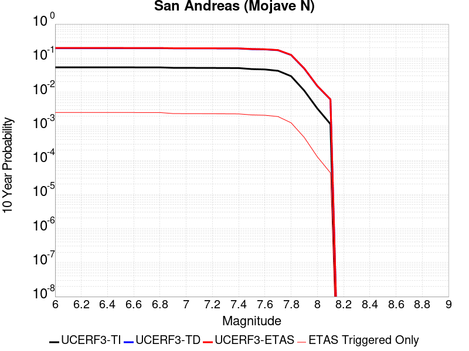 |

| Magnitude | 1 wk TI Prob | 1 wk TD Prob | 1 wk ETAS Prob | 1 wk ETAS/TD Gain | 1 wk ETAS Triggered Only | 1 mo TI Prob | 1 mo TD Prob | 1 mo ETAS Prob | 1 mo ETAS/TD Gain | 1 mo ETAS Triggered Only | 1 yr TI Prob | 1 yr TD Prob | 1 yr ETAS Prob | 1 yr ETAS/TD Gain | 1 yr ETAS Triggered Only | 10 yr TI Prob | 10 yr TD Prob | 10 yr ETAS Prob | 10 yr ETAS/TD Gain | 10 yr ETAS Triggered Only |
|-----|-----|-----|-----|-----|-----|-----|-----|-----|-----|-----|-----|-----|-----|-----|-----|-----|-----|-----|-----|-----|
| 6.0 | 1.0523762E-4 | 4.3662923E-4 | 0.0010678944 | 2.4457695 | 6.3154096E-4 | 4.5094037E-4 | 0.0018700866 | 0.0027255751 | 1.4574592 | 8.570913E-4 | 0.005476387 | 0.022559863 | 0.024103096 | 1.0684062 | 0.0015788524 | 0.053433806 | 0.19573303 | 0.19805498 | 1.0118629 | 0.0028870443 |
| 6.1 | 1.0523762E-4 | 4.3662923E-4 | 0.0010678944 | 2.4457695 | 6.3154096E-4 | 4.5094037E-4 | 0.0018700866 | 0.0027255751 | 1.4574592 | 8.570913E-4 | 0.005476387 | 0.022559863 | 0.024103096 | 1.0684062 | 0.0015788524 | 0.053433806 | 0.19573303 | 0.19805498 | 1.0118629 | 0.0028870443 |
| 6.2 | 1.0523762E-4 | 4.3662923E-4 | 0.0010678944 | 2.4457695 | 6.3154096E-4 | 4.5094037E-4 | 0.0018700866 | 0.0027255751 | 1.4574592 | 8.570913E-4 | 0.005476387 | 0.022559863 | 0.024103096 | 1.0684062 | 0.0015788524 | 0.053433806 | 0.19573303 | 0.19805498 | 1.0118629 | 0.0028870443 |
| 6.3 | 1.0523762E-4 | 4.3662923E-4 | 0.0010678944 | 2.4457695 | 6.3154096E-4 | 4.5094037E-4 | 0.0018700866 | 0.0027255751 | 1.4574592 | 8.570913E-4 | 0.005476387 | 0.022559863 | 0.024103096 | 1.0684062 | 0.0015788524 | 0.053433806 | 0.19573303 | 0.19805498 | 1.0118629 | 0.0028870443 |
| 6.4 | 1.0523762E-4 | 4.3662923E-4 | 0.0010678944 | 2.4457695 | 6.3154096E-4 | 4.5094037E-4 | 0.0018700866 | 0.0027255751 | 1.4574592 | 8.570913E-4 | 0.005476387 | 0.022559863 | 0.024103096 | 1.0684062 | 0.0015788524 | 0.053433806 | 0.19573303 | 0.19805498 | 1.0118629 | 0.0028870443 |
| 6.5 | 1.0523762E-4 | 4.3662923E-4 | 0.0010678944 | 2.4457695 | 6.3154096E-4 | 4.5094037E-4 | 0.0018700866 | 0.0027255751 | 1.4574592 | 8.570913E-4 | 0.005476387 | 0.022559863 | 0.024103096 | 1.0684062 | 0.0015788524 | 0.053433806 | 0.19573303 | 0.19805498 | 1.0118629 | 0.0028870443 |
| 6.6 | 1.05157305E-4 | 4.3648225E-4 | 0.0010677476 | 2.4462564 | 6.3154096E-4 | 4.5059633E-4 | 0.0018694578 | 0.0027249467 | 1.4576135 | 8.570913E-4 | 0.005472219 | 0.022552364 | 0.02409561 | 1.0684295 | 0.0015788524 | 0.053394135 | 0.19567315 | 0.197959 | 1.0116819 | 0.0028419343 |
| 6.7 | 1.0507546E-4 | 4.363306E-4 | 0.001067596 | 2.4467595 | 6.3154096E-4 | 4.5024566E-4 | 0.0018688086 | 0.0027242983 | 1.4577727 | 8.570913E-4 | 0.0054679713 | 0.022544624 | 0.024087884 | 1.0684534 | 0.0015788524 | 0.053353705 | 0.1956114 | 0.19789742 | 1.0116866 | 0.0028419343 |
| 6.8 | 1.0495169E-4 | 4.3606028E-4 | 0.0010673258 | 2.4476566 | 6.3154096E-4 | 4.4971542E-4 | 0.0018676518 | 0.0027231423 | 1.4580568 | 8.570913E-4 | 0.005461548 | 0.022530831 | 0.024074111 | 1.0684963 | 0.0015788524 | 0.053292558 | 0.19550118 | 0.19778752 | 1.0116947 | 0.0028419343 |
| 6.9 | 1.01919264E-4 | 4.2973462E-4 | 8.8064146E-4 | 2.049268 | 4.511007E-4 | 4.367237E-4 | 0.0018405803 | 0.0025159859 | 1.3669525 | 6.76651E-4 | 0.0053041554 | 0.022207966 | 0.023575323 | 1.0615705 | 0.0013984122 | 0.051793266 | 0.19291273 | 0.19502437 | 1.0109462 | 0.002616384 |
| 7.0 | 1.0166431E-4 | 4.2917405E-4 | 8.8008115E-4 | 2.0506392 | 4.511007E-4 | 4.356314E-4 | 0.0018381812 | 0.0025135884 | 1.3674324 | 6.76651E-4 | 0.0052909213 | 0.022179354 | 0.02354675 | 1.0616517 | 0.0013984122 | 0.0516671 | 0.19268334 | 0.19475916 | 1.0107733 | 0.0025712738 |
| 7.1 | 1.01401034E-4 | 4.2859098E-4 | 8.794983E-4 | 2.0520692 | 4.511007E-4 | 4.3450345E-4 | 0.0018356858 | 0.0025110948 | 1.3679328 | 6.76651E-4 | 0.005277255 | 0.02214959 | 0.02351703 | 1.0617365 | 0.0013984122 | 0.051536802 | 0.19244485 | 0.1945213 | 1.0107899 | 0.0025712738 |
| 7.2 | 1.0108741E-4 | 4.278926E-4 | 8.788003E-4 | 2.053787 | 4.511007E-4 | 4.3315982E-4 | 0.001832697 | 0.0025081078 | 1.3685338 | 6.76651E-4 | 0.0052609756 | 0.022113942 | 0.023481429 | 1.0618383 | 0.0013984122 | 0.051381566 | 0.19215985 | 0.19423702 | 1.0108097 | 0.0025712738 |
| 7.3 | 1.00634395E-4 | 4.2664207E-4 | 8.775503E-4 | 2.0568771 | 4.511007E-4 | 4.3121897E-4 | 0.001827345 | 0.0025027597 | 1.3696152 | 6.76651E-4 | 0.0052374597 | 0.022050105 | 0.023417681 | 1.0620214 | 0.0013984122 | 0.051157285 | 0.1916488 | 0.1937273 | 1.0108453 | 0.0025712738 |
| 7.4 | 1.0012071E-4 | 4.2521826E-4 | 8.7612716E-4 | 2.0604174 | 4.511007E-4 | 4.290182E-4 | 0.0018212516 | 0.0024966702 | 1.3708541 | 6.76651E-4 | 0.0052107936 | 0.021977417 | 0.023345096 | 1.0622311 | 0.0013984122 | 0.050902903 | 0.19106553 | 0.19310904 | 1.0106953 | 0.0025261638 |
| 7.5 | 9.339507E-5 | 4.0500556E-4 | 8.559236E-4 | 2.1133626 | 4.511007E-4 | 4.002032E-4 | 0.0017347414 | 0.0023651868 | 1.3634232 | 6.3154096E-4 | 0.0048615932 | 0.020944512 | 0.022225304 | 1.0611517 | 0.001308192 | 0.047566023 | 0.18278176 | 0.18473558 | 1.0106894 | 0.0023908336 |
| 7.6 | 9.106496E-5 | 3.9784564E-4 | 8.487669E-4 | 2.1334074 | 4.511007E-4 | 3.9022003E-4 | 0.0017040963 | 0.0023345612 | 1.3699701 | 6.3154096E-4 | 0.0047405837 | 0.020578498 | 0.021859769 | 1.0622627 | 0.001308192 | 0.046407226 | 0.17986235 | 0.18182316 | 1.0109017 | 0.0023908336 |
| 7.7 | 8.313271E-5 | 3.7445044E-4 | 7.351959E-4 | 1.9633996 | 3.6088054E-4 | 3.5623438E-4 | 0.0016039569 | 0.0021444093 | 1.3369496 | 5.413208E-4 | 0.004328531 | 0.019381423 | 0.020487316 | 1.0570595 | 0.0011277517 | 0.042451844 | 0.17016967 | 0.17196648 | 1.010559 | 0.0021652833 |
| 7.8 | 5.726896E-5 | 2.6506177E-4 | 4.9055234E-4 | 1.8507096 | 2.2555035E-4 | 2.4541531E-4 | 0.0011355855 | 0.0014509973 | 1.2777526 | 3.1577048E-4 | 0.0029838376 | 0.013756123 | 0.0144679565 | 1.0517466 | 7.217611E-4 | 0.0294409 | 0.12299887 | 0.124264844 | 1.0102925 | 0.0014435222 |
| 7.9 | 2.148629E-5 | 1.04210856E-4 | 2.3952697E-4 | 2.2984836 | 1.353302E-4 | 9.208085E-5 | 4.46556E-4 | 6.2691566E-4 | 1.4038905 | 1.8044027E-4 | 0.0011205077 | 0.005425832 | 0.0056950236 | 1.049613 | 2.706604E-4 | 0.011148746 | 0.049493838 | 0.04992261 | 1.0086632 | 4.511007E-4 |
| 8.0 | 6.3800603E-6 | 3.136937E-5 | 7.647803E-5 | 2.437984 | 4.5110068E-5 | 2.7342829E-5 | 1.3443502E-4 | 1.7953903E-4 | 1.3355079 | 4.5110068E-5 | 3.3284808E-4 | 0.0016358347 | 0.0017259072 | 1.0550622 | 9.0220135E-5 | 0.0033234998 | 0.015136539 | 0.015269821 | 1.0088053 | 1.353302E-4 |
| 8.1 | 2.2240692E-6 | 1.29589735E-5 | 5.8068457E-5 | 4.480946 | 4.5110068E-5 | 9.531691E-6 | 5.5538447E-5 | 1.0064601E-4 | 1.8121862 | 4.5110068E-5 | 1.1604215E-4 | 6.7617896E-4 | 7.663381E-4 | 1.1333362 | 9.0220135E-5 | 0.0011598158 | 0.0061071273 | 0.0062416308 | 1.022024 | 1.353302E-4 |

## San Andreas (Big Bend)
*[(top)](#table-of-contents)*

| 1 Week | 1 Month | 1 Year | 10 Year |
|-----|-----|-----|-----|
|  |  |  |  |

| Magnitude | 1 wk TI Prob | 1 wk TD Prob | 1 wk ETAS Prob | 1 wk ETAS/TD Gain | 1 wk ETAS Triggered Only | 1 mo TI Prob | 1 mo TD Prob | 1 mo ETAS Prob | 1 mo ETAS/TD Gain | 1 mo ETAS Triggered Only | 1 yr TI Prob | 1 yr TD Prob | 1 yr ETAS Prob | 1 yr ETAS/TD Gain | 1 yr ETAS Triggered Only | 10 yr TI Prob | 10 yr TD Prob | 10 yr ETAS Prob | 10 yr ETAS/TD Gain | 10 yr ETAS Triggered Only |
|-----|-----|-----|-----|-----|-----|-----|-----|-----|-----|-----|-----|-----|-----|-----|-----|-----|-----|-----|-----|-----|
| 6.0 | 1.0734612E-4 | 4.329521E-4 | 8.838575E-4 | 2.0414672 | 4.511007E-4 | 4.5997367E-4 | 0.0018543553 | 0.0025297517 | 1.3642216 | 6.76651E-4 | 0.005585809 | 0.0223732 | 0.023696223 | 1.0591344 | 0.001353302 | 0.054474745 | 0.19450675 | 0.19654156 | 1.0104613 | 0.0025261638 |
| 6.1 | 1.0734612E-4 | 4.329521E-4 | 8.838575E-4 | 2.0414672 | 4.511007E-4 | 4.5997367E-4 | 0.0018543553 | 0.0025297517 | 1.3642216 | 6.76651E-4 | 0.005585809 | 0.0223732 | 0.023696223 | 1.0591344 | 0.001353302 | 0.054474745 | 0.19450675 | 0.19654156 | 1.0104613 | 0.0025261638 |
| 6.2 | 1.0734612E-4 | 4.329521E-4 | 8.838575E-4 | 2.0414672 | 4.511007E-4 | 4.5997367E-4 | 0.0018543553 | 0.0025297517 | 1.3642216 | 6.76651E-4 | 0.005585809 | 0.0223732 | 0.023696223 | 1.0591344 | 0.001353302 | 0.054474745 | 0.19450675 | 0.19654156 | 1.0104613 | 0.0025261638 |
| 6.3 | 1.0734612E-4 | 4.329521E-4 | 8.838575E-4 | 2.0414672 | 4.511007E-4 | 4.5997367E-4 | 0.0018543553 | 0.0025297517 | 1.3642216 | 6.76651E-4 | 0.005585809 | 0.0223732 | 0.023696223 | 1.0591344 | 0.001353302 | 0.054474745 | 0.19450675 | 0.19654156 | 1.0104613 | 0.0025261638 |
| 6.4 | 1.0734612E-4 | 4.329521E-4 | 8.838575E-4 | 2.0414672 | 4.511007E-4 | 4.5997367E-4 | 0.0018543553 | 0.0025297517 | 1.3642216 | 6.76651E-4 | 0.005585809 | 0.0223732 | 0.023696223 | 1.0591344 | 0.001353302 | 0.054474745 | 0.19450675 | 0.19654156 | 1.0104613 | 0.0025261638 |
| 6.5 | 1.0734612E-4 | 4.329521E-4 | 8.838575E-4 | 2.0414672 | 4.511007E-4 | 4.5997367E-4 | 0.0018543553 | 0.0025297517 | 1.3642216 | 6.76651E-4 | 0.005585809 | 0.0223732 | 0.023696223 | 1.0591344 | 0.001353302 | 0.054474745 | 0.19450675 | 0.19654156 | 1.0104613 | 0.0025261638 |
| 6.6 | 1.0724574E-4 | 4.3276677E-4 | 8.836722E-4 | 2.0419133 | 4.511007E-4 | 4.595436E-4 | 0.0018535622 | 0.002528959 | 1.3643777 | 6.76651E-4 | 0.0055806 | 0.022363741 | 0.023686778 | 1.0591599 | 0.001353302 | 0.054425213 | 0.19443108 | 0.19646607 | 1.0104665 | 0.0025261638 |
| 6.7 | 1.0708281E-4 | 4.324658E-4 | 8.833714E-4 | 2.0426388 | 4.511007E-4 | 4.588456E-4 | 0.0018522742 | 0.0025276719 | 1.3646317 | 6.76651E-4 | 0.005572145 | 0.022348382 | 0.023671439 | 1.0592015 | 0.001353302 | 0.054344814 | 0.19430833 | 0.19634365 | 1.0104747 | 0.0025261638 |
| 6.8 | 1.0689705E-4 | 4.320727E-4 | 8.829785E-4 | 2.0435877 | 4.511007E-4 | 4.580498E-4 | 0.0018505919 | 0.0025259906 | 1.3649637 | 6.76651E-4 | 0.0055625057 | 0.022328319 | 0.023651404 | 1.059256 | 0.001353302 | 0.054253142 | 0.19414698 | 0.1961827 | 1.0104854 | 0.0025261638 |
| 6.9 | 1.06647094E-4 | 4.3154295E-4 | 8.82449E-4 | 2.0448694 | 4.511007E-4 | 4.5697892E-4 | 0.0018483247 | 0.0025237252 | 1.3654122 | 6.76651E-4 | 0.0055495338 | 0.022301283 | 0.023624405 | 1.0593294 | 0.001353302 | 0.054129772 | 0.19392996 | 0.19596621 | 1.0105 | 0.0025261638 |
| 7.0 | 1.0639214E-4 | 4.3100046E-4 | 8.819067E-4 | 2.046185 | 4.511007E-4 | 4.5588662E-4 | 0.001846003 | 0.002521405 | 1.3658726 | 6.76651E-4 | 0.005536303 | 0.022273595 | 0.023596754 | 1.0594049 | 0.001353302 | 0.054003917 | 0.19370714 | 0.19574396 | 1.010515 | 0.0025261638 |
| 7.1 | 9.878347E-5 | 4.1491815E-4 | 8.658317E-4 | 2.086753 | 4.511007E-4 | 4.2328905E-4 | 0.0017771729 | 0.0024075916 | 1.3547312 | 6.3154096E-4 | 0.005141373 | 0.02145213 | 0.022688117 | 1.057616 | 0.0012630819 | 0.05024037 | 0.18707013 | 0.18905039 | 1.0105857 | 0.0024359438 |
| 7.2 | 9.8447454E-5 | 4.1419562E-4 | 8.6510944E-4 | 2.0886495 | 4.511007E-4 | 4.2184943E-4 | 0.0017740804 | 0.002404501 | 1.3553506 | 6.3154096E-4 | 0.0051239277 | 0.021415222 | 0.022651255 | 1.0577174 | 0.0012630819 | 0.05007382 | 0.18677177 | 0.18875274 | 1.0106064 | 0.0024359438 |
| 7.3 | 9.7971046E-5 | 4.1292782E-4 | 8.6384226E-4 | 2.0919933 | 4.511007E-4 | 4.1980835E-4 | 0.0017686546 | 0.0023990786 | 1.3564427 | 6.3154096E-4 | 0.0050991946 | 0.021350458 | 0.022586573 | 1.0578964 | 0.0012630819 | 0.049837634 | 0.1862459 | 0.18822816 | 1.0106432 | 0.0024359438 |
| 7.4 | 9.740844E-5 | 4.113638E-4 | 8.622789E-4 | 2.0961468 | 4.511007E-4 | 4.1739794E-4 | 0.0017619608 | 0.0023923889 | 1.3577993 | 6.3154096E-4 | 0.0050699846 | 0.021270558 | 0.022506773 | 1.0581186 | 0.0012630819 | 0.049558636 | 0.18560115 | 0.18754824 | 1.0104908 | 0.0023908336 |
| 7.5 | 9.6629556E-5 | 4.0913856E-4 | 8.600547E-4 | 2.102111 | 4.511007E-4 | 4.1406092E-4 | 0.0017524367 | 0.002382871 | 1.3597472 | 6.3154096E-4 | 0.005029545 | 0.021156862 | 0.022349065 | 1.0563507 | 0.0012179719 | 0.04917225 | 0.18468793 | 0.18656366 | 1.0101562 | 0.0023006136 |
| 7.6 | 9.57783E-5 | 4.0665545E-4 | 8.575727E-4 | 2.1088433 | 4.511007E-4 | 4.1041384E-4 | 0.0017418092 | 0.0023722502 | 1.361946 | 6.3154096E-4 | 0.004985346 | 0.021029979 | 0.022222336 | 1.056698 | 0.0012179719 | 0.048749782 | 0.18367083 | 0.1855489 | 1.0102252 | 0.0023006136 |
| 7.7 | 8.018139E-5 | 3.5930445E-4 | 7.200553E-4 | 2.0040257 | 3.6088054E-4 | 3.4358926E-4 | 0.0015391231 | 0.0020796107 | 1.351166 | 5.413208E-4 | 0.004175178 | 0.018605733 | 0.01966823 | 1.057106 | 0.0010826417 | 0.040976003 | 0.16405721 | 0.16582955 | 1.0108032 | 0.0021201733 |
| 7.8 | 5.450103E-5 | 2.5067478E-4 | 4.7616859E-4 | 1.8995472 | 2.2555035E-4 | 2.3355494E-4 | 0.0010739786 | 0.00138941 | 1.2937036 | 3.1577048E-4 | 0.0028398235 | 0.013015171 | 0.013683015 | 1.0513128 | 6.76651E-4 | 0.028038062 | 0.116878085 | 0.118113056 | 1.0105664 | 0.0013984122 |
| 7.9 | 2.0202247E-5 | 9.5990974E-5 | 2.313082E-4 | 2.4096868 | 1.353302E-4 | 8.6578184E-5 | 4.1133902E-4 | 5.9170503E-4 | 1.4384851 | 1.8044027E-4 | 0.0010535796 | 0.004999033 | 0.0052683405 | 1.0538719 | 2.706604E-4 | 0.010485985 | 0.04582507 | 0.0462555 | 1.0093929 | 4.511007E-4 |
| 8.0 | 6.3800603E-6 | 3.136937E-5 | 7.647803E-5 | 2.437984 | 4.5110068E-5 | 2.7342829E-5 | 1.3443502E-4 | 1.7953903E-4 | 1.3355079 | 4.5110068E-5 | 3.3284808E-4 | 0.0016358347 | 0.0017259072 | 1.0550622 | 9.0220135E-5 | 0.0033234998 | 0.015136539 | 0.015269821 | 1.0088053 | 1.353302E-4 |
| 8.1 | 2.2240692E-6 | 1.29589735E-5 | 5.8068457E-5 | 4.480946 | 4.5110068E-5 | 9.531691E-6 | 5.5538447E-5 | 1.0064601E-4 | 1.8121862 | 4.5110068E-5 | 1.1604215E-4 | 6.7617896E-4 | 7.663381E-4 | 1.1333362 | 9.0220135E-5 | 0.0011598158 | 0.0061071273 | 0.0062416308 | 1.022024 | 1.353302E-4 |

## San Andreas (Carrizo) rev
*[(top)](#table-of-contents)*

| 1 Week | 1 Month | 1 Year | 10 Year |
|-----|-----|-----|-----|
|  |  |  |  |

| Magnitude | 1 wk TI Prob | 1 wk TD Prob | 1 wk ETAS Prob | 1 wk ETAS/TD Gain | 1 wk ETAS Triggered Only | 1 mo TI Prob | 1 mo TD Prob | 1 mo ETAS Prob | 1 mo ETAS/TD Gain | 1 mo ETAS Triggered Only | 1 yr TI Prob | 1 yr TD Prob | 1 yr ETAS Prob | 1 yr ETAS/TD Gain | 1 yr ETAS Triggered Only | 10 yr TI Prob | 10 yr TD Prob | 10 yr ETAS Prob | 10 yr ETAS/TD Gain | 10 yr ETAS Triggered Only |
|-----|-----|-----|-----|-----|-----|-----|-----|-----|-----|-----|-----|-----|-----|-----|-----|-----|-----|-----|-----|-----|
| 6.0 | 1.1113902E-4 | 4.4923634E-4 | 9.001344E-4 | 2.0036988 | 4.511007E-4 | 4.7622315E-4 | 0.0019240503 | 0.0025543761 | 1.3276036 | 6.3154096E-4 | 0.005782614 | 0.023205092 | 0.0243948 | 1.0512693 | 0.0012179719 | 0.05634437 | 0.20058148 | 0.20249276 | 1.0095286 | 0.0023908336 |
| 6.1 | 1.1113902E-4 | 4.4923634E-4 | 9.001344E-4 | 2.0036988 | 4.511007E-4 | 4.7622315E-4 | 0.0019240503 | 0.0025543761 | 1.3276036 | 6.3154096E-4 | 0.005782614 | 0.023205092 | 0.0243948 | 1.0512693 | 0.0012179719 | 0.05634437 | 0.20058148 | 0.20249276 | 1.0095286 | 0.0023908336 |
| 6.2 | 1.1113902E-4 | 4.4923634E-4 | 9.001344E-4 | 2.0036988 | 4.511007E-4 | 4.7622315E-4 | 0.0019240503 | 0.0025543761 | 1.3276036 | 6.3154096E-4 | 0.005782614 | 0.023205092 | 0.0243948 | 1.0512693 | 0.0012179719 | 0.05634437 | 0.20058148 | 0.20249276 | 1.0095286 | 0.0023908336 |
| 6.3 | 1.1113902E-4 | 4.4923634E-4 | 9.001344E-4 | 2.0036988 | 4.511007E-4 | 4.7622315E-4 | 0.0019240503 | 0.0025543761 | 1.3276036 | 6.3154096E-4 | 0.005782614 | 0.023205092 | 0.0243948 | 1.0512693 | 0.0012179719 | 0.05634437 | 0.20058148 | 0.20249276 | 1.0095286 | 0.0023908336 |
| 6.4 | 1.1113902E-4 | 4.4923634E-4 | 9.001344E-4 | 2.0036988 | 4.511007E-4 | 4.7622315E-4 | 0.0019240503 | 0.0025543761 | 1.3276036 | 6.3154096E-4 | 0.005782614 | 0.023205092 | 0.0243948 | 1.0512693 | 0.0012179719 | 0.05634437 | 0.20058148 | 0.20249276 | 1.0095286 | 0.0023908336 |
| 6.5 | 1.1113902E-4 | 4.4923634E-4 | 9.001344E-4 | 2.0036988 | 4.511007E-4 | 4.7622315E-4 | 0.0019240503 | 0.0025543761 | 1.3276036 | 6.3154096E-4 | 0.005782614 | 0.023205092 | 0.0243948 | 1.0512693 | 0.0012179719 | 0.05634437 | 0.20058148 | 0.20249276 | 1.0095286 | 0.0023908336 |
| 6.6 | 1.1099849E-4 | 4.4896975E-4 | 8.998679E-4 | 2.004295 | 4.511007E-4 | 4.7562108E-4 | 0.0019229094 | 0.002553236 | 1.3277984 | 6.3154096E-4 | 0.005775322 | 0.023191497 | 0.024381222 | 1.0513 | 0.0012179719 | 0.056275163 | 0.20047371 | 0.20238525 | 1.0095351 | 0.0023908336 |
| 6.7 | 1.1077418E-4 | 4.4854544E-4 | 8.994438E-4 | 2.0052457 | 4.511007E-4 | 4.7466008E-4 | 0.0019210937 | 0.0025514213 | 1.3281088 | 6.3154096E-4 | 0.0057636844 | 0.023169862 | 0.024359614 | 1.051349 | 0.0012179719 | 0.056164686 | 0.20030232 | 0.20221427 | 1.0095453 | 0.0023908336 |
| 6.8 | 1.105471E-4 | 4.4803345E-4 | 8.9893205E-4 | 2.0063949 | 4.511007E-4 | 4.7368725E-4 | 0.0019189026 | 0.0025492318 | 1.3284842 | 6.3154096E-4 | 0.0057519027 | 0.023143753 | 0.024333537 | 1.0514084 | 0.0012179719 | 0.056052838 | 0.20009586 | 0.20200829 | 1.0095576 | 0.0023908336 |
| 6.9 | 1.1025541E-4 | 4.473621E-4 | 8.98261E-4 | 2.0079057 | 4.511007E-4 | 4.7243762E-4 | 0.0019160297 | 0.0025463605 | 1.3289776 | 6.3154096E-4 | 0.0057367687 | 0.023109518 | 0.024299344 | 1.0514864 | 0.0012179719 | 0.055909142 | 0.19982636 | 0.20173943 | 1.0095737 | 0.0023908336 |
| 7.0 | 1.0991533E-4 | 4.4657878E-4 | 8.97478E-4 | 2.0096745 | 4.511007E-4 | 4.7098065E-4 | 0.0019126774 | 0.0025430105 | 1.3295553 | 6.3154096E-4 | 0.0057191234 | 0.023069572 | 0.024259444 | 1.0515777 | 0.0012179719 | 0.055741582 | 0.19951206 | 0.2014259 | 1.0095925 | 0.0023908336 |
| 7.1 | 1.09542365E-4 | 4.457076E-4 | 8.9660723E-4 | 2.011649 | 4.511007E-4 | 4.693828E-4 | 0.0019089493 | 0.0025392848 | 1.3302002 | 6.3154096E-4 | 0.0056997715 | 0.023025142 | 0.02421507 | 1.0516795 | 0.0012179719 | 0.05555778 | 0.19916314 | 0.2010778 | 1.0096135 | 0.0023908336 |
| 7.2 | 1.05608764E-4 | 4.3706578E-4 | 8.8796933E-4 | 2.0316606 | 4.511007E-4 | 4.5253045E-4 | 0.0018719663 | 0.002502325 | 1.3367362 | 6.3154096E-4 | 0.005495649 | 0.022584237 | 0.023774702 | 1.0527122 | 0.0012179719 | 0.053617116 | 0.19563848 | 0.1975253 | 1.0096444 | 0.0023457236 |
| 7.3 | 1.0511766E-4 | 4.3558737E-4 | 8.8649156E-4 | 2.0351636 | 4.511007E-4 | 4.5042645E-4 | 0.0018656392 | 0.002496002 | 1.3378803 | 6.3154096E-4 | 0.0054701613 | 0.0225088 | 0.023699356 | 1.0528929 | 0.0012179719 | 0.053374548 | 0.195048 | 0.1969362 | 1.0096806 | 0.0023457236 |
| 7.4 | 1.04579514E-4 | 4.3395188E-4 | 8.848568E-4 | 2.0390668 | 4.511007E-4 | 4.481209E-4 | 0.00185864 | 0.002489007 | 1.3391551 | 6.3154096E-4 | 0.005442232 | 0.022425342 | 0.023616001 | 1.0530943 | 0.0012179719 | 0.053108674 | 0.19439563 | 0.19628535 | 1.009721 | 0.0023457236 |
| 7.5 | 8.967509E-5 | 3.841574E-4 | 8.350848E-4 | 2.173809 | 4.511007E-4 | 3.842652E-4 | 0.0016455129 | 0.0022760145 | 1.3831643 | 6.3154096E-4 | 0.004668397 | 0.019879378 | 0.021028925 | 1.057826 | 0.0011728618 | 0.045715354 | 0.17451581 | 0.17634045 | 1.0104555 | 0.0022103933 |
| 7.6 | 8.902246E-5 | 3.822647E-4 | 8.3319296E-4 | 2.1796231 | 4.511007E-4 | 3.8146903E-4 | 0.0016374114 | 0.0022679183 | 1.3850632 | 6.3154096E-4 | 0.004634499 | 0.019782541 | 0.0209322 | 1.0581149 | 0.0011728618 | 0.0453903 | 0.17373076 | 0.17555714 | 1.0105127 | 0.0022103933 |
| 7.7 | 7.776459E-5 | 3.4746045E-4 | 7.082156E-4 | 2.0382626 | 3.6088054E-4 | 3.3323426E-4 | 0.0014884217 | 0.0020289368 | 1.3631465 | 5.413208E-4 | 0.0040495815 | 0.017998766 | 0.019061921 | 1.0590682 | 0.0010826417 | 0.039765768 | 0.15920663 | 0.16098925 | 1.011197 | 0.0021201733 |
| 7.8 | 5.2312953E-5 | 2.3975673E-4 | 4.65253E-4 | 1.9405211 | 2.2555035E-4 | 2.2417911E-4 | 0.0010272242 | 0.0013426704 | 1.3070859 | 3.1577048E-4 | 0.0027259644 | 0.012452538 | 0.013120763 | 1.0536617 | 6.76651E-4 | 0.026927674 | 0.112169944 | 0.1134115 | 1.0110685 | 0.0013984122 |
| 7.9 | 1.9307261E-5 | 9.060563E-5 | 2.2592358E-4 | 2.4934826 | 1.353302E-4 | 8.274278E-5 | 3.8826585E-4 | 5.6863605E-4 | 1.4645534 | 1.8044027E-4 | 0.0010069277 | 0.0047193347 | 0.0049887174 | 1.0570807 | 2.706604E-4 | 0.010023774 | 0.04339103 | 0.043822557 | 1.009945 | 4.511007E-4 |
| 8.0 | 6.3800603E-6 | 3.136937E-5 | 7.647803E-5 | 2.437984 | 4.5110068E-5 | 2.7342829E-5 | 1.3443502E-4 | 1.7953903E-4 | 1.3355079 | 4.5110068E-5 | 3.3284808E-4 | 0.0016358347 | 0.0017259072 | 1.0550622 | 9.0220135E-5 | 0.0033234998 | 0.015136539 | 0.015269821 | 1.0088053 | 1.353302E-4 |
| 8.1 | 2.2240692E-6 | 1.29589735E-5 | 5.8068457E-5 | 4.480946 | 4.5110068E-5 | 9.531691E-6 | 5.5538447E-5 | 1.0064601E-4 | 1.8121862 | 4.5110068E-5 | 1.1604215E-4 | 6.7617896E-4 | 7.663381E-4 | 1.1333362 | 9.0220135E-5 | 0.0011598158 | 0.0061071273 | 0.0062416308 | 1.022024 | 1.353302E-4 |

## San Andreas (Mojave S)
*[(top)](#table-of-contents)*

| 1 Week | 1 Month | 1 Year | 10 Year |
|-----|-----|-----|-----|
|  |  |  |  |

| Magnitude | 1 wk TI Prob | 1 wk TD Prob | 1 wk ETAS Prob | 1 wk ETAS/TD Gain | 1 wk ETAS Triggered Only | 1 mo TI Prob | 1 mo TD Prob | 1 mo ETAS Prob | 1 mo ETAS/TD Gain | 1 mo ETAS Triggered Only | 1 yr TI Prob | 1 yr TD Prob | 1 yr ETAS Prob | 1 yr ETAS/TD Gain | 1 yr ETAS Triggered Only | 10 yr TI Prob | 10 yr TD Prob | 10 yr ETAS Prob | 10 yr ETAS/TD Gain | 10 yr ETAS Triggered Only |
|-----|-----|-----|-----|-----|-----|-----|-----|-----|-----|-----|-----|-----|-----|-----|-----|-----|-----|-----|-----|-----|
| 6.0 | 1.2943693E-4 | 5.2341627E-4 | 0.0010193672 | 1.9475269 | 4.9621076E-4 | 5.5461173E-4 | 0.0022414345 | 0.00287156 | 1.2811259 | 6.3154096E-4 | 0.0067315125 | 0.026976345 | 0.028249247 | 1.0471859 | 0.001308192 | 0.0653122 | 0.22817664 | 0.2299523 | 1.007782 | 0.0023006136 |
| 6.1 | 1.2943693E-4 | 5.2341627E-4 | 0.0010193672 | 1.9475269 | 4.9621076E-4 | 5.5461173E-4 | 0.0022414345 | 0.00287156 | 1.2811259 | 6.3154096E-4 | 0.0067315125 | 0.026976345 | 0.028249247 | 1.0471859 | 0.001308192 | 0.0653122 | 0.22817664 | 0.2299523 | 1.007782 | 0.0023006136 |
| 6.2 | 1.2943693E-4 | 5.2341627E-4 | 0.0010193672 | 1.9475269 | 4.9621076E-4 | 5.5461173E-4 | 0.0022414345 | 0.00287156 | 1.2811259 | 6.3154096E-4 | 0.0067315125 | 0.026976345 | 0.028249247 | 1.0471859 | 0.001308192 | 0.0653122 | 0.22817664 | 0.2299523 | 1.007782 | 0.0023006136 |
| 6.3 | 1.2943693E-4 | 5.2341627E-4 | 0.0010193672 | 1.9475269 | 4.9621076E-4 | 5.5461173E-4 | 0.0022414345 | 0.00287156 | 1.2811259 | 6.3154096E-4 | 0.0067315125 | 0.026976345 | 0.028249247 | 1.0471859 | 0.001308192 | 0.0653122 | 0.22817664 | 0.2299523 | 1.007782 | 0.0023006136 |
| 6.4 | 1.2943693E-4 | 5.2341627E-4 | 0.0010193672 | 1.9475269 | 4.9621076E-4 | 5.5461173E-4 | 0.0022414345 | 0.00287156 | 1.2811259 | 6.3154096E-4 | 0.0067315125 | 0.026976345 | 0.028249247 | 1.0471859 | 0.001308192 | 0.0653122 | 0.22817664 | 0.2299523 | 1.007782 | 0.0023006136 |
| 6.5 | 1.2943693E-4 | 5.2341627E-4 | 0.0010193672 | 1.9475269 | 4.9621076E-4 | 5.5461173E-4 | 0.0022414345 | 0.00287156 | 1.2811259 | 6.3154096E-4 | 0.0067315125 | 0.026976345 | 0.028249247 | 1.0471859 | 0.001308192 | 0.0653122 | 0.22817664 | 0.2299523 | 1.007782 | 0.0023006136 |
| 6.6 | 1.2919602E-4 | 5.22933E-4 | 0.0010188844 | 1.948403 | 4.9621076E-4 | 5.535797E-4 | 0.0022393672 | 0.002869494 | 1.281386 | 6.3154096E-4 | 0.006719025 | 0.0269518 | 0.028224733 | 1.04723 | 0.001308192 | 0.06519468 | 0.2279908 | 0.22976689 | 1.0077902 | 0.0023006136 |
| 6.7 | 1.287887E-4 | 5.2211765E-4 | 0.0010180693 | 1.9498849 | 4.9621076E-4 | 5.518348E-4 | 0.0022358787 | 0.0028660076 | 1.2818261 | 6.3154096E-4 | 0.0066979113 | 0.026910376 | 0.028183363 | 1.0473047 | 0.001308192 | 0.06499596 | 0.22767708 | 0.2294539 | 1.0078042 | 0.0023006136 |
| 6.8 | 1.2835562E-4 | 5.210589E-4 | 0.0010170111 | 1.951816 | 4.9621076E-4 | 5.499795E-4 | 0.002231349 | 0.0028614807 | 1.2823994 | 6.3154096E-4 | 0.0066754622 | 0.02685659 | 0.028129648 | 1.0474021 | 0.001308192 | 0.06478462 | 0.22727028 | 0.22904803 | 1.0078222 | 0.0023006136 |
| 6.9 | 1.278557E-4 | 5.198382E-4 | 0.001015791 | 1.9540523 | 4.9621076E-4 | 5.4783793E-4 | 0.0022261261 | 0.0028562613 | 1.2830635 | 6.3154096E-4 | 0.0066495477 | 0.02679457 | 0.02806771 | 1.0475148 | 0.001308192 | 0.06454061 | 0.22680105 | 0.2285799 | 1.0078431 | 0.0023006136 |
| 7.0 | 1.2736667E-4 | 5.1865564E-4 | 0.001014609 | 1.9562287 | 4.9621076E-4 | 5.457429E-4 | 0.0022210667 | 0.002851205 | 1.2837098 | 6.3154096E-4 | 0.0066241967 | 0.026734486 | 0.028007705 | 1.0476246 | 0.001308192 | 0.06430185 | 0.22634536 | 0.22809035 | 1.0077094 | 0.0022555033 |
| 7.1 | 1.2686207E-4 | 5.1743153E-4 | 0.0010133855 | 1.958492 | 4.9621076E-4 | 5.4358126E-4 | 0.0022158294 | 0.0028459711 | 1.2843817 | 6.3154096E-4 | 0.006598038 | 0.026672287 | 0.027945587 | 1.0477387 | 0.001308192 | 0.06405542 | 0.22587313 | 0.22761917 | 1.0077302 | 0.0022555033 |
| 7.2 | 1.2627966E-4 | 5.1603396E-4 | 0.0010119886 | 1.9610893 | 4.9621076E-4 | 5.4108625E-4 | 0.0022098501 | 0.0028399955 | 1.2851529 | 6.3154096E-4 | 0.0065678447 | 0.026601272 | 0.027830753 | 1.046219 | 0.0012630819 | 0.06377091 | 0.22533216 | 0.22704448 | 1.0075991 | 0.0022103933 |
| 7.3 | 1.1602937E-4 | 4.828936E-4 | 9.3377643E-4 | 1.9337106 | 4.511007E-4 | 4.971739E-4 | 0.0020680462 | 0.0026532644 | 1.2829812 | 5.864309E-4 | 0.006036306 | 0.024914496 | 0.026058137 | 1.0459026 | 0.0011728618 | 0.05874951 | 0.21248999 | 0.21415965 | 1.0078576 | 0.0021201733 |
| 7.4 | 1.1524662E-4 | 4.805332E-4 | 9.314171E-4 | 1.9382992 | 4.511007E-4 | 4.938206E-4 | 0.0020579463 | 0.0026431703 | 1.2843728 | 5.864309E-4 | 0.0059957043 | 0.024794336 | 0.025938118 | 1.0461308 | 0.0011728618 | 0.058364958 | 0.21155837 | 0.21319444 | 1.0077333 | 0.002075063 |
| 7.5 | 9.4520525E-5 | 4.1331907E-4 | 8.642333E-4 | 2.090959 | 4.511007E-4 | 4.0502506E-4 | 0.0017702914 | 0.002310654 | 1.3052393 | 5.413208E-4 | 0.0049200356 | 0.021363411 | 0.022422923 | 1.0495948 | 0.0010826417 | 0.048125222 | 0.18482538 | 0.1864066 | 1.0085552 | 0.0019397329 |
| 7.6 | 8.245433E-5 | 3.7524698E-4 | 7.359921E-4 | 1.9613538 | 3.6088054E-4 | 3.5332784E-4 | 0.00160733 | 0.0020577058 | 1.2802011 | 4.511007E-4 | 0.004293284 | 0.019415388 | 0.020388542 | 1.0501227 | 9.924215E-4 | 0.042112812 | 0.16915758 | 0.17065676 | 1.0088626 | 0.0018044028 |
| 7.7 | 7.414645E-5 | 3.5051344E-4 | 6.6617323E-4 | 1.9005641 | 3.1577048E-4 | 3.1773178E-4 | 0.0015014539 | 0.001906835 | 1.2699924 | 4.059906E-4 | 0.0038615242 | 0.018148331 | 0.018989867 | 1.0463699 | 8.570913E-4 | 0.037951093 | 0.15877695 | 0.16014306 | 1.0086039 | 0.0016239624 |
| 7.8 | 6.36853E-5 | 3.084882E-4 | 5.3396897E-4 | 1.7309219 | 2.2555035E-4 | 2.7290845E-4 | 0.0013215367 | 0.00163689 | 1.2386261 | 3.1577048E-4 | 0.0033175983 | 0.015991475 | 0.016701695 | 1.0444124 | 7.217611E-4 | 0.03268505 | 0.14064915 | 0.14188965 | 1.0088198 | 0.0014435222 |
| 7.9 | 2.148629E-5 | 1.04210856E-4 | 2.3952697E-4 | 2.2984836 | 1.353302E-4 | 9.208085E-5 | 4.46556E-4 | 6.2691566E-4 | 1.4038905 | 1.8044027E-4 | 0.0011205077 | 0.005425832 | 0.0056950236 | 1.049613 | 2.706604E-4 | 0.011148746 | 0.049493838 | 0.04992261 | 1.0086632 | 4.511007E-4 |
| 8.0 | 6.3800603E-6 | 3.136937E-5 | 7.647803E-5 | 2.437984 | 4.5110068E-5 | 2.7342829E-5 | 1.3443502E-4 | 1.7953903E-4 | 1.3355079 | 4.5110068E-5 | 3.3284808E-4 | 0.0016358347 | 0.0017259072 | 1.0550622 | 9.0220135E-5 | 0.0033234998 | 0.015136539 | 0.015269821 | 1.0088053 | 1.353302E-4 |
| 8.1 | 2.2240692E-6 | 1.29589735E-5 | 5.8068457E-5 | 4.480946 | 4.5110068E-5 | 9.531691E-6 | 5.5538447E-5 | 1.0064601E-4 | 1.8121862 | 4.5110068E-5 | 1.1604215E-4 | 6.7617896E-4 | 7.663381E-4 | 1.1333362 | 9.0220135E-5 | 0.0011598158 | 0.0061071273 | 0.0062416308 | 1.022024 | 1.353302E-4 |

## Blackwater
*[(top)](#table-of-contents)*

| 1 Week | 1 Month | 1 Year | 10 Year |
|-----|-----|-----|-----|
|  |  |  |  |

| Magnitude | 1 wk TI Prob | 1 wk TD Prob | 1 wk ETAS Prob | 1 wk ETAS/TD Gain | 1 wk ETAS Triggered Only | 1 mo TI Prob | 1 mo TD Prob | 1 mo ETAS Prob | 1 mo ETAS/TD Gain | 1 mo ETAS Triggered Only | 1 yr TI Prob | 1 yr TD Prob | 1 yr ETAS Prob | 1 yr ETAS/TD Gain | 1 yr ETAS Triggered Only | 10 yr TI Prob | 10 yr TD Prob | 10 yr ETAS Prob | 10 yr ETAS/TD Gain | 10 yr ETAS Triggered Only |
|-----|-----|-----|-----|-----|-----|-----|-----|-----|-----|-----|-----|-----|-----|-----|-----|-----|-----|-----|-----|-----|
| 6.0 | 7.413326E-6 | 7.774191E-6 | 7.7463937E-4 | 99.64245 | 7.6687115E-4 | 3.177101E-5 | 3.3317654E-5 | 8.4527186E-4 | 25.370087 | 8.119812E-4 | 3.867434E-4 | 4.0558857E-4 | 0.0018034335 | 4.4464602 | 0.0013984122 | 0.0038607102 | 0.0040506064 | 0.0062071187 | 1.5323925 | 0.0021652833 |
| 6.1 | 7.413326E-6 | 7.774191E-6 | 7.7463937E-4 | 99.64245 | 7.6687115E-4 | 3.177101E-5 | 3.3317654E-5 | 8.4527186E-4 | 25.370087 | 8.119812E-4 | 3.867434E-4 | 4.0558857E-4 | 0.0018034335 | 4.4464602 | 0.0013984122 | 0.0038607102 | 0.0040506064 | 0.0062071187 | 1.5323925 | 0.0021652833 |
| 6.2 | 7.413326E-6 | 7.774191E-6 | 7.7463937E-4 | 99.64245 | 7.6687115E-4 | 3.177101E-5 | 3.3317654E-5 | 8.4527186E-4 | 25.370087 | 8.119812E-4 | 3.867434E-4 | 4.0558857E-4 | 0.0018034335 | 4.4464602 | 0.0013984122 | 0.0038607102 | 0.0040506064 | 0.0062071187 | 1.5323925 | 0.0021652833 |
| 6.3 | 7.413326E-6 | 7.774191E-6 | 7.7463937E-4 | 99.64245 | 7.6687115E-4 | 3.177101E-5 | 3.3317654E-5 | 8.4527186E-4 | 25.370087 | 8.119812E-4 | 3.867434E-4 | 4.0558857E-4 | 0.0018034335 | 4.4464602 | 0.0013984122 | 0.0038607102 | 0.0040506064 | 0.0062071187 | 1.5323925 | 0.0021652833 |
| 6.4 | 7.413326E-6 | 7.774191E-6 | 7.7463937E-4 | 99.64245 | 7.6687115E-4 | 3.177101E-5 | 3.3317654E-5 | 8.4527186E-4 | 25.370087 | 8.119812E-4 | 3.867434E-4 | 4.0558857E-4 | 0.0018034335 | 4.4464602 | 0.0013984122 | 0.0038607102 | 0.0040506064 | 0.0062071187 | 1.5323925 | 0.0021652833 |
| 6.5 | 7.413326E-6 | 7.774191E-6 | 7.7463937E-4 | 99.64245 | 7.6687115E-4 | 3.177101E-5 | 3.3317654E-5 | 8.4527186E-4 | 25.370087 | 8.119812E-4 | 3.867434E-4 | 4.0558857E-4 | 0.0018034335 | 4.4464602 | 0.0013984122 | 0.0038607102 | 0.0040506064 | 0.0062071187 | 1.5323925 | 0.0021652833 |
| 6.6 | 6.51988E-6 | 6.8357062E-6 | 6.834821E-4 | 99.98705 | 6.76651E-4 | 2.7942044E-5 | 2.9295676E-5 | 7.5103564E-4 | 25.636398 | 7.217611E-4 | 3.4014127E-4 | 3.5663793E-4 | 0.0016192694 | 4.5403733 | 0.0012630819 | 0.0033962112 | 0.0035627622 | 0.0054506348 | 1.5298902 | 0.0018946229 |
| 6.7 | 5.474748E-6 | 5.7374127E-6 | 5.921649E-4 | 103.21115 | 5.864309E-4 | 2.3462993E-5 | 2.4588799E-5 | 6.5611425E-4 | 26.68346 | 6.3154096E-4 | 2.856245E-4 | 2.993487E-4 | 0.0014267628 | 4.7662234 | 0.0011277517 | 0.0028525768 | 0.0029915334 | 0.004700588 | 1.5712972 | 0.0017141826 |
| 6.8 | 4.643409E-6 | 4.8641823E-6 | 5.461824E-4 | 112.286575 | 5.413208E-4 | 1.9900172E-5 | 2.0846448E-5 | 6.072651E-4 | 29.130388 | 5.864309E-4 | 2.4225765E-4 | 2.5379687E-4 | 0.0012910651 | 5.087002 | 0.0010375315 | 0.0024199372 | 0.0025371225 | 0.0041119694 | 1.6207216 | 0.0015788524 |
| 6.9 | 3.883733E-6 | 4.0671357E-6 | 4.100561E-4 | 100.82183 | 4.059906E-4 | 1.6644462E-5 | 1.7430582E-5 | 4.6852342E-4 | 26.879389 | 4.511007E-4 | 2.0262749E-4 | 2.1221735E-4 | 0.0011142272 | 5.2504063 | 9.022014E-4 | 0.0020244285 | 0.0021221733 | 0.0033825748 | 1.5939201 | 0.0012630819 |
| 7.0 | 3.883733E-6 | 4.0671357E-6 | 4.100561E-4 | 100.82183 | 4.059906E-4 | 1.6644462E-5 | 1.7430582E-5 | 4.6852342E-4 | 26.879389 | 4.511007E-4 | 2.0262749E-4 | 2.1221735E-4 | 0.0011142272 | 5.2504063 | 9.022014E-4 | 0.0020244285 | 0.0021221733 | 0.0033825748 | 1.5939201 | 0.0012630819 |

## San Andreas (Cholame) rev
*[(top)](#table-of-contents)*

| 1 Week | 1 Month | 1 Year | 10 Year |
|-----|-----|-----|-----|
|  |  |  |  |

| Magnitude | 1 wk TI Prob | 1 wk TD Prob | 1 wk ETAS Prob | 1 wk ETAS/TD Gain | 1 wk ETAS Triggered Only | 1 mo TI Prob | 1 mo TD Prob | 1 mo ETAS Prob | 1 mo ETAS/TD Gain | 1 mo ETAS Triggered Only | 1 yr TI Prob | 1 yr TD Prob | 1 yr ETAS Prob | 1 yr ETAS/TD Gain | 1 yr ETAS Triggered Only | 10 yr TI Prob | 10 yr TD Prob | 10 yr ETAS Prob | 10 yr ETAS/TD Gain | 10 yr ETAS Triggered Only |
|-----|-----|-----|-----|-----|-----|-----|-----|-----|-----|-----|-----|-----|-----|-----|-----|-----|-----|-----|-----|-----|
| 6.0 | 1.6051916E-4 | 5.7249254E-4 | 9.782508E-4 | 1.7087572 | 4.059906E-4 | 6.877579E-4 | 0.0024516056 | 0.0029915993 | 1.2202612 | 5.413208E-4 | 0.00834135 | 0.029507428 | 0.030426787 | 1.0311569 | 9.4731146E-4 | 0.080351114 | 0.2474813 | 0.24904282 | 1.0063096 | 0.002075063 |
| 6.1 | 1.6051916E-4 | 5.7249254E-4 | 9.782508E-4 | 1.7087572 | 4.059906E-4 | 6.877579E-4 | 0.0024516056 | 0.0029915993 | 1.2202612 | 5.413208E-4 | 0.00834135 | 0.029507428 | 0.030426787 | 1.0311569 | 9.4731146E-4 | 0.080351114 | 0.2474813 | 0.24904282 | 1.0063096 | 0.002075063 |
| 6.2 | 1.6051916E-4 | 5.7249254E-4 | 9.782508E-4 | 1.7087572 | 4.059906E-4 | 6.877579E-4 | 0.0024516056 | 0.0029915993 | 1.2202612 | 5.413208E-4 | 0.00834135 | 0.029507428 | 0.030426787 | 1.0311569 | 9.4731146E-4 | 0.080351114 | 0.2474813 | 0.24904282 | 1.0063096 | 0.002075063 |
| 6.3 | 1.6051916E-4 | 5.7249254E-4 | 9.782508E-4 | 1.7087572 | 4.059906E-4 | 6.877579E-4 | 0.0024516056 | 0.0029915993 | 1.2202612 | 5.413208E-4 | 0.00834135 | 0.029507428 | 0.030426787 | 1.0311569 | 9.4731146E-4 | 0.080351114 | 0.2474813 | 0.24904282 | 1.0063096 | 0.002075063 |
| 6.4 | 1.6051916E-4 | 5.7249254E-4 | 9.782508E-4 | 1.7087572 | 4.059906E-4 | 6.877579E-4 | 0.0024516056 | 0.0029915993 | 1.2202612 | 5.413208E-4 | 0.00834135 | 0.029507428 | 0.030426787 | 1.0311569 | 9.4731146E-4 | 0.080351114 | 0.2474813 | 0.24904282 | 1.0063096 | 0.002075063 |
| 6.5 | 1.6051916E-4 | 5.7249254E-4 | 9.782508E-4 | 1.7087572 | 4.059906E-4 | 6.877579E-4 | 0.0024516056 | 0.0029915993 | 1.2202612 | 5.413208E-4 | 0.00834135 | 0.029507428 | 0.030426787 | 1.0311569 | 9.4731146E-4 | 0.080351114 | 0.2474813 | 0.24904282 | 1.0063096 | 0.002075063 |
| 6.6 | 1.6029834E-4 | 5.7202484E-4 | 9.777832E-4 | 1.709337 | 4.059906E-4 | 6.86812E-4 | 0.002449605 | 0.0029895997 | 1.2204416 | 5.413208E-4 | 0.0083299205 | 0.029483816 | 0.030403197 | 1.0311825 | 9.4731146E-4 | 0.08024513 | 0.24731047 | 0.24887235 | 1.0063155 | 0.002075063 |
| 6.7 | 1.6007364E-4 | 5.7155016E-4 | 9.773087E-4 | 1.7099265 | 4.059906E-4 | 6.858495E-4 | 0.0024475744 | 0.0029875704 | 1.2206249 | 5.413208E-4 | 0.008318293 | 0.029459693 | 0.030379096 | 1.0312089 | 9.4731146E-4 | 0.08013727 | 0.2471372 | 0.24869944 | 1.0063213 | 0.002075063 |
| 6.8 | 1.5980547E-4 | 5.708367E-4 | 9.765956E-4 | 1.7108142 | 4.059906E-4 | 6.8470073E-4 | 0.0024445227 | 0.00298452 | 1.220901 | 5.413208E-4 | 0.008304413 | 0.029423568 | 0.030343007 | 1.0312483 | 9.4731146E-4 | 0.08000852 | 0.2468793 | 0.24844207 | 1.0063301 | 0.002075063 |
| 6.9 | 1.5943033E-4 | 5.6985184E-4 | 9.756111E-4 | 1.7120434 | 4.059906E-4 | 6.830939E-4 | 0.0024403096 | 0.0029803095 | 1.2212833 | 5.413208E-4 | 0.008284999 | 0.029373717 | 0.030293202 | 1.031303 | 9.4731146E-4 | 0.0798284 | 0.24652228 | 0.24808578 | 1.0063423 | 0.002075063 |
| 7.0 | 1.5906857E-4 | 5.6890905E-4 | 9.746687E-4 | 1.713224 | 4.059906E-4 | 6.815443E-4 | 0.0024362765 | 0.0029762785 | 1.2216505 | 5.413208E-4 | 0.008266276 | 0.029325863 | 0.030245394 | 1.0313556 | 9.4731146E-4 | 0.079654664 | 0.24617939 | 0.2477436 | 1.006354 | 0.002075063 |
| 7.1 | 9.4986666E-5 | 3.9541177E-4 | 8.0124184E-4 | 2.0263479 | 4.059906E-4 | 4.070222E-4 | 0.0016936905 | 0.0022340945 | 1.3190689 | 5.413208E-4 | 0.0049442407 | 0.020456197 | 0.02138413 | 1.045362 | 9.4731146E-4 | 0.048356738 | 0.17850818 | 0.18017577 | 1.0093418 | 0.002029953 |
| 7.2 | 9.465065E-5 | 3.9454125E-4 | 8.003717E-4 | 2.0286136 | 4.059906E-4 | 4.0558254E-4 | 0.0016899646 | 0.0022303707 | 1.3197736 | 5.413208E-4 | 0.0049267923 | 0.020411683 | 0.021339659 | 1.045463 | 9.4731146E-4 | 0.048189856 | 0.1781604 | 0.17982869 | 1.009364 | 0.002029953 |
| 7.3 | 9.4370014E-5 | 3.9359776E-4 | 7.9942856E-4 | 2.03108 | 4.059906E-4 | 4.043802E-4 | 0.0016859263 | 0.0022263345 | 1.3205408 | 5.413208E-4 | 0.00491222 | 0.020363439 | 0.021291459 | 1.0455729 | 9.4731146E-4 | 0.048050456 | 0.17778328 | 0.17945234 | 1.0093882 | 0.002029953 |
| 7.4 | 9.400309E-5 | 3.9239938E-4 | 7.982307E-4 | 2.0342302 | 4.059906E-4 | 4.0280816E-4 | 0.0016807971 | 0.002221208 | 1.3215207 | 5.413208E-4 | 0.004893167 | 0.020302156 | 0.021230236 | 1.0457133 | 9.4731146E-4 | 0.04786817 | 0.17730153 | 0.17897157 | 1.0094192 | 0.002029953 |
| 7.5 | 7.9358346E-5 | 3.4328582E-4 | 7.491371E-4 | 2.1822546 | 4.059906E-4 | 3.4006286E-4 | 0.0014705557 | 0.0020110805 | 1.367565 | 5.413208E-4 | 0.0041324073 | 0.017785678 | 0.01871614 | 1.0523152 | 9.4731146E-4 | 0.040564027 | 0.15729399 | 0.15892862 | 1.0103922 | 0.0019397329 |
| 7.6 | 7.898946E-5 | 3.4216905E-4 | 7.480208E-4 | 2.1861145 | 4.059906E-4 | 3.3848232E-4 | 0.0014657748 | 0.0020063021 | 1.3687656 | 5.413208E-4 | 0.0041132374 | 0.01772842 | 0.018658938 | 1.0524873 | 9.4731146E-4 | 0.040379323 | 0.15682538 | 0.15846092 | 1.010429 | 0.0019397329 |
| 7.7 | 6.8013156E-5 | 3.0816178E-4 | 6.2383496E-4 | 2.024375 | 3.1577048E-4 | 2.914524E-4 | 0.0013201776 | 0.0017706826 | 1.3412459 | 4.511007E-4 | 0.0035426598 | 0.015981914 | 0.016825307 | 1.0527717 | 8.570913E-4 | 0.03486713 | 0.14234997 | 0.14393622 | 1.0111432 | 0.0018495128 |
| 7.8 | 4.7216392E-5 | 2.1851076E-4 | 4.4401182E-4 | 2.0319908 | 2.2555035E-4 | 2.0234026E-4 | 9.36238E-4 | 0.001206645 | 1.2888229 | 2.706604E-4 | 0.0024607095 | 0.011356776 | 0.011891949 | 1.0471237 | 5.413208E-4 | 0.024336396 | 0.10266637 | 0.10379978 | 1.0110397 | 0.0012630819 |
| 7.9 | 1.604325E-5 | 7.688082E-5 | 2.1220061E-4 | 2.7601244 | 1.353302E-4 | 6.875498E-5 | 3.29461E-4 | 5.0984183E-4 | 1.5475028 | 1.8044027E-4 | 8.367703E-4 | 0.0040061846 | 0.0042308317 | 1.056075 | 2.2555035E-4 | 0.008336265 | 0.036792822 | 0.037183873 | 1.0106285 | 4.059906E-4 |
| 8.0 | 5.458507E-6 | 2.769139E-5 | 7.280021E-5 | 2.6289835 | 4.5110068E-5 | 2.3393392E-5 | 1.1867371E-4 | 1.6377843E-4 | 1.3800733 | 4.5110068E-5 | 2.847773E-4 | 0.0014442017 | 0.0015342914 | 1.0623804 | 9.0220135E-5 | 0.0028441267 | 0.013304143 | 0.013437673 | 1.0100367 | 1.353302E-4 |
| 8.1 | 2.2240692E-6 | 1.29589735E-5 | 5.8068457E-5 | 4.480946 | 4.5110068E-5 | 9.531691E-6 | 5.5538447E-5 | 1.0064601E-4 | 1.8121862 | 4.5110068E-5 | 1.1604215E-4 | 6.7617896E-4 | 7.663381E-4 | 1.1333362 | 9.0220135E-5 | 0.0011598158 | 0.0061071273 | 0.0062416308 | 1.022024 | 1.353302E-4 |

## San Andreas (Parkfield)
*[(top)](#table-of-contents)*

| 1 Week | 1 Month | 1 Year | 10 Year |
|-----|-----|-----|-----|
|  |  |  |  |

| Magnitude | 1 wk TI Prob | 1 wk TD Prob | 1 wk ETAS Prob | 1 wk ETAS/TD Gain | 1 wk ETAS Triggered Only | 1 mo TI Prob | 1 mo TD Prob | 1 mo ETAS Prob | 1 mo ETAS/TD Gain | 1 mo ETAS Triggered Only | 1 yr TI Prob | 1 yr TD Prob | 1 yr ETAS Prob | 1 yr ETAS/TD Gain | 1 yr ETAS Triggered Only | 10 yr TI Prob | 10 yr TD Prob | 10 yr ETAS Prob | 10 yr ETAS/TD Gain | 10 yr ETAS Triggered Only |
|-----|-----|-----|-----|-----|-----|-----|-----|-----|-----|-----|-----|-----|-----|-----|-----|-----|-----|-----|-----|-----|
| 6.0 | 7.723521E-4 | 0.0013466828 | 0.0017521267 | 1.3010685 | 4.059906E-4 | 0.0033058827 | 0.0057641217 | 0.0063023223 | 1.0933708 | 5.413208E-4 | 0.03951393 | 0.06891971 | 0.06980173 | 1.0127978 | 9.4731146E-4 | 0.3317935 | 0.5395069 | 0.54040015 | 1.0016557 | 0.0019397329 |
| 6.1 | 1.4269065E-4 | 5.017429E-4 | 7.722675E-4 | 1.5391698 | 2.706604E-4 | 6.11388E-4 | 0.002148918 | 0.0025540364 | 1.1885219 | 4.059906E-4 | 0.007418273 | 0.02591448 | 0.026617538 | 1.0271299 | 7.217611E-4 | 0.0717547 | 0.22093078 | 0.22216082 | 1.0055676 | 0.0015788524 |
| 6.2 | 1.4269065E-4 | 5.017429E-4 | 7.722675E-4 | 1.5391698 | 2.706604E-4 | 6.11388E-4 | 0.002148918 | 0.0025540364 | 1.1885219 | 4.059906E-4 | 0.007418273 | 0.02591448 | 0.026617538 | 1.0271299 | 7.217611E-4 | 0.0717547 | 0.22093078 | 0.22216082 | 1.0055676 | 0.0015788524 |
| 6.3 | 1.4269065E-4 | 5.017429E-4 | 7.722675E-4 | 1.5391698 | 2.706604E-4 | 6.11388E-4 | 0.002148918 | 0.0025540364 | 1.1885219 | 4.059906E-4 | 0.007418273 | 0.02591448 | 0.026617538 | 1.0271299 | 7.217611E-4 | 0.0717547 | 0.22093078 | 0.22216082 | 1.0055676 | 0.0015788524 |
| 6.4 | 1.4269065E-4 | 5.017429E-4 | 7.722675E-4 | 1.5391698 | 2.706604E-4 | 6.11388E-4 | 0.002148918 | 0.0025540364 | 1.1885219 | 4.059906E-4 | 0.007418273 | 0.02591448 | 0.026617538 | 1.0271299 | 7.217611E-4 | 0.0717547 | 0.22093078 | 0.22216082 | 1.0055676 | 0.0015788524 |
| 6.5 | 1.4269065E-4 | 5.017429E-4 | 7.722675E-4 | 1.5391698 | 2.706604E-4 | 6.11388E-4 | 0.002148918 | 0.0025540364 | 1.1885219 | 4.059906E-4 | 0.007418273 | 0.02591448 | 0.026617538 | 1.0271299 | 7.217611E-4 | 0.0717547 | 0.22093078 | 0.22216082 | 1.0055676 | 0.0015788524 |
| 6.6 | 1.4257019E-4 | 5.015525E-4 | 7.720772E-4 | 1.5393746 | 2.706604E-4 | 6.10872E-4 | 0.0021481037 | 0.002553222 | 1.1885935 | 4.059906E-4 | 0.0074120336 | 0.025904845 | 0.026607908 | 1.0271403 | 7.217611E-4 | 0.07169635 | 0.22085924 | 0.2220894 | 1.0055698 | 0.0015788524 |
| 6.7 | 1.4246788E-4 | 5.013712E-4 | 7.71896E-4 | 1.5395696 | 2.706604E-4 | 6.1043375E-4 | 0.002147328 | 0.002552447 | 1.1886618 | 4.059906E-4 | 0.007406734 | 0.025895536 | 0.026598608 | 1.0271503 | 7.217611E-4 | 0.07164679 | 0.22079132 | 0.22202158 | 1.0055721 | 0.0015788524 |
| 6.8 | 1.4238524E-4 | 5.0115754E-4 | 7.7168236E-4 | 1.5397998 | 2.706604E-4 | 6.1007973E-4 | 0.0021464138 | 0.002551533 | 1.1887424 | 4.059906E-4 | 0.007402453 | 0.025884695 | 0.026587775 | 1.027162 | 7.217611E-4 | 0.07160675 | 0.22071254 | 0.22194293 | 1.0055746 | 0.0015788524 |
| 6.9 | 1.4226006E-4 | 5.008332E-4 | 7.713581E-4 | 1.5401496 | 2.706604E-4 | 6.095435E-4 | 0.0021450259 | 0.0025501458 | 1.1888647 | 4.059906E-4 | 0.007395969 | 0.025868258 | 0.026571348 | 1.0271796 | 7.217611E-4 | 0.0715461 | 0.22059278 | 0.22182335 | 1.0055785 | 0.0015788524 |
| 7.0 | 1.421111E-4 | 5.0044054E-4 | 7.7096553E-4 | 1.5405736 | 2.706604E-4 | 6.089054E-4 | 0.002143346 | 0.0025484664 | 1.1890131 | 4.059906E-4 | 0.0073882528 | 0.025848212 | 0.026551317 | 1.0272013 | 7.217611E-4 | 0.07147392 | 0.22044773 | 0.22167853 | 1.0055832 | 0.0015788524 |
| 7.1 | 7.911531E-5 | 3.2991724E-4 | 6.0048833E-4 | 1.8201182 | 2.706604E-4 | 3.3902156E-4 | 0.0014133246 | 0.0018187414 | 1.2868533 | 4.059906E-4 | 0.0041197776 | 0.017099971 | 0.017809391 | 1.0414865 | 7.217611E-4 | 0.04044234 | 0.15168123 | 0.15298234 | 1.0085778 | 0.0015337423 |
| 7.2 | 7.90033E-5 | 3.296154E-4 | 6.001866E-4 | 1.8208693 | 2.706604E-4 | 3.3854163E-4 | 0.0014120324 | 0.0018174498 | 1.2871162 | 4.059906E-4 | 0.004113957 | 0.017084487 | 0.017793916 | 1.0415248 | 7.217611E-4 | 0.040386252 | 0.15155983 | 0.15286112 | 1.0085859 | 0.0015337423 |
| 7.3 | 7.893314E-5 | 3.2935737E-4 | 5.999286E-4 | 1.8215127 | 2.706604E-4 | 3.3824102E-4 | 0.0014109277 | 0.0018163455 | 1.2873412 | 4.059906E-4 | 0.0041103107 | 0.017071247 | 0.017780688 | 1.0415576 | 7.217611E-4 | 0.04035112 | 0.15145631 | 0.15275776 | 1.0085928 | 0.0015337423 |
| 7.4 | 7.878637E-5 | 3.2884022E-4 | 5.994116E-4 | 1.8228052 | 2.706604E-4 | 3.3761217E-4 | 0.0014087138 | 0.0018141324 | 1.2877935 | 4.059906E-4 | 0.004102683 | 0.017044716 | 0.017754175 | 1.0416234 | 7.217611E-4 | 0.04027762 | 0.15124616 | 0.15254794 | 1.0086069 | 0.0015337423 |
| 7.5 | 6.8967216E-5 | 2.9620552E-4 | 5.6678575E-4 | 1.9134883 | 2.706604E-4 | 2.9554032E-4 | 0.001268987 | 0.0016744625 | 1.3195268 | 4.059906E-4 | 0.0035922674 | 0.015367592 | 0.016078262 | 1.0462446 | 7.217611E-4 | 0.035347503 | 0.13755313 | 0.1388759 | 1.0096165 | 0.0015337423 |
| 7.6 | 6.8796966E-5 | 2.9566285E-4 | 5.6624325E-4 | 1.9151653 | 2.706604E-4 | 2.948108E-4 | 0.0012666635 | 0.0016721399 | 1.3201137 | 4.059906E-4 | 0.003583415 | 0.015339702 | 0.01605039 | 1.0463301 | 7.217611E-4 | 0.0352618 | 0.13732228 | 0.1386454 | 1.0096352 | 0.0015337423 |
| 7.7 | 5.8142083E-5 | 2.6259638E-4 | 4.8808748E-4 | 1.8586985 | 2.2555035E-4 | 2.4915655E-4 | 0.0011250726 | 0.001485547 | 1.3204012 | 3.6088054E-4 | 0.0030292615 | 0.0136374645 | 0.014304888 | 1.0489404 | 6.76651E-4 | 0.029882994 | 0.122926764 | 0.1242324 | 1.0106213 | 0.0014886323 |
| 7.8 | 3.7720634E-5 | 1.7457761E-4 | 3.0988417E-4 | 1.7750512 | 1.353302E-4 | 1.6164983E-4 | 7.480669E-4 | 9.2837214E-4 | 1.2410283 | 1.8044027E-4 | 0.0019663102 | 0.009085932 | 0.009443533 | 1.0393578 | 3.6088054E-4 | 0.019490024 | 0.08308776 | 0.083914995 | 1.0099562 | 9.022014E-4 |
| 7.9 | 1.41195915E-5 | 6.798084E-5 | 1.13087845E-4 | 1.6635251 | 4.5110068E-5 | 6.051113E-5 | 2.9132722E-4 | 3.8152107E-4 | 1.3095964 | 9.0220135E-5 | 7.36474E-4 | 0.0035434929 | 0.0036783435 | 1.0380559 | 1.353302E-4 | 0.00734038 | 0.03258086 | 0.03288634 | 1.0093762 | 3.1577048E-4 |
| 8.0 | 5.0866283E-6 | 2.564328E-5 | 7.075219E-5 | 2.7590928 | 4.5110068E-5 | 2.1799653E-5 | 1.09896864E-4 | 1.5500198E-4 | 1.4104313 | 4.5110068E-5 | 2.6537845E-4 | 0.0013374792 | 0.0014275787 | 1.0673652 | 9.0220135E-5 | 0.0026506176 | 0.012337761 | 0.012471422 | 1.0108335 | 1.353302E-4 |
| 8.1 | 2.2154293E-6 | 1.2907957E-5 | 5.8017442E-5 | 4.494704 | 4.5110068E-5 | 9.494662E-6 | 5.5319815E-5 | 1.0042739E-4 | 1.8153963 | 4.5110068E-5 | 1.1559138E-4 | 6.7351875E-4 | 7.636781E-4 | 1.1338632 | 9.0220135E-5 | 0.0011553128 | 0.0060832473 | 0.0062177544 | 1.022111 | 1.353302E-4 |

## Death Valley (Black Mtns Frontal)
*[(top)](#table-of-contents)*

| 1 Week | 1 Month | 1 Year | 10 Year |
|-----|-----|-----|-----|
|  |  |  |  |

| Magnitude | 1 wk TI Prob | 1 wk TD Prob | 1 wk ETAS Prob | 1 wk ETAS/TD Gain | 1 wk ETAS Triggered Only | 1 mo TI Prob | 1 mo TD Prob | 1 mo ETAS Prob | 1 mo ETAS/TD Gain | 1 mo ETAS Triggered Only | 1 yr TI Prob | 1 yr TD Prob | 1 yr ETAS Prob | 1 yr ETAS/TD Gain | 1 yr ETAS Triggered Only | 10 yr TI Prob | 10 yr TD Prob | 10 yr ETAS Prob | 10 yr ETAS/TD Gain | 10 yr ETAS Triggered Only |
|-----|-----|-----|-----|-----|-----|-----|-----|-----|-----|-----|-----|-----|-----|-----|-----|-----|-----|-----|-----|-----|
| 6.0 | 3.897727E-5 | 4.947383E-5 | 7.260914E-4 | 14.676272 | 6.76651E-4 | 1.6703474E-4 | 2.1201522E-4 | 0.0010689248 | 5.041736 | 8.570913E-4 | 0.0020317512 | 0.0025785444 | 0.0038833632 | 1.5060291 | 0.001308192 | 0.020132754 | 0.025518417 | 0.027232816 | 1.0671828 | 0.0017592927 |
| 6.1 | 3.897727E-5 | 4.947383E-5 | 7.260914E-4 | 14.676272 | 6.76651E-4 | 1.6703474E-4 | 2.1201522E-4 | 0.0010689248 | 5.041736 | 8.570913E-4 | 0.0020317512 | 0.0025785444 | 0.0038833632 | 1.5060291 | 0.001308192 | 0.020132754 | 0.025518417 | 0.027232816 | 1.0671828 | 0.0017592927 |
| 6.2 | 3.897727E-5 | 4.947383E-5 | 7.260914E-4 | 14.676272 | 6.76651E-4 | 1.6703474E-4 | 2.1201522E-4 | 0.0010689248 | 5.041736 | 8.570913E-4 | 0.0020317512 | 0.0025785444 | 0.0038833632 | 1.5060291 | 0.001308192 | 0.020132754 | 0.025518417 | 0.027232816 | 1.0671828 | 0.0017592927 |
| 6.3 | 3.897727E-5 | 4.947383E-5 | 7.260914E-4 | 14.676272 | 6.76651E-4 | 1.6703474E-4 | 2.1201522E-4 | 0.0010689248 | 5.041736 | 8.570913E-4 | 0.0020317512 | 0.0025785444 | 0.0038833632 | 1.5060291 | 0.001308192 | 0.020132754 | 0.025518417 | 0.027232816 | 1.0671828 | 0.0017592927 |
| 6.4 | 3.897727E-5 | 4.947383E-5 | 7.260914E-4 | 14.676272 | 6.76651E-4 | 1.6703474E-4 | 2.1201522E-4 | 0.0010689248 | 5.041736 | 8.570913E-4 | 0.0020317512 | 0.0025785444 | 0.0038833632 | 1.5060291 | 0.001308192 | 0.020132754 | 0.025518417 | 0.027232816 | 1.0671828 | 0.0017592927 |
| 6.5 | 3.897727E-5 | 4.947383E-5 | 7.260914E-4 | 14.676272 | 6.76651E-4 | 1.6703474E-4 | 2.1201522E-4 | 0.0010689248 | 5.041736 | 8.570913E-4 | 0.0020317512 | 0.0025785444 | 0.0038833632 | 1.5060291 | 0.001308192 | 0.020132754 | 0.025518417 | 0.027232816 | 1.0671828 | 0.0017592927 |
| 6.6 | 3.4230983E-5 | 4.342495E-5 | 5.396142E-4 | 12.426363 | 4.9621076E-4 | 1.4669597E-4 | 1.8609542E-4 | 8.6262054E-4 | 4.6353664 | 6.76651E-4 | 0.0017845602 | 0.0022636733 | 0.0033888721 | 1.4970677 | 0.0011277517 | 0.017702973 | 0.022437919 | 0.023937248 | 1.0668212 | 0.0015337423 |
| 6.7 | 3.1676747E-5 | 4.019097E-5 | 4.4616527E-4 | 11.101131 | 4.059906E-4 | 1.3575044E-4 | 1.7223743E-4 | 7.585673E-4 | 4.4041953 | 5.864309E-4 | 0.0016515085 | 0.0020952902 | 0.0030856323 | 1.4726515 | 9.924215E-4 | 0.016392887 | 0.020786978 | 0.022156322 | 1.065875 | 0.0013984122 |
| 6.8 | 2.9047482E-5 | 3.684629E-5 | 3.9771353E-4 | 10.793856 | 3.6088054E-4 | 1.2448327E-4 | 1.5790488E-4 | 6.9914025E-4 | 4.4276037 | 5.413208E-4 | 0.00151453 | 0.0019211107 | 0.0028666023 | 1.4921588 | 9.4731146E-4 | 0.015042495 | 0.019076241 | 0.020403726 | 1.0695884 | 0.001353302 |
| 6.9 | 2.5887868E-5 | 3.279623E-5 | 3.4855635E-4 | 10.627939 | 3.1577048E-4 | 1.10943285E-4 | 1.4054945E-4 | 6.3669047E-4 | 4.53001 | 4.9621076E-4 | 0.0013498975 | 0.0017101576 | 0.0026108162 | 1.5266523 | 9.022014E-4 | 0.01341727 | 0.01700073 | 0.018286683 | 1.0756409 | 0.001308192 |
| 7.0 | 2.244997E-5 | 2.8405042E-5 | 3.4416656E-4 | 12.116389 | 3.1577048E-4 | 9.621061E-5 | 1.2173196E-4 | 5.727777E-4 | 4.7052374 | 4.511007E-4 | 0.0011707348 | 0.0014813873 | 0.0022471223 | 1.5169041 | 7.6687115E-4 | 0.011645862 | 0.014745472 | 0.01581215 | 1.0723393 | 0.0010826417 |
| 7.1 | 1.989245E-5 | 2.5153167E-5 | 2.9580676E-4 | 11.76022 | 2.706604E-4 | 8.525057E-5 | 1.07796564E-4 | 5.1374343E-4 | 4.765861 | 4.059906E-4 | 0.0010374314 | 0.0013119389 | 0.0019877022 | 1.5150875 | 6.76651E-4 | 0.010326017 | 0.013071986 | 0.014051435 | 1.0749273 | 9.924215E-4 |
| 7.2 | 1.8805691E-5 | 2.3778988E-5 | 2.9443298E-4 | 12.382065 | 2.706604E-4 | 8.059333E-5 | 1.0190769E-4 | 5.0785695E-4 | 4.9834995 | 4.059906E-4 | 9.807821E-4 | 0.0012403254 | 0.0019161372 | 1.5448664 | 6.76651E-4 | 0.009764646 | 0.012364016 | 0.0132550625 | 1.0720677 | 9.022014E-4 |
| 7.3 | 6.7321266E-6 | 8.65193E-6 | 1.4398097E-4 | 16.641483 | 1.353302E-4 | 2.8851653E-5 | 3.707942E-5 | 2.626214E-4 | 7.082673 | 2.2555035E-4 | 3.5121225E-4 | 4.5139133E-4 | 6.768399E-4 | 1.4994525 | 2.2555035E-4 | 0.0035065769 | 0.004508958 | 0.004778398 | 1.0597566 | 2.706604E-4 |
| 7.4 | 6.319214E-6 | 8.125558E-6 | 1.4345466E-4 | 17.654745 | 1.353302E-4 | 2.7082066E-5 | 3.48236E-5 | 2.603661E-4 | 7.4767137 | 2.2555035E-4 | 3.2967425E-4 | 4.2393777E-4 | 6.493925E-4 | 1.5318109 | 2.2555035E-4 | 0.003291856 | 0.0042355005 | 0.0045050145 | 1.0636321 | 2.706604E-4 |
| 7.5 | 6.0176867E-6 | 7.741697E-6 | 1.4307085E-4 | 18.480555 | 1.353302E-4 | 2.578983E-5 | 3.317852E-5 | 2.5872138E-4 | 7.7978578 | 2.2555035E-4 | 3.1394596E-4 | 4.0391652E-4 | 6.2937575E-4 | 1.5581827 | 2.2555035E-4 | 0.0031350278 | 0.004036032 | 0.0043056 | 1.0667903 | 2.706604E-4 |
| 7.6 | 5.6024205E-6 | 7.211712E-6 | 1.4254094E-4 | 19.765202 | 1.353302E-4 | 2.4010153E-5 | 3.0907213E-5 | 2.113419E-4 | 6.8379483 | 1.8044027E-4 | 2.9228439E-4 | 3.762732E-4 | 5.5664557E-4 | 1.4793655 | 1.8044027E-4 | 0.0029190024 | 0.0037605667 | 0.003985269 | 1.0597522 | 2.2555035E-4 |
| 7.7 | 5.132066E-6 | 6.6084267E-6 | 9.682797E-5 | 14.652196 | 9.0220135E-5 | 2.1994381E-5 | 2.8321763E-5 | 1.6364813E-4 | 5.778176 | 1.353302E-4 | 2.677487E-4 | 3.4480577E-4 | 4.800893E-4 | 1.3923471 | 1.353302E-4 | 0.0026742632 | 0.00344691 | 0.0036267284 | 1.052168 | 1.8044027E-4 |
| 7.8 | 4.8153906E-6 | 6.202069E-6 | 9.6421645E-5 | 15.546691 | 9.0220135E-5 | 2.0637224E-5 | 2.6580266E-5 | 1.6190688E-4 | 6.0912437 | 1.353302E-4 | 2.5122924E-4 | 3.2360948E-4 | 4.588959E-4 | 1.4180546 | 1.353302E-4 | 0.002509454 | 0.0032355804 | 0.003415437 | 1.055587 | 1.8044027E-4 |

## Hunter Mountain-Saline Valley
*[(top)](#table-of-contents)*

| 1 Week | 1 Month | 1 Year | 10 Year |
|-----|-----|-----|-----|
|  |  |  |  |

| Magnitude | 1 wk TI Prob | 1 wk TD Prob | 1 wk ETAS Prob | 1 wk ETAS/TD Gain | 1 wk ETAS Triggered Only | 1 mo TI Prob | 1 mo TD Prob | 1 mo ETAS Prob | 1 mo ETAS/TD Gain | 1 mo ETAS Triggered Only | 1 yr TI Prob | 1 yr TD Prob | 1 yr ETAS Prob | 1 yr ETAS/TD Gain | 1 yr ETAS Triggered Only | 10 yr TI Prob | 10 yr TD Prob | 10 yr ETAS Prob | 10 yr ETAS/TD Gain | 10 yr ETAS Triggered Only |
|-----|-----|-----|-----|-----|-----|-----|-----|-----|-----|-----|-----|-----|-----|-----|-----|-----|-----|-----|-----|-----|
| 6.0 | 2.6350473E-5 | 3.0151663E-5 | 4.8123873E-4 | 15.960604 | 4.511007E-4 | 1.12925714E-4 | 1.2921583E-4 | 8.057794E-4 | 6.235919 | 6.76651E-4 | 0.0013740034 | 0.0015722114 | 0.0024729944 | 1.5729401 | 9.022014E-4 | 0.01365539 | 0.015625311 | 0.01713509 | 1.0966238 | 0.0015337423 |
| 6.1 | 2.6350473E-5 | 3.0151663E-5 | 4.8123873E-4 | 15.960604 | 4.511007E-4 | 1.12925714E-4 | 1.2921583E-4 | 8.057794E-4 | 6.235919 | 6.76651E-4 | 0.0013740034 | 0.0015722114 | 0.0024729944 | 1.5729401 | 9.022014E-4 | 0.01365539 | 0.015625311 | 0.01713509 | 1.0966238 | 0.0015337423 |
| 6.2 | 2.6350473E-5 | 3.0151663E-5 | 4.8123873E-4 | 15.960604 | 4.511007E-4 | 1.12925714E-4 | 1.2921583E-4 | 8.057794E-4 | 6.235919 | 6.76651E-4 | 0.0013740034 | 0.0015722114 | 0.0024729944 | 1.5729401 | 9.022014E-4 | 0.01365539 | 0.015625311 | 0.01713509 | 1.0966238 | 0.0015337423 |
| 6.3 | 2.6350473E-5 | 3.0151663E-5 | 4.8123873E-4 | 15.960604 | 4.511007E-4 | 1.12925714E-4 | 1.2921583E-4 | 8.057794E-4 | 6.235919 | 6.76651E-4 | 0.0013740034 | 0.0015722114 | 0.0024729944 | 1.5729401 | 9.022014E-4 | 0.01365539 | 0.015625311 | 0.01713509 | 1.0966238 | 0.0015337423 |
| 6.4 | 2.6350473E-5 | 3.0151663E-5 | 4.8123873E-4 | 15.960604 | 4.511007E-4 | 1.12925714E-4 | 1.2921583E-4 | 8.057794E-4 | 6.235919 | 6.76651E-4 | 0.0013740034 | 0.0015722114 | 0.0024729944 | 1.5729401 | 9.022014E-4 | 0.01365539 | 0.015625311 | 0.01713509 | 1.0966238 | 0.0015337423 |
| 6.5 | 2.6350473E-5 | 3.0151663E-5 | 4.8123873E-4 | 15.960604 | 4.511007E-4 | 1.12925714E-4 | 1.2921583E-4 | 8.057794E-4 | 6.235919 | 6.76651E-4 | 0.0013740034 | 0.0015722114 | 0.0024729944 | 1.5729401 | 9.022014E-4 | 0.01365539 | 0.015625311 | 0.01713509 | 1.0966238 | 0.0015337423 |
| 6.6 | 2.3915805E-5 | 2.727318E-5 | 4.7836156E-4 | 17.539633 | 4.511007E-4 | 1.0249228E-4 | 1.1688063E-4 | 7.483478E-4 | 6.4026675 | 6.3154096E-4 | 0.0012471292 | 0.0014222359 | 0.0022781081 | 1.6017795 | 8.570913E-4 | 0.012401534 | 0.014145577 | 0.015524208 | 1.0974602 | 0.0013984122 |
| 6.7 | 2.1143418E-5 | 2.4001838E-5 | 3.3976475E-4 | 14.15578 | 3.1577048E-4 | 9.06115E-5 | 1.0286176E-4 | 5.5391603E-4 | 5.385053 | 4.511007E-4 | 0.0011026367 | 0.0012517641 | 0.0019275681 | 1.5398812 | 6.76651E-4 | 0.010971815 | 0.012461145 | 0.01366394 | 1.0965236 | 0.0012179719 |
| 6.8 | 1.8590634E-5 | 2.0984402E-5 | 2.9163912E-4 | 13.897901 | 2.706604E-4 | 7.967171E-5 | 8.993084E-5 | 4.5077893E-4 | 5.0125065 | 3.6088054E-4 | 9.6957135E-4 | 0.0010944982 | 0.0016352267 | 1.4940423 | 5.413208E-4 | 0.00965352 | 0.010904897 | 0.011975732 | 1.0981977 | 0.0010826417 |
| 6.9 | 1.6592752E-5 | 1.863061E-5 | 2.89286E-4 | 15.527456 | 2.706604E-4 | 7.110986E-5 | 7.984381E-5 | 4.4069556E-4 | 5.51947 | 3.6088054E-4 | 8.6541864E-4 | 9.7180397E-4 | 0.0015125987 | 1.5564854 | 5.413208E-4 | 0.008620561 | 0.009689213 | 0.010761364 | 1.1106541 | 0.0010826417 |
| 7.0 | 1.4621345E-5 | 1.6318016E-5 | 2.86974E-4 | 17.586329 | 2.706604E-4 | 6.2661406E-5 | 6.993326E-5 | 4.3078858E-4 | 6.1599956 | 3.6088054E-4 | 7.6263555E-4 | 8.512428E-4 | 0.0013921028 | 1.6353769 | 5.413208E-4 | 0.0076002358 | 0.008493364 | 0.00956681 | 1.1263865 | 0.0010826417 |
| 7.1 | 1.4214311E-5 | 1.5853855E-5 | 2.8650998E-4 | 18.071943 | 2.706604E-4 | 6.0917053E-5 | 6.79441E-5 | 4.2880012E-4 | 6.3110723 | 3.6088054E-4 | 7.414127E-4 | 8.2704343E-4 | 0.0013679166 | 1.653984 | 5.413208E-4 | 0.0073894397 | 0.0082531925 | 0.009326899 | 1.1300958 | 0.0010826417 |
| 7.2 | 5.322531E-6 | 5.4705556E-6 | 1.4080002E-4 | 25.737791 | 1.353302E-4 | 2.2810646E-5 | 2.3445109E-5 | 2.4899017E-4 | 10.620132 | 2.2555035E-4 | 2.7768422E-4 | 2.8542118E-4 | 6.912959E-4 | 2.4220204 | 4.059906E-4 | 0.0027733748 | 0.002851954 | 0.0036616195 | 1.2838985 | 8.119812E-4 |
| 7.3 | 4.9197506E-6 | 5.0347303E-6 | 9.5254414E-5 | 18.919466 | 9.0220135E-5 | 2.1084476E-5 | 2.1577318E-5 | 2.020137E-4 | 9.362317 | 1.8044027E-4 | 2.5667323E-4 | 2.6268652E-4 | 6.2347227E-4 | 2.373446 | 3.6088054E-4 | 0.0025637697 | 0.0026251655 | 0.0033900235 | 1.2913561 | 7.6687115E-4 |
| 7.4 | 4.3367913E-6 | 4.4250473E-6 | 9.464478E-5 | 21.388424 | 9.0220135E-5 | 1.8586115E-5 | 1.896443E-5 | 1.9940129E-4 | 10.514488 | 1.8044027E-4 | 2.2626246E-4 | 2.3088178E-4 | 5.91679E-4 | 2.5626924 | 3.6088054E-4 | 0.0022603222 | 0.0023078213 | 0.0030279167 | 1.3120239 | 7.217611E-4 |
| 7.5 | 3.7993927E-6 | 3.8762123E-6 | 9.4096E-5 | 24.275246 | 9.0220135E-5 | 1.628301E-5 | 1.6612312E-5 | 1.970496E-4 | 11.861659 | 1.8044027E-4 | 1.9822762E-4 | 2.0225039E-4 | 5.6305795E-4 | 2.7839646 | 3.6088054E-4 | 0.001980509 | 0.002022061 | 0.002652325 | 1.3116938 | 6.3154096E-4 |
| 7.6 | 3.2998898E-6 | 3.365071E-6 | 4.8474987E-5 | 14.405338 | 4.5110068E-5 | 1.4142308E-5 | 1.4421733E-5 | 1.4974999E-4 | 10.383634 | 1.353302E-4 | 1.7216899E-4 | 1.755846E-4 | 4.461975E-4 | 2.541211 | 2.706604E-4 | 0.0017203566 | 0.001755846 | 0.0022061546 | 1.2564625 | 4.511007E-4 |

## Cucamonga
*[(top)](#table-of-contents)*

| 1 Week | 1 Month | 1 Year | 10 Year |
|-----|-----|-----|-----|
|  |  |  |  |

| Magnitude | 1 wk TI Prob | 1 wk TD Prob | 1 wk ETAS Prob | 1 wk ETAS/TD Gain | 1 wk ETAS Triggered Only | 1 mo TI Prob | 1 mo TD Prob | 1 mo ETAS Prob | 1 mo ETAS/TD Gain | 1 mo ETAS Triggered Only | 1 yr TI Prob | 1 yr TD Prob | 1 yr ETAS Prob | 1 yr ETAS/TD Gain | 1 yr ETAS Triggered Only | 10 yr TI Prob | 10 yr TD Prob | 10 yr ETAS Prob | 10 yr ETAS/TD Gain | 10 yr ETAS Triggered Only |
|-----|-----|-----|-----|-----|-----|-----|-----|-----|-----|-----|-----|-----|-----|-----|-----|-----|-----|-----|-----|-----|
| 6.0 | 9.287573E-5 | 1.8282168E-4 | 5.4363627E-4 | 2.9735875 | 3.6088054E-4 | 3.9797812E-4 | 7.831635E-4 | 0.0012789856 | 1.6331017 | 4.9621076E-4 | 0.0048346235 | 0.009502821 | 0.010485812 | 1.103442 | 9.924215E-4 | 0.047307868 | 0.09186649 | 0.0931774 | 1.0142697 | 0.0014435222 |
| 6.1 | 9.287573E-5 | 1.8282168E-4 | 5.4363627E-4 | 2.9735875 | 3.6088054E-4 | 3.9797812E-4 | 7.831635E-4 | 0.0012789856 | 1.6331017 | 4.9621076E-4 | 0.0048346235 | 0.009502821 | 0.010485812 | 1.103442 | 9.924215E-4 | 0.047307868 | 0.09186649 | 0.0931774 | 1.0142697 | 0.0014435222 |
| 6.2 | 9.287573E-5 | 1.8282168E-4 | 5.4363627E-4 | 2.9735875 | 3.6088054E-4 | 3.9797812E-4 | 7.831635E-4 | 0.0012789856 | 1.6331017 | 4.9621076E-4 | 0.0048346235 | 0.009502821 | 0.010485812 | 1.103442 | 9.924215E-4 | 0.047307868 | 0.09186649 | 0.0931774 | 1.0142697 | 0.0014435222 |
| 6.3 | 9.287573E-5 | 1.8282168E-4 | 5.4363627E-4 | 2.9735875 | 3.6088054E-4 | 3.9797812E-4 | 7.831635E-4 | 0.0012789856 | 1.6331017 | 4.9621076E-4 | 0.0048346235 | 0.009502821 | 0.010485812 | 1.103442 | 9.924215E-4 | 0.047307868 | 0.09186649 | 0.0931774 | 1.0142697 | 0.0014435222 |
| 6.4 | 9.287573E-5 | 1.8282168E-4 | 5.4363627E-4 | 2.9735875 | 3.6088054E-4 | 3.9797812E-4 | 7.831635E-4 | 0.0012789856 | 1.6331017 | 4.9621076E-4 | 0.0048346235 | 0.009502821 | 0.010485812 | 1.103442 | 9.924215E-4 | 0.047307868 | 0.09186649 | 0.0931774 | 1.0142697 | 0.0014435222 |
| 6.5 | 9.287573E-5 | 1.8282168E-4 | 5.4363627E-4 | 2.9735875 | 3.6088054E-4 | 3.9797812E-4 | 7.831635E-4 | 0.0012789856 | 1.6331017 | 4.9621076E-4 | 0.0048346235 | 0.009502821 | 0.010485812 | 1.103442 | 9.924215E-4 | 0.047307868 | 0.09186649 | 0.0931774 | 1.0142697 | 0.0014435222 |

## San Andreas (San Bernardino N)
*[(top)](#table-of-contents)*

| 1 Week | 1 Month | 1 Year | 10 Year |
|-----|-----|-----|-----|
|  |  |  |  |

| Magnitude | 1 wk TI Prob | 1 wk TD Prob | 1 wk ETAS Prob | 1 wk ETAS/TD Gain | 1 wk ETAS Triggered Only | 1 mo TI Prob | 1 mo TD Prob | 1 mo ETAS Prob | 1 mo ETAS/TD Gain | 1 mo ETAS Triggered Only | 1 yr TI Prob | 1 yr TD Prob | 1 yr ETAS Prob | 1 yr ETAS/TD Gain | 1 yr ETAS Triggered Only | 10 yr TI Prob | 10 yr TD Prob | 10 yr ETAS Prob | 10 yr ETAS/TD Gain | 10 yr ETAS Triggered Only |
|-----|-----|-----|-----|-----|-----|-----|-----|-----|-----|-----|-----|-----|-----|-----|-----|-----|-----|-----|-----|-----|
| 6.0 | 1.0995041E-4 | 4.016633E-4 | 8.0749084E-4 | 2.0103674 | 4.059906E-4 | 4.7113094E-4 | 0.0017203542 | 0.0022607436 | 1.3141153 | 5.413208E-4 | 0.0057209437 | 0.020758318 | 0.021818485 | 1.051072 | 0.0010826417 | 0.055758867 | 0.17985137 | 0.18099827 | 1.006377 | 0.0013984122 |
| 6.1 | 1.0995041E-4 | 4.016633E-4 | 8.0749084E-4 | 2.0103674 | 4.059906E-4 | 4.7113094E-4 | 0.0017203542 | 0.0022607436 | 1.3141153 | 5.413208E-4 | 0.0057209437 | 0.020758318 | 0.021818485 | 1.051072 | 0.0010826417 | 0.055758867 | 0.17985137 | 0.18099827 | 1.006377 | 0.0013984122 |
| 6.2 | 1.0995041E-4 | 4.016633E-4 | 8.0749084E-4 | 2.0103674 | 4.059906E-4 | 4.7113094E-4 | 0.0017203542 | 0.0022607436 | 1.3141153 | 5.413208E-4 | 0.0057209437 | 0.020758318 | 0.021818485 | 1.051072 | 0.0010826417 | 0.055758867 | 0.17985137 | 0.18099827 | 1.006377 | 0.0013984122 |
| 6.3 | 1.0995041E-4 | 4.016633E-4 | 8.0749084E-4 | 2.0103674 | 4.059906E-4 | 4.7113094E-4 | 0.0017203542 | 0.0022607436 | 1.3141153 | 5.413208E-4 | 0.0057209437 | 0.020758318 | 0.021818485 | 1.051072 | 0.0010826417 | 0.055758867 | 0.17985137 | 0.18099827 | 1.006377 | 0.0013984122 |
| 6.4 | 1.0995041E-4 | 4.016633E-4 | 8.0749084E-4 | 2.0103674 | 4.059906E-4 | 4.7113094E-4 | 0.0017203542 | 0.0022607436 | 1.3141153 | 5.413208E-4 | 0.0057209437 | 0.020758318 | 0.021818485 | 1.051072 | 0.0010826417 | 0.055758867 | 0.17985137 | 0.18099827 | 1.006377 | 0.0013984122 |
| 6.5 | 1.0995041E-4 | 4.016633E-4 | 8.0749084E-4 | 2.0103674 | 4.059906E-4 | 4.7113094E-4 | 0.0017203542 | 0.0022607436 | 1.3141153 | 5.413208E-4 | 0.0057209437 | 0.020758318 | 0.021818485 | 1.051072 | 0.0010826417 | 0.055758867 | 0.17985137 | 0.18099827 | 1.006377 | 0.0013984122 |
| 6.6 | 1.09829954E-4 | 4.014158E-4 | 8.0724346E-4 | 2.0109906 | 4.059906E-4 | 4.7061488E-4 | 0.0017192949 | 0.002259685 | 1.3143091 | 5.413208E-4 | 0.0057146936 | 0.020745667 | 0.021805847 | 1.0511037 | 0.0010826417 | 0.05569951 | 0.17974973 | 0.18089677 | 1.0063814 | 0.0013984122 |
| 6.7 | 1.0968671E-4 | 4.0112622E-4 | 8.06954E-4 | 2.011721 | 4.059906E-4 | 4.7000122E-4 | 0.0017180555 | 0.0022584463 | 1.3145363 | 5.413208E-4 | 0.005707261 | 0.020730862 | 0.021791061 | 1.051141 | 0.0010826417 | 0.05562892 | 0.17963059 | 0.18077782 | 1.0063865 | 0.0013984122 |
| 6.8 | 9.6153904E-5 | 3.6562132E-4 | 7.714635E-4 | 2.1100068 | 4.059906E-4 | 4.1202307E-4 | 0.0015660744 | 0.0021065476 | 1.3451133 | 5.413208E-4 | 0.0050048484 | 0.018912675 | 0.019886326 | 1.0514815 | 9.924215E-4 | 0.048936214 | 0.16500922 | 0.16610155 | 1.0066198 | 0.001308192 |
| 6.9 | 9.59246E-5 | 3.6505362E-4 | 7.7089603E-4 | 2.1117337 | 4.059906E-4 | 4.1104064E-4 | 0.0015636444 | 0.0021041187 | 1.3456504 | 5.413208E-4 | 0.0049929423 | 0.0188836 | 0.019857282 | 1.0515623 | 9.924215E-4 | 0.048822403 | 0.164772 | 0.16586465 | 1.0066313 | 0.001308192 |
| 7.0 | 9.5669224E-5 | 3.64425E-4 | 7.702677E-4 | 2.113652 | 4.059906E-4 | 4.0994651E-4 | 0.0015609534 | 0.0021014293 | 1.3462472 | 5.413208E-4 | 0.004979682 | 0.018851407 | 0.019825121 | 1.051652 | 9.924215E-4 | 0.048695635 | 0.16450974 | 0.16560273 | 1.0066439 | 0.001308192 |
| 7.1 | 9.5384006E-5 | 3.6372882E-4 | 7.6957175E-4 | 2.1157844 | 4.059906E-4 | 4.0872456E-4 | 0.0015579734 | 0.002098451 | 1.3469106 | 5.413208E-4 | 0.0049648727 | 0.018815754 | 0.019789502 | 1.0517517 | 9.924215E-4 | 0.04855404 | 0.16421874 | 0.1653121 | 1.006658 | 0.001308192 |
| 7.2 | 7.876192E-5 | 3.2410742E-4 | 5.946801E-4 | 1.8348242 | 2.706604E-4 | 3.375074E-4 | 0.0013883485 | 0.0017937756 | 1.292021 | 4.059906E-4 | 0.0041014124 | 0.01678248 | 0.017492129 | 1.0422851 | 7.217611E-4 | 0.040265374 | 0.14711435 | 0.14799926 | 1.0060151 | 0.0010375315 |
| 7.3 | 7.8294186E-5 | 3.2266052E-4 | 5.932336E-4 | 1.8385689 | 2.706604E-4 | 3.3550337E-4 | 0.0013821543 | 0.0017875837 | 1.2933316 | 4.059906E-4 | 0.004077105 | 0.016708223 | 0.017417926 | 1.0424762 | 7.217611E-4 | 0.040031098 | 0.14649805 | 0.14738359 | 1.0060447 | 0.0010375315 |
| 7.4 | 7.778049E-5 | 3.210994E-4 | 5.916729E-4 | 1.8426472 | 2.706604E-4 | 3.3330236E-4 | 0.0013754707 | 0.0017809029 | 1.2947589 | 4.059906E-4 | 0.0040504076 | 0.016628098 | 0.017337857 | 1.0426843 | 7.217611E-4 | 0.039773732 | 0.14583014 | 0.14671637 | 1.0060772 | 0.0010375315 |
| 7.5 | 5.9146343E-5 | 2.6189696E-4 | 5.324865E-4 | 2.0331907 | 2.706604E-4 | 2.534597E-4 | 0.0011219733 | 0.0014824489 | 1.3212872 | 3.6088054E-4 | 0.0030815054 | 0.01358183 | 0.014204794 | 1.0458674 | 6.3154096E-4 | 0.03039124 | 0.120311 | 0.12110466 | 1.0065967 | 9.022014E-4 |
| 7.6 | 4.7335114E-5 | 2.2432729E-4 | 4.047271E-4 | 1.8041812 | 1.8044027E-4 | 2.02849E-4 | 9.6108246E-4 | 0.0012314827 | 1.2813497 | 2.706604E-4 | 0.0024668893 | 0.011644533 | 0.01217955 | 1.0459458 | 5.413208E-4 | 0.024396837 | 0.10364283 | 0.10433022 | 1.0066323 | 7.6687115E-4 |
| 7.7 | 3.8561506E-5 | 1.9188043E-4 | 3.722861E-4 | 1.9401982 | 1.8044027E-4 | 1.6525312E-4 | 8.22116E-4 | 0.0010925538 | 1.3289535 | 2.706604E-4 | 0.0020101 | 0.009968772 | 0.010460036 | 1.0492803 | 4.9621076E-4 | 0.01992015 | 0.08914556 | 0.08976189 | 1.0069138 | 6.76651E-4 |
| 7.8 | 3.2975342E-5 | 1.6895565E-4 | 3.04263E-4 | 1.8008454 | 1.353302E-4 | 1.4131523E-4 | 7.23923E-4 | 9.4931E-4 | 1.3113412 | 2.2555035E-4 | 0.0017191551 | 0.008783187 | 0.009230325 | 1.0509084 | 4.511007E-4 | 0.017059162 | 0.07850971 | 0.07909167 | 1.0074126 | 6.3154096E-4 |
| 7.9 | 2.148629E-5 | 1.04210856E-4 | 2.3952697E-4 | 2.2984836 | 1.353302E-4 | 9.208085E-5 | 4.46556E-4 | 6.2691566E-4 | 1.4038905 | 1.8044027E-4 | 0.0011205077 | 0.005425832 | 0.0056950236 | 1.049613 | 2.706604E-4 | 0.011148746 | 0.049493838 | 0.04992261 | 1.0086632 | 4.511007E-4 |
| 8.0 | 6.3800603E-6 | 3.136937E-5 | 7.647803E-5 | 2.437984 | 4.5110068E-5 | 2.7342829E-5 | 1.3443502E-4 | 1.7953903E-4 | 1.3355079 | 4.5110068E-5 | 3.3284808E-4 | 0.0016358347 | 0.0017259072 | 1.0550622 | 9.0220135E-5 | 0.0033234998 | 0.015136539 | 0.015269821 | 1.0088053 | 1.353302E-4 |
| 8.1 | 2.2240692E-6 | 1.29589735E-5 | 5.8068457E-5 | 4.480946 | 4.5110068E-5 | 9.531691E-6 | 5.5538447E-5 | 1.0064601E-4 | 1.8121862 | 4.5110068E-5 | 1.1604215E-4 | 6.7617896E-4 | 7.663381E-4 | 1.1333362 | 9.0220135E-5 | 0.0011598158 | 0.0061071273 | 0.0062416308 | 1.022024 | 1.353302E-4 |

## Pleito
*[(top)](#table-of-contents)*

| 1 Week | 1 Month | 1 Year | 10 Year |
|-----|-----|-----|-----|
|  |  |  |  |

| Magnitude | 1 wk TI Prob | 1 wk TD Prob | 1 wk ETAS Prob | 1 wk ETAS/TD Gain | 1 wk ETAS Triggered Only | 1 mo TI Prob | 1 mo TD Prob | 1 mo ETAS Prob | 1 mo ETAS/TD Gain | 1 mo ETAS Triggered Only | 1 yr TI Prob | 1 yr TD Prob | 1 yr ETAS Prob | 1 yr ETAS/TD Gain | 1 yr ETAS Triggered Only | 10 yr TI Prob | 10 yr TD Prob | 10 yr ETAS Prob | 10 yr ETAS/TD Gain | 10 yr ETAS Triggered Only |
|-----|-----|-----|-----|-----|-----|-----|-----|-----|-----|-----|-----|-----|-----|-----|-----|-----|-----|-----|-----|-----|
| 6.0 | 2.8975299E-5 | 3.5014233E-5 | 1.703397E-4 | 4.86487 | 1.353302E-4 | 1.2417394E-4 | 1.5005456E-4 | 3.7557105E-4 | 2.5028965 | 2.2555035E-4 | 0.0015107692 | 0.0018257706 | 0.0023661032 | 1.2959477 | 5.413208E-4 | 0.015005396 | 0.018145941 | 0.01929752 | 1.063462 | 0.0011728618 |
| 6.1 | 2.8975299E-5 | 3.5014233E-5 | 1.703397E-4 | 4.86487 | 1.353302E-4 | 1.2417394E-4 | 1.5005456E-4 | 3.7557105E-4 | 2.5028965 | 2.2555035E-4 | 0.0015107692 | 0.0018257706 | 0.0023661032 | 1.2959477 | 5.413208E-4 | 0.015005396 | 0.018145941 | 0.01929752 | 1.063462 | 0.0011728618 |
| 6.2 | 2.8975299E-5 | 3.5014233E-5 | 1.703397E-4 | 4.86487 | 1.353302E-4 | 1.2417394E-4 | 1.5005456E-4 | 3.7557105E-4 | 2.5028965 | 2.2555035E-4 | 0.0015107692 | 0.0018257706 | 0.0023661032 | 1.2959477 | 5.413208E-4 | 0.015005396 | 0.018145941 | 0.01929752 | 1.063462 | 0.0011728618 |
| 6.3 | 2.8975299E-5 | 3.5014233E-5 | 1.703397E-4 | 4.86487 | 1.353302E-4 | 1.2417394E-4 | 1.5005456E-4 | 3.7557105E-4 | 2.5028965 | 2.2555035E-4 | 0.0015107692 | 0.0018257706 | 0.0023661032 | 1.2959477 | 5.413208E-4 | 0.015005396 | 0.018145941 | 0.01929752 | 1.063462 | 0.0011728618 |
| 6.4 | 2.8975299E-5 | 3.5014233E-5 | 1.703397E-4 | 4.86487 | 1.353302E-4 | 1.2417394E-4 | 1.5005456E-4 | 3.7557105E-4 | 2.5028965 | 2.2555035E-4 | 0.0015107692 | 0.0018257706 | 0.0023661032 | 1.2959477 | 5.413208E-4 | 0.015005396 | 0.018145941 | 0.01929752 | 1.063462 | 0.0011728618 |
| 6.5 | 2.8975299E-5 | 3.5014233E-5 | 1.703397E-4 | 4.86487 | 1.353302E-4 | 1.2417394E-4 | 1.5005456E-4 | 3.7557105E-4 | 2.5028965 | 2.2555035E-4 | 0.0015107692 | 0.0018257706 | 0.0023661032 | 1.2959477 | 5.413208E-4 | 0.015005396 | 0.018145941 | 0.01929752 | 1.063462 | 0.0011728618 |
| 6.6 | 2.6446418E-5 | 3.190913E-5 | 1.6723502E-4 | 5.2409773 | 1.353302E-4 | 1.1333687E-4 | 1.367484E-4 | 3.17164E-4 | 2.3193252 | 1.8044027E-4 | 0.0013790029 | 0.0016640209 | 0.002159406 | 1.2977036 | 4.9621076E-4 | 0.013704768 | 0.016553096 | 0.01766218 | 1.0670016 | 0.0011277517 |
| 6.7 | 2.26497E-5 | 2.7271499E-5 | 1.1748917E-4 | 4.3081303 | 9.0220135E-5 | 9.706653E-5 | 1.1687469E-4 | 2.0708427E-4 | 1.7718488 | 9.0220135E-5 | 0.0011811443 | 0.0014223875 | 0.0017827548 | 1.2533537 | 3.6088054E-4 | 0.01174886 | 0.0141689 | 0.014969377 | 1.0564953 | 8.119812E-4 |
| 6.8 | 1.799965E-5 | 2.159839E-5 | 1.1181658E-4 | 5.177079 | 9.0220135E-5 | 7.713908E-5 | 9.256323E-5 | 1.8277501E-4 | 1.9745964 | 9.0220135E-5 | 9.387636E-4 | 0.0011267258 | 0.0013520219 | 1.1999565 | 2.2555035E-4 | 0.009348078 | 0.011244575 | 0.011779808 | 1.0475993 | 5.413208E-4 |
| 6.9 | 1.799965E-5 | 2.159839E-5 | 1.1181658E-4 | 5.177079 | 9.0220135E-5 | 7.713908E-5 | 9.256323E-5 | 1.8277501E-4 | 1.9745964 | 9.0220135E-5 | 9.387636E-4 | 0.0011267258 | 0.0013520219 | 1.1999565 | 2.2555035E-4 | 0.009348078 | 0.011244575 | 0.011779808 | 1.0475993 | 5.413208E-4 |
| 7.0 | 1.3666451E-5 | 1.6355421E-5 | 1.0657408E-4 | 6.516132 | 9.0220135E-5 | 5.8569192E-5 | 7.009466E-5 | 1.6030848E-4 | 2.2870283 | 9.0220135E-5 | 7.128466E-4 | 8.5340254E-4 | 9.886172E-4 | 1.1584419 | 1.353302E-4 | 0.0071056425 | 0.008534024 | 0.008891825 | 1.0419264 | 3.6088054E-4 |

## San Cayetano
*[(top)](#table-of-contents)*

| 1 Week | 1 Month | 1 Year | 10 Year |
|-----|-----|-----|-----|
|  |  |  |  |

| Magnitude | 1 wk TI Prob | 1 wk TD Prob | 1 wk ETAS Prob | 1 wk ETAS/TD Gain | 1 wk ETAS Triggered Only | 1 mo TI Prob | 1 mo TD Prob | 1 mo ETAS Prob | 1 mo ETAS/TD Gain | 1 mo ETAS Triggered Only | 1 yr TI Prob | 1 yr TD Prob | 1 yr ETAS Prob | 1 yr ETAS/TD Gain | 1 yr ETAS Triggered Only | 10 yr TI Prob | 10 yr TD Prob | 10 yr ETAS Prob | 10 yr ETAS/TD Gain | 10 yr ETAS Triggered Only |
|-----|-----|-----|-----|-----|-----|-----|-----|-----|-----|-----|-----|-----|-----|-----|-----|-----|-----|-----|-----|-----|
| 6.0 | 8.1875E-5 | 1.8670029E-4 | 5.475135E-4 | 2.9325798 | 3.6088054E-4 | 3.5084566E-4 | 7.9996156E-4 | 0.0012507014 | 1.5634519 | 4.511007E-4 | 0.004263182 | 0.009708474 | 0.010423228 | 1.0736216 | 7.217611E-4 | 0.041823186 | 0.09218576 | 0.09312764 | 1.0102173 | 0.0010375315 |
| 6.1 | 8.1875E-5 | 1.8670029E-4 | 5.475135E-4 | 2.9325798 | 3.6088054E-4 | 3.5084566E-4 | 7.9996156E-4 | 0.0012507014 | 1.5634519 | 4.511007E-4 | 0.004263182 | 0.009708474 | 0.010423228 | 1.0736216 | 7.217611E-4 | 0.041823186 | 0.09218576 | 0.09312764 | 1.0102173 | 0.0010375315 |
| 6.2 | 8.1875E-5 | 1.8670029E-4 | 5.475135E-4 | 2.9325798 | 3.6088054E-4 | 3.5084566E-4 | 7.9996156E-4 | 0.0012507014 | 1.5634519 | 4.511007E-4 | 0.004263182 | 0.009708474 | 0.010423228 | 1.0736216 | 7.217611E-4 | 0.041823186 | 0.09218576 | 0.09312764 | 1.0102173 | 0.0010375315 |
| 6.3 | 8.1875E-5 | 1.8670029E-4 | 5.475135E-4 | 2.9325798 | 3.6088054E-4 | 3.5084566E-4 | 7.9996156E-4 | 0.0012507014 | 1.5634519 | 4.511007E-4 | 0.004263182 | 0.009708474 | 0.010423228 | 1.0736216 | 7.217611E-4 | 0.041823186 | 0.09218576 | 0.09312764 | 1.0102173 | 0.0010375315 |
| 6.4 | 8.1875E-5 | 1.8670029E-4 | 5.475135E-4 | 2.9325798 | 3.6088054E-4 | 3.5084566E-4 | 7.9996156E-4 | 0.0012507014 | 1.5634519 | 4.511007E-4 | 0.004263182 | 0.009708474 | 0.010423228 | 1.0736216 | 7.217611E-4 | 0.041823186 | 0.09218576 | 0.09312764 | 1.0102173 | 0.0010375315 |
| 6.5 | 8.1875E-5 | 1.8670029E-4 | 5.475135E-4 | 2.9325798 | 3.6088054E-4 | 3.5084566E-4 | 7.9996156E-4 | 0.0012507014 | 1.5634519 | 4.511007E-4 | 0.004263182 | 0.009708474 | 0.010423228 | 1.0736216 | 7.217611E-4 | 0.041823186 | 0.09218576 | 0.09312764 | 1.0102173 | 0.0010375315 |
| 6.6 | 8.1875E-5 | 1.8670029E-4 | 5.475135E-4 | 2.9325798 | 3.6088054E-4 | 3.5084566E-4 | 7.9996156E-4 | 0.0012507014 | 1.5634519 | 4.511007E-4 | 0.004263182 | 0.009708474 | 0.010423228 | 1.0736216 | 7.217611E-4 | 0.041823186 | 0.09218576 | 0.09312764 | 1.0102173 | 0.0010375315 |
| 6.7 | 5.4643962E-5 | 1.3262422E-4 | 3.5814467E-4 | 2.7004468 | 2.2555035E-4 | 2.341674E-4 | 5.6833174E-4 | 8.3883834E-4 | 1.475966 | 2.706604E-4 | 0.0028472608 | 0.006909191 | 0.007357175 | 1.0648389 | 4.511007E-4 | 0.028110553 | 0.06647811 | 0.06715189 | 1.0101354 | 7.217611E-4 |
| 6.8 | 5.4643962E-5 | 1.3262422E-4 | 3.5814467E-4 | 2.7004468 | 2.2555035E-4 | 2.341674E-4 | 5.6833174E-4 | 8.3883834E-4 | 1.475966 | 2.706604E-4 | 0.0028472608 | 0.006909191 | 0.007357175 | 1.0648389 | 4.511007E-4 | 0.028110553 | 0.06647811 | 0.06715189 | 1.0101354 | 7.217611E-4 |
| 6.9 | 4.9065253E-5 | 1.1962955E-4 | 3.0004824E-4 | 2.5081449 | 1.8044027E-4 | 2.102627E-4 | 5.1266217E-4 | 7.380969E-4 | 1.4397334 | 2.2555035E-4 | 0.002556943 | 0.006235295 | 0.006593925 | 1.0575162 | 3.6088054E-4 | 0.02527722 | 0.06024073 | 0.060791835 | 1.0091484 | 5.864309E-4 |
| 7.0 | 3.8281665E-5 | 9.1909E-5 | 2.2722676E-4 | 2.4723017 | 1.353302E-4 | 1.6405396E-4 | 3.938957E-4 | 5.742649E-4 | 1.457911 | 1.8044027E-4 | 0.0019955272 | 0.0047956803 | 0.0051099365 | 1.065529 | 3.1577048E-4 | 0.019777026 | 0.04680347 | 0.047276456 | 1.0101058 | 4.9621076E-4 |
| 7.1 | 3.8281665E-5 | 9.1909E-5 | 2.2722676E-4 | 2.4723017 | 1.353302E-4 | 1.6405396E-4 | 3.938957E-4 | 5.742649E-4 | 1.457911 | 1.8044027E-4 | 0.0019955272 | 0.0047956803 | 0.0051099365 | 1.065529 | 3.1577048E-4 | 0.019777026 | 0.04680347 | 0.047276456 | 1.0101058 | 4.9621076E-4 |

## San Andreas (San Bernardino S)
*[(top)](#table-of-contents)*

| 1 Week | 1 Month | 1 Year | 10 Year |
|-----|-----|-----|-----|
|  |  |  |  |

| Magnitude | 1 wk TI Prob | 1 wk TD Prob | 1 wk ETAS Prob | 1 wk ETAS/TD Gain | 1 wk ETAS Triggered Only | 1 mo TI Prob | 1 mo TD Prob | 1 mo ETAS Prob | 1 mo ETAS/TD Gain | 1 mo ETAS Triggered Only | 1 yr TI Prob | 1 yr TD Prob | 1 yr ETAS Prob | 1 yr ETAS/TD Gain | 1 yr ETAS Triggered Only | 10 yr TI Prob | 10 yr TD Prob | 10 yr ETAS Prob | 10 yr ETAS/TD Gain | 10 yr ETAS Triggered Only |
|-----|-----|-----|-----|-----|-----|-----|-----|-----|-----|-----|-----|-----|-----|-----|-----|-----|-----|-----|-----|-----|
| 6.0 | 8.432835E-5 | 3.0557657E-4 | 7.1144314E-4 | 2.3281991 | 4.059906E-4 | 3.6135715E-4 | 0.0013090015 | 0.0017595118 | 1.3441632 | 4.511007E-4 | 0.004390651 | 0.015828904 | 0.016672429 | 1.0532901 | 8.570913E-4 | 0.043049086 | 0.14053506 | 0.141388 | 1.0060693 | 9.924215E-4 |
| 6.1 | 8.432835E-5 | 3.0557657E-4 | 7.1144314E-4 | 2.3281991 | 4.059906E-4 | 3.6135715E-4 | 0.0013090015 | 0.0017595118 | 1.3441632 | 4.511007E-4 | 0.004390651 | 0.015828904 | 0.016672429 | 1.0532901 | 8.570913E-4 | 0.043049086 | 0.14053506 | 0.141388 | 1.0060693 | 9.924215E-4 |
| 6.2 | 8.432835E-5 | 3.0557657E-4 | 7.1144314E-4 | 2.3281991 | 4.059906E-4 | 3.6135715E-4 | 0.0013090015 | 0.0017595118 | 1.3441632 | 4.511007E-4 | 0.004390651 | 0.015828904 | 0.016672429 | 1.0532901 | 8.570913E-4 | 0.043049086 | 0.14053506 | 0.141388 | 1.0060693 | 9.924215E-4 |
| 6.3 | 8.432835E-5 | 3.0557657E-4 | 7.1144314E-4 | 2.3281991 | 4.059906E-4 | 3.6135715E-4 | 0.0013090015 | 0.0017595118 | 1.3441632 | 4.511007E-4 | 0.004390651 | 0.015828904 | 0.016672429 | 1.0532901 | 8.570913E-4 | 0.043049086 | 0.14053506 | 0.141388 | 1.0060693 | 9.924215E-4 |
| 6.4 | 8.432835E-5 | 3.0557657E-4 | 7.1144314E-4 | 2.3281991 | 4.059906E-4 | 3.6135715E-4 | 0.0013090015 | 0.0017595118 | 1.3441632 | 4.511007E-4 | 0.004390651 | 0.015828904 | 0.016672429 | 1.0532901 | 8.570913E-4 | 0.043049086 | 0.14053506 | 0.141388 | 1.0060693 | 9.924215E-4 |
| 6.5 | 8.432835E-5 | 3.0557657E-4 | 7.1144314E-4 | 2.3281991 | 4.059906E-4 | 3.6135715E-4 | 0.0013090015 | 0.0017595118 | 1.3441632 | 4.511007E-4 | 0.004390651 | 0.015828904 | 0.016672429 | 1.0532901 | 8.570913E-4 | 0.043049086 | 0.14053506 | 0.141388 | 1.0060693 | 9.924215E-4 |
| 6.6 | 8.422796E-5 | 3.053887E-4 | 7.1125536E-4 | 2.3290164 | 4.059906E-4 | 3.6092702E-4 | 0.0013081972 | 0.0017587077 | 1.3443751 | 4.511007E-4 | 0.0043854355 | 0.015819253 | 0.016662786 | 1.0533231 | 8.570913E-4 | 0.04299896 | 0.14045276 | 0.14130579 | 1.0060735 | 9.924215E-4 |
| 6.7 | 8.4024105E-5 | 3.050066E-4 | 7.108734E-4 | 2.330682 | 4.059906E-4 | 3.600536E-4 | 0.0013065612 | 0.0017570724 | 1.3448069 | 4.511007E-4 | 0.004374844 | 0.015799625 | 0.016643174 | 1.0533905 | 8.570913E-4 | 0.042897146 | 0.14028531 | 0.14113851 | 1.0060819 | 9.924215E-4 |
| 6.8 | 8.383834E-5 | 3.0460325E-4 | 7.104702E-4 | 2.3324447 | 4.059906E-4 | 3.592577E-4 | 0.0013048343 | 0.0017553463 | 1.3452638 | 4.511007E-4 | 0.004365193 | 0.015778905 | 0.016622473 | 1.0534617 | 8.570913E-4 | 0.042804368 | 0.14010844 | 0.14096181 | 1.0060908 | 9.924215E-4 |
| 6.9 | 8.269897E-5 | 3.0217436E-4 | 7.080423E-4 | 2.343158 | 4.059906E-4 | 3.54376E-4 | 0.0012944351 | 0.0017449519 | 1.3480412 | 4.511007E-4 | 0.004305995 | 0.015654119 | 0.016497793 | 1.0538948 | 8.570913E-4 | 0.042235088 | 0.13903125 | 0.1398857 | 1.0061457 | 9.924215E-4 |
| 7.0 | 8.240144E-5 | 3.0153047E-4 | 7.073987E-4 | 2.3460271 | 4.059906E-4 | 3.5310123E-4 | 0.0012916784 | 0.0017421964 | 1.3487849 | 4.511007E-4 | 0.004290536 | 0.015621036 | 0.016464738 | 1.0540106 | 8.570913E-4 | 0.042086378 | 0.13874839 | 0.13960312 | 1.0061603 | 9.924215E-4 |
| 7.1 | 8.209429E-5 | 3.0086326E-4 | 7.0673175E-4 | 2.349013 | 4.059906E-4 | 3.5178522E-4 | 0.0012888217 | 0.001739341 | 1.3495591 | 4.511007E-4 | 0.0042745764 | 0.015586754 | 0.016430486 | 1.0541314 | 8.570913E-4 | 0.041932825 | 0.13845524 | 0.13931026 | 1.0061754 | 9.924215E-4 |
| 7.2 | 6.547198E-5 | 2.6130548E-4 | 5.3189514E-4 | 2.03553 | 2.706604E-4 | 2.80564E-4 | 0.0011194341 | 0.0014348512 | 1.2817646 | 3.1577048E-4 | 0.003410517 | 0.013550194 | 0.0141286785 | 1.042692 | 5.864309E-4 | 0.03358648 | 0.12084773 | 0.121482275 | 1.0052507 | 7.217611E-4 |
| 7.3 | 6.498085E-5 | 2.5983856E-4 | 5.3042866E-4 | 2.0413778 | 2.706604E-4 | 2.7845963E-4 | 0.0011131528 | 0.0014285718 | 1.2833564 | 3.1577048E-4 | 0.0033849762 | 0.013474667 | 0.014053197 | 1.0429345 | 5.864309E-4 | 0.033338774 | 0.12019604 | 0.12083104 | 1.0052831 | 7.217611E-4 |
| 7.4 | 5.658229E-5 | 2.4132969E-4 | 5.119248E-4 | 2.1212673 | 2.706604E-4 | 2.4247299E-4 | 0.0010338924 | 0.0013493365 | 1.3051033 | 3.1577048E-4 | 0.0029481123 | 0.0125208525 | 0.0130999405 | 1.0462499 | 5.864309E-4 | 0.02909307 | 0.111656904 | 0.11229808 | 1.0057423 | 7.217611E-4 |
| 7.5 | 5.1594427E-5 | 2.278611E-4 | 4.9845985E-4 | 2.18756 | 2.706604E-4 | 2.2110023E-4 | 9.7621355E-4 | 0.0012916757 | 1.3231488 | 3.1577048E-4 | 0.002688572 | 0.011826312 | 0.012361231 | 1.0452312 | 5.413208E-4 | 0.026562763 | 0.10549111 | 0.10609638 | 1.0057377 | 6.76651E-4 |
| 7.6 | 3.6604233E-5 | 1.7518568E-4 | 3.5559435E-4 | 2.029814 | 1.8044027E-4 | 1.5686586E-4 | 7.5060193E-4 | 9.75983E-4 | 1.3002671 | 2.2555035E-4 | 0.0019081688 | 0.009104266 | 0.00955126 | 1.0490972 | 4.511007E-4 | 0.018918669 | 0.08175703 | 0.0822541 | 1.0060798 | 5.413208E-4 |
| 7.7 | 2.7987022E-5 | 1.432022E-4 | 3.2361664E-4 | 2.259858 | 1.8044027E-4 | 1.1993887E-4 | 6.13598E-4 | 8.3900994E-4 | 1.367361 | 2.2555035E-4 | 0.0014592775 | 0.0074482826 | 0.00785125 | 1.054102 | 4.059906E-4 | 0.01449732 | 0.06712321 | 0.06754403 | 1.0062693 | 4.511007E-4 |
| 7.8 | 2.2592892E-5 | 1.21067766E-4 | 2.5638158E-4 | 2.11767 | 1.353302E-4 | 9.682308E-5 | 5.1877514E-4 | 6.991218E-4 | 1.3476393 | 1.8044027E-4 | 0.0011781835 | 0.0063007227 | 0.0066593294 | 1.0569152 | 3.6088054E-4 | 0.011719566 | 0.05660409 | 0.0569871 | 1.0067664 | 4.059906E-4 |
| 7.9 | 1.2843913E-5 | 6.366969E-5 | 1.9899129E-4 | 3.125369 | 1.353302E-4 | 5.504418E-5 | 2.7284448E-4 | 4.0813777E-4 | 1.4958622 | 1.353302E-4 | 6.699568E-4 | 0.003317339 | 0.0035421413 | 1.0677658 | 2.2555035E-4 | 0.0066794064 | 0.030455248 | 0.030717667 | 1.0086164 | 2.706604E-4 |
| 8.0 | 6.3800603E-6 | 3.136937E-5 | 7.647803E-5 | 2.437984 | 4.5110068E-5 | 2.7342829E-5 | 1.3443502E-4 | 1.7953903E-4 | 1.3355079 | 4.5110068E-5 | 3.3284808E-4 | 0.0016358347 | 0.0017259072 | 1.0550622 | 9.0220135E-5 | 0.0033234998 | 0.015136539 | 0.015269821 | 1.0088053 | 1.353302E-4 |
| 8.1 | 2.2240692E-6 | 1.29589735E-5 | 5.8068457E-5 | 4.480946 | 4.5110068E-5 | 9.531691E-6 | 5.5538447E-5 | 1.0064601E-4 | 1.8121862 | 4.5110068E-5 | 1.1604215E-4 | 6.7617896E-4 | 7.663381E-4 | 1.1333362 | 9.0220135E-5 | 0.0011598158 | 0.0061071273 | 0.0062416308 | 1.022024 | 1.353302E-4 |

## Death Valley (No)
*[(top)](#table-of-contents)*

| 1 Week | 1 Month | 1 Year | 10 Year |
|-----|-----|-----|-----|
|  |  |  |  |

| Magnitude | 1 wk TI Prob | 1 wk TD Prob | 1 wk ETAS Prob | 1 wk ETAS/TD Gain | 1 wk ETAS Triggered Only | 1 mo TI Prob | 1 mo TD Prob | 1 mo ETAS Prob | 1 mo ETAS/TD Gain | 1 mo ETAS Triggered Only | 1 yr TI Prob | 1 yr TD Prob | 1 yr ETAS Prob | 1 yr ETAS/TD Gain | 1 yr ETAS Triggered Only | 10 yr TI Prob | 10 yr TD Prob | 10 yr ETAS Prob | 10 yr ETAS/TD Gain | 10 yr ETAS Triggered Only |
|-----|-----|-----|-----|-----|-----|-----|-----|-----|-----|-----|-----|-----|-----|-----|-----|-----|-----|-----|-----|-----|
| 6.0 | 4.5975892E-5 | 5.9477E-5 | 2.8501393E-4 | 4.7920027 | 2.2555035E-4 | 1.9702465E-4 | 2.548782E-4 | 7.058639E-4 | 2.7694166 | 4.511007E-4 | 0.0023961363 | 0.003099011 | 0.0038635056 | 1.2466899 | 7.6687115E-4 | 0.02370464 | 0.030588351 | 0.031506687 | 1.0300224 | 9.4731146E-4 |
| 6.1 | 4.5975892E-5 | 5.9477E-5 | 2.8501393E-4 | 4.7920027 | 2.2555035E-4 | 1.9702465E-4 | 2.548782E-4 | 7.058639E-4 | 2.7694166 | 4.511007E-4 | 0.0023961363 | 0.003099011 | 0.0038635056 | 1.2466899 | 7.6687115E-4 | 0.02370464 | 0.030588351 | 0.031506687 | 1.0300224 | 9.4731146E-4 |
| 6.2 | 4.5975892E-5 | 5.9477E-5 | 2.8501393E-4 | 4.7920027 | 2.2555035E-4 | 1.9702465E-4 | 2.548782E-4 | 7.058639E-4 | 2.7694166 | 4.511007E-4 | 0.0023961363 | 0.003099011 | 0.0038635056 | 1.2466899 | 7.6687115E-4 | 0.02370464 | 0.030588351 | 0.031506687 | 1.0300224 | 9.4731146E-4 |
| 6.3 | 4.5975892E-5 | 5.9477E-5 | 2.8501393E-4 | 4.7920027 | 2.2555035E-4 | 1.9702465E-4 | 2.548782E-4 | 7.058639E-4 | 2.7694166 | 4.511007E-4 | 0.0023961363 | 0.003099011 | 0.0038635056 | 1.2466899 | 7.6687115E-4 | 0.02370464 | 0.030588351 | 0.031506687 | 1.0300224 | 9.4731146E-4 |
| 6.4 | 4.5975892E-5 | 5.9477E-5 | 2.8501393E-4 | 4.7920027 | 2.2555035E-4 | 1.9702465E-4 | 2.548782E-4 | 7.058639E-4 | 2.7694166 | 4.511007E-4 | 0.0023961363 | 0.003099011 | 0.0038635056 | 1.2466899 | 7.6687115E-4 | 0.02370464 | 0.030588351 | 0.031506687 | 1.0300224 | 9.4731146E-4 |
| 6.5 | 4.5975892E-5 | 5.9477E-5 | 2.8501393E-4 | 4.7920027 | 2.2555035E-4 | 1.9702465E-4 | 2.548782E-4 | 7.058639E-4 | 2.7694166 | 4.511007E-4 | 0.0023961363 | 0.003099011 | 0.0038635056 | 1.2466899 | 7.6687115E-4 | 0.02370464 | 0.030588351 | 0.031506687 | 1.0300224 | 9.4731146E-4 |
| 6.6 | 4.1757343E-5 | 5.400243E-5 | 2.795406E-4 | 5.1764445 | 2.2555035E-4 | 1.7894777E-4 | 2.3142013E-4 | 6.8241643E-4 | 2.9488206 | 4.511007E-4 | 0.002176512 | 0.0028141933 | 0.00348894 | 1.2397656 | 6.76651E-4 | 0.021553177 | 0.02781613 | 0.028649379 | 1.0299556 | 8.570913E-4 |
| 6.7 | 3.751902E-5 | 4.847215E-5 | 2.7401155E-4 | 5.652969 | 2.2555035E-4 | 1.607859E-4 | 2.0772294E-4 | 6.587299E-4 | 3.1711948 | 4.511007E-4 | 0.0019558107 | 0.0025263957 | 0.0031563414 | 1.2493455 | 6.3154096E-4 | 0.019386867 | 0.025007667 | 0.025799343 | 1.0316573 | 8.119812E-4 |
| 6.8 | 3.358376E-5 | 4.333242E-5 | 2.68873E-4 | 6.204892 | 2.2555035E-4 | 1.4392247E-4 | 1.8569885E-4 | 6.367158E-4 | 3.4287546 | 4.511007E-4 | 0.0017508477 | 0.0022588398 | 0.0028889542 | 1.2789549 | 6.3154096E-4 | 0.017371172 | 0.022389125 | 0.023182927 | 1.0354548 | 8.119812E-4 |
| 6.9 | 2.9934512E-5 | 3.8558388E-5 | 2.6410003E-4 | 6.849354 | 2.2555035E-4 | 1.2828446E-4 | 1.6524145E-4 | 5.71165E-4 | 3.4565477 | 4.059906E-4 | 0.0015607442 | 0.002010258 | 0.00259551 | 1.2911328 | 5.864309E-4 | 0.0154982805 | 0.019950643 | 0.020702215 | 1.0376716 | 7.6687115E-4 |
| 7.0 | 2.6778222E-5 | 3.444248E-5 | 2.1487653E-4 | 6.238707 | 1.8044027E-4 | 1.1475876E-4 | 1.4760396E-4 | 5.084312E-4 | 3.4445636 | 3.6088054E-4 | 0.0013962924 | 0.001795896 | 0.0023362446 | 1.3008797 | 5.413208E-4 | 0.013875516 | 0.017843472 | 0.018552354 | 1.0397278 | 7.217611E-4 |
| 7.1 | 2.3953568E-5 | 3.076199E-5 | 2.1119672E-4 | 6.865509 | 1.8044027E-4 | 1.0265411E-4 | 1.3183212E-4 | 4.926651E-4 | 3.7370644 | 3.6088054E-4 | 0.0012490972 | 0.0016041726 | 0.002144625 | 1.3369042 | 5.413208E-4 | 0.012420994 | 0.015955374 | 0.016621228 | 1.0417323 | 6.76651E-4 |
| 7.2 | 2.121599E-5 | 2.720663E-5 | 2.0764199E-4 | 7.6320367 | 1.8044027E-4 | 9.09225E-5 | 1.16596304E-4 | 4.7743478E-4 | 4.0947676 | 3.6088054E-4 | 0.0011064193 | 0.0014189329 | 0.0019594857 | 1.3809572 | 5.413208E-4 | 0.0110092675 | 0.0141279865 | 0.014795078 | 1.0472177 | 6.76651E-4 |
| 7.3 | 1.8611821E-5 | 2.3849978E-5 | 2.0428594E-4 | 8.565456 | 1.8044027E-4 | 7.976251E-5 | 1.0221185E-4 | 4.630555E-4 | 4.5303507 | 3.6088054E-4 | 9.706759E-4 | 0.0012440139 | 0.0017396073 | 1.3983825 | 4.9621076E-4 | 0.009664469 | 0.0123994695 | 0.01302318 | 1.0503013 | 6.3154096E-4 |
| 7.4 | 6.786848E-6 | 8.734327E-6 | 1.4406335E-4 | 16.493927 | 1.353302E-4 | 2.9086168E-5 | 3.7432535E-5 | 2.6297444E-4 | 7.0252905 | 2.2555035E-4 | 3.5406655E-4 | 4.5568874E-4 | 6.811363E-4 | 1.4947402 | 2.2555035E-4 | 0.0035350295 | 0.004551757 | 0.0048211855 | 1.0591922 | 2.706604E-4 |
| 7.5 | 6.183793E-6 | 7.958103E-6 | 1.4328724E-4 | 18.0052 | 1.353302E-4 | 2.65017E-5 | 3.410595E-5 | 2.596486E-4 | 7.613 | 2.2555035E-4 | 3.2261043E-4 | 4.1520374E-4 | 6.4066047E-4 | 1.5430025 | 2.2555035E-4 | 0.003221425 | 0.0041484893 | 0.004418027 | 1.0649725 | 2.706604E-4 |
| 7.6 | 5.6024205E-6 | 7.211712E-6 | 1.4254094E-4 | 19.765202 | 1.353302E-4 | 2.4010153E-5 | 3.0907213E-5 | 2.113419E-4 | 6.8379483 | 1.8044027E-4 | 2.9228439E-4 | 3.762732E-4 | 5.5664557E-4 | 1.4793655 | 1.8044027E-4 | 0.0029190024 | 0.0037605667 | 0.003985269 | 1.0597522 | 2.2555035E-4 |
| 7.7 | 5.132066E-6 | 6.6084267E-6 | 9.682797E-5 | 14.652196 | 9.0220135E-5 | 2.1994381E-5 | 2.8321763E-5 | 1.6364813E-4 | 5.778176 | 1.353302E-4 | 2.677487E-4 | 3.4480577E-4 | 4.800893E-4 | 1.3923471 | 1.353302E-4 | 0.0026742632 | 0.00344691 | 0.0036267284 | 1.052168 | 1.8044027E-4 |
| 7.8 | 4.8153906E-6 | 6.202069E-6 | 9.6421645E-5 | 15.546691 | 9.0220135E-5 | 2.0637224E-5 | 2.6580266E-5 | 1.6190688E-4 | 6.0912437 | 1.353302E-4 | 2.5122924E-4 | 3.2360948E-4 | 4.588959E-4 | 1.4180546 | 1.353302E-4 | 0.002509454 | 0.0032355804 | 0.003415437 | 1.055587 | 1.8044027E-4 |

## Gravel Hills-Harper Lk
*[(top)](#table-of-contents)*

| 1 Week | 1 Month | 1 Year | 10 Year |
|-----|-----|-----|-----|
|  |  |  |  |

| Magnitude | 1 wk TI Prob | 1 wk TD Prob | 1 wk ETAS Prob | 1 wk ETAS/TD Gain | 1 wk ETAS Triggered Only | 1 mo TI Prob | 1 mo TD Prob | 1 mo ETAS Prob | 1 mo ETAS/TD Gain | 1 mo ETAS Triggered Only | 1 yr TI Prob | 1 yr TD Prob | 1 yr ETAS Prob | 1 yr ETAS/TD Gain | 1 yr ETAS Triggered Only | 10 yr TI Prob | 10 yr TD Prob | 10 yr ETAS Prob | 10 yr ETAS/TD Gain | 10 yr ETAS Triggered Only |
|-----|-----|-----|-----|-----|-----|-----|-----|-----|-----|-----|-----|-----|-----|-----|-----|-----|-----|-----|-----|-----|
| 6.0 | 1.0695174E-5 | 1.1443446E-5 | 1.467721E-4 | 12.825866 | 1.353302E-4 | 4.583565E-5 | 4.904268E-5 | 3.196898E-4 | 6.5186043 | 2.706604E-4 | 5.5790617E-4 | 5.9697754E-4 | 0.001092892 | 1.8307089 | 4.9621076E-4 | 0.0055650757 | 0.005958305 | 0.006675766 | 1.1204135 | 7.217611E-4 |
| 6.1 | 1.0695174E-5 | 1.1443446E-5 | 1.467721E-4 | 12.825866 | 1.353302E-4 | 4.583565E-5 | 4.904268E-5 | 3.196898E-4 | 6.5186043 | 2.706604E-4 | 5.5790617E-4 | 5.9697754E-4 | 0.001092892 | 1.8307089 | 4.9621076E-4 | 0.0055650757 | 0.005958305 | 0.006675766 | 1.1204135 | 7.217611E-4 |
| 6.2 | 1.0695174E-5 | 1.1443446E-5 | 1.467721E-4 | 12.825866 | 1.353302E-4 | 4.583565E-5 | 4.904268E-5 | 3.196898E-4 | 6.5186043 | 2.706604E-4 | 5.5790617E-4 | 5.9697754E-4 | 0.001092892 | 1.8307089 | 4.9621076E-4 | 0.0055650757 | 0.005958305 | 0.006675766 | 1.1204135 | 7.217611E-4 |
| 6.3 | 1.0695174E-5 | 1.1443446E-5 | 1.467721E-4 | 12.825866 | 1.353302E-4 | 4.583565E-5 | 4.904268E-5 | 3.196898E-4 | 6.5186043 | 2.706604E-4 | 5.5790617E-4 | 5.9697754E-4 | 0.001092892 | 1.8307089 | 4.9621076E-4 | 0.0055650757 | 0.005958305 | 0.006675766 | 1.1204135 | 7.217611E-4 |
| 6.4 | 1.0695174E-5 | 1.1443446E-5 | 1.467721E-4 | 12.825866 | 1.353302E-4 | 4.583565E-5 | 4.904268E-5 | 3.196898E-4 | 6.5186043 | 2.706604E-4 | 5.5790617E-4 | 5.9697754E-4 | 0.001092892 | 1.8307089 | 4.9621076E-4 | 0.0055650757 | 0.005958305 | 0.006675766 | 1.1204135 | 7.217611E-4 |
| 6.5 | 1.0695174E-5 | 1.1443446E-5 | 1.467721E-4 | 12.825866 | 1.353302E-4 | 4.583565E-5 | 4.904268E-5 | 3.196898E-4 | 6.5186043 | 2.706604E-4 | 5.5790617E-4 | 5.9697754E-4 | 0.001092892 | 1.8307089 | 4.9621076E-4 | 0.0055650757 | 0.005958305 | 0.006675766 | 1.1204135 | 7.217611E-4 |
| 6.6 | 9.406204E-6 | 1.0059137E-5 | 1.0027837E-4 | 9.968884 | 9.0220135E-5 | 4.0311683E-5 | 4.3110133E-5 | 2.6865077E-4 | 6.231731 | 2.2555035E-4 | 4.906842E-4 | 5.247856E-4 | 9.3056314E-4 | 1.7732254 | 4.059906E-4 | 0.0048960214 | 0.005239992 | 0.0057336027 | 1.0942006 | 4.9621076E-4 |
| 6.7 | 7.8983985E-6 | 8.44031E-6 | 8.44031E-6 | 1.0 | 0.0 | 3.384984E-5 | 3.6172514E-5 | 1.7149783E-4 | 4.741109 | 1.353302E-4 | 4.1204385E-4 | 4.4035696E-4 | 7.108982E-4 | 1.614368 | 2.706604E-4 | 0.004112807 | 0.0043993196 | 0.0047586127 | 1.0816702 | 3.6088054E-4 |
| 6.8 | 6.69903E-6 | 7.1536347E-6 | 7.1536347E-6 | 1.0 | 0.0 | 2.8709812E-5 | 3.0658328E-5 | 1.208757E-4 | 3.9426708 | 9.0220135E-5 | 3.494859E-4 | 3.7324644E-4 | 5.987126E-4 | 1.6040678 | 2.2555035E-4 | 0.003489368 | 0.00373063 | 0.0040002805 | 1.0722802 | 2.706604E-4 |
| 6.9 | 5.603049E-6 | 5.978078E-6 | 5.978078E-6 | 1.0 | 0.0 | 2.4012847E-5 | 2.5620335E-5 | 1.15838164E-4 | 4.5213366 | 9.0220135E-5 | 2.9231719E-4 | 3.1192758E-4 | 4.9231155E-4 | 1.5782881 | 1.8044027E-4 | 0.0029193296 | 0.003119276 | 0.0033441226 | 1.072083 | 2.2555035E-4 |
| 7.0 | 5.603049E-6 | 5.978078E-6 | 5.978078E-6 | 1.0 | 0.0 | 2.4012847E-5 | 2.5620335E-5 | 1.15838164E-4 | 4.5213366 | 9.0220135E-5 | 2.9231719E-4 | 3.1192758E-4 | 4.9231155E-4 | 1.5782881 | 1.8044027E-4 | 0.0029193296 | 0.003119276 | 0.0033441226 | 1.072083 | 2.2555035E-4 |

## Cleghorn
*[(top)](#table-of-contents)*

| 1 Week | 1 Month | 1 Year | 10 Year |
|-----|-----|-----|-----|
|  |  |  |  |

| Magnitude | 1 wk TI Prob | 1 wk TD Prob | 1 wk ETAS Prob | 1 wk ETAS/TD Gain | 1 wk ETAS Triggered Only | 1 mo TI Prob | 1 mo TD Prob | 1 mo ETAS Prob | 1 mo ETAS/TD Gain | 1 mo ETAS Triggered Only | 1 yr TI Prob | 1 yr TD Prob | 1 yr ETAS Prob | 1 yr ETAS/TD Gain | 1 yr ETAS Triggered Only | 10 yr TI Prob | 10 yr TD Prob | 10 yr ETAS Prob | 10 yr ETAS/TD Gain | 10 yr ETAS Triggered Only |
|-----|-----|-----|-----|-----|-----|-----|-----|-----|-----|-----|-----|-----|-----|-----|-----|-----|-----|-----|-----|-----|
| 6.0 | 5.4416636E-5 | 8.607012E-5 | 2.6649487E-4 | 3.0962532 | 1.8044027E-4 | 2.331933E-4 | 3.6884286E-4 | 5.492166E-4 | 1.489026 | 1.8044027E-4 | 0.0028354323 | 0.0044848183 | 0.004754265 | 1.0600797 | 2.706604E-4 | 0.027995259 | 0.04426744 | 0.04482791 | 1.012661 | 5.864309E-4 |
| 6.1 | 5.4416636E-5 | 8.607012E-5 | 2.6649487E-4 | 3.0962532 | 1.8044027E-4 | 2.331933E-4 | 3.6884286E-4 | 5.492166E-4 | 1.489026 | 1.8044027E-4 | 0.0028354323 | 0.0044848183 | 0.004754265 | 1.0600797 | 2.706604E-4 | 0.027995259 | 0.04426744 | 0.04482791 | 1.012661 | 5.864309E-4 |
| 6.2 | 5.4416636E-5 | 8.607012E-5 | 2.6649487E-4 | 3.0962532 | 1.8044027E-4 | 2.331933E-4 | 3.6884286E-4 | 5.492166E-4 | 1.489026 | 1.8044027E-4 | 0.0028354323 | 0.0044848183 | 0.004754265 | 1.0600797 | 2.706604E-4 | 0.027995259 | 0.04426744 | 0.04482791 | 1.012661 | 5.864309E-4 |
| 6.3 | 5.4416636E-5 | 8.607012E-5 | 2.6649487E-4 | 3.0962532 | 1.8044027E-4 | 2.331933E-4 | 3.6884286E-4 | 5.492166E-4 | 1.489026 | 1.8044027E-4 | 0.0028354323 | 0.0044848183 | 0.004754265 | 1.0600797 | 2.706604E-4 | 0.027995259 | 0.04426744 | 0.04482791 | 1.012661 | 5.864309E-4 |
| 6.4 | 5.4416636E-5 | 8.607012E-5 | 2.6649487E-4 | 3.0962532 | 1.8044027E-4 | 2.331933E-4 | 3.6884286E-4 | 5.492166E-4 | 1.489026 | 1.8044027E-4 | 0.0028354323 | 0.0044848183 | 0.004754265 | 1.0600797 | 2.706604E-4 | 0.027995259 | 0.04426744 | 0.04482791 | 1.012661 | 5.864309E-4 |
| 6.5 | 5.4416636E-5 | 8.607012E-5 | 2.6649487E-4 | 3.0962532 | 1.8044027E-4 | 2.331933E-4 | 3.6884286E-4 | 5.492166E-4 | 1.489026 | 1.8044027E-4 | 0.0028354323 | 0.0044848183 | 0.004754265 | 1.0600797 | 2.706604E-4 | 0.027995259 | 0.04426744 | 0.04482791 | 1.012661 | 5.864309E-4 |
| 6.6 | 3.7632213E-5 | 5.9786213E-5 | 2.402157E-4 | 4.0179114 | 1.8044027E-4 | 1.6127095E-4 | 2.5622663E-4 | 4.3662067E-4 | 1.704041 | 1.8044027E-4 | 0.0019617055 | 0.0031189616 | 0.0033887778 | 1.0865084 | 2.706604E-4 | 0.019444784 | 0.031117557 | 0.03168574 | 1.0182593 | 5.864309E-4 |
| 6.7 | 3.7632213E-5 | 5.9786213E-5 | 2.402157E-4 | 4.0179114 | 1.8044027E-4 | 1.6127095E-4 | 2.5622663E-4 | 4.3662067E-4 | 1.704041 | 1.8044027E-4 | 0.0019617055 | 0.0031189616 | 0.0033887778 | 1.0865084 | 2.706604E-4 | 0.019444784 | 0.031117557 | 0.03168574 | 1.0182593 | 5.864309E-4 |

## Santa Ynez (East)
*[(top)](#table-of-contents)*

| 1 Week | 1 Month | 1 Year | 10 Year |
|-----|-----|-----|-----|
|  |  |  |  |

| Magnitude | 1 wk TI Prob | 1 wk TD Prob | 1 wk ETAS Prob | 1 wk ETAS/TD Gain | 1 wk ETAS Triggered Only | 1 mo TI Prob | 1 mo TD Prob | 1 mo ETAS Prob | 1 mo ETAS/TD Gain | 1 mo ETAS Triggered Only | 1 yr TI Prob | 1 yr TD Prob | 1 yr ETAS Prob | 1 yr ETAS/TD Gain | 1 yr ETAS Triggered Only | 10 yr TI Prob | 10 yr TD Prob | 10 yr ETAS Prob | 10 yr ETAS/TD Gain | 10 yr ETAS Triggered Only |
|-----|-----|-----|-----|-----|-----|-----|-----|-----|-----|-----|-----|-----|-----|-----|-----|-----|-----|-----|-----|-----|
| 6.0 | 2.3428358E-5 | 2.7130885E-5 | 1.6245742E-4 | 5.9879146 | 1.353302E-4 | 1.00403384E-4 | 1.16270545E-4 | 2.9668983E-4 | 2.5517197 | 1.8044027E-4 | 0.0012217257 | 0.0014147647 | 0.0016850422 | 1.1910406 | 2.706604E-4 | 0.012150308 | 0.014066651 | 0.014600357 | 1.0379412 | 5.413208E-4 |
| 6.1 | 2.3428358E-5 | 2.7130885E-5 | 1.6245742E-4 | 5.9879146 | 1.353302E-4 | 1.00403384E-4 | 1.16270545E-4 | 2.9668983E-4 | 2.5517197 | 1.8044027E-4 | 0.0012217257 | 0.0014147647 | 0.0016850422 | 1.1910406 | 2.706604E-4 | 0.012150308 | 0.014066651 | 0.014600357 | 1.0379412 | 5.413208E-4 |
| 6.2 | 2.3428358E-5 | 2.7130885E-5 | 1.6245742E-4 | 5.9879146 | 1.353302E-4 | 1.00403384E-4 | 1.16270545E-4 | 2.9668983E-4 | 2.5517197 | 1.8044027E-4 | 0.0012217257 | 0.0014147647 | 0.0016850422 | 1.1910406 | 2.706604E-4 | 0.012150308 | 0.014066651 | 0.014600357 | 1.0379412 | 5.413208E-4 |
| 6.3 | 2.3428358E-5 | 2.7130885E-5 | 1.6245742E-4 | 5.9879146 | 1.353302E-4 | 1.00403384E-4 | 1.16270545E-4 | 2.9668983E-4 | 2.5517197 | 1.8044027E-4 | 0.0012217257 | 0.0014147647 | 0.0016850422 | 1.1910406 | 2.706604E-4 | 0.012150308 | 0.014066651 | 0.014600357 | 1.0379412 | 5.413208E-4 |
| 6.4 | 2.3428358E-5 | 2.7130885E-5 | 1.6245742E-4 | 5.9879146 | 1.353302E-4 | 1.00403384E-4 | 1.16270545E-4 | 2.9668983E-4 | 2.5517197 | 1.8044027E-4 | 0.0012217257 | 0.0014147647 | 0.0016850422 | 1.1910406 | 2.706604E-4 | 0.012150308 | 0.014066651 | 0.014600357 | 1.0379412 | 5.413208E-4 |
| 6.5 | 2.3428358E-5 | 2.7130885E-5 | 1.6245742E-4 | 5.9879146 | 1.353302E-4 | 1.00403384E-4 | 1.16270545E-4 | 2.9668983E-4 | 2.5517197 | 1.8044027E-4 | 0.0012217257 | 0.0014147647 | 0.0016850422 | 1.1910406 | 2.706604E-4 | 0.012150308 | 0.014066651 | 0.014600357 | 1.0379412 | 5.413208E-4 |
| 6.6 | 2.1941343E-5 | 2.5408908E-5 | 1.6073568E-4 | 6.3259573 | 1.353302E-4 | 9.403093E-5 | 1.0889128E-4 | 2.893119E-4 | 2.6568878 | 1.8044027E-4 | 0.0011442254 | 0.0013250347 | 0.0015953365 | 1.203996 | 2.706604E-4 | 0.011383517 | 0.013180321 | 0.013669992 | 1.0371517 | 4.9621076E-4 |
| 6.7 | 1.9331053E-5 | 2.2379061E-5 | 1.5770624E-4 | 7.0470448 | 1.353302E-4 | 8.2844745E-5 | 9.590723E-5 | 2.763302E-4 | 2.881224 | 1.8044027E-4 | 0.001008168 | 0.0011671331 | 0.0014374777 | 1.2316313 | 2.706604E-4 | 0.010036064 | 0.011618788 | 0.012109234 | 1.0422114 | 4.9621076E-4 |
| 6.8 | 1.7302833E-5 | 2.0024241E-5 | 1.5535174E-4 | 7.758183 | 1.353302E-4 | 7.415289E-5 | 8.5815846E-5 | 2.6624065E-4 | 3.1024647 | 1.8044027E-4 | 9.024375E-4 | 0.0010443943 | 0.0012697091 | 1.2157372 | 2.2555035E-4 | 0.008987815 | 0.010403484 | 0.010849891 | 1.0429094 | 4.511007E-4 |
| 6.9 | 1.5430072E-5 | 1.7849516E-5 | 1.531773E-4 | 8.581594 | 1.353302E-4 | 6.6127206E-5 | 7.6496166E-5 | 2.5692265E-4 | 3.3586342 | 1.8044027E-4 | 8.048013E-4 | 9.3102927E-4 | 0.0011563696 | 1.2420336 | 2.2555035E-4 | 0.008018929 | 0.0092798015 | 0.009682024 | 1.0433439 | 4.059906E-4 |
| 7.0 | 1.355306E-5 | 1.5666186E-5 | 1.5099427E-4 | 9.638228 | 1.353302E-4 | 5.808325E-5 | 6.7139554E-5 | 2.4756772E-4 | 3.6873603 | 1.8044027E-4 | 7.0693414E-4 | 8.172031E-4 | 0.001042569 | 1.2757772 | 2.2555035E-4 | 0.0070468946 | 0.008150392 | 0.008508332 | 1.0439168 | 3.6088054E-4 |
| 7.1 | 1.17999725E-5 | 1.36319095E-5 | 1.4896027E-4 | 10.927322 | 1.353302E-4 | 5.0570332E-5 | 5.842164E-5 | 2.3885137E-4 | 4.088406 | 1.8044027E-4 | 6.155198E-4 | 7.11136E-4 | 9.3652593E-4 | 1.3169435 | 2.2555035E-4 | 0.0061381776 | 0.0070969095 | 0.007410439 | 1.0441784 | 3.1577048E-4 |
| 7.2 | 5.357108E-6 | 6.2256004E-6 | 9.6445176E-5 | 15.491707 | 9.0220135E-5 | 2.2958831E-5 | 2.6681053E-5 | 1.6200765E-4 | 6.072011 | 1.353302E-4 | 2.7948793E-4 | 3.248254E-4 | 4.6011165E-4 | 1.4164891 | 1.353302E-4 | 0.0027913668 | 0.0032466452 | 0.0034264997 | 1.055397 | 1.8044027E-4 |
| 7.3 | 4.632513E-6 | 5.3767917E-6 | 9.559644E-5 | 17.779459 | 9.0220135E-5 | 1.9853476E-5 | 2.3043369E-5 | 1.5837046E-4 | 6.872713 | 1.353302E-4 | 2.4168925E-4 | 2.8054876E-4 | 4.15841E-4 | 1.4822414 | 1.353302E-4 | 0.0024142656 | 0.00280507 | 0.0029850043 | 1.064146 | 1.8044027E-4 |

## Pitas Point (Lower West)
*[(top)](#table-of-contents)*

| 1 Week | 1 Month | 1 Year | 10 Year |
|-----|-----|-----|-----|
|  |  |  |  |

| Magnitude | 1 wk TI Prob | 1 wk TD Prob | 1 wk ETAS Prob | 1 wk ETAS/TD Gain | 1 wk ETAS Triggered Only | 1 mo TI Prob | 1 mo TD Prob | 1 mo ETAS Prob | 1 mo ETAS/TD Gain | 1 mo ETAS Triggered Only | 1 yr TI Prob | 1 yr TD Prob | 1 yr ETAS Prob | 1 yr ETAS/TD Gain | 1 yr ETAS Triggered Only | 10 yr TI Prob | 10 yr TD Prob | 10 yr ETAS Prob | 10 yr ETAS/TD Gain | 10 yr ETAS Triggered Only |
|-----|-----|-----|-----|-----|-----|-----|-----|-----|-----|-----|-----|-----|-----|-----|-----|-----|-----|-----|-----|-----|
| 6.0 | 3.3491036E-5 | 4.2920976E-5 | 1.3313725E-4 | 3.1019156 | 9.0220135E-5 | 1.4352512E-4 | 1.8393977E-4 | 4.0944864E-4 | 2.225993 | 2.2555035E-4 | 0.0017460176 | 0.0022381744 | 0.002553238 | 1.1407682 | 3.1577048E-4 | 0.017323626 | 0.022255175 | 0.022740342 | 1.0218002 | 4.9621076E-4 |
| 6.1 | 3.3491036E-5 | 4.2920976E-5 | 1.3313725E-4 | 3.1019156 | 9.0220135E-5 | 1.4352512E-4 | 1.8393977E-4 | 4.0944864E-4 | 2.225993 | 2.2555035E-4 | 0.0017460176 | 0.0022381744 | 0.002553238 | 1.1407682 | 3.1577048E-4 | 0.017323626 | 0.022255175 | 0.022740342 | 1.0218002 | 4.9621076E-4 |
| 6.2 | 3.3491036E-5 | 4.2920976E-5 | 1.3313725E-4 | 3.1019156 | 9.0220135E-5 | 1.4352512E-4 | 1.8393977E-4 | 4.0944864E-4 | 2.225993 | 2.2555035E-4 | 0.0017460176 | 0.0022381744 | 0.002553238 | 1.1407682 | 3.1577048E-4 | 0.017323626 | 0.022255175 | 0.022740342 | 1.0218002 | 4.9621076E-4 |
| 6.3 | 3.3491036E-5 | 4.2920976E-5 | 1.3313725E-4 | 3.1019156 | 9.0220135E-5 | 1.4352512E-4 | 1.8393977E-4 | 4.0944864E-4 | 2.225993 | 2.2555035E-4 | 0.0017460176 | 0.0022381744 | 0.002553238 | 1.1407682 | 3.1577048E-4 | 0.017323626 | 0.022255175 | 0.022740342 | 1.0218002 | 4.9621076E-4 |
| 6.4 | 3.3491036E-5 | 4.2920976E-5 | 1.3313725E-4 | 3.1019156 | 9.0220135E-5 | 1.4352512E-4 | 1.8393977E-4 | 4.0944864E-4 | 2.225993 | 2.2555035E-4 | 0.0017460176 | 0.0022381744 | 0.002553238 | 1.1407682 | 3.1577048E-4 | 0.017323626 | 0.022255175 | 0.022740342 | 1.0218002 | 4.9621076E-4 |
| 6.5 | 3.3491036E-5 | 4.2920976E-5 | 1.3313725E-4 | 3.1019156 | 9.0220135E-5 | 1.4352512E-4 | 1.8393977E-4 | 4.0944864E-4 | 2.225993 | 2.2555035E-4 | 0.0017460176 | 0.0022381744 | 0.002553238 | 1.1407682 | 3.1577048E-4 | 0.017323626 | 0.022255175 | 0.022740342 | 1.0218002 | 4.9621076E-4 |
| 6.6 | 3.3491036E-5 | 4.2920976E-5 | 1.3313725E-4 | 3.1019156 | 9.0220135E-5 | 1.4352512E-4 | 1.8393977E-4 | 4.0944864E-4 | 2.225993 | 2.2555035E-4 | 0.0017460176 | 0.0022381744 | 0.002553238 | 1.1407682 | 3.1577048E-4 | 0.017323626 | 0.022255175 | 0.022740342 | 1.0218002 | 4.9621076E-4 |
| 6.7 | 3.3491036E-5 | 4.2920976E-5 | 1.3313725E-4 | 3.1019156 | 9.0220135E-5 | 1.4352512E-4 | 1.8393977E-4 | 4.0944864E-4 | 2.225993 | 2.2555035E-4 | 0.0017460176 | 0.0022381744 | 0.002553238 | 1.1407682 | 3.1577048E-4 | 0.017323626 | 0.022255175 | 0.022740342 | 1.0218002 | 4.9621076E-4 |
| 6.8 | 1.993871E-5 | 2.5410276E-5 | 1.1562812E-4 | 4.5504475 | 9.0220135E-5 | 8.544882E-5 | 1.08901186E-4 | 2.8932182E-4 | 2.656737 | 1.8044027E-4 | 0.0010398427 | 0.0013258704 | 0.001596172 | 1.2038672 | 2.706604E-4 | 0.010349905 | 0.013258544 | 0.01361464 | 1.0268579 | 3.6088054E-4 |
| 6.9 | 1.993871E-5 | 2.5410276E-5 | 1.1562812E-4 | 4.5504475 | 9.0220135E-5 | 8.544882E-5 | 1.08901186E-4 | 2.8932182E-4 | 2.656737 | 1.8044027E-4 | 0.0010398427 | 0.0013258704 | 0.001596172 | 1.2038672 | 2.706604E-4 | 0.010349905 | 0.013258544 | 0.01361464 | 1.0268579 | 3.6088054E-4 |
| 7.0 | 1.993871E-5 | 2.5410276E-5 | 1.1562812E-4 | 4.5504475 | 9.0220135E-5 | 8.544882E-5 | 1.08901186E-4 | 2.8932182E-4 | 2.656737 | 1.8044027E-4 | 0.0010398427 | 0.0013258704 | 0.001596172 | 1.2038672 | 2.706604E-4 | 0.010349905 | 0.013258544 | 0.01361464 | 1.0268579 | 3.6088054E-4 |
| 7.1 | 1.993871E-5 | 2.5410276E-5 | 1.1562812E-4 | 4.5504475 | 9.0220135E-5 | 8.544882E-5 | 1.08901186E-4 | 2.8932182E-4 | 2.656737 | 1.8044027E-4 | 0.0010398427 | 0.0013258704 | 0.001596172 | 1.2038672 | 2.706604E-4 | 0.010349905 | 0.013258544 | 0.01361464 | 1.0268579 | 3.6088054E-4 |

## Santa Ynez (West)
*[(top)](#table-of-contents)*

| 1 Week | 1 Month | 1 Year | 10 Year |
|-----|-----|-----|-----|
|  |  |  |  |

| Magnitude | 1 wk TI Prob | 1 wk TD Prob | 1 wk ETAS Prob | 1 wk ETAS/TD Gain | 1 wk ETAS Triggered Only | 1 mo TI Prob | 1 mo TD Prob | 1 mo ETAS Prob | 1 mo ETAS/TD Gain | 1 mo ETAS Triggered Only | 1 yr TI Prob | 1 yr TD Prob | 1 yr ETAS Prob | 1 yr ETAS/TD Gain | 1 yr ETAS Triggered Only | 10 yr TI Prob | 10 yr TD Prob | 10 yr ETAS Prob | 10 yr ETAS/TD Gain | 10 yr ETAS Triggered Only |
|-----|-----|-----|-----|-----|-----|-----|-----|-----|-----|-----|-----|-----|-----|-----|-----|-----|-----|-----|-----|-----|
| 6.0 | 2.685192E-5 | 3.1815256E-5 | 1.2203252E-4 | 3.8356607 | 9.0220135E-5 | 1.1507458E-4 | 1.3634498E-4 | 3.6186457E-4 | 2.6540365 | 2.2555035E-4 | 0.0014001325 | 0.0016589161 | 0.0019291275 | 1.1628844 | 2.706604E-4 | 0.013913437 | 0.016483301 | 0.016971333 | 1.0296077 | 4.9621076E-4 |
| 6.1 | 2.685192E-5 | 3.1815256E-5 | 1.2203252E-4 | 3.8356607 | 9.0220135E-5 | 1.1507458E-4 | 1.3634498E-4 | 3.6186457E-4 | 2.6540365 | 2.2555035E-4 | 0.0014001325 | 0.0016589161 | 0.0019291275 | 1.1628844 | 2.706604E-4 | 0.013913437 | 0.016483301 | 0.016971333 | 1.0296077 | 4.9621076E-4 |
| 6.2 | 2.685192E-5 | 3.1815256E-5 | 1.2203252E-4 | 3.8356607 | 9.0220135E-5 | 1.1507458E-4 | 1.3634498E-4 | 3.6186457E-4 | 2.6540365 | 2.2555035E-4 | 0.0014001325 | 0.0016589161 | 0.0019291275 | 1.1628844 | 2.706604E-4 | 0.013913437 | 0.016483301 | 0.016971333 | 1.0296077 | 4.9621076E-4 |
| 6.3 | 2.685192E-5 | 3.1815256E-5 | 1.2203252E-4 | 3.8356607 | 9.0220135E-5 | 1.1507458E-4 | 1.3634498E-4 | 3.6186457E-4 | 2.6540365 | 2.2555035E-4 | 0.0014001325 | 0.0016589161 | 0.0019291275 | 1.1628844 | 2.706604E-4 | 0.013913437 | 0.016483301 | 0.016971333 | 1.0296077 | 4.9621076E-4 |
| 6.4 | 2.685192E-5 | 3.1815256E-5 | 1.2203252E-4 | 3.8356607 | 9.0220135E-5 | 1.1507458E-4 | 1.3634498E-4 | 3.6186457E-4 | 2.6540365 | 2.2555035E-4 | 0.0014001325 | 0.0016589161 | 0.0019291275 | 1.1628844 | 2.706604E-4 | 0.013913437 | 0.016483301 | 0.016971333 | 1.0296077 | 4.9621076E-4 |
| 6.5 | 2.685192E-5 | 3.1815256E-5 | 1.2203252E-4 | 3.8356607 | 9.0220135E-5 | 1.1507458E-4 | 1.3634498E-4 | 3.6186457E-4 | 2.6540365 | 2.2555035E-4 | 0.0014001325 | 0.0016589161 | 0.0019291275 | 1.1628844 | 2.706604E-4 | 0.013913437 | 0.016483301 | 0.016971333 | 1.0296077 | 4.9621076E-4 |
| 6.6 | 2.3238055E-5 | 2.7473923E-5 | 1.1769158E-4 | 4.283756 | 9.0220135E-5 | 9.9587865E-5 | 1.1774108E-4 | 3.4326487E-4 | 2.9154215 | 2.2555035E-4 | 0.0012118078 | 0.0014327333 | 0.0017030059 | 1.1886413 | 2.706604E-4 | 0.012052209 | 0.014252615 | 0.014741753 | 1.0343192 | 4.9621076E-4 |
| 6.7 | 2.0120693E-5 | 2.3740045E-5 | 1.1395804E-4 | 4.8002453 | 9.0220135E-5 | 8.622869E-5 | 1.0174008E-4 | 3.2726748E-4 | 3.2167015 | 2.2555035E-4 | 0.0010493286 | 0.001238158 | 0.0015084833 | 1.2183286 | 2.706604E-4 | 0.010443876 | 0.012329982 | 0.012820074 | 1.0397481 | 4.9621076E-4 |
| 6.8 | 1.7365224E-5 | 2.0450778E-5 | 1.1066907E-4 | 5.4114847 | 9.0220135E-5 | 7.442026E-5 | 8.764423E-5 | 3.131748E-4 | 3.5732508 | 2.2555035E-4 | 9.056901E-4 | 0.0010667199 | 0.0013370916 | 1.2534608 | 2.706604E-4 | 0.009020077 | 0.010633079 | 0.011079383 | 1.0419732 | 4.511007E-4 |
| 6.9 | 1.6294387E-5 | 1.9182638E-5 | 1.09401044E-4 | 5.7031283 | 9.0220135E-5 | 6.983122E-5 | 8.220969E-5 | 3.077415E-4 | 3.7433724 | 2.2555035E-4 | 8.4986346E-4 | 0.0010006167 | 0.0012710063 | 1.2702229 | 2.706604E-4 | 0.008466206 | 0.009978135 | 0.010424735 | 1.0447578 | 4.511007E-4 |
| 7.0 | 6.8679647E-6 | 7.996758E-6 | 9.821617E-5 | 12.282 | 9.0220135E-5 | 2.9433802E-5 | 3.427155E-5 | 1.6959712E-4 | 4.948627 | 1.353302E-4 | 3.5829764E-4 | 4.1720842E-4 | 5.5248215E-4 | 1.3242354 | 1.353302E-4 | 0.0035772047 | 0.0041674105 | 0.004392021 | 1.0538969 | 2.2555035E-4 |
| 7.1 | 6.1421692E-6 | 7.1455725E-6 | 9.736507E-5 | 13.625929 | 9.0220135E-5 | 2.6323318E-5 | 3.0623705E-5 | 1.6594976E-4 | 5.4189973 | 1.353302E-4 | 3.2043926E-4 | 3.7281192E-4 | 5.080917E-4 | 1.3628633 | 1.353302E-4 | 0.0031997757 | 0.0037250149 | 0.003904783 | 1.0482597 | 1.8044027E-4 |
| 7.2 | 5.357108E-6 | 6.2256004E-6 | 9.6445176E-5 | 15.491707 | 9.0220135E-5 | 2.2958831E-5 | 2.6681053E-5 | 1.6200765E-4 | 6.072011 | 1.353302E-4 | 2.7948793E-4 | 3.248254E-4 | 4.6011165E-4 | 1.4164891 | 1.353302E-4 | 0.0027913668 | 0.0032466452 | 0.0034264997 | 1.055397 | 1.8044027E-4 |
| 7.3 | 4.632513E-6 | 5.3767917E-6 | 9.559644E-5 | 17.779459 | 9.0220135E-5 | 1.9853476E-5 | 2.3043369E-5 | 1.5837046E-4 | 6.872713 | 1.353302E-4 | 2.4168925E-4 | 2.8054876E-4 | 4.15841E-4 | 1.4822414 | 1.353302E-4 | 0.0024142656 | 0.00280507 | 0.0029850043 | 1.064146 | 1.8044027E-4 |

## Pitas Point (Lower)-Montalvo
*[(top)](#table-of-contents)*

| 1 Week | 1 Month | 1 Year | 10 Year |
|-----|-----|-----|-----|
|  |  |  |  |

| Magnitude | 1 wk TI Prob | 1 wk TD Prob | 1 wk ETAS Prob | 1 wk ETAS/TD Gain | 1 wk ETAS Triggered Only | 1 mo TI Prob | 1 mo TD Prob | 1 mo ETAS Prob | 1 mo ETAS/TD Gain | 1 mo ETAS Triggered Only | 1 yr TI Prob | 1 yr TD Prob | 1 yr ETAS Prob | 1 yr ETAS/TD Gain | 1 yr ETAS Triggered Only | 10 yr TI Prob | 10 yr TD Prob | 10 yr ETAS Prob | 10 yr ETAS/TD Gain | 10 yr ETAS Triggered Only |
|-----|-----|-----|-----|-----|-----|-----|-----|-----|-----|-----|-----|-----|-----|-----|-----|-----|-----|-----|-----|-----|
| 6.0 | 2.7185706E-5 | 3.4195575E-5 | 7.9304096E-5 | 2.3191335 | 4.5110068E-5 | 1.1650496E-4 | 1.4655244E-4 | 2.3675936E-4 | 1.6155266 | 9.0220135E-5 | 0.0014175249 | 0.0017842753 | 0.0020094232 | 1.1261845 | 2.2555035E-4 | 0.014085168 | 0.017842641 | 0.018285694 | 1.024831 | 4.511007E-4 |
| 6.1 | 2.7185706E-5 | 3.4195575E-5 | 7.9304096E-5 | 2.3191335 | 4.5110068E-5 | 1.1650496E-4 | 1.4655244E-4 | 2.3675936E-4 | 1.6155266 | 9.0220135E-5 | 0.0014175249 | 0.0017842753 | 0.0020094232 | 1.1261845 | 2.2555035E-4 | 0.014085168 | 0.017842641 | 0.018285694 | 1.024831 | 4.511007E-4 |
| 6.2 | 2.7185706E-5 | 3.4195575E-5 | 7.9304096E-5 | 2.3191335 | 4.5110068E-5 | 1.1650496E-4 | 1.4655244E-4 | 2.3675936E-4 | 1.6155266 | 9.0220135E-5 | 0.0014175249 | 0.0017842753 | 0.0020094232 | 1.1261845 | 2.2555035E-4 | 0.014085168 | 0.017842641 | 0.018285694 | 1.024831 | 4.511007E-4 |
| 6.3 | 2.7185706E-5 | 3.4195575E-5 | 7.9304096E-5 | 2.3191335 | 4.5110068E-5 | 1.1650496E-4 | 1.4655244E-4 | 2.3675936E-4 | 1.6155266 | 9.0220135E-5 | 0.0014175249 | 0.0017842753 | 0.0020094232 | 1.1261845 | 2.2555035E-4 | 0.014085168 | 0.017842641 | 0.018285694 | 1.024831 | 4.511007E-4 |
| 6.4 | 2.7185706E-5 | 3.4195575E-5 | 7.9304096E-5 | 2.3191335 | 4.5110068E-5 | 1.1650496E-4 | 1.4655244E-4 | 2.3675936E-4 | 1.6155266 | 9.0220135E-5 | 0.0014175249 | 0.0017842753 | 0.0020094232 | 1.1261845 | 2.2555035E-4 | 0.014085168 | 0.017842641 | 0.018285694 | 1.024831 | 4.511007E-4 |
| 6.5 | 2.7185706E-5 | 3.4195575E-5 | 7.9304096E-5 | 2.3191335 | 4.5110068E-5 | 1.1650496E-4 | 1.4655244E-4 | 2.3675936E-4 | 1.6155266 | 9.0220135E-5 | 0.0014175249 | 0.0017842753 | 0.0020094232 | 1.1261845 | 2.2555035E-4 | 0.014085168 | 0.017842641 | 0.018285694 | 1.024831 | 4.511007E-4 |
| 6.6 | 2.7185706E-5 | 3.4195575E-5 | 7.9304096E-5 | 2.3191335 | 4.5110068E-5 | 1.1650496E-4 | 1.4655244E-4 | 2.3675936E-4 | 1.6155266 | 9.0220135E-5 | 0.0014175249 | 0.0017842753 | 0.0020094232 | 1.1261845 | 2.2555035E-4 | 0.014085168 | 0.017842641 | 0.018285694 | 1.024831 | 4.511007E-4 |
| 6.7 | 2.7185706E-5 | 3.4195575E-5 | 7.9304096E-5 | 2.3191335 | 4.5110068E-5 | 1.1650496E-4 | 1.4655244E-4 | 2.3675936E-4 | 1.6155266 | 9.0220135E-5 | 0.0014175249 | 0.0017842753 | 0.0020094232 | 1.1261845 | 2.2555035E-4 | 0.014085168 | 0.017842641 | 0.018285694 | 1.024831 | 4.511007E-4 |
| 6.8 | 2.7185706E-5 | 3.4195575E-5 | 7.9304096E-5 | 2.3191335 | 4.5110068E-5 | 1.1650496E-4 | 1.4655244E-4 | 2.3675936E-4 | 1.6155266 | 9.0220135E-5 | 0.0014175249 | 0.0017842753 | 0.0020094232 | 1.1261845 | 2.2555035E-4 | 0.014085168 | 0.017842641 | 0.018285694 | 1.024831 | 4.511007E-4 |
| 6.9 | 2.7185706E-5 | 3.4195575E-5 | 7.9304096E-5 | 2.3191335 | 4.5110068E-5 | 1.1650496E-4 | 1.4655244E-4 | 2.3675936E-4 | 1.6155266 | 9.0220135E-5 | 0.0014175249 | 0.0017842753 | 0.0020094232 | 1.1261845 | 2.2555035E-4 | 0.014085168 | 0.017842641 | 0.018285694 | 1.024831 | 4.511007E-4 |
| 7.0 | 2.7185706E-5 | 3.4195575E-5 | 7.9304096E-5 | 2.3191335 | 4.5110068E-5 | 1.1650496E-4 | 1.4655244E-4 | 2.3675936E-4 | 1.6155266 | 9.0220135E-5 | 0.0014175249 | 0.0017842753 | 0.0020094232 | 1.1261845 | 2.2555035E-4 | 0.014085168 | 0.017842641 | 0.018285694 | 1.024831 | 4.511007E-4 |
| 7.1 | 2.7185706E-5 | 3.4195575E-5 | 7.9304096E-5 | 2.3191335 | 4.5110068E-5 | 1.1650496E-4 | 1.4655244E-4 | 2.3675936E-4 | 1.6155266 | 9.0220135E-5 | 0.0014175249 | 0.0017842753 | 0.0020094232 | 1.1261845 | 2.2555035E-4 | 0.014085168 | 0.017842641 | 0.018285694 | 1.024831 | 4.511007E-4 |

## San Andreas (San Gorgonio Pass-Garnet HIll)
*[(top)](#table-of-contents)*

| 1 Week | 1 Month | 1 Year | 10 Year |
|-----|-----|-----|-----|
|  |  |  |  |

| Magnitude | 1 wk TI Prob | 1 wk TD Prob | 1 wk ETAS Prob | 1 wk ETAS/TD Gain | 1 wk ETAS Triggered Only | 1 mo TI Prob | 1 mo TD Prob | 1 mo ETAS Prob | 1 mo ETAS/TD Gain | 1 mo ETAS Triggered Only | 1 yr TI Prob | 1 yr TD Prob | 1 yr ETAS Prob | 1 yr ETAS/TD Gain | 1 yr ETAS Triggered Only | 10 yr TI Prob | 10 yr TD Prob | 10 yr ETAS Prob | 10 yr ETAS/TD Gain | 10 yr ETAS Triggered Only |
|-----|-----|-----|-----|-----|-----|-----|-----|-----|-----|-----|-----|-----|-----|-----|-----|-----|-----|-----|-----|-----|
| 6.0 | 6.406053E-5 | 2.5446463E-4 | 3.446618E-4 | 1.3544586 | 9.0220135E-5 | 2.7451623E-4 | 0.0010901445 | 0.0012253273 | 1.1240044 | 1.353302E-4 | 0.0033371134 | 0.013198856 | 0.013465945 | 1.0202357 | 2.706604E-4 | 0.03287443 | 0.11774556 | 0.11810375 | 1.0030421 | 4.059906E-4 |
| 6.1 | 6.406053E-5 | 2.5446463E-4 | 3.446618E-4 | 1.3544586 | 9.0220135E-5 | 2.7451623E-4 | 0.0010901445 | 0.0012253273 | 1.1240044 | 1.353302E-4 | 0.0033371134 | 0.013198856 | 0.013465945 | 1.0202357 | 2.706604E-4 | 0.03287443 | 0.11774556 | 0.11810375 | 1.0030421 | 4.059906E-4 |
| 6.2 | 6.406053E-5 | 2.5446463E-4 | 3.446618E-4 | 1.3544586 | 9.0220135E-5 | 2.7451623E-4 | 0.0010901445 | 0.0012253273 | 1.1240044 | 1.353302E-4 | 0.0033371134 | 0.013198856 | 0.013465945 | 1.0202357 | 2.706604E-4 | 0.03287443 | 0.11774556 | 0.11810375 | 1.0030421 | 4.059906E-4 |
| 6.3 | 6.406053E-5 | 2.5446463E-4 | 3.446618E-4 | 1.3544586 | 9.0220135E-5 | 2.7451623E-4 | 0.0010901445 | 0.0012253273 | 1.1240044 | 1.353302E-4 | 0.0033371134 | 0.013198856 | 0.013465945 | 1.0202357 | 2.706604E-4 | 0.03287443 | 0.11774556 | 0.11810375 | 1.0030421 | 4.059906E-4 |
| 6.4 | 6.406053E-5 | 2.5446463E-4 | 3.446618E-4 | 1.3544586 | 9.0220135E-5 | 2.7451623E-4 | 0.0010901445 | 0.0012253273 | 1.1240044 | 1.353302E-4 | 0.0033371134 | 0.013198856 | 0.013465945 | 1.0202357 | 2.706604E-4 | 0.03287443 | 0.11774556 | 0.11810375 | 1.0030421 | 4.059906E-4 |
| 6.5 | 6.406053E-5 | 2.5446463E-4 | 3.446618E-4 | 1.3544586 | 9.0220135E-5 | 2.7451623E-4 | 0.0010901445 | 0.0012253273 | 1.1240044 | 1.353302E-4 | 0.0033371134 | 0.013198856 | 0.013465945 | 1.0202357 | 2.706604E-4 | 0.03287443 | 0.11774556 | 0.11810375 | 1.0030421 | 4.059906E-4 |
| 6.6 | 6.394007E-5 | 2.5425098E-4 | 3.4444817E-4 | 1.3547566 | 9.0220135E-5 | 2.7400005E-4 | 0.0010892297 | 0.0012244125 | 1.1241087 | 1.353302E-4 | 0.0033308482 | 0.013187864 | 0.013454954 | 1.0202528 | 2.706604E-4 | 0.032813635 | 0.11764885 | 0.11800707 | 1.0030448 | 4.059906E-4 |
| 6.7 | 6.367558E-5 | 2.5377903E-4 | 3.4397625E-4 | 1.3554164 | 9.0220135E-5 | 2.728668E-4 | 0.001087209 | 0.001222392 | 1.1243396 | 1.353302E-4 | 0.003317093 | 0.013163578 | 0.0134306755 | 1.0202906 | 2.706604E-4 | 0.032680146 | 0.11743534 | 0.11779366 | 1.0030512 | 4.059906E-4 |
| 6.8 | 6.342804E-5 | 2.53231E-4 | 3.4342828E-4 | 1.3561858 | 9.0220135E-5 | 2.7180612E-4 | 0.0010848623 | 0.0012200456 | 1.1246088 | 1.353302E-4 | 0.0033042182 | 0.013135359 | 0.013402464 | 1.0203348 | 2.706604E-4 | 0.03255518 | 0.11718895 | 0.11754737 | 1.0030584 | 4.059906E-4 |
| 6.9 | 6.311567E-5 | 2.5253315E-4 | 3.4273052E-4 | 1.3571703 | 9.0220135E-5 | 2.704677E-4 | 0.001081874 | 0.0012170578 | 1.1249534 | 1.353302E-4 | 0.0032879722 | 0.013099421 | 0.013366536 | 1.0203913 | 2.706604E-4 | 0.03239748 | 0.116875 | 0.117233545 | 1.0030677 | 4.059906E-4 |
| 7.0 | 6.275471E-5 | 2.516945E-4 | 3.4189192E-4 | 1.3583608 | 9.0220135E-5 | 2.6892102E-4 | 0.0010782827 | 0.001213467 | 1.12537 | 1.353302E-4 | 0.0032691984 | 0.013056225 | 0.013323352 | 1.0204598 | 2.706604E-4 | 0.032215208 | 0.11649866 | 0.11685735 | 1.0030789 | 4.059906E-4 |
| 7.1 | 5.698032E-5 | 2.4105505E-4 | 3.3125345E-4 | 1.3741817 | 9.0220135E-5 | 2.4417852E-4 | 0.0010327251 | 0.0011679155 | 1.1309066 | 1.353302E-4 | 0.0029688207 | 0.012508327 | 0.012775602 | 1.0213678 | 2.706604E-4 | 0.029294705 | 0.111619234 | 0.11193983 | 1.0028722 | 3.6088054E-4 |
| 7.2 | 5.6554676E-5 | 2.3997852E-4 | 3.30177E-4 | 1.3758607 | 9.0220135E-5 | 2.4235467E-4 | 0.0010281149 | 0.001163306 | 1.1314942 | 1.353302E-4 | 0.0029466755 | 0.012452842 | 0.012720131 | 1.0214642 | 2.706604E-4 | 0.02907908 | 0.11113716 | 0.11145794 | 1.0028863 | 3.6088054E-4 |
| 7.3 | 5.6086934E-5 | 2.3837794E-4 | 3.2857657E-4 | 1.378385 | 9.0220135E-5 | 2.4035043E-4 | 0.0010212607 | 0.0011564527 | 1.1323775 | 1.353302E-4 | 0.0029223398 | 0.012370342 | 0.012637655 | 1.0216091 | 2.706604E-4 | 0.028842075 | 0.11042753 | 0.11074856 | 1.0029072 | 3.6088054E-4 |
| 7.4 | 3.770566E-5 | 1.74606E-4 | 2.6481037E-4 | 1.5166167 | 9.0220135E-5 | 1.6158567E-4 | 7.4812124E-4 | 8.833502E-4 | 1.1807581 | 1.353302E-4 | 0.0019655304 | 0.009074706 | 0.009342911 | 1.0295552 | 2.706604E-4 | 0.019482363 | 0.081598505 | 0.08192994 | 1.0040617 | 3.6088054E-4 |
| 7.5 | 3.2925338E-5 | 1.6180723E-4 | 2.5201277E-4 | 1.5574877 | 9.0220135E-5 | 1.4110096E-4 | 6.932988E-4 | 8.2853524E-4 | 1.1950622 | 1.353302E-4 | 0.0017165504 | 0.008412451 | 0.008636104 | 1.0265859 | 2.2555035E-4 | 0.017033515 | 0.07553181 | 0.075823724 | 1.0038649 | 3.1577048E-4 |
| 7.6 | 2.755807E-5 | 1.3971048E-4 | 2.2991802E-4 | 1.6456747 | 9.0220135E-5 | 1.1810067E-4 | 5.986425E-4 | 7.3389173E-4 | 1.2259265 | 1.353302E-4 | 0.0014369272 | 0.0072677988 | 0.0074917097 | 1.0308087 | 2.2555035E-4 | 0.014276713 | 0.06540738 | 0.06570249 | 1.004512 | 3.1577048E-4 |
| 7.7 | 2.1845604E-5 | 1.16577445E-4 | 2.0678707E-4 | 1.7738171 | 9.0220135E-5 | 9.3620656E-5 | 4.9953954E-4 | 6.3480216E-4 | 1.2707746 | 1.353302E-4 | 0.0011392354 | 0.006068057 | 0.006292239 | 1.0369445 | 2.2555035E-4 | 0.011334128 | 0.054707337 | 0.05496319 | 1.0046768 | 2.706604E-4 |
| 7.8 | 1.6634915E-5 | 9.5212796E-5 | 1.4031857E-4 | 1.4737364 | 4.5110068E-5 | 7.1290546E-5 | 4.0800648E-4 | 4.981898E-4 | 1.221034 | 9.0220135E-5 | 8.6761673E-4 | 0.0049589034 | 0.005138449 | 1.0362067 | 1.8044027E-4 | 0.008642371 | 0.044416133 | 0.044631667 | 1.0048525 | 2.2555035E-4 |
| 7.9 | 8.077817E-6 | 4.28294E-5 | 8.793754E-5 | 2.053205 | 4.5110068E-5 | 3.461876E-5 | 1.8354366E-4 | 2.2864545E-4 | 1.2457279 | 4.5110068E-5 | 4.2140187E-4 | 0.0022327097 | 0.0023227283 | 1.0403181 | 9.0220135E-5 | 0.0042060367 | 0.020394128 | 0.0205267 | 1.0065004 | 1.353302E-4 |
| 8.0 | 4.568552E-6 | 2.316693E-5 | 6.827595E-5 | 2.94713 | 4.5110068E-5 | 1.957936E-5 | 9.928437E-5 | 1.4438997E-4 | 1.4543071 | 4.5110068E-5 | 2.3835264E-4 | 0.0012083502 | 0.0012984613 | 1.0745736 | 9.0220135E-5 | 0.0023809716 | 0.011144294 | 0.011278117 | 1.0120081 | 1.353302E-4 |
| 8.1 | 2.2240692E-6 | 1.29589735E-5 | 5.8068457E-5 | 4.480946 | 4.5110068E-5 | 9.531691E-6 | 5.5538447E-5 | 1.0064601E-4 | 1.8121862 | 4.5110068E-5 | 1.1604215E-4 | 6.7617896E-4 | 7.663381E-4 | 1.1333362 | 9.0220135E-5 | 0.0011598158 | 0.0061071273 | 0.0062416308 | 1.022024 | 1.353302E-4 |

## San Jacinto (San Bernardino)
*[(top)](#table-of-contents)*

| 1 Week | 1 Month | 1 Year | 10 Year |
|-----|-----|-----|-----|
|  |  |  |  |

| Magnitude | 1 wk TI Prob | 1 wk TD Prob | 1 wk ETAS Prob | 1 wk ETAS/TD Gain | 1 wk ETAS Triggered Only | 1 mo TI Prob | 1 mo TD Prob | 1 mo ETAS Prob | 1 mo ETAS/TD Gain | 1 mo ETAS Triggered Only | 1 yr TI Prob | 1 yr TD Prob | 1 yr ETAS Prob | 1 yr ETAS/TD Gain | 1 yr ETAS Triggered Only | 10 yr TI Prob | 10 yr TD Prob | 10 yr ETAS Prob | 10 yr ETAS/TD Gain | 10 yr ETAS Triggered Only |
|-----|-----|-----|-----|-----|-----|-----|-----|-----|-----|-----|-----|-----|-----|-----|-----|-----|-----|-----|-----|-----|
| 6.0 | 6.770798E-5 | 1.266041E-4 | 2.619172E-4 | 2.068789 | 1.353302E-4 | 2.901448E-4 | 5.424351E-4 | 7.227775E-4 | 1.3324682 | 1.8044027E-4 | 0.0035267917 | 0.0065838103 | 0.0068526887 | 1.0408393 | 2.706604E-4 | 0.03471343 | 0.064538844 | 0.06491863 | 1.0058846 | 4.059906E-4 |
| 6.1 | 6.770798E-5 | 1.266041E-4 | 2.619172E-4 | 2.068789 | 1.353302E-4 | 2.901448E-4 | 5.424351E-4 | 7.227775E-4 | 1.3324682 | 1.8044027E-4 | 0.0035267917 | 0.0065838103 | 0.0068526887 | 1.0408393 | 2.706604E-4 | 0.03471343 | 0.064538844 | 0.06491863 | 1.0058846 | 4.059906E-4 |
| 6.2 | 6.770798E-5 | 1.266041E-4 | 2.619172E-4 | 2.068789 | 1.353302E-4 | 2.901448E-4 | 5.424351E-4 | 7.227775E-4 | 1.3324682 | 1.8044027E-4 | 0.0035267917 | 0.0065838103 | 0.0068526887 | 1.0408393 | 2.706604E-4 | 0.03471343 | 0.064538844 | 0.06491863 | 1.0058846 | 4.059906E-4 |
| 6.3 | 6.770798E-5 | 1.266041E-4 | 2.619172E-4 | 2.068789 | 1.353302E-4 | 2.901448E-4 | 5.424351E-4 | 7.227775E-4 | 1.3324682 | 1.8044027E-4 | 0.0035267917 | 0.0065838103 | 0.0068526887 | 1.0408393 | 2.706604E-4 | 0.03471343 | 0.064538844 | 0.06491863 | 1.0058846 | 4.059906E-4 |
| 6.4 | 6.770798E-5 | 1.266041E-4 | 2.619172E-4 | 2.068789 | 1.353302E-4 | 2.901448E-4 | 5.424351E-4 | 7.227775E-4 | 1.3324682 | 1.8044027E-4 | 0.0035267917 | 0.0065838103 | 0.0068526887 | 1.0408393 | 2.706604E-4 | 0.03471343 | 0.064538844 | 0.06491863 | 1.0058846 | 4.059906E-4 |
| 6.5 | 6.770798E-5 | 1.266041E-4 | 2.619172E-4 | 2.068789 | 1.353302E-4 | 2.901448E-4 | 5.424351E-4 | 7.227775E-4 | 1.3324682 | 1.8044027E-4 | 0.0035267917 | 0.0065838103 | 0.0068526887 | 1.0408393 | 2.706604E-4 | 0.03471343 | 0.064538844 | 0.06491863 | 1.0058846 | 4.059906E-4 |
| 6.6 | 6.742141E-5 | 1.2610736E-4 | 2.614205E-4 | 2.0729995 | 1.353302E-4 | 2.889169E-4 | 5.403072E-4 | 7.2064996E-4 | 1.3337783 | 1.8044027E-4 | 0.00351189 | 0.0065580956 | 0.006826981 | 1.0410005 | 2.706604E-4 | 0.034569066 | 0.064300194 | 0.064680085 | 1.005908 | 4.059906E-4 |
| 6.7 | 6.71276E-5 | 1.2559396E-4 | 2.6090717E-4 | 2.0773864 | 1.353302E-4 | 2.8765798E-4 | 5.3810794E-4 | 7.1845116E-4 | 1.3351431 | 1.8044027E-4 | 0.0034966122 | 0.0065315217 | 0.0068004145 | 1.0411685 | 2.706604E-4 | 0.034421038 | 0.06405372 | 0.06443371 | 1.0059323 | 4.059906E-4 |
| 6.8 | 6.664797E-5 | 1.246922E-4 | 2.6000553E-4 | 2.0851789 | 1.353302E-4 | 2.8560287E-4 | 5.34245E-4 | 7.1458885E-4 | 1.3375678 | 1.8044027E-4 | 0.0034716716 | 0.0064848163 | 0.0067537213 | 1.041467 | 2.706604E-4 | 0.034179345 | 0.06361825 | 0.063998416 | 1.0059757 | 4.059906E-4 |
| 6.9 | 6.6334556E-5 | 1.2409322E-4 | 2.5940663E-4 | 2.0904174 | 1.353302E-4 | 2.8425996E-4 | 5.316793E-4 | 7.1202364E-4 | 1.3391976 | 1.8044027E-4 | 0.0034553735 | 0.0064537986 | 0.006677893 | 1.0347229 | 2.2555035E-4 | 0.034021374 | 0.06332935 | 0.06366737 | 1.0053376 | 3.6088054E-4 |
| 7.0 | 6.6140106E-5 | 1.237124E-4 | 2.5902587E-4 | 2.0937746 | 1.353302E-4 | 2.834268E-4 | 5.3004787E-4 | 7.103925E-4 | 1.3402421 | 1.8044027E-4 | 0.0034452619 | 0.0064340793 | 0.0066581788 | 1.03483 | 2.2555035E-4 | 0.033923354 | 0.06314599 | 0.06348408 | 1.0053542 | 3.6088054E-4 |
| 7.1 | 3.950743E-5 | 7.372838E-5 | 1.1883512E-4 | 1.6117963 | 4.5110068E-5 | 1.6930657E-4 | 3.1591134E-4 | 3.6100714E-4 | 1.1427484 | 4.5110068E-5 | 0.0020593586 | 0.003838852 | 0.0039287256 | 1.0234116 | 9.0220135E-5 | 0.020403787 | 0.03836328 | 0.03845004 | 1.0022615 | 9.0220135E-5 |
| 7.2 | 3.9056304E-5 | 7.278862E-5 | 1.17895404E-4 | 1.6196955 | 4.5110068E-5 | 1.6737341E-4 | 3.1188547E-4 | 3.5698147E-4 | 1.1445916 | 4.5110068E-5 | 0.0020358667 | 0.0037901076 | 0.0038799858 | 1.023714 | 9.0220135E-5 | 0.020173162 | 0.03790224 | 0.03798904 | 1.0022901 | 9.0220135E-5 |
| 7.3 | 3.8629096E-5 | 7.181476E-5 | 1.1692158E-4 | 1.6280998 | 4.5110068E-5 | 1.6554276E-4 | 3.0771297E-4 | 3.5280915E-4 | 1.1465528 | 4.5110068E-5 | 0.00201362 | 0.0037395307 | 0.0038294136 | 1.0240358 | 9.0220135E-5 | 0.019954717 | 0.03741947 | 0.037506312 | 1.0023209 | 9.0220135E-5 |
| 7.4 | 2.2630244E-5 | 3.4288696E-5 | 7.9397214E-5 | 2.3155508 | 4.5110068E-5 | 9.698315E-5 | 1.4694584E-4 | 1.9204928E-4 | 1.3069392 | 4.5110068E-5 | 0.0011801302 | 0.0017880509 | 0.0018330802 | 1.0251836 | 4.5110068E-5 | 0.011738827 | 0.01851639 | 0.018560665 | 1.0023911 | 4.5110068E-5 |
| 7.5 | 2.187835E-5 | 3.2830816E-5 | 7.79394E-5 | 2.373971 | 4.5110068E-5 | 9.376098E-5 | 1.4069847E-4 | 1.8580219E-4 | 1.3205701 | 4.5110068E-5 | 0.0011409421 | 0.0017121107 | 0.0017571435 | 1.0263026 | 4.5110068E-5 | 0.01135102 | 0.017765915 | 0.017810224 | 1.002494 | 4.5110068E-5 |
| 7.6 | 2.1126454E-5 | 3.1434487E-5 | 7.654314E-5 | 2.4350052 | 4.5110068E-5 | 9.053881E-5 | 1.3471482E-4 | 1.7981882E-4 | 1.3348109 | 4.5110068E-5 | 0.0011017525 | 0.0016393713 | 0.0016844075 | 1.0274715 | 4.5110068E-5 | 0.010963061 | 0.017041424 | 0.017085766 | 1.002602 | 4.5110068E-5 |
| 7.7 | 1.5200701E-5 | 2.0237094E-5 | 2.0237094E-5 | 1.0 | 0.0 | 6.514423E-5 | 8.672961E-5 | 8.672961E-5 | 1.0 | 0.0 | 7.9284236E-4 | 0.0010557924 | 0.0010557924 | 1.0 | 0.0 | 0.007900197 | 0.011221906 | 0.011221906 | 1.0 | 0.0 |
| 7.8 | 1.5303123E-6 | 1.9707616E-6 | 1.9707616E-6 | 1.0 | 0.0 | 6.5584645E-6 | 8.446107E-6 | 8.446107E-6 | 1.0 | 0.0 | 7.984638E-5 | 1.0282895E-4 | 1.0282895E-4 | 1.0 | 0.0 | 7.98177E-4 | 0.001066982 | 0.001066982 | 1.0 | 0.0 |

## So Sierra Nevada
*[(top)](#table-of-contents)*

| 1 Week | 1 Month | 1 Year | 10 Year |
|-----|-----|-----|-----|
|  |  |  |  |

| Magnitude | 1 wk TI Prob | 1 wk TD Prob | 1 wk ETAS Prob | 1 wk ETAS/TD Gain | 1 wk ETAS Triggered Only | 1 mo TI Prob | 1 mo TD Prob | 1 mo ETAS Prob | 1 mo ETAS/TD Gain | 1 mo ETAS Triggered Only | 1 yr TI Prob | 1 yr TD Prob | 1 yr ETAS Prob | 1 yr ETAS/TD Gain | 1 yr ETAS Triggered Only | 10 yr TI Prob | 10 yr TD Prob | 10 yr ETAS Prob | 10 yr ETAS/TD Gain | 10 yr ETAS Triggered Only |
|-----|-----|-----|-----|-----|-----|-----|-----|-----|-----|-----|-----|-----|-----|-----|-----|-----|-----|-----|-----|-----|
| 6.0 | 1.1224332E-6 | 1.1279002E-6 | 1.8156797E-4 | 160.97874 | 1.8044027E-4 | 4.8104193E-6 | 4.83385E-6 | 2.303831E-4 | 47.660374 | 2.2555035E-4 | 5.856528E-5 | 5.8850677E-5 | 3.7460256E-4 | 6.365306 | 3.1577048E-4 | 5.8549846E-4 | 5.8836513E-4 | 9.941169E-4 | 1.6896257 | 4.059906E-4 |
| 6.1 | 1.1224332E-6 | 1.1279002E-6 | 1.8156797E-4 | 160.97874 | 1.8044027E-4 | 4.8104193E-6 | 4.83385E-6 | 2.303831E-4 | 47.660374 | 2.2555035E-4 | 5.856528E-5 | 5.8850677E-5 | 3.7460256E-4 | 6.365306 | 3.1577048E-4 | 5.8549846E-4 | 5.8836513E-4 | 9.941169E-4 | 1.6896257 | 4.059906E-4 |
| 6.2 | 1.1224332E-6 | 1.1279002E-6 | 1.8156797E-4 | 160.97874 | 1.8044027E-4 | 4.8104193E-6 | 4.83385E-6 | 2.303831E-4 | 47.660374 | 2.2555035E-4 | 5.856528E-5 | 5.8850677E-5 | 3.7460256E-4 | 6.365306 | 3.1577048E-4 | 5.8549846E-4 | 5.8836513E-4 | 9.941169E-4 | 1.6896257 | 4.059906E-4 |
| 6.3 | 1.1224332E-6 | 1.1279002E-6 | 1.8156797E-4 | 160.97874 | 1.8044027E-4 | 4.8104193E-6 | 4.83385E-6 | 2.303831E-4 | 47.660374 | 2.2555035E-4 | 5.856528E-5 | 5.8850677E-5 | 3.7460256E-4 | 6.365306 | 3.1577048E-4 | 5.8549846E-4 | 5.8836513E-4 | 9.941169E-4 | 1.6896257 | 4.059906E-4 |
| 6.4 | 1.1224332E-6 | 1.1279002E-6 | 1.8156797E-4 | 160.97874 | 1.8044027E-4 | 4.8104193E-6 | 4.83385E-6 | 2.303831E-4 | 47.660374 | 2.2555035E-4 | 5.856528E-5 | 5.8850677E-5 | 3.7460256E-4 | 6.365306 | 3.1577048E-4 | 5.8549846E-4 | 5.8836513E-4 | 9.941169E-4 | 1.6896257 | 4.059906E-4 |
| 6.5 | 1.1224332E-6 | 1.1279002E-6 | 1.8156797E-4 | 160.97874 | 1.8044027E-4 | 4.8104193E-6 | 4.83385E-6 | 2.303831E-4 | 47.660374 | 2.2555035E-4 | 5.856528E-5 | 5.8850677E-5 | 3.7460256E-4 | 6.365306 | 3.1577048E-4 | 5.8549846E-4 | 5.8836513E-4 | 9.941169E-4 | 1.6896257 | 4.059906E-4 |
| 6.6 | 9.894615E-7 | 9.942721E-7 | 1.8143437E-4 | 182.47958 | 1.8044027E-4 | 4.2405422E-6 | 4.26116E-6 | 2.2981054E-4 | 53.93145 | 2.2555035E-4 | 5.162738E-5 | 5.187853E-5 | 3.225249E-4 | 6.216924 | 2.706604E-4 | 5.161539E-4 | 5.186781E-4 | 8.3428476E-4 | 1.6084828 | 3.1577048E-4 |
| 6.7 | 9.162716E-7 | 9.207134E-7 | 1.8136083E-4 | 196.97859 | 1.8044027E-4 | 3.926872E-6 | 3.945909E-6 | 2.2949536E-4 | 58.160324 | 2.2555035E-4 | 4.780862E-5 | 4.8040525E-5 | 2.7358002E-4 | 5.694776 | 2.2555035E-4 | 4.7798335E-4 | 4.8031515E-4 | 7.5084553E-4 | 1.5632352 | 2.706604E-4 |
| 6.8 | 7.657727E-7 | 7.694662E-7 | 1.812096E-4 | 235.5004 | 1.8044027E-4 | 3.281879E-6 | 3.297709E-6 | 2.288473E-4 | 69.39584 | 2.2555035E-4 | 3.9956143E-5 | 4.0149003E-5 | 2.656903E-4 | 6.6176057 | 2.2555035E-4 | 3.994896E-4 | 4.014309E-4 | 6.7198265E-4 | 1.6739684 | 2.706604E-4 |
| 6.9 | 7.1341805E-7 | 7.168437E-7 | 1.3604695E-4 | 189.78607 | 1.353302E-4 | 3.0575022E-6 | 3.0721847E-6 | 1.835119E-4 | 59.73336 | 1.8044027E-4 | 3.7224454E-5 | 3.740334E-5 | 2.1783686E-4 | 5.823995 | 1.8044027E-4 | 3.721822E-4 | 3.7398373E-4 | 5.9944973E-4 | 1.6028765 | 2.2555035E-4 |
| 7.0 | 6.4606763E-7 | 6.491541E-7 | 4.5759192E-5 | 70.49049 | 4.5110068E-5 | 2.7688584E-6 | 2.7820868E-6 | 9.3001974E-5 | 33.428852 | 9.0220135E-5 | 3.3710327E-5 | 3.3871514E-5 | 1.2408859E-4 | 3.663509 | 9.0220135E-5 | 3.3705216E-4 | 3.386767E-4 | 4.739611E-4 | 1.39945 | 1.353302E-4 |
| 7.1 | 5.6480405E-7 | 5.674726E-7 | 4.5677516E-5 | 80.4929 | 4.5110068E-5 | 2.4205865E-6 | 2.432024E-6 | 9.265194E-5 | 38.096638 | 9.0220135E-5 | 2.9470242E-5 | 2.9609624E-5 | 1.1982709E-4 | 4.0468965 | 9.0220135E-5 | 2.9466333E-4 | 2.960699E-4 | 4.3136004E-4 | 1.4569534 | 1.353302E-4 |
| 7.2 | 4.8135706E-7 | 4.835969E-7 | 4.5593642E-5 | 94.28026 | 4.5110068E-5 | 2.062957E-6 | 2.0725574E-6 | 9.229251E-5 | 44.530735 | 9.0220135E-5 | 2.5116213E-5 | 2.5233227E-5 | 1.1545109E-4 | 4.57536 | 9.0220135E-5 | 2.5113375E-4 | 2.5231662E-4 | 3.42514E-4 | 1.357477 | 9.0220135E-5 |
| 7.3 | 4.2344834E-7 | 4.253936E-7 | 4.5535442E-5 | 107.04308 | 4.5110068E-5 | 1.8147773E-6 | 1.823115E-6 | 9.204309E-5 | 50.486717 | 9.0220135E-5 | 2.209469E-5 | 2.2196331E-5 | 1.1241446E-4 | 5.064552 | 9.0220135E-5 | 2.2092494E-4 | 2.2195408E-4 | 3.1215418E-4 | 1.4063909 | 9.0220135E-5 |
| 7.4 | 3.701308E-7 | 3.7181007E-7 | 3.7181007E-7 | 1.0 | 0.0 | 1.5862739E-6 | 1.5934714E-6 | 4.670347E-5 | 29.30926 | 4.5110068E-5 | 1.9312713E-5 | 1.9400473E-5 | 6.4509666E-5 | 3.3251593 | 4.5110068E-5 | 1.9311035E-4 | 1.9400066E-4 | 2.3910198E-4 | 1.2324802 | 4.5110068E-5 |
| 7.5 | 3.2063204E-7 | 3.2207842E-7 | 3.2207842E-7 | 1.0 | 0.0 | 1.3741366E-6 | 1.3803361E-6 | 4.6490342E-5 | 33.68045 | 4.5110068E-5 | 1.6729984E-5 | 1.6805592E-5 | 6.19149E-5 | 3.6841846 | 4.5110068E-5 | 1.6728725E-4 | 1.6805592E-4 | 2.131584E-4 | 1.2683779 | 4.5110068E-5 |

## San Juan
*[(top)](#table-of-contents)*

| 1 Week | 1 Month | 1 Year | 10 Year |
|-----|-----|-----|-----|
|  |  |  |  |

| Magnitude | 1 wk TI Prob | 1 wk TD Prob | 1 wk ETAS Prob | 1 wk ETAS/TD Gain | 1 wk ETAS Triggered Only | 1 mo TI Prob | 1 mo TD Prob | 1 mo ETAS Prob | 1 mo ETAS/TD Gain | 1 mo ETAS Triggered Only | 1 yr TI Prob | 1 yr TD Prob | 1 yr ETAS Prob | 1 yr ETAS/TD Gain | 1 yr ETAS Triggered Only | 10 yr TI Prob | 10 yr TD Prob | 10 yr ETAS Prob | 10 yr ETAS/TD Gain | 10 yr ETAS Triggered Only |
|-----|-----|-----|-----|-----|-----|-----|-----|-----|-----|-----|-----|-----|-----|-----|-----|-----|-----|-----|-----|-----|
| 6.0 | 1.5480582E-5 | 1.6991073E-5 | 1.6991073E-5 | 1.0 | 0.0 | 6.6343666E-5 | 7.281725E-5 | 1.1792404E-4 | 1.6194519 | 4.5110068E-5 | 8.074348E-4 | 8.8626205E-4 | 9.764022E-4 | 1.1017083 | 9.0220135E-5 | 0.008045073 | 0.008834435 | 0.009236839 | 1.0455495 | 4.059906E-4 |
| 6.1 | 1.5480582E-5 | 1.6991073E-5 | 1.6991073E-5 | 1.0 | 0.0 | 6.6343666E-5 | 7.281725E-5 | 1.1792404E-4 | 1.6194519 | 4.5110068E-5 | 8.074348E-4 | 8.8626205E-4 | 9.764022E-4 | 1.1017083 | 9.0220135E-5 | 0.008045073 | 0.008834435 | 0.009236839 | 1.0455495 | 4.059906E-4 |
| 6.2 | 1.5480582E-5 | 1.6991073E-5 | 1.6991073E-5 | 1.0 | 0.0 | 6.6343666E-5 | 7.281725E-5 | 1.1792404E-4 | 1.6194519 | 4.5110068E-5 | 8.074348E-4 | 8.8626205E-4 | 9.764022E-4 | 1.1017083 | 9.0220135E-5 | 0.008045073 | 0.008834435 | 0.009236839 | 1.0455495 | 4.059906E-4 |
| 6.3 | 1.5480582E-5 | 1.6991073E-5 | 1.6991073E-5 | 1.0 | 0.0 | 6.6343666E-5 | 7.281725E-5 | 1.1792404E-4 | 1.6194519 | 4.5110068E-5 | 8.074348E-4 | 8.8626205E-4 | 9.764022E-4 | 1.1017083 | 9.0220135E-5 | 0.008045073 | 0.008834435 | 0.009236839 | 1.0455495 | 4.059906E-4 |
| 6.4 | 1.5480582E-5 | 1.6991073E-5 | 1.6991073E-5 | 1.0 | 0.0 | 6.6343666E-5 | 7.281725E-5 | 1.1792404E-4 | 1.6194519 | 4.5110068E-5 | 8.074348E-4 | 8.8626205E-4 | 9.764022E-4 | 1.1017083 | 9.0220135E-5 | 0.008045073 | 0.008834435 | 0.009236839 | 1.0455495 | 4.059906E-4 |
| 6.5 | 1.5480582E-5 | 1.6991073E-5 | 1.6991073E-5 | 1.0 | 0.0 | 6.6343666E-5 | 7.281725E-5 | 1.1792404E-4 | 1.6194519 | 4.5110068E-5 | 8.074348E-4 | 8.8626205E-4 | 9.764022E-4 | 1.1017083 | 9.0220135E-5 | 0.008045073 | 0.008834435 | 0.009236839 | 1.0455495 | 4.059906E-4 |
| 6.6 | 1.3888578E-5 | 1.5238386E-5 | 1.5238386E-5 | 1.0 | 0.0 | 5.952112E-5 | 6.530614E-5 | 1.1041327E-4 | 1.6907026 | 4.5110068E-5 | 7.244287E-4 | 7.9488434E-4 | 8.8503276E-4 | 1.1134107 | 9.0220135E-5 | 0.007220716 | 0.007927506 | 0.008330279 | 1.0508069 | 4.059906E-4 |
| 6.7 | 1.19326105E-5 | 1.3077807E-5 | 1.3077807E-5 | 1.0 | 0.0 | 5.1138755E-5 | 5.6046945E-5 | 1.0115448E-4 | 1.8048171 | 4.5110068E-5 | 6.2243646E-4 | 6.8222906E-4 | 7.7238766E-4 | 1.1321529 | 9.0220135E-5 | 0.0062069595 | 0.006808338 | 0.007211565 | 1.0592254 | 4.059906E-4 |
| 6.8 | 1.0103744E-5 | 1.1057104E-5 | 1.1057104E-5 | 1.0 | 0.0 | 4.330104E-5 | 4.7387122E-5 | 4.7387122E-5 | 1.0 | 0.0 | 5.270626E-4 | 5.768559E-4 | 6.2193995E-4 | 1.0781548 | 4.5110068E-5 | 0.005258143 | 0.0057604914 | 0.006074443 | 1.0545008 | 3.1577048E-4 |
| 6.9 | 8.642364E-6 | 9.446245E-6 | 9.446245E-6 | 1.0 | 0.0 | 3.703818E-5 | 4.048367E-5 | 4.048367E-5 | 1.0 | 0.0 | 4.508465E-4 | 4.928469E-4 | 5.379347E-4 | 1.0914844 | 4.5110068E-5 | 0.0044993293 | 0.0049243723 | 0.0052385875 | 1.0638082 | 3.1577048E-4 |
| 7.0 | 7.3015253E-6 | 7.97175E-6 | 7.97175E-6 | 1.0 | 0.0 | 3.1291875E-5 | 3.4164583E-5 | 3.4164583E-5 | 1.0 | 0.0 | 3.8091198E-4 | 4.1594342E-4 | 4.6103474E-4 | 1.1084073 | 4.5110068E-5 | 0.0038025973 | 0.004158416 | 0.004427951 | 1.0648167 | 2.706604E-4 |

## Red Mountain
*[(top)](#table-of-contents)*

| 1 Week | 1 Month | 1 Year | 10 Year |
|-----|-----|-----|-----|
|  |  |  |  |

| Magnitude | 1 wk TI Prob | 1 wk TD Prob | 1 wk ETAS Prob | 1 wk ETAS/TD Gain | 1 wk ETAS Triggered Only | 1 mo TI Prob | 1 mo TD Prob | 1 mo ETAS Prob | 1 mo ETAS/TD Gain | 1 mo ETAS Triggered Only | 1 yr TI Prob | 1 yr TD Prob | 1 yr ETAS Prob | 1 yr ETAS/TD Gain | 1 yr ETAS Triggered Only | 10 yr TI Prob | 10 yr TD Prob | 10 yr ETAS Prob | 10 yr ETAS/TD Gain | 10 yr ETAS Triggered Only |
|-----|-----|-----|-----|-----|-----|-----|-----|-----|-----|-----|-----|-----|-----|-----|-----|-----|-----|-----|-----|-----|
| 6.0 | 2.454631E-5 | 2.766036E-5 | 2.766036E-5 | 1.0 | 0.0 | 1.0519423E-4 | 1.18539596E-4 | 1.6364432E-4 | 1.3805034 | 4.5110068E-5 | 0.0012799873 | 0.0014423667 | 0.0015775018 | 1.0936898 | 1.353302E-4 | 0.012726397 | 0.014340373 | 0.014740542 | 1.027905 | 4.059906E-4 |
| 6.1 | 2.454631E-5 | 2.766036E-5 | 2.766036E-5 | 1.0 | 0.0 | 1.0519423E-4 | 1.18539596E-4 | 1.6364432E-4 | 1.3805034 | 4.5110068E-5 | 0.0012799873 | 0.0014423667 | 0.0015775018 | 1.0936898 | 1.353302E-4 | 0.012726397 | 0.014340373 | 0.014740542 | 1.027905 | 4.059906E-4 |
| 6.2 | 2.454631E-5 | 2.766036E-5 | 2.766036E-5 | 1.0 | 0.0 | 1.0519423E-4 | 1.18539596E-4 | 1.6364432E-4 | 1.3805034 | 4.5110068E-5 | 0.0012799873 | 0.0014423667 | 0.0015775018 | 1.0936898 | 1.353302E-4 | 0.012726397 | 0.014340373 | 0.014740542 | 1.027905 | 4.059906E-4 |
| 6.3 | 2.454631E-5 | 2.766036E-5 | 2.766036E-5 | 1.0 | 0.0 | 1.0519423E-4 | 1.18539596E-4 | 1.6364432E-4 | 1.3805034 | 4.5110068E-5 | 0.0012799873 | 0.0014423667 | 0.0015775018 | 1.0936898 | 1.353302E-4 | 0.012726397 | 0.014340373 | 0.014740542 | 1.027905 | 4.059906E-4 |
| 6.4 | 2.454631E-5 | 2.766036E-5 | 2.766036E-5 | 1.0 | 0.0 | 1.0519423E-4 | 1.18539596E-4 | 1.6364432E-4 | 1.3805034 | 4.5110068E-5 | 0.0012799873 | 0.0014423667 | 0.0015775018 | 1.0936898 | 1.353302E-4 | 0.012726397 | 0.014340373 | 0.014740542 | 1.027905 | 4.059906E-4 |
| 6.5 | 2.454631E-5 | 2.766036E-5 | 2.766036E-5 | 1.0 | 0.0 | 1.0519423E-4 | 1.18539596E-4 | 1.6364432E-4 | 1.3805034 | 4.5110068E-5 | 0.0012799873 | 0.0014423667 | 0.0015775018 | 1.0936898 | 1.353302E-4 | 0.012726397 | 0.014340373 | 0.014740542 | 1.027905 | 4.059906E-4 |
| 6.6 | 2.2412336E-5 | 2.524622E-5 | 2.524622E-5 | 1.0 | 0.0 | 9.6049334E-5 | 1.08194174E-4 | 1.5329936E-4 | 1.4168911 | 4.5110068E-5 | 0.0011687733 | 0.0013165694 | 0.0014517214 | 1.1026547 | 1.353302E-4 | 0.011626452 | 0.013097815 | 0.013498488 | 1.0305908 | 4.059906E-4 |
| 6.7 | 1.9718891E-5 | 2.2200657E-5 | 2.2200657E-5 | 1.0 | 0.0 | 8.45068E-5 | 9.5142765E-5 | 1.4024854E-4 | 1.4740852 | 4.5110068E-5 | 0.0010283845 | 0.0011578472 | 0.0012930207 | 1.1167456 | 1.353302E-4 | 0.010236385 | 0.01152803 | 0.01192934 | 1.0348117 | 4.059906E-4 |
| 6.8 | 1.7471099E-5 | 1.9655563E-5 | 1.9655563E-5 | 1.0 | 0.0 | 7.487399E-5 | 8.4235966E-5 | 1.2934222E-4 | 1.5354753 | 4.5110068E-5 | 9.1120956E-4 | 0.0010251886 | 0.0011603801 | 1.1318699 | 1.353302E-4 | 0.009074822 | 0.010214295 | 0.010526841 | 1.0305988 | 3.1577048E-4 |
| 6.9 | 1.4678319E-5 | 1.6492819E-5 | 1.6492819E-5 | 1.0 | 0.0 | 6.2905565E-5 | 7.068214E-5 | 1.1578902E-4 | 1.6381652 | 4.5110068E-5 | 7.656061E-4 | 8.6031196E-4 | 9.5045444E-4 | 1.1047789 | 9.0220135E-5 | 0.007629738 | 0.008579323 | 0.008802938 | 1.0260644 | 2.2555035E-4 |
| 7.0 | 1.3467646E-5 | 1.5122167E-5 | 1.5122167E-5 | 1.0 | 0.0 | 5.7717203E-5 | 6.480822E-5 | 1.0991536E-4 | 1.6960096 | 4.5110068E-5 | 7.024804E-4 | 7.888507E-4 | 8.7899965E-4 | 1.1142789 | 9.0220135E-5 | 0.0070026387 | 0.007869966 | 0.008093742 | 1.028434 | 2.2555035E-4 |
| 7.1 | 1.1752249E-5 | 1.3174863E-5 | 1.3174863E-5 | 1.0 | 0.0 | 5.0365805E-5 | 5.6463014E-5 | 1.01570535E-4 | 1.7988862 | 4.5110068E-5 | 6.1303115E-4 | 6.87316E-4 | 7.7747414E-4 | 1.1311742 | 9.0220135E-5 | 0.0061134277 | 0.00686129 | 0.007040492 | 1.0261179 | 1.8044027E-4 |
| 7.2 | 1.0311001E-5 | 1.1541763E-5 | 1.1541763E-5 | 1.0 | 0.0 | 4.4189255E-5 | 4.94643E-5 | 9.457213E-5 | 1.9119271 | 4.5110068E-5 | 5.378713E-4 | 6.0215656E-4 | 6.923224E-4 | 1.1497382 | 9.0220135E-5 | 0.0053657135 | 0.00601458 | 0.006149096 | 1.022365 | 1.353302E-4 |
| 7.3 | 8.985892E-6 | 1.0043356E-5 | 1.0043356E-5 | 1.0 | 0.0 | 3.85104E-5 | 4.304278E-5 | 8.8150904E-5 | 2.0479836 | 4.5110068E-5 | 4.6876323E-4 | 5.2401435E-4 | 6.141872E-4 | 1.1720809 | 9.0220135E-5 | 0.0046777567 | 0.005237055 | 0.005326803 | 1.017137 | 9.0220135E-5 |
| 7.4 | 7.757385E-6 | 8.661384E-6 | 8.661384E-6 | 1.0 | 0.0 | 3.3245513E-5 | 3.7120215E-5 | 3.7120215E-5 | 1.0 | 0.0 | 4.0468894E-4 | 4.519386E-4 | 4.970283E-4 | 1.0997695 | 4.5110068E-5 | 0.0040395274 | 0.004519386 | 0.0045642923 | 1.0099363 | 4.5110068E-5 |

## San Andreas (Coachella) rev
*[(top)](#table-of-contents)*

| 1 Week | 1 Month | 1 Year | 10 Year |
|-----|-----|-----|-----|
|  |  |  |  |

| Magnitude | 1 wk TI Prob | 1 wk TD Prob | 1 wk ETAS Prob | 1 wk ETAS/TD Gain | 1 wk ETAS Triggered Only | 1 mo TI Prob | 1 mo TD Prob | 1 mo ETAS Prob | 1 mo ETAS/TD Gain | 1 mo ETAS Triggered Only | 1 yr TI Prob | 1 yr TD Prob | 1 yr ETAS Prob | 1 yr ETAS/TD Gain | 1 yr ETAS Triggered Only | 10 yr TI Prob | 10 yr TD Prob | 10 yr ETAS Prob | 10 yr ETAS/TD Gain | 10 yr ETAS Triggered Only |
|-----|-----|-----|-----|-----|-----|-----|-----|-----|-----|-----|-----|-----|-----|-----|-----|-----|-----|-----|-----|-----|
| 6.0 | 1.4215116E-4 | 5.186186E-4 | 6.538786E-4 | 1.2608082 | 1.353302E-4 | 6.09077E-4 | 0.0022216013 | 0.002356631 | 1.0607803 | 1.353302E-4 | 0.0073903278 | 0.026862355 | 0.027037948 | 1.0065367 | 1.8044027E-4 | 0.07149333 | 0.23013055 | 0.23040839 | 1.0012072 | 3.6088054E-4 |
| 6.1 | 1.4215116E-4 | 5.186186E-4 | 6.538786E-4 | 1.2608082 | 1.353302E-4 | 6.09077E-4 | 0.0022216013 | 0.002356631 | 1.0607803 | 1.353302E-4 | 0.0073903278 | 0.026862355 | 0.027037948 | 1.0065367 | 1.8044027E-4 | 0.07149333 | 0.23013055 | 0.23040839 | 1.0012072 | 3.6088054E-4 |
| 6.2 | 1.4215116E-4 | 5.186186E-4 | 6.538786E-4 | 1.2608082 | 1.353302E-4 | 6.09077E-4 | 0.0022216013 | 0.002356631 | 1.0607803 | 1.353302E-4 | 0.0073903278 | 0.026862355 | 0.027037948 | 1.0065367 | 1.8044027E-4 | 0.07149333 | 0.23013055 | 0.23040839 | 1.0012072 | 3.6088054E-4 |
| 6.3 | 1.4215116E-4 | 5.186186E-4 | 6.538786E-4 | 1.2608082 | 1.353302E-4 | 6.09077E-4 | 0.0022216013 | 0.002356631 | 1.0607803 | 1.353302E-4 | 0.0073903278 | 0.026862355 | 0.027037948 | 1.0065367 | 1.8044027E-4 | 0.07149333 | 0.23013055 | 0.23040839 | 1.0012072 | 3.6088054E-4 |
| 6.4 | 1.4215116E-4 | 5.186186E-4 | 6.538786E-4 | 1.2608082 | 1.353302E-4 | 6.09077E-4 | 0.0022216013 | 0.002356631 | 1.0607803 | 1.353302E-4 | 0.0073903278 | 0.026862355 | 0.027037948 | 1.0065367 | 1.8044027E-4 | 0.07149333 | 0.23013055 | 0.23040839 | 1.0012072 | 3.6088054E-4 |
| 6.5 | 1.4215116E-4 | 5.186186E-4 | 6.538786E-4 | 1.2608082 | 1.353302E-4 | 6.09077E-4 | 0.0022216013 | 0.002356631 | 1.0607803 | 1.353302E-4 | 0.0073903278 | 0.026862355 | 0.027037948 | 1.0065367 | 1.8044027E-4 | 0.07149333 | 0.23013055 | 0.23040839 | 1.0012072 | 3.6088054E-4 |
| 6.6 | 1.419504E-4 | 5.181686E-4 | 6.534287E-4 | 1.2610348 | 1.353302E-4 | 6.08217E-4 | 0.0022196763 | 0.002354706 | 1.0608331 | 1.353302E-4 | 0.007379928 | 0.026839495 | 0.027015094 | 1.0065424 | 1.8044027E-4 | 0.071396045 | 0.22996132 | 0.23023921 | 1.0012084 | 3.6088054E-4 |
| 6.7 | 1.417257E-4 | 5.176668E-4 | 6.52927E-4 | 1.261288 | 1.353302E-4 | 6.0725445E-4 | 0.0022175293 | 0.0023525592 | 1.0608921 | 1.353302E-4 | 0.007368289 | 0.026814 | 0.026989603 | 1.0065489 | 1.8044027E-4 | 0.071287155 | 0.22977221 | 0.23005018 | 1.0012097 | 3.6088054E-4 |
| 6.8 | 1.414573E-4 | 5.168337E-4 | 6.520939E-4 | 1.2617095 | 1.353302E-4 | 6.0610473E-4 | 0.0022139647 | 0.0023489953 | 1.0609905 | 1.353302E-4 | 0.0073543857 | 0.02677167 | 0.02694728 | 1.0065595 | 1.8044027E-4 | 0.07115707 | 0.22946371 | 0.22974178 | 1.0012119 | 3.6088054E-4 |
| 6.9 | 1.4122782E-4 | 5.16135E-4 | 6.5139536E-4 | 1.2620639 | 1.353302E-4 | 6.0512166E-4 | 0.0022109754 | 0.0023460065 | 1.0610731 | 1.353302E-4 | 0.0073424974 | 0.026736172 | 0.026911788 | 1.0065684 | 1.8044027E-4 | 0.071045816 | 0.22920302 | 0.22948118 | 1.0012137 | 3.6088054E-4 |
| 7.0 | 3.518344E-5 | 1.7667694E-4 | 2.2177905E-4 | 1.25528 | 4.5110068E-5 | 1.5077746E-4 | 7.570029E-4 | 8.0207887E-4 | 1.0595453 | 4.5110068E-5 | 0.0018341698 | 0.009183929 | 0.009273321 | 1.0097334 | 9.0220135E-5 | 0.018191047 | 0.08167031 | 0.08183601 | 1.002029 | 1.8044027E-4 |
| 7.1 | 3.494209E-5 | 1.7597742E-4 | 2.2107955E-4 | 1.256295 | 4.5110068E-5 | 1.4974322E-4 | 7.5400673E-4 | 7.9908274E-4 | 1.059782 | 4.5110068E-5 | 0.0018215991 | 0.009147758 | 0.0092371525 | 1.0097723 | 9.0220135E-5 | 0.018067393 | 0.08135258 | 0.08151834 | 1.0020375 | 1.8044027E-4 |
| 7.2 | 3.469566E-5 | 1.7526992E-4 | 2.2037208E-4 | 1.2573297 | 4.5110068E-5 | 1.486872E-4 | 7.509763E-4 | 7.960525E-4 | 1.0600234 | 4.5110068E-5 | 0.0018087636 | 0.009111172 | 0.00920057 | 1.0098119 | 9.0220135E-5 | 0.017941121 | 0.081028596 | 0.081194416 | 1.0020465 | 1.8044027E-4 |
| 7.3 | 3.4415007E-5 | 1.7414277E-4 | 2.1924499E-4 | 1.2589957 | 4.5110068E-5 | 1.4748455E-4 | 7.4614846E-4 | 7.912248E-4 | 1.0604122 | 4.5110068E-5 | 0.0017941454 | 0.009052882 | 0.009142286 | 1.0098757 | 9.0220135E-5 | 0.017797293 | 0.0805192 | 0.08068511 | 1.0020605 | 1.8044027E-4 |
| 7.4 | 2.4040828E-5 | 1.2752844E-4 | 1.7263276E-4 | 1.3536805 | 4.5110068E-5 | 1.03028055E-4 | 5.4645713E-4 | 5.915426E-4 | 1.082505 | 4.5110068E-5 | 0.0012536447 | 0.006636575 | 0.0067261965 | 1.0135041 | 9.0220135E-5 | 0.012465959 | 0.05921359 | 0.059383344 | 1.0028669 | 1.8044027E-4 |
| 7.5 | 2.3755325E-5 | 1.2645396E-4 | 1.7155832E-4 | 1.3566861 | 4.5110068E-5 | 1.01804566E-4 | 5.418541E-4 | 5.8693974E-4 | 1.0832062 | 4.5110068E-5 | 0.0012387658 | 0.006580873 | 0.0066704997 | 1.0136192 | 9.0220135E-5 | 0.012318831 | 0.058711812 | 0.05888166 | 1.0028929 | 1.8044027E-4 |
| 7.6 | 1.8671783E-5 | 1.0518968E-4 | 1.50295E-4 | 1.4287999 | 4.5110068E-5 | 8.001947E-5 | 4.507533E-4 | 4.95843E-4 | 1.100032 | 4.5110068E-5 | 9.7380154E-4 | 0.005477352 | 0.005567078 | 1.0163813 | 9.0220135E-5 | 0.009695454 | 0.048804447 | 0.048976082 | 1.0035168 | 1.8044027E-4 |
| 7.7 | 1.3209655E-5 | 8.279697E-5 | 1.279033E-4 | 1.5447824 | 4.5110068E-5 | 5.6611578E-5 | 3.5481108E-4 | 3.9990514E-4 | 1.1270932 | 4.5110068E-5 | 6.89028E-4 | 0.004313955 | 0.004403786 | 1.0208234 | 9.0220135E-5 | 0.0068689547 | 0.038274445 | 0.038404595 | 1.0034004 | 1.353302E-4 |
| 7.8 | 1.2769314E-5 | 8.019109E-5 | 1.2529753E-4 | 1.5624871 | 4.5110068E-5 | 5.4724485E-5 | 3.4364598E-4 | 3.8874056E-4 | 1.1312239 | 4.5110068E-5 | 6.660669E-4 | 0.004178549 | 0.0042683925 | 1.0215011 | 9.0220135E-5 | 0.00664074 | 0.03708048 | 0.037210792 | 1.0035143 | 1.353302E-4 |
| 7.9 | 5.8437E-6 | 3.3993063E-5 | 7.91016E-5 | 2.3269923 | 4.5110068E-5 | 2.5044188E-5 | 1.4567829E-4 | 1.907818E-4 | 1.3096102 | 4.5110068E-5 | 3.0487034E-4 | 0.0017725222 | 0.0018625825 | 1.050809 | 9.0220135E-5 | 0.003044524 | 0.015995512 | 0.016128676 | 1.0083252 | 1.353302E-4 |
| 8.0 | 2.9995317E-6 | 1.7081222E-5 | 6.219052E-5 | 3.6408708 | 4.5110068E-5 | 1.2855072E-5 | 7.320436E-5 | 1.1831113E-4 | 1.6161759 | 4.5110068E-5 | 1.5649926E-4 | 8.9110894E-4 | 9.812487E-4 | 1.1011546 | 9.0220135E-5 | 0.001563891 | 0.008076503 | 0.00821074 | 1.0166208 | 1.353302E-4 |
| 8.1 | 2.2240692E-6 | 1.29589735E-5 | 5.8068457E-5 | 4.480946 | 4.5110068E-5 | 9.531691E-6 | 5.5538447E-5 | 1.0064601E-4 | 1.8121862 | 4.5110068E-5 | 1.1604215E-4 | 6.7617896E-4 | 7.663381E-4 | 1.1333362 | 9.0220135E-5 | 0.0011598158 | 0.0061071273 | 0.0062416308 | 1.022024 | 1.353302E-4 |

## Mission Ridge-Arroyo Parida-Santa Ana
*[(top)](#table-of-contents)*

| 1 Week | 1 Month | 1 Year | 10 Year |
|-----|-----|-----|-----|
|  |  |  |  |

| Magnitude | 1 wk TI Prob | 1 wk TD Prob | 1 wk ETAS Prob | 1 wk ETAS/TD Gain | 1 wk ETAS Triggered Only | 1 mo TI Prob | 1 mo TD Prob | 1 mo ETAS Prob | 1 mo ETAS/TD Gain | 1 mo ETAS Triggered Only | 1 yr TI Prob | 1 yr TD Prob | 1 yr ETAS Prob | 1 yr ETAS/TD Gain | 1 yr ETAS Triggered Only | 10 yr TI Prob | 10 yr TD Prob | 10 yr ETAS Prob | 10 yr ETAS/TD Gain | 10 yr ETAS Triggered Only |
|-----|-----|-----|-----|-----|-----|-----|-----|-----|-----|-----|-----|-----|-----|-----|-----|-----|-----|-----|-----|-----|
| 6.0 | 7.834363E-6 | 8.254548E-6 | 5.3364245E-5 | 6.464829 | 4.5110068E-5 | 3.357541E-5 | 3.5376324E-5 | 8.04848E-5 | 2.2751033 | 4.5110068E-5 | 4.0870393E-4 | 4.306516E-4 | 5.659235E-4 | 1.3141099 | 1.353302E-4 | 0.0040795305 | 0.00430111 | 0.0046604383 | 1.0835432 | 3.6088054E-4 |
| 6.1 | 7.834363E-6 | 8.254548E-6 | 5.3364245E-5 | 6.464829 | 4.5110068E-5 | 3.357541E-5 | 3.5376324E-5 | 8.04848E-5 | 2.2751033 | 4.5110068E-5 | 4.0870393E-4 | 4.306516E-4 | 5.659235E-4 | 1.3141099 | 1.353302E-4 | 0.0040795305 | 0.00430111 | 0.0046604383 | 1.0835432 | 3.6088054E-4 |
| 6.2 | 7.834363E-6 | 8.254548E-6 | 5.3364245E-5 | 6.464829 | 4.5110068E-5 | 3.357541E-5 | 3.5376324E-5 | 8.04848E-5 | 2.2751033 | 4.5110068E-5 | 4.0870393E-4 | 4.306516E-4 | 5.659235E-4 | 1.3141099 | 1.353302E-4 | 0.0040795305 | 0.00430111 | 0.0046604383 | 1.0835432 | 3.6088054E-4 |
| 6.3 | 7.834363E-6 | 8.254548E-6 | 5.3364245E-5 | 6.464829 | 4.5110068E-5 | 3.357541E-5 | 3.5376324E-5 | 8.04848E-5 | 2.2751033 | 4.5110068E-5 | 4.0870393E-4 | 4.306516E-4 | 5.659235E-4 | 1.3141099 | 1.353302E-4 | 0.0040795305 | 0.00430111 | 0.0046604383 | 1.0835432 | 3.6088054E-4 |
| 6.4 | 7.834363E-6 | 8.254548E-6 | 5.3364245E-5 | 6.464829 | 4.5110068E-5 | 3.357541E-5 | 3.5376324E-5 | 8.04848E-5 | 2.2751033 | 4.5110068E-5 | 4.0870393E-4 | 4.306516E-4 | 5.659235E-4 | 1.3141099 | 1.353302E-4 | 0.0040795305 | 0.00430111 | 0.0046604383 | 1.0835432 | 3.6088054E-4 |
| 6.5 | 7.834363E-6 | 8.254548E-6 | 5.3364245E-5 | 6.464829 | 4.5110068E-5 | 3.357541E-5 | 3.5376324E-5 | 8.04848E-5 | 2.2751033 | 4.5110068E-5 | 4.0870393E-4 | 4.306516E-4 | 5.659235E-4 | 1.3141099 | 1.353302E-4 | 0.0040795305 | 0.00430111 | 0.0046604383 | 1.0835432 | 3.6088054E-4 |
| 6.6 | 6.3056787E-6 | 6.639724E-6 | 5.1749492E-5 | 7.7939224 | 4.5110068E-5 | 2.7024058E-5 | 2.8455815E-5 | 7.35646E-5 | 2.585222 | 4.5110068E-5 | 3.2896822E-4 | 3.4642397E-4 | 4.8170728E-4 | 1.3905138 | 1.353302E-4 | 0.0032848166 | 0.0034617314 | 0.0037764087 | 1.0909017 | 3.1577048E-4 |
| 6.7 | 4.9162536E-6 | 5.1728953E-6 | 5.028273E-5 | 9.720423 | 4.5110068E-5 | 2.1069487E-5 | 2.2169526E-5 | 6.72786E-5 | 3.034733 | 4.5110068E-5 | 2.564908E-4 | 2.699095E-4 | 4.0520317E-4 | 1.5012558 | 1.353302E-4 | 0.0025619497 | 0.002698656 | 0.0030135743 | 1.1166945 | 3.1577048E-4 |
| 6.8 | 4.5714046E-6 | 4.809432E-6 | 4.9919283E-5 | 10.379455 | 4.5110068E-5 | 1.9591585E-5 | 2.0611853E-5 | 6.572099E-5 | 3.188505 | 4.5110068E-5 | 2.3850145E-4 | 2.509493E-4 | 3.8624555E-4 | 1.5391377 | 1.353302E-4 | 0.0023824563 | 0.0025094931 | 0.0027794742 | 1.107584 | 2.706604E-4 |

## Death Valley (Fish Lake Valley)
*[(top)](#table-of-contents)*

| 1 Week | 1 Month | 1 Year | 10 Year |
|-----|-----|-----|-----|
|  |  |  |  |

| Magnitude | 1 wk TI Prob | 1 wk TD Prob | 1 wk ETAS Prob | 1 wk ETAS/TD Gain | 1 wk ETAS Triggered Only | 1 mo TI Prob | 1 mo TD Prob | 1 mo ETAS Prob | 1 mo ETAS/TD Gain | 1 mo ETAS Triggered Only | 1 yr TI Prob | 1 yr TD Prob | 1 yr ETAS Prob | 1 yr ETAS/TD Gain | 1 yr ETAS Triggered Only | 10 yr TI Prob | 10 yr TD Prob | 10 yr ETAS Prob | 10 yr ETAS/TD Gain | 10 yr ETAS Triggered Only |
|-----|-----|-----|-----|-----|-----|-----|-----|-----|-----|-----|-----|-----|-----|-----|-----|-----|-----|-----|-----|-----|
| 6.0 | 4.3822485E-5 | 5.789578E-5 | 1.9321815E-4 | 3.3373442 | 1.353302E-4 | 1.8779714E-4 | 2.4810387E-4 | 4.7359825E-4 | 1.9088709 | 2.2555035E-4 | 0.0022840325 | 0.0030169503 | 0.0032418203 | 1.0745355 | 2.2555035E-4 | 0.022606993 | 0.02980764 | 0.030070234 | 1.0088096 | 2.706604E-4 |
| 6.1 | 4.3822485E-5 | 5.789578E-5 | 1.9321815E-4 | 3.3373442 | 1.353302E-4 | 1.8779714E-4 | 2.4810387E-4 | 4.7359825E-4 | 1.9088709 | 2.2555035E-4 | 0.0022840325 | 0.0030169503 | 0.0032418203 | 1.0745355 | 2.2555035E-4 | 0.022606993 | 0.02980764 | 0.030070234 | 1.0088096 | 2.706604E-4 |
| 6.2 | 4.3822485E-5 | 5.789578E-5 | 1.9321815E-4 | 3.3373442 | 1.353302E-4 | 1.8779714E-4 | 2.4810387E-4 | 4.7359825E-4 | 1.9088709 | 2.2555035E-4 | 0.0022840325 | 0.0030169503 | 0.0032418203 | 1.0745355 | 2.2555035E-4 | 0.022606993 | 0.02980764 | 0.030070234 | 1.0088096 | 2.706604E-4 |
| 6.3 | 4.3822485E-5 | 5.789578E-5 | 1.9321815E-4 | 3.3373442 | 1.353302E-4 | 1.8779714E-4 | 2.4810387E-4 | 4.7359825E-4 | 1.9088709 | 2.2555035E-4 | 0.0022840325 | 0.0030169503 | 0.0032418203 | 1.0745355 | 2.2555035E-4 | 0.022606993 | 0.02980764 | 0.030070234 | 1.0088096 | 2.706604E-4 |
| 6.4 | 4.3822485E-5 | 5.789578E-5 | 1.9321815E-4 | 3.3373442 | 1.353302E-4 | 1.8779714E-4 | 2.4810387E-4 | 4.7359825E-4 | 1.9088709 | 2.2555035E-4 | 0.0022840325 | 0.0030169503 | 0.0032418203 | 1.0745355 | 2.2555035E-4 | 0.022606993 | 0.02980764 | 0.030070234 | 1.0088096 | 2.706604E-4 |
| 6.5 | 4.3822485E-5 | 5.789578E-5 | 1.9321815E-4 | 3.3373442 | 1.353302E-4 | 1.8779714E-4 | 2.4810387E-4 | 4.7359825E-4 | 1.9088709 | 2.2555035E-4 | 0.0022840325 | 0.0030169503 | 0.0032418203 | 1.0745355 | 2.2555035E-4 | 0.022606993 | 0.02980764 | 0.030070234 | 1.0088096 | 2.706604E-4 |
| 6.6 | 3.9688453E-5 | 5.2355826E-5 | 1.8767895E-4 | 3.5846813 | 1.353302E-4 | 1.7008229E-4 | 2.2436565E-4 | 4.498654E-4 | 2.0050547 | 2.2555035E-4 | 0.002068785 | 0.002728719 | 0.002953654 | 1.0824324 | 2.2555035E-4 | 0.020496314 | 0.027001087 | 0.027264439 | 1.0097533 | 2.706604E-4 |
| 6.7 | 3.5513025E-5 | 4.675536E-5 | 1.8207924E-4 | 3.8942966 | 1.353302E-4 | 1.5218981E-4 | 2.003676E-4 | 4.2587277E-4 | 2.125457 | 2.2555035E-4 | 0.0018513361 | 0.0024372523 | 0.0026622529 | 1.0923173 | 2.2555035E-4 | 0.018359885 | 0.024155488 | 0.024419611 | 1.0109342 | 2.706604E-4 |
| 6.8 | 3.1370295E-5 | 4.1173662E-5 | 1.764983E-4 | 4.2866793 | 1.353302E-4 | 1.344372E-4 | 1.764495E-4 | 4.0196005E-4 | 2.278046 | 2.2555035E-4 | 0.0016355439 | 0.0021466594 | 0.0023717256 | 1.1048448 | 2.2555035E-4 | 0.016235588 | 0.021308923 | 0.021573817 | 1.012431 | 2.706604E-4 |
| 6.9 | 2.7690912E-5 | 3.6226913E-5 | 1.7155222E-4 | 4.735491 | 1.353302E-4 | 1.1866994E-4 | 1.5525181E-4 | 3.8076713E-4 | 2.4525776 | 2.2555035E-4 | 0.0014438488 | 0.0018890527 | 0.002114177 | 1.119173 | 2.2555035E-4 | 0.014345038 | 0.01877914 | 0.019044718 | 1.0141422 | 2.706604E-4 |
| 7.0 | 2.4585379E-5 | 3.2061664E-5 | 1.6738754E-4 | 5.2208 | 1.353302E-4 | 1.0536166E-4 | 1.3740273E-4 | 3.629221E-4 | 2.6413019 | 2.2555035E-4 | 0.0012820233 | 0.0016720932 | 0.0018972664 | 1.1346655 | 2.2555035E-4 | 0.012746523 | 0.01664401 | 0.016910166 | 1.0159911 | 2.706604E-4 |
| 7.1 | 2.173166E-5 | 2.8279528E-5 | 1.636059E-4 | 5.7853127 | 1.353302E-4 | 9.313236E-5 | 1.2119515E-4 | 3.4671815E-4 | 2.8608253 | 2.2555035E-4 | 0.0011332966 | 0.0014750471 | 0.0017002648 | 1.152685 | 2.2555035E-4 | 0.011275344 | 0.014701023 | 0.014967704 | 1.0181403 | 2.706604E-4 |
| 7.2 | 6.825694E-6 | 8.797788E-6 | 9.901713E-5 | 11.254776 | 9.0220135E-5 | 2.9252646E-5 | 3.77045E-5 | 2.1813797E-4 | 5.7854624 | 1.8044027E-4 | 3.5609276E-4 | 4.5899855E-4 | 6.3935603E-4 | 1.3929368 | 1.8044027E-4 | 0.0035552268 | 0.004584719 | 0.004809235 | 1.0489706 | 2.2555035E-4 |
| 7.3 | 6.481329E-6 | 8.352135E-6 | 9.8571516E-5 | 11.801954 | 9.0220135E-5 | 2.7776827E-5 | 3.5794616E-5 | 2.1622844E-4 | 6.0408087 | 1.8044027E-4 | 3.381304E-4 | 4.357552E-4 | 6.1611686E-4 | 1.4139059 | 1.8044027E-4 | 0.0033761635 | 0.0043532187 | 0.004577787 | 1.0515867 | 2.2555035E-4 |
| 7.4 | 6.1412834E-6 | 7.910633E-6 | 9.8130055E-5 | 12.40483 | 9.0220135E-5 | 2.631952E-5 | 3.3902514E-5 | 2.1433667E-4 | 6.322147 | 1.8044027E-4 | 3.2039304E-4 | 4.1272782E-4 | 5.9309363E-4 | 1.4370091 | 1.8044027E-4 | 0.003199315 | 0.004123822 | 0.0043484424 | 1.054469 | 2.2555035E-4 |
| 7.5 | 5.8397554E-6 | 7.51827E-6 | 9.773773E-5 | 13.000029 | 9.0220135E-5 | 2.5027284E-5 | 3.2221E-5 | 2.1265546E-4 | 6.599902 | 1.8044027E-4 | 3.0466457E-4 | 3.9226297E-4 | 5.726325E-4 | 1.4598178 | 1.8044027E-4 | 0.003042472 | 0.003919913 | 0.004144579 | 1.057314 | 2.2555035E-4 |
| 7.6 | 5.5352266E-6 | 7.1253426E-6 | 9.734484E-5 | 13.661777 | 9.0220135E-5 | 2.3722185E-5 | 3.0537067E-5 | 1.6586314E-4 | 5.431535 | 1.353302E-4 | 2.8877932E-4 | 3.7176826E-4 | 5.0704816E-4 | 1.3638823 | 1.353302E-4 | 0.0028840434 | 0.0037156683 | 0.003895438 | 1.0483816 | 1.8044027E-4 |
| 7.7 | 5.132066E-6 | 6.6084267E-6 | 9.682797E-5 | 14.652196 | 9.0220135E-5 | 2.1994381E-5 | 2.8321763E-5 | 1.6364813E-4 | 5.778176 | 1.353302E-4 | 2.677487E-4 | 3.4480577E-4 | 4.800893E-4 | 1.3923471 | 1.353302E-4 | 0.0026742632 | 0.00344691 | 0.0036267284 | 1.052168 | 1.8044027E-4 |
| 7.8 | 4.8153906E-6 | 6.202069E-6 | 9.6421645E-5 | 15.546691 | 9.0220135E-5 | 2.0637224E-5 | 2.6580266E-5 | 1.6190688E-4 | 6.0912437 | 1.353302E-4 | 2.5122924E-4 | 3.2360948E-4 | 4.588959E-4 | 1.4180546 | 1.353302E-4 | 0.002509454 | 0.0032355804 | 0.003415437 | 1.055587 | 1.8044027E-4 |

## San Jacinto (Stepovers Combined)
*[(top)](#table-of-contents)*

| 1 Week | 1 Month | 1 Year | 10 Year |
|-----|-----|-----|-----|
|  |  |  |  |

| Magnitude | 1 wk TI Prob | 1 wk TD Prob | 1 wk ETAS Prob | 1 wk ETAS/TD Gain | 1 wk ETAS Triggered Only | 1 mo TI Prob | 1 mo TD Prob | 1 mo ETAS Prob | 1 mo ETAS/TD Gain | 1 mo ETAS Triggered Only | 1 yr TI Prob | 1 yr TD Prob | 1 yr ETAS Prob | 1 yr ETAS/TD Gain | 1 yr ETAS Triggered Only | 10 yr TI Prob | 10 yr TD Prob | 10 yr ETAS Prob | 10 yr ETAS/TD Gain | 10 yr ETAS Triggered Only |
|-----|-----|-----|-----|-----|-----|-----|-----|-----|-----|-----|-----|-----|-----|-----|-----|-----|-----|-----|-----|-----|
| 6.0 | 1.1968766E-4 | 2.2716755E-4 | 2.7226738E-4 | 1.198531 | 4.5110068E-5 | 5.128463E-4 | 9.731359E-4 | 0.001018202 | 1.0463103 | 4.5110068E-5 | 0.0062260423 | 0.0117805805 | 0.011914317 | 1.0113522 | 1.353302E-4 | 0.06054471 | 0.113027595 | 0.11322765 | 1.00177 | 2.2555035E-4 |
| 6.1 | 1.1968766E-4 | 2.2716755E-4 | 2.7226738E-4 | 1.198531 | 4.5110068E-5 | 5.128463E-4 | 9.731359E-4 | 0.001018202 | 1.0463103 | 4.5110068E-5 | 0.0062260423 | 0.0117805805 | 0.011914317 | 1.0113522 | 1.353302E-4 | 0.06054471 | 0.113027595 | 0.11322765 | 1.00177 | 2.2555035E-4 |
| 6.2 | 1.1968766E-4 | 2.2716755E-4 | 2.7226738E-4 | 1.198531 | 4.5110068E-5 | 5.128463E-4 | 9.731359E-4 | 0.001018202 | 1.0463103 | 4.5110068E-5 | 0.0062260423 | 0.0117805805 | 0.011914317 | 1.0113522 | 1.353302E-4 | 0.06054471 | 0.113027595 | 0.11322765 | 1.00177 | 2.2555035E-4 |
| 6.3 | 1.1968766E-4 | 2.2716755E-4 | 2.7226738E-4 | 1.198531 | 4.5110068E-5 | 5.128463E-4 | 9.731359E-4 | 0.001018202 | 1.0463103 | 4.5110068E-5 | 0.0062260423 | 0.0117805805 | 0.011914317 | 1.0113522 | 1.353302E-4 | 0.06054471 | 0.113027595 | 0.11322765 | 1.00177 | 2.2555035E-4 |
| 6.4 | 1.1968766E-4 | 2.2716755E-4 | 2.7226738E-4 | 1.198531 | 4.5110068E-5 | 5.128463E-4 | 9.731359E-4 | 0.001018202 | 1.0463103 | 4.5110068E-5 | 0.0062260423 | 0.0117805805 | 0.011914317 | 1.0113522 | 1.353302E-4 | 0.06054471 | 0.113027595 | 0.11322765 | 1.00177 | 2.2555035E-4 |
| 6.5 | 1.1968766E-4 | 2.2716755E-4 | 2.7226738E-4 | 1.198531 | 4.5110068E-5 | 5.128463E-4 | 9.731359E-4 | 0.001018202 | 1.0463103 | 4.5110068E-5 | 0.0062260423 | 0.0117805805 | 0.011914317 | 1.0113522 | 1.353302E-4 | 0.06054471 | 0.113027595 | 0.11322765 | 1.00177 | 2.2555035E-4 |
| 6.6 | 1.1957375E-4 | 2.2692814E-4 | 2.7202797E-4 | 1.1987406 | 4.5110068E-5 | 5.1235827E-4 | 9.7211095E-4 | 0.0010171771 | 1.0463592 | 4.5110068E-5 | 0.006220135 | 0.011768302 | 0.01190204 | 1.0113642 | 1.353302E-4 | 0.06048886 | 0.11292298 | 0.11312306 | 1.0017718 | 2.2555035E-4 |
| 6.7 | 1.1951502E-4 | 2.2680471E-4 | 2.7190454E-4 | 1.1988487 | 4.5110068E-5 | 5.1210664E-4 | 9.7158254E-4 | 0.0010166487 | 1.0463843 | 4.5110068E-5 | 0.006217089 | 0.011761972 | 0.011895711 | 1.0113704 | 1.353302E-4 | 0.060460065 | 0.11286904 | 0.11306913 | 1.0017728 | 2.2555035E-4 |
| 6.8 | 1.1939376E-4 | 2.2654171E-4 | 2.7164156E-4 | 1.1990796 | 4.5110068E-5 | 5.1158713E-4 | 9.704564E-4 | 0.0010155226 | 1.0464382 | 4.5110068E-5 | 0.0062108003 | 0.011748434 | 0.011882175 | 1.0113837 | 1.353302E-4 | 0.06040061 | 0.11275068 | 0.1129508 | 1.0017749 | 2.2555035E-4 |
| 6.9 | 1.19143144E-4 | 2.2600606E-4 | 2.7110594E-4 | 1.1995516 | 4.5110068E-5 | 5.1051355E-4 | 9.6816255E-4 | 0.0010132289 | 1.0465484 | 4.5110068E-5 | 0.0061978037 | 0.011720859 | 0.011854604 | 1.0114107 | 1.353302E-4 | 0.060277723 | 0.11250938 | 0.11270955 | 1.0017792 | 2.2555035E-4 |
| 7.0 | 9.224271E-5 | 1.62278E-4 | 2.0738074E-4 | 1.277935 | 4.5110068E-5 | 3.9526602E-4 | 6.952914E-4 | 7.403701E-4 | 1.0648342 | 4.5110068E-5 | 0.0048017497 | 0.008436837 | 0.008526295 | 1.0106034 | 9.0220135E-5 | 0.046993118 | 0.083286285 | 0.083410345 | 1.0014895 | 1.353302E-4 |
| 7.1 | 9.189464E-5 | 1.6160391E-4 | 2.067067E-4 | 1.2790946 | 4.5110068E-5 | 3.9377474E-4 | 6.9240405E-4 | 7.374829E-4 | 1.0651048 | 4.5110068E-5 | 0.004783673 | 0.008401991 | 0.008491454 | 1.0106478 | 9.0220135E-5 | 0.04682 | 0.0829684 | 0.083092496 | 1.0014957 | 1.353302E-4 |
| 7.2 | 9.121798E-5 | 1.6023654E-4 | 2.0533938E-4 | 1.2814766 | 4.5110068E-5 | 3.9087565E-4 | 6.8654754E-4 | 7.3162664E-4 | 1.0656606 | 4.5110068E-5 | 0.004748531 | 0.008331316 | 0.008420784 | 1.0107388 | 9.0220135E-5 | 0.046483368 | 0.08232578 | 0.08244997 | 1.0015085 | 1.353302E-4 |
| 7.3 | 8.9773785E-5 | 1.5732428E-4 | 2.0242725E-4 | 1.286688 | 4.5110068E-5 | 3.8468806E-4 | 6.740732E-4 | 7.1915286E-4 | 1.0668765 | 4.5110068E-5 | 0.004673523 | 0.008180636 | 0.008270118 | 1.0109383 | 9.0220135E-5 | 0.0457645 | 0.08092336 | 0.08104774 | 1.001537 | 1.353302E-4 |
| 7.4 | 7.3478965E-5 | 1.1931325E-4 | 1.6441793E-4 | 1.3780359 | 4.5110068E-5 | 3.1487184E-4 | 5.1127357E-4 | 5.563606E-4 | 1.0881857 | 4.5110068E-5 | 0.0038268273 | 0.006212538 | 0.006257368 | 1.007216 | 4.5110068E-5 | 0.037615944 | 0.06262941 | 0.06271397 | 1.0013503 | 9.0220135E-5 |
| 7.5 | 6.7516885E-5 | 1.08003216E-4 | 1.5310841E-4 | 1.4176283 | 4.5110068E-5 | 2.8932598E-4 | 4.6281965E-4 | 5.079088E-4 | 1.0974228 | 4.5110068E-5 | 0.003516855 | 0.005625739 | 0.0056705954 | 1.0079734 | 4.5110068E-5 | 0.034617163 | 0.057019595 | 0.05710467 | 1.001492 | 9.0220135E-5 |
| 7.6 | 2.8268712E-5 | 4.2655167E-5 | 8.7763314E-5 | 2.057507 | 4.5110068E-5 | 1.21146004E-4 | 1.8279799E-4 | 2.2789981E-4 | 1.2467304 | 4.5110068E-5 | 0.0014739545 | 0.0022238137 | 0.0022688233 | 1.02024 | 4.5110068E-5 | 0.014642165 | 0.022920644 | 0.022964722 | 1.001923 | 4.5110068E-5 |
| 7.7 | 1.673878E-5 | 2.1973781E-5 | 2.1973781E-5 | 1.0 | 0.0 | 7.173566E-5 | 9.417205E-5 | 9.417205E-5 | 1.0 | 0.0 | 8.730317E-4 | 0.0011463144 | 0.0011463144 | 1.0 | 0.0 | 0.008696098 | 0.01216197 | 0.01216197 | 1.0 | 0.0 |
| 7.8 | 1.5303123E-6 | 1.9707616E-6 | 1.9707616E-6 | 1.0 | 0.0 | 6.5584645E-6 | 8.446107E-6 | 8.446107E-6 | 1.0 | 0.0 | 7.984638E-5 | 1.0282895E-4 | 1.0282895E-4 | 1.0 | 0.0 | 7.98177E-4 | 0.001066982 | 0.001066982 | 1.0 | 0.0 |

## Oak Ridge (Onshore)
*[(top)](#table-of-contents)*

| 1 Week | 1 Month | 1 Year | 10 Year |
|-----|-----|-----|-----|
|  |  |  | 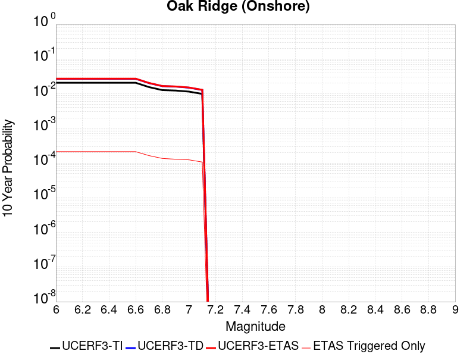 |

| Magnitude | 1 wk TI Prob | 1 wk TD Prob | 1 wk ETAS Prob | 1 wk ETAS/TD Gain | 1 wk ETAS Triggered Only | 1 mo TI Prob | 1 mo TD Prob | 1 mo ETAS Prob | 1 mo ETAS/TD Gain | 1 mo ETAS Triggered Only | 1 yr TI Prob | 1 yr TD Prob | 1 yr ETAS Prob | 1 yr ETAS/TD Gain | 1 yr ETAS Triggered Only | 10 yr TI Prob | 10 yr TD Prob | 10 yr ETAS Prob | 10 yr ETAS/TD Gain | 10 yr ETAS Triggered Only |
|-----|-----|-----|-----|-----|-----|-----|-----|-----|-----|-----|-----|-----|-----|-----|-----|-----|-----|-----|-----|-----|
| 6.0 | 4.0081308E-5 | 5.2264888E-5 | 5.2264888E-5 | 1.0 | 0.0 | 1.7176573E-4 | 2.2397783E-4 | 2.690778E-4 | 1.201359 | 4.5110068E-5 | 0.0020892418 | 0.0027243528 | 0.0028143271 | 1.033026 | 9.0220135E-5 | 0.020697087 | 0.02699201 | 0.027167581 | 1.0065045 | 1.8044027E-4 |
| 6.1 | 4.0081308E-5 | 5.2264888E-5 | 5.2264888E-5 | 1.0 | 0.0 | 1.7176573E-4 | 2.2397783E-4 | 2.690778E-4 | 1.201359 | 4.5110068E-5 | 0.0020892418 | 0.0027243528 | 0.0028143271 | 1.033026 | 9.0220135E-5 | 0.020697087 | 0.02699201 | 0.027167581 | 1.0065045 | 1.8044027E-4 |
| 6.2 | 4.0081308E-5 | 5.2264888E-5 | 5.2264888E-5 | 1.0 | 0.0 | 1.7176573E-4 | 2.2397783E-4 | 2.690778E-4 | 1.201359 | 4.5110068E-5 | 0.0020892418 | 0.0027243528 | 0.0028143271 | 1.033026 | 9.0220135E-5 | 0.020697087 | 0.02699201 | 0.027167581 | 1.0065045 | 1.8044027E-4 |
| 6.3 | 4.0081308E-5 | 5.2264888E-5 | 5.2264888E-5 | 1.0 | 0.0 | 1.7176573E-4 | 2.2397783E-4 | 2.690778E-4 | 1.201359 | 4.5110068E-5 | 0.0020892418 | 0.0027243528 | 0.0028143271 | 1.033026 | 9.0220135E-5 | 0.020697087 | 0.02699201 | 0.027167581 | 1.0065045 | 1.8044027E-4 |
| 6.4 | 4.0081308E-5 | 5.2264888E-5 | 5.2264888E-5 | 1.0 | 0.0 | 1.7176573E-4 | 2.2397783E-4 | 2.690778E-4 | 1.201359 | 4.5110068E-5 | 0.0020892418 | 0.0027243528 | 0.0028143271 | 1.033026 | 9.0220135E-5 | 0.020697087 | 0.02699201 | 0.027167581 | 1.0065045 | 1.8044027E-4 |
| 6.5 | 4.0081308E-5 | 5.2264888E-5 | 5.2264888E-5 | 1.0 | 0.0 | 1.7176573E-4 | 2.2397783E-4 | 2.690778E-4 | 1.201359 | 4.5110068E-5 | 0.0020892418 | 0.0027243528 | 0.0028143271 | 1.033026 | 9.0220135E-5 | 0.020697087 | 0.02699201 | 0.027167581 | 1.0065045 | 1.8044027E-4 |
| 6.6 | 4.0081308E-5 | 5.2264888E-5 | 5.2264888E-5 | 1.0 | 0.0 | 1.7176573E-4 | 2.2397783E-4 | 2.690778E-4 | 1.201359 | 4.5110068E-5 | 0.0020892418 | 0.0027243528 | 0.0028143271 | 1.033026 | 9.0220135E-5 | 0.020697087 | 0.02699201 | 0.027167581 | 1.0065045 | 1.8044027E-4 |
| 6.7 | 3.0016534E-5 | 3.908297E-5 | 3.908297E-5 | 1.0 | 0.0 | 1.2863595E-4 | 1.6749227E-4 | 1.6749227E-4 | 1.0 | 0.0 | 0.0015650174 | 0.0020381245 | 0.0020831425 | 1.022088 | 4.5110068E-5 | 0.015540415 | 0.020274134 | 0.020362526 | 1.0043598 | 9.0220135E-5 |
| 6.8 | 2.4562401E-5 | 3.183199E-5 | 3.183199E-5 | 1.0 | 0.0 | 1.0526319E-4 | 1.3642012E-4 | 1.3642012E-4 | 1.0 | 0.0 | 0.0012808258 | 0.0016604326 | 0.0017054677 | 1.0271225 | 4.5110068E-5 | 0.012734687 | 0.01655699 | 0.016645717 | 1.0053588 | 9.0220135E-5 |
| 6.9 | 2.3845261E-5 | 3.090968E-5 | 3.090968E-5 | 1.0 | 0.0 | 1.0218997E-4 | 1.3246776E-4 | 1.3246776E-4 | 1.0 | 0.0 | 0.0012434528 | 0.0016123839 | 0.0016574211 | 1.0279322 | 4.5110068E-5 | 0.01236518 | 0.016083475 | 0.016172245 | 1.0055193 | 9.0220135E-5 |
| 7.0 | 2.2210486E-5 | 2.8783488E-5 | 2.8783488E-5 | 1.0 | 0.0 | 9.5184325E-5 | 1.2335637E-4 | 1.2335637E-4 | 1.0 | 0.0 | 0.001158253 | 0.0015016058 | 0.0015466482 | 1.0299962 | 4.5110068E-5 | 0.011522347 | 0.014990693 | 0.015079561 | 1.0059282 | 9.0220135E-5 |
| 7.1 | 1.9072411E-5 | 2.4648589E-5 | 2.4648589E-5 | 1.0 | 0.0 | 8.173635E-5 | 1.05636806E-4 | 1.05636806E-4 | 1.0 | 0.0 | 9.946857E-4 | 0.0012861256 | 0.0013311777 | 1.0350293 | 4.5110068E-5 | 0.009902451 | 0.012860967 | 0.012950026 | 1.0069249 | 9.0220135E-5 |

## Santa Susana alt 1
*[(top)](#table-of-contents)*

| 1 Week | 1 Month | 1 Year | 10 Year |
|-----|-----|-----|-----|
|  |  |  |  |

| Magnitude | 1 wk TI Prob | 1 wk TD Prob | 1 wk ETAS Prob | 1 wk ETAS/TD Gain | 1 wk ETAS Triggered Only | 1 mo TI Prob | 1 mo TD Prob | 1 mo ETAS Prob | 1 mo ETAS/TD Gain | 1 mo ETAS Triggered Only | 1 yr TI Prob | 1 yr TD Prob | 1 yr ETAS Prob | 1 yr ETAS/TD Gain | 1 yr ETAS Triggered Only | 10 yr TI Prob | 10 yr TD Prob | 10 yr ETAS Prob | 10 yr ETAS/TD Gain | 10 yr ETAS Triggered Only |
|-----|-----|-----|-----|-----|-----|-----|-----|-----|-----|-----|-----|-----|-----|-----|-----|-----|-----|-----|-----|-----|
| 6.0 | 9.5099895E-5 | 2.0216104E-4 | 2.4726198E-4 | 1.2230941 | 4.5110068E-5 | 4.075073E-4 | 8.6613704E-4 | 9.5627905E-4 | 1.1040736 | 9.0220135E-5 | 0.00495012 | 0.010495704 | 0.010629613 | 1.0127585 | 1.353302E-4 | 0.048412967 | 0.10018345 | 0.1003864 | 1.0020258 | 2.2555035E-4 |
| 6.1 | 9.5099895E-5 | 2.0216104E-4 | 2.4726198E-4 | 1.2230941 | 4.5110068E-5 | 4.075073E-4 | 8.6613704E-4 | 9.5627905E-4 | 1.1040736 | 9.0220135E-5 | 0.00495012 | 0.010495704 | 0.010629613 | 1.0127585 | 1.353302E-4 | 0.048412967 | 0.10018345 | 0.1003864 | 1.0020258 | 2.2555035E-4 |
| 6.2 | 9.5099895E-5 | 2.0216104E-4 | 2.4726198E-4 | 1.2230941 | 4.5110068E-5 | 4.075073E-4 | 8.6613704E-4 | 9.5627905E-4 | 1.1040736 | 9.0220135E-5 | 0.00495012 | 0.010495704 | 0.010629613 | 1.0127585 | 1.353302E-4 | 0.048412967 | 0.10018345 | 0.1003864 | 1.0020258 | 2.2555035E-4 |
| 6.3 | 9.5099895E-5 | 2.0216104E-4 | 2.4726198E-4 | 1.2230941 | 4.5110068E-5 | 4.075073E-4 | 8.6613704E-4 | 9.5627905E-4 | 1.1040736 | 9.0220135E-5 | 0.00495012 | 0.010495704 | 0.010629613 | 1.0127585 | 1.353302E-4 | 0.048412967 | 0.10018345 | 0.1003864 | 1.0020258 | 2.2555035E-4 |
| 6.4 | 9.5099895E-5 | 2.0216104E-4 | 2.4726198E-4 | 1.2230941 | 4.5110068E-5 | 4.075073E-4 | 8.6613704E-4 | 9.5627905E-4 | 1.1040736 | 9.0220135E-5 | 0.00495012 | 0.010495704 | 0.010629613 | 1.0127585 | 1.353302E-4 | 0.048412967 | 0.10018345 | 0.1003864 | 1.0020258 | 2.2555035E-4 |
| 6.5 | 9.5099895E-5 | 2.0216104E-4 | 2.4726198E-4 | 1.2230941 | 4.5110068E-5 | 4.075073E-4 | 8.6613704E-4 | 9.5627905E-4 | 1.1040736 | 9.0220135E-5 | 0.00495012 | 0.010495704 | 0.010629613 | 1.0127585 | 1.353302E-4 | 0.048412967 | 0.10018345 | 0.1003864 | 1.0020258 | 2.2555035E-4 |
| 6.6 | 6.811134E-5 | 1.4962441E-4 | 1.9472773E-4 | 1.3014436 | 4.5110068E-5 | 2.9187306E-4 | 6.410975E-4 | 7.3125976E-4 | 1.1406374 | 9.0220135E-5 | 0.0035477648 | 0.007785119 | 0.007919395 | 1.0172479 | 1.353302E-4 | 0.034916576 | 0.075827375 | 0.07603582 | 1.002749 | 2.2555035E-4 |
| 6.7 | 6.811134E-5 | 1.4962441E-4 | 1.9472773E-4 | 1.3014436 | 4.5110068E-5 | 2.9187306E-4 | 6.410975E-4 | 7.3125976E-4 | 1.1406374 | 9.0220135E-5 | 0.0035477648 | 0.007785119 | 0.007919395 | 1.0172479 | 1.353302E-4 | 0.034916576 | 0.075827375 | 0.07603582 | 1.002749 | 2.2555035E-4 |

## San Jacinto (San Jacinto Valley) rev
*[(top)](#table-of-contents)*

| 1 Week | 1 Month | 1 Year | 10 Year |
|-----|-----|-----|-----|
|  |  |  |  |

| Magnitude | 1 wk TI Prob | 1 wk TD Prob | 1 wk ETAS Prob | 1 wk ETAS/TD Gain | 1 wk ETAS Triggered Only | 1 mo TI Prob | 1 mo TD Prob | 1 mo ETAS Prob | 1 mo ETAS/TD Gain | 1 mo ETAS Triggered Only | 1 yr TI Prob | 1 yr TD Prob | 1 yr ETAS Prob | 1 yr ETAS/TD Gain | 1 yr ETAS Triggered Only | 10 yr TI Prob | 10 yr TD Prob | 10 yr ETAS Prob | 10 yr ETAS/TD Gain | 10 yr ETAS Triggered Only |
|-----|-----|-----|-----|-----|-----|-----|-----|-----|-----|-----|-----|-----|-----|-----|-----|-----|-----|-----|-----|-----|
| 6.0 | 7.806946E-5 | 1.580409E-4 | 2.0314383E-4 | 1.2853878 | 4.5110068E-5 | 3.345405E-4 | 6.770383E-4 | 7.2211784E-4 | 1.0665834 | 4.5110068E-5 | 0.004065426 | 0.008203736 | 0.008337956 | 1.0163609 | 1.353302E-4 | 0.03991852 | 0.07910823 | 0.07931594 | 1.0026256 | 2.2555035E-4 |
| 6.1 | 7.806946E-5 | 1.580409E-4 | 2.0314383E-4 | 1.2853878 | 4.5110068E-5 | 3.345405E-4 | 6.770383E-4 | 7.2211784E-4 | 1.0665834 | 4.5110068E-5 | 0.004065426 | 0.008203736 | 0.008337956 | 1.0163609 | 1.353302E-4 | 0.03991852 | 0.07910823 | 0.07931594 | 1.0026256 | 2.2555035E-4 |
| 6.2 | 7.806946E-5 | 1.580409E-4 | 2.0314383E-4 | 1.2853878 | 4.5110068E-5 | 3.345405E-4 | 6.770383E-4 | 7.2211784E-4 | 1.0665834 | 4.5110068E-5 | 0.004065426 | 0.008203736 | 0.008337956 | 1.0163609 | 1.353302E-4 | 0.03991852 | 0.07910823 | 0.07931594 | 1.0026256 | 2.2555035E-4 |
| 6.3 | 7.806946E-5 | 1.580409E-4 | 2.0314383E-4 | 1.2853878 | 4.5110068E-5 | 3.345405E-4 | 6.770383E-4 | 7.2211784E-4 | 1.0665834 | 4.5110068E-5 | 0.004065426 | 0.008203736 | 0.008337956 | 1.0163609 | 1.353302E-4 | 0.03991852 | 0.07910823 | 0.07931594 | 1.0026256 | 2.2555035E-4 |
| 6.4 | 7.806946E-5 | 1.580409E-4 | 2.0314383E-4 | 1.2853878 | 4.5110068E-5 | 3.345405E-4 | 6.770383E-4 | 7.2211784E-4 | 1.0665834 | 4.5110068E-5 | 0.004065426 | 0.008203736 | 0.008337956 | 1.0163609 | 1.353302E-4 | 0.03991852 | 0.07910823 | 0.07931594 | 1.0026256 | 2.2555035E-4 |
| 6.5 | 7.806946E-5 | 1.580409E-4 | 2.0314383E-4 | 1.2853878 | 4.5110068E-5 | 3.345405E-4 | 6.770383E-4 | 7.2211784E-4 | 1.0665834 | 4.5110068E-5 | 0.004065426 | 0.008203736 | 0.008337956 | 1.0163609 | 1.353302E-4 | 0.03991852 | 0.07910823 | 0.07931594 | 1.0026256 | 2.2555035E-4 |
| 6.6 | 7.8012505E-5 | 1.5793537E-4 | 2.0303832E-4 | 1.2855785 | 4.5110068E-5 | 3.3429646E-4 | 6.765863E-4 | 7.216658E-4 | 1.066628 | 4.5110068E-5 | 0.004062466 | 0.008198286 | 0.008332508 | 1.0163718 | 1.353302E-4 | 0.039889984 | 0.079058796 | 0.07926651 | 1.0026274 | 2.2555035E-4 |
| 6.7 | 7.8012505E-5 | 1.5793537E-4 | 2.0303832E-4 | 1.2855785 | 4.5110068E-5 | 3.3429646E-4 | 6.765863E-4 | 7.216658E-4 | 1.066628 | 4.5110068E-5 | 0.004062466 | 0.008198286 | 0.008332508 | 1.0163718 | 1.353302E-4 | 0.039889984 | 0.079058796 | 0.07926651 | 1.0026274 | 2.2555035E-4 |
| 6.8 | 7.7891236E-5 | 1.5767448E-4 | 2.0277745E-4 | 1.286051 | 4.5110068E-5 | 3.3377687E-4 | 6.754689E-4 | 7.205485E-4 | 1.0667382 | 4.5110068E-5 | 0.004056163 | 0.0081848195 | 0.008319043 | 1.0163989 | 1.353302E-4 | 0.039829224 | 0.0789369 | 0.07914465 | 1.0026318 | 2.2555035E-4 |
| 6.9 | 7.764062E-5 | 1.5713525E-4 | 2.0223823E-4 | 1.2870328 | 4.5110068E-5 | 3.327031E-4 | 6.731594E-4 | 7.1823905E-4 | 1.0669674 | 4.5110068E-5 | 0.0040431386 | 0.008156981 | 0.008291208 | 1.0164554 | 1.353302E-4 | 0.039703645 | 0.07868492 | 0.07889272 | 1.002641 | 2.2555035E-4 |
| 7.0 | 5.0739076E-5 | 9.3390074E-5 | 1.3849593E-4 | 1.4829834 | 4.5110068E-5 | 2.1743505E-4 | 4.0015313E-4 | 4.4524515E-4 | 1.1126869 | 4.5110068E-5 | 0.0026440579 | 0.0048604817 | 0.0049502635 | 1.0184717 | 9.0220135E-5 | 0.026128192 | 0.04834233 | 0.04842819 | 1.0017761 | 9.0220135E-5 |
| 7.1 | 5.0390987E-5 | 9.2688424E-5 | 1.3779431E-4 | 1.48664 | 4.5110068E-5 | 2.159435E-4 | 3.9714726E-4 | 4.4223943E-4 | 1.1135402 | 4.5110068E-5 | 0.002625942 | 0.004824109 | 0.0049138935 | 1.0186117 | 9.0220135E-5 | 0.025951283 | 0.048000354 | 0.048086245 | 1.0017893 | 9.0220135E-5 |
| 7.2 | 4.9789487E-5 | 9.143531E-5 | 1.3654125E-4 | 1.49331 | 4.5110068E-5 | 2.1336606E-4 | 3.917791E-4 | 4.368715E-4 | 1.1150964 | 4.5110068E-5 | 0.0025946372 | 0.0047591375 | 0.004848928 | 1.018867 | 9.0220135E-5 | 0.025645511 | 0.047391243 | 0.04747719 | 1.0018135 | 9.0220135E-5 |
| 7.3 | 4.9191407E-5 | 9.01359E-5 | 1.352419E-4 | 1.5004221 | 4.5110068E-5 | 2.1080328E-4 | 3.8621208E-4 | 4.3130474E-4 | 1.1167562 | 4.5110068E-5 | 0.002563509 | 0.004691701 | 0.004781498 | 1.0191395 | 9.0220135E-5 | 0.025341382 | 0.04674962 | 0.046835624 | 1.0018396 | 9.0220135E-5 |
| 7.4 | 3.3192722E-5 | 5.2610532E-5 | 9.771823E-5 | 1.8573891 | 4.5110068E-5 | 1.4224676E-4 | 2.2545758E-4 | 2.7055747E-4 | 1.2000371 | 4.5110068E-5 | 0.0017304786 | 0.0027420863 | 0.0027870727 | 1.0164059 | 4.5110068E-5 | 0.01717065 | 0.028029768 | 0.028073614 | 1.0015643 | 4.5110068E-5 |
| 7.5 | 2.8249084E-5 | 4.2866195E-5 | 8.797433E-5 | 2.052301 | 4.5110068E-5 | 1.2106189E-4 | 1.8370226E-4 | 2.2880404E-4 | 1.2455157 | 4.5110068E-5 | 0.0014729318 | 0.0022347996 | 0.0022798087 | 1.0201402 | 4.5110068E-5 | 0.014632072 | 0.023027074 | 0.023071146 | 1.0019139 | 4.5110068E-5 |
| 7.6 | 2.7497194E-5 | 4.146988E-5 | 8.6578075E-5 | 2.087734 | 4.5110068E-5 | 1.17839794E-4 | 1.7771887E-4 | 2.2282092E-4 | 1.2537831 | 4.5110068E-5 | 0.0014337553 | 0.0021620982 | 0.0022071106 | 1.020819 | 4.5110068E-5 | 0.0142454 | 0.022306465 | 0.022350568 | 1.0019772 | 4.5110068E-5 |
| 7.7 | 1.673878E-5 | 2.1973781E-5 | 2.1973781E-5 | 1.0 | 0.0 | 7.173566E-5 | 9.417205E-5 | 9.417205E-5 | 1.0 | 0.0 | 8.730317E-4 | 0.0011463144 | 0.0011463144 | 1.0 | 0.0 | 0.008696098 | 0.01216197 | 0.01216197 | 1.0 | 0.0 |
| 7.8 | 1.5303123E-6 | 1.9707616E-6 | 1.9707616E-6 | 1.0 | 0.0 | 6.5584645E-6 | 8.446107E-6 | 8.446107E-6 | 1.0 | 0.0 | 7.984638E-5 | 1.0282895E-4 | 1.0282895E-4 | 1.0 | 0.0 | 7.98177E-4 | 0.001066982 | 0.001066982 | 1.0 | 0.0 |

## Lenwood-Lockhart-Old Woman Springs
*[(top)](#table-of-contents)*

| 1 Week | 1 Month | 1 Year | 10 Year |
|-----|-----|-----|-----|
|  |  |  |  |

| Magnitude | 1 wk TI Prob | 1 wk TD Prob | 1 wk ETAS Prob | 1 wk ETAS/TD Gain | 1 wk ETAS Triggered Only | 1 mo TI Prob | 1 mo TD Prob | 1 mo ETAS Prob | 1 mo ETAS/TD Gain | 1 mo ETAS Triggered Only | 1 yr TI Prob | 1 yr TD Prob | 1 yr ETAS Prob | 1 yr ETAS/TD Gain | 1 yr ETAS Triggered Only | 10 yr TI Prob | 10 yr TD Prob | 10 yr ETAS Prob | 10 yr ETAS/TD Gain | 10 yr ETAS Triggered Only |
|-----|-----|-----|-----|-----|-----|-----|-----|-----|-----|-----|-----|-----|-----|-----|-----|-----|-----|-----|-----|-----|
| 6.0 | 1.1036675E-5 | 1.13471315E-5 | 5.6456687E-5 | 4.9754148 | 4.5110068E-5 | 4.7299174E-5 | 4.862975E-5 | 1.8395338E-4 | 3.7827332 | 1.353302E-4 | 5.7571527E-4 | 5.9192255E-4 | 7.2717265E-4 | 1.2284929 | 1.353302E-4 | 0.0057422607 | 0.005905067 | 0.006084442 | 1.0303764 | 1.8044027E-4 |
| 6.1 | 1.1036675E-5 | 1.13471315E-5 | 5.6456687E-5 | 4.9754148 | 4.5110068E-5 | 4.7299174E-5 | 4.862975E-5 | 1.8395338E-4 | 3.7827332 | 1.353302E-4 | 5.7571527E-4 | 5.9192255E-4 | 7.2717265E-4 | 1.2284929 | 1.353302E-4 | 0.0057422607 | 0.005905067 | 0.006084442 | 1.0303764 | 1.8044027E-4 |
| 6.2 | 1.1036675E-5 | 1.13471315E-5 | 5.6456687E-5 | 4.9754148 | 4.5110068E-5 | 4.7299174E-5 | 4.862975E-5 | 1.8395338E-4 | 3.7827332 | 1.353302E-4 | 5.7571527E-4 | 5.9192255E-4 | 7.2717265E-4 | 1.2284929 | 1.353302E-4 | 0.0057422607 | 0.005905067 | 0.006084442 | 1.0303764 | 1.8044027E-4 |
| 6.3 | 1.1036675E-5 | 1.13471315E-5 | 5.6456687E-5 | 4.9754148 | 4.5110068E-5 | 4.7299174E-5 | 4.862975E-5 | 1.8395338E-4 | 3.7827332 | 1.353302E-4 | 5.7571527E-4 | 5.9192255E-4 | 7.2717265E-4 | 1.2284929 | 1.353302E-4 | 0.0057422607 | 0.005905067 | 0.006084442 | 1.0303764 | 1.8044027E-4 |
| 6.4 | 1.1036675E-5 | 1.13471315E-5 | 5.6456687E-5 | 4.9754148 | 4.5110068E-5 | 4.7299174E-5 | 4.862975E-5 | 1.8395338E-4 | 3.7827332 | 1.353302E-4 | 5.7571527E-4 | 5.9192255E-4 | 7.2717265E-4 | 1.2284929 | 1.353302E-4 | 0.0057422607 | 0.005905067 | 0.006084442 | 1.0303764 | 1.8044027E-4 |
| 6.5 | 1.1036675E-5 | 1.13471315E-5 | 5.6456687E-5 | 4.9754148 | 4.5110068E-5 | 4.7299174E-5 | 4.862975E-5 | 1.8395338E-4 | 3.7827332 | 1.353302E-4 | 5.7571527E-4 | 5.9192255E-4 | 7.2717265E-4 | 1.2284929 | 1.353302E-4 | 0.0057422607 | 0.005905067 | 0.006084442 | 1.0303764 | 1.8044027E-4 |
| 6.6 | 1.006756E-5 | 1.03174325E-5 | 5.5427037E-5 | 5.3721733 | 4.5110068E-5 | 4.314597E-5 | 4.421691E-5 | 1.3443305E-4 | 3.0403087 | 9.0220135E-5 | 5.251756E-4 | 5.3822406E-4 | 6.2839565E-4 | 1.1675354 | 9.0220135E-5 | 0.0052393614 | 0.005370801 | 0.005505404 | 1.0250621 | 1.353302E-4 |
| 6.7 | 8.832586E-6 | 9.00346E-6 | 5.4113123E-5 | 6.0102587 | 4.5110068E-5 | 3.785339E-5 | 3.858578E-5 | 1.2880244E-4 | 3.3380806 | 9.0220135E-5 | 4.6076757E-4 | 4.696966E-4 | 5.5987434E-4 | 1.1919916 | 9.0220135E-5 | 0.0045981337 | 0.004688617 | 0.0048233126 | 1.0287282 | 1.353302E-4 |
| 6.8 | 7.710114E-6 | 7.83513E-6 | 5.2944844E-5 | 6.757366 | 4.5110068E-5 | 3.304293E-5 | 3.3578788E-5 | 1.237959E-4 | 3.686729 | 9.0220135E-5 | 4.0222338E-4 | 4.08761E-4 | 4.9894425E-4 | 1.2206259 | 9.0220135E-5 | 0.0040149614 | 0.004081657 | 0.004216435 | 1.0330204 | 1.353302E-4 |
| 6.9 | 6.7952105E-6 | 6.8845156E-6 | 5.1994273E-5 | 7.5523505 | 4.5110068E-5 | 2.9122006E-5 | 2.9504821E-5 | 1.19722295E-4 | 4.0577197 | 9.0220135E-5 | 3.5450273E-4 | 3.5917785E-4 | 4.493656E-4 | 1.2510949 | 9.0220135E-5 | 0.0035393774 | 0.0035875305 | 0.0037223753 | 1.037587 | 1.353302E-4 |
| 7.0 | 6.0172265E-6 | 6.073082E-6 | 6.073082E-6 | 1.0 | 0.0 | 2.5787858E-5 | 2.6027325E-5 | 7.113622E-5 | 2.733136 | 4.5110068E-5 | 3.1392195E-4 | 3.168524E-4 | 3.619482E-4 | 1.1423242 | 4.5110068E-5 | 0.0031347885 | 0.0031655584 | 0.003255493 | 1.0284103 | 9.0220135E-5 |
| 7.1 | 5.316028E-6 | 5.341159E-6 | 5.341159E-6 | 1.0 | 0.0 | 2.2782777E-5 | 2.289057E-5 | 6.799961E-5 | 2.9706383 | 4.5110068E-5 | 2.77345E-4 | 2.7867281E-4 | 3.2377033E-4 | 1.1618296 | 4.5110068E-5 | 0.0027699913 | 0.0027847814 | 0.0028747502 | 1.0323074 | 9.0220135E-5 |
| 7.2 | 4.6786963E-6 | 4.6755235E-6 | 4.6755235E-6 | 1.0 | 0.0 | 2.0051402E-5 | 2.0037893E-5 | 6.5147055E-5 | 3.251193 | 4.5110068E-5 | 2.4409847E-4 | 2.4394978E-4 | 2.8904885E-4 | 1.1848702 | 4.5110068E-5 | 0.0024383052 | 0.0024383632 | 0.0025283634 | 1.03691 | 9.0220135E-5 |
| 7.3 | 4.0944874E-6 | 4.0799887E-6 | 4.0799887E-6 | 1.0 | 0.0 | 1.7547685E-5 | 1.7485638E-5 | 6.259492E-5 | 3.5797904 | 4.5110068E-5 | 2.1362212E-4 | 2.1288253E-4 | 2.57983E-4 | 1.2118561 | 4.5110068E-5 | 0.0021341688 | 0.002128325 | 0.002218353 | 1.0423 | 9.0220135E-5 |
| 7.4 | 3.5544638E-6 | 3.5373362E-6 | 3.5373362E-6 | 1.0 | 0.0 | 1.5233327E-5 | 1.5160012E-5 | 6.0269398E-5 | 3.9755507 | 4.5110068E-5 | 1.8544997E-4 | 1.8457315E-4 | 2.2967489E-4 | 1.244357 | 4.5110068E-5 | 0.0018529529 | 0.0018457314 | 0.001935785 | 1.0487902 | 9.0220135E-5 |

## Helendale-So Lockhart
*[(top)](#table-of-contents)*

| 1 Week | 1 Month | 1 Year | 10 Year |
|-----|-----|-----|-----|
|  |  | 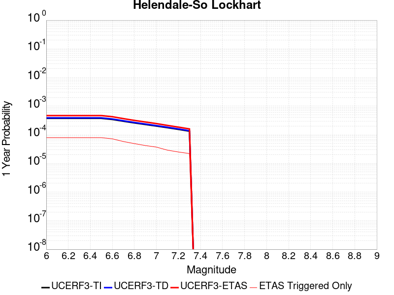 |  |

| Magnitude | 1 wk TI Prob | 1 wk TD Prob | 1 wk ETAS Prob | 1 wk ETAS/TD Gain | 1 wk ETAS Triggered Only | 1 mo TI Prob | 1 mo TD Prob | 1 mo ETAS Prob | 1 mo ETAS/TD Gain | 1 mo ETAS Triggered Only | 1 yr TI Prob | 1 yr TD Prob | 1 yr ETAS Prob | 1 yr ETAS/TD Gain | 1 yr ETAS Triggered Only | 10 yr TI Prob | 10 yr TD Prob | 10 yr ETAS Prob | 10 yr ETAS/TD Gain | 10 yr ETAS Triggered Only |
|-----|-----|-----|-----|-----|-----|-----|-----|-----|-----|-----|-----|-----|-----|-----|-----|-----|-----|-----|-----|-----|
| 6.0 | 7.171715E-6 | 7.4314485E-6 | 7.4314485E-6 | 1.0 | 0.0 | 3.073556E-5 | 3.184873E-5 | 7.695736E-5 | 2.41634 | 4.5110068E-5 | 3.7414118E-4 | 3.8769832E-4 | 4.7788347E-4 | 1.2326169 | 9.0220135E-5 | 0.003735119 | 0.0038711112 | 0.004050853 | 1.0464315 | 1.8044027E-4 |
| 6.1 | 7.171715E-6 | 7.4314485E-6 | 7.4314485E-6 | 1.0 | 0.0 | 3.073556E-5 | 3.184873E-5 | 7.695736E-5 | 2.41634 | 4.5110068E-5 | 3.7414118E-4 | 3.8769832E-4 | 4.7788347E-4 | 1.2326169 | 9.0220135E-5 | 0.003735119 | 0.0038711112 | 0.004050853 | 1.0464315 | 1.8044027E-4 |
| 6.2 | 7.171715E-6 | 7.4314485E-6 | 7.4314485E-6 | 1.0 | 0.0 | 3.073556E-5 | 3.184873E-5 | 7.695736E-5 | 2.41634 | 4.5110068E-5 | 3.7414118E-4 | 3.8769832E-4 | 4.7788347E-4 | 1.2326169 | 9.0220135E-5 | 0.003735119 | 0.0038711112 | 0.004050853 | 1.0464315 | 1.8044027E-4 |
| 6.3 | 7.171715E-6 | 7.4314485E-6 | 7.4314485E-6 | 1.0 | 0.0 | 3.073556E-5 | 3.184873E-5 | 7.695736E-5 | 2.41634 | 4.5110068E-5 | 3.7414118E-4 | 3.8769832E-4 | 4.7788347E-4 | 1.2326169 | 9.0220135E-5 | 0.003735119 | 0.0038711112 | 0.004050853 | 1.0464315 | 1.8044027E-4 |
| 6.4 | 7.171715E-6 | 7.4314485E-6 | 7.4314485E-6 | 1.0 | 0.0 | 3.073556E-5 | 3.184873E-5 | 7.695736E-5 | 2.41634 | 4.5110068E-5 | 3.7414118E-4 | 3.8769832E-4 | 4.7788347E-4 | 1.2326169 | 9.0220135E-5 | 0.003735119 | 0.0038711112 | 0.004050853 | 1.0464315 | 1.8044027E-4 |
| 6.5 | 7.171715E-6 | 7.4314485E-6 | 7.4314485E-6 | 1.0 | 0.0 | 3.073556E-5 | 3.184873E-5 | 7.695736E-5 | 2.41634 | 4.5110068E-5 | 3.7414118E-4 | 3.8769832E-4 | 4.7788347E-4 | 1.2326169 | 9.0220135E-5 | 0.003735119 | 0.0038711112 | 0.004050853 | 1.0464315 | 1.8044027E-4 |
| 6.6 | 6.5580157E-6 | 6.7948727E-6 | 6.7948727E-6 | 1.0 | 0.0 | 2.810548E-5 | 2.9120609E-5 | 7.422936E-5 | 2.549032 | 4.5110068E-5 | 3.421305E-4 | 3.5449475E-4 | 4.446829E-4 | 1.2544132 | 9.0220135E-5 | 0.0034160423 | 0.0035401797 | 0.003719981 | 1.0507888 | 1.8044027E-4 |
| 6.7 | 5.6879685E-6 | 5.8928526E-6 | 5.8928526E-6 | 1.0 | 0.0 | 2.4376779E-5 | 2.5254889E-5 | 7.0363814E-5 | 2.7861464 | 4.5110068E-5 | 2.9674688E-4 | 3.074438E-4 | 3.976362E-4 | 1.2933623 | 9.0220135E-5 | 0.0029635092 | 0.0030710634 | 0.003205978 | 1.0439309 | 1.353302E-4 |
| 6.8 | 4.958099E-6 | 5.135111E-6 | 5.135111E-6 | 1.0 | 0.0 | 2.1248823E-5 | 2.2007483E-5 | 6.711656E-5 | 3.0497153 | 4.5110068E-5 | 2.586737E-4 | 2.6791706E-4 | 3.5811303E-4 | 1.3366563 | 9.0220135E-5 | 0.0025837282 | 0.0026768132 | 0.0027667917 | 1.033614 | 9.0220135E-5 |
| 6.9 | 4.3792215E-6 | 4.5342804E-6 | 4.5342804E-6 | 1.0 | 0.0 | 1.8767958E-5 | 1.9432535E-5 | 6.4541724E-5 | 3.321323 | 4.5110068E-5 | 2.2847592E-4 | 2.3657428E-4 | 3.2677306E-4 | 1.3812705 | 9.0220135E-5 | 0.0022824116 | 0.0023640923 | 0.0024540992 | 1.0380725 | 9.0220135E-5 |
| 7.0 | 3.858262E-6 | 3.9935144E-6 | 3.9935144E-6 | 1.0 | 0.0 | 1.6535305E-5 | 1.7115E-5 | 6.2224295E-5 | 3.6356587 | 4.5110068E-5 | 2.0129874E-4 | 2.0836401E-4 | 2.9856534E-4 | 1.4329027 | 9.0220135E-5 | 0.0020111648 | 0.0020825516 | 0.0021725837 | 1.0432317 | 9.0220135E-5 |
| 7.1 | 3.3854772E-6 | 3.502769E-6 | 3.502769E-6 | 1.0 | 0.0 | 1.4509107E-5 | 1.501183E-5 | 6.0121223E-5 | 4.004923 | 4.5110068E-5 | 1.7663406E-4 | 1.827625E-4 | 2.7296614E-4 | 1.4935566 | 9.0220135E-5 | 0.0017649373 | 0.0018269841 | 0.0019170394 | 1.0492917 | 9.0220135E-5 |
| 7.2 | 2.9527619E-6 | 3.05382E-6 | 3.05382E-6 | 1.0 | 0.0 | 1.2654632E-5 | 1.3087783E-5 | 5.819726E-5 | 4.446686 | 4.5110068E-5 | 1.5405925E-4 | 1.5934087E-4 | 2.4954663E-4 | 1.5661181 | 9.0220135E-5 | 0.0015395249 | 0.0015931253 | 0.0016832016 | 1.0565407 | 9.0220135E-5 |
| 7.3 | 2.553375E-6 | 2.6399916E-6 | 2.6399916E-6 | 1.0 | 0.0 | 1.0942989E-5 | 1.13142505E-5 | 1.13142505E-5 | 1.0 | 0.0 | 1.3322275E-4 | 1.3775099E-4 | 1.8285486E-4 | 1.3274304 | 4.5110068E-5 | 0.0013314291 | 0.0013775099 | 0.0014225579 | 1.0327024 | 4.5110068E-5 |

## Raymond
*[(top)](#table-of-contents)*

| 1 Week | 1 Month | 1 Year | 10 Year |
|-----|-----|-----|-----|
|  |  |  |  |

| Magnitude | 1 wk TI Prob | 1 wk TD Prob | 1 wk ETAS Prob | 1 wk ETAS/TD Gain | 1 wk ETAS Triggered Only | 1 mo TI Prob | 1 mo TD Prob | 1 mo ETAS Prob | 1 mo ETAS/TD Gain | 1 mo ETAS Triggered Only | 1 yr TI Prob | 1 yr TD Prob | 1 yr ETAS Prob | 1 yr ETAS/TD Gain | 1 yr ETAS Triggered Only | 10 yr TI Prob | 10 yr TD Prob | 10 yr ETAS Prob | 10 yr ETAS/TD Gain | 10 yr ETAS Triggered Only |
|-----|-----|-----|-----|-----|-----|-----|-----|-----|-----|-----|-----|-----|-----|-----|-----|-----|-----|-----|-----|-----|
| 6.0 | 2.9380968E-5 | 3.7712594E-5 | 1.2792934E-4 | 3.3922176 | 9.0220135E-5 | 1.2591235E-4 | 1.616254E-4 | 2.5183096E-4 | 1.558115 | 9.0220135E-5 | 0.0015319049 | 0.0019677528 | 0.0020577954 | 1.0457591 | 9.0220135E-5 | 0.015213877 | 0.0196723 | 0.019849192 | 1.0089918 | 1.8044027E-4 |
| 6.1 | 2.9380968E-5 | 3.7712594E-5 | 1.2792934E-4 | 3.3922176 | 9.0220135E-5 | 1.2591235E-4 | 1.616254E-4 | 2.5183096E-4 | 1.558115 | 9.0220135E-5 | 0.0015319049 | 0.0019677528 | 0.0020577954 | 1.0457591 | 9.0220135E-5 | 0.015213877 | 0.0196723 | 0.019849192 | 1.0089918 | 1.8044027E-4 |
| 6.2 | 2.9380968E-5 | 3.7712594E-5 | 1.2792934E-4 | 3.3922176 | 9.0220135E-5 | 1.2591235E-4 | 1.616254E-4 | 2.5183096E-4 | 1.558115 | 9.0220135E-5 | 0.0015319049 | 0.0019677528 | 0.0020577954 | 1.0457591 | 9.0220135E-5 | 0.015213877 | 0.0196723 | 0.019849192 | 1.0089918 | 1.8044027E-4 |
| 6.3 | 2.9380968E-5 | 3.7712594E-5 | 1.2792934E-4 | 3.3922176 | 9.0220135E-5 | 1.2591235E-4 | 1.616254E-4 | 2.5183096E-4 | 1.558115 | 9.0220135E-5 | 0.0015319049 | 0.0019677528 | 0.0020577954 | 1.0457591 | 9.0220135E-5 | 0.015213877 | 0.0196723 | 0.019849192 | 1.0089918 | 1.8044027E-4 |
| 6.4 | 2.9380968E-5 | 3.7712594E-5 | 1.2792934E-4 | 3.3922176 | 9.0220135E-5 | 1.2591235E-4 | 1.616254E-4 | 2.5183096E-4 | 1.558115 | 9.0220135E-5 | 0.0015319049 | 0.0019677528 | 0.0020577954 | 1.0457591 | 9.0220135E-5 | 0.015213877 | 0.0196723 | 0.019849192 | 1.0089918 | 1.8044027E-4 |
| 6.5 | 2.9380968E-5 | 3.7712594E-5 | 1.2792934E-4 | 3.3922176 | 9.0220135E-5 | 1.2591235E-4 | 1.616254E-4 | 2.5183096E-4 | 1.558115 | 9.0220135E-5 | 0.0015319049 | 0.0019677528 | 0.0020577954 | 1.0457591 | 9.0220135E-5 | 0.015213877 | 0.0196723 | 0.019849192 | 1.0089918 | 1.8044027E-4 |
| 6.6 | 2.9380968E-5 | 3.7712594E-5 | 1.2792934E-4 | 3.3922176 | 9.0220135E-5 | 1.2591235E-4 | 1.616254E-4 | 2.5183096E-4 | 1.558115 | 9.0220135E-5 | 0.0015319049 | 0.0019677528 | 0.0020577954 | 1.0457591 | 9.0220135E-5 | 0.015213877 | 0.0196723 | 0.019849192 | 1.0089918 | 1.8044027E-4 |

## Ventura-Pitas Point
*[(top)](#table-of-contents)*

| 1 Week | 1 Month | 1 Year | 10 Year |
|-----|-----|-----|-----|
|  |  |  |  |

| Magnitude | 1 wk TI Prob | 1 wk TD Prob | 1 wk ETAS Prob | 1 wk ETAS/TD Gain | 1 wk ETAS Triggered Only | 1 mo TI Prob | 1 mo TD Prob | 1 mo ETAS Prob | 1 mo ETAS/TD Gain | 1 mo ETAS Triggered Only | 1 yr TI Prob | 1 yr TD Prob | 1 yr ETAS Prob | 1 yr ETAS/TD Gain | 1 yr ETAS Triggered Only | 10 yr TI Prob | 10 yr TD Prob | 10 yr ETAS Prob | 10 yr ETAS/TD Gain | 10 yr ETAS Triggered Only |
|-----|-----|-----|-----|-----|-----|-----|-----|-----|-----|-----|-----|-----|-----|-----|-----|-----|-----|-----|-----|-----|
| 6.0 | 1.3734005E-5 | 1.4989571E-5 | 1.4989571E-5 | 1.0 | 0.0 | 5.885869E-5 | 6.423993E-5 | 6.423993E-5 | 1.0 | 0.0 | 7.1636896E-4 | 7.819278E-4 | 8.270026E-4 | 1.0576457 | 4.5110068E-5 | 0.00714064 | 0.007800344 | 0.007934619 | 1.017214 | 1.353302E-4 |
| 6.1 | 1.3734005E-5 | 1.4989571E-5 | 1.4989571E-5 | 1.0 | 0.0 | 5.885869E-5 | 6.423993E-5 | 6.423993E-5 | 1.0 | 0.0 | 7.1636896E-4 | 7.819278E-4 | 8.270026E-4 | 1.0576457 | 4.5110068E-5 | 0.00714064 | 0.007800344 | 0.007934619 | 1.017214 | 1.353302E-4 |
| 6.2 | 1.3734005E-5 | 1.4989571E-5 | 1.4989571E-5 | 1.0 | 0.0 | 5.885869E-5 | 6.423993E-5 | 6.423993E-5 | 1.0 | 0.0 | 7.1636896E-4 | 7.819278E-4 | 8.270026E-4 | 1.0576457 | 4.5110068E-5 | 0.00714064 | 0.007800344 | 0.007934619 | 1.017214 | 1.353302E-4 |
| 6.3 | 1.3734005E-5 | 1.4989571E-5 | 1.4989571E-5 | 1.0 | 0.0 | 5.885869E-5 | 6.423993E-5 | 6.423993E-5 | 1.0 | 0.0 | 7.1636896E-4 | 7.819278E-4 | 8.270026E-4 | 1.0576457 | 4.5110068E-5 | 0.00714064 | 0.007800344 | 0.007934619 | 1.017214 | 1.353302E-4 |
| 6.4 | 1.3734005E-5 | 1.4989571E-5 | 1.4989571E-5 | 1.0 | 0.0 | 5.885869E-5 | 6.423993E-5 | 6.423993E-5 | 1.0 | 0.0 | 7.1636896E-4 | 7.819278E-4 | 8.270026E-4 | 1.0576457 | 4.5110068E-5 | 0.00714064 | 0.007800344 | 0.007934619 | 1.017214 | 1.353302E-4 |
| 6.5 | 1.3734005E-5 | 1.4989571E-5 | 1.4989571E-5 | 1.0 | 0.0 | 5.885869E-5 | 6.423993E-5 | 6.423993E-5 | 1.0 | 0.0 | 7.1636896E-4 | 7.819278E-4 | 8.270026E-4 | 1.0576457 | 4.5110068E-5 | 0.00714064 | 0.007800344 | 0.007934619 | 1.017214 | 1.353302E-4 |
| 6.6 | 1.3017341E-5 | 1.42015815E-5 | 1.42015815E-5 | 1.0 | 0.0 | 5.5787412E-5 | 6.0862993E-5 | 6.0862993E-5 | 1.0 | 0.0 | 6.7900005E-4 | 7.408419E-4 | 7.8591856E-4 | 1.0608451 | 4.5110068E-5 | 0.006769291 | 0.0073922575 | 0.0075265877 | 1.0181717 | 1.353302E-4 |
| 6.7 | 1.0029534E-5 | 1.09311E-5 | 1.09311E-5 | 1.0 | 0.0 | 4.298301E-5 | 4.6847203E-5 | 4.6847203E-5 | 1.0 | 0.0 | 5.2319246E-4 | 5.70299E-4 | 6.153833E-4 | 1.0790539 | 4.5110068E-5 | 0.005219624 | 0.005696553 | 0.005831112 | 1.0236212 | 1.353302E-4 |
| 6.8 | 7.869905E-6 | 8.563513E-6 | 8.563513E-6 | 1.0 | 0.0 | 3.372773E-5 | 3.6700705E-5 | 3.6700705E-5 | 1.0 | 0.0 | 4.1055772E-4 | 4.4682005E-4 | 4.9191E-4 | 1.1009129 | 4.5110068E-5 | 0.0040980005 | 0.004467117 | 0.0045569343 | 1.0201063 | 9.0220135E-5 |
| 6.9 | 7.3736396E-6 | 8.021501E-6 | 8.021501E-6 | 1.0 | 0.0 | 3.1600932E-5 | 3.4377863E-5 | 3.4377863E-5 | 1.0 | 0.0 | 3.8467342E-4 | 4.1855048E-4 | 4.6364166E-4 | 1.1077318 | 4.5110068E-5 | 0.003840082 | 0.0041855047 | 0.004275347 | 1.0214652 | 9.0220135E-5 |

## Independence rev 2011
*[(top)](#table-of-contents)*

| 1 Week | 1 Month | 1 Year | 10 Year |
|-----|-----|-----|-----|
|  |  |  |  |

| Magnitude | 1 wk TI Prob | 1 wk TD Prob | 1 wk ETAS Prob | 1 wk ETAS/TD Gain | 1 wk ETAS Triggered Only | 1 mo TI Prob | 1 mo TD Prob | 1 mo ETAS Prob | 1 mo ETAS/TD Gain | 1 mo ETAS Triggered Only | 1 yr TI Prob | 1 yr TD Prob | 1 yr ETAS Prob | 1 yr ETAS/TD Gain | 1 yr ETAS Triggered Only | 10 yr TI Prob | 10 yr TD Prob | 10 yr ETAS Prob | 10 yr ETAS/TD Gain | 10 yr ETAS Triggered Only |
|-----|-----|-----|-----|-----|-----|-----|-----|-----|-----|-----|-----|-----|-----|-----|-----|-----|-----|-----|-----|-----|
| 6.0 | 2.8756149E-6 | 2.9249488E-6 | 4.8034886E-5 | 16.42247 | 4.5110068E-5 | 1.2324005E-5 | 1.2535451E-5 | 1.0275446E-4 | 8.197109 | 9.0220135E-5 | 1.5003444E-4 | 1.5261132E-4 | 2.4281768E-4 | 1.5910857 | 9.0220135E-5 | 0.0014993318 | 0.001525348 | 0.0016604718 | 1.0885855 | 1.353302E-4 |
| 6.1 | 2.8756149E-6 | 2.9249488E-6 | 4.8034886E-5 | 16.42247 | 4.5110068E-5 | 1.2324005E-5 | 1.2535451E-5 | 1.0275446E-4 | 8.197109 | 9.0220135E-5 | 1.5003444E-4 | 1.5261132E-4 | 2.4281768E-4 | 1.5910857 | 9.0220135E-5 | 0.0014993318 | 0.001525348 | 0.0016604718 | 1.0885855 | 1.353302E-4 |
| 6.2 | 2.8756149E-6 | 2.9249488E-6 | 4.8034886E-5 | 16.42247 | 4.5110068E-5 | 1.2324005E-5 | 1.2535451E-5 | 1.0275446E-4 | 8.197109 | 9.0220135E-5 | 1.5003444E-4 | 1.5261132E-4 | 2.4281768E-4 | 1.5910857 | 9.0220135E-5 | 0.0014993318 | 0.001525348 | 0.0016604718 | 1.0885855 | 1.353302E-4 |
| 6.3 | 2.8756149E-6 | 2.9249488E-6 | 4.8034886E-5 | 16.42247 | 4.5110068E-5 | 1.2324005E-5 | 1.2535451E-5 | 1.0275446E-4 | 8.197109 | 9.0220135E-5 | 1.5003444E-4 | 1.5261132E-4 | 2.4281768E-4 | 1.5910857 | 9.0220135E-5 | 0.0014993318 | 0.001525348 | 0.0016604718 | 1.0885855 | 1.353302E-4 |
| 6.4 | 2.8756149E-6 | 2.9249488E-6 | 4.8034886E-5 | 16.42247 | 4.5110068E-5 | 1.2324005E-5 | 1.2535451E-5 | 1.0275446E-4 | 8.197109 | 9.0220135E-5 | 1.5003444E-4 | 1.5261132E-4 | 2.4281768E-4 | 1.5910857 | 9.0220135E-5 | 0.0014993318 | 0.001525348 | 0.0016604718 | 1.0885855 | 1.353302E-4 |
| 6.5 | 2.8756149E-6 | 2.9249488E-6 | 4.8034886E-5 | 16.42247 | 4.5110068E-5 | 1.2324005E-5 | 1.2535451E-5 | 1.0275446E-4 | 8.197109 | 9.0220135E-5 | 1.5003444E-4 | 1.5261132E-4 | 2.4281768E-4 | 1.5910857 | 9.0220135E-5 | 0.0014993318 | 0.001525348 | 0.0016604718 | 1.0885855 | 1.353302E-4 |
| 6.6 | 2.5516226E-6 | 2.5957236E-6 | 4.7705675E-5 | 18.378567 | 4.5110068E-5 | 1.093548E-5 | 1.1124498E-5 | 1.01343634E-4 | 9.109951 | 9.0220135E-5 | 1.3313134E-4 | 1.3543516E-4 | 2.2564307E-4 | 1.6660599 | 9.0220135E-5 | 0.0013305161 | 0.0013538024 | 0.0014889494 | 1.0998278 | 1.353302E-4 |
| 6.7 | 2.2186603E-6 | 2.256487E-6 | 4.7366455E-5 | 20.991238 | 4.5110068E-5 | 9.50851E-6 | 9.670638E-6 | 5.478027E-5 | 5.6645975 | 4.5110068E-5 | 1.15759954E-4 | 1.1773639E-4 | 1.6284116E-4 | 1.3830996 | 4.5110068E-5 | 0.0011569967 | 0.0011770084 | 0.0012671223 | 1.0765618 | 9.0220135E-5 |
| 6.8 | 1.9751235E-6 | 2.0086552E-6 | 4.7118632E-5 | 23.457802 | 4.5110068E-5 | 8.464787E-6 | 8.608508E-6 | 5.3718188E-5 | 6.240127 | 4.5110068E-5 | 1.0305391E-4 | 1.0480621E-4 | 1.4991155E-4 | 1.430369 | 4.5110068E-5 | 0.0010300614 | 0.0010478286 | 0.0011379542 | 1.0860118 | 9.0220135E-5 |
| 6.9 | 1.7189924E-6 | 1.7480062E-6 | 4.6857996E-5 | 26.806538 | 4.5110068E-5 | 7.36709E-6 | 7.4914487E-6 | 5.260118E-5 | 7.0214963 | 4.5110068E-5 | 8.969063E-5 | 9.1207185E-5 | 1.3631315E-4 | 1.4945439 | 4.5110068E-5 | 8.965443E-4 | 9.119541E-4 | 0.0010020919 | 1.0988404 | 9.0220135E-5 |
| 7.0 | 1.4014381E-6 | 1.4248745E-6 | 4.653488E-5 | 32.65893 | 4.5110068E-5 | 6.0061493E-6 | 6.1066053E-6 | 5.1216397E-5 | 8.38705 | 4.5110068E-5 | 7.312241E-5 | 7.434792E-5 | 1.19454635E-4 | 1.6066978 | 4.5110068E-5 | 7.3098356E-4 | 7.434792E-4 | 8.3363225E-4 | 1.1212584 | 9.0220135E-5 |
| 7.1 | 1.4014381E-6 | 1.4248745E-6 | 4.653488E-5 | 32.65893 | 4.5110068E-5 | 6.0061493E-6 | 6.1066053E-6 | 5.1216397E-5 | 8.38705 | 4.5110068E-5 | 7.312241E-5 | 7.434792E-5 | 1.19454635E-4 | 1.6066978 | 4.5110068E-5 | 7.3098356E-4 | 7.434792E-4 | 8.3363225E-4 | 1.1212584 | 9.0220135E-5 |

## Sierra Madre
*[(top)](#table-of-contents)*

| 1 Week | 1 Month | 1 Year | 10 Year |
|-----|-----|-----|-----|
|  |  |  |  |

| Magnitude | 1 wk TI Prob | 1 wk TD Prob | 1 wk ETAS Prob | 1 wk ETAS/TD Gain | 1 wk ETAS Triggered Only | 1 mo TI Prob | 1 mo TD Prob | 1 mo ETAS Prob | 1 mo ETAS/TD Gain | 1 mo ETAS Triggered Only | 1 yr TI Prob | 1 yr TD Prob | 1 yr ETAS Prob | 1 yr ETAS/TD Gain | 1 yr ETAS Triggered Only | 10 yr TI Prob | 10 yr TD Prob | 10 yr ETAS Prob | 10 yr ETAS/TD Gain | 10 yr ETAS Triggered Only |
|-----|-----|-----|-----|-----|-----|-----|-----|-----|-----|-----|-----|-----|-----|-----|-----|-----|-----|-----|-----|-----|
| 6.0 | 2.62475E-5 | 2.6538886E-5 | 7.164776E-5 | 2.6997275 | 4.5110068E-5 | 1.12484435E-4 | 1.1373365E-4 | 1.588386E-4 | 1.3965839 | 4.5110068E-5 | 0.0013686377 | 0.0013839207 | 0.0014740159 | 1.0651015 | 9.0220135E-5 | 0.01360239 | 0.0137668215 | 0.013900288 | 1.0096948 | 1.353302E-4 |
| 6.1 | 2.62475E-5 | 2.6538886E-5 | 7.164776E-5 | 2.6997275 | 4.5110068E-5 | 1.12484435E-4 | 1.1373365E-4 | 1.588386E-4 | 1.3965839 | 4.5110068E-5 | 0.0013686377 | 0.0013839207 | 0.0014740159 | 1.0651015 | 9.0220135E-5 | 0.01360239 | 0.0137668215 | 0.013900288 | 1.0096948 | 1.353302E-4 |
| 6.2 | 2.62475E-5 | 2.6538886E-5 | 7.164776E-5 | 2.6997275 | 4.5110068E-5 | 1.12484435E-4 | 1.1373365E-4 | 1.588386E-4 | 1.3965839 | 4.5110068E-5 | 0.0013686377 | 0.0013839207 | 0.0014740159 | 1.0651015 | 9.0220135E-5 | 0.01360239 | 0.0137668215 | 0.013900288 | 1.0096948 | 1.353302E-4 |
| 6.3 | 2.62475E-5 | 2.6538886E-5 | 7.164776E-5 | 2.6997275 | 4.5110068E-5 | 1.12484435E-4 | 1.1373365E-4 | 1.588386E-4 | 1.3965839 | 4.5110068E-5 | 0.0013686377 | 0.0013839207 | 0.0014740159 | 1.0651015 | 9.0220135E-5 | 0.01360239 | 0.0137668215 | 0.013900288 | 1.0096948 | 1.353302E-4 |
| 6.4 | 2.62475E-5 | 2.6538886E-5 | 7.164776E-5 | 2.6997275 | 4.5110068E-5 | 1.12484435E-4 | 1.1373365E-4 | 1.588386E-4 | 1.3965839 | 4.5110068E-5 | 0.0013686377 | 0.0013839207 | 0.0014740159 | 1.0651015 | 9.0220135E-5 | 0.01360239 | 0.0137668215 | 0.013900288 | 1.0096948 | 1.353302E-4 |
| 6.5 | 2.62475E-5 | 2.6538886E-5 | 7.164776E-5 | 2.6997275 | 4.5110068E-5 | 1.12484435E-4 | 1.1373365E-4 | 1.588386E-4 | 1.3965839 | 4.5110068E-5 | 0.0013686377 | 0.0013839207 | 0.0014740159 | 1.0651015 | 9.0220135E-5 | 0.01360239 | 0.0137668215 | 0.013900288 | 1.0096948 | 1.353302E-4 |
| 6.6 | 2.3026172E-5 | 2.2750124E-5 | 6.785917E-5 | 2.9828043 | 4.5110068E-5 | 9.867986E-5 | 9.749739E-5 | 1.4260306E-4 | 1.4626347 | 4.5110068E-5 | 0.001200765 | 0.0011864736 | 0.0012765867 | 1.0759504 | 9.0220135E-5 | 0.011942975 | 0.011814732 | 0.0119484635 | 1.011319 | 1.353302E-4 |
| 6.7 | 2.1771615E-5 | 2.125092E-5 | 6.636003E-5 | 3.1226897 | 4.5110068E-5 | 9.3303584E-5 | 9.107268E-5 | 1.3617864E-4 | 1.4952743 | 4.5110068E-5 | 0.0011353791 | 0.0011083324 | 0.0011984527 | 1.0813115 | 9.0220135E-5 | 0.0112959575 | 0.011041103 | 0.011174939 | 1.0121216 | 1.353302E-4 |
| 6.8 | 1.8811277E-5 | 1.813049E-5 | 6.323974E-5 | 3.4880328 | 4.5110068E-5 | 8.061727E-5 | 7.770026E-5 | 1.2280681E-4 | 1.5805202 | 4.5110068E-5 | 9.810732E-4 | 9.4567396E-4 | 0.0010358088 | 1.0953128 | 9.0220135E-5 | 0.009767532 | 0.009429028 | 0.009563083 | 1.0142171 | 1.353302E-4 |
| 6.9 | 1.5745054E-5 | 1.4611581E-5 | 5.972099E-5 | 4.087237 | 4.5110068E-5 | 6.747706E-5 | 6.262E-5 | 1.07727246E-4 | 1.7203329 | 4.5110068E-5 | 8.2122354E-4 | 7.622106E-4 | 8.5236196E-4 | 1.1182762 | 9.0220135E-5 | 0.008181954 | 0.007607908 | 0.0077422084 | 1.0176528 | 1.353302E-4 |
| 7.0 | 1.4540266E-5 | 1.3339557E-5 | 5.8449023E-5 | 4.3816314 | 4.5110068E-5 | 6.231394E-5 | 5.7168716E-5 | 1.0227621E-4 | 1.789024 | 4.5110068E-5 | 7.584081E-4 | 6.958848E-4 | 7.8604213E-4 | 1.1295578 | 9.0220135E-5 | 0.0075582503 | 0.0069488278 | 0.0070832176 | 1.0193399 | 1.353302E-4 |
| 7.1 | 1.2284893E-5 | 1.0947419E-5 | 5.6056993E-5 | 5.1205673 | 4.5110068E-5 | 5.264848E-5 | 4.6917092E-5 | 9.2025046E-5 | 1.9614396 | 4.5110068E-5 | 6.4080674E-4 | 5.7114166E-4 | 6.613103E-4 | 1.1578743 | 9.0220135E-5 | 0.0063896202 | 0.0057081603 | 0.0057978653 | 1.0157152 | 9.0220135E-5 |
| 7.2 | 5.5504106E-6 | 3.3297895E-6 | 3.3297895E-6 | 1.0 | 0.0 | 2.3787257E-5 | 1.4270517E-5 | 1.4270517E-5 | 1.0 | 0.0 | 2.8957136E-4 | 1.7374175E-4 | 1.7374175E-4 | 1.0 | 0.0 | 0.002891943 | 0.0017411701 | 0.0017411701 | 1.0 | 0.0 |

## San Jose
*[(top)](#table-of-contents)*

| 1 Week | 1 Month | 1 Year | 10 Year |
|-----|-----|-----|-----|
|  |  |  |  |

| Magnitude | 1 wk TI Prob | 1 wk TD Prob | 1 wk ETAS Prob | 1 wk ETAS/TD Gain | 1 wk ETAS Triggered Only | 1 mo TI Prob | 1 mo TD Prob | 1 mo ETAS Prob | 1 mo ETAS/TD Gain | 1 mo ETAS Triggered Only | 1 yr TI Prob | 1 yr TD Prob | 1 yr ETAS Prob | 1 yr ETAS/TD Gain | 1 yr ETAS Triggered Only | 10 yr TI Prob | 10 yr TD Prob | 10 yr ETAS Prob | 10 yr ETAS/TD Gain | 10 yr ETAS Triggered Only |
|-----|-----|-----|-----|-----|-----|-----|-----|-----|-----|-----|-----|-----|-----|-----|-----|-----|-----|-----|-----|-----|
| 6.0 | 9.706857E-6 | 1.0473486E-5 | 1.0473486E-5 | 1.0 | 0.0 | 4.160015E-5 | 4.488637E-5 | 4.488637E-5 | 1.0 | 0.0 | 5.063641E-4 | 5.4649153E-4 | 5.91577E-4 | 1.0824997 | 4.5110068E-5 | 0.0050521186 | 0.0054649157 | 0.005599506 | 1.0246282 | 1.353302E-4 |
| 6.1 | 9.706857E-6 | 1.0473486E-5 | 1.0473486E-5 | 1.0 | 0.0 | 4.160015E-5 | 4.488637E-5 | 4.488637E-5 | 1.0 | 0.0 | 5.063641E-4 | 5.4649153E-4 | 5.91577E-4 | 1.0824997 | 4.5110068E-5 | 0.0050521186 | 0.0054649157 | 0.005599506 | 1.0246282 | 1.353302E-4 |
| 6.2 | 9.706857E-6 | 1.0473486E-5 | 1.0473486E-5 | 1.0 | 0.0 | 4.160015E-5 | 4.488637E-5 | 4.488637E-5 | 1.0 | 0.0 | 5.063641E-4 | 5.4649153E-4 | 5.91577E-4 | 1.0824997 | 4.5110068E-5 | 0.0050521186 | 0.0054649157 | 0.005599506 | 1.0246282 | 1.353302E-4 |
| 6.3 | 9.706857E-6 | 1.0473486E-5 | 1.0473486E-5 | 1.0 | 0.0 | 4.160015E-5 | 4.488637E-5 | 4.488637E-5 | 1.0 | 0.0 | 5.063641E-4 | 5.4649153E-4 | 5.91577E-4 | 1.0824997 | 4.5110068E-5 | 0.0050521186 | 0.0054649157 | 0.005599506 | 1.0246282 | 1.353302E-4 |
| 6.4 | 9.706857E-6 | 1.0473486E-5 | 1.0473486E-5 | 1.0 | 0.0 | 4.160015E-5 | 4.488637E-5 | 4.488637E-5 | 1.0 | 0.0 | 5.063641E-4 | 5.4649153E-4 | 5.91577E-4 | 1.0824997 | 4.5110068E-5 | 0.0050521186 | 0.0054649157 | 0.005599506 | 1.0246282 | 1.353302E-4 |
| 6.5 | 9.706857E-6 | 1.0473486E-5 | 1.0473486E-5 | 1.0 | 0.0 | 4.160015E-5 | 4.488637E-5 | 4.488637E-5 | 1.0 | 0.0 | 5.063641E-4 | 5.4649153E-4 | 5.91577E-4 | 1.0824997 | 4.5110068E-5 | 0.0050521186 | 0.0054649157 | 0.005599506 | 1.0246282 | 1.353302E-4 |

## Santa Cruz Island
*[(top)](#table-of-contents)*

| 1 Week | 1 Month | 1 Year | 10 Year |
|-----|-----|-----|-----|
|  |  |  |  |

| Magnitude | 1 wk TI Prob | 1 wk TD Prob | 1 wk ETAS Prob | 1 wk ETAS/TD Gain | 1 wk ETAS Triggered Only | 1 mo TI Prob | 1 mo TD Prob | 1 mo ETAS Prob | 1 mo ETAS/TD Gain | 1 mo ETAS Triggered Only | 1 yr TI Prob | 1 yr TD Prob | 1 yr ETAS Prob | 1 yr ETAS/TD Gain | 1 yr ETAS Triggered Only | 10 yr TI Prob | 10 yr TD Prob | 10 yr ETAS Prob | 10 yr ETAS/TD Gain | 10 yr ETAS Triggered Only |
|-----|-----|-----|-----|-----|-----|-----|-----|-----|-----|-----|-----|-----|-----|-----|-----|-----|-----|-----|-----|-----|
| 6.0 | 1.4571279E-5 | 1.590773E-5 | 1.590773E-5 | 1.0 | 0.0 | 6.2446845E-5 | 6.817458E-5 | 6.817458E-5 | 1.0 | 0.0 | 7.600251E-4 | 8.2977675E-4 | 8.748494E-4 | 1.054319 | 4.5110068E-5 | 0.00757431 | 0.008273421 | 0.008362895 | 1.0108145 | 9.0220135E-5 |
| 6.1 | 1.4571279E-5 | 1.590773E-5 | 1.590773E-5 | 1.0 | 0.0 | 6.2446845E-5 | 6.817458E-5 | 6.817458E-5 | 1.0 | 0.0 | 7.600251E-4 | 8.2977675E-4 | 8.748494E-4 | 1.054319 | 4.5110068E-5 | 0.00757431 | 0.008273421 | 0.008362895 | 1.0108145 | 9.0220135E-5 |
| 6.2 | 1.4571279E-5 | 1.590773E-5 | 1.590773E-5 | 1.0 | 0.0 | 6.2446845E-5 | 6.817458E-5 | 6.817458E-5 | 1.0 | 0.0 | 7.600251E-4 | 8.2977675E-4 | 8.748494E-4 | 1.054319 | 4.5110068E-5 | 0.00757431 | 0.008273421 | 0.008362895 | 1.0108145 | 9.0220135E-5 |
| 6.3 | 1.4571279E-5 | 1.590773E-5 | 1.590773E-5 | 1.0 | 0.0 | 6.2446845E-5 | 6.817458E-5 | 6.817458E-5 | 1.0 | 0.0 | 7.600251E-4 | 8.2977675E-4 | 8.748494E-4 | 1.054319 | 4.5110068E-5 | 0.00757431 | 0.008273421 | 0.008362895 | 1.0108145 | 9.0220135E-5 |
| 6.4 | 1.4571279E-5 | 1.590773E-5 | 1.590773E-5 | 1.0 | 0.0 | 6.2446845E-5 | 6.817458E-5 | 6.817458E-5 | 1.0 | 0.0 | 7.600251E-4 | 8.2977675E-4 | 8.748494E-4 | 1.054319 | 4.5110068E-5 | 0.00757431 | 0.008273421 | 0.008362895 | 1.0108145 | 9.0220135E-5 |
| 6.5 | 1.4571279E-5 | 1.590773E-5 | 1.590773E-5 | 1.0 | 0.0 | 6.2446845E-5 | 6.817458E-5 | 6.817458E-5 | 1.0 | 0.0 | 7.600251E-4 | 8.2977675E-4 | 8.748494E-4 | 1.054319 | 4.5110068E-5 | 0.00757431 | 0.008273421 | 0.008362895 | 1.0108145 | 9.0220135E-5 |
| 6.6 | 1.2903651E-5 | 1.4078563E-5 | 1.4078563E-5 | 1.0 | 0.0 | 5.530019E-5 | 6.033568E-5 | 6.033568E-5 | 1.0 | 0.0 | 6.730718E-4 | 7.344058E-4 | 7.7948277E-4 | 1.0613788 | 4.5110068E-5 | 0.006710368 | 0.0073263342 | 0.0074158935 | 1.0122243 | 9.0220135E-5 |
| 6.7 | 1.1244336E-5 | 1.2259967E-5 | 1.2259967E-5 | 1.0 | 0.0 | 4.8189122E-5 | 5.2542026E-5 | 5.2542026E-5 | 1.0 | 0.0 | 5.8654463E-4 | 6.395773E-4 | 6.8465853E-4 | 1.070486 | 4.5110068E-5 | 0.0058499887 | 0.0063838377 | 0.0064734817 | 1.0140424 | 9.0220135E-5 |
| 6.8 | 9.568355E-6 | 1.0419911E-5 | 1.0419911E-5 | 1.0 | 0.0 | 4.100659E-5 | 4.465636E-5 | 4.465636E-5 | 1.0 | 0.0 | 4.991409E-4 | 5.4362084E-4 | 5.887064E-4 | 1.0829357 | 4.5110068E-5 | 0.0049802125 | 0.0054293126 | 0.005519043 | 1.016527 | 9.0220135E-5 |
| 6.9 | 8.213362E-6 | 8.934158E-6 | 8.934158E-6 | 1.0 | 0.0 | 3.5199646E-5 | 3.8289054E-5 | 3.8289054E-5 | 1.0 | 0.0 | 4.2847142E-4 | 4.6613417E-4 | 5.112232E-4 | 1.0967298 | 4.5110068E-5 | 0.0042764624 | 0.0046579046 | 0.0047477046 | 1.019279 | 9.0220135E-5 |
| 7.0 | 6.972259E-6 | 7.5758644E-6 | 7.5758644E-6 | 1.0 | 0.0 | 2.9880768E-5 | 3.2467946E-5 | 3.2467946E-5 | 1.0 | 0.0 | 3.637376E-4 | 3.9528962E-4 | 4.4038187E-4 | 1.1140739 | 4.5110068E-5 | 0.0036314281 | 0.003952149 | 0.0040420126 | 1.0227379 | 9.0220135E-5 |
| 7.1 | 6.5867994E-6 | 7.155847E-6 | 7.155847E-6 | 1.0 | 0.0 | 2.8228835E-5 | 3.0667914E-5 | 3.0667914E-5 | 1.0 | 0.0 | 3.4363187E-4 | 3.7338186E-4 | 4.184751E-4 | 1.1207697 | 4.5110068E-5 | 0.0034310098 | 0.0037338187 | 0.003823702 | 1.0240728 | 9.0220135E-5 |

## Simi-Santa Rosa
*[(top)](#table-of-contents)*

| 1 Week | 1 Month | 1 Year | 10 Year |
|-----|-----|-----|-----|
|  |  |  |  |

| Magnitude | 1 wk TI Prob | 1 wk TD Prob | 1 wk ETAS Prob | 1 wk ETAS/TD Gain | 1 wk ETAS Triggered Only | 1 mo TI Prob | 1 mo TD Prob | 1 mo ETAS Prob | 1 mo ETAS/TD Gain | 1 mo ETAS Triggered Only | 1 yr TI Prob | 1 yr TD Prob | 1 yr ETAS Prob | 1 yr ETAS/TD Gain | 1 yr ETAS Triggered Only | 10 yr TI Prob | 10 yr TD Prob | 10 yr ETAS Prob | 10 yr ETAS/TD Gain | 10 yr ETAS Triggered Only |
|-----|-----|-----|-----|-----|-----|-----|-----|-----|-----|-----|-----|-----|-----|-----|-----|-----|-----|-----|-----|-----|
| 6.0 | 1.765222E-5 | 1.996643E-5 | 1.996643E-5 | 1.0 | 0.0 | 7.565018E-5 | 8.556876E-5 | 1.3067498E-4 | 1.5271341 | 4.5110068E-5 | 9.206518E-4 | 0.0010415068 | 0.001131633 | 1.0865344 | 9.0220135E-5 | 0.009168469 | 0.010386396 | 0.01052032 | 1.0128943 | 1.353302E-4 |
| 6.1 | 1.765222E-5 | 1.996643E-5 | 1.996643E-5 | 1.0 | 0.0 | 7.565018E-5 | 8.556876E-5 | 1.3067498E-4 | 1.5271341 | 4.5110068E-5 | 9.206518E-4 | 0.0010415068 | 0.001131633 | 1.0865344 | 9.0220135E-5 | 0.009168469 | 0.010386396 | 0.01052032 | 1.0128943 | 1.353302E-4 |
| 6.2 | 1.765222E-5 | 1.996643E-5 | 1.996643E-5 | 1.0 | 0.0 | 7.565018E-5 | 8.556876E-5 | 1.3067498E-4 | 1.5271341 | 4.5110068E-5 | 9.206518E-4 | 0.0010415068 | 0.001131633 | 1.0865344 | 9.0220135E-5 | 0.009168469 | 0.010386396 | 0.01052032 | 1.0128943 | 1.353302E-4 |
| 6.3 | 1.765222E-5 | 1.996643E-5 | 1.996643E-5 | 1.0 | 0.0 | 7.565018E-5 | 8.556876E-5 | 1.3067498E-4 | 1.5271341 | 4.5110068E-5 | 9.206518E-4 | 0.0010415068 | 0.001131633 | 1.0865344 | 9.0220135E-5 | 0.009168469 | 0.010386396 | 0.01052032 | 1.0128943 | 1.353302E-4 |
| 6.4 | 1.765222E-5 | 1.996643E-5 | 1.996643E-5 | 1.0 | 0.0 | 7.565018E-5 | 8.556876E-5 | 1.3067498E-4 | 1.5271341 | 4.5110068E-5 | 9.206518E-4 | 0.0010415068 | 0.001131633 | 1.0865344 | 9.0220135E-5 | 0.009168469 | 0.010386396 | 0.01052032 | 1.0128943 | 1.353302E-4 |
| 6.5 | 1.765222E-5 | 1.996643E-5 | 1.996643E-5 | 1.0 | 0.0 | 7.565018E-5 | 8.556876E-5 | 1.3067498E-4 | 1.5271341 | 4.5110068E-5 | 9.206518E-4 | 0.0010415068 | 0.001131633 | 1.0865344 | 9.0220135E-5 | 0.009168469 | 0.010386396 | 0.01052032 | 1.0128943 | 1.353302E-4 |
| 6.6 | 1.4207836E-5 | 1.605233E-5 | 1.605233E-5 | 1.0 | 0.0 | 6.0889306E-5 | 6.8795016E-5 | 1.1390198E-4 | 1.655672 | 4.5110068E-5 | 7.4107514E-4 | 8.374578E-4 | 9.2760235E-4 | 1.1076407 | 9.0220135E-5 | 0.0073860865 | 0.0083626695 | 0.008496868 | 1.0160474 | 1.353302E-4 |
| 6.7 | 1.1077219E-5 | 1.2498523E-5 | 1.2498523E-5 | 1.0 | 0.0 | 4.747293E-5 | 5.3565098E-5 | 5.3565098E-5 | 1.0 | 0.0 | 5.7782966E-4 | 6.521551E-4 | 6.972357E-4 | 1.0691257 | 4.5110068E-5 | 0.0057632946 | 0.0065215505 | 0.0066111824 | 1.0137439 | 9.0220135E-5 |
| 6.8 | 1.1077219E-5 | 1.2498523E-5 | 1.2498523E-5 | 1.0 | 0.0 | 4.747293E-5 | 5.3565098E-5 | 5.3565098E-5 | 1.0 | 0.0 | 5.7782966E-4 | 6.521551E-4 | 6.972357E-4 | 1.0691257 | 4.5110068E-5 | 0.0057632946 | 0.0065215505 | 0.0066111824 | 1.0137439 | 9.0220135E-5 |

## Elysian Park (Upper)
*[(top)](#table-of-contents)*

| 1 Week | 1 Month | 1 Year | 10 Year |
|-----|-----|-----|-----|
|  |  |  |  |

| Magnitude | 1 wk TI Prob | 1 wk TD Prob | 1 wk ETAS Prob | 1 wk ETAS/TD Gain | 1 wk ETAS Triggered Only | 1 mo TI Prob | 1 mo TD Prob | 1 mo ETAS Prob | 1 mo ETAS/TD Gain | 1 mo ETAS Triggered Only | 1 yr TI Prob | 1 yr TD Prob | 1 yr ETAS Prob | 1 yr ETAS/TD Gain | 1 yr ETAS Triggered Only | 10 yr TI Prob | 10 yr TD Prob | 10 yr ETAS Prob | 10 yr ETAS/TD Gain | 10 yr ETAS Triggered Only |
|-----|-----|-----|-----|-----|-----|-----|-----|-----|-----|-----|-----|-----|-----|-----|-----|-----|-----|-----|-----|-----|
| 6.0 | 2.4686513E-5 | 3.0328916E-5 | 7.5437616E-5 | 2.4873166 | 4.5110068E-5 | 1.0579505E-4 | 1.2998107E-4 | 1.7508527E-4 | 1.347006 | 4.5110068E-5 | 0.0012872935 | 0.0015825125 | 0.0016725899 | 1.0569205 | 9.0220135E-5 | 0.01279862 | 0.015824199 | 0.015912991 | 1.0056112 | 9.0220135E-5 |
| 6.1 | 2.4686513E-5 | 3.0328916E-5 | 7.5437616E-5 | 2.4873166 | 4.5110068E-5 | 1.0579505E-4 | 1.2998107E-4 | 1.7508527E-4 | 1.347006 | 4.5110068E-5 | 0.0012872935 | 0.0015825125 | 0.0016725899 | 1.0569205 | 9.0220135E-5 | 0.01279862 | 0.015824199 | 0.015912991 | 1.0056112 | 9.0220135E-5 |
| 6.2 | 2.4686513E-5 | 3.0328916E-5 | 7.5437616E-5 | 2.4873166 | 4.5110068E-5 | 1.0579505E-4 | 1.2998107E-4 | 1.7508527E-4 | 1.347006 | 4.5110068E-5 | 0.0012872935 | 0.0015825125 | 0.0016725899 | 1.0569205 | 9.0220135E-5 | 0.01279862 | 0.015824199 | 0.015912991 | 1.0056112 | 9.0220135E-5 |
| 6.3 | 2.4686513E-5 | 3.0328916E-5 | 7.5437616E-5 | 2.4873166 | 4.5110068E-5 | 1.0579505E-4 | 1.2998107E-4 | 1.7508527E-4 | 1.347006 | 4.5110068E-5 | 0.0012872935 | 0.0015825125 | 0.0016725899 | 1.0569205 | 9.0220135E-5 | 0.01279862 | 0.015824199 | 0.015912991 | 1.0056112 | 9.0220135E-5 |
| 6.4 | 2.4686513E-5 | 3.0328916E-5 | 7.5437616E-5 | 2.4873166 | 4.5110068E-5 | 1.0579505E-4 | 1.2998107E-4 | 1.7508527E-4 | 1.347006 | 4.5110068E-5 | 0.0012872935 | 0.0015825125 | 0.0016725899 | 1.0569205 | 9.0220135E-5 | 0.01279862 | 0.015824199 | 0.015912991 | 1.0056112 | 9.0220135E-5 |
| 6.5 | 2.4686513E-5 | 3.0328916E-5 | 7.5437616E-5 | 2.4873166 | 4.5110068E-5 | 1.0579505E-4 | 1.2998107E-4 | 1.7508527E-4 | 1.347006 | 4.5110068E-5 | 0.0012872935 | 0.0015825125 | 0.0016725899 | 1.0569205 | 9.0220135E-5 | 0.01279862 | 0.015824199 | 0.015912991 | 1.0056112 | 9.0220135E-5 |

## Channel Islands Thrust
*[(top)](#table-of-contents)*

| 1 Week | 1 Month | 1 Year | 10 Year |
|-----|-----|-----|-----|
|  |  |  |  |

| Magnitude | 1 wk TI Prob | 1 wk TD Prob | 1 wk ETAS Prob | 1 wk ETAS/TD Gain | 1 wk ETAS Triggered Only | 1 mo TI Prob | 1 mo TD Prob | 1 mo ETAS Prob | 1 mo ETAS/TD Gain | 1 mo ETAS Triggered Only | 1 yr TI Prob | 1 yr TD Prob | 1 yr ETAS Prob | 1 yr ETAS/TD Gain | 1 yr ETAS Triggered Only | 10 yr TI Prob | 10 yr TD Prob | 10 yr ETAS Prob | 10 yr ETAS/TD Gain | 10 yr ETAS Triggered Only |
|-----|-----|-----|-----|-----|-----|-----|-----|-----|-----|-----|-----|-----|-----|-----|-----|-----|-----|-----|-----|-----|
| 6.0 | 1.9940422E-5 | 2.234876E-5 | 6.745782E-5 | 3.0184145 | 4.5110068E-5 | 8.545615E-5 | 9.577758E-5 | 1.4088332E-4 | 1.4709426 | 4.5110068E-5 | 0.001039932 | 0.0011655908 | 0.0012557058 | 1.0773127 | 9.0220135E-5 | 0.010350789 | 0.0116068935 | 0.011696066 | 1.0076828 | 9.0220135E-5 |
| 6.1 | 1.9940422E-5 | 2.234876E-5 | 6.745782E-5 | 3.0184145 | 4.5110068E-5 | 8.545615E-5 | 9.577758E-5 | 1.4088332E-4 | 1.4709426 | 4.5110068E-5 | 0.001039932 | 0.0011655908 | 0.0012557058 | 1.0773127 | 9.0220135E-5 | 0.010350789 | 0.0116068935 | 0.011696066 | 1.0076828 | 9.0220135E-5 |
| 6.2 | 1.9940422E-5 | 2.234876E-5 | 6.745782E-5 | 3.0184145 | 4.5110068E-5 | 8.545615E-5 | 9.577758E-5 | 1.4088332E-4 | 1.4709426 | 4.5110068E-5 | 0.001039932 | 0.0011655908 | 0.0012557058 | 1.0773127 | 9.0220135E-5 | 0.010350789 | 0.0116068935 | 0.011696066 | 1.0076828 | 9.0220135E-5 |
| 6.3 | 1.9940422E-5 | 2.234876E-5 | 6.745782E-5 | 3.0184145 | 4.5110068E-5 | 8.545615E-5 | 9.577758E-5 | 1.4088332E-4 | 1.4709426 | 4.5110068E-5 | 0.001039932 | 0.0011655908 | 0.0012557058 | 1.0773127 | 9.0220135E-5 | 0.010350789 | 0.0116068935 | 0.011696066 | 1.0076828 | 9.0220135E-5 |
| 6.4 | 1.9940422E-5 | 2.234876E-5 | 6.745782E-5 | 3.0184145 | 4.5110068E-5 | 8.545615E-5 | 9.577758E-5 | 1.4088332E-4 | 1.4709426 | 4.5110068E-5 | 0.001039932 | 0.0011655908 | 0.0012557058 | 1.0773127 | 9.0220135E-5 | 0.010350789 | 0.0116068935 | 0.011696066 | 1.0076828 | 9.0220135E-5 |
| 6.5 | 1.9940422E-5 | 2.234876E-5 | 6.745782E-5 | 3.0184145 | 4.5110068E-5 | 8.545615E-5 | 9.577758E-5 | 1.4088332E-4 | 1.4709426 | 4.5110068E-5 | 0.001039932 | 0.0011655908 | 0.0012557058 | 1.0773127 | 9.0220135E-5 | 0.010350789 | 0.0116068935 | 0.011696066 | 1.0076828 | 9.0220135E-5 |
| 6.6 | 1.9940422E-5 | 2.234876E-5 | 6.745782E-5 | 3.0184145 | 4.5110068E-5 | 8.545615E-5 | 9.577758E-5 | 1.4088332E-4 | 1.4709426 | 4.5110068E-5 | 0.001039932 | 0.0011655908 | 0.0012557058 | 1.0773127 | 9.0220135E-5 | 0.010350789 | 0.0116068935 | 0.011696066 | 1.0076828 | 9.0220135E-5 |
| 6.7 | 1.5039115E-5 | 1.6832886E-5 | 6.19422E-5 | 3.6798322 | 4.5110068E-5 | 6.445176E-5 | 7.213959E-5 | 1.172464E-4 | 1.6252713 | 4.5110068E-5 | 7.844176E-4 | 8.780601E-4 | 9.68201E-4 | 1.1026592 | 9.0220135E-5 | 0.007816545 | 0.00875716 | 0.00884659 | 1.0102122 | 9.0220135E-5 |
| 6.8 | 1.4337753E-5 | 1.605477E-5 | 6.1164115E-5 | 3.809716 | 4.5110068E-5 | 6.1446066E-5 | 6.8804984E-5 | 1.1391195E-4 | 1.6555771 | 4.5110068E-5 | 7.4784906E-4 | 8.3749247E-4 | 9.2763704E-4 | 1.1076363 | 9.0220135E-5 | 0.007453373 | 0.008354535 | 0.008444002 | 1.0107087 | 9.0220135E-5 |
| 6.9 | 1.1226918E-5 | 1.2540004E-5 | 5.7649508E-5 | 4.597248 | 4.5110068E-5 | 4.8114474E-5 | 5.3742377E-5 | 9.885002E-5 | 1.839331 | 4.5110068E-5 | 5.856363E-4 | 6.542256E-4 | 7.443867E-4 | 1.1378134 | 9.0220135E-5 | 0.0058409534 | 0.0065336456 | 0.0066232765 | 1.0137184 | 9.0220135E-5 |
| 7.0 | 1.0975239E-5 | 1.2259085E-5 | 5.73686E-5 | 4.6796803 | 4.5110068E-5 | 4.703589E-5 | 5.253849E-5 | 9.764619E-5 | 1.8585647 | 4.5110068E-5 | 5.725115E-4 | 6.395769E-4 | 7.297393E-4 | 1.140972 | 9.0220135E-5 | 0.005710388 | 0.006388001 | 0.006477645 | 1.0140332 | 9.0220135E-5 |
| 7.1 | 9.782044E-6 | 1.0913239E-5 | 5.6022815E-5 | 5.133473 | 4.5110068E-5 | 4.1922372E-5 | 4.6770787E-5 | 9.187875E-5 | 1.9644473 | 4.5110068E-5 | 5.102853E-4 | 5.693929E-4 | 6.595617E-4 | 1.1583595 | 9.0220135E-5 | 0.0050911517 | 0.005689868 | 0.0057795746 | 1.015766 | 9.0220135E-5 |
| 7.2 | 8.244729E-6 | 9.190053E-6 | 9.190053E-6 | 1.0 | 0.0 | 3.5334073E-5 | 3.938594E-5 | 3.938594E-5 | 1.0 | 0.0 | 4.3010744E-4 | 4.7952382E-4 | 5.2461226E-4 | 1.0940275 | 4.5110068E-5 | 0.004292759 | 0.0047952384 | 0.004840132 | 1.0093621 | 4.5110068E-5 |

## Chino alt 1
*[(top)](#table-of-contents)*

| 1 Week | 1 Month | 1 Year | 10 Year |
|-----|-----|-----|-----|
|  |  |  |  |

| Magnitude | 1 wk TI Prob | 1 wk TD Prob | 1 wk ETAS Prob | 1 wk ETAS/TD Gain | 1 wk ETAS Triggered Only | 1 mo TI Prob | 1 mo TD Prob | 1 mo ETAS Prob | 1 mo ETAS/TD Gain | 1 mo ETAS Triggered Only | 1 yr TI Prob | 1 yr TD Prob | 1 yr ETAS Prob | 1 yr ETAS/TD Gain | 1 yr ETAS Triggered Only | 10 yr TI Prob | 10 yr TD Prob | 10 yr ETAS Prob | 10 yr ETAS/TD Gain | 10 yr ETAS Triggered Only |
|-----|-----|-----|-----|-----|-----|-----|-----|-----|-----|-----|-----|-----|-----|-----|-----|-----|-----|-----|-----|-----|
| 6.0 | 2.1665033E-5 | 2.5894844E-5 | 7.100374E-5 | 2.7420032 | 4.5110068E-5 | 9.2846836E-5 | 1.10977904E-4 | 1.5608297E-4 | 1.4064329 | 4.5110068E-5 | 0.001129824 | 0.0013511538 | 0.001396203 | 1.0333412 | 4.5110068E-5 | 0.01124097 | 0.013511333 | 0.013600334 | 1.0065871 | 9.0220135E-5 |
| 6.1 | 2.1665033E-5 | 2.5894844E-5 | 7.100374E-5 | 2.7420032 | 4.5110068E-5 | 9.2846836E-5 | 1.10977904E-4 | 1.5608297E-4 | 1.4064329 | 4.5110068E-5 | 0.001129824 | 0.0013511538 | 0.001396203 | 1.0333412 | 4.5110068E-5 | 0.01124097 | 0.013511333 | 0.013600334 | 1.0065871 | 9.0220135E-5 |
| 6.2 | 2.1665033E-5 | 2.5894844E-5 | 7.100374E-5 | 2.7420032 | 4.5110068E-5 | 9.2846836E-5 | 1.10977904E-4 | 1.5608297E-4 | 1.4064329 | 4.5110068E-5 | 0.001129824 | 0.0013511538 | 0.001396203 | 1.0333412 | 4.5110068E-5 | 0.01124097 | 0.013511333 | 0.013600334 | 1.0065871 | 9.0220135E-5 |
| 6.3 | 2.1665033E-5 | 2.5894844E-5 | 7.100374E-5 | 2.7420032 | 4.5110068E-5 | 9.2846836E-5 | 1.10977904E-4 | 1.5608297E-4 | 1.4064329 | 4.5110068E-5 | 0.001129824 | 0.0013511538 | 0.001396203 | 1.0333412 | 4.5110068E-5 | 0.01124097 | 0.013511333 | 0.013600334 | 1.0065871 | 9.0220135E-5 |
| 6.4 | 2.1665033E-5 | 2.5894844E-5 | 7.100374E-5 | 2.7420032 | 4.5110068E-5 | 9.2846836E-5 | 1.10977904E-4 | 1.5608297E-4 | 1.4064329 | 4.5110068E-5 | 0.001129824 | 0.0013511538 | 0.001396203 | 1.0333412 | 4.5110068E-5 | 0.01124097 | 0.013511333 | 0.013600334 | 1.0065871 | 9.0220135E-5 |
| 6.5 | 2.1665033E-5 | 2.5894844E-5 | 7.100374E-5 | 2.7420032 | 4.5110068E-5 | 9.2846836E-5 | 1.10977904E-4 | 1.5608297E-4 | 1.4064329 | 4.5110068E-5 | 0.001129824 | 0.0013511538 | 0.001396203 | 1.0333412 | 4.5110068E-5 | 0.01124097 | 0.013511333 | 0.013600334 | 1.0065871 | 9.0220135E-5 |

## San Jacinto (Anza) rev
*[(top)](#table-of-contents)*

| 1 Week | 1 Month | 1 Year | 10 Year |
|-----|-----|-----|-----|
|  |  |  |  |

| Magnitude | 1 wk TI Prob | 1 wk TD Prob | 1 wk ETAS Prob | 1 wk ETAS/TD Gain | 1 wk ETAS Triggered Only | 1 mo TI Prob | 1 mo TD Prob | 1 mo ETAS Prob | 1 mo ETAS/TD Gain | 1 mo ETAS Triggered Only | 1 yr TI Prob | 1 yr TD Prob | 1 yr ETAS Prob | 1 yr ETAS/TD Gain | 1 yr ETAS Triggered Only | 10 yr TI Prob | 10 yr TD Prob | 10 yr ETAS Prob | 10 yr ETAS/TD Gain | 10 yr ETAS Triggered Only |
|-----|-----|-----|-----|-----|-----|-----|-----|-----|-----|-----|-----|-----|-----|-----|-----|-----|-----|-----|-----|-----|
| 6.0 | 7.9249476E-5 | 1.2833404E-4 | 1.7343833E-4 | 1.35146 | 4.5110068E-5 | 3.3959642E-4 | 5.4991845E-4 | 5.950037E-4 | 1.0819854 | 4.5110068E-5 | 0.00412675 | 0.0066802585 | 0.0067250673 | 1.0067077 | 4.5110068E-5 | 0.04050952 | 0.067083985 | 0.067168154 | 1.0012547 | 9.0220135E-5 |
| 6.1 | 7.9249476E-5 | 1.2833404E-4 | 1.7343833E-4 | 1.35146 | 4.5110068E-5 | 3.3959642E-4 | 5.4991845E-4 | 5.950037E-4 | 1.0819854 | 4.5110068E-5 | 0.00412675 | 0.0066802585 | 0.0067250673 | 1.0067077 | 4.5110068E-5 | 0.04050952 | 0.067083985 | 0.067168154 | 1.0012547 | 9.0220135E-5 |
| 6.2 | 7.9249476E-5 | 1.2833404E-4 | 1.7343833E-4 | 1.35146 | 4.5110068E-5 | 3.3959642E-4 | 5.4991845E-4 | 5.950037E-4 | 1.0819854 | 4.5110068E-5 | 0.00412675 | 0.0066802585 | 0.0067250673 | 1.0067077 | 4.5110068E-5 | 0.04050952 | 0.067083985 | 0.067168154 | 1.0012547 | 9.0220135E-5 |
| 6.3 | 7.9249476E-5 | 1.2833404E-4 | 1.7343833E-4 | 1.35146 | 4.5110068E-5 | 3.3959642E-4 | 5.4991845E-4 | 5.950037E-4 | 1.0819854 | 4.5110068E-5 | 0.00412675 | 0.0066802585 | 0.0067250673 | 1.0067077 | 4.5110068E-5 | 0.04050952 | 0.067083985 | 0.067168154 | 1.0012547 | 9.0220135E-5 |
| 6.4 | 7.9249476E-5 | 1.2833404E-4 | 1.7343833E-4 | 1.35146 | 4.5110068E-5 | 3.3959642E-4 | 5.4991845E-4 | 5.950037E-4 | 1.0819854 | 4.5110068E-5 | 0.00412675 | 0.0066802585 | 0.0067250673 | 1.0067077 | 4.5110068E-5 | 0.04050952 | 0.067083985 | 0.067168154 | 1.0012547 | 9.0220135E-5 |
| 6.5 | 7.9249476E-5 | 1.2833404E-4 | 1.7343833E-4 | 1.35146 | 4.5110068E-5 | 3.3959642E-4 | 5.4991845E-4 | 5.950037E-4 | 1.0819854 | 4.5110068E-5 | 0.00412675 | 0.0066802585 | 0.0067250673 | 1.0067077 | 4.5110068E-5 | 0.04050952 | 0.067083985 | 0.067168154 | 1.0012547 | 9.0220135E-5 |
| 6.6 | 7.913556E-5 | 1.2821962E-4 | 1.733239E-4 | 1.3517736 | 4.5110068E-5 | 3.3910832E-4 | 5.494282E-4 | 5.945135E-4 | 1.0820585 | 4.5110068E-5 | 0.00412083 | 0.006674327 | 0.006719136 | 1.0067136 | 4.5110068E-5 | 0.04045248 | 0.067026526 | 0.0671107 | 1.0012559 | 9.0220135E-5 |
| 6.7 | 7.843403E-5 | 1.2742344E-4 | 1.7252777E-4 | 1.353972 | 4.5110068E-5 | 3.3610253E-4 | 5.460175E-4 | 5.9110293E-4 | 1.0825714 | 4.5110068E-5 | 0.0040843724 | 0.0066330545 | 0.0066778655 | 1.0067557 | 4.5110068E-5 | 0.04010115 | 0.0666332 | 0.06671741 | 1.0012637 | 9.0220135E-5 |
| 6.8 | 7.825213E-5 | 1.2717218E-4 | 1.7227652E-4 | 1.3546714 | 4.5110068E-5 | 3.3532316E-4 | 5.449411E-4 | 5.900266E-4 | 1.0827346 | 4.5110068E-5 | 0.004074919 | 0.00662003 | 0.006664841 | 1.0067691 | 4.5110068E-5 | 0.04001003 | 0.06650948 | 0.0665937 | 1.0012662 | 9.0220135E-5 |
| 6.9 | 7.788025E-5 | 1.2661066E-4 | 1.7171502E-4 | 1.3562446 | 4.5110068E-5 | 3.3372978E-4 | 5.4253556E-4 | 5.876211E-4 | 1.0831016 | 4.5110068E-5 | 0.004055592 | 0.0065909196 | 0.006635732 | 1.0067992 | 4.5110068E-5 | 0.03982372 | 0.06623408 | 0.066318326 | 1.001272 | 9.0220135E-5 |
| 7.0 | 7.723858E-5 | 1.2564783E-4 | 1.7075223E-4 | 1.3589748 | 4.5110068E-5 | 3.309805E-4 | 5.3841085E-4 | 5.8349664E-4 | 1.0837386 | 4.5110068E-5 | 0.0040222434 | 0.006541004 | 0.006585819 | 1.0068514 | 4.5110068E-5 | 0.03950216 | 0.065760486 | 0.06584477 | 1.0012817 | 9.0220135E-5 |
| 7.1 | 7.661684E-5 | 1.246636E-4 | 1.6976804E-4 | 1.3618093 | 4.5110068E-5 | 3.2831656E-4 | 5.3419446E-4 | 5.792805E-4 | 1.0843999 | 4.5110068E-5 | 0.0039899293 | 0.0064899763 | 0.006534794 | 1.0069057 | 4.5110068E-5 | 0.039190482 | 0.06527789 | 0.06536222 | 1.0012919 | 9.0220135E-5 |
| 7.2 | 7.571461E-5 | 1.2320194E-4 | 1.6830645E-4 | 1.3661023 | 4.5110068E-5 | 3.2445084E-4 | 5.279328E-4 | 5.7301903E-4 | 1.0854015 | 4.5110068E-5 | 0.003943036 | 0.0064141913 | 0.006459012 | 1.0069877 | 4.5110068E-5 | 0.038738023 | 0.06456287 | 0.064647265 | 1.0013071 | 9.0220135E-5 |
| 7.3 | 7.427039E-5 | 1.20714394E-4 | 1.6581902E-4 | 1.3736475 | 4.5110068E-5 | 3.1826284E-4 | 5.172761E-4 | 5.6236284E-4 | 1.0871618 | 4.5110068E-5 | 0.0038679668 | 0.0062852004 | 0.006330027 | 1.007132 | 4.5110068E-5 | 0.038013313 | 0.063324034 | 0.06340854 | 1.0013345 | 9.0220135E-5 |
| 7.4 | 7.3478965E-5 | 1.1931325E-4 | 1.6441793E-4 | 1.3780359 | 4.5110068E-5 | 3.1487184E-4 | 5.1127357E-4 | 5.563606E-4 | 1.0881857 | 4.5110068E-5 | 0.0038268273 | 0.006212538 | 0.006257368 | 1.007216 | 4.5110068E-5 | 0.037615944 | 0.06262941 | 0.06271397 | 1.0013503 | 9.0220135E-5 |
| 7.5 | 6.7516885E-5 | 1.08003216E-4 | 1.5310841E-4 | 1.4176283 | 4.5110068E-5 | 2.8932598E-4 | 4.6281965E-4 | 5.079088E-4 | 1.0974228 | 4.5110068E-5 | 0.003516855 | 0.005625739 | 0.0056705954 | 1.0079734 | 4.5110068E-5 | 0.034617163 | 0.057019595 | 0.05710467 | 1.001492 | 9.0220135E-5 |
| 7.6 | 2.8268712E-5 | 4.2655167E-5 | 8.7763314E-5 | 2.057507 | 4.5110068E-5 | 1.21146004E-4 | 1.8279799E-4 | 2.2789981E-4 | 1.2467304 | 4.5110068E-5 | 0.0014739545 | 0.0022238137 | 0.0022688233 | 1.02024 | 4.5110068E-5 | 0.014642165 | 0.022920644 | 0.022964722 | 1.001923 | 4.5110068E-5 |
| 7.7 | 1.673878E-5 | 2.1973781E-5 | 2.1973781E-5 | 1.0 | 0.0 | 7.173566E-5 | 9.417205E-5 | 9.417205E-5 | 1.0 | 0.0 | 8.730317E-4 | 0.0011463144 | 0.0011463144 | 1.0 | 0.0 | 0.008696098 | 0.01216197 | 0.01216197 | 1.0 | 0.0 |
| 7.8 | 1.5303123E-6 | 1.9707616E-6 | 1.9707616E-6 | 1.0 | 0.0 | 6.5584645E-6 | 8.446107E-6 | 8.446107E-6 | 1.0 | 0.0 | 7.984638E-5 | 1.0282895E-4 | 1.0282895E-4 | 1.0 | 0.0 | 7.98177E-4 | 0.001066982 | 0.001066982 | 1.0 | 0.0 |

## San Jacinto (Clark) rev
*[(top)](#table-of-contents)*

| 1 Week | 1 Month | 1 Year | 10 Year |
|-----|-----|-----|-----|
|  |  |  | 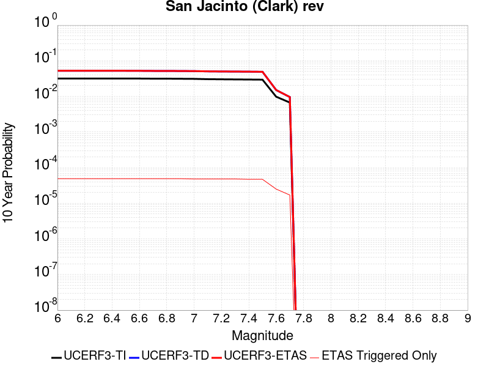 |

| Magnitude | 1 wk TI Prob | 1 wk TD Prob | 1 wk ETAS Prob | 1 wk ETAS/TD Gain | 1 wk ETAS Triggered Only | 1 mo TI Prob | 1 mo TD Prob | 1 mo ETAS Prob | 1 mo ETAS/TD Gain | 1 mo ETAS Triggered Only | 1 yr TI Prob | 1 yr TD Prob | 1 yr ETAS Prob | 1 yr ETAS/TD Gain | 1 yr ETAS Triggered Only | 10 yr TI Prob | 10 yr TD Prob | 10 yr ETAS Prob | 10 yr ETAS/TD Gain | 10 yr ETAS Triggered Only |
|-----|-----|-----|-----|-----|-----|-----|-----|-----|-----|-----|-----|-----|-----|-----|-----|-----|-----|-----|-----|-----|
| 6.0 | 6.1857165E-5 | 9.865906E-5 | 1.4376467E-4 | 1.4571868 | 4.5110068E-5 | 2.650752E-4 | 4.227864E-4 | 4.678774E-4 | 1.1066519 | 4.5110068E-5 | 0.0032225149 | 0.0051406594 | 0.0051855375 | 1.00873 | 4.5110068E-5 | 0.031761836 | 0.05230213 | 0.052387632 | 1.0016347 | 9.0220135E-5 |
| 6.1 | 6.1857165E-5 | 9.865906E-5 | 1.4376467E-4 | 1.4571868 | 4.5110068E-5 | 2.650752E-4 | 4.227864E-4 | 4.678774E-4 | 1.1066519 | 4.5110068E-5 | 0.0032225149 | 0.0051406594 | 0.0051855375 | 1.00873 | 4.5110068E-5 | 0.031761836 | 0.05230213 | 0.052387632 | 1.0016347 | 9.0220135E-5 |
| 6.2 | 6.1857165E-5 | 9.865906E-5 | 1.4376467E-4 | 1.4571868 | 4.5110068E-5 | 2.650752E-4 | 4.227864E-4 | 4.678774E-4 | 1.1066519 | 4.5110068E-5 | 0.0032225149 | 0.0051406594 | 0.0051855375 | 1.00873 | 4.5110068E-5 | 0.031761836 | 0.05230213 | 0.052387632 | 1.0016347 | 9.0220135E-5 |
| 6.3 | 6.1857165E-5 | 9.865906E-5 | 1.4376467E-4 | 1.4571868 | 4.5110068E-5 | 2.650752E-4 | 4.227864E-4 | 4.678774E-4 | 1.1066519 | 4.5110068E-5 | 0.0032225149 | 0.0051406594 | 0.0051855375 | 1.00873 | 4.5110068E-5 | 0.031761836 | 0.05230213 | 0.052387632 | 1.0016347 | 9.0220135E-5 |
| 6.4 | 6.1857165E-5 | 9.865906E-5 | 1.4376467E-4 | 1.4571868 | 4.5110068E-5 | 2.650752E-4 | 4.227864E-4 | 4.678774E-4 | 1.1066519 | 4.5110068E-5 | 0.0032225149 | 0.0051406594 | 0.0051855375 | 1.00873 | 4.5110068E-5 | 0.031761836 | 0.05230213 | 0.052387632 | 1.0016347 | 9.0220135E-5 |
| 6.5 | 6.1857165E-5 | 9.865906E-5 | 1.4376467E-4 | 1.4571868 | 4.5110068E-5 | 2.650752E-4 | 4.227864E-4 | 4.678774E-4 | 1.1066519 | 4.5110068E-5 | 0.0032225149 | 0.0051406594 | 0.0051855375 | 1.00873 | 4.5110068E-5 | 0.031761836 | 0.05230213 | 0.052387632 | 1.0016347 | 9.0220135E-5 |
| 6.6 | 6.1629326E-5 | 9.831641E-5 | 1.4342205E-4 | 1.4587803 | 4.5110068E-5 | 2.6409896E-4 | 4.2131837E-4 | 4.6640943E-4 | 1.1070237 | 4.5110068E-5 | 0.0032106643 | 0.00512287 | 0.0051677492 | 1.0087606 | 4.5110068E-5 | 0.031646714 | 0.052133482 | 0.052219 | 1.0016403 | 9.0220135E-5 |
| 6.7 | 6.116108E-5 | 9.7617616E-5 | 1.4272328E-4 | 1.4620649 | 4.5110068E-5 | 2.6209257E-4 | 4.183245E-4 | 4.634157E-4 | 1.10779 | 4.5110068E-5 | 0.0031863083 | 0.0050865905 | 0.005131471 | 1.0088233 | 4.5110068E-5 | 0.031410076 | 0.051788114 | 0.05187366 | 1.0016519 | 9.0220135E-5 |
| 6.8 | 6.110044E-5 | 9.753308E-5 | 1.4263875E-4 | 1.4624653 | 4.5110068E-5 | 2.6183276E-4 | 4.1796232E-4 | 4.6305353E-4 | 1.1078835 | 4.5110068E-5 | 0.0031831542 | 0.0050822017 | 0.0051270826 | 1.008831 | 4.5110068E-5 | 0.03137943 | 0.051745888 | 0.05183144 | 1.0016533 | 9.0220135E-5 |
| 6.9 | 6.0730574E-5 | 9.694897E-5 | 1.4205466E-4 | 1.4652519 | 4.5110068E-5 | 2.6024794E-4 | 4.154598E-4 | 4.6055112E-4 | 1.1085335 | 4.5110068E-5 | 0.0031639151 | 0.005051875 | 0.0050967573 | 1.0088843 | 4.5110068E-5 | 0.031192465 | 0.051456194 | 0.05154177 | 1.0016631 | 9.0220135E-5 |
| 7.0 | 6.0346E-5 | 9.636309E-5 | 1.414688E-4 | 1.4680809 | 4.5110068E-5 | 2.5860008E-4 | 4.1294965E-4 | 4.580411E-4 | 1.1091936 | 4.5110068E-5 | 0.0031439106 | 0.005021455 | 0.005066339 | 1.0089383 | 4.5110068E-5 | 0.030998027 | 0.051163334 | 0.051248938 | 1.0016731 | 9.0220135E-5 |
| 7.1 | 5.9163158E-5 | 9.465252E-5 | 1.3975833E-4 | 1.4765409 | 4.5110068E-5 | 2.5353173E-4 | 4.0562096E-4 | 4.5071272E-4 | 1.1111673 | 4.5110068E-5 | 0.0030823802 | 0.0049326345 | 0.004977522 | 1.0091001 | 4.5110068E-5 | 0.030399747 | 0.050306328 | 0.05039201 | 1.0017031 | 9.0220135E-5 |
| 7.2 | 5.863685E-5 | 9.390979E-5 | 1.3901561E-4 | 1.4803102 | 4.5110068E-5 | 2.512766E-4 | 4.0243877E-4 | 4.475307E-4 | 1.1120466 | 4.5110068E-5 | 0.0030550007 | 0.004894066 | 0.0049389554 | 1.0091722 | 4.5110068E-5 | 0.030133424 | 0.04993242 | 0.050018135 | 1.0017166 | 9.0220135E-5 |
| 7.3 | 5.8209655E-5 | 9.342446E-5 | 1.3853032E-4 | 1.4828056 | 4.5110068E-5 | 2.4944608E-4 | 4.0035948E-4 | 4.454515E-4 | 1.1126288 | 4.5110068E-5 | 0.0030327768 | 0.004868864 | 0.0049137543 | 1.0092199 | 4.5110068E-5 | 0.0299172 | 0.049677737 | 0.04976348 | 1.0017259 | 9.0220135E-5 |
| 7.4 | 5.7813933E-5 | 9.282713E-5 | 1.3793302E-4 | 1.4859127 | 4.5110068E-5 | 2.4775046E-4 | 3.978003E-4 | 4.428924E-4 | 1.1133537 | 4.5110068E-5 | 0.0030121899 | 0.0048378445 | 0.004882736 | 1.0092793 | 4.5110068E-5 | 0.029716864 | 0.049371965 | 0.049457733 | 1.0017371 | 9.0220135E-5 |
| 7.5 | 5.731269E-5 | 9.1954265E-5 | 1.370602E-4 | 1.4905256 | 4.5110068E-5 | 2.4560269E-4 | 3.9406057E-4 | 4.3915285E-4 | 1.1144298 | 4.5110068E-5 | 0.0029861126 | 0.0047925147 | 0.004837408 | 1.0093675 | 4.5110068E-5 | 0.029463045 | 0.04892991 | 0.049015716 | 1.0017537 | 9.0220135E-5 |
| 7.6 | 1.8838993E-5 | 2.7586504E-5 | 7.269533E-5 | 2.6351774 | 4.5110068E-5 | 8.073604E-5 | 1.1822497E-4 | 1.633297E-4 | 1.3815162 | 4.5110068E-5 | 9.82518E-4 | 0.001438873 | 0.0014839182 | 1.0313059 | 4.5110068E-5 | 0.009781853 | 0.015056286 | 0.015100717 | 1.002951 | 4.5110068E-5 |
| 7.7 | 1.2895799E-5 | 1.7139906E-5 | 1.7139906E-5 | 1.0 | 0.0 | 5.526654E-5 | 7.3456744E-5 | 7.3456744E-5 | 1.0 | 0.0 | 6.726624E-4 | 8.943358E-4 | 8.943358E-4 | 1.0 | 0.0 | 0.006706299 | 0.009567577 | 0.009567577 | 1.0 | 0.0 |

## Emerson-Copper Mtn 2011
*[(top)](#table-of-contents)*

| 1 Week | 1 Month | 1 Year | 10 Year |
|-----|-----|-----|-----|
|  |  |  |  |

| Magnitude | 1 wk TI Prob | 1 wk TD Prob | 1 wk ETAS Prob | 1 wk ETAS/TD Gain | 1 wk ETAS Triggered Only | 1 mo TI Prob | 1 mo TD Prob | 1 mo ETAS Prob | 1 mo ETAS/TD Gain | 1 mo ETAS Triggered Only | 1 yr TI Prob | 1 yr TD Prob | 1 yr ETAS Prob | 1 yr ETAS/TD Gain | 1 yr ETAS Triggered Only | 10 yr TI Prob | 10 yr TD Prob | 10 yr ETAS Prob | 10 yr ETAS/TD Gain | 10 yr ETAS Triggered Only |
|-----|-----|-----|-----|-----|-----|-----|-----|-----|-----|-----|-----|-----|-----|-----|-----|-----|-----|-----|-----|-----|
| 6.0 | 1.3738761E-5 | 7.363802E-6 | 5.2473537E-5 | 7.1258755 | 4.5110068E-5 | 5.8879075E-5 | 3.1558855E-5 | 1.21776146E-4 | 3.8586998 | 9.0220135E-5 | 7.166169E-4 | 3.841763E-4 | 4.7436176E-4 | 1.2347503 | 9.0220135E-5 | 0.007143104 | 0.0038365931 | 0.003926467 | 1.0234255 | 9.0220135E-5 |
| 6.1 | 1.3738761E-5 | 7.363802E-6 | 5.2473537E-5 | 7.1258755 | 4.5110068E-5 | 5.8879075E-5 | 3.1558855E-5 | 1.21776146E-4 | 3.8586998 | 9.0220135E-5 | 7.166169E-4 | 3.841763E-4 | 4.7436176E-4 | 1.2347503 | 9.0220135E-5 | 0.007143104 | 0.0038365931 | 0.003926467 | 1.0234255 | 9.0220135E-5 |
| 6.2 | 1.3738761E-5 | 7.363802E-6 | 5.2473537E-5 | 7.1258755 | 4.5110068E-5 | 5.8879075E-5 | 3.1558855E-5 | 1.21776146E-4 | 3.8586998 | 9.0220135E-5 | 7.166169E-4 | 3.841763E-4 | 4.7436176E-4 | 1.2347503 | 9.0220135E-5 | 0.007143104 | 0.0038365931 | 0.003926467 | 1.0234255 | 9.0220135E-5 |
| 6.3 | 1.3738761E-5 | 7.363802E-6 | 5.2473537E-5 | 7.1258755 | 4.5110068E-5 | 5.8879075E-5 | 3.1558855E-5 | 1.21776146E-4 | 3.8586998 | 9.0220135E-5 | 7.166169E-4 | 3.841763E-4 | 4.7436176E-4 | 1.2347503 | 9.0220135E-5 | 0.007143104 | 0.0038365931 | 0.003926467 | 1.0234255 | 9.0220135E-5 |
| 6.4 | 1.3738761E-5 | 7.363802E-6 | 5.2473537E-5 | 7.1258755 | 4.5110068E-5 | 5.8879075E-5 | 3.1558855E-5 | 1.21776146E-4 | 3.8586998 | 9.0220135E-5 | 7.166169E-4 | 3.841763E-4 | 4.7436176E-4 | 1.2347503 | 9.0220135E-5 | 0.007143104 | 0.0038365931 | 0.003926467 | 1.0234255 | 9.0220135E-5 |
| 6.5 | 1.3738761E-5 | 7.363802E-6 | 5.2473537E-5 | 7.1258755 | 4.5110068E-5 | 5.8879075E-5 | 3.1558855E-5 | 1.21776146E-4 | 3.8586998 | 9.0220135E-5 | 7.166169E-4 | 3.841763E-4 | 4.7436176E-4 | 1.2347503 | 9.0220135E-5 | 0.007143104 | 0.0038365931 | 0.003926467 | 1.0234255 | 9.0220135E-5 |
| 6.6 | 1.2946993E-5 | 6.644407E-6 | 6.644407E-6 | 1.0 | 0.0 | 5.5485933E-5 | 2.8475804E-5 | 7.358459E-5 | 2.5841093 | 4.5110068E-5 | 6.7533186E-4 | 3.4665258E-4 | 3.91747E-4 | 1.1300853 | 4.5110068E-5 | 0.006732832 | 0.0034625726 | 0.0035075264 | 1.0129828 | 4.5110068E-5 |
| 6.7 | 1.1127743E-5 | 5.301015E-6 | 5.301015E-6 | 1.0 | 0.0 | 4.7689457E-5 | 2.2718517E-5 | 6.782756E-5 | 2.9855628 | 4.5110068E-5 | 5.8046443E-4 | 2.765771E-4 | 3.216747E-4 | 1.1630561 | 4.5110068E-5 | 0.005789506 | 0.00276373 | 0.0028087154 | 1.0162771 | 4.5110068E-5 |
| 6.8 | 9.893959E-6 | 4.385705E-6 | 4.385705E-6 | 1.0 | 0.0 | 4.2401993E-5 | 1.8795821E-5 | 6.390504E-5 | 3.39996 | 4.5110068E-5 | 5.16122E-4 | 2.2882903E-4 | 2.7392877E-4 | 1.1970893 | 4.5110068E-5 | 0.005149249 | 0.0022873012 | 0.0023323083 | 1.0196768 | 4.5110068E-5 |
| 6.9 | 8.432605E-6 | 3.3001859E-6 | 3.3001859E-6 | 1.0 | 0.0 | 3.6139234E-5 | 1.4143652E-5 | 5.925308E-5 | 4.1893764 | 4.5110068E-5 | 4.3990635E-4 | 1.7219881E-4 | 2.1730112E-4 | 1.26192 | 4.5110068E-5 | 0.0043903654 | 0.0017219725 | 0.001767005 | 1.0261517 | 4.5110068E-5 |
| 7.0 | 8.181617E-6 | 3.2873893E-6 | 3.2873893E-6 | 1.0 | 0.0 | 3.5063604E-5 | 1.40888105E-5 | 5.9198243E-5 | 4.2017913 | 4.5110068E-5 | 4.2681574E-4 | 1.7153122E-4 | 2.1663355E-4 | 1.2629395 | 4.5110068E-5 | 0.004259969 | 0.0017153069 | 0.0017603396 | 1.0262535 | 4.5110068E-5 |
| 7.1 | 3.1700695E-6 | 5.4303326E-9 | 5.4303326E-9 | 1.0 | 0.0 | 1.3585942E-5 | 2.3272854E-8 | 2.3272854E-8 | 1.0 | 0.0 | 1.6539628E-4 | 2.83347E-7 | 2.83347E-7 | 1.0 | 0.0 | 0.0016527324 | 2.833469E-6 | 2.833469E-6 | 1.0 | 0.0 |
| 7.2 | 2.8879267E-6 | 9.331039E-10 | 9.331039E-10 | 1.0 | 0.0 | 1.237677E-5 | 3.999017E-9 | 3.999017E-9 | 1.0 | 0.0 | 1.5067676E-4 | 4.868803E-8 | 4.868803E-8 | 1.0 | 0.0 | 0.0015057464 | 4.868803E-7 | 4.868803E-7 | 1.0 | 0.0 |
| 7.3 | 2.4973094E-6 | 8.4248597E-10 | 8.4248597E-10 | 1.0 | 0.0 | 1.0702711E-5 | 3.6106542E-9 | 3.6106542E-9 | 1.0 | 0.0 | 1.3029772E-4 | 4.3959716E-8 | 4.3959716E-8 | 1.0 | 0.0 | 0.0013022134 | 4.3959716E-7 | 4.3959716E-7 | 1.0 | 0.0 |

## Verdugo
*[(top)](#table-of-contents)*

| 1 Week | 1 Month | 1 Year | 10 Year |
|-----|-----|-----|-----|
|  |  |  |  |

| Magnitude | 1 wk TI Prob | 1 wk TD Prob | 1 wk ETAS Prob | 1 wk ETAS/TD Gain | 1 wk ETAS Triggered Only | 1 mo TI Prob | 1 mo TD Prob | 1 mo ETAS Prob | 1 mo ETAS/TD Gain | 1 mo ETAS Triggered Only | 1 yr TI Prob | 1 yr TD Prob | 1 yr ETAS Prob | 1 yr ETAS/TD Gain | 1 yr ETAS Triggered Only | 10 yr TI Prob | 10 yr TD Prob | 10 yr ETAS Prob | 10 yr ETAS/TD Gain | 10 yr ETAS Triggered Only |
|-----|-----|-----|-----|-----|-----|-----|-----|-----|-----|-----|-----|-----|-----|-----|-----|-----|-----|-----|-----|-----|
| 6.0 | 9.032242E-6 | 9.607573E-6 | 5.471721E-5 | 5.6952167 | 4.5110068E-5 | 3.8709033E-5 | 4.1174942E-5 | 8.628315E-5 | 2.0955257 | 4.5110068E-5 | 4.7118057E-4 | 5.0123956E-4 | 5.46327E-4 | 1.0899519 | 4.5110068E-5 | 0.0047018277 | 0.0050059874 | 0.0050957557 | 1.0179322 | 9.0220135E-5 |
| 6.1 | 9.032242E-6 | 9.607573E-6 | 5.471721E-5 | 5.6952167 | 4.5110068E-5 | 3.8709033E-5 | 4.1174942E-5 | 8.628315E-5 | 2.0955257 | 4.5110068E-5 | 4.7118057E-4 | 5.0123956E-4 | 5.46327E-4 | 1.0899519 | 4.5110068E-5 | 0.0047018277 | 0.0050059874 | 0.0050957557 | 1.0179322 | 9.0220135E-5 |
| 6.2 | 9.032242E-6 | 9.607573E-6 | 5.471721E-5 | 5.6952167 | 4.5110068E-5 | 3.8709033E-5 | 4.1174942E-5 | 8.628315E-5 | 2.0955257 | 4.5110068E-5 | 4.7118057E-4 | 5.0123956E-4 | 5.46327E-4 | 1.0899519 | 4.5110068E-5 | 0.0047018277 | 0.0050059874 | 0.0050957557 | 1.0179322 | 9.0220135E-5 |
| 6.3 | 9.032242E-6 | 9.607573E-6 | 5.471721E-5 | 5.6952167 | 4.5110068E-5 | 3.8709033E-5 | 4.1174942E-5 | 8.628315E-5 | 2.0955257 | 4.5110068E-5 | 4.7118057E-4 | 5.0123956E-4 | 5.46327E-4 | 1.0899519 | 4.5110068E-5 | 0.0047018277 | 0.0050059874 | 0.0050957557 | 1.0179322 | 9.0220135E-5 |
| 6.4 | 9.032242E-6 | 9.607573E-6 | 5.471721E-5 | 5.6952167 | 4.5110068E-5 | 3.8709033E-5 | 4.1174942E-5 | 8.628315E-5 | 2.0955257 | 4.5110068E-5 | 4.7118057E-4 | 5.0123956E-4 | 5.46327E-4 | 1.0899519 | 4.5110068E-5 | 0.0047018277 | 0.0050059874 | 0.0050957557 | 1.0179322 | 9.0220135E-5 |
| 6.5 | 9.032242E-6 | 9.607573E-6 | 5.471721E-5 | 5.6952167 | 4.5110068E-5 | 3.8709033E-5 | 4.1174942E-5 | 8.628315E-5 | 2.0955257 | 4.5110068E-5 | 4.7118057E-4 | 5.0123956E-4 | 5.46327E-4 | 1.0899519 | 4.5110068E-5 | 0.0047018277 | 0.0050059874 | 0.0050957557 | 1.0179322 | 9.0220135E-5 |
| 6.6 | 7.857296E-6 | 8.353911E-6 | 5.3463602E-5 | 6.3998294 | 4.5110068E-5 | 3.367369E-5 | 3.580226E-5 | 8.0910715E-5 | 2.2599332 | 4.5110068E-5 | 4.0990004E-4 | 4.3585425E-4 | 4.8094467E-4 | 1.1034529 | 4.5110068E-5 | 0.0040914477 | 0.004354794 | 0.004444621 | 1.0206273 | 9.0220135E-5 |
| 6.7 | 5.667953E-6 | 6.022347E-6 | 6.022347E-6 | 1.0 | 0.0 | 2.4291001E-5 | 2.5810059E-5 | 2.5810059E-5 | 1.0 | 0.0 | 2.957028E-4 | 3.1423746E-4 | 3.1423746E-4 | 1.0 | 0.0 | 0.0029530963 | 0.0031423746 | 0.003187343 | 1.0143102 | 4.5110068E-5 |
| 6.8 | 5.667953E-6 | 6.022347E-6 | 6.022347E-6 | 1.0 | 0.0 | 2.4291001E-5 | 2.5810059E-5 | 2.5810059E-5 | 1.0 | 0.0 | 2.957028E-4 | 3.1423746E-4 | 3.1423746E-4 | 1.0 | 0.0 | 0.0029530963 | 0.0031423746 | 0.003187343 | 1.0143102 | 4.5110068E-5 |

## Elsinore (Glen Ivy) rev
*[(top)](#table-of-contents)*

| 1 Week | 1 Month | 1 Year | 10 Year |
|-----|-----|-----|-----|
|  |  |  |  |

| Magnitude | 1 wk TI Prob | 1 wk TD Prob | 1 wk ETAS Prob | 1 wk ETAS/TD Gain | 1 wk ETAS Triggered Only | 1 mo TI Prob | 1 mo TD Prob | 1 mo ETAS Prob | 1 mo ETAS/TD Gain | 1 mo ETAS Triggered Only | 1 yr TI Prob | 1 yr TD Prob | 1 yr ETAS Prob | 1 yr ETAS/TD Gain | 1 yr ETAS Triggered Only | 10 yr TI Prob | 10 yr TD Prob | 10 yr ETAS Prob | 10 yr ETAS/TD Gain | 10 yr ETAS Triggered Only |
|-----|-----|-----|-----|-----|-----|-----|-----|-----|-----|-----|-----|-----|-----|-----|-----|-----|-----|-----|-----|-----|
| 6.0 | 5.3687647E-5 | 7.371829E-5 | 1.6393178E-4 | 2.22376 | 9.0220135E-5 | 2.3006962E-4 | 3.1591902E-4 | 4.0611066E-4 | 1.2854897 | 9.0220135E-5 | 0.0027974995 | 0.0038433792 | 0.0039332528 | 1.023384 | 9.0220135E-5 | 0.02762544 | 0.03826734 | 0.038354106 | 1.0022674 | 9.0220135E-5 |
| 6.1 | 5.3687647E-5 | 7.371829E-5 | 1.6393178E-4 | 2.22376 | 9.0220135E-5 | 2.3006962E-4 | 3.1591902E-4 | 4.0611066E-4 | 1.2854897 | 9.0220135E-5 | 0.0027974995 | 0.0038433792 | 0.0039332528 | 1.023384 | 9.0220135E-5 | 0.02762544 | 0.03826734 | 0.038354106 | 1.0022674 | 9.0220135E-5 |
| 6.2 | 5.3687647E-5 | 7.371829E-5 | 1.6393178E-4 | 2.22376 | 9.0220135E-5 | 2.3006962E-4 | 3.1591902E-4 | 4.0611066E-4 | 1.2854897 | 9.0220135E-5 | 0.0027974995 | 0.0038433792 | 0.0039332528 | 1.023384 | 9.0220135E-5 | 0.02762544 | 0.03826734 | 0.038354106 | 1.0022674 | 9.0220135E-5 |
| 6.3 | 5.3687647E-5 | 7.371829E-5 | 1.6393178E-4 | 2.22376 | 9.0220135E-5 | 2.3006962E-4 | 3.1591902E-4 | 4.0611066E-4 | 1.2854897 | 9.0220135E-5 | 0.0027974995 | 0.0038433792 | 0.0039332528 | 1.023384 | 9.0220135E-5 | 0.02762544 | 0.03826734 | 0.038354106 | 1.0022674 | 9.0220135E-5 |
| 6.4 | 5.3687647E-5 | 7.371829E-5 | 1.6393178E-4 | 2.22376 | 9.0220135E-5 | 2.3006962E-4 | 3.1591902E-4 | 4.0611066E-4 | 1.2854897 | 9.0220135E-5 | 0.0027974995 | 0.0038433792 | 0.0039332528 | 1.023384 | 9.0220135E-5 | 0.02762544 | 0.03826734 | 0.038354106 | 1.0022674 | 9.0220135E-5 |
| 6.5 | 5.3687647E-5 | 7.371829E-5 | 1.6393178E-4 | 2.22376 | 9.0220135E-5 | 2.3006962E-4 | 3.1591902E-4 | 4.0611066E-4 | 1.2854897 | 9.0220135E-5 | 0.0027974995 | 0.0038433792 | 0.0039332528 | 1.023384 | 9.0220135E-5 | 0.02762544 | 0.03826734 | 0.038354106 | 1.0022674 | 9.0220135E-5 |
| 6.6 | 5.366434E-5 | 7.368723E-5 | 1.6390072E-4 | 2.2242758 | 9.0220135E-5 | 2.2996974E-4 | 3.157859E-4 | 4.0597754E-4 | 1.2856101 | 9.0220135E-5 | 0.0027962867 | 0.0038417643 | 0.003931638 | 1.0233939 | 9.0220135E-5 | 0.027613612 | 0.03825175 | 0.03833852 | 1.0022683 | 9.0220135E-5 |
| 6.7 | 5.3605272E-5 | 7.360545E-5 | 1.6381894E-4 | 2.225636 | 9.0220135E-5 | 2.2971665E-4 | 3.1543552E-4 | 4.056272E-4 | 1.2859274 | 9.0220135E-5 | 0.0027932131 | 0.0038375156 | 0.0039273896 | 1.0234199 | 9.0220135E-5 | 0.027583642 | 0.038210876 | 0.03829765 | 1.0022709 | 9.0220135E-5 |
| 6.8 | 5.3532647E-5 | 7.3514246E-5 | 1.6372775E-4 | 2.2271566 | 9.0220135E-5 | 2.2940546E-4 | 3.1504474E-4 | 4.0523647E-4 | 1.2862822 | 9.0220135E-5 | 0.002789434 | 0.0038327747 | 0.003922649 | 1.023449 | 9.0220135E-5 | 0.02754679 | 0.038164973 | 0.03825175 | 1.0022737 | 9.0220135E-5 |
| 6.9 | 1.7045348E-5 | 1.8678082E-5 | 6.378731E-5 | 3.4150887 | 4.5110068E-5 | 7.304944E-5 | 8.004709E-5 | 1.2515354E-4 | 1.5634991 | 4.5110068E-5 | 8.8901405E-4 | 9.74247E-4 | 0.0010193131 | 1.0462574 | 4.5110068E-5 | 0.008854659 | 0.009768393 | 0.009813062 | 1.0045729 | 4.5110068E-5 |
| 7.0 | 1.6940774E-5 | 1.8528288E-5 | 6.363752E-5 | 3.4346142 | 4.5110068E-5 | 7.2601295E-5 | 7.940515E-5 | 1.2451164E-4 | 1.5680549 | 4.5110068E-5 | 8.835623E-4 | 9.6643844E-4 | 0.0010115049 | 1.0466315 | 4.5110068E-5 | 0.0088005755 | 0.00969088 | 0.009735553 | 1.0046098 | 4.5110068E-5 |
| 7.1 | 1.6789645E-5 | 1.8323519E-5 | 6.343276E-5 | 3.4618218 | 4.5110068E-5 | 7.195364E-5 | 7.852762E-5 | 1.2363415E-4 | 1.5744033 | 4.5110068E-5 | 8.7568344E-4 | 9.55764E-4 | 0.0010008309 | 1.0471528 | 4.5110068E-5 | 0.008722408 | 0.009584869 | 0.009629547 | 1.0046613 | 4.5110068E-5 |
| 7.2 | 1.5933345E-5 | 1.7110096E-5 | 6.221939E-5 | 3.6364138 | 4.5110068E-5 | 6.828398E-5 | 7.332754E-5 | 1.184343E-4 | 1.6151408 | 4.5110068E-5 | 8.310403E-4 | 8.925052E-4 | 9.37575E-4 | 1.0504981 | 4.5110068E-5 | 0.008279393 | 0.0089570135 | 0.00900172 | 1.0049912 | 4.5110068E-5 |
| 7.3 | 7.1186646E-6 | 8.762552E-6 | 8.762552E-6 | 1.0 | 0.0 | 3.0508205E-5 | 3.7553385E-5 | 3.7553385E-5 | 1.0 | 0.0 | 3.713741E-4 | 4.5714018E-4 | 4.5714018E-4 | 1.0 | 0.0 | 0.0037075407 | 0.004571716 | 0.004571716 | 1.0 | 0.0 |
| 7.4 | 6.937813E-6 | 8.529489E-6 | 8.529489E-6 | 1.0 | 0.0 | 2.9733144E-5 | 3.6554575E-5 | 3.6554575E-5 | 1.0 | 0.0 | 3.619409E-4 | 4.4498467E-4 | 4.4498467E-4 | 1.0 | 0.0 | 0.0036135197 | 0.0044503105 | 0.0044503105 | 1.0 | 0.0 |
| 7.5 | 6.22113E-6 | 7.646963E-6 | 7.646963E-6 | 1.0 | 0.0 | 2.6661715E-5 | 3.277242E-5 | 3.277242E-5 | 1.0 | 0.0 | 3.2455803E-4 | 3.989543E-4 | 3.989543E-4 | 1.0 | 0.0 | 0.003240844 | 0.0039905123 | 0.0039905123 | 1.0 | 0.0 |
| 7.6 | 5.9726967E-6 | 7.281061E-6 | 7.281061E-6 | 1.0 | 0.0 | 2.559702E-5 | 3.1204305E-5 | 3.1204305E-5 | 1.0 | 0.0 | 3.1159917E-4 | 3.798693E-4 | 3.798693E-4 | 1.0 | 0.0 | 0.003111626 | 0.0038002636 | 0.0038002636 | 1.0 | 0.0 |
| 7.7 | 4.463199E-6 | 5.214875E-6 | 5.214875E-6 | 1.0 | 0.0 | 1.9127854E-5 | 2.2349386E-5 | 2.2349386E-5 | 1.0 | 0.0 | 2.3285674E-4 | 2.7209E-4 | 2.7209E-4 | 1.0 | 0.0 | 0.0023261288 | 0.0027239968 | 0.0027239968 | 1.0 | 0.0 |
| 7.8 | 2.1601753E-7 | 2.7489222E-7 | 2.7489222E-7 | 1.0 | 0.0 | 9.257891E-7 | 1.1781094E-6 | 1.1781094E-6 | 1.0 | 0.0 | 1.1271423E-5 | 1.4343483E-5 | 1.4343483E-5 | 1.0 | 0.0 | 1.1270852E-4 | 1.435847E-4 | 1.435847E-4 | 1.0 | 0.0 |

## Elsinore (Stepovers Combined)
*[(top)](#table-of-contents)*

| 1 Week | 1 Month | 1 Year | 10 Year |
|-----|-----|-----|-----|
|  |  |  |  |

| Magnitude | 1 wk TI Prob | 1 wk TD Prob | 1 wk ETAS Prob | 1 wk ETAS/TD Gain | 1 wk ETAS Triggered Only | 1 mo TI Prob | 1 mo TD Prob | 1 mo ETAS Prob | 1 mo ETAS/TD Gain | 1 mo ETAS Triggered Only | 1 yr TI Prob | 1 yr TD Prob | 1 yr ETAS Prob | 1 yr ETAS/TD Gain | 1 yr ETAS Triggered Only | 10 yr TI Prob | 10 yr TD Prob | 10 yr ETAS Prob | 10 yr ETAS/TD Gain | 10 yr ETAS Triggered Only |
|-----|-----|-----|-----|-----|-----|-----|-----|-----|-----|-----|-----|-----|-----|-----|-----|-----|-----|-----|-----|-----|
| 6.0 | 6.646544E-5 | 8.957985E-5 | 1.7979191E-4 | 2.0070574 | 9.0220135E-5 | 2.8482082E-4 | 3.8387964E-4 | 4.7406513E-4 | 1.2349317 | 9.0220135E-5 | 0.00346218 | 0.0046677003 | 0.0047574993 | 1.0192384 | 9.0220135E-5 | 0.03408735 | 0.046230808 | 0.046316855 | 1.0018613 | 9.0220135E-5 |
| 6.1 | 6.646544E-5 | 8.957985E-5 | 1.7979191E-4 | 2.0070574 | 9.0220135E-5 | 2.8482082E-4 | 3.8387964E-4 | 4.7406513E-4 | 1.2349317 | 9.0220135E-5 | 0.00346218 | 0.0046677003 | 0.0047574993 | 1.0192384 | 9.0220135E-5 | 0.03408735 | 0.046230808 | 0.046316855 | 1.0018613 | 9.0220135E-5 |
| 6.2 | 6.646544E-5 | 8.957985E-5 | 1.7979191E-4 | 2.0070574 | 9.0220135E-5 | 2.8482082E-4 | 3.8387964E-4 | 4.7406513E-4 | 1.2349317 | 9.0220135E-5 | 0.00346218 | 0.0046677003 | 0.0047574993 | 1.0192384 | 9.0220135E-5 | 0.03408735 | 0.046230808 | 0.046316855 | 1.0018613 | 9.0220135E-5 |
| 6.3 | 6.646544E-5 | 8.957985E-5 | 1.7979191E-4 | 2.0070574 | 9.0220135E-5 | 2.8482082E-4 | 3.8387964E-4 | 4.7406513E-4 | 1.2349317 | 9.0220135E-5 | 0.00346218 | 0.0046677003 | 0.0047574993 | 1.0192384 | 9.0220135E-5 | 0.03408735 | 0.046230808 | 0.046316855 | 1.0018613 | 9.0220135E-5 |
| 6.4 | 6.646544E-5 | 8.957985E-5 | 1.7979191E-4 | 2.0070574 | 9.0220135E-5 | 2.8482082E-4 | 3.8387964E-4 | 4.7406513E-4 | 1.2349317 | 9.0220135E-5 | 0.00346218 | 0.0046677003 | 0.0047574993 | 1.0192384 | 9.0220135E-5 | 0.03408735 | 0.046230808 | 0.046316855 | 1.0018613 | 9.0220135E-5 |
| 6.5 | 6.646544E-5 | 8.957985E-5 | 1.7979191E-4 | 2.0070574 | 9.0220135E-5 | 2.8482082E-4 | 3.8387964E-4 | 4.7406513E-4 | 1.2349317 | 9.0220135E-5 | 0.00346218 | 0.0046677003 | 0.0047574993 | 1.0192384 | 9.0220135E-5 | 0.03408735 | 0.046230808 | 0.046316855 | 1.0018613 | 9.0220135E-5 |
| 6.6 | 6.646544E-5 | 8.957985E-5 | 1.7979191E-4 | 2.0070574 | 9.0220135E-5 | 2.8482082E-4 | 3.8387964E-4 | 4.7406513E-4 | 1.2349317 | 9.0220135E-5 | 0.00346218 | 0.0046677003 | 0.0047574993 | 1.0192384 | 9.0220135E-5 | 0.03408735 | 0.046230808 | 0.046316855 | 1.0018613 | 9.0220135E-5 |
| 6.7 | 6.642995E-5 | 8.952384E-5 | 1.797359E-4 | 2.0076876 | 9.0220135E-5 | 2.8466873E-4 | 3.8363968E-4 | 4.738252E-4 | 1.2350787 | 9.0220135E-5 | 0.0034603344 | 0.0046647936 | 0.0047545927 | 1.0192504 | 9.0220135E-5 | 0.03406946 | 0.046203177 | 0.046289228 | 1.0018624 | 9.0220135E-5 |
| 6.8 | 6.636925E-5 | 8.943652E-5 | 1.7964859E-4 | 2.0086715 | 9.0220135E-5 | 2.8440863E-4 | 3.8326555E-4 | 4.734511E-4 | 1.2353083 | 9.0220135E-5 | 0.0034571777 | 0.004660258 | 0.0047500576 | 1.0192692 | 9.0220135E-5 | 0.034038864 | 0.04615963 | 0.046245683 | 1.0018643 | 9.0220135E-5 |
| 6.9 | 2.99202E-5 | 3.4639877E-5 | 7.974838E-5 | 2.3022132 | 4.5110068E-5 | 1.2822312E-4 | 1.4844954E-4 | 1.9355291E-4 | 1.3038297 | 4.5110068E-5 | 0.0015599986 | 0.001806118 | 0.0018511466 | 1.0249312 | 4.5110068E-5 | 0.015490928 | 0.018018924 | 0.018063221 | 1.0024583 | 4.5110068E-5 |
| 7.0 | 2.9867753E-5 | 3.4571654E-5 | 7.968016E-5 | 2.304783 | 4.5110068E-5 | 1.2799838E-4 | 1.4815718E-4 | 1.9326058E-4 | 1.3044293 | 4.5110068E-5 | 0.0015572662 | 0.0018025645 | 0.0018475932 | 1.0249804 | 4.5110068E-5 | 0.0154639855 | 0.017983891 | 0.01802819 | 1.0024632 | 4.5110068E-5 |
| 7.1 | 2.2490323E-5 | 2.6387466E-5 | 7.1496346E-5 | 2.7094812 | 4.5110068E-5 | 9.638354E-5 | 1.1308515E-4 | 1.5819012E-4 | 1.3988584 | 4.5110068E-5 | 0.0011728378 | 0.0013761043 | 0.0014211523 | 1.032736 | 4.5110068E-5 | 0.011666672 | 0.013749547 | 0.0137940375 | 1.0032357 | 4.5110068E-5 |
| 7.2 | 2.1634029E-5 | 2.517618E-5 | 7.028511E-5 | 2.7917306 | 4.5110068E-5 | 9.271397E-5 | 1.0789436E-4 | 1.5299956E-4 | 1.4180497 | 4.5110068E-5 | 0.001128208 | 0.001312983 | 0.0013580337 | 1.0343118 | 4.5110068E-5 | 0.011224974 | 0.013125413 | 0.013169931 | 1.0033917 | 4.5110068E-5 |
| 7.3 | 1.2803008E-5 | 1.6803417E-5 | 1.6803417E-5 | 1.0 | 0.0 | 5.486888E-5 | 7.2013085E-5 | 7.2013085E-5 | 1.0 | 0.0 | 6.678239E-4 | 8.76483E-4 | 8.76483E-4 | 1.0 | 0.0 | 0.006658205 | 0.008745466 | 0.008745466 | 1.0 | 0.0 |
| 7.4 | 1.2585987E-5 | 1.6510478E-5 | 1.6510478E-5 | 1.0 | 0.0 | 5.393883E-5 | 7.07577E-5 | 7.07577E-5 | 1.0 | 0.0 | 6.565074E-4 | 8.612108E-4 | 8.612108E-4 | 1.0 | 0.0 | 0.0065457127 | 0.008593576 | 0.008593576 | 1.0 | 0.0 |
| 7.5 | 1.1869309E-5 | 1.5627958E-5 | 1.5627958E-5 | 1.0 | 0.0 | 5.0867475E-5 | 6.697567E-5 | 6.697567E-5 | 1.0 | 0.0 | 6.191355E-4 | 8.151996E-4 | 8.151996E-4 | 1.0 | 0.0 | 0.0061741336 | 0.008135691 | 0.008135691 | 1.0 | 0.0 |
| 7.6 | 1.0456552E-5 | 1.3574289E-5 | 1.3574289E-5 | 1.0 | 0.0 | 4.4813027E-5 | 5.817464E-5 | 5.817464E-5 | 1.0 | 0.0 | 5.45462E-4 | 7.081186E-4 | 7.081186E-4 | 1.0 | 0.0 | 0.0054412507 | 0.0070718653 | 0.0070718653 | 1.0 | 0.0 |
| 7.7 | 4.463199E-6 | 5.214875E-6 | 5.214875E-6 | 1.0 | 0.0 | 1.9127854E-5 | 2.2349386E-5 | 2.2349386E-5 | 1.0 | 0.0 | 2.3285674E-4 | 2.7209E-4 | 2.7209E-4 | 1.0 | 0.0 | 0.0023261288 | 0.0027239968 | 0.0027239968 | 1.0 | 0.0 |
| 7.8 | 2.1601753E-7 | 2.7489222E-7 | 2.7489222E-7 | 1.0 | 0.0 | 9.257891E-7 | 1.1781094E-6 | 1.1781094E-6 | 1.0 | 0.0 | 1.1271423E-5 | 1.4343483E-5 | 1.4343483E-5 | 1.0 | 0.0 | 1.1270852E-4 | 1.435847E-4 | 1.435847E-4 | 1.0 | 0.0 |

## San Gregorio (North) 2011 CFM
*[(top)](#table-of-contents)*

| 1 Week | 1 Month | 1 Year | 10 Year |
|-----|-----|-----|-----|
|  |  | 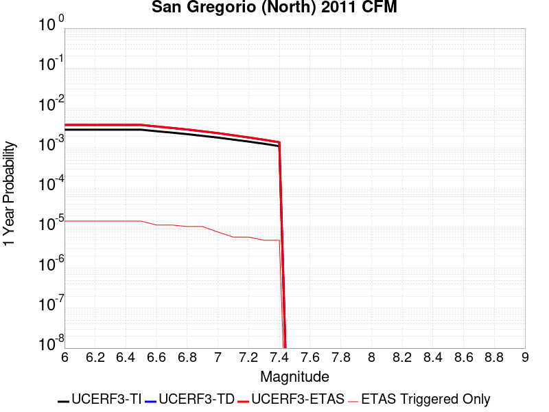 |  |

| Magnitude | 1 wk TI Prob | 1 wk TD Prob | 1 wk ETAS Prob | 1 wk ETAS/TD Gain | 1 wk ETAS Triggered Only | 1 mo TI Prob | 1 mo TD Prob | 1 mo ETAS Prob | 1 mo ETAS/TD Gain | 1 mo ETAS Triggered Only | 1 yr TI Prob | 1 yr TD Prob | 1 yr ETAS Prob | 1 yr ETAS/TD Gain | 1 yr ETAS Triggered Only | 10 yr TI Prob | 10 yr TD Prob | 10 yr ETAS Prob | 10 yr ETAS/TD Gain | 10 yr ETAS Triggered Only |
|-----|-----|-----|-----|-----|-----|-----|-----|-----|-----|-----|-----|-----|-----|-----|-----|-----|-----|-----|-----|-----|
| 6.0 | 5.5588036E-5 | 7.309379E-5 | 1.1820056E-4 | 1.6171081 | 4.5110068E-5 | 2.3821268E-4 | 3.1322511E-4 | 4.03417E-4 | 1.2879459 | 9.0220135E-5 | 0.0028963822 | 0.0038075363 | 0.003897413 | 1.0236049 | 9.0220135E-5 | 0.028589217 | 0.037540782 | 0.037627615 | 1.002313 | 9.0220135E-5 |
| 6.1 | 5.5588036E-5 | 7.309379E-5 | 1.1820056E-4 | 1.6171081 | 4.5110068E-5 | 2.3821268E-4 | 3.1322511E-4 | 4.03417E-4 | 1.2879459 | 9.0220135E-5 | 0.0028963822 | 0.0038075363 | 0.003897413 | 1.0236049 | 9.0220135E-5 | 0.028589217 | 0.037540782 | 0.037627615 | 1.002313 | 9.0220135E-5 |
| 6.2 | 5.5588036E-5 | 7.309379E-5 | 1.1820056E-4 | 1.6171081 | 4.5110068E-5 | 2.3821268E-4 | 3.1322511E-4 | 4.03417E-4 | 1.2879459 | 9.0220135E-5 | 0.0028963822 | 0.0038075363 | 0.003897413 | 1.0236049 | 9.0220135E-5 | 0.028589217 | 0.037540782 | 0.037627615 | 1.002313 | 9.0220135E-5 |
| 6.3 | 5.5588036E-5 | 7.309379E-5 | 1.1820056E-4 | 1.6171081 | 4.5110068E-5 | 2.3821268E-4 | 3.1322511E-4 | 4.03417E-4 | 1.2879459 | 9.0220135E-5 | 0.0028963822 | 0.0038075363 | 0.003897413 | 1.0236049 | 9.0220135E-5 | 0.028589217 | 0.037540782 | 0.037627615 | 1.002313 | 9.0220135E-5 |
| 6.4 | 5.5588036E-5 | 7.309379E-5 | 1.1820056E-4 | 1.6171081 | 4.5110068E-5 | 2.3821268E-4 | 3.1322511E-4 | 4.03417E-4 | 1.2879459 | 9.0220135E-5 | 0.0028963822 | 0.0038075363 | 0.003897413 | 1.0236049 | 9.0220135E-5 | 0.028589217 | 0.037540782 | 0.037627615 | 1.002313 | 9.0220135E-5 |
| 6.5 | 5.5588036E-5 | 7.309379E-5 | 1.1820056E-4 | 1.6171081 | 4.5110068E-5 | 2.3821268E-4 | 3.1322511E-4 | 4.03417E-4 | 1.2879459 | 9.0220135E-5 | 0.0028963822 | 0.0038075363 | 0.003897413 | 1.0236049 | 9.0220135E-5 | 0.028589217 | 0.037540782 | 0.037627615 | 1.002313 | 9.0220135E-5 |
| 6.6 | 5.0958548E-5 | 6.682393E-5 | 1.1193098E-4 | 1.6750135 | 4.5110068E-5 | 2.183755E-4 | 2.863609E-4 | 3.765552E-4 | 1.3149673 | 9.0220135E-5 | 0.00265548 | 0.0034816042 | 0.0035715103 | 1.0258231 | 9.0220135E-5 | 0.026239716 | 0.034387864 | 0.03447498 | 1.0025334 | 9.0220135E-5 |
| 6.7 | 4.7004516E-5 | 6.144922E-5 | 1.06556516E-4 | 1.7340581 | 4.5110068E-5 | 2.0143238E-4 | 2.6333152E-4 | 3.535279E-4 | 1.3425202 | 9.0220135E-5 | 0.0024496808 | 0.0032021217 | 0.0032920528 | 1.0280849 | 9.0220135E-5 | 0.024228523 | 0.0316763 | 0.03176366 | 1.002758 | 9.0220135E-5 |
| 6.8 | 4.3033368E-5 | 5.6114783E-5 | 1.0122232E-4 | 1.8038441 | 4.5110068E-5 | 1.8441568E-4 | 2.4047414E-4 | 3.3067257E-4 | 1.3750858 | 9.0220135E-5 | 0.0022429486 | 0.0029246213 | 0.0030145776 | 1.0307583 | 9.0220135E-5 | 0.02220445 | 0.028973768 | 0.029061373 | 1.0030236 | 9.0220135E-5 |
| 6.9 | 3.8965114E-5 | 5.0579423E-5 | 9.568721E-5 | 1.8918209 | 4.5110068E-5 | 1.6698265E-4 | 2.1675539E-4 | 3.0695598E-4 | 1.41614 | 9.0220135E-5 | 0.002031118 | 0.0026365893 | 0.0027265716 | 1.0341283 | 9.0220135E-5 | 0.020126536 | 0.026162632 | 0.02625049 | 1.0033582 | 9.0220135E-5 |
| 7.0 | 3.5280933E-5 | 4.5518376E-5 | 9.062639E-5 | 1.9909848 | 4.5110068E-5 | 1.5119524E-4 | 1.9506861E-4 | 2.8527115E-4 | 1.4624144 | 9.0220135E-5 | 0.0018392478 | 0.0023731652 | 0.0024631713 | 1.0379266 | 9.0220135E-5 | 0.018240994 | 0.023584368 | 0.02367246 | 1.0037352 | 9.0220135E-5 |
| 7.1 | 3.1442076E-5 | 4.0255403E-5 | 4.0255403E-5 | 1.0 | 0.0 | 1.347448E-4 | 1.7251623E-4 | 1.7251623E-4 | 1.0 | 0.0 | 0.0016392834 | 0.002099158 | 0.002099158 | 1.0 | 0.0 | 0.016272435 | 0.02089746 | 0.02089746 | 1.0 | 0.0 |
| 7.2 | 2.8039283E-5 | 3.552108E-5 | 3.552108E-5 | 1.0 | 0.0 | 1.2016282E-4 | 1.5222882E-4 | 1.5222882E-4 | 1.0 | 0.0 | 0.0014620004 | 0.00185261 | 0.00185261 | 1.0 | 0.0 | 0.0145241935 | 0.018474856 | 0.018474856 | 1.0 | 0.0 |
| 7.3 | 2.4776145E-5 | 3.1098632E-5 | 3.1098632E-5 | 1.0 | 0.0 | 1.0617916E-4 | 1.3327754E-4 | 1.3327754E-4 | 1.0 | 0.0 | 0.0012919646 | 0.0016222443 | 0.0016222443 | 1.0 | 0.0 | 0.012844792 | 0.0162039 | 0.0162039 | 1.0 | 0.0 |
| 7.4 | 2.1508438E-5 | 2.6824098E-5 | 2.6824098E-5 | 1.0 | 0.0 | 9.217577E-5 | 1.1495983E-4 | 1.1495983E-4 | 1.0 | 0.0 | 0.0011216622 | 0.0013995317 | 0.0013995317 | 1.0 | 0.0 | 0.011160175 | 0.014002349 | 0.014002349 | 1.0 | 0.0 |

## Hayward (So) 2011 CFM
*[(top)](#table-of-contents)*

| 1 Week | 1 Month | 1 Year | 10 Year |
|-----|-----|-----|-----|
|  |  |  |  |

| Magnitude | 1 wk TI Prob | 1 wk TD Prob | 1 wk ETAS Prob | 1 wk ETAS/TD Gain | 1 wk ETAS Triggered Only | 1 mo TI Prob | 1 mo TD Prob | 1 mo ETAS Prob | 1 mo ETAS/TD Gain | 1 mo ETAS Triggered Only | 1 yr TI Prob | 1 yr TD Prob | 1 yr ETAS Prob | 1 yr ETAS/TD Gain | 1 yr ETAS Triggered Only | 10 yr TI Prob | 10 yr TD Prob | 10 yr ETAS Prob | 10 yr ETAS/TD Gain | 10 yr ETAS Triggered Only |
|-----|-----|-----|-----|-----|-----|-----|-----|-----|-----|-----|-----|-----|-----|-----|-----|-----|-----|-----|-----|-----|
| 6.0 | 1.2701664E-4 | 2.8183177E-4 | 2.8183177E-4 | 1.0 | 0.0 | 5.4424343E-4 | 0.001207496 | 0.0012525517 | 1.0373132 | 4.5110068E-5 | 0.0066060508 | 0.014638459 | 0.0146829095 | 1.0030365 | 4.5110068E-5 | 0.06413091 | 0.13469909 | 0.13473812 | 1.0002898 | 4.5110068E-5 |
| 6.1 | 1.2701664E-4 | 2.8183177E-4 | 2.8183177E-4 | 1.0 | 0.0 | 5.4424343E-4 | 0.001207496 | 0.0012525517 | 1.0373132 | 4.5110068E-5 | 0.0066060508 | 0.014638459 | 0.0146829095 | 1.0030365 | 4.5110068E-5 | 0.06413091 | 0.13469909 | 0.13473812 | 1.0002898 | 4.5110068E-5 |
| 6.2 | 1.2701664E-4 | 2.8183177E-4 | 2.8183177E-4 | 1.0 | 0.0 | 5.4424343E-4 | 0.001207496 | 0.0012525517 | 1.0373132 | 4.5110068E-5 | 0.0066060508 | 0.014638459 | 0.0146829095 | 1.0030365 | 4.5110068E-5 | 0.06413091 | 0.13469909 | 0.13473812 | 1.0002898 | 4.5110068E-5 |
| 6.3 | 1.2701664E-4 | 2.8183177E-4 | 2.8183177E-4 | 1.0 | 0.0 | 5.4424343E-4 | 0.001207496 | 0.0012525517 | 1.0373132 | 4.5110068E-5 | 0.0066060508 | 0.014638459 | 0.0146829095 | 1.0030365 | 4.5110068E-5 | 0.06413091 | 0.13469909 | 0.13473812 | 1.0002898 | 4.5110068E-5 |
| 6.4 | 1.2701664E-4 | 2.8183177E-4 | 2.8183177E-4 | 1.0 | 0.0 | 5.4424343E-4 | 0.001207496 | 0.0012525517 | 1.0373132 | 4.5110068E-5 | 0.0066060508 | 0.014638459 | 0.0146829095 | 1.0030365 | 4.5110068E-5 | 0.06413091 | 0.13469909 | 0.13473812 | 1.0002898 | 4.5110068E-5 |
| 6.5 | 1.2701664E-4 | 2.8183177E-4 | 2.8183177E-4 | 1.0 | 0.0 | 5.4424343E-4 | 0.001207496 | 0.0012525517 | 1.0373132 | 4.5110068E-5 | 0.0066060508 | 0.014638459 | 0.0146829095 | 1.0030365 | 4.5110068E-5 | 0.06413091 | 0.13469909 | 0.13473812 | 1.0002898 | 4.5110068E-5 |
| 6.6 | 1.2617561E-4 | 2.8017466E-4 | 2.8017466E-4 | 1.0 | 0.0 | 5.4064055E-4 | 0.0012004005 | 0.0012454565 | 1.0375341 | 4.5110068E-5 | 0.0065624514 | 0.014553229 | 0.014597683 | 1.0030545 | 4.5110068E-5 | 0.06372008 | 0.1339794 | 0.13401847 | 1.0002916 | 4.5110068E-5 |
| 6.7 | 6.106194E-5 | 1.5483651E-4 | 1.5483651E-4 | 1.0 | 0.0 | 2.6166777E-4 | 6.6351274E-4 | 7.085928E-4 | 1.0679417 | 4.5110068E-5 | 0.0031811513 | 0.0080654435 | 0.00811019 | 1.0055479 | 4.5110068E-5 | 0.031359967 | 0.075871445 | 0.07591314 | 1.0005494 | 4.5110068E-5 |
| 6.8 | 6.005265E-5 | 1.523396E-4 | 1.523396E-4 | 1.0 | 0.0 | 2.573431E-4 | 6.528171E-4 | 6.9789775E-4 | 1.0690556 | 4.5110068E-5 | 0.0031286513 | 0.00793618 | 0.007980932 | 1.005639 | 4.5110068E-5 | 0.030849686 | 0.07472291 | 0.07476465 | 1.0005586 | 4.5110068E-5 |
| 6.9 | 5.8771016E-5 | 1.4917298E-4 | 1.4917298E-4 | 1.0 | 0.0 | 2.5185148E-4 | 6.392526E-4 | 6.843338E-4 | 1.0705218 | 4.5110068E-5 | 0.0030619805 | 0.007772221 | 0.007816981 | 1.0057589 | 4.5110068E-5 | 0.030201323 | 0.073260926 | 0.07330273 | 1.0005707 | 4.5110068E-5 |
| 7.0 | 1.1420259E-5 | 2.9975652E-5 | 2.9975652E-5 | 1.0 | 0.0 | 4.894305E-5 | 1.2846253E-4 | 1.2846253E-4 | 1.0 | 0.0 | 5.957187E-4 | 0.0015632241 | 0.0015632241 | 1.0 | 0.0 | 0.005941243 | 0.015188666 | 0.015188666 | 1.0 | 0.0 |
| 7.1 | 9.497712E-6 | 2.5505822E-5 | 2.5505822E-5 | 1.0 | 0.0 | 4.0703846E-5 | 1.0930784E-4 | 1.0930784E-4 | 1.0 | 0.0 | 4.954566E-4 | 0.0013303217 | 0.0013303217 | 1.0 | 0.0 | 0.0049435347 | 0.01294365 | 0.01294365 | 1.0 | 0.0 |
| 7.2 | 6.6138855E-6 | 1.8792352E-5 | 1.8792352E-5 | 1.0 | 0.0 | 2.8344915E-5 | 8.053787E-5 | 8.053787E-5 | 1.0 | 0.0 | 3.4504468E-4 | 9.8041E-4 | 9.8041E-4 | 1.0 | 0.0 | 0.0034450945 | 0.009560432 | 0.009560432 | 1.0 | 0.0 |
| 7.3 | 5.4382035E-6 | 1.5442325E-5 | 1.5442325E-5 | 1.0 | 0.0 | 2.3306378E-5 | 6.618139E-5 | 6.618139E-5 | 1.0 | 0.0 | 2.8371823E-4 | 8.0575846E-4 | 8.0575846E-4 | 1.0 | 0.0 | 0.0028335627 | 0.007868089 | 0.007868089 | 1.0 | 0.0 |

## Santa Rosa Island
*[(top)](#table-of-contents)*

| 1 Week | 1 Month | 1 Year | 10 Year |
|-----|-----|-----|-----|
|  |  |  |  |

| Magnitude | 1 wk TI Prob | 1 wk TD Prob | 1 wk ETAS Prob | 1 wk ETAS/TD Gain | 1 wk ETAS Triggered Only | 1 mo TI Prob | 1 mo TD Prob | 1 mo ETAS Prob | 1 mo ETAS/TD Gain | 1 mo ETAS Triggered Only | 1 yr TI Prob | 1 yr TD Prob | 1 yr ETAS Prob | 1 yr ETAS/TD Gain | 1 yr ETAS Triggered Only | 10 yr TI Prob | 10 yr TD Prob | 10 yr ETAS Prob | 10 yr ETAS/TD Gain | 10 yr ETAS Triggered Only |
|-----|-----|-----|-----|-----|-----|-----|-----|-----|-----|-----|-----|-----|-----|-----|-----|-----|-----|-----|-----|-----|
| 6.0 | 1.7608221E-5 | 1.9925783E-5 | 6.5034954E-5 | 3.2638593 | 4.5110068E-5 | 7.546163E-5 | 8.539441E-5 | 1.3050063E-4 | 1.5282104 | 4.5110068E-5 | 9.18358E-4 | 0.0010393565 | 0.0010844197 | 1.0433568 | 4.5110068E-5 | 0.009145721 | 0.010362199 | 0.010406841 | 1.0043082 | 4.5110068E-5 |
| 6.1 | 1.7608221E-5 | 1.9925783E-5 | 6.5034954E-5 | 3.2638593 | 4.5110068E-5 | 7.546163E-5 | 8.539441E-5 | 1.3050063E-4 | 1.5282104 | 4.5110068E-5 | 9.18358E-4 | 0.0010393565 | 0.0010844197 | 1.0433568 | 4.5110068E-5 | 0.009145721 | 0.010362199 | 0.010406841 | 1.0043082 | 4.5110068E-5 |
| 6.2 | 1.7608221E-5 | 1.9925783E-5 | 6.5034954E-5 | 3.2638593 | 4.5110068E-5 | 7.546163E-5 | 8.539441E-5 | 1.3050063E-4 | 1.5282104 | 4.5110068E-5 | 9.18358E-4 | 0.0010393565 | 0.0010844197 | 1.0433568 | 4.5110068E-5 | 0.009145721 | 0.010362199 | 0.010406841 | 1.0043082 | 4.5110068E-5 |
| 6.3 | 1.7608221E-5 | 1.9925783E-5 | 6.5034954E-5 | 3.2638593 | 4.5110068E-5 | 7.546163E-5 | 8.539441E-5 | 1.3050063E-4 | 1.5282104 | 4.5110068E-5 | 9.18358E-4 | 0.0010393565 | 0.0010844197 | 1.0433568 | 4.5110068E-5 | 0.009145721 | 0.010362199 | 0.010406841 | 1.0043082 | 4.5110068E-5 |
| 6.4 | 1.7608221E-5 | 1.9925783E-5 | 6.5034954E-5 | 3.2638593 | 4.5110068E-5 | 7.546163E-5 | 8.539441E-5 | 1.3050063E-4 | 1.5282104 | 4.5110068E-5 | 9.18358E-4 | 0.0010393565 | 0.0010844197 | 1.0433568 | 4.5110068E-5 | 0.009145721 | 0.010362199 | 0.010406841 | 1.0043082 | 4.5110068E-5 |
| 6.5 | 1.7608221E-5 | 1.9925783E-5 | 6.5034954E-5 | 3.2638593 | 4.5110068E-5 | 7.546163E-5 | 8.539441E-5 | 1.3050063E-4 | 1.5282104 | 4.5110068E-5 | 9.18358E-4 | 0.0010393565 | 0.0010844197 | 1.0433568 | 4.5110068E-5 | 0.009145721 | 0.010362199 | 0.010406841 | 1.0043082 | 4.5110068E-5 |
| 6.6 | 1.4172421E-5 | 1.6018337E-5 | 1.6018337E-5 | 1.0 | 0.0 | 6.0737537E-5 | 6.8649184E-5 | 6.8649184E-5 | 1.0 | 0.0 | 7.392286E-4 | 8.356556E-4 | 8.356556E-4 | 1.0 | 0.0 | 0.0073677436 | 0.008342039 | 0.008342039 | 1.0 | 0.0 |
| 6.7 | 1.1049608E-5 | 1.2472602E-5 | 1.2472602E-5 | 1.0 | 0.0 | 4.7354602E-5 | 5.3453863E-5 | 5.3453863E-5 | 1.0 | 0.0 | 5.763898E-4 | 6.507749E-4 | 6.507749E-4 | 1.0 | 0.0 | 0.0057489704 | 0.0065052104 | 0.0065052104 | 1.0 | 0.0 |
| 6.8 | 1.0274539E-5 | 1.1595605E-5 | 1.1595605E-5 | 1.0 | 0.0 | 4.4032997E-5 | 4.9695453E-5 | 4.9695453E-5 | 1.0 | 0.0 | 5.3596986E-4 | 6.050421E-4 | 6.050421E-4 | 1.0 | 0.0 | 0.00534679 | 0.0060504214 | 0.0060504214 | 1.0 | 0.0 |

## San Gregorio (South) 2011 CFM
*[(top)](#table-of-contents)*

| 1 Week | 1 Month | 1 Year | 10 Year |
|-----|-----|-----|-----|
|  |  |  |  |

| Magnitude | 1 wk TI Prob | 1 wk TD Prob | 1 wk ETAS Prob | 1 wk ETAS/TD Gain | 1 wk ETAS Triggered Only | 1 mo TI Prob | 1 mo TD Prob | 1 mo ETAS Prob | 1 mo ETAS/TD Gain | 1 mo ETAS Triggered Only | 1 yr TI Prob | 1 yr TD Prob | 1 yr ETAS Prob | 1 yr ETAS/TD Gain | 1 yr ETAS Triggered Only | 10 yr TI Prob | 10 yr TD Prob | 10 yr ETAS Prob | 10 yr ETAS/TD Gain | 10 yr ETAS Triggered Only |
|-----|-----|-----|-----|-----|-----|-----|-----|-----|-----|-----|-----|-----|-----|-----|-----|-----|-----|-----|-----|-----|
| 6.0 | 4.5472258E-5 | 5.991556E-5 | 5.991556E-5 | 1.0 | 0.0 | 1.9486654E-4 | 2.5675958E-4 | 3.018581E-4 | 1.1756448 | 4.5110068E-5 | 0.0023699186 | 0.0031223015 | 0.0031672707 | 1.0144026 | 4.5110068E-5 | 0.023448035 | 0.03088203 | 0.030925747 | 1.0014156 | 4.5110068E-5 |
| 6.1 | 4.5472258E-5 | 5.991556E-5 | 5.991556E-5 | 1.0 | 0.0 | 1.9486654E-4 | 2.5675958E-4 | 3.018581E-4 | 1.1756448 | 4.5110068E-5 | 0.0023699186 | 0.0031223015 | 0.0031672707 | 1.0144026 | 4.5110068E-5 | 0.023448035 | 0.03088203 | 0.030925747 | 1.0014156 | 4.5110068E-5 |
| 6.2 | 4.5472258E-5 | 5.991556E-5 | 5.991556E-5 | 1.0 | 0.0 | 1.9486654E-4 | 2.5675958E-4 | 3.018581E-4 | 1.1756448 | 4.5110068E-5 | 0.0023699186 | 0.0031223015 | 0.0031672707 | 1.0144026 | 4.5110068E-5 | 0.023448035 | 0.03088203 | 0.030925747 | 1.0014156 | 4.5110068E-5 |
| 6.3 | 4.5472258E-5 | 5.991556E-5 | 5.991556E-5 | 1.0 | 0.0 | 1.9486654E-4 | 2.5675958E-4 | 3.018581E-4 | 1.1756448 | 4.5110068E-5 | 0.0023699186 | 0.0031223015 | 0.0031672707 | 1.0144026 | 4.5110068E-5 | 0.023448035 | 0.03088203 | 0.030925747 | 1.0014156 | 4.5110068E-5 |
| 6.4 | 4.5472258E-5 | 5.991556E-5 | 5.991556E-5 | 1.0 | 0.0 | 1.9486654E-4 | 2.5675958E-4 | 3.018581E-4 | 1.1756448 | 4.5110068E-5 | 0.0023699186 | 0.0031223015 | 0.0031672707 | 1.0144026 | 4.5110068E-5 | 0.023448035 | 0.03088203 | 0.030925747 | 1.0014156 | 4.5110068E-5 |
| 6.5 | 4.5472258E-5 | 5.991556E-5 | 5.991556E-5 | 1.0 | 0.0 | 1.9486654E-4 | 2.5675958E-4 | 3.018581E-4 | 1.1756448 | 4.5110068E-5 | 0.0023699186 | 0.0031223015 | 0.0031672707 | 1.0144026 | 4.5110068E-5 | 0.023448035 | 0.03088203 | 0.030925747 | 1.0014156 | 4.5110068E-5 |
| 6.6 | 4.315749E-5 | 5.674213E-5 | 5.674213E-5 | 1.0 | 0.0 | 1.8494757E-4 | 2.4316214E-4 | 2.8826125E-4 | 1.1854693 | 4.5110068E-5 | 0.0022494113 | 0.002957233 | 0.0030022096 | 1.0152091 | 4.5110068E-5 | 0.02226778 | 0.02927816 | 0.02932195 | 1.0014956 | 4.5110068E-5 |
| 6.7 | 4.008459E-5 | 5.251357E-5 | 5.251357E-5 | 1.0 | 0.0 | 1.7177979E-4 | 2.250431E-4 | 2.70143E-4 | 1.2004057 | 4.5110068E-5 | 0.0020894127 | 0.002737236 | 0.0027822226 | 1.016435 | 4.5110068E-5 | 0.020698763 | 0.02713696 | 0.027180845 | 1.0016172 | 4.5110068E-5 |
| 6.8 | 3.7885424E-5 | 4.9452636E-5 | 4.9452636E-5 | 1.0 | 0.0 | 1.62356E-4 | 2.1192706E-4 | 2.5702757E-4 | 1.2128115 | 4.5110068E-5 | 0.001974892 | 0.0025779405 | 0.002622934 | 1.0174534 | 4.5110068E-5 | 0.019574333 | 0.025582204 | 0.02562616 | 1.0017183 | 4.5110068E-5 |
| 6.9 | 3.543751E-5 | 4.6004345E-5 | 4.6004345E-5 | 1.0 | 0.0 | 1.5186622E-4 | 1.97151E-4 | 2.4225218E-4 | 1.2287647 | 4.5110068E-5 | 0.001847403 | 0.0023984574 | 0.0024434591 | 1.0187628 | 4.5110068E-5 | 0.018321203 | 0.023827864 | 0.023871899 | 1.0018481 | 4.5110068E-5 |
| 7.0 | 3.3186065E-5 | 4.2815023E-5 | 4.2815023E-5 | 1.0 | 0.0 | 1.4221824E-4 | 1.834845E-4 | 2.2858629E-4 | 1.245807 | 4.5110068E-5 | 0.0017301317 | 0.0022324256 | 0.002277435 | 1.0201616 | 4.5110068E-5 | 0.017167237 | 0.022202516 | 0.022246625 | 1.0019866 | 4.5110068E-5 |
| 7.1 | 3.076152E-5 | 3.9376442E-5 | 3.9376442E-5 | 1.0 | 0.0 | 1.3182842E-4 | 1.6874976E-4 | 1.6874976E-4 | 1.0 | 0.0 | 0.0016038293 | 0.0020533882 | 0.0020533882 | 1.0 | 0.0 | 0.015923034 | 0.020447142 | 0.020447142 | 1.0 | 0.0 |
| 7.2 | 2.8039283E-5 | 3.552108E-5 | 3.552108E-5 | 1.0 | 0.0 | 1.2016282E-4 | 1.5222882E-4 | 1.5222882E-4 | 1.0 | 0.0 | 0.0014620004 | 0.00185261 | 0.00185261 | 1.0 | 0.0 | 0.0145241935 | 0.018474856 | 0.018474856 | 1.0 | 0.0 |
| 7.3 | 2.4776145E-5 | 3.1098632E-5 | 3.1098632E-5 | 1.0 | 0.0 | 1.0617916E-4 | 1.3327754E-4 | 1.3327754E-4 | 1.0 | 0.0 | 0.0012919646 | 0.0016222443 | 0.0016222443 | 1.0 | 0.0 | 0.012844792 | 0.0162039 | 0.0162039 | 1.0 | 0.0 |
| 7.4 | 2.1508438E-5 | 2.6824098E-5 | 2.6824098E-5 | 1.0 | 0.0 | 9.217577E-5 | 1.1495983E-4 | 1.1495983E-4 | 1.0 | 0.0 | 0.0011216622 | 0.0013995317 | 0.0013995317 | 1.0 | 0.0 | 0.011160175 | 0.014002349 | 0.014002349 | 1.0 | 0.0 |

## Great Valley 03 Mysterious Ridge
*[(top)](#table-of-contents)*

| 1 Week | 1 Month | 1 Year | 10 Year |
|-----|-----|-----|-----|
|  |  |  |  |

| Magnitude | 1 wk TI Prob | 1 wk TD Prob | 1 wk ETAS Prob | 1 wk ETAS/TD Gain | 1 wk ETAS Triggered Only | 1 mo TI Prob | 1 mo TD Prob | 1 mo ETAS Prob | 1 mo ETAS/TD Gain | 1 mo ETAS Triggered Only | 1 yr TI Prob | 1 yr TD Prob | 1 yr ETAS Prob | 1 yr ETAS/TD Gain | 1 yr ETAS Triggered Only | 10 yr TI Prob | 10 yr TD Prob | 10 yr ETAS Prob | 10 yr ETAS/TD Gain | 10 yr ETAS Triggered Only |
|-----|-----|-----|-----|-----|-----|-----|-----|-----|-----|-----|-----|-----|-----|-----|-----|-----|-----|-----|-----|-----|
| 6.0 | 1.9343506E-5 | 2.1910257E-5 | 6.701933E-5 | 3.0588112 | 4.5110068E-5 | 8.289811E-5 | 9.389859E-5 | 1.3900442E-4 | 1.4803675 | 4.5110068E-5 | 0.0010088171 | 0.0011427705 | 0.0011878291 | 1.0394292 | 4.5110068E-5 | 0.010042497 | 0.011384191 | 0.011428787 | 1.0039175 | 4.5110068E-5 |
| 6.1 | 1.9343506E-5 | 2.1910257E-5 | 6.701933E-5 | 3.0588112 | 4.5110068E-5 | 8.289811E-5 | 9.389859E-5 | 1.3900442E-4 | 1.4803675 | 4.5110068E-5 | 0.0010088171 | 0.0011427705 | 0.0011878291 | 1.0394292 | 4.5110068E-5 | 0.010042497 | 0.011384191 | 0.011428787 | 1.0039175 | 4.5110068E-5 |
| 6.2 | 1.9343506E-5 | 2.1910257E-5 | 6.701933E-5 | 3.0588112 | 4.5110068E-5 | 8.289811E-5 | 9.389859E-5 | 1.3900442E-4 | 1.4803675 | 4.5110068E-5 | 0.0010088171 | 0.0011427705 | 0.0011878291 | 1.0394292 | 4.5110068E-5 | 0.010042497 | 0.011384191 | 0.011428787 | 1.0039175 | 4.5110068E-5 |
| 6.3 | 1.9343506E-5 | 2.1910257E-5 | 6.701933E-5 | 3.0588112 | 4.5110068E-5 | 8.289811E-5 | 9.389859E-5 | 1.3900442E-4 | 1.4803675 | 4.5110068E-5 | 0.0010088171 | 0.0011427705 | 0.0011878291 | 1.0394292 | 4.5110068E-5 | 0.010042497 | 0.011384191 | 0.011428787 | 1.0039175 | 4.5110068E-5 |
| 6.4 | 1.9343506E-5 | 2.1910257E-5 | 6.701933E-5 | 3.0588112 | 4.5110068E-5 | 8.289811E-5 | 9.389859E-5 | 1.3900442E-4 | 1.4803675 | 4.5110068E-5 | 0.0010088171 | 0.0011427705 | 0.0011878291 | 1.0394292 | 4.5110068E-5 | 0.010042497 | 0.011384191 | 0.011428787 | 1.0039175 | 4.5110068E-5 |
| 6.5 | 1.9343506E-5 | 2.1910257E-5 | 6.701933E-5 | 3.0588112 | 4.5110068E-5 | 8.289811E-5 | 9.389859E-5 | 1.3900442E-4 | 1.4803675 | 4.5110068E-5 | 0.0010088171 | 0.0011427705 | 0.0011878291 | 1.0394292 | 4.5110068E-5 | 0.010042497 | 0.011384191 | 0.011428787 | 1.0039175 | 4.5110068E-5 |
| 6.6 | 1.7440449E-5 | 1.9750794E-5 | 6.4859974E-5 | 3.2839172 | 4.5110068E-5 | 7.474264E-5 | 8.464438E-5 | 1.2975064E-4 | 1.5328913 | 4.5110068E-5 | 9.096117E-4 | 0.0010302118 | 0.0010752754 | 1.0437421 | 4.5110068E-5 | 0.009058975 | 0.010269466 | 0.0103141125 | 1.0043476 | 4.5110068E-5 |
| 6.7 | 1.468422E-5 | 1.6604492E-5 | 6.1713814E-5 | 3.7166936 | 4.5110068E-5 | 6.2930856E-5 | 7.116102E-5 | 1.16267875E-4 | 1.6338704 | 4.5110068E-5 | 7.659138E-4 | 8.6619187E-4 | 9.112629E-4 | 1.0520335 | 4.5110068E-5 | 0.007632794 | 0.008642968 | 0.008687688 | 1.0051742 | 4.5110068E-5 |
| 6.8 | 1.211602E-5 | 1.3673764E-5 | 5.878322E-5 | 4.2989783 | 4.5110068E-5 | 5.1924766E-5 | 5.8601363E-5 | 1.03708786E-4 | 1.7697334 | 4.5110068E-5 | 6.320007E-4 | 7.133854E-4 | 7.584633E-4 | 1.0631887 | 4.5110068E-5 | 0.006302063 | 0.007125407 | 0.0071701957 | 1.0062858 | 4.5110068E-5 |
| 6.9 | 9.837659E-6 | 1.1085766E-5 | 5.6195335E-5 | 5.069143 | 4.5110068E-5 | 4.2160715E-5 | 4.7510377E-5 | 9.26183E-5 | 1.9494331 | 4.5110068E-5 | 5.131858E-4 | 5.7842984E-4 | 6.235138E-4 | 1.077942 | 4.5110068E-5 | 0.005120023 | 0.005783415 | 0.0058282637 | 1.0077548 | 4.5110068E-5 |
| 7.0 | 9.54151E-6 | 1.0750372E-5 | 5.5859957E-5 | 5.196095 | 4.5110068E-5 | 4.0891544E-5 | 4.6073023E-5 | 9.118101E-5 | 1.9790543 | 4.5110068E-5 | 4.977408E-4 | 5.609391E-4 | 6.060238E-4 | 1.0803738 | 4.5110068E-5 | 0.0049662744 | 0.0056093903 | 0.0056542475 | 1.0079968 | 4.5110068E-5 |

## Pinto Mtn
*[(top)](#table-of-contents)*

| 1 Week | 1 Month | 1 Year | 10 Year |
|-----|-----|-----|-----|
|  |  |  |  |

| Magnitude | 1 wk TI Prob | 1 wk TD Prob | 1 wk ETAS Prob | 1 wk ETAS/TD Gain | 1 wk ETAS Triggered Only | 1 mo TI Prob | 1 mo TD Prob | 1 mo ETAS Prob | 1 mo ETAS/TD Gain | 1 mo ETAS Triggered Only | 1 yr TI Prob | 1 yr TD Prob | 1 yr ETAS Prob | 1 yr ETAS/TD Gain | 1 yr ETAS Triggered Only | 10 yr TI Prob | 10 yr TD Prob | 10 yr ETAS Prob | 10 yr ETAS/TD Gain | 10 yr ETAS Triggered Only |
|-----|-----|-----|-----|-----|-----|-----|-----|-----|-----|-----|-----|-----|-----|-----|-----|-----|-----|-----|-----|-----|
| 6.0 | 3.51701E-5 | 4.3047E-5 | 8.8155124E-5 | 2.047881 | 4.5110068E-5 | 1.5072028E-4 | 1.844764E-4 | 2.2957815E-4 | 1.2444851 | 4.5110068E-5 | 0.0018334748 | 0.0022440937 | 0.0022891024 | 1.0200566 | 4.5110068E-5 | 0.018184211 | 0.022254989 | 0.022299096 | 1.0019819 | 4.5110068E-5 |
| 6.1 | 3.51701E-5 | 4.3047E-5 | 8.8155124E-5 | 2.047881 | 4.5110068E-5 | 1.5072028E-4 | 1.844764E-4 | 2.2957815E-4 | 1.2444851 | 4.5110068E-5 | 0.0018334748 | 0.0022440937 | 0.0022891024 | 1.0200566 | 4.5110068E-5 | 0.018184211 | 0.022254989 | 0.022299096 | 1.0019819 | 4.5110068E-5 |
| 6.2 | 3.51701E-5 | 4.3047E-5 | 8.8155124E-5 | 2.047881 | 4.5110068E-5 | 1.5072028E-4 | 1.844764E-4 | 2.2957815E-4 | 1.2444851 | 4.5110068E-5 | 0.0018334748 | 0.0022440937 | 0.0022891024 | 1.0200566 | 4.5110068E-5 | 0.018184211 | 0.022254989 | 0.022299096 | 1.0019819 | 4.5110068E-5 |
| 6.3 | 3.51701E-5 | 4.3047E-5 | 8.8155124E-5 | 2.047881 | 4.5110068E-5 | 1.5072028E-4 | 1.844764E-4 | 2.2957815E-4 | 1.2444851 | 4.5110068E-5 | 0.0018334748 | 0.0022440937 | 0.0022891024 | 1.0200566 | 4.5110068E-5 | 0.018184211 | 0.022254989 | 0.022299096 | 1.0019819 | 4.5110068E-5 |
| 6.4 | 3.51701E-5 | 4.3047E-5 | 8.8155124E-5 | 2.047881 | 4.5110068E-5 | 1.5072028E-4 | 1.844764E-4 | 2.2957815E-4 | 1.2444851 | 4.5110068E-5 | 0.0018334748 | 0.0022440937 | 0.0022891024 | 1.0200566 | 4.5110068E-5 | 0.018184211 | 0.022254989 | 0.022299096 | 1.0019819 | 4.5110068E-5 |
| 6.5 | 3.51701E-5 | 4.3047E-5 | 8.8155124E-5 | 2.047881 | 4.5110068E-5 | 1.5072028E-4 | 1.844764E-4 | 2.2957815E-4 | 1.2444851 | 4.5110068E-5 | 0.0018334748 | 0.0022440937 | 0.0022891024 | 1.0200566 | 4.5110068E-5 | 0.018184211 | 0.022254989 | 0.022299096 | 1.0019819 | 4.5110068E-5 |
| 6.6 | 3.3749162E-5 | 4.1291092E-5 | 8.63993E-5 | 2.092444 | 4.5110068E-5 | 1.4463125E-4 | 1.7695212E-4 | 2.2205421E-4 | 1.2548829 | 4.5110068E-5 | 0.0017594631 | 0.0021526704 | 0.0021976833 | 1.0209103 | 4.5110068E-5 | 0.017455976 | 0.021358717 | 0.021402864 | 1.002067 | 4.5110068E-5 |
| 6.7 | 2.7121987E-5 | 3.3122094E-5 | 3.3122094E-5 | 1.0 | 0.0 | 1.162319E-4 | 1.4194637E-4 | 1.4194637E-4 | 1.0 | 0.0 | 0.0014142047 | 0.0017272272 | 0.0017272272 | 1.0 | 0.0 | 0.014052387 | 0.01717749 | 0.01717749 | 1.0 | 0.0 |
| 6.8 | 2.2587206E-5 | 2.7508535E-5 | 2.7508535E-5 | 1.0 | 0.0 | 9.679872E-5 | 1.1789061E-4 | 1.1789061E-4 | 1.0 | 0.0 | 0.0011778872 | 0.001434766 | 0.001434766 | 1.0 | 0.0 | 0.011716634 | 0.014293642 | 0.014293642 | 1.0 | 0.0 |
| 6.9 | 2.1440546E-5 | 2.6093185E-5 | 2.6093185E-5 | 1.0 | 0.0 | 9.1884816E-5 | 1.1182535E-4 | 1.1182535E-4 | 1.0 | 0.0 | 0.0011181235 | 0.0013610155 | 0.0013610155 | 1.0 | 0.0 | 0.011125144 | 0.013565313 | 0.013565313 | 1.0 | 0.0 |
| 7.0 | 1.7893128E-5 | 2.1693293E-5 | 2.1693293E-5 | 1.0 | 0.0 | 7.6682576E-5 | 9.2970135E-5 | 9.2970135E-5 | 1.0 | 0.0 | 9.332105E-4 | 0.001131712 | 0.001131712 | 1.0 | 0.0 | 0.009293012 | 0.011297592 | 0.011297592 | 1.0 | 0.0 |
| 7.1 | 1.5338705E-5 | 1.854412E-5 | 1.854412E-5 | 1.0 | 0.0 | 6.573565E-5 | 7.947455E-5 | 7.947455E-5 | 1.0 | 0.0 | 8.0003764E-4 | 9.675582E-4 | 9.675582E-4 | 1.0 | 0.0 | 0.007971635 | 0.009671222 | 0.009671222 | 1.0 | 0.0 |
| 7.2 | 1.4525263E-5 | 1.7549126E-5 | 1.7549126E-5 | 1.0 | 0.0 | 6.2249645E-5 | 7.521054E-5 | 7.521054E-5 | 1.0 | 0.0 | 7.5762585E-4 | 9.1568835E-4 | 9.1568835E-4 | 1.0 | 0.0 | 0.007550481 | 0.009156883 | 0.009156883 | 1.0 | 0.0 |

## Imperial
*[(top)](#table-of-contents)*

| 1 Week | 1 Month | 1 Year | 10 Year |
|-----|-----|-----|-----|
|  |  |  |  |

| Magnitude | 1 wk TI Prob | 1 wk TD Prob | 1 wk ETAS Prob | 1 wk ETAS/TD Gain | 1 wk ETAS Triggered Only | 1 mo TI Prob | 1 mo TD Prob | 1 mo ETAS Prob | 1 mo ETAS/TD Gain | 1 mo ETAS Triggered Only | 1 yr TI Prob | 1 yr TD Prob | 1 yr ETAS Prob | 1 yr ETAS/TD Gain | 1 yr ETAS Triggered Only | 10 yr TI Prob | 10 yr TD Prob | 10 yr ETAS Prob | 10 yr ETAS/TD Gain | 10 yr ETAS Triggered Only |
|-----|-----|-----|-----|-----|-----|-----|-----|-----|-----|-----|-----|-----|-----|-----|-----|-----|-----|-----|-----|-----|
| 6.0 | 3.2610117E-4 | 4.2223663E-4 | 4.2223663E-4 | 1.0 | 0.0 | 0.001396828 | 0.0018087402 | 0.0018087402 | 1.0 | 0.0 | 0.016874276 | 0.0221874 | 0.02223151 | 1.001988 | 4.5110068E-5 | 0.1564893 | 0.21658373 | 0.21661906 | 1.0001632 | 4.5110068E-5 |
| 6.1 | 3.2610117E-4 | 4.2223663E-4 | 4.2223663E-4 | 1.0 | 0.0 | 0.001396828 | 0.0018087402 | 0.0018087402 | 1.0 | 0.0 | 0.016874276 | 0.0221874 | 0.02223151 | 1.001988 | 4.5110068E-5 | 0.1564893 | 0.21658373 | 0.21661906 | 1.0001632 | 4.5110068E-5 |
| 6.2 | 3.2610117E-4 | 4.2223663E-4 | 4.2223663E-4 | 1.0 | 0.0 | 0.001396828 | 0.0018087402 | 0.0018087402 | 1.0 | 0.0 | 0.016874276 | 0.0221874 | 0.02223151 | 1.001988 | 4.5110068E-5 | 0.1564893 | 0.21658373 | 0.21661906 | 1.0001632 | 4.5110068E-5 |
| 6.3 | 3.2610117E-4 | 4.2223663E-4 | 4.2223663E-4 | 1.0 | 0.0 | 0.001396828 | 0.0018087402 | 0.0018087402 | 1.0 | 0.0 | 0.016874276 | 0.0221874 | 0.02223151 | 1.001988 | 4.5110068E-5 | 0.1564893 | 0.21658373 | 0.21661906 | 1.0001632 | 4.5110068E-5 |
| 6.4 | 3.2610117E-4 | 4.2223663E-4 | 4.2223663E-4 | 1.0 | 0.0 | 0.001396828 | 0.0018087402 | 0.0018087402 | 1.0 | 0.0 | 0.016874276 | 0.0221874 | 0.02223151 | 1.001988 | 4.5110068E-5 | 0.1564893 | 0.21658373 | 0.21661906 | 1.0001632 | 4.5110068E-5 |
| 6.5 | 3.2610117E-4 | 4.2223663E-4 | 4.2223663E-4 | 1.0 | 0.0 | 0.001396828 | 0.0018087402 | 0.0018087402 | 1.0 | 0.0 | 0.016874276 | 0.0221874 | 0.02223151 | 1.001988 | 4.5110068E-5 | 0.1564893 | 0.21658373 | 0.21661906 | 1.0001632 | 4.5110068E-5 |
| 6.6 | 2.7505832E-4 | 3.51371E-4 | 3.51371E-4 | 1.0 | 0.0 | 0.0011782888 | 0.0015054093 | 0.0015054093 | 1.0 | 0.0 | 0.014251595 | 0.018531771 | 0.018576046 | 1.0023891 | 4.5110068E-5 | 0.13371493 | 0.18699032 | 0.18702699 | 1.0001961 | 4.5110068E-5 |
| 6.7 | 2.2892522E-4 | 2.8752215E-4 | 2.8752215E-4 | 1.0 | 0.0 | 9.807391E-4 | 0.0012320514 | 0.0012320514 | 1.0 | 0.0 | 0.011875284 | 0.015238598 | 0.01528302 | 1.0029151 | 4.5110068E-5 | 0.11260368 | 0.1593126 | 0.15935053 | 1.0002381 | 4.5110068E-5 |
| 6.8 | 1.8687606E-4 | 2.3508105E-4 | 2.3508105E-4 | 1.0 | 0.0 | 8.0065156E-4 | 0.0010074902 | 0.0010074902 | 1.0 | 0.0 | 0.009704442 | 0.012523335 | 0.012567881 | 1.003557 | 4.5110068E-5 | 0.09291432 | 0.13362566 | 0.13366474 | 1.0002924 | 4.5110068E-5 |
| 6.9 | 1.8687606E-4 | 2.3508105E-4 | 2.3508105E-4 | 1.0 | 0.0 | 8.0065156E-4 | 0.0010074902 | 0.0010074902 | 1.0 | 0.0 | 0.009704442 | 0.012523335 | 0.012567881 | 1.003557 | 4.5110068E-5 | 0.09291432 | 0.13362566 | 0.13366474 | 1.0002924 | 4.5110068E-5 |

## San Gabriel
*[(top)](#table-of-contents)*

| 1 Week | 1 Month | 1 Year | 10 Year |
|-----|-----|-----|-----|
|  |  |  |  |

| Magnitude | 1 wk TI Prob | 1 wk TD Prob | 1 wk ETAS Prob | 1 wk ETAS/TD Gain | 1 wk ETAS Triggered Only | 1 mo TI Prob | 1 mo TD Prob | 1 mo ETAS Prob | 1 mo ETAS/TD Gain | 1 mo ETAS Triggered Only | 1 yr TI Prob | 1 yr TD Prob | 1 yr ETAS Prob | 1 yr ETAS/TD Gain | 1 yr ETAS Triggered Only | 10 yr TI Prob | 10 yr TD Prob | 10 yr ETAS Prob | 10 yr ETAS/TD Gain | 10 yr ETAS Triggered Only |
|-----|-----|-----|-----|-----|-----|-----|-----|-----|-----|-----|-----|-----|-----|-----|-----|-----|-----|-----|-----|-----|
| 6.0 | 1.26160985E-5 | 1.3513258E-5 | 1.3513258E-5 | 1.0 | 0.0 | 5.406787E-5 | 5.791289E-5 | 5.791289E-5 | 1.0 | 0.0 | 6.580775E-4 | 7.048994E-4 | 7.048994E-4 | 1.0 | 0.0 | 0.006561321 | 0.007030387 | 0.00707518 | 1.0063714 | 4.5110068E-5 |
| 6.1 | 1.26160985E-5 | 1.3513258E-5 | 1.3513258E-5 | 1.0 | 0.0 | 5.406787E-5 | 5.791289E-5 | 5.791289E-5 | 1.0 | 0.0 | 6.580775E-4 | 7.048994E-4 | 7.048994E-4 | 1.0 | 0.0 | 0.006561321 | 0.007030387 | 0.00707518 | 1.0063714 | 4.5110068E-5 |
| 6.2 | 1.26160985E-5 | 1.3513258E-5 | 1.3513258E-5 | 1.0 | 0.0 | 5.406787E-5 | 5.791289E-5 | 5.791289E-5 | 1.0 | 0.0 | 6.580775E-4 | 7.048994E-4 | 7.048994E-4 | 1.0 | 0.0 | 0.006561321 | 0.007030387 | 0.00707518 | 1.0063714 | 4.5110068E-5 |
| 6.3 | 1.26160985E-5 | 1.3513258E-5 | 1.3513258E-5 | 1.0 | 0.0 | 5.406787E-5 | 5.791289E-5 | 5.791289E-5 | 1.0 | 0.0 | 6.580775E-4 | 7.048994E-4 | 7.048994E-4 | 1.0 | 0.0 | 0.006561321 | 0.007030387 | 0.00707518 | 1.0063714 | 4.5110068E-5 |
| 6.4 | 1.26160985E-5 | 1.3513258E-5 | 1.3513258E-5 | 1.0 | 0.0 | 5.406787E-5 | 5.791289E-5 | 5.791289E-5 | 1.0 | 0.0 | 6.580775E-4 | 7.048994E-4 | 7.048994E-4 | 1.0 | 0.0 | 0.006561321 | 0.007030387 | 0.00707518 | 1.0063714 | 4.5110068E-5 |
| 6.5 | 1.26160985E-5 | 1.3513258E-5 | 1.3513258E-5 | 1.0 | 0.0 | 5.406787E-5 | 5.791289E-5 | 5.791289E-5 | 1.0 | 0.0 | 6.580775E-4 | 7.048994E-4 | 7.048994E-4 | 1.0 | 0.0 | 0.006561321 | 0.007030387 | 0.00707518 | 1.0063714 | 4.5110068E-5 |
| 6.6 | 1.1803596E-5 | 1.264043E-5 | 1.264043E-5 | 1.0 | 0.0 | 5.058586E-5 | 5.417236E-5 | 5.417236E-5 | 1.0 | 0.0 | 6.1570876E-4 | 6.5938674E-4 | 6.5938674E-4 | 1.0 | 0.0 | 0.0061400565 | 0.006578034 | 0.006622847 | 1.0068126 | 4.5110068E-5 |
| 6.7 | 9.549731E-6 | 1.0215835E-5 | 1.0215835E-5 | 1.0 | 0.0 | 4.0926778E-5 | 4.378162E-5 | 4.378162E-5 | 1.0 | 0.0 | 4.9816957E-4 | 5.329474E-4 | 5.329474E-4 | 1.0 | 0.0 | 0.0049705426 | 0.005320286 | 0.005365156 | 1.0084338 | 4.5110068E-5 |
| 6.8 | 9.157154E-6 | 9.798772E-6 | 9.798772E-6 | 1.0 | 0.0 | 3.9244354E-5 | 4.1994266E-5 | 4.1994266E-5 | 1.0 | 0.0 | 4.7769528E-4 | 5.111967E-4 | 5.111967E-4 | 1.0 | 0.0 | 0.004766697 | 0.005103788 | 0.005148668 | 1.0087935 | 4.5110068E-5 |
| 6.9 | 7.844496E-6 | 8.385175E-6 | 8.385175E-6 | 1.0 | 0.0 | 3.3618835E-5 | 3.593617E-5 | 3.593617E-5 | 1.0 | 0.0 | 4.0923245E-4 | 4.374709E-4 | 4.374709E-4 | 1.0 | 0.0 | 0.0040847966 | 0.0043696202 | 0.0044145333 | 1.0102785 | 4.5110068E-5 |
| 7.0 | 6.7619258E-6 | 7.2223247E-6 | 7.2223247E-6 | 1.0 | 0.0 | 2.897936E-5 | 3.0952655E-5 | 3.0952655E-5 | 1.0 | 0.0 | 3.527666E-4 | 3.7681893E-4 | 3.7681893E-4 | 1.0 | 0.0 | 0.0035220713 | 0.0037652855 | 0.0038102258 | 1.0119354 | 4.5110068E-5 |
| 7.1 | 5.927114E-6 | 6.3258008E-6 | 6.3258008E-6 | 1.0 | 0.0 | 2.540167E-5 | 2.7110491E-5 | 2.7110491E-5 | 1.0 | 0.0 | 3.0922145E-4 | 3.300555E-4 | 3.300555E-4 | 1.0 | 0.0 | 0.0030879152 | 0.0032991117 | 0.0032991117 | 1.0 | 0.0 |
| 7.2 | 4.9482483E-6 | 5.276545E-6 | 5.276545E-6 | 1.0 | 0.0 | 2.1206606E-5 | 2.2613764E-5 | 2.2613764E-5 | 1.0 | 0.0 | 2.5815985E-4 | 2.7532259E-4 | 2.7532259E-4 | 1.0 | 0.0 | 0.0025786015 | 0.0027532259 | 0.0027532259 | 1.0 | 0.0 |

## Great Valley 09 (Laguna Seca)
*[(top)](#table-of-contents)*

| 1 Week | 1 Month | 1 Year | 10 Year |
|-----|-----|-----|-----|
|  |  |  |  |

| Magnitude | 1 wk TI Prob | 1 wk TD Prob | 1 wk ETAS Prob | 1 wk ETAS/TD Gain | 1 wk ETAS Triggered Only | 1 mo TI Prob | 1 mo TD Prob | 1 mo ETAS Prob | 1 mo ETAS/TD Gain | 1 mo ETAS Triggered Only | 1 yr TI Prob | 1 yr TD Prob | 1 yr ETAS Prob | 1 yr ETAS/TD Gain | 1 yr ETAS Triggered Only | 10 yr TI Prob | 10 yr TD Prob | 10 yr ETAS Prob | 10 yr ETAS/TD Gain | 10 yr ETAS Triggered Only |
|-----|-----|-----|-----|-----|-----|-----|-----|-----|-----|-----|-----|-----|-----|-----|-----|-----|-----|-----|-----|-----|
| 6.0 | 2.7186308E-5 | 3.3603857E-5 | 7.871241E-5 | 2.3423624 | 4.5110068E-5 | 1.16507545E-4 | 1.4401274E-4 | 1.8911631E-4 | 1.3131915 | 4.5110068E-5 | 0.0014175563 | 0.0017526768 | 0.0017977078 | 1.0256927 | 4.5110068E-5 | 0.014085478 | 0.017460305 | 0.017504627 | 1.0025384 | 4.5110068E-5 |
| 6.1 | 2.7186308E-5 | 3.3603857E-5 | 7.871241E-5 | 2.3423624 | 4.5110068E-5 | 1.16507545E-4 | 1.4401274E-4 | 1.8911631E-4 | 1.3131915 | 4.5110068E-5 | 0.0014175563 | 0.0017526768 | 0.0017977078 | 1.0256927 | 4.5110068E-5 | 0.014085478 | 0.017460305 | 0.017504627 | 1.0025384 | 4.5110068E-5 |
| 6.2 | 2.7186308E-5 | 3.3603857E-5 | 7.871241E-5 | 2.3423624 | 4.5110068E-5 | 1.16507545E-4 | 1.4401274E-4 | 1.8911631E-4 | 1.3131915 | 4.5110068E-5 | 0.0014175563 | 0.0017526768 | 0.0017977078 | 1.0256927 | 4.5110068E-5 | 0.014085478 | 0.017460305 | 0.017504627 | 1.0025384 | 4.5110068E-5 |
| 6.3 | 2.7186308E-5 | 3.3603857E-5 | 7.871241E-5 | 2.3423624 | 4.5110068E-5 | 1.16507545E-4 | 1.4401274E-4 | 1.8911631E-4 | 1.3131915 | 4.5110068E-5 | 0.0014175563 | 0.0017526768 | 0.0017977078 | 1.0256927 | 4.5110068E-5 | 0.014085478 | 0.017460305 | 0.017504627 | 1.0025384 | 4.5110068E-5 |
| 6.4 | 2.7186308E-5 | 3.3603857E-5 | 7.871241E-5 | 2.3423624 | 4.5110068E-5 | 1.16507545E-4 | 1.4401274E-4 | 1.8911631E-4 | 1.3131915 | 4.5110068E-5 | 0.0014175563 | 0.0017526768 | 0.0017977078 | 1.0256927 | 4.5110068E-5 | 0.014085478 | 0.017460305 | 0.017504627 | 1.0025384 | 4.5110068E-5 |
| 6.5 | 2.7186308E-5 | 3.3603857E-5 | 7.871241E-5 | 2.3423624 | 4.5110068E-5 | 1.16507545E-4 | 1.4401274E-4 | 1.8911631E-4 | 1.3131915 | 4.5110068E-5 | 0.0014175563 | 0.0017526768 | 0.0017977078 | 1.0256927 | 4.5110068E-5 | 0.014085478 | 0.017460305 | 0.017504627 | 1.0025384 | 4.5110068E-5 |
| 6.6 | 1.8800807E-5 | 2.3153776E-5 | 6.82628E-5 | 2.9482362 | 4.5110068E-5 | 8.05724E-5 | 9.923046E-5 | 1.4433605E-4 | 1.4545538 | 4.5110068E-5 | 9.805275E-4 | 0.0012081307 | 0.0012531864 | 1.0372937 | 4.5110068E-5 | 0.009762122 | 0.012081286 | 0.012125851 | 1.0036888 | 4.5110068E-5 |
| 6.7 | 1.8800807E-5 | 2.3153776E-5 | 6.82628E-5 | 2.9482362 | 4.5110068E-5 | 8.05724E-5 | 9.923046E-5 | 1.4433605E-4 | 1.4545538 | 4.5110068E-5 | 9.805275E-4 | 0.0012081307 | 0.0012531864 | 1.0372937 | 4.5110068E-5 | 0.009762122 | 0.012081286 | 0.012125851 | 1.0036888 | 4.5110068E-5 |

## Great Valley 04a Trout Creek
*[(top)](#table-of-contents)*

| 1 Week | 1 Month | 1 Year | 10 Year |
|-----|-----|-----|-----|
|  |  |  |  |

| Magnitude | 1 wk TI Prob | 1 wk TD Prob | 1 wk ETAS Prob | 1 wk ETAS/TD Gain | 1 wk ETAS Triggered Only | 1 mo TI Prob | 1 mo TD Prob | 1 mo ETAS Prob | 1 mo ETAS/TD Gain | 1 mo ETAS Triggered Only | 1 yr TI Prob | 1 yr TD Prob | 1 yr ETAS Prob | 1 yr ETAS/TD Gain | 1 yr ETAS Triggered Only | 10 yr TI Prob | 10 yr TD Prob | 10 yr ETAS Prob | 10 yr ETAS/TD Gain | 10 yr ETAS Triggered Only |
|-----|-----|-----|-----|-----|-----|-----|-----|-----|-----|-----|-----|-----|-----|-----|-----|-----|-----|-----|-----|-----|
| 6.0 | 2.9044959E-5 | 3.7163332E-5 | 3.7163332E-5 | 1.0 | 0.0 | 1.2447246E-4 | 1.5927143E-4 | 1.5927143E-4 | 1.0 | 0.0 | 0.0015143986 | 0.001939099 | 0.001939099 | 1.0 | 0.0 | 0.015041199 | 0.019386286 | 0.019430522 | 1.0022818 | 4.5110068E-5 |
| 6.1 | 2.9044959E-5 | 3.7163332E-5 | 3.7163332E-5 | 1.0 | 0.0 | 1.2447246E-4 | 1.5927143E-4 | 1.5927143E-4 | 1.0 | 0.0 | 0.0015143986 | 0.001939099 | 0.001939099 | 1.0 | 0.0 | 0.015041199 | 0.019386286 | 0.019430522 | 1.0022818 | 4.5110068E-5 |
| 6.2 | 2.9044959E-5 | 3.7163332E-5 | 3.7163332E-5 | 1.0 | 0.0 | 1.2447246E-4 | 1.5927143E-4 | 1.5927143E-4 | 1.0 | 0.0 | 0.0015143986 | 0.001939099 | 0.001939099 | 1.0 | 0.0 | 0.015041199 | 0.019386286 | 0.019430522 | 1.0022818 | 4.5110068E-5 |
| 6.3 | 2.9044959E-5 | 3.7163332E-5 | 3.7163332E-5 | 1.0 | 0.0 | 1.2447246E-4 | 1.5927143E-4 | 1.5927143E-4 | 1.0 | 0.0 | 0.0015143986 | 0.001939099 | 0.001939099 | 1.0 | 0.0 | 0.015041199 | 0.019386286 | 0.019430522 | 1.0022818 | 4.5110068E-5 |
| 6.4 | 2.9044959E-5 | 3.7163332E-5 | 3.7163332E-5 | 1.0 | 0.0 | 1.2447246E-4 | 1.5927143E-4 | 1.5927143E-4 | 1.0 | 0.0 | 0.0015143986 | 0.001939099 | 0.001939099 | 1.0 | 0.0 | 0.015041199 | 0.019386286 | 0.019430522 | 1.0022818 | 4.5110068E-5 |

## Deep Springs
*[(top)](#table-of-contents)*

| 1 Week | 1 Month | 1 Year | 10 Year |
|-----|-----|-----|-----|
|  |  |  |  |

| Magnitude | 1 wk TI Prob | 1 wk TD Prob | 1 wk ETAS Prob | 1 wk ETAS/TD Gain | 1 wk ETAS Triggered Only | 1 mo TI Prob | 1 mo TD Prob | 1 mo ETAS Prob | 1 mo ETAS/TD Gain | 1 mo ETAS Triggered Only | 1 yr TI Prob | 1 yr TD Prob | 1 yr ETAS Prob | 1 yr ETAS/TD Gain | 1 yr ETAS Triggered Only | 10 yr TI Prob | 10 yr TD Prob | 10 yr ETAS Prob | 10 yr ETAS/TD Gain | 10 yr ETAS Triggered Only |
|-----|-----|-----|-----|-----|-----|-----|-----|-----|-----|-----|-----|-----|-----|-----|-----|-----|-----|-----|-----|-----|
| 6.0 | 1.5918817E-5 | 1.7845163E-5 | 1.7845163E-5 | 1.0 | 0.0 | 6.8221714E-5 | 7.64782E-5 | 7.64782E-5 | 1.0 | 0.0 | 8.3028286E-4 | 9.3093317E-4 | 9.3093317E-4 | 1.0 | 0.0 | 0.008271876 | 0.009290814 | 0.009335505 | 1.0048102 | 4.5110068E-5 |
| 6.1 | 1.5918817E-5 | 1.7845163E-5 | 1.7845163E-5 | 1.0 | 0.0 | 6.8221714E-5 | 7.64782E-5 | 7.64782E-5 | 1.0 | 0.0 | 8.3028286E-4 | 9.3093317E-4 | 9.3093317E-4 | 1.0 | 0.0 | 0.008271876 | 0.009290814 | 0.009335505 | 1.0048102 | 4.5110068E-5 |
| 6.2 | 1.5918817E-5 | 1.7845163E-5 | 1.7845163E-5 | 1.0 | 0.0 | 6.8221714E-5 | 7.64782E-5 | 7.64782E-5 | 1.0 | 0.0 | 8.3028286E-4 | 9.3093317E-4 | 9.3093317E-4 | 1.0 | 0.0 | 0.008271876 | 0.009290814 | 0.009335505 | 1.0048102 | 4.5110068E-5 |
| 6.3 | 1.5918817E-5 | 1.7845163E-5 | 1.7845163E-5 | 1.0 | 0.0 | 6.8221714E-5 | 7.64782E-5 | 7.64782E-5 | 1.0 | 0.0 | 8.3028286E-4 | 9.3093317E-4 | 9.3093317E-4 | 1.0 | 0.0 | 0.008271876 | 0.009290814 | 0.009335505 | 1.0048102 | 4.5110068E-5 |
| 6.4 | 1.5918817E-5 | 1.7845163E-5 | 1.7845163E-5 | 1.0 | 0.0 | 6.8221714E-5 | 7.64782E-5 | 7.64782E-5 | 1.0 | 0.0 | 8.3028286E-4 | 9.3093317E-4 | 9.3093317E-4 | 1.0 | 0.0 | 0.008271876 | 0.009290814 | 0.009335505 | 1.0048102 | 4.5110068E-5 |
| 6.5 | 1.5918817E-5 | 1.7845163E-5 | 1.7845163E-5 | 1.0 | 0.0 | 6.8221714E-5 | 7.64782E-5 | 7.64782E-5 | 1.0 | 0.0 | 8.3028286E-4 | 9.3093317E-4 | 9.3093317E-4 | 1.0 | 0.0 | 0.008271876 | 0.009290814 | 0.009335505 | 1.0048102 | 4.5110068E-5 |
| 6.6 | 1.1008706E-5 | 1.2328163E-5 | 1.2328163E-5 | 1.0 | 0.0 | 4.7179317E-5 | 5.2834985E-5 | 5.2834985E-5 | 1.0 | 0.0 | 5.7425676E-4 | 6.4326596E-4 | 6.4326596E-4 | 1.0 | 0.0 | 0.0057277507 | 0.0064326595 | 0.0064774794 | 1.0069675 | 4.5110068E-5 |
| 6.7 | 1.1008706E-5 | 1.2328163E-5 | 1.2328163E-5 | 1.0 | 0.0 | 4.7179317E-5 | 5.2834985E-5 | 5.2834985E-5 | 1.0 | 0.0 | 5.7425676E-4 | 6.4326596E-4 | 6.4326596E-4 | 1.0 | 0.0 | 0.0057277507 | 0.0064326595 | 0.0064774794 | 1.0069675 | 4.5110068E-5 |

## Great Valley 04b Gordon Valley
*[(top)](#table-of-contents)*

| 1 Week | 1 Month | 1 Year | 10 Year |
|-----|-----|-----|-----|
|  |  |  |  |

| Magnitude | 1 wk TI Prob | 1 wk TD Prob | 1 wk ETAS Prob | 1 wk ETAS/TD Gain | 1 wk ETAS Triggered Only | 1 mo TI Prob | 1 mo TD Prob | 1 mo ETAS Prob | 1 mo ETAS/TD Gain | 1 mo ETAS Triggered Only | 1 yr TI Prob | 1 yr TD Prob | 1 yr ETAS Prob | 1 yr ETAS/TD Gain | 1 yr ETAS Triggered Only | 10 yr TI Prob | 10 yr TD Prob | 10 yr ETAS Prob | 10 yr ETAS/TD Gain | 10 yr ETAS Triggered Only |
|-----|-----|-----|-----|-----|-----|-----|-----|-----|-----|-----|-----|-----|-----|-----|-----|-----|-----|-----|-----|-----|
| 6.0 | 2.4076155E-5 | 2.8932132E-5 | 2.8932132E-5 | 1.0 | 0.0 | 1.03179445E-4 | 1.2399205E-4 | 1.2399205E-4 | 1.0 | 0.0 | 0.0012554857 | 0.0015091051 | 0.0015091051 | 1.0 | 0.0 | 0.012484163 | 0.015042224 | 0.0150866555 | 1.0029538 | 4.5110068E-5 |
| 6.1 | 2.4076155E-5 | 2.8932132E-5 | 2.8932132E-5 | 1.0 | 0.0 | 1.03179445E-4 | 1.2399205E-4 | 1.2399205E-4 | 1.0 | 0.0 | 0.0012554857 | 0.0015091051 | 0.0015091051 | 1.0 | 0.0 | 0.012484163 | 0.015042224 | 0.0150866555 | 1.0029538 | 4.5110068E-5 |
| 6.2 | 2.4076155E-5 | 2.8932132E-5 | 2.8932132E-5 | 1.0 | 0.0 | 1.03179445E-4 | 1.2399205E-4 | 1.2399205E-4 | 1.0 | 0.0 | 0.0012554857 | 0.0015091051 | 0.0015091051 | 1.0 | 0.0 | 0.012484163 | 0.015042224 | 0.0150866555 | 1.0029538 | 4.5110068E-5 |
| 6.3 | 2.4076155E-5 | 2.8932132E-5 | 2.8932132E-5 | 1.0 | 0.0 | 1.03179445E-4 | 1.2399205E-4 | 1.2399205E-4 | 1.0 | 0.0 | 0.0012554857 | 0.0015091051 | 0.0015091051 | 1.0 | 0.0 | 0.012484163 | 0.015042224 | 0.0150866555 | 1.0029538 | 4.5110068E-5 |
| 6.4 | 2.4076155E-5 | 2.8932132E-5 | 2.8932132E-5 | 1.0 | 0.0 | 1.03179445E-4 | 1.2399205E-4 | 1.2399205E-4 | 1.0 | 0.0 | 0.0012554857 | 0.0015091051 | 0.0015091051 | 1.0 | 0.0 | 0.012484163 | 0.015042224 | 0.0150866555 | 1.0029538 | 4.5110068E-5 |
| 6.5 | 2.4076155E-5 | 2.8932132E-5 | 2.8932132E-5 | 1.0 | 0.0 | 1.03179445E-4 | 1.2399205E-4 | 1.2399205E-4 | 1.0 | 0.0 | 0.0012554857 | 0.0015091051 | 0.0015091051 | 1.0 | 0.0 | 0.012484163 | 0.015042224 | 0.0150866555 | 1.0029538 | 4.5110068E-5 |
| 6.6 | 1.664996E-5 | 1.9973098E-5 | 1.9973098E-5 | 1.0 | 0.0 | 7.135502E-5 | 8.559899E-5 | 8.559899E-5 | 1.0 | 0.0 | 8.68401E-4 | 0.0010421677 | 0.0010421677 | 1.0 | 0.0 | 0.008650154 | 0.010421675 | 0.010466314 | 1.0042834 | 4.5110068E-5 |
| 6.7 | 1.664996E-5 | 1.9973098E-5 | 1.9973098E-5 | 1.0 | 0.0 | 7.135502E-5 | 8.559899E-5 | 8.559899E-5 | 1.0 | 0.0 | 8.68401E-4 | 0.0010421677 | 0.0010421677 | 1.0 | 0.0 | 0.008650154 | 0.010421675 | 0.010466314 | 1.0042834 | 4.5110068E-5 |

## Los Alamos 2011 CFM
*[(top)](#table-of-contents)*

| 1 Week | 1 Month | 1 Year | 10 Year |
|-----|-----|-----|-----|
|  |  | 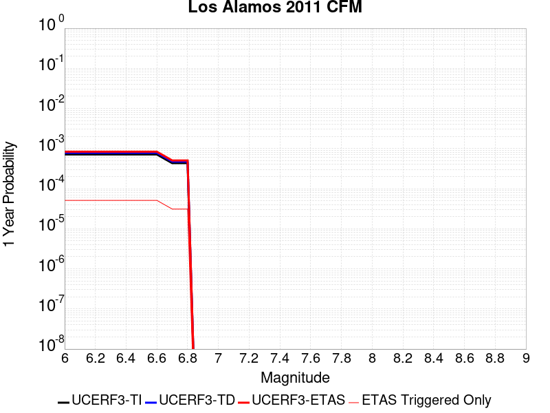 |  |

| Magnitude | 1 wk TI Prob | 1 wk TD Prob | 1 wk ETAS Prob | 1 wk ETAS/TD Gain | 1 wk ETAS Triggered Only | 1 mo TI Prob | 1 mo TD Prob | 1 mo ETAS Prob | 1 mo ETAS/TD Gain | 1 mo ETAS Triggered Only | 1 yr TI Prob | 1 yr TD Prob | 1 yr ETAS Prob | 1 yr ETAS/TD Gain | 1 yr ETAS Triggered Only | 10 yr TI Prob | 10 yr TD Prob | 10 yr ETAS Prob | 10 yr ETAS/TD Gain | 10 yr ETAS Triggered Only |
|-----|-----|-----|-----|-----|-----|-----|-----|-----|-----|-----|-----|-----|-----|-----|-----|-----|-----|-----|-----|-----|
| 6.0 | 1.3678262E-5 | 1.5031193E-5 | 6.0140585E-5 | 4.001052 | 4.5110068E-5 | 5.8619804E-5 | 6.441852E-5 | 1.0952568E-4 | 1.7002205 | 4.5110068E-5 | 7.134624E-4 | 7.841395E-4 | 8.292142E-4 | 1.057483 | 4.5110068E-5 | 0.0071117613 | 0.007826112 | 0.00787087 | 1.005719 | 4.5110068E-5 |
| 6.1 | 1.3678262E-5 | 1.5031193E-5 | 6.0140585E-5 | 4.001052 | 4.5110068E-5 | 5.8619804E-5 | 6.441852E-5 | 1.0952568E-4 | 1.7002205 | 4.5110068E-5 | 7.134624E-4 | 7.841395E-4 | 8.292142E-4 | 1.057483 | 4.5110068E-5 | 0.0071117613 | 0.007826112 | 0.00787087 | 1.005719 | 4.5110068E-5 |
| 6.2 | 1.3678262E-5 | 1.5031193E-5 | 6.0140585E-5 | 4.001052 | 4.5110068E-5 | 5.8619804E-5 | 6.441852E-5 | 1.0952568E-4 | 1.7002205 | 4.5110068E-5 | 7.134624E-4 | 7.841395E-4 | 8.292142E-4 | 1.057483 | 4.5110068E-5 | 0.0071117613 | 0.007826112 | 0.00787087 | 1.005719 | 4.5110068E-5 |
| 6.3 | 1.3678262E-5 | 1.5031193E-5 | 6.0140585E-5 | 4.001052 | 4.5110068E-5 | 5.8619804E-5 | 6.441852E-5 | 1.0952568E-4 | 1.7002205 | 4.5110068E-5 | 7.134624E-4 | 7.841395E-4 | 8.292142E-4 | 1.057483 | 4.5110068E-5 | 0.0071117613 | 0.007826112 | 0.00787087 | 1.005719 | 4.5110068E-5 |
| 6.4 | 1.3678262E-5 | 1.5031193E-5 | 6.0140585E-5 | 4.001052 | 4.5110068E-5 | 5.8619804E-5 | 6.441852E-5 | 1.0952568E-4 | 1.7002205 | 4.5110068E-5 | 7.134624E-4 | 7.841395E-4 | 8.292142E-4 | 1.057483 | 4.5110068E-5 | 0.0071117613 | 0.007826112 | 0.00787087 | 1.005719 | 4.5110068E-5 |
| 6.5 | 1.3678262E-5 | 1.5031193E-5 | 6.0140585E-5 | 4.001052 | 4.5110068E-5 | 5.8619804E-5 | 6.441852E-5 | 1.0952568E-4 | 1.7002205 | 4.5110068E-5 | 7.134624E-4 | 7.841395E-4 | 8.292142E-4 | 1.057483 | 4.5110068E-5 | 0.0071117613 | 0.007826112 | 0.00787087 | 1.005719 | 4.5110068E-5 |
| 6.6 | 1.3678262E-5 | 1.5031193E-5 | 6.0140585E-5 | 4.001052 | 4.5110068E-5 | 5.8619804E-5 | 6.441852E-5 | 1.0952568E-4 | 1.7002205 | 4.5110068E-5 | 7.134624E-4 | 7.841395E-4 | 8.292142E-4 | 1.057483 | 4.5110068E-5 | 0.0071117613 | 0.007826112 | 0.00787087 | 1.005719 | 4.5110068E-5 |
| 6.7 | 8.282411E-6 | 9.085969E-6 | 5.419563E-5 | 5.9647603 | 4.5110068E-5 | 3.5495563E-5 | 3.893987E-5 | 8.404818E-5 | 2.1584094 | 4.5110068E-5 | 4.3207276E-4 | 4.740929E-4 | 5.191816E-4 | 1.0951052 | 4.5110068E-5 | 0.0043123364 | 0.004740929 | 0.0047858255 | 1.0094699 | 4.5110068E-5 |
| 6.8 | 8.282411E-6 | 9.085969E-6 | 5.419563E-5 | 5.9647603 | 4.5110068E-5 | 3.5495563E-5 | 3.893987E-5 | 8.404818E-5 | 2.1584094 | 4.5110068E-5 | 4.3207276E-4 | 4.740929E-4 | 5.191816E-4 | 1.0951052 | 4.5110068E-5 | 0.0043123364 | 0.004740929 | 0.0047858255 | 1.0094699 | 4.5110068E-5 |

## Great Valley 07 (Orestimba)
*[(top)](#table-of-contents)*

| 1 Week | 1 Month | 1 Year | 10 Year |
|-----|-----|-----|-----|
|  |  |  |  |

| Magnitude | 1 wk TI Prob | 1 wk TD Prob | 1 wk ETAS Prob | 1 wk ETAS/TD Gain | 1 wk ETAS Triggered Only | 1 mo TI Prob | 1 mo TD Prob | 1 mo ETAS Prob | 1 mo ETAS/TD Gain | 1 mo ETAS Triggered Only | 1 yr TI Prob | 1 yr TD Prob | 1 yr ETAS Prob | 1 yr ETAS/TD Gain | 1 yr ETAS Triggered Only | 10 yr TI Prob | 10 yr TD Prob | 10 yr ETAS Prob | 10 yr ETAS/TD Gain | 10 yr ETAS Triggered Only |
|-----|-----|-----|-----|-----|-----|-----|-----|-----|-----|-----|-----|-----|-----|-----|-----|-----|-----|-----|-----|-----|
| 6.0 | 2.841624E-5 | 3.5190245E-5 | 3.5190245E-5 | 1.0 | 0.0 | 1.21778205E-4 | 1.5081046E-4 | 1.5081046E-4 | 1.0 | 0.0 | 0.0014816412 | 0.0018352446 | 0.001880272 | 1.0245347 | 4.5110068E-5 | 0.014718015 | 0.018267011 | 0.018311298 | 1.0024244 | 4.5110068E-5 |
| 6.1 | 2.841624E-5 | 3.5190245E-5 | 3.5190245E-5 | 1.0 | 0.0 | 1.21778205E-4 | 1.5081046E-4 | 1.5081046E-4 | 1.0 | 0.0 | 0.0014816412 | 0.0018352446 | 0.001880272 | 1.0245347 | 4.5110068E-5 | 0.014718015 | 0.018267011 | 0.018311298 | 1.0024244 | 4.5110068E-5 |
| 6.2 | 2.841624E-5 | 3.5190245E-5 | 3.5190245E-5 | 1.0 | 0.0 | 1.21778205E-4 | 1.5081046E-4 | 1.5081046E-4 | 1.0 | 0.0 | 0.0014816412 | 0.0018352446 | 0.001880272 | 1.0245347 | 4.5110068E-5 | 0.014718015 | 0.018267011 | 0.018311298 | 1.0024244 | 4.5110068E-5 |
| 6.3 | 2.841624E-5 | 3.5190245E-5 | 3.5190245E-5 | 1.0 | 0.0 | 1.21778205E-4 | 1.5081046E-4 | 1.5081046E-4 | 1.0 | 0.0 | 0.0014816412 | 0.0018352446 | 0.001880272 | 1.0245347 | 4.5110068E-5 | 0.014718015 | 0.018267011 | 0.018311298 | 1.0024244 | 4.5110068E-5 |
| 6.4 | 2.841624E-5 | 3.5190245E-5 | 3.5190245E-5 | 1.0 | 0.0 | 1.21778205E-4 | 1.5081046E-4 | 1.5081046E-4 | 1.0 | 0.0 | 0.0014816412 | 0.0018352446 | 0.001880272 | 1.0245347 | 4.5110068E-5 | 0.014718015 | 0.018267011 | 0.018311298 | 1.0024244 | 4.5110068E-5 |
| 6.5 | 2.841624E-5 | 3.5190245E-5 | 3.5190245E-5 | 1.0 | 0.0 | 1.21778205E-4 | 1.5081046E-4 | 1.5081046E-4 | 1.0 | 0.0 | 0.0014816412 | 0.0018352446 | 0.001880272 | 1.0245347 | 4.5110068E-5 | 0.014718015 | 0.018267011 | 0.018311298 | 1.0024244 | 4.5110068E-5 |
| 6.6 | 1.9500372E-5 | 2.4072657E-5 | 2.4072657E-5 | 1.0 | 0.0 | 8.357035E-5 | 1.03168066E-4 | 1.03168066E-4 | 1.0 | 0.0 | 0.001016994 | 0.0012559886 | 0.001301042 | 1.0358709 | 4.5110068E-5 | 0.010123523 | 0.012551772 | 0.012596316 | 1.0035489 | 4.5110068E-5 |
| 6.7 | 1.83568E-5 | 2.264984E-5 | 2.264984E-5 | 1.0 | 0.0 | 7.866963E-5 | 9.707074E-5 | 9.707074E-5 | 1.0 | 0.0 | 9.5738185E-4 | 0.0011818361 | 0.0012268929 | 1.0381243 | 4.5110068E-5 | 0.009532678 | 0.011818337 | 0.011862914 | 1.0037719 | 4.5110068E-5 |

## Calaveras (No) 2011 CFM
*[(top)](#table-of-contents)*

| 1 Week | 1 Month | 1 Year | 10 Year |
|-----|-----|-----|-----|
|  |  |  |  |

| Magnitude | 1 wk TI Prob | 1 wk TD Prob | 1 wk ETAS Prob | 1 wk ETAS/TD Gain | 1 wk ETAS Triggered Only | 1 mo TI Prob | 1 mo TD Prob | 1 mo ETAS Prob | 1 mo ETAS/TD Gain | 1 mo ETAS Triggered Only | 1 yr TI Prob | 1 yr TD Prob | 1 yr ETAS Prob | 1 yr ETAS/TD Gain | 1 yr ETAS Triggered Only | 10 yr TI Prob | 10 yr TD Prob | 10 yr ETAS Prob | 10 yr ETAS/TD Gain | 10 yr ETAS Triggered Only |
|-----|-----|-----|-----|-----|-----|-----|-----|-----|-----|-----|-----|-----|-----|-----|-----|-----|-----|-----|-----|-----|
| 6.0 | 6.853089E-5 | 1.452927E-4 | 1.452927E-4 | 1.0 | 0.0 | 2.9367075E-4 | 6.225777E-4 | 6.225777E-4 | 1.0 | 0.0 | 0.0035695804 | 0.007561221 | 0.007561221 | 1.0 | 0.0 | 0.03512784 | 0.07195558 | 0.07199744 | 1.0005819 | 4.5110068E-5 |
| 6.1 | 6.853089E-5 | 1.452927E-4 | 1.452927E-4 | 1.0 | 0.0 | 2.9367075E-4 | 6.225777E-4 | 6.225777E-4 | 1.0 | 0.0 | 0.0035695804 | 0.007561221 | 0.007561221 | 1.0 | 0.0 | 0.03512784 | 0.07195558 | 0.07199744 | 1.0005819 | 4.5110068E-5 |
| 6.2 | 6.853089E-5 | 1.452927E-4 | 1.452927E-4 | 1.0 | 0.0 | 2.9367075E-4 | 6.225777E-4 | 6.225777E-4 | 1.0 | 0.0 | 0.0035695804 | 0.007561221 | 0.007561221 | 1.0 | 0.0 | 0.03512784 | 0.07195558 | 0.07199744 | 1.0005819 | 4.5110068E-5 |
| 6.3 | 6.853089E-5 | 1.452927E-4 | 1.452927E-4 | 1.0 | 0.0 | 2.9367075E-4 | 6.225777E-4 | 6.225777E-4 | 1.0 | 0.0 | 0.0035695804 | 0.007561221 | 0.007561221 | 1.0 | 0.0 | 0.03512784 | 0.07195558 | 0.07199744 | 1.0005819 | 4.5110068E-5 |
| 6.4 | 6.853089E-5 | 1.452927E-4 | 1.452927E-4 | 1.0 | 0.0 | 2.9367075E-4 | 6.225777E-4 | 6.225777E-4 | 1.0 | 0.0 | 0.0035695804 | 0.007561221 | 0.007561221 | 1.0 | 0.0 | 0.03512784 | 0.07195558 | 0.07199744 | 1.0005819 | 4.5110068E-5 |
| 6.5 | 6.853089E-5 | 1.452927E-4 | 1.452927E-4 | 1.0 | 0.0 | 2.9367075E-4 | 6.225777E-4 | 6.225777E-4 | 1.0 | 0.0 | 0.0035695804 | 0.007561221 | 0.007561221 | 1.0 | 0.0 | 0.03512784 | 0.07195558 | 0.07199744 | 1.0005819 | 4.5110068E-5 |
| 6.6 | 6.5130276E-5 | 1.385732E-4 | 1.385732E-4 | 1.0 | 0.0 | 2.7909988E-4 | 5.9379323E-4 | 5.9379323E-4 | 1.0 | 0.0 | 0.003392747 | 0.0072131394 | 0.0072131394 | 1.0 | 0.0 | 0.033414144 | 0.06881748 | 0.06885949 | 1.0006104 | 4.5110068E-5 |
| 6.7 | 6.1341E-5 | 1.3118902E-4 | 1.3118902E-4 | 1.0 | 0.0 | 2.6286353E-4 | 5.6216074E-4 | 5.6216074E-4 | 1.0 | 0.0 | 0.003195667 | 0.0068304855 | 0.0068304855 | 1.0 | 0.0 | 0.03150101 | 0.06536239 | 0.06540455 | 1.000645 | 4.5110068E-5 |
| 6.8 | 3.241399E-5 | 7.175236E-5 | 7.175236E-5 | 1.0 | 0.0 | 1.389097E-4 | 3.075001E-4 | 3.075001E-4 | 1.0 | 0.0 | 0.0016899136 | 0.0037420401 | 0.0037420401 | 1.0 | 0.0 | 0.016771203 | 0.036092106 | 0.036092106 | 1.0 | 0.0 |
| 6.9 | 2.7363296E-5 | 6.059934E-5 | 6.059934E-5 | 1.0 | 0.0 | 1.1726599E-4 | 2.5971147E-4 | 2.5971147E-4 | 1.0 | 0.0 | 0.0014267784 | 0.003161987 | 0.003161987 | 1.0 | 0.0 | 0.014176525 | 0.030637112 | 0.030637112 | 1.0 | 0.0 |

## North Frontal  (West)
*[(top)](#table-of-contents)*

| 1 Week | 1 Month | 1 Year | 10 Year |
|-----|-----|-----|-----|
|  |  |  |  |

| Magnitude | 1 wk TI Prob | 1 wk TD Prob | 1 wk ETAS Prob | 1 wk ETAS/TD Gain | 1 wk ETAS Triggered Only | 1 mo TI Prob | 1 mo TD Prob | 1 mo ETAS Prob | 1 mo ETAS/TD Gain | 1 mo ETAS Triggered Only | 1 yr TI Prob | 1 yr TD Prob | 1 yr ETAS Prob | 1 yr ETAS/TD Gain | 1 yr ETAS Triggered Only | 10 yr TI Prob | 10 yr TD Prob | 10 yr ETAS Prob | 10 yr ETAS/TD Gain | 10 yr ETAS Triggered Only |
|-----|-----|-----|-----|-----|-----|-----|-----|-----|-----|-----|-----|-----|-----|-----|-----|-----|-----|-----|-----|-----|
| 6.0 | 1.416208E-5 | 1.5408456E-5 | 1.5408456E-5 | 1.0 | 0.0 | 6.0693215E-5 | 6.603497E-5 | 6.603497E-5 | 1.0 | 0.0 | 7.386894E-4 | 8.037511E-4 | 8.488249E-4 | 1.0560793 | 4.5110068E-5 | 0.007362387 | 0.008015518 | 0.008060266 | 1.0055827 | 4.5110068E-5 |
| 6.1 | 1.416208E-5 | 1.5408456E-5 | 1.5408456E-5 | 1.0 | 0.0 | 6.0693215E-5 | 6.603497E-5 | 6.603497E-5 | 1.0 | 0.0 | 7.386894E-4 | 8.037511E-4 | 8.488249E-4 | 1.0560793 | 4.5110068E-5 | 0.007362387 | 0.008015518 | 0.008060266 | 1.0055827 | 4.5110068E-5 |
| 6.2 | 1.416208E-5 | 1.5408456E-5 | 1.5408456E-5 | 1.0 | 0.0 | 6.0693215E-5 | 6.603497E-5 | 6.603497E-5 | 1.0 | 0.0 | 7.386894E-4 | 8.037511E-4 | 8.488249E-4 | 1.0560793 | 4.5110068E-5 | 0.007362387 | 0.008015518 | 0.008060266 | 1.0055827 | 4.5110068E-5 |
| 6.3 | 1.416208E-5 | 1.5408456E-5 | 1.5408456E-5 | 1.0 | 0.0 | 6.0693215E-5 | 6.603497E-5 | 6.603497E-5 | 1.0 | 0.0 | 7.386894E-4 | 8.037511E-4 | 8.488249E-4 | 1.0560793 | 4.5110068E-5 | 0.007362387 | 0.008015518 | 0.008060266 | 1.0055827 | 4.5110068E-5 |
| 6.4 | 1.416208E-5 | 1.5408456E-5 | 1.5408456E-5 | 1.0 | 0.0 | 6.0693215E-5 | 6.603497E-5 | 6.603497E-5 | 1.0 | 0.0 | 7.386894E-4 | 8.037511E-4 | 8.488249E-4 | 1.0560793 | 4.5110068E-5 | 0.007362387 | 0.008015518 | 0.008060266 | 1.0055827 | 4.5110068E-5 |
| 6.5 | 1.416208E-5 | 1.5408456E-5 | 1.5408456E-5 | 1.0 | 0.0 | 6.0693215E-5 | 6.603497E-5 | 6.603497E-5 | 1.0 | 0.0 | 7.386894E-4 | 8.037511E-4 | 8.488249E-4 | 1.0560793 | 4.5110068E-5 | 0.007362387 | 0.008015518 | 0.008060266 | 1.0055827 | 4.5110068E-5 |
| 6.6 | 1.416208E-5 | 1.5408456E-5 | 1.5408456E-5 | 1.0 | 0.0 | 6.0693215E-5 | 6.603497E-5 | 6.603497E-5 | 1.0 | 0.0 | 7.386894E-4 | 8.037511E-4 | 8.488249E-4 | 1.0560793 | 4.5110068E-5 | 0.007362387 | 0.008015518 | 0.008060266 | 1.0055827 | 4.5110068E-5 |
| 6.7 | 1.02118975E-5 | 1.1093774E-5 | 1.1093774E-5 | 1.0 | 0.0 | 4.3764543E-5 | 4.754425E-5 | 4.754425E-5 | 1.0 | 0.0 | 5.32703E-4 | 5.787631E-4 | 6.23847E-4 | 1.0778971 | 4.5110068E-5 | 0.0053142784 | 0.00577899 | 0.0058238395 | 1.0077608 | 4.5110068E-5 |
| 6.8 | 1.02118975E-5 | 1.1093774E-5 | 1.1093774E-5 | 1.0 | 0.0 | 4.3764543E-5 | 4.754425E-5 | 4.754425E-5 | 1.0 | 0.0 | 5.32703E-4 | 5.787631E-4 | 6.23847E-4 | 1.0778971 | 4.5110068E-5 | 0.0053142784 | 0.00577899 | 0.0058238395 | 1.0077608 | 4.5110068E-5 |
| 6.9 | 7.711016E-6 | 8.362843E-6 | 8.362843E-6 | 1.0 | 0.0 | 3.3046796E-5 | 3.5840614E-5 | 3.5840614E-5 | 1.0 | 0.0 | 4.0227044E-4 | 4.3633426E-4 | 4.8142465E-4 | 1.1033391 | 4.5110068E-5 | 0.0040154303 | 0.004360873 | 0.004405786 | 1.0102992 | 4.5110068E-5 |
| 7.0 | 7.711016E-6 | 8.362843E-6 | 8.362843E-6 | 1.0 | 0.0 | 3.3046796E-5 | 3.5840614E-5 | 3.5840614E-5 | 1.0 | 0.0 | 4.0227044E-4 | 4.3633426E-4 | 4.8142465E-4 | 1.1033391 | 4.5110068E-5 | 0.0040154303 | 0.004360873 | 0.004405786 | 1.0102992 | 4.5110068E-5 |
| 7.1 | 6.4475635E-6 | 6.9876623E-6 | 6.9876623E-6 | 1.0 | 0.0 | 2.7632123E-5 | 2.9947125E-5 | 2.9947125E-5 | 1.0 | 0.0 | 3.3636915E-4 | 3.6460624E-4 | 4.0969986E-4 | 1.1236776 | 4.5110068E-5 | 0.0033586046 | 0.0036460625 | 0.0036910078 | 1.0123272 | 4.5110068E-5 |

## Elsinore (Temecula) rev
*[(top)](#table-of-contents)*

| 1 Week | 1 Month | 1 Year | 10 Year |
|-----|-----|-----|-----|
|  |  |  |  |

| Magnitude | 1 wk TI Prob | 1 wk TD Prob | 1 wk ETAS Prob | 1 wk ETAS/TD Gain | 1 wk ETAS Triggered Only | 1 mo TI Prob | 1 mo TD Prob | 1 mo ETAS Prob | 1 mo ETAS/TD Gain | 1 mo ETAS Triggered Only | 1 yr TI Prob | 1 yr TD Prob | 1 yr ETAS Prob | 1 yr ETAS/TD Gain | 1 yr ETAS Triggered Only | 10 yr TI Prob | 10 yr TD Prob | 10 yr ETAS Prob | 10 yr ETAS/TD Gain | 10 yr ETAS Triggered Only |
|-----|-----|-----|-----|-----|-----|-----|-----|-----|-----|-----|-----|-----|-----|-----|-----|-----|-----|-----|-----|-----|
| 6.0 | 2.9985375E-5 | 3.4747958E-5 | 7.985646E-5 | 2.2981627 | 4.5110068E-5 | 1.2850242E-4 | 1.4891267E-4 | 1.9401603E-4 | 1.3028846 | 4.5110068E-5 | 0.0015633941 | 0.0018117457 | 0.001856774 | 1.0248536 | 4.5110068E-5 | 0.01552441 | 0.018074041 | 0.018118335 | 1.0024507 | 4.5110068E-5 |
| 6.1 | 2.9985375E-5 | 3.4747958E-5 | 7.985646E-5 | 2.2981627 | 4.5110068E-5 | 1.2850242E-4 | 1.4891267E-4 | 1.9401603E-4 | 1.3028846 | 4.5110068E-5 | 0.0015633941 | 0.0018117457 | 0.001856774 | 1.0248536 | 4.5110068E-5 | 0.01552441 | 0.018074041 | 0.018118335 | 1.0024507 | 4.5110068E-5 |
| 6.2 | 2.9985375E-5 | 3.4747958E-5 | 7.985646E-5 | 2.2981627 | 4.5110068E-5 | 1.2850242E-4 | 1.4891267E-4 | 1.9401603E-4 | 1.3028846 | 4.5110068E-5 | 0.0015633941 | 0.0018117457 | 0.001856774 | 1.0248536 | 4.5110068E-5 | 0.01552441 | 0.018074041 | 0.018118335 | 1.0024507 | 4.5110068E-5 |
| 6.3 | 2.9985375E-5 | 3.4747958E-5 | 7.985646E-5 | 2.2981627 | 4.5110068E-5 | 1.2850242E-4 | 1.4891267E-4 | 1.9401603E-4 | 1.3028846 | 4.5110068E-5 | 0.0015633941 | 0.0018117457 | 0.001856774 | 1.0248536 | 4.5110068E-5 | 0.01552441 | 0.018074041 | 0.018118335 | 1.0024507 | 4.5110068E-5 |
| 6.4 | 2.9985375E-5 | 3.4747958E-5 | 7.985646E-5 | 2.2981627 | 4.5110068E-5 | 1.2850242E-4 | 1.4891267E-4 | 1.9401603E-4 | 1.3028846 | 4.5110068E-5 | 0.0015633941 | 0.0018117457 | 0.001856774 | 1.0248536 | 4.5110068E-5 | 0.01552441 | 0.018074041 | 0.018118335 | 1.0024507 | 4.5110068E-5 |
| 6.5 | 2.9985375E-5 | 3.4747958E-5 | 7.985646E-5 | 2.2981627 | 4.5110068E-5 | 1.2850242E-4 | 1.4891267E-4 | 1.9401603E-4 | 1.3028846 | 4.5110068E-5 | 0.0015633941 | 0.0018117457 | 0.001856774 | 1.0248536 | 4.5110068E-5 | 0.01552441 | 0.018074041 | 0.018118335 | 1.0024507 | 4.5110068E-5 |
| 6.6 | 2.9915182E-5 | 3.46808E-5 | 7.978931E-5 | 2.3006766 | 4.5110068E-5 | 1.2820162E-4 | 1.486249E-4 | 1.9372827E-4 | 1.3034711 | 4.5110068E-5 | 0.0015597371 | 0.0018082478 | 0.0018532763 | 1.0249017 | 4.5110068E-5 | 0.015488351 | 0.018039845 | 0.01808414 | 1.0024555 | 4.5110068E-5 |
| 6.7 | 2.9879424E-5 | 3.463569E-5 | 7.97442E-5 | 2.3023708 | 4.5110068E-5 | 1.2804838E-4 | 1.4843159E-4 | 1.9353496E-4 | 1.3038664 | 4.5110068E-5 | 0.0015578741 | 0.0018058982 | 0.0018509268 | 1.0249342 | 4.5110068E-5 | 0.01546998 | 0.018016884 | 0.018061182 | 1.0024587 | 4.5110068E-5 |
| 6.8 | 2.9818717E-5 | 3.45724E-5 | 7.968091E-5 | 2.304755 | 4.5110068E-5 | 1.2778824E-4 | 1.4816038E-4 | 1.9326377E-4 | 1.3044227 | 4.5110068E-5 | 0.0015547115 | 0.0018026017 | 0.0018476305 | 1.0249798 | 4.5110068E-5 | 0.015438793 | 0.017984249 | 0.018028548 | 1.0024632 | 4.5110068E-5 |
| 6.9 | 2.9704783E-5 | 3.4430177E-5 | 7.9538695E-5 | 2.3101447 | 4.5110068E-5 | 1.273E-4 | 1.4755092E-4 | 1.9265433E-4 | 1.3056803 | 4.5110068E-5 | 0.0015487756 | 0.001795194 | 0.0018402231 | 1.0250832 | 4.5110068E-5 | 0.015380259 | 0.017911145 | 0.017955448 | 1.0024735 | 4.5110068E-5 |
| 7.0 | 2.9613002E-5 | 3.4300047E-5 | 7.9408564E-5 | 2.3151155 | 4.5110068E-5 | 1.269067E-4 | 1.4699328E-4 | 1.9209672E-4 | 1.3068402 | 4.5110068E-5 | 0.0015439938 | 0.0017884158 | 0.0018334453 | 1.0251783 | 4.5110068E-5 | 0.015333103 | 0.017844401 | 0.017888706 | 1.0024829 | 4.5110068E-5 |
| 7.1 | 2.2180364E-5 | 2.6018337E-5 | 7.112723E-5 | 2.7337346 | 4.5110068E-5 | 9.505524E-5 | 1.115033E-4 | 1.5660834E-4 | 1.4045175 | 4.5110068E-5 | 0.0011566831 | 0.0013568681 | 0.0014019168 | 1.0332006 | 4.5110068E-5 | 0.01150681 | 0.013559197 | 0.013603696 | 1.0032818 | 4.5110068E-5 |
| 7.2 | 2.1985565E-5 | 2.5725127E-5 | 7.083404E-5 | 2.7534962 | 4.5110068E-5 | 9.422044E-5 | 1.1024679E-4 | 1.5535188E-4 | 1.4091284 | 4.5110068E-5 | 0.0011465302 | 0.0013415889 | 0.0013866385 | 1.0335792 | 4.5110068E-5 | 0.0114063285 | 0.013408055 | 0.01345256 | 1.0033193 | 4.5110068E-5 |
| 7.3 | 1.3039819E-5 | 1.715471E-5 | 1.715471E-5 | 1.0 | 0.0 | 5.5883742E-5 | 7.3518546E-5 | 7.3518546E-5 | 1.0 | 0.0 | 6.801722E-4 | 8.947971E-4 | 8.947971E-4 | 1.0 | 0.0 | 0.006780941 | 0.008927152 | 0.008927152 | 1.0 | 0.0 |
| 7.4 | 1.2750458E-5 | 1.6749926E-5 | 1.6749926E-5 | 1.0 | 0.0 | 5.464368E-5 | 7.178385E-5 | 7.178385E-5 | 1.0 | 0.0 | 6.650837E-4 | 8.736942E-4 | 8.736942E-4 | 1.0 | 0.0 | 0.006630967 | 0.008717438 | 0.008717438 | 1.0 | 0.0 |
| 7.5 | 1.1924516E-5 | 1.570584E-5 | 1.570584E-5 | 1.0 | 0.0 | 5.1104067E-5 | 6.730944E-5 | 6.730944E-5 | 1.0 | 0.0 | 6.220144E-4 | 8.192601E-4 | 8.192601E-4 | 1.0 | 0.0 | 0.006202762 | 0.008175999 | 0.008175999 | 1.0 | 0.0 |
| 7.6 | 1.0456552E-5 | 1.3574289E-5 | 1.3574289E-5 | 1.0 | 0.0 | 4.4813027E-5 | 5.817464E-5 | 5.817464E-5 | 1.0 | 0.0 | 5.45462E-4 | 7.081186E-4 | 7.081186E-4 | 1.0 | 0.0 | 0.0054412507 | 0.0070718653 | 0.0070718653 | 1.0 | 0.0 |
| 7.7 | 4.463199E-6 | 5.214875E-6 | 5.214875E-6 | 1.0 | 0.0 | 1.9127854E-5 | 2.2349386E-5 | 2.2349386E-5 | 1.0 | 0.0 | 2.3285674E-4 | 2.7209E-4 | 2.7209E-4 | 1.0 | 0.0 | 0.0023261288 | 0.0027239968 | 0.0027239968 | 1.0 | 0.0 |
| 7.8 | 2.1601753E-7 | 2.7489222E-7 | 2.7489222E-7 | 1.0 | 0.0 | 9.257891E-7 | 1.1781094E-6 | 1.1781094E-6 | 1.0 | 0.0 | 1.1271423E-5 | 1.4343483E-5 | 1.4343483E-5 | 1.0 | 0.0 | 1.1270852E-4 | 1.435847E-4 | 1.435847E-4 | 1.0 | 0.0 |

## Holser alt 1
*[(top)](#table-of-contents)*

| 1 Week | 1 Month | 1 Year | 10 Year |
|-----|-----|-----|-----|
|  |  | 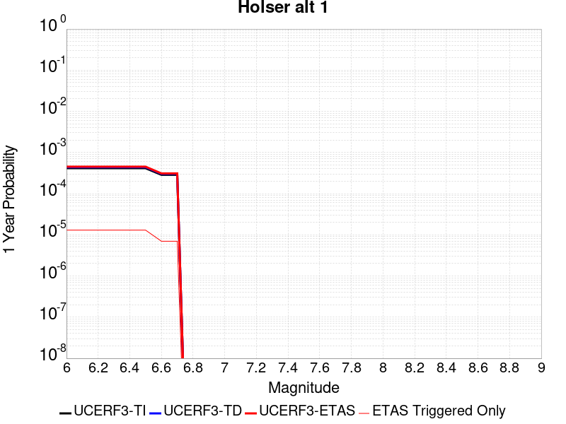 | 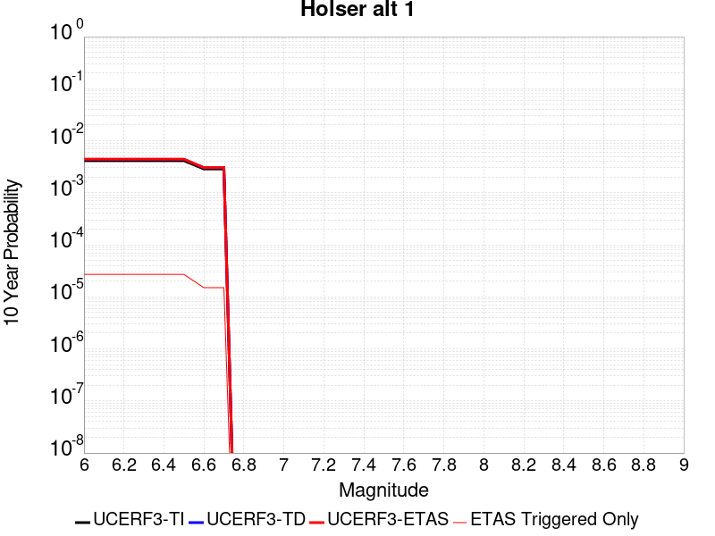 |

| Magnitude | 1 wk TI Prob | 1 wk TD Prob | 1 wk ETAS Prob | 1 wk ETAS/TD Gain | 1 wk ETAS Triggered Only | 1 mo TI Prob | 1 mo TD Prob | 1 mo ETAS Prob | 1 mo ETAS/TD Gain | 1 mo ETAS Triggered Only | 1 yr TI Prob | 1 yr TD Prob | 1 yr ETAS Prob | 1 yr ETAS/TD Gain | 1 yr ETAS Triggered Only | 10 yr TI Prob | 10 yr TD Prob | 10 yr ETAS Prob | 10 yr ETAS/TD Gain | 10 yr ETAS Triggered Only |
|-----|-----|-----|-----|-----|-----|-----|-----|-----|-----|-----|-----|-----|-----|-----|-----|-----|-----|-----|-----|-----|
| 6.0 | 7.962936E-6 | 8.4235735E-6 | 8.4235735E-6 | 1.0 | 0.0 | 3.4126424E-5 | 3.6100817E-5 | 3.6100817E-5 | 1.0 | 0.0 | 4.1540997E-4 | 4.394895E-4 | 4.394895E-4 | 1.0 | 0.0 | 0.004146343 | 0.0043911743 | 0.0044360864 | 1.0102278 | 4.5110068E-5 |
| 6.1 | 7.962936E-6 | 8.4235735E-6 | 8.4235735E-6 | 1.0 | 0.0 | 3.4126424E-5 | 3.6100817E-5 | 3.6100817E-5 | 1.0 | 0.0 | 4.1540997E-4 | 4.394895E-4 | 4.394895E-4 | 1.0 | 0.0 | 0.004146343 | 0.0043911743 | 0.0044360864 | 1.0102278 | 4.5110068E-5 |
| 6.2 | 7.962936E-6 | 8.4235735E-6 | 8.4235735E-6 | 1.0 | 0.0 | 3.4126424E-5 | 3.6100817E-5 | 3.6100817E-5 | 1.0 | 0.0 | 4.1540997E-4 | 4.394895E-4 | 4.394895E-4 | 1.0 | 0.0 | 0.004146343 | 0.0043911743 | 0.0044360864 | 1.0102278 | 4.5110068E-5 |
| 6.3 | 7.962936E-6 | 8.4235735E-6 | 8.4235735E-6 | 1.0 | 0.0 | 3.4126424E-5 | 3.6100817E-5 | 3.6100817E-5 | 1.0 | 0.0 | 4.1540997E-4 | 4.394895E-4 | 4.394895E-4 | 1.0 | 0.0 | 0.004146343 | 0.0043911743 | 0.0044360864 | 1.0102278 | 4.5110068E-5 |
| 6.4 | 7.962936E-6 | 8.4235735E-6 | 8.4235735E-6 | 1.0 | 0.0 | 3.4126424E-5 | 3.6100817E-5 | 3.6100817E-5 | 1.0 | 0.0 | 4.1540997E-4 | 4.394895E-4 | 4.394895E-4 | 1.0 | 0.0 | 0.004146343 | 0.0043911743 | 0.0044360864 | 1.0102278 | 4.5110068E-5 |
| 6.5 | 7.962936E-6 | 8.4235735E-6 | 8.4235735E-6 | 1.0 | 0.0 | 3.4126424E-5 | 3.6100817E-5 | 3.6100817E-5 | 1.0 | 0.0 | 4.1540997E-4 | 4.394895E-4 | 4.394895E-4 | 1.0 | 0.0 | 0.004146343 | 0.0043911743 | 0.0044360864 | 1.0102278 | 4.5110068E-5 |
| 6.6 | 5.506786E-6 | 5.810526E-6 | 5.810526E-6 | 1.0 | 0.0 | 2.3600298E-5 | 2.4902254E-5 | 2.4902254E-5 | 1.0 | 0.0 | 2.8729573E-4 | 3.0318493E-4 | 3.0318493E-4 | 1.0 | 0.0 | 0.002869246 | 0.0030318494 | 0.0030768227 | 1.0148336 | 4.5110068E-5 |
| 6.7 | 5.506786E-6 | 5.810526E-6 | 5.810526E-6 | 1.0 | 0.0 | 2.3600298E-5 | 2.4902254E-5 | 2.4902254E-5 | 1.0 | 0.0 | 2.8729573E-4 | 3.0318493E-4 | 3.0318493E-4 | 1.0 | 0.0 | 0.002869246 | 0.0030318494 | 0.0030768227 | 1.0148336 | 4.5110068E-5 |

## Hayward (No) 2011 CFM
*[(top)](#table-of-contents)*

| 1 Week | 1 Month | 1 Year | 10 Year |
|-----|-----|-----|-----|
|  |  |  | 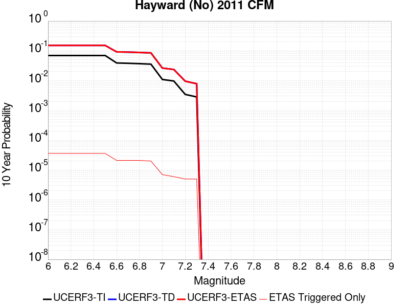 |

| Magnitude | 1 wk TI Prob | 1 wk TD Prob | 1 wk ETAS Prob | 1 wk ETAS/TD Gain | 1 wk ETAS Triggered Only | 1 mo TI Prob | 1 mo TD Prob | 1 mo ETAS Prob | 1 mo ETAS/TD Gain | 1 mo ETAS Triggered Only | 1 yr TI Prob | 1 yr TD Prob | 1 yr ETAS Prob | 1 yr ETAS/TD Gain | 1 yr ETAS Triggered Only | 10 yr TI Prob | 10 yr TD Prob | 10 yr ETAS Prob | 10 yr ETAS/TD Gain | 10 yr ETAS Triggered Only |
|-----|-----|-----|-----|-----|-----|-----|-----|-----|-----|-----|-----|-----|-----|-----|-----|-----|-----|-----|-----|-----|
| 6.0 | 1.382333E-4 | 3.232079E-4 | 3.232079E-4 | 1.0 | 0.0 | 5.9229386E-4 | 0.0013846606 | 0.0014297082 | 1.0325333 | 4.5110068E-5 | 0.007187361 | 0.016766893 | 0.016811248 | 1.0026454 | 4.5110068E-5 | 0.06959299 | 0.1516654 | 0.15170367 | 1.0002524 | 4.5110068E-5 |
| 6.1 | 1.382333E-4 | 3.232079E-4 | 3.232079E-4 | 1.0 | 0.0 | 5.9229386E-4 | 0.0013846606 | 0.0014297082 | 1.0325333 | 4.5110068E-5 | 0.007187361 | 0.016766893 | 0.016811248 | 1.0026454 | 4.5110068E-5 | 0.06959299 | 0.1516654 | 0.15170367 | 1.0002524 | 4.5110068E-5 |
| 6.2 | 1.382333E-4 | 3.232079E-4 | 3.232079E-4 | 1.0 | 0.0 | 5.9229386E-4 | 0.0013846606 | 0.0014297082 | 1.0325333 | 4.5110068E-5 | 0.007187361 | 0.016766893 | 0.016811248 | 1.0026454 | 4.5110068E-5 | 0.06959299 | 0.1516654 | 0.15170367 | 1.0002524 | 4.5110068E-5 |
| 6.3 | 1.382333E-4 | 3.232079E-4 | 3.232079E-4 | 1.0 | 0.0 | 5.9229386E-4 | 0.0013846606 | 0.0014297082 | 1.0325333 | 4.5110068E-5 | 0.007187361 | 0.016766893 | 0.016811248 | 1.0026454 | 4.5110068E-5 | 0.06959299 | 0.1516654 | 0.15170367 | 1.0002524 | 4.5110068E-5 |
| 6.4 | 1.382333E-4 | 3.232079E-4 | 3.232079E-4 | 1.0 | 0.0 | 5.9229386E-4 | 0.0013846606 | 0.0014297082 | 1.0325333 | 4.5110068E-5 | 0.007187361 | 0.016766893 | 0.016811248 | 1.0026454 | 4.5110068E-5 | 0.06959299 | 0.1516654 | 0.15170367 | 1.0002524 | 4.5110068E-5 |
| 6.5 | 1.382333E-4 | 3.232079E-4 | 3.232079E-4 | 1.0 | 0.0 | 5.9229386E-4 | 0.0013846606 | 0.0014297082 | 1.0325333 | 4.5110068E-5 | 0.007187361 | 0.016766893 | 0.016811248 | 1.0026454 | 4.5110068E-5 | 0.06959299 | 0.1516654 | 0.15170367 | 1.0002524 | 4.5110068E-5 |
| 6.6 | 7.644285E-5 | 1.8948103E-4 | 1.8948103E-4 | 1.0 | 0.0 | 3.2757106E-4 | 8.1190845E-4 | 8.569819E-4 | 1.0555154 | 4.5110068E-5 | 0.003980886 | 0.009857853 | 0.009902518 | 1.0045309 | 4.5110068E-5 | 0.039103247 | 0.092153184 | 0.09219414 | 1.0004444 | 4.5110068E-5 |
| 6.7 | 7.460781E-5 | 1.8587815E-4 | 1.8587815E-4 | 1.0 | 0.0 | 3.1970858E-4 | 7.96477E-4 | 8.4155117E-4 | 1.0565919 | 4.5110068E-5 | 0.003885506 | 0.009671659 | 0.009716333 | 1.004619 | 4.5110068E-5 | 0.03818268 | 0.09049087 | 0.0905319 | 1.0004534 | 4.5110068E-5 |
| 6.8 | 7.23009E-5 | 1.8048302E-4 | 1.8048302E-4 | 1.0 | 0.0 | 3.098242E-4 | 7.733689E-4 | 8.184441E-4 | 1.0582842 | 4.5110068E-5 | 0.0037655863 | 0.009392778 | 0.009437465 | 1.0047575 | 4.5110068E-5 | 0.037024144 | 0.088001564 | 0.088042706 | 1.0004675 | 4.5110068E-5 |
| 6.9 | 6.957746E-5 | 1.7407205E-4 | 1.7407205E-4 | 1.0 | 0.0 | 2.98155E-4 | 7.4590935E-4 | 7.9098577E-4 | 1.0604315 | 4.5110068E-5 | 0.003623996 | 0.009061288 | 0.009105989 | 1.0049332 | 4.5110068E-5 | 0.035654634 | 0.08503664 | 0.08507792 | 1.0004854 | 4.5110068E-5 |
| 7.0 | 2.1073694E-5 | 5.2247637E-5 | 5.2247637E-5 | 1.0 | 0.0 | 9.031271E-5 | 2.2390416E-4 | 2.2390416E-4 | 1.0 | 0.0 | 0.0010990025 | 0.0027234992 | 0.0027234992 | 1.0 | 0.0 | 0.010935834 | 0.026391491 | 0.026391491 | 1.0 | 0.0 |
| 7.1 | 1.8670535E-5 | 4.6669888E-5 | 4.6669888E-5 | 1.0 | 0.0 | 8.001412E-5 | 2.0000339E-4 | 2.0000339E-4 | 1.0 | 0.0 | 9.737365E-4 | 0.0024331913 | 0.0024331913 | 1.0 | 0.0 | 0.009694808 | 0.023618827 | 0.023618827 | 1.0 | 0.0 |
| 7.2 | 6.6138855E-6 | 1.8792352E-5 | 1.8792352E-5 | 1.0 | 0.0 | 2.8344915E-5 | 8.053787E-5 | 8.053787E-5 | 1.0 | 0.0 | 3.4504468E-4 | 9.8041E-4 | 9.8041E-4 | 1.0 | 0.0 | 0.0034450945 | 0.009560432 | 0.009560432 | 1.0 | 0.0 |
| 7.3 | 5.4382035E-6 | 1.5442325E-5 | 1.5442325E-5 | 1.0 | 0.0 | 2.3306378E-5 | 6.618139E-5 | 6.618139E-5 | 1.0 | 0.0 | 2.8371823E-4 | 8.0575846E-4 | 8.0575846E-4 | 1.0 | 0.0 | 0.0028335627 | 0.007868089 | 0.007868089 | 1.0 | 0.0 |

## Rose Canyon
*[(top)](#table-of-contents)*

| 1 Week | 1 Month | 1 Year | 10 Year |
|-----|-----|-----|-----|
|  |  |  |  |

| Magnitude | 1 wk TI Prob | 1 wk TD Prob | 1 wk ETAS Prob | 1 wk ETAS/TD Gain | 1 wk ETAS Triggered Only | 1 mo TI Prob | 1 mo TD Prob | 1 mo ETAS Prob | 1 mo ETAS/TD Gain | 1 mo ETAS Triggered Only | 1 yr TI Prob | 1 yr TD Prob | 1 yr ETAS Prob | 1 yr ETAS/TD Gain | 1 yr ETAS Triggered Only | 10 yr TI Prob | 10 yr TD Prob | 10 yr ETAS Prob | 10 yr ETAS/TD Gain | 10 yr ETAS Triggered Only |
|-----|-----|-----|-----|-----|-----|-----|-----|-----|-----|-----|-----|-----|-----|-----|-----|-----|-----|-----|-----|-----|
| 6.0 | 1.9167945E-5 | 1.6478027E-5 | 6.158735E-5 | 3.7375443 | 4.5110068E-5 | 8.214574E-5 | 7.06186E-5 | 1.15725474E-4 | 1.6387395 | 4.5110068E-5 | 9.996655E-4 | 8.5951196E-4 | 9.0458326E-4 | 1.0524383 | 4.5110068E-5 | 0.009951805 | 0.008568751 | 0.008613474 | 1.0052193 | 4.5110068E-5 |
| 6.1 | 1.9167945E-5 | 1.6478027E-5 | 6.158735E-5 | 3.7375443 | 4.5110068E-5 | 8.214574E-5 | 7.06186E-5 | 1.15725474E-4 | 1.6387395 | 4.5110068E-5 | 9.996655E-4 | 8.5951196E-4 | 9.0458326E-4 | 1.0524383 | 4.5110068E-5 | 0.009951805 | 0.008568751 | 0.008613474 | 1.0052193 | 4.5110068E-5 |
| 6.2 | 1.9167945E-5 | 1.6478027E-5 | 6.158735E-5 | 3.7375443 | 4.5110068E-5 | 8.214574E-5 | 7.06186E-5 | 1.15725474E-4 | 1.6387395 | 4.5110068E-5 | 9.996655E-4 | 8.5951196E-4 | 9.0458326E-4 | 1.0524383 | 4.5110068E-5 | 0.009951805 | 0.008568751 | 0.008613474 | 1.0052193 | 4.5110068E-5 |
| 6.3 | 1.9167945E-5 | 1.6478027E-5 | 6.158735E-5 | 3.7375443 | 4.5110068E-5 | 8.214574E-5 | 7.06186E-5 | 1.15725474E-4 | 1.6387395 | 4.5110068E-5 | 9.996655E-4 | 8.5951196E-4 | 9.0458326E-4 | 1.0524383 | 4.5110068E-5 | 0.009951805 | 0.008568751 | 0.008613474 | 1.0052193 | 4.5110068E-5 |
| 6.4 | 1.9167945E-5 | 1.6478027E-5 | 6.158735E-5 | 3.7375443 | 4.5110068E-5 | 8.214574E-5 | 7.06186E-5 | 1.15725474E-4 | 1.6387395 | 4.5110068E-5 | 9.996655E-4 | 8.5951196E-4 | 9.0458326E-4 | 1.0524383 | 4.5110068E-5 | 0.009951805 | 0.008568751 | 0.008613474 | 1.0052193 | 4.5110068E-5 |
| 6.5 | 1.9167945E-5 | 1.6478027E-5 | 6.158735E-5 | 3.7375443 | 4.5110068E-5 | 8.214574E-5 | 7.06186E-5 | 1.15725474E-4 | 1.6387395 | 4.5110068E-5 | 9.996655E-4 | 8.5951196E-4 | 9.0458326E-4 | 1.0524383 | 4.5110068E-5 | 0.009951805 | 0.008568751 | 0.008613474 | 1.0052193 | 4.5110068E-5 |
| 6.6 | 1.6032436E-5 | 1.3771202E-5 | 5.888065E-5 | 4.275636 | 4.5110068E-5 | 6.870863E-5 | 5.901849E-5 | 1.04125895E-4 | 1.7642927 | 4.5110068E-5 | 8.362065E-4 | 7.183819E-4 | 7.6345954E-4 | 1.0627489 | 4.5110068E-5 | 0.008330669 | 0.0071673454 | 0.007212132 | 1.0062487 | 4.5110068E-5 |
| 6.7 | 1.32651885E-5 | 1.1282621E-5 | 1.1282621E-5 | 1.0 | 0.0 | 5.684957E-5 | 4.8353573E-5 | 4.8353573E-5 | 1.0 | 0.0 | 6.919237E-4 | 5.8861315E-4 | 5.8861315E-4 | 1.0 | 0.0 | 0.0068977326 | 0.005877156 | 0.005877156 | 1.0 | 0.0 |
| 6.8 | 1.2374002E-5 | 1.0546746E-5 | 1.0546746E-5 | 1.0 | 0.0 | 5.303036E-5 | 4.5199937E-5 | 4.5199937E-5 | 1.0 | 0.0 | 6.4545334E-4 | 5.5023754E-4 | 5.5023754E-4 | 1.0 | 0.0 | 0.006435818 | 0.005495354 | 0.005495354 | 1.0 | 0.0 |
| 6.9 | 3.8401595E-6 | 3.178941E-6 | 3.178941E-6 | 1.0 | 0.0 | 1.6457723E-5 | 1.3623983E-5 | 1.3623983E-5 | 1.0 | 0.0 | 2.0035435E-4 | 1.6586324E-4 | 1.6586324E-4 | 1.0 | 0.0 | 0.0020017382 | 0.0016577742 | 0.0016577742 | 1.0 | 0.0 |
| 7.0 | 3.6026508E-6 | 2.9376413E-6 | 2.9376413E-6 | 1.0 | 0.0 | 1.543984E-5 | 1.2589852E-5 | 1.2589852E-5 | 1.0 | 0.0 | 1.8796384E-4 | 1.5327454E-4 | 1.5327454E-4 | 1.0 | 0.0 | 0.0018780495 | 0.0015320673 | 0.0015320673 | 1.0 | 0.0 |
| 7.1 | 3.3657313E-6 | 2.6902792E-6 | 2.6902792E-6 | 1.0 | 0.0 | 1.4424483E-5 | 1.1529739E-5 | 1.1529739E-5 | 1.0 | 0.0 | 1.7560393E-4 | 1.4036939E-4 | 1.4036939E-4 | 1.0 | 0.0 | 0.0017546522 | 0.0014031857 | 0.0014031857 | 1.0 | 0.0 |
| 7.2 | 3.1430025E-6 | 2.4618412E-6 | 2.4618412E-6 | 1.0 | 0.0 | 1.3469941E-5 | 1.0550727E-5 | 1.0550727E-5 | 1.0 | 0.0 | 1.639842E-4 | 1.2845139E-4 | 1.2845139E-4 | 1.0 | 0.0 | 0.0016386324 | 0.0012841492 | 0.0012841492 | 1.0 | 0.0 |
| 7.3 | 2.898987E-6 | 2.2514312E-6 | 2.2514312E-6 | 1.0 | 0.0 | 1.24241715E-5 | 9.648977E-6 | 9.648977E-6 | 1.0 | 0.0 | 1.5125379E-4 | 1.1747381E-4 | 1.1747381E-4 | 1.0 | 0.0 | 0.0015115088 | 0.0011744945 | 0.0011744945 | 1.0 | 0.0 |
| 7.4 | 2.5994284E-6 | 2.0116724E-6 | 2.0116724E-6 | 1.0 | 0.0 | 1.114036E-5 | 8.621447E-6 | 8.621447E-6 | 1.0 | 0.0 | 1.3562544E-4 | 1.049649E-4 | 1.049649E-4 | 1.0 | 0.0 | 0.0013554269 | 0.00104953 | 0.00104953 | 1.0 | 0.0 |
| 7.5 | 2.2517988E-6 | 1.7516537E-6 | 1.7516537E-6 | 1.0 | 0.0 | 9.650531E-6 | 7.5070875E-6 | 7.5070875E-6 | 1.0 | 0.0 | 1.17488875E-4 | 9.139879E-5 | 9.139879E-5 | 1.0 | 0.0 | 0.0011742678 | 9.1398787E-4 | 9.1398787E-4 | 1.0 | 0.0 |

## Robinson Creek
*[(top)](#table-of-contents)*

| 1 Week | 1 Month | 1 Year | 10 Year |
|-----|-----|-----|-----|
|  |  |  |  |

| Magnitude | 1 wk TI Prob | 1 wk TD Prob | 1 wk ETAS Prob | 1 wk ETAS/TD Gain | 1 wk ETAS Triggered Only | 1 mo TI Prob | 1 mo TD Prob | 1 mo ETAS Prob | 1 mo ETAS/TD Gain | 1 mo ETAS Triggered Only | 1 yr TI Prob | 1 yr TD Prob | 1 yr ETAS Prob | 1 yr ETAS/TD Gain | 1 yr ETAS Triggered Only | 10 yr TI Prob | 10 yr TD Prob | 10 yr ETAS Prob | 10 yr ETAS/TD Gain | 10 yr ETAS Triggered Only |
|-----|-----|-----|-----|-----|-----|-----|-----|-----|-----|-----|-----|-----|-----|-----|-----|-----|-----|-----|-----|-----|
| 6.0 | 1.0723721E-5 | 1.1667189E-5 | 1.1667189E-5 | 1.0 | 0.0 | 4.5957993E-5 | 5.000224E-5 | 5.000224E-5 | 1.0 | 0.0 | 5.593949E-4 | 6.087773E-4 | 6.087773E-4 | 1.0 | 0.0 | 0.0055798884 | 0.0060877725 | 0.0061326083 | 1.0073649 | 4.5110068E-5 |
| 6.1 | 1.0723721E-5 | 1.1667189E-5 | 1.1667189E-5 | 1.0 | 0.0 | 4.5957993E-5 | 5.000224E-5 | 5.000224E-5 | 1.0 | 0.0 | 5.593949E-4 | 6.087773E-4 | 6.087773E-4 | 1.0 | 0.0 | 0.0055798884 | 0.0060877725 | 0.0061326083 | 1.0073649 | 4.5110068E-5 |
| 6.2 | 1.0723721E-5 | 1.1667189E-5 | 1.1667189E-5 | 1.0 | 0.0 | 4.5957993E-5 | 5.000224E-5 | 5.000224E-5 | 1.0 | 0.0 | 5.593949E-4 | 6.087773E-4 | 6.087773E-4 | 1.0 | 0.0 | 0.0055798884 | 0.0060877725 | 0.0061326083 | 1.0073649 | 4.5110068E-5 |
| 6.3 | 1.0723721E-5 | 1.1667189E-5 | 1.1667189E-5 | 1.0 | 0.0 | 4.5957993E-5 | 5.000224E-5 | 5.000224E-5 | 1.0 | 0.0 | 5.593949E-4 | 6.087773E-4 | 6.087773E-4 | 1.0 | 0.0 | 0.0055798884 | 0.0060877725 | 0.0061326083 | 1.0073649 | 4.5110068E-5 |
| 6.4 | 1.0723721E-5 | 1.1667189E-5 | 1.1667189E-5 | 1.0 | 0.0 | 4.5957993E-5 | 5.000224E-5 | 5.000224E-5 | 1.0 | 0.0 | 5.593949E-4 | 6.087773E-4 | 6.087773E-4 | 1.0 | 0.0 | 0.0055798884 | 0.0060877725 | 0.0061326083 | 1.0073649 | 4.5110068E-5 |
| 6.5 | 1.0723721E-5 | 1.1667189E-5 | 1.1667189E-5 | 1.0 | 0.0 | 4.5957993E-5 | 5.000224E-5 | 5.000224E-5 | 1.0 | 0.0 | 5.593949E-4 | 6.087773E-4 | 6.087773E-4 | 1.0 | 0.0 | 0.0055798884 | 0.0060877725 | 0.0061326083 | 1.0073649 | 4.5110068E-5 |

## Clamshell-Sawpit
*[(top)](#table-of-contents)*

| 1 Week | 1 Month | 1 Year | 10 Year |
|-----|-----|-----|-----|
|  |  |  |  |

| Magnitude | 1 wk TI Prob | 1 wk TD Prob | 1 wk ETAS Prob | 1 wk ETAS/TD Gain | 1 wk ETAS Triggered Only | 1 mo TI Prob | 1 mo TD Prob | 1 mo ETAS Prob | 1 mo ETAS/TD Gain | 1 mo ETAS Triggered Only | 1 yr TI Prob | 1 yr TD Prob | 1 yr ETAS Prob | 1 yr ETAS/TD Gain | 1 yr ETAS Triggered Only | 10 yr TI Prob | 10 yr TD Prob | 10 yr ETAS Prob | 10 yr ETAS/TD Gain | 10 yr ETAS Triggered Only |
|-----|-----|-----|-----|-----|-----|-----|-----|-----|-----|-----|-----|-----|-----|-----|-----|-----|-----|-----|-----|-----|
| 6.0 | 1.1112015E-5 | 1.2128283E-5 | 1.2128283E-5 | 1.0 | 0.0 | 4.7622052E-5 | 5.1978353E-5 | 5.1978353E-5 | 1.0 | 0.0 | 5.796442E-4 | 6.328364E-4 | 6.328364E-4 | 1.0 | 0.0 | 0.0057813465 | 0.0063283644 | 0.006373189 | 1.0070832 | 4.5110068E-5 |
| 6.1 | 1.1112015E-5 | 1.2128283E-5 | 1.2128283E-5 | 1.0 | 0.0 | 4.7622052E-5 | 5.1978353E-5 | 5.1978353E-5 | 1.0 | 0.0 | 5.796442E-4 | 6.328364E-4 | 6.328364E-4 | 1.0 | 0.0 | 0.0057813465 | 0.0063283644 | 0.006373189 | 1.0070832 | 4.5110068E-5 |
| 6.2 | 1.1112015E-5 | 1.2128283E-5 | 1.2128283E-5 | 1.0 | 0.0 | 4.7622052E-5 | 5.1978353E-5 | 5.1978353E-5 | 1.0 | 0.0 | 5.796442E-4 | 6.328364E-4 | 6.328364E-4 | 1.0 | 0.0 | 0.0057813465 | 0.0063283644 | 0.006373189 | 1.0070832 | 4.5110068E-5 |
| 6.3 | 1.1112015E-5 | 1.2128283E-5 | 1.2128283E-5 | 1.0 | 0.0 | 4.7622052E-5 | 5.1978353E-5 | 5.1978353E-5 | 1.0 | 0.0 | 5.796442E-4 | 6.328364E-4 | 6.328364E-4 | 1.0 | 0.0 | 0.0057813465 | 0.0063283644 | 0.006373189 | 1.0070832 | 4.5110068E-5 |
| 6.4 | 1.1112015E-5 | 1.2128283E-5 | 1.2128283E-5 | 1.0 | 0.0 | 4.7622052E-5 | 5.1978353E-5 | 5.1978353E-5 | 1.0 | 0.0 | 5.796442E-4 | 6.328364E-4 | 6.328364E-4 | 1.0 | 0.0 | 0.0057813465 | 0.0063283644 | 0.006373189 | 1.0070832 | 4.5110068E-5 |
| 6.5 | 1.1112015E-5 | 1.2128283E-5 | 1.2128283E-5 | 1.0 | 0.0 | 4.7622052E-5 | 5.1978353E-5 | 5.1978353E-5 | 1.0 | 0.0 | 5.796442E-4 | 6.328364E-4 | 6.328364E-4 | 1.0 | 0.0 | 0.0057813465 | 0.0063283644 | 0.006373189 | 1.0070832 | 4.5110068E-5 |

## Hosgri
*[(top)](#table-of-contents)*

| 1 Week | 1 Month | 1 Year | 10 Year |
|-----|-----|-----|-----|
|  |  |  |  |

| Magnitude | 1 wk TI Prob | 1 wk TD Prob | 1 wk ETAS Prob | 1 wk ETAS/TD Gain | 1 wk ETAS Triggered Only | 1 mo TI Prob | 1 mo TD Prob | 1 mo ETAS Prob | 1 mo ETAS/TD Gain | 1 mo ETAS Triggered Only | 1 yr TI Prob | 1 yr TD Prob | 1 yr ETAS Prob | 1 yr ETAS/TD Gain | 1 yr ETAS Triggered Only | 10 yr TI Prob | 10 yr TD Prob | 10 yr ETAS Prob | 10 yr ETAS/TD Gain | 10 yr ETAS Triggered Only |
|-----|-----|-----|-----|-----|-----|-----|-----|-----|-----|-----|-----|-----|-----|-----|-----|-----|-----|-----|-----|-----|
| 6.0 | 3.1107833E-5 | 3.720853E-5 | 8.2316925E-5 | 2.2123132 | 4.5110068E-5 | 1.3331248E-4 | 1.5945687E-4 | 2.0455975E-4 | 1.2828531 | 4.5110068E-5 | 0.0016218709 | 0.001939923 | 0.0019849455 | 1.0232084 | 4.5110068E-5 | 0.01610085 | 0.01925631 | 0.019300552 | 1.0022975 | 4.5110068E-5 |
| 6.1 | 3.1107833E-5 | 3.720853E-5 | 8.2316925E-5 | 2.2123132 | 4.5110068E-5 | 1.3331248E-4 | 1.5945687E-4 | 2.0455975E-4 | 1.2828531 | 4.5110068E-5 | 0.0016218709 | 0.001939923 | 0.0019849455 | 1.0232084 | 4.5110068E-5 | 0.01610085 | 0.01925631 | 0.019300552 | 1.0022975 | 4.5110068E-5 |
| 6.2 | 3.1107833E-5 | 3.720853E-5 | 8.2316925E-5 | 2.2123132 | 4.5110068E-5 | 1.3331248E-4 | 1.5945687E-4 | 2.0455975E-4 | 1.2828531 | 4.5110068E-5 | 0.0016218709 | 0.001939923 | 0.0019849455 | 1.0232084 | 4.5110068E-5 | 0.01610085 | 0.01925631 | 0.019300552 | 1.0022975 | 4.5110068E-5 |
| 6.3 | 3.1107833E-5 | 3.720853E-5 | 8.2316925E-5 | 2.2123132 | 4.5110068E-5 | 1.3331248E-4 | 1.5945687E-4 | 2.0455975E-4 | 1.2828531 | 4.5110068E-5 | 0.0016218709 | 0.001939923 | 0.0019849455 | 1.0232084 | 4.5110068E-5 | 0.01610085 | 0.01925631 | 0.019300552 | 1.0022975 | 4.5110068E-5 |
| 6.4 | 3.1107833E-5 | 3.720853E-5 | 8.2316925E-5 | 2.2123132 | 4.5110068E-5 | 1.3331248E-4 | 1.5945687E-4 | 2.0455975E-4 | 1.2828531 | 4.5110068E-5 | 0.0016218709 | 0.001939923 | 0.0019849455 | 1.0232084 | 4.5110068E-5 | 0.01610085 | 0.01925631 | 0.019300552 | 1.0022975 | 4.5110068E-5 |
| 6.5 | 3.1107833E-5 | 3.720853E-5 | 8.2316925E-5 | 2.2123132 | 4.5110068E-5 | 1.3331248E-4 | 1.5945687E-4 | 2.0455975E-4 | 1.2828531 | 4.5110068E-5 | 0.0016218709 | 0.001939923 | 0.0019849455 | 1.0232084 | 4.5110068E-5 | 0.01610085 | 0.01925631 | 0.019300552 | 1.0022975 | 4.5110068E-5 |
| 6.6 | 2.743495E-5 | 3.2780124E-5 | 7.788871E-5 | 2.3760958 | 4.5110068E-5 | 1.1757306E-4 | 1.4048017E-4 | 1.855839E-4 | 1.3210683 | 4.5110068E-5 | 0.0014305119 | 0.0017092682 | 0.0017543011 | 1.0263463 | 4.5110068E-5 | 0.014213383 | 0.016987413 | 0.017031757 | 1.0026104 | 4.5110068E-5 |
| 6.7 | 2.418707E-5 | 2.8858389E-5 | 7.396715E-5 | 2.5631075 | 4.5110068E-5 | 1.0365475E-4 | 1.2367443E-4 | 1.6877892E-4 | 1.3647034 | 4.5110068E-5 | 0.001261266 | 0.0015049598 | 0.0015500019 | 1.0299292 | 4.5110068E-5 | 0.012541314 | 0.014973709 | 0.015018145 | 1.0029675 | 4.5110068E-5 |
| 6.8 | 2.1292695E-5 | 2.5360874E-5 | 7.0469796E-5 | 2.7786818 | 4.5110068E-5 | 9.125122E-5 | 1.0868641E-4 | 1.5379158E-4 | 1.4150028 | 4.5110068E-5 | 0.0011104173 | 0.0013227165 | 0.0013677669 | 1.034059 | 4.5110068E-5 | 0.011048851 | 0.013174292 | 0.013218807 | 1.003379 | 4.5110068E-5 |
| 6.9 | 1.8692357E-5 | 2.221764E-5 | 6.7326706E-5 | 3.0303266 | 4.5110068E-5 | 8.010764E-5 | 9.521646E-5 | 1.4032224E-4 | 1.4737182 | 4.5110068E-5 | 9.7487407E-4 | 0.001158906 | 0.0012039639 | 1.0388796 | 4.5110068E-5 | 0.009706085 | 0.01155437 | 0.011598959 | 1.003859 | 4.5110068E-5 |
| 7.0 | 1.6336586E-5 | 1.9370036E-5 | 1.9370036E-5 | 1.0 | 0.0 | 7.001206E-5 | 8.301328E-5 | 8.301328E-5 | 1.0 | 0.0 | 8.520634E-4 | 0.0010104795 | 0.0010104795 | 1.0 | 0.0 | 0.008488038 | 0.010084504 | 0.010084504 | 1.0 | 0.0 |
| 7.1 | 1.4184237E-5 | 1.6776847E-5 | 1.6776847E-5 | 1.0 | 0.0 | 6.0788174E-5 | 7.1900264E-5 | 7.1900264E-5 | 1.0 | 0.0 | 7.398447E-4 | 8.7529485E-4 | 8.7529485E-4 | 1.0 | 0.0 | 0.007373864 | 0.008744048 | 0.008744048 | 1.0 | 0.0 |
| 7.2 | 1.2201091E-5 | 1.4405841E-5 | 1.4405841E-5 | 1.0 | 0.0 | 5.228934E-5 | 6.1739316E-5 | 6.1739316E-5 | 1.0 | 0.0 | 6.3643674E-4 | 7.516762E-4 | 7.516762E-4 | 1.0 | 0.0 | 0.006346171 | 0.007516762 | 0.007516762 | 1.0 | 0.0 |

## Great Valley 12
*[(top)](#table-of-contents)*

| 1 Week | 1 Month | 1 Year | 10 Year |
|-----|-----|-----|-----|
|  |  |  |  |

| Magnitude | 1 wk TI Prob | 1 wk TD Prob | 1 wk ETAS Prob | 1 wk ETAS/TD Gain | 1 wk ETAS Triggered Only | 1 mo TI Prob | 1 mo TD Prob | 1 mo ETAS Prob | 1 mo ETAS/TD Gain | 1 mo ETAS Triggered Only | 1 yr TI Prob | 1 yr TD Prob | 1 yr ETAS Prob | 1 yr ETAS/TD Gain | 1 yr ETAS Triggered Only | 10 yr TI Prob | 10 yr TD Prob | 10 yr ETAS Prob | 10 yr ETAS/TD Gain | 10 yr ETAS Triggered Only |
|-----|-----|-----|-----|-----|-----|-----|-----|-----|-----|-----|-----|-----|-----|-----|-----|-----|-----|-----|-----|-----|
| 6.0 | 4.2144962E-5 | 6.0987146E-5 | 6.0987146E-5 | 1.0 | 0.0 | 1.8060877E-4 | 2.6137347E-4 | 2.6137347E-4 | 1.0 | 0.0 | 0.002196694 | 0.0031813493 | 0.0032263158 | 1.0141344 | 4.5110068E-5 | 0.021751061 | 0.031729307 | 0.031772986 | 1.0013766 | 4.5110068E-5 |
| 6.1 | 4.2144962E-5 | 6.0987146E-5 | 6.0987146E-5 | 1.0 | 0.0 | 1.8060877E-4 | 2.6137347E-4 | 2.6137347E-4 | 1.0 | 0.0 | 0.002196694 | 0.0031813493 | 0.0032263158 | 1.0141344 | 4.5110068E-5 | 0.021751061 | 0.031729307 | 0.031772986 | 1.0013766 | 4.5110068E-5 |
| 6.2 | 4.2144962E-5 | 6.0987146E-5 | 6.0987146E-5 | 1.0 | 0.0 | 1.8060877E-4 | 2.6137347E-4 | 2.6137347E-4 | 1.0 | 0.0 | 0.002196694 | 0.0031813493 | 0.0032263158 | 1.0141344 | 4.5110068E-5 | 0.021751061 | 0.031729307 | 0.031772986 | 1.0013766 | 4.5110068E-5 |
| 6.3 | 4.2144962E-5 | 6.0987146E-5 | 6.0987146E-5 | 1.0 | 0.0 | 1.8060877E-4 | 2.6137347E-4 | 2.6137347E-4 | 1.0 | 0.0 | 0.002196694 | 0.0031813493 | 0.0032263158 | 1.0141344 | 4.5110068E-5 | 0.021751061 | 0.031729307 | 0.031772986 | 1.0013766 | 4.5110068E-5 |

## Anacapa-Dume alt 1
*[(top)](#table-of-contents)*

| 1 Week | 1 Month | 1 Year | 10 Year |
|-----|-----|-----|-----|
|  |  | 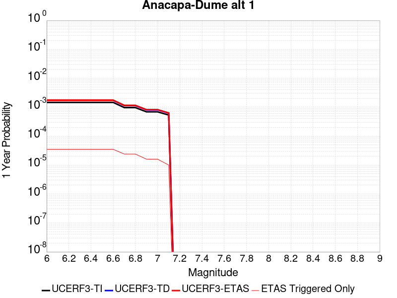 |  |

| Magnitude | 1 wk TI Prob | 1 wk TD Prob | 1 wk ETAS Prob | 1 wk ETAS/TD Gain | 1 wk ETAS Triggered Only | 1 mo TI Prob | 1 mo TD Prob | 1 mo ETAS Prob | 1 mo ETAS/TD Gain | 1 mo ETAS Triggered Only | 1 yr TI Prob | 1 yr TD Prob | 1 yr ETAS Prob | 1 yr ETAS/TD Gain | 1 yr ETAS Triggered Only | 10 yr TI Prob | 10 yr TD Prob | 10 yr ETAS Prob | 10 yr ETAS/TD Gain | 10 yr ETAS Triggered Only |
|-----|-----|-----|-----|-----|-----|-----|-----|-----|-----|-----|-----|-----|-----|-----|-----|-----|-----|-----|-----|-----|
| 6.0 | 2.8047281E-5 | 3.3042823E-5 | 3.3042823E-5 | 1.0 | 0.0 | 1.20197095E-4 | 1.4160581E-4 | 1.4160581E-4 | 1.0 | 0.0 | 0.0014624172 | 0.0017229331 | 0.0017229331 | 1.0 | 0.0 | 0.014528306 | 0.017120155 | 0.017164493 | 1.0025898 | 4.5110068E-5 |
| 6.1 | 2.8047281E-5 | 3.3042823E-5 | 3.3042823E-5 | 1.0 | 0.0 | 1.20197095E-4 | 1.4160581E-4 | 1.4160581E-4 | 1.0 | 0.0 | 0.0014624172 | 0.0017229331 | 0.0017229331 | 1.0 | 0.0 | 0.014528306 | 0.017120155 | 0.017164493 | 1.0025898 | 4.5110068E-5 |
| 6.2 | 2.8047281E-5 | 3.3042823E-5 | 3.3042823E-5 | 1.0 | 0.0 | 1.20197095E-4 | 1.4160581E-4 | 1.4160581E-4 | 1.0 | 0.0 | 0.0014624172 | 0.0017229331 | 0.0017229331 | 1.0 | 0.0 | 0.014528306 | 0.017120155 | 0.017164493 | 1.0025898 | 4.5110068E-5 |
| 6.3 | 2.8047281E-5 | 3.3042823E-5 | 3.3042823E-5 | 1.0 | 0.0 | 1.20197095E-4 | 1.4160581E-4 | 1.4160581E-4 | 1.0 | 0.0 | 0.0014624172 | 0.0017229331 | 0.0017229331 | 1.0 | 0.0 | 0.014528306 | 0.017120155 | 0.017164493 | 1.0025898 | 4.5110068E-5 |
| 6.4 | 2.8047281E-5 | 3.3042823E-5 | 3.3042823E-5 | 1.0 | 0.0 | 1.20197095E-4 | 1.4160581E-4 | 1.4160581E-4 | 1.0 | 0.0 | 0.0014624172 | 0.0017229331 | 0.0017229331 | 1.0 | 0.0 | 0.014528306 | 0.017120155 | 0.017164493 | 1.0025898 | 4.5110068E-5 |
| 6.5 | 2.8047281E-5 | 3.3042823E-5 | 3.3042823E-5 | 1.0 | 0.0 | 1.20197095E-4 | 1.4160581E-4 | 1.4160581E-4 | 1.0 | 0.0 | 0.0014624172 | 0.0017229331 | 0.0017229331 | 1.0 | 0.0 | 0.014528306 | 0.017120155 | 0.017164493 | 1.0025898 | 4.5110068E-5 |
| 6.6 | 2.8047281E-5 | 3.3042823E-5 | 3.3042823E-5 | 1.0 | 0.0 | 1.20197095E-4 | 1.4160581E-4 | 1.4160581E-4 | 1.0 | 0.0 | 0.0014624172 | 0.0017229331 | 0.0017229331 | 1.0 | 0.0 | 0.014528306 | 0.017120155 | 0.017164493 | 1.0025898 | 4.5110068E-5 |
| 6.7 | 1.8557415E-5 | 2.1779932E-5 | 2.1779932E-5 | 1.0 | 0.0 | 7.952935E-5 | 9.334038E-5 | 9.334038E-5 | 1.0 | 0.0 | 9.6783973E-4 | 0.0011360307 | 0.0011360307 | 1.0 | 0.0 | 0.009636354 | 0.011322291 | 0.011322291 | 1.0 | 0.0 |
| 6.8 | 1.8557415E-5 | 2.1779932E-5 | 2.1779932E-5 | 1.0 | 0.0 | 7.952935E-5 | 9.334038E-5 | 9.334038E-5 | 1.0 | 0.0 | 9.6783973E-4 | 0.0011360307 | 0.0011360307 | 1.0 | 0.0 | 0.009636354 | 0.011322291 | 0.011322291 | 1.0 | 0.0 |
| 6.9 | 1.3238843E-5 | 1.5484396E-5 | 1.5484396E-5 | 1.0 | 0.0 | 5.6736666E-5 | 6.636107E-5 | 6.636107E-5 | 1.0 | 0.0 | 6.9054996E-4 | 8.078341E-4 | 8.078341E-4 | 1.0 | 0.0 | 0.0068840804 | 0.008067372 | 0.008067372 | 1.0 | 0.0 |
| 7.0 | 1.3238843E-5 | 1.5484396E-5 | 1.5484396E-5 | 1.0 | 0.0 | 5.6736666E-5 | 6.636107E-5 | 6.636107E-5 | 1.0 | 0.0 | 6.9054996E-4 | 8.078341E-4 | 8.078341E-4 | 1.0 | 0.0 | 0.0068840804 | 0.008067372 | 0.008067372 | 1.0 | 0.0 |
| 7.1 | 1.0270256E-5 | 1.1981463E-5 | 1.1981463E-5 | 1.0 | 0.0 | 4.401464E-5 | 5.134913E-5 | 5.134913E-5 | 1.0 | 0.0 | 5.3574645E-4 | 6.2517566E-4 | 6.2517566E-4 | 1.0 | 0.0 | 0.005344567 | 0.0062517566 | 0.0062517566 | 1.0 | 0.0 |

## Burnt Mtn
*[(top)](#table-of-contents)*

| 1 Week | 1 Month | 1 Year | 10 Year |
|-----|-----|-----|-----|
|  | 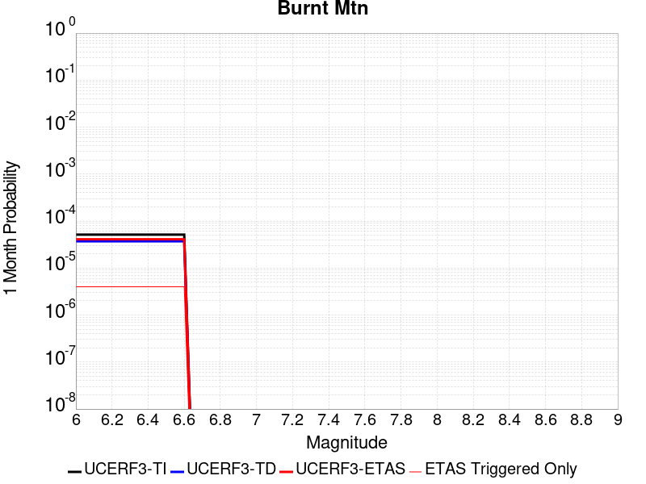 |  |  |

| Magnitude | 1 wk TI Prob | 1 wk TD Prob | 1 wk ETAS Prob | 1 wk ETAS/TD Gain | 1 wk ETAS Triggered Only | 1 mo TI Prob | 1 mo TD Prob | 1 mo ETAS Prob | 1 mo ETAS/TD Gain | 1 mo ETAS Triggered Only | 1 yr TI Prob | 1 yr TD Prob | 1 yr ETAS Prob | 1 yr ETAS/TD Gain | 1 yr ETAS Triggered Only | 10 yr TI Prob | 10 yr TD Prob | 10 yr ETAS Prob | 10 yr ETAS/TD Gain | 10 yr ETAS Triggered Only |
|-----|-----|-----|-----|-----|-----|-----|-----|-----|-----|-----|-----|-----|-----|-----|-----|-----|-----|-----|-----|-----|
| 6.0 | 1.1997946E-5 | 8.64995E-6 | 8.64995E-6 | 1.0 | 0.0 | 5.1418756E-5 | 3.7071215E-5 | 8.217961E-5 | 2.2168038 | 4.5110068E-5 | 6.2584353E-4 | 4.5134206E-4 | 4.964318E-4 | 1.0999014 | 4.5110068E-5 | 0.006240839 | 0.0045134206 | 0.004558327 | 1.0099496 | 4.5110068E-5 |
| 6.1 | 1.1997946E-5 | 8.64995E-6 | 8.64995E-6 | 1.0 | 0.0 | 5.1418756E-5 | 3.7071215E-5 | 8.217961E-5 | 2.2168038 | 4.5110068E-5 | 6.2584353E-4 | 4.5134206E-4 | 4.964318E-4 | 1.0999014 | 4.5110068E-5 | 0.006240839 | 0.0045134206 | 0.004558327 | 1.0099496 | 4.5110068E-5 |
| 6.2 | 1.1997946E-5 | 8.64995E-6 | 8.64995E-6 | 1.0 | 0.0 | 5.1418756E-5 | 3.7071215E-5 | 8.217961E-5 | 2.2168038 | 4.5110068E-5 | 6.2584353E-4 | 4.5134206E-4 | 4.964318E-4 | 1.0999014 | 4.5110068E-5 | 0.006240839 | 0.0045134206 | 0.004558327 | 1.0099496 | 4.5110068E-5 |
| 6.3 | 1.1997946E-5 | 8.64995E-6 | 8.64995E-6 | 1.0 | 0.0 | 5.1418756E-5 | 3.7071215E-5 | 8.217961E-5 | 2.2168038 | 4.5110068E-5 | 6.2584353E-4 | 4.5134206E-4 | 4.964318E-4 | 1.0999014 | 4.5110068E-5 | 0.006240839 | 0.0045134206 | 0.004558327 | 1.0099496 | 4.5110068E-5 |
| 6.4 | 1.1997946E-5 | 8.64995E-6 | 8.64995E-6 | 1.0 | 0.0 | 5.1418756E-5 | 3.7071215E-5 | 8.217961E-5 | 2.2168038 | 4.5110068E-5 | 6.2584353E-4 | 4.5134206E-4 | 4.964318E-4 | 1.0999014 | 4.5110068E-5 | 0.006240839 | 0.0045134206 | 0.004558327 | 1.0099496 | 4.5110068E-5 |
| 6.5 | 1.1997946E-5 | 8.64995E-6 | 8.64995E-6 | 1.0 | 0.0 | 5.1418756E-5 | 3.7071215E-5 | 8.217961E-5 | 2.2168038 | 4.5110068E-5 | 6.2584353E-4 | 4.5134206E-4 | 4.964318E-4 | 1.0999014 | 4.5110068E-5 | 0.006240839 | 0.0045134206 | 0.004558327 | 1.0099496 | 4.5110068E-5 |
| 6.6 | 1.1997946E-5 | 8.64995E-6 | 8.64995E-6 | 1.0 | 0.0 | 5.1418756E-5 | 3.7071215E-5 | 8.217961E-5 | 2.2168038 | 4.5110068E-5 | 6.2584353E-4 | 4.5134206E-4 | 4.964318E-4 | 1.0999014 | 4.5110068E-5 | 0.006240839 | 0.0045134206 | 0.004558327 | 1.0099496 | 4.5110068E-5 |

## San Andreas (Creeping Section) 2011 CFM
*[(top)](#table-of-contents)*

| 1 Week | 1 Month | 1 Year | 10 Year |
|-----|-----|-----|-----|
|  |  |  |  |

| Magnitude | 1 wk TI Prob | 1 wk TD Prob | 1 wk ETAS Prob | 1 wk ETAS/TD Gain | 1 wk ETAS Triggered Only | 1 mo TI Prob | 1 mo TD Prob | 1 mo ETAS Prob | 1 mo ETAS/TD Gain | 1 mo ETAS Triggered Only | 1 yr TI Prob | 1 yr TD Prob | 1 yr ETAS Prob | 1 yr ETAS/TD Gain | 1 yr ETAS Triggered Only | 10 yr TI Prob | 10 yr TD Prob | 10 yr ETAS Prob | 10 yr ETAS/TD Gain | 10 yr ETAS Triggered Only |
|-----|-----|-----|-----|-----|-----|-----|-----|-----|-----|-----|-----|-----|-----|-----|-----|-----|-----|-----|-----|-----|
| 6.0 | 2.0678692E-4 | 4.6456268E-4 | 4.6456268E-4 | 1.0 | 0.0 | 8.8592863E-4 | 0.0019886654 | 0.0019886654 | 1.0 | 0.0 | 0.010732949 | 0.023858009 | 0.023858009 | 1.0 | 0.0 | 0.10229127 | 0.20777887 | 0.2078146 | 1.000172 | 4.5110068E-5 |
| 6.1 | 1.5597911E-4 | 3.5018445E-4 | 3.5018445E-4 | 1.0 | 0.0 | 6.683106E-4 | 0.0014995098 | 0.0014995098 | 1.0 | 0.0 | 0.008106367 | 0.018075831 | 0.018075831 | 1.0 | 0.0 | 0.0781696 | 0.16418044 | 0.16421814 | 1.0002296 | 4.5110068E-5 |
| 6.2 | 1.5597911E-4 | 3.5018445E-4 | 3.5018445E-4 | 1.0 | 0.0 | 6.683106E-4 | 0.0014995098 | 0.0014995098 | 1.0 | 0.0 | 0.008106367 | 0.018075831 | 0.018075831 | 1.0 | 0.0 | 0.0781696 | 0.16418044 | 0.16421814 | 1.0002296 | 4.5110068E-5 |
| 6.3 | 1.5597911E-4 | 3.5018445E-4 | 3.5018445E-4 | 1.0 | 0.0 | 6.683106E-4 | 0.0014995098 | 0.0014995098 | 1.0 | 0.0 | 0.008106367 | 0.018075831 | 0.018075831 | 1.0 | 0.0 | 0.0781696 | 0.16418044 | 0.16421814 | 1.0002296 | 4.5110068E-5 |

## Whittier alt 1
*[(top)](#table-of-contents)*

| 1 Week | 1 Month | 1 Year | 10 Year |
|-----|-----|-----|-----|
|  |  |  |  |

| Magnitude | 1 wk TI Prob | 1 wk TD Prob | 1 wk ETAS Prob | 1 wk ETAS/TD Gain | 1 wk ETAS Triggered Only | 1 mo TI Prob | 1 mo TD Prob | 1 mo ETAS Prob | 1 mo ETAS/TD Gain | 1 mo ETAS Triggered Only | 1 yr TI Prob | 1 yr TD Prob | 1 yr ETAS Prob | 1 yr ETAS/TD Gain | 1 yr ETAS Triggered Only | 10 yr TI Prob | 10 yr TD Prob | 10 yr ETAS Prob | 10 yr ETAS/TD Gain | 10 yr ETAS Triggered Only |
|-----|-----|-----|-----|-----|-----|-----|-----|-----|-----|-----|-----|-----|-----|-----|-----|-----|-----|-----|-----|-----|
| 6.0 | 1.9677844E-5 | 3.0721494E-5 | 7.5830176E-5 | 2.4683104 | 4.5110068E-5 | 8.4330895E-5 | 1.3166165E-4 | 1.7676578E-4 | 1.342576 | 4.5110068E-5 | 0.001026245 | 0.0016026449 | 0.0016476826 | 1.0281022 | 4.5110068E-5 | 0.010215186 | 0.015995702 | 0.01604009 | 1.0027751 | 4.5110068E-5 |
| 6.1 | 1.9677844E-5 | 3.0721494E-5 | 7.5830176E-5 | 2.4683104 | 4.5110068E-5 | 8.4330895E-5 | 1.3166165E-4 | 1.7676578E-4 | 1.342576 | 4.5110068E-5 | 0.001026245 | 0.0016026449 | 0.0016476826 | 1.0281022 | 4.5110068E-5 | 0.010215186 | 0.015995702 | 0.01604009 | 1.0027751 | 4.5110068E-5 |
| 6.2 | 1.9677844E-5 | 3.0721494E-5 | 7.5830176E-5 | 2.4683104 | 4.5110068E-5 | 8.4330895E-5 | 1.3166165E-4 | 1.7676578E-4 | 1.342576 | 4.5110068E-5 | 0.001026245 | 0.0016026449 | 0.0016476826 | 1.0281022 | 4.5110068E-5 | 0.010215186 | 0.015995702 | 0.01604009 | 1.0027751 | 4.5110068E-5 |
| 6.3 | 1.9677844E-5 | 3.0721494E-5 | 7.5830176E-5 | 2.4683104 | 4.5110068E-5 | 8.4330895E-5 | 1.3166165E-4 | 1.7676578E-4 | 1.342576 | 4.5110068E-5 | 0.001026245 | 0.0016026449 | 0.0016476826 | 1.0281022 | 4.5110068E-5 | 0.010215186 | 0.015995702 | 0.01604009 | 1.0027751 | 4.5110068E-5 |
| 6.4 | 1.9677844E-5 | 3.0721494E-5 | 7.5830176E-5 | 2.4683104 | 4.5110068E-5 | 8.4330895E-5 | 1.3166165E-4 | 1.7676578E-4 | 1.342576 | 4.5110068E-5 | 0.001026245 | 0.0016026449 | 0.0016476826 | 1.0281022 | 4.5110068E-5 | 0.010215186 | 0.015995702 | 0.01604009 | 1.0027751 | 4.5110068E-5 |
| 6.5 | 1.9677844E-5 | 3.0721494E-5 | 7.5830176E-5 | 2.4683104 | 4.5110068E-5 | 8.4330895E-5 | 1.3166165E-4 | 1.7676578E-4 | 1.342576 | 4.5110068E-5 | 0.001026245 | 0.0016026449 | 0.0016476826 | 1.0281022 | 4.5110068E-5 | 0.010215186 | 0.015995702 | 0.01604009 | 1.0027751 | 4.5110068E-5 |
| 6.6 | 1.9631225E-5 | 3.06427E-5 | 7.5751384E-5 | 2.472086 | 4.5110068E-5 | 8.413111E-5 | 1.3132399E-4 | 1.7642813E-4 | 1.343457 | 4.5110068E-5 | 0.0010238149 | 0.00159854 | 0.0016435779 | 1.0281744 | 4.5110068E-5 | 0.010191108 | 0.015955312 | 0.015999703 | 1.0027821 | 4.5110068E-5 |
| 6.7 | 1.9536663E-5 | 3.0504027E-5 | 7.561272E-5 | 2.4787784 | 4.5110068E-5 | 8.372587E-5 | 1.3072975E-4 | 1.7583392E-4 | 1.3450184 | 4.5110068E-5 | 0.0010188858 | 0.0015913156 | 0.0016363539 | 1.0283026 | 4.5110068E-5 | 0.010142268 | 0.015884183 | 0.015928576 | 1.0027949 | 4.5110068E-5 |
| 6.8 | 1.9439643E-5 | 3.0352345E-5 | 7.5461045E-5 | 2.4861686 | 4.5110068E-5 | 8.331009E-5 | 1.3007974E-4 | 1.7518394E-4 | 1.3467427 | 4.5110068E-5 | 0.0010138283 | 0.0015834133 | 0.001628452 | 1.028444 | 4.5110068E-5 | 0.010092155 | 0.015806418 | 0.015850816 | 1.0028088 | 4.5110068E-5 |
| 6.9 | 1.9363486E-5 | 3.025448E-5 | 7.536318E-5 | 2.490976 | 4.5110068E-5 | 8.298373E-5 | 1.2966036E-4 | 1.7476459E-4 | 1.3478644 | 4.5110068E-5 | 0.0010098586 | 0.0015783148 | 0.0016233537 | 1.0285361 | 4.5110068E-5 | 0.010052818 | 0.0157561 | 0.0158005 | 1.0028179 | 4.5110068E-5 |
| 7.0 | 3.152724E-6 | 4.1925437E-6 | 4.1925437E-6 | 1.0 | 0.0 | 1.3511604E-5 | 1.7967934E-5 | 1.7967934E-5 | 1.0 | 0.0 | 1.6449137E-4 | 2.1873988E-4 | 2.1873988E-4 | 1.0 | 0.0 | 0.0016436966 | 0.0021877585 | 0.0021877585 | 1.0 | 0.0 |
| 7.1 | 3.0699127E-6 | 4.0761943E-6 | 4.0761943E-6 | 1.0 | 0.0 | 1.3156702E-5 | 1.74693E-5 | 1.74693E-5 | 1.0 | 0.0 | 1.6017107E-4 | 2.1267022E-4 | 2.1267022E-4 | 1.0 | 0.0 | 0.0016005568 | 0.0021271154 | 0.0021271154 | 1.0 | 0.0 |
| 7.2 | 2.2585555E-6 | 2.9159935E-6 | 2.9159935E-6 | 1.0 | 0.0 | 9.679487E-6 | 1.249706E-5 | 1.249706E-5 | 1.0 | 0.0 | 1.1784139E-4 | 1.5214195E-4 | 1.5214195E-4 | 1.0 | 0.0 | 0.0011777892 | 0.0015224252 | 0.0015224252 | 1.0 | 0.0 |
| 7.3 | 2.1766068E-6 | 2.8138447E-6 | 2.8138447E-6 | 1.0 | 0.0 | 9.3282815E-6 | 1.2059283E-5 | 1.2059283E-5 | 1.0 | 0.0 | 1.13565904E-4 | 1.4681274E-4 | 1.4681274E-4 | 1.0 | 0.0 | 0.0011350788 | 0.0014690856 | 0.0014690856 | 1.0 | 0.0 |
| 7.4 | 2.0680952E-6 | 2.676193E-6 | 2.676193E-6 | 1.0 | 0.0 | 8.863235E-6 | 1.1469352E-5 | 1.1469352E-5 | 1.0 | 0.0 | 1.0790454E-4 | 1.3963127E-4 | 1.3963127E-4 | 1.0 | 0.0 | 0.0010785216 | 0.0013971858 | 0.0013971858 | 1.0 | 0.0 |
| 7.5 | 1.4388213E-6 | 1.9265901E-6 | 1.9265901E-6 | 1.0 | 0.0 | 6.1663623E-6 | 8.256791E-6 | 8.256791E-6 | 1.0 | 0.0 | 7.507287E-5 | 1.0052218E-4 | 1.0052218E-4 | 1.0 | 0.0 | 7.504752E-4 | 0.0010053911 | 0.0010053911 | 1.0 | 0.0 |
| 7.6 | 1.2179905E-6 | 1.5985206E-6 | 1.5985206E-6 | 1.0 | 0.0 | 5.219949E-6 | 6.850787E-6 | 6.850787E-6 | 1.0 | 0.0 | 6.355102E-5 | 8.3405495E-5 | 8.3405495E-5 | 1.0 | 0.0 | 6.353285E-4 | 8.343059E-4 | 8.343059E-4 | 1.0 | 0.0 |
| 7.7 | 9.55754E-7 | 1.2252901E-6 | 1.2252901E-6 | 1.0 | 0.0 | 4.096082E-6 | 5.251235E-6 | 5.251235E-6 | 1.0 | 0.0 | 4.9868657E-5 | 6.393224E-5 | 6.393224E-5 | 1.0 | 0.0 | 4.985747E-4 | 6.396533E-4 | 6.396533E-4 | 1.0 | 0.0 |
| 7.8 | 2.1601753E-7 | 2.7489222E-7 | 2.7489222E-7 | 1.0 | 0.0 | 9.257891E-7 | 1.1781094E-6 | 1.1781094E-6 | 1.0 | 0.0 | 1.1271423E-5 | 1.4343483E-5 | 1.4343483E-5 | 1.0 | 0.0 | 1.1270852E-4 | 1.435847E-4 | 1.435847E-4 | 1.0 | 0.0 |

## Casmalia 2011 CFM
*[(top)](#table-of-contents)*

| 1 Week | 1 Month | 1 Year | 10 Year |
|-----|-----|-----|-----|
|  |  |  |  |

| Magnitude | 1 wk TI Prob | 1 wk TD Prob | 1 wk ETAS Prob | 1 wk ETAS/TD Gain | 1 wk ETAS Triggered Only | 1 mo TI Prob | 1 mo TD Prob | 1 mo ETAS Prob | 1 mo ETAS/TD Gain | 1 mo ETAS Triggered Only | 1 yr TI Prob | 1 yr TD Prob | 1 yr ETAS Prob | 1 yr ETAS/TD Gain | 1 yr ETAS Triggered Only | 10 yr TI Prob | 10 yr TD Prob | 10 yr ETAS Prob | 10 yr ETAS/TD Gain | 10 yr ETAS Triggered Only |
|-----|-----|-----|-----|-----|-----|-----|-----|-----|-----|-----|-----|-----|-----|-----|-----|-----|-----|-----|-----|-----|
| 6.0 | 4.5215784E-6 | 4.6811892E-6 | 4.6811892E-6 | 1.0 | 0.0 | 1.9378049E-5 | 2.0062238E-5 | 2.0062238E-5 | 1.0 | 0.0 | 2.359022E-4 | 2.4425777E-4 | 2.893568E-4 | 1.1846371 | 4.5110068E-5 | 0.0023565195 | 0.0024425776 | 0.0024875775 | 1.0184231 | 4.5110068E-5 |
| 6.1 | 4.5215784E-6 | 4.6811892E-6 | 4.6811892E-6 | 1.0 | 0.0 | 1.9378049E-5 | 2.0062238E-5 | 2.0062238E-5 | 1.0 | 0.0 | 2.359022E-4 | 2.4425777E-4 | 2.893568E-4 | 1.1846371 | 4.5110068E-5 | 0.0023565195 | 0.0024425776 | 0.0024875775 | 1.0184231 | 4.5110068E-5 |
| 6.2 | 4.5215784E-6 | 4.6811892E-6 | 4.6811892E-6 | 1.0 | 0.0 | 1.9378049E-5 | 2.0062238E-5 | 2.0062238E-5 | 1.0 | 0.0 | 2.359022E-4 | 2.4425777E-4 | 2.893568E-4 | 1.1846371 | 4.5110068E-5 | 0.0023565195 | 0.0024425776 | 0.0024875775 | 1.0184231 | 4.5110068E-5 |
| 6.3 | 4.5215784E-6 | 4.6811892E-6 | 4.6811892E-6 | 1.0 | 0.0 | 1.9378049E-5 | 2.0062238E-5 | 2.0062238E-5 | 1.0 | 0.0 | 2.359022E-4 | 2.4425777E-4 | 2.893568E-4 | 1.1846371 | 4.5110068E-5 | 0.0023565195 | 0.0024425776 | 0.0024875775 | 1.0184231 | 4.5110068E-5 |
| 6.4 | 4.5215784E-6 | 4.6811892E-6 | 4.6811892E-6 | 1.0 | 0.0 | 1.9378049E-5 | 2.0062238E-5 | 2.0062238E-5 | 1.0 | 0.0 | 2.359022E-4 | 2.4425777E-4 | 2.893568E-4 | 1.1846371 | 4.5110068E-5 | 0.0023565195 | 0.0024425776 | 0.0024875775 | 1.0184231 | 4.5110068E-5 |
| 6.5 | 4.5215784E-6 | 4.6811892E-6 | 4.6811892E-6 | 1.0 | 0.0 | 1.9378049E-5 | 2.0062238E-5 | 2.0062238E-5 | 1.0 | 0.0 | 2.359022E-4 | 2.4425777E-4 | 2.893568E-4 | 1.1846371 | 4.5110068E-5 | 0.0023565195 | 0.0024425776 | 0.0024875775 | 1.0184231 | 4.5110068E-5 |

## Newport-Inglewood (Offshore)
*[(top)](#table-of-contents)*

| 1 Week | 1 Month | 1 Year | 10 Year |
|-----|-----|-----|-----|
|  |  |  |  |

| Magnitude | 1 wk TI Prob | 1 wk TD Prob | 1 wk ETAS Prob | 1 wk ETAS/TD Gain | 1 wk ETAS Triggered Only | 1 mo TI Prob | 1 mo TD Prob | 1 mo ETAS Prob | 1 mo ETAS/TD Gain | 1 mo ETAS Triggered Only | 1 yr TI Prob | 1 yr TD Prob | 1 yr ETAS Prob | 1 yr ETAS/TD Gain | 1 yr ETAS Triggered Only | 10 yr TI Prob | 10 yr TD Prob | 10 yr ETAS Prob | 10 yr ETAS/TD Gain | 10 yr ETAS Triggered Only |
|-----|-----|-----|-----|-----|-----|-----|-----|-----|-----|-----|-----|-----|-----|-----|-----|-----|-----|-----|-----|-----|
| 6.0 | 1.9418812E-5 | 2.0497266E-5 | 6.560641E-5 | 3.2007394 | 4.5110068E-5 | 8.322083E-5 | 8.7843E-5 | 1.329491E-4 | 1.5134856 | 4.5110068E-5 | 0.0010127426 | 0.0010690573 | 0.0011141192 | 1.042151 | 4.5110068E-5 | 0.010081396 | 0.010648402 | 0.010693032 | 1.0041912 | 4.5110068E-5 |
| 6.1 | 1.9418812E-5 | 2.0497266E-5 | 6.560641E-5 | 3.2007394 | 4.5110068E-5 | 8.322083E-5 | 8.7843E-5 | 1.329491E-4 | 1.5134856 | 4.5110068E-5 | 0.0010127426 | 0.0010690573 | 0.0011141192 | 1.042151 | 4.5110068E-5 | 0.010081396 | 0.010648402 | 0.010693032 | 1.0041912 | 4.5110068E-5 |
| 6.2 | 1.9418812E-5 | 2.0497266E-5 | 6.560641E-5 | 3.2007394 | 4.5110068E-5 | 8.322083E-5 | 8.7843E-5 | 1.329491E-4 | 1.5134856 | 4.5110068E-5 | 0.0010127426 | 0.0010690573 | 0.0011141192 | 1.042151 | 4.5110068E-5 | 0.010081396 | 0.010648402 | 0.010693032 | 1.0041912 | 4.5110068E-5 |
| 6.3 | 1.9418812E-5 | 2.0497266E-5 | 6.560641E-5 | 3.2007394 | 4.5110068E-5 | 8.322083E-5 | 8.7843E-5 | 1.329491E-4 | 1.5134856 | 4.5110068E-5 | 0.0010127426 | 0.0010690573 | 0.0011141192 | 1.042151 | 4.5110068E-5 | 0.010081396 | 0.010648402 | 0.010693032 | 1.0041912 | 4.5110068E-5 |
| 6.4 | 1.9418812E-5 | 2.0497266E-5 | 6.560641E-5 | 3.2007394 | 4.5110068E-5 | 8.322083E-5 | 8.7843E-5 | 1.329491E-4 | 1.5134856 | 4.5110068E-5 | 0.0010127426 | 0.0010690573 | 0.0011141192 | 1.042151 | 4.5110068E-5 | 0.010081396 | 0.010648402 | 0.010693032 | 1.0041912 | 4.5110068E-5 |
| 6.5 | 1.9418812E-5 | 2.0497266E-5 | 6.560641E-5 | 3.2007394 | 4.5110068E-5 | 8.322083E-5 | 8.7843E-5 | 1.329491E-4 | 1.5134856 | 4.5110068E-5 | 0.0010127426 | 0.0010690573 | 0.0011141192 | 1.042151 | 4.5110068E-5 | 0.010081396 | 0.010648402 | 0.010693032 | 1.0041912 | 4.5110068E-5 |
| 6.6 | 1.6939659E-5 | 1.7683546E-5 | 6.279282E-5 | 3.5509179 | 4.5110068E-5 | 7.259652E-5 | 7.578494E-5 | 1.2089159E-4 | 1.5951928 | 4.5110068E-5 | 8.8350417E-4 | 9.2238374E-4 | 9.674522E-4 | 1.0488609 | 4.5110068E-5 | 0.008799998 | 0.00919468 | 0.009239375 | 1.004861 | 4.5110068E-5 |
| 6.7 | 1.4691289E-5 | 1.5149292E-5 | 6.0258677E-5 | 3.9776564 | 4.5110068E-5 | 6.2961146E-5 | 6.492444E-5 | 1.1003158E-4 | 1.6947637 | 4.5110068E-5 | 7.662824E-4 | 7.9025986E-4 | 8.353343E-4 | 1.0570375 | 4.5110068E-5 | 0.007636454 | 0.007883489 | 0.007928244 | 1.005677 | 4.5110068E-5 |
| 6.8 | 1.26037085E-5 | 1.2822538E-5 | 5.793203E-5 | 4.5179844 | 4.5110068E-5 | 5.4014774E-5 | 5.4953085E-5 | 1.0006067E-4 | 1.8208382 | 4.5110068E-5 | 6.5743143E-4 | 6.689387E-4 | 7.140186E-4 | 1.0673902 | 4.5110068E-5 | 0.006554899 | 0.0066781086 | 0.0067229173 | 1.0067098 | 4.5110068E-5 |
| 6.9 | 1.1764378E-5 | 1.1934175E-5 | 5.7043704E-5 | 4.779862 | 4.5110068E-5 | 5.0417784E-5 | 5.114597E-5 | 9.625373E-5 | 1.8819417 | 4.5110068E-5 | 6.1366364E-4 | 6.226143E-4 | 6.676963E-4 | 1.0724076 | 4.5110068E-5 | 0.006119718 | 0.006217534 | 0.006262364 | 1.0072101 | 4.5110068E-5 |
| 7.0 | 4.071841E-6 | 3.3071306E-6 | 3.3071306E-6 | 1.0 | 0.0 | 1.745063E-5 | 1.4173362E-5 | 1.4173362E-5 | 1.0 | 0.0 | 2.124407E-4 | 1.7255088E-4 | 1.7255088E-4 | 1.0 | 0.0 | 0.0021223773 | 0.0017245489 | 0.0017245489 | 1.0 | 0.0 |
| 7.1 | 3.6344509E-6 | 2.9049047E-6 | 2.9049047E-6 | 1.0 | 0.0 | 1.5576124E-5 | 1.2449554E-5 | 1.2449554E-5 | 1.0 | 0.0 | 1.8962282E-4 | 1.5156664E-4 | 1.5156664E-4 | 1.0 | 0.0 | 0.0018946109 | 0.0015150115 | 0.0015150115 | 1.0 | 0.0 |
| 7.2 | 3.2446756E-6 | 2.5395498E-6 | 2.5395498E-6 | 1.0 | 0.0 | 1.3905678E-5 | 1.0883761E-5 | 1.0883761E-5 | 1.0 | 0.0 | 1.6928847E-4 | 1.325056E-4 | 1.325056E-4 | 1.0 | 0.0 | 0.0016915957 | 0.0013246438 | 0.0013246438 | 1.0 | 0.0 |
| 7.3 | 2.898987E-6 | 2.2514312E-6 | 2.2514312E-6 | 1.0 | 0.0 | 1.24241715E-5 | 9.648977E-6 | 9.648977E-6 | 1.0 | 0.0 | 1.5125379E-4 | 1.1747381E-4 | 1.1747381E-4 | 1.0 | 0.0 | 0.0015115088 | 0.0011744945 | 0.0011744945 | 1.0 | 0.0 |
| 7.4 | 2.5994284E-6 | 2.0116724E-6 | 2.0116724E-6 | 1.0 | 0.0 | 1.114036E-5 | 8.621447E-6 | 8.621447E-6 | 1.0 | 0.0 | 1.3562544E-4 | 1.049649E-4 | 1.049649E-4 | 1.0 | 0.0 | 0.0013554269 | 0.00104953 | 0.00104953 | 1.0 | 0.0 |
| 7.5 | 2.2517988E-6 | 1.7516537E-6 | 1.7516537E-6 | 1.0 | 0.0 | 9.650531E-6 | 7.5070875E-6 | 7.5070875E-6 | 1.0 | 0.0 | 1.17488875E-4 | 9.139879E-5 | 9.139879E-5 | 1.0 | 0.0 | 0.0011742678 | 9.1398787E-4 | 9.1398787E-4 | 1.0 | 0.0 |

## Los Osos 2011
*[(top)](#table-of-contents)*

| 1 Week | 1 Month | 1 Year | 10 Year |
|-----|-----|-----|-----|
|  |  |  |  |

| Magnitude | 1 wk TI Prob | 1 wk TD Prob | 1 wk ETAS Prob | 1 wk ETAS/TD Gain | 1 wk ETAS Triggered Only | 1 mo TI Prob | 1 mo TD Prob | 1 mo ETAS Prob | 1 mo ETAS/TD Gain | 1 mo ETAS Triggered Only | 1 yr TI Prob | 1 yr TD Prob | 1 yr ETAS Prob | 1 yr ETAS/TD Gain | 1 yr ETAS Triggered Only | 10 yr TI Prob | 10 yr TD Prob | 10 yr ETAS Prob | 10 yr ETAS/TD Gain | 10 yr ETAS Triggered Only |
|-----|-----|-----|-----|-----|-----|-----|-----|-----|-----|-----|-----|-----|-----|-----|-----|-----|-----|-----|-----|-----|
| 6.0 | 8.431995E-6 | 8.921914E-6 | 5.403158E-5 | 6.0560527 | 4.5110068E-5 | 3.6136626E-5 | 3.8236416E-5 | 8.3344756E-5 | 2.179722 | 4.5110068E-5 | 4.3987457E-4 | 4.6546472E-4 | 5.105538E-4 | 1.096869 | 4.5110068E-5 | 0.004390049 | 0.0046484126 | 0.004693313 | 1.0096593 | 4.5110068E-5 |
| 6.1 | 8.431995E-6 | 8.921914E-6 | 5.403158E-5 | 6.0560527 | 4.5110068E-5 | 3.6136626E-5 | 3.8236416E-5 | 8.3344756E-5 | 2.179722 | 4.5110068E-5 | 4.3987457E-4 | 4.6546472E-4 | 5.105538E-4 | 1.096869 | 4.5110068E-5 | 0.004390049 | 0.0046484126 | 0.004693313 | 1.0096593 | 4.5110068E-5 |
| 6.2 | 8.431995E-6 | 8.921914E-6 | 5.403158E-5 | 6.0560527 | 4.5110068E-5 | 3.6136626E-5 | 3.8236416E-5 | 8.3344756E-5 | 2.179722 | 4.5110068E-5 | 4.3987457E-4 | 4.6546472E-4 | 5.105538E-4 | 1.096869 | 4.5110068E-5 | 0.004390049 | 0.0046484126 | 0.004693313 | 1.0096593 | 4.5110068E-5 |
| 6.3 | 8.431995E-6 | 8.921914E-6 | 5.403158E-5 | 6.0560527 | 4.5110068E-5 | 3.6136626E-5 | 3.8236416E-5 | 8.3344756E-5 | 2.179722 | 4.5110068E-5 | 4.3987457E-4 | 4.6546472E-4 | 5.105538E-4 | 1.096869 | 4.5110068E-5 | 0.004390049 | 0.0046484126 | 0.004693313 | 1.0096593 | 4.5110068E-5 |
| 6.4 | 8.431995E-6 | 8.921914E-6 | 5.403158E-5 | 6.0560527 | 4.5110068E-5 | 3.6136626E-5 | 3.8236416E-5 | 8.3344756E-5 | 2.179722 | 4.5110068E-5 | 4.3987457E-4 | 4.6546472E-4 | 5.105538E-4 | 1.096869 | 4.5110068E-5 | 0.004390049 | 0.0046484126 | 0.004693313 | 1.0096593 | 4.5110068E-5 |
| 6.5 | 8.431995E-6 | 8.921914E-6 | 5.403158E-5 | 6.0560527 | 4.5110068E-5 | 3.6136626E-5 | 3.8236416E-5 | 8.3344756E-5 | 2.179722 | 4.5110068E-5 | 4.3987457E-4 | 4.6546472E-4 | 5.105538E-4 | 1.096869 | 4.5110068E-5 | 0.004390049 | 0.0046484126 | 0.004693313 | 1.0096593 | 4.5110068E-5 |
| 6.6 | 7.640001E-6 | 8.0825275E-6 | 5.319223E-5 | 6.581138 | 4.5110068E-5 | 3.274245E-5 | 3.4639146E-5 | 7.974765E-5 | 2.3022406 | 4.5110068E-5 | 3.9856642E-4 | 4.2168552E-4 | 4.6677655E-4 | 1.1069305 | 4.5110068E-5 | 0.0039785234 | 0.004212338 | 0.004257258 | 1.0106639 | 4.5110068E-5 |
| 6.7 | 6.515521E-6 | 6.8883687E-6 | 5.1998126E-5 | 7.548685 | 4.5110068E-5 | 2.7923363E-5 | 2.9521441E-5 | 7.463018E-5 | 2.5279992 | 4.5110068E-5 | 3.399139E-4 | 3.593989E-4 | 4.0449275E-4 | 1.1254702 | 4.5110068E-5 | 0.0033939444 | 0.003591573 | 0.003636521 | 1.0125148 | 4.5110068E-5 |
| 6.8 | 4.831725E-6 | 5.104944E-6 | 5.021478E-5 | 9.8365 | 4.5110068E-5 | 2.0707228E-5 | 2.1878332E-5 | 6.698741E-5 | 3.0618155 | 4.5110068E-5 | 2.5208134E-4 | 2.6636868E-4 | 3.1146675E-4 | 1.1693069 | 4.5110068E-5 | 0.0025179558 | 0.0026636869 | 0.0027086767 | 1.01689 | 4.5110068E-5 |
| 6.9 | 4.831725E-6 | 5.104944E-6 | 5.021478E-5 | 9.8365 | 4.5110068E-5 | 2.0707228E-5 | 2.1878332E-5 | 6.698741E-5 | 3.0618155 | 4.5110068E-5 | 2.5208134E-4 | 2.6636868E-4 | 3.1146675E-4 | 1.1693069 | 4.5110068E-5 | 0.0025179558 | 0.0026636869 | 0.0027086767 | 1.01689 | 4.5110068E-5 |

## Mono Lake 2011 CFM
*[(top)](#table-of-contents)*

| 1 Week | 1 Month | 1 Year | 10 Year |
|-----|-----|-----|-----|
|  |  |  |  |

| Magnitude | 1 wk TI Prob | 1 wk TD Prob | 1 wk ETAS Prob | 1 wk ETAS/TD Gain | 1 wk ETAS Triggered Only | 1 mo TI Prob | 1 mo TD Prob | 1 mo ETAS Prob | 1 mo ETAS/TD Gain | 1 mo ETAS Triggered Only | 1 yr TI Prob | 1 yr TD Prob | 1 yr ETAS Prob | 1 yr ETAS/TD Gain | 1 yr ETAS Triggered Only | 10 yr TI Prob | 10 yr TD Prob | 10 yr ETAS Prob | 10 yr ETAS/TD Gain | 10 yr ETAS Triggered Only |
|-----|-----|-----|-----|-----|-----|-----|-----|-----|-----|-----|-----|-----|-----|-----|-----|-----|-----|-----|-----|-----|
| 6.0 | 5.046952E-5 | 7.691228E-5 | 7.691228E-5 | 1.0 | 0.0 | 2.1628001E-4 | 3.29613E-4 | 3.29613E-4 | 1.0 | 0.0 | 0.0026300293 | 0.0040091043 | 0.0040540337 | 1.0112067 | 4.5110068E-5 | 0.0259912 | 0.039705824 | 0.03974914 | 1.001091 | 4.5110068E-5 |
| 6.1 | 5.046952E-5 | 7.691228E-5 | 7.691228E-5 | 1.0 | 0.0 | 2.1628001E-4 | 3.29613E-4 | 3.29613E-4 | 1.0 | 0.0 | 0.0026300293 | 0.0040091043 | 0.0040540337 | 1.0112067 | 4.5110068E-5 | 0.0259912 | 0.039705824 | 0.03974914 | 1.001091 | 4.5110068E-5 |
| 6.2 | 5.046952E-5 | 7.691228E-5 | 7.691228E-5 | 1.0 | 0.0 | 2.1628001E-4 | 3.29613E-4 | 3.29613E-4 | 1.0 | 0.0 | 0.0026300293 | 0.0040091043 | 0.0040540337 | 1.0112067 | 4.5110068E-5 | 0.0259912 | 0.039705824 | 0.03974914 | 1.001091 | 4.5110068E-5 |
| 6.3 | 5.046952E-5 | 7.691228E-5 | 7.691228E-5 | 1.0 | 0.0 | 2.1628001E-4 | 3.29613E-4 | 3.29613E-4 | 1.0 | 0.0 | 0.0026300293 | 0.0040091043 | 0.0040540337 | 1.0112067 | 4.5110068E-5 | 0.0259912 | 0.039705824 | 0.03974914 | 1.001091 | 4.5110068E-5 |
| 6.4 | 5.046952E-5 | 7.691228E-5 | 7.691228E-5 | 1.0 | 0.0 | 2.1628001E-4 | 3.29613E-4 | 3.29613E-4 | 1.0 | 0.0 | 0.0026300293 | 0.0040091043 | 0.0040540337 | 1.0112067 | 4.5110068E-5 | 0.0259912 | 0.039705824 | 0.03974914 | 1.001091 | 4.5110068E-5 |
| 6.5 | 5.046952E-5 | 7.691228E-5 | 7.691228E-5 | 1.0 | 0.0 | 2.1628001E-4 | 3.29613E-4 | 3.29613E-4 | 1.0 | 0.0 | 0.0026300293 | 0.0040091043 | 0.0040540337 | 1.0112067 | 4.5110068E-5 | 0.0259912 | 0.039705824 | 0.03974914 | 1.001091 | 4.5110068E-5 |
| 6.6 | 4.2686057E-5 | 6.480708E-5 | 6.480708E-5 | 1.0 | 0.0 | 1.8292743E-4 | 2.7774464E-4 | 2.7774464E-4 | 1.0 | 0.0 | 0.0022248663 | 0.0033799042 | 0.0034248617 | 1.0133015 | 4.5110068E-5 | 0.02202723 | 0.033641294 | 0.033684887 | 1.0012958 | 4.5110068E-5 |

