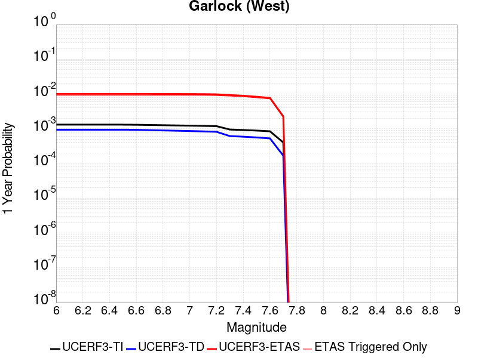
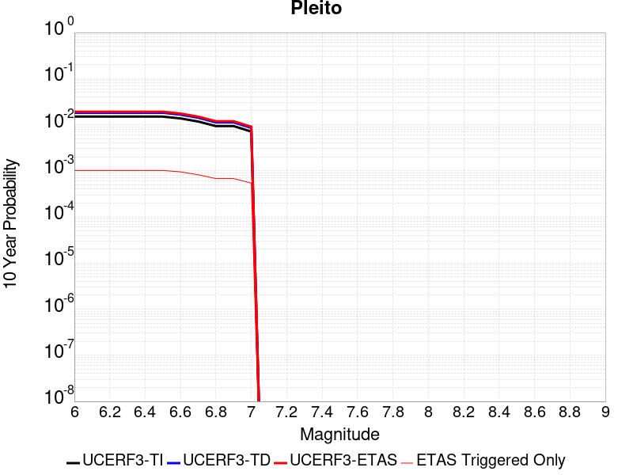
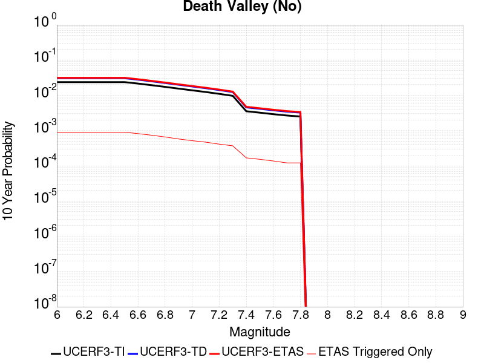
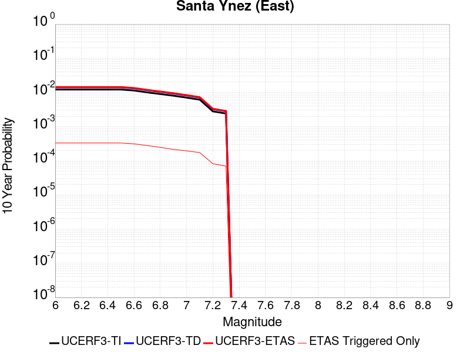
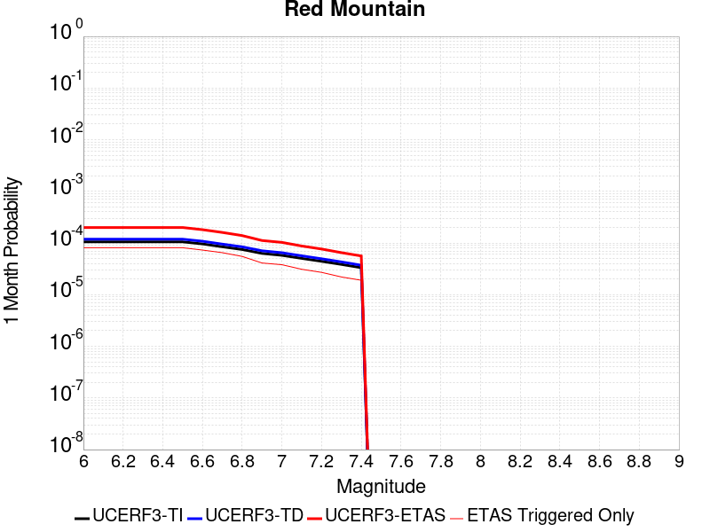
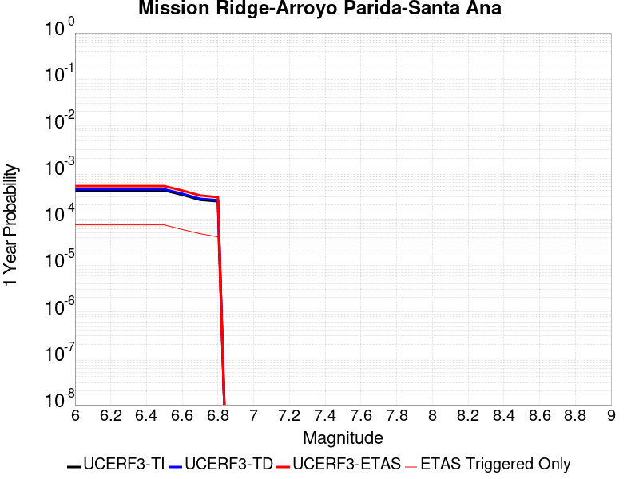
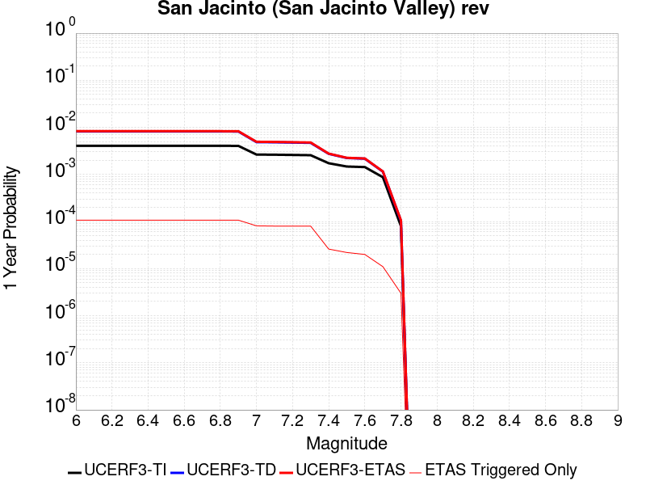
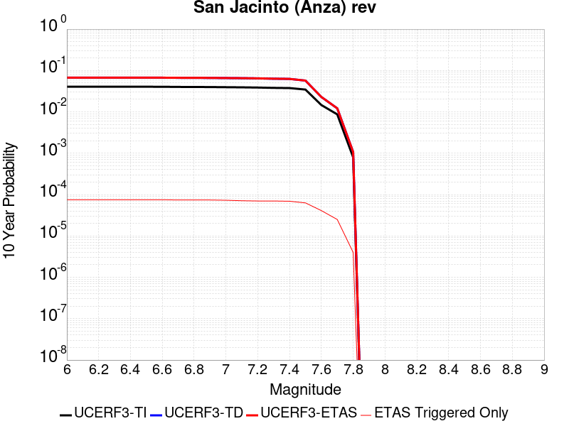
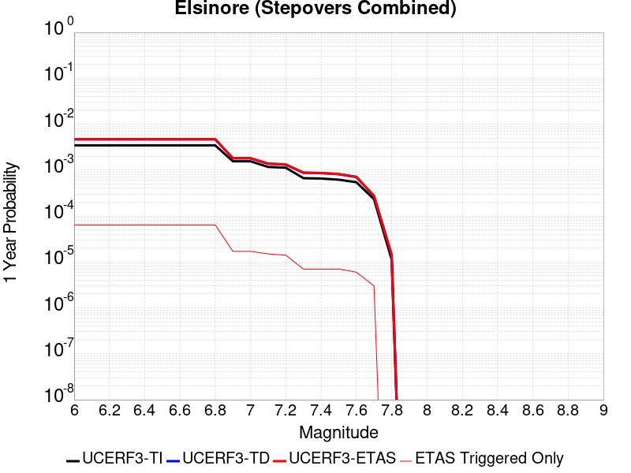
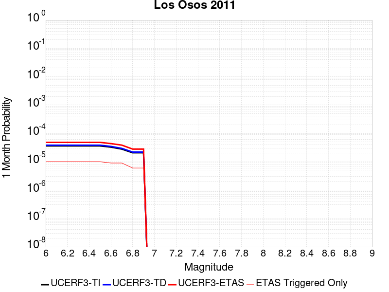

# Parent Section Magnitude-Probability Distributions

Only fault sections with at least one triggered aftershock are plotted. Sections are sorted by total supraseismogenic trigger rate (decreasing)

## Table Of Contents

* [Tank Canyon](#tank-canyon)
* [Little Lake](#little-lake)
* [Garlock (Central)](#garlock-central)
* [Owl Lake](#owl-lake)
* [Garlock (West)](#garlock-west)
* [Garlock (East)](#garlock-east)
* [Death Valley (So)](#death-valley-so)
* [Panamint Valley](#panamint-valley)
* [San Andreas (Mojave N)](#san-andreas-mojave-n)
* [San Andreas (Big Bend)](#san-andreas-big-bend)
* [San Andreas (Carrizo) rev](#san-andreas-carrizo-rev)
* [San Andreas (Mojave S)](#san-andreas-mojave-s)
* [Blackwater](#blackwater)
* [San Andreas (Cholame) rev](#san-andreas-cholame-rev)
* [San Andreas (Parkfield)](#san-andreas-parkfield)
* [Death Valley (Black Mtns Frontal)](#death-valley-black-mtns-frontal)
* [Hunter Mountain-Saline Valley](#hunter-mountain-saline-valley)
* [San Cayetano](#san-cayetano)
* [San Andreas (San Bernardino N)](#san-andreas-san-bernardino-n)
* [Pleito](#pleito)
* [Cucamonga](#cucamonga)
* [Death Valley (No)](#death-valley-no)
* [San Andreas (San Bernardino S)](#san-andreas-san-bernardino-s)
* [Santa Ynez (East)](#santa-ynez-east)
* [Pitas Point (Lower West)](#pitas-point-lower-west)
* [Cleghorn](#cleghorn)
* [Gravel Hills-Harper Lk](#gravel-hills-harper-lk)
* [Pitas Point (Lower)-Montalvo](#pitas-point-lower-montalvo)
* [Santa Ynez (West)](#santa-ynez-west)
* [San Jacinto (San Bernardino)](#san-jacinto-san-bernardino)
* [Red Mountain](#red-mountain)
* [Mission Ridge-Arroyo Parida-Santa Ana](#mission-ridge-arroyo-parida-santa-ana)
* [San Andreas (Coachella) rev](#san-andreas-coachella-rev)
* [San Andreas (San Gorgonio Pass-Garnet HIll)](#san-andreas-san-gorgonio-pass-garnet-hill)
* [Oak Ridge (Onshore)](#oak-ridge-onshore)
* [So Sierra Nevada](#so-sierra-nevada)
* [San Juan](#san-juan)
* [San Jacinto (Stepovers Combined)](#san-jacinto-stepovers-combined)
* [Death Valley (Fish Lake Valley)](#death-valley-fish-lake-valley)
* [Lenwood-Lockhart-Old Woman Springs](#lenwood-lockhart-old-woman-springs)
* [Santa Susana alt 1](#santa-susana-alt-1)
* [San Jacinto (San Jacinto Valley) rev](#san-jacinto-san-jacinto-valley-rev)
* [Raymond](#raymond)
* [San Jose](#san-jose)
* [Simi-Santa Rosa](#simi-santa-rosa)
* [Ventura-Pitas Point](#ventura-pitas-point)
* [Elysian Park (Upper)](#elysian-park-upper)
* [Chino alt 1](#chino-alt-1)
* [Independence rev 2011](#independence-rev-2011)
* [San Jacinto (Anza) rev](#san-jacinto-anza-rev)
* [San Jacinto (Clark) rev](#san-jacinto-clark-rev)
* [Helendale-So Lockhart](#helendale-so-lockhart)
* [Elsinore (Glen Ivy) rev](#elsinore-glen-ivy-rev)
* [Elsinore (Stepovers Combined)](#elsinore-stepovers-combined)
* [Hayward (So) 2011 CFM](#hayward-so-2011-cfm)
* [Santa Rosa Island](#santa-rosa-island)
* [San Gregorio (South) 2011 CFM](#san-gregorio-south-2011-cfm)
* [Great Valley 03 Mysterious Ridge](#great-valley-03-mysterious-ridge)
* [Channel Islands Thrust](#channel-islands-thrust)
* [Imperial](#imperial)
* [San Gabriel](#san-gabriel)
* [Great Valley 09 (Laguna Seca)](#great-valley-09-laguna-seca)
* [Great Valley 04a Trout Creek](#great-valley-04a-trout-creek)
* [Deep Springs](#deep-springs)
* [Great Valley 04b Gordon Valley](#great-valley-04b-gordon-valley)
* [Los Alamos 2011 CFM](#los-alamos-2011-cfm)
* [Sierra Madre](#sierra-madre)
* [Emerson-Copper Mtn 2011](#emerson-copper-mtn-2011)
* [Santa Cruz Island](#santa-cruz-island)
* [Calaveras (No) 2011 CFM](#calaveras-no-2011-cfm)
* [North Frontal  (West)](#north-frontal--west)
* [Verdugo](#verdugo)
* [Elsinore (Temecula) rev](#elsinore-temecula-rev)
* [Hayward (No) 2011 CFM](#hayward-no-2011-cfm)
* [Rose Canyon](#rose-canyon)
* [Robinson Creek](#robinson-creek)
* [Hosgri](#hosgri)
* [Great Valley 12](#great-valley-12)
* [Anacapa-Dume alt 1](#anacapa-dume-alt-1)
* [Burnt Mtn](#burnt-mtn)
* [San Gregorio (North) 2011 CFM](#san-gregorio-north-2011-cfm)
* [Whittier alt 1](#whittier-alt-1)
* [Newport-Inglewood (Offshore)](#newport-inglewood-offshore)
* [Los Osos 2011](#los-osos-2011)
* [Mono Lake 2011 CFM](#mono-lake-2011-cfm)

## Tank Canyon
*[(top)](#table-of-contents)*

| 1 Week | 1 Month | 1 Year | 10 Year |
|-----|-----|-----|-----|
|  |  |  |  |

| Magnitude | 1 wk TI Prob | 1 wk TD Prob | 1 wk ETAS Prob | 1 wk ETAS/TD Gain | 1 wk ETAS Triggered Only | 1 mo TI Prob | 1 mo TD Prob | 1 mo ETAS Prob | 1 mo ETAS/TD Gain | 1 mo ETAS Triggered Only | 1 yr TI Prob | 1 yr TD Prob | 1 yr ETAS Prob | 1 yr ETAS/TD Gain | 1 yr ETAS Triggered Only | 10 yr TI Prob | 10 yr TD Prob | 10 yr ETAS Prob | 10 yr ETAS/TD Gain | 10 yr ETAS Triggered Only |
|-----|-----|-----|-----|-----|-----|-----|-----|-----|-----|-----|-----|-----|-----|-----|-----|-----|-----|-----|-----|-----|
| 6.0 | 2.7748038E-5 | 3.5073965E-5 | 0.020240009 | 577.0664 | 0.020205643 | 1.18914744E-4 | 1.5031699E-4 | 0.025911627 | 172.3799 | 0.025765184 | 0.0014468255 | 0.0018300817 | 0.041511036 | 22.682613 | 0.039753705 | 0.014374418 | 0.018297758 | 0.07152612 | 3.9090097 | 0.054220468 |
| 6.1 | 2.7748038E-5 | 3.5073965E-5 | 0.020240009 | 577.0664 | 0.020205643 | 1.18914744E-4 | 1.5031699E-4 | 0.025911627 | 172.3799 | 0.025765184 | 0.0014468255 | 0.0018300817 | 0.041511036 | 22.682613 | 0.039753705 | 0.014374418 | 0.018297758 | 0.07152612 | 3.9090097 | 0.054220468 |
| 6.2 | 2.7748038E-5 | 3.5073965E-5 | 0.020240009 | 577.0664 | 0.020205643 | 1.18914744E-4 | 1.5031699E-4 | 0.025911627 | 172.3799 | 0.025765184 | 0.0014468255 | 0.0018300817 | 0.041511036 | 22.682613 | 0.039753705 | 0.014374418 | 0.018297758 | 0.07152612 | 3.9090097 | 0.054220468 |
| 6.3 | 2.7748038E-5 | 3.5073965E-5 | 0.020240009 | 577.0664 | 0.020205643 | 1.18914744E-4 | 1.5031699E-4 | 0.025911627 | 172.3799 | 0.025765184 | 0.0014468255 | 0.0018300817 | 0.041511036 | 22.682613 | 0.039753705 | 0.014374418 | 0.018297758 | 0.07152612 | 3.9090097 | 0.054220468 |

## Little Lake
*[(top)](#table-of-contents)*

| 1 Week | 1 Month | 1 Year | 10 Year |
|-----|-----|-----|-----|
|  |  |  |  |

| Magnitude | 1 wk TI Prob | 1 wk TD Prob | 1 wk ETAS Prob | 1 wk ETAS/TD Gain | 1 wk ETAS Triggered Only | 1 mo TI Prob | 1 mo TD Prob | 1 mo ETAS Prob | 1 mo ETAS/TD Gain | 1 mo ETAS Triggered Only | 1 yr TI Prob | 1 yr TD Prob | 1 yr ETAS Prob | 1 yr ETAS/TD Gain | 1 yr ETAS Triggered Only | 10 yr TI Prob | 10 yr TD Prob | 10 yr ETAS Prob | 10 yr ETAS/TD Gain | 10 yr ETAS Triggered Only |
|-----|-----|-----|-----|-----|-----|-----|-----|-----|-----|-----|-----|-----|-----|-----|-----|-----|-----|-----|-----|-----|
| 6.0 | 1.27106505E-5 | 1.3900362E-5 | 0.012029516 | 865.41016 | 0.012015782 | 5.447308E-5 | 5.957219E-5 | 0.01542212 | 258.8812 | 0.015363462 | 6.630079E-4 | 7.25151E-4 | 0.021453772 | 29.585249 | 0.020743662 | 0.006610333 | 0.0072377534 | 0.03317254 | 4.583265 | 0.026123865 |
| 6.1 | 1.27106505E-5 | 1.3900362E-5 | 0.012029516 | 865.41016 | 0.012015782 | 5.447308E-5 | 5.957219E-5 | 0.01542212 | 258.8812 | 0.015363462 | 6.630079E-4 | 7.25151E-4 | 0.021453772 | 29.585249 | 0.020743662 | 0.006610333 | 0.0072377534 | 0.03317254 | 4.583265 | 0.026123865 |
| 6.2 | 1.27106505E-5 | 1.3900362E-5 | 0.012029516 | 865.41016 | 0.012015782 | 5.447308E-5 | 5.957219E-5 | 0.01542212 | 258.8812 | 0.015363462 | 6.630079E-4 | 7.25151E-4 | 0.021453772 | 29.585249 | 0.020743662 | 0.006610333 | 0.0072377534 | 0.03317254 | 4.583265 | 0.026123865 |
| 6.3 | 1.27106505E-5 | 1.3900362E-5 | 0.012029516 | 865.41016 | 0.012015782 | 5.447308E-5 | 5.957219E-5 | 0.01542212 | 258.8812 | 0.015363462 | 6.630079E-4 | 7.25151E-4 | 0.021453772 | 29.585249 | 0.020743662 | 0.006610333 | 0.0072377534 | 0.03317254 | 4.583265 | 0.026123865 |
| 6.4 | 1.27106505E-5 | 1.3900362E-5 | 0.012029516 | 865.41016 | 0.012015782 | 5.447308E-5 | 5.957219E-5 | 0.01542212 | 258.8812 | 0.015363462 | 6.630079E-4 | 7.25151E-4 | 0.021453772 | 29.585249 | 0.020743662 | 0.006610333 | 0.0072377534 | 0.03317254 | 4.583265 | 0.026123865 |
| 6.5 | 1.27106505E-5 | 1.3900362E-5 | 0.012029516 | 865.41016 | 0.012015782 | 5.447308E-5 | 5.957219E-5 | 0.01542212 | 258.8812 | 0.015363462 | 6.630079E-4 | 7.25151E-4 | 0.021453772 | 29.585249 | 0.020743662 | 0.006610333 | 0.0072377534 | 0.03317254 | 4.583265 | 0.026123865 |
| 6.6 | 1.08505255E-5 | 1.1856941E-5 | 0.010293896 | 868.1748 | 0.010282162 | 4.6501424E-5 | 5.0815026E-5 | 0.013321303 | 262.15283 | 0.013271162 | 5.6600774E-4 | 6.1859656E-4 | 0.018481763 | 29.876925 | 0.017874222 | 0.005645683 | 0.006178476 | 0.028516885 | 4.615521 | 0.022477284 |
| 6.7 | 7.97625E-6 | 8.706619E-6 | 0.007600702 | 872.9797 | 0.007592061 | 3.4183482E-5 | 3.7314083E-5 | 0.009960425 | 266.93475 | 0.009923481 | 4.161044E-4 | 4.5429895E-4 | 0.01389869 | 30.59371 | 0.013450502 | 0.004153261 | 0.0045429897 | 0.02120535 | 4.6677084 | 0.016738404 |
| 6.8 | 7.97625E-6 | 8.706619E-6 | 0.007600702 | 872.9797 | 0.007592061 | 3.4183482E-5 | 3.7314083E-5 | 0.009960425 | 266.93475 | 0.009923481 | 4.161044E-4 | 4.5429895E-4 | 0.01389869 | 30.59371 | 0.013450502 | 0.004153261 | 0.0045429897 | 0.02120535 | 4.6677084 | 0.016738404 |

## Garlock (Central)
*[(top)](#table-of-contents)*

| 1 Week | 1 Month | 1 Year | 10 Year |
|-----|-----|-----|-----|
|  |  |  |  |

| Magnitude | 1 wk TI Prob | 1 wk TD Prob | 1 wk ETAS Prob | 1 wk ETAS/TD Gain | 1 wk ETAS Triggered Only | 1 mo TI Prob | 1 mo TD Prob | 1 mo ETAS Prob | 1 mo ETAS/TD Gain | 1 mo ETAS Triggered Only | 1 yr TI Prob | 1 yr TD Prob | 1 yr ETAS Prob | 1 yr ETAS/TD Gain | 1 yr ETAS Triggered Only | 10 yr TI Prob | 10 yr TD Prob | 10 yr ETAS Prob | 10 yr ETAS/TD Gain | 10 yr ETAS Triggered Only |
|-----|-----|-----|-----|-----|-----|-----|-----|-----|-----|-----|-----|-----|-----|-----|-----|-----|-----|-----|-----|-----|
| 6.0 | 2.575808E-5 | 1.9313613E-5 | 0.011197959 | 579.7962 | 0.011178861 | 1.10387096E-4 | 8.277037E-5 | 0.0140103595 | 169.2678 | 0.013928742 | 0.0013431342 | 0.0010073289 | 0.019998223 | 19.852726 | 0.019010043 | 0.013350452 | 0.0100695705 | 0.035101887 | 3.4859366 | 0.025286945 |
| 6.1 | 2.575808E-5 | 1.9313613E-5 | 0.011197959 | 579.7962 | 0.011178861 | 1.10387096E-4 | 8.277037E-5 | 0.0140103595 | 169.2678 | 0.013928742 | 0.0013431342 | 0.0010073289 | 0.019998223 | 19.852726 | 0.019010043 | 0.013350452 | 0.0100695705 | 0.035101887 | 3.4859366 | 0.025286945 |
| 6.2 | 2.575808E-5 | 1.9313613E-5 | 0.011197959 | 579.7962 | 0.011178861 | 1.10387096E-4 | 8.277037E-5 | 0.0140103595 | 169.2678 | 0.013928742 | 0.0013431342 | 0.0010073289 | 0.019998223 | 19.852726 | 0.019010043 | 0.013350452 | 0.0100695705 | 0.035101887 | 3.4859366 | 0.025286945 |
| 6.3 | 2.575808E-5 | 1.9313613E-5 | 0.011197959 | 579.7962 | 0.011178861 | 1.10387096E-4 | 8.277037E-5 | 0.0140103595 | 169.2678 | 0.013928742 | 0.0013431342 | 0.0010073289 | 0.019998223 | 19.852726 | 0.019010043 | 0.013350452 | 0.0100695705 | 0.035101887 | 3.4859366 | 0.025286945 |
| 6.4 | 2.575808E-5 | 1.9313613E-5 | 0.011197959 | 579.7962 | 0.011178861 | 1.10387096E-4 | 8.277037E-5 | 0.0140103595 | 169.2678 | 0.013928742 | 0.0013431342 | 0.0010073289 | 0.019998223 | 19.852726 | 0.019010043 | 0.013350452 | 0.0100695705 | 0.035101887 | 3.4859366 | 0.025286945 |
| 6.5 | 2.575808E-5 | 1.9313613E-5 | 0.011197959 | 579.7962 | 0.011178861 | 1.10387096E-4 | 8.277037E-5 | 0.0140103595 | 169.2678 | 0.013928742 | 0.0013431342 | 0.0010073289 | 0.019998223 | 19.852726 | 0.019010043 | 0.013350452 | 0.0100695705 | 0.035101887 | 3.4859366 | 0.025286945 |
| 6.6 | 2.540234E-5 | 1.885198E-5 | 0.0106594935 | 565.43097 | 0.010640842 | 1.0886263E-4 | 8.0792066E-5 | 0.013470433 | 166.72964 | 0.013390722 | 0.0013245966 | 9.83265E-4 | 0.01919824 | 19.524992 | 0.018232903 | 0.013167289 | 0.009831364 | 0.033922628 | 3.4504495 | 0.024330463 |
| 6.7 | 2.4966947E-5 | 1.8286464E-5 | 0.009941586 | 543.6582 | 0.009923481 | 1.06996806E-4 | 7.8368575E-5 | 0.012690962 | 161.93942 | 0.012613582 | 0.0013019076 | 9.5378514E-4 | 0.01821373 | 19.09626 | 0.017276423 | 0.012943068 | 0.009539624 | 0.03233537 | 3.3895855 | 0.023015304 |
| 6.8 | 2.4548952E-5 | 1.7797542E-5 | 0.009761766 | 548.48956 | 0.009744141 | 1.0520555E-4 | 7.627332E-5 | 0.012449792 | 163.22604 | 0.012374462 | 0.001280125 | 9.282974E-4 | 0.01789006 | 19.271906 | 0.016977523 | 0.012727758 | 0.009286596 | 0.031555142 | 3.3979232 | 0.022477284 |
| 6.9 | 2.3994342E-5 | 1.7148153E-5 | 0.009043775 | 527.39056 | 0.009026782 | 1.0282884E-4 | 7.349039E-5 | 0.011550409 | 157.16898 | 0.011477762 | 0.0012512221 | 8.944436E-4 | 0.016244164 | 18.161196 | 0.015363462 | 0.012442005 | 0.0089510605 | 0.029449802 | 3.2900906 | 0.020683883 |
| 7.0 | 2.343005E-5 | 1.6491087E-5 | 0.008445334 | 512.115 | 0.0084289815 | 1.0041064E-4 | 7.067455E-5 | 0.010890092 | 154.08789 | 0.010820182 | 0.0012218138 | 8.601883E-4 | 0.015254778 | 17.734232 | 0.014406982 | 0.01215118 | 0.008610493 | 0.027871706 | 3.236947 | 0.019428503 |
| 7.1 | 2.2814058E-5 | 1.5782754E-5 | 0.007906619 | 500.96576 | 0.007890961 | 9.777087E-5 | 6.763899E-5 | 0.010229553 | 151.23752 | 0.010162601 | 0.0011897103 | 8.2325895E-4 | 0.01444188 | 17.54233 | 0.013629843 | 0.011833611 | 0.00824334 | 0.02662238 | 3.229562 | 0.018531803 |
| 7.2 | 2.2145266E-5 | 1.5027377E-5 | 0.0071287416 | 474.3836 | 0.0071138213 | 9.490483E-5 | 6.440182E-5 | 0.009449258 | 146.72346 | 0.009385462 | 0.0011548538 | 7.8387547E-4 | 0.01338757 | 17.078695 | 0.012613582 | 0.011488707 | 0.007851825 | 0.025111217 | 3.1981378 | 0.017395983 |
| 7.3 | 1.9954436E-5 | 1.3199953E-5 | 0.0058117844 | 440.28824 | 0.005798661 | 8.551621E-5 | 5.657036E-5 | 0.0075884257 | 134.14137 | 0.0075322813 | 0.0010406625 | 6.8859005E-4 | 0.010664977 | 15.488137 | 0.009983262 | 0.010358025 | 0.006900618 | 0.020495772 | 2.970136 | 0.013689622 |
| 7.4 | 1.918037E-5 | 1.2553606E-5 | 0.0056915833 | 453.38235 | 0.0056791008 | 8.2198996E-5 | 5.3800417E-5 | 0.007406346 | 137.66336 | 0.007352941 | 0.0010003132 | 6.5488677E-4 | 0.010273165 | 15.6869335 | 0.009624582 | 0.009958224 | 0.006564366 | 0.019629637 | 2.9903324 | 0.013151602 |
| 7.5 | 1.6994161E-5 | 1.0764553E-5 | 0.0040757614 | 378.62805 | 0.0040650405 | 7.283008E-5 | 4.613333E-5 | 0.0055456404 | 120.208984 | 0.005499761 | 8.863455E-4 | 5.615903E-4 | 0.007850655 | 13.979329 | 0.007293161 | 0.008828186 | 0.005632708 | 0.015856953 | 2.8151562 | 0.010282162 |
| 7.6 | 1.621788E-5 | 1.012848E-5 | 0.0037164516 | 366.93082 | 0.0037063607 | 6.950335E-5 | 4.34074E-5 | 0.0051244874 | 118.055626 | 0.0050813006 | 8.458747E-4 | 5.2841863E-4 | 0.0072799902 | 13.776937 | 0.006755141 | 0.0084266225 | 0.005301458 | 0.014696626 | 2.7721858 | 0.009445242 |
| 7.7 | 7.713584E-6 | 3.2171508E-6 | 7.803548E-4 | 242.56084 | 7.7714014E-4 | 3.3057797E-5 | 1.378779E-5 | 0.0011495923 | 83.37756 | 0.0011358202 | 4.0240434E-4 | 1.6786634E-4 | 0.0020207355 | 12.0377655 | 0.0018531804 | 0.0040167645 | 0.0016902693 | 0.0043161437 | 2.5535243 | 0.0026303204 |

## Owl Lake
*[(top)](#table-of-contents)*

| 1 Week | 1 Month | 1 Year | 10 Year |
|-----|-----|-----|-----|
|  |  |  |  |

| Magnitude | 1 wk TI Prob | 1 wk TD Prob | 1 wk ETAS Prob | 1 wk ETAS/TD Gain | 1 wk ETAS Triggered Only | 1 mo TI Prob | 1 mo TD Prob | 1 mo ETAS Prob | 1 mo ETAS/TD Gain | 1 mo ETAS Triggered Only | 1 yr TI Prob | 1 yr TD Prob | 1 yr ETAS Prob | 1 yr ETAS/TD Gain | 1 yr ETAS Triggered Only | 10 yr TI Prob | 10 yr TD Prob | 10 yr ETAS Prob | 10 yr ETAS/TD Gain | 10 yr ETAS Triggered Only |
|-----|-----|-----|-----|-----|-----|-----|-----|-----|-----|-----|-----|-----|-----|-----|-----|-----|-----|-----|-----|-----|
| 6.0 | 3.637175E-5 | 4.988367E-5 | 0.004533161 | 90.87464 | 0.0044835005 | 1.5586962E-4 | 2.1378716E-4 | 0.0059514414 | 27.83816 | 0.005738881 | 0.0018960608 | 0.0026025574 | 0.011605846 | 4.4594007 | 0.009026782 | 0.018799646 | 0.025995217 | 0.039037846 | 1.5017318 | 0.013390722 |
| 6.1 | 3.637175E-5 | 4.988367E-5 | 0.004533161 | 90.87464 | 0.0044835005 | 1.5586962E-4 | 2.1378716E-4 | 0.0059514414 | 27.83816 | 0.005738881 | 0.0018960608 | 0.0026025574 | 0.011605846 | 4.4594007 | 0.009026782 | 0.018799646 | 0.025995217 | 0.039037846 | 1.5017318 | 0.013390722 |
| 6.2 | 3.637175E-5 | 4.988367E-5 | 0.004533161 | 90.87464 | 0.0044835005 | 1.5586962E-4 | 2.1378716E-4 | 0.0059514414 | 27.83816 | 0.005738881 | 0.0018960608 | 0.0026025574 | 0.011605846 | 4.4594007 | 0.009026782 | 0.018799646 | 0.025995217 | 0.039037846 | 1.5017318 | 0.013390722 |
| 6.3 | 3.637175E-5 | 4.988367E-5 | 0.004533161 | 90.87464 | 0.0044835005 | 1.5586962E-4 | 2.1378716E-4 | 0.0059514414 | 27.83816 | 0.005738881 | 0.0018960608 | 0.0026025574 | 0.011605846 | 4.4594007 | 0.009026782 | 0.018799646 | 0.025995217 | 0.039037846 | 1.5017318 | 0.013390722 |
| 6.4 | 3.637175E-5 | 4.988367E-5 | 0.004533161 | 90.87464 | 0.0044835005 | 1.5586962E-4 | 2.1378716E-4 | 0.0059514414 | 27.83816 | 0.005738881 | 0.0018960608 | 0.0026025574 | 0.011605846 | 4.4594007 | 0.009026782 | 0.018799646 | 0.025995217 | 0.039037846 | 1.5017318 | 0.013390722 |
| 6.5 | 3.637175E-5 | 4.988367E-5 | 0.004533161 | 90.87464 | 0.0044835005 | 1.5586962E-4 | 2.1378716E-4 | 0.0059514414 | 27.83816 | 0.005738881 | 0.0018960608 | 0.0026025574 | 0.011605846 | 4.4594007 | 0.009026782 | 0.018799646 | 0.025995217 | 0.039037846 | 1.5017318 | 0.013390722 |

## Garlock (West)
*[(top)](#table-of-contents)*

| 1 Week | 1 Month | 1 Year | 10 Year |
|-----|-----|-----|-----|
|  |  |  |  |

| Magnitude | 1 wk TI Prob | 1 wk TD Prob | 1 wk ETAS Prob | 1 wk ETAS/TD Gain | 1 wk ETAS Triggered Only | 1 mo TI Prob | 1 mo TD Prob | 1 mo ETAS Prob | 1 mo ETAS/TD Gain | 1 mo ETAS Triggered Only | 1 yr TI Prob | 1 yr TD Prob | 1 yr ETAS Prob | 1 yr ETAS/TD Gain | 1 yr ETAS Triggered Only | 10 yr TI Prob | 10 yr TD Prob | 10 yr ETAS Prob | 10 yr ETAS/TD Gain | 10 yr ETAS Triggered Only |
|-----|-----|-----|-----|-----|-----|-----|-----|-----|-----|-----|-----|-----|-----|-----|-----|-----|-----|-----|-----|-----|
| 6.0 | 2.516656E-5 | 1.8065048E-5 | 0.004501485 | 249.182 | 0.0044835005 | 1.07852225E-4 | 7.741977E-5 | 0.0061147334 | 78.98155 | 0.006037781 | 0.0013123099 | 9.42255E-4 | 0.009124399 | 9.683578 | 0.008189862 | 0.013045873 | 0.009421492 | 0.020850332 | 2.2130606 | 0.011537542 |
| 6.1 | 2.516656E-5 | 1.8065048E-5 | 0.004501485 | 249.182 | 0.0044835005 | 1.07852225E-4 | 7.741977E-5 | 0.0061147334 | 78.98155 | 0.006037781 | 0.0013123099 | 9.42255E-4 | 0.009124399 | 9.683578 | 0.008189862 | 0.013045873 | 0.009421492 | 0.020850332 | 2.2130606 | 0.011537542 |
| 6.2 | 2.516656E-5 | 1.8065048E-5 | 0.004501485 | 249.182 | 0.0044835005 | 1.07852225E-4 | 7.741977E-5 | 0.0061147334 | 78.98155 | 0.006037781 | 0.0013123099 | 9.42255E-4 | 0.009124399 | 9.683578 | 0.008189862 | 0.013045873 | 0.009421492 | 0.020850332 | 2.2130606 | 0.011537542 |
| 6.3 | 2.516656E-5 | 1.8065048E-5 | 0.004501485 | 249.182 | 0.0044835005 | 1.07852225E-4 | 7.741977E-5 | 0.0061147334 | 78.98155 | 0.006037781 | 0.0013123099 | 9.42255E-4 | 0.009124399 | 9.683578 | 0.008189862 | 0.013045873 | 0.009421492 | 0.020850332 | 2.2130606 | 0.011537542 |
| 6.4 | 2.516656E-5 | 1.8065048E-5 | 0.004501485 | 249.182 | 0.0044835005 | 1.07852225E-4 | 7.741977E-5 | 0.0061147334 | 78.98155 | 0.006037781 | 0.0013123099 | 9.42255E-4 | 0.009124399 | 9.683578 | 0.008189862 | 0.013045873 | 0.009421492 | 0.020850332 | 2.2130606 | 0.011537542 |
| 6.5 | 2.516656E-5 | 1.8065048E-5 | 0.004501485 | 249.182 | 0.0044835005 | 1.07852225E-4 | 7.741977E-5 | 0.0061147334 | 78.98155 | 0.006037781 | 0.0013123099 | 9.42255E-4 | 0.009124399 | 9.683578 | 0.008189862 | 0.013045873 | 0.009421492 | 0.020850332 | 2.2130606 | 0.011537542 |
| 6.6 | 2.498869E-5 | 1.7877663E-5 | 0.004501298 | 251.78339 | 0.0044835005 | 1.07089996E-4 | 7.6616736E-5 | 0.0061139353 | 79.79895 | 0.006037781 | 0.0013030408 | 9.3248655E-4 | 0.009114711 | 9.77463 | 0.008189862 | 0.012954267 | 0.009324339 | 0.020754302 | 2.22582 | 0.011537542 |
| 6.7 | 2.4627925E-5 | 1.7497801E-5 | 0.00450092 | 257.22775 | 0.0044835005 | 1.0554398E-4 | 7.498886E-5 | 0.006112317 | 81.509674 | 0.006037781 | 0.0012842404 | 9.1268384E-4 | 0.009095071 | 9.965193 | 0.008189862 | 0.012768441 | 0.009128104 | 0.02056033 | 2.2524207 | 0.011537542 |
| 6.8 | 2.4270235E-5 | 1.716136E-5 | 0.004500585 | 262.2511 | 0.0044835005 | 1.04011146E-4 | 7.354704E-5 | 0.006110884 | 83.088104 | 0.006037781 | 0.0012656 | 8.9514436E-4 | 0.009077675 | 10.141018 | 0.008189862 | 0.012584164 | 0.0089538675 | 0.020388104 | 2.2770164 | 0.011537542 |
| 6.9 | 2.3913764E-5 | 1.6823105E-5 | 0.004440469 | 263.95062 | 0.0044237208 | 1.0248353E-4 | 7.2097464E-5 | 0.0060496675 | 83.90957 | 0.005978001 | 0.0012470228 | 8.775101E-4 | 0.009000457 | 10.256813 | 0.008130081 | 0.012400482 | 0.00877859 | 0.020155594 | 2.2959943 | 0.011477762 |
| 7.0 | 2.3579369E-5 | 1.6492264E-5 | 0.00444014 | 269.22562 | 0.0044237208 | 1.0105052E-4 | 7.067965E-5 | 0.006048258 | 85.57284 | 0.005978001 | 0.0012295957 | 8.6026196E-4 | 0.008983349 | 10.4425745 | 0.008130081 | 0.012228143 | 0.008607132 | 0.019986104 | 2.3220398 | 0.011477762 |
| 7.1 | 2.3205374E-5 | 1.6105636E-5 | 0.004439755 | 275.66467 | 0.0044237208 | 9.944781E-5 | 6.902276E-5 | 0.006046611 | 87.60314 | 0.005978001 | 0.0012101046 | 8.401051E-4 | 0.008903626 | 10.598229 | 0.008070301 | 0.0120353615 | 0.008406721 | 0.019728715 | 2.3467789 | 0.011417982 |
| 7.2 | 2.2799322E-5 | 1.5676578E-5 | 0.004379549 | 279.36893 | 0.0043639406 | 9.770772E-5 | 6.718404E-5 | 0.005985007 | 89.08376 | 0.005918221 | 0.0011889422 | 8.177357E-4 | 0.008821706 | 10.787968 | 0.0080105215 | 0.011826012 | 0.008184515 | 0.019449756 | 2.376409 | 0.0113582015 |
| 7.3 | 1.8228246E-5 | 1.1798695E-5 | 0.0043159085 | 365.79544 | 0.004304161 | 7.811871E-5 | 5.0565202E-5 | 0.005848933 | 115.671104 | 0.005798661 | 9.506803E-4 | 6.1551924E-4 | 0.008382137 | 13.617993 | 0.007771401 | 0.0094662355 | 0.006171021 | 0.017162075 | 2.7810755 | 0.011059302 |
| 7.4 | 1.7670916E-5 | 1.132978E-5 | 0.004255662 | 375.6174 | 0.0042443806 | 7.5730306E-5 | 4.8555645E-5 | 0.005727381 | 117.954994 | 0.0056791008 | 9.216264E-4 | 5.9106643E-4 | 0.008118896 | 13.736012 | 0.0075322813 | 0.009178135 | 0.0059269792 | 0.016623605 | 2.8047347 | 0.010760401 |
| 7.5 | 1.6994161E-5 | 1.0764553E-5 | 0.0040757614 | 378.62805 | 0.0040650405 | 7.283008E-5 | 4.613333E-5 | 0.0055456404 | 120.208984 | 0.005499761 | 8.863455E-4 | 5.615903E-4 | 0.007850655 | 13.979329 | 0.007293161 | 0.008828186 | 0.005632708 | 0.015856953 | 2.8151562 | 0.010282162 |
| 7.6 | 1.621788E-5 | 1.012848E-5 | 0.0037164516 | 366.93082 | 0.0037063607 | 6.950335E-5 | 4.34074E-5 | 0.0051244874 | 118.055626 | 0.0050813006 | 8.458747E-4 | 5.2841863E-4 | 0.0072799902 | 13.776937 | 0.006755141 | 0.0084266225 | 0.005301458 | 0.014696626 | 2.7721858 | 0.009445242 |
| 7.7 | 7.713584E-6 | 3.2171508E-6 | 7.803548E-4 | 242.56084 | 7.7714014E-4 | 3.3057797E-5 | 1.378779E-5 | 0.0011495923 | 83.37756 | 0.0011358202 | 4.0240434E-4 | 1.6786634E-4 | 0.0020207355 | 12.0377655 | 0.0018531804 | 0.0040167645 | 0.0016902693 | 0.0043161437 | 2.5535243 | 0.0026303204 |

## Garlock (East)
*[(top)](#table-of-contents)*

| 1 Week | 1 Month | 1 Year | 10 Year |
|-----|-----|-----|-----|
|  |  |  |  |

| Magnitude | 1 wk TI Prob | 1 wk TD Prob | 1 wk ETAS Prob | 1 wk ETAS/TD Gain | 1 wk ETAS Triggered Only | 1 mo TI Prob | 1 mo TD Prob | 1 mo ETAS Prob | 1 mo ETAS/TD Gain | 1 mo ETAS Triggered Only | 1 yr TI Prob | 1 yr TD Prob | 1 yr ETAS Prob | 1 yr ETAS/TD Gain | 1 yr ETAS Triggered Only | 10 yr TI Prob | 10 yr TD Prob | 10 yr ETAS Prob | 10 yr ETAS/TD Gain | 10 yr ETAS Triggered Only |
|-----|-----|-----|-----|-----|-----|-----|-----|-----|-----|-----|-----|-----|-----|-----|-----|-----|-----|-----|-----|-----|
| 6.0 | 2.2327951E-5 | 1.8303952E-5 | 0.004202828 | 229.61314 | 0.004184601 | 9.5687705E-5 | 7.8444085E-5 | 0.0053984476 | 68.819046 | 0.005320421 | 0.0011643751 | 9.548048E-4 | 0.008360448 | 8.756186 | 0.0074127214 | 0.0115829315 | 0.0096519785 | 0.019716492 | 2.0427408 | 0.010162601 |
| 6.1 | 2.2327951E-5 | 1.8303952E-5 | 0.004202828 | 229.61314 | 0.004184601 | 9.5687705E-5 | 7.8444085E-5 | 0.0053984476 | 68.819046 | 0.005320421 | 0.0011643751 | 9.548048E-4 | 0.008360448 | 8.756186 | 0.0074127214 | 0.0115829315 | 0.0096519785 | 0.019716492 | 2.0427408 | 0.010162601 |
| 6.2 | 2.2327951E-5 | 1.8303952E-5 | 0.004202828 | 229.61314 | 0.004184601 | 9.5687705E-5 | 7.8444085E-5 | 0.0053984476 | 68.819046 | 0.005320421 | 0.0011643751 | 9.548048E-4 | 0.008360448 | 8.756186 | 0.0074127214 | 0.0115829315 | 0.0096519785 | 0.019716492 | 2.0427408 | 0.010162601 |
| 6.3 | 2.2327951E-5 | 1.8303952E-5 | 0.004202828 | 229.61314 | 0.004184601 | 9.5687705E-5 | 7.8444085E-5 | 0.0053984476 | 68.819046 | 0.005320421 | 0.0011643751 | 9.548048E-4 | 0.008360448 | 8.756186 | 0.0074127214 | 0.0115829315 | 0.0096519785 | 0.019716492 | 2.0427408 | 0.010162601 |
| 6.4 | 2.2327951E-5 | 1.8303952E-5 | 0.004202828 | 229.61314 | 0.004184601 | 9.5687705E-5 | 7.8444085E-5 | 0.0053984476 | 68.819046 | 0.005320421 | 0.0011643751 | 9.548048E-4 | 0.008360448 | 8.756186 | 0.0074127214 | 0.0115829315 | 0.0096519785 | 0.019716492 | 2.0427408 | 0.010162601 |
| 6.5 | 2.2327951E-5 | 1.8303952E-5 | 0.004202828 | 229.61314 | 0.004184601 | 9.5687705E-5 | 7.8444085E-5 | 0.0053984476 | 68.819046 | 0.005320421 | 0.0011643751 | 9.548048E-4 | 0.008360448 | 8.756186 | 0.0074127214 | 0.0115829315 | 0.0096519785 | 0.019716492 | 2.0427408 | 0.010162601 |
| 6.6 | 2.222123E-5 | 1.816971E-5 | 0.0041429154 | 228.01219 | 0.0041248207 | 9.523036E-5 | 7.7868805E-5 | 0.0053381 | 68.55248 | 0.0052606408 | 0.0011588129 | 9.4780687E-4 | 0.008234056 | 8.687483 | 0.007293161 | 0.011527888 | 0.009581773 | 0.019528585 | 2.0380971 | 0.010043042 |
| 6.7 | 2.2076227E-5 | 1.798404E-5 | 0.0041427305 | 230.35593 | 0.0041248207 | 9.4608964E-5 | 7.707312E-5 | 0.0053373086 | 69.24993 | 0.0052606408 | 0.0011512554 | 9.381278E-4 | 0.008224447 | 8.766872 | 0.007293161 | 0.011453095 | 0.009485973 | 0.019374534 | 2.0424402 | 0.009983262 |
| 6.8 | 2.1962227E-5 | 1.7854036E-5 | 0.004142601 | 232.02603 | 0.0041248207 | 9.4120434E-5 | 7.651599E-5 | 0.0053367545 | 69.74692 | 0.0052606408 | 0.0011453138 | 9.313506E-4 | 0.008217719 | 8.823443 | 0.007293161 | 0.01139429 | 0.00941876 | 0.019248774 | 2.0436633 | 0.009923481 |
| 6.9 | 1.1702579E-5 | 6.6732687E-6 | 0.0037727887 | 565.35846 | 0.0037661407 | 5.0152947E-5 | 2.8599494E-5 | 0.0045717503 | 159.85425 | 0.0045432807 | 6.10441E-4 | 3.481581E-4 | 0.0063838367 | 18.33603 | 0.006037781 | 0.0060876687 | 0.0034954504 | 0.011477971 | 3.2836888 | 0.0080105215 |
| 7.0 | 1.153538E-5 | 6.4796777E-6 | 0.0037128162 | 572.994 | 0.0037063607 | 4.9436403E-5 | 2.7769835E-5 | 0.0044513675 | 160.29507 | 0.0044237208 | 6.01722E-4 | 3.3806017E-4 | 0.0061945207 | 18.32372 | 0.005858441 | 0.006000953 | 0.0033946347 | 0.011139655 | 3.2815473 | 0.007771401 |
| 7.1 | 1.135938E-5 | 6.273818E-6 | 0.0034734926 | 553.6489 | 0.0034672406 | 4.868215E-5 | 2.6887597E-5 | 0.004151597 | 154.40565 | 0.0041248207 | 5.925439E-4 | 3.2732222E-4 | 0.005885043 | 17.979359 | 0.005559541 | 0.0059096646 | 0.0032873498 | 0.010675702 | 3.2475104 | 0.0074127214 |
| 7.2 | 1.1168294E-5 | 6.048814E-6 | 0.0031743702 | 524.7922 | 0.0031683405 | 4.786324E-5 | 2.5923315E-5 | 0.0038517448 | 148.58226 | 0.0038259206 | 5.825791E-4 | 3.1558552E-4 | 0.0055745663 | 17.6642 | 0.0052606408 | 0.005810542 | 0.0031701238 | 0.010142212 | 3.199311 | 0.006994261 |
| 7.3 | 1.0952553E-5 | 5.8686815E-6 | 0.002935072 | 500.1246 | 0.0029292204 | 4.693867E-5 | 2.5151334E-5 | 0.0036118617 | 143.60518 | 0.0035868005 | 5.713284E-4 | 3.0618932E-4 | 0.0051468876 | 16.809494 | 0.0048421808 | 0.0056986175 | 0.0030760262 | 0.009452811 | 3.0730596 | 0.006396461 |
| 7.4 | 1.0735812E-5 | 5.691247E-6 | 0.0028751155 | 505.18195 | 0.0028694405 | 4.6009813E-5 | 2.4390914E-5 | 0.0035513255 | 145.60034 | 0.0035270206 | 5.600255E-4 | 2.9693378E-4 | 0.0050181523 | 16.899902 | 0.004722621 | 0.0055861627 | 0.0029833042 | 0.009122276 | 3.057776 | 0.006157341 |
| 7.5 | 9.0273E-6 | 4.284415E-6 | 0.0013792188 | 321.91528 | 0.0013749403 | 3.8687853E-5 | 1.8361723E-5 | 0.001811729 | 98.66879 | 0.0017934003 | 4.709228E-4 | 2.2354414E-4 | 0.0027337433 | 12.229098 | 0.0025107604 | 0.004699261 | 0.0022480614 | 0.0058267987 | 2.5919216 | 0.0035868005 |
| 7.6 | 8.549585E-6 | 3.885532E-6 | 0.0010799215 | 277.93402 | 0.0010760402 | 3.6640562E-5 | 1.6652246E-5 | 0.0014513485 | 87.15632 | 0.0014347202 | 4.4600753E-4 | 2.027353E-4 | 0.0023543793 | 11.6130705 | 0.0021520804 | 0.0044511347 | 0.0020396118 | 0.005022516 | 2.462486 | 0.0029890004 |
| 7.7 | 7.713584E-6 | 3.2171508E-6 | 7.803548E-4 | 242.56084 | 7.7714014E-4 | 3.3057797E-5 | 1.378779E-5 | 0.0011495923 | 83.37756 | 0.0011358202 | 4.0240434E-4 | 1.6786634E-4 | 0.0020207355 | 12.0377655 | 0.0018531804 | 0.0040167645 | 0.0016902693 | 0.0043161437 | 2.5535243 | 0.0026303204 |

## Death Valley (So)
*[(top)](#table-of-contents)*

| 1 Week | 1 Month | 1 Year | 10 Year |
|-----|-----|-----|-----|
|  |  |  |  |

| Magnitude | 1 wk TI Prob | 1 wk TD Prob | 1 wk ETAS Prob | 1 wk ETAS/TD Gain | 1 wk ETAS Triggered Only | 1 mo TI Prob | 1 mo TD Prob | 1 mo ETAS Prob | 1 mo ETAS/TD Gain | 1 mo ETAS Triggered Only | 1 yr TI Prob | 1 yr TD Prob | 1 yr ETAS Prob | 1 yr ETAS/TD Gain | 1 yr ETAS Triggered Only | 10 yr TI Prob | 10 yr TD Prob | 10 yr ETAS Prob | 10 yr ETAS/TD Gain | 10 yr ETAS Triggered Only |
|-----|-----|-----|-----|-----|-----|-----|-----|-----|-----|-----|-----|-----|-----|-----|-----|-----|-----|-----|-----|-----|
| 6.0 | 4.4658216E-5 | 6.228887E-5 | 0.0020946825 | 33.62852 | 0.0020325202 | 1.9137832E-4 | 2.669324E-4 | 0.003314899 | 12.418496 | 0.0030487804 | 0.0023275411 | 0.0032461619 | 0.008549311 | 2.6336677 | 0.005320421 | 0.023033133 | 0.032094594 | 0.03984802 | 1.2415805 | 0.0080105215 |
| 6.1 | 4.4658216E-5 | 6.228887E-5 | 0.0020946825 | 33.62852 | 0.0020325202 | 1.9137832E-4 | 2.669324E-4 | 0.003314899 | 12.418496 | 0.0030487804 | 0.0023275411 | 0.0032461619 | 0.008549311 | 2.6336677 | 0.005320421 | 0.023033133 | 0.032094594 | 0.03984802 | 1.2415805 | 0.0080105215 |
| 6.2 | 4.4658216E-5 | 6.228887E-5 | 0.0020946825 | 33.62852 | 0.0020325202 | 1.9137832E-4 | 2.669324E-4 | 0.003314899 | 12.418496 | 0.0030487804 | 0.0023275411 | 0.0032461619 | 0.008549311 | 2.6336677 | 0.005320421 | 0.023033133 | 0.032094594 | 0.03984802 | 1.2415805 | 0.0080105215 |
| 6.3 | 4.4658216E-5 | 6.228887E-5 | 0.0020946825 | 33.62852 | 0.0020325202 | 1.9137832E-4 | 2.669324E-4 | 0.003314899 | 12.418496 | 0.0030487804 | 0.0023275411 | 0.0032461619 | 0.008549311 | 2.6336677 | 0.005320421 | 0.023033133 | 0.032094594 | 0.03984802 | 1.2415805 | 0.0080105215 |
| 6.4 | 4.4658216E-5 | 6.228887E-5 | 0.0020946825 | 33.62852 | 0.0020325202 | 1.9137832E-4 | 2.669324E-4 | 0.003314899 | 12.418496 | 0.0030487804 | 0.0023275411 | 0.0032461619 | 0.008549311 | 2.6336677 | 0.005320421 | 0.023033133 | 0.032094594 | 0.03984802 | 1.2415805 | 0.0080105215 |
| 6.5 | 4.4658216E-5 | 6.228887E-5 | 0.0020946825 | 33.62852 | 0.0020325202 | 1.9137832E-4 | 2.669324E-4 | 0.003314899 | 12.418496 | 0.0030487804 | 0.0023275411 | 0.0032461619 | 0.008549311 | 2.6336677 | 0.005320421 | 0.023033133 | 0.032094594 | 0.03984802 | 1.2415805 | 0.0080105215 |
| 6.6 | 3.6853275E-5 | 5.1089468E-5 | 0.0017248442 | 33.76125 | 0.0016738402 | 1.5793304E-4 | 2.1894388E-4 | 0.0026693877 | 12.192108 | 0.0024509805 | 0.0019211388 | 0.0026635646 | 0.0067773983 | 2.5444844 | 0.0041248207 | 0.019046152 | 0.026430551 | 0.03271615 | 1.2378156 | 0.006456241 |
| 6.7 | 2.9971921E-5 | 4.1332314E-5 | 0.0015357708 | 37.15666 | 0.0014945002 | 1.2844476E-4 | 1.7713365E-4 | 0.0023886021 | 13.484746 | 0.0022118604 | 0.0015626932 | 0.0021557007 | 0.0056154667 | 2.6049383 | 0.0034672406 | 0.015517498 | 0.021467837 | 0.026732536 | 1.2452366 | 0.0053802007 |
| 6.8 | 2.8134293E-5 | 3.8737995E-5 | 0.0013538472 | 34.948822 | 0.0013151602 | 1.2056997E-4 | 1.6601657E-4 | 0.0021981995 | 13.240844 | 0.0020325202 | 0.0014669509 | 0.0020206098 | 0.0053018667 | 2.6238945 | 0.0032879005 | 0.014573049 | 0.020142367 | 0.025121318 | 1.247188 | 0.0050813006 |
| 6.9 | 5.6768154E-6 | 7.307913E-6 | 1.8664663E-4 | 25.540346 | 1.7934003E-4 | 2.4328981E-5 | 3.1319494E-5 | 2.7043204E-4 | 8.634624 | 2.3912004E-4 | 2.961651E-4 | 3.8129094E-4 | 6.203198E-4 | 1.6268936 | 2.3912004E-4 | 0.0029577068 | 0.003810565 | 0.004048774 | 1.0625128 | 2.3912004E-4 |
| 7.0 | 5.556207E-6 | 7.1531585E-6 | 1.864919E-4 | 26.071266 | 1.7934003E-4 | 2.3812097E-5 | 3.0656276E-5 | 2.69769E-4 | 8.799797 | 2.3912004E-4 | 2.8987371E-4 | 3.7321905E-4 | 6.1224983E-4 | 1.6404572 | 2.3912004E-4 | 0.002894959 | 0.003730121 | 0.003968349 | 1.063866 | 2.3912004E-4 |
| 7.1 | 5.418659E-6 | 6.9768143E-6 | 1.8631559E-4 | 26.704966 | 1.7934003E-4 | 2.3222618E-5 | 2.9900531E-5 | 2.6901343E-4 | 8.996944 | 2.3912004E-4 | 2.826987E-4 | 3.64021E-4 | 6.03054E-4 | 1.6566461 | 2.3912004E-4 | 0.0028233933 | 0.003638446 | 0.003876696 | 1.0654813 | 2.3912004E-4 |
| 7.2 | 5.263499E-6 | 6.7766255E-6 | 1.8611545E-4 | 27.464323 | 1.7934003E-4 | 2.2557659E-5 | 2.90426E-5 | 2.6815568E-4 | 9.233185 | 2.3912004E-4 | 2.7460488E-4 | 3.5357912E-4 | 5.926146E-4 | 1.6760453 | 2.3912004E-4 | 0.002742658 | 0.003534366 | 0.0037726408 | 1.0674165 | 2.3912004E-4 |
| 7.3 | 5.0913163E-6 | 6.5556187E-6 | 1.8589447E-4 | 28.356512 | 1.7934003E-4 | 2.1819744E-5 | 2.8095446E-5 | 2.6720876E-4 | 9.51075 | 2.3912004E-4 | 2.65623E-4 | 3.420512E-4 | 5.8108947E-4 | 1.6988376 | 2.3912004E-4 | 0.0026530572 | 0.0034194465 | 0.003657749 | 1.0696903 | 2.3912004E-4 |
| 7.4 | 5.018449E-6 | 6.4618785E-6 | 1.8580075E-4 | 28.753365 | 1.7934003E-4 | 2.1507461E-5 | 2.7693712E-5 | 2.6680712E-4 | 9.634213 | 2.3912004E-4 | 2.6182187E-4 | 3.371616E-4 | 5.76201E-4 | 1.7089758 | 2.3912004E-4 | 0.0026151363 | 0.0033706997 | 0.0036090137 | 1.0707016 | 2.3912004E-4 |
| 7.5 | 4.993322E-6 | 6.430145E-6 | 1.8576902E-4 | 28.890333 | 1.7934003E-4 | 2.1399776E-5 | 2.7557713E-5 | 2.6667115E-4 | 9.676825 | 2.3912004E-4 | 2.6051112E-4 | 3.3550634E-4 | 5.745461E-4 | 1.7124748 | 2.3912004E-4 | 0.0026020592 | 0.003354197 | 0.003592515 | 1.0710506 | 2.3912004E-4 |
| 7.6 | 4.882584E-6 | 6.2884383E-6 | 1.8562734E-4 | 29.518831 | 1.7934003E-4 | 2.0925192E-5 | 2.6950413E-5 | 2.6606402E-4 | 9.872354 | 2.3912004E-4 | 2.5473442E-4 | 3.2811466E-4 | 5.6715624E-4 | 1.7285306 | 2.3912004E-4 | 0.0025444264 | 0.0032805006 | 0.003518836 | 1.0726522 | 2.3912004E-4 |
| 7.7 | 4.8153906E-6 | 6.202069E-6 | 1.2576135E-4 | 20.277323 | 1.1956002E-4 | 2.0637224E-5 | 2.6580266E-5 | 2.0591552E-4 | 7.7469325 | 1.7934003E-4 | 2.5122924E-4 | 3.2360948E-4 | 5.028915E-4 | 1.5540072 | 1.7934003E-4 | 0.002509454 | 0.0032355804 | 0.00341434 | 1.0552481 | 1.7934003E-4 |
| 7.8 | 4.8153906E-6 | 6.202069E-6 | 1.2576135E-4 | 20.277323 | 1.1956002E-4 | 2.0637224E-5 | 2.6580266E-5 | 2.0591552E-4 | 7.7469325 | 1.7934003E-4 | 2.5122924E-4 | 3.2360948E-4 | 5.028915E-4 | 1.5540072 | 1.7934003E-4 | 0.002509454 | 0.0032355804 | 0.00341434 | 1.0552481 | 1.7934003E-4 |

## Panamint Valley
*[(top)](#table-of-contents)*

| 1 Week | 1 Month | 1 Year | 10 Year |
|-----|-----|-----|-----|
|  |  |  |  |

| Magnitude | 1 wk TI Prob | 1 wk TD Prob | 1 wk ETAS Prob | 1 wk ETAS/TD Gain | 1 wk ETAS Triggered Only | 1 mo TI Prob | 1 mo TD Prob | 1 mo ETAS Prob | 1 mo ETAS/TD Gain | 1 mo ETAS Triggered Only | 1 yr TI Prob | 1 yr TD Prob | 1 yr ETAS Prob | 1 yr ETAS/TD Gain | 1 yr ETAS Triggered Only | 10 yr TI Prob | 10 yr TD Prob | 10 yr ETAS Prob | 10 yr ETAS/TD Gain | 10 yr ETAS Triggered Only |
|-----|-----|-----|-----|-----|-----|-----|-----|-----|-----|-----|-----|-----|-----|-----|-----|-----|-----|-----|-----|-----|
| 6.0 | 2.4839064E-5 | 2.5506472E-5 | 0.0015199686 | 59.591488 | 0.0014945002 | 1.0644879E-4 | 1.09309134E-4 | 0.0025600216 | 23.420015 | 0.0024509805 | 0.0012952434 | 0.0013300732 | 0.0048524025 | 3.6482222 | 0.0035270206 | 0.0128772 | 0.013225966 | 0.019006923 | 1.4370915 | 0.005858441 |
| 6.1 | 2.4839064E-5 | 2.5506472E-5 | 0.0015199686 | 59.591488 | 0.0014945002 | 1.0644879E-4 | 1.09309134E-4 | 0.0025600216 | 23.420015 | 0.0024509805 | 0.0012952434 | 0.0013300732 | 0.0048524025 | 3.6482222 | 0.0035270206 | 0.0128772 | 0.013225966 | 0.019006923 | 1.4370915 | 0.005858441 |
| 6.2 | 2.4839064E-5 | 2.5506472E-5 | 0.0015199686 | 59.591488 | 0.0014945002 | 1.0644879E-4 | 1.09309134E-4 | 0.0025600216 | 23.420015 | 0.0024509805 | 0.0012952434 | 0.0013300732 | 0.0048524025 | 3.6482222 | 0.0035270206 | 0.0128772 | 0.013225966 | 0.019006923 | 1.4370915 | 0.005858441 |
| 6.3 | 2.4839064E-5 | 2.5506472E-5 | 0.0015199686 | 59.591488 | 0.0014945002 | 1.0644879E-4 | 1.09309134E-4 | 0.0025600216 | 23.420015 | 0.0024509805 | 0.0012952434 | 0.0013300732 | 0.0048524025 | 3.6482222 | 0.0035270206 | 0.0128772 | 0.013225966 | 0.019006923 | 1.4370915 | 0.005858441 |
| 6.4 | 2.4839064E-5 | 2.5506472E-5 | 0.0015199686 | 59.591488 | 0.0014945002 | 1.0644879E-4 | 1.09309134E-4 | 0.0025600216 | 23.420015 | 0.0024509805 | 0.0012952434 | 0.0013300732 | 0.0048524025 | 3.6482222 | 0.0035270206 | 0.0128772 | 0.013225966 | 0.019006923 | 1.4370915 | 0.005858441 |
| 6.5 | 2.4839064E-5 | 2.5506472E-5 | 0.0015199686 | 59.591488 | 0.0014945002 | 1.0644879E-4 | 1.09309134E-4 | 0.0025600216 | 23.420015 | 0.0024509805 | 0.0012952434 | 0.0013300732 | 0.0048524025 | 3.6482222 | 0.0035270206 | 0.0128772 | 0.013225966 | 0.019006923 | 1.4370915 | 0.005858441 |
| 6.6 | 2.151644E-5 | 2.1799351E-5 | 0.001097816 | 50.360035 | 0.0010760402 | 9.221006E-5 | 9.34227E-5 | 0.0018866555 | 20.194828 | 0.0017934003 | 0.0011220792 | 0.001136874 | 0.003764204 | 3.3110125 | 0.0026303204 | 0.011164304 | 0.0113152405 | 0.015807113 | 1.3969754 | 0.0045432807 |
| 6.7 | 2.0301508E-5 | 2.043303E-5 | 9.768936E-4 | 47.809536 | 9.5648016E-4 | 8.7003566E-5 | 8.7567445E-5 | 0.0017612611 | 20.113195 | 0.0016738402 | 0.0010587536 | 0.001065658 | 0.0033348775 | 3.129407 | 0.0022716403 | 0.010537235 | 0.01061009 | 0.014691145 | 1.3846391 | 0.0041248207 |
| 6.8 | 1.782843E-5 | 1.789433E-5 | 8.5479947E-4 | 47.76929 | 8.369201E-4 | 7.640532E-5 | 7.668799E-5 | 0.0015112982 | 19.707106 | 0.0014347202 | 9.298377E-4 | 9.3332166E-4 | 0.0029042207 | 3.111704 | 0.0019727403 | 0.009259567 | 0.009298533 | 0.012851981 | 1.3821515 | 0.0035868005 |
| 6.9 | 1.6185495E-5 | 1.6192123E-5 | 7.335406E-4 | 45.30231 | 7.173601E-4 | 6.936456E-5 | 6.939322E-5 | 0.0012649104 | 18.228155 | 0.0011956001 | 8.4418635E-4 | 8.4458006E-4 | 0.0024572772 | 2.909466 | 0.0016140603 | 0.008409866 | 0.008418168 | 0.011559837 | 1.373201 | 0.0031683405 |
| 7.0 | 1.4473978E-5 | 1.4401701E-5 | 7.317515E-4 | 50.810074 | 7.173601E-4 | 6.202986E-5 | 6.172037E-5 | 0.0011376941 | 18.433043 | 0.0010760402 | 7.5495185E-4 | 7.512313E-4 | 0.0022446087 | 2.9879065 | 0.0014945002 | 0.0075239222 | 0.007491346 | 0.010398623 | 1.3880847 | 0.0029292204 |
| 7.1 | 1.29175705E-5 | 1.2765824E-5 | 5.5077905E-4 | 43.144806 | 5.380201E-4 | 5.535984E-5 | 5.470978E-5 | 8.9158415E-4 | 16.296614 | 8.369201E-4 | 6.737976E-4 | 6.659326E-4 | 0.0019204768 | 2.8838906 | 0.0012553802 | 0.0067175827 | 0.0066437623 | 0.009256608 | 1.3932779 | 0.0026303204 |
| 7.2 | 1.1461888E-5 | 1.1226499E-5 | 4.8946124E-4 | 43.59874 | 4.7824008E-4 | 4.9121452E-5 | 4.8112932E-5 | 8.2521565E-4 | 17.15164 | 7.7714014E-4 | 5.978896E-4 | 5.856619E-4 | 0.0017805619 | 3.0402555 | 0.0011956001 | 0.005962835 | 0.005845547 | 0.00822277 | 1.4066724 | 0.0023912003 |
| 7.3 | 1.011261E-5 | 9.918427E-6 | 4.2837433E-4 | 43.189747 | 4.1846005E-4 | 4.3339038E-5 | 4.25071E-5 | 7.598367E-4 | 17.875525 | 7.173601E-4 | 5.2752503E-4 | 5.1744515E-4 | 0.0016526777 | 3.1939185 | 0.0011358202 | 0.005262745 | 0.005166732 | 0.007307693 | 1.4143744 | 0.0021520804 |
| 7.4 | 4.3367913E-6 | 4.4250473E-6 | 1.2398454E-4 | 28.018805 | 1.1956002E-4 | 1.8586115E-5 | 1.896443E-5 | 2.5807993E-4 | 13.60863 | 2.3912004E-4 | 2.2626246E-4 | 2.3088178E-4 | 6.492452E-4 | 2.8120246 | 4.1846005E-4 | 0.0022603222 | 0.0023078213 | 0.0030831678 | 1.3359648 | 7.7714014E-4 |
| 7.5 | 3.7993927E-6 | 3.8762123E-6 | 1.2343576E-4 | 31.84443 | 1.1956002E-4 | 1.628301E-5 | 1.6612312E-5 | 2.5572837E-4 | 15.393907 | 2.3912004E-4 | 1.9822762E-4 | 2.0225039E-4 | 6.206258E-4 | 3.0686014 | 4.1846005E-4 | 0.001980509 | 0.002022061 | 0.0027379708 | 1.3540494 | 7.173601E-4 |
| 7.6 | 3.2998898E-6 | 3.365071E-6 | 6.314488E-5 | 18.7648 | 5.978001E-5 | 1.4142308E-5 | 1.4421733E-5 | 1.9375917E-4 | 13.435222 | 1.7934003E-4 | 1.7216899E-4 | 1.755846E-4 | 5.342017E-4 | 3.0424175 | 3.5868006E-4 | 0.0017203566 | 0.001755846 | 0.0022929213 | 1.3058784 | 5.380201E-4 |

## San Andreas (Mojave N)
*[(top)](#table-of-contents)*

| 1 Week | 1 Month | 1 Year | 10 Year |
|-----|-----|-----|-----|
|  |  |  |  |

| Magnitude | 1 wk TI Prob | 1 wk TD Prob | 1 wk ETAS Prob | 1 wk ETAS/TD Gain | 1 wk ETAS Triggered Only | 1 mo TI Prob | 1 mo TD Prob | 1 mo ETAS Prob | 1 mo ETAS/TD Gain | 1 mo ETAS Triggered Only | 1 yr TI Prob | 1 yr TD Prob | 1 yr ETAS Prob | 1 yr ETAS/TD Gain | 1 yr ETAS Triggered Only | 10 yr TI Prob | 10 yr TD Prob | 10 yr ETAS Prob | 10 yr ETAS/TD Gain | 10 yr ETAS Triggered Only |
|-----|-----|-----|-----|-----|-----|-----|-----|-----|-----|-----|-----|-----|-----|-----|-----|-----|-----|-----|-----|-----|
| 6.0 | 1.0523762E-4 | 4.3662923E-4 | 0.0010939222 | 2.5053802 | 6.575801E-4 | 4.5094037E-4 | 0.0018700866 | 0.0028247782 | 1.5105065 | 9.5648016E-4 | 0.005476387 | 0.022559863 | 0.024079079 | 1.0673416 | 0.0015542803 | 0.053433806 | 0.19573303 | 0.19818506 | 1.0125275 | 0.0030487804 |
| 6.1 | 1.0523762E-4 | 4.3662923E-4 | 0.0010939222 | 2.5053802 | 6.575801E-4 | 4.5094037E-4 | 0.0018700866 | 0.0028247782 | 1.5105065 | 9.5648016E-4 | 0.005476387 | 0.022559863 | 0.024079079 | 1.0673416 | 0.0015542803 | 0.053433806 | 0.19573303 | 0.19818506 | 1.0125275 | 0.0030487804 |
| 6.2 | 1.0523762E-4 | 4.3662923E-4 | 0.0010939222 | 2.5053802 | 6.575801E-4 | 4.5094037E-4 | 0.0018700866 | 0.0028247782 | 1.5105065 | 9.5648016E-4 | 0.005476387 | 0.022559863 | 0.024079079 | 1.0673416 | 0.0015542803 | 0.053433806 | 0.19573303 | 0.19818506 | 1.0125275 | 0.0030487804 |
| 6.3 | 1.0523762E-4 | 4.3662923E-4 | 0.0010939222 | 2.5053802 | 6.575801E-4 | 4.5094037E-4 | 0.0018700866 | 0.0028247782 | 1.5105065 | 9.5648016E-4 | 0.005476387 | 0.022559863 | 0.024079079 | 1.0673416 | 0.0015542803 | 0.053433806 | 0.19573303 | 0.19818506 | 1.0125275 | 0.0030487804 |
| 6.4 | 1.0523762E-4 | 4.3662923E-4 | 0.0010939222 | 2.5053802 | 6.575801E-4 | 4.5094037E-4 | 0.0018700866 | 0.0028247782 | 1.5105065 | 9.5648016E-4 | 0.005476387 | 0.022559863 | 0.024079079 | 1.0673416 | 0.0015542803 | 0.053433806 | 0.19573303 | 0.19818506 | 1.0125275 | 0.0030487804 |
| 6.5 | 1.0523762E-4 | 4.3662923E-4 | 0.0010939222 | 2.5053802 | 6.575801E-4 | 4.5094037E-4 | 0.0018700866 | 0.0028247782 | 1.5105065 | 9.5648016E-4 | 0.005476387 | 0.022559863 | 0.024079079 | 1.0673416 | 0.0015542803 | 0.053433806 | 0.19573303 | 0.19818506 | 1.0125275 | 0.0030487804 |
| 6.6 | 1.05157305E-4 | 4.3648225E-4 | 0.0010937754 | 2.5058873 | 6.575801E-4 | 4.5059633E-4 | 0.0018694578 | 0.0028241498 | 1.5106786 | 9.5648016E-4 | 0.005472219 | 0.022552364 | 0.024071591 | 1.0673645 | 0.0015542803 | 0.053394135 | 0.19567315 | 0.19807729 | 1.0122864 | 0.0029890004 |
| 6.7 | 1.0507546E-4 | 4.363306E-4 | 0.0010936238 | 2.506411 | 6.575801E-4 | 4.5024566E-4 | 0.0018688086 | 0.0028235014 | 1.5108563 | 9.5648016E-4 | 0.0054679713 | 0.022544624 | 0.024063865 | 1.067388 | 0.0015542803 | 0.053353705 | 0.1956114 | 0.19801572 | 1.0122913 | 0.0029890004 |
| 6.8 | 1.0495169E-4 | 4.3606028E-4 | 0.0010933536 | 2.5073452 | 6.575801E-4 | 4.4971542E-4 | 0.0018676518 | 0.0028223456 | 1.5111734 | 9.5648016E-4 | 0.005461548 | 0.022530831 | 0.024050092 | 1.0674303 | 0.0015542803 | 0.053292558 | 0.19550118 | 0.19790584 | 1.0122999 | 0.0029890004 |
| 6.9 | 1.01919264E-4 | 4.2973462E-4 | 9.077692E-4 | 2.1123948 | 4.7824008E-4 | 4.367237E-4 | 0.0018405803 | 0.00261629 | 1.4214485 | 7.7714014E-4 | 0.0053041554 | 0.022207966 | 0.023552373 | 1.0605371 | 0.0013749403 | 0.051793266 | 0.19291273 | 0.19513212 | 1.0115047 | 0.0027498805 |
| 7.0 | 1.0166431E-4 | 4.2917405E-4 | 9.072089E-4 | 2.1138484 | 4.7824008E-4 | 4.356314E-4 | 0.0018381812 | 0.0026138928 | 1.4219996 | 7.7714014E-4 | 0.0052909213 | 0.022179354 | 0.023523798 | 1.060617 | 0.0013749403 | 0.0516671 | 0.19268334 | 0.1948551 | 1.0112711 | 0.0026901003 |
| 7.1 | 1.01401034E-4 | 4.2859098E-4 | 9.066261E-4 | 2.1153643 | 4.7824008E-4 | 4.3450345E-4 | 0.0018356858 | 0.0026113994 | 1.4225743 | 7.7714014E-4 | 0.005277255 | 0.02214959 | 0.023494078 | 1.0607003 | 0.0013749403 | 0.051536802 | 0.19244485 | 0.19461724 | 1.0112884 | 0.0026901003 |
| 7.2 | 1.0108741E-4 | 4.278926E-4 | 9.05928E-4 | 2.1171856 | 4.7824008E-4 | 4.3315982E-4 | 0.001832697 | 0.0026084129 | 1.4232646 | 7.7714014E-4 | 0.0052609756 | 0.022113942 | 0.023458477 | 1.0608003 | 0.0013749403 | 0.051381566 | 0.19215985 | 0.19433302 | 1.0113091 | 0.0026901003 |
| 7.3 | 1.00634395E-4 | 4.2664207E-4 | 9.0467813E-4 | 2.1204615 | 4.7824008E-4 | 4.3121897E-4 | 0.001827345 | 0.002603065 | 1.4245065 | 7.7714014E-4 | 0.0052374597 | 0.022050105 | 0.023394726 | 1.0609803 | 0.0013749403 | 0.051157285 | 0.1916488 | 0.19382335 | 1.0113465 | 0.0026901003 |
| 7.4 | 1.0012071E-4 | 4.2521826E-4 | 9.03255E-4 | 2.124215 | 4.7824008E-4 | 4.290182E-4 | 0.0018212516 | 0.0025969762 | 1.4259295 | 7.7714014E-4 | 0.0052107936 | 0.021977417 | 0.023322139 | 1.0611866 | 0.0013749403 | 0.050902903 | 0.19106553 | 0.1931933 | 1.0111363 | 0.0026303204 |
| 7.5 | 9.339507E-5 | 4.0500556E-4 | 8.8305195E-4 | 2.1803453 | 4.7824008E-4 | 4.002032E-4 | 0.0017347414 | 0.002450857 | 1.4128083 | 7.173601E-4 | 0.0048615932 | 0.020944512 | 0.022173598 | 1.058683 | 0.0012553802 | 0.047566023 | 0.18278176 | 0.18478474 | 1.0109583 | 0.0024509805 |
| 7.6 | 9.106496E-5 | 3.9784564E-4 | 8.7589544E-4 | 2.2015963 | 4.7824008E-4 | 3.9022003E-4 | 0.0017040963 | 0.002420234 | 1.4202448 | 7.173601E-4 | 0.0047405837 | 0.020578498 | 0.021808043 | 1.0597491 | 0.0012553802 | 0.046407226 | 0.17986235 | 0.1818725 | 1.011176 | 0.0024509805 |
| 7.7 | 8.313271E-5 | 3.7445044E-4 | 7.927538E-4 | 2.1171129 | 4.1846005E-4 | 3.5623438E-4 | 0.0016039569 | 0.0022604822 | 1.4093161 | 6.575801E-4 | 0.004328531 | 0.019381423 | 0.020495228 | 1.0574677 | 0.0011358202 | 0.042451844 | 0.17016967 | 0.17205474 | 1.0110776 | 0.0022716403 |
| 7.8 | 5.726896E-5 | 2.6506177E-4 | 5.638826E-4 | 2.127363 | 2.9890003E-4 | 2.4541531E-4 | 0.0011355855 | 0.0015535703 | 1.3680787 | 4.1846005E-4 | 0.0029838376 | 0.013756123 | 0.014522573 | 1.055717 | 7.7714014E-4 | 0.0294409 | 0.12299887 | 0.12436198 | 1.0110823 | 0.0015542803 |
| 7.9 | 2.148629E-5 | 1.04210856E-4 | 2.835322E-4 | 2.7207549 | 1.7934003E-4 | 9.208085E-5 | 4.46556E-4 | 6.8556925E-4 | 1.535237 | 2.3912004E-4 | 0.0011205077 | 0.005425832 | 0.0057825656 | 1.0657474 | 3.5868006E-4 | 0.011148746 | 0.049493838 | 0.05006205 | 1.0114805 | 5.9780007E-4 |
| 8.0 | 6.3800603E-6 | 3.136937E-5 | 9.114751E-5 | 2.905621 | 5.978001E-5 | 2.7342829E-5 | 1.3443502E-4 | 1.94207E-4 | 1.4446161 | 5.978001E-5 | 3.3284808E-4 | 0.0016358347 | 0.001755199 | 1.0729685 | 1.1956002E-4 | 0.0033234998 | 0.015136539 | 0.015313164 | 1.0116688 | 1.7934003E-4 |
| 8.1 | 2.2240692E-6 | 1.29589735E-5 | 7.273821E-5 | 5.612961 | 5.978001E-5 | 9.531691E-6 | 5.5538447E-5 | 1.1531514E-4 | 2.0763118 | 5.978001E-5 | 1.1604215E-4 | 6.7617896E-4 | 7.9565815E-4 | 1.1766976 | 1.1956002E-4 | 0.0011598158 | 0.0061071273 | 0.0062853717 | 1.0291864 | 1.7934003E-4 |

## San Andreas (Big Bend)
*[(top)](#table-of-contents)*

| 1 Week | 1 Month | 1 Year | 10 Year |
|-----|-----|-----|-----|
|  |  |  |  |

| Magnitude | 1 wk TI Prob | 1 wk TD Prob | 1 wk ETAS Prob | 1 wk ETAS/TD Gain | 1 wk ETAS Triggered Only | 1 mo TI Prob | 1 mo TD Prob | 1 mo ETAS Prob | 1 mo ETAS/TD Gain | 1 mo ETAS Triggered Only | 1 yr TI Prob | 1 yr TD Prob | 1 yr ETAS Prob | 1 yr ETAS/TD Gain | 1 yr ETAS Triggered Only | 10 yr TI Prob | 10 yr TD Prob | 10 yr ETAS Prob | 10 yr ETAS/TD Gain | 10 yr ETAS Triggered Only |
|-----|-----|-----|-----|-----|-----|-----|-----|-----|-----|-----|-----|-----|-----|-----|-----|-----|-----|-----|-----|-----|
| 6.0 | 1.0734612E-4 | 4.329521E-4 | 9.109851E-4 | 2.1041245 | 4.7824008E-4 | 4.5997367E-4 | 0.0018543553 | 0.0026300545 | 1.418312 | 7.7714014E-4 | 0.005585809 | 0.0223732 | 0.02377582 | 1.062692 | 0.0014347202 | 0.054474745 | 0.19450675 | 0.19672176 | 1.0113878 | 0.0027498805 |
| 6.1 | 1.0734612E-4 | 4.329521E-4 | 9.109851E-4 | 2.1041245 | 4.7824008E-4 | 4.5997367E-4 | 0.0018543553 | 0.0026300545 | 1.418312 | 7.7714014E-4 | 0.005585809 | 0.0223732 | 0.02377582 | 1.062692 | 0.0014347202 | 0.054474745 | 0.19450675 | 0.19672176 | 1.0113878 | 0.0027498805 |
| 6.2 | 1.0734612E-4 | 4.329521E-4 | 9.109851E-4 | 2.1041245 | 4.7824008E-4 | 4.5997367E-4 | 0.0018543553 | 0.0026300545 | 1.418312 | 7.7714014E-4 | 0.005585809 | 0.0223732 | 0.02377582 | 1.062692 | 0.0014347202 | 0.054474745 | 0.19450675 | 0.19672176 | 1.0113878 | 0.0027498805 |
| 6.3 | 1.0734612E-4 | 4.329521E-4 | 9.109851E-4 | 2.1041245 | 4.7824008E-4 | 4.5997367E-4 | 0.0018543553 | 0.0026300545 | 1.418312 | 7.7714014E-4 | 0.005585809 | 0.0223732 | 0.02377582 | 1.062692 | 0.0014347202 | 0.054474745 | 0.19450675 | 0.19672176 | 1.0113878 | 0.0027498805 |
| 6.4 | 1.0734612E-4 | 4.329521E-4 | 9.109851E-4 | 2.1041245 | 4.7824008E-4 | 4.5997367E-4 | 0.0018543553 | 0.0026300545 | 1.418312 | 7.7714014E-4 | 0.005585809 | 0.0223732 | 0.02377582 | 1.062692 | 0.0014347202 | 0.054474745 | 0.19450675 | 0.19672176 | 1.0113878 | 0.0027498805 |
| 6.5 | 1.0734612E-4 | 4.329521E-4 | 9.109851E-4 | 2.1041245 | 4.7824008E-4 | 4.5997367E-4 | 0.0018543553 | 0.0026300545 | 1.418312 | 7.7714014E-4 | 0.005585809 | 0.0223732 | 0.02377582 | 1.062692 | 0.0014347202 | 0.054474745 | 0.19450675 | 0.19672176 | 1.0113878 | 0.0027498805 |
| 6.6 | 1.0724574E-4 | 4.3276677E-4 | 9.107999E-4 | 2.1045976 | 4.7824008E-4 | 4.595436E-4 | 0.0018535622 | 0.002629262 | 1.4184912 | 7.7714014E-4 | 0.0055806 | 0.022363741 | 0.023766374 | 1.0627191 | 0.0014347202 | 0.054425213 | 0.19443108 | 0.1966463 | 1.0113933 | 0.0027498805 |
| 6.7 | 1.0708281E-4 | 4.324658E-4 | 9.104991E-4 | 2.1053667 | 4.7824008E-4 | 4.588456E-4 | 0.0018522742 | 0.0026279748 | 1.4187828 | 7.7714014E-4 | 0.005572145 | 0.022348382 | 0.023751037 | 1.0627632 | 0.0014347202 | 0.054344814 | 0.19430833 | 0.19652389 | 1.0114022 | 0.0027498805 |
| 6.8 | 1.0689705E-4 | 4.320727E-4 | 9.101062E-4 | 2.1063726 | 4.7824008E-4 | 4.580498E-4 | 0.0018505919 | 0.0026262938 | 1.4191643 | 7.7714014E-4 | 0.0055625057 | 0.022328319 | 0.023731004 | 1.0628209 | 0.0014347202 | 0.054253142 | 0.19414698 | 0.19636299 | 1.011414 | 0.0027498805 |
| 6.9 | 1.06647094E-4 | 4.3154295E-4 | 9.0957666E-4 | 2.1077313 | 4.7824008E-4 | 4.5697892E-4 | 0.0018483247 | 0.0026240284 | 1.4196794 | 7.7714014E-4 | 0.0055495338 | 0.022301283 | 0.023704007 | 1.0628988 | 0.0014347202 | 0.054129772 | 0.19392996 | 0.19614655 | 1.0114299 | 0.0027498805 |
| 7.0 | 1.0639214E-4 | 4.3100046E-4 | 9.090344E-4 | 2.1091263 | 4.7824008E-4 | 4.5588662E-4 | 0.001846003 | 0.0026217084 | 1.4202081 | 7.7714014E-4 | 0.005536303 | 0.022273595 | 0.023676358 | 1.0629787 | 0.0014347202 | 0.054003917 | 0.19370714 | 0.19592434 | 1.0114462 | 0.0027498805 |
| 7.1 | 9.878347E-5 | 4.1491815E-4 | 8.9295977E-4 | 2.152135 | 4.7824008E-4 | 4.2328905E-4 | 0.0017771729 | 0.002493258 | 1.402935 | 7.173601E-4 | 0.005141373 | 0.02145213 | 0.022739077 | 1.0599916 | 0.0013151602 | 0.05024037 | 0.18707013 | 0.1892084 | 1.0114303 | 0.0026303204 |
| 7.2 | 9.8447454E-5 | 4.1419562E-4 | 8.922376E-4 | 2.1541455 | 4.7824008E-4 | 4.2184943E-4 | 0.0017740804 | 0.002490168 | 1.4036386 | 7.173601E-4 | 0.0051239277 | 0.021415222 | 0.022702217 | 1.0600972 | 0.0013151602 | 0.05007382 | 0.18677177 | 0.18891081 | 1.0114528 | 0.0026303204 |
| 7.3 | 9.7971046E-5 | 4.1292782E-4 | 8.909704E-4 | 2.1576905 | 4.7824008E-4 | 4.1980835E-4 | 0.0017686546 | 0.0024847458 | 1.4048792 | 7.173601E-4 | 0.0050991946 | 0.021350458 | 0.022637539 | 1.0602835 | 0.0013151602 | 0.049837634 | 0.1862459 | 0.18838634 | 1.0114925 | 0.0026303204 |
| 7.4 | 9.740844E-5 | 4.113638E-4 | 8.894072E-4 | 2.1620939 | 4.7824008E-4 | 4.1739794E-4 | 0.0017619608 | 0.0024780568 | 1.40642 | 7.173601E-4 | 0.0050699846 | 0.021270558 | 0.022557743 | 1.0605149 | 0.0013151602 | 0.049558636 | 0.18560115 | 0.18769458 | 1.0112792 | 0.0025705404 |
| 7.5 | 9.6629556E-5 | 4.0913856E-4 | 8.8718295E-4 | 2.168417 | 4.7824008E-4 | 4.1406092E-4 | 0.0017524367 | 0.0024685396 | 1.4086328 | 7.173601E-4 | 0.005029545 | 0.021156862 | 0.022385683 | 1.0580814 | 0.0012553802 | 0.04917225 | 0.18468793 | 0.18668625 | 1.0108199 | 0.0024509805 |
| 7.6 | 9.57783E-5 | 4.0665545E-4 | 8.847011E-4 | 2.1755543 | 4.7824008E-4 | 4.1041384E-4 | 0.0017418092 | 0.0024579198 | 1.4111303 | 7.173601E-4 | 0.004985346 | 0.021029979 | 0.02225896 | 1.0584394 | 0.0012553802 | 0.048749782 | 0.18367083 | 0.18567164 | 1.0108935 | 0.0024509805 |
| 7.7 | 8.018139E-5 | 3.5930445E-4 | 7.776142E-4 | 2.1642208 | 4.1846005E-4 | 3.4358926E-4 | 0.0015391231 | 0.002195691 | 1.4265858 | 6.575801E-4 | 0.004175178 | 0.018605733 | 0.01972042 | 1.059911 | 0.0011358202 | 0.040976003 | 0.16405721 | 0.16595617 | 1.011575 | 0.0022716403 |
| 7.8 | 5.450103E-5 | 2.5067478E-4 | 5.4949994E-4 | 2.192083 | 2.9890003E-4 | 2.3355494E-4 | 0.0010739786 | 0.0014919892 | 1.3892169 | 4.1846005E-4 | 0.0028398235 | 0.013015171 | 0.013782196 | 1.0589331 | 7.7714014E-4 | 0.028038062 | 0.116878085 | 0.118250705 | 1.011744 | 0.0015542803 |
| 7.9 | 2.0202247E-5 | 9.5990974E-5 | 2.753138E-4 | 2.8681216 | 1.7934003E-4 | 8.6578184E-5 | 4.1133902E-4 | 6.5036066E-4 | 1.581082 | 2.3912004E-4 | 0.0010535796 | 0.004999033 | 0.00535592 | 1.0713912 | 3.5868006E-4 | 0.010485985 | 0.04582507 | 0.046395477 | 1.0124475 | 5.9780007E-4 |
| 8.0 | 6.3800603E-6 | 3.136937E-5 | 9.114751E-5 | 2.905621 | 5.978001E-5 | 2.7342829E-5 | 1.3443502E-4 | 1.94207E-4 | 1.4446161 | 5.978001E-5 | 3.3284808E-4 | 0.0016358347 | 0.001755199 | 1.0729685 | 1.1956002E-4 | 0.0033234998 | 0.015136539 | 0.015313164 | 1.0116688 | 1.7934003E-4 |
| 8.1 | 2.2240692E-6 | 1.29589735E-5 | 7.273821E-5 | 5.612961 | 5.978001E-5 | 9.531691E-6 | 5.5538447E-5 | 1.1531514E-4 | 2.0763118 | 5.978001E-5 | 1.1604215E-4 | 6.7617896E-4 | 7.9565815E-4 | 1.1766976 | 1.1956002E-4 | 0.0011598158 | 0.0061071273 | 0.0062853717 | 1.0291864 | 1.7934003E-4 |

## San Andreas (Carrizo) rev
*[(top)](#table-of-contents)*

| 1 Week | 1 Month | 1 Year | 10 Year |
|-----|-----|-----|-----|
|  |  |  |  |

| Magnitude | 1 wk TI Prob | 1 wk TD Prob | 1 wk ETAS Prob | 1 wk ETAS/TD Gain | 1 wk ETAS Triggered Only | 1 mo TI Prob | 1 mo TD Prob | 1 mo ETAS Prob | 1 mo ETAS/TD Gain | 1 mo ETAS Triggered Only | 1 yr TI Prob | 1 yr TD Prob | 1 yr ETAS Prob | 1 yr ETAS/TD Gain | 1 yr ETAS Triggered Only | 10 yr TI Prob | 10 yr TD Prob | 10 yr ETAS Prob | 10 yr ETAS/TD Gain | 10 yr ETAS Triggered Only |
|-----|-----|-----|-----|-----|-----|-----|-----|-----|-----|-----|-----|-----|-----|-----|-----|-----|-----|-----|-----|-----|
| 6.0 | 1.1113902E-4 | 4.4923634E-4 | 9.272616E-4 | 2.064084 | 4.7824008E-4 | 4.7622315E-4 | 0.0019240503 | 0.00264003 | 1.3721212 | 7.173601E-4 | 0.005782614 | 0.023205092 | 0.02443134 | 1.0528439 | 0.0012553802 | 0.05634437 | 0.20058148 | 0.20254083 | 1.0097684 | 0.0024509805 |
| 6.1 | 1.1113902E-4 | 4.4923634E-4 | 9.272616E-4 | 2.064084 | 4.7824008E-4 | 4.7622315E-4 | 0.0019240503 | 0.00264003 | 1.3721212 | 7.173601E-4 | 0.005782614 | 0.023205092 | 0.02443134 | 1.0528439 | 0.0012553802 | 0.05634437 | 0.20058148 | 0.20254083 | 1.0097684 | 0.0024509805 |
| 6.2 | 1.1113902E-4 | 4.4923634E-4 | 9.272616E-4 | 2.064084 | 4.7824008E-4 | 4.7622315E-4 | 0.0019240503 | 0.00264003 | 1.3721212 | 7.173601E-4 | 0.005782614 | 0.023205092 | 0.02443134 | 1.0528439 | 0.0012553802 | 0.05634437 | 0.20058148 | 0.20254083 | 1.0097684 | 0.0024509805 |
| 6.3 | 1.1113902E-4 | 4.4923634E-4 | 9.272616E-4 | 2.064084 | 4.7824008E-4 | 4.7622315E-4 | 0.0019240503 | 0.00264003 | 1.3721212 | 7.173601E-4 | 0.005782614 | 0.023205092 | 0.02443134 | 1.0528439 | 0.0012553802 | 0.05634437 | 0.20058148 | 0.20254083 | 1.0097684 | 0.0024509805 |
| 6.4 | 1.1113902E-4 | 4.4923634E-4 | 9.272616E-4 | 2.064084 | 4.7824008E-4 | 4.7622315E-4 | 0.0019240503 | 0.00264003 | 1.3721212 | 7.173601E-4 | 0.005782614 | 0.023205092 | 0.02443134 | 1.0528439 | 0.0012553802 | 0.05634437 | 0.20058148 | 0.20254083 | 1.0097684 | 0.0024509805 |
| 6.5 | 1.1113902E-4 | 4.4923634E-4 | 9.272616E-4 | 2.064084 | 4.7824008E-4 | 4.7622315E-4 | 0.0019240503 | 0.00264003 | 1.3721212 | 7.173601E-4 | 0.005782614 | 0.023205092 | 0.02443134 | 1.0528439 | 0.0012553802 | 0.05634437 | 0.20058148 | 0.20254083 | 1.0097684 | 0.0024509805 |
| 6.6 | 1.1099849E-4 | 4.4896975E-4 | 9.269951E-4 | 2.0647163 | 4.7824008E-4 | 4.7562108E-4 | 0.0019229094 | 0.0026388902 | 1.3723423 | 7.173601E-4 | 0.005775322 | 0.023191497 | 0.024417764 | 1.0528756 | 0.0012553802 | 0.056275163 | 0.20047371 | 0.20243333 | 1.0097749 | 0.0024509805 |
| 6.7 | 1.1077418E-4 | 4.4854544E-4 | 9.26571E-4 | 2.065724 | 4.7824008E-4 | 4.7466008E-4 | 0.0019210937 | 0.0026370757 | 1.372695 | 7.173601E-4 | 0.0057636844 | 0.023169862 | 0.024396155 | 1.0529262 | 0.0012553802 | 0.056164686 | 0.20030232 | 0.20226237 | 1.0097854 | 0.0024509805 |
| 6.8 | 1.105471E-4 | 4.4803345E-4 | 9.2605926E-4 | 2.0669422 | 4.7824008E-4 | 4.7368725E-4 | 0.0019189026 | 0.0026348862 | 1.3731214 | 7.173601E-4 | 0.0057519027 | 0.023143753 | 0.02437008 | 1.0529873 | 0.0012553802 | 0.056052838 | 0.20009586 | 0.20205641 | 1.009798 | 0.0024509805 |
| 6.9 | 1.1025541E-4 | 4.473621E-4 | 9.2538825E-4 | 2.0685441 | 4.7824008E-4 | 4.7243762E-4 | 0.0019160297 | 0.0026320154 | 1.3736819 | 7.173601E-4 | 0.0057367687 | 0.023109518 | 0.024335887 | 1.0530677 | 0.0012553802 | 0.055909142 | 0.19982636 | 0.20178756 | 1.0098146 | 0.0024509805 |
| 7.0 | 1.0991533E-4 | 4.4657878E-4 | 9.246053E-4 | 2.0704193 | 4.7824008E-4 | 4.7098065E-4 | 0.0019126774 | 0.0026286654 | 1.3743382 | 7.173601E-4 | 0.0057191234 | 0.023069572 | 0.024295991 | 1.0531617 | 0.0012553802 | 0.055741582 | 0.19951206 | 0.20147404 | 1.0098339 | 0.0024509805 |
| 7.1 | 1.09542365E-4 | 4.457076E-4 | 9.237345E-4 | 2.0725124 | 4.7824008E-4 | 4.693828E-4 | 0.0019089493 | 0.0026249401 | 1.3750706 | 7.173601E-4 | 0.0056997715 | 0.023025142 | 0.024251617 | 1.0532668 | 0.0012553802 | 0.05555778 | 0.19916314 | 0.20112598 | 1.0098554 | 0.0024509805 |
| 7.2 | 1.05608764E-4 | 4.3706578E-4 | 9.1509684E-4 | 2.0937278 | 4.7824008E-4 | 4.5253045E-4 | 0.0018719663 | 0.0025879836 | 1.3824947 | 7.173601E-4 | 0.005495649 | 0.022584237 | 0.023811264 | 1.0543312 | 0.0012553802 | 0.053617116 | 0.19563848 | 0.19760995 | 1.0100771 | 0.0024509805 |
| 7.3 | 1.0511766E-4 | 4.3558737E-4 | 9.136191E-4 | 2.0974417 | 4.7824008E-4 | 4.5042645E-4 | 0.0018656392 | 0.002581661 | 1.3837943 | 7.173601E-4 | 0.0054701613 | 0.0225088 | 0.023735924 | 1.0545175 | 0.0012553802 | 0.053374548 | 0.195048 | 0.19702093 | 1.010115 | 0.0024509805 |
| 7.4 | 1.04579514E-4 | 4.3395188E-4 | 9.119844E-4 | 2.1015797 | 4.7824008E-4 | 4.481209E-4 | 0.00185864 | 0.0025746669 | 1.3852423 | 7.173601E-4 | 0.005442232 | 0.022425342 | 0.02365257 | 1.054725 | 0.0012553802 | 0.053108674 | 0.19439563 | 0.19637015 | 1.0101572 | 0.0024509805 |
| 7.5 | 8.967509E-5 | 3.841574E-4 | 8.622138E-4 | 2.2444284 | 4.7824008E-4 | 3.842652E-4 | 0.0016455129 | 0.0023616925 | 1.4352319 | 7.173601E-4 | 0.004668397 | 0.019879378 | 0.021051211 | 1.0589471 | 0.0011956001 | 0.045715354 | 0.17451581 | 0.17644036 | 1.0110279 | 0.0023314203 |
| 7.6 | 8.902246E-5 | 3.822647E-4 | 8.60322E-4 | 2.2505922 | 4.7824008E-4 | 3.8146903E-4 | 0.0016374114 | 0.002353597 | 1.4373889 | 7.173601E-4 | 0.004634499 | 0.019782541 | 0.020954488 | 1.0592415 | 0.0011956001 | 0.0453903 | 0.17373076 | 0.17565714 | 1.0110884 | 0.0023314203 |
| 7.7 | 7.776459E-5 | 3.4746045E-4 | 7.657751E-4 | 2.2039204 | 4.1846005E-4 | 3.3323426E-4 | 0.0014884217 | 0.002145023 | 1.4411393 | 6.575801E-4 | 0.0040495815 | 0.017998766 | 0.019114144 | 1.0619696 | 0.0011358202 | 0.039765768 | 0.15920663 | 0.16111661 | 1.0119969 | 0.0022716403 |
| 7.8 | 5.2312953E-5 | 2.3975673E-4 | 5.385851E-4 | 2.2463818 | 2.9890003E-4 | 2.2417911E-4 | 0.0010272242 | 0.0014452545 | 1.4069513 | 4.1846005E-4 | 0.0027259644 | 0.012452538 | 0.013220001 | 1.0616311 | 7.7714014E-4 | 0.026927674 | 0.112169944 | 0.11354988 | 1.0123022 | 0.0015542803 |
| 7.9 | 1.9307261E-5 | 9.060563E-5 | 2.699294E-4 | 2.9791682 | 1.7934003E-4 | 8.274278E-5 | 3.8826585E-4 | 6.27293E-4 | 1.6156276 | 2.3912004E-4 | 0.0010069277 | 0.0047193347 | 0.005076322 | 1.0756435 | 3.5868006E-4 | 0.010023774 | 0.04339103 | 0.043962892 | 1.0131793 | 5.9780007E-4 |
| 8.0 | 6.3800603E-6 | 3.136937E-5 | 9.114751E-5 | 2.905621 | 5.978001E-5 | 2.7342829E-5 | 1.3443502E-4 | 1.94207E-4 | 1.4446161 | 5.978001E-5 | 3.3284808E-4 | 0.0016358347 | 0.001755199 | 1.0729685 | 1.1956002E-4 | 0.0033234998 | 0.015136539 | 0.015313164 | 1.0116688 | 1.7934003E-4 |
| 8.1 | 2.2240692E-6 | 1.29589735E-5 | 7.273821E-5 | 5.612961 | 5.978001E-5 | 9.531691E-6 | 5.5538447E-5 | 1.1531514E-4 | 2.0763118 | 5.978001E-5 | 1.1604215E-4 | 6.7617896E-4 | 7.9565815E-4 | 1.1766976 | 1.1956002E-4 | 0.0011598158 | 0.0061071273 | 0.0062853717 | 1.0291864 | 1.7934003E-4 |

## San Andreas (Mojave S)
*[(top)](#table-of-contents)*

| 1 Week | 1 Month | 1 Year | 10 Year |
|-----|-----|-----|-----|
|  |  |  |  |

| Magnitude | 1 wk TI Prob | 1 wk TD Prob | 1 wk ETAS Prob | 1 wk ETAS/TD Gain | 1 wk ETAS Triggered Only | 1 mo TI Prob | 1 mo TD Prob | 1 mo ETAS Prob | 1 mo ETAS/TD Gain | 1 mo ETAS Triggered Only | 1 yr TI Prob | 1 yr TD Prob | 1 yr ETAS Prob | 1 yr ETAS/TD Gain | 1 yr ETAS Triggered Only | 10 yr TI Prob | 10 yr TD Prob | 10 yr ETAS Prob | 10 yr ETAS/TD Gain | 10 yr ETAS Triggered Only |
|-----|-----|-----|-----|-----|-----|-----|-----|-----|-----|-----|-----|-----|-----|-----|-----|-----|-----|-----|-----|-----|
| 6.0 | 1.2943693E-4 | 5.2341627E-4 | 0.0010611548 | 2.027363 | 5.380201E-4 | 5.5461173E-4 | 0.0022414345 | 0.002957187 | 1.3193277 | 7.173601E-4 | 0.0067315125 | 0.026976345 | 0.028314194 | 1.0495934 | 0.0013749403 | 0.0653122 | 0.22817664 | 0.23002222 | 1.0080884 | 0.0023912003 |
| 6.1 | 1.2943693E-4 | 5.2341627E-4 | 0.0010611548 | 2.027363 | 5.380201E-4 | 5.5461173E-4 | 0.0022414345 | 0.002957187 | 1.3193277 | 7.173601E-4 | 0.0067315125 | 0.026976345 | 0.028314194 | 1.0495934 | 0.0013749403 | 0.0653122 | 0.22817664 | 0.23002222 | 1.0080884 | 0.0023912003 |
| 6.2 | 1.2943693E-4 | 5.2341627E-4 | 0.0010611548 | 2.027363 | 5.380201E-4 | 5.5461173E-4 | 0.0022414345 | 0.002957187 | 1.3193277 | 7.173601E-4 | 0.0067315125 | 0.026976345 | 0.028314194 | 1.0495934 | 0.0013749403 | 0.0653122 | 0.22817664 | 0.23002222 | 1.0080884 | 0.0023912003 |
| 6.3 | 1.2943693E-4 | 5.2341627E-4 | 0.0010611548 | 2.027363 | 5.380201E-4 | 5.5461173E-4 | 0.0022414345 | 0.002957187 | 1.3193277 | 7.173601E-4 | 0.0067315125 | 0.026976345 | 0.028314194 | 1.0495934 | 0.0013749403 | 0.0653122 | 0.22817664 | 0.23002222 | 1.0080884 | 0.0023912003 |
| 6.4 | 1.2943693E-4 | 5.2341627E-4 | 0.0010611548 | 2.027363 | 5.380201E-4 | 5.5461173E-4 | 0.0022414345 | 0.002957187 | 1.3193277 | 7.173601E-4 | 0.0067315125 | 0.026976345 | 0.028314194 | 1.0495934 | 0.0013749403 | 0.0653122 | 0.22817664 | 0.23002222 | 1.0080884 | 0.0023912003 |
| 6.5 | 1.2943693E-4 | 5.2341627E-4 | 0.0010611548 | 2.027363 | 5.380201E-4 | 5.5461173E-4 | 0.0022414345 | 0.002957187 | 1.3193277 | 7.173601E-4 | 0.0067315125 | 0.026976345 | 0.028314194 | 1.0495934 | 0.0013749403 | 0.0653122 | 0.22817664 | 0.23002222 | 1.0080884 | 0.0023912003 |
| 6.6 | 1.2919602E-4 | 5.22933E-4 | 0.0010606718 | 2.0283127 | 5.380201E-4 | 5.535797E-4 | 0.0022393672 | 0.002955121 | 1.3196232 | 7.173601E-4 | 0.006719025 | 0.0269518 | 0.028289681 | 1.0496398 | 0.0013749403 | 0.06519468 | 0.2279908 | 0.22983684 | 1.0080969 | 0.0023912003 |
| 6.7 | 1.287887E-4 | 5.2211765E-4 | 0.0010598568 | 2.0299196 | 5.380201E-4 | 5.518348E-4 | 0.0022358787 | 0.0029516348 | 1.320123 | 7.173601E-4 | 0.0066979113 | 0.026910376 | 0.028248316 | 1.0497184 | 0.0013749403 | 0.06499596 | 0.22767708 | 0.22952387 | 1.0081114 | 0.0023912003 |
| 6.8 | 1.2835562E-4 | 5.210589E-4 | 0.0010587986 | 2.0320134 | 5.380201E-4 | 5.499795E-4 | 0.002231349 | 0.0029471084 | 1.3207743 | 7.173601E-4 | 0.0066754622 | 0.02685659 | 0.028194603 | 1.0498207 | 0.0013749403 | 0.06478462 | 0.22727028 | 0.22911803 | 1.0081302 | 0.0023912003 |
| 6.9 | 1.278557E-4 | 5.198382E-4 | 0.0010575786 | 2.0344381 | 5.380201E-4 | 5.4783793E-4 | 0.0022261261 | 0.0029418895 | 1.3215286 | 7.173601E-4 | 0.0066495477 | 0.02679457 | 0.02813267 | 1.0499392 | 0.0013749403 | 0.06454061 | 0.22680105 | 0.22864993 | 1.008152 | 0.0023912003 |
| 7.0 | 1.2736667E-4 | 5.1865564E-4 | 0.0010563966 | 2.036798 | 5.380201E-4 | 5.457429E-4 | 0.0022210667 | 0.0029368335 | 1.3222626 | 7.173601E-4 | 0.0066241967 | 0.026734486 | 0.028072668 | 1.0500546 | 0.0013749403 | 0.06430185 | 0.22634536 | 0.22814907 | 1.0079689 | 0.0023314203 |
| 7.1 | 1.2686207E-4 | 5.1743153E-4 | 0.0010551732 | 2.039252 | 5.380201E-4 | 5.4358126E-4 | 0.0022158294 | 0.0029316 | 1.3230261 | 7.173601E-4 | 0.006598038 | 0.026672287 | 0.028010555 | 1.0501745 | 0.0013749403 | 0.06405542 | 0.22587313 | 0.22767794 | 1.0079904 | 0.0023314203 |
| 7.2 | 1.2627966E-4 | 5.1603396E-4 | 0.0010537764 | 2.042068 | 5.380201E-4 | 5.4108625E-4 | 0.0022098501 | 0.002925625 | 1.323902 | 7.173601E-4 | 0.0065678447 | 0.026601272 | 0.027881447 | 1.0481246 | 0.0013151602 | 0.06377091 | 0.22533216 | 0.22709192 | 1.0078096 | 0.0022716403 |
| 7.3 | 1.1602937E-4 | 4.828936E-4 | 9.609027E-4 | 1.989885 | 4.7824008E-4 | 4.971739E-4 | 0.0020680462 | 0.0027242666 | 1.317314 | 6.575801E-4 | 0.006036306 | 0.024914496 | 0.026080308 | 1.0467925 | 0.0011956001 | 0.05874951 | 0.21248999 | 0.21418478 | 1.0079758 | 0.0021520804 |
| 7.4 | 1.1524662E-4 | 4.805332E-4 | 9.5854345E-4 | 1.9947498 | 4.7824008E-4 | 4.938206E-4 | 0.0020579463 | 0.0027141732 | 1.3188746 | 6.575801E-4 | 0.0059957043 | 0.024794336 | 0.025960293 | 1.0470251 | 0.0011956001 | 0.058364958 | 0.21155837 | 0.21320803 | 1.0077976 | 0.0020923004 |
| 7.5 | 9.4520525E-5 | 4.1331907E-4 | 8.913615E-4 | 2.156594 | 4.7824008E-4 | 4.0502506E-4 | 0.0017702914 | 0.0023670332 | 1.3370868 | 5.9780007E-4 | 0.0049200356 | 0.021363411 | 0.022416463 | 1.0492923 | 0.0010760402 | 0.048125222 | 0.18482538 | 0.18643351 | 1.0087008 | 0.0019727403 |
| 7.6 | 8.245433E-5 | 3.7524698E-4 | 7.9355005E-4 | 2.1147406 | 4.1846005E-4 | 3.5332784E-4 | 0.00160733 | 0.0021444855 | 1.3341911 | 5.380201E-4 | 0.004293284 | 0.019415388 | 0.020411918 | 1.0513268 | 0.0010162601 | 0.042112812 | 0.16915758 | 0.17069727 | 1.0091022 | 0.0018531804 |
| 7.7 | 7.414645E-5 | 3.5051344E-4 | 7.0906774E-4 | 2.0229404 | 3.5868006E-4 | 3.1773178E-4 | 0.0015014539 | 0.001978976 | 1.3180398 | 4.7824008E-4 | 0.0038615242 | 0.018148331 | 0.019028757 | 1.0485128 | 8.9670013E-4 | 0.037951093 | 0.15877695 | 0.16018502 | 1.0088682 | 0.0016738402 |
| 7.8 | 6.36853E-5 | 3.084882E-4 | 6.0729607E-4 | 1.96862 | 2.9890003E-4 | 2.7290845E-4 | 0.0013215367 | 0.0017394439 | 1.3162282 | 4.1846005E-4 | 0.0033175983 | 0.015991475 | 0.016756188 | 1.04782 | 7.7714014E-4 | 0.03268505 | 0.14064915 | 0.14198484 | 1.0094965 | 0.0015542803 |
| 7.9 | 2.148629E-5 | 1.04210856E-4 | 2.835322E-4 | 2.7207549 | 1.7934003E-4 | 9.208085E-5 | 4.46556E-4 | 6.8556925E-4 | 1.535237 | 2.3912004E-4 | 0.0011205077 | 0.005425832 | 0.0057825656 | 1.0657474 | 3.5868006E-4 | 0.011148746 | 0.049493838 | 0.05006205 | 1.0114805 | 5.9780007E-4 |
| 8.0 | 6.3800603E-6 | 3.136937E-5 | 9.114751E-5 | 2.905621 | 5.978001E-5 | 2.7342829E-5 | 1.3443502E-4 | 1.94207E-4 | 1.4446161 | 5.978001E-5 | 3.3284808E-4 | 0.0016358347 | 0.001755199 | 1.0729685 | 1.1956002E-4 | 0.0033234998 | 0.015136539 | 0.015313164 | 1.0116688 | 1.7934003E-4 |
| 8.1 | 2.2240692E-6 | 1.29589735E-5 | 7.273821E-5 | 5.612961 | 5.978001E-5 | 9.531691E-6 | 5.5538447E-5 | 1.1531514E-4 | 2.0763118 | 5.978001E-5 | 1.1604215E-4 | 6.7617896E-4 | 7.9565815E-4 | 1.1766976 | 1.1956002E-4 | 0.0011598158 | 0.0061071273 | 0.0062853717 | 1.0291864 | 1.7934003E-4 |

## Blackwater
*[(top)](#table-of-contents)*

| 1 Week | 1 Month | 1 Year | 10 Year |
|-----|-----|-----|-----|
|  |  |  |  |

| Magnitude | 1 wk TI Prob | 1 wk TD Prob | 1 wk ETAS Prob | 1 wk ETAS/TD Gain | 1 wk ETAS Triggered Only | 1 mo TI Prob | 1 mo TD Prob | 1 mo ETAS Prob | 1 mo ETAS/TD Gain | 1 mo ETAS Triggered Only | 1 yr TI Prob | 1 yr TD Prob | 1 yr ETAS Prob | 1 yr ETAS/TD Gain | 1 yr ETAS Triggered Only | 10 yr TI Prob | 10 yr TD Prob | 10 yr ETAS Prob | 10 yr ETAS/TD Gain | 10 yr ETAS Triggered Only |
|-----|-----|-----|-----|-----|-----|-----|-----|-----|-----|-----|-----|-----|-----|-----|-----|-----|-----|-----|-----|-----|
| 6.0 | 7.413326E-6 | 7.774191E-6 | 7.8490825E-4 | 100.96334 | 7.7714014E-4 | 3.177101E-5 | 3.3317654E-5 | 8.702099E-4 | 26.118582 | 8.369201E-4 | 3.867434E-4 | 4.0558857E-4 | 0.0017799712 | 4.3886127 | 0.0013749403 | 0.0038607102 | 0.0040506064 | 0.0062535075 | 1.5438447 | 0.0022118604 |
| 6.1 | 7.413326E-6 | 7.774191E-6 | 7.8490825E-4 | 100.96334 | 7.7714014E-4 | 3.177101E-5 | 3.3317654E-5 | 8.702099E-4 | 26.118582 | 8.369201E-4 | 3.867434E-4 | 4.0558857E-4 | 0.0017799712 | 4.3886127 | 0.0013749403 | 0.0038607102 | 0.0040506064 | 0.0062535075 | 1.5438447 | 0.0022118604 |
| 6.2 | 7.413326E-6 | 7.774191E-6 | 7.8490825E-4 | 100.96334 | 7.7714014E-4 | 3.177101E-5 | 3.3317654E-5 | 8.702099E-4 | 26.118582 | 8.369201E-4 | 3.867434E-4 | 4.0558857E-4 | 0.0017799712 | 4.3886127 | 0.0013749403 | 0.0038607102 | 0.0040506064 | 0.0062535075 | 1.5438447 | 0.0022118604 |
| 6.3 | 7.413326E-6 | 7.774191E-6 | 7.8490825E-4 | 100.96334 | 7.7714014E-4 | 3.177101E-5 | 3.3317654E-5 | 8.702099E-4 | 26.118582 | 8.369201E-4 | 3.867434E-4 | 4.0558857E-4 | 0.0017799712 | 4.3886127 | 0.0013749403 | 0.0038607102 | 0.0040506064 | 0.0062535075 | 1.5438447 | 0.0022118604 |
| 6.4 | 7.413326E-6 | 7.774191E-6 | 7.8490825E-4 | 100.96334 | 7.7714014E-4 | 3.177101E-5 | 3.3317654E-5 | 8.702099E-4 | 26.118582 | 8.369201E-4 | 3.867434E-4 | 4.0558857E-4 | 0.0017799712 | 4.3886127 | 0.0013749403 | 0.0038607102 | 0.0040506064 | 0.0062535075 | 1.5438447 | 0.0022118604 |
| 6.5 | 7.413326E-6 | 7.774191E-6 | 7.8490825E-4 | 100.96334 | 7.7714014E-4 | 3.177101E-5 | 3.3317654E-5 | 8.702099E-4 | 26.118582 | 8.369201E-4 | 3.867434E-4 | 4.0558857E-4 | 0.0017799712 | 4.3886127 | 0.0013749403 | 0.0038607102 | 0.0040506064 | 0.0062535075 | 1.5438447 | 0.0022118604 |
| 6.6 | 6.51988E-6 | 6.8357062E-6 | 6.644113E-4 | 97.197174 | 6.575801E-4 | 2.7942044E-5 | 2.9295676E-5 | 7.466348E-4 | 25.486177 | 7.173601E-4 | 3.4014127E-4 | 3.5663793E-4 | 0.0016115704 | 4.518786 | 0.0012553802 | 0.0033962112 | 0.0035627622 | 0.0055284738 | 1.5517381 | 0.0019727403 |
| 6.7 | 5.474748E-6 | 5.7374127E-6 | 6.035341E-4 | 105.192726 | 5.9780007E-4 | 2.3462993E-5 | 2.4588799E-5 | 6.8215275E-4 | 27.742418 | 6.575801E-4 | 2.856245E-4 | 2.993487E-4 | 0.0014348289 | 4.793169 | 0.0011358202 | 0.0028525768 | 0.0029915334 | 0.004779569 | 1.5976986 | 0.0017934003 |
| 6.8 | 4.643409E-6 | 4.8641823E-6 | 5.4288167E-4 | 111.607994 | 5.380201E-4 | 1.9900172E-5 | 2.0846448E-5 | 6.186341E-4 | 29.675756 | 5.9780007E-4 | 2.4225765E-4 | 2.5379687E-4 | 0.0012697991 | 5.0032105 | 0.0010162601 | 0.0024199372 | 0.0025371225 | 0.0041470877 | 1.6345634 | 0.0016140603 |
| 6.9 | 3.883733E-6 | 4.0671357E-6 | 4.8230527E-4 | 118.585976 | 4.7824008E-4 | 1.6644462E-5 | 1.7430582E-5 | 5.554413E-4 | 31.865906 | 5.380201E-4 | 2.0262749E-4 | 2.1221735E-4 | 0.0011684945 | 5.5061216 | 9.5648016E-4 | 0.0020244285 | 0.0021221733 | 0.0034941959 | 1.6465175 | 0.0013749403 |
| 7.0 | 3.883733E-6 | 4.0671357E-6 | 4.8230527E-4 | 118.585976 | 4.7824008E-4 | 1.6644462E-5 | 1.7430582E-5 | 5.554413E-4 | 31.865906 | 5.380201E-4 | 2.0262749E-4 | 2.1221735E-4 | 0.0011684945 | 5.5061216 | 9.5648016E-4 | 0.0020244285 | 0.0021221733 | 0.0034941959 | 1.6465175 | 0.0013749403 |

## San Andreas (Cholame) rev
*[(top)](#table-of-contents)*

| 1 Week | 1 Month | 1 Year | 10 Year |
|-----|-----|-----|-----|
|  |  |  |  |

| Magnitude | 1 wk TI Prob | 1 wk TD Prob | 1 wk ETAS Prob | 1 wk ETAS/TD Gain | 1 wk ETAS Triggered Only | 1 mo TI Prob | 1 mo TD Prob | 1 mo ETAS Prob | 1 mo ETAS/TD Gain | 1 mo ETAS Triggered Only | 1 yr TI Prob | 1 yr TD Prob | 1 yr ETAS Prob | 1 yr ETAS/TD Gain | 1 yr ETAS Triggered Only | 10 yr TI Prob | 10 yr TD Prob | 10 yr ETAS Prob | 10 yr ETAS/TD Gain | 10 yr ETAS Triggered Only |
|-----|-----|-----|-----|-----|-----|-----|-----|-----|-----|-----|-----|-----|-----|-----|-----|-----|-----|-----|-----|-----|
| 6.0 | 1.6051916E-4 | 5.7249254E-4 | 0.0010504589 | 1.8348864 | 4.7824008E-4 | 6.877579E-4 | 0.0024516056 | 0.0031075736 | 1.2675667 | 6.575801E-4 | 0.00834135 | 0.029507428 | 0.030435685 | 1.0314584 | 9.5648016E-4 | 0.080351114 | 0.2474813 | 0.24914576 | 1.0067257 | 0.0022118604 |
| 6.1 | 1.6051916E-4 | 5.7249254E-4 | 0.0010504589 | 1.8348864 | 4.7824008E-4 | 6.877579E-4 | 0.0024516056 | 0.0031075736 | 1.2675667 | 6.575801E-4 | 0.00834135 | 0.029507428 | 0.030435685 | 1.0314584 | 9.5648016E-4 | 0.080351114 | 0.2474813 | 0.24914576 | 1.0067257 | 0.0022118604 |
| 6.2 | 1.6051916E-4 | 5.7249254E-4 | 0.0010504589 | 1.8348864 | 4.7824008E-4 | 6.877579E-4 | 0.0024516056 | 0.0031075736 | 1.2675667 | 6.575801E-4 | 0.00834135 | 0.029507428 | 0.030435685 | 1.0314584 | 9.5648016E-4 | 0.080351114 | 0.2474813 | 0.24914576 | 1.0067257 | 0.0022118604 |
| 6.3 | 1.6051916E-4 | 5.7249254E-4 | 0.0010504589 | 1.8348864 | 4.7824008E-4 | 6.877579E-4 | 0.0024516056 | 0.0031075736 | 1.2675667 | 6.575801E-4 | 0.00834135 | 0.029507428 | 0.030435685 | 1.0314584 | 9.5648016E-4 | 0.080351114 | 0.2474813 | 0.24914576 | 1.0067257 | 0.0022118604 |
| 6.4 | 1.6051916E-4 | 5.7249254E-4 | 0.0010504589 | 1.8348864 | 4.7824008E-4 | 6.877579E-4 | 0.0024516056 | 0.0031075736 | 1.2675667 | 6.575801E-4 | 0.00834135 | 0.029507428 | 0.030435685 | 1.0314584 | 9.5648016E-4 | 0.080351114 | 0.2474813 | 0.24914576 | 1.0067257 | 0.0022118604 |
| 6.5 | 1.6051916E-4 | 5.7249254E-4 | 0.0010504589 | 1.8348864 | 4.7824008E-4 | 6.877579E-4 | 0.0024516056 | 0.0031075736 | 1.2675667 | 6.575801E-4 | 0.00834135 | 0.029507428 | 0.030435685 | 1.0314584 | 9.5648016E-4 | 0.080351114 | 0.2474813 | 0.24914576 | 1.0067257 | 0.0022118604 |
| 6.6 | 1.6029834E-4 | 5.7202484E-4 | 0.0010499913 | 1.8355695 | 4.7824008E-4 | 6.86812E-4 | 0.002449605 | 0.0031055743 | 1.2677858 | 6.575801E-4 | 0.0083299205 | 0.029483816 | 0.030412095 | 1.0314844 | 9.5648016E-4 | 0.08024513 | 0.24731047 | 0.24897532 | 1.0067317 | 0.0022118604 |
| 6.7 | 1.6007364E-4 | 5.7155016E-4 | 0.001049517 | 1.8362639 | 4.7824008E-4 | 6.858495E-4 | 0.0024475744 | 0.003103545 | 1.2680085 | 6.575801E-4 | 0.008318293 | 0.029459693 | 0.030387996 | 1.031511 | 9.5648016E-4 | 0.08013727 | 0.2471372 | 0.24880242 | 1.0067381 | 0.0022118604 |
| 6.8 | 1.5980547E-4 | 5.708367E-4 | 0.0010488038 | 1.8373096 | 4.7824008E-4 | 6.8470073E-4 | 0.0024445227 | 0.0031004953 | 1.2683438 | 6.575801E-4 | 0.008304413 | 0.029423568 | 0.030351905 | 1.0315508 | 9.5648016E-4 | 0.08000852 | 0.2468793 | 0.2485451 | 1.0067474 | 0.0022118604 |
| 6.9 | 1.5943033E-4 | 5.6985184E-4 | 0.0010478194 | 1.8387575 | 4.7824008E-4 | 6.830939E-4 | 0.0024403096 | 0.003096285 | 1.2688082 | 6.575801E-4 | 0.008284999 | 0.029373717 | 0.030302102 | 1.031606 | 9.5648016E-4 | 0.0798284 | 0.24652228 | 0.24818885 | 1.0067604 | 0.0022118604 |
| 7.0 | 1.5906857E-4 | 5.6890905E-4 | 0.0010468771 | 1.8401483 | 4.7824008E-4 | 6.815443E-4 | 0.0024362765 | 0.0030922547 | 1.2692543 | 6.575801E-4 | 0.008266276 | 0.029325863 | 0.030254293 | 1.0316591 | 9.5648016E-4 | 0.079654664 | 0.24617939 | 0.24784674 | 1.0067729 | 0.0022118604 |
| 7.1 | 9.4986666E-5 | 3.9541177E-4 | 8.7346276E-4 | 2.2089953 | 4.7824008E-4 | 4.070222E-4 | 0.0016936905 | 0.002350157 | 1.3875952 | 6.575801E-4 | 0.0049442407 | 0.020456197 | 0.021393111 | 1.045801 | 9.5648016E-4 | 0.048356738 | 0.17850818 | 0.18027608 | 1.0099038 | 0.0021520804 |
| 7.2 | 9.465065E-5 | 3.9454125E-4 | 8.725926E-4 | 2.211664 | 4.7824008E-4 | 4.0558254E-4 | 0.0016899646 | 0.0023464335 | 1.3884512 | 6.575801E-4 | 0.0049267923 | 0.020411683 | 0.02134864 | 1.045903 | 9.5648016E-4 | 0.048189856 | 0.1781604 | 0.17992906 | 1.0099274 | 0.0021520804 |
| 7.3 | 9.4370014E-5 | 3.9359776E-4 | 8.716496E-4 | 2.2145696 | 4.7824008E-4 | 4.043802E-4 | 0.0016859263 | 0.0023423978 | 1.3893833 | 6.575801E-4 | 0.00491222 | 0.020363439 | 0.021300443 | 1.046014 | 9.5648016E-4 | 0.048050456 | 0.17778328 | 0.17955275 | 1.009953 | 0.0021520804 |
| 7.4 | 9.400309E-5 | 3.9239938E-4 | 8.704518E-4 | 2.2182803 | 4.7824008E-4 | 4.0280816E-4 | 0.0016807971 | 0.0023372718 | 1.3905735 | 6.575801E-4 | 0.004893167 | 0.020302156 | 0.021239217 | 1.0461558 | 9.5648016E-4 | 0.04786817 | 0.17730153 | 0.17907204 | 1.0099859 | 0.0021520804 |
| 7.5 | 7.9358346E-5 | 3.4328582E-4 | 8.213617E-4 | 2.3926468 | 4.7824008E-4 | 3.4006286E-4 | 0.0014705557 | 0.0021271687 | 1.4465069 | 6.575801E-4 | 0.0041324073 | 0.017785678 | 0.018725146 | 1.0528216 | 9.5648016E-4 | 0.040564027 | 0.15729399 | 0.15905719 | 1.0112095 | 0.0020923004 |
| 7.6 | 7.898946E-5 | 3.4216905E-4 | 8.202455E-4 | 2.3971937 | 4.7824008E-4 | 3.3848232E-4 | 0.0014657748 | 0.002122391 | 1.4479653 | 6.575801E-4 | 0.0041132374 | 0.01772842 | 0.018667944 | 1.0529953 | 9.5648016E-4 | 0.040379323 | 0.15682538 | 0.15858954 | 1.0112493 | 0.0020923004 |
| 7.7 | 6.8013156E-5 | 3.0816178E-4 | 7.264929E-4 | 2.3575048 | 4.1846005E-4 | 2.914524E-4 | 0.0013201776 | 0.0019171884 | 1.4522202 | 5.9780007E-4 | 0.0035426598 | 0.015981914 | 0.016864283 | 1.0552105 | 8.9670013E-4 | 0.03486713 | 0.14234997 | 0.14409317 | 1.0122458 | 0.0020325202 |
| 7.8 | 4.7216392E-5 | 2.1851076E-4 | 5.173455E-4 | 2.3675973 | 2.9890003E-4 | 2.0234026E-4 | 9.36238E-4 | 0.0012945823 | 1.3827491 | 3.5868006E-4 | 0.0024607095 | 0.011356776 | 0.011947786 | 1.0520403 | 5.9780007E-4 | 0.024336396 | 0.10266637 | 0.10390016 | 1.0120174 | 0.0013749403 |
| 7.9 | 1.604325E-5 | 7.688082E-5 | 2.5620704E-4 | 3.3325226 | 1.7934003E-4 | 6.875498E-5 | 3.29461E-4 | 5.685023E-4 | 1.7255526 | 2.3912004E-4 | 8.367703E-4 | 0.0040061846 | 0.0043038875 | 1.0743108 | 2.9890003E-4 | 0.008336265 | 0.036792822 | 0.037311044 | 1.0140849 | 5.380201E-4 |
| 8.0 | 5.458507E-6 | 2.769139E-5 | 8.746974E-5 | 3.1587343 | 5.978001E-5 | 2.3393392E-5 | 1.1867371E-4 | 1.7844663E-4 | 1.5036744 | 5.978001E-5 | 2.847773E-4 | 0.0014442017 | 0.001563589 | 1.0826666 | 1.1956002E-4 | 0.0028441267 | 0.013304143 | 0.013481097 | 1.0133007 | 1.7934003E-4 |
| 8.1 | 2.2240692E-6 | 1.29589735E-5 | 7.273821E-5 | 5.612961 | 5.978001E-5 | 9.531691E-6 | 5.5538447E-5 | 1.1531514E-4 | 2.0763118 | 5.978001E-5 | 1.1604215E-4 | 6.7617896E-4 | 7.9565815E-4 | 1.1766976 | 1.1956002E-4 | 0.0011598158 | 0.0061071273 | 0.0062853717 | 1.0291864 | 1.7934003E-4 |

## San Andreas (Parkfield)
*[(top)](#table-of-contents)*

| 1 Week | 1 Month | 1 Year | 10 Year |
|-----|-----|-----|-----|
|  |  |  |  |

| Magnitude | 1 wk TI Prob | 1 wk TD Prob | 1 wk ETAS Prob | 1 wk ETAS/TD Gain | 1 wk ETAS Triggered Only | 1 mo TI Prob | 1 mo TD Prob | 1 mo ETAS Prob | 1 mo ETAS/TD Gain | 1 mo ETAS Triggered Only | 1 yr TI Prob | 1 yr TD Prob | 1 yr ETAS Prob | 1 yr ETAS/TD Gain | 1 yr ETAS Triggered Only | 10 yr TI Prob | 10 yr TD Prob | 10 yr ETAS Prob | 10 yr ETAS/TD Gain | 10 yr ETAS Triggered Only |
|-----|-----|-----|-----|-----|-----|-----|-----|-----|-----|-----|-----|-----|-----|-----|-----|-----|-----|-----|-----|-----|
| 6.0 | 7.723521E-4 | 0.0013466828 | 0.0017048798 | 1.2659847 | 3.5868006E-4 | 0.0033058827 | 0.0057641217 | 0.0062990403 | 1.0928015 | 5.380201E-4 | 0.03951393 | 0.06891971 | 0.06975461 | 1.012114 | 8.9670013E-4 | 0.3317935 | 0.5395069 | 0.54041535 | 1.0016838 | 0.0019727403 |
| 6.1 | 1.4269065E-4 | 5.017429E-4 | 8.00493E-4 | 1.5954247 | 2.9890003E-4 | 6.11388E-4 | 0.002148918 | 0.0026261306 | 1.2220709 | 4.7824008E-4 | 0.007418273 | 0.02591448 | 0.02661325 | 1.0269644 | 7.173601E-4 | 0.0717547 | 0.22093078 | 0.2222814 | 1.0061133 | 0.0017336203 |
| 6.2 | 1.4269065E-4 | 5.017429E-4 | 8.00493E-4 | 1.5954247 | 2.9890003E-4 | 6.11388E-4 | 0.002148918 | 0.0026261306 | 1.2220709 | 4.7824008E-4 | 0.007418273 | 0.02591448 | 0.02661325 | 1.0269644 | 7.173601E-4 | 0.0717547 | 0.22093078 | 0.2222814 | 1.0061133 | 0.0017336203 |
| 6.3 | 1.4269065E-4 | 5.017429E-4 | 8.00493E-4 | 1.5954247 | 2.9890003E-4 | 6.11388E-4 | 0.002148918 | 0.0026261306 | 1.2220709 | 4.7824008E-4 | 0.007418273 | 0.02591448 | 0.02661325 | 1.0269644 | 7.173601E-4 | 0.0717547 | 0.22093078 | 0.2222814 | 1.0061133 | 0.0017336203 |
| 6.4 | 1.4269065E-4 | 5.017429E-4 | 8.00493E-4 | 1.5954247 | 2.9890003E-4 | 6.11388E-4 | 0.002148918 | 0.0026261306 | 1.2220709 | 4.7824008E-4 | 0.007418273 | 0.02591448 | 0.02661325 | 1.0269644 | 7.173601E-4 | 0.0717547 | 0.22093078 | 0.2222814 | 1.0061133 | 0.0017336203 |
| 6.5 | 1.4269065E-4 | 5.017429E-4 | 8.00493E-4 | 1.5954247 | 2.9890003E-4 | 6.11388E-4 | 0.002148918 | 0.0026261306 | 1.2220709 | 4.7824008E-4 | 0.007418273 | 0.02591448 | 0.02661325 | 1.0269644 | 7.173601E-4 | 0.0717547 | 0.22093078 | 0.2222814 | 1.0061133 | 0.0017336203 |
| 6.6 | 1.4257019E-4 | 5.015525E-4 | 8.0030266E-4 | 1.5956508 | 2.9890003E-4 | 6.10872E-4 | 0.0021481037 | 0.0026253164 | 1.2221553 | 4.7824008E-4 | 0.0074120336 | 0.025904845 | 0.026603622 | 1.0269748 | 7.173601E-4 | 0.07169635 | 0.22085924 | 0.22220998 | 1.0061158 | 0.0017336203 |
| 6.7 | 1.4246788E-4 | 5.013712E-4 | 8.0012146E-4 | 1.5958662 | 2.9890003E-4 | 6.1043375E-4 | 0.002147328 | 0.002624541 | 1.2222358 | 4.7824008E-4 | 0.007406734 | 0.025895536 | 0.02659432 | 1.0269847 | 7.173601E-4 | 0.07164679 | 0.22079132 | 0.22214217 | 1.0061182 | 0.0017336203 |
| 6.8 | 1.4238524E-4 | 5.0115754E-4 | 7.9990784E-4 | 1.5961204 | 2.9890003E-4 | 6.1007973E-4 | 0.0021464138 | 0.0026236274 | 1.2223307 | 4.7824008E-4 | 0.007402453 | 0.025884695 | 0.026583487 | 1.0269964 | 7.173601E-4 | 0.07160675 | 0.22071254 | 0.22206354 | 1.006121 | 0.0017336203 |
| 6.9 | 1.4226006E-4 | 5.008332E-4 | 7.9958356E-4 | 1.5965066 | 2.9890003E-4 | 6.095435E-4 | 0.0021450259 | 0.0026222402 | 1.2224748 | 4.7824008E-4 | 0.007395969 | 0.025868258 | 0.026567062 | 1.0270139 | 7.173601E-4 | 0.0715461 | 0.22059278 | 0.22194397 | 1.0061253 | 0.0017336203 |
| 7.0 | 1.421111E-4 | 5.0044054E-4 | 7.99191E-4 | 1.596975 | 2.9890003E-4 | 6.089054E-4 | 0.002143346 | 0.002620561 | 1.2226496 | 4.7824008E-4 | 0.0073882528 | 0.025848212 | 0.02654703 | 1.0270355 | 7.173601E-4 | 0.07147392 | 0.22044773 | 0.22179918 | 1.0061305 | 0.0017336203 |
| 7.1 | 7.911531E-5 | 3.2991724E-4 | 6.287187E-4 | 1.905686 | 2.9890003E-4 | 3.3902156E-4 | 0.0014133246 | 0.0018908888 | 1.3379012 | 4.7824008E-4 | 0.0041197776 | 0.017099971 | 0.017805066 | 1.0412335 | 7.173601E-4 | 0.04044234 | 0.15168123 | 0.15310119 | 1.0093614 | 0.0016738402 |
| 7.2 | 7.90033E-5 | 3.296154E-4 | 6.2841695E-4 | 1.9065156 | 2.9890003E-4 | 3.3854163E-4 | 0.0014120324 | 0.0018895972 | 1.3382109 | 4.7824008E-4 | 0.004113957 | 0.017084487 | 0.017789591 | 1.0412716 | 7.173601E-4 | 0.040386252 | 0.15155983 | 0.15297998 | 1.0093702 | 0.0016738402 |
| 7.3 | 7.893314E-5 | 3.2935737E-4 | 6.28159E-4 | 1.9072261 | 2.9890003E-4 | 3.3824102E-4 | 0.0014109277 | 0.0018884931 | 1.3384761 | 4.7824008E-4 | 0.0041103107 | 0.017071247 | 0.017776363 | 1.0413042 | 7.173601E-4 | 0.04035112 | 0.15145631 | 0.15287665 | 1.0093778 | 0.0016738402 |
| 7.4 | 7.878637E-5 | 3.2884022E-4 | 6.27642E-4 | 1.9086534 | 2.9890003E-4 | 3.3761217E-4 | 0.0014087138 | 0.0018862801 | 1.3390088 | 4.7824008E-4 | 0.004102683 | 0.017044716 | 0.017749848 | 1.0413696 | 7.173601E-4 | 0.04027762 | 0.15124616 | 0.15266685 | 1.0093931 | 0.0016738402 |
| 7.5 | 6.8967216E-5 | 2.9620552E-4 | 5.9501705E-4 | 2.008798 | 2.9890003E-4 | 2.9554032E-4 | 0.001268987 | 0.0017466202 | 1.3763894 | 4.7824008E-4 | 0.0035922674 | 0.015367592 | 0.016073927 | 1.0459627 | 7.173601E-4 | 0.035347503 | 0.13755313 | 0.13899672 | 1.0104948 | 0.0016738402 |
| 7.6 | 6.8796966E-5 | 2.9566285E-4 | 5.944745E-4 | 2.0106502 | 2.9890003E-4 | 2.948108E-4 | 0.0012666635 | 0.0017442978 | 1.3770807 | 4.7824008E-4 | 0.003583415 | 0.015339702 | 0.016046058 | 1.0460476 | 7.173601E-4 | 0.0352618 | 0.13732228 | 0.13876626 | 1.0105153 | 0.0016738402 |
| 7.7 | 5.8142083E-5 | 2.6259638E-4 | 5.6141795E-4 | 2.1379502 | 2.9890003E-4 | 2.4915655E-4 | 0.0011250726 | 0.0016027746 | 1.4245967 | 4.7824008E-4 | 0.0030292615 | 0.0136374645 | 0.014345042 | 1.0518848 | 7.173601E-4 | 0.029882994 | 0.122926764 | 0.12439484 | 1.0119427 | 0.0016738402 |
| 7.8 | 3.7720634E-5 | 1.7457761E-4 | 3.538863E-4 | 2.0271003 | 1.7934003E-4 | 1.6164983E-4 | 7.480669E-4 | 9.87008E-4 | 1.3194115 | 2.3912004E-4 | 0.0019663102 | 0.009085932 | 0.009500589 | 1.0456374 | 4.1846005E-4 | 0.019490024 | 0.08308776 | 0.08401958 | 1.0112149 | 0.0010162601 |
| 7.9 | 1.41195915E-5 | 6.798084E-5 | 1.277568E-4 | 1.8793057 | 5.978001E-5 | 6.051113E-5 | 2.9132722E-4 | 4.108524E-4 | 1.4102781 | 1.1956002E-4 | 7.36474E-4 | 0.0035434929 | 0.0037221974 | 1.0504317 | 1.7934003E-4 | 0.00734038 | 0.03258086 | 0.032985687 | 1.0124253 | 4.1846005E-4 |
| 8.0 | 5.0866283E-6 | 2.564328E-5 | 8.542176E-5 | 3.3311555 | 5.978001E-5 | 2.1799653E-5 | 1.09896864E-4 | 1.6967031E-4 | 1.5439049 | 5.978001E-5 | 2.6537845E-4 | 0.0013374792 | 0.0014568793 | 1.0892725 | 1.1956002E-4 | 0.0026506176 | 0.012337761 | 0.012514888 | 1.0143565 | 1.7934003E-4 |
| 8.1 | 2.2154293E-6 | 1.2907957E-5 | 7.2687195E-5 | 5.6311927 | 5.978001E-5 | 9.494662E-6 | 5.5319815E-5 | 1.1509652E-4 | 2.080566 | 5.978001E-5 | 1.1559138E-4 | 6.7351875E-4 | 7.9299824E-4 | 1.1773959 | 1.1956002E-4 | 0.0011553128 | 0.0060832473 | 0.0062614963 | 1.0293016 | 1.7934003E-4 |

## Death Valley (Black Mtns Frontal)
*[(top)](#table-of-contents)*

| 1 Week | 1 Month | 1 Year | 10 Year |
|-----|-----|-----|-----|
|  |  |  |  |

| Magnitude | 1 wk TI Prob | 1 wk TD Prob | 1 wk ETAS Prob | 1 wk ETAS/TD Gain | 1 wk ETAS Triggered Only | 1 mo TI Prob | 1 mo TD Prob | 1 mo ETAS Prob | 1 mo ETAS/TD Gain | 1 mo ETAS Triggered Only | 1 yr TI Prob | 1 yr TD Prob | 1 yr ETAS Prob | 1 yr ETAS/TD Gain | 1 yr ETAS Triggered Only | 10 yr TI Prob | 10 yr TD Prob | 10 yr ETAS Prob | 10 yr ETAS/TD Gain | 10 yr ETAS Triggered Only |
|-----|-----|-----|-----|-----|-----|-----|-----|-----|-----|-----|-----|-----|-----|-----|-----|-----|-----|-----|-----|-----|
| 6.0 | 3.897727E-5 | 4.947383E-5 | 6.4724433E-4 | 13.082561 | 5.9780007E-4 | 1.6703474E-4 | 2.1201522E-4 | 0.0010487579 | 4.946616 | 8.369201E-4 | 0.0020317512 | 0.0025785444 | 0.0038306876 | 1.4856007 | 0.0012553802 | 0.020132754 | 0.025518417 | 0.027033035 | 1.059354 | 0.0015542803 |
| 6.1 | 3.897727E-5 | 4.947383E-5 | 6.4724433E-4 | 13.082561 | 5.9780007E-4 | 1.6703474E-4 | 2.1201522E-4 | 0.0010487579 | 4.946616 | 8.369201E-4 | 0.0020317512 | 0.0025785444 | 0.0038306876 | 1.4856007 | 0.0012553802 | 0.020132754 | 0.025518417 | 0.027033035 | 1.059354 | 0.0015542803 |
| 6.2 | 3.897727E-5 | 4.947383E-5 | 6.4724433E-4 | 13.082561 | 5.9780007E-4 | 1.6703474E-4 | 2.1201522E-4 | 0.0010487579 | 4.946616 | 8.369201E-4 | 0.0020317512 | 0.0025785444 | 0.0038306876 | 1.4856007 | 0.0012553802 | 0.020132754 | 0.025518417 | 0.027033035 | 1.059354 | 0.0015542803 |
| 6.3 | 3.897727E-5 | 4.947383E-5 | 6.4724433E-4 | 13.082561 | 5.9780007E-4 | 1.6703474E-4 | 2.1201522E-4 | 0.0010487579 | 4.946616 | 8.369201E-4 | 0.0020317512 | 0.0025785444 | 0.0038306876 | 1.4856007 | 0.0012553802 | 0.020132754 | 0.025518417 | 0.027033035 | 1.059354 | 0.0015542803 |
| 6.4 | 3.897727E-5 | 4.947383E-5 | 6.4724433E-4 | 13.082561 | 5.9780007E-4 | 1.6703474E-4 | 2.1201522E-4 | 0.0010487579 | 4.946616 | 8.369201E-4 | 0.0020317512 | 0.0025785444 | 0.0038306876 | 1.4856007 | 0.0012553802 | 0.020132754 | 0.025518417 | 0.027033035 | 1.059354 | 0.0015542803 |
| 6.5 | 3.897727E-5 | 4.947383E-5 | 6.4724433E-4 | 13.082561 | 5.9780007E-4 | 1.6703474E-4 | 2.1201522E-4 | 0.0010487579 | 4.946616 | 8.369201E-4 | 0.0020317512 | 0.0025785444 | 0.0038306876 | 1.4856007 | 0.0012553802 | 0.020132754 | 0.025518417 | 0.027033035 | 1.059354 | 0.0015542803 |
| 6.6 | 3.4230983E-5 | 4.342495E-5 | 4.0208944E-4 | 9.259411 | 3.5868006E-4 | 1.4669597E-4 | 1.8609542E-4 | 7.8378426E-4 | 4.2117333 | 5.9780007E-4 | 0.0017845602 | 0.0022636733 | 0.0032776329 | 1.4479266 | 0.0010162601 | 0.017702973 | 0.022437919 | 0.02372357 | 1.0572982 | 0.0013151602 |
| 6.7 | 3.1676747E-5 | 4.019097E-5 | 3.39079E-4 | 8.436696 | 2.9890003E-4 | 1.3575044E-4 | 1.7223743E-4 | 7.1016484E-4 | 4.1231737 | 5.380201E-4 | 0.0016515085 | 0.0020952902 | 0.0030497662 | 1.4555341 | 9.5648016E-4 | 0.016392887 | 0.020786978 | 0.022016263 | 1.0591372 | 0.0012553802 |
| 6.8 | 2.9047482E-5 | 3.684629E-5 | 2.759575E-4 | 7.4894247 | 2.3912004E-4 | 1.2448327E-4 | 1.5790488E-4 | 6.3606945E-4 | 4.028181 | 4.7824008E-4 | 0.00151453 | 0.0019211107 | 0.002816088 | 1.4658647 | 8.9670013E-4 | 0.015042495 | 0.019076241 | 0.020249033 | 1.0614792 | 0.0011956001 |
| 6.9 | 2.5887868E-5 | 3.279623E-5 | 2.7190842E-4 | 8.290844 | 2.3912004E-4 | 1.10943285E-4 | 1.4054945E-4 | 6.187223E-4 | 4.402168 | 4.7824008E-4 | 0.0013498975 | 0.0017101576 | 0.0026053241 | 1.5234411 | 8.9670013E-4 | 0.01341727 | 0.01700073 | 0.018176004 | 1.0691308 | 0.0011956001 |
| 7.0 | 2.244997E-5 | 2.8405042E-5 | 2.6751828E-4 | 9.417986 | 2.3912004E-4 | 9.621061E-5 | 1.2173196E-4 | 5.401411E-4 | 4.4371347 | 4.1846005E-4 | 0.0011707348 | 0.0014813873 | 0.0021976847 | 1.4835315 | 7.173601E-4 | 0.011645862 | 0.014745472 | 0.01568785 | 1.0639095 | 9.5648016E-4 |
| 7.1 | 1.989245E-5 | 2.5153167E-5 | 2.642672E-4 | 10.506318 | 2.3912004E-4 | 8.525057E-5 | 1.07796564E-4 | 5.262115E-4 | 4.881524 | 4.1846005E-4 | 0.0010374314 | 0.0013119389 | 0.0019686562 | 1.5005702 | 6.575801E-4 | 0.010326017 | 0.013071986 | 0.013956964 | 1.0677004 | 8.9670013E-4 |
| 7.2 | 1.8805691E-5 | 2.3778988E-5 | 2.6289333E-4 | 11.055699 | 2.3912004E-4 | 8.059333E-5 | 1.0190769E-4 | 5.203251E-4 | 5.1058474 | 4.1846005E-4 | 9.807821E-4 | 0.0012403254 | 0.0018970899 | 1.5295098 | 6.575801E-4 | 0.009764646 | 0.012364016 | 0.013249629 | 1.0716283 | 8.9670013E-4 |
| 7.3 | 6.7321266E-6 | 8.65193E-6 | 1.879904E-4 | 21.728146 | 1.7934003E-4 | 2.8851653E-5 | 3.707942E-5 | 3.359684E-4 | 9.060779 | 2.9890003E-4 | 3.5121225E-4 | 4.5139133E-4 | 7.5015647E-4 | 1.6618761 | 2.9890003E-4 | 0.0035065769 | 0.004508958 | 0.00480651 | 1.0659914 | 2.9890003E-4 |
| 7.4 | 6.319214E-6 | 8.125558E-6 | 1.8746413E-4 | 23.070923 | 1.7934003E-4 | 2.7082066E-5 | 3.48236E-5 | 3.3371325E-4 | 9.582962 | 2.9890003E-4 | 3.2967425E-4 | 4.2393777E-4 | 7.227111E-4 | 1.7047576 | 2.9890003E-4 | 0.003291856 | 0.0042355005 | 0.004533135 | 1.0702713 | 2.9890003E-4 |
| 7.5 | 6.0176867E-6 | 7.741697E-6 | 1.8708034E-4 | 24.165289 | 1.7934003E-4 | 2.578983E-5 | 3.317852E-5 | 3.3206865E-4 | 10.008543 | 2.9890003E-4 | 3.1394596E-4 | 4.0391652E-4 | 7.026958E-4 | 1.7397056 | 2.9890003E-4 | 0.0031350278 | 0.004036032 | 0.0043337257 | 1.073759 | 2.9890003E-4 |
| 7.6 | 5.6024205E-6 | 7.211712E-6 | 1.8655045E-4 | 25.867706 | 1.7934003E-4 | 2.4010153E-5 | 3.0907213E-5 | 2.7001987E-4 | 8.736467 | 2.3912004E-4 | 2.9228439E-4 | 3.762732E-4 | 6.153033E-4 | 1.6352566 | 2.3912004E-4 | 0.0029190024 | 0.0037605667 | 0.0039987876 | 1.0633471 | 2.3912004E-4 |
| 7.7 | 5.132066E-6 | 6.6084267E-6 | 1.2616765E-4 | 19.091934 | 1.1956002E-4 | 2.1994381E-5 | 2.8321763E-5 | 2.0765672E-4 | 7.3320546 | 1.7934003E-4 | 2.677487E-4 | 3.4480577E-4 | 5.2408397E-4 | 1.5199397 | 1.7934003E-4 | 0.0026742632 | 0.00344691 | 0.003625632 | 1.0518498 | 1.7934003E-4 |
| 7.8 | 4.8153906E-6 | 6.202069E-6 | 1.2576135E-4 | 20.277323 | 1.1956002E-4 | 2.0637224E-5 | 2.6580266E-5 | 2.0591552E-4 | 7.7469325 | 1.7934003E-4 | 2.5122924E-4 | 3.2360948E-4 | 5.028915E-4 | 1.5540072 | 1.7934003E-4 | 0.002509454 | 0.0032355804 | 0.00341434 | 1.0552481 | 1.7934003E-4 |

## Hunter Mountain-Saline Valley
*[(top)](#table-of-contents)*

| 1 Week | 1 Month | 1 Year | 10 Year |
|-----|-----|-----|-----|
|  |  |  |  |

| Magnitude | 1 wk TI Prob | 1 wk TD Prob | 1 wk ETAS Prob | 1 wk ETAS/TD Gain | 1 wk ETAS Triggered Only | 1 mo TI Prob | 1 mo TD Prob | 1 mo ETAS Prob | 1 mo ETAS/TD Gain | 1 mo ETAS Triggered Only | 1 yr TI Prob | 1 yr TD Prob | 1 yr ETAS Prob | 1 yr ETAS/TD Gain | 1 yr ETAS Triggered Only | 10 yr TI Prob | 10 yr TD Prob | 10 yr ETAS Prob | 10 yr ETAS/TD Gain | 10 yr ETAS Triggered Only |
|-----|-----|-----|-----|-----|-----|-----|-----|-----|-----|-----|-----|-----|-----|-----|-----|-----|-----|-----|-----|-----|
| 6.0 | 2.6350473E-5 | 3.0151663E-5 | 5.083773E-4 | 16.860672 | 4.7824008E-4 | 1.12925714E-4 | 1.2921583E-4 | 8.464832E-4 | 6.5509257 | 7.173601E-4 | 0.0013740034 | 0.0015722114 | 0.0025271878 | 1.6074096 | 9.5648016E-4 | 0.01365539 | 0.015625311 | 0.017155306 | 1.0979177 | 0.0015542803 |
| 6.1 | 2.6350473E-5 | 3.0151663E-5 | 5.083773E-4 | 16.860672 | 4.7824008E-4 | 1.12925714E-4 | 1.2921583E-4 | 8.464832E-4 | 6.5509257 | 7.173601E-4 | 0.0013740034 | 0.0015722114 | 0.0025271878 | 1.6074096 | 9.5648016E-4 | 0.01365539 | 0.015625311 | 0.017155306 | 1.0979177 | 0.0015542803 |
| 6.2 | 2.6350473E-5 | 3.0151663E-5 | 5.083773E-4 | 16.860672 | 4.7824008E-4 | 1.12925714E-4 | 1.2921583E-4 | 8.464832E-4 | 6.5509257 | 7.173601E-4 | 0.0013740034 | 0.0015722114 | 0.0025271878 | 1.6074096 | 9.5648016E-4 | 0.01365539 | 0.015625311 | 0.017155306 | 1.0979177 | 0.0015542803 |
| 6.3 | 2.6350473E-5 | 3.0151663E-5 | 5.083773E-4 | 16.860672 | 4.7824008E-4 | 1.12925714E-4 | 1.2921583E-4 | 8.464832E-4 | 6.5509257 | 7.173601E-4 | 0.0013740034 | 0.0015722114 | 0.0025271878 | 1.6074096 | 9.5648016E-4 | 0.01365539 | 0.015625311 | 0.017155306 | 1.0979177 | 0.0015542803 |
| 6.4 | 2.6350473E-5 | 3.0151663E-5 | 5.083773E-4 | 16.860672 | 4.7824008E-4 | 1.12925714E-4 | 1.2921583E-4 | 8.464832E-4 | 6.5509257 | 7.173601E-4 | 0.0013740034 | 0.0015722114 | 0.0025271878 | 1.6074096 | 9.5648016E-4 | 0.01365539 | 0.015625311 | 0.017155306 | 1.0979177 | 0.0015542803 |
| 6.5 | 2.6350473E-5 | 3.0151663E-5 | 5.083773E-4 | 16.860672 | 4.7824008E-4 | 1.12925714E-4 | 1.2921583E-4 | 8.464832E-4 | 6.5509257 | 7.173601E-4 | 0.0013740034 | 0.0015722114 | 0.0025271878 | 1.6074096 | 9.5648016E-4 | 0.01365539 | 0.015625311 | 0.017155306 | 1.0979177 | 0.0015542803 |
| 6.6 | 2.3915805E-5 | 2.727318E-5 | 5.0550024E-4 | 18.5347 | 4.7824008E-4 | 1.0249228E-4 | 1.1688063E-4 | 7.743839E-4 | 6.6254253 | 6.575801E-4 | 0.0012471292 | 0.0014222359 | 0.0023176607 | 1.6295896 | 8.9670013E-4 | 0.012401534 | 0.014145577 | 0.015501068 | 1.0958244 | 0.0013749403 |
| 6.7 | 2.1143418E-5 | 2.4001838E-5 | 3.2289472E-4 | 13.452916 | 2.9890003E-4 | 9.06115E-5 | 1.0286176E-4 | 5.810526E-4 | 5.648869 | 4.7824008E-4 | 0.0011026367 | 0.0012517641 | 0.0019682262 | 1.572362 | 7.173601E-4 | 0.010971815 | 0.012461145 | 0.013641846 | 1.0947506 | 0.0011956001 |
| 6.8 | 1.8590634E-5 | 2.0984402E-5 | 2.6009942E-4 | 12.394894 | 2.3912004E-4 | 7.967171E-5 | 8.993084E-5 | 4.4857865E-4 | 4.98804 | 3.5868006E-4 | 9.6957135E-4 | 0.0010944982 | 0.0016319294 | 1.4910297 | 5.380201E-4 | 0.00965352 | 0.010904897 | 0.011910074 | 1.0921768 | 0.0010162601 |
| 6.9 | 1.6592752E-5 | 1.863061E-5 | 2.577462E-4 | 13.834555 | 2.3912004E-4 | 7.110986E-5 | 7.984381E-5 | 4.3849522E-4 | 5.4919124 | 3.5868006E-4 | 8.6541864E-4 | 9.7180397E-4 | 0.0015093011 | 1.5530922 | 5.380201E-4 | 0.008620561 | 0.009689213 | 0.010695626 | 1.1038694 | 0.0010162601 |
| 7.0 | 1.4621345E-5 | 1.6318016E-5 | 2.5543416E-4 | 15.653505 | 2.3912004E-4 | 6.2661406E-5 | 6.993326E-5 | 4.2858825E-4 | 6.1285324 | 3.5868006E-4 | 7.6263555E-4 | 8.512428E-4 | 0.0013888049 | 1.6315026 | 5.380201E-4 | 0.0076002358 | 0.008493364 | 0.0095009925 | 1.1186372 | 0.0010162601 |
| 7.1 | 1.4214311E-5 | 1.5853855E-5 | 2.549701E-4 | 16.082531 | 2.3912004E-4 | 6.0917053E-5 | 6.79441E-5 | 4.2659978E-4 | 6.2786875 | 3.5868006E-4 | 7.414127E-4 | 8.2704343E-4 | 0.0013646185 | 1.6499963 | 5.380201E-4 | 0.0073894397 | 0.0082531925 | 0.009261065 | 1.1221192 | 0.0010162601 |
| 7.2 | 5.322531E-6 | 5.4705556E-6 | 1.2502992E-4 | 22.855068 | 1.1956002E-4 | 2.2810646E-5 | 2.3445109E-5 | 2.6255954E-4 | 11.198905 | 2.3912004E-4 | 2.7768422E-4 | 2.8542118E-4 | 7.037618E-4 | 2.4656959 | 4.1846005E-4 | 0.0027733748 | 0.002851954 | 0.0036864872 | 1.292618 | 8.369201E-4 |
| 7.3 | 4.9197506E-6 | 5.0347303E-6 | 1.2459415E-4 | 24.746937 | 1.1956002E-4 | 2.1084476E-5 | 2.1577318E-5 | 2.606922E-4 | 12.08177 | 2.3912004E-4 | 2.5667323E-4 | 2.6268652E-4 | 6.810367E-4 | 2.5925834 | 4.1846005E-4 | 0.0025637697 | 0.0026251655 | 0.0034598885 | 1.3179697 | 8.369201E-4 |
| 7.4 | 4.3367913E-6 | 4.4250473E-6 | 1.2398454E-4 | 28.018805 | 1.1956002E-4 | 1.8586115E-5 | 1.896443E-5 | 2.5807993E-4 | 13.60863 | 2.3912004E-4 | 2.2626246E-4 | 2.3088178E-4 | 6.492452E-4 | 2.8120246 | 4.1846005E-4 | 0.0022603222 | 0.0023078213 | 0.0030831678 | 1.3359648 | 7.7714014E-4 |
| 7.5 | 3.7993927E-6 | 3.8762123E-6 | 1.2343576E-4 | 31.84443 | 1.1956002E-4 | 1.628301E-5 | 1.6612312E-5 | 2.5572837E-4 | 15.393907 | 2.3912004E-4 | 1.9822762E-4 | 2.0225039E-4 | 6.206258E-4 | 3.0686014 | 4.1846005E-4 | 0.001980509 | 0.002022061 | 0.0027379708 | 1.3540494 | 7.173601E-4 |
| 7.6 | 3.2998898E-6 | 3.365071E-6 | 6.314488E-5 | 18.7648 | 5.978001E-5 | 1.4142308E-5 | 1.4421733E-5 | 1.9375917E-4 | 13.435222 | 1.7934003E-4 | 1.7216899E-4 | 1.755846E-4 | 5.342017E-4 | 3.0424175 | 3.5868006E-4 | 0.0017203566 | 0.001755846 | 0.0022929213 | 1.3058784 | 5.380201E-4 |

## San Cayetano
*[(top)](#table-of-contents)*

| 1 Week | 1 Month | 1 Year | 10 Year |
|-----|-----|-----|-----|
|  |  |  |  |

| Magnitude | 1 wk TI Prob | 1 wk TD Prob | 1 wk ETAS Prob | 1 wk ETAS/TD Gain | 1 wk ETAS Triggered Only | 1 mo TI Prob | 1 mo TD Prob | 1 mo ETAS Prob | 1 mo ETAS/TD Gain | 1 mo ETAS Triggered Only | 1 yr TI Prob | 1 yr TD Prob | 1 yr ETAS Prob | 1 yr ETAS/TD Gain | 1 yr ETAS Triggered Only | 10 yr TI Prob | 10 yr TD Prob | 10 yr ETAS Prob | 10 yr ETAS/TD Gain | 10 yr ETAS Triggered Only |
|-----|-----|-----|-----|-----|-----|-----|-----|-----|-----|-----|-----|-----|-----|-----|-----|-----|-----|-----|-----|-----|
| 6.0 | 8.1875E-5 | 1.8670029E-4 | 5.4531335E-4 | 2.9207957 | 3.5868006E-4 | 3.5084566E-4 | 7.9996156E-4 | 0.001277819 | 1.5973506 | 4.7824008E-4 | 0.004263182 | 0.009708474 | 0.0105372695 | 1.0853682 | 8.369201E-4 | 0.041823186 | 0.09218576 | 0.09327114 | 1.0117738 | 0.0011956001 |
| 6.1 | 8.1875E-5 | 1.8670029E-4 | 5.4531335E-4 | 2.9207957 | 3.5868006E-4 | 3.5084566E-4 | 7.9996156E-4 | 0.001277819 | 1.5973506 | 4.7824008E-4 | 0.004263182 | 0.009708474 | 0.0105372695 | 1.0853682 | 8.369201E-4 | 0.041823186 | 0.09218576 | 0.09327114 | 1.0117738 | 0.0011956001 |
| 6.2 | 8.1875E-5 | 1.8670029E-4 | 5.4531335E-4 | 2.9207957 | 3.5868006E-4 | 3.5084566E-4 | 7.9996156E-4 | 0.001277819 | 1.5973506 | 4.7824008E-4 | 0.004263182 | 0.009708474 | 0.0105372695 | 1.0853682 | 8.369201E-4 | 0.041823186 | 0.09218576 | 0.09327114 | 1.0117738 | 0.0011956001 |
| 6.3 | 8.1875E-5 | 1.8670029E-4 | 5.4531335E-4 | 2.9207957 | 3.5868006E-4 | 3.5084566E-4 | 7.9996156E-4 | 0.001277819 | 1.5973506 | 4.7824008E-4 | 0.004263182 | 0.009708474 | 0.0105372695 | 1.0853682 | 8.369201E-4 | 0.041823186 | 0.09218576 | 0.09327114 | 1.0117738 | 0.0011956001 |
| 6.4 | 8.1875E-5 | 1.8670029E-4 | 5.4531335E-4 | 2.9207957 | 3.5868006E-4 | 3.5084566E-4 | 7.9996156E-4 | 0.001277819 | 1.5973506 | 4.7824008E-4 | 0.004263182 | 0.009708474 | 0.0105372695 | 1.0853682 | 8.369201E-4 | 0.041823186 | 0.09218576 | 0.09327114 | 1.0117738 | 0.0011956001 |
| 6.5 | 8.1875E-5 | 1.8670029E-4 | 5.4531335E-4 | 2.9207957 | 3.5868006E-4 | 3.5084566E-4 | 7.9996156E-4 | 0.001277819 | 1.5973506 | 4.7824008E-4 | 0.004263182 | 0.009708474 | 0.0105372695 | 1.0853682 | 8.369201E-4 | 0.041823186 | 0.09218576 | 0.09327114 | 1.0117738 | 0.0011956001 |
| 6.6 | 8.1875E-5 | 1.8670029E-4 | 5.4531335E-4 | 2.9207957 | 3.5868006E-4 | 3.5084566E-4 | 7.9996156E-4 | 0.001277819 | 1.5973506 | 4.7824008E-4 | 0.004263182 | 0.009708474 | 0.0105372695 | 1.0853682 | 8.369201E-4 | 0.041823186 | 0.09218576 | 0.09327114 | 1.0117738 | 0.0011956001 |
| 6.7 | 5.4643962E-5 | 1.3262422E-4 | 3.7171255E-4 | 2.80275 | 2.3912004E-4 | 2.341674E-4 | 5.6833174E-4 | 8.670619E-4 | 1.5256264 | 2.9890003E-4 | 0.0028472608 | 0.006909191 | 0.0074434937 | 1.0773321 | 5.380201E-4 | 0.028110553 | 0.06647811 | 0.06725939 | 1.0117525 | 8.369201E-4 |
| 6.8 | 5.4643962E-5 | 1.3262422E-4 | 3.7171255E-4 | 2.80275 | 2.3912004E-4 | 2.341674E-4 | 5.6833174E-4 | 8.670619E-4 | 1.5256264 | 2.9890003E-4 | 0.0028472608 | 0.006909191 | 0.0074434937 | 1.0773321 | 5.380201E-4 | 0.028110553 | 0.06647811 | 0.06725939 | 1.0117525 | 8.369201E-4 |
| 6.9 | 4.9065253E-5 | 1.1962955E-4 | 3.5872098E-4 | 2.9985983 | 2.3912004E-4 | 2.102627E-4 | 5.1266217E-4 | 8.1140903E-4 | 1.5827361 | 2.9890003E-4 | 0.002556943 | 0.006235295 | 0.006710553 | 1.0762206 | 4.7824008E-4 | 0.02527722 | 0.06024073 | 0.060914878 | 1.0111909 | 7.173601E-4 |
| 7.0 | 3.8281665E-5 | 9.1909E-5 | 2.7123254E-4 | 2.951099 | 1.7934003E-4 | 1.6405396E-4 | 3.938957E-4 | 6.329216E-4 | 1.6068252 | 2.3912004E-4 | 0.0019955272 | 0.0047956803 | 0.0052121333 | 1.0868392 | 4.1846005E-4 | 0.019777026 | 0.04680347 | 0.04737329 | 1.0121747 | 5.9780007E-4 |
| 7.1 | 3.8281665E-5 | 9.1909E-5 | 2.7123254E-4 | 2.951099 | 1.7934003E-4 | 1.6405396E-4 | 3.938957E-4 | 6.329216E-4 | 1.6068252 | 2.3912004E-4 | 0.0019955272 | 0.0047956803 | 0.0052121333 | 1.0868392 | 4.1846005E-4 | 0.019777026 | 0.04680347 | 0.04737329 | 1.0121747 | 5.9780007E-4 |

## San Andreas (San Bernardino N)
*[(top)](#table-of-contents)*

| 1 Week | 1 Month | 1 Year | 10 Year |
|-----|-----|-----|-----|
|  |  |  |  |

| Magnitude | 1 wk TI Prob | 1 wk TD Prob | 1 wk ETAS Prob | 1 wk ETAS/TD Gain | 1 wk ETAS Triggered Only | 1 mo TI Prob | 1 mo TD Prob | 1 mo ETAS Prob | 1 mo ETAS/TD Gain | 1 mo ETAS Triggered Only | 1 yr TI Prob | 1 yr TD Prob | 1 yr ETAS Prob | 1 yr ETAS/TD Gain | 1 yr ETAS Triggered Only | 10 yr TI Prob | 10 yr TD Prob | 10 yr ETAS Prob | 10 yr ETAS/TD Gain | 10 yr ETAS Triggered Only |
|-----|-----|-----|-----|-----|-----|-----|-----|-----|-----|-----|-----|-----|-----|-----|-----|-----|-----|-----|-----|-----|
| 6.0 | 1.0995041E-4 | 4.016633E-4 | 8.199553E-4 | 2.0413995 | 4.1846005E-4 | 4.7113094E-4 | 0.0017203542 | 0.002317126 | 1.3468889 | 5.9780007E-4 | 0.0057209437 | 0.020758318 | 0.021753483 | 1.0479405 | 0.0010162601 | 0.055758867 | 0.17985137 | 0.18092999 | 1.0059973 | 0.0013151602 |
| 6.1 | 1.0995041E-4 | 4.016633E-4 | 8.199553E-4 | 2.0413995 | 4.1846005E-4 | 4.7113094E-4 | 0.0017203542 | 0.002317126 | 1.3468889 | 5.9780007E-4 | 0.0057209437 | 0.020758318 | 0.021753483 | 1.0479405 | 0.0010162601 | 0.055758867 | 0.17985137 | 0.18092999 | 1.0059973 | 0.0013151602 |
| 6.2 | 1.0995041E-4 | 4.016633E-4 | 8.199553E-4 | 2.0413995 | 4.1846005E-4 | 4.7113094E-4 | 0.0017203542 | 0.002317126 | 1.3468889 | 5.9780007E-4 | 0.0057209437 | 0.020758318 | 0.021753483 | 1.0479405 | 0.0010162601 | 0.055758867 | 0.17985137 | 0.18092999 | 1.0059973 | 0.0013151602 |
| 6.3 | 1.0995041E-4 | 4.016633E-4 | 8.199553E-4 | 2.0413995 | 4.1846005E-4 | 4.7113094E-4 | 0.0017203542 | 0.002317126 | 1.3468889 | 5.9780007E-4 | 0.0057209437 | 0.020758318 | 0.021753483 | 1.0479405 | 0.0010162601 | 0.055758867 | 0.17985137 | 0.18092999 | 1.0059973 | 0.0013151602 |
| 6.4 | 1.0995041E-4 | 4.016633E-4 | 8.199553E-4 | 2.0413995 | 4.1846005E-4 | 4.7113094E-4 | 0.0017203542 | 0.002317126 | 1.3468889 | 5.9780007E-4 | 0.0057209437 | 0.020758318 | 0.021753483 | 1.0479405 | 0.0010162601 | 0.055758867 | 0.17985137 | 0.18092999 | 1.0059973 | 0.0013151602 |
| 6.5 | 1.0995041E-4 | 4.016633E-4 | 8.199553E-4 | 2.0413995 | 4.1846005E-4 | 4.7113094E-4 | 0.0017203542 | 0.002317126 | 1.3468889 | 5.9780007E-4 | 0.0057209437 | 0.020758318 | 0.021753483 | 1.0479405 | 0.0010162601 | 0.055758867 | 0.17985137 | 0.18092999 | 1.0059973 | 0.0013151602 |
| 6.6 | 1.09829954E-4 | 4.014158E-4 | 8.1970793E-4 | 2.0420418 | 4.1846005E-4 | 4.7061488E-4 | 0.0017192949 | 0.0023160672 | 1.3471029 | 5.9780007E-4 | 0.0057146936 | 0.020745667 | 0.021740843 | 1.0479704 | 0.0010162601 | 0.05569951 | 0.17974973 | 0.1808285 | 1.0060015 | 0.0013151602 |
| 6.7 | 1.0968671E-4 | 4.0112622E-4 | 8.1941846E-4 | 2.0427945 | 4.1846005E-4 | 4.7000122E-4 | 0.0017180555 | 0.0023148286 | 1.3473538 | 5.9780007E-4 | 0.005707261 | 0.020730862 | 0.021726055 | 1.0480053 | 0.0010162601 | 0.05562892 | 0.17963059 | 0.18070951 | 1.0060064 | 0.0013151602 |
| 6.8 | 9.6153904E-5 | 3.6562132E-4 | 7.839284E-4 | 2.1440992 | 4.1846005E-4 | 4.1202307E-4 | 0.0015660744 | 0.0021629382 | 1.381121 | 5.9780007E-4 | 0.0050048484 | 0.018912675 | 0.019851064 | 1.049617 | 9.5648016E-4 | 0.048936214 | 0.16500922 | 0.16605745 | 1.0063525 | 0.0012553802 |
| 6.9 | 9.59246E-5 | 3.6505362E-4 | 7.833609E-4 | 2.145879 | 4.1846005E-4 | 4.1104064E-4 | 0.0015636444 | 0.0021605098 | 1.3817142 | 5.9780007E-4 | 0.0049929423 | 0.0188836 | 0.01982202 | 1.0496949 | 9.5648016E-4 | 0.048822403 | 0.164772 | 0.16582054 | 1.0063635 | 0.0012553802 |
| 7.0 | 9.5669224E-5 | 3.64425E-4 | 7.8273256E-4 | 2.1478565 | 4.1846005E-4 | 4.0994651E-4 | 0.0015609534 | 0.0021578204 | 1.3823733 | 5.9780007E-4 | 0.004979682 | 0.018851407 | 0.019789858 | 1.0497814 | 9.5648016E-4 | 0.048695635 | 0.16450974 | 0.1655586 | 1.0063757 | 0.0012553802 |
| 7.1 | 9.5384006E-5 | 3.6372882E-4 | 7.820367E-4 | 2.1500542 | 4.1846005E-4 | 4.0872456E-4 | 0.0015579734 | 0.0021548423 | 1.3831059 | 5.9780007E-4 | 0.0049648727 | 0.018815754 | 0.019754237 | 1.0498775 | 9.5648016E-4 | 0.04855404 | 0.16421874 | 0.16526796 | 1.0063891 | 0.0012553802 |
| 7.2 | 7.876192E-5 | 3.2410742E-4 | 6.2291056E-4 | 1.9219264 | 2.9890003E-4 | 3.375074E-4 | 0.0013883485 | 0.0018659247 | 1.3439887 | 4.7824008E-4 | 0.0041014124 | 0.01678248 | 0.017429024 | 1.038525 | 6.575801E-4 | 0.040265374 | 0.14711435 | 0.14793013 | 1.0055451 | 9.5648016E-4 |
| 7.3 | 7.8294186E-5 | 3.2266052E-4 | 6.214641E-4 | 1.9260619 | 2.9890003E-4 | 3.3550337E-4 | 0.0013821543 | 0.0018597334 | 1.3455324 | 4.7824008E-4 | 0.004077105 | 0.016708223 | 0.017354818 | 1.0386992 | 6.575801E-4 | 0.040031098 | 0.14649805 | 0.1473144 | 1.0055724 | 9.5648016E-4 |
| 7.4 | 7.778049E-5 | 3.210994E-4 | 6.1990344E-4 | 1.9305657 | 2.9890003E-4 | 3.3330236E-4 | 0.0013754707 | 0.001853053 | 1.3472137 | 4.7824008E-4 | 0.0040504076 | 0.016628098 | 0.017274743 | 1.0388887 | 6.575801E-4 | 0.039773732 | 0.14583014 | 0.14664714 | 1.0056024 | 9.5648016E-4 |
| 7.5 | 5.9146343E-5 | 2.6189696E-4 | 5.607187E-4 | 2.1409898 | 2.9890003E-4 | 2.534597E-4 | 0.0011219733 | 0.0015399639 | 1.3725495 | 4.1846005E-4 | 0.0030815054 | 0.01358183 | 0.014171512 | 1.0434169 | 5.9780007E-4 | 0.03039124 | 0.120311 | 0.12109982 | 1.0065565 | 8.9670013E-4 |
| 7.6 | 4.7335114E-5 | 2.2432729E-4 | 4.633937E-4 | 2.0657036 | 2.3912004E-4 | 2.02849E-4 | 9.6108246E-4 | 0.0013194178 | 1.3728455 | 3.5868006E-4 | 0.0024668893 | 0.011644533 | 0.012176288 | 1.0456656 | 5.380201E-4 | 0.024396837 | 0.10364283 | 0.10433942 | 1.0067211 | 7.7714014E-4 |
| 7.7 | 3.8561506E-5 | 1.9188043E-4 | 4.309546E-4 | 2.2459538 | 2.3912004E-4 | 1.6525312E-4 | 8.22116E-4 | 0.0011805012 | 1.4359301 | 3.5868006E-4 | 0.0020101 | 0.009968772 | 0.0105014285 | 1.0534326 | 5.380201E-4 | 0.01992015 | 0.08914556 | 0.08985342 | 1.0079405 | 7.7714014E-4 |
| 7.8 | 3.2975342E-5 | 1.6895565E-4 | 3.4826537E-4 | 2.0612829 | 1.7934003E-4 | 1.4131523E-4 | 7.23923E-4 | 0.0010226066 | 1.4125904 | 2.9890003E-4 | 0.0017191551 | 0.008783187 | 0.009257226 | 1.0539713 | 4.7824008E-4 | 0.017059162 | 0.07850971 | 0.079170756 | 1.0084199 | 7.173601E-4 |
| 7.9 | 2.148629E-5 | 1.04210856E-4 | 2.835322E-4 | 2.7207549 | 1.7934003E-4 | 9.208085E-5 | 4.46556E-4 | 6.8556925E-4 | 1.535237 | 2.3912004E-4 | 0.0011205077 | 0.005425832 | 0.0057825656 | 1.0657474 | 3.5868006E-4 | 0.011148746 | 0.049493838 | 0.05006205 | 1.0114805 | 5.9780007E-4 |
| 8.0 | 6.3800603E-6 | 3.136937E-5 | 9.114751E-5 | 2.905621 | 5.978001E-5 | 2.7342829E-5 | 1.3443502E-4 | 1.94207E-4 | 1.4446161 | 5.978001E-5 | 3.3284808E-4 | 0.0016358347 | 0.001755199 | 1.0729685 | 1.1956002E-4 | 0.0033234998 | 0.015136539 | 0.015313164 | 1.0116688 | 1.7934003E-4 |
| 8.1 | 2.2240692E-6 | 1.29589735E-5 | 7.273821E-5 | 5.612961 | 5.978001E-5 | 9.531691E-6 | 5.5538447E-5 | 1.1531514E-4 | 2.0763118 | 5.978001E-5 | 1.1604215E-4 | 6.7617896E-4 | 7.9565815E-4 | 1.1766976 | 1.1956002E-4 | 0.0011598158 | 0.0061071273 | 0.0062853717 | 1.0291864 | 1.7934003E-4 |

## Pleito
*[(top)](#table-of-contents)*

| 1 Week | 1 Month | 1 Year | 10 Year |
|-----|-----|-----|-----|
|  |  |  |  |

| Magnitude | 1 wk TI Prob | 1 wk TD Prob | 1 wk ETAS Prob | 1 wk ETAS/TD Gain | 1 wk ETAS Triggered Only | 1 mo TI Prob | 1 mo TD Prob | 1 mo ETAS Prob | 1 mo ETAS/TD Gain | 1 mo ETAS Triggered Only | 1 yr TI Prob | 1 yr TD Prob | 1 yr ETAS Prob | 1 yr ETAS/TD Gain | 1 yr ETAS Triggered Only | 10 yr TI Prob | 10 yr TD Prob | 10 yr ETAS Prob | 10 yr ETAS/TD Gain | 10 yr ETAS Triggered Only |
|-----|-----|-----|-----|-----|-----|-----|-----|-----|-----|-----|-----|-----|-----|-----|-----|-----|-----|-----|-----|-----|
| 6.0 | 2.8975299E-5 | 3.5014233E-5 | 2.1434798E-4 | 6.1217384 | 1.7934003E-4 | 1.2417394E-4 | 1.5005456E-4 | 3.8913873E-4 | 2.593315 | 2.3912004E-4 | 0.0015107692 | 0.0018257706 | 0.0024224792 | 1.3268256 | 5.9780007E-4 | 0.015005396 | 0.018145941 | 0.019378541 | 1.067927 | 0.0012553802 |
| 6.1 | 2.8975299E-5 | 3.5014233E-5 | 2.1434798E-4 | 6.1217384 | 1.7934003E-4 | 1.2417394E-4 | 1.5005456E-4 | 3.8913873E-4 | 2.593315 | 2.3912004E-4 | 0.0015107692 | 0.0018257706 | 0.0024224792 | 1.3268256 | 5.9780007E-4 | 0.015005396 | 0.018145941 | 0.019378541 | 1.067927 | 0.0012553802 |
| 6.2 | 2.8975299E-5 | 3.5014233E-5 | 2.1434798E-4 | 6.1217384 | 1.7934003E-4 | 1.2417394E-4 | 1.5005456E-4 | 3.8913873E-4 | 2.593315 | 2.3912004E-4 | 0.0015107692 | 0.0018257706 | 0.0024224792 | 1.3268256 | 5.9780007E-4 | 0.015005396 | 0.018145941 | 0.019378541 | 1.067927 | 0.0012553802 |
| 6.3 | 2.8975299E-5 | 3.5014233E-5 | 2.1434798E-4 | 6.1217384 | 1.7934003E-4 | 1.2417394E-4 | 1.5005456E-4 | 3.8913873E-4 | 2.593315 | 2.3912004E-4 | 0.0015107692 | 0.0018257706 | 0.0024224792 | 1.3268256 | 5.9780007E-4 | 0.015005396 | 0.018145941 | 0.019378541 | 1.067927 | 0.0012553802 |
| 6.4 | 2.8975299E-5 | 3.5014233E-5 | 2.1434798E-4 | 6.1217384 | 1.7934003E-4 | 1.2417394E-4 | 1.5005456E-4 | 3.8913873E-4 | 2.593315 | 2.3912004E-4 | 0.0015107692 | 0.0018257706 | 0.0024224792 | 1.3268256 | 5.9780007E-4 | 0.015005396 | 0.018145941 | 0.019378541 | 1.067927 | 0.0012553802 |
| 6.5 | 2.8975299E-5 | 3.5014233E-5 | 2.1434798E-4 | 6.1217384 | 1.7934003E-4 | 1.2417394E-4 | 1.5005456E-4 | 3.8913873E-4 | 2.593315 | 2.3912004E-4 | 0.0015107692 | 0.0018257706 | 0.0024224792 | 1.3268256 | 5.9780007E-4 | 0.015005396 | 0.018145941 | 0.019378541 | 1.067927 | 0.0012553802 |
| 6.6 | 2.6446418E-5 | 3.190913E-5 | 2.1124343E-4 | 6.620157 | 1.7934003E-4 | 1.1333687E-4 | 1.367484E-4 | 3.7583575E-4 | 2.748374 | 2.3912004E-4 | 0.0013790029 | 0.0016640209 | 0.0022608263 | 1.3586526 | 5.9780007E-4 | 0.013704768 | 0.016553096 | 0.017787697 | 1.0745842 | 0.0012553802 |
| 6.7 | 2.26497E-5 | 2.7271499E-5 | 1.4682826E-4 | 5.383945 | 1.1956002E-4 | 9.706653E-5 | 1.1687469E-4 | 2.3642073E-4 | 2.0228567 | 1.1956002E-4 | 0.0011811443 | 0.0014223875 | 0.0018402524 | 1.2937771 | 4.1846005E-4 | 0.01174886 | 0.0141689 | 0.014993963 | 1.0582305 | 8.369201E-4 |
| 6.8 | 1.799965E-5 | 2.159839E-5 | 1.4115583E-4 | 6.535479 | 1.1956002E-4 | 7.713908E-5 | 9.256323E-5 | 2.1211218E-4 | 2.2915382 | 1.1956002E-4 | 9.387636E-4 | 0.0011267258 | 0.0014252891 | 1.264983 | 2.9890003E-4 | 0.009348078 | 0.011244575 | 0.011776544 | 1.047309 | 5.380201E-4 |
| 6.9 | 1.799965E-5 | 2.159839E-5 | 1.4115583E-4 | 6.535479 | 1.1956002E-4 | 7.713908E-5 | 9.256323E-5 | 2.1211218E-4 | 2.2915382 | 1.1956002E-4 | 9.387636E-4 | 0.0011267258 | 0.0014252891 | 1.264983 | 2.9890003E-4 | 0.009348078 | 0.011244575 | 0.011776544 | 1.047309 | 5.380201E-4 |
| 7.0 | 1.3666451E-5 | 1.6355421E-5 | 1.3591349E-4 | 8.309996 | 1.1956002E-4 | 5.8569192E-5 | 7.009466E-5 | 1.896463E-4 | 2.705574 | 1.1956002E-4 | 7.128466E-4 | 8.5340254E-4 | 0.0010325895 | 1.2099677 | 1.7934003E-4 | 0.0071056425 | 0.008534024 | 0.008889643 | 1.0416708 | 3.5868006E-4 |

## Cucamonga
*[(top)](#table-of-contents)*

| 1 Week | 1 Month | 1 Year | 10 Year |
|-----|-----|-----|-----|
|  |  |  |  |

| Magnitude | 1 wk TI Prob | 1 wk TD Prob | 1 wk ETAS Prob | 1 wk ETAS/TD Gain | 1 wk ETAS Triggered Only | 1 mo TI Prob | 1 mo TD Prob | 1 mo ETAS Prob | 1 mo ETAS/TD Gain | 1 mo ETAS Triggered Only | 1 yr TI Prob | 1 yr TD Prob | 1 yr ETAS Prob | 1 yr ETAS/TD Gain | 1 yr ETAS Triggered Only | 10 yr TI Prob | 10 yr TD Prob | 10 yr ETAS Prob | 10 yr ETAS/TD Gain | 10 yr ETAS Triggered Only |
|-----|-----|-----|-----|-----|-----|-----|-----|-----|-----|-----|-----|-----|-----|-----|-----|-----|-----|-----|-----|-----|
| 6.0 | 9.287573E-5 | 1.8282168E-4 | 4.8166708E-4 | 2.6346278 | 2.9890003E-4 | 3.9797812E-4 | 7.831635E-4 | 0.0012012958 | 1.5339017 | 4.1846005E-4 | 0.0048346235 | 0.009502821 | 0.010331788 | 1.0872338 | 8.369201E-4 | 0.047307868 | 0.09186649 | 0.09295226 | 1.0118189 | 0.0011956001 |
| 6.1 | 9.287573E-5 | 1.8282168E-4 | 4.8166708E-4 | 2.6346278 | 2.9890003E-4 | 3.9797812E-4 | 7.831635E-4 | 0.0012012958 | 1.5339017 | 4.1846005E-4 | 0.0048346235 | 0.009502821 | 0.010331788 | 1.0872338 | 8.369201E-4 | 0.047307868 | 0.09186649 | 0.09295226 | 1.0118189 | 0.0011956001 |
| 6.2 | 9.287573E-5 | 1.8282168E-4 | 4.8166708E-4 | 2.6346278 | 2.9890003E-4 | 3.9797812E-4 | 7.831635E-4 | 0.0012012958 | 1.5339017 | 4.1846005E-4 | 0.0048346235 | 0.009502821 | 0.010331788 | 1.0872338 | 8.369201E-4 | 0.047307868 | 0.09186649 | 0.09295226 | 1.0118189 | 0.0011956001 |
| 6.3 | 9.287573E-5 | 1.8282168E-4 | 4.8166708E-4 | 2.6346278 | 2.9890003E-4 | 3.9797812E-4 | 7.831635E-4 | 0.0012012958 | 1.5339017 | 4.1846005E-4 | 0.0048346235 | 0.009502821 | 0.010331788 | 1.0872338 | 8.369201E-4 | 0.047307868 | 0.09186649 | 0.09295226 | 1.0118189 | 0.0011956001 |
| 6.4 | 9.287573E-5 | 1.8282168E-4 | 4.8166708E-4 | 2.6346278 | 2.9890003E-4 | 3.9797812E-4 | 7.831635E-4 | 0.0012012958 | 1.5339017 | 4.1846005E-4 | 0.0048346235 | 0.009502821 | 0.010331788 | 1.0872338 | 8.369201E-4 | 0.047307868 | 0.09186649 | 0.09295226 | 1.0118189 | 0.0011956001 |
| 6.5 | 9.287573E-5 | 1.8282168E-4 | 4.8166708E-4 | 2.6346278 | 2.9890003E-4 | 3.9797812E-4 | 7.831635E-4 | 0.0012012958 | 1.5339017 | 4.1846005E-4 | 0.0048346235 | 0.009502821 | 0.010331788 | 1.0872338 | 8.369201E-4 | 0.047307868 | 0.09186649 | 0.09295226 | 1.0118189 | 0.0011956001 |

## Death Valley (No)
*[(top)](#table-of-contents)*

| 1 Week | 1 Month | 1 Year | 10 Year |
|-----|-----|-----|-----|
|  |  |  |  |

| Magnitude | 1 wk TI Prob | 1 wk TD Prob | 1 wk ETAS Prob | 1 wk ETAS/TD Gain | 1 wk ETAS Triggered Only | 1 mo TI Prob | 1 mo TD Prob | 1 mo ETAS Prob | 1 mo ETAS/TD Gain | 1 mo ETAS Triggered Only | 1 yr TI Prob | 1 yr TD Prob | 1 yr ETAS Prob | 1 yr ETAS/TD Gain | 1 yr ETAS Triggered Only | 10 yr TI Prob | 10 yr TD Prob | 10 yr ETAS Prob | 10 yr ETAS/TD Gain | 10 yr ETAS Triggered Only |
|-----|-----|-----|-----|-----|-----|-----|-----|-----|-----|-----|-----|-----|-----|-----|-----|-----|-----|-----|-----|-----|
| 6.0 | 4.5975892E-5 | 5.9477E-5 | 3.5835928E-4 | 6.025174 | 2.9890003E-4 | 1.9702465E-4 | 2.548782E-4 | 8.5252593E-4 | 3.3448367 | 5.9780007E-4 | 0.0023961363 | 0.003099011 | 0.0039929324 | 1.2884537 | 8.9670013E-4 | 0.02370464 | 0.030588351 | 0.031515576 | 1.0303129 | 9.5648016E-4 |
| 6.1 | 4.5975892E-5 | 5.9477E-5 | 3.5835928E-4 | 6.025174 | 2.9890003E-4 | 1.9702465E-4 | 2.548782E-4 | 8.5252593E-4 | 3.3448367 | 5.9780007E-4 | 0.0023961363 | 0.003099011 | 0.0039929324 | 1.2884537 | 8.9670013E-4 | 0.02370464 | 0.030588351 | 0.031515576 | 1.0303129 | 9.5648016E-4 |
| 6.2 | 4.5975892E-5 | 5.9477E-5 | 3.5835928E-4 | 6.025174 | 2.9890003E-4 | 1.9702465E-4 | 2.548782E-4 | 8.5252593E-4 | 3.3448367 | 5.9780007E-4 | 0.0023961363 | 0.003099011 | 0.0039929324 | 1.2884537 | 8.9670013E-4 | 0.02370464 | 0.030588351 | 0.031515576 | 1.0303129 | 9.5648016E-4 |
| 6.3 | 4.5975892E-5 | 5.9477E-5 | 3.5835928E-4 | 6.025174 | 2.9890003E-4 | 1.9702465E-4 | 2.548782E-4 | 8.5252593E-4 | 3.3448367 | 5.9780007E-4 | 0.0023961363 | 0.003099011 | 0.0039929324 | 1.2884537 | 8.9670013E-4 | 0.02370464 | 0.030588351 | 0.031515576 | 1.0303129 | 9.5648016E-4 |
| 6.4 | 4.5975892E-5 | 5.9477E-5 | 3.5835928E-4 | 6.025174 | 2.9890003E-4 | 1.9702465E-4 | 2.548782E-4 | 8.5252593E-4 | 3.3448367 | 5.9780007E-4 | 0.0023961363 | 0.003099011 | 0.0039929324 | 1.2884537 | 8.9670013E-4 | 0.02370464 | 0.030588351 | 0.031515576 | 1.0303129 | 9.5648016E-4 |
| 6.5 | 4.5975892E-5 | 5.9477E-5 | 3.5835928E-4 | 6.025174 | 2.9890003E-4 | 1.9702465E-4 | 2.548782E-4 | 8.5252593E-4 | 3.3448367 | 5.9780007E-4 | 0.0023961363 | 0.003099011 | 0.0039929324 | 1.2884537 | 8.9670013E-4 | 0.02370464 | 0.030588351 | 0.031515576 | 1.0303129 | 9.5648016E-4 |
| 6.6 | 4.1757343E-5 | 5.400243E-5 | 3.5288633E-4 | 6.534638 | 2.9890003E-4 | 1.7894777E-4 | 2.3142013E-4 | 8.2908187E-4 | 3.5825834 | 5.9780007E-4 | 0.002176512 | 0.0028141933 | 0.0036487582 | 1.2965556 | 8.369201E-4 | 0.021553177 | 0.02781613 | 0.028687887 | 1.03134 | 8.9670013E-4 |
| 6.7 | 3.751902E-5 | 4.847215E-5 | 3.473577E-4 | 7.1661296 | 2.9890003E-4 | 1.607859E-4 | 2.0772294E-4 | 8.0539886E-4 | 3.8772745 | 5.9780007E-4 | 0.0019558107 | 0.0025263957 | 0.0033015725 | 1.3068311 | 7.7714014E-4 | 0.019386867 | 0.025007667 | 0.025823658 | 1.0326296 | 8.369201E-4 |
| 6.8 | 3.358376E-5 | 4.333242E-5 | 3.4221952E-4 | 7.8975396 | 2.9890003E-4 | 1.4392247E-4 | 1.8569885E-4 | 7.833879E-4 | 4.2185936 | 5.9780007E-4 | 0.0017508477 | 0.0022588398 | 0.0030342245 | 1.3432667 | 7.7714014E-4 | 0.017371172 | 0.022389125 | 0.023207307 | 1.0365437 | 8.369201E-4 |
| 6.9 | 2.9934512E-5 | 3.8558388E-5 | 3.3744692E-4 | 8.751582 | 2.9890003E-4 | 1.2828446E-4 | 1.6524145E-4 | 7.0317264E-4 | 4.255425 | 5.380201E-4 | 0.0015607442 | 0.002010258 | 0.002726176 | 1.3561324 | 7.173601E-4 | 0.0154982805 | 0.019950643 | 0.020712279 | 1.038176 | 7.7714014E-4 |
| 7.0 | 2.6778222E-5 | 3.444248E-5 | 2.735543E-4 | 7.942352 | 2.3912004E-4 | 1.1475876E-4 | 1.4760396E-4 | 6.2577345E-4 | 4.239544 | 4.7824008E-4 | 0.0013962924 | 0.001795896 | 0.002452295 | 1.3654995 | 6.575801E-4 | 0.013875516 | 0.017843472 | 0.01854803 | 1.0394856 | 7.173601E-4 |
| 7.1 | 2.3953568E-5 | 3.076199E-5 | 2.6987467E-4 | 8.772992 | 2.3912004E-4 | 1.0265411E-4 | 1.3183212E-4 | 6.100091E-4 | 4.6271667 | 4.7824008E-4 | 0.0012490972 | 0.0016041726 | 0.0022606978 | 1.409261 | 6.575801E-4 | 0.012420994 | 0.015955374 | 0.01660246 | 1.0405561 | 6.575801E-4 |
| 7.2 | 2.121599E-5 | 2.720663E-5 | 2.6632016E-4 | 9.788796 | 2.3912004E-4 | 9.09225E-5 | 1.16596304E-4 | 5.947806E-4 | 5.1011963 | 4.7824008E-4 | 0.0011064193 | 0.0014189329 | 0.00207558 | 1.4627752 | 6.575801E-4 | 0.0110092675 | 0.0141279865 | 0.014776276 | 1.0458869 | 6.575801E-4 |
| 7.3 | 1.8611821E-5 | 2.3849978E-5 | 2.629643E-4 | 11.025767 | 2.3912004E-4 | 7.976251E-5 | 1.0221185E-4 | 5.80403E-4 | 5.678432 | 4.7824008E-4 | 9.706759E-4 | 0.0012440139 | 0.0019007759 | 1.5279379 | 6.575801E-4 | 0.009664469 | 0.0123994695 | 0.013048896 | 1.0523753 | 6.575801E-4 |
| 7.4 | 6.786848E-6 | 8.734327E-6 | 1.880728E-4 | 21.532602 | 1.7934003E-4 | 2.9086168E-5 | 3.7432535E-5 | 3.363214E-4 | 8.984735 | 2.9890003E-4 | 3.5406655E-4 | 4.5568874E-4 | 7.544526E-4 | 1.6556314 | 2.9890003E-4 | 0.0035350295 | 0.004551757 | 0.0048492965 | 1.065368 | 2.9890003E-4 |
| 7.5 | 6.183793E-6 | 7.958103E-6 | 1.8729671E-4 | 23.535347 | 1.7934003E-4 | 2.65017E-5 | 3.410595E-5 | 3.329958E-4 | 9.763569 | 2.9890003E-4 | 3.2261043E-4 | 4.1520374E-4 | 7.139797E-4 | 1.7195888 | 2.9890003E-4 | 0.003221425 | 0.0041484893 | 0.0044461493 | 1.0717515 | 2.9890003E-4 |
| 7.6 | 5.6024205E-6 | 7.211712E-6 | 1.8655045E-4 | 25.867706 | 1.7934003E-4 | 2.4010153E-5 | 3.0907213E-5 | 2.7001987E-4 | 8.736467 | 2.3912004E-4 | 2.9228439E-4 | 3.762732E-4 | 6.153033E-4 | 1.6352566 | 2.3912004E-4 | 0.0029190024 | 0.0037605667 | 0.0039987876 | 1.0633471 | 2.3912004E-4 |
| 7.7 | 5.132066E-6 | 6.6084267E-6 | 1.2616765E-4 | 19.091934 | 1.1956002E-4 | 2.1994381E-5 | 2.8321763E-5 | 2.0765672E-4 | 7.3320546 | 1.7934003E-4 | 2.677487E-4 | 3.4480577E-4 | 5.2408397E-4 | 1.5199397 | 1.7934003E-4 | 0.0026742632 | 0.00344691 | 0.003625632 | 1.0518498 | 1.7934003E-4 |
| 7.8 | 4.8153906E-6 | 6.202069E-6 | 1.2576135E-4 | 20.277323 | 1.1956002E-4 | 2.0637224E-5 | 2.6580266E-5 | 2.0591552E-4 | 7.7469325 | 1.7934003E-4 | 2.5122924E-4 | 3.2360948E-4 | 5.028915E-4 | 1.5540072 | 1.7934003E-4 | 0.002509454 | 0.0032355804 | 0.00341434 | 1.0552481 | 1.7934003E-4 |

## San Andreas (San Bernardino S)
*[(top)](#table-of-contents)*

| 1 Week | 1 Month | 1 Year | 10 Year |
|-----|-----|-----|-----|
|  |  |  |  |

| Magnitude | 1 wk TI Prob | 1 wk TD Prob | 1 wk ETAS Prob | 1 wk ETAS/TD Gain | 1 wk ETAS Triggered Only | 1 mo TI Prob | 1 mo TD Prob | 1 mo ETAS Prob | 1 mo ETAS/TD Gain | 1 mo ETAS Triggered Only | 1 yr TI Prob | 1 yr TD Prob | 1 yr ETAS Prob | 1 yr ETAS/TD Gain | 1 yr ETAS Triggered Only | 10 yr TI Prob | 10 yr TD Prob | 10 yr ETAS Prob | 10 yr ETAS/TD Gain | 10 yr ETAS Triggered Only |
|-----|-----|-----|-----|-----|-----|-----|-----|-----|-----|-----|-----|-----|-----|-----|-----|-----|-----|-----|-----|-----|
| 6.0 | 8.432835E-5 | 3.0557657E-4 | 7.239088E-4 | 2.368993 | 4.1846005E-4 | 3.6135715E-4 | 0.0013090015 | 0.0017866156 | 1.364869 | 4.7824008E-4 | 0.004390651 | 0.015828904 | 0.016593743 | 1.0483191 | 7.7714014E-4 | 0.043049086 | 0.14053506 | 0.14130573 | 1.0054839 | 8.9670013E-4 |
| 6.1 | 8.432835E-5 | 3.0557657E-4 | 7.239088E-4 | 2.368993 | 4.1846005E-4 | 3.6135715E-4 | 0.0013090015 | 0.0017866156 | 1.364869 | 4.7824008E-4 | 0.004390651 | 0.015828904 | 0.016593743 | 1.0483191 | 7.7714014E-4 | 0.043049086 | 0.14053506 | 0.14130573 | 1.0054839 | 8.9670013E-4 |
| 6.2 | 8.432835E-5 | 3.0557657E-4 | 7.239088E-4 | 2.368993 | 4.1846005E-4 | 3.6135715E-4 | 0.0013090015 | 0.0017866156 | 1.364869 | 4.7824008E-4 | 0.004390651 | 0.015828904 | 0.016593743 | 1.0483191 | 7.7714014E-4 | 0.043049086 | 0.14053506 | 0.14130573 | 1.0054839 | 8.9670013E-4 |
| 6.3 | 8.432835E-5 | 3.0557657E-4 | 7.239088E-4 | 2.368993 | 4.1846005E-4 | 3.6135715E-4 | 0.0013090015 | 0.0017866156 | 1.364869 | 4.7824008E-4 | 0.004390651 | 0.015828904 | 0.016593743 | 1.0483191 | 7.7714014E-4 | 0.043049086 | 0.14053506 | 0.14130573 | 1.0054839 | 8.9670013E-4 |
| 6.4 | 8.432835E-5 | 3.0557657E-4 | 7.239088E-4 | 2.368993 | 4.1846005E-4 | 3.6135715E-4 | 0.0013090015 | 0.0017866156 | 1.364869 | 4.7824008E-4 | 0.004390651 | 0.015828904 | 0.016593743 | 1.0483191 | 7.7714014E-4 | 0.043049086 | 0.14053506 | 0.14130573 | 1.0054839 | 8.9670013E-4 |
| 6.5 | 8.432835E-5 | 3.0557657E-4 | 7.239088E-4 | 2.368993 | 4.1846005E-4 | 3.6135715E-4 | 0.0013090015 | 0.0017866156 | 1.364869 | 4.7824008E-4 | 0.004390651 | 0.015828904 | 0.016593743 | 1.0483191 | 7.7714014E-4 | 0.043049086 | 0.14053506 | 0.14130573 | 1.0054839 | 8.9670013E-4 |
| 6.6 | 8.422796E-5 | 3.053887E-4 | 7.23721E-4 | 2.3698354 | 4.1846005E-4 | 3.6092702E-4 | 0.0013081972 | 0.0017858116 | 1.3650936 | 4.7824008E-4 | 0.0043854355 | 0.015819253 | 0.0165841 | 1.048349 | 7.7714014E-4 | 0.04299896 | 0.14045276 | 0.1412235 | 1.0054877 | 8.9670013E-4 |
| 6.7 | 8.4024105E-5 | 3.050066E-4 | 7.2333904E-4 | 2.3715522 | 4.1846005E-4 | 3.600536E-4 | 0.0013065612 | 0.0017841763 | 1.3655514 | 4.7824008E-4 | 0.004374844 | 0.015799625 | 0.016564487 | 1.04841 | 7.7714014E-4 | 0.042897146 | 0.14028531 | 0.14105621 | 1.0054953 | 8.9670013E-4 |
| 6.8 | 8.383834E-5 | 3.0460325E-4 | 7.2293583E-4 | 2.3733687 | 4.1846005E-4 | 3.592577E-4 | 0.0013048343 | 0.0017824504 | 1.3660358 | 4.7824008E-4 | 0.004365193 | 0.015778905 | 0.016543781 | 1.0484747 | 7.7714014E-4 | 0.042804368 | 0.14010844 | 0.1408795 | 1.0055033 | 8.9670013E-4 |
| 6.9 | 8.269897E-5 | 3.0217436E-4 | 7.20508E-4 | 2.3844113 | 4.1846005E-4 | 3.54376E-4 | 0.0012944351 | 0.0017720561 | 1.3689803 | 4.7824008E-4 | 0.004305995 | 0.015654119 | 0.016419092 | 1.0488673 | 7.7714014E-4 | 0.042235088 | 0.13903125 | 0.13980328 | 1.0055529 | 8.9670013E-4 |
| 7.0 | 8.240144E-5 | 3.0153047E-4 | 7.198644E-4 | 2.3873684 | 4.1846005E-4 | 3.5310123E-4 | 0.0012916784 | 0.0017693007 | 1.3697687 | 4.7824008E-4 | 0.004290536 | 0.015621036 | 0.016386038 | 1.0489725 | 7.7714014E-4 | 0.042086378 | 0.13874839 | 0.13952067 | 1.0055661 | 8.9670013E-4 |
| 7.1 | 8.209429E-5 | 3.0086326E-4 | 7.1919744E-4 | 2.3904462 | 4.1846005E-4 | 3.5178522E-4 | 0.0012888217 | 0.0017664453 | 1.3705895 | 4.7824008E-4 | 0.0042745764 | 0.015586754 | 0.016351782 | 1.0490819 | 7.7714014E-4 | 0.041932825 | 0.13845524 | 0.1392278 | 1.0055797 | 8.9670013E-4 |
| 7.2 | 6.547198E-5 | 2.6130548E-4 | 5.6012743E-4 | 2.1435733 | 2.9890003E-4 | 2.80564E-4 | 0.0011194341 | 0.0014777128 | 1.3200532 | 3.5868006E-4 | 0.003410517 | 0.013550194 | 0.014021954 | 1.0348157 | 4.7824008E-4 | 0.03358648 | 0.12084773 | 0.12137329 | 1.0043489 | 5.9780007E-4 |
| 7.3 | 6.498085E-5 | 2.5983856E-4 | 5.5866095E-4 | 2.1500309 | 2.9890003E-4 | 2.7845963E-4 | 0.0011131528 | 0.0014714337 | 1.3218613 | 3.5868006E-4 | 0.0033849762 | 0.013474667 | 0.013946463 | 1.0350136 | 4.7824008E-4 | 0.033338774 | 0.12019604 | 0.12072198 | 1.0043757 | 5.9780007E-4 |
| 7.4 | 5.658229E-5 | 2.4132969E-4 | 5.401576E-4 | 2.238256 | 2.9890003E-4 | 2.4247299E-4 | 0.0010338924 | 0.0013922016 | 1.3465633 | 3.5868006E-4 | 0.0029481123 | 0.0125208525 | 0.012993105 | 1.0377172 | 4.7824008E-4 | 0.02909307 | 0.111656904 | 0.11218796 | 1.0047561 | 5.9780007E-4 |
| 7.5 | 5.1594427E-5 | 2.278611E-4 | 5.2669307E-4 | 2.3114653 | 2.9890003E-4 | 2.2110023E-4 | 9.7621355E-4 | 0.0013345435 | 1.367061 | 3.5868006E-4 | 0.002688572 | 0.011826312 | 0.012298896 | 1.0399604 | 4.7824008E-4 | 0.026562763 | 0.10549111 | 0.10602585 | 1.005069 | 5.9780007E-4 |
| 7.6 | 3.6604233E-5 | 1.7518568E-4 | 4.1426384E-4 | 2.364713 | 2.3912004E-4 | 1.5686586E-4 | 7.5060193E-4 | 0.0010492776 | 1.3979149 | 2.9890003E-4 | 0.0019081688 | 0.009104266 | 0.009518917 | 1.0455446 | 4.1846005E-4 | 0.018918669 | 0.08175703 | 0.082196176 | 1.0053713 | 4.7824008E-4 |
| 7.7 | 2.7987022E-5 | 1.432022E-4 | 3.8228798E-4 | 2.6695678 | 2.3912004E-4 | 1.1993887E-4 | 6.13598E-4 | 9.1231463E-4 | 1.486828 | 2.9890003E-4 | 0.0014592775 | 0.0074482826 | 0.007863626 | 1.0557636 | 4.1846005E-4 | 0.01449732 | 0.06712321 | 0.06756935 | 1.0066465 | 4.7824008E-4 |
| 7.8 | 2.2592892E-5 | 1.21067766E-4 | 3.0038608E-4 | 2.4811401 | 1.7934003E-4 | 9.682308E-5 | 5.1877514E-4 | 7.5777114E-4 | 1.4606929 | 2.3912004E-4 | 0.0011781835 | 0.0063007227 | 0.006657143 | 1.0565681 | 3.5868006E-4 | 0.011719566 | 0.05660409 | 0.056998864 | 1.0069743 | 4.1846005E-4 |
| 7.9 | 1.2843913E-5 | 6.366969E-5 | 2.429983E-4 | 3.816546 | 1.7934003E-4 | 5.504418E-5 | 2.7284448E-4 | 4.5213557E-4 | 1.6571182 | 1.7934003E-4 | 6.699568E-4 | 0.003317339 | 0.0036152478 | 1.0898035 | 2.9890003E-4 | 0.0066794064 | 0.030455248 | 0.030803006 | 1.0114186 | 3.5868006E-4 |
| 8.0 | 6.3800603E-6 | 3.136937E-5 | 9.114751E-5 | 2.905621 | 5.978001E-5 | 2.7342829E-5 | 1.3443502E-4 | 1.94207E-4 | 1.4446161 | 5.978001E-5 | 3.3284808E-4 | 0.0016358347 | 0.001755199 | 1.0729685 | 1.1956002E-4 | 0.0033234998 | 0.015136539 | 0.015313164 | 1.0116688 | 1.7934003E-4 |
| 8.1 | 2.2240692E-6 | 1.29589735E-5 | 7.273821E-5 | 5.612961 | 5.978001E-5 | 9.531691E-6 | 5.5538447E-5 | 1.1531514E-4 | 2.0763118 | 5.978001E-5 | 1.1604215E-4 | 6.7617896E-4 | 7.9565815E-4 | 1.1766976 | 1.1956002E-4 | 0.0011598158 | 0.0061071273 | 0.0062853717 | 1.0291864 | 1.7934003E-4 |

## Santa Ynez (East)
*[(top)](#table-of-contents)*

| 1 Week | 1 Month | 1 Year | 10 Year |
|-----|-----|-----|-----|
|  |  |  |  |

| Magnitude | 1 wk TI Prob | 1 wk TD Prob | 1 wk ETAS Prob | 1 wk ETAS/TD Gain | 1 wk ETAS Triggered Only | 1 mo TI Prob | 1 mo TD Prob | 1 mo ETAS Prob | 1 mo ETAS/TD Gain | 1 mo ETAS Triggered Only | 1 yr TI Prob | 1 yr TD Prob | 1 yr ETAS Prob | 1 yr ETAS/TD Gain | 1 yr ETAS Triggered Only | 10 yr TI Prob | 10 yr TD Prob | 10 yr ETAS Prob | 10 yr ETAS/TD Gain | 10 yr ETAS Triggered Only |
|-----|-----|-----|-----|-----|-----|-----|-----|-----|-----|-----|-----|-----|-----|-----|-----|-----|-----|-----|-----|-----|
| 6.0 | 2.3428358E-5 | 2.7130885E-5 | 2.0646605E-4 | 7.6100006 | 1.7934003E-4 | 1.00403384E-4 | 1.16270545E-4 | 3.5536278E-4 | 3.056344 | 2.3912004E-4 | 0.0012217257 | 0.0014147647 | 0.0017729374 | 1.2531676 | 3.5868006E-4 | 0.012150308 | 0.014066651 | 0.014714981 | 1.0460899 | 6.575801E-4 |
| 6.1 | 2.3428358E-5 | 2.7130885E-5 | 2.0646605E-4 | 7.6100006 | 1.7934003E-4 | 1.00403384E-4 | 1.16270545E-4 | 3.5536278E-4 | 3.056344 | 2.3912004E-4 | 0.0012217257 | 0.0014147647 | 0.0017729374 | 1.2531676 | 3.5868006E-4 | 0.012150308 | 0.014066651 | 0.014714981 | 1.0460899 | 6.575801E-4 |
| 6.2 | 2.3428358E-5 | 2.7130885E-5 | 2.0646605E-4 | 7.6100006 | 1.7934003E-4 | 1.00403384E-4 | 1.16270545E-4 | 3.5536278E-4 | 3.056344 | 2.3912004E-4 | 0.0012217257 | 0.0014147647 | 0.0017729374 | 1.2531676 | 3.5868006E-4 | 0.012150308 | 0.014066651 | 0.014714981 | 1.0460899 | 6.575801E-4 |
| 6.3 | 2.3428358E-5 | 2.7130885E-5 | 2.0646605E-4 | 7.6100006 | 1.7934003E-4 | 1.00403384E-4 | 1.16270545E-4 | 3.5536278E-4 | 3.056344 | 2.3912004E-4 | 0.0012217257 | 0.0014147647 | 0.0017729374 | 1.2531676 | 3.5868006E-4 | 0.012150308 | 0.014066651 | 0.014714981 | 1.0460899 | 6.575801E-4 |
| 6.4 | 2.3428358E-5 | 2.7130885E-5 | 2.0646605E-4 | 7.6100006 | 1.7934003E-4 | 1.00403384E-4 | 1.16270545E-4 | 3.5536278E-4 | 3.056344 | 2.3912004E-4 | 0.0012217257 | 0.0014147647 | 0.0017729374 | 1.2531676 | 3.5868006E-4 | 0.012150308 | 0.014066651 | 0.014714981 | 1.0460899 | 6.575801E-4 |
| 6.5 | 2.3428358E-5 | 2.7130885E-5 | 2.0646605E-4 | 7.6100006 | 1.7934003E-4 | 1.00403384E-4 | 1.16270545E-4 | 3.5536278E-4 | 3.056344 | 2.3912004E-4 | 0.0012217257 | 0.0014147647 | 0.0017729374 | 1.2531676 | 3.5868006E-4 | 0.012150308 | 0.014066651 | 0.014714981 | 1.0460899 | 6.575801E-4 |
| 6.6 | 2.1941343E-5 | 2.5408908E-5 | 2.0474438E-4 | 8.057976 | 1.7934003E-4 | 9.403093E-5 | 1.0889128E-4 | 3.4798527E-4 | 3.195713 | 2.3912004E-4 | 0.0011442254 | 0.0013250347 | 0.0016832395 | 1.2703362 | 3.5868006E-4 | 0.011383517 | 0.013180321 | 0.013770242 | 1.0447577 | 5.9780007E-4 |
| 6.7 | 1.9331053E-5 | 2.2379061E-5 | 2.0171507E-4 | 9.013563 | 1.7934003E-4 | 8.2844745E-5 | 9.590723E-5 | 3.3500433E-4 | 3.493004 | 2.3912004E-4 | 0.001008168 | 0.0011671331 | 0.0015253945 | 1.3069586 | 3.5868006E-4 | 0.010036064 | 0.011618788 | 0.012209643 | 1.0508534 | 5.9780007E-4 |
| 6.8 | 1.7302833E-5 | 2.0024241E-5 | 1.9936069E-4 | 9.955966 | 1.7934003E-4 | 7.415289E-5 | 8.5815846E-5 | 3.2491537E-4 | 3.786193 | 2.3912004E-4 | 9.024375E-4 | 0.0010443943 | 0.0013429822 | 1.2858957 | 2.9890003E-4 | 0.008987815 | 0.010403484 | 0.010935906 | 1.0511774 | 5.380201E-4 |
| 6.9 | 1.5430072E-5 | 1.7849516E-5 | 1.9718634E-4 | 11.047154 | 1.7934003E-4 | 6.6127206E-5 | 7.6496166E-5 | 3.1559792E-4 | 4.1256695 | 2.3912004E-4 | 8.048013E-4 | 9.3102927E-4 | 0.001229651 | 1.3207437 | 2.9890003E-4 | 0.008018929 | 0.0092798015 | 0.0097536035 | 1.0510573 | 4.7824008E-4 |
| 7.0 | 1.355306E-5 | 1.5666186E-5 | 1.950034E-4 | 12.447408 | 1.7934003E-4 | 5.808325E-5 | 6.7139554E-5 | 3.0624354E-4 | 4.5612984 | 2.3912004E-4 | 7.0693414E-4 | 8.172031E-4 | 0.0011158588 | 1.3654609 | 2.9890003E-4 | 0.0070468946 | 0.008150392 | 0.008565442 | 1.0509238 | 4.1846005E-4 |
| 7.1 | 1.17999725E-5 | 1.36319095E-5 | 1.929695E-4 | 14.15572 | 1.7934003E-4 | 5.0570332E-5 | 5.842164E-5 | 2.975277E-4 | 5.0927653 | 2.3912004E-4 | 6.155198E-4 | 7.11136E-4 | 0.0010098234 | 1.4200146 | 2.9890003E-4 | 0.0061381776 | 0.0070969095 | 0.007453044 | 1.0501816 | 3.5868006E-4 |
| 7.2 | 5.357108E-6 | 6.2256004E-6 | 1.2578488E-4 | 20.204456 | 1.1956002E-4 | 2.2958831E-5 | 2.6681053E-5 | 2.060163E-4 | 7.7214456 | 1.7934003E-4 | 2.7948793E-4 | 3.248254E-4 | 5.0410716E-4 | 1.5519327 | 1.7934003E-4 | 0.0027913668 | 0.0032466452 | 0.0034254028 | 1.0550592 | 1.7934003E-4 |
| 7.3 | 4.632513E-6 | 5.3767917E-6 | 1.2493617E-4 | 23.236193 | 1.1956002E-4 | 1.9853476E-5 | 2.3043369E-5 | 2.0237926E-4 | 8.782538 | 1.7934003E-4 | 2.4168925E-4 | 2.8054876E-4 | 4.5983848E-4 | 1.6390679 | 1.7934003E-4 | 0.0024142656 | 0.00280507 | 0.002983907 | 1.0637549 | 1.7934003E-4 |

## Pitas Point (Lower West)
*[(top)](#table-of-contents)*

| 1 Week | 1 Month | 1 Year | 10 Year |
|-----|-----|-----|-----|
|  |  |  |  |

| Magnitude | 1 wk TI Prob | 1 wk TD Prob | 1 wk ETAS Prob | 1 wk ETAS/TD Gain | 1 wk ETAS Triggered Only | 1 mo TI Prob | 1 mo TD Prob | 1 mo ETAS Prob | 1 mo ETAS/TD Gain | 1 mo ETAS Triggered Only | 1 yr TI Prob | 1 yr TD Prob | 1 yr ETAS Prob | 1 yr ETAS/TD Gain | 1 yr ETAS Triggered Only | 10 yr TI Prob | 10 yr TD Prob | 10 yr ETAS Prob | 10 yr ETAS/TD Gain | 10 yr ETAS Triggered Only |
|-----|-----|-----|-----|-----|-----|-----|-----|-----|-----|-----|-----|-----|-----|-----|-----|-----|-----|-----|-----|-----|
| 6.0 | 3.3491036E-5 | 4.2920976E-5 | 1.6247586E-4 | 3.7854652 | 1.1956002E-4 | 1.4352512E-4 | 1.8393977E-4 | 4.8278485E-4 | 2.6246898 | 2.9890003E-4 | 0.0017460176 | 0.0022381744 | 0.0026556978 | 1.1865464 | 4.1846005E-4 | 0.017323626 | 0.022255175 | 0.02283967 | 1.0262634 | 5.9780007E-4 |
| 6.1 | 3.3491036E-5 | 4.2920976E-5 | 1.6247586E-4 | 3.7854652 | 1.1956002E-4 | 1.4352512E-4 | 1.8393977E-4 | 4.8278485E-4 | 2.6246898 | 2.9890003E-4 | 0.0017460176 | 0.0022381744 | 0.0026556978 | 1.1865464 | 4.1846005E-4 | 0.017323626 | 0.022255175 | 0.02283967 | 1.0262634 | 5.9780007E-4 |
| 6.2 | 3.3491036E-5 | 4.2920976E-5 | 1.6247586E-4 | 3.7854652 | 1.1956002E-4 | 1.4352512E-4 | 1.8393977E-4 | 4.8278485E-4 | 2.6246898 | 2.9890003E-4 | 0.0017460176 | 0.0022381744 | 0.0026556978 | 1.1865464 | 4.1846005E-4 | 0.017323626 | 0.022255175 | 0.02283967 | 1.0262634 | 5.9780007E-4 |
| 6.3 | 3.3491036E-5 | 4.2920976E-5 | 1.6247586E-4 | 3.7854652 | 1.1956002E-4 | 1.4352512E-4 | 1.8393977E-4 | 4.8278485E-4 | 2.6246898 | 2.9890003E-4 | 0.0017460176 | 0.0022381744 | 0.0026556978 | 1.1865464 | 4.1846005E-4 | 0.017323626 | 0.022255175 | 0.02283967 | 1.0262634 | 5.9780007E-4 |
| 6.4 | 3.3491036E-5 | 4.2920976E-5 | 1.6247586E-4 | 3.7854652 | 1.1956002E-4 | 1.4352512E-4 | 1.8393977E-4 | 4.8278485E-4 | 2.6246898 | 2.9890003E-4 | 0.0017460176 | 0.0022381744 | 0.0026556978 | 1.1865464 | 4.1846005E-4 | 0.017323626 | 0.022255175 | 0.02283967 | 1.0262634 | 5.9780007E-4 |
| 6.5 | 3.3491036E-5 | 4.2920976E-5 | 1.6247586E-4 | 3.7854652 | 1.1956002E-4 | 1.4352512E-4 | 1.8393977E-4 | 4.8278485E-4 | 2.6246898 | 2.9890003E-4 | 0.0017460176 | 0.0022381744 | 0.0026556978 | 1.1865464 | 4.1846005E-4 | 0.017323626 | 0.022255175 | 0.02283967 | 1.0262634 | 5.9780007E-4 |
| 6.6 | 3.3491036E-5 | 4.2920976E-5 | 1.6247586E-4 | 3.7854652 | 1.1956002E-4 | 1.4352512E-4 | 1.8393977E-4 | 4.8278485E-4 | 2.6246898 | 2.9890003E-4 | 0.0017460176 | 0.0022381744 | 0.0026556978 | 1.1865464 | 4.1846005E-4 | 0.017323626 | 0.022255175 | 0.02283967 | 1.0262634 | 5.9780007E-4 |
| 6.7 | 3.3491036E-5 | 4.2920976E-5 | 1.6247586E-4 | 3.7854652 | 1.1956002E-4 | 1.4352512E-4 | 1.8393977E-4 | 4.8278485E-4 | 2.6246898 | 2.9890003E-4 | 0.0017460176 | 0.0022381744 | 0.0026556978 | 1.1865464 | 4.1846005E-4 | 0.017323626 | 0.022255175 | 0.02283967 | 1.0262634 | 5.9780007E-4 |
| 6.8 | 1.993871E-5 | 2.5410276E-5 | 1.4496726E-4 | 5.7050643 | 1.1956002E-4 | 8.544882E-5 | 1.08901186E-4 | 3.4799517E-4 | 3.1955132 | 2.3912004E-4 | 0.0010398427 | 0.0013258704 | 0.0016840749 | 1.2701656 | 3.5868006E-4 | 0.010349905 | 0.013258544 | 0.013671455 | 1.0311431 | 4.1846005E-4 |
| 6.9 | 1.993871E-5 | 2.5410276E-5 | 1.4496726E-4 | 5.7050643 | 1.1956002E-4 | 8.544882E-5 | 1.08901186E-4 | 3.4799517E-4 | 3.1955132 | 2.3912004E-4 | 0.0010398427 | 0.0013258704 | 0.0016840749 | 1.2701656 | 3.5868006E-4 | 0.010349905 | 0.013258544 | 0.013671455 | 1.0311431 | 4.1846005E-4 |
| 7.0 | 1.993871E-5 | 2.5410276E-5 | 1.4496726E-4 | 5.7050643 | 1.1956002E-4 | 8.544882E-5 | 1.08901186E-4 | 3.4799517E-4 | 3.1955132 | 2.3912004E-4 | 0.0010398427 | 0.0013258704 | 0.0016840749 | 1.2701656 | 3.5868006E-4 | 0.010349905 | 0.013258544 | 0.013671455 | 1.0311431 | 4.1846005E-4 |
| 7.1 | 1.993871E-5 | 2.5410276E-5 | 1.4496726E-4 | 5.7050643 | 1.1956002E-4 | 8.544882E-5 | 1.08901186E-4 | 3.4799517E-4 | 3.1955132 | 2.3912004E-4 | 0.0010398427 | 0.0013258704 | 0.0016840749 | 1.2701656 | 3.5868006E-4 | 0.010349905 | 0.013258544 | 0.013671455 | 1.0311431 | 4.1846005E-4 |

## Cleghorn
*[(top)](#table-of-contents)*

| 1 Week | 1 Month | 1 Year | 10 Year |
|-----|-----|-----|-----|
|  |  |  |  |

| Magnitude | 1 wk TI Prob | 1 wk TD Prob | 1 wk ETAS Prob | 1 wk ETAS/TD Gain | 1 wk ETAS Triggered Only | 1 mo TI Prob | 1 mo TD Prob | 1 mo ETAS Prob | 1 mo ETAS/TD Gain | 1 mo ETAS Triggered Only | 1 yr TI Prob | 1 yr TD Prob | 1 yr ETAS Prob | 1 yr ETAS/TD Gain | 1 yr ETAS Triggered Only | 10 yr TI Prob | 10 yr TD Prob | 10 yr ETAS Prob | 10 yr ETAS/TD Gain | 10 yr ETAS Triggered Only |
|-----|-----|-----|-----|-----|-----|-----|-----|-----|-----|-----|-----|-----|-----|-----|-----|-----|-----|-----|-----|-----|
| 6.0 | 5.4416636E-5 | 8.607012E-5 | 3.2516956E-4 | 3.7779615 | 2.3912004E-4 | 2.331933E-4 | 3.6884286E-4 | 6.078747E-4 | 1.6480588 | 2.3912004E-4 | 0.0028354323 | 0.0044848183 | 0.0048418897 | 1.0796179 | 3.5868006E-4 | 0.027995259 | 0.04426744 | 0.044838775 | 1.0129064 | 5.9780007E-4 |
| 6.1 | 5.4416636E-5 | 8.607012E-5 | 3.2516956E-4 | 3.7779615 | 2.3912004E-4 | 2.331933E-4 | 3.6884286E-4 | 6.078747E-4 | 1.6480588 | 2.3912004E-4 | 0.0028354323 | 0.0044848183 | 0.0048418897 | 1.0796179 | 3.5868006E-4 | 0.027995259 | 0.04426744 | 0.044838775 | 1.0129064 | 5.9780007E-4 |
| 6.2 | 5.4416636E-5 | 8.607012E-5 | 3.2516956E-4 | 3.7779615 | 2.3912004E-4 | 2.331933E-4 | 3.6884286E-4 | 6.078747E-4 | 1.6480588 | 2.3912004E-4 | 0.0028354323 | 0.0044848183 | 0.0048418897 | 1.0796179 | 3.5868006E-4 | 0.027995259 | 0.04426744 | 0.044838775 | 1.0129064 | 5.9780007E-4 |
| 6.3 | 5.4416636E-5 | 8.607012E-5 | 3.2516956E-4 | 3.7779615 | 2.3912004E-4 | 2.331933E-4 | 3.6884286E-4 | 6.078747E-4 | 1.6480588 | 2.3912004E-4 | 0.0028354323 | 0.0044848183 | 0.0048418897 | 1.0796179 | 3.5868006E-4 | 0.027995259 | 0.04426744 | 0.044838775 | 1.0129064 | 5.9780007E-4 |
| 6.4 | 5.4416636E-5 | 8.607012E-5 | 3.2516956E-4 | 3.7779615 | 2.3912004E-4 | 2.331933E-4 | 3.6884286E-4 | 6.078747E-4 | 1.6480588 | 2.3912004E-4 | 0.0028354323 | 0.0044848183 | 0.0048418897 | 1.0796179 | 3.5868006E-4 | 0.027995259 | 0.04426744 | 0.044838775 | 1.0129064 | 5.9780007E-4 |
| 6.5 | 5.4416636E-5 | 8.607012E-5 | 3.2516956E-4 | 3.7779615 | 2.3912004E-4 | 2.331933E-4 | 3.6884286E-4 | 6.078747E-4 | 1.6480588 | 2.3912004E-4 | 0.0028354323 | 0.0044848183 | 0.0048418897 | 1.0796179 | 3.5868006E-4 | 0.027995259 | 0.04426744 | 0.044838775 | 1.0129064 | 5.9780007E-4 |
| 6.6 | 3.7632213E-5 | 5.9786213E-5 | 2.9889194E-4 | 4.999346 | 2.3912004E-4 | 1.6127095E-4 | 2.5622663E-4 | 4.952854E-4 | 1.9329973 | 2.3912004E-4 | 0.0019617055 | 0.0031189616 | 0.0034765229 | 1.1146412 | 3.5868006E-4 | 0.019444784 | 0.031117557 | 0.031696755 | 1.0186132 | 5.9780007E-4 |
| 6.7 | 3.7632213E-5 | 5.9786213E-5 | 2.9889194E-4 | 4.999346 | 2.3912004E-4 | 1.6127095E-4 | 2.5622663E-4 | 4.952854E-4 | 1.9329973 | 2.3912004E-4 | 0.0019617055 | 0.0031189616 | 0.0034765229 | 1.1146412 | 3.5868006E-4 | 0.019444784 | 0.031117557 | 0.031696755 | 1.0186132 | 5.9780007E-4 |

## Gravel Hills-Harper Lk
*[(top)](#table-of-contents)*

| 1 Week | 1 Month | 1 Year | 10 Year |
|-----|-----|-----|-----|
|  |  |  |  |

| Magnitude | 1 wk TI Prob | 1 wk TD Prob | 1 wk ETAS Prob | 1 wk ETAS/TD Gain | 1 wk ETAS Triggered Only | 1 mo TI Prob | 1 mo TD Prob | 1 mo ETAS Prob | 1 mo ETAS/TD Gain | 1 mo ETAS Triggered Only | 1 yr TI Prob | 1 yr TD Prob | 1 yr ETAS Prob | 1 yr ETAS/TD Gain | 1 yr ETAS Triggered Only | 10 yr TI Prob | 10 yr TD Prob | 10 yr ETAS Prob | 10 yr ETAS/TD Gain | 10 yr ETAS Triggered Only |
|-----|-----|-----|-----|-----|-----|-----|-----|-----|-----|-----|-----|-----|-----|-----|-----|-----|-----|-----|-----|-----|
| 6.0 | 1.0695174E-5 | 1.1443446E-5 | 1.310021E-4 | 11.447783 | 1.1956002E-4 | 4.583565E-5 | 4.904268E-5 | 2.2837392E-4 | 4.656636 | 1.7934003E-4 | 5.5790617E-4 | 5.9697754E-4 | 0.001074932 | 1.8006241 | 4.7824008E-4 | 0.0055650757 | 0.005958305 | 0.0065525435 | 1.0997328 | 5.9780007E-4 |
| 6.1 | 1.0695174E-5 | 1.1443446E-5 | 1.310021E-4 | 11.447783 | 1.1956002E-4 | 4.583565E-5 | 4.904268E-5 | 2.2837392E-4 | 4.656636 | 1.7934003E-4 | 5.5790617E-4 | 5.9697754E-4 | 0.001074932 | 1.8006241 | 4.7824008E-4 | 0.0055650757 | 0.005958305 | 0.0065525435 | 1.0997328 | 5.9780007E-4 |
| 6.2 | 1.0695174E-5 | 1.1443446E-5 | 1.310021E-4 | 11.447783 | 1.1956002E-4 | 4.583565E-5 | 4.904268E-5 | 2.2837392E-4 | 4.656636 | 1.7934003E-4 | 5.5790617E-4 | 5.9697754E-4 | 0.001074932 | 1.8006241 | 4.7824008E-4 | 0.0055650757 | 0.005958305 | 0.0065525435 | 1.0997328 | 5.9780007E-4 |
| 6.3 | 1.0695174E-5 | 1.1443446E-5 | 1.310021E-4 | 11.447783 | 1.1956002E-4 | 4.583565E-5 | 4.904268E-5 | 2.2837392E-4 | 4.656636 | 1.7934003E-4 | 5.5790617E-4 | 5.9697754E-4 | 0.001074932 | 1.8006241 | 4.7824008E-4 | 0.0055650757 | 0.005958305 | 0.0065525435 | 1.0997328 | 5.9780007E-4 |
| 6.4 | 1.0695174E-5 | 1.1443446E-5 | 1.310021E-4 | 11.447783 | 1.1956002E-4 | 4.583565E-5 | 4.904268E-5 | 2.2837392E-4 | 4.656636 | 1.7934003E-4 | 5.5790617E-4 | 5.9697754E-4 | 0.001074932 | 1.8006241 | 4.7824008E-4 | 0.0055650757 | 0.005958305 | 0.0065525435 | 1.0997328 | 5.9780007E-4 |
| 6.5 | 1.0695174E-5 | 1.1443446E-5 | 1.310021E-4 | 11.447783 | 1.1956002E-4 | 4.583565E-5 | 4.904268E-5 | 2.2837392E-4 | 4.656636 | 1.7934003E-4 | 5.5790617E-4 | 5.9697754E-4 | 0.001074932 | 1.8006241 | 4.7824008E-4 | 0.0055650757 | 0.005958305 | 0.0065525435 | 1.0997328 | 5.9780007E-4 |
| 6.6 | 9.406204E-6 | 1.0059137E-5 | 6.983855E-5 | 6.942797 | 5.978001E-5 | 4.0311683E-5 | 4.3110133E-5 | 1.62665E-4 | 3.7732427 | 1.1956002E-4 | 4.906842E-4 | 5.247856E-4 | 8.8327745E-4 | 1.6831206 | 3.5868006E-4 | 0.0048960214 | 0.005239992 | 0.005656259 | 1.0794405 | 4.1846005E-4 |
| 6.7 | 7.8983985E-6 | 8.44031E-6 | 8.44031E-6 | 1.0 | 0.0 | 3.384984E-5 | 3.6172514E-5 | 9.595036E-5 | 2.6525767 | 5.978001E-5 | 4.1204385E-4 | 4.4035696E-4 | 6.793717E-4 | 1.5427749 | 2.3912004E-4 | 0.004112807 | 0.0043993196 | 0.0046969047 | 1.0676434 | 2.9890003E-4 |
| 6.8 | 6.69903E-6 | 7.1536347E-6 | 7.1536347E-6 | 1.0 | 0.0 | 2.8709812E-5 | 3.0658328E-5 | 3.0658328E-5 | 1.0 | 0.0 | 3.494859E-4 | 3.7324644E-4 | 5.525195E-4 | 1.4803076 | 1.7934003E-4 | 0.003489368 | 0.00373063 | 0.003909301 | 1.0478929 | 1.7934003E-4 |
| 6.9 | 5.603049E-6 | 5.978078E-6 | 5.978078E-6 | 1.0 | 0.0 | 2.4012847E-5 | 2.5620335E-5 | 2.5620335E-5 | 1.0 | 0.0 | 2.9231719E-4 | 3.1192758E-4 | 4.3145032E-4 | 1.3831745 | 1.1956002E-4 | 0.0029193296 | 0.003119276 | 0.0032384628 | 1.0382098 | 1.1956002E-4 |
| 7.0 | 5.603049E-6 | 5.978078E-6 | 5.978078E-6 | 1.0 | 0.0 | 2.4012847E-5 | 2.5620335E-5 | 2.5620335E-5 | 1.0 | 0.0 | 2.9231719E-4 | 3.1192758E-4 | 4.3145032E-4 | 1.3831745 | 1.1956002E-4 | 0.0029193296 | 0.003119276 | 0.0032384628 | 1.0382098 | 1.1956002E-4 |

## Pitas Point (Lower)-Montalvo
*[(top)](#table-of-contents)*

| 1 Week | 1 Month | 1 Year | 10 Year |
|-----|-----|-----|-----|
|  |  |  |  |

| Magnitude | 1 wk TI Prob | 1 wk TD Prob | 1 wk ETAS Prob | 1 wk ETAS/TD Gain | 1 wk ETAS Triggered Only | 1 mo TI Prob | 1 mo TD Prob | 1 mo ETAS Prob | 1 mo ETAS/TD Gain | 1 mo ETAS Triggered Only | 1 yr TI Prob | 1 yr TD Prob | 1 yr ETAS Prob | 1 yr ETAS/TD Gain | 1 yr ETAS Triggered Only | 10 yr TI Prob | 10 yr TD Prob | 10 yr ETAS Prob | 10 yr ETAS/TD Gain | 10 yr ETAS Triggered Only |
|-----|-----|-----|-----|-----|-----|-----|-----|-----|-----|-----|-----|-----|-----|-----|-----|-----|-----|-----|-----|-----|
| 6.0 | 2.7185706E-5 | 3.4195575E-5 | 9.397354E-5 | 2.74812 | 5.978001E-5 | 1.1650496E-4 | 1.4655244E-4 | 2.6609492E-4 | 1.8156978 | 1.1956002E-4 | 0.0014175249 | 0.0017842753 | 0.0020826422 | 1.1672201 | 2.9890003E-4 | 0.014085168 | 0.017842641 | 0.01837106 | 1.0296156 | 5.380201E-4 |
| 6.1 | 2.7185706E-5 | 3.4195575E-5 | 9.397354E-5 | 2.74812 | 5.978001E-5 | 1.1650496E-4 | 1.4655244E-4 | 2.6609492E-4 | 1.8156978 | 1.1956002E-4 | 0.0014175249 | 0.0017842753 | 0.0020826422 | 1.1672201 | 2.9890003E-4 | 0.014085168 | 0.017842641 | 0.01837106 | 1.0296156 | 5.380201E-4 |
| 6.2 | 2.7185706E-5 | 3.4195575E-5 | 9.397354E-5 | 2.74812 | 5.978001E-5 | 1.1650496E-4 | 1.4655244E-4 | 2.6609492E-4 | 1.8156978 | 1.1956002E-4 | 0.0014175249 | 0.0017842753 | 0.0020826422 | 1.1672201 | 2.9890003E-4 | 0.014085168 | 0.017842641 | 0.01837106 | 1.0296156 | 5.380201E-4 |
| 6.3 | 2.7185706E-5 | 3.4195575E-5 | 9.397354E-5 | 2.74812 | 5.978001E-5 | 1.1650496E-4 | 1.4655244E-4 | 2.6609492E-4 | 1.8156978 | 1.1956002E-4 | 0.0014175249 | 0.0017842753 | 0.0020826422 | 1.1672201 | 2.9890003E-4 | 0.014085168 | 0.017842641 | 0.01837106 | 1.0296156 | 5.380201E-4 |
| 6.4 | 2.7185706E-5 | 3.4195575E-5 | 9.397354E-5 | 2.74812 | 5.978001E-5 | 1.1650496E-4 | 1.4655244E-4 | 2.6609492E-4 | 1.8156978 | 1.1956002E-4 | 0.0014175249 | 0.0017842753 | 0.0020826422 | 1.1672201 | 2.9890003E-4 | 0.014085168 | 0.017842641 | 0.01837106 | 1.0296156 | 5.380201E-4 |
| 6.5 | 2.7185706E-5 | 3.4195575E-5 | 9.397354E-5 | 2.74812 | 5.978001E-5 | 1.1650496E-4 | 1.4655244E-4 | 2.6609492E-4 | 1.8156978 | 1.1956002E-4 | 0.0014175249 | 0.0017842753 | 0.0020826422 | 1.1672201 | 2.9890003E-4 | 0.014085168 | 0.017842641 | 0.01837106 | 1.0296156 | 5.380201E-4 |
| 6.6 | 2.7185706E-5 | 3.4195575E-5 | 9.397354E-5 | 2.74812 | 5.978001E-5 | 1.1650496E-4 | 1.4655244E-4 | 2.6609492E-4 | 1.8156978 | 1.1956002E-4 | 0.0014175249 | 0.0017842753 | 0.0020826422 | 1.1672201 | 2.9890003E-4 | 0.014085168 | 0.017842641 | 0.01837106 | 1.0296156 | 5.380201E-4 |
| 6.7 | 2.7185706E-5 | 3.4195575E-5 | 9.397354E-5 | 2.74812 | 5.978001E-5 | 1.1650496E-4 | 1.4655244E-4 | 2.6609492E-4 | 1.8156978 | 1.1956002E-4 | 0.0014175249 | 0.0017842753 | 0.0020826422 | 1.1672201 | 2.9890003E-4 | 0.014085168 | 0.017842641 | 0.01837106 | 1.0296156 | 5.380201E-4 |
| 6.8 | 2.7185706E-5 | 3.4195575E-5 | 9.397354E-5 | 2.74812 | 5.978001E-5 | 1.1650496E-4 | 1.4655244E-4 | 2.6609492E-4 | 1.8156978 | 1.1956002E-4 | 0.0014175249 | 0.0017842753 | 0.0020826422 | 1.1672201 | 2.9890003E-4 | 0.014085168 | 0.017842641 | 0.01837106 | 1.0296156 | 5.380201E-4 |
| 6.9 | 2.7185706E-5 | 3.4195575E-5 | 9.397354E-5 | 2.74812 | 5.978001E-5 | 1.1650496E-4 | 1.4655244E-4 | 2.6609492E-4 | 1.8156978 | 1.1956002E-4 | 0.0014175249 | 0.0017842753 | 0.0020826422 | 1.1672201 | 2.9890003E-4 | 0.014085168 | 0.017842641 | 0.01837106 | 1.0296156 | 5.380201E-4 |
| 7.0 | 2.7185706E-5 | 3.4195575E-5 | 9.397354E-5 | 2.74812 | 5.978001E-5 | 1.1650496E-4 | 1.4655244E-4 | 2.6609492E-4 | 1.8156978 | 1.1956002E-4 | 0.0014175249 | 0.0017842753 | 0.0020826422 | 1.1672201 | 2.9890003E-4 | 0.014085168 | 0.017842641 | 0.01837106 | 1.0296156 | 5.380201E-4 |
| 7.1 | 2.7185706E-5 | 3.4195575E-5 | 9.397354E-5 | 2.74812 | 5.978001E-5 | 1.1650496E-4 | 1.4655244E-4 | 2.6609492E-4 | 1.8156978 | 1.1956002E-4 | 0.0014175249 | 0.0017842753 | 0.0020826422 | 1.1672201 | 2.9890003E-4 | 0.014085168 | 0.017842641 | 0.01837106 | 1.0296156 | 5.380201E-4 |

## Santa Ynez (West)
*[(top)](#table-of-contents)*

| 1 Week | 1 Month | 1 Year | 10 Year |
|-----|-----|-----|-----|
|  |  |  |  |

| Magnitude | 1 wk TI Prob | 1 wk TD Prob | 1 wk ETAS Prob | 1 wk ETAS/TD Gain | 1 wk ETAS Triggered Only | 1 mo TI Prob | 1 mo TD Prob | 1 mo ETAS Prob | 1 mo ETAS/TD Gain | 1 mo ETAS Triggered Only | 1 yr TI Prob | 1 yr TD Prob | 1 yr ETAS Prob | 1 yr ETAS/TD Gain | 1 yr ETAS Triggered Only | 10 yr TI Prob | 10 yr TD Prob | 10 yr ETAS Prob | 10 yr ETAS/TD Gain | 10 yr ETAS Triggered Only |
|-----|-----|-----|-----|-----|-----|-----|-----|-----|-----|-----|-----|-----|-----|-----|-----|-----|-----|-----|-----|-----|
| 6.0 | 2.685192E-5 | 3.1815256E-5 | 1.5137147E-4 | 4.757827 | 1.1956002E-4 | 1.1507458E-4 | 1.3634498E-4 | 4.3520427E-4 | 3.1919348 | 2.9890003E-4 | 0.0014001325 | 0.0016589161 | 0.0020170012 | 1.2158548 | 3.5868006E-4 | 0.013913437 | 0.016483301 | 0.017012453 | 1.0321023 | 5.380201E-4 |
| 6.1 | 2.685192E-5 | 3.1815256E-5 | 1.5137147E-4 | 4.757827 | 1.1956002E-4 | 1.1507458E-4 | 1.3634498E-4 | 4.3520427E-4 | 3.1919348 | 2.9890003E-4 | 0.0014001325 | 0.0016589161 | 0.0020170012 | 1.2158548 | 3.5868006E-4 | 0.013913437 | 0.016483301 | 0.017012453 | 1.0321023 | 5.380201E-4 |
| 6.2 | 2.685192E-5 | 3.1815256E-5 | 1.5137147E-4 | 4.757827 | 1.1956002E-4 | 1.1507458E-4 | 1.3634498E-4 | 4.3520427E-4 | 3.1919348 | 2.9890003E-4 | 0.0014001325 | 0.0016589161 | 0.0020170012 | 1.2158548 | 3.5868006E-4 | 0.013913437 | 0.016483301 | 0.017012453 | 1.0321023 | 5.380201E-4 |
| 6.3 | 2.685192E-5 | 3.1815256E-5 | 1.5137147E-4 | 4.757827 | 1.1956002E-4 | 1.1507458E-4 | 1.3634498E-4 | 4.3520427E-4 | 3.1919348 | 2.9890003E-4 | 0.0014001325 | 0.0016589161 | 0.0020170012 | 1.2158548 | 3.5868006E-4 | 0.013913437 | 0.016483301 | 0.017012453 | 1.0321023 | 5.380201E-4 |
| 6.4 | 2.685192E-5 | 3.1815256E-5 | 1.5137147E-4 | 4.757827 | 1.1956002E-4 | 1.1507458E-4 | 1.3634498E-4 | 4.3520427E-4 | 3.1919348 | 2.9890003E-4 | 0.0014001325 | 0.0016589161 | 0.0020170012 | 1.2158548 | 3.5868006E-4 | 0.013913437 | 0.016483301 | 0.017012453 | 1.0321023 | 5.380201E-4 |
| 6.5 | 2.685192E-5 | 3.1815256E-5 | 1.5137147E-4 | 4.757827 | 1.1956002E-4 | 1.1507458E-4 | 1.3634498E-4 | 4.3520427E-4 | 3.1919348 | 2.9890003E-4 | 0.0014001325 | 0.0016589161 | 0.0020170012 | 1.2158548 | 3.5868006E-4 | 0.013913437 | 0.016483301 | 0.017012453 | 1.0321023 | 5.380201E-4 |
| 6.6 | 2.3238055E-5 | 2.7473923E-5 | 1.4703066E-4 | 5.351644 | 1.1956002E-4 | 9.9587865E-5 | 1.1774108E-4 | 4.1660594E-4 | 3.5383227 | 2.9890003E-4 | 0.0012118078 | 0.0014327333 | 0.0017908994 | 1.2499881 | 3.5868006E-4 | 0.012052209 | 0.014252615 | 0.014782967 | 1.0372108 | 5.380201E-4 |
| 6.7 | 2.0120693E-5 | 2.3740045E-5 | 1.4329722E-4 | 6.036097 | 1.1956002E-4 | 8.622869E-5 | 1.0174008E-4 | 4.0060972E-4 | 3.93758 | 2.9890003E-4 | 0.0010493286 | 0.001238158 | 0.0015963939 | 1.2893298 | 3.5868006E-4 | 0.010443876 | 0.012329982 | 0.012861368 | 1.0430971 | 5.380201E-4 |
| 6.8 | 1.7365224E-5 | 2.0450778E-5 | 1.4000836E-4 | 6.8461137 | 1.1956002E-4 | 7.442026E-5 | 8.764423E-5 | 3.8651808E-4 | 4.4100804 | 2.9890003E-4 | 9.056901E-4 | 0.0010667199 | 0.0014250174 | 1.3358871 | 3.5868006E-4 | 0.009020077 | 0.010633079 | 0.011165379 | 1.0500606 | 5.380201E-4 |
| 6.9 | 1.6294387E-5 | 1.9182638E-5 | 1.3874036E-4 | 7.2326007 | 1.1956002E-4 | 6.983122E-5 | 8.220969E-5 | 3.8108518E-4 | 4.635526 | 2.9890003E-4 | 8.4986346E-4 | 0.0010006167 | 0.0013589379 | 1.3581003 | 3.5868006E-4 | 0.008466206 | 0.009978135 | 0.010510787 | 1.0533819 | 5.380201E-4 |
| 7.0 | 6.8679647E-6 | 7.996758E-6 | 1.2755582E-4 | 15.950942 | 1.1956002E-4 | 2.9433802E-5 | 3.427155E-5 | 2.1360544E-4 | 6.2327332 | 1.7934003E-4 | 3.5829764E-4 | 4.1720842E-4 | 5.9647363E-4 | 1.4296778 | 1.7934003E-4 | 0.0035772047 | 0.0041674105 | 0.0044055344 | 1.0571394 | 2.3912004E-4 |
| 7.1 | 6.1421692E-6 | 7.1455725E-6 | 1.2670473E-4 | 17.731922 | 1.1956002E-4 | 2.6323318E-5 | 3.0623705E-5 | 2.0995823E-4 | 6.8560696 | 1.7934003E-4 | 3.2043926E-4 | 3.7281192E-4 | 5.520851E-4 | 1.4808676 | 1.7934003E-4 | 0.0031997757 | 0.0037250149 | 0.0039036868 | 1.0479654 | 1.7934003E-4 |
| 7.2 | 5.357108E-6 | 6.2256004E-6 | 1.2578488E-4 | 20.204456 | 1.1956002E-4 | 2.2958831E-5 | 2.6681053E-5 | 2.060163E-4 | 7.7214456 | 1.7934003E-4 | 2.7948793E-4 | 3.248254E-4 | 5.0410716E-4 | 1.5519327 | 1.7934003E-4 | 0.0027913668 | 0.0032466452 | 0.0034254028 | 1.0550592 | 1.7934003E-4 |
| 7.3 | 4.632513E-6 | 5.3767917E-6 | 1.2493617E-4 | 23.236193 | 1.1956002E-4 | 1.9853476E-5 | 2.3043369E-5 | 2.0237926E-4 | 8.782538 | 1.7934003E-4 | 2.4168925E-4 | 2.8054876E-4 | 4.5983848E-4 | 1.6390679 | 1.7934003E-4 | 0.0024142656 | 0.00280507 | 0.002983907 | 1.0637549 | 1.7934003E-4 |

## San Jacinto (San Bernardino)
*[(top)](#table-of-contents)*

| 1 Week | 1 Month | 1 Year | 10 Year |
|-----|-----|-----|-----|
|  |  |  |  |

| Magnitude | 1 wk TI Prob | 1 wk TD Prob | 1 wk ETAS Prob | 1 wk ETAS/TD Gain | 1 wk ETAS Triggered Only | 1 mo TI Prob | 1 mo TD Prob | 1 mo ETAS Prob | 1 mo ETAS/TD Gain | 1 mo ETAS Triggered Only | 1 yr TI Prob | 1 yr TD Prob | 1 yr ETAS Prob | 1 yr ETAS/TD Gain | 1 yr ETAS Triggered Only | 10 yr TI Prob | 10 yr TD Prob | 10 yr ETAS Prob | 10 yr ETAS/TD Gain | 10 yr ETAS Triggered Only |
|-----|-----|-----|-----|-----|-----|-----|-----|-----|-----|-----|-----|-----|-----|-----|-----|-----|-----|-----|-----|-----|
| 6.0 | 6.770798E-5 | 1.266041E-4 | 3.0592142E-4 | 2.4163628 | 1.7934003E-4 | 2.901448E-4 | 5.424351E-4 | 7.8142545E-4 | 1.4405879 | 2.3912004E-4 | 0.0035267917 | 0.0065838103 | 0.0069401287 | 1.0541204 | 3.5868006E-4 | 0.03471343 | 0.064538844 | 0.064986214 | 1.0069319 | 4.7824008E-4 |
| 6.1 | 6.770798E-5 | 1.266041E-4 | 3.0592142E-4 | 2.4163628 | 1.7934003E-4 | 2.901448E-4 | 5.424351E-4 | 7.8142545E-4 | 1.4405879 | 2.3912004E-4 | 0.0035267917 | 0.0065838103 | 0.0069401287 | 1.0541204 | 3.5868006E-4 | 0.03471343 | 0.064538844 | 0.064986214 | 1.0069319 | 4.7824008E-4 |
| 6.2 | 6.770798E-5 | 1.266041E-4 | 3.0592142E-4 | 2.4163628 | 1.7934003E-4 | 2.901448E-4 | 5.424351E-4 | 7.8142545E-4 | 1.4405879 | 2.3912004E-4 | 0.0035267917 | 0.0065838103 | 0.0069401287 | 1.0541204 | 3.5868006E-4 | 0.03471343 | 0.064538844 | 0.064986214 | 1.0069319 | 4.7824008E-4 |
| 6.3 | 6.770798E-5 | 1.266041E-4 | 3.0592142E-4 | 2.4163628 | 1.7934003E-4 | 2.901448E-4 | 5.424351E-4 | 7.8142545E-4 | 1.4405879 | 2.3912004E-4 | 0.0035267917 | 0.0065838103 | 0.0069401287 | 1.0541204 | 3.5868006E-4 | 0.03471343 | 0.064538844 | 0.064986214 | 1.0069319 | 4.7824008E-4 |
| 6.4 | 6.770798E-5 | 1.266041E-4 | 3.0592142E-4 | 2.4163628 | 1.7934003E-4 | 2.901448E-4 | 5.424351E-4 | 7.8142545E-4 | 1.4405879 | 2.3912004E-4 | 0.0035267917 | 0.0065838103 | 0.0069401287 | 1.0541204 | 3.5868006E-4 | 0.03471343 | 0.064538844 | 0.064986214 | 1.0069319 | 4.7824008E-4 |
| 6.5 | 6.770798E-5 | 1.266041E-4 | 3.0592142E-4 | 2.4163628 | 1.7934003E-4 | 2.901448E-4 | 5.424351E-4 | 7.8142545E-4 | 1.4405879 | 2.3912004E-4 | 0.0035267917 | 0.0065838103 | 0.0069401287 | 1.0541204 | 3.5868006E-4 | 0.03471343 | 0.064538844 | 0.064986214 | 1.0069319 | 4.7824008E-4 |
| 6.6 | 6.742141E-5 | 1.2610736E-4 | 3.054248E-4 | 2.4219425 | 1.7934003E-4 | 2.889169E-4 | 5.403072E-4 | 7.79298E-4 | 1.442324 | 2.3912004E-4 | 0.00351189 | 0.0065580956 | 0.0069144233 | 1.054334 | 3.5868006E-4 | 0.034569066 | 0.064300194 | 0.06474768 | 1.0069593 | 4.7824008E-4 |
| 6.7 | 6.71276E-5 | 1.2559396E-4 | 3.0491146E-4 | 2.4277558 | 1.7934003E-4 | 2.8765798E-4 | 5.3810794E-4 | 7.7709934E-4 | 1.4441328 | 2.3912004E-4 | 0.0034966122 | 0.0065315217 | 0.006887859 | 1.0545566 | 3.5868006E-4 | 0.034421038 | 0.06405372 | 0.06450133 | 1.006988 | 4.7824008E-4 |
| 6.8 | 6.664797E-5 | 1.246922E-4 | 3.0400985E-4 | 2.4380825 | 1.7934003E-4 | 2.8560287E-4 | 5.34245E-4 | 7.7323726E-4 | 1.4473459 | 2.3912004E-4 | 0.0034716716 | 0.0064848163 | 0.00684117 | 1.054952 | 3.5868006E-4 | 0.034179345 | 0.06361825 | 0.06406607 | 1.0070391 | 4.7824008E-4 |
| 6.9 | 6.6334556E-5 | 1.2409322E-4 | 3.03411E-4 | 2.4450247 | 1.7934003E-4 | 2.8425996E-4 | 5.316793E-4 | 7.706722E-4 | 1.4495057 | 2.3912004E-4 | 0.0034553735 | 0.0064537986 | 0.0067507694 | 1.0460149 | 2.9890003E-4 | 0.034021374 | 0.06332935 | 0.06372131 | 1.0061892 | 4.1846005E-4 |
| 7.0 | 6.6140106E-5 | 1.237124E-4 | 3.0303025E-4 | 2.4494736 | 1.7934003E-4 | 2.834268E-4 | 5.3004787E-4 | 7.690412E-4 | 1.4508901 | 2.3912004E-4 | 0.0034452619 | 0.0064340793 | 0.006731056 | 1.0461569 | 2.9890003E-4 | 0.033923354 | 0.06314599 | 0.06353802 | 1.0062084 | 4.1846005E-4 |
| 7.1 | 3.950743E-5 | 7.372838E-5 | 1.3350399E-4 | 1.8107543 | 5.978001E-5 | 1.6930657E-4 | 3.1591134E-4 | 3.7567245E-4 | 1.1891706 | 5.978001E-5 | 0.0020593586 | 0.003838852 | 0.003957953 | 1.0310252 | 1.1956002E-4 | 0.020403787 | 0.03836328 | 0.03847825 | 1.0029969 | 1.1956002E-4 |
| 7.2 | 3.9056304E-5 | 7.278862E-5 | 1.3256428E-4 | 1.8212225 | 5.978001E-5 | 1.6737341E-4 | 3.1188547E-4 | 3.7164683E-4 | 1.1916132 | 5.978001E-5 | 0.0020358667 | 0.0037901076 | 0.0039092144 | 1.0314257 | 1.1956002E-4 | 0.020173162 | 0.03790224 | 0.03801727 | 1.0030348 | 1.1956002E-4 |
| 7.3 | 3.8629096E-5 | 7.181476E-5 | 1.3159047E-4 | 1.8323598 | 5.978001E-5 | 1.6554276E-4 | 3.0771297E-4 | 3.6747457E-4 | 1.1942122 | 5.978001E-5 | 0.00201362 | 0.0037395307 | 0.0038586436 | 1.0318524 | 1.1956002E-4 | 0.019954717 | 0.03741947 | 0.037534554 | 1.0030756 | 1.1956002E-4 |
| 7.4 | 2.2630244E-5 | 3.4288696E-5 | 9.406666E-5 | 2.7433722 | 5.978001E-5 | 9.698315E-5 | 1.4694584E-4 | 2.0671706E-4 | 1.4067569 | 5.978001E-5 | 0.0011801302 | 0.0017880509 | 0.001847724 | 1.0333732 | 5.978001E-5 | 0.011738827 | 0.01851639 | 0.018575063 | 1.0031687 | 5.978001E-5 |
| 7.5 | 2.187835E-5 | 3.2830816E-5 | 9.260886E-5 | 2.8207908 | 5.978001E-5 | 9.376098E-5 | 1.4069847E-4 | 2.0047007E-4 | 1.4248205 | 5.978001E-5 | 0.0011409421 | 0.0017121107 | 0.0017717885 | 1.0348562 | 5.978001E-5 | 0.01135102 | 0.017765915 | 0.017824633 | 1.0033051 | 5.978001E-5 |
| 7.6 | 2.1126454E-5 | 3.1434487E-5 | 9.121262E-5 | 2.9016736 | 5.978001E-5 | 9.053881E-5 | 1.3471482E-4 | 1.9448678E-4 | 1.4436924 | 5.978001E-5 | 0.0011017525 | 0.0016393713 | 0.0016990533 | 1.0364054 | 5.978001E-5 | 0.010963061 | 0.017041424 | 0.017100185 | 1.0034481 | 5.978001E-5 |
| 7.7 | 1.5200701E-5 | 2.0237094E-5 | 2.0237094E-5 | 1.0 | 0.0 | 6.514423E-5 | 8.672961E-5 | 8.672961E-5 | 1.0 | 0.0 | 7.9284236E-4 | 0.0010557924 | 0.0010557924 | 1.0 | 0.0 | 0.007900197 | 0.011221906 | 0.011221906 | 1.0 | 0.0 |
| 7.8 | 1.5303123E-6 | 1.9707616E-6 | 1.9707616E-6 | 1.0 | 0.0 | 6.5584645E-6 | 8.446107E-6 | 8.446107E-6 | 1.0 | 0.0 | 7.984638E-5 | 1.0282895E-4 | 1.0282895E-4 | 1.0 | 0.0 | 7.98177E-4 | 0.001066982 | 0.001066982 | 1.0 | 0.0 |

## Red Mountain
*[(top)](#table-of-contents)*

| 1 Week | 1 Month | 1 Year | 10 Year |
|-----|-----|-----|-----|
|  |  |  |  |

| Magnitude | 1 wk TI Prob | 1 wk TD Prob | 1 wk ETAS Prob | 1 wk ETAS/TD Gain | 1 wk ETAS Triggered Only | 1 mo TI Prob | 1 mo TD Prob | 1 mo ETAS Prob | 1 mo ETAS/TD Gain | 1 mo ETAS Triggered Only | 1 yr TI Prob | 1 yr TD Prob | 1 yr ETAS Prob | 1 yr ETAS/TD Gain | 1 yr ETAS Triggered Only | 10 yr TI Prob | 10 yr TD Prob | 10 yr ETAS Prob | 10 yr ETAS/TD Gain | 10 yr ETAS Triggered Only |
|-----|-----|-----|-----|-----|-----|-----|-----|-----|-----|-----|-----|-----|-----|-----|-----|-----|-----|-----|-----|-----|
| 6.0 | 2.454631E-5 | 2.766036E-5 | 2.766036E-5 | 1.0 | 0.0 | 1.0519423E-4 | 1.18539596E-4 | 1.7831252E-4 | 1.5042443 | 5.978001E-5 | 0.0012799873 | 0.0014423667 | 0.0016214481 | 1.124158 | 1.7934003E-4 | 0.012726397 | 0.014340373 | 0.014811755 | 1.032871 | 4.7824008E-4 |
| 6.1 | 2.454631E-5 | 2.766036E-5 | 2.766036E-5 | 1.0 | 0.0 | 1.0519423E-4 | 1.18539596E-4 | 1.7831252E-4 | 1.5042443 | 5.978001E-5 | 0.0012799873 | 0.0014423667 | 0.0016214481 | 1.124158 | 1.7934003E-4 | 0.012726397 | 0.014340373 | 0.014811755 | 1.032871 | 4.7824008E-4 |
| 6.2 | 2.454631E-5 | 2.766036E-5 | 2.766036E-5 | 1.0 | 0.0 | 1.0519423E-4 | 1.18539596E-4 | 1.7831252E-4 | 1.5042443 | 5.978001E-5 | 0.0012799873 | 0.0014423667 | 0.0016214481 | 1.124158 | 1.7934003E-4 | 0.012726397 | 0.014340373 | 0.014811755 | 1.032871 | 4.7824008E-4 |
| 6.3 | 2.454631E-5 | 2.766036E-5 | 2.766036E-5 | 1.0 | 0.0 | 1.0519423E-4 | 1.18539596E-4 | 1.7831252E-4 | 1.5042443 | 5.978001E-5 | 0.0012799873 | 0.0014423667 | 0.0016214481 | 1.124158 | 1.7934003E-4 | 0.012726397 | 0.014340373 | 0.014811755 | 1.032871 | 4.7824008E-4 |
| 6.4 | 2.454631E-5 | 2.766036E-5 | 2.766036E-5 | 1.0 | 0.0 | 1.0519423E-4 | 1.18539596E-4 | 1.7831252E-4 | 1.5042443 | 5.978001E-5 | 0.0012799873 | 0.0014423667 | 0.0016214481 | 1.124158 | 1.7934003E-4 | 0.012726397 | 0.014340373 | 0.014811755 | 1.032871 | 4.7824008E-4 |
| 6.5 | 2.454631E-5 | 2.766036E-5 | 2.766036E-5 | 1.0 | 0.0 | 1.0519423E-4 | 1.18539596E-4 | 1.7831252E-4 | 1.5042443 | 5.978001E-5 | 0.0012799873 | 0.0014423667 | 0.0016214481 | 1.124158 | 1.7934003E-4 | 0.012726397 | 0.014340373 | 0.014811755 | 1.032871 | 4.7824008E-4 |
| 6.6 | 2.2412336E-5 | 2.524622E-5 | 2.524622E-5 | 1.0 | 0.0 | 9.6049334E-5 | 1.08194174E-4 | 1.6796771E-4 | 1.5524654 | 5.978001E-5 | 0.0011687733 | 0.0013165694 | 0.0014956733 | 1.1360383 | 1.7934003E-4 | 0.011626452 | 0.013097815 | 0.013569792 | 1.0360347 | 4.7824008E-4 |
| 6.7 | 1.9718891E-5 | 2.2200657E-5 | 2.2200657E-5 | 1.0 | 0.0 | 8.45068E-5 | 9.5142765E-5 | 1.5491708E-4 | 1.6282593 | 5.978001E-5 | 0.0010283845 | 0.0011578472 | 0.0013369796 | 1.1547116 | 1.7934003E-4 | 0.010236385 | 0.01152803 | 0.012000756 | 1.0410067 | 4.7824008E-4 |
| 6.8 | 1.7471099E-5 | 1.9655563E-5 | 1.9655563E-5 | 1.0 | 0.0 | 7.487399E-5 | 8.4235966E-5 | 1.4401093E-4 | 1.7096134 | 5.978001E-5 | 9.1120956E-4 | 0.0010251886 | 0.0012043448 | 1.1747544 | 1.7934003E-4 | 0.009074822 | 0.010214295 | 0.010569312 | 1.0347568 | 3.5868006E-4 |
| 6.9 | 1.4678319E-5 | 1.6492819E-5 | 1.6492819E-5 | 1.0 | 0.0 | 6.2905565E-5 | 7.068214E-5 | 1.3045792E-4 | 1.8456986 | 5.978001E-5 | 7.656061E-4 | 8.6031196E-4 | 9.79769E-4 | 1.1388533 | 1.1956002E-4 | 0.007629738 | 0.008579323 | 0.008816391 | 1.0276326 | 2.3912004E-4 |
| 7.0 | 1.3467646E-5 | 1.5122167E-5 | 1.5122167E-5 | 1.0 | 0.0 | 5.7717203E-5 | 6.480822E-5 | 1.2458436E-4 | 1.9223542 | 5.978001E-5 | 7.024804E-4 | 7.888507E-4 | 9.083164E-4 | 1.1514428 | 1.1956002E-4 | 0.0070026387 | 0.007869966 | 0.008107205 | 1.0301447 | 2.3912004E-4 |
| 7.1 | 1.1752249E-5 | 1.3174863E-5 | 1.3174863E-5 | 1.0 | 0.0 | 5.0365805E-5 | 5.6463014E-5 | 1.1623965E-4 | 2.0586865 | 5.978001E-5 | 6.1303115E-4 | 6.87316E-4 | 8.0679386E-4 | 1.1738324 | 1.1956002E-4 | 0.0061134277 | 0.00686129 | 0.0070393994 | 1.0259587 | 1.7934003E-4 |
| 7.2 | 1.0311001E-5 | 1.1541763E-5 | 1.1541763E-5 | 1.0 | 0.0 | 4.4189255E-5 | 4.94643E-5 | 1.0924135E-4 | 2.208489 | 5.978001E-5 | 5.378713E-4 | 6.0215656E-4 | 7.2164455E-4 | 1.1984335 | 1.1956002E-4 | 0.0053657135 | 0.00601458 | 0.006133421 | 1.0197588 | 1.1956002E-4 |
| 7.3 | 8.985892E-6 | 1.0043356E-5 | 1.0043356E-5 | 1.0 | 0.0 | 3.85104E-5 | 4.304278E-5 | 1.0282022E-4 | 2.3887913 | 5.978001E-5 | 4.6876323E-4 | 5.2401435E-4 | 6.435117E-4 | 1.2280421 | 1.1956002E-4 | 0.0046777567 | 0.005237055 | 0.005355989 | 1.0227101 | 1.1956002E-4 |
| 7.4 | 7.757385E-6 | 8.661384E-6 | 8.661384E-6 | 1.0 | 0.0 | 3.3245513E-5 | 3.7120215E-5 | 3.7120215E-5 | 1.0 | 0.0 | 4.0468894E-4 | 4.519386E-4 | 5.116916E-4 | 1.1322149 | 5.978001E-5 | 0.0040395274 | 0.004519386 | 0.004578896 | 1.0131677 | 5.978001E-5 |

## Mission Ridge-Arroyo Parida-Santa Ana
*[(top)](#table-of-contents)*

| 1 Week | 1 Month | 1 Year | 10 Year |
|-----|-----|-----|-----|
|  |  |  |  |

| Magnitude | 1 wk TI Prob | 1 wk TD Prob | 1 wk ETAS Prob | 1 wk ETAS/TD Gain | 1 wk ETAS Triggered Only | 1 mo TI Prob | 1 mo TD Prob | 1 mo ETAS Prob | 1 mo ETAS/TD Gain | 1 mo ETAS Triggered Only | 1 yr TI Prob | 1 yr TD Prob | 1 yr ETAS Prob | 1 yr ETAS/TD Gain | 1 yr ETAS Triggered Only | 10 yr TI Prob | 10 yr TD Prob | 10 yr ETAS Prob | 10 yr ETAS/TD Gain | 10 yr ETAS Triggered Only |
|-----|-----|-----|-----|-----|-----|-----|-----|-----|-----|-----|-----|-----|-----|-----|-----|-----|-----|-----|-----|-----|
| 6.0 | 7.834363E-6 | 8.254548E-6 | 6.803407E-5 | 8.242009 | 5.978001E-5 | 3.357541E-5 | 3.5376324E-5 | 9.5154224E-5 | 2.6897712 | 5.978001E-5 | 4.0870393E-4 | 4.306516E-4 | 6.0991436E-4 | 1.4162594 | 1.7934003E-4 | 0.0040795305 | 0.00430111 | 0.0047177705 | 1.0968727 | 4.1846005E-4 |
| 6.1 | 7.834363E-6 | 8.254548E-6 | 6.803407E-5 | 8.242009 | 5.978001E-5 | 3.357541E-5 | 3.5376324E-5 | 9.5154224E-5 | 2.6897712 | 5.978001E-5 | 4.0870393E-4 | 4.306516E-4 | 6.0991436E-4 | 1.4162594 | 1.7934003E-4 | 0.0040795305 | 0.00430111 | 0.0047177705 | 1.0968727 | 4.1846005E-4 |
| 6.2 | 7.834363E-6 | 8.254548E-6 | 6.803407E-5 | 8.242009 | 5.978001E-5 | 3.357541E-5 | 3.5376324E-5 | 9.5154224E-5 | 2.6897712 | 5.978001E-5 | 4.0870393E-4 | 4.306516E-4 | 6.0991436E-4 | 1.4162594 | 1.7934003E-4 | 0.0040795305 | 0.00430111 | 0.0047177705 | 1.0968727 | 4.1846005E-4 |
| 6.3 | 7.834363E-6 | 8.254548E-6 | 6.803407E-5 | 8.242009 | 5.978001E-5 | 3.357541E-5 | 3.5376324E-5 | 9.5154224E-5 | 2.6897712 | 5.978001E-5 | 4.0870393E-4 | 4.306516E-4 | 6.0991436E-4 | 1.4162594 | 1.7934003E-4 | 0.0040795305 | 0.00430111 | 0.0047177705 | 1.0968727 | 4.1846005E-4 |
| 6.4 | 7.834363E-6 | 8.254548E-6 | 6.803407E-5 | 8.242009 | 5.978001E-5 | 3.357541E-5 | 3.5376324E-5 | 9.5154224E-5 | 2.6897712 | 5.978001E-5 | 4.0870393E-4 | 4.306516E-4 | 6.0991436E-4 | 1.4162594 | 1.7934003E-4 | 0.0040795305 | 0.00430111 | 0.0047177705 | 1.0968727 | 4.1846005E-4 |
| 6.5 | 7.834363E-6 | 8.254548E-6 | 6.803407E-5 | 8.242009 | 5.978001E-5 | 3.357541E-5 | 3.5376324E-5 | 9.5154224E-5 | 2.6897712 | 5.978001E-5 | 4.0870393E-4 | 4.306516E-4 | 6.0991436E-4 | 1.4162594 | 1.7934003E-4 | 0.0040795305 | 0.00430111 | 0.0047177705 | 1.0968727 | 4.1846005E-4 |
| 6.6 | 6.3056787E-6 | 6.639724E-6 | 6.6419336E-5 | 10.003328 | 5.978001E-5 | 2.7024058E-5 | 2.8455815E-5 | 8.823413E-5 | 3.1007414 | 5.978001E-5 | 3.2896822E-4 | 3.4642397E-4 | 5.2570185E-4 | 1.51751 | 1.7934003E-4 | 0.0032848166 | 0.0034617314 | 0.0038191697 | 1.1032542 | 3.5868006E-4 |
| 6.7 | 4.9162536E-6 | 5.1728953E-6 | 6.49526E-5 | 12.556333 | 5.978001E-5 | 2.1069487E-5 | 2.2169526E-5 | 8.194821E-5 | 3.696435 | 5.978001E-5 | 2.564908E-4 | 2.699095E-4 | 4.4920112E-4 | 1.6642658 | 1.7934003E-4 | 0.0025619497 | 0.002698656 | 0.003056368 | 1.1325519 | 3.5868006E-4 |
| 6.8 | 4.5714046E-6 | 4.809432E-6 | 6.4589156E-5 | 13.429684 | 5.978001E-5 | 1.9591585E-5 | 2.0611853E-5 | 8.039063E-5 | 3.9002137 | 5.978001E-5 | 2.3850145E-4 | 2.509493E-4 | 4.3024434E-4 | 1.714467 | 1.7934003E-4 | 0.0023824563 | 0.0025094931 | 0.002867273 | 1.1425706 | 3.5868006E-4 |

## San Andreas (Coachella) rev
*[(top)](#table-of-contents)*

| 1 Week | 1 Month | 1 Year | 10 Year |
|-----|-----|-----|-----|
|  |  |  |  |

| Magnitude | 1 wk TI Prob | 1 wk TD Prob | 1 wk ETAS Prob | 1 wk ETAS/TD Gain | 1 wk ETAS Triggered Only | 1 mo TI Prob | 1 mo TD Prob | 1 mo ETAS Prob | 1 mo ETAS/TD Gain | 1 mo ETAS Triggered Only | 1 yr TI Prob | 1 yr TD Prob | 1 yr ETAS Prob | 1 yr ETAS/TD Gain | 1 yr ETAS Triggered Only | 10 yr TI Prob | 10 yr TD Prob | 10 yr ETAS Prob | 10 yr ETAS/TD Gain | 10 yr ETAS Triggered Only |
|-----|-----|-----|-----|-----|-----|-----|-----|-----|-----|-----|-----|-----|-----|-----|-----|-----|-----|-----|-----|-----|
| 6.0 | 1.4215116E-4 | 5.186186E-4 | 6.381166E-4 | 1.2304159 | 1.1956002E-4 | 6.09077E-4 | 0.0022216013 | 0.0023408958 | 1.0536975 | 1.1956002E-4 | 0.0073903278 | 0.026862355 | 0.027036877 | 1.0064969 | 1.7934003E-4 | 0.07149333 | 0.23013055 | 0.23040669 | 1.0012 | 3.5868006E-4 |
| 6.1 | 1.4215116E-4 | 5.186186E-4 | 6.381166E-4 | 1.2304159 | 1.1956002E-4 | 6.09077E-4 | 0.0022216013 | 0.0023408958 | 1.0536975 | 1.1956002E-4 | 0.0073903278 | 0.026862355 | 0.027036877 | 1.0064969 | 1.7934003E-4 | 0.07149333 | 0.23013055 | 0.23040669 | 1.0012 | 3.5868006E-4 |
| 6.2 | 1.4215116E-4 | 5.186186E-4 | 6.381166E-4 | 1.2304159 | 1.1956002E-4 | 6.09077E-4 | 0.0022216013 | 0.0023408958 | 1.0536975 | 1.1956002E-4 | 0.0073903278 | 0.026862355 | 0.027036877 | 1.0064969 | 1.7934003E-4 | 0.07149333 | 0.23013055 | 0.23040669 | 1.0012 | 3.5868006E-4 |
| 6.3 | 1.4215116E-4 | 5.186186E-4 | 6.381166E-4 | 1.2304159 | 1.1956002E-4 | 6.09077E-4 | 0.0022216013 | 0.0023408958 | 1.0536975 | 1.1956002E-4 | 0.0073903278 | 0.026862355 | 0.027036877 | 1.0064969 | 1.7934003E-4 | 0.07149333 | 0.23013055 | 0.23040669 | 1.0012 | 3.5868006E-4 |
| 6.4 | 1.4215116E-4 | 5.186186E-4 | 6.381166E-4 | 1.2304159 | 1.1956002E-4 | 6.09077E-4 | 0.0022216013 | 0.0023408958 | 1.0536975 | 1.1956002E-4 | 0.0073903278 | 0.026862355 | 0.027036877 | 1.0064969 | 1.7934003E-4 | 0.07149333 | 0.23013055 | 0.23040669 | 1.0012 | 3.5868006E-4 |
| 6.5 | 1.4215116E-4 | 5.186186E-4 | 6.381166E-4 | 1.2304159 | 1.1956002E-4 | 6.09077E-4 | 0.0022216013 | 0.0023408958 | 1.0536975 | 1.1956002E-4 | 0.0073903278 | 0.026862355 | 0.027036877 | 1.0064969 | 1.7934003E-4 | 0.07149333 | 0.23013055 | 0.23040669 | 1.0012 | 3.5868006E-4 |
| 6.6 | 1.419504E-4 | 5.181686E-4 | 6.3766673E-4 | 1.2306162 | 1.1956002E-4 | 6.08217E-4 | 0.0022196763 | 0.0023389708 | 1.0537442 | 1.1956002E-4 | 0.007379928 | 0.026839495 | 0.027014023 | 1.0065026 | 1.7934003E-4 | 0.071396045 | 0.22996132 | 0.23023751 | 1.001201 | 3.5868006E-4 |
| 6.7 | 1.417257E-4 | 5.176668E-4 | 6.37165E-4 | 1.2308398 | 1.1956002E-4 | 6.0725445E-4 | 0.0022175293 | 0.002336824 | 1.0537963 | 1.1956002E-4 | 0.007368289 | 0.026814 | 0.026988532 | 1.006509 | 1.7934003E-4 | 0.071287155 | 0.22977221 | 0.23004848 | 1.0012023 | 3.5868006E-4 |
| 6.8 | 1.414573E-4 | 5.168337E-4 | 6.363319E-4 | 1.2312121 | 1.1956002E-4 | 6.0610473E-4 | 0.0022139647 | 0.00233326 | 1.0538831 | 1.1956002E-4 | 0.0073543857 | 0.02677167 | 0.02694621 | 1.0065196 | 1.7934003E-4 | 0.07115707 | 0.22946371 | 0.2297401 | 1.0012045 | 3.5868006E-4 |
| 6.9 | 1.4122782E-4 | 5.16135E-4 | 6.356333E-4 | 1.2315253 | 1.1956002E-4 | 6.0512166E-4 | 0.0022109754 | 0.002330271 | 1.0539562 | 1.1956002E-4 | 0.0073424974 | 0.026736172 | 0.026910717 | 1.0065284 | 1.7934003E-4 | 0.071045816 | 0.22920302 | 0.22947948 | 1.0012063 | 3.5868006E-4 |
| 7.0 | 3.518344E-5 | 1.7667694E-4 | 2.3644639E-4 | 1.338298 | 5.978001E-5 | 1.5077746E-4 | 7.570029E-4 | 8.1673765E-4 | 1.0789095 | 5.978001E-5 | 0.0018341698 | 0.009183929 | 0.009302392 | 1.0128988 | 1.1956002E-4 | 0.018191047 | 0.08167031 | 0.081835 | 1.0020165 | 1.7934003E-4 |
| 7.1 | 3.494209E-5 | 1.7597742E-4 | 2.357469E-4 | 1.339643 | 5.978001E-5 | 1.4974322E-4 | 7.5400673E-4 | 8.1374164E-4 | 1.0792234 | 5.978001E-5 | 0.0018215991 | 0.009147758 | 0.009266224 | 1.0129503 | 1.1956002E-4 | 0.018067393 | 0.08135258 | 0.081517324 | 1.0020251 | 1.7934003E-4 |
| 7.2 | 3.469566E-5 | 1.7526992E-4 | 2.3503945E-4 | 1.3410141 | 5.978001E-5 | 1.486872E-4 | 7.509763E-4 | 8.107114E-4 | 1.0795432 | 5.978001E-5 | 0.0018087636 | 0.009111172 | 0.009229642 | 1.0130028 | 1.1956002E-4 | 0.017941121 | 0.081028596 | 0.0811934 | 1.002034 | 1.7934003E-4 |
| 7.3 | 3.4415007E-5 | 1.7414277E-4 | 2.3391237E-4 | 1.3432218 | 5.978001E-5 | 1.4748455E-4 | 7.4614846E-4 | 8.0588384E-4 | 1.0800583 | 5.978001E-5 | 0.0017941454 | 0.009052882 | 0.00917136 | 1.0130873 | 1.1956002E-4 | 0.017797293 | 0.0805192 | 0.080684096 | 1.0020479 | 1.7934003E-4 |
| 7.4 | 2.4040828E-5 | 1.2752844E-4 | 1.8730083E-4 | 1.4686985 | 5.978001E-5 | 1.03028055E-4 | 5.4645713E-4 | 6.0620444E-4 | 1.1093358 | 5.978001E-5 | 0.0012536447 | 0.006636575 | 0.006755342 | 1.0178958 | 1.1956002E-4 | 0.012465959 | 0.05921359 | 0.05938231 | 1.0028493 | 1.7934003E-4 |
| 7.5 | 2.3755325E-5 | 1.2645396E-4 | 1.862264E-4 | 1.4726815 | 5.978001E-5 | 1.01804566E-4 | 5.418541E-4 | 6.016017E-4 | 1.1102651 | 5.978001E-5 | 0.0012387658 | 0.006580873 | 0.0066996464 | 1.0180483 | 1.1956002E-4 | 0.012318831 | 0.058711812 | 0.058880623 | 1.0028752 | 1.7934003E-4 |
| 7.6 | 1.8671783E-5 | 1.0518968E-4 | 1.649634E-4 | 1.568247 | 5.978001E-5 | 8.001947E-5 | 4.507533E-4 | 5.105064E-4 | 1.1325626 | 5.978001E-5 | 9.7380154E-4 | 0.005477352 | 0.0055962573 | 1.0217085 | 1.1956002E-4 | 0.009695454 | 0.048804447 | 0.048975036 | 1.0034953 | 1.7934003E-4 |
| 7.7 | 1.3209655E-5 | 8.279697E-5 | 1.4257204E-4 | 1.7219474 | 5.978001E-5 | 5.6611578E-5 | 3.5481108E-4 | 4.1456986E-4 | 1.1684242 | 5.978001E-5 | 6.89028E-4 | 0.004313955 | 0.004432999 | 1.0275952 | 1.1956002E-4 | 0.0068689547 | 0.038274445 | 0.038446918 | 1.0045063 | 1.7934003E-4 |
| 7.8 | 1.2769314E-5 | 8.019109E-5 | 1.399663E-4 | 1.7454097 | 5.978001E-5 | 5.4724485E-5 | 3.4364598E-4 | 4.0340546E-4 | 1.1738983 | 5.978001E-5 | 6.660669E-4 | 0.004178549 | 0.00429761 | 1.0284933 | 1.1956002E-4 | 0.00664074 | 0.03708048 | 0.03725317 | 1.0046571 | 1.7934003E-4 |
| 7.9 | 5.8437E-6 | 3.3993063E-5 | 9.377104E-5 | 2.7585344 | 5.978001E-5 | 2.5044188E-5 | 1.4567829E-4 | 2.054496E-4 | 1.4102966 | 5.978001E-5 | 3.0487034E-4 | 0.0017725222 | 0.0018918704 | 1.0673324 | 1.1956002E-4 | 0.003044524 | 0.015995512 | 0.016171983 | 1.0110326 | 1.7934003E-4 |
| 8.0 | 2.9995317E-6 | 1.7081222E-5 | 7.686021E-5 | 4.4996905 | 5.978001E-5 | 1.2855072E-5 | 7.320436E-5 | 1.3298E-4 | 1.8165584 | 5.978001E-5 | 1.5649926E-4 | 8.9110894E-4 | 0.0010105624 | 1.1340504 | 1.1956002E-4 | 0.001563891 | 0.008076503 | 0.008254394 | 1.0220258 | 1.7934003E-4 |
| 8.1 | 2.2240692E-6 | 1.29589735E-5 | 7.273821E-5 | 5.612961 | 5.978001E-5 | 9.531691E-6 | 5.5538447E-5 | 1.1531514E-4 | 2.0763118 | 5.978001E-5 | 1.1604215E-4 | 6.7617896E-4 | 7.9565815E-4 | 1.1766976 | 1.1956002E-4 | 0.0011598158 | 0.0061071273 | 0.0062853717 | 1.0291864 | 1.7934003E-4 |

## San Andreas (San Gorgonio Pass-Garnet HIll)
*[(top)](#table-of-contents)*

| 1 Week | 1 Month | 1 Year | 10 Year |
|-----|-----|-----|-----|
|  |  |  |  |

| Magnitude | 1 wk TI Prob | 1 wk TD Prob | 1 wk ETAS Prob | 1 wk ETAS/TD Gain | 1 wk ETAS Triggered Only | 1 mo TI Prob | 1 mo TD Prob | 1 mo ETAS Prob | 1 mo ETAS/TD Gain | 1 mo ETAS Triggered Only | 1 yr TI Prob | 1 yr TD Prob | 1 yr ETAS Prob | 1 yr ETAS/TD Gain | 1 yr ETAS Triggered Only | 10 yr TI Prob | 10 yr TD Prob | 10 yr ETAS Prob | 10 yr ETAS/TD Gain | 10 yr ETAS Triggered Only |
|-----|-----|-----|-----|-----|-----|-----|-----|-----|-----|-----|-----|-----|-----|-----|-----|-----|-----|-----|-----|-----|
| 6.0 | 6.406053E-5 | 2.5446463E-4 | 3.7399423E-4 | 1.4697297 | 1.1956002E-4 | 2.7451623E-4 | 0.0010901445 | 0.0012692891 | 1.164331 | 1.7934003E-4 | 0.0033371134 | 0.013198856 | 0.01343482 | 1.0178776 | 2.3912004E-4 | 0.03287443 | 0.11774556 | 0.118062004 | 1.0026876 | 3.5868006E-4 |
| 6.1 | 6.406053E-5 | 2.5446463E-4 | 3.7399423E-4 | 1.4697297 | 1.1956002E-4 | 2.7451623E-4 | 0.0010901445 | 0.0012692891 | 1.164331 | 1.7934003E-4 | 0.0033371134 | 0.013198856 | 0.01343482 | 1.0178776 | 2.3912004E-4 | 0.03287443 | 0.11774556 | 0.118062004 | 1.0026876 | 3.5868006E-4 |
| 6.2 | 6.406053E-5 | 2.5446463E-4 | 3.7399423E-4 | 1.4697297 | 1.1956002E-4 | 2.7451623E-4 | 0.0010901445 | 0.0012692891 | 1.164331 | 1.7934003E-4 | 0.0033371134 | 0.013198856 | 0.01343482 | 1.0178776 | 2.3912004E-4 | 0.03287443 | 0.11774556 | 0.118062004 | 1.0026876 | 3.5868006E-4 |
| 6.3 | 6.406053E-5 | 2.5446463E-4 | 3.7399423E-4 | 1.4697297 | 1.1956002E-4 | 2.7451623E-4 | 0.0010901445 | 0.0012692891 | 1.164331 | 1.7934003E-4 | 0.0033371134 | 0.013198856 | 0.01343482 | 1.0178776 | 2.3912004E-4 | 0.03287443 | 0.11774556 | 0.118062004 | 1.0026876 | 3.5868006E-4 |
| 6.4 | 6.406053E-5 | 2.5446463E-4 | 3.7399423E-4 | 1.4697297 | 1.1956002E-4 | 2.7451623E-4 | 0.0010901445 | 0.0012692891 | 1.164331 | 1.7934003E-4 | 0.0033371134 | 0.013198856 | 0.01343482 | 1.0178776 | 2.3912004E-4 | 0.03287443 | 0.11774556 | 0.118062004 | 1.0026876 | 3.5868006E-4 |
| 6.5 | 6.406053E-5 | 2.5446463E-4 | 3.7399423E-4 | 1.4697297 | 1.1956002E-4 | 2.7451623E-4 | 0.0010901445 | 0.0012692891 | 1.164331 | 1.7934003E-4 | 0.0033371134 | 0.013198856 | 0.01343482 | 1.0178776 | 2.3912004E-4 | 0.03287443 | 0.11774556 | 0.118062004 | 1.0026876 | 3.5868006E-4 |
| 6.6 | 6.394007E-5 | 2.5425098E-4 | 3.7378058E-4 | 1.4701246 | 1.1956002E-4 | 2.7400005E-4 | 0.0010892297 | 0.0012683744 | 1.1644691 | 1.7934003E-4 | 0.0033308482 | 0.013187864 | 0.01342383 | 1.0178927 | 2.3912004E-4 | 0.032813635 | 0.11764885 | 0.117965326 | 1.0026901 | 3.5868006E-4 |
| 6.7 | 6.367558E-5 | 2.5377903E-4 | 3.733087E-4 | 1.470999 | 1.1956002E-4 | 2.728668E-4 | 0.001087209 | 0.001266354 | 1.1647751 | 1.7934003E-4 | 0.003317093 | 0.013163578 | 0.013399551 | 1.0179262 | 2.3912004E-4 | 0.032680146 | 0.11743534 | 0.117751904 | 1.0026956 | 3.5868006E-4 |
| 6.8 | 6.342804E-5 | 2.53231E-4 | 3.7276075E-4 | 1.4720186 | 1.1956002E-4 | 2.7180612E-4 | 0.0010848623 | 0.0012640078 | 1.165132 | 1.7934003E-4 | 0.0033042182 | 0.013135359 | 0.013371338 | 1.0179652 | 2.3912004E-4 | 0.03255518 | 0.11718895 | 0.1175056 | 1.002702 | 3.5868006E-4 |
| 6.9 | 6.311567E-5 | 2.5253315E-4 | 3.72063E-4 | 1.4733233 | 1.1956002E-4 | 2.704677E-4 | 0.001081874 | 0.00126102 | 1.1655886 | 1.7934003E-4 | 0.0032879722 | 0.013099421 | 0.013335409 | 1.0180151 | 2.3912004E-4 | 0.03239748 | 0.116875 | 0.11719176 | 1.0027102 | 3.5868006E-4 |
| 7.0 | 6.275471E-5 | 2.516945E-4 | 3.7122442E-4 | 1.4749008 | 1.1956002E-4 | 2.6892102E-4 | 0.0010782827 | 0.0012574294 | 1.1661407 | 1.7934003E-4 | 0.0032691984 | 0.013056225 | 0.013292223 | 1.0180755 | 2.3912004E-4 | 0.032215208 | 0.11649866 | 0.11681555 | 1.0027201 | 3.5868006E-4 |
| 7.1 | 5.698032E-5 | 2.4105505E-4 | 3.6058624E-4 | 1.4958668 | 1.1956002E-4 | 2.4417852E-4 | 0.0010327251 | 0.0012118799 | 1.1734778 | 1.7934003E-4 | 0.0029688207 | 0.012508327 | 0.012744456 | 1.0188777 | 2.3912004E-4 | 0.029294705 | 0.111619234 | 0.11188477 | 1.002379 | 2.9890003E-4 |
| 7.2 | 5.6554676E-5 | 2.3997852E-4 | 3.5950984E-4 | 1.4980918 | 1.1956002E-4 | 2.4235467E-4 | 0.0010281149 | 0.0012072705 | 1.1742564 | 1.7934003E-4 | 0.0029466755 | 0.012452842 | 0.012688984 | 1.018963 | 2.3912004E-4 | 0.02907908 | 0.11113716 | 0.11140284 | 1.0023906 | 2.9890003E-4 |
| 7.3 | 5.6086934E-5 | 2.3837794E-4 | 3.5790945E-4 | 1.501437 | 1.1956002E-4 | 2.4035043E-4 | 0.0010212607 | 0.0012004176 | 1.1754272 | 1.7934003E-4 | 0.0029223398 | 0.012370342 | 0.012606504 | 1.019091 | 2.3912004E-4 | 0.028842075 | 0.11042753 | 0.110693425 | 1.0024079 | 2.9890003E-4 |
| 7.4 | 3.770566E-5 | 1.74606E-4 | 2.9414514E-4 | 1.6846222 | 1.1956002E-4 | 1.6158567E-4 | 7.4812124E-4 | 9.273271E-4 | 1.2395412 | 1.7934003E-4 | 0.0019655304 | 0.009074706 | 0.0093116565 | 1.026111 | 2.3912004E-4 | 0.019482363 | 0.081598505 | 0.081873015 | 1.0033642 | 2.9890003E-4 |
| 7.5 | 3.2925338E-5 | 1.6180723E-4 | 2.813479E-4 | 1.7387844 | 1.1956002E-4 | 1.4110096E-4 | 6.932988E-4 | 8.7251456E-4 | 1.258497 | 1.7934003E-4 | 0.0017165504 | 0.008412451 | 0.008649559 | 1.0281854 | 2.3912004E-4 | 0.017033515 | 0.07553181 | 0.07580813 | 1.0036584 | 2.9890003E-4 |
| 7.6 | 2.755807E-5 | 1.3971048E-4 | 2.592538E-4 | 1.8556503 | 1.1956002E-4 | 1.1810067E-4 | 5.986425E-4 | 7.778752E-4 | 1.2993985 | 1.7934003E-4 | 0.0014369272 | 0.0072677988 | 0.007505181 | 1.0326622 | 2.3912004E-4 | 0.014276713 | 0.06540738 | 0.065686725 | 1.0042709 | 2.9890003E-4 |
| 7.7 | 2.1845604E-5 | 1.16577445E-4 | 2.3612352E-4 | 2.025465 | 1.1956002E-4 | 9.3620656E-5 | 4.9953954E-4 | 6.7879E-4 | 1.3588313 | 1.7934003E-4 | 0.0011392354 | 0.006068057 | 0.0063057262 | 1.0391673 | 2.3912004E-4 | 0.011334128 | 0.054707337 | 0.05498988 | 1.0051647 | 2.9890003E-4 |
| 7.8 | 1.6634915E-5 | 9.5212796E-5 | 1.5498711E-4 | 1.6277971 | 5.978001E-5 | 7.1290546E-5 | 4.0800648E-4 | 5.275177E-4 | 1.2929151 | 1.1956002E-4 | 8.6761673E-4 | 0.0049589034 | 0.005137354 | 1.035986 | 1.7934003E-4 | 0.008642371 | 0.044416133 | 0.044644635 | 1.0051445 | 2.3912004E-4 |
| 7.9 | 8.077817E-6 | 4.28294E-5 | 1.0260685E-4 | 2.3957107 | 5.978001E-5 | 3.461876E-5 | 1.8354366E-4 | 2.433127E-4 | 1.3256394 | 5.978001E-5 | 4.2140187E-4 | 0.0022327097 | 0.0023520025 | 1.0534297 | 1.1956002E-4 | 0.0042060367 | 0.020394128 | 0.02056981 | 1.0086144 | 1.7934003E-4 |
| 8.0 | 4.568552E-6 | 2.316693E-5 | 8.294555E-5 | 3.580343 | 5.978001E-5 | 1.957936E-5 | 9.928437E-5 | 1.5905844E-4 | 1.6020491 | 5.978001E-5 | 2.3835264E-4 | 0.0012083502 | 0.0013277658 | 1.0988253 | 1.1956002E-4 | 0.0023809716 | 0.011144294 | 0.011321636 | 1.0159132 | 1.7934003E-4 |
| 8.1 | 2.2240692E-6 | 1.29589735E-5 | 7.273821E-5 | 5.612961 | 5.978001E-5 | 9.531691E-6 | 5.5538447E-5 | 1.1531514E-4 | 2.0763118 | 5.978001E-5 | 1.1604215E-4 | 6.7617896E-4 | 7.9565815E-4 | 1.1766976 | 1.1956002E-4 | 0.0011598158 | 0.0061071273 | 0.0062853717 | 1.0291864 | 1.7934003E-4 |

## Oak Ridge (Onshore)
*[(top)](#table-of-contents)*

| 1 Week | 1 Month | 1 Year | 10 Year |
|-----|-----|-----|-----|
|  |  |  |  |

| Magnitude | 1 wk TI Prob | 1 wk TD Prob | 1 wk ETAS Prob | 1 wk ETAS/TD Gain | 1 wk ETAS Triggered Only | 1 mo TI Prob | 1 mo TD Prob | 1 mo ETAS Prob | 1 mo ETAS/TD Gain | 1 mo ETAS Triggered Only | 1 yr TI Prob | 1 yr TD Prob | 1 yr ETAS Prob | 1 yr ETAS/TD Gain | 1 yr ETAS Triggered Only | 10 yr TI Prob | 10 yr TD Prob | 10 yr ETAS Prob | 10 yr ETAS/TD Gain | 10 yr ETAS Triggered Only |
|-----|-----|-----|-----|-----|-----|-----|-----|-----|-----|-----|-----|-----|-----|-----|-----|-----|-----|-----|-----|-----|
| 6.0 | 4.0081308E-5 | 5.2264888E-5 | 5.2264888E-5 | 1.0 | 0.0 | 1.7176573E-4 | 2.2397783E-4 | 2.8374445E-4 | 1.2668417 | 5.978001E-5 | 0.0020892418 | 0.0027243528 | 0.002843587 | 1.0437661 | 1.1956002E-4 | 0.020697087 | 0.02699201 | 0.027224677 | 1.0086198 | 2.3912004E-4 |
| 6.1 | 4.0081308E-5 | 5.2264888E-5 | 5.2264888E-5 | 1.0 | 0.0 | 1.7176573E-4 | 2.2397783E-4 | 2.8374445E-4 | 1.2668417 | 5.978001E-5 | 0.0020892418 | 0.0027243528 | 0.002843587 | 1.0437661 | 1.1956002E-4 | 0.020697087 | 0.02699201 | 0.027224677 | 1.0086198 | 2.3912004E-4 |
| 6.2 | 4.0081308E-5 | 5.2264888E-5 | 5.2264888E-5 | 1.0 | 0.0 | 1.7176573E-4 | 2.2397783E-4 | 2.8374445E-4 | 1.2668417 | 5.978001E-5 | 0.0020892418 | 0.0027243528 | 0.002843587 | 1.0437661 | 1.1956002E-4 | 0.020697087 | 0.02699201 | 0.027224677 | 1.0086198 | 2.3912004E-4 |
| 6.3 | 4.0081308E-5 | 5.2264888E-5 | 5.2264888E-5 | 1.0 | 0.0 | 1.7176573E-4 | 2.2397783E-4 | 2.8374445E-4 | 1.2668417 | 5.978001E-5 | 0.0020892418 | 0.0027243528 | 0.002843587 | 1.0437661 | 1.1956002E-4 | 0.020697087 | 0.02699201 | 0.027224677 | 1.0086198 | 2.3912004E-4 |
| 6.4 | 4.0081308E-5 | 5.2264888E-5 | 5.2264888E-5 | 1.0 | 0.0 | 1.7176573E-4 | 2.2397783E-4 | 2.8374445E-4 | 1.2668417 | 5.978001E-5 | 0.0020892418 | 0.0027243528 | 0.002843587 | 1.0437661 | 1.1956002E-4 | 0.020697087 | 0.02699201 | 0.027224677 | 1.0086198 | 2.3912004E-4 |
| 6.5 | 4.0081308E-5 | 5.2264888E-5 | 5.2264888E-5 | 1.0 | 0.0 | 1.7176573E-4 | 2.2397783E-4 | 2.8374445E-4 | 1.2668417 | 5.978001E-5 | 0.0020892418 | 0.0027243528 | 0.002843587 | 1.0437661 | 1.1956002E-4 | 0.020697087 | 0.02699201 | 0.027224677 | 1.0086198 | 2.3912004E-4 |
| 6.6 | 4.0081308E-5 | 5.2264888E-5 | 5.2264888E-5 | 1.0 | 0.0 | 1.7176573E-4 | 2.2397783E-4 | 2.8374445E-4 | 1.2668417 | 5.978001E-5 | 0.0020892418 | 0.0027243528 | 0.002843587 | 1.0437661 | 1.1956002E-4 | 0.020697087 | 0.02699201 | 0.027224677 | 1.0086198 | 2.3912004E-4 |
| 6.7 | 3.0016534E-5 | 3.908297E-5 | 3.908297E-5 | 1.0 | 0.0 | 1.2863595E-4 | 1.6749227E-4 | 1.6749227E-4 | 1.0 | 0.0 | 0.0015650174 | 0.0020381245 | 0.0020977827 | 1.0292711 | 5.978001E-5 | 0.015540415 | 0.020274134 | 0.02039127 | 1.0057776 | 1.1956002E-4 |
| 6.8 | 2.4562401E-5 | 3.183199E-5 | 3.183199E-5 | 1.0 | 0.0 | 1.0526319E-4 | 1.3642012E-4 | 1.3642012E-4 | 1.0 | 0.0 | 0.0012808258 | 0.0016604326 | 0.0017201132 | 1.0359429 | 5.978001E-5 | 0.012734687 | 0.01655699 | 0.016674569 | 1.0071015 | 1.1956002E-4 |
| 6.9 | 2.3845261E-5 | 3.090968E-5 | 3.090968E-5 | 1.0 | 0.0 | 1.0218997E-4 | 1.3246776E-4 | 1.3246776E-4 | 1.0 | 0.0 | 0.0012434528 | 0.0016123839 | 0.0016720674 | 1.0370158 | 5.978001E-5 | 0.01236518 | 0.016083475 | 0.016201112 | 1.0073142 | 1.1956002E-4 |
| 7.0 | 2.2210486E-5 | 2.8783488E-5 | 2.8783488E-5 | 1.0 | 0.0 | 9.5184325E-5 | 1.2335637E-4 | 1.2335637E-4 | 1.0 | 0.0 | 0.001158253 | 0.0015016058 | 0.001561296 | 1.0397509 | 5.978001E-5 | 0.011522347 | 0.014990693 | 0.015108461 | 1.007856 | 1.1956002E-4 |
| 7.1 | 1.9072411E-5 | 2.4648589E-5 | 2.4648589E-5 | 1.0 | 0.0 | 8.173635E-5 | 1.05636806E-4 | 1.05636806E-4 | 1.0 | 0.0 | 9.946857E-4 | 0.0012861256 | 0.0013458288 | 1.0464209 | 5.978001E-5 | 0.009902451 | 0.012860967 | 0.012978989 | 1.0091767 | 1.1956002E-4 |

## So Sierra Nevada
*[(top)](#table-of-contents)*

| 1 Week | 1 Month | 1 Year | 10 Year |
|-----|-----|-----|-----|
|  |  |  |  |

| Magnitude | 1 wk TI Prob | 1 wk TD Prob | 1 wk ETAS Prob | 1 wk ETAS/TD Gain | 1 wk ETAS Triggered Only | 1 mo TI Prob | 1 mo TD Prob | 1 mo ETAS Prob | 1 mo ETAS/TD Gain | 1 mo ETAS Triggered Only | 1 yr TI Prob | 1 yr TD Prob | 1 yr ETAS Prob | 1 yr ETAS/TD Gain | 1 yr ETAS Triggered Only | 10 yr TI Prob | 10 yr TD Prob | 10 yr ETAS Prob | 10 yr ETAS/TD Gain | 10 yr ETAS Triggered Only |
|-----|-----|-----|-----|-----|-----|-----|-----|-----|-----|-----|-----|-----|-----|-----|-----|-----|-----|-----|-----|-----|
| 6.0 | 1.1224332E-6 | 1.1279002E-6 | 1.20687786E-4 | 107.00218 | 1.1956002E-4 | 4.8104193E-6 | 4.83385E-6 | 1.243933E-4 | 25.733791 | 1.1956002E-4 | 5.856528E-5 | 5.8850677E-5 | 2.9795663E-4 | 5.0629263 | 2.3912004E-4 | 5.8549846E-4 | 5.8836513E-4 | 8.870893E-4 | 1.507719 | 2.9890003E-4 |
| 6.1 | 1.1224332E-6 | 1.1279002E-6 | 1.20687786E-4 | 107.00218 | 1.1956002E-4 | 4.8104193E-6 | 4.83385E-6 | 1.243933E-4 | 25.733791 | 1.1956002E-4 | 5.856528E-5 | 5.8850677E-5 | 2.9795663E-4 | 5.0629263 | 2.3912004E-4 | 5.8549846E-4 | 5.8836513E-4 | 8.870893E-4 | 1.507719 | 2.9890003E-4 |
| 6.2 | 1.1224332E-6 | 1.1279002E-6 | 1.20687786E-4 | 107.00218 | 1.1956002E-4 | 4.8104193E-6 | 4.83385E-6 | 1.243933E-4 | 25.733791 | 1.1956002E-4 | 5.856528E-5 | 5.8850677E-5 | 2.9795663E-4 | 5.0629263 | 2.3912004E-4 | 5.8549846E-4 | 5.8836513E-4 | 8.870893E-4 | 1.507719 | 2.9890003E-4 |
| 6.3 | 1.1224332E-6 | 1.1279002E-6 | 1.20687786E-4 | 107.00218 | 1.1956002E-4 | 4.8104193E-6 | 4.83385E-6 | 1.243933E-4 | 25.733791 | 1.1956002E-4 | 5.856528E-5 | 5.8850677E-5 | 2.9795663E-4 | 5.0629263 | 2.3912004E-4 | 5.8549846E-4 | 5.8836513E-4 | 8.870893E-4 | 1.507719 | 2.9890003E-4 |
| 6.4 | 1.1224332E-6 | 1.1279002E-6 | 1.20687786E-4 | 107.00218 | 1.1956002E-4 | 4.8104193E-6 | 4.83385E-6 | 1.243933E-4 | 25.733791 | 1.1956002E-4 | 5.856528E-5 | 5.8850677E-5 | 2.9795663E-4 | 5.0629263 | 2.3912004E-4 | 5.8549846E-4 | 5.8836513E-4 | 8.870893E-4 | 1.507719 | 2.9890003E-4 |
| 6.5 | 1.1224332E-6 | 1.1279002E-6 | 1.20687786E-4 | 107.00218 | 1.1956002E-4 | 4.8104193E-6 | 4.83385E-6 | 1.243933E-4 | 25.733791 | 1.1956002E-4 | 5.856528E-5 | 5.8850677E-5 | 2.9795663E-4 | 5.0629263 | 2.3912004E-4 | 5.8549846E-4 | 5.8836513E-4 | 8.870893E-4 | 1.507719 | 2.9890003E-4 |
| 6.6 | 9.894615E-7 | 9.942721E-7 | 1.2055417E-4 | 121.248665 | 1.1956002E-4 | 4.2405422E-6 | 4.26116E-6 | 1.2382068E-4 | 29.057972 | 1.1956002E-4 | 5.162738E-5 | 5.187853E-5 | 2.3120925E-4 | 4.4567423 | 1.7934003E-4 | 5.161539E-4 | 5.186781E-4 | 7.576741E-4 | 1.4607791 | 2.3912004E-4 |
| 6.7 | 9.162716E-7 | 9.207134E-7 | 1.20480625E-4 | 130.85573 | 1.1956002E-4 | 3.926872E-6 | 3.945909E-6 | 1.2350545E-4 | 31.29962 | 1.1956002E-4 | 4.780862E-5 | 4.8040525E-5 | 1.675948E-4 | 3.488613 | 1.1956002E-4 | 4.7798335E-4 | 4.8031515E-4 | 6.5956905E-4 | 1.3732005 | 1.7934003E-4 |
| 6.8 | 7.657727E-7 | 7.694662E-7 | 1.20329394E-4 | 156.38034 | 1.1956002E-4 | 3.281879E-6 | 3.297709E-6 | 1.2285734E-4 | 37.25536 | 1.1956002E-4 | 3.9956143E-5 | 4.0149003E-5 | 1.5970423E-4 | 3.9777877 | 1.1956002E-4 | 3.994896E-4 | 4.014309E-4 | 5.8069895E-4 | 1.4465725 | 1.7934003E-4 |
| 6.9 | 7.1341805E-7 | 7.168437E-7 | 6.049681E-5 | 84.3933 | 5.978001E-5 | 3.0575022E-6 | 3.0721847E-6 | 6.2852014E-5 | 20.45841 | 5.978001E-5 | 3.7224454E-5 | 3.740334E-5 | 9.718112E-5 | 2.5981934 | 5.978001E-5 | 3.721822E-4 | 3.7398373E-4 | 4.9349904E-4 | 1.3195735 | 1.1956002E-4 |
| 7.0 | 6.4606763E-7 | 6.491541E-7 | 6.0429124E-5 | 93.08903 | 5.978001E-5 | 2.7688584E-6 | 2.7820868E-6 | 6.256193E-5 | 22.487411 | 5.978001E-5 | 3.3710327E-5 | 3.3871514E-5 | 9.36495E-5 | 2.7648454 | 5.978001E-5 | 3.3705216E-4 | 3.386767E-4 | 4.5819624E-4 | 1.3529016 | 1.1956002E-4 |
| 7.1 | 5.6480405E-7 | 5.674726E-7 | 6.0347447E-5 | 106.34424 | 5.978001E-5 | 2.4205865E-6 | 2.432024E-6 | 6.221189E-5 | 25.580292 | 5.978001E-5 | 2.9470242E-5 | 2.9609624E-5 | 8.938787E-5 | 3.0188787 | 5.978001E-5 | 2.9466333E-4 | 2.960699E-4 | 4.1559452E-4 | 1.403704 | 1.1956002E-4 |
| 7.2 | 4.8135706E-7 | 4.835969E-7 | 6.0263577E-5 | 124.615295 | 5.978001E-5 | 2.062957E-6 | 2.0725574E-6 | 6.185244E-5 | 29.843536 | 5.978001E-5 | 2.5116213E-5 | 2.5233227E-5 | 8.501173E-5 | 3.369039 | 5.978001E-5 | 2.5113375E-4 | 2.5231662E-4 | 3.1208154E-4 | 1.2368648 | 5.978001E-5 |
| 7.3 | 4.2344834E-7 | 4.253936E-7 | 6.0205377E-5 | 141.52864 | 5.978001E-5 | 1.8147773E-6 | 1.823115E-6 | 6.1603016E-5 | 33.789978 | 5.978001E-5 | 2.209469E-5 | 2.2196331E-5 | 8.197501E-5 | 3.6931787 | 5.978001E-5 | 2.2092494E-4 | 2.2195408E-4 | 2.817208E-4 | 1.2692753 | 5.978001E-5 |
| 7.4 | 3.701308E-7 | 3.7181007E-7 | 3.7181007E-7 | 1.0 | 0.0 | 1.5862739E-6 | 1.5934714E-6 | 1.5934714E-6 | 1.0 | 0.0 | 1.9312713E-5 | 1.9400473E-5 | 1.9400473E-5 | 1.0 | 0.0 | 1.9311035E-4 | 1.9400066E-4 | 1.9400066E-4 | 1.0 | 0.0 |
| 7.5 | 3.2063204E-7 | 3.2207842E-7 | 3.2207842E-7 | 1.0 | 0.0 | 1.3741366E-6 | 1.3803361E-6 | 1.3803361E-6 | 1.0 | 0.0 | 1.6729984E-5 | 1.6805592E-5 | 1.6805592E-5 | 1.0 | 0.0 | 1.6728725E-4 | 1.6805592E-4 | 1.6805592E-4 | 1.0 | 0.0 |

## San Juan
*[(top)](#table-of-contents)*

| 1 Week | 1 Month | 1 Year | 10 Year |
|-----|-----|-----|-----|
|  |  |  |  |

| Magnitude | 1 wk TI Prob | 1 wk TD Prob | 1 wk ETAS Prob | 1 wk ETAS/TD Gain | 1 wk ETAS Triggered Only | 1 mo TI Prob | 1 mo TD Prob | 1 mo ETAS Prob | 1 mo ETAS/TD Gain | 1 mo ETAS Triggered Only | 1 yr TI Prob | 1 yr TD Prob | 1 yr ETAS Prob | 1 yr ETAS/TD Gain | 1 yr ETAS Triggered Only | 10 yr TI Prob | 10 yr TD Prob | 10 yr ETAS Prob | 10 yr ETAS/TD Gain | 10 yr ETAS Triggered Only |
|-----|-----|-----|-----|-----|-----|-----|-----|-----|-----|-----|-----|-----|-----|-----|-----|-----|-----|-----|-----|-----|
| 6.0 | 1.5480582E-5 | 1.6991073E-5 | 1.6991073E-5 | 1.0 | 0.0 | 6.6343666E-5 | 7.281725E-5 | 7.281725E-5 | 1.0 | 0.0 | 8.074348E-4 | 8.8626205E-4 | 8.8626205E-4 | 1.0 | 0.0 | 0.008045073 | 0.008834435 | 0.009130694 | 1.0335346 | 2.9890003E-4 |
| 6.1 | 1.5480582E-5 | 1.6991073E-5 | 1.6991073E-5 | 1.0 | 0.0 | 6.6343666E-5 | 7.281725E-5 | 7.281725E-5 | 1.0 | 0.0 | 8.074348E-4 | 8.8626205E-4 | 8.8626205E-4 | 1.0 | 0.0 | 0.008045073 | 0.008834435 | 0.009130694 | 1.0335346 | 2.9890003E-4 |
| 6.2 | 1.5480582E-5 | 1.6991073E-5 | 1.6991073E-5 | 1.0 | 0.0 | 6.6343666E-5 | 7.281725E-5 | 7.281725E-5 | 1.0 | 0.0 | 8.074348E-4 | 8.8626205E-4 | 8.8626205E-4 | 1.0 | 0.0 | 0.008045073 | 0.008834435 | 0.009130694 | 1.0335346 | 2.9890003E-4 |
| 6.3 | 1.5480582E-5 | 1.6991073E-5 | 1.6991073E-5 | 1.0 | 0.0 | 6.6343666E-5 | 7.281725E-5 | 7.281725E-5 | 1.0 | 0.0 | 8.074348E-4 | 8.8626205E-4 | 8.8626205E-4 | 1.0 | 0.0 | 0.008045073 | 0.008834435 | 0.009130694 | 1.0335346 | 2.9890003E-4 |
| 6.4 | 1.5480582E-5 | 1.6991073E-5 | 1.6991073E-5 | 1.0 | 0.0 | 6.6343666E-5 | 7.281725E-5 | 7.281725E-5 | 1.0 | 0.0 | 8.074348E-4 | 8.8626205E-4 | 8.8626205E-4 | 1.0 | 0.0 | 0.008045073 | 0.008834435 | 0.009130694 | 1.0335346 | 2.9890003E-4 |
| 6.5 | 1.5480582E-5 | 1.6991073E-5 | 1.6991073E-5 | 1.0 | 0.0 | 6.6343666E-5 | 7.281725E-5 | 7.281725E-5 | 1.0 | 0.0 | 8.074348E-4 | 8.8626205E-4 | 8.8626205E-4 | 1.0 | 0.0 | 0.008045073 | 0.008834435 | 0.009130694 | 1.0335346 | 2.9890003E-4 |
| 6.6 | 1.3888578E-5 | 1.5238386E-5 | 1.5238386E-5 | 1.0 | 0.0 | 5.952112E-5 | 6.530614E-5 | 6.530614E-5 | 1.0 | 0.0 | 7.244287E-4 | 7.9488434E-4 | 7.9488434E-4 | 1.0 | 0.0 | 0.007220716 | 0.007927506 | 0.0082240375 | 1.0374053 | 2.9890003E-4 |
| 6.7 | 1.19326105E-5 | 1.3077807E-5 | 1.3077807E-5 | 1.0 | 0.0 | 5.1138755E-5 | 5.6046945E-5 | 5.6046945E-5 | 1.0 | 0.0 | 6.2243646E-4 | 6.8222906E-4 | 6.8222906E-4 | 1.0 | 0.0 | 0.0062069595 | 0.006808338 | 0.0071052033 | 1.0436032 | 2.9890003E-4 |
| 6.8 | 1.0103744E-5 | 1.1057104E-5 | 1.1057104E-5 | 1.0 | 0.0 | 4.330104E-5 | 4.7387122E-5 | 4.7387122E-5 | 1.0 | 0.0 | 5.270626E-4 | 5.768559E-4 | 5.768559E-4 | 1.0 | 0.0 | 0.005258143 | 0.0057604914 | 0.0059982343 | 1.0412712 | 2.3912004E-4 |
| 6.9 | 8.642364E-6 | 9.446245E-6 | 9.446245E-6 | 1.0 | 0.0 | 3.703818E-5 | 4.048367E-5 | 4.048367E-5 | 1.0 | 0.0 | 4.508465E-4 | 4.928469E-4 | 4.928469E-4 | 1.0 | 0.0 | 0.0044993293 | 0.0049243723 | 0.0051623145 | 1.0483193 | 2.3912004E-4 |
| 7.0 | 7.3015253E-6 | 7.97175E-6 | 7.97175E-6 | 1.0 | 0.0 | 3.1291875E-5 | 3.4164583E-5 | 3.4164583E-5 | 1.0 | 0.0 | 3.8091198E-4 | 4.1594342E-4 | 4.1594342E-4 | 1.0 | 0.0 | 0.0038025973 | 0.004158416 | 0.0043965415 | 1.0572636 | 2.3912004E-4 |

## San Jacinto (Stepovers Combined)
*[(top)](#table-of-contents)*

| 1 Week | 1 Month | 1 Year | 10 Year |
|-----|-----|-----|-----|
|  |  |  |  |

| Magnitude | 1 wk TI Prob | 1 wk TD Prob | 1 wk ETAS Prob | 1 wk ETAS/TD Gain | 1 wk ETAS Triggered Only | 1 mo TI Prob | 1 mo TD Prob | 1 mo ETAS Prob | 1 mo ETAS/TD Gain | 1 mo ETAS Triggered Only | 1 yr TI Prob | 1 yr TD Prob | 1 yr ETAS Prob | 1 yr ETAS/TD Gain | 1 yr ETAS Triggered Only | 10 yr TI Prob | 10 yr TD Prob | 10 yr ETAS Prob | 10 yr ETAS/TD Gain | 10 yr ETAS Triggered Only |
|-----|-----|-----|-----|-----|-----|-----|-----|-----|-----|-----|-----|-----|-----|-----|-----|-----|-----|-----|-----|-----|
| 6.0 | 1.1968766E-4 | 2.2716755E-4 | 2.86934E-4 | 1.2630941 | 5.978001E-5 | 5.128463E-4 | 9.731359E-4 | 0.0010328577 | 1.0613705 | 5.978001E-5 | 0.0062260423 | 0.0117805805 | 0.011898732 | 1.0100293 | 1.1956002E-4 | 0.06054471 | 0.113027595 | 0.11323969 | 1.0018765 | 2.3912004E-4 |
| 6.1 | 1.1968766E-4 | 2.2716755E-4 | 2.86934E-4 | 1.2630941 | 5.978001E-5 | 5.128463E-4 | 9.731359E-4 | 0.0010328577 | 1.0613705 | 5.978001E-5 | 0.0062260423 | 0.0117805805 | 0.011898732 | 1.0100293 | 1.1956002E-4 | 0.06054471 | 0.113027595 | 0.11323969 | 1.0018765 | 2.3912004E-4 |
| 6.2 | 1.1968766E-4 | 2.2716755E-4 | 2.86934E-4 | 1.2630941 | 5.978001E-5 | 5.128463E-4 | 9.731359E-4 | 0.0010328577 | 1.0613705 | 5.978001E-5 | 0.0062260423 | 0.0117805805 | 0.011898732 | 1.0100293 | 1.1956002E-4 | 0.06054471 | 0.113027595 | 0.11323969 | 1.0018765 | 2.3912004E-4 |
| 6.3 | 1.1968766E-4 | 2.2716755E-4 | 2.86934E-4 | 1.2630941 | 5.978001E-5 | 5.128463E-4 | 9.731359E-4 | 0.0010328577 | 1.0613705 | 5.978001E-5 | 0.0062260423 | 0.0117805805 | 0.011898732 | 1.0100293 | 1.1956002E-4 | 0.06054471 | 0.113027595 | 0.11323969 | 1.0018765 | 2.3912004E-4 |
| 6.4 | 1.1968766E-4 | 2.2716755E-4 | 2.86934E-4 | 1.2630941 | 5.978001E-5 | 5.128463E-4 | 9.731359E-4 | 0.0010328577 | 1.0613705 | 5.978001E-5 | 0.0062260423 | 0.0117805805 | 0.011898732 | 1.0100293 | 1.1956002E-4 | 0.06054471 | 0.113027595 | 0.11323969 | 1.0018765 | 2.3912004E-4 |
| 6.5 | 1.1968766E-4 | 2.2716755E-4 | 2.86934E-4 | 1.2630941 | 5.978001E-5 | 5.128463E-4 | 9.731359E-4 | 0.0010328577 | 1.0613705 | 5.978001E-5 | 0.0062260423 | 0.0117805805 | 0.011898732 | 1.0100293 | 1.1956002E-4 | 0.06054471 | 0.113027595 | 0.11323969 | 1.0018765 | 2.3912004E-4 |
| 6.6 | 1.1957375E-4 | 2.2692814E-4 | 2.866946E-4 | 1.2633717 | 5.978001E-5 | 5.1235827E-4 | 9.7211095E-4 | 0.0010318328 | 1.0614352 | 5.978001E-5 | 0.006220135 | 0.011768302 | 0.011886455 | 1.0100399 | 1.1956002E-4 | 0.06048886 | 0.11292298 | 0.1131351 | 1.0018784 | 2.3912004E-4 |
| 6.7 | 1.1951502E-4 | 2.2680471E-4 | 2.8657116E-4 | 1.263515 | 5.978001E-5 | 5.1210664E-4 | 9.7158254E-4 | 0.0010313045 | 1.0614687 | 5.978001E-5 | 0.006217089 | 0.011761972 | 0.011880126 | 1.0100454 | 1.1956002E-4 | 0.060460065 | 0.11286904 | 0.11308117 | 1.0018795 | 2.3912004E-4 |
| 6.8 | 1.1939376E-4 | 2.2654171E-4 | 2.8630818E-4 | 1.263821 | 5.978001E-5 | 5.1158713E-4 | 9.704564E-4 | 0.0010301784 | 1.0615401 | 5.978001E-5 | 0.0062108003 | 0.011748434 | 0.01186659 | 1.0100571 | 1.1956002E-4 | 0.06040061 | 0.11275068 | 0.11296284 | 1.0018817 | 2.3912004E-4 |
| 6.9 | 1.19143144E-4 | 2.2600606E-4 | 2.8577255E-4 | 1.2644465 | 5.978001E-5 | 5.1051355E-4 | 9.6816255E-4 | 0.0010278847 | 1.061686 | 5.978001E-5 | 0.0061978037 | 0.011720859 | 0.011839018 | 1.010081 | 1.1956002E-4 | 0.060277723 | 0.11250938 | 0.11272159 | 1.0018862 | 2.3912004E-4 |
| 7.0 | 9.224271E-5 | 1.62278E-4 | 2.220483E-4 | 1.3683205 | 5.978001E-5 | 3.9526602E-4 | 6.952914E-4 | 7.550298E-4 | 1.0859185 | 5.978001E-5 | 0.0048017497 | 0.008436837 | 0.008555388 | 1.0140517 | 1.1956002E-4 | 0.046993118 | 0.083286285 | 0.08345069 | 1.001974 | 1.7934003E-4 |
| 7.1 | 9.189464E-5 | 1.6160391E-4 | 2.2137426E-4 | 1.3698571 | 5.978001E-5 | 3.9377474E-4 | 6.9240405E-4 | 7.521427E-4 | 1.0862771 | 5.978001E-5 | 0.004783673 | 0.008401991 | 0.008520546 | 1.0141104 | 1.1956002E-4 | 0.04682 | 0.0829684 | 0.083132856 | 1.0019822 | 1.7934003E-4 |
| 7.2 | 9.121798E-5 | 1.6023654E-4 | 2.2000697E-4 | 1.3730137 | 5.978001E-5 | 3.9087565E-4 | 6.8654754E-4 | 7.4628653E-4 | 1.0870136 | 5.978001E-5 | 0.004748531 | 0.008331316 | 0.0084498795 | 1.0142311 | 1.1956002E-4 | 0.046483368 | 0.08232578 | 0.082490355 | 1.001999 | 1.7934003E-4 |
| 7.3 | 8.9773785E-5 | 1.5732428E-4 | 2.1709489E-4 | 1.3799198 | 5.978001E-5 | 3.8468806E-4 | 6.740732E-4 | 7.338129E-4 | 1.088625 | 5.978001E-5 | 0.004673523 | 0.008180636 | 0.0082992185 | 1.0144955 | 1.1956002E-4 | 0.0457645 | 0.08092336 | 0.08108819 | 1.0020368 | 1.7934003E-4 |
| 7.4 | 7.3478965E-5 | 1.1931325E-4 | 1.7908613E-4 | 1.5009744 | 5.978001E-5 | 3.1487184E-4 | 5.1127357E-4 | 5.7102303E-4 | 1.116864 | 5.978001E-5 | 0.0038268273 | 0.006212538 | 0.0062719467 | 1.0095627 | 5.978001E-5 | 0.037615944 | 0.06262941 | 0.06274148 | 1.0017895 | 1.1956002E-4 |
| 7.5 | 6.7516885E-5 | 1.08003216E-4 | 1.6777677E-4 | 1.5534424 | 5.978001E-5 | 2.8932598E-4 | 4.6281965E-4 | 5.2257197E-4 | 1.129105 | 5.978001E-5 | 0.003516855 | 0.005625739 | 0.0056851828 | 1.0105664 | 5.978001E-5 | 0.034617163 | 0.057019595 | 0.057132337 | 1.0019772 | 1.1956002E-4 |
| 7.6 | 2.8268712E-5 | 4.2655167E-5 | 1.0243263E-4 | 2.4014118 | 5.978001E-5 | 1.21146004E-4 | 1.8279799E-4 | 2.4256707E-4 | 1.326968 | 5.978001E-5 | 0.0014739545 | 0.0022238137 | 0.0022834607 | 1.026822 | 5.978001E-5 | 0.014642165 | 0.022920644 | 0.022979055 | 1.0025483 | 5.978001E-5 |
| 7.7 | 1.673878E-5 | 2.1973781E-5 | 2.1973781E-5 | 1.0 | 0.0 | 7.173566E-5 | 9.417205E-5 | 9.417205E-5 | 1.0 | 0.0 | 8.730317E-4 | 0.0011463144 | 0.0011463144 | 1.0 | 0.0 | 0.008696098 | 0.01216197 | 0.01216197 | 1.0 | 0.0 |
| 7.8 | 1.5303123E-6 | 1.9707616E-6 | 1.9707616E-6 | 1.0 | 0.0 | 6.5584645E-6 | 8.446107E-6 | 8.446107E-6 | 1.0 | 0.0 | 7.984638E-5 | 1.0282895E-4 | 1.0282895E-4 | 1.0 | 0.0 | 7.98177E-4 | 0.001066982 | 0.001066982 | 1.0 | 0.0 |

## Death Valley (Fish Lake Valley)
*[(top)](#table-of-contents)*

| 1 Week | 1 Month | 1 Year | 10 Year |
|-----|-----|-----|-----|
|  |  |  |  |

| Magnitude | 1 wk TI Prob | 1 wk TD Prob | 1 wk ETAS Prob | 1 wk ETAS/TD Gain | 1 wk ETAS Triggered Only | 1 mo TI Prob | 1 mo TD Prob | 1 mo ETAS Prob | 1 mo ETAS/TD Gain | 1 mo ETAS Triggered Only | 1 yr TI Prob | 1 yr TD Prob | 1 yr ETAS Prob | 1 yr ETAS/TD Gain | 1 yr ETAS Triggered Only | 10 yr TI Prob | 10 yr TD Prob | 10 yr ETAS Prob | 10 yr ETAS/TD Gain | 10 yr ETAS Triggered Only |
|-----|-----|-----|-----|-----|-----|-----|-----|-----|-----|-----|-----|-----|-----|-----|-----|-----|-----|-----|-----|-----|
| 6.0 | 4.3822485E-5 | 5.789578E-5 | 1.7744888E-4 | 3.0649707 | 1.1956002E-4 | 1.8779714E-4 | 2.4810387E-4 | 4.8716457E-4 | 1.9635509 | 2.3912004E-4 | 0.0022840325 | 0.0030169503 | 0.0032553491 | 1.0790198 | 2.3912004E-4 | 0.022606993 | 0.02980764 | 0.030039633 | 1.0077829 | 2.3912004E-4 |
| 6.1 | 4.3822485E-5 | 5.789578E-5 | 1.7744888E-4 | 3.0649707 | 1.1956002E-4 | 1.8779714E-4 | 2.4810387E-4 | 4.8716457E-4 | 1.9635509 | 2.3912004E-4 | 0.0022840325 | 0.0030169503 | 0.0032553491 | 1.0790198 | 2.3912004E-4 | 0.022606993 | 0.02980764 | 0.030039633 | 1.0077829 | 2.3912004E-4 |
| 6.2 | 4.3822485E-5 | 5.789578E-5 | 1.7744888E-4 | 3.0649707 | 1.1956002E-4 | 1.8779714E-4 | 2.4810387E-4 | 4.8716457E-4 | 1.9635509 | 2.3912004E-4 | 0.0022840325 | 0.0030169503 | 0.0032553491 | 1.0790198 | 2.3912004E-4 | 0.022606993 | 0.02980764 | 0.030039633 | 1.0077829 | 2.3912004E-4 |
| 6.3 | 4.3822485E-5 | 5.789578E-5 | 1.7744888E-4 | 3.0649707 | 1.1956002E-4 | 1.8779714E-4 | 2.4810387E-4 | 4.8716457E-4 | 1.9635509 | 2.3912004E-4 | 0.0022840325 | 0.0030169503 | 0.0032553491 | 1.0790198 | 2.3912004E-4 | 0.022606993 | 0.02980764 | 0.030039633 | 1.0077829 | 2.3912004E-4 |
| 6.4 | 4.3822485E-5 | 5.789578E-5 | 1.7744888E-4 | 3.0649707 | 1.1956002E-4 | 1.8779714E-4 | 2.4810387E-4 | 4.8716457E-4 | 1.9635509 | 2.3912004E-4 | 0.0022840325 | 0.0030169503 | 0.0032553491 | 1.0790198 | 2.3912004E-4 | 0.022606993 | 0.02980764 | 0.030039633 | 1.0077829 | 2.3912004E-4 |
| 6.5 | 4.3822485E-5 | 5.789578E-5 | 1.7744888E-4 | 3.0649707 | 1.1956002E-4 | 1.8779714E-4 | 2.4810387E-4 | 4.8716457E-4 | 1.9635509 | 2.3912004E-4 | 0.0022840325 | 0.0030169503 | 0.0032553491 | 1.0790198 | 2.3912004E-4 | 0.022606993 | 0.02980764 | 0.030039633 | 1.0077829 | 2.3912004E-4 |
| 6.6 | 3.9688453E-5 | 5.2355826E-5 | 1.7190959E-4 | 3.2834854 | 1.1956002E-4 | 1.7008229E-4 | 2.2436565E-4 | 4.6343202E-4 | 2.0655212 | 2.3912004E-4 | 0.002068785 | 0.002728719 | 0.0029671865 | 1.0873917 | 2.3912004E-4 | 0.020496314 | 0.027001087 | 0.02723375 | 1.0086168 | 2.3912004E-4 |
| 6.7 | 3.5513025E-5 | 4.675536E-5 | 1.663098E-4 | 3.557021 | 1.1956002E-4 | 1.5218981E-4 | 2.003676E-4 | 4.3943973E-4 | 2.1931674 | 2.3912004E-4 | 0.0018513361 | 0.0024372523 | 0.0026757894 | 1.0978714 | 2.3912004E-4 | 0.018359885 | 0.024155488 | 0.024388833 | 1.0096601 | 2.3912004E-4 |
| 6.8 | 3.1370295E-5 | 4.1173662E-5 | 1.6072876E-4 | 3.903679 | 1.1956002E-4 | 1.344372E-4 | 1.764495E-4 | 4.1552735E-4 | 2.3549364 | 2.3912004E-4 | 0.0016355439 | 0.0021466594 | 0.0023852661 | 1.1111525 | 2.3912004E-4 | 0.016235588 | 0.021308923 | 0.021542948 | 1.0109825 | 2.3912004E-4 |
| 6.9 | 2.7690912E-5 | 3.6226913E-5 | 1.557826E-4 | 4.3001895 | 1.1956002E-4 | 1.1866994E-4 | 1.5525181E-4 | 3.9433473E-4 | 2.5399685 | 2.3912004E-4 | 0.0014438488 | 0.0018890527 | 0.002127721 | 1.1263429 | 2.3912004E-4 | 0.014345038 | 0.01877914 | 0.01901377 | 1.0124942 | 2.3912004E-4 |
| 7.0 | 2.4585379E-5 | 3.2061664E-5 | 1.5161785E-4 | 4.728945 | 1.1956002E-4 | 1.0536166E-4 | 1.3740273E-4 | 3.7648992E-4 | 2.7400467 | 2.3912004E-4 | 0.0012820233 | 0.0016720932 | 0.0019108134 | 1.1427673 | 2.3912004E-4 | 0.012746523 | 0.01664401 | 0.01687915 | 1.0141276 | 2.3912004E-4 |
| 7.1 | 2.173166E-5 | 2.8279528E-5 | 1.4783617E-4 | 5.2276745 | 1.1956002E-4 | 9.313236E-5 | 1.2119515E-4 | 3.602862E-4 | 2.9727774 | 2.3912004E-4 | 0.0011332966 | 0.0014750471 | 0.0017138144 | 1.161871 | 2.3912004E-4 | 0.011275344 | 0.014701023 | 0.014936628 | 1.0160264 | 2.3912004E-4 |
| 7.2 | 6.825694E-6 | 8.797788E-6 | 1.2835675E-4 | 14.589663 | 1.1956002E-4 | 2.9252646E-5 | 3.77045E-5 | 2.7681552E-4 | 7.34171 | 2.3912004E-4 | 3.5609276E-4 | 4.5899855E-4 | 6.9800887E-4 | 1.5207212 | 2.3912004E-4 | 0.0035552268 | 0.004584719 | 0.0048227427 | 1.0519167 | 2.3912004E-4 |
| 7.3 | 6.481329E-6 | 8.352135E-6 | 1.2791116E-4 | 15.314785 | 1.1956002E-4 | 2.7776827E-5 | 3.5794616E-5 | 2.7490608E-4 | 7.680096 | 2.3912004E-4 | 3.381304E-4 | 4.357552E-4 | 6.747711E-4 | 1.5485094 | 2.3912004E-4 | 0.0033761635 | 0.0043532187 | 0.004591298 | 1.0546904 | 2.3912004E-4 |
| 7.4 | 6.1412834E-6 | 7.910633E-6 | 1.2746971E-4 | 16.113718 | 1.1956002E-4 | 2.631952E-5 | 3.3902514E-5 | 2.7301445E-4 | 8.052926 | 2.3912004E-4 | 3.2039304E-4 | 4.1272782E-4 | 6.517492E-4 | 1.5791259 | 2.3912004E-4 | 0.003199315 | 0.004123822 | 0.004361956 | 1.0577459 | 2.3912004E-4 |
| 7.5 | 5.8397554E-6 | 7.51827E-6 | 1.270774E-4 | 16.902477 | 1.1956002E-4 | 2.5027284E-5 | 3.2221E-5 | 2.7133332E-4 | 8.421009 | 2.3912004E-4 | 3.0466457E-4 | 3.9226297E-4 | 6.312892E-4 | 1.609352 | 2.3912004E-4 | 0.003042472 | 0.003919913 | 0.0041580955 | 1.0607623 | 2.3912004E-4 |
| 7.6 | 5.5352266E-6 | 7.1253426E-6 | 1.266845E-4 | 17.779427 | 1.1956002E-4 | 2.3722185E-5 | 3.0537067E-5 | 2.0987162E-4 | 6.8726845 | 1.7934003E-4 | 2.8877932E-4 | 3.7176826E-4 | 5.510416E-4 | 1.482218 | 1.7934003E-4 | 0.0028840434 | 0.0037156683 | 0.0038943419 | 1.0480865 | 1.7934003E-4 |
| 7.7 | 5.132066E-6 | 6.6084267E-6 | 1.2616765E-4 | 19.091934 | 1.1956002E-4 | 2.1994381E-5 | 2.8321763E-5 | 2.0765672E-4 | 7.3320546 | 1.7934003E-4 | 2.677487E-4 | 3.4480577E-4 | 5.2408397E-4 | 1.5199397 | 1.7934003E-4 | 0.0026742632 | 0.00344691 | 0.003625632 | 1.0518498 | 1.7934003E-4 |
| 7.8 | 4.8153906E-6 | 6.202069E-6 | 1.2576135E-4 | 20.277323 | 1.1956002E-4 | 2.0637224E-5 | 2.6580266E-5 | 2.0591552E-4 | 7.7469325 | 1.7934003E-4 | 2.5122924E-4 | 3.2360948E-4 | 5.028915E-4 | 1.5540072 | 1.7934003E-4 | 0.002509454 | 0.0032355804 | 0.00341434 | 1.0552481 | 1.7934003E-4 |

## Lenwood-Lockhart-Old Woman Springs
*[(top)](#table-of-contents)*

| 1 Week | 1 Month | 1 Year | 10 Year |
|-----|-----|-----|-----|
|  |  |  |  |

| Magnitude | 1 wk TI Prob | 1 wk TD Prob | 1 wk ETAS Prob | 1 wk ETAS/TD Gain | 1 wk ETAS Triggered Only | 1 mo TI Prob | 1 mo TD Prob | 1 mo ETAS Prob | 1 mo ETAS/TD Gain | 1 mo ETAS Triggered Only | 1 yr TI Prob | 1 yr TD Prob | 1 yr ETAS Prob | 1 yr ETAS/TD Gain | 1 yr ETAS Triggered Only | 10 yr TI Prob | 10 yr TD Prob | 10 yr ETAS Prob | 10 yr ETAS/TD Gain | 10 yr ETAS Triggered Only |
|-----|-----|-----|-----|-----|-----|-----|-----|-----|-----|-----|-----|-----|-----|-----|-----|-----|-----|-----|-----|-----|
| 6.0 | 1.1036675E-5 | 1.13471315E-5 | 7.1126466E-5 | 6.268233 | 5.978001E-5 | 4.7299174E-5 | 4.862975E-5 | 2.2796106E-4 | 4.6876874 | 1.7934003E-4 | 5.7571527E-4 | 5.9192255E-4 | 7.7115645E-4 | 1.3027995 | 1.7934003E-4 | 0.0057422607 | 0.005905067 | 0.006142775 | 1.040255 | 2.3912004E-4 |
| 6.1 | 1.1036675E-5 | 1.13471315E-5 | 7.1126466E-5 | 6.268233 | 5.978001E-5 | 4.7299174E-5 | 4.862975E-5 | 2.2796106E-4 | 4.6876874 | 1.7934003E-4 | 5.7571527E-4 | 5.9192255E-4 | 7.7115645E-4 | 1.3027995 | 1.7934003E-4 | 0.0057422607 | 0.005905067 | 0.006142775 | 1.040255 | 2.3912004E-4 |
| 6.2 | 1.1036675E-5 | 1.13471315E-5 | 7.1126466E-5 | 6.268233 | 5.978001E-5 | 4.7299174E-5 | 4.862975E-5 | 2.2796106E-4 | 4.6876874 | 1.7934003E-4 | 5.7571527E-4 | 5.9192255E-4 | 7.7115645E-4 | 1.3027995 | 1.7934003E-4 | 0.0057422607 | 0.005905067 | 0.006142775 | 1.040255 | 2.3912004E-4 |
| 6.3 | 1.1036675E-5 | 1.13471315E-5 | 7.1126466E-5 | 6.268233 | 5.978001E-5 | 4.7299174E-5 | 4.862975E-5 | 2.2796106E-4 | 4.6876874 | 1.7934003E-4 | 5.7571527E-4 | 5.9192255E-4 | 7.7115645E-4 | 1.3027995 | 1.7934003E-4 | 0.0057422607 | 0.005905067 | 0.006142775 | 1.040255 | 2.3912004E-4 |
| 6.4 | 1.1036675E-5 | 1.13471315E-5 | 7.1126466E-5 | 6.268233 | 5.978001E-5 | 4.7299174E-5 | 4.862975E-5 | 2.2796106E-4 | 4.6876874 | 1.7934003E-4 | 5.7571527E-4 | 5.9192255E-4 | 7.7115645E-4 | 1.3027995 | 1.7934003E-4 | 0.0057422607 | 0.005905067 | 0.006142775 | 1.040255 | 2.3912004E-4 |
| 6.5 | 1.1036675E-5 | 1.13471315E-5 | 7.1126466E-5 | 6.268233 | 5.978001E-5 | 4.7299174E-5 | 4.862975E-5 | 2.2796106E-4 | 4.6876874 | 1.7934003E-4 | 5.7571527E-4 | 5.9192255E-4 | 7.7115645E-4 | 1.3027995 | 1.7934003E-4 | 0.0057422607 | 0.005905067 | 0.006142775 | 1.040255 | 2.3912004E-4 |
| 6.6 | 1.006756E-5 | 1.03174325E-5 | 7.009682E-5 | 6.7940183 | 5.978001E-5 | 4.314597E-5 | 4.421691E-5 | 1.6377165E-4 | 3.7038238 | 1.1956002E-4 | 5.251756E-4 | 5.3822406E-4 | 6.5771973E-4 | 1.2220185 | 1.1956002E-4 | 0.0052393614 | 0.005370801 | 0.0055491775 | 1.0332123 | 1.7934003E-4 |
| 6.7 | 8.832586E-6 | 9.00346E-6 | 6.878293E-5 | 7.639611 | 5.978001E-5 | 3.785339E-5 | 3.858578E-5 | 1.5814118E-4 | 4.098432 | 1.1956002E-4 | 4.6076757E-4 | 4.696966E-4 | 5.8920047E-4 | 1.2544278 | 1.1956002E-4 | 0.0045981337 | 0.004688617 | 0.004867116 | 1.0380708 | 1.7934003E-4 |
| 6.8 | 7.710114E-6 | 7.83513E-6 | 6.7614674E-5 | 8.629681 | 5.978001E-5 | 3.304293E-5 | 3.3578788E-5 | 1.531348E-4 | 4.560462 | 1.1956002E-4 | 4.0222338E-4 | 4.08761E-4 | 5.282721E-4 | 1.2923741 | 1.1956002E-4 | 0.0040149614 | 0.004081657 | 0.0042602653 | 1.0437587 | 1.7934003E-4 |
| 6.9 | 6.7952105E-6 | 6.8845156E-6 | 6.666411E-5 | 9.683196 | 5.978001E-5 | 2.9122006E-5 | 2.9504821E-5 | 1.490613E-4 | 5.0521 | 1.1956002E-4 | 3.5450273E-4 | 3.5917785E-4 | 4.786949E-4 | 1.3327518 | 1.1956002E-4 | 0.0035393774 | 0.0035875305 | 0.0037662273 | 1.0498105 | 1.7934003E-4 |
| 7.0 | 6.0172265E-6 | 6.073082E-6 | 6.073082E-6 | 1.0 | 0.0 | 2.5787858E-5 | 2.6027325E-5 | 8.5805776E-5 | 3.2967575 | 5.978001E-5 | 3.1392195E-4 | 3.168524E-4 | 3.766135E-4 | 1.1886085 | 5.978001E-5 | 0.0031347885 | 0.0031655584 | 0.00328474 | 1.0376495 | 1.1956002E-4 |
| 7.1 | 5.316028E-6 | 5.341159E-6 | 5.341159E-6 | 1.0 | 0.0 | 2.2782777E-5 | 2.289057E-5 | 8.266921E-5 | 3.6114964 | 5.978001E-5 | 2.77345E-4 | 2.7867281E-4 | 3.384362E-4 | 1.214457 | 5.978001E-5 | 0.0027699913 | 0.0027847814 | 0.0029040084 | 1.0428138 | 1.1956002E-4 |
| 7.2 | 4.6786963E-6 | 4.6755235E-6 | 4.6755235E-6 | 1.0 | 0.0 | 2.0051402E-5 | 2.0037893E-5 | 7.98167E-5 | 3.9832883 | 5.978001E-5 | 2.4409847E-4 | 2.4394978E-4 | 3.037152E-4 | 1.2449907 | 5.978001E-5 | 0.0024383052 | 0.0024383632 | 0.0025576316 | 1.0489134 | 1.1956002E-4 |
| 7.3 | 4.0944874E-6 | 4.0799887E-6 | 4.0799887E-6 | 1.0 | 0.0 | 1.7547685E-5 | 1.7485638E-5 | 7.72646E-5 | 4.4187465 | 5.978001E-5 | 2.1362212E-4 | 2.1288253E-4 | 2.726498E-4 | 1.2807524 | 5.978001E-5 | 0.0021341688 | 0.002128325 | 0.0022476304 | 1.056056 | 1.1956002E-4 |
| 7.4 | 3.5544638E-6 | 3.5373362E-6 | 3.5373362E-6 | 1.0 | 0.0 | 1.5233327E-5 | 1.5160012E-5 | 7.493912E-5 | 4.9432096 | 5.978001E-5 | 1.8544997E-4 | 1.8457315E-4 | 2.443421E-4 | 1.3238227 | 5.978001E-5 | 0.0018529529 | 0.0018457314 | 0.0019650708 | 1.064657 | 1.1956002E-4 |

## Santa Susana alt 1
*[(top)](#table-of-contents)*

| 1 Week | 1 Month | 1 Year | 10 Year |
|-----|-----|-----|-----|
|  |  |  |  |

| Magnitude | 1 wk TI Prob | 1 wk TD Prob | 1 wk ETAS Prob | 1 wk ETAS/TD Gain | 1 wk ETAS Triggered Only | 1 mo TI Prob | 1 mo TD Prob | 1 mo ETAS Prob | 1 mo ETAS/TD Gain | 1 mo ETAS Triggered Only | 1 yr TI Prob | 1 yr TD Prob | 1 yr ETAS Prob | 1 yr ETAS/TD Gain | 1 yr ETAS Triggered Only | 10 yr TI Prob | 10 yr TD Prob | 10 yr ETAS Prob | 10 yr ETAS/TD Gain | 10 yr ETAS Triggered Only |
|-----|-----|-----|-----|-----|-----|-----|-----|-----|-----|-----|-----|-----|-----|-----|-----|-----|-----|-----|-----|-----|
| 6.0 | 9.5099895E-5 | 2.0216104E-4 | 2.0216104E-4 | 1.0 | 0.0 | 4.075073E-4 | 8.6613704E-4 | 9.2586526E-4 | 1.0689594 | 5.978001E-5 | 0.00495012 | 0.010495704 | 0.010614009 | 1.0112717 | 1.1956002E-4 | 0.048412967 | 0.10018345 | 0.100398615 | 1.0021477 | 2.3912004E-4 |
| 6.1 | 9.5099895E-5 | 2.0216104E-4 | 2.0216104E-4 | 1.0 | 0.0 | 4.075073E-4 | 8.6613704E-4 | 9.2586526E-4 | 1.0689594 | 5.978001E-5 | 0.00495012 | 0.010495704 | 0.010614009 | 1.0112717 | 1.1956002E-4 | 0.048412967 | 0.10018345 | 0.100398615 | 1.0021477 | 2.3912004E-4 |
| 6.2 | 9.5099895E-5 | 2.0216104E-4 | 2.0216104E-4 | 1.0 | 0.0 | 4.075073E-4 | 8.6613704E-4 | 9.2586526E-4 | 1.0689594 | 5.978001E-5 | 0.00495012 | 0.010495704 | 0.010614009 | 1.0112717 | 1.1956002E-4 | 0.048412967 | 0.10018345 | 0.100398615 | 1.0021477 | 2.3912004E-4 |
| 6.3 | 9.5099895E-5 | 2.0216104E-4 | 2.0216104E-4 | 1.0 | 0.0 | 4.075073E-4 | 8.6613704E-4 | 9.2586526E-4 | 1.0689594 | 5.978001E-5 | 0.00495012 | 0.010495704 | 0.010614009 | 1.0112717 | 1.1956002E-4 | 0.048412967 | 0.10018345 | 0.100398615 | 1.0021477 | 2.3912004E-4 |
| 6.4 | 9.5099895E-5 | 2.0216104E-4 | 2.0216104E-4 | 1.0 | 0.0 | 4.075073E-4 | 8.6613704E-4 | 9.2586526E-4 | 1.0689594 | 5.978001E-5 | 0.00495012 | 0.010495704 | 0.010614009 | 1.0112717 | 1.1956002E-4 | 0.048412967 | 0.10018345 | 0.100398615 | 1.0021477 | 2.3912004E-4 |
| 6.5 | 9.5099895E-5 | 2.0216104E-4 | 2.0216104E-4 | 1.0 | 0.0 | 4.075073E-4 | 8.6613704E-4 | 9.2586526E-4 | 1.0689594 | 5.978001E-5 | 0.00495012 | 0.010495704 | 0.010614009 | 1.0112717 | 1.1956002E-4 | 0.048412967 | 0.10018345 | 0.100398615 | 1.0021477 | 2.3912004E-4 |
| 6.6 | 6.811134E-5 | 1.4962441E-4 | 1.4962441E-4 | 1.0 | 0.0 | 2.9187306E-4 | 6.410975E-4 | 7.0083915E-4 | 1.0931866 | 5.978001E-5 | 0.0035477648 | 0.007785119 | 0.007903748 | 1.0152379 | 1.1956002E-4 | 0.034916576 | 0.075827375 | 0.07604837 | 1.0029143 | 2.3912004E-4 |
| 6.7 | 6.811134E-5 | 1.4962441E-4 | 1.4962441E-4 | 1.0 | 0.0 | 2.9187306E-4 | 6.410975E-4 | 7.0083915E-4 | 1.0931866 | 5.978001E-5 | 0.0035477648 | 0.007785119 | 0.007903748 | 1.0152379 | 1.1956002E-4 | 0.034916576 | 0.075827375 | 0.07604837 | 1.0029143 | 2.3912004E-4 |

## San Jacinto (San Jacinto Valley) rev
*[(top)](#table-of-contents)*

| 1 Week | 1 Month | 1 Year | 10 Year |
|-----|-----|-----|-----|
|  |  |  |  |

| Magnitude | 1 wk TI Prob | 1 wk TD Prob | 1 wk ETAS Prob | 1 wk ETAS/TD Gain | 1 wk ETAS Triggered Only | 1 mo TI Prob | 1 mo TD Prob | 1 mo ETAS Prob | 1 mo ETAS/TD Gain | 1 mo ETAS Triggered Only | 1 yr TI Prob | 1 yr TD Prob | 1 yr ETAS Prob | 1 yr ETAS/TD Gain | 1 yr ETAS Triggered Only | 10 yr TI Prob | 10 yr TD Prob | 10 yr ETAS Prob | 10 yr ETAS/TD Gain | 10 yr ETAS Triggered Only |
|-----|-----|-----|-----|-----|-----|-----|-----|-----|-----|-----|-----|-----|-----|-----|-----|-----|-----|-----|-----|-----|
| 6.0 | 7.806946E-5 | 1.580409E-4 | 2.1781145E-4 | 1.3781968 | 5.978001E-5 | 3.345405E-4 | 6.770383E-4 | 7.3677785E-4 | 1.0882366 | 5.978001E-5 | 0.004065426 | 0.008203736 | 0.008322315 | 1.0144542 | 1.1956002E-4 | 0.03991852 | 0.07910823 | 0.07932844 | 1.0027835 | 2.3912004E-4 |
| 6.1 | 7.806946E-5 | 1.580409E-4 | 2.1781145E-4 | 1.3781968 | 5.978001E-5 | 3.345405E-4 | 6.770383E-4 | 7.3677785E-4 | 1.0882366 | 5.978001E-5 | 0.004065426 | 0.008203736 | 0.008322315 | 1.0144542 | 1.1956002E-4 | 0.03991852 | 0.07910823 | 0.07932844 | 1.0027835 | 2.3912004E-4 |
| 6.2 | 7.806946E-5 | 1.580409E-4 | 2.1781145E-4 | 1.3781968 | 5.978001E-5 | 3.345405E-4 | 6.770383E-4 | 7.3677785E-4 | 1.0882366 | 5.978001E-5 | 0.004065426 | 0.008203736 | 0.008322315 | 1.0144542 | 1.1956002E-4 | 0.03991852 | 0.07910823 | 0.07932844 | 1.0027835 | 2.3912004E-4 |
| 6.3 | 7.806946E-5 | 1.580409E-4 | 2.1781145E-4 | 1.3781968 | 5.978001E-5 | 3.345405E-4 | 6.770383E-4 | 7.3677785E-4 | 1.0882366 | 5.978001E-5 | 0.004065426 | 0.008203736 | 0.008322315 | 1.0144542 | 1.1956002E-4 | 0.03991852 | 0.07910823 | 0.07932844 | 1.0027835 | 2.3912004E-4 |
| 6.4 | 7.806946E-5 | 1.580409E-4 | 2.1781145E-4 | 1.3781968 | 5.978001E-5 | 3.345405E-4 | 6.770383E-4 | 7.3677785E-4 | 1.0882366 | 5.978001E-5 | 0.004065426 | 0.008203736 | 0.008322315 | 1.0144542 | 1.1956002E-4 | 0.03991852 | 0.07910823 | 0.07932844 | 1.0027835 | 2.3912004E-4 |
| 6.5 | 7.806946E-5 | 1.580409E-4 | 2.1781145E-4 | 1.3781968 | 5.978001E-5 | 3.345405E-4 | 6.770383E-4 | 7.3677785E-4 | 1.0882366 | 5.978001E-5 | 0.004065426 | 0.008203736 | 0.008322315 | 1.0144542 | 1.1956002E-4 | 0.03991852 | 0.07910823 | 0.07932844 | 1.0027835 | 2.3912004E-4 |
| 6.6 | 7.8012505E-5 | 1.5793537E-4 | 2.1770594E-4 | 1.3784496 | 5.978001E-5 | 3.3429646E-4 | 6.765863E-4 | 7.3632586E-4 | 1.0882956 | 5.978001E-5 | 0.004062466 | 0.008198286 | 0.008316867 | 1.014464 | 1.1956002E-4 | 0.039889984 | 0.079058796 | 0.079279006 | 1.0027854 | 2.3912004E-4 |
| 6.7 | 7.8012505E-5 | 1.5793537E-4 | 2.1770594E-4 | 1.3784496 | 5.978001E-5 | 3.3429646E-4 | 6.765863E-4 | 7.3632586E-4 | 1.0882956 | 5.978001E-5 | 0.004062466 | 0.008198286 | 0.008316867 | 1.014464 | 1.1956002E-4 | 0.039889984 | 0.079058796 | 0.079279006 | 1.0027854 | 2.3912004E-4 |
| 6.8 | 7.7891236E-5 | 1.5767448E-4 | 2.1744506E-4 | 1.3790758 | 5.978001E-5 | 3.3377687E-4 | 6.754689E-4 | 7.352085E-4 | 1.0884417 | 5.978001E-5 | 0.004056163 | 0.0081848195 | 0.008303401 | 1.014488 | 1.1956002E-4 | 0.039829224 | 0.0789369 | 0.079157144 | 1.0027901 | 2.3912004E-4 |
| 6.9 | 7.764062E-5 | 1.5713525E-4 | 2.1690586E-4 | 1.3803769 | 5.978001E-5 | 3.327031E-4 | 6.731594E-4 | 7.328991E-4 | 1.0887454 | 5.978001E-5 | 0.0040431386 | 0.008156981 | 0.008275567 | 1.0145378 | 1.1956002E-4 | 0.039703645 | 0.07868492 | 0.078905225 | 1.0027999 | 2.3912004E-4 |
| 7.0 | 5.0739076E-5 | 9.3390074E-5 | 1.531645E-4 | 1.6400511 | 5.978001E-5 | 2.1743505E-4 | 4.0015313E-4 | 4.5990924E-4 | 1.149333 | 5.978001E-5 | 0.0026440579 | 0.0048604817 | 0.004979461 | 1.0244788 | 1.1956002E-4 | 0.026128192 | 0.04834233 | 0.04845611 | 1.0023537 | 1.1956002E-4 |
| 7.1 | 5.0390987E-5 | 9.2688424E-5 | 1.5246289E-4 | 1.6448969 | 5.978001E-5 | 2.159435E-4 | 3.9714726E-4 | 4.5690354E-4 | 1.1504637 | 5.978001E-5 | 0.002625942 | 0.004824109 | 0.004943092 | 1.0246643 | 1.1956002E-4 | 0.025951283 | 0.048000354 | 0.048114177 | 1.0023713 | 1.1956002E-4 |
| 7.2 | 4.9789487E-5 | 9.143531E-5 | 1.5120985E-4 | 1.6537359 | 5.978001E-5 | 2.1336606E-4 | 3.917791E-4 | 4.5153568E-4 | 1.1525263 | 5.978001E-5 | 0.0025946372 | 0.0047591375 | 0.0048781284 | 1.0250026 | 1.1956002E-4 | 0.025645511 | 0.047391243 | 0.047505137 | 1.0024033 | 1.1956002E-4 |
| 7.3 | 4.9191407E-5 | 9.01359E-5 | 1.4991053E-4 | 1.663161 | 5.978001E-5 | 2.1080328E-4 | 3.8621208E-4 | 4.45969E-4 | 1.1547257 | 5.978001E-5 | 0.002563509 | 0.004691701 | 0.0048107 | 1.0253637 | 1.1956002E-4 | 0.025341382 | 0.04674962 | 0.046863593 | 1.002438 | 1.1956002E-4 |
| 7.4 | 3.3192722E-5 | 5.2610532E-5 | 1.12387395E-4 | 2.1362147 | 5.978001E-5 | 1.4224676E-4 | 2.2545758E-4 | 2.8522412E-4 | 1.2650899 | 5.978001E-5 | 0.0017304786 | 0.0027420863 | 0.0028017024 | 1.0217412 | 5.978001E-5 | 0.01717065 | 0.028029768 | 0.028087873 | 1.0020729 | 5.978001E-5 |
| 7.5 | 2.8249084E-5 | 4.2866195E-5 | 1.02643644E-4 | 2.3945124 | 5.978001E-5 | 1.2106189E-4 | 1.8370226E-4 | 2.4347128E-4 | 1.3253582 | 5.978001E-5 | 0.0014729318 | 0.0022347996 | 0.0022944459 | 1.0266899 | 5.978001E-5 | 0.014632072 | 0.023027074 | 0.023085477 | 1.0025363 | 5.978001E-5 |
| 7.6 | 2.7497194E-5 | 4.146988E-5 | 1.0124741E-4 | 2.4414687 | 5.978001E-5 | 1.17839794E-4 | 1.7771887E-4 | 2.3748826E-4 | 1.3363142 | 5.978001E-5 | 0.0014337553 | 0.0021620982 | 0.002221749 | 1.0275893 | 5.978001E-5 | 0.0142454 | 0.022306465 | 0.02236491 | 1.0026202 | 5.978001E-5 |
| 7.7 | 1.673878E-5 | 2.1973781E-5 | 2.1973781E-5 | 1.0 | 0.0 | 7.173566E-5 | 9.417205E-5 | 9.417205E-5 | 1.0 | 0.0 | 8.730317E-4 | 0.0011463144 | 0.0011463144 | 1.0 | 0.0 | 0.008696098 | 0.01216197 | 0.01216197 | 1.0 | 0.0 |
| 7.8 | 1.5303123E-6 | 1.9707616E-6 | 1.9707616E-6 | 1.0 | 0.0 | 6.5584645E-6 | 8.446107E-6 | 8.446107E-6 | 1.0 | 0.0 | 7.984638E-5 | 1.0282895E-4 | 1.0282895E-4 | 1.0 | 0.0 | 7.98177E-4 | 0.001066982 | 0.001066982 | 1.0 | 0.0 |

## Raymond
*[(top)](#table-of-contents)*

| 1 Week | 1 Month | 1 Year | 10 Year |
|-----|-----|-----|-----|
|  |  |  |  |

| Magnitude | 1 wk TI Prob | 1 wk TD Prob | 1 wk ETAS Prob | 1 wk ETAS/TD Gain | 1 wk ETAS Triggered Only | 1 mo TI Prob | 1 mo TD Prob | 1 mo ETAS Prob | 1 mo ETAS/TD Gain | 1 mo ETAS Triggered Only | 1 yr TI Prob | 1 yr TD Prob | 1 yr ETAS Prob | 1 yr ETAS/TD Gain | 1 yr ETAS Triggered Only | 10 yr TI Prob | 10 yr TD Prob | 10 yr ETAS Prob | 10 yr ETAS/TD Gain | 10 yr ETAS Triggered Only |
|-----|-----|-----|-----|-----|-----|-----|-----|-----|-----|-----|-----|-----|-----|-----|-----|-----|-----|-----|-----|-----|
| 6.0 | 2.9380968E-5 | 3.7712594E-5 | 1.572681E-4 | 4.1701746 | 1.1956002E-4 | 1.2591235E-4 | 1.616254E-4 | 2.811661E-4 | 1.7396158 | 1.1956002E-4 | 0.0015319049 | 0.0019677528 | 0.0020870774 | 1.0606401 | 1.1956002E-4 | 0.015213877 | 0.0196723 | 0.019848112 | 1.008937 | 1.7934003E-4 |
| 6.1 | 2.9380968E-5 | 3.7712594E-5 | 1.572681E-4 | 4.1701746 | 1.1956002E-4 | 1.2591235E-4 | 1.616254E-4 | 2.811661E-4 | 1.7396158 | 1.1956002E-4 | 0.0015319049 | 0.0019677528 | 0.0020870774 | 1.0606401 | 1.1956002E-4 | 0.015213877 | 0.0196723 | 0.019848112 | 1.008937 | 1.7934003E-4 |
| 6.2 | 2.9380968E-5 | 3.7712594E-5 | 1.572681E-4 | 4.1701746 | 1.1956002E-4 | 1.2591235E-4 | 1.616254E-4 | 2.811661E-4 | 1.7396158 | 1.1956002E-4 | 0.0015319049 | 0.0019677528 | 0.0020870774 | 1.0606401 | 1.1956002E-4 | 0.015213877 | 0.0196723 | 0.019848112 | 1.008937 | 1.7934003E-4 |
| 6.3 | 2.9380968E-5 | 3.7712594E-5 | 1.572681E-4 | 4.1701746 | 1.1956002E-4 | 1.2591235E-4 | 1.616254E-4 | 2.811661E-4 | 1.7396158 | 1.1956002E-4 | 0.0015319049 | 0.0019677528 | 0.0020870774 | 1.0606401 | 1.1956002E-4 | 0.015213877 | 0.0196723 | 0.019848112 | 1.008937 | 1.7934003E-4 |
| 6.4 | 2.9380968E-5 | 3.7712594E-5 | 1.572681E-4 | 4.1701746 | 1.1956002E-4 | 1.2591235E-4 | 1.616254E-4 | 2.811661E-4 | 1.7396158 | 1.1956002E-4 | 0.0015319049 | 0.0019677528 | 0.0020870774 | 1.0606401 | 1.1956002E-4 | 0.015213877 | 0.0196723 | 0.019848112 | 1.008937 | 1.7934003E-4 |
| 6.5 | 2.9380968E-5 | 3.7712594E-5 | 1.572681E-4 | 4.1701746 | 1.1956002E-4 | 1.2591235E-4 | 1.616254E-4 | 2.811661E-4 | 1.7396158 | 1.1956002E-4 | 0.0015319049 | 0.0019677528 | 0.0020870774 | 1.0606401 | 1.1956002E-4 | 0.015213877 | 0.0196723 | 0.019848112 | 1.008937 | 1.7934003E-4 |
| 6.6 | 2.9380968E-5 | 3.7712594E-5 | 1.572681E-4 | 4.1701746 | 1.1956002E-4 | 1.2591235E-4 | 1.616254E-4 | 2.811661E-4 | 1.7396158 | 1.1956002E-4 | 0.0015319049 | 0.0019677528 | 0.0020870774 | 1.0606401 | 1.1956002E-4 | 0.015213877 | 0.0196723 | 0.019848112 | 1.008937 | 1.7934003E-4 |

## San Jose
*[(top)](#table-of-contents)*

| 1 Week | 1 Month | 1 Year | 10 Year |
|-----|-----|-----|-----|
|  |  |  |  |

| Magnitude | 1 wk TI Prob | 1 wk TD Prob | 1 wk ETAS Prob | 1 wk ETAS/TD Gain | 1 wk ETAS Triggered Only | 1 mo TI Prob | 1 mo TD Prob | 1 mo ETAS Prob | 1 mo ETAS/TD Gain | 1 mo ETAS Triggered Only | 1 yr TI Prob | 1 yr TD Prob | 1 yr ETAS Prob | 1 yr ETAS/TD Gain | 1 yr ETAS Triggered Only | 10 yr TI Prob | 10 yr TD Prob | 10 yr ETAS Prob | 10 yr ETAS/TD Gain | 10 yr ETAS Triggered Only |
|-----|-----|-----|-----|-----|-----|-----|-----|-----|-----|-----|-----|-----|-----|-----|-----|-----|-----|-----|-----|-----|
| 6.0 | 9.706857E-6 | 1.0473486E-5 | 1.0473486E-5 | 1.0 | 0.0 | 4.160015E-5 | 4.488637E-5 | 4.488637E-5 | 1.0 | 0.0 | 5.063641E-4 | 5.4649153E-4 | 6.062389E-4 | 1.109329 | 5.978001E-5 | 0.0050521186 | 0.0054649157 | 0.0056432756 | 1.0326372 | 1.7934003E-4 |
| 6.1 | 9.706857E-6 | 1.0473486E-5 | 1.0473486E-5 | 1.0 | 0.0 | 4.160015E-5 | 4.488637E-5 | 4.488637E-5 | 1.0 | 0.0 | 5.063641E-4 | 5.4649153E-4 | 6.062389E-4 | 1.109329 | 5.978001E-5 | 0.0050521186 | 0.0054649157 | 0.0056432756 | 1.0326372 | 1.7934003E-4 |
| 6.2 | 9.706857E-6 | 1.0473486E-5 | 1.0473486E-5 | 1.0 | 0.0 | 4.160015E-5 | 4.488637E-5 | 4.488637E-5 | 1.0 | 0.0 | 5.063641E-4 | 5.4649153E-4 | 6.062389E-4 | 1.109329 | 5.978001E-5 | 0.0050521186 | 0.0054649157 | 0.0056432756 | 1.0326372 | 1.7934003E-4 |
| 6.3 | 9.706857E-6 | 1.0473486E-5 | 1.0473486E-5 | 1.0 | 0.0 | 4.160015E-5 | 4.488637E-5 | 4.488637E-5 | 1.0 | 0.0 | 5.063641E-4 | 5.4649153E-4 | 6.062389E-4 | 1.109329 | 5.978001E-5 | 0.0050521186 | 0.0054649157 | 0.0056432756 | 1.0326372 | 1.7934003E-4 |
| 6.4 | 9.706857E-6 | 1.0473486E-5 | 1.0473486E-5 | 1.0 | 0.0 | 4.160015E-5 | 4.488637E-5 | 4.488637E-5 | 1.0 | 0.0 | 5.063641E-4 | 5.4649153E-4 | 6.062389E-4 | 1.109329 | 5.978001E-5 | 0.0050521186 | 0.0054649157 | 0.0056432756 | 1.0326372 | 1.7934003E-4 |
| 6.5 | 9.706857E-6 | 1.0473486E-5 | 1.0473486E-5 | 1.0 | 0.0 | 4.160015E-5 | 4.488637E-5 | 4.488637E-5 | 1.0 | 0.0 | 5.063641E-4 | 5.4649153E-4 | 6.062389E-4 | 1.109329 | 5.978001E-5 | 0.0050521186 | 0.0054649157 | 0.0056432756 | 1.0326372 | 1.7934003E-4 |

## Simi-Santa Rosa
*[(top)](#table-of-contents)*

| 1 Week | 1 Month | 1 Year | 10 Year |
|-----|-----|-----|-----|
|  |  |  |  |

| Magnitude | 1 wk TI Prob | 1 wk TD Prob | 1 wk ETAS Prob | 1 wk ETAS/TD Gain | 1 wk ETAS Triggered Only | 1 mo TI Prob | 1 mo TD Prob | 1 mo ETAS Prob | 1 mo ETAS/TD Gain | 1 mo ETAS Triggered Only | 1 yr TI Prob | 1 yr TD Prob | 1 yr ETAS Prob | 1 yr ETAS/TD Gain | 1 yr ETAS Triggered Only | 10 yr TI Prob | 10 yr TD Prob | 10 yr ETAS Prob | 10 yr ETAS/TD Gain | 10 yr ETAS Triggered Only |
|-----|-----|-----|-----|-----|-----|-----|-----|-----|-----|-----|-----|-----|-----|-----|-----|-----|-----|-----|-----|-----|
| 6.0 | 1.765222E-5 | 1.996643E-5 | 1.996643E-5 | 1.0 | 0.0 | 7.565018E-5 | 8.556876E-5 | 1.4534366E-4 | 1.6985598 | 5.978001E-5 | 9.206518E-4 | 0.0010415068 | 0.0011609424 | 1.1146756 | 1.1956002E-4 | 0.009168469 | 0.010386396 | 0.010563873 | 1.0170875 | 1.7934003E-4 |
| 6.1 | 1.765222E-5 | 1.996643E-5 | 1.996643E-5 | 1.0 | 0.0 | 7.565018E-5 | 8.556876E-5 | 1.4534366E-4 | 1.6985598 | 5.978001E-5 | 9.206518E-4 | 0.0010415068 | 0.0011609424 | 1.1146756 | 1.1956002E-4 | 0.009168469 | 0.010386396 | 0.010563873 | 1.0170875 | 1.7934003E-4 |
| 6.2 | 1.765222E-5 | 1.996643E-5 | 1.996643E-5 | 1.0 | 0.0 | 7.565018E-5 | 8.556876E-5 | 1.4534366E-4 | 1.6985598 | 5.978001E-5 | 9.206518E-4 | 0.0010415068 | 0.0011609424 | 1.1146756 | 1.1956002E-4 | 0.009168469 | 0.010386396 | 0.010563873 | 1.0170875 | 1.7934003E-4 |
| 6.3 | 1.765222E-5 | 1.996643E-5 | 1.996643E-5 | 1.0 | 0.0 | 7.565018E-5 | 8.556876E-5 | 1.4534366E-4 | 1.6985598 | 5.978001E-5 | 9.206518E-4 | 0.0010415068 | 0.0011609424 | 1.1146756 | 1.1956002E-4 | 0.009168469 | 0.010386396 | 0.010563873 | 1.0170875 | 1.7934003E-4 |
| 6.4 | 1.765222E-5 | 1.996643E-5 | 1.996643E-5 | 1.0 | 0.0 | 7.565018E-5 | 8.556876E-5 | 1.4534366E-4 | 1.6985598 | 5.978001E-5 | 9.206518E-4 | 0.0010415068 | 0.0011609424 | 1.1146756 | 1.1956002E-4 | 0.009168469 | 0.010386396 | 0.010563873 | 1.0170875 | 1.7934003E-4 |
| 6.5 | 1.765222E-5 | 1.996643E-5 | 1.996643E-5 | 1.0 | 0.0 | 7.565018E-5 | 8.556876E-5 | 1.4534366E-4 | 1.6985598 | 5.978001E-5 | 9.206518E-4 | 0.0010415068 | 0.0011609424 | 1.1146756 | 1.1956002E-4 | 0.009168469 | 0.010386396 | 0.010563873 | 1.0170875 | 1.7934003E-4 |
| 6.6 | 1.4207836E-5 | 1.605233E-5 | 1.605233E-5 | 1.0 | 0.0 | 6.0889306E-5 | 6.8795016E-5 | 1.2857091E-4 | 1.8688986 | 5.978001E-5 | 7.4107514E-4 | 8.374578E-4 | 9.569177E-4 | 1.1426458 | 1.1956002E-4 | 0.0073860865 | 0.0083626695 | 0.00854051 | 1.021266 | 1.7934003E-4 |
| 6.7 | 1.1077219E-5 | 1.2498523E-5 | 1.2498523E-5 | 1.0 | 0.0 | 4.747293E-5 | 5.3565098E-5 | 5.3565098E-5 | 1.0 | 0.0 | 5.7782966E-4 | 6.521551E-4 | 7.118961E-4 | 1.0916055 | 5.978001E-5 | 0.0057632946 | 0.0065215505 | 0.006640331 | 1.0182135 | 1.1956002E-4 |
| 6.8 | 1.1077219E-5 | 1.2498523E-5 | 1.2498523E-5 | 1.0 | 0.0 | 4.747293E-5 | 5.3565098E-5 | 5.3565098E-5 | 1.0 | 0.0 | 5.7782966E-4 | 6.521551E-4 | 7.118961E-4 | 1.0916055 | 5.978001E-5 | 0.0057632946 | 0.0065215505 | 0.006640331 | 1.0182135 | 1.1956002E-4 |

## Ventura-Pitas Point
*[(top)](#table-of-contents)*

| 1 Week | 1 Month | 1 Year | 10 Year |
|-----|-----|-----|-----|
|  |  |  |  |

| Magnitude | 1 wk TI Prob | 1 wk TD Prob | 1 wk ETAS Prob | 1 wk ETAS/TD Gain | 1 wk ETAS Triggered Only | 1 mo TI Prob | 1 mo TD Prob | 1 mo ETAS Prob | 1 mo ETAS/TD Gain | 1 mo ETAS Triggered Only | 1 yr TI Prob | 1 yr TD Prob | 1 yr ETAS Prob | 1 yr ETAS/TD Gain | 1 yr ETAS Triggered Only | 10 yr TI Prob | 10 yr TD Prob | 10 yr ETAS Prob | 10 yr ETAS/TD Gain | 10 yr ETAS Triggered Only |
|-----|-----|-----|-----|-----|-----|-----|-----|-----|-----|-----|-----|-----|-----|-----|-----|-----|-----|-----|-----|-----|
| 6.0 | 1.3734005E-5 | 1.4989571E-5 | 1.4989571E-5 | 1.0 | 0.0 | 5.885869E-5 | 6.423993E-5 | 6.423993E-5 | 1.0 | 0.0 | 7.1636896E-4 | 7.819278E-4 | 8.4166107E-4 | 1.0763923 | 5.978001E-5 | 0.00714064 | 0.007800344 | 0.007918972 | 1.015208 | 1.1956002E-4 |
| 6.1 | 1.3734005E-5 | 1.4989571E-5 | 1.4989571E-5 | 1.0 | 0.0 | 5.885869E-5 | 6.423993E-5 | 6.423993E-5 | 1.0 | 0.0 | 7.1636896E-4 | 7.819278E-4 | 8.4166107E-4 | 1.0763923 | 5.978001E-5 | 0.00714064 | 0.007800344 | 0.007918972 | 1.015208 | 1.1956002E-4 |
| 6.2 | 1.3734005E-5 | 1.4989571E-5 | 1.4989571E-5 | 1.0 | 0.0 | 5.885869E-5 | 6.423993E-5 | 6.423993E-5 | 1.0 | 0.0 | 7.1636896E-4 | 7.819278E-4 | 8.4166107E-4 | 1.0763923 | 5.978001E-5 | 0.00714064 | 0.007800344 | 0.007918972 | 1.015208 | 1.1956002E-4 |
| 6.3 | 1.3734005E-5 | 1.4989571E-5 | 1.4989571E-5 | 1.0 | 0.0 | 5.885869E-5 | 6.423993E-5 | 6.423993E-5 | 1.0 | 0.0 | 7.1636896E-4 | 7.819278E-4 | 8.4166107E-4 | 1.0763923 | 5.978001E-5 | 0.00714064 | 0.007800344 | 0.007918972 | 1.015208 | 1.1956002E-4 |
| 6.4 | 1.3734005E-5 | 1.4989571E-5 | 1.4989571E-5 | 1.0 | 0.0 | 5.885869E-5 | 6.423993E-5 | 6.423993E-5 | 1.0 | 0.0 | 7.1636896E-4 | 7.819278E-4 | 8.4166107E-4 | 1.0763923 | 5.978001E-5 | 0.00714064 | 0.007800344 | 0.007918972 | 1.015208 | 1.1956002E-4 |
| 6.5 | 1.3734005E-5 | 1.4989571E-5 | 1.4989571E-5 | 1.0 | 0.0 | 5.885869E-5 | 6.423993E-5 | 6.423993E-5 | 1.0 | 0.0 | 7.1636896E-4 | 7.819278E-4 | 8.4166107E-4 | 1.0763923 | 5.978001E-5 | 0.00714064 | 0.007800344 | 0.007918972 | 1.015208 | 1.1956002E-4 |
| 6.6 | 1.3017341E-5 | 1.42015815E-5 | 1.42015815E-5 | 1.0 | 0.0 | 5.5787412E-5 | 6.0862993E-5 | 6.0862993E-5 | 1.0 | 0.0 | 6.7900005E-4 | 7.408419E-4 | 8.0057763E-4 | 1.0806322 | 5.978001E-5 | 0.006769291 | 0.0073922575 | 0.007510934 | 1.0160542 | 1.1956002E-4 |
| 6.7 | 1.0029534E-5 | 1.09311E-5 | 1.09311E-5 | 1.0 | 0.0 | 4.298301E-5 | 4.6847203E-5 | 4.6847203E-5 | 1.0 | 0.0 | 5.2319246E-4 | 5.70299E-4 | 6.300449E-4 | 1.1047624 | 5.978001E-5 | 0.005219624 | 0.005696553 | 0.005815432 | 1.0208685 | 1.1956002E-4 |
| 6.8 | 7.869905E-6 | 8.563513E-6 | 8.563513E-6 | 1.0 | 0.0 | 3.372773E-5 | 3.6700705E-5 | 3.6700705E-5 | 1.0 | 0.0 | 4.1055772E-4 | 4.4682005E-4 | 5.0657336E-4 | 1.1337302 | 5.978001E-5 | 0.0040980005 | 0.004467117 | 0.004586143 | 1.026645 | 1.1956002E-4 |
| 6.9 | 7.3736396E-6 | 8.021501E-6 | 8.021501E-6 | 1.0 | 0.0 | 3.1600932E-5 | 3.4377863E-5 | 3.4377863E-5 | 1.0 | 0.0 | 3.8467342E-4 | 4.1855048E-4 | 4.7830548E-4 | 1.1427665 | 5.978001E-5 | 0.003840082 | 0.0041855047 | 0.0043045646 | 1.0284457 | 1.1956002E-4 |

## Elysian Park (Upper)
*[(top)](#table-of-contents)*

| 1 Week | 1 Month | 1 Year | 10 Year |
|-----|-----|-----|-----|
|  |  |  |  |

| Magnitude | 1 wk TI Prob | 1 wk TD Prob | 1 wk ETAS Prob | 1 wk ETAS/TD Gain | 1 wk ETAS Triggered Only | 1 mo TI Prob | 1 mo TD Prob | 1 mo ETAS Prob | 1 mo ETAS/TD Gain | 1 mo ETAS Triggered Only | 1 yr TI Prob | 1 yr TD Prob | 1 yr ETAS Prob | 1 yr ETAS/TD Gain | 1 yr ETAS Triggered Only | 10 yr TI Prob | 10 yr TD Prob | 10 yr ETAS Prob | 10 yr ETAS/TD Gain | 10 yr ETAS Triggered Only |
|-----|-----|-----|-----|-----|-----|-----|-----|-----|-----|-----|-----|-----|-----|-----|-----|-----|-----|-----|-----|-----|
| 6.0 | 2.4686513E-5 | 3.0328916E-5 | 9.010711E-5 | 2.9709969 | 5.978001E-5 | 1.0579505E-4 | 1.2998107E-4 | 1.8975331E-4 | 1.4598534 | 5.978001E-5 | 0.0012872935 | 0.0015825125 | 0.0017018834 | 1.0754312 | 1.1956002E-4 | 0.01279862 | 0.015824199 | 0.015941866 | 1.0074359 | 1.1956002E-4 |
| 6.1 | 2.4686513E-5 | 3.0328916E-5 | 9.010711E-5 | 2.9709969 | 5.978001E-5 | 1.0579505E-4 | 1.2998107E-4 | 1.8975331E-4 | 1.4598534 | 5.978001E-5 | 0.0012872935 | 0.0015825125 | 0.0017018834 | 1.0754312 | 1.1956002E-4 | 0.01279862 | 0.015824199 | 0.015941866 | 1.0074359 | 1.1956002E-4 |
| 6.2 | 2.4686513E-5 | 3.0328916E-5 | 9.010711E-5 | 2.9709969 | 5.978001E-5 | 1.0579505E-4 | 1.2998107E-4 | 1.8975331E-4 | 1.4598534 | 5.978001E-5 | 0.0012872935 | 0.0015825125 | 0.0017018834 | 1.0754312 | 1.1956002E-4 | 0.01279862 | 0.015824199 | 0.015941866 | 1.0074359 | 1.1956002E-4 |
| 6.3 | 2.4686513E-5 | 3.0328916E-5 | 9.010711E-5 | 2.9709969 | 5.978001E-5 | 1.0579505E-4 | 1.2998107E-4 | 1.8975331E-4 | 1.4598534 | 5.978001E-5 | 0.0012872935 | 0.0015825125 | 0.0017018834 | 1.0754312 | 1.1956002E-4 | 0.01279862 | 0.015824199 | 0.015941866 | 1.0074359 | 1.1956002E-4 |
| 6.4 | 2.4686513E-5 | 3.0328916E-5 | 9.010711E-5 | 2.9709969 | 5.978001E-5 | 1.0579505E-4 | 1.2998107E-4 | 1.8975331E-4 | 1.4598534 | 5.978001E-5 | 0.0012872935 | 0.0015825125 | 0.0017018834 | 1.0754312 | 1.1956002E-4 | 0.01279862 | 0.015824199 | 0.015941866 | 1.0074359 | 1.1956002E-4 |
| 6.5 | 2.4686513E-5 | 3.0328916E-5 | 9.010711E-5 | 2.9709969 | 5.978001E-5 | 1.0579505E-4 | 1.2998107E-4 | 1.8975331E-4 | 1.4598534 | 5.978001E-5 | 0.0012872935 | 0.0015825125 | 0.0017018834 | 1.0754312 | 1.1956002E-4 | 0.01279862 | 0.015824199 | 0.015941866 | 1.0074359 | 1.1956002E-4 |

## Chino alt 1
*[(top)](#table-of-contents)*

| 1 Week | 1 Month | 1 Year | 10 Year |
|-----|-----|-----|-----|
|  |  |  |  |

| Magnitude | 1 wk TI Prob | 1 wk TD Prob | 1 wk ETAS Prob | 1 wk ETAS/TD Gain | 1 wk ETAS Triggered Only | 1 mo TI Prob | 1 mo TD Prob | 1 mo ETAS Prob | 1 mo ETAS/TD Gain | 1 mo ETAS Triggered Only | 1 yr TI Prob | 1 yr TD Prob | 1 yr ETAS Prob | 1 yr ETAS/TD Gain | 1 yr ETAS Triggered Only | 10 yr TI Prob | 10 yr TD Prob | 10 yr ETAS Prob | 10 yr ETAS/TD Gain | 10 yr ETAS Triggered Only |
|-----|-----|-----|-----|-----|-----|-----|-----|-----|-----|-----|-----|-----|-----|-----|-----|-----|-----|-----|-----|-----|
| 6.0 | 2.1665033E-5 | 2.5894844E-5 | 8.56733E-5 | 3.3085084 | 5.978001E-5 | 9.2846836E-5 | 1.10977904E-4 | 1.7075127E-4 | 1.538606 | 5.978001E-5 | 0.001129824 | 0.0013511538 | 0.0014108531 | 1.0441839 | 5.978001E-5 | 0.01124097 | 0.013511333 | 0.013629277 | 1.0087293 | 1.1956002E-4 |
| 6.1 | 2.1665033E-5 | 2.5894844E-5 | 8.56733E-5 | 3.3085084 | 5.978001E-5 | 9.2846836E-5 | 1.10977904E-4 | 1.7075127E-4 | 1.538606 | 5.978001E-5 | 0.001129824 | 0.0013511538 | 0.0014108531 | 1.0441839 | 5.978001E-5 | 0.01124097 | 0.013511333 | 0.013629277 | 1.0087293 | 1.1956002E-4 |
| 6.2 | 2.1665033E-5 | 2.5894844E-5 | 8.56733E-5 | 3.3085084 | 5.978001E-5 | 9.2846836E-5 | 1.10977904E-4 | 1.7075127E-4 | 1.538606 | 5.978001E-5 | 0.001129824 | 0.0013511538 | 0.0014108531 | 1.0441839 | 5.978001E-5 | 0.01124097 | 0.013511333 | 0.013629277 | 1.0087293 | 1.1956002E-4 |
| 6.3 | 2.1665033E-5 | 2.5894844E-5 | 8.56733E-5 | 3.3085084 | 5.978001E-5 | 9.2846836E-5 | 1.10977904E-4 | 1.7075127E-4 | 1.538606 | 5.978001E-5 | 0.001129824 | 0.0013511538 | 0.0014108531 | 1.0441839 | 5.978001E-5 | 0.01124097 | 0.013511333 | 0.013629277 | 1.0087293 | 1.1956002E-4 |
| 6.4 | 2.1665033E-5 | 2.5894844E-5 | 8.56733E-5 | 3.3085084 | 5.978001E-5 | 9.2846836E-5 | 1.10977904E-4 | 1.7075127E-4 | 1.538606 | 5.978001E-5 | 0.001129824 | 0.0013511538 | 0.0014108531 | 1.0441839 | 5.978001E-5 | 0.01124097 | 0.013511333 | 0.013629277 | 1.0087293 | 1.1956002E-4 |
| 6.5 | 2.1665033E-5 | 2.5894844E-5 | 8.56733E-5 | 3.3085084 | 5.978001E-5 | 9.2846836E-5 | 1.10977904E-4 | 1.7075127E-4 | 1.538606 | 5.978001E-5 | 0.001129824 | 0.0013511538 | 0.0014108531 | 1.0441839 | 5.978001E-5 | 0.01124097 | 0.013511333 | 0.013629277 | 1.0087293 | 1.1956002E-4 |

## Independence rev 2011
*[(top)](#table-of-contents)*

| 1 Week | 1 Month | 1 Year | 10 Year |
|-----|-----|-----|-----|
|  |  |  |  |

| Magnitude | 1 wk TI Prob | 1 wk TD Prob | 1 wk ETAS Prob | 1 wk ETAS/TD Gain | 1 wk ETAS Triggered Only | 1 mo TI Prob | 1 mo TD Prob | 1 mo ETAS Prob | 1 mo ETAS/TD Gain | 1 mo ETAS Triggered Only | 1 yr TI Prob | 1 yr TD Prob | 1 yr ETAS Prob | 1 yr ETAS/TD Gain | 1 yr ETAS Triggered Only | 10 yr TI Prob | 10 yr TD Prob | 10 yr ETAS Prob | 10 yr ETAS/TD Gain | 10 yr ETAS Triggered Only |
|-----|-----|-----|-----|-----|-----|-----|-----|-----|-----|-----|-----|-----|-----|-----|-----|-----|-----|-----|-----|-----|
| 6.0 | 2.8756149E-6 | 2.9249488E-6 | 6.2704785E-5 | 21.437908 | 5.978001E-5 | 1.2324005E-5 | 1.2535451E-5 | 1.3209398E-4 | 10.537632 | 1.1956002E-4 | 1.5003444E-4 | 1.5261132E-4 | 2.721531E-4 | 1.7833087 | 1.1956002E-4 | 0.0014993318 | 0.001525348 | 0.0016447257 | 1.0782626 | 1.1956002E-4 |
| 6.1 | 2.8756149E-6 | 2.9249488E-6 | 6.2704785E-5 | 21.437908 | 5.978001E-5 | 1.2324005E-5 | 1.2535451E-5 | 1.3209398E-4 | 10.537632 | 1.1956002E-4 | 1.5003444E-4 | 1.5261132E-4 | 2.721531E-4 | 1.7833087 | 1.1956002E-4 | 0.0014993318 | 0.001525348 | 0.0016447257 | 1.0782626 | 1.1956002E-4 |
| 6.2 | 2.8756149E-6 | 2.9249488E-6 | 6.2704785E-5 | 21.437908 | 5.978001E-5 | 1.2324005E-5 | 1.2535451E-5 | 1.3209398E-4 | 10.537632 | 1.1956002E-4 | 1.5003444E-4 | 1.5261132E-4 | 2.721531E-4 | 1.7833087 | 1.1956002E-4 | 0.0014993318 | 0.001525348 | 0.0016447257 | 1.0782626 | 1.1956002E-4 |
| 6.3 | 2.8756149E-6 | 2.9249488E-6 | 6.2704785E-5 | 21.437908 | 5.978001E-5 | 1.2324005E-5 | 1.2535451E-5 | 1.3209398E-4 | 10.537632 | 1.1956002E-4 | 1.5003444E-4 | 1.5261132E-4 | 2.721531E-4 | 1.7833087 | 1.1956002E-4 | 0.0014993318 | 0.001525348 | 0.0016447257 | 1.0782626 | 1.1956002E-4 |
| 6.4 | 2.8756149E-6 | 2.9249488E-6 | 6.2704785E-5 | 21.437908 | 5.978001E-5 | 1.2324005E-5 | 1.2535451E-5 | 1.3209398E-4 | 10.537632 | 1.1956002E-4 | 1.5003444E-4 | 1.5261132E-4 | 2.721531E-4 | 1.7833087 | 1.1956002E-4 | 0.0014993318 | 0.001525348 | 0.0016447257 | 1.0782626 | 1.1956002E-4 |
| 6.5 | 2.8756149E-6 | 2.9249488E-6 | 6.2704785E-5 | 21.437908 | 5.978001E-5 | 1.2324005E-5 | 1.2535451E-5 | 1.3209398E-4 | 10.537632 | 1.1956002E-4 | 1.5003444E-4 | 1.5261132E-4 | 2.721531E-4 | 1.7833087 | 1.1956002E-4 | 0.0014993318 | 0.001525348 | 0.0016447257 | 1.0782626 | 1.1956002E-4 |
| 6.6 | 2.5516226E-6 | 2.5957236E-6 | 6.237558E-5 | 24.030132 | 5.978001E-5 | 1.093548E-5 | 1.1124498E-5 | 1.3068318E-4 | 11.747334 | 1.1956002E-4 | 1.3313134E-4 | 1.3543516E-4 | 2.5497898E-4 | 1.8826647 | 1.1956002E-4 | 0.0013305161 | 0.0013538024 | 0.0014732005 | 1.0881947 | 1.1956002E-4 |
| 6.7 | 2.2186603E-6 | 2.256487E-6 | 6.2036364E-5 | 27.492453 | 5.978001E-5 | 9.50851E-6 | 9.670638E-6 | 6.945007E-5 | 7.1815395 | 5.978001E-5 | 1.15759954E-4 | 1.1773639E-4 | 1.7750936E-4 | 1.5076847 | 5.978001E-5 | 0.0011569967 | 0.0011770084 | 0.001236718 | 1.05073 | 5.978001E-5 |
| 6.8 | 1.9751235E-6 | 2.0086552E-6 | 6.1788545E-5 | 30.76115 | 5.978001E-5 | 8.464787E-6 | 8.608508E-6 | 6.8388006E-5 | 7.9442334 | 5.978001E-5 | 1.0305391E-4 | 1.0480621E-4 | 1.6457995E-4 | 1.5703263 | 5.978001E-5 | 0.0010300614 | 0.0010478286 | 0.0011075459 | 1.0569916 | 5.978001E-5 |
| 6.9 | 1.7189924E-6 | 1.7480062E-6 | 6.152791E-5 | 35.19891 | 5.978001E-5 | 7.36709E-6 | 7.4914487E-6 | 6.727101E-5 | 8.979707 | 5.978001E-5 | 8.969063E-5 | 9.1207185E-5 | 1.5098174E-4 | 1.6553712 | 5.978001E-5 | 8.965443E-4 | 9.119541E-4 | 9.716796E-4 | 1.0654918 | 5.978001E-5 |
| 7.0 | 1.4014381E-6 | 1.4248745E-6 | 6.12048E-5 | 42.954517 | 5.978001E-5 | 6.0061493E-6 | 6.1066053E-6 | 6.588625E-5 | 10.789342 | 5.978001E-5 | 7.312241E-5 | 7.434792E-5 | 1.3412349E-4 | 1.8039979 | 5.978001E-5 | 7.3098356E-4 | 7.434792E-4 | 8.0321473E-4 | 1.080346 | 5.978001E-5 |
| 7.1 | 1.4014381E-6 | 1.4248745E-6 | 6.12048E-5 | 42.954517 | 5.978001E-5 | 6.0061493E-6 | 6.1066053E-6 | 6.588625E-5 | 10.789342 | 5.978001E-5 | 7.312241E-5 | 7.434792E-5 | 1.3412349E-4 | 1.8039979 | 5.978001E-5 | 7.3098356E-4 | 7.434792E-4 | 8.0321473E-4 | 1.080346 | 5.978001E-5 |

## San Jacinto (Anza) rev
*[(top)](#table-of-contents)*

| 1 Week | 1 Month | 1 Year | 10 Year |
|-----|-----|-----|-----|
|  |  |  |  |

| Magnitude | 1 wk TI Prob | 1 wk TD Prob | 1 wk ETAS Prob | 1 wk ETAS/TD Gain | 1 wk ETAS Triggered Only | 1 mo TI Prob | 1 mo TD Prob | 1 mo ETAS Prob | 1 mo ETAS/TD Gain | 1 mo ETAS Triggered Only | 1 yr TI Prob | 1 yr TD Prob | 1 yr ETAS Prob | 1 yr ETAS/TD Gain | 1 yr ETAS Triggered Only | 10 yr TI Prob | 10 yr TD Prob | 10 yr ETAS Prob | 10 yr ETAS/TD Gain | 10 yr ETAS Triggered Only |
|-----|-----|-----|-----|-----|-----|-----|-----|-----|-----|-----|-----|-----|-----|-----|-----|-----|-----|-----|-----|-----|
| 6.0 | 7.9249476E-5 | 1.2833404E-4 | 1.8810638E-4 | 1.4657559 | 5.978001E-5 | 3.3959642E-4 | 5.4991845E-4 | 6.096656E-4 | 1.1086472 | 5.978001E-5 | 0.00412675 | 0.0066802585 | 0.006739639 | 1.008889 | 5.978001E-5 | 0.04050952 | 0.067083985 | 0.06719553 | 1.0016627 | 1.1956002E-4 |
| 6.1 | 7.9249476E-5 | 1.2833404E-4 | 1.8810638E-4 | 1.4657559 | 5.978001E-5 | 3.3959642E-4 | 5.4991845E-4 | 6.096656E-4 | 1.1086472 | 5.978001E-5 | 0.00412675 | 0.0066802585 | 0.006739639 | 1.008889 | 5.978001E-5 | 0.04050952 | 0.067083985 | 0.06719553 | 1.0016627 | 1.1956002E-4 |
| 6.2 | 7.9249476E-5 | 1.2833404E-4 | 1.8810638E-4 | 1.4657559 | 5.978001E-5 | 3.3959642E-4 | 5.4991845E-4 | 6.096656E-4 | 1.1086472 | 5.978001E-5 | 0.00412675 | 0.0066802585 | 0.006739639 | 1.008889 | 5.978001E-5 | 0.04050952 | 0.067083985 | 0.06719553 | 1.0016627 | 1.1956002E-4 |
| 6.3 | 7.9249476E-5 | 1.2833404E-4 | 1.8810638E-4 | 1.4657559 | 5.978001E-5 | 3.3959642E-4 | 5.4991845E-4 | 6.096656E-4 | 1.1086472 | 5.978001E-5 | 0.00412675 | 0.0066802585 | 0.006739639 | 1.008889 | 5.978001E-5 | 0.04050952 | 0.067083985 | 0.06719553 | 1.0016627 | 1.1956002E-4 |
| 6.4 | 7.9249476E-5 | 1.2833404E-4 | 1.8810638E-4 | 1.4657559 | 5.978001E-5 | 3.3959642E-4 | 5.4991845E-4 | 6.096656E-4 | 1.1086472 | 5.978001E-5 | 0.00412675 | 0.0066802585 | 0.006739639 | 1.008889 | 5.978001E-5 | 0.04050952 | 0.067083985 | 0.06719553 | 1.0016627 | 1.1956002E-4 |
| 6.5 | 7.9249476E-5 | 1.2833404E-4 | 1.8810638E-4 | 1.4657559 | 5.978001E-5 | 3.3959642E-4 | 5.4991845E-4 | 6.096656E-4 | 1.1086472 | 5.978001E-5 | 0.00412675 | 0.0066802585 | 0.006739639 | 1.008889 | 5.978001E-5 | 0.04050952 | 0.067083985 | 0.06719553 | 1.0016627 | 1.1956002E-4 |
| 6.6 | 7.913556E-5 | 1.2821962E-4 | 1.8799196E-4 | 1.4661716 | 5.978001E-5 | 3.3910832E-4 | 5.494282E-4 | 6.0917536E-4 | 1.1087443 | 5.978001E-5 | 0.00412083 | 0.006674327 | 0.006733708 | 1.008897 | 5.978001E-5 | 0.04045248 | 0.067026526 | 0.067138076 | 1.0016642 | 1.1956002E-4 |
| 6.7 | 7.843403E-5 | 1.2742344E-4 | 1.8719584E-4 | 1.4690847 | 5.978001E-5 | 3.3610253E-4 | 5.460175E-4 | 6.0576486E-4 | 1.1094239 | 5.978001E-5 | 0.0040843724 | 0.0066330545 | 0.0066924384 | 1.0089526 | 5.978001E-5 | 0.04010115 | 0.0666332 | 0.0667448 | 1.0016748 | 1.1956002E-4 |
| 6.8 | 7.825213E-5 | 1.2717218E-4 | 1.869446E-4 | 1.4700116 | 5.978001E-5 | 3.3532316E-4 | 5.449411E-4 | 6.0468854E-4 | 1.1096401 | 5.978001E-5 | 0.004074919 | 0.00662003 | 0.006679414 | 1.0089704 | 5.978001E-5 | 0.04001003 | 0.06650948 | 0.06662109 | 1.0016781 | 1.1956002E-4 |
| 6.9 | 7.788025E-5 | 1.2661066E-4 | 1.863831E-4 | 1.4720964 | 5.978001E-5 | 3.3372978E-4 | 5.4253556E-4 | 6.022831E-4 | 1.1101266 | 5.978001E-5 | 0.004055592 | 0.0065909196 | 0.0066503054 | 1.0090103 | 5.978001E-5 | 0.03982372 | 0.06623408 | 0.06634572 | 1.0016855 | 1.1956002E-4 |
| 7.0 | 7.723858E-5 | 1.2564783E-4 | 1.8542033E-4 | 1.4757146 | 5.978001E-5 | 3.309805E-4 | 5.3841085E-4 | 5.981587E-4 | 1.1109707 | 5.978001E-5 | 0.0040222434 | 0.006541004 | 0.006600393 | 1.0090795 | 5.978001E-5 | 0.03950216 | 0.065760486 | 0.06587218 | 1.0016985 | 1.1956002E-4 |
| 7.1 | 7.661684E-5 | 1.246636E-4 | 1.8443615E-4 | 1.4794708 | 5.978001E-5 | 3.2831656E-4 | 5.3419446E-4 | 5.939426E-4 | 1.111847 | 5.978001E-5 | 0.0039899293 | 0.0064899763 | 0.0065493686 | 1.0091513 | 5.978001E-5 | 0.039190482 | 0.06527789 | 0.06538965 | 1.001712 | 1.1956002E-4 |
| 7.2 | 7.571461E-5 | 1.2320194E-4 | 1.8297457E-4 | 1.48516 | 5.978001E-5 | 3.2445084E-4 | 5.279328E-4 | 5.876812E-4 | 1.1131743 | 5.978001E-5 | 0.003943036 | 0.0064141913 | 0.006473588 | 1.0092602 | 5.978001E-5 | 0.038738023 | 0.06456287 | 0.06467471 | 1.0017322 | 1.1956002E-4 |
| 7.3 | 7.427039E-5 | 1.20714394E-4 | 1.8048719E-4 | 1.4951588 | 5.978001E-5 | 3.1826284E-4 | 5.172761E-4 | 5.7702523E-4 | 1.1155071 | 5.978001E-5 | 0.0038679668 | 0.0062852004 | 0.006344605 | 1.0094515 | 5.978001E-5 | 0.038013313 | 0.063324034 | 0.063436024 | 1.0017685 | 1.1956002E-4 |
| 7.4 | 7.3478965E-5 | 1.1931325E-4 | 1.7908613E-4 | 1.5009744 | 5.978001E-5 | 3.1487184E-4 | 5.1127357E-4 | 5.7102303E-4 | 1.116864 | 5.978001E-5 | 0.0038268273 | 0.006212538 | 0.0062719467 | 1.0095627 | 5.978001E-5 | 0.037615944 | 0.06262941 | 0.06274148 | 1.0017895 | 1.1956002E-4 |
| 7.5 | 6.7516885E-5 | 1.08003216E-4 | 1.6777677E-4 | 1.5534424 | 5.978001E-5 | 2.8932598E-4 | 4.6281965E-4 | 5.2257197E-4 | 1.129105 | 5.978001E-5 | 0.003516855 | 0.005625739 | 0.0056851828 | 1.0105664 | 5.978001E-5 | 0.034617163 | 0.057019595 | 0.057132337 | 1.0019772 | 1.1956002E-4 |
| 7.6 | 2.8268712E-5 | 4.2655167E-5 | 1.0243263E-4 | 2.4014118 | 5.978001E-5 | 1.21146004E-4 | 1.8279799E-4 | 2.4256707E-4 | 1.326968 | 5.978001E-5 | 0.0014739545 | 0.0022238137 | 0.0022834607 | 1.026822 | 5.978001E-5 | 0.014642165 | 0.022920644 | 0.022979055 | 1.0025483 | 5.978001E-5 |
| 7.7 | 1.673878E-5 | 2.1973781E-5 | 2.1973781E-5 | 1.0 | 0.0 | 7.173566E-5 | 9.417205E-5 | 9.417205E-5 | 1.0 | 0.0 | 8.730317E-4 | 0.0011463144 | 0.0011463144 | 1.0 | 0.0 | 0.008696098 | 0.01216197 | 0.01216197 | 1.0 | 0.0 |
| 7.8 | 1.5303123E-6 | 1.9707616E-6 | 1.9707616E-6 | 1.0 | 0.0 | 6.5584645E-6 | 8.446107E-6 | 8.446107E-6 | 1.0 | 0.0 | 7.984638E-5 | 1.0282895E-4 | 1.0282895E-4 | 1.0 | 0.0 | 7.98177E-4 | 0.001066982 | 0.001066982 | 1.0 | 0.0 |

## San Jacinto (Clark) rev
*[(top)](#table-of-contents)*

| 1 Week | 1 Month | 1 Year | 10 Year |
|-----|-----|-----|-----|
|  |  |  |  |

| Magnitude | 1 wk TI Prob | 1 wk TD Prob | 1 wk ETAS Prob | 1 wk ETAS/TD Gain | 1 wk ETAS Triggered Only | 1 mo TI Prob | 1 mo TD Prob | 1 mo ETAS Prob | 1 mo ETAS/TD Gain | 1 mo ETAS Triggered Only | 1 yr TI Prob | 1 yr TD Prob | 1 yr ETAS Prob | 1 yr ETAS/TD Gain | 1 yr ETAS Triggered Only | 10 yr TI Prob | 10 yr TD Prob | 10 yr ETAS Prob | 10 yr ETAS/TD Gain | 10 yr ETAS Triggered Only |
|-----|-----|-----|-----|-----|-----|-----|-----|-----|-----|-----|-----|-----|-----|-----|-----|-----|-----|-----|-----|-----|
| 6.0 | 6.1857165E-5 | 9.865906E-5 | 1.5843318E-4 | 1.6058654 | 5.978001E-5 | 2.650752E-4 | 4.227864E-4 | 4.8254113E-4 | 1.1413355 | 5.978001E-5 | 0.0032225149 | 0.0051406594 | 0.0052001323 | 1.011569 | 5.978001E-5 | 0.031761836 | 0.05230213 | 0.052415438 | 1.0021664 | 1.1956002E-4 |
| 6.1 | 6.1857165E-5 | 9.865906E-5 | 1.5843318E-4 | 1.6058654 | 5.978001E-5 | 2.650752E-4 | 4.227864E-4 | 4.8254113E-4 | 1.1413355 | 5.978001E-5 | 0.0032225149 | 0.0051406594 | 0.0052001323 | 1.011569 | 5.978001E-5 | 0.031761836 | 0.05230213 | 0.052415438 | 1.0021664 | 1.1956002E-4 |
| 6.2 | 6.1857165E-5 | 9.865906E-5 | 1.5843318E-4 | 1.6058654 | 5.978001E-5 | 2.650752E-4 | 4.227864E-4 | 4.8254113E-4 | 1.1413355 | 5.978001E-5 | 0.0032225149 | 0.0051406594 | 0.0052001323 | 1.011569 | 5.978001E-5 | 0.031761836 | 0.05230213 | 0.052415438 | 1.0021664 | 1.1956002E-4 |
| 6.3 | 6.1857165E-5 | 9.865906E-5 | 1.5843318E-4 | 1.6058654 | 5.978001E-5 | 2.650752E-4 | 4.227864E-4 | 4.8254113E-4 | 1.1413355 | 5.978001E-5 | 0.0032225149 | 0.0051406594 | 0.0052001323 | 1.011569 | 5.978001E-5 | 0.031761836 | 0.05230213 | 0.052415438 | 1.0021664 | 1.1956002E-4 |
| 6.4 | 6.1857165E-5 | 9.865906E-5 | 1.5843318E-4 | 1.6058654 | 5.978001E-5 | 2.650752E-4 | 4.227864E-4 | 4.8254113E-4 | 1.1413355 | 5.978001E-5 | 0.0032225149 | 0.0051406594 | 0.0052001323 | 1.011569 | 5.978001E-5 | 0.031761836 | 0.05230213 | 0.052415438 | 1.0021664 | 1.1956002E-4 |
| 6.5 | 6.1857165E-5 | 9.865906E-5 | 1.5843318E-4 | 1.6058654 | 5.978001E-5 | 2.650752E-4 | 4.227864E-4 | 4.8254113E-4 | 1.1413355 | 5.978001E-5 | 0.0032225149 | 0.0051406594 | 0.0052001323 | 1.011569 | 5.978001E-5 | 0.031761836 | 0.05230213 | 0.052415438 | 1.0021664 | 1.1956002E-4 |
| 6.6 | 6.1629326E-5 | 9.831641E-5 | 1.5809054E-4 | 1.6079772 | 5.978001E-5 | 2.6409896E-4 | 4.2131837E-4 | 4.810732E-4 | 1.1418282 | 5.978001E-5 | 0.0032106643 | 0.00512287 | 0.005182344 | 1.0116094 | 5.978001E-5 | 0.031646714 | 0.052133482 | 0.05224681 | 1.0021738 | 1.1956002E-4 |
| 6.7 | 6.116108E-5 | 9.7617616E-5 | 1.5739178E-4 | 1.6123298 | 5.978001E-5 | 2.6209257E-4 | 4.183245E-4 | 4.7807948E-4 | 1.1428436 | 5.978001E-5 | 0.0031863083 | 0.0050865905 | 0.0051460667 | 1.0116926 | 5.978001E-5 | 0.031410076 | 0.051788114 | 0.051901482 | 1.002189 | 1.1956002E-4 |
| 6.8 | 6.110044E-5 | 9.753308E-5 | 1.5730727E-4 | 1.6128606 | 5.978001E-5 | 2.6183276E-4 | 4.1796232E-4 | 4.7771735E-4 | 1.1429675 | 5.978001E-5 | 0.0031831542 | 0.0050822017 | 0.005141678 | 1.0117029 | 5.978001E-5 | 0.03137943 | 0.051745888 | 0.05185926 | 1.002191 | 1.1956002E-4 |
| 6.9 | 6.0730574E-5 | 9.694897E-5 | 1.5672318E-4 | 1.6165533 | 5.978001E-5 | 2.6024794E-4 | 4.154598E-4 | 4.7521497E-4 | 1.143829 | 5.978001E-5 | 0.0031639151 | 0.005051875 | 0.005111353 | 1.0117735 | 5.978001E-5 | 0.031192465 | 0.051456194 | 0.051569603 | 1.002204 | 1.1956002E-4 |
| 7.0 | 6.0346E-5 | 9.636309E-5 | 1.5613734E-4 | 1.6203023 | 5.978001E-5 | 2.5860008E-4 | 4.1294965E-4 | 4.72705E-4 | 1.1447036 | 5.978001E-5 | 0.0031439106 | 0.005021455 | 0.005080935 | 1.0118451 | 5.978001E-5 | 0.030998027 | 0.051163334 | 0.051276777 | 1.0022173 | 1.1956002E-4 |
| 7.1 | 5.9163158E-5 | 9.465252E-5 | 1.5442687E-4 | 1.6315136 | 5.978001E-5 | 2.5353173E-4 | 4.0562096E-4 | 4.653767E-4 | 1.1473192 | 5.978001E-5 | 0.0030823802 | 0.0049326345 | 0.0049921195 | 1.0120595 | 5.978001E-5 | 0.030399747 | 0.050306328 | 0.05041987 | 1.0022571 | 1.1956002E-4 |
| 7.2 | 5.863685E-5 | 9.390979E-5 | 1.5368417E-4 | 1.6365087 | 5.978001E-5 | 2.512766E-4 | 4.0243877E-4 | 4.6219473E-4 | 1.1484846 | 5.978001E-5 | 0.0030550007 | 0.004894066 | 0.0049535534 | 1.012155 | 5.978001E-5 | 0.030133424 | 0.04993242 | 0.050046008 | 1.0022749 | 1.1956002E-4 |
| 7.3 | 5.8209655E-5 | 9.342446E-5 | 1.5319888E-4 | 1.6398156 | 5.978001E-5 | 2.4944608E-4 | 4.0035948E-4 | 4.6011555E-4 | 1.1492561 | 5.978001E-5 | 0.0030327768 | 0.004868864 | 0.004928353 | 1.0122182 | 5.978001E-5 | 0.0299172 | 0.049677737 | 0.04979136 | 1.0022871 | 1.1956002E-4 |
| 7.4 | 5.7813933E-5 | 9.282713E-5 | 1.526016E-4 | 1.643933 | 5.978001E-5 | 2.4775046E-4 | 3.978003E-4 | 4.575565E-4 | 1.1502167 | 5.978001E-5 | 0.0030121899 | 0.0048378445 | 0.0048973355 | 1.0122969 | 5.978001E-5 | 0.029716864 | 0.049371965 | 0.049485624 | 1.002302 | 1.1956002E-4 |
| 7.5 | 5.731269E-5 | 9.1954265E-5 | 1.5172877E-4 | 1.6500461 | 5.978001E-5 | 2.4560269E-4 | 3.9406057E-4 | 4.5381702E-4 | 1.1516428 | 5.978001E-5 | 0.0029861126 | 0.0047925147 | 0.004852008 | 1.0124139 | 5.978001E-5 | 0.029463045 | 0.04892991 | 0.049043622 | 1.002324 | 1.1956002E-4 |
| 7.6 | 1.8838993E-5 | 2.7586504E-5 | 8.736487E-5 | 3.1669421 | 5.978001E-5 | 8.073604E-5 | 1.1822497E-4 | 1.779979E-4 | 1.5055865 | 5.978001E-5 | 9.82518E-4 | 0.001438873 | 0.0014985669 | 1.0414866 | 5.978001E-5 | 0.009781853 | 0.015056286 | 0.015115166 | 1.0039107 | 5.978001E-5 |
| 7.7 | 1.2895799E-5 | 1.7139906E-5 | 1.7139906E-5 | 1.0 | 0.0 | 5.526654E-5 | 7.3456744E-5 | 7.3456744E-5 | 1.0 | 0.0 | 6.726624E-4 | 8.943358E-4 | 8.943358E-4 | 1.0 | 0.0 | 0.006706299 | 0.009567577 | 0.009567577 | 1.0 | 0.0 |

## Helendale-So Lockhart
*[(top)](#table-of-contents)*

| 1 Week | 1 Month | 1 Year | 10 Year |
|-----|-----|-----|-----|
|  |  |  |  |

| Magnitude | 1 wk TI Prob | 1 wk TD Prob | 1 wk ETAS Prob | 1 wk ETAS/TD Gain | 1 wk ETAS Triggered Only | 1 mo TI Prob | 1 mo TD Prob | 1 mo ETAS Prob | 1 mo ETAS/TD Gain | 1 mo ETAS Triggered Only | 1 yr TI Prob | 1 yr TD Prob | 1 yr ETAS Prob | 1 yr ETAS/TD Gain | 1 yr ETAS Triggered Only | 10 yr TI Prob | 10 yr TD Prob | 10 yr ETAS Prob | 10 yr ETAS/TD Gain | 10 yr ETAS Triggered Only |
|-----|-----|-----|-----|-----|-----|-----|-----|-----|-----|-----|-----|-----|-----|-----|-----|-----|-----|-----|-----|-----|
| 6.0 | 7.171715E-6 | 7.4314485E-6 | 7.4314485E-6 | 1.0 | 0.0 | 3.073556E-5 | 3.184873E-5 | 9.162683E-5 | 2.8769386 | 5.978001E-5 | 3.7414118E-4 | 3.8769832E-4 | 5.0721195E-4 | 1.3082646 | 1.1956002E-4 | 0.003735119 | 0.0038711112 | 0.0039902083 | 1.0307657 | 1.1956002E-4 |
| 6.1 | 7.171715E-6 | 7.4314485E-6 | 7.4314485E-6 | 1.0 | 0.0 | 3.073556E-5 | 3.184873E-5 | 9.162683E-5 | 2.8769386 | 5.978001E-5 | 3.7414118E-4 | 3.8769832E-4 | 5.0721195E-4 | 1.3082646 | 1.1956002E-4 | 0.003735119 | 0.0038711112 | 0.0039902083 | 1.0307657 | 1.1956002E-4 |
| 6.2 | 7.171715E-6 | 7.4314485E-6 | 7.4314485E-6 | 1.0 | 0.0 | 3.073556E-5 | 3.184873E-5 | 9.162683E-5 | 2.8769386 | 5.978001E-5 | 3.7414118E-4 | 3.8769832E-4 | 5.0721195E-4 | 1.3082646 | 1.1956002E-4 | 0.003735119 | 0.0038711112 | 0.0039902083 | 1.0307657 | 1.1956002E-4 |
| 6.3 | 7.171715E-6 | 7.4314485E-6 | 7.4314485E-6 | 1.0 | 0.0 | 3.073556E-5 | 3.184873E-5 | 9.162683E-5 | 2.8769386 | 5.978001E-5 | 3.7414118E-4 | 3.8769832E-4 | 5.0721195E-4 | 1.3082646 | 1.1956002E-4 | 0.003735119 | 0.0038711112 | 0.0039902083 | 1.0307657 | 1.1956002E-4 |
| 6.4 | 7.171715E-6 | 7.4314485E-6 | 7.4314485E-6 | 1.0 | 0.0 | 3.073556E-5 | 3.184873E-5 | 9.162683E-5 | 2.8769386 | 5.978001E-5 | 3.7414118E-4 | 3.8769832E-4 | 5.0721195E-4 | 1.3082646 | 1.1956002E-4 | 0.003735119 | 0.0038711112 | 0.0039902083 | 1.0307657 | 1.1956002E-4 |
| 6.5 | 7.171715E-6 | 7.4314485E-6 | 7.4314485E-6 | 1.0 | 0.0 | 3.073556E-5 | 3.184873E-5 | 9.162683E-5 | 2.8769386 | 5.978001E-5 | 3.7414118E-4 | 3.8769832E-4 | 5.0721195E-4 | 1.3082646 | 1.1956002E-4 | 0.003735119 | 0.0038711112 | 0.0039902083 | 1.0307657 | 1.1956002E-4 |
| 6.6 | 6.5580157E-6 | 6.7948727E-6 | 6.7948727E-6 | 1.0 | 0.0 | 2.810548E-5 | 2.9120609E-5 | 8.889888E-5 | 3.0527823 | 5.978001E-5 | 3.421305E-4 | 3.5449475E-4 | 4.7401237E-4 | 1.3371493 | 1.1956002E-4 | 0.0034160423 | 0.0035401797 | 0.0036593163 | 1.0336528 | 1.1956002E-4 |
| 6.7 | 5.6879685E-6 | 5.8928526E-6 | 5.8928526E-6 | 1.0 | 0.0 | 2.4376779E-5 | 2.5254889E-5 | 8.503339E-5 | 3.367007 | 5.978001E-5 | 2.9674688E-4 | 3.074438E-4 | 4.2696708E-4 | 1.3887645 | 1.1956002E-4 | 0.0029635092 | 0.0030710634 | 0.0031902562 | 1.0388116 | 1.1956002E-4 |
| 6.8 | 4.958099E-6 | 5.135111E-6 | 5.135111E-6 | 1.0 | 0.0 | 2.1248823E-5 | 2.2007483E-5 | 8.178618E-5 | 3.7162893 | 5.978001E-5 | 2.586737E-4 | 2.6791706E-4 | 3.8744506E-4 | 1.446138 | 1.1956002E-4 | 0.0025837282 | 0.0026768132 | 0.0027960532 | 1.0445455 | 1.1956002E-4 |
| 6.9 | 4.3792215E-6 | 4.5342804E-6 | 4.5342804E-6 | 1.0 | 0.0 | 1.8767958E-5 | 1.9432535E-5 | 7.9211386E-5 | 4.076225 | 5.978001E-5 | 2.2847592E-4 | 2.3657428E-4 | 3.5610603E-4 | 1.505261 | 1.1956002E-4 | 0.0022824116 | 0.0023640923 | 0.0024833698 | 1.0504538 | 1.1956002E-4 |
| 7.0 | 3.858262E-6 | 3.9935144E-6 | 3.9935144E-6 | 1.0 | 0.0 | 1.6535305E-5 | 1.7115E-5 | 7.6893986E-5 | 4.4927835 | 5.978001E-5 | 2.0129874E-4 | 2.0836401E-4 | 3.2789912E-4 | 1.573684 | 1.1956002E-4 | 0.0020111648 | 0.0020825516 | 0.0022018626 | 1.0572908 | 1.1956002E-4 |
| 7.1 | 3.3854772E-6 | 3.502769E-6 | 3.502769E-6 | 1.0 | 0.0 | 1.4509107E-5 | 1.501183E-5 | 7.479094E-5 | 4.9821334 | 5.978001E-5 | 1.7663406E-4 | 1.827625E-4 | 3.0230067E-4 | 1.6540629 | 1.1956002E-4 | 0.0017649373 | 0.0018269841 | 0.0019463256 | 1.0653217 | 1.1956002E-4 |
| 7.2 | 2.9527619E-6 | 3.05382E-6 | 3.05382E-6 | 1.0 | 0.0 | 1.2654632E-5 | 1.3087783E-5 | 7.286701E-5 | 5.5675592 | 5.978001E-5 | 1.5405925E-4 | 1.5934087E-4 | 2.7888184E-4 | 1.7502216 | 1.1956002E-4 | 0.0015395249 | 0.0015931253 | 0.0017124949 | 1.0749279 | 1.1956002E-4 |
| 7.3 | 2.553375E-6 | 2.6399916E-6 | 2.6399916E-6 | 1.0 | 0.0 | 1.0942989E-5 | 1.13142505E-5 | 1.13142505E-5 | 1.0 | 0.0 | 1.3322275E-4 | 1.3775099E-4 | 1.9752276E-4 | 1.4339118 | 5.978001E-5 | 0.0013314291 | 0.0013775099 | 0.0014372076 | 1.0433373 | 5.978001E-5 |

## Elsinore (Glen Ivy) rev
*[(top)](#table-of-contents)*

| 1 Week | 1 Month | 1 Year | 10 Year |
|-----|-----|-----|-----|
|  |  |  |  |

| Magnitude | 1 wk TI Prob | 1 wk TD Prob | 1 wk ETAS Prob | 1 wk ETAS/TD Gain | 1 wk ETAS Triggered Only | 1 mo TI Prob | 1 mo TD Prob | 1 mo ETAS Prob | 1 mo ETAS/TD Gain | 1 mo ETAS Triggered Only | 1 yr TI Prob | 1 yr TD Prob | 1 yr ETAS Prob | 1 yr ETAS/TD Gain | 1 yr ETAS Triggered Only | 10 yr TI Prob | 10 yr TD Prob | 10 yr ETAS Prob | 10 yr ETAS/TD Gain | 10 yr ETAS Triggered Only |
|-----|-----|-----|-----|-----|-----|-----|-----|-----|-----|-----|-----|-----|-----|-----|-----|-----|-----|-----|-----|-----|
| 6.0 | 5.3687647E-5 | 7.371829E-5 | 1.932695E-4 | 2.6217306 | 1.1956002E-4 | 2.3006962E-4 | 3.1591902E-4 | 4.3544127E-4 | 1.3783319 | 1.1956002E-4 | 0.0027974995 | 0.0038433792 | 0.0039624795 | 1.0309885 | 1.1956002E-4 | 0.02762544 | 0.03826734 | 0.038382325 | 1.0030048 | 1.1956002E-4 |
| 6.1 | 5.3687647E-5 | 7.371829E-5 | 1.932695E-4 | 2.6217306 | 1.1956002E-4 | 2.3006962E-4 | 3.1591902E-4 | 4.3544127E-4 | 1.3783319 | 1.1956002E-4 | 0.0027974995 | 0.0038433792 | 0.0039624795 | 1.0309885 | 1.1956002E-4 | 0.02762544 | 0.03826734 | 0.038382325 | 1.0030048 | 1.1956002E-4 |
| 6.2 | 5.3687647E-5 | 7.371829E-5 | 1.932695E-4 | 2.6217306 | 1.1956002E-4 | 2.3006962E-4 | 3.1591902E-4 | 4.3544127E-4 | 1.3783319 | 1.1956002E-4 | 0.0027974995 | 0.0038433792 | 0.0039624795 | 1.0309885 | 1.1956002E-4 | 0.02762544 | 0.03826734 | 0.038382325 | 1.0030048 | 1.1956002E-4 |
| 6.3 | 5.3687647E-5 | 7.371829E-5 | 1.932695E-4 | 2.6217306 | 1.1956002E-4 | 2.3006962E-4 | 3.1591902E-4 | 4.3544127E-4 | 1.3783319 | 1.1956002E-4 | 0.0027974995 | 0.0038433792 | 0.0039624795 | 1.0309885 | 1.1956002E-4 | 0.02762544 | 0.03826734 | 0.038382325 | 1.0030048 | 1.1956002E-4 |
| 6.4 | 5.3687647E-5 | 7.371829E-5 | 1.932695E-4 | 2.6217306 | 1.1956002E-4 | 2.3006962E-4 | 3.1591902E-4 | 4.3544127E-4 | 1.3783319 | 1.1956002E-4 | 0.0027974995 | 0.0038433792 | 0.0039624795 | 1.0309885 | 1.1956002E-4 | 0.02762544 | 0.03826734 | 0.038382325 | 1.0030048 | 1.1956002E-4 |
| 6.5 | 5.3687647E-5 | 7.371829E-5 | 1.932695E-4 | 2.6217306 | 1.1956002E-4 | 2.3006962E-4 | 3.1591902E-4 | 4.3544127E-4 | 1.3783319 | 1.1956002E-4 | 0.0027974995 | 0.0038433792 | 0.0039624795 | 1.0309885 | 1.1956002E-4 | 0.02762544 | 0.03826734 | 0.038382325 | 1.0030048 | 1.1956002E-4 |
| 6.6 | 5.366434E-5 | 7.368723E-5 | 1.9323843E-4 | 2.6224144 | 1.1956002E-4 | 2.2996974E-4 | 3.157859E-4 | 4.3530817E-4 | 1.3784914 | 1.1956002E-4 | 0.0027962867 | 0.0038417643 | 0.003960865 | 1.0310016 | 1.1956002E-4 | 0.027613612 | 0.03825175 | 0.03836674 | 1.0030061 | 1.1956002E-4 |
| 6.7 | 5.3605272E-5 | 7.360545E-5 | 1.9315667E-4 | 2.624217 | 1.1956002E-4 | 2.2971665E-4 | 3.1543552E-4 | 4.3495782E-4 | 1.378912 | 1.1956002E-4 | 0.0027932131 | 0.0038375156 | 0.003956617 | 1.031036 | 1.1956002E-4 | 0.027583642 | 0.038210876 | 0.03832587 | 1.0030094 | 1.1956002E-4 |
| 6.8 | 5.3532647E-5 | 7.3514246E-5 | 1.9306548E-4 | 2.6262321 | 1.1956002E-4 | 2.2940546E-4 | 3.1504474E-4 | 4.345671E-4 | 1.3793821 | 1.1956002E-4 | 0.002789434 | 0.0038327747 | 0.0039518764 | 1.0310745 | 1.1956002E-4 | 0.02754679 | 0.038164973 | 0.03827997 | 1.0030131 | 1.1956002E-4 |
| 6.9 | 1.7045348E-5 | 1.8678082E-5 | 7.845698E-5 | 4.2004833 | 5.978001E-5 | 7.304944E-5 | 8.004709E-5 | 1.3982231E-4 | 1.7467508 | 5.978001E-5 | 8.8901405E-4 | 9.74247E-4 | 0.0010339688 | 1.0613004 | 5.978001E-5 | 0.008854659 | 0.009768393 | 0.009827589 | 1.00606 | 5.978001E-5 |
| 7.0 | 1.6940774E-5 | 1.8528288E-5 | 7.830719E-5 | 4.2263584 | 5.978001E-5 | 7.2601295E-5 | 7.940515E-5 | 1.3918041E-4 | 1.7527882 | 5.978001E-5 | 8.835623E-4 | 9.6643844E-4 | 0.0010261607 | 1.0617962 | 5.978001E-5 | 0.0088005755 | 0.00969088 | 0.00975008 | 1.0061089 | 5.978001E-5 |
| 7.1 | 1.6789645E-5 | 1.8323519E-5 | 7.8102436E-5 | 4.2624145 | 5.978001E-5 | 7.195364E-5 | 7.852762E-5 | 1.3830294E-4 | 1.7612011 | 5.978001E-5 | 8.7568344E-4 | 9.55764E-4 | 0.0010154868 | 1.062487 | 5.978001E-5 | 0.008722408 | 0.009584869 | 0.009644076 | 1.0061772 | 5.978001E-5 |
| 7.2 | 1.5933345E-5 | 1.7110096E-5 | 7.688908E-5 | 4.493784 | 5.978001E-5 | 6.828398E-5 | 7.332754E-5 | 1.3310317E-4 | 1.8151866 | 5.978001E-5 | 8.310403E-4 | 8.925052E-4 | 9.522319E-4 | 1.0669203 | 5.978001E-5 | 0.008279393 | 0.0089570135 | 0.009016258 | 1.0066143 | 5.978001E-5 |
| 7.3 | 7.1186646E-6 | 8.762552E-6 | 8.762552E-6 | 1.0 | 0.0 | 3.0508205E-5 | 3.7553385E-5 | 3.7553385E-5 | 1.0 | 0.0 | 3.713741E-4 | 4.5714018E-4 | 4.5714018E-4 | 1.0 | 0.0 | 0.0037075407 | 0.004571716 | 0.004571716 | 1.0 | 0.0 |
| 7.4 | 6.937813E-6 | 8.529489E-6 | 8.529489E-6 | 1.0 | 0.0 | 2.9733144E-5 | 3.6554575E-5 | 3.6554575E-5 | 1.0 | 0.0 | 3.619409E-4 | 4.4498467E-4 | 4.4498467E-4 | 1.0 | 0.0 | 0.0036135197 | 0.0044503105 | 0.0044503105 | 1.0 | 0.0 |
| 7.5 | 6.22113E-6 | 7.646963E-6 | 7.646963E-6 | 1.0 | 0.0 | 2.6661715E-5 | 3.277242E-5 | 3.277242E-5 | 1.0 | 0.0 | 3.2455803E-4 | 3.989543E-4 | 3.989543E-4 | 1.0 | 0.0 | 0.003240844 | 0.0039905123 | 0.0039905123 | 1.0 | 0.0 |
| 7.6 | 5.9726967E-6 | 7.281061E-6 | 7.281061E-6 | 1.0 | 0.0 | 2.559702E-5 | 3.1204305E-5 | 3.1204305E-5 | 1.0 | 0.0 | 3.1159917E-4 | 3.798693E-4 | 3.798693E-4 | 1.0 | 0.0 | 0.003111626 | 0.0038002636 | 0.0038002636 | 1.0 | 0.0 |
| 7.7 | 4.463199E-6 | 5.214875E-6 | 5.214875E-6 | 1.0 | 0.0 | 1.9127854E-5 | 2.2349386E-5 | 2.2349386E-5 | 1.0 | 0.0 | 2.3285674E-4 | 2.7209E-4 | 2.7209E-4 | 1.0 | 0.0 | 0.0023261288 | 0.0027239968 | 0.0027239968 | 1.0 | 0.0 |
| 7.8 | 2.1601753E-7 | 2.7489222E-7 | 2.7489222E-7 | 1.0 | 0.0 | 9.257891E-7 | 1.1781094E-6 | 1.1781094E-6 | 1.0 | 0.0 | 1.1271423E-5 | 1.4343483E-5 | 1.4343483E-5 | 1.0 | 0.0 | 1.1270852E-4 | 1.435847E-4 | 1.435847E-4 | 1.0 | 0.0 |

## Elsinore (Stepovers Combined)
*[(top)](#table-of-contents)*

| 1 Week | 1 Month | 1 Year | 10 Year |
|-----|-----|-----|-----|
|  |  |  |  |

| Magnitude | 1 wk TI Prob | 1 wk TD Prob | 1 wk ETAS Prob | 1 wk ETAS/TD Gain | 1 wk ETAS Triggered Only | 1 mo TI Prob | 1 mo TD Prob | 1 mo ETAS Prob | 1 mo ETAS/TD Gain | 1 mo ETAS Triggered Only | 1 yr TI Prob | 1 yr TD Prob | 1 yr ETAS Prob | 1 yr ETAS/TD Gain | 1 yr ETAS Triggered Only | 10 yr TI Prob | 10 yr TD Prob | 10 yr ETAS Prob | 10 yr ETAS/TD Gain | 10 yr ETAS Triggered Only |
|-----|-----|-----|-----|-----|-----|-----|-----|-----|-----|-----|-----|-----|-----|-----|-----|-----|-----|-----|-----|-----|
| 6.0 | 6.646544E-5 | 8.957985E-5 | 2.0912917E-4 | 2.3345556 | 1.1956002E-4 | 2.8482082E-4 | 3.8387964E-4 | 5.0339376E-4 | 1.3113322 | 1.1956002E-4 | 0.00346218 | 0.0046677003 | 0.0047867023 | 1.0254948 | 1.1956002E-4 | 0.03408735 | 0.046230808 | 0.04634484 | 1.0024666 | 1.1956002E-4 |
| 6.1 | 6.646544E-5 | 8.957985E-5 | 2.0912917E-4 | 2.3345556 | 1.1956002E-4 | 2.8482082E-4 | 3.8387964E-4 | 5.0339376E-4 | 1.3113322 | 1.1956002E-4 | 0.00346218 | 0.0046677003 | 0.0047867023 | 1.0254948 | 1.1956002E-4 | 0.03408735 | 0.046230808 | 0.04634484 | 1.0024666 | 1.1956002E-4 |
| 6.2 | 6.646544E-5 | 8.957985E-5 | 2.0912917E-4 | 2.3345556 | 1.1956002E-4 | 2.8482082E-4 | 3.8387964E-4 | 5.0339376E-4 | 1.3113322 | 1.1956002E-4 | 0.00346218 | 0.0046677003 | 0.0047867023 | 1.0254948 | 1.1956002E-4 | 0.03408735 | 0.046230808 | 0.04634484 | 1.0024666 | 1.1956002E-4 |
| 6.3 | 6.646544E-5 | 8.957985E-5 | 2.0912917E-4 | 2.3345556 | 1.1956002E-4 | 2.8482082E-4 | 3.8387964E-4 | 5.0339376E-4 | 1.3113322 | 1.1956002E-4 | 0.00346218 | 0.0046677003 | 0.0047867023 | 1.0254948 | 1.1956002E-4 | 0.03408735 | 0.046230808 | 0.04634484 | 1.0024666 | 1.1956002E-4 |
| 6.4 | 6.646544E-5 | 8.957985E-5 | 2.0912917E-4 | 2.3345556 | 1.1956002E-4 | 2.8482082E-4 | 3.8387964E-4 | 5.0339376E-4 | 1.3113322 | 1.1956002E-4 | 0.00346218 | 0.0046677003 | 0.0047867023 | 1.0254948 | 1.1956002E-4 | 0.03408735 | 0.046230808 | 0.04634484 | 1.0024666 | 1.1956002E-4 |
| 6.5 | 6.646544E-5 | 8.957985E-5 | 2.0912917E-4 | 2.3345556 | 1.1956002E-4 | 2.8482082E-4 | 3.8387964E-4 | 5.0339376E-4 | 1.3113322 | 1.1956002E-4 | 0.00346218 | 0.0046677003 | 0.0047867023 | 1.0254948 | 1.1956002E-4 | 0.03408735 | 0.046230808 | 0.04634484 | 1.0024666 | 1.1956002E-4 |
| 6.6 | 6.646544E-5 | 8.957985E-5 | 2.0912917E-4 | 2.3345556 | 1.1956002E-4 | 2.8482082E-4 | 3.8387964E-4 | 5.0339376E-4 | 1.3113322 | 1.1956002E-4 | 0.00346218 | 0.0046677003 | 0.0047867023 | 1.0254948 | 1.1956002E-4 | 0.03408735 | 0.046230808 | 0.04634484 | 1.0024666 | 1.1956002E-4 |
| 6.7 | 6.642995E-5 | 8.952384E-5 | 2.0907316E-4 | 2.3353908 | 1.1956002E-4 | 2.8466873E-4 | 3.8363968E-4 | 5.0315383E-4 | 1.3115271 | 1.1956002E-4 | 0.0034603344 | 0.0046647936 | 0.0047837957 | 1.0255108 | 1.1956002E-4 | 0.03406946 | 0.046203177 | 0.046317212 | 1.0024681 | 1.1956002E-4 |
| 6.8 | 6.636925E-5 | 8.943652E-5 | 2.0898585E-4 | 2.3366947 | 1.1956002E-4 | 2.8440863E-4 | 3.8326555E-4 | 5.0277973E-4 | 1.3118314 | 1.1956002E-4 | 0.0034571777 | 0.004660258 | 0.004779261 | 1.0255357 | 1.1956002E-4 | 0.034038864 | 0.04615963 | 0.046273667 | 1.0024706 | 1.1956002E-4 |
| 6.9 | 2.99202E-5 | 3.4639877E-5 | 9.441782E-5 | 2.725697 | 5.978001E-5 | 1.2822312E-4 | 1.4844954E-4 | 2.0822068E-4 | 1.402636 | 5.978001E-5 | 0.0015599986 | 0.001806118 | 0.00186579 | 1.0330389 | 5.978001E-5 | 0.015490928 | 0.018018924 | 0.018077627 | 1.0032579 | 5.978001E-5 |
| 7.0 | 2.9867753E-5 | 3.4571654E-5 | 9.43496E-5 | 2.7291028 | 5.978001E-5 | 1.2799838E-4 | 1.4815718E-4 | 2.0792834E-4 | 1.4034307 | 5.978001E-5 | 0.0015572662 | 0.0018025645 | 0.0018622368 | 1.0331041 | 5.978001E-5 | 0.0154639855 | 0.017983891 | 0.018042596 | 1.0032643 | 5.978001E-5 |
| 7.1 | 2.2490323E-5 | 2.6387466E-5 | 8.61659E-5 | 3.2654102 | 5.978001E-5 | 9.638354E-5 | 1.1308515E-4 | 1.728584E-4 | 1.5285685 | 5.978001E-5 | 0.0011728378 | 0.0013761043 | 0.001435802 | 1.0433817 | 5.978001E-5 | 0.011666672 | 0.013749547 | 0.013808506 | 1.004288 | 5.978001E-5 |
| 7.2 | 2.1634029E-5 | 2.517618E-5 | 8.4954685E-5 | 3.3744073 | 5.978001E-5 | 9.271397E-5 | 1.0789436E-4 | 1.6766792E-4 | 1.5540007 | 5.978001E-5 | 0.001128208 | 0.001312983 | 0.0013726845 | 1.0454701 | 5.978001E-5 | 0.011224974 | 0.013125413 | 0.013184409 | 1.0044948 | 5.978001E-5 |
| 7.3 | 1.2803008E-5 | 1.6803417E-5 | 1.6803417E-5 | 1.0 | 0.0 | 5.486888E-5 | 7.2013085E-5 | 7.2013085E-5 | 1.0 | 0.0 | 6.678239E-4 | 8.76483E-4 | 8.76483E-4 | 1.0 | 0.0 | 0.006658205 | 0.008745466 | 0.008745466 | 1.0 | 0.0 |
| 7.4 | 1.2585987E-5 | 1.6510478E-5 | 1.6510478E-5 | 1.0 | 0.0 | 5.393883E-5 | 7.07577E-5 | 7.07577E-5 | 1.0 | 0.0 | 6.565074E-4 | 8.612108E-4 | 8.612108E-4 | 1.0 | 0.0 | 0.0065457127 | 0.008593576 | 0.008593576 | 1.0 | 0.0 |
| 7.5 | 1.1869309E-5 | 1.5627958E-5 | 1.5627958E-5 | 1.0 | 0.0 | 5.0867475E-5 | 6.697567E-5 | 6.697567E-5 | 1.0 | 0.0 | 6.191355E-4 | 8.151996E-4 | 8.151996E-4 | 1.0 | 0.0 | 0.0061741336 | 0.008135691 | 0.008135691 | 1.0 | 0.0 |
| 7.6 | 1.0456552E-5 | 1.3574289E-5 | 1.3574289E-5 | 1.0 | 0.0 | 4.4813027E-5 | 5.817464E-5 | 5.817464E-5 | 1.0 | 0.0 | 5.45462E-4 | 7.081186E-4 | 7.081186E-4 | 1.0 | 0.0 | 0.0054412507 | 0.0070718653 | 0.0070718653 | 1.0 | 0.0 |
| 7.7 | 4.463199E-6 | 5.214875E-6 | 5.214875E-6 | 1.0 | 0.0 | 1.9127854E-5 | 2.2349386E-5 | 2.2349386E-5 | 1.0 | 0.0 | 2.3285674E-4 | 2.7209E-4 | 2.7209E-4 | 1.0 | 0.0 | 0.0023261288 | 0.0027239968 | 0.0027239968 | 1.0 | 0.0 |
| 7.8 | 2.1601753E-7 | 2.7489222E-7 | 2.7489222E-7 | 1.0 | 0.0 | 9.257891E-7 | 1.1781094E-6 | 1.1781094E-6 | 1.0 | 0.0 | 1.1271423E-5 | 1.4343483E-5 | 1.4343483E-5 | 1.0 | 0.0 | 1.1270852E-4 | 1.435847E-4 | 1.435847E-4 | 1.0 | 0.0 |

## Hayward (So) 2011 CFM
*[(top)](#table-of-contents)*

| 1 Week | 1 Month | 1 Year | 10 Year |
|-----|-----|-----|-----|
|  |  |  |  |

| Magnitude | 1 wk TI Prob | 1 wk TD Prob | 1 wk ETAS Prob | 1 wk ETAS/TD Gain | 1 wk ETAS Triggered Only | 1 mo TI Prob | 1 mo TD Prob | 1 mo ETAS Prob | 1 mo ETAS/TD Gain | 1 mo ETAS Triggered Only | 1 yr TI Prob | 1 yr TD Prob | 1 yr ETAS Prob | 1 yr ETAS/TD Gain | 1 yr ETAS Triggered Only | 10 yr TI Prob | 10 yr TD Prob | 10 yr ETAS Prob | 10 yr ETAS/TD Gain | 10 yr ETAS Triggered Only |
|-----|-----|-----|-----|-----|-----|-----|-----|-----|-----|-----|-----|-----|-----|-----|-----|-----|-----|-----|-----|-----|
| 6.0 | 1.2701664E-4 | 2.8183177E-4 | 2.8183177E-4 | 1.0 | 0.0 | 5.4424343E-4 | 0.001207496 | 0.0012672038 | 1.0494477 | 5.978001E-5 | 0.0066060508 | 0.014638459 | 0.0146973645 | 1.004024 | 5.978001E-5 | 0.06413091 | 0.13469909 | 0.13475081 | 1.000384 | 5.978001E-5 |
| 6.1 | 1.2701664E-4 | 2.8183177E-4 | 2.8183177E-4 | 1.0 | 0.0 | 5.4424343E-4 | 0.001207496 | 0.0012672038 | 1.0494477 | 5.978001E-5 | 0.0066060508 | 0.014638459 | 0.0146973645 | 1.004024 | 5.978001E-5 | 0.06413091 | 0.13469909 | 0.13475081 | 1.000384 | 5.978001E-5 |
| 6.2 | 1.2701664E-4 | 2.8183177E-4 | 2.8183177E-4 | 1.0 | 0.0 | 5.4424343E-4 | 0.001207496 | 0.0012672038 | 1.0494477 | 5.978001E-5 | 0.0066060508 | 0.014638459 | 0.0146973645 | 1.004024 | 5.978001E-5 | 0.06413091 | 0.13469909 | 0.13475081 | 1.000384 | 5.978001E-5 |
| 6.3 | 1.2701664E-4 | 2.8183177E-4 | 2.8183177E-4 | 1.0 | 0.0 | 5.4424343E-4 | 0.001207496 | 0.0012672038 | 1.0494477 | 5.978001E-5 | 0.0066060508 | 0.014638459 | 0.0146973645 | 1.004024 | 5.978001E-5 | 0.06413091 | 0.13469909 | 0.13475081 | 1.000384 | 5.978001E-5 |
| 6.4 | 1.2701664E-4 | 2.8183177E-4 | 2.8183177E-4 | 1.0 | 0.0 | 5.4424343E-4 | 0.001207496 | 0.0012672038 | 1.0494477 | 5.978001E-5 | 0.0066060508 | 0.014638459 | 0.0146973645 | 1.004024 | 5.978001E-5 | 0.06413091 | 0.13469909 | 0.13475081 | 1.000384 | 5.978001E-5 |
| 6.5 | 1.2701664E-4 | 2.8183177E-4 | 2.8183177E-4 | 1.0 | 0.0 | 5.4424343E-4 | 0.001207496 | 0.0012672038 | 1.0494477 | 5.978001E-5 | 0.0066060508 | 0.014638459 | 0.0146973645 | 1.004024 | 5.978001E-5 | 0.06413091 | 0.13469909 | 0.13475081 | 1.000384 | 5.978001E-5 |
| 6.6 | 1.2617561E-4 | 2.8017466E-4 | 2.8017466E-4 | 1.0 | 0.0 | 5.4064055E-4 | 0.0012004005 | 0.0012601088 | 1.0497403 | 5.978001E-5 | 0.0065624514 | 0.014553229 | 0.01461214 | 1.0040479 | 5.978001E-5 | 0.06372008 | 0.1339794 | 0.13403118 | 1.0003864 | 5.978001E-5 |
| 6.7 | 6.106194E-5 | 1.5483651E-4 | 1.5483651E-4 | 1.0 | 0.0 | 2.6166777E-4 | 6.6351274E-4 | 7.2325306E-4 | 1.0900365 | 5.978001E-5 | 0.0031811513 | 0.0080654435 | 0.008124741 | 1.0073521 | 5.978001E-5 | 0.031359967 | 0.075871445 | 0.07592669 | 1.0007281 | 5.978001E-5 |
| 6.8 | 6.005265E-5 | 1.523396E-4 | 1.523396E-4 | 1.0 | 0.0 | 2.573431E-4 | 6.528171E-4 | 7.125581E-4 | 1.0915126 | 5.978001E-5 | 0.0031286513 | 0.00793618 | 0.007995485 | 1.0074728 | 5.978001E-5 | 0.030849686 | 0.07472291 | 0.07477822 | 1.0007403 | 5.978001E-5 |
| 6.9 | 5.8771016E-5 | 1.4917298E-4 | 1.4917298E-4 | 1.0 | 0.0 | 2.5185148E-4 | 6.392526E-4 | 6.989944E-4 | 1.0934557 | 5.978001E-5 | 0.0030619805 | 0.007772221 | 0.007831537 | 1.0076317 | 5.978001E-5 | 0.030201323 | 0.073260926 | 0.07331633 | 1.0007563 | 5.978001E-5 |
| 7.0 | 1.1420259E-5 | 2.9975652E-5 | 2.9975652E-5 | 1.0 | 0.0 | 4.894305E-5 | 1.2846253E-4 | 1.2846253E-4 | 1.0 | 0.0 | 5.957187E-4 | 0.0015632241 | 0.0015632241 | 1.0 | 0.0 | 0.005941243 | 0.015188666 | 0.015188666 | 1.0 | 0.0 |
| 7.1 | 9.497712E-6 | 2.5505822E-5 | 2.5505822E-5 | 1.0 | 0.0 | 4.0703846E-5 | 1.0930784E-4 | 1.0930784E-4 | 1.0 | 0.0 | 4.954566E-4 | 0.0013303217 | 0.0013303217 | 1.0 | 0.0 | 0.0049435347 | 0.01294365 | 0.01294365 | 1.0 | 0.0 |
| 7.2 | 6.6138855E-6 | 1.8792352E-5 | 1.8792352E-5 | 1.0 | 0.0 | 2.8344915E-5 | 8.053787E-5 | 8.053787E-5 | 1.0 | 0.0 | 3.4504468E-4 | 9.8041E-4 | 9.8041E-4 | 1.0 | 0.0 | 0.0034450945 | 0.009560432 | 0.009560432 | 1.0 | 0.0 |
| 7.3 | 5.4382035E-6 | 1.5442325E-5 | 1.5442325E-5 | 1.0 | 0.0 | 2.3306378E-5 | 6.618139E-5 | 6.618139E-5 | 1.0 | 0.0 | 2.8371823E-4 | 8.0575846E-4 | 8.0575846E-4 | 1.0 | 0.0 | 0.0028335627 | 0.007868089 | 0.007868089 | 1.0 | 0.0 |

## Santa Rosa Island
*[(top)](#table-of-contents)*

| 1 Week | 1 Month | 1 Year | 10 Year |
|-----|-----|-----|-----|
|  |  |  |  |

| Magnitude | 1 wk TI Prob | 1 wk TD Prob | 1 wk ETAS Prob | 1 wk ETAS/TD Gain | 1 wk ETAS Triggered Only | 1 mo TI Prob | 1 mo TD Prob | 1 mo ETAS Prob | 1 mo ETAS/TD Gain | 1 mo ETAS Triggered Only | 1 yr TI Prob | 1 yr TD Prob | 1 yr ETAS Prob | 1 yr ETAS/TD Gain | 1 yr ETAS Triggered Only | 10 yr TI Prob | 10 yr TD Prob | 10 yr ETAS Prob | 10 yr ETAS/TD Gain | 10 yr ETAS Triggered Only |
|-----|-----|-----|-----|-----|-----|-----|-----|-----|-----|-----|-----|-----|-----|-----|-----|-----|-----|-----|-----|-----|
| 6.0 | 1.7608221E-5 | 1.9925783E-5 | 7.97046E-5 | 4.000074 | 5.978001E-5 | 7.546163E-5 | 8.539441E-5 | 1.4516931E-4 | 1.6999862 | 5.978001E-5 | 9.18358E-4 | 0.0010393565 | 0.0010990744 | 1.0574566 | 5.978001E-5 | 0.009145721 | 0.010362199 | 0.010421359 | 1.0057093 | 5.978001E-5 |
| 6.1 | 1.7608221E-5 | 1.9925783E-5 | 7.97046E-5 | 4.000074 | 5.978001E-5 | 7.546163E-5 | 8.539441E-5 | 1.4516931E-4 | 1.6999862 | 5.978001E-5 | 9.18358E-4 | 0.0010393565 | 0.0010990744 | 1.0574566 | 5.978001E-5 | 0.009145721 | 0.010362199 | 0.010421359 | 1.0057093 | 5.978001E-5 |
| 6.2 | 1.7608221E-5 | 1.9925783E-5 | 7.97046E-5 | 4.000074 | 5.978001E-5 | 7.546163E-5 | 8.539441E-5 | 1.4516931E-4 | 1.6999862 | 5.978001E-5 | 9.18358E-4 | 0.0010393565 | 0.0010990744 | 1.0574566 | 5.978001E-5 | 0.009145721 | 0.010362199 | 0.010421359 | 1.0057093 | 5.978001E-5 |
| 6.3 | 1.7608221E-5 | 1.9925783E-5 | 7.97046E-5 | 4.000074 | 5.978001E-5 | 7.546163E-5 | 8.539441E-5 | 1.4516931E-4 | 1.6999862 | 5.978001E-5 | 9.18358E-4 | 0.0010393565 | 0.0010990744 | 1.0574566 | 5.978001E-5 | 0.009145721 | 0.010362199 | 0.010421359 | 1.0057093 | 5.978001E-5 |
| 6.4 | 1.7608221E-5 | 1.9925783E-5 | 7.97046E-5 | 4.000074 | 5.978001E-5 | 7.546163E-5 | 8.539441E-5 | 1.4516931E-4 | 1.6999862 | 5.978001E-5 | 9.18358E-4 | 0.0010393565 | 0.0010990744 | 1.0574566 | 5.978001E-5 | 0.009145721 | 0.010362199 | 0.010421359 | 1.0057093 | 5.978001E-5 |
| 6.5 | 1.7608221E-5 | 1.9925783E-5 | 7.97046E-5 | 4.000074 | 5.978001E-5 | 7.546163E-5 | 8.539441E-5 | 1.4516931E-4 | 1.6999862 | 5.978001E-5 | 9.18358E-4 | 0.0010393565 | 0.0010990744 | 1.0574566 | 5.978001E-5 | 0.009145721 | 0.010362199 | 0.010421359 | 1.0057093 | 5.978001E-5 |
| 6.6 | 1.4172421E-5 | 1.6018337E-5 | 1.6018337E-5 | 1.0 | 0.0 | 6.0737537E-5 | 6.8649184E-5 | 6.8649184E-5 | 1.0 | 0.0 | 7.392286E-4 | 8.356556E-4 | 8.356556E-4 | 1.0 | 0.0 | 0.0073677436 | 0.008342039 | 0.008342039 | 1.0 | 0.0 |
| 6.7 | 1.1049608E-5 | 1.2472602E-5 | 1.2472602E-5 | 1.0 | 0.0 | 4.7354602E-5 | 5.3453863E-5 | 5.3453863E-5 | 1.0 | 0.0 | 5.763898E-4 | 6.507749E-4 | 6.507749E-4 | 1.0 | 0.0 | 0.0057489704 | 0.0065052104 | 0.0065052104 | 1.0 | 0.0 |
| 6.8 | 1.0274539E-5 | 1.1595605E-5 | 1.1595605E-5 | 1.0 | 0.0 | 4.4032997E-5 | 4.9695453E-5 | 4.9695453E-5 | 1.0 | 0.0 | 5.3596986E-4 | 6.050421E-4 | 6.050421E-4 | 1.0 | 0.0 | 0.00534679 | 0.0060504214 | 0.0060504214 | 1.0 | 0.0 |

## San Gregorio (South) 2011 CFM
*[(top)](#table-of-contents)*

| 1 Week | 1 Month | 1 Year | 10 Year |
|-----|-----|-----|-----|
|  |  |  |  |

| Magnitude | 1 wk TI Prob | 1 wk TD Prob | 1 wk ETAS Prob | 1 wk ETAS/TD Gain | 1 wk ETAS Triggered Only | 1 mo TI Prob | 1 mo TD Prob | 1 mo ETAS Prob | 1 mo ETAS/TD Gain | 1 mo ETAS Triggered Only | 1 yr TI Prob | 1 yr TD Prob | 1 yr ETAS Prob | 1 yr ETAS/TD Gain | 1 yr ETAS Triggered Only | 10 yr TI Prob | 10 yr TD Prob | 10 yr ETAS Prob | 10 yr ETAS/TD Gain | 10 yr ETAS Triggered Only |
|-----|-----|-----|-----|-----|-----|-----|-----|-----|-----|-----|-----|-----|-----|-----|-----|-----|-----|-----|-----|-----|
| 6.0 | 4.5472258E-5 | 5.991556E-5 | 5.991556E-5 | 1.0 | 0.0 | 1.9486654E-4 | 2.5675958E-4 | 3.1652427E-4 | 1.2327651 | 5.978001E-5 | 0.0023699186 | 0.0031223015 | 0.0031818948 | 1.0190864 | 5.978001E-5 | 0.023448035 | 0.03088203 | 0.030939965 | 1.001876 | 5.978001E-5 |
| 6.1 | 4.5472258E-5 | 5.991556E-5 | 5.991556E-5 | 1.0 | 0.0 | 1.9486654E-4 | 2.5675958E-4 | 3.1652427E-4 | 1.2327651 | 5.978001E-5 | 0.0023699186 | 0.0031223015 | 0.0031818948 | 1.0190864 | 5.978001E-5 | 0.023448035 | 0.03088203 | 0.030939965 | 1.001876 | 5.978001E-5 |
| 6.2 | 4.5472258E-5 | 5.991556E-5 | 5.991556E-5 | 1.0 | 0.0 | 1.9486654E-4 | 2.5675958E-4 | 3.1652427E-4 | 1.2327651 | 5.978001E-5 | 0.0023699186 | 0.0031223015 | 0.0031818948 | 1.0190864 | 5.978001E-5 | 0.023448035 | 0.03088203 | 0.030939965 | 1.001876 | 5.978001E-5 |
| 6.3 | 4.5472258E-5 | 5.991556E-5 | 5.991556E-5 | 1.0 | 0.0 | 1.9486654E-4 | 2.5675958E-4 | 3.1652427E-4 | 1.2327651 | 5.978001E-5 | 0.0023699186 | 0.0031223015 | 0.0031818948 | 1.0190864 | 5.978001E-5 | 0.023448035 | 0.03088203 | 0.030939965 | 1.001876 | 5.978001E-5 |
| 6.4 | 4.5472258E-5 | 5.991556E-5 | 5.991556E-5 | 1.0 | 0.0 | 1.9486654E-4 | 2.5675958E-4 | 3.1652427E-4 | 1.2327651 | 5.978001E-5 | 0.0023699186 | 0.0031223015 | 0.0031818948 | 1.0190864 | 5.978001E-5 | 0.023448035 | 0.03088203 | 0.030939965 | 1.001876 | 5.978001E-5 |
| 6.5 | 4.5472258E-5 | 5.991556E-5 | 5.991556E-5 | 1.0 | 0.0 | 1.9486654E-4 | 2.5675958E-4 | 3.1652427E-4 | 1.2327651 | 5.978001E-5 | 0.0023699186 | 0.0031223015 | 0.0031818948 | 1.0190864 | 5.978001E-5 | 0.023448035 | 0.03088203 | 0.030939965 | 1.001876 | 5.978001E-5 |
| 6.6 | 4.315749E-5 | 5.674213E-5 | 5.674213E-5 | 1.0 | 0.0 | 1.8494757E-4 | 2.4316214E-4 | 3.0292763E-4 | 1.2457844 | 5.978001E-5 | 0.0022494113 | 0.002957233 | 0.0030168362 | 1.0201551 | 5.978001E-5 | 0.02226778 | 0.02927816 | 0.02933619 | 1.001982 | 5.978001E-5 |
| 6.7 | 4.008459E-5 | 5.251357E-5 | 5.251357E-5 | 1.0 | 0.0 | 1.7177979E-4 | 2.250431E-4 | 2.8480965E-4 | 1.2655783 | 5.978001E-5 | 0.0020894127 | 0.002737236 | 0.0027968525 | 1.0217798 | 5.978001E-5 | 0.020698763 | 0.02713696 | 0.027195117 | 1.0021431 | 5.978001E-5 |
| 6.8 | 3.7885424E-5 | 4.9452636E-5 | 4.9452636E-5 | 1.0 | 0.0 | 1.62356E-4 | 2.1192706E-4 | 2.7169439E-4 | 1.2820184 | 5.978001E-5 | 0.001974892 | 0.0025779405 | 0.0026375663 | 1.0231292 | 5.978001E-5 | 0.019574333 | 0.025582204 | 0.025640454 | 1.002277 | 5.978001E-5 |
| 6.9 | 3.543751E-5 | 4.6004345E-5 | 4.6004345E-5 | 1.0 | 0.0 | 1.5186622E-4 | 1.97151E-4 | 2.5691924E-4 | 1.3031596 | 5.978001E-5 | 0.001847403 | 0.0023984574 | 0.002458094 | 1.0248646 | 5.978001E-5 | 0.018321203 | 0.023827864 | 0.023886219 | 1.002449 | 5.978001E-5 |
| 7.0 | 3.3186065E-5 | 4.2815023E-5 | 4.2815023E-5 | 1.0 | 0.0 | 1.4221824E-4 | 1.834845E-4 | 2.4325354E-4 | 1.3257444 | 5.978001E-5 | 0.0017301317 | 0.0022324256 | 0.0022920722 | 1.0267183 | 5.978001E-5 | 0.017167237 | 0.022202516 | 0.02226097 | 1.0026327 | 5.978001E-5 |
| 7.1 | 3.076152E-5 | 3.9376442E-5 | 3.9376442E-5 | 1.0 | 0.0 | 1.3182842E-4 | 1.6874976E-4 | 1.6874976E-4 | 1.0 | 0.0 | 0.0016038293 | 0.0020533882 | 0.0020533882 | 1.0 | 0.0 | 0.015923034 | 0.020447142 | 0.020447142 | 1.0 | 0.0 |
| 7.2 | 2.8039283E-5 | 3.552108E-5 | 3.552108E-5 | 1.0 | 0.0 | 1.2016282E-4 | 1.5222882E-4 | 1.5222882E-4 | 1.0 | 0.0 | 0.0014620004 | 0.00185261 | 0.00185261 | 1.0 | 0.0 | 0.0145241935 | 0.018474856 | 0.018474856 | 1.0 | 0.0 |
| 7.3 | 2.4776145E-5 | 3.1098632E-5 | 3.1098632E-5 | 1.0 | 0.0 | 1.0617916E-4 | 1.3327754E-4 | 1.3327754E-4 | 1.0 | 0.0 | 0.0012919646 | 0.0016222443 | 0.0016222443 | 1.0 | 0.0 | 0.012844792 | 0.0162039 | 0.0162039 | 1.0 | 0.0 |
| 7.4 | 2.1508438E-5 | 2.6824098E-5 | 2.6824098E-5 | 1.0 | 0.0 | 9.217577E-5 | 1.1495983E-4 | 1.1495983E-4 | 1.0 | 0.0 | 0.0011216622 | 0.0013995317 | 0.0013995317 | 1.0 | 0.0 | 0.011160175 | 0.014002349 | 0.014002349 | 1.0 | 0.0 |

## Great Valley 03 Mysterious Ridge
*[(top)](#table-of-contents)*

| 1 Week | 1 Month | 1 Year | 10 Year |
|-----|-----|-----|-----|
|  |  |  |  |

| Magnitude | 1 wk TI Prob | 1 wk TD Prob | 1 wk ETAS Prob | 1 wk ETAS/TD Gain | 1 wk ETAS Triggered Only | 1 mo TI Prob | 1 mo TD Prob | 1 mo ETAS Prob | 1 mo ETAS/TD Gain | 1 mo ETAS Triggered Only | 1 yr TI Prob | 1 yr TD Prob | 1 yr ETAS Prob | 1 yr ETAS/TD Gain | 1 yr ETAS Triggered Only | 10 yr TI Prob | 10 yr TD Prob | 10 yr ETAS Prob | 10 yr ETAS/TD Gain | 10 yr ETAS Triggered Only |
|-----|-----|-----|-----|-----|-----|-----|-----|-----|-----|-----|-----|-----|-----|-----|-----|-----|-----|-----|-----|-----|
| 6.0 | 1.9343506E-5 | 2.1910257E-5 | 8.168896E-5 | 3.7283432 | 5.978001E-5 | 8.289811E-5 | 9.389859E-5 | 1.5367298E-4 | 1.6365846 | 5.978001E-5 | 0.0010088171 | 0.0011427705 | 0.0012024821 | 1.0522517 | 5.978001E-5 | 0.010042497 | 0.011384191 | 0.01144329 | 1.0051913 | 5.978001E-5 |
| 6.1 | 1.9343506E-5 | 2.1910257E-5 | 8.168896E-5 | 3.7283432 | 5.978001E-5 | 8.289811E-5 | 9.389859E-5 | 1.5367298E-4 | 1.6365846 | 5.978001E-5 | 0.0010088171 | 0.0011427705 | 0.0012024821 | 1.0522517 | 5.978001E-5 | 0.010042497 | 0.011384191 | 0.01144329 | 1.0051913 | 5.978001E-5 |
| 6.2 | 1.9343506E-5 | 2.1910257E-5 | 8.168896E-5 | 3.7283432 | 5.978001E-5 | 8.289811E-5 | 9.389859E-5 | 1.5367298E-4 | 1.6365846 | 5.978001E-5 | 0.0010088171 | 0.0011427705 | 0.0012024821 | 1.0522517 | 5.978001E-5 | 0.010042497 | 0.011384191 | 0.01144329 | 1.0051913 | 5.978001E-5 |
| 6.3 | 1.9343506E-5 | 2.1910257E-5 | 8.168896E-5 | 3.7283432 | 5.978001E-5 | 8.289811E-5 | 9.389859E-5 | 1.5367298E-4 | 1.6365846 | 5.978001E-5 | 0.0010088171 | 0.0011427705 | 0.0012024821 | 1.0522517 | 5.978001E-5 | 0.010042497 | 0.011384191 | 0.01144329 | 1.0051913 | 5.978001E-5 |
| 6.4 | 1.9343506E-5 | 2.1910257E-5 | 8.168896E-5 | 3.7283432 | 5.978001E-5 | 8.289811E-5 | 9.389859E-5 | 1.5367298E-4 | 1.6365846 | 5.978001E-5 | 0.0010088171 | 0.0011427705 | 0.0012024821 | 1.0522517 | 5.978001E-5 | 0.010042497 | 0.011384191 | 0.01144329 | 1.0051913 | 5.978001E-5 |
| 6.5 | 1.9343506E-5 | 2.1910257E-5 | 8.168896E-5 | 3.7283432 | 5.978001E-5 | 8.289811E-5 | 9.389859E-5 | 1.5367298E-4 | 1.6365846 | 5.978001E-5 | 0.0010088171 | 0.0011427705 | 0.0012024821 | 1.0522517 | 5.978001E-5 | 0.010042497 | 0.011384191 | 0.01144329 | 1.0051913 | 5.978001E-5 |
| 6.6 | 1.7440449E-5 | 1.9750794E-5 | 7.952962E-5 | 4.0266542 | 5.978001E-5 | 7.474264E-5 | 8.464438E-5 | 1.4441933E-4 | 1.7061892 | 5.978001E-5 | 9.096117E-4 | 0.0010302118 | 0.0010899302 | 1.0579672 | 5.978001E-5 | 0.009058975 | 0.010269466 | 0.010328632 | 1.0057614 | 5.978001E-5 |
| 6.7 | 1.468422E-5 | 1.6604492E-5 | 7.638351E-5 | 4.6001716 | 5.978001E-5 | 6.2930856E-5 | 7.116102E-5 | 1.3093678E-4 | 1.8400071 | 5.978001E-5 | 7.659138E-4 | 8.6619187E-4 | 9.2592015E-4 | 1.068955 | 5.978001E-5 | 0.007632794 | 0.008642968 | 0.008702232 | 1.0068568 | 5.978001E-5 |
| 6.8 | 1.211602E-5 | 1.3673764E-5 | 7.345296E-5 | 5.3718166 | 5.978001E-5 | 5.1924766E-5 | 5.8601363E-5 | 1.1837787E-4 | 2.0200531 | 5.978001E-5 | 6.320007E-4 | 7.133854E-4 | 7.7312277E-4 | 1.0837379 | 5.978001E-5 | 0.006302063 | 0.007125407 | 0.007184761 | 1.0083299 | 5.978001E-5 |
| 6.9 | 9.837659E-6 | 1.1085766E-5 | 7.086511E-5 | 6.3924413 | 5.978001E-5 | 4.2160715E-5 | 4.7510377E-5 | 1.07287546E-4 | 2.2581918 | 5.978001E-5 | 5.131858E-4 | 5.7842984E-4 | 6.3817523E-4 | 1.103289 | 5.978001E-5 | 0.005120023 | 0.005783415 | 0.005842849 | 1.0102767 | 5.978001E-5 |
| 7.0 | 9.54151E-6 | 1.0750372E-5 | 7.052974E-5 | 6.560679 | 5.978001E-5 | 4.0891544E-5 | 4.6073023E-5 | 1.05850275E-4 | 2.297446 | 5.978001E-5 | 4.977408E-4 | 5.609391E-4 | 6.206855E-4 | 1.1065115 | 5.978001E-5 | 0.0049662744 | 0.0056093903 | 0.0056688352 | 1.0105973 | 5.978001E-5 |

## Channel Islands Thrust
*[(top)](#table-of-contents)*

| 1 Week | 1 Month | 1 Year | 10 Year |
|-----|-----|-----|-----|
|  |  |  |  |

| Magnitude | 1 wk TI Prob | 1 wk TD Prob | 1 wk ETAS Prob | 1 wk ETAS/TD Gain | 1 wk ETAS Triggered Only | 1 mo TI Prob | 1 mo TD Prob | 1 mo ETAS Prob | 1 mo ETAS/TD Gain | 1 mo ETAS Triggered Only | 1 yr TI Prob | 1 yr TD Prob | 1 yr ETAS Prob | 1 yr ETAS/TD Gain | 1 yr ETAS Triggered Only | 10 yr TI Prob | 10 yr TD Prob | 10 yr ETAS Prob | 10 yr ETAS/TD Gain | 10 yr ETAS Triggered Only |
|-----|-----|-----|-----|-----|-----|-----|-----|-----|-----|-----|-----|-----|-----|-----|-----|-----|-----|-----|-----|-----|
| 6.0 | 1.9940422E-5 | 2.234876E-5 | 8.212744E-5 | 3.6748095 | 5.978001E-5 | 8.545615E-5 | 9.577758E-5 | 1.5555185E-4 | 1.6240947 | 5.978001E-5 | 0.001039932 | 0.0011655908 | 0.0012253012 | 1.0512276 | 5.978001E-5 | 0.010350789 | 0.0116068935 | 0.011665979 | 1.0050906 | 5.978001E-5 |
| 6.1 | 1.9940422E-5 | 2.234876E-5 | 8.212744E-5 | 3.6748095 | 5.978001E-5 | 8.545615E-5 | 9.577758E-5 | 1.5555185E-4 | 1.6240947 | 5.978001E-5 | 0.001039932 | 0.0011655908 | 0.0012253012 | 1.0512276 | 5.978001E-5 | 0.010350789 | 0.0116068935 | 0.011665979 | 1.0050906 | 5.978001E-5 |
| 6.2 | 1.9940422E-5 | 2.234876E-5 | 8.212744E-5 | 3.6748095 | 5.978001E-5 | 8.545615E-5 | 9.577758E-5 | 1.5555185E-4 | 1.6240947 | 5.978001E-5 | 0.001039932 | 0.0011655908 | 0.0012253012 | 1.0512276 | 5.978001E-5 | 0.010350789 | 0.0116068935 | 0.011665979 | 1.0050906 | 5.978001E-5 |
| 6.3 | 1.9940422E-5 | 2.234876E-5 | 8.212744E-5 | 3.6748095 | 5.978001E-5 | 8.545615E-5 | 9.577758E-5 | 1.5555185E-4 | 1.6240947 | 5.978001E-5 | 0.001039932 | 0.0011655908 | 0.0012253012 | 1.0512276 | 5.978001E-5 | 0.010350789 | 0.0116068935 | 0.011665979 | 1.0050906 | 5.978001E-5 |
| 6.4 | 1.9940422E-5 | 2.234876E-5 | 8.212744E-5 | 3.6748095 | 5.978001E-5 | 8.545615E-5 | 9.577758E-5 | 1.5555185E-4 | 1.6240947 | 5.978001E-5 | 0.001039932 | 0.0011655908 | 0.0012253012 | 1.0512276 | 5.978001E-5 | 0.010350789 | 0.0116068935 | 0.011665979 | 1.0050906 | 5.978001E-5 |
| 6.5 | 1.9940422E-5 | 2.234876E-5 | 8.212744E-5 | 3.6748095 | 5.978001E-5 | 8.545615E-5 | 9.577758E-5 | 1.5555185E-4 | 1.6240947 | 5.978001E-5 | 0.001039932 | 0.0011655908 | 0.0012253012 | 1.0512276 | 5.978001E-5 | 0.010350789 | 0.0116068935 | 0.011665979 | 1.0050906 | 5.978001E-5 |
| 6.6 | 1.9940422E-5 | 2.234876E-5 | 8.212744E-5 | 3.6748095 | 5.978001E-5 | 8.545615E-5 | 9.577758E-5 | 1.5555185E-4 | 1.6240947 | 5.978001E-5 | 0.001039932 | 0.0011655908 | 0.0012253012 | 1.0512276 | 5.978001E-5 | 0.010350789 | 0.0116068935 | 0.011665979 | 1.0050906 | 5.978001E-5 |
| 6.7 | 1.5039115E-5 | 1.6832886E-5 | 7.661189E-5 | 4.5513225 | 5.978001E-5 | 6.445176E-5 | 7.213959E-5 | 1.319153E-4 | 1.8286115 | 5.978001E-5 | 7.844176E-4 | 8.780601E-4 | 9.3778764E-4 | 1.0680221 | 5.978001E-5 | 0.007816545 | 0.00875716 | 0.008816416 | 1.0067667 | 5.978001E-5 |
| 6.8 | 1.4337753E-5 | 1.605477E-5 | 7.583382E-5 | 4.723445 | 5.978001E-5 | 6.1446066E-5 | 6.8804984E-5 | 1.2858088E-4 | 1.8687727 | 5.978001E-5 | 7.4784906E-4 | 8.3749247E-4 | 8.972224E-4 | 1.0713199 | 5.978001E-5 | 0.007453373 | 0.008354535 | 0.008413816 | 1.0070956 | 5.978001E-5 |
| 6.9 | 1.1226918E-5 | 1.2540004E-5 | 7.2319264E-5 | 5.7670846 | 5.978001E-5 | 4.8114474E-5 | 5.3742377E-5 | 1.1351917E-4 | 2.1122842 | 5.978001E-5 | 5.856363E-4 | 6.542256E-4 | 7.139665E-4 | 1.0913154 | 5.978001E-5 | 0.0058409534 | 0.0065336456 | 0.006593035 | 1.0090898 | 5.978001E-5 |
| 7.0 | 1.0975239E-5 | 1.2259085E-5 | 7.203836E-5 | 5.876324 | 5.978001E-5 | 4.703589E-5 | 5.253849E-5 | 1.1231536E-4 | 2.1377728 | 5.978001E-5 | 5.725115E-4 | 6.395769E-4 | 6.9931865E-4 | 1.0934082 | 5.978001E-5 | 0.005710388 | 0.006388001 | 0.0064473995 | 1.0092984 | 5.978001E-5 |
| 7.1 | 9.782044E-6 | 1.0913239E-5 | 7.069259E-5 | 6.4776917 | 5.978001E-5 | 4.1922372E-5 | 4.6770787E-5 | 1.06548E-4 | 2.2780886 | 5.978001E-5 | 5.102853E-4 | 5.693929E-4 | 6.291389E-4 | 1.1049292 | 5.978001E-5 | 0.0050911517 | 0.005689868 | 0.0057493076 | 1.0104467 | 5.978001E-5 |
| 7.2 | 8.244729E-6 | 9.190053E-6 | 9.190053E-6 | 1.0 | 0.0 | 3.5334073E-5 | 3.938594E-5 | 3.938594E-5 | 1.0 | 0.0 | 4.3010744E-4 | 4.7952382E-4 | 4.7952382E-4 | 1.0 | 0.0 | 0.004292759 | 0.0047952384 | 0.0047952384 | 1.0 | 0.0 |

## Imperial
*[(top)](#table-of-contents)*

| 1 Week | 1 Month | 1 Year | 10 Year |
|-----|-----|-----|-----|
|  |  |  |  |

| Magnitude | 1 wk TI Prob | 1 wk TD Prob | 1 wk ETAS Prob | 1 wk ETAS/TD Gain | 1 wk ETAS Triggered Only | 1 mo TI Prob | 1 mo TD Prob | 1 mo ETAS Prob | 1 mo ETAS/TD Gain | 1 mo ETAS Triggered Only | 1 yr TI Prob | 1 yr TD Prob | 1 yr ETAS Prob | 1 yr ETAS/TD Gain | 1 yr ETAS Triggered Only | 10 yr TI Prob | 10 yr TD Prob | 10 yr ETAS Prob | 10 yr ETAS/TD Gain | 10 yr ETAS Triggered Only |
|-----|-----|-----|-----|-----|-----|-----|-----|-----|-----|-----|-----|-----|-----|-----|-----|-----|-----|-----|-----|-----|
| 6.0 | 3.2610117E-4 | 4.2223663E-4 | 4.2223663E-4 | 1.0 | 0.0 | 0.001396828 | 0.0018087402 | 0.0018087402 | 1.0 | 0.0 | 0.016874276 | 0.0221874 | 0.022245854 | 1.0026345 | 5.978001E-5 | 0.1564893 | 0.21658373 | 0.21663056 | 1.0002162 | 5.978001E-5 |
| 6.1 | 3.2610117E-4 | 4.2223663E-4 | 4.2223663E-4 | 1.0 | 0.0 | 0.001396828 | 0.0018087402 | 0.0018087402 | 1.0 | 0.0 | 0.016874276 | 0.0221874 | 0.022245854 | 1.0026345 | 5.978001E-5 | 0.1564893 | 0.21658373 | 0.21663056 | 1.0002162 | 5.978001E-5 |
| 6.2 | 3.2610117E-4 | 4.2223663E-4 | 4.2223663E-4 | 1.0 | 0.0 | 0.001396828 | 0.0018087402 | 0.0018087402 | 1.0 | 0.0 | 0.016874276 | 0.0221874 | 0.022245854 | 1.0026345 | 5.978001E-5 | 0.1564893 | 0.21658373 | 0.21663056 | 1.0002162 | 5.978001E-5 |
| 6.3 | 3.2610117E-4 | 4.2223663E-4 | 4.2223663E-4 | 1.0 | 0.0 | 0.001396828 | 0.0018087402 | 0.0018087402 | 1.0 | 0.0 | 0.016874276 | 0.0221874 | 0.022245854 | 1.0026345 | 5.978001E-5 | 0.1564893 | 0.21658373 | 0.21663056 | 1.0002162 | 5.978001E-5 |
| 6.4 | 3.2610117E-4 | 4.2223663E-4 | 4.2223663E-4 | 1.0 | 0.0 | 0.001396828 | 0.0018087402 | 0.0018087402 | 1.0 | 0.0 | 0.016874276 | 0.0221874 | 0.022245854 | 1.0026345 | 5.978001E-5 | 0.1564893 | 0.21658373 | 0.21663056 | 1.0002162 | 5.978001E-5 |
| 6.5 | 3.2610117E-4 | 4.2223663E-4 | 4.2223663E-4 | 1.0 | 0.0 | 0.001396828 | 0.0018087402 | 0.0018087402 | 1.0 | 0.0 | 0.016874276 | 0.0221874 | 0.022245854 | 1.0026345 | 5.978001E-5 | 0.1564893 | 0.21658373 | 0.21663056 | 1.0002162 | 5.978001E-5 |
| 6.6 | 2.7505832E-4 | 3.51371E-4 | 3.51371E-4 | 1.0 | 0.0 | 0.0011782888 | 0.0015054093 | 0.0015054093 | 1.0 | 0.0 | 0.014251595 | 0.018531771 | 0.018590445 | 1.0031661 | 5.978001E-5 | 0.13371493 | 0.18699032 | 0.18703893 | 1.0002599 | 5.978001E-5 |
| 6.7 | 2.2892522E-4 | 2.8752215E-4 | 2.8752215E-4 | 1.0 | 0.0 | 9.807391E-4 | 0.0012320514 | 0.0012320514 | 1.0 | 0.0 | 0.011875284 | 0.015238598 | 0.015297467 | 1.0038631 | 5.978001E-5 | 0.11260368 | 0.1593126 | 0.15936287 | 1.0003154 | 5.978001E-5 |
| 6.8 | 1.8687606E-4 | 2.3508105E-4 | 2.3508105E-4 | 1.0 | 0.0 | 8.0065156E-4 | 0.0010074902 | 0.0010074902 | 1.0 | 0.0 | 0.009704442 | 0.012523335 | 0.012582367 | 1.0047137 | 5.978001E-5 | 0.09291432 | 0.13362566 | 0.13367745 | 1.0003875 | 5.978001E-5 |
| 6.9 | 1.8687606E-4 | 2.3508105E-4 | 2.3508105E-4 | 1.0 | 0.0 | 8.0065156E-4 | 0.0010074902 | 0.0010074902 | 1.0 | 0.0 | 0.009704442 | 0.012523335 | 0.012582367 | 1.0047137 | 5.978001E-5 | 0.09291432 | 0.13362566 | 0.13367745 | 1.0003875 | 5.978001E-5 |

## San Gabriel
*[(top)](#table-of-contents)*

| 1 Week | 1 Month | 1 Year | 10 Year |
|-----|-----|-----|-----|
|  |  |  |  |

| Magnitude | 1 wk TI Prob | 1 wk TD Prob | 1 wk ETAS Prob | 1 wk ETAS/TD Gain | 1 wk ETAS Triggered Only | 1 mo TI Prob | 1 mo TD Prob | 1 mo ETAS Prob | 1 mo ETAS/TD Gain | 1 mo ETAS Triggered Only | 1 yr TI Prob | 1 yr TD Prob | 1 yr ETAS Prob | 1 yr ETAS/TD Gain | 1 yr ETAS Triggered Only | 10 yr TI Prob | 10 yr TD Prob | 10 yr ETAS Prob | 10 yr ETAS/TD Gain | 10 yr ETAS Triggered Only |
|-----|-----|-----|-----|-----|-----|-----|-----|-----|-----|-----|-----|-----|-----|-----|-----|-----|-----|-----|-----|-----|
| 6.0 | 1.26160985E-5 | 1.3513258E-5 | 1.3513258E-5 | 1.0 | 0.0 | 5.406787E-5 | 5.791289E-5 | 5.791289E-5 | 1.0 | 0.0 | 6.580775E-4 | 7.048994E-4 | 7.048994E-4 | 1.0 | 0.0 | 0.006561321 | 0.007030387 | 0.0070897467 | 1.0084434 | 5.978001E-5 |
| 6.1 | 1.26160985E-5 | 1.3513258E-5 | 1.3513258E-5 | 1.0 | 0.0 | 5.406787E-5 | 5.791289E-5 | 5.791289E-5 | 1.0 | 0.0 | 6.580775E-4 | 7.048994E-4 | 7.048994E-4 | 1.0 | 0.0 | 0.006561321 | 0.007030387 | 0.0070897467 | 1.0084434 | 5.978001E-5 |
| 6.2 | 1.26160985E-5 | 1.3513258E-5 | 1.3513258E-5 | 1.0 | 0.0 | 5.406787E-5 | 5.791289E-5 | 5.791289E-5 | 1.0 | 0.0 | 6.580775E-4 | 7.048994E-4 | 7.048994E-4 | 1.0 | 0.0 | 0.006561321 | 0.007030387 | 0.0070897467 | 1.0084434 | 5.978001E-5 |
| 6.3 | 1.26160985E-5 | 1.3513258E-5 | 1.3513258E-5 | 1.0 | 0.0 | 5.406787E-5 | 5.791289E-5 | 5.791289E-5 | 1.0 | 0.0 | 6.580775E-4 | 7.048994E-4 | 7.048994E-4 | 1.0 | 0.0 | 0.006561321 | 0.007030387 | 0.0070897467 | 1.0084434 | 5.978001E-5 |
| 6.4 | 1.26160985E-5 | 1.3513258E-5 | 1.3513258E-5 | 1.0 | 0.0 | 5.406787E-5 | 5.791289E-5 | 5.791289E-5 | 1.0 | 0.0 | 6.580775E-4 | 7.048994E-4 | 7.048994E-4 | 1.0 | 0.0 | 0.006561321 | 0.007030387 | 0.0070897467 | 1.0084434 | 5.978001E-5 |
| 6.5 | 1.26160985E-5 | 1.3513258E-5 | 1.3513258E-5 | 1.0 | 0.0 | 5.406787E-5 | 5.791289E-5 | 5.791289E-5 | 1.0 | 0.0 | 6.580775E-4 | 7.048994E-4 | 7.048994E-4 | 1.0 | 0.0 | 0.006561321 | 0.007030387 | 0.0070897467 | 1.0084434 | 5.978001E-5 |
| 6.6 | 1.1803596E-5 | 1.264043E-5 | 1.264043E-5 | 1.0 | 0.0 | 5.058586E-5 | 5.417236E-5 | 5.417236E-5 | 1.0 | 0.0 | 6.1570876E-4 | 6.5938674E-4 | 6.5938674E-4 | 1.0 | 0.0 | 0.0061400565 | 0.006578034 | 0.0066374205 | 1.0090281 | 5.978001E-5 |
| 6.7 | 9.549731E-6 | 1.0215835E-5 | 1.0215835E-5 | 1.0 | 0.0 | 4.0926778E-5 | 4.378162E-5 | 4.378162E-5 | 1.0 | 0.0 | 4.9816957E-4 | 5.329474E-4 | 5.329474E-4 | 1.0 | 0.0 | 0.0049705426 | 0.005320286 | 0.005379748 | 1.0111765 | 5.978001E-5 |
| 6.8 | 9.157154E-6 | 9.798772E-6 | 9.798772E-6 | 1.0 | 0.0 | 3.9244354E-5 | 4.1994266E-5 | 4.1994266E-5 | 1.0 | 0.0 | 4.7769528E-4 | 5.111967E-4 | 5.111967E-4 | 1.0 | 0.0 | 0.004766697 | 0.005103788 | 0.0051632626 | 1.0116531 | 5.978001E-5 |
| 6.9 | 7.844496E-6 | 8.385175E-6 | 8.385175E-6 | 1.0 | 0.0 | 3.3618835E-5 | 3.593617E-5 | 3.593617E-5 | 1.0 | 0.0 | 4.0923245E-4 | 4.374709E-4 | 4.374709E-4 | 1.0 | 0.0 | 0.0040847966 | 0.0043696202 | 0.004429139 | 1.0136211 | 5.978001E-5 |
| 7.0 | 6.7619258E-6 | 7.2223247E-6 | 7.2223247E-6 | 1.0 | 0.0 | 2.897936E-5 | 3.0952655E-5 | 3.0952655E-5 | 1.0 | 0.0 | 3.527666E-4 | 3.7681893E-4 | 3.7681893E-4 | 1.0 | 0.0 | 0.0035220713 | 0.0037652855 | 0.0038248405 | 1.0158168 | 5.978001E-5 |
| 7.1 | 5.927114E-6 | 6.3258008E-6 | 6.3258008E-6 | 1.0 | 0.0 | 2.540167E-5 | 2.7110491E-5 | 2.7110491E-5 | 1.0 | 0.0 | 3.0922145E-4 | 3.300555E-4 | 3.300555E-4 | 1.0 | 0.0 | 0.0030879152 | 0.0032991117 | 0.0032991117 | 1.0 | 0.0 |
| 7.2 | 4.9482483E-6 | 5.276545E-6 | 5.276545E-6 | 1.0 | 0.0 | 2.1206606E-5 | 2.2613764E-5 | 2.2613764E-5 | 1.0 | 0.0 | 2.5815985E-4 | 2.7532259E-4 | 2.7532259E-4 | 1.0 | 0.0 | 0.0025786015 | 0.0027532259 | 0.0027532259 | 1.0 | 0.0 |

## Great Valley 09 (Laguna Seca)
*[(top)](#table-of-contents)*

| 1 Week | 1 Month | 1 Year | 10 Year |
|-----|-----|-----|-----|
|  |  |  |  |

| Magnitude | 1 wk TI Prob | 1 wk TD Prob | 1 wk ETAS Prob | 1 wk ETAS/TD Gain | 1 wk ETAS Triggered Only | 1 mo TI Prob | 1 mo TD Prob | 1 mo ETAS Prob | 1 mo ETAS/TD Gain | 1 mo ETAS Triggered Only | 1 yr TI Prob | 1 yr TD Prob | 1 yr ETAS Prob | 1 yr ETAS/TD Gain | 1 yr ETAS Triggered Only | 10 yr TI Prob | 10 yr TD Prob | 10 yr ETAS Prob | 10 yr ETAS/TD Gain | 10 yr ETAS Triggered Only |
|-----|-----|-----|-----|-----|-----|-----|-----|-----|-----|-----|-----|-----|-----|-----|-----|-----|-----|-----|-----|-----|
| 6.0 | 2.7186308E-5 | 3.3603857E-5 | 9.338186E-5 | 2.778903 | 5.978001E-5 | 1.16507545E-4 | 1.4401274E-4 | 2.0378413E-4 | 1.4150424 | 5.978001E-5 | 0.0014175563 | 0.0017526768 | 0.001812352 | 1.0340481 | 5.978001E-5 | 0.014085478 | 0.017460305 | 0.01751904 | 1.003364 | 5.978001E-5 |
| 6.1 | 2.7186308E-5 | 3.3603857E-5 | 9.338186E-5 | 2.778903 | 5.978001E-5 | 1.16507545E-4 | 1.4401274E-4 | 2.0378413E-4 | 1.4150424 | 5.978001E-5 | 0.0014175563 | 0.0017526768 | 0.001812352 | 1.0340481 | 5.978001E-5 | 0.014085478 | 0.017460305 | 0.01751904 | 1.003364 | 5.978001E-5 |
| 6.2 | 2.7186308E-5 | 3.3603857E-5 | 9.338186E-5 | 2.778903 | 5.978001E-5 | 1.16507545E-4 | 1.4401274E-4 | 2.0378413E-4 | 1.4150424 | 5.978001E-5 | 0.0014175563 | 0.0017526768 | 0.001812352 | 1.0340481 | 5.978001E-5 | 0.014085478 | 0.017460305 | 0.01751904 | 1.003364 | 5.978001E-5 |
| 6.3 | 2.7186308E-5 | 3.3603857E-5 | 9.338186E-5 | 2.778903 | 5.978001E-5 | 1.16507545E-4 | 1.4401274E-4 | 2.0378413E-4 | 1.4150424 | 5.978001E-5 | 0.0014175563 | 0.0017526768 | 0.001812352 | 1.0340481 | 5.978001E-5 | 0.014085478 | 0.017460305 | 0.01751904 | 1.003364 | 5.978001E-5 |
| 6.4 | 2.7186308E-5 | 3.3603857E-5 | 9.338186E-5 | 2.778903 | 5.978001E-5 | 1.16507545E-4 | 1.4401274E-4 | 2.0378413E-4 | 1.4150424 | 5.978001E-5 | 0.0014175563 | 0.0017526768 | 0.001812352 | 1.0340481 | 5.978001E-5 | 0.014085478 | 0.017460305 | 0.01751904 | 1.003364 | 5.978001E-5 |
| 6.5 | 2.7186308E-5 | 3.3603857E-5 | 9.338186E-5 | 2.778903 | 5.978001E-5 | 1.16507545E-4 | 1.4401274E-4 | 2.0378413E-4 | 1.4150424 | 5.978001E-5 | 0.0014175563 | 0.0017526768 | 0.001812352 | 1.0340481 | 5.978001E-5 | 0.014085478 | 0.017460305 | 0.01751904 | 1.003364 | 5.978001E-5 |
| 6.6 | 1.8800807E-5 | 2.3153776E-5 | 8.29324E-5 | 3.581809 | 5.978001E-5 | 8.05724E-5 | 9.923046E-5 | 1.5900454E-4 | 1.6023762 | 5.978001E-5 | 9.805275E-4 | 0.0012081307 | 0.0012678385 | 1.0494217 | 5.978001E-5 | 0.009762122 | 0.012081286 | 0.012140344 | 1.0048884 | 5.978001E-5 |
| 6.7 | 1.8800807E-5 | 2.3153776E-5 | 8.29324E-5 | 3.581809 | 5.978001E-5 | 8.05724E-5 | 9.923046E-5 | 1.5900454E-4 | 1.6023762 | 5.978001E-5 | 9.805275E-4 | 0.0012081307 | 0.0012678385 | 1.0494217 | 5.978001E-5 | 0.009762122 | 0.012081286 | 0.012140344 | 1.0048884 | 5.978001E-5 |

## Great Valley 04a Trout Creek
*[(top)](#table-of-contents)*

| 1 Week | 1 Month | 1 Year | 10 Year |
|-----|-----|-----|-----|
|  |  |  |  |

| Magnitude | 1 wk TI Prob | 1 wk TD Prob | 1 wk ETAS Prob | 1 wk ETAS/TD Gain | 1 wk ETAS Triggered Only | 1 mo TI Prob | 1 mo TD Prob | 1 mo ETAS Prob | 1 mo ETAS/TD Gain | 1 mo ETAS Triggered Only | 1 yr TI Prob | 1 yr TD Prob | 1 yr ETAS Prob | 1 yr ETAS/TD Gain | 1 yr ETAS Triggered Only | 10 yr TI Prob | 10 yr TD Prob | 10 yr ETAS Prob | 10 yr ETAS/TD Gain | 10 yr ETAS Triggered Only |
|-----|-----|-----|-----|-----|-----|-----|-----|-----|-----|-----|-----|-----|-----|-----|-----|-----|-----|-----|-----|-----|
| 6.0 | 2.9044959E-5 | 3.7163332E-5 | 3.7163332E-5 | 1.0 | 0.0 | 1.2447246E-4 | 1.5927143E-4 | 1.5927143E-4 | 1.0 | 0.0 | 0.0015143986 | 0.001939099 | 0.001939099 | 1.0 | 0.0 | 0.015041199 | 0.019386286 | 0.019444907 | 1.0030239 | 5.978001E-5 |
| 6.1 | 2.9044959E-5 | 3.7163332E-5 | 3.7163332E-5 | 1.0 | 0.0 | 1.2447246E-4 | 1.5927143E-4 | 1.5927143E-4 | 1.0 | 0.0 | 0.0015143986 | 0.001939099 | 0.001939099 | 1.0 | 0.0 | 0.015041199 | 0.019386286 | 0.019444907 | 1.0030239 | 5.978001E-5 |
| 6.2 | 2.9044959E-5 | 3.7163332E-5 | 3.7163332E-5 | 1.0 | 0.0 | 1.2447246E-4 | 1.5927143E-4 | 1.5927143E-4 | 1.0 | 0.0 | 0.0015143986 | 0.001939099 | 0.001939099 | 1.0 | 0.0 | 0.015041199 | 0.019386286 | 0.019444907 | 1.0030239 | 5.978001E-5 |
| 6.3 | 2.9044959E-5 | 3.7163332E-5 | 3.7163332E-5 | 1.0 | 0.0 | 1.2447246E-4 | 1.5927143E-4 | 1.5927143E-4 | 1.0 | 0.0 | 0.0015143986 | 0.001939099 | 0.001939099 | 1.0 | 0.0 | 0.015041199 | 0.019386286 | 0.019444907 | 1.0030239 | 5.978001E-5 |
| 6.4 | 2.9044959E-5 | 3.7163332E-5 | 3.7163332E-5 | 1.0 | 0.0 | 1.2447246E-4 | 1.5927143E-4 | 1.5927143E-4 | 1.0 | 0.0 | 0.0015143986 | 0.001939099 | 0.001939099 | 1.0 | 0.0 | 0.015041199 | 0.019386286 | 0.019444907 | 1.0030239 | 5.978001E-5 |

## Deep Springs
*[(top)](#table-of-contents)*

| 1 Week | 1 Month | 1 Year | 10 Year |
|-----|-----|-----|-----|
|  |  |  |  |

| Magnitude | 1 wk TI Prob | 1 wk TD Prob | 1 wk ETAS Prob | 1 wk ETAS/TD Gain | 1 wk ETAS Triggered Only | 1 mo TI Prob | 1 mo TD Prob | 1 mo ETAS Prob | 1 mo ETAS/TD Gain | 1 mo ETAS Triggered Only | 1 yr TI Prob | 1 yr TD Prob | 1 yr ETAS Prob | 1 yr ETAS/TD Gain | 1 yr ETAS Triggered Only | 10 yr TI Prob | 10 yr TD Prob | 10 yr ETAS Prob | 10 yr ETAS/TD Gain | 10 yr ETAS Triggered Only |
|-----|-----|-----|-----|-----|-----|-----|-----|-----|-----|-----|-----|-----|-----|-----|-----|-----|-----|-----|-----|-----|
| 6.0 | 1.5918817E-5 | 1.7845163E-5 | 1.7845163E-5 | 1.0 | 0.0 | 6.8221714E-5 | 7.64782E-5 | 7.64782E-5 | 1.0 | 0.0 | 8.3028286E-4 | 9.3093317E-4 | 9.3093317E-4 | 1.0 | 0.0 | 0.008271876 | 0.009290814 | 0.009350038 | 1.0063745 | 5.978001E-5 |
| 6.1 | 1.5918817E-5 | 1.7845163E-5 | 1.7845163E-5 | 1.0 | 0.0 | 6.8221714E-5 | 7.64782E-5 | 7.64782E-5 | 1.0 | 0.0 | 8.3028286E-4 | 9.3093317E-4 | 9.3093317E-4 | 1.0 | 0.0 | 0.008271876 | 0.009290814 | 0.009350038 | 1.0063745 | 5.978001E-5 |
| 6.2 | 1.5918817E-5 | 1.7845163E-5 | 1.7845163E-5 | 1.0 | 0.0 | 6.8221714E-5 | 7.64782E-5 | 7.64782E-5 | 1.0 | 0.0 | 8.3028286E-4 | 9.3093317E-4 | 9.3093317E-4 | 1.0 | 0.0 | 0.008271876 | 0.009290814 | 0.009350038 | 1.0063745 | 5.978001E-5 |
| 6.3 | 1.5918817E-5 | 1.7845163E-5 | 1.7845163E-5 | 1.0 | 0.0 | 6.8221714E-5 | 7.64782E-5 | 7.64782E-5 | 1.0 | 0.0 | 8.3028286E-4 | 9.3093317E-4 | 9.3093317E-4 | 1.0 | 0.0 | 0.008271876 | 0.009290814 | 0.009350038 | 1.0063745 | 5.978001E-5 |
| 6.4 | 1.5918817E-5 | 1.7845163E-5 | 1.7845163E-5 | 1.0 | 0.0 | 6.8221714E-5 | 7.64782E-5 | 7.64782E-5 | 1.0 | 0.0 | 8.3028286E-4 | 9.3093317E-4 | 9.3093317E-4 | 1.0 | 0.0 | 0.008271876 | 0.009290814 | 0.009350038 | 1.0063745 | 5.978001E-5 |
| 6.5 | 1.5918817E-5 | 1.7845163E-5 | 1.7845163E-5 | 1.0 | 0.0 | 6.8221714E-5 | 7.64782E-5 | 7.64782E-5 | 1.0 | 0.0 | 8.3028286E-4 | 9.3093317E-4 | 9.3093317E-4 | 1.0 | 0.0 | 0.008271876 | 0.009290814 | 0.009350038 | 1.0063745 | 5.978001E-5 |
| 6.6 | 1.1008706E-5 | 1.2328163E-5 | 1.2328163E-5 | 1.0 | 0.0 | 4.7179317E-5 | 5.2834985E-5 | 5.2834985E-5 | 1.0 | 0.0 | 5.7425676E-4 | 6.4326596E-4 | 6.4326596E-4 | 1.0 | 0.0 | 0.0057277507 | 0.0064326595 | 0.006492055 | 1.0092335 | 5.978001E-5 |
| 6.7 | 1.1008706E-5 | 1.2328163E-5 | 1.2328163E-5 | 1.0 | 0.0 | 4.7179317E-5 | 5.2834985E-5 | 5.2834985E-5 | 1.0 | 0.0 | 5.7425676E-4 | 6.4326596E-4 | 6.4326596E-4 | 1.0 | 0.0 | 0.0057277507 | 0.0064326595 | 0.006492055 | 1.0092335 | 5.978001E-5 |

## Great Valley 04b Gordon Valley
*[(top)](#table-of-contents)*

| 1 Week | 1 Month | 1 Year | 10 Year |
|-----|-----|-----|-----|
|  |  |  |  |

| Magnitude | 1 wk TI Prob | 1 wk TD Prob | 1 wk ETAS Prob | 1 wk ETAS/TD Gain | 1 wk ETAS Triggered Only | 1 mo TI Prob | 1 mo TD Prob | 1 mo ETAS Prob | 1 mo ETAS/TD Gain | 1 mo ETAS Triggered Only | 1 yr TI Prob | 1 yr TD Prob | 1 yr ETAS Prob | 1 yr ETAS/TD Gain | 1 yr ETAS Triggered Only | 10 yr TI Prob | 10 yr TD Prob | 10 yr ETAS Prob | 10 yr ETAS/TD Gain | 10 yr ETAS Triggered Only |
|-----|-----|-----|-----|-----|-----|-----|-----|-----|-----|-----|-----|-----|-----|-----|-----|-----|-----|-----|-----|-----|
| 6.0 | 2.4076155E-5 | 2.8932132E-5 | 2.8932132E-5 | 1.0 | 0.0 | 1.03179445E-4 | 1.2399205E-4 | 1.2399205E-4 | 1.0 | 0.0 | 0.0012554857 | 0.0015091051 | 0.0015091051 | 1.0 | 0.0 | 0.012484163 | 0.015042224 | 0.015101105 | 1.0039144 | 5.978001E-5 |
| 6.1 | 2.4076155E-5 | 2.8932132E-5 | 2.8932132E-5 | 1.0 | 0.0 | 1.03179445E-4 | 1.2399205E-4 | 1.2399205E-4 | 1.0 | 0.0 | 0.0012554857 | 0.0015091051 | 0.0015091051 | 1.0 | 0.0 | 0.012484163 | 0.015042224 | 0.015101105 | 1.0039144 | 5.978001E-5 |
| 6.2 | 2.4076155E-5 | 2.8932132E-5 | 2.8932132E-5 | 1.0 | 0.0 | 1.03179445E-4 | 1.2399205E-4 | 1.2399205E-4 | 1.0 | 0.0 | 0.0012554857 | 0.0015091051 | 0.0015091051 | 1.0 | 0.0 | 0.012484163 | 0.015042224 | 0.015101105 | 1.0039144 | 5.978001E-5 |
| 6.3 | 2.4076155E-5 | 2.8932132E-5 | 2.8932132E-5 | 1.0 | 0.0 | 1.03179445E-4 | 1.2399205E-4 | 1.2399205E-4 | 1.0 | 0.0 | 0.0012554857 | 0.0015091051 | 0.0015091051 | 1.0 | 0.0 | 0.012484163 | 0.015042224 | 0.015101105 | 1.0039144 | 5.978001E-5 |
| 6.4 | 2.4076155E-5 | 2.8932132E-5 | 2.8932132E-5 | 1.0 | 0.0 | 1.03179445E-4 | 1.2399205E-4 | 1.2399205E-4 | 1.0 | 0.0 | 0.0012554857 | 0.0015091051 | 0.0015091051 | 1.0 | 0.0 | 0.012484163 | 0.015042224 | 0.015101105 | 1.0039144 | 5.978001E-5 |
| 6.5 | 2.4076155E-5 | 2.8932132E-5 | 2.8932132E-5 | 1.0 | 0.0 | 1.03179445E-4 | 1.2399205E-4 | 1.2399205E-4 | 1.0 | 0.0 | 0.0012554857 | 0.0015091051 | 0.0015091051 | 1.0 | 0.0 | 0.012484163 | 0.015042224 | 0.015101105 | 1.0039144 | 5.978001E-5 |
| 6.6 | 1.664996E-5 | 1.9973098E-5 | 1.9973098E-5 | 1.0 | 0.0 | 7.135502E-5 | 8.559899E-5 | 8.559899E-5 | 1.0 | 0.0 | 8.68401E-4 | 0.0010421677 | 0.0010421677 | 1.0 | 0.0 | 0.008650154 | 0.010421675 | 0.010480831 | 1.0056764 | 5.978001E-5 |
| 6.7 | 1.664996E-5 | 1.9973098E-5 | 1.9973098E-5 | 1.0 | 0.0 | 7.135502E-5 | 8.559899E-5 | 8.559899E-5 | 1.0 | 0.0 | 8.68401E-4 | 0.0010421677 | 0.0010421677 | 1.0 | 0.0 | 0.008650154 | 0.010421675 | 0.010480831 | 1.0056764 | 5.978001E-5 |

## Los Alamos 2011 CFM
*[(top)](#table-of-contents)*

| 1 Week | 1 Month | 1 Year | 10 Year |
|-----|-----|-----|-----|
|  |  |  |  |

| Magnitude | 1 wk TI Prob | 1 wk TD Prob | 1 wk ETAS Prob | 1 wk ETAS/TD Gain | 1 wk ETAS Triggered Only | 1 mo TI Prob | 1 mo TD Prob | 1 mo ETAS Prob | 1 mo ETAS/TD Gain | 1 mo ETAS Triggered Only | 1 yr TI Prob | 1 yr TD Prob | 1 yr ETAS Prob | 1 yr ETAS/TD Gain | 1 yr ETAS Triggered Only | 10 yr TI Prob | 10 yr TD Prob | 10 yr ETAS Prob | 10 yr ETAS/TD Gain | 10 yr ETAS Triggered Only |
|-----|-----|-----|-----|-----|-----|-----|-----|-----|-----|-----|-----|-----|-----|-----|-----|-----|-----|-----|-----|-----|
| 6.0 | 1.3678262E-5 | 1.5031193E-5 | 7.4810305E-5 | 4.977004 | 5.978001E-5 | 5.8619804E-5 | 6.441852E-5 | 1.2419467E-4 | 1.9279344 | 5.978001E-5 | 7.134624E-4 | 7.841395E-4 | 8.438726E-4 | 1.0761766 | 5.978001E-5 | 0.0071117613 | 0.007826112 | 0.007885424 | 1.0075787 | 5.978001E-5 |
| 6.1 | 1.3678262E-5 | 1.5031193E-5 | 7.4810305E-5 | 4.977004 | 5.978001E-5 | 5.8619804E-5 | 6.441852E-5 | 1.2419467E-4 | 1.9279344 | 5.978001E-5 | 7.134624E-4 | 7.841395E-4 | 8.438726E-4 | 1.0761766 | 5.978001E-5 | 0.0071117613 | 0.007826112 | 0.007885424 | 1.0075787 | 5.978001E-5 |
| 6.2 | 1.3678262E-5 | 1.5031193E-5 | 7.4810305E-5 | 4.977004 | 5.978001E-5 | 5.8619804E-5 | 6.441852E-5 | 1.2419467E-4 | 1.9279344 | 5.978001E-5 | 7.134624E-4 | 7.841395E-4 | 8.438726E-4 | 1.0761766 | 5.978001E-5 | 0.0071117613 | 0.007826112 | 0.007885424 | 1.0075787 | 5.978001E-5 |
| 6.3 | 1.3678262E-5 | 1.5031193E-5 | 7.4810305E-5 | 4.977004 | 5.978001E-5 | 5.8619804E-5 | 6.441852E-5 | 1.2419467E-4 | 1.9279344 | 5.978001E-5 | 7.134624E-4 | 7.841395E-4 | 8.438726E-4 | 1.0761766 | 5.978001E-5 | 0.0071117613 | 0.007826112 | 0.007885424 | 1.0075787 | 5.978001E-5 |
| 6.4 | 1.3678262E-5 | 1.5031193E-5 | 7.4810305E-5 | 4.977004 | 5.978001E-5 | 5.8619804E-5 | 6.441852E-5 | 1.2419467E-4 | 1.9279344 | 5.978001E-5 | 7.134624E-4 | 7.841395E-4 | 8.438726E-4 | 1.0761766 | 5.978001E-5 | 0.0071117613 | 0.007826112 | 0.007885424 | 1.0075787 | 5.978001E-5 |
| 6.5 | 1.3678262E-5 | 1.5031193E-5 | 7.4810305E-5 | 4.977004 | 5.978001E-5 | 5.8619804E-5 | 6.441852E-5 | 1.2419467E-4 | 1.9279344 | 5.978001E-5 | 7.134624E-4 | 7.841395E-4 | 8.438726E-4 | 1.0761766 | 5.978001E-5 | 0.0071117613 | 0.007826112 | 0.007885424 | 1.0075787 | 5.978001E-5 |
| 6.6 | 1.3678262E-5 | 1.5031193E-5 | 7.4810305E-5 | 4.977004 | 5.978001E-5 | 5.8619804E-5 | 6.441852E-5 | 1.2419467E-4 | 1.9279344 | 5.978001E-5 | 7.134624E-4 | 7.841395E-4 | 8.438726E-4 | 1.0761766 | 5.978001E-5 | 0.0071117613 | 0.007826112 | 0.007885424 | 1.0075787 | 5.978001E-5 |
| 6.7 | 8.282411E-6 | 9.085969E-6 | 6.886543E-5 | 7.579316 | 5.978001E-5 | 3.5495563E-5 | 3.893987E-5 | 9.871755E-5 | 2.5351279 | 5.978001E-5 | 4.3207276E-4 | 4.740929E-4 | 5.338446E-4 | 1.1260337 | 5.978001E-5 | 0.0043123364 | 0.004740929 | 0.004800426 | 1.0125495 | 5.978001E-5 |
| 6.8 | 8.282411E-6 | 9.085969E-6 | 6.886543E-5 | 7.579316 | 5.978001E-5 | 3.5495563E-5 | 3.893987E-5 | 9.871755E-5 | 2.5351279 | 5.978001E-5 | 4.3207276E-4 | 4.740929E-4 | 5.338446E-4 | 1.1260337 | 5.978001E-5 | 0.0043123364 | 0.004740929 | 0.004800426 | 1.0125495 | 5.978001E-5 |

## Sierra Madre
*[(top)](#table-of-contents)*

| 1 Week | 1 Month | 1 Year | 10 Year |
|-----|-----|-----|-----|
|  |  |  |  |

| Magnitude | 1 wk TI Prob | 1 wk TD Prob | 1 wk ETAS Prob | 1 wk ETAS/TD Gain | 1 wk ETAS Triggered Only | 1 mo TI Prob | 1 mo TD Prob | 1 mo ETAS Prob | 1 mo ETAS/TD Gain | 1 mo ETAS Triggered Only | 1 yr TI Prob | 1 yr TD Prob | 1 yr ETAS Prob | 1 yr ETAS/TD Gain | 1 yr ETAS Triggered Only | 10 yr TI Prob | 10 yr TD Prob | 10 yr ETAS Prob | 10 yr ETAS/TD Gain | 10 yr ETAS Triggered Only |
|-----|-----|-----|-----|-----|-----|-----|-----|-----|-----|-----|-----|-----|-----|-----|-----|-----|-----|-----|-----|-----|
| 6.0 | 2.62475E-5 | 2.6538886E-5 | 2.6538886E-5 | 1.0 | 0.0 | 1.12484435E-4 | 1.1373365E-4 | 1.1373365E-4 | 1.0 | 0.0 | 0.0013686377 | 0.0013839207 | 0.0013839207 | 1.0 | 0.0 | 0.01360239 | 0.0137668215 | 0.013825778 | 1.0042826 | 5.978001E-5 |
| 6.1 | 2.62475E-5 | 2.6538886E-5 | 2.6538886E-5 | 1.0 | 0.0 | 1.12484435E-4 | 1.1373365E-4 | 1.1373365E-4 | 1.0 | 0.0 | 0.0013686377 | 0.0013839207 | 0.0013839207 | 1.0 | 0.0 | 0.01360239 | 0.0137668215 | 0.013825778 | 1.0042826 | 5.978001E-5 |
| 6.2 | 2.62475E-5 | 2.6538886E-5 | 2.6538886E-5 | 1.0 | 0.0 | 1.12484435E-4 | 1.1373365E-4 | 1.1373365E-4 | 1.0 | 0.0 | 0.0013686377 | 0.0013839207 | 0.0013839207 | 1.0 | 0.0 | 0.01360239 | 0.0137668215 | 0.013825778 | 1.0042826 | 5.978001E-5 |
| 6.3 | 2.62475E-5 | 2.6538886E-5 | 2.6538886E-5 | 1.0 | 0.0 | 1.12484435E-4 | 1.1373365E-4 | 1.1373365E-4 | 1.0 | 0.0 | 0.0013686377 | 0.0013839207 | 0.0013839207 | 1.0 | 0.0 | 0.01360239 | 0.0137668215 | 0.013825778 | 1.0042826 | 5.978001E-5 |
| 6.4 | 2.62475E-5 | 2.6538886E-5 | 2.6538886E-5 | 1.0 | 0.0 | 1.12484435E-4 | 1.1373365E-4 | 1.1373365E-4 | 1.0 | 0.0 | 0.0013686377 | 0.0013839207 | 0.0013839207 | 1.0 | 0.0 | 0.01360239 | 0.0137668215 | 0.013825778 | 1.0042826 | 5.978001E-5 |
| 6.5 | 2.62475E-5 | 2.6538886E-5 | 2.6538886E-5 | 1.0 | 0.0 | 1.12484435E-4 | 1.1373365E-4 | 1.1373365E-4 | 1.0 | 0.0 | 0.0013686377 | 0.0013839207 | 0.0013839207 | 1.0 | 0.0 | 0.01360239 | 0.0137668215 | 0.013825778 | 1.0042826 | 5.978001E-5 |
| 6.6 | 2.3026172E-5 | 2.2750124E-5 | 2.2750124E-5 | 1.0 | 0.0 | 9.867986E-5 | 9.749739E-5 | 9.749739E-5 | 1.0 | 0.0 | 0.001200765 | 0.0011864736 | 0.0011864736 | 1.0 | 0.0 | 0.011942975 | 0.011814732 | 0.011873806 | 1.005 | 5.978001E-5 |
| 6.7 | 2.1771615E-5 | 2.125092E-5 | 2.125092E-5 | 1.0 | 0.0 | 9.3303584E-5 | 9.107268E-5 | 9.107268E-5 | 1.0 | 0.0 | 0.0011353791 | 0.0011083324 | 0.0011083324 | 1.0 | 0.0 | 0.0112959575 | 0.011041103 | 0.011100222 | 1.0053545 | 5.978001E-5 |
| 6.8 | 1.8811277E-5 | 1.813049E-5 | 1.813049E-5 | 1.0 | 0.0 | 8.061727E-5 | 7.770026E-5 | 7.770026E-5 | 1.0 | 0.0 | 9.810732E-4 | 9.4567396E-4 | 9.4567396E-4 | 1.0 | 0.0 | 0.009767532 | 0.009429028 | 0.009488245 | 1.0062802 | 5.978001E-5 |
| 6.9 | 1.5745054E-5 | 1.4611581E-5 | 1.4611581E-5 | 1.0 | 0.0 | 6.747706E-5 | 6.262E-5 | 6.262E-5 | 1.0 | 0.0 | 8.2122354E-4 | 7.622106E-4 | 7.622106E-4 | 1.0 | 0.0 | 0.008181954 | 0.007607908 | 0.007667233 | 1.0077978 | 5.978001E-5 |
| 7.0 | 1.4540266E-5 | 1.3339557E-5 | 1.3339557E-5 | 1.0 | 0.0 | 6.231394E-5 | 5.7168716E-5 | 5.7168716E-5 | 1.0 | 0.0 | 7.584081E-4 | 6.958848E-4 | 6.958848E-4 | 1.0 | 0.0 | 0.0075582503 | 0.0069488278 | 0.0070081926 | 1.0085431 | 5.978001E-5 |
| 7.1 | 1.2284893E-5 | 1.0947419E-5 | 1.0947419E-5 | 1.0 | 0.0 | 5.264848E-5 | 4.6917092E-5 | 4.6917092E-5 | 1.0 | 0.0 | 6.4080674E-4 | 5.7114166E-4 | 5.7114166E-4 | 1.0 | 0.0 | 0.0063896202 | 0.0057081603 | 0.0057081603 | 1.0 | 0.0 |
| 7.2 | 5.5504106E-6 | 3.3297895E-6 | 3.3297895E-6 | 1.0 | 0.0 | 2.3787257E-5 | 1.4270517E-5 | 1.4270517E-5 | 1.0 | 0.0 | 2.8957136E-4 | 1.7374175E-4 | 1.7374175E-4 | 1.0 | 0.0 | 0.002891943 | 0.0017411701 | 0.0017411701 | 1.0 | 0.0 |

## Emerson-Copper Mtn 2011
*[(top)](#table-of-contents)*

| 1 Week | 1 Month | 1 Year | 10 Year |
|-----|-----|-----|-----|
|  |  |  |  |

| Magnitude | 1 wk TI Prob | 1 wk TD Prob | 1 wk ETAS Prob | 1 wk ETAS/TD Gain | 1 wk ETAS Triggered Only | 1 mo TI Prob | 1 mo TD Prob | 1 mo ETAS Prob | 1 mo ETAS/TD Gain | 1 mo ETAS Triggered Only | 1 yr TI Prob | 1 yr TD Prob | 1 yr ETAS Prob | 1 yr ETAS/TD Gain | 1 yr ETAS Triggered Only | 10 yr TI Prob | 10 yr TD Prob | 10 yr ETAS Prob | 10 yr ETAS/TD Gain | 10 yr ETAS Triggered Only |
|-----|-----|-----|-----|-----|-----|-----|-----|-----|-----|-----|-----|-----|-----|-----|-----|-----|-----|-----|-----|-----|
| 6.0 | 1.3738761E-5 | 7.363802E-6 | 6.714337E-5 | 9.118031 | 5.978001E-5 | 5.8879075E-5 | 3.1558855E-5 | 9.133698E-5 | 2.894179 | 5.978001E-5 | 7.166169E-4 | 3.841763E-4 | 4.4393333E-4 | 1.155546 | 5.978001E-5 | 0.007143104 | 0.0038365931 | 0.0038961438 | 1.0155218 | 5.978001E-5 |
| 6.1 | 1.3738761E-5 | 7.363802E-6 | 6.714337E-5 | 9.118031 | 5.978001E-5 | 5.8879075E-5 | 3.1558855E-5 | 9.133698E-5 | 2.894179 | 5.978001E-5 | 7.166169E-4 | 3.841763E-4 | 4.4393333E-4 | 1.155546 | 5.978001E-5 | 0.007143104 | 0.0038365931 | 0.0038961438 | 1.0155218 | 5.978001E-5 |
| 6.2 | 1.3738761E-5 | 7.363802E-6 | 6.714337E-5 | 9.118031 | 5.978001E-5 | 5.8879075E-5 | 3.1558855E-5 | 9.133698E-5 | 2.894179 | 5.978001E-5 | 7.166169E-4 | 3.841763E-4 | 4.4393333E-4 | 1.155546 | 5.978001E-5 | 0.007143104 | 0.0038365931 | 0.0038961438 | 1.0155218 | 5.978001E-5 |
| 6.3 | 1.3738761E-5 | 7.363802E-6 | 6.714337E-5 | 9.118031 | 5.978001E-5 | 5.8879075E-5 | 3.1558855E-5 | 9.133698E-5 | 2.894179 | 5.978001E-5 | 7.166169E-4 | 3.841763E-4 | 4.4393333E-4 | 1.155546 | 5.978001E-5 | 0.007143104 | 0.0038365931 | 0.0038961438 | 1.0155218 | 5.978001E-5 |
| 6.4 | 1.3738761E-5 | 7.363802E-6 | 6.714337E-5 | 9.118031 | 5.978001E-5 | 5.8879075E-5 | 3.1558855E-5 | 9.133698E-5 | 2.894179 | 5.978001E-5 | 7.166169E-4 | 3.841763E-4 | 4.4393333E-4 | 1.155546 | 5.978001E-5 | 0.007143104 | 0.0038365931 | 0.0038961438 | 1.0155218 | 5.978001E-5 |
| 6.5 | 1.3738761E-5 | 7.363802E-6 | 6.714337E-5 | 9.118031 | 5.978001E-5 | 5.8879075E-5 | 3.1558855E-5 | 9.133698E-5 | 2.894179 | 5.978001E-5 | 7.166169E-4 | 3.841763E-4 | 4.4393333E-4 | 1.155546 | 5.978001E-5 | 0.007143104 | 0.0038365931 | 0.0038961438 | 1.0155218 | 5.978001E-5 |
| 6.6 | 1.2946993E-5 | 6.644407E-6 | 6.644407E-6 | 1.0 | 0.0 | 5.5485933E-5 | 2.8475804E-5 | 2.8475804E-5 | 1.0 | 0.0 | 6.7533186E-4 | 3.4665258E-4 | 3.4665258E-4 | 1.0 | 0.0 | 0.006732832 | 0.0034625726 | 0.0034625726 | 1.0 | 0.0 |
| 6.7 | 1.1127743E-5 | 5.301015E-6 | 5.301015E-6 | 1.0 | 0.0 | 4.7689457E-5 | 2.2718517E-5 | 2.2718517E-5 | 1.0 | 0.0 | 5.8046443E-4 | 2.765771E-4 | 2.765771E-4 | 1.0 | 0.0 | 0.005789506 | 0.00276373 | 0.00276373 | 1.0 | 0.0 |
| 6.8 | 9.893959E-6 | 4.385705E-6 | 4.385705E-6 | 1.0 | 0.0 | 4.2401993E-5 | 1.8795821E-5 | 1.8795821E-5 | 1.0 | 0.0 | 5.16122E-4 | 2.2882903E-4 | 2.2882903E-4 | 1.0 | 0.0 | 0.005149249 | 0.0022873012 | 0.0022873012 | 1.0 | 0.0 |
| 6.9 | 8.432605E-6 | 3.3001859E-6 | 3.3001859E-6 | 1.0 | 0.0 | 3.6139234E-5 | 1.4143652E-5 | 1.4143652E-5 | 1.0 | 0.0 | 4.3990635E-4 | 1.7219881E-4 | 1.7219881E-4 | 1.0 | 0.0 | 0.0043903654 | 0.0017219725 | 0.0017219725 | 1.0 | 0.0 |
| 7.0 | 8.181617E-6 | 3.2873893E-6 | 3.2873893E-6 | 1.0 | 0.0 | 3.5063604E-5 | 1.40888105E-5 | 1.40888105E-5 | 1.0 | 0.0 | 4.2681574E-4 | 1.7153122E-4 | 1.7153122E-4 | 1.0 | 0.0 | 0.004259969 | 0.0017153069 | 0.0017153069 | 1.0 | 0.0 |
| 7.1 | 3.1700695E-6 | 5.4303326E-9 | 5.4303326E-9 | 1.0 | 0.0 | 1.3585942E-5 | 2.3272854E-8 | 2.3272854E-8 | 1.0 | 0.0 | 1.6539628E-4 | 2.83347E-7 | 2.83347E-7 | 1.0 | 0.0 | 0.0016527324 | 2.833469E-6 | 2.833469E-6 | 1.0 | 0.0 |
| 7.2 | 2.8879267E-6 | 9.331039E-10 | 9.331039E-10 | 1.0 | 0.0 | 1.237677E-5 | 3.999017E-9 | 3.999017E-9 | 1.0 | 0.0 | 1.5067676E-4 | 4.868803E-8 | 4.868803E-8 | 1.0 | 0.0 | 0.0015057464 | 4.868803E-7 | 4.868803E-7 | 1.0 | 0.0 |
| 7.3 | 2.4973094E-6 | 8.4248597E-10 | 8.4248597E-10 | 1.0 | 0.0 | 1.0702711E-5 | 3.6106542E-9 | 3.6106542E-9 | 1.0 | 0.0 | 1.3029772E-4 | 4.3959716E-8 | 4.3959716E-8 | 1.0 | 0.0 | 0.0013022134 | 4.3959716E-7 | 4.3959716E-7 | 1.0 | 0.0 |

## Santa Cruz Island
*[(top)](#table-of-contents)*

| 1 Week | 1 Month | 1 Year | 10 Year |
|-----|-----|-----|-----|
|  |  |  |  |

| Magnitude | 1 wk TI Prob | 1 wk TD Prob | 1 wk ETAS Prob | 1 wk ETAS/TD Gain | 1 wk ETAS Triggered Only | 1 mo TI Prob | 1 mo TD Prob | 1 mo ETAS Prob | 1 mo ETAS/TD Gain | 1 mo ETAS Triggered Only | 1 yr TI Prob | 1 yr TD Prob | 1 yr ETAS Prob | 1 yr ETAS/TD Gain | 1 yr ETAS Triggered Only | 10 yr TI Prob | 10 yr TD Prob | 10 yr ETAS Prob | 10 yr ETAS/TD Gain | 10 yr ETAS Triggered Only |
|-----|-----|-----|-----|-----|-----|-----|-----|-----|-----|-----|-----|-----|-----|-----|-----|-----|-----|-----|-----|-----|
| 6.0 | 1.4571279E-5 | 1.590773E-5 | 1.590773E-5 | 1.0 | 0.0 | 6.2446845E-5 | 6.817458E-5 | 6.817458E-5 | 1.0 | 0.0 | 7.600251E-4 | 8.2977675E-4 | 8.2977675E-4 | 1.0 | 0.0 | 0.00757431 | 0.008273421 | 0.008332706 | 1.0071658 | 5.978001E-5 |
| 6.1 | 1.4571279E-5 | 1.590773E-5 | 1.590773E-5 | 1.0 | 0.0 | 6.2446845E-5 | 6.817458E-5 | 6.817458E-5 | 1.0 | 0.0 | 7.600251E-4 | 8.2977675E-4 | 8.2977675E-4 | 1.0 | 0.0 | 0.00757431 | 0.008273421 | 0.008332706 | 1.0071658 | 5.978001E-5 |
| 6.2 | 1.4571279E-5 | 1.590773E-5 | 1.590773E-5 | 1.0 | 0.0 | 6.2446845E-5 | 6.817458E-5 | 6.817458E-5 | 1.0 | 0.0 | 7.600251E-4 | 8.2977675E-4 | 8.2977675E-4 | 1.0 | 0.0 | 0.00757431 | 0.008273421 | 0.008332706 | 1.0071658 | 5.978001E-5 |
| 6.3 | 1.4571279E-5 | 1.590773E-5 | 1.590773E-5 | 1.0 | 0.0 | 6.2446845E-5 | 6.817458E-5 | 6.817458E-5 | 1.0 | 0.0 | 7.600251E-4 | 8.2977675E-4 | 8.2977675E-4 | 1.0 | 0.0 | 0.00757431 | 0.008273421 | 0.008332706 | 1.0071658 | 5.978001E-5 |
| 6.4 | 1.4571279E-5 | 1.590773E-5 | 1.590773E-5 | 1.0 | 0.0 | 6.2446845E-5 | 6.817458E-5 | 6.817458E-5 | 1.0 | 0.0 | 7.600251E-4 | 8.2977675E-4 | 8.2977675E-4 | 1.0 | 0.0 | 0.00757431 | 0.008273421 | 0.008332706 | 1.0071658 | 5.978001E-5 |
| 6.5 | 1.4571279E-5 | 1.590773E-5 | 1.590773E-5 | 1.0 | 0.0 | 6.2446845E-5 | 6.817458E-5 | 6.817458E-5 | 1.0 | 0.0 | 7.600251E-4 | 8.2977675E-4 | 8.2977675E-4 | 1.0 | 0.0 | 0.00757431 | 0.008273421 | 0.008332706 | 1.0071658 | 5.978001E-5 |
| 6.6 | 1.2903651E-5 | 1.4078563E-5 | 1.4078563E-5 | 1.0 | 0.0 | 5.530019E-5 | 6.033568E-5 | 6.033568E-5 | 1.0 | 0.0 | 6.730718E-4 | 7.344058E-4 | 7.344058E-4 | 1.0 | 0.0 | 0.006710368 | 0.0073263342 | 0.0073856767 | 1.0080998 | 5.978001E-5 |
| 6.7 | 1.1244336E-5 | 1.2259967E-5 | 1.2259967E-5 | 1.0 | 0.0 | 4.8189122E-5 | 5.2542026E-5 | 5.2542026E-5 | 1.0 | 0.0 | 5.8654463E-4 | 6.395773E-4 | 6.395773E-4 | 1.0 | 0.0 | 0.0058499887 | 0.0063838377 | 0.006443236 | 1.0093045 | 5.978001E-5 |
| 6.8 | 9.568355E-6 | 1.0419911E-5 | 1.0419911E-5 | 1.0 | 0.0 | 4.100659E-5 | 4.465636E-5 | 4.465636E-5 | 1.0 | 0.0 | 4.991409E-4 | 5.4362084E-4 | 5.4362084E-4 | 1.0 | 0.0 | 0.0049802125 | 0.0054293126 | 0.005488768 | 1.0109508 | 5.978001E-5 |
| 6.9 | 8.213362E-6 | 8.934158E-6 | 8.934158E-6 | 1.0 | 0.0 | 3.5199646E-5 | 3.8289054E-5 | 3.8289054E-5 | 1.0 | 0.0 | 4.2847142E-4 | 4.6613417E-4 | 4.6613417E-4 | 1.0 | 0.0 | 0.0042764624 | 0.0046579046 | 0.0047174064 | 1.0127743 | 5.978001E-5 |
| 7.0 | 6.972259E-6 | 7.5758644E-6 | 7.5758644E-6 | 1.0 | 0.0 | 2.9880768E-5 | 3.2467946E-5 | 3.2467946E-5 | 1.0 | 0.0 | 3.637376E-4 | 3.9528962E-4 | 3.9528962E-4 | 1.0 | 0.0 | 0.0036314281 | 0.003952149 | 0.004011693 | 1.0150661 | 5.978001E-5 |
| 7.1 | 6.5867994E-6 | 7.155847E-6 | 7.155847E-6 | 1.0 | 0.0 | 2.8228835E-5 | 3.0667914E-5 | 3.0667914E-5 | 1.0 | 0.0 | 3.4363187E-4 | 3.7338186E-4 | 3.7338186E-4 | 1.0 | 0.0 | 0.0034310098 | 0.0037338187 | 0.0037933756 | 1.0159507 | 5.978001E-5 |

## Calaveras (No) 2011 CFM
*[(top)](#table-of-contents)*

| 1 Week | 1 Month | 1 Year | 10 Year |
|-----|-----|-----|-----|
|  |  |  |  |

| Magnitude | 1 wk TI Prob | 1 wk TD Prob | 1 wk ETAS Prob | 1 wk ETAS/TD Gain | 1 wk ETAS Triggered Only | 1 mo TI Prob | 1 mo TD Prob | 1 mo ETAS Prob | 1 mo ETAS/TD Gain | 1 mo ETAS Triggered Only | 1 yr TI Prob | 1 yr TD Prob | 1 yr ETAS Prob | 1 yr ETAS/TD Gain | 1 yr ETAS Triggered Only | 10 yr TI Prob | 10 yr TD Prob | 10 yr ETAS Prob | 10 yr ETAS/TD Gain | 10 yr ETAS Triggered Only |
|-----|-----|-----|-----|-----|-----|-----|-----|-----|-----|-----|-----|-----|-----|-----|-----|-----|-----|-----|-----|-----|
| 6.0 | 6.853089E-5 | 1.452927E-4 | 1.452927E-4 | 1.0 | 0.0 | 2.9367075E-4 | 6.225777E-4 | 6.225777E-4 | 1.0 | 0.0 | 0.0035695804 | 0.007561221 | 0.007561221 | 1.0 | 0.0 | 0.03512784 | 0.07195558 | 0.07201105 | 1.000771 | 5.978001E-5 |
| 6.1 | 6.853089E-5 | 1.452927E-4 | 1.452927E-4 | 1.0 | 0.0 | 2.9367075E-4 | 6.225777E-4 | 6.225777E-4 | 1.0 | 0.0 | 0.0035695804 | 0.007561221 | 0.007561221 | 1.0 | 0.0 | 0.03512784 | 0.07195558 | 0.07201105 | 1.000771 | 5.978001E-5 |
| 6.2 | 6.853089E-5 | 1.452927E-4 | 1.452927E-4 | 1.0 | 0.0 | 2.9367075E-4 | 6.225777E-4 | 6.225777E-4 | 1.0 | 0.0 | 0.0035695804 | 0.007561221 | 0.007561221 | 1.0 | 0.0 | 0.03512784 | 0.07195558 | 0.07201105 | 1.000771 | 5.978001E-5 |
| 6.3 | 6.853089E-5 | 1.452927E-4 | 1.452927E-4 | 1.0 | 0.0 | 2.9367075E-4 | 6.225777E-4 | 6.225777E-4 | 1.0 | 0.0 | 0.0035695804 | 0.007561221 | 0.007561221 | 1.0 | 0.0 | 0.03512784 | 0.07195558 | 0.07201105 | 1.000771 | 5.978001E-5 |
| 6.4 | 6.853089E-5 | 1.452927E-4 | 1.452927E-4 | 1.0 | 0.0 | 2.9367075E-4 | 6.225777E-4 | 6.225777E-4 | 1.0 | 0.0 | 0.0035695804 | 0.007561221 | 0.007561221 | 1.0 | 0.0 | 0.03512784 | 0.07195558 | 0.07201105 | 1.000771 | 5.978001E-5 |
| 6.5 | 6.853089E-5 | 1.452927E-4 | 1.452927E-4 | 1.0 | 0.0 | 2.9367075E-4 | 6.225777E-4 | 6.225777E-4 | 1.0 | 0.0 | 0.0035695804 | 0.007561221 | 0.007561221 | 1.0 | 0.0 | 0.03512784 | 0.07195558 | 0.07201105 | 1.000771 | 5.978001E-5 |
| 6.6 | 6.5130276E-5 | 1.385732E-4 | 1.385732E-4 | 1.0 | 0.0 | 2.7909988E-4 | 5.9379323E-4 | 5.9379323E-4 | 1.0 | 0.0 | 0.003392747 | 0.0072131394 | 0.0072131394 | 1.0 | 0.0 | 0.033414144 | 0.06881748 | 0.06887315 | 1.000809 | 5.978001E-5 |
| 6.7 | 6.1341E-5 | 1.3118902E-4 | 1.3118902E-4 | 1.0 | 0.0 | 2.6286353E-4 | 5.6216074E-4 | 5.6216074E-4 | 1.0 | 0.0 | 0.003195667 | 0.0068304855 | 0.0068304855 | 1.0 | 0.0 | 0.03150101 | 0.06536239 | 0.06541826 | 1.0008548 | 5.978001E-5 |
| 6.8 | 3.241399E-5 | 7.175236E-5 | 7.175236E-5 | 1.0 | 0.0 | 1.389097E-4 | 3.075001E-4 | 3.075001E-4 | 1.0 | 0.0 | 0.0016899136 | 0.0037420401 | 0.0037420401 | 1.0 | 0.0 | 0.016771203 | 0.036092106 | 0.036092106 | 1.0 | 0.0 |
| 6.9 | 2.7363296E-5 | 6.059934E-5 | 6.059934E-5 | 1.0 | 0.0 | 1.1726599E-4 | 2.5971147E-4 | 2.5971147E-4 | 1.0 | 0.0 | 0.0014267784 | 0.003161987 | 0.003161987 | 1.0 | 0.0 | 0.014176525 | 0.030637112 | 0.030637112 | 1.0 | 0.0 |

## North Frontal  (West)
*[(top)](#table-of-contents)*

| 1 Week | 1 Month | 1 Year | 10 Year |
|-----|-----|-----|-----|
|  |  |  |  |

| Magnitude | 1 wk TI Prob | 1 wk TD Prob | 1 wk ETAS Prob | 1 wk ETAS/TD Gain | 1 wk ETAS Triggered Only | 1 mo TI Prob | 1 mo TD Prob | 1 mo ETAS Prob | 1 mo ETAS/TD Gain | 1 mo ETAS Triggered Only | 1 yr TI Prob | 1 yr TD Prob | 1 yr ETAS Prob | 1 yr ETAS/TD Gain | 1 yr ETAS Triggered Only | 10 yr TI Prob | 10 yr TD Prob | 10 yr ETAS Prob | 10 yr ETAS/TD Gain | 10 yr ETAS Triggered Only |
|-----|-----|-----|-----|-----|-----|-----|-----|-----|-----|-----|-----|-----|-----|-----|-----|-----|-----|-----|-----|-----|
| 6.0 | 1.416208E-5 | 1.5408456E-5 | 1.5408456E-5 | 1.0 | 0.0 | 6.0693215E-5 | 6.603497E-5 | 6.603497E-5 | 1.0 | 0.0 | 7.386894E-4 | 8.037511E-4 | 8.6348306E-4 | 1.0743165 | 5.978001E-5 | 0.007362387 | 0.008015518 | 0.008074819 | 1.0073982 | 5.978001E-5 |
| 6.1 | 1.416208E-5 | 1.5408456E-5 | 1.5408456E-5 | 1.0 | 0.0 | 6.0693215E-5 | 6.603497E-5 | 6.603497E-5 | 1.0 | 0.0 | 7.386894E-4 | 8.037511E-4 | 8.6348306E-4 | 1.0743165 | 5.978001E-5 | 0.007362387 | 0.008015518 | 0.008074819 | 1.0073982 | 5.978001E-5 |
| 6.2 | 1.416208E-5 | 1.5408456E-5 | 1.5408456E-5 | 1.0 | 0.0 | 6.0693215E-5 | 6.603497E-5 | 6.603497E-5 | 1.0 | 0.0 | 7.386894E-4 | 8.037511E-4 | 8.6348306E-4 | 1.0743165 | 5.978001E-5 | 0.007362387 | 0.008015518 | 0.008074819 | 1.0073982 | 5.978001E-5 |
| 6.3 | 1.416208E-5 | 1.5408456E-5 | 1.5408456E-5 | 1.0 | 0.0 | 6.0693215E-5 | 6.603497E-5 | 6.603497E-5 | 1.0 | 0.0 | 7.386894E-4 | 8.037511E-4 | 8.6348306E-4 | 1.0743165 | 5.978001E-5 | 0.007362387 | 0.008015518 | 0.008074819 | 1.0073982 | 5.978001E-5 |
| 6.4 | 1.416208E-5 | 1.5408456E-5 | 1.5408456E-5 | 1.0 | 0.0 | 6.0693215E-5 | 6.603497E-5 | 6.603497E-5 | 1.0 | 0.0 | 7.386894E-4 | 8.037511E-4 | 8.6348306E-4 | 1.0743165 | 5.978001E-5 | 0.007362387 | 0.008015518 | 0.008074819 | 1.0073982 | 5.978001E-5 |
| 6.5 | 1.416208E-5 | 1.5408456E-5 | 1.5408456E-5 | 1.0 | 0.0 | 6.0693215E-5 | 6.603497E-5 | 6.603497E-5 | 1.0 | 0.0 | 7.386894E-4 | 8.037511E-4 | 8.6348306E-4 | 1.0743165 | 5.978001E-5 | 0.007362387 | 0.008015518 | 0.008074819 | 1.0073982 | 5.978001E-5 |
| 6.6 | 1.416208E-5 | 1.5408456E-5 | 1.5408456E-5 | 1.0 | 0.0 | 6.0693215E-5 | 6.603497E-5 | 6.603497E-5 | 1.0 | 0.0 | 7.386894E-4 | 8.037511E-4 | 8.6348306E-4 | 1.0743165 | 5.978001E-5 | 0.007362387 | 0.008015518 | 0.008074819 | 1.0073982 | 5.978001E-5 |
| 6.7 | 1.02118975E-5 | 1.1093774E-5 | 1.1093774E-5 | 1.0 | 0.0 | 4.3764543E-5 | 4.754425E-5 | 4.754425E-5 | 1.0 | 0.0 | 5.32703E-4 | 5.787631E-4 | 6.3850847E-4 | 1.1032295 | 5.978001E-5 | 0.0053142784 | 0.00577899 | 0.005838425 | 1.0102845 | 5.978001E-5 |
| 6.8 | 1.02118975E-5 | 1.1093774E-5 | 1.1093774E-5 | 1.0 | 0.0 | 4.3764543E-5 | 4.754425E-5 | 4.754425E-5 | 1.0 | 0.0 | 5.32703E-4 | 5.787631E-4 | 6.3850847E-4 | 1.1032295 | 5.978001E-5 | 0.0053142784 | 0.00577899 | 0.005838425 | 1.0102845 | 5.978001E-5 |
| 6.9 | 7.711016E-6 | 8.362843E-6 | 8.362843E-6 | 1.0 | 0.0 | 3.3046796E-5 | 3.5840614E-5 | 3.5840614E-5 | 1.0 | 0.0 | 4.0227044E-4 | 4.3633426E-4 | 4.960882E-4 | 1.1369452 | 5.978001E-5 | 0.0040154303 | 0.004360873 | 0.004420392 | 1.0136485 | 5.978001E-5 |
| 7.0 | 7.711016E-6 | 8.362843E-6 | 8.362843E-6 | 1.0 | 0.0 | 3.3046796E-5 | 3.5840614E-5 | 3.5840614E-5 | 1.0 | 0.0 | 4.0227044E-4 | 4.3633426E-4 | 4.960882E-4 | 1.1369452 | 5.978001E-5 | 0.0040154303 | 0.004360873 | 0.004420392 | 1.0136485 | 5.978001E-5 |
| 7.1 | 6.4475635E-6 | 6.9876623E-6 | 6.9876623E-6 | 1.0 | 0.0 | 2.7632123E-5 | 2.9947125E-5 | 2.9947125E-5 | 1.0 | 0.0 | 3.3636915E-4 | 3.6460624E-4 | 4.2436444E-4 | 1.163898 | 5.978001E-5 | 0.0033586046 | 0.0036460625 | 0.0037056245 | 1.016336 | 5.978001E-5 |

## Verdugo
*[(top)](#table-of-contents)*

| 1 Week | 1 Month | 1 Year | 10 Year |
|-----|-----|-----|-----|
|  |  |  |  |

| Magnitude | 1 wk TI Prob | 1 wk TD Prob | 1 wk ETAS Prob | 1 wk ETAS/TD Gain | 1 wk ETAS Triggered Only | 1 mo TI Prob | 1 mo TD Prob | 1 mo ETAS Prob | 1 mo ETAS/TD Gain | 1 mo ETAS Triggered Only | 1 yr TI Prob | 1 yr TD Prob | 1 yr ETAS Prob | 1 yr ETAS/TD Gain | 1 yr ETAS Triggered Only | 10 yr TI Prob | 10 yr TD Prob | 10 yr ETAS Prob | 10 yr ETAS/TD Gain | 10 yr ETAS Triggered Only |
|-----|-----|-----|-----|-----|-----|-----|-----|-----|-----|-----|-----|-----|-----|-----|-----|-----|-----|-----|-----|-----|
| 6.0 | 9.032242E-6 | 9.607573E-6 | 6.938701E-5 | 7.2221165 | 5.978001E-5 | 3.8709033E-5 | 4.1174942E-5 | 1.0095249E-4 | 2.4517944 | 5.978001E-5 | 4.7118057E-4 | 5.0123956E-4 | 5.609896E-4 | 1.1192045 | 5.978001E-5 | 0.0047018277 | 0.0050059874 | 0.005065468 | 1.011882 | 5.978001E-5 |
| 6.1 | 9.032242E-6 | 9.607573E-6 | 6.938701E-5 | 7.2221165 | 5.978001E-5 | 3.8709033E-5 | 4.1174942E-5 | 1.0095249E-4 | 2.4517944 | 5.978001E-5 | 4.7118057E-4 | 5.0123956E-4 | 5.609896E-4 | 1.1192045 | 5.978001E-5 | 0.0047018277 | 0.0050059874 | 0.005065468 | 1.011882 | 5.978001E-5 |
| 6.2 | 9.032242E-6 | 9.607573E-6 | 6.938701E-5 | 7.2221165 | 5.978001E-5 | 3.8709033E-5 | 4.1174942E-5 | 1.0095249E-4 | 2.4517944 | 5.978001E-5 | 4.7118057E-4 | 5.0123956E-4 | 5.609896E-4 | 1.1192045 | 5.978001E-5 | 0.0047018277 | 0.0050059874 | 0.005065468 | 1.011882 | 5.978001E-5 |
| 6.3 | 9.032242E-6 | 9.607573E-6 | 6.938701E-5 | 7.2221165 | 5.978001E-5 | 3.8709033E-5 | 4.1174942E-5 | 1.0095249E-4 | 2.4517944 | 5.978001E-5 | 4.7118057E-4 | 5.0123956E-4 | 5.609896E-4 | 1.1192045 | 5.978001E-5 | 0.0047018277 | 0.0050059874 | 0.005065468 | 1.011882 | 5.978001E-5 |
| 6.4 | 9.032242E-6 | 9.607573E-6 | 6.938701E-5 | 7.2221165 | 5.978001E-5 | 3.8709033E-5 | 4.1174942E-5 | 1.0095249E-4 | 2.4517944 | 5.978001E-5 | 4.7118057E-4 | 5.0123956E-4 | 5.609896E-4 | 1.1192045 | 5.978001E-5 | 0.0047018277 | 0.0050059874 | 0.005065468 | 1.011882 | 5.978001E-5 |
| 6.5 | 9.032242E-6 | 9.607573E-6 | 6.938701E-5 | 7.2221165 | 5.978001E-5 | 3.8709033E-5 | 4.1174942E-5 | 1.0095249E-4 | 2.4517944 | 5.978001E-5 | 4.7118057E-4 | 5.0123956E-4 | 5.609896E-4 | 1.1192045 | 5.978001E-5 | 0.0047018277 | 0.0050059874 | 0.005065468 | 1.011882 | 5.978001E-5 |
| 6.6 | 7.857296E-6 | 8.353911E-6 | 6.813342E-5 | 8.155871 | 5.978001E-5 | 3.367369E-5 | 3.580226E-5 | 9.558013E-5 | 2.6696675 | 5.978001E-5 | 4.0990004E-4 | 4.3585425E-4 | 4.956082E-4 | 1.1370962 | 5.978001E-5 | 0.0040914477 | 0.004354794 | 0.0044143135 | 1.0136676 | 5.978001E-5 |
| 6.7 | 5.667953E-6 | 6.022347E-6 | 6.022347E-6 | 1.0 | 0.0 | 2.4291001E-5 | 2.5810059E-5 | 2.5810059E-5 | 1.0 | 0.0 | 2.957028E-4 | 3.1423746E-4 | 3.1423746E-4 | 1.0 | 0.0 | 0.0029530963 | 0.0031423746 | 0.0031423746 | 1.0 | 0.0 |
| 6.8 | 5.667953E-6 | 6.022347E-6 | 6.022347E-6 | 1.0 | 0.0 | 2.4291001E-5 | 2.5810059E-5 | 2.5810059E-5 | 1.0 | 0.0 | 2.957028E-4 | 3.1423746E-4 | 3.1423746E-4 | 1.0 | 0.0 | 0.0029530963 | 0.0031423746 | 0.0031423746 | 1.0 | 0.0 |

## Elsinore (Temecula) rev
*[(top)](#table-of-contents)*

| 1 Week | 1 Month | 1 Year | 10 Year |
|-----|-----|-----|-----|
|  |  |  |  |

| Magnitude | 1 wk TI Prob | 1 wk TD Prob | 1 wk ETAS Prob | 1 wk ETAS/TD Gain | 1 wk ETAS Triggered Only | 1 mo TI Prob | 1 mo TD Prob | 1 mo ETAS Prob | 1 mo ETAS/TD Gain | 1 mo ETAS Triggered Only | 1 yr TI Prob | 1 yr TD Prob | 1 yr ETAS Prob | 1 yr ETAS/TD Gain | 1 yr ETAS Triggered Only | 10 yr TI Prob | 10 yr TD Prob | 10 yr ETAS Prob | 10 yr ETAS/TD Gain | 10 yr ETAS Triggered Only |
|-----|-----|-----|-----|-----|-----|-----|-----|-----|-----|-----|-----|-----|-----|-----|-----|-----|-----|-----|-----|-----|
| 6.0 | 2.9985375E-5 | 3.4747958E-5 | 9.452589E-5 | 2.7203293 | 5.978001E-5 | 1.2850242E-4 | 1.4891267E-4 | 2.0868379E-4 | 1.4013836 | 5.978001E-5 | 0.0015633941 | 0.0018117457 | 0.0018714174 | 1.032936 | 5.978001E-5 | 0.01552441 | 0.018074041 | 0.01813274 | 1.0032477 | 5.978001E-5 |
| 6.1 | 2.9985375E-5 | 3.4747958E-5 | 9.452589E-5 | 2.7203293 | 5.978001E-5 | 1.2850242E-4 | 1.4891267E-4 | 2.0868379E-4 | 1.4013836 | 5.978001E-5 | 0.0015633941 | 0.0018117457 | 0.0018714174 | 1.032936 | 5.978001E-5 | 0.01552441 | 0.018074041 | 0.01813274 | 1.0032477 | 5.978001E-5 |
| 6.2 | 2.9985375E-5 | 3.4747958E-5 | 9.452589E-5 | 2.7203293 | 5.978001E-5 | 1.2850242E-4 | 1.4891267E-4 | 2.0868379E-4 | 1.4013836 | 5.978001E-5 | 0.0015633941 | 0.0018117457 | 0.0018714174 | 1.032936 | 5.978001E-5 | 0.01552441 | 0.018074041 | 0.01813274 | 1.0032477 | 5.978001E-5 |
| 6.3 | 2.9985375E-5 | 3.4747958E-5 | 9.452589E-5 | 2.7203293 | 5.978001E-5 | 1.2850242E-4 | 1.4891267E-4 | 2.0868379E-4 | 1.4013836 | 5.978001E-5 | 0.0015633941 | 0.0018117457 | 0.0018714174 | 1.032936 | 5.978001E-5 | 0.01552441 | 0.018074041 | 0.01813274 | 1.0032477 | 5.978001E-5 |
| 6.4 | 2.9985375E-5 | 3.4747958E-5 | 9.452589E-5 | 2.7203293 | 5.978001E-5 | 1.2850242E-4 | 1.4891267E-4 | 2.0868379E-4 | 1.4013836 | 5.978001E-5 | 0.0015633941 | 0.0018117457 | 0.0018714174 | 1.032936 | 5.978001E-5 | 0.01552441 | 0.018074041 | 0.01813274 | 1.0032477 | 5.978001E-5 |
| 6.5 | 2.9985375E-5 | 3.4747958E-5 | 9.452589E-5 | 2.7203293 | 5.978001E-5 | 1.2850242E-4 | 1.4891267E-4 | 2.0868379E-4 | 1.4013836 | 5.978001E-5 | 0.0015633941 | 0.0018117457 | 0.0018714174 | 1.032936 | 5.978001E-5 | 0.01552441 | 0.018074041 | 0.01813274 | 1.0032477 | 5.978001E-5 |
| 6.6 | 2.9915182E-5 | 3.46808E-5 | 9.445874E-5 | 2.7236607 | 5.978001E-5 | 1.2820162E-4 | 1.486249E-4 | 2.0839603E-4 | 1.4021609 | 5.978001E-5 | 0.0015597371 | 0.0018082478 | 0.0018679197 | 1.0329999 | 5.978001E-5 | 0.015488351 | 0.018039845 | 0.018098546 | 1.003254 | 5.978001E-5 |
| 6.7 | 2.9879424E-5 | 3.463569E-5 | 9.4413626E-5 | 2.725906 | 5.978001E-5 | 1.2804838E-4 | 1.4843159E-4 | 2.0820272E-4 | 1.4026848 | 5.978001E-5 | 0.0015578741 | 0.0018058982 | 0.0018655702 | 1.0330429 | 5.978001E-5 | 0.01546998 | 0.018016884 | 0.018075587 | 1.0032582 | 5.978001E-5 |
| 6.8 | 2.9818717E-5 | 3.45724E-5 | 9.435034E-5 | 2.7290654 | 5.978001E-5 | 1.2778824E-4 | 1.4816038E-4 | 2.0793153E-4 | 1.403422 | 5.978001E-5 | 0.0015547115 | 0.0018026017 | 0.001862274 | 1.0331033 | 5.978001E-5 | 0.015438793 | 0.017984249 | 0.018042954 | 1.0032642 | 5.978001E-5 |
| 6.9 | 2.9704783E-5 | 3.4430177E-5 | 9.420813E-5 | 2.736208 | 5.978001E-5 | 1.273E-4 | 1.4755092E-4 | 2.0732211E-4 | 1.4050885 | 5.978001E-5 | 0.0015487756 | 0.001795194 | 0.0018548666 | 1.0332402 | 5.978001E-5 | 0.015380259 | 0.017911145 | 0.017969856 | 1.0032778 | 5.978001E-5 |
| 7.0 | 2.9613002E-5 | 3.4300047E-5 | 9.407801E-5 | 2.7427952 | 5.978001E-5 | 1.269067E-4 | 1.4699328E-4 | 2.067645E-4 | 1.4066255 | 5.978001E-5 | 0.0015439938 | 0.0017884158 | 0.0018480889 | 1.0333664 | 5.978001E-5 | 0.015333103 | 0.017844401 | 0.017903116 | 1.0032903 | 5.978001E-5 |
| 7.1 | 2.2180364E-5 | 2.6018337E-5 | 8.579679E-5 | 3.297551 | 5.978001E-5 | 9.505524E-5 | 1.115033E-4 | 1.7127664E-4 | 1.536068 | 5.978001E-5 | 0.0011566831 | 0.0013568681 | 0.0014165669 | 1.0439975 | 5.978001E-5 | 0.01150681 | 0.013559197 | 0.013618167 | 1.004349 | 5.978001E-5 |
| 7.2 | 2.1985565E-5 | 2.5725127E-5 | 8.55036E-5 | 3.3237388 | 5.978001E-5 | 9.422044E-5 | 1.1024679E-4 | 1.7002021E-4 | 1.5421783 | 5.978001E-5 | 0.0011465302 | 0.0013415889 | 0.0014012887 | 1.0444993 | 5.978001E-5 | 0.0114063285 | 0.013408055 | 0.013467033 | 1.0043987 | 5.978001E-5 |
| 7.3 | 1.3039819E-5 | 1.715471E-5 | 1.715471E-5 | 1.0 | 0.0 | 5.5883742E-5 | 7.3518546E-5 | 7.3518546E-5 | 1.0 | 0.0 | 6.801722E-4 | 8.947971E-4 | 8.947971E-4 | 1.0 | 0.0 | 0.006780941 | 0.008927152 | 0.008927152 | 1.0 | 0.0 |
| 7.4 | 1.2750458E-5 | 1.6749926E-5 | 1.6749926E-5 | 1.0 | 0.0 | 5.464368E-5 | 7.178385E-5 | 7.178385E-5 | 1.0 | 0.0 | 6.650837E-4 | 8.736942E-4 | 8.736942E-4 | 1.0 | 0.0 | 0.006630967 | 0.008717438 | 0.008717438 | 1.0 | 0.0 |
| 7.5 | 1.1924516E-5 | 1.570584E-5 | 1.570584E-5 | 1.0 | 0.0 | 5.1104067E-5 | 6.730944E-5 | 6.730944E-5 | 1.0 | 0.0 | 6.220144E-4 | 8.192601E-4 | 8.192601E-4 | 1.0 | 0.0 | 0.006202762 | 0.008175999 | 0.008175999 | 1.0 | 0.0 |
| 7.6 | 1.0456552E-5 | 1.3574289E-5 | 1.3574289E-5 | 1.0 | 0.0 | 4.4813027E-5 | 5.817464E-5 | 5.817464E-5 | 1.0 | 0.0 | 5.45462E-4 | 7.081186E-4 | 7.081186E-4 | 1.0 | 0.0 | 0.0054412507 | 0.0070718653 | 0.0070718653 | 1.0 | 0.0 |
| 7.7 | 4.463199E-6 | 5.214875E-6 | 5.214875E-6 | 1.0 | 0.0 | 1.9127854E-5 | 2.2349386E-5 | 2.2349386E-5 | 1.0 | 0.0 | 2.3285674E-4 | 2.7209E-4 | 2.7209E-4 | 1.0 | 0.0 | 0.0023261288 | 0.0027239968 | 0.0027239968 | 1.0 | 0.0 |
| 7.8 | 2.1601753E-7 | 2.7489222E-7 | 2.7489222E-7 | 1.0 | 0.0 | 9.257891E-7 | 1.1781094E-6 | 1.1781094E-6 | 1.0 | 0.0 | 1.1271423E-5 | 1.4343483E-5 | 1.4343483E-5 | 1.0 | 0.0 | 1.1270852E-4 | 1.435847E-4 | 1.435847E-4 | 1.0 | 0.0 |

## Hayward (No) 2011 CFM
*[(top)](#table-of-contents)*

| 1 Week | 1 Month | 1 Year | 10 Year |
|-----|-----|-----|-----|
|  |  |  |  |

| Magnitude | 1 wk TI Prob | 1 wk TD Prob | 1 wk ETAS Prob | 1 wk ETAS/TD Gain | 1 wk ETAS Triggered Only | 1 mo TI Prob | 1 mo TD Prob | 1 mo ETAS Prob | 1 mo ETAS/TD Gain | 1 mo ETAS Triggered Only | 1 yr TI Prob | 1 yr TD Prob | 1 yr ETAS Prob | 1 yr ETAS/TD Gain | 1 yr ETAS Triggered Only | 10 yr TI Prob | 10 yr TD Prob | 10 yr ETAS Prob | 10 yr ETAS/TD Gain | 10 yr ETAS Triggered Only |
|-----|-----|-----|-----|-----|-----|-----|-----|-----|-----|-----|-----|-----|-----|-----|-----|-----|-----|-----|-----|-----|
| 6.0 | 1.382333E-4 | 3.232079E-4 | 3.232079E-4 | 1.0 | 0.0 | 5.9229386E-4 | 0.0013846606 | 0.0014443579 | 1.0431132 | 5.978001E-5 | 0.007187361 | 0.016766893 | 0.01682567 | 1.0035056 | 5.978001E-5 | 0.06959299 | 0.1516654 | 0.15171611 | 1.0003344 | 5.978001E-5 |
| 6.1 | 1.382333E-4 | 3.232079E-4 | 3.232079E-4 | 1.0 | 0.0 | 5.9229386E-4 | 0.0013846606 | 0.0014443579 | 1.0431132 | 5.978001E-5 | 0.007187361 | 0.016766893 | 0.01682567 | 1.0035056 | 5.978001E-5 | 0.06959299 | 0.1516654 | 0.15171611 | 1.0003344 | 5.978001E-5 |
| 6.2 | 1.382333E-4 | 3.232079E-4 | 3.232079E-4 | 1.0 | 0.0 | 5.9229386E-4 | 0.0013846606 | 0.0014443579 | 1.0431132 | 5.978001E-5 | 0.007187361 | 0.016766893 | 0.01682567 | 1.0035056 | 5.978001E-5 | 0.06959299 | 0.1516654 | 0.15171611 | 1.0003344 | 5.978001E-5 |
| 6.3 | 1.382333E-4 | 3.232079E-4 | 3.232079E-4 | 1.0 | 0.0 | 5.9229386E-4 | 0.0013846606 | 0.0014443579 | 1.0431132 | 5.978001E-5 | 0.007187361 | 0.016766893 | 0.01682567 | 1.0035056 | 5.978001E-5 | 0.06959299 | 0.1516654 | 0.15171611 | 1.0003344 | 5.978001E-5 |
| 6.4 | 1.382333E-4 | 3.232079E-4 | 3.232079E-4 | 1.0 | 0.0 | 5.9229386E-4 | 0.0013846606 | 0.0014443579 | 1.0431132 | 5.978001E-5 | 0.007187361 | 0.016766893 | 0.01682567 | 1.0035056 | 5.978001E-5 | 0.06959299 | 0.1516654 | 0.15171611 | 1.0003344 | 5.978001E-5 |
| 6.5 | 1.382333E-4 | 3.232079E-4 | 3.232079E-4 | 1.0 | 0.0 | 5.9229386E-4 | 0.0013846606 | 0.0014443579 | 1.0431132 | 5.978001E-5 | 0.007187361 | 0.016766893 | 0.01682567 | 1.0035056 | 5.978001E-5 | 0.06959299 | 0.1516654 | 0.15171611 | 1.0003344 | 5.978001E-5 |
| 6.6 | 7.644285E-5 | 1.8948103E-4 | 1.8948103E-4 | 1.0 | 0.0 | 3.2757106E-4 | 8.1190845E-4 | 8.7163993E-4 | 1.0735692 | 5.978001E-5 | 0.003980886 | 0.009857853 | 0.009917043 | 1.0060045 | 5.978001E-5 | 0.039103247 | 0.092153184 | 0.09220746 | 1.0005889 | 5.978001E-5 |
| 6.7 | 7.460781E-5 | 1.8587815E-4 | 1.8587815E-4 | 1.0 | 0.0 | 3.1970858E-4 | 7.96477E-4 | 8.5620943E-4 | 1.0749958 | 5.978001E-5 | 0.003885506 | 0.009671659 | 0.009730861 | 1.0061212 | 5.978001E-5 | 0.03818268 | 0.09049087 | 0.09054524 | 1.0006008 | 5.978001E-5 |
| 6.8 | 7.23009E-5 | 1.8048302E-4 | 1.8048302E-4 | 1.0 | 0.0 | 3.098242E-4 | 7.733689E-4 | 8.3310273E-4 | 1.0772384 | 5.978001E-5 | 0.0037655863 | 0.009392778 | 0.009451997 | 1.0063047 | 5.978001E-5 | 0.037024144 | 0.088001564 | 0.08805609 | 1.0006195 | 5.978001E-5 |
| 6.9 | 6.957746E-5 | 1.7407205E-4 | 1.7407205E-4 | 1.0 | 0.0 | 2.98155E-4 | 7.4590935E-4 | 8.056448E-4 | 1.080084 | 5.978001E-5 | 0.003623996 | 0.009061288 | 0.009120526 | 1.0065376 | 5.978001E-5 | 0.035654634 | 0.08503664 | 0.085091345 | 1.0006433 | 5.978001E-5 |
| 7.0 | 2.1073694E-5 | 5.2247637E-5 | 5.2247637E-5 | 1.0 | 0.0 | 9.031271E-5 | 2.2390416E-4 | 2.2390416E-4 | 1.0 | 0.0 | 0.0010990025 | 0.0027234992 | 0.0027234992 | 1.0 | 0.0 | 0.010935834 | 0.026391491 | 0.026391491 | 1.0 | 0.0 |
| 7.1 | 1.8670535E-5 | 4.6669888E-5 | 4.6669888E-5 | 1.0 | 0.0 | 8.001412E-5 | 2.0000339E-4 | 2.0000339E-4 | 1.0 | 0.0 | 9.737365E-4 | 0.0024331913 | 0.0024331913 | 1.0 | 0.0 | 0.009694808 | 0.023618827 | 0.023618827 | 1.0 | 0.0 |
| 7.2 | 6.6138855E-6 | 1.8792352E-5 | 1.8792352E-5 | 1.0 | 0.0 | 2.8344915E-5 | 8.053787E-5 | 8.053787E-5 | 1.0 | 0.0 | 3.4504468E-4 | 9.8041E-4 | 9.8041E-4 | 1.0 | 0.0 | 0.0034450945 | 0.009560432 | 0.009560432 | 1.0 | 0.0 |
| 7.3 | 5.4382035E-6 | 1.5442325E-5 | 1.5442325E-5 | 1.0 | 0.0 | 2.3306378E-5 | 6.618139E-5 | 6.618139E-5 | 1.0 | 0.0 | 2.8371823E-4 | 8.0575846E-4 | 8.0575846E-4 | 1.0 | 0.0 | 0.0028335627 | 0.007868089 | 0.007868089 | 1.0 | 0.0 |

## Rose Canyon
*[(top)](#table-of-contents)*

| 1 Week | 1 Month | 1 Year | 10 Year |
|-----|-----|-----|-----|
|  |  |  |  |

| Magnitude | 1 wk TI Prob | 1 wk TD Prob | 1 wk ETAS Prob | 1 wk ETAS/TD Gain | 1 wk ETAS Triggered Only | 1 mo TI Prob | 1 mo TD Prob | 1 mo ETAS Prob | 1 mo ETAS/TD Gain | 1 mo ETAS Triggered Only | 1 yr TI Prob | 1 yr TD Prob | 1 yr ETAS Prob | 1 yr ETAS/TD Gain | 1 yr ETAS Triggered Only | 10 yr TI Prob | 10 yr TD Prob | 10 yr ETAS Prob | 10 yr ETAS/TD Gain | 10 yr ETAS Triggered Only |
|-----|-----|-----|-----|-----|-----|-----|-----|-----|-----|-----|-----|-----|-----|-----|-----|-----|-----|-----|-----|-----|
| 6.0 | 1.9167945E-5 | 1.6478027E-5 | 7.625705E-5 | 4.6278024 | 5.978001E-5 | 8.214574E-5 | 7.06186E-5 | 1.3039439E-4 | 1.8464596 | 5.978001E-5 | 9.996655E-4 | 8.5951196E-4 | 9.192406E-4 | 1.0694914 | 5.978001E-5 | 0.009951805 | 0.008568751 | 0.008628018 | 1.0069168 | 5.978001E-5 |
| 6.1 | 1.9167945E-5 | 1.6478027E-5 | 7.625705E-5 | 4.6278024 | 5.978001E-5 | 8.214574E-5 | 7.06186E-5 | 1.3039439E-4 | 1.8464596 | 5.978001E-5 | 9.996655E-4 | 8.5951196E-4 | 9.192406E-4 | 1.0694914 | 5.978001E-5 | 0.009951805 | 0.008568751 | 0.008628018 | 1.0069168 | 5.978001E-5 |
| 6.2 | 1.9167945E-5 | 1.6478027E-5 | 7.625705E-5 | 4.6278024 | 5.978001E-5 | 8.214574E-5 | 7.06186E-5 | 1.3039439E-4 | 1.8464596 | 5.978001E-5 | 9.996655E-4 | 8.5951196E-4 | 9.192406E-4 | 1.0694914 | 5.978001E-5 | 0.009951805 | 0.008568751 | 0.008628018 | 1.0069168 | 5.978001E-5 |
| 6.3 | 1.9167945E-5 | 1.6478027E-5 | 7.625705E-5 | 4.6278024 | 5.978001E-5 | 8.214574E-5 | 7.06186E-5 | 1.3039439E-4 | 1.8464596 | 5.978001E-5 | 9.996655E-4 | 8.5951196E-4 | 9.192406E-4 | 1.0694914 | 5.978001E-5 | 0.009951805 | 0.008568751 | 0.008628018 | 1.0069168 | 5.978001E-5 |
| 6.4 | 1.9167945E-5 | 1.6478027E-5 | 7.625705E-5 | 4.6278024 | 5.978001E-5 | 8.214574E-5 | 7.06186E-5 | 1.3039439E-4 | 1.8464596 | 5.978001E-5 | 9.996655E-4 | 8.5951196E-4 | 9.192406E-4 | 1.0694914 | 5.978001E-5 | 0.009951805 | 0.008568751 | 0.008628018 | 1.0069168 | 5.978001E-5 |
| 6.5 | 1.9167945E-5 | 1.6478027E-5 | 7.625705E-5 | 4.6278024 | 5.978001E-5 | 8.214574E-5 | 7.06186E-5 | 1.3039439E-4 | 1.8464596 | 5.978001E-5 | 9.996655E-4 | 8.5951196E-4 | 9.192406E-4 | 1.0694914 | 5.978001E-5 | 0.009951805 | 0.008568751 | 0.008628018 | 1.0069168 | 5.978001E-5 |
| 6.6 | 1.6032436E-5 | 1.3771202E-5 | 7.3550385E-5 | 5.3408837 | 5.978001E-5 | 6.870863E-5 | 5.901849E-5 | 1.18794975E-4 | 2.0128434 | 5.978001E-5 | 8.362065E-4 | 7.183819E-4 | 7.7811896E-4 | 1.083155 | 5.978001E-5 | 0.008330669 | 0.0071673454 | 0.007226697 | 1.0082809 | 5.978001E-5 |
| 6.7 | 1.32651885E-5 | 1.1282621E-5 | 1.1282621E-5 | 1.0 | 0.0 | 5.684957E-5 | 4.8353573E-5 | 4.8353573E-5 | 1.0 | 0.0 | 6.919237E-4 | 5.8861315E-4 | 5.8861315E-4 | 1.0 | 0.0 | 0.0068977326 | 0.005877156 | 0.005877156 | 1.0 | 0.0 |
| 6.8 | 1.2374002E-5 | 1.0546746E-5 | 1.0546746E-5 | 1.0 | 0.0 | 5.303036E-5 | 4.5199937E-5 | 4.5199937E-5 | 1.0 | 0.0 | 6.4545334E-4 | 5.5023754E-4 | 5.5023754E-4 | 1.0 | 0.0 | 0.006435818 | 0.005495354 | 0.005495354 | 1.0 | 0.0 |
| 6.9 | 3.8401595E-6 | 3.178941E-6 | 3.178941E-6 | 1.0 | 0.0 | 1.6457723E-5 | 1.3623983E-5 | 1.3623983E-5 | 1.0 | 0.0 | 2.0035435E-4 | 1.6586324E-4 | 1.6586324E-4 | 1.0 | 0.0 | 0.0020017382 | 0.0016577742 | 0.0016577742 | 1.0 | 0.0 |
| 7.0 | 3.6026508E-6 | 2.9376413E-6 | 2.9376413E-6 | 1.0 | 0.0 | 1.543984E-5 | 1.2589852E-5 | 1.2589852E-5 | 1.0 | 0.0 | 1.8796384E-4 | 1.5327454E-4 | 1.5327454E-4 | 1.0 | 0.0 | 0.0018780495 | 0.0015320673 | 0.0015320673 | 1.0 | 0.0 |
| 7.1 | 3.3657313E-6 | 2.6902792E-6 | 2.6902792E-6 | 1.0 | 0.0 | 1.4424483E-5 | 1.1529739E-5 | 1.1529739E-5 | 1.0 | 0.0 | 1.7560393E-4 | 1.4036939E-4 | 1.4036939E-4 | 1.0 | 0.0 | 0.0017546522 | 0.0014031857 | 0.0014031857 | 1.0 | 0.0 |
| 7.2 | 3.1430025E-6 | 2.4618412E-6 | 2.4618412E-6 | 1.0 | 0.0 | 1.3469941E-5 | 1.0550727E-5 | 1.0550727E-5 | 1.0 | 0.0 | 1.639842E-4 | 1.2845139E-4 | 1.2845139E-4 | 1.0 | 0.0 | 0.0016386324 | 0.0012841492 | 0.0012841492 | 1.0 | 0.0 |
| 7.3 | 2.898987E-6 | 2.2514312E-6 | 2.2514312E-6 | 1.0 | 0.0 | 1.24241715E-5 | 9.648977E-6 | 9.648977E-6 | 1.0 | 0.0 | 1.5125379E-4 | 1.1747381E-4 | 1.1747381E-4 | 1.0 | 0.0 | 0.0015115088 | 0.0011744945 | 0.0011744945 | 1.0 | 0.0 |
| 7.4 | 2.5994284E-6 | 2.0116724E-6 | 2.0116724E-6 | 1.0 | 0.0 | 1.114036E-5 | 8.621447E-6 | 8.621447E-6 | 1.0 | 0.0 | 1.3562544E-4 | 1.049649E-4 | 1.049649E-4 | 1.0 | 0.0 | 0.0013554269 | 0.00104953 | 0.00104953 | 1.0 | 0.0 |
| 7.5 | 2.2517988E-6 | 1.7516537E-6 | 1.7516537E-6 | 1.0 | 0.0 | 9.650531E-6 | 7.5070875E-6 | 7.5070875E-6 | 1.0 | 0.0 | 1.17488875E-4 | 9.139879E-5 | 9.139879E-5 | 1.0 | 0.0 | 0.0011742678 | 9.1398787E-4 | 9.1398787E-4 | 1.0 | 0.0 |

## Robinson Creek
*[(top)](#table-of-contents)*

| 1 Week | 1 Month | 1 Year | 10 Year |
|-----|-----|-----|-----|
|  |  |  |  |

| Magnitude | 1 wk TI Prob | 1 wk TD Prob | 1 wk ETAS Prob | 1 wk ETAS/TD Gain | 1 wk ETAS Triggered Only | 1 mo TI Prob | 1 mo TD Prob | 1 mo ETAS Prob | 1 mo ETAS/TD Gain | 1 mo ETAS Triggered Only | 1 yr TI Prob | 1 yr TD Prob | 1 yr ETAS Prob | 1 yr ETAS/TD Gain | 1 yr ETAS Triggered Only | 10 yr TI Prob | 10 yr TD Prob | 10 yr ETAS Prob | 10 yr ETAS/TD Gain | 10 yr ETAS Triggered Only |
|-----|-----|-----|-----|-----|-----|-----|-----|-----|-----|-----|-----|-----|-----|-----|-----|-----|-----|-----|-----|-----|
| 6.0 | 1.0723721E-5 | 1.1667189E-5 | 1.1667189E-5 | 1.0 | 0.0 | 4.5957993E-5 | 5.000224E-5 | 5.000224E-5 | 1.0 | 0.0 | 5.593949E-4 | 6.087773E-4 | 6.087773E-4 | 1.0 | 0.0 | 0.0055798884 | 0.0060877725 | 0.0061471886 | 1.0097599 | 5.978001E-5 |
| 6.1 | 1.0723721E-5 | 1.1667189E-5 | 1.1667189E-5 | 1.0 | 0.0 | 4.5957993E-5 | 5.000224E-5 | 5.000224E-5 | 1.0 | 0.0 | 5.593949E-4 | 6.087773E-4 | 6.087773E-4 | 1.0 | 0.0 | 0.0055798884 | 0.0060877725 | 0.0061471886 | 1.0097599 | 5.978001E-5 |
| 6.2 | 1.0723721E-5 | 1.1667189E-5 | 1.1667189E-5 | 1.0 | 0.0 | 4.5957993E-5 | 5.000224E-5 | 5.000224E-5 | 1.0 | 0.0 | 5.593949E-4 | 6.087773E-4 | 6.087773E-4 | 1.0 | 0.0 | 0.0055798884 | 0.0060877725 | 0.0061471886 | 1.0097599 | 5.978001E-5 |
| 6.3 | 1.0723721E-5 | 1.1667189E-5 | 1.1667189E-5 | 1.0 | 0.0 | 4.5957993E-5 | 5.000224E-5 | 5.000224E-5 | 1.0 | 0.0 | 5.593949E-4 | 6.087773E-4 | 6.087773E-4 | 1.0 | 0.0 | 0.0055798884 | 0.0060877725 | 0.0061471886 | 1.0097599 | 5.978001E-5 |
| 6.4 | 1.0723721E-5 | 1.1667189E-5 | 1.1667189E-5 | 1.0 | 0.0 | 4.5957993E-5 | 5.000224E-5 | 5.000224E-5 | 1.0 | 0.0 | 5.593949E-4 | 6.087773E-4 | 6.087773E-4 | 1.0 | 0.0 | 0.0055798884 | 0.0060877725 | 0.0061471886 | 1.0097599 | 5.978001E-5 |
| 6.5 | 1.0723721E-5 | 1.1667189E-5 | 1.1667189E-5 | 1.0 | 0.0 | 4.5957993E-5 | 5.000224E-5 | 5.000224E-5 | 1.0 | 0.0 | 5.593949E-4 | 6.087773E-4 | 6.087773E-4 | 1.0 | 0.0 | 0.0055798884 | 0.0060877725 | 0.0061471886 | 1.0097599 | 5.978001E-5 |

## Hosgri
*[(top)](#table-of-contents)*

| 1 Week | 1 Month | 1 Year | 10 Year |
|-----|-----|-----|-----|
|  |  |  |  |

| Magnitude | 1 wk TI Prob | 1 wk TD Prob | 1 wk ETAS Prob | 1 wk ETAS/TD Gain | 1 wk ETAS Triggered Only | 1 mo TI Prob | 1 mo TD Prob | 1 mo ETAS Prob | 1 mo ETAS/TD Gain | 1 mo ETAS Triggered Only | 1 yr TI Prob | 1 yr TD Prob | 1 yr ETAS Prob | 1 yr ETAS/TD Gain | 1 yr ETAS Triggered Only | 10 yr TI Prob | 10 yr TD Prob | 10 yr ETAS Prob | 10 yr ETAS/TD Gain | 10 yr ETAS Triggered Only |
|-----|-----|-----|-----|-----|-----|-----|-----|-----|-----|-----|-----|-----|-----|-----|-----|-----|-----|-----|-----|-----|
| 6.0 | 3.1107833E-5 | 3.720853E-5 | 9.698632E-5 | 2.6065612 | 5.978001E-5 | 1.3331248E-4 | 1.5945687E-4 | 2.1922735E-4 | 1.3748379 | 5.978001E-5 | 0.0016218709 | 0.001939923 | 0.001999587 | 1.0307559 | 5.978001E-5 | 0.01610085 | 0.01925631 | 0.01931494 | 1.0030446 | 5.978001E-5 |
| 6.1 | 3.1107833E-5 | 3.720853E-5 | 9.698632E-5 | 2.6065612 | 5.978001E-5 | 1.3331248E-4 | 1.5945687E-4 | 2.1922735E-4 | 1.3748379 | 5.978001E-5 | 0.0016218709 | 0.001939923 | 0.001999587 | 1.0307559 | 5.978001E-5 | 0.01610085 | 0.01925631 | 0.01931494 | 1.0030446 | 5.978001E-5 |
| 6.2 | 3.1107833E-5 | 3.720853E-5 | 9.698632E-5 | 2.6065612 | 5.978001E-5 | 1.3331248E-4 | 1.5945687E-4 | 2.1922735E-4 | 1.3748379 | 5.978001E-5 | 0.0016218709 | 0.001939923 | 0.001999587 | 1.0307559 | 5.978001E-5 | 0.01610085 | 0.01925631 | 0.01931494 | 1.0030446 | 5.978001E-5 |
| 6.3 | 3.1107833E-5 | 3.720853E-5 | 9.698632E-5 | 2.6065612 | 5.978001E-5 | 1.3331248E-4 | 1.5945687E-4 | 2.1922735E-4 | 1.3748379 | 5.978001E-5 | 0.0016218709 | 0.001939923 | 0.001999587 | 1.0307559 | 5.978001E-5 | 0.01610085 | 0.01925631 | 0.01931494 | 1.0030446 | 5.978001E-5 |
| 6.4 | 3.1107833E-5 | 3.720853E-5 | 9.698632E-5 | 2.6065612 | 5.978001E-5 | 1.3331248E-4 | 1.5945687E-4 | 2.1922735E-4 | 1.3748379 | 5.978001E-5 | 0.0016218709 | 0.001939923 | 0.001999587 | 1.0307559 | 5.978001E-5 | 0.01610085 | 0.01925631 | 0.01931494 | 1.0030446 | 5.978001E-5 |
| 6.5 | 3.1107833E-5 | 3.720853E-5 | 9.698632E-5 | 2.6065612 | 5.978001E-5 | 1.3331248E-4 | 1.5945687E-4 | 2.1922735E-4 | 1.3748379 | 5.978001E-5 | 0.0016218709 | 0.001939923 | 0.001999587 | 1.0307559 | 5.978001E-5 | 0.01610085 | 0.01925631 | 0.01931494 | 1.0030446 | 5.978001E-5 |
| 6.6 | 2.743495E-5 | 3.2780124E-5 | 9.255817E-5 | 2.8236067 | 5.978001E-5 | 1.1757306E-4 | 1.4048017E-4 | 2.0025177E-4 | 1.4254808 | 5.978001E-5 | 0.0014305119 | 0.0017092682 | 0.0017689461 | 1.0349143 | 5.978001E-5 | 0.014213383 | 0.016987413 | 0.017046178 | 1.0034593 | 5.978001E-5 |
| 6.7 | 2.418707E-5 | 2.8858389E-5 | 8.8636676E-5 | 3.0714352 | 5.978001E-5 | 1.0365475E-4 | 1.2367443E-4 | 1.8344705E-4 | 1.4833062 | 5.978001E-5 | 0.001261266 | 0.0015049598 | 0.0015646499 | 1.0396622 | 5.978001E-5 | 0.012541314 | 0.014973709 | 0.015032594 | 1.0039326 | 5.978001E-5 |
| 6.8 | 2.1292695E-5 | 2.5360874E-5 | 8.513936E-5 | 3.357115 | 5.978001E-5 | 9.125122E-5 | 1.0868641E-4 | 1.6845993E-4 | 1.5499631 | 5.978001E-5 | 0.0011104173 | 0.0013227165 | 0.0013824174 | 1.0451351 | 5.978001E-5 | 0.011048851 | 0.013174292 | 0.0132332845 | 1.0044779 | 5.978001E-5 |
| 6.9 | 1.8692357E-5 | 2.221764E-5 | 8.1996324E-5 | 3.6905954 | 5.978001E-5 | 8.010764E-5 | 9.521646E-5 | 1.5499078E-4 | 1.6277729 | 5.978001E-5 | 9.7487407E-4 | 0.001158906 | 0.0012186167 | 1.0515233 | 5.978001E-5 | 0.009706085 | 0.01155437 | 0.011613459 | 1.0051141 | 5.978001E-5 |
| 7.0 | 1.6336586E-5 | 1.9370036E-5 | 1.9370036E-5 | 1.0 | 0.0 | 7.001206E-5 | 8.301328E-5 | 8.301328E-5 | 1.0 | 0.0 | 8.520634E-4 | 0.0010104795 | 0.0010104795 | 1.0 | 0.0 | 0.008488038 | 0.010084504 | 0.010084504 | 1.0 | 0.0 |
| 7.1 | 1.4184237E-5 | 1.6776847E-5 | 1.6776847E-5 | 1.0 | 0.0 | 6.0788174E-5 | 7.1900264E-5 | 7.1900264E-5 | 1.0 | 0.0 | 7.398447E-4 | 8.7529485E-4 | 8.7529485E-4 | 1.0 | 0.0 | 0.007373864 | 0.008744048 | 0.008744048 | 1.0 | 0.0 |
| 7.2 | 1.2201091E-5 | 1.4405841E-5 | 1.4405841E-5 | 1.0 | 0.0 | 5.228934E-5 | 6.1739316E-5 | 6.1739316E-5 | 1.0 | 0.0 | 6.3643674E-4 | 7.516762E-4 | 7.516762E-4 | 1.0 | 0.0 | 0.006346171 | 0.007516762 | 0.007516762 | 1.0 | 0.0 |

## Great Valley 12
*[(top)](#table-of-contents)*

| 1 Week | 1 Month | 1 Year | 10 Year |
|-----|-----|-----|-----|
|  |  |  |  |

| Magnitude | 1 wk TI Prob | 1 wk TD Prob | 1 wk ETAS Prob | 1 wk ETAS/TD Gain | 1 wk ETAS Triggered Only | 1 mo TI Prob | 1 mo TD Prob | 1 mo ETAS Prob | 1 mo ETAS/TD Gain | 1 mo ETAS Triggered Only | 1 yr TI Prob | 1 yr TD Prob | 1 yr ETAS Prob | 1 yr ETAS/TD Gain | 1 yr ETAS Triggered Only | 10 yr TI Prob | 10 yr TD Prob | 10 yr ETAS Prob | 10 yr ETAS/TD Gain | 10 yr ETAS Triggered Only |
|-----|-----|-----|-----|-----|-----|-----|-----|-----|-----|-----|-----|-----|-----|-----|-----|-----|-----|-----|-----|-----|
| 6.0 | 4.2144962E-5 | 6.0987146E-5 | 6.0987146E-5 | 1.0 | 0.0 | 1.8060877E-4 | 2.6137347E-4 | 2.6137347E-4 | 1.0 | 0.0 | 0.002196694 | 0.0031813493 | 0.003240939 | 1.018731 | 5.978001E-5 | 0.021751061 | 0.031729307 | 0.03178719 | 1.0018243 | 5.978001E-5 |
| 6.1 | 4.2144962E-5 | 6.0987146E-5 | 6.0987146E-5 | 1.0 | 0.0 | 1.8060877E-4 | 2.6137347E-4 | 2.6137347E-4 | 1.0 | 0.0 | 0.002196694 | 0.0031813493 | 0.003240939 | 1.018731 | 5.978001E-5 | 0.021751061 | 0.031729307 | 0.03178719 | 1.0018243 | 5.978001E-5 |
| 6.2 | 4.2144962E-5 | 6.0987146E-5 | 6.0987146E-5 | 1.0 | 0.0 | 1.8060877E-4 | 2.6137347E-4 | 2.6137347E-4 | 1.0 | 0.0 | 0.002196694 | 0.0031813493 | 0.003240939 | 1.018731 | 5.978001E-5 | 0.021751061 | 0.031729307 | 0.03178719 | 1.0018243 | 5.978001E-5 |
| 6.3 | 4.2144962E-5 | 6.0987146E-5 | 6.0987146E-5 | 1.0 | 0.0 | 1.8060877E-4 | 2.6137347E-4 | 2.6137347E-4 | 1.0 | 0.0 | 0.002196694 | 0.0031813493 | 0.003240939 | 1.018731 | 5.978001E-5 | 0.021751061 | 0.031729307 | 0.03178719 | 1.0018243 | 5.978001E-5 |

## Anacapa-Dume alt 1
*[(top)](#table-of-contents)*

| 1 Week | 1 Month | 1 Year | 10 Year |
|-----|-----|-----|-----|
|  |  |  |  |

| Magnitude | 1 wk TI Prob | 1 wk TD Prob | 1 wk ETAS Prob | 1 wk ETAS/TD Gain | 1 wk ETAS Triggered Only | 1 mo TI Prob | 1 mo TD Prob | 1 mo ETAS Prob | 1 mo ETAS/TD Gain | 1 mo ETAS Triggered Only | 1 yr TI Prob | 1 yr TD Prob | 1 yr ETAS Prob | 1 yr ETAS/TD Gain | 1 yr ETAS Triggered Only | 10 yr TI Prob | 10 yr TD Prob | 10 yr ETAS Prob | 10 yr ETAS/TD Gain | 10 yr ETAS Triggered Only |
|-----|-----|-----|-----|-----|-----|-----|-----|-----|-----|-----|-----|-----|-----|-----|-----|-----|-----|-----|-----|-----|
| 6.0 | 2.8047281E-5 | 3.3042823E-5 | 3.3042823E-5 | 1.0 | 0.0 | 1.20197095E-4 | 1.4160581E-4 | 1.4160581E-4 | 1.0 | 0.0 | 0.0014624172 | 0.0017229331 | 0.0017229331 | 1.0 | 0.0 | 0.014528306 | 0.017120155 | 0.017178912 | 1.003432 | 5.978001E-5 |
| 6.1 | 2.8047281E-5 | 3.3042823E-5 | 3.3042823E-5 | 1.0 | 0.0 | 1.20197095E-4 | 1.4160581E-4 | 1.4160581E-4 | 1.0 | 0.0 | 0.0014624172 | 0.0017229331 | 0.0017229331 | 1.0 | 0.0 | 0.014528306 | 0.017120155 | 0.017178912 | 1.003432 | 5.978001E-5 |
| 6.2 | 2.8047281E-5 | 3.3042823E-5 | 3.3042823E-5 | 1.0 | 0.0 | 1.20197095E-4 | 1.4160581E-4 | 1.4160581E-4 | 1.0 | 0.0 | 0.0014624172 | 0.0017229331 | 0.0017229331 | 1.0 | 0.0 | 0.014528306 | 0.017120155 | 0.017178912 | 1.003432 | 5.978001E-5 |
| 6.3 | 2.8047281E-5 | 3.3042823E-5 | 3.3042823E-5 | 1.0 | 0.0 | 1.20197095E-4 | 1.4160581E-4 | 1.4160581E-4 | 1.0 | 0.0 | 0.0014624172 | 0.0017229331 | 0.0017229331 | 1.0 | 0.0 | 0.014528306 | 0.017120155 | 0.017178912 | 1.003432 | 5.978001E-5 |
| 6.4 | 2.8047281E-5 | 3.3042823E-5 | 3.3042823E-5 | 1.0 | 0.0 | 1.20197095E-4 | 1.4160581E-4 | 1.4160581E-4 | 1.0 | 0.0 | 0.0014624172 | 0.0017229331 | 0.0017229331 | 1.0 | 0.0 | 0.014528306 | 0.017120155 | 0.017178912 | 1.003432 | 5.978001E-5 |
| 6.5 | 2.8047281E-5 | 3.3042823E-5 | 3.3042823E-5 | 1.0 | 0.0 | 1.20197095E-4 | 1.4160581E-4 | 1.4160581E-4 | 1.0 | 0.0 | 0.0014624172 | 0.0017229331 | 0.0017229331 | 1.0 | 0.0 | 0.014528306 | 0.017120155 | 0.017178912 | 1.003432 | 5.978001E-5 |
| 6.6 | 2.8047281E-5 | 3.3042823E-5 | 3.3042823E-5 | 1.0 | 0.0 | 1.20197095E-4 | 1.4160581E-4 | 1.4160581E-4 | 1.0 | 0.0 | 0.0014624172 | 0.0017229331 | 0.0017229331 | 1.0 | 0.0 | 0.014528306 | 0.017120155 | 0.017178912 | 1.003432 | 5.978001E-5 |
| 6.7 | 1.8557415E-5 | 2.1779932E-5 | 2.1779932E-5 | 1.0 | 0.0 | 7.952935E-5 | 9.334038E-5 | 9.334038E-5 | 1.0 | 0.0 | 9.6783973E-4 | 0.0011360307 | 0.0011360307 | 1.0 | 0.0 | 0.009636354 | 0.011322291 | 0.011322291 | 1.0 | 0.0 |
| 6.8 | 1.8557415E-5 | 2.1779932E-5 | 2.1779932E-5 | 1.0 | 0.0 | 7.952935E-5 | 9.334038E-5 | 9.334038E-5 | 1.0 | 0.0 | 9.6783973E-4 | 0.0011360307 | 0.0011360307 | 1.0 | 0.0 | 0.009636354 | 0.011322291 | 0.011322291 | 1.0 | 0.0 |
| 6.9 | 1.3238843E-5 | 1.5484396E-5 | 1.5484396E-5 | 1.0 | 0.0 | 5.6736666E-5 | 6.636107E-5 | 6.636107E-5 | 1.0 | 0.0 | 6.9054996E-4 | 8.078341E-4 | 8.078341E-4 | 1.0 | 0.0 | 0.0068840804 | 0.008067372 | 0.008067372 | 1.0 | 0.0 |
| 7.0 | 1.3238843E-5 | 1.5484396E-5 | 1.5484396E-5 | 1.0 | 0.0 | 5.6736666E-5 | 6.636107E-5 | 6.636107E-5 | 1.0 | 0.0 | 6.9054996E-4 | 8.078341E-4 | 8.078341E-4 | 1.0 | 0.0 | 0.0068840804 | 0.008067372 | 0.008067372 | 1.0 | 0.0 |
| 7.1 | 1.0270256E-5 | 1.1981463E-5 | 1.1981463E-5 | 1.0 | 0.0 | 4.401464E-5 | 5.134913E-5 | 5.134913E-5 | 1.0 | 0.0 | 5.3574645E-4 | 6.2517566E-4 | 6.2517566E-4 | 1.0 | 0.0 | 0.005344567 | 0.0062517566 | 0.0062517566 | 1.0 | 0.0 |

## Burnt Mtn
*[(top)](#table-of-contents)*

| 1 Week | 1 Month | 1 Year | 10 Year |
|-----|-----|-----|-----|
|  |  |  |  |

| Magnitude | 1 wk TI Prob | 1 wk TD Prob | 1 wk ETAS Prob | 1 wk ETAS/TD Gain | 1 wk ETAS Triggered Only | 1 mo TI Prob | 1 mo TD Prob | 1 mo ETAS Prob | 1 mo ETAS/TD Gain | 1 mo ETAS Triggered Only | 1 yr TI Prob | 1 yr TD Prob | 1 yr ETAS Prob | 1 yr ETAS/TD Gain | 1 yr ETAS Triggered Only | 10 yr TI Prob | 10 yr TD Prob | 10 yr ETAS Prob | 10 yr ETAS/TD Gain | 10 yr ETAS Triggered Only |
|-----|-----|-----|-----|-----|-----|-----|-----|-----|-----|-----|-----|-----|-----|-----|-----|-----|-----|-----|-----|-----|
| 6.0 | 1.1997946E-5 | 8.64995E-6 | 8.64995E-6 | 1.0 | 0.0 | 5.1418756E-5 | 3.7071215E-5 | 9.684901E-5 | 2.6125124 | 5.978001E-5 | 6.2584353E-4 | 4.5134206E-4 | 5.110951E-4 | 1.1323897 | 5.978001E-5 | 0.006240839 | 0.0045134206 | 0.0045729307 | 1.0131851 | 5.978001E-5 |
| 6.1 | 1.1997946E-5 | 8.64995E-6 | 8.64995E-6 | 1.0 | 0.0 | 5.1418756E-5 | 3.7071215E-5 | 9.684901E-5 | 2.6125124 | 5.978001E-5 | 6.2584353E-4 | 4.5134206E-4 | 5.110951E-4 | 1.1323897 | 5.978001E-5 | 0.006240839 | 0.0045134206 | 0.0045729307 | 1.0131851 | 5.978001E-5 |
| 6.2 | 1.1997946E-5 | 8.64995E-6 | 8.64995E-6 | 1.0 | 0.0 | 5.1418756E-5 | 3.7071215E-5 | 9.684901E-5 | 2.6125124 | 5.978001E-5 | 6.2584353E-4 | 4.5134206E-4 | 5.110951E-4 | 1.1323897 | 5.978001E-5 | 0.006240839 | 0.0045134206 | 0.0045729307 | 1.0131851 | 5.978001E-5 |
| 6.3 | 1.1997946E-5 | 8.64995E-6 | 8.64995E-6 | 1.0 | 0.0 | 5.1418756E-5 | 3.7071215E-5 | 9.684901E-5 | 2.6125124 | 5.978001E-5 | 6.2584353E-4 | 4.5134206E-4 | 5.110951E-4 | 1.1323897 | 5.978001E-5 | 0.006240839 | 0.0045134206 | 0.0045729307 | 1.0131851 | 5.978001E-5 |
| 6.4 | 1.1997946E-5 | 8.64995E-6 | 8.64995E-6 | 1.0 | 0.0 | 5.1418756E-5 | 3.7071215E-5 | 9.684901E-5 | 2.6125124 | 5.978001E-5 | 6.2584353E-4 | 4.5134206E-4 | 5.110951E-4 | 1.1323897 | 5.978001E-5 | 0.006240839 | 0.0045134206 | 0.0045729307 | 1.0131851 | 5.978001E-5 |
| 6.5 | 1.1997946E-5 | 8.64995E-6 | 8.64995E-6 | 1.0 | 0.0 | 5.1418756E-5 | 3.7071215E-5 | 9.684901E-5 | 2.6125124 | 5.978001E-5 | 6.2584353E-4 | 4.5134206E-4 | 5.110951E-4 | 1.1323897 | 5.978001E-5 | 0.006240839 | 0.0045134206 | 0.0045729307 | 1.0131851 | 5.978001E-5 |
| 6.6 | 1.1997946E-5 | 8.64995E-6 | 8.64995E-6 | 1.0 | 0.0 | 5.1418756E-5 | 3.7071215E-5 | 9.684901E-5 | 2.6125124 | 5.978001E-5 | 6.2584353E-4 | 4.5134206E-4 | 5.110951E-4 | 1.1323897 | 5.978001E-5 | 0.006240839 | 0.0045134206 | 0.0045729307 | 1.0131851 | 5.978001E-5 |

## San Gregorio (North) 2011 CFM
*[(top)](#table-of-contents)*

| 1 Week | 1 Month | 1 Year | 10 Year |
|-----|-----|-----|-----|
|  |  |  |  |

| Magnitude | 1 wk TI Prob | 1 wk TD Prob | 1 wk ETAS Prob | 1 wk ETAS/TD Gain | 1 wk ETAS Triggered Only | 1 mo TI Prob | 1 mo TD Prob | 1 mo ETAS Prob | 1 mo ETAS/TD Gain | 1 mo ETAS Triggered Only | 1 yr TI Prob | 1 yr TD Prob | 1 yr ETAS Prob | 1 yr ETAS/TD Gain | 1 yr ETAS Triggered Only | 10 yr TI Prob | 10 yr TD Prob | 10 yr ETAS Prob | 10 yr ETAS/TD Gain | 10 yr ETAS Triggered Only |
|-----|-----|-----|-----|-----|-----|-----|-----|-----|-----|-----|-----|-----|-----|-----|-----|-----|-----|-----|-----|-----|
| 6.0 | 5.5588036E-5 | 7.309379E-5 | 7.309379E-5 | 1.0 | 0.0 | 2.3821268E-4 | 3.1322511E-4 | 3.729864E-4 | 1.1907934 | 5.978001E-5 | 0.0028963822 | 0.0038075363 | 0.0038670886 | 1.0156406 | 5.978001E-5 | 0.028589217 | 0.037540782 | 0.037598316 | 1.0015327 | 5.978001E-5 |
| 6.1 | 5.5588036E-5 | 7.309379E-5 | 7.309379E-5 | 1.0 | 0.0 | 2.3821268E-4 | 3.1322511E-4 | 3.729864E-4 | 1.1907934 | 5.978001E-5 | 0.0028963822 | 0.0038075363 | 0.0038670886 | 1.0156406 | 5.978001E-5 | 0.028589217 | 0.037540782 | 0.037598316 | 1.0015327 | 5.978001E-5 |
| 6.2 | 5.5588036E-5 | 7.309379E-5 | 7.309379E-5 | 1.0 | 0.0 | 2.3821268E-4 | 3.1322511E-4 | 3.729864E-4 | 1.1907934 | 5.978001E-5 | 0.0028963822 | 0.0038075363 | 0.0038670886 | 1.0156406 | 5.978001E-5 | 0.028589217 | 0.037540782 | 0.037598316 | 1.0015327 | 5.978001E-5 |
| 6.3 | 5.5588036E-5 | 7.309379E-5 | 7.309379E-5 | 1.0 | 0.0 | 2.3821268E-4 | 3.1322511E-4 | 3.729864E-4 | 1.1907934 | 5.978001E-5 | 0.0028963822 | 0.0038075363 | 0.0038670886 | 1.0156406 | 5.978001E-5 | 0.028589217 | 0.037540782 | 0.037598316 | 1.0015327 | 5.978001E-5 |
| 6.4 | 5.5588036E-5 | 7.309379E-5 | 7.309379E-5 | 1.0 | 0.0 | 2.3821268E-4 | 3.1322511E-4 | 3.729864E-4 | 1.1907934 | 5.978001E-5 | 0.0028963822 | 0.0038075363 | 0.0038670886 | 1.0156406 | 5.978001E-5 | 0.028589217 | 0.037540782 | 0.037598316 | 1.0015327 | 5.978001E-5 |
| 6.5 | 5.5588036E-5 | 7.309379E-5 | 7.309379E-5 | 1.0 | 0.0 | 2.3821268E-4 | 3.1322511E-4 | 3.729864E-4 | 1.1907934 | 5.978001E-5 | 0.0028963822 | 0.0038075363 | 0.0038670886 | 1.0156406 | 5.978001E-5 | 0.028589217 | 0.037540782 | 0.037598316 | 1.0015327 | 5.978001E-5 |
| 6.6 | 5.0958548E-5 | 6.682393E-5 | 6.682393E-5 | 1.0 | 0.0 | 2.183755E-4 | 2.863609E-4 | 3.461238E-4 | 1.2086978 | 5.978001E-5 | 0.00265548 | 0.0034816042 | 0.003541176 | 1.0171105 | 5.978001E-5 | 0.026239716 | 0.034387864 | 0.034445588 | 1.0016786 | 5.978001E-5 |
| 6.7 | 4.7004516E-5 | 6.144922E-5 | 6.144922E-5 | 1.0 | 0.0 | 2.0143238E-4 | 2.6333152E-4 | 3.230958E-4 | 1.2269545 | 5.978001E-5 | 0.0024496808 | 0.0032021217 | 0.0032617103 | 1.018609 | 5.978001E-5 | 0.024228523 | 0.0316763 | 0.031734187 | 1.0018275 | 5.978001E-5 |
| 6.8 | 4.3033368E-5 | 5.6114783E-5 | 5.6114783E-5 | 1.0 | 0.0 | 1.8441568E-4 | 2.4047414E-4 | 3.0023977E-4 | 1.2485325 | 5.978001E-5 | 0.0022429486 | 0.0029246213 | 0.0029842264 | 1.0203805 | 5.978001E-5 | 0.02220445 | 0.028973768 | 0.029031815 | 1.0020034 | 5.978001E-5 |
| 6.9 | 3.8965114E-5 | 5.0579423E-5 | 5.0579423E-5 | 1.0 | 0.0 | 1.6698265E-4 | 2.1675539E-4 | 2.7652245E-4 | 1.275735 | 5.978001E-5 | 0.002031118 | 0.0026365893 | 0.0026962117 | 1.0226134 | 5.978001E-5 | 0.020126536 | 0.026162632 | 0.026220847 | 1.0022252 | 5.978001E-5 |
| 7.0 | 3.5280933E-5 | 4.5518376E-5 | 4.5518376E-5 | 1.0 | 0.0 | 1.5119524E-4 | 1.9506861E-4 | 2.5483695E-4 | 1.3063965 | 5.978001E-5 | 0.0018392478 | 0.0023731652 | 0.0024328032 | 1.0251302 | 5.978001E-5 | 0.018240994 | 0.023584368 | 0.023642737 | 1.0024749 | 5.978001E-5 |
| 7.1 | 3.1442076E-5 | 4.0255403E-5 | 4.0255403E-5 | 1.0 | 0.0 | 1.347448E-4 | 1.7251623E-4 | 1.7251623E-4 | 1.0 | 0.0 | 0.0016392834 | 0.002099158 | 0.002099158 | 1.0 | 0.0 | 0.016272435 | 0.02089746 | 0.02089746 | 1.0 | 0.0 |
| 7.2 | 2.8039283E-5 | 3.552108E-5 | 3.552108E-5 | 1.0 | 0.0 | 1.2016282E-4 | 1.5222882E-4 | 1.5222882E-4 | 1.0 | 0.0 | 0.0014620004 | 0.00185261 | 0.00185261 | 1.0 | 0.0 | 0.0145241935 | 0.018474856 | 0.018474856 | 1.0 | 0.0 |
| 7.3 | 2.4776145E-5 | 3.1098632E-5 | 3.1098632E-5 | 1.0 | 0.0 | 1.0617916E-4 | 1.3327754E-4 | 1.3327754E-4 | 1.0 | 0.0 | 0.0012919646 | 0.0016222443 | 0.0016222443 | 1.0 | 0.0 | 0.012844792 | 0.0162039 | 0.0162039 | 1.0 | 0.0 |
| 7.4 | 2.1508438E-5 | 2.6824098E-5 | 2.6824098E-5 | 1.0 | 0.0 | 9.217577E-5 | 1.1495983E-4 | 1.1495983E-4 | 1.0 | 0.0 | 0.0011216622 | 0.0013995317 | 0.0013995317 | 1.0 | 0.0 | 0.011160175 | 0.014002349 | 0.014002349 | 1.0 | 0.0 |

## Whittier alt 1
*[(top)](#table-of-contents)*

| 1 Week | 1 Month | 1 Year | 10 Year |
|-----|-----|-----|-----|
|  |  |  |  |

| Magnitude | 1 wk TI Prob | 1 wk TD Prob | 1 wk ETAS Prob | 1 wk ETAS/TD Gain | 1 wk ETAS Triggered Only | 1 mo TI Prob | 1 mo TD Prob | 1 mo ETAS Prob | 1 mo ETAS/TD Gain | 1 mo ETAS Triggered Only | 1 yr TI Prob | 1 yr TD Prob | 1 yr ETAS Prob | 1 yr ETAS/TD Gain | 1 yr ETAS Triggered Only | 10 yr TI Prob | 10 yr TD Prob | 10 yr ETAS Prob | 10 yr ETAS/TD Gain | 10 yr ETAS Triggered Only |
|-----|-----|-----|-----|-----|-----|-----|-----|-----|-----|-----|-----|-----|-----|-----|-----|-----|-----|-----|-----|-----|
| 6.0 | 1.9677844E-5 | 3.0721494E-5 | 9.049966E-5 | 2.9458096 | 5.978001E-5 | 8.4330895E-5 | 1.3166165E-4 | 1.9143379E-4 | 1.453983 | 5.978001E-5 | 0.001026245 | 0.0016026449 | 0.0016623291 | 1.0372411 | 5.978001E-5 | 0.010215186 | 0.015995702 | 0.016054526 | 1.0036775 | 5.978001E-5 |
| 6.1 | 1.9677844E-5 | 3.0721494E-5 | 9.049966E-5 | 2.9458096 | 5.978001E-5 | 8.4330895E-5 | 1.3166165E-4 | 1.9143379E-4 | 1.453983 | 5.978001E-5 | 0.001026245 | 0.0016026449 | 0.0016623291 | 1.0372411 | 5.978001E-5 | 0.010215186 | 0.015995702 | 0.016054526 | 1.0036775 | 5.978001E-5 |
| 6.2 | 1.9677844E-5 | 3.0721494E-5 | 9.049966E-5 | 2.9458096 | 5.978001E-5 | 8.4330895E-5 | 1.3166165E-4 | 1.9143379E-4 | 1.453983 | 5.978001E-5 | 0.001026245 | 0.0016026449 | 0.0016623291 | 1.0372411 | 5.978001E-5 | 0.010215186 | 0.015995702 | 0.016054526 | 1.0036775 | 5.978001E-5 |
| 6.3 | 1.9677844E-5 | 3.0721494E-5 | 9.049966E-5 | 2.9458096 | 5.978001E-5 | 8.4330895E-5 | 1.3166165E-4 | 1.9143379E-4 | 1.453983 | 5.978001E-5 | 0.001026245 | 0.0016026449 | 0.0016623291 | 1.0372411 | 5.978001E-5 | 0.010215186 | 0.015995702 | 0.016054526 | 1.0036775 | 5.978001E-5 |
| 6.4 | 1.9677844E-5 | 3.0721494E-5 | 9.049966E-5 | 2.9458096 | 5.978001E-5 | 8.4330895E-5 | 1.3166165E-4 | 1.9143379E-4 | 1.453983 | 5.978001E-5 | 0.001026245 | 0.0016026449 | 0.0016623291 | 1.0372411 | 5.978001E-5 | 0.010215186 | 0.015995702 | 0.016054526 | 1.0036775 | 5.978001E-5 |
| 6.5 | 1.9677844E-5 | 3.0721494E-5 | 9.049966E-5 | 2.9458096 | 5.978001E-5 | 8.4330895E-5 | 1.3166165E-4 | 1.9143379E-4 | 1.453983 | 5.978001E-5 | 0.001026245 | 0.0016026449 | 0.0016623291 | 1.0372411 | 5.978001E-5 | 0.010215186 | 0.015995702 | 0.016054526 | 1.0036775 | 5.978001E-5 |
| 6.6 | 1.9631225E-5 | 3.06427E-5 | 9.042088E-5 | 2.950813 | 5.978001E-5 | 8.413111E-5 | 1.3132399E-4 | 1.9109614E-4 | 1.4551504 | 5.978001E-5 | 0.0010238149 | 0.00159854 | 0.0016582244 | 1.0373368 | 5.978001E-5 | 0.010191108 | 0.015955312 | 0.01601414 | 1.0036869 | 5.978001E-5 |
| 6.7 | 1.9536663E-5 | 3.0504027E-5 | 9.0282214E-5 | 2.9596817 | 5.978001E-5 | 8.372587E-5 | 1.3072975E-4 | 1.9050195E-4 | 1.4572195 | 5.978001E-5 | 0.0010188858 | 0.0015913156 | 0.0016510006 | 1.0375066 | 5.978001E-5 | 0.010142268 | 0.015884183 | 0.015943013 | 1.0037037 | 5.978001E-5 |
| 6.8 | 1.9439643E-5 | 3.0352345E-5 | 9.013054E-5 | 2.9694753 | 5.978001E-5 | 8.331009E-5 | 1.3007974E-4 | 1.8985198E-4 | 1.4595045 | 5.978001E-5 | 0.0010138283 | 0.0015834133 | 0.0016430988 | 1.0376941 | 5.978001E-5 | 0.010092155 | 0.015806418 | 0.015865253 | 1.0037222 | 5.978001E-5 |
| 6.9 | 1.9363486E-5 | 3.025448E-5 | 9.003268E-5 | 2.9758463 | 5.978001E-5 | 8.298373E-5 | 1.2966036E-4 | 1.8943263E-4 | 1.460991 | 5.978001E-5 | 0.0010098586 | 0.0015783148 | 0.0016380005 | 1.037816 | 5.978001E-5 | 0.010052818 | 0.0157561 | 0.015814938 | 1.0037344 | 5.978001E-5 |
| 7.0 | 3.152724E-6 | 4.1925437E-6 | 4.1925437E-6 | 1.0 | 0.0 | 1.3511604E-5 | 1.7967934E-5 | 1.7967934E-5 | 1.0 | 0.0 | 1.6449137E-4 | 2.1873988E-4 | 2.1873988E-4 | 1.0 | 0.0 | 0.0016436966 | 0.0021877585 | 0.0021877585 | 1.0 | 0.0 |
| 7.1 | 3.0699127E-6 | 4.0761943E-6 | 4.0761943E-6 | 1.0 | 0.0 | 1.3156702E-5 | 1.74693E-5 | 1.74693E-5 | 1.0 | 0.0 | 1.6017107E-4 | 2.1267022E-4 | 2.1267022E-4 | 1.0 | 0.0 | 0.0016005568 | 0.0021271154 | 0.0021271154 | 1.0 | 0.0 |
| 7.2 | 2.2585555E-6 | 2.9159935E-6 | 2.9159935E-6 | 1.0 | 0.0 | 9.679487E-6 | 1.249706E-5 | 1.249706E-5 | 1.0 | 0.0 | 1.1784139E-4 | 1.5214195E-4 | 1.5214195E-4 | 1.0 | 0.0 | 0.0011777892 | 0.0015224252 | 0.0015224252 | 1.0 | 0.0 |
| 7.3 | 2.1766068E-6 | 2.8138447E-6 | 2.8138447E-6 | 1.0 | 0.0 | 9.3282815E-6 | 1.2059283E-5 | 1.2059283E-5 | 1.0 | 0.0 | 1.13565904E-4 | 1.4681274E-4 | 1.4681274E-4 | 1.0 | 0.0 | 0.0011350788 | 0.0014690856 | 0.0014690856 | 1.0 | 0.0 |
| 7.4 | 2.0680952E-6 | 2.676193E-6 | 2.676193E-6 | 1.0 | 0.0 | 8.863235E-6 | 1.1469352E-5 | 1.1469352E-5 | 1.0 | 0.0 | 1.0790454E-4 | 1.3963127E-4 | 1.3963127E-4 | 1.0 | 0.0 | 0.0010785216 | 0.0013971858 | 0.0013971858 | 1.0 | 0.0 |
| 7.5 | 1.4388213E-6 | 1.9265901E-6 | 1.9265901E-6 | 1.0 | 0.0 | 6.1663623E-6 | 8.256791E-6 | 8.256791E-6 | 1.0 | 0.0 | 7.507287E-5 | 1.0052218E-4 | 1.0052218E-4 | 1.0 | 0.0 | 7.504752E-4 | 0.0010053911 | 0.0010053911 | 1.0 | 0.0 |
| 7.6 | 1.2179905E-6 | 1.5985206E-6 | 1.5985206E-6 | 1.0 | 0.0 | 5.219949E-6 | 6.850787E-6 | 6.850787E-6 | 1.0 | 0.0 | 6.355102E-5 | 8.3405495E-5 | 8.3405495E-5 | 1.0 | 0.0 | 6.353285E-4 | 8.343059E-4 | 8.343059E-4 | 1.0 | 0.0 |
| 7.7 | 9.55754E-7 | 1.2252901E-6 | 1.2252901E-6 | 1.0 | 0.0 | 4.096082E-6 | 5.251235E-6 | 5.251235E-6 | 1.0 | 0.0 | 4.9868657E-5 | 6.393224E-5 | 6.393224E-5 | 1.0 | 0.0 | 4.985747E-4 | 6.396533E-4 | 6.396533E-4 | 1.0 | 0.0 |
| 7.8 | 2.1601753E-7 | 2.7489222E-7 | 2.7489222E-7 | 1.0 | 0.0 | 9.257891E-7 | 1.1781094E-6 | 1.1781094E-6 | 1.0 | 0.0 | 1.1271423E-5 | 1.4343483E-5 | 1.4343483E-5 | 1.0 | 0.0 | 1.1270852E-4 | 1.435847E-4 | 1.435847E-4 | 1.0 | 0.0 |

## Newport-Inglewood (Offshore)
*[(top)](#table-of-contents)*

| 1 Week | 1 Month | 1 Year | 10 Year |
|-----|-----|-----|-----|
|  |  |  |  |

| Magnitude | 1 wk TI Prob | 1 wk TD Prob | 1 wk ETAS Prob | 1 wk ETAS/TD Gain | 1 wk ETAS Triggered Only | 1 mo TI Prob | 1 mo TD Prob | 1 mo ETAS Prob | 1 mo ETAS/TD Gain | 1 mo ETAS Triggered Only | 1 yr TI Prob | 1 yr TD Prob | 1 yr ETAS Prob | 1 yr ETAS/TD Gain | 1 yr ETAS Triggered Only | 10 yr TI Prob | 10 yr TD Prob | 10 yr ETAS Prob | 10 yr ETAS/TD Gain | 10 yr ETAS Triggered Only |
|-----|-----|-----|-----|-----|-----|-----|-----|-----|-----|-----|-----|-----|-----|-----|-----|-----|-----|-----|-----|-----|
| 6.0 | 1.9418812E-5 | 2.0497266E-5 | 8.027605E-5 | 3.9164271 | 5.978001E-5 | 8.322083E-5 | 8.7843E-5 | 1.4761776E-4 | 1.6804726 | 5.978001E-5 | 0.0010127426 | 0.0010690573 | 0.0011287734 | 1.0558586 | 5.978001E-5 | 0.010081396 | 0.010648402 | 0.010707546 | 1.0055542 | 5.978001E-5 |
| 6.1 | 1.9418812E-5 | 2.0497266E-5 | 8.027605E-5 | 3.9164271 | 5.978001E-5 | 8.322083E-5 | 8.7843E-5 | 1.4761776E-4 | 1.6804726 | 5.978001E-5 | 0.0010127426 | 0.0010690573 | 0.0011287734 | 1.0558586 | 5.978001E-5 | 0.010081396 | 0.010648402 | 0.010707546 | 1.0055542 | 5.978001E-5 |
| 6.2 | 1.9418812E-5 | 2.0497266E-5 | 8.027605E-5 | 3.9164271 | 5.978001E-5 | 8.322083E-5 | 8.7843E-5 | 1.4761776E-4 | 1.6804726 | 5.978001E-5 | 0.0010127426 | 0.0010690573 | 0.0011287734 | 1.0558586 | 5.978001E-5 | 0.010081396 | 0.010648402 | 0.010707546 | 1.0055542 | 5.978001E-5 |
| 6.3 | 1.9418812E-5 | 2.0497266E-5 | 8.027605E-5 | 3.9164271 | 5.978001E-5 | 8.322083E-5 | 8.7843E-5 | 1.4761776E-4 | 1.6804726 | 5.978001E-5 | 0.0010127426 | 0.0010690573 | 0.0011287734 | 1.0558586 | 5.978001E-5 | 0.010081396 | 0.010648402 | 0.010707546 | 1.0055542 | 5.978001E-5 |
| 6.4 | 1.9418812E-5 | 2.0497266E-5 | 8.027605E-5 | 3.9164271 | 5.978001E-5 | 8.322083E-5 | 8.7843E-5 | 1.4761776E-4 | 1.6804726 | 5.978001E-5 | 0.0010127426 | 0.0010690573 | 0.0011287734 | 1.0558586 | 5.978001E-5 | 0.010081396 | 0.010648402 | 0.010707546 | 1.0055542 | 5.978001E-5 |
| 6.5 | 1.9418812E-5 | 2.0497266E-5 | 8.027605E-5 | 3.9164271 | 5.978001E-5 | 8.322083E-5 | 8.7843E-5 | 1.4761776E-4 | 1.6804726 | 5.978001E-5 | 0.0010127426 | 0.0010690573 | 0.0011287734 | 1.0558586 | 5.978001E-5 | 0.010081396 | 0.010648402 | 0.010707546 | 1.0055542 | 5.978001E-5 |
| 6.6 | 1.6939659E-5 | 1.7683546E-5 | 7.74625E-5 | 4.3804846 | 5.978001E-5 | 7.259652E-5 | 7.578494E-5 | 1.3556042E-4 | 1.7887514 | 5.978001E-5 | 8.8350417E-4 | 9.2238374E-4 | 9.821086E-4 | 1.0647506 | 5.978001E-5 | 0.008799998 | 0.00919468 | 0.00925391 | 1.0064418 | 5.978001E-5 |
| 6.7 | 1.4691289E-5 | 1.5149292E-5 | 7.492839E-5 | 4.946 | 5.978001E-5 | 6.2961146E-5 | 6.492444E-5 | 1.2470057E-4 | 1.920703 | 5.978001E-5 | 7.662824E-4 | 7.9025986E-4 | 8.499926E-4 | 1.0755862 | 5.978001E-5 | 0.007636454 | 0.007883489 | 0.007942799 | 1.0075232 | 5.978001E-5 |
| 6.8 | 1.26037085E-5 | 1.2822538E-5 | 7.260178E-5 | 5.6620445 | 5.978001E-5 | 5.4014774E-5 | 5.4953085E-5 | 1.1472981E-4 | 2.0877774 | 5.978001E-5 | 6.5743143E-4 | 6.689387E-4 | 7.286787E-4 | 1.0893056 | 5.978001E-5 | 0.006554899 | 0.0066781086 | 0.0067374893 | 1.0088918 | 5.978001E-5 |
| 6.9 | 1.1764378E-5 | 1.1934175E-5 | 7.171347E-5 | 6.009085 | 5.978001E-5 | 5.0417784E-5 | 5.114597E-5 | 1.1092292E-4 | 2.168752 | 5.978001E-5 | 6.1366364E-4 | 6.226143E-4 | 6.823571E-4 | 1.0959548 | 5.978001E-5 | 0.006119718 | 0.006217534 | 0.0062769423 | 1.009555 | 5.978001E-5 |
| 7.0 | 4.071841E-6 | 3.3071306E-6 | 3.3071306E-6 | 1.0 | 0.0 | 1.745063E-5 | 1.4173362E-5 | 1.4173362E-5 | 1.0 | 0.0 | 2.124407E-4 | 1.7255088E-4 | 1.7255088E-4 | 1.0 | 0.0 | 0.0021223773 | 0.0017245489 | 0.0017245489 | 1.0 | 0.0 |
| 7.1 | 3.6344509E-6 | 2.9049047E-6 | 2.9049047E-6 | 1.0 | 0.0 | 1.5576124E-5 | 1.2449554E-5 | 1.2449554E-5 | 1.0 | 0.0 | 1.8962282E-4 | 1.5156664E-4 | 1.5156664E-4 | 1.0 | 0.0 | 0.0018946109 | 0.0015150115 | 0.0015150115 | 1.0 | 0.0 |
| 7.2 | 3.2446756E-6 | 2.5395498E-6 | 2.5395498E-6 | 1.0 | 0.0 | 1.3905678E-5 | 1.0883761E-5 | 1.0883761E-5 | 1.0 | 0.0 | 1.6928847E-4 | 1.325056E-4 | 1.325056E-4 | 1.0 | 0.0 | 0.0016915957 | 0.0013246438 | 0.0013246438 | 1.0 | 0.0 |
| 7.3 | 2.898987E-6 | 2.2514312E-6 | 2.2514312E-6 | 1.0 | 0.0 | 1.24241715E-5 | 9.648977E-6 | 9.648977E-6 | 1.0 | 0.0 | 1.5125379E-4 | 1.1747381E-4 | 1.1747381E-4 | 1.0 | 0.0 | 0.0015115088 | 0.0011744945 | 0.0011744945 | 1.0 | 0.0 |
| 7.4 | 2.5994284E-6 | 2.0116724E-6 | 2.0116724E-6 | 1.0 | 0.0 | 1.114036E-5 | 8.621447E-6 | 8.621447E-6 | 1.0 | 0.0 | 1.3562544E-4 | 1.049649E-4 | 1.049649E-4 | 1.0 | 0.0 | 0.0013554269 | 0.00104953 | 0.00104953 | 1.0 | 0.0 |
| 7.5 | 2.2517988E-6 | 1.7516537E-6 | 1.7516537E-6 | 1.0 | 0.0 | 9.650531E-6 | 7.5070875E-6 | 7.5070875E-6 | 1.0 | 0.0 | 1.17488875E-4 | 9.139879E-5 | 9.139879E-5 | 1.0 | 0.0 | 0.0011742678 | 9.1398787E-4 | 9.1398787E-4 | 1.0 | 0.0 |

## Los Osos 2011
*[(top)](#table-of-contents)*

| 1 Week | 1 Month | 1 Year | 10 Year |
|-----|-----|-----|-----|
|  |  |  |  |

| Magnitude | 1 wk TI Prob | 1 wk TD Prob | 1 wk ETAS Prob | 1 wk ETAS/TD Gain | 1 wk ETAS Triggered Only | 1 mo TI Prob | 1 mo TD Prob | 1 mo ETAS Prob | 1 mo ETAS/TD Gain | 1 mo ETAS Triggered Only | 1 yr TI Prob | 1 yr TD Prob | 1 yr ETAS Prob | 1 yr ETAS/TD Gain | 1 yr ETAS Triggered Only | 10 yr TI Prob | 10 yr TD Prob | 10 yr ETAS Prob | 10 yr ETAS/TD Gain | 10 yr ETAS Triggered Only |
|-----|-----|-----|-----|-----|-----|-----|-----|-----|-----|-----|-----|-----|-----|-----|-----|-----|-----|-----|-----|-----|
| 6.0 | 8.431995E-6 | 8.921914E-6 | 6.870139E-5 | 7.7002974 | 5.978001E-5 | 3.6136626E-5 | 3.8236416E-5 | 9.801414E-5 | 2.5633717 | 5.978001E-5 | 4.3987457E-4 | 4.6546472E-4 | 5.252169E-4 | 1.128371 | 5.978001E-5 | 0.004390049 | 0.0046484126 | 0.004707915 | 1.0128006 | 5.978001E-5 |
| 6.1 | 8.431995E-6 | 8.921914E-6 | 6.870139E-5 | 7.7002974 | 5.978001E-5 | 3.6136626E-5 | 3.8236416E-5 | 9.801414E-5 | 2.5633717 | 5.978001E-5 | 4.3987457E-4 | 4.6546472E-4 | 5.252169E-4 | 1.128371 | 5.978001E-5 | 0.004390049 | 0.0046484126 | 0.004707915 | 1.0128006 | 5.978001E-5 |
| 6.2 | 8.431995E-6 | 8.921914E-6 | 6.870139E-5 | 7.7002974 | 5.978001E-5 | 3.6136626E-5 | 3.8236416E-5 | 9.801414E-5 | 2.5633717 | 5.978001E-5 | 4.3987457E-4 | 4.6546472E-4 | 5.252169E-4 | 1.128371 | 5.978001E-5 | 0.004390049 | 0.0046484126 | 0.004707915 | 1.0128006 | 5.978001E-5 |
| 6.3 | 8.431995E-6 | 8.921914E-6 | 6.870139E-5 | 7.7002974 | 5.978001E-5 | 3.6136626E-5 | 3.8236416E-5 | 9.801414E-5 | 2.5633717 | 5.978001E-5 | 4.3987457E-4 | 4.6546472E-4 | 5.252169E-4 | 1.128371 | 5.978001E-5 | 0.004390049 | 0.0046484126 | 0.004707915 | 1.0128006 | 5.978001E-5 |
| 6.4 | 8.431995E-6 | 8.921914E-6 | 6.870139E-5 | 7.7002974 | 5.978001E-5 | 3.6136626E-5 | 3.8236416E-5 | 9.801414E-5 | 2.5633717 | 5.978001E-5 | 4.3987457E-4 | 4.6546472E-4 | 5.252169E-4 | 1.128371 | 5.978001E-5 | 0.004390049 | 0.0046484126 | 0.004707915 | 1.0128006 | 5.978001E-5 |
| 6.5 | 8.431995E-6 | 8.921914E-6 | 6.870139E-5 | 7.7002974 | 5.978001E-5 | 3.6136626E-5 | 3.8236416E-5 | 9.801414E-5 | 2.5633717 | 5.978001E-5 | 4.3987457E-4 | 4.6546472E-4 | 5.252169E-4 | 1.128371 | 5.978001E-5 | 0.004390049 | 0.0046484126 | 0.004707915 | 1.0128006 | 5.978001E-5 |
| 6.6 | 7.640001E-6 | 8.0825275E-6 | 6.7862056E-5 | 8.396142 | 5.978001E-5 | 3.274245E-5 | 3.4639146E-5 | 9.441708E-5 | 2.7257335 | 5.978001E-5 | 3.9856642E-4 | 4.2168552E-4 | 4.814403E-4 | 1.1417047 | 5.978001E-5 | 0.0039785234 | 0.004212338 | 0.0042718663 | 1.0141319 | 5.978001E-5 |
| 6.7 | 6.515521E-6 | 6.8883687E-6 | 6.666797E-5 | 9.678339 | 5.978001E-5 | 2.7923363E-5 | 2.9521441E-5 | 8.929968E-5 | 3.0249095 | 5.978001E-5 | 3.399139E-4 | 3.593989E-4 | 4.1915744E-4 | 1.1662735 | 5.978001E-5 | 0.0033939444 | 0.003591573 | 0.0036511384 | 1.0165848 | 5.978001E-5 |
| 6.8 | 4.831725E-6 | 5.104944E-6 | 6.488465E-5 | 12.710158 | 5.978001E-5 | 2.0707228E-5 | 2.1878332E-5 | 8.165703E-5 | 3.7323246 | 5.978001E-5 | 2.5208134E-4 | 2.6636868E-4 | 3.2613278E-4 | 1.2243661 | 5.978001E-5 | 0.0025179558 | 0.0026636869 | 0.0027233076 | 1.0223829 | 5.978001E-5 |
| 6.9 | 4.831725E-6 | 5.104944E-6 | 6.488465E-5 | 12.710158 | 5.978001E-5 | 2.0707228E-5 | 2.1878332E-5 | 8.165703E-5 | 3.7323246 | 5.978001E-5 | 2.5208134E-4 | 2.6636868E-4 | 3.2613278E-4 | 1.2243661 | 5.978001E-5 | 0.0025179558 | 0.0026636869 | 0.0027233076 | 1.0223829 | 5.978001E-5 |

## Mono Lake 2011 CFM
*[(top)](#table-of-contents)*

| 1 Week | 1 Month | 1 Year | 10 Year |
|-----|-----|-----|-----|
|  |  |  |  |

| Magnitude | 1 wk TI Prob | 1 wk TD Prob | 1 wk ETAS Prob | 1 wk ETAS/TD Gain | 1 wk ETAS Triggered Only | 1 mo TI Prob | 1 mo TD Prob | 1 mo ETAS Prob | 1 mo ETAS/TD Gain | 1 mo ETAS Triggered Only | 1 yr TI Prob | 1 yr TD Prob | 1 yr ETAS Prob | 1 yr ETAS/TD Gain | 1 yr ETAS Triggered Only | 10 yr TI Prob | 10 yr TD Prob | 10 yr ETAS Prob | 10 yr ETAS/TD Gain | 10 yr ETAS Triggered Only |
|-----|-----|-----|-----|-----|-----|-----|-----|-----|-----|-----|-----|-----|-----|-----|-----|-----|-----|-----|-----|-----|
| 6.0 | 5.046952E-5 | 7.691228E-5 | 7.691228E-5 | 1.0 | 0.0 | 2.1628001E-4 | 3.29613E-4 | 3.29613E-4 | 1.0 | 0.0 | 0.0026300293 | 0.0040091043 | 0.0040686447 | 1.0148513 | 5.978001E-5 | 0.0259912 | 0.039705824 | 0.03976323 | 1.0014458 | 5.978001E-5 |
| 6.1 | 5.046952E-5 | 7.691228E-5 | 7.691228E-5 | 1.0 | 0.0 | 2.1628001E-4 | 3.29613E-4 | 3.29613E-4 | 1.0 | 0.0 | 0.0026300293 | 0.0040091043 | 0.0040686447 | 1.0148513 | 5.978001E-5 | 0.0259912 | 0.039705824 | 0.03976323 | 1.0014458 | 5.978001E-5 |
| 6.2 | 5.046952E-5 | 7.691228E-5 | 7.691228E-5 | 1.0 | 0.0 | 2.1628001E-4 | 3.29613E-4 | 3.29613E-4 | 1.0 | 0.0 | 0.0026300293 | 0.0040091043 | 0.0040686447 | 1.0148513 | 5.978001E-5 | 0.0259912 | 0.039705824 | 0.03976323 | 1.0014458 | 5.978001E-5 |
| 6.3 | 5.046952E-5 | 7.691228E-5 | 7.691228E-5 | 1.0 | 0.0 | 2.1628001E-4 | 3.29613E-4 | 3.29613E-4 | 1.0 | 0.0 | 0.0026300293 | 0.0040091043 | 0.0040686447 | 1.0148513 | 5.978001E-5 | 0.0259912 | 0.039705824 | 0.03976323 | 1.0014458 | 5.978001E-5 |
| 6.4 | 5.046952E-5 | 7.691228E-5 | 7.691228E-5 | 1.0 | 0.0 | 2.1628001E-4 | 3.29613E-4 | 3.29613E-4 | 1.0 | 0.0 | 0.0026300293 | 0.0040091043 | 0.0040686447 | 1.0148513 | 5.978001E-5 | 0.0259912 | 0.039705824 | 0.03976323 | 1.0014458 | 5.978001E-5 |
| 6.5 | 5.046952E-5 | 7.691228E-5 | 7.691228E-5 | 1.0 | 0.0 | 2.1628001E-4 | 3.29613E-4 | 3.29613E-4 | 1.0 | 0.0 | 0.0026300293 | 0.0040091043 | 0.0040686447 | 1.0148513 | 5.978001E-5 | 0.0259912 | 0.039705824 | 0.03976323 | 1.0014458 | 5.978001E-5 |
| 6.6 | 4.2686057E-5 | 6.480708E-5 | 6.480708E-5 | 1.0 | 0.0 | 1.8292743E-4 | 2.7774464E-4 | 2.7774464E-4 | 1.0 | 0.0 | 0.0022248663 | 0.0033799042 | 0.003439482 | 1.0176271 | 5.978001E-5 | 0.02202723 | 0.033641294 | 0.03369906 | 1.0017172 | 5.978001E-5 |

