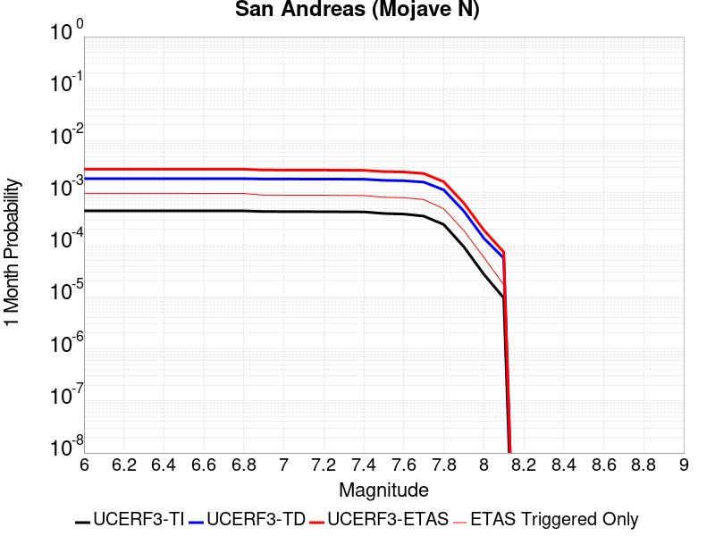
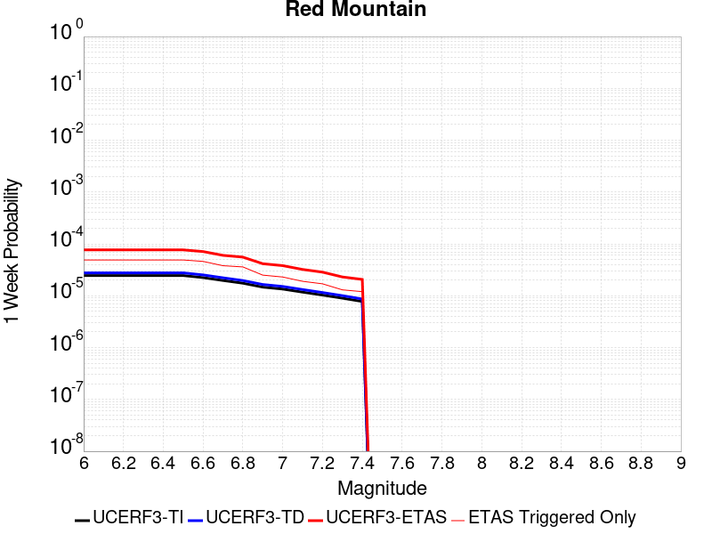
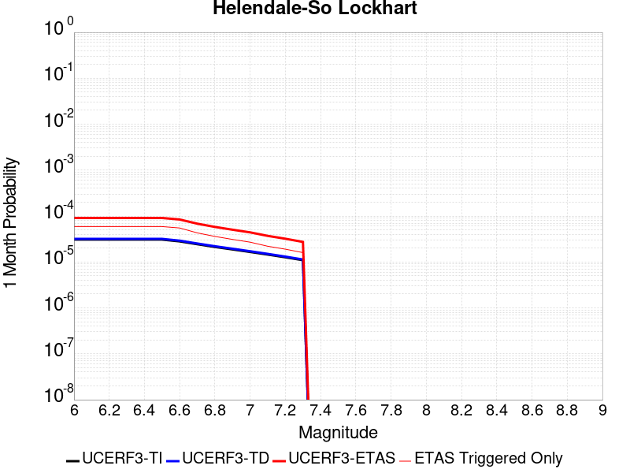
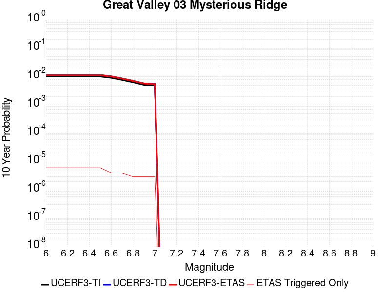

# Parent Section Magnitude-Probability Distributions

Only fault sections with at least one triggered aftershock are plotted. Sections are sorted by total supraseismogenic trigger rate (decreasing)

## Table Of Contents

* [Tank Canyon](#tank-canyon)
* [Little Lake](#little-lake)
* [Garlock (Central)](#garlock-central)
* [Owl Lake](#owl-lake)
* [Garlock (East)](#garlock-east)
* [Garlock (West)](#garlock-west)
* [Death Valley (So)](#death-valley-so)
* [Panamint Valley](#panamint-valley)
* [San Andreas (Mojave N)](#san-andreas-mojave-n)
* [San Andreas (Mojave S)](#san-andreas-mojave-s)
* [San Andreas (Big Bend)](#san-andreas-big-bend)
* [Blackwater](#blackwater)
* [San Andreas (Carrizo) rev](#san-andreas-carrizo-rev)
* [San Andreas (Cholame) rev](#san-andreas-cholame-rev)
* [Hunter Mountain-Saline Valley](#hunter-mountain-saline-valley)
* [San Andreas (Parkfield)](#san-andreas-parkfield)
* [San Cayetano](#san-cayetano)
* [Pleito](#pleito)
* [Death Valley (Black Mtns Frontal)](#death-valley-black-mtns-frontal)
* [Cucamonga](#cucamonga)
* [San Andreas (San Bernardino S)](#san-andreas-san-bernardino-s)
* [San Andreas (San Bernardino N)](#san-andreas-san-bernardino-n)
* [Pitas Point (Lower West)](#pitas-point-lower-west)
* [Red Mountain](#red-mountain)
* [Pitas Point (Lower)-Montalvo](#pitas-point-lower-montalvo)
* [So Sierra Nevada](#so-sierra-nevada)
* [Cleghorn](#cleghorn)
* [Mission Ridge-Arroyo Parida-Santa Ana](#mission-ridge-arroyo-parida-santa-ana)
* [Santa Ynez (East)](#santa-ynez-east)
* [Santa Ynez (West)](#santa-ynez-west)
* [San Andreas (Coachella) rev](#san-andreas-coachella-rev)
* [Death Valley (No)](#death-valley-no)
* [Lenwood-Lockhart-Old Woman Springs](#lenwood-lockhart-old-woman-springs)
* [Raymond](#raymond)
* [San Jacinto (San Bernardino)](#san-jacinto-san-bernardino)
* [San Andreas (San Gorgonio Pass-Garnet HIll)](#san-andreas-san-gorgonio-pass-garnet-hill)
* [Gravel Hills-Harper Lk](#gravel-hills-harper-lk)
* [San Jose](#san-jose)
* [Mono Lake 2011 CFM](#mono-lake-2011-cfm)
* [Elsinore (Stepovers Combined)](#elsinore-stepovers-combined)
* [Calaveras (No) 2011 CFM](#calaveras-no-2011-cfm)
* [San Juan](#san-juan)
* [Oak Ridge (Onshore)](#oak-ridge-onshore)
* [San Gregorio (South) 2011 CFM](#san-gregorio-south-2011-cfm)
* [Rose Canyon](#rose-canyon)
* [Helendale-So Lockhart](#helendale-so-lockhart)
* [Emerson-Copper Mtn 2011](#emerson-copper-mtn-2011)
* [Hayward (No) 2011 CFM](#hayward-no-2011-cfm)
* [San Gabriel](#san-gabriel)
* [Simi-Santa Rosa](#simi-santa-rosa)
* [Hayward (So) 2011 CFM](#hayward-so-2011-cfm)
* [Independence rev 2011](#independence-rev-2011)
* [Great Valley 12](#great-valley-12)
* [Chino alt 1](#chino-alt-1)
* [Great Valley 03 Mysterious Ridge](#great-valley-03-mysterious-ridge)
* [Elysian Park (Upper)](#elysian-park-upper)
* [Anacapa-Dume alt 1](#anacapa-dume-alt-1)
* [Elsinore (Glen Ivy) rev](#elsinore-glen-ivy-rev)
* [San Gregorio (North) 2011 CFM](#san-gregorio-north-2011-cfm)
* [Santa Susana alt 1](#santa-susana-alt-1)
* [Verdugo](#verdugo)
* [Ventura-Pitas Point](#ventura-pitas-point)
* [Death Valley (Fish Lake Valley)](#death-valley-fish-lake-valley)

## Tank Canyon
*[(top)](#table-of-contents)*

| 1 Week | 1 Month | 1 Year | 10 Year |
|-----|-----|-----|-----|
|  |  |  |  |

| Magnitude | 1 wk TI Prob | 1 wk TD Prob | 1 wk ETAS Prob | 1 wk ETAS/TD Gain | 1 wk ETAS Triggered Only | 1 mo TI Prob | 1 mo TD Prob | 1 mo ETAS Prob | 1 mo ETAS/TD Gain | 1 mo ETAS Triggered Only | 1 yr TI Prob | 1 yr TD Prob | 1 yr ETAS Prob | 1 yr ETAS/TD Gain | 1 yr ETAS Triggered Only | 10 yr TI Prob | 10 yr TD Prob | 10 yr ETAS Prob | 10 yr ETAS/TD Gain | 10 yr ETAS Triggered Only |
|-----|-----|-----|-----|-----|-----|-----|-----|-----|-----|-----|-----|-----|-----|-----|-----|-----|-----|-----|-----|-----|
| 6.0 | 2.7748038E-5 | 3.5073965E-5 | 0.020786835 | 592.6571 | 0.020752488 | 1.18914744E-4 | 1.5031699E-4 | 0.025960509 | 172.70508 | 0.025814071 | 0.0014468255 | 0.0018300817 | 0.041406583 | 22.625538 | 0.03964906 | 0.014374418 | 0.018297758 | 0.07096881 | 3.878552 | 0.053652775 |
| 6.1 | 2.7748038E-5 | 3.5073965E-5 | 0.020786835 | 592.6571 | 0.020752488 | 1.18914744E-4 | 1.5031699E-4 | 0.025960509 | 172.70508 | 0.025814071 | 0.0014468255 | 0.0018300817 | 0.041406583 | 22.625538 | 0.03964906 | 0.014374418 | 0.018297758 | 0.07096881 | 3.878552 | 0.053652775 |
| 6.2 | 2.7748038E-5 | 3.5073965E-5 | 0.020786835 | 592.6571 | 0.020752488 | 1.18914744E-4 | 1.5031699E-4 | 0.025960509 | 172.70508 | 0.025814071 | 0.0014468255 | 0.0018300817 | 0.041406583 | 22.625538 | 0.03964906 | 0.014374418 | 0.018297758 | 0.07096881 | 3.878552 | 0.053652775 |
| 6.3 | 2.7748038E-5 | 3.5073965E-5 | 0.020786835 | 592.6571 | 0.020752488 | 1.18914744E-4 | 1.5031699E-4 | 0.025960509 | 172.70508 | 0.025814071 | 0.0014468255 | 0.0018300817 | 0.041406583 | 22.625538 | 0.03964906 | 0.014374418 | 0.018297758 | 0.07096881 | 3.878552 | 0.053652775 |

## Little Lake
*[(top)](#table-of-contents)*

| 1 Week | 1 Month | 1 Year | 10 Year |
|-----|-----|-----|-----|
|  |  |  |  |

| Magnitude | 1 wk TI Prob | 1 wk TD Prob | 1 wk ETAS Prob | 1 wk ETAS/TD Gain | 1 wk ETAS Triggered Only | 1 mo TI Prob | 1 mo TD Prob | 1 mo ETAS Prob | 1 mo ETAS/TD Gain | 1 mo ETAS Triggered Only | 1 yr TI Prob | 1 yr TD Prob | 1 yr ETAS Prob | 1 yr ETAS/TD Gain | 1 yr ETAS Triggered Only | 10 yr TI Prob | 10 yr TD Prob | 10 yr ETAS Prob | 10 yr ETAS/TD Gain | 10 yr ETAS Triggered Only |
|-----|-----|-----|-----|-----|-----|-----|-----|-----|-----|-----|-----|-----|-----|-----|-----|-----|-----|-----|-----|-----|
| 6.0 | 1.27106505E-5 | 1.3900362E-5 | 0.011317944 | 814.21936 | 0.011304202 | 5.447308E-5 | 5.957219E-5 | 0.015412125 | 258.7134 | 0.015353467 | 6.630079E-4 | 7.25151E-4 | 0.0209568 | 28.899912 | 0.02024633 | 0.006610333 | 0.0072377534 | 0.031859998 | 4.4019184 | 0.024801755 |
| 6.1 | 1.27106505E-5 | 1.3900362E-5 | 0.011317944 | 814.21936 | 0.011304202 | 5.447308E-5 | 5.957219E-5 | 0.015412125 | 258.7134 | 0.015353467 | 6.630079E-4 | 7.25151E-4 | 0.0209568 | 28.899912 | 0.02024633 | 0.006610333 | 0.0072377534 | 0.031859998 | 4.4019184 | 0.024801755 |
| 6.2 | 1.27106505E-5 | 1.3900362E-5 | 0.011317944 | 814.21936 | 0.011304202 | 5.447308E-5 | 5.957219E-5 | 0.015412125 | 258.7134 | 0.015353467 | 6.630079E-4 | 7.25151E-4 | 0.0209568 | 28.899912 | 0.02024633 | 0.006610333 | 0.0072377534 | 0.031859998 | 4.4019184 | 0.024801755 |
| 6.3 | 1.27106505E-5 | 1.3900362E-5 | 0.011317944 | 814.21936 | 0.011304202 | 5.447308E-5 | 5.957219E-5 | 0.015412125 | 258.7134 | 0.015353467 | 6.630079E-4 | 7.25151E-4 | 0.0209568 | 28.899912 | 0.02024633 | 0.006610333 | 0.0072377534 | 0.031859998 | 4.4019184 | 0.024801755 |
| 6.4 | 1.27106505E-5 | 1.3900362E-5 | 0.011317944 | 814.21936 | 0.011304202 | 5.447308E-5 | 5.957219E-5 | 0.015412125 | 258.7134 | 0.015353467 | 6.630079E-4 | 7.25151E-4 | 0.0209568 | 28.899912 | 0.02024633 | 0.006610333 | 0.0072377534 | 0.031859998 | 4.4019184 | 0.024801755 |
| 6.5 | 1.27106505E-5 | 1.3900362E-5 | 0.011317944 | 814.21936 | 0.011304202 | 5.447308E-5 | 5.957219E-5 | 0.015412125 | 258.7134 | 0.015353467 | 6.630079E-4 | 7.25151E-4 | 0.0209568 | 28.899912 | 0.02024633 | 0.006610333 | 0.0072377534 | 0.031859998 | 4.4019184 | 0.024801755 |
| 6.6 | 1.08505255E-5 | 1.1856941E-5 | 0.010303619 | 868.9948 | 0.010291885 | 4.6501424E-5 | 5.0815026E-5 | 0.013716393 | 269.9279 | 0.013666273 | 5.6600774E-4 | 6.1859656E-4 | 0.017817331 | 28.802832 | 0.01720938 | 0.005645683 | 0.006178476 | 0.0271381 | 4.3923616 | 0.021089928 |
| 6.7 | 7.97625E-6 | 8.706619E-6 | 0.0070948605 | 814.8812 | 0.0070862155 | 3.4183482E-5 | 3.7314083E-5 | 0.009653962 | 258.72168 | 0.009617007 | 4.161044E-4 | 4.5429895E-4 | 0.012933864 | 28.46994 | 0.012485237 | 0.004153261 | 0.0045429897 | 0.019154895 | 4.2163634 | 0.014678589 |
| 6.8 | 7.97625E-6 | 8.706619E-6 | 0.0070948605 | 814.8812 | 0.0070862155 | 3.4183482E-5 | 3.7314083E-5 | 0.009653962 | 258.72168 | 0.009617007 | 4.161044E-4 | 4.5429895E-4 | 0.012933864 | 28.46994 | 0.012485237 | 0.004153261 | 0.0045429897 | 0.019154895 | 4.2163634 | 0.014678589 |

## Garlock (Central)
*[(top)](#table-of-contents)*

| 1 Week | 1 Month | 1 Year | 10 Year |
|-----|-----|-----|-----|
|  |  |  |  |

| Magnitude | 1 wk TI Prob | 1 wk TD Prob | 1 wk ETAS Prob | 1 wk ETAS/TD Gain | 1 wk ETAS Triggered Only | 1 mo TI Prob | 1 mo TD Prob | 1 mo ETAS Prob | 1 mo ETAS/TD Gain | 1 mo ETAS Triggered Only | 1 yr TI Prob | 1 yr TD Prob | 1 yr ETAS Prob | 1 yr ETAS/TD Gain | 1 yr ETAS Triggered Only | 10 yr TI Prob | 10 yr TD Prob | 10 yr ETAS Prob | 10 yr ETAS/TD Gain | 10 yr ETAS Triggered Only |
|-----|-----|-----|-----|-----|-----|-----|-----|-----|-----|-----|-----|-----|-----|-----|-----|-----|-----|-----|-----|-----|
| 6.0 | 2.575808E-5 | 1.9313613E-5 | 0.011998161 | 621.2282 | 0.011979079 | 1.10387096E-4 | 8.277037E-5 | 0.01492885 | 180.36467 | 0.014847309 | 0.0013431342 | 0.0010073289 | 0.020390518 | 20.242167 | 0.019402733 | 0.013350452 | 0.0100695705 | 0.034287542 | 3.4050648 | 0.024464317 |
| 6.1 | 2.575808E-5 | 1.9313613E-5 | 0.011998161 | 621.2282 | 0.011979079 | 1.10387096E-4 | 8.277037E-5 | 0.01492885 | 180.36467 | 0.014847309 | 0.0013431342 | 0.0010073289 | 0.020390518 | 20.242167 | 0.019402733 | 0.013350452 | 0.0100695705 | 0.034287542 | 3.4050648 | 0.024464317 |
| 6.2 | 2.575808E-5 | 1.9313613E-5 | 0.011998161 | 621.2282 | 0.011979079 | 1.10387096E-4 | 8.277037E-5 | 0.01492885 | 180.36467 | 0.014847309 | 0.0013431342 | 0.0010073289 | 0.020390518 | 20.242167 | 0.019402733 | 0.013350452 | 0.0100695705 | 0.034287542 | 3.4050648 | 0.024464317 |
| 6.3 | 2.575808E-5 | 1.9313613E-5 | 0.011998161 | 621.2282 | 0.011979079 | 1.10387096E-4 | 8.277037E-5 | 0.01492885 | 180.36467 | 0.014847309 | 0.0013431342 | 0.0010073289 | 0.020390518 | 20.242167 | 0.019402733 | 0.013350452 | 0.0100695705 | 0.034287542 | 3.4050648 | 0.024464317 |
| 6.4 | 2.575808E-5 | 1.9313613E-5 | 0.011998161 | 621.2282 | 0.011979079 | 1.10387096E-4 | 8.277037E-5 | 0.01492885 | 180.36467 | 0.014847309 | 0.0013431342 | 0.0010073289 | 0.020390518 | 20.242167 | 0.019402733 | 0.013350452 | 0.0100695705 | 0.034287542 | 3.4050648 | 0.024464317 |
| 6.5 | 2.575808E-5 | 1.9313613E-5 | 0.011998161 | 621.2282 | 0.011979079 | 1.10387096E-4 | 8.277037E-5 | 0.01492885 | 180.36467 | 0.014847309 | 0.0013431342 | 0.0010073289 | 0.020390518 | 20.242167 | 0.019402733 | 0.013350452 | 0.0100695705 | 0.034287542 | 3.4050648 | 0.024464317 |
| 6.6 | 2.540234E-5 | 1.885198E-5 | 0.011828989 | 627.4667 | 0.01181036 | 1.0886263E-4 | 8.0792066E-5 | 0.014758196 | 182.66887 | 0.014678589 | 0.0013245966 | 9.83265E-4 | 0.020029813 | 20.370718 | 0.019065294 | 0.013167289 | 0.009831364 | 0.03355398 | 3.4129527 | 0.023958158 |
| 6.7 | 2.4966947E-5 | 1.8286464E-5 | 0.011322281 | 619.16187 | 0.011304202 | 1.06996806E-4 | 7.8368575E-5 | 0.014080983 | 179.67639 | 0.014003712 | 0.0013019076 | 9.5378514E-4 | 0.018989544 | 19.909666 | 0.018052978 | 0.012943068 | 0.009539624 | 0.03176524 | 3.329821 | 0.022439683 |
| 6.8 | 2.4548952E-5 | 1.7797542E-5 | 0.010815648 | 607.70465 | 0.010798043 | 1.0520555E-4 | 7.627332E-5 | 0.013572797 | 177.94948 | 0.013497554 | 0.001280125 | 9.282974E-4 | 0.018458828 | 19.884605 | 0.01754682 | 0.012727758 | 0.009286596 | 0.030849282 | 3.3219147 | 0.021764806 |
| 6.9 | 2.3994342E-5 | 1.7148153E-5 | 0.009802707 | 571.64795 | 0.009785727 | 1.0282884E-4 | 7.349039E-5 | 0.0120516885 | 163.99 | 0.011979079 | 0.0012512221 | 8.944436E-4 | 0.016065609 | 17.961569 | 0.015184748 | 0.012442005 | 0.0089510605 | 0.028012909 | 3.129563 | 0.019234015 |
| 7.0 | 2.343005E-5 | 1.6491087E-5 | 0.009633339 | 584.1543 | 0.009617007 | 1.0041064E-4 | 7.067455E-5 | 0.011880199 | 168.09729 | 0.01181036 | 0.0012218138 | 8.601883E-4 | 0.015694726 | 18.245687 | 0.014847309 | 0.01215118 | 0.008610493 | 0.027177092 | 3.1562762 | 0.018727856 |
| 7.1 | 2.2814058E-5 | 1.5782754E-5 | 0.009295205 | 588.9469 | 0.009279568 | 9.777087E-5 | 6.763899E-5 | 0.011202368 | 165.61996 | 0.011135481 | 0.0011897103 | 8.2325895E-4 | 0.014984023 | 18.200863 | 0.014172431 | 0.011833611 | 0.00824334 | 0.026147502 | 3.1719546 | 0.018052978 |
| 7.2 | 2.2145266E-5 | 1.5027377E-5 | 0.008113438 | 539.91046 | 0.008098532 | 9.490483E-5 | 6.440182E-5 | 0.010018206 | 155.5578 | 0.009954446 | 0.0011548538 | 7.8387547E-4 | 0.013765087 | 17.560299 | 0.012991395 | 0.011488707 | 0.007851825 | 0.024423897 | 3.1106012 | 0.016703222 |
| 7.3 | 1.9954436E-5 | 1.3199953E-5 | 0.006424453 | 486.70273 | 0.0064113378 | 8.551621E-5 | 5.657036E-5 | 0.008154645 | 144.15048 | 0.008098532 | 0.0010406625 | 6.8859005E-4 | 0.011310594 | 16.42573 | 0.010629323 | 0.010358025 | 0.006900618 | 0.020137474 | 2.9182134 | 0.013328834 |
| 7.4 | 1.918037E-5 | 1.2553606E-5 | 0.006423811 | 511.71042 | 0.0064113378 | 8.2198996E-5 | 5.3800417E-5 | 0.008151897 | 151.52107 | 0.008098532 | 0.0010003132 | 6.5488677E-4 | 0.011277249 | 17.220152 | 0.010629323 | 0.009958224 | 0.006564366 | 0.019638093 | 2.9916205 | 0.013160115 |
| 7.5 | 1.6994161E-5 | 1.0764553E-5 | 0.00456614 | 424.18298 | 0.004555424 | 7.283008E-5 | 4.613333E-5 | 0.0061197523 | 132.65361 | 0.006073899 | 8.863455E-4 | 5.615903E-4 | 0.0083183255 | 14.812088 | 0.0077610933 | 0.008828186 | 0.005632708 | 0.015363314 | 2.7275183 | 0.009785727 |
| 7.6 | 1.621788E-5 | 1.012848E-5 | 0.0040593534 | 400.78604 | 0.004049266 | 6.950335E-5 | 4.34074E-5 | 0.0056109065 | 129.26152 | 0.0055677406 | 8.458747E-4 | 5.2841863E-4 | 0.0076108896 | 14.403144 | 0.0070862155 | 0.0084266225 | 0.005301458 | 0.014364006 | 2.7094445 | 0.009110848 |
| 7.7 | 7.713584E-6 | 3.2171508E-6 | 5.093738E-4 | 158.33072 | 5.061583E-4 | 3.3057797E-5 | 1.378779E-5 | 8.5737323E-4 | 62.183517 | 8.435971E-4 | 4.0240434E-4 | 1.6786634E-4 | 0.0016860862 | 10.044219 | 0.0015184748 | 0.0040167645 | 0.0016902693 | 0.003543046 | 2.0961428 | 0.0018559137 |

## Owl Lake
*[(top)](#table-of-contents)*

| 1 Week | 1 Month | 1 Year | 10 Year |
|-----|-----|-----|-----|
|  |  |  |  |

| Magnitude | 1 wk TI Prob | 1 wk TD Prob | 1 wk ETAS Prob | 1 wk ETAS/TD Gain | 1 wk ETAS Triggered Only | 1 mo TI Prob | 1 mo TD Prob | 1 mo ETAS Prob | 1 mo ETAS/TD Gain | 1 mo ETAS Triggered Only | 1 yr TI Prob | 1 yr TD Prob | 1 yr ETAS Prob | 1 yr ETAS/TD Gain | 1 yr ETAS Triggered Only | 10 yr TI Prob | 10 yr TD Prob | 10 yr ETAS Prob | 10 yr ETAS/TD Gain | 10 yr ETAS Triggered Only |
|-----|-----|-----|-----|-----|-----|-----|-----|-----|-----|-----|-----|-----|-----|-----|-----|-----|-----|-----|-----|-----|
| 6.0 | 3.637175E-5 | 4.988367E-5 | 0.0042676586 | 85.552216 | 0.0042179856 | 1.5586962E-4 | 2.1378716E-4 | 0.005949021 | 27.82684 | 0.0057364604 | 0.0018960608 | 0.0026025574 | 0.011353134 | 4.3622994 | 0.00877341 | 0.018799646 | 0.025995217 | 0.0386489 | 1.4867696 | 0.012991395 |
| 6.1 | 3.637175E-5 | 4.988367E-5 | 0.0042676586 | 85.552216 | 0.0042179856 | 1.5586962E-4 | 2.1378716E-4 | 0.005949021 | 27.82684 | 0.0057364604 | 0.0018960608 | 0.0026025574 | 0.011353134 | 4.3622994 | 0.00877341 | 0.018799646 | 0.025995217 | 0.0386489 | 1.4867696 | 0.012991395 |
| 6.2 | 3.637175E-5 | 4.988367E-5 | 0.0042676586 | 85.552216 | 0.0042179856 | 1.5586962E-4 | 2.1378716E-4 | 0.005949021 | 27.82684 | 0.0057364604 | 0.0018960608 | 0.0026025574 | 0.011353134 | 4.3622994 | 0.00877341 | 0.018799646 | 0.025995217 | 0.0386489 | 1.4867696 | 0.012991395 |
| 6.3 | 3.637175E-5 | 4.988367E-5 | 0.0042676586 | 85.552216 | 0.0042179856 | 1.5586962E-4 | 2.1378716E-4 | 0.005949021 | 27.82684 | 0.0057364604 | 0.0018960608 | 0.0026025574 | 0.011353134 | 4.3622994 | 0.00877341 | 0.018799646 | 0.025995217 | 0.0386489 | 1.4867696 | 0.012991395 |
| 6.4 | 3.637175E-5 | 4.988367E-5 | 0.0042676586 | 85.552216 | 0.0042179856 | 1.5586962E-4 | 2.1378716E-4 | 0.005949021 | 27.82684 | 0.0057364604 | 0.0018960608 | 0.0026025574 | 0.011353134 | 4.3622994 | 0.00877341 | 0.018799646 | 0.025995217 | 0.0386489 | 1.4867696 | 0.012991395 |
| 6.5 | 3.637175E-5 | 4.988367E-5 | 0.0042676586 | 85.552216 | 0.0042179856 | 1.5586962E-4 | 2.1378716E-4 | 0.005949021 | 27.82684 | 0.0057364604 | 0.0018960608 | 0.0026025574 | 0.011353134 | 4.3622994 | 0.00877341 | 0.018799646 | 0.025995217 | 0.0386489 | 1.4867696 | 0.012991395 |

## Garlock (East)
*[(top)](#table-of-contents)*

| 1 Week | 1 Month | 1 Year | 10 Year |
|-----|-----|-----|-----|
|  |  |  |  |

| Magnitude | 1 wk TI Prob | 1 wk TD Prob | 1 wk ETAS Prob | 1 wk ETAS/TD Gain | 1 wk ETAS Triggered Only | 1 mo TI Prob | 1 mo TD Prob | 1 mo ETAS Prob | 1 mo ETAS/TD Gain | 1 mo ETAS Triggered Only | 1 yr TI Prob | 1 yr TD Prob | 1 yr ETAS Prob | 1 yr ETAS/TD Gain | 1 yr ETAS Triggered Only | 10 yr TI Prob | 10 yr TD Prob | 10 yr ETAS Prob | 10 yr ETAS/TD Gain | 10 yr ETAS Triggered Only |
|-----|-----|-----|-----|-----|-----|-----|-----|-----|-----|-----|-----|-----|-----|-----|-----|-----|-----|-----|-----|-----|
| 6.0 | 2.2327951E-5 | 1.8303952E-5 | 0.0049110777 | 268.30695 | 0.0048928633 | 9.5687705E-5 | 7.8444085E-5 | 0.006320573 | 80.57424 | 0.0062426184 | 0.0011643751 | 9.548048E-4 | 0.009888396 | 10.356458 | 0.008942129 | 0.0115829315 | 0.0096519785 | 0.020847073 | 2.1598754 | 0.011304202 |
| 6.1 | 2.2327951E-5 | 1.8303952E-5 | 0.0049110777 | 268.30695 | 0.0048928633 | 9.5687705E-5 | 7.8444085E-5 | 0.006320573 | 80.57424 | 0.0062426184 | 0.0011643751 | 9.548048E-4 | 0.009888396 | 10.356458 | 0.008942129 | 0.0115829315 | 0.0096519785 | 0.020847073 | 2.1598754 | 0.011304202 |
| 6.2 | 2.2327951E-5 | 1.8303952E-5 | 0.0049110777 | 268.30695 | 0.0048928633 | 9.5687705E-5 | 7.8444085E-5 | 0.006320573 | 80.57424 | 0.0062426184 | 0.0011643751 | 9.548048E-4 | 0.009888396 | 10.356458 | 0.008942129 | 0.0115829315 | 0.0096519785 | 0.020847073 | 2.1598754 | 0.011304202 |
| 6.3 | 2.2327951E-5 | 1.8303952E-5 | 0.0049110777 | 268.30695 | 0.0048928633 | 9.5687705E-5 | 7.8444085E-5 | 0.006320573 | 80.57424 | 0.0062426184 | 0.0011643751 | 9.548048E-4 | 0.009888396 | 10.356458 | 0.008942129 | 0.0115829315 | 0.0096519785 | 0.020847073 | 2.1598754 | 0.011304202 |
| 6.4 | 2.2327951E-5 | 1.8303952E-5 | 0.0049110777 | 268.30695 | 0.0048928633 | 9.5687705E-5 | 7.8444085E-5 | 0.006320573 | 80.57424 | 0.0062426184 | 0.0011643751 | 9.548048E-4 | 0.009888396 | 10.356458 | 0.008942129 | 0.0115829315 | 0.0096519785 | 0.020847073 | 2.1598754 | 0.011304202 |
| 6.5 | 2.2327951E-5 | 1.8303952E-5 | 0.0049110777 | 268.30695 | 0.0048928633 | 9.5687705E-5 | 7.8444085E-5 | 0.006320573 | 80.57424 | 0.0062426184 | 0.0011643751 | 9.548048E-4 | 0.009888396 | 10.356458 | 0.008942129 | 0.0115829315 | 0.0096519785 | 0.020847073 | 2.1598754 | 0.011304202 |
| 6.6 | 2.222123E-5 | 1.816971E-5 | 0.004910944 | 270.2819 | 0.0048928633 | 9.523036E-5 | 7.7868805E-5 | 0.006320001 | 81.16217 | 0.0062426184 | 0.0011588129 | 9.4780687E-4 | 0.009881461 | 10.425606 | 0.008942129 | 0.011527888 | 0.009581773 | 0.02077766 | 2.1684568 | 0.011304202 |
| 6.7 | 2.2076227E-5 | 1.798404E-5 | 0.004910759 | 273.06207 | 0.0048928633 | 9.4608964E-5 | 7.707312E-5 | 0.0063192104 | 81.98981 | 0.0062426184 | 0.0011512554 | 9.381278E-4 | 0.009871868 | 10.522945 | 0.008942129 | 0.011453095 | 0.009485973 | 0.020515824 | 2.1627538 | 0.011135481 |
| 6.8 | 2.1962227E-5 | 1.7854036E-5 | 0.0049106297 | 275.04312 | 0.0048928633 | 9.4120434E-5 | 7.651599E-5 | 0.0063186567 | 82.57956 | 0.0062426184 | 0.0011453138 | 9.313506E-4 | 0.009865152 | 10.592307 | 0.008942129 | 0.01139429 | 0.00941876 | 0.020449359 | 2.1711307 | 0.011135481 |
| 6.9 | 1.1702579E-5 | 6.6732687E-6 | 0.004393349 | 658.3504 | 0.004386705 | 5.0152947E-5 | 2.8599494E-5 | 0.0050900374 | 177.97649 | 0.0050615827 | 6.10441E-4 | 3.481581E-4 | 0.0070945853 | 20.377481 | 0.006748777 | 0.0060876687 | 0.0034954504 | 0.011565674 | 3.3087795 | 0.008098532 |
| 7.0 | 1.153538E-5 | 6.4796777E-6 | 0.004393156 | 677.9899 | 0.004386705 | 4.9436403E-5 | 2.7769835E-5 | 0.0050892117 | 183.26404 | 0.0050615827 | 6.01722E-4 | 3.3806017E-4 | 0.0070845555 | 20.956491 | 0.006748777 | 0.006000953 | 0.0033946347 | 0.011297529 | 3.3280542 | 0.007929813 |
| 7.1 | 1.135938E-5 | 6.273818E-6 | 0.004224233 | 673.31134 | 0.0042179856 | 4.868215E-5 | 2.6887597E-5 | 0.004750904 | 176.695 | 0.0047241435 | 5.925439E-4 | 3.2732222E-4 | 0.0067365617 | 20.580826 | 0.0064113378 | 0.0059096646 | 0.0032873498 | 0.010854765 | 3.3019805 | 0.007592374 |
| 7.2 | 1.1168294E-5 | 6.048814E-6 | 0.0037178537 | 614.6417 | 0.0037118273 | 4.786324E-5 | 2.5923315E-5 | 0.0042437995 | 163.70589 | 0.0042179856 | 5.825791E-4 | 3.1558552E-4 | 0.006218902 | 19.705915 | 0.00590518 | 0.005810542 | 0.0031701238 | 0.010065691 | 3.1751728 | 0.006917496 |
| 7.3 | 1.0952553E-5 | 5.8686815E-6 | 0.0030428004 | 518.4811 | 0.0030369496 | 4.693867E-5 | 2.5151334E-5 | 0.0035681701 | 141.86803 | 0.0035431078 | 5.713284E-4 | 3.0618932E-4 | 0.005366222 | 17.52583 | 0.0050615827 | 0.0056986175 | 0.0030760262 | 0.008963041 | 2.913838 | 0.00590518 |
| 7.4 | 1.0735812E-5 | 5.691247E-6 | 0.0030426234 | 534.61456 | 0.0030369496 | 4.6009813E-5 | 2.4390914E-5 | 0.0035674123 | 146.25989 | 0.0035431078 | 5.600255E-4 | 2.9693378E-4 | 0.0053570135 | 18.041103 | 0.0050615827 | 0.0055861627 | 0.0029833042 | 0.008870867 | 2.9735038 | 0.00590518 |
| 7.5 | 9.0273E-6 | 4.284415E-6 | 0.001354034 | 316.03708 | 0.0013497553 | 3.8687853E-5 | 1.8361723E-5 | 0.001705525 | 92.884796 | 0.0016871942 | 4.709228E-4 | 2.2354414E-4 | 0.002585088 | 11.564105 | 0.0023620718 | 0.004699261 | 0.0022480614 | 0.0049415035 | 2.1981177 | 0.0026995107 |
| 7.6 | 8.549585E-6 | 3.885532E-6 | 8.474793E-4 | 218.11154 | 8.435971E-4 | 3.6640562E-5 | 1.6652246E-5 | 0.0011976685 | 71.92234 | 0.0011810359 | 4.4600753E-4 | 2.027353E-4 | 0.0020582727 | 10.152513 | 0.0018559137 | 0.0044511347 | 0.0020396118 | 0.004228491 | 2.073184 | 0.0021933524 |
| 7.7 | 7.713584E-6 | 3.2171508E-6 | 5.093738E-4 | 158.33072 | 5.061583E-4 | 3.3057797E-5 | 1.378779E-5 | 8.5737323E-4 | 62.183517 | 8.435971E-4 | 4.0240434E-4 | 1.6786634E-4 | 0.0016860862 | 10.044219 | 0.0015184748 | 0.0040167645 | 0.0016902693 | 0.003543046 | 2.0961428 | 0.0018559137 |

## Garlock (West)
*[(top)](#table-of-contents)*

| 1 Week | 1 Month | 1 Year | 10 Year |
|-----|-----|-----|-----|
|  |  |  |  |

| Magnitude | 1 wk TI Prob | 1 wk TD Prob | 1 wk ETAS Prob | 1 wk ETAS/TD Gain | 1 wk ETAS Triggered Only | 1 mo TI Prob | 1 mo TD Prob | 1 mo ETAS Prob | 1 mo ETAS/TD Gain | 1 mo ETAS Triggered Only | 1 yr TI Prob | 1 yr TD Prob | 1 yr ETAS Prob | 1 yr ETAS/TD Gain | 1 yr ETAS Triggered Only | 10 yr TI Prob | 10 yr TD Prob | 10 yr ETAS Prob | 10 yr ETAS/TD Gain | 10 yr ETAS Triggered Only |
|-----|-----|-----|-----|-----|-----|-----|-----|-----|-----|-----|-----|-----|-----|-----|-----|-----|-----|-----|-----|-----|
| 6.0 | 2.516656E-5 | 1.8065048E-5 | 0.005248273 | 290.5208 | 0.005230302 | 1.07852225E-4 | 7.741977E-5 | 0.006825674 | 88.16448 | 0.006748777 | 0.0013123099 | 9.42255E-4 | 0.009538838 | 10.123414 | 0.00860469 | 0.013045873 | 0.009421492 | 0.0201178 | 2.1353095 | 0.010798043 |
| 6.1 | 2.516656E-5 | 1.8065048E-5 | 0.005248273 | 290.5208 | 0.005230302 | 1.07852225E-4 | 7.741977E-5 | 0.006825674 | 88.16448 | 0.006748777 | 0.0013123099 | 9.42255E-4 | 0.009538838 | 10.123414 | 0.00860469 | 0.013045873 | 0.009421492 | 0.0201178 | 2.1353095 | 0.010798043 |
| 6.2 | 2.516656E-5 | 1.8065048E-5 | 0.005248273 | 290.5208 | 0.005230302 | 1.07852225E-4 | 7.741977E-5 | 0.006825674 | 88.16448 | 0.006748777 | 0.0013123099 | 9.42255E-4 | 0.009538838 | 10.123414 | 0.00860469 | 0.013045873 | 0.009421492 | 0.0201178 | 2.1353095 | 0.010798043 |
| 6.3 | 2.516656E-5 | 1.8065048E-5 | 0.005248273 | 290.5208 | 0.005230302 | 1.07852225E-4 | 7.741977E-5 | 0.006825674 | 88.16448 | 0.006748777 | 0.0013123099 | 9.42255E-4 | 0.009538838 | 10.123414 | 0.00860469 | 0.013045873 | 0.009421492 | 0.0201178 | 2.1353095 | 0.010798043 |
| 6.4 | 2.516656E-5 | 1.8065048E-5 | 0.005248273 | 290.5208 | 0.005230302 | 1.07852225E-4 | 7.741977E-5 | 0.006825674 | 88.16448 | 0.006748777 | 0.0013123099 | 9.42255E-4 | 0.009538838 | 10.123414 | 0.00860469 | 0.013045873 | 0.009421492 | 0.0201178 | 2.1353095 | 0.010798043 |
| 6.5 | 2.516656E-5 | 1.8065048E-5 | 0.005248273 | 290.5208 | 0.005230302 | 1.07852225E-4 | 7.741977E-5 | 0.006825674 | 88.16448 | 0.006748777 | 0.0013123099 | 9.42255E-4 | 0.009538838 | 10.123414 | 0.00860469 | 0.013045873 | 0.009421492 | 0.0201178 | 2.1353095 | 0.010798043 |
| 6.6 | 2.498869E-5 | 1.7877663E-5 | 0.005248086 | 293.5555 | 0.005230302 | 1.07089996E-4 | 7.6616736E-5 | 0.0068248766 | 89.07814 | 0.006748777 | 0.0013030408 | 9.3248655E-4 | 0.009529153 | 10.219078 | 0.00860469 | 0.012954267 | 0.009324339 | 0.020021698 | 2.1472511 | 0.010798043 |
| 6.7 | 2.4627925E-5 | 1.7497801E-5 | 0.0052477084 | 299.90674 | 0.005230302 | 1.0554398E-4 | 7.498886E-5 | 0.0068232594 | 90.99032 | 0.006748777 | 0.0012842404 | 9.1268384E-4 | 0.009509521 | 10.419293 | 0.00860469 | 0.012768441 | 0.009128104 | 0.019827582 | 2.1721468 | 0.010798043 |
| 6.8 | 2.4270235E-5 | 1.716136E-5 | 0.0052473736 | 305.76678 | 0.005230302 | 1.04011146E-4 | 7.354704E-5 | 0.0068218275 | 92.754616 | 0.006748777 | 0.0012656 | 8.9514436E-4 | 0.009492132 | 10.604024 | 0.00860469 | 0.012584164 | 0.0089538675 | 0.019655226 | 2.195166 | 0.010798043 |
| 6.9 | 2.3913764E-5 | 1.6823105E-5 | 0.005247037 | 311.89468 | 0.005230302 | 1.0248353E-4 | 7.2097464E-5 | 0.0068203877 | 94.59955 | 0.006748777 | 0.0012470228 | 8.775101E-4 | 0.00947465 | 10.797197 | 0.00860469 | 0.012400482 | 0.00877859 | 0.019481841 | 2.219245 | 0.010798043 |
| 7.0 | 2.3579369E-5 | 1.6492264E-5 | 0.005246708 | 318.13147 | 0.005230302 | 1.0105052E-4 | 7.067965E-5 | 0.0068189795 | 96.47727 | 0.006748777 | 0.0012295957 | 8.6026196E-4 | 0.00945755 | 10.993803 | 0.00860469 | 0.012228143 | 0.008607132 | 0.019312235 | 2.243748 | 0.010798043 |
| 7.1 | 2.3205374E-5 | 1.6105636E-5 | 0.0052463235 | 325.74457 | 0.005230302 | 9.944781E-5 | 6.902276E-5 | 0.006817334 | 98.769356 | 0.006748777 | 0.0012101046 | 8.401051E-4 | 0.009437567 | 11.233793 | 0.00860469 | 0.0120353615 | 0.008406721 | 0.019113988 | 2.2736554 | 0.010798043 |
| 7.2 | 2.2799322E-5 | 1.5676578E-5 | 0.00507718 | 323.8704 | 0.0050615827 | 9.770772E-5 | 6.718404E-5 | 0.0066467994 | 98.9342 | 0.0065800576 | 0.0011889422 | 8.177357E-4 | 0.0092468085 | 11.30782 | 0.008435971 | 0.011826012 | 0.008184515 | 0.018726842 | 2.2880821 | 0.010629323 |
| 7.3 | 1.8228246E-5 | 1.1798695E-5 | 0.004904604 | 415.6904 | 0.0048928633 | 7.811871E-5 | 5.0565202E-5 | 0.006461579 | 127.78706 | 0.0064113378 | 9.506803E-4 | 6.1551924E-4 | 0.0088776825 | 14.423078 | 0.008267252 | 0.0094662355 | 0.006171021 | 0.016567072 | 2.6846566 | 0.010460604 |
| 7.4 | 1.7670916E-5 | 1.132978E-5 | 0.0049041375 | 432.85373 | 0.0048928633 | 7.5730306E-5 | 4.8555645E-5 | 0.006459582 | 133.03464 | 0.0064113378 | 9.216264E-4 | 5.9106643E-4 | 0.008853432 | 14.978743 | 0.008267252 | 0.009178135 | 0.0059269792 | 0.016157864 | 2.726155 | 0.010291885 |
| 7.5 | 1.6994161E-5 | 1.0764553E-5 | 0.00456614 | 424.18298 | 0.004555424 | 7.283008E-5 | 4.613333E-5 | 0.0061197523 | 132.65361 | 0.006073899 | 8.863455E-4 | 5.615903E-4 | 0.0083183255 | 14.812088 | 0.0077610933 | 0.008828186 | 0.005632708 | 0.015363314 | 2.7275183 | 0.009785727 |
| 7.6 | 1.621788E-5 | 1.012848E-5 | 0.0040593534 | 400.78604 | 0.004049266 | 6.950335E-5 | 4.34074E-5 | 0.0056109065 | 129.26152 | 0.0055677406 | 8.458747E-4 | 5.2841863E-4 | 0.0076108896 | 14.403144 | 0.0070862155 | 0.0084266225 | 0.005301458 | 0.014364006 | 2.7094445 | 0.009110848 |
| 7.7 | 7.713584E-6 | 3.2171508E-6 | 5.093738E-4 | 158.33072 | 5.061583E-4 | 3.3057797E-5 | 1.378779E-5 | 8.5737323E-4 | 62.183517 | 8.435971E-4 | 4.0240434E-4 | 1.6786634E-4 | 0.0016860862 | 10.044219 | 0.0015184748 | 0.0040167645 | 0.0016902693 | 0.003543046 | 2.0961428 | 0.0018559137 |

## Death Valley (So)
*[(top)](#table-of-contents)*

| 1 Week | 1 Month | 1 Year | 10 Year |
|-----|-----|-----|-----|
|  |  |  |  |

| Magnitude | 1 wk TI Prob | 1 wk TD Prob | 1 wk ETAS Prob | 1 wk ETAS/TD Gain | 1 wk ETAS Triggered Only | 1 mo TI Prob | 1 mo TD Prob | 1 mo ETAS Prob | 1 mo ETAS/TD Gain | 1 mo ETAS Triggered Only | 1 yr TI Prob | 1 yr TD Prob | 1 yr ETAS Prob | 1 yr ETAS/TD Gain | 1 yr ETAS Triggered Only | 10 yr TI Prob | 10 yr TD Prob | 10 yr ETAS Prob | 10 yr ETAS/TD Gain | 10 yr ETAS Triggered Only |
|-----|-----|-----|-----|-----|-----|-----|-----|-----|-----|-----|-----|-----|-----|-----|-----|-----|-----|-----|-----|-----|
| 6.0 | 4.4658216E-5 | 6.228887E-5 | 0.0019180869 | 30.793413 | 0.0018559137 | 1.9137832E-4 | 2.669324E-4 | 0.0038090944 | 14.269884 | 0.0035431078 | 0.0023275411 | 0.0032461619 | 0.009804859 | 3.020447 | 0.0065800576 | 0.023033133 | 0.032094594 | 0.04123964 | 1.2849405 | 0.009448287 |
| 6.1 | 4.4658216E-5 | 6.228887E-5 | 0.0019180869 | 30.793413 | 0.0018559137 | 1.9137832E-4 | 2.669324E-4 | 0.0038090944 | 14.269884 | 0.0035431078 | 0.0023275411 | 0.0032461619 | 0.009804859 | 3.020447 | 0.0065800576 | 0.023033133 | 0.032094594 | 0.04123964 | 1.2849405 | 0.009448287 |
| 6.2 | 4.4658216E-5 | 6.228887E-5 | 0.0019180869 | 30.793413 | 0.0018559137 | 1.9137832E-4 | 2.669324E-4 | 0.0038090944 | 14.269884 | 0.0035431078 | 0.0023275411 | 0.0032461619 | 0.009804859 | 3.020447 | 0.0065800576 | 0.023033133 | 0.032094594 | 0.04123964 | 1.2849405 | 0.009448287 |
| 6.3 | 4.4658216E-5 | 6.228887E-5 | 0.0019180869 | 30.793413 | 0.0018559137 | 1.9137832E-4 | 2.669324E-4 | 0.0038090944 | 14.269884 | 0.0035431078 | 0.0023275411 | 0.0032461619 | 0.009804859 | 3.020447 | 0.0065800576 | 0.023033133 | 0.032094594 | 0.04123964 | 1.2849405 | 0.009448287 |
| 6.4 | 4.4658216E-5 | 6.228887E-5 | 0.0019180869 | 30.793413 | 0.0018559137 | 1.9137832E-4 | 2.669324E-4 | 0.0038090944 | 14.269884 | 0.0035431078 | 0.0023275411 | 0.0032461619 | 0.009804859 | 3.020447 | 0.0065800576 | 0.023033133 | 0.032094594 | 0.04123964 | 1.2849405 | 0.009448287 |
| 6.5 | 4.4658216E-5 | 6.228887E-5 | 0.0019180869 | 30.793413 | 0.0018559137 | 1.9137832E-4 | 2.669324E-4 | 0.0038090944 | 14.269884 | 0.0035431078 | 0.0023275411 | 0.0032461619 | 0.009804859 | 3.020447 | 0.0065800576 | 0.023033133 | 0.032094594 | 0.04123964 | 1.2849405 | 0.009448287 |
| 6.6 | 3.6853275E-5 | 5.1089468E-5 | 0.001232065 | 24.115833 | 0.0011810359 | 1.5793304E-4 | 2.1894388E-4 | 0.0027491811 | 12.556556 | 0.0025307913 | 0.0019211388 | 0.0026635646 | 0.0073751253 | 2.768893 | 0.0047241435 | 0.019046152 | 0.026430551 | 0.033493735 | 1.2672355 | 0.007254935 |
| 6.7 | 2.9971921E-5 | 4.1332314E-5 | 8.848946E-4 | 21.409266 | 8.435971E-4 | 1.2844476E-4 | 1.7713365E-4 | 0.0022014081 | 12.42795 | 0.002024633 | 0.0015626932 | 0.0021557007 | 0.0056911707 | 2.6400561 | 0.0035431078 | 0.015517498 | 0.021467837 | 0.027081149 | 1.2614753 | 0.0057364604 |
| 6.8 | 2.8134293E-5 | 3.8737995E-5 | 8.823024E-4 | 22.776152 | 8.435971E-4 | 1.2056997E-4 | 1.6601657E-4 | 0.0021903135 | 13.193343 | 0.002024633 | 0.0014669509 | 0.0020206098 | 0.0055565583 | 2.7499413 | 0.0035431078 | 0.014573049 | 0.020142367 | 0.025432639 | 1.262644 | 0.0053990213 |
| 6.9 | 5.6768154E-6 | 7.307913E-6 | 7.307913E-6 | 1.0 | 0.0 | 2.4328981E-5 | 3.1319494E-5 | 2.0003362E-4 | 6.386873 | 1.6871942E-4 | 2.961651E-4 | 3.8129094E-4 | 5.4994604E-4 | 1.4423265 | 1.6871942E-4 | 0.0029577068 | 0.003810565 | 0.0039786417 | 1.044108 | 1.6871942E-4 |
| 7.0 | 5.556207E-6 | 7.1531585E-6 | 7.1531585E-6 | 1.0 | 0.0 | 2.3812097E-5 | 3.0656276E-5 | 1.9937052E-4 | 6.5034165 | 1.6871942E-4 | 2.8987371E-4 | 3.7321905E-4 | 5.418755E-4 | 1.4518967 | 1.6871942E-4 | 0.002894959 | 0.003730121 | 0.003898211 | 1.0450629 | 1.6871942E-4 |
| 7.1 | 5.418659E-6 | 6.9768143E-6 | 6.9768143E-6 | 1.0 | 0.0 | 2.3222618E-5 | 2.9900531E-5 | 1.986149E-4 | 6.642521 | 1.6871942E-4 | 2.826987E-4 | 3.64021E-4 | 5.3267897E-4 | 1.4633194 | 1.6871942E-4 | 0.0028233933 | 0.003638446 | 0.0038065517 | 1.0462025 | 1.6871942E-4 |
| 7.2 | 5.263499E-6 | 6.7766255E-6 | 6.7766255E-6 | 1.0 | 0.0 | 2.2557659E-5 | 2.90426E-5 | 1.9775712E-4 | 6.809209 | 1.6871942E-4 | 2.7460488E-4 | 3.5357912E-4 | 5.2223884E-4 | 1.4770072 | 1.6871942E-4 | 0.002742658 | 0.003534366 | 0.003702489 | 1.0475681 | 1.6871942E-4 |
| 7.3 | 5.0913163E-6 | 6.5556187E-6 | 6.5556187E-6 | 1.0 | 0.0 | 2.1819744E-5 | 2.8095446E-5 | 1.9681013E-4 | 7.005054 | 1.6871942E-4 | 2.65623E-4 | 3.420512E-4 | 5.107129E-4 | 1.4930891 | 1.6871942E-4 | 0.0026530572 | 0.0034194465 | 0.0035875891 | 1.0491724 | 1.6871942E-4 |
| 7.4 | 5.018449E-6 | 6.4618785E-6 | 6.4618785E-6 | 1.0 | 0.0 | 2.1507461E-5 | 2.7693712E-5 | 1.9640847E-4 | 7.0921683 | 1.6871942E-4 | 2.6182187E-4 | 3.371616E-4 | 5.058241E-4 | 1.5002425 | 1.6871942E-4 | 0.0026151363 | 0.0033706997 | 0.0035388505 | 1.049886 | 1.6871942E-4 |
| 7.5 | 4.993322E-6 | 6.430145E-6 | 6.430145E-6 | 1.0 | 0.0 | 2.1399776E-5 | 2.7557713E-5 | 1.9627248E-4 | 7.122234 | 1.6871942E-4 | 2.6051112E-4 | 3.3550634E-4 | 5.0416915E-4 | 1.5027113 | 1.6871942E-4 | 0.0026020592 | 0.003354197 | 0.0035223505 | 1.0501323 | 1.6871942E-4 |
| 7.6 | 4.882584E-6 | 6.2884383E-6 | 6.2884383E-6 | 1.0 | 0.0 | 2.0925192E-5 | 2.6950413E-5 | 1.9566528E-4 | 7.260196 | 1.6871942E-4 | 2.5473442E-4 | 3.2811466E-4 | 4.9677875E-4 | 1.51404 | 1.6871942E-4 | 0.0025444264 | 0.0032805006 | 0.0034486665 | 1.0512623 | 1.6871942E-4 |
| 7.7 | 4.8153906E-6 | 6.202069E-6 | 6.202069E-6 | 1.0 | 0.0 | 2.0637224E-5 | 2.6580266E-5 | 1.952952E-4 | 7.347376 | 1.6871942E-4 | 2.5122924E-4 | 3.2360948E-4 | 4.922743E-4 | 1.5211986 | 1.6871942E-4 | 0.002509454 | 0.0032355804 | 0.003403754 | 1.0519763 | 1.6871942E-4 |
| 7.8 | 4.8153906E-6 | 6.202069E-6 | 6.202069E-6 | 1.0 | 0.0 | 2.0637224E-5 | 2.6580266E-5 | 1.952952E-4 | 7.347376 | 1.6871942E-4 | 2.5122924E-4 | 3.2360948E-4 | 4.922743E-4 | 1.5211986 | 1.6871942E-4 | 0.002509454 | 0.0032355804 | 0.003403754 | 1.0519763 | 1.6871942E-4 |

## Panamint Valley
*[(top)](#table-of-contents)*

| 1 Week | 1 Month | 1 Year | 10 Year |
|-----|-----|-----|-----|
|  |  |  |  |

| Magnitude | 1 wk TI Prob | 1 wk TD Prob | 1 wk ETAS Prob | 1 wk ETAS/TD Gain | 1 wk ETAS Triggered Only | 1 mo TI Prob | 1 mo TD Prob | 1 mo ETAS Prob | 1 mo ETAS/TD Gain | 1 mo ETAS Triggered Only | 1 yr TI Prob | 1 yr TD Prob | 1 yr ETAS Prob | 1 yr ETAS/TD Gain | 1 yr ETAS Triggered Only | 10 yr TI Prob | 10 yr TD Prob | 10 yr ETAS Prob | 10 yr ETAS/TD Gain | 10 yr ETAS Triggered Only |
|-----|-----|-----|-----|-----|-----|-----|-----|-----|-----|-----|-----|-----|-----|-----|-----|-----|-----|-----|-----|-----|
| 6.0 | 2.4839064E-5 | 2.5506472E-5 | 0.0018813728 | 73.760605 | 0.0018559137 | 1.0644879E-4 | 1.09309134E-4 | 0.0031459266 | 28.78009 | 0.0030369496 | 0.0012952434 | 0.0013300732 | 0.0057109436 | 4.293706 | 0.004386705 | 0.0128772 | 0.013225966 | 0.019219533 | 1.4531666 | 0.006073899 |
| 6.1 | 2.4839064E-5 | 2.5506472E-5 | 0.0018813728 | 73.760605 | 0.0018559137 | 1.0644879E-4 | 1.09309134E-4 | 0.0031459266 | 28.78009 | 0.0030369496 | 0.0012952434 | 0.0013300732 | 0.0057109436 | 4.293706 | 0.004386705 | 0.0128772 | 0.013225966 | 0.019219533 | 1.4531666 | 0.006073899 |
| 6.2 | 2.4839064E-5 | 2.5506472E-5 | 0.0018813728 | 73.760605 | 0.0018559137 | 1.0644879E-4 | 1.09309134E-4 | 0.0031459266 | 28.78009 | 0.0030369496 | 0.0012952434 | 0.0013300732 | 0.0057109436 | 4.293706 | 0.004386705 | 0.0128772 | 0.013225966 | 0.019219533 | 1.4531666 | 0.006073899 |
| 6.3 | 2.4839064E-5 | 2.5506472E-5 | 0.0018813728 | 73.760605 | 0.0018559137 | 1.0644879E-4 | 1.09309134E-4 | 0.0031459266 | 28.78009 | 0.0030369496 | 0.0012952434 | 0.0013300732 | 0.0057109436 | 4.293706 | 0.004386705 | 0.0128772 | 0.013225966 | 0.019219533 | 1.4531666 | 0.006073899 |
| 6.4 | 2.4839064E-5 | 2.5506472E-5 | 0.0018813728 | 73.760605 | 0.0018559137 | 1.0644879E-4 | 1.09309134E-4 | 0.0031459266 | 28.78009 | 0.0030369496 | 0.0012952434 | 0.0013300732 | 0.0057109436 | 4.293706 | 0.004386705 | 0.0128772 | 0.013225966 | 0.019219533 | 1.4531666 | 0.006073899 |
| 6.5 | 2.4839064E-5 | 2.5506472E-5 | 0.0018813728 | 73.760605 | 0.0018559137 | 1.0644879E-4 | 1.09309134E-4 | 0.0031459266 | 28.78009 | 0.0030369496 | 0.0012952434 | 0.0013300732 | 0.0057109436 | 4.293706 | 0.004386705 | 0.0128772 | 0.013225966 | 0.019219533 | 1.4531666 | 0.006073899 |
| 6.6 | 2.151644E-5 | 2.1799351E-5 | 0.0013715252 | 62.91588 | 0.0013497553 | 9.221006E-5 | 9.34227E-5 | 0.0022865701 | 24.47553 | 0.0021933524 | 0.0011220792 | 0.001136874 | 0.0043388987 | 3.8165166 | 0.0032056689 | 0.011164304 | 0.0113152405 | 0.015985928 | 1.4127786 | 0.0047241435 |
| 6.7 | 2.0301508E-5 | 2.043303E-5 | 0.0013701608 | 67.056175 | 0.0013497553 | 8.7003566E-5 | 8.7567445E-5 | 0.0022807277 | 26.045385 | 0.0021933524 | 0.0010587536 | 0.001065658 | 0.003930832 | 3.6886425 | 0.0028682302 | 0.010537235 | 0.01061009 | 0.014783322 | 1.3933268 | 0.0042179856 |
| 6.8 | 1.782843E-5 | 1.789433E-5 | 0.0011989091 | 66.99939 | 0.0011810359 | 7.640532E-5 | 7.668799E-5 | 0.0019324593 | 25.198982 | 0.0018559137 | 9.298377E-4 | 9.3332166E-4 | 0.003461751 | 3.7090652 | 0.0025307913 | 0.009259567 | 0.009298533 | 0.0131429965 | 1.4134483 | 0.0038805467 |
| 6.9 | 1.6185495E-5 | 1.6192123E-5 | 0.0011972089 | 73.93774 | 0.0011810359 | 6.936456E-5 | 6.939322E-5 | 0.0017564703 | 25.311842 | 0.0016871942 | 8.4418635E-4 | 8.4458006E-4 | 0.002867503 | 3.3951821 | 0.002024633 | 0.008409866 | 0.008418168 | 0.011596851 | 1.3775979 | 0.0032056689 |
| 7.0 | 1.4473978E-5 | 1.4401701E-5 | 0.0011954206 | 83.005516 | 0.0011810359 | 6.202986E-5 | 6.172037E-5 | 0.0015801014 | 25.600973 | 0.0015184748 | 7.5495185E-4 | 7.512313E-4 | 0.0026057507 | 3.4686399 | 0.0018559137 | 0.0075239222 | 0.007491346 | 0.010505545 | 1.4023575 | 0.0030369496 |
| 7.1 | 1.29175705E-5 | 1.2765824E-5 | 0.0010250694 | 80.29794 | 0.0010123166 | 5.535984E-5 | 5.470978E-5 | 0.0014043913 | 25.66984 | 0.0013497553 | 6.737976E-4 | 6.659326E-4 | 0.0023520032 | 3.5318937 | 0.0016871942 | 0.0067175827 | 0.0066437623 | 0.009492937 | 1.4288495 | 0.0028682302 |
| 7.2 | 1.1461888E-5 | 1.1226499E-5 | 8.5481413E-4 | 76.14254 | 8.435971E-4 | 4.9121452E-5 | 4.8112932E-5 | 0.001229092 | 25.545982 | 0.0011810359 | 5.978896E-4 | 5.856619E-4 | 0.0021032474 | 3.5912313 | 0.0015184748 | 0.005962835 | 0.005845547 | 0.008361544 | 1.4304127 | 0.0025307913 |
| 7.3 | 1.011261E-5 | 9.918427E-6 | 8.5350714E-4 | 86.05267 | 8.435971E-4 | 4.3339038E-5 | 4.25071E-5 | 0.0012234928 | 28.783258 | 0.0011810359 | 5.2752503E-4 | 5.1744515E-4 | 0.0020351342 | 3.9330432 | 0.0015184748 | 0.005262745 | 0.005166732 | 0.0075165997 | 1.4548074 | 0.0023620718 |
| 7.4 | 4.3367913E-6 | 4.4250473E-6 | 3.4186238E-4 | 77.25621 | 3.3743883E-4 | 1.8586115E-5 | 1.896443E-5 | 5.251131E-4 | 27.689367 | 5.061583E-4 | 2.2626246E-4 | 2.3088178E-4 | 9.0560364E-4 | 3.9223695 | 6.7487767E-4 | 0.0022603222 | 0.0023078213 | 0.0034861316 | 1.5105727 | 0.0011810359 |
| 7.5 | 3.7993927E-6 | 3.8762123E-6 | 3.4131375E-4 | 88.05342 | 3.3743883E-4 | 1.628301E-5 | 1.6612312E-5 | 5.227622E-4 | 31.468355 | 5.061583E-4 | 1.9822762E-4 | 2.0225039E-4 | 8.7699154E-4 | 4.3361673 | 6.7487767E-4 | 0.001980509 | 0.002022061 | 0.003200709 | 1.5828942 | 0.0011810359 |
| 7.6 | 3.2998898E-6 | 3.365071E-6 | 1.7208392E-4 | 51.138275 | 1.6871942E-4 | 1.4142308E-5 | 1.4421733E-5 | 3.518557E-4 | 24.397602 | 3.3743883E-4 | 1.7216899E-4 | 1.755846E-4 | 6.8165397E-4 | 3.882197 | 5.061583E-4 | 0.0017203566 | 0.001755846 | 0.0025979618 | 1.4796069 | 8.435971E-4 |

## San Andreas (Mojave N)
*[(top)](#table-of-contents)*

| 1 Week | 1 Month | 1 Year | 10 Year |
|-----|-----|-----|-----|
|  |  |  |  |

| Magnitude | 1 wk TI Prob | 1 wk TD Prob | 1 wk ETAS Prob | 1 wk ETAS/TD Gain | 1 wk ETAS Triggered Only | 1 mo TI Prob | 1 mo TD Prob | 1 mo ETAS Prob | 1 mo ETAS/TD Gain | 1 mo ETAS Triggered Only | 1 yr TI Prob | 1 yr TD Prob | 1 yr ETAS Prob | 1 yr ETAS/TD Gain | 1 yr ETAS Triggered Only | 10 yr TI Prob | 10 yr TD Prob | 10 yr ETAS Prob | 10 yr ETAS/TD Gain | 10 yr ETAS Triggered Only |
|-----|-----|-----|-----|-----|-----|-----|-----|-----|-----|-----|-----|-----|-----|-----|-----|-----|-----|-----|-----|-----|
| 6.0 | 1.0523762E-4 | 4.3662923E-4 | 0.0012798579 | 2.9312239 | 8.435971E-4 | 4.5094037E-4 | 0.0018700866 | 0.00288051 | 1.5403084 | 0.0010123166 | 0.005476387 | 0.022559863 | 0.024044082 | 1.0657902 | 0.0015184748 | 0.053433806 | 0.19573303 | 0.19803984 | 1.0117855 | 0.0028682302 |
| 6.1 | 1.0523762E-4 | 4.3662923E-4 | 0.0012798579 | 2.9312239 | 8.435971E-4 | 4.5094037E-4 | 0.0018700866 | 0.00288051 | 1.5403084 | 0.0010123166 | 0.005476387 | 0.022559863 | 0.024044082 | 1.0657902 | 0.0015184748 | 0.053433806 | 0.19573303 | 0.19803984 | 1.0117855 | 0.0028682302 |
| 6.2 | 1.0523762E-4 | 4.3662923E-4 | 0.0012798579 | 2.9312239 | 8.435971E-4 | 4.5094037E-4 | 0.0018700866 | 0.00288051 | 1.5403084 | 0.0010123166 | 0.005476387 | 0.022559863 | 0.024044082 | 1.0657902 | 0.0015184748 | 0.053433806 | 0.19573303 | 0.19803984 | 1.0117855 | 0.0028682302 |
| 6.3 | 1.0523762E-4 | 4.3662923E-4 | 0.0012798579 | 2.9312239 | 8.435971E-4 | 4.5094037E-4 | 0.0018700866 | 0.00288051 | 1.5403084 | 0.0010123166 | 0.005476387 | 0.022559863 | 0.024044082 | 1.0657902 | 0.0015184748 | 0.053433806 | 0.19573303 | 0.19803984 | 1.0117855 | 0.0028682302 |
| 6.4 | 1.0523762E-4 | 4.3662923E-4 | 0.0012798579 | 2.9312239 | 8.435971E-4 | 4.5094037E-4 | 0.0018700866 | 0.00288051 | 1.5403084 | 0.0010123166 | 0.005476387 | 0.022559863 | 0.024044082 | 1.0657902 | 0.0015184748 | 0.053433806 | 0.19573303 | 0.19803984 | 1.0117855 | 0.0028682302 |
| 6.5 | 1.0523762E-4 | 4.3662923E-4 | 0.0012798579 | 2.9312239 | 8.435971E-4 | 4.5094037E-4 | 0.0018700866 | 0.00288051 | 1.5403084 | 0.0010123166 | 0.005476387 | 0.022559863 | 0.024044082 | 1.0657902 | 0.0015184748 | 0.053433806 | 0.19573303 | 0.19803984 | 1.0117855 | 0.0028682302 |
| 6.6 | 1.05157305E-4 | 4.3648225E-4 | 0.0012797111 | 2.9318743 | 8.435971E-4 | 4.5059633E-4 | 0.0018694578 | 0.0028798818 | 1.5404904 | 0.0010123166 | 0.005472219 | 0.022552364 | 0.024036594 | 1.0658126 | 0.0015184748 | 0.053394135 | 0.19567315 | 0.19798015 | 1.01179 | 0.0028682302 |
| 6.7 | 1.0507546E-4 | 4.363306E-4 | 0.0012795596 | 2.9325461 | 8.435971E-4 | 4.5024566E-4 | 0.0018688086 | 0.0028792333 | 1.5406785 | 0.0010123166 | 0.0054679713 | 0.022544624 | 0.024028866 | 1.0658357 | 0.0015184748 | 0.053353705 | 0.1956114 | 0.19791856 | 1.0117947 | 0.0028682302 |
| 6.8 | 1.0495169E-4 | 4.3606028E-4 | 0.0012792895 | 2.9337447 | 8.435971E-4 | 4.4971542E-4 | 0.0018676518 | 0.0028780776 | 1.5410141 | 0.0010123166 | 0.005461548 | 0.022530831 | 0.024015095 | 1.065877 | 0.0015184748 | 0.053292558 | 0.19550118 | 0.19780867 | 1.0118029 | 0.0028682302 |
| 6.9 | 1.01919264E-4 | 4.2973462E-4 | 0.0011043223 | 2.5697773 | 6.7487767E-4 | 4.367237E-4 | 0.0018405803 | 0.0026826246 | 1.4574885 | 8.435971E-4 | 0.0053041554 | 0.022207966 | 0.023527747 | 1.0594282 | 0.0013497553 | 0.051793266 | 0.19291273 | 0.19509147 | 1.0112939 | 0.0026995107 |
| 7.0 | 1.0166431E-4 | 4.2917405E-4 | 0.0011037621 | 2.5718286 | 6.7487767E-4 | 4.356314E-4 | 0.0018381812 | 0.0026802276 | 1.4580867 | 8.435971E-4 | 0.0052909213 | 0.022179354 | 0.023499172 | 1.0595067 | 0.0013497553 | 0.0516671 | 0.19268334 | 0.1948627 | 1.0113106 | 0.0026995107 |
| 7.1 | 1.01401034E-4 | 4.2859098E-4 | 0.0011031794 | 2.573968 | 6.7487767E-4 | 4.3450345E-4 | 0.0018356858 | 0.0026777342 | 1.4587106 | 8.435971E-4 | 0.005277255 | 0.02214959 | 0.02346945 | 1.0595884 | 0.0013497553 | 0.051536802 | 0.19244485 | 0.19462484 | 1.011328 | 0.0026995107 |
| 7.2 | 1.0108741E-4 | 4.278926E-4 | 0.0011024815 | 2.5765378 | 6.7487767E-4 | 4.3315982E-4 | 0.001832697 | 0.002674748 | 1.45946 | 8.435971E-4 | 0.0052609756 | 0.022113942 | 0.02343385 | 1.0596867 | 0.0013497553 | 0.051381566 | 0.19215985 | 0.19434062 | 1.0113487 | 0.0026995107 |
| 7.3 | 1.00634395E-4 | 4.2664207E-4 | 0.0011012318 | 2.5811608 | 6.7487767E-4 | 4.3121897E-4 | 0.001827345 | 0.0026694005 | 1.4608082 | 8.435971E-4 | 0.0052374597 | 0.022050105 | 0.023370098 | 1.0598633 | 0.0013497553 | 0.051157285 | 0.1916488 | 0.19383095 | 1.0113862 | 0.0026995107 |
| 7.4 | 1.0012071E-4 | 4.2521826E-4 | 0.001099809 | 2.5864575 | 6.7487767E-4 | 4.290182E-4 | 0.0018212516 | 0.0026633122 | 1.4623528 | 8.435971E-4 | 0.0052107936 | 0.021977417 | 0.023297507 | 1.0600657 | 0.0013497553 | 0.050902903 | 0.19106553 | 0.19311279 | 1.0107149 | 0.0025307913 |
| 7.5 | 9.339507E-5 | 4.0500556E-4 | 0.00107961 | 2.6656668 | 6.7487767E-4 | 4.002032E-4 | 0.0017347414 | 0.002576875 | 1.4854519 | 8.435971E-4 | 0.0048615932 | 0.020944512 | 0.022100812 | 1.0552077 | 0.0011810359 | 0.047566023 | 0.18278176 | 0.18471208 | 1.0105609 | 0.0023620718 |
| 7.6 | 9.106496E-5 | 3.9784564E-4 | 0.0010724548 | 2.6956556 | 6.7487767E-4 | 3.9022003E-4 | 0.0017040963 | 0.002546256 | 1.4941971 | 8.435971E-4 | 0.0047405837 | 0.020578498 | 0.021735229 | 1.0562108 | 0.0011810359 | 0.046407226 | 0.17986235 | 0.18179958 | 1.0107706 | 0.0023620718 |
| 7.7 | 8.313271E-5 | 3.7445044E-4 | 0.0010490754 | 2.8016403 | 6.7487767E-4 | 3.5623438E-4 | 0.0016039569 | 0.002446201 | 1.5251039 | 8.435971E-4 | 0.004328531 | 0.019381423 | 0.02037412 | 1.051219 | 0.0010123166 | 0.042451844 | 0.17016967 | 0.17184976 | 1.0098732 | 0.002024633 |
| 7.8 | 5.726896E-5 | 2.6506177E-4 | 7.7108585E-4 | 2.90908 | 5.061583E-4 | 2.4541531E-4 | 0.0011355855 | 0.001641169 | 1.4452183 | 5.061583E-4 | 0.0029838376 | 0.013756123 | 0.014421717 | 1.0483853 | 6.7487767E-4 | 0.0294409 | 0.12299887 | 0.12433058 | 1.010827 | 0.0015184748 |
| 7.9 | 2.148629E-5 | 1.04210856E-4 | 4.4161454E-4 | 4.237702 | 3.3743883E-4 | 9.208085E-5 | 4.46556E-4 | 7.8384415E-4 | 1.7553099 | 3.3743883E-4 | 0.0011205077 | 0.005425832 | 0.0059292438 | 1.0927806 | 5.061583E-4 | 0.011148746 | 0.049493838 | 0.05013531 | 1.0129607 | 6.7487767E-4 |
| 8.0 | 6.3800603E-6 | 3.136937E-5 | 2.000835E-4 | 6.378308 | 1.6871942E-4 | 2.7342829E-5 | 1.3443502E-4 | 3.0313176E-4 | 2.254857 | 1.6871942E-4 | 3.3284808E-4 | 0.0016358347 | 0.0018042781 | 1.102971 | 1.6871942E-4 | 0.0033234998 | 0.015136539 | 0.01546887 | 1.0219556 | 3.3743883E-4 |
| 8.1 | 2.2240692E-6 | 1.29589735E-5 | 1.8167621E-4 | 14.019337 | 1.6871942E-4 | 9.531691E-6 | 5.5538447E-5 | 2.2424849E-4 | 4.0377164 | 1.6871942E-4 | 1.1604215E-4 | 6.7617896E-4 | 8.447843E-4 | 1.2493502 | 1.6871942E-4 | 0.0011598158 | 0.0061071273 | 0.0064425054 | 1.0549159 | 3.3743883E-4 |

## San Andreas (Mojave S)
*[(top)](#table-of-contents)*

| 1 Week | 1 Month | 1 Year | 10 Year |
|-----|-----|-----|-----|
|  |  |  |  |

| Magnitude | 1 wk TI Prob | 1 wk TD Prob | 1 wk ETAS Prob | 1 wk ETAS/TD Gain | 1 wk ETAS Triggered Only | 1 mo TI Prob | 1 mo TD Prob | 1 mo ETAS Prob | 1 mo ETAS/TD Gain | 1 mo ETAS Triggered Only | 1 yr TI Prob | 1 yr TD Prob | 1 yr ETAS Prob | 1 yr ETAS/TD Gain | 1 yr ETAS Triggered Only | 10 yr TI Prob | 10 yr TD Prob | 10 yr ETAS Prob | 10 yr ETAS/TD Gain | 10 yr ETAS Triggered Only |
|-----|-----|-----|-----|-----|-----|-----|-----|-----|-----|-----|-----|-----|-----|-----|-----|-----|-----|-----|-----|-----|
| 6.0 | 1.2943693E-4 | 5.2341627E-4 | 0.0011979407 | 2.288696 | 6.7487767E-4 | 5.5461173E-4 | 0.0022414345 | 0.0029147996 | 1.300417 | 6.7487767E-4 | 0.0067315125 | 0.026976345 | 0.028453857 | 1.0547706 | 0.0015184748 | 0.0653122 | 0.22817664 | 0.23026018 | 1.0091313 | 0.0026995107 |
| 6.1 | 1.2943693E-4 | 5.2341627E-4 | 0.0011979407 | 2.288696 | 6.7487767E-4 | 5.5461173E-4 | 0.0022414345 | 0.0029147996 | 1.300417 | 6.7487767E-4 | 0.0067315125 | 0.026976345 | 0.028453857 | 1.0547706 | 0.0015184748 | 0.0653122 | 0.22817664 | 0.23026018 | 1.0091313 | 0.0026995107 |
| 6.2 | 1.2943693E-4 | 5.2341627E-4 | 0.0011979407 | 2.288696 | 6.7487767E-4 | 5.5461173E-4 | 0.0022414345 | 0.0029147996 | 1.300417 | 6.7487767E-4 | 0.0067315125 | 0.026976345 | 0.028453857 | 1.0547706 | 0.0015184748 | 0.0653122 | 0.22817664 | 0.23026018 | 1.0091313 | 0.0026995107 |
| 6.3 | 1.2943693E-4 | 5.2341627E-4 | 0.0011979407 | 2.288696 | 6.7487767E-4 | 5.5461173E-4 | 0.0022414345 | 0.0029147996 | 1.300417 | 6.7487767E-4 | 0.0067315125 | 0.026976345 | 0.028453857 | 1.0547706 | 0.0015184748 | 0.0653122 | 0.22817664 | 0.23026018 | 1.0091313 | 0.0026995107 |
| 6.4 | 1.2943693E-4 | 5.2341627E-4 | 0.0011979407 | 2.288696 | 6.7487767E-4 | 5.5461173E-4 | 0.0022414345 | 0.0029147996 | 1.300417 | 6.7487767E-4 | 0.0067315125 | 0.026976345 | 0.028453857 | 1.0547706 | 0.0015184748 | 0.0653122 | 0.22817664 | 0.23026018 | 1.0091313 | 0.0026995107 |
| 6.5 | 1.2943693E-4 | 5.2341627E-4 | 0.0011979407 | 2.288696 | 6.7487767E-4 | 5.5461173E-4 | 0.0022414345 | 0.0029147996 | 1.300417 | 6.7487767E-4 | 0.0067315125 | 0.026976345 | 0.028453857 | 1.0547706 | 0.0015184748 | 0.0653122 | 0.22817664 | 0.23026018 | 1.0091313 | 0.0026995107 |
| 6.6 | 1.2919602E-4 | 5.22933E-4 | 0.0011974578 | 2.2898874 | 6.7487767E-4 | 5.535797E-4 | 0.0022393672 | 0.0029127337 | 1.300695 | 6.7487767E-4 | 0.006719025 | 0.0269518 | 0.028429348 | 1.054822 | 0.0015184748 | 0.06519468 | 0.2279908 | 0.23007485 | 1.009141 | 0.0026995107 |
| 6.7 | 1.287887E-4 | 5.2211765E-4 | 0.001196643 | 2.291903 | 6.7487767E-4 | 5.518348E-4 | 0.0022358787 | 0.0029092473 | 1.3011651 | 6.7487767E-4 | 0.0066979113 | 0.026910376 | 0.028387988 | 1.0549086 | 0.0015184748 | 0.06499596 | 0.22767708 | 0.22976197 | 1.0091573 | 0.0026995107 |
| 6.8 | 1.2835562E-4 | 5.210589E-4 | 0.0011955849 | 2.2945294 | 6.7487767E-4 | 5.499795E-4 | 0.002231349 | 0.0029047208 | 1.3017778 | 6.7487767E-4 | 0.0066754622 | 0.02685659 | 0.028334282 | 1.0550216 | 0.0015184748 | 0.06478462 | 0.22727028 | 0.22935627 | 1.0091785 | 0.0026995107 |
| 6.9 | 1.278557E-4 | 5.198382E-4 | 0.001194365 | 2.297571 | 6.7487767E-4 | 5.4783793E-4 | 0.0022261261 | 0.0028995015 | 1.3024875 | 6.7487767E-4 | 0.0066495477 | 0.02679457 | 0.028272357 | 1.0551525 | 0.0015184748 | 0.06454061 | 0.22680105 | 0.22888832 | 1.0092031 | 0.0026995107 |
| 7.0 | 1.2736667E-4 | 5.1865564E-4 | 0.0011931832 | 2.300531 | 6.7487767E-4 | 5.457429E-4 | 0.0022210667 | 0.0028944456 | 1.3031781 | 6.7487767E-4 | 0.0066241967 | 0.026734486 | 0.028212365 | 1.0552799 | 0.0015184748 | 0.06430185 | 0.22634536 | 0.22843385 | 1.009227 | 0.0026995107 |
| 7.1 | 1.2686207E-4 | 5.1743153E-4 | 0.00119196 | 2.3036091 | 6.7487767E-4 | 5.4358126E-4 | 0.0022158294 | 0.0028892118 | 1.3038962 | 6.7487767E-4 | 0.006598038 | 0.026672287 | 0.02815026 | 1.0554123 | 0.0015184748 | 0.06405542 | 0.22587313 | 0.2279629 | 1.009252 | 0.0026995107 |
| 7.2 | 1.2627966E-4 | 5.1603396E-4 | 0.0011905634 | 2.3071415 | 6.7487767E-4 | 5.4108625E-4 | 0.0022098501 | 0.0028832366 | 1.3047203 | 6.7487767E-4 | 0.0065678447 | 0.026601272 | 0.027915122 | 1.0493906 | 0.0013497553 | 0.06377091 | 0.22533216 | 0.22729267 | 1.0087006 | 0.0025307913 |
| 7.3 | 1.1602937E-4 | 4.828936E-4 | 0.0011574454 | 2.3968952 | 6.7487767E-4 | 4.971739E-4 | 0.0020680462 | 0.0027415282 | 1.325661 | 6.7487767E-4 | 0.006036306 | 0.024914496 | 0.026066108 | 1.0462226 | 0.0011810359 | 0.05874951 | 0.21248999 | 0.21435015 | 1.0087541 | 0.0023620718 |
| 7.4 | 1.1524662E-4 | 4.805332E-4 | 0.0011550866 | 2.4037602 | 6.7487767E-4 | 4.938206E-4 | 0.0020579463 | 0.002731435 | 1.3272626 | 6.7487767E-4 | 0.0059957043 | 0.024794336 | 0.02594609 | 1.0464523 | 0.0011810359 | 0.058364958 | 0.21155837 | 0.21328771 | 1.0081743 | 0.0021933524 |
| 7.5 | 9.4520525E-5 | 4.1331907E-4 | 0.0010879178 | 2.63215 | 6.7487767E-4 | 4.0502506E-4 | 0.0017702914 | 0.0024439744 | 1.3805492 | 6.7487767E-4 | 0.0049200356 | 0.021363411 | 0.0223541 | 1.0463732 | 0.0010123166 | 0.048125222 | 0.18482538 | 0.18647581 | 1.0089296 | 0.002024633 |
| 7.6 | 8.245433E-5 | 3.7524698E-4 | 8.812153E-4 | 2.3483608 | 5.061583E-4 | 3.5332784E-4 | 0.00160733 | 0.0021126748 | 1.3144001 | 5.061583E-4 | 0.004293284 | 0.019415388 | 0.020242607 | 1.0426064 | 8.435971E-4 | 0.042112812 | 0.16915758 | 0.17069955 | 1.0091156 | 0.0018559137 |
| 7.7 | 7.414645E-5 | 3.5051344E-4 | 8.5649424E-4 | 2.443542 | 5.061583E-4 | 3.1773178E-4 | 0.0015014539 | 0.0020068523 | 1.3366059 | 5.061583E-4 | 0.0038615242 | 0.018148331 | 0.018810961 | 1.0365119 | 6.7487767E-4 | 0.037951093 | 0.15877695 | 0.16005433 | 1.0080451 | 0.0015184748 |
| 7.8 | 6.36853E-5 | 3.084882E-4 | 8.144903E-4 | 2.640264 | 5.061583E-4 | 2.7290845E-4 | 0.0013215367 | 0.0018270261 | 1.3825011 | 5.061583E-4 | 0.0033175983 | 0.015991475 | 0.016655562 | 1.0415275 | 6.7487767E-4 | 0.03268505 | 0.14064915 | 0.14195406 | 1.0092777 | 0.0015184748 |
| 7.9 | 2.148629E-5 | 1.04210856E-4 | 4.4161454E-4 | 4.237702 | 3.3743883E-4 | 9.208085E-5 | 4.46556E-4 | 7.8384415E-4 | 1.7553099 | 3.3743883E-4 | 0.0011205077 | 0.005425832 | 0.0059292438 | 1.0927806 | 5.061583E-4 | 0.011148746 | 0.049493838 | 0.05013531 | 1.0129607 | 6.7487767E-4 |
| 8.0 | 6.3800603E-6 | 3.136937E-5 | 2.000835E-4 | 6.378308 | 1.6871942E-4 | 2.7342829E-5 | 1.3443502E-4 | 3.0313176E-4 | 2.254857 | 1.6871942E-4 | 3.3284808E-4 | 0.0016358347 | 0.0018042781 | 1.102971 | 1.6871942E-4 | 0.0033234998 | 0.015136539 | 0.01546887 | 1.0219556 | 3.3743883E-4 |
| 8.1 | 2.2240692E-6 | 1.29589735E-5 | 1.8167621E-4 | 14.019337 | 1.6871942E-4 | 9.531691E-6 | 5.5538447E-5 | 2.2424849E-4 | 4.0377164 | 1.6871942E-4 | 1.1604215E-4 | 6.7617896E-4 | 8.447843E-4 | 1.2493502 | 1.6871942E-4 | 0.0011598158 | 0.0061071273 | 0.0064425054 | 1.0549159 | 3.3743883E-4 |

## San Andreas (Big Bend)
*[(top)](#table-of-contents)*

| 1 Week | 1 Month | 1 Year | 10 Year |
|-----|-----|-----|-----|
|  |  |  |  |

| Magnitude | 1 wk TI Prob | 1 wk TD Prob | 1 wk ETAS Prob | 1 wk ETAS/TD Gain | 1 wk ETAS Triggered Only | 1 mo TI Prob | 1 mo TD Prob | 1 mo ETAS Prob | 1 mo ETAS/TD Gain | 1 mo ETAS Triggered Only | 1 yr TI Prob | 1 yr TD Prob | 1 yr ETAS Prob | 1 yr ETAS/TD Gain | 1 yr ETAS Triggered Only | 10 yr TI Prob | 10 yr TD Prob | 10 yr ETAS Prob | 10 yr ETAS/TD Gain | 10 yr ETAS Triggered Only |
|-----|-----|-----|-----|-----|-----|-----|-----|-----|-----|-----|-----|-----|-----|-----|-----|-----|-----|-----|-----|-----|
| 6.0 | 1.0734612E-4 | 4.329521E-4 | 0.0011075377 | 2.5581064 | 6.7487767E-4 | 4.5997367E-4 | 0.0018543553 | 0.0026963882 | 1.4540838 | 8.435971E-4 | 0.005585809 | 0.0223732 | 0.023692757 | 1.0589794 | 0.0013497553 | 0.054474745 | 0.19450675 | 0.19668119 | 1.0111792 | 0.0026995107 |
| 6.1 | 1.0734612E-4 | 4.329521E-4 | 0.0011075377 | 2.5581064 | 6.7487767E-4 | 4.5997367E-4 | 0.0018543553 | 0.0026963882 | 1.4540838 | 8.435971E-4 | 0.005585809 | 0.0223732 | 0.023692757 | 1.0589794 | 0.0013497553 | 0.054474745 | 0.19450675 | 0.19668119 | 1.0111792 | 0.0026995107 |
| 6.2 | 1.0734612E-4 | 4.329521E-4 | 0.0011075377 | 2.5581064 | 6.7487767E-4 | 4.5997367E-4 | 0.0018543553 | 0.0026963882 | 1.4540838 | 8.435971E-4 | 0.005585809 | 0.0223732 | 0.023692757 | 1.0589794 | 0.0013497553 | 0.054474745 | 0.19450675 | 0.19668119 | 1.0111792 | 0.0026995107 |
| 6.3 | 1.0734612E-4 | 4.329521E-4 | 0.0011075377 | 2.5581064 | 6.7487767E-4 | 4.5997367E-4 | 0.0018543553 | 0.0026963882 | 1.4540838 | 8.435971E-4 | 0.005585809 | 0.0223732 | 0.023692757 | 1.0589794 | 0.0013497553 | 0.054474745 | 0.19450675 | 0.19668119 | 1.0111792 | 0.0026995107 |
| 6.4 | 1.0734612E-4 | 4.329521E-4 | 0.0011075377 | 2.5581064 | 6.7487767E-4 | 4.5997367E-4 | 0.0018543553 | 0.0026963882 | 1.4540838 | 8.435971E-4 | 0.005585809 | 0.0223732 | 0.023692757 | 1.0589794 | 0.0013497553 | 0.054474745 | 0.19450675 | 0.19668119 | 1.0111792 | 0.0026995107 |
| 6.5 | 1.0734612E-4 | 4.329521E-4 | 0.0011075377 | 2.5581064 | 6.7487767E-4 | 4.5997367E-4 | 0.0018543553 | 0.0026963882 | 1.4540838 | 8.435971E-4 | 0.005585809 | 0.0223732 | 0.023692757 | 1.0589794 | 0.0013497553 | 0.054474745 | 0.19450675 | 0.19668119 | 1.0111792 | 0.0026995107 |
| 6.6 | 1.0724574E-4 | 4.3276677E-4 | 0.0011073524 | 2.558774 | 6.7487767E-4 | 4.595436E-4 | 0.0018535622 | 0.0026955956 | 1.4542785 | 8.435971E-4 | 0.0055806 | 0.022363741 | 0.02368331 | 1.0590049 | 0.0013497553 | 0.054425213 | 0.19443108 | 0.19660573 | 1.0111847 | 0.0026995107 |
| 6.7 | 1.0708281E-4 | 4.324658E-4 | 0.0011070516 | 2.5598593 | 6.7487767E-4 | 4.588456E-4 | 0.0018522742 | 0.0026943088 | 1.454595 | 8.435971E-4 | 0.005572145 | 0.022348382 | 0.023667973 | 1.0590464 | 0.0013497553 | 0.054344814 | 0.19430833 | 0.1964833 | 1.0111934 | 0.0026995107 |
| 6.8 | 1.0689705E-4 | 4.320727E-4 | 0.0011066588 | 2.561279 | 6.7487767E-4 | 4.580498E-4 | 0.0018505919 | 0.0026926277 | 1.455009 | 8.435971E-4 | 0.0055625057 | 0.022328319 | 0.023647936 | 1.0591006 | 0.0013497553 | 0.054253142 | 0.19414698 | 0.1963224 | 1.011205 | 0.0026995107 |
| 6.9 | 1.06647094E-4 | 4.3154295E-4 | 0.0011061294 | 2.5631964 | 6.7487767E-4 | 4.5697892E-4 | 0.0018483247 | 0.0026903625 | 1.4555682 | 8.435971E-4 | 0.0055495338 | 0.022301283 | 0.023620937 | 1.059174 | 0.0013497553 | 0.054129772 | 0.19392996 | 0.19610594 | 1.0112206 | 0.0026995107 |
| 7.0 | 1.0639214E-4 | 4.3100046E-4 | 0.0011055872 | 2.565165 | 6.7487767E-4 | 4.5588662E-4 | 0.001846003 | 0.0026880428 | 1.4561422 | 8.435971E-4 | 0.005536303 | 0.022273595 | 0.023593286 | 1.0592492 | 0.0013497553 | 0.054003917 | 0.19370714 | 0.19588374 | 1.0112365 | 0.0026995107 |
| 7.1 | 9.878347E-5 | 4.1491815E-4 | 0.0010895157 | 2.625857 | 6.7487767E-4 | 4.2328905E-4 | 0.0017771729 | 0.0026192707 | 1.4738413 | 8.435971E-4 | 0.005141373 | 0.02145213 | 0.02277293 | 1.0615697 | 0.0013497553 | 0.05024037 | 0.18707013 | 0.18926464 | 1.0117309 | 0.0026995107 |
| 7.2 | 9.8447454E-5 | 4.1419562E-4 | 0.0010887937 | 2.6286945 | 6.7487767E-4 | 4.2184943E-4 | 0.0017740804 | 0.002616181 | 1.4746687 | 8.435971E-4 | 0.0051239277 | 0.021415222 | 0.022736073 | 1.061678 | 0.0013497553 | 0.05007382 | 0.18677177 | 0.18896708 | 1.011754 | 0.0026995107 |
| 7.3 | 9.7971046E-5 | 4.1292782E-4 | 0.0010875268 | 2.633697 | 6.7487767E-4 | 4.1980835E-4 | 0.0017686546 | 0.0026107596 | 1.4761275 | 8.435971E-4 | 0.0050991946 | 0.021350458 | 0.022671396 | 1.0618693 | 0.0013497553 | 0.049837634 | 0.1862459 | 0.18844263 | 1.0117948 | 0.0026995107 |
| 7.4 | 9.740844E-5 | 4.113638E-4 | 0.0010859639 | 2.639911 | 6.7487767E-4 | 4.1739794E-4 | 0.0017619608 | 0.0026040715 | 1.4779395 | 8.435971E-4 | 0.0050699846 | 0.021270558 | 0.022591602 | 1.0621067 | 0.0013497553 | 0.049558636 | 0.18560115 | 0.18766221 | 1.0111048 | 0.0025307913 |
| 7.5 | 9.6629556E-5 | 4.0913856E-4 | 0.0010837401 | 2.648834 | 6.7487767E-4 | 4.1406092E-4 | 0.0017524367 | 0.0025945555 | 1.4805416 | 8.435971E-4 | 0.005029545 | 0.021156862 | 0.022312911 | 1.0546418 | 0.0011810359 | 0.04917225 | 0.18468793 | 0.18661375 | 1.0104275 | 0.0023620718 |
| 7.6 | 9.57783E-5 | 4.0665545E-4 | 0.0010812588 | 2.658906 | 6.7487767E-4 | 4.1041384E-4 | 0.0017418092 | 0.0025839368 | 1.4834788 | 8.435971E-4 | 0.004985346 | 0.021029979 | 0.022186179 | 1.0549786 | 0.0011810359 | 0.048749782 | 0.18367083 | 0.18559907 | 1.0104983 | 0.0023620718 |
| 7.7 | 8.018139E-5 | 3.5930445E-4 | 0.0010339397 | 2.8776143 | 6.7487767E-4 | 3.4358926E-4 | 0.0015391231 | 0.0023814219 | 1.5472589 | 8.435971E-4 | 0.004175178 | 0.018605733 | 0.019599214 | 1.0533966 | 0.0010123166 | 0.040976003 | 0.16405721 | 0.16574968 | 1.0103164 | 0.002024633 |
| 7.8 | 5.450103E-5 | 2.5067478E-4 | 7.5670617E-4 | 3.0186768 | 5.061583E-4 | 2.3355494E-4 | 0.0010739786 | 0.0015795933 | 1.4707866 | 5.061583E-4 | 0.0028398235 | 0.013015171 | 0.013681265 | 1.0511783 | 6.7487767E-4 | 0.028038062 | 0.116878085 | 0.118219085 | 1.0114735 | 0.0015184748 |
| 7.9 | 2.0202247E-5 | 9.5990974E-5 | 4.3339742E-4 | 4.514981 | 3.3743883E-4 | 8.6578184E-5 | 4.1133902E-4 | 7.4863905E-4 | 1.8200049 | 3.3743883E-4 | 0.0010535796 | 0.004999033 | 0.0055026608 | 1.1007451 | 5.061583E-4 | 0.010485985 | 0.04582507 | 0.04646902 | 1.0140524 | 6.7487767E-4 |
| 8.0 | 6.3800603E-6 | 3.136937E-5 | 2.000835E-4 | 6.378308 | 1.6871942E-4 | 2.7342829E-5 | 1.3443502E-4 | 3.0313176E-4 | 2.254857 | 1.6871942E-4 | 3.3284808E-4 | 0.0016358347 | 0.0018042781 | 1.102971 | 1.6871942E-4 | 0.0033234998 | 0.015136539 | 0.01546887 | 1.0219556 | 3.3743883E-4 |
| 8.1 | 2.2240692E-6 | 1.29589735E-5 | 1.8167621E-4 | 14.019337 | 1.6871942E-4 | 9.531691E-6 | 5.5538447E-5 | 2.2424849E-4 | 4.0377164 | 1.6871942E-4 | 1.1604215E-4 | 6.7617896E-4 | 8.447843E-4 | 1.2493502 | 1.6871942E-4 | 0.0011598158 | 0.0061071273 | 0.0064425054 | 1.0549159 | 3.3743883E-4 |

## Blackwater
*[(top)](#table-of-contents)*

| 1 Week | 1 Month | 1 Year | 10 Year |
|-----|-----|-----|-----|
|  |  |  |  |

| Magnitude | 1 wk TI Prob | 1 wk TD Prob | 1 wk ETAS Prob | 1 wk ETAS/TD Gain | 1 wk ETAS Triggered Only | 1 mo TI Prob | 1 mo TD Prob | 1 mo ETAS Prob | 1 mo ETAS/TD Gain | 1 mo ETAS Triggered Only | 1 yr TI Prob | 1 yr TD Prob | 1 yr ETAS Prob | 1 yr ETAS/TD Gain | 1 yr ETAS Triggered Only | 10 yr TI Prob | 10 yr TD Prob | 10 yr ETAS Prob | 10 yr ETAS/TD Gain | 10 yr ETAS Triggered Only |
|-----|-----|-----|-----|-----|-----|-----|-----|-----|-----|-----|-----|-----|-----|-----|-----|-----|-----|-----|-----|-----|
| 6.0 | 7.413326E-6 | 7.774191E-6 | 0.0013575191 | 174.6187 | 0.0013497553 | 3.177101E-5 | 3.3317654E-5 | 0.001383028 | 41.510365 | 0.0013497553 | 3.867434E-4 | 4.0558857E-4 | 0.0022607495 | 5.573997 | 0.0018559137 | 0.0038607102 | 0.0040506064 | 0.0064031105 | 1.5807782 | 0.0023620718 |
| 6.1 | 7.413326E-6 | 7.774191E-6 | 0.0013575191 | 174.6187 | 0.0013497553 | 3.177101E-5 | 3.3317654E-5 | 0.001383028 | 41.510365 | 0.0013497553 | 3.867434E-4 | 4.0558857E-4 | 0.0022607495 | 5.573997 | 0.0018559137 | 0.0038607102 | 0.0040506064 | 0.0064031105 | 1.5807782 | 0.0023620718 |
| 6.2 | 7.413326E-6 | 7.774191E-6 | 0.0013575191 | 174.6187 | 0.0013497553 | 3.177101E-5 | 3.3317654E-5 | 0.001383028 | 41.510365 | 0.0013497553 | 3.867434E-4 | 4.0558857E-4 | 0.0022607495 | 5.573997 | 0.0018559137 | 0.0038607102 | 0.0040506064 | 0.0064031105 | 1.5807782 | 0.0023620718 |
| 6.3 | 7.413326E-6 | 7.774191E-6 | 0.0013575191 | 174.6187 | 0.0013497553 | 3.177101E-5 | 3.3317654E-5 | 0.001383028 | 41.510365 | 0.0013497553 | 3.867434E-4 | 4.0558857E-4 | 0.0022607495 | 5.573997 | 0.0018559137 | 0.0038607102 | 0.0040506064 | 0.0064031105 | 1.5807782 | 0.0023620718 |
| 6.4 | 7.413326E-6 | 7.774191E-6 | 0.0013575191 | 174.6187 | 0.0013497553 | 3.177101E-5 | 3.3317654E-5 | 0.001383028 | 41.510365 | 0.0013497553 | 3.867434E-4 | 4.0558857E-4 | 0.0022607495 | 5.573997 | 0.0018559137 | 0.0038607102 | 0.0040506064 | 0.0064031105 | 1.5807782 | 0.0023620718 |
| 6.5 | 7.413326E-6 | 7.774191E-6 | 0.0013575191 | 174.6187 | 0.0013497553 | 3.177101E-5 | 3.3317654E-5 | 0.001383028 | 41.510365 | 0.0013497553 | 3.867434E-4 | 4.0558857E-4 | 0.0022607495 | 5.573997 | 0.0018559137 | 0.0038607102 | 0.0040506064 | 0.0064031105 | 1.5807782 | 0.0023620718 |
| 6.6 | 6.51988E-6 | 6.8357062E-6 | 0.0013565818 | 198.45526 | 0.0013497553 | 2.7942044E-5 | 2.9295676E-5 | 0.0013790115 | 47.072186 | 0.0013497553 | 3.4014127E-4 | 3.5663793E-4 | 0.0022118897 | 6.2020593 | 0.0018559137 | 0.0033962112 | 0.0035627622 | 0.0057483003 | 1.6134392 | 0.0021933524 |
| 6.7 | 5.474748E-6 | 5.7374127E-6 | 0.0013554851 | 236.25371 | 0.0013497553 | 2.3462993E-5 | 2.4588799E-5 | 0.0013743109 | 55.89175 | 0.0013497553 | 2.856245E-4 | 2.993487E-4 | 0.0021547067 | 7.197983 | 0.0018559137 | 0.0028525768 | 0.0029915334 | 0.0051783244 | 1.7309933 | 0.0021933524 |
| 6.8 | 4.643409E-6 | 4.8641823E-6 | 0.0011858944 | 243.80138 | 0.0011810359 | 1.9900172E-5 | 2.0846448E-5 | 0.0012018578 | 57.65288 | 0.0011810359 | 2.4225765E-4 | 2.5379687E-4 | 0.0019405629 | 7.6461263 | 0.0016871942 | 0.0024199372 | 0.0025371225 | 0.0045566186 | 1.795979 | 0.002024633 |
| 6.9 | 3.883733E-6 | 4.0671357E-6 | 0.0010163796 | 249.90056 | 0.0010123166 | 1.6644462E-5 | 1.7430582E-5 | 0.0010297295 | 59.07602 | 0.0010123166 | 2.0262749E-4 | 2.1221735E-4 | 0.0017303699 | 8.153763 | 0.0015184748 | 0.0020244285 | 0.0021221733 | 0.0039741485 | 1.8726785 | 0.0018559137 |
| 7.0 | 3.883733E-6 | 4.0671357E-6 | 0.0010163796 | 249.90056 | 0.0010123166 | 1.6644462E-5 | 1.7430582E-5 | 0.0010297295 | 59.07602 | 0.0010123166 | 2.0262749E-4 | 2.1221735E-4 | 0.0017303699 | 8.153763 | 0.0015184748 | 0.0020244285 | 0.0021221733 | 0.0039741485 | 1.8726785 | 0.0018559137 |

## San Andreas (Carrizo) rev
*[(top)](#table-of-contents)*

| 1 Week | 1 Month | 1 Year | 10 Year |
|-----|-----|-----|-----|
|  |  |  |  |

| Magnitude | 1 wk TI Prob | 1 wk TD Prob | 1 wk ETAS Prob | 1 wk ETAS/TD Gain | 1 wk ETAS Triggered Only | 1 mo TI Prob | 1 mo TD Prob | 1 mo ETAS Prob | 1 mo ETAS/TD Gain | 1 mo ETAS Triggered Only | 1 yr TI Prob | 1 yr TD Prob | 1 yr ETAS Prob | 1 yr ETAS/TD Gain | 1 yr ETAS Triggered Only | 10 yr TI Prob | 10 yr TD Prob | 10 yr ETAS Prob | 10 yr ETAS/TD Gain | 10 yr ETAS Triggered Only |
|-----|-----|-----|-----|-----|-----|-----|-----|-----|-----|-----|-----|-----|-----|-----|-----|-----|-----|-----|-----|-----|
| 6.0 | 1.1113902E-4 | 4.4923634E-4 | 0.0011238109 | 2.5016026 | 6.7487767E-4 | 4.7622315E-4 | 0.0019240503 | 0.0027660243 | 1.437605 | 8.435971E-4 | 0.005782614 | 0.023205092 | 0.024358721 | 1.0497146 | 0.0011810359 | 0.05634437 | 0.20058148 | 0.20233488 | 1.0087416 | 0.0021933524 |
| 6.1 | 1.1113902E-4 | 4.4923634E-4 | 0.0011238109 | 2.5016026 | 6.7487767E-4 | 4.7622315E-4 | 0.0019240503 | 0.0027660243 | 1.437605 | 8.435971E-4 | 0.005782614 | 0.023205092 | 0.024358721 | 1.0497146 | 0.0011810359 | 0.05634437 | 0.20058148 | 0.20233488 | 1.0087416 | 0.0021933524 |
| 6.2 | 1.1113902E-4 | 4.4923634E-4 | 0.0011238109 | 2.5016026 | 6.7487767E-4 | 4.7622315E-4 | 0.0019240503 | 0.0027660243 | 1.437605 | 8.435971E-4 | 0.005782614 | 0.023205092 | 0.024358721 | 1.0497146 | 0.0011810359 | 0.05634437 | 0.20058148 | 0.20233488 | 1.0087416 | 0.0021933524 |
| 6.3 | 1.1113902E-4 | 4.4923634E-4 | 0.0011238109 | 2.5016026 | 6.7487767E-4 | 4.7622315E-4 | 0.0019240503 | 0.0027660243 | 1.437605 | 8.435971E-4 | 0.005782614 | 0.023205092 | 0.024358721 | 1.0497146 | 0.0011810359 | 0.05634437 | 0.20058148 | 0.20233488 | 1.0087416 | 0.0021933524 |
| 6.4 | 1.1113902E-4 | 4.4923634E-4 | 0.0011238109 | 2.5016026 | 6.7487767E-4 | 4.7622315E-4 | 0.0019240503 | 0.0027660243 | 1.437605 | 8.435971E-4 | 0.005782614 | 0.023205092 | 0.024358721 | 1.0497146 | 0.0011810359 | 0.05634437 | 0.20058148 | 0.20233488 | 1.0087416 | 0.0021933524 |
| 6.5 | 1.1113902E-4 | 4.4923634E-4 | 0.0011238109 | 2.5016026 | 6.7487767E-4 | 4.7622315E-4 | 0.0019240503 | 0.0027660243 | 1.437605 | 8.435971E-4 | 0.005782614 | 0.023205092 | 0.024358721 | 1.0497146 | 0.0011810359 | 0.05634437 | 0.20058148 | 0.20233488 | 1.0087416 | 0.0021933524 |
| 6.6 | 1.1099849E-4 | 4.4896975E-4 | 0.0011235444 | 2.5024948 | 6.7487767E-4 | 4.7562108E-4 | 0.0019229094 | 0.0027648844 | 1.4378651 | 8.435971E-4 | 0.005775322 | 0.023191497 | 0.024345143 | 1.0497444 | 0.0011810359 | 0.056275163 | 0.20047371 | 0.20222735 | 1.0087475 | 0.0021933524 |
| 6.7 | 1.1077418E-4 | 4.4854544E-4 | 0.0011231204 | 2.5039167 | 6.7487767E-4 | 4.7466008E-4 | 0.0019210937 | 0.0027630702 | 1.4382797 | 8.435971E-4 | 0.0057636844 | 0.023169862 | 0.024323532 | 1.0497919 | 0.0011810359 | 0.056164686 | 0.20030232 | 0.20205635 | 1.0087569 | 0.0021933524 |
| 6.8 | 1.105471E-4 | 4.4803345E-4 | 0.0011226088 | 2.505636 | 6.7487767E-4 | 4.7368725E-4 | 0.0019189026 | 0.0027608809 | 1.4387811 | 8.435971E-4 | 0.0057519027 | 0.023143753 | 0.024297455 | 1.0498494 | 0.0011810359 | 0.056052838 | 0.20009586 | 0.20185034 | 1.0087682 | 0.0021933524 |
| 6.9 | 1.1025541E-4 | 4.473621E-4 | 0.0011219379 | 2.5078964 | 6.7487767E-4 | 4.7243762E-4 | 0.0019160297 | 0.0027580105 | 1.4394404 | 8.435971E-4 | 0.0057367687 | 0.023109518 | 0.02426326 | 1.049925 | 0.0011810359 | 0.055909142 | 0.19982636 | 0.20158142 | 1.008783 | 0.0021933524 |
| 7.0 | 1.0991533E-4 | 4.4657878E-4 | 0.0011211551 | 2.5105426 | 6.7487767E-4 | 4.7098065E-4 | 0.0019126774 | 0.002754661 | 1.440212 | 8.435971E-4 | 0.0057191234 | 0.023069572 | 0.024223361 | 1.0500135 | 0.0011810359 | 0.055741582 | 0.19951206 | 0.20126781 | 1.0088003 | 0.0021933524 |
| 7.1 | 1.09542365E-4 | 4.457076E-4 | 0.0011202844 | 2.5134964 | 6.7487767E-4 | 4.693828E-4 | 0.0019089493 | 0.0027509362 | 1.4410734 | 8.435971E-4 | 0.0056997715 | 0.023025142 | 0.024178986 | 1.0501122 | 0.0011810359 | 0.05555778 | 0.19916314 | 0.20091966 | 1.0088195 | 0.0021933524 |
| 7.2 | 1.05608764E-4 | 4.3706578E-4 | 0.0011116485 | 2.543435 | 6.7487767E-4 | 4.5253045E-4 | 0.0018719663 | 0.002713984 | 1.449804 | 8.435971E-4 | 0.005495649 | 0.022584237 | 0.0237386 | 1.0511137 | 0.0011810359 | 0.053617116 | 0.19563848 | 0.19740273 | 1.009018 | 0.0021933524 |
| 7.3 | 1.0511766E-4 | 4.3558737E-4 | 0.0011101711 | 2.548676 | 6.7487767E-4 | 4.5042645E-4 | 0.0018656392 | 0.0027076625 | 1.4513323 | 8.435971E-4 | 0.0054701613 | 0.0225088 | 0.023663253 | 1.051289 | 0.0011810359 | 0.053374548 | 0.195048 | 0.19681355 | 1.0090518 | 0.0021933524 |
| 7.4 | 1.04579514E-4 | 4.3395188E-4 | 0.0011085367 | 2.5545154 | 6.7487767E-4 | 4.481209E-4 | 0.00185864 | 0.0027006692 | 1.4530351 | 8.435971E-4 | 0.005442232 | 0.022425342 | 0.023579894 | 1.0514842 | 0.0011810359 | 0.053108674 | 0.19439563 | 0.19616261 | 1.0090896 | 0.0021933524 |
| 7.5 | 8.967509E-5 | 3.841574E-4 | 0.0010587758 | 2.756099 | 6.7487767E-4 | 3.842652E-4 | 0.0016455129 | 0.0024877219 | 1.5118215 | 8.435971E-4 | 0.004668397 | 0.019879378 | 0.02087157 | 1.0499107 | 0.0010123166 | 0.045715354 | 0.17451581 | 0.17618711 | 1.0095768 | 0.002024633 |
| 7.6 | 8.902246E-5 | 3.822647E-4 | 0.0010568844 | 2.7647972 | 6.7487767E-4 | 3.8146903E-4 | 0.0016374114 | 0.0024796273 | 1.514358 | 8.435971E-4 | 0.004634499 | 0.019782541 | 0.02077483 | 1.0501599 | 0.0010123166 | 0.0453903 | 0.17373076 | 0.17540365 | 1.0096292 | 0.002024633 |
| 7.7 | 7.776459E-5 | 3.4746045E-4 | 0.0010221036 | 2.9416404 | 6.7487767E-4 | 3.3323426E-4 | 0.0014884217 | 0.002330763 | 1.5659293 | 8.435971E-4 | 0.0040495815 | 0.017998766 | 0.018992864 | 1.0552313 | 0.0010123166 | 0.039765768 | 0.15920663 | 0.16090892 | 1.0106924 | 0.002024633 |
| 7.8 | 5.2312953E-5 | 2.3975673E-4 | 7.4579363E-4 | 3.1106265 | 5.061583E-4 | 2.2417911E-4 | 0.0010272242 | 0.0015328625 | 1.4922376 | 5.061583E-4 | 0.0027259644 | 0.012452538 | 0.013119012 | 1.0535212 | 6.7487767E-4 | 0.026927674 | 0.112169944 | 0.1135181 | 1.0120188 | 0.0015184748 |
| 7.9 | 1.9307261E-5 | 9.060563E-5 | 4.280139E-4 | 4.7239213 | 3.3743883E-4 | 8.274278E-5 | 3.8826585E-4 | 7.255737E-4 | 1.8687549 | 3.3743883E-4 | 0.0010069277 | 0.0047193347 | 0.005223104 | 1.1067458 | 5.061583E-4 | 0.010023774 | 0.04339103 | 0.044036627 | 1.0148785 | 6.7487767E-4 |
| 8.0 | 6.3800603E-6 | 3.136937E-5 | 2.000835E-4 | 6.378308 | 1.6871942E-4 | 2.7342829E-5 | 1.3443502E-4 | 3.0313176E-4 | 2.254857 | 1.6871942E-4 | 3.3284808E-4 | 0.0016358347 | 0.0018042781 | 1.102971 | 1.6871942E-4 | 0.0033234998 | 0.015136539 | 0.01546887 | 1.0219556 | 3.3743883E-4 |
| 8.1 | 2.2240692E-6 | 1.29589735E-5 | 1.8167621E-4 | 14.019337 | 1.6871942E-4 | 9.531691E-6 | 5.5538447E-5 | 2.2424849E-4 | 4.0377164 | 1.6871942E-4 | 1.1604215E-4 | 6.7617896E-4 | 8.447843E-4 | 1.2493502 | 1.6871942E-4 | 0.0011598158 | 0.0061071273 | 0.0064425054 | 1.0549159 | 3.3743883E-4 |

## San Andreas (Cholame) rev
*[(top)](#table-of-contents)*

| 1 Week | 1 Month | 1 Year | 10 Year |
|-----|-----|-----|-----|
|  |  |  |  |

| Magnitude | 1 wk TI Prob | 1 wk TD Prob | 1 wk ETAS Prob | 1 wk ETAS/TD Gain | 1 wk ETAS Triggered Only | 1 mo TI Prob | 1 mo TD Prob | 1 mo ETAS Prob | 1 mo ETAS/TD Gain | 1 mo ETAS Triggered Only | 1 yr TI Prob | 1 yr TD Prob | 1 yr ETAS Prob | 1 yr ETAS/TD Gain | 1 yr ETAS Triggered Only | 10 yr TI Prob | 10 yr TD Prob | 10 yr ETAS Prob | 10 yr ETAS/TD Gain | 10 yr ETAS Triggered Only |
|-----|-----|-----|-----|-----|-----|-----|-----|-----|-----|-----|-----|-----|-----|-----|-----|-----|-----|-----|-----|-----|
| 6.0 | 1.6051916E-4 | 5.7249254E-4 | 0.0012469839 | 2.1781662 | 6.7487767E-4 | 6.877579E-4 | 0.0024516056 | 0.0032931345 | 1.3432562 | 8.435971E-4 | 0.00834135 | 0.029507428 | 0.030326132 | 1.0277457 | 8.435971E-4 | 0.080351114 | 0.2474813 | 0.24887791 | 1.0056432 | 0.0018559137 |
| 6.1 | 1.6051916E-4 | 5.7249254E-4 | 0.0012469839 | 2.1781662 | 6.7487767E-4 | 6.877579E-4 | 0.0024516056 | 0.0032931345 | 1.3432562 | 8.435971E-4 | 0.00834135 | 0.029507428 | 0.030326132 | 1.0277457 | 8.435971E-4 | 0.080351114 | 0.2474813 | 0.24887791 | 1.0056432 | 0.0018559137 |
| 6.2 | 1.6051916E-4 | 5.7249254E-4 | 0.0012469839 | 2.1781662 | 6.7487767E-4 | 6.877579E-4 | 0.0024516056 | 0.0032931345 | 1.3432562 | 8.435971E-4 | 0.00834135 | 0.029507428 | 0.030326132 | 1.0277457 | 8.435971E-4 | 0.080351114 | 0.2474813 | 0.24887791 | 1.0056432 | 0.0018559137 |
| 6.3 | 1.6051916E-4 | 5.7249254E-4 | 0.0012469839 | 2.1781662 | 6.7487767E-4 | 6.877579E-4 | 0.0024516056 | 0.0032931345 | 1.3432562 | 8.435971E-4 | 0.00834135 | 0.029507428 | 0.030326132 | 1.0277457 | 8.435971E-4 | 0.080351114 | 0.2474813 | 0.24887791 | 1.0056432 | 0.0018559137 |
| 6.4 | 1.6051916E-4 | 5.7249254E-4 | 0.0012469839 | 2.1781662 | 6.7487767E-4 | 6.877579E-4 | 0.0024516056 | 0.0032931345 | 1.3432562 | 8.435971E-4 | 0.00834135 | 0.029507428 | 0.030326132 | 1.0277457 | 8.435971E-4 | 0.080351114 | 0.2474813 | 0.24887791 | 1.0056432 | 0.0018559137 |
| 6.5 | 1.6051916E-4 | 5.7249254E-4 | 0.0012469839 | 2.1781662 | 6.7487767E-4 | 6.877579E-4 | 0.0024516056 | 0.0032931345 | 1.3432562 | 8.435971E-4 | 0.00834135 | 0.029507428 | 0.030326132 | 1.0277457 | 8.435971E-4 | 0.080351114 | 0.2474813 | 0.24887791 | 1.0056432 | 0.0018559137 |
| 6.6 | 1.6029834E-4 | 5.7202484E-4 | 0.0012465165 | 2.1791298 | 6.7487767E-4 | 6.86812E-4 | 0.002449605 | 0.0032911357 | 1.3435373 | 8.435971E-4 | 0.0083299205 | 0.029483816 | 0.030302541 | 1.0277686 | 8.435971E-4 | 0.08024513 | 0.24731047 | 0.24870741 | 1.0056485 | 0.0018559137 |
| 6.7 | 1.6007364E-4 | 5.7155016E-4 | 0.0012460421 | 2.1801097 | 6.7487767E-4 | 6.858495E-4 | 0.0024475744 | 0.0032891068 | 1.343823 | 8.435971E-4 | 0.008318293 | 0.029459693 | 0.030278439 | 1.0277921 | 8.435971E-4 | 0.08013727 | 0.2471372 | 0.24853444 | 1.0056537 | 0.0018559137 |
| 6.8 | 1.5980547E-4 | 5.708367E-4 | 0.0012453292 | 2.1815856 | 6.7487767E-4 | 6.8470073E-4 | 0.0024445227 | 0.0032860576 | 1.3442533 | 8.435971E-4 | 0.008304413 | 0.029423568 | 0.030242344 | 1.0278271 | 8.435971E-4 | 0.08000852 | 0.2468793 | 0.24827702 | 1.0056616 | 0.0018559137 |
| 6.9 | 1.5943033E-4 | 5.6985184E-4 | 0.001244345 | 2.1836288 | 6.7487767E-4 | 6.830939E-4 | 0.0024403096 | 0.003281848 | 1.3448491 | 8.435971E-4 | 0.008284999 | 0.029373717 | 0.030192535 | 1.0278759 | 8.435971E-4 | 0.0798284 | 0.24652228 | 0.24792066 | 1.0056725 | 0.0018559137 |
| 7.0 | 1.5906857E-4 | 5.6890905E-4 | 0.0012434028 | 2.1855915 | 6.7487767E-4 | 6.815443E-4 | 0.0024362765 | 0.0032778184 | 1.3454213 | 8.435971E-4 | 0.008266276 | 0.029325863 | 0.030144721 | 1.0279227 | 8.435971E-4 | 0.079654664 | 0.24617939 | 0.24757841 | 1.005683 | 0.0018559137 |
| 7.1 | 9.4986666E-5 | 3.9541177E-4 | 0.0010700226 | 2.706097 | 6.7487767E-4 | 4.070222E-4 | 0.0016936905 | 0.002535859 | 1.4972386 | 8.435971E-4 | 0.0049442407 | 0.020456197 | 0.021282537 | 1.0403956 | 8.435971E-4 | 0.048356738 | 0.17850818 | 0.18003279 | 1.0085409 | 0.0018559137 |
| 7.2 | 9.465065E-5 | 3.9454125E-4 | 0.0010691526 | 2.709863 | 6.7487767E-4 | 4.0558254E-4 | 0.0016899646 | 0.002532136 | 1.4983368 | 8.435971E-4 | 0.0049267923 | 0.020411683 | 0.02123806 | 1.0404855 | 8.435971E-4 | 0.048189856 | 0.1781604 | 0.17968567 | 1.0085611 | 0.0018559137 |
| 7.3 | 9.4370014E-5 | 3.9359776E-4 | 0.0010682098 | 2.713963 | 6.7487767E-4 | 4.043802E-4 | 0.0016859263 | 0.0025281012 | 1.4995325 | 8.435971E-4 | 0.00491222 | 0.020363439 | 0.021189857 | 1.0405835 | 8.435971E-4 | 0.048050456 | 0.17778328 | 0.17930923 | 1.0085833 | 0.0018559137 |
| 7.4 | 9.400309E-5 | 3.9239938E-4 | 0.0010670122 | 2.7191997 | 6.7487767E-4 | 4.0280816E-4 | 0.0016807971 | 0.0025229761 | 1.5010594 | 8.435971E-4 | 0.004893167 | 0.020302156 | 0.021128627 | 1.0407085 | 8.435971E-4 | 0.04786817 | 0.17730153 | 0.17882839 | 1.0086117 | 0.0018559137 |
| 7.5 | 7.9358346E-5 | 3.4328582E-4 | 0.0010179318 | 2.9652603 | 6.7487767E-4 | 3.4006286E-4 | 0.0014705557 | 0.0023129121 | 1.5728152 | 8.435971E-4 | 0.0041324073 | 0.017785678 | 0.01861427 | 1.0465877 | 8.435971E-4 | 0.040564027 | 0.15729399 | 0.15885797 | 1.0099431 | 0.0018559137 |
| 7.6 | 7.898946E-5 | 3.4216905E-4 | 0.0010168158 | 2.9716768 | 6.7487767E-4 | 3.3848232E-4 | 0.0014657748 | 0.0023081354 | 1.5746862 | 8.435971E-4 | 0.0041132374 | 0.01772842 | 0.018557062 | 1.0467409 | 8.435971E-4 | 0.040379323 | 0.15682538 | 0.15839024 | 1.0099784 | 0.0018559137 |
| 7.7 | 6.8013156E-5 | 3.0816178E-4 | 9.828315E-4 | 3.1893363 | 6.7487767E-4 | 2.914524E-4 | 0.0013201776 | 0.002162661 | 1.6381592 | 8.435971E-4 | 0.0035426598 | 0.015981914 | 0.016812028 | 1.0519409 | 8.435971E-4 | 0.03486713 | 0.14234997 | 0.1439417 | 1.0111817 | 0.0018559137 |
| 7.8 | 4.7216392E-5 | 2.1851076E-4 | 7.245584E-4 | 3.3158937 | 5.061583E-4 | 2.0234026E-4 | 9.36238E-4 | 0.0014419224 | 1.5401237 | 5.061583E-4 | 0.0024607095 | 0.011356776 | 0.0118571855 | 1.0440627 | 5.061583E-4 | 0.024336396 | 0.10266637 | 0.10387755 | 1.0117973 | 0.0013497553 |
| 7.9 | 1.604325E-5 | 7.688082E-5 | 4.1429373E-4 | 5.3887787 | 3.3743883E-4 | 6.875498E-5 | 3.29461E-4 | 6.6678866E-4 | 2.0238774 | 3.3743883E-4 | 8.367703E-4 | 0.0040061846 | 0.004342272 | 1.083892 | 3.3743883E-4 | 0.008336265 | 0.036792822 | 0.037280355 | 1.0132508 | 5.061583E-4 |
| 8.0 | 5.458507E-6 | 2.769139E-5 | 1.9640614E-4 | 7.092679 | 1.6871942E-4 | 2.3393392E-5 | 1.1867371E-4 | 2.873731E-4 | 2.4215398 | 1.6871942E-4 | 2.847773E-4 | 0.0014442017 | 0.0016126774 | 1.1166567 | 1.6871942E-4 | 0.0028441267 | 0.013304143 | 0.013637093 | 1.025026 | 3.3743883E-4 |
| 8.1 | 2.2240692E-6 | 1.29589735E-5 | 1.8167621E-4 | 14.019337 | 1.6871942E-4 | 9.531691E-6 | 5.5538447E-5 | 2.2424849E-4 | 4.0377164 | 1.6871942E-4 | 1.1604215E-4 | 6.7617896E-4 | 8.447843E-4 | 1.2493502 | 1.6871942E-4 | 0.0011598158 | 0.0061071273 | 0.0064425054 | 1.0549159 | 3.3743883E-4 |

## Hunter Mountain-Saline Valley
*[(top)](#table-of-contents)*

| 1 Week | 1 Month | 1 Year | 10 Year |
|-----|-----|-----|-----|
|  |  |  |  |

| Magnitude | 1 wk TI Prob | 1 wk TD Prob | 1 wk ETAS Prob | 1 wk ETAS/TD Gain | 1 wk ETAS Triggered Only | 1 mo TI Prob | 1 mo TD Prob | 1 mo ETAS Prob | 1 mo ETAS/TD Gain | 1 mo ETAS Triggered Only | 1 yr TI Prob | 1 yr TD Prob | 1 yr ETAS Prob | 1 yr ETAS/TD Gain | 1 yr ETAS Triggered Only | 10 yr TI Prob | 10 yr TD Prob | 10 yr ETAS Prob | 10 yr ETAS/TD Gain | 10 yr ETAS Triggered Only |
|-----|-----|-----|-----|-----|-----|-----|-----|-----|-----|-----|-----|-----|-----|-----|-----|-----|-----|-----|-----|-----|
| 6.0 | 2.6350473E-5 | 3.0151663E-5 | 3.6758033E-4 | 12.191047 | 3.3743883E-4 | 1.12925714E-4 | 1.2921583E-4 | 8.040063E-4 | 6.222197 | 6.7487767E-4 | 0.0013740034 | 0.0015722114 | 0.0025829363 | 1.6428684 | 0.0010123166 | 0.01365539 | 0.015625311 | 0.017452225 | 1.1169202 | 0.0018559137 |
| 6.1 | 2.6350473E-5 | 3.0151663E-5 | 3.6758033E-4 | 12.191047 | 3.3743883E-4 | 1.12925714E-4 | 1.2921583E-4 | 8.040063E-4 | 6.222197 | 6.7487767E-4 | 0.0013740034 | 0.0015722114 | 0.0025829363 | 1.6428684 | 0.0010123166 | 0.01365539 | 0.015625311 | 0.017452225 | 1.1169202 | 0.0018559137 |
| 6.2 | 2.6350473E-5 | 3.0151663E-5 | 3.6758033E-4 | 12.191047 | 3.3743883E-4 | 1.12925714E-4 | 1.2921583E-4 | 8.040063E-4 | 6.222197 | 6.7487767E-4 | 0.0013740034 | 0.0015722114 | 0.0025829363 | 1.6428684 | 0.0010123166 | 0.01365539 | 0.015625311 | 0.017452225 | 1.1169202 | 0.0018559137 |
| 6.3 | 2.6350473E-5 | 3.0151663E-5 | 3.6758033E-4 | 12.191047 | 3.3743883E-4 | 1.12925714E-4 | 1.2921583E-4 | 8.040063E-4 | 6.222197 | 6.7487767E-4 | 0.0013740034 | 0.0015722114 | 0.0025829363 | 1.6428684 | 0.0010123166 | 0.01365539 | 0.015625311 | 0.017452225 | 1.1169202 | 0.0018559137 |
| 6.4 | 2.6350473E-5 | 3.0151663E-5 | 3.6758033E-4 | 12.191047 | 3.3743883E-4 | 1.12925714E-4 | 1.2921583E-4 | 8.040063E-4 | 6.222197 | 6.7487767E-4 | 0.0013740034 | 0.0015722114 | 0.0025829363 | 1.6428684 | 0.0010123166 | 0.01365539 | 0.015625311 | 0.017452225 | 1.1169202 | 0.0018559137 |
| 6.5 | 2.6350473E-5 | 3.0151663E-5 | 3.6758033E-4 | 12.191047 | 3.3743883E-4 | 1.12925714E-4 | 1.2921583E-4 | 8.040063E-4 | 6.222197 | 6.7487767E-4 | 0.0013740034 | 0.0015722114 | 0.0025829363 | 1.6428684 | 0.0010123166 | 0.01365539 | 0.015625311 | 0.017452225 | 1.1169202 | 0.0018559137 |
| 6.6 | 2.3915805E-5 | 2.727318E-5 | 3.647028E-4 | 13.372214 | 3.3743883E-4 | 1.0249228E-4 | 1.1688063E-4 | 7.916794E-4 | 6.7734017 | 6.7487767E-4 | 0.0012471292 | 0.0014222359 | 0.0024331126 | 1.710766 | 0.0010123166 | 0.012401534 | 0.014145577 | 0.015975237 | 1.129345 | 0.0018559137 |
| 6.7 | 2.1143418E-5 | 2.4001838E-5 | 3.6143258E-4 | 15.0585375 | 3.3743883E-4 | 9.06115E-5 | 1.0286176E-4 | 7.7767E-4 | 7.5603414 | 6.7487767E-4 | 0.0011026367 | 0.0012517641 | 0.0022628135 | 1.8076996 | 0.0010123166 | 0.010971815 | 0.012461145 | 0.014293932 | 1.1470802 | 0.0018559137 |
| 6.8 | 1.8590634E-5 | 2.0984402E-5 | 3.5841615E-4 | 17.080124 | 3.3743883E-4 | 7.967171E-5 | 8.993084E-5 | 5.960436E-4 | 6.6277995 | 5.061583E-4 | 9.6957135E-4 | 0.0010944982 | 0.0017686373 | 1.6159343 | 6.7487767E-4 | 0.00965352 | 0.010904897 | 0.012406813 | 1.1377286 | 0.0015184748 |
| 6.9 | 1.6592752E-5 | 1.863061E-5 | 3.5606316E-4 | 19.111729 | 3.3743883E-4 | 7.110986E-5 | 7.984381E-5 | 5.859617E-4 | 7.3388486 | 5.061583E-4 | 8.6541864E-4 | 9.7180397E-4 | 0.0016460258 | 1.6937838 | 6.7487767E-4 | 0.008620561 | 0.009689213 | 0.011192975 | 1.1551996 | 0.0015184748 |
| 7.0 | 1.4621345E-5 | 1.6318016E-5 | 3.5375135E-4 | 21.678576 | 3.3743883E-4 | 6.2661406E-5 | 6.993326E-5 | 5.7605613E-4 | 8.2372265 | 5.061583E-4 | 7.6263555E-4 | 8.512428E-4 | 0.001525546 | 1.7921396 | 6.7487767E-4 | 0.0076002358 | 0.008493364 | 0.009998942 | 1.1772652 | 0.0015184748 |
| 7.1 | 1.4214311E-5 | 1.5853855E-5 | 3.5328735E-4 | 22.284002 | 3.3743883E-4 | 6.0917053E-5 | 6.79441E-5 | 5.74068E-4 | 8.449121 | 5.061583E-4 | 7.414127E-4 | 8.2704343E-4 | 0.001501363 | 1.8153375 | 6.7487767E-4 | 0.0073894397 | 0.0082531925 | 0.009759136 | 1.1824678 | 0.0015184748 |
| 7.2 | 5.322531E-6 | 5.4705556E-6 | 3.4290756E-4 | 62.682396 | 3.3743883E-4 | 2.2810646E-5 | 2.3445109E-5 | 5.295915E-4 | 22.58857 | 5.061583E-4 | 2.7768422E-4 | 2.8542118E-4 | 9.601062E-4 | 3.3638227 | 6.7487767E-4 | 0.0027733748 | 0.002851954 | 0.00419786 | 1.4719242 | 0.0013497553 |
| 7.3 | 4.9197506E-6 | 5.0347303E-6 | 3.4247187E-4 | 68.02189 | 3.3743883E-4 | 2.1084476E-5 | 2.1577318E-5 | 5.277247E-4 | 24.45738 | 5.061583E-4 | 2.5667323E-4 | 2.6268652E-4 | 9.373869E-4 | 3.5684624 | 6.7487767E-4 | 0.0025637697 | 0.0026251655 | 0.0039713774 | 1.5128103 | 0.0013497553 |
| 7.4 | 4.3367913E-6 | 4.4250473E-6 | 3.4186238E-4 | 77.25621 | 3.3743883E-4 | 1.8586115E-5 | 1.896443E-5 | 5.251131E-4 | 27.689367 | 5.061583E-4 | 2.2626246E-4 | 2.3088178E-4 | 9.0560364E-4 | 3.9223695 | 6.7487767E-4 | 0.0022603222 | 0.0023078213 | 0.0034861316 | 1.5105727 | 0.0011810359 |
| 7.5 | 3.7993927E-6 | 3.8762123E-6 | 3.4131375E-4 | 88.05342 | 3.3743883E-4 | 1.628301E-5 | 1.6612312E-5 | 5.227622E-4 | 31.468355 | 5.061583E-4 | 1.9822762E-4 | 2.0225039E-4 | 8.7699154E-4 | 4.3361673 | 6.7487767E-4 | 0.001980509 | 0.002022061 | 0.003200709 | 1.5828942 | 0.0011810359 |
| 7.6 | 3.2998898E-6 | 3.365071E-6 | 1.7208392E-4 | 51.138275 | 1.6871942E-4 | 1.4142308E-5 | 1.4421733E-5 | 3.518557E-4 | 24.397602 | 3.3743883E-4 | 1.7216899E-4 | 1.755846E-4 | 6.8165397E-4 | 3.882197 | 5.061583E-4 | 0.0017203566 | 0.001755846 | 0.0025979618 | 1.4796069 | 8.435971E-4 |

## San Andreas (Parkfield)
*[(top)](#table-of-contents)*

| 1 Week | 1 Month | 1 Year | 10 Year |
|-----|-----|-----|-----|
|  |  |  |  |

| Magnitude | 1 wk TI Prob | 1 wk TD Prob | 1 wk ETAS Prob | 1 wk ETAS/TD Gain | 1 wk ETAS Triggered Only | 1 mo TI Prob | 1 mo TD Prob | 1 mo ETAS Prob | 1 mo ETAS/TD Gain | 1 mo ETAS Triggered Only | 1 yr TI Prob | 1 yr TD Prob | 1 yr ETAS Prob | 1 yr ETAS/TD Gain | 1 yr ETAS Triggered Only | 10 yr TI Prob | 10 yr TD Prob | 10 yr ETAS Prob | 10 yr ETAS/TD Gain | 10 yr ETAS Triggered Only |
|-----|-----|-----|-----|-----|-----|-----|-----|-----|-----|-----|-----|-----|-----|-----|-----|-----|-----|-----|-----|-----|
| 6.0 | 7.723521E-4 | 0.0013466828 | 0.0020206517 | 1.5004659 | 6.7487767E-4 | 0.0033058827 | 0.0057641217 | 0.006602856 | 1.1455095 | 8.435971E-4 | 0.03951393 | 0.06891971 | 0.069705166 | 1.0113966 | 8.435971E-4 | 0.3317935 | 0.5395069 | 0.5403615 | 1.001584 | 0.0018559137 |
| 6.1 | 1.4269065E-4 | 5.017429E-4 | 0.0010076471 | 2.0082939 | 5.061583E-4 | 6.11388E-4 | 0.002148918 | 0.0028223456 | 1.3133798 | 6.7487767E-4 | 0.007418273 | 0.02591448 | 0.02657187 | 1.0253676 | 6.7487767E-4 | 0.0717547 | 0.22093078 | 0.22211377 | 1.0053546 | 0.0015184748 |
| 6.2 | 1.4269065E-4 | 5.017429E-4 | 0.0010076471 | 2.0082939 | 5.061583E-4 | 6.11388E-4 | 0.002148918 | 0.0028223456 | 1.3133798 | 6.7487767E-4 | 0.007418273 | 0.02591448 | 0.02657187 | 1.0253676 | 6.7487767E-4 | 0.0717547 | 0.22093078 | 0.22211377 | 1.0053546 | 0.0015184748 |
| 6.3 | 1.4269065E-4 | 5.017429E-4 | 0.0010076471 | 2.0082939 | 5.061583E-4 | 6.11388E-4 | 0.002148918 | 0.0028223456 | 1.3133798 | 6.7487767E-4 | 0.007418273 | 0.02591448 | 0.02657187 | 1.0253676 | 6.7487767E-4 | 0.0717547 | 0.22093078 | 0.22211377 | 1.0053546 | 0.0015184748 |
| 6.4 | 1.4269065E-4 | 5.017429E-4 | 0.0010076471 | 2.0082939 | 5.061583E-4 | 6.11388E-4 | 0.002148918 | 0.0028223456 | 1.3133798 | 6.7487767E-4 | 0.007418273 | 0.02591448 | 0.02657187 | 1.0253676 | 6.7487767E-4 | 0.0717547 | 0.22093078 | 0.22211377 | 1.0053546 | 0.0015184748 |
| 6.5 | 1.4269065E-4 | 5.017429E-4 | 0.0010076471 | 2.0082939 | 5.061583E-4 | 6.11388E-4 | 0.002148918 | 0.0028223456 | 1.3133798 | 6.7487767E-4 | 0.007418273 | 0.02591448 | 0.02657187 | 1.0253676 | 6.7487767E-4 | 0.0717547 | 0.22093078 | 0.22211377 | 1.0053546 | 0.0015184748 |
| 6.6 | 1.4257019E-4 | 5.015525E-4 | 0.0010074569 | 2.0086768 | 5.061583E-4 | 6.10872E-4 | 0.0021481037 | 0.0028215316 | 1.3134989 | 6.7487767E-4 | 0.0074120336 | 0.025904845 | 0.02656224 | 1.0253773 | 6.7487767E-4 | 0.07169635 | 0.22085924 | 0.22204235 | 1.0053568 | 0.0015184748 |
| 6.7 | 1.4246788E-4 | 5.013712E-4 | 0.0010072758 | 2.0090418 | 5.061583E-4 | 6.1043375E-4 | 0.002147328 | 0.0028207565 | 1.3136123 | 6.7487767E-4 | 0.007406734 | 0.025895536 | 0.026552938 | 1.0253867 | 6.7487767E-4 | 0.07164679 | 0.22079132 | 0.22197452 | 1.0053589 | 0.0015184748 |
| 6.8 | 1.4238524E-4 | 5.0115754E-4 | 0.0010070622 | 2.0094721 | 5.061583E-4 | 6.1007973E-4 | 0.0021464138 | 0.002819843 | 1.3137462 | 6.7487767E-4 | 0.007402453 | 0.025884695 | 0.026542105 | 1.0253975 | 6.7487767E-4 | 0.07160675 | 0.22071254 | 0.22189587 | 1.0053614 | 0.0015184748 |
| 6.9 | 1.4226006E-4 | 5.008332E-4 | 0.0010067379 | 2.010126 | 5.061583E-4 | 6.095435E-4 | 0.0021450259 | 0.0028184562 | 1.3139496 | 6.7487767E-4 | 0.007395969 | 0.025868258 | 0.026525678 | 1.0254141 | 6.7487767E-4 | 0.0715461 | 0.22059278 | 0.22177629 | 1.0053651 | 0.0015184748 |
| 7.0 | 1.421111E-4 | 5.0044054E-4 | 0.0010063455 | 2.010919 | 5.061583E-4 | 6.089054E-4 | 0.002143346 | 0.002816777 | 1.3141962 | 6.7487767E-4 | 0.0073882528 | 0.025848212 | 0.026505645 | 1.0254344 | 6.7487767E-4 | 0.07147392 | 0.22044773 | 0.22163145 | 1.0053697 | 0.0015184748 |
| 7.1 | 7.911531E-5 | 3.2991724E-4 | 8.359085E-4 | 2.5336914 | 5.061583E-4 | 3.3902156E-4 | 0.0014133246 | 0.0020872485 | 1.4768358 | 6.7487767E-4 | 0.0041197776 | 0.017099971 | 0.01776331 | 1.0387918 | 6.7487767E-4 | 0.04044234 | 0.15168123 | 0.15296939 | 1.0084925 | 0.0015184748 |
| 7.2 | 7.90033E-5 | 3.296154E-4 | 8.356068E-4 | 2.5350964 | 5.061583E-4 | 3.3854163E-4 | 0.0014120324 | 0.0020859572 | 1.4772729 | 6.7487767E-4 | 0.004113957 | 0.017084487 | 0.017747834 | 1.0388275 | 6.7487767E-4 | 0.040386252 | 0.15155983 | 0.15284817 | 1.0085005 | 0.0015184748 |
| 7.3 | 7.893314E-5 | 3.2935737E-4 | 8.353489E-4 | 2.5362995 | 5.061583E-4 | 3.3824102E-4 | 0.0014109277 | 0.0020848531 | 1.4776471 | 6.7487767E-4 | 0.0041103107 | 0.017071247 | 0.017734604 | 1.0388582 | 6.7487767E-4 | 0.04035112 | 0.15145631 | 0.1527448 | 1.0085074 | 0.0015184748 |
| 7.4 | 7.878637E-5 | 3.2884022E-4 | 8.34832E-4 | 2.5387163 | 5.061583E-4 | 3.3761217E-4 | 0.0014087138 | 0.0020826408 | 1.4783988 | 6.7487767E-4 | 0.004102683 | 0.017044716 | 0.01770809 | 1.0389197 | 6.7487767E-4 | 0.04027762 | 0.15124616 | 0.15253498 | 1.0085213 | 0.0015184748 |
| 7.5 | 6.8967216E-5 | 2.9620552E-4 | 8.0221385E-4 | 2.7083015 | 5.061583E-4 | 2.9554032E-4 | 0.001268987 | 0.0019430083 | 1.531149 | 6.7487767E-4 | 0.0035922674 | 0.015367592 | 0.016032098 | 1.0432408 | 6.7487767E-4 | 0.035347503 | 0.13755313 | 0.13886273 | 1.0095208 | 0.0015184748 |
| 7.6 | 6.8796966E-5 | 2.9566285E-4 | 8.016715E-4 | 2.711438 | 5.061583E-4 | 2.948108E-4 | 0.0012666635 | 0.0019406864 | 1.5321246 | 6.7487767E-4 | 0.003583415 | 0.015339702 | 0.016004227 | 1.0433207 | 6.7487767E-4 | 0.0352618 | 0.13732228 | 0.13863222 | 1.0095392 | 0.0015184748 |
| 7.7 | 5.8142083E-5 | 2.6259638E-4 | 7.686217E-4 | 2.9270082 | 5.061583E-4 | 2.4915655E-4 | 0.0011250726 | 0.001799191 | 1.5991777 | 6.7487767E-4 | 0.0030292615 | 0.0136374645 | 0.014303139 | 1.0488122 | 6.7487767E-4 | 0.029882994 | 0.122926764 | 0.12425858 | 1.0108342 | 0.0015184748 |
| 7.8 | 3.7720634E-5 | 1.7457761E-4 | 5.119575E-4 | 2.93255 | 3.3743883E-4 | 1.6164983E-4 | 7.480669E-4 | 0.0010852533 | 1.4507437 | 3.3743883E-4 | 0.0019663102 | 0.009085932 | 0.009420305 | 1.0368012 | 3.3743883E-4 | 0.019490024 | 0.08308776 | 0.084015965 | 1.0111713 | 0.0010123166 |
| 7.9 | 1.41195915E-5 | 6.798084E-5 | 2.366888E-4 | 3.4816983 | 1.6871942E-4 | 6.051113E-5 | 2.9132722E-4 | 4.5999748E-4 | 1.5789719 | 1.6871942E-4 | 7.36474E-4 | 0.0035434929 | 0.0037116143 | 1.0474452 | 1.6871942E-4 | 0.00734038 | 0.03258086 | 0.032907303 | 1.0100195 | 3.3743883E-4 |
| 8.0 | 5.0866283E-6 | 2.564328E-5 | 1.9435838E-4 | 7.5793104 | 1.6871942E-4 | 2.1799653E-5 | 1.09896864E-4 | 2.7859776E-4 | 2.5350835 | 1.6871942E-4 | 2.6537845E-4 | 0.0013374792 | 0.0015059729 | 1.1259786 | 1.6871942E-4 | 0.0026506176 | 0.012337761 | 0.012671037 | 1.0270127 | 3.3743883E-4 |
| 8.1 | 2.2154293E-6 | 1.2907957E-5 | 1.816252E-4 | 14.070793 | 1.6871942E-4 | 9.494662E-6 | 5.5319815E-5 | 2.240299E-4 | 4.0497227 | 1.6871942E-4 | 1.1559138E-4 | 6.7351875E-4 | 8.421245E-4 | 1.2503357 | 1.6871942E-4 | 0.0011553128 | 0.0060832473 | 0.0064186333 | 1.0551327 | 3.3743883E-4 |

## San Cayetano
*[(top)](#table-of-contents)*

| 1 Week | 1 Month | 1 Year | 10 Year |
|-----|-----|-----|-----|
|  |  |  |  |

| Magnitude | 1 wk TI Prob | 1 wk TD Prob | 1 wk ETAS Prob | 1 wk ETAS/TD Gain | 1 wk ETAS Triggered Only | 1 mo TI Prob | 1 mo TD Prob | 1 mo ETAS Prob | 1 mo ETAS/TD Gain | 1 mo ETAS Triggered Only | 1 yr TI Prob | 1 yr TD Prob | 1 yr ETAS Prob | 1 yr ETAS/TD Gain | 1 yr ETAS Triggered Only | 10 yr TI Prob | 10 yr TD Prob | 10 yr ETAS Prob | 10 yr ETAS/TD Gain | 10 yr ETAS Triggered Only |
|-----|-----|-----|-----|-----|-----|-----|-----|-----|-----|-----|-----|-----|-----|-----|-----|-----|-----|-----|-----|-----|
| 6.0 | 8.1875E-5 | 1.8670029E-4 | 3.553882E-4 | 1.9035226 | 1.6871942E-4 | 3.5084566E-4 | 7.9996156E-4 | 0.0011371304 | 1.4214814 | 3.3743883E-4 | 0.004263182 | 0.009708474 | 0.0103768 | 1.0688394 | 6.7487767E-4 | 0.041823186 | 0.09218576 | 0.09325792 | 1.0116304 | 0.0011810359 |
| 6.1 | 8.1875E-5 | 1.8670029E-4 | 3.553882E-4 | 1.9035226 | 1.6871942E-4 | 3.5084566E-4 | 7.9996156E-4 | 0.0011371304 | 1.4214814 | 3.3743883E-4 | 0.004263182 | 0.009708474 | 0.0103768 | 1.0688394 | 6.7487767E-4 | 0.041823186 | 0.09218576 | 0.09325792 | 1.0116304 | 0.0011810359 |
| 6.2 | 8.1875E-5 | 1.8670029E-4 | 3.553882E-4 | 1.9035226 | 1.6871942E-4 | 3.5084566E-4 | 7.9996156E-4 | 0.0011371304 | 1.4214814 | 3.3743883E-4 | 0.004263182 | 0.009708474 | 0.0103768 | 1.0688394 | 6.7487767E-4 | 0.041823186 | 0.09218576 | 0.09325792 | 1.0116304 | 0.0011810359 |
| 6.3 | 8.1875E-5 | 1.8670029E-4 | 3.553882E-4 | 1.9035226 | 1.6871942E-4 | 3.5084566E-4 | 7.9996156E-4 | 0.0011371304 | 1.4214814 | 3.3743883E-4 | 0.004263182 | 0.009708474 | 0.0103768 | 1.0688394 | 6.7487767E-4 | 0.041823186 | 0.09218576 | 0.09325792 | 1.0116304 | 0.0011810359 |
| 6.4 | 8.1875E-5 | 1.8670029E-4 | 3.553882E-4 | 1.9035226 | 1.6871942E-4 | 3.5084566E-4 | 7.9996156E-4 | 0.0011371304 | 1.4214814 | 3.3743883E-4 | 0.004263182 | 0.009708474 | 0.0103768 | 1.0688394 | 6.7487767E-4 | 0.041823186 | 0.09218576 | 0.09325792 | 1.0116304 | 0.0011810359 |
| 6.5 | 8.1875E-5 | 1.8670029E-4 | 3.553882E-4 | 1.9035226 | 1.6871942E-4 | 3.5084566E-4 | 7.9996156E-4 | 0.0011371304 | 1.4214814 | 3.3743883E-4 | 0.004263182 | 0.009708474 | 0.0103768 | 1.0688394 | 6.7487767E-4 | 0.041823186 | 0.09218576 | 0.09325792 | 1.0116304 | 0.0011810359 |
| 6.6 | 8.1875E-5 | 1.8670029E-4 | 3.553882E-4 | 1.9035226 | 1.6871942E-4 | 3.5084566E-4 | 7.9996156E-4 | 0.0011371304 | 1.4214814 | 3.3743883E-4 | 0.004263182 | 0.009708474 | 0.0103768 | 1.0688394 | 6.7487767E-4 | 0.041823186 | 0.09218576 | 0.09325792 | 1.0116304 | 0.0011810359 |
| 6.7 | 5.4643962E-5 | 1.3262422E-4 | 1.3262422E-4 | 1.0 | 0.0 | 2.341674E-4 | 5.6833174E-4 | 5.6833174E-4 | 1.0 | 0.0 | 0.0028472608 | 0.006909191 | 0.006909191 | 1.0 | 0.0 | 0.028110553 | 0.06647811 | 0.066793114 | 1.0047385 | 3.3743883E-4 |
| 6.8 | 5.4643962E-5 | 1.3262422E-4 | 1.3262422E-4 | 1.0 | 0.0 | 2.341674E-4 | 5.6833174E-4 | 5.6833174E-4 | 1.0 | 0.0 | 0.0028472608 | 0.006909191 | 0.006909191 | 1.0 | 0.0 | 0.028110553 | 0.06647811 | 0.066793114 | 1.0047385 | 3.3743883E-4 |
| 6.9 | 4.9065253E-5 | 1.1962955E-4 | 1.1962955E-4 | 1.0 | 0.0 | 2.102627E-4 | 5.1266217E-4 | 5.1266217E-4 | 1.0 | 0.0 | 0.002556943 | 0.006235295 | 0.006235295 | 1.0 | 0.0 | 0.02527722 | 0.06024073 | 0.060557842 | 1.005264 | 3.3743883E-4 |
| 7.0 | 3.8281665E-5 | 9.1909E-5 | 9.1909E-5 | 1.0 | 0.0 | 1.6405396E-4 | 3.938957E-4 | 3.938957E-4 | 1.0 | 0.0 | 0.0019955272 | 0.0047956803 | 0.0047956803 | 1.0 | 0.0 | 0.019777026 | 0.04680347 | 0.04696429 | 1.0034361 | 1.6871942E-4 |
| 7.1 | 3.8281665E-5 | 9.1909E-5 | 9.1909E-5 | 1.0 | 0.0 | 1.6405396E-4 | 3.938957E-4 | 3.938957E-4 | 1.0 | 0.0 | 0.0019955272 | 0.0047956803 | 0.0047956803 | 1.0 | 0.0 | 0.019777026 | 0.04680347 | 0.04696429 | 1.0034361 | 1.6871942E-4 |

## Pleito
*[(top)](#table-of-contents)*

| 1 Week | 1 Month | 1 Year | 10 Year |
|-----|-----|-----|-----|
|  |  |  |  |

| Magnitude | 1 wk TI Prob | 1 wk TD Prob | 1 wk ETAS Prob | 1 wk ETAS/TD Gain | 1 wk ETAS Triggered Only | 1 mo TI Prob | 1 mo TD Prob | 1 mo ETAS Prob | 1 mo ETAS/TD Gain | 1 mo ETAS Triggered Only | 1 yr TI Prob | 1 yr TD Prob | 1 yr ETAS Prob | 1 yr ETAS/TD Gain | 1 yr ETAS Triggered Only | 10 yr TI Prob | 10 yr TD Prob | 10 yr ETAS Prob | 10 yr ETAS/TD Gain | 10 yr ETAS Triggered Only |
|-----|-----|-----|-----|-----|-----|-----|-----|-----|-----|-----|-----|-----|-----|-----|-----|-----|-----|-----|-----|-----|
| 6.0 | 2.8975299E-5 | 3.5014233E-5 | 3.5014233E-5 | 1.0 | 0.0 | 1.2417394E-4 | 1.5005456E-4 | 1.5005456E-4 | 1.0 | 0.0 | 0.0015107692 | 0.0018257706 | 0.0019941821 | 1.0922413 | 1.6871942E-4 | 0.015005396 | 0.018145941 | 0.019471204 | 1.0730336 | 0.0013497553 |
| 6.1 | 2.8975299E-5 | 3.5014233E-5 | 3.5014233E-5 | 1.0 | 0.0 | 1.2417394E-4 | 1.5005456E-4 | 1.5005456E-4 | 1.0 | 0.0 | 0.0015107692 | 0.0018257706 | 0.0019941821 | 1.0922413 | 1.6871942E-4 | 0.015005396 | 0.018145941 | 0.019471204 | 1.0730336 | 0.0013497553 |
| 6.2 | 2.8975299E-5 | 3.5014233E-5 | 3.5014233E-5 | 1.0 | 0.0 | 1.2417394E-4 | 1.5005456E-4 | 1.5005456E-4 | 1.0 | 0.0 | 0.0015107692 | 0.0018257706 | 0.0019941821 | 1.0922413 | 1.6871942E-4 | 0.015005396 | 0.018145941 | 0.019471204 | 1.0730336 | 0.0013497553 |
| 6.3 | 2.8975299E-5 | 3.5014233E-5 | 3.5014233E-5 | 1.0 | 0.0 | 1.2417394E-4 | 1.5005456E-4 | 1.5005456E-4 | 1.0 | 0.0 | 0.0015107692 | 0.0018257706 | 0.0019941821 | 1.0922413 | 1.6871942E-4 | 0.015005396 | 0.018145941 | 0.019471204 | 1.0730336 | 0.0013497553 |
| 6.4 | 2.8975299E-5 | 3.5014233E-5 | 3.5014233E-5 | 1.0 | 0.0 | 1.2417394E-4 | 1.5005456E-4 | 1.5005456E-4 | 1.0 | 0.0 | 0.0015107692 | 0.0018257706 | 0.0019941821 | 1.0922413 | 1.6871942E-4 | 0.015005396 | 0.018145941 | 0.019471204 | 1.0730336 | 0.0013497553 |
| 6.5 | 2.8975299E-5 | 3.5014233E-5 | 3.5014233E-5 | 1.0 | 0.0 | 1.2417394E-4 | 1.5005456E-4 | 1.5005456E-4 | 1.0 | 0.0 | 0.0015107692 | 0.0018257706 | 0.0019941821 | 1.0922413 | 1.6871942E-4 | 0.015005396 | 0.018145941 | 0.019471204 | 1.0730336 | 0.0013497553 |
| 6.6 | 2.6446418E-5 | 3.190913E-5 | 3.190913E-5 | 1.0 | 0.0 | 1.1333687E-4 | 1.367484E-4 | 1.367484E-4 | 1.0 | 0.0 | 0.0013790029 | 0.0016640209 | 0.0018324596 | 1.101224 | 1.6871942E-4 | 0.013704768 | 0.016553096 | 0.01788051 | 1.0801913 | 0.0013497553 |
| 6.7 | 2.26497E-5 | 2.7271499E-5 | 2.7271499E-5 | 1.0 | 0.0 | 9.706653E-5 | 1.1687469E-4 | 1.1687469E-4 | 1.0 | 0.0 | 0.0011811443 | 0.0014223875 | 0.0015908671 | 1.1184484 | 1.6871942E-4 | 0.01174886 | 0.0141689 | 0.015166874 | 1.0704341 | 0.0010123166 |
| 6.8 | 1.799965E-5 | 2.159839E-5 | 2.159839E-5 | 1.0 | 0.0 | 7.713908E-5 | 9.256323E-5 | 9.256323E-5 | 1.0 | 0.0 | 9.387636E-4 | 0.0011267258 | 0.0011267258 | 1.0 | 0.0 | 0.009348078 | 0.011244575 | 0.011745041 | 1.0445074 | 5.061583E-4 |
| 6.9 | 1.799965E-5 | 2.159839E-5 | 2.159839E-5 | 1.0 | 0.0 | 7.713908E-5 | 9.256323E-5 | 9.256323E-5 | 1.0 | 0.0 | 9.387636E-4 | 0.0011267258 | 0.0011267258 | 1.0 | 0.0 | 0.009348078 | 0.011244575 | 0.011745041 | 1.0445074 | 5.061583E-4 |
| 7.0 | 1.3666451E-5 | 1.6355421E-5 | 1.6355421E-5 | 1.0 | 0.0 | 5.8569192E-5 | 7.009466E-5 | 7.009466E-5 | 1.0 | 0.0 | 7.128466E-4 | 8.5340254E-4 | 8.5340254E-4 | 1.0 | 0.0 | 0.0071056425 | 0.008534024 | 0.008868583 | 1.0392029 | 3.3743883E-4 |

## Death Valley (Black Mtns Frontal)
*[(top)](#table-of-contents)*

| 1 Week | 1 Month | 1 Year | 10 Year |
|-----|-----|-----|-----|
|  |  |  |  |

| Magnitude | 1 wk TI Prob | 1 wk TD Prob | 1 wk ETAS Prob | 1 wk ETAS/TD Gain | 1 wk ETAS Triggered Only | 1 mo TI Prob | 1 mo TD Prob | 1 mo ETAS Prob | 1 mo ETAS/TD Gain | 1 mo ETAS Triggered Only | 1 yr TI Prob | 1 yr TD Prob | 1 yr ETAS Prob | 1 yr ETAS/TD Gain | 1 yr ETAS Triggered Only | 10 yr TI Prob | 10 yr TD Prob | 10 yr ETAS Prob | 10 yr ETAS/TD Gain | 10 yr ETAS Triggered Only |
|-----|-----|-----|-----|-----|-----|-----|-----|-----|-----|-----|-----|-----|-----|-----|-----|-----|-----|-----|-----|-----|
| 6.0 | 3.897727E-5 | 4.947383E-5 | 3.8689596E-4 | 7.8202147 | 3.3743883E-4 | 1.6703474E-4 | 2.1201522E-4 | 8.867498E-4 | 4.182482 | 6.7487767E-4 | 0.0020317512 | 0.0025785444 | 0.0035882508 | 1.3915799 | 0.0010123166 | 0.020132754 | 0.025518417 | 0.026669316 | 1.0451007 | 0.0011810359 |
| 6.1 | 3.897727E-5 | 4.947383E-5 | 3.8689596E-4 | 7.8202147 | 3.3743883E-4 | 1.6703474E-4 | 2.1201522E-4 | 8.867498E-4 | 4.182482 | 6.7487767E-4 | 0.0020317512 | 0.0025785444 | 0.0035882508 | 1.3915799 | 0.0010123166 | 0.020132754 | 0.025518417 | 0.026669316 | 1.0451007 | 0.0011810359 |
| 6.2 | 3.897727E-5 | 4.947383E-5 | 3.8689596E-4 | 7.8202147 | 3.3743883E-4 | 1.6703474E-4 | 2.1201522E-4 | 8.867498E-4 | 4.182482 | 6.7487767E-4 | 0.0020317512 | 0.0025785444 | 0.0035882508 | 1.3915799 | 0.0010123166 | 0.020132754 | 0.025518417 | 0.026669316 | 1.0451007 | 0.0011810359 |
| 6.3 | 3.897727E-5 | 4.947383E-5 | 3.8689596E-4 | 7.8202147 | 3.3743883E-4 | 1.6703474E-4 | 2.1201522E-4 | 8.867498E-4 | 4.182482 | 6.7487767E-4 | 0.0020317512 | 0.0025785444 | 0.0035882508 | 1.3915799 | 0.0010123166 | 0.020132754 | 0.025518417 | 0.026669316 | 1.0451007 | 0.0011810359 |
| 6.4 | 3.897727E-5 | 4.947383E-5 | 3.8689596E-4 | 7.8202147 | 3.3743883E-4 | 1.6703474E-4 | 2.1201522E-4 | 8.867498E-4 | 4.182482 | 6.7487767E-4 | 0.0020317512 | 0.0025785444 | 0.0035882508 | 1.3915799 | 0.0010123166 | 0.020132754 | 0.025518417 | 0.026669316 | 1.0451007 | 0.0011810359 |
| 6.5 | 3.897727E-5 | 4.947383E-5 | 3.8689596E-4 | 7.8202147 | 3.3743883E-4 | 1.6703474E-4 | 2.1201522E-4 | 8.867498E-4 | 4.182482 | 6.7487767E-4 | 0.0020317512 | 0.0025785444 | 0.0035882508 | 1.3915799 | 0.0010123166 | 0.020132754 | 0.025518417 | 0.026669316 | 1.0451007 | 0.0011810359 |
| 6.6 | 3.4230983E-5 | 4.342495E-5 | 2.1213703E-4 | 4.885142 | 1.6871942E-4 | 1.4669597E-4 | 1.8609542E-4 | 6.921595E-4 | 3.7193794 | 5.061583E-4 | 0.0017845602 | 0.0022636733 | 0.0031053608 | 1.3718238 | 8.435971E-4 | 0.017702973 | 0.022437919 | 0.023427522 | 1.044104 | 0.0010123166 |
| 6.7 | 3.1676747E-5 | 4.019097E-5 | 2.0890361E-4 | 5.1977744 | 1.6871942E-4 | 1.3575044E-4 | 1.7223743E-4 | 6.783085E-4 | 3.9382179 | 5.061583E-4 | 0.0016515085 | 0.0020952902 | 0.0029371197 | 1.4017723 | 8.435971E-4 | 0.016392887 | 0.020786978 | 0.021778252 | 1.0476873 | 0.0010123166 |
| 6.8 | 2.9047482E-5 | 3.684629E-5 | 3.684629E-5 | 1.0 | 0.0 | 1.2448327E-4 | 1.5790488E-4 | 4.9529044E-4 | 3.136638 | 3.3743883E-4 | 0.00151453 | 0.0019211107 | 0.0025946917 | 1.3506207 | 6.7487767E-4 | 0.015042495 | 0.019076241 | 0.019903746 | 1.0433788 | 8.435971E-4 |
| 6.9 | 2.5887868E-5 | 3.279623E-5 | 3.279623E-5 | 1.0 | 0.0 | 1.10943285E-4 | 1.4054945E-4 | 4.7794086E-4 | 3.4005175 | 3.3743883E-4 | 0.0013498975 | 0.0017101576 | 0.0023838812 | 1.393954 | 6.7487767E-4 | 0.01341727 | 0.01700073 | 0.017829986 | 1.0487776 | 8.435971E-4 |
| 7.0 | 2.244997E-5 | 2.8405042E-5 | 2.8405042E-5 | 1.0 | 0.0 | 9.621061E-5 | 1.2173196E-4 | 4.5912972E-4 | 3.771645 | 3.3743883E-4 | 0.0011707348 | 0.0014813873 | 0.0019867958 | 1.3411725 | 5.061583E-4 | 0.011645862 | 0.014745472 | 0.015410398 | 1.0450935 | 6.7487767E-4 |
| 7.1 | 1.989245E-5 | 2.5153167E-5 | 2.5153167E-5 | 1.0 | 0.0 | 8.525057E-5 | 1.07796564E-4 | 4.4519902E-4 | 4.129993 | 3.3743883E-4 | 0.0010374314 | 0.0013119389 | 0.001817433 | 1.3853031 | 5.061583E-4 | 0.010326017 | 0.013071986 | 0.013738041 | 1.0509529 | 6.7487767E-4 |
| 7.2 | 1.8805691E-5 | 2.3778988E-5 | 2.3778988E-5 | 1.0 | 0.0 | 8.059333E-5 | 1.0190769E-4 | 4.3931213E-4 | 4.310883 | 3.3743883E-4 | 9.807821E-4 | 0.0012403254 | 0.0017458559 | 1.407579 | 5.061583E-4 | 0.009764646 | 0.012364016 | 0.0130305495 | 1.0539092 | 6.7487767E-4 |
| 7.3 | 6.7321266E-6 | 8.65193E-6 | 8.65193E-6 | 1.0 | 0.0 | 2.8851653E-5 | 3.707942E-5 | 2.0579259E-4 | 5.550049 | 1.6871942E-4 | 3.5121225E-4 | 4.5139133E-4 | 6.200346E-4 | 1.3736076 | 1.6871942E-4 | 0.0035065769 | 0.004508958 | 0.0046769166 | 1.03725 | 1.6871942E-4 |
| 7.4 | 6.319214E-6 | 8.125558E-6 | 8.125558E-6 | 1.0 | 0.0 | 2.7082066E-5 | 3.48236E-5 | 2.0353714E-4 | 5.844805 | 1.6871942E-4 | 3.2967425E-4 | 4.2393777E-4 | 5.9258565E-4 | 1.3978128 | 1.6871942E-4 | 0.003291856 | 0.0042355005 | 0.0044035055 | 1.0396658 | 1.6871942E-4 |
| 7.5 | 6.0176867E-6 | 7.741697E-6 | 7.741697E-6 | 1.0 | 0.0 | 2.578983E-5 | 3.317852E-5 | 2.0189234E-4 | 6.0850315 | 1.6871942E-4 | 3.1394596E-4 | 4.0391652E-4 | 5.725678E-4 | 1.41754 | 1.6871942E-4 | 0.0031350278 | 0.004036032 | 0.00420407 | 1.0416346 | 1.6871942E-4 |
| 7.6 | 5.6024205E-6 | 7.211712E-6 | 7.211712E-6 | 1.0 | 0.0 | 2.4010153E-5 | 3.0907213E-5 | 1.9962141E-4 | 6.4587326 | 1.6871942E-4 | 2.9228439E-4 | 3.762732E-4 | 5.449291E-4 | 1.4482273 | 1.6871942E-4 | 0.0029190024 | 0.0037605667 | 0.0039286516 | 1.0446967 | 1.6871942E-4 |
| 7.7 | 5.132066E-6 | 6.6084267E-6 | 6.6084267E-6 | 1.0 | 0.0 | 2.1994381E-5 | 2.8321763E-5 | 1.9703641E-4 | 6.957067 | 1.6871942E-4 | 2.677487E-4 | 3.4480577E-4 | 5.13467E-4 | 1.4891486 | 1.6871942E-4 | 0.0026742632 | 0.00344691 | 0.003615048 | 1.0487792 | 1.6871942E-4 |
| 7.8 | 4.8153906E-6 | 6.202069E-6 | 6.202069E-6 | 1.0 | 0.0 | 2.0637224E-5 | 2.6580266E-5 | 1.952952E-4 | 7.347376 | 1.6871942E-4 | 2.5122924E-4 | 3.2360948E-4 | 4.922743E-4 | 1.5211986 | 1.6871942E-4 | 0.002509454 | 0.0032355804 | 0.003403754 | 1.0519763 | 1.6871942E-4 |

## Cucamonga
*[(top)](#table-of-contents)*

| 1 Week | 1 Month | 1 Year | 10 Year |
|-----|-----|-----|-----|
|  |  |  |  |

| Magnitude | 1 wk TI Prob | 1 wk TD Prob | 1 wk ETAS Prob | 1 wk ETAS/TD Gain | 1 wk ETAS Triggered Only | 1 mo TI Prob | 1 mo TD Prob | 1 mo ETAS Prob | 1 mo ETAS/TD Gain | 1 mo ETAS Triggered Only | 1 yr TI Prob | 1 yr TD Prob | 1 yr ETAS Prob | 1 yr ETAS/TD Gain | 1 yr ETAS Triggered Only | 10 yr TI Prob | 10 yr TD Prob | 10 yr ETAS Prob | 10 yr ETAS/TD Gain | 10 yr ETAS Triggered Only |
|-----|-----|-----|-----|-----|-----|-----|-----|-----|-----|-----|-----|-----|-----|-----|-----|-----|-----|-----|-----|-----|
| 6.0 | 9.287573E-5 | 1.8282168E-4 | 6.888874E-4 | 3.7680838 | 5.061583E-4 | 3.9797812E-4 | 7.831635E-4 | 0.0012889253 | 1.6457934 | 5.061583E-4 | 0.0048346235 | 0.009502821 | 0.010171286 | 1.0703437 | 6.7487767E-4 | 0.047307868 | 0.09186649 | 0.09278581 | 1.0100071 | 0.0010123166 |
| 6.1 | 9.287573E-5 | 1.8282168E-4 | 6.888874E-4 | 3.7680838 | 5.061583E-4 | 3.9797812E-4 | 7.831635E-4 | 0.0012889253 | 1.6457934 | 5.061583E-4 | 0.0048346235 | 0.009502821 | 0.010171286 | 1.0703437 | 6.7487767E-4 | 0.047307868 | 0.09186649 | 0.09278581 | 1.0100071 | 0.0010123166 |
| 6.2 | 9.287573E-5 | 1.8282168E-4 | 6.888874E-4 | 3.7680838 | 5.061583E-4 | 3.9797812E-4 | 7.831635E-4 | 0.0012889253 | 1.6457934 | 5.061583E-4 | 0.0048346235 | 0.009502821 | 0.010171286 | 1.0703437 | 6.7487767E-4 | 0.047307868 | 0.09186649 | 0.09278581 | 1.0100071 | 0.0010123166 |
| 6.3 | 9.287573E-5 | 1.8282168E-4 | 6.888874E-4 | 3.7680838 | 5.061583E-4 | 3.9797812E-4 | 7.831635E-4 | 0.0012889253 | 1.6457934 | 5.061583E-4 | 0.0048346235 | 0.009502821 | 0.010171286 | 1.0703437 | 6.7487767E-4 | 0.047307868 | 0.09186649 | 0.09278581 | 1.0100071 | 0.0010123166 |
| 6.4 | 9.287573E-5 | 1.8282168E-4 | 6.888874E-4 | 3.7680838 | 5.061583E-4 | 3.9797812E-4 | 7.831635E-4 | 0.0012889253 | 1.6457934 | 5.061583E-4 | 0.0048346235 | 0.009502821 | 0.010171286 | 1.0703437 | 6.7487767E-4 | 0.047307868 | 0.09186649 | 0.09278581 | 1.0100071 | 0.0010123166 |
| 6.5 | 9.287573E-5 | 1.8282168E-4 | 6.888874E-4 | 3.7680838 | 5.061583E-4 | 3.9797812E-4 | 7.831635E-4 | 0.0012889253 | 1.6457934 | 5.061583E-4 | 0.0048346235 | 0.009502821 | 0.010171286 | 1.0703437 | 6.7487767E-4 | 0.047307868 | 0.09186649 | 0.09278581 | 1.0100071 | 0.0010123166 |

## San Andreas (San Bernardino S)
*[(top)](#table-of-contents)*

| 1 Week | 1 Month | 1 Year | 10 Year |
|-----|-----|-----|-----|
|  |  |  |  |

| Magnitude | 1 wk TI Prob | 1 wk TD Prob | 1 wk ETAS Prob | 1 wk ETAS/TD Gain | 1 wk ETAS Triggered Only | 1 mo TI Prob | 1 mo TD Prob | 1 mo ETAS Prob | 1 mo ETAS/TD Gain | 1 mo ETAS Triggered Only | 1 yr TI Prob | 1 yr TD Prob | 1 yr ETAS Prob | 1 yr ETAS/TD Gain | 1 yr ETAS Triggered Only | 10 yr TI Prob | 10 yr TD Prob | 10 yr ETAS Prob | 10 yr ETAS/TD Gain | 10 yr ETAS Triggered Only |
|-----|-----|-----|-----|-----|-----|-----|-----|-----|-----|-----|-----|-----|-----|-----|-----|-----|-----|-----|-----|-----|
| 6.0 | 8.432835E-5 | 3.0557657E-4 | 9.802481E-4 | 3.2078638 | 6.7487767E-4 | 3.6135715E-4 | 0.0013090015 | 0.0019829958 | 1.5148919 | 6.7487767E-4 | 0.004390651 | 0.015828904 | 0.016659148 | 1.0524511 | 8.435971E-4 | 0.043049086 | 0.14053506 | 0.1414051 | 1.006191 | 0.0010123166 |
| 6.1 | 8.432835E-5 | 3.0557657E-4 | 9.802481E-4 | 3.2078638 | 6.7487767E-4 | 3.6135715E-4 | 0.0013090015 | 0.0019829958 | 1.5148919 | 6.7487767E-4 | 0.004390651 | 0.015828904 | 0.016659148 | 1.0524511 | 8.435971E-4 | 0.043049086 | 0.14053506 | 0.1414051 | 1.006191 | 0.0010123166 |
| 6.2 | 8.432835E-5 | 3.0557657E-4 | 9.802481E-4 | 3.2078638 | 6.7487767E-4 | 3.6135715E-4 | 0.0013090015 | 0.0019829958 | 1.5148919 | 6.7487767E-4 | 0.004390651 | 0.015828904 | 0.016659148 | 1.0524511 | 8.435971E-4 | 0.043049086 | 0.14053506 | 0.1414051 | 1.006191 | 0.0010123166 |
| 6.3 | 8.432835E-5 | 3.0557657E-4 | 9.802481E-4 | 3.2078638 | 6.7487767E-4 | 3.6135715E-4 | 0.0013090015 | 0.0019829958 | 1.5148919 | 6.7487767E-4 | 0.004390651 | 0.015828904 | 0.016659148 | 1.0524511 | 8.435971E-4 | 0.043049086 | 0.14053506 | 0.1414051 | 1.006191 | 0.0010123166 |
| 6.4 | 8.432835E-5 | 3.0557657E-4 | 9.802481E-4 | 3.2078638 | 6.7487767E-4 | 3.6135715E-4 | 0.0013090015 | 0.0019829958 | 1.5148919 | 6.7487767E-4 | 0.004390651 | 0.015828904 | 0.016659148 | 1.0524511 | 8.435971E-4 | 0.043049086 | 0.14053506 | 0.1414051 | 1.006191 | 0.0010123166 |
| 6.5 | 8.432835E-5 | 3.0557657E-4 | 9.802481E-4 | 3.2078638 | 6.7487767E-4 | 3.6135715E-4 | 0.0013090015 | 0.0019829958 | 1.5148919 | 6.7487767E-4 | 0.004390651 | 0.015828904 | 0.016659148 | 1.0524511 | 8.435971E-4 | 0.043049086 | 0.14053506 | 0.1414051 | 1.006191 | 0.0010123166 |
| 6.6 | 8.422796E-5 | 3.053887E-4 | 9.800603E-4 | 3.2092223 | 6.7487767E-4 | 3.6092702E-4 | 0.0013081972 | 0.001982192 | 1.5152088 | 6.7487767E-4 | 0.0043854355 | 0.015819253 | 0.016649505 | 1.0524837 | 8.435971E-4 | 0.04299896 | 0.14045276 | 0.14132288 | 1.0061952 | 0.0010123166 |
| 6.7 | 8.4024105E-5 | 3.050066E-4 | 9.796785E-4 | 3.211991 | 6.7487767E-4 | 3.600536E-4 | 0.0013065612 | 0.001980557 | 1.5158548 | 6.7487767E-4 | 0.004374844 | 0.015799625 | 0.016629893 | 1.0525498 | 8.435971E-4 | 0.042897146 | 0.14028531 | 0.14115562 | 1.0062038 | 0.0010123166 |
| 6.8 | 8.383834E-5 | 3.0460325E-4 | 9.792753E-4 | 3.214921 | 6.7487767E-4 | 3.592577E-4 | 0.0013048343 | 0.0019788314 | 1.5165385 | 6.7487767E-4 | 0.004365193 | 0.015778905 | 0.01660919 | 1.05262 | 8.435971E-4 | 0.042804368 | 0.14010844 | 0.14097892 | 1.006213 | 0.0010123166 |
| 6.9 | 8.269897E-5 | 3.0217436E-4 | 9.768481E-4 | 3.23273 | 6.7487767E-4 | 3.54376E-4 | 0.0012944351 | 0.0019684392 | 1.5206937 | 6.7487767E-4 | 0.004305995 | 0.015654119 | 0.01648451 | 1.0530462 | 8.435971E-4 | 0.042235088 | 0.13903125 | 0.13990282 | 1.0062689 | 0.0010123166 |
| 7.0 | 8.240144E-5 | 3.0153047E-4 | 9.7620464E-4 | 3.237499 | 6.7487767E-4 | 3.5310123E-4 | 0.0012916784 | 0.0019656844 | 1.5218064 | 6.7487767E-4 | 0.004290536 | 0.015621036 | 0.016451456 | 1.0531603 | 8.435971E-4 | 0.042086378 | 0.13874839 | 0.13962026 | 1.0062838 | 0.0010123166 |
| 7.1 | 8.209429E-5 | 3.0086326E-4 | 9.7553787E-4 | 3.2424626 | 6.7487767E-4 | 3.5178522E-4 | 0.0012888217 | 0.0019628296 | 1.5229645 | 6.7487767E-4 | 0.0042745764 | 0.015586754 | 0.016417203 | 1.053279 | 8.435971E-4 | 0.041932825 | 0.13845524 | 0.1393274 | 1.0062991 | 0.0010123166 |
| 7.2 | 6.547198E-5 | 2.6130548E-4 | 7.6733145E-4 | 2.9365304 | 5.061583E-4 | 2.80564E-4 | 0.0011194341 | 0.0016250259 | 1.4516493 | 5.061583E-4 | 0.003410517 | 0.013550194 | 0.014215927 | 1.0491309 | 6.7487767E-4 | 0.03358648 | 0.12084773 | 0.121589385 | 1.006137 | 8.435971E-4 |
| 7.3 | 6.498085E-5 | 2.5983856E-4 | 7.658653E-4 | 2.947466 | 5.061583E-4 | 2.7845963E-4 | 0.0011131528 | 0.0016187477 | 1.4542007 | 5.061583E-4 | 0.0033849762 | 0.013474667 | 0.014140451 | 1.04941 | 6.7487767E-4 | 0.033338774 | 0.12019604 | 0.120938234 | 1.0061749 | 8.435971E-4 |
| 7.4 | 5.658229E-5 | 2.4132969E-4 | 7.473658E-4 | 3.0968664 | 5.061583E-4 | 2.4247299E-4 | 0.0010338924 | 0.0015395273 | 1.4890596 | 5.061583E-4 | 0.0029481123 | 0.0125208525 | 0.01318728 | 1.0532254 | 6.7487767E-4 | 0.02909307 | 0.111656904 | 0.112406306 | 1.0067117 | 8.435971E-4 |
| 7.5 | 5.1594427E-5 | 2.278611E-4 | 7.33904E-4 | 3.2208395 | 5.061583E-4 | 2.2110023E-4 | 9.7621355E-4 | 0.0014818776 | 1.5179852 | 5.061583E-4 | 0.002688572 | 0.011826312 | 0.012493208 | 1.0563909 | 6.7487767E-4 | 0.026562763 | 0.10549111 | 0.10624572 | 1.0071533 | 8.435971E-4 |
| 7.6 | 3.6604233E-5 | 1.7518568E-4 | 5.125654E-4 | 2.9258409 | 3.3743883E-4 | 1.5686586E-4 | 7.5060193E-4 | 0.0010877874 | 1.4492202 | 3.3743883E-4 | 0.0019081688 | 0.009104266 | 0.009605816 | 1.0550896 | 5.061583E-4 | 0.018918669 | 0.08175703 | 0.08237673 | 1.0075798 | 6.7487767E-4 |
| 7.7 | 2.7987022E-5 | 1.432022E-4 | 4.8059272E-4 | 3.3560429 | 3.3743883E-4 | 1.1993887E-4 | 6.13598E-4 | 9.5082977E-4 | 1.5495973 | 3.3743883E-4 | 0.0014592775 | 0.0074482826 | 0.007950671 | 1.0674502 | 5.061583E-4 | 0.01449732 | 0.06712321 | 0.067752786 | 1.0093794 | 6.7487767E-4 |
| 7.8 | 2.2592892E-5 | 1.21067766E-4 | 4.5846574E-4 | 3.7868524 | 3.3743883E-4 | 9.682308E-5 | 5.1877514E-4 | 8.5603894E-4 | 1.6501155 | 3.3743883E-4 | 0.0011781835 | 0.0063007227 | 0.006803692 | 1.0798272 | 5.061583E-4 | 0.011719566 | 0.05660409 | 0.05724077 | 1.0112479 | 6.7487767E-4 |
| 7.9 | 1.2843913E-5 | 6.366969E-5 | 4.0108705E-4 | 6.299497 | 3.3743883E-4 | 5.504418E-5 | 2.7284448E-4 | 6.1019126E-4 | 2.2364068 | 3.3743883E-4 | 6.699568E-4 | 0.003317339 | 0.0038218184 | 1.1520734 | 5.061583E-4 | 0.0066794064 | 0.030455248 | 0.031109573 | 1.0214847 | 6.7487767E-4 |
| 8.0 | 6.3800603E-6 | 3.136937E-5 | 2.000835E-4 | 6.378308 | 1.6871942E-4 | 2.7342829E-5 | 1.3443502E-4 | 3.0313176E-4 | 2.254857 | 1.6871942E-4 | 3.3284808E-4 | 0.0016358347 | 0.0018042781 | 1.102971 | 1.6871942E-4 | 0.0033234998 | 0.015136539 | 0.01546887 | 1.0219556 | 3.3743883E-4 |
| 8.1 | 2.2240692E-6 | 1.29589735E-5 | 1.8167621E-4 | 14.019337 | 1.6871942E-4 | 9.531691E-6 | 5.5538447E-5 | 2.2424849E-4 | 4.0377164 | 1.6871942E-4 | 1.1604215E-4 | 6.7617896E-4 | 8.447843E-4 | 1.2493502 | 1.6871942E-4 | 0.0011598158 | 0.0061071273 | 0.0064425054 | 1.0549159 | 3.3743883E-4 |

## San Andreas (San Bernardino N)
*[(top)](#table-of-contents)*

| 1 Week | 1 Month | 1 Year | 10 Year |
|-----|-----|-----|-----|
|  |  |  |  |

| Magnitude | 1 wk TI Prob | 1 wk TD Prob | 1 wk ETAS Prob | 1 wk ETAS/TD Gain | 1 wk ETAS Triggered Only | 1 mo TI Prob | 1 mo TD Prob | 1 mo ETAS Prob | 1 mo ETAS/TD Gain | 1 mo ETAS Triggered Only | 1 yr TI Prob | 1 yr TD Prob | 1 yr ETAS Prob | 1 yr ETAS/TD Gain | 1 yr ETAS Triggered Only | 10 yr TI Prob | 10 yr TD Prob | 10 yr ETAS Prob | 10 yr ETAS/TD Gain | 10 yr ETAS Triggered Only |
|-----|-----|-----|-----|-----|-----|-----|-----|-----|-----|-----|-----|-----|-----|-----|-----|-----|-----|-----|-----|-----|
| 6.0 | 1.0995041E-4 | 4.016633E-4 | 0.0010762699 | 2.6795325 | 6.7487767E-4 | 4.7113094E-4 | 0.0017203542 | 0.0023940708 | 1.391615 | 6.7487767E-4 | 0.0057209437 | 0.020758318 | 0.021584403 | 1.0397954 | 8.435971E-4 | 0.055758867 | 0.17985137 | 0.18068162 | 1.0046163 | 0.0010123166 |
| 6.1 | 1.0995041E-4 | 4.016633E-4 | 0.0010762699 | 2.6795325 | 6.7487767E-4 | 4.7113094E-4 | 0.0017203542 | 0.0023940708 | 1.391615 | 6.7487767E-4 | 0.0057209437 | 0.020758318 | 0.021584403 | 1.0397954 | 8.435971E-4 | 0.055758867 | 0.17985137 | 0.18068162 | 1.0046163 | 0.0010123166 |
| 6.2 | 1.0995041E-4 | 4.016633E-4 | 0.0010762699 | 2.6795325 | 6.7487767E-4 | 4.7113094E-4 | 0.0017203542 | 0.0023940708 | 1.391615 | 6.7487767E-4 | 0.0057209437 | 0.020758318 | 0.021584403 | 1.0397954 | 8.435971E-4 | 0.055758867 | 0.17985137 | 0.18068162 | 1.0046163 | 0.0010123166 |
| 6.3 | 1.0995041E-4 | 4.016633E-4 | 0.0010762699 | 2.6795325 | 6.7487767E-4 | 4.7113094E-4 | 0.0017203542 | 0.0023940708 | 1.391615 | 6.7487767E-4 | 0.0057209437 | 0.020758318 | 0.021584403 | 1.0397954 | 8.435971E-4 | 0.055758867 | 0.17985137 | 0.18068162 | 1.0046163 | 0.0010123166 |
| 6.4 | 1.0995041E-4 | 4.016633E-4 | 0.0010762699 | 2.6795325 | 6.7487767E-4 | 4.7113094E-4 | 0.0017203542 | 0.0023940708 | 1.391615 | 6.7487767E-4 | 0.0057209437 | 0.020758318 | 0.021584403 | 1.0397954 | 8.435971E-4 | 0.055758867 | 0.17985137 | 0.18068162 | 1.0046163 | 0.0010123166 |
| 6.5 | 1.0995041E-4 | 4.016633E-4 | 0.0010762699 | 2.6795325 | 6.7487767E-4 | 4.7113094E-4 | 0.0017203542 | 0.0023940708 | 1.391615 | 6.7487767E-4 | 0.0057209437 | 0.020758318 | 0.021584403 | 1.0397954 | 8.435971E-4 | 0.055758867 | 0.17985137 | 0.18068162 | 1.0046163 | 0.0010123166 |
| 6.6 | 1.09829954E-4 | 4.014158E-4 | 0.0010760226 | 2.6805685 | 6.7487767E-4 | 4.7061488E-4 | 0.0017192949 | 0.0023930122 | 1.3918568 | 6.7487767E-4 | 0.0057146936 | 0.020745667 | 0.021571763 | 1.0398202 | 8.435971E-4 | 0.05569951 | 0.17974973 | 0.18058008 | 1.0046195 | 0.0010123166 |
| 6.7 | 1.0968671E-4 | 4.0112622E-4 | 0.0010757332 | 2.6817822 | 6.7487767E-4 | 4.7000122E-4 | 0.0017180555 | 0.0023917735 | 1.39214 | 6.7487767E-4 | 0.005707261 | 0.020730862 | 0.021556972 | 1.0398492 | 8.435971E-4 | 0.05562892 | 0.17963059 | 0.18046108 | 1.0046232 | 0.0010123166 |
| 6.8 | 9.6153904E-5 | 3.6562132E-4 | 0.0010402523 | 2.845163 | 6.7487767E-4 | 4.1202307E-4 | 0.0015660744 | 0.0022398953 | 1.430261 | 6.7487767E-4 | 0.0050048484 | 0.018912675 | 0.019740317 | 1.0437613 | 8.435971E-4 | 0.048936214 | 0.16500922 | 0.1658545 | 1.0051225 | 0.0010123166 |
| 6.9 | 9.59246E-5 | 3.6505362E-4 | 0.001039685 | 2.8480334 | 6.7487767E-4 | 4.1104064E-4 | 0.0015636444 | 0.0022374669 | 1.4309307 | 6.7487767E-4 | 0.0049929423 | 0.0188836 | 0.019711269 | 1.0438299 | 8.435971E-4 | 0.048822403 | 0.164772 | 0.16561753 | 1.0051315 | 0.0010123166 |
| 7.0 | 9.5669224E-5 | 3.64425E-4 | 0.0010390567 | 2.8512225 | 6.7487767E-4 | 4.0994651E-4 | 0.0015609534 | 0.0022347777 | 1.4316747 | 6.7487767E-4 | 0.004979682 | 0.018851407 | 0.019679101 | 1.0439062 | 8.435971E-4 | 0.048695635 | 0.16450974 | 0.16535553 | 1.0051413 | 0.0010123166 |
| 7.1 | 9.5384006E-5 | 3.6372882E-4 | 0.001038361 | 2.854767 | 6.7487767E-4 | 4.0872456E-4 | 0.0015579734 | 0.0022317998 | 1.4325018 | 6.7487767E-4 | 0.0049648727 | 0.018815754 | 0.019643478 | 1.043991 | 8.435971E-4 | 0.04855404 | 0.16421874 | 0.16506481 | 1.0051521 | 0.0010123166 |
| 7.2 | 7.876192E-5 | 3.2410742E-4 | 8.301016E-4 | 2.561193 | 5.061583E-4 | 3.375074E-4 | 0.0013883485 | 0.0018938041 | 1.3640696 | 5.061583E-4 | 0.0041014124 | 0.01678248 | 0.017446032 | 1.0395384 | 6.7487767E-4 | 0.040265374 | 0.14711435 | 0.14783385 | 1.0048907 | 8.435971E-4 |
| 7.3 | 7.8294186E-5 | 3.2266052E-4 | 8.286555E-4 | 2.568196 | 5.061583E-4 | 3.3550337E-4 | 0.0013821543 | 0.001887613 | 1.3657035 | 5.061583E-4 | 0.004077105 | 0.016708223 | 0.017371826 | 1.0397171 | 6.7487767E-4 | 0.040031098 | 0.14649805 | 0.14721806 | 1.0049149 | 8.435971E-4 |
| 7.4 | 7.778049E-5 | 3.210994E-4 | 8.270951E-4 | 2.5758228 | 5.061583E-4 | 3.3330236E-4 | 0.0013754707 | 0.0018809327 | 1.367483 | 5.061583E-4 | 0.0040504076 | 0.016628098 | 0.017291753 | 1.0399117 | 6.7487767E-4 | 0.039773732 | 0.14583014 | 0.14655071 | 1.0049412 | 8.435971E-4 |
| 7.5 | 5.9146343E-5 | 2.6189696E-4 | 7.6792267E-4 | 2.9321556 | 5.061583E-4 | 2.534597E-4 | 0.0011219733 | 0.0016275636 | 1.450626 | 5.061583E-4 | 0.0030815054 | 0.01358183 | 0.014247542 | 1.0490148 | 6.7487767E-4 | 0.03039124 | 0.120311 | 0.12105311 | 1.0061682 | 8.435971E-4 |
| 7.6 | 4.7335114E-5 | 2.2432729E-4 | 5.616904E-4 | 2.5038881 | 3.3743883E-4 | 2.02849E-4 | 9.6108246E-4 | 0.001298197 | 1.3507655 | 3.3743883E-4 | 0.0024668893 | 0.011644533 | 0.0121447975 | 1.0429614 | 5.061583E-4 | 0.024396837 | 0.10364283 | 0.10424776 | 1.0058367 | 6.7487767E-4 |
| 7.7 | 3.8561506E-5 | 1.9188043E-4 | 5.2925455E-4 | 2.7582517 | 3.3743883E-4 | 1.6525312E-4 | 8.22116E-4 | 0.0011592774 | 1.4101142 | 3.3743883E-4 | 0.0020101 | 0.009968772 | 0.010469885 | 1.0502682 | 5.061583E-4 | 0.01992015 | 0.08914556 | 0.08976027 | 1.0068957 | 6.7487767E-4 |
| 7.8 | 3.2975342E-5 | 1.6895565E-4 | 5.063375E-4 | 2.9968662 | 3.3743883E-4 | 1.4131523E-4 | 7.23923E-4 | 0.0010611175 | 1.4657879 | 3.3743883E-4 | 0.0017191551 | 0.008783187 | 0.0092849 | 1.0571219 | 5.061583E-4 | 0.017059162 | 0.07850971 | 0.0791316 | 1.0079212 | 6.7487767E-4 |
| 7.9 | 2.148629E-5 | 1.04210856E-4 | 4.4161454E-4 | 4.237702 | 3.3743883E-4 | 9.208085E-5 | 4.46556E-4 | 7.8384415E-4 | 1.7553099 | 3.3743883E-4 | 0.0011205077 | 0.005425832 | 0.0059292438 | 1.0927806 | 5.061583E-4 | 0.011148746 | 0.049493838 | 0.05013531 | 1.0129607 | 6.7487767E-4 |
| 8.0 | 6.3800603E-6 | 3.136937E-5 | 2.000835E-4 | 6.378308 | 1.6871942E-4 | 2.7342829E-5 | 1.3443502E-4 | 3.0313176E-4 | 2.254857 | 1.6871942E-4 | 3.3284808E-4 | 0.0016358347 | 0.0018042781 | 1.102971 | 1.6871942E-4 | 0.0033234998 | 0.015136539 | 0.01546887 | 1.0219556 | 3.3743883E-4 |
| 8.1 | 2.2240692E-6 | 1.29589735E-5 | 1.8167621E-4 | 14.019337 | 1.6871942E-4 | 9.531691E-6 | 5.5538447E-5 | 2.2424849E-4 | 4.0377164 | 1.6871942E-4 | 1.1604215E-4 | 6.7617896E-4 | 8.447843E-4 | 1.2493502 | 1.6871942E-4 | 0.0011598158 | 0.0061071273 | 0.0064425054 | 1.0549159 | 3.3743883E-4 |

## Pitas Point (Lower West)
*[(top)](#table-of-contents)*

| 1 Week | 1 Month | 1 Year | 10 Year |
|-----|-----|-----|-----|
|  |  |  |  |

| Magnitude | 1 wk TI Prob | 1 wk TD Prob | 1 wk ETAS Prob | 1 wk ETAS/TD Gain | 1 wk ETAS Triggered Only | 1 mo TI Prob | 1 mo TD Prob | 1 mo ETAS Prob | 1 mo ETAS/TD Gain | 1 mo ETAS Triggered Only | 1 yr TI Prob | 1 yr TD Prob | 1 yr ETAS Prob | 1 yr ETAS/TD Gain | 1 yr ETAS Triggered Only | 10 yr TI Prob | 10 yr TD Prob | 10 yr ETAS Prob | 10 yr ETAS/TD Gain | 10 yr ETAS Triggered Only |
|-----|-----|-----|-----|-----|-----|-----|-----|-----|-----|-----|-----|-----|-----|-----|-----|-----|-----|-----|-----|-----|
| 6.0 | 3.3491036E-5 | 4.2920976E-5 | 4.2920976E-5 | 1.0 | 0.0 | 1.4352512E-4 | 1.8393977E-4 | 5.2131654E-4 | 2.8341699 | 3.3743883E-4 | 0.0017460176 | 0.0022381744 | 0.0027431997 | 1.2256416 | 5.061583E-4 | 0.017323626 | 0.022255175 | 0.023079997 | 1.037062 | 8.435971E-4 |
| 6.1 | 3.3491036E-5 | 4.2920976E-5 | 4.2920976E-5 | 1.0 | 0.0 | 1.4352512E-4 | 1.8393977E-4 | 5.2131654E-4 | 2.8341699 | 3.3743883E-4 | 0.0017460176 | 0.0022381744 | 0.0027431997 | 1.2256416 | 5.061583E-4 | 0.017323626 | 0.022255175 | 0.023079997 | 1.037062 | 8.435971E-4 |
| 6.2 | 3.3491036E-5 | 4.2920976E-5 | 4.2920976E-5 | 1.0 | 0.0 | 1.4352512E-4 | 1.8393977E-4 | 5.2131654E-4 | 2.8341699 | 3.3743883E-4 | 0.0017460176 | 0.0022381744 | 0.0027431997 | 1.2256416 | 5.061583E-4 | 0.017323626 | 0.022255175 | 0.023079997 | 1.037062 | 8.435971E-4 |
| 6.3 | 3.3491036E-5 | 4.2920976E-5 | 4.2920976E-5 | 1.0 | 0.0 | 1.4352512E-4 | 1.8393977E-4 | 5.2131654E-4 | 2.8341699 | 3.3743883E-4 | 0.0017460176 | 0.0022381744 | 0.0027431997 | 1.2256416 | 5.061583E-4 | 0.017323626 | 0.022255175 | 0.023079997 | 1.037062 | 8.435971E-4 |
| 6.4 | 3.3491036E-5 | 4.2920976E-5 | 4.2920976E-5 | 1.0 | 0.0 | 1.4352512E-4 | 1.8393977E-4 | 5.2131654E-4 | 2.8341699 | 3.3743883E-4 | 0.0017460176 | 0.0022381744 | 0.0027431997 | 1.2256416 | 5.061583E-4 | 0.017323626 | 0.022255175 | 0.023079997 | 1.037062 | 8.435971E-4 |
| 6.5 | 3.3491036E-5 | 4.2920976E-5 | 4.2920976E-5 | 1.0 | 0.0 | 1.4352512E-4 | 1.8393977E-4 | 5.2131654E-4 | 2.8341699 | 3.3743883E-4 | 0.0017460176 | 0.0022381744 | 0.0027431997 | 1.2256416 | 5.061583E-4 | 0.017323626 | 0.022255175 | 0.023079997 | 1.037062 | 8.435971E-4 |
| 6.6 | 3.3491036E-5 | 4.2920976E-5 | 4.2920976E-5 | 1.0 | 0.0 | 1.4352512E-4 | 1.8393977E-4 | 5.2131654E-4 | 2.8341699 | 3.3743883E-4 | 0.0017460176 | 0.0022381744 | 0.0027431997 | 1.2256416 | 5.061583E-4 | 0.017323626 | 0.022255175 | 0.023079997 | 1.037062 | 8.435971E-4 |
| 6.7 | 3.3491036E-5 | 4.2920976E-5 | 4.2920976E-5 | 1.0 | 0.0 | 1.4352512E-4 | 1.8393977E-4 | 5.2131654E-4 | 2.8341699 | 3.3743883E-4 | 0.0017460176 | 0.0022381744 | 0.0027431997 | 1.2256416 | 5.061583E-4 | 0.017323626 | 0.022255175 | 0.023079997 | 1.037062 | 8.435971E-4 |
| 6.8 | 1.993871E-5 | 2.5410276E-5 | 2.5410276E-5 | 1.0 | 0.0 | 8.544882E-5 | 1.08901186E-4 | 4.4630328E-4 | 4.098241 | 3.3743883E-4 | 0.0010398427 | 0.0013258704 | 0.0018313576 | 1.3812493 | 5.061583E-4 | 0.010349905 | 0.013258544 | 0.013757991 | 1.0376699 | 5.061583E-4 |
| 6.9 | 1.993871E-5 | 2.5410276E-5 | 2.5410276E-5 | 1.0 | 0.0 | 8.544882E-5 | 1.08901186E-4 | 4.4630328E-4 | 4.098241 | 3.3743883E-4 | 0.0010398427 | 0.0013258704 | 0.0018313576 | 1.3812493 | 5.061583E-4 | 0.010349905 | 0.013258544 | 0.013757991 | 1.0376699 | 5.061583E-4 |
| 7.0 | 1.993871E-5 | 2.5410276E-5 | 2.5410276E-5 | 1.0 | 0.0 | 8.544882E-5 | 1.08901186E-4 | 4.4630328E-4 | 4.098241 | 3.3743883E-4 | 0.0010398427 | 0.0013258704 | 0.0018313576 | 1.3812493 | 5.061583E-4 | 0.010349905 | 0.013258544 | 0.013757991 | 1.0376699 | 5.061583E-4 |
| 7.1 | 1.993871E-5 | 2.5410276E-5 | 2.5410276E-5 | 1.0 | 0.0 | 8.544882E-5 | 1.08901186E-4 | 4.4630328E-4 | 4.098241 | 3.3743883E-4 | 0.0010398427 | 0.0013258704 | 0.0018313576 | 1.3812493 | 5.061583E-4 | 0.010349905 | 0.013258544 | 0.013757991 | 1.0376699 | 5.061583E-4 |

## Red Mountain
*[(top)](#table-of-contents)*

| 1 Week | 1 Month | 1 Year | 10 Year |
|-----|-----|-----|-----|
|  |  |  |  |

| Magnitude | 1 wk TI Prob | 1 wk TD Prob | 1 wk ETAS Prob | 1 wk ETAS/TD Gain | 1 wk ETAS Triggered Only | 1 mo TI Prob | 1 mo TD Prob | 1 mo ETAS Prob | 1 mo ETAS/TD Gain | 1 mo ETAS Triggered Only | 1 yr TI Prob | 1 yr TD Prob | 1 yr ETAS Prob | 1 yr ETAS/TD Gain | 1 yr ETAS Triggered Only | 10 yr TI Prob | 10 yr TD Prob | 10 yr ETAS Prob | 10 yr ETAS/TD Gain | 10 yr ETAS Triggered Only |
|-----|-----|-----|-----|-----|-----|-----|-----|-----|-----|-----|-----|-----|-----|-----|-----|-----|-----|-----|-----|-----|
| 6.0 | 2.454631E-5 | 2.766036E-5 | 2.766036E-5 | 1.0 | 0.0 | 1.0519423E-4 | 1.18539596E-4 | 2.87239E-4 | 2.4231482 | 1.6871942E-4 | 0.0012799873 | 0.0014423667 | 0.0019477949 | 1.3504158 | 5.061583E-4 | 0.012726397 | 0.014340373 | 0.015171872 | 1.0579832 | 8.435971E-4 |
| 6.1 | 2.454631E-5 | 2.766036E-5 | 2.766036E-5 | 1.0 | 0.0 | 1.0519423E-4 | 1.18539596E-4 | 2.87239E-4 | 2.4231482 | 1.6871942E-4 | 0.0012799873 | 0.0014423667 | 0.0019477949 | 1.3504158 | 5.061583E-4 | 0.012726397 | 0.014340373 | 0.015171872 | 1.0579832 | 8.435971E-4 |
| 6.2 | 2.454631E-5 | 2.766036E-5 | 2.766036E-5 | 1.0 | 0.0 | 1.0519423E-4 | 1.18539596E-4 | 2.87239E-4 | 2.4231482 | 1.6871942E-4 | 0.0012799873 | 0.0014423667 | 0.0019477949 | 1.3504158 | 5.061583E-4 | 0.012726397 | 0.014340373 | 0.015171872 | 1.0579832 | 8.435971E-4 |
| 6.3 | 2.454631E-5 | 2.766036E-5 | 2.766036E-5 | 1.0 | 0.0 | 1.0519423E-4 | 1.18539596E-4 | 2.87239E-4 | 2.4231482 | 1.6871942E-4 | 0.0012799873 | 0.0014423667 | 0.0019477949 | 1.3504158 | 5.061583E-4 | 0.012726397 | 0.014340373 | 0.015171872 | 1.0579832 | 8.435971E-4 |
| 6.4 | 2.454631E-5 | 2.766036E-5 | 2.766036E-5 | 1.0 | 0.0 | 1.0519423E-4 | 1.18539596E-4 | 2.87239E-4 | 2.4231482 | 1.6871942E-4 | 0.0012799873 | 0.0014423667 | 0.0019477949 | 1.3504158 | 5.061583E-4 | 0.012726397 | 0.014340373 | 0.015171872 | 1.0579832 | 8.435971E-4 |
| 6.5 | 2.454631E-5 | 2.766036E-5 | 2.766036E-5 | 1.0 | 0.0 | 1.0519423E-4 | 1.18539596E-4 | 2.87239E-4 | 2.4231482 | 1.6871942E-4 | 0.0012799873 | 0.0014423667 | 0.0019477949 | 1.3504158 | 5.061583E-4 | 0.012726397 | 0.014340373 | 0.015171872 | 1.0579832 | 8.435971E-4 |
| 6.6 | 2.2412336E-5 | 2.524622E-5 | 2.524622E-5 | 1.0 | 0.0 | 9.6049334E-5 | 1.08194174E-4 | 2.7689533E-4 | 2.5592444 | 1.6871942E-4 | 0.0011687733 | 0.0013165694 | 0.0018220613 | 1.3839463 | 5.061583E-4 | 0.011626452 | 0.013097815 | 0.013930363 | 1.0635638 | 8.435971E-4 |
| 6.7 | 1.9718891E-5 | 2.2200657E-5 | 2.2200657E-5 | 1.0 | 0.0 | 8.45068E-5 | 9.5142765E-5 | 2.6384613E-4 | 2.7731602 | 1.6871942E-4 | 0.0010283845 | 0.0011578472 | 0.0016634194 | 1.4366485 | 5.061583E-4 | 0.010236385 | 0.01152803 | 0.012361902 | 1.0723343 | 8.435971E-4 |
| 6.8 | 1.7471099E-5 | 1.9655563E-5 | 1.9655563E-5 | 1.0 | 0.0 | 7.487399E-5 | 8.4235966E-5 | 2.5294116E-4 | 3.0027695 | 1.6871942E-4 | 9.1120956E-4 | 0.0010251886 | 0.001530828 | 1.4932159 | 5.061583E-4 | 0.009074822 | 0.010214295 | 0.010715283 | 1.0490477 | 5.061583E-4 |
| 6.9 | 1.4678319E-5 | 1.6492819E-5 | 1.6492819E-5 | 1.0 | 0.0 | 6.2905565E-5 | 7.068214E-5 | 2.3938963E-4 | 3.3868475 | 1.6871942E-4 | 7.656061E-4 | 8.6031196E-4 | 0.0011974605 | 1.391891 | 3.3743883E-4 | 0.007629738 | 0.008579323 | 0.008913867 | 1.0389942 | 3.3743883E-4 |
| 7.0 | 1.3467646E-5 | 1.5122167E-5 | 1.5122167E-5 | 1.0 | 0.0 | 5.7717203E-5 | 6.480822E-5 | 2.3351671E-4 | 3.603196 | 1.6871942E-4 | 7.024804E-4 | 7.888507E-4 | 0.0011260234 | 1.4274226 | 3.3743883E-4 | 0.0070026387 | 0.007869966 | 0.00820475 | 1.0425394 | 3.3743883E-4 |
| 7.1 | 1.1752249E-5 | 1.3174863E-5 | 1.3174863E-5 | 1.0 | 0.0 | 5.0365805E-5 | 5.6463014E-5 | 2.251729E-4 | 3.9879718 | 1.6871942E-4 | 6.1303115E-4 | 6.87316E-4 | 0.0010245229 | 1.490614 | 3.3743883E-4 | 0.0061134277 | 0.00686129 | 0.0071964134 | 1.0488427 | 3.3743883E-4 |
| 7.2 | 1.0311001E-5 | 1.1541763E-5 | 1.1541763E-5 | 1.0 | 0.0 | 4.4189255E-5 | 4.94643E-5 | 2.1817537E-4 | 4.4107647 | 1.6871942E-4 | 5.378713E-4 | 6.0215656E-4 | 9.393922E-4 | 1.5600464 | 3.3743883E-4 | 0.0053657135 | 0.00601458 | 0.006349989 | 1.055766 | 3.3743883E-4 |
| 7.3 | 8.985892E-6 | 1.0043356E-5 | 1.0043356E-5 | 1.0 | 0.0 | 3.85104E-5 | 4.304278E-5 | 2.1175493E-4 | 4.919639 | 1.6871942E-4 | 4.6876323E-4 | 5.2401435E-4 | 8.6127635E-4 | 1.6436123 | 3.3743883E-4 | 0.0046777567 | 0.005237055 | 0.0055727265 | 1.0640955 | 3.3743883E-4 |
| 7.4 | 7.757385E-6 | 8.661384E-6 | 8.661384E-6 | 1.0 | 0.0 | 3.3245513E-5 | 3.7120215E-5 | 3.7120215E-5 | 1.0 | 0.0 | 4.0468894E-4 | 4.519386E-4 | 6.205818E-4 | 1.373155 | 1.6871942E-4 | 0.0040395274 | 0.004519386 | 0.004687343 | 1.0371636 | 1.6871942E-4 |

## Pitas Point (Lower)-Montalvo
*[(top)](#table-of-contents)*

| 1 Week | 1 Month | 1 Year | 10 Year |
|-----|-----|-----|-----|
|  |  |  |  |

| Magnitude | 1 wk TI Prob | 1 wk TD Prob | 1 wk ETAS Prob | 1 wk ETAS/TD Gain | 1 wk ETAS Triggered Only | 1 mo TI Prob | 1 mo TD Prob | 1 mo ETAS Prob | 1 mo ETAS/TD Gain | 1 mo ETAS Triggered Only | 1 yr TI Prob | 1 yr TD Prob | 1 yr ETAS Prob | 1 yr ETAS/TD Gain | 1 yr ETAS Triggered Only | 10 yr TI Prob | 10 yr TD Prob | 10 yr ETAS Prob | 10 yr ETAS/TD Gain | 10 yr ETAS Triggered Only |
|-----|-----|-----|-----|-----|-----|-----|-----|-----|-----|-----|-----|-----|-----|-----|-----|-----|-----|-----|-----|-----|
| 6.0 | 2.7185706E-5 | 3.4195575E-5 | 3.4195575E-5 | 1.0 | 0.0 | 1.1650496E-4 | 1.4655244E-4 | 3.1524713E-4 | 2.1510875 | 1.6871942E-4 | 0.0014175249 | 0.0017842753 | 0.002121112 | 1.1887807 | 3.3743883E-4 | 0.014085168 | 0.017842641 | 0.018671187 | 1.0464362 | 8.435971E-4 |
| 6.1 | 2.7185706E-5 | 3.4195575E-5 | 3.4195575E-5 | 1.0 | 0.0 | 1.1650496E-4 | 1.4655244E-4 | 3.1524713E-4 | 2.1510875 | 1.6871942E-4 | 0.0014175249 | 0.0017842753 | 0.002121112 | 1.1887807 | 3.3743883E-4 | 0.014085168 | 0.017842641 | 0.018671187 | 1.0464362 | 8.435971E-4 |
| 6.2 | 2.7185706E-5 | 3.4195575E-5 | 3.4195575E-5 | 1.0 | 0.0 | 1.1650496E-4 | 1.4655244E-4 | 3.1524713E-4 | 2.1510875 | 1.6871942E-4 | 0.0014175249 | 0.0017842753 | 0.002121112 | 1.1887807 | 3.3743883E-4 | 0.014085168 | 0.017842641 | 0.018671187 | 1.0464362 | 8.435971E-4 |
| 6.3 | 2.7185706E-5 | 3.4195575E-5 | 3.4195575E-5 | 1.0 | 0.0 | 1.1650496E-4 | 1.4655244E-4 | 3.1524713E-4 | 2.1510875 | 1.6871942E-4 | 0.0014175249 | 0.0017842753 | 0.002121112 | 1.1887807 | 3.3743883E-4 | 0.014085168 | 0.017842641 | 0.018671187 | 1.0464362 | 8.435971E-4 |
| 6.4 | 2.7185706E-5 | 3.4195575E-5 | 3.4195575E-5 | 1.0 | 0.0 | 1.1650496E-4 | 1.4655244E-4 | 3.1524713E-4 | 2.1510875 | 1.6871942E-4 | 0.0014175249 | 0.0017842753 | 0.002121112 | 1.1887807 | 3.3743883E-4 | 0.014085168 | 0.017842641 | 0.018671187 | 1.0464362 | 8.435971E-4 |
| 6.5 | 2.7185706E-5 | 3.4195575E-5 | 3.4195575E-5 | 1.0 | 0.0 | 1.1650496E-4 | 1.4655244E-4 | 3.1524713E-4 | 2.1510875 | 1.6871942E-4 | 0.0014175249 | 0.0017842753 | 0.002121112 | 1.1887807 | 3.3743883E-4 | 0.014085168 | 0.017842641 | 0.018671187 | 1.0464362 | 8.435971E-4 |
| 6.6 | 2.7185706E-5 | 3.4195575E-5 | 3.4195575E-5 | 1.0 | 0.0 | 1.1650496E-4 | 1.4655244E-4 | 3.1524713E-4 | 2.1510875 | 1.6871942E-4 | 0.0014175249 | 0.0017842753 | 0.002121112 | 1.1887807 | 3.3743883E-4 | 0.014085168 | 0.017842641 | 0.018671187 | 1.0464362 | 8.435971E-4 |
| 6.7 | 2.7185706E-5 | 3.4195575E-5 | 3.4195575E-5 | 1.0 | 0.0 | 1.1650496E-4 | 1.4655244E-4 | 3.1524713E-4 | 2.1510875 | 1.6871942E-4 | 0.0014175249 | 0.0017842753 | 0.002121112 | 1.1887807 | 3.3743883E-4 | 0.014085168 | 0.017842641 | 0.018671187 | 1.0464362 | 8.435971E-4 |
| 6.8 | 2.7185706E-5 | 3.4195575E-5 | 3.4195575E-5 | 1.0 | 0.0 | 1.1650496E-4 | 1.4655244E-4 | 3.1524713E-4 | 2.1510875 | 1.6871942E-4 | 0.0014175249 | 0.0017842753 | 0.002121112 | 1.1887807 | 3.3743883E-4 | 0.014085168 | 0.017842641 | 0.018671187 | 1.0464362 | 8.435971E-4 |
| 6.9 | 2.7185706E-5 | 3.4195575E-5 | 3.4195575E-5 | 1.0 | 0.0 | 1.1650496E-4 | 1.4655244E-4 | 3.1524713E-4 | 2.1510875 | 1.6871942E-4 | 0.0014175249 | 0.0017842753 | 0.002121112 | 1.1887807 | 3.3743883E-4 | 0.014085168 | 0.017842641 | 0.018671187 | 1.0464362 | 8.435971E-4 |
| 7.0 | 2.7185706E-5 | 3.4195575E-5 | 3.4195575E-5 | 1.0 | 0.0 | 1.1650496E-4 | 1.4655244E-4 | 3.1524713E-4 | 2.1510875 | 1.6871942E-4 | 0.0014175249 | 0.0017842753 | 0.002121112 | 1.1887807 | 3.3743883E-4 | 0.014085168 | 0.017842641 | 0.018671187 | 1.0464362 | 8.435971E-4 |
| 7.1 | 2.7185706E-5 | 3.4195575E-5 | 3.4195575E-5 | 1.0 | 0.0 | 1.1650496E-4 | 1.4655244E-4 | 3.1524713E-4 | 2.1510875 | 1.6871942E-4 | 0.0014175249 | 0.0017842753 | 0.002121112 | 1.1887807 | 3.3743883E-4 | 0.014085168 | 0.017842641 | 0.018671187 | 1.0464362 | 8.435971E-4 |

## So Sierra Nevada
*[(top)](#table-of-contents)*

| 1 Week | 1 Month | 1 Year | 10 Year |
|-----|-----|-----|-----|
|  |  |  |  |

| Magnitude | 1 wk TI Prob | 1 wk TD Prob | 1 wk ETAS Prob | 1 wk ETAS/TD Gain | 1 wk ETAS Triggered Only | 1 mo TI Prob | 1 mo TD Prob | 1 mo ETAS Prob | 1 mo ETAS/TD Gain | 1 mo ETAS Triggered Only | 1 yr TI Prob | 1 yr TD Prob | 1 yr ETAS Prob | 1 yr ETAS/TD Gain | 1 yr ETAS Triggered Only | 10 yr TI Prob | 10 yr TD Prob | 10 yr ETAS Prob | 10 yr ETAS/TD Gain | 10 yr ETAS Triggered Only |
|-----|-----|-----|-----|-----|-----|-----|-----|-----|-----|-----|-----|-----|-----|-----|-----|-----|-----|-----|-----|-----|
| 6.0 | 1.1224332E-6 | 1.1279002E-6 | 1.6984713E-4 | 150.58702 | 1.6871942E-4 | 4.8104193E-6 | 4.83385E-6 | 1.7355246E-4 | 35.903564 | 1.6871942E-4 | 5.856528E-5 | 5.8850677E-5 | 5.6497916E-4 | 9.600215 | 5.061583E-4 | 5.8549846E-4 | 5.8836513E-4 | 0.0012628457 | 2.146364 | 6.7487767E-4 |
| 6.1 | 1.1224332E-6 | 1.1279002E-6 | 1.6984713E-4 | 150.58702 | 1.6871942E-4 | 4.8104193E-6 | 4.83385E-6 | 1.7355246E-4 | 35.903564 | 1.6871942E-4 | 5.856528E-5 | 5.8850677E-5 | 5.6497916E-4 | 9.600215 | 5.061583E-4 | 5.8549846E-4 | 5.8836513E-4 | 0.0012628457 | 2.146364 | 6.7487767E-4 |
| 6.2 | 1.1224332E-6 | 1.1279002E-6 | 1.6984713E-4 | 150.58702 | 1.6871942E-4 | 4.8104193E-6 | 4.83385E-6 | 1.7355246E-4 | 35.903564 | 1.6871942E-4 | 5.856528E-5 | 5.8850677E-5 | 5.6497916E-4 | 9.600215 | 5.061583E-4 | 5.8549846E-4 | 5.8836513E-4 | 0.0012628457 | 2.146364 | 6.7487767E-4 |
| 6.3 | 1.1224332E-6 | 1.1279002E-6 | 1.6984713E-4 | 150.58702 | 1.6871942E-4 | 4.8104193E-6 | 4.83385E-6 | 1.7355246E-4 | 35.903564 | 1.6871942E-4 | 5.856528E-5 | 5.8850677E-5 | 5.6497916E-4 | 9.600215 | 5.061583E-4 | 5.8549846E-4 | 5.8836513E-4 | 0.0012628457 | 2.146364 | 6.7487767E-4 |
| 6.4 | 1.1224332E-6 | 1.1279002E-6 | 1.6984713E-4 | 150.58702 | 1.6871942E-4 | 4.8104193E-6 | 4.83385E-6 | 1.7355246E-4 | 35.903564 | 1.6871942E-4 | 5.856528E-5 | 5.8850677E-5 | 5.6497916E-4 | 9.600215 | 5.061583E-4 | 5.8549846E-4 | 5.8836513E-4 | 0.0012628457 | 2.146364 | 6.7487767E-4 |
| 6.5 | 1.1224332E-6 | 1.1279002E-6 | 1.6984713E-4 | 150.58702 | 1.6871942E-4 | 4.8104193E-6 | 4.83385E-6 | 1.7355246E-4 | 35.903564 | 1.6871942E-4 | 5.856528E-5 | 5.8850677E-5 | 5.6497916E-4 | 9.600215 | 5.061583E-4 | 5.8549846E-4 | 5.8836513E-4 | 0.0012628457 | 2.146364 | 6.7487767E-4 |
| 6.6 | 9.894615E-7 | 9.942721E-7 | 1.6971353E-4 | 170.69122 | 1.6871942E-4 | 4.2405422E-6 | 4.26116E-6 | 1.7297987E-4 | 40.594547 | 1.6871942E-4 | 5.162738E-5 | 5.187853E-5 | 3.8929988E-4 | 7.504065 | 3.3743883E-4 | 5.161539E-4 | 5.186781E-4 | 0.0010245738 | 1.9753559 | 5.061583E-4 |
| 6.7 | 9.162716E-7 | 9.207134E-7 | 1.6963997E-4 | 184.24841 | 1.6871942E-4 | 3.926872E-6 | 3.945909E-6 | 1.7266466E-4 | 43.75789 | 1.6871942E-4 | 4.780862E-5 | 4.8040525E-5 | 2.1675184E-4 | 4.511854 | 1.6871942E-4 | 4.7798335E-4 | 4.8031515E-4 | 8.175919E-4 | 1.7021989 | 3.3743883E-4 |
| 6.8 | 7.657727E-7 | 7.694662E-7 | 1.6948876E-4 | 220.26796 | 1.6871942E-4 | 3.281879E-6 | 3.297709E-6 | 1.7201657E-4 | 52.162445 | 1.6871942E-4 | 3.9956143E-5 | 4.0149003E-5 | 2.0886165E-4 | 5.2021627 | 1.6871942E-4 | 3.994896E-4 | 4.014309E-4 | 7.3873426E-4 | 1.8402526 | 3.3743883E-4 |
| 6.9 | 7.1341805E-7 | 7.168437E-7 | 7.168437E-7 | 1.0 | 0.0 | 3.0575022E-6 | 3.0721847E-6 | 3.0721847E-6 | 1.0 | 0.0 | 3.7224454E-5 | 3.740334E-5 | 3.740334E-5 | 1.0 | 0.0 | 3.721822E-4 | 3.7398373E-4 | 5.4264005E-4 | 1.4509723 | 1.6871942E-4 |
| 7.0 | 6.4606763E-7 | 6.491541E-7 | 6.491541E-7 | 1.0 | 0.0 | 2.7688584E-6 | 2.7820868E-6 | 2.7820868E-6 | 1.0 | 0.0 | 3.3710327E-5 | 3.3871514E-5 | 3.3871514E-5 | 1.0 | 0.0 | 3.3705216E-4 | 3.386767E-4 | 5.0733896E-4 | 1.4980037 | 1.6871942E-4 |
| 7.1 | 5.6480405E-7 | 5.674726E-7 | 5.674726E-7 | 1.0 | 0.0 | 2.4205865E-6 | 2.432024E-6 | 2.432024E-6 | 1.0 | 0.0 | 2.9470242E-5 | 2.9609624E-5 | 2.9609624E-5 | 1.0 | 0.0 | 2.9466333E-4 | 2.960699E-4 | 4.6473937E-4 | 1.5696948 | 1.6871942E-4 |
| 7.2 | 4.8135706E-7 | 4.835969E-7 | 4.835969E-7 | 1.0 | 0.0 | 2.062957E-6 | 2.0725574E-6 | 2.0725574E-6 | 1.0 | 0.0 | 2.5116213E-5 | 2.5233227E-5 | 2.5233227E-5 | 1.0 | 0.0 | 2.5113375E-4 | 2.5231662E-4 | 2.5231662E-4 | 1.0 | 0.0 |
| 7.3 | 4.2344834E-7 | 4.253936E-7 | 4.253936E-7 | 1.0 | 0.0 | 1.8147773E-6 | 1.823115E-6 | 1.823115E-6 | 1.0 | 0.0 | 2.209469E-5 | 2.2196331E-5 | 2.2196331E-5 | 1.0 | 0.0 | 2.2092494E-4 | 2.2195408E-4 | 2.2195408E-4 | 1.0 | 0.0 |
| 7.4 | 3.701308E-7 | 3.7181007E-7 | 3.7181007E-7 | 1.0 | 0.0 | 1.5862739E-6 | 1.5934714E-6 | 1.5934714E-6 | 1.0 | 0.0 | 1.9312713E-5 | 1.9400473E-5 | 1.9400473E-5 | 1.0 | 0.0 | 1.9311035E-4 | 1.9400066E-4 | 1.9400066E-4 | 1.0 | 0.0 |
| 7.5 | 3.2063204E-7 | 3.2207842E-7 | 3.2207842E-7 | 1.0 | 0.0 | 1.3741366E-6 | 1.3803361E-6 | 1.3803361E-6 | 1.0 | 0.0 | 1.6729984E-5 | 1.6805592E-5 | 1.6805592E-5 | 1.0 | 0.0 | 1.6728725E-4 | 1.6805592E-4 | 1.6805592E-4 | 1.0 | 0.0 |

## Cleghorn
*[(top)](#table-of-contents)*

| 1 Week | 1 Month | 1 Year | 10 Year |
|-----|-----|-----|-----|
|  |  |  |  |

| Magnitude | 1 wk TI Prob | 1 wk TD Prob | 1 wk ETAS Prob | 1 wk ETAS/TD Gain | 1 wk ETAS Triggered Only | 1 mo TI Prob | 1 mo TD Prob | 1 mo ETAS Prob | 1 mo ETAS/TD Gain | 1 mo ETAS Triggered Only | 1 yr TI Prob | 1 yr TD Prob | 1 yr ETAS Prob | 1 yr ETAS/TD Gain | 1 yr ETAS Triggered Only | 10 yr TI Prob | 10 yr TD Prob | 10 yr ETAS Prob | 10 yr ETAS/TD Gain | 10 yr ETAS Triggered Only |
|-----|-----|-----|-----|-----|-----|-----|-----|-----|-----|-----|-----|-----|-----|-----|-----|-----|-----|-----|-----|-----|
| 6.0 | 5.4416636E-5 | 8.607012E-5 | 5.9218484E-4 | 6.8802605 | 5.061583E-4 | 2.331933E-4 | 3.6884286E-4 | 8.748144E-4 | 2.3717809 | 5.061583E-4 | 0.0028354323 | 0.0044848183 | 0.004988706 | 1.1123542 | 5.061583E-4 | 0.027995259 | 0.04426744 | 0.044912443 | 1.0145706 | 6.7487767E-4 |
| 6.1 | 5.4416636E-5 | 8.607012E-5 | 5.9218484E-4 | 6.8802605 | 5.061583E-4 | 2.331933E-4 | 3.6884286E-4 | 8.748144E-4 | 2.3717809 | 5.061583E-4 | 0.0028354323 | 0.0044848183 | 0.004988706 | 1.1123542 | 5.061583E-4 | 0.027995259 | 0.04426744 | 0.044912443 | 1.0145706 | 6.7487767E-4 |
| 6.2 | 5.4416636E-5 | 8.607012E-5 | 5.9218484E-4 | 6.8802605 | 5.061583E-4 | 2.331933E-4 | 3.6884286E-4 | 8.748144E-4 | 2.3717809 | 5.061583E-4 | 0.0028354323 | 0.0044848183 | 0.004988706 | 1.1123542 | 5.061583E-4 | 0.027995259 | 0.04426744 | 0.044912443 | 1.0145706 | 6.7487767E-4 |
| 6.3 | 5.4416636E-5 | 8.607012E-5 | 5.9218484E-4 | 6.8802605 | 5.061583E-4 | 2.331933E-4 | 3.6884286E-4 | 8.748144E-4 | 2.3717809 | 5.061583E-4 | 0.0028354323 | 0.0044848183 | 0.004988706 | 1.1123542 | 5.061583E-4 | 0.027995259 | 0.04426744 | 0.044912443 | 1.0145706 | 6.7487767E-4 |
| 6.4 | 5.4416636E-5 | 8.607012E-5 | 5.9218484E-4 | 6.8802605 | 5.061583E-4 | 2.331933E-4 | 3.6884286E-4 | 8.748144E-4 | 2.3717809 | 5.061583E-4 | 0.0028354323 | 0.0044848183 | 0.004988706 | 1.1123542 | 5.061583E-4 | 0.027995259 | 0.04426744 | 0.044912443 | 1.0145706 | 6.7487767E-4 |
| 6.5 | 5.4416636E-5 | 8.607012E-5 | 5.9218484E-4 | 6.8802605 | 5.061583E-4 | 2.331933E-4 | 3.6884286E-4 | 8.748144E-4 | 2.3717809 | 5.061583E-4 | 0.0028354323 | 0.0044848183 | 0.004988706 | 1.1123542 | 5.061583E-4 | 0.027995259 | 0.04426744 | 0.044912443 | 1.0145706 | 6.7487767E-4 |
| 6.6 | 3.7632213E-5 | 5.9786213E-5 | 5.659142E-4 | 9.465631 | 5.061583E-4 | 1.6127095E-4 | 2.5622663E-4 | 7.622552E-4 | 2.9749258 | 5.061583E-4 | 0.0019617055 | 0.0031189616 | 0.0036235412 | 1.1617781 | 5.061583E-4 | 0.019444784 | 0.031117557 | 0.031771433 | 1.0210131 | 6.7487767E-4 |
| 6.7 | 3.7632213E-5 | 5.9786213E-5 | 5.659142E-4 | 9.465631 | 5.061583E-4 | 1.6127095E-4 | 2.5622663E-4 | 7.622552E-4 | 2.9749258 | 5.061583E-4 | 0.0019617055 | 0.0031189616 | 0.0036235412 | 1.1617781 | 5.061583E-4 | 0.019444784 | 0.031117557 | 0.031771433 | 1.0210131 | 6.7487767E-4 |

## Mission Ridge-Arroyo Parida-Santa Ana
*[(top)](#table-of-contents)*

| 1 Week | 1 Month | 1 Year | 10 Year |
|-----|-----|-----|-----|
|  |  |  |  |

| Magnitude | 1 wk TI Prob | 1 wk TD Prob | 1 wk ETAS Prob | 1 wk ETAS/TD Gain | 1 wk ETAS Triggered Only | 1 mo TI Prob | 1 mo TD Prob | 1 mo ETAS Prob | 1 mo ETAS/TD Gain | 1 mo ETAS Triggered Only | 1 yr TI Prob | 1 yr TD Prob | 1 yr ETAS Prob | 1 yr ETAS/TD Gain | 1 yr ETAS Triggered Only | 10 yr TI Prob | 10 yr TD Prob | 10 yr ETAS Prob | 10 yr ETAS/TD Gain | 10 yr ETAS Triggered Only |
|-----|-----|-----|-----|-----|-----|-----|-----|-----|-----|-----|-----|-----|-----|-----|-----|-----|-----|-----|-----|-----|
| 6.0 | 7.834363E-6 | 8.254548E-6 | 8.254548E-6 | 1.0 | 0.0 | 3.357541E-5 | 3.5376324E-5 | 3.5376324E-5 | 1.0 | 0.0 | 4.0870393E-4 | 4.306516E-4 | 5.9929834E-4 | 1.3916084 | 1.6871942E-4 | 0.0040795305 | 0.00430111 | 0.004973085 | 1.156233 | 6.7487767E-4 |
| 6.1 | 7.834363E-6 | 8.254548E-6 | 8.254548E-6 | 1.0 | 0.0 | 3.357541E-5 | 3.5376324E-5 | 3.5376324E-5 | 1.0 | 0.0 | 4.0870393E-4 | 4.306516E-4 | 5.9929834E-4 | 1.3916084 | 1.6871942E-4 | 0.0040795305 | 0.00430111 | 0.004973085 | 1.156233 | 6.7487767E-4 |
| 6.2 | 7.834363E-6 | 8.254548E-6 | 8.254548E-6 | 1.0 | 0.0 | 3.357541E-5 | 3.5376324E-5 | 3.5376324E-5 | 1.0 | 0.0 | 4.0870393E-4 | 4.306516E-4 | 5.9929834E-4 | 1.3916084 | 1.6871942E-4 | 0.0040795305 | 0.00430111 | 0.004973085 | 1.156233 | 6.7487767E-4 |
| 6.3 | 7.834363E-6 | 8.254548E-6 | 8.254548E-6 | 1.0 | 0.0 | 3.357541E-5 | 3.5376324E-5 | 3.5376324E-5 | 1.0 | 0.0 | 4.0870393E-4 | 4.306516E-4 | 5.9929834E-4 | 1.3916084 | 1.6871942E-4 | 0.0040795305 | 0.00430111 | 0.004973085 | 1.156233 | 6.7487767E-4 |
| 6.4 | 7.834363E-6 | 8.254548E-6 | 8.254548E-6 | 1.0 | 0.0 | 3.357541E-5 | 3.5376324E-5 | 3.5376324E-5 | 1.0 | 0.0 | 4.0870393E-4 | 4.306516E-4 | 5.9929834E-4 | 1.3916084 | 1.6871942E-4 | 0.0040795305 | 0.00430111 | 0.004973085 | 1.156233 | 6.7487767E-4 |
| 6.5 | 7.834363E-6 | 8.254548E-6 | 8.254548E-6 | 1.0 | 0.0 | 3.357541E-5 | 3.5376324E-5 | 3.5376324E-5 | 1.0 | 0.0 | 4.0870393E-4 | 4.306516E-4 | 5.9929834E-4 | 1.3916084 | 1.6871942E-4 | 0.0040795305 | 0.00430111 | 0.004973085 | 1.156233 | 6.7487767E-4 |
| 6.6 | 6.3056787E-6 | 6.639724E-6 | 6.639724E-6 | 1.0 | 0.0 | 2.7024058E-5 | 2.8455815E-5 | 2.8455815E-5 | 1.0 | 0.0 | 3.2896822E-4 | 3.4642397E-4 | 5.1508495E-4 | 1.4868629 | 1.6871942E-4 | 0.0032848166 | 0.0034617314 | 0.0039661373 | 1.1457092 | 5.061583E-4 |
| 6.7 | 4.9162536E-6 | 5.1728953E-6 | 5.1728953E-6 | 1.0 | 0.0 | 2.1069487E-5 | 2.2169526E-5 | 2.2169526E-5 | 1.0 | 0.0 | 2.564908E-4 | 2.699095E-4 | 4.3858337E-4 | 1.6249275 | 1.6871942E-4 | 0.0025619497 | 0.002698656 | 0.0032034481 | 1.1870532 | 5.061583E-4 |
| 6.8 | 4.5714046E-6 | 4.809432E-6 | 4.809432E-6 | 1.0 | 0.0 | 1.9591585E-5 | 2.0611853E-5 | 2.0611853E-5 | 1.0 | 0.0 | 2.3850145E-4 | 2.509493E-4 | 4.196264E-4 | 1.672156 | 1.6871942E-4 | 0.0023824563 | 0.0025094931 | 0.003014381 | 1.2011913 | 5.061583E-4 |

## Santa Ynez (East)
*[(top)](#table-of-contents)*

| 1 Week | 1 Month | 1 Year | 10 Year |
|-----|-----|-----|-----|
|  |  |  |  |

| Magnitude | 1 wk TI Prob | 1 wk TD Prob | 1 wk ETAS Prob | 1 wk ETAS/TD Gain | 1 wk ETAS Triggered Only | 1 mo TI Prob | 1 mo TD Prob | 1 mo ETAS Prob | 1 mo ETAS/TD Gain | 1 mo ETAS Triggered Only | 1 yr TI Prob | 1 yr TD Prob | 1 yr ETAS Prob | 1 yr ETAS/TD Gain | 1 yr ETAS Triggered Only | 10 yr TI Prob | 10 yr TD Prob | 10 yr ETAS Prob | 10 yr ETAS/TD Gain | 10 yr ETAS Triggered Only |
|-----|-----|-----|-----|-----|-----|-----|-----|-----|-----|-----|-----|-----|-----|-----|-----|-----|-----|-----|-----|-----|
| 6.0 | 2.3428358E-5 | 2.7130885E-5 | 2.7130885E-5 | 1.0 | 0.0 | 1.00403384E-4 | 1.16270545E-4 | 2.8497036E-4 | 2.4509246 | 1.6871942E-4 | 0.0012217257 | 0.0014147647 | 0.0015832455 | 1.1190875 | 1.6871942E-4 | 0.012150308 | 0.014066651 | 0.014732036 | 1.0473022 | 6.7487767E-4 |
| 6.1 | 2.3428358E-5 | 2.7130885E-5 | 2.7130885E-5 | 1.0 | 0.0 | 1.00403384E-4 | 1.16270545E-4 | 2.8497036E-4 | 2.4509246 | 1.6871942E-4 | 0.0012217257 | 0.0014147647 | 0.0015832455 | 1.1190875 | 1.6871942E-4 | 0.012150308 | 0.014066651 | 0.014732036 | 1.0473022 | 6.7487767E-4 |
| 6.2 | 2.3428358E-5 | 2.7130885E-5 | 2.7130885E-5 | 1.0 | 0.0 | 1.00403384E-4 | 1.16270545E-4 | 2.8497036E-4 | 2.4509246 | 1.6871942E-4 | 0.0012217257 | 0.0014147647 | 0.0015832455 | 1.1190875 | 1.6871942E-4 | 0.012150308 | 0.014066651 | 0.014732036 | 1.0473022 | 6.7487767E-4 |
| 6.3 | 2.3428358E-5 | 2.7130885E-5 | 2.7130885E-5 | 1.0 | 0.0 | 1.00403384E-4 | 1.16270545E-4 | 2.8497036E-4 | 2.4509246 | 1.6871942E-4 | 0.0012217257 | 0.0014147647 | 0.0015832455 | 1.1190875 | 1.6871942E-4 | 0.012150308 | 0.014066651 | 0.014732036 | 1.0473022 | 6.7487767E-4 |
| 6.4 | 2.3428358E-5 | 2.7130885E-5 | 2.7130885E-5 | 1.0 | 0.0 | 1.00403384E-4 | 1.16270545E-4 | 2.8497036E-4 | 2.4509246 | 1.6871942E-4 | 0.0012217257 | 0.0014147647 | 0.0015832455 | 1.1190875 | 1.6871942E-4 | 0.012150308 | 0.014066651 | 0.014732036 | 1.0473022 | 6.7487767E-4 |
| 6.5 | 2.3428358E-5 | 2.7130885E-5 | 2.7130885E-5 | 1.0 | 0.0 | 1.00403384E-4 | 1.16270545E-4 | 2.8497036E-4 | 2.4509246 | 1.6871942E-4 | 0.0012217257 | 0.0014147647 | 0.0015832455 | 1.1190875 | 1.6871942E-4 | 0.012150308 | 0.014066651 | 0.014732036 | 1.0473022 | 6.7487767E-4 |
| 6.6 | 2.1941343E-5 | 2.5408908E-5 | 2.5408908E-5 | 1.0 | 0.0 | 9.403093E-5 | 1.0889128E-4 | 2.7759233E-4 | 2.5492613 | 1.6871942E-4 | 0.0011442254 | 0.0013250347 | 0.0014935306 | 1.1271634 | 1.6871942E-4 | 0.011383517 | 0.013180321 | 0.013846303 | 1.0505285 | 6.7487767E-4 |
| 6.7 | 1.9331053E-5 | 2.2379061E-5 | 2.2379061E-5 | 1.0 | 0.0 | 8.2844745E-5 | 9.590723E-5 | 2.6461045E-4 | 2.7590253 | 1.6871942E-4 | 0.001008168 | 0.0011671331 | 0.0013356556 | 1.1443901 | 1.6871942E-4 | 0.010036064 | 0.011618788 | 0.012285825 | 1.0574101 | 6.7487767E-4 |
| 6.8 | 1.7302833E-5 | 2.0024241E-5 | 2.0024241E-5 | 1.0 | 0.0 | 7.415289E-5 | 8.5815846E-5 | 2.545208E-4 | 2.965895 | 1.6871942E-4 | 9.024375E-4 | 0.0010443943 | 0.0012129375 | 1.1613789 | 1.6871942E-4 | 0.008987815 | 0.010403484 | 0.01107134 | 1.0641955 | 6.7487767E-4 |
| 6.9 | 1.5430072E-5 | 1.7849516E-5 | 1.7849516E-5 | 1.0 | 0.0 | 6.6127206E-5 | 7.6496166E-5 | 2.4520268E-4 | 3.2054245 | 1.6871942E-4 | 8.048013E-4 | 9.3102927E-4 | 0.0010995916 | 1.1810495 | 1.6871942E-4 | 0.008018929 | 0.0092798015 | 0.009781263 | 1.0540379 | 5.061583E-4 |
| 7.0 | 1.355306E-5 | 1.5666186E-5 | 1.5666186E-5 | 1.0 | 0.0 | 5.808325E-5 | 6.7139554E-5 | 2.3584765E-4 | 3.5127974 | 1.6871942E-4 | 7.0693414E-4 | 8.172031E-4 | 9.857846E-4 | 1.2062908 | 1.6871942E-4 | 0.0070468946 | 0.008150392 | 0.008652425 | 1.0615962 | 5.061583E-4 |
| 7.1 | 1.17999725E-5 | 1.36319095E-5 | 1.36319095E-5 | 1.0 | 0.0 | 5.0570332E-5 | 5.842164E-5 | 2.271312E-4 | 3.8877923 | 1.6871942E-4 | 6.155198E-4 | 7.11136E-4 | 8.797354E-4 | 1.2370846 | 1.6871942E-4 | 0.0061381776 | 0.0070969095 | 0.0074319537 | 1.0472099 | 3.3743883E-4 |
| 7.2 | 5.357108E-6 | 6.2256004E-6 | 6.2256004E-6 | 1.0 | 0.0 | 2.2958831E-5 | 2.6681053E-5 | 1.9539597E-4 | 7.323398 | 1.6871942E-4 | 2.7948793E-4 | 3.248254E-4 | 4.9349E-4 | 1.519247 | 1.6871942E-4 | 0.0027913668 | 0.0032466452 | 0.0034148167 | 1.0517986 | 1.6871942E-4 |
| 7.3 | 4.632513E-6 | 5.3767917E-6 | 5.3767917E-6 | 1.0 | 0.0 | 1.9853476E-5 | 2.3043369E-5 | 1.917589E-4 | 8.321652 | 1.6871942E-4 | 2.4168925E-4 | 2.8054876E-4 | 4.4922085E-4 | 1.601222 | 1.6871942E-4 | 0.0024142656 | 0.00280507 | 0.0029733162 | 1.0599793 | 1.6871942E-4 |

## Santa Ynez (West)
*[(top)](#table-of-contents)*

| 1 Week | 1 Month | 1 Year | 10 Year |
|-----|-----|-----|-----|
|  |  |  |  |

| Magnitude | 1 wk TI Prob | 1 wk TD Prob | 1 wk ETAS Prob | 1 wk ETAS/TD Gain | 1 wk ETAS Triggered Only | 1 mo TI Prob | 1 mo TD Prob | 1 mo ETAS Prob | 1 mo ETAS/TD Gain | 1 mo ETAS Triggered Only | 1 yr TI Prob | 1 yr TD Prob | 1 yr ETAS Prob | 1 yr ETAS/TD Gain | 1 yr ETAS Triggered Only | 10 yr TI Prob | 10 yr TD Prob | 10 yr ETAS Prob | 10 yr ETAS/TD Gain | 10 yr ETAS Triggered Only |
|-----|-----|-----|-----|-----|-----|-----|-----|-----|-----|-----|-----|-----|-----|-----|-----|-----|-----|-----|-----|-----|
| 6.0 | 2.685192E-5 | 3.1815256E-5 | 3.1815256E-5 | 1.0 | 0.0 | 1.1507458E-4 | 1.3634498E-4 | 4.737378E-4 | 3.4745526 | 3.3743883E-4 | 0.0014001325 | 0.0016589161 | 0.0019957952 | 1.2030718 | 3.3743883E-4 | 0.013913437 | 0.016483301 | 0.017147055 | 1.0402682 | 6.7487767E-4 |
| 6.1 | 2.685192E-5 | 3.1815256E-5 | 3.1815256E-5 | 1.0 | 0.0 | 1.1507458E-4 | 1.3634498E-4 | 4.737378E-4 | 3.4745526 | 3.3743883E-4 | 0.0014001325 | 0.0016589161 | 0.0019957952 | 1.2030718 | 3.3743883E-4 | 0.013913437 | 0.016483301 | 0.017147055 | 1.0402682 | 6.7487767E-4 |
| 6.2 | 2.685192E-5 | 3.1815256E-5 | 3.1815256E-5 | 1.0 | 0.0 | 1.1507458E-4 | 1.3634498E-4 | 4.737378E-4 | 3.4745526 | 3.3743883E-4 | 0.0014001325 | 0.0016589161 | 0.0019957952 | 1.2030718 | 3.3743883E-4 | 0.013913437 | 0.016483301 | 0.017147055 | 1.0402682 | 6.7487767E-4 |
| 6.3 | 2.685192E-5 | 3.1815256E-5 | 3.1815256E-5 | 1.0 | 0.0 | 1.1507458E-4 | 1.3634498E-4 | 4.737378E-4 | 3.4745526 | 3.3743883E-4 | 0.0014001325 | 0.0016589161 | 0.0019957952 | 1.2030718 | 3.3743883E-4 | 0.013913437 | 0.016483301 | 0.017147055 | 1.0402682 | 6.7487767E-4 |
| 6.4 | 2.685192E-5 | 3.1815256E-5 | 3.1815256E-5 | 1.0 | 0.0 | 1.1507458E-4 | 1.3634498E-4 | 4.737378E-4 | 3.4745526 | 3.3743883E-4 | 0.0014001325 | 0.0016589161 | 0.0019957952 | 1.2030718 | 3.3743883E-4 | 0.013913437 | 0.016483301 | 0.017147055 | 1.0402682 | 6.7487767E-4 |
| 6.5 | 2.685192E-5 | 3.1815256E-5 | 3.1815256E-5 | 1.0 | 0.0 | 1.1507458E-4 | 1.3634498E-4 | 4.737378E-4 | 3.4745526 | 3.3743883E-4 | 0.0014001325 | 0.0016589161 | 0.0019957952 | 1.2030718 | 3.3743883E-4 | 0.013913437 | 0.016483301 | 0.017147055 | 1.0402682 | 6.7487767E-4 |
| 6.6 | 2.3238055E-5 | 2.7473923E-5 | 2.7473923E-5 | 1.0 | 0.0 | 9.9587865E-5 | 1.1774108E-4 | 4.551402E-4 | 3.8656023 | 3.3743883E-4 | 0.0012118078 | 0.0014327333 | 0.0017696886 | 1.2351836 | 3.3743883E-4 | 0.012052209 | 0.014252615 | 0.014917874 | 1.0466763 | 6.7487767E-4 |
| 6.7 | 2.0120693E-5 | 2.3740045E-5 | 2.3740045E-5 | 1.0 | 0.0 | 8.622869E-5 | 1.0174008E-4 | 4.3914458E-4 | 4.316338 | 3.3743883E-4 | 0.0010493286 | 0.001238158 | 0.001575179 | 1.2721955 | 3.3743883E-4 | 0.010443876 | 0.012329982 | 0.012996538 | 1.0540599 | 6.7487767E-4 |
| 6.8 | 1.7365224E-5 | 2.0450778E-5 | 2.0450778E-5 | 1.0 | 0.0 | 7.442026E-5 | 8.764423E-5 | 4.250535E-4 | 4.8497605 | 3.3743883E-4 | 9.056901E-4 | 0.0010667199 | 0.0014037988 | 1.3159957 | 3.3743883E-4 | 0.009020077 | 0.010633079 | 0.011300781 | 1.0627948 | 6.7487767E-4 |
| 6.9 | 1.6294387E-5 | 1.9182638E-5 | 1.9182638E-5 | 1.0 | 0.0 | 6.983122E-5 | 8.220969E-5 | 4.196208E-4 | 5.104274 | 3.3743883E-4 | 8.4986346E-4 | 0.0010006167 | 0.001337718 | 1.3368934 | 3.3743883E-4 | 0.008466206 | 0.009978135 | 0.010646279 | 1.0669608 | 6.7487767E-4 |
| 7.0 | 6.8679647E-6 | 7.996758E-6 | 7.996758E-6 | 1.0 | 0.0 | 2.9433802E-5 | 3.427155E-5 | 2.0298519E-4 | 5.922848 | 1.6871942E-4 | 3.5829764E-4 | 4.1720842E-4 | 5.8585743E-4 | 1.404232 | 1.6871942E-4 | 0.0035772047 | 0.0041674105 | 0.0045034434 | 1.0806334 | 3.3743883E-4 |
| 7.1 | 6.1421692E-6 | 7.1455725E-6 | 7.1455725E-6 | 1.0 | 0.0 | 2.6323318E-5 | 3.0623705E-5 | 1.9933796E-4 | 6.5092697 | 1.6871942E-4 | 3.2043926E-4 | 3.7281192E-4 | 5.4146844E-4 | 1.4523903 | 1.6871942E-4 | 0.0031997757 | 0.0037250149 | 0.0038931058 | 1.0451249 | 1.6871942E-4 |
| 7.2 | 5.357108E-6 | 6.2256004E-6 | 6.2256004E-6 | 1.0 | 0.0 | 2.2958831E-5 | 2.6681053E-5 | 1.9539597E-4 | 7.323398 | 1.6871942E-4 | 2.7948793E-4 | 3.248254E-4 | 4.9349E-4 | 1.519247 | 1.6871942E-4 | 0.0027913668 | 0.0032466452 | 0.0034148167 | 1.0517986 | 1.6871942E-4 |
| 7.3 | 4.632513E-6 | 5.3767917E-6 | 5.3767917E-6 | 1.0 | 0.0 | 1.9853476E-5 | 2.3043369E-5 | 1.917589E-4 | 8.321652 | 1.6871942E-4 | 2.4168925E-4 | 2.8054876E-4 | 4.4922085E-4 | 1.601222 | 1.6871942E-4 | 0.0024142656 | 0.00280507 | 0.0029733162 | 1.0599793 | 1.6871942E-4 |

## San Andreas (Coachella) rev
*[(top)](#table-of-contents)*

| 1 Week | 1 Month | 1 Year | 10 Year |
|-----|-----|-----|-----|
|  |  |  |  |

| Magnitude | 1 wk TI Prob | 1 wk TD Prob | 1 wk ETAS Prob | 1 wk ETAS/TD Gain | 1 wk ETAS Triggered Only | 1 mo TI Prob | 1 mo TD Prob | 1 mo ETAS Prob | 1 mo ETAS/TD Gain | 1 mo ETAS Triggered Only | 1 yr TI Prob | 1 yr TD Prob | 1 yr ETAS Prob | 1 yr ETAS/TD Gain | 1 yr ETAS Triggered Only | 10 yr TI Prob | 10 yr TD Prob | 10 yr ETAS Prob | 10 yr ETAS/TD Gain | 10 yr ETAS Triggered Only |
|-----|-----|-----|-----|-----|-----|-----|-----|-----|-----|-----|-----|-----|-----|-----|-----|-----|-----|-----|-----|-----|
| 6.0 | 1.4215116E-4 | 5.186186E-4 | 6.872505E-4 | 1.325156 | 1.6871942E-4 | 6.09077E-4 | 0.0022216013 | 0.002389946 | 1.0757762 | 1.6871942E-4 | 0.0073903278 | 0.026862355 | 0.027026542 | 1.0061122 | 1.6871942E-4 | 0.07149333 | 0.23013055 | 0.23052023 | 1.0016932 | 5.061583E-4 |
| 6.1 | 1.4215116E-4 | 5.186186E-4 | 6.872505E-4 | 1.325156 | 1.6871942E-4 | 6.09077E-4 | 0.0022216013 | 0.002389946 | 1.0757762 | 1.6871942E-4 | 0.0073903278 | 0.026862355 | 0.027026542 | 1.0061122 | 1.6871942E-4 | 0.07149333 | 0.23013055 | 0.23052023 | 1.0016932 | 5.061583E-4 |
| 6.2 | 1.4215116E-4 | 5.186186E-4 | 6.872505E-4 | 1.325156 | 1.6871942E-4 | 6.09077E-4 | 0.0022216013 | 0.002389946 | 1.0757762 | 1.6871942E-4 | 0.0073903278 | 0.026862355 | 0.027026542 | 1.0061122 | 1.6871942E-4 | 0.07149333 | 0.23013055 | 0.23052023 | 1.0016932 | 5.061583E-4 |
| 6.3 | 1.4215116E-4 | 5.186186E-4 | 6.872505E-4 | 1.325156 | 1.6871942E-4 | 6.09077E-4 | 0.0022216013 | 0.002389946 | 1.0757762 | 1.6871942E-4 | 0.0073903278 | 0.026862355 | 0.027026542 | 1.0061122 | 1.6871942E-4 | 0.07149333 | 0.23013055 | 0.23052023 | 1.0016932 | 5.061583E-4 |
| 6.4 | 1.4215116E-4 | 5.186186E-4 | 6.872505E-4 | 1.325156 | 1.6871942E-4 | 6.09077E-4 | 0.0022216013 | 0.002389946 | 1.0757762 | 1.6871942E-4 | 0.0073903278 | 0.026862355 | 0.027026542 | 1.0061122 | 1.6871942E-4 | 0.07149333 | 0.23013055 | 0.23052023 | 1.0016932 | 5.061583E-4 |
| 6.5 | 1.4215116E-4 | 5.186186E-4 | 6.872505E-4 | 1.325156 | 1.6871942E-4 | 6.09077E-4 | 0.0022216013 | 0.002389946 | 1.0757762 | 1.6871942E-4 | 0.0073903278 | 0.026862355 | 0.027026542 | 1.0061122 | 1.6871942E-4 | 0.07149333 | 0.23013055 | 0.23052023 | 1.0016932 | 5.061583E-4 |
| 6.6 | 1.419504E-4 | 5.181686E-4 | 6.8680063E-4 | 1.3254385 | 1.6871942E-4 | 6.08217E-4 | 0.0022196763 | 0.0023880212 | 1.0758421 | 1.6871942E-4 | 0.007379928 | 0.026839495 | 0.027003687 | 1.0061175 | 1.6871942E-4 | 0.071396045 | 0.22996132 | 0.23035108 | 1.0016949 | 5.061583E-4 |
| 6.7 | 1.417257E-4 | 5.176668E-4 | 6.862989E-4 | 1.325754 | 1.6871942E-4 | 6.0725445E-4 | 0.0022175293 | 0.0023858745 | 1.0759157 | 1.6871942E-4 | 0.007368289 | 0.026814 | 0.026978197 | 1.0061235 | 1.6871942E-4 | 0.071287155 | 0.22977221 | 0.23016207 | 1.0016967 | 5.061583E-4 |
| 6.8 | 1.414573E-4 | 5.168337E-4 | 6.854659E-4 | 1.3262795 | 1.6871942E-4 | 6.0610473E-4 | 0.0022139647 | 0.0023823106 | 1.0760382 | 1.6871942E-4 | 0.0073543857 | 0.02677167 | 0.026935874 | 1.0061334 | 1.6871942E-4 | 0.07115707 | 0.22946371 | 0.22985373 | 1.0016997 | 5.061583E-4 |
| 6.9 | 1.4122782E-4 | 5.16135E-4 | 6.847673E-4 | 1.3267214 | 1.6871942E-4 | 6.0512166E-4 | 0.0022109754 | 0.0023793217 | 1.0761412 | 1.6871942E-4 | 0.0073424974 | 0.026736172 | 0.02690038 | 1.0061418 | 1.6871942E-4 | 0.071045816 | 0.22920302 | 0.22959316 | 1.0017022 | 5.061583E-4 |
| 7.0 | 3.518344E-5 | 1.7667694E-4 | 3.4536654E-4 | 1.9547913 | 1.6871942E-4 | 1.5077746E-4 | 7.570029E-4 | 9.2559465E-4 | 1.2227094 | 1.6871942E-4 | 0.0018341698 | 0.009183929 | 0.009351099 | 1.0182024 | 1.6871942E-4 | 0.018191047 | 0.08167031 | 0.08198018 | 1.0037943 | 3.3743883E-4 |
| 7.1 | 3.494209E-5 | 1.7597742E-4 | 3.4466715E-4 | 1.9585873 | 1.6871942E-4 | 1.4974322E-4 | 7.5400673E-4 | 9.2259893E-4 | 1.2235951 | 1.6871942E-4 | 0.0018215991 | 0.009147758 | 0.009314934 | 1.018275 | 1.6871942E-4 | 0.018067393 | 0.08135258 | 0.081662565 | 1.0038104 | 3.3743883E-4 |
| 7.2 | 3.469566E-5 | 1.7526992E-4 | 3.4395978E-4 | 1.9624574 | 1.6871942E-4 | 1.486872E-4 | 7.509763E-4 | 9.1956905E-4 | 1.224498 | 1.6871942E-4 | 0.0018087636 | 0.009111172 | 0.009278354 | 1.0183492 | 1.6871942E-4 | 0.017941121 | 0.081028596 | 0.081338696 | 1.003827 | 3.3743883E-4 |
| 7.3 | 3.4415007E-5 | 1.7414277E-4 | 3.4283282E-4 | 1.9686881 | 1.6871942E-4 | 1.4748455E-4 | 7.4614846E-4 | 9.1474195E-4 | 1.2259517 | 1.6871942E-4 | 0.0017941454 | 0.009052882 | 0.009220074 | 1.0184684 | 1.6871942E-4 | 0.017797293 | 0.0805192 | 0.080829464 | 1.0038533 | 3.3743883E-4 |
| 7.4 | 2.4040828E-5 | 1.2752844E-4 | 2.9622635E-4 | 2.3228257 | 1.6871942E-4 | 1.03028055E-4 | 5.4645713E-4 | 7.150844E-4 | 1.3085827 | 1.6871942E-4 | 0.0012536447 | 0.006636575 | 0.0068041747 | 1.0252539 | 1.6871942E-4 | 0.012465959 | 0.05921359 | 0.059531048 | 1.0053612 | 3.3743883E-4 |
| 7.5 | 2.3755325E-5 | 1.2645396E-4 | 2.9515204E-4 | 2.3340673 | 1.6871942E-4 | 1.01804566E-4 | 5.418541E-4 | 7.104821E-4 | 1.3112055 | 1.6871942E-4 | 0.0012387658 | 0.006580873 | 0.006748482 | 1.0254692 | 1.6871942E-4 | 0.012318831 | 0.058711812 | 0.059029438 | 1.00541 | 3.3743883E-4 |
| 7.6 | 1.8671783E-5 | 1.0518968E-4 | 2.7389135E-4 | 2.6037853 | 1.6871942E-4 | 8.001947E-5 | 4.507533E-4 | 6.193967E-4 | 1.3741367 | 1.6871942E-4 | 9.7380154E-4 | 0.005477352 | 0.0056451475 | 1.0306344 | 1.6871942E-4 | 0.009695454 | 0.048804447 | 0.049125418 | 1.0065767 | 3.3743883E-4 |
| 7.7 | 1.3209655E-5 | 8.279697E-5 | 2.515024E-4 | 3.03758 | 1.6871942E-4 | 5.6611578E-5 | 3.5481108E-4 | 5.2347063E-4 | 1.4753503 | 1.6871942E-4 | 6.89028E-4 | 0.004313955 | 0.0044819466 | 1.0389414 | 1.6871942E-4 | 0.0068689547 | 0.038274445 | 0.038598966 | 1.0084789 | 3.3743883E-4 |
| 7.8 | 1.2769314E-5 | 8.019109E-5 | 2.4889698E-4 | 3.1037984 | 1.6871942E-4 | 5.4724485E-5 | 3.4364598E-4 | 5.1230745E-4 | 1.4908 | 1.6871942E-4 | 6.660669E-4 | 0.004178549 | 0.004346564 | 1.0402088 | 1.6871942E-4 | 0.00664074 | 0.03708048 | 0.037405405 | 1.0087627 | 3.3743883E-4 |
| 7.9 | 5.8437E-6 | 3.3993063E-5 | 2.0270675E-4 | 5.9631796 | 1.6871942E-4 | 2.5044188E-5 | 1.4567829E-4 | 3.1437314E-4 | 2.1579957 | 1.6871942E-4 | 3.0487034E-4 | 0.0017725222 | 0.0019409426 | 1.0950173 | 1.6871942E-4 | 0.003044524 | 0.015995512 | 0.016327552 | 1.0207584 | 3.3743883E-4 |
| 8.0 | 2.9995317E-6 | 1.7081222E-5 | 1.8579776E-4 | 10.877312 | 1.6871942E-4 | 1.2855072E-5 | 7.320436E-5 | 2.4191143E-4 | 3.304604 | 1.6871942E-4 | 1.5649926E-4 | 8.9110894E-4 | 0.001059678 | 1.1891677 | 1.6871942E-4 | 0.001563891 | 0.008076503 | 0.008411217 | 1.0414429 | 3.3743883E-4 |
| 8.1 | 2.2240692E-6 | 1.29589735E-5 | 1.8167621E-4 | 14.019337 | 1.6871942E-4 | 9.531691E-6 | 5.5538447E-5 | 2.2424849E-4 | 4.0377164 | 1.6871942E-4 | 1.1604215E-4 | 6.7617896E-4 | 8.447843E-4 | 1.2493502 | 1.6871942E-4 | 0.0011598158 | 0.0061071273 | 0.0064425054 | 1.0549159 | 3.3743883E-4 |

## Death Valley (No)
*[(top)](#table-of-contents)*

| 1 Week | 1 Month | 1 Year | 10 Year |
|-----|-----|-----|-----|
|  |  |  |  |

| Magnitude | 1 wk TI Prob | 1 wk TD Prob | 1 wk ETAS Prob | 1 wk ETAS/TD Gain | 1 wk ETAS Triggered Only | 1 mo TI Prob | 1 mo TD Prob | 1 mo ETAS Prob | 1 mo ETAS/TD Gain | 1 mo ETAS Triggered Only | 1 yr TI Prob | 1 yr TD Prob | 1 yr ETAS Prob | 1 yr ETAS/TD Gain | 1 yr ETAS Triggered Only | 10 yr TI Prob | 10 yr TD Prob | 10 yr ETAS Prob | 10 yr ETAS/TD Gain | 10 yr ETAS Triggered Only |
|-----|-----|-----|-----|-----|-----|-----|-----|-----|-----|-----|-----|-----|-----|-----|-----|-----|-----|-----|-----|-----|
| 6.0 | 4.5975892E-5 | 5.9477E-5 | 2.2818639E-4 | 3.8365483 | 1.6871942E-4 | 1.9702465E-4 | 2.548782E-4 | 5.92231E-4 | 2.3235846 | 3.3743883E-4 | 0.0023961363 | 0.003099011 | 0.003435404 | 1.1085485 | 3.3743883E-4 | 0.02370464 | 0.030588351 | 0.031079028 | 1.0160413 | 5.061583E-4 |
| 6.1 | 4.5975892E-5 | 5.9477E-5 | 2.2818639E-4 | 3.8365483 | 1.6871942E-4 | 1.9702465E-4 | 2.548782E-4 | 5.92231E-4 | 2.3235846 | 3.3743883E-4 | 0.0023961363 | 0.003099011 | 0.003435404 | 1.1085485 | 3.3743883E-4 | 0.02370464 | 0.030588351 | 0.031079028 | 1.0160413 | 5.061583E-4 |
| 6.2 | 4.5975892E-5 | 5.9477E-5 | 2.2818639E-4 | 3.8365483 | 1.6871942E-4 | 1.9702465E-4 | 2.548782E-4 | 5.92231E-4 | 2.3235846 | 3.3743883E-4 | 0.0023961363 | 0.003099011 | 0.003435404 | 1.1085485 | 3.3743883E-4 | 0.02370464 | 0.030588351 | 0.031079028 | 1.0160413 | 5.061583E-4 |
| 6.3 | 4.5975892E-5 | 5.9477E-5 | 2.2818639E-4 | 3.8365483 | 1.6871942E-4 | 1.9702465E-4 | 2.548782E-4 | 5.92231E-4 | 2.3235846 | 3.3743883E-4 | 0.0023961363 | 0.003099011 | 0.003435404 | 1.1085485 | 3.3743883E-4 | 0.02370464 | 0.030588351 | 0.031079028 | 1.0160413 | 5.061583E-4 |
| 6.4 | 4.5975892E-5 | 5.9477E-5 | 2.2818639E-4 | 3.8365483 | 1.6871942E-4 | 1.9702465E-4 | 2.548782E-4 | 5.92231E-4 | 2.3235846 | 3.3743883E-4 | 0.0023961363 | 0.003099011 | 0.003435404 | 1.1085485 | 3.3743883E-4 | 0.02370464 | 0.030588351 | 0.031079028 | 1.0160413 | 5.061583E-4 |
| 6.5 | 4.5975892E-5 | 5.9477E-5 | 2.2818639E-4 | 3.8365483 | 1.6871942E-4 | 1.9702465E-4 | 2.548782E-4 | 5.92231E-4 | 2.3235846 | 3.3743883E-4 | 0.0023961363 | 0.003099011 | 0.003435404 | 1.1085485 | 3.3743883E-4 | 0.02370464 | 0.030588351 | 0.031079028 | 1.0160413 | 5.061583E-4 |
| 6.6 | 4.1757343E-5 | 5.400243E-5 | 2.2271274E-4 | 4.1241245 | 1.6871942E-4 | 1.7894777E-4 | 2.3142013E-4 | 5.687809E-4 | 2.457785 | 3.3743883E-4 | 0.002176512 | 0.0028141933 | 0.0031506824 | 1.1195686 | 3.3743883E-4 | 0.021553177 | 0.02781613 | 0.028308207 | 1.0176904 | 5.061583E-4 |
| 6.7 | 3.751902E-5 | 4.847215E-5 | 2.1718339E-4 | 4.4805813 | 1.6871942E-4 | 1.607859E-4 | 2.0772294E-4 | 5.450917E-4 | 2.6241286 | 3.3743883E-4 | 0.0019558107 | 0.0025263957 | 0.0028629822 | 1.1332278 | 3.3743883E-4 | 0.019386867 | 0.025007667 | 0.025501167 | 1.0197339 | 5.061583E-4 |
| 6.8 | 3.358376E-5 | 4.333242E-5 | 2.1204453E-4 | 4.8934383 | 1.6871942E-4 | 1.4392247E-4 | 1.8569885E-4 | 5.23075E-4 | 2.816792 | 3.3743883E-4 | 0.0017508477 | 0.0022588398 | 0.0025955164 | 1.1490484 | 3.3743883E-4 | 0.017371172 | 0.022389125 | 0.022883952 | 1.0221012 | 5.061583E-4 |
| 6.9 | 2.9934512E-5 | 3.8558388E-5 | 2.072713E-4 | 5.375518 | 1.6871942E-4 | 1.2828446E-4 | 1.6524145E-4 | 5.0262455E-4 | 3.041758 | 3.3743883E-4 | 0.0015607442 | 0.002010258 | 0.0023470186 | 1.167521 | 3.3743883E-4 | 0.0154982805 | 0.019950643 | 0.020446703 | 1.0248643 | 5.061583E-4 |
| 7.0 | 2.6778222E-5 | 3.444248E-5 | 2.0315609E-4 | 5.8984165 | 1.6871942E-4 | 1.1475876E-4 | 1.4760396E-4 | 4.8499298E-4 | 3.2857723 | 3.3743883E-4 | 0.0013962924 | 0.001795896 | 0.0021327287 | 1.187557 | 3.3743883E-4 | 0.013875516 | 0.017843472 | 0.018340597 | 1.0278604 | 5.061583E-4 |
| 7.1 | 2.3953568E-5 | 3.076199E-5 | 1.9947621E-4 | 6.4845033 | 1.6871942E-4 | 1.0265411E-4 | 1.3183212E-4 | 4.6922648E-4 | 3.559273 | 3.3743883E-4 | 0.0012490972 | 0.0016041726 | 0.0019410701 | 1.2100133 | 3.3743883E-4 | 0.012420994 | 0.015955374 | 0.016287427 | 1.0208114 | 3.3743883E-4 |
| 7.2 | 2.121599E-5 | 2.720663E-5 | 1.9592146E-4 | 7.2012396 | 1.6871942E-4 | 9.09225E-5 | 1.16596304E-4 | 4.539958E-4 | 3.893741 | 3.3743883E-4 | 0.0011064193 | 0.0014189329 | 0.001755893 | 1.2374742 | 3.3743883E-4 | 0.0110092675 | 0.0141279865 | 0.014460658 | 1.0235469 | 3.3743883E-4 |
| 7.3 | 1.8611821E-5 | 2.3849978E-5 | 1.9256538E-4 | 8.074027 | 1.6871942E-4 | 7.976251E-5 | 1.0221185E-4 | 4.396162E-4 | 4.3010297 | 3.3743883E-4 | 9.706759E-4 | 0.0012440139 | 0.001581033 | 1.2709126 | 3.3743883E-4 | 0.009664469 | 0.0123994695 | 0.012732725 | 1.0268766 | 3.3743883E-4 |
| 7.4 | 6.786848E-6 | 8.734327E-6 | 8.734327E-6 | 1.0 | 0.0 | 2.9086168E-5 | 3.7432535E-5 | 2.0614563E-4 | 5.507125 | 1.6871942E-4 | 3.5406655E-4 | 4.5568874E-4 | 6.243313E-4 | 1.3700827 | 1.6871942E-4 | 0.0035350295 | 0.004551757 | 0.0047197086 | 1.0368981 | 1.6871942E-4 |
| 7.5 | 6.183793E-6 | 7.958103E-6 | 7.958103E-6 | 1.0 | 0.0 | 2.65017E-5 | 3.410595E-5 | 2.0281962E-4 | 5.9467516 | 1.6871942E-4 | 3.2261043E-4 | 4.1520374E-4 | 5.838531E-4 | 1.4061846 | 1.6871942E-4 | 0.003221425 | 0.0041484893 | 0.004316509 | 1.0405014 | 1.6871942E-4 |
| 7.6 | 5.6024205E-6 | 7.211712E-6 | 7.211712E-6 | 1.0 | 0.0 | 2.4010153E-5 | 3.0907213E-5 | 1.9962141E-4 | 6.4587326 | 1.6871942E-4 | 2.9228439E-4 | 3.762732E-4 | 5.449291E-4 | 1.4482273 | 1.6871942E-4 | 0.0029190024 | 0.0037605667 | 0.0039286516 | 1.0446967 | 1.6871942E-4 |
| 7.7 | 5.132066E-6 | 6.6084267E-6 | 6.6084267E-6 | 1.0 | 0.0 | 2.1994381E-5 | 2.8321763E-5 | 1.9703641E-4 | 6.957067 | 1.6871942E-4 | 2.677487E-4 | 3.4480577E-4 | 5.13467E-4 | 1.4891486 | 1.6871942E-4 | 0.0026742632 | 0.00344691 | 0.003615048 | 1.0487792 | 1.6871942E-4 |
| 7.8 | 4.8153906E-6 | 6.202069E-6 | 6.202069E-6 | 1.0 | 0.0 | 2.0637224E-5 | 2.6580266E-5 | 1.952952E-4 | 7.347376 | 1.6871942E-4 | 2.5122924E-4 | 3.2360948E-4 | 4.922743E-4 | 1.5211986 | 1.6871942E-4 | 0.002509454 | 0.0032355804 | 0.003403754 | 1.0519763 | 1.6871942E-4 |

## Lenwood-Lockhart-Old Woman Springs
*[(top)](#table-of-contents)*

| 1 Week | 1 Month | 1 Year | 10 Year |
|-----|-----|-----|-----|
|  |  |  |  |

| Magnitude | 1 wk TI Prob | 1 wk TD Prob | 1 wk ETAS Prob | 1 wk ETAS/TD Gain | 1 wk ETAS Triggered Only | 1 mo TI Prob | 1 mo TD Prob | 1 mo ETAS Prob | 1 mo ETAS/TD Gain | 1 mo ETAS Triggered Only | 1 yr TI Prob | 1 yr TD Prob | 1 yr ETAS Prob | 1 yr ETAS/TD Gain | 1 yr ETAS Triggered Only | 10 yr TI Prob | 10 yr TD Prob | 10 yr ETAS Prob | 10 yr ETAS/TD Gain | 10 yr ETAS Triggered Only |
|-----|-----|-----|-----|-----|-----|-----|-----|-----|-----|-----|-----|-----|-----|-----|-----|-----|-----|-----|-----|-----|
| 6.0 | 1.1036675E-5 | 1.13471315E-5 | 1.8006464E-4 | 15.868735 | 1.6871942E-4 | 4.7299174E-5 | 4.862975E-5 | 3.8605218E-4 | 7.938601 | 3.3743883E-4 | 5.7571527E-4 | 5.9192255E-4 | 9.291617E-4 | 1.5697352 | 3.3743883E-4 | 0.0057422607 | 0.005905067 | 0.0064082365 | 1.0852097 | 5.061583E-4 |
| 6.1 | 1.1036675E-5 | 1.13471315E-5 | 1.8006464E-4 | 15.868735 | 1.6871942E-4 | 4.7299174E-5 | 4.862975E-5 | 3.8605218E-4 | 7.938601 | 3.3743883E-4 | 5.7571527E-4 | 5.9192255E-4 | 9.291617E-4 | 1.5697352 | 3.3743883E-4 | 0.0057422607 | 0.005905067 | 0.0064082365 | 1.0852097 | 5.061583E-4 |
| 6.2 | 1.1036675E-5 | 1.13471315E-5 | 1.8006464E-4 | 15.868735 | 1.6871942E-4 | 4.7299174E-5 | 4.862975E-5 | 3.8605218E-4 | 7.938601 | 3.3743883E-4 | 5.7571527E-4 | 5.9192255E-4 | 9.291617E-4 | 1.5697352 | 3.3743883E-4 | 0.0057422607 | 0.005905067 | 0.0064082365 | 1.0852097 | 5.061583E-4 |
| 6.3 | 1.1036675E-5 | 1.13471315E-5 | 1.8006464E-4 | 15.868735 | 1.6871942E-4 | 4.7299174E-5 | 4.862975E-5 | 3.8605218E-4 | 7.938601 | 3.3743883E-4 | 5.7571527E-4 | 5.9192255E-4 | 9.291617E-4 | 1.5697352 | 3.3743883E-4 | 0.0057422607 | 0.005905067 | 0.0064082365 | 1.0852097 | 5.061583E-4 |
| 6.4 | 1.1036675E-5 | 1.13471315E-5 | 1.8006464E-4 | 15.868735 | 1.6871942E-4 | 4.7299174E-5 | 4.862975E-5 | 3.8605218E-4 | 7.938601 | 3.3743883E-4 | 5.7571527E-4 | 5.9192255E-4 | 9.291617E-4 | 1.5697352 | 3.3743883E-4 | 0.0057422607 | 0.005905067 | 0.0064082365 | 1.0852097 | 5.061583E-4 |
| 6.5 | 1.1036675E-5 | 1.13471315E-5 | 1.8006464E-4 | 15.868735 | 1.6871942E-4 | 4.7299174E-5 | 4.862975E-5 | 3.8605218E-4 | 7.938601 | 3.3743883E-4 | 5.7571527E-4 | 5.9192255E-4 | 9.291617E-4 | 1.5697352 | 3.3743883E-4 | 0.0057422607 | 0.005905067 | 0.0064082365 | 1.0852097 | 5.061583E-4 |
| 6.6 | 1.006756E-5 | 1.03174325E-5 | 1.7903511E-4 | 17.35268 | 1.6871942E-4 | 4.314597E-5 | 4.421691E-5 | 2.1292888E-4 | 4.8155527 | 1.6871942E-4 | 5.251756E-4 | 5.3822406E-4 | 7.0685265E-4 | 1.3133056 | 1.6871942E-4 | 0.0052393614 | 0.005370801 | 0.005706427 | 1.0624909 | 3.3743883E-4 |
| 6.7 | 8.832586E-6 | 9.00346E-6 | 1.7772136E-4 | 19.73923 | 1.6871942E-4 | 3.785339E-5 | 3.858578E-5 | 2.0729868E-4 | 5.3724117 | 1.6871942E-4 | 4.6076757E-4 | 4.696966E-4 | 6.3833676E-4 | 1.3590406 | 1.6871942E-4 | 0.0045981337 | 0.004688617 | 0.0050244736 | 1.0716324 | 3.3743883E-4 |
| 6.8 | 7.710114E-6 | 7.83513E-6 | 1.7655322E-4 | 22.53354 | 1.6871942E-4 | 3.304293E-5 | 3.3578788E-5 | 2.0229255E-4 | 6.0244145 | 1.6871942E-4 | 4.0222338E-4 | 4.08761E-4 | 5.7741144E-4 | 1.4125894 | 1.6871942E-4 | 0.0040149614 | 0.004081657 | 0.004417719 | 1.0823346 | 3.3743883E-4 |
| 6.9 | 6.7952105E-6 | 6.8845156E-6 | 1.7560278E-4 | 25.506918 | 1.6871942E-4 | 2.9122006E-5 | 2.9504821E-5 | 1.9821926E-4 | 6.718199 | 1.6871942E-4 | 3.5450273E-4 | 3.5917785E-4 | 5.278367E-4 | 1.4695691 | 1.6871942E-4 | 0.0035393774 | 0.0035875305 | 0.003923759 | 1.0937214 | 3.3743883E-4 |
| 7.0 | 6.0172265E-6 | 6.073082E-6 | 6.073082E-6 | 1.0 | 0.0 | 2.5787858E-5 | 2.6027325E-5 | 2.6027325E-5 | 1.0 | 0.0 | 3.1392195E-4 | 3.168524E-4 | 3.168524E-4 | 1.0 | 0.0 | 0.0031347885 | 0.0031655584 | 0.003333744 | 1.0531298 | 1.6871942E-4 |
| 7.1 | 5.316028E-6 | 5.341159E-6 | 5.341159E-6 | 1.0 | 0.0 | 2.2782777E-5 | 2.289057E-5 | 2.289057E-5 | 1.0 | 0.0 | 2.77345E-4 | 2.7867281E-4 | 2.7867281E-4 | 1.0 | 0.0 | 0.0027699913 | 0.0027847814 | 0.0029530309 | 1.0604175 | 1.6871942E-4 |
| 7.2 | 4.6786963E-6 | 4.6755235E-6 | 4.6755235E-6 | 1.0 | 0.0 | 2.0051402E-5 | 2.0037893E-5 | 2.0037893E-5 | 1.0 | 0.0 | 2.4409847E-4 | 2.4394978E-4 | 2.4394978E-4 | 1.0 | 0.0 | 0.0024383052 | 0.0024383632 | 0.0026066713 | 1.069025 | 1.6871942E-4 |
| 7.3 | 4.0944874E-6 | 4.0799887E-6 | 4.0799887E-6 | 1.0 | 0.0 | 1.7547685E-5 | 1.7485638E-5 | 1.7485638E-5 | 1.0 | 0.0 | 2.1362212E-4 | 2.1288253E-4 | 2.1288253E-4 | 1.0 | 0.0 | 0.0021341688 | 0.002128325 | 0.0022966852 | 1.0791047 | 1.6871942E-4 |
| 7.4 | 3.5544638E-6 | 3.5373362E-6 | 3.5373362E-6 | 1.0 | 0.0 | 1.5233327E-5 | 1.5160012E-5 | 1.5160012E-5 | 1.0 | 0.0 | 1.8544997E-4 | 1.8457315E-4 | 1.8457315E-4 | 1.0 | 0.0 | 0.0018529529 | 0.0018457314 | 0.0020141394 | 1.0912418 | 1.6871942E-4 |

## Raymond
*[(top)](#table-of-contents)*

| 1 Week | 1 Month | 1 Year | 10 Year |
|-----|-----|-----|-----|
|  |  |  |  |

| Magnitude | 1 wk TI Prob | 1 wk TD Prob | 1 wk ETAS Prob | 1 wk ETAS/TD Gain | 1 wk ETAS Triggered Only | 1 mo TI Prob | 1 mo TD Prob | 1 mo ETAS Prob | 1 mo ETAS/TD Gain | 1 mo ETAS Triggered Only | 1 yr TI Prob | 1 yr TD Prob | 1 yr ETAS Prob | 1 yr ETAS/TD Gain | 1 yr ETAS Triggered Only | 10 yr TI Prob | 10 yr TD Prob | 10 yr ETAS Prob | 10 yr ETAS/TD Gain | 10 yr ETAS Triggered Only |
|-----|-----|-----|-----|-----|-----|-----|-----|-----|-----|-----|-----|-----|-----|-----|-----|-----|-----|-----|-----|-----|
| 6.0 | 2.9380968E-5 | 3.7712594E-5 | 2.0642566E-4 | 5.473653 | 1.6871942E-4 | 1.2591235E-4 | 1.616254E-4 | 3.3031756E-4 | 2.043723 | 1.6871942E-4 | 0.0015319049 | 0.0019677528 | 0.0021361401 | 1.0855734 | 1.6871942E-4 | 0.015213877 | 0.0196723 | 0.0200031 | 1.0168155 | 3.3743883E-4 |
| 6.1 | 2.9380968E-5 | 3.7712594E-5 | 2.0642566E-4 | 5.473653 | 1.6871942E-4 | 1.2591235E-4 | 1.616254E-4 | 3.3031756E-4 | 2.043723 | 1.6871942E-4 | 0.0015319049 | 0.0019677528 | 0.0021361401 | 1.0855734 | 1.6871942E-4 | 0.015213877 | 0.0196723 | 0.0200031 | 1.0168155 | 3.3743883E-4 |
| 6.2 | 2.9380968E-5 | 3.7712594E-5 | 2.0642566E-4 | 5.473653 | 1.6871942E-4 | 1.2591235E-4 | 1.616254E-4 | 3.3031756E-4 | 2.043723 | 1.6871942E-4 | 0.0015319049 | 0.0019677528 | 0.0021361401 | 1.0855734 | 1.6871942E-4 | 0.015213877 | 0.0196723 | 0.0200031 | 1.0168155 | 3.3743883E-4 |
| 6.3 | 2.9380968E-5 | 3.7712594E-5 | 2.0642566E-4 | 5.473653 | 1.6871942E-4 | 1.2591235E-4 | 1.616254E-4 | 3.3031756E-4 | 2.043723 | 1.6871942E-4 | 0.0015319049 | 0.0019677528 | 0.0021361401 | 1.0855734 | 1.6871942E-4 | 0.015213877 | 0.0196723 | 0.0200031 | 1.0168155 | 3.3743883E-4 |
| 6.4 | 2.9380968E-5 | 3.7712594E-5 | 2.0642566E-4 | 5.473653 | 1.6871942E-4 | 1.2591235E-4 | 1.616254E-4 | 3.3031756E-4 | 2.043723 | 1.6871942E-4 | 0.0015319049 | 0.0019677528 | 0.0021361401 | 1.0855734 | 1.6871942E-4 | 0.015213877 | 0.0196723 | 0.0200031 | 1.0168155 | 3.3743883E-4 |
| 6.5 | 2.9380968E-5 | 3.7712594E-5 | 2.0642566E-4 | 5.473653 | 1.6871942E-4 | 1.2591235E-4 | 1.616254E-4 | 3.3031756E-4 | 2.043723 | 1.6871942E-4 | 0.0015319049 | 0.0019677528 | 0.0021361401 | 1.0855734 | 1.6871942E-4 | 0.015213877 | 0.0196723 | 0.0200031 | 1.0168155 | 3.3743883E-4 |
| 6.6 | 2.9380968E-5 | 3.7712594E-5 | 2.0642566E-4 | 5.473653 | 1.6871942E-4 | 1.2591235E-4 | 1.616254E-4 | 3.3031756E-4 | 2.043723 | 1.6871942E-4 | 0.0015319049 | 0.0019677528 | 0.0021361401 | 1.0855734 | 1.6871942E-4 | 0.015213877 | 0.0196723 | 0.0200031 | 1.0168155 | 3.3743883E-4 |

## San Jacinto (San Bernardino)
*[(top)](#table-of-contents)*

| 1 Week | 1 Month | 1 Year | 10 Year |
|-----|-----|-----|-----|
|  |  |  |  |

| Magnitude | 1 wk TI Prob | 1 wk TD Prob | 1 wk ETAS Prob | 1 wk ETAS/TD Gain | 1 wk ETAS Triggered Only | 1 mo TI Prob | 1 mo TD Prob | 1 mo ETAS Prob | 1 mo ETAS/TD Gain | 1 mo ETAS Triggered Only | 1 yr TI Prob | 1 yr TD Prob | 1 yr ETAS Prob | 1 yr ETAS/TD Gain | 1 yr ETAS Triggered Only | 10 yr TI Prob | 10 yr TD Prob | 10 yr ETAS Prob | 10 yr ETAS/TD Gain | 10 yr ETAS Triggered Only |
|-----|-----|-----|-----|-----|-----|-----|-----|-----|-----|-----|-----|-----|-----|-----|-----|-----|-----|-----|-----|-----|
| 6.0 | 6.770798E-5 | 1.266041E-4 | 2.9530216E-4 | 2.332485 | 1.6871942E-4 | 2.901448E-4 | 5.424351E-4 | 8.796909E-4 | 1.621744 | 3.3743883E-4 | 0.0035267917 | 0.0065838103 | 0.0069190273 | 1.0509154 | 3.3743883E-4 | 0.03471343 | 0.064538844 | 0.0648545 | 1.004891 | 3.3743883E-4 |
| 6.1 | 6.770798E-5 | 1.266041E-4 | 2.9530216E-4 | 2.332485 | 1.6871942E-4 | 2.901448E-4 | 5.424351E-4 | 8.796909E-4 | 1.621744 | 3.3743883E-4 | 0.0035267917 | 0.0065838103 | 0.0069190273 | 1.0509154 | 3.3743883E-4 | 0.03471343 | 0.064538844 | 0.0648545 | 1.004891 | 3.3743883E-4 |
| 6.2 | 6.770798E-5 | 1.266041E-4 | 2.9530216E-4 | 2.332485 | 1.6871942E-4 | 2.901448E-4 | 5.424351E-4 | 8.796909E-4 | 1.621744 | 3.3743883E-4 | 0.0035267917 | 0.0065838103 | 0.0069190273 | 1.0509154 | 3.3743883E-4 | 0.03471343 | 0.064538844 | 0.0648545 | 1.004891 | 3.3743883E-4 |
| 6.3 | 6.770798E-5 | 1.266041E-4 | 2.9530216E-4 | 2.332485 | 1.6871942E-4 | 2.901448E-4 | 5.424351E-4 | 8.796909E-4 | 1.621744 | 3.3743883E-4 | 0.0035267917 | 0.0065838103 | 0.0069190273 | 1.0509154 | 3.3743883E-4 | 0.03471343 | 0.064538844 | 0.0648545 | 1.004891 | 3.3743883E-4 |
| 6.4 | 6.770798E-5 | 1.266041E-4 | 2.9530216E-4 | 2.332485 | 1.6871942E-4 | 2.901448E-4 | 5.424351E-4 | 8.796909E-4 | 1.621744 | 3.3743883E-4 | 0.0035267917 | 0.0065838103 | 0.0069190273 | 1.0509154 | 3.3743883E-4 | 0.03471343 | 0.064538844 | 0.0648545 | 1.004891 | 3.3743883E-4 |
| 6.5 | 6.770798E-5 | 1.266041E-4 | 2.9530216E-4 | 2.332485 | 1.6871942E-4 | 2.901448E-4 | 5.424351E-4 | 8.796909E-4 | 1.621744 | 3.3743883E-4 | 0.0035267917 | 0.0065838103 | 0.0069190273 | 1.0509154 | 3.3743883E-4 | 0.03471343 | 0.064538844 | 0.0648545 | 1.004891 | 3.3743883E-4 |
| 6.6 | 6.742141E-5 | 1.2610736E-4 | 2.948055E-4 | 2.3377342 | 1.6871942E-4 | 2.889169E-4 | 5.403072E-4 | 8.775637E-4 | 1.624194 | 3.3743883E-4 | 0.00351189 | 0.0065580956 | 0.0068933214 | 1.0511163 | 3.3743883E-4 | 0.034569066 | 0.064300194 | 0.06461594 | 1.0049105 | 3.3743883E-4 |
| 6.7 | 6.71276E-5 | 1.2559396E-4 | 2.9429217E-4 | 2.3432035 | 1.6871942E-4 | 2.8765798E-4 | 5.3810794E-4 | 8.753652E-4 | 1.6267464 | 3.3743883E-4 | 0.0034966122 | 0.0065315217 | 0.006866757 | 1.0513257 | 3.3743883E-4 | 0.034421038 | 0.06405372 | 0.06436955 | 1.0049306 | 3.3743883E-4 |
| 6.8 | 6.664797E-5 | 1.246922E-4 | 2.933906E-4 | 2.3529186 | 1.6871942E-4 | 2.8560287E-4 | 5.34245E-4 | 8.7150355E-4 | 1.6312808 | 3.3743883E-4 | 0.0034716716 | 0.0064848163 | 0.006820067 | 1.0516977 | 3.3743883E-4 | 0.034179345 | 0.06361825 | 0.06393422 | 1.0049667 | 3.3743883E-4 |
| 6.9 | 6.6334556E-5 | 1.2409322E-4 | 2.927917E-4 | 2.3594496 | 1.6871942E-4 | 2.8425996E-4 | 5.316793E-4 | 8.6893875E-4 | 1.6343287 | 3.3743883E-4 | 0.0034553735 | 0.0064537986 | 0.0067890594 | 1.0519478 | 3.3743883E-4 | 0.034021374 | 0.06332935 | 0.063645415 | 1.0049909 | 3.3743883E-4 |
| 7.0 | 6.6140106E-5 | 1.237124E-4 | 2.9241096E-4 | 2.3636348 | 1.6871942E-4 | 2.834268E-4 | 5.3004787E-4 | 8.673078E-4 | 1.6362821 | 3.3743883E-4 | 0.0034452619 | 0.0064340793 | 0.006769347 | 1.0521082 | 3.3743883E-4 | 0.033923354 | 0.06314599 | 0.063462116 | 1.0050063 | 3.3743883E-4 |
| 7.1 | 3.950743E-5 | 7.372838E-5 | 7.372838E-5 | 1.0 | 0.0 | 1.6930657E-4 | 3.1591134E-4 | 3.1591134E-4 | 1.0 | 0.0 | 0.0020593586 | 0.003838852 | 0.003838852 | 1.0 | 0.0 | 0.020403787 | 0.03836328 | 0.03836328 | 1.0 | 0.0 |
| 7.2 | 3.9056304E-5 | 7.278862E-5 | 7.278862E-5 | 1.0 | 0.0 | 1.6737341E-4 | 3.1188547E-4 | 3.1188547E-4 | 1.0 | 0.0 | 0.0020358667 | 0.0037901076 | 0.0037901076 | 1.0 | 0.0 | 0.020173162 | 0.03790224 | 0.03790224 | 1.0 | 0.0 |
| 7.3 | 3.8629096E-5 | 7.181476E-5 | 7.181476E-5 | 1.0 | 0.0 | 1.6554276E-4 | 3.0771297E-4 | 3.0771297E-4 | 1.0 | 0.0 | 0.00201362 | 0.0037395307 | 0.0037395307 | 1.0 | 0.0 | 0.019954717 | 0.03741947 | 0.03741947 | 1.0 | 0.0 |
| 7.4 | 2.2630244E-5 | 3.4288696E-5 | 3.4288696E-5 | 1.0 | 0.0 | 9.698315E-5 | 1.4694584E-4 | 1.4694584E-4 | 1.0 | 0.0 | 0.0011801302 | 0.0017880509 | 0.0017880509 | 1.0 | 0.0 | 0.011738827 | 0.01851639 | 0.01851639 | 1.0 | 0.0 |
| 7.5 | 2.187835E-5 | 3.2830816E-5 | 3.2830816E-5 | 1.0 | 0.0 | 9.376098E-5 | 1.4069847E-4 | 1.4069847E-4 | 1.0 | 0.0 | 0.0011409421 | 0.0017121107 | 0.0017121107 | 1.0 | 0.0 | 0.01135102 | 0.017765915 | 0.017765915 | 1.0 | 0.0 |
| 7.6 | 2.1126454E-5 | 3.1434487E-5 | 3.1434487E-5 | 1.0 | 0.0 | 9.053881E-5 | 1.3471482E-4 | 1.3471482E-4 | 1.0 | 0.0 | 0.0011017525 | 0.0016393713 | 0.0016393713 | 1.0 | 0.0 | 0.010963061 | 0.017041424 | 0.017041424 | 1.0 | 0.0 |
| 7.7 | 1.5200701E-5 | 2.0237094E-5 | 2.0237094E-5 | 1.0 | 0.0 | 6.514423E-5 | 8.672961E-5 | 8.672961E-5 | 1.0 | 0.0 | 7.9284236E-4 | 0.0010557924 | 0.0010557924 | 1.0 | 0.0 | 0.007900197 | 0.011221906 | 0.011221906 | 1.0 | 0.0 |
| 7.8 | 1.5303123E-6 | 1.9707616E-6 | 1.9707616E-6 | 1.0 | 0.0 | 6.5584645E-6 | 8.446107E-6 | 8.446107E-6 | 1.0 | 0.0 | 7.984638E-5 | 1.0282895E-4 | 1.0282895E-4 | 1.0 | 0.0 | 7.98177E-4 | 0.001066982 | 0.001066982 | 1.0 | 0.0 |

## San Andreas (San Gorgonio Pass-Garnet HIll)
*[(top)](#table-of-contents)*

| 1 Week | 1 Month | 1 Year | 10 Year |
|-----|-----|-----|-----|
|  |  |  |  |

| Magnitude | 1 wk TI Prob | 1 wk TD Prob | 1 wk ETAS Prob | 1 wk ETAS/TD Gain | 1 wk ETAS Triggered Only | 1 mo TI Prob | 1 mo TD Prob | 1 mo ETAS Prob | 1 mo ETAS/TD Gain | 1 mo ETAS Triggered Only | 1 yr TI Prob | 1 yr TD Prob | 1 yr ETAS Prob | 1 yr ETAS/TD Gain | 1 yr ETAS Triggered Only | 10 yr TI Prob | 10 yr TD Prob | 10 yr ETAS Prob | 10 yr ETAS/TD Gain | 10 yr ETAS Triggered Only |
|-----|-----|-----|-----|-----|-----|-----|-----|-----|-----|-----|-----|-----|-----|-----|-----|-----|-----|-----|-----|-----|
| 6.0 | 6.406053E-5 | 2.5446463E-4 | 4.2314111E-4 | 1.6628681 | 1.6871942E-4 | 2.7451623E-4 | 0.0010901445 | 0.00125868 | 1.1545992 | 1.6871942E-4 | 0.0033371134 | 0.013198856 | 0.013365349 | 1.0126141 | 1.6871942E-4 | 0.03287443 | 0.11774556 | 0.118043266 | 1.0025284 | 3.3743883E-4 |
| 6.1 | 6.406053E-5 | 2.5446463E-4 | 4.2314111E-4 | 1.6628681 | 1.6871942E-4 | 2.7451623E-4 | 0.0010901445 | 0.00125868 | 1.1545992 | 1.6871942E-4 | 0.0033371134 | 0.013198856 | 0.013365349 | 1.0126141 | 1.6871942E-4 | 0.03287443 | 0.11774556 | 0.118043266 | 1.0025284 | 3.3743883E-4 |
| 6.2 | 6.406053E-5 | 2.5446463E-4 | 4.2314111E-4 | 1.6628681 | 1.6871942E-4 | 2.7451623E-4 | 0.0010901445 | 0.00125868 | 1.1545992 | 1.6871942E-4 | 0.0033371134 | 0.013198856 | 0.013365349 | 1.0126141 | 1.6871942E-4 | 0.03287443 | 0.11774556 | 0.118043266 | 1.0025284 | 3.3743883E-4 |
| 6.3 | 6.406053E-5 | 2.5446463E-4 | 4.2314111E-4 | 1.6628681 | 1.6871942E-4 | 2.7451623E-4 | 0.0010901445 | 0.00125868 | 1.1545992 | 1.6871942E-4 | 0.0033371134 | 0.013198856 | 0.013365349 | 1.0126141 | 1.6871942E-4 | 0.03287443 | 0.11774556 | 0.118043266 | 1.0025284 | 3.3743883E-4 |
| 6.4 | 6.406053E-5 | 2.5446463E-4 | 4.2314111E-4 | 1.6628681 | 1.6871942E-4 | 2.7451623E-4 | 0.0010901445 | 0.00125868 | 1.1545992 | 1.6871942E-4 | 0.0033371134 | 0.013198856 | 0.013365349 | 1.0126141 | 1.6871942E-4 | 0.03287443 | 0.11774556 | 0.118043266 | 1.0025284 | 3.3743883E-4 |
| 6.5 | 6.406053E-5 | 2.5446463E-4 | 4.2314111E-4 | 1.6628681 | 1.6871942E-4 | 2.7451623E-4 | 0.0010901445 | 0.00125868 | 1.1545992 | 1.6871942E-4 | 0.0033371134 | 0.013198856 | 0.013365349 | 1.0126141 | 1.6871942E-4 | 0.03287443 | 0.11774556 | 0.118043266 | 1.0025284 | 3.3743883E-4 |
| 6.6 | 6.394007E-5 | 2.5425098E-4 | 4.229275E-4 | 1.6634253 | 1.6871942E-4 | 2.7400005E-4 | 0.0010892297 | 0.0012577653 | 1.1547292 | 1.6871942E-4 | 0.0033308482 | 0.013187864 | 0.013354358 | 1.0126249 | 1.6871942E-4 | 0.032813635 | 0.11764885 | 0.11794659 | 1.0025307 | 3.3743883E-4 |
| 6.7 | 6.367558E-5 | 2.5377903E-4 | 4.2245563E-4 | 1.6646594 | 1.6871942E-4 | 2.728668E-4 | 0.001087209 | 0.001255745 | 1.1550171 | 1.6871942E-4 | 0.003317093 | 0.013163578 | 0.013330077 | 1.0126485 | 1.6871942E-4 | 0.032680146 | 0.11743534 | 0.11773315 | 1.0025359 | 3.3743883E-4 |
| 6.8 | 6.342804E-5 | 2.53231E-4 | 4.219077E-4 | 1.6660981 | 1.6871942E-4 | 2.7180612E-4 | 0.0010848623 | 0.0012533986 | 1.1553528 | 1.6871942E-4 | 0.0033042182 | 0.013135359 | 0.013301862 | 1.012676 | 1.6871942E-4 | 0.03255518 | 0.11718895 | 0.11748685 | 1.002542 | 3.3743883E-4 |
| 6.9 | 6.311567E-5 | 2.5253315E-4 | 4.2120996E-4 | 1.6679393 | 1.6871942E-4 | 2.704677E-4 | 0.001081874 | 0.0012504109 | 1.1557823 | 1.6871942E-4 | 0.0032879722 | 0.013099421 | 0.01326593 | 1.0127112 | 1.6871942E-4 | 0.03239748 | 0.116875 | 0.117173 | 1.0025498 | 3.3743883E-4 |
| 7.0 | 6.275471E-5 | 2.516945E-4 | 4.2037145E-4 | 1.6701654 | 1.6871942E-4 | 2.6892102E-4 | 0.0010782827 | 0.0012468202 | 1.1563017 | 1.6871942E-4 | 0.0032691984 | 0.013056225 | 0.013222742 | 1.0127538 | 1.6871942E-4 | 0.032215208 | 0.11649866 | 0.116796784 | 1.0025591 | 3.3743883E-4 |
| 7.1 | 5.698032E-5 | 2.4105505E-4 | 4.097338E-4 | 1.699752 | 1.6871942E-4 | 2.4417852E-4 | 0.0010327251 | 0.0012012703 | 1.1632043 | 1.6871942E-4 | 0.0029688207 | 0.012508327 | 0.012674936 | 1.0133198 | 1.6871942E-4 | 0.029294705 | 0.111619234 | 0.11191901 | 1.0026857 | 3.3743883E-4 |
| 7.2 | 5.6554676E-5 | 2.3997852E-4 | 4.0865745E-4 | 1.7028918 | 1.6871942E-4 | 2.4235467E-4 | 0.0010281149 | 0.0011966609 | 1.1639369 | 1.6871942E-4 | 0.0029466755 | 0.012452842 | 0.01261946 | 1.0133799 | 1.6871942E-4 | 0.02907908 | 0.11113716 | 0.1114371 | 1.0026988 | 3.3743883E-4 |
| 7.3 | 5.6086934E-5 | 2.3837794E-4 | 4.0705714E-4 | 1.7076125 | 1.6871942E-4 | 2.4035043E-4 | 0.0010212607 | 0.0011898078 | 1.1650382 | 1.6871942E-4 | 0.0029223398 | 0.012370342 | 0.012536975 | 1.0134703 | 1.6871942E-4 | 0.028842075 | 0.11042753 | 0.110727705 | 1.0027183 | 3.3743883E-4 |
| 7.4 | 3.770566E-5 | 1.74606E-4 | 3.4329595E-4 | 1.9661177 | 1.6871942E-4 | 1.6158567E-4 | 7.4812124E-4 | 9.1671443E-4 | 1.2253555 | 1.6871942E-4 | 0.0019655304 | 0.009074706 | 0.009241895 | 1.0184236 | 1.6871942E-4 | 0.019482363 | 0.081598505 | 0.08190841 | 1.0037979 | 3.3743883E-4 |
| 7.5 | 3.2925338E-5 | 1.6180723E-4 | 3.3049934E-4 | 2.0425498 | 1.6871942E-4 | 1.4110096E-4 | 6.932988E-4 | 8.6190127E-4 | 1.2431887 | 1.6871942E-4 | 0.0017165504 | 0.008412451 | 0.008579751 | 1.0198872 | 1.6871942E-4 | 0.017033515 | 0.07553181 | 0.07584376 | 1.0041301 | 3.3743883E-4 |
| 7.6 | 2.755807E-5 | 1.3971048E-4 | 3.0840634E-4 | 2.2074673 | 1.6871942E-4 | 1.1810067E-4 | 5.986425E-4 | 7.6726096E-4 | 1.281668 | 1.6871942E-4 | 0.0014369272 | 0.0072677988 | 0.007435292 | 1.0230459 | 1.6871942E-4 | 0.014276713 | 0.06540738 | 0.06572274 | 1.0048215 | 3.3743883E-4 |
| 7.7 | 2.1845604E-5 | 1.16577445E-4 | 2.852772E-4 | 2.4471045 | 1.6871942E-4 | 9.3620656E-5 | 4.9953954E-4 | 6.681747E-4 | 1.3375812 | 1.6871942E-4 | 0.0011392354 | 0.006068057 | 0.0062357527 | 1.0276358 | 1.6871942E-4 | 0.011334128 | 0.054707337 | 0.055026315 | 1.0058306 | 3.3743883E-4 |
| 7.8 | 1.6634915E-5 | 9.5212796E-5 | 2.6391615E-4 | 2.7718558 | 1.6871942E-4 | 7.1290546E-5 | 4.0800648E-4 | 5.7665707E-4 | 1.4133527 | 1.6871942E-4 | 8.6761673E-4 | 0.0049589034 | 0.0051267864 | 1.0338548 | 1.6871942E-4 | 0.008642371 | 0.044416133 | 0.044738587 | 1.0072597 | 3.3743883E-4 |
| 7.9 | 8.077817E-6 | 4.28294E-5 | 2.115416E-4 | 4.939168 | 1.6871942E-4 | 3.461876E-5 | 1.8354366E-4 | 3.522321E-4 | 1.9190644 | 1.6871942E-4 | 4.2140187E-4 | 0.0022327097 | 0.0024010523 | 1.0753984 | 1.6871942E-4 | 0.0042060367 | 0.020394128 | 0.020724686 | 1.0162084 | 3.3743883E-4 |
| 8.0 | 4.568552E-6 | 2.316693E-5 | 1.9188244E-4 | 8.282601 | 1.6871942E-4 | 1.957936E-5 | 9.928437E-5 | 2.6798705E-4 | 2.6991866 | 1.6871942E-4 | 2.3835264E-4 | 0.0012083502 | 0.0013768658 | 1.1394593 | 1.6871942E-4 | 0.0023809716 | 0.011144294 | 0.011477973 | 1.0299417 | 3.3743883E-4 |
| 8.1 | 2.2240692E-6 | 1.29589735E-5 | 1.8167621E-4 | 14.019337 | 1.6871942E-4 | 9.531691E-6 | 5.5538447E-5 | 2.2424849E-4 | 4.0377164 | 1.6871942E-4 | 1.1604215E-4 | 6.7617896E-4 | 8.447843E-4 | 1.2493502 | 1.6871942E-4 | 0.0011598158 | 0.0061071273 | 0.0064425054 | 1.0549159 | 3.3743883E-4 |

## Gravel Hills-Harper Lk
*[(top)](#table-of-contents)*

| 1 Week | 1 Month | 1 Year | 10 Year |
|-----|-----|-----|-----|
|  |  |  |  |

| Magnitude | 1 wk TI Prob | 1 wk TD Prob | 1 wk ETAS Prob | 1 wk ETAS/TD Gain | 1 wk ETAS Triggered Only | 1 mo TI Prob | 1 mo TD Prob | 1 mo ETAS Prob | 1 mo ETAS/TD Gain | 1 mo ETAS Triggered Only | 1 yr TI Prob | 1 yr TD Prob | 1 yr ETAS Prob | 1 yr ETAS/TD Gain | 1 yr ETAS Triggered Only | 10 yr TI Prob | 10 yr TD Prob | 10 yr ETAS Prob | 10 yr ETAS/TD Gain | 10 yr ETAS Triggered Only |
|-----|-----|-----|-----|-----|-----|-----|-----|-----|-----|-----|-----|-----|-----|-----|-----|-----|-----|-----|-----|-----|
| 6.0 | 1.0695174E-5 | 1.1443446E-5 | 1.8016093E-4 | 15.743591 | 1.6871942E-4 | 4.583565E-5 | 4.904268E-5 | 2.1775383E-4 | 4.4400883 | 1.6871942E-4 | 5.5790617E-4 | 5.9697754E-4 | 9.342149E-4 | 1.564908 | 3.3743883E-4 | 0.0055650757 | 0.005958305 | 0.0062937336 | 1.0562959 | 3.3743883E-4 |
| 6.1 | 1.0695174E-5 | 1.1443446E-5 | 1.8016093E-4 | 15.743591 | 1.6871942E-4 | 4.583565E-5 | 4.904268E-5 | 2.1775383E-4 | 4.4400883 | 1.6871942E-4 | 5.5790617E-4 | 5.9697754E-4 | 9.342149E-4 | 1.564908 | 3.3743883E-4 | 0.0055650757 | 0.005958305 | 0.0062937336 | 1.0562959 | 3.3743883E-4 |
| 6.2 | 1.0695174E-5 | 1.1443446E-5 | 1.8016093E-4 | 15.743591 | 1.6871942E-4 | 4.583565E-5 | 4.904268E-5 | 2.1775383E-4 | 4.4400883 | 1.6871942E-4 | 5.5790617E-4 | 5.9697754E-4 | 9.342149E-4 | 1.564908 | 3.3743883E-4 | 0.0055650757 | 0.005958305 | 0.0062937336 | 1.0562959 | 3.3743883E-4 |
| 6.3 | 1.0695174E-5 | 1.1443446E-5 | 1.8016093E-4 | 15.743591 | 1.6871942E-4 | 4.583565E-5 | 4.904268E-5 | 2.1775383E-4 | 4.4400883 | 1.6871942E-4 | 5.5790617E-4 | 5.9697754E-4 | 9.342149E-4 | 1.564908 | 3.3743883E-4 | 0.0055650757 | 0.005958305 | 0.0062937336 | 1.0562959 | 3.3743883E-4 |
| 6.4 | 1.0695174E-5 | 1.1443446E-5 | 1.8016093E-4 | 15.743591 | 1.6871942E-4 | 4.583565E-5 | 4.904268E-5 | 2.1775383E-4 | 4.4400883 | 1.6871942E-4 | 5.5790617E-4 | 5.9697754E-4 | 9.342149E-4 | 1.564908 | 3.3743883E-4 | 0.0055650757 | 0.005958305 | 0.0062937336 | 1.0562959 | 3.3743883E-4 |
| 6.5 | 1.0695174E-5 | 1.1443446E-5 | 1.8016093E-4 | 15.743591 | 1.6871942E-4 | 4.583565E-5 | 4.904268E-5 | 2.1775383E-4 | 4.4400883 | 1.6871942E-4 | 5.5790617E-4 | 5.9697754E-4 | 9.342149E-4 | 1.564908 | 3.3743883E-4 | 0.0055650757 | 0.005958305 | 0.0062937336 | 1.0562959 | 3.3743883E-4 |
| 6.6 | 9.406204E-6 | 1.0059137E-5 | 1.7877686E-4 | 17.772585 | 1.6871942E-4 | 4.0311683E-5 | 4.3110133E-5 | 2.1182228E-4 | 4.9135146 | 1.6871942E-4 | 4.906842E-4 | 5.247856E-4 | 8.6204737E-4 | 1.6426657 | 3.3743883E-4 | 0.0048960214 | 0.005239992 | 0.0055756625 | 1.0640594 | 3.3743883E-4 |
| 6.7 | 7.8983985E-6 | 8.44031E-6 | 8.44031E-6 | 1.0 | 0.0 | 3.384984E-5 | 3.6172514E-5 | 3.6172514E-5 | 1.0 | 0.0 | 4.1204385E-4 | 4.4035696E-4 | 6.090021E-4 | 1.3829737 | 1.6871942E-4 | 0.004112807 | 0.0043993196 | 0.0045672967 | 1.0381825 | 1.6871942E-4 |
| 6.8 | 6.69903E-6 | 7.1536347E-6 | 7.1536347E-6 | 1.0 | 0.0 | 2.8709812E-5 | 3.0658328E-5 | 3.0658328E-5 | 1.0 | 0.0 | 3.494859E-4 | 3.7324644E-4 | 5.419029E-4 | 1.4518635 | 1.6871942E-4 | 0.003489368 | 0.00373063 | 0.00389872 | 1.0450567 | 1.6871942E-4 |
| 6.9 | 5.603049E-6 | 5.978078E-6 | 5.978078E-6 | 1.0 | 0.0 | 2.4012847E-5 | 2.5620335E-5 | 2.5620335E-5 | 1.0 | 0.0 | 2.9231719E-4 | 3.1192758E-4 | 3.1192758E-4 | 1.0 | 0.0 | 0.0029193296 | 0.003119276 | 0.003119276 | 1.0 | 0.0 |
| 7.0 | 5.603049E-6 | 5.978078E-6 | 5.978078E-6 | 1.0 | 0.0 | 2.4012847E-5 | 2.5620335E-5 | 2.5620335E-5 | 1.0 | 0.0 | 2.9231719E-4 | 3.1192758E-4 | 3.1192758E-4 | 1.0 | 0.0 | 0.0029193296 | 0.003119276 | 0.003119276 | 1.0 | 0.0 |

## San Jose
*[(top)](#table-of-contents)*

| 1 Week | 1 Month | 1 Year | 10 Year |
|-----|-----|-----|-----|
|  |  |  |  |

| Magnitude | 1 wk TI Prob | 1 wk TD Prob | 1 wk ETAS Prob | 1 wk ETAS/TD Gain | 1 wk ETAS Triggered Only | 1 mo TI Prob | 1 mo TD Prob | 1 mo ETAS Prob | 1 mo ETAS/TD Gain | 1 mo ETAS Triggered Only | 1 yr TI Prob | 1 yr TD Prob | 1 yr ETAS Prob | 1 yr ETAS/TD Gain | 1 yr ETAS Triggered Only | 10 yr TI Prob | 10 yr TD Prob | 10 yr ETAS Prob | 10 yr ETAS/TD Gain | 10 yr ETAS Triggered Only |
|-----|-----|-----|-----|-----|-----|-----|-----|-----|-----|-----|-----|-----|-----|-----|-----|-----|-----|-----|-----|-----|
| 6.0 | 9.706857E-6 | 1.0473486E-5 | 1.0473486E-5 | 1.0 | 0.0 | 4.160015E-5 | 4.488637E-5 | 4.488637E-5 | 1.0 | 0.0 | 5.063641E-4 | 5.4649153E-4 | 7.151188E-4 | 1.3085632 | 1.6871942E-4 | 0.0050521186 | 0.0054649157 | 0.0058005103 | 1.061409 | 3.3743883E-4 |
| 6.1 | 9.706857E-6 | 1.0473486E-5 | 1.0473486E-5 | 1.0 | 0.0 | 4.160015E-5 | 4.488637E-5 | 4.488637E-5 | 1.0 | 0.0 | 5.063641E-4 | 5.4649153E-4 | 7.151188E-4 | 1.3085632 | 1.6871942E-4 | 0.0050521186 | 0.0054649157 | 0.0058005103 | 1.061409 | 3.3743883E-4 |
| 6.2 | 9.706857E-6 | 1.0473486E-5 | 1.0473486E-5 | 1.0 | 0.0 | 4.160015E-5 | 4.488637E-5 | 4.488637E-5 | 1.0 | 0.0 | 5.063641E-4 | 5.4649153E-4 | 7.151188E-4 | 1.3085632 | 1.6871942E-4 | 0.0050521186 | 0.0054649157 | 0.0058005103 | 1.061409 | 3.3743883E-4 |
| 6.3 | 9.706857E-6 | 1.0473486E-5 | 1.0473486E-5 | 1.0 | 0.0 | 4.160015E-5 | 4.488637E-5 | 4.488637E-5 | 1.0 | 0.0 | 5.063641E-4 | 5.4649153E-4 | 7.151188E-4 | 1.3085632 | 1.6871942E-4 | 0.0050521186 | 0.0054649157 | 0.0058005103 | 1.061409 | 3.3743883E-4 |
| 6.4 | 9.706857E-6 | 1.0473486E-5 | 1.0473486E-5 | 1.0 | 0.0 | 4.160015E-5 | 4.488637E-5 | 4.488637E-5 | 1.0 | 0.0 | 5.063641E-4 | 5.4649153E-4 | 7.151188E-4 | 1.3085632 | 1.6871942E-4 | 0.0050521186 | 0.0054649157 | 0.0058005103 | 1.061409 | 3.3743883E-4 |
| 6.5 | 9.706857E-6 | 1.0473486E-5 | 1.0473486E-5 | 1.0 | 0.0 | 4.160015E-5 | 4.488637E-5 | 4.488637E-5 | 1.0 | 0.0 | 5.063641E-4 | 5.4649153E-4 | 7.151188E-4 | 1.3085632 | 1.6871942E-4 | 0.0050521186 | 0.0054649157 | 0.0058005103 | 1.061409 | 3.3743883E-4 |

## Mono Lake 2011 CFM
*[(top)](#table-of-contents)*

| 1 Week | 1 Month | 1 Year | 10 Year |
|-----|-----|-----|-----|
|  |  |  |  |

| Magnitude | 1 wk TI Prob | 1 wk TD Prob | 1 wk ETAS Prob | 1 wk ETAS/TD Gain | 1 wk ETAS Triggered Only | 1 mo TI Prob | 1 mo TD Prob | 1 mo ETAS Prob | 1 mo ETAS/TD Gain | 1 mo ETAS Triggered Only | 1 yr TI Prob | 1 yr TD Prob | 1 yr ETAS Prob | 1 yr ETAS/TD Gain | 1 yr ETAS Triggered Only | 10 yr TI Prob | 10 yr TD Prob | 10 yr ETAS Prob | 10 yr ETAS/TD Gain | 10 yr ETAS Triggered Only |
|-----|-----|-----|-----|-----|-----|-----|-----|-----|-----|-----|-----|-----|-----|-----|-----|-----|-----|-----|-----|-----|
| 6.0 | 5.046952E-5 | 7.691228E-5 | 7.691228E-5 | 1.0 | 0.0 | 2.1628001E-4 | 3.29613E-4 | 3.29613E-4 | 1.0 | 0.0 | 0.0026300293 | 0.0040091043 | 0.004177147 | 1.0419153 | 1.6871942E-4 | 0.0259912 | 0.039705824 | 0.039867844 | 1.0040805 | 1.6871942E-4 |
| 6.1 | 5.046952E-5 | 7.691228E-5 | 7.691228E-5 | 1.0 | 0.0 | 2.1628001E-4 | 3.29613E-4 | 3.29613E-4 | 1.0 | 0.0 | 0.0026300293 | 0.0040091043 | 0.004177147 | 1.0419153 | 1.6871942E-4 | 0.0259912 | 0.039705824 | 0.039867844 | 1.0040805 | 1.6871942E-4 |
| 6.2 | 5.046952E-5 | 7.691228E-5 | 7.691228E-5 | 1.0 | 0.0 | 2.1628001E-4 | 3.29613E-4 | 3.29613E-4 | 1.0 | 0.0 | 0.0026300293 | 0.0040091043 | 0.004177147 | 1.0419153 | 1.6871942E-4 | 0.0259912 | 0.039705824 | 0.039867844 | 1.0040805 | 1.6871942E-4 |
| 6.3 | 5.046952E-5 | 7.691228E-5 | 7.691228E-5 | 1.0 | 0.0 | 2.1628001E-4 | 3.29613E-4 | 3.29613E-4 | 1.0 | 0.0 | 0.0026300293 | 0.0040091043 | 0.004177147 | 1.0419153 | 1.6871942E-4 | 0.0259912 | 0.039705824 | 0.039867844 | 1.0040805 | 1.6871942E-4 |
| 6.4 | 5.046952E-5 | 7.691228E-5 | 7.691228E-5 | 1.0 | 0.0 | 2.1628001E-4 | 3.29613E-4 | 3.29613E-4 | 1.0 | 0.0 | 0.0026300293 | 0.0040091043 | 0.004177147 | 1.0419153 | 1.6871942E-4 | 0.0259912 | 0.039705824 | 0.039867844 | 1.0040805 | 1.6871942E-4 |
| 6.5 | 5.046952E-5 | 7.691228E-5 | 7.691228E-5 | 1.0 | 0.0 | 2.1628001E-4 | 3.29613E-4 | 3.29613E-4 | 1.0 | 0.0 | 0.0026300293 | 0.0040091043 | 0.004177147 | 1.0419153 | 1.6871942E-4 | 0.0259912 | 0.039705824 | 0.039867844 | 1.0040805 | 1.6871942E-4 |
| 6.6 | 4.2686057E-5 | 6.480708E-5 | 6.480708E-5 | 1.0 | 0.0 | 1.8292743E-4 | 2.7774464E-4 | 2.7774464E-4 | 1.0 | 0.0 | 0.0022248663 | 0.0033799042 | 0.0035480533 | 1.0497497 | 1.6871942E-4 | 0.02202723 | 0.033641294 | 0.03380434 | 1.0048466 | 1.6871942E-4 |

## Elsinore (Stepovers Combined)
*[(top)](#table-of-contents)*

| 1 Week | 1 Month | 1 Year | 10 Year |
|-----|-----|-----|-----|
|  |  |  |  |

| Magnitude | 1 wk TI Prob | 1 wk TD Prob | 1 wk ETAS Prob | 1 wk ETAS/TD Gain | 1 wk ETAS Triggered Only | 1 mo TI Prob | 1 mo TD Prob | 1 mo ETAS Prob | 1 mo ETAS/TD Gain | 1 mo ETAS Triggered Only | 1 yr TI Prob | 1 yr TD Prob | 1 yr ETAS Prob | 1 yr ETAS/TD Gain | 1 yr ETAS Triggered Only | 10 yr TI Prob | 10 yr TD Prob | 10 yr ETAS Prob | 10 yr ETAS/TD Gain | 10 yr ETAS Triggered Only |
|-----|-----|-----|-----|-----|-----|-----|-----|-----|-----|-----|-----|-----|-----|-----|-----|-----|-----|-----|-----|-----|
| 6.0 | 6.646544E-5 | 8.957985E-5 | 2.5828416E-4 | 2.883284 | 1.6871942E-4 | 2.8482082E-4 | 3.8387964E-4 | 5.525343E-4 | 1.4393425 | 1.6871942E-4 | 0.00346218 | 0.0046677003 | 0.004835632 | 1.0359775 | 1.6871942E-4 | 0.03408735 | 0.046230808 | 0.046391726 | 1.0034808 | 1.6871942E-4 |
| 6.1 | 6.646544E-5 | 8.957985E-5 | 2.5828416E-4 | 2.883284 | 1.6871942E-4 | 2.8482082E-4 | 3.8387964E-4 | 5.525343E-4 | 1.4393425 | 1.6871942E-4 | 0.00346218 | 0.0046677003 | 0.004835632 | 1.0359775 | 1.6871942E-4 | 0.03408735 | 0.046230808 | 0.046391726 | 1.0034808 | 1.6871942E-4 |
| 6.2 | 6.646544E-5 | 8.957985E-5 | 2.5828416E-4 | 2.883284 | 1.6871942E-4 | 2.8482082E-4 | 3.8387964E-4 | 5.525343E-4 | 1.4393425 | 1.6871942E-4 | 0.00346218 | 0.0046677003 | 0.004835632 | 1.0359775 | 1.6871942E-4 | 0.03408735 | 0.046230808 | 0.046391726 | 1.0034808 | 1.6871942E-4 |
| 6.3 | 6.646544E-5 | 8.957985E-5 | 2.5828416E-4 | 2.883284 | 1.6871942E-4 | 2.8482082E-4 | 3.8387964E-4 | 5.525343E-4 | 1.4393425 | 1.6871942E-4 | 0.00346218 | 0.0046677003 | 0.004835632 | 1.0359775 | 1.6871942E-4 | 0.03408735 | 0.046230808 | 0.046391726 | 1.0034808 | 1.6871942E-4 |
| 6.4 | 6.646544E-5 | 8.957985E-5 | 2.5828416E-4 | 2.883284 | 1.6871942E-4 | 2.8482082E-4 | 3.8387964E-4 | 5.525343E-4 | 1.4393425 | 1.6871942E-4 | 0.00346218 | 0.0046677003 | 0.004835632 | 1.0359775 | 1.6871942E-4 | 0.03408735 | 0.046230808 | 0.046391726 | 1.0034808 | 1.6871942E-4 |
| 6.5 | 6.646544E-5 | 8.957985E-5 | 2.5828416E-4 | 2.883284 | 1.6871942E-4 | 2.8482082E-4 | 3.8387964E-4 | 5.525343E-4 | 1.4393425 | 1.6871942E-4 | 0.00346218 | 0.0046677003 | 0.004835632 | 1.0359775 | 1.6871942E-4 | 0.03408735 | 0.046230808 | 0.046391726 | 1.0034808 | 1.6871942E-4 |
| 6.6 | 6.646544E-5 | 8.957985E-5 | 2.5828416E-4 | 2.883284 | 1.6871942E-4 | 2.8482082E-4 | 3.8387964E-4 | 5.525343E-4 | 1.4393425 | 1.6871942E-4 | 0.00346218 | 0.0046677003 | 0.004835632 | 1.0359775 | 1.6871942E-4 | 0.03408735 | 0.046230808 | 0.046391726 | 1.0034808 | 1.6871942E-4 |
| 6.7 | 6.642995E-5 | 8.952384E-5 | 2.5822816E-4 | 2.8844624 | 1.6871942E-4 | 2.8466873E-4 | 3.8363968E-4 | 5.5229437E-4 | 1.4396174 | 1.6871942E-4 | 0.0034603344 | 0.0046647936 | 0.004832726 | 1.036 | 1.6871942E-4 | 0.03406946 | 0.046203177 | 0.0463641 | 1.0034829 | 1.6871942E-4 |
| 6.8 | 6.636925E-5 | 8.943652E-5 | 2.5814085E-4 | 2.8863025 | 1.6871942E-4 | 2.8440863E-4 | 3.8326555E-4 | 5.5192027E-4 | 1.4400468 | 1.6871942E-4 | 0.0034571777 | 0.004660258 | 0.0048281914 | 1.0360352 | 1.6871942E-4 | 0.034038864 | 0.04615963 | 0.046320558 | 1.0034864 | 1.6871942E-4 |
| 6.9 | 2.99202E-5 | 3.4639877E-5 | 3.4639877E-5 | 1.0 | 0.0 | 1.2822312E-4 | 1.4844954E-4 | 1.4844954E-4 | 1.0 | 0.0 | 0.0015599986 | 0.001806118 | 0.001806118 | 1.0 | 0.0 | 0.015490928 | 0.018018924 | 0.018018924 | 1.0 | 0.0 |
| 7.0 | 2.9867753E-5 | 3.4571654E-5 | 3.4571654E-5 | 1.0 | 0.0 | 1.2799838E-4 | 1.4815718E-4 | 1.4815718E-4 | 1.0 | 0.0 | 0.0015572662 | 0.0018025645 | 0.0018025645 | 1.0 | 0.0 | 0.0154639855 | 0.017983891 | 0.017983891 | 1.0 | 0.0 |
| 7.1 | 2.2490323E-5 | 2.6387466E-5 | 2.6387466E-5 | 1.0 | 0.0 | 9.638354E-5 | 1.1308515E-4 | 1.1308515E-4 | 1.0 | 0.0 | 0.0011728378 | 0.0013761043 | 0.0013761043 | 1.0 | 0.0 | 0.011666672 | 0.013749547 | 0.013749547 | 1.0 | 0.0 |
| 7.2 | 2.1634029E-5 | 2.517618E-5 | 2.517618E-5 | 1.0 | 0.0 | 9.271397E-5 | 1.0789436E-4 | 1.0789436E-4 | 1.0 | 0.0 | 0.001128208 | 0.001312983 | 0.001312983 | 1.0 | 0.0 | 0.011224974 | 0.013125413 | 0.013125413 | 1.0 | 0.0 |
| 7.3 | 1.2803008E-5 | 1.6803417E-5 | 1.6803417E-5 | 1.0 | 0.0 | 5.486888E-5 | 7.2013085E-5 | 7.2013085E-5 | 1.0 | 0.0 | 6.678239E-4 | 8.76483E-4 | 8.76483E-4 | 1.0 | 0.0 | 0.006658205 | 0.008745466 | 0.008745466 | 1.0 | 0.0 |
| 7.4 | 1.2585987E-5 | 1.6510478E-5 | 1.6510478E-5 | 1.0 | 0.0 | 5.393883E-5 | 7.07577E-5 | 7.07577E-5 | 1.0 | 0.0 | 6.565074E-4 | 8.612108E-4 | 8.612108E-4 | 1.0 | 0.0 | 0.0065457127 | 0.008593576 | 0.008593576 | 1.0 | 0.0 |
| 7.5 | 1.1869309E-5 | 1.5627958E-5 | 1.5627958E-5 | 1.0 | 0.0 | 5.0867475E-5 | 6.697567E-5 | 6.697567E-5 | 1.0 | 0.0 | 6.191355E-4 | 8.151996E-4 | 8.151996E-4 | 1.0 | 0.0 | 0.0061741336 | 0.008135691 | 0.008135691 | 1.0 | 0.0 |
| 7.6 | 1.0456552E-5 | 1.3574289E-5 | 1.3574289E-5 | 1.0 | 0.0 | 4.4813027E-5 | 5.817464E-5 | 5.817464E-5 | 1.0 | 0.0 | 5.45462E-4 | 7.081186E-4 | 7.081186E-4 | 1.0 | 0.0 | 0.0054412507 | 0.0070718653 | 0.0070718653 | 1.0 | 0.0 |
| 7.7 | 4.463199E-6 | 5.214875E-6 | 5.214875E-6 | 1.0 | 0.0 | 1.9127854E-5 | 2.2349386E-5 | 2.2349386E-5 | 1.0 | 0.0 | 2.3285674E-4 | 2.7209E-4 | 2.7209E-4 | 1.0 | 0.0 | 0.0023261288 | 0.0027239968 | 0.0027239968 | 1.0 | 0.0 |
| 7.8 | 2.1601753E-7 | 2.7489222E-7 | 2.7489222E-7 | 1.0 | 0.0 | 9.257891E-7 | 1.1781094E-6 | 1.1781094E-6 | 1.0 | 0.0 | 1.1271423E-5 | 1.4343483E-5 | 1.4343483E-5 | 1.0 | 0.0 | 1.1270852E-4 | 1.435847E-4 | 1.435847E-4 | 1.0 | 0.0 |

## Calaveras (No) 2011 CFM
*[(top)](#table-of-contents)*

| 1 Week | 1 Month | 1 Year | 10 Year |
|-----|-----|-----|-----|
|  |  |  |  |

| Magnitude | 1 wk TI Prob | 1 wk TD Prob | 1 wk ETAS Prob | 1 wk ETAS/TD Gain | 1 wk ETAS Triggered Only | 1 mo TI Prob | 1 mo TD Prob | 1 mo ETAS Prob | 1 mo ETAS/TD Gain | 1 mo ETAS Triggered Only | 1 yr TI Prob | 1 yr TD Prob | 1 yr ETAS Prob | 1 yr ETAS/TD Gain | 1 yr ETAS Triggered Only | 10 yr TI Prob | 10 yr TD Prob | 10 yr ETAS Prob | 10 yr ETAS/TD Gain | 10 yr ETAS Triggered Only |
|-----|-----|-----|-----|-----|-----|-----|-----|-----|-----|-----|-----|-----|-----|-----|-----|-----|-----|-----|-----|-----|
| 6.0 | 6.853089E-5 | 1.452927E-4 | 1.452927E-4 | 1.0 | 0.0 | 2.9367075E-4 | 6.225777E-4 | 6.225777E-4 | 1.0 | 0.0 | 0.0035695804 | 0.007561221 | 0.007561221 | 1.0 | 0.0 | 0.03512784 | 0.07195558 | 0.07211216 | 1.002176 | 1.6871942E-4 |
| 6.1 | 6.853089E-5 | 1.452927E-4 | 1.452927E-4 | 1.0 | 0.0 | 2.9367075E-4 | 6.225777E-4 | 6.225777E-4 | 1.0 | 0.0 | 0.0035695804 | 0.007561221 | 0.007561221 | 1.0 | 0.0 | 0.03512784 | 0.07195558 | 0.07211216 | 1.002176 | 1.6871942E-4 |
| 6.2 | 6.853089E-5 | 1.452927E-4 | 1.452927E-4 | 1.0 | 0.0 | 2.9367075E-4 | 6.225777E-4 | 6.225777E-4 | 1.0 | 0.0 | 0.0035695804 | 0.007561221 | 0.007561221 | 1.0 | 0.0 | 0.03512784 | 0.07195558 | 0.07211216 | 1.002176 | 1.6871942E-4 |
| 6.3 | 6.853089E-5 | 1.452927E-4 | 1.452927E-4 | 1.0 | 0.0 | 2.9367075E-4 | 6.225777E-4 | 6.225777E-4 | 1.0 | 0.0 | 0.0035695804 | 0.007561221 | 0.007561221 | 1.0 | 0.0 | 0.03512784 | 0.07195558 | 0.07211216 | 1.002176 | 1.6871942E-4 |
| 6.4 | 6.853089E-5 | 1.452927E-4 | 1.452927E-4 | 1.0 | 0.0 | 2.9367075E-4 | 6.225777E-4 | 6.225777E-4 | 1.0 | 0.0 | 0.0035695804 | 0.007561221 | 0.007561221 | 1.0 | 0.0 | 0.03512784 | 0.07195558 | 0.07211216 | 1.002176 | 1.6871942E-4 |
| 6.5 | 6.853089E-5 | 1.452927E-4 | 1.452927E-4 | 1.0 | 0.0 | 2.9367075E-4 | 6.225777E-4 | 6.225777E-4 | 1.0 | 0.0 | 0.0035695804 | 0.007561221 | 0.007561221 | 1.0 | 0.0 | 0.03512784 | 0.07195558 | 0.07211216 | 1.002176 | 1.6871942E-4 |
| 6.6 | 6.5130276E-5 | 1.385732E-4 | 1.385732E-4 | 1.0 | 0.0 | 2.7909988E-4 | 5.9379323E-4 | 5.9379323E-4 | 1.0 | 0.0 | 0.003392747 | 0.0072131394 | 0.0072131394 | 1.0 | 0.0 | 0.033414144 | 0.06881748 | 0.06897459 | 1.002283 | 1.6871942E-4 |
| 6.7 | 6.1341E-5 | 1.3118902E-4 | 1.3118902E-4 | 1.0 | 0.0 | 2.6286353E-4 | 5.6216074E-4 | 5.6216074E-4 | 1.0 | 0.0 | 0.003195667 | 0.0068304855 | 0.0068304855 | 1.0 | 0.0 | 0.03150101 | 0.06536239 | 0.06552008 | 1.0024126 | 1.6871942E-4 |
| 6.8 | 3.241399E-5 | 7.175236E-5 | 7.175236E-5 | 1.0 | 0.0 | 1.389097E-4 | 3.075001E-4 | 3.075001E-4 | 1.0 | 0.0 | 0.0016899136 | 0.0037420401 | 0.0037420401 | 1.0 | 0.0 | 0.016771203 | 0.036092106 | 0.036092106 | 1.0 | 0.0 |
| 6.9 | 2.7363296E-5 | 6.059934E-5 | 6.059934E-5 | 1.0 | 0.0 | 1.1726599E-4 | 2.5971147E-4 | 2.5971147E-4 | 1.0 | 0.0 | 0.0014267784 | 0.003161987 | 0.003161987 | 1.0 | 0.0 | 0.014176525 | 0.030637112 | 0.030637112 | 1.0 | 0.0 |

## San Juan
*[(top)](#table-of-contents)*

| 1 Week | 1 Month | 1 Year | 10 Year |
|-----|-----|-----|-----|
|  |  |  |  |

| Magnitude | 1 wk TI Prob | 1 wk TD Prob | 1 wk ETAS Prob | 1 wk ETAS/TD Gain | 1 wk ETAS Triggered Only | 1 mo TI Prob | 1 mo TD Prob | 1 mo ETAS Prob | 1 mo ETAS/TD Gain | 1 mo ETAS Triggered Only | 1 yr TI Prob | 1 yr TD Prob | 1 yr ETAS Prob | 1 yr ETAS/TD Gain | 1 yr ETAS Triggered Only | 10 yr TI Prob | 10 yr TD Prob | 10 yr ETAS Prob | 10 yr ETAS/TD Gain | 10 yr ETAS Triggered Only |
|-----|-----|-----|-----|-----|-----|-----|-----|-----|-----|-----|-----|-----|-----|-----|-----|-----|-----|-----|-----|-----|
| 6.0 | 1.5480582E-5 | 1.6991073E-5 | 1.6991073E-5 | 1.0 | 0.0 | 6.6343666E-5 | 7.281725E-5 | 7.281725E-5 | 1.0 | 0.0 | 8.074348E-4 | 8.8626205E-4 | 8.8626205E-4 | 1.0 | 0.0 | 0.008045073 | 0.008834435 | 0.009001663 | 1.0189292 | 1.6871942E-4 |
| 6.1 | 1.5480582E-5 | 1.6991073E-5 | 1.6991073E-5 | 1.0 | 0.0 | 6.6343666E-5 | 7.281725E-5 | 7.281725E-5 | 1.0 | 0.0 | 8.074348E-4 | 8.8626205E-4 | 8.8626205E-4 | 1.0 | 0.0 | 0.008045073 | 0.008834435 | 0.009001663 | 1.0189292 | 1.6871942E-4 |
| 6.2 | 1.5480582E-5 | 1.6991073E-5 | 1.6991073E-5 | 1.0 | 0.0 | 6.6343666E-5 | 7.281725E-5 | 7.281725E-5 | 1.0 | 0.0 | 8.074348E-4 | 8.8626205E-4 | 8.8626205E-4 | 1.0 | 0.0 | 0.008045073 | 0.008834435 | 0.009001663 | 1.0189292 | 1.6871942E-4 |
| 6.3 | 1.5480582E-5 | 1.6991073E-5 | 1.6991073E-5 | 1.0 | 0.0 | 6.6343666E-5 | 7.281725E-5 | 7.281725E-5 | 1.0 | 0.0 | 8.074348E-4 | 8.8626205E-4 | 8.8626205E-4 | 1.0 | 0.0 | 0.008045073 | 0.008834435 | 0.009001663 | 1.0189292 | 1.6871942E-4 |
| 6.4 | 1.5480582E-5 | 1.6991073E-5 | 1.6991073E-5 | 1.0 | 0.0 | 6.6343666E-5 | 7.281725E-5 | 7.281725E-5 | 1.0 | 0.0 | 8.074348E-4 | 8.8626205E-4 | 8.8626205E-4 | 1.0 | 0.0 | 0.008045073 | 0.008834435 | 0.009001663 | 1.0189292 | 1.6871942E-4 |
| 6.5 | 1.5480582E-5 | 1.6991073E-5 | 1.6991073E-5 | 1.0 | 0.0 | 6.6343666E-5 | 7.281725E-5 | 7.281725E-5 | 1.0 | 0.0 | 8.074348E-4 | 8.8626205E-4 | 8.8626205E-4 | 1.0 | 0.0 | 0.008045073 | 0.008834435 | 0.009001663 | 1.0189292 | 1.6871942E-4 |
| 6.6 | 1.3888578E-5 | 1.5238386E-5 | 1.5238386E-5 | 1.0 | 0.0 | 5.952112E-5 | 6.530614E-5 | 6.530614E-5 | 1.0 | 0.0 | 7.244287E-4 | 7.9488434E-4 | 7.9488434E-4 | 1.0 | 0.0 | 0.007220716 | 0.007927506 | 0.008094888 | 1.0211141 | 1.6871942E-4 |
| 6.7 | 1.19326105E-5 | 1.3077807E-5 | 1.3077807E-5 | 1.0 | 0.0 | 5.1138755E-5 | 5.6046945E-5 | 5.6046945E-5 | 1.0 | 0.0 | 6.2243646E-4 | 6.8222906E-4 | 6.8222906E-4 | 1.0 | 0.0 | 0.0062069595 | 0.006808338 | 0.006975909 | 1.0246125 | 1.6871942E-4 |
| 6.8 | 1.0103744E-5 | 1.1057104E-5 | 1.1057104E-5 | 1.0 | 0.0 | 4.330104E-5 | 4.7387122E-5 | 4.7387122E-5 | 1.0 | 0.0 | 5.270626E-4 | 5.768559E-4 | 5.768559E-4 | 1.0 | 0.0 | 0.005258143 | 0.0057604914 | 0.005928239 | 1.0291203 | 1.6871942E-4 |
| 6.9 | 8.642364E-6 | 9.446245E-6 | 9.446245E-6 | 1.0 | 0.0 | 3.703818E-5 | 4.048367E-5 | 4.048367E-5 | 1.0 | 0.0 | 4.508465E-4 | 4.928469E-4 | 4.928469E-4 | 1.0 | 0.0 | 0.0044993293 | 0.0049243723 | 0.005092261 | 1.0340934 | 1.6871942E-4 |
| 7.0 | 7.3015253E-6 | 7.97175E-6 | 7.97175E-6 | 1.0 | 0.0 | 3.1291875E-5 | 3.4164583E-5 | 3.4164583E-5 | 1.0 | 0.0 | 3.8091198E-4 | 4.1594342E-4 | 4.1594342E-4 | 1.0 | 0.0 | 0.0038025973 | 0.004158416 | 0.0043264334 | 1.0404043 | 1.6871942E-4 |

## Oak Ridge (Onshore)
*[(top)](#table-of-contents)*

| 1 Week | 1 Month | 1 Year | 10 Year |
|-----|-----|-----|-----|
|  |  |  |  |

| Magnitude | 1 wk TI Prob | 1 wk TD Prob | 1 wk ETAS Prob | 1 wk ETAS/TD Gain | 1 wk ETAS Triggered Only | 1 mo TI Prob | 1 mo TD Prob | 1 mo ETAS Prob | 1 mo ETAS/TD Gain | 1 mo ETAS Triggered Only | 1 yr TI Prob | 1 yr TD Prob | 1 yr ETAS Prob | 1 yr ETAS/TD Gain | 1 yr ETAS Triggered Only | 10 yr TI Prob | 10 yr TD Prob | 10 yr ETAS Prob | 10 yr ETAS/TD Gain | 10 yr ETAS Triggered Only |
|-----|-----|-----|-----|-----|-----|-----|-----|-----|-----|-----|-----|-----|-----|-----|-----|-----|-----|-----|-----|-----|
| 6.0 | 4.0081308E-5 | 5.2264888E-5 | 5.2264888E-5 | 1.0 | 0.0 | 1.7176573E-4 | 2.2397783E-4 | 2.2397783E-4 | 1.0 | 0.0 | 0.0020892418 | 0.0027243528 | 0.0027243528 | 1.0 | 0.0 | 0.020697087 | 0.02699201 | 0.027156176 | 1.0060819 | 1.6871942E-4 |
| 6.1 | 4.0081308E-5 | 5.2264888E-5 | 5.2264888E-5 | 1.0 | 0.0 | 1.7176573E-4 | 2.2397783E-4 | 2.2397783E-4 | 1.0 | 0.0 | 0.0020892418 | 0.0027243528 | 0.0027243528 | 1.0 | 0.0 | 0.020697087 | 0.02699201 | 0.027156176 | 1.0060819 | 1.6871942E-4 |
| 6.2 | 4.0081308E-5 | 5.2264888E-5 | 5.2264888E-5 | 1.0 | 0.0 | 1.7176573E-4 | 2.2397783E-4 | 2.2397783E-4 | 1.0 | 0.0 | 0.0020892418 | 0.0027243528 | 0.0027243528 | 1.0 | 0.0 | 0.020697087 | 0.02699201 | 0.027156176 | 1.0060819 | 1.6871942E-4 |
| 6.3 | 4.0081308E-5 | 5.2264888E-5 | 5.2264888E-5 | 1.0 | 0.0 | 1.7176573E-4 | 2.2397783E-4 | 2.2397783E-4 | 1.0 | 0.0 | 0.0020892418 | 0.0027243528 | 0.0027243528 | 1.0 | 0.0 | 0.020697087 | 0.02699201 | 0.027156176 | 1.0060819 | 1.6871942E-4 |
| 6.4 | 4.0081308E-5 | 5.2264888E-5 | 5.2264888E-5 | 1.0 | 0.0 | 1.7176573E-4 | 2.2397783E-4 | 2.2397783E-4 | 1.0 | 0.0 | 0.0020892418 | 0.0027243528 | 0.0027243528 | 1.0 | 0.0 | 0.020697087 | 0.02699201 | 0.027156176 | 1.0060819 | 1.6871942E-4 |
| 6.5 | 4.0081308E-5 | 5.2264888E-5 | 5.2264888E-5 | 1.0 | 0.0 | 1.7176573E-4 | 2.2397783E-4 | 2.2397783E-4 | 1.0 | 0.0 | 0.0020892418 | 0.0027243528 | 0.0027243528 | 1.0 | 0.0 | 0.020697087 | 0.02699201 | 0.027156176 | 1.0060819 | 1.6871942E-4 |
| 6.6 | 4.0081308E-5 | 5.2264888E-5 | 5.2264888E-5 | 1.0 | 0.0 | 1.7176573E-4 | 2.2397783E-4 | 2.2397783E-4 | 1.0 | 0.0 | 0.0020892418 | 0.0027243528 | 0.0027243528 | 1.0 | 0.0 | 0.020697087 | 0.02699201 | 0.027156176 | 1.0060819 | 1.6871942E-4 |
| 6.7 | 3.0016534E-5 | 3.908297E-5 | 3.908297E-5 | 1.0 | 0.0 | 1.2863595E-4 | 1.6749227E-4 | 1.6749227E-4 | 1.0 | 0.0 | 0.0015650174 | 0.0020381245 | 0.0020381245 | 1.0 | 0.0 | 0.015540415 | 0.020274134 | 0.020439433 | 1.0081532 | 1.6871942E-4 |
| 6.8 | 2.4562401E-5 | 3.183199E-5 | 3.183199E-5 | 1.0 | 0.0 | 1.0526319E-4 | 1.3642012E-4 | 1.3642012E-4 | 1.0 | 0.0 | 0.0012808258 | 0.0016604326 | 0.0016604326 | 1.0 | 0.0 | 0.012734687 | 0.01655699 | 0.016722916 | 1.0100214 | 1.6871942E-4 |
| 6.9 | 2.3845261E-5 | 3.090968E-5 | 3.090968E-5 | 1.0 | 0.0 | 1.0218997E-4 | 1.3246776E-4 | 1.3246776E-4 | 1.0 | 0.0 | 0.0012434528 | 0.0016123839 | 0.0016123839 | 1.0 | 0.0 | 0.01236518 | 0.016083475 | 0.016249482 | 1.0103215 | 1.6871942E-4 |
| 7.0 | 2.2210486E-5 | 2.8783488E-5 | 2.8783488E-5 | 1.0 | 0.0 | 9.5184325E-5 | 1.2335637E-4 | 1.2335637E-4 | 1.0 | 0.0 | 0.001158253 | 0.0015016058 | 0.0015016058 | 1.0 | 0.0 | 0.011522347 | 0.014990693 | 0.015156883 | 1.0110862 | 1.6871942E-4 |
| 7.1 | 1.9072411E-5 | 2.4648589E-5 | 2.4648589E-5 | 1.0 | 0.0 | 8.173635E-5 | 1.05636806E-4 | 1.05636806E-4 | 1.0 | 0.0 | 9.946857E-4 | 0.0012861256 | 0.0012861256 | 1.0 | 0.0 | 0.009902451 | 0.012860967 | 0.013027516 | 1.01295 | 1.6871942E-4 |

## San Gregorio (South) 2011 CFM
*[(top)](#table-of-contents)*

| 1 Week | 1 Month | 1 Year | 10 Year |
|-----|-----|-----|-----|
|  |  |  |  |

| Magnitude | 1 wk TI Prob | 1 wk TD Prob | 1 wk ETAS Prob | 1 wk ETAS/TD Gain | 1 wk ETAS Triggered Only | 1 mo TI Prob | 1 mo TD Prob | 1 mo ETAS Prob | 1 mo ETAS/TD Gain | 1 mo ETAS Triggered Only | 1 yr TI Prob | 1 yr TD Prob | 1 yr ETAS Prob | 1 yr ETAS/TD Gain | 1 yr ETAS Triggered Only | 10 yr TI Prob | 10 yr TD Prob | 10 yr ETAS Prob | 10 yr ETAS/TD Gain | 10 yr ETAS Triggered Only |
|-----|-----|-----|-----|-----|-----|-----|-----|-----|-----|-----|-----|-----|-----|-----|-----|-----|-----|-----|-----|-----|
| 6.0 | 4.5472258E-5 | 5.991556E-5 | 5.991556E-5 | 1.0 | 0.0 | 1.9486654E-4 | 2.5675958E-4 | 4.254357E-4 | 1.6569418 | 1.6871942E-4 | 0.0023699186 | 0.0031223015 | 0.003290494 | 1.0538682 | 1.6871942E-4 | 0.023448035 | 0.03088203 | 0.03104554 | 1.0052947 | 1.6871942E-4 |
| 6.1 | 4.5472258E-5 | 5.991556E-5 | 5.991556E-5 | 1.0 | 0.0 | 1.9486654E-4 | 2.5675958E-4 | 4.254357E-4 | 1.6569418 | 1.6871942E-4 | 0.0023699186 | 0.0031223015 | 0.003290494 | 1.0538682 | 1.6871942E-4 | 0.023448035 | 0.03088203 | 0.03104554 | 1.0052947 | 1.6871942E-4 |
| 6.2 | 4.5472258E-5 | 5.991556E-5 | 5.991556E-5 | 1.0 | 0.0 | 1.9486654E-4 | 2.5675958E-4 | 4.254357E-4 | 1.6569418 | 1.6871942E-4 | 0.0023699186 | 0.0031223015 | 0.003290494 | 1.0538682 | 1.6871942E-4 | 0.023448035 | 0.03088203 | 0.03104554 | 1.0052947 | 1.6871942E-4 |
| 6.3 | 4.5472258E-5 | 5.991556E-5 | 5.991556E-5 | 1.0 | 0.0 | 1.9486654E-4 | 2.5675958E-4 | 4.254357E-4 | 1.6569418 | 1.6871942E-4 | 0.0023699186 | 0.0031223015 | 0.003290494 | 1.0538682 | 1.6871942E-4 | 0.023448035 | 0.03088203 | 0.03104554 | 1.0052947 | 1.6871942E-4 |
| 6.4 | 4.5472258E-5 | 5.991556E-5 | 5.991556E-5 | 1.0 | 0.0 | 1.9486654E-4 | 2.5675958E-4 | 4.254357E-4 | 1.6569418 | 1.6871942E-4 | 0.0023699186 | 0.0031223015 | 0.003290494 | 1.0538682 | 1.6871942E-4 | 0.023448035 | 0.03088203 | 0.03104554 | 1.0052947 | 1.6871942E-4 |
| 6.5 | 4.5472258E-5 | 5.991556E-5 | 5.991556E-5 | 1.0 | 0.0 | 1.9486654E-4 | 2.5675958E-4 | 4.254357E-4 | 1.6569418 | 1.6871942E-4 | 0.0023699186 | 0.0031223015 | 0.003290494 | 1.0538682 | 1.6871942E-4 | 0.023448035 | 0.03088203 | 0.03104554 | 1.0052947 | 1.6871942E-4 |
| 6.6 | 4.315749E-5 | 5.674213E-5 | 5.674213E-5 | 1.0 | 0.0 | 1.8494757E-4 | 2.4316214E-4 | 4.1184053E-4 | 1.6936868 | 1.6871942E-4 | 0.0022494113 | 0.002957233 | 0.0031254534 | 1.0568844 | 1.6871942E-4 | 0.02226778 | 0.02927816 | 0.02944194 | 1.0055939 | 1.6871942E-4 |
| 6.7 | 4.008459E-5 | 5.251357E-5 | 5.251357E-5 | 1.0 | 0.0 | 1.7177979E-4 | 2.250431E-4 | 3.9372453E-4 | 1.7495518 | 1.6871942E-4 | 0.0020894127 | 0.002737236 | 0.0029054936 | 1.0614699 | 1.6871942E-4 | 0.020698763 | 0.02713696 | 0.0273011 | 1.0060486 | 1.6871942E-4 |
| 6.8 | 3.7885424E-5 | 4.9452636E-5 | 4.9452636E-5 | 1.0 | 0.0 | 1.62356E-4 | 2.1192706E-4 | 3.8061073E-4 | 1.7959515 | 1.6871942E-4 | 0.001974892 | 0.0025779405 | 0.0027462249 | 1.0652786 | 1.6871942E-4 | 0.019574333 | 0.025582204 | 0.025746608 | 1.0064265 | 1.6871942E-4 |
| 6.9 | 3.543751E-5 | 4.6004345E-5 | 4.6004345E-5 | 1.0 | 0.0 | 1.5186622E-4 | 1.97151E-4 | 3.6583716E-4 | 1.8556191 | 1.6871942E-4 | 0.001847403 | 0.0023984574 | 0.002566772 | 1.0701762 | 1.6871942E-4 | 0.018321203 | 0.023827864 | 0.023992563 | 1.006912 | 1.6871942E-4 |
| 7.0 | 3.3186065E-5 | 4.2815023E-5 | 4.2815023E-5 | 1.0 | 0.0 | 1.4221824E-4 | 1.834845E-4 | 3.5217297E-4 | 1.9193609 | 1.6871942E-4 | 0.0017301317 | 0.0022324256 | 0.0024007685 | 1.075408 | 1.6871942E-4 | 0.017167237 | 0.022202516 | 0.022367489 | 1.0074304 | 1.6871942E-4 |
| 7.1 | 3.076152E-5 | 3.9376442E-5 | 3.9376442E-5 | 1.0 | 0.0 | 1.3182842E-4 | 1.6874976E-4 | 1.6874976E-4 | 1.0 | 0.0 | 0.0016038293 | 0.0020533882 | 0.0020533882 | 1.0 | 0.0 | 0.015923034 | 0.020447142 | 0.020447142 | 1.0 | 0.0 |
| 7.2 | 2.8039283E-5 | 3.552108E-5 | 3.552108E-5 | 1.0 | 0.0 | 1.2016282E-4 | 1.5222882E-4 | 1.5222882E-4 | 1.0 | 0.0 | 0.0014620004 | 0.00185261 | 0.00185261 | 1.0 | 0.0 | 0.0145241935 | 0.018474856 | 0.018474856 | 1.0 | 0.0 |
| 7.3 | 2.4776145E-5 | 3.1098632E-5 | 3.1098632E-5 | 1.0 | 0.0 | 1.0617916E-4 | 1.3327754E-4 | 1.3327754E-4 | 1.0 | 0.0 | 0.0012919646 | 0.0016222443 | 0.0016222443 | 1.0 | 0.0 | 0.012844792 | 0.0162039 | 0.0162039 | 1.0 | 0.0 |
| 7.4 | 2.1508438E-5 | 2.6824098E-5 | 2.6824098E-5 | 1.0 | 0.0 | 9.217577E-5 | 1.1495983E-4 | 1.1495983E-4 | 1.0 | 0.0 | 0.0011216622 | 0.0013995317 | 0.0013995317 | 1.0 | 0.0 | 0.011160175 | 0.014002349 | 0.014002349 | 1.0 | 0.0 |

## Rose Canyon
*[(top)](#table-of-contents)*

| 1 Week | 1 Month | 1 Year | 10 Year |
|-----|-----|-----|-----|
|  |  |  |  |

| Magnitude | 1 wk TI Prob | 1 wk TD Prob | 1 wk ETAS Prob | 1 wk ETAS/TD Gain | 1 wk ETAS Triggered Only | 1 mo TI Prob | 1 mo TD Prob | 1 mo ETAS Prob | 1 mo ETAS/TD Gain | 1 mo ETAS Triggered Only | 1 yr TI Prob | 1 yr TD Prob | 1 yr ETAS Prob | 1 yr ETAS/TD Gain | 1 yr ETAS Triggered Only | 10 yr TI Prob | 10 yr TD Prob | 10 yr ETAS Prob | 10 yr ETAS/TD Gain | 10 yr ETAS Triggered Only |
|-----|-----|-----|-----|-----|-----|-----|-----|-----|-----|-----|-----|-----|-----|-----|-----|-----|-----|-----|-----|-----|
| 6.0 | 1.9167945E-5 | 1.6478027E-5 | 1.8519467E-4 | 11.238887 | 1.6871942E-4 | 8.214574E-5 | 7.06186E-5 | 2.393261E-4 | 3.3889954 | 1.6871942E-4 | 9.996655E-4 | 8.5951196E-4 | 0.0010280863 | 1.196128 | 1.6871942E-4 | 0.009951805 | 0.008568751 | 0.008736024 | 1.0195214 | 1.6871942E-4 |
| 6.1 | 1.9167945E-5 | 1.6478027E-5 | 1.8519467E-4 | 11.238887 | 1.6871942E-4 | 8.214574E-5 | 7.06186E-5 | 2.393261E-4 | 3.3889954 | 1.6871942E-4 | 9.996655E-4 | 8.5951196E-4 | 0.0010280863 | 1.196128 | 1.6871942E-4 | 0.009951805 | 0.008568751 | 0.008736024 | 1.0195214 | 1.6871942E-4 |
| 6.2 | 1.9167945E-5 | 1.6478027E-5 | 1.8519467E-4 | 11.238887 | 1.6871942E-4 | 8.214574E-5 | 7.06186E-5 | 2.393261E-4 | 3.3889954 | 1.6871942E-4 | 9.996655E-4 | 8.5951196E-4 | 0.0010280863 | 1.196128 | 1.6871942E-4 | 0.009951805 | 0.008568751 | 0.008736024 | 1.0195214 | 1.6871942E-4 |
| 6.3 | 1.9167945E-5 | 1.6478027E-5 | 1.8519467E-4 | 11.238887 | 1.6871942E-4 | 8.214574E-5 | 7.06186E-5 | 2.393261E-4 | 3.3889954 | 1.6871942E-4 | 9.996655E-4 | 8.5951196E-4 | 0.0010280863 | 1.196128 | 1.6871942E-4 | 0.009951805 | 0.008568751 | 0.008736024 | 1.0195214 | 1.6871942E-4 |
| 6.4 | 1.9167945E-5 | 1.6478027E-5 | 1.8519467E-4 | 11.238887 | 1.6871942E-4 | 8.214574E-5 | 7.06186E-5 | 2.393261E-4 | 3.3889954 | 1.6871942E-4 | 9.996655E-4 | 8.5951196E-4 | 0.0010280863 | 1.196128 | 1.6871942E-4 | 0.009951805 | 0.008568751 | 0.008736024 | 1.0195214 | 1.6871942E-4 |
| 6.5 | 1.9167945E-5 | 1.6478027E-5 | 1.8519467E-4 | 11.238887 | 1.6871942E-4 | 8.214574E-5 | 7.06186E-5 | 2.393261E-4 | 3.3889954 | 1.6871942E-4 | 9.996655E-4 | 8.5951196E-4 | 0.0010280863 | 1.196128 | 1.6871942E-4 | 0.009951805 | 0.008568751 | 0.008736024 | 1.0195214 | 1.6871942E-4 |
| 6.6 | 1.6032436E-5 | 1.3771202E-5 | 1.824883E-4 | 13.251443 | 1.6871942E-4 | 6.870863E-5 | 5.901849E-5 | 2.2772796E-4 | 3.8585865 | 1.6871942E-4 | 8.362065E-4 | 7.183819E-4 | 8.869801E-4 | 1.2346916 | 1.6871942E-4 | 0.008330669 | 0.0071673454 | 0.007334856 | 1.0233713 | 1.6871942E-4 |
| 6.7 | 1.32651885E-5 | 1.1282621E-5 | 1.1282621E-5 | 1.0 | 0.0 | 5.684957E-5 | 4.8353573E-5 | 4.8353573E-5 | 1.0 | 0.0 | 6.919237E-4 | 5.8861315E-4 | 5.8861315E-4 | 1.0 | 0.0 | 0.0068977326 | 0.005877156 | 0.005877156 | 1.0 | 0.0 |
| 6.8 | 1.2374002E-5 | 1.0546746E-5 | 1.0546746E-5 | 1.0 | 0.0 | 5.303036E-5 | 4.5199937E-5 | 4.5199937E-5 | 1.0 | 0.0 | 6.4545334E-4 | 5.5023754E-4 | 5.5023754E-4 | 1.0 | 0.0 | 0.006435818 | 0.005495354 | 0.005495354 | 1.0 | 0.0 |
| 6.9 | 3.8401595E-6 | 3.178941E-6 | 3.178941E-6 | 1.0 | 0.0 | 1.6457723E-5 | 1.3623983E-5 | 1.3623983E-5 | 1.0 | 0.0 | 2.0035435E-4 | 1.6586324E-4 | 1.6586324E-4 | 1.0 | 0.0 | 0.0020017382 | 0.0016577742 | 0.0016577742 | 1.0 | 0.0 |
| 7.0 | 3.6026508E-6 | 2.9376413E-6 | 2.9376413E-6 | 1.0 | 0.0 | 1.543984E-5 | 1.2589852E-5 | 1.2589852E-5 | 1.0 | 0.0 | 1.8796384E-4 | 1.5327454E-4 | 1.5327454E-4 | 1.0 | 0.0 | 0.0018780495 | 0.0015320673 | 0.0015320673 | 1.0 | 0.0 |
| 7.1 | 3.3657313E-6 | 2.6902792E-6 | 2.6902792E-6 | 1.0 | 0.0 | 1.4424483E-5 | 1.1529739E-5 | 1.1529739E-5 | 1.0 | 0.0 | 1.7560393E-4 | 1.4036939E-4 | 1.4036939E-4 | 1.0 | 0.0 | 0.0017546522 | 0.0014031857 | 0.0014031857 | 1.0 | 0.0 |
| 7.2 | 3.1430025E-6 | 2.4618412E-6 | 2.4618412E-6 | 1.0 | 0.0 | 1.3469941E-5 | 1.0550727E-5 | 1.0550727E-5 | 1.0 | 0.0 | 1.639842E-4 | 1.2845139E-4 | 1.2845139E-4 | 1.0 | 0.0 | 0.0016386324 | 0.0012841492 | 0.0012841492 | 1.0 | 0.0 |
| 7.3 | 2.898987E-6 | 2.2514312E-6 | 2.2514312E-6 | 1.0 | 0.0 | 1.24241715E-5 | 9.648977E-6 | 9.648977E-6 | 1.0 | 0.0 | 1.5125379E-4 | 1.1747381E-4 | 1.1747381E-4 | 1.0 | 0.0 | 0.0015115088 | 0.0011744945 | 0.0011744945 | 1.0 | 0.0 |
| 7.4 | 2.5994284E-6 | 2.0116724E-6 | 2.0116724E-6 | 1.0 | 0.0 | 1.114036E-5 | 8.621447E-6 | 8.621447E-6 | 1.0 | 0.0 | 1.3562544E-4 | 1.049649E-4 | 1.049649E-4 | 1.0 | 0.0 | 0.0013554269 | 0.00104953 | 0.00104953 | 1.0 | 0.0 |
| 7.5 | 2.2517988E-6 | 1.7516537E-6 | 1.7516537E-6 | 1.0 | 0.0 | 9.650531E-6 | 7.5070875E-6 | 7.5070875E-6 | 1.0 | 0.0 | 1.17488875E-4 | 9.139879E-5 | 9.139879E-5 | 1.0 | 0.0 | 0.0011742678 | 9.1398787E-4 | 9.1398787E-4 | 1.0 | 0.0 |

## Helendale-So Lockhart
*[(top)](#table-of-contents)*

| 1 Week | 1 Month | 1 Year | 10 Year |
|-----|-----|-----|-----|
|  |  |  |  |

| Magnitude | 1 wk TI Prob | 1 wk TD Prob | 1 wk ETAS Prob | 1 wk ETAS/TD Gain | 1 wk ETAS Triggered Only | 1 mo TI Prob | 1 mo TD Prob | 1 mo ETAS Prob | 1 mo ETAS/TD Gain | 1 mo ETAS Triggered Only | 1 yr TI Prob | 1 yr TD Prob | 1 yr ETAS Prob | 1 yr ETAS/TD Gain | 1 yr ETAS Triggered Only | 10 yr TI Prob | 10 yr TD Prob | 10 yr ETAS Prob | 10 yr ETAS/TD Gain | 10 yr ETAS Triggered Only |
|-----|-----|-----|-----|-----|-----|-----|-----|-----|-----|-----|-----|-----|-----|-----|-----|-----|-----|-----|-----|-----|
| 6.0 | 7.171715E-6 | 7.4314485E-6 | 7.4314485E-6 | 1.0 | 0.0 | 3.073556E-5 | 3.184873E-5 | 3.184873E-5 | 1.0 | 0.0 | 3.7414118E-4 | 3.8769832E-4 | 5.563523E-4 | 1.4350135 | 1.6871942E-4 | 0.003735119 | 0.0038711112 | 0.0040391777 | 1.0434155 | 1.6871942E-4 |
| 6.1 | 7.171715E-6 | 7.4314485E-6 | 7.4314485E-6 | 1.0 | 0.0 | 3.073556E-5 | 3.184873E-5 | 3.184873E-5 | 1.0 | 0.0 | 3.7414118E-4 | 3.8769832E-4 | 5.563523E-4 | 1.4350135 | 1.6871942E-4 | 0.003735119 | 0.0038711112 | 0.0040391777 | 1.0434155 | 1.6871942E-4 |
| 6.2 | 7.171715E-6 | 7.4314485E-6 | 7.4314485E-6 | 1.0 | 0.0 | 3.073556E-5 | 3.184873E-5 | 3.184873E-5 | 1.0 | 0.0 | 3.7414118E-4 | 3.8769832E-4 | 5.563523E-4 | 1.4350135 | 1.6871942E-4 | 0.003735119 | 0.0038711112 | 0.0040391777 | 1.0434155 | 1.6871942E-4 |
| 6.3 | 7.171715E-6 | 7.4314485E-6 | 7.4314485E-6 | 1.0 | 0.0 | 3.073556E-5 | 3.184873E-5 | 3.184873E-5 | 1.0 | 0.0 | 3.7414118E-4 | 3.8769832E-4 | 5.563523E-4 | 1.4350135 | 1.6871942E-4 | 0.003735119 | 0.0038711112 | 0.0040391777 | 1.0434155 | 1.6871942E-4 |
| 6.4 | 7.171715E-6 | 7.4314485E-6 | 7.4314485E-6 | 1.0 | 0.0 | 3.073556E-5 | 3.184873E-5 | 3.184873E-5 | 1.0 | 0.0 | 3.7414118E-4 | 3.8769832E-4 | 5.563523E-4 | 1.4350135 | 1.6871942E-4 | 0.003735119 | 0.0038711112 | 0.0040391777 | 1.0434155 | 1.6871942E-4 |
| 6.5 | 7.171715E-6 | 7.4314485E-6 | 7.4314485E-6 | 1.0 | 0.0 | 3.073556E-5 | 3.184873E-5 | 3.184873E-5 | 1.0 | 0.0 | 3.7414118E-4 | 3.8769832E-4 | 5.563523E-4 | 1.4350135 | 1.6871942E-4 | 0.003735119 | 0.0038711112 | 0.0040391777 | 1.0434155 | 1.6871942E-4 |
| 6.6 | 6.5580157E-6 | 6.7948727E-6 | 6.7948727E-6 | 1.0 | 0.0 | 2.810548E-5 | 2.9120609E-5 | 2.9120609E-5 | 1.0 | 0.0 | 3.421305E-4 | 3.5449475E-4 | 5.2315433E-4 | 1.4757746 | 1.6871942E-4 | 0.0034160423 | 0.0035401797 | 0.0037083018 | 1.0474898 | 1.6871942E-4 |
| 6.7 | 5.6879685E-6 | 5.8928526E-6 | 5.8928526E-6 | 1.0 | 0.0 | 2.4376779E-5 | 2.5254889E-5 | 2.5254889E-5 | 1.0 | 0.0 | 2.9674688E-4 | 3.074438E-4 | 4.7611137E-4 | 1.5486126 | 1.6871942E-4 | 0.0029635092 | 0.0030710634 | 0.0032392647 | 1.0547698 | 1.6871942E-4 |
| 6.8 | 4.958099E-6 | 5.135111E-6 | 5.135111E-6 | 1.0 | 0.0 | 2.1248823E-5 | 2.2007483E-5 | 2.2007483E-5 | 1.0 | 0.0 | 2.586737E-4 | 2.6791706E-4 | 4.3659128E-4 | 1.6295762 | 1.6871942E-4 | 0.0025837282 | 0.0026768132 | 0.002845081 | 1.0628612 | 1.6871942E-4 |
| 6.9 | 4.3792215E-6 | 4.5342804E-6 | 4.5342804E-6 | 1.0 | 0.0 | 1.8767958E-5 | 1.9432535E-5 | 1.9432535E-5 | 1.0 | 0.0 | 2.2847592E-4 | 2.3657428E-4 | 4.0525378E-4 | 1.7130086 | 1.6871942E-4 | 0.0022824116 | 0.0023640923 | 0.002532413 | 1.0711988 | 1.6871942E-4 |
| 7.0 | 3.858262E-6 | 3.9935144E-6 | 3.9935144E-6 | 1.0 | 0.0 | 1.6535305E-5 | 1.7115E-5 | 1.7115E-5 | 1.0 | 0.0 | 2.0129874E-4 | 2.0836401E-4 | 3.7704827E-4 | 1.8095653 | 1.6871942E-4 | 0.0020111648 | 0.0020825516 | 0.0022509196 | 1.080847 | 1.6871942E-4 |
| 7.1 | 3.3854772E-6 | 3.502769E-6 | 3.502769E-6 | 1.0 | 0.0 | 1.4509107E-5 | 1.501183E-5 | 1.501183E-5 | 1.0 | 0.0 | 1.7663406E-4 | 1.827625E-4 | 3.5145108E-4 | 1.9229934 | 1.6871942E-4 | 0.0017649373 | 0.0018269841 | 0.0019953952 | 1.0921799 | 1.6871942E-4 |
| 7.2 | 2.9527619E-6 | 3.05382E-6 | 3.05382E-6 | 1.0 | 0.0 | 1.2654632E-5 | 1.3087783E-5 | 1.3087783E-5 | 1.0 | 0.0 | 1.5405925E-4 | 1.5934087E-4 | 3.280334E-4 | 2.0586896 | 1.6871942E-4 | 0.0015395249 | 0.0015931253 | 0.0017615759 | 1.105736 | 1.6871942E-4 |
| 7.3 | 2.553375E-6 | 2.6399916E-6 | 2.6399916E-6 | 1.0 | 0.0 | 1.0942989E-5 | 1.13142505E-5 | 1.13142505E-5 | 1.0 | 0.0 | 1.3322275E-4 | 1.3775099E-4 | 3.0644718E-4 | 2.2246459 | 1.6871942E-4 | 0.0013314291 | 0.0013775099 | 0.001545997 | 1.1223128 | 1.6871942E-4 |

## Emerson-Copper Mtn 2011
*[(top)](#table-of-contents)*

| 1 Week | 1 Month | 1 Year | 10 Year |
|-----|-----|-----|-----|
|  |  |  |  |

| Magnitude | 1 wk TI Prob | 1 wk TD Prob | 1 wk ETAS Prob | 1 wk ETAS/TD Gain | 1 wk ETAS Triggered Only | 1 mo TI Prob | 1 mo TD Prob | 1 mo ETAS Prob | 1 mo ETAS/TD Gain | 1 mo ETAS Triggered Only | 1 yr TI Prob | 1 yr TD Prob | 1 yr ETAS Prob | 1 yr ETAS/TD Gain | 1 yr ETAS Triggered Only | 10 yr TI Prob | 10 yr TD Prob | 10 yr ETAS Prob | 10 yr ETAS/TD Gain | 10 yr ETAS Triggered Only |
|-----|-----|-----|-----|-----|-----|-----|-----|-----|-----|-----|-----|-----|-----|-----|-----|-----|-----|-----|-----|-----|
| 6.0 | 1.3738761E-5 | 7.363802E-6 | 1.7608197E-4 | 23.911829 | 1.6871942E-4 | 5.8879075E-5 | 3.1558855E-5 | 2.0027295E-4 | 6.3460145 | 1.6871942E-4 | 7.166169E-4 | 3.841763E-4 | 5.5283087E-4 | 1.4390031 | 1.6871942E-4 | 0.007143104 | 0.0038365931 | 0.004004665 | 1.0438076 | 1.6871942E-4 |
| 6.1 | 1.3738761E-5 | 7.363802E-6 | 1.7608197E-4 | 23.911829 | 1.6871942E-4 | 5.8879075E-5 | 3.1558855E-5 | 2.0027295E-4 | 6.3460145 | 1.6871942E-4 | 7.166169E-4 | 3.841763E-4 | 5.5283087E-4 | 1.4390031 | 1.6871942E-4 | 0.007143104 | 0.0038365931 | 0.004004665 | 1.0438076 | 1.6871942E-4 |
| 6.2 | 1.3738761E-5 | 7.363802E-6 | 1.7608197E-4 | 23.911829 | 1.6871942E-4 | 5.8879075E-5 | 3.1558855E-5 | 2.0027295E-4 | 6.3460145 | 1.6871942E-4 | 7.166169E-4 | 3.841763E-4 | 5.5283087E-4 | 1.4390031 | 1.6871942E-4 | 0.007143104 | 0.0038365931 | 0.004004665 | 1.0438076 | 1.6871942E-4 |
| 6.3 | 1.3738761E-5 | 7.363802E-6 | 1.7608197E-4 | 23.911829 | 1.6871942E-4 | 5.8879075E-5 | 3.1558855E-5 | 2.0027295E-4 | 6.3460145 | 1.6871942E-4 | 7.166169E-4 | 3.841763E-4 | 5.5283087E-4 | 1.4390031 | 1.6871942E-4 | 0.007143104 | 0.0038365931 | 0.004004665 | 1.0438076 | 1.6871942E-4 |
| 6.4 | 1.3738761E-5 | 7.363802E-6 | 1.7608197E-4 | 23.911829 | 1.6871942E-4 | 5.8879075E-5 | 3.1558855E-5 | 2.0027295E-4 | 6.3460145 | 1.6871942E-4 | 7.166169E-4 | 3.841763E-4 | 5.5283087E-4 | 1.4390031 | 1.6871942E-4 | 0.007143104 | 0.0038365931 | 0.004004665 | 1.0438076 | 1.6871942E-4 |
| 6.5 | 1.3738761E-5 | 7.363802E-6 | 1.7608197E-4 | 23.911829 | 1.6871942E-4 | 5.8879075E-5 | 3.1558855E-5 | 2.0027295E-4 | 6.3460145 | 1.6871942E-4 | 7.166169E-4 | 3.841763E-4 | 5.5283087E-4 | 1.4390031 | 1.6871942E-4 | 0.007143104 | 0.0038365931 | 0.004004665 | 1.0438076 | 1.6871942E-4 |
| 6.6 | 1.2946993E-5 | 6.644407E-6 | 6.644407E-6 | 1.0 | 0.0 | 5.5485933E-5 | 2.8475804E-5 | 2.8475804E-5 | 1.0 | 0.0 | 6.7533186E-4 | 3.4665258E-4 | 3.4665258E-4 | 1.0 | 0.0 | 0.006732832 | 0.0034625726 | 0.0034625726 | 1.0 | 0.0 |
| 6.7 | 1.1127743E-5 | 5.301015E-6 | 5.301015E-6 | 1.0 | 0.0 | 4.7689457E-5 | 2.2718517E-5 | 2.2718517E-5 | 1.0 | 0.0 | 5.8046443E-4 | 2.765771E-4 | 2.765771E-4 | 1.0 | 0.0 | 0.005789506 | 0.00276373 | 0.00276373 | 1.0 | 0.0 |
| 6.8 | 9.893959E-6 | 4.385705E-6 | 4.385705E-6 | 1.0 | 0.0 | 4.2401993E-5 | 1.8795821E-5 | 1.8795821E-5 | 1.0 | 0.0 | 5.16122E-4 | 2.2882903E-4 | 2.2882903E-4 | 1.0 | 0.0 | 0.005149249 | 0.0022873012 | 0.0022873012 | 1.0 | 0.0 |
| 6.9 | 8.432605E-6 | 3.3001859E-6 | 3.3001859E-6 | 1.0 | 0.0 | 3.6139234E-5 | 1.4143652E-5 | 1.4143652E-5 | 1.0 | 0.0 | 4.3990635E-4 | 1.7219881E-4 | 1.7219881E-4 | 1.0 | 0.0 | 0.0043903654 | 0.0017219725 | 0.0017219725 | 1.0 | 0.0 |
| 7.0 | 8.181617E-6 | 3.2873893E-6 | 3.2873893E-6 | 1.0 | 0.0 | 3.5063604E-5 | 1.40888105E-5 | 1.40888105E-5 | 1.0 | 0.0 | 4.2681574E-4 | 1.7153122E-4 | 1.7153122E-4 | 1.0 | 0.0 | 0.004259969 | 0.0017153069 | 0.0017153069 | 1.0 | 0.0 |
| 7.1 | 3.1700695E-6 | 5.4303326E-9 | 5.4303326E-9 | 1.0 | 0.0 | 1.3585942E-5 | 2.3272854E-8 | 2.3272854E-8 | 1.0 | 0.0 | 1.6539628E-4 | 2.83347E-7 | 2.83347E-7 | 1.0 | 0.0 | 0.0016527324 | 2.833469E-6 | 2.833469E-6 | 1.0 | 0.0 |
| 7.2 | 2.8879267E-6 | 9.331039E-10 | 9.331039E-10 | 1.0 | 0.0 | 1.237677E-5 | 3.999017E-9 | 3.999017E-9 | 1.0 | 0.0 | 1.5067676E-4 | 4.868803E-8 | 4.868803E-8 | 1.0 | 0.0 | 0.0015057464 | 4.868803E-7 | 4.868803E-7 | 1.0 | 0.0 |
| 7.3 | 2.4973094E-6 | 8.4248597E-10 | 8.4248597E-10 | 1.0 | 0.0 | 1.0702711E-5 | 3.6106542E-9 | 3.6106542E-9 | 1.0 | 0.0 | 1.3029772E-4 | 4.3959716E-8 | 4.3959716E-8 | 1.0 | 0.0 | 0.0013022134 | 4.3959716E-7 | 4.3959716E-7 | 1.0 | 0.0 |

## Hayward (No) 2011 CFM
*[(top)](#table-of-contents)*

| 1 Week | 1 Month | 1 Year | 10 Year |
|-----|-----|-----|-----|
|  |  |  |  |

| Magnitude | 1 wk TI Prob | 1 wk TD Prob | 1 wk ETAS Prob | 1 wk ETAS/TD Gain | 1 wk ETAS Triggered Only | 1 mo TI Prob | 1 mo TD Prob | 1 mo ETAS Prob | 1 mo ETAS/TD Gain | 1 mo ETAS Triggered Only | 1 yr TI Prob | 1 yr TD Prob | 1 yr ETAS Prob | 1 yr ETAS/TD Gain | 1 yr ETAS Triggered Only | 10 yr TI Prob | 10 yr TD Prob | 10 yr ETAS Prob | 10 yr ETAS/TD Gain | 10 yr ETAS Triggered Only |
|-----|-----|-----|-----|-----|-----|-----|-----|-----|-----|-----|-----|-----|-----|-----|-----|-----|-----|-----|-----|-----|
| 6.0 | 1.382333E-4 | 3.232079E-4 | 3.232079E-4 | 1.0 | 0.0 | 5.9229386E-4 | 0.0013846606 | 0.0015531464 | 1.1216803 | 1.6871942E-4 | 0.007187361 | 0.016766893 | 0.016932784 | 1.0098939 | 1.6871942E-4 | 0.06959299 | 0.1516654 | 0.15180853 | 1.0009438 | 1.6871942E-4 |
| 6.1 | 1.382333E-4 | 3.232079E-4 | 3.232079E-4 | 1.0 | 0.0 | 5.9229386E-4 | 0.0013846606 | 0.0015531464 | 1.1216803 | 1.6871942E-4 | 0.007187361 | 0.016766893 | 0.016932784 | 1.0098939 | 1.6871942E-4 | 0.06959299 | 0.1516654 | 0.15180853 | 1.0009438 | 1.6871942E-4 |
| 6.2 | 1.382333E-4 | 3.232079E-4 | 3.232079E-4 | 1.0 | 0.0 | 5.9229386E-4 | 0.0013846606 | 0.0015531464 | 1.1216803 | 1.6871942E-4 | 0.007187361 | 0.016766893 | 0.016932784 | 1.0098939 | 1.6871942E-4 | 0.06959299 | 0.1516654 | 0.15180853 | 1.0009438 | 1.6871942E-4 |
| 6.3 | 1.382333E-4 | 3.232079E-4 | 3.232079E-4 | 1.0 | 0.0 | 5.9229386E-4 | 0.0013846606 | 0.0015531464 | 1.1216803 | 1.6871942E-4 | 0.007187361 | 0.016766893 | 0.016932784 | 1.0098939 | 1.6871942E-4 | 0.06959299 | 0.1516654 | 0.15180853 | 1.0009438 | 1.6871942E-4 |
| 6.4 | 1.382333E-4 | 3.232079E-4 | 3.232079E-4 | 1.0 | 0.0 | 5.9229386E-4 | 0.0013846606 | 0.0015531464 | 1.1216803 | 1.6871942E-4 | 0.007187361 | 0.016766893 | 0.016932784 | 1.0098939 | 1.6871942E-4 | 0.06959299 | 0.1516654 | 0.15180853 | 1.0009438 | 1.6871942E-4 |
| 6.5 | 1.382333E-4 | 3.232079E-4 | 3.232079E-4 | 1.0 | 0.0 | 5.9229386E-4 | 0.0013846606 | 0.0015531464 | 1.1216803 | 1.6871942E-4 | 0.007187361 | 0.016766893 | 0.016932784 | 1.0098939 | 1.6871942E-4 | 0.06959299 | 0.1516654 | 0.15180853 | 1.0009438 | 1.6871942E-4 |
| 6.6 | 7.644285E-5 | 1.8948103E-4 | 1.8948103E-4 | 1.0 | 0.0 | 3.2757106E-4 | 8.1190845E-4 | 9.804908E-4 | 1.2076372 | 1.6871942E-4 | 0.003980886 | 0.009857853 | 0.010024909 | 1.0169466 | 1.6871942E-4 | 0.039103247 | 0.092153184 | 0.09230636 | 1.0016621 | 1.6871942E-4 |
| 6.7 | 7.460781E-5 | 1.8587815E-4 | 1.8587815E-4 | 1.0 | 0.0 | 3.1970858E-4 | 7.96477E-4 | 9.6506206E-4 | 1.2116634 | 1.6871942E-4 | 0.003885506 | 0.009671659 | 0.009838747 | 1.017276 | 1.6871942E-4 | 0.03818268 | 0.09049087 | 0.09064432 | 1.0016958 | 1.6871942E-4 |
| 6.8 | 7.23009E-5 | 1.8048302E-4 | 1.8048302E-4 | 1.0 | 0.0 | 3.098242E-4 | 7.733689E-4 | 9.419579E-4 | 1.2179929 | 1.6871942E-4 | 0.0037655863 | 0.009392778 | 0.009559914 | 1.017794 | 1.6871942E-4 | 0.037024144 | 0.088001564 | 0.08815543 | 1.0017486 | 1.6871942E-4 |
| 6.9 | 6.957746E-5 | 1.7407205E-4 | 1.7407205E-4 | 1.0 | 0.0 | 2.98155E-4 | 7.4590935E-4 | 9.1450295E-4 | 1.2260242 | 1.6871942E-4 | 0.003623996 | 0.009061288 | 0.009228478 | 1.0184511 | 1.6871942E-4 | 0.035654634 | 0.08503664 | 0.08519102 | 1.0018153 | 1.6871942E-4 |
| 7.0 | 2.1073694E-5 | 5.2247637E-5 | 5.2247637E-5 | 1.0 | 0.0 | 9.031271E-5 | 2.2390416E-4 | 2.2390416E-4 | 1.0 | 0.0 | 0.0010990025 | 0.0027234992 | 0.0027234992 | 1.0 | 0.0 | 0.010935834 | 0.026391491 | 0.026391491 | 1.0 | 0.0 |
| 7.1 | 1.8670535E-5 | 4.6669888E-5 | 4.6669888E-5 | 1.0 | 0.0 | 8.001412E-5 | 2.0000339E-4 | 2.0000339E-4 | 1.0 | 0.0 | 9.737365E-4 | 0.0024331913 | 0.0024331913 | 1.0 | 0.0 | 0.009694808 | 0.023618827 | 0.023618827 | 1.0 | 0.0 |
| 7.2 | 6.6138855E-6 | 1.8792352E-5 | 1.8792352E-5 | 1.0 | 0.0 | 2.8344915E-5 | 8.053787E-5 | 8.053787E-5 | 1.0 | 0.0 | 3.4504468E-4 | 9.8041E-4 | 9.8041E-4 | 1.0 | 0.0 | 0.0034450945 | 0.009560432 | 0.009560432 | 1.0 | 0.0 |
| 7.3 | 5.4382035E-6 | 1.5442325E-5 | 1.5442325E-5 | 1.0 | 0.0 | 2.3306378E-5 | 6.618139E-5 | 6.618139E-5 | 1.0 | 0.0 | 2.8371823E-4 | 8.0575846E-4 | 8.0575846E-4 | 1.0 | 0.0 | 0.0028335627 | 0.007868089 | 0.007868089 | 1.0 | 0.0 |

## San Gabriel
*[(top)](#table-of-contents)*

| 1 Week | 1 Month | 1 Year | 10 Year |
|-----|-----|-----|-----|
|  |  |  |  |

| Magnitude | 1 wk TI Prob | 1 wk TD Prob | 1 wk ETAS Prob | 1 wk ETAS/TD Gain | 1 wk ETAS Triggered Only | 1 mo TI Prob | 1 mo TD Prob | 1 mo ETAS Prob | 1 mo ETAS/TD Gain | 1 mo ETAS Triggered Only | 1 yr TI Prob | 1 yr TD Prob | 1 yr ETAS Prob | 1 yr ETAS/TD Gain | 1 yr ETAS Triggered Only | 10 yr TI Prob | 10 yr TD Prob | 10 yr ETAS Prob | 10 yr ETAS/TD Gain | 10 yr ETAS Triggered Only |
|-----|-----|-----|-----|-----|-----|-----|-----|-----|-----|-----|-----|-----|-----|-----|-----|-----|-----|-----|-----|-----|
| 6.0 | 1.26160985E-5 | 1.3513258E-5 | 1.3513258E-5 | 1.0 | 0.0 | 5.406787E-5 | 5.791289E-5 | 5.791289E-5 | 1.0 | 0.0 | 6.580775E-4 | 7.048994E-4 | 7.048994E-4 | 1.0 | 0.0 | 0.006561321 | 0.007030387 | 0.0071979202 | 1.0238299 | 1.6871942E-4 |
| 6.1 | 1.26160985E-5 | 1.3513258E-5 | 1.3513258E-5 | 1.0 | 0.0 | 5.406787E-5 | 5.791289E-5 | 5.791289E-5 | 1.0 | 0.0 | 6.580775E-4 | 7.048994E-4 | 7.048994E-4 | 1.0 | 0.0 | 0.006561321 | 0.007030387 | 0.0071979202 | 1.0238299 | 1.6871942E-4 |
| 6.2 | 1.26160985E-5 | 1.3513258E-5 | 1.3513258E-5 | 1.0 | 0.0 | 5.406787E-5 | 5.791289E-5 | 5.791289E-5 | 1.0 | 0.0 | 6.580775E-4 | 7.048994E-4 | 7.048994E-4 | 1.0 | 0.0 | 0.006561321 | 0.007030387 | 0.0071979202 | 1.0238299 | 1.6871942E-4 |
| 6.3 | 1.26160985E-5 | 1.3513258E-5 | 1.3513258E-5 | 1.0 | 0.0 | 5.406787E-5 | 5.791289E-5 | 5.791289E-5 | 1.0 | 0.0 | 6.580775E-4 | 7.048994E-4 | 7.048994E-4 | 1.0 | 0.0 | 0.006561321 | 0.007030387 | 0.0071979202 | 1.0238299 | 1.6871942E-4 |
| 6.4 | 1.26160985E-5 | 1.3513258E-5 | 1.3513258E-5 | 1.0 | 0.0 | 5.406787E-5 | 5.791289E-5 | 5.791289E-5 | 1.0 | 0.0 | 6.580775E-4 | 7.048994E-4 | 7.048994E-4 | 1.0 | 0.0 | 0.006561321 | 0.007030387 | 0.0071979202 | 1.0238299 | 1.6871942E-4 |
| 6.5 | 1.26160985E-5 | 1.3513258E-5 | 1.3513258E-5 | 1.0 | 0.0 | 5.406787E-5 | 5.791289E-5 | 5.791289E-5 | 1.0 | 0.0 | 6.580775E-4 | 7.048994E-4 | 7.048994E-4 | 1.0 | 0.0 | 0.006561321 | 0.007030387 | 0.0071979202 | 1.0238299 | 1.6871942E-4 |
| 6.6 | 1.1803596E-5 | 1.264043E-5 | 1.264043E-5 | 1.0 | 0.0 | 5.058586E-5 | 5.417236E-5 | 5.417236E-5 | 1.0 | 0.0 | 6.1570876E-4 | 6.5938674E-4 | 6.5938674E-4 | 1.0 | 0.0 | 0.0061400565 | 0.006578034 | 0.0067456434 | 1.0254802 | 1.6871942E-4 |
| 6.7 | 9.549731E-6 | 1.0215835E-5 | 1.0215835E-5 | 1.0 | 0.0 | 4.0926778E-5 | 4.378162E-5 | 4.378162E-5 | 1.0 | 0.0 | 4.9816957E-4 | 5.329474E-4 | 5.329474E-4 | 1.0 | 0.0 | 0.0049705426 | 0.005320286 | 0.005488108 | 1.0315437 | 1.6871942E-4 |
| 6.8 | 9.157154E-6 | 9.798772E-6 | 9.798772E-6 | 1.0 | 0.0 | 3.9244354E-5 | 4.1994266E-5 | 4.1994266E-5 | 1.0 | 0.0 | 4.7769528E-4 | 5.111967E-4 | 5.111967E-4 | 1.0 | 0.0 | 0.004766697 | 0.005103788 | 0.005271646 | 1.032889 | 1.6871942E-4 |
| 6.9 | 7.844496E-6 | 8.385175E-6 | 8.385175E-6 | 1.0 | 0.0 | 3.3618835E-5 | 3.593617E-5 | 3.593617E-5 | 1.0 | 0.0 | 4.0923245E-4 | 4.374709E-4 | 4.374709E-4 | 1.0 | 0.0 | 0.0040847966 | 0.0043696202 | 0.0045376024 | 1.0384432 | 1.6871942E-4 |
| 7.0 | 6.7619258E-6 | 7.2223247E-6 | 7.2223247E-6 | 1.0 | 0.0 | 2.897936E-5 | 3.0952655E-5 | 3.0952655E-5 | 1.0 | 0.0 | 3.527666E-4 | 3.7681893E-4 | 3.7681893E-4 | 1.0 | 0.0 | 0.0035220713 | 0.0037652855 | 0.0039333696 | 1.0446404 | 1.6871942E-4 |
| 7.1 | 5.927114E-6 | 6.3258008E-6 | 6.3258008E-6 | 1.0 | 0.0 | 2.540167E-5 | 2.7110491E-5 | 2.7110491E-5 | 1.0 | 0.0 | 3.0922145E-4 | 3.300555E-4 | 3.300555E-4 | 1.0 | 0.0 | 0.0030879152 | 0.0032991117 | 0.0032991117 | 1.0 | 0.0 |
| 7.2 | 4.9482483E-6 | 5.276545E-6 | 5.276545E-6 | 1.0 | 0.0 | 2.1206606E-5 | 2.2613764E-5 | 2.2613764E-5 | 1.0 | 0.0 | 2.5815985E-4 | 2.7532259E-4 | 2.7532259E-4 | 1.0 | 0.0 | 0.0025786015 | 0.0027532259 | 0.0027532259 | 1.0 | 0.0 |

## Simi-Santa Rosa
*[(top)](#table-of-contents)*

| 1 Week | 1 Month | 1 Year | 10 Year |
|-----|-----|-----|-----|
|  |  |  |  |

| Magnitude | 1 wk TI Prob | 1 wk TD Prob | 1 wk ETAS Prob | 1 wk ETAS/TD Gain | 1 wk ETAS Triggered Only | 1 mo TI Prob | 1 mo TD Prob | 1 mo ETAS Prob | 1 mo ETAS/TD Gain | 1 mo ETAS Triggered Only | 1 yr TI Prob | 1 yr TD Prob | 1 yr ETAS Prob | 1 yr ETAS/TD Gain | 1 yr ETAS Triggered Only | 10 yr TI Prob | 10 yr TD Prob | 10 yr ETAS Prob | 10 yr ETAS/TD Gain | 10 yr ETAS Triggered Only |
|-----|-----|-----|-----|-----|-----|-----|-----|-----|-----|-----|-----|-----|-----|-----|-----|-----|-----|-----|-----|-----|
| 6.0 | 1.765222E-5 | 1.996643E-5 | 1.996643E-5 | 1.0 | 0.0 | 7.565018E-5 | 8.556876E-5 | 8.556876E-5 | 1.0 | 0.0 | 9.206518E-4 | 0.0010415068 | 0.0012100505 | 1.1618267 | 1.6871942E-4 | 0.009168469 | 0.010386396 | 0.010553363 | 1.0160755 | 1.6871942E-4 |
| 6.1 | 1.765222E-5 | 1.996643E-5 | 1.996643E-5 | 1.0 | 0.0 | 7.565018E-5 | 8.556876E-5 | 8.556876E-5 | 1.0 | 0.0 | 9.206518E-4 | 0.0010415068 | 0.0012100505 | 1.1618267 | 1.6871942E-4 | 0.009168469 | 0.010386396 | 0.010553363 | 1.0160755 | 1.6871942E-4 |
| 6.2 | 1.765222E-5 | 1.996643E-5 | 1.996643E-5 | 1.0 | 0.0 | 7.565018E-5 | 8.556876E-5 | 8.556876E-5 | 1.0 | 0.0 | 9.206518E-4 | 0.0010415068 | 0.0012100505 | 1.1618267 | 1.6871942E-4 | 0.009168469 | 0.010386396 | 0.010553363 | 1.0160755 | 1.6871942E-4 |
| 6.3 | 1.765222E-5 | 1.996643E-5 | 1.996643E-5 | 1.0 | 0.0 | 7.565018E-5 | 8.556876E-5 | 8.556876E-5 | 1.0 | 0.0 | 9.206518E-4 | 0.0010415068 | 0.0012100505 | 1.1618267 | 1.6871942E-4 | 0.009168469 | 0.010386396 | 0.010553363 | 1.0160755 | 1.6871942E-4 |
| 6.4 | 1.765222E-5 | 1.996643E-5 | 1.996643E-5 | 1.0 | 0.0 | 7.565018E-5 | 8.556876E-5 | 8.556876E-5 | 1.0 | 0.0 | 9.206518E-4 | 0.0010415068 | 0.0012100505 | 1.1618267 | 1.6871942E-4 | 0.009168469 | 0.010386396 | 0.010553363 | 1.0160755 | 1.6871942E-4 |
| 6.5 | 1.765222E-5 | 1.996643E-5 | 1.996643E-5 | 1.0 | 0.0 | 7.565018E-5 | 8.556876E-5 | 8.556876E-5 | 1.0 | 0.0 | 9.206518E-4 | 0.0010415068 | 0.0012100505 | 1.1618267 | 1.6871942E-4 | 0.009168469 | 0.010386396 | 0.010553363 | 1.0160755 | 1.6871942E-4 |
| 6.6 | 1.4207836E-5 | 1.605233E-5 | 1.605233E-5 | 1.0 | 0.0 | 6.0889306E-5 | 6.8795016E-5 | 6.8795016E-5 | 1.0 | 0.0 | 7.4107514E-4 | 8.374578E-4 | 0.001006036 | 1.2012974 | 1.6871942E-4 | 0.0073860865 | 0.0083626695 | 0.008529978 | 1.0200065 | 1.6871942E-4 |
| 6.7 | 1.1077219E-5 | 1.2498523E-5 | 1.2498523E-5 | 1.0 | 0.0 | 4.747293E-5 | 5.3565098E-5 | 5.3565098E-5 | 1.0 | 0.0 | 5.7782966E-4 | 6.521551E-4 | 8.2076446E-4 | 1.2585418 | 1.6871942E-4 | 0.0057632946 | 0.0065215505 | 0.00668917 | 1.0257024 | 1.6871942E-4 |
| 6.8 | 1.1077219E-5 | 1.2498523E-5 | 1.2498523E-5 | 1.0 | 0.0 | 4.747293E-5 | 5.3565098E-5 | 5.3565098E-5 | 1.0 | 0.0 | 5.7782966E-4 | 6.521551E-4 | 8.2076446E-4 | 1.2585418 | 1.6871942E-4 | 0.0057632946 | 0.0065215505 | 0.00668917 | 1.0257024 | 1.6871942E-4 |

## Hayward (So) 2011 CFM
*[(top)](#table-of-contents)*

| 1 Week | 1 Month | 1 Year | 10 Year |
|-----|-----|-----|-----|
|  |  |  |  |

| Magnitude | 1 wk TI Prob | 1 wk TD Prob | 1 wk ETAS Prob | 1 wk ETAS/TD Gain | 1 wk ETAS Triggered Only | 1 mo TI Prob | 1 mo TD Prob | 1 mo ETAS Prob | 1 mo ETAS/TD Gain | 1 mo ETAS Triggered Only | 1 yr TI Prob | 1 yr TD Prob | 1 yr ETAS Prob | 1 yr ETAS/TD Gain | 1 yr ETAS Triggered Only | 10 yr TI Prob | 10 yr TD Prob | 10 yr ETAS Prob | 10 yr ETAS/TD Gain | 10 yr ETAS Triggered Only |
|-----|-----|-----|-----|-----|-----|-----|-----|-----|-----|-----|-----|-----|-----|-----|-----|-----|-----|-----|-----|-----|
| 6.0 | 1.2701664E-4 | 2.8183177E-4 | 2.8183177E-4 | 1.0 | 0.0 | 5.4424343E-4 | 0.001207496 | 0.0013760118 | 1.139558 | 1.6871942E-4 | 0.0066060508 | 0.014638459 | 0.014804709 | 1.0113571 | 1.6871942E-4 | 0.06413091 | 0.13469909 | 0.13484508 | 1.0010839 | 1.6871942E-4 |
| 6.1 | 1.2701664E-4 | 2.8183177E-4 | 2.8183177E-4 | 1.0 | 0.0 | 5.4424343E-4 | 0.001207496 | 0.0013760118 | 1.139558 | 1.6871942E-4 | 0.0066060508 | 0.014638459 | 0.014804709 | 1.0113571 | 1.6871942E-4 | 0.06413091 | 0.13469909 | 0.13484508 | 1.0010839 | 1.6871942E-4 |
| 6.2 | 1.2701664E-4 | 2.8183177E-4 | 2.8183177E-4 | 1.0 | 0.0 | 5.4424343E-4 | 0.001207496 | 0.0013760118 | 1.139558 | 1.6871942E-4 | 0.0066060508 | 0.014638459 | 0.014804709 | 1.0113571 | 1.6871942E-4 | 0.06413091 | 0.13469909 | 0.13484508 | 1.0010839 | 1.6871942E-4 |
| 6.3 | 1.2701664E-4 | 2.8183177E-4 | 2.8183177E-4 | 1.0 | 0.0 | 5.4424343E-4 | 0.001207496 | 0.0013760118 | 1.139558 | 1.6871942E-4 | 0.0066060508 | 0.014638459 | 0.014804709 | 1.0113571 | 1.6871942E-4 | 0.06413091 | 0.13469909 | 0.13484508 | 1.0010839 | 1.6871942E-4 |
| 6.4 | 1.2701664E-4 | 2.8183177E-4 | 2.8183177E-4 | 1.0 | 0.0 | 5.4424343E-4 | 0.001207496 | 0.0013760118 | 1.139558 | 1.6871942E-4 | 0.0066060508 | 0.014638459 | 0.014804709 | 1.0113571 | 1.6871942E-4 | 0.06413091 | 0.13469909 | 0.13484508 | 1.0010839 | 1.6871942E-4 |
| 6.5 | 1.2701664E-4 | 2.8183177E-4 | 2.8183177E-4 | 1.0 | 0.0 | 5.4424343E-4 | 0.001207496 | 0.0013760118 | 1.139558 | 1.6871942E-4 | 0.0066060508 | 0.014638459 | 0.014804709 | 1.0113571 | 1.6871942E-4 | 0.06413091 | 0.13469909 | 0.13484508 | 1.0010839 | 1.6871942E-4 |
| 6.6 | 1.2617561E-4 | 2.8017466E-4 | 2.8017466E-4 | 1.0 | 0.0 | 5.4064055E-4 | 0.0012004005 | 0.0013689174 | 1.1403838 | 1.6871942E-4 | 0.0065624514 | 0.014553229 | 0.014719494 | 1.0114245 | 1.6871942E-4 | 0.06372008 | 0.1339794 | 0.13412552 | 1.0010905 | 1.6871942E-4 |
| 6.7 | 6.106194E-5 | 1.5483651E-4 | 1.5483651E-4 | 1.0 | 0.0 | 2.6166777E-4 | 6.6351274E-4 | 8.321202E-4 | 1.2541134 | 1.6871942E-4 | 0.0031811513 | 0.0080654435 | 0.008232802 | 1.02075 | 1.6871942E-4 | 0.031359967 | 0.075871445 | 0.07602736 | 1.002055 | 1.6871942E-4 |
| 6.8 | 6.005265E-5 | 1.523396E-4 | 1.523396E-4 | 1.0 | 0.0 | 2.573431E-4 | 6.528171E-4 | 8.214264E-4 | 1.2582796 | 1.6871942E-4 | 0.0031286513 | 0.00793618 | 0.00810356 | 1.0210909 | 1.6871942E-4 | 0.030849686 | 0.07472291 | 0.07487902 | 1.0020893 | 1.6871942E-4 |
| 6.9 | 5.8771016E-5 | 1.4917298E-4 | 1.4917298E-4 | 1.0 | 0.0 | 2.5185148E-4 | 6.392526E-4 | 8.078641E-4 | 1.2637635 | 1.6871942E-4 | 0.0030619805 | 0.007772221 | 0.007939629 | 1.0215393 | 1.6871942E-4 | 0.030201323 | 0.073260926 | 0.07341728 | 1.0021343 | 1.6871942E-4 |
| 7.0 | 1.1420259E-5 | 2.9975652E-5 | 2.9975652E-5 | 1.0 | 0.0 | 4.894305E-5 | 1.2846253E-4 | 1.2846253E-4 | 1.0 | 0.0 | 5.957187E-4 | 0.0015632241 | 0.0015632241 | 1.0 | 0.0 | 0.005941243 | 0.015188666 | 0.015188666 | 1.0 | 0.0 |
| 7.1 | 9.497712E-6 | 2.5505822E-5 | 2.5505822E-5 | 1.0 | 0.0 | 4.0703846E-5 | 1.0930784E-4 | 1.0930784E-4 | 1.0 | 0.0 | 4.954566E-4 | 0.0013303217 | 0.0013303217 | 1.0 | 0.0 | 0.0049435347 | 0.01294365 | 0.01294365 | 1.0 | 0.0 |
| 7.2 | 6.6138855E-6 | 1.8792352E-5 | 1.8792352E-5 | 1.0 | 0.0 | 2.8344915E-5 | 8.053787E-5 | 8.053787E-5 | 1.0 | 0.0 | 3.4504468E-4 | 9.8041E-4 | 9.8041E-4 | 1.0 | 0.0 | 0.0034450945 | 0.009560432 | 0.009560432 | 1.0 | 0.0 |
| 7.3 | 5.4382035E-6 | 1.5442325E-5 | 1.5442325E-5 | 1.0 | 0.0 | 2.3306378E-5 | 6.618139E-5 | 6.618139E-5 | 1.0 | 0.0 | 2.8371823E-4 | 8.0575846E-4 | 8.0575846E-4 | 1.0 | 0.0 | 0.0028335627 | 0.007868089 | 0.007868089 | 1.0 | 0.0 |

## Independence rev 2011
*[(top)](#table-of-contents)*

| 1 Week | 1 Month | 1 Year | 10 Year |
|-----|-----|-----|-----|
|  |  |  |  |

| Magnitude | 1 wk TI Prob | 1 wk TD Prob | 1 wk ETAS Prob | 1 wk ETAS/TD Gain | 1 wk ETAS Triggered Only | 1 mo TI Prob | 1 mo TD Prob | 1 mo ETAS Prob | 1 mo ETAS/TD Gain | 1 mo ETAS Triggered Only | 1 yr TI Prob | 1 yr TD Prob | 1 yr ETAS Prob | 1 yr ETAS/TD Gain | 1 yr ETAS Triggered Only | 10 yr TI Prob | 10 yr TD Prob | 10 yr ETAS Prob | 10 yr ETAS/TD Gain | 10 yr ETAS Triggered Only |
|-----|-----|-----|-----|-----|-----|-----|-----|-----|-----|-----|-----|-----|-----|-----|-----|-----|-----|-----|-----|-----|
| 6.0 | 2.8756149E-6 | 2.9249488E-6 | 1.7164387E-4 | 58.682693 | 1.6871942E-4 | 1.2324005E-5 | 1.2535451E-5 | 1.8125276E-4 | 14.459212 | 1.6871942E-4 | 1.5003444E-4 | 1.5261132E-4 | 3.2130498E-4 | 2.1053813 | 1.6871942E-4 | 0.0014993318 | 0.001525348 | 0.0016938101 | 1.1104417 | 1.6871942E-4 |
| 6.1 | 2.8756149E-6 | 2.9249488E-6 | 1.7164387E-4 | 58.682693 | 1.6871942E-4 | 1.2324005E-5 | 1.2535451E-5 | 1.8125276E-4 | 14.459212 | 1.6871942E-4 | 1.5003444E-4 | 1.5261132E-4 | 3.2130498E-4 | 2.1053813 | 1.6871942E-4 | 0.0014993318 | 0.001525348 | 0.0016938101 | 1.1104417 | 1.6871942E-4 |
| 6.2 | 2.8756149E-6 | 2.9249488E-6 | 1.7164387E-4 | 58.682693 | 1.6871942E-4 | 1.2324005E-5 | 1.2535451E-5 | 1.8125276E-4 | 14.459212 | 1.6871942E-4 | 1.5003444E-4 | 1.5261132E-4 | 3.2130498E-4 | 2.1053813 | 1.6871942E-4 | 0.0014993318 | 0.001525348 | 0.0016938101 | 1.1104417 | 1.6871942E-4 |
| 6.3 | 2.8756149E-6 | 2.9249488E-6 | 1.7164387E-4 | 58.682693 | 1.6871942E-4 | 1.2324005E-5 | 1.2535451E-5 | 1.8125276E-4 | 14.459212 | 1.6871942E-4 | 1.5003444E-4 | 1.5261132E-4 | 3.2130498E-4 | 2.1053813 | 1.6871942E-4 | 0.0014993318 | 0.001525348 | 0.0016938101 | 1.1104417 | 1.6871942E-4 |
| 6.4 | 2.8756149E-6 | 2.9249488E-6 | 1.7164387E-4 | 58.682693 | 1.6871942E-4 | 1.2324005E-5 | 1.2535451E-5 | 1.8125276E-4 | 14.459212 | 1.6871942E-4 | 1.5003444E-4 | 1.5261132E-4 | 3.2130498E-4 | 2.1053813 | 1.6871942E-4 | 0.0014993318 | 0.001525348 | 0.0016938101 | 1.1104417 | 1.6871942E-4 |
| 6.5 | 2.8756149E-6 | 2.9249488E-6 | 1.7164387E-4 | 58.682693 | 1.6871942E-4 | 1.2324005E-5 | 1.2535451E-5 | 1.8125276E-4 | 14.459212 | 1.6871942E-4 | 1.5003444E-4 | 1.5261132E-4 | 3.2130498E-4 | 2.1053813 | 1.6871942E-4 | 0.0014993318 | 0.001525348 | 0.0016938101 | 1.1104417 | 1.6871942E-4 |
| 6.6 | 2.5516226E-6 | 2.5957236E-6 | 1.713147E-4 | 65.998825 | 1.6871942E-4 | 1.093548E-5 | 1.1124498E-5 | 1.7984204E-4 | 16.166307 | 1.6871942E-4 | 1.3313134E-4 | 1.3543516E-4 | 3.0413174E-4 | 2.2455893 | 1.6871942E-4 | 0.0013305161 | 0.0013538024 | 0.0015222934 | 1.1244576 | 1.6871942E-4 |
| 6.7 | 2.2186603E-6 | 2.256487E-6 | 1.7097553E-4 | 75.77067 | 1.6871942E-4 | 9.50851E-6 | 9.670638E-6 | 1.7838842E-4 | 18.446398 | 1.6871942E-4 | 1.15759954E-4 | 1.1773639E-4 | 2.8643594E-4 | 2.4328582 | 1.6871942E-4 | 0.0011569967 | 0.0011770084 | 0.0013455292 | 1.1431773 | 1.6871942E-4 |
| 6.8 | 1.9751235E-6 | 2.0086552E-6 | 1.7072774E-4 | 84.99604 | 1.6871942E-4 | 8.464787E-6 | 8.608508E-6 | 1.7732648E-4 | 20.598978 | 1.6871942E-4 | 1.0305391E-4 | 1.0480621E-4 | 2.7350796E-4 | 2.609654 | 1.6871942E-4 | 0.0010300614 | 0.0010478286 | 0.0012163712 | 1.1608495 | 1.6871942E-4 |
| 6.9 | 1.7189924E-6 | 1.7480062E-6 | 1.7046713E-4 | 97.5209 | 1.6871942E-4 | 7.36709E-6 | 7.4914487E-6 | 1.762096E-4 | 23.521433 | 1.6871942E-4 | 8.969063E-5 | 9.1207185E-5 | 2.599112E-4 | 2.8496792 | 1.6871942E-4 | 8.965443E-4 | 9.119541E-4 | 0.0010805196 | 1.18484 | 1.6871942E-4 |
| 7.0 | 1.4014381E-6 | 1.4248745E-6 | 1.7014405E-4 | 119.40985 | 1.6871942E-4 | 6.0061493E-6 | 6.1066053E-6 | 1.7482499E-4 | 28.628836 | 1.6871942E-4 | 7.312241E-5 | 7.434792E-5 | 2.4305479E-4 | 3.269154 | 1.6871942E-4 | 7.3098356E-4 | 7.434792E-4 | 9.120731E-4 | 1.2267636 | 1.6871942E-4 |
| 7.1 | 1.4014381E-6 | 1.4248745E-6 | 1.7014405E-4 | 119.40985 | 1.6871942E-4 | 6.0061493E-6 | 6.1066053E-6 | 1.7482499E-4 | 28.628836 | 1.6871942E-4 | 7.312241E-5 | 7.434792E-5 | 2.4305479E-4 | 3.269154 | 1.6871942E-4 | 7.3098356E-4 | 7.434792E-4 | 9.120731E-4 | 1.2267636 | 1.6871942E-4 |

## Great Valley 12
*[(top)](#table-of-contents)*

| 1 Week | 1 Month | 1 Year | 10 Year |
|-----|-----|-----|-----|
|  |  |  |  |

| Magnitude | 1 wk TI Prob | 1 wk TD Prob | 1 wk ETAS Prob | 1 wk ETAS/TD Gain | 1 wk ETAS Triggered Only | 1 mo TI Prob | 1 mo TD Prob | 1 mo ETAS Prob | 1 mo ETAS/TD Gain | 1 mo ETAS Triggered Only | 1 yr TI Prob | 1 yr TD Prob | 1 yr ETAS Prob | 1 yr ETAS/TD Gain | 1 yr ETAS Triggered Only | 10 yr TI Prob | 10 yr TD Prob | 10 yr ETAS Prob | 10 yr ETAS/TD Gain | 10 yr ETAS Triggered Only |
|-----|-----|-----|-----|-----|-----|-----|-----|-----|-----|-----|-----|-----|-----|-----|-----|-----|-----|-----|-----|-----|
| 6.0 | 4.2144962E-5 | 6.0987146E-5 | 6.0987146E-5 | 1.0 | 0.0 | 1.8060877E-4 | 2.6137347E-4 | 2.6137347E-4 | 1.0 | 0.0 | 0.002196694 | 0.0031813493 | 0.003349532 | 1.0528651 | 1.6871942E-4 | 0.021751061 | 0.031729307 | 0.031892672 | 1.0051488 | 1.6871942E-4 |
| 6.1 | 4.2144962E-5 | 6.0987146E-5 | 6.0987146E-5 | 1.0 | 0.0 | 1.8060877E-4 | 2.6137347E-4 | 2.6137347E-4 | 1.0 | 0.0 | 0.002196694 | 0.0031813493 | 0.003349532 | 1.0528651 | 1.6871942E-4 | 0.021751061 | 0.031729307 | 0.031892672 | 1.0051488 | 1.6871942E-4 |
| 6.2 | 4.2144962E-5 | 6.0987146E-5 | 6.0987146E-5 | 1.0 | 0.0 | 1.8060877E-4 | 2.6137347E-4 | 2.6137347E-4 | 1.0 | 0.0 | 0.002196694 | 0.0031813493 | 0.003349532 | 1.0528651 | 1.6871942E-4 | 0.021751061 | 0.031729307 | 0.031892672 | 1.0051488 | 1.6871942E-4 |
| 6.3 | 4.2144962E-5 | 6.0987146E-5 | 6.0987146E-5 | 1.0 | 0.0 | 1.8060877E-4 | 2.6137347E-4 | 2.6137347E-4 | 1.0 | 0.0 | 0.002196694 | 0.0031813493 | 0.003349532 | 1.0528651 | 1.6871942E-4 | 0.021751061 | 0.031729307 | 0.031892672 | 1.0051488 | 1.6871942E-4 |

## Chino alt 1
*[(top)](#table-of-contents)*

| 1 Week | 1 Month | 1 Year | 10 Year |
|-----|-----|-----|-----|
|  |  |  |  |

| Magnitude | 1 wk TI Prob | 1 wk TD Prob | 1 wk ETAS Prob | 1 wk ETAS/TD Gain | 1 wk ETAS Triggered Only | 1 mo TI Prob | 1 mo TD Prob | 1 mo ETAS Prob | 1 mo ETAS/TD Gain | 1 mo ETAS Triggered Only | 1 yr TI Prob | 1 yr TD Prob | 1 yr ETAS Prob | 1 yr ETAS/TD Gain | 1 yr ETAS Triggered Only | 10 yr TI Prob | 10 yr TD Prob | 10 yr ETAS Prob | 10 yr ETAS/TD Gain | 10 yr ETAS Triggered Only |
|-----|-----|-----|-----|-----|-----|-----|-----|-----|-----|-----|-----|-----|-----|-----|-----|-----|-----|-----|-----|-----|
| 6.0 | 2.1665033E-5 | 2.5894844E-5 | 2.5894844E-5 | 1.0 | 0.0 | 9.2846836E-5 | 1.10977904E-4 | 1.10977904E-4 | 1.0 | 0.0 | 0.001129824 | 0.0013511538 | 0.0013511538 | 1.0 | 0.0 | 0.01124097 | 0.013511333 | 0.013677772 | 1.0123185 | 1.6871942E-4 |
| 6.1 | 2.1665033E-5 | 2.5894844E-5 | 2.5894844E-5 | 1.0 | 0.0 | 9.2846836E-5 | 1.10977904E-4 | 1.10977904E-4 | 1.0 | 0.0 | 0.001129824 | 0.0013511538 | 0.0013511538 | 1.0 | 0.0 | 0.01124097 | 0.013511333 | 0.013677772 | 1.0123185 | 1.6871942E-4 |
| 6.2 | 2.1665033E-5 | 2.5894844E-5 | 2.5894844E-5 | 1.0 | 0.0 | 9.2846836E-5 | 1.10977904E-4 | 1.10977904E-4 | 1.0 | 0.0 | 0.001129824 | 0.0013511538 | 0.0013511538 | 1.0 | 0.0 | 0.01124097 | 0.013511333 | 0.013677772 | 1.0123185 | 1.6871942E-4 |
| 6.3 | 2.1665033E-5 | 2.5894844E-5 | 2.5894844E-5 | 1.0 | 0.0 | 9.2846836E-5 | 1.10977904E-4 | 1.10977904E-4 | 1.0 | 0.0 | 0.001129824 | 0.0013511538 | 0.0013511538 | 1.0 | 0.0 | 0.01124097 | 0.013511333 | 0.013677772 | 1.0123185 | 1.6871942E-4 |
| 6.4 | 2.1665033E-5 | 2.5894844E-5 | 2.5894844E-5 | 1.0 | 0.0 | 9.2846836E-5 | 1.10977904E-4 | 1.10977904E-4 | 1.0 | 0.0 | 0.001129824 | 0.0013511538 | 0.0013511538 | 1.0 | 0.0 | 0.01124097 | 0.013511333 | 0.013677772 | 1.0123185 | 1.6871942E-4 |
| 6.5 | 2.1665033E-5 | 2.5894844E-5 | 2.5894844E-5 | 1.0 | 0.0 | 9.2846836E-5 | 1.10977904E-4 | 1.10977904E-4 | 1.0 | 0.0 | 0.001129824 | 0.0013511538 | 0.0013511538 | 1.0 | 0.0 | 0.01124097 | 0.013511333 | 0.013677772 | 1.0123185 | 1.6871942E-4 |

## Great Valley 03 Mysterious Ridge
*[(top)](#table-of-contents)*

| 1 Week | 1 Month | 1 Year | 10 Year |
|-----|-----|-----|-----|
|  |  |  |  |

| Magnitude | 1 wk TI Prob | 1 wk TD Prob | 1 wk ETAS Prob | 1 wk ETAS/TD Gain | 1 wk ETAS Triggered Only | 1 mo TI Prob | 1 mo TD Prob | 1 mo ETAS Prob | 1 mo ETAS/TD Gain | 1 mo ETAS Triggered Only | 1 yr TI Prob | 1 yr TD Prob | 1 yr ETAS Prob | 1 yr ETAS/TD Gain | 1 yr ETAS Triggered Only | 10 yr TI Prob | 10 yr TD Prob | 10 yr ETAS Prob | 10 yr ETAS/TD Gain | 10 yr ETAS Triggered Only |
|-----|-----|-----|-----|-----|-----|-----|-----|-----|-----|-----|-----|-----|-----|-----|-----|-----|-----|-----|-----|-----|
| 6.0 | 1.9343506E-5 | 2.1910257E-5 | 1.9062599E-4 | 8.700308 | 1.6871942E-4 | 8.289811E-5 | 9.389859E-5 | 2.6260217E-4 | 2.7966573 | 1.6871942E-4 | 0.0010088171 | 0.0011427705 | 0.0013112971 | 1.147472 | 1.6871942E-4 | 0.010042497 | 0.011384191 | 0.011550989 | 1.0146518 | 1.6871942E-4 |
| 6.1 | 1.9343506E-5 | 2.1910257E-5 | 1.9062599E-4 | 8.700308 | 1.6871942E-4 | 8.289811E-5 | 9.389859E-5 | 2.6260217E-4 | 2.7966573 | 1.6871942E-4 | 0.0010088171 | 0.0011427705 | 0.0013112971 | 1.147472 | 1.6871942E-4 | 0.010042497 | 0.011384191 | 0.011550989 | 1.0146518 | 1.6871942E-4 |
| 6.2 | 1.9343506E-5 | 2.1910257E-5 | 1.9062599E-4 | 8.700308 | 1.6871942E-4 | 8.289811E-5 | 9.389859E-5 | 2.6260217E-4 | 2.7966573 | 1.6871942E-4 | 0.0010088171 | 0.0011427705 | 0.0013112971 | 1.147472 | 1.6871942E-4 | 0.010042497 | 0.011384191 | 0.011550989 | 1.0146518 | 1.6871942E-4 |
| 6.3 | 1.9343506E-5 | 2.1910257E-5 | 1.9062599E-4 | 8.700308 | 1.6871942E-4 | 8.289811E-5 | 9.389859E-5 | 2.6260217E-4 | 2.7966573 | 1.6871942E-4 | 0.0010088171 | 0.0011427705 | 0.0013112971 | 1.147472 | 1.6871942E-4 | 0.010042497 | 0.011384191 | 0.011550989 | 1.0146518 | 1.6871942E-4 |
| 6.4 | 1.9343506E-5 | 2.1910257E-5 | 1.9062599E-4 | 8.700308 | 1.6871942E-4 | 8.289811E-5 | 9.389859E-5 | 2.6260217E-4 | 2.7966573 | 1.6871942E-4 | 0.0010088171 | 0.0011427705 | 0.0013112971 | 1.147472 | 1.6871942E-4 | 0.010042497 | 0.011384191 | 0.011550989 | 1.0146518 | 1.6871942E-4 |
| 6.5 | 1.9343506E-5 | 2.1910257E-5 | 1.9062599E-4 | 8.700308 | 1.6871942E-4 | 8.289811E-5 | 9.389859E-5 | 2.6260217E-4 | 2.7966573 | 1.6871942E-4 | 0.0010088171 | 0.0011427705 | 0.0013112971 | 1.147472 | 1.6871942E-4 | 0.010042497 | 0.011384191 | 0.011550989 | 1.0146518 | 1.6871942E-4 |
| 6.6 | 1.7440449E-5 | 1.9750794E-5 | 1.8846689E-4 | 9.542243 | 1.6871942E-4 | 7.474264E-5 | 8.464438E-5 | 2.533495E-4 | 2.993105 | 1.6871942E-4 | 9.096117E-4 | 0.0010302118 | 0.0011987573 | 1.1636028 | 1.6871942E-4 | 0.009058975 | 0.010269466 | 0.010436453 | 1.0162605 | 1.6871942E-4 |
| 6.7 | 1.468422E-5 | 1.6604492E-5 | 1.8532111E-4 | 11.160902 | 1.6871942E-4 | 6.2930856E-5 | 7.116102E-5 | 2.3986843E-4 | 3.370784 | 1.6871942E-4 | 7.659138E-4 | 8.6619187E-4 | 0.0010347652 | 1.1946143 | 1.6871942E-4 | 0.007632794 | 0.008642968 | 0.008810229 | 1.0193523 | 1.6871942E-4 |
| 6.8 | 1.211602E-5 | 1.3673764E-5 | 1.8239088E-4 | 13.338746 | 1.6871942E-4 | 5.1924766E-5 | 5.8601363E-5 | 2.273109E-4 | 3.8789353 | 1.6871942E-4 | 6.320007E-4 | 7.133854E-4 | 8.819845E-4 | 1.2363366 | 1.6871942E-4 | 0.006302063 | 0.007125407 | 0.0072929244 | 1.0235099 | 1.6871942E-4 |
| 6.9 | 9.837659E-6 | 1.1085766E-5 | 1.7980332E-4 | 16.219296 | 1.6871942E-4 | 4.2160715E-5 | 4.7510377E-5 | 2.1622179E-4 | 4.5510435 | 1.6871942E-4 | 5.131858E-4 | 5.7842984E-4 | 7.470517E-4 | 1.2915164 | 1.6871942E-4 | 0.005120023 | 0.005783415 | 0.0059511582 | 1.0290042 | 1.6871942E-4 |
| 7.0 | 9.54151E-6 | 1.0750372E-5 | 1.7946798E-4 | 16.694118 | 1.6871942E-4 | 4.0891544E-5 | 4.6073023E-5 | 2.1478467E-4 | 4.6618314 | 1.6871942E-4 | 4.977408E-4 | 5.609391E-4 | 7.295638E-4 | 1.3006116 | 1.6871942E-4 | 0.0049662744 | 0.0056093903 | 0.0057771634 | 1.0299093 | 1.6871942E-4 |

## Elysian Park (Upper)
*[(top)](#table-of-contents)*

| 1 Week | 1 Month | 1 Year | 10 Year |
|-----|-----|-----|-----|
|  |  |  |  |

| Magnitude | 1 wk TI Prob | 1 wk TD Prob | 1 wk ETAS Prob | 1 wk ETAS/TD Gain | 1 wk ETAS Triggered Only | 1 mo TI Prob | 1 mo TD Prob | 1 mo ETAS Prob | 1 mo ETAS/TD Gain | 1 mo ETAS Triggered Only | 1 yr TI Prob | 1 yr TD Prob | 1 yr ETAS Prob | 1 yr ETAS/TD Gain | 1 yr ETAS Triggered Only | 10 yr TI Prob | 10 yr TD Prob | 10 yr ETAS Prob | 10 yr ETAS/TD Gain | 10 yr ETAS Triggered Only |
|-----|-----|-----|-----|-----|-----|-----|-----|-----|-----|-----|-----|-----|-----|-----|-----|-----|-----|-----|-----|-----|
| 6.0 | 2.4686513E-5 | 3.0328916E-5 | 1.9904322E-4 | 6.56282 | 1.6871942E-4 | 1.0579505E-4 | 1.2998107E-4 | 2.9867855E-4 | 2.297862 | 1.6871942E-4 | 0.0012872935 | 0.0015825125 | 0.0017509649 | 1.1064461 | 1.6871942E-4 | 0.01279862 | 0.015824199 | 0.015990248 | 1.0104934 | 1.6871942E-4 |
| 6.1 | 2.4686513E-5 | 3.0328916E-5 | 1.9904322E-4 | 6.56282 | 1.6871942E-4 | 1.0579505E-4 | 1.2998107E-4 | 2.9867855E-4 | 2.297862 | 1.6871942E-4 | 0.0012872935 | 0.0015825125 | 0.0017509649 | 1.1064461 | 1.6871942E-4 | 0.01279862 | 0.015824199 | 0.015990248 | 1.0104934 | 1.6871942E-4 |
| 6.2 | 2.4686513E-5 | 3.0328916E-5 | 1.9904322E-4 | 6.56282 | 1.6871942E-4 | 1.0579505E-4 | 1.2998107E-4 | 2.9867855E-4 | 2.297862 | 1.6871942E-4 | 0.0012872935 | 0.0015825125 | 0.0017509649 | 1.1064461 | 1.6871942E-4 | 0.01279862 | 0.015824199 | 0.015990248 | 1.0104934 | 1.6871942E-4 |
| 6.3 | 2.4686513E-5 | 3.0328916E-5 | 1.9904322E-4 | 6.56282 | 1.6871942E-4 | 1.0579505E-4 | 1.2998107E-4 | 2.9867855E-4 | 2.297862 | 1.6871942E-4 | 0.0012872935 | 0.0015825125 | 0.0017509649 | 1.1064461 | 1.6871942E-4 | 0.01279862 | 0.015824199 | 0.015990248 | 1.0104934 | 1.6871942E-4 |
| 6.4 | 2.4686513E-5 | 3.0328916E-5 | 1.9904322E-4 | 6.56282 | 1.6871942E-4 | 1.0579505E-4 | 1.2998107E-4 | 2.9867855E-4 | 2.297862 | 1.6871942E-4 | 0.0012872935 | 0.0015825125 | 0.0017509649 | 1.1064461 | 1.6871942E-4 | 0.01279862 | 0.015824199 | 0.015990248 | 1.0104934 | 1.6871942E-4 |
| 6.5 | 2.4686513E-5 | 3.0328916E-5 | 1.9904322E-4 | 6.56282 | 1.6871942E-4 | 1.0579505E-4 | 1.2998107E-4 | 2.9867855E-4 | 2.297862 | 1.6871942E-4 | 0.0012872935 | 0.0015825125 | 0.0017509649 | 1.1064461 | 1.6871942E-4 | 0.01279862 | 0.015824199 | 0.015990248 | 1.0104934 | 1.6871942E-4 |

## Anacapa-Dume alt 1
*[(top)](#table-of-contents)*

| 1 Week | 1 Month | 1 Year | 10 Year |
|-----|-----|-----|-----|
|  |  |  |  |

| Magnitude | 1 wk TI Prob | 1 wk TD Prob | 1 wk ETAS Prob | 1 wk ETAS/TD Gain | 1 wk ETAS Triggered Only | 1 mo TI Prob | 1 mo TD Prob | 1 mo ETAS Prob | 1 mo ETAS/TD Gain | 1 mo ETAS Triggered Only | 1 yr TI Prob | 1 yr TD Prob | 1 yr ETAS Prob | 1 yr ETAS/TD Gain | 1 yr ETAS Triggered Only | 10 yr TI Prob | 10 yr TD Prob | 10 yr ETAS Prob | 10 yr ETAS/TD Gain | 10 yr ETAS Triggered Only |
|-----|-----|-----|-----|-----|-----|-----|-----|-----|-----|-----|-----|-----|-----|-----|-----|-----|-----|-----|-----|-----|
| 6.0 | 2.8047281E-5 | 3.3042823E-5 | 3.3042823E-5 | 1.0 | 0.0 | 1.20197095E-4 | 1.4160581E-4 | 1.4160581E-4 | 1.0 | 0.0 | 0.0014624172 | 0.0017229331 | 0.0017229331 | 1.0 | 0.0 | 0.014528306 | 0.017120155 | 0.017285986 | 1.0096864 | 1.6871942E-4 |
| 6.1 | 2.8047281E-5 | 3.3042823E-5 | 3.3042823E-5 | 1.0 | 0.0 | 1.20197095E-4 | 1.4160581E-4 | 1.4160581E-4 | 1.0 | 0.0 | 0.0014624172 | 0.0017229331 | 0.0017229331 | 1.0 | 0.0 | 0.014528306 | 0.017120155 | 0.017285986 | 1.0096864 | 1.6871942E-4 |
| 6.2 | 2.8047281E-5 | 3.3042823E-5 | 3.3042823E-5 | 1.0 | 0.0 | 1.20197095E-4 | 1.4160581E-4 | 1.4160581E-4 | 1.0 | 0.0 | 0.0014624172 | 0.0017229331 | 0.0017229331 | 1.0 | 0.0 | 0.014528306 | 0.017120155 | 0.017285986 | 1.0096864 | 1.6871942E-4 |
| 6.3 | 2.8047281E-5 | 3.3042823E-5 | 3.3042823E-5 | 1.0 | 0.0 | 1.20197095E-4 | 1.4160581E-4 | 1.4160581E-4 | 1.0 | 0.0 | 0.0014624172 | 0.0017229331 | 0.0017229331 | 1.0 | 0.0 | 0.014528306 | 0.017120155 | 0.017285986 | 1.0096864 | 1.6871942E-4 |
| 6.4 | 2.8047281E-5 | 3.3042823E-5 | 3.3042823E-5 | 1.0 | 0.0 | 1.20197095E-4 | 1.4160581E-4 | 1.4160581E-4 | 1.0 | 0.0 | 0.0014624172 | 0.0017229331 | 0.0017229331 | 1.0 | 0.0 | 0.014528306 | 0.017120155 | 0.017285986 | 1.0096864 | 1.6871942E-4 |
| 6.5 | 2.8047281E-5 | 3.3042823E-5 | 3.3042823E-5 | 1.0 | 0.0 | 1.20197095E-4 | 1.4160581E-4 | 1.4160581E-4 | 1.0 | 0.0 | 0.0014624172 | 0.0017229331 | 0.0017229331 | 1.0 | 0.0 | 0.014528306 | 0.017120155 | 0.017285986 | 1.0096864 | 1.6871942E-4 |
| 6.6 | 2.8047281E-5 | 3.3042823E-5 | 3.3042823E-5 | 1.0 | 0.0 | 1.20197095E-4 | 1.4160581E-4 | 1.4160581E-4 | 1.0 | 0.0 | 0.0014624172 | 0.0017229331 | 0.0017229331 | 1.0 | 0.0 | 0.014528306 | 0.017120155 | 0.017285986 | 1.0096864 | 1.6871942E-4 |
| 6.7 | 1.8557415E-5 | 2.1779932E-5 | 2.1779932E-5 | 1.0 | 0.0 | 7.952935E-5 | 9.334038E-5 | 9.334038E-5 | 1.0 | 0.0 | 9.6783973E-4 | 0.0011360307 | 0.0011360307 | 1.0 | 0.0 | 0.009636354 | 0.011322291 | 0.011322291 | 1.0 | 0.0 |
| 6.8 | 1.8557415E-5 | 2.1779932E-5 | 2.1779932E-5 | 1.0 | 0.0 | 7.952935E-5 | 9.334038E-5 | 9.334038E-5 | 1.0 | 0.0 | 9.6783973E-4 | 0.0011360307 | 0.0011360307 | 1.0 | 0.0 | 0.009636354 | 0.011322291 | 0.011322291 | 1.0 | 0.0 |
| 6.9 | 1.3238843E-5 | 1.5484396E-5 | 1.5484396E-5 | 1.0 | 0.0 | 5.6736666E-5 | 6.636107E-5 | 6.636107E-5 | 1.0 | 0.0 | 6.9054996E-4 | 8.078341E-4 | 8.078341E-4 | 1.0 | 0.0 | 0.0068840804 | 0.008067372 | 0.008067372 | 1.0 | 0.0 |
| 7.0 | 1.3238843E-5 | 1.5484396E-5 | 1.5484396E-5 | 1.0 | 0.0 | 5.6736666E-5 | 6.636107E-5 | 6.636107E-5 | 1.0 | 0.0 | 6.9054996E-4 | 8.078341E-4 | 8.078341E-4 | 1.0 | 0.0 | 0.0068840804 | 0.008067372 | 0.008067372 | 1.0 | 0.0 |
| 7.1 | 1.0270256E-5 | 1.1981463E-5 | 1.1981463E-5 | 1.0 | 0.0 | 4.401464E-5 | 5.134913E-5 | 5.134913E-5 | 1.0 | 0.0 | 5.3574645E-4 | 6.2517566E-4 | 6.2517566E-4 | 1.0 | 0.0 | 0.005344567 | 0.0062517566 | 0.0062517566 | 1.0 | 0.0 |

## Elsinore (Glen Ivy) rev
*[(top)](#table-of-contents)*

| 1 Week | 1 Month | 1 Year | 10 Year |
|-----|-----|-----|-----|
|  |  |  |  |

| Magnitude | 1 wk TI Prob | 1 wk TD Prob | 1 wk ETAS Prob | 1 wk ETAS/TD Gain | 1 wk ETAS Triggered Only | 1 mo TI Prob | 1 mo TD Prob | 1 mo ETAS Prob | 1 mo ETAS/TD Gain | 1 mo ETAS Triggered Only | 1 yr TI Prob | 1 yr TD Prob | 1 yr ETAS Prob | 1 yr ETAS/TD Gain | 1 yr ETAS Triggered Only | 10 yr TI Prob | 10 yr TD Prob | 10 yr ETAS Prob | 10 yr ETAS/TD Gain | 10 yr ETAS Triggered Only |
|-----|-----|-----|-----|-----|-----|-----|-----|-----|-----|-----|-----|-----|-----|-----|-----|-----|-----|-----|-----|-----|
| 6.0 | 5.3687647E-5 | 7.371829E-5 | 2.4242527E-4 | 3.288536 | 1.6871942E-4 | 2.3006962E-4 | 3.1591902E-4 | 4.8458512E-4 | 1.5338904 | 1.6871942E-4 | 0.0027974995 | 0.0038433792 | 0.0040114503 | 1.04373 | 1.6871942E-4 | 0.02762544 | 0.03826734 | 0.038429603 | 1.0042403 | 1.6871942E-4 |
| 6.1 | 5.3687647E-5 | 7.371829E-5 | 2.4242527E-4 | 3.288536 | 1.6871942E-4 | 2.3006962E-4 | 3.1591902E-4 | 4.8458512E-4 | 1.5338904 | 1.6871942E-4 | 0.0027974995 | 0.0038433792 | 0.0040114503 | 1.04373 | 1.6871942E-4 | 0.02762544 | 0.03826734 | 0.038429603 | 1.0042403 | 1.6871942E-4 |
| 6.2 | 5.3687647E-5 | 7.371829E-5 | 2.4242527E-4 | 3.288536 | 1.6871942E-4 | 2.3006962E-4 | 3.1591902E-4 | 4.8458512E-4 | 1.5338904 | 1.6871942E-4 | 0.0027974995 | 0.0038433792 | 0.0040114503 | 1.04373 | 1.6871942E-4 | 0.02762544 | 0.03826734 | 0.038429603 | 1.0042403 | 1.6871942E-4 |
| 6.3 | 5.3687647E-5 | 7.371829E-5 | 2.4242527E-4 | 3.288536 | 1.6871942E-4 | 2.3006962E-4 | 3.1591902E-4 | 4.8458512E-4 | 1.5338904 | 1.6871942E-4 | 0.0027974995 | 0.0038433792 | 0.0040114503 | 1.04373 | 1.6871942E-4 | 0.02762544 | 0.03826734 | 0.038429603 | 1.0042403 | 1.6871942E-4 |
| 6.4 | 5.3687647E-5 | 7.371829E-5 | 2.4242527E-4 | 3.288536 | 1.6871942E-4 | 2.3006962E-4 | 3.1591902E-4 | 4.8458512E-4 | 1.5338904 | 1.6871942E-4 | 0.0027974995 | 0.0038433792 | 0.0040114503 | 1.04373 | 1.6871942E-4 | 0.02762544 | 0.03826734 | 0.038429603 | 1.0042403 | 1.6871942E-4 |
| 6.5 | 5.3687647E-5 | 7.371829E-5 | 2.4242527E-4 | 3.288536 | 1.6871942E-4 | 2.3006962E-4 | 3.1591902E-4 | 4.8458512E-4 | 1.5338904 | 1.6871942E-4 | 0.0027974995 | 0.0038433792 | 0.0040114503 | 1.04373 | 1.6871942E-4 | 0.02762544 | 0.03826734 | 0.038429603 | 1.0042403 | 1.6871942E-4 |
| 6.6 | 5.366434E-5 | 7.368723E-5 | 2.4239422E-4 | 3.289501 | 1.6871942E-4 | 2.2996974E-4 | 3.157859E-4 | 4.8445203E-4 | 1.5341154 | 1.6871942E-4 | 0.0027962867 | 0.0038417643 | 0.0040098354 | 1.0437485 | 1.6871942E-4 | 0.027613612 | 0.03825175 | 0.038414016 | 1.0042421 | 1.6871942E-4 |
| 6.7 | 5.3605272E-5 | 7.360545E-5 | 2.4231245E-4 | 3.2920449 | 1.6871942E-4 | 2.2971665E-4 | 3.1543552E-4 | 4.841017E-4 | 1.534709 | 1.6871942E-4 | 0.0027932131 | 0.0038375156 | 0.0040055877 | 1.043797 | 1.6871942E-4 | 0.027583642 | 0.038210876 | 0.03837315 | 1.0042467 | 1.6871942E-4 |
| 6.8 | 5.3532647E-5 | 7.3514246E-5 | 2.4222126E-4 | 3.2948887 | 1.6871942E-4 | 2.2940546E-4 | 3.1504474E-4 | 4.8371102E-4 | 1.5353724 | 1.6871942E-4 | 0.002789434 | 0.0038327747 | 0.004000847 | 1.0438515 | 1.6871942E-4 | 0.02754679 | 0.038164973 | 0.038327254 | 1.0042521 | 1.6871942E-4 |
| 6.9 | 1.7045348E-5 | 1.8678082E-5 | 1.8678082E-5 | 1.0 | 0.0 | 7.304944E-5 | 8.004709E-5 | 8.004709E-5 | 1.0 | 0.0 | 8.8901405E-4 | 9.74247E-4 | 9.74247E-4 | 1.0 | 0.0 | 0.008854659 | 0.009768393 | 0.009768393 | 1.0 | 0.0 |
| 7.0 | 1.6940774E-5 | 1.8528288E-5 | 1.8528288E-5 | 1.0 | 0.0 | 7.2601295E-5 | 7.940515E-5 | 7.940515E-5 | 1.0 | 0.0 | 8.835623E-4 | 9.6643844E-4 | 9.6643844E-4 | 1.0 | 0.0 | 0.0088005755 | 0.00969088 | 0.00969088 | 1.0 | 0.0 |
| 7.1 | 1.6789645E-5 | 1.8323519E-5 | 1.8323519E-5 | 1.0 | 0.0 | 7.195364E-5 | 7.852762E-5 | 7.852762E-5 | 1.0 | 0.0 | 8.7568344E-4 | 9.55764E-4 | 9.55764E-4 | 1.0 | 0.0 | 0.008722408 | 0.009584869 | 0.009584869 | 1.0 | 0.0 |
| 7.2 | 1.5933345E-5 | 1.7110096E-5 | 1.7110096E-5 | 1.0 | 0.0 | 6.828398E-5 | 7.332754E-5 | 7.332754E-5 | 1.0 | 0.0 | 8.310403E-4 | 8.925052E-4 | 8.925052E-4 | 1.0 | 0.0 | 0.008279393 | 0.0089570135 | 0.0089570135 | 1.0 | 0.0 |
| 7.3 | 7.1186646E-6 | 8.762552E-6 | 8.762552E-6 | 1.0 | 0.0 | 3.0508205E-5 | 3.7553385E-5 | 3.7553385E-5 | 1.0 | 0.0 | 3.713741E-4 | 4.5714018E-4 | 4.5714018E-4 | 1.0 | 0.0 | 0.0037075407 | 0.004571716 | 0.004571716 | 1.0 | 0.0 |
| 7.4 | 6.937813E-6 | 8.529489E-6 | 8.529489E-6 | 1.0 | 0.0 | 2.9733144E-5 | 3.6554575E-5 | 3.6554575E-5 | 1.0 | 0.0 | 3.619409E-4 | 4.4498467E-4 | 4.4498467E-4 | 1.0 | 0.0 | 0.0036135197 | 0.0044503105 | 0.0044503105 | 1.0 | 0.0 |
| 7.5 | 6.22113E-6 | 7.646963E-6 | 7.646963E-6 | 1.0 | 0.0 | 2.6661715E-5 | 3.277242E-5 | 3.277242E-5 | 1.0 | 0.0 | 3.2455803E-4 | 3.989543E-4 | 3.989543E-4 | 1.0 | 0.0 | 0.003240844 | 0.0039905123 | 0.0039905123 | 1.0 | 0.0 |
| 7.6 | 5.9726967E-6 | 7.281061E-6 | 7.281061E-6 | 1.0 | 0.0 | 2.559702E-5 | 3.1204305E-5 | 3.1204305E-5 | 1.0 | 0.0 | 3.1159917E-4 | 3.798693E-4 | 3.798693E-4 | 1.0 | 0.0 | 0.003111626 | 0.0038002636 | 0.0038002636 | 1.0 | 0.0 |
| 7.7 | 4.463199E-6 | 5.214875E-6 | 5.214875E-6 | 1.0 | 0.0 | 1.9127854E-5 | 2.2349386E-5 | 2.2349386E-5 | 1.0 | 0.0 | 2.3285674E-4 | 2.7209E-4 | 2.7209E-4 | 1.0 | 0.0 | 0.0023261288 | 0.0027239968 | 0.0027239968 | 1.0 | 0.0 |
| 7.8 | 2.1601753E-7 | 2.7489222E-7 | 2.7489222E-7 | 1.0 | 0.0 | 9.257891E-7 | 1.1781094E-6 | 1.1781094E-6 | 1.0 | 0.0 | 1.1271423E-5 | 1.4343483E-5 | 1.4343483E-5 | 1.0 | 0.0 | 1.1270852E-4 | 1.435847E-4 | 1.435847E-4 | 1.0 | 0.0 |

## San Gregorio (North) 2011 CFM
*[(top)](#table-of-contents)*

| 1 Week | 1 Month | 1 Year | 10 Year |
|-----|-----|-----|-----|
|  |  |  |  |

| Magnitude | 1 wk TI Prob | 1 wk TD Prob | 1 wk ETAS Prob | 1 wk ETAS/TD Gain | 1 wk ETAS Triggered Only | 1 mo TI Prob | 1 mo TD Prob | 1 mo ETAS Prob | 1 mo ETAS/TD Gain | 1 mo ETAS Triggered Only | 1 yr TI Prob | 1 yr TD Prob | 1 yr ETAS Prob | 1 yr ETAS/TD Gain | 1 yr ETAS Triggered Only | 10 yr TI Prob | 10 yr TD Prob | 10 yr ETAS Prob | 10 yr ETAS/TD Gain | 10 yr ETAS Triggered Only |
|-----|-----|-----|-----|-----|-----|-----|-----|-----|-----|-----|-----|-----|-----|-----|-----|-----|-----|-----|-----|-----|
| 6.0 | 5.5588036E-5 | 7.309379E-5 | 7.309379E-5 | 1.0 | 0.0 | 2.3821268E-4 | 3.1322511E-4 | 4.818917E-4 | 1.5384835 | 1.6871942E-4 | 0.0028963822 | 0.0038075363 | 0.003975613 | 1.0441432 | 1.6871942E-4 | 0.028589217 | 0.037540782 | 0.037703168 | 1.0043256 | 1.6871942E-4 |
| 6.1 | 5.5588036E-5 | 7.309379E-5 | 7.309379E-5 | 1.0 | 0.0 | 2.3821268E-4 | 3.1322511E-4 | 4.818917E-4 | 1.5384835 | 1.6871942E-4 | 0.0028963822 | 0.0038075363 | 0.003975613 | 1.0441432 | 1.6871942E-4 | 0.028589217 | 0.037540782 | 0.037703168 | 1.0043256 | 1.6871942E-4 |
| 6.2 | 5.5588036E-5 | 7.309379E-5 | 7.309379E-5 | 1.0 | 0.0 | 2.3821268E-4 | 3.1322511E-4 | 4.818917E-4 | 1.5384835 | 1.6871942E-4 | 0.0028963822 | 0.0038075363 | 0.003975613 | 1.0441432 | 1.6871942E-4 | 0.028589217 | 0.037540782 | 0.037703168 | 1.0043256 | 1.6871942E-4 |
| 6.3 | 5.5588036E-5 | 7.309379E-5 | 7.309379E-5 | 1.0 | 0.0 | 2.3821268E-4 | 3.1322511E-4 | 4.818917E-4 | 1.5384835 | 1.6871942E-4 | 0.0028963822 | 0.0038075363 | 0.003975613 | 1.0441432 | 1.6871942E-4 | 0.028589217 | 0.037540782 | 0.037703168 | 1.0043256 | 1.6871942E-4 |
| 6.4 | 5.5588036E-5 | 7.309379E-5 | 7.309379E-5 | 1.0 | 0.0 | 2.3821268E-4 | 3.1322511E-4 | 4.818917E-4 | 1.5384835 | 1.6871942E-4 | 0.0028963822 | 0.0038075363 | 0.003975613 | 1.0441432 | 1.6871942E-4 | 0.028589217 | 0.037540782 | 0.037703168 | 1.0043256 | 1.6871942E-4 |
| 6.5 | 5.5588036E-5 | 7.309379E-5 | 7.309379E-5 | 1.0 | 0.0 | 2.3821268E-4 | 3.1322511E-4 | 4.818917E-4 | 1.5384835 | 1.6871942E-4 | 0.0028963822 | 0.0038075363 | 0.003975613 | 1.0441432 | 1.6871942E-4 | 0.028589217 | 0.037540782 | 0.037703168 | 1.0043256 | 1.6871942E-4 |
| 6.6 | 5.0958548E-5 | 6.682393E-5 | 6.682393E-5 | 1.0 | 0.0 | 2.183755E-4 | 2.863609E-4 | 4.5503202E-4 | 1.5890158 | 1.6871942E-4 | 0.00265548 | 0.0034816042 | 0.0036497363 | 1.0482916 | 1.6871942E-4 | 0.026239716 | 0.034387864 | 0.034550782 | 1.0047376 | 1.6871942E-4 |
| 6.7 | 4.7004516E-5 | 6.144922E-5 | 6.144922E-5 | 1.0 | 0.0 | 2.0143238E-4 | 2.6333152E-4 | 4.3200652E-4 | 1.6405424 | 1.6871942E-4 | 0.0024496808 | 0.0032021217 | 0.0033703009 | 1.0525211 | 1.6871942E-4 | 0.024228523 | 0.0316763 | 0.031839676 | 1.0051576 | 1.6871942E-4 |
| 6.8 | 4.3033368E-5 | 5.6114783E-5 | 5.6114783E-5 | 1.0 | 0.0 | 1.8441568E-4 | 2.4047414E-4 | 4.0915297E-4 | 1.7014428 | 1.6871942E-4 | 0.0022429486 | 0.0029246213 | 0.0030928473 | 1.0575206 | 1.6871942E-4 | 0.02220445 | 0.028973768 | 0.029137598 | 1.0056545 | 1.6871942E-4 |
| 6.9 | 3.8965114E-5 | 5.0579423E-5 | 5.0579423E-5 | 1.0 | 0.0 | 1.6698265E-4 | 2.1675539E-4 | 3.8543824E-4 | 1.7782176 | 1.6871942E-4 | 0.002031118 | 0.0026365893 | 0.002804864 | 1.0638229 | 1.6871942E-4 | 0.020126536 | 0.026162632 | 0.026326936 | 1.0062802 | 1.6871942E-4 |
| 7.0 | 3.5280933E-5 | 4.5518376E-5 | 4.5518376E-5 | 1.0 | 0.0 | 1.5119524E-4 | 1.9506861E-4 | 3.6375513E-4 | 1.8647548 | 1.6871942E-4 | 0.0018392478 | 0.0023731652 | 0.002541484 | 1.070926 | 1.6871942E-4 | 0.018240994 | 0.023584368 | 0.023749107 | 1.0069852 | 1.6871942E-4 |
| 7.1 | 3.1442076E-5 | 4.0255403E-5 | 4.0255403E-5 | 1.0 | 0.0 | 1.347448E-4 | 1.7251623E-4 | 1.7251623E-4 | 1.0 | 0.0 | 0.0016392834 | 0.002099158 | 0.002099158 | 1.0 | 0.0 | 0.016272435 | 0.02089746 | 0.02089746 | 1.0 | 0.0 |
| 7.2 | 2.8039283E-5 | 3.552108E-5 | 3.552108E-5 | 1.0 | 0.0 | 1.2016282E-4 | 1.5222882E-4 | 1.5222882E-4 | 1.0 | 0.0 | 0.0014620004 | 0.00185261 | 0.00185261 | 1.0 | 0.0 | 0.0145241935 | 0.018474856 | 0.018474856 | 1.0 | 0.0 |
| 7.3 | 2.4776145E-5 | 3.1098632E-5 | 3.1098632E-5 | 1.0 | 0.0 | 1.0617916E-4 | 1.3327754E-4 | 1.3327754E-4 | 1.0 | 0.0 | 0.0012919646 | 0.0016222443 | 0.0016222443 | 1.0 | 0.0 | 0.012844792 | 0.0162039 | 0.0162039 | 1.0 | 0.0 |
| 7.4 | 2.1508438E-5 | 2.6824098E-5 | 2.6824098E-5 | 1.0 | 0.0 | 9.217577E-5 | 1.1495983E-4 | 1.1495983E-4 | 1.0 | 0.0 | 0.0011216622 | 0.0013995317 | 0.0013995317 | 1.0 | 0.0 | 0.011160175 | 0.014002349 | 0.014002349 | 1.0 | 0.0 |

## Santa Susana alt 1
*[(top)](#table-of-contents)*

| 1 Week | 1 Month | 1 Year | 10 Year |
|-----|-----|-----|-----|
|  |  |  |  |

| Magnitude | 1 wk TI Prob | 1 wk TD Prob | 1 wk ETAS Prob | 1 wk ETAS/TD Gain | 1 wk ETAS Triggered Only | 1 mo TI Prob | 1 mo TD Prob | 1 mo ETAS Prob | 1 mo ETAS/TD Gain | 1 mo ETAS Triggered Only | 1 yr TI Prob | 1 yr TD Prob | 1 yr ETAS Prob | 1 yr ETAS/TD Gain | 1 yr ETAS Triggered Only | 10 yr TI Prob | 10 yr TD Prob | 10 yr ETAS Prob | 10 yr ETAS/TD Gain | 10 yr ETAS Triggered Only |
|-----|-----|-----|-----|-----|-----|-----|-----|-----|-----|-----|-----|-----|-----|-----|-----|-----|-----|-----|-----|-----|
| 6.0 | 9.5099895E-5 | 2.0216104E-4 | 2.0216104E-4 | 1.0 | 0.0 | 4.075073E-4 | 8.6613704E-4 | 8.6613704E-4 | 1.0 | 0.0 | 0.00495012 | 0.010495704 | 0.010495704 | 1.0 | 0.0 | 0.048412967 | 0.10018345 | 0.10033526 | 1.0015154 | 1.6871942E-4 |
| 6.1 | 9.5099895E-5 | 2.0216104E-4 | 2.0216104E-4 | 1.0 | 0.0 | 4.075073E-4 | 8.6613704E-4 | 8.6613704E-4 | 1.0 | 0.0 | 0.00495012 | 0.010495704 | 0.010495704 | 1.0 | 0.0 | 0.048412967 | 0.10018345 | 0.10033526 | 1.0015154 | 1.6871942E-4 |
| 6.2 | 9.5099895E-5 | 2.0216104E-4 | 2.0216104E-4 | 1.0 | 0.0 | 4.075073E-4 | 8.6613704E-4 | 8.6613704E-4 | 1.0 | 0.0 | 0.00495012 | 0.010495704 | 0.010495704 | 1.0 | 0.0 | 0.048412967 | 0.10018345 | 0.10033526 | 1.0015154 | 1.6871942E-4 |
| 6.3 | 9.5099895E-5 | 2.0216104E-4 | 2.0216104E-4 | 1.0 | 0.0 | 4.075073E-4 | 8.6613704E-4 | 8.6613704E-4 | 1.0 | 0.0 | 0.00495012 | 0.010495704 | 0.010495704 | 1.0 | 0.0 | 0.048412967 | 0.10018345 | 0.10033526 | 1.0015154 | 1.6871942E-4 |
| 6.4 | 9.5099895E-5 | 2.0216104E-4 | 2.0216104E-4 | 1.0 | 0.0 | 4.075073E-4 | 8.6613704E-4 | 8.6613704E-4 | 1.0 | 0.0 | 0.00495012 | 0.010495704 | 0.010495704 | 1.0 | 0.0 | 0.048412967 | 0.10018345 | 0.10033526 | 1.0015154 | 1.6871942E-4 |
| 6.5 | 9.5099895E-5 | 2.0216104E-4 | 2.0216104E-4 | 1.0 | 0.0 | 4.075073E-4 | 8.6613704E-4 | 8.6613704E-4 | 1.0 | 0.0 | 0.00495012 | 0.010495704 | 0.010495704 | 1.0 | 0.0 | 0.048412967 | 0.10018345 | 0.10033526 | 1.0015154 | 1.6871942E-4 |
| 6.6 | 6.811134E-5 | 1.4962441E-4 | 1.4962441E-4 | 1.0 | 0.0 | 2.9187306E-4 | 6.410975E-4 | 6.410975E-4 | 1.0 | 0.0 | 0.0035477648 | 0.007785119 | 0.007785119 | 1.0 | 0.0 | 0.034916576 | 0.075827375 | 0.0759833 | 1.0020564 | 1.6871942E-4 |
| 6.7 | 6.811134E-5 | 1.4962441E-4 | 1.4962441E-4 | 1.0 | 0.0 | 2.9187306E-4 | 6.410975E-4 | 6.410975E-4 | 1.0 | 0.0 | 0.0035477648 | 0.007785119 | 0.007785119 | 1.0 | 0.0 | 0.034916576 | 0.075827375 | 0.0759833 | 1.0020564 | 1.6871942E-4 |

## Verdugo
*[(top)](#table-of-contents)*

| 1 Week | 1 Month | 1 Year | 10 Year |
|-----|-----|-----|-----|
|  |  |  |  |

| Magnitude | 1 wk TI Prob | 1 wk TD Prob | 1 wk ETAS Prob | 1 wk ETAS/TD Gain | 1 wk ETAS Triggered Only | 1 mo TI Prob | 1 mo TD Prob | 1 mo ETAS Prob | 1 mo ETAS/TD Gain | 1 mo ETAS Triggered Only | 1 yr TI Prob | 1 yr TD Prob | 1 yr ETAS Prob | 1 yr ETAS/TD Gain | 1 yr ETAS Triggered Only | 10 yr TI Prob | 10 yr TD Prob | 10 yr ETAS Prob | 10 yr ETAS/TD Gain | 10 yr ETAS Triggered Only |
|-----|-----|-----|-----|-----|-----|-----|-----|-----|-----|-----|-----|-----|-----|-----|-----|-----|-----|-----|-----|-----|
| 6.0 | 9.032242E-6 | 9.607573E-6 | 1.7832537E-4 | 18.560919 | 1.6871942E-4 | 3.8709033E-5 | 4.1174942E-5 | 2.0988741E-4 | 5.097455 | 1.6871942E-4 | 4.7118057E-4 | 5.0123956E-4 | 6.6987437E-4 | 1.3364357 | 1.6871942E-4 | 0.0047018277 | 0.0050059874 | 0.005173862 | 1.0335348 | 1.6871942E-4 |
| 6.1 | 9.032242E-6 | 9.607573E-6 | 1.7832537E-4 | 18.560919 | 1.6871942E-4 | 3.8709033E-5 | 4.1174942E-5 | 2.0988741E-4 | 5.097455 | 1.6871942E-4 | 4.7118057E-4 | 5.0123956E-4 | 6.6987437E-4 | 1.3364357 | 1.6871942E-4 | 0.0047018277 | 0.0050059874 | 0.005173862 | 1.0335348 | 1.6871942E-4 |
| 6.2 | 9.032242E-6 | 9.607573E-6 | 1.7832537E-4 | 18.560919 | 1.6871942E-4 | 3.8709033E-5 | 4.1174942E-5 | 2.0988741E-4 | 5.097455 | 1.6871942E-4 | 4.7118057E-4 | 5.0123956E-4 | 6.6987437E-4 | 1.3364357 | 1.6871942E-4 | 0.0047018277 | 0.0050059874 | 0.005173862 | 1.0335348 | 1.6871942E-4 |
| 6.3 | 9.032242E-6 | 9.607573E-6 | 1.7832537E-4 | 18.560919 | 1.6871942E-4 | 3.8709033E-5 | 4.1174942E-5 | 2.0988741E-4 | 5.097455 | 1.6871942E-4 | 4.7118057E-4 | 5.0123956E-4 | 6.6987437E-4 | 1.3364357 | 1.6871942E-4 | 0.0047018277 | 0.0050059874 | 0.005173862 | 1.0335348 | 1.6871942E-4 |
| 6.4 | 9.032242E-6 | 9.607573E-6 | 1.7832537E-4 | 18.560919 | 1.6871942E-4 | 3.8709033E-5 | 4.1174942E-5 | 2.0988741E-4 | 5.097455 | 1.6871942E-4 | 4.7118057E-4 | 5.0123956E-4 | 6.6987437E-4 | 1.3364357 | 1.6871942E-4 | 0.0047018277 | 0.0050059874 | 0.005173862 | 1.0335348 | 1.6871942E-4 |
| 6.5 | 9.032242E-6 | 9.607573E-6 | 1.7832537E-4 | 18.560919 | 1.6871942E-4 | 3.8709033E-5 | 4.1174942E-5 | 2.0988741E-4 | 5.097455 | 1.6871942E-4 | 4.7118057E-4 | 5.0123956E-4 | 6.6987437E-4 | 1.3364357 | 1.6871942E-4 | 0.0047018277 | 0.0050059874 | 0.005173862 | 1.0335348 | 1.6871942E-4 |
| 6.6 | 7.857296E-6 | 8.353911E-6 | 1.7707192E-4 | 21.196291 | 1.6871942E-4 | 3.367369E-5 | 3.580226E-5 | 2.0451564E-4 | 5.712367 | 1.6871942E-4 | 4.0990004E-4 | 4.3585425E-4 | 6.045001E-4 | 1.3869318 | 1.6871942E-4 | 0.0040914477 | 0.004354794 | 0.0045227786 | 1.0385747 | 1.6871942E-4 |
| 6.7 | 5.667953E-6 | 6.022347E-6 | 6.022347E-6 | 1.0 | 0.0 | 2.4291001E-5 | 2.5810059E-5 | 2.5810059E-5 | 1.0 | 0.0 | 2.957028E-4 | 3.1423746E-4 | 3.1423746E-4 | 1.0 | 0.0 | 0.0029530963 | 0.0031423746 | 0.0031423746 | 1.0 | 0.0 |
| 6.8 | 5.667953E-6 | 6.022347E-6 | 6.022347E-6 | 1.0 | 0.0 | 2.4291001E-5 | 2.5810059E-5 | 2.5810059E-5 | 1.0 | 0.0 | 2.957028E-4 | 3.1423746E-4 | 3.1423746E-4 | 1.0 | 0.0 | 0.0029530963 | 0.0031423746 | 0.0031423746 | 1.0 | 0.0 |

## Ventura-Pitas Point
*[(top)](#table-of-contents)*

| 1 Week | 1 Month | 1 Year | 10 Year |
|-----|-----|-----|-----|
|  |  |  |  |

| Magnitude | 1 wk TI Prob | 1 wk TD Prob | 1 wk ETAS Prob | 1 wk ETAS/TD Gain | 1 wk ETAS Triggered Only | 1 mo TI Prob | 1 mo TD Prob | 1 mo ETAS Prob | 1 mo ETAS/TD Gain | 1 mo ETAS Triggered Only | 1 yr TI Prob | 1 yr TD Prob | 1 yr ETAS Prob | 1 yr ETAS/TD Gain | 1 yr ETAS Triggered Only | 10 yr TI Prob | 10 yr TD Prob | 10 yr ETAS Prob | 10 yr ETAS/TD Gain | 10 yr ETAS Triggered Only |
|-----|-----|-----|-----|-----|-----|-----|-----|-----|-----|-----|-----|-----|-----|-----|-----|-----|-----|-----|-----|-----|
| 6.0 | 1.3734005E-5 | 1.4989571E-5 | 1.4989571E-5 | 1.0 | 0.0 | 5.885869E-5 | 6.423993E-5 | 6.423993E-5 | 1.0 | 0.0 | 7.1636896E-4 | 7.819278E-4 | 7.819278E-4 | 1.0 | 0.0 | 0.00714064 | 0.007800344 | 0.007967748 | 1.021461 | 1.6871942E-4 |
| 6.1 | 1.3734005E-5 | 1.4989571E-5 | 1.4989571E-5 | 1.0 | 0.0 | 5.885869E-5 | 6.423993E-5 | 6.423993E-5 | 1.0 | 0.0 | 7.1636896E-4 | 7.819278E-4 | 7.819278E-4 | 1.0 | 0.0 | 0.00714064 | 0.007800344 | 0.007967748 | 1.021461 | 1.6871942E-4 |
| 6.2 | 1.3734005E-5 | 1.4989571E-5 | 1.4989571E-5 | 1.0 | 0.0 | 5.885869E-5 | 6.423993E-5 | 6.423993E-5 | 1.0 | 0.0 | 7.1636896E-4 | 7.819278E-4 | 7.819278E-4 | 1.0 | 0.0 | 0.00714064 | 0.007800344 | 0.007967748 | 1.021461 | 1.6871942E-4 |
| 6.3 | 1.3734005E-5 | 1.4989571E-5 | 1.4989571E-5 | 1.0 | 0.0 | 5.885869E-5 | 6.423993E-5 | 6.423993E-5 | 1.0 | 0.0 | 7.1636896E-4 | 7.819278E-4 | 7.819278E-4 | 1.0 | 0.0 | 0.00714064 | 0.007800344 | 0.007967748 | 1.021461 | 1.6871942E-4 |
| 6.4 | 1.3734005E-5 | 1.4989571E-5 | 1.4989571E-5 | 1.0 | 0.0 | 5.885869E-5 | 6.423993E-5 | 6.423993E-5 | 1.0 | 0.0 | 7.1636896E-4 | 7.819278E-4 | 7.819278E-4 | 1.0 | 0.0 | 0.00714064 | 0.007800344 | 0.007967748 | 1.021461 | 1.6871942E-4 |
| 6.5 | 1.3734005E-5 | 1.4989571E-5 | 1.4989571E-5 | 1.0 | 0.0 | 5.885869E-5 | 6.423993E-5 | 6.423993E-5 | 1.0 | 0.0 | 7.1636896E-4 | 7.819278E-4 | 7.819278E-4 | 1.0 | 0.0 | 0.00714064 | 0.007800344 | 0.007967748 | 1.021461 | 1.6871942E-4 |
| 6.6 | 1.3017341E-5 | 1.42015815E-5 | 1.42015815E-5 | 1.0 | 0.0 | 5.5787412E-5 | 6.0862993E-5 | 6.0862993E-5 | 1.0 | 0.0 | 6.7900005E-4 | 7.408419E-4 | 7.408419E-4 | 1.0 | 0.0 | 0.006769291 | 0.0073922575 | 0.0075597297 | 1.0226551 | 1.6871942E-4 |
| 6.7 | 1.0029534E-5 | 1.09311E-5 | 1.09311E-5 | 1.0 | 0.0 | 4.298301E-5 | 4.6847203E-5 | 4.6847203E-5 | 1.0 | 0.0 | 5.2319246E-4 | 5.70299E-4 | 5.70299E-4 | 1.0 | 0.0 | 0.005219624 | 0.005696553 | 0.0058643115 | 1.0294491 | 1.6871942E-4 |
| 6.8 | 7.869905E-6 | 8.563513E-6 | 8.563513E-6 | 1.0 | 0.0 | 3.372773E-5 | 3.6700705E-5 | 3.6700705E-5 | 1.0 | 0.0 | 4.1055772E-4 | 4.4682005E-4 | 4.4682005E-4 | 1.0 | 0.0 | 0.0040980005 | 0.004467117 | 0.004635083 | 1.0376005 | 1.6871942E-4 |
| 6.9 | 7.3736396E-6 | 8.021501E-6 | 8.021501E-6 | 1.0 | 0.0 | 3.1600932E-5 | 3.4377863E-5 | 3.4377863E-5 | 1.0 | 0.0 | 3.8467342E-4 | 4.1855048E-4 | 4.1855048E-4 | 1.0 | 0.0 | 0.003840082 | 0.0041855047 | 0.004353518 | 1.0401417 | 1.6871942E-4 |

## Death Valley (Fish Lake Valley)
*[(top)](#table-of-contents)*

| 1 Week | 1 Month | 1 Year | 10 Year |
|-----|-----|-----|-----|
|  |  |  |  |

| Magnitude | 1 wk TI Prob | 1 wk TD Prob | 1 wk ETAS Prob | 1 wk ETAS/TD Gain | 1 wk ETAS Triggered Only | 1 mo TI Prob | 1 mo TD Prob | 1 mo ETAS Prob | 1 mo ETAS/TD Gain | 1 mo ETAS Triggered Only | 1 yr TI Prob | 1 yr TD Prob | 1 yr ETAS Prob | 1 yr ETAS/TD Gain | 1 yr ETAS Triggered Only | 10 yr TI Prob | 10 yr TD Prob | 10 yr ETAS Prob | 10 yr ETAS/TD Gain | 10 yr ETAS Triggered Only |
|-----|-----|-----|-----|-----|-----|-----|-----|-----|-----|-----|-----|-----|-----|-----|-----|-----|-----|-----|-----|-----|
| 6.0 | 4.3822485E-5 | 5.789578E-5 | 5.789578E-5 | 1.0 | 0.0 | 1.8779714E-4 | 2.4810387E-4 | 4.167814E-4 | 1.6798668 | 1.6871942E-4 | 0.0022840325 | 0.0030169503 | 0.0031851607 | 1.0557551 | 1.6871942E-4 | 0.022606993 | 0.02980764 | 0.029971331 | 1.0054916 | 1.6871942E-4 |
| 6.1 | 4.3822485E-5 | 5.789578E-5 | 5.789578E-5 | 1.0 | 0.0 | 1.8779714E-4 | 2.4810387E-4 | 4.167814E-4 | 1.6798668 | 1.6871942E-4 | 0.0022840325 | 0.0030169503 | 0.0031851607 | 1.0557551 | 1.6871942E-4 | 0.022606993 | 0.02980764 | 0.029971331 | 1.0054916 | 1.6871942E-4 |
| 6.2 | 4.3822485E-5 | 5.789578E-5 | 5.789578E-5 | 1.0 | 0.0 | 1.8779714E-4 | 2.4810387E-4 | 4.167814E-4 | 1.6798668 | 1.6871942E-4 | 0.0022840325 | 0.0030169503 | 0.0031851607 | 1.0557551 | 1.6871942E-4 | 0.022606993 | 0.02980764 | 0.029971331 | 1.0054916 | 1.6871942E-4 |
| 6.3 | 4.3822485E-5 | 5.789578E-5 | 5.789578E-5 | 1.0 | 0.0 | 1.8779714E-4 | 2.4810387E-4 | 4.167814E-4 | 1.6798668 | 1.6871942E-4 | 0.0022840325 | 0.0030169503 | 0.0031851607 | 1.0557551 | 1.6871942E-4 | 0.022606993 | 0.02980764 | 0.029971331 | 1.0054916 | 1.6871942E-4 |
| 6.4 | 4.3822485E-5 | 5.789578E-5 | 5.789578E-5 | 1.0 | 0.0 | 1.8779714E-4 | 2.4810387E-4 | 4.167814E-4 | 1.6798668 | 1.6871942E-4 | 0.0022840325 | 0.0030169503 | 0.0031851607 | 1.0557551 | 1.6871942E-4 | 0.022606993 | 0.02980764 | 0.029971331 | 1.0054916 | 1.6871942E-4 |
| 6.5 | 4.3822485E-5 | 5.789578E-5 | 5.789578E-5 | 1.0 | 0.0 | 1.8779714E-4 | 2.4810387E-4 | 4.167814E-4 | 1.6798668 | 1.6871942E-4 | 0.0022840325 | 0.0030169503 | 0.0031851607 | 1.0557551 | 1.6871942E-4 | 0.022606993 | 0.02980764 | 0.029971331 | 1.0054916 | 1.6871942E-4 |
| 6.6 | 3.9688453E-5 | 5.2355826E-5 | 5.2355826E-5 | 1.0 | 0.0 | 1.7008229E-4 | 2.2436565E-4 | 3.930472E-4 | 1.7518154 | 1.6871942E-4 | 0.002068785 | 0.002728719 | 0.002896978 | 1.0616623 | 1.6871942E-4 | 0.020496314 | 0.027001087 | 0.02716525 | 1.0060799 | 1.6871942E-4 |
| 6.7 | 3.5513025E-5 | 4.675536E-5 | 4.675536E-5 | 1.0 | 0.0 | 1.5218981E-4 | 2.003676E-4 | 3.6905322E-4 | 1.8418807 | 1.6871942E-4 | 0.0018513361 | 0.0024372523 | 0.0026055605 | 1.0690565 | 1.6871942E-4 | 0.018359885 | 0.024155488 | 0.024320133 | 1.006816 | 1.6871942E-4 |
| 6.8 | 3.1370295E-5 | 4.1173662E-5 | 4.1173662E-5 | 1.0 | 0.0 | 1.344372E-4 | 1.764495E-4 | 3.4513915E-4 | 1.9560223 | 1.6871942E-4 | 0.0016355439 | 0.0021466594 | 0.0023150167 | 1.0784276 | 1.6871942E-4 | 0.016235588 | 0.021308923 | 0.021474048 | 1.0077491 | 1.6871942E-4 |
| 6.9 | 2.7690912E-5 | 3.6226913E-5 | 3.6226913E-5 | 1.0 | 0.0 | 1.1866994E-4 | 1.5525181E-4 | 3.2394505E-4 | 2.0865781 | 1.6871942E-4 | 0.0014438488 | 0.0018890527 | 0.0020574534 | 1.0891455 | 1.6871942E-4 | 0.014345038 | 0.01877914 | 0.018944692 | 1.0088156 | 1.6871942E-4 |
| 7.0 | 2.4585379E-5 | 3.2061664E-5 | 3.2061664E-5 | 1.0 | 0.0 | 1.0536166E-4 | 1.3740273E-4 | 3.0609895E-4 | 2.2277503 | 1.6871942E-4 | 0.0012820233 | 0.0016720932 | 0.0018405304 | 1.1007344 | 1.6871942E-4 | 0.012746523 | 0.01664401 | 0.016809922 | 1.0099683 | 1.6871942E-4 |
| 7.1 | 2.173166E-5 | 2.8279528E-5 | 2.8279528E-5 | 1.0 | 0.0 | 9.313236E-5 | 1.2119515E-4 | 2.8989412E-4 | 2.3919613 | 1.6871942E-4 | 0.0011332966 | 0.0014750471 | 0.0016435176 | 1.1142137 | 1.6871942E-4 | 0.011275344 | 0.014701023 | 0.014867262 | 1.011308 | 1.6871942E-4 |
| 7.2 | 6.825694E-6 | 8.797788E-6 | 8.797788E-6 | 1.0 | 0.0 | 2.9252646E-5 | 3.77045E-5 | 2.0641756E-4 | 5.474613 | 1.6871942E-4 | 3.5609276E-4 | 4.5899855E-4 | 6.276405E-4 | 1.3674129 | 1.6871942E-4 | 0.0035552268 | 0.004584719 | 0.004752665 | 1.0366317 | 1.6871942E-4 |
| 7.3 | 6.481329E-6 | 8.352135E-6 | 8.352135E-6 | 1.0 | 0.0 | 2.7776827E-5 | 3.5794616E-5 | 2.0450799E-4 | 5.713373 | 1.6871942E-4 | 3.381304E-4 | 4.357552E-4 | 6.044011E-4 | 1.3870198 | 1.6871942E-4 | 0.0033761635 | 0.0043532187 | 0.0045212037 | 1.0385886 | 1.6871942E-4 |
| 7.4 | 6.1412834E-6 | 7.910633E-6 | 7.910633E-6 | 1.0 | 0.0 | 2.631952E-5 | 3.3902514E-5 | 2.0261621E-4 | 5.976436 | 1.6871942E-4 | 3.2039304E-4 | 4.1272782E-4 | 5.813776E-4 | 1.4086223 | 1.6871942E-4 | 0.003199315 | 0.004123822 | 0.0042918455 | 1.0407447 | 1.6871942E-4 |
| 7.5 | 5.8397554E-6 | 7.51827E-6 | 7.51827E-6 | 1.0 | 0.0 | 2.5027284E-5 | 3.2221E-5 | 2.0093498E-4 | 6.23615 | 1.6871942E-4 | 3.0466457E-4 | 3.9226297E-4 | 5.609162E-4 | 1.4299494 | 1.6871942E-4 | 0.003042472 | 0.003919913 | 0.004087971 | 1.0428729 | 1.6871942E-4 |
| 7.6 | 5.5352266E-6 | 7.1253426E-6 | 7.1253426E-6 | 1.0 | 0.0 | 2.3722185E-5 | 3.0537067E-5 | 1.9925133E-4 | 6.524901 | 1.6871942E-4 | 2.8877932E-4 | 3.7176826E-4 | 5.4042495E-4 | 1.4536608 | 1.6871942E-4 | 0.0028840434 | 0.0037156683 | 0.0038837607 | 1.0452389 | 1.6871942E-4 |
| 7.7 | 5.132066E-6 | 6.6084267E-6 | 6.6084267E-6 | 1.0 | 0.0 | 2.1994381E-5 | 2.8321763E-5 | 1.9703641E-4 | 6.957067 | 1.6871942E-4 | 2.677487E-4 | 3.4480577E-4 | 5.13467E-4 | 1.4891486 | 1.6871942E-4 | 0.0026742632 | 0.00344691 | 0.003615048 | 1.0487792 | 1.6871942E-4 |
| 7.8 | 4.8153906E-6 | 6.202069E-6 | 6.202069E-6 | 1.0 | 0.0 | 2.0637224E-5 | 2.6580266E-5 | 1.952952E-4 | 7.347376 | 1.6871942E-4 | 2.5122924E-4 | 3.2360948E-4 | 4.922743E-4 | 1.5211986 | 1.6871942E-4 | 0.002509454 | 0.0032355804 | 0.003403754 | 1.0519763 | 1.6871942E-4 |

