# Parent Section Magnitude-Probability Distributions

Only fault sections with at least one triggered aftershock are plotted. Sections are sorted by total supraseismogenic trigger rate (decreasing)

## Table Of Contents

* [Tank Canyon](#tank-canyon)
* [Little Lake](#little-lake)
* [Garlock (Central)](#garlock-central)
* [Owl Lake](#owl-lake)
* [Garlock (West)](#garlock-west)
* [Garlock (East)](#garlock-east)
* [Death Valley (So)](#death-valley-so)
* [Panamint Valley](#panamint-valley)
* [San Andreas (Mojave N)](#san-andreas-mojave-n)
* [San Andreas (Big Bend)](#san-andreas-big-bend)
* [San Andreas (Mojave S)](#san-andreas-mojave-s)
* [San Andreas (Carrizo) rev](#san-andreas-carrizo-rev)
* [Death Valley (Black Mtns Frontal)](#death-valley-black-mtns-frontal)
* [Blackwater](#blackwater)
* [San Andreas (Cholame) rev](#san-andreas-cholame-rev)
* [San Andreas (Parkfield)](#san-andreas-parkfield)
* [Hunter Mountain-Saline Valley](#hunter-mountain-saline-valley)
* [San Andreas (San Bernardino N)](#san-andreas-san-bernardino-n)
* [San Cayetano](#san-cayetano)
* [Pleito](#pleito)
* [Cucamonga](#cucamonga)
* [Death Valley (No)](#death-valley-no)
* [Gravel Hills-Harper Lk](#gravel-hills-harper-lk)
* [San Andreas (San Bernardino S)](#san-andreas-san-bernardino-s)
* [Cleghorn](#cleghorn)
* [Pitas Point (Lower West)](#pitas-point-lower-west)
* [San Andreas (San Gorgonio Pass-Garnet HIll)](#san-andreas-san-gorgonio-pass-garnet-hill)
* [San Andreas (Coachella) rev](#san-andreas-coachella-rev)
* [San Jacinto (San Bernardino)](#san-jacinto-san-bernardino)
* [Santa Ynez (East)](#santa-ynez-east)
* [Red Mountain](#red-mountain)
* [Santa Ynez (West)](#santa-ynez-west)
* [Pitas Point (Lower)-Montalvo](#pitas-point-lower-montalvo)
* [Lenwood-Lockhart-Old Woman Springs](#lenwood-lockhart-old-woman-springs)
* [So Sierra Nevada](#so-sierra-nevada)
* [Death Valley (Fish Lake Valley)](#death-valley-fish-lake-valley)
* [Santa Susana alt 1](#santa-susana-alt-1)
* [Raymond](#raymond)
* [Oak Ridge (Onshore)](#oak-ridge-onshore)
* [San Jacinto (Stepovers Combined)](#san-jacinto-stepovers-combined)
* [San Juan](#san-juan)
* [Sierra Madre](#sierra-madre)
* [San Jacinto (San Jacinto Valley) rev](#san-jacinto-san-jacinto-valley-rev)
* [Elysian Park (Upper)](#elysian-park-upper)
* [Mission Ridge-Arroyo Parida-Santa Ana](#mission-ridge-arroyo-parida-santa-ana)
* [Helendale-So Lockhart](#helendale-so-lockhart)
* [Ventura-Pitas Point](#ventura-pitas-point)
* [Clamshell-Sawpit](#clamshell-sawpit)
* [Simi-Santa Rosa](#simi-santa-rosa)
* [Calico-Hidalgo](#calico-hidalgo)
* [Channel Islands Thrust](#channel-islands-thrust)
* [Elsinore (Stepovers Combined)](#elsinore-stepovers-combined)
* [Chino alt 1](#chino-alt-1)
* [Elsinore (Glen Ivy) rev](#elsinore-glen-ivy-rev)
* [Los Alamos 2011 CFM](#los-alamos-2011-cfm)
* [Santa Cruz Island](#santa-cruz-island)
* [San Jacinto (Anza) rev](#san-jacinto-anza-rev)
* [San Gabriel](#san-gabriel)
* [Hollywood](#hollywood)
* [North Frontal  (West)](#north-frontal--west)
* [Whittier alt 1](#whittier-alt-1)
* [Santa Rosa Island](#santa-rosa-island)
* [Pinto Mtn](#pinto-mtn)
* [Verdugo](#verdugo)
* [Independence rev 2011](#independence-rev-2011)
* [San Jose](#san-jose)
* [San Jacinto (Clark) rev](#san-jacinto-clark-rev)
* [Mono Lake 2011 CFM](#mono-lake-2011-cfm)
* [Anacapa-Dume alt 1](#anacapa-dume-alt-1)
* [San Andreas (Creeping Section) 2011 CFM](#san-andreas-creeping-section-2011-cfm)
* [Calaveras (Central) 2011 CFM](#calaveras-central-2011-cfm)
* [Deep Springs](#deep-springs)
* [Hayward (No) 2011 CFM](#hayward-no-2011-cfm)
* [Great Valley 12](#great-valley-12)
* [Sierra Madre (San Fernando)](#sierra-madre-san-fernando)
* [Great Valley 10 (Panoche)](#great-valley-10-panoche)
* [Imperial](#imperial)
* [Palos Verdes](#palos-verdes)
* [Great Valley 11](#great-valley-11)
* [Hayward (So) 2011 CFM](#hayward-so-2011-cfm)
* [San Jacinto (Superstition Mtn)](#san-jacinto-superstition-mtn)
* [Hosgri](#hosgri)
* [Holser alt 1](#holser-alt-1)
* [Rose Canyon](#rose-canyon)
* [Great Valley 14 (Kettleman Hills)](#great-valley-14-kettleman-hills)
* [Los Osos 2011](#los-osos-2011)
* [Elsinore (Temecula) rev](#elsinore-temecula-rev)
* [Newport-Inglewood (Offshore)](#newport-inglewood-offshore)
* [Johnson Valley (No) 2011 rev](#johnson-valley-no-2011-rev)
* [Concord 2011 CFM](#concord-2011-cfm)
* [San Jacinto (Coyote Creek)](#san-jacinto-coyote-creek)
* [Green Valley 2011 CFM](#green-valley-2011-cfm)
* [Great Valley 08 (Quinto)](#great-valley-08-quinto)
* [Great Valley 09 (Laguna Seca)](#great-valley-09-laguna-seca)
* [Malibu Coast alt 1](#malibu-coast-alt-1)
* [Calaveras (No) 2011 CFM](#calaveras-no-2011-cfm)
* [Puente Hills](#puente-hills)
* [Coronado Bank alt1](#coronado-bank-alt1)
* [Emerson-Copper Mtn 2011](#emerson-copper-mtn-2011)
* [San Gregorio (North) 2011 CFM](#san-gregorio-north-2011-cfm)
* [San Jacinto (Borrego)](#san-jacinto-borrego)
* [Santa Monica alt 1](#santa-monica-alt-1)
* [Earthquake Valley](#earthquake-valley)
* [San Gregorio (South) 2011 CFM](#san-gregorio-south-2011-cfm)
* [San Joaquin Hills](#san-joaquin-hills)
* [Newport-Inglewood alt 1](#newport-inglewood-alt-1)
* [North Frontal  (East)](#north-frontal--east)
* [Rodgers Creek - Healdsburg 2011 CFM](#rodgers-creek---healdsburg-2011-cfm)
* [Round Valley](#round-valley)
* [Hunting Creek - Berryessa 2011 CFM](#hunting-creek---berryessa-2011-cfm)
* [Casmalia 2011 CFM](#casmalia-2011-cfm)
* [Robinson Creek](#robinson-creek)
* [San Luis Range 2011 CFM](#san-luis-range-2011-cfm)
* [Great Valley 07 (Orestimba)](#great-valley-07-orestimba)
* [Calaveras (So) 2011 CFM](#calaveras-so-2011-cfm)
* [Elsinore (Coyote Mountains)](#elsinore-coyote-mountains)
* [Rinconada 2011 CFM](#rinconada-2011-cfm)
* [Elsinore (Julian)](#elsinore-julian)
* [Ortigalita (South)](#ortigalita-south)
* [Great Valley 04b Gordon Valley](#great-valley-04b-gordon-valley)
* [White Mountains](#white-mountains)
* [Honey Lake 2011 CFM](#honey-lake-2011-cfm)
* [Ortigalita (North)](#ortigalita-north)
* [Great Valley 04a Trout Creek](#great-valley-04a-trout-creek)
* [Hat Creek-McArthur-Mayfield](#hat-creek-mcarthur-mayfield)
* [Greenville (No) 2011 CFM](#greenville-no-2011-cfm)
* [Maacama 2011 CFM](#maacama-2011-cfm)
* [Bartlett Springs 2011 CFM](#bartlett-springs-2011-cfm)
* [Burnt Mtn](#burnt-mtn)
* [Great Valley 03 Mysterious Ridge](#great-valley-03-mysterious-ridge)
* [Point Reyes 2011 CFM](#point-reyes-2011-cfm)
* [Great Valley 05 Pittsburg - Kirby Hills alt1](#great-valley-05-pittsburg---kirby-hills-alt1)
* [Hartley Springs 2011 CFM](#hartley-springs-2011-cfm)
* [Camp Rock 2011](#camp-rock-2011)
* [North Tahoe 2011 CFM](#north-tahoe-2011-cfm)
* [Pisgah-Bullion Mtn-Mesquite Lk](#pisgah-bullion-mtn-mesquite-lk)
* [Gillem - Big Crack 2011 CFM](#gillem---big-crack-2011-cfm)
* [Likely 2011 CFM](#likely-2011-cfm)
* [Cedar Mtn-Mahogany Mtn](#cedar-mtn-mahogany-mtn)
* [West Napa 2011 CFM](#west-napa-2011-cfm)
* [West Tahoe](#west-tahoe)
* [Little Salmon (Onshore)](#little-salmon-onshore)
* [Table Bluff](#table-bluff)
* [Fish Slough 2011 CFM](#fish-slough-2011-cfm)
* [Hilton Creek 2011 CFM](#hilton-creek-2011-cfm)
* [Monterey Bay-Tularcitos](#monterey-bay-tularcitos)
* [Great Valley 02](#great-valley-02)
* [Mad River (alt1)](#mad-river-alt1)
* [Lions Head 2011 CFM](#lions-head-2011-cfm)
* [Quien Sabe 2011 CFM](#quien-sabe-2011-cfm)
* [Eureka Peak](#eureka-peak)
* [Monte Vista - Shannon 2011 CFM](#monte-vista---shannon-2011-cfm)
* [Collayami 2011 CFM](#collayami-2011-cfm)
* [McKinleyville (alt1)](#mckinleyville-alt1)
* [Big Lagoon - Bald Mtn 2011 CFM](#big-lagoon---bald-mtn-2011-cfm)

## Tank Canyon
*[(top)](#table-of-contents)*

| 1 Week | 1 Month | 1 Year | 10 Year |
|-----|-----|-----|-----|
|  |  |  |  |

| Magnitude | 1 wk TI Prob | 1 wk TD Prob | 1 wk ETAS Prob | 1 wk ETAS/TD Gain | 1 wk ETAS Triggered Only | 1 mo TI Prob | 1 mo TD Prob | 1 mo ETAS Prob | 1 mo ETAS/TD Gain | 1 mo ETAS Triggered Only | 1 yr TI Prob | 1 yr TD Prob | 1 yr ETAS Prob | 1 yr ETAS/TD Gain | 1 yr ETAS Triggered Only | 10 yr TI Prob | 10 yr TD Prob | 10 yr ETAS Prob | 10 yr ETAS/TD Gain | 10 yr ETAS Triggered Only |
|-----|-----|-----|-----|-----|-----|-----|-----|-----|-----|-----|-----|-----|-----|-----|-----|-----|-----|-----|-----|-----|
| 6.0 | 2.7748038E-5 | 3.5073965E-5 | 0.020862343 | 594.80994 | 0.020828 | 1.18914744E-4 | 1.5031699E-4 | 0.027981132 | 186.14749 | 0.027835 | 0.0014468255 | 0.0018300817 | 0.04378017 | 23.922522 | 0.042027 | 0.014374418 | 0.018297758 | 0.07431761 | 4.061569 | 0.057064 |
| 6.1 | 2.7748038E-5 | 3.5073965E-5 | 0.020862343 | 594.80994 | 0.020828 | 1.18914744E-4 | 1.5031699E-4 | 0.027981132 | 186.14749 | 0.027835 | 0.0014468255 | 0.0018300817 | 0.04378017 | 23.922522 | 0.042027 | 0.014374418 | 0.018297758 | 0.07431761 | 4.061569 | 0.057064 |
| 6.2 | 2.7748038E-5 | 3.5073965E-5 | 0.020862343 | 594.80994 | 0.020828 | 1.18914744E-4 | 1.5031699E-4 | 0.027981132 | 186.14749 | 0.027835 | 0.0014468255 | 0.0018300817 | 0.04378017 | 23.922522 | 0.042027 | 0.014374418 | 0.018297758 | 0.07431761 | 4.061569 | 0.057064 |
| 6.3 | 2.7748038E-5 | 3.5073965E-5 | 0.020862343 | 594.80994 | 0.020828 | 1.18914744E-4 | 1.5031699E-4 | 0.027981132 | 186.14749 | 0.027835 | 0.0014468255 | 0.0018300817 | 0.04378017 | 23.922522 | 0.042027 | 0.014374418 | 0.018297758 | 0.07431761 | 4.061569 | 0.057064 |

## Little Lake
*[(top)](#table-of-contents)*

| 1 Week | 1 Month | 1 Year | 10 Year |
|-----|-----|-----|-----|
|  |  |  |  |

| Magnitude | 1 wk TI Prob | 1 wk TD Prob | 1 wk ETAS Prob | 1 wk ETAS/TD Gain | 1 wk ETAS Triggered Only | 1 mo TI Prob | 1 mo TD Prob | 1 mo ETAS Prob | 1 mo ETAS/TD Gain | 1 mo ETAS Triggered Only | 1 yr TI Prob | 1 yr TD Prob | 1 yr ETAS Prob | 1 yr ETAS/TD Gain | 1 yr ETAS Triggered Only | 10 yr TI Prob | 10 yr TD Prob | 10 yr ETAS Prob | 10 yr ETAS/TD Gain | 10 yr ETAS Triggered Only |
|-----|-----|-----|-----|-----|-----|-----|-----|-----|-----|-----|-----|-----|-----|-----|-----|-----|-----|-----|-----|-----|
| 6.0 | 1.27106505E-5 | 1.3900362E-5 | 0.011464741 | 824.78 | 0.011451 | 5.447308E-5 | 5.957219E-5 | 0.014647703 | 245.88156 | 0.014589 | 6.630079E-4 | 7.25151E-4 | 0.021088375 | 29.081356 | 0.020378 | 0.006610333 | 0.0072377534 | 0.033072405 | 4.56943 | 0.026023 |
| 6.1 | 1.27106505E-5 | 1.3900362E-5 | 0.011464741 | 824.78 | 0.011451 | 5.447308E-5 | 5.957219E-5 | 0.014647703 | 245.88156 | 0.014589 | 6.630079E-4 | 7.25151E-4 | 0.021088375 | 29.081356 | 0.020378 | 0.006610333 | 0.0072377534 | 0.033072405 | 4.56943 | 0.026023 |
| 6.2 | 1.27106505E-5 | 1.3900362E-5 | 0.011464741 | 824.78 | 0.011451 | 5.447308E-5 | 5.957219E-5 | 0.014647703 | 245.88156 | 0.014589 | 6.630079E-4 | 7.25151E-4 | 0.021088375 | 29.081356 | 0.020378 | 0.006610333 | 0.0072377534 | 0.033072405 | 4.56943 | 0.026023 |
| 6.3 | 1.27106505E-5 | 1.3900362E-5 | 0.011464741 | 824.78 | 0.011451 | 5.447308E-5 | 5.957219E-5 | 0.014647703 | 245.88156 | 0.014589 | 6.630079E-4 | 7.25151E-4 | 0.021088375 | 29.081356 | 0.020378 | 0.006610333 | 0.0072377534 | 0.033072405 | 4.56943 | 0.026023 |
| 6.4 | 1.27106505E-5 | 1.3900362E-5 | 0.011464741 | 824.78 | 0.011451 | 5.447308E-5 | 5.957219E-5 | 0.014647703 | 245.88156 | 0.014589 | 6.630079E-4 | 7.25151E-4 | 0.021088375 | 29.081356 | 0.020378 | 0.006610333 | 0.0072377534 | 0.033072405 | 4.56943 | 0.026023 |
| 6.5 | 1.27106505E-5 | 1.3900362E-5 | 0.011464741 | 824.78 | 0.011451 | 5.447308E-5 | 5.957219E-5 | 0.014647703 | 245.88156 | 0.014589 | 6.630079E-4 | 7.25151E-4 | 0.021088375 | 29.081356 | 0.020378 | 0.006610333 | 0.0072377534 | 0.033072405 | 4.56943 | 0.026023 |
| 6.6 | 1.08505255E-5 | 1.1856941E-5 | 0.009702742 | 818.3175 | 0.009691 | 4.6501424E-5 | 5.0815026E-5 | 0.012442186 | 244.85248 | 0.012392 | 5.6600774E-4 | 6.1859656E-4 | 0.017870918 | 28.889456 | 0.017263 | 0.005645683 | 0.006178476 | 0.028086277 | 4.5458264 | 0.022044 |
| 6.7 | 7.97625E-6 | 8.706619E-6 | 0.0071446444 | 820.5992 | 0.007136 | 3.4183482E-5 | 3.7314083E-5 | 0.009187972 | 246.23338 | 0.009151 | 4.161044E-4 | 4.5429895E-4 | 0.013306458 | 29.29009 | 0.012858 | 0.004153261 | 0.0045429897 | 0.020943144 | 4.6099916 | 0.016475 |
| 6.8 | 7.97625E-6 | 8.706619E-6 | 0.0071446444 | 820.5992 | 0.007136 | 3.4183482E-5 | 3.7314083E-5 | 0.009187972 | 246.23338 | 0.009151 | 4.161044E-4 | 4.5429895E-4 | 0.013306458 | 29.29009 | 0.012858 | 0.004153261 | 0.0045429897 | 0.020943144 | 4.6099916 | 0.016475 |

## Garlock (Central)
*[(top)](#table-of-contents)*

| 1 Week | 1 Month | 1 Year | 10 Year |
|-----|-----|-----|-----|
|  |  |  |  |

| Magnitude | 1 wk TI Prob | 1 wk TD Prob | 1 wk ETAS Prob | 1 wk ETAS/TD Gain | 1 wk ETAS Triggered Only | 1 mo TI Prob | 1 mo TD Prob | 1 mo ETAS Prob | 1 mo ETAS/TD Gain | 1 mo ETAS Triggered Only | 1 yr TI Prob | 1 yr TD Prob | 1 yr ETAS Prob | 1 yr ETAS/TD Gain | 1 yr ETAS Triggered Only | 10 yr TI Prob | 10 yr TD Prob | 10 yr ETAS Prob | 10 yr ETAS/TD Gain | 10 yr ETAS Triggered Only |
|-----|-----|-----|-----|-----|-----|-----|-----|-----|-----|-----|-----|-----|-----|-----|-----|-----|-----|-----|-----|-----|
| 6.0 | 2.575808E-5 | 1.9313613E-5 | 0.011718088 | 606.72687 | 0.011699 | 1.10387096E-4 | 8.277037E-5 | 0.014693561 | 177.52199 | 0.014612 | 0.0013431342 | 0.0010073289 | 0.021188978 | 21.034819 | 0.020202 | 0.013350452 | 0.0100695705 | 0.035447426 | 3.520252 | 0.025636 |
| 6.1 | 2.575808E-5 | 1.9313613E-5 | 0.011718088 | 606.72687 | 0.011699 | 1.10387096E-4 | 8.277037E-5 | 0.014693561 | 177.52199 | 0.014612 | 0.0013431342 | 0.0010073289 | 0.021188978 | 21.034819 | 0.020202 | 0.013350452 | 0.0100695705 | 0.035447426 | 3.520252 | 0.025636 |
| 6.2 | 2.575808E-5 | 1.9313613E-5 | 0.011718088 | 606.72687 | 0.011699 | 1.10387096E-4 | 8.277037E-5 | 0.014693561 | 177.52199 | 0.014612 | 0.0013431342 | 0.0010073289 | 0.021188978 | 21.034819 | 0.020202 | 0.013350452 | 0.0100695705 | 0.035447426 | 3.520252 | 0.025636 |
| 6.3 | 2.575808E-5 | 1.9313613E-5 | 0.011718088 | 606.72687 | 0.011699 | 1.10387096E-4 | 8.277037E-5 | 0.014693561 | 177.52199 | 0.014612 | 0.0013431342 | 0.0010073289 | 0.021188978 | 21.034819 | 0.020202 | 0.013350452 | 0.0100695705 | 0.035447426 | 3.520252 | 0.025636 |
| 6.4 | 2.575808E-5 | 1.9313613E-5 | 0.011718088 | 606.72687 | 0.011699 | 1.10387096E-4 | 8.277037E-5 | 0.014693561 | 177.52199 | 0.014612 | 0.0013431342 | 0.0010073289 | 0.021188978 | 21.034819 | 0.020202 | 0.013350452 | 0.0100695705 | 0.035447426 | 3.520252 | 0.025636 |
| 6.5 | 2.575808E-5 | 1.9313613E-5 | 0.011718088 | 606.72687 | 0.011699 | 1.10387096E-4 | 8.277037E-5 | 0.014693561 | 177.52199 | 0.014612 | 0.0013431342 | 0.0010073289 | 0.021188978 | 21.034819 | 0.020202 | 0.013350452 | 0.0100695705 | 0.035447426 | 3.520252 | 0.025636 |
| 6.6 | 2.540234E-5 | 1.885198E-5 | 0.01128364 | 598.5387 | 0.011265 | 1.0886263E-4 | 8.0792066E-5 | 0.014150655 | 175.14906 | 0.014071 | 0.0013245966 | 9.83265E-4 | 0.020399155 | 20.746346 | 0.019435 | 0.013167289 | 0.009831364 | 0.034244962 | 3.483236 | 0.024656 |
| 6.7 | 2.4966947E-5 | 1.8286464E-5 | 0.010735091 | 587.0512 | 0.010717 | 1.06996806E-4 | 7.8368575E-5 | 0.013473319 | 171.92247 | 0.013396 | 0.0013019076 | 9.5378514E-4 | 0.019455122 | 20.397802 | 0.018519 | 0.012943068 | 0.009539624 | 0.032818414 | 3.4402208 | 0.023503 |
| 6.8 | 2.4548952E-5 | 1.7797542E-5 | 0.010300615 | 578.7662 | 0.010283 | 1.0520555E-4 | 7.627332E-5 | 0.012936292 | 169.60443 | 0.012861 | 0.001280125 | 9.282974E-4 | 0.018675808 | 20.118345 | 0.017764 | 0.012727758 | 0.009286596 | 0.03161133 | 3.4039738 | 0.022534 |
| 6.9 | 2.3994342E-5 | 1.7148153E-5 | 0.009674982 | 564.19965 | 0.009658 | 1.0282884E-4 | 7.349039E-5 | 0.012173601 | 165.6489 | 0.012101 | 0.0012512221 | 8.944436E-4 | 0.017600488 | 19.677584 | 0.016721 | 0.012442005 | 0.0089510605 | 0.029985083 | 3.3498917 | 0.021224 |
| 7.0 | 2.343005E-5 | 1.6491087E-5 | 0.009098342 | 551.71265 | 0.009082 | 1.0041064E-4 | 7.067455E-5 | 0.01144887 | 161.99426 | 0.011379 | 0.0012218138 | 8.601883E-4 | 0.016586648 | 19.28258 | 0.01574 | 0.01215118 | 0.008610493 | 0.028425394 | 3.301251 | 0.019987 |
| 7.1 | 2.2814058E-5 | 1.5782754E-5 | 0.008531649 | 540.56775 | 0.008516 | 9.777087E-5 | 6.763899E-5 | 0.010735917 | 158.7238 | 0.010669 | 0.0011897103 | 8.2325895E-4 | 0.015553122 | 18.89214 | 0.014742 | 0.011833611 | 0.00824334 | 0.026849687 | 3.2571368 | 0.018761 |
| 7.2 | 2.2145266E-5 | 1.5027377E-5 | 0.007932909 | 527.89703 | 0.007918 | 9.490483E-5 | 6.440182E-5 | 0.009970764 | 154.82114 | 0.009907 | 0.0011548538 | 7.8387547E-4 | 0.014467141 | 18.455917 | 0.013694 | 0.011488707 | 0.007851825 | 0.02511818 | 3.1990244 | 0.017403 |
| 7.3 | 1.9954436E-5 | 1.3199953E-5 | 0.0062631173 | 474.4803 | 0.00625 | 8.551621E-5 | 5.657036E-5 | 0.007863129 | 138.99733 | 0.007807 | 0.0010406625 | 6.8859005E-4 | 0.011518128 | 16.72712 | 0.010837 | 0.010358025 | 0.006900618 | 0.020566659 | 2.9804082 | 0.013761 |
| 7.4 | 1.918037E-5 | 1.2553606E-5 | 0.00587048 | 467.63297 | 0.005858 | 8.2198996E-5 | 5.3800417E-5 | 0.0073804064 | 137.18121 | 0.007327 | 0.0010003132 | 6.5488677E-4 | 0.0108092325 | 16.505499 | 0.010161 | 0.009958224 | 0.006564366 | 0.019393593 | 2.9543743 | 0.012914 |
| 7.5 | 1.6994161E-5 | 1.0764553E-5 | 0.004520716 | 419.96323 | 0.00451 | 7.283008E-5 | 4.613333E-5 | 0.005688873 | 123.313736 | 0.005643 | 8.863455E-4 | 5.615903E-4 | 0.008343218 | 14.856414 | 0.007786 | 0.008828186 | 0.005632708 | 0.015461034 | 2.744867 | 0.009884 |
| 7.6 | 1.621788E-5 | 1.012848E-5 | 0.004192086 | 413.89093 | 0.004182 | 6.950335E-5 | 4.34074E-5 | 0.0052681807 | 121.36596 | 0.005225 | 8.458747E-4 | 5.2841863E-4 | 0.007741605 | 14.650515 | 0.007217 | 0.0084266225 | 0.005301458 | 0.014412897 | 2.7186668 | 0.00916 |
| 7.7 | 7.713584E-6 | 3.2171508E-6 | 0.0012422132 | 386.12213 | 0.001239 | 3.3057797E-5 | 1.378779E-5 | 0.0015157671 | 109.93547 | 0.001502 | 4.0240434E-4 | 1.6786634E-4 | 0.0022745125 | 13.549546 | 0.002107 | 0.0040167645 | 0.0016902693 | 0.004383709 | 2.5934973 | 0.002698 |

## Owl Lake
*[(top)](#table-of-contents)*

| 1 Week | 1 Month | 1 Year | 10 Year |
|-----|-----|-----|-----|
|  |  |  |  |

| Magnitude | 1 wk TI Prob | 1 wk TD Prob | 1 wk ETAS Prob | 1 wk ETAS/TD Gain | 1 wk ETAS Triggered Only | 1 mo TI Prob | 1 mo TD Prob | 1 mo ETAS Prob | 1 mo ETAS/TD Gain | 1 mo ETAS Triggered Only | 1 yr TI Prob | 1 yr TD Prob | 1 yr ETAS Prob | 1 yr ETAS/TD Gain | 1 yr ETAS Triggered Only | 10 yr TI Prob | 10 yr TD Prob | 10 yr ETAS Prob | 10 yr ETAS/TD Gain | 10 yr ETAS Triggered Only |
|-----|-----|-----|-----|-----|-----|-----|-----|-----|-----|-----|-----|-----|-----|-----|-----|-----|-----|-----|-----|-----|
| 6.0 | 3.637175E-5 | 4.988367E-5 | 0.0045606587 | 91.42588 | 0.004511 | 1.5586962E-4 | 2.1378716E-4 | 0.0065014428 | 30.410818 | 0.006289 | 0.0018960608 | 0.0026025574 | 0.01259249 | 4.838506 | 0.010016 | 0.018799646 | 0.025995217 | 0.039718945 | 1.5279328 | 0.01409 |
| 6.1 | 3.637175E-5 | 4.988367E-5 | 0.0045606587 | 91.42588 | 0.004511 | 1.5586962E-4 | 2.1378716E-4 | 0.0065014428 | 30.410818 | 0.006289 | 0.0018960608 | 0.0026025574 | 0.01259249 | 4.838506 | 0.010016 | 0.018799646 | 0.025995217 | 0.039718945 | 1.5279328 | 0.01409 |
| 6.2 | 3.637175E-5 | 4.988367E-5 | 0.0045606587 | 91.42588 | 0.004511 | 1.5586962E-4 | 2.1378716E-4 | 0.0065014428 | 30.410818 | 0.006289 | 0.0018960608 | 0.0026025574 | 0.01259249 | 4.838506 | 0.010016 | 0.018799646 | 0.025995217 | 0.039718945 | 1.5279328 | 0.01409 |
| 6.3 | 3.637175E-5 | 4.988367E-5 | 0.0045606587 | 91.42588 | 0.004511 | 1.5586962E-4 | 2.1378716E-4 | 0.0065014428 | 30.410818 | 0.006289 | 0.0018960608 | 0.0026025574 | 0.01259249 | 4.838506 | 0.010016 | 0.018799646 | 0.025995217 | 0.039718945 | 1.5279328 | 0.01409 |
| 6.4 | 3.637175E-5 | 4.988367E-5 | 0.0045606587 | 91.42588 | 0.004511 | 1.5586962E-4 | 2.1378716E-4 | 0.0065014428 | 30.410818 | 0.006289 | 0.0018960608 | 0.0026025574 | 0.01259249 | 4.838506 | 0.010016 | 0.018799646 | 0.025995217 | 0.039718945 | 1.5279328 | 0.01409 |
| 6.5 | 3.637175E-5 | 4.988367E-5 | 0.0045606587 | 91.42588 | 0.004511 | 1.5586962E-4 | 2.1378716E-4 | 0.0065014428 | 30.410818 | 0.006289 | 0.0018960608 | 0.0026025574 | 0.01259249 | 4.838506 | 0.010016 | 0.018799646 | 0.025995217 | 0.039718945 | 1.5279328 | 0.01409 |

## Garlock (West)
*[(top)](#table-of-contents)*

| 1 Week | 1 Month | 1 Year | 10 Year |
|-----|-----|-----|-----|
|  |  |  |  |

| Magnitude | 1 wk TI Prob | 1 wk TD Prob | 1 wk ETAS Prob | 1 wk ETAS/TD Gain | 1 wk ETAS Triggered Only | 1 mo TI Prob | 1 mo TD Prob | 1 mo ETAS Prob | 1 mo ETAS/TD Gain | 1 mo ETAS Triggered Only | 1 yr TI Prob | 1 yr TD Prob | 1 yr ETAS Prob | 1 yr ETAS/TD Gain | 1 yr ETAS Triggered Only | 10 yr TI Prob | 10 yr TD Prob | 10 yr ETAS Prob | 10 yr ETAS/TD Gain | 10 yr ETAS Triggered Only |
|-----|-----|-----|-----|-----|-----|-----|-----|-----|-----|-----|-----|-----|-----|-----|-----|-----|-----|-----|-----|-----|
| 6.0 | 2.516656E-5 | 1.8065048E-5 | 0.0052739703 | 291.94333 | 0.005256 | 1.07852225E-4 | 7.741977E-5 | 0.0066739093 | 86.2042 | 0.006597 | 0.0013123099 | 9.42255E-4 | 0.010095622 | 10.71432 | 0.009162 | 0.013045873 | 0.009421492 | 0.020984516 | 2.2273028 | 0.011673 |
| 6.1 | 2.516656E-5 | 1.8065048E-5 | 0.0052739703 | 291.94333 | 0.005256 | 1.07852225E-4 | 7.741977E-5 | 0.0066739093 | 86.2042 | 0.006597 | 0.0013123099 | 9.42255E-4 | 0.010095622 | 10.71432 | 0.009162 | 0.013045873 | 0.009421492 | 0.020984516 | 2.2273028 | 0.011673 |
| 6.2 | 2.516656E-5 | 1.8065048E-5 | 0.0052739703 | 291.94333 | 0.005256 | 1.07852225E-4 | 7.741977E-5 | 0.0066739093 | 86.2042 | 0.006597 | 0.0013123099 | 9.42255E-4 | 0.010095622 | 10.71432 | 0.009162 | 0.013045873 | 0.009421492 | 0.020984516 | 2.2273028 | 0.011673 |
| 6.3 | 2.516656E-5 | 1.8065048E-5 | 0.0052739703 | 291.94333 | 0.005256 | 1.07852225E-4 | 7.741977E-5 | 0.0066739093 | 86.2042 | 0.006597 | 0.0013123099 | 9.42255E-4 | 0.010095622 | 10.71432 | 0.009162 | 0.013045873 | 0.009421492 | 0.020984516 | 2.2273028 | 0.011673 |
| 6.4 | 2.516656E-5 | 1.8065048E-5 | 0.0052739703 | 291.94333 | 0.005256 | 1.07852225E-4 | 7.741977E-5 | 0.0066739093 | 86.2042 | 0.006597 | 0.0013123099 | 9.42255E-4 | 0.010095622 | 10.71432 | 0.009162 | 0.013045873 | 0.009421492 | 0.020984516 | 2.2273028 | 0.011673 |
| 6.5 | 2.516656E-5 | 1.8065048E-5 | 0.0052739703 | 291.94333 | 0.005256 | 1.07852225E-4 | 7.741977E-5 | 0.0066739093 | 86.2042 | 0.006597 | 0.0013123099 | 9.42255E-4 | 0.010095622 | 10.71432 | 0.009162 | 0.013045873 | 0.009421492 | 0.020984516 | 2.2273028 | 0.011673 |
| 6.6 | 2.498869E-5 | 1.7877663E-5 | 0.0052717836 | 294.88104 | 0.005254 | 1.07089996E-4 | 7.6616736E-5 | 0.0066711116 | 87.071205 | 0.006595 | 0.0013030408 | 9.3248655E-4 | 0.010082946 | 10.812966 | 0.009159 | 0.012954267 | 0.009324339 | 0.020883543 | 2.2396808 | 0.011668 |
| 6.7 | 2.4627925E-5 | 1.7497801E-5 | 0.005265406 | 300.91815 | 0.005248 | 1.0554398E-4 | 7.498886E-5 | 0.0066614947 | 88.83314 | 0.006587 | 0.0012842404 | 9.1268384E-4 | 0.010053334 | 11.015133 | 0.009149 | 0.012768441 | 0.009128104 | 0.020675724 | 2.2650623 | 0.011654 |
| 6.8 | 2.4270235E-5 | 1.716136E-5 | 0.0052640713 | 306.73978 | 0.005247 | 1.04011146E-4 | 7.354704E-5 | 0.0066590626 | 90.54154 | 0.006586 | 0.0012656 | 8.9514436E-4 | 0.010030959 | 11.205969 | 0.009144 | 0.012584164 | 0.0089538675 | 0.020496583 | 2.2891316 | 0.011647 |
| 6.9 | 2.3913764E-5 | 1.6823105E-5 | 0.005261735 | 312.76834 | 0.005245 | 1.0248353E-4 | 7.2097464E-5 | 0.0066556227 | 92.31424 | 0.006584 | 0.0012470228 | 8.775101E-4 | 0.010010488 | 11.407833 | 0.009141 | 0.012400482 | 0.00877859 | 0.020317398 | 2.3144262 | 0.011641 |
| 7.0 | 2.3579369E-5 | 1.6492264E-5 | 0.005248406 | 318.23444 | 0.005232 | 1.0105052E-4 | 7.067965E-5 | 0.0066402154 | 93.94805 | 0.00657 | 0.0012295957 | 8.6026196E-4 | 0.009978411 | 11.599271 | 0.009126 | 0.012228143 | 0.008607132 | 0.020127118 | 2.338423 | 0.01162 |
| 7.1 | 2.3205374E-5 | 1.6105636E-5 | 0.0052340217 | 324.98074 | 0.005218 | 9.944781E-5 | 6.902276E-5 | 0.006616571 | 95.8607 | 0.006548 | 0.0012101046 | 8.401051E-4 | 0.009924467 | 11.813363 | 0.009092 | 0.0120353615 | 0.008406721 | 0.019887388 | 2.3656533 | 0.011578 |
| 7.2 | 2.2799322E-5 | 1.5676578E-5 | 0.0051855957 | 330.78616 | 0.00517 | 9.770772E-5 | 6.718404E-5 | 0.0065487484 | 97.47476 | 0.006482 | 0.0011889422 | 8.177357E-4 | 0.009800384 | 11.984782 | 0.00899 | 0.011826012 | 0.008184515 | 0.019526917 | 2.3858368 | 0.011436 |
| 7.3 | 1.8228246E-5 | 1.1798695E-5 | 0.0050367396 | 426.88956 | 0.005025 | 7.811871E-5 | 5.0565202E-5 | 0.006344247 | 125.46666 | 0.006294 | 9.506803E-4 | 6.1551924E-4 | 0.009328153 | 15.154933 | 0.008718 | 0.0094662355 | 0.006171021 | 0.017178671 | 2.7837646 | 0.011076 |
| 7.4 | 1.7670916E-5 | 1.132978E-5 | 0.004831275 | 426.4227 | 0.00482 | 7.5730306E-5 | 4.8555645E-5 | 0.0060872626 | 125.36673 | 0.006039 | 9.216264E-4 | 5.9106643E-4 | 0.008936131 | 15.118658 | 0.00835 | 0.009178135 | 0.0059269792 | 0.01648304 | 2.7810187 | 0.010619 |
| 7.5 | 1.6994161E-5 | 1.0764553E-5 | 0.004520716 | 419.96323 | 0.00451 | 7.283008E-5 | 4.613333E-5 | 0.005688873 | 123.313736 | 0.005643 | 8.863455E-4 | 5.615903E-4 | 0.008343218 | 14.856414 | 0.007786 | 0.008828186 | 0.005632708 | 0.015461034 | 2.744867 | 0.009884 |
| 7.6 | 1.621788E-5 | 1.012848E-5 | 0.004192086 | 413.89093 | 0.004182 | 6.950335E-5 | 4.34074E-5 | 0.0052681807 | 121.36596 | 0.005225 | 8.458747E-4 | 5.2841863E-4 | 0.007741605 | 14.650515 | 0.007217 | 0.0084266225 | 0.005301458 | 0.014412897 | 2.7186668 | 0.00916 |
| 7.7 | 7.713584E-6 | 3.2171508E-6 | 0.0012422132 | 386.12213 | 0.001239 | 3.3057797E-5 | 1.378779E-5 | 0.0015157671 | 109.93547 | 0.001502 | 4.0240434E-4 | 1.6786634E-4 | 0.0022745125 | 13.549546 | 0.002107 | 0.0040167645 | 0.0016902693 | 0.004383709 | 2.5934973 | 0.002698 |

## Garlock (East)
*[(top)](#table-of-contents)*

| 1 Week | 1 Month | 1 Year | 10 Year |
|-----|-----|-----|-----|
|  |  |  |  |

| Magnitude | 1 wk TI Prob | 1 wk TD Prob | 1 wk ETAS Prob | 1 wk ETAS/TD Gain | 1 wk ETAS Triggered Only | 1 mo TI Prob | 1 mo TD Prob | 1 mo ETAS Prob | 1 mo ETAS/TD Gain | 1 mo ETAS Triggered Only | 1 yr TI Prob | 1 yr TD Prob | 1 yr ETAS Prob | 1 yr ETAS/TD Gain | 1 yr ETAS Triggered Only | 10 yr TI Prob | 10 yr TD Prob | 10 yr ETAS Prob | 10 yr ETAS/TD Gain | 10 yr ETAS Triggered Only |
|-----|-----|-----|-----|-----|-----|-----|-----|-----|-----|-----|-----|-----|-----|-----|-----|-----|-----|-----|-----|-----|
| 6.0 | 2.2327951E-5 | 1.8303952E-5 | 0.0044792225 | 244.7134 | 0.004461 | 9.5687705E-5 | 7.8444085E-5 | 0.0057579987 | 73.40258 | 0.00568 | 0.0011643751 | 9.548048E-4 | 0.009197927 | 9.633306 | 0.008251 | 0.0115829315 | 0.0096519785 | 0.020519068 | 2.1258924 | 0.010973 |
| 6.1 | 2.2327951E-5 | 1.8303952E-5 | 0.0044792225 | 244.7134 | 0.004461 | 9.5687705E-5 | 7.8444085E-5 | 0.0057579987 | 73.40258 | 0.00568 | 0.0011643751 | 9.548048E-4 | 0.009197927 | 9.633306 | 0.008251 | 0.0115829315 | 0.0096519785 | 0.020519068 | 2.1258924 | 0.010973 |
| 6.2 | 2.2327951E-5 | 1.8303952E-5 | 0.0044792225 | 244.7134 | 0.004461 | 9.5687705E-5 | 7.8444085E-5 | 0.0057579987 | 73.40258 | 0.00568 | 0.0011643751 | 9.548048E-4 | 0.009197927 | 9.633306 | 0.008251 | 0.0115829315 | 0.0096519785 | 0.020519068 | 2.1258924 | 0.010973 |
| 6.3 | 2.2327951E-5 | 1.8303952E-5 | 0.0044792225 | 244.7134 | 0.004461 | 9.5687705E-5 | 7.8444085E-5 | 0.0057579987 | 73.40258 | 0.00568 | 0.0011643751 | 9.548048E-4 | 0.009197927 | 9.633306 | 0.008251 | 0.0115829315 | 0.0096519785 | 0.020519068 | 2.1258924 | 0.010973 |
| 6.4 | 2.2327951E-5 | 1.8303952E-5 | 0.0044792225 | 244.7134 | 0.004461 | 9.5687705E-5 | 7.8444085E-5 | 0.0057579987 | 73.40258 | 0.00568 | 0.0011643751 | 9.548048E-4 | 0.009197927 | 9.633306 | 0.008251 | 0.0115829315 | 0.0096519785 | 0.020519068 | 2.1258924 | 0.010973 |
| 6.5 | 2.2327951E-5 | 1.8303952E-5 | 0.0044792225 | 244.7134 | 0.004461 | 9.5687705E-5 | 7.8444085E-5 | 0.0057579987 | 73.40258 | 0.00568 | 0.0011643751 | 9.548048E-4 | 0.009197927 | 9.633306 | 0.008251 | 0.0115829315 | 0.0096519785 | 0.020519068 | 2.1258924 | 0.010973 |
| 6.6 | 2.222123E-5 | 1.816971E-5 | 0.0044740885 | 246.23886 | 0.004456 | 9.523036E-5 | 7.7868805E-5 | 0.0057494272 | 73.83479 | 0.005672 | 0.0011588129 | 9.4780687E-4 | 0.009175002 | 9.680244 | 0.008235 | 0.011527888 | 0.009581773 | 0.020423882 | 2.1315346 | 0.010947 |
| 6.7 | 2.2076227E-5 | 1.798404E-5 | 0.004467904 | 248.43716 | 0.00445 | 9.4608964E-5 | 7.707312E-5 | 0.0057396367 | 74.47002 | 0.005663 | 0.0011512554 | 9.381278E-4 | 0.009152414 | 9.7560425 | 0.008222 | 0.011453095 | 0.009485973 | 0.020303376 | 2.1403577 | 0.010921 |
| 6.8 | 2.1962227E-5 | 1.7854036E-5 | 0.004458775 | 249.73483 | 0.004441 | 9.4120434E-5 | 7.651599E-5 | 0.0057280837 | 74.86126 | 0.005652 | 0.0011453138 | 9.313506E-4 | 0.009125711 | 9.798364 | 0.008202 | 0.01139429 | 0.00941876 | 0.020203218 | 2.1449976 | 0.010887 |
| 6.9 | 1.1702579E-5 | 6.6732687E-6 | 0.003935647 | 589.763 | 0.003929 | 5.0152947E-5 | 2.8599494E-5 | 0.00489846 | 171.27786 | 0.00487 | 6.10441E-4 | 3.481581E-4 | 0.007095808 | 20.380995 | 0.00675 | 0.0060876687 | 0.0034954504 | 0.012037488 | 3.4437587 | 0.008572 |
| 7.0 | 1.153538E-5 | 6.4796777E-6 | 0.0038474547 | 593.7726 | 0.003841 | 4.9436403E-5 | 2.7769835E-5 | 0.004771638 | 171.82811 | 0.004744 | 6.01722E-4 | 3.3806017E-4 | 0.006921834 | 20.475153 | 0.006586 | 0.006000953 | 0.0033946347 | 0.011732236 | 3.4561112 | 0.008366 |
| 7.1 | 1.135938E-5 | 6.273818E-6 | 0.003637251 | 579.7508 | 0.003631 | 4.868215E-5 | 2.6887597E-5 | 0.0045247665 | 168.28453 | 0.004498 | 5.925439E-4 | 3.2732222E-4 | 0.006573277 | 20.081976 | 0.006248 | 0.0059096646 | 0.0032873498 | 0.0112291565 | 3.415869 | 0.007968 |
| 7.2 | 1.1168294E-5 | 6.048814E-6 | 0.0033520286 | 554.1629 | 0.003346 | 4.786324E-5 | 2.5923315E-5 | 0.0041698157 | 160.85196 | 0.004144 | 5.825791E-4 | 3.1558552E-4 | 0.00606677 | 19.223854 | 0.005753 | 0.005810542 | 0.0031701238 | 0.010477884 | 3.305197 | 0.007331 |
| 7.3 | 1.0952553E-5 | 5.8686815E-6 | 0.0031268504 | 532.80286 | 0.003121 | 4.693867E-5 | 2.5151334E-5 | 0.0038830542 | 154.3876 | 0.003858 | 5.713284E-4 | 3.0618932E-4 | 0.0056635486 | 18.496883 | 0.005359 | 0.0056986175 | 0.0030760262 | 0.009883023 | 3.212919 | 0.006828 |
| 7.4 | 1.0735812E-5 | 5.691247E-6 | 0.0029396745 | 516.5256 | 0.002934 | 4.6009813E-5 | 2.4390914E-5 | 0.0036573024 | 149.94527 | 0.003633 | 5.600255E-4 | 2.9693378E-4 | 0.005346434 | 18.005474 | 0.005051 | 0.0055861627 | 0.0029833042 | 0.009402098 | 3.1515718 | 0.006438 |
| 7.5 | 9.0273E-6 | 4.284415E-6 | 0.0017972768 | 419.49173 | 0.001793 | 3.8687853E-5 | 1.8361723E-5 | 0.0022253213 | 121.19348 | 0.002207 | 4.709228E-4 | 2.2354414E-4 | 0.003265864 | 14.609481 | 0.003043 | 0.004699261 | 0.0022480614 | 0.0061243274 | 2.7242708 | 0.003885 |
| 7.6 | 8.549585E-6 | 3.885532E-6 | 0.0015768794 | 405.83362 | 0.001573 | 3.6640562E-5 | 1.6652246E-5 | 0.0019416201 | 116.59809 | 0.001925 | 4.4600753E-4 | 2.027353E-4 | 0.0028641957 | 14.12776 | 0.002662 | 0.0044511347 | 0.0020396118 | 0.0054346733 | 2.6645625 | 0.003402 |
| 7.7 | 7.713584E-6 | 3.2171508E-6 | 0.0012422132 | 386.12213 | 0.001239 | 3.3057797E-5 | 1.378779E-5 | 0.0015157671 | 109.93547 | 0.001502 | 4.0240434E-4 | 1.6786634E-4 | 0.0022745125 | 13.549546 | 0.002107 | 0.0040167645 | 0.0016902693 | 0.004383709 | 2.5934973 | 0.002698 |

## Death Valley (So)
*[(top)](#table-of-contents)*

| 1 Week | 1 Month | 1 Year | 10 Year |
|-----|-----|-----|-----|
|  |  |  |  |

| Magnitude | 1 wk TI Prob | 1 wk TD Prob | 1 wk ETAS Prob | 1 wk ETAS/TD Gain | 1 wk ETAS Triggered Only | 1 mo TI Prob | 1 mo TD Prob | 1 mo ETAS Prob | 1 mo ETAS/TD Gain | 1 mo ETAS Triggered Only | 1 yr TI Prob | 1 yr TD Prob | 1 yr ETAS Prob | 1 yr ETAS/TD Gain | 1 yr ETAS Triggered Only | 10 yr TI Prob | 10 yr TD Prob | 10 yr ETAS Prob | 10 yr ETAS/TD Gain | 10 yr ETAS Triggered Only |
|-----|-----|-----|-----|-----|-----|-----|-----|-----|-----|-----|-----|-----|-----|-----|-----|-----|-----|-----|-----|-----|
| 6.0 | 4.4658216E-5 | 6.228887E-5 | 0.0021201607 | 34.037556 | 0.002058 | 1.9137832E-4 | 2.669324E-4 | 0.0032691308 | 12.247036 | 0.003003 | 0.0023275411 | 0.0032461619 | 0.0083933985 | 2.5856378 | 0.005164 | 0.023033133 | 0.032094594 | 0.039593924 | 1.2336633 | 0.007748 |
| 6.1 | 4.4658216E-5 | 6.228887E-5 | 0.0021201607 | 34.037556 | 0.002058 | 1.9137832E-4 | 2.669324E-4 | 0.0032691308 | 12.247036 | 0.003003 | 0.0023275411 | 0.0032461619 | 0.0083933985 | 2.5856378 | 0.005164 | 0.023033133 | 0.032094594 | 0.039593924 | 1.2336633 | 0.007748 |
| 6.2 | 4.4658216E-5 | 6.228887E-5 | 0.0021201607 | 34.037556 | 0.002058 | 1.9137832E-4 | 2.669324E-4 | 0.0032691308 | 12.247036 | 0.003003 | 0.0023275411 | 0.0032461619 | 0.0083933985 | 2.5856378 | 0.005164 | 0.023033133 | 0.032094594 | 0.039593924 | 1.2336633 | 0.007748 |
| 6.3 | 4.4658216E-5 | 6.228887E-5 | 0.0021201607 | 34.037556 | 0.002058 | 1.9137832E-4 | 2.669324E-4 | 0.0032691308 | 12.247036 | 0.003003 | 0.0023275411 | 0.0032461619 | 0.0083933985 | 2.5856378 | 0.005164 | 0.023033133 | 0.032094594 | 0.039593924 | 1.2336633 | 0.007748 |
| 6.4 | 4.4658216E-5 | 6.228887E-5 | 0.0021201607 | 34.037556 | 0.002058 | 1.9137832E-4 | 2.669324E-4 | 0.0032691308 | 12.247036 | 0.003003 | 0.0023275411 | 0.0032461619 | 0.0083933985 | 2.5856378 | 0.005164 | 0.023033133 | 0.032094594 | 0.039593924 | 1.2336633 | 0.007748 |
| 6.5 | 4.4658216E-5 | 6.228887E-5 | 0.0021201607 | 34.037556 | 0.002058 | 1.9137832E-4 | 2.669324E-4 | 0.0032691308 | 12.247036 | 0.003003 | 0.0023275411 | 0.0032461619 | 0.0083933985 | 2.5856378 | 0.005164 | 0.023033133 | 0.032094594 | 0.039593924 | 1.2336633 | 0.007748 |
| 6.6 | 3.6853275E-5 | 5.1089468E-5 | 0.001763002 | 34.50813 | 0.001712 | 1.5793304E-4 | 2.1894388E-4 | 0.0027173967 | 12.411385 | 0.002499 | 0.0019211388 | 0.0026635646 | 0.0069531086 | 2.6104524 | 0.004301 | 0.019046152 | 0.026430551 | 0.0327091 | 1.237549 | 0.006449 |
| 6.7 | 2.9971921E-5 | 4.1332314E-5 | 0.0014142756 | 34.217186 | 0.001373 | 1.2844476E-4 | 1.7713365E-4 | 0.0021797789 | 12.305843 | 0.002003 | 0.0015626932 | 0.0021557007 | 0.005614229 | 2.604364 | 0.003466 | 0.015517498 | 0.021467837 | 0.026567947 | 1.2375698 | 0.005212 |
| 6.8 | 2.8134293E-5 | 3.8737995E-5 | 0.0013246882 | 34.1961 | 0.001286 | 1.2056997E-4 | 1.6601657E-4 | 0.0020417052 | 12.298202 | 0.001876 | 0.0014669509 | 0.0020206098 | 0.0052660387 | 2.606163 | 0.003252 | 0.014573049 | 0.020142367 | 0.02492897 | 1.2376386 | 0.004885 |
| 6.9 | 5.6768154E-6 | 7.307913E-6 | 6.7307476E-5 | 9.210218 | 6.0E-5 | 2.4328981E-5 | 3.1319494E-5 | 1.173168E-4 | 3.7458076 | 8.6E-5 | 2.961651E-4 | 3.8129094E-4 | 5.2023795E-4 | 1.3644121 | 1.39E-4 | 0.0029577068 | 0.003810565 | 0.004014784 | 1.0535928 | 2.05E-4 |
| 7.0 | 5.556207E-6 | 7.1531585E-6 | 6.5152744E-5 | 9.108249 | 5.8E-5 | 2.3812097E-5 | 3.0656276E-5 | 1.1265376E-4 | 3.6747375 | 8.2E-5 | 2.8987371E-4 | 3.7321905E-4 | 5.011713E-4 | 1.3428341 | 1.28E-4 | 0.002894959 | 0.003730121 | 0.0039204084 | 1.0510138 | 1.91E-4 |
| 7.1 | 5.418659E-6 | 6.9768143E-6 | 5.8976453E-5 | 8.453206 | 5.2E-5 | 2.3222618E-5 | 2.9900531E-5 | 1.0389832E-4 | 3.4747984 | 7.4E-5 | 2.826987E-4 | 3.64021E-4 | 4.8197803E-4 | 1.3240391 | 1.18E-4 | 0.0028233933 | 0.003638446 | 0.0038098204 | 1.0471009 | 1.72E-4 |
| 7.2 | 5.263499E-6 | 6.7766255E-6 | 5.1776322E-5 | 7.640428 | 4.5E-5 | 2.2557659E-5 | 2.90426E-5 | 9.404071E-5 | 3.2380266 | 6.5E-5 | 2.7460488E-4 | 3.5357912E-4 | 4.6054128E-4 | 1.3025126 | 1.07E-4 | 0.002742658 | 0.003534366 | 0.003690811 | 1.044264 | 1.57E-4 |
| 7.3 | 5.0913163E-6 | 6.5556187E-6 | 4.9555336E-5 | 7.559216 | 4.3E-5 | 2.1819744E-5 | 2.8095446E-5 | 9.009371E-5 | 3.2067013 | 6.2E-5 | 2.65623E-4 | 3.420512E-4 | 4.42017E-4 | 1.2922539 | 1.0E-4 | 0.0026530572 | 0.0034194465 | 0.0035639508 | 1.0422596 | 1.45E-4 |
| 7.4 | 5.018449E-6 | 6.4618785E-6 | 4.7461614E-5 | 7.3448634 | 4.1E-5 | 2.1507461E-5 | 2.7693712E-5 | 8.6692075E-5 | 3.1303885 | 5.9E-5 | 2.6182187E-4 | 3.371616E-4 | 4.311299E-4 | 1.278704 | 9.4E-5 | 0.0026151363 | 0.0033706997 | 0.0035072379 | 1.0405074 | 1.37E-4 |
| 7.5 | 4.993322E-6 | 6.430145E-6 | 4.742988E-5 | 7.3761764 | 4.1E-5 | 2.1399776E-5 | 2.7557713E-5 | 8.655609E-5 | 3.1409023 | 5.9E-5 | 2.6051112E-4 | 3.3550634E-4 | 4.2947478E-4 | 1.2800796 | 9.4E-5 | 0.0026020592 | 0.003354197 | 0.0034907374 | 1.0407073 | 1.37E-4 |
| 7.6 | 4.882584E-6 | 6.2884383E-6 | 4.728818E-5 | 7.5198607 | 4.1E-5 | 2.0925192E-5 | 2.6950413E-5 | 8.594882E-5 | 3.1891468 | 5.9E-5 | 2.5473442E-4 | 3.2811466E-4 | 4.1808514E-4 | 1.2742044 | 9.0E-5 | 0.0025444264 | 0.0032805006 | 0.0034090774 | 1.0391942 | 1.29E-4 |
| 7.7 | 4.8153906E-6 | 6.202069E-6 | 4.620182E-5 | 7.449421 | 4.0E-5 | 2.0637224E-5 | 2.6580266E-5 | 8.057883E-5 | 3.0315285 | 5.4E-5 | 2.5122924E-4 | 3.2360948E-4 | 4.0658264E-4 | 1.2563989 | 8.3E-5 | 0.002509454 | 0.0032355804 | 0.003356189 | 1.0372757 | 1.21E-4 |
| 7.8 | 4.8153906E-6 | 6.202069E-6 | 4.620182E-5 | 7.449421 | 4.0E-5 | 2.0637224E-5 | 2.6580266E-5 | 8.057883E-5 | 3.0315285 | 5.4E-5 | 2.5122924E-4 | 3.2360948E-4 | 4.0658264E-4 | 1.2563989 | 8.3E-5 | 0.002509454 | 0.0032355804 | 0.003356189 | 1.0372757 | 1.21E-4 |

## Panamint Valley
*[(top)](#table-of-contents)*

| 1 Week | 1 Month | 1 Year | 10 Year |
|-----|-----|-----|-----|
|  |  |  |  |

| Magnitude | 1 wk TI Prob | 1 wk TD Prob | 1 wk ETAS Prob | 1 wk ETAS/TD Gain | 1 wk ETAS Triggered Only | 1 mo TI Prob | 1 mo TD Prob | 1 mo ETAS Prob | 1 mo ETAS/TD Gain | 1 mo ETAS Triggered Only | 1 yr TI Prob | 1 yr TD Prob | 1 yr ETAS Prob | 1 yr ETAS/TD Gain | 1 yr ETAS Triggered Only | 10 yr TI Prob | 10 yr TD Prob | 10 yr ETAS Prob | 10 yr ETAS/TD Gain | 10 yr ETAS Triggered Only |
|-----|-----|-----|-----|-----|-----|-----|-----|-----|-----|-----|-----|-----|-----|-----|-----|-----|-----|-----|-----|-----|
| 6.0 | 2.4839064E-5 | 2.5506472E-5 | 0.00224145 | 87.87769 | 0.002216 | 1.0644879E-4 | 1.09309134E-4 | 0.0030869837 | 28.240856 | 0.002978 | 0.0012952434 | 0.0013300732 | 0.005981878 | 4.497405 | 0.004658 | 0.0128772 | 0.013225966 | 0.019714005 | 1.4905531 | 0.006575 |
| 6.1 | 2.4839064E-5 | 2.5506472E-5 | 0.00224145 | 87.87769 | 0.002216 | 1.0644879E-4 | 1.09309134E-4 | 0.0030869837 | 28.240856 | 0.002978 | 0.0012952434 | 0.0013300732 | 0.005981878 | 4.497405 | 0.004658 | 0.0128772 | 0.013225966 | 0.019714005 | 1.4905531 | 0.006575 |
| 6.2 | 2.4839064E-5 | 2.5506472E-5 | 0.00224145 | 87.87769 | 0.002216 | 1.0644879E-4 | 1.09309134E-4 | 0.0030869837 | 28.240856 | 0.002978 | 0.0012952434 | 0.0013300732 | 0.005981878 | 4.497405 | 0.004658 | 0.0128772 | 0.013225966 | 0.019714005 | 1.4905531 | 0.006575 |
| 6.3 | 2.4839064E-5 | 2.5506472E-5 | 0.00224145 | 87.87769 | 0.002216 | 1.0644879E-4 | 1.09309134E-4 | 0.0030869837 | 28.240856 | 0.002978 | 0.0012952434 | 0.0013300732 | 0.005981878 | 4.497405 | 0.004658 | 0.0128772 | 0.013225966 | 0.019714005 | 1.4905531 | 0.006575 |
| 6.4 | 2.4839064E-5 | 2.5506472E-5 | 0.00224145 | 87.87769 | 0.002216 | 1.0644879E-4 | 1.09309134E-4 | 0.0030869837 | 28.240856 | 0.002978 | 0.0012952434 | 0.0013300732 | 0.005981878 | 4.497405 | 0.004658 | 0.0128772 | 0.013225966 | 0.019714005 | 1.4905531 | 0.006575 |
| 6.5 | 2.4839064E-5 | 2.5506472E-5 | 0.00224145 | 87.87769 | 0.002216 | 1.0644879E-4 | 1.09309134E-4 | 0.0030869837 | 28.240856 | 0.002978 | 0.0012952434 | 0.0013300732 | 0.005981878 | 4.497405 | 0.004658 | 0.0128772 | 0.013225966 | 0.019714005 | 1.4905531 | 0.006575 |
| 6.6 | 2.151644E-5 | 2.1799351E-5 | 0.0018297599 | 83.93645 | 0.001808 | 9.221006E-5 | 9.34227E-5 | 0.0025481933 | 27.275955 | 0.002455 | 0.0011220792 | 0.001136874 | 0.00499748 | 4.395808 | 0.003865 | 0.011164304 | 0.0113152405 | 0.016710494 | 1.476813 | 0.005457 |
| 6.7 | 2.0301508E-5 | 2.043303E-5 | 0.0017033987 | 83.36496 | 0.001683 | 8.7003566E-5 | 8.7567445E-5 | 0.0023633682 | 26.989119 | 0.002276 | 0.0010587536 | 0.001065658 | 0.004645839 | 4.3595963 | 0.003584 | 0.010537235 | 0.01061009 | 0.015626296 | 1.472777 | 0.00507 |
| 6.8 | 1.782843E-5 | 1.789433E-5 | 0.0014668684 | 81.97392 | 0.001449 | 7.640532E-5 | 7.668799E-5 | 0.0020395375 | 26.595266 | 0.001963 | 9.298377E-4 | 9.3332166E-4 | 0.0040184394 | 4.305525 | 0.003088 | 0.009259567 | 0.009298533 | 0.013606103 | 1.4632527 | 0.004348 |
| 6.9 | 1.6185495E-5 | 1.6192123E-5 | 0.0013041713 | 80.54356 | 0.001288 | 6.936456E-5 | 6.939322E-5 | 0.0018102725 | 26.087164 | 0.001741 | 8.4418635E-4 | 8.4458006E-4 | 0.0035812669 | 4.2402925 | 0.002739 | 0.008409866 | 0.008418168 | 0.012258564 | 1.4562033 | 0.003873 |
| 7.0 | 1.4473978E-5 | 1.4401701E-5 | 0.0011393855 | 79.11465 | 0.001125 | 6.202986E-5 | 6.172037E-5 | 0.001590626 | 25.771492 | 0.001529 | 7.5495185E-4 | 7.512313E-4 | 0.003140435 | 4.1803837 | 0.002391 | 0.0075239222 | 0.007491346 | 0.010853966 | 1.4488672 | 0.003388 |
| 7.1 | 1.29175705E-5 | 1.2765824E-5 | 9.867534E-4 | 77.296486 | 9.74E-4 | 5.535984E-5 | 5.470978E-5 | 0.0013816372 | 25.253933 | 0.001327 | 6.737976E-4 | 6.659326E-4 | 0.0027565395 | 4.139367 | 0.002092 | 0.0067175827 | 0.0066437623 | 0.00958509 | 1.4427202 | 0.002961 |
| 7.2 | 1.1461888E-5 | 1.1226499E-5 | 8.522171E-4 | 75.9112 | 8.41E-4 | 4.9121452E-5 | 4.8112932E-5 | 0.0011930579 | 24.797031 | 0.001145 | 5.978896E-4 | 5.856619E-4 | 0.0024055955 | 4.1074815 | 0.001821 | 0.005962835 | 0.005845547 | 0.008406489 | 1.4381013 | 0.002576 |
| 7.3 | 1.011261E-5 | 9.918427E-6 | 7.5991097E-4 | 76.61608 | 7.5E-4 | 4.3339038E-5 | 4.25071E-5 | 0.0010674635 | 25.112593 | 0.001025 | 5.2752503E-4 | 5.1744515E-4 | 0.0021346079 | 4.1252832 | 0.001618 | 0.005262745 | 0.005166732 | 0.0074349516 | 1.4390048 | 0.00228 |
| 7.4 | 4.3367913E-6 | 4.4250473E-6 | 2.3042405E-4 | 52.072674 | 2.26E-4 | 1.8586115E-5 | 1.896443E-5 | 3.2295866E-4 | 17.029705 | 3.04E-4 | 2.2626246E-4 | 2.3088178E-4 | 6.84777E-4 | 2.9659202 | 4.54E-4 | 0.0022603222 | 0.0023078213 | 0.0029653003 | 1.2848917 | 6.59E-4 |
| 7.5 | 3.7993927E-6 | 3.8762123E-6 | 2.0987542E-4 | 54.14446 | 2.06E-4 | 1.628301E-5 | 1.6612312E-5 | 2.946077E-4 | 17.734297 | 2.78E-4 | 1.9822762E-4 | 2.0225039E-4 | 6.1716646E-4 | 3.051497 | 4.15E-4 | 0.001980509 | 0.002022061 | 0.002615858 | 1.2936592 | 5.95E-4 |
| 7.6 | 3.2998898E-6 | 3.365071E-6 | 1.8636446E-4 | 55.382027 | 1.83E-4 | 1.4142308E-5 | 1.4421733E-5 | 2.6241815E-4 | 18.19602 | 2.48E-4 | 1.7216899E-4 | 1.755846E-4 | 5.495189E-4 | 3.1296535 | 3.74E-4 | 0.0017203566 | 0.001755846 | 0.002286912 | 1.3024559 | 5.32E-4 |

## San Andreas (Mojave N)
*[(top)](#table-of-contents)*

| 1 Week | 1 Month | 1 Year | 10 Year |
|-----|-----|-----|-----|
|  |  |  |  |

| Magnitude | 1 wk TI Prob | 1 wk TD Prob | 1 wk ETAS Prob | 1 wk ETAS/TD Gain | 1 wk ETAS Triggered Only | 1 mo TI Prob | 1 mo TD Prob | 1 mo ETAS Prob | 1 mo ETAS/TD Gain | 1 mo ETAS Triggered Only | 1 yr TI Prob | 1 yr TD Prob | 1 yr ETAS Prob | 1 yr ETAS/TD Gain | 1 yr ETAS Triggered Only | 10 yr TI Prob | 10 yr TD Prob | 10 yr ETAS Prob | 10 yr ETAS/TD Gain | 10 yr ETAS Triggered Only |
|-----|-----|-----|-----|-----|-----|-----|-----|-----|-----|-----|-----|-----|-----|-----|-----|-----|-----|-----|-----|-----|
| 6.0 | 1.0523762E-4 | 4.3662923E-4 | 0.001119331 | 2.5635734 | 6.83E-4 | 4.5094037E-4 | 0.0018700866 | 0.0028442615 | 1.5209249 | 9.76E-4 | 0.005476387 | 0.022559863 | 0.02420587 | 1.0729618 | 0.001684 | 0.053433806 | 0.19573303 | 0.19777346 | 1.0104245 | 0.002537 |
| 6.1 | 1.0523762E-4 | 4.3662923E-4 | 0.001119331 | 2.5635734 | 6.83E-4 | 4.5094037E-4 | 0.0018700866 | 0.0028442615 | 1.5209249 | 9.76E-4 | 0.005476387 | 0.022559863 | 0.02420587 | 1.0729618 | 0.001684 | 0.053433806 | 0.19573303 | 0.19777346 | 1.0104245 | 0.002537 |
| 6.2 | 1.0523762E-4 | 4.3662923E-4 | 0.001119331 | 2.5635734 | 6.83E-4 | 4.5094037E-4 | 0.0018700866 | 0.0028442615 | 1.5209249 | 9.76E-4 | 0.005476387 | 0.022559863 | 0.02420587 | 1.0729618 | 0.001684 | 0.053433806 | 0.19573303 | 0.19777346 | 1.0104245 | 0.002537 |
| 6.3 | 1.0523762E-4 | 4.3662923E-4 | 0.001119331 | 2.5635734 | 6.83E-4 | 4.5094037E-4 | 0.0018700866 | 0.0028442615 | 1.5209249 | 9.76E-4 | 0.005476387 | 0.022559863 | 0.02420587 | 1.0729618 | 0.001684 | 0.053433806 | 0.19573303 | 0.19777346 | 1.0104245 | 0.002537 |
| 6.4 | 1.0523762E-4 | 4.3662923E-4 | 0.001119331 | 2.5635734 | 6.83E-4 | 4.5094037E-4 | 0.0018700866 | 0.0028442615 | 1.5209249 | 9.76E-4 | 0.005476387 | 0.022559863 | 0.02420587 | 1.0729618 | 0.001684 | 0.053433806 | 0.19573303 | 0.19777346 | 1.0104245 | 0.002537 |
| 6.5 | 1.0523762E-4 | 4.3662923E-4 | 0.001119331 | 2.5635734 | 6.83E-4 | 4.5094037E-4 | 0.0018700866 | 0.0028442615 | 1.5209249 | 9.76E-4 | 0.005476387 | 0.022559863 | 0.02420587 | 1.0729618 | 0.001684 | 0.053433806 | 0.19573303 | 0.19777346 | 1.0104245 | 0.002537 |
| 6.6 | 1.05157305E-4 | 4.3648225E-4 | 0.0011181845 | 2.56181 | 6.82E-4 | 4.5059633E-4 | 0.0018694578 | 0.0028416368 | 1.5200326 | 9.74E-4 | 0.005472219 | 0.022552364 | 0.024196431 | 1.0728999 | 0.001682 | 0.053394135 | 0.19567315 | 0.19770971 | 1.0104079 | 0.002532 |
| 6.7 | 1.0507546E-4 | 4.363306E-4 | 0.001118033 | 2.5623531 | 6.82E-4 | 4.5024566E-4 | 0.0018688086 | 0.0028399902 | 1.5196795 | 9.73E-4 | 0.0054679713 | 0.022544624 | 0.024185773 | 1.0727955 | 0.001679 | 0.053353705 | 0.1956114 | 0.1976457 | 1.0103997 | 0.002529 |
| 6.8 | 1.0495169E-4 | 4.3606028E-4 | 0.0011157638 | 2.5587375 | 6.8E-4 | 4.4971542E-4 | 0.0018676518 | 0.0028368384 | 1.5189332 | 9.71E-4 | 0.005461548 | 0.022530831 | 0.02416907 | 1.072711 | 0.001676 | 0.053292558 | 0.19550118 | 0.19753094 | 1.0103823 | 0.002523 |
| 6.9 | 1.01919264E-4 | 4.2973462E-4 | 0.0010584643 | 2.463065 | 6.29E-4 | 4.367237E-4 | 0.0018405803 | 0.0027429163 | 1.4902455 | 9.04E-4 | 0.0053041554 | 0.022207966 | 0.023739189 | 1.0689492 | 0.001566 | 0.051793266 | 0.19291273 | 0.19481342 | 1.0098526 | 0.002355 |
| 7.0 | 1.0166431E-4 | 4.2917405E-4 | 0.001055905 | 2.4603188 | 6.27E-4 | 4.356314E-4 | 0.0018381812 | 0.002737525 | 1.4892575 | 9.01E-4 | 0.0052909213 | 0.022179354 | 0.02370671 | 1.0688639 | 0.001562 | 0.0516671 | 0.19268334 | 0.19457892 | 1.0098377 | 0.002348 |
| 7.1 | 1.01401034E-4 | 4.2859098E-4 | 0.0010533232 | 2.4576418 | 6.25E-4 | 4.3450345E-4 | 0.0018356858 | 0.0027330355 | 1.4888363 | 8.99E-4 | 0.005277255 | 0.02214959 | 0.023673082 | 1.0687819 | 0.001558 | 0.051536802 | 0.19244485 | 0.19433533 | 1.0098236 | 0.002341 |
| 7.2 | 1.0108741E-4 | 4.278926E-4 | 0.0010526251 | 2.460022 | 6.25E-4 | 4.3315982E-4 | 0.001832697 | 0.002729051 | 1.4890903 | 8.98E-4 | 0.0052609756 | 0.022113942 | 0.023631621 | 1.06863 | 0.001552 | 0.051381566 | 0.19215985 | 0.19404455 | 1.009808 | 0.002333 |
| 7.3 | 1.00634395E-4 | 4.2664207E-4 | 0.0010473771 | 2.4549317 | 6.21E-4 | 4.3121897E-4 | 0.001827345 | 0.0027167168 | 1.4867016 | 8.91E-4 | 0.0052374597 | 0.022050105 | 0.023558103 | 1.0683897 | 0.001542 | 0.051157285 | 0.1916488 | 0.19352095 | 1.0097686 | 0.002316 |
| 7.4 | 1.0012071E-4 | 4.2521826E-4 | 0.0010419559 | 2.4504025 | 6.17E-4 | 4.290182E-4 | 0.0018212516 | 0.0027036415 | 1.4844965 | 8.84E-4 | 0.0052107936 | 0.021977417 | 0.023475748 | 1.0681759 | 0.001532 | 0.050902903 | 0.19106553 | 0.1929277 | 1.0097462 | 0.002302 |
| 7.5 | 9.339507E-5 | 4.0500556E-4 | 9.807723E-4 | 2.4216266 | 5.76E-4 | 4.002032E-4 | 0.0017347414 | 0.0025543172 | 1.4724483 | 8.21E-4 | 0.0048615932 | 0.020944512 | 0.022343582 | 1.0667989 | 0.001429 | 0.047566023 | 0.18278176 | 0.18453877 | 1.0096127 | 0.00215 |
| 7.6 | 9.106496E-5 | 3.9784564E-4 | 9.626209E-4 | 2.4195838 | 5.65E-4 | 3.9022003E-4 | 0.0017040963 | 0.002508723 | 1.4721719 | 8.06E-4 | 0.0047405837 | 0.020578498 | 0.021947728 | 1.066537 | 0.001398 | 0.046407226 | 0.17986235 | 0.18158792 | 1.0095938 | 0.002104 |
| 7.7 | 8.313271E-5 | 3.7445044E-4 | 8.942557E-4 | 2.388182 | 5.2E-4 | 3.5623438E-4 | 0.0016039569 | 0.0023437683 | 1.4612415 | 7.41E-4 | 0.004328531 | 0.019381423 | 0.020640537 | 1.064965 | 0.001284 | 0.042451844 | 0.17016967 | 0.17176625 | 1.0093824 | 0.001924 |
| 7.8 | 5.726896E-5 | 2.6506177E-4 | 6.0797087E-4 | 2.293695 | 3.43E-4 | 2.4541531E-4 | 0.0011355855 | 0.0016280256 | 1.4336443 | 4.93E-4 | 0.0029838376 | 0.013756123 | 0.014580623 | 1.0599369 | 8.36E-4 | 0.0294409 | 0.12299887 | 0.124107406 | 1.0090125 | 0.001264 |
| 7.9 | 2.148629E-5 | 1.04210856E-4 | 2.2819794E-4 | 2.1897712 | 1.24E-4 | 9.208085E-5 | 4.46556E-4 | 6.354716E-4 | 1.4230502 | 1.89E-4 | 0.0011205077 | 0.005425832 | 0.00574509 | 1.0588404 | 3.21E-4 | 0.011148746 | 0.049493838 | 0.049942475 | 1.0090646 | 4.72E-4 |
| 8.0 | 6.3800603E-6 | 3.136937E-5 | 7.1368115E-5 | 2.2750893 | 4.0E-5 | 2.7342829E-5 | 1.3443502E-4 | 1.9242722E-4 | 1.4313772 | 5.8E-5 | 3.3284808E-4 | 0.0016358347 | 0.0017226923 | 1.0530969 | 8.7E-5 | 0.0033234998 | 0.015136539 | 0.015261617 | 1.0082633 | 1.27E-4 |
| 8.1 | 2.2240692E-6 | 1.29589735E-5 | 2.5958805E-5 | 2.0031528 | 1.3E-5 | 9.531691E-6 | 5.5538447E-5 | 7.253751E-5 | 1.3060772 | 1.7E-5 | 1.1604215E-4 | 6.7617896E-4 | 7.031607E-4 | 1.0399033 | 2.7E-5 | 0.0011598158 | 0.0061071273 | 0.0061498648 | 1.006998 | 4.3E-5 |

## San Andreas (Big Bend)
*[(top)](#table-of-contents)*

| 1 Week | 1 Month | 1 Year | 10 Year |
|-----|-----|-----|-----|
|  |  |  |  |

| Magnitude | 1 wk TI Prob | 1 wk TD Prob | 1 wk ETAS Prob | 1 wk ETAS/TD Gain | 1 wk ETAS Triggered Only | 1 mo TI Prob | 1 mo TD Prob | 1 mo ETAS Prob | 1 mo ETAS/TD Gain | 1 mo ETAS Triggered Only | 1 yr TI Prob | 1 yr TD Prob | 1 yr ETAS Prob | 1 yr ETAS/TD Gain | 1 yr ETAS Triggered Only | 10 yr TI Prob | 10 yr TD Prob | 10 yr ETAS Prob | 10 yr ETAS/TD Gain | 10 yr ETAS Triggered Only |
|-----|-----|-----|-----|-----|-----|-----|-----|-----|-----|-----|-----|-----|-----|-----|-----|-----|-----|-----|-----|-----|
| 6.0 | 1.0734612E-4 | 4.329521E-4 | 0.0010606803 | 2.449879 | 6.28E-4 | 4.5997367E-4 | 0.0018543553 | 0.0027556808 | 1.4860587 | 9.03E-4 | 0.005585809 | 0.0223732 | 0.023899274 | 1.06821 | 0.001561 | 0.054474745 | 0.19450675 | 0.19638596 | 1.0096614 | 0.002333 |
| 6.1 | 1.0734612E-4 | 4.329521E-4 | 0.0010606803 | 2.449879 | 6.28E-4 | 4.5997367E-4 | 0.0018543553 | 0.0027556808 | 1.4860587 | 9.03E-4 | 0.005585809 | 0.0223732 | 0.023899274 | 1.06821 | 0.001561 | 0.054474745 | 0.19450675 | 0.19638596 | 1.0096614 | 0.002333 |
| 6.2 | 1.0734612E-4 | 4.329521E-4 | 0.0010606803 | 2.449879 | 6.28E-4 | 4.5997367E-4 | 0.0018543553 | 0.0027556808 | 1.4860587 | 9.03E-4 | 0.005585809 | 0.0223732 | 0.023899274 | 1.06821 | 0.001561 | 0.054474745 | 0.19450675 | 0.19638596 | 1.0096614 | 0.002333 |
| 6.3 | 1.0734612E-4 | 4.329521E-4 | 0.0010606803 | 2.449879 | 6.28E-4 | 4.5997367E-4 | 0.0018543553 | 0.0027556808 | 1.4860587 | 9.03E-4 | 0.005585809 | 0.0223732 | 0.023899274 | 1.06821 | 0.001561 | 0.054474745 | 0.19450675 | 0.19638596 | 1.0096614 | 0.002333 |
| 6.4 | 1.0734612E-4 | 4.329521E-4 | 0.0010606803 | 2.449879 | 6.28E-4 | 4.5997367E-4 | 0.0018543553 | 0.0027556808 | 1.4860587 | 9.03E-4 | 0.005585809 | 0.0223732 | 0.023899274 | 1.06821 | 0.001561 | 0.054474745 | 0.19450675 | 0.19638596 | 1.0096614 | 0.002333 |
| 6.5 | 1.0734612E-4 | 4.329521E-4 | 0.0010606803 | 2.449879 | 6.28E-4 | 4.5997367E-4 | 0.0018543553 | 0.0027556808 | 1.4860587 | 9.03E-4 | 0.005585809 | 0.0223732 | 0.023899274 | 1.06821 | 0.001561 | 0.054474745 | 0.19450675 | 0.19638596 | 1.0096614 | 0.002333 |
| 6.6 | 1.0724574E-4 | 4.3276677E-4 | 0.001060495 | 2.4505 | 6.28E-4 | 4.595436E-4 | 0.0018535622 | 0.0027548885 | 1.4862671 | 9.03E-4 | 0.0055806 | 0.022363741 | 0.02388983 | 1.0682395 | 0.001561 | 0.054425213 | 0.19443108 | 0.19631048 | 1.0096661 | 0.002333 |
| 6.7 | 1.0708281E-4 | 4.324658E-4 | 0.0010601942 | 2.45151 | 6.28E-4 | 4.588456E-4 | 0.0018522742 | 0.0027526035 | 1.4860669 | 9.02E-4 | 0.005572145 | 0.022348382 | 0.023873517 | 1.0682437 | 0.00156 | 0.054344814 | 0.19430833 | 0.1961872 | 1.0096695 | 0.002332 |
| 6.8 | 1.0689705E-4 | 4.320727E-4 | 0.0010588018 | 2.4505177 | 6.27E-4 | 4.580498E-4 | 0.0018505919 | 0.0027499245 | 1.4859703 | 9.01E-4 | 0.0055625057 | 0.022328319 | 0.023850555 | 1.0681751 | 0.001557 | 0.054253142 | 0.19414698 | 0.1960214 | 1.0096546 | 0.002326 |
| 6.9 | 1.06647094E-4 | 4.3154295E-4 | 0.0010572728 | 2.449983 | 6.26E-4 | 4.5697892E-4 | 0.0018483247 | 0.002745663 | 1.4854873 | 8.99E-4 | 0.0055495338 | 0.022301283 | 0.023820627 | 1.0681281 | 0.001554 | 0.054129772 | 0.19392996 | 0.19580084 | 1.0096473 | 0.002321 |
| 7.0 | 1.0639214E-4 | 4.3100046E-4 | 0.0010547315 | 2.4471703 | 6.24E-4 | 4.5588662E-4 | 0.001846003 | 0.002741347 | 1.4850177 | 8.97E-4 | 0.005536303 | 0.022273595 | 0.023790048 | 1.068083 | 0.001551 | 0.054003917 | 0.19370714 | 0.1955745 | 1.0096402 | 0.002316 |
| 7.1 | 9.878347E-5 | 4.1491815E-4 | 9.926783E-4 | 2.392468 | 5.78E-4 | 4.2328905E-4 | 0.0017771729 | 0.0026056978 | 1.4662039 | 8.3E-4 | 0.005141373 | 0.02145213 | 0.02286026 | 1.0656406 | 0.001439 | 0.05024037 | 0.18707013 | 0.18881549 | 1.00933 | 0.002147 |
| 7.2 | 9.8447454E-5 | 4.1419562E-4 | 9.919562E-4 | 2.394898 | 5.78E-4 | 4.2184943E-4 | 0.0017740804 | 0.0026016098 | 1.4664553 | 8.29E-4 | 0.0051239277 | 0.021415222 | 0.022818513 | 1.0655277 | 0.001434 | 0.05007382 | 0.18677177 | 0.18851207 | 1.0093179 | 0.00214 |
| 7.3 | 9.7971046E-5 | 4.1292782E-4 | 9.866907E-4 | 2.3894994 | 5.74E-4 | 4.1980835E-4 | 0.0017686546 | 0.0025892006 | 1.4639381 | 8.22E-4 | 0.0050991946 | 0.021350458 | 0.022744056 | 1.0652725 | 0.001424 | 0.049837634 | 0.1862459 | 0.18797594 | 1.009289 | 0.002126 |
| 7.4 | 9.740844E-5 | 4.113638E-4 | 9.821289E-4 | 2.3874946 | 5.71E-4 | 4.1739794E-4 | 0.0017619608 | 0.002576523 | 1.4623045 | 8.16E-4 | 0.0050699846 | 0.021270558 | 0.02265546 | 1.0651089 | 0.001415 | 0.049558636 | 0.18560115 | 0.18732034 | 1.0092628 | 0.002111 |
| 7.5 | 9.6629556E-5 | 4.0913856E-4 | 9.769062E-4 | 2.3877149 | 5.68E-4 | 4.1406092E-4 | 0.0017524367 | 0.0025610172 | 1.4614035 | 8.1E-4 | 0.005029545 | 0.021156862 | 0.022531157 | 1.0649575 | 0.001404 | 0.04917225 | 0.18468793 | 0.18639682 | 1.0092529 | 0.002096 |
| 7.6 | 9.57783E-5 | 4.0665545E-4 | 9.7142573E-4 | 2.3888175 | 5.65E-4 | 4.1041384E-4 | 0.0017418092 | 0.0025474036 | 1.4625044 | 8.07E-4 | 0.004985346 | 0.021029979 | 0.022394663 | 1.0648923 | 0.001394 | 0.048749782 | 0.18367083 | 0.1853688 | 1.0092446 | 0.00208 |
| 7.7 | 8.018139E-5 | 3.5930445E-4 | 8.6512265E-4 | 2.4077704 | 5.06E-4 | 3.4358926E-4 | 0.0015391231 | 0.0022600119 | 1.4683763 | 7.22E-4 | 0.004175178 | 0.018605733 | 0.019826587 | 1.0656171 | 0.001244 | 0.040976003 | 0.16405721 | 0.16561122 | 1.0094724 | 0.001859 |
| 7.8 | 5.450103E-5 | 2.5067478E-4 | 5.795923E-4 | 2.3121285 | 3.29E-4 | 2.3355494E-4 | 0.0010739786 | 0.0015474695 | 1.4408755 | 4.74E-4 | 0.0028398235 | 0.013015171 | 0.013803772 | 1.0605909 | 7.99E-4 | 0.028038062 | 0.116878085 | 0.1179396 | 1.0090822 | 0.001202 |
| 7.9 | 2.0202247E-5 | 9.5990974E-5 | 2.1097994E-4 | 2.1979144 | 1.15E-4 | 8.6578184E-5 | 4.1133902E-4 | 5.8726664E-4 | 1.4276949 | 1.76E-4 | 0.0010535796 | 0.004999033 | 0.0052915635 | 1.0585173 | 2.94E-4 | 0.010485985 | 0.04582507 | 0.046242047 | 1.0090992 | 4.37E-4 |
| 8.0 | 6.3800603E-6 | 3.136937E-5 | 7.1368115E-5 | 2.2750893 | 4.0E-5 | 2.7342829E-5 | 1.3443502E-4 | 1.9242722E-4 | 1.4313772 | 5.8E-5 | 3.3284808E-4 | 0.0016358347 | 0.0017226923 | 1.0530969 | 8.7E-5 | 0.0033234998 | 0.015136539 | 0.015261617 | 1.0082633 | 1.27E-4 |
| 8.1 | 2.2240692E-6 | 1.29589735E-5 | 2.5958805E-5 | 2.0031528 | 1.3E-5 | 9.531691E-6 | 5.5538447E-5 | 7.253751E-5 | 1.3060772 | 1.7E-5 | 1.1604215E-4 | 6.7617896E-4 | 7.031607E-4 | 1.0399033 | 2.7E-5 | 0.0011598158 | 0.0061071273 | 0.0061498648 | 1.006998 | 4.3E-5 |

## San Andreas (Mojave S)
*[(top)](#table-of-contents)*

| 1 Week | 1 Month | 1 Year | 10 Year |
|-----|-----|-----|-----|
|  |  |  |  |

| Magnitude | 1 wk TI Prob | 1 wk TD Prob | 1 wk ETAS Prob | 1 wk ETAS/TD Gain | 1 wk ETAS Triggered Only | 1 mo TI Prob | 1 mo TD Prob | 1 mo ETAS Prob | 1 mo ETAS/TD Gain | 1 mo ETAS Triggered Only | 1 yr TI Prob | 1 yr TD Prob | 1 yr ETAS Prob | 1 yr ETAS/TD Gain | 1 yr ETAS Triggered Only | 10 yr TI Prob | 10 yr TD Prob | 10 yr ETAS Prob | 10 yr ETAS/TD Gain | 10 yr ETAS Triggered Only |
|-----|-----|-----|-----|-----|-----|-----|-----|-----|-----|-----|-----|-----|-----|-----|-----|-----|-----|-----|-----|-----|
| 6.0 | 1.2943693E-4 | 5.2341627E-4 | 0.0011171054 | 2.134258 | 5.94E-4 | 5.5461173E-4 | 0.0022414345 | 0.0030895295 | 1.3783714 | 8.5E-4 | 0.0067315125 | 0.026976345 | 0.028395014 | 1.0525893 | 0.001458 | 0.0653122 | 0.22817664 | 0.22987002 | 1.0074214 | 0.002194 |
| 6.1 | 1.2943693E-4 | 5.2341627E-4 | 0.0011171054 | 2.134258 | 5.94E-4 | 5.5461173E-4 | 0.0022414345 | 0.0030895295 | 1.3783714 | 8.5E-4 | 0.0067315125 | 0.026976345 | 0.028395014 | 1.0525893 | 0.001458 | 0.0653122 | 0.22817664 | 0.22987002 | 1.0074214 | 0.002194 |
| 6.2 | 1.2943693E-4 | 5.2341627E-4 | 0.0011171054 | 2.134258 | 5.94E-4 | 5.5461173E-4 | 0.0022414345 | 0.0030895295 | 1.3783714 | 8.5E-4 | 0.0067315125 | 0.026976345 | 0.028395014 | 1.0525893 | 0.001458 | 0.0653122 | 0.22817664 | 0.22987002 | 1.0074214 | 0.002194 |
| 6.3 | 1.2943693E-4 | 5.2341627E-4 | 0.0011171054 | 2.134258 | 5.94E-4 | 5.5461173E-4 | 0.0022414345 | 0.0030895295 | 1.3783714 | 8.5E-4 | 0.0067315125 | 0.026976345 | 0.028395014 | 1.0525893 | 0.001458 | 0.0653122 | 0.22817664 | 0.22987002 | 1.0074214 | 0.002194 |
| 6.4 | 1.2943693E-4 | 5.2341627E-4 | 0.0011171054 | 2.134258 | 5.94E-4 | 5.5461173E-4 | 0.0022414345 | 0.0030895295 | 1.3783714 | 8.5E-4 | 0.0067315125 | 0.026976345 | 0.028395014 | 1.0525893 | 0.001458 | 0.0653122 | 0.22817664 | 0.22987002 | 1.0074214 | 0.002194 |
| 6.5 | 1.2943693E-4 | 5.2341627E-4 | 0.0011171054 | 2.134258 | 5.94E-4 | 5.5461173E-4 | 0.0022414345 | 0.0030895295 | 1.3783714 | 8.5E-4 | 0.0067315125 | 0.026976345 | 0.028395014 | 1.0525893 | 0.001458 | 0.0653122 | 0.22817664 | 0.22987002 | 1.0074214 | 0.002194 |
| 6.6 | 1.2919602E-4 | 5.22933E-4 | 0.0011156229 | 2.1333954 | 5.93E-4 | 5.535797E-4 | 0.0022393672 | 0.0030854682 | 1.3778304 | 8.48E-4 | 0.006719025 | 0.0269518 | 0.028368557 | 1.0525664 | 0.001456 | 0.06519468 | 0.2279908 | 0.22968304 | 1.0074224 | 0.002192 |
| 6.7 | 1.287887E-4 | 5.2211765E-4 | 0.0011138085 | 2.1332521 | 5.92E-4 | 5.518348E-4 | 0.0022358787 | 0.0030799871 | 1.3775288 | 8.46E-4 | 0.0066979113 | 0.026910376 | 0.028324274 | 1.052541 | 0.001453 | 0.06499596 | 0.22767708 | 0.2293677 | 1.0074255 | 0.002189 |
| 6.8 | 1.2835562E-4 | 5.210589E-4 | 0.0011087526 | 2.1278832 | 5.88E-4 | 5.499795E-4 | 0.002231349 | 0.0030704723 | 1.3760611 | 8.41E-4 | 0.0066754622 | 0.02685659 | 0.028264727 | 1.0524318 | 0.001447 | 0.06478462 | 0.22727028 | 0.22895637 | 1.0074189 | 0.002182 |
| 6.9 | 1.278557E-4 | 5.198382E-4 | 0.0011075325 | 2.1305332 | 5.88E-4 | 5.4783793E-4 | 0.0022261261 | 0.003065254 | 1.3769453 | 8.41E-4 | 0.0066495477 | 0.02679457 | 0.028201824 | 1.0525202 | 0.001446 | 0.06454061 | 0.22680105 | 0.2284874 | 1.0074353 | 0.002181 |
| 7.0 | 1.2736667E-4 | 5.1865564E-4 | 0.0011043517 | 2.1292582 | 5.86E-4 | 5.457429E-4 | 0.0022210667 | 0.0030572056 | 1.3764582 | 8.38E-4 | 0.0066241967 | 0.026734486 | 0.028138908 | 1.0525322 | 0.001443 | 0.06430185 | 0.22634536 | 0.22802728 | 1.0074308 | 0.002174 |
| 7.1 | 1.2686207E-4 | 5.1743153E-4 | 0.0011011293 | 2.1280677 | 5.84E-4 | 5.4358126E-4 | 0.0022158294 | 0.0030499771 | 1.3764493 | 8.36E-4 | 0.006598038 | 0.026672287 | 0.028073879 | 1.0525486 | 0.00144 | 0.06405542 | 0.22587313 | 0.22755298 | 1.0074371 | 0.00217 |
| 7.2 | 1.2627966E-4 | 5.1603396E-4 | 0.0010987332 | 2.1291876 | 5.83E-4 | 5.4108625E-4 | 0.0022098501 | 0.003043005 | 1.3770187 | 8.35E-4 | 0.0065678447 | 0.026601272 | 0.027999071 | 1.0525464 | 0.001436 | 0.06377091 | 0.22533216 | 0.22701009 | 1.0074465 | 0.002166 |
| 7.3 | 1.1602937E-4 | 4.828936E-4 | 0.0010346271 | 2.142557 | 5.52E-4 | 4.971739E-4 | 0.0020680462 | 0.0028614022 | 1.3836257 | 7.95E-4 | 0.006036306 | 0.024914496 | 0.026248414 | 1.0535398 | 0.001368 | 0.05874951 | 0.21248999 | 0.21412092 | 1.0076753 | 0.002071 |
| 7.4 | 1.1524662E-4 | 4.805332E-4 | 0.0010292694 | 2.141932 | 5.49E-4 | 4.938206E-4 | 0.0020579463 | 0.0028473183 | 1.3835728 | 7.91E-4 | 0.0059957043 | 0.024794336 | 0.026122566 | 1.0535699 | 0.001362 | 0.058364958 | 0.21155837 | 0.21318257 | 1.0076773 | 0.00206 |
| 7.5 | 9.4520525E-5 | 4.1331907E-4 | 8.8612357E-4 | 2.1439214 | 4.73E-4 | 4.0502506E-4 | 0.0017702914 | 0.002451084 | 1.3845654 | 6.82E-4 | 0.0049200356 | 0.021363411 | 0.022521138 | 1.0541921 | 0.001183 | 0.048125222 | 0.18482538 | 0.18629025 | 1.0079257 | 0.001797 |
| 7.6 | 8.245433E-5 | 3.7524698E-4 | 8.190804E-4 | 2.1827767 | 4.44E-4 | 3.5332784E-4 | 0.00160733 | 0.0022463014 | 1.3975358 | 6.4E-4 | 0.004293284 | 0.019415388 | 0.020501876 | 1.0559602 | 0.001108 | 0.042112812 | 0.16915758 | 0.17056003 | 1.0082909 | 0.001688 |
| 7.7 | 7.414645E-5 | 3.5051344E-4 | 7.493736E-4 | 2.137931 | 3.99E-4 | 3.1773178E-4 | 0.0015014539 | 0.002076589 | 1.3830521 | 5.76E-4 | 0.0038615242 | 0.018148331 | 0.019124292 | 1.0537769 | 9.94E-4 | 0.037951093 | 0.15877695 | 0.16004635 | 1.0079949 | 0.001509 |
| 7.8 | 6.36853E-5 | 3.084882E-4 | 6.663778E-4 | 2.16014 | 3.58E-4 | 2.7290845E-4 | 0.0013215367 | 0.0018368548 | 1.3899385 | 5.16E-4 | 0.0033175983 | 0.015991475 | 0.016854452 | 1.0539647 | 8.77E-4 | 0.03268505 | 0.14064915 | 0.14178693 | 1.0080895 | 0.001324 |
| 7.9 | 2.148629E-5 | 1.04210856E-4 | 2.2819794E-4 | 2.1897712 | 1.24E-4 | 9.208085E-5 | 4.46556E-4 | 6.354716E-4 | 1.4230502 | 1.89E-4 | 0.0011205077 | 0.005425832 | 0.00574509 | 1.0588404 | 3.21E-4 | 0.011148746 | 0.049493838 | 0.049942475 | 1.0090646 | 4.72E-4 |
| 8.0 | 6.3800603E-6 | 3.136937E-5 | 7.1368115E-5 | 2.2750893 | 4.0E-5 | 2.7342829E-5 | 1.3443502E-4 | 1.9242722E-4 | 1.4313772 | 5.8E-5 | 3.3284808E-4 | 0.0016358347 | 0.0017226923 | 1.0530969 | 8.7E-5 | 0.0033234998 | 0.015136539 | 0.015261617 | 1.0082633 | 1.27E-4 |
| 8.1 | 2.2240692E-6 | 1.29589735E-5 | 2.5958805E-5 | 2.0031528 | 1.3E-5 | 9.531691E-6 | 5.5538447E-5 | 7.253751E-5 | 1.3060772 | 1.7E-5 | 1.1604215E-4 | 6.7617896E-4 | 7.031607E-4 | 1.0399033 | 2.7E-5 | 0.0011598158 | 0.0061071273 | 0.0061498648 | 1.006998 | 4.3E-5 |

## San Andreas (Carrizo) rev
*[(top)](#table-of-contents)*

| 1 Week | 1 Month | 1 Year | 10 Year |
|-----|-----|-----|-----|
|  |  |  |  |

| Magnitude | 1 wk TI Prob | 1 wk TD Prob | 1 wk ETAS Prob | 1 wk ETAS/TD Gain | 1 wk ETAS Triggered Only | 1 mo TI Prob | 1 mo TD Prob | 1 mo ETAS Prob | 1 mo ETAS/TD Gain | 1 mo ETAS Triggered Only | 1 yr TI Prob | 1 yr TD Prob | 1 yr ETAS Prob | 1 yr ETAS/TD Gain | 1 yr ETAS Triggered Only | 10 yr TI Prob | 10 yr TD Prob | 10 yr ETAS Prob | 10 yr ETAS/TD Gain | 10 yr ETAS Triggered Only |
|-----|-----|-----|-----|-----|-----|-----|-----|-----|-----|-----|-----|-----|-----|-----|-----|-----|-----|-----|-----|-----|
| 6.0 | 1.1113902E-4 | 4.4923634E-4 | 0.0010049866 | 2.2371 | 5.56E-4 | 4.7622315E-4 | 0.0019240503 | 0.0027115322 | 1.4092834 | 7.89E-4 | 0.005782614 | 0.023205092 | 0.024529627 | 1.0570794 | 0.001356 | 0.05634437 | 0.20058148 | 0.2021971 | 1.0080547 | 0.002021 |
| 6.1 | 1.1113902E-4 | 4.4923634E-4 | 0.0010049866 | 2.2371 | 5.56E-4 | 4.7622315E-4 | 0.0019240503 | 0.0027115322 | 1.4092834 | 7.89E-4 | 0.005782614 | 0.023205092 | 0.024529627 | 1.0570794 | 0.001356 | 0.05634437 | 0.20058148 | 0.2021971 | 1.0080547 | 0.002021 |
| 6.2 | 1.1113902E-4 | 4.4923634E-4 | 0.0010049866 | 2.2371 | 5.56E-4 | 4.7622315E-4 | 0.0019240503 | 0.0027115322 | 1.4092834 | 7.89E-4 | 0.005782614 | 0.023205092 | 0.024529627 | 1.0570794 | 0.001356 | 0.05634437 | 0.20058148 | 0.2021971 | 1.0080547 | 0.002021 |
| 6.3 | 1.1113902E-4 | 4.4923634E-4 | 0.0010049866 | 2.2371 | 5.56E-4 | 4.7622315E-4 | 0.0019240503 | 0.0027115322 | 1.4092834 | 7.89E-4 | 0.005782614 | 0.023205092 | 0.024529627 | 1.0570794 | 0.001356 | 0.05634437 | 0.20058148 | 0.2021971 | 1.0080547 | 0.002021 |
| 6.4 | 1.1113902E-4 | 4.4923634E-4 | 0.0010049866 | 2.2371 | 5.56E-4 | 4.7622315E-4 | 0.0019240503 | 0.0027115322 | 1.4092834 | 7.89E-4 | 0.005782614 | 0.023205092 | 0.024529627 | 1.0570794 | 0.001356 | 0.05634437 | 0.20058148 | 0.2021971 | 1.0080547 | 0.002021 |
| 6.5 | 1.1113902E-4 | 4.4923634E-4 | 0.0010049866 | 2.2371 | 5.56E-4 | 4.7622315E-4 | 0.0019240503 | 0.0027115322 | 1.4092834 | 7.89E-4 | 0.005782614 | 0.023205092 | 0.024529627 | 1.0570794 | 0.001356 | 0.05634437 | 0.20058148 | 0.2021971 | 1.0080547 | 0.002021 |
| 6.6 | 1.1099849E-4 | 4.4896975E-4 | 0.0010047201 | 2.237835 | 5.56E-4 | 4.7562108E-4 | 0.0019229094 | 0.0027103922 | 1.4095267 | 7.89E-4 | 0.005775322 | 0.023191497 | 0.024515074 | 1.0570716 | 0.001355 | 0.056275163 | 0.20047371 | 0.20208876 | 1.0080562 | 0.00202 |
| 6.7 | 1.1077418E-4 | 4.4854544E-4 | 0.001004296 | 2.2390063 | 5.56E-4 | 4.7466008E-4 | 0.0019210937 | 0.0027085778 | 1.4099146 | 7.89E-4 | 0.0057636844 | 0.023169862 | 0.024493467 | 1.0571262 | 0.001355 | 0.056164686 | 0.20030232 | 0.20191771 | 1.0080647 | 0.00202 |
| 6.8 | 1.105471E-4 | 4.4803345E-4 | 0.0010037844 | 2.2404227 | 5.56E-4 | 4.7368725E-4 | 0.0019189026 | 0.0027063887 | 1.4103835 | 7.89E-4 | 0.0057519027 | 0.023143753 | 0.024467394 | 1.0571921 | 0.001355 | 0.056052838 | 0.20009586 | 0.20171086 | 1.0080712 | 0.002019 |
| 6.9 | 1.1025541E-4 | 4.473621E-4 | 0.0010031133 | 2.242285 | 5.56E-4 | 4.7243762E-4 | 0.0019160297 | 0.002703518 | 1.411 | 7.89E-4 | 0.0057367687 | 0.023109518 | 0.024433205 | 1.0572789 | 0.001355 | 0.055909142 | 0.19982636 | 0.20144111 | 1.0080807 | 0.002018 |
| 7.0 | 1.0991533E-4 | 4.4657878E-4 | 0.0010023304 | 2.244465 | 5.56E-4 | 4.7098065E-4 | 0.0019126774 | 0.0027001684 | 1.4117217 | 7.89E-4 | 0.0057191234 | 0.023069572 | 0.024393313 | 1.0573804 | 0.001355 | 0.055741582 | 0.19951206 | 0.20112585 | 1.0080887 | 0.002016 |
| 7.1 | 1.09542365E-4 | 4.457076E-4 | 0.0010014598 | 2.2468987 | 5.56E-4 | 4.693828E-4 | 0.0019089493 | 0.002696443 | 1.4125273 | 7.89E-4 | 0.0056997715 | 0.023025142 | 0.024348944 | 1.0574937 | 0.001355 | 0.05555778 | 0.19916314 | 0.20077683 | 1.0081023 | 0.002015 |
| 7.2 | 1.05608764E-4 | 4.3706578E-4 | 9.898241E-4 | 2.2647028 | 5.53E-4 | 4.5253045E-4 | 0.0018719663 | 0.0026554968 | 1.4185601 | 7.85E-4 | 0.005495649 | 0.022584237 | 0.02390277 | 1.058383 | 0.001349 | 0.053617116 | 0.19563848 | 0.19725202 | 1.0082476 | 0.002006 |
| 7.3 | 1.0511766E-4 | 4.3558737E-4 | 9.873469E-4 | 2.2667024 | 5.52E-4 | 4.5042645E-4 | 0.0018656392 | 0.0026461803 | 1.4183773 | 7.82E-4 | 0.0054701613 | 0.0225088 | 0.023822548 | 1.058366 | 0.001344 | 0.053374548 | 0.195048 | 0.1966571 | 1.0082498 | 0.001999 |
| 7.4 | 1.04579514E-4 | 4.3395188E-4 | 9.837132E-4 | 2.2668717 | 5.5E-4 | 4.481209E-4 | 0.00185864 | 0.002635194 | 1.4178076 | 7.78E-4 | 0.005442232 | 0.022425342 | 0.02373236 | 1.0582831 | 0.001337 | 0.053108674 | 0.19439563 | 0.19599879 | 1.0082469 | 0.00199 |
| 7.5 | 8.967509E-5 | 3.841574E-4 | 9.139538E-4 | 2.3791127 | 5.3E-4 | 3.842652E-4 | 0.0016455129 | 0.0023962755 | 1.4562484 | 7.52E-4 | 0.004668397 | 0.019879378 | 0.021147653 | 1.0637985 | 0.001294 | 0.045715354 | 0.17451581 | 0.17610982 | 1.0091339 | 0.001931 |
| 7.6 | 8.902246E-5 | 3.822647E-4 | 9.1106247E-4 | 2.383329 | 5.29E-4 | 3.8146903E-4 | 0.0016374114 | 0.0023871819 | 1.4578998 | 7.51E-4 | 0.004634499 | 0.019782541 | 0.02104702 | 1.0639191 | 0.00129 | 0.0453903 | 0.17373076 | 0.1753172 | 1.0091316 | 0.00192 |
| 7.7 | 7.776459E-5 | 3.4746045E-4 | 8.452874E-4 | 2.4327588 | 4.98E-4 | 3.3323426E-4 | 0.0014884217 | 0.0021933708 | 1.473622 | 7.06E-4 | 0.0040495815 | 0.017998766 | 0.019189933 | 1.0661805 | 0.001213 | 0.039765768 | 0.15920663 | 0.16073099 | 1.0095748 | 0.001813 |
| 7.8 | 5.2312953E-5 | 2.3975673E-4 | 5.6167954E-4 | 2.342706 | 3.22E-4 | 2.2417911E-4 | 0.0010272242 | 0.0014857528 | 1.4463762 | 4.59E-4 | 0.0027259644 | 0.012452538 | 0.013211963 | 1.0609854 | 7.69E-4 | 0.026927674 | 0.112169944 | 0.11319806 | 1.0091656 | 0.001158 |
| 7.9 | 1.9307261E-5 | 9.060563E-5 | 2.035954E-4 | 2.24705 | 1.13E-4 | 8.274278E-5 | 3.8826585E-4 | 5.581998E-4 | 1.4376743 | 1.7E-4 | 0.0010069277 | 0.0047193347 | 0.0050009987 | 1.0596831 | 2.83E-4 | 0.010023774 | 0.04339103 | 0.043793764 | 1.0092815 | 4.21E-4 |
| 8.0 | 6.3800603E-6 | 3.136937E-5 | 7.1368115E-5 | 2.2750893 | 4.0E-5 | 2.7342829E-5 | 1.3443502E-4 | 1.9242722E-4 | 1.4313772 | 5.8E-5 | 3.3284808E-4 | 0.0016358347 | 0.0017226923 | 1.0530969 | 8.7E-5 | 0.0033234998 | 0.015136539 | 0.015261617 | 1.0082633 | 1.27E-4 |
| 8.1 | 2.2240692E-6 | 1.29589735E-5 | 2.5958805E-5 | 2.0031528 | 1.3E-5 | 9.531691E-6 | 5.5538447E-5 | 7.253751E-5 | 1.3060772 | 1.7E-5 | 1.1604215E-4 | 6.7617896E-4 | 7.031607E-4 | 1.0399033 | 2.7E-5 | 0.0011598158 | 0.0061071273 | 0.0061498648 | 1.006998 | 4.3E-5 |

## Death Valley (Black Mtns Frontal)
*[(top)](#table-of-contents)*

| 1 Week | 1 Month | 1 Year | 10 Year |
|-----|-----|-----|-----|
|  |  |  |  |

| Magnitude | 1 wk TI Prob | 1 wk TD Prob | 1 wk ETAS Prob | 1 wk ETAS/TD Gain | 1 wk ETAS Triggered Only | 1 mo TI Prob | 1 mo TD Prob | 1 mo ETAS Prob | 1 mo ETAS/TD Gain | 1 mo ETAS Triggered Only | 1 yr TI Prob | 1 yr TD Prob | 1 yr ETAS Prob | 1 yr ETAS/TD Gain | 1 yr ETAS Triggered Only | 10 yr TI Prob | 10 yr TD Prob | 10 yr ETAS Prob | 10 yr ETAS/TD Gain | 10 yr ETAS Triggered Only |
|-----|-----|-----|-----|-----|-----|-----|-----|-----|-----|-----|-----|-----|-----|-----|-----|-----|-----|-----|-----|-----|
| 6.0 | 3.897727E-5 | 4.947383E-5 | 6.544439E-4 | 13.228083 | 6.05E-4 | 1.6703474E-4 | 2.1201522E-4 | 0.0010538367 | 4.970571 | 8.42E-4 | 0.0020317512 | 0.0025785444 | 0.0038941435 | 1.5102099 | 0.001319 | 0.020132754 | 0.025518417 | 0.027291 | 1.0694629 | 0.001819 |
| 6.1 | 3.897727E-5 | 4.947383E-5 | 6.544439E-4 | 13.228083 | 6.05E-4 | 1.6703474E-4 | 2.1201522E-4 | 0.0010538367 | 4.970571 | 8.42E-4 | 0.0020317512 | 0.0025785444 | 0.0038941435 | 1.5102099 | 0.001319 | 0.020132754 | 0.025518417 | 0.027291 | 1.0694629 | 0.001819 |
| 6.2 | 3.897727E-5 | 4.947383E-5 | 6.544439E-4 | 13.228083 | 6.05E-4 | 1.6703474E-4 | 2.1201522E-4 | 0.0010538367 | 4.970571 | 8.42E-4 | 0.0020317512 | 0.0025785444 | 0.0038941435 | 1.5102099 | 0.001319 | 0.020132754 | 0.025518417 | 0.027291 | 1.0694629 | 0.001819 |
| 6.3 | 3.897727E-5 | 4.947383E-5 | 6.544439E-4 | 13.228083 | 6.05E-4 | 1.6703474E-4 | 2.1201522E-4 | 0.0010538367 | 4.970571 | 8.42E-4 | 0.0020317512 | 0.0025785444 | 0.0038941435 | 1.5102099 | 0.001319 | 0.020132754 | 0.025518417 | 0.027291 | 1.0694629 | 0.001819 |
| 6.4 | 3.897727E-5 | 4.947383E-5 | 6.544439E-4 | 13.228083 | 6.05E-4 | 1.6703474E-4 | 2.1201522E-4 | 0.0010538367 | 4.970571 | 8.42E-4 | 0.0020317512 | 0.0025785444 | 0.0038941435 | 1.5102099 | 0.001319 | 0.020132754 | 0.025518417 | 0.027291 | 1.0694629 | 0.001819 |
| 6.5 | 3.897727E-5 | 4.947383E-5 | 6.544439E-4 | 13.228083 | 6.05E-4 | 1.6703474E-4 | 2.1201522E-4 | 0.0010538367 | 4.970571 | 8.42E-4 | 0.0020317512 | 0.0025785444 | 0.0038941435 | 1.5102099 | 0.001319 | 0.020132754 | 0.025518417 | 0.027291 | 1.0694629 | 0.001819 |
| 6.6 | 3.4230983E-5 | 4.342495E-5 | 5.71402E-4 | 13.158381 | 5.28E-4 | 1.4669597E-4 | 1.8609542E-4 | 9.219585E-4 | 4.954224 | 7.36E-4 | 0.0017845602 | 0.0022636733 | 0.0034100723 | 1.5064331 | 0.001149 | 0.017702973 | 0.022437919 | 0.023994198 | 1.0693593 | 0.001592 |
| 6.7 | 3.1676747E-5 | 4.019097E-5 | 5.241715E-4 | 13.042022 | 4.84E-4 | 1.3575044E-4 | 1.7223743E-4 | 8.441217E-4 | 4.900919 | 6.72E-4 | 0.0016515085 | 0.0020952902 | 0.003144088 | 1.5005502 | 0.001051 | 0.016392887 | 0.020786978 | 0.022206837 | 1.0683053 | 0.00145 |
| 6.8 | 2.9047482E-5 | 3.684629E-5 | 4.8082994E-4 | 13.049616 | 4.44E-4 | 1.2448327E-4 | 1.5790488E-4 | 7.7780697E-4 | 4.9257946 | 6.2E-4 | 0.00151453 | 0.0019211107 | 0.00287727 | 1.4977119 | 9.58E-4 | 0.015042495 | 0.019076241 | 0.02037008 | 1.0678246 | 0.001319 |
| 6.9 | 2.5887868E-5 | 3.279623E-5 | 4.247834E-4 | 12.952201 | 3.92E-4 | 1.10943285E-4 | 1.4054945E-4 | 6.8547286E-4 | 4.877094 | 5.45E-4 | 0.0013498975 | 0.0017101576 | 0.002558704 | 1.4961802 | 8.5E-4 | 0.01341727 | 0.01700073 | 0.018151822 | 1.0677084 | 0.001171 |
| 7.0 | 2.244997E-5 | 2.8405042E-5 | 3.6839538E-4 | 12.969366 | 3.4E-4 | 9.621061E-5 | 1.2173196E-4 | 5.9067487E-4 | 4.852258 | 4.69E-4 | 0.0011707348 | 0.0014813873 | 0.002216297 | 1.4960957 | 7.36E-4 | 0.011645862 | 0.014745472 | 0.015743535 | 1.0676861 | 0.001013 |
| 7.1 | 1.989245E-5 | 2.5153167E-5 | 3.1614586E-4 | 12.568829 | 2.91E-4 | 8.525057E-5 | 1.07796564E-4 | 5.0775346E-4 | 4.7102933 | 4.0E-4 | 0.0010374314 | 0.0013119389 | 0.0019301268 | 1.4712018 | 6.19E-4 | 0.010326017 | 0.013071986 | 0.013917783 | 1.0647031 | 8.57E-4 |
| 7.2 | 1.8805691E-5 | 2.3778988E-5 | 2.9077264E-4 | 12.228133 | 2.67E-4 | 8.059333E-5 | 1.0190769E-4 | 4.7286987E-4 | 4.6401787 | 3.71E-4 | 9.807821E-4 | 0.0012403254 | 0.0018166098 | 1.4646235 | 5.77E-4 | 0.009764646 | 0.012364016 | 0.0131521495 | 1.0637442 | 7.98E-4 |
| 7.3 | 6.7321266E-6 | 8.65193E-6 | 6.365145E-5 | 7.356908 | 5.5E-5 | 2.8851653E-5 | 3.707942E-5 | 1.1907638E-4 | 3.2113874 | 8.2E-5 | 3.5121225E-4 | 4.5139133E-4 | 5.7833403E-4 | 1.2812253 | 1.27E-4 | 0.0035065769 | 0.004508958 | 0.00468516 | 1.0390782 | 1.77E-4 |
| 7.4 | 6.319214E-6 | 8.125558E-6 | 5.612517E-5 | 6.907238 | 4.8E-5 | 2.7082066E-5 | 3.48236E-5 | 1.0682109E-4 | 3.0674915 | 7.2E-5 | 3.2967425E-4 | 4.2393777E-4 | 5.368899E-4 | 1.2664355 | 1.13E-4 | 0.003291856 | 0.0042355005 | 0.004395819 | 1.037851 | 1.61E-4 |
| 7.5 | 6.0176867E-6 | 7.741697E-6 | 5.374134E-5 | 6.941804 | 4.6E-5 | 2.578983E-5 | 3.317852E-5 | 1.01176265E-4 | 3.0494509 | 6.8E-5 | 3.1394596E-4 | 4.0391652E-4 | 5.108733E-4 | 1.2647992 | 1.07E-4 | 0.0031350278 | 0.004036032 | 0.0041874186 | 1.0375087 | 1.52E-4 |
| 7.6 | 5.6024205E-6 | 7.211712E-6 | 5.1211395E-5 | 7.101143 | 4.4E-5 | 2.4010153E-5 | 3.0907213E-5 | 9.5905205E-5 | 3.103004 | 6.5E-5 | 2.9228439E-4 | 3.762732E-4 | 4.7423632E-4 | 1.2603511 | 9.8E-5 | 0.0029190024 | 0.0037605667 | 0.0038970516 | 1.0362936 | 1.37E-4 |
| 7.7 | 5.132066E-6 | 6.6084267E-6 | 4.6608162E-5 | 7.052838 | 4.0E-5 | 2.1994381E-5 | 2.8321763E-5 | 8.2320235E-5 | 2.906607 | 5.4E-5 | 2.677487E-4 | 3.4480577E-4 | 4.2777715E-4 | 1.2406322 | 8.3E-5 | 0.0026742632 | 0.00344691 | 0.003567493 | 1.0349829 | 1.21E-4 |
| 7.8 | 4.8153906E-6 | 6.202069E-6 | 4.620182E-5 | 7.449421 | 4.0E-5 | 2.0637224E-5 | 2.6580266E-5 | 8.057883E-5 | 3.0315285 | 5.4E-5 | 2.5122924E-4 | 3.2360948E-4 | 4.0658264E-4 | 1.2563989 | 8.3E-5 | 0.002509454 | 0.0032355804 | 0.003356189 | 1.0372757 | 1.21E-4 |

## Blackwater
*[(top)](#table-of-contents)*

| 1 Week | 1 Month | 1 Year | 10 Year |
|-----|-----|-----|-----|
|  |  |  |  |

| Magnitude | 1 wk TI Prob | 1 wk TD Prob | 1 wk ETAS Prob | 1 wk ETAS/TD Gain | 1 wk ETAS Triggered Only | 1 mo TI Prob | 1 mo TD Prob | 1 mo ETAS Prob | 1 mo ETAS/TD Gain | 1 mo ETAS Triggered Only | 1 yr TI Prob | 1 yr TD Prob | 1 yr ETAS Prob | 1 yr ETAS/TD Gain | 1 yr ETAS Triggered Only | 10 yr TI Prob | 10 yr TD Prob | 10 yr ETAS Prob | 10 yr ETAS/TD Gain | 10 yr ETAS Triggered Only |
|-----|-----|-----|-----|-----|-----|-----|-----|-----|-----|-----|-----|-----|-----|-----|-----|-----|-----|-----|-----|-----|
| 6.0 | 7.413326E-6 | 7.774191E-6 | 6.527692E-4 | 83.966194 | 6.45E-4 | 3.177101E-5 | 3.3317654E-5 | 9.0628857E-4 | 27.20145 | 8.73E-4 | 3.867434E-4 | 4.0558857E-4 | 0.0017570403 | 4.332075 | 0.001352 | 0.0038607102 | 0.0040506064 | 0.005914028 | 1.4600352 | 0.001871 |
| 6.1 | 7.413326E-6 | 7.774191E-6 | 6.527692E-4 | 83.966194 | 6.45E-4 | 3.177101E-5 | 3.3317654E-5 | 9.0628857E-4 | 27.20145 | 8.73E-4 | 3.867434E-4 | 4.0558857E-4 | 0.0017570403 | 4.332075 | 0.001352 | 0.0038607102 | 0.0040506064 | 0.005914028 | 1.4600352 | 0.001871 |
| 6.2 | 7.413326E-6 | 7.774191E-6 | 6.527692E-4 | 83.966194 | 6.45E-4 | 3.177101E-5 | 3.3317654E-5 | 9.0628857E-4 | 27.20145 | 8.73E-4 | 3.867434E-4 | 4.0558857E-4 | 0.0017570403 | 4.332075 | 0.001352 | 0.0038607102 | 0.0040506064 | 0.005914028 | 1.4600352 | 0.001871 |
| 6.3 | 7.413326E-6 | 7.774191E-6 | 6.527692E-4 | 83.966194 | 6.45E-4 | 3.177101E-5 | 3.3317654E-5 | 9.0628857E-4 | 27.20145 | 8.73E-4 | 3.867434E-4 | 4.0558857E-4 | 0.0017570403 | 4.332075 | 0.001352 | 0.0038607102 | 0.0040506064 | 0.005914028 | 1.4600352 | 0.001871 |
| 6.4 | 7.413326E-6 | 7.774191E-6 | 6.527692E-4 | 83.966194 | 6.45E-4 | 3.177101E-5 | 3.3317654E-5 | 9.0628857E-4 | 27.20145 | 8.73E-4 | 3.867434E-4 | 4.0558857E-4 | 0.0017570403 | 4.332075 | 0.001352 | 0.0038607102 | 0.0040506064 | 0.005914028 | 1.4600352 | 0.001871 |
| 6.5 | 7.413326E-6 | 7.774191E-6 | 6.527692E-4 | 83.966194 | 6.45E-4 | 3.177101E-5 | 3.3317654E-5 | 9.0628857E-4 | 27.20145 | 8.73E-4 | 3.867434E-4 | 4.0558857E-4 | 0.0017570403 | 4.332075 | 0.001352 | 0.0038607102 | 0.0040506064 | 0.005914028 | 1.4600352 | 0.001871 |
| 6.6 | 6.51988E-6 | 6.8357062E-6 | 5.5083196E-4 | 80.58158 | 5.44E-4 | 2.7942044E-5 | 2.9295676E-5 | 7.772738E-4 | 26.53203 | 7.48E-4 | 3.4014127E-4 | 3.5663793E-4 | 0.0015342179 | 4.301892 | 0.001178 | 0.0033962112 | 0.0035627622 | 0.0051889475 | 1.4564396 | 0.001632 |
| 6.7 | 5.474748E-6 | 5.7374127E-6 | 4.767347E-4 | 83.092285 | 4.71E-4 | 2.3462993E-5 | 2.4588799E-5 | 6.6857296E-4 | 27.190144 | 6.44E-4 | 2.856245E-4 | 2.993487E-4 | 0.0013140448 | 4.3896794 | 0.001015 | 0.0028525768 | 0.0029915334 | 0.004386348 | 1.4662541 | 0.001399 |
| 6.8 | 4.643409E-6 | 4.8641823E-6 | 3.948623E-4 | 81.17753 | 3.9E-4 | 1.9900172E-5 | 2.0846448E-5 | 5.558353E-4 | 26.663311 | 5.35E-4 | 2.4225765E-4 | 2.5379687E-4 | 0.0011165779 | 4.399494 | 8.63E-4 | 0.0024199372 | 0.0025371225 | 0.0037330806 | 1.4713836 | 0.001199 |
| 6.9 | 3.883733E-6 | 4.0671357E-6 | 3.330658E-4 | 81.891975 | 3.29E-4 | 1.6644462E-5 | 1.7430582E-5 | 4.7342264E-4 | 27.16046 | 4.56E-4 | 2.0262749E-4 | 2.1221735E-4 | 9.5505966E-4 | 4.500385 | 7.43E-4 | 0.0020244285 | 0.0021221733 | 0.0031410067 | 1.4800895 | 0.001021 |
| 7.0 | 3.883733E-6 | 4.0671357E-6 | 3.330658E-4 | 81.891975 | 3.29E-4 | 1.6644462E-5 | 1.7430582E-5 | 4.7342264E-4 | 27.16046 | 4.56E-4 | 2.0262749E-4 | 2.1221735E-4 | 9.5505966E-4 | 4.500385 | 7.43E-4 | 0.0020244285 | 0.0021221733 | 0.0031410067 | 1.4800895 | 0.001021 |

## San Andreas (Cholame) rev
*[(top)](#table-of-contents)*

| 1 Week | 1 Month | 1 Year | 10 Year |
|-----|-----|-----|-----|
|  |  |  |  |

| Magnitude | 1 wk TI Prob | 1 wk TD Prob | 1 wk ETAS Prob | 1 wk ETAS/TD Gain | 1 wk ETAS Triggered Only | 1 mo TI Prob | 1 mo TD Prob | 1 mo ETAS Prob | 1 mo ETAS/TD Gain | 1 mo ETAS Triggered Only | 1 yr TI Prob | 1 yr TD Prob | 1 yr ETAS Prob | 1 yr ETAS/TD Gain | 1 yr ETAS Triggered Only | 10 yr TI Prob | 10 yr TD Prob | 10 yr ETAS Prob | 10 yr ETAS/TD Gain | 10 yr ETAS Triggered Only |
|-----|-----|-----|-----|-----|-----|-----|-----|-----|-----|-----|-----|-----|-----|-----|-----|-----|-----|-----|-----|-----|
| 6.0 | 1.6051916E-4 | 5.7249254E-4 | 0.0011001903 | 1.9217547 | 5.28E-4 | 6.877579E-4 | 0.0024516056 | 0.003181811 | 1.2978479 | 7.32E-4 | 0.00834135 | 0.029507428 | 0.030707927 | 1.0406847 | 0.001237 | 0.080351114 | 0.2474813 | 0.24887647 | 1.0056375 | 0.001854 |
| 6.1 | 1.6051916E-4 | 5.7249254E-4 | 0.0011001903 | 1.9217547 | 5.28E-4 | 6.877579E-4 | 0.0024516056 | 0.003181811 | 1.2978479 | 7.32E-4 | 0.00834135 | 0.029507428 | 0.030707927 | 1.0406847 | 0.001237 | 0.080351114 | 0.2474813 | 0.24887647 | 1.0056375 | 0.001854 |
| 6.2 | 1.6051916E-4 | 5.7249254E-4 | 0.0011001903 | 1.9217547 | 5.28E-4 | 6.877579E-4 | 0.0024516056 | 0.003181811 | 1.2978479 | 7.32E-4 | 0.00834135 | 0.029507428 | 0.030707927 | 1.0406847 | 0.001237 | 0.080351114 | 0.2474813 | 0.24887647 | 1.0056375 | 0.001854 |
| 6.3 | 1.6051916E-4 | 5.7249254E-4 | 0.0011001903 | 1.9217547 | 5.28E-4 | 6.877579E-4 | 0.0024516056 | 0.003181811 | 1.2978479 | 7.32E-4 | 0.00834135 | 0.029507428 | 0.030707927 | 1.0406847 | 0.001237 | 0.080351114 | 0.2474813 | 0.24887647 | 1.0056375 | 0.001854 |
| 6.4 | 1.6051916E-4 | 5.7249254E-4 | 0.0011001903 | 1.9217547 | 5.28E-4 | 6.877579E-4 | 0.0024516056 | 0.003181811 | 1.2978479 | 7.32E-4 | 0.00834135 | 0.029507428 | 0.030707927 | 1.0406847 | 0.001237 | 0.080351114 | 0.2474813 | 0.24887647 | 1.0056375 | 0.001854 |
| 6.5 | 1.6051916E-4 | 5.7249254E-4 | 0.0011001903 | 1.9217547 | 5.28E-4 | 6.877579E-4 | 0.0024516056 | 0.003181811 | 1.2978479 | 7.32E-4 | 0.00834135 | 0.029507428 | 0.030707927 | 1.0406847 | 0.001237 | 0.080351114 | 0.2474813 | 0.24887647 | 1.0056375 | 0.001854 |
| 6.6 | 1.6029834E-4 | 5.7202484E-4 | 0.0010997228 | 1.9225088 | 5.28E-4 | 6.86812E-4 | 0.002449605 | 0.0031798119 | 1.2980917 | 7.32E-4 | 0.0083299205 | 0.029483816 | 0.030684344 | 1.0407182 | 0.001237 | 0.08024513 | 0.24731047 | 0.24870597 | 1.0056427 | 0.001854 |
| 6.7 | 1.6007364E-4 | 5.7155016E-4 | 0.0010992484 | 1.9232755 | 5.28E-4 | 6.858495E-4 | 0.0024475744 | 0.0031777828 | 1.2983396 | 7.32E-4 | 0.008318293 | 0.029459693 | 0.030660251 | 1.0407525 | 0.001237 | 0.08013727 | 0.2471372 | 0.24853301 | 1.0056479 | 0.001854 |
| 6.8 | 1.5980547E-4 | 5.708367E-4 | 0.0010985354 | 1.92443 | 5.28E-4 | 6.8470073E-4 | 0.0024445227 | 0.0031747331 | 1.298713 | 7.32E-4 | 0.008304413 | 0.029423568 | 0.030624172 | 1.0408041 | 0.001237 | 0.08000852 | 0.2468793 | 0.24827558 | 1.0056558 | 0.001854 |
| 6.9 | 1.5943033E-4 | 5.6985184E-4 | 0.001097551 | 1.9260286 | 5.28E-4 | 6.830939E-4 | 0.0024403096 | 0.0031705233 | 1.29923 | 7.32E-4 | 0.008284999 | 0.029373717 | 0.030574381 | 1.0408754 | 0.001237 | 0.0798284 | 0.24652228 | 0.24791922 | 1.0056666 | 0.001854 |
| 7.0 | 1.5906857E-4 | 5.6890905E-4 | 0.0010966087 | 1.9275641 | 5.28E-4 | 6.815443E-4 | 0.0024362765 | 0.0031664933 | 1.2997265 | 7.32E-4 | 0.008266276 | 0.029325863 | 0.030526588 | 1.0409442 | 0.001237 | 0.079654664 | 0.24617939 | 0.24757697 | 1.0056771 | 0.001854 |
| 7.1 | 9.4986666E-5 | 3.9541177E-4 | 8.8321883E-4 | 2.2336686 | 4.88E-4 | 4.070222E-4 | 0.0016936905 | 0.0023765322 | 1.4031678 | 6.84E-4 | 0.0049442407 | 0.020456197 | 0.021601284 | 1.0559775 | 0.001169 | 0.048356738 | 0.17850818 | 0.17994003 | 1.0080212 | 0.001743 |
| 7.2 | 9.465065E-5 | 3.9454125E-4 | 8.823487E-4 | 2.2363915 | 4.88E-4 | 4.0558254E-4 | 0.0016899646 | 0.0023728085 | 1.4040582 | 6.84E-4 | 0.0049267923 | 0.020411683 | 0.021556823 | 1.0561022 | 0.001169 | 0.048189856 | 0.1781604 | 0.17959204 | 1.0080357 | 0.001742 |
| 7.3 | 9.4370014E-5 | 3.9359776E-4 | 8.8140566E-4 | 2.2393565 | 4.88E-4 | 4.043802E-4 | 0.0016859263 | 0.002368773 | 1.4050277 | 6.84E-4 | 0.00491222 | 0.020363439 | 0.021508634 | 1.0562378 | 0.001169 | 0.048050456 | 0.17778328 | 0.17921558 | 1.0080564 | 0.001742 |
| 7.4 | 9.400309E-5 | 3.9239938E-4 | 8.802079E-4 | 2.2431428 | 4.88E-4 | 4.0280816E-4 | 0.0016807971 | 0.0023636473 | 1.4062657 | 6.84E-4 | 0.004893167 | 0.020302156 | 0.021445464 | 1.0563146 | 0.001167 | 0.04786817 | 0.17730153 | 0.17873138 | 1.0080645 | 0.001738 |
| 7.5 | 7.9358346E-5 | 3.4328582E-4 | 8.1312447E-4 | 2.3686514 | 4.7E-4 | 3.4006286E-4 | 0.0014705557 | 0.0021305836 | 1.4488289 | 6.61E-4 | 0.0041324073 | 0.017785678 | 0.018896561 | 1.0624595 | 0.001131 | 0.040564027 | 0.15729399 | 0.15871479 | 1.0090327 | 0.001686 |
| 7.6 | 7.898946E-5 | 3.4216905E-4 | 8.120082E-4 | 2.37312 | 4.7E-4 | 3.3848232E-4 | 0.0014657748 | 0.002125806 | 1.450295 | 6.61E-4 | 0.0041132374 | 0.01772842 | 0.018836422 | 1.0624987 | 0.001128 | 0.040379323 | 0.15682538 | 0.15824106 | 1.0090271 | 0.001679 |
| 7.7 | 6.8013156E-5 | 3.0816178E-4 | 7.510253E-4 | 2.4371138 | 4.43E-4 | 2.914524E-4 | 0.0013201776 | 0.0019383604 | 1.4682573 | 6.19E-4 | 0.0035426598 | 0.015981914 | 0.017019069 | 1.0648955 | 0.001054 | 0.03486713 | 0.14234997 | 0.14370336 | 1.0095073 | 0.001578 |
| 7.8 | 4.7216392E-5 | 2.1851076E-4 | 5.1144673E-4 | 2.3406022 | 2.93E-4 | 2.0234026E-4 | 9.36238E-4 | 0.0013488514 | 1.4407141 | 4.13E-4 | 0.0024607095 | 0.011356776 | 0.01203894 | 1.0600667 | 6.9E-4 | 0.024336396 | 0.10266637 | 0.103604086 | 1.0091336 | 0.001045 |
| 7.9 | 1.604325E-5 | 7.688082E-5 | 1.6787382E-4 | 2.1835592 | 9.1E-5 | 6.875498E-5 | 3.29461E-4 | 4.6741555E-4 | 1.418728 | 1.38E-4 | 8.367703E-4 | 0.0040061846 | 0.0042352634 | 1.0571812 | 2.3E-4 | 0.008336265 | 0.036792822 | 0.03712609 | 1.009058 | 3.46E-4 |
| 8.0 | 5.458507E-6 | 2.769139E-5 | 6.169045E-5 | 2.2277844 | 3.4E-5 | 2.3393392E-5 | 1.1867371E-4 | 1.6666802E-4 | 1.4044224 | 4.8E-5 | 2.847773E-4 | 0.0014442017 | 0.0015190933 | 1.0518568 | 7.5E-5 | 0.0028441267 | 0.013304143 | 0.01341564 | 1.0083807 | 1.13E-4 |
| 8.1 | 2.2240692E-6 | 1.29589735E-5 | 2.5958805E-5 | 2.0031528 | 1.3E-5 | 9.531691E-6 | 5.5538447E-5 | 7.253751E-5 | 1.3060772 | 1.7E-5 | 1.1604215E-4 | 6.7617896E-4 | 7.031607E-4 | 1.0399033 | 2.7E-5 | 0.0011598158 | 0.0061071273 | 0.0061498648 | 1.006998 | 4.3E-5 |

## San Andreas (Parkfield)
*[(top)](#table-of-contents)*

| 1 Week | 1 Month | 1 Year | 10 Year |
|-----|-----|-----|-----|
| 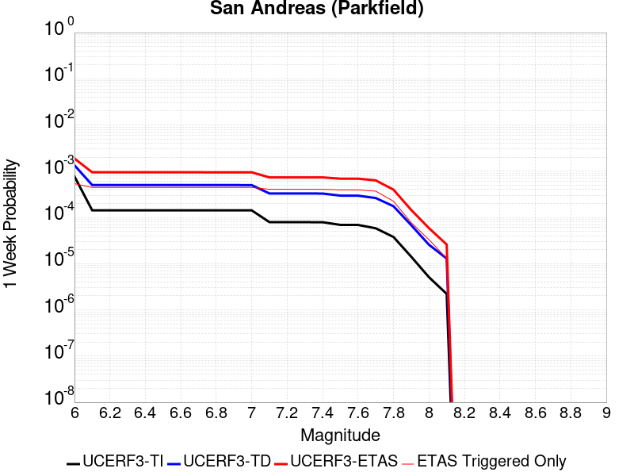 |  |  |  |

| Magnitude | 1 wk TI Prob | 1 wk TD Prob | 1 wk ETAS Prob | 1 wk ETAS/TD Gain | 1 wk ETAS Triggered Only | 1 mo TI Prob | 1 mo TD Prob | 1 mo ETAS Prob | 1 mo ETAS/TD Gain | 1 mo ETAS Triggered Only | 1 yr TI Prob | 1 yr TD Prob | 1 yr ETAS Prob | 1 yr ETAS/TD Gain | 1 yr ETAS Triggered Only | 10 yr TI Prob | 10 yr TD Prob | 10 yr ETAS Prob | 10 yr ETAS/TD Gain | 10 yr ETAS Triggered Only |
|-----|-----|-----|-----|-----|-----|-----|-----|-----|-----|-----|-----|-----|-----|-----|-----|-----|-----|-----|-----|-----|
| 6.0 | 7.723521E-4 | 0.0013466828 | 0.0018839583 | 1.3989621 | 5.38E-4 | 0.0033058827 | 0.0057641217 | 0.0064978674 | 1.1272954 | 7.38E-4 | 0.03951393 | 0.06891971 | 0.07008077 | 1.0168465 | 0.001247 | 0.3317935 | 0.5395069 | 0.5403542 | 1.0015705 | 0.00184 |
| 6.1 | 1.4269065E-4 | 5.017429E-4 | 9.4751915E-4 | 1.8884555 | 4.46E-4 | 6.11388E-4 | 0.002148918 | 0.0027645922 | 1.2865043 | 6.17E-4 | 0.007418273 | 0.02591448 | 0.026942141 | 1.0396558 | 0.001055 | 0.0717547 | 0.22093078 | 0.22216016 | 1.0055645 | 0.001578 |
| 6.2 | 1.4269065E-4 | 5.017429E-4 | 9.4751915E-4 | 1.8884555 | 4.46E-4 | 6.11388E-4 | 0.002148918 | 0.0027645922 | 1.2865043 | 6.17E-4 | 0.007418273 | 0.02591448 | 0.026942141 | 1.0396558 | 0.001055 | 0.0717547 | 0.22093078 | 0.22216016 | 1.0055645 | 0.001578 |
| 6.3 | 1.4269065E-4 | 5.017429E-4 | 9.4751915E-4 | 1.8884555 | 4.46E-4 | 6.11388E-4 | 0.002148918 | 0.0027645922 | 1.2865043 | 6.17E-4 | 0.007418273 | 0.02591448 | 0.026942141 | 1.0396558 | 0.001055 | 0.0717547 | 0.22093078 | 0.22216016 | 1.0055645 | 0.001578 |
| 6.4 | 1.4269065E-4 | 5.017429E-4 | 9.4751915E-4 | 1.8884555 | 4.46E-4 | 6.11388E-4 | 0.002148918 | 0.0027645922 | 1.2865043 | 6.17E-4 | 0.007418273 | 0.02591448 | 0.026942141 | 1.0396558 | 0.001055 | 0.0717547 | 0.22093078 | 0.22216016 | 1.0055645 | 0.001578 |
| 6.5 | 1.4269065E-4 | 5.017429E-4 | 9.4751915E-4 | 1.8884555 | 4.46E-4 | 6.11388E-4 | 0.002148918 | 0.0027645922 | 1.2865043 | 6.17E-4 | 0.007418273 | 0.02591448 | 0.026942141 | 1.0396558 | 0.001055 | 0.0717547 | 0.22093078 | 0.22216016 | 1.0055645 | 0.001578 |
| 6.6 | 1.4257019E-4 | 5.015525E-4 | 9.473288E-4 | 1.8887929 | 4.46E-4 | 6.10872E-4 | 0.0021481037 | 0.0027637782 | 1.2866131 | 6.17E-4 | 0.0074120336 | 0.025904845 | 0.026932515 | 1.039671 | 0.001055 | 0.07169635 | 0.22085924 | 0.22208872 | 1.0055668 | 0.001578 |
| 6.7 | 1.4246788E-4 | 5.013712E-4 | 9.471476E-4 | 1.8891144 | 4.46E-4 | 6.1043375E-4 | 0.002147328 | 0.002763003 | 1.2867168 | 6.17E-4 | 0.007406734 | 0.025895536 | 0.026923217 | 1.0396856 | 0.001055 | 0.07164679 | 0.22079132 | 0.22202091 | 1.005569 | 0.001578 |
| 6.8 | 1.4238524E-4 | 5.0115754E-4 | 9.4693404E-4 | 1.8894937 | 4.46E-4 | 6.1007973E-4 | 0.0021464138 | 0.0027620895 | 1.2868392 | 6.17E-4 | 0.007402453 | 0.025884695 | 0.026912387 | 1.0397027 | 0.001055 | 0.07160675 | 0.22071254 | 0.22194226 | 1.0055716 | 0.001578 |
| 6.9 | 1.4226006E-4 | 5.008332E-4 | 9.466098E-4 | 1.89007 | 4.46E-4 | 6.095435E-4 | 0.0021450259 | 0.0027607025 | 1.2870252 | 6.17E-4 | 0.007395969 | 0.025868258 | 0.026895968 | 1.0397285 | 0.001055 | 0.0715461 | 0.22059278 | 0.22182268 | 1.0055754 | 0.001578 |
| 7.0 | 1.421111E-4 | 5.0044054E-4 | 9.4621733E-4 | 1.8907688 | 4.46E-4 | 6.089054E-4 | 0.002143346 | 0.0027590236 | 1.2872506 | 6.17E-4 | 0.0073882528 | 0.025848212 | 0.026875943 | 1.0397602 | 0.001055 | 0.07147392 | 0.22044773 | 0.22167785 | 1.0055802 | 0.001578 |
| 7.1 | 7.911531E-5 | 3.2991724E-4 | 7.357833E-4 | 2.2302055 | 4.06E-4 | 3.3902156E-4 | 0.0014133246 | 0.0019815203 | 1.4020278 | 5.69E-4 | 0.0041197776 | 0.017099971 | 0.018070094 | 1.0567324 | 9.87E-4 | 0.04044234 | 0.15168123 | 0.15292402 | 1.0081934 | 0.001465 |
| 7.2 | 7.90033E-5 | 3.296154E-4 | 7.3548156E-4 | 2.2313325 | 4.06E-4 | 3.3854163E-4 | 0.0014120324 | 0.001980229 | 1.4023962 | 5.69E-4 | 0.004113957 | 0.017084487 | 0.018054625 | 1.0567847 | 9.87E-4 | 0.040386252 | 0.15155983 | 0.1528028 | 1.0082011 | 0.001465 |
| 7.3 | 7.893314E-5 | 3.2935737E-4 | 7.3522364E-4 | 2.2322977 | 4.06E-4 | 3.3824102E-4 | 0.0014109277 | 0.001979125 | 1.4027117 | 5.69E-4 | 0.0041103107 | 0.017071247 | 0.018041398 | 1.0568295 | 9.87E-4 | 0.04035112 | 0.15145631 | 0.15269943 | 1.0082078 | 0.001465 |
| 7.4 | 7.878637E-5 | 3.2884022E-4 | 7.347067E-4 | 2.2342362 | 4.06E-4 | 3.3761217E-4 | 0.0014087138 | 0.0019769121 | 1.4033456 | 5.69E-4 | 0.004102683 | 0.017044716 | 0.018012926 | 1.0568042 | 9.85E-4 | 0.04027762 | 0.15124616 | 0.15248789 | 1.00821 | 0.001463 |
| 7.5 | 6.8967216E-5 | 2.9620552E-4 | 6.900888E-4 | 2.3297637 | 3.94E-4 | 2.9554032E-4 | 0.001268987 | 0.001822284 | 1.4360147 | 5.54E-4 | 0.0035922674 | 0.015367592 | 0.016318746 | 1.0618936 | 9.66E-4 | 0.035347503 | 0.13755313 | 0.13879332 | 1.0090162 | 0.001438 |
| 7.6 | 6.8796966E-5 | 2.9566285E-4 | 6.8954634E-4 | 2.332205 | 3.94E-4 | 2.948108E-4 | 0.0012666635 | 0.0018199618 | 1.4368155 | 5.54E-4 | 0.003583415 | 0.015339702 | 0.0162899 | 1.0619437 | 9.65E-4 | 0.0352618 | 0.13732228 | 0.13856022 | 1.0090148 | 0.001435 |
| 7.7 | 5.8142083E-5 | 2.6259638E-4 | 6.324992E-4 | 2.4086366 | 3.7E-4 | 2.4915655E-4 | 0.0011250726 | 0.001640492 | 1.4581211 | 5.16E-4 | 0.0030292615 | 0.0136374645 | 0.014521246 | 1.0648054 | 8.96E-4 | 0.029882994 | 0.122926764 | 0.12410379 | 1.0095751 | 0.001342 |
| 7.8 | 3.7720634E-5 | 1.7457761E-4 | 3.985385E-4 | 2.282873 | 2.24E-4 | 1.6164983E-4 | 7.480669E-4 | 0.001061832 | 1.4194345 | 3.14E-4 | 0.0019663102 | 0.009085932 | 0.009621025 | 1.0588925 | 5.4E-4 | 0.019490024 | 0.08308776 | 0.08383871 | 1.0090381 | 8.19E-4 |
| 7.9 | 1.41195915E-5 | 6.798084E-5 | 1.4497561E-4 | 2.132595 | 7.7E-5 | 6.051113E-5 | 2.9132722E-4 | 4.0729344E-4 | 1.3980616 | 1.16E-4 | 7.36474E-4 | 0.0035434929 | 0.0037407912 | 1.0556791 | 1.98E-4 | 0.00734038 | 0.03258086 | 0.03287302 | 1.0089673 | 3.02E-4 |
| 8.0 | 5.0866283E-6 | 2.564328E-5 | 5.8642432E-5 | 2.2868538 | 3.3E-5 | 2.1799653E-5 | 1.09896864E-4 | 1.5389203E-4 | 1.4003314 | 4.4E-5 | 2.6537845E-4 | 0.0013374792 | 0.0014083843 | 1.0530139 | 7.1E-5 | 0.0026506176 | 0.012337761 | 0.012442453 | 1.0084856 | 1.06E-4 |
| 8.1 | 2.2154293E-6 | 1.2907957E-5 | 2.590779E-5 | 2.0071177 | 1.3E-5 | 9.494662E-6 | 5.5319815E-5 | 7.231888E-5 | 1.307287 | 1.7E-5 | 1.1559138E-4 | 6.7351875E-4 | 7.0050056E-4 | 1.040061 | 2.7E-5 | 0.0011553128 | 0.0060832473 | 0.0061239977 | 1.0066988 | 4.1E-5 |

## Hunter Mountain-Saline Valley
*[(top)](#table-of-contents)*

| 1 Week | 1 Month | 1 Year | 10 Year |
|-----|-----|-----|-----|
|  |  | 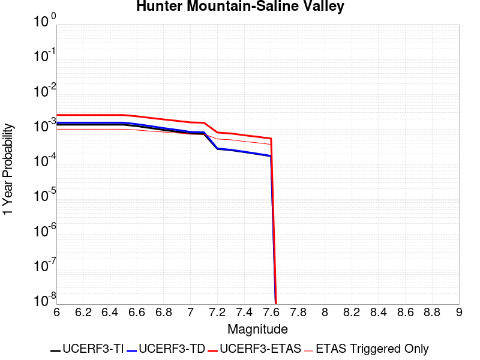 |  |

| Magnitude | 1 wk TI Prob | 1 wk TD Prob | 1 wk ETAS Prob | 1 wk ETAS/TD Gain | 1 wk ETAS Triggered Only | 1 mo TI Prob | 1 mo TD Prob | 1 mo ETAS Prob | 1 mo ETAS/TD Gain | 1 mo ETAS Triggered Only | 1 yr TI Prob | 1 yr TD Prob | 1 yr ETAS Prob | 1 yr ETAS/TD Gain | 1 yr ETAS Triggered Only | 10 yr TI Prob | 10 yr TD Prob | 10 yr ETAS Prob | 10 yr ETAS/TD Gain | 10 yr ETAS Triggered Only |
|-----|-----|-----|-----|-----|-----|-----|-----|-----|-----|-----|-----|-----|-----|-----|-----|-----|-----|-----|-----|-----|
| 6.0 | 2.6350473E-5 | 3.0151663E-5 | 5.1213714E-4 | 16.985369 | 4.82E-4 | 1.12925714E-4 | 1.2921583E-4 | 8.061284E-4 | 6.2386193 | 6.77E-4 | 0.0013740034 | 0.0015722114 | 0.0025896092 | 1.6471126 | 0.001019 | 0.01365539 | 0.015625311 | 0.01703592 | 1.0902772 | 0.001433 |
| 6.1 | 2.6350473E-5 | 3.0151663E-5 | 5.1213714E-4 | 16.985369 | 4.82E-4 | 1.12925714E-4 | 1.2921583E-4 | 8.061284E-4 | 6.2386193 | 6.77E-4 | 0.0013740034 | 0.0015722114 | 0.0025896092 | 1.6471126 | 0.001019 | 0.01365539 | 0.015625311 | 0.01703592 | 1.0902772 | 0.001433 |
| 6.2 | 2.6350473E-5 | 3.0151663E-5 | 5.1213714E-4 | 16.985369 | 4.82E-4 | 1.12925714E-4 | 1.2921583E-4 | 8.061284E-4 | 6.2386193 | 6.77E-4 | 0.0013740034 | 0.0015722114 | 0.0025896092 | 1.6471126 | 0.001019 | 0.01365539 | 0.015625311 | 0.01703592 | 1.0902772 | 0.001433 |
| 6.3 | 2.6350473E-5 | 3.0151663E-5 | 5.1213714E-4 | 16.985369 | 4.82E-4 | 1.12925714E-4 | 1.2921583E-4 | 8.061284E-4 | 6.2386193 | 6.77E-4 | 0.0013740034 | 0.0015722114 | 0.0025896092 | 1.6471126 | 0.001019 | 0.01365539 | 0.015625311 | 0.01703592 | 1.0902772 | 0.001433 |
| 6.4 | 2.6350473E-5 | 3.0151663E-5 | 5.1213714E-4 | 16.985369 | 4.82E-4 | 1.12925714E-4 | 1.2921583E-4 | 8.061284E-4 | 6.2386193 | 6.77E-4 | 0.0013740034 | 0.0015722114 | 0.0025896092 | 1.6471126 | 0.001019 | 0.01365539 | 0.015625311 | 0.01703592 | 1.0902772 | 0.001433 |
| 6.5 | 2.6350473E-5 | 3.0151663E-5 | 5.1213714E-4 | 16.985369 | 4.82E-4 | 1.12925714E-4 | 1.2921583E-4 | 8.061284E-4 | 6.2386193 | 6.77E-4 | 0.0013740034 | 0.0015722114 | 0.0025896092 | 1.6471126 | 0.001019 | 0.01365539 | 0.015625311 | 0.01703592 | 1.0902772 | 0.001433 |
| 6.6 | 2.3915805E-5 | 2.727318E-5 | 4.8726064E-4 | 17.865927 | 4.6E-4 | 1.0249228E-4 | 1.1688063E-4 | 7.598055E-4 | 6.5006967 | 6.43E-4 | 0.0012471292 | 0.0014222359 | 0.0023848647 | 1.676842 | 9.64E-4 | 0.012401534 | 0.014145577 | 0.015482396 | 1.0945044 | 0.001356 |
| 6.7 | 2.1143418E-5 | 2.4001838E-5 | 4.509916E-4 | 18.789877 | 4.27E-4 | 9.06115E-5 | 1.0286176E-4 | 6.9880043E-4 | 6.793588 | 5.96E-4 | 0.0011026367 | 0.0012517641 | 0.0021476413 | 1.7156917 | 8.97E-4 | 0.010971815 | 0.012461145 | 0.013707419 | 1.1000128 | 0.001262 |
| 6.8 | 1.8590634E-5 | 2.0984402E-5 | 4.269759E-4 | 20.347298 | 4.06E-4 | 7.967171E-5 | 8.993084E-5 | 6.508804E-4 | 7.237566 | 5.61E-4 | 9.6957135E-4 | 0.0010944982 | 0.0019395723 | 1.7721109 | 8.46E-4 | 0.00965352 | 0.010904897 | 0.012084887 | 1.1082073 | 0.001193 |
| 6.9 | 1.6592752E-5 | 1.863061E-5 | 4.016235E-4 | 21.557182 | 3.83E-4 | 7.110986E-5 | 7.984381E-5 | 6.068017E-4 | 7.599859 | 5.27E-4 | 8.6541864E-4 | 9.7180397E-4 | 0.0017640333 | 1.8152152 | 7.93E-4 | 0.008620561 | 0.009689213 | 0.010802322 | 1.1148813 | 0.001124 |
| 7.0 | 1.4621345E-5 | 1.6318016E-5 | 3.7131223E-4 | 22.75474 | 3.55E-4 | 6.2661406E-5 | 6.993326E-5 | 5.578991E-4 | 7.977594 | 4.88E-4 | 7.6263555E-4 | 8.512428E-4 | 0.0015946095 | 1.8732722 | 7.44E-4 | 0.0076002358 | 0.008493364 | 0.009545352 | 1.12386 | 0.001061 |
| 7.1 | 1.4214311E-5 | 1.5853855E-5 | 3.6484833E-4 | 23.013224 | 3.49E-4 | 6.0917053E-5 | 6.79441E-5 | 5.4691156E-4 | 8.049434 | 4.79E-4 | 7.414127E-4 | 8.2704343E-4 | 0.0015594373 | 1.8855566 | 7.33E-4 | 0.0073894397 | 0.0082531925 | 0.009289568 | 1.1255727 | 0.001045 |
| 7.2 | 5.322531E-6 | 5.4705556E-6 | 2.6346915E-4 | 48.161312 | 2.58E-4 | 2.2810646E-5 | 2.3445109E-5 | 3.6843703E-4 | 15.714877 | 3.45E-4 | 2.7768422E-4 | 2.8542118E-4 | 8.1826904E-4 | 2.8668828 | 5.33E-4 | 0.0027733748 | 0.002851954 | 0.003618761 | 1.2688707 | 7.69E-4 |
| 7.3 | 4.9197506E-6 | 5.0347303E-6 | 2.5303348E-4 | 50.257603 | 2.48E-4 | 2.1084476E-5 | 2.1577318E-5 | 3.555701E-4 | 16.478884 | 3.34E-4 | 2.5667323E-4 | 2.6268652E-4 | 7.705531E-4 | 2.933356 | 5.08E-4 | 0.0025637697 | 0.0026251655 | 0.0033562414 | 1.2784874 | 7.33E-4 |
| 7.4 | 4.3367913E-6 | 4.4250473E-6 | 2.3042405E-4 | 52.072674 | 2.26E-4 | 1.8586115E-5 | 1.896443E-5 | 3.2295866E-4 | 17.029705 | 3.04E-4 | 2.2626246E-4 | 2.3088178E-4 | 6.84777E-4 | 2.9659202 | 4.54E-4 | 0.0022603222 | 0.0023078213 | 0.0029653003 | 1.2848917 | 6.59E-4 |
| 7.5 | 3.7993927E-6 | 3.8762123E-6 | 2.0987542E-4 | 54.14446 | 2.06E-4 | 1.628301E-5 | 1.6612312E-5 | 2.946077E-4 | 17.734297 | 2.78E-4 | 1.9822762E-4 | 2.0225039E-4 | 6.1716646E-4 | 3.051497 | 4.15E-4 | 0.001980509 | 0.002022061 | 0.002615858 | 1.2936592 | 5.95E-4 |
| 7.6 | 3.2998898E-6 | 3.365071E-6 | 1.8636446E-4 | 55.382027 | 1.83E-4 | 1.4142308E-5 | 1.4421733E-5 | 2.6241815E-4 | 18.19602 | 2.48E-4 | 1.7216899E-4 | 1.755846E-4 | 5.495189E-4 | 3.1296535 | 3.74E-4 | 0.0017203566 | 0.001755846 | 0.002286912 | 1.3024559 | 5.32E-4 |

## San Andreas (San Bernardino N)
*[(top)](#table-of-contents)*

| 1 Week | 1 Month | 1 Year | 10 Year |
|-----|-----|-----|-----|
|  |  |  |  |

| Magnitude | 1 wk TI Prob | 1 wk TD Prob | 1 wk ETAS Prob | 1 wk ETAS/TD Gain | 1 wk ETAS Triggered Only | 1 mo TI Prob | 1 mo TD Prob | 1 mo ETAS Prob | 1 mo ETAS/TD Gain | 1 mo ETAS Triggered Only | 1 yr TI Prob | 1 yr TD Prob | 1 yr ETAS Prob | 1 yr ETAS/TD Gain | 1 yr ETAS Triggered Only | 10 yr TI Prob | 10 yr TD Prob | 10 yr ETAS Prob | 10 yr ETAS/TD Gain | 10 yr ETAS Triggered Only |
|-----|-----|-----|-----|-----|-----|-----|-----|-----|-----|-----|-----|-----|-----|-----|-----|-----|-----|-----|-----|-----|
| 6.0 | 1.0995041E-4 | 4.016633E-4 | 6.965448E-4 | 1.734151 | 2.95E-4 | 4.7113094E-4 | 0.0017203542 | 0.0021715765 | 1.2622846 | 4.52E-4 | 0.0057209437 | 0.020758318 | 0.021545628 | 1.0379275 | 8.04E-4 | 0.055758867 | 0.17985137 | 0.18085194 | 1.0055634 | 0.00122 |
| 6.1 | 1.0995041E-4 | 4.016633E-4 | 6.965448E-4 | 1.734151 | 2.95E-4 | 4.7113094E-4 | 0.0017203542 | 0.0021715765 | 1.2622846 | 4.52E-4 | 0.0057209437 | 0.020758318 | 0.021545628 | 1.0379275 | 8.04E-4 | 0.055758867 | 0.17985137 | 0.18085194 | 1.0055634 | 0.00122 |
| 6.2 | 1.0995041E-4 | 4.016633E-4 | 6.965448E-4 | 1.734151 | 2.95E-4 | 4.7113094E-4 | 0.0017203542 | 0.0021715765 | 1.2622846 | 4.52E-4 | 0.0057209437 | 0.020758318 | 0.021545628 | 1.0379275 | 8.04E-4 | 0.055758867 | 0.17985137 | 0.18085194 | 1.0055634 | 0.00122 |
| 6.3 | 1.0995041E-4 | 4.016633E-4 | 6.965448E-4 | 1.734151 | 2.95E-4 | 4.7113094E-4 | 0.0017203542 | 0.0021715765 | 1.2622846 | 4.52E-4 | 0.0057209437 | 0.020758318 | 0.021545628 | 1.0379275 | 8.04E-4 | 0.055758867 | 0.17985137 | 0.18085194 | 1.0055634 | 0.00122 |
| 6.4 | 1.0995041E-4 | 4.016633E-4 | 6.965448E-4 | 1.734151 | 2.95E-4 | 4.7113094E-4 | 0.0017203542 | 0.0021715765 | 1.2622846 | 4.52E-4 | 0.0057209437 | 0.020758318 | 0.021545628 | 1.0379275 | 8.04E-4 | 0.055758867 | 0.17985137 | 0.18085194 | 1.0055634 | 0.00122 |
| 6.5 | 1.0995041E-4 | 4.016633E-4 | 6.965448E-4 | 1.734151 | 2.95E-4 | 4.7113094E-4 | 0.0017203542 | 0.0021715765 | 1.2622846 | 4.52E-4 | 0.0057209437 | 0.020758318 | 0.021545628 | 1.0379275 | 8.04E-4 | 0.055758867 | 0.17985137 | 0.18085194 | 1.0055634 | 0.00122 |
| 6.6 | 1.09829954E-4 | 4.014158E-4 | 6.962974E-4 | 1.7346038 | 2.95E-4 | 4.7061488E-4 | 0.0017192949 | 0.0021705178 | 1.2624465 | 4.52E-4 | 0.0057146936 | 0.020745667 | 0.021532986 | 1.0379511 | 8.04E-4 | 0.05569951 | 0.17974973 | 0.18075043 | 1.0055672 | 0.00122 |
| 6.7 | 1.0968671E-4 | 4.0112622E-4 | 6.950083E-4 | 1.7326424 | 2.94E-4 | 4.7000122E-4 | 0.0017180555 | 0.0021682805 | 1.262055 | 4.51E-4 | 0.005707261 | 0.020730862 | 0.021517217 | 1.0379316 | 8.03E-4 | 0.05562892 | 0.17963059 | 0.1806298 | 1.0055625 | 0.001218 |
| 6.8 | 9.6153904E-5 | 3.6562132E-4 | 6.355226E-4 | 1.738199 | 2.7E-4 | 4.1202307E-4 | 0.0015660744 | 0.001974434 | 1.2607535 | 4.09E-4 | 0.0050048484 | 0.018912675 | 0.019623963 | 1.0376091 | 7.25E-4 | 0.048936214 | 0.16500922 | 0.16592437 | 1.0055461 | 0.001096 |
| 6.9 | 9.59246E-5 | 3.6505362E-4 | 6.3495507E-4 | 1.7393473 | 2.7E-4 | 4.1104064E-4 | 0.0015636444 | 0.0019720048 | 1.2611594 | 4.09E-4 | 0.0049929423 | 0.0188836 | 0.019592948 | 1.0375642 | 7.23E-4 | 0.048822403 | 0.164772 | 0.16568574 | 1.0055455 | 0.001094 |
| 7.0 | 9.5669224E-5 | 3.64425E-4 | 6.3332694E-4 | 1.7378801 | 2.69E-4 | 4.0994651E-4 | 0.0015609534 | 0.0019683167 | 1.2609707 | 4.08E-4 | 0.004979682 | 0.018851407 | 0.019559797 | 1.0375775 | 7.22E-4 | 0.048695635 | 0.16450974 | 0.16542293 | 1.005551 | 0.001093 |
| 7.1 | 9.5384006E-5 | 3.6372882E-4 | 6.3163135E-4 | 1.7365446 | 2.68E-4 | 4.0872456E-4 | 0.0015579734 | 0.0019643393 | 1.2608298 | 4.07E-4 | 0.0049648727 | 0.018815754 | 0.019523187 | 1.037598 | 7.21E-4 | 0.04855404 | 0.16421874 | 0.1651314 | 1.0055577 | 0.001092 |
| 7.2 | 7.876192E-5 | 3.2410742E-4 | 5.7602575E-4 | 1.777268 | 2.52E-4 | 3.375074E-4 | 0.0013883485 | 0.001767821 | 1.2733265 | 3.8E-4 | 0.0041014124 | 0.01678248 | 0.017441235 | 1.0392526 | 6.7E-4 | 0.040265374 | 0.14711435 | 0.14797834 | 1.0058728 | 0.001013 |
| 7.3 | 7.8294186E-5 | 3.2266052E-4 | 5.7457923E-4 | 1.7807546 | 2.52E-4 | 3.3550337E-4 | 0.0013821543 | 0.001761629 | 1.2745532 | 3.8E-4 | 0.004077105 | 0.016708223 | 0.017365063 | 1.0393124 | 6.68E-4 | 0.040031098 | 0.14649805 | 0.14736009 | 1.0058843 | 0.00101 |
| 7.4 | 7.778049E-5 | 3.210994E-4 | 5.720188E-4 | 1.7814385 | 2.51E-4 | 3.3330236E-4 | 0.0013754707 | 0.0017539493 | 1.275163 | 3.79E-4 | 0.0040504076 | 0.016628098 | 0.017283022 | 1.0393866 | 6.66E-4 | 0.039773732 | 0.14583014 | 0.1466903 | 1.0058982 | 0.001007 |
| 7.5 | 5.9146343E-5 | 2.6189696E-4 | 4.7384144E-4 | 1.8092667 | 2.12E-4 | 2.534597E-4 | 0.0011219733 | 0.0014466087 | 1.2893432 | 3.25E-4 | 0.0030815054 | 0.01358183 | 0.014150008 | 1.0418336 | 5.76E-4 | 0.03039124 | 0.120311 | 0.12107897 | 1.0063832 | 8.73E-4 |
| 7.6 | 4.7335114E-5 | 2.2432729E-4 | 4.1028557E-4 | 1.8289597 | 1.86E-4 | 2.02849E-4 | 9.6108246E-4 | 0.0012468076 | 1.2972951 | 2.86E-4 | 0.0024668893 | 0.011644533 | 0.012143652 | 1.042863 | 5.05E-4 | 0.024396837 | 0.10364283 | 0.104333915 | 1.006668 | 7.71E-4 |
| 7.7 | 3.8561506E-5 | 1.9188043E-4 | 3.618478E-4 | 1.8857983 | 1.7E-4 | 1.6525312E-4 | 8.22116E-4 | 0.0010819023 | 1.3159971 | 2.6E-4 | 0.0020101 | 0.009968772 | 0.0104241865 | 1.0456841 | 4.6E-4 | 0.01992015 | 0.08914556 | 0.08978134 | 1.0071319 | 6.98E-4 |
| 7.8 | 3.2975342E-5 | 1.6895565E-4 | 3.2792878E-4 | 1.9409164 | 1.59E-4 | 1.4131523E-4 | 7.23923E-4 | 9.6974487E-4 | 1.3395692 | 2.46E-4 | 0.0017191551 | 0.008783187 | 0.0092074275 | 1.0483015 | 4.28E-4 | 0.017059162 | 0.07850971 | 0.079098545 | 1.0075002 | 6.39E-4 |
| 7.9 | 2.148629E-5 | 1.04210856E-4 | 2.2819794E-4 | 2.1897712 | 1.24E-4 | 9.208085E-5 | 4.46556E-4 | 6.354716E-4 | 1.4230502 | 1.89E-4 | 0.0011205077 | 0.005425832 | 0.00574509 | 1.0588404 | 3.21E-4 | 0.011148746 | 0.049493838 | 0.049942475 | 1.0090646 | 4.72E-4 |
| 8.0 | 6.3800603E-6 | 3.136937E-5 | 7.1368115E-5 | 2.2750893 | 4.0E-5 | 2.7342829E-5 | 1.3443502E-4 | 1.9242722E-4 | 1.4313772 | 5.8E-5 | 3.3284808E-4 | 0.0016358347 | 0.0017226923 | 1.0530969 | 8.7E-5 | 0.0033234998 | 0.015136539 | 0.015261617 | 1.0082633 | 1.27E-4 |
| 8.1 | 2.2240692E-6 | 1.29589735E-5 | 2.5958805E-5 | 2.0031528 | 1.3E-5 | 9.531691E-6 | 5.5538447E-5 | 7.253751E-5 | 1.3060772 | 1.7E-5 | 1.1604215E-4 | 6.7617896E-4 | 7.031607E-4 | 1.0399033 | 2.7E-5 | 0.0011598158 | 0.0061071273 | 0.0061498648 | 1.006998 | 4.3E-5 |

## San Cayetano
*[(top)](#table-of-contents)*

| 1 Week | 1 Month | 1 Year | 10 Year |
|-----|-----|-----|-----|
|  |  |  |  |

| Magnitude | 1 wk TI Prob | 1 wk TD Prob | 1 wk ETAS Prob | 1 wk ETAS/TD Gain | 1 wk ETAS Triggered Only | 1 mo TI Prob | 1 mo TD Prob | 1 mo ETAS Prob | 1 mo ETAS/TD Gain | 1 mo ETAS Triggered Only | 1 yr TI Prob | 1 yr TD Prob | 1 yr ETAS Prob | 1 yr ETAS/TD Gain | 1 yr ETAS Triggered Only | 10 yr TI Prob | 10 yr TD Prob | 10 yr ETAS Prob | 10 yr ETAS/TD Gain | 10 yr ETAS Triggered Only |
|-----|-----|-----|-----|-----|-----|-----|-----|-----|-----|-----|-----|-----|-----|-----|-----|-----|-----|-----|-----|-----|
| 6.0 | 8.1875E-5 | 1.8670029E-4 | 4.2365602E-4 | 2.2691772 | 2.37E-4 | 3.5084566E-4 | 7.9996156E-4 | 0.0011376912 | 1.4221823 | 3.38E-4 | 0.004263182 | 0.009708474 | 0.010327406 | 1.0637517 | 6.25E-4 | 0.041823186 | 0.09218576 | 0.09308358 | 1.0097393 | 9.89E-4 |
| 6.1 | 8.1875E-5 | 1.8670029E-4 | 4.2365602E-4 | 2.2691772 | 2.37E-4 | 3.5084566E-4 | 7.9996156E-4 | 0.0011376912 | 1.4221823 | 3.38E-4 | 0.004263182 | 0.009708474 | 0.010327406 | 1.0637517 | 6.25E-4 | 0.041823186 | 0.09218576 | 0.09308358 | 1.0097393 | 9.89E-4 |
| 6.2 | 8.1875E-5 | 1.8670029E-4 | 4.2365602E-4 | 2.2691772 | 2.37E-4 | 3.5084566E-4 | 7.9996156E-4 | 0.0011376912 | 1.4221823 | 3.38E-4 | 0.004263182 | 0.009708474 | 0.010327406 | 1.0637517 | 6.25E-4 | 0.041823186 | 0.09218576 | 0.09308358 | 1.0097393 | 9.89E-4 |
| 6.3 | 8.1875E-5 | 1.8670029E-4 | 4.2365602E-4 | 2.2691772 | 2.37E-4 | 3.5084566E-4 | 7.9996156E-4 | 0.0011376912 | 1.4221823 | 3.38E-4 | 0.004263182 | 0.009708474 | 0.010327406 | 1.0637517 | 6.25E-4 | 0.041823186 | 0.09218576 | 0.09308358 | 1.0097393 | 9.89E-4 |
| 6.4 | 8.1875E-5 | 1.8670029E-4 | 4.2365602E-4 | 2.2691772 | 2.37E-4 | 3.5084566E-4 | 7.9996156E-4 | 0.0011376912 | 1.4221823 | 3.38E-4 | 0.004263182 | 0.009708474 | 0.010327406 | 1.0637517 | 6.25E-4 | 0.041823186 | 0.09218576 | 0.09308358 | 1.0097393 | 9.89E-4 |
| 6.5 | 8.1875E-5 | 1.8670029E-4 | 4.2365602E-4 | 2.2691772 | 2.37E-4 | 3.5084566E-4 | 7.9996156E-4 | 0.0011376912 | 1.4221823 | 3.38E-4 | 0.004263182 | 0.009708474 | 0.010327406 | 1.0637517 | 6.25E-4 | 0.041823186 | 0.09218576 | 0.09308358 | 1.0097393 | 9.89E-4 |
| 6.6 | 8.1875E-5 | 1.8670029E-4 | 4.2365602E-4 | 2.2691772 | 2.37E-4 | 3.5084566E-4 | 7.9996156E-4 | 0.0011376912 | 1.4221823 | 3.38E-4 | 0.004263182 | 0.009708474 | 0.010327406 | 1.0637517 | 6.25E-4 | 0.041823186 | 0.09218576 | 0.09308358 | 1.0097393 | 9.89E-4 |
| 6.7 | 5.4643962E-5 | 1.3262422E-4 | 3.0460142E-4 | 2.2967253 | 1.72E-4 | 2.341674E-4 | 5.6833174E-4 | 8.2018855E-4 | 1.443151 | 2.52E-4 | 0.0028472608 | 0.006909191 | 0.007367006 | 1.0662618 | 4.61E-4 | 0.028110553 | 0.06647811 | 0.06715865 | 1.010237 | 7.29E-4 |
| 6.8 | 5.4643962E-5 | 1.3262422E-4 | 3.0460142E-4 | 2.2967253 | 1.72E-4 | 2.341674E-4 | 5.6833174E-4 | 8.2018855E-4 | 1.443151 | 2.52E-4 | 0.0028472608 | 0.006909191 | 0.007367006 | 1.0662618 | 4.61E-4 | 0.028110553 | 0.06647811 | 0.06715865 | 1.010237 | 7.29E-4 |
| 6.9 | 4.9065253E-5 | 1.1962955E-4 | 2.7961042E-4 | 2.3373022 | 1.6E-4 | 2.102627E-4 | 5.1266217E-4 | 7.375468E-4 | 1.4386605 | 2.25E-4 | 0.002556943 | 0.006235295 | 0.006648701 | 1.066301 | 4.16E-4 | 0.02527722 | 0.06024073 | 0.060858153 | 1.0102493 | 6.57E-4 |
| 7.0 | 3.8281665E-5 | 9.1909E-5 | 2.048986E-4 | 2.229364 | 1.13E-4 | 1.6405396E-4 | 3.938957E-4 | 5.538327E-4 | 1.4060389 | 1.6E-4 | 0.0019955272 | 0.0047956803 | 0.005102203 | 1.0639164 | 3.08E-4 | 0.019777026 | 0.04680347 | 0.047282927 | 1.010244 | 5.03E-4 |
| 7.1 | 3.8281665E-5 | 9.1909E-5 | 2.048986E-4 | 2.229364 | 1.13E-4 | 1.6405396E-4 | 3.938957E-4 | 5.538327E-4 | 1.4060389 | 1.6E-4 | 0.0019955272 | 0.0047956803 | 0.005102203 | 1.0639164 | 3.08E-4 | 0.019777026 | 0.04680347 | 0.047282927 | 1.010244 | 5.03E-4 |

## Pleito
*[(top)](#table-of-contents)*

| 1 Week | 1 Month | 1 Year | 10 Year |
|-----|-----|-----|-----|
|  |  |  |  |

| Magnitude | 1 wk TI Prob | 1 wk TD Prob | 1 wk ETAS Prob | 1 wk ETAS/TD Gain | 1 wk ETAS Triggered Only | 1 mo TI Prob | 1 mo TD Prob | 1 mo ETAS Prob | 1 mo ETAS/TD Gain | 1 mo ETAS Triggered Only | 1 yr TI Prob | 1 yr TD Prob | 1 yr ETAS Prob | 1 yr ETAS/TD Gain | 1 yr ETAS Triggered Only | 10 yr TI Prob | 10 yr TD Prob | 10 yr ETAS Prob | 10 yr ETAS/TD Gain | 10 yr ETAS Triggered Only |
|-----|-----|-----|-----|-----|-----|-----|-----|-----|-----|-----|-----|-----|-----|-----|-----|-----|-----|-----|-----|-----|
| 6.0 | 2.8975299E-5 | 3.5014233E-5 | 2.1200803E-4 | 6.05491 | 1.77E-4 | 1.2417394E-4 | 1.5005456E-4 | 4.3801134E-4 | 2.9190137 | 2.88E-4 | 0.0015107692 | 0.0018257706 | 0.0024037135 | 1.3165474 | 5.79E-4 | 0.015005396 | 0.018145941 | 0.019145468 | 1.0550827 | 0.001018 |
| 6.1 | 2.8975299E-5 | 3.5014233E-5 | 2.1200803E-4 | 6.05491 | 1.77E-4 | 1.2417394E-4 | 1.5005456E-4 | 4.3801134E-4 | 2.9190137 | 2.88E-4 | 0.0015107692 | 0.0018257706 | 0.0024037135 | 1.3165474 | 5.79E-4 | 0.015005396 | 0.018145941 | 0.019145468 | 1.0550827 | 0.001018 |
| 6.2 | 2.8975299E-5 | 3.5014233E-5 | 2.1200803E-4 | 6.05491 | 1.77E-4 | 1.2417394E-4 | 1.5005456E-4 | 4.3801134E-4 | 2.9190137 | 2.88E-4 | 0.0015107692 | 0.0018257706 | 0.0024037135 | 1.3165474 | 5.79E-4 | 0.015005396 | 0.018145941 | 0.019145468 | 1.0550827 | 0.001018 |
| 6.3 | 2.8975299E-5 | 3.5014233E-5 | 2.1200803E-4 | 6.05491 | 1.77E-4 | 1.2417394E-4 | 1.5005456E-4 | 4.3801134E-4 | 2.9190137 | 2.88E-4 | 0.0015107692 | 0.0018257706 | 0.0024037135 | 1.3165474 | 5.79E-4 | 0.015005396 | 0.018145941 | 0.019145468 | 1.0550827 | 0.001018 |
| 6.4 | 2.8975299E-5 | 3.5014233E-5 | 2.1200803E-4 | 6.05491 | 1.77E-4 | 1.2417394E-4 | 1.5005456E-4 | 4.3801134E-4 | 2.9190137 | 2.88E-4 | 0.0015107692 | 0.0018257706 | 0.0024037135 | 1.3165474 | 5.79E-4 | 0.015005396 | 0.018145941 | 0.019145468 | 1.0550827 | 0.001018 |
| 6.5 | 2.8975299E-5 | 3.5014233E-5 | 2.1200803E-4 | 6.05491 | 1.77E-4 | 1.2417394E-4 | 1.5005456E-4 | 4.3801134E-4 | 2.9190137 | 2.88E-4 | 0.0015107692 | 0.0018257706 | 0.0024037135 | 1.3165474 | 5.79E-4 | 0.015005396 | 0.018145941 | 0.019145468 | 1.0550827 | 0.001018 |
| 6.6 | 2.6446418E-5 | 3.190913E-5 | 1.9090406E-4 | 5.982741 | 1.59E-4 | 1.1333687E-4 | 1.367484E-4 | 3.9671286E-4 | 2.901042 | 2.6E-4 | 0.0013790029 | 0.0016640209 | 0.0022001273 | 1.3221753 | 5.37E-4 | 0.013704768 | 0.016553096 | 0.017489338 | 1.0565599 | 9.52E-4 |
| 6.7 | 2.26497E-5 | 2.7271499E-5 | 1.6326779E-4 | 5.9867554 | 1.36E-4 | 9.706653E-5 | 1.1687469E-4 | 3.468478E-4 | 2.9676898 | 2.3E-4 | 0.0011811443 | 0.0014223875 | 0.0018877247 | 1.3271521 | 4.66E-4 | 0.01174886 | 0.0141689 | 0.0149792535 | 1.0571923 | 8.22E-4 |
| 6.8 | 1.799965E-5 | 2.159839E-5 | 1.3359597E-4 | 6.1854596 | 1.12E-4 | 7.713908E-5 | 9.256323E-5 | 2.78546E-4 | 3.0092514 | 1.86E-4 | 9.387636E-4 | 0.0011267258 | 0.0015023021 | 1.3333343 | 3.76E-4 | 0.009348078 | 0.011244575 | 0.011916928 | 1.0597936 | 6.8E-4 |
| 6.9 | 1.799965E-5 | 2.159839E-5 | 1.3359597E-4 | 6.1854596 | 1.12E-4 | 7.713908E-5 | 9.256323E-5 | 2.78546E-4 | 3.0092514 | 1.86E-4 | 9.387636E-4 | 0.0011267258 | 0.0015023021 | 1.3333343 | 3.76E-4 | 0.009348078 | 0.011244575 | 0.011916928 | 1.0597936 | 6.8E-4 |
| 7.0 | 1.3666451E-5 | 1.6355421E-5 | 1.0435398E-4 | 6.3803906 | 8.8E-5 | 5.8569192E-5 | 7.009466E-5 | 2.150845E-4 | 3.068486 | 1.45E-4 | 7.128466E-4 | 8.5340254E-4 | 0.0011481508 | 1.3453801 | 2.95E-4 | 0.0071056425 | 0.008534024 | 0.009072389 | 1.0630847 | 5.43E-4 |

## Cucamonga
*[(top)](#table-of-contents)*

| 1 Week | 1 Month | 1 Year | 10 Year |
|-----|-----|-----|-----|
|  |  |  |  |

| Magnitude | 1 wk TI Prob | 1 wk TD Prob | 1 wk ETAS Prob | 1 wk ETAS/TD Gain | 1 wk ETAS Triggered Only | 1 mo TI Prob | 1 mo TD Prob | 1 mo ETAS Prob | 1 mo ETAS/TD Gain | 1 mo ETAS Triggered Only | 1 yr TI Prob | 1 yr TD Prob | 1 yr ETAS Prob | 1 yr ETAS/TD Gain | 1 yr ETAS Triggered Only | 10 yr TI Prob | 10 yr TD Prob | 10 yr ETAS Prob | 10 yr ETAS/TD Gain | 10 yr ETAS Triggered Only |
|-----|-----|-----|-----|-----|-----|-----|-----|-----|-----|-----|-----|-----|-----|-----|-----|-----|-----|-----|-----|-----|
| 6.0 | 9.287573E-5 | 1.8282168E-4 | 3.647884E-4 | 1.9953235 | 1.82E-4 | 3.9797812E-4 | 7.831635E-4 | 0.0010919215 | 1.3942447 | 3.09E-4 | 0.0048346235 | 0.009502821 | 0.010120891 | 1.0650407 | 6.24E-4 | 0.047307868 | 0.09186649 | 0.09279188 | 1.0100732 | 0.001019 |
| 6.1 | 9.287573E-5 | 1.8282168E-4 | 3.647884E-4 | 1.9953235 | 1.82E-4 | 3.9797812E-4 | 7.831635E-4 | 0.0010919215 | 1.3942447 | 3.09E-4 | 0.0048346235 | 0.009502821 | 0.010120891 | 1.0650407 | 6.24E-4 | 0.047307868 | 0.09186649 | 0.09279188 | 1.0100732 | 0.001019 |
| 6.2 | 9.287573E-5 | 1.8282168E-4 | 3.647884E-4 | 1.9953235 | 1.82E-4 | 3.9797812E-4 | 7.831635E-4 | 0.0010919215 | 1.3942447 | 3.09E-4 | 0.0048346235 | 0.009502821 | 0.010120891 | 1.0650407 | 6.24E-4 | 0.047307868 | 0.09186649 | 0.09279188 | 1.0100732 | 0.001019 |
| 6.3 | 9.287573E-5 | 1.8282168E-4 | 3.647884E-4 | 1.9953235 | 1.82E-4 | 3.9797812E-4 | 7.831635E-4 | 0.0010919215 | 1.3942447 | 3.09E-4 | 0.0048346235 | 0.009502821 | 0.010120891 | 1.0650407 | 6.24E-4 | 0.047307868 | 0.09186649 | 0.09279188 | 1.0100732 | 0.001019 |
| 6.4 | 9.287573E-5 | 1.8282168E-4 | 3.647884E-4 | 1.9953235 | 1.82E-4 | 3.9797812E-4 | 7.831635E-4 | 0.0010919215 | 1.3942447 | 3.09E-4 | 0.0048346235 | 0.009502821 | 0.010120891 | 1.0650407 | 6.24E-4 | 0.047307868 | 0.09186649 | 0.09279188 | 1.0100732 | 0.001019 |
| 6.5 | 9.287573E-5 | 1.8282168E-4 | 3.647884E-4 | 1.9953235 | 1.82E-4 | 3.9797812E-4 | 7.831635E-4 | 0.0010919215 | 1.3942447 | 3.09E-4 | 0.0048346235 | 0.009502821 | 0.010120891 | 1.0650407 | 6.24E-4 | 0.047307868 | 0.09186649 | 0.09279188 | 1.0100732 | 0.001019 |

## Death Valley (No)
*[(top)](#table-of-contents)*

| 1 Week | 1 Month | 1 Year | 10 Year |
|-----|-----|-----|-----|
|  | 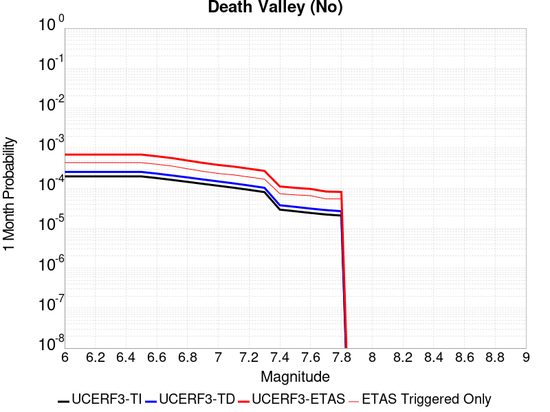 |  |  |

| Magnitude | 1 wk TI Prob | 1 wk TD Prob | 1 wk ETAS Prob | 1 wk ETAS/TD Gain | 1 wk ETAS Triggered Only | 1 mo TI Prob | 1 mo TD Prob | 1 mo ETAS Prob | 1 mo ETAS/TD Gain | 1 mo ETAS Triggered Only | 1 yr TI Prob | 1 yr TD Prob | 1 yr ETAS Prob | 1 yr ETAS/TD Gain | 1 yr ETAS Triggered Only | 10 yr TI Prob | 10 yr TD Prob | 10 yr ETAS Prob | 10 yr ETAS/TD Gain | 10 yr ETAS Triggered Only |
|-----|-----|-----|-----|-----|-----|-----|-----|-----|-----|-----|-----|-----|-----|-----|-----|-----|-----|-----|-----|-----|
| 6.0 | 4.5975892E-5 | 5.9477E-5 | 3.6645873E-4 | 6.161352 | 3.07E-4 | 1.9702465E-4 | 2.548782E-4 | 6.917668E-4 | 2.7141075 | 4.37E-4 | 0.0023961363 | 0.003099011 | 0.0037390215 | 1.2065209 | 6.42E-4 | 0.02370464 | 0.030588351 | 0.031459853 | 1.0284913 | 8.99E-4 |
| 6.1 | 4.5975892E-5 | 5.9477E-5 | 3.6645873E-4 | 6.161352 | 3.07E-4 | 1.9702465E-4 | 2.548782E-4 | 6.917668E-4 | 2.7141075 | 4.37E-4 | 0.0023961363 | 0.003099011 | 0.0037390215 | 1.2065209 | 6.42E-4 | 0.02370464 | 0.030588351 | 0.031459853 | 1.0284913 | 8.99E-4 |
| 6.2 | 4.5975892E-5 | 5.9477E-5 | 3.6645873E-4 | 6.161352 | 3.07E-4 | 1.9702465E-4 | 2.548782E-4 | 6.917668E-4 | 2.7141075 | 4.37E-4 | 0.0023961363 | 0.003099011 | 0.0037390215 | 1.2065209 | 6.42E-4 | 0.02370464 | 0.030588351 | 0.031459853 | 1.0284913 | 8.99E-4 |
| 6.3 | 4.5975892E-5 | 5.9477E-5 | 3.6645873E-4 | 6.161352 | 3.07E-4 | 1.9702465E-4 | 2.548782E-4 | 6.917668E-4 | 2.7141075 | 4.37E-4 | 0.0023961363 | 0.003099011 | 0.0037390215 | 1.2065209 | 6.42E-4 | 0.02370464 | 0.030588351 | 0.031459853 | 1.0284913 | 8.99E-4 |
| 6.4 | 4.5975892E-5 | 5.9477E-5 | 3.6645873E-4 | 6.161352 | 3.07E-4 | 1.9702465E-4 | 2.548782E-4 | 6.917668E-4 | 2.7141075 | 4.37E-4 | 0.0023961363 | 0.003099011 | 0.0037390215 | 1.2065209 | 6.42E-4 | 0.02370464 | 0.030588351 | 0.031459853 | 1.0284913 | 8.99E-4 |
| 6.5 | 4.5975892E-5 | 5.9477E-5 | 3.6645873E-4 | 6.161352 | 3.07E-4 | 1.9702465E-4 | 2.548782E-4 | 6.917668E-4 | 2.7141075 | 4.37E-4 | 0.0023961363 | 0.003099011 | 0.0037390215 | 1.2065209 | 6.42E-4 | 0.02370464 | 0.030588351 | 0.031459853 | 1.0284913 | 8.99E-4 |
| 6.6 | 4.1757343E-5 | 5.400243E-5 | 3.2698768E-4 | 6.055055 | 2.73E-4 | 1.7894777E-4 | 2.3142013E-4 | 6.2732847E-4 | 2.7107775 | 3.96E-4 | 0.002176512 | 0.0028141933 | 0.003393558 | 1.2058725 | 5.81E-4 | 0.021553177 | 0.02781613 | 0.028612347 | 1.0286243 | 8.19E-4 |
| 6.7 | 3.751902E-5 | 4.847215E-5 | 2.9446022E-4 | 6.0748334 | 2.46E-4 | 1.607859E-4 | 2.0772294E-4 | 5.6464877E-4 | 2.7182784 | 3.57E-4 | 0.0019558107 | 0.0025263957 | 0.0030500696 | 1.2072809 | 5.25E-4 | 0.019386867 | 0.025007667 | 0.025728187 | 1.0288119 | 7.39E-4 |
| 6.8 | 3.358376E-5 | 4.333242E-5 | 2.5132342E-4 | 5.799893 | 2.08E-4 | 1.4392247E-4 | 1.8569885E-4 | 4.906422E-4 | 2.6421392 | 3.05E-4 | 0.0017508477 | 0.0022588398 | 0.0027158053 | 1.2023009 | 4.58E-4 | 0.017371172 | 0.022389125 | 0.023032393 | 1.0287312 | 6.58E-4 |
| 6.9 | 2.9934512E-5 | 3.8558388E-5 | 2.1955141E-4 | 5.693999 | 1.81E-4 | 1.2828446E-4 | 1.6524145E-4 | 4.2919783E-4 | 2.597398 | 2.64E-4 | 0.0015607442 | 0.002010258 | 0.002412448 | 1.2000688 | 4.03E-4 | 0.0154982805 | 0.019950643 | 0.020516131 | 1.0283444 | 5.77E-4 |
| 7.0 | 2.6778222E-5 | 3.444248E-5 | 1.9543694E-4 | 5.6742992 | 1.61E-4 | 1.1475876E-4 | 1.4760396E-4 | 3.8056957E-4 | 2.5783155 | 2.33E-4 | 0.0013962924 | 0.001795896 | 0.0021512567 | 1.1978737 | 3.56E-4 | 0.013875516 | 0.017843472 | 0.018351246 | 1.0284572 | 5.17E-4 |
| 7.1 | 2.3953568E-5 | 3.076199E-5 | 1.7575752E-4 | 5.7134643 | 1.45E-4 | 1.0265411E-4 | 1.3183212E-4 | 3.4680378E-4 | 2.6306472 | 2.15E-4 | 0.0012490972 | 0.0016041726 | 0.0019266545 | 1.2010269 | 3.23E-4 | 0.012420994 | 0.015955374 | 0.01641689 | 1.0289255 | 4.69E-4 |
| 7.2 | 2.121599E-5 | 2.720663E-5 | 1.5420317E-4 | 5.667853 | 1.27E-4 | 9.09225E-5 | 1.16596304E-4 | 3.0657416E-4 | 2.6293643 | 1.9E-4 | 0.0011064193 | 0.0014189329 | 0.00170253 | 1.1998664 | 2.84E-4 | 0.0110092675 | 0.0141279865 | 0.014534166 | 1.02875 | 4.12E-4 |
| 7.3 | 1.8611821E-5 | 2.3849978E-5 | 1.3584731E-4 | 5.695909 | 1.12E-4 | 7.976251E-5 | 1.0221185E-4 | 2.7019467E-4 | 2.643477 | 1.68E-4 | 9.706759E-4 | 0.0012440139 | 0.0014986966 | 1.2047266 | 2.55E-4 | 0.009664469 | 0.0123994695 | 0.012763894 | 1.0293903 | 3.69E-4 |
| 7.4 | 6.786848E-6 | 8.734327E-6 | 5.7733898E-5 | 6.6099997 | 4.9E-5 | 2.9086168E-5 | 3.7432535E-5 | 1.104298E-4 | 2.950102 | 7.3E-5 | 3.5406655E-4 | 4.5568874E-4 | 5.7263544E-4 | 1.2566372 | 1.17E-4 | 0.0035350295 | 0.004551757 | 0.0047189924 | 1.0367408 | 1.68E-4 |
| 7.5 | 6.183793E-6 | 7.958103E-6 | 5.3957738E-5 | 6.780226 | 4.6E-5 | 2.65017E-5 | 3.410595E-5 | 1.0210363E-4 | 2.9937189 | 6.8E-5 | 3.2261043E-4 | 4.1520374E-4 | 5.2315893E-4 | 1.2600052 | 1.08E-4 | 0.003221425 | 0.0041484893 | 0.0043008546 | 1.0367279 | 1.53E-4 |
| 7.6 | 5.6024205E-6 | 7.211712E-6 | 5.1211395E-5 | 7.101143 | 4.4E-5 | 2.4010153E-5 | 3.0907213E-5 | 9.5905205E-5 | 3.103004 | 6.5E-5 | 2.9228439E-4 | 3.762732E-4 | 4.7423632E-4 | 1.2603511 | 9.8E-5 | 0.0029190024 | 0.0037605667 | 0.0038970516 | 1.0362936 | 1.37E-4 |
| 7.7 | 5.132066E-6 | 6.6084267E-6 | 4.6608162E-5 | 7.052838 | 4.0E-5 | 2.1994381E-5 | 2.8321763E-5 | 8.2320235E-5 | 2.906607 | 5.4E-5 | 2.677487E-4 | 3.4480577E-4 | 4.2777715E-4 | 1.2406322 | 8.3E-5 | 0.0026742632 | 0.00344691 | 0.003567493 | 1.0349829 | 1.21E-4 |
| 7.8 | 4.8153906E-6 | 6.202069E-6 | 4.620182E-5 | 7.449421 | 4.0E-5 | 2.0637224E-5 | 2.6580266E-5 | 8.057883E-5 | 3.0315285 | 5.4E-5 | 2.5122924E-4 | 3.2360948E-4 | 4.0658264E-4 | 1.2563989 | 8.3E-5 | 0.002509454 | 0.0032355804 | 0.003356189 | 1.0372757 | 1.21E-4 |

## Gravel Hills-Harper Lk
*[(top)](#table-of-contents)*

| 1 Week | 1 Month | 1 Year | 10 Year |
|-----|-----|-----|-----|
|  |  |  |  |

| Magnitude | 1 wk TI Prob | 1 wk TD Prob | 1 wk ETAS Prob | 1 wk ETAS/TD Gain | 1 wk ETAS Triggered Only | 1 mo TI Prob | 1 mo TD Prob | 1 mo ETAS Prob | 1 mo ETAS/TD Gain | 1 mo ETAS Triggered Only | 1 yr TI Prob | 1 yr TD Prob | 1 yr ETAS Prob | 1 yr ETAS/TD Gain | 1 yr ETAS Triggered Only | 10 yr TI Prob | 10 yr TD Prob | 10 yr ETAS Prob | 10 yr ETAS/TD Gain | 10 yr ETAS Triggered Only |
|-----|-----|-----|-----|-----|-----|-----|-----|-----|-----|-----|-----|-----|-----|-----|-----|-----|-----|-----|-----|-----|
| 6.0 | 1.0695174E-5 | 1.1443446E-5 | 2.3044094E-4 | 20.137373 | 2.19E-4 | 4.583565E-5 | 4.904268E-5 | 3.5602762E-4 | 7.2595468 | 3.07E-4 | 5.5790617E-4 | 5.9697754E-4 | 0.0011096713 | 1.8588159 | 5.13E-4 | 0.0055650757 | 0.005958305 | 0.0066849496 | 1.1219549 | 7.31E-4 |
| 6.1 | 1.0695174E-5 | 1.1443446E-5 | 2.3044094E-4 | 20.137373 | 2.19E-4 | 4.583565E-5 | 4.904268E-5 | 3.5602762E-4 | 7.2595468 | 3.07E-4 | 5.5790617E-4 | 5.9697754E-4 | 0.0011096713 | 1.8588159 | 5.13E-4 | 0.0055650757 | 0.005958305 | 0.0066849496 | 1.1219549 | 7.31E-4 |
| 6.2 | 1.0695174E-5 | 1.1443446E-5 | 2.3044094E-4 | 20.137373 | 2.19E-4 | 4.583565E-5 | 4.904268E-5 | 3.5602762E-4 | 7.2595468 | 3.07E-4 | 5.5790617E-4 | 5.9697754E-4 | 0.0011096713 | 1.8588159 | 5.13E-4 | 0.0055650757 | 0.005958305 | 0.0066849496 | 1.1219549 | 7.31E-4 |
| 6.3 | 1.0695174E-5 | 1.1443446E-5 | 2.3044094E-4 | 20.137373 | 2.19E-4 | 4.583565E-5 | 4.904268E-5 | 3.5602762E-4 | 7.2595468 | 3.07E-4 | 5.5790617E-4 | 5.9697754E-4 | 0.0011096713 | 1.8588159 | 5.13E-4 | 0.0055650757 | 0.005958305 | 0.0066849496 | 1.1219549 | 7.31E-4 |
| 6.4 | 1.0695174E-5 | 1.1443446E-5 | 2.3044094E-4 | 20.137373 | 2.19E-4 | 4.583565E-5 | 4.904268E-5 | 3.5602762E-4 | 7.2595468 | 3.07E-4 | 5.5790617E-4 | 5.9697754E-4 | 0.0011096713 | 1.8588159 | 5.13E-4 | 0.0055650757 | 0.005958305 | 0.0066849496 | 1.1219549 | 7.31E-4 |
| 6.5 | 1.0695174E-5 | 1.1443446E-5 | 2.3044094E-4 | 20.137373 | 2.19E-4 | 4.583565E-5 | 4.904268E-5 | 3.5602762E-4 | 7.2595468 | 3.07E-4 | 5.5790617E-4 | 5.9697754E-4 | 0.0011096713 | 1.8588159 | 5.13E-4 | 0.0055650757 | 0.005958305 | 0.0066849496 | 1.1219549 | 7.31E-4 |
| 6.6 | 9.406204E-6 | 1.0059137E-5 | 2.0305719E-4 | 20.186344 | 1.93E-4 | 4.0311683E-5 | 4.3110133E-5 | 3.1409846E-4 | 7.285954 | 2.71E-4 | 4.906842E-4 | 5.247856E-4 | 9.765484E-4 | 1.8608521 | 4.52E-4 | 0.0048960214 | 0.005239992 | 0.0058746487 | 1.121118 | 6.38E-4 |
| 6.7 | 7.8983985E-6 | 8.44031E-6 | 1.5743905E-4 | 18.65323 | 1.49E-4 | 3.384984E-5 | 3.6172514E-5 | 2.521647E-4 | 6.971169 | 2.16E-4 | 4.1204385E-4 | 4.4035696E-4 | 8.0319715E-4 | 1.8239682 | 3.63E-4 | 0.004112807 | 0.0043993196 | 0.0049050846 | 1.1149644 | 5.08E-4 |
| 6.8 | 6.69903E-6 | 7.1536347E-6 | 1.3215274E-4 | 18.473509 | 1.25E-4 | 2.8709812E-5 | 3.0658328E-5 | 2.1665262E-4 | 7.066681 | 1.86E-4 | 3.494859E-4 | 3.7324644E-4 | 6.8013184E-4 | 1.8222059 | 3.07E-4 | 0.003489368 | 0.00373063 | 0.0041620145 | 1.1156331 | 4.33E-4 |
| 6.9 | 5.603049E-6 | 5.978078E-6 | 1.1797741E-4 | 19.735006 | 1.12E-4 | 2.4012847E-5 | 2.5620335E-5 | 1.9161608E-4 | 7.479062 | 1.66E-4 | 2.9231719E-4 | 3.1192758E-4 | 5.778446E-4 | 1.852496 | 2.66E-4 | 0.0029193296 | 0.003119276 | 0.0034881218 | 1.1182473 | 3.7E-4 |
| 7.0 | 5.603049E-6 | 5.978078E-6 | 1.1797741E-4 | 19.735006 | 1.12E-4 | 2.4012847E-5 | 2.5620335E-5 | 1.9161608E-4 | 7.479062 | 1.66E-4 | 2.9231719E-4 | 3.1192758E-4 | 5.778446E-4 | 1.852496 | 2.66E-4 | 0.0029193296 | 0.003119276 | 0.0034881218 | 1.1182473 | 3.7E-4 |

## San Andreas (San Bernardino S)
*[(top)](#table-of-contents)*

| 1 Week | 1 Month | 1 Year | 10 Year |
|-----|-----|-----|-----|
|  |  |  |  |

| Magnitude | 1 wk TI Prob | 1 wk TD Prob | 1 wk ETAS Prob | 1 wk ETAS/TD Gain | 1 wk ETAS Triggered Only | 1 mo TI Prob | 1 mo TD Prob | 1 mo ETAS Prob | 1 mo ETAS/TD Gain | 1 mo ETAS Triggered Only | 1 yr TI Prob | 1 yr TD Prob | 1 yr ETAS Prob | 1 yr ETAS/TD Gain | 1 yr ETAS Triggered Only | 10 yr TI Prob | 10 yr TD Prob | 10 yr ETAS Prob | 10 yr ETAS/TD Gain | 10 yr ETAS Triggered Only |
|-----|-----|-----|-----|-----|-----|-----|-----|-----|-----|-----|-----|-----|-----|-----|-----|-----|-----|-----|-----|-----|
| 6.0 | 8.432835E-5 | 3.0557657E-4 | 4.825225E-4 | 1.5790559 | 1.77E-4 | 3.6135715E-4 | 0.0013090015 | 0.0015776494 | 1.2052312 | 2.69E-4 | 0.004390651 | 0.015828904 | 0.016293433 | 1.0293468 | 4.72E-4 | 0.043049086 | 0.14053506 | 0.14115214 | 1.0043911 | 7.18E-4 |
| 6.1 | 8.432835E-5 | 3.0557657E-4 | 4.825225E-4 | 1.5790559 | 1.77E-4 | 3.6135715E-4 | 0.0013090015 | 0.0015776494 | 1.2052312 | 2.69E-4 | 0.004390651 | 0.015828904 | 0.016293433 | 1.0293468 | 4.72E-4 | 0.043049086 | 0.14053506 | 0.14115214 | 1.0043911 | 7.18E-4 |
| 6.2 | 8.432835E-5 | 3.0557657E-4 | 4.825225E-4 | 1.5790559 | 1.77E-4 | 3.6135715E-4 | 0.0013090015 | 0.0015776494 | 1.2052312 | 2.69E-4 | 0.004390651 | 0.015828904 | 0.016293433 | 1.0293468 | 4.72E-4 | 0.043049086 | 0.14053506 | 0.14115214 | 1.0043911 | 7.18E-4 |
| 6.3 | 8.432835E-5 | 3.0557657E-4 | 4.825225E-4 | 1.5790559 | 1.77E-4 | 3.6135715E-4 | 0.0013090015 | 0.0015776494 | 1.2052312 | 2.69E-4 | 0.004390651 | 0.015828904 | 0.016293433 | 1.0293468 | 4.72E-4 | 0.043049086 | 0.14053506 | 0.14115214 | 1.0043911 | 7.18E-4 |
| 6.4 | 8.432835E-5 | 3.0557657E-4 | 4.825225E-4 | 1.5790559 | 1.77E-4 | 3.6135715E-4 | 0.0013090015 | 0.0015776494 | 1.2052312 | 2.69E-4 | 0.004390651 | 0.015828904 | 0.016293433 | 1.0293468 | 4.72E-4 | 0.043049086 | 0.14053506 | 0.14115214 | 1.0043911 | 7.18E-4 |
| 6.5 | 8.432835E-5 | 3.0557657E-4 | 4.825225E-4 | 1.5790559 | 1.77E-4 | 3.6135715E-4 | 0.0013090015 | 0.0015776494 | 1.2052312 | 2.69E-4 | 0.004390651 | 0.015828904 | 0.016293433 | 1.0293468 | 4.72E-4 | 0.043049086 | 0.14053506 | 0.14115214 | 1.0043911 | 7.18E-4 |
| 6.6 | 8.422796E-5 | 3.053887E-4 | 4.8133495E-4 | 1.5761387 | 1.76E-4 | 3.6092702E-4 | 0.0013081972 | 0.0015758466 | 1.2045941 | 2.68E-4 | 0.0043854355 | 0.015819253 | 0.016282802 | 1.0293028 | 4.71E-4 | 0.04299896 | 0.14045276 | 0.14106905 | 1.004388 | 7.17E-4 |
| 6.7 | 8.4024105E-5 | 3.050066E-4 | 4.809529E-4 | 1.5768607 | 1.76E-4 | 3.600536E-4 | 0.0013065612 | 0.0015742109 | 1.2048506 | 2.68E-4 | 0.004374844 | 0.015799625 | 0.016263183 | 1.0293398 | 4.71E-4 | 0.042897146 | 0.14028531 | 0.14090173 | 1.004394 | 7.17E-4 |
| 6.8 | 8.383834E-5 | 3.0460325E-4 | 4.8054964E-4 | 1.5776248 | 1.76E-4 | 3.592577E-4 | 0.0013048343 | 0.0015724846 | 1.2051221 | 2.68E-4 | 0.004365193 | 0.015778905 | 0.016242472 | 1.029379 | 4.71E-4 | 0.042804368 | 0.14010844 | 0.14072497 | 1.0044005 | 7.17E-4 |
| 6.9 | 8.269897E-5 | 3.0217436E-4 | 4.7712147E-4 | 1.5789608 | 1.75E-4 | 3.54376E-4 | 0.0012944351 | 0.0015610895 | 1.2060006 | 2.67E-4 | 0.004305995 | 0.015654119 | 0.016114792 | 1.0294282 | 4.68E-4 | 0.042235088 | 0.13903125 | 0.13964425 | 1.0044092 | 7.12E-4 |
| 7.0 | 8.240144E-5 | 3.0153047E-4 | 4.7647773E-4 | 1.5801975 | 1.75E-4 | 3.5310123E-4 | 0.0012916784 | 0.0015583335 | 1.2064408 | 2.67E-4 | 0.004290536 | 0.015621036 | 0.016081726 | 1.0294915 | 4.68E-4 | 0.042086378 | 0.13874839 | 0.1393616 | 1.0044196 | 7.12E-4 |
| 7.1 | 8.209429E-5 | 3.0086326E-4 | 4.758106E-4 | 1.5814846 | 1.75E-4 | 3.5178522E-4 | 0.0012888217 | 0.0015554775 | 1.2068989 | 2.67E-4 | 0.0042745764 | 0.015586754 | 0.016047461 | 1.0295575 | 4.68E-4 | 0.041932825 | 0.13845524 | 0.13906866 | 1.0044304 | 7.12E-4 |
| 7.2 | 6.547198E-5 | 2.6130548E-4 | 4.202639E-4 | 1.6083243 | 1.59E-4 | 2.80564E-4 | 0.0011194341 | 0.0013591655 | 1.214154 | 2.4E-4 | 0.003410517 | 0.013550194 | 0.013961543 | 1.0303575 | 4.17E-4 | 0.03358648 | 0.12084773 | 0.12140424 | 1.004605 | 6.33E-4 |
| 7.3 | 6.498085E-5 | 2.5983856E-4 | 4.1879725E-4 | 1.6117594 | 1.59E-4 | 2.7845963E-4 | 0.0011131528 | 0.0013528857 | 1.2153639 | 2.4E-4 | 0.0033849762 | 0.013474667 | 0.013885062 | 1.0304568 | 4.16E-4 | 0.033338774 | 0.12019604 | 0.120752074 | 1.004626 | 6.32E-4 |
| 7.4 | 5.658229E-5 | 2.4132969E-4 | 3.9729202E-4 | 1.6462626 | 1.56E-4 | 2.4247299E-4 | 0.0010338924 | 0.0012706474 | 1.2289938 | 2.37E-4 | 0.0029481123 | 0.0125208525 | 0.012926706 | 1.0324142 | 4.11E-4 | 0.02909307 | 0.111656904 | 0.11221301 | 1.0049804 | 6.26E-4 |
| 7.5 | 5.1594427E-5 | 2.278611E-4 | 3.7982647E-4 | 1.666921 | 1.52E-4 | 2.2110023E-4 | 9.7621355E-4 | 0.001206988 | 1.2363975 | 2.31E-4 | 0.002688572 | 0.011826312 | 0.012221581 | 1.0334228 | 4.0E-4 | 0.026562763 | 0.10549111 | 0.10603408 | 1.005147 | 6.07E-4 |
| 7.6 | 3.6604233E-5 | 1.7518568E-4 | 3.0616272E-4 | 1.747647 | 1.31E-4 | 1.5686586E-4 | 7.5060193E-4 | 9.514511E-4 | 1.2675841 | 2.01E-4 | 0.0019081688 | 0.009104266 | 0.009449097 | 1.0378759 | 3.48E-4 | 0.018918669 | 0.08175703 | 0.08224186 | 1.0059302 | 5.28E-4 |
| 7.7 | 2.7987022E-5 | 1.432022E-4 | 2.6018545E-4 | 1.8169096 | 1.17E-4 | 1.1993887E-4 | 6.13598E-4 | 7.904894E-4 | 1.2882855 | 1.77E-4 | 0.0014592775 | 0.0074482826 | 0.007751011 | 1.040644 | 3.05E-4 | 0.01449732 | 0.06712321 | 0.067550465 | 1.0063653 | 4.58E-4 |
| 7.8 | 2.2592892E-5 | 1.21067766E-4 | 2.280548E-4 | 1.8836955 | 1.07E-4 | 9.682308E-5 | 5.1877514E-4 | 6.8269006E-4 | 1.3159653 | 1.64E-4 | 0.0011781835 | 0.0063007227 | 0.006576971 | 1.0438439 | 2.78E-4 | 0.011719566 | 0.05660409 | 0.056990884 | 1.0068333 | 4.1E-4 |
| 7.9 | 1.2843913E-5 | 6.366969E-5 | 1.4466453E-4 | 2.2721097 | 8.1E-5 | 5.504418E-5 | 2.7284448E-4 | 3.9381147E-4 | 1.4433551 | 1.21E-4 | 6.699568E-4 | 0.003317339 | 0.0035146824 | 1.0594884 | 1.98E-4 | 0.0066794064 | 0.030455248 | 0.03072866 | 1.0089775 | 2.82E-4 |
| 8.0 | 6.3800603E-6 | 3.136937E-5 | 7.1368115E-5 | 2.2750893 | 4.0E-5 | 2.7342829E-5 | 1.3443502E-4 | 1.9242722E-4 | 1.4313772 | 5.8E-5 | 3.3284808E-4 | 0.0016358347 | 0.0017226923 | 1.0530969 | 8.7E-5 | 0.0033234998 | 0.015136539 | 0.015261617 | 1.0082633 | 1.27E-4 |
| 8.1 | 2.2240692E-6 | 1.29589735E-5 | 2.5958805E-5 | 2.0031528 | 1.3E-5 | 9.531691E-6 | 5.5538447E-5 | 7.253751E-5 | 1.3060772 | 1.7E-5 | 1.1604215E-4 | 6.7617896E-4 | 7.031607E-4 | 1.0399033 | 2.7E-5 | 0.0011598158 | 0.0061071273 | 0.0061498648 | 1.006998 | 4.3E-5 |

## Cleghorn
*[(top)](#table-of-contents)*

| 1 Week | 1 Month | 1 Year | 10 Year |
|-----|-----|-----|-----|
|  |  |  |  |

| Magnitude | 1 wk TI Prob | 1 wk TD Prob | 1 wk ETAS Prob | 1 wk ETAS/TD Gain | 1 wk ETAS Triggered Only | 1 mo TI Prob | 1 mo TD Prob | 1 mo ETAS Prob | 1 mo ETAS/TD Gain | 1 mo ETAS Triggered Only | 1 yr TI Prob | 1 yr TD Prob | 1 yr ETAS Prob | 1 yr ETAS/TD Gain | 1 yr ETAS Triggered Only | 10 yr TI Prob | 10 yr TD Prob | 10 yr ETAS Prob | 10 yr ETAS/TD Gain | 10 yr ETAS Triggered Only |
|-----|-----|-----|-----|-----|-----|-----|-----|-----|-----|-----|-----|-----|-----|-----|-----|-----|-----|-----|-----|-----|
| 6.0 | 5.4416636E-5 | 8.607012E-5 | 1.8706142E-4 | 2.1733608 | 1.01E-4 | 2.331933E-4 | 3.6884286E-4 | 5.237857E-4 | 1.4200782 | 1.55E-4 | 0.0028354323 | 0.0044848183 | 0.004819311 | 1.0745834 | 3.36E-4 | 0.027995259 | 0.04426744 | 0.04483323 | 1.0127813 | 5.92E-4 |
| 6.1 | 5.4416636E-5 | 8.607012E-5 | 1.8706142E-4 | 2.1733608 | 1.01E-4 | 2.331933E-4 | 3.6884286E-4 | 5.237857E-4 | 1.4200782 | 1.55E-4 | 0.0028354323 | 0.0044848183 | 0.004819311 | 1.0745834 | 3.36E-4 | 0.027995259 | 0.04426744 | 0.04483323 | 1.0127813 | 5.92E-4 |
| 6.2 | 5.4416636E-5 | 8.607012E-5 | 1.8706142E-4 | 2.1733608 | 1.01E-4 | 2.331933E-4 | 3.6884286E-4 | 5.237857E-4 | 1.4200782 | 1.55E-4 | 0.0028354323 | 0.0044848183 | 0.004819311 | 1.0745834 | 3.36E-4 | 0.027995259 | 0.04426744 | 0.04483323 | 1.0127813 | 5.92E-4 |
| 6.3 | 5.4416636E-5 | 8.607012E-5 | 1.8706142E-4 | 2.1733608 | 1.01E-4 | 2.331933E-4 | 3.6884286E-4 | 5.237857E-4 | 1.4200782 | 1.55E-4 | 0.0028354323 | 0.0044848183 | 0.004819311 | 1.0745834 | 3.36E-4 | 0.027995259 | 0.04426744 | 0.04483323 | 1.0127813 | 5.92E-4 |
| 6.4 | 5.4416636E-5 | 8.607012E-5 | 1.8706142E-4 | 2.1733608 | 1.01E-4 | 2.331933E-4 | 3.6884286E-4 | 5.237857E-4 | 1.4200782 | 1.55E-4 | 0.0028354323 | 0.0044848183 | 0.004819311 | 1.0745834 | 3.36E-4 | 0.027995259 | 0.04426744 | 0.04483323 | 1.0127813 | 5.92E-4 |
| 6.5 | 5.4416636E-5 | 8.607012E-5 | 1.8706142E-4 | 2.1733608 | 1.01E-4 | 2.331933E-4 | 3.6884286E-4 | 5.237857E-4 | 1.4200782 | 1.55E-4 | 0.0028354323 | 0.0044848183 | 0.004819311 | 1.0745834 | 3.36E-4 | 0.027995259 | 0.04426744 | 0.04483323 | 1.0127813 | 5.92E-4 |
| 6.6 | 3.7632213E-5 | 5.9786213E-5 | 1.2878209E-4 | 2.1540432 | 6.9E-5 | 1.6127095E-4 | 2.5622663E-4 | 3.6419896E-4 | 1.4213939 | 1.08E-4 | 0.0019617055 | 0.0031189616 | 0.003358213 | 1.0767087 | 2.4E-4 | 0.019444784 | 0.031117557 | 0.031535145 | 1.0134197 | 4.31E-4 |
| 6.7 | 3.7632213E-5 | 5.9786213E-5 | 1.2878209E-4 | 2.1540432 | 6.9E-5 | 1.6127095E-4 | 2.5622663E-4 | 3.6419896E-4 | 1.4213939 | 1.08E-4 | 0.0019617055 | 0.0031189616 | 0.003358213 | 1.0767087 | 2.4E-4 | 0.019444784 | 0.031117557 | 0.031535145 | 1.0134197 | 4.31E-4 |

## Pitas Point (Lower West)
*[(top)](#table-of-contents)*

| 1 Week | 1 Month | 1 Year | 10 Year |
|-----|-----|-----|-----|
|  | 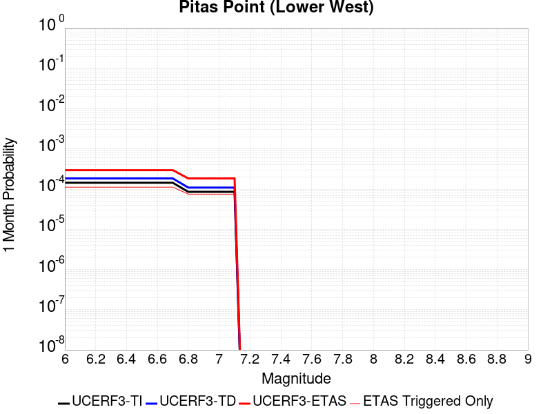 |  |  |

| Magnitude | 1 wk TI Prob | 1 wk TD Prob | 1 wk ETAS Prob | 1 wk ETAS/TD Gain | 1 wk ETAS Triggered Only | 1 mo TI Prob | 1 mo TD Prob | 1 mo ETAS Prob | 1 mo ETAS/TD Gain | 1 mo ETAS Triggered Only | 1 yr TI Prob | 1 yr TD Prob | 1 yr ETAS Prob | 1 yr ETAS/TD Gain | 1 yr ETAS Triggered Only | 10 yr TI Prob | 10 yr TD Prob | 10 yr ETAS Prob | 10 yr ETAS/TD Gain | 10 yr ETAS Triggered Only |
|-----|-----|-----|-----|-----|-----|-----|-----|-----|-----|-----|-----|-----|-----|-----|-----|-----|-----|-----|-----|-----|
| 6.0 | 3.3491036E-5 | 4.2920976E-5 | 1.0791819E-4 | 2.5143461 | 6.5E-5 | 1.4352512E-4 | 1.8393977E-4 | 2.9591916E-4 | 1.608783 | 1.12E-4 | 0.0017460176 | 0.0022381744 | 0.0024556865 | 1.0971829 | 2.18E-4 | 0.017323626 | 0.022255175 | 0.02262965 | 1.0168265 | 3.83E-4 |
| 6.1 | 3.3491036E-5 | 4.2920976E-5 | 1.0791819E-4 | 2.5143461 | 6.5E-5 | 1.4352512E-4 | 1.8393977E-4 | 2.9591916E-4 | 1.608783 | 1.12E-4 | 0.0017460176 | 0.0022381744 | 0.0024556865 | 1.0971829 | 2.18E-4 | 0.017323626 | 0.022255175 | 0.02262965 | 1.0168265 | 3.83E-4 |
| 6.2 | 3.3491036E-5 | 4.2920976E-5 | 1.0791819E-4 | 2.5143461 | 6.5E-5 | 1.4352512E-4 | 1.8393977E-4 | 2.9591916E-4 | 1.608783 | 1.12E-4 | 0.0017460176 | 0.0022381744 | 0.0024556865 | 1.0971829 | 2.18E-4 | 0.017323626 | 0.022255175 | 0.02262965 | 1.0168265 | 3.83E-4 |
| 6.3 | 3.3491036E-5 | 4.2920976E-5 | 1.0791819E-4 | 2.5143461 | 6.5E-5 | 1.4352512E-4 | 1.8393977E-4 | 2.9591916E-4 | 1.608783 | 1.12E-4 | 0.0017460176 | 0.0022381744 | 0.0024556865 | 1.0971829 | 2.18E-4 | 0.017323626 | 0.022255175 | 0.02262965 | 1.0168265 | 3.83E-4 |
| 6.4 | 3.3491036E-5 | 4.2920976E-5 | 1.0791819E-4 | 2.5143461 | 6.5E-5 | 1.4352512E-4 | 1.8393977E-4 | 2.9591916E-4 | 1.608783 | 1.12E-4 | 0.0017460176 | 0.0022381744 | 0.0024556865 | 1.0971829 | 2.18E-4 | 0.017323626 | 0.022255175 | 0.02262965 | 1.0168265 | 3.83E-4 |
| 6.5 | 3.3491036E-5 | 4.2920976E-5 | 1.0791819E-4 | 2.5143461 | 6.5E-5 | 1.4352512E-4 | 1.8393977E-4 | 2.9591916E-4 | 1.608783 | 1.12E-4 | 0.0017460176 | 0.0022381744 | 0.0024556865 | 1.0971829 | 2.18E-4 | 0.017323626 | 0.022255175 | 0.02262965 | 1.0168265 | 3.83E-4 |
| 6.6 | 3.3491036E-5 | 4.2920976E-5 | 1.0791819E-4 | 2.5143461 | 6.5E-5 | 1.4352512E-4 | 1.8393977E-4 | 2.9591916E-4 | 1.608783 | 1.12E-4 | 0.0017460176 | 0.0022381744 | 0.0024556865 | 1.0971829 | 2.18E-4 | 0.017323626 | 0.022255175 | 0.02262965 | 1.0168265 | 3.83E-4 |
| 6.7 | 3.3491036E-5 | 4.2920976E-5 | 1.0791819E-4 | 2.5143461 | 6.5E-5 | 1.4352512E-4 | 1.8393977E-4 | 2.9591916E-4 | 1.608783 | 1.12E-4 | 0.0017460176 | 0.0022381744 | 0.0024556865 | 1.0971829 | 2.18E-4 | 0.017323626 | 0.022255175 | 0.02262965 | 1.0168265 | 3.83E-4 |
| 6.8 | 1.993871E-5 | 2.5410276E-5 | 7.040913E-5 | 2.7708921 | 4.5E-5 | 8.544882E-5 | 1.08901186E-4 | 1.8389302E-4 | 1.6886227 | 7.5E-5 | 0.0010398427 | 0.0013258704 | 0.0014686808 | 1.1077107 | 1.43E-4 | 0.010349905 | 0.013258544 | 0.013502268 | 1.0183825 | 2.47E-4 |
| 6.9 | 1.993871E-5 | 2.5410276E-5 | 7.040913E-5 | 2.7708921 | 4.5E-5 | 8.544882E-5 | 1.08901186E-4 | 1.8389302E-4 | 1.6886227 | 7.5E-5 | 0.0010398427 | 0.0013258704 | 0.0014686808 | 1.1077107 | 1.43E-4 | 0.010349905 | 0.013258544 | 0.013502268 | 1.0183825 | 2.47E-4 |
| 7.0 | 1.993871E-5 | 2.5410276E-5 | 7.040913E-5 | 2.7708921 | 4.5E-5 | 8.544882E-5 | 1.08901186E-4 | 1.8389302E-4 | 1.6886227 | 7.5E-5 | 0.0010398427 | 0.0013258704 | 0.0014686808 | 1.1077107 | 1.43E-4 | 0.010349905 | 0.013258544 | 0.013502268 | 1.0183825 | 2.47E-4 |
| 7.1 | 1.993871E-5 | 2.5410276E-5 | 7.040913E-5 | 2.7708921 | 4.5E-5 | 8.544882E-5 | 1.08901186E-4 | 1.8389302E-4 | 1.6886227 | 7.5E-5 | 0.0010398427 | 0.0013258704 | 0.0014686808 | 1.1077107 | 1.43E-4 | 0.010349905 | 0.013258544 | 0.013502268 | 1.0183825 | 2.47E-4 |

## San Andreas (San Gorgonio Pass-Garnet HIll)
*[(top)](#table-of-contents)*

| 1 Week | 1 Month | 1 Year | 10 Year |
|-----|-----|-----|-----|
|  |  |  |  |

| Magnitude | 1 wk TI Prob | 1 wk TD Prob | 1 wk ETAS Prob | 1 wk ETAS/TD Gain | 1 wk ETAS Triggered Only | 1 mo TI Prob | 1 mo TD Prob | 1 mo ETAS Prob | 1 mo ETAS/TD Gain | 1 mo ETAS Triggered Only | 1 yr TI Prob | 1 yr TD Prob | 1 yr ETAS Prob | 1 yr ETAS/TD Gain | 1 yr ETAS Triggered Only | 10 yr TI Prob | 10 yr TD Prob | 10 yr ETAS Prob | 10 yr ETAS/TD Gain | 10 yr ETAS Triggered Only |
|-----|-----|-----|-----|-----|-----|-----|-----|-----|-----|-----|-----|-----|-----|-----|-----|-----|-----|-----|-----|-----|
| 6.0 | 6.406053E-5 | 2.5446463E-4 | 3.5443917E-4 | 1.392882 | 1.0E-4 | 2.7451623E-4 | 0.0010901445 | 0.0012439766 | 1.1411116 | 1.54E-4 | 0.0033371134 | 0.013198856 | 0.013464306 | 1.0201116 | 2.69E-4 | 0.03287443 | 0.11774556 | 0.11810199 | 1.0030271 | 4.04E-4 |
| 6.1 | 6.406053E-5 | 2.5446463E-4 | 3.5443917E-4 | 1.392882 | 1.0E-4 | 2.7451623E-4 | 0.0010901445 | 0.0012439766 | 1.1411116 | 1.54E-4 | 0.0033371134 | 0.013198856 | 0.013464306 | 1.0201116 | 2.69E-4 | 0.03287443 | 0.11774556 | 0.11810199 | 1.0030271 | 4.04E-4 |
| 6.2 | 6.406053E-5 | 2.5446463E-4 | 3.5443917E-4 | 1.392882 | 1.0E-4 | 2.7451623E-4 | 0.0010901445 | 0.0012439766 | 1.1411116 | 1.54E-4 | 0.0033371134 | 0.013198856 | 0.013464306 | 1.0201116 | 2.69E-4 | 0.03287443 | 0.11774556 | 0.11810199 | 1.0030271 | 4.04E-4 |
| 6.3 | 6.406053E-5 | 2.5446463E-4 | 3.5443917E-4 | 1.392882 | 1.0E-4 | 2.7451623E-4 | 0.0010901445 | 0.0012439766 | 1.1411116 | 1.54E-4 | 0.0033371134 | 0.013198856 | 0.013464306 | 1.0201116 | 2.69E-4 | 0.03287443 | 0.11774556 | 0.11810199 | 1.0030271 | 4.04E-4 |
| 6.4 | 6.406053E-5 | 2.5446463E-4 | 3.5443917E-4 | 1.392882 | 1.0E-4 | 2.7451623E-4 | 0.0010901445 | 0.0012439766 | 1.1411116 | 1.54E-4 | 0.0033371134 | 0.013198856 | 0.013464306 | 1.0201116 | 2.69E-4 | 0.03287443 | 0.11774556 | 0.11810199 | 1.0030271 | 4.04E-4 |
| 6.5 | 6.406053E-5 | 2.5446463E-4 | 3.5443917E-4 | 1.392882 | 1.0E-4 | 2.7451623E-4 | 0.0010901445 | 0.0012439766 | 1.1411116 | 1.54E-4 | 0.0033371134 | 0.013198856 | 0.013464306 | 1.0201116 | 2.69E-4 | 0.03287443 | 0.11774556 | 0.11810199 | 1.0030271 | 4.04E-4 |
| 6.6 | 6.394007E-5 | 2.5425098E-4 | 3.5422554E-4 | 1.3932122 | 1.0E-4 | 2.7400005E-4 | 0.0010892297 | 0.001243062 | 1.1412303 | 1.54E-4 | 0.0033308482 | 0.013187864 | 0.013453316 | 1.0201285 | 2.69E-4 | 0.032813635 | 0.11764885 | 0.11800531 | 1.00303 | 4.04E-4 |
| 6.7 | 6.367558E-5 | 2.5377903E-4 | 3.527539E-4 | 1.3900042 | 9.9E-5 | 2.728668E-4 | 0.001087209 | 0.0012400426 | 1.1405743 | 1.53E-4 | 0.003317093 | 0.013163578 | 0.01342805 | 1.0200912 | 2.68E-4 | 0.032680146 | 0.11743534 | 0.11779101 | 1.0030286 | 4.03E-4 |
| 6.8 | 6.342804E-5 | 2.53231E-4 | 3.5220594E-4 | 1.3908484 | 9.9E-5 | 2.7180612E-4 | 0.0010848623 | 0.0012376963 | 1.1408787 | 1.53E-4 | 0.0033042182 | 0.013135359 | 0.0133998385 | 1.0201349 | 2.68E-4 | 0.03255518 | 0.11718895 | 0.117544726 | 1.0030359 | 4.03E-4 |
| 6.9 | 6.311567E-5 | 2.5253315E-4 | 3.5150815E-4 | 1.3919287 | 9.9E-5 | 2.704677E-4 | 0.001081874 | 0.0012347085 | 1.1412683 | 1.53E-4 | 0.0032879722 | 0.013099421 | 0.01336391 | 1.020191 | 2.68E-4 | 0.03239748 | 0.116875 | 0.11723002 | 1.0030376 | 4.02E-4 |
| 7.0 | 6.275471E-5 | 2.516945E-4 | 3.4966983E-4 | 1.3892629 | 9.8E-5 | 2.6892102E-4 | 0.0010782827 | 0.0012301188 | 1.1408129 | 1.52E-4 | 0.0032691984 | 0.013056225 | 0.013319739 | 1.020183 | 2.67E-4 | 0.032215208 | 0.11649866 | 0.11685294 | 1.0030411 | 4.01E-4 |
| 7.1 | 5.698032E-5 | 2.4105505E-4 | 3.3803168E-4 | 1.4023007 | 9.7E-5 | 2.4417852E-4 | 0.0010327251 | 0.0011825701 | 1.1450968 | 1.5E-4 | 0.0029688207 | 0.012508327 | 0.012770012 | 1.0209209 | 2.65E-4 | 0.029294705 | 0.111619234 | 0.111971036 | 1.0031518 | 3.96E-4 |
| 7.2 | 5.6554676E-5 | 2.3997852E-4 | 3.3695524E-4 | 1.4041059 | 9.7E-5 | 2.4235467E-4 | 0.0010281149 | 0.0011779607 | 1.1457481 | 1.5E-4 | 0.0029466755 | 0.012452842 | 0.0127145415 | 1.0210153 | 2.65E-4 | 0.02907908 | 0.11113716 | 0.11148915 | 1.0031672 | 3.96E-4 |
| 7.3 | 5.6086934E-5 | 2.3837794E-4 | 3.3535482E-4 | 1.4068198 | 9.7E-5 | 2.4035043E-4 | 0.0010212607 | 0.0011711075 | 1.1467273 | 1.5E-4 | 0.0029223398 | 0.012370342 | 0.0126320645 | 1.0211571 | 2.65E-4 | 0.028842075 | 0.11042753 | 0.11077891 | 1.003182 | 3.95E-4 |
| 7.4 | 3.770566E-5 | 1.74606E-4 | 2.6559012E-4 | 1.5210824 | 9.1E-5 | 1.6158567E-4 | 7.4812124E-4 | 8.8901573E-4 | 1.1883311 | 1.41E-4 | 0.0019655304 | 0.009074706 | 0.009319465 | 1.0269715 | 2.47E-4 | 0.019482363 | 0.081598505 | 0.08193923 | 1.0041757 | 3.71E-4 |
| 7.5 | 3.2925338E-5 | 1.6180723E-4 | 2.4879316E-4 | 1.5375898 | 8.7E-5 | 1.4110096E-4 | 6.932988E-4 | 8.2820526E-4 | 1.1945863 | 1.35E-4 | 0.0017165504 | 0.008412451 | 0.008646466 | 1.0278176 | 2.36E-4 | 0.017033515 | 0.07553181 | 0.07585722 | 1.0043083 | 3.52E-4 |
| 7.6 | 2.755807E-5 | 1.3971048E-4 | 2.2269889E-4 | 1.5940027 | 8.3E-5 | 1.1810067E-4 | 5.986425E-4 | 7.295641E-4 | 1.2186974 | 1.31E-4 | 0.0014369272 | 0.0072677988 | 0.0074941413 | 1.0311433 | 2.28E-4 | 0.014276713 | 0.06540738 | 0.0657242 | 1.004844 | 3.39E-4 |
| 7.7 | 2.1845604E-5 | 1.16577445E-4 | 1.9356847E-4 | 1.6604282 | 7.7E-5 | 9.3620656E-5 | 4.9953954E-4 | 6.1947963E-4 | 1.2401012 | 1.2E-4 | 0.0011392354 | 0.006068057 | 0.0062787705 | 1.0347251 | 2.12E-4 | 0.011334128 | 0.054707337 | 0.055006992 | 1.0054774 | 3.17E-4 |
| 7.8 | 1.6634915E-5 | 9.5212796E-5 | 1.6320632E-4 | 1.7141217 | 6.8E-5 | 7.1290546E-5 | 4.0800648E-4 | 5.159624E-4 | 1.2645937 | 1.08E-4 | 8.6761673E-4 | 0.0049589034 | 0.005145971 | 1.0377237 | 1.88E-4 | 0.008642371 | 0.044416133 | 0.044677008 | 1.0058734 | 2.73E-4 |
| 7.9 | 8.077817E-6 | 4.28294E-5 | 8.982739E-5 | 2.09733 | 4.7E-5 | 3.461876E-5 | 1.8354366E-4 | 2.5653027E-4 | 1.3976525 | 7.3E-5 | 4.2140187E-4 | 0.0022327097 | 0.002355435 | 1.054967 | 1.23E-4 | 0.0042060367 | 0.020394128 | 0.020557722 | 1.0080216 | 1.67E-4 |
| 8.0 | 4.568552E-6 | 2.316693E-5 | 5.116628E-5 | 2.2085915 | 2.8E-5 | 1.957936E-5 | 9.928437E-5 | 1.4328E-4 | 1.4431274 | 4.4E-5 | 2.3835264E-4 | 0.0012083502 | 0.0012722729 | 1.0529008 | 6.4E-5 | 0.0023809716 | 0.011144294 | 0.011233292 | 1.0079858 | 9.0E-5 |
| 8.1 | 2.2240692E-6 | 1.29589735E-5 | 2.5958805E-5 | 2.0031528 | 1.3E-5 | 9.531691E-6 | 5.5538447E-5 | 7.253751E-5 | 1.3060772 | 1.7E-5 | 1.1604215E-4 | 6.7617896E-4 | 7.031607E-4 | 1.0399033 | 2.7E-5 | 0.0011598158 | 0.0061071273 | 0.0061498648 | 1.006998 | 4.3E-5 |

## San Andreas (Coachella) rev
*[(top)](#table-of-contents)*

| 1 Week | 1 Month | 1 Year | 10 Year |
|-----|-----|-----|-----|
|  |  |  |  |

| Magnitude | 1 wk TI Prob | 1 wk TD Prob | 1 wk ETAS Prob | 1 wk ETAS/TD Gain | 1 wk ETAS Triggered Only | 1 mo TI Prob | 1 mo TD Prob | 1 mo ETAS Prob | 1 mo ETAS/TD Gain | 1 mo ETAS Triggered Only | 1 yr TI Prob | 1 yr TD Prob | 1 yr ETAS Prob | 1 yr ETAS/TD Gain | 1 yr ETAS Triggered Only | 10 yr TI Prob | 10 yr TD Prob | 10 yr ETAS Prob | 10 yr ETAS/TD Gain | 10 yr ETAS Triggered Only |
|-----|-----|-----|-----|-----|-----|-----|-----|-----|-----|-----|-----|-----|-----|-----|-----|-----|-----|-----|-----|-----|
| 6.0 | 1.4215116E-4 | 5.186186E-4 | 6.3355896E-4 | 1.221628 | 1.15E-4 | 6.09077E-4 | 0.0022216013 | 0.002384239 | 1.0732075 | 1.63E-4 | 0.0073903278 | 0.026862355 | 0.02712121 | 1.0096363 | 2.66E-4 | 0.07149333 | 0.23013055 | 0.23042849 | 1.0012946 | 3.87E-4 |
| 6.1 | 1.4215116E-4 | 5.186186E-4 | 6.3355896E-4 | 1.221628 | 1.15E-4 | 6.09077E-4 | 0.0022216013 | 0.002384239 | 1.0732075 | 1.63E-4 | 0.0073903278 | 0.026862355 | 0.02712121 | 1.0096363 | 2.66E-4 | 0.07149333 | 0.23013055 | 0.23042849 | 1.0012946 | 3.87E-4 |
| 6.2 | 1.4215116E-4 | 5.186186E-4 | 6.3355896E-4 | 1.221628 | 1.15E-4 | 6.09077E-4 | 0.0022216013 | 0.002384239 | 1.0732075 | 1.63E-4 | 0.0073903278 | 0.026862355 | 0.02712121 | 1.0096363 | 2.66E-4 | 0.07149333 | 0.23013055 | 0.23042849 | 1.0012946 | 3.87E-4 |
| 6.3 | 1.4215116E-4 | 5.186186E-4 | 6.3355896E-4 | 1.221628 | 1.15E-4 | 6.09077E-4 | 0.0022216013 | 0.002384239 | 1.0732075 | 1.63E-4 | 0.0073903278 | 0.026862355 | 0.02712121 | 1.0096363 | 2.66E-4 | 0.07149333 | 0.23013055 | 0.23042849 | 1.0012946 | 3.87E-4 |
| 6.4 | 1.4215116E-4 | 5.186186E-4 | 6.3355896E-4 | 1.221628 | 1.15E-4 | 6.09077E-4 | 0.0022216013 | 0.002384239 | 1.0732075 | 1.63E-4 | 0.0073903278 | 0.026862355 | 0.02712121 | 1.0096363 | 2.66E-4 | 0.07149333 | 0.23013055 | 0.23042849 | 1.0012946 | 3.87E-4 |
| 6.5 | 1.4215116E-4 | 5.186186E-4 | 6.3355896E-4 | 1.221628 | 1.15E-4 | 6.09077E-4 | 0.0022216013 | 0.002384239 | 1.0732075 | 1.63E-4 | 0.0073903278 | 0.026862355 | 0.02712121 | 1.0096363 | 2.66E-4 | 0.07149333 | 0.23013055 | 0.23042849 | 1.0012946 | 3.87E-4 |
| 6.6 | 1.419504E-4 | 5.181686E-4 | 6.3310907E-4 | 1.2218205 | 1.15E-4 | 6.08217E-4 | 0.0022196763 | 0.0023823143 | 1.0732712 | 1.63E-4 | 0.007379928 | 0.026839495 | 0.027098356 | 1.0096447 | 2.66E-4 | 0.071396045 | 0.22996132 | 0.23025931 | 1.0012959 | 3.87E-4 |
| 6.7 | 1.417257E-4 | 5.176668E-4 | 6.326073E-4 | 1.2220356 | 1.15E-4 | 6.0725445E-4 | 0.0022175293 | 0.0023801678 | 1.0733422 | 1.63E-4 | 0.007368289 | 0.026814 | 0.02707287 | 1.0096542 | 2.66E-4 | 0.071287155 | 0.22977221 | 0.2300703 | 1.0012972 | 3.87E-4 |
| 6.8 | 1.414573E-4 | 5.168337E-4 | 6.3177425E-4 | 1.2223938 | 1.15E-4 | 6.0610473E-4 | 0.0022139647 | 0.0023766037 | 1.0734606 | 1.63E-4 | 0.0073543857 | 0.02677167 | 0.02703055 | 1.0096699 | 2.66E-4 | 0.07115707 | 0.22946371 | 0.22976191 | 1.0012995 | 3.87E-4 |
| 6.9 | 1.4122782E-4 | 5.16135E-4 | 6.3107564E-4 | 1.2226949 | 1.15E-4 | 6.0512166E-4 | 0.0022109754 | 0.002373615 | 1.0735601 | 1.63E-4 | 0.0073424974 | 0.026736172 | 0.026995061 | 1.009683 | 2.66E-4 | 0.071045816 | 0.22920302 | 0.2295013 | 1.0013014 | 3.87E-4 |
| 7.0 | 3.518344E-5 | 1.7667694E-4 | 2.3766617E-4 | 1.345202 | 6.1E-5 | 1.5077746E-4 | 7.570029E-4 | 8.5492874E-4 | 1.1293598 | 9.8E-5 | 0.0018341698 | 0.009183929 | 0.009361286 | 1.0193115 | 1.79E-4 | 0.018191047 | 0.08167031 | 0.08189897 | 1.0027999 | 2.49E-4 |
| 7.1 | 3.494209E-5 | 1.7597742E-4 | 2.3696669E-4 | 1.3465744 | 6.1E-5 | 1.4974322E-4 | 7.5400673E-4 | 8.519328E-4 | 1.1298743 | 9.8E-5 | 0.0018215991 | 0.009147758 | 0.00932512 | 1.0193887 | 1.79E-4 | 0.018067393 | 0.08135258 | 0.08158132 | 1.0028118 | 2.49E-4 |
| 7.2 | 3.469566E-5 | 1.7526992E-4 | 2.3625923E-4 | 1.3479736 | 6.1E-5 | 1.486872E-4 | 7.509763E-4 | 8.4890274E-4 | 1.1303988 | 9.8E-5 | 0.0018087636 | 0.009111172 | 0.009288541 | 1.0194672 | 1.79E-4 | 0.017941121 | 0.081028596 | 0.08125742 | 1.002824 | 2.49E-4 |
| 7.3 | 3.4415007E-5 | 1.7414277E-4 | 2.3513215E-4 | 1.3502263 | 6.1E-5 | 1.4748455E-4 | 7.4614846E-4 | 8.440753E-4 | 1.1312431 | 9.8E-5 | 0.0017941454 | 0.009052882 | 0.009230262 | 1.0195937 | 1.79E-4 | 0.017797293 | 0.0805192 | 0.080747224 | 1.002832 | 2.48E-4 |
| 7.4 | 2.4040828E-5 | 1.2752844E-4 | 1.8552104E-4 | 1.4547426 | 5.8E-5 | 1.03028055E-4 | 5.4645713E-4 | 6.3840684E-4 | 1.1682652 | 9.2E-5 | 0.0012536447 | 0.006636575 | 0.0068014734 | 1.0248469 | 1.66E-4 | 0.012465959 | 0.05921359 | 0.05942903 | 1.0036384 | 2.29E-4 |
| 7.5 | 2.3755325E-5 | 1.2645396E-4 | 1.8444662E-4 | 1.458607 | 5.8E-5 | 1.01804566E-4 | 5.418541E-4 | 6.3380424E-4 | 1.1696954 | 9.2E-5 | 0.0012387658 | 0.006580873 | 0.006745781 | 1.0250586 | 1.66E-4 | 0.012318831 | 0.058711812 | 0.05892737 | 1.0036714 | 2.29E-4 |
| 7.6 | 1.8671783E-5 | 1.0518968E-4 | 1.59184E-4 | 1.5133044 | 5.4E-5 | 8.001947E-5 | 4.507533E-4 | 5.3871365E-4 | 1.1951407 | 8.8E-5 | 9.7380154E-4 | 0.005477352 | 0.0056344867 | 1.0286881 | 1.58E-4 | 0.009695454 | 0.048804447 | 0.049010858 | 1.0042293 | 2.17E-4 |
| 7.7 | 1.3209655E-5 | 8.279697E-5 | 1.3079299E-4 | 1.5796833 | 4.8E-5 | 5.6611578E-5 | 3.5481108E-4 | 4.327834E-4 | 1.2197573 | 7.8E-5 | 6.89028E-4 | 0.004313955 | 0.004457334 | 1.033236 | 1.44E-4 | 0.0068689547 | 0.038274445 | 0.0384639 | 1.00495 | 1.97E-4 |
| 7.8 | 1.2769314E-5 | 8.019109E-5 | 1.2818724E-4 | 1.5985222 | 4.8E-5 | 5.4724485E-5 | 3.4364598E-4 | 4.216192E-4 | 1.2268997 | 7.8E-5 | 6.660669E-4 | 0.004178549 | 0.00431896 | 1.0336027 | 1.41E-4 | 0.00664074 | 0.03708048 | 0.037267286 | 1.0050379 | 1.94E-4 |
| 7.9 | 5.8437E-6 | 3.3993063E-5 | 6.5991975E-5 | 1.9413365 | 3.2E-5 | 2.5044188E-5 | 1.4567829E-4 | 1.9667087E-4 | 1.3500354 | 5.1E-5 | 3.0487034E-4 | 0.0017725222 | 0.0018623627 | 1.050685 | 9.0E-5 | 0.003044524 | 0.015995512 | 0.016116545 | 1.0075667 | 1.23E-4 |
| 8.0 | 2.9995317E-6 | 1.7081222E-5 | 3.5080913E-5 | 2.0537708 | 1.8E-5 | 1.2855072E-5 | 7.320436E-5 | 1.0120231E-4 | 1.3824629 | 2.8E-5 | 1.5649926E-4 | 8.9110894E-4 | 9.3107333E-4 | 1.0448478 | 4.0E-5 | 0.001563891 | 0.008076503 | 0.008133043 | 1.0070006 | 5.7E-5 |
| 8.1 | 2.2240692E-6 | 1.29589735E-5 | 2.5958805E-5 | 2.0031528 | 1.3E-5 | 9.531691E-6 | 5.5538447E-5 | 7.253751E-5 | 1.3060772 | 1.7E-5 | 1.1604215E-4 | 6.7617896E-4 | 7.031607E-4 | 1.0399033 | 2.7E-5 | 0.0011598158 | 0.0061071273 | 0.0061498648 | 1.006998 | 4.3E-5 |

## San Jacinto (San Bernardino)
*[(top)](#table-of-contents)*

| 1 Week | 1 Month | 1 Year | 10 Year |
|-----|-----|-----|-----|
|  |  |  |  |

| Magnitude | 1 wk TI Prob | 1 wk TD Prob | 1 wk ETAS Prob | 1 wk ETAS/TD Gain | 1 wk ETAS Triggered Only | 1 mo TI Prob | 1 mo TD Prob | 1 mo ETAS Prob | 1 mo ETAS/TD Gain | 1 mo ETAS Triggered Only | 1 yr TI Prob | 1 yr TD Prob | 1 yr ETAS Prob | 1 yr ETAS/TD Gain | 1 yr ETAS Triggered Only | 10 yr TI Prob | 10 yr TD Prob | 10 yr ETAS Prob | 10 yr ETAS/TD Gain | 10 yr ETAS Triggered Only |
|-----|-----|-----|-----|-----|-----|-----|-----|-----|-----|-----|-----|-----|-----|-----|-----|-----|-----|-----|-----|-----|
| 6.0 | 6.770798E-5 | 1.266041E-4 | 1.8359689E-4 | 1.4501654 | 5.7E-5 | 2.901448E-4 | 5.424351E-4 | 6.4238085E-4 | 1.1842538 | 1.0E-4 | 0.0035267917 | 0.0065838103 | 0.0067934208 | 1.0318373 | 2.11E-4 | 0.03471343 | 0.064538844 | 0.06487561 | 1.005218 | 3.6E-4 |
| 6.1 | 6.770798E-5 | 1.266041E-4 | 1.8359689E-4 | 1.4501654 | 5.7E-5 | 2.901448E-4 | 5.424351E-4 | 6.4238085E-4 | 1.1842538 | 1.0E-4 | 0.0035267917 | 0.0065838103 | 0.0067934208 | 1.0318373 | 2.11E-4 | 0.03471343 | 0.064538844 | 0.06487561 | 1.005218 | 3.6E-4 |
| 6.2 | 6.770798E-5 | 1.266041E-4 | 1.8359689E-4 | 1.4501654 | 5.7E-5 | 2.901448E-4 | 5.424351E-4 | 6.4238085E-4 | 1.1842538 | 1.0E-4 | 0.0035267917 | 0.0065838103 | 0.0067934208 | 1.0318373 | 2.11E-4 | 0.03471343 | 0.064538844 | 0.06487561 | 1.005218 | 3.6E-4 |
| 6.3 | 6.770798E-5 | 1.266041E-4 | 1.8359689E-4 | 1.4501654 | 5.7E-5 | 2.901448E-4 | 5.424351E-4 | 6.4238085E-4 | 1.1842538 | 1.0E-4 | 0.0035267917 | 0.0065838103 | 0.0067934208 | 1.0318373 | 2.11E-4 | 0.03471343 | 0.064538844 | 0.06487561 | 1.005218 | 3.6E-4 |
| 6.4 | 6.770798E-5 | 1.266041E-4 | 1.8359689E-4 | 1.4501654 | 5.7E-5 | 2.901448E-4 | 5.424351E-4 | 6.4238085E-4 | 1.1842538 | 1.0E-4 | 0.0035267917 | 0.0065838103 | 0.0067934208 | 1.0318373 | 2.11E-4 | 0.03471343 | 0.064538844 | 0.06487561 | 1.005218 | 3.6E-4 |
| 6.5 | 6.770798E-5 | 1.266041E-4 | 1.8359689E-4 | 1.4501654 | 5.7E-5 | 2.901448E-4 | 5.424351E-4 | 6.4238085E-4 | 1.1842538 | 1.0E-4 | 0.0035267917 | 0.0065838103 | 0.0067934208 | 1.0318373 | 2.11E-4 | 0.03471343 | 0.064538844 | 0.06487561 | 1.005218 | 3.6E-4 |
| 6.6 | 6.742141E-5 | 1.2610736E-4 | 1.8310019E-4 | 1.4519387 | 5.7E-5 | 2.889169E-4 | 5.403072E-4 | 6.402532E-4 | 1.1849799 | 1.0E-4 | 0.00351189 | 0.0065580956 | 0.006767712 | 1.031963 | 2.11E-4 | 0.034569066 | 0.064300194 | 0.06463705 | 1.0052388 | 3.6E-4 |
| 6.7 | 6.71276E-5 | 1.2559396E-4 | 1.825868E-4 | 1.4537865 | 5.7E-5 | 2.8765798E-4 | 5.3810794E-4 | 6.370547E-4 | 1.1838789 | 9.9E-5 | 0.0034966122 | 0.0065315217 | 0.006739157 | 1.0317897 | 2.09E-4 | 0.034421038 | 0.06405372 | 0.0643888 | 1.005231 | 3.58E-4 |
| 6.8 | 6.664797E-5 | 1.246922E-4 | 1.8168509E-4 | 1.4570687 | 5.7E-5 | 2.8560287E-4 | 5.34245E-4 | 6.331921E-4 | 1.1852093 | 9.9E-5 | 0.0034716716 | 0.0064848163 | 0.0066894805 | 1.0315605 | 2.06E-4 | 0.034179345 | 0.06361825 | 0.063948795 | 1.0051957 | 3.53E-4 |
| 6.9 | 6.6334556E-5 | 1.2409322E-4 | 1.8108616E-4 | 1.4592751 | 5.7E-5 | 2.8425996E-4 | 5.316793E-4 | 6.306267E-4 | 1.1861035 | 9.9E-5 | 0.0034553735 | 0.0064537986 | 0.0066574756 | 1.0315592 | 2.05E-4 | 0.034021374 | 0.06332935 | 0.06365906 | 1.0052062 | 3.52E-4 |
| 7.0 | 6.6140106E-5 | 1.237124E-4 | 1.8070535E-4 | 1.4606891 | 5.7E-5 | 2.834268E-4 | 5.3004787E-4 | 6.289954E-4 | 1.1866766 | 9.9E-5 | 0.0034452619 | 0.0064340793 | 0.0066377604 | 1.0316566 | 2.05E-4 | 0.033923354 | 0.06314599 | 0.06347576 | 1.0052224 | 3.52E-4 |
| 7.1 | 3.950743E-5 | 7.372838E-5 | 1.00726385E-4 | 1.3661821 | 2.7E-5 | 1.6930657E-4 | 3.1591134E-4 | 3.558987E-4 | 1.1265779 | 4.0E-5 | 0.0020593586 | 0.003838852 | 0.0039105755 | 1.0186836 | 7.2E-5 | 0.020403787 | 0.03836328 | 0.038483486 | 1.0031333 | 1.25E-4 |
| 7.2 | 3.9056304E-5 | 7.278862E-5 | 9.978665E-5 | 1.37091 | 2.7E-5 | 1.6737341E-4 | 3.1188547E-4 | 3.51873E-4 | 1.1282122 | 4.0E-5 | 0.0020358667 | 0.0037901076 | 0.0038618348 | 1.0189248 | 7.2E-5 | 0.020173162 | 0.03790224 | 0.03802154 | 1.0031476 | 1.24E-4 |
| 7.3 | 3.8629096E-5 | 7.181476E-5 | 9.8812816E-5 | 1.3759403 | 2.7E-5 | 1.6554276E-4 | 3.0771297E-4 | 3.4770064E-4 | 1.1299512 | 4.0E-5 | 0.00201362 | 0.0037395307 | 0.0038112616 | 1.0191817 | 7.2E-5 | 0.019954717 | 0.03741947 | 0.03753883 | 1.0031898 | 1.24E-4 |
| 7.4 | 2.2630244E-5 | 3.4288696E-5 | 4.1288455E-5 | 1.204142 | 7.0E-6 | 9.698315E-5 | 1.4694584E-4 | 1.5794422E-4 | 1.0748465 | 1.1E-5 | 0.0011801302 | 0.0017880509 | 0.0018060186 | 1.0100489 | 1.8E-5 | 0.011738827 | 0.01851639 | 0.018555649 | 1.0021203 | 4.0E-5 |
| 7.5 | 2.187835E-5 | 3.2830816E-5 | 3.9830586E-5 | 1.2132074 | 7.0E-6 | 9.376098E-5 | 1.4069847E-4 | 1.5169692E-4 | 1.0781704 | 1.1E-5 | 0.0011409421 | 0.0017121107 | 0.0017300799 | 1.0104953 | 1.8E-5 | 0.01135102 | 0.017765915 | 0.017804222 | 1.0021563 | 3.9E-5 |
| 7.6 | 2.1126454E-5 | 3.1434487E-5 | 3.7434296E-5 | 1.1908672 | 6.0E-6 | 9.053881E-5 | 1.3471482E-4 | 1.4471347E-4 | 1.0742209 | 1.0E-5 | 0.0011017525 | 0.0016393713 | 0.0016553451 | 1.0097438 | 1.6E-5 | 0.010963061 | 0.017041424 | 0.017077794 | 1.0021342 | 3.7E-5 |
| 7.7 | 1.5200701E-5 | 2.0237094E-5 | 2.4237013E-5 | 1.1976528 | 4.0E-6 | 6.514423E-5 | 8.672961E-5 | 9.3729E-5 | 1.0807036 | 7.0E-6 | 7.9284236E-4 | 0.0010557924 | 0.0010667808 | 1.0104077 | 1.1E-5 | 0.007900197 | 0.011221906 | 0.011246625 | 1.0022027 | 2.5E-5 |
| 7.8 | 1.5303123E-6 | 1.9707616E-6 | 1.9707616E-6 | 1.0 | 0.0 | 6.5584645E-6 | 8.446107E-6 | 9.446099E-6 | 1.1183968 | 1.0E-6 | 7.984638E-5 | 1.0282895E-4 | 1.0582864E-4 | 1.0291717 | 3.0E-6 | 7.98177E-4 | 0.001066982 | 0.0010709778 | 1.0037448 | 4.0E-6 |

## Santa Ynez (East)
*[(top)](#table-of-contents)*

| 1 Week | 1 Month | 1 Year | 10 Year |
|-----|-----|-----|-----|
|  |  |  |  |

| Magnitude | 1 wk TI Prob | 1 wk TD Prob | 1 wk ETAS Prob | 1 wk ETAS/TD Gain | 1 wk ETAS Triggered Only | 1 mo TI Prob | 1 mo TD Prob | 1 mo ETAS Prob | 1 mo ETAS/TD Gain | 1 mo ETAS Triggered Only | 1 yr TI Prob | 1 yr TD Prob | 1 yr ETAS Prob | 1 yr ETAS/TD Gain | 1 yr ETAS Triggered Only | 10 yr TI Prob | 10 yr TD Prob | 10 yr ETAS Prob | 10 yr ETAS/TD Gain | 10 yr ETAS Triggered Only |
|-----|-----|-----|-----|-----|-----|-----|-----|-----|-----|-----|-----|-----|-----|-----|-----|-----|-----|-----|-----|-----|
| 6.0 | 2.3428358E-5 | 2.7130885E-5 | 7.81295E-5 | 2.8797255 | 5.1E-5 | 1.00403384E-4 | 1.16270545E-4 | 2.0326044E-4 | 1.7481679 | 8.7E-5 | 0.0012217257 | 0.0014147647 | 0.0016104874 | 1.138343 | 1.96E-4 | 0.012150308 | 0.014066651 | 0.014392995 | 1.0231998 | 3.31E-4 |
| 6.1 | 2.3428358E-5 | 2.7130885E-5 | 7.81295E-5 | 2.8797255 | 5.1E-5 | 1.00403384E-4 | 1.16270545E-4 | 2.0326044E-4 | 1.7481679 | 8.7E-5 | 0.0012217257 | 0.0014147647 | 0.0016104874 | 1.138343 | 1.96E-4 | 0.012150308 | 0.014066651 | 0.014392995 | 1.0231998 | 3.31E-4 |
| 6.2 | 2.3428358E-5 | 2.7130885E-5 | 7.81295E-5 | 2.8797255 | 5.1E-5 | 1.00403384E-4 | 1.16270545E-4 | 2.0326044E-4 | 1.7481679 | 8.7E-5 | 0.0012217257 | 0.0014147647 | 0.0016104874 | 1.138343 | 1.96E-4 | 0.012150308 | 0.014066651 | 0.014392995 | 1.0231998 | 3.31E-4 |
| 6.3 | 2.3428358E-5 | 2.7130885E-5 | 7.81295E-5 | 2.8797255 | 5.1E-5 | 1.00403384E-4 | 1.16270545E-4 | 2.0326044E-4 | 1.7481679 | 8.7E-5 | 0.0012217257 | 0.0014147647 | 0.0016104874 | 1.138343 | 1.96E-4 | 0.012150308 | 0.014066651 | 0.014392995 | 1.0231998 | 3.31E-4 |
| 6.4 | 2.3428358E-5 | 2.7130885E-5 | 7.81295E-5 | 2.8797255 | 5.1E-5 | 1.00403384E-4 | 1.16270545E-4 | 2.0326044E-4 | 1.7481679 | 8.7E-5 | 0.0012217257 | 0.0014147647 | 0.0016104874 | 1.138343 | 1.96E-4 | 0.012150308 | 0.014066651 | 0.014392995 | 1.0231998 | 3.31E-4 |
| 6.5 | 2.3428358E-5 | 2.7130885E-5 | 7.81295E-5 | 2.8797255 | 5.1E-5 | 1.00403384E-4 | 1.16270545E-4 | 2.0326044E-4 | 1.7481679 | 8.7E-5 | 0.0012217257 | 0.0014147647 | 0.0016104874 | 1.138343 | 1.96E-4 | 0.012150308 | 0.014066651 | 0.014392995 | 1.0231998 | 3.31E-4 |
| 6.6 | 2.1941343E-5 | 2.5408908E-5 | 7.540764E-5 | 2.9677637 | 5.0E-5 | 9.403093E-5 | 1.0889128E-4 | 1.9388202E-4 | 1.7805101 | 8.5E-5 | 0.0011442254 | 0.0013250347 | 0.0015147829 | 1.1432024 | 1.9E-4 | 0.011383517 | 0.013180321 | 0.013490182 | 1.0235094 | 3.14E-4 |
| 6.7 | 1.9331053E-5 | 2.2379061E-5 | 6.837803E-5 | 3.0554469 | 4.6E-5 | 8.2844745E-5 | 9.590723E-5 | 1.7289985E-4 | 1.8027822 | 7.7E-5 | 0.001008168 | 0.0011671331 | 0.0013309417 | 1.1403513 | 1.64E-4 | 0.010036064 | 0.011618788 | 0.011894547 | 1.0237339 | 2.79E-4 |
| 6.8 | 1.7302833E-5 | 2.0024241E-5 | 6.102342E-5 | 3.0474772 | 4.1E-5 | 7.415289E-5 | 8.5815846E-5 | 1.528101E-4 | 1.7806746 | 6.7E-5 | 9.024375E-4 | 0.0010443943 | 0.001186246 | 1.1358219 | 1.42E-4 | 0.008987815 | 0.010403484 | 0.010648903 | 1.0235902 | 2.48E-4 |
| 6.9 | 1.5430072E-5 | 1.7849516E-5 | 5.284889E-5 | 2.9608026 | 3.5E-5 | 6.6127206E-5 | 7.6496166E-5 | 1.3549165E-4 | 1.7712215 | 5.9E-5 | 8.048013E-4 | 9.3102927E-4 | 0.0010599091 | 1.1384274 | 1.29E-4 | 0.008018929 | 0.0092798015 | 0.009492806 | 1.0229536 | 2.15E-4 |
| 7.0 | 1.355306E-5 | 1.5666186E-5 | 4.7665686E-5 | 3.042584 | 3.2E-5 | 5.808325E-5 | 6.7139554E-5 | 1.2213585E-4 | 1.8191342 | 5.5E-5 | 7.0693414E-4 | 8.172031E-4 | 9.3410746E-4 | 1.1430542 | 1.17E-4 | 0.0070468946 | 0.008150392 | 0.008343804 | 1.0237303 | 1.95E-4 |
| 7.1 | 1.17999725E-5 | 1.36319095E-5 | 4.063154E-5 | 2.98062 | 2.7E-5 | 5.0570332E-5 | 5.842164E-5 | 1.0641883E-4 | 1.8215654 | 4.8E-5 | 6.155198E-4 | 7.11136E-4 | 8.170606E-4 | 1.1489513 | 1.06E-4 | 0.0061381776 | 0.0070969095 | 0.007269675 | 1.0243437 | 1.74E-4 |
| 7.2 | 5.357108E-6 | 6.2256004E-6 | 1.8225526E-5 | 2.927513 | 1.2E-5 | 2.2958831E-5 | 2.6681053E-5 | 5.268036E-5 | 1.9744483 | 2.6E-5 | 2.7948793E-4 | 3.248254E-4 | 3.7880786E-4 | 1.1661892 | 5.4E-5 | 0.0027913668 | 0.0032466452 | 0.0033283788 | 1.0251749 | 8.2E-5 |
| 7.3 | 4.632513E-6 | 5.3767917E-6 | 1.4376743E-5 | 2.6738517 | 9.0E-6 | 1.9853476E-5 | 2.3043369E-5 | 4.5042863E-5 | 1.9546995 | 2.2E-5 | 2.4168925E-4 | 2.8054876E-4 | 3.245364E-4 | 1.1567914 | 4.4E-5 | 0.0024142656 | 0.00280507 | 0.0028748738 | 1.0248848 | 7.0E-5 |

## Red Mountain
*[(top)](#table-of-contents)*

| 1 Week | 1 Month | 1 Year | 10 Year |
|-----|-----|-----|-----|
|  |  |  |  |

| Magnitude | 1 wk TI Prob | 1 wk TD Prob | 1 wk ETAS Prob | 1 wk ETAS/TD Gain | 1 wk ETAS Triggered Only | 1 mo TI Prob | 1 mo TD Prob | 1 mo ETAS Prob | 1 mo ETAS/TD Gain | 1 mo ETAS Triggered Only | 1 yr TI Prob | 1 yr TD Prob | 1 yr ETAS Prob | 1 yr ETAS/TD Gain | 1 yr ETAS Triggered Only | 10 yr TI Prob | 10 yr TD Prob | 10 yr ETAS Prob | 10 yr ETAS/TD Gain | 10 yr ETAS Triggered Only |
|-----|-----|-----|-----|-----|-----|-----|-----|-----|-----|-----|-----|-----|-----|-----|-----|-----|-----|-----|-----|-----|
| 6.0 | 2.454631E-5 | 2.766036E-5 | 7.665901E-5 | 2.771439 | 4.9E-5 | 1.0519423E-4 | 1.18539596E-4 | 1.9953E-4 | 1.6832349 | 8.1E-5 | 0.0012799873 | 0.0014423667 | 0.0015961446 | 1.106615 | 1.54E-4 | 0.012726397 | 0.014340373 | 0.014626214 | 1.0199326 | 2.9E-4 |
| 6.1 | 2.454631E-5 | 2.766036E-5 | 7.665901E-5 | 2.771439 | 4.9E-5 | 1.0519423E-4 | 1.18539596E-4 | 1.9953E-4 | 1.6832349 | 8.1E-5 | 0.0012799873 | 0.0014423667 | 0.0015961446 | 1.106615 | 1.54E-4 | 0.012726397 | 0.014340373 | 0.014626214 | 1.0199326 | 2.9E-4 |
| 6.2 | 2.454631E-5 | 2.766036E-5 | 7.665901E-5 | 2.771439 | 4.9E-5 | 1.0519423E-4 | 1.18539596E-4 | 1.9953E-4 | 1.6832349 | 8.1E-5 | 0.0012799873 | 0.0014423667 | 0.0015961446 | 1.106615 | 1.54E-4 | 0.012726397 | 0.014340373 | 0.014626214 | 1.0199326 | 2.9E-4 |
| 6.3 | 2.454631E-5 | 2.766036E-5 | 7.665901E-5 | 2.771439 | 4.9E-5 | 1.0519423E-4 | 1.18539596E-4 | 1.9953E-4 | 1.6832349 | 8.1E-5 | 0.0012799873 | 0.0014423667 | 0.0015961446 | 1.106615 | 1.54E-4 | 0.012726397 | 0.014340373 | 0.014626214 | 1.0199326 | 2.9E-4 |
| 6.4 | 2.454631E-5 | 2.766036E-5 | 7.665901E-5 | 2.771439 | 4.9E-5 | 1.0519423E-4 | 1.18539596E-4 | 1.9953E-4 | 1.6832349 | 8.1E-5 | 0.0012799873 | 0.0014423667 | 0.0015961446 | 1.106615 | 1.54E-4 | 0.012726397 | 0.014340373 | 0.014626214 | 1.0199326 | 2.9E-4 |
| 6.5 | 2.454631E-5 | 2.766036E-5 | 7.665901E-5 | 2.771439 | 4.9E-5 | 1.0519423E-4 | 1.18539596E-4 | 1.9953E-4 | 1.6832349 | 8.1E-5 | 0.0012799873 | 0.0014423667 | 0.0015961446 | 1.106615 | 1.54E-4 | 0.012726397 | 0.014340373 | 0.014626214 | 1.0199326 | 2.9E-4 |
| 6.6 | 2.2412336E-5 | 2.524622E-5 | 7.124506E-5 | 2.8220088 | 4.6E-5 | 9.6049334E-5 | 1.08194174E-4 | 1.8118627E-4 | 1.6746398 | 7.3E-5 | 0.0011687733 | 0.0013165694 | 0.0014553864 | 1.1054385 | 1.39E-4 | 0.011626452 | 0.013097815 | 0.013361318 | 1.0201181 | 2.67E-4 |
| 6.7 | 1.9718891E-5 | 2.2200657E-5 | 6.0199814E-5 | 2.7116232 | 3.8E-5 | 8.45068E-5 | 9.5142765E-5 | 1.6013658E-4 | 1.6831188 | 6.5E-5 | 0.0010283845 | 0.0011578472 | 0.0012807047 | 1.1061087 | 1.23E-4 | 0.010236385 | 0.01152803 | 0.01176724 | 1.0207503 | 2.42E-4 |
| 6.8 | 1.7471099E-5 | 1.9655563E-5 | 5.5654855E-5 | 2.8315065 | 3.6E-5 | 7.487399E-5 | 8.4235966E-5 | 1.3923133E-4 | 1.6528728 | 5.5E-5 | 9.1120956E-4 | 0.0010251886 | 0.0011290819 | 1.1013408 | 1.04E-4 | 0.009074822 | 0.010214295 | 0.010421161 | 1.0202525 | 2.09E-4 |
| 6.9 | 1.4678319E-5 | 1.6492819E-5 | 4.1492407E-5 | 2.5157862 | 2.5E-5 | 6.2905565E-5 | 7.068214E-5 | 1.1167924E-4 | 1.5800207 | 4.1E-5 | 7.656061E-4 | 8.6031196E-4 | 9.3824486E-4 | 1.0905868 | 7.8E-5 | 0.007629738 | 0.008579323 | 0.00875183 | 1.0201073 | 1.74E-4 |
| 7.0 | 1.3467646E-5 | 1.5122167E-5 | 3.812182E-5 | 2.5209231 | 2.3E-5 | 5.7717203E-5 | 6.480822E-5 | 1.0280575E-4 | 1.5863074 | 3.8E-5 | 7.024804E-4 | 7.888507E-4 | 8.617931E-4 | 1.0924667 | 7.3E-5 | 0.0070026387 | 0.007869966 | 0.008031684 | 1.0205487 | 1.63E-4 |
| 7.1 | 1.1752249E-5 | 1.3174863E-5 | 3.2174612E-5 | 2.4421213 | 1.9E-5 | 5.0365805E-5 | 5.6463014E-5 | 8.746126E-5 | 1.549001 | 3.1E-5 | 6.1303115E-4 | 6.87316E-4 | 7.482741E-4 | 1.08869 | 6.1E-5 | 0.0061134277 | 0.00686129 | 0.006992384 | 1.0191064 | 1.32E-4 |
| 7.2 | 1.0311001E-5 | 1.1541763E-5 | 2.8541568E-5 | 2.472895 | 1.7E-5 | 4.4189255E-5 | 4.94643E-5 | 7.6462966E-5 | 1.5458212 | 2.7E-5 | 5.378713E-4 | 6.0215656E-4 | 6.5412524E-4 | 1.0863043 | 5.2E-5 | 0.0053657135 | 0.00601458 | 0.0061249123 | 1.0183442 | 1.11E-4 |
| 7.3 | 8.985892E-6 | 1.0043356E-5 | 2.3043225E-5 | 2.294375 | 1.3E-5 | 3.85104E-5 | 4.304278E-5 | 6.504183E-5 | 1.5110974 | 2.2E-5 | 4.6876323E-4 | 5.2401435E-4 | 5.6499284E-4 | 1.0782012 | 4.1E-5 | 0.0046777567 | 0.005237055 | 0.0053315577 | 1.018045 | 9.5E-5 |
| 7.4 | 7.757385E-6 | 8.661384E-6 | 2.0661279E-5 | 2.385448 | 1.2E-5 | 3.3245513E-5 | 3.7120215E-5 | 5.611951E-5 | 1.5118315 | 1.9E-5 | 4.0468894E-4 | 4.519386E-4 | 4.8692277E-4 | 1.0774091 | 3.5E-5 | 0.0040395274 | 0.004519386 | 0.0046010152 | 1.0180621 | 8.2E-5 |

## Santa Ynez (West)
*[(top)](#table-of-contents)*

| 1 Week | 1 Month | 1 Year | 10 Year |
|-----|-----|-----|-----|
|  |  |  |  |

| Magnitude | 1 wk TI Prob | 1 wk TD Prob | 1 wk ETAS Prob | 1 wk ETAS/TD Gain | 1 wk ETAS Triggered Only | 1 mo TI Prob | 1 mo TD Prob | 1 mo ETAS Prob | 1 mo ETAS/TD Gain | 1 mo ETAS Triggered Only | 1 yr TI Prob | 1 yr TD Prob | 1 yr ETAS Prob | 1 yr ETAS/TD Gain | 1 yr ETAS Triggered Only | 10 yr TI Prob | 10 yr TD Prob | 10 yr ETAS Prob | 10 yr ETAS/TD Gain | 10 yr ETAS Triggered Only |
|-----|-----|-----|-----|-----|-----|-----|-----|-----|-----|-----|-----|-----|-----|-----|-----|-----|-----|-----|-----|-----|
| 6.0 | 2.685192E-5 | 3.1815256E-5 | 7.5813856E-5 | 2.3829403 | 4.4E-5 | 1.1507458E-4 | 1.3634498E-4 | 2.1633407E-4 | 1.586667 | 8.0E-5 | 0.0014001325 | 0.0016589161 | 0.0018366209 | 1.107121 | 1.78E-4 | 0.013913437 | 0.016483301 | 0.016795076 | 1.0189146 | 3.17E-4 |
| 6.1 | 2.685192E-5 | 3.1815256E-5 | 7.5813856E-5 | 2.3829403 | 4.4E-5 | 1.1507458E-4 | 1.3634498E-4 | 2.1633407E-4 | 1.586667 | 8.0E-5 | 0.0014001325 | 0.0016589161 | 0.0018366209 | 1.107121 | 1.78E-4 | 0.013913437 | 0.016483301 | 0.016795076 | 1.0189146 | 3.17E-4 |
| 6.2 | 2.685192E-5 | 3.1815256E-5 | 7.5813856E-5 | 2.3829403 | 4.4E-5 | 1.1507458E-4 | 1.3634498E-4 | 2.1633407E-4 | 1.586667 | 8.0E-5 | 0.0014001325 | 0.0016589161 | 0.0018366209 | 1.107121 | 1.78E-4 | 0.013913437 | 0.016483301 | 0.016795076 | 1.0189146 | 3.17E-4 |
| 6.3 | 2.685192E-5 | 3.1815256E-5 | 7.5813856E-5 | 2.3829403 | 4.4E-5 | 1.1507458E-4 | 1.3634498E-4 | 2.1633407E-4 | 1.586667 | 8.0E-5 | 0.0014001325 | 0.0016589161 | 0.0018366209 | 1.107121 | 1.78E-4 | 0.013913437 | 0.016483301 | 0.016795076 | 1.0189146 | 3.17E-4 |
| 6.4 | 2.685192E-5 | 3.1815256E-5 | 7.5813856E-5 | 2.3829403 | 4.4E-5 | 1.1507458E-4 | 1.3634498E-4 | 2.1633407E-4 | 1.586667 | 8.0E-5 | 0.0014001325 | 0.0016589161 | 0.0018366209 | 1.107121 | 1.78E-4 | 0.013913437 | 0.016483301 | 0.016795076 | 1.0189146 | 3.17E-4 |
| 6.5 | 2.685192E-5 | 3.1815256E-5 | 7.5813856E-5 | 2.3829403 | 4.4E-5 | 1.1507458E-4 | 1.3634498E-4 | 2.1633407E-4 | 1.586667 | 8.0E-5 | 0.0014001325 | 0.0016589161 | 0.0018366209 | 1.107121 | 1.78E-4 | 0.013913437 | 0.016483301 | 0.016795076 | 1.0189146 | 3.17E-4 |
| 6.6 | 2.3238055E-5 | 2.7473923E-5 | 6.547288E-5 | 2.3830917 | 3.8E-5 | 9.9587865E-5 | 1.1774108E-4 | 1.897326E-4 | 1.6114393 | 7.2E-5 | 0.0012118078 | 0.0014327333 | 0.0015895083 | 1.1094238 | 1.57E-4 | 0.012052209 | 0.014252615 | 0.014526653 | 1.0192271 | 2.78E-4 |
| 6.7 | 2.0120693E-5 | 2.3740045E-5 | 5.6739264E-5 | 2.3900232 | 3.3E-5 | 8.622869E-5 | 1.0174008E-4 | 1.6273388E-4 | 1.599506 | 6.1E-5 | 0.0010493286 | 0.001238158 | 0.0013759871 | 1.1113179 | 1.38E-4 | 0.010443876 | 0.012329982 | 0.0125709735 | 1.0195452 | 2.44E-4 |
| 6.8 | 1.7365224E-5 | 2.0450778E-5 | 5.1450144E-5 | 2.5158038 | 3.1E-5 | 7.442026E-5 | 8.764423E-5 | 1.4463923E-4 | 1.6502995 | 5.7E-5 | 9.056901E-4 | 0.0010667199 | 0.0011885897 | 1.1142473 | 1.22E-4 | 0.009020077 | 0.010633079 | 0.010844804 | 1.0199119 | 2.14E-4 |
| 6.9 | 1.6294387E-5 | 1.9182638E-5 | 5.0182043E-5 | 2.6160138 | 3.1E-5 | 6.983122E-5 | 8.220969E-5 | 1.39205E-4 | 1.6932919 | 5.7E-5 | 8.4986346E-4 | 0.0010006167 | 0.0011194977 | 1.1188077 | 1.19E-4 | 0.008466206 | 0.009978135 | 0.01017713 | 1.019943 | 2.01E-4 |
| 7.0 | 6.8679647E-6 | 7.996758E-6 | 2.2996637E-5 | 2.8757453 | 1.5E-5 | 2.9433802E-5 | 3.427155E-5 | 6.427052E-5 | 1.8753316 | 3.0E-5 | 3.5829764E-4 | 4.1720842E-4 | 4.8018215E-4 | 1.1509407 | 6.3E-5 | 0.0035772047 | 0.0041674105 | 0.004265002 | 1.0234178 | 9.8E-5 |
| 7.1 | 6.1421692E-6 | 7.1455725E-6 | 1.9145487E-5 | 2.6793497 | 1.2E-5 | 2.6323318E-5 | 3.0623705E-5 | 5.6622906E-5 | 1.8489895 | 2.6E-5 | 3.2043926E-4 | 3.7281192E-4 | 4.2879104E-4 | 1.1501538 | 5.6E-5 | 0.0031997757 | 0.0037250149 | 0.0038116907 | 1.0232686 | 8.7E-5 |
| 7.2 | 5.357108E-6 | 6.2256004E-6 | 1.8225526E-5 | 2.927513 | 1.2E-5 | 2.2958831E-5 | 2.6681053E-5 | 5.268036E-5 | 1.9744483 | 2.6E-5 | 2.7948793E-4 | 3.248254E-4 | 3.7880786E-4 | 1.1661892 | 5.4E-5 | 0.0027913668 | 0.0032466452 | 0.0033283788 | 1.0251749 | 8.2E-5 |
| 7.3 | 4.632513E-6 | 5.3767917E-6 | 1.4376743E-5 | 2.6738517 | 9.0E-6 | 1.9853476E-5 | 2.3043369E-5 | 4.5042863E-5 | 1.9546995 | 2.2E-5 | 2.4168925E-4 | 2.8054876E-4 | 3.245364E-4 | 1.1567914 | 4.4E-5 | 0.0024142656 | 0.00280507 | 0.0028748738 | 1.0248848 | 7.0E-5 |

## Pitas Point (Lower)-Montalvo
*[(top)](#table-of-contents)*

| 1 Week | 1 Month | 1 Year | 10 Year |
|-----|-----|-----|-----|
|  |  |  |  |

| Magnitude | 1 wk TI Prob | 1 wk TD Prob | 1 wk ETAS Prob | 1 wk ETAS/TD Gain | 1 wk ETAS Triggered Only | 1 mo TI Prob | 1 mo TD Prob | 1 mo ETAS Prob | 1 mo ETAS/TD Gain | 1 mo ETAS Triggered Only | 1 yr TI Prob | 1 yr TD Prob | 1 yr ETAS Prob | 1 yr ETAS/TD Gain | 1 yr ETAS Triggered Only | 10 yr TI Prob | 10 yr TD Prob | 10 yr ETAS Prob | 10 yr ETAS/TD Gain | 10 yr ETAS Triggered Only |
|-----|-----|-----|-----|-----|-----|-----|-----|-----|-----|-----|-----|-----|-----|-----|-----|-----|-----|-----|-----|-----|
| 6.0 | 2.7185706E-5 | 3.4195575E-5 | 8.219393E-5 | 2.4036424 | 4.8E-5 | 1.1650496E-4 | 1.4655244E-4 | 2.3054013E-4 | 1.5730897 | 8.4E-5 | 0.0014175249 | 0.0017842753 | 0.0019669489 | 1.1023797 | 1.83E-4 | 0.014085168 | 0.017842641 | 0.018146127 | 1.017009 | 3.09E-4 |
| 6.1 | 2.7185706E-5 | 3.4195575E-5 | 8.219393E-5 | 2.4036424 | 4.8E-5 | 1.1650496E-4 | 1.4655244E-4 | 2.3054013E-4 | 1.5730897 | 8.4E-5 | 0.0014175249 | 0.0017842753 | 0.0019669489 | 1.1023797 | 1.83E-4 | 0.014085168 | 0.017842641 | 0.018146127 | 1.017009 | 3.09E-4 |
| 6.2 | 2.7185706E-5 | 3.4195575E-5 | 8.219393E-5 | 2.4036424 | 4.8E-5 | 1.1650496E-4 | 1.4655244E-4 | 2.3054013E-4 | 1.5730897 | 8.4E-5 | 0.0014175249 | 0.0017842753 | 0.0019669489 | 1.1023797 | 1.83E-4 | 0.014085168 | 0.017842641 | 0.018146127 | 1.017009 | 3.09E-4 |
| 6.3 | 2.7185706E-5 | 3.4195575E-5 | 8.219393E-5 | 2.4036424 | 4.8E-5 | 1.1650496E-4 | 1.4655244E-4 | 2.3054013E-4 | 1.5730897 | 8.4E-5 | 0.0014175249 | 0.0017842753 | 0.0019669489 | 1.1023797 | 1.83E-4 | 0.014085168 | 0.017842641 | 0.018146127 | 1.017009 | 3.09E-4 |
| 6.4 | 2.7185706E-5 | 3.4195575E-5 | 8.219393E-5 | 2.4036424 | 4.8E-5 | 1.1650496E-4 | 1.4655244E-4 | 2.3054013E-4 | 1.5730897 | 8.4E-5 | 0.0014175249 | 0.0017842753 | 0.0019669489 | 1.1023797 | 1.83E-4 | 0.014085168 | 0.017842641 | 0.018146127 | 1.017009 | 3.09E-4 |
| 6.5 | 2.7185706E-5 | 3.4195575E-5 | 8.219393E-5 | 2.4036424 | 4.8E-5 | 1.1650496E-4 | 1.4655244E-4 | 2.3054013E-4 | 1.5730897 | 8.4E-5 | 0.0014175249 | 0.0017842753 | 0.0019669489 | 1.1023797 | 1.83E-4 | 0.014085168 | 0.017842641 | 0.018146127 | 1.017009 | 3.09E-4 |
| 6.6 | 2.7185706E-5 | 3.4195575E-5 | 8.219393E-5 | 2.4036424 | 4.8E-5 | 1.1650496E-4 | 1.4655244E-4 | 2.3054013E-4 | 1.5730897 | 8.4E-5 | 0.0014175249 | 0.0017842753 | 0.0019669489 | 1.1023797 | 1.83E-4 | 0.014085168 | 0.017842641 | 0.018146127 | 1.017009 | 3.09E-4 |
| 6.7 | 2.7185706E-5 | 3.4195575E-5 | 8.219393E-5 | 2.4036424 | 4.8E-5 | 1.1650496E-4 | 1.4655244E-4 | 2.3054013E-4 | 1.5730897 | 8.4E-5 | 0.0014175249 | 0.0017842753 | 0.0019669489 | 1.1023797 | 1.83E-4 | 0.014085168 | 0.017842641 | 0.018146127 | 1.017009 | 3.09E-4 |
| 6.8 | 2.7185706E-5 | 3.4195575E-5 | 8.219393E-5 | 2.4036424 | 4.8E-5 | 1.1650496E-4 | 1.4655244E-4 | 2.3054013E-4 | 1.5730897 | 8.4E-5 | 0.0014175249 | 0.0017842753 | 0.0019669489 | 1.1023797 | 1.83E-4 | 0.014085168 | 0.017842641 | 0.018146127 | 1.017009 | 3.09E-4 |
| 6.9 | 2.7185706E-5 | 3.4195575E-5 | 8.219393E-5 | 2.4036424 | 4.8E-5 | 1.1650496E-4 | 1.4655244E-4 | 2.3054013E-4 | 1.5730897 | 8.4E-5 | 0.0014175249 | 0.0017842753 | 0.0019669489 | 1.1023797 | 1.83E-4 | 0.014085168 | 0.017842641 | 0.018146127 | 1.017009 | 3.09E-4 |
| 7.0 | 2.7185706E-5 | 3.4195575E-5 | 8.219393E-5 | 2.4036424 | 4.8E-5 | 1.1650496E-4 | 1.4655244E-4 | 2.3054013E-4 | 1.5730897 | 8.4E-5 | 0.0014175249 | 0.0017842753 | 0.0019669489 | 1.1023797 | 1.83E-4 | 0.014085168 | 0.017842641 | 0.018146127 | 1.017009 | 3.09E-4 |
| 7.1 | 2.7185706E-5 | 3.4195575E-5 | 8.219393E-5 | 2.4036424 | 4.8E-5 | 1.1650496E-4 | 1.4655244E-4 | 2.3054013E-4 | 1.5730897 | 8.4E-5 | 0.0014175249 | 0.0017842753 | 0.0019669489 | 1.1023797 | 1.83E-4 | 0.014085168 | 0.017842641 | 0.018146127 | 1.017009 | 3.09E-4 |

## Lenwood-Lockhart-Old Woman Springs
*[(top)](#table-of-contents)*

| 1 Week | 1 Month | 1 Year | 10 Year |
|-----|-----|-----|-----|
|  |  |  |  |

| Magnitude | 1 wk TI Prob | 1 wk TD Prob | 1 wk ETAS Prob | 1 wk ETAS/TD Gain | 1 wk ETAS Triggered Only | 1 mo TI Prob | 1 mo TD Prob | 1 mo ETAS Prob | 1 mo ETAS/TD Gain | 1 mo ETAS Triggered Only | 1 yr TI Prob | 1 yr TD Prob | 1 yr ETAS Prob | 1 yr ETAS/TD Gain | 1 yr ETAS Triggered Only | 10 yr TI Prob | 10 yr TD Prob | 10 yr ETAS Prob | 10 yr ETAS/TD Gain | 10 yr ETAS Triggered Only |
|-----|-----|-----|-----|-----|-----|-----|-----|-----|-----|-----|-----|-----|-----|-----|-----|-----|-----|-----|-----|-----|
| 6.0 | 1.1036675E-5 | 1.13471315E-5 | 1.11345995E-4 | 9.812699 | 1.0E-4 | 4.7299174E-5 | 4.862975E-5 | 1.896229E-4 | 3.8993187 | 1.41E-4 | 5.7571527E-4 | 5.9192255E-4 | 8.1079296E-4 | 1.3697618 | 2.19E-4 | 0.0057422607 | 0.005905067 | 0.0062102545 | 1.0516822 | 3.07E-4 |
| 6.1 | 1.1036675E-5 | 1.13471315E-5 | 1.11345995E-4 | 9.812699 | 1.0E-4 | 4.7299174E-5 | 4.862975E-5 | 1.896229E-4 | 3.8993187 | 1.41E-4 | 5.7571527E-4 | 5.9192255E-4 | 8.1079296E-4 | 1.3697618 | 2.19E-4 | 0.0057422607 | 0.005905067 | 0.0062102545 | 1.0516822 | 3.07E-4 |
| 6.2 | 1.1036675E-5 | 1.13471315E-5 | 1.11345995E-4 | 9.812699 | 1.0E-4 | 4.7299174E-5 | 4.862975E-5 | 1.896229E-4 | 3.8993187 | 1.41E-4 | 5.7571527E-4 | 5.9192255E-4 | 8.1079296E-4 | 1.3697618 | 2.19E-4 | 0.0057422607 | 0.005905067 | 0.0062102545 | 1.0516822 | 3.07E-4 |
| 6.3 | 1.1036675E-5 | 1.13471315E-5 | 1.11345995E-4 | 9.812699 | 1.0E-4 | 4.7299174E-5 | 4.862975E-5 | 1.896229E-4 | 3.8993187 | 1.41E-4 | 5.7571527E-4 | 5.9192255E-4 | 8.1079296E-4 | 1.3697618 | 2.19E-4 | 0.0057422607 | 0.005905067 | 0.0062102545 | 1.0516822 | 3.07E-4 |
| 6.4 | 1.1036675E-5 | 1.13471315E-5 | 1.11345995E-4 | 9.812699 | 1.0E-4 | 4.7299174E-5 | 4.862975E-5 | 1.896229E-4 | 3.8993187 | 1.41E-4 | 5.7571527E-4 | 5.9192255E-4 | 8.1079296E-4 | 1.3697618 | 2.19E-4 | 0.0057422607 | 0.005905067 | 0.0062102545 | 1.0516822 | 3.07E-4 |
| 6.5 | 1.1036675E-5 | 1.13471315E-5 | 1.11345995E-4 | 9.812699 | 1.0E-4 | 4.7299174E-5 | 4.862975E-5 | 1.896229E-4 | 3.8993187 | 1.41E-4 | 5.7571527E-4 | 5.9192255E-4 | 8.1079296E-4 | 1.3697618 | 2.19E-4 | 0.0057422607 | 0.005905067 | 0.0062102545 | 1.0516822 | 3.07E-4 |
| 6.6 | 1.006756E-5 | 1.03174325E-5 | 9.731654E-5 | 9.432243 | 8.7E-5 | 4.314597E-5 | 4.421691E-5 | 1.6521156E-4 | 3.7363887 | 1.21E-4 | 5.251756E-4 | 5.3822406E-4 | 7.2912127E-4 | 1.3546798 | 1.91E-4 | 0.0052393614 | 0.005370801 | 0.0056423345 | 1.0505574 | 2.73E-4 |
| 6.7 | 8.832586E-6 | 9.00346E-6 | 7.6002856E-5 | 8.441517 | 6.7E-5 | 3.785339E-5 | 3.858578E-5 | 1.3758196E-4 | 3.5656133 | 9.9E-5 | 4.6076757E-4 | 4.696966E-4 | 6.316205E-4 | 1.3447415 | 1.62E-4 | 0.0045981337 | 0.004688617 | 0.0049235104 | 1.0500987 | 2.36E-4 |
| 6.8 | 7.710114E-6 | 7.83513E-6 | 6.8834655E-5 | 8.785387 | 6.1E-5 | 3.304293E-5 | 3.3578788E-5 | 1.2157583E-4 | 3.620614 | 8.8E-5 | 4.0222338E-4 | 4.08761E-4 | 5.507029E-4 | 1.3472493 | 1.42E-4 | 0.0040149614 | 0.004081657 | 0.0042828326 | 1.0492877 | 2.02E-4 |
| 6.9 | 6.7952105E-6 | 6.8845156E-6 | 6.188414E-5 | 8.988888 | 5.5E-5 | 2.9122006E-5 | 2.9504821E-5 | 1.0650255E-4 | 3.6096659 | 7.7E-5 | 3.5450273E-4 | 3.5917785E-4 | 4.7413656E-4 | 1.3200606 | 1.15E-4 | 0.0035393774 | 0.0035875305 | 0.0037479529 | 1.0447167 | 1.61E-4 |
| 7.0 | 6.0172265E-6 | 6.073082E-6 | 5.5072785E-5 | 9.068341 | 4.9E-5 | 2.5787858E-5 | 2.6027325E-5 | 9.502553E-5 | 3.650991 | 6.9E-5 | 3.1392195E-4 | 3.168524E-4 | 4.2181916E-4 | 1.3312795 | 1.05E-4 | 0.0031347885 | 0.0031655584 | 0.0033120932 | 1.0462903 | 1.47E-4 |
| 7.1 | 5.316028E-6 | 5.341159E-6 | 4.3340955E-5 | 8.114522 | 3.8E-5 | 2.2782777E-5 | 2.289057E-5 | 8.0889244E-5 | 3.5337365 | 5.8E-5 | 2.77345E-4 | 2.7867281E-4 | 3.706472E-4 | 1.3300443 | 9.2E-5 | 0.0027699913 | 0.0027847814 | 0.0029114275 | 1.045478 | 1.27E-4 |
| 7.2 | 4.6786963E-6 | 4.6755235E-6 | 3.4675384E-5 | 7.4163637 | 3.0E-5 | 2.0051402E-5 | 2.0037893E-5 | 6.703695E-5 | 3.345509 | 4.7E-5 | 2.4409847E-4 | 2.4394978E-4 | 3.2393026E-4 | 1.3278563 | 8.0E-5 | 0.0024383052 | 0.0024383632 | 0.0025510876 | 1.0462296 | 1.13E-4 |
| 7.3 | 4.0944874E-6 | 4.0799887E-6 | 2.9079887E-5 | 7.127443 | 2.5E-5 | 1.7547685E-5 | 1.7485638E-5 | 5.848492E-5 | 3.3447406 | 4.1E-5 | 2.1362212E-4 | 2.1288253E-4 | 2.838674E-4 | 1.3334463 | 7.1E-5 | 0.0021341688 | 0.002128325 | 0.0022301078 | 1.0478231 | 1.02E-4 |
| 7.4 | 3.5544638E-6 | 3.5373362E-6 | 2.6537255E-5 | 7.502045 | 2.3E-5 | 1.5233327E-5 | 1.5160012E-5 | 5.3159434E-5 | 3.5065563 | 3.8E-5 | 1.8544997E-4 | 1.8457315E-4 | 2.4956116E-4 | 1.352099 | 6.5E-5 | 0.0018529529 | 0.0018457314 | 0.001939558 | 1.0508343 | 9.4E-5 |

## So Sierra Nevada
*[(top)](#table-of-contents)*

| 1 Week | 1 Month | 1 Year | 10 Year |
|-----|-----|-----|-----|
|  |  |  |  |

| Magnitude | 1 wk TI Prob | 1 wk TD Prob | 1 wk ETAS Prob | 1 wk ETAS/TD Gain | 1 wk ETAS Triggered Only | 1 mo TI Prob | 1 mo TD Prob | 1 mo ETAS Prob | 1 mo ETAS/TD Gain | 1 mo ETAS Triggered Only | 1 yr TI Prob | 1 yr TD Prob | 1 yr ETAS Prob | 1 yr ETAS/TD Gain | 1 yr ETAS Triggered Only | 10 yr TI Prob | 10 yr TD Prob | 10 yr ETAS Prob | 10 yr ETAS/TD Gain | 10 yr ETAS Triggered Only |
|-----|-----|-----|-----|-----|-----|-----|-----|-----|-----|-----|-----|-----|-----|-----|-----|-----|-----|-----|-----|-----|
| 6.0 | 1.1224332E-6 | 1.1279002E-6 | 8.71278E-5 | 77.247795 | 8.6E-5 | 4.8104193E-6 | 4.83385E-6 | 1.2683326E-4 | 26.23856 | 1.22E-4 | 5.856528E-5 | 5.8850677E-5 | 2.6283867E-4 | 4.466196 | 2.04E-4 | 5.8549846E-4 | 5.8836513E-4 | 8.652021E-4 | 1.4705191 | 2.77E-4 |
| 6.1 | 1.1224332E-6 | 1.1279002E-6 | 8.71278E-5 | 77.247795 | 8.6E-5 | 4.8104193E-6 | 4.83385E-6 | 1.2683326E-4 | 26.23856 | 1.22E-4 | 5.856528E-5 | 5.8850677E-5 | 2.6283867E-4 | 4.466196 | 2.04E-4 | 5.8549846E-4 | 5.8836513E-4 | 8.652021E-4 | 1.4705191 | 2.77E-4 |
| 6.2 | 1.1224332E-6 | 1.1279002E-6 | 8.71278E-5 | 77.247795 | 8.6E-5 | 4.8104193E-6 | 4.83385E-6 | 1.2683326E-4 | 26.23856 | 1.22E-4 | 5.856528E-5 | 5.8850677E-5 | 2.6283867E-4 | 4.466196 | 2.04E-4 | 5.8549846E-4 | 5.8836513E-4 | 8.652021E-4 | 1.4705191 | 2.77E-4 |
| 6.3 | 1.1224332E-6 | 1.1279002E-6 | 8.71278E-5 | 77.247795 | 8.6E-5 | 4.8104193E-6 | 4.83385E-6 | 1.2683326E-4 | 26.23856 | 1.22E-4 | 5.856528E-5 | 5.8850677E-5 | 2.6283867E-4 | 4.466196 | 2.04E-4 | 5.8549846E-4 | 5.8836513E-4 | 8.652021E-4 | 1.4705191 | 2.77E-4 |
| 6.4 | 1.1224332E-6 | 1.1279002E-6 | 8.71278E-5 | 77.247795 | 8.6E-5 | 4.8104193E-6 | 4.83385E-6 | 1.2683326E-4 | 26.23856 | 1.22E-4 | 5.856528E-5 | 5.8850677E-5 | 2.6283867E-4 | 4.466196 | 2.04E-4 | 5.8549846E-4 | 5.8836513E-4 | 8.652021E-4 | 1.4705191 | 2.77E-4 |
| 6.5 | 1.1224332E-6 | 1.1279002E-6 | 8.71278E-5 | 77.247795 | 8.6E-5 | 4.8104193E-6 | 4.83385E-6 | 1.2683326E-4 | 26.23856 | 1.22E-4 | 5.856528E-5 | 5.8850677E-5 | 2.6283867E-4 | 4.466196 | 2.04E-4 | 5.8549846E-4 | 5.8836513E-4 | 8.652021E-4 | 1.4705191 | 2.77E-4 |
| 6.6 | 9.894615E-7 | 9.942721E-7 | 7.79942E-5 | 78.44351 | 7.7E-5 | 4.2405422E-6 | 4.26116E-6 | 1.1426069E-4 | 26.814455 | 1.1E-4 | 5.162738E-5 | 5.187853E-5 | 2.3286915E-4 | 4.488738 | 1.81E-4 | 5.161539E-4 | 5.186781E-4 | 7.615521E-4 | 1.4682556 | 2.43E-4 |
| 6.7 | 9.162716E-7 | 9.207134E-7 | 6.892065E-5 | 74.855705 | 6.8E-5 | 3.926872E-6 | 3.945909E-6 | 1.0194552E-4 | 25.835749 | 9.8E-5 | 4.780862E-5 | 4.8040525E-5 | 2.0603294E-4 | 4.288732 | 1.58E-4 | 4.7798335E-4 | 4.8031515E-4 | 6.912138E-4 | 1.4390839 | 2.11E-4 |
| 6.8 | 7.657727E-7 | 7.694662E-7 | 6.376942E-5 | 82.87487 | 6.3E-5 | 3.281879E-6 | 3.297709E-6 | 9.429741E-5 | 28.594824 | 9.1E-5 | 3.9956143E-5 | 4.0149003E-5 | 1.8414322E-4 | 4.5864954 | 1.44E-4 | 3.994896E-4 | 4.014309E-4 | 5.913546E-4 | 1.4731169 | 1.9E-4 |
| 6.9 | 7.1341805E-7 | 7.168437E-7 | 6.07168E-5 | 84.70019 | 6.0E-5 | 3.0575022E-6 | 3.0721847E-6 | 8.9071924E-5 | 28.993025 | 8.6E-5 | 3.7224454E-5 | 3.740334E-5 | 1.7439821E-4 | 4.6626377 | 1.37E-4 | 3.721822E-4 | 3.7398373E-4 | 5.519171E-4 | 1.4757786 | 1.78E-4 |
| 7.0 | 6.4606763E-7 | 6.491541E-7 | 5.5649118E-5 | 85.725586 | 5.5E-5 | 2.7688584E-6 | 2.7820868E-6 | 8.078187E-5 | 29.03643 | 7.8E-5 | 3.3710327E-5 | 3.3871514E-5 | 1.5386746E-4 | 4.54268 | 1.2E-4 | 3.3705216E-4 | 3.386767E-4 | 4.966232E-4 | 1.4663635 | 1.58E-4 |
| 7.1 | 5.6480405E-7 | 5.674726E-7 | 4.7567446E-5 | 83.823326 | 4.7E-5 | 2.4205865E-6 | 2.432024E-6 | 7.143186E-5 | 29.37136 | 6.9E-5 | 2.9470242E-5 | 2.9609624E-5 | 1.316066E-4 | 4.4447236 | 1.02E-4 | 2.9466333E-4 | 2.960699E-4 | 4.3003022E-4 | 1.4524618 | 1.34E-4 |
| 7.2 | 4.8135706E-7 | 4.835969E-7 | 4.0483577E-5 | 83.71347 | 4.0E-5 | 2.062957E-6 | 2.0725574E-6 | 6.0072438E-5 | 28.984692 | 5.8E-5 | 2.5116213E-5 | 2.5233227E-5 | 1.08231136E-4 | 4.289231 | 8.3E-5 | 2.5113375E-4 | 2.5231662E-4 | 3.6028938E-4 | 1.4279256 | 1.08E-4 |
| 7.3 | 4.2344834E-7 | 4.253936E-7 | 3.642538E-5 | 85.62747 | 3.6E-5 | 1.8147773E-6 | 1.823115E-6 | 5.482302E-5 | 30.07107 | 5.3E-5 | 2.209469E-5 | 2.2196331E-5 | 9.7194665E-5 | 4.378862 | 7.5E-5 | 2.2092494E-4 | 2.2195408E-4 | 3.1893255E-4 | 1.4369303 | 9.7E-5 |
| 7.4 | 3.701308E-7 | 3.7181007E-7 | 3.1371797E-5 | 84.37587 | 3.1E-5 | 1.5862739E-6 | 1.5934714E-6 | 4.3593405E-5 | 27.357506 | 4.2E-5 | 1.9312713E-5 | 1.9400473E-5 | 7.839933E-5 | 4.041104 | 5.9E-5 | 1.9311035E-4 | 1.9400066E-4 | 2.699859E-4 | 1.3916752 | 7.6E-5 |
| 7.5 | 3.2063204E-7 | 3.2207842E-7 | 2.732207E-5 | 84.83049 | 2.7E-5 | 1.3741366E-6 | 1.3803361E-6 | 3.6380286E-5 | 26.356108 | 3.5E-5 | 1.6729984E-5 | 1.6805592E-5 | 6.680475E-5 | 3.97515 | 5.0E-5 | 1.6728725E-4 | 1.6805592E-4 | 2.33045E-4 | 1.386711 | 6.5E-5 |

## Death Valley (Fish Lake Valley)
*[(top)](#table-of-contents)*

| 1 Week | 1 Month | 1 Year | 10 Year |
|-----|-----|-----|-----|
|  |  |  |  |

| Magnitude | 1 wk TI Prob | 1 wk TD Prob | 1 wk ETAS Prob | 1 wk ETAS/TD Gain | 1 wk ETAS Triggered Only | 1 mo TI Prob | 1 mo TD Prob | 1 mo ETAS Prob | 1 mo ETAS/TD Gain | 1 mo ETAS Triggered Only | 1 yr TI Prob | 1 yr TD Prob | 1 yr ETAS Prob | 1 yr ETAS/TD Gain | 1 yr ETAS Triggered Only | 10 yr TI Prob | 10 yr TD Prob | 10 yr ETAS Prob | 10 yr ETAS/TD Gain | 10 yr ETAS Triggered Only |
|-----|-----|-----|-----|-----|-----|-----|-----|-----|-----|-----|-----|-----|-----|-----|-----|-----|-----|-----|-----|-----|
| 6.0 | 4.3822485E-5 | 5.789578E-5 | 1.4389081E-4 | 2.4853418 | 8.6E-5 | 1.8779714E-4 | 2.4810387E-4 | 3.6207557E-4 | 1.459371 | 1.14E-4 | 0.0022840325 | 0.0030169503 | 0.0031864375 | 1.0561783 | 1.7E-4 | 0.022606993 | 0.02980764 | 0.030044368 | 1.0079418 | 2.44E-4 |
| 6.1 | 4.3822485E-5 | 5.789578E-5 | 1.4389081E-4 | 2.4853418 | 8.6E-5 | 1.8779714E-4 | 2.4810387E-4 | 3.6207557E-4 | 1.459371 | 1.14E-4 | 0.0022840325 | 0.0030169503 | 0.0031864375 | 1.0561783 | 1.7E-4 | 0.022606993 | 0.02980764 | 0.030044368 | 1.0079418 | 2.44E-4 |
| 6.2 | 4.3822485E-5 | 5.789578E-5 | 1.4389081E-4 | 2.4853418 | 8.6E-5 | 1.8779714E-4 | 2.4810387E-4 | 3.6207557E-4 | 1.459371 | 1.14E-4 | 0.0022840325 | 0.0030169503 | 0.0031864375 | 1.0561783 | 1.7E-4 | 0.022606993 | 0.02980764 | 0.030044368 | 1.0079418 | 2.44E-4 |
| 6.3 | 4.3822485E-5 | 5.789578E-5 | 1.4389081E-4 | 2.4853418 | 8.6E-5 | 1.8779714E-4 | 2.4810387E-4 | 3.6207557E-4 | 1.459371 | 1.14E-4 | 0.0022840325 | 0.0030169503 | 0.0031864375 | 1.0561783 | 1.7E-4 | 0.022606993 | 0.02980764 | 0.030044368 | 1.0079418 | 2.44E-4 |
| 6.4 | 4.3822485E-5 | 5.789578E-5 | 1.4389081E-4 | 2.4853418 | 8.6E-5 | 1.8779714E-4 | 2.4810387E-4 | 3.6207557E-4 | 1.459371 | 1.14E-4 | 0.0022840325 | 0.0030169503 | 0.0031864375 | 1.0561783 | 1.7E-4 | 0.022606993 | 0.02980764 | 0.030044368 | 1.0079418 | 2.44E-4 |
| 6.5 | 4.3822485E-5 | 5.789578E-5 | 1.4389081E-4 | 2.4853418 | 8.6E-5 | 1.8779714E-4 | 2.4810387E-4 | 3.6207557E-4 | 1.459371 | 1.14E-4 | 0.0022840325 | 0.0030169503 | 0.0031864375 | 1.0561783 | 1.7E-4 | 0.022606993 | 0.02980764 | 0.030044368 | 1.0079418 | 2.44E-4 |
| 6.6 | 3.9688453E-5 | 5.2355826E-5 | 1.3535148E-4 | 2.585223 | 8.3E-5 | 1.7008229E-4 | 2.2436565E-4 | 3.3434096E-4 | 1.4901612 | 1.1E-4 | 0.002068785 | 0.002728719 | 0.0028912742 | 1.059572 | 1.63E-4 | 0.020496314 | 0.027001087 | 0.027227795 | 1.0083963 | 2.33E-4 |
| 6.7 | 3.5513025E-5 | 4.675536E-5 | 1.2675162E-4 | 2.710954 | 8.0E-5 | 1.5218981E-4 | 2.003676E-4 | 3.0634637E-4 | 1.5289216 | 1.06E-4 | 0.0018513361 | 0.0024372523 | 0.0025938696 | 1.0642598 | 1.57E-4 | 0.018359885 | 0.024155488 | 0.024372127 | 1.0089685 | 2.22E-4 |
| 6.8 | 3.1370295E-5 | 4.1173662E-5 | 1.1517062E-4 | 2.7971914 | 7.4E-5 | 1.344372E-4 | 1.764495E-4 | 2.7543202E-4 | 1.560968 | 9.9E-5 | 0.0016355439 | 0.0021466594 | 0.0022943418 | 1.0687963 | 1.48E-4 | 0.016235588 | 0.021308923 | 0.021515427 | 1.009691 | 2.11E-4 |
| 6.9 | 2.7690912E-5 | 3.6226913E-5 | 1.0422445E-4 | 2.8769894 | 6.8E-5 | 1.1866994E-4 | 1.5525181E-4 | 2.4823737E-4 | 1.5989338 | 9.3E-5 | 0.0014438488 | 0.0018890527 | 0.0020287882 | 1.0739713 | 1.4E-4 | 0.014345038 | 0.01877914 | 0.018975385 | 1.0104501 | 2.0E-4 |
| 7.0 | 2.4585379E-5 | 3.2061664E-5 | 9.805955E-5 | 3.0584671 | 6.6E-5 | 1.0536166E-4 | 1.3740273E-4 | 2.2739037E-4 | 1.6549188 | 9.0E-5 | 0.0012820233 | 0.0016720932 | 0.0018068674 | 1.0806022 | 1.35E-4 | 0.012746523 | 0.01664401 | 0.016834782 | 1.0114619 | 1.94E-4 |
| 7.1 | 2.173166E-5 | 2.8279528E-5 | 9.327769E-5 | 3.2984176 | 6.5E-5 | 9.313236E-5 | 1.2119515E-4 | 2.0918448E-4 | 1.7260137 | 8.8E-5 | 0.0011332966 | 0.0014750471 | 0.0016068524 | 1.0893567 | 1.32E-4 | 0.011275344 | 0.014701023 | 0.014887244 | 1.0126673 | 1.89E-4 |
| 7.2 | 6.825694E-6 | 8.797788E-6 | 5.27974E-5 | 6.0012136 | 4.4E-5 | 2.9252646E-5 | 3.77045E-5 | 1.0070213E-4 | 2.670825 | 6.3E-5 | 3.5609276E-4 | 4.5899855E-4 | 5.5795314E-4 | 1.215588 | 9.9E-5 | 0.0035552268 | 0.004584719 | 0.004726068 | 1.0308305 | 1.42E-4 |
| 7.3 | 6.481329E-6 | 8.352135E-6 | 5.2351766E-5 | 6.26807 | 4.4E-5 | 2.7776827E-5 | 3.5794616E-5 | 9.879236E-5 | 2.7599783 | 6.3E-5 | 3.381304E-4 | 4.357552E-4 | 5.347121E-4 | 1.2270927 | 9.9E-5 | 0.0033761635 | 0.0043532187 | 0.0044946005 | 1.0324775 | 1.42E-4 |
| 7.4 | 6.1412834E-6 | 7.910633E-6 | 5.1910283E-5 | 6.56209 | 4.4E-5 | 2.631952E-5 | 3.3902514E-5 | 9.590041E-5 | 2.828711 | 6.2E-5 | 3.2039304E-4 | 4.1272782E-4 | 5.1068736E-4 | 1.2373466 | 9.8E-5 | 0.003199315 | 0.004123822 | 0.0042642406 | 1.0340506 | 1.41E-4 |
| 7.5 | 5.8397554E-6 | 7.51827E-6 | 5.0517945E-5 | 6.719358 | 4.3E-5 | 2.5027284E-5 | 3.2221E-5 | 9.321904E-5 | 2.893114 | 6.1E-5 | 3.0466457E-4 | 3.9226297E-4 | 4.872257E-4 | 1.2420895 | 9.5E-5 | 0.003042472 | 0.003919913 | 0.004054384 | 1.0343045 | 1.35E-4 |
| 7.6 | 5.5352266E-6 | 7.1253426E-6 | 5.0125036E-5 | 7.0347548 | 4.3E-5 | 2.3722185E-5 | 3.0537067E-5 | 9.0535235E-5 | 2.9647653 | 6.0E-5 | 2.8877932E-4 | 3.7176826E-4 | 4.627344E-4 | 1.2446852 | 9.1E-5 | 0.0028840434 | 0.0037156683 | 0.003844189 | 1.0345888 | 1.29E-4 |
| 7.7 | 5.132066E-6 | 6.6084267E-6 | 4.6608162E-5 | 7.052838 | 4.0E-5 | 2.1994381E-5 | 2.8321763E-5 | 8.2320235E-5 | 2.906607 | 5.4E-5 | 2.677487E-4 | 3.4480577E-4 | 4.2777715E-4 | 1.2406322 | 8.3E-5 | 0.0026742632 | 0.00344691 | 0.003567493 | 1.0349829 | 1.21E-4 |
| 7.8 | 4.8153906E-6 | 6.202069E-6 | 4.620182E-5 | 7.449421 | 4.0E-5 | 2.0637224E-5 | 2.6580266E-5 | 8.057883E-5 | 3.0315285 | 5.4E-5 | 2.5122924E-4 | 3.2360948E-4 | 4.0658264E-4 | 1.2563989 | 8.3E-5 | 0.002509454 | 0.0032355804 | 0.003356189 | 1.0372757 | 1.21E-4 |

## Santa Susana alt 1
*[(top)](#table-of-contents)*

| 1 Week | 1 Month | 1 Year | 10 Year |
|-----|-----|-----|-----|
|  |  |  |  |

| Magnitude | 1 wk TI Prob | 1 wk TD Prob | 1 wk ETAS Prob | 1 wk ETAS/TD Gain | 1 wk ETAS Triggered Only | 1 mo TI Prob | 1 mo TD Prob | 1 mo ETAS Prob | 1 mo ETAS/TD Gain | 1 mo ETAS Triggered Only | 1 yr TI Prob | 1 yr TD Prob | 1 yr ETAS Prob | 1 yr ETAS/TD Gain | 1 yr ETAS Triggered Only | 10 yr TI Prob | 10 yr TD Prob | 10 yr ETAS Prob | 10 yr ETAS/TD Gain | 10 yr ETAS Triggered Only |
|-----|-----|-----|-----|-----|-----|-----|-----|-----|-----|-----|-----|-----|-----|-----|-----|-----|-----|-----|-----|-----|
| 6.0 | 9.5099895E-5 | 2.0216104E-4 | 2.5015135E-4 | 1.2373865 | 4.8E-5 | 4.075073E-4 | 8.6613704E-4 | 9.4606774E-4 | 1.0922841 | 8.0E-5 | 0.00495012 | 0.010495704 | 0.010627308 | 1.0125389 | 1.33E-4 | 0.048412967 | 0.10018345 | 0.1003985 | 1.0021466 | 2.39E-4 |
| 6.1 | 9.5099895E-5 | 2.0216104E-4 | 2.5015135E-4 | 1.2373865 | 4.8E-5 | 4.075073E-4 | 8.6613704E-4 | 9.4606774E-4 | 1.0922841 | 8.0E-5 | 0.00495012 | 0.010495704 | 0.010627308 | 1.0125389 | 1.33E-4 | 0.048412967 | 0.10018345 | 0.1003985 | 1.0021466 | 2.39E-4 |
| 6.2 | 9.5099895E-5 | 2.0216104E-4 | 2.5015135E-4 | 1.2373865 | 4.8E-5 | 4.075073E-4 | 8.6613704E-4 | 9.4606774E-4 | 1.0922841 | 8.0E-5 | 0.00495012 | 0.010495704 | 0.010627308 | 1.0125389 | 1.33E-4 | 0.048412967 | 0.10018345 | 0.1003985 | 1.0021466 | 2.39E-4 |
| 6.3 | 9.5099895E-5 | 2.0216104E-4 | 2.5015135E-4 | 1.2373865 | 4.8E-5 | 4.075073E-4 | 8.6613704E-4 | 9.4606774E-4 | 1.0922841 | 8.0E-5 | 0.00495012 | 0.010495704 | 0.010627308 | 1.0125389 | 1.33E-4 | 0.048412967 | 0.10018345 | 0.1003985 | 1.0021466 | 2.39E-4 |
| 6.4 | 9.5099895E-5 | 2.0216104E-4 | 2.5015135E-4 | 1.2373865 | 4.8E-5 | 4.075073E-4 | 8.6613704E-4 | 9.4606774E-4 | 1.0922841 | 8.0E-5 | 0.00495012 | 0.010495704 | 0.010627308 | 1.0125389 | 1.33E-4 | 0.048412967 | 0.10018345 | 0.1003985 | 1.0021466 | 2.39E-4 |
| 6.5 | 9.5099895E-5 | 2.0216104E-4 | 2.5015135E-4 | 1.2373865 | 4.8E-5 | 4.075073E-4 | 8.6613704E-4 | 9.4606774E-4 | 1.0922841 | 8.0E-5 | 0.00495012 | 0.010495704 | 0.010627308 | 1.0125389 | 1.33E-4 | 0.048412967 | 0.10018345 | 0.1003985 | 1.0021466 | 2.39E-4 |
| 6.6 | 6.811134E-5 | 1.4962441E-4 | 1.7961992E-4 | 1.200472 | 3.0E-5 | 2.9187306E-4 | 6.410975E-4 | 6.960622E-4 | 1.0857354 | 5.5E-5 | 0.0035477648 | 0.007785119 | 0.00788434 | 1.012745 | 1.0E-4 | 0.034916576 | 0.075827375 | 0.07600205 | 1.0023035 | 1.89E-4 |
| 6.7 | 6.811134E-5 | 1.4962441E-4 | 1.7961992E-4 | 1.200472 | 3.0E-5 | 2.9187306E-4 | 6.410975E-4 | 6.960622E-4 | 1.0857354 | 5.5E-5 | 0.0035477648 | 0.007785119 | 0.00788434 | 1.012745 | 1.0E-4 | 0.034916576 | 0.075827375 | 0.07600205 | 1.0023035 | 1.89E-4 |

## Raymond
*[(top)](#table-of-contents)*

| 1 Week | 1 Month | 1 Year | 10 Year |
|-----|-----|-----|-----|
|  |  |  |  |

| Magnitude | 1 wk TI Prob | 1 wk TD Prob | 1 wk ETAS Prob | 1 wk ETAS/TD Gain | 1 wk ETAS Triggered Only | 1 mo TI Prob | 1 mo TD Prob | 1 mo ETAS Prob | 1 mo ETAS/TD Gain | 1 mo ETAS Triggered Only | 1 yr TI Prob | 1 yr TD Prob | 1 yr ETAS Prob | 1 yr ETAS/TD Gain | 1 yr ETAS Triggered Only | 10 yr TI Prob | 10 yr TD Prob | 10 yr ETAS Prob | 10 yr ETAS/TD Gain | 10 yr ETAS Triggered Only |
|-----|-----|-----|-----|-----|-----|-----|-----|-----|-----|-----|-----|-----|-----|-----|-----|-----|-----|-----|-----|-----|
| 6.0 | 2.9380968E-5 | 3.7712594E-5 | 7.871105E-5 | 2.0871289 | 4.1E-5 | 1.2591235E-4 | 1.616254E-4 | 2.3261392E-4 | 1.4392164 | 7.1E-5 | 0.0015319049 | 0.0019677528 | 0.0021034852 | 1.0689784 | 1.36E-4 | 0.015213877 | 0.0196723 | 0.019888952 | 1.011013 | 2.21E-4 |
| 6.1 | 2.9380968E-5 | 3.7712594E-5 | 7.871105E-5 | 2.0871289 | 4.1E-5 | 1.2591235E-4 | 1.616254E-4 | 2.3261392E-4 | 1.4392164 | 7.1E-5 | 0.0015319049 | 0.0019677528 | 0.0021034852 | 1.0689784 | 1.36E-4 | 0.015213877 | 0.0196723 | 0.019888952 | 1.011013 | 2.21E-4 |
| 6.2 | 2.9380968E-5 | 3.7712594E-5 | 7.871105E-5 | 2.0871289 | 4.1E-5 | 1.2591235E-4 | 1.616254E-4 | 2.3261392E-4 | 1.4392164 | 7.1E-5 | 0.0015319049 | 0.0019677528 | 0.0021034852 | 1.0689784 | 1.36E-4 | 0.015213877 | 0.0196723 | 0.019888952 | 1.011013 | 2.21E-4 |
| 6.3 | 2.9380968E-5 | 3.7712594E-5 | 7.871105E-5 | 2.0871289 | 4.1E-5 | 1.2591235E-4 | 1.616254E-4 | 2.3261392E-4 | 1.4392164 | 7.1E-5 | 0.0015319049 | 0.0019677528 | 0.0021034852 | 1.0689784 | 1.36E-4 | 0.015213877 | 0.0196723 | 0.019888952 | 1.011013 | 2.21E-4 |
| 6.4 | 2.9380968E-5 | 3.7712594E-5 | 7.871105E-5 | 2.0871289 | 4.1E-5 | 1.2591235E-4 | 1.616254E-4 | 2.3261392E-4 | 1.4392164 | 7.1E-5 | 0.0015319049 | 0.0019677528 | 0.0021034852 | 1.0689784 | 1.36E-4 | 0.015213877 | 0.0196723 | 0.019888952 | 1.011013 | 2.21E-4 |
| 6.5 | 2.9380968E-5 | 3.7712594E-5 | 7.871105E-5 | 2.0871289 | 4.1E-5 | 1.2591235E-4 | 1.616254E-4 | 2.3261392E-4 | 1.4392164 | 7.1E-5 | 0.0015319049 | 0.0019677528 | 0.0021034852 | 1.0689784 | 1.36E-4 | 0.015213877 | 0.0196723 | 0.019888952 | 1.011013 | 2.21E-4 |
| 6.6 | 2.9380968E-5 | 3.7712594E-5 | 7.871105E-5 | 2.0871289 | 4.1E-5 | 1.2591235E-4 | 1.616254E-4 | 2.3261392E-4 | 1.4392164 | 7.1E-5 | 0.0015319049 | 0.0019677528 | 0.0021034852 | 1.0689784 | 1.36E-4 | 0.015213877 | 0.0196723 | 0.019888952 | 1.011013 | 2.21E-4 |

## Oak Ridge (Onshore)
*[(top)](#table-of-contents)*

| 1 Week | 1 Month | 1 Year | 10 Year |
|-----|-----|-----|-----|
|  |  |  |  |

| Magnitude | 1 wk TI Prob | 1 wk TD Prob | 1 wk ETAS Prob | 1 wk ETAS/TD Gain | 1 wk ETAS Triggered Only | 1 mo TI Prob | 1 mo TD Prob | 1 mo ETAS Prob | 1 mo ETAS/TD Gain | 1 mo ETAS Triggered Only | 1 yr TI Prob | 1 yr TD Prob | 1 yr ETAS Prob | 1 yr ETAS/TD Gain | 1 yr ETAS Triggered Only | 10 yr TI Prob | 10 yr TD Prob | 10 yr ETAS Prob | 10 yr ETAS/TD Gain | 10 yr ETAS Triggered Only |
|-----|-----|-----|-----|-----|-----|-----|-----|-----|-----|-----|-----|-----|-----|-----|-----|-----|-----|-----|-----|-----|
| 6.0 | 4.0081308E-5 | 5.2264888E-5 | 7.826353E-5 | 1.4974399 | 2.6E-5 | 1.7176573E-4 | 2.2397783E-4 | 2.7296686E-4 | 1.2187227 | 4.9E-5 | 0.0020892418 | 0.0027243528 | 0.002838042 | 1.0417308 | 1.14E-4 | 0.020697087 | 0.02699201 | 0.02719926 | 1.0076783 | 2.13E-4 |
| 6.1 | 4.0081308E-5 | 5.2264888E-5 | 7.826353E-5 | 1.4974399 | 2.6E-5 | 1.7176573E-4 | 2.2397783E-4 | 2.7296686E-4 | 1.2187227 | 4.9E-5 | 0.0020892418 | 0.0027243528 | 0.002838042 | 1.0417308 | 1.14E-4 | 0.020697087 | 0.02699201 | 0.02719926 | 1.0076783 | 2.13E-4 |
| 6.2 | 4.0081308E-5 | 5.2264888E-5 | 7.826353E-5 | 1.4974399 | 2.6E-5 | 1.7176573E-4 | 2.2397783E-4 | 2.7296686E-4 | 1.2187227 | 4.9E-5 | 0.0020892418 | 0.0027243528 | 0.002838042 | 1.0417308 | 1.14E-4 | 0.020697087 | 0.02699201 | 0.02719926 | 1.0076783 | 2.13E-4 |
| 6.3 | 4.0081308E-5 | 5.2264888E-5 | 7.826353E-5 | 1.4974399 | 2.6E-5 | 1.7176573E-4 | 2.2397783E-4 | 2.7296686E-4 | 1.2187227 | 4.9E-5 | 0.0020892418 | 0.0027243528 | 0.002838042 | 1.0417308 | 1.14E-4 | 0.020697087 | 0.02699201 | 0.02719926 | 1.0076783 | 2.13E-4 |
| 6.4 | 4.0081308E-5 | 5.2264888E-5 | 7.826353E-5 | 1.4974399 | 2.6E-5 | 1.7176573E-4 | 2.2397783E-4 | 2.7296686E-4 | 1.2187227 | 4.9E-5 | 0.0020892418 | 0.0027243528 | 0.002838042 | 1.0417308 | 1.14E-4 | 0.020697087 | 0.02699201 | 0.02719926 | 1.0076783 | 2.13E-4 |
| 6.5 | 4.0081308E-5 | 5.2264888E-5 | 7.826353E-5 | 1.4974399 | 2.6E-5 | 1.7176573E-4 | 2.2397783E-4 | 2.7296686E-4 | 1.2187227 | 4.9E-5 | 0.0020892418 | 0.0027243528 | 0.002838042 | 1.0417308 | 1.14E-4 | 0.020697087 | 0.02699201 | 0.02719926 | 1.0076783 | 2.13E-4 |
| 6.6 | 4.0081308E-5 | 5.2264888E-5 | 7.826353E-5 | 1.4974399 | 2.6E-5 | 1.7176573E-4 | 2.2397783E-4 | 2.7296686E-4 | 1.2187227 | 4.9E-5 | 0.0020892418 | 0.0027243528 | 0.002838042 | 1.0417308 | 1.14E-4 | 0.020697087 | 0.02699201 | 0.02719926 | 1.0076783 | 2.13E-4 |
| 6.7 | 3.0016534E-5 | 3.908297E-5 | 5.9082187E-5 | 1.5117118 | 2.0E-5 | 1.2863595E-4 | 1.6749227E-4 | 2.054859E-4 | 1.2268381 | 3.8E-5 | 0.0015650174 | 0.0020381245 | 0.002124947 | 1.0425993 | 8.7E-5 | 0.015540415 | 0.020274134 | 0.02043481 | 1.0079252 | 1.64E-4 |
| 6.8 | 2.4562401E-5 | 3.183199E-5 | 4.783148E-5 | 1.502623 | 1.6E-5 | 1.0526319E-4 | 1.3642012E-4 | 1.6341644E-4 | 1.197891 | 2.7E-5 | 0.0012808258 | 0.0016604326 | 0.0017273213 | 1.0402839 | 6.7E-5 | 0.012734687 | 0.01655699 | 0.016690738 | 1.0080781 | 1.36E-4 |
| 6.9 | 2.3845261E-5 | 3.090968E-5 | 4.6909186E-5 | 1.5176212 | 1.6E-5 | 1.0218997E-4 | 1.3246776E-4 | 1.5846432E-4 | 1.1962482 | 2.6E-5 | 0.0012434528 | 0.0016123839 | 0.0016762806 | 1.0396287 | 6.4E-5 | 0.01236518 | 0.016083475 | 0.016210401 | 1.0078917 | 1.29E-4 |
| 7.0 | 2.2210486E-5 | 2.8783488E-5 | 4.4783028E-5 | 1.5558583 | 1.6E-5 | 9.5184325E-5 | 1.2335637E-4 | 1.4835328E-4 | 1.2026398 | 2.5E-5 | 0.001158253 | 0.0015016058 | 0.0015615157 | 1.0398972 | 6.0E-5 | 0.011522347 | 0.014990693 | 0.015112834 | 1.0081478 | 1.24E-4 |
| 7.1 | 1.9072411E-5 | 2.4648589E-5 | 3.7648268E-5 | 1.5274006 | 1.3E-5 | 8.173635E-5 | 1.05636806E-4 | 1.266346E-4 | 1.1987734 | 2.1E-5 | 9.946857E-4 | 0.0012861256 | 0.0013380587 | 1.0403795 | 5.2E-5 | 0.009902451 | 0.012860967 | 0.012966591 | 1.0082128 | 1.07E-4 |

## San Jacinto (Stepovers Combined)
*[(top)](#table-of-contents)*

| 1 Week | 1 Month | 1 Year | 10 Year |
|-----|-----|-----|-----|
|  |  |  |  |

| Magnitude | 1 wk TI Prob | 1 wk TD Prob | 1 wk ETAS Prob | 1 wk ETAS/TD Gain | 1 wk ETAS Triggered Only | 1 mo TI Prob | 1 mo TD Prob | 1 mo ETAS Prob | 1 mo ETAS/TD Gain | 1 mo ETAS Triggered Only | 1 yr TI Prob | 1 yr TD Prob | 1 yr ETAS Prob | 1 yr ETAS/TD Gain | 1 yr ETAS Triggered Only | 10 yr TI Prob | 10 yr TD Prob | 10 yr ETAS Prob | 10 yr ETAS/TD Gain | 10 yr ETAS Triggered Only |
|-----|-----|-----|-----|-----|-----|-----|-----|-----|-----|-----|-----|-----|-----|-----|-----|-----|-----|-----|-----|-----|
| 6.0 | 1.1968766E-4 | 2.2716755E-4 | 2.7715618E-4 | 1.2200519 | 5.0E-5 | 5.128463E-4 | 9.731359E-4 | 0.0010390716 | 1.0677559 | 6.6E-5 | 0.0062260423 | 0.0117805805 | 0.011895213 | 1.0097307 | 1.16E-4 | 0.06054471 | 0.113027595 | 0.11320943 | 1.0016087 | 2.05E-4 |
| 6.1 | 1.1968766E-4 | 2.2716755E-4 | 2.7715618E-4 | 1.2200519 | 5.0E-5 | 5.128463E-4 | 9.731359E-4 | 0.0010390716 | 1.0677559 | 6.6E-5 | 0.0062260423 | 0.0117805805 | 0.011895213 | 1.0097307 | 1.16E-4 | 0.06054471 | 0.113027595 | 0.11320943 | 1.0016087 | 2.05E-4 |
| 6.2 | 1.1968766E-4 | 2.2716755E-4 | 2.7715618E-4 | 1.2200519 | 5.0E-5 | 5.128463E-4 | 9.731359E-4 | 0.0010390716 | 1.0677559 | 6.6E-5 | 0.0062260423 | 0.0117805805 | 0.011895213 | 1.0097307 | 1.16E-4 | 0.06054471 | 0.113027595 | 0.11320943 | 1.0016087 | 2.05E-4 |
| 6.3 | 1.1968766E-4 | 2.2716755E-4 | 2.7715618E-4 | 1.2200519 | 5.0E-5 | 5.128463E-4 | 9.731359E-4 | 0.0010390716 | 1.0677559 | 6.6E-5 | 0.0062260423 | 0.0117805805 | 0.011895213 | 1.0097307 | 1.16E-4 | 0.06054471 | 0.113027595 | 0.11320943 | 1.0016087 | 2.05E-4 |
| 6.4 | 1.1968766E-4 | 2.2716755E-4 | 2.7715618E-4 | 1.2200519 | 5.0E-5 | 5.128463E-4 | 9.731359E-4 | 0.0010390716 | 1.0677559 | 6.6E-5 | 0.0062260423 | 0.0117805805 | 0.011895213 | 1.0097307 | 1.16E-4 | 0.06054471 | 0.113027595 | 0.11320943 | 1.0016087 | 2.05E-4 |
| 6.5 | 1.1968766E-4 | 2.2716755E-4 | 2.7715618E-4 | 1.2200519 | 5.0E-5 | 5.128463E-4 | 9.731359E-4 | 0.0010390716 | 1.0677559 | 6.6E-5 | 0.0062260423 | 0.0117805805 | 0.011895213 | 1.0097307 | 1.16E-4 | 0.06054471 | 0.113027595 | 0.11320943 | 1.0016087 | 2.05E-4 |
| 6.6 | 1.1957375E-4 | 2.2692814E-4 | 2.769168E-4 | 1.2202841 | 5.0E-5 | 5.1235827E-4 | 9.7211095E-4 | 0.0010380468 | 1.0678275 | 6.6E-5 | 0.006220135 | 0.011768302 | 0.011882937 | 1.009741 | 1.16E-4 | 0.06048886 | 0.11292298 | 0.113104835 | 1.0016104 | 2.05E-4 |
| 6.7 | 1.1951502E-4 | 2.2680471E-4 | 2.7679338E-4 | 1.220404 | 5.0E-5 | 5.1210664E-4 | 9.7158254E-4 | 0.0010375184 | 1.0678644 | 6.6E-5 | 0.006217089 | 0.011761972 | 0.011876607 | 1.0097463 | 1.16E-4 | 0.060460065 | 0.11286904 | 0.1130509 | 1.0016112 | 2.05E-4 |
| 6.8 | 1.1939376E-4 | 2.2654171E-4 | 2.765304E-4 | 1.2206599 | 5.0E-5 | 5.1158713E-4 | 9.704564E-4 | 0.0010363923 | 1.0679432 | 6.6E-5 | 0.0062108003 | 0.011748434 | 0.0118630715 | 1.0097576 | 1.16E-4 | 0.06040061 | 0.11275068 | 0.11293257 | 1.0016131 | 2.05E-4 |
| 6.9 | 1.19143144E-4 | 2.2600606E-4 | 2.7599477E-4 | 1.2211831 | 5.0E-5 | 5.1051355E-4 | 9.6816255E-4 | 0.0010340987 | 1.0681044 | 6.6E-5 | 0.0061978037 | 0.011720859 | 0.011835501 | 1.0097809 | 1.16E-4 | 0.060277723 | 0.11250938 | 0.11269131 | 1.0016171 | 2.05E-4 |
| 7.0 | 9.224271E-5 | 1.62278E-4 | 1.9727231E-4 | 1.2156442 | 3.5E-5 | 3.9526602E-4 | 6.952914E-4 | 7.442573E-4 | 1.070425 | 4.9E-5 | 0.0048017497 | 0.008436837 | 0.008527069 | 1.010695 | 9.1E-5 | 0.046993118 | 0.083286285 | 0.08343204 | 1.0017501 | 1.59E-4 |
| 7.1 | 9.189464E-5 | 1.6160391E-4 | 1.9659825E-4 | 1.2165439 | 3.5E-5 | 3.9377474E-4 | 6.9240405E-4 | 7.4037083E-4 | 1.0692757 | 4.8E-5 | 0.004783673 | 0.008401991 | 0.008491235 | 1.0106218 | 9.0E-5 | 0.04682 | 0.0829684 | 0.08311145 | 1.0017242 | 1.56E-4 |
| 7.2 | 9.121798E-5 | 1.6023654E-4 | 1.9523092E-4 | 1.2183921 | 3.5E-5 | 3.9087565E-4 | 6.8654754E-4 | 7.345146E-4 | 1.069867 | 4.8E-5 | 0.004748531 | 0.008331316 | 0.008420566 | 1.0107126 | 9.0E-5 | 0.046483368 | 0.08232578 | 0.0824671 | 1.0017166 | 1.54E-4 |
| 7.3 | 8.9773785E-5 | 1.5732428E-4 | 1.9231878E-4 | 1.2224355 | 3.5E-5 | 3.8468806E-4 | 6.740732E-4 | 7.2204083E-4 | 1.0711609 | 4.8E-5 | 0.004673523 | 0.008180636 | 0.0082698995 | 1.0109116 | 9.0E-5 | 0.0457645 | 0.08092336 | 0.0810649 | 1.001749 | 1.54E-4 |
| 7.4 | 7.3478965E-5 | 1.1931325E-4 | 1.3431146E-4 | 1.1257045 | 1.5E-5 | 3.1487184E-4 | 5.1127357E-4 | 5.302639E-4 | 1.0371431 | 1.9E-5 | 0.0038268273 | 0.006212538 | 0.0062483144 | 1.0057588 | 3.6E-5 | 0.037615944 | 0.06262941 | 0.06269409 | 1.0010327 | 6.9E-5 |
| 7.5 | 6.7516885E-5 | 1.08003216E-4 | 1.2100181E-4 | 1.1203538 | 1.3E-5 | 2.8932598E-4 | 4.6281965E-4 | 4.7981177E-4 | 1.0367143 | 1.7E-5 | 0.003516855 | 0.005625739 | 0.0056575593 | 1.0056561 | 3.2E-5 | 0.034617163 | 0.057019595 | 0.057079002 | 1.0010419 | 6.3E-5 |
| 7.6 | 2.8268712E-5 | 4.2655167E-5 | 5.0654828E-5 | 1.1875426 | 8.0E-6 | 1.21146004E-4 | 1.8279799E-4 | 1.947958E-4 | 1.0656343 | 1.2E-5 | 0.0014739545 | 0.0022238137 | 0.0022437691 | 1.0089736 | 2.0E-5 | 0.014642165 | 0.022920644 | 0.022960706 | 1.0017477 | 4.1E-5 |
| 7.7 | 1.673878E-5 | 2.1973781E-5 | 2.5973693E-5 | 1.1820312 | 4.0E-6 | 7.173566E-5 | 9.417205E-5 | 1.0117139E-4 | 1.0743251 | 7.0E-6 | 8.730317E-4 | 0.0011463144 | 0.0011573018 | 1.009585 | 1.1E-5 | 0.008696098 | 0.01216197 | 0.012186666 | 1.0020306 | 2.5E-5 |
| 7.8 | 1.5303123E-6 | 1.9707616E-6 | 1.9707616E-6 | 1.0 | 0.0 | 6.5584645E-6 | 8.446107E-6 | 9.446099E-6 | 1.1183968 | 1.0E-6 | 7.984638E-5 | 1.0282895E-4 | 1.0582864E-4 | 1.0291717 | 3.0E-6 | 7.98177E-4 | 0.001066982 | 0.0010709778 | 1.0037448 | 4.0E-6 |

## San Juan
*[(top)](#table-of-contents)*

| 1 Week | 1 Month | 1 Year | 10 Year |
|-----|-----|-----|-----|
|  |  |  |  |

| Magnitude | 1 wk TI Prob | 1 wk TD Prob | 1 wk ETAS Prob | 1 wk ETAS/TD Gain | 1 wk ETAS Triggered Only | 1 mo TI Prob | 1 mo TD Prob | 1 mo ETAS Prob | 1 mo ETAS/TD Gain | 1 mo ETAS Triggered Only | 1 yr TI Prob | 1 yr TD Prob | 1 yr ETAS Prob | 1 yr ETAS/TD Gain | 1 yr ETAS Triggered Only | 10 yr TI Prob | 10 yr TD Prob | 10 yr ETAS Prob | 10 yr ETAS/TD Gain | 10 yr ETAS Triggered Only |
|-----|-----|-----|-----|-----|-----|-----|-----|-----|-----|-----|-----|-----|-----|-----|-----|-----|-----|-----|-----|-----|
| 6.0 | 1.5480582E-5 | 1.6991073E-5 | 5.4990425E-5 | 3.2364306 | 3.8E-5 | 6.6343666E-5 | 7.281725E-5 | 1.3781252E-4 | 1.8925805 | 6.5E-5 | 8.074348E-4 | 8.8626205E-4 | 9.951654E-4 | 1.1228795 | 1.09E-4 | 0.008045073 | 0.008834435 | 0.009025729 | 1.0216533 | 1.93E-4 |
| 6.1 | 1.5480582E-5 | 1.6991073E-5 | 5.4990425E-5 | 3.2364306 | 3.8E-5 | 6.6343666E-5 | 7.281725E-5 | 1.3781252E-4 | 1.8925805 | 6.5E-5 | 8.074348E-4 | 8.8626205E-4 | 9.951654E-4 | 1.1228795 | 1.09E-4 | 0.008045073 | 0.008834435 | 0.009025729 | 1.0216533 | 1.93E-4 |
| 6.2 | 1.5480582E-5 | 1.6991073E-5 | 5.4990425E-5 | 3.2364306 | 3.8E-5 | 6.6343666E-5 | 7.281725E-5 | 1.3781252E-4 | 1.8925805 | 6.5E-5 | 8.074348E-4 | 8.8626205E-4 | 9.951654E-4 | 1.1228795 | 1.09E-4 | 0.008045073 | 0.008834435 | 0.009025729 | 1.0216533 | 1.93E-4 |
| 6.3 | 1.5480582E-5 | 1.6991073E-5 | 5.4990425E-5 | 3.2364306 | 3.8E-5 | 6.6343666E-5 | 7.281725E-5 | 1.3781252E-4 | 1.8925805 | 6.5E-5 | 8.074348E-4 | 8.8626205E-4 | 9.951654E-4 | 1.1228795 | 1.09E-4 | 0.008045073 | 0.008834435 | 0.009025729 | 1.0216533 | 1.93E-4 |
| 6.4 | 1.5480582E-5 | 1.6991073E-5 | 5.4990425E-5 | 3.2364306 | 3.8E-5 | 6.6343666E-5 | 7.281725E-5 | 1.3781252E-4 | 1.8925805 | 6.5E-5 | 8.074348E-4 | 8.8626205E-4 | 9.951654E-4 | 1.1228795 | 1.09E-4 | 0.008045073 | 0.008834435 | 0.009025729 | 1.0216533 | 1.93E-4 |
| 6.5 | 1.5480582E-5 | 1.6991073E-5 | 5.4990425E-5 | 3.2364306 | 3.8E-5 | 6.6343666E-5 | 7.281725E-5 | 1.3781252E-4 | 1.8925805 | 6.5E-5 | 8.074348E-4 | 8.8626205E-4 | 9.951654E-4 | 1.1228795 | 1.09E-4 | 0.008045073 | 0.008834435 | 0.009025729 | 1.0216533 | 1.93E-4 |
| 6.6 | 1.3888578E-5 | 1.5238386E-5 | 4.72379E-5 | 3.099928 | 3.2E-5 | 5.952112E-5 | 6.530614E-5 | 1.2030255E-4 | 1.8421322 | 5.5E-5 | 7.244287E-4 | 7.9488434E-4 | 8.8781037E-4 | 1.1169052 | 9.3E-5 | 0.007220716 | 0.007927506 | 0.0080961585 | 1.0212743 | 1.7E-4 |
| 6.7 | 1.19326105E-5 | 1.3077807E-5 | 4.3077416E-5 | 3.2939324 | 3.0E-5 | 5.1138755E-5 | 5.6046945E-5 | 1.0404425E-4 | 1.8563769 | 4.8E-5 | 6.2243646E-4 | 6.8222906E-4 | 7.641731E-4 | 1.1201122 | 8.2E-5 | 0.0062069595 | 0.006808338 | 0.0069553307 | 1.02159 | 1.48E-4 |
| 6.8 | 1.0103744E-5 | 1.1057104E-5 | 3.4056848E-5 | 3.0800877 | 2.3E-5 | 4.330104E-5 | 4.7387122E-5 | 8.638528E-5 | 1.8229694 | 3.9E-5 | 5.270626E-4 | 5.768559E-4 | 6.458161E-4 | 1.119545 | 6.9E-5 | 0.005258143 | 0.0057604914 | 0.00588676 | 1.0219197 | 1.27E-4 |
| 6.9 | 8.642364E-6 | 9.446245E-6 | 2.8446066E-5 | 3.0113623 | 1.9E-5 | 3.703818E-5 | 4.048367E-5 | 7.448229E-5 | 1.8398108 | 3.4E-5 | 4.508465E-4 | 4.928469E-4 | 5.538168E-4 | 1.1237097 | 6.1E-5 | 0.0044993293 | 0.0049243723 | 0.0050358204 | 1.022632 | 1.12E-4 |
| 7.0 | 7.3015253E-6 | 7.97175E-6 | 2.3971623E-5 | 3.0070715 | 1.6E-5 | 3.1291875E-5 | 3.4164583E-5 | 6.316359E-5 | 1.8488032 | 2.9E-5 | 3.8091198E-4 | 4.1594342E-4 | 4.6992098E-4 | 1.1297714 | 5.4E-5 | 0.0038025973 | 0.004158416 | 0.004256008 | 1.0234686 | 9.8E-5 |

## Sierra Madre
*[(top)](#table-of-contents)*

| 1 Week | 1 Month | 1 Year | 10 Year |
|-----|-----|-----|-----|
|  |  |  |  |

| Magnitude | 1 wk TI Prob | 1 wk TD Prob | 1 wk ETAS Prob | 1 wk ETAS/TD Gain | 1 wk ETAS Triggered Only | 1 mo TI Prob | 1 mo TD Prob | 1 mo ETAS Prob | 1 mo ETAS/TD Gain | 1 mo ETAS Triggered Only | 1 yr TI Prob | 1 yr TD Prob | 1 yr ETAS Prob | 1 yr ETAS/TD Gain | 1 yr ETAS Triggered Only | 10 yr TI Prob | 10 yr TD Prob | 10 yr ETAS Prob | 10 yr ETAS/TD Gain | 10 yr ETAS Triggered Only |
|-----|-----|-----|-----|-----|-----|-----|-----|-----|-----|-----|-----|-----|-----|-----|-----|-----|-----|-----|-----|-----|
| 6.0 | 2.62475E-5 | 2.6538886E-5 | 6.4537875E-5 | 2.4318233 | 3.8E-5 | 1.12484435E-4 | 1.1373365E-4 | 1.7072716E-4 | 1.5011139 | 5.7E-5 | 0.0013686377 | 0.0013839207 | 0.0015007587 | 1.0844254 | 1.17E-4 | 0.01360239 | 0.0137668215 | 0.01394237 | 1.0127516 | 1.78E-4 |
| 6.1 | 2.62475E-5 | 2.6538886E-5 | 6.4537875E-5 | 2.4318233 | 3.8E-5 | 1.12484435E-4 | 1.1373365E-4 | 1.7072716E-4 | 1.5011139 | 5.7E-5 | 0.0013686377 | 0.0013839207 | 0.0015007587 | 1.0844254 | 1.17E-4 | 0.01360239 | 0.0137668215 | 0.01394237 | 1.0127516 | 1.78E-4 |
| 6.2 | 2.62475E-5 | 2.6538886E-5 | 6.4537875E-5 | 2.4318233 | 3.8E-5 | 1.12484435E-4 | 1.1373365E-4 | 1.7072716E-4 | 1.5011139 | 5.7E-5 | 0.0013686377 | 0.0013839207 | 0.0015007587 | 1.0844254 | 1.17E-4 | 0.01360239 | 0.0137668215 | 0.01394237 | 1.0127516 | 1.78E-4 |
| 6.3 | 2.62475E-5 | 2.6538886E-5 | 6.4537875E-5 | 2.4318233 | 3.8E-5 | 1.12484435E-4 | 1.1373365E-4 | 1.7072716E-4 | 1.5011139 | 5.7E-5 | 0.0013686377 | 0.0013839207 | 0.0015007587 | 1.0844254 | 1.17E-4 | 0.01360239 | 0.0137668215 | 0.01394237 | 1.0127516 | 1.78E-4 |
| 6.4 | 2.62475E-5 | 2.6538886E-5 | 6.4537875E-5 | 2.4318233 | 3.8E-5 | 1.12484435E-4 | 1.1373365E-4 | 1.7072716E-4 | 1.5011139 | 5.7E-5 | 0.0013686377 | 0.0013839207 | 0.0015007587 | 1.0844254 | 1.17E-4 | 0.01360239 | 0.0137668215 | 0.01394237 | 1.0127516 | 1.78E-4 |
| 6.5 | 2.62475E-5 | 2.6538886E-5 | 6.4537875E-5 | 2.4318233 | 3.8E-5 | 1.12484435E-4 | 1.1373365E-4 | 1.7072716E-4 | 1.5011139 | 5.7E-5 | 0.0013686377 | 0.0013839207 | 0.0015007587 | 1.0844254 | 1.17E-4 | 0.01360239 | 0.0137668215 | 0.01394237 | 1.0127516 | 1.78E-4 |
| 6.6 | 2.3026172E-5 | 2.2750124E-5 | 5.4749395E-5 | 2.4065537 | 3.2E-5 | 9.867986E-5 | 9.749739E-5 | 1.444928E-4 | 1.4820172 | 4.7E-5 | 0.001200765 | 0.0011864736 | 0.0012873538 | 1.0850252 | 1.01E-4 | 0.011942975 | 0.011814732 | 0.011971854 | 1.0132987 | 1.59E-4 |
| 6.7 | 2.1771615E-5 | 2.125092E-5 | 5.2250263E-5 | 2.4587293 | 3.1E-5 | 9.3303584E-5 | 9.107268E-5 | 1.3706849E-4 | 1.505045 | 4.6E-5 | 0.0011353791 | 0.0011083324 | 0.001205225 | 1.0874219 | 9.7E-5 | 0.0112959575 | 0.011041103 | 0.011192413 | 1.0137043 | 1.53E-4 |
| 6.8 | 1.8811277E-5 | 1.813049E-5 | 4.513E-5 | 2.4891772 | 2.7E-5 | 8.061727E-5 | 7.770026E-5 | 1.1869707E-4 | 1.5276278 | 4.1E-5 | 9.810732E-4 | 9.4567396E-4 | 0.0010325917 | 1.0919108 | 8.7E-5 | 0.009767532 | 0.009429028 | 0.009562756 | 1.0141824 | 1.35E-4 |
| 6.9 | 1.5745054E-5 | 1.4611581E-5 | 3.261132E-5 | 2.2318816 | 1.8E-5 | 6.747706E-5 | 6.262E-5 | 9.2618124E-5 | 1.4790502 | 3.0E-5 | 8.2122354E-4 | 7.622106E-4 | 8.321572E-4 | 1.0917681 | 7.0E-5 | 0.008181954 | 0.007607908 | 0.007712109 | 1.0136964 | 1.05E-4 |
| 7.0 | 1.4540266E-5 | 1.3339557E-5 | 2.6339383E-5 | 1.9745321 | 1.3E-5 | 6.231394E-5 | 5.7168716E-5 | 8.1167345E-5 | 1.419786 | 2.4E-5 | 7.584081E-4 | 6.958848E-4 | 7.5284514E-4 | 1.0818532 | 5.7E-5 | 0.0075582503 | 0.0069488278 | 0.0070352233 | 1.012433 | 8.7E-5 |
| 7.1 | 1.2284893E-5 | 1.0947419E-5 | 2.2947288E-5 | 2.0961368 | 1.2E-5 | 5.264848E-5 | 4.6917092E-5 | 6.791611E-5 | 1.4475771 | 2.1E-5 | 6.4080674E-4 | 5.7114166E-4 | 6.1811483E-4 | 1.0822443 | 4.7E-5 | 0.0063896202 | 0.0057081603 | 0.005778755 | 1.0123674 | 7.1E-5 |
| 7.2 | 5.5504106E-6 | 3.3297895E-6 | 1.1329763E-5 | 3.4025462 | 8.0E-6 | 2.3787257E-5 | 1.4270517E-5 | 2.3270388E-5 | 1.630662 | 9.0E-6 | 2.8957136E-4 | 1.7374175E-4 | 1.9073879E-4 | 1.0978293 | 1.7E-5 | 0.002891943 | 0.0017411701 | 0.0017641301 | 1.0131865 | 2.3E-5 |

## San Jacinto (San Jacinto Valley) rev
*[(top)](#table-of-contents)*

| 1 Week | 1 Month | 1 Year | 10 Year |
|-----|-----|-----|-----|
|  |  |  |  |

| Magnitude | 1 wk TI Prob | 1 wk TD Prob | 1 wk ETAS Prob | 1 wk ETAS/TD Gain | 1 wk ETAS Triggered Only | 1 mo TI Prob | 1 mo TD Prob | 1 mo ETAS Prob | 1 mo ETAS/TD Gain | 1 mo ETAS Triggered Only | 1 yr TI Prob | 1 yr TD Prob | 1 yr ETAS Prob | 1 yr ETAS/TD Gain | 1 yr ETAS Triggered Only | 10 yr TI Prob | 10 yr TD Prob | 10 yr ETAS Prob | 10 yr ETAS/TD Gain | 10 yr ETAS Triggered Only |
|-----|-----|-----|-----|-----|-----|-----|-----|-----|-----|-----|-----|-----|-----|-----|-----|-----|-----|-----|-----|-----|
| 6.0 | 7.806946E-5 | 1.580409E-4 | 2.0403363E-4 | 1.2910179 | 4.6E-5 | 3.345405E-4 | 6.770383E-4 | 7.389963E-4 | 1.0915133 | 6.2E-5 | 0.004065426 | 0.008203736 | 0.008309858 | 1.0129359 | 1.07E-4 | 0.03991852 | 0.07910823 | 0.079276755 | 1.0021303 | 1.83E-4 |
| 6.1 | 7.806946E-5 | 1.580409E-4 | 2.0403363E-4 | 1.2910179 | 4.6E-5 | 3.345405E-4 | 6.770383E-4 | 7.389963E-4 | 1.0915133 | 6.2E-5 | 0.004065426 | 0.008203736 | 0.008309858 | 1.0129359 | 1.07E-4 | 0.03991852 | 0.07910823 | 0.079276755 | 1.0021303 | 1.83E-4 |
| 6.2 | 7.806946E-5 | 1.580409E-4 | 2.0403363E-4 | 1.2910179 | 4.6E-5 | 3.345405E-4 | 6.770383E-4 | 7.389963E-4 | 1.0915133 | 6.2E-5 | 0.004065426 | 0.008203736 | 0.008309858 | 1.0129359 | 1.07E-4 | 0.03991852 | 0.07910823 | 0.079276755 | 1.0021303 | 1.83E-4 |
| 6.3 | 7.806946E-5 | 1.580409E-4 | 2.0403363E-4 | 1.2910179 | 4.6E-5 | 3.345405E-4 | 6.770383E-4 | 7.389963E-4 | 1.0915133 | 6.2E-5 | 0.004065426 | 0.008203736 | 0.008309858 | 1.0129359 | 1.07E-4 | 0.03991852 | 0.07910823 | 0.079276755 | 1.0021303 | 1.83E-4 |
| 6.4 | 7.806946E-5 | 1.580409E-4 | 2.0403363E-4 | 1.2910179 | 4.6E-5 | 3.345405E-4 | 6.770383E-4 | 7.389963E-4 | 1.0915133 | 6.2E-5 | 0.004065426 | 0.008203736 | 0.008309858 | 1.0129359 | 1.07E-4 | 0.03991852 | 0.07910823 | 0.079276755 | 1.0021303 | 1.83E-4 |
| 6.5 | 7.806946E-5 | 1.580409E-4 | 2.0403363E-4 | 1.2910179 | 4.6E-5 | 3.345405E-4 | 6.770383E-4 | 7.389963E-4 | 1.0915133 | 6.2E-5 | 0.004065426 | 0.008203736 | 0.008309858 | 1.0129359 | 1.07E-4 | 0.03991852 | 0.07910823 | 0.079276755 | 1.0021303 | 1.83E-4 |
| 6.6 | 7.8012505E-5 | 1.5793537E-4 | 2.0392811E-4 | 1.2912123 | 4.6E-5 | 3.3429646E-4 | 6.765863E-4 | 7.3854433E-4 | 1.0915745 | 6.2E-5 | 0.004062466 | 0.008198286 | 0.00830441 | 1.0129445 | 1.07E-4 | 0.039889984 | 0.079058796 | 0.07922733 | 1.0021317 | 1.83E-4 |
| 6.7 | 7.8012505E-5 | 1.5793537E-4 | 2.0392811E-4 | 1.2912123 | 4.6E-5 | 3.3429646E-4 | 6.765863E-4 | 7.3854433E-4 | 1.0915745 | 6.2E-5 | 0.004062466 | 0.008198286 | 0.00830441 | 1.0129445 | 1.07E-4 | 0.039889984 | 0.079058796 | 0.07922733 | 1.0021317 | 1.83E-4 |
| 6.8 | 7.7891236E-5 | 1.5767448E-4 | 2.0366722E-4 | 1.2916943 | 4.6E-5 | 3.3377687E-4 | 6.754689E-4 | 7.3742704E-4 | 1.0917261 | 6.2E-5 | 0.004056163 | 0.0081848195 | 0.008290944 | 1.012966 | 1.07E-4 | 0.039829224 | 0.0789369 | 0.07910545 | 1.0021353 | 1.83E-4 |
| 6.9 | 7.764062E-5 | 1.5713525E-4 | 2.0312802E-4 | 1.2926954 | 4.6E-5 | 3.327031E-4 | 6.731594E-4 | 7.3511765E-4 | 1.092041 | 6.2E-5 | 0.0040431386 | 0.008156981 | 0.008263108 | 1.0130106 | 1.07E-4 | 0.039703645 | 0.07868492 | 0.078853525 | 1.0021428 | 1.83E-4 |
| 7.0 | 5.0739076E-5 | 9.3390074E-5 | 1.2438718E-4 | 1.33191 | 3.1E-5 | 2.1743505E-4 | 4.0015313E-4 | 4.4513514E-4 | 1.112412 | 4.5E-5 | 0.0026440579 | 0.0048604817 | 0.004941088 | 1.016584 | 8.1E-5 | 0.026128192 | 0.04834233 | 0.048470803 | 1.0026575 | 1.35E-4 |
| 7.1 | 5.0390987E-5 | 9.2688424E-5 | 1.2368555E-4 | 1.3344228 | 3.1E-5 | 2.159435E-4 | 3.9714726E-4 | 4.4112979E-4 | 1.1107461 | 4.4E-5 | 0.002625942 | 0.004824109 | 0.004903723 | 1.0165033 | 8.0E-5 | 0.025951283 | 0.048000354 | 0.048127923 | 1.0026577 | 1.34E-4 |
| 7.2 | 4.9789487E-5 | 9.143531E-5 | 1.2243247E-4 | 1.3390065 | 3.1E-5 | 2.1336606E-4 | 3.917791E-4 | 4.3576185E-4 | 1.1122642 | 4.4E-5 | 0.0025946372 | 0.0047591375 | 0.0048387568 | 1.0167297 | 8.0E-5 | 0.025645511 | 0.047391243 | 0.04751794 | 1.0026734 | 1.33E-4 |
| 7.3 | 4.9191407E-5 | 9.01359E-5 | 1.21133104E-4 | 1.3438941 | 3.1E-5 | 2.1080328E-4 | 3.8621208E-4 | 4.301951E-4 | 1.113883 | 4.4E-5 | 0.002563509 | 0.004691701 | 0.0047713257 | 1.0169713 | 8.0E-5 | 0.025341382 | 0.04674962 | 0.046876404 | 1.0027119 | 1.33E-4 |
| 7.4 | 3.3192722E-5 | 5.2610532E-5 | 6.360995E-5 | 1.2090726 | 1.1E-5 | 1.4224676E-4 | 2.2545758E-4 | 2.404542E-4 | 1.0665164 | 1.5E-5 | 0.0017304786 | 0.0027420863 | 0.002768015 | 1.0094558 | 2.6E-5 | 0.01717065 | 0.028029768 | 0.028077396 | 1.0016991 | 4.9E-5 |
| 7.5 | 2.8249084E-5 | 4.2866195E-5 | 5.186581E-5 | 1.2099466 | 9.0E-6 | 1.2106189E-4 | 1.8370226E-4 | 1.9669987E-4 | 1.0707537 | 1.3E-5 | 0.0014729318 | 0.0022347996 | 0.0022567504 | 1.0098222 | 2.2E-5 | 0.014632072 | 0.023027074 | 0.023069084 | 1.0018244 | 4.3E-5 |
| 7.6 | 2.7497194E-5 | 4.146988E-5 | 4.946955E-5 | 1.192903 | 8.0E-6 | 1.17839794E-4 | 1.7771887E-4 | 1.8971674E-4 | 1.0675104 | 1.2E-5 | 0.0014337553 | 0.0021620982 | 0.0021820548 | 1.0092303 | 2.0E-5 | 0.0142454 | 0.022306465 | 0.022346549 | 1.0017971 | 4.1E-5 |
| 7.7 | 1.673878E-5 | 2.1973781E-5 | 2.5973693E-5 | 1.1820312 | 4.0E-6 | 7.173566E-5 | 9.417205E-5 | 1.0117139E-4 | 1.0743251 | 7.0E-6 | 8.730317E-4 | 0.0011463144 | 0.0011573018 | 1.009585 | 1.1E-5 | 0.008696098 | 0.01216197 | 0.012186666 | 1.0020306 | 2.5E-5 |
| 7.8 | 1.5303123E-6 | 1.9707616E-6 | 1.9707616E-6 | 1.0 | 0.0 | 6.5584645E-6 | 8.446107E-6 | 9.446099E-6 | 1.1183968 | 1.0E-6 | 7.984638E-5 | 1.0282895E-4 | 1.0582864E-4 | 1.0291717 | 3.0E-6 | 7.98177E-4 | 0.001066982 | 0.0010709778 | 1.0037448 | 4.0E-6 |

## Elysian Park (Upper)
*[(top)](#table-of-contents)*

| 1 Week | 1 Month | 1 Year | 10 Year |
|-----|-----|-----|-----|
|  |  |  |  |

| Magnitude | 1 wk TI Prob | 1 wk TD Prob | 1 wk ETAS Prob | 1 wk ETAS/TD Gain | 1 wk ETAS Triggered Only | 1 mo TI Prob | 1 mo TD Prob | 1 mo ETAS Prob | 1 mo ETAS/TD Gain | 1 mo ETAS Triggered Only | 1 yr TI Prob | 1 yr TD Prob | 1 yr ETAS Prob | 1 yr ETAS/TD Gain | 1 yr ETAS Triggered Only | 10 yr TI Prob | 10 yr TD Prob | 10 yr ETAS Prob | 10 yr ETAS/TD Gain | 10 yr ETAS Triggered Only |
|-----|-----|-----|-----|-----|-----|-----|-----|-----|-----|-----|-----|-----|-----|-----|-----|-----|-----|-----|-----|-----|
| 6.0 | 2.4686513E-5 | 3.0328916E-5 | 5.4328186E-5 | 1.7913 | 2.4E-5 | 1.0579505E-4 | 1.2998107E-4 | 1.7197561E-4 | 1.323082 | 4.2E-5 | 0.0012872935 | 0.0015825125 | 0.0016753654 | 1.0586743 | 9.3E-5 | 0.01279862 | 0.015824199 | 0.015981667 | 1.0099511 | 1.6E-4 |
| 6.1 | 2.4686513E-5 | 3.0328916E-5 | 5.4328186E-5 | 1.7913 | 2.4E-5 | 1.0579505E-4 | 1.2998107E-4 | 1.7197561E-4 | 1.323082 | 4.2E-5 | 0.0012872935 | 0.0015825125 | 0.0016753654 | 1.0586743 | 9.3E-5 | 0.01279862 | 0.015824199 | 0.015981667 | 1.0099511 | 1.6E-4 |
| 6.2 | 2.4686513E-5 | 3.0328916E-5 | 5.4328186E-5 | 1.7913 | 2.4E-5 | 1.0579505E-4 | 1.2998107E-4 | 1.7197561E-4 | 1.323082 | 4.2E-5 | 0.0012872935 | 0.0015825125 | 0.0016753654 | 1.0586743 | 9.3E-5 | 0.01279862 | 0.015824199 | 0.015981667 | 1.0099511 | 1.6E-4 |
| 6.3 | 2.4686513E-5 | 3.0328916E-5 | 5.4328186E-5 | 1.7913 | 2.4E-5 | 1.0579505E-4 | 1.2998107E-4 | 1.7197561E-4 | 1.323082 | 4.2E-5 | 0.0012872935 | 0.0015825125 | 0.0016753654 | 1.0586743 | 9.3E-5 | 0.01279862 | 0.015824199 | 0.015981667 | 1.0099511 | 1.6E-4 |
| 6.4 | 2.4686513E-5 | 3.0328916E-5 | 5.4328186E-5 | 1.7913 | 2.4E-5 | 1.0579505E-4 | 1.2998107E-4 | 1.7197561E-4 | 1.323082 | 4.2E-5 | 0.0012872935 | 0.0015825125 | 0.0016753654 | 1.0586743 | 9.3E-5 | 0.01279862 | 0.015824199 | 0.015981667 | 1.0099511 | 1.6E-4 |
| 6.5 | 2.4686513E-5 | 3.0328916E-5 | 5.4328186E-5 | 1.7913 | 2.4E-5 | 1.0579505E-4 | 1.2998107E-4 | 1.7197561E-4 | 1.323082 | 4.2E-5 | 0.0012872935 | 0.0015825125 | 0.0016753654 | 1.0586743 | 9.3E-5 | 0.01279862 | 0.015824199 | 0.015981667 | 1.0099511 | 1.6E-4 |

## Mission Ridge-Arroyo Parida-Santa Ana
*[(top)](#table-of-contents)*

| 1 Week | 1 Month | 1 Year | 10 Year |
|-----|-----|-----|-----|
|  |  |  |  |

| Magnitude | 1 wk TI Prob | 1 wk TD Prob | 1 wk ETAS Prob | 1 wk ETAS/TD Gain | 1 wk ETAS Triggered Only | 1 mo TI Prob | 1 mo TD Prob | 1 mo ETAS Prob | 1 mo ETAS/TD Gain | 1 mo ETAS Triggered Only | 1 yr TI Prob | 1 yr TD Prob | 1 yr ETAS Prob | 1 yr ETAS/TD Gain | 1 yr ETAS Triggered Only | 10 yr TI Prob | 10 yr TD Prob | 10 yr ETAS Prob | 10 yr ETAS/TD Gain | 10 yr ETAS Triggered Only |
|-----|-----|-----|-----|-----|-----|-----|-----|-----|-----|-----|-----|-----|-----|-----|-----|-----|-----|-----|-----|-----|
| 6.0 | 7.834363E-6 | 8.254548E-6 | 2.3254424E-5 | 2.817165 | 1.5E-5 | 3.357541E-5 | 3.5376324E-5 | 6.5375265E-5 | 1.8479948 | 3.0E-5 | 4.0870393E-4 | 4.306516E-4 | 5.0461973E-4 | 1.1717587 | 7.4E-5 | 0.0040795305 | 0.00430111 | 0.0044574346 | 1.0363452 | 1.57E-4 |
| 6.1 | 7.834363E-6 | 8.254548E-6 | 2.3254424E-5 | 2.817165 | 1.5E-5 | 3.357541E-5 | 3.5376324E-5 | 6.5375265E-5 | 1.8479948 | 3.0E-5 | 4.0870393E-4 | 4.306516E-4 | 5.0461973E-4 | 1.1717587 | 7.4E-5 | 0.0040795305 | 0.00430111 | 0.0044574346 | 1.0363452 | 1.57E-4 |
| 6.2 | 7.834363E-6 | 8.254548E-6 | 2.3254424E-5 | 2.817165 | 1.5E-5 | 3.357541E-5 | 3.5376324E-5 | 6.5375265E-5 | 1.8479948 | 3.0E-5 | 4.0870393E-4 | 4.306516E-4 | 5.0461973E-4 | 1.1717587 | 7.4E-5 | 0.0040795305 | 0.00430111 | 0.0044574346 | 1.0363452 | 1.57E-4 |
| 6.3 | 7.834363E-6 | 8.254548E-6 | 2.3254424E-5 | 2.817165 | 1.5E-5 | 3.357541E-5 | 3.5376324E-5 | 6.5375265E-5 | 1.8479948 | 3.0E-5 | 4.0870393E-4 | 4.306516E-4 | 5.0461973E-4 | 1.1717587 | 7.4E-5 | 0.0040795305 | 0.00430111 | 0.0044574346 | 1.0363452 | 1.57E-4 |
| 6.4 | 7.834363E-6 | 8.254548E-6 | 2.3254424E-5 | 2.817165 | 1.5E-5 | 3.357541E-5 | 3.5376324E-5 | 6.5375265E-5 | 1.8479948 | 3.0E-5 | 4.0870393E-4 | 4.306516E-4 | 5.0461973E-4 | 1.1717587 | 7.4E-5 | 0.0040795305 | 0.00430111 | 0.0044574346 | 1.0363452 | 1.57E-4 |
| 6.5 | 7.834363E-6 | 8.254548E-6 | 2.3254424E-5 | 2.817165 | 1.5E-5 | 3.357541E-5 | 3.5376324E-5 | 6.5375265E-5 | 1.8479948 | 3.0E-5 | 4.0870393E-4 | 4.306516E-4 | 5.0461973E-4 | 1.1717587 | 7.4E-5 | 0.0040795305 | 0.00430111 | 0.0044574346 | 1.0363452 | 1.57E-4 |
| 6.6 | 6.3056787E-6 | 6.639724E-6 | 1.9639638E-5 | 2.9578998 | 1.3E-5 | 2.7024058E-5 | 2.8455815E-5 | 5.3455104E-5 | 1.87853 | 2.5E-5 | 3.2896822E-4 | 3.4642397E-4 | 4.0540352E-4 | 1.1702526 | 5.9E-5 | 0.0032848166 | 0.0034617314 | 0.0035902848 | 1.0371356 | 1.29E-4 |
| 6.7 | 4.9162536E-6 | 5.1728953E-6 | 1.5172844E-5 | 2.9331434 | 1.0E-5 | 2.1069487E-5 | 2.2169526E-5 | 4.316906E-5 | 1.9472252 | 2.1E-5 | 2.564908E-4 | 2.699095E-4 | 3.1789654E-4 | 1.1777893 | 4.8E-5 | 0.0025619497 | 0.002698656 | 0.0027983862 | 1.0369555 | 1.0E-4 |
| 6.8 | 4.5714046E-6 | 4.809432E-6 | 1.3809389E-5 | 2.8713138 | 9.0E-6 | 1.9591585E-5 | 2.0611853E-5 | 3.861148E-5 | 1.873266 | 1.8E-5 | 2.3850145E-4 | 2.509493E-4 | 2.91939E-4 | 1.1633387 | 4.1E-5 | 0.0023824563 | 0.0025094931 | 0.0025992673 | 1.0357739 | 9.0E-5 |

## Helendale-So Lockhart
*[(top)](#table-of-contents)*

| 1 Week | 1 Month | 1 Year | 10 Year |
|-----|-----|-----|-----|
|  |  |  |  |

| Magnitude | 1 wk TI Prob | 1 wk TD Prob | 1 wk ETAS Prob | 1 wk ETAS/TD Gain | 1 wk ETAS Triggered Only | 1 mo TI Prob | 1 mo TD Prob | 1 mo ETAS Prob | 1 mo ETAS/TD Gain | 1 mo ETAS Triggered Only | 1 yr TI Prob | 1 yr TD Prob | 1 yr ETAS Prob | 1 yr ETAS/TD Gain | 1 yr ETAS Triggered Only | 10 yr TI Prob | 10 yr TD Prob | 10 yr ETAS Prob | 10 yr ETAS/TD Gain | 10 yr ETAS Triggered Only |
|-----|-----|-----|-----|-----|-----|-----|-----|-----|-----|-----|-----|-----|-----|-----|-----|-----|-----|-----|-----|-----|
| 6.0 | 7.171715E-6 | 7.4314485E-6 | 4.7431153E-5 | 6.3824906 | 4.0E-5 | 3.073556E-5 | 3.184873E-5 | 9.084685E-5 | 2.8524482 | 5.9E-5 | 3.7414118E-4 | 3.8769832E-4 | 4.666677E-4 | 1.2036877 | 7.9E-5 | 0.003735119 | 0.0038711112 | 0.004000608 | 1.033452 | 1.3E-4 |
| 6.1 | 7.171715E-6 | 7.4314485E-6 | 4.7431153E-5 | 6.3824906 | 4.0E-5 | 3.073556E-5 | 3.184873E-5 | 9.084685E-5 | 2.8524482 | 5.9E-5 | 3.7414118E-4 | 3.8769832E-4 | 4.666677E-4 | 1.2036877 | 7.9E-5 | 0.003735119 | 0.0038711112 | 0.004000608 | 1.033452 | 1.3E-4 |
| 6.2 | 7.171715E-6 | 7.4314485E-6 | 4.7431153E-5 | 6.3824906 | 4.0E-5 | 3.073556E-5 | 3.184873E-5 | 9.084685E-5 | 2.8524482 | 5.9E-5 | 3.7414118E-4 | 3.8769832E-4 | 4.666677E-4 | 1.2036877 | 7.9E-5 | 0.003735119 | 0.0038711112 | 0.004000608 | 1.033452 | 1.3E-4 |
| 6.3 | 7.171715E-6 | 7.4314485E-6 | 4.7431153E-5 | 6.3824906 | 4.0E-5 | 3.073556E-5 | 3.184873E-5 | 9.084685E-5 | 2.8524482 | 5.9E-5 | 3.7414118E-4 | 3.8769832E-4 | 4.666677E-4 | 1.2036877 | 7.9E-5 | 0.003735119 | 0.0038711112 | 0.004000608 | 1.033452 | 1.3E-4 |
| 6.4 | 7.171715E-6 | 7.4314485E-6 | 4.7431153E-5 | 6.3824906 | 4.0E-5 | 3.073556E-5 | 3.184873E-5 | 9.084685E-5 | 2.8524482 | 5.9E-5 | 3.7414118E-4 | 3.8769832E-4 | 4.666677E-4 | 1.2036877 | 7.9E-5 | 0.003735119 | 0.0038711112 | 0.004000608 | 1.033452 | 1.3E-4 |
| 6.5 | 7.171715E-6 | 7.4314485E-6 | 4.7431153E-5 | 6.3824906 | 4.0E-5 | 3.073556E-5 | 3.184873E-5 | 9.084685E-5 | 2.8524482 | 5.9E-5 | 3.7414118E-4 | 3.8769832E-4 | 4.666677E-4 | 1.2036877 | 7.9E-5 | 0.003735119 | 0.0038711112 | 0.004000608 | 1.033452 | 1.3E-4 |
| 6.6 | 6.5580157E-6 | 6.7948727E-6 | 4.3794622E-5 | 6.4452453 | 3.7E-5 | 2.810548E-5 | 2.9120609E-5 | 8.4119005E-5 | 2.8886418 | 5.5E-5 | 3.421305E-4 | 3.5449475E-4 | 4.2646923E-4 | 1.2030339 | 7.2E-5 | 0.0034160423 | 0.0035401797 | 0.003657762 | 1.0332136 | 1.18E-4 |
| 6.7 | 5.6879685E-6 | 5.8928526E-6 | 3.689267E-5 | 6.260579 | 3.1E-5 | 2.4376779E-5 | 2.5254889E-5 | 6.82538E-5 | 2.7025976 | 4.3E-5 | 2.9674688E-4 | 3.074438E-4 | 3.6542598E-4 | 1.1885943 | 5.8E-5 | 0.0029635092 | 0.0030710634 | 0.0031667685 | 1.0311636 | 9.6E-5 |
| 6.8 | 4.958099E-6 | 5.135111E-6 | 3.113498E-5 | 6.0631557 | 2.6E-5 | 2.1248823E-5 | 2.2007483E-5 | 5.800669E-5 | 2.6357713 | 3.6E-5 | 2.586737E-4 | 2.6791706E-4 | 3.1690393E-4 | 1.1828434 | 4.9E-5 | 0.0025837282 | 0.0026768132 | 0.002756599 | 1.0298063 | 8.0E-5 |
| 6.9 | 4.3792215E-6 | 4.5342804E-6 | 2.653418E-5 | 5.8519053 | 2.2E-5 | 1.8767958E-5 | 1.9432535E-5 | 5.0431932E-5 | 2.5952318 | 3.1E-5 | 2.2847592E-4 | 2.3657428E-4 | 2.7856434E-4 | 1.1774921 | 4.2E-5 | 0.0022824116 | 0.0023640923 | 0.0024319317 | 1.0286957 | 6.8E-5 |
| 7.0 | 3.858262E-6 | 3.9935144E-6 | 2.299344E-5 | 5.757695 | 1.9E-5 | 1.6535305E-5 | 1.7115E-5 | 4.411454E-5 | 2.5775366 | 2.7E-5 | 2.0129874E-4 | 2.0836401E-4 | 2.453563E-4 | 1.1775368 | 3.7E-5 | 0.0020111648 | 0.0020825516 | 0.0021404307 | 1.0277925 | 5.8E-5 |
| 7.1 | 3.3854772E-6 | 3.502769E-6 | 1.750272E-5 | 4.996824 | 1.4E-5 | 1.4509107E-5 | 1.501183E-5 | 3.70115E-5 | 2.465489 | 2.2E-5 | 1.7663406E-4 | 1.827625E-4 | 2.117572E-4 | 1.158647 | 2.9E-5 | 0.0017649373 | 0.0018269841 | 0.0018719019 | 1.0245857 | 4.5E-5 |
| 7.2 | 2.9527619E-6 | 3.05382E-6 | 1.50537835E-5 | 4.929493 | 1.2E-5 | 1.2654632E-5 | 1.3087783E-5 | 3.2087533E-5 | 2.4517167 | 1.9E-5 | 1.5405925E-4 | 1.5934087E-4 | 1.8433688E-4 | 1.1568713 | 2.5E-5 | 0.0015395249 | 0.0015931253 | 0.0016310647 | 1.0238144 | 3.8E-5 |
| 7.3 | 2.553375E-6 | 2.6399916E-6 | 1.3639963E-5 | 5.166669 | 1.1E-5 | 1.0942989E-5 | 1.13142505E-5 | 2.7314069E-5 | 2.41413 | 1.6E-5 | 1.3322275E-4 | 1.3775099E-4 | 1.5974797E-4 | 1.1596864 | 2.2E-5 | 0.0013314291 | 0.0013775099 | 0.0014114631 | 1.0246482 | 3.4E-5 |

## Ventura-Pitas Point
*[(top)](#table-of-contents)*

| 1 Week | 1 Month | 1 Year | 10 Year |
|-----|-----|-----|-----|
|  |  |  |  |

| Magnitude | 1 wk TI Prob | 1 wk TD Prob | 1 wk ETAS Prob | 1 wk ETAS/TD Gain | 1 wk ETAS Triggered Only | 1 mo TI Prob | 1 mo TD Prob | 1 mo ETAS Prob | 1 mo ETAS/TD Gain | 1 mo ETAS Triggered Only | 1 yr TI Prob | 1 yr TD Prob | 1 yr ETAS Prob | 1 yr ETAS/TD Gain | 1 yr ETAS Triggered Only | 10 yr TI Prob | 10 yr TD Prob | 10 yr ETAS Prob | 10 yr ETAS/TD Gain | 10 yr ETAS Triggered Only |
|-----|-----|-----|-----|-----|-----|-----|-----|-----|-----|-----|-----|-----|-----|-----|-----|-----|-----|-----|-----|-----|
| 6.0 | 1.3734005E-5 | 1.4989571E-5 | 3.3989287E-5 | 2.2675288 | 1.9E-5 | 5.885869E-5 | 6.423993E-5 | 9.8237746E-5 | 1.5292318 | 3.4E-5 | 7.1636896E-4 | 7.819278E-4 | 8.4987463E-4 | 1.0868965 | 6.8E-5 | 0.00714064 | 0.007800344 | 0.007922385 | 1.0156455 | 1.23E-4 |
| 6.1 | 1.3734005E-5 | 1.4989571E-5 | 3.3989287E-5 | 2.2675288 | 1.9E-5 | 5.885869E-5 | 6.423993E-5 | 9.8237746E-5 | 1.5292318 | 3.4E-5 | 7.1636896E-4 | 7.819278E-4 | 8.4987463E-4 | 1.0868965 | 6.8E-5 | 0.00714064 | 0.007800344 | 0.007922385 | 1.0156455 | 1.23E-4 |
| 6.2 | 1.3734005E-5 | 1.4989571E-5 | 3.3989287E-5 | 2.2675288 | 1.9E-5 | 5.885869E-5 | 6.423993E-5 | 9.8237746E-5 | 1.5292318 | 3.4E-5 | 7.1636896E-4 | 7.819278E-4 | 8.4987463E-4 | 1.0868965 | 6.8E-5 | 0.00714064 | 0.007800344 | 0.007922385 | 1.0156455 | 1.23E-4 |
| 6.3 | 1.3734005E-5 | 1.4989571E-5 | 3.3989287E-5 | 2.2675288 | 1.9E-5 | 5.885869E-5 | 6.423993E-5 | 9.8237746E-5 | 1.5292318 | 3.4E-5 | 7.1636896E-4 | 7.819278E-4 | 8.4987463E-4 | 1.0868965 | 6.8E-5 | 0.00714064 | 0.007800344 | 0.007922385 | 1.0156455 | 1.23E-4 |
| 6.4 | 1.3734005E-5 | 1.4989571E-5 | 3.3989287E-5 | 2.2675288 | 1.9E-5 | 5.885869E-5 | 6.423993E-5 | 9.8237746E-5 | 1.5292318 | 3.4E-5 | 7.1636896E-4 | 7.819278E-4 | 8.4987463E-4 | 1.0868965 | 6.8E-5 | 0.00714064 | 0.007800344 | 0.007922385 | 1.0156455 | 1.23E-4 |
| 6.5 | 1.3734005E-5 | 1.4989571E-5 | 3.3989287E-5 | 2.2675288 | 1.9E-5 | 5.885869E-5 | 6.423993E-5 | 9.8237746E-5 | 1.5292318 | 3.4E-5 | 7.1636896E-4 | 7.819278E-4 | 8.4987463E-4 | 1.0868965 | 6.8E-5 | 0.00714064 | 0.007800344 | 0.007922385 | 1.0156455 | 1.23E-4 |
| 6.6 | 1.3017341E-5 | 1.42015815E-5 | 3.2201326E-5 | 2.2674465 | 1.8E-5 | 5.5787412E-5 | 6.0862993E-5 | 9.386098E-5 | 1.5421684 | 3.3E-5 | 6.7900005E-4 | 7.408419E-4 | 8.06793E-4 | 1.0890218 | 6.6E-5 | 0.006769291 | 0.0073922575 | 0.007511371 | 1.0161132 | 1.2E-4 |
| 6.7 | 1.0029534E-5 | 1.09311E-5 | 2.5930936E-5 | 2.3722165 | 1.5E-5 | 4.298301E-5 | 4.6847203E-5 | 7.484589E-5 | 1.5976598 | 2.8E-5 | 5.2319246E-4 | 5.70299E-4 | 6.2226935E-4 | 1.0911282 | 5.2E-5 | 0.005219624 | 0.005696553 | 0.0057880287 | 1.0160581 | 9.2E-5 |
| 6.8 | 7.869905E-6 | 8.563513E-6 | 2.15634E-5 | 2.5180557 | 1.3E-5 | 3.372773E-5 | 3.6700705E-5 | 6.0699826E-5 | 1.6539143 | 2.4E-5 | 4.1055772E-4 | 4.4682005E-4 | 4.927995E-4 | 1.1029037 | 4.6E-5 | 0.0040980005 | 0.004467117 | 0.0045477552 | 1.0180515 | 8.1E-5 |
| 6.9 | 7.3736396E-6 | 8.021501E-6 | 2.1021397E-5 | 2.6206312 | 1.3E-5 | 3.1600932E-5 | 3.4377863E-5 | 5.8377038E-5 | 1.6980997 | 2.4E-5 | 3.8467342E-4 | 4.1855048E-4 | 4.6353164E-4 | 1.107469 | 4.5E-5 | 0.003840082 | 0.0041855047 | 0.0042631784 | 1.0185578 | 7.8E-5 |

## Clamshell-Sawpit
*[(top)](#table-of-contents)*

| 1 Week | 1 Month | 1 Year | 10 Year |
|-----|-----|-----|-----|
|  |  |  |  |

| Magnitude | 1 wk TI Prob | 1 wk TD Prob | 1 wk ETAS Prob | 1 wk ETAS/TD Gain | 1 wk ETAS Triggered Only | 1 mo TI Prob | 1 mo TD Prob | 1 mo ETAS Prob | 1 mo ETAS/TD Gain | 1 mo ETAS Triggered Only | 1 yr TI Prob | 1 yr TD Prob | 1 yr ETAS Prob | 1 yr ETAS/TD Gain | 1 yr ETAS Triggered Only | 10 yr TI Prob | 10 yr TD Prob | 10 yr ETAS Prob | 10 yr ETAS/TD Gain | 10 yr ETAS Triggered Only |
|-----|-----|-----|-----|-----|-----|-----|-----|-----|-----|-----|-----|-----|-----|-----|-----|-----|-----|-----|-----|-----|
| 6.0 | 1.1112015E-5 | 1.2128283E-5 | 3.8127968E-5 | 3.1437235 | 2.6E-5 | 4.7622052E-5 | 5.1978353E-5 | 9.0976326E-5 | 1.7502733 | 3.9E-5 | 5.796442E-4 | 6.328364E-4 | 7.0878834E-4 | 1.1200182 | 7.6E-5 | 0.0057813465 | 0.0063283644 | 0.0064466116 | 1.0186852 | 1.19E-4 |
| 6.1 | 1.1112015E-5 | 1.2128283E-5 | 3.8127968E-5 | 3.1437235 | 2.6E-5 | 4.7622052E-5 | 5.1978353E-5 | 9.0976326E-5 | 1.7502733 | 3.9E-5 | 5.796442E-4 | 6.328364E-4 | 7.0878834E-4 | 1.1200182 | 7.6E-5 | 0.0057813465 | 0.0063283644 | 0.0064466116 | 1.0186852 | 1.19E-4 |
| 6.2 | 1.1112015E-5 | 1.2128283E-5 | 3.8127968E-5 | 3.1437235 | 2.6E-5 | 4.7622052E-5 | 5.1978353E-5 | 9.0976326E-5 | 1.7502733 | 3.9E-5 | 5.796442E-4 | 6.328364E-4 | 7.0878834E-4 | 1.1200182 | 7.6E-5 | 0.0057813465 | 0.0063283644 | 0.0064466116 | 1.0186852 | 1.19E-4 |
| 6.3 | 1.1112015E-5 | 1.2128283E-5 | 3.8127968E-5 | 3.1437235 | 2.6E-5 | 4.7622052E-5 | 5.1978353E-5 | 9.0976326E-5 | 1.7502733 | 3.9E-5 | 5.796442E-4 | 6.328364E-4 | 7.0878834E-4 | 1.1200182 | 7.6E-5 | 0.0057813465 | 0.0063283644 | 0.0064466116 | 1.0186852 | 1.19E-4 |
| 6.4 | 1.1112015E-5 | 1.2128283E-5 | 3.8127968E-5 | 3.1437235 | 2.6E-5 | 4.7622052E-5 | 5.1978353E-5 | 9.0976326E-5 | 1.7502733 | 3.9E-5 | 5.796442E-4 | 6.328364E-4 | 7.0878834E-4 | 1.1200182 | 7.6E-5 | 0.0057813465 | 0.0063283644 | 0.0064466116 | 1.0186852 | 1.19E-4 |
| 6.5 | 1.1112015E-5 | 1.2128283E-5 | 3.8127968E-5 | 3.1437235 | 2.6E-5 | 4.7622052E-5 | 5.1978353E-5 | 9.0976326E-5 | 1.7502733 | 3.9E-5 | 5.796442E-4 | 6.328364E-4 | 7.0878834E-4 | 1.1200182 | 7.6E-5 | 0.0057813465 | 0.0063283644 | 0.0064466116 | 1.0186852 | 1.19E-4 |

## Simi-Santa Rosa
*[(top)](#table-of-contents)*

| 1 Week | 1 Month | 1 Year | 10 Year |
|-----|-----|-----|-----|
|  |  |  |  |

| Magnitude | 1 wk TI Prob | 1 wk TD Prob | 1 wk ETAS Prob | 1 wk ETAS/TD Gain | 1 wk ETAS Triggered Only | 1 mo TI Prob | 1 mo TD Prob | 1 mo ETAS Prob | 1 mo ETAS/TD Gain | 1 mo ETAS Triggered Only | 1 yr TI Prob | 1 yr TD Prob | 1 yr ETAS Prob | 1 yr ETAS/TD Gain | 1 yr ETAS Triggered Only | 10 yr TI Prob | 10 yr TD Prob | 10 yr ETAS Prob | 10 yr ETAS/TD Gain | 10 yr ETAS Triggered Only |
|-----|-----|-----|-----|-----|-----|-----|-----|-----|-----|-----|-----|-----|-----|-----|-----|-----|-----|-----|-----|-----|
| 6.0 | 1.765222E-5 | 1.996643E-5 | 3.096621E-5 | 1.5509137 | 1.1E-5 | 7.565018E-5 | 8.556876E-5 | 1.0456714E-4 | 1.2220247 | 1.9E-5 | 9.206518E-4 | 0.0010415068 | 0.0010954506 | 1.0517939 | 5.4E-5 | 0.009168469 | 0.010386396 | 0.010489316 | 1.0099092 | 1.04E-4 |
| 6.1 | 1.765222E-5 | 1.996643E-5 | 3.096621E-5 | 1.5509137 | 1.1E-5 | 7.565018E-5 | 8.556876E-5 | 1.0456714E-4 | 1.2220247 | 1.9E-5 | 9.206518E-4 | 0.0010415068 | 0.0010954506 | 1.0517939 | 5.4E-5 | 0.009168469 | 0.010386396 | 0.010489316 | 1.0099092 | 1.04E-4 |
| 6.2 | 1.765222E-5 | 1.996643E-5 | 3.096621E-5 | 1.5509137 | 1.1E-5 | 7.565018E-5 | 8.556876E-5 | 1.0456714E-4 | 1.2220247 | 1.9E-5 | 9.206518E-4 | 0.0010415068 | 0.0010954506 | 1.0517939 | 5.4E-5 | 0.009168469 | 0.010386396 | 0.010489316 | 1.0099092 | 1.04E-4 |
| 6.3 | 1.765222E-5 | 1.996643E-5 | 3.096621E-5 | 1.5509137 | 1.1E-5 | 7.565018E-5 | 8.556876E-5 | 1.0456714E-4 | 1.2220247 | 1.9E-5 | 9.206518E-4 | 0.0010415068 | 0.0010954506 | 1.0517939 | 5.4E-5 | 0.009168469 | 0.010386396 | 0.010489316 | 1.0099092 | 1.04E-4 |
| 6.4 | 1.765222E-5 | 1.996643E-5 | 3.096621E-5 | 1.5509137 | 1.1E-5 | 7.565018E-5 | 8.556876E-5 | 1.0456714E-4 | 1.2220247 | 1.9E-5 | 9.206518E-4 | 0.0010415068 | 0.0010954506 | 1.0517939 | 5.4E-5 | 0.009168469 | 0.010386396 | 0.010489316 | 1.0099092 | 1.04E-4 |
| 6.5 | 1.765222E-5 | 1.996643E-5 | 3.096621E-5 | 1.5509137 | 1.1E-5 | 7.565018E-5 | 8.556876E-5 | 1.0456714E-4 | 1.2220247 | 1.9E-5 | 9.206518E-4 | 0.0010415068 | 0.0010954506 | 1.0517939 | 5.4E-5 | 0.009168469 | 0.010386396 | 0.010489316 | 1.0099092 | 1.04E-4 |
| 6.6 | 1.4207836E-5 | 1.605233E-5 | 2.4052202E-5 | 1.4983621 | 8.0E-6 | 6.0889306E-5 | 6.8795016E-5 | 8.279405E-5 | 1.2034891 | 1.4E-5 | 7.4107514E-4 | 8.374578E-4 | 8.794226E-4 | 1.0501097 | 4.2E-5 | 0.0073860865 | 0.0083626695 | 0.008444975 | 1.009842 | 8.3E-5 |
| 6.7 | 1.1077219E-5 | 1.2498523E-5 | 1.749846E-5 | 1.4000423 | 5.0E-6 | 4.747293E-5 | 5.3565098E-5 | 6.256461E-5 | 1.1680108 | 9.0E-6 | 5.7782966E-4 | 6.521551E-4 | 6.8313483E-4 | 1.0475037 | 3.1E-5 | 0.0057632946 | 0.0065215505 | 0.0065831463 | 1.009445 | 6.2E-5 |
| 6.8 | 1.1077219E-5 | 1.2498523E-5 | 1.749846E-5 | 1.4000423 | 5.0E-6 | 4.747293E-5 | 5.3565098E-5 | 6.256461E-5 | 1.1680108 | 9.0E-6 | 5.7782966E-4 | 6.521551E-4 | 6.8313483E-4 | 1.0475037 | 3.1E-5 | 0.0057632946 | 0.0065215505 | 0.0065831463 | 1.009445 | 6.2E-5 |

## Calico-Hidalgo
*[(top)](#table-of-contents)*

| 1 Week | 1 Month | 1 Year | 10 Year |
|-----|-----|-----|-----|
|  |  |  |  |

| Magnitude | 1 wk TI Prob | 1 wk TD Prob | 1 wk ETAS Prob | 1 wk ETAS/TD Gain | 1 wk ETAS Triggered Only | 1 mo TI Prob | 1 mo TD Prob | 1 mo ETAS Prob | 1 mo ETAS/TD Gain | 1 mo ETAS Triggered Only | 1 yr TI Prob | 1 yr TD Prob | 1 yr ETAS Prob | 1 yr ETAS/TD Gain | 1 yr ETAS Triggered Only | 10 yr TI Prob | 10 yr TD Prob | 10 yr ETAS Prob | 10 yr ETAS/TD Gain | 10 yr ETAS Triggered Only |
|-----|-----|-----|-----|-----|-----|-----|-----|-----|-----|-----|-----|-----|-----|-----|-----|-----|-----|-----|-----|-----|
| 6.0 | 2.0989894E-5 | 2.9615694E-5 | 6.1614744E-5 | 2.0804763 | 3.2E-5 | 8.995359E-5 | 1.269188E-4 | 1.7091322E-4 | 1.3466344 | 4.4E-5 | 0.0010946346 | 0.0015442439 | 0.0016141358 | 1.0452596 | 7.0E-5 | 0.010892583 | 0.015345532 | 0.015446953 | 1.0066091 | 1.03E-4 |
| 6.1 | 2.0989894E-5 | 2.9615694E-5 | 6.1614744E-5 | 2.0804763 | 3.2E-5 | 8.995359E-5 | 1.269188E-4 | 1.7091322E-4 | 1.3466344 | 4.4E-5 | 0.0010946346 | 0.0015442439 | 0.0016141358 | 1.0452596 | 7.0E-5 | 0.010892583 | 0.015345532 | 0.015446953 | 1.0066091 | 1.03E-4 |
| 6.2 | 2.0989894E-5 | 2.9615694E-5 | 6.1614744E-5 | 2.0804763 | 3.2E-5 | 8.995359E-5 | 1.269188E-4 | 1.7091322E-4 | 1.3466344 | 4.4E-5 | 0.0010946346 | 0.0015442439 | 0.0016141358 | 1.0452596 | 7.0E-5 | 0.010892583 | 0.015345532 | 0.015446953 | 1.0066091 | 1.03E-4 |
| 6.3 | 2.0989894E-5 | 2.9615694E-5 | 6.1614744E-5 | 2.0804763 | 3.2E-5 | 8.995359E-5 | 1.269188E-4 | 1.7091322E-4 | 1.3466344 | 4.4E-5 | 0.0010946346 | 0.0015442439 | 0.0016141358 | 1.0452596 | 7.0E-5 | 0.010892583 | 0.015345532 | 0.015446953 | 1.0066091 | 1.03E-4 |
| 6.4 | 2.0989894E-5 | 2.9615694E-5 | 6.1614744E-5 | 2.0804763 | 3.2E-5 | 8.995359E-5 | 1.269188E-4 | 1.7091322E-4 | 1.3466344 | 4.4E-5 | 0.0010946346 | 0.0015442439 | 0.0016141358 | 1.0452596 | 7.0E-5 | 0.010892583 | 0.015345532 | 0.015446953 | 1.0066091 | 1.03E-4 |
| 6.5 | 2.0989894E-5 | 2.9615694E-5 | 6.1614744E-5 | 2.0804763 | 3.2E-5 | 8.995359E-5 | 1.269188E-4 | 1.7091322E-4 | 1.3466344 | 4.4E-5 | 0.0010946346 | 0.0015442439 | 0.0016141358 | 1.0452596 | 7.0E-5 | 0.010892583 | 0.015345532 | 0.015446953 | 1.0066091 | 1.03E-4 |
| 6.6 | 1.929251E-5 | 2.7260403E-5 | 5.6259614E-5 | 2.063785 | 2.9E-5 | 8.2679566E-5 | 1.1682564E-4 | 1.5682097E-4 | 1.3423506 | 4.0E-5 | 0.0010061589 | 0.0014215263 | 0.0014844368 | 1.0442556 | 6.3E-5 | 0.0100161545 | 0.0141346 | 0.014224314 | 1.0063471 | 9.1E-5 |
| 6.7 | 1.699933E-5 | 2.4101535E-5 | 4.9100934E-5 | 2.0372534 | 2.5E-5 | 7.2852235E-5 | 1.03288774E-4 | 1.3828516E-4 | 1.3388208 | 3.5E-5 | 8.86615E-4 | 0.0012569166 | 0.0013108487 | 1.0429083 | 5.4E-5 | 0.00883086 | 0.012508152 | 0.012585176 | 1.0061579 | 7.8E-5 |
| 6.8 | 1.4895645E-5 | 2.0902306E-5 | 4.2901844E-5 | 2.0524936 | 2.2E-5 | 6.383692E-5 | 8.9578796E-5 | 1.1957611E-4 | 1.3348707 | 3.0E-5 | 7.769373E-4 | 0.001090176 | 0.0011371248 | 1.0430653 | 4.7E-5 | 0.0077422657 | 0.010858163 | 0.010924435 | 1.0061035 | 6.7E-5 |
| 6.9 | 1.3209459E-5 | 1.8371871E-5 | 3.7371523E-5 | 2.0341706 | 1.9E-5 | 5.6610737E-5 | 7.8734774E-5 | 1.0573265E-4 | 1.3428965 | 2.7E-5 | 6.8901776E-4 | 9.5827354E-4 | 9.992343E-4 | 1.0427443 | 4.1E-5 | 0.0068688532 | 0.009551193 | 0.0096076485 | 1.0059109 | 5.7E-5 |
| 7.0 | 1.1401334E-5 | 1.5655183E-5 | 3.4654884E-5 | 2.2136366 | 1.9E-5 | 4.8861944E-5 | 6.709247E-5 | 9.3090726E-5 | 1.3874989 | 2.6E-5 | 5.9473177E-4 | 8.166432E-4 | 8.5461215E-4 | 1.046494 | 3.8E-5 | 0.0059314263 | 0.008146102 | 0.00819867 | 1.0064532 | 5.3E-5 |
| 7.1 | 1.0049503E-5 | 1.3644847E-5 | 2.8644643E-5 | 2.099301 | 1.5E-5 | 4.3068587E-5 | 5.847716E-5 | 8.0475875E-5 | 1.3761933 | 2.2E-5 | 5.2423385E-4 | 7.118249E-4 | 7.448014E-4 | 1.0463268 | 3.3E-5 | 0.005229989 | 0.007105075 | 0.0071507483 | 1.0064282 | 4.6E-5 |
| 7.2 | 8.817072E-6 | 1.1833239E-5 | 2.3833098E-5 | 2.0140805 | 1.2E-5 | 3.7786904E-5 | 5.0713446E-5 | 6.7712586E-5 | 1.3351998 | 1.7E-5 | 4.5995842E-4 | 6.1735895E-4 | 6.4534164E-4 | 1.0453265 | 2.8E-5 | 0.004590076 | 0.006166015 | 0.0062057683 | 1.0064472 | 4.0E-5 |
| 7.3 | 7.683954E-6 | 1.0189235E-5 | 2.1189124E-5 | 2.0795598 | 1.1E-5 | 3.2930817E-5 | 4.3667966E-5 | 5.966727E-5 | 1.3663853 | 1.6E-5 | 4.008589E-4 | 5.316249E-4 | 5.5861054E-4 | 1.0507607 | 2.7E-5 | 0.004001366 | 0.00531305 | 0.005348859 | 1.0067397 | 3.6E-5 |
| 7.4 | 6.633441E-6 | 8.756893E-6 | 1.7756814E-5 | 2.0277529 | 9.0E-6 | 2.8428722E-5 | 3.7529542E-5 | 5.052905E-5 | 1.3463808 | 1.3E-5 | 3.460647E-4 | 4.5692216E-4 | 4.7991166E-4 | 1.0503138 | 2.3E-5 | 0.0034552629 | 0.0045692218 | 0.0046000797 | 1.0067536 | 3.1E-5 |

## Channel Islands Thrust
*[(top)](#table-of-contents)*

| 1 Week | 1 Month | 1 Year | 10 Year |
|-----|-----|-----|-----|
|  |  |  |  |

| Magnitude | 1 wk TI Prob | 1 wk TD Prob | 1 wk ETAS Prob | 1 wk ETAS/TD Gain | 1 wk ETAS Triggered Only | 1 mo TI Prob | 1 mo TD Prob | 1 mo ETAS Prob | 1 mo ETAS/TD Gain | 1 mo ETAS Triggered Only | 1 yr TI Prob | 1 yr TD Prob | 1 yr ETAS Prob | 1 yr ETAS/TD Gain | 1 yr ETAS Triggered Only | 10 yr TI Prob | 10 yr TD Prob | 10 yr ETAS Prob | 10 yr ETAS/TD Gain | 10 yr ETAS Triggered Only |
|-----|-----|-----|-----|-----|-----|-----|-----|-----|-----|-----|-----|-----|-----|-----|-----|-----|-----|-----|-----|-----|
| 6.0 | 1.9940422E-5 | 2.234876E-5 | 4.1348336E-5 | 1.85014 | 1.9E-5 | 8.545615E-5 | 9.577758E-5 | 1.2177509E-4 | 1.2714363 | 2.6E-5 | 0.001039932 | 0.0011655908 | 0.0012285174 | 1.0539868 | 6.3E-5 | 0.010350789 | 0.0116068935 | 0.011699802 | 1.0080047 | 9.4E-5 |
| 6.1 | 1.9940422E-5 | 2.234876E-5 | 4.1348336E-5 | 1.85014 | 1.9E-5 | 8.545615E-5 | 9.577758E-5 | 1.2177509E-4 | 1.2714363 | 2.6E-5 | 0.001039932 | 0.0011655908 | 0.0012285174 | 1.0539868 | 6.3E-5 | 0.010350789 | 0.0116068935 | 0.011699802 | 1.0080047 | 9.4E-5 |
| 6.2 | 1.9940422E-5 | 2.234876E-5 | 4.1348336E-5 | 1.85014 | 1.9E-5 | 8.545615E-5 | 9.577758E-5 | 1.2177509E-4 | 1.2714363 | 2.6E-5 | 0.001039932 | 0.0011655908 | 0.0012285174 | 1.0539868 | 6.3E-5 | 0.010350789 | 0.0116068935 | 0.011699802 | 1.0080047 | 9.4E-5 |
| 6.3 | 1.9940422E-5 | 2.234876E-5 | 4.1348336E-5 | 1.85014 | 1.9E-5 | 8.545615E-5 | 9.577758E-5 | 1.2177509E-4 | 1.2714363 | 2.6E-5 | 0.001039932 | 0.0011655908 | 0.0012285174 | 1.0539868 | 6.3E-5 | 0.010350789 | 0.0116068935 | 0.011699802 | 1.0080047 | 9.4E-5 |
| 6.4 | 1.9940422E-5 | 2.234876E-5 | 4.1348336E-5 | 1.85014 | 1.9E-5 | 8.545615E-5 | 9.577758E-5 | 1.2177509E-4 | 1.2714363 | 2.6E-5 | 0.001039932 | 0.0011655908 | 0.0012285174 | 1.0539868 | 6.3E-5 | 0.010350789 | 0.0116068935 | 0.011699802 | 1.0080047 | 9.4E-5 |
| 6.5 | 1.9940422E-5 | 2.234876E-5 | 4.1348336E-5 | 1.85014 | 1.9E-5 | 8.545615E-5 | 9.577758E-5 | 1.2177509E-4 | 1.2714363 | 2.6E-5 | 0.001039932 | 0.0011655908 | 0.0012285174 | 1.0539868 | 6.3E-5 | 0.010350789 | 0.0116068935 | 0.011699802 | 1.0080047 | 9.4E-5 |
| 6.6 | 1.9940422E-5 | 2.234876E-5 | 4.1348336E-5 | 1.85014 | 1.9E-5 | 8.545615E-5 | 9.577758E-5 | 1.2177509E-4 | 1.2714363 | 2.6E-5 | 0.001039932 | 0.0011655908 | 0.0012285174 | 1.0539868 | 6.3E-5 | 0.010350789 | 0.0116068935 | 0.011699802 | 1.0080047 | 9.4E-5 |
| 6.7 | 1.5039115E-5 | 1.6832886E-5 | 3.38326E-5 | 2.0099108 | 1.7E-5 | 6.445176E-5 | 7.213959E-5 | 9.613786E-5 | 1.3326644 | 2.4E-5 | 7.844176E-4 | 8.780601E-4 | 9.2601794E-4 | 1.054618 | 4.8E-5 | 0.007816545 | 0.00875716 | 0.008826547 | 1.0079235 | 7.0E-5 |
| 6.8 | 1.4337753E-5 | 1.605477E-5 | 3.3054497E-5 | 2.0588584 | 1.7E-5 | 6.1446066E-5 | 6.8804984E-5 | 9.280333E-5 | 1.3487879 | 2.4E-5 | 7.4784906E-4 | 8.3749247E-4 | 8.8445307E-4 | 1.056073 | 4.7E-5 | 0.007453373 | 0.008354535 | 0.008420976 | 1.0079526 | 6.7E-5 |
| 6.9 | 1.1226918E-5 | 1.2540004E-5 | 2.553984E-5 | 2.0366693 | 1.3E-5 | 4.8114474E-5 | 5.3742377E-5 | 7.37413E-5 | 1.3721257 | 2.0E-5 | 5.856363E-4 | 6.542256E-4 | 6.9320004E-4 | 1.0595734 | 3.9E-5 | 0.0058409534 | 0.0065336456 | 0.0065862993 | 1.0080589 | 5.3E-5 |
| 7.0 | 1.0975239E-5 | 1.2259085E-5 | 2.5258925E-5 | 2.060425 | 1.3E-5 | 4.703589E-5 | 5.253849E-5 | 7.253744E-5 | 1.3806533 | 2.0E-5 | 5.725115E-4 | 6.395769E-4 | 6.785519E-4 | 1.0609388 | 3.9E-5 | 0.005710388 | 0.006388001 | 0.006440663 | 1.0082438 | 5.3E-5 |
| 7.1 | 9.782044E-6 | 1.0913239E-5 | 2.3913097E-5 | 2.1912007 | 1.3E-5 | 4.1922372E-5 | 4.6770787E-5 | 6.57699E-5 | 1.4062175 | 1.9E-5 | 5.102853E-4 | 5.693929E-4 | 6.053724E-4 | 1.0631893 | 3.6E-5 | 0.0050911517 | 0.005689868 | 0.0057366006 | 1.0082133 | 4.7E-5 |
| 7.2 | 8.244729E-6 | 9.190053E-6 | 1.918996E-5 | 2.088123 | 1.0E-5 | 3.5334073E-5 | 3.938594E-5 | 5.438535E-5 | 1.3808316 | 1.5E-5 | 4.3010744E-4 | 4.7952382E-4 | 5.095094E-4 | 1.0625321 | 3.0E-5 | 0.004292759 | 0.0047952384 | 0.004833056 | 1.0078865 | 3.8E-5 |

## Elsinore (Stepovers Combined)
*[(top)](#table-of-contents)*

| 1 Week | 1 Month | 1 Year | 10 Year |
|-----|-----|-----|-----|
|  |  |  |  |

| Magnitude | 1 wk TI Prob | 1 wk TD Prob | 1 wk ETAS Prob | 1 wk ETAS/TD Gain | 1 wk ETAS Triggered Only | 1 mo TI Prob | 1 mo TD Prob | 1 mo ETAS Prob | 1 mo ETAS/TD Gain | 1 mo ETAS Triggered Only | 1 yr TI Prob | 1 yr TD Prob | 1 yr ETAS Prob | 1 yr ETAS/TD Gain | 1 yr ETAS Triggered Only | 10 yr TI Prob | 10 yr TD Prob | 10 yr ETAS Prob | 10 yr ETAS/TD Gain | 10 yr ETAS Triggered Only |
|-----|-----|-----|-----|-----|-----|-----|-----|-----|-----|-----|-----|-----|-----|-----|-----|-----|-----|-----|-----|-----|
| 6.0 | 6.646544E-5 | 8.957985E-5 | 1.1757734E-4 | 1.3125423 | 2.8E-5 | 2.8482082E-4 | 3.8387964E-4 | 4.238643E-4 | 1.1041594 | 4.0E-5 | 0.00346218 | 0.0046677003 | 0.0047314013 | 1.0136472 | 6.4E-5 | 0.03408735 | 0.046230808 | 0.04632046 | 1.0019393 | 9.4E-5 |
| 6.1 | 6.646544E-5 | 8.957985E-5 | 1.1757734E-4 | 1.3125423 | 2.8E-5 | 2.8482082E-4 | 3.8387964E-4 | 4.238643E-4 | 1.1041594 | 4.0E-5 | 0.00346218 | 0.0046677003 | 0.0047314013 | 1.0136472 | 6.4E-5 | 0.03408735 | 0.046230808 | 0.04632046 | 1.0019393 | 9.4E-5 |
| 6.2 | 6.646544E-5 | 8.957985E-5 | 1.1757734E-4 | 1.3125423 | 2.8E-5 | 2.8482082E-4 | 3.8387964E-4 | 4.238643E-4 | 1.1041594 | 4.0E-5 | 0.00346218 | 0.0046677003 | 0.0047314013 | 1.0136472 | 6.4E-5 | 0.03408735 | 0.046230808 | 0.04632046 | 1.0019393 | 9.4E-5 |
| 6.3 | 6.646544E-5 | 8.957985E-5 | 1.1757734E-4 | 1.3125423 | 2.8E-5 | 2.8482082E-4 | 3.8387964E-4 | 4.238643E-4 | 1.1041594 | 4.0E-5 | 0.00346218 | 0.0046677003 | 0.0047314013 | 1.0136472 | 6.4E-5 | 0.03408735 | 0.046230808 | 0.04632046 | 1.0019393 | 9.4E-5 |
| 6.4 | 6.646544E-5 | 8.957985E-5 | 1.1757734E-4 | 1.3125423 | 2.8E-5 | 2.8482082E-4 | 3.8387964E-4 | 4.238643E-4 | 1.1041594 | 4.0E-5 | 0.00346218 | 0.0046677003 | 0.0047314013 | 1.0136472 | 6.4E-5 | 0.03408735 | 0.046230808 | 0.04632046 | 1.0019393 | 9.4E-5 |
| 6.5 | 6.646544E-5 | 8.957985E-5 | 1.1757734E-4 | 1.3125423 | 2.8E-5 | 2.8482082E-4 | 3.8387964E-4 | 4.238643E-4 | 1.1041594 | 4.0E-5 | 0.00346218 | 0.0046677003 | 0.0047314013 | 1.0136472 | 6.4E-5 | 0.03408735 | 0.046230808 | 0.04632046 | 1.0019393 | 9.4E-5 |
| 6.6 | 6.646544E-5 | 8.957985E-5 | 1.1757734E-4 | 1.3125423 | 2.8E-5 | 2.8482082E-4 | 3.8387964E-4 | 4.238643E-4 | 1.1041594 | 4.0E-5 | 0.00346218 | 0.0046677003 | 0.0047314013 | 1.0136472 | 6.4E-5 | 0.03408735 | 0.046230808 | 0.04632046 | 1.0019393 | 9.4E-5 |
| 6.7 | 6.642995E-5 | 8.952384E-5 | 1.1752134E-4 | 1.3127378 | 2.8E-5 | 2.8466873E-4 | 3.8363968E-4 | 4.2362433E-4 | 1.1042246 | 4.0E-5 | 0.0034603344 | 0.0046647936 | 0.004728495 | 1.0136558 | 6.4E-5 | 0.03406946 | 0.046203177 | 0.046292834 | 1.0019405 | 9.4E-5 |
| 6.8 | 6.636925E-5 | 8.943652E-5 | 1.17434014E-4 | 1.3130432 | 2.8E-5 | 2.8440863E-4 | 3.8326555E-4 | 4.232502E-4 | 1.1043262 | 4.0E-5 | 0.0034571777 | 0.004660258 | 0.0047239596 | 1.0136691 | 6.4E-5 | 0.034038864 | 0.04615963 | 0.04624929 | 1.0019424 | 9.4E-5 |
| 6.9 | 2.99202E-5 | 3.4639877E-5 | 4.3639568E-5 | 1.2598071 | 9.0E-6 | 1.2822312E-4 | 1.4844954E-4 | 1.5944791E-4 | 1.0740882 | 1.1E-5 | 0.0015599986 | 0.001806118 | 0.0018230872 | 1.0093955 | 1.7E-5 | 0.015490928 | 0.018018924 | 0.018044455 | 1.0014169 | 2.6E-5 |
| 7.0 | 2.9867753E-5 | 3.4571654E-5 | 4.3571345E-5 | 1.2603198 | 9.0E-6 | 1.2799838E-4 | 1.4815718E-4 | 1.5915556E-4 | 1.0742345 | 1.1E-5 | 0.0015572662 | 0.0018025645 | 0.0018195338 | 1.009414 | 1.7E-5 | 0.0154639855 | 0.017983891 | 0.018009424 | 1.0014198 | 2.6E-5 |
| 7.1 | 2.2490323E-5 | 2.6387466E-5 | 3.338728E-5 | 1.2652705 | 7.0E-6 | 9.638354E-5 | 1.1308515E-4 | 1.2208414E-4 | 1.0795771 | 9.0E-6 | 0.0011728378 | 0.0013761043 | 0.0013910836 | 1.0108854 | 1.5E-5 | 0.011666672 | 0.013749547 | 0.013771244 | 1.0015781 | 2.2E-5 |
| 7.2 | 2.1634029E-5 | 2.517618E-5 | 3.117603E-5 | 1.2383145 | 6.0E-6 | 9.271397E-5 | 1.0789436E-4 | 1.158935E-4 | 1.0741386 | 8.0E-6 | 0.001128208 | 0.001312983 | 0.0013269646 | 1.0106487 | 1.4E-5 | 0.011224974 | 0.013125413 | 0.013146138 | 1.0015789 | 2.1E-5 |
| 7.3 | 1.2803008E-5 | 1.6803417E-5 | 1.8803383E-5 | 1.1190214 | 2.0E-6 | 5.486888E-5 | 7.2013085E-5 | 7.501287E-5 | 1.0416561 | 3.0E-6 | 6.678239E-4 | 8.76483E-4 | 8.834768E-4 | 1.0079795 | 7.0E-6 | 0.006658205 | 0.008745466 | 0.0087543875 | 1.0010201 | 9.0E-6 |
| 7.4 | 1.2585987E-5 | 1.6510478E-5 | 1.8510444E-5 | 1.1211332 | 2.0E-6 | 5.393883E-5 | 7.07577E-5 | 7.375749E-5 | 1.0423952 | 3.0E-6 | 6.565074E-4 | 8.612108E-4 | 8.6820475E-4 | 1.0081211 | 7.0E-6 | 0.0065457127 | 0.008593576 | 0.008602498 | 1.0010383 | 9.0E-6 |
| 7.5 | 1.1869309E-5 | 1.5627958E-5 | 1.7627926E-5 | 1.1279738 | 2.0E-6 | 5.0867475E-5 | 6.697567E-5 | 6.9975475E-5 | 1.0447894 | 3.0E-6 | 6.191355E-4 | 8.151996E-4 | 8.2219386E-4 | 1.0085799 | 7.0E-6 | 0.0061741336 | 0.008135691 | 0.008144618 | 1.0010972 | 9.0E-6 |
| 7.6 | 1.0456552E-5 | 1.3574289E-5 | 1.5574262E-5 | 1.1473354 | 2.0E-6 | 4.4813027E-5 | 5.817464E-5 | 6.117446E-5 | 1.0515659 | 3.0E-6 | 5.45462E-4 | 7.081186E-4 | 7.141144E-4 | 1.0084672 | 6.0E-6 | 0.0054412507 | 0.0070718653 | 0.0070788157 | 1.0009829 | 7.0E-6 |
| 7.7 | 4.463199E-6 | 5.214875E-6 | 5.214875E-6 | 1.0 | 0.0 | 1.9127854E-5 | 2.2349386E-5 | 2.2349386E-5 | 1.0 | 0.0 | 2.3285674E-4 | 2.7209E-4 | 2.750892E-4 | 1.0110228 | 3.0E-6 | 0.0023261288 | 0.0027239968 | 0.0027269884 | 1.0010983 | 3.0E-6 |
| 7.8 | 2.1601753E-7 | 2.7489222E-7 | 2.7489222E-7 | 1.0 | 0.0 | 9.257891E-7 | 1.1781094E-6 | 1.1781094E-6 | 1.0 | 0.0 | 1.1271423E-5 | 1.4343483E-5 | 1.4343483E-5 | 1.0 | 0.0 | 1.1270852E-4 | 1.435847E-4 | 1.435847E-4 | 1.0 | 0.0 |

## Chino alt 1
*[(top)](#table-of-contents)*

| 1 Week | 1 Month | 1 Year | 10 Year |
|-----|-----|-----|-----|
|  |  |  |  |

| Magnitude | 1 wk TI Prob | 1 wk TD Prob | 1 wk ETAS Prob | 1 wk ETAS/TD Gain | 1 wk ETAS Triggered Only | 1 mo TI Prob | 1 mo TD Prob | 1 mo ETAS Prob | 1 mo ETAS/TD Gain | 1 mo ETAS Triggered Only | 1 yr TI Prob | 1 yr TD Prob | 1 yr ETAS Prob | 1 yr ETAS/TD Gain | 1 yr ETAS Triggered Only | 10 yr TI Prob | 10 yr TD Prob | 10 yr ETAS Prob | 10 yr ETAS/TD Gain | 10 yr ETAS Triggered Only |
|-----|-----|-----|-----|-----|-----|-----|-----|-----|-----|-----|-----|-----|-----|-----|-----|-----|-----|-----|-----|-----|
| 6.0 | 2.1665033E-5 | 2.5894844E-5 | 4.5894325E-5 | 1.7723346 | 2.0E-5 | 9.2846836E-5 | 1.10977904E-4 | 1.4297436E-4 | 1.2883137 | 3.2E-5 | 0.001129824 | 0.0013511538 | 0.0014110728 | 1.0443465 | 6.0E-5 | 0.01124097 | 0.013511333 | 0.013602089 | 1.0067171 | 9.2E-5 |
| 6.1 | 2.1665033E-5 | 2.5894844E-5 | 4.5894325E-5 | 1.7723346 | 2.0E-5 | 9.2846836E-5 | 1.10977904E-4 | 1.4297436E-4 | 1.2883137 | 3.2E-5 | 0.001129824 | 0.0013511538 | 0.0014110728 | 1.0443465 | 6.0E-5 | 0.01124097 | 0.013511333 | 0.013602089 | 1.0067171 | 9.2E-5 |
| 6.2 | 2.1665033E-5 | 2.5894844E-5 | 4.5894325E-5 | 1.7723346 | 2.0E-5 | 9.2846836E-5 | 1.10977904E-4 | 1.4297436E-4 | 1.2883137 | 3.2E-5 | 0.001129824 | 0.0013511538 | 0.0014110728 | 1.0443465 | 6.0E-5 | 0.01124097 | 0.013511333 | 0.013602089 | 1.0067171 | 9.2E-5 |
| 6.3 | 2.1665033E-5 | 2.5894844E-5 | 4.5894325E-5 | 1.7723346 | 2.0E-5 | 9.2846836E-5 | 1.10977904E-4 | 1.4297436E-4 | 1.2883137 | 3.2E-5 | 0.001129824 | 0.0013511538 | 0.0014110728 | 1.0443465 | 6.0E-5 | 0.01124097 | 0.013511333 | 0.013602089 | 1.0067171 | 9.2E-5 |
| 6.4 | 2.1665033E-5 | 2.5894844E-5 | 4.5894325E-5 | 1.7723346 | 2.0E-5 | 9.2846836E-5 | 1.10977904E-4 | 1.4297436E-4 | 1.2883137 | 3.2E-5 | 0.001129824 | 0.0013511538 | 0.0014110728 | 1.0443465 | 6.0E-5 | 0.01124097 | 0.013511333 | 0.013602089 | 1.0067171 | 9.2E-5 |
| 6.5 | 2.1665033E-5 | 2.5894844E-5 | 4.5894325E-5 | 1.7723346 | 2.0E-5 | 9.2846836E-5 | 1.10977904E-4 | 1.4297436E-4 | 1.2883137 | 3.2E-5 | 0.001129824 | 0.0013511538 | 0.0014110728 | 1.0443465 | 6.0E-5 | 0.01124097 | 0.013511333 | 0.013602089 | 1.0067171 | 9.2E-5 |

## Elsinore (Glen Ivy) rev
*[(top)](#table-of-contents)*

| 1 Week | 1 Month | 1 Year | 10 Year |
|-----|-----|-----|-----|
|  |  |  |  |

| Magnitude | 1 wk TI Prob | 1 wk TD Prob | 1 wk ETAS Prob | 1 wk ETAS/TD Gain | 1 wk ETAS Triggered Only | 1 mo TI Prob | 1 mo TD Prob | 1 mo ETAS Prob | 1 mo ETAS/TD Gain | 1 mo ETAS Triggered Only | 1 yr TI Prob | 1 yr TD Prob | 1 yr ETAS Prob | 1 yr ETAS/TD Gain | 1 yr ETAS Triggered Only | 10 yr TI Prob | 10 yr TD Prob | 10 yr ETAS Prob | 10 yr ETAS/TD Gain | 10 yr ETAS Triggered Only |
|-----|-----|-----|-----|-----|-----|-----|-----|-----|-----|-----|-----|-----|-----|-----|-----|-----|-----|-----|-----|-----|
| 6.0 | 5.3687647E-5 | 7.371829E-5 | 9.7716525E-5 | 1.3255397 | 2.4E-5 | 2.3006962E-4 | 3.1591902E-4 | 3.5090797E-4 | 1.1107529 | 3.5E-5 | 0.0027974995 | 0.0038433792 | 0.0039021524 | 1.015292 | 5.9E-5 | 0.02762544 | 0.03826734 | 0.03835005 | 1.0021614 | 8.6E-5 |
| 6.1 | 5.3687647E-5 | 7.371829E-5 | 9.7716525E-5 | 1.3255397 | 2.4E-5 | 2.3006962E-4 | 3.1591902E-4 | 3.5090797E-4 | 1.1107529 | 3.5E-5 | 0.0027974995 | 0.0038433792 | 0.0039021524 | 1.015292 | 5.9E-5 | 0.02762544 | 0.03826734 | 0.03835005 | 1.0021614 | 8.6E-5 |
| 6.2 | 5.3687647E-5 | 7.371829E-5 | 9.7716525E-5 | 1.3255397 | 2.4E-5 | 2.3006962E-4 | 3.1591902E-4 | 3.5090797E-4 | 1.1107529 | 3.5E-5 | 0.0027974995 | 0.0038433792 | 0.0039021524 | 1.015292 | 5.9E-5 | 0.02762544 | 0.03826734 | 0.03835005 | 1.0021614 | 8.6E-5 |
| 6.3 | 5.3687647E-5 | 7.371829E-5 | 9.7716525E-5 | 1.3255397 | 2.4E-5 | 2.3006962E-4 | 3.1591902E-4 | 3.5090797E-4 | 1.1107529 | 3.5E-5 | 0.0027974995 | 0.0038433792 | 0.0039021524 | 1.015292 | 5.9E-5 | 0.02762544 | 0.03826734 | 0.03835005 | 1.0021614 | 8.6E-5 |
| 6.4 | 5.3687647E-5 | 7.371829E-5 | 9.7716525E-5 | 1.3255397 | 2.4E-5 | 2.3006962E-4 | 3.1591902E-4 | 3.5090797E-4 | 1.1107529 | 3.5E-5 | 0.0027974995 | 0.0038433792 | 0.0039021524 | 1.015292 | 5.9E-5 | 0.02762544 | 0.03826734 | 0.03835005 | 1.0021614 | 8.6E-5 |
| 6.5 | 5.3687647E-5 | 7.371829E-5 | 9.7716525E-5 | 1.3255397 | 2.4E-5 | 2.3006962E-4 | 3.1591902E-4 | 3.5090797E-4 | 1.1107529 | 3.5E-5 | 0.0027974995 | 0.0038433792 | 0.0039021524 | 1.015292 | 5.9E-5 | 0.02762544 | 0.03826734 | 0.03835005 | 1.0021614 | 8.6E-5 |
| 6.6 | 5.366434E-5 | 7.368723E-5 | 9.768546E-5 | 1.3256769 | 2.4E-5 | 2.2996974E-4 | 3.157859E-4 | 3.5077485E-4 | 1.1107996 | 3.5E-5 | 0.0027962867 | 0.0038417643 | 0.0039005375 | 1.0152985 | 5.9E-5 | 0.027613612 | 0.03825175 | 0.03833446 | 1.0021622 | 8.6E-5 |
| 6.7 | 5.3605272E-5 | 7.360545E-5 | 9.760368E-5 | 1.3260388 | 2.4E-5 | 2.2971665E-4 | 3.1543552E-4 | 3.5042447E-4 | 1.1109227 | 3.5E-5 | 0.0027932131 | 0.0038375156 | 0.0038962893 | 1.0153155 | 5.9E-5 | 0.027583642 | 0.038210876 | 0.03829359 | 1.0021647 | 8.6E-5 |
| 6.8 | 5.3532647E-5 | 7.3514246E-5 | 9.7512486E-5 | 1.3264433 | 2.4E-5 | 2.2940546E-4 | 3.1504474E-4 | 3.5003372E-4 | 1.1110604 | 3.5E-5 | 0.002789434 | 0.0038327747 | 0.0038915486 | 1.0153346 | 5.9E-5 | 0.02754679 | 0.038164973 | 0.03824769 | 1.0021673 | 8.6E-5 |
| 6.9 | 1.7045348E-5 | 1.8678082E-5 | 2.3677989E-5 | 1.2676884 | 5.0E-6 | 7.304944E-5 | 8.004709E-5 | 8.60466E-5 | 1.0749499 | 6.0E-6 | 8.8901405E-4 | 9.74247E-4 | 9.862353E-4 | 1.0123053 | 1.2E-5 | 0.008854659 | 0.009768393 | 0.009785227 | 1.0017233 | 1.7E-5 |
| 7.0 | 1.6940774E-5 | 1.8528288E-5 | 2.3528197E-5 | 1.2698526 | 5.0E-6 | 7.2601295E-5 | 7.940515E-5 | 8.5404674E-5 | 1.0755558 | 6.0E-6 | 8.835623E-4 | 9.6643844E-4 | 9.784269E-4 | 1.0124047 | 1.2E-5 | 0.0088005755 | 0.00969088 | 0.009707715 | 1.0017372 | 1.7E-5 |
| 7.1 | 1.6789645E-5 | 1.8323519E-5 | 2.3323428E-5 | 1.2728684 | 5.0E-6 | 7.195364E-5 | 7.852762E-5 | 8.452715E-5 | 1.0764003 | 6.0E-6 | 8.7568344E-4 | 9.55764E-4 | 9.677525E-4 | 1.0125434 | 1.2E-5 | 0.008722408 | 0.009584869 | 0.009601707 | 1.0017567 | 1.7E-5 |
| 7.2 | 1.5933345E-5 | 1.7110096E-5 | 2.1110029E-5 | 1.2337761 | 4.0E-6 | 6.828398E-5 | 7.332754E-5 | 7.832717E-5 | 1.0681822 | 5.0E-6 | 8.310403E-4 | 8.925052E-4 | 9.034954E-4 | 1.0123138 | 1.1E-5 | 0.008279393 | 0.0089570135 | 0.00897287 | 1.0017703 | 1.6E-5 |
| 7.3 | 7.1186646E-6 | 8.762552E-6 | 8.762552E-6 | 1.0 | 0.0 | 3.0508205E-5 | 3.7553385E-5 | 3.7553385E-5 | 1.0 | 0.0 | 3.713741E-4 | 4.5714018E-4 | 4.6113835E-4 | 1.008746 | 4.0E-6 | 0.0037075407 | 0.004571716 | 0.0045756977 | 1.000871 | 4.0E-6 |
| 7.4 | 6.937813E-6 | 8.529489E-6 | 8.529489E-6 | 1.0 | 0.0 | 2.9733144E-5 | 3.6554575E-5 | 3.6554575E-5 | 1.0 | 0.0 | 3.619409E-4 | 4.4498467E-4 | 4.489829E-4 | 1.008985 | 4.0E-6 | 0.0036135197 | 0.0044503105 | 0.004454293 | 1.0008948 | 4.0E-6 |
| 7.5 | 6.22113E-6 | 7.646963E-6 | 7.646963E-6 | 1.0 | 0.0 | 2.6661715E-5 | 3.277242E-5 | 3.277242E-5 | 1.0 | 0.0 | 3.2455803E-4 | 3.989543E-4 | 4.029527E-4 | 1.0100222 | 4.0E-6 | 0.003240844 | 0.0039905123 | 0.003994496 | 1.0009984 | 4.0E-6 |
| 7.6 | 5.9726967E-6 | 7.281061E-6 | 7.281061E-6 | 1.0 | 0.0 | 2.559702E-5 | 3.1204305E-5 | 3.1204305E-5 | 1.0 | 0.0 | 3.1159917E-4 | 3.798693E-4 | 3.8286817E-4 | 1.0078944 | 3.0E-6 | 0.003111626 | 0.0038002636 | 0.0038032522 | 1.0007864 | 3.0E-6 |
| 7.7 | 4.463199E-6 | 5.214875E-6 | 5.214875E-6 | 1.0 | 0.0 | 1.9127854E-5 | 2.2349386E-5 | 2.2349386E-5 | 1.0 | 0.0 | 2.3285674E-4 | 2.7209E-4 | 2.750892E-4 | 1.0110228 | 3.0E-6 | 0.0023261288 | 0.0027239968 | 0.0027269884 | 1.0010983 | 3.0E-6 |
| 7.8 | 2.1601753E-7 | 2.7489222E-7 | 2.7489222E-7 | 1.0 | 0.0 | 9.257891E-7 | 1.1781094E-6 | 1.1781094E-6 | 1.0 | 0.0 | 1.1271423E-5 | 1.4343483E-5 | 1.4343483E-5 | 1.0 | 0.0 | 1.1270852E-4 | 1.435847E-4 | 1.435847E-4 | 1.0 | 0.0 |

## Los Alamos 2011 CFM
*[(top)](#table-of-contents)*

| 1 Week | 1 Month | 1 Year | 10 Year |
|-----|-----|-----|-----|
|  |  |  |  |

| Magnitude | 1 wk TI Prob | 1 wk TD Prob | 1 wk ETAS Prob | 1 wk ETAS/TD Gain | 1 wk ETAS Triggered Only | 1 mo TI Prob | 1 mo TD Prob | 1 mo ETAS Prob | 1 mo ETAS/TD Gain | 1 mo ETAS Triggered Only | 1 yr TI Prob | 1 yr TD Prob | 1 yr ETAS Prob | 1 yr ETAS/TD Gain | 1 yr ETAS Triggered Only | 10 yr TI Prob | 10 yr TD Prob | 10 yr ETAS Prob | 10 yr ETAS/TD Gain | 10 yr ETAS Triggered Only |
|-----|-----|-----|-----|-----|-----|-----|-----|-----|-----|-----|-----|-----|-----|-----|-----|-----|-----|-----|-----|-----|
| 6.0 | 1.3678262E-5 | 1.5031193E-5 | 3.3030923E-5 | 2.1974916 | 1.8E-5 | 5.8619804E-5 | 6.441852E-5 | 8.741704E-5 | 1.3570172 | 2.3E-5 | 7.134624E-4 | 7.841395E-4 | 8.350995E-4 | 1.0649885 | 5.1E-5 | 0.0071117613 | 0.007826112 | 0.007903501 | 1.0098886 | 7.8E-5 |
| 6.1 | 1.3678262E-5 | 1.5031193E-5 | 3.3030923E-5 | 2.1974916 | 1.8E-5 | 5.8619804E-5 | 6.441852E-5 | 8.741704E-5 | 1.3570172 | 2.3E-5 | 7.134624E-4 | 7.841395E-4 | 8.350995E-4 | 1.0649885 | 5.1E-5 | 0.0071117613 | 0.007826112 | 0.007903501 | 1.0098886 | 7.8E-5 |
| 6.2 | 1.3678262E-5 | 1.5031193E-5 | 3.3030923E-5 | 2.1974916 | 1.8E-5 | 5.8619804E-5 | 6.441852E-5 | 8.741704E-5 | 1.3570172 | 2.3E-5 | 7.134624E-4 | 7.841395E-4 | 8.350995E-4 | 1.0649885 | 5.1E-5 | 0.0071117613 | 0.007826112 | 0.007903501 | 1.0098886 | 7.8E-5 |
| 6.3 | 1.3678262E-5 | 1.5031193E-5 | 3.3030923E-5 | 2.1974916 | 1.8E-5 | 5.8619804E-5 | 6.441852E-5 | 8.741704E-5 | 1.3570172 | 2.3E-5 | 7.134624E-4 | 7.841395E-4 | 8.350995E-4 | 1.0649885 | 5.1E-5 | 0.0071117613 | 0.007826112 | 0.007903501 | 1.0098886 | 7.8E-5 |
| 6.4 | 1.3678262E-5 | 1.5031193E-5 | 3.3030923E-5 | 2.1974916 | 1.8E-5 | 5.8619804E-5 | 6.441852E-5 | 8.741704E-5 | 1.3570172 | 2.3E-5 | 7.134624E-4 | 7.841395E-4 | 8.350995E-4 | 1.0649885 | 5.1E-5 | 0.0071117613 | 0.007826112 | 0.007903501 | 1.0098886 | 7.8E-5 |
| 6.5 | 1.3678262E-5 | 1.5031193E-5 | 3.3030923E-5 | 2.1974916 | 1.8E-5 | 5.8619804E-5 | 6.441852E-5 | 8.741704E-5 | 1.3570172 | 2.3E-5 | 7.134624E-4 | 7.841395E-4 | 8.350995E-4 | 1.0649885 | 5.1E-5 | 0.0071117613 | 0.007826112 | 0.007903501 | 1.0098886 | 7.8E-5 |
| 6.6 | 1.3678262E-5 | 1.5031193E-5 | 3.3030923E-5 | 2.1974916 | 1.8E-5 | 5.8619804E-5 | 6.441852E-5 | 8.741704E-5 | 1.3570172 | 2.3E-5 | 7.134624E-4 | 7.841395E-4 | 8.350995E-4 | 1.0649885 | 5.1E-5 | 0.0071117613 | 0.007826112 | 0.007903501 | 1.0098886 | 7.8E-5 |
| 6.7 | 8.282411E-6 | 9.085969E-6 | 2.108586E-5 | 2.3207057 | 1.2E-5 | 3.5495563E-5 | 3.893987E-5 | 5.2939326E-5 | 1.3595147 | 1.4E-5 | 4.3207276E-4 | 4.740929E-4 | 5.0507823E-4 | 1.065357 | 3.1E-5 | 0.0043123364 | 0.004740929 | 0.004789697 | 1.0102866 | 4.9E-5 |
| 6.8 | 8.282411E-6 | 9.085969E-6 | 2.108586E-5 | 2.3207057 | 1.2E-5 | 3.5495563E-5 | 3.893987E-5 | 5.2939326E-5 | 1.3595147 | 1.4E-5 | 4.3207276E-4 | 4.740929E-4 | 5.0507823E-4 | 1.065357 | 3.1E-5 | 0.0043123364 | 0.004740929 | 0.004789697 | 1.0102866 | 4.9E-5 |

## Santa Cruz Island
*[(top)](#table-of-contents)*

| 1 Week | 1 Month | 1 Year | 10 Year |
|-----|-----|-----|-----|
|  |  |  |  |

| Magnitude | 1 wk TI Prob | 1 wk TD Prob | 1 wk ETAS Prob | 1 wk ETAS/TD Gain | 1 wk ETAS Triggered Only | 1 mo TI Prob | 1 mo TD Prob | 1 mo ETAS Prob | 1 mo ETAS/TD Gain | 1 mo ETAS Triggered Only | 1 yr TI Prob | 1 yr TD Prob | 1 yr ETAS Prob | 1 yr ETAS/TD Gain | 1 yr ETAS Triggered Only | 10 yr TI Prob | 10 yr TD Prob | 10 yr ETAS Prob | 10 yr ETAS/TD Gain | 10 yr ETAS Triggered Only |
|-----|-----|-----|-----|-----|-----|-----|-----|-----|-----|-----|-----|-----|-----|-----|-----|-----|-----|-----|-----|-----|
| 6.0 | 1.4571279E-5 | 1.590773E-5 | 3.2907457E-5 | 2.068646 | 1.7E-5 | 6.2446845E-5 | 6.817458E-5 | 9.117302E-5 | 1.3373462 | 2.3E-5 | 7.600251E-4 | 8.2977675E-4 | 8.707427E-4 | 1.0493699 | 4.1E-5 | 0.00757431 | 0.008273421 | 0.008345817 | 1.0087504 | 7.3E-5 |
| 6.1 | 1.4571279E-5 | 1.590773E-5 | 3.2907457E-5 | 2.068646 | 1.7E-5 | 6.2446845E-5 | 6.817458E-5 | 9.117302E-5 | 1.3373462 | 2.3E-5 | 7.600251E-4 | 8.2977675E-4 | 8.707427E-4 | 1.0493699 | 4.1E-5 | 0.00757431 | 0.008273421 | 0.008345817 | 1.0087504 | 7.3E-5 |
| 6.2 | 1.4571279E-5 | 1.590773E-5 | 3.2907457E-5 | 2.068646 | 1.7E-5 | 6.2446845E-5 | 6.817458E-5 | 9.117302E-5 | 1.3373462 | 2.3E-5 | 7.600251E-4 | 8.2977675E-4 | 8.707427E-4 | 1.0493699 | 4.1E-5 | 0.00757431 | 0.008273421 | 0.008345817 | 1.0087504 | 7.3E-5 |
| 6.3 | 1.4571279E-5 | 1.590773E-5 | 3.2907457E-5 | 2.068646 | 1.7E-5 | 6.2446845E-5 | 6.817458E-5 | 9.117302E-5 | 1.3373462 | 2.3E-5 | 7.600251E-4 | 8.2977675E-4 | 8.707427E-4 | 1.0493699 | 4.1E-5 | 0.00757431 | 0.008273421 | 0.008345817 | 1.0087504 | 7.3E-5 |
| 6.4 | 1.4571279E-5 | 1.590773E-5 | 3.2907457E-5 | 2.068646 | 1.7E-5 | 6.2446845E-5 | 6.817458E-5 | 9.117302E-5 | 1.3373462 | 2.3E-5 | 7.600251E-4 | 8.2977675E-4 | 8.707427E-4 | 1.0493699 | 4.1E-5 | 0.00757431 | 0.008273421 | 0.008345817 | 1.0087504 | 7.3E-5 |
| 6.5 | 1.4571279E-5 | 1.590773E-5 | 3.2907457E-5 | 2.068646 | 1.7E-5 | 6.2446845E-5 | 6.817458E-5 | 9.117302E-5 | 1.3373462 | 2.3E-5 | 7.600251E-4 | 8.2977675E-4 | 8.707427E-4 | 1.0493699 | 4.1E-5 | 0.00757431 | 0.008273421 | 0.008345817 | 1.0087504 | 7.3E-5 |
| 6.6 | 1.2903651E-5 | 1.4078563E-5 | 2.707838E-5 | 1.9233767 | 1.3E-5 | 5.530019E-5 | 6.033568E-5 | 7.933453E-5 | 1.3148859 | 1.9E-5 | 6.730718E-4 | 7.344058E-4 | 7.6938013E-4 | 1.0476226 | 3.5E-5 | 0.006710368 | 0.0073263342 | 0.007390858 | 1.0088071 | 6.5E-5 |
| 6.7 | 1.1244336E-5 | 1.2259967E-5 | 2.425982E-5 | 1.9787835 | 1.2E-5 | 4.8189122E-5 | 5.2542026E-5 | 6.854119E-5 | 1.3045021 | 1.6E-5 | 5.8654463E-4 | 6.395773E-4 | 6.695581E-4 | 1.046876 | 3.0E-5 | 0.0058499887 | 0.0063838377 | 0.0064384863 | 1.0085605 | 5.5E-5 |
| 6.8 | 9.568355E-6 | 1.0419911E-5 | 2.1419795E-5 | 2.0556602 | 1.1E-5 | 4.100659E-5 | 4.465636E-5 | 5.8655736E-5 | 1.3134911 | 1.4E-5 | 4.991409E-4 | 5.4362084E-4 | 5.696067E-4 | 1.0478015 | 2.6E-5 | 0.0049802125 | 0.0054293126 | 0.005474068 | 1.0082433 | 4.5E-5 |
| 6.9 | 8.213362E-6 | 8.934158E-6 | 1.7934079E-5 | 2.0073607 | 9.0E-6 | 3.5199646E-5 | 3.8289054E-5 | 5.0288592E-5 | 1.3133935 | 1.2E-5 | 4.2847142E-4 | 4.6613417E-4 | 4.8812391E-4 | 1.0471747 | 2.2E-5 | 0.0042764624 | 0.0046579046 | 0.004696723 | 1.0083339 | 3.9E-5 |
| 7.0 | 6.972259E-6 | 7.5758644E-6 | 1.3575819E-5 | 1.7919829 | 6.0E-6 | 2.9880768E-5 | 3.2467946E-5 | 3.946772E-5 | 1.2155902 | 7.0E-6 | 3.637376E-4 | 3.9528962E-4 | 4.1028368E-4 | 1.0379319 | 1.5E-5 | 0.0036314281 | 0.003952149 | 0.0039830264 | 1.0078129 | 3.1E-5 |
| 7.1 | 6.5867994E-6 | 7.155847E-6 | 1.31558045E-5 | 1.8384691 | 6.0E-6 | 2.8228835E-5 | 3.0667914E-5 | 3.76677E-5 | 1.2282445 | 7.0E-6 | 3.4363187E-4 | 3.7338186E-4 | 3.8737664E-4 | 1.0374811 | 1.4E-5 | 0.0034310098 | 0.0037338187 | 0.0037637067 | 1.0080047 | 3.0E-5 |

## San Jacinto (Anza) rev
*[(top)](#table-of-contents)*

| 1 Week | 1 Month | 1 Year | 10 Year |
|-----|-----|-----|-----|
|  |  |  |  |

| Magnitude | 1 wk TI Prob | 1 wk TD Prob | 1 wk ETAS Prob | 1 wk ETAS/TD Gain | 1 wk ETAS Triggered Only | 1 mo TI Prob | 1 mo TD Prob | 1 mo ETAS Prob | 1 mo ETAS/TD Gain | 1 mo ETAS Triggered Only | 1 yr TI Prob | 1 yr TD Prob | 1 yr ETAS Prob | 1 yr ETAS/TD Gain | 1 yr ETAS Triggered Only | 10 yr TI Prob | 10 yr TD Prob | 10 yr ETAS Prob | 10 yr ETAS/TD Gain | 10 yr ETAS Triggered Only |
|-----|-----|-----|-----|-----|-----|-----|-----|-----|-----|-----|-----|-----|-----|-----|-----|-----|-----|-----|-----|-----|
| 6.0 | 7.9249476E-5 | 1.2833404E-4 | 1.4333212E-4 | 1.1168674 | 1.5E-5 | 3.3959642E-4 | 5.4991845E-4 | 5.68908E-4 | 1.0345316 | 1.9E-5 | 0.00412675 | 0.0066802585 | 0.0067170113 | 1.0055017 | 3.7E-5 | 0.04050952 | 0.067083985 | 0.06715395 | 1.001043 | 7.5E-5 |
| 6.1 | 7.9249476E-5 | 1.2833404E-4 | 1.4333212E-4 | 1.1168674 | 1.5E-5 | 3.3959642E-4 | 5.4991845E-4 | 5.68908E-4 | 1.0345316 | 1.9E-5 | 0.00412675 | 0.0066802585 | 0.0067170113 | 1.0055017 | 3.7E-5 | 0.04050952 | 0.067083985 | 0.06715395 | 1.001043 | 7.5E-5 |
| 6.2 | 7.9249476E-5 | 1.2833404E-4 | 1.4333212E-4 | 1.1168674 | 1.5E-5 | 3.3959642E-4 | 5.4991845E-4 | 5.68908E-4 | 1.0345316 | 1.9E-5 | 0.00412675 | 0.0066802585 | 0.0067170113 | 1.0055017 | 3.7E-5 | 0.04050952 | 0.067083985 | 0.06715395 | 1.001043 | 7.5E-5 |
| 6.3 | 7.9249476E-5 | 1.2833404E-4 | 1.4333212E-4 | 1.1168674 | 1.5E-5 | 3.3959642E-4 | 5.4991845E-4 | 5.68908E-4 | 1.0345316 | 1.9E-5 | 0.00412675 | 0.0066802585 | 0.0067170113 | 1.0055017 | 3.7E-5 | 0.04050952 | 0.067083985 | 0.06715395 | 1.001043 | 7.5E-5 |
| 6.4 | 7.9249476E-5 | 1.2833404E-4 | 1.4333212E-4 | 1.1168674 | 1.5E-5 | 3.3959642E-4 | 5.4991845E-4 | 5.68908E-4 | 1.0345316 | 1.9E-5 | 0.00412675 | 0.0066802585 | 0.0067170113 | 1.0055017 | 3.7E-5 | 0.04050952 | 0.067083985 | 0.06715395 | 1.001043 | 7.5E-5 |
| 6.5 | 7.9249476E-5 | 1.2833404E-4 | 1.4333212E-4 | 1.1168674 | 1.5E-5 | 3.3959642E-4 | 5.4991845E-4 | 5.68908E-4 | 1.0345316 | 1.9E-5 | 0.00412675 | 0.0066802585 | 0.0067170113 | 1.0055017 | 3.7E-5 | 0.04050952 | 0.067083985 | 0.06715395 | 1.001043 | 7.5E-5 |
| 6.6 | 7.913556E-5 | 1.2821962E-4 | 1.432177E-4 | 1.1169717 | 1.5E-5 | 3.3910832E-4 | 5.494282E-4 | 5.684178E-4 | 1.0345623 | 1.9E-5 | 0.00412083 | 0.006674327 | 0.00671108 | 1.0055066 | 3.7E-5 | 0.04045248 | 0.067026526 | 0.0670965 | 1.0010439 | 7.5E-5 |
| 6.7 | 7.843403E-5 | 1.2742344E-4 | 1.4242153E-4 | 1.1177027 | 1.5E-5 | 3.3610253E-4 | 5.460175E-4 | 5.650071E-4 | 1.0347785 | 1.9E-5 | 0.0040843724 | 0.0066330545 | 0.006668816 | 1.0053914 | 3.6E-5 | 0.04010115 | 0.0666332 | 0.06670227 | 1.0010365 | 7.4E-5 |
| 6.8 | 7.825213E-5 | 1.2717218E-4 | 1.4217028E-4 | 1.1179353 | 1.5E-5 | 3.3532316E-4 | 5.449411E-4 | 5.639308E-4 | 1.0348471 | 1.9E-5 | 0.004074919 | 0.00662003 | 0.0066557913 | 1.0054021 | 3.6E-5 | 0.04001003 | 0.06650948 | 0.06657856 | 1.0010387 | 7.4E-5 |
| 6.9 | 7.788025E-5 | 1.2661066E-4 | 1.4160875E-4 | 1.1184584 | 1.5E-5 | 3.3372978E-4 | 5.4253556E-4 | 5.6152523E-4 | 1.0350018 | 1.9E-5 | 0.004055592 | 0.0065909196 | 0.0066266824 | 1.005426 | 3.6E-5 | 0.03982372 | 0.06623408 | 0.06630318 | 1.0010432 | 7.4E-5 |
| 7.0 | 7.723858E-5 | 1.2564783E-4 | 1.4064595E-4 | 1.1193663 | 1.5E-5 | 3.309805E-4 | 5.3841085E-4 | 5.5740064E-4 | 1.03527 | 1.9E-5 | 0.0040222434 | 0.006541004 | 0.0065767686 | 1.0054678 | 3.6E-5 | 0.03950216 | 0.065760486 | 0.06582868 | 1.0010371 | 7.3E-5 |
| 7.1 | 7.661684E-5 | 1.246636E-4 | 1.3966173E-4 | 1.1203088 | 1.5E-5 | 3.2831656E-4 | 5.3419446E-4 | 5.5318436E-4 | 1.0355486 | 1.9E-5 | 0.0039899293 | 0.0064899763 | 0.006525743 | 1.005511 | 3.6E-5 | 0.039190482 | 0.06527789 | 0.06534426 | 1.0010166 | 7.1E-5 |
| 7.2 | 7.571461E-5 | 1.2320194E-4 | 1.3820009E-4 | 1.1217363 | 1.5E-5 | 3.2445084E-4 | 5.279328E-4 | 5.4692273E-4 | 1.0359704 | 1.9E-5 | 0.003943036 | 0.0064141913 | 0.0064499606 | 1.0055766 | 3.6E-5 | 0.038738023 | 0.06456287 | 0.06462835 | 1.0010142 | 7.0E-5 |
| 7.3 | 7.427039E-5 | 1.20714394E-4 | 1.3571259E-4 | 1.1242453 | 1.5E-5 | 3.1826284E-4 | 5.172761E-4 | 5.362663E-4 | 1.0367118 | 1.9E-5 | 0.0038679668 | 0.0062852004 | 0.0063209743 | 1.0056918 | 3.6E-5 | 0.038013313 | 0.063324034 | 0.0633896 | 1.0010355 | 7.0E-5 |
| 7.4 | 7.3478965E-5 | 1.1931325E-4 | 1.3431146E-4 | 1.1257045 | 1.5E-5 | 3.1487184E-4 | 5.1127357E-4 | 5.302639E-4 | 1.0371431 | 1.9E-5 | 0.0038268273 | 0.006212538 | 0.0062483144 | 1.0057588 | 3.6E-5 | 0.037615944 | 0.06262941 | 0.06269409 | 1.0010327 | 6.9E-5 |
| 7.5 | 6.7516885E-5 | 1.08003216E-4 | 1.2100181E-4 | 1.1203538 | 1.3E-5 | 2.8932598E-4 | 4.6281965E-4 | 4.7981177E-4 | 1.0367143 | 1.7E-5 | 0.003516855 | 0.005625739 | 0.0056575593 | 1.0056561 | 3.2E-5 | 0.034617163 | 0.057019595 | 0.057079002 | 1.0010419 | 6.3E-5 |
| 7.6 | 2.8268712E-5 | 4.2655167E-5 | 5.0654828E-5 | 1.1875426 | 8.0E-6 | 1.21146004E-4 | 1.8279799E-4 | 1.947958E-4 | 1.0656343 | 1.2E-5 | 0.0014739545 | 0.0022238137 | 0.0022437691 | 1.0089736 | 2.0E-5 | 0.014642165 | 0.022920644 | 0.022960706 | 1.0017477 | 4.1E-5 |
| 7.7 | 1.673878E-5 | 2.1973781E-5 | 2.5973693E-5 | 1.1820312 | 4.0E-6 | 7.173566E-5 | 9.417205E-5 | 1.0117139E-4 | 1.0743251 | 7.0E-6 | 8.730317E-4 | 0.0011463144 | 0.0011573018 | 1.009585 | 1.1E-5 | 0.008696098 | 0.01216197 | 0.012186666 | 1.0020306 | 2.5E-5 |
| 7.8 | 1.5303123E-6 | 1.9707616E-6 | 1.9707616E-6 | 1.0 | 0.0 | 6.5584645E-6 | 8.446107E-6 | 9.446099E-6 | 1.1183968 | 1.0E-6 | 7.984638E-5 | 1.0282895E-4 | 1.0582864E-4 | 1.0291717 | 3.0E-6 | 7.98177E-4 | 0.001066982 | 0.0010709778 | 1.0037448 | 4.0E-6 |

## San Gabriel
*[(top)](#table-of-contents)*

| 1 Week | 1 Month | 1 Year | 10 Year |
|-----|-----|-----|-----|
|  |  |  |  |

| Magnitude | 1 wk TI Prob | 1 wk TD Prob | 1 wk ETAS Prob | 1 wk ETAS/TD Gain | 1 wk ETAS Triggered Only | 1 mo TI Prob | 1 mo TD Prob | 1 mo ETAS Prob | 1 mo ETAS/TD Gain | 1 mo ETAS Triggered Only | 1 yr TI Prob | 1 yr TD Prob | 1 yr ETAS Prob | 1 yr ETAS/TD Gain | 1 yr ETAS Triggered Only | 10 yr TI Prob | 10 yr TD Prob | 10 yr ETAS Prob | 10 yr ETAS/TD Gain | 10 yr ETAS Triggered Only |
|-----|-----|-----|-----|-----|-----|-----|-----|-----|-----|-----|-----|-----|-----|-----|-----|-----|-----|-----|-----|-----|
| 6.0 | 1.26160985E-5 | 1.3513258E-5 | 3.0513027E-5 | 2.2580068 | 1.7E-5 | 5.406787E-5 | 5.791289E-5 | 8.3911385E-5 | 1.4489242 | 2.6E-5 | 6.580775E-4 | 7.048994E-4 | 7.468697E-4 | 1.059541 | 4.2E-5 | 0.006561321 | 0.007030387 | 0.007096916 | 1.0094631 | 6.7E-5 |
| 6.1 | 1.26160985E-5 | 1.3513258E-5 | 3.0513027E-5 | 2.2580068 | 1.7E-5 | 5.406787E-5 | 5.791289E-5 | 8.3911385E-5 | 1.4489242 | 2.6E-5 | 6.580775E-4 | 7.048994E-4 | 7.468697E-4 | 1.059541 | 4.2E-5 | 0.006561321 | 0.007030387 | 0.007096916 | 1.0094631 | 6.7E-5 |
| 6.2 | 1.26160985E-5 | 1.3513258E-5 | 3.0513027E-5 | 2.2580068 | 1.7E-5 | 5.406787E-5 | 5.791289E-5 | 8.3911385E-5 | 1.4489242 | 2.6E-5 | 6.580775E-4 | 7.048994E-4 | 7.468697E-4 | 1.059541 | 4.2E-5 | 0.006561321 | 0.007030387 | 0.007096916 | 1.0094631 | 6.7E-5 |
| 6.3 | 1.26160985E-5 | 1.3513258E-5 | 3.0513027E-5 | 2.2580068 | 1.7E-5 | 5.406787E-5 | 5.791289E-5 | 8.3911385E-5 | 1.4489242 | 2.6E-5 | 6.580775E-4 | 7.048994E-4 | 7.468697E-4 | 1.059541 | 4.2E-5 | 0.006561321 | 0.007030387 | 0.007096916 | 1.0094631 | 6.7E-5 |
| 6.4 | 1.26160985E-5 | 1.3513258E-5 | 3.0513027E-5 | 2.2580068 | 1.7E-5 | 5.406787E-5 | 5.791289E-5 | 8.3911385E-5 | 1.4489242 | 2.6E-5 | 6.580775E-4 | 7.048994E-4 | 7.468697E-4 | 1.059541 | 4.2E-5 | 0.006561321 | 0.007030387 | 0.007096916 | 1.0094631 | 6.7E-5 |
| 6.5 | 1.26160985E-5 | 1.3513258E-5 | 3.0513027E-5 | 2.2580068 | 1.7E-5 | 5.406787E-5 | 5.791289E-5 | 8.3911385E-5 | 1.4489242 | 2.6E-5 | 6.580775E-4 | 7.048994E-4 | 7.468697E-4 | 1.059541 | 4.2E-5 | 0.006561321 | 0.007030387 | 0.007096916 | 1.0094631 | 6.7E-5 |
| 6.6 | 1.1803596E-5 | 1.264043E-5 | 2.764024E-5 | 2.1866534 | 1.5E-5 | 5.058586E-5 | 5.417236E-5 | 7.817106E-5 | 1.4430064 | 2.4E-5 | 6.1570876E-4 | 6.5938674E-4 | 6.973617E-4 | 1.0575913 | 3.8E-5 | 0.0061400565 | 0.006578034 | 0.0066386326 | 1.0092123 | 6.1E-5 |
| 6.7 | 9.549731E-6 | 1.0215835E-5 | 2.3215702E-5 | 2.2725213 | 1.3E-5 | 4.0926778E-5 | 4.378162E-5 | 6.3780746E-5 | 1.4567927 | 2.0E-5 | 4.9816957E-4 | 5.329474E-4 | 5.639309E-4 | 1.0581361 | 3.1E-5 | 0.0049705426 | 0.005320286 | 0.0053690253 | 1.009161 | 4.9E-5 |
| 6.8 | 9.157154E-6 | 9.798772E-6 | 2.1798654E-5 | 2.2246313 | 1.2E-5 | 3.9244354E-5 | 4.1994266E-5 | 6.099347E-5 | 1.4524237 | 1.9E-5 | 4.7769528E-4 | 5.111967E-4 | 5.4118136E-4 | 1.0586559 | 3.0E-5 | 0.004766697 | 0.005103788 | 0.0051505477 | 1.0091618 | 4.7E-5 |
| 6.9 | 7.844496E-6 | 8.385175E-6 | 1.9385083E-5 | 2.3118281 | 1.1E-5 | 3.3618835E-5 | 3.593617E-5 | 5.1935593E-5 | 1.4452178 | 1.6E-5 | 4.0923245E-4 | 4.374709E-4 | 4.6245998E-4 | 1.0571216 | 2.5E-5 | 0.0040847966 | 0.0043696202 | 0.0044094454 | 1.0091141 | 4.0E-5 |
| 7.0 | 6.7619258E-6 | 7.2223247E-6 | 1.7222254E-5 | 2.3845856 | 1.0E-5 | 2.897936E-5 | 3.0952655E-5 | 4.495222E-5 | 1.4522897 | 1.4E-5 | 3.527666E-4 | 3.7681893E-4 | 3.9781103E-4 | 1.0557086 | 2.1E-5 | 0.0035220713 | 0.0037652855 | 0.0037981612 | 1.0087312 | 3.3E-5 |
| 7.1 | 5.927114E-6 | 6.3258008E-6 | 1.6325737E-5 | 2.5808175 | 1.0E-5 | 2.540167E-5 | 2.7110491E-5 | 4.111011E-5 | 1.5163913 | 1.4E-5 | 3.0922145E-4 | 3.300555E-4 | 3.500489E-4 | 1.0605758 | 2.0E-5 | 0.0030879152 | 0.0032991117 | 0.0033290128 | 1.0090634 | 3.0E-5 |
| 7.2 | 4.9482483E-6 | 5.276545E-6 | 1.2276508E-5 | 2.3266187 | 7.0E-6 | 2.1206606E-5 | 2.2613764E-5 | 3.2613538E-5 | 1.4421985 | 1.0E-5 | 2.5815985E-4 | 2.7532259E-4 | 2.9131817E-4 | 1.0580976 | 1.6E-5 | 0.0025786015 | 0.0027532259 | 0.002779154 | 1.0094174 | 2.6E-5 |

## Hollywood
*[(top)](#table-of-contents)*

| 1 Week | 1 Month | 1 Year | 10 Year |
|-----|-----|-----|-----|
|  |  |  |  |

| Magnitude | 1 wk TI Prob | 1 wk TD Prob | 1 wk ETAS Prob | 1 wk ETAS/TD Gain | 1 wk ETAS Triggered Only | 1 mo TI Prob | 1 mo TD Prob | 1 mo ETAS Prob | 1 mo ETAS/TD Gain | 1 mo ETAS Triggered Only | 1 yr TI Prob | 1 yr TD Prob | 1 yr ETAS Prob | 1 yr ETAS/TD Gain | 1 yr ETAS Triggered Only | 10 yr TI Prob | 10 yr TD Prob | 10 yr ETAS Prob | 10 yr ETAS/TD Gain | 10 yr ETAS Triggered Only |
|-----|-----|-----|-----|-----|-----|-----|-----|-----|-----|-----|-----|-----|-----|-----|-----|-----|-----|-----|-----|-----|
| 6.0 | 1.8637298E-5 | 2.1684791E-5 | 2.7684662E-5 | 1.2766856 | 6.0E-6 | 7.987169E-5 | 9.2934824E-5 | 1.07933425E-4 | 1.1613884 | 1.5E-5 | 9.720039E-4 | 0.0011314814 | 0.0011624462 | 1.0273668 | 3.1E-5 | 0.009677634 | 0.011314785 | 0.01137905 | 1.0056797 | 6.5E-5 |
| 6.1 | 1.8637298E-5 | 2.1684791E-5 | 2.7684662E-5 | 1.2766856 | 6.0E-6 | 7.987169E-5 | 9.2934824E-5 | 1.07933425E-4 | 1.1613884 | 1.5E-5 | 9.720039E-4 | 0.0011314814 | 0.0011624462 | 1.0273668 | 3.1E-5 | 0.009677634 | 0.011314785 | 0.01137905 | 1.0056797 | 6.5E-5 |
| 6.2 | 1.8637298E-5 | 2.1684791E-5 | 2.7684662E-5 | 1.2766856 | 6.0E-6 | 7.987169E-5 | 9.2934824E-5 | 1.07933425E-4 | 1.1613884 | 1.5E-5 | 9.720039E-4 | 0.0011314814 | 0.0011624462 | 1.0273668 | 3.1E-5 | 0.009677634 | 0.011314785 | 0.01137905 | 1.0056797 | 6.5E-5 |
| 6.3 | 1.8637298E-5 | 2.1684791E-5 | 2.7684662E-5 | 1.2766856 | 6.0E-6 | 7.987169E-5 | 9.2934824E-5 | 1.07933425E-4 | 1.1613884 | 1.5E-5 | 9.720039E-4 | 0.0011314814 | 0.0011624462 | 1.0273668 | 3.1E-5 | 0.009677634 | 0.011314785 | 0.01137905 | 1.0056797 | 6.5E-5 |
| 6.4 | 1.8637298E-5 | 2.1684791E-5 | 2.7684662E-5 | 1.2766856 | 6.0E-6 | 7.987169E-5 | 9.2934824E-5 | 1.07933425E-4 | 1.1613884 | 1.5E-5 | 9.720039E-4 | 0.0011314814 | 0.0011624462 | 1.0273668 | 3.1E-5 | 0.009677634 | 0.011314785 | 0.01137905 | 1.0056797 | 6.5E-5 |
| 6.5 | 1.8637298E-5 | 2.1684791E-5 | 2.7684662E-5 | 1.2766856 | 6.0E-6 | 7.987169E-5 | 9.2934824E-5 | 1.07933425E-4 | 1.1613884 | 1.5E-5 | 9.720039E-4 | 0.0011314814 | 0.0011624462 | 1.0273668 | 3.1E-5 | 0.009677634 | 0.011314785 | 0.01137905 | 1.0056797 | 6.5E-5 |

## North Frontal  (West)
*[(top)](#table-of-contents)*

| 1 Week | 1 Month | 1 Year | 10 Year |
|-----|-----|-----|-----|
|  |  |  |  |

| Magnitude | 1 wk TI Prob | 1 wk TD Prob | 1 wk ETAS Prob | 1 wk ETAS/TD Gain | 1 wk ETAS Triggered Only | 1 mo TI Prob | 1 mo TD Prob | 1 mo ETAS Prob | 1 mo ETAS/TD Gain | 1 mo ETAS Triggered Only | 1 yr TI Prob | 1 yr TD Prob | 1 yr ETAS Prob | 1 yr ETAS/TD Gain | 1 yr ETAS Triggered Only | 10 yr TI Prob | 10 yr TD Prob | 10 yr ETAS Prob | 10 yr ETAS/TD Gain | 10 yr ETAS Triggered Only |
|-----|-----|-----|-----|-----|-----|-----|-----|-----|-----|-----|-----|-----|-----|-----|-----|-----|-----|-----|-----|-----|
| 6.0 | 1.416208E-5 | 1.5408456E-5 | 2.54083E-5 | 1.6489843 | 1.0E-5 | 6.0693215E-5 | 6.603497E-5 | 8.403378E-5 | 1.2725649 | 1.8E-5 | 7.386894E-4 | 8.037511E-4 | 8.3272776E-4 | 1.0360519 | 2.9E-5 | 0.007362387 | 0.008015518 | 0.008078014 | 1.0077968 | 6.3E-5 |
| 6.1 | 1.416208E-5 | 1.5408456E-5 | 2.54083E-5 | 1.6489843 | 1.0E-5 | 6.0693215E-5 | 6.603497E-5 | 8.403378E-5 | 1.2725649 | 1.8E-5 | 7.386894E-4 | 8.037511E-4 | 8.3272776E-4 | 1.0360519 | 2.9E-5 | 0.007362387 | 0.008015518 | 0.008078014 | 1.0077968 | 6.3E-5 |
| 6.2 | 1.416208E-5 | 1.5408456E-5 | 2.54083E-5 | 1.6489843 | 1.0E-5 | 6.0693215E-5 | 6.603497E-5 | 8.403378E-5 | 1.2725649 | 1.8E-5 | 7.386894E-4 | 8.037511E-4 | 8.3272776E-4 | 1.0360519 | 2.9E-5 | 0.007362387 | 0.008015518 | 0.008078014 | 1.0077968 | 6.3E-5 |
| 6.3 | 1.416208E-5 | 1.5408456E-5 | 2.54083E-5 | 1.6489843 | 1.0E-5 | 6.0693215E-5 | 6.603497E-5 | 8.403378E-5 | 1.2725649 | 1.8E-5 | 7.386894E-4 | 8.037511E-4 | 8.3272776E-4 | 1.0360519 | 2.9E-5 | 0.007362387 | 0.008015518 | 0.008078014 | 1.0077968 | 6.3E-5 |
| 6.4 | 1.416208E-5 | 1.5408456E-5 | 2.54083E-5 | 1.6489843 | 1.0E-5 | 6.0693215E-5 | 6.603497E-5 | 8.403378E-5 | 1.2725649 | 1.8E-5 | 7.386894E-4 | 8.037511E-4 | 8.3272776E-4 | 1.0360519 | 2.9E-5 | 0.007362387 | 0.008015518 | 0.008078014 | 1.0077968 | 6.3E-5 |
| 6.5 | 1.416208E-5 | 1.5408456E-5 | 2.54083E-5 | 1.6489843 | 1.0E-5 | 6.0693215E-5 | 6.603497E-5 | 8.403378E-5 | 1.2725649 | 1.8E-5 | 7.386894E-4 | 8.037511E-4 | 8.3272776E-4 | 1.0360519 | 2.9E-5 | 0.007362387 | 0.008015518 | 0.008078014 | 1.0077968 | 6.3E-5 |
| 6.6 | 1.416208E-5 | 1.5408456E-5 | 2.54083E-5 | 1.6489843 | 1.0E-5 | 6.0693215E-5 | 6.603497E-5 | 8.403378E-5 | 1.2725649 | 1.8E-5 | 7.386894E-4 | 8.037511E-4 | 8.3272776E-4 | 1.0360519 | 2.9E-5 | 0.007362387 | 0.008015518 | 0.008078014 | 1.0077968 | 6.3E-5 |
| 6.7 | 1.02118975E-5 | 1.1093774E-5 | 1.9093686E-5 | 1.7211171 | 8.0E-6 | 4.3764543E-5 | 4.754425E-5 | 6.1543586E-5 | 1.2944485 | 1.4E-5 | 5.32703E-4 | 5.787631E-4 | 5.997509E-4 | 1.0362632 | 2.1E-5 | 0.0053142784 | 0.00577899 | 0.005822736 | 1.0075698 | 4.4E-5 |
| 6.8 | 1.02118975E-5 | 1.1093774E-5 | 1.9093686E-5 | 1.7211171 | 8.0E-6 | 4.3764543E-5 | 4.754425E-5 | 6.1543586E-5 | 1.2944485 | 1.4E-5 | 5.32703E-4 | 5.787631E-4 | 5.997509E-4 | 1.0362632 | 2.1E-5 | 0.0053142784 | 0.00577899 | 0.005822736 | 1.0075698 | 4.4E-5 |
| 6.9 | 7.711016E-6 | 8.362843E-6 | 1.4362793E-5 | 1.7174534 | 6.0E-6 | 3.3046796E-5 | 3.5840614E-5 | 4.484029E-5 | 1.2511028 | 9.0E-6 | 4.0227044E-4 | 4.3633426E-4 | 4.513277E-4 | 1.0343623 | 1.5E-5 | 0.0040154303 | 0.004360873 | 0.0043917373 | 1.0070777 | 3.1E-5 |
| 7.0 | 7.711016E-6 | 8.362843E-6 | 1.4362793E-5 | 1.7174534 | 6.0E-6 | 3.3046796E-5 | 3.5840614E-5 | 4.484029E-5 | 1.2511028 | 9.0E-6 | 4.0227044E-4 | 4.3633426E-4 | 4.513277E-4 | 1.0343623 | 1.5E-5 | 0.0040154303 | 0.004360873 | 0.0043917373 | 1.0070777 | 3.1E-5 |
| 7.1 | 6.4475635E-6 | 6.9876623E-6 | 1.1987628E-5 | 1.7155418 | 5.0E-6 | 2.7632123E-5 | 2.9947125E-5 | 3.7946884E-5 | 1.2671295 | 8.0E-6 | 3.3636915E-4 | 3.6460624E-4 | 3.7660185E-4 | 1.0329002 | 1.2E-5 | 0.0033586046 | 0.0036460625 | 0.0036739602 | 1.0076516 | 2.8E-5 |

## Whittier alt 1
*[(top)](#table-of-contents)*

| 1 Week | 1 Month | 1 Year | 10 Year |
|-----|-----|-----|-----|
|  |  |  |  |

| Magnitude | 1 wk TI Prob | 1 wk TD Prob | 1 wk ETAS Prob | 1 wk ETAS/TD Gain | 1 wk ETAS Triggered Only | 1 mo TI Prob | 1 mo TD Prob | 1 mo ETAS Prob | 1 mo ETAS/TD Gain | 1 mo ETAS Triggered Only | 1 yr TI Prob | 1 yr TD Prob | 1 yr ETAS Prob | 1 yr ETAS/TD Gain | 1 yr ETAS Triggered Only | 10 yr TI Prob | 10 yr TD Prob | 10 yr ETAS Prob | 10 yr ETAS/TD Gain | 10 yr ETAS Triggered Only |
|-----|-----|-----|-----|-----|-----|-----|-----|-----|-----|-----|-----|-----|-----|-----|-----|-----|-----|-----|-----|-----|
| 6.0 | 1.9677844E-5 | 3.0721494E-5 | 4.5721034E-5 | 1.4882425 | 1.5E-5 | 8.4330895E-5 | 1.3166165E-4 | 1.5165901E-4 | 1.1518846 | 2.0E-5 | 0.001026245 | 0.0016026449 | 0.001645576 | 1.0267876 | 4.3E-5 | 0.010215186 | 0.015995702 | 0.016054742 | 1.003691 | 6.0E-5 |
| 6.1 | 1.9677844E-5 | 3.0721494E-5 | 4.5721034E-5 | 1.4882425 | 1.5E-5 | 8.4330895E-5 | 1.3166165E-4 | 1.5165901E-4 | 1.1518846 | 2.0E-5 | 0.001026245 | 0.0016026449 | 0.001645576 | 1.0267876 | 4.3E-5 | 0.010215186 | 0.015995702 | 0.016054742 | 1.003691 | 6.0E-5 |
| 6.2 | 1.9677844E-5 | 3.0721494E-5 | 4.5721034E-5 | 1.4882425 | 1.5E-5 | 8.4330895E-5 | 1.3166165E-4 | 1.5165901E-4 | 1.1518846 | 2.0E-5 | 0.001026245 | 0.0016026449 | 0.001645576 | 1.0267876 | 4.3E-5 | 0.010215186 | 0.015995702 | 0.016054742 | 1.003691 | 6.0E-5 |
| 6.3 | 1.9677844E-5 | 3.0721494E-5 | 4.5721034E-5 | 1.4882425 | 1.5E-5 | 8.4330895E-5 | 1.3166165E-4 | 1.5165901E-4 | 1.1518846 | 2.0E-5 | 0.001026245 | 0.0016026449 | 0.001645576 | 1.0267876 | 4.3E-5 | 0.010215186 | 0.015995702 | 0.016054742 | 1.003691 | 6.0E-5 |
| 6.4 | 1.9677844E-5 | 3.0721494E-5 | 4.5721034E-5 | 1.4882425 | 1.5E-5 | 8.4330895E-5 | 1.3166165E-4 | 1.5165901E-4 | 1.1518846 | 2.0E-5 | 0.001026245 | 0.0016026449 | 0.001645576 | 1.0267876 | 4.3E-5 | 0.010215186 | 0.015995702 | 0.016054742 | 1.003691 | 6.0E-5 |
| 6.5 | 1.9677844E-5 | 3.0721494E-5 | 4.5721034E-5 | 1.4882425 | 1.5E-5 | 8.4330895E-5 | 1.3166165E-4 | 1.5165901E-4 | 1.1518846 | 2.0E-5 | 0.001026245 | 0.0016026449 | 0.001645576 | 1.0267876 | 4.3E-5 | 0.010215186 | 0.015995702 | 0.016054742 | 1.003691 | 6.0E-5 |
| 6.6 | 1.9631225E-5 | 3.06427E-5 | 4.564224E-5 | 1.489498 | 1.5E-5 | 8.413111E-5 | 1.3132399E-4 | 1.5132136E-4 | 1.1522751 | 2.0E-5 | 0.0010238149 | 0.00159854 | 0.0016414712 | 1.0268565 | 4.3E-5 | 0.010191108 | 0.015955312 | 0.016014356 | 1.0037005 | 6.0E-5 |
| 6.7 | 1.9536663E-5 | 3.0504027E-5 | 4.550357E-5 | 1.4917233 | 1.5E-5 | 8.372587E-5 | 1.3072975E-4 | 1.5072714E-4 | 1.1529673 | 2.0E-5 | 0.0010188858 | 0.0015913156 | 0.0016342473 | 1.0269786 | 4.3E-5 | 0.010142268 | 0.015884183 | 0.01594323 | 1.0037173 | 6.0E-5 |
| 6.8 | 1.9439643E-5 | 3.0352345E-5 | 4.5351888E-5 | 1.4941808 | 1.5E-5 | 8.331009E-5 | 1.3007974E-4 | 1.5007715E-4 | 1.1537318 | 2.0E-5 | 0.0010138283 | 0.0015834133 | 0.0016263453 | 1.0271136 | 4.3E-5 | 0.010092155 | 0.015806418 | 0.01586547 | 1.0037359 | 6.0E-5 |
| 6.9 | 1.9363486E-5 | 3.025448E-5 | 4.5254026E-5 | 1.4957794 | 1.5E-5 | 8.298373E-5 | 1.2966036E-4 | 1.4965778E-4 | 1.1542292 | 2.0E-5 | 0.0010098586 | 0.0015783148 | 0.0016212469 | 1.0272013 | 4.3E-5 | 0.010052818 | 0.0157561 | 0.015815156 | 1.003748 | 6.0E-5 |
| 7.0 | 3.152724E-6 | 4.1925437E-6 | 5.1925394E-6 | 1.2385176 | 1.0E-6 | 1.3511604E-5 | 1.7967934E-5 | 1.8967916E-5 | 1.0556537 | 1.0E-6 | 1.6449137E-4 | 2.1873988E-4 | 2.22739E-4 | 1.0182825 | 4.0E-6 | 0.0016436966 | 0.0021877585 | 0.0021917499 | 1.0018244 | 4.0E-6 |
| 7.1 | 3.0699127E-6 | 4.0761943E-6 | 5.07619E-6 | 1.2453259 | 1.0E-6 | 1.3156702E-5 | 1.74693E-5 | 1.8469282E-5 | 1.0572423 | 1.0E-6 | 1.6017107E-4 | 2.1267022E-4 | 2.1666936E-4 | 1.0188044 | 4.0E-6 | 0.0016005568 | 0.0021271154 | 0.002131107 | 1.0018765 | 4.0E-6 |
| 7.2 | 2.2585555E-6 | 2.9159935E-6 | 2.9159935E-6 | 1.0 | 0.0 | 9.679487E-6 | 1.249706E-5 | 1.249706E-5 | 1.0 | 0.0 | 1.1784139E-4 | 1.5214195E-4 | 1.5514149E-4 | 1.0197154 | 3.0E-6 | 0.0011777892 | 0.0015224252 | 0.0015254207 | 1.0019675 | 3.0E-6 |
| 7.3 | 2.1766068E-6 | 2.8138447E-6 | 2.8138447E-6 | 1.0 | 0.0 | 9.3282815E-6 | 1.2059283E-5 | 1.2059283E-5 | 1.0 | 0.0 | 1.13565904E-4 | 1.4681274E-4 | 1.498123E-4 | 1.0204312 | 3.0E-6 | 0.0011350788 | 0.0014690856 | 0.0014720812 | 1.0020391 | 3.0E-6 |
| 7.4 | 2.0680952E-6 | 2.676193E-6 | 2.676193E-6 | 1.0 | 0.0 | 8.863235E-6 | 1.1469352E-5 | 1.1469352E-5 | 1.0 | 0.0 | 1.0790454E-4 | 1.3963127E-4 | 1.4263086E-4 | 1.0214821 | 3.0E-6 | 0.0010785216 | 0.0013971858 | 0.0014001817 | 1.0021442 | 3.0E-6 |
| 7.5 | 1.4388213E-6 | 1.9265901E-6 | 1.9265901E-6 | 1.0 | 0.0 | 6.1663623E-6 | 8.256791E-6 | 8.256791E-6 | 1.0 | 0.0 | 7.507287E-5 | 1.0052218E-4 | 1.03521874E-4 | 1.0298412 | 3.0E-6 | 7.504752E-4 | 0.0010053911 | 0.0010083881 | 1.002981 | 3.0E-6 |
| 7.6 | 1.2179905E-6 | 1.5985206E-6 | 1.5985206E-6 | 1.0 | 0.0 | 5.219949E-6 | 6.850787E-6 | 6.850787E-6 | 1.0 | 0.0 | 6.355102E-5 | 8.3405495E-5 | 8.540533E-5 | 1.0239773 | 2.0E-6 | 6.353285E-4 | 8.343059E-4 | 8.363042E-4 | 1.0023952 | 2.0E-6 |
| 7.7 | 9.55754E-7 | 1.2252901E-6 | 1.2252901E-6 | 1.0 | 0.0 | 4.096082E-6 | 5.251235E-6 | 5.251235E-6 | 1.0 | 0.0 | 4.9868657E-5 | 6.393224E-5 | 6.5932116E-5 | 1.0312811 | 2.0E-6 | 4.985747E-4 | 6.396533E-4 | 6.41652E-4 | 1.0031247 | 2.0E-6 |
| 7.8 | 2.1601753E-7 | 2.7489222E-7 | 2.7489222E-7 | 1.0 | 0.0 | 9.257891E-7 | 1.1781094E-6 | 1.1781094E-6 | 1.0 | 0.0 | 1.1271423E-5 | 1.4343483E-5 | 1.4343483E-5 | 1.0 | 0.0 | 1.1270852E-4 | 1.435847E-4 | 1.435847E-4 | 1.0 | 0.0 |

## Santa Rosa Island
*[(top)](#table-of-contents)*

| 1 Week | 1 Month | 1 Year | 10 Year |
|-----|-----|-----|-----|
|  |  |  |  |

| Magnitude | 1 wk TI Prob | 1 wk TD Prob | 1 wk ETAS Prob | 1 wk ETAS/TD Gain | 1 wk ETAS Triggered Only | 1 mo TI Prob | 1 mo TD Prob | 1 mo ETAS Prob | 1 mo ETAS/TD Gain | 1 mo ETAS Triggered Only | 1 yr TI Prob | 1 yr TD Prob | 1 yr ETAS Prob | 1 yr ETAS/TD Gain | 1 yr ETAS Triggered Only | 10 yr TI Prob | 10 yr TD Prob | 10 yr ETAS Prob | 10 yr ETAS/TD Gain | 10 yr ETAS Triggered Only |
|-----|-----|-----|-----|-----|-----|-----|-----|-----|-----|-----|-----|-----|-----|-----|-----|-----|-----|-----|-----|-----|
| 6.0 | 1.7608221E-5 | 1.9925783E-5 | 3.9925384E-5 | 2.0037045 | 2.0E-5 | 7.546163E-5 | 8.539441E-5 | 1.1139219E-4 | 1.3044436 | 2.6E-5 | 9.18358E-4 | 0.0010393565 | 0.0010803138 | 1.0394065 | 4.1E-5 | 0.009145721 | 0.010362199 | 0.010419598 | 1.0055393 | 5.8E-5 |
| 6.1 | 1.7608221E-5 | 1.9925783E-5 | 3.9925384E-5 | 2.0037045 | 2.0E-5 | 7.546163E-5 | 8.539441E-5 | 1.1139219E-4 | 1.3044436 | 2.6E-5 | 9.18358E-4 | 0.0010393565 | 0.0010803138 | 1.0394065 | 4.1E-5 | 0.009145721 | 0.010362199 | 0.010419598 | 1.0055393 | 5.8E-5 |
| 6.2 | 1.7608221E-5 | 1.9925783E-5 | 3.9925384E-5 | 2.0037045 | 2.0E-5 | 7.546163E-5 | 8.539441E-5 | 1.1139219E-4 | 1.3044436 | 2.6E-5 | 9.18358E-4 | 0.0010393565 | 0.0010803138 | 1.0394065 | 4.1E-5 | 0.009145721 | 0.010362199 | 0.010419598 | 1.0055393 | 5.8E-5 |
| 6.3 | 1.7608221E-5 | 1.9925783E-5 | 3.9925384E-5 | 2.0037045 | 2.0E-5 | 7.546163E-5 | 8.539441E-5 | 1.1139219E-4 | 1.3044436 | 2.6E-5 | 9.18358E-4 | 0.0010393565 | 0.0010803138 | 1.0394065 | 4.1E-5 | 0.009145721 | 0.010362199 | 0.010419598 | 1.0055393 | 5.8E-5 |
| 6.4 | 1.7608221E-5 | 1.9925783E-5 | 3.9925384E-5 | 2.0037045 | 2.0E-5 | 7.546163E-5 | 8.539441E-5 | 1.1139219E-4 | 1.3044436 | 2.6E-5 | 9.18358E-4 | 0.0010393565 | 0.0010803138 | 1.0394065 | 4.1E-5 | 0.009145721 | 0.010362199 | 0.010419598 | 1.0055393 | 5.8E-5 |
| 6.5 | 1.7608221E-5 | 1.9925783E-5 | 3.9925384E-5 | 2.0037045 | 2.0E-5 | 7.546163E-5 | 8.539441E-5 | 1.1139219E-4 | 1.3044436 | 2.6E-5 | 9.18358E-4 | 0.0010393565 | 0.0010803138 | 1.0394065 | 4.1E-5 | 0.009145721 | 0.010362199 | 0.010419598 | 1.0055393 | 5.8E-5 |
| 6.6 | 1.4172421E-5 | 1.6018337E-5 | 3.201808E-5 | 1.9988393 | 1.6E-5 | 6.0737537E-5 | 6.8649184E-5 | 8.864781E-5 | 1.2913163 | 2.0E-5 | 7.392286E-4 | 8.356556E-4 | 8.676289E-4 | 1.0382613 | 3.2E-5 | 0.0073677436 | 0.008342039 | 0.008388647 | 1.0055871 | 4.7E-5 |
| 6.7 | 1.1049608E-5 | 1.2472602E-5 | 2.4472452E-5 | 1.9620968 | 1.2E-5 | 4.7354602E-5 | 5.3453863E-5 | 6.745312E-5 | 1.2618941 | 1.4E-5 | 5.763898E-4 | 6.507749E-4 | 6.727606E-4 | 1.0337838 | 2.2E-5 | 0.0057489704 | 0.0065052104 | 0.006538989 | 1.0051926 | 3.4E-5 |
| 6.8 | 1.0274539E-5 | 1.1595605E-5 | 2.3595467E-5 | 2.0348628 | 1.2E-5 | 4.4032997E-5 | 4.9695453E-5 | 6.369476E-5 | 1.2817019 | 1.4E-5 | 5.3596986E-4 | 6.050421E-4 | 6.270288E-4 | 1.0363392 | 2.2E-5 | 0.00534679 | 0.0060504214 | 0.0060842154 | 1.0055854 | 3.4E-5 |

## Pinto Mtn
*[(top)](#table-of-contents)*

| 1 Week | 1 Month | 1 Year | 10 Year |
|-----|-----|-----|-----|
|  |  |  |  |

| Magnitude | 1 wk TI Prob | 1 wk TD Prob | 1 wk ETAS Prob | 1 wk ETAS/TD Gain | 1 wk ETAS Triggered Only | 1 mo TI Prob | 1 mo TD Prob | 1 mo ETAS Prob | 1 mo ETAS/TD Gain | 1 mo ETAS Triggered Only | 1 yr TI Prob | 1 yr TD Prob | 1 yr ETAS Prob | 1 yr ETAS/TD Gain | 1 yr ETAS Triggered Only | 10 yr TI Prob | 10 yr TD Prob | 10 yr ETAS Prob | 10 yr ETAS/TD Gain | 10 yr ETAS Triggered Only |
|-----|-----|-----|-----|-----|-----|-----|-----|-----|-----|-----|-----|-----|-----|-----|-----|-----|-----|-----|-----|-----|
| 6.0 | 3.51701E-5 | 4.3047E-5 | 6.104622E-5 | 1.4181296 | 1.8E-5 | 1.5072028E-4 | 1.844764E-4 | 2.0647234E-4 | 1.1192344 | 2.2E-5 | 0.0018334748 | 0.0022440937 | 0.0022820083 | 1.0168953 | 3.8E-5 | 0.018184211 | 0.022254989 | 0.022311699 | 1.0025481 | 5.8E-5 |
| 6.1 | 3.51701E-5 | 4.3047E-5 | 6.104622E-5 | 1.4181296 | 1.8E-5 | 1.5072028E-4 | 1.844764E-4 | 2.0647234E-4 | 1.1192344 | 2.2E-5 | 0.0018334748 | 0.0022440937 | 0.0022820083 | 1.0168953 | 3.8E-5 | 0.018184211 | 0.022254989 | 0.022311699 | 1.0025481 | 5.8E-5 |
| 6.2 | 3.51701E-5 | 4.3047E-5 | 6.104622E-5 | 1.4181296 | 1.8E-5 | 1.5072028E-4 | 1.844764E-4 | 2.0647234E-4 | 1.1192344 | 2.2E-5 | 0.0018334748 | 0.0022440937 | 0.0022820083 | 1.0168953 | 3.8E-5 | 0.018184211 | 0.022254989 | 0.022311699 | 1.0025481 | 5.8E-5 |
| 6.3 | 3.51701E-5 | 4.3047E-5 | 6.104622E-5 | 1.4181296 | 1.8E-5 | 1.5072028E-4 | 1.844764E-4 | 2.0647234E-4 | 1.1192344 | 2.2E-5 | 0.0018334748 | 0.0022440937 | 0.0022820083 | 1.0168953 | 3.8E-5 | 0.018184211 | 0.022254989 | 0.022311699 | 1.0025481 | 5.8E-5 |
| 6.4 | 3.51701E-5 | 4.3047E-5 | 6.104622E-5 | 1.4181296 | 1.8E-5 | 1.5072028E-4 | 1.844764E-4 | 2.0647234E-4 | 1.1192344 | 2.2E-5 | 0.0018334748 | 0.0022440937 | 0.0022820083 | 1.0168953 | 3.8E-5 | 0.018184211 | 0.022254989 | 0.022311699 | 1.0025481 | 5.8E-5 |
| 6.5 | 3.51701E-5 | 4.3047E-5 | 6.104622E-5 | 1.4181296 | 1.8E-5 | 1.5072028E-4 | 1.844764E-4 | 2.0647234E-4 | 1.1192344 | 2.2E-5 | 0.0018334748 | 0.0022440937 | 0.0022820083 | 1.0168953 | 3.8E-5 | 0.018184211 | 0.022254989 | 0.022311699 | 1.0025481 | 5.8E-5 |
| 6.6 | 3.3749162E-5 | 4.1291092E-5 | 5.929035E-5 | 1.4359114 | 1.8E-5 | 1.4463125E-4 | 1.7695212E-4 | 1.9894823E-4 | 1.1243054 | 2.2E-5 | 0.0017594631 | 0.0021526704 | 0.002188593 | 1.0166874 | 3.6E-5 | 0.017455976 | 0.021358717 | 0.021410586 | 1.0024284 | 5.3E-5 |
| 6.7 | 2.7121987E-5 | 3.3122094E-5 | 4.51217E-5 | 1.362284 | 1.2E-5 | 1.162319E-4 | 1.4194637E-4 | 1.579441E-4 | 1.1127026 | 1.6E-5 | 0.0014142047 | 0.0017272272 | 0.001752184 | 1.0144491 | 2.5E-5 | 0.014052387 | 0.01717749 | 0.017214837 | 1.0021741 | 3.8E-5 |
| 6.8 | 2.2587206E-5 | 2.7508535E-5 | 3.750826E-5 | 1.3635136 | 1.0E-5 | 9.679872E-5 | 1.1789061E-4 | 1.3188896E-4 | 1.1187402 | 1.4E-5 | 0.0011778872 | 0.001434766 | 0.0014577331 | 1.0160075 | 2.3E-5 | 0.011716634 | 0.014293642 | 0.014323213 | 1.0020689 | 3.0E-5 |
| 6.9 | 2.1440546E-5 | 2.6093185E-5 | 3.509295E-5 | 1.3449086 | 9.0E-6 | 9.1884816E-5 | 1.1182535E-4 | 1.248239E-4 | 1.1162397 | 1.3E-5 | 0.0011181235 | 0.0013610155 | 0.0013829855 | 1.0161424 | 2.2E-5 | 0.011125144 | 0.013565313 | 0.01359392 | 1.0021088 | 2.9E-5 |
| 7.0 | 1.7893128E-5 | 2.1693293E-5 | 2.6693184E-5 | 1.230481 | 5.0E-6 | 7.6682576E-5 | 9.2970135E-5 | 9.996948E-5 | 1.075286 | 7.0E-6 | 9.332105E-4 | 0.001131712 | 0.0011466951 | 1.0132393 | 1.5E-5 | 0.009293012 | 0.011297592 | 0.011319343 | 1.0019253 | 2.2E-5 |
| 7.1 | 1.5338705E-5 | 1.854412E-5 | 2.2544045E-5 | 1.2156978 | 4.0E-6 | 6.573565E-5 | 7.947455E-5 | 8.547407E-5 | 1.0754899 | 6.0E-6 | 8.0003764E-4 | 9.675582E-4 | 9.805457E-4 | 1.0134228 | 1.3E-5 | 0.007971635 | 0.009671222 | 0.009689048 | 1.0018432 | 1.8E-5 |
| 7.2 | 1.4525263E-5 | 1.7549126E-5 | 2.1549056E-5 | 1.2279276 | 4.0E-6 | 6.2249645E-5 | 7.521054E-5 | 8.121009E-5 | 1.0797701 | 6.0E-6 | 7.5762585E-4 | 9.1568835E-4 | 9.286764E-4 | 1.014184 | 1.3E-5 | 0.007550481 | 0.009156883 | 0.0091747185 | 1.0019478 | 1.8E-5 |

## Verdugo
*[(top)](#table-of-contents)*

| 1 Week | 1 Month | 1 Year | 10 Year |
|-----|-----|-----|-----|
|  |  |  |  |

| Magnitude | 1 wk TI Prob | 1 wk TD Prob | 1 wk ETAS Prob | 1 wk ETAS/TD Gain | 1 wk ETAS Triggered Only | 1 mo TI Prob | 1 mo TD Prob | 1 mo ETAS Prob | 1 mo ETAS/TD Gain | 1 mo ETAS Triggered Only | 1 yr TI Prob | 1 yr TD Prob | 1 yr ETAS Prob | 1 yr ETAS/TD Gain | 1 yr ETAS Triggered Only | 10 yr TI Prob | 10 yr TD Prob | 10 yr ETAS Prob | 10 yr ETAS/TD Gain | 10 yr ETAS Triggered Only |
|-----|-----|-----|-----|-----|-----|-----|-----|-----|-----|-----|-----|-----|-----|-----|-----|-----|-----|-----|-----|-----|
| 6.0 | 9.032242E-6 | 9.607573E-6 | 2.3607437E-5 | 2.4571698 | 1.4E-5 | 3.8709033E-5 | 4.1174942E-5 | 6.217408E-5 | 1.509998 | 2.1E-5 | 4.7118057E-4 | 5.0123956E-4 | 5.352225E-4 | 1.0677978 | 3.4E-5 | 0.0047018277 | 0.0050059874 | 0.005059717 | 1.0107331 | 5.4E-5 |
| 6.1 | 9.032242E-6 | 9.607573E-6 | 2.3607437E-5 | 2.4571698 | 1.4E-5 | 3.8709033E-5 | 4.1174942E-5 | 6.217408E-5 | 1.509998 | 2.1E-5 | 4.7118057E-4 | 5.0123956E-4 | 5.352225E-4 | 1.0677978 | 3.4E-5 | 0.0047018277 | 0.0050059874 | 0.005059717 | 1.0107331 | 5.4E-5 |
| 6.2 | 9.032242E-6 | 9.607573E-6 | 2.3607437E-5 | 2.4571698 | 1.4E-5 | 3.8709033E-5 | 4.1174942E-5 | 6.217408E-5 | 1.509998 | 2.1E-5 | 4.7118057E-4 | 5.0123956E-4 | 5.352225E-4 | 1.0677978 | 3.4E-5 | 0.0047018277 | 0.0050059874 | 0.005059717 | 1.0107331 | 5.4E-5 |
| 6.3 | 9.032242E-6 | 9.607573E-6 | 2.3607437E-5 | 2.4571698 | 1.4E-5 | 3.8709033E-5 | 4.1174942E-5 | 6.217408E-5 | 1.509998 | 2.1E-5 | 4.7118057E-4 | 5.0123956E-4 | 5.352225E-4 | 1.0677978 | 3.4E-5 | 0.0047018277 | 0.0050059874 | 0.005059717 | 1.0107331 | 5.4E-5 |
| 6.4 | 9.032242E-6 | 9.607573E-6 | 2.3607437E-5 | 2.4571698 | 1.4E-5 | 3.8709033E-5 | 4.1174942E-5 | 6.217408E-5 | 1.509998 | 2.1E-5 | 4.7118057E-4 | 5.0123956E-4 | 5.352225E-4 | 1.0677978 | 3.4E-5 | 0.0047018277 | 0.0050059874 | 0.005059717 | 1.0107331 | 5.4E-5 |
| 6.5 | 9.032242E-6 | 9.607573E-6 | 2.3607437E-5 | 2.4571698 | 1.4E-5 | 3.8709033E-5 | 4.1174942E-5 | 6.217408E-5 | 1.509998 | 2.1E-5 | 4.7118057E-4 | 5.0123956E-4 | 5.352225E-4 | 1.0677978 | 3.4E-5 | 0.0047018277 | 0.0050059874 | 0.005059717 | 1.0107331 | 5.4E-5 |
| 6.6 | 7.857296E-6 | 8.353911E-6 | 2.2353794E-5 | 2.6758478 | 1.4E-5 | 3.367369E-5 | 3.580226E-5 | 5.580154E-5 | 1.558604 | 2.0E-5 | 4.0990004E-4 | 4.3585425E-4 | 4.6784032E-4 | 1.073387 | 3.2E-5 | 0.0040914477 | 0.004354794 | 0.0044065677 | 1.0118889 | 5.2E-5 |
| 6.7 | 5.667953E-6 | 6.022347E-6 | 1.5022293E-5 | 2.494425 | 9.0E-6 | 2.4291001E-5 | 2.5810059E-5 | 3.9809696E-5 | 1.5424101 | 1.4E-5 | 2.957028E-4 | 3.1423746E-4 | 3.3423118E-4 | 1.0636262 | 2.0E-5 | 0.0029530963 | 0.0031423746 | 0.003175271 | 1.0104686 | 3.3E-5 |
| 6.8 | 5.667953E-6 | 6.022347E-6 | 1.5022293E-5 | 2.494425 | 9.0E-6 | 2.4291001E-5 | 2.5810059E-5 | 3.9809696E-5 | 1.5424101 | 1.4E-5 | 2.957028E-4 | 3.1423746E-4 | 3.3423118E-4 | 1.0636262 | 2.0E-5 | 0.0029530963 | 0.0031423746 | 0.003175271 | 1.0104686 | 3.3E-5 |

## Independence rev 2011
*[(top)](#table-of-contents)*

| 1 Week | 1 Month | 1 Year | 10 Year |
|-----|-----|-----|-----|
|  |  |  |  |

| Magnitude | 1 wk TI Prob | 1 wk TD Prob | 1 wk ETAS Prob | 1 wk ETAS/TD Gain | 1 wk ETAS Triggered Only | 1 mo TI Prob | 1 mo TD Prob | 1 mo ETAS Prob | 1 mo ETAS/TD Gain | 1 mo ETAS Triggered Only | 1 yr TI Prob | 1 yr TD Prob | 1 yr ETAS Prob | 1 yr ETAS/TD Gain | 1 yr ETAS Triggered Only | 10 yr TI Prob | 10 yr TD Prob | 10 yr ETAS Prob | 10 yr ETAS/TD Gain | 10 yr ETAS Triggered Only |
|-----|-----|-----|-----|-----|-----|-----|-----|-----|-----|-----|-----|-----|-----|-----|-----|-----|-----|-----|-----|-----|
| 6.0 | 2.8756149E-6 | 2.9249488E-6 | 1.8924902E-5 | 6.4701653 | 1.6E-5 | 1.2324005E-5 | 1.2535451E-5 | 4.0535102E-5 | 3.233637 | 2.8E-5 | 1.5003444E-4 | 1.5261132E-4 | 1.926052E-4 | 1.2620637 | 4.0E-5 | 0.0014993318 | 0.001525348 | 0.0015752717 | 1.0327294 | 5.0E-5 |
| 6.1 | 2.8756149E-6 | 2.9249488E-6 | 1.8924902E-5 | 6.4701653 | 1.6E-5 | 1.2324005E-5 | 1.2535451E-5 | 4.0535102E-5 | 3.233637 | 2.8E-5 | 1.5003444E-4 | 1.5261132E-4 | 1.926052E-4 | 1.2620637 | 4.0E-5 | 0.0014993318 | 0.001525348 | 0.0015752717 | 1.0327294 | 5.0E-5 |
| 6.2 | 2.8756149E-6 | 2.9249488E-6 | 1.8924902E-5 | 6.4701653 | 1.6E-5 | 1.2324005E-5 | 1.2535451E-5 | 4.0535102E-5 | 3.233637 | 2.8E-5 | 1.5003444E-4 | 1.5261132E-4 | 1.926052E-4 | 1.2620637 | 4.0E-5 | 0.0014993318 | 0.001525348 | 0.0015752717 | 1.0327294 | 5.0E-5 |
| 6.3 | 2.8756149E-6 | 2.9249488E-6 | 1.8924902E-5 | 6.4701653 | 1.6E-5 | 1.2324005E-5 | 1.2535451E-5 | 4.0535102E-5 | 3.233637 | 2.8E-5 | 1.5003444E-4 | 1.5261132E-4 | 1.926052E-4 | 1.2620637 | 4.0E-5 | 0.0014993318 | 0.001525348 | 0.0015752717 | 1.0327294 | 5.0E-5 |
| 6.4 | 2.8756149E-6 | 2.9249488E-6 | 1.8924902E-5 | 6.4701653 | 1.6E-5 | 1.2324005E-5 | 1.2535451E-5 | 4.0535102E-5 | 3.233637 | 2.8E-5 | 1.5003444E-4 | 1.5261132E-4 | 1.926052E-4 | 1.2620637 | 4.0E-5 | 0.0014993318 | 0.001525348 | 0.0015752717 | 1.0327294 | 5.0E-5 |
| 6.5 | 2.8756149E-6 | 2.9249488E-6 | 1.8924902E-5 | 6.4701653 | 1.6E-5 | 1.2324005E-5 | 1.2535451E-5 | 4.0535102E-5 | 3.233637 | 2.8E-5 | 1.5003444E-4 | 1.5261132E-4 | 1.926052E-4 | 1.2620637 | 4.0E-5 | 0.0014993318 | 0.001525348 | 0.0015752717 | 1.0327294 | 5.0E-5 |
| 6.6 | 2.5516226E-6 | 2.5957236E-6 | 1.8595681E-5 | 7.1639686 | 1.6E-5 | 1.093548E-5 | 1.1124498E-5 | 3.9124185E-5 | 3.5169396 | 2.8E-5 | 1.3313134E-4 | 1.3543516E-4 | 1.7442988E-4 | 1.2879217 | 3.9E-5 | 0.0013305161 | 0.0013538024 | 0.0014027361 | 1.0361453 | 4.9E-5 |
| 6.7 | 2.2186603E-6 | 2.256487E-6 | 1.6256456E-5 | 7.2043204 | 1.4E-5 | 9.50851E-6 | 9.670638E-6 | 3.3670407E-5 | 3.481715 | 2.4E-5 | 1.15759954E-4 | 1.1773639E-4 | 1.5173238E-4 | 1.2887467 | 3.4E-5 | 0.0011569967 | 0.0011770084 | 0.001218959 | 1.0356417 | 4.2E-5 |
| 6.8 | 1.9751235E-6 | 2.0086552E-6 | 1.6008627E-5 | 7.9698234 | 1.4E-5 | 8.464787E-6 | 8.608508E-6 | 3.060832E-5 | 3.555589 | 2.2E-5 | 1.0305391E-4 | 1.0480621E-4 | 1.3580295E-4 | 1.295753 | 3.1E-5 | 0.0010300614 | 0.0010478286 | 0.0010867877 | 1.0371808 | 3.9E-5 |
| 6.9 | 1.7189924E-6 | 1.7480062E-6 | 1.5747983E-5 | 9.00911 | 1.4E-5 | 7.36709E-6 | 7.4914487E-6 | 2.8491291E-5 | 3.8031752 | 2.1E-5 | 8.969063E-5 | 9.1207185E-5 | 1.2020454E-4 | 1.3179284 | 2.9E-5 | 8.965443E-4 | 9.119541E-4 | 9.4692217E-4 | 1.0383441 | 3.5E-5 |
| 7.0 | 1.4014381E-6 | 1.4248745E-6 | 1.0424862E-5 | 7.3163366 | 9.0E-6 | 6.0061493E-6 | 6.1066053E-6 | 2.1106514E-5 | 3.4563417 | 1.5E-5 | 7.312241E-5 | 7.434792E-5 | 9.634628E-5 | 1.295884 | 2.2E-5 | 7.3098356E-4 | 7.434792E-4 | 7.694598E-4 | 1.0349448 | 2.6E-5 |
| 7.1 | 1.4014381E-6 | 1.4248745E-6 | 1.0424862E-5 | 7.3163366 | 9.0E-6 | 6.0061493E-6 | 6.1066053E-6 | 2.1106514E-5 | 3.4563417 | 1.5E-5 | 7.312241E-5 | 7.434792E-5 | 9.634628E-5 | 1.295884 | 2.2E-5 | 7.3098356E-4 | 7.434792E-4 | 7.694598E-4 | 1.0349448 | 2.6E-5 |

## San Jose
*[(top)](#table-of-contents)*

| 1 Week | 1 Month | 1 Year | 10 Year |
|-----|-----|-----|-----|
|  |  |  |  |

| Magnitude | 1 wk TI Prob | 1 wk TD Prob | 1 wk ETAS Prob | 1 wk ETAS/TD Gain | 1 wk ETAS Triggered Only | 1 mo TI Prob | 1 mo TD Prob | 1 mo ETAS Prob | 1 mo ETAS/TD Gain | 1 mo ETAS Triggered Only | 1 yr TI Prob | 1 yr TD Prob | 1 yr ETAS Prob | 1 yr ETAS/TD Gain | 1 yr ETAS Triggered Only | 10 yr TI Prob | 10 yr TD Prob | 10 yr ETAS Prob | 10 yr ETAS/TD Gain | 10 yr ETAS Triggered Only |
|-----|-----|-----|-----|-----|-----|-----|-----|-----|-----|-----|-----|-----|-----|-----|-----|-----|-----|-----|-----|-----|
| 6.0 | 9.706857E-6 | 1.0473486E-5 | 2.347335E-5 | 2.2412164 | 1.3E-5 | 4.160015E-5 | 4.488637E-5 | 6.188561E-5 | 1.3787172 | 1.7E-5 | 5.063641E-4 | 5.4649153E-4 | 5.80473E-4 | 1.062181 | 3.4E-5 | 0.0050521186 | 0.0054649157 | 0.005514642 | 1.0090992 | 5.0E-5 |
| 6.1 | 9.706857E-6 | 1.0473486E-5 | 2.347335E-5 | 2.2412164 | 1.3E-5 | 4.160015E-5 | 4.488637E-5 | 6.188561E-5 | 1.3787172 | 1.7E-5 | 5.063641E-4 | 5.4649153E-4 | 5.80473E-4 | 1.062181 | 3.4E-5 | 0.0050521186 | 0.0054649157 | 0.005514642 | 1.0090992 | 5.0E-5 |
| 6.2 | 9.706857E-6 | 1.0473486E-5 | 2.347335E-5 | 2.2412164 | 1.3E-5 | 4.160015E-5 | 4.488637E-5 | 6.188561E-5 | 1.3787172 | 1.7E-5 | 5.063641E-4 | 5.4649153E-4 | 5.80473E-4 | 1.062181 | 3.4E-5 | 0.0050521186 | 0.0054649157 | 0.005514642 | 1.0090992 | 5.0E-5 |
| 6.3 | 9.706857E-6 | 1.0473486E-5 | 2.347335E-5 | 2.2412164 | 1.3E-5 | 4.160015E-5 | 4.488637E-5 | 6.188561E-5 | 1.3787172 | 1.7E-5 | 5.063641E-4 | 5.4649153E-4 | 5.80473E-4 | 1.062181 | 3.4E-5 | 0.0050521186 | 0.0054649157 | 0.005514642 | 1.0090992 | 5.0E-5 |
| 6.4 | 9.706857E-6 | 1.0473486E-5 | 2.347335E-5 | 2.2412164 | 1.3E-5 | 4.160015E-5 | 4.488637E-5 | 6.188561E-5 | 1.3787172 | 1.7E-5 | 5.063641E-4 | 5.4649153E-4 | 5.80473E-4 | 1.062181 | 3.4E-5 | 0.0050521186 | 0.0054649157 | 0.005514642 | 1.0090992 | 5.0E-5 |
| 6.5 | 9.706857E-6 | 1.0473486E-5 | 2.347335E-5 | 2.2412164 | 1.3E-5 | 4.160015E-5 | 4.488637E-5 | 6.188561E-5 | 1.3787172 | 1.7E-5 | 5.063641E-4 | 5.4649153E-4 | 5.80473E-4 | 1.062181 | 3.4E-5 | 0.0050521186 | 0.0054649157 | 0.005514642 | 1.0090992 | 5.0E-5 |

## San Jacinto (Clark) rev
*[(top)](#table-of-contents)*

| 1 Week | 1 Month | 1 Year | 10 Year |
|-----|-----|-----|-----|
|  |  |  |  |

| Magnitude | 1 wk TI Prob | 1 wk TD Prob | 1 wk ETAS Prob | 1 wk ETAS/TD Gain | 1 wk ETAS Triggered Only | 1 mo TI Prob | 1 mo TD Prob | 1 mo ETAS Prob | 1 mo ETAS/TD Gain | 1 mo ETAS Triggered Only | 1 yr TI Prob | 1 yr TD Prob | 1 yr ETAS Prob | 1 yr ETAS/TD Gain | 1 yr ETAS Triggered Only | 10 yr TI Prob | 10 yr TD Prob | 10 yr ETAS Prob | 10 yr ETAS/TD Gain | 10 yr ETAS Triggered Only |
|-----|-----|-----|-----|-----|-----|-----|-----|-----|-----|-----|-----|-----|-----|-----|-----|-----|-----|-----|-----|-----|
| 6.0 | 6.1857165E-5 | 9.865906E-5 | 1.0965797E-4 | 1.111484 | 1.1E-5 | 2.650752E-4 | 4.227864E-4 | 4.357809E-4 | 1.0307354 | 1.3E-5 | 0.0032225149 | 0.0051406594 | 0.005164536 | 1.0046446 | 2.4E-5 | 0.031761836 | 0.05230213 | 0.052348565 | 1.0008879 | 4.9E-5 |
| 6.1 | 6.1857165E-5 | 9.865906E-5 | 1.0965797E-4 | 1.111484 | 1.1E-5 | 2.650752E-4 | 4.227864E-4 | 4.357809E-4 | 1.0307354 | 1.3E-5 | 0.0032225149 | 0.0051406594 | 0.005164536 | 1.0046446 | 2.4E-5 | 0.031761836 | 0.05230213 | 0.052348565 | 1.0008879 | 4.9E-5 |
| 6.2 | 6.1857165E-5 | 9.865906E-5 | 1.0965797E-4 | 1.111484 | 1.1E-5 | 2.650752E-4 | 4.227864E-4 | 4.357809E-4 | 1.0307354 | 1.3E-5 | 0.0032225149 | 0.0051406594 | 0.005164536 | 1.0046446 | 2.4E-5 | 0.031761836 | 0.05230213 | 0.052348565 | 1.0008879 | 4.9E-5 |
| 6.3 | 6.1857165E-5 | 9.865906E-5 | 1.0965797E-4 | 1.111484 | 1.1E-5 | 2.650752E-4 | 4.227864E-4 | 4.357809E-4 | 1.0307354 | 1.3E-5 | 0.0032225149 | 0.0051406594 | 0.005164536 | 1.0046446 | 2.4E-5 | 0.031761836 | 0.05230213 | 0.052348565 | 1.0008879 | 4.9E-5 |
| 6.4 | 6.1857165E-5 | 9.865906E-5 | 1.0965797E-4 | 1.111484 | 1.1E-5 | 2.650752E-4 | 4.227864E-4 | 4.357809E-4 | 1.0307354 | 1.3E-5 | 0.0032225149 | 0.0051406594 | 0.005164536 | 1.0046446 | 2.4E-5 | 0.031761836 | 0.05230213 | 0.052348565 | 1.0008879 | 4.9E-5 |
| 6.5 | 6.1857165E-5 | 9.865906E-5 | 1.0965797E-4 | 1.111484 | 1.1E-5 | 2.650752E-4 | 4.227864E-4 | 4.357809E-4 | 1.0307354 | 1.3E-5 | 0.0032225149 | 0.0051406594 | 0.005164536 | 1.0046446 | 2.4E-5 | 0.031761836 | 0.05230213 | 0.052348565 | 1.0008879 | 4.9E-5 |
| 6.6 | 6.1629326E-5 | 9.831641E-5 | 1.09315326E-4 | 1.1118727 | 1.1E-5 | 2.6409896E-4 | 4.2131837E-4 | 4.3431288E-4 | 1.0308425 | 1.3E-5 | 0.0032106643 | 0.00512287 | 0.0051467475 | 1.0046608 | 2.4E-5 | 0.031646714 | 0.052133482 | 0.052179925 | 1.0008909 | 4.9E-5 |
| 6.7 | 6.116108E-5 | 9.7617616E-5 | 1.0861654E-4 | 1.1126736 | 1.1E-5 | 2.6209257E-4 | 4.183245E-4 | 4.3131906E-4 | 1.0310633 | 1.3E-5 | 0.0031863083 | 0.0050865905 | 0.0051104682 | 1.0046943 | 2.4E-5 | 0.031410076 | 0.051788114 | 0.051834576 | 1.0008972 | 4.9E-5 |
| 6.8 | 6.110044E-5 | 9.753308E-5 | 1.0853201E-4 | 1.1127713 | 1.1E-5 | 2.6183276E-4 | 4.1796232E-4 | 4.309569E-4 | 1.0310903 | 1.3E-5 | 0.0031831542 | 0.0050822017 | 0.00510608 | 1.0046984 | 2.4E-5 | 0.03137943 | 0.051745888 | 0.05179235 | 1.0008979 | 4.9E-5 |
| 6.9 | 6.0730574E-5 | 9.694897E-5 | 1.07947904E-4 | 1.1134508 | 1.1E-5 | 2.6024794E-4 | 4.154598E-4 | 4.284544E-4 | 1.0312777 | 1.3E-5 | 0.0031639151 | 0.005051875 | 0.0050757537 | 1.0047268 | 2.4E-5 | 0.031192465 | 0.051456194 | 0.05150267 | 1.0009032 | 4.9E-5 |
| 7.0 | 6.0346E-5 | 9.636309E-5 | 1.0736202E-4 | 1.1141406 | 1.1E-5 | 2.5860008E-4 | 4.1294965E-4 | 4.2594428E-4 | 1.0314678 | 1.3E-5 | 0.0031439106 | 0.005021455 | 0.005045335 | 1.0047555 | 2.4E-5 | 0.030998027 | 0.051163334 | 0.05120888 | 1.0008901 | 4.8E-5 |
| 7.1 | 5.9163158E-5 | 9.465252E-5 | 1.0565148E-4 | 1.1162035 | 1.1E-5 | 2.5353173E-4 | 4.0562096E-4 | 4.1861567E-4 | 1.0320367 | 1.3E-5 | 0.0030823802 | 0.0049326345 | 0.004956516 | 1.0048416 | 2.4E-5 | 0.030399747 | 0.050306328 | 0.050351914 | 1.0009061 | 4.8E-5 |
| 7.2 | 5.863685E-5 | 9.390979E-5 | 1.0490875E-4 | 1.1171227 | 1.1E-5 | 2.512766E-4 | 4.0243877E-4 | 4.1543355E-4 | 1.0322901 | 1.3E-5 | 0.0030550007 | 0.004894066 | 0.0049179485 | 1.00488 | 2.4E-5 | 0.030133424 | 0.04993242 | 0.04997802 | 1.0009133 | 4.8E-5 |
| 7.3 | 5.8209655E-5 | 9.342446E-5 | 1.0442344E-4 | 1.1177312 | 1.1E-5 | 2.4944608E-4 | 4.0035948E-4 | 4.1335428E-4 | 1.0324578 | 1.3E-5 | 0.0030327768 | 0.004868864 | 0.004892747 | 1.0049052 | 2.4E-5 | 0.0299172 | 0.049677737 | 0.049723353 | 1.0009183 | 4.8E-5 |
| 7.4 | 5.7813933E-5 | 9.282713E-5 | 1.0382611E-4 | 1.1184888 | 1.1E-5 | 2.4775046E-4 | 3.978003E-4 | 4.1079512E-4 | 1.0326667 | 1.3E-5 | 0.0030121899 | 0.0048378445 | 0.0048617283 | 1.0049369 | 2.4E-5 | 0.029716864 | 0.049371965 | 0.049416646 | 1.0009049 | 4.7E-5 |
| 7.5 | 5.731269E-5 | 9.1954265E-5 | 1.0295326E-4 | 1.1196136 | 1.1E-5 | 2.4560269E-4 | 3.9406057E-4 | 4.0705543E-4 | 1.0329769 | 1.3E-5 | 0.0029861126 | 0.0047925147 | 0.0048163994 | 1.0049838 | 2.4E-5 | 0.029463045 | 0.04892991 | 0.04897461 | 1.0009135 | 4.7E-5 |
| 7.6 | 1.8838993E-5 | 2.7586504E-5 | 3.3586337E-5 | 1.2174916 | 6.0E-6 | 8.073604E-5 | 1.1822497E-4 | 1.2622403E-4 | 1.0676596 | 8.0E-6 | 9.82518E-4 | 0.001438873 | 0.0014508558 | 1.0083278 | 1.2E-5 | 0.009781853 | 0.015056286 | 0.015080909 | 1.0016354 | 2.5E-5 |
| 7.7 | 1.2895799E-5 | 1.7139906E-5 | 2.0139854E-5 | 1.1750271 | 3.0E-6 | 5.526654E-5 | 7.3456744E-5 | 7.8456374E-5 | 1.0680623 | 5.0E-6 | 6.726624E-4 | 8.943358E-4 | 9.0132956E-4 | 1.00782 | 7.0E-6 | 0.006706299 | 0.009567577 | 0.009584415 | 1.0017599 | 1.7E-5 |

## Mono Lake 2011 CFM
*[(top)](#table-of-contents)*

| 1 Week | 1 Month | 1 Year | 10 Year |
|-----|-----|-----|-----|
|  |  |  |  |

| Magnitude | 1 wk TI Prob | 1 wk TD Prob | 1 wk ETAS Prob | 1 wk ETAS/TD Gain | 1 wk ETAS Triggered Only | 1 mo TI Prob | 1 mo TD Prob | 1 mo ETAS Prob | 1 mo ETAS/TD Gain | 1 mo ETAS Triggered Only | 1 yr TI Prob | 1 yr TD Prob | 1 yr ETAS Prob | 1 yr ETAS/TD Gain | 1 yr ETAS Triggered Only | 10 yr TI Prob | 10 yr TD Prob | 10 yr ETAS Prob | 10 yr ETAS/TD Gain | 10 yr ETAS Triggered Only |
|-----|-----|-----|-----|-----|-----|-----|-----|-----|-----|-----|-----|-----|-----|-----|-----|-----|-----|-----|-----|-----|
| 6.0 | 5.046952E-5 | 7.691228E-5 | 9.391097E-5 | 1.221014 | 1.7E-5 | 2.1628001E-4 | 3.29613E-4 | 3.496064E-4 | 1.0606573 | 2.0E-5 | 0.0026300293 | 0.0040091043 | 0.004041972 | 1.0081983 | 3.3E-5 | 0.0259912 | 0.039705824 | 0.039749995 | 1.0011125 | 4.6E-5 |
| 6.1 | 5.046952E-5 | 7.691228E-5 | 9.391097E-5 | 1.221014 | 1.7E-5 | 2.1628001E-4 | 3.29613E-4 | 3.496064E-4 | 1.0606573 | 2.0E-5 | 0.0026300293 | 0.0040091043 | 0.004041972 | 1.0081983 | 3.3E-5 | 0.0259912 | 0.039705824 | 0.039749995 | 1.0011125 | 4.6E-5 |
| 6.2 | 5.046952E-5 | 7.691228E-5 | 9.391097E-5 | 1.221014 | 1.7E-5 | 2.1628001E-4 | 3.29613E-4 | 3.496064E-4 | 1.0606573 | 2.0E-5 | 0.0026300293 | 0.0040091043 | 0.004041972 | 1.0081983 | 3.3E-5 | 0.0259912 | 0.039705824 | 0.039749995 | 1.0011125 | 4.6E-5 |
| 6.3 | 5.046952E-5 | 7.691228E-5 | 9.391097E-5 | 1.221014 | 1.7E-5 | 2.1628001E-4 | 3.29613E-4 | 3.496064E-4 | 1.0606573 | 2.0E-5 | 0.0026300293 | 0.0040091043 | 0.004041972 | 1.0081983 | 3.3E-5 | 0.0259912 | 0.039705824 | 0.039749995 | 1.0011125 | 4.6E-5 |
| 6.4 | 5.046952E-5 | 7.691228E-5 | 9.391097E-5 | 1.221014 | 1.7E-5 | 2.1628001E-4 | 3.29613E-4 | 3.496064E-4 | 1.0606573 | 2.0E-5 | 0.0026300293 | 0.0040091043 | 0.004041972 | 1.0081983 | 3.3E-5 | 0.0259912 | 0.039705824 | 0.039749995 | 1.0011125 | 4.6E-5 |
| 6.5 | 5.046952E-5 | 7.691228E-5 | 9.391097E-5 | 1.221014 | 1.7E-5 | 2.1628001E-4 | 3.29613E-4 | 3.496064E-4 | 1.0606573 | 2.0E-5 | 0.0026300293 | 0.0040091043 | 0.004041972 | 1.0081983 | 3.3E-5 | 0.0259912 | 0.039705824 | 0.039749995 | 1.0011125 | 4.6E-5 |
| 6.6 | 4.2686057E-5 | 6.480708E-5 | 7.780624E-5 | 1.2005824 | 1.3E-5 | 1.8292743E-4 | 2.7774464E-4 | 2.937402E-4 | 1.0575908 | 1.6E-5 | 0.0022248663 | 0.0033799042 | 0.0034088062 | 1.0085511 | 2.9E-5 | 0.02202723 | 0.033641294 | 0.033679947 | 1.001149 | 4.0E-5 |

## Anacapa-Dume alt 1
*[(top)](#table-of-contents)*

| 1 Week | 1 Month | 1 Year | 10 Year |
|-----|-----|-----|-----|
|  |  |  |  |

| Magnitude | 1 wk TI Prob | 1 wk TD Prob | 1 wk ETAS Prob | 1 wk ETAS/TD Gain | 1 wk ETAS Triggered Only | 1 mo TI Prob | 1 mo TD Prob | 1 mo ETAS Prob | 1 mo ETAS/TD Gain | 1 mo ETAS Triggered Only | 1 yr TI Prob | 1 yr TD Prob | 1 yr ETAS Prob | 1 yr ETAS/TD Gain | 1 yr ETAS Triggered Only | 10 yr TI Prob | 10 yr TD Prob | 10 yr ETAS Prob | 10 yr ETAS/TD Gain | 10 yr ETAS Triggered Only |
|-----|-----|-----|-----|-----|-----|-----|-----|-----|-----|-----|-----|-----|-----|-----|-----|-----|-----|-----|-----|-----|
| 6.0 | 2.8047281E-5 | 3.3042823E-5 | 4.9042294E-5 | 1.4842042 | 1.6E-5 | 1.20197095E-4 | 1.4160581E-4 | 1.6560241E-4 | 1.1694605 | 2.4E-5 | 0.0014624172 | 0.0017229331 | 0.0017578729 | 1.0202792 | 3.5E-5 | 0.014528306 | 0.017120155 | 0.017165368 | 1.0026408 | 4.6E-5 |
| 6.1 | 2.8047281E-5 | 3.3042823E-5 | 4.9042294E-5 | 1.4842042 | 1.6E-5 | 1.20197095E-4 | 1.4160581E-4 | 1.6560241E-4 | 1.1694605 | 2.4E-5 | 0.0014624172 | 0.0017229331 | 0.0017578729 | 1.0202792 | 3.5E-5 | 0.014528306 | 0.017120155 | 0.017165368 | 1.0026408 | 4.6E-5 |
| 6.2 | 2.8047281E-5 | 3.3042823E-5 | 4.9042294E-5 | 1.4842042 | 1.6E-5 | 1.20197095E-4 | 1.4160581E-4 | 1.6560241E-4 | 1.1694605 | 2.4E-5 | 0.0014624172 | 0.0017229331 | 0.0017578729 | 1.0202792 | 3.5E-5 | 0.014528306 | 0.017120155 | 0.017165368 | 1.0026408 | 4.6E-5 |
| 6.3 | 2.8047281E-5 | 3.3042823E-5 | 4.9042294E-5 | 1.4842042 | 1.6E-5 | 1.20197095E-4 | 1.4160581E-4 | 1.6560241E-4 | 1.1694605 | 2.4E-5 | 0.0014624172 | 0.0017229331 | 0.0017578729 | 1.0202792 | 3.5E-5 | 0.014528306 | 0.017120155 | 0.017165368 | 1.0026408 | 4.6E-5 |
| 6.4 | 2.8047281E-5 | 3.3042823E-5 | 4.9042294E-5 | 1.4842042 | 1.6E-5 | 1.20197095E-4 | 1.4160581E-4 | 1.6560241E-4 | 1.1694605 | 2.4E-5 | 0.0014624172 | 0.0017229331 | 0.0017578729 | 1.0202792 | 3.5E-5 | 0.014528306 | 0.017120155 | 0.017165368 | 1.0026408 | 4.6E-5 |
| 6.5 | 2.8047281E-5 | 3.3042823E-5 | 4.9042294E-5 | 1.4842042 | 1.6E-5 | 1.20197095E-4 | 1.4160581E-4 | 1.6560241E-4 | 1.1694605 | 2.4E-5 | 0.0014624172 | 0.0017229331 | 0.0017578729 | 1.0202792 | 3.5E-5 | 0.014528306 | 0.017120155 | 0.017165368 | 1.0026408 | 4.6E-5 |
| 6.6 | 2.8047281E-5 | 3.3042823E-5 | 4.9042294E-5 | 1.4842042 | 1.6E-5 | 1.20197095E-4 | 1.4160581E-4 | 1.6560241E-4 | 1.1694605 | 2.4E-5 | 0.0014624172 | 0.0017229331 | 0.0017578729 | 1.0202792 | 3.5E-5 | 0.014528306 | 0.017120155 | 0.017165368 | 1.0026408 | 4.6E-5 |
| 6.7 | 1.8557415E-5 | 2.1779932E-5 | 3.277969E-5 | 1.5050411 | 1.1E-5 | 7.952935E-5 | 9.334038E-5 | 1.113387E-4 | 1.1928246 | 1.8E-5 | 9.6783973E-4 | 0.0011360307 | 0.0011600035 | 1.0211022 | 2.4E-5 | 0.009636354 | 0.011322291 | 0.0113529395 | 1.002707 | 3.1E-5 |
| 6.8 | 1.8557415E-5 | 2.1779932E-5 | 3.277969E-5 | 1.5050411 | 1.1E-5 | 7.952935E-5 | 9.334038E-5 | 1.113387E-4 | 1.1928246 | 1.8E-5 | 9.6783973E-4 | 0.0011360307 | 0.0011600035 | 1.0211022 | 2.4E-5 | 0.009636354 | 0.011322291 | 0.0113529395 | 1.002707 | 3.1E-5 |
| 6.9 | 1.3238843E-5 | 1.5484396E-5 | 1.9484334E-5 | 1.2583206 | 4.0E-6 | 5.6736666E-5 | 6.636107E-5 | 7.736034E-5 | 1.1657488 | 1.1E-5 | 6.9054996E-4 | 8.078341E-4 | 8.238212E-4 | 1.01979 | 1.6E-5 | 0.0068840804 | 0.008067372 | 0.008089195 | 1.002705 | 2.2E-5 |
| 7.0 | 1.3238843E-5 | 1.5484396E-5 | 1.9484334E-5 | 1.2583206 | 4.0E-6 | 5.6736666E-5 | 6.636107E-5 | 7.736034E-5 | 1.1657488 | 1.1E-5 | 6.9054996E-4 | 8.078341E-4 | 8.238212E-4 | 1.01979 | 1.6E-5 | 0.0068840804 | 0.008067372 | 0.008089195 | 1.002705 | 2.2E-5 |
| 7.1 | 1.0270256E-5 | 1.1981463E-5 | 1.5981415E-5 | 1.333845 | 4.0E-6 | 4.401464E-5 | 5.134913E-5 | 5.834877E-5 | 1.1363146 | 7.0E-6 | 5.3574645E-4 | 6.2517566E-4 | 6.351694E-4 | 1.0159855 | 1.0E-5 | 0.005344567 | 0.0062517566 | 0.0062676566 | 1.0025433 | 1.6E-5 |

## San Andreas (Creeping Section) 2011 CFM
*[(top)](#table-of-contents)*

| 1 Week | 1 Month | 1 Year | 10 Year |
|-----|-----|-----|-----|
|  |  |  |  |

| Magnitude | 1 wk TI Prob | 1 wk TD Prob | 1 wk ETAS Prob | 1 wk ETAS/TD Gain | 1 wk ETAS Triggered Only | 1 mo TI Prob | 1 mo TD Prob | 1 mo ETAS Prob | 1 mo ETAS/TD Gain | 1 mo ETAS Triggered Only | 1 yr TI Prob | 1 yr TD Prob | 1 yr ETAS Prob | 1 yr ETAS/TD Gain | 1 yr ETAS Triggered Only | 10 yr TI Prob | 10 yr TD Prob | 10 yr ETAS Prob | 10 yr ETAS/TD Gain | 10 yr ETAS Triggered Only |
|-----|-----|-----|-----|-----|-----|-----|-----|-----|-----|-----|-----|-----|-----|-----|-----|-----|-----|-----|-----|-----|
| 6.0 | 2.0678692E-4 | 4.6456268E-4 | 4.765571E-4 | 1.0258187 | 1.2E-5 | 8.8592863E-4 | 0.0019886654 | 0.0020046337 | 1.0080296 | 1.6E-5 | 0.010732949 | 0.023858009 | 0.023885341 | 1.0011456 | 2.8E-5 | 0.10229127 | 0.20777887 | 0.20781294 | 1.0001639 | 4.3E-5 |
| 6.1 | 1.5597911E-4 | 3.5018445E-4 | 3.5818163E-4 | 1.0228372 | 8.0E-6 | 6.683106E-4 | 0.0014995098 | 0.0015104933 | 1.0073247 | 1.1E-5 | 0.008106367 | 0.018075831 | 0.018097432 | 1.0011951 | 2.2E-5 | 0.0781696 | 0.16418044 | 0.16421136 | 1.0001884 | 3.7E-5 |
| 6.2 | 1.5597911E-4 | 3.5018445E-4 | 3.5818163E-4 | 1.0228372 | 8.0E-6 | 6.683106E-4 | 0.0014995098 | 0.0015104933 | 1.0073247 | 1.1E-5 | 0.008106367 | 0.018075831 | 0.018097432 | 1.0011951 | 2.2E-5 | 0.0781696 | 0.16418044 | 0.16421136 | 1.0001884 | 3.7E-5 |
| 6.3 | 1.5597911E-4 | 3.5018445E-4 | 3.5818163E-4 | 1.0228372 | 8.0E-6 | 6.683106E-4 | 0.0014995098 | 0.0015104933 | 1.0073247 | 1.1E-5 | 0.008106367 | 0.018075831 | 0.018097432 | 1.0011951 | 2.2E-5 | 0.0781696 | 0.16418044 | 0.16421136 | 1.0001884 | 3.7E-5 |

## Calaveras (Central) 2011 CFM
*[(top)](#table-of-contents)*

| 1 Week | 1 Month | 1 Year | 10 Year |
|-----|-----|-----|-----|
|  |  |  |  |

| Magnitude | 1 wk TI Prob | 1 wk TD Prob | 1 wk ETAS Prob | 1 wk ETAS/TD Gain | 1 wk ETAS Triggered Only | 1 mo TI Prob | 1 mo TD Prob | 1 mo ETAS Prob | 1 mo ETAS/TD Gain | 1 mo ETAS Triggered Only | 1 yr TI Prob | 1 yr TD Prob | 1 yr ETAS Prob | 1 yr ETAS/TD Gain | 1 yr ETAS Triggered Only | 10 yr TI Prob | 10 yr TD Prob | 10 yr ETAS Prob | 10 yr ETAS/TD Gain | 10 yr ETAS Triggered Only |
|-----|-----|-----|-----|-----|-----|-----|-----|-----|-----|-----|-----|-----|-----|-----|-----|-----|-----|-----|-----|-----|
| 6.0 | 2.6808938E-4 | 5.8386003E-4 | 5.9885124E-4 | 1.0256761 | 1.5E-5 | 0.0011484486 | 0.0025008651 | 0.0025198176 | 1.0075784 | 1.9E-5 | 0.013892986 | 0.030145591 | 0.030172747 | 1.0009009 | 2.8E-5 | 0.13055827 | 0.25237754 | 0.2524067 | 1.0001155 | 3.9E-5 |
| 6.1 | 2.6808938E-4 | 5.8386003E-4 | 5.9885124E-4 | 1.0256761 | 1.5E-5 | 0.0011484486 | 0.0025008651 | 0.0025198176 | 1.0075784 | 1.9E-5 | 0.013892986 | 0.030145591 | 0.030172747 | 1.0009009 | 2.8E-5 | 0.13055827 | 0.25237754 | 0.2524067 | 1.0001155 | 3.9E-5 |
| 6.2 | 2.6808938E-4 | 5.8386003E-4 | 5.9885124E-4 | 1.0256761 | 1.5E-5 | 0.0011484486 | 0.0025008651 | 0.0025198176 | 1.0075784 | 1.9E-5 | 0.013892986 | 0.030145591 | 0.030172747 | 1.0009009 | 2.8E-5 | 0.13055827 | 0.25237754 | 0.2524067 | 1.0001155 | 3.9E-5 |
| 6.3 | 2.6808938E-4 | 5.8386003E-4 | 5.9885124E-4 | 1.0256761 | 1.5E-5 | 0.0011484486 | 0.0025008651 | 0.0025198176 | 1.0075784 | 1.9E-5 | 0.013892986 | 0.030145591 | 0.030172747 | 1.0009009 | 2.8E-5 | 0.13055827 | 0.25237754 | 0.2524067 | 1.0001155 | 3.9E-5 |
| 6.4 | 1.1043065E-4 | 2.3596571E-4 | 2.449636E-4 | 1.0381322 | 9.0E-6 | 4.7318838E-4 | 0.0010110455 | 0.0010200364 | 1.0088927 | 9.0E-6 | 0.0057458607 | 0.0122675765 | 0.012279429 | 1.0009662 | 1.2E-5 | 0.055995476 | 0.1116302 | 0.11164264 | 1.0001115 | 1.4E-5 |
| 6.5 | 4.6058474E-5 | 1.0043265E-4 | 1.0543215E-4 | 1.0497797 | 5.0E-6 | 1.9737853E-4 | 4.3038116E-4 | 4.35379E-4 | 1.0116127 | 5.0E-6 | 0.002400435 | 0.0052319476 | 0.0052379165 | 1.0011408 | 6.0E-6 | 0.023746708 | 0.04974921 | 0.04975586 | 1.0001338 | 7.0E-6 |
| 6.6 | 4.0714523E-5 | 8.96959E-5 | 9.469545E-5 | 1.0557389 | 5.0E-6 | 1.7447914E-4 | 3.8438084E-4 | 3.8937893E-4 | 1.013003 | 5.0E-6 | 0.0021222138 | 0.004674486 | 0.0046804575 | 1.0012776 | 6.0E-6 | 0.02102061 | 0.04470526 | 0.044711947 | 1.0001496 | 7.0E-6 |
| 6.7 | 3.6925157E-5 | 8.2311366E-5 | 8.731096E-5 | 1.06074 | 5.0E-6 | 1.5824108E-4 | 3.527417E-4 | 3.5773995E-4 | 1.0141697 | 5.0E-6 | 0.0019248825 | 0.0042908536 | 0.0042968276 | 1.0013924 | 6.0E-6 | 0.019082947 | 0.041160695 | 0.04116741 | 1.0001631 | 7.0E-6 |
| 6.8 | 3.241399E-5 | 7.175236E-5 | 7.6751996E-5 | 1.0696791 | 5.0E-6 | 1.389097E-4 | 3.075001E-4 | 3.1249857E-4 | 1.0162551 | 5.0E-6 | 0.0016899136 | 0.0037420401 | 0.0037470215 | 1.0013312 | 5.0E-6 | 0.016771203 | 0.036092106 | 0.03609789 | 1.0001602 | 6.0E-6 |
| 6.9 | 2.7363296E-5 | 6.059934E-5 | 6.359916E-5 | 1.0495025 | 3.0E-6 | 1.1726599E-4 | 2.5971147E-4 | 2.6271067E-4 | 1.0115483 | 3.0E-6 | 0.0014267784 | 0.003161987 | 0.0031649775 | 1.0009458 | 3.0E-6 | 0.014176525 | 0.030637112 | 0.030640988 | 1.0001266 | 4.0E-6 |

## Deep Springs
*[(top)](#table-of-contents)*

| 1 Week | 1 Month | 1 Year | 10 Year |
|-----|-----|-----|-----|
|  |  |  |  |

| Magnitude | 1 wk TI Prob | 1 wk TD Prob | 1 wk ETAS Prob | 1 wk ETAS/TD Gain | 1 wk ETAS Triggered Only | 1 mo TI Prob | 1 mo TD Prob | 1 mo ETAS Prob | 1 mo ETAS/TD Gain | 1 mo ETAS Triggered Only | 1 yr TI Prob | 1 yr TD Prob | 1 yr ETAS Prob | 1 yr ETAS/TD Gain | 1 yr ETAS Triggered Only | 10 yr TI Prob | 10 yr TD Prob | 10 yr ETAS Prob | 10 yr ETAS/TD Gain | 10 yr ETAS Triggered Only |
|-----|-----|-----|-----|-----|-----|-----|-----|-----|-----|-----|-----|-----|-----|-----|-----|-----|-----|-----|-----|-----|
| 6.0 | 1.5918817E-5 | 1.7845163E-5 | 3.1844913E-5 | 1.7845123 | 1.4E-5 | 6.8221714E-5 | 7.64782E-5 | 9.4476825E-5 | 1.2353432 | 1.8E-5 | 8.3028286E-4 | 9.3093317E-4 | 9.56909E-4 | 1.027903 | 2.6E-5 | 0.008271876 | 0.009290814 | 0.009328461 | 1.004052 | 3.8E-5 |
| 6.1 | 1.5918817E-5 | 1.7845163E-5 | 3.1844913E-5 | 1.7845123 | 1.4E-5 | 6.8221714E-5 | 7.64782E-5 | 9.4476825E-5 | 1.2353432 | 1.8E-5 | 8.3028286E-4 | 9.3093317E-4 | 9.56909E-4 | 1.027903 | 2.6E-5 | 0.008271876 | 0.009290814 | 0.009328461 | 1.004052 | 3.8E-5 |
| 6.2 | 1.5918817E-5 | 1.7845163E-5 | 3.1844913E-5 | 1.7845123 | 1.4E-5 | 6.8221714E-5 | 7.64782E-5 | 9.4476825E-5 | 1.2353432 | 1.8E-5 | 8.3028286E-4 | 9.3093317E-4 | 9.56909E-4 | 1.027903 | 2.6E-5 | 0.008271876 | 0.009290814 | 0.009328461 | 1.004052 | 3.8E-5 |
| 6.3 | 1.5918817E-5 | 1.7845163E-5 | 3.1844913E-5 | 1.7845123 | 1.4E-5 | 6.8221714E-5 | 7.64782E-5 | 9.4476825E-5 | 1.2353432 | 1.8E-5 | 8.3028286E-4 | 9.3093317E-4 | 9.56909E-4 | 1.027903 | 2.6E-5 | 0.008271876 | 0.009290814 | 0.009328461 | 1.004052 | 3.8E-5 |
| 6.4 | 1.5918817E-5 | 1.7845163E-5 | 3.1844913E-5 | 1.7845123 | 1.4E-5 | 6.8221714E-5 | 7.64782E-5 | 9.4476825E-5 | 1.2353432 | 1.8E-5 | 8.3028286E-4 | 9.3093317E-4 | 9.56909E-4 | 1.027903 | 2.6E-5 | 0.008271876 | 0.009290814 | 0.009328461 | 1.004052 | 3.8E-5 |
| 6.5 | 1.5918817E-5 | 1.7845163E-5 | 3.1844913E-5 | 1.7845123 | 1.4E-5 | 6.8221714E-5 | 7.64782E-5 | 9.4476825E-5 | 1.2353432 | 1.8E-5 | 8.3028286E-4 | 9.3093317E-4 | 9.56909E-4 | 1.027903 | 2.6E-5 | 0.008271876 | 0.009290814 | 0.009328461 | 1.004052 | 3.8E-5 |
| 6.6 | 1.1008706E-5 | 1.2328163E-5 | 2.232804E-5 | 1.8111409 | 1.0E-5 | 4.7179317E-5 | 5.2834985E-5 | 6.483435E-5 | 1.2271103 | 1.2E-5 | 5.7425676E-4 | 6.4326596E-4 | 6.632531E-4 | 1.0310713 | 2.0E-5 | 0.0057277507 | 0.0064326595 | 0.0064604795 | 1.0043248 | 2.8E-5 |
| 6.7 | 1.1008706E-5 | 1.2328163E-5 | 2.232804E-5 | 1.8111409 | 1.0E-5 | 4.7179317E-5 | 5.2834985E-5 | 6.483435E-5 | 1.2271103 | 1.2E-5 | 5.7425676E-4 | 6.4326596E-4 | 6.632531E-4 | 1.0310713 | 2.0E-5 | 0.0057277507 | 0.0064326595 | 0.0064604795 | 1.0043248 | 2.8E-5 |

## Hayward (No) 2011 CFM
*[(top)](#table-of-contents)*

| 1 Week | 1 Month | 1 Year | 10 Year |
|-----|-----|-----|-----|
|  |  |  |  |

| Magnitude | 1 wk TI Prob | 1 wk TD Prob | 1 wk ETAS Prob | 1 wk ETAS/TD Gain | 1 wk ETAS Triggered Only | 1 mo TI Prob | 1 mo TD Prob | 1 mo ETAS Prob | 1 mo ETAS/TD Gain | 1 mo ETAS Triggered Only | 1 yr TI Prob | 1 yr TD Prob | 1 yr ETAS Prob | 1 yr ETAS/TD Gain | 1 yr ETAS Triggered Only | 10 yr TI Prob | 10 yr TD Prob | 10 yr ETAS Prob | 10 yr ETAS/TD Gain | 10 yr ETAS Triggered Only |
|-----|-----|-----|-----|-----|-----|-----|-----|-----|-----|-----|-----|-----|-----|-----|-----|-----|-----|-----|-----|-----|
| 6.0 | 1.382333E-4 | 3.232079E-4 | 3.3220497E-4 | 1.0278368 | 9.0E-6 | 5.9229386E-4 | 0.0013846606 | 0.0013986413 | 1.0100968 | 1.4E-5 | 0.007187361 | 0.016766893 | 0.01679049 | 1.0014074 | 2.4E-5 | 0.06959299 | 0.1516654 | 0.15169595 | 1.0002013 | 3.6E-5 |
| 6.1 | 1.382333E-4 | 3.232079E-4 | 3.3220497E-4 | 1.0278368 | 9.0E-6 | 5.9229386E-4 | 0.0013846606 | 0.0013986413 | 1.0100968 | 1.4E-5 | 0.007187361 | 0.016766893 | 0.01679049 | 1.0014074 | 2.4E-5 | 0.06959299 | 0.1516654 | 0.15169595 | 1.0002013 | 3.6E-5 |
| 6.2 | 1.382333E-4 | 3.232079E-4 | 3.3220497E-4 | 1.0278368 | 9.0E-6 | 5.9229386E-4 | 0.0013846606 | 0.0013986413 | 1.0100968 | 1.4E-5 | 0.007187361 | 0.016766893 | 0.01679049 | 1.0014074 | 2.4E-5 | 0.06959299 | 0.1516654 | 0.15169595 | 1.0002013 | 3.6E-5 |
| 6.3 | 1.382333E-4 | 3.232079E-4 | 3.3220497E-4 | 1.0278368 | 9.0E-6 | 5.9229386E-4 | 0.0013846606 | 0.0013986413 | 1.0100968 | 1.4E-5 | 0.007187361 | 0.016766893 | 0.01679049 | 1.0014074 | 2.4E-5 | 0.06959299 | 0.1516654 | 0.15169595 | 1.0002013 | 3.6E-5 |
| 6.4 | 1.382333E-4 | 3.232079E-4 | 3.3220497E-4 | 1.0278368 | 9.0E-6 | 5.9229386E-4 | 0.0013846606 | 0.0013986413 | 1.0100968 | 1.4E-5 | 0.007187361 | 0.016766893 | 0.01679049 | 1.0014074 | 2.4E-5 | 0.06959299 | 0.1516654 | 0.15169595 | 1.0002013 | 3.6E-5 |
| 6.5 | 1.382333E-4 | 3.232079E-4 | 3.3220497E-4 | 1.0278368 | 9.0E-6 | 5.9229386E-4 | 0.0013846606 | 0.0013986413 | 1.0100968 | 1.4E-5 | 0.007187361 | 0.016766893 | 0.01679049 | 1.0014074 | 2.4E-5 | 0.06959299 | 0.1516654 | 0.15169595 | 1.0002013 | 3.6E-5 |
| 6.6 | 7.644285E-5 | 1.8948103E-4 | 1.9048085E-4 | 1.0052766 | 1.0E-6 | 3.2757106E-4 | 8.1190845E-4 | 8.14906E-4 | 1.003692 | 3.0E-6 | 0.003980886 | 0.009857853 | 0.009868744 | 1.0011048 | 1.1E-5 | 0.039103247 | 0.092153184 | 0.09217225 | 1.0002068 | 2.1E-5 |
| 6.7 | 7.460781E-5 | 1.8587815E-4 | 1.8687797E-4 | 1.0053788 | 1.0E-6 | 3.1970858E-4 | 7.96477E-4 | 7.9947466E-4 | 1.0037636 | 3.0E-6 | 0.003885506 | 0.009671659 | 0.009682552 | 1.0011263 | 1.1E-5 | 0.03818268 | 0.09049087 | 0.090509966 | 1.0002111 | 2.1E-5 |
| 6.8 | 7.23009E-5 | 1.8048302E-4 | 1.8148284E-4 | 1.0055397 | 1.0E-6 | 3.098242E-4 | 7.733689E-4 | 7.763666E-4 | 1.0038761 | 3.0E-6 | 0.0037655863 | 0.009392778 | 0.009403675 | 1.0011601 | 1.1E-5 | 0.037024144 | 0.088001564 | 0.08802072 | 1.0002177 | 2.1E-5 |
| 6.9 | 6.957746E-5 | 1.7407205E-4 | 1.7507188E-4 | 1.0057437 | 1.0E-6 | 2.98155E-4 | 7.4590935E-4 | 7.489071E-4 | 1.0040189 | 3.0E-6 | 0.003623996 | 0.009061288 | 0.009071197 | 1.0010936 | 1.0E-5 | 0.035654634 | 0.08503664 | 0.08505494 | 1.0002152 | 2.0E-5 |
| 7.0 | 2.1073694E-5 | 5.2247637E-5 | 5.3247586E-5 | 1.0191386 | 1.0E-6 | 9.031271E-5 | 2.2390416E-4 | 2.2490394E-4 | 1.0044652 | 1.0E-6 | 0.0010990025 | 0.0027234992 | 0.0027274883 | 1.0014647 | 4.0E-6 | 0.010935834 | 0.026391491 | 0.026398307 | 1.0002582 | 7.0E-6 |
| 7.1 | 1.8670535E-5 | 4.6669888E-5 | 4.766984E-5 | 1.0214261 | 1.0E-6 | 8.001412E-5 | 2.0000339E-4 | 2.0100317E-4 | 1.0049989 | 1.0E-6 | 9.737365E-4 | 0.0024331913 | 0.002436184 | 1.00123 | 3.0E-6 | 0.009694808 | 0.023618827 | 0.023624685 | 1.0002481 | 6.0E-6 |
| 7.2 | 6.6138855E-6 | 1.8792352E-5 | 1.9792335E-5 | 1.0532122 | 1.0E-6 | 2.8344915E-5 | 8.053787E-5 | 8.153779E-5 | 1.0124155 | 1.0E-6 | 3.4504468E-4 | 9.8041E-4 | 9.83407E-4 | 1.003057 | 3.0E-6 | 0.0034450945 | 0.009560432 | 0.009565384 | 1.000518 | 5.0E-6 |
| 7.3 | 5.4382035E-6 | 1.5442325E-5 | 1.6442309E-5 | 1.064756 | 1.0E-6 | 2.3306378E-5 | 6.618139E-5 | 6.7181325E-5 | 1.015109 | 1.0E-6 | 2.8371823E-4 | 8.0575846E-4 | 8.0875604E-4 | 1.0037202 | 3.0E-6 | 0.0028335627 | 0.007868089 | 0.00787305 | 1.0006305 | 5.0E-6 |

## Great Valley 12
*[(top)](#table-of-contents)*

| 1 Week | 1 Month | 1 Year | 10 Year |
|-----|-----|-----|-----|
|  |  |  |  |

| Magnitude | 1 wk TI Prob | 1 wk TD Prob | 1 wk ETAS Prob | 1 wk ETAS/TD Gain | 1 wk ETAS Triggered Only | 1 mo TI Prob | 1 mo TD Prob | 1 mo ETAS Prob | 1 mo ETAS/TD Gain | 1 mo ETAS Triggered Only | 1 yr TI Prob | 1 yr TD Prob | 1 yr ETAS Prob | 1 yr ETAS/TD Gain | 1 yr ETAS Triggered Only | 10 yr TI Prob | 10 yr TD Prob | 10 yr ETAS Prob | 10 yr ETAS/TD Gain | 10 yr ETAS Triggered Only |
|-----|-----|-----|-----|-----|-----|-----|-----|-----|-----|-----|-----|-----|-----|-----|-----|-----|-----|-----|-----|-----|
| 6.0 | 4.2144962E-5 | 6.0987146E-5 | 6.898666E-5 | 1.1311672 | 8.0E-6 | 1.8060877E-4 | 2.6137347E-4 | 2.7137087E-4 | 1.0382494 | 1.0E-5 | 0.002196694 | 0.0031813493 | 0.003203279 | 1.0068933 | 2.2E-5 | 0.021751061 | 0.031729307 | 0.031762227 | 1.0010376 | 3.4E-5 |
| 6.1 | 4.2144962E-5 | 6.0987146E-5 | 6.898666E-5 | 1.1311672 | 8.0E-6 | 1.8060877E-4 | 2.6137347E-4 | 2.7137087E-4 | 1.0382494 | 1.0E-5 | 0.002196694 | 0.0031813493 | 0.003203279 | 1.0068933 | 2.2E-5 | 0.021751061 | 0.031729307 | 0.031762227 | 1.0010376 | 3.4E-5 |
| 6.2 | 4.2144962E-5 | 6.0987146E-5 | 6.898666E-5 | 1.1311672 | 8.0E-6 | 1.8060877E-4 | 2.6137347E-4 | 2.7137087E-4 | 1.0382494 | 1.0E-5 | 0.002196694 | 0.0031813493 | 0.003203279 | 1.0068933 | 2.2E-5 | 0.021751061 | 0.031729307 | 0.031762227 | 1.0010376 | 3.4E-5 |
| 6.3 | 4.2144962E-5 | 6.0987146E-5 | 6.898666E-5 | 1.1311672 | 8.0E-6 | 1.8060877E-4 | 2.6137347E-4 | 2.7137087E-4 | 1.0382494 | 1.0E-5 | 0.002196694 | 0.0031813493 | 0.003203279 | 1.0068933 | 2.2E-5 | 0.021751061 | 0.031729307 | 0.031762227 | 1.0010376 | 3.4E-5 |

## Sierra Madre (San Fernando)
*[(top)](#table-of-contents)*

| 1 Week | 1 Month | 1 Year | 10 Year |
|-----|-----|-----|-----|
|  | 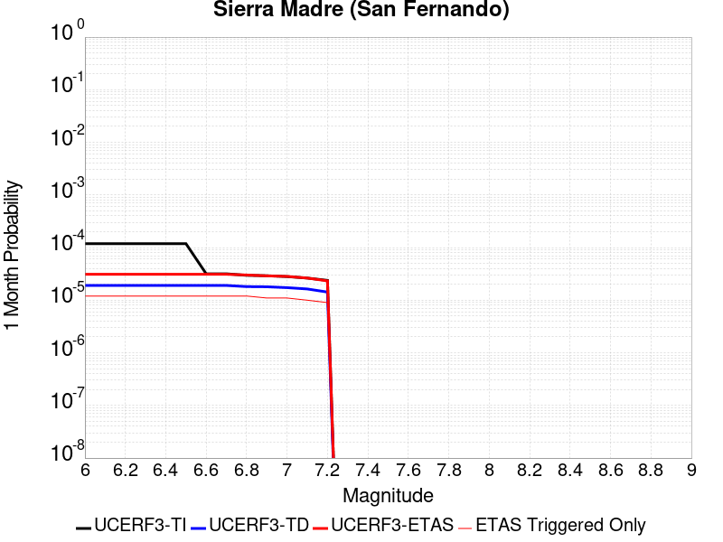 |  |  |

| Magnitude | 1 wk TI Prob | 1 wk TD Prob | 1 wk ETAS Prob | 1 wk ETAS/TD Gain | 1 wk ETAS Triggered Only | 1 mo TI Prob | 1 mo TD Prob | 1 mo ETAS Prob | 1 mo ETAS/TD Gain | 1 mo ETAS Triggered Only | 1 yr TI Prob | 1 yr TD Prob | 1 yr ETAS Prob | 1 yr ETAS/TD Gain | 1 yr ETAS Triggered Only | 10 yr TI Prob | 10 yr TD Prob | 10 yr ETAS Prob | 10 yr ETAS/TD Gain | 10 yr ETAS Triggered Only |
|-----|-----|-----|-----|-----|-----|-----|-----|-----|-----|-----|-----|-----|-----|-----|-----|-----|-----|-----|-----|-----|
| 6.0 | 2.76706E-5 | 4.4463613E-6 | 1.4446317E-5 | 3.2490199 | 1.0E-5 | 1.1858289E-4 | 1.9055766E-5 | 3.1055537E-5 | 1.6297187 | 1.2E-5 | 0.0014427905 | 2.3199158E-4 | 2.5398648E-4 | 1.094809 | 2.2E-5 | 0.01433459 | 0.0023232098 | 0.0023561332 | 1.0141715 | 3.3E-5 |
| 6.1 | 2.76706E-5 | 4.4463613E-6 | 1.4446317E-5 | 3.2490199 | 1.0E-5 | 1.1858289E-4 | 1.9055766E-5 | 3.1055537E-5 | 1.6297187 | 1.2E-5 | 0.0014427905 | 2.3199158E-4 | 2.5398648E-4 | 1.094809 | 2.2E-5 | 0.01433459 | 0.0023232098 | 0.0023561332 | 1.0141715 | 3.3E-5 |
| 6.2 | 2.76706E-5 | 4.4463613E-6 | 1.4446317E-5 | 3.2490199 | 1.0E-5 | 1.1858289E-4 | 1.9055766E-5 | 3.1055537E-5 | 1.6297187 | 1.2E-5 | 0.0014427905 | 2.3199158E-4 | 2.5398648E-4 | 1.094809 | 2.2E-5 | 0.01433459 | 0.0023232098 | 0.0023561332 | 1.0141715 | 3.3E-5 |
| 6.3 | 2.76706E-5 | 4.4463613E-6 | 1.4446317E-5 | 3.2490199 | 1.0E-5 | 1.1858289E-4 | 1.9055766E-5 | 3.1055537E-5 | 1.6297187 | 1.2E-5 | 0.0014427905 | 2.3199158E-4 | 2.5398648E-4 | 1.094809 | 2.2E-5 | 0.01433459 | 0.0023232098 | 0.0023561332 | 1.0141715 | 3.3E-5 |
| 6.4 | 2.76706E-5 | 4.4463613E-6 | 1.4446317E-5 | 3.2490199 | 1.0E-5 | 1.1858289E-4 | 1.9055766E-5 | 3.1055537E-5 | 1.6297187 | 1.2E-5 | 0.0014427905 | 2.3199158E-4 | 2.5398648E-4 | 1.094809 | 2.2E-5 | 0.01433459 | 0.0023232098 | 0.0023561332 | 1.0141715 | 3.3E-5 |
| 6.5 | 2.76706E-5 | 4.4463613E-6 | 1.4446317E-5 | 3.2490199 | 1.0E-5 | 1.1858289E-4 | 1.9055766E-5 | 3.1055537E-5 | 1.6297187 | 1.2E-5 | 0.0014427905 | 2.3199158E-4 | 2.5398648E-4 | 1.094809 | 2.2E-5 | 0.01433459 | 0.0023232098 | 0.0023561332 | 1.0141715 | 3.3E-5 |
| 6.6 | 7.4064433E-6 | 4.4463613E-6 | 1.4446317E-5 | 3.2490199 | 1.0E-5 | 3.1741514E-5 | 1.9055766E-5 | 3.1055537E-5 | 1.6297187 | 1.2E-5 | 3.863844E-4 | 2.3199158E-4 | 2.5398648E-4 | 1.094809 | 2.2E-5 | 0.0038571327 | 0.0023232098 | 0.002356133 | 1.0141715 | 3.3E-5 |
| 6.7 | 7.4064433E-6 | 4.4463613E-6 | 1.4446317E-5 | 3.2490199 | 1.0E-5 | 3.1741514E-5 | 1.9055766E-5 | 3.1055537E-5 | 1.6297187 | 1.2E-5 | 3.863844E-4 | 2.3199158E-4 | 2.5398648E-4 | 1.094809 | 2.2E-5 | 0.0038571327 | 0.0023232098 | 0.002356133 | 1.0141715 | 3.3E-5 |
| 6.8 | 6.925624E-6 | 4.2295183E-6 | 1.4229476E-5 | 3.3643253 | 1.0E-5 | 2.9680907E-5 | 1.8126451E-5 | 3.0126233E-5 | 1.662004 | 1.2E-5 | 3.613051E-4 | 2.2067946E-4 | 2.426746E-4 | 1.09967 | 2.2E-5 | 0.0036071825 | 0.0022100909 | 0.00224202 | 1.0144471 | 3.2E-5 |
| 6.9 | 6.8073305E-6 | 4.1955877E-6 | 1.319555E-5 | 3.1451018 | 9.0E-6 | 2.9173947E-5 | 1.7981036E-5 | 2.8980838E-5 | 1.6117446 | 1.1E-5 | 3.551349E-4 | 2.1890938E-4 | 2.3990478E-4 | 1.0959091 | 2.1E-5 | 0.003545679 | 0.0021923676 | 0.0022232996 | 1.014109 | 3.1E-5 |
| 7.0 | 6.5550776E-6 | 4.0390173E-6 | 1.3038981E-5 | 3.2282557 | 9.0E-6 | 2.8092887E-5 | 1.7310029E-5 | 2.8309838E-5 | 1.6354587 | 1.1E-5 | 3.4197723E-4 | 2.1074146E-4 | 2.3073725E-4 | 1.094883 | 2.0E-5 | 0.0034145142 | 0.0021107546 | 0.0021396934 | 1.0137101 | 2.9E-5 |
| 7.1 | 6.141366E-6 | 3.8129206E-6 | 1.181289E-5 | 3.0981212 | 8.0E-6 | 2.6319874E-5 | 1.6341055E-5 | 2.6340891E-5 | 1.6119456 | 1.0E-5 | 3.2039735E-4 | 1.9894639E-4 | 2.1794261E-4 | 1.0954841 | 1.9E-5 | 0.003199358 | 0.001992886 | 0.0020198321 | 1.0135212 | 2.7E-5 |
| 7.2 | 5.5504106E-6 | 3.3297895E-6 | 1.1329763E-5 | 3.4025462 | 8.0E-6 | 2.3787257E-5 | 1.4270517E-5 | 2.3270388E-5 | 1.630662 | 9.0E-6 | 2.8957136E-4 | 1.7374175E-4 | 1.9073879E-4 | 1.0978293 | 1.7E-5 | 0.002891943 | 0.0017411701 | 0.0017641301 | 1.0131865 | 2.3E-5 |

## Great Valley 10 (Panoche)
*[(top)](#table-of-contents)*

| 1 Week | 1 Month | 1 Year | 10 Year |
|-----|-----|-----|-----|
|  |  |  |  |

| Magnitude | 1 wk TI Prob | 1 wk TD Prob | 1 wk ETAS Prob | 1 wk ETAS/TD Gain | 1 wk ETAS Triggered Only | 1 mo TI Prob | 1 mo TD Prob | 1 mo ETAS Prob | 1 mo ETAS/TD Gain | 1 mo ETAS Triggered Only | 1 yr TI Prob | 1 yr TD Prob | 1 yr ETAS Prob | 1 yr ETAS/TD Gain | 1 yr ETAS Triggered Only | 10 yr TI Prob | 10 yr TD Prob | 10 yr ETAS Prob | 10 yr ETAS/TD Gain | 10 yr ETAS Triggered Only |
|-----|-----|-----|-----|-----|-----|-----|-----|-----|-----|-----|-----|-----|-----|-----|-----|-----|-----|-----|-----|-----|
| 6.0 | 3.6887384E-5 | 5.0836705E-5 | 6.2836094E-5 | 1.236038 | 1.2E-5 | 1.580792E-4 | 2.1787158E-4 | 2.3486788E-4 | 1.0780106 | 1.7E-5 | 0.0019229152 | 0.002652291 | 0.00267523 | 1.0086488 | 2.3E-5 | 0.01906361 | 0.026489226 | 0.026521351 | 1.0012128 | 3.3E-5 |
| 6.1 | 3.6887384E-5 | 5.0836705E-5 | 6.2836094E-5 | 1.236038 | 1.2E-5 | 1.580792E-4 | 2.1787158E-4 | 2.3486788E-4 | 1.0780106 | 1.7E-5 | 0.0019229152 | 0.002652291 | 0.00267523 | 1.0086488 | 2.3E-5 | 0.01906361 | 0.026489226 | 0.026521351 | 1.0012128 | 3.3E-5 |
| 6.2 | 3.6887384E-5 | 5.0836705E-5 | 6.2836094E-5 | 1.236038 | 1.2E-5 | 1.580792E-4 | 2.1787158E-4 | 2.3486788E-4 | 1.0780106 | 1.7E-5 | 0.0019229152 | 0.002652291 | 0.00267523 | 1.0086488 | 2.3E-5 | 0.01906361 | 0.026489226 | 0.026521351 | 1.0012128 | 3.3E-5 |
| 6.3 | 3.6887384E-5 | 5.0836705E-5 | 6.2836094E-5 | 1.236038 | 1.2E-5 | 1.580792E-4 | 2.1787158E-4 | 2.3486788E-4 | 1.0780106 | 1.7E-5 | 0.0019229152 | 0.002652291 | 0.00267523 | 1.0086488 | 2.3E-5 | 0.01906361 | 0.026489226 | 0.026521351 | 1.0012128 | 3.3E-5 |
| 6.4 | 3.6887384E-5 | 5.0836705E-5 | 6.2836094E-5 | 1.236038 | 1.2E-5 | 1.580792E-4 | 2.1787158E-4 | 2.3486788E-4 | 1.0780106 | 1.7E-5 | 0.0019229152 | 0.002652291 | 0.00267523 | 1.0086488 | 2.3E-5 | 0.01906361 | 0.026489226 | 0.026521351 | 1.0012128 | 3.3E-5 |

## Imperial
*[(top)](#table-of-contents)*

| 1 Week | 1 Month | 1 Year | 10 Year |
|-----|-----|-----|-----|
|  |  |  |  |

| Magnitude | 1 wk TI Prob | 1 wk TD Prob | 1 wk ETAS Prob | 1 wk ETAS/TD Gain | 1 wk ETAS Triggered Only | 1 mo TI Prob | 1 mo TD Prob | 1 mo ETAS Prob | 1 mo ETAS/TD Gain | 1 mo ETAS Triggered Only | 1 yr TI Prob | 1 yr TD Prob | 1 yr ETAS Prob | 1 yr ETAS/TD Gain | 1 yr ETAS Triggered Only | 10 yr TI Prob | 10 yr TD Prob | 10 yr ETAS Prob | 10 yr ETAS/TD Gain | 10 yr ETAS Triggered Only |
|-----|-----|-----|-----|-----|-----|-----|-----|-----|-----|-----|-----|-----|-----|-----|-----|-----|-----|-----|-----|-----|
| 6.0 | 3.2610117E-4 | 4.2223663E-4 | 4.3223242E-4 | 1.0236734 | 1.0E-5 | 0.001396828 | 0.0018087402 | 0.0018237131 | 1.008278 | 1.5E-5 | 0.016874276 | 0.0221874 | 0.022207936 | 1.0009255 | 2.1E-5 | 0.1564893 | 0.21658373 | 0.21660879 | 1.0001158 | 3.2E-5 |
| 6.1 | 3.2610117E-4 | 4.2223663E-4 | 4.3223242E-4 | 1.0236734 | 1.0E-5 | 0.001396828 | 0.0018087402 | 0.0018237131 | 1.008278 | 1.5E-5 | 0.016874276 | 0.0221874 | 0.022207936 | 1.0009255 | 2.1E-5 | 0.1564893 | 0.21658373 | 0.21660879 | 1.0001158 | 3.2E-5 |
| 6.2 | 3.2610117E-4 | 4.2223663E-4 | 4.3223242E-4 | 1.0236734 | 1.0E-5 | 0.001396828 | 0.0018087402 | 0.0018237131 | 1.008278 | 1.5E-5 | 0.016874276 | 0.0221874 | 0.022207936 | 1.0009255 | 2.1E-5 | 0.1564893 | 0.21658373 | 0.21660879 | 1.0001158 | 3.2E-5 |
| 6.3 | 3.2610117E-4 | 4.2223663E-4 | 4.3223242E-4 | 1.0236734 | 1.0E-5 | 0.001396828 | 0.0018087402 | 0.0018237131 | 1.008278 | 1.5E-5 | 0.016874276 | 0.0221874 | 0.022207936 | 1.0009255 | 2.1E-5 | 0.1564893 | 0.21658373 | 0.21660879 | 1.0001158 | 3.2E-5 |
| 6.4 | 3.2610117E-4 | 4.2223663E-4 | 4.3223242E-4 | 1.0236734 | 1.0E-5 | 0.001396828 | 0.0018087402 | 0.0018237131 | 1.008278 | 1.5E-5 | 0.016874276 | 0.0221874 | 0.022207936 | 1.0009255 | 2.1E-5 | 0.1564893 | 0.21658373 | 0.21660879 | 1.0001158 | 3.2E-5 |
| 6.5 | 3.2610117E-4 | 4.2223663E-4 | 4.3223242E-4 | 1.0236734 | 1.0E-5 | 0.001396828 | 0.0018087402 | 0.0018237131 | 1.008278 | 1.5E-5 | 0.016874276 | 0.0221874 | 0.022207936 | 1.0009255 | 2.1E-5 | 0.1564893 | 0.21658373 | 0.21660879 | 1.0001158 | 3.2E-5 |
| 6.6 | 2.7505832E-4 | 3.51371E-4 | 3.5836856E-4 | 1.019915 | 7.0E-6 | 0.0011782888 | 0.0015054093 | 0.0015163927 | 1.007296 | 1.1E-5 | 0.014251595 | 0.018531771 | 0.018548457 | 1.0009004 | 1.7E-5 | 0.13371493 | 0.18699032 | 0.18701227 | 1.0001174 | 2.7E-5 |
| 6.7 | 2.2892522E-4 | 2.8752215E-4 | 2.9352042E-4 | 1.020862 | 6.0E-6 | 9.807391E-4 | 0.0012320514 | 0.001242039 | 1.0081066 | 1.0E-5 | 0.011875284 | 0.015238598 | 0.015254354 | 1.001034 | 1.6E-5 | 0.11260368 | 0.1593126 | 0.15933363 | 1.000132 | 2.5E-5 |
| 6.8 | 1.8687606E-4 | 2.3508105E-4 | 2.4007987E-4 | 1.0212643 | 5.0E-6 | 8.0065156E-4 | 0.0010074902 | 0.0010164812 | 1.0089241 | 9.0E-6 | 0.009704442 | 0.012523335 | 0.012537161 | 1.0011039 | 1.4E-5 | 0.09291432 | 0.13362566 | 0.13364558 | 1.0001491 | 2.3E-5 |
| 6.9 | 1.8687606E-4 | 2.3508105E-4 | 2.4007987E-4 | 1.0212643 | 5.0E-6 | 8.0065156E-4 | 0.0010074902 | 0.0010164812 | 1.0089241 | 9.0E-6 | 0.009704442 | 0.012523335 | 0.012537161 | 1.0011039 | 1.4E-5 | 0.09291432 | 0.13362566 | 0.13364558 | 1.0001491 | 2.3E-5 |

## Palos Verdes
*[(top)](#table-of-contents)*

| 1 Week | 1 Month | 1 Year | 10 Year |
|-----|-----|-----|-----|
|  |  |  |  |

| Magnitude | 1 wk TI Prob | 1 wk TD Prob | 1 wk ETAS Prob | 1 wk ETAS/TD Gain | 1 wk ETAS Triggered Only | 1 mo TI Prob | 1 mo TD Prob | 1 mo ETAS Prob | 1 mo ETAS/TD Gain | 1 mo ETAS Triggered Only | 1 yr TI Prob | 1 yr TD Prob | 1 yr ETAS Prob | 1 yr ETAS/TD Gain | 1 yr ETAS Triggered Only | 10 yr TI Prob | 10 yr TD Prob | 10 yr ETAS Prob | 10 yr ETAS/TD Gain | 10 yr ETAS Triggered Only |
|-----|-----|-----|-----|-----|-----|-----|-----|-----|-----|-----|-----|-----|-----|-----|-----|-----|-----|-----|-----|-----|
| 6.0 | 2.416717E-5 | 2.7219172E-5 | 3.6218928E-5 | 1.3306403 | 9.0E-6 | 1.0356947E-4 | 1.16648946E-4 | 1.2864755E-4 | 1.1028608 | 1.2E-5 | 0.0012602288 | 0.0014193773 | 0.0014393489 | 1.0140706 | 2.0E-5 | 0.01253106 | 0.014113327 | 0.0141429035 | 1.0020957 | 3.0E-5 |
| 6.1 | 2.416717E-5 | 2.7219172E-5 | 3.6218928E-5 | 1.3306403 | 9.0E-6 | 1.0356947E-4 | 1.16648946E-4 | 1.2864755E-4 | 1.1028608 | 1.2E-5 | 0.0012602288 | 0.0014193773 | 0.0014393489 | 1.0140706 | 2.0E-5 | 0.01253106 | 0.014113327 | 0.0141429035 | 1.0020957 | 3.0E-5 |
| 6.2 | 2.416717E-5 | 2.7219172E-5 | 3.6218928E-5 | 1.3306403 | 9.0E-6 | 1.0356947E-4 | 1.16648946E-4 | 1.2864755E-4 | 1.1028608 | 1.2E-5 | 0.0012602288 | 0.0014193773 | 0.0014393489 | 1.0140706 | 2.0E-5 | 0.01253106 | 0.014113327 | 0.0141429035 | 1.0020957 | 3.0E-5 |
| 6.3 | 2.416717E-5 | 2.7219172E-5 | 3.6218928E-5 | 1.3306403 | 9.0E-6 | 1.0356947E-4 | 1.16648946E-4 | 1.2864755E-4 | 1.1028608 | 1.2E-5 | 0.0012602288 | 0.0014193773 | 0.0014393489 | 1.0140706 | 2.0E-5 | 0.01253106 | 0.014113327 | 0.0141429035 | 1.0020957 | 3.0E-5 |
| 6.4 | 2.416717E-5 | 2.7219172E-5 | 3.6218928E-5 | 1.3306403 | 9.0E-6 | 1.0356947E-4 | 1.16648946E-4 | 1.2864755E-4 | 1.1028608 | 1.2E-5 | 0.0012602288 | 0.0014193773 | 0.0014393489 | 1.0140706 | 2.0E-5 | 0.01253106 | 0.014113327 | 0.0141429035 | 1.0020957 | 3.0E-5 |
| 6.5 | 2.416717E-5 | 2.7219172E-5 | 3.6218928E-5 | 1.3306403 | 9.0E-6 | 1.0356947E-4 | 1.16648946E-4 | 1.2864755E-4 | 1.1028608 | 1.2E-5 | 0.0012602288 | 0.0014193773 | 0.0014393489 | 1.0140706 | 2.0E-5 | 0.01253106 | 0.014113327 | 0.0141429035 | 1.0020957 | 3.0E-5 |
| 6.6 | 2.2181084E-5 | 2.4975725E-5 | 3.2975524E-5 | 1.320303 | 8.0E-6 | 9.505832E-5 | 1.07035E-4 | 1.1803382E-4 | 1.1027591 | 1.1E-5 | 0.0011567206 | 0.0013024732 | 0.0013214485 | 1.0145687 | 1.9E-5 | 0.0115071805 | 0.012958492 | 0.012987116 | 1.002209 | 2.9E-5 |
| 6.7 | 1.9382267E-5 | 2.1828162E-5 | 2.882801E-5 | 1.3206797 | 7.0E-6 | 8.306422E-5 | 9.354648E-5 | 1.0254564E-4 | 1.0961999 | 9.0E-6 | 0.0010108376 | 0.0011384335 | 0.001155414 | 1.0149158 | 1.7E-5 | 0.0100625185 | 0.011335945 | 0.011360661 | 1.0021803 | 2.5E-5 |
| 6.8 | 1.6157266E-5 | 1.8180996E-5 | 2.4180887E-5 | 1.330009 | 6.0E-6 | 6.9243586E-5 | 7.791678E-5 | 8.591616E-5 | 1.1026657 | 8.0E-6 | 8.4271457E-4 | 9.483226E-4 | 9.633084E-4 | 1.0158024 | 1.5E-5 | 0.00839526 | 0.009452482 | 0.009475264 | 1.0024102 | 2.3E-5 |
| 6.9 | 1.3828139E-5 | 1.5540487E-5 | 2.1540394E-5 | 1.3860823 | 6.0E-6 | 5.9262107E-5 | 6.6600944E-5 | 7.460041E-5 | 1.1201104 | 8.0E-6 | 7.212773E-4 | 8.1066263E-4 | 8.2565047E-4 | 1.0184884 | 1.5E-5 | 0.007189407 | 0.008086668 | 0.008106506 | 1.0024532 | 2.0E-5 |
| 7.0 | 1.1833321E-5 | 1.3284609E-5 | 1.928453E-5 | 1.4516444 | 6.0E-6 | 5.0713246E-5 | 5.6933346E-5 | 6.3932945E-5 | 1.1229438 | 7.0E-6 | 6.1725883E-4 | 6.930404E-4 | 7.040328E-4 | 1.015861 | 1.1E-5 | 0.0061554713 | 0.006918346 | 0.006933242 | 1.0021532 | 1.5E-5 |
| 7.1 | 1.0044758E-5 | 1.1258023E-5 | 1.6257967E-5 | 1.4441227 | 5.0E-6 | 4.304825E-5 | 4.8248323E-5 | 5.4248034E-5 | 1.1243507 | 6.0E-6 | 5.239864E-4 | 5.873616E-4 | 5.963563E-4 | 1.0153137 | 9.0E-6 | 0.005227526 | 0.005867563 | 0.005879493 | 1.0020331 | 1.2E-5 |
| 7.2 | 8.481934E-6 | 9.495382E-6 | 1.3495344E-5 | 1.4212534 | 4.0E-6 | 3.635064E-5 | 4.0694402E-5 | 4.5694196E-5 | 1.122862 | 5.0E-6 | 4.4247916E-4 | 4.9543753E-4 | 5.0143455E-4 | 1.0121045 | 6.0E-6 | 0.0044159917 | 0.0049527287 | 0.0049616843 | 1.0018082 | 9.0E-6 |

## Great Valley 11
*[(top)](#table-of-contents)*

| 1 Week | 1 Month | 1 Year | 10 Year |
|-----|-----|-----|-----|
|  |  | 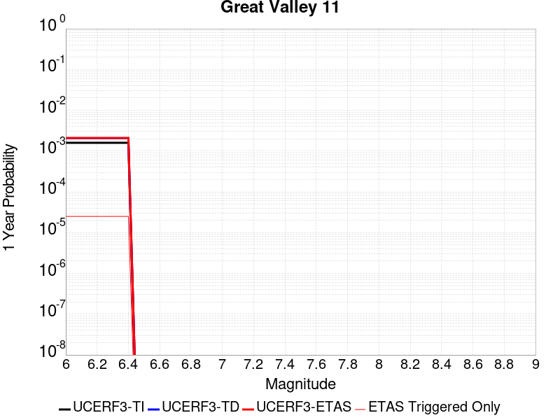 |  |

| Magnitude | 1 wk TI Prob | 1 wk TD Prob | 1 wk ETAS Prob | 1 wk ETAS/TD Gain | 1 wk ETAS Triggered Only | 1 mo TI Prob | 1 mo TD Prob | 1 mo ETAS Prob | 1 mo ETAS/TD Gain | 1 mo ETAS Triggered Only | 1 yr TI Prob | 1 yr TD Prob | 1 yr ETAS Prob | 1 yr ETAS/TD Gain | 1 yr ETAS Triggered Only | 10 yr TI Prob | 10 yr TD Prob | 10 yr ETAS Prob | 10 yr ETAS/TD Gain | 10 yr ETAS Triggered Only |
|-----|-----|-----|-----|-----|-----|-----|-----|-----|-----|-----|-----|-----|-----|-----|-----|-----|-----|-----|-----|-----|
| 6.0 | 3.056394E-5 | 3.967284E-5 | 5.0672403E-5 | 1.2772567 | 1.1E-5 | 1.3098175E-4 | 1.7002384E-4 | 1.8602112E-4 | 1.0940884 | 1.6E-5 | 0.0015935361 | 0.0020699822 | 0.0020949303 | 1.0120524 | 2.5E-5 | 0.015821574 | 0.02069238 | 0.02072176 | 1.0014198 | 3.0E-5 |
| 6.1 | 3.056394E-5 | 3.967284E-5 | 5.0672403E-5 | 1.2772567 | 1.1E-5 | 1.3098175E-4 | 1.7002384E-4 | 1.8602112E-4 | 1.0940884 | 1.6E-5 | 0.0015935361 | 0.0020699822 | 0.0020949303 | 1.0120524 | 2.5E-5 | 0.015821574 | 0.02069238 | 0.02072176 | 1.0014198 | 3.0E-5 |
| 6.2 | 3.056394E-5 | 3.967284E-5 | 5.0672403E-5 | 1.2772567 | 1.1E-5 | 1.3098175E-4 | 1.7002384E-4 | 1.8602112E-4 | 1.0940884 | 1.6E-5 | 0.0015935361 | 0.0020699822 | 0.0020949303 | 1.0120524 | 2.5E-5 | 0.015821574 | 0.02069238 | 0.02072176 | 1.0014198 | 3.0E-5 |
| 6.3 | 3.056394E-5 | 3.967284E-5 | 5.0672403E-5 | 1.2772567 | 1.1E-5 | 1.3098175E-4 | 1.7002384E-4 | 1.8602112E-4 | 1.0940884 | 1.6E-5 | 0.0015935361 | 0.0020699822 | 0.0020949303 | 1.0120524 | 2.5E-5 | 0.015821574 | 0.02069238 | 0.02072176 | 1.0014198 | 3.0E-5 |
| 6.4 | 3.056394E-5 | 3.967284E-5 | 5.0672403E-5 | 1.2772567 | 1.1E-5 | 1.3098175E-4 | 1.7002384E-4 | 1.8602112E-4 | 1.0940884 | 1.6E-5 | 0.0015935361 | 0.0020699822 | 0.0020949303 | 1.0120524 | 2.5E-5 | 0.015821574 | 0.02069238 | 0.02072176 | 1.0014198 | 3.0E-5 |

## Hayward (So) 2011 CFM
*[(top)](#table-of-contents)*

| 1 Week | 1 Month | 1 Year | 10 Year |
|-----|-----|-----|-----|
|  |  |  |  |

| Magnitude | 1 wk TI Prob | 1 wk TD Prob | 1 wk ETAS Prob | 1 wk ETAS/TD Gain | 1 wk ETAS Triggered Only | 1 mo TI Prob | 1 mo TD Prob | 1 mo ETAS Prob | 1 mo ETAS/TD Gain | 1 mo ETAS Triggered Only | 1 yr TI Prob | 1 yr TD Prob | 1 yr ETAS Prob | 1 yr ETAS/TD Gain | 1 yr ETAS Triggered Only | 10 yr TI Prob | 10 yr TD Prob | 10 yr ETAS Prob | 10 yr ETAS/TD Gain | 10 yr ETAS Triggered Only |
|-----|-----|-----|-----|-----|-----|-----|-----|-----|-----|-----|-----|-----|-----|-----|-----|-----|-----|-----|-----|-----|
| 6.0 | 1.2701664E-4 | 2.8183177E-4 | 2.8383124E-4 | 1.0070944 | 2.0E-6 | 5.4424343E-4 | 0.001207496 | 0.0012114912 | 1.0033087 | 4.0E-6 | 0.0066060508 | 0.014638459 | 0.014653239 | 1.0010097 | 1.5E-5 | 0.06413091 | 0.13469909 | 0.13472418 | 1.0001863 | 2.9E-5 |
| 6.1 | 1.2701664E-4 | 2.8183177E-4 | 2.8383124E-4 | 1.0070944 | 2.0E-6 | 5.4424343E-4 | 0.001207496 | 0.0012114912 | 1.0033087 | 4.0E-6 | 0.0066060508 | 0.014638459 | 0.014653239 | 1.0010097 | 1.5E-5 | 0.06413091 | 0.13469909 | 0.13472418 | 1.0001863 | 2.9E-5 |
| 6.2 | 1.2701664E-4 | 2.8183177E-4 | 2.8383124E-4 | 1.0070944 | 2.0E-6 | 5.4424343E-4 | 0.001207496 | 0.0012114912 | 1.0033087 | 4.0E-6 | 0.0066060508 | 0.014638459 | 0.014653239 | 1.0010097 | 1.5E-5 | 0.06413091 | 0.13469909 | 0.13472418 | 1.0001863 | 2.9E-5 |
| 6.3 | 1.2701664E-4 | 2.8183177E-4 | 2.8383124E-4 | 1.0070944 | 2.0E-6 | 5.4424343E-4 | 0.001207496 | 0.0012114912 | 1.0033087 | 4.0E-6 | 0.0066060508 | 0.014638459 | 0.014653239 | 1.0010097 | 1.5E-5 | 0.06413091 | 0.13469909 | 0.13472418 | 1.0001863 | 2.9E-5 |
| 6.4 | 1.2701664E-4 | 2.8183177E-4 | 2.8383124E-4 | 1.0070944 | 2.0E-6 | 5.4424343E-4 | 0.001207496 | 0.0012114912 | 1.0033087 | 4.0E-6 | 0.0066060508 | 0.014638459 | 0.014653239 | 1.0010097 | 1.5E-5 | 0.06413091 | 0.13469909 | 0.13472418 | 1.0001863 | 2.9E-5 |
| 6.5 | 1.2701664E-4 | 2.8183177E-4 | 2.8383124E-4 | 1.0070944 | 2.0E-6 | 5.4424343E-4 | 0.001207496 | 0.0012114912 | 1.0033087 | 4.0E-6 | 0.0066060508 | 0.014638459 | 0.014653239 | 1.0010097 | 1.5E-5 | 0.06413091 | 0.13469909 | 0.13472418 | 1.0001863 | 2.9E-5 |
| 6.6 | 1.2617561E-4 | 2.8017466E-4 | 2.821741E-4 | 1.0071365 | 2.0E-6 | 5.4064055E-4 | 0.0012004005 | 0.0012043958 | 1.0033282 | 4.0E-6 | 0.0065624514 | 0.014553229 | 0.014568011 | 1.0010157 | 1.5E-5 | 0.06372008 | 0.1339794 | 0.13400452 | 1.0001874 | 2.9E-5 |
| 6.7 | 6.106194E-5 | 1.5483651E-4 | 1.5583636E-4 | 1.0064574 | 1.0E-6 | 2.6166777E-4 | 6.6351274E-4 | 6.665107E-4 | 1.0045184 | 3.0E-6 | 0.0031811513 | 0.0080654435 | 0.008075362 | 1.0012299 | 1.0E-5 | 0.031359967 | 0.075871445 | 0.07588808 | 1.0002192 | 1.8E-5 |
| 6.8 | 6.005265E-5 | 1.523396E-4 | 1.5333945E-4 | 1.0065633 | 1.0E-6 | 2.573431E-4 | 6.528171E-4 | 6.558151E-4 | 1.0045924 | 3.0E-6 | 0.0031286513 | 0.00793618 | 0.0079461 | 1.00125 | 1.0E-5 | 0.030849686 | 0.07472291 | 0.07473956 | 1.0002229 | 1.8E-5 |
| 6.9 | 5.8771016E-5 | 1.4917298E-4 | 1.5017284E-4 | 1.0067027 | 1.0E-6 | 2.5185148E-4 | 6.392526E-4 | 6.4225064E-4 | 1.0046899 | 3.0E-6 | 0.0030619805 | 0.007772221 | 0.007781151 | 1.0011489 | 9.0E-6 | 0.030201323 | 0.073260926 | 0.07327668 | 1.000215 | 1.7E-5 |
| 7.0 | 1.1420259E-5 | 2.9975652E-5 | 3.097562E-5 | 1.0333594 | 1.0E-6 | 4.894305E-5 | 1.2846253E-4 | 1.2946241E-4 | 1.0077834 | 1.0E-6 | 5.957187E-4 | 0.0015632241 | 0.0015662195 | 1.0019162 | 3.0E-6 | 0.005941243 | 0.015188666 | 0.01519359 | 1.0003242 | 5.0E-6 |
| 7.1 | 9.497712E-6 | 2.5505822E-5 | 2.6505797E-5 | 1.0392058 | 1.0E-6 | 4.0703846E-5 | 1.0930784E-4 | 1.1030773E-4 | 1.0091475 | 1.0E-6 | 4.954566E-4 | 0.0013303217 | 0.0013333176 | 1.0022521 | 3.0E-6 | 0.0049435347 | 0.01294365 | 0.012948585 | 1.0003812 | 5.0E-6 |
| 7.2 | 6.6138855E-6 | 1.8792352E-5 | 1.9792335E-5 | 1.0532122 | 1.0E-6 | 2.8344915E-5 | 8.053787E-5 | 8.153779E-5 | 1.0124155 | 1.0E-6 | 3.4504468E-4 | 9.8041E-4 | 9.83407E-4 | 1.003057 | 3.0E-6 | 0.0034450945 | 0.009560432 | 0.009565384 | 1.000518 | 5.0E-6 |
| 7.3 | 5.4382035E-6 | 1.5442325E-5 | 1.6442309E-5 | 1.064756 | 1.0E-6 | 2.3306378E-5 | 6.618139E-5 | 6.7181325E-5 | 1.015109 | 1.0E-6 | 2.8371823E-4 | 8.0575846E-4 | 8.0875604E-4 | 1.0037202 | 3.0E-6 | 0.0028335627 | 0.007868089 | 0.00787305 | 1.0006305 | 5.0E-6 |

## San Jacinto (Superstition Mtn)
*[(top)](#table-of-contents)*

| 1 Week | 1 Month | 1 Year | 10 Year |
|-----|-----|-----|-----|
|  |  |  |  |

| Magnitude | 1 wk TI Prob | 1 wk TD Prob | 1 wk ETAS Prob | 1 wk ETAS/TD Gain | 1 wk ETAS Triggered Only | 1 mo TI Prob | 1 mo TD Prob | 1 mo ETAS Prob | 1 mo ETAS/TD Gain | 1 mo ETAS Triggered Only | 1 yr TI Prob | 1 yr TD Prob | 1 yr ETAS Prob | 1 yr ETAS/TD Gain | 1 yr ETAS Triggered Only | 10 yr TI Prob | 10 yr TD Prob | 10 yr ETAS Prob | 10 yr ETAS/TD Gain | 10 yr ETAS Triggered Only |
|-----|-----|-----|-----|-----|-----|-----|-----|-----|-----|-----|-----|-----|-----|-----|-----|-----|-----|-----|-----|-----|
| 6.0 | 6.369931E-5 | 1.1782884E-4 | 1.2482802E-4 | 1.0594012 | 7.0E-6 | 2.729685E-4 | 5.049214E-4 | 5.119179E-4 | 1.0138565 | 7.0E-6 | 0.003318327 | 0.006136903 | 0.0061488296 | 1.0019433 | 1.2E-5 | 0.032692123 | 0.059778612 | 0.05980494 | 1.0004404 | 2.8E-5 |
| 6.1 | 6.369931E-5 | 1.1782884E-4 | 1.2482802E-4 | 1.0594012 | 7.0E-6 | 2.729685E-4 | 5.049214E-4 | 5.119179E-4 | 1.0138565 | 7.0E-6 | 0.003318327 | 0.006136903 | 0.0061488296 | 1.0019433 | 1.2E-5 | 0.032692123 | 0.059778612 | 0.05980494 | 1.0004404 | 2.8E-5 |
| 6.2 | 6.369931E-5 | 1.1782884E-4 | 1.2482802E-4 | 1.0594012 | 7.0E-6 | 2.729685E-4 | 5.049214E-4 | 5.119179E-4 | 1.0138565 | 7.0E-6 | 0.003318327 | 0.006136903 | 0.0061488296 | 1.0019433 | 1.2E-5 | 0.032692123 | 0.059778612 | 0.05980494 | 1.0004404 | 2.8E-5 |
| 6.3 | 6.369931E-5 | 1.1782884E-4 | 1.2482802E-4 | 1.0594012 | 7.0E-6 | 2.729685E-4 | 5.049214E-4 | 5.119179E-4 | 1.0138565 | 7.0E-6 | 0.003318327 | 0.006136903 | 0.0061488296 | 1.0019433 | 1.2E-5 | 0.032692123 | 0.059778612 | 0.05980494 | 1.0004404 | 2.8E-5 |
| 6.4 | 6.369931E-5 | 1.1782884E-4 | 1.2482802E-4 | 1.0594012 | 7.0E-6 | 2.729685E-4 | 5.049214E-4 | 5.119179E-4 | 1.0138565 | 7.0E-6 | 0.003318327 | 0.006136903 | 0.0061488296 | 1.0019433 | 1.2E-5 | 0.032692123 | 0.059778612 | 0.05980494 | 1.0004404 | 2.8E-5 |
| 6.5 | 6.369931E-5 | 1.1782884E-4 | 1.2482802E-4 | 1.0594012 | 7.0E-6 | 2.729685E-4 | 5.049214E-4 | 5.119179E-4 | 1.0138565 | 7.0E-6 | 0.003318327 | 0.006136903 | 0.0061488296 | 1.0019433 | 1.2E-5 | 0.032692123 | 0.059778612 | 0.05980494 | 1.0004404 | 2.8E-5 |
| 6.6 | 6.356468E-5 | 1.1754235E-4 | 1.2454153E-4 | 1.059546 | 7.0E-6 | 2.723916E-4 | 5.036941E-4 | 5.1069056E-4 | 1.0138903 | 7.0E-6 | 0.003311325 | 0.0061220443 | 0.006133971 | 1.0019481 | 1.2E-5 | 0.032624163 | 0.059641294 | 0.059667625 | 1.0004414 | 2.8E-5 |
| 6.7 | 3.0048706E-5 | 4.931984E-5 | 5.3319643E-5 | 1.0810993 | 4.0E-6 | 1.2877381E-4 | 2.1135958E-4 | 2.1535874E-4 | 1.0189211 | 4.0E-6 | 0.0015666935 | 0.0025713246 | 0.002577309 | 1.0023274 | 6.0E-6 | 0.015556943 | 0.025631001 | 0.02564367 | 1.0004942 | 1.3E-5 |
| 6.8 | 2.9819825E-5 | 4.8735175E-5 | 5.273498E-5 | 1.0820723 | 4.0E-6 | 1.2779298E-4 | 2.088543E-4 | 2.1285345E-4 | 1.0191481 | 4.0E-6 | 0.0015547692 | 0.0025408939 | 0.0025458813 | 1.0019628 | 5.0E-6 | 0.015439362 | 0.025341224 | 0.02535292 | 1.0004616 | 1.2E-5 |
| 6.9 | 2.9555731E-5 | 4.8134865E-5 | 5.113472E-5 | 1.0623219 | 3.0E-6 | 1.2666127E-4 | 2.0628194E-4 | 2.0928132E-4 | 1.0145402 | 3.0E-6 | 0.0015410101 | 0.002509648 | 0.002513638 | 1.0015899 | 4.0E-6 | 0.015303677 | 0.025041468 | 0.025052194 | 1.0004283 | 1.1E-5 |
| 7.0 | 2.915559E-5 | 4.744423E-5 | 5.0444087E-5 | 1.0632291 | 3.0E-6 | 1.2494654E-4 | 2.0332253E-4 | 2.0632193E-4 | 1.0147519 | 3.0E-6 | 0.0015201626 | 0.0024736994 | 0.0024776896 | 1.001613 | 4.0E-6 | 0.015098056 | 0.024688803 | 0.024699531 | 1.0004345 | 1.1E-5 |
| 7.1 | 1.5605729E-5 | 2.3894689E-5 | 2.589464E-5 | 1.0836986 | 2.0E-6 | 6.687998E-5 | 1.0240406E-4 | 1.0440386E-4 | 1.0195285 | 2.0E-6 | 8.139595E-4 | 0.0012464593 | 0.0012494555 | 1.0024039 | 3.0E-6 | 0.008109846 | 0.01256506 | 0.0125699965 | 1.0003929 | 5.0E-6 |
| 7.2 | 1.4951773E-5 | 2.282491E-5 | 2.4824863E-5 | 1.0876216 | 2.0E-6 | 6.407745E-5 | 9.781964E-5 | 9.9819445E-5 | 1.0204438 | 2.0E-6 | 7.7986374E-4 | 0.001190706 | 0.0011937025 | 1.0025165 | 3.0E-6 | 0.0077713258 | 0.012013012 | 0.012017951 | 1.0004113 | 5.0E-6 |
| 7.3 | 1.3807349E-5 | 2.1078144E-5 | 2.3078102E-5 | 1.094883 | 2.0E-6 | 5.917301E-5 | 9.033404E-5 | 9.233386E-5 | 1.022138 | 2.0E-6 | 7.2019326E-4 | 0.0010996633 | 0.0011026601 | 1.0027251 | 3.0E-6 | 0.0071786367 | 0.011102179 | 0.011107124 | 1.0004454 | 5.0E-6 |
| 7.4 | 2.3105063E-6 | 3.2496644E-6 | 3.2496644E-6 | 1.0 | 0.0 | 9.902133E-6 | 1.3927083E-5 | 1.3927083E-5 | 1.0 | 0.0 | 1.2055179E-4 | 1.6955346E-4 | 1.6955346E-4 | 1.0 | 0.0 | 0.0012048641 | 0.0017464611 | 0.0017474594 | 1.0005716 | 1.0E-6 |
| 7.5 | 2.3105063E-6 | 3.2496644E-6 | 3.2496644E-6 | 1.0 | 0.0 | 9.902133E-6 | 1.3927083E-5 | 1.3927083E-5 | 1.0 | 0.0 | 1.2055179E-4 | 1.6955346E-4 | 1.6955346E-4 | 1.0 | 0.0 | 0.0012048641 | 0.0017464611 | 0.0017474594 | 1.0005716 | 1.0E-6 |
| 7.6 | 2.3105063E-6 | 3.2496644E-6 | 3.2496644E-6 | 1.0 | 0.0 | 9.902133E-6 | 1.3927083E-5 | 1.3927083E-5 | 1.0 | 0.0 | 1.2055179E-4 | 1.6955346E-4 | 1.6955346E-4 | 1.0 | 0.0 | 0.0012048641 | 0.0017464611 | 0.0017474594 | 1.0005716 | 1.0E-6 |
| 7.7 | 1.5389671E-6 | 2.0643286E-6 | 2.0643286E-6 | 1.0 | 0.0 | 6.5955564E-6 | 8.847107E-6 | 8.847107E-6 | 1.0 | 0.0 | 8.029794E-5 | 1.07710875E-4 | 1.07710875E-4 | 1.0 | 0.0 | 8.0268935E-4 | 0.0011189707 | 0.0011199695 | 1.0008926 | 1.0E-6 |
| 7.8 | 7.6409924E-7 | 1.0693483E-6 | 1.0693483E-6 | 1.0 | 0.0 | 3.274707E-6 | 4.582921E-6 | 4.582921E-6 | 1.0 | 0.0 | 3.9868828E-5 | 5.5797067E-5 | 5.5797067E-5 | 1.0 | 0.0 | 3.9861677E-4 | 5.7725405E-4 | 5.782535E-4 | 1.0017314 | 1.0E-6 |

## Hosgri
*[(top)](#table-of-contents)*

| 1 Week | 1 Month | 1 Year | 10 Year |
|-----|-----|-----|-----|
|  |  |  |  |

| Magnitude | 1 wk TI Prob | 1 wk TD Prob | 1 wk ETAS Prob | 1 wk ETAS/TD Gain | 1 wk ETAS Triggered Only | 1 mo TI Prob | 1 mo TD Prob | 1 mo ETAS Prob | 1 mo ETAS/TD Gain | 1 mo ETAS Triggered Only | 1 yr TI Prob | 1 yr TD Prob | 1 yr ETAS Prob | 1 yr ETAS/TD Gain | 1 yr ETAS Triggered Only | 10 yr TI Prob | 10 yr TD Prob | 10 yr ETAS Prob | 10 yr ETAS/TD Gain | 10 yr ETAS Triggered Only |
|-----|-----|-----|-----|-----|-----|-----|-----|-----|-----|-----|-----|-----|-----|-----|-----|-----|-----|-----|-----|-----|
| 6.0 | 3.1107833E-5 | 3.720853E-5 | 4.720816E-5 | 1.2687455 | 1.0E-5 | 1.3331248E-4 | 1.5945687E-4 | 1.7145497E-4 | 1.0752435 | 1.2E-5 | 0.0016218709 | 0.001939923 | 0.0019588862 | 1.0097752 | 1.9E-5 | 0.01610085 | 0.01925631 | 0.019283772 | 1.0014261 | 2.8E-5 |
| 6.1 | 3.1107833E-5 | 3.720853E-5 | 4.720816E-5 | 1.2687455 | 1.0E-5 | 1.3331248E-4 | 1.5945687E-4 | 1.7145497E-4 | 1.0752435 | 1.2E-5 | 0.0016218709 | 0.001939923 | 0.0019588862 | 1.0097752 | 1.9E-5 | 0.01610085 | 0.01925631 | 0.019283772 | 1.0014261 | 2.8E-5 |
| 6.2 | 3.1107833E-5 | 3.720853E-5 | 4.720816E-5 | 1.2687455 | 1.0E-5 | 1.3331248E-4 | 1.5945687E-4 | 1.7145497E-4 | 1.0752435 | 1.2E-5 | 0.0016218709 | 0.001939923 | 0.0019588862 | 1.0097752 | 1.9E-5 | 0.01610085 | 0.01925631 | 0.019283772 | 1.0014261 | 2.8E-5 |
| 6.3 | 3.1107833E-5 | 3.720853E-5 | 4.720816E-5 | 1.2687455 | 1.0E-5 | 1.3331248E-4 | 1.5945687E-4 | 1.7145497E-4 | 1.0752435 | 1.2E-5 | 0.0016218709 | 0.001939923 | 0.0019588862 | 1.0097752 | 1.9E-5 | 0.01610085 | 0.01925631 | 0.019283772 | 1.0014261 | 2.8E-5 |
| 6.4 | 3.1107833E-5 | 3.720853E-5 | 4.720816E-5 | 1.2687455 | 1.0E-5 | 1.3331248E-4 | 1.5945687E-4 | 1.7145497E-4 | 1.0752435 | 1.2E-5 | 0.0016218709 | 0.001939923 | 0.0019588862 | 1.0097752 | 1.9E-5 | 0.01610085 | 0.01925631 | 0.019283772 | 1.0014261 | 2.8E-5 |
| 6.5 | 3.1107833E-5 | 3.720853E-5 | 4.720816E-5 | 1.2687455 | 1.0E-5 | 1.3331248E-4 | 1.5945687E-4 | 1.7145497E-4 | 1.0752435 | 1.2E-5 | 0.0016218709 | 0.001939923 | 0.0019588862 | 1.0097752 | 1.9E-5 | 0.01610085 | 0.01925631 | 0.019283772 | 1.0014261 | 2.8E-5 |
| 6.6 | 2.743495E-5 | 3.2780124E-5 | 4.2779797E-5 | 1.3050529 | 1.0E-5 | 1.1757306E-4 | 1.4048017E-4 | 1.5247847E-4 | 1.0854093 | 1.2E-5 | 0.0014305119 | 0.0017092682 | 0.0017262392 | 1.0099288 | 1.7E-5 | 0.014213383 | 0.016987413 | 0.017011005 | 1.0013888 | 2.4E-5 |
| 6.7 | 2.418707E-5 | 2.8858389E-5 | 3.5858186E-5 | 1.2425568 | 7.0E-6 | 1.0365475E-4 | 1.2367443E-4 | 1.3267332E-4 | 1.0727627 | 9.0E-6 | 0.001261266 | 0.0015049598 | 0.0015179402 | 1.0086251 | 1.3E-5 | 0.012541314 | 0.014973709 | 0.01499144 | 1.0011841 | 1.8E-5 |
| 6.8 | 2.1292695E-5 | 2.5360874E-5 | 3.2360695E-5 | 1.2760087 | 7.0E-6 | 9.125122E-5 | 1.0868641E-4 | 1.1668554E-4 | 1.0735983 | 8.0E-6 | 0.0011104173 | 0.0013227165 | 0.0013347006 | 1.0090603 | 1.2E-5 | 0.011048851 | 0.013174292 | 0.013190081 | 1.0011985 | 1.6E-5 |
| 6.9 | 1.8692357E-5 | 2.221764E-5 | 2.9217486E-5 | 1.315058 | 7.0E-6 | 8.010764E-5 | 9.521646E-5 | 1.032157E-4 | 1.0840111 | 8.0E-6 | 9.7487407E-4 | 0.001158906 | 0.0011708922 | 1.0103426 | 1.2E-5 | 0.009706085 | 0.01155437 | 0.011570185 | 1.0013688 | 1.6E-5 |
| 7.0 | 1.6336586E-5 | 1.9370036E-5 | 2.436994E-5 | 1.2581257 | 5.0E-6 | 7.001206E-5 | 8.301328E-5 | 8.901278E-5 | 1.0722716 | 6.0E-6 | 8.520634E-4 | 0.0010104795 | 0.0010194704 | 1.0088977 | 9.0E-6 | 0.008488038 | 0.010084504 | 0.010095394 | 1.0010798 | 1.1E-5 |
| 7.1 | 1.4184237E-5 | 1.6776847E-5 | 2.1776763E-5 | 1.2980248 | 5.0E-6 | 6.0788174E-5 | 7.1900264E-5 | 7.789983E-5 | 1.0834429 | 6.0E-6 | 7.398447E-4 | 8.7529485E-4 | 8.84287E-4 | 1.0102732 | 9.0E-6 | 0.007373864 | 0.008744048 | 0.00875396 | 1.0011337 | 1.0E-5 |
| 7.2 | 1.2201091E-5 | 1.4405841E-5 | 1.8405783E-5 | 1.2776612 | 4.0E-6 | 5.228934E-5 | 6.1739316E-5 | 6.673901E-5 | 1.0809807 | 5.0E-6 | 6.3643674E-4 | 7.516762E-4 | 7.5967016E-4 | 1.0106349 | 8.0E-6 | 0.006346171 | 0.007516762 | 0.007525694 | 1.0011883 | 9.0E-6 |

## Holser alt 1
*[(top)](#table-of-contents)*

| 1 Week | 1 Month | 1 Year | 10 Year |
|-----|-----|-----|-----|
|  |  |  |  |

| Magnitude | 1 wk TI Prob | 1 wk TD Prob | 1 wk ETAS Prob | 1 wk ETAS/TD Gain | 1 wk ETAS Triggered Only | 1 mo TI Prob | 1 mo TD Prob | 1 mo ETAS Prob | 1 mo ETAS/TD Gain | 1 mo ETAS Triggered Only | 1 yr TI Prob | 1 yr TD Prob | 1 yr ETAS Prob | 1 yr ETAS/TD Gain | 1 yr ETAS Triggered Only | 10 yr TI Prob | 10 yr TD Prob | 10 yr ETAS Prob | 10 yr ETAS/TD Gain | 10 yr ETAS Triggered Only |
|-----|-----|-----|-----|-----|-----|-----|-----|-----|-----|-----|-----|-----|-----|-----|-----|-----|-----|-----|-----|-----|
| 6.0 | 7.962936E-6 | 8.4235735E-6 | 1.4423523E-5 | 1.7122808 | 6.0E-6 | 3.4126424E-5 | 3.6100817E-5 | 4.4100525E-5 | 1.2215936 | 8.0E-6 | 4.1540997E-4 | 4.394895E-4 | 4.5248377E-4 | 1.0295668 | 1.3E-5 | 0.004146343 | 0.0043911743 | 0.004418056 | 1.0061218 | 2.7E-5 |
| 6.1 | 7.962936E-6 | 8.4235735E-6 | 1.4423523E-5 | 1.7122808 | 6.0E-6 | 3.4126424E-5 | 3.6100817E-5 | 4.4100525E-5 | 1.2215936 | 8.0E-6 | 4.1540997E-4 | 4.394895E-4 | 4.5248377E-4 | 1.0295668 | 1.3E-5 | 0.004146343 | 0.0043911743 | 0.004418056 | 1.0061218 | 2.7E-5 |
| 6.2 | 7.962936E-6 | 8.4235735E-6 | 1.4423523E-5 | 1.7122808 | 6.0E-6 | 3.4126424E-5 | 3.6100817E-5 | 4.4100525E-5 | 1.2215936 | 8.0E-6 | 4.1540997E-4 | 4.394895E-4 | 4.5248377E-4 | 1.0295668 | 1.3E-5 | 0.004146343 | 0.0043911743 | 0.004418056 | 1.0061218 | 2.7E-5 |
| 6.3 | 7.962936E-6 | 8.4235735E-6 | 1.4423523E-5 | 1.7122808 | 6.0E-6 | 3.4126424E-5 | 3.6100817E-5 | 4.4100525E-5 | 1.2215936 | 8.0E-6 | 4.1540997E-4 | 4.394895E-4 | 4.5248377E-4 | 1.0295668 | 1.3E-5 | 0.004146343 | 0.0043911743 | 0.004418056 | 1.0061218 | 2.7E-5 |
| 6.4 | 7.962936E-6 | 8.4235735E-6 | 1.4423523E-5 | 1.7122808 | 6.0E-6 | 3.4126424E-5 | 3.6100817E-5 | 4.4100525E-5 | 1.2215936 | 8.0E-6 | 4.1540997E-4 | 4.394895E-4 | 4.5248377E-4 | 1.0295668 | 1.3E-5 | 0.004146343 | 0.0043911743 | 0.004418056 | 1.0061218 | 2.7E-5 |
| 6.5 | 7.962936E-6 | 8.4235735E-6 | 1.4423523E-5 | 1.7122808 | 6.0E-6 | 3.4126424E-5 | 3.6100817E-5 | 4.4100525E-5 | 1.2215936 | 8.0E-6 | 4.1540997E-4 | 4.394895E-4 | 4.5248377E-4 | 1.0295668 | 1.3E-5 | 0.004146343 | 0.0043911743 | 0.004418056 | 1.0061218 | 2.7E-5 |
| 6.6 | 5.506786E-6 | 5.810526E-6 | 8.810508E-6 | 1.5163014 | 3.0E-6 | 2.3600298E-5 | 2.4902254E-5 | 2.8902154E-5 | 1.160624 | 4.0E-6 | 2.8729573E-4 | 3.0318493E-4 | 3.101828E-4 | 1.0230812 | 7.0E-6 | 0.002869246 | 0.0030318494 | 0.0030468039 | 1.0049325 | 1.5E-5 |
| 6.7 | 5.506786E-6 | 5.810526E-6 | 8.810508E-6 | 1.5163014 | 3.0E-6 | 2.3600298E-5 | 2.4902254E-5 | 2.8902154E-5 | 1.160624 | 4.0E-6 | 2.8729573E-4 | 3.0318493E-4 | 3.101828E-4 | 1.0230812 | 7.0E-6 | 0.002869246 | 0.0030318494 | 0.0030468039 | 1.0049325 | 1.5E-5 |

## Rose Canyon
*[(top)](#table-of-contents)*

| 1 Week | 1 Month | 1 Year | 10 Year |
|-----|-----|-----|-----|
|  |  |  |  |

| Magnitude | 1 wk TI Prob | 1 wk TD Prob | 1 wk ETAS Prob | 1 wk ETAS/TD Gain | 1 wk ETAS Triggered Only | 1 mo TI Prob | 1 mo TD Prob | 1 mo ETAS Prob | 1 mo ETAS/TD Gain | 1 mo ETAS Triggered Only | 1 yr TI Prob | 1 yr TD Prob | 1 yr ETAS Prob | 1 yr ETAS/TD Gain | 1 yr ETAS Triggered Only | 10 yr TI Prob | 10 yr TD Prob | 10 yr ETAS Prob | 10 yr ETAS/TD Gain | 10 yr ETAS Triggered Only |
|-----|-----|-----|-----|-----|-----|-----|-----|-----|-----|-----|-----|-----|-----|-----|-----|-----|-----|-----|-----|-----|
| 6.0 | 1.9167945E-5 | 1.6478027E-5 | 2.6477861E-5 | 1.6068588 | 1.0E-5 | 8.214574E-5 | 7.06186E-5 | 8.561753E-5 | 1.2123936 | 1.5E-5 | 9.996655E-4 | 8.5951196E-4 | 8.7849563E-4 | 1.0220866 | 1.9E-5 | 0.009951805 | 0.008568751 | 0.008595519 | 1.003124 | 2.7E-5 |
| 6.1 | 1.9167945E-5 | 1.6478027E-5 | 2.6477861E-5 | 1.6068588 | 1.0E-5 | 8.214574E-5 | 7.06186E-5 | 8.561753E-5 | 1.2123936 | 1.5E-5 | 9.996655E-4 | 8.5951196E-4 | 8.7849563E-4 | 1.0220866 | 1.9E-5 | 0.009951805 | 0.008568751 | 0.008595519 | 1.003124 | 2.7E-5 |
| 6.2 | 1.9167945E-5 | 1.6478027E-5 | 2.6477861E-5 | 1.6068588 | 1.0E-5 | 8.214574E-5 | 7.06186E-5 | 8.561753E-5 | 1.2123936 | 1.5E-5 | 9.996655E-4 | 8.5951196E-4 | 8.7849563E-4 | 1.0220866 | 1.9E-5 | 0.009951805 | 0.008568751 | 0.008595519 | 1.003124 | 2.7E-5 |
| 6.3 | 1.9167945E-5 | 1.6478027E-5 | 2.6477861E-5 | 1.6068588 | 1.0E-5 | 8.214574E-5 | 7.06186E-5 | 8.561753E-5 | 1.2123936 | 1.5E-5 | 9.996655E-4 | 8.5951196E-4 | 8.7849563E-4 | 1.0220866 | 1.9E-5 | 0.009951805 | 0.008568751 | 0.008595519 | 1.003124 | 2.7E-5 |
| 6.4 | 1.9167945E-5 | 1.6478027E-5 | 2.6477861E-5 | 1.6068588 | 1.0E-5 | 8.214574E-5 | 7.06186E-5 | 8.561753E-5 | 1.2123936 | 1.5E-5 | 9.996655E-4 | 8.5951196E-4 | 8.7849563E-4 | 1.0220866 | 1.9E-5 | 0.009951805 | 0.008568751 | 0.008595519 | 1.003124 | 2.7E-5 |
| 6.5 | 1.9167945E-5 | 1.6478027E-5 | 2.6477861E-5 | 1.6068588 | 1.0E-5 | 8.214574E-5 | 7.06186E-5 | 8.561753E-5 | 1.2123936 | 1.5E-5 | 9.996655E-4 | 8.5951196E-4 | 8.7849563E-4 | 1.0220866 | 1.9E-5 | 0.009951805 | 0.008568751 | 0.008595519 | 1.003124 | 2.7E-5 |
| 6.6 | 1.6032436E-5 | 1.3771202E-5 | 2.1771093E-5 | 1.5809144 | 8.0E-6 | 6.870863E-5 | 5.901849E-5 | 7.001784E-5 | 1.1863712 | 1.1E-5 | 8.362065E-4 | 7.183819E-4 | 7.333711E-4 | 1.0208652 | 1.5E-5 | 0.008330669 | 0.0071673454 | 0.0071891877 | 1.0030475 | 2.2E-5 |
| 6.7 | 1.32651885E-5 | 1.1282621E-5 | 1.8282542E-5 | 1.6204162 | 7.0E-6 | 5.684957E-5 | 4.8353573E-5 | 5.735314E-5 | 1.1861199 | 9.0E-6 | 6.919237E-4 | 5.8861315E-4 | 6.016055E-4 | 1.0220728 | 1.3E-5 | 0.0068977326 | 0.005877156 | 0.005896044 | 1.0032139 | 1.9E-5 |
| 6.8 | 1.2374002E-5 | 1.0546746E-5 | 1.5546693E-5 | 1.4740748 | 5.0E-6 | 5.303036E-5 | 4.5199937E-5 | 5.219962E-5 | 1.1548605 | 7.0E-6 | 6.4545334E-4 | 5.5023754E-4 | 5.612315E-4 | 1.0199803 | 1.1E-5 | 0.006435818 | 0.005495354 | 0.005511266 | 1.0028956 | 1.6E-5 |
| 6.9 | 3.8401595E-6 | 3.178941E-6 | 4.1789376E-6 | 1.3145691 | 1.0E-6 | 1.6457723E-5 | 1.3623983E-5 | 1.462397E-5 | 1.073399 | 1.0E-6 | 2.0035435E-4 | 1.6586324E-4 | 1.6786292E-4 | 1.0120561 | 2.0E-6 | 0.0020017382 | 0.0016577742 | 0.0016607692 | 1.0018066 | 3.0E-6 |
| 7.0 | 3.6026508E-6 | 2.9376413E-6 | 3.937638E-6 | 1.3404082 | 1.0E-6 | 1.543984E-5 | 1.2589852E-5 | 1.358984E-5 | 1.0794281 | 1.0E-6 | 1.8796384E-4 | 1.5327454E-4 | 1.5527423E-4 | 1.0130465 | 2.0E-6 | 0.0018780495 | 0.0015320673 | 0.0015350627 | 1.0019552 | 3.0E-6 |
| 7.1 | 3.3657313E-6 | 2.6902792E-6 | 3.6902766E-6 | 1.3717077 | 1.0E-6 | 1.4424483E-5 | 1.1529739E-5 | 1.2529727E-5 | 1.0867312 | 1.0E-6 | 1.7560393E-4 | 1.4036939E-4 | 1.423691E-4 | 1.0142461 | 2.0E-6 | 0.0017546522 | 0.0014031857 | 0.0014061815 | 1.002135 | 3.0E-6 |
| 7.2 | 3.1430025E-6 | 2.4618412E-6 | 3.4618386E-6 | 1.4061991 | 1.0E-6 | 1.3469941E-5 | 1.0550727E-5 | 1.1550716E-5 | 1.0947793 | 1.0E-6 | 1.639842E-4 | 1.2845139E-4 | 1.3045112E-4 | 1.0155681 | 2.0E-6 | 0.0016386324 | 0.0012841492 | 0.0012871453 | 1.0023332 | 3.0E-6 |
| 7.3 | 2.898987E-6 | 2.2514312E-6 | 3.251429E-6 | 1.4441609 | 1.0E-6 | 1.24241715E-5 | 9.648977E-6 | 1.0648967E-5 | 1.103637 | 1.0E-6 | 1.5125379E-4 | 1.1747381E-4 | 1.19473574E-4 | 1.0170231 | 2.0E-6 | 0.0015115088 | 0.0011744945 | 0.001177491 | 1.0025513 | 3.0E-6 |
| 7.4 | 2.5994284E-6 | 2.0116724E-6 | 3.0116705E-6 | 1.4970978 | 1.0E-6 | 1.114036E-5 | 8.621447E-6 | 9.621438E-6 | 1.1159889 | 1.0E-6 | 1.3562544E-4 | 1.049649E-4 | 1.0696469E-4 | 1.019052 | 2.0E-6 | 0.0013554269 | 0.00104953 | 0.0010525269 | 1.0028554 | 3.0E-6 |
| 7.5 | 2.2517988E-6 | 1.7516537E-6 | 2.751652E-6 | 1.570888 | 1.0E-6 | 9.650531E-6 | 7.5070875E-6 | 8.50708E-6 | 1.1332065 | 1.0E-6 | 1.17488875E-4 | 9.139879E-5 | 9.339861E-5 | 1.0218801 | 2.0E-6 | 0.0011742678 | 9.1398787E-4 | 9.159861E-4 | 1.0021862 | 2.0E-6 |

## Great Valley 14 (Kettleman Hills)
*[(top)](#table-of-contents)*

| 1 Week | 1 Month | 1 Year | 10 Year |
|-----|-----|-----|-----|
|  |  |  |  |

| Magnitude | 1 wk TI Prob | 1 wk TD Prob | 1 wk ETAS Prob | 1 wk ETAS/TD Gain | 1 wk ETAS Triggered Only | 1 mo TI Prob | 1 mo TD Prob | 1 mo ETAS Prob | 1 mo ETAS/TD Gain | 1 mo ETAS Triggered Only | 1 yr TI Prob | 1 yr TD Prob | 1 yr ETAS Prob | 1 yr ETAS/TD Gain | 1 yr ETAS Triggered Only | 10 yr TI Prob | 10 yr TD Prob | 10 yr ETAS Prob | 10 yr ETAS/TD Gain | 10 yr ETAS Triggered Only |
|-----|-----|-----|-----|-----|-----|-----|-----|-----|-----|-----|-----|-----|-----|-----|-----|-----|-----|-----|-----|-----|
| 6.0 | 2.0537544E-5 | 2.4301013E-5 | 2.930089E-5 | 1.2057477 | 5.0E-6 | 8.801508E-5 | 1.041472E-4 | 1.14146154E-4 | 1.096008 | 1.0E-5 | 0.0010710567 | 0.0012679921 | 0.0012849706 | 1.0133901 | 1.7E-5 | 0.010659092 | 0.0126799205 | 0.012706578 | 1.0021024 | 2.7E-5 |
| 6.1 | 2.0537544E-5 | 2.4301013E-5 | 2.930089E-5 | 1.2057477 | 5.0E-6 | 8.801508E-5 | 1.041472E-4 | 1.14146154E-4 | 1.096008 | 1.0E-5 | 0.0010710567 | 0.0012679921 | 0.0012849706 | 1.0133901 | 1.7E-5 | 0.010659092 | 0.0126799205 | 0.012706578 | 1.0021024 | 2.7E-5 |
| 6.2 | 2.0537544E-5 | 2.4301013E-5 | 2.930089E-5 | 1.2057477 | 5.0E-6 | 8.801508E-5 | 1.041472E-4 | 1.14146154E-4 | 1.096008 | 1.0E-5 | 0.0010710567 | 0.0012679921 | 0.0012849706 | 1.0133901 | 1.7E-5 | 0.010659092 | 0.0126799205 | 0.012706578 | 1.0021024 | 2.7E-5 |
| 6.3 | 2.0537544E-5 | 2.4301013E-5 | 2.930089E-5 | 1.2057477 | 5.0E-6 | 8.801508E-5 | 1.041472E-4 | 1.14146154E-4 | 1.096008 | 1.0E-5 | 0.0010710567 | 0.0012679921 | 0.0012849706 | 1.0133901 | 1.7E-5 | 0.010659092 | 0.0126799205 | 0.012706578 | 1.0021024 | 2.7E-5 |
| 6.4 | 2.0537544E-5 | 2.4301013E-5 | 2.930089E-5 | 1.2057477 | 5.0E-6 | 8.801508E-5 | 1.041472E-4 | 1.14146154E-4 | 1.096008 | 1.0E-5 | 0.0010710567 | 0.0012679921 | 0.0012849706 | 1.0133901 | 1.7E-5 | 0.010659092 | 0.0126799205 | 0.012706578 | 1.0021024 | 2.7E-5 |
| 6.5 | 2.0537544E-5 | 2.4301013E-5 | 2.930089E-5 | 1.2057477 | 5.0E-6 | 8.801508E-5 | 1.041472E-4 | 1.14146154E-4 | 1.096008 | 1.0E-5 | 0.0010710567 | 0.0012679921 | 0.0012849706 | 1.0133901 | 1.7E-5 | 0.010659092 | 0.0126799205 | 0.012706578 | 1.0021024 | 2.7E-5 |
| 6.6 | 2.0537544E-5 | 2.4301013E-5 | 2.930089E-5 | 1.2057477 | 5.0E-6 | 8.801508E-5 | 1.041472E-4 | 1.14146154E-4 | 1.096008 | 1.0E-5 | 0.0010710567 | 0.0012679921 | 0.0012849706 | 1.0133901 | 1.7E-5 | 0.010659092 | 0.0126799205 | 0.012706578 | 1.0021024 | 2.7E-5 |
| 6.7 | 2.0537544E-5 | 2.4301013E-5 | 2.930089E-5 | 1.2057477 | 5.0E-6 | 8.801508E-5 | 1.041472E-4 | 1.14146154E-4 | 1.096008 | 1.0E-5 | 0.0010710567 | 0.0012679921 | 0.0012849706 | 1.0133901 | 1.7E-5 | 0.010659092 | 0.0126799205 | 0.012706578 | 1.0021024 | 2.7E-5 |
| 6.8 | 2.0537544E-5 | 2.4301013E-5 | 2.930089E-5 | 1.2057477 | 5.0E-6 | 8.801508E-5 | 1.041472E-4 | 1.14146154E-4 | 1.096008 | 1.0E-5 | 0.0010710567 | 0.0012679921 | 0.0012849706 | 1.0133901 | 1.7E-5 | 0.010659092 | 0.0126799205 | 0.012706578 | 1.0021024 | 2.7E-5 |
| 6.9 | 2.0537544E-5 | 2.4301013E-5 | 2.930089E-5 | 1.2057477 | 5.0E-6 | 8.801508E-5 | 1.041472E-4 | 1.14146154E-4 | 1.096008 | 1.0E-5 | 0.0010710567 | 0.0012679921 | 0.0012849706 | 1.0133901 | 1.7E-5 | 0.010659092 | 0.0126799205 | 0.012706578 | 1.0021024 | 2.7E-5 |

## Los Osos 2011
*[(top)](#table-of-contents)*

| 1 Week | 1 Month | 1 Year | 10 Year |
|-----|-----|-----|-----|
|  |  |  | 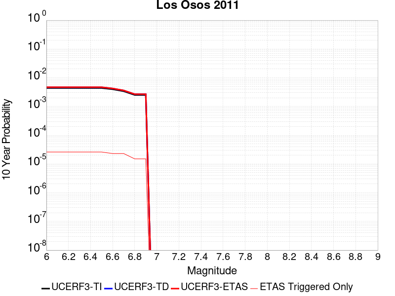 |

| Magnitude | 1 wk TI Prob | 1 wk TD Prob | 1 wk ETAS Prob | 1 wk ETAS/TD Gain | 1 wk ETAS Triggered Only | 1 mo TI Prob | 1 mo TD Prob | 1 mo ETAS Prob | 1 mo ETAS/TD Gain | 1 mo ETAS Triggered Only | 1 yr TI Prob | 1 yr TD Prob | 1 yr ETAS Prob | 1 yr ETAS/TD Gain | 1 yr ETAS Triggered Only | 10 yr TI Prob | 10 yr TD Prob | 10 yr ETAS Prob | 10 yr ETAS/TD Gain | 10 yr ETAS Triggered Only |
|-----|-----|-----|-----|-----|-----|-----|-----|-----|-----|-----|-----|-----|-----|-----|-----|-----|-----|-----|-----|-----|
| 6.0 | 8.431995E-6 | 8.921914E-6 | 1.7921833E-5 | 2.0087433 | 9.0E-6 | 3.6136626E-5 | 3.8236416E-5 | 4.8236034E-5 | 1.2615207 | 1.0E-5 | 4.3987457E-4 | 4.6546472E-4 | 4.8345633E-4 | 1.038653 | 1.8E-5 | 0.004390049 | 0.0046484126 | 0.0046742917 | 1.0055673 | 2.6E-5 |
| 6.1 | 8.431995E-6 | 8.921914E-6 | 1.7921833E-5 | 2.0087433 | 9.0E-6 | 3.6136626E-5 | 3.8236416E-5 | 4.8236034E-5 | 1.2615207 | 1.0E-5 | 4.3987457E-4 | 4.6546472E-4 | 4.8345633E-4 | 1.038653 | 1.8E-5 | 0.004390049 | 0.0046484126 | 0.0046742917 | 1.0055673 | 2.6E-5 |
| 6.2 | 8.431995E-6 | 8.921914E-6 | 1.7921833E-5 | 2.0087433 | 9.0E-6 | 3.6136626E-5 | 3.8236416E-5 | 4.8236034E-5 | 1.2615207 | 1.0E-5 | 4.3987457E-4 | 4.6546472E-4 | 4.8345633E-4 | 1.038653 | 1.8E-5 | 0.004390049 | 0.0046484126 | 0.0046742917 | 1.0055673 | 2.6E-5 |
| 6.3 | 8.431995E-6 | 8.921914E-6 | 1.7921833E-5 | 2.0087433 | 9.0E-6 | 3.6136626E-5 | 3.8236416E-5 | 4.8236034E-5 | 1.2615207 | 1.0E-5 | 4.3987457E-4 | 4.6546472E-4 | 4.8345633E-4 | 1.038653 | 1.8E-5 | 0.004390049 | 0.0046484126 | 0.0046742917 | 1.0055673 | 2.6E-5 |
| 6.4 | 8.431995E-6 | 8.921914E-6 | 1.7921833E-5 | 2.0087433 | 9.0E-6 | 3.6136626E-5 | 3.8236416E-5 | 4.8236034E-5 | 1.2615207 | 1.0E-5 | 4.3987457E-4 | 4.6546472E-4 | 4.8345633E-4 | 1.038653 | 1.8E-5 | 0.004390049 | 0.0046484126 | 0.0046742917 | 1.0055673 | 2.6E-5 |
| 6.5 | 8.431995E-6 | 8.921914E-6 | 1.7921833E-5 | 2.0087433 | 9.0E-6 | 3.6136626E-5 | 3.8236416E-5 | 4.8236034E-5 | 1.2615207 | 1.0E-5 | 4.3987457E-4 | 4.6546472E-4 | 4.8345633E-4 | 1.038653 | 1.8E-5 | 0.004390049 | 0.0046484126 | 0.0046742917 | 1.0055673 | 2.6E-5 |
| 6.6 | 7.640001E-6 | 8.0825275E-6 | 1.6082464E-5 | 1.9897814 | 8.0E-6 | 3.274245E-5 | 3.4639146E-5 | 4.3638833E-5 | 1.2598126 | 9.0E-6 | 3.9856642E-4 | 4.2168552E-4 | 4.3767877E-4 | 1.0379269 | 1.6E-5 | 0.0039785234 | 0.004212338 | 0.004235241 | 1.0054371 | 2.3E-5 |
| 6.7 | 6.515521E-6 | 6.8883687E-6 | 1.4888314E-5 | 2.16137 | 8.0E-6 | 2.7923363E-5 | 2.9521441E-5 | 3.8521175E-5 | 1.3048542 | 9.0E-6 | 3.399139E-4 | 3.593989E-4 | 3.7539314E-4 | 1.0445027 | 1.6E-5 | 0.0033939444 | 0.003591573 | 0.0036144904 | 1.0063809 | 2.3E-5 |
| 6.8 | 4.831725E-6 | 5.104944E-6 | 1.1104913E-5 | 2.1753252 | 6.0E-6 | 2.0707228E-5 | 2.1878332E-5 | 2.78782E-5 | 1.274238 | 6.0E-6 | 2.5208134E-4 | 2.6636868E-4 | 2.753663E-4 | 1.0337788 | 9.0E-6 | 0.0025179558 | 0.0026636869 | 0.002678647 | 1.0056163 | 1.5E-5 |
| 6.9 | 4.831725E-6 | 5.104944E-6 | 1.1104913E-5 | 2.1753252 | 6.0E-6 | 2.0707228E-5 | 2.1878332E-5 | 2.78782E-5 | 1.274238 | 6.0E-6 | 2.5208134E-4 | 2.6636868E-4 | 2.753663E-4 | 1.0337788 | 9.0E-6 | 0.0025179558 | 0.0026636869 | 0.002678647 | 1.0056163 | 1.5E-5 |

## Elsinore (Temecula) rev
*[(top)](#table-of-contents)*

| 1 Week | 1 Month | 1 Year | 10 Year |
|-----|-----|-----|-----|
|  |  |  |  |

| Magnitude | 1 wk TI Prob | 1 wk TD Prob | 1 wk ETAS Prob | 1 wk ETAS/TD Gain | 1 wk ETAS Triggered Only | 1 mo TI Prob | 1 mo TD Prob | 1 mo ETAS Prob | 1 mo ETAS/TD Gain | 1 mo ETAS Triggered Only | 1 yr TI Prob | 1 yr TD Prob | 1 yr ETAS Prob | 1 yr ETAS/TD Gain | 1 yr ETAS Triggered Only | 10 yr TI Prob | 10 yr TD Prob | 10 yr ETAS Prob | 10 yr ETAS/TD Gain | 10 yr ETAS Triggered Only |
|-----|-----|-----|-----|-----|-----|-----|-----|-----|-----|-----|-----|-----|-----|-----|-----|-----|-----|-----|-----|-----|
| 6.0 | 2.9985375E-5 | 3.4747958E-5 | 4.274768E-5 | 1.2302214 | 8.0E-6 | 1.2850242E-4 | 1.4891267E-4 | 1.5891119E-4 | 1.0671434 | 1.0E-5 | 0.0015633941 | 0.0018117457 | 0.0018277166 | 1.0088153 | 1.6E-5 | 0.01552441 | 0.018074041 | 0.018098589 | 1.0013582 | 2.5E-5 |
| 6.1 | 2.9985375E-5 | 3.4747958E-5 | 4.274768E-5 | 1.2302214 | 8.0E-6 | 1.2850242E-4 | 1.4891267E-4 | 1.5891119E-4 | 1.0671434 | 1.0E-5 | 0.0015633941 | 0.0018117457 | 0.0018277166 | 1.0088153 | 1.6E-5 | 0.01552441 | 0.018074041 | 0.018098589 | 1.0013582 | 2.5E-5 |
| 6.2 | 2.9985375E-5 | 3.4747958E-5 | 4.274768E-5 | 1.2302214 | 8.0E-6 | 1.2850242E-4 | 1.4891267E-4 | 1.5891119E-4 | 1.0671434 | 1.0E-5 | 0.0015633941 | 0.0018117457 | 0.0018277166 | 1.0088153 | 1.6E-5 | 0.01552441 | 0.018074041 | 0.018098589 | 1.0013582 | 2.5E-5 |
| 6.3 | 2.9985375E-5 | 3.4747958E-5 | 4.274768E-5 | 1.2302214 | 8.0E-6 | 1.2850242E-4 | 1.4891267E-4 | 1.5891119E-4 | 1.0671434 | 1.0E-5 | 0.0015633941 | 0.0018117457 | 0.0018277166 | 1.0088153 | 1.6E-5 | 0.01552441 | 0.018074041 | 0.018098589 | 1.0013582 | 2.5E-5 |
| 6.4 | 2.9985375E-5 | 3.4747958E-5 | 4.274768E-5 | 1.2302214 | 8.0E-6 | 1.2850242E-4 | 1.4891267E-4 | 1.5891119E-4 | 1.0671434 | 1.0E-5 | 0.0015633941 | 0.0018117457 | 0.0018277166 | 1.0088153 | 1.6E-5 | 0.01552441 | 0.018074041 | 0.018098589 | 1.0013582 | 2.5E-5 |
| 6.5 | 2.9985375E-5 | 3.4747958E-5 | 4.274768E-5 | 1.2302214 | 8.0E-6 | 1.2850242E-4 | 1.4891267E-4 | 1.5891119E-4 | 1.0671434 | 1.0E-5 | 0.0015633941 | 0.0018117457 | 0.0018277166 | 1.0088153 | 1.6E-5 | 0.01552441 | 0.018074041 | 0.018098589 | 1.0013582 | 2.5E-5 |
| 6.6 | 2.9915182E-5 | 3.46808E-5 | 4.2680524E-5 | 1.2306672 | 8.0E-6 | 1.2820162E-4 | 1.486249E-4 | 1.5862341E-4 | 1.0672735 | 1.0E-5 | 0.0015597371 | 0.0018082478 | 0.0018242188 | 1.0088323 | 1.6E-5 | 0.015488351 | 0.018039845 | 0.018064393 | 1.0013608 | 2.5E-5 |
| 6.7 | 2.9879424E-5 | 3.463569E-5 | 4.2635413E-5 | 1.2309676 | 8.0E-6 | 1.2804838E-4 | 1.4843159E-4 | 1.5843009E-4 | 1.0673611 | 1.0E-5 | 0.0015578741 | 0.0018058982 | 0.0018218693 | 1.0088439 | 1.6E-5 | 0.01546998 | 0.018016884 | 0.018041434 | 1.0013626 | 2.5E-5 |
| 6.8 | 2.9818717E-5 | 3.45724E-5 | 4.2572123E-5 | 1.2313905 | 8.0E-6 | 1.2778824E-4 | 1.4816038E-4 | 1.581589E-4 | 1.0674844 | 1.0E-5 | 0.0015547115 | 0.0018026017 | 0.0018185729 | 1.0088601 | 1.6E-5 | 0.015438793 | 0.017984249 | 0.018008798 | 1.0013651 | 2.5E-5 |
| 6.9 | 2.9704783E-5 | 3.4430177E-5 | 4.2429903E-5 | 1.2323463 | 8.0E-6 | 1.273E-4 | 1.4755092E-4 | 1.5754945E-4 | 1.0677632 | 1.0E-5 | 0.0015487756 | 0.001795194 | 0.0018111652 | 1.0088967 | 1.6E-5 | 0.015380259 | 0.017911145 | 0.017935699 | 1.0013708 | 2.5E-5 |
| 7.0 | 2.9613002E-5 | 3.4300047E-5 | 4.2299773E-5 | 1.2332278 | 8.0E-6 | 1.269067E-4 | 1.4699328E-4 | 1.5699181E-4 | 1.0680203 | 1.0E-5 | 0.0015439938 | 0.0017884158 | 0.0018043872 | 1.0089304 | 1.6E-5 | 0.015333103 | 0.017844401 | 0.017868955 | 1.001376 | 2.5E-5 |
| 7.1 | 2.2180364E-5 | 2.6018337E-5 | 3.2018183E-5 | 1.2306006 | 6.0E-6 | 9.505524E-5 | 1.115033E-4 | 1.1950241E-4 | 1.0717387 | 8.0E-6 | 0.0011566831 | 0.0013568681 | 0.001370849 | 1.0103039 | 1.4E-5 | 0.01150681 | 0.013559197 | 0.0135799125 | 1.0015278 | 2.1E-5 |
| 7.2 | 2.1985565E-5 | 2.5725127E-5 | 3.1724972E-5 | 1.233229 | 6.0E-6 | 9.422044E-5 | 1.1024679E-4 | 1.182459E-4 | 1.0725565 | 8.0E-6 | 0.0011465302 | 0.0013415889 | 0.0013555702 | 1.0104214 | 1.4E-5 | 0.0114063285 | 0.013408055 | 0.013428774 | 1.0015452 | 2.1E-5 |
| 7.3 | 1.3039819E-5 | 1.715471E-5 | 1.9154677E-5 | 1.1165841 | 2.0E-6 | 5.5883742E-5 | 7.3518546E-5 | 7.651833E-5 | 1.0408031 | 3.0E-6 | 6.801722E-4 | 8.947971E-4 | 9.017908E-4 | 1.007816 | 7.0E-6 | 0.006780941 | 0.008927152 | 0.008936071 | 1.0009992 | 9.0E-6 |
| 7.4 | 1.2750458E-5 | 1.6749926E-5 | 1.8749892E-5 | 1.1194016 | 2.0E-6 | 5.464368E-5 | 7.178385E-5 | 7.478363E-5 | 1.0417892 | 3.0E-6 | 6.650837E-4 | 8.736942E-4 | 8.806881E-4 | 1.0080049 | 7.0E-6 | 0.006630967 | 0.008717438 | 0.008726359 | 1.0010234 | 9.0E-6 |
| 7.5 | 1.1924516E-5 | 1.570584E-5 | 1.770581E-5 | 1.1273391 | 2.0E-6 | 5.1104067E-5 | 6.730944E-5 | 7.030924E-5 | 1.0445672 | 3.0E-6 | 6.220144E-4 | 8.192601E-4 | 8.2625437E-4 | 1.0085373 | 7.0E-6 | 0.006202762 | 0.008175999 | 0.008184925 | 1.0010918 | 9.0E-6 |
| 7.6 | 1.0456552E-5 | 1.3574289E-5 | 1.5574262E-5 | 1.1473354 | 2.0E-6 | 4.4813027E-5 | 5.817464E-5 | 6.117446E-5 | 1.0515659 | 3.0E-6 | 5.45462E-4 | 7.081186E-4 | 7.141144E-4 | 1.0084672 | 6.0E-6 | 0.0054412507 | 0.0070718653 | 0.0070788157 | 1.0009829 | 7.0E-6 |
| 7.7 | 4.463199E-6 | 5.214875E-6 | 5.214875E-6 | 1.0 | 0.0 | 1.9127854E-5 | 2.2349386E-5 | 2.2349386E-5 | 1.0 | 0.0 | 2.3285674E-4 | 2.7209E-4 | 2.750892E-4 | 1.0110228 | 3.0E-6 | 0.0023261288 | 0.0027239968 | 0.0027269884 | 1.0010983 | 3.0E-6 |
| 7.8 | 2.1601753E-7 | 2.7489222E-7 | 2.7489222E-7 | 1.0 | 0.0 | 9.257891E-7 | 1.1781094E-6 | 1.1781094E-6 | 1.0 | 0.0 | 1.1271423E-5 | 1.4343483E-5 | 1.4343483E-5 | 1.0 | 0.0 | 1.1270852E-4 | 1.435847E-4 | 1.435847E-4 | 1.0 | 0.0 |

## Newport-Inglewood (Offshore)
*[(top)](#table-of-contents)*

| 1 Week | 1 Month | 1 Year | 10 Year |
|-----|-----|-----|-----|
|  |  |  |  |

| Magnitude | 1 wk TI Prob | 1 wk TD Prob | 1 wk ETAS Prob | 1 wk ETAS/TD Gain | 1 wk ETAS Triggered Only | 1 mo TI Prob | 1 mo TD Prob | 1 mo ETAS Prob | 1 mo ETAS/TD Gain | 1 mo ETAS Triggered Only | 1 yr TI Prob | 1 yr TD Prob | 1 yr ETAS Prob | 1 yr ETAS/TD Gain | 1 yr ETAS Triggered Only | 10 yr TI Prob | 10 yr TD Prob | 10 yr ETAS Prob | 10 yr ETAS/TD Gain | 10 yr ETAS Triggered Only |
|-----|-----|-----|-----|-----|-----|-----|-----|-----|-----|-----|-----|-----|-----|-----|-----|-----|-----|-----|-----|-----|
| 6.0 | 1.9418812E-5 | 2.0497266E-5 | 2.9497081E-5 | 1.4390739 | 9.0E-6 | 8.322083E-5 | 8.7843E-5 | 9.884203E-5 | 1.1252124 | 1.1E-5 | 0.0010127426 | 0.0010690573 | 0.0010850402 | 1.0149505 | 1.6E-5 | 0.010081396 | 0.010648402 | 0.010673136 | 1.0023228 | 2.5E-5 |
| 6.1 | 1.9418812E-5 | 2.0497266E-5 | 2.9497081E-5 | 1.4390739 | 9.0E-6 | 8.322083E-5 | 8.7843E-5 | 9.884203E-5 | 1.1252124 | 1.1E-5 | 0.0010127426 | 0.0010690573 | 0.0010850402 | 1.0149505 | 1.6E-5 | 0.010081396 | 0.010648402 | 0.010673136 | 1.0023228 | 2.5E-5 |
| 6.2 | 1.9418812E-5 | 2.0497266E-5 | 2.9497081E-5 | 1.4390739 | 9.0E-6 | 8.322083E-5 | 8.7843E-5 | 9.884203E-5 | 1.1252124 | 1.1E-5 | 0.0010127426 | 0.0010690573 | 0.0010850402 | 1.0149505 | 1.6E-5 | 0.010081396 | 0.010648402 | 0.010673136 | 1.0023228 | 2.5E-5 |
| 6.3 | 1.9418812E-5 | 2.0497266E-5 | 2.9497081E-5 | 1.4390739 | 9.0E-6 | 8.322083E-5 | 8.7843E-5 | 9.884203E-5 | 1.1252124 | 1.1E-5 | 0.0010127426 | 0.0010690573 | 0.0010850402 | 1.0149505 | 1.6E-5 | 0.010081396 | 0.010648402 | 0.010673136 | 1.0023228 | 2.5E-5 |
| 6.4 | 1.9418812E-5 | 2.0497266E-5 | 2.9497081E-5 | 1.4390739 | 9.0E-6 | 8.322083E-5 | 8.7843E-5 | 9.884203E-5 | 1.1252124 | 1.1E-5 | 0.0010127426 | 0.0010690573 | 0.0010850402 | 1.0149505 | 1.6E-5 | 0.010081396 | 0.010648402 | 0.010673136 | 1.0023228 | 2.5E-5 |
| 6.5 | 1.9418812E-5 | 2.0497266E-5 | 2.9497081E-5 | 1.4390739 | 9.0E-6 | 8.322083E-5 | 8.7843E-5 | 9.884203E-5 | 1.1252124 | 1.1E-5 | 0.0010127426 | 0.0010690573 | 0.0010850402 | 1.0149505 | 1.6E-5 | 0.010081396 | 0.010648402 | 0.010673136 | 1.0023228 | 2.5E-5 |
| 6.6 | 1.6939659E-5 | 1.7683546E-5 | 2.5683405E-5 | 1.45239 | 8.0E-6 | 7.259652E-5 | 7.578494E-5 | 8.478426E-5 | 1.1187481 | 9.0E-6 | 8.8350417E-4 | 9.2238374E-4 | 9.363708E-4 | 1.015164 | 1.4E-5 | 0.008799998 | 0.00919468 | 0.009217468 | 1.0024785 | 2.3E-5 |
| 6.7 | 1.4691289E-5 | 1.5149292E-5 | 2.314917E-5 | 1.5280695 | 8.0E-6 | 6.2961146E-5 | 6.492444E-5 | 7.392385E-5 | 1.1386137 | 9.0E-6 | 7.662824E-4 | 7.9025986E-4 | 8.042488E-4 | 1.0177017 | 1.4E-5 | 0.007636454 | 0.007883489 | 0.007906308 | 1.0028945 | 2.3E-5 |
| 6.8 | 1.26037085E-5 | 1.2822538E-5 | 1.9822448E-5 | 1.5459068 | 7.0E-6 | 5.4014774E-5 | 5.4953085E-5 | 6.295265E-5 | 1.1455708 | 8.0E-6 | 6.5743143E-4 | 6.689387E-4 | 6.809307E-4 | 1.0179268 | 1.2E-5 | 0.006554899 | 0.0066781086 | 0.006695988 | 1.0026773 | 1.8E-5 |
| 6.9 | 1.1764378E-5 | 1.1934175E-5 | 1.8934092E-5 | 1.5865438 | 7.0E-6 | 5.0417784E-5 | 5.114597E-5 | 5.9145557E-5 | 1.1564071 | 8.0E-6 | 6.1366364E-4 | 6.226143E-4 | 6.346068E-4 | 1.0192616 | 1.2E-5 | 0.006119718 | 0.006217534 | 0.0062344284 | 1.0027173 | 1.7E-5 |
| 7.0 | 4.071841E-6 | 3.3071306E-6 | 5.307124E-6 | 1.6047518 | 2.0E-6 | 1.745063E-5 | 1.4173362E-5 | 1.6173333E-5 | 1.1411078 | 2.0E-6 | 2.124407E-4 | 1.7255088E-4 | 1.765502E-4 | 1.0231776 | 4.0E-6 | 0.0021223773 | 0.0017245489 | 0.0017295403 | 1.0028943 | 5.0E-6 |
| 7.1 | 3.6344509E-6 | 2.9049047E-6 | 3.904902E-6 | 1.3442444 | 1.0E-6 | 1.5576124E-5 | 1.2449554E-5 | 1.3449541E-5 | 1.0803232 | 1.0E-6 | 1.8962282E-4 | 1.5156664E-4 | 1.5456618E-4 | 1.0197903 | 3.0E-6 | 0.0018946109 | 0.0015150115 | 0.0015190055 | 1.0026362 | 4.0E-6 |
| 7.2 | 3.2446756E-6 | 2.5395498E-6 | 3.5395474E-6 | 1.3937696 | 1.0E-6 | 1.3905678E-5 | 1.0883761E-5 | 1.1883751E-5 | 1.091879 | 1.0E-6 | 1.6928847E-4 | 1.325056E-4 | 1.3450533E-4 | 1.0150917 | 2.0E-6 | 0.0016915957 | 0.0013246438 | 0.0013276399 | 1.0022618 | 3.0E-6 |
| 7.3 | 2.898987E-6 | 2.2514312E-6 | 3.251429E-6 | 1.4441609 | 1.0E-6 | 1.24241715E-5 | 9.648977E-6 | 1.0648967E-5 | 1.103637 | 1.0E-6 | 1.5125379E-4 | 1.1747381E-4 | 1.19473574E-4 | 1.0170231 | 2.0E-6 | 0.0015115088 | 0.0011744945 | 0.001177491 | 1.0025513 | 3.0E-6 |
| 7.4 | 2.5994284E-6 | 2.0116724E-6 | 3.0116705E-6 | 1.4970978 | 1.0E-6 | 1.114036E-5 | 8.621447E-6 | 9.621438E-6 | 1.1159889 | 1.0E-6 | 1.3562544E-4 | 1.049649E-4 | 1.0696469E-4 | 1.019052 | 2.0E-6 | 0.0013554269 | 0.00104953 | 0.0010525269 | 1.0028554 | 3.0E-6 |
| 7.5 | 2.2517988E-6 | 1.7516537E-6 | 2.751652E-6 | 1.570888 | 1.0E-6 | 9.650531E-6 | 7.5070875E-6 | 8.50708E-6 | 1.1332065 | 1.0E-6 | 1.17488875E-4 | 9.139879E-5 | 9.339861E-5 | 1.0218801 | 2.0E-6 | 0.0011742678 | 9.1398787E-4 | 9.159861E-4 | 1.0021862 | 2.0E-6 |

## Johnson Valley (No) 2011 rev
*[(top)](#table-of-contents)*

| 1 Week | 1 Month | 1 Year | 10 Year |
|-----|-----|-----|-----|
|  |  |  |  |

| Magnitude | 1 wk TI Prob | 1 wk TD Prob | 1 wk ETAS Prob | 1 wk ETAS/TD Gain | 1 wk ETAS Triggered Only | 1 mo TI Prob | 1 mo TD Prob | 1 mo ETAS Prob | 1 mo ETAS/TD Gain | 1 mo ETAS Triggered Only | 1 yr TI Prob | 1 yr TD Prob | 1 yr ETAS Prob | 1 yr ETAS/TD Gain | 1 yr ETAS Triggered Only | 10 yr TI Prob | 10 yr TD Prob | 10 yr ETAS Prob | 10 yr ETAS/TD Gain | 10 yr ETAS Triggered Only |
|-----|-----|-----|-----|-----|-----|-----|-----|-----|-----|-----|-----|-----|-----|-----|-----|-----|-----|-----|-----|-----|
| 6.0 | 1.5411064E-5 | 1.0176766E-5 | 1.5176715E-5 | 1.4913102 | 5.0E-6 | 6.6045744E-5 | 4.3614225E-5 | 5.061392E-5 | 1.1604911 | 7.0E-6 | 8.0381025E-4 | 5.3091673E-4 | 5.4590876E-4 | 1.028238 | 1.5E-5 | 0.00800909 | 0.005300697 | 0.0053245695 | 1.0045037 | 2.4E-5 |
| 6.1 | 1.5411064E-5 | 1.0176766E-5 | 1.5176715E-5 | 1.4913102 | 5.0E-6 | 6.6045744E-5 | 4.3614225E-5 | 5.061392E-5 | 1.1604911 | 7.0E-6 | 8.0381025E-4 | 5.3091673E-4 | 5.4590876E-4 | 1.028238 | 1.5E-5 | 0.00800909 | 0.005300697 | 0.0053245695 | 1.0045037 | 2.4E-5 |
| 6.2 | 1.5411064E-5 | 1.0176766E-5 | 1.5176715E-5 | 1.4913102 | 5.0E-6 | 6.6045744E-5 | 4.3614225E-5 | 5.061392E-5 | 1.1604911 | 7.0E-6 | 8.0381025E-4 | 5.3091673E-4 | 5.4590876E-4 | 1.028238 | 1.5E-5 | 0.00800909 | 0.005300697 | 0.0053245695 | 1.0045037 | 2.4E-5 |
| 6.3 | 1.5411064E-5 | 1.0176766E-5 | 1.5176715E-5 | 1.4913102 | 5.0E-6 | 6.6045744E-5 | 4.3614225E-5 | 5.061392E-5 | 1.1604911 | 7.0E-6 | 8.0381025E-4 | 5.3091673E-4 | 5.4590876E-4 | 1.028238 | 1.5E-5 | 0.00800909 | 0.005300697 | 0.0053245695 | 1.0045037 | 2.4E-5 |
| 6.4 | 1.5411064E-5 | 1.0176766E-5 | 1.5176715E-5 | 1.4913102 | 5.0E-6 | 6.6045744E-5 | 4.3614225E-5 | 5.061392E-5 | 1.1604911 | 7.0E-6 | 8.0381025E-4 | 5.3091673E-4 | 5.4590876E-4 | 1.028238 | 1.5E-5 | 0.00800909 | 0.005300697 | 0.0053245695 | 1.0045037 | 2.4E-5 |
| 6.5 | 1.5411064E-5 | 1.0176766E-5 | 1.5176715E-5 | 1.4913102 | 5.0E-6 | 6.6045744E-5 | 4.3614225E-5 | 5.061392E-5 | 1.1604911 | 7.0E-6 | 8.0381025E-4 | 5.3091673E-4 | 5.4590876E-4 | 1.028238 | 1.5E-5 | 0.00800909 | 0.005300697 | 0.0053245695 | 1.0045037 | 2.4E-5 |
| 6.6 | 1.4834682E-5 | 9.547515E-6 | 1.35474775E-5 | 1.4189532 | 4.0E-6 | 6.357566E-5 | 4.091752E-5 | 4.6917274E-5 | 1.1466304 | 6.0E-6 | 7.7375874E-4 | 4.9809937E-4 | 5.120924E-4 | 1.0280929 | 1.4E-5 | 0.0077107013 | 0.0049739927 | 0.004996878 | 1.004601 | 2.3E-5 |
| 6.7 | 1.0814841E-5 | 5.8714368E-6 | 7.871425E-6 | 1.3406302 | 2.0E-6 | 4.6348494E-5 | 2.5163265E-5 | 2.8163187E-5 | 1.1192185 | 3.0E-6 | 5.641468E-4 | 3.063563E-4 | 3.1435385E-4 | 1.0261054 | 8.0E-6 | 0.005627168 | 0.0030629311 | 0.0030748944 | 1.0039058 | 1.2E-5 |
| 6.8 | 1.0245956E-5 | 5.404906E-6 | 7.4048953E-6 | 1.3700322 | 2.0E-6 | 4.3910502E-5 | 2.3163884E-5 | 2.6163814E-5 | 1.129509 | 3.0E-6 | 5.344792E-4 | 2.8202028E-4 | 2.90018E-4 | 1.0283587 | 8.0E-6 | 0.0053319554 | 0.0028202015 | 0.0028311703 | 1.0038894 | 1.1E-5 |
| 6.9 | 3.2082864E-6 | 9.347539E-10 | 9.347539E-10 | 1.0 | 0.0 | 1.3749726E-5 | 4.006089E-9 | 4.006089E-9 | 1.0 | 0.0 | 1.6739006E-4 | 4.8774126E-8 | 4.8774126E-8 | 1.0 | 0.0 | 0.0016726403 | 4.8774126E-7 | 4.8774126E-7 | 1.0 | 0.0 |
| 7.0 | 3.1573343E-6 | 9.347539E-10 | 9.347539E-10 | 1.0 | 0.0 | 1.3531363E-5 | 4.006089E-9 | 4.006089E-9 | 1.0 | 0.0 | 1.6473189E-4 | 4.8774126E-8 | 4.8774126E-8 | 1.0 | 0.0 | 0.0016460982 | 4.8774126E-7 | 4.8774126E-7 | 1.0 | 0.0 |
| 7.1 | 3.0995338E-6 | 9.347539E-10 | 9.347539E-10 | 1.0 | 0.0 | 1.32836485E-5 | 4.006089E-9 | 4.006089E-9 | 1.0 | 0.0 | 1.6171642E-4 | 4.8774126E-8 | 4.8774126E-8 | 1.0 | 0.0 | 0.0016159879 | 4.8774126E-7 | 4.8774126E-7 | 1.0 | 0.0 |
| 7.2 | 2.8879267E-6 | 9.331039E-10 | 9.331039E-10 | 1.0 | 0.0 | 1.237677E-5 | 3.999017E-9 | 3.999017E-9 | 1.0 | 0.0 | 1.5067676E-4 | 4.868803E-8 | 4.868803E-8 | 1.0 | 0.0 | 0.0015057464 | 4.868803E-7 | 4.868803E-7 | 1.0 | 0.0 |
| 7.3 | 2.4973094E-6 | 8.4248597E-10 | 8.4248597E-10 | 1.0 | 0.0 | 1.0702711E-5 | 3.6106542E-9 | 3.6106542E-9 | 1.0 | 0.0 | 1.3029772E-4 | 4.3959716E-8 | 4.3959716E-8 | 1.0 | 0.0 | 0.0013022134 | 4.3959716E-7 | 4.3959716E-7 | 1.0 | 0.0 |

## Concord 2011 CFM
*[(top)](#table-of-contents)*

| 1 Week | 1 Month | 1 Year | 10 Year |
|-----|-----|-----|-----|
|  |  |  |  |

| Magnitude | 1 wk TI Prob | 1 wk TD Prob | 1 wk ETAS Prob | 1 wk ETAS/TD Gain | 1 wk ETAS Triggered Only | 1 mo TI Prob | 1 mo TD Prob | 1 mo ETAS Prob | 1 mo ETAS/TD Gain | 1 mo ETAS Triggered Only | 1 yr TI Prob | 1 yr TD Prob | 1 yr ETAS Prob | 1 yr ETAS/TD Gain | 1 yr ETAS Triggered Only | 10 yr TI Prob | 10 yr TD Prob | 10 yr ETAS Prob | 10 yr ETAS/TD Gain | 10 yr ETAS Triggered Only |
|-----|-----|-----|-----|-----|-----|-----|-----|-----|-----|-----|-----|-----|-----|-----|-----|-----|-----|-----|-----|-----|
| 6.0 | 7.9834055E-5 | 1.7647086E-4 | 1.864691E-4 | 1.0566566 | 1.0E-5 | 3.421011E-4 | 7.562273E-4 | 7.6821825E-4 | 1.0158563 | 1.2E-5 | 0.0041571283 | 0.009193515 | 0.009209368 | 1.0017244 | 1.6E-5 | 0.040802166 | 0.08864039 | 0.08866135 | 1.0002365 | 2.3E-5 |
| 6.1 | 7.9834055E-5 | 1.7647086E-4 | 1.864691E-4 | 1.0566566 | 1.0E-5 | 3.421011E-4 | 7.562273E-4 | 7.6821825E-4 | 1.0158563 | 1.2E-5 | 0.0041571283 | 0.009193515 | 0.009209368 | 1.0017244 | 1.6E-5 | 0.040802166 | 0.08864039 | 0.08866135 | 1.0002365 | 2.3E-5 |
| 6.2 | 7.9834055E-5 | 1.7647086E-4 | 1.864691E-4 | 1.0566566 | 1.0E-5 | 3.421011E-4 | 7.562273E-4 | 7.6821825E-4 | 1.0158563 | 1.2E-5 | 0.0041571283 | 0.009193515 | 0.009209368 | 1.0017244 | 1.6E-5 | 0.040802166 | 0.08864039 | 0.08866135 | 1.0002365 | 2.3E-5 |
| 6.3 | 7.9834055E-5 | 1.7647086E-4 | 1.864691E-4 | 1.0566566 | 1.0E-5 | 3.421011E-4 | 7.562273E-4 | 7.6821825E-4 | 1.0158563 | 1.2E-5 | 0.0041571283 | 0.009193515 | 0.009209368 | 1.0017244 | 1.6E-5 | 0.040802166 | 0.08864039 | 0.08866135 | 1.0002365 | 2.3E-5 |
| 6.4 | 7.9834055E-5 | 1.7647086E-4 | 1.864691E-4 | 1.0566566 | 1.0E-5 | 3.421011E-4 | 7.562273E-4 | 7.6821825E-4 | 1.0158563 | 1.2E-5 | 0.0041571283 | 0.009193515 | 0.009209368 | 1.0017244 | 1.6E-5 | 0.040802166 | 0.08864039 | 0.08866135 | 1.0002365 | 2.3E-5 |
| 6.5 | 7.9834055E-5 | 1.7647086E-4 | 1.864691E-4 | 1.0566566 | 1.0E-5 | 3.421011E-4 | 7.562273E-4 | 7.6821825E-4 | 1.0158563 | 1.2E-5 | 0.0041571283 | 0.009193515 | 0.009209368 | 1.0017244 | 1.6E-5 | 0.040802166 | 0.08864039 | 0.08866135 | 1.0002365 | 2.3E-5 |
| 6.6 | 6.153684E-5 | 1.4011236E-4 | 1.4711138E-4 | 1.0499529 | 7.0E-6 | 2.6370265E-4 | 6.004815E-4 | 6.094761E-4 | 1.014979 | 9.0E-6 | 0.0032058533 | 0.0073108627 | 0.007322775 | 1.0016294 | 1.2E-5 | 0.03159998 | 0.071543366 | 0.071558215 | 1.0002077 | 1.6E-5 |
| 6.7 | 6.153684E-5 | 1.4011236E-4 | 1.4711138E-4 | 1.0499529 | 7.0E-6 | 2.6370265E-4 | 6.004815E-4 | 6.094761E-4 | 1.014979 | 9.0E-6 | 0.0032058533 | 0.0073108627 | 0.007322775 | 1.0016294 | 1.2E-5 | 0.03159998 | 0.071543366 | 0.071558215 | 1.0002077 | 1.6E-5 |

## San Jacinto (Coyote Creek)
*[(top)](#table-of-contents)*

| 1 Week | 1 Month | 1 Year | 10 Year |
|-----|-----|-----|-----|
|  |  |  |  |

| Magnitude | 1 wk TI Prob | 1 wk TD Prob | 1 wk ETAS Prob | 1 wk ETAS/TD Gain | 1 wk ETAS Triggered Only | 1 mo TI Prob | 1 mo TD Prob | 1 mo ETAS Prob | 1 mo ETAS/TD Gain | 1 mo ETAS Triggered Only | 1 yr TI Prob | 1 yr TD Prob | 1 yr ETAS Prob | 1 yr ETAS/TD Gain | 1 yr ETAS Triggered Only | 10 yr TI Prob | 10 yr TD Prob | 10 yr ETAS Prob | 10 yr ETAS/TD Gain | 10 yr ETAS Triggered Only |
|-----|-----|-----|-----|-----|-----|-----|-----|-----|-----|-----|-----|-----|-----|-----|-----|-----|-----|-----|-----|-----|
| 6.0 | 4.69665E-5 | 6.4235006E-5 | 6.723481E-5 | 1.0467005 | 3.0E-6 | 2.0126947E-4 | 2.7526915E-4 | 2.7926805E-4 | 1.0145272 | 4.0E-6 | 0.002447702 | 0.0033471098 | 0.0033570763 | 1.0029776 | 1.0E-5 | 0.024209166 | 0.033357523 | 0.033379756 | 1.0006665 | 2.3E-5 |
| 6.1 | 4.69665E-5 | 6.4235006E-5 | 6.723481E-5 | 1.0467005 | 3.0E-6 | 2.0126947E-4 | 2.7526915E-4 | 2.7926805E-4 | 1.0145272 | 4.0E-6 | 0.002447702 | 0.0033471098 | 0.0033570763 | 1.0029776 | 1.0E-5 | 0.024209166 | 0.033357523 | 0.033379756 | 1.0006665 | 2.3E-5 |
| 6.2 | 4.69665E-5 | 6.4235006E-5 | 6.723481E-5 | 1.0467005 | 3.0E-6 | 2.0126947E-4 | 2.7526915E-4 | 2.7926805E-4 | 1.0145272 | 4.0E-6 | 0.002447702 | 0.0033471098 | 0.0033570763 | 1.0029776 | 1.0E-5 | 0.024209166 | 0.033357523 | 0.033379756 | 1.0006665 | 2.3E-5 |
| 6.3 | 4.69665E-5 | 6.4235006E-5 | 6.723481E-5 | 1.0467005 | 3.0E-6 | 2.0126947E-4 | 2.7526915E-4 | 2.7926805E-4 | 1.0145272 | 4.0E-6 | 0.002447702 | 0.0033471098 | 0.0033570763 | 1.0029776 | 1.0E-5 | 0.024209166 | 0.033357523 | 0.033379756 | 1.0006665 | 2.3E-5 |
| 6.4 | 4.69665E-5 | 6.4235006E-5 | 6.723481E-5 | 1.0467005 | 3.0E-6 | 2.0126947E-4 | 2.7526915E-4 | 2.7926805E-4 | 1.0145272 | 4.0E-6 | 0.002447702 | 0.0033471098 | 0.0033570763 | 1.0029776 | 1.0E-5 | 0.024209166 | 0.033357523 | 0.033379756 | 1.0006665 | 2.3E-5 |
| 6.5 | 4.69665E-5 | 6.4235006E-5 | 6.723481E-5 | 1.0467005 | 3.0E-6 | 2.0126947E-4 | 2.7526915E-4 | 2.7926805E-4 | 1.0145272 | 4.0E-6 | 0.002447702 | 0.0033471098 | 0.0033570763 | 1.0029776 | 1.0E-5 | 0.024209166 | 0.033357523 | 0.033379756 | 1.0006665 | 2.3E-5 |
| 6.6 | 4.65626E-5 | 6.365397E-5 | 6.6653774E-5 | 1.0471268 | 3.0E-6 | 1.9953873E-4 | 2.7277967E-4 | 2.7677856E-4 | 1.0146599 | 4.0E-6 | 0.0024266774 | 0.0033169023 | 0.003326869 | 1.0030049 | 1.0E-5 | 0.024003487 | 0.033065155 | 0.03308739 | 1.0006726 | 2.3E-5 |
| 6.7 | 4.6128687E-5 | 6.303452E-5 | 6.603433E-5 | 1.04759 | 3.0E-6 | 1.9767939E-4 | 2.7012554E-4 | 2.7412447E-4 | 1.0148039 | 4.0E-6 | 0.00240409 | 0.0032846953 | 0.0032946626 | 1.0030345 | 1.0E-5 | 0.023782477 | 0.032753225 | 0.03277547 | 1.0006793 | 2.3E-5 |
| 6.8 | 4.5828285E-5 | 6.268431E-5 | 6.568412E-5 | 1.0478559 | 3.0E-6 | 1.9639214E-4 | 2.6862495E-4 | 2.7262387E-4 | 1.0148866 | 4.0E-6 | 0.0023884522 | 0.0032664812 | 0.0032764487 | 1.0030514 | 1.0E-5 | 0.02362944 | 0.03257484 | 0.032597087 | 1.0006831 | 2.3E-5 |
| 6.9 | 4.523555E-5 | 6.1988314E-5 | 6.498813E-5 | 1.0483932 | 3.0E-6 | 1.9385223E-4 | 2.656427E-4 | 2.6964166E-4 | 1.0150539 | 4.0E-6 | 0.0023575963 | 0.003230282 | 0.0032402498 | 1.0030857 | 1.0E-5 | 0.023327406 | 0.032220315 | 0.03224161 | 1.0006608 | 2.2E-5 |
| 7.0 | 3.2913522E-5 | 4.3638418E-5 | 4.6638284E-5 | 1.0687437 | 3.0E-6 | 1.4105032E-4 | 1.8701174E-4 | 1.91011E-4 | 1.0213851 | 4.0E-6 | 0.0017159348 | 0.0022750867 | 0.0022830686 | 1.0035083 | 8.0E-6 | 0.017027453 | 0.022874728 | 0.022888407 | 1.0005981 | 1.4E-5 |
| 7.1 | 3.2150587E-5 | 4.262259E-5 | 4.5622462E-5 | 1.0703822 | 3.0E-6 | 1.3778094E-4 | 1.8265881E-4 | 1.8665809E-4 | 1.0218947 | 4.0E-6 | 0.0016761922 | 0.002222199 | 0.0022301811 | 1.003592 | 8.0E-6 | 0.016636053 | 0.02235371 | 0.022367397 | 1.0006123 | 1.4E-5 |
| 7.2 | 3.1169668E-5 | 4.115963E-5 | 4.4159508E-5 | 1.072884 | 3.0E-6 | 1.3357744E-4 | 1.7638985E-4 | 1.8038914E-4 | 1.022673 | 4.0E-6 | 0.0016250921 | 0.0021460268 | 0.0021540096 | 1.0037198 | 8.0E-6 | 0.016132593 | 0.021605676 | 0.021619374 | 1.000634 | 1.4E-5 |
| 7.3 | 1.8423585E-5 | 2.7220098E-5 | 3.0220017E-5 | 1.1102097 | 3.0E-6 | 7.895583E-5 | 1.1665466E-4 | 1.20654186E-4 | 1.0342852 | 4.0E-6 | 9.608633E-4 | 0.0014197543 | 0.0014267444 | 1.0049235 | 7.0E-6 | 0.009567193 | 0.014355129 | 0.014366956 | 1.000824 | 1.2E-5 |
| 7.4 | 6.9267962E-6 | 9.391728E-6 | 1.0391718E-5 | 1.1064757 | 1.0E-6 | 2.968593E-5 | 4.024971E-5 | 4.224963E-5 | 1.0496877 | 2.0E-6 | 3.6136628E-4 | 4.899425E-4 | 4.9394055E-4 | 1.0081602 | 4.0E-6 | 0.003607792 | 0.005030186 | 0.0050381455 | 1.0015824 | 8.0E-6 |
| 7.5 | 6.1587302E-6 | 8.234252E-6 | 9.234243E-6 | 1.1214429 | 1.0E-6 | 2.6394291E-5 | 3.5289235E-5 | 3.7289166E-5 | 1.0566725 | 2.0E-6 | 3.213031E-4 | 4.2957254E-4 | 4.3357082E-4 | 1.0093076 | 4.0E-6 | 0.0032083893 | 0.004419193 | 0.004427158 | 1.0018023 | 8.0E-6 |
| 7.6 | 5.383844E-6 | 7.2529047E-6 | 8.252897E-6 | 1.1378748 | 1.0E-6 | 2.3073413E-5 | 3.108356E-5 | 3.30835E-5 | 1.0643407 | 2.0E-6 | 2.8088258E-4 | 3.7838623E-4 | 3.8238472E-4 | 1.0105672 | 4.0E-6 | 0.0028052782 | 0.0038957447 | 0.0039037135 | 1.0020455 | 8.0E-6 |
| 7.7 | 3.843031E-6 | 4.8339584E-6 | 5.8339538E-6 | 1.2068688 | 1.0E-6 | 1.647003E-5 | 2.0716834E-5 | 2.2716793E-5 | 1.0965378 | 2.0E-6 | 2.0050416E-4 | 2.5220422E-4 | 2.562032E-4 | 1.0158561 | 4.0E-6 | 0.0020032334 | 0.002619455 | 0.0026274342 | 1.003046 | 8.0E-6 |
| 7.8 | 1.5303123E-6 | 1.9707616E-6 | 1.9707616E-6 | 1.0 | 0.0 | 6.5584645E-6 | 8.446107E-6 | 9.446099E-6 | 1.1183968 | 1.0E-6 | 7.984638E-5 | 1.0282895E-4 | 1.0582864E-4 | 1.0291717 | 3.0E-6 | 7.98177E-4 | 0.001066982 | 0.0010709778 | 1.0037448 | 4.0E-6 |

## Green Valley 2011 CFM
*[(top)](#table-of-contents)*

| 1 Week | 1 Month | 1 Year | 10 Year |
|-----|-----|-----|-----|
|  |  |  |  |

| Magnitude | 1 wk TI Prob | 1 wk TD Prob | 1 wk ETAS Prob | 1 wk ETAS/TD Gain | 1 wk ETAS Triggered Only | 1 mo TI Prob | 1 mo TD Prob | 1 mo ETAS Prob | 1 mo ETAS/TD Gain | 1 mo ETAS Triggered Only | 1 yr TI Prob | 1 yr TD Prob | 1 yr ETAS Prob | 1 yr ETAS/TD Gain | 1 yr ETAS Triggered Only | 10 yr TI Prob | 10 yr TD Prob | 10 yr ETAS Prob | 10 yr ETAS/TD Gain | 10 yr ETAS Triggered Only |
|-----|-----|-----|-----|-----|-----|-----|-----|-----|-----|-----|-----|-----|-----|-----|-----|-----|-----|-----|-----|-----|
| 6.0 | 7.9834055E-5 | 1.7647086E-4 | 1.864691E-4 | 1.0566566 | 1.0E-5 | 3.421011E-4 | 7.562273E-4 | 7.6821825E-4 | 1.0158563 | 1.2E-5 | 0.0041571283 | 0.009193515 | 0.009209368 | 1.0017244 | 1.6E-5 | 0.040802166 | 0.08864039 | 0.08866135 | 1.0002365 | 2.3E-5 |
| 6.1 | 7.9834055E-5 | 1.7647086E-4 | 1.864691E-4 | 1.0566566 | 1.0E-5 | 3.421011E-4 | 7.562273E-4 | 7.6821825E-4 | 1.0158563 | 1.2E-5 | 0.0041571283 | 0.009193515 | 0.009209368 | 1.0017244 | 1.6E-5 | 0.040802166 | 0.08864039 | 0.08866135 | 1.0002365 | 2.3E-5 |
| 6.2 | 7.9834055E-5 | 1.7647086E-4 | 1.864691E-4 | 1.0566566 | 1.0E-5 | 3.421011E-4 | 7.562273E-4 | 7.6821825E-4 | 1.0158563 | 1.2E-5 | 0.0041571283 | 0.009193515 | 0.009209368 | 1.0017244 | 1.6E-5 | 0.040802166 | 0.08864039 | 0.08866135 | 1.0002365 | 2.3E-5 |
| 6.3 | 7.9834055E-5 | 1.7647086E-4 | 1.864691E-4 | 1.0566566 | 1.0E-5 | 3.421011E-4 | 7.562273E-4 | 7.6821825E-4 | 1.0158563 | 1.2E-5 | 0.0041571283 | 0.009193515 | 0.009209368 | 1.0017244 | 1.6E-5 | 0.040802166 | 0.08864039 | 0.08866135 | 1.0002365 | 2.3E-5 |
| 6.4 | 7.9834055E-5 | 1.7647086E-4 | 1.864691E-4 | 1.0566566 | 1.0E-5 | 3.421011E-4 | 7.562273E-4 | 7.6821825E-4 | 1.0158563 | 1.2E-5 | 0.0041571283 | 0.009193515 | 0.009209368 | 1.0017244 | 1.6E-5 | 0.040802166 | 0.08864039 | 0.08866135 | 1.0002365 | 2.3E-5 |
| 6.5 | 7.9834055E-5 | 1.7647086E-4 | 1.864691E-4 | 1.0566566 | 1.0E-5 | 3.421011E-4 | 7.562273E-4 | 7.6821825E-4 | 1.0158563 | 1.2E-5 | 0.0041571283 | 0.009193515 | 0.009209368 | 1.0017244 | 1.6E-5 | 0.040802166 | 0.08864039 | 0.08866135 | 1.0002365 | 2.3E-5 |
| 6.6 | 6.153684E-5 | 1.4011236E-4 | 1.4711138E-4 | 1.0499529 | 7.0E-6 | 2.6370265E-4 | 6.004815E-4 | 6.094761E-4 | 1.014979 | 9.0E-6 | 0.0032058533 | 0.0073108627 | 0.007322775 | 1.0016294 | 1.2E-5 | 0.03159998 | 0.071543366 | 0.071558215 | 1.0002077 | 1.6E-5 |
| 6.7 | 6.153684E-5 | 1.4011236E-4 | 1.4711138E-4 | 1.0499529 | 7.0E-6 | 2.6370265E-4 | 6.004815E-4 | 6.094761E-4 | 1.014979 | 9.0E-6 | 0.0032058533 | 0.0073108627 | 0.007322775 | 1.0016294 | 1.2E-5 | 0.03159998 | 0.071543366 | 0.071558215 | 1.0002077 | 1.6E-5 |

## Great Valley 08 (Quinto)
*[(top)](#table-of-contents)*

| 1 Week | 1 Month | 1 Year | 10 Year |
|-----|-----|-----|-----|
|  |  |  |  |

| Magnitude | 1 wk TI Prob | 1 wk TD Prob | 1 wk ETAS Prob | 1 wk ETAS/TD Gain | 1 wk ETAS Triggered Only | 1 mo TI Prob | 1 mo TD Prob | 1 mo ETAS Prob | 1 mo ETAS/TD Gain | 1 mo ETAS Triggered Only | 1 yr TI Prob | 1 yr TD Prob | 1 yr ETAS Prob | 1 yr ETAS/TD Gain | 1 yr ETAS Triggered Only | 10 yr TI Prob | 10 yr TD Prob | 10 yr ETAS Prob | 10 yr ETAS/TD Gain | 10 yr ETAS Triggered Only |
|-----|-----|-----|-----|-----|-----|-----|-----|-----|-----|-----|-----|-----|-----|-----|-----|-----|-----|-----|-----|-----|
| 6.0 | 2.5524263E-5 | 3.1194424E-5 | 3.6194266E-5 | 1.1602801 | 5.0E-6 | 1.0938511E-4 | 1.3368827E-4 | 1.4068733E-4 | 1.0523536 | 7.0E-6 | 0.0013309501 | 0.0016272905 | 0.0016402694 | 1.0079757 | 1.3E-5 | 0.013230069 | 0.016236922 | 0.016258566 | 1.0013329 | 2.2E-5 |
| 6.1 | 2.5524263E-5 | 3.1194424E-5 | 3.6194266E-5 | 1.1602801 | 5.0E-6 | 1.0938511E-4 | 1.3368827E-4 | 1.4068733E-4 | 1.0523536 | 7.0E-6 | 0.0013309501 | 0.0016272905 | 0.0016402694 | 1.0079757 | 1.3E-5 | 0.013230069 | 0.016236922 | 0.016258566 | 1.0013329 | 2.2E-5 |
| 6.2 | 2.5524263E-5 | 3.1194424E-5 | 3.6194266E-5 | 1.1602801 | 5.0E-6 | 1.0938511E-4 | 1.3368827E-4 | 1.4068733E-4 | 1.0523536 | 7.0E-6 | 0.0013309501 | 0.0016272905 | 0.0016402694 | 1.0079757 | 1.3E-5 | 0.013230069 | 0.016236922 | 0.016258566 | 1.0013329 | 2.2E-5 |
| 6.3 | 2.5524263E-5 | 3.1194424E-5 | 3.6194266E-5 | 1.1602801 | 5.0E-6 | 1.0938511E-4 | 1.3368827E-4 | 1.4068733E-4 | 1.0523536 | 7.0E-6 | 0.0013309501 | 0.0016272905 | 0.0016402694 | 1.0079757 | 1.3E-5 | 0.013230069 | 0.016236922 | 0.016258566 | 1.0013329 | 2.2E-5 |
| 6.4 | 2.5524263E-5 | 3.1194424E-5 | 3.6194266E-5 | 1.1602801 | 5.0E-6 | 1.0938511E-4 | 1.3368827E-4 | 1.4068733E-4 | 1.0523536 | 7.0E-6 | 0.0013309501 | 0.0016272905 | 0.0016402694 | 1.0079757 | 1.3E-5 | 0.013230069 | 0.016236922 | 0.016258566 | 1.0013329 | 2.2E-5 |
| 6.5 | 2.5524263E-5 | 3.1194424E-5 | 3.6194266E-5 | 1.1602801 | 5.0E-6 | 1.0938511E-4 | 1.3368827E-4 | 1.4068733E-4 | 1.0523536 | 7.0E-6 | 0.0013309501 | 0.0016272905 | 0.0016402694 | 1.0079757 | 1.3E-5 | 0.013230069 | 0.016236922 | 0.016258566 | 1.0013329 | 2.2E-5 |
| 6.6 | 2.0986998E-5 | 2.5576908E-5 | 3.057678E-5 | 1.1954838 | 5.0E-6 | 8.994117E-5 | 1.0961532E-4 | 1.1661455E-4 | 1.0638527 | 7.0E-6 | 0.0010944837 | 0.0013345632 | 0.0013475459 | 1.0097281 | 1.3E-5 | 0.010891088 | 0.013345085 | 0.013366791 | 1.0016265 | 2.2E-5 |

## Great Valley 09 (Laguna Seca)
*[(top)](#table-of-contents)*

| 1 Week | 1 Month | 1 Year | 10 Year |
|-----|-----|-----|-----|
|  |  |  |  |

| Magnitude | 1 wk TI Prob | 1 wk TD Prob | 1 wk ETAS Prob | 1 wk ETAS/TD Gain | 1 wk ETAS Triggered Only | 1 mo TI Prob | 1 mo TD Prob | 1 mo ETAS Prob | 1 mo ETAS/TD Gain | 1 mo ETAS Triggered Only | 1 yr TI Prob | 1 yr TD Prob | 1 yr ETAS Prob | 1 yr ETAS/TD Gain | 1 yr ETAS Triggered Only | 10 yr TI Prob | 10 yr TD Prob | 10 yr ETAS Prob | 10 yr ETAS/TD Gain | 10 yr ETAS Triggered Only |
|-----|-----|-----|-----|-----|-----|-----|-----|-----|-----|-----|-----|-----|-----|-----|-----|-----|-----|-----|-----|-----|
| 6.0 | 2.7186308E-5 | 3.3603857E-5 | 3.8603688E-5 | 1.1487875 | 5.0E-6 | 1.16507545E-4 | 1.4401274E-4 | 1.5201159E-4 | 1.0555426 | 8.0E-6 | 0.0014175563 | 0.0017526768 | 0.0017666522 | 1.0079738 | 1.4E-5 | 0.014085478 | 0.017460305 | 0.017480938 | 1.0011817 | 2.1E-5 |
| 6.1 | 2.7186308E-5 | 3.3603857E-5 | 3.8603688E-5 | 1.1487875 | 5.0E-6 | 1.16507545E-4 | 1.4401274E-4 | 1.5201159E-4 | 1.0555426 | 8.0E-6 | 0.0014175563 | 0.0017526768 | 0.0017666522 | 1.0079738 | 1.4E-5 | 0.014085478 | 0.017460305 | 0.017480938 | 1.0011817 | 2.1E-5 |
| 6.2 | 2.7186308E-5 | 3.3603857E-5 | 3.8603688E-5 | 1.1487875 | 5.0E-6 | 1.16507545E-4 | 1.4401274E-4 | 1.5201159E-4 | 1.0555426 | 8.0E-6 | 0.0014175563 | 0.0017526768 | 0.0017666522 | 1.0079738 | 1.4E-5 | 0.014085478 | 0.017460305 | 0.017480938 | 1.0011817 | 2.1E-5 |
| 6.3 | 2.7186308E-5 | 3.3603857E-5 | 3.8603688E-5 | 1.1487875 | 5.0E-6 | 1.16507545E-4 | 1.4401274E-4 | 1.5201159E-4 | 1.0555426 | 8.0E-6 | 0.0014175563 | 0.0017526768 | 0.0017666522 | 1.0079738 | 1.4E-5 | 0.014085478 | 0.017460305 | 0.017480938 | 1.0011817 | 2.1E-5 |
| 6.4 | 2.7186308E-5 | 3.3603857E-5 | 3.8603688E-5 | 1.1487875 | 5.0E-6 | 1.16507545E-4 | 1.4401274E-4 | 1.5201159E-4 | 1.0555426 | 8.0E-6 | 0.0014175563 | 0.0017526768 | 0.0017666522 | 1.0079738 | 1.4E-5 | 0.014085478 | 0.017460305 | 0.017480938 | 1.0011817 | 2.1E-5 |
| 6.5 | 2.7186308E-5 | 3.3603857E-5 | 3.8603688E-5 | 1.1487875 | 5.0E-6 | 1.16507545E-4 | 1.4401274E-4 | 1.5201159E-4 | 1.0555426 | 8.0E-6 | 0.0014175563 | 0.0017526768 | 0.0017666522 | 1.0079738 | 1.4E-5 | 0.014085478 | 0.017460305 | 0.017480938 | 1.0011817 | 2.1E-5 |
| 6.6 | 1.8800807E-5 | 2.3153776E-5 | 2.815366E-5 | 1.2159425 | 5.0E-6 | 8.05724E-5 | 9.923046E-5 | 1.0722967E-4 | 1.0806124 | 8.0E-6 | 9.805275E-4 | 0.0012081307 | 0.0012191175 | 1.009094 | 1.1E-5 | 0.009762122 | 0.012081286 | 0.0120980805 | 1.0013901 | 1.7E-5 |
| 6.7 | 1.8800807E-5 | 2.3153776E-5 | 2.815366E-5 | 1.2159425 | 5.0E-6 | 8.05724E-5 | 9.923046E-5 | 1.0722967E-4 | 1.0806124 | 8.0E-6 | 9.805275E-4 | 0.0012081307 | 0.0012191175 | 1.009094 | 1.1E-5 | 0.009762122 | 0.012081286 | 0.0120980805 | 1.0013901 | 1.7E-5 |

## Malibu Coast alt 1
*[(top)](#table-of-contents)*

| 1 Week | 1 Month | 1 Year | 10 Year |
|-----|-----|-----|-----|
|  |  |  |  |

| Magnitude | 1 wk TI Prob | 1 wk TD Prob | 1 wk ETAS Prob | 1 wk ETAS/TD Gain | 1 wk ETAS Triggered Only | 1 mo TI Prob | 1 mo TD Prob | 1 mo ETAS Prob | 1 mo ETAS/TD Gain | 1 mo ETAS Triggered Only | 1 yr TI Prob | 1 yr TD Prob | 1 yr ETAS Prob | 1 yr ETAS/TD Gain | 1 yr ETAS Triggered Only | 10 yr TI Prob | 10 yr TD Prob | 10 yr ETAS Prob | 10 yr ETAS/TD Gain | 10 yr ETAS Triggered Only |
|-----|-----|-----|-----|-----|-----|-----|-----|-----|-----|-----|-----|-----|-----|-----|-----|-----|-----|-----|-----|-----|
| 6.0 | 5.5048527E-6 | 5.7432603E-6 | 8.743243E-6 | 1.5223484 | 3.0E-6 | 2.3592012E-5 | 2.4613972E-5 | 2.961385E-5 | 1.2031317 | 5.0E-6 | 2.8719488E-4 | 2.996751E-4 | 3.1167152E-4 | 1.0400313 | 1.2E-5 | 0.00286824 | 0.002996751 | 0.0030176882 | 1.0069866 | 2.1E-5 |
| 6.1 | 5.5048527E-6 | 5.7432603E-6 | 8.743243E-6 | 1.5223484 | 3.0E-6 | 2.3592012E-5 | 2.4613972E-5 | 2.961385E-5 | 1.2031317 | 5.0E-6 | 2.8719488E-4 | 2.996751E-4 | 3.1167152E-4 | 1.0400313 | 1.2E-5 | 0.00286824 | 0.002996751 | 0.0030176882 | 1.0069866 | 2.1E-5 |
| 6.2 | 5.5048527E-6 | 5.7432603E-6 | 8.743243E-6 | 1.5223484 | 3.0E-6 | 2.3592012E-5 | 2.4613972E-5 | 2.961385E-5 | 1.2031317 | 5.0E-6 | 2.8719488E-4 | 2.996751E-4 | 3.1167152E-4 | 1.0400313 | 1.2E-5 | 0.00286824 | 0.002996751 | 0.0030176882 | 1.0069866 | 2.1E-5 |
| 6.3 | 5.5048527E-6 | 5.7432603E-6 | 8.743243E-6 | 1.5223484 | 3.0E-6 | 2.3592012E-5 | 2.4613972E-5 | 2.961385E-5 | 1.2031317 | 5.0E-6 | 2.8719488E-4 | 2.996751E-4 | 3.1167152E-4 | 1.0400313 | 1.2E-5 | 0.00286824 | 0.002996751 | 0.0030176882 | 1.0069866 | 2.1E-5 |
| 6.4 | 5.5048527E-6 | 5.7432603E-6 | 8.743243E-6 | 1.5223484 | 3.0E-6 | 2.3592012E-5 | 2.4613972E-5 | 2.961385E-5 | 1.2031317 | 5.0E-6 | 2.8719488E-4 | 2.996751E-4 | 3.1167152E-4 | 1.0400313 | 1.2E-5 | 0.00286824 | 0.002996751 | 0.0030176882 | 1.0069866 | 2.1E-5 |
| 6.5 | 5.5048527E-6 | 5.7432603E-6 | 8.743243E-6 | 1.5223484 | 3.0E-6 | 2.3592012E-5 | 2.4613972E-5 | 2.961385E-5 | 1.2031317 | 5.0E-6 | 2.8719488E-4 | 2.996751E-4 | 3.1167152E-4 | 1.0400313 | 1.2E-5 | 0.00286824 | 0.002996751 | 0.0030176882 | 1.0069866 | 2.1E-5 |

## Calaveras (No) 2011 CFM
*[(top)](#table-of-contents)*

| 1 Week | 1 Month | 1 Year | 10 Year |
|-----|-----|-----|-----|
|  |  |  |  |

| Magnitude | 1 wk TI Prob | 1 wk TD Prob | 1 wk ETAS Prob | 1 wk ETAS/TD Gain | 1 wk ETAS Triggered Only | 1 mo TI Prob | 1 mo TD Prob | 1 mo ETAS Prob | 1 mo ETAS/TD Gain | 1 mo ETAS Triggered Only | 1 yr TI Prob | 1 yr TD Prob | 1 yr ETAS Prob | 1 yr ETAS/TD Gain | 1 yr ETAS Triggered Only | 10 yr TI Prob | 10 yr TD Prob | 10 yr ETAS Prob | 10 yr ETAS/TD Gain | 10 yr ETAS Triggered Only |
|-----|-----|-----|-----|-----|-----|-----|-----|-----|-----|-----|-----|-----|-----|-----|-----|-----|-----|-----|-----|-----|
| 6.0 | 6.853089E-5 | 1.452927E-4 | 1.5229167E-4 | 1.0481716 | 7.0E-6 | 2.9367075E-4 | 6.225777E-4 | 6.295733E-4 | 1.0112365 | 7.0E-6 | 0.0035695804 | 0.007561221 | 0.00757313 | 1.001575 | 1.2E-5 | 0.03512784 | 0.07195558 | 0.07197507 | 1.0002708 | 2.1E-5 |
| 6.1 | 6.853089E-5 | 1.452927E-4 | 1.5229167E-4 | 1.0481716 | 7.0E-6 | 2.9367075E-4 | 6.225777E-4 | 6.295733E-4 | 1.0112365 | 7.0E-6 | 0.0035695804 | 0.007561221 | 0.00757313 | 1.001575 | 1.2E-5 | 0.03512784 | 0.07195558 | 0.07197507 | 1.0002708 | 2.1E-5 |
| 6.2 | 6.853089E-5 | 1.452927E-4 | 1.5229167E-4 | 1.0481716 | 7.0E-6 | 2.9367075E-4 | 6.225777E-4 | 6.295733E-4 | 1.0112365 | 7.0E-6 | 0.0035695804 | 0.007561221 | 0.00757313 | 1.001575 | 1.2E-5 | 0.03512784 | 0.07195558 | 0.07197507 | 1.0002708 | 2.1E-5 |
| 6.3 | 6.853089E-5 | 1.452927E-4 | 1.5229167E-4 | 1.0481716 | 7.0E-6 | 2.9367075E-4 | 6.225777E-4 | 6.295733E-4 | 1.0112365 | 7.0E-6 | 0.0035695804 | 0.007561221 | 0.00757313 | 1.001575 | 1.2E-5 | 0.03512784 | 0.07195558 | 0.07197507 | 1.0002708 | 2.1E-5 |
| 6.4 | 6.853089E-5 | 1.452927E-4 | 1.5229167E-4 | 1.0481716 | 7.0E-6 | 2.9367075E-4 | 6.225777E-4 | 6.295733E-4 | 1.0112365 | 7.0E-6 | 0.0035695804 | 0.007561221 | 0.00757313 | 1.001575 | 1.2E-5 | 0.03512784 | 0.07195558 | 0.07197507 | 1.0002708 | 2.1E-5 |
| 6.5 | 6.853089E-5 | 1.452927E-4 | 1.5229167E-4 | 1.0481716 | 7.0E-6 | 2.9367075E-4 | 6.225777E-4 | 6.295733E-4 | 1.0112365 | 7.0E-6 | 0.0035695804 | 0.007561221 | 0.00757313 | 1.001575 | 1.2E-5 | 0.03512784 | 0.07195558 | 0.07197507 | 1.0002708 | 2.1E-5 |
| 6.6 | 6.5130276E-5 | 1.385732E-4 | 1.4557222E-4 | 1.0505078 | 7.0E-6 | 2.7909988E-4 | 5.9379323E-4 | 6.007891E-4 | 1.0117816 | 7.0E-6 | 0.003392747 | 0.0072131394 | 0.007225053 | 1.0016516 | 1.2E-5 | 0.033414144 | 0.06881748 | 0.06883704 | 1.0002842 | 2.1E-5 |
| 6.7 | 6.1341E-5 | 1.3118902E-4 | 1.381881E-4 | 1.0533512 | 7.0E-6 | 2.6286353E-4 | 5.6216074E-4 | 5.691568E-4 | 1.012445 | 7.0E-6 | 0.003195667 | 0.0068304855 | 0.0068424037 | 1.0017449 | 1.2E-5 | 0.03150101 | 0.06536239 | 0.06538201 | 1.0003003 | 2.1E-5 |
| 6.8 | 3.241399E-5 | 7.175236E-5 | 7.6751996E-5 | 1.0696791 | 5.0E-6 | 1.389097E-4 | 3.075001E-4 | 3.1249857E-4 | 1.0162551 | 5.0E-6 | 0.0016899136 | 0.0037420401 | 0.0037470215 | 1.0013312 | 5.0E-6 | 0.016771203 | 0.036092106 | 0.03609789 | 1.0001602 | 6.0E-6 |
| 6.9 | 2.7363296E-5 | 6.059934E-5 | 6.359916E-5 | 1.0495025 | 3.0E-6 | 1.1726599E-4 | 2.5971147E-4 | 2.6271067E-4 | 1.0115483 | 3.0E-6 | 0.0014267784 | 0.003161987 | 0.0031649775 | 1.0009458 | 3.0E-6 | 0.014176525 | 0.030637112 | 0.030640988 | 1.0001266 | 4.0E-6 |

## Puente Hills
*[(top)](#table-of-contents)*

| 1 Week | 1 Month | 1 Year | 10 Year |
|-----|-----|-----|-----|
|  |  |  |  |

| Magnitude | 1 wk TI Prob | 1 wk TD Prob | 1 wk ETAS Prob | 1 wk ETAS/TD Gain | 1 wk ETAS Triggered Only | 1 mo TI Prob | 1 mo TD Prob | 1 mo ETAS Prob | 1 mo ETAS/TD Gain | 1 mo ETAS Triggered Only | 1 yr TI Prob | 1 yr TD Prob | 1 yr ETAS Prob | 1 yr ETAS/TD Gain | 1 yr ETAS Triggered Only | 10 yr TI Prob | 10 yr TD Prob | 10 yr ETAS Prob | 10 yr ETAS/TD Gain | 10 yr ETAS Triggered Only |
|-----|-----|-----|-----|-----|-----|-----|-----|-----|-----|-----|-----|-----|-----|-----|-----|-----|-----|-----|-----|-----|
| 6.0 | 1.0287503E-5 | 2.7754043E-6 | 3.7754014E-6 | 1.3603069 | 1.0E-6 | 4.4088552E-5 | 1.189455E-5 | 1.6894492E-5 | 1.4203556 | 5.0E-6 | 5.3664594E-4 | 1.4480915E-4 | 1.5680742E-4 | 1.0828557 | 1.2E-5 | 0.0053535183 | 0.0014474059 | 0.0014683754 | 1.0144877 | 2.1E-5 |
| 6.1 | 1.0287503E-5 | 2.7754043E-6 | 3.7754014E-6 | 1.3603069 | 1.0E-6 | 4.4088552E-5 | 1.189455E-5 | 1.6894492E-5 | 1.4203556 | 5.0E-6 | 5.3664594E-4 | 1.4480915E-4 | 1.5680742E-4 | 1.0828557 | 1.2E-5 | 0.0053535183 | 0.0014474059 | 0.0014683754 | 1.0144877 | 2.1E-5 |
| 6.2 | 1.0287503E-5 | 2.7754043E-6 | 3.7754014E-6 | 1.3603069 | 1.0E-6 | 4.4088552E-5 | 1.189455E-5 | 1.6894492E-5 | 1.4203556 | 5.0E-6 | 5.3664594E-4 | 1.4480915E-4 | 1.5680742E-4 | 1.0828557 | 1.2E-5 | 0.0053535183 | 0.0014474059 | 0.0014683754 | 1.0144877 | 2.1E-5 |
| 6.3 | 1.0287503E-5 | 2.7754043E-6 | 3.7754014E-6 | 1.3603069 | 1.0E-6 | 4.4088552E-5 | 1.189455E-5 | 1.6894492E-5 | 1.4203556 | 5.0E-6 | 5.3664594E-4 | 1.4480915E-4 | 1.5680742E-4 | 1.0828557 | 1.2E-5 | 0.0053535183 | 0.0014474059 | 0.0014683754 | 1.0144877 | 2.1E-5 |
| 6.4 | 1.0287503E-5 | 2.7754043E-6 | 3.7754014E-6 | 1.3603069 | 1.0E-6 | 4.4088552E-5 | 1.189455E-5 | 1.6894492E-5 | 1.4203556 | 5.0E-6 | 5.3664594E-4 | 1.4480915E-4 | 1.5680742E-4 | 1.0828557 | 1.2E-5 | 0.0053535183 | 0.0014474059 | 0.0014683754 | 1.0144877 | 2.1E-5 |
| 6.5 | 1.0287503E-5 | 2.7754043E-6 | 3.7754014E-6 | 1.3603069 | 1.0E-6 | 4.4088552E-5 | 1.189455E-5 | 1.6894492E-5 | 1.4203556 | 5.0E-6 | 5.3664594E-4 | 1.4480915E-4 | 1.5680742E-4 | 1.0828557 | 1.2E-5 | 0.0053535183 | 0.0014474059 | 0.0014683754 | 1.0144877 | 2.1E-5 |
| 6.6 | 1.0067095E-5 | 2.542514E-6 | 3.5425114E-6 | 1.3933105 | 1.0E-6 | 4.314398E-5 | 1.0896458E-5 | 1.5896403E-5 | 1.4588597 | 5.0E-6 | 5.251514E-4 | 1.3265885E-4 | 1.4465726E-4 | 1.0904456 | 1.2E-5 | 0.0052391207 | 0.0013260479 | 0.00134702 | 1.0158155 | 2.1E-5 |
| 6.7 | 7.591482E-6 | 1.9997742E-6 | 2.9997723E-6 | 1.5000554 | 1.0E-6 | 3.2534514E-5 | 8.570445E-6 | 1.157042E-5 | 1.3500372 | 3.0E-6 | 3.9603573E-4 | 1.0434237E-4 | 1.12341535E-4 | 1.0766627 | 8.0E-6 | 0.003953307 | 0.0010431492 | 0.0010571346 | 1.0134069 | 1.4E-5 |
| 6.8 | 7.141342E-6 | 1.7041792E-6 | 2.7041774E-6 | 1.5867918 | 1.0E-6 | 3.060539E-5 | 7.3036163E-6 | 9.3036015E-6 | 1.273835 | 2.0E-6 | 3.7255694E-4 | 8.891999E-5 | 9.491946E-5 | 1.0674704 | 6.0E-6 | 0.0037193296 | 8.8904874E-4 | 9.00039E-4 | 1.0123618 | 1.1E-5 |
| 6.9 | 6.066927E-6 | 1.6035817E-6 | 2.60358E-6 | 1.623603 | 1.0E-6 | 2.6000856E-5 | 6.8724867E-6 | 8.872473E-6 | 1.2910135 | 2.0E-6 | 3.1651446E-4 | 8.367139E-5 | 8.967088E-5 | 1.0717031 | 6.0E-6 | 0.0031606401 | 8.3660224E-4 | 8.4759307E-4 | 1.0131375 | 1.1E-5 |
| 7.0 | 4.852166E-6 | 1.2478142E-6 | 2.247813E-6 | 1.8014003 | 1.0E-6 | 2.0794832E-5 | 5.347775E-6 | 7.3477645E-6 | 1.3739853 | 2.0E-6 | 2.5314768E-4 | 6.510917E-5 | 7.010884E-5 | 1.0767891 | 5.0E-6 | 0.0025285948 | 6.510916E-4 | 6.610851E-4 | 1.0153488 | 1.0E-5 |

## Coronado Bank alt1
*[(top)](#table-of-contents)*

| 1 Week | 1 Month | 1 Year | 10 Year |
|-----|-----|-----|-----|
|  |  |  |  |

| Magnitude | 1 wk TI Prob | 1 wk TD Prob | 1 wk ETAS Prob | 1 wk ETAS/TD Gain | 1 wk ETAS Triggered Only | 1 mo TI Prob | 1 mo TD Prob | 1 mo ETAS Prob | 1 mo ETAS/TD Gain | 1 mo ETAS Triggered Only | 1 yr TI Prob | 1 yr TD Prob | 1 yr ETAS Prob | 1 yr ETAS/TD Gain | 1 yr ETAS Triggered Only | 10 yr TI Prob | 10 yr TD Prob | 10 yr ETAS Prob | 10 yr ETAS/TD Gain | 10 yr ETAS Triggered Only |
|-----|-----|-----|-----|-----|-----|-----|-----|-----|-----|-----|-----|-----|-----|-----|-----|-----|-----|-----|-----|-----|
| 6.0 | 2.2805418E-5 | 2.2997261E-5 | 2.8997123E-5 | 1.2608947 | 6.0E-6 | 9.773385E-5 | 9.8556375E-5 | 1.06555584E-4 | 1.0811638 | 8.0E-6 | 0.00118926 | 0.0011993361 | 0.0012083253 | 1.0074952 | 9.0E-6 | 0.011829156 | 0.011935918 | 0.011954691 | 1.0015728 | 1.9E-5 |
| 6.1 | 2.2805418E-5 | 2.2997261E-5 | 2.8997123E-5 | 1.2608947 | 6.0E-6 | 9.773385E-5 | 9.8556375E-5 | 1.06555584E-4 | 1.0811638 | 8.0E-6 | 0.00118926 | 0.0011993361 | 0.0012083253 | 1.0074952 | 9.0E-6 | 0.011829156 | 0.011935918 | 0.011954691 | 1.0015728 | 1.9E-5 |
| 6.2 | 2.2805418E-5 | 2.2997261E-5 | 2.8997123E-5 | 1.2608947 | 6.0E-6 | 9.773385E-5 | 9.8556375E-5 | 1.06555584E-4 | 1.0811638 | 8.0E-6 | 0.00118926 | 0.0011993361 | 0.0012083253 | 1.0074952 | 9.0E-6 | 0.011829156 | 0.011935918 | 0.011954691 | 1.0015728 | 1.9E-5 |
| 6.3 | 2.2805418E-5 | 2.2997261E-5 | 2.8997123E-5 | 1.2608947 | 6.0E-6 | 9.773385E-5 | 9.8556375E-5 | 1.06555584E-4 | 1.0811638 | 8.0E-6 | 0.00118926 | 0.0011993361 | 0.0012083253 | 1.0074952 | 9.0E-6 | 0.011829156 | 0.011935918 | 0.011954691 | 1.0015728 | 1.9E-5 |
| 6.4 | 2.2805418E-5 | 2.2997261E-5 | 2.8997123E-5 | 1.2608947 | 6.0E-6 | 9.773385E-5 | 9.8556375E-5 | 1.06555584E-4 | 1.0811638 | 8.0E-6 | 0.00118926 | 0.0011993361 | 0.0012083253 | 1.0074952 | 9.0E-6 | 0.011829156 | 0.011935918 | 0.011954691 | 1.0015728 | 1.9E-5 |
| 6.5 | 2.2805418E-5 | 2.2997261E-5 | 2.8997123E-5 | 1.2608947 | 6.0E-6 | 9.773385E-5 | 9.8556375E-5 | 1.06555584E-4 | 1.0811638 | 8.0E-6 | 0.00118926 | 0.0011993361 | 0.0012083253 | 1.0074952 | 9.0E-6 | 0.011829156 | 0.011935918 | 0.011954691 | 1.0015728 | 1.9E-5 |
| 6.6 | 2.0608364E-5 | 2.2997261E-5 | 2.8997123E-5 | 1.2608947 | 6.0E-6 | 8.831857E-5 | 9.8556375E-5 | 1.06555584E-4 | 1.0811638 | 8.0E-6 | 0.0010747481 | 0.0011993361 | 0.0012083253 | 1.0074952 | 9.0E-6 | 0.010695651 | 0.011935918 | 0.011954691 | 1.0015728 | 1.9E-5 |
| 6.7 | 1.8279972E-5 | 2.0392206E-5 | 2.4392126E-5 | 1.1961493 | 4.0E-6 | 7.834038E-5 | 8.7392655E-5 | 9.3392126E-5 | 1.0686496 | 6.0E-6 | 9.533768E-4 | 0.0010635584 | 0.001070551 | 1.0065746 | 7.0E-6 | 0.00949297 | 0.010591865 | 0.010606706 | 1.0014012 | 1.5E-5 |
| 6.8 | 1.5100513E-5 | 1.6821805E-5 | 1.9821755E-5 | 1.178337 | 3.0E-6 | 6.471488E-5 | 7.209186E-5 | 7.70915E-5 | 1.069351 | 5.0E-6 | 7.876188E-4 | 8.77436E-4 | 8.8343077E-4 | 1.0068321 | 6.0E-6 | 0.007848332 | 0.008746733 | 0.008759619 | 1.0014733 | 1.3E-5 |
| 6.9 | 1.3558665E-5 | 1.5095915E-5 | 1.809587E-5 | 1.1987263 | 3.0E-6 | 5.810727E-5 | 6.4695574E-5 | 6.969525E-5 | 1.07728 | 5.0E-6 | 7.0722634E-4 | 7.874548E-4 | 7.9345005E-4 | 1.0076135 | 6.0E-6 | 0.0070497985 | 0.007853617 | 0.007865523 | 1.001516 | 1.2E-5 |
| 7.0 | 1.1606914E-5 | 1.2905324E-5 | 1.5905285E-5 | 1.2324592 | 3.0E-6 | 4.9742972E-5 | 5.5307755E-5 | 5.9307535E-5 | 1.0723186 | 4.0E-6 | 6.0545234E-4 | 6.7323423E-4 | 6.7823083E-4 | 1.0074219 | 5.0E-6 | 0.0060380544 | 0.006718854 | 0.006728787 | 1.0014783 | 1.0E-5 |
| 7.1 | 9.601701E-6 | 1.06512E-5 | 1.1651189E-5 | 1.0938852 | 1.0E-6 | 4.11495E-5 | 4.564759E-5 | 4.76475E-5 | 1.0438119 | 2.0E-6 | 5.0088E-4 | 5.556874E-4 | 5.5868574E-4 | 1.0053958 | 3.0E-6 | 0.0049975254 | 0.005549817 | 0.0055557834 | 1.0010751 | 6.0E-6 |
| 7.2 | 8.368532E-6 | 9.267938E-6 | 1.0267929E-5 | 1.1078979 | 1.0E-6 | 3.5864643E-5 | 3.971952E-5 | 4.1719442E-5 | 1.050351 | 2.0E-6 | 4.3656456E-4 | 4.8354716E-4 | 4.865457E-4 | 1.0062011 | 3.0E-6 | 0.004357079 | 0.0048317458 | 0.004837717 | 1.0012358 | 6.0E-6 |
| 7.3 | 6.710382E-6 | 7.416545E-6 | 7.416545E-6 | 1.0 | 0.0 | 2.8758463E-5 | 3.1785192E-5 | 3.278516E-5 | 1.0314602 | 1.0E-6 | 3.5007801E-4 | 3.8698473E-4 | 3.8898393E-4 | 1.0051662 | 2.0E-6 | 0.0034952704 | 0.0038698472 | 0.0038738316 | 1.0010296 | 4.0E-6 |

## Emerson-Copper Mtn 2011
*[(top)](#table-of-contents)*

| 1 Week | 1 Month | 1 Year | 10 Year |
|-----|-----|-----|-----|
|  |  |  |  |

| Magnitude | 1 wk TI Prob | 1 wk TD Prob | 1 wk ETAS Prob | 1 wk ETAS/TD Gain | 1 wk ETAS Triggered Only | 1 mo TI Prob | 1 mo TD Prob | 1 mo ETAS Prob | 1 mo ETAS/TD Gain | 1 mo ETAS Triggered Only | 1 yr TI Prob | 1 yr TD Prob | 1 yr ETAS Prob | 1 yr ETAS/TD Gain | 1 yr ETAS Triggered Only | 10 yr TI Prob | 10 yr TD Prob | 10 yr ETAS Prob | 10 yr ETAS/TD Gain | 10 yr ETAS Triggered Only |
|-----|-----|-----|-----|-----|-----|-----|-----|-----|-----|-----|-----|-----|-----|-----|-----|-----|-----|-----|-----|-----|
| 6.0 | 1.3738761E-5 | 7.363802E-6 | 1.3363758E-5 | 1.8147905 | 6.0E-6 | 5.8879075E-5 | 3.1558855E-5 | 4.155854E-5 | 1.3168583 | 1.0E-5 | 7.166169E-4 | 3.841763E-4 | 3.971713E-4 | 1.0338256 | 1.3E-5 | 0.007143104 | 0.0038365931 | 0.0038555204 | 1.0049334 | 1.9E-5 |
| 6.1 | 1.3738761E-5 | 7.363802E-6 | 1.3363758E-5 | 1.8147905 | 6.0E-6 | 5.8879075E-5 | 3.1558855E-5 | 4.155854E-5 | 1.3168583 | 1.0E-5 | 7.166169E-4 | 3.841763E-4 | 3.971713E-4 | 1.0338256 | 1.3E-5 | 0.007143104 | 0.0038365931 | 0.0038555204 | 1.0049334 | 1.9E-5 |
| 6.2 | 1.3738761E-5 | 7.363802E-6 | 1.3363758E-5 | 1.8147905 | 6.0E-6 | 5.8879075E-5 | 3.1558855E-5 | 4.155854E-5 | 1.3168583 | 1.0E-5 | 7.166169E-4 | 3.841763E-4 | 3.971713E-4 | 1.0338256 | 1.3E-5 | 0.007143104 | 0.0038365931 | 0.0038555204 | 1.0049334 | 1.9E-5 |
| 6.3 | 1.3738761E-5 | 7.363802E-6 | 1.3363758E-5 | 1.8147905 | 6.0E-6 | 5.8879075E-5 | 3.1558855E-5 | 4.155854E-5 | 1.3168583 | 1.0E-5 | 7.166169E-4 | 3.841763E-4 | 3.971713E-4 | 1.0338256 | 1.3E-5 | 0.007143104 | 0.0038365931 | 0.0038555204 | 1.0049334 | 1.9E-5 |
| 6.4 | 1.3738761E-5 | 7.363802E-6 | 1.3363758E-5 | 1.8147905 | 6.0E-6 | 5.8879075E-5 | 3.1558855E-5 | 4.155854E-5 | 1.3168583 | 1.0E-5 | 7.166169E-4 | 3.841763E-4 | 3.971713E-4 | 1.0338256 | 1.3E-5 | 0.007143104 | 0.0038365931 | 0.0038555204 | 1.0049334 | 1.9E-5 |
| 6.5 | 1.3738761E-5 | 7.363802E-6 | 1.3363758E-5 | 1.8147905 | 6.0E-6 | 5.8879075E-5 | 3.1558855E-5 | 4.155854E-5 | 1.3168583 | 1.0E-5 | 7.166169E-4 | 3.841763E-4 | 3.971713E-4 | 1.0338256 | 1.3E-5 | 0.007143104 | 0.0038365931 | 0.0038555204 | 1.0049334 | 1.9E-5 |
| 6.6 | 1.2946993E-5 | 6.644407E-6 | 1.1644374E-5 | 1.7525076 | 5.0E-6 | 5.5485933E-5 | 2.8475804E-5 | 3.6475576E-5 | 1.2809323 | 8.0E-6 | 6.7533186E-4 | 3.4665258E-4 | 3.5764877E-4 | 1.0317211 | 1.1E-5 | 0.006732832 | 0.0034625726 | 0.0034795136 | 1.0048926 | 1.7E-5 |
| 6.7 | 1.1127743E-5 | 5.301015E-6 | 1.0300988E-5 | 1.9432106 | 5.0E-6 | 4.7689457E-5 | 2.2718517E-5 | 3.0718336E-5 | 1.3521277 | 8.0E-6 | 5.8046443E-4 | 2.765771E-4 | 2.8757408E-4 | 1.039761 | 1.1E-5 | 0.005789506 | 0.00276373 | 0.002780683 | 1.0061342 | 1.7E-5 |
| 6.8 | 9.893959E-6 | 4.385705E-6 | 8.385688E-6 | 1.9120501 | 4.0E-6 | 4.2401993E-5 | 1.8795821E-5 | 2.4795709E-5 | 1.3192139 | 6.0E-6 | 5.16122E-4 | 2.2882903E-4 | 2.3782697E-4 | 1.0393217 | 9.0E-6 | 0.005149249 | 0.0022873012 | 0.0023012692 | 1.0061067 | 1.4E-5 |
| 6.9 | 8.432605E-6 | 3.3001859E-6 | 7.3001725E-6 | 2.212049 | 4.0E-6 | 3.6139234E-5 | 1.4143652E-5 | 2.0143567E-5 | 1.4242126 | 6.0E-6 | 4.3990635E-4 | 1.7219881E-4 | 1.8119726E-4 | 1.0522562 | 9.0E-6 | 0.0043903654 | 0.0017219725 | 0.0017339519 | 1.0069567 | 1.2E-5 |
| 7.0 | 8.181617E-6 | 3.2873893E-6 | 7.2873763E-6 | 2.216767 | 4.0E-6 | 3.5063604E-5 | 1.40888105E-5 | 2.0088726E-5 | 1.4258639 | 6.0E-6 | 4.2681574E-4 | 1.7153122E-4 | 1.7952984E-4 | 1.0466307 | 8.0E-6 | 0.004259969 | 0.0017153069 | 0.001726288 | 1.0064019 | 1.1E-5 |
| 7.1 | 3.1700695E-6 | 5.4303326E-9 | 5.4303326E-9 | 1.0 | 0.0 | 1.3585942E-5 | 2.3272854E-8 | 2.3272854E-8 | 1.0 | 0.0 | 1.6539628E-4 | 2.83347E-7 | 2.83347E-7 | 1.0 | 0.0 | 0.0016527324 | 2.833469E-6 | 2.833469E-6 | 1.0 | 0.0 |
| 7.2 | 2.8879267E-6 | 9.331039E-10 | 9.331039E-10 | 1.0 | 0.0 | 1.237677E-5 | 3.999017E-9 | 3.999017E-9 | 1.0 | 0.0 | 1.5067676E-4 | 4.868803E-8 | 4.868803E-8 | 1.0 | 0.0 | 0.0015057464 | 4.868803E-7 | 4.868803E-7 | 1.0 | 0.0 |
| 7.3 | 2.4973094E-6 | 8.4248597E-10 | 8.4248597E-10 | 1.0 | 0.0 | 1.0702711E-5 | 3.6106542E-9 | 3.6106542E-9 | 1.0 | 0.0 | 1.3029772E-4 | 4.3959716E-8 | 4.3959716E-8 | 1.0 | 0.0 | 0.0013022134 | 4.3959716E-7 | 4.3959716E-7 | 1.0 | 0.0 |

## San Gregorio (North) 2011 CFM
*[(top)](#table-of-contents)*

| 1 Week | 1 Month | 1 Year | 10 Year |
|-----|-----|-----|-----|
|  |  |  |  |

| Magnitude | 1 wk TI Prob | 1 wk TD Prob | 1 wk ETAS Prob | 1 wk ETAS/TD Gain | 1 wk ETAS Triggered Only | 1 mo TI Prob | 1 mo TD Prob | 1 mo ETAS Prob | 1 mo ETAS/TD Gain | 1 mo ETAS Triggered Only | 1 yr TI Prob | 1 yr TD Prob | 1 yr ETAS Prob | 1 yr ETAS/TD Gain | 1 yr ETAS Triggered Only | 10 yr TI Prob | 10 yr TD Prob | 10 yr ETAS Prob | 10 yr ETAS/TD Gain | 10 yr ETAS Triggered Only |
|-----|-----|-----|-----|-----|-----|-----|-----|-----|-----|-----|-----|-----|-----|-----|-----|-----|-----|-----|-----|-----|
| 6.0 | 5.5588036E-5 | 7.309379E-5 | 7.909335E-5 | 1.0820804 | 6.0E-6 | 2.3821268E-4 | 3.1322511E-4 | 3.222223E-4 | 1.0287243 | 9.0E-6 | 0.0028963822 | 0.0038075363 | 0.0038224792 | 1.0039246 | 1.5E-5 | 0.028589217 | 0.037540782 | 0.037559066 | 1.0004871 | 1.9E-5 |
| 6.1 | 5.5588036E-5 | 7.309379E-5 | 7.909335E-5 | 1.0820804 | 6.0E-6 | 2.3821268E-4 | 3.1322511E-4 | 3.222223E-4 | 1.0287243 | 9.0E-6 | 0.0028963822 | 0.0038075363 | 0.0038224792 | 1.0039246 | 1.5E-5 | 0.028589217 | 0.037540782 | 0.037559066 | 1.0004871 | 1.9E-5 |
| 6.2 | 5.5588036E-5 | 7.309379E-5 | 7.909335E-5 | 1.0820804 | 6.0E-6 | 2.3821268E-4 | 3.1322511E-4 | 3.222223E-4 | 1.0287243 | 9.0E-6 | 0.0028963822 | 0.0038075363 | 0.0038224792 | 1.0039246 | 1.5E-5 | 0.028589217 | 0.037540782 | 0.037559066 | 1.0004871 | 1.9E-5 |
| 6.3 | 5.5588036E-5 | 7.309379E-5 | 7.909335E-5 | 1.0820804 | 6.0E-6 | 2.3821268E-4 | 3.1322511E-4 | 3.222223E-4 | 1.0287243 | 9.0E-6 | 0.0028963822 | 0.0038075363 | 0.0038224792 | 1.0039246 | 1.5E-5 | 0.028589217 | 0.037540782 | 0.037559066 | 1.0004871 | 1.9E-5 |
| 6.4 | 5.5588036E-5 | 7.309379E-5 | 7.909335E-5 | 1.0820804 | 6.0E-6 | 2.3821268E-4 | 3.1322511E-4 | 3.222223E-4 | 1.0287243 | 9.0E-6 | 0.0028963822 | 0.0038075363 | 0.0038224792 | 1.0039246 | 1.5E-5 | 0.028589217 | 0.037540782 | 0.037559066 | 1.0004871 | 1.9E-5 |
| 6.5 | 5.5588036E-5 | 7.309379E-5 | 7.909335E-5 | 1.0820804 | 6.0E-6 | 2.3821268E-4 | 3.1322511E-4 | 3.222223E-4 | 1.0287243 | 9.0E-6 | 0.0028963822 | 0.0038075363 | 0.0038224792 | 1.0039246 | 1.5E-5 | 0.028589217 | 0.037540782 | 0.037559066 | 1.0004871 | 1.9E-5 |
| 6.6 | 5.0958548E-5 | 6.682393E-5 | 6.982373E-5 | 1.0448911 | 3.0E-6 | 2.183755E-4 | 2.863609E-4 | 2.9235918E-4 | 1.0209466 | 6.0E-6 | 0.00265548 | 0.0034816042 | 0.0034935623 | 1.0034347 | 1.2E-5 | 0.026239716 | 0.034387864 | 0.034403313 | 1.0004493 | 1.6E-5 |
| 6.7 | 4.7004516E-5 | 6.144922E-5 | 6.4449036E-5 | 1.0488178 | 3.0E-6 | 2.0143238E-4 | 2.6333152E-4 | 2.6932996E-4 | 1.022779 | 6.0E-6 | 0.0024496808 | 0.0032021217 | 0.0032140831 | 1.0037355 | 1.2E-5 | 0.024228523 | 0.0316763 | 0.031691793 | 1.0004891 | 1.6E-5 |
| 6.8 | 4.3033368E-5 | 5.6114783E-5 | 5.811467E-5 | 1.0356393 | 2.0E-6 | 1.8441568E-4 | 2.4047414E-4 | 2.4547294E-4 | 1.0207872 | 5.0E-6 | 0.0022429486 | 0.0029246213 | 0.002935589 | 1.0037502 | 1.1E-5 | 0.02220445 | 0.028973768 | 0.028988333 | 1.0005027 | 1.5E-5 |
| 6.9 | 3.8965114E-5 | 5.0579423E-5 | 5.2579322E-5 | 1.0395398 | 2.0E-6 | 1.6698265E-4 | 2.1675539E-4 | 2.2175431E-4 | 1.0230625 | 5.0E-6 | 0.002031118 | 0.0026365893 | 0.0026475603 | 1.004161 | 1.1E-5 | 0.020126536 | 0.026162632 | 0.026176265 | 1.0005211 | 1.4E-5 |
| 7.0 | 3.5280933E-5 | 4.5518376E-5 | 4.7518282E-5 | 1.0439363 | 2.0E-6 | 1.5119524E-4 | 1.9506861E-4 | 1.9906783E-4 | 1.0205016 | 4.0E-6 | 0.0018392478 | 0.0023731652 | 0.0023811462 | 1.003363 | 8.0E-6 | 0.018240994 | 0.023584368 | 0.023595108 | 1.0004554 | 1.1E-5 |
| 7.1 | 3.1442076E-5 | 4.0255403E-5 | 4.1255364E-5 | 1.0248404 | 1.0E-6 | 1.347448E-4 | 1.7251623E-4 | 1.7451588E-4 | 1.0115911 | 2.0E-6 | 0.0016392834 | 0.002099158 | 0.0021051452 | 1.0028523 | 6.0E-6 | 0.016272435 | 0.02089746 | 0.020906271 | 1.0004216 | 9.0E-6 |
| 7.2 | 2.8039283E-5 | 3.552108E-5 | 3.6521044E-5 | 1.0281513 | 1.0E-6 | 1.2016282E-4 | 1.5222882E-4 | 1.5422852E-4 | 1.0131361 | 2.0E-6 | 0.0014620004 | 0.00185261 | 0.0018585989 | 1.0032327 | 6.0E-6 | 0.0145241935 | 0.018474856 | 0.018483689 | 1.0004781 | 9.0E-6 |
| 7.3 | 2.4776145E-5 | 3.1098632E-5 | 3.2098604E-5 | 1.0321548 | 1.0E-6 | 1.0617916E-4 | 1.3327754E-4 | 1.3527728E-4 | 1.0150043 | 2.0E-6 | 0.0012919646 | 0.0016222443 | 0.0016272361 | 1.0030771 | 5.0E-6 | 0.012844792 | 0.0162039 | 0.016209804 | 1.0003643 | 6.0E-6 |
| 7.4 | 2.1508438E-5 | 2.6824098E-5 | 2.7824071E-5 | 1.0372789 | 1.0E-6 | 9.217577E-5 | 1.1495983E-4 | 1.1695961E-4 | 1.0173954 | 2.0E-6 | 0.0011216622 | 0.0013995317 | 0.0014045248 | 1.0035676 | 5.0E-6 | 0.011160175 | 0.014002349 | 0.014008265 | 1.0004225 | 6.0E-6 |

## San Jacinto (Borrego)
*[(top)](#table-of-contents)*

| 1 Week | 1 Month | 1 Year | 10 Year |
|-----|-----|-----|-----|
|  |  |  |  |

| Magnitude | 1 wk TI Prob | 1 wk TD Prob | 1 wk ETAS Prob | 1 wk ETAS/TD Gain | 1 wk ETAS Triggered Only | 1 mo TI Prob | 1 mo TD Prob | 1 mo ETAS Prob | 1 mo ETAS/TD Gain | 1 mo ETAS Triggered Only | 1 yr TI Prob | 1 yr TD Prob | 1 yr ETAS Prob | 1 yr ETAS/TD Gain | 1 yr ETAS Triggered Only | 10 yr TI Prob | 10 yr TD Prob | 10 yr ETAS Prob | 10 yr ETAS/TD Gain | 10 yr ETAS Triggered Only |
|-----|-----|-----|-----|-----|-----|-----|-----|-----|-----|-----|-----|-----|-----|-----|-----|-----|-----|-----|-----|-----|
| 6.0 | 9.239128E-5 | 6.746147E-5 | 7.14612E-5 | 1.0592891 | 4.0E-6 | 3.9590252E-4 | 2.890956E-4 | 2.9409415E-4 | 1.0172904 | 5.0E-6 | 0.004809465 | 0.003515305 | 0.00352527 | 1.0028347 | 1.0E-5 | 0.047066994 | 0.03517175 | 0.035190083 | 1.0005212 | 1.9E-5 |
| 6.1 | 9.239128E-5 | 6.746147E-5 | 7.14612E-5 | 1.0592891 | 4.0E-6 | 3.9590252E-4 | 2.890956E-4 | 2.9409415E-4 | 1.0172904 | 5.0E-6 | 0.004809465 | 0.003515305 | 0.00352527 | 1.0028347 | 1.0E-5 | 0.047066994 | 0.03517175 | 0.035190083 | 1.0005212 | 1.9E-5 |
| 6.2 | 9.239128E-5 | 6.746147E-5 | 7.14612E-5 | 1.0592891 | 4.0E-6 | 3.9590252E-4 | 2.890956E-4 | 2.9409415E-4 | 1.0172904 | 5.0E-6 | 0.004809465 | 0.003515305 | 0.00352527 | 1.0028347 | 1.0E-5 | 0.047066994 | 0.03517175 | 0.035190083 | 1.0005212 | 1.9E-5 |
| 6.3 | 9.239128E-5 | 6.746147E-5 | 7.14612E-5 | 1.0592891 | 4.0E-6 | 3.9590252E-4 | 2.890956E-4 | 2.9409415E-4 | 1.0172904 | 5.0E-6 | 0.004809465 | 0.003515305 | 0.00352527 | 1.0028347 | 1.0E-5 | 0.047066994 | 0.03517175 | 0.035190083 | 1.0005212 | 1.9E-5 |
| 6.4 | 9.239128E-5 | 6.746147E-5 | 7.14612E-5 | 1.0592891 | 4.0E-6 | 3.9590252E-4 | 2.890956E-4 | 2.9409415E-4 | 1.0172904 | 5.0E-6 | 0.004809465 | 0.003515305 | 0.00352527 | 1.0028347 | 1.0E-5 | 0.047066994 | 0.03517175 | 0.035190083 | 1.0005212 | 1.9E-5 |
| 6.5 | 9.239128E-5 | 6.746147E-5 | 7.14612E-5 | 1.0592891 | 4.0E-6 | 3.9590252E-4 | 2.890956E-4 | 2.9409415E-4 | 1.0172904 | 5.0E-6 | 0.004809465 | 0.003515305 | 0.00352527 | 1.0028347 | 1.0E-5 | 0.047066994 | 0.03517175 | 0.035190083 | 1.0005212 | 1.9E-5 |
| 6.6 | 9.205471E-5 | 6.722113E-5 | 7.1220864E-5 | 1.059501 | 4.0E-6 | 3.9446054E-4 | 2.8806578E-4 | 2.9306437E-4 | 1.0173521 | 5.0E-6 | 0.004791986 | 0.0035028076 | 0.0035127725 | 1.0028448 | 1.0E-5 | 0.046899613 | 0.035048313 | 0.03506665 | 1.0005231 | 1.9E-5 |
| 6.7 | 9.1629794E-5 | 6.682258E-5 | 7.082231E-5 | 1.059856 | 4.0E-6 | 3.9264E-4 | 2.8635806E-4 | 2.9135664E-4 | 1.0174557 | 5.0E-6 | 0.0047699185 | 0.0034820824 | 0.0034920475 | 1.0028619 | 1.0E-5 | 0.046688255 | 0.034847513 | 0.03486585 | 1.0005262 | 1.9E-5 |
| 6.8 | 4.5613822E-5 | 6.5666274E-5 | 6.966601E-5 | 1.0609101 | 4.0E-6 | 1.9547316E-4 | 2.8140357E-4 | 2.8640215E-4 | 1.017763 | 5.0E-6 | 0.0023772882 | 0.0034219522 | 0.0034309216 | 1.002621 | 9.0E-6 | 0.02352017 | 0.034074746 | 0.034092132 | 1.0005102 | 1.8E-5 |
| 6.9 | 4.4921322E-5 | 6.461979E-5 | 6.761959E-5 | 1.0464224 | 3.0E-6 | 1.9250574E-4 | 2.7691957E-4 | 2.8091847E-4 | 1.0144407 | 4.0E-6 | 0.002341238 | 0.0033675297 | 0.0033755028 | 1.0023676 | 8.0E-6 | 0.02316725 | 0.033549417 | 0.03356488 | 1.0004609 | 1.6E-5 |
| 7.0 | 4.3896973E-5 | 6.325712E-5 | 6.625693E-5 | 1.0474225 | 3.0E-6 | 1.8811632E-4 | 2.710808E-4 | 2.750797E-4 | 1.0147518 | 4.0E-6 | 0.0022879103 | 0.0032966596 | 0.0033046333 | 1.0024188 | 8.0E-6 | 0.02264498 | 0.032856427 | 0.032871902 | 1.000471 | 1.6E-5 |
| 7.1 | 2.9838686E-5 | 3.9105144E-5 | 4.1105064E-5 | 1.0511422 | 2.0E-6 | 1.2787382E-4 | 1.6758604E-4 | 1.7058554E-4 | 1.0178982 | 3.0E-6 | 0.0015557519 | 0.0020390416 | 0.0020460275 | 1.003426 | 7.0E-6 | 0.015449053 | 0.020523686 | 0.020533482 | 1.0004772 | 1.0E-5 |
| 7.2 | 2.8857767E-5 | 3.7642178E-5 | 3.9642102E-5 | 1.0531299 | 2.0E-6 | 1.2367028E-4 | 1.6131697E-4 | 1.6431649E-4 | 1.0185939 | 3.0E-6 | 0.0015046457 | 0.0019628557 | 0.0019698418 | 1.0035592 | 7.0E-6 | 0.014944986 | 0.019774253 | 0.019784056 | 1.0004957 | 1.0E-5 |
| 7.3 | 1.6111655E-5 | 2.3702598E-5 | 2.5702551E-5 | 1.0843769 | 2.0E-6 | 6.9048125E-5 | 1.0158089E-4 | 1.04580584E-4 | 1.0295302 | 3.0E-6 | 8.4033667E-4 | 0.0012364498 | 0.0012424424 | 1.0048466 | 6.0E-6 | 0.0083716605 | 0.012510133 | 0.012518032 | 1.0006315 | 8.0E-6 |
| 7.4 | 4.6148393E-6 | 5.874165E-6 | 5.874165E-6 | 1.0 | 0.0 | 1.9777734E-5 | 2.5174792E-5 | 2.6174766E-5 | 1.0397213 | 1.0E-6 | 2.4076729E-4 | 3.064673E-4 | 3.0946638E-4 | 1.009786 | 3.0E-6 | 0.002405066 | 0.0031677345 | 0.003171722 | 1.0012587 | 4.0E-6 |
| 7.5 | 4.6148393E-6 | 5.874165E-6 | 5.874165E-6 | 1.0 | 0.0 | 1.9777734E-5 | 2.5174792E-5 | 2.6174766E-5 | 1.0397213 | 1.0E-6 | 2.4076729E-4 | 3.064673E-4 | 3.0946638E-4 | 1.009786 | 3.0E-6 | 0.002405066 | 0.0031677345 | 0.003171722 | 1.0012587 | 4.0E-6 |
| 7.6 | 3.839952E-6 | 4.892815E-6 | 4.892815E-6 | 1.0 | 0.0 | 1.6456834E-5 | 2.0969073E-5 | 2.1969052E-5 | 1.0476882 | 1.0E-6 | 2.0034352E-4 | 2.5527467E-4 | 2.582739E-4 | 1.011749 | 3.0E-6 | 0.00200163 | 0.0026436278 | 0.0026476174 | 1.0015091 | 4.0E-6 |
| 7.7 | 3.068414E-6 | 3.707481E-6 | 3.707481E-6 | 1.0 | 0.0 | 1.3150278E-5 | 1.5889133E-5 | 1.6889117E-5 | 1.0629351 | 1.0E-6 | 1.6009288E-4 | 1.9343739E-4 | 1.964368E-4 | 1.0155059 | 3.0E-6 | 0.001599776 | 0.0020167015 | 0.0020206934 | 1.0019795 | 4.0E-6 |
| 7.8 | 1.5303123E-6 | 1.9707616E-6 | 1.9707616E-6 | 1.0 | 0.0 | 6.5584645E-6 | 8.446107E-6 | 9.446099E-6 | 1.1183968 | 1.0E-6 | 7.984638E-5 | 1.0282895E-4 | 1.0582864E-4 | 1.0291717 | 3.0E-6 | 7.98177E-4 | 0.001066982 | 0.0010709778 | 1.0037448 | 4.0E-6 |

## Santa Monica alt 1
*[(top)](#table-of-contents)*

| 1 Week | 1 Month | 1 Year | 10 Year |
|-----|-----|-----|-----|
|  |  |  |  |

| Magnitude | 1 wk TI Prob | 1 wk TD Prob | 1 wk ETAS Prob | 1 wk ETAS/TD Gain | 1 wk ETAS Triggered Only | 1 mo TI Prob | 1 mo TD Prob | 1 mo ETAS Prob | 1 mo ETAS/TD Gain | 1 mo ETAS Triggered Only | 1 yr TI Prob | 1 yr TD Prob | 1 yr ETAS Prob | 1 yr ETAS/TD Gain | 1 yr ETAS Triggered Only | 10 yr TI Prob | 10 yr TD Prob | 10 yr ETAS Prob | 10 yr ETAS/TD Gain | 10 yr ETAS Triggered Only |
|-----|-----|-----|-----|-----|-----|-----|-----|-----|-----|-----|-----|-----|-----|-----|-----|-----|-----|-----|-----|-----|
| 6.0 | 1.14914055E-5 | 1.2581658E-5 | 1.7581595E-5 | 1.397399 | 5.0E-6 | 4.9247952E-5 | 5.392139E-5 | 5.892112E-5 | 1.0927225 | 5.0E-6 | 5.9942884E-4 | 6.564929E-4 | 6.6848507E-4 | 1.0182669 | 1.2E-5 | 0.005978145 | 0.006564929 | 0.006582811 | 1.0027238 | 1.8E-5 |
| 6.1 | 1.14914055E-5 | 1.2581658E-5 | 1.7581595E-5 | 1.397399 | 5.0E-6 | 4.9247952E-5 | 5.392139E-5 | 5.892112E-5 | 1.0927225 | 5.0E-6 | 5.9942884E-4 | 6.564929E-4 | 6.6848507E-4 | 1.0182669 | 1.2E-5 | 0.005978145 | 0.006564929 | 0.006582811 | 1.0027238 | 1.8E-5 |
| 6.2 | 1.14914055E-5 | 1.2581658E-5 | 1.7581595E-5 | 1.397399 | 5.0E-6 | 4.9247952E-5 | 5.392139E-5 | 5.892112E-5 | 1.0927225 | 5.0E-6 | 5.9942884E-4 | 6.564929E-4 | 6.6848507E-4 | 1.0182669 | 1.2E-5 | 0.005978145 | 0.006564929 | 0.006582811 | 1.0027238 | 1.8E-5 |
| 6.3 | 1.14914055E-5 | 1.2581658E-5 | 1.7581595E-5 | 1.397399 | 5.0E-6 | 4.9247952E-5 | 5.392139E-5 | 5.892112E-5 | 1.0927225 | 5.0E-6 | 5.9942884E-4 | 6.564929E-4 | 6.6848507E-4 | 1.0182669 | 1.2E-5 | 0.005978145 | 0.006564929 | 0.006582811 | 1.0027238 | 1.8E-5 |
| 6.4 | 1.14914055E-5 | 1.2581658E-5 | 1.7581595E-5 | 1.397399 | 5.0E-6 | 4.9247952E-5 | 5.392139E-5 | 5.892112E-5 | 1.0927225 | 5.0E-6 | 5.9942884E-4 | 6.564929E-4 | 6.6848507E-4 | 1.0182669 | 1.2E-5 | 0.005978145 | 0.006564929 | 0.006582811 | 1.0027238 | 1.8E-5 |
| 6.5 | 1.14914055E-5 | 1.2581658E-5 | 1.7581595E-5 | 1.397399 | 5.0E-6 | 4.9247952E-5 | 5.392139E-5 | 5.892112E-5 | 1.0927225 | 5.0E-6 | 5.9942884E-4 | 6.564929E-4 | 6.6848507E-4 | 1.0182669 | 1.2E-5 | 0.005978145 | 0.006564929 | 0.006582811 | 1.0027238 | 1.8E-5 |

## Earthquake Valley
*[(top)](#table-of-contents)*

| 1 Week | 1 Month | 1 Year | 10 Year |
|-----|-----|-----|-----|
|  |  |  |  |

| Magnitude | 1 wk TI Prob | 1 wk TD Prob | 1 wk ETAS Prob | 1 wk ETAS/TD Gain | 1 wk ETAS Triggered Only | 1 mo TI Prob | 1 mo TD Prob | 1 mo ETAS Prob | 1 mo ETAS/TD Gain | 1 mo ETAS Triggered Only | 1 yr TI Prob | 1 yr TD Prob | 1 yr ETAS Prob | 1 yr ETAS/TD Gain | 1 yr ETAS Triggered Only | 10 yr TI Prob | 10 yr TD Prob | 10 yr ETAS Prob | 10 yr ETAS/TD Gain | 10 yr ETAS Triggered Only |
|-----|-----|-----|-----|-----|-----|-----|-----|-----|-----|-----|-----|-----|-----|-----|-----|-----|-----|-----|-----|-----|
| 6.0 | 3.5437843E-5 | 4.817542E-5 | 5.1175277E-5 | 1.0622694 | 3.0E-6 | 1.5186763E-4 | 2.064661E-4 | 2.1446444E-4 | 1.0387393 | 8.0E-6 | 0.0018474202 | 0.0025134909 | 0.0025274556 | 1.005556 | 1.4E-5 | 0.018321373 | 0.025109923 | 0.02512747 | 1.0006988 | 1.8E-5 |
| 6.1 | 3.5437843E-5 | 4.817542E-5 | 5.1175277E-5 | 1.0622694 | 3.0E-6 | 1.5186763E-4 | 2.064661E-4 | 2.1446444E-4 | 1.0387393 | 8.0E-6 | 0.0018474202 | 0.0025134909 | 0.0025274556 | 1.005556 | 1.4E-5 | 0.018321373 | 0.025109923 | 0.02512747 | 1.0006988 | 1.8E-5 |
| 6.2 | 3.5437843E-5 | 4.817542E-5 | 5.1175277E-5 | 1.0622694 | 3.0E-6 | 1.5186763E-4 | 2.064661E-4 | 2.1446444E-4 | 1.0387393 | 8.0E-6 | 0.0018474202 | 0.0025134909 | 0.0025274556 | 1.005556 | 1.4E-5 | 0.018321373 | 0.025109923 | 0.02512747 | 1.0006988 | 1.8E-5 |
| 6.3 | 3.5437843E-5 | 4.817542E-5 | 5.1175277E-5 | 1.0622694 | 3.0E-6 | 1.5186763E-4 | 2.064661E-4 | 2.1446444E-4 | 1.0387393 | 8.0E-6 | 0.0018474202 | 0.0025134909 | 0.0025274556 | 1.005556 | 1.4E-5 | 0.018321373 | 0.025109923 | 0.02512747 | 1.0006988 | 1.8E-5 |
| 6.4 | 3.5437843E-5 | 4.817542E-5 | 5.1175277E-5 | 1.0622694 | 3.0E-6 | 1.5186763E-4 | 2.064661E-4 | 2.1446444E-4 | 1.0387393 | 8.0E-6 | 0.0018474202 | 0.0025134909 | 0.0025274556 | 1.005556 | 1.4E-5 | 0.018321373 | 0.025109923 | 0.02512747 | 1.0006988 | 1.8E-5 |
| 6.5 | 3.5437843E-5 | 4.817542E-5 | 5.1175277E-5 | 1.0622694 | 3.0E-6 | 1.5186763E-4 | 2.064661E-4 | 2.1446444E-4 | 1.0387393 | 8.0E-6 | 0.0018474202 | 0.0025134909 | 0.0025274556 | 1.005556 | 1.4E-5 | 0.018321373 | 0.025109923 | 0.02512747 | 1.0006988 | 1.8E-5 |
| 6.6 | 3.5437843E-5 | 4.817542E-5 | 5.1175277E-5 | 1.0622694 | 3.0E-6 | 1.5186763E-4 | 2.064661E-4 | 2.1446444E-4 | 1.0387393 | 8.0E-6 | 0.0018474202 | 0.0025134909 | 0.0025274556 | 1.005556 | 1.4E-5 | 0.018321373 | 0.025109923 | 0.02512747 | 1.0006988 | 1.8E-5 |

## San Gregorio (South) 2011 CFM
*[(top)](#table-of-contents)*

| 1 Week | 1 Month | 1 Year | 10 Year |
|-----|-----|-----|-----|
|  |  |  |  |

| Magnitude | 1 wk TI Prob | 1 wk TD Prob | 1 wk ETAS Prob | 1 wk ETAS/TD Gain | 1 wk ETAS Triggered Only | 1 mo TI Prob | 1 mo TD Prob | 1 mo ETAS Prob | 1 mo ETAS/TD Gain | 1 mo ETAS Triggered Only | 1 yr TI Prob | 1 yr TD Prob | 1 yr ETAS Prob | 1 yr ETAS/TD Gain | 1 yr ETAS Triggered Only | 10 yr TI Prob | 10 yr TD Prob | 10 yr ETAS Prob | 10 yr ETAS/TD Gain | 10 yr ETAS Triggered Only |
|-----|-----|-----|-----|-----|-----|-----|-----|-----|-----|-----|-----|-----|-----|-----|-----|-----|-----|-----|-----|-----|
| 6.0 | 4.5472258E-5 | 5.991556E-5 | 6.1915445E-5 | 1.0333784 | 2.0E-6 | 1.9486654E-4 | 2.5675958E-4 | 2.617583E-4 | 1.0194684 | 5.0E-6 | 0.0023699186 | 0.0031223015 | 0.0031332672 | 1.003512 | 1.1E-5 | 0.023448035 | 0.03088203 | 0.030898506 | 1.0005335 | 1.7E-5 |
| 6.1 | 4.5472258E-5 | 5.991556E-5 | 6.1915445E-5 | 1.0333784 | 2.0E-6 | 1.9486654E-4 | 2.5675958E-4 | 2.617583E-4 | 1.0194684 | 5.0E-6 | 0.0023699186 | 0.0031223015 | 0.0031332672 | 1.003512 | 1.1E-5 | 0.023448035 | 0.03088203 | 0.030898506 | 1.0005335 | 1.7E-5 |
| 6.2 | 4.5472258E-5 | 5.991556E-5 | 6.1915445E-5 | 1.0333784 | 2.0E-6 | 1.9486654E-4 | 2.5675958E-4 | 2.617583E-4 | 1.0194684 | 5.0E-6 | 0.0023699186 | 0.0031223015 | 0.0031332672 | 1.003512 | 1.1E-5 | 0.023448035 | 0.03088203 | 0.030898506 | 1.0005335 | 1.7E-5 |
| 6.3 | 4.5472258E-5 | 5.991556E-5 | 6.1915445E-5 | 1.0333784 | 2.0E-6 | 1.9486654E-4 | 2.5675958E-4 | 2.617583E-4 | 1.0194684 | 5.0E-6 | 0.0023699186 | 0.0031223015 | 0.0031332672 | 1.003512 | 1.1E-5 | 0.023448035 | 0.03088203 | 0.030898506 | 1.0005335 | 1.7E-5 |
| 6.4 | 4.5472258E-5 | 5.991556E-5 | 6.1915445E-5 | 1.0333784 | 2.0E-6 | 1.9486654E-4 | 2.5675958E-4 | 2.617583E-4 | 1.0194684 | 5.0E-6 | 0.0023699186 | 0.0031223015 | 0.0031332672 | 1.003512 | 1.1E-5 | 0.023448035 | 0.03088203 | 0.030898506 | 1.0005335 | 1.7E-5 |
| 6.5 | 4.5472258E-5 | 5.991556E-5 | 6.1915445E-5 | 1.0333784 | 2.0E-6 | 1.9486654E-4 | 2.5675958E-4 | 2.617583E-4 | 1.0194684 | 5.0E-6 | 0.0023699186 | 0.0031223015 | 0.0031332672 | 1.003512 | 1.1E-5 | 0.023448035 | 0.03088203 | 0.030898506 | 1.0005335 | 1.7E-5 |
| 6.6 | 4.315749E-5 | 5.674213E-5 | 5.8742018E-5 | 1.0352452 | 2.0E-6 | 1.8494757E-4 | 2.4316214E-4 | 2.4816094E-4 | 1.0205574 | 5.0E-6 | 0.0022494113 | 0.002957233 | 0.0029682005 | 1.0037087 | 1.1E-5 | 0.02226778 | 0.02927816 | 0.029294662 | 1.0005636 | 1.7E-5 |
| 6.7 | 4.008459E-5 | 5.251357E-5 | 5.4513464E-5 | 1.0380834 | 2.0E-6 | 1.7177979E-4 | 2.250431E-4 | 2.290422E-4 | 1.0177704 | 4.0E-6 | 0.0020894127 | 0.002737236 | 0.0027462114 | 1.003279 | 9.0E-6 | 0.020698763 | 0.02713696 | 0.027150579 | 1.0005019 | 1.4E-5 |
| 6.8 | 3.7885424E-5 | 4.9452636E-5 | 5.1452535E-5 | 1.0404408 | 2.0E-6 | 1.62356E-4 | 2.1192706E-4 | 2.1592621E-4 | 1.0188705 | 4.0E-6 | 0.001974892 | 0.0025779405 | 0.0025869173 | 1.0034821 | 9.0E-6 | 0.019574333 | 0.025582204 | 0.025594871 | 1.0004952 | 1.3E-5 |
| 6.9 | 3.543751E-5 | 4.6004345E-5 | 4.800425E-5 | 1.0434722 | 2.0E-6 | 1.5186622E-4 | 1.97151E-4 | 2.0115022E-4 | 1.020285 | 4.0E-6 | 0.001847403 | 0.0023984574 | 0.0024074358 | 1.0037434 | 9.0E-6 | 0.018321203 | 0.023827864 | 0.023839578 | 1.0004916 | 1.2E-5 |
| 7.0 | 3.3186065E-5 | 4.2815023E-5 | 4.381498E-5 | 1.0233552 | 1.0E-6 | 1.4221824E-4 | 1.834845E-4 | 1.8648394E-4 | 1.0163472 | 3.0E-6 | 0.0017301317 | 0.0022324256 | 0.00223941 | 1.0031286 | 7.0E-6 | 0.017167237 | 0.022202516 | 0.022212295 | 1.0004404 | 1.0E-5 |
| 7.1 | 3.076152E-5 | 3.9376442E-5 | 4.0376402E-5 | 1.0253949 | 1.0E-6 | 1.3182842E-4 | 1.6874976E-4 | 1.7074941E-4 | 1.0118499 | 2.0E-6 | 0.0016038293 | 0.0020533882 | 0.0020593759 | 1.002916 | 6.0E-6 | 0.015923034 | 0.020447142 | 0.020455958 | 1.0004312 | 9.0E-6 |
| 7.2 | 2.8039283E-5 | 3.552108E-5 | 3.6521044E-5 | 1.0281513 | 1.0E-6 | 1.2016282E-4 | 1.5222882E-4 | 1.5422852E-4 | 1.0131361 | 2.0E-6 | 0.0014620004 | 0.00185261 | 0.0018585989 | 1.0032327 | 6.0E-6 | 0.0145241935 | 0.018474856 | 0.018483689 | 1.0004781 | 9.0E-6 |
| 7.3 | 2.4776145E-5 | 3.1098632E-5 | 3.2098604E-5 | 1.0321548 | 1.0E-6 | 1.0617916E-4 | 1.3327754E-4 | 1.3527728E-4 | 1.0150043 | 2.0E-6 | 0.0012919646 | 0.0016222443 | 0.0016272361 | 1.0030771 | 5.0E-6 | 0.012844792 | 0.0162039 | 0.016209804 | 1.0003643 | 6.0E-6 |
| 7.4 | 2.1508438E-5 | 2.6824098E-5 | 2.7824071E-5 | 1.0372789 | 1.0E-6 | 9.217577E-5 | 1.1495983E-4 | 1.1695961E-4 | 1.0173954 | 2.0E-6 | 0.0011216622 | 0.0013995317 | 0.0014045248 | 1.0035676 | 5.0E-6 | 0.011160175 | 0.014002349 | 0.014008265 | 1.0004225 | 6.0E-6 |

## San Joaquin Hills
*[(top)](#table-of-contents)*

| 1 Week | 1 Month | 1 Year | 10 Year |
|-----|-----|-----|-----|
| 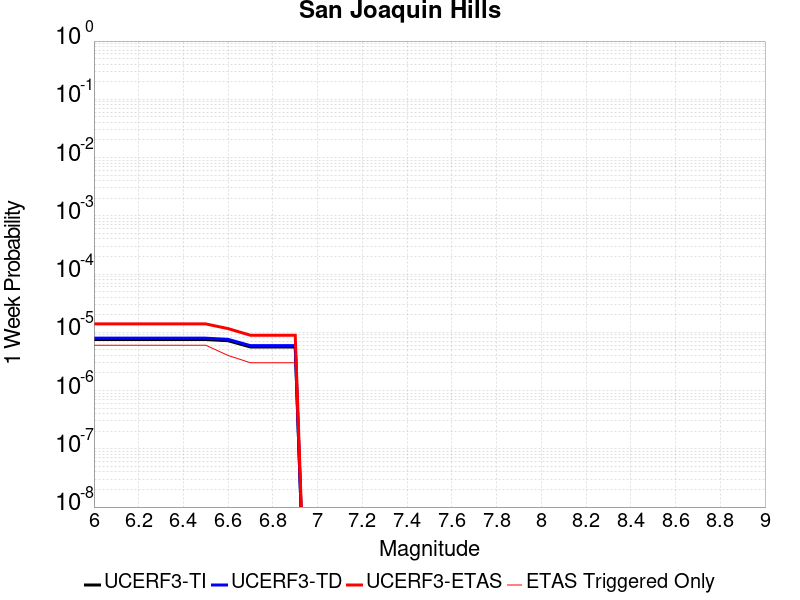 |  |  |  |

| Magnitude | 1 wk TI Prob | 1 wk TD Prob | 1 wk ETAS Prob | 1 wk ETAS/TD Gain | 1 wk ETAS Triggered Only | 1 mo TI Prob | 1 mo TD Prob | 1 mo ETAS Prob | 1 mo ETAS/TD Gain | 1 mo ETAS Triggered Only | 1 yr TI Prob | 1 yr TD Prob | 1 yr ETAS Prob | 1 yr ETAS/TD Gain | 1 yr ETAS Triggered Only | 10 yr TI Prob | 10 yr TD Prob | 10 yr ETAS Prob | 10 yr ETAS/TD Gain | 10 yr ETAS Triggered Only |
|-----|-----|-----|-----|-----|-----|-----|-----|-----|-----|-----|-----|-----|-----|-----|-----|-----|-----|-----|-----|-----|
| 6.0 | 7.517352E-6 | 7.930626E-6 | 1.39305785E-5 | 1.7565547 | 6.0E-6 | 3.2216827E-5 | 3.398822E-5 | 4.1987947E-5 | 1.2353677 | 8.0E-6 | 3.9216926E-4 | 4.137751E-4 | 4.2577012E-4 | 1.0289893 | 1.2E-5 | 0.003914779 | 0.0041346652 | 0.004151595 | 1.0040946 | 1.7E-5 |
| 6.1 | 7.517352E-6 | 7.930626E-6 | 1.39305785E-5 | 1.7565547 | 6.0E-6 | 3.2216827E-5 | 3.398822E-5 | 4.1987947E-5 | 1.2353677 | 8.0E-6 | 3.9216926E-4 | 4.137751E-4 | 4.2577012E-4 | 1.0289893 | 1.2E-5 | 0.003914779 | 0.0041346652 | 0.004151595 | 1.0040946 | 1.7E-5 |
| 6.2 | 7.517352E-6 | 7.930626E-6 | 1.39305785E-5 | 1.7565547 | 6.0E-6 | 3.2216827E-5 | 3.398822E-5 | 4.1987947E-5 | 1.2353677 | 8.0E-6 | 3.9216926E-4 | 4.137751E-4 | 4.2577012E-4 | 1.0289893 | 1.2E-5 | 0.003914779 | 0.0041346652 | 0.004151595 | 1.0040946 | 1.7E-5 |
| 6.3 | 7.517352E-6 | 7.930626E-6 | 1.39305785E-5 | 1.7565547 | 6.0E-6 | 3.2216827E-5 | 3.398822E-5 | 4.1987947E-5 | 1.2353677 | 8.0E-6 | 3.9216926E-4 | 4.137751E-4 | 4.2577012E-4 | 1.0289893 | 1.2E-5 | 0.003914779 | 0.0041346652 | 0.004151595 | 1.0040946 | 1.7E-5 |
| 6.4 | 7.517352E-6 | 7.930626E-6 | 1.39305785E-5 | 1.7565547 | 6.0E-6 | 3.2216827E-5 | 3.398822E-5 | 4.1987947E-5 | 1.2353677 | 8.0E-6 | 3.9216926E-4 | 4.137751E-4 | 4.2577012E-4 | 1.0289893 | 1.2E-5 | 0.003914779 | 0.0041346652 | 0.004151595 | 1.0040946 | 1.7E-5 |
| 6.5 | 7.517352E-6 | 7.930626E-6 | 1.39305785E-5 | 1.7565547 | 6.0E-6 | 3.2216827E-5 | 3.398822E-5 | 4.1987947E-5 | 1.2353677 | 8.0E-6 | 3.9216926E-4 | 4.137751E-4 | 4.2577012E-4 | 1.0289893 | 1.2E-5 | 0.003914779 | 0.0041346652 | 0.004151595 | 1.0040946 | 1.7E-5 |
| 6.6 | 7.1722156E-6 | 7.567309E-6 | 1.1567278E-5 | 1.5285854 | 4.0E-6 | 3.0737705E-5 | 3.2431184E-5 | 3.843099E-5 | 1.1850011 | 6.0E-6 | 3.7416728E-4 | 3.9482507E-4 | 4.0382153E-4 | 1.0227859 | 9.0E-6 | 0.003735379 | 0.003945838 | 0.003959783 | 1.0035341 | 1.4E-5 |
| 6.7 | 5.595255E-6 | 5.8979463E-6 | 8.897929E-6 | 1.5086486 | 3.0E-6 | 2.3979444E-5 | 2.5276911E-5 | 3.0276786E-5 | 1.197804 | 5.0E-6 | 2.9191063E-4 | 3.077464E-4 | 3.1574394E-4 | 1.0259874 | 8.0E-6 | 0.0029152746 | 0.003077464 | 0.003090424 | 1.0042113 | 1.3E-5 |
| 6.8 | 5.595255E-6 | 5.8979463E-6 | 8.897929E-6 | 1.5086486 | 3.0E-6 | 2.3979444E-5 | 2.5276911E-5 | 3.0276786E-5 | 1.197804 | 5.0E-6 | 2.9191063E-4 | 3.077464E-4 | 3.1574394E-4 | 1.0259874 | 8.0E-6 | 0.0029152746 | 0.003077464 | 0.003090424 | 1.0042113 | 1.3E-5 |
| 6.9 | 5.595255E-6 | 5.8979463E-6 | 8.897929E-6 | 1.5086486 | 3.0E-6 | 2.3979444E-5 | 2.5276911E-5 | 3.0276786E-5 | 1.197804 | 5.0E-6 | 2.9191063E-4 | 3.077464E-4 | 3.1574394E-4 | 1.0259874 | 8.0E-6 | 0.0029152746 | 0.003077464 | 0.003090424 | 1.0042113 | 1.3E-5 |

## Newport-Inglewood alt 1
*[(top)](#table-of-contents)*

| 1 Week | 1 Month | 1 Year | 10 Year |
|-----|-----|-----|-----|
|  |  |  |  |

| Magnitude | 1 wk TI Prob | 1 wk TD Prob | 1 wk ETAS Prob | 1 wk ETAS/TD Gain | 1 wk ETAS Triggered Only | 1 mo TI Prob | 1 mo TD Prob | 1 mo ETAS Prob | 1 mo ETAS/TD Gain | 1 mo ETAS Triggered Only | 1 yr TI Prob | 1 yr TD Prob | 1 yr ETAS Prob | 1 yr ETAS/TD Gain | 1 yr ETAS Triggered Only | 10 yr TI Prob | 10 yr TD Prob | 10 yr ETAS Prob | 10 yr ETAS/TD Gain | 10 yr ETAS Triggered Only |
|-----|-----|-----|-----|-----|-----|-----|-----|-----|-----|-----|-----|-----|-----|-----|-----|-----|-----|-----|-----|-----|
| 6.0 | 1.1148327E-5 | 8.39976E-6 | 1.53997E-5 | 1.8333502 | 7.0E-6 | 4.777767E-5 | 3.599853E-5 | 4.3998243E-5 | 1.2222233 | 8.0E-6 | 5.8153784E-4 | 4.3820433E-4 | 4.521982E-4 | 1.0319346 | 1.4E-5 | 0.005800184 | 0.0043744235 | 0.0043913494 | 1.0038692 | 1.7E-5 |
| 6.1 | 1.1148327E-5 | 8.39976E-6 | 1.53997E-5 | 1.8333502 | 7.0E-6 | 4.777767E-5 | 3.599853E-5 | 4.3998243E-5 | 1.2222233 | 8.0E-6 | 5.8153784E-4 | 4.3820433E-4 | 4.521982E-4 | 1.0319346 | 1.4E-5 | 0.005800184 | 0.0043744235 | 0.0043913494 | 1.0038692 | 1.7E-5 |
| 6.2 | 1.1148327E-5 | 8.39976E-6 | 1.53997E-5 | 1.8333502 | 7.0E-6 | 4.777767E-5 | 3.599853E-5 | 4.3998243E-5 | 1.2222233 | 8.0E-6 | 5.8153784E-4 | 4.3820433E-4 | 4.521982E-4 | 1.0319346 | 1.4E-5 | 0.005800184 | 0.0043744235 | 0.0043913494 | 1.0038692 | 1.7E-5 |
| 6.3 | 1.1148327E-5 | 8.39976E-6 | 1.53997E-5 | 1.8333502 | 7.0E-6 | 4.777767E-5 | 3.599853E-5 | 4.3998243E-5 | 1.2222233 | 8.0E-6 | 5.8153784E-4 | 4.3820433E-4 | 4.521982E-4 | 1.0319346 | 1.4E-5 | 0.005800184 | 0.0043744235 | 0.0043913494 | 1.0038692 | 1.7E-5 |
| 6.4 | 1.1148327E-5 | 8.39976E-6 | 1.53997E-5 | 1.8333502 | 7.0E-6 | 4.777767E-5 | 3.599853E-5 | 4.3998243E-5 | 1.2222233 | 8.0E-6 | 5.8153784E-4 | 4.3820433E-4 | 4.521982E-4 | 1.0319346 | 1.4E-5 | 0.005800184 | 0.0043744235 | 0.0043913494 | 1.0038692 | 1.7E-5 |
| 6.5 | 1.1148327E-5 | 8.39976E-6 | 1.53997E-5 | 1.8333502 | 7.0E-6 | 4.777767E-5 | 3.599853E-5 | 4.3998243E-5 | 1.2222233 | 8.0E-6 | 5.8153784E-4 | 4.3820433E-4 | 4.521982E-4 | 1.0319346 | 1.4E-5 | 0.005800184 | 0.0043744235 | 0.0043913494 | 1.0038692 | 1.7E-5 |
| 6.6 | 1.00224415E-5 | 7.532022E-6 | 1.4531969E-5 | 1.9293582 | 7.0E-6 | 4.2952615E-5 | 3.2279753E-5 | 4.0279494E-5 | 1.2478254 | 8.0E-6 | 5.228226E-4 | 3.9294525E-4 | 4.0594014E-4 | 1.0330704 | 1.3E-5 | 0.005215943 | 0.0039235037 | 0.003938445 | 1.0038081 | 1.5E-5 |
| 6.7 | 8.770557E-6 | 6.5171002E-6 | 1.2517061E-5 | 1.9206488 | 6.0E-6 | 3.7587557E-5 | 2.7930188E-5 | 3.492999E-5 | 1.2506179 | 7.0E-6 | 4.575324E-4 | 3.400069E-4 | 3.520028E-4 | 1.0352814 | 1.2E-5 | 0.0045659156 | 0.0033958422 | 0.0034097945 | 1.0041087 | 1.4E-5 |
| 6.8 | 8.263289E-6 | 6.1460423E-6 | 1.2146005E-5 | 1.9762319 | 6.0E-6 | 3.5413614E-5 | 2.633997E-5 | 3.3339787E-5 | 1.2657487 | 7.0E-6 | 4.3107543E-4 | 3.206518E-4 | 3.3264796E-4 | 1.0374118 | 1.2E-5 | 0.0043024016 | 0.0032028586 | 0.0032168138 | 1.0043571 | 1.4E-5 |
| 6.9 | 7.711276E-6 | 5.7474776E-6 | 1.1747443E-5 | 2.0439303 | 6.0E-6 | 3.304791E-5 | 2.4631869E-5 | 3.16317E-5 | 1.2841777 | 7.0E-6 | 4.0228397E-4 | 2.9986154E-4 | 3.1185793E-4 | 1.0400065 | 1.2E-5 | 0.004015565 | 0.0029955322 | 0.0030094902 | 1.0046597 | 1.4E-5 |
| 7.0 | 6.9854723E-6 | 5.2637565E-6 | 1.1263725E-5 | 2.1398644 | 6.0E-6 | 2.9937395E-5 | 2.2558817E-5 | 2.8558681E-5 | 1.2659653 | 6.0E-6 | 3.644268E-4 | 2.7462872E-4 | 2.856257E-4 | 1.0400431 | 1.1E-5 | 0.0036382976 | 0.0027438495 | 0.0027568138 | 1.0047249 | 1.3E-5 |
| 7.1 | 6.123445E-6 | 4.66162E-6 | 9.661597E-6 | 2.0725834 | 5.0E-6 | 2.6243071E-5 | 1.9978273E-5 | 2.4978173E-5 | 1.2502669 | 5.0E-6 | 3.1946256E-4 | 2.4321795E-4 | 2.51216E-4 | 1.0328844 | 8.0E-6 | 0.0031900369 | 0.0024304604 | 0.002440436 | 1.0041045 | 1.0E-5 |
| 7.2 | 3.0524068E-6 | 2.3598534E-6 | 3.359851E-6 | 1.4237541 | 1.0E-6 | 1.3081678E-5 | 1.011364E-5 | 1.111363E-5 | 1.0988754 | 1.0E-6 | 1.5925779E-4 | 1.2313046E-4 | 1.2513022E-4 | 1.016241 | 2.0E-6 | 0.001591437 | 0.001231 | 0.0012339962 | 1.002434 | 3.0E-6 |
| 7.3 | 2.8490606E-6 | 2.204696E-6 | 3.204694E-6 | 1.4535762 | 1.0E-6 | 1.2210203E-5 | 9.448685E-6 | 1.0448675E-5 | 1.1058339 | 1.0E-6 | 1.4864908E-4 | 1.1503552E-4 | 1.17035284E-4 | 1.0173839 | 2.0E-6 | 0.0014854969 | 0.0011501369 | 0.0011531335 | 1.0026054 | 3.0E-6 |
| 7.4 | 2.5994284E-6 | 2.0116724E-6 | 3.0116705E-6 | 1.4970978 | 1.0E-6 | 1.114036E-5 | 8.621447E-6 | 9.621438E-6 | 1.1159889 | 1.0E-6 | 1.3562544E-4 | 1.049649E-4 | 1.0696469E-4 | 1.019052 | 2.0E-6 | 0.0013554269 | 0.00104953 | 0.0010525269 | 1.0028554 | 3.0E-6 |
| 7.5 | 2.2517988E-6 | 1.7516537E-6 | 2.751652E-6 | 1.570888 | 1.0E-6 | 9.650531E-6 | 7.5070875E-6 | 8.50708E-6 | 1.1332065 | 1.0E-6 | 1.17488875E-4 | 9.139879E-5 | 9.339861E-5 | 1.0218801 | 2.0E-6 | 0.0011742678 | 9.1398787E-4 | 9.159861E-4 | 1.0021862 | 2.0E-6 |

## North Frontal  (East)
*[(top)](#table-of-contents)*

| 1 Week | 1 Month | 1 Year | 10 Year |
|-----|-----|-----|-----|
|  |  |  | 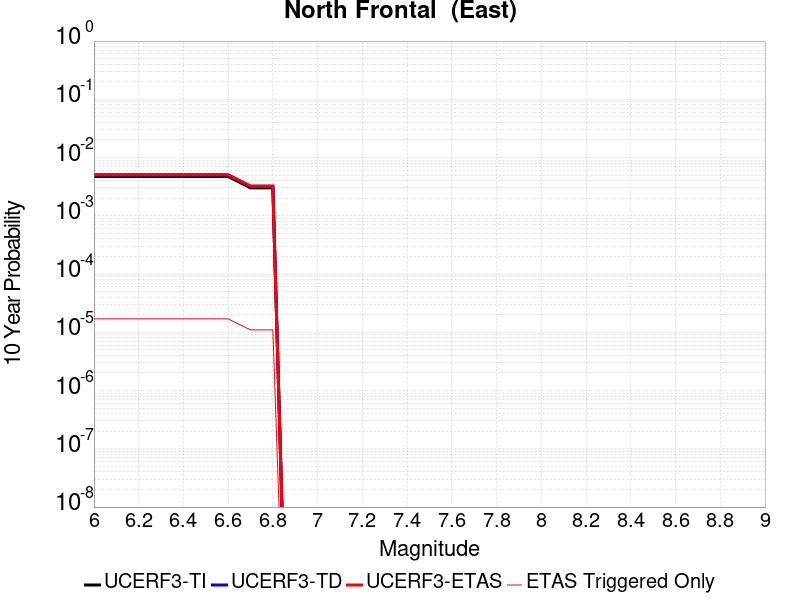 |

| Magnitude | 1 wk TI Prob | 1 wk TD Prob | 1 wk ETAS Prob | 1 wk ETAS/TD Gain | 1 wk ETAS Triggered Only | 1 mo TI Prob | 1 mo TD Prob | 1 mo ETAS Prob | 1 mo ETAS/TD Gain | 1 mo ETAS Triggered Only | 1 yr TI Prob | 1 yr TD Prob | 1 yr ETAS Prob | 1 yr ETAS/TD Gain | 1 yr ETAS Triggered Only | 10 yr TI Prob | 10 yr TD Prob | 10 yr ETAS Prob | 10 yr ETAS/TD Gain | 10 yr ETAS Triggered Only |
|-----|-----|-----|-----|-----|-----|-----|-----|-----|-----|-----|-----|-----|-----|-----|-----|-----|-----|-----|-----|-----|
| 6.0 | 9.1043175E-6 | 9.692292E-6 | 1.4692244E-5 | 1.5158688 | 5.0E-6 | 3.901792E-5 | 4.153805E-5 | 4.75378E-5 | 1.1444398 | 6.0E-6 | 4.7493965E-4 | 5.0566456E-4 | 5.16659E-4 | 1.0217426 | 1.1E-5 | 0.004739259 | 0.0050506443 | 0.0050675585 | 1.003349 | 1.7E-5 |
| 6.1 | 9.1043175E-6 | 9.692292E-6 | 1.4692244E-5 | 1.5158688 | 5.0E-6 | 3.901792E-5 | 4.153805E-5 | 4.75378E-5 | 1.1444398 | 6.0E-6 | 4.7493965E-4 | 5.0566456E-4 | 5.16659E-4 | 1.0217426 | 1.1E-5 | 0.004739259 | 0.0050506443 | 0.0050675585 | 1.003349 | 1.7E-5 |
| 6.2 | 9.1043175E-6 | 9.692292E-6 | 1.4692244E-5 | 1.5158688 | 5.0E-6 | 3.901792E-5 | 4.153805E-5 | 4.75378E-5 | 1.1444398 | 6.0E-6 | 4.7493965E-4 | 5.0566456E-4 | 5.16659E-4 | 1.0217426 | 1.1E-5 | 0.004739259 | 0.0050506443 | 0.0050675585 | 1.003349 | 1.7E-5 |
| 6.3 | 9.1043175E-6 | 9.692292E-6 | 1.4692244E-5 | 1.5158688 | 5.0E-6 | 3.901792E-5 | 4.153805E-5 | 4.75378E-5 | 1.1444398 | 6.0E-6 | 4.7493965E-4 | 5.0566456E-4 | 5.16659E-4 | 1.0217426 | 1.1E-5 | 0.004739259 | 0.0050506443 | 0.0050675585 | 1.003349 | 1.7E-5 |
| 6.4 | 9.1043175E-6 | 9.692292E-6 | 1.4692244E-5 | 1.5158688 | 5.0E-6 | 3.901792E-5 | 4.153805E-5 | 4.75378E-5 | 1.1444398 | 6.0E-6 | 4.7493965E-4 | 5.0566456E-4 | 5.16659E-4 | 1.0217426 | 1.1E-5 | 0.004739259 | 0.0050506443 | 0.0050675585 | 1.003349 | 1.7E-5 |
| 6.5 | 9.1043175E-6 | 9.692292E-6 | 1.4692244E-5 | 1.5158688 | 5.0E-6 | 3.901792E-5 | 4.153805E-5 | 4.75378E-5 | 1.1444398 | 6.0E-6 | 4.7493965E-4 | 5.0566456E-4 | 5.16659E-4 | 1.0217426 | 1.1E-5 | 0.004739259 | 0.0050506443 | 0.0050675585 | 1.003349 | 1.7E-5 |
| 6.6 | 9.1043175E-6 | 9.692292E-6 | 1.4692244E-5 | 1.5158688 | 5.0E-6 | 3.901792E-5 | 4.153805E-5 | 4.75378E-5 | 1.1444398 | 6.0E-6 | 4.7493965E-4 | 5.0566456E-4 | 5.16659E-4 | 1.0217426 | 1.1E-5 | 0.004739259 | 0.0050506443 | 0.0050675585 | 1.003349 | 1.7E-5 |
| 6.7 | 5.803986E-6 | 6.1718774E-6 | 9.171859E-6 | 1.4860728 | 3.0E-6 | 2.4873989E-5 | 2.6450904E-5 | 3.0450798E-5 | 1.1512196 | 4.0E-6 | 3.0279873E-4 | 3.2203976E-4 | 3.290375E-4 | 1.0217295 | 7.0E-6 | 0.0030238647 | 0.0032203975 | 0.0032313622 | 1.0034047 | 1.1E-5 |
| 6.8 | 5.803986E-6 | 6.1718774E-6 | 9.171859E-6 | 1.4860728 | 3.0E-6 | 2.4873989E-5 | 2.6450904E-5 | 3.0450798E-5 | 1.1512196 | 4.0E-6 | 3.0279873E-4 | 3.2203976E-4 | 3.290375E-4 | 1.0217295 | 7.0E-6 | 0.0030238647 | 0.0032203975 | 0.0032313622 | 1.0034047 | 1.1E-5 |

## Rodgers Creek - Healdsburg 2011 CFM
*[(top)](#table-of-contents)*

| 1 Week | 1 Month | 1 Year | 10 Year |
|-----|-----|-----|-----|
|  |  |  |  |

| Magnitude | 1 wk TI Prob | 1 wk TD Prob | 1 wk ETAS Prob | 1 wk ETAS/TD Gain | 1 wk ETAS Triggered Only | 1 mo TI Prob | 1 mo TD Prob | 1 mo ETAS Prob | 1 mo ETAS/TD Gain | 1 mo ETAS Triggered Only | 1 yr TI Prob | 1 yr TD Prob | 1 yr ETAS Prob | 1 yr ETAS/TD Gain | 1 yr ETAS Triggered Only | 10 yr TI Prob | 10 yr TD Prob | 10 yr ETAS Prob | 10 yr ETAS/TD Gain | 10 yr ETAS Triggered Only |
|-----|-----|-----|-----|-----|-----|-----|-----|-----|-----|-----|-----|-----|-----|-----|-----|-----|-----|-----|-----|-----|
| 6.0 | 9.830927E-5 | 2.4955187E-4 | 2.5255114E-4 | 1.0120186 | 3.0E-6 | 4.212574E-4 | 0.0010693158 | 0.0010743105 | 1.0046709 | 5.0E-6 | 0.0051167537 | 0.012984863 | 0.012994733 | 1.0007601 | 1.0E-5 | 0.05000532 | 0.12216672 | 0.12217989 | 1.0001078 | 1.5E-5 |
| 6.1 | 9.830927E-5 | 2.4955187E-4 | 2.5255114E-4 | 1.0120186 | 3.0E-6 | 4.212574E-4 | 0.0010693158 | 0.0010743105 | 1.0046709 | 5.0E-6 | 0.0051167537 | 0.012984863 | 0.012994733 | 1.0007601 | 1.0E-5 | 0.05000532 | 0.12216672 | 0.12217989 | 1.0001078 | 1.5E-5 |
| 6.2 | 9.830927E-5 | 2.4955187E-4 | 2.5255114E-4 | 1.0120186 | 3.0E-6 | 4.212574E-4 | 0.0010693158 | 0.0010743105 | 1.0046709 | 5.0E-6 | 0.0051167537 | 0.012984863 | 0.012994733 | 1.0007601 | 1.0E-5 | 0.05000532 | 0.12216672 | 0.12217989 | 1.0001078 | 1.5E-5 |
| 6.3 | 9.830927E-5 | 2.4955187E-4 | 2.5255114E-4 | 1.0120186 | 3.0E-6 | 4.212574E-4 | 0.0010693158 | 0.0010743105 | 1.0046709 | 5.0E-6 | 0.0051167537 | 0.012984863 | 0.012994733 | 1.0007601 | 1.0E-5 | 0.05000532 | 0.12216672 | 0.12217989 | 1.0001078 | 1.5E-5 |
| 6.4 | 9.830927E-5 | 2.4955187E-4 | 2.5255114E-4 | 1.0120186 | 3.0E-6 | 4.212574E-4 | 0.0010693158 | 0.0010743105 | 1.0046709 | 5.0E-6 | 0.0051167537 | 0.012984863 | 0.012994733 | 1.0007601 | 1.0E-5 | 0.05000532 | 0.12216672 | 0.12217989 | 1.0001078 | 1.5E-5 |
| 6.5 | 9.830927E-5 | 2.4955187E-4 | 2.5255114E-4 | 1.0120186 | 3.0E-6 | 4.212574E-4 | 0.0010693158 | 0.0010743105 | 1.0046709 | 5.0E-6 | 0.0051167537 | 0.012984863 | 0.012994733 | 1.0007601 | 1.0E-5 | 0.05000532 | 0.12216672 | 0.12217989 | 1.0001078 | 1.5E-5 |
| 6.6 | 9.722793E-5 | 2.4745433E-4 | 2.504536E-4 | 1.0121205 | 3.0E-6 | 4.1662456E-4 | 0.001060334 | 0.0010653287 | 1.0047104 | 5.0E-6 | 0.0050606127 | 0.012876847 | 0.012886718 | 1.0007666 | 1.0E-5 | 0.049469102 | 0.12122572 | 0.1212389 | 1.0001087 | 1.5E-5 |
| 6.7 | 9.631043E-5 | 2.4569524E-4 | 2.486945E-4 | 1.0122073 | 3.0E-6 | 4.1269368E-4 | 0.0010528011 | 0.0010577958 | 1.0047443 | 5.0E-6 | 0.0050129755 | 0.012786214 | 0.012796086 | 1.0007721 | 1.0E-5 | 0.049013894 | 0.12043094 | 0.120444134 | 1.0001096 | 1.5E-5 |
| 6.8 | 9.5157004E-5 | 2.4311169E-4 | 2.4611095E-4 | 1.012337 | 3.0E-6 | 4.0775197E-4 | 0.0010417376 | 0.0010467324 | 1.0047947 | 5.0E-6 | 0.0049530854 | 0.012653089 | 0.012662963 | 1.0007803 | 1.0E-5 | 0.048441324 | 0.1192606 | 0.11927382 | 1.0001107 | 1.5E-5 |
| 6.9 | 9.3715214E-5 | 2.3986747E-4 | 2.4286675E-4 | 1.0125039 | 3.0E-6 | 4.015748E-4 | 0.0010278448 | 0.0010328398 | 1.0048596 | 5.0E-6 | 0.004878218 | 0.012485896 | 0.012495771 | 1.000791 | 1.0E-5 | 0.047725122 | 0.11779124 | 0.117804475 | 1.0001123 | 1.5E-5 |
| 7.0 | 9.21773E-5 | 2.3636219E-4 | 2.3936149E-4 | 1.0126894 | 3.0E-6 | 3.9498575E-4 | 0.0010128339 | 0.0010178289 | 1.0049317 | 5.0E-6 | 0.0047983527 | 0.012305218 | 0.0123150945 | 1.0008026 | 1.0E-5 | 0.046960585 | 0.11620537 | 0.11621775 | 1.0001065 | 1.4E-5 |
| 7.1 | 1.8670535E-5 | 4.6669888E-5 | 4.766984E-5 | 1.0214261 | 1.0E-6 | 8.001412E-5 | 2.0000339E-4 | 2.0100317E-4 | 1.0049989 | 1.0E-6 | 9.737365E-4 | 0.0024331913 | 0.002436184 | 1.00123 | 3.0E-6 | 0.009694808 | 0.023618827 | 0.023624685 | 1.0002481 | 6.0E-6 |
| 7.2 | 6.6138855E-6 | 1.8792352E-5 | 1.9792335E-5 | 1.0532122 | 1.0E-6 | 2.8344915E-5 | 8.053787E-5 | 8.153779E-5 | 1.0124155 | 1.0E-6 | 3.4504468E-4 | 9.8041E-4 | 9.83407E-4 | 1.003057 | 3.0E-6 | 0.0034450945 | 0.009560432 | 0.009565384 | 1.000518 | 5.0E-6 |
| 7.3 | 5.4382035E-6 | 1.5442325E-5 | 1.6442309E-5 | 1.064756 | 1.0E-6 | 2.3306378E-5 | 6.618139E-5 | 6.7181325E-5 | 1.015109 | 1.0E-6 | 2.8371823E-4 | 8.0575846E-4 | 8.0875604E-4 | 1.0037202 | 3.0E-6 | 0.0028335627 | 0.007868089 | 0.00787305 | 1.0006305 | 5.0E-6 |

## Round Valley
*[(top)](#table-of-contents)*

| 1 Week | 1 Month | 1 Year | 10 Year |
|-----|-----|-----|-----|
|  |  |  |  |

| Magnitude | 1 wk TI Prob | 1 wk TD Prob | 1 wk ETAS Prob | 1 wk ETAS/TD Gain | 1 wk ETAS Triggered Only | 1 mo TI Prob | 1 mo TD Prob | 1 mo ETAS Prob | 1 mo ETAS/TD Gain | 1 mo ETAS Triggered Only | 1 yr TI Prob | 1 yr TD Prob | 1 yr ETAS Prob | 1 yr ETAS/TD Gain | 1 yr ETAS Triggered Only | 10 yr TI Prob | 10 yr TD Prob | 10 yr ETAS Prob | 10 yr ETAS/TD Gain | 10 yr ETAS Triggered Only |
|-----|-----|-----|-----|-----|-----|-----|-----|-----|-----|-----|-----|-----|-----|-----|-----|-----|-----|-----|-----|-----|
| 6.0 | 1.5129573E-5 | 1.668525E-5 | 2.3685134E-5 | 1.4195253 | 7.0E-6 | 6.483941E-5 | 7.1506845E-5 | 8.05062E-5 | 1.1258531 | 9.0E-6 | 7.8913395E-4 | 8.7035226E-4 | 8.793445E-4 | 1.0103316 | 9.0E-6 | 0.007863375 | 0.008679682 | 0.008693561 | 1.001599 | 1.4E-5 |
| 6.1 | 1.5129573E-5 | 1.668525E-5 | 2.3685134E-5 | 1.4195253 | 7.0E-6 | 6.483941E-5 | 7.1506845E-5 | 8.05062E-5 | 1.1258531 | 9.0E-6 | 7.8913395E-4 | 8.7035226E-4 | 8.793445E-4 | 1.0103316 | 9.0E-6 | 0.007863375 | 0.008679682 | 0.008693561 | 1.001599 | 1.4E-5 |
| 6.2 | 1.5129573E-5 | 1.668525E-5 | 2.3685134E-5 | 1.4195253 | 7.0E-6 | 6.483941E-5 | 7.1506845E-5 | 8.05062E-5 | 1.1258531 | 9.0E-6 | 7.8913395E-4 | 8.7035226E-4 | 8.793445E-4 | 1.0103316 | 9.0E-6 | 0.007863375 | 0.008679682 | 0.008693561 | 1.001599 | 1.4E-5 |
| 6.3 | 1.5129573E-5 | 1.668525E-5 | 2.3685134E-5 | 1.4195253 | 7.0E-6 | 6.483941E-5 | 7.1506845E-5 | 8.05062E-5 | 1.1258531 | 9.0E-6 | 7.8913395E-4 | 8.7035226E-4 | 8.793445E-4 | 1.0103316 | 9.0E-6 | 0.007863375 | 0.008679682 | 0.008693561 | 1.001599 | 1.4E-5 |
| 6.4 | 1.5129573E-5 | 1.668525E-5 | 2.3685134E-5 | 1.4195253 | 7.0E-6 | 6.483941E-5 | 7.1506845E-5 | 8.05062E-5 | 1.1258531 | 9.0E-6 | 7.8913395E-4 | 8.7035226E-4 | 8.793445E-4 | 1.0103316 | 9.0E-6 | 0.007863375 | 0.008679682 | 0.008693561 | 1.001599 | 1.4E-5 |
| 6.5 | 1.5129573E-5 | 1.668525E-5 | 2.3685134E-5 | 1.4195253 | 7.0E-6 | 6.483941E-5 | 7.1506845E-5 | 8.05062E-5 | 1.1258531 | 9.0E-6 | 7.8913395E-4 | 8.7035226E-4 | 8.793445E-4 | 1.0103316 | 9.0E-6 | 0.007863375 | 0.008679682 | 0.008693561 | 1.001599 | 1.4E-5 |
| 6.6 | 1.4434947E-5 | 1.5912143E-5 | 2.291203E-5 | 1.4399086 | 7.0E-6 | 6.186259E-5 | 6.81937E-5 | 7.7193086E-5 | 1.131968 | 9.0E-6 | 7.529168E-4 | 8.3004584E-4 | 8.390384E-4 | 1.0108337 | 9.0E-6 | 0.0075037093 | 0.00827966 | 0.008293543 | 1.0016769 | 1.4E-5 |
| 6.7 | 1.15477105E-5 | 1.2717341E-5 | 1.7717277E-5 | 1.3931589 | 5.0E-6 | 4.948925E-5 | 5.4502318E-5 | 6.150194E-5 | 1.1284279 | 7.0E-6 | 6.02365E-4 | 6.6346437E-4 | 6.704597E-4 | 1.0105437 | 7.0E-6 | 0.0060073487 | 0.0066247126 | 0.0066346466 | 1.0014995 | 1.0E-5 |
| 6.8 | 8.959772E-6 | 9.845762E-6 | 1.1845742E-5 | 1.2031311 | 2.0E-6 | 3.8398455E-5 | 4.2195978E-5 | 4.519585E-5 | 1.0710938 | 3.0E-6 | 4.674009E-4 | 5.1371043E-4 | 5.167089E-4 | 1.0058368 | 3.0E-6 | 0.0046641906 | 0.0051345914 | 0.0051395656 | 1.0009688 | 5.0E-6 |
| 6.9 | 7.926176E-6 | 8.705021E-6 | 9.705012E-6 | 1.1148752 | 1.0E-6 | 3.3968885E-5 | 3.7307233E-5 | 3.930716E-5 | 1.0536069 | 2.0E-6 | 4.1349267E-4 | 4.5421557E-4 | 4.5621468E-4 | 1.0044012 | 2.0E-6 | 0.004127241 | 0.0045421557 | 0.0045461375 | 1.0008767 | 4.0E-6 |
| 7.0 | 7.926176E-6 | 8.705021E-6 | 9.705012E-6 | 1.1148752 | 1.0E-6 | 3.3968885E-5 | 3.7307233E-5 | 3.930716E-5 | 1.0536069 | 2.0E-6 | 4.1349267E-4 | 4.5421557E-4 | 4.5621468E-4 | 1.0044012 | 2.0E-6 | 0.004127241 | 0.0045421557 | 0.0045461375 | 1.0008767 | 4.0E-6 |

## Hunting Creek - Berryessa 2011 CFM
*[(top)](#table-of-contents)*

| 1 Week | 1 Month | 1 Year | 10 Year |
|-----|-----|-----|-----|
|  |  |  |  |

| Magnitude | 1 wk TI Prob | 1 wk TD Prob | 1 wk ETAS Prob | 1 wk ETAS/TD Gain | 1 wk ETAS Triggered Only | 1 mo TI Prob | 1 mo TD Prob | 1 mo ETAS Prob | 1 mo ETAS/TD Gain | 1 mo ETAS Triggered Only | 1 yr TI Prob | 1 yr TD Prob | 1 yr ETAS Prob | 1 yr ETAS/TD Gain | 1 yr ETAS Triggered Only | 10 yr TI Prob | 10 yr TD Prob | 10 yr ETAS Prob | 10 yr ETAS/TD Gain | 10 yr ETAS Triggered Only |
|-----|-----|-----|-----|-----|-----|-----|-----|-----|-----|-----|-----|-----|-----|-----|-----|-----|-----|-----|-----|-----|
| 6.0 | 8.539243E-5 | 1.6866675E-4 | 1.736659E-4 | 1.0296392 | 5.0E-6 | 3.6591623E-4 | 7.2268036E-4 | 7.276767E-4 | 1.0069137 | 5.0E-6 | 0.004445933 | 0.008761587 | 0.00877249 | 1.0012444 | 1.1E-5 | 0.04358031 | 0.08407048 | 0.084083304 | 1.0001525 | 1.4E-5 |
| 6.1 | 8.539243E-5 | 1.6866675E-4 | 1.736659E-4 | 1.0296392 | 5.0E-6 | 3.6591623E-4 | 7.2268036E-4 | 7.276767E-4 | 1.0069137 | 5.0E-6 | 0.004445933 | 0.008761587 | 0.00877249 | 1.0012444 | 1.1E-5 | 0.04358031 | 0.08407048 | 0.084083304 | 1.0001525 | 1.4E-5 |
| 6.2 | 8.539243E-5 | 1.6866675E-4 | 1.736659E-4 | 1.0296392 | 5.0E-6 | 3.6591623E-4 | 7.2268036E-4 | 7.276767E-4 | 1.0069137 | 5.0E-6 | 0.004445933 | 0.008761587 | 0.00877249 | 1.0012444 | 1.1E-5 | 0.04358031 | 0.08407048 | 0.084083304 | 1.0001525 | 1.4E-5 |
| 6.3 | 8.539243E-5 | 1.6866675E-4 | 1.736659E-4 | 1.0296392 | 5.0E-6 | 3.6591623E-4 | 7.2268036E-4 | 7.276767E-4 | 1.0069137 | 5.0E-6 | 0.004445933 | 0.008761587 | 0.00877249 | 1.0012444 | 1.1E-5 | 0.04358031 | 0.08407048 | 0.084083304 | 1.0001525 | 1.4E-5 |
| 6.4 | 8.539243E-5 | 1.6866675E-4 | 1.736659E-4 | 1.0296392 | 5.0E-6 | 3.6591623E-4 | 7.2268036E-4 | 7.276767E-4 | 1.0069137 | 5.0E-6 | 0.004445933 | 0.008761587 | 0.00877249 | 1.0012444 | 1.1E-5 | 0.04358031 | 0.08407048 | 0.084083304 | 1.0001525 | 1.4E-5 |
| 6.5 | 8.539243E-5 | 1.6866675E-4 | 1.736659E-4 | 1.0296392 | 5.0E-6 | 3.6591623E-4 | 7.2268036E-4 | 7.276767E-4 | 1.0069137 | 5.0E-6 | 0.004445933 | 0.008761587 | 0.00877249 | 1.0012444 | 1.1E-5 | 0.04358031 | 0.08407048 | 0.084083304 | 1.0001525 | 1.4E-5 |
| 6.6 | 8.234729E-5 | 1.6319305E-4 | 1.6819223E-4 | 1.0306336 | 5.0E-6 | 3.528692E-4 | 6.9923437E-4 | 7.0423086E-4 | 1.0071456 | 5.0E-6 | 0.004287722 | 0.008478905 | 0.008489812 | 1.0012864 | 1.1E-5 | 0.042059302 | 0.0815029 | 0.08151484 | 1.0001465 | 1.3E-5 |
| 6.7 | 6.651597E-5 | 1.3351835E-4 | 1.3851769E-4 | 1.037443 | 5.0E-6 | 2.8503727E-4 | 5.7215174E-4 | 5.7714886E-4 | 1.008734 | 5.0E-6 | 0.0034648073 | 0.006946119 | 0.0069550565 | 1.0012867 | 9.0E-6 | 0.034112815 | 0.06753316 | 0.06754342 | 1.0001519 | 1.1E-5 |
| 6.8 | 5.133638E-5 | 1.0202814E-4 | 1.0602773E-4 | 1.0392009 | 4.0E-6 | 2.199945E-4 | 4.3726346E-4 | 4.412617E-4 | 1.0091438 | 4.0E-6 | 0.0026751433 | 0.005315561 | 0.005321529 | 1.0011227 | 6.0E-6 | 0.026431682 | 0.052353263 | 0.052360844 | 1.0001448 | 8.0E-6 |
| 6.9 | 5.133638E-5 | 1.0202814E-4 | 1.0602773E-4 | 1.0392009 | 4.0E-6 | 2.199945E-4 | 4.3726346E-4 | 4.412617E-4 | 1.0091438 | 4.0E-6 | 0.0026751433 | 0.005315561 | 0.005321529 | 1.0011227 | 6.0E-6 | 0.026431682 | 0.052353263 | 0.052360844 | 1.0001448 | 8.0E-6 |

## Casmalia 2011 CFM
*[(top)](#table-of-contents)*

| 1 Week | 1 Month | 1 Year | 10 Year |
|-----|-----|-----|-----|
|  |  |  |  |

| Magnitude | 1 wk TI Prob | 1 wk TD Prob | 1 wk ETAS Prob | 1 wk ETAS/TD Gain | 1 wk ETAS Triggered Only | 1 mo TI Prob | 1 mo TD Prob | 1 mo ETAS Prob | 1 mo ETAS/TD Gain | 1 mo ETAS Triggered Only | 1 yr TI Prob | 1 yr TD Prob | 1 yr ETAS Prob | 1 yr ETAS/TD Gain | 1 yr ETAS Triggered Only | 10 yr TI Prob | 10 yr TD Prob | 10 yr ETAS Prob | 10 yr ETAS/TD Gain | 10 yr ETAS Triggered Only |
|-----|-----|-----|-----|-----|-----|-----|-----|-----|-----|-----|-----|-----|-----|-----|-----|-----|-----|-----|-----|-----|
| 6.0 | 4.5215784E-6 | 4.6811892E-6 | 7.681175E-6 | 1.6408598 | 3.0E-6 | 1.9378049E-5 | 2.0062238E-5 | 2.5062138E-5 | 1.2492194 | 5.0E-6 | 2.359022E-4 | 2.4425777E-4 | 2.5325557E-4 | 1.0368373 | 9.0E-6 | 0.0023565195 | 0.0024425776 | 0.0024565433 | 1.0057176 | 1.4E-5 |
| 6.1 | 4.5215784E-6 | 4.6811892E-6 | 7.681175E-6 | 1.6408598 | 3.0E-6 | 1.9378049E-5 | 2.0062238E-5 | 2.5062138E-5 | 1.2492194 | 5.0E-6 | 2.359022E-4 | 2.4425777E-4 | 2.5325557E-4 | 1.0368373 | 9.0E-6 | 0.0023565195 | 0.0024425776 | 0.0024565433 | 1.0057176 | 1.4E-5 |
| 6.2 | 4.5215784E-6 | 4.6811892E-6 | 7.681175E-6 | 1.6408598 | 3.0E-6 | 1.9378049E-5 | 2.0062238E-5 | 2.5062138E-5 | 1.2492194 | 5.0E-6 | 2.359022E-4 | 2.4425777E-4 | 2.5325557E-4 | 1.0368373 | 9.0E-6 | 0.0023565195 | 0.0024425776 | 0.0024565433 | 1.0057176 | 1.4E-5 |
| 6.3 | 4.5215784E-6 | 4.6811892E-6 | 7.681175E-6 | 1.6408598 | 3.0E-6 | 1.9378049E-5 | 2.0062238E-5 | 2.5062138E-5 | 1.2492194 | 5.0E-6 | 2.359022E-4 | 2.4425777E-4 | 2.5325557E-4 | 1.0368373 | 9.0E-6 | 0.0023565195 | 0.0024425776 | 0.0024565433 | 1.0057176 | 1.4E-5 |
| 6.4 | 4.5215784E-6 | 4.6811892E-6 | 7.681175E-6 | 1.6408598 | 3.0E-6 | 1.9378049E-5 | 2.0062238E-5 | 2.5062138E-5 | 1.2492194 | 5.0E-6 | 2.359022E-4 | 2.4425777E-4 | 2.5325557E-4 | 1.0368373 | 9.0E-6 | 0.0023565195 | 0.0024425776 | 0.0024565433 | 1.0057176 | 1.4E-5 |
| 6.5 | 4.5215784E-6 | 4.6811892E-6 | 7.681175E-6 | 1.6408598 | 3.0E-6 | 1.9378049E-5 | 2.0062238E-5 | 2.5062138E-5 | 1.2492194 | 5.0E-6 | 2.359022E-4 | 2.4425777E-4 | 2.5325557E-4 | 1.0368373 | 9.0E-6 | 0.0023565195 | 0.0024425776 | 0.0024565433 | 1.0057176 | 1.4E-5 |

## Robinson Creek
*[(top)](#table-of-contents)*

| 1 Week | 1 Month | 1 Year | 10 Year |
|-----|-----|-----|-----|
|  |  |  |  |

| Magnitude | 1 wk TI Prob | 1 wk TD Prob | 1 wk ETAS Prob | 1 wk ETAS/TD Gain | 1 wk ETAS Triggered Only | 1 mo TI Prob | 1 mo TD Prob | 1 mo ETAS Prob | 1 mo ETAS/TD Gain | 1 mo ETAS Triggered Only | 1 yr TI Prob | 1 yr TD Prob | 1 yr ETAS Prob | 1 yr ETAS/TD Gain | 1 yr ETAS Triggered Only | 10 yr TI Prob | 10 yr TD Prob | 10 yr ETAS Prob | 10 yr ETAS/TD Gain | 10 yr ETAS Triggered Only |
|-----|-----|-----|-----|-----|-----|-----|-----|-----|-----|-----|-----|-----|-----|-----|-----|-----|-----|-----|-----|-----|
| 6.0 | 1.0723721E-5 | 1.1667189E-5 | 1.4667155E-5 | 1.2571284 | 3.0E-6 | 4.5957993E-5 | 5.000224E-5 | 5.600194E-5 | 1.1199887 | 6.0E-6 | 5.593949E-4 | 6.087773E-4 | 6.147736E-4 | 1.0098498 | 6.0E-6 | 0.0055798884 | 0.0060877725 | 0.0061006937 | 1.0021224 | 1.3E-5 |
| 6.1 | 1.0723721E-5 | 1.1667189E-5 | 1.4667155E-5 | 1.2571284 | 3.0E-6 | 4.5957993E-5 | 5.000224E-5 | 5.600194E-5 | 1.1199887 | 6.0E-6 | 5.593949E-4 | 6.087773E-4 | 6.147736E-4 | 1.0098498 | 6.0E-6 | 0.0055798884 | 0.0060877725 | 0.0061006937 | 1.0021224 | 1.3E-5 |
| 6.2 | 1.0723721E-5 | 1.1667189E-5 | 1.4667155E-5 | 1.2571284 | 3.0E-6 | 4.5957993E-5 | 5.000224E-5 | 5.600194E-5 | 1.1199887 | 6.0E-6 | 5.593949E-4 | 6.087773E-4 | 6.147736E-4 | 1.0098498 | 6.0E-6 | 0.0055798884 | 0.0060877725 | 0.0061006937 | 1.0021224 | 1.3E-5 |
| 6.3 | 1.0723721E-5 | 1.1667189E-5 | 1.4667155E-5 | 1.2571284 | 3.0E-6 | 4.5957993E-5 | 5.000224E-5 | 5.600194E-5 | 1.1199887 | 6.0E-6 | 5.593949E-4 | 6.087773E-4 | 6.147736E-4 | 1.0098498 | 6.0E-6 | 0.0055798884 | 0.0060877725 | 0.0061006937 | 1.0021224 | 1.3E-5 |
| 6.4 | 1.0723721E-5 | 1.1667189E-5 | 1.4667155E-5 | 1.2571284 | 3.0E-6 | 4.5957993E-5 | 5.000224E-5 | 5.600194E-5 | 1.1199887 | 6.0E-6 | 5.593949E-4 | 6.087773E-4 | 6.147736E-4 | 1.0098498 | 6.0E-6 | 0.0055798884 | 0.0060877725 | 0.0061006937 | 1.0021224 | 1.3E-5 |
| 6.5 | 1.0723721E-5 | 1.1667189E-5 | 1.4667155E-5 | 1.2571284 | 3.0E-6 | 4.5957993E-5 | 5.000224E-5 | 5.600194E-5 | 1.1199887 | 6.0E-6 | 5.593949E-4 | 6.087773E-4 | 6.147736E-4 | 1.0098498 | 6.0E-6 | 0.0055798884 | 0.0060877725 | 0.0061006937 | 1.0021224 | 1.3E-5 |

## San Luis Range 2011 CFM
*[(top)](#table-of-contents)*

| 1 Week | 1 Month | 1 Year | 10 Year |
|-----|-----|-----|-----|
|  |  |  |  |

| Magnitude | 1 wk TI Prob | 1 wk TD Prob | 1 wk ETAS Prob | 1 wk ETAS/TD Gain | 1 wk ETAS Triggered Only | 1 mo TI Prob | 1 mo TD Prob | 1 mo ETAS Prob | 1 mo ETAS/TD Gain | 1 mo ETAS Triggered Only | 1 yr TI Prob | 1 yr TD Prob | 1 yr ETAS Prob | 1 yr ETAS/TD Gain | 1 yr ETAS Triggered Only | 10 yr TI Prob | 10 yr TD Prob | 10 yr ETAS Prob | 10 yr ETAS/TD Gain | 10 yr ETAS Triggered Only |
|-----|-----|-----|-----|-----|-----|-----|-----|-----|-----|-----|-----|-----|-----|-----|-----|-----|-----|-----|-----|-----|
| 6.0 | 2.8589725E-6 | 2.906881E-6 | 6.9068697E-6 | 2.3760412 | 4.0E-6 | 1.2252682E-5 | 1.24580165E-5 | 1.8457942E-5 | 1.4816116 | 6.0E-6 | 1.491662E-4 | 1.5166836E-4 | 1.6166683E-4 | 1.0659233 | 1.0E-5 | 0.0014906611 | 0.0015158989 | 0.0015288792 | 1.0085628 | 1.3E-5 |
| 6.1 | 2.8589725E-6 | 2.906881E-6 | 6.9068697E-6 | 2.3760412 | 4.0E-6 | 1.2252682E-5 | 1.24580165E-5 | 1.8457942E-5 | 1.4816116 | 6.0E-6 | 1.491662E-4 | 1.5166836E-4 | 1.6166683E-4 | 1.0659233 | 1.0E-5 | 0.0014906611 | 0.0015158989 | 0.0015288792 | 1.0085628 | 1.3E-5 |
| 6.2 | 2.8589725E-6 | 2.906881E-6 | 6.9068697E-6 | 2.3760412 | 4.0E-6 | 1.2252682E-5 | 1.24580165E-5 | 1.8457942E-5 | 1.4816116 | 6.0E-6 | 1.491662E-4 | 1.5166836E-4 | 1.6166683E-4 | 1.0659233 | 1.0E-5 | 0.0014906611 | 0.0015158989 | 0.0015288792 | 1.0085628 | 1.3E-5 |
| 6.3 | 2.8589725E-6 | 2.906881E-6 | 6.9068697E-6 | 2.3760412 | 4.0E-6 | 1.2252682E-5 | 1.24580165E-5 | 1.8457942E-5 | 1.4816116 | 6.0E-6 | 1.491662E-4 | 1.5166836E-4 | 1.6166683E-4 | 1.0659233 | 1.0E-5 | 0.0014906611 | 0.0015158989 | 0.0015288792 | 1.0085628 | 1.3E-5 |
| 6.4 | 2.8589725E-6 | 2.906881E-6 | 6.9068697E-6 | 2.3760412 | 4.0E-6 | 1.2252682E-5 | 1.24580165E-5 | 1.8457942E-5 | 1.4816116 | 6.0E-6 | 1.491662E-4 | 1.5166836E-4 | 1.6166683E-4 | 1.0659233 | 1.0E-5 | 0.0014906611 | 0.0015158989 | 0.0015288792 | 1.0085628 | 1.3E-5 |
| 6.5 | 2.8589725E-6 | 2.906881E-6 | 6.9068697E-6 | 2.3760412 | 4.0E-6 | 1.2252682E-5 | 1.24580165E-5 | 1.8457942E-5 | 1.4816116 | 6.0E-6 | 1.491662E-4 | 1.5166836E-4 | 1.6166683E-4 | 1.0659233 | 1.0E-5 | 0.0014906611 | 0.0015158989 | 0.0015288792 | 1.0085628 | 1.3E-5 |
| 6.6 | 2.4544863E-6 | 2.495234E-6 | 4.495229E-6 | 1.8015261 | 2.0E-6 | 1.0519184E-5 | 1.06938305E-5 | 1.3693799E-5 | 1.2805326 | 3.0E-6 | 1.2806353E-4 | 1.3019213E-4 | 1.3719121E-4 | 1.0537597 | 7.0E-6 | 0.0012798976 | 0.0013014051 | 0.001311392 | 1.007674 | 1.0E-5 |
| 6.7 | 2.1688998E-6 | 2.204711E-6 | 4.204707E-6 | 1.9071463 | 2.0E-6 | 9.295252E-6 | 9.448742E-6 | 1.2448713E-5 | 1.3174996 | 3.0E-6 | 1.1316381E-4 | 1.1503485E-4 | 1.2203404E-4 | 1.0608442 | 7.0E-6 | 0.001131062 | 0.0011499968 | 0.0011599853 | 1.0086857 | 1.0E-5 |
| 6.8 | 1.9191828E-6 | 1.950576E-6 | 3.950572E-6 | 2.0253363 | 2.0E-6 | 8.2250435E-6 | 8.359599E-6 | 1.1359573E-5 | 1.3588659 | 3.0E-6 | 1.001353E-4 | 1.01775826E-4 | 1.08775115E-4 | 1.0687716 | 7.0E-6 | 0.0010009019 | 0.0010175342 | 0.001027524 | 1.0098177 | 1.0E-5 |
| 6.9 | 1.6115068E-6 | 1.6374516E-6 | 3.6374483E-6 | 2.2214081 | 2.0E-6 | 6.9064395E-6 | 7.0176447E-6 | 1.0017624E-5 | 1.4274908 | 3.0E-6 | 8.4082654E-5 | 8.5438915E-5 | 9.14384E-5 | 1.0702196 | 6.0E-6 | 8.405085E-4 | 8.543001E-4 | 8.6329243E-4 | 1.010526 | 9.0E-6 |
| 7.0 | 1.367995E-6 | 1.3898027E-6 | 3.3898E-6 | 2.4390512 | 2.0E-6 | 5.8628225E-6 | 5.956297E-6 | 7.956285E-6 | 1.335777 | 2.0E-6 | 7.137752E-5 | 7.251792E-5 | 7.651763E-5 | 1.0551548 | 4.0E-6 | 7.13546E-4 | 7.251792E-4 | 7.3217414E-4 | 1.0096458 | 7.0E-6 |
| 7.1 | 1.367995E-6 | 1.3898027E-6 | 3.3898E-6 | 2.4390512 | 2.0E-6 | 5.8628225E-6 | 5.956297E-6 | 7.956285E-6 | 1.335777 | 2.0E-6 | 7.137752E-5 | 7.251792E-5 | 7.651763E-5 | 1.0551548 | 4.0E-6 | 7.13546E-4 | 7.251792E-4 | 7.3217414E-4 | 1.0096458 | 7.0E-6 |

## Great Valley 07 (Orestimba)
*[(top)](#table-of-contents)*

| 1 Week | 1 Month | 1 Year | 10 Year |
|-----|-----|-----|-----|
|  |  |  |  |

| Magnitude | 1 wk TI Prob | 1 wk TD Prob | 1 wk ETAS Prob | 1 wk ETAS/TD Gain | 1 wk ETAS Triggered Only | 1 mo TI Prob | 1 mo TD Prob | 1 mo ETAS Prob | 1 mo ETAS/TD Gain | 1 mo ETAS Triggered Only | 1 yr TI Prob | 1 yr TD Prob | 1 yr ETAS Prob | 1 yr ETAS/TD Gain | 1 yr ETAS Triggered Only | 10 yr TI Prob | 10 yr TD Prob | 10 yr ETAS Prob | 10 yr ETAS/TD Gain | 10 yr ETAS Triggered Only |
|-----|-----|-----|-----|-----|-----|-----|-----|-----|-----|-----|-----|-----|-----|-----|-----|-----|-----|-----|-----|-----|
| 6.0 | 2.841624E-5 | 3.5190245E-5 | 3.7190177E-5 | 1.056832 | 2.0E-6 | 1.21778205E-4 | 1.5081046E-4 | 1.5480985E-4 | 1.0265194 | 4.0E-6 | 0.0014816412 | 0.0018352446 | 0.00184323 | 1.0043511 | 8.0E-6 | 0.014718015 | 0.018267011 | 0.018279774 | 1.0006987 | 1.3E-5 |
| 6.1 | 2.841624E-5 | 3.5190245E-5 | 3.7190177E-5 | 1.056832 | 2.0E-6 | 1.21778205E-4 | 1.5081046E-4 | 1.5480985E-4 | 1.0265194 | 4.0E-6 | 0.0014816412 | 0.0018352446 | 0.00184323 | 1.0043511 | 8.0E-6 | 0.014718015 | 0.018267011 | 0.018279774 | 1.0006987 | 1.3E-5 |
| 6.2 | 2.841624E-5 | 3.5190245E-5 | 3.7190177E-5 | 1.056832 | 2.0E-6 | 1.21778205E-4 | 1.5081046E-4 | 1.5480985E-4 | 1.0265194 | 4.0E-6 | 0.0014816412 | 0.0018352446 | 0.00184323 | 1.0043511 | 8.0E-6 | 0.014718015 | 0.018267011 | 0.018279774 | 1.0006987 | 1.3E-5 |
| 6.3 | 2.841624E-5 | 3.5190245E-5 | 3.7190177E-5 | 1.056832 | 2.0E-6 | 1.21778205E-4 | 1.5081046E-4 | 1.5480985E-4 | 1.0265194 | 4.0E-6 | 0.0014816412 | 0.0018352446 | 0.00184323 | 1.0043511 | 8.0E-6 | 0.014718015 | 0.018267011 | 0.018279774 | 1.0006987 | 1.3E-5 |
| 6.4 | 2.841624E-5 | 3.5190245E-5 | 3.7190177E-5 | 1.056832 | 2.0E-6 | 1.21778205E-4 | 1.5081046E-4 | 1.5480985E-4 | 1.0265194 | 4.0E-6 | 0.0014816412 | 0.0018352446 | 0.00184323 | 1.0043511 | 8.0E-6 | 0.014718015 | 0.018267011 | 0.018279774 | 1.0006987 | 1.3E-5 |
| 6.5 | 2.841624E-5 | 3.5190245E-5 | 3.7190177E-5 | 1.056832 | 2.0E-6 | 1.21778205E-4 | 1.5081046E-4 | 1.5480985E-4 | 1.0265194 | 4.0E-6 | 0.0014816412 | 0.0018352446 | 0.00184323 | 1.0043511 | 8.0E-6 | 0.014718015 | 0.018267011 | 0.018279774 | 1.0006987 | 1.3E-5 |
| 6.6 | 1.9500372E-5 | 2.4072657E-5 | 2.5072632E-5 | 1.0415399 | 1.0E-6 | 8.357035E-5 | 1.03168066E-4 | 1.06167754E-4 | 1.0290757 | 3.0E-6 | 0.001016994 | 0.0012559886 | 0.0012629798 | 1.0055662 | 7.0E-6 | 0.010123523 | 0.012551772 | 0.012561646 | 1.0007867 | 1.0E-5 |
| 6.7 | 1.83568E-5 | 2.264984E-5 | 2.3649816E-5 | 1.0441494 | 1.0E-6 | 7.866963E-5 | 9.707074E-5 | 1.0007045E-4 | 1.0309023 | 3.0E-6 | 9.5738185E-4 | 0.0011818361 | 0.0011878291 | 1.0050708 | 6.0E-6 | 0.009532678 | 0.011818337 | 0.01182723 | 1.0007526 | 9.0E-6 |

## Calaveras (So) 2011 CFM
*[(top)](#table-of-contents)*

| 1 Week | 1 Month | 1 Year | 10 Year |
|-----|-----|-----|-----|
|  |  |  |  |

| Magnitude | 1 wk TI Prob | 1 wk TD Prob | 1 wk ETAS Prob | 1 wk ETAS/TD Gain | 1 wk ETAS Triggered Only | 1 mo TI Prob | 1 mo TD Prob | 1 mo ETAS Prob | 1 mo ETAS/TD Gain | 1 mo ETAS Triggered Only | 1 yr TI Prob | 1 yr TD Prob | 1 yr ETAS Prob | 1 yr ETAS/TD Gain | 1 yr ETAS Triggered Only | 10 yr TI Prob | 10 yr TD Prob | 10 yr ETAS Prob | 10 yr ETAS/TD Gain | 10 yr ETAS Triggered Only |
|-----|-----|-----|-----|-----|-----|-----|-----|-----|-----|-----|-----|-----|-----|-----|-----|-----|-----|-----|-----|-----|
| 6.0 | 1.00604906E-4 | 2.1600646E-4 | 2.2300496E-4 | 1.0323994 | 7.0E-6 | 4.3109263E-4 | 9.255689E-4 | 9.3256246E-4 | 1.007556 | 7.0E-6 | 0.0052359286 | 0.0112380525 | 0.01124794 | 1.0008799 | 1.0E-5 | 0.05114268 | 0.102641135 | 0.10265191 | 1.0001049 | 1.2E-5 |
| 6.1 | 1.00604906E-4 | 2.1600646E-4 | 2.2300496E-4 | 1.0323994 | 7.0E-6 | 4.3109263E-4 | 9.255689E-4 | 9.3256246E-4 | 1.007556 | 7.0E-6 | 0.0052359286 | 0.0112380525 | 0.01124794 | 1.0008799 | 1.0E-5 | 0.05114268 | 0.102641135 | 0.10265191 | 1.0001049 | 1.2E-5 |
| 6.2 | 1.00604906E-4 | 2.1600646E-4 | 2.2300496E-4 | 1.0323994 | 7.0E-6 | 4.3109263E-4 | 9.255689E-4 | 9.3256246E-4 | 1.007556 | 7.0E-6 | 0.0052359286 | 0.0112380525 | 0.01124794 | 1.0008799 | 1.0E-5 | 0.05114268 | 0.102641135 | 0.10265191 | 1.0001049 | 1.2E-5 |
| 6.3 | 1.00604906E-4 | 2.1600646E-4 | 2.2300496E-4 | 1.0323994 | 7.0E-6 | 4.3109263E-4 | 9.255689E-4 | 9.3256246E-4 | 1.007556 | 7.0E-6 | 0.0052359286 | 0.0112380525 | 0.01124794 | 1.0008799 | 1.0E-5 | 0.05114268 | 0.102641135 | 0.10265191 | 1.0001049 | 1.2E-5 |
| 6.4 | 1.00604906E-4 | 2.1600646E-4 | 2.2300496E-4 | 1.0323994 | 7.0E-6 | 4.3109263E-4 | 9.255689E-4 | 9.3256246E-4 | 1.007556 | 7.0E-6 | 0.0052359286 | 0.0112380525 | 0.01124794 | 1.0008799 | 1.0E-5 | 0.05114268 | 0.102641135 | 0.10265191 | 1.0001049 | 1.2E-5 |
| 6.5 | 3.6232093E-5 | 8.0470694E-5 | 8.3470455E-5 | 1.0372777 | 3.0E-6 | 1.5527116E-4 | 3.448549E-4 | 3.4785387E-4 | 1.0086963 | 3.0E-6 | 0.0018887871 | 0.004195091 | 0.004199074 | 1.0009495 | 4.0E-6 | 0.018728139 | 0.040133998 | 0.0401388 | 1.0001196 | 5.0E-6 |
| 6.6 | 3.4288823E-5 | 7.645369E-5 | 7.945346E-5 | 1.0392364 | 3.0E-6 | 1.4694381E-4 | 3.2764356E-4 | 3.306426E-4 | 1.0091532 | 3.0E-6 | 0.0017875729 | 0.003986383 | 0.003990367 | 1.0009995 | 4.0E-6 | 0.017732618 | 0.03829094 | 0.03829575 | 1.0001255 | 5.0E-6 |
| 6.7 | 3.365726E-5 | 7.5152966E-5 | 7.8152734E-5 | 1.0399156 | 3.0E-6 | 1.4423742E-4 | 3.220704E-4 | 3.2506944E-4 | 1.0093117 | 3.0E-6 | 0.001754676 | 0.003918774 | 0.003922758 | 1.0010167 | 4.0E-6 | 0.017408855 | 0.037675563 | 0.037680376 | 1.0001277 | 5.0E-6 |
| 6.8 | 2.9146076E-5 | 6.459388E-5 | 6.759368E-5 | 1.0464411 | 3.0E-6 | 1.2490578E-4 | 2.768274E-4 | 2.7982658E-4 | 1.0108341 | 3.0E-6 | 0.001519667 | 0.0033697556 | 0.0033727454 | 1.0008873 | 3.0E-6 | 0.015093167 | 0.032588553 | 0.032592423 | 1.0001187 | 4.0E-6 |
| 6.9 | 2.7363296E-5 | 6.059934E-5 | 6.359916E-5 | 1.0495025 | 3.0E-6 | 1.1726599E-4 | 2.5971147E-4 | 2.6271067E-4 | 1.0115483 | 3.0E-6 | 0.0014267784 | 0.003161987 | 0.0031649775 | 1.0009458 | 3.0E-6 | 0.014176525 | 0.030637112 | 0.030640988 | 1.0001266 | 4.0E-6 |

## Elsinore (Coyote Mountains)
*[(top)](#table-of-contents)*

| 1 Week | 1 Month | 1 Year | 10 Year |
|-----|-----|-----|-----|
|  |  |  |  |

| Magnitude | 1 wk TI Prob | 1 wk TD Prob | 1 wk ETAS Prob | 1 wk ETAS/TD Gain | 1 wk ETAS Triggered Only | 1 mo TI Prob | 1 mo TD Prob | 1 mo ETAS Prob | 1 mo ETAS/TD Gain | 1 mo ETAS Triggered Only | 1 yr TI Prob | 1 yr TD Prob | 1 yr ETAS Prob | 1 yr ETAS/TD Gain | 1 yr ETAS Triggered Only | 10 yr TI Prob | 10 yr TD Prob | 10 yr ETAS Prob | 10 yr ETAS/TD Gain | 10 yr ETAS Triggered Only |
|-----|-----|-----|-----|-----|-----|-----|-----|-----|-----|-----|-----|-----|-----|-----|-----|-----|-----|-----|-----|-----|
| 6.0 | 3.0311965E-5 | 3.994109E-5 | 4.194101E-5 | 1.0500717 | 2.0E-6 | 1.2990195E-4 | 1.7116935E-4 | 1.7516867E-4 | 1.0233647 | 4.0E-6 | 0.0015804088 | 0.0020827882 | 0.0020927673 | 1.0047913 | 1.0E-5 | 0.015692165 | 0.020715257 | 0.020727009 | 1.0005673 | 1.2E-5 |
| 6.1 | 3.0311965E-5 | 3.994109E-5 | 4.194101E-5 | 1.0500717 | 2.0E-6 | 1.2990195E-4 | 1.7116935E-4 | 1.7516867E-4 | 1.0233647 | 4.0E-6 | 0.0015804088 | 0.0020827882 | 0.0020927673 | 1.0047913 | 1.0E-5 | 0.015692165 | 0.020715257 | 0.020727009 | 1.0005673 | 1.2E-5 |
| 6.2 | 3.0311965E-5 | 3.994109E-5 | 4.194101E-5 | 1.0500717 | 2.0E-6 | 1.2990195E-4 | 1.7116935E-4 | 1.7516867E-4 | 1.0233647 | 4.0E-6 | 0.0015804088 | 0.0020827882 | 0.0020927673 | 1.0047913 | 1.0E-5 | 0.015692165 | 0.020715257 | 0.020727009 | 1.0005673 | 1.2E-5 |
| 6.3 | 3.0311965E-5 | 3.994109E-5 | 4.194101E-5 | 1.0500717 | 2.0E-6 | 1.2990195E-4 | 1.7116935E-4 | 1.7516867E-4 | 1.0233647 | 4.0E-6 | 0.0015804088 | 0.0020827882 | 0.0020927673 | 1.0047913 | 1.0E-5 | 0.015692165 | 0.020715257 | 0.020727009 | 1.0005673 | 1.2E-5 |
| 6.4 | 3.0311965E-5 | 3.994109E-5 | 4.194101E-5 | 1.0500717 | 2.0E-6 | 1.2990195E-4 | 1.7116935E-4 | 1.7516867E-4 | 1.0233647 | 4.0E-6 | 0.0015804088 | 0.0020827882 | 0.0020927673 | 1.0047913 | 1.0E-5 | 0.015692165 | 0.020715257 | 0.020727009 | 1.0005673 | 1.2E-5 |
| 6.5 | 3.0311965E-5 | 3.994109E-5 | 4.194101E-5 | 1.0500717 | 2.0E-6 | 1.2990195E-4 | 1.7116935E-4 | 1.7516867E-4 | 1.0233647 | 4.0E-6 | 0.0015804088 | 0.0020827882 | 0.0020927673 | 1.0047913 | 1.0E-5 | 0.015692165 | 0.020715257 | 0.020727009 | 1.0005673 | 1.2E-5 |
| 6.6 | 3.0265346E-5 | 3.988092E-5 | 4.188084E-5 | 1.0501473 | 2.0E-6 | 1.2970218E-4 | 1.7091153E-4 | 1.7491085E-4 | 1.0234 | 4.0E-6 | 0.0015779801 | 0.0020796552 | 0.0020896345 | 1.0047985 | 1.0E-5 | 0.01566822 | 0.020684522 | 0.020696273 | 1.0005682 | 1.2E-5 |
| 6.7 | 3.0194358E-5 | 3.978925E-5 | 4.178917E-5 | 1.0502628 | 2.0E-6 | 1.2939797E-4 | 1.705187E-4 | 1.7451802E-4 | 1.0234538 | 4.0E-6 | 0.0015742818 | 0.002074882 | 0.002084861 | 1.0048095 | 1.0E-5 | 0.01563176 | 0.020637691 | 0.020649442 | 1.0005695 | 1.2E-5 |
| 6.8 | 3.012086E-5 | 3.969423E-5 | 4.169415E-5 | 1.0503832 | 2.0E-6 | 1.2908301E-4 | 1.7011153E-4 | 1.7411084E-4 | 1.02351 | 4.0E-6 | 0.0015704527 | 0.002069934 | 0.0020799132 | 1.0048211 | 1.0E-5 | 0.0155940065 | 0.020589132 | 0.020600885 | 1.0005708 | 1.2E-5 |
| 6.9 | 1.1573938E-5 | 1.5760072E-5 | 1.776004E-5 | 1.126901 | 2.0E-6 | 4.9601647E-5 | 6.7541885E-5 | 7.054168E-5 | 1.0444139 | 3.0E-6 | 6.037327E-4 | 8.2209584E-4 | 8.290901E-4 | 1.0085078 | 7.0E-6 | 0.006020951 | 0.0082034515 | 0.008211385 | 1.0009671 | 8.0E-6 |
| 7.0 | 1.1534603E-5 | 1.5714604E-5 | 1.7714572E-5 | 1.1272682 | 2.0E-6 | 4.9433074E-5 | 6.7347035E-5 | 7.034683E-5 | 1.0445424 | 3.0E-6 | 6.016815E-4 | 8.1972533E-4 | 8.2671957E-4 | 1.0085324 | 7.0E-6 | 0.00600055 | 0.008179921 | 0.008187856 | 1.00097 | 8.0E-6 |
| 7.1 | 1.1452482E-5 | 1.5613095E-5 | 1.7613063E-5 | 1.1280956 | 2.0E-6 | 4.908114E-5 | 6.691202E-5 | 6.991182E-5 | 1.044832 | 3.0E-6 | 5.973991E-4 | 8.14433E-4 | 8.2142727E-4 | 1.008588 | 7.0E-6 | 0.0059579564 | 0.008127386 | 0.008135321 | 1.0009763 | 8.0E-6 |
| 7.2 | 1.1348771E-5 | 1.5475387E-5 | 1.7475355E-5 | 1.1292355 | 2.0E-6 | 4.8636684E-5 | 6.632187E-5 | 6.932167E-5 | 1.045231 | 3.0E-6 | 5.919907E-4 | 8.0725324E-4 | 8.142476E-4 | 1.0086644 | 7.0E-6 | 0.005904162 | 0.008056112 | 0.0080640465 | 1.000985 | 8.0E-6 |
| 7.3 | 1.1250434E-5 | 1.531563E-5 | 1.73156E-5 | 1.1305835 | 2.0E-6 | 4.8215254E-5 | 6.5637236E-5 | 6.863704E-5 | 1.0457028 | 3.0E-6 | 5.8686256E-4 | 7.9892395E-4 | 8.0591836E-4 | 1.0087547 | 7.0E-6 | 0.005853152 | 0.007973419 | 0.007981355 | 1.0009953 | 8.0E-6 |
| 7.4 | 1.1178093E-5 | 1.5190572E-5 | 1.7190541E-5 | 1.1316586 | 2.0E-6 | 4.7905232E-5 | 6.5101296E-5 | 6.810111E-5 | 1.046079 | 3.0E-6 | 5.830901E-4 | 7.924037E-4 | 7.9939817E-4 | 1.0088269 | 7.0E-6 | 0.005815625 | 0.007908682 | 0.007916619 | 1.0010035 | 8.0E-6 |
| 7.5 | 9.060744E-6 | 1.1679365E-5 | 1.3679342E-5 | 1.1712402 | 2.0E-6 | 3.883118E-5 | 5.0053855E-5 | 5.3053707E-5 | 1.0599325 | 3.0E-6 | 4.7266704E-4 | 6.0930493E-4 | 6.143019E-4 | 1.0082011 | 5.0E-6 | 0.0047166296 | 0.0060878657 | 0.006093829 | 1.0009795 | 6.0E-6 |
| 7.6 | 8.950329E-6 | 1.1523338E-5 | 1.3523315E-5 | 1.1735588 | 2.0E-6 | 3.835799E-5 | 4.938519E-5 | 5.2385043E-5 | 1.0607439 | 3.0E-6 | 4.6690844E-4 | 6.0116843E-4 | 6.061654E-4 | 1.0083121 | 5.0E-6 | 0.0046592862 | 0.006006978 | 0.006012942 | 1.0009929 | 6.0E-6 |
| 7.7 | 4.2479364E-6 | 4.9388354E-6 | 4.9388354E-6 | 1.0 | 0.0 | 1.8205315E-5 | 2.116638E-5 | 2.116638E-5 | 1.0 | 0.0 | 2.2162717E-4 | 2.5769032E-4 | 2.596898E-4 | 1.0077592 | 2.0E-6 | 0.0022140627 | 0.002580199 | 0.0025821938 | 1.0007732 | 2.0E-6 |
| 7.8 | 2.1601753E-7 | 2.7489222E-7 | 2.7489222E-7 | 1.0 | 0.0 | 9.257891E-7 | 1.1781094E-6 | 1.1781094E-6 | 1.0 | 0.0 | 1.1271423E-5 | 1.4343483E-5 | 1.4343483E-5 | 1.0 | 0.0 | 1.1270852E-4 | 1.435847E-4 | 1.435847E-4 | 1.0 | 0.0 |

## Rinconada 2011 CFM
*[(top)](#table-of-contents)*

| 1 Week | 1 Month | 1 Year | 10 Year |
|-----|-----|-----|-----|
|  |  |  |  |

| Magnitude | 1 wk TI Prob | 1 wk TD Prob | 1 wk ETAS Prob | 1 wk ETAS/TD Gain | 1 wk ETAS Triggered Only | 1 mo TI Prob | 1 mo TD Prob | 1 mo ETAS Prob | 1 mo ETAS/TD Gain | 1 mo ETAS Triggered Only | 1 yr TI Prob | 1 yr TD Prob | 1 yr ETAS Prob | 1 yr ETAS/TD Gain | 1 yr ETAS Triggered Only | 10 yr TI Prob | 10 yr TD Prob | 10 yr ETAS Prob | 10 yr ETAS/TD Gain | 10 yr ETAS Triggered Only |
|-----|-----|-----|-----|-----|-----|-----|-----|-----|-----|-----|-----|-----|-----|-----|-----|-----|-----|-----|-----|-----|
| 6.0 | 1.1071962E-5 | 1.1724135E-5 | 1.47241E-5 | 1.2558794 | 3.0E-6 | 4.74504E-5 | 5.024544E-5 | 5.624514E-5 | 1.1194078 | 6.0E-6 | 5.775555E-4 | 6.115867E-4 | 6.1958184E-4 | 1.0130727 | 8.0E-6 | 0.0057605673 | 0.006101035 | 0.006111968 | 1.001792 | 1.1E-5 |
| 6.1 | 1.1071962E-5 | 1.1724135E-5 | 1.47241E-5 | 1.2558794 | 3.0E-6 | 4.74504E-5 | 5.024544E-5 | 5.624514E-5 | 1.1194078 | 6.0E-6 | 5.775555E-4 | 6.115867E-4 | 6.1958184E-4 | 1.0130727 | 8.0E-6 | 0.0057605673 | 0.006101035 | 0.006111968 | 1.001792 | 1.1E-5 |
| 6.2 | 1.1071962E-5 | 1.1724135E-5 | 1.47241E-5 | 1.2558794 | 3.0E-6 | 4.74504E-5 | 5.024544E-5 | 5.624514E-5 | 1.1194078 | 6.0E-6 | 5.775555E-4 | 6.115867E-4 | 6.1958184E-4 | 1.0130727 | 8.0E-6 | 0.0057605673 | 0.006101035 | 0.006111968 | 1.001792 | 1.1E-5 |
| 6.3 | 1.1071962E-5 | 1.1724135E-5 | 1.47241E-5 | 1.2558794 | 3.0E-6 | 4.74504E-5 | 5.024544E-5 | 5.624514E-5 | 1.1194078 | 6.0E-6 | 5.775555E-4 | 6.115867E-4 | 6.1958184E-4 | 1.0130727 | 8.0E-6 | 0.0057605673 | 0.006101035 | 0.006111968 | 1.001792 | 1.1E-5 |
| 6.4 | 1.1071962E-5 | 1.1724135E-5 | 1.47241E-5 | 1.2558794 | 3.0E-6 | 4.74504E-5 | 5.024544E-5 | 5.624514E-5 | 1.1194078 | 6.0E-6 | 5.775555E-4 | 6.115867E-4 | 6.1958184E-4 | 1.0130727 | 8.0E-6 | 0.0057605673 | 0.006101035 | 0.006111968 | 1.001792 | 1.1E-5 |
| 6.5 | 1.1071962E-5 | 1.1724135E-5 | 1.47241E-5 | 1.2558794 | 3.0E-6 | 4.74504E-5 | 5.024544E-5 | 5.624514E-5 | 1.1194078 | 6.0E-6 | 5.775555E-4 | 6.115867E-4 | 6.1958184E-4 | 1.0130727 | 8.0E-6 | 0.0057605673 | 0.006101035 | 0.006111968 | 1.001792 | 1.1E-5 |
| 6.6 | 1.0302408E-5 | 1.0909815E-5 | 1.3909782E-5 | 1.2749788 | 3.0E-6 | 4.4152428E-5 | 4.6755624E-5 | 5.2755342E-5 | 1.1283208 | 6.0E-6 | 5.374232E-4 | 5.6912116E-4 | 5.771166E-4 | 1.0140488 | 8.0E-6 | 0.0053612534 | 0.005678627 | 0.0056895646 | 1.0019261 | 1.1E-5 |
| 6.7 | 9.66584E-6 | 1.0235816E-5 | 1.3235785E-5 | 1.2930855 | 3.0E-6 | 4.142437E-5 | 4.386716E-5 | 4.9866896E-5 | 1.1367706 | 6.0E-6 | 5.0422497E-4 | 5.339719E-4 | 5.4196763E-4 | 1.0149741 | 8.0E-6 | 0.005030824 | 0.0053288722 | 0.005339814 | 1.0020533 | 1.1E-5 |
| 6.8 | 8.79599E-6 | 9.312425E-6 | 1.2312397E-5 | 1.3221473 | 3.0E-6 | 3.7696555E-5 | 3.9909897E-5 | 4.5909655E-5 | 1.1503327 | 6.0E-6 | 4.588589E-4 | 4.8581464E-4 | 4.9281126E-4 | 1.0144018 | 7.0E-6 | 0.004579126 | 0.0048494954 | 0.0048594465 | 1.0020521 | 1.0E-5 |
| 6.9 | 7.69202E-6 | 8.138578E-6 | 1.1138553E-5 | 1.3686118 | 3.0E-6 | 3.2965385E-5 | 3.4879264E-5 | 3.987909E-5 | 1.1433467 | 5.0E-6 | 4.0127963E-4 | 4.2459206E-4 | 4.305895E-4 | 1.0141252 | 6.0E-6 | 0.004005558 | 0.004239751 | 0.004247717 | 1.0018789 | 8.0E-6 |
| 7.0 | 6.497495E-6 | 6.8676477E-6 | 9.867627E-6 | 1.4368278 | 3.0E-6 | 2.784611E-5 | 2.9432555E-5 | 3.4432407E-5 | 1.1698749 | 5.0E-6 | 3.3897365E-4 | 3.5830197E-4 | 3.642998E-4 | 1.0167396 | 6.0E-6 | 0.0033845706 | 0.0035791604 | 0.0035871319 | 1.0022272 | 8.0E-6 |
| 7.1 | 5.7995403E-6 | 6.1257683E-6 | 9.12575E-6 | 1.4897314 | 3.0E-6 | 2.4854935E-5 | 2.625314E-5 | 3.0253033E-5 | 1.1523588 | 4.0E-6 | 3.0256683E-4 | 3.196045E-4 | 3.246029E-4 | 1.0156393 | 5.0E-6 | 0.0030215518 | 0.0031933533 | 0.003200331 | 1.0021851 | 7.0E-6 |
| 7.2 | 5.130714E-6 | 5.414656E-6 | 8.4146395E-6 | 1.5540489 | 3.0E-6 | 2.1988588E-5 | 2.320557E-5 | 2.7205477E-5 | 1.1723684 | 4.0E-6 | 2.6767817E-4 | 2.825105E-4 | 2.875091E-4 | 1.0176934 | 5.0E-6 | 0.0026735596 | 0.0028234075 | 0.0028303878 | 1.0024723 | 7.0E-6 |
| 7.3 | 4.295291E-6 | 4.5275724E-6 | 6.5275635E-6 | 1.4417359 | 2.0E-6 | 1.840826E-5 | 1.9403846E-5 | 2.2403787E-5 | 1.1546055 | 3.0E-6 | 2.2409752E-4 | 2.3623534E-4 | 2.402344E-4 | 1.0169283 | 4.0E-6 | 0.0022387167 | 0.0023617179 | 0.0023677037 | 1.0025345 | 6.0E-6 |
| 7.4 | 3.6962015E-6 | 3.894617E-6 | 5.894609E-6 | 1.5135274 | 2.0E-6 | 1.5840767E-5 | 1.6691214E-5 | 1.9691164E-5 | 1.1797323 | 3.0E-6 | 1.9284427E-4 | 2.0321553E-4 | 2.0721472E-4 | 1.0196795 | 4.0E-6 | 0.0019267701 | 0.0020321554 | 0.0020361473 | 1.0019643 | 4.0E-6 |

## Elsinore (Julian)
*[(top)](#table-of-contents)*

| 1 Week | 1 Month | 1 Year | 10 Year |
|-----|-----|-----|-----|
|  |  |  |  |

| Magnitude | 1 wk TI Prob | 1 wk TD Prob | 1 wk ETAS Prob | 1 wk ETAS/TD Gain | 1 wk ETAS Triggered Only | 1 mo TI Prob | 1 mo TD Prob | 1 mo ETAS Prob | 1 mo ETAS/TD Gain | 1 mo ETAS Triggered Only | 1 yr TI Prob | 1 yr TD Prob | 1 yr ETAS Prob | 1 yr ETAS/TD Gain | 1 yr ETAS Triggered Only | 10 yr TI Prob | 10 yr TD Prob | 10 yr ETAS Prob | 10 yr ETAS/TD Gain | 10 yr ETAS Triggered Only |
|-----|-----|-----|-----|-----|-----|-----|-----|-----|-----|-----|-----|-----|-----|-----|-----|-----|-----|-----|-----|-----|
| 6.0 | 1.6316579E-5 | 2.2937022E-5 | 2.4936977E-5 | 1.0871933 | 2.0E-6 | 6.992632E-5 | 9.8298326E-5 | 1.01298036E-4 | 1.0305164 | 3.0E-6 | 8.510204E-4 | 0.0011962154 | 0.0012052046 | 1.0075147 | 9.0E-6 | 0.008477687 | 0.011913514 | 0.011924383 | 1.0009123 | 1.1E-5 |
| 6.1 | 1.6316579E-5 | 2.2937022E-5 | 2.4936977E-5 | 1.0871933 | 2.0E-6 | 6.992632E-5 | 9.8298326E-5 | 1.01298036E-4 | 1.0305164 | 3.0E-6 | 8.510204E-4 | 0.0011962154 | 0.0012052046 | 1.0075147 | 9.0E-6 | 0.008477687 | 0.011913514 | 0.011924383 | 1.0009123 | 1.1E-5 |
| 6.2 | 1.6316579E-5 | 2.2937022E-5 | 2.4936977E-5 | 1.0871933 | 2.0E-6 | 6.992632E-5 | 9.8298326E-5 | 1.01298036E-4 | 1.0305164 | 3.0E-6 | 8.510204E-4 | 0.0011962154 | 0.0012052046 | 1.0075147 | 9.0E-6 | 0.008477687 | 0.011913514 | 0.011924383 | 1.0009123 | 1.1E-5 |
| 6.3 | 1.6316579E-5 | 2.2937022E-5 | 2.4936977E-5 | 1.0871933 | 2.0E-6 | 6.992632E-5 | 9.8298326E-5 | 1.01298036E-4 | 1.0305164 | 3.0E-6 | 8.510204E-4 | 0.0011962154 | 0.0012052046 | 1.0075147 | 9.0E-6 | 0.008477687 | 0.011913514 | 0.011924383 | 1.0009123 | 1.1E-5 |
| 6.4 | 1.6316579E-5 | 2.2937022E-5 | 2.4936977E-5 | 1.0871933 | 2.0E-6 | 6.992632E-5 | 9.8298326E-5 | 1.01298036E-4 | 1.0305164 | 3.0E-6 | 8.510204E-4 | 0.0011962154 | 0.0012052046 | 1.0075147 | 9.0E-6 | 0.008477687 | 0.011913514 | 0.011924383 | 1.0009123 | 1.1E-5 |
| 6.5 | 1.6316579E-5 | 2.2937022E-5 | 2.4936977E-5 | 1.0871933 | 2.0E-6 | 6.992632E-5 | 9.8298326E-5 | 1.01298036E-4 | 1.0305164 | 3.0E-6 | 8.510204E-4 | 0.0011962154 | 0.0012052046 | 1.0075147 | 9.0E-6 | 0.008477687 | 0.011913514 | 0.011924383 | 1.0009123 | 1.1E-5 |
| 6.6 | 1.6187845E-5 | 2.2737193E-5 | 2.4737148E-5 | 1.0879596 | 2.0E-6 | 6.937464E-5 | 9.744198E-5 | 1.0044169E-4 | 1.0307846 | 3.0E-6 | 8.443089E-4 | 0.0011858008 | 0.0011947901 | 1.0075808 | 9.0E-6 | 0.008411082 | 0.01181048 | 0.01182135 | 1.0009204 | 1.1E-5 |
| 6.7 | 1.5985162E-5 | 2.2371887E-5 | 2.4371842E-5 | 1.0893959 | 2.0E-6 | 6.850604E-5 | 9.58765E-5 | 9.887621E-5 | 1.0312873 | 3.0E-6 | 8.3374185E-4 | 0.0011667616 | 0.0011757511 | 1.0077046 | 9.0E-6 | 0.008306207 | 0.011622093 | 0.011632965 | 1.0009354 | 1.1E-5 |
| 6.8 | 1.5961046E-5 | 2.2344699E-5 | 2.4344654E-5 | 1.0895047 | 2.0E-6 | 6.840269E-5 | 9.575999E-5 | 9.87597E-5 | 1.0313253 | 3.0E-6 | 8.324845E-4 | 0.0011653446 | 0.0011743341 | 1.007714 | 9.0E-6 | 0.008293727 | 0.011608072 | 0.011618944 | 1.0009366 | 1.1E-5 |
| 6.9 | 1.5722166E-5 | 2.1942922E-5 | 2.394288E-5 | 1.0911436 | 2.0E-6 | 6.737897E-5 | 9.4038216E-5 | 9.703793E-5 | 1.031899 | 3.0E-6 | 8.2003017E-4 | 0.0011444042 | 0.0011533939 | 1.0078553 | 9.0E-6 | 0.008170107 | 0.011400834 | 0.011411708 | 1.0009538 | 1.1E-5 |
| 7.0 | 1.5513018E-5 | 2.1584812E-5 | 2.358477E-5 | 1.0926558 | 2.0E-6 | 6.648267E-5 | 9.250357E-5 | 9.5503296E-5 | 1.0324281 | 3.0E-6 | 8.0912595E-4 | 0.0011257393 | 0.0011347292 | 1.0079857 | 9.0E-6 | 0.008061862 | 0.011216079 | 0.011226956 | 1.0009698 | 1.1E-5 |
| 7.1 | 1.527908E-5 | 2.1219155E-5 | 2.3219112E-5 | 1.0942525 | 2.0E-6 | 6.5480126E-5 | 9.093658E-5 | 9.39363E-5 | 1.032987 | 3.0E-6 | 7.9692894E-4 | 0.0011066807 | 0.0011156708 | 1.0081234 | 9.0E-6 | 0.007940771 | 0.011027294 | 0.011038173 | 1.0009866 | 1.1E-5 |
| 7.2 | 1.5025522E-5 | 2.082222E-5 | 2.282218E-5 | 1.0960492 | 2.0E-6 | 6.4393505E-5 | 8.9235546E-5 | 9.223528E-5 | 1.033616 | 3.0E-6 | 7.8370894E-4 | 0.0010859915 | 0.0010949817 | 1.0082784 | 9.0E-6 | 0.0078095077 | 0.010822412 | 0.010833293 | 1.0010054 | 1.1E-5 |
| 7.3 | 1.4779679E-5 | 2.0420333E-5 | 2.2420292E-5 | 1.0979396 | 2.0E-6 | 6.333994E-5 | 8.751328E-5 | 9.051302E-5 | 1.0342776 | 3.0E-6 | 7.708909E-4 | 0.0010650436 | 0.001074034 | 1.0084413 | 9.0E-6 | 0.007682222 | 0.010614914 | 0.010625797 | 1.0010253 | 1.1E-5 |
| 7.4 | 1.4238534E-5 | 1.9488383E-5 | 2.1488344E-5 | 1.1026232 | 2.0E-6 | 6.1020863E-5 | 8.351947E-5 | 8.651923E-5 | 1.0359168 | 3.0E-6 | 7.4267574E-4 | 0.001016465 | 0.0010254559 | 1.0088452 | 9.0E-6 | 0.007401986 | 0.010133445 | 0.010144334 | 1.0010746 | 1.1E-5 |
| 7.5 | 1.1924516E-5 | 1.570584E-5 | 1.770581E-5 | 1.1273391 | 2.0E-6 | 5.1104067E-5 | 6.730944E-5 | 7.030924E-5 | 1.0445672 | 3.0E-6 | 6.220144E-4 | 8.192601E-4 | 8.2625437E-4 | 1.0085373 | 7.0E-6 | 0.006202762 | 0.008175999 | 0.008184925 | 1.0010918 | 9.0E-6 |
| 7.6 | 1.0456552E-5 | 1.3574289E-5 | 1.5574262E-5 | 1.1473354 | 2.0E-6 | 4.4813027E-5 | 5.817464E-5 | 6.117446E-5 | 1.0515659 | 3.0E-6 | 5.45462E-4 | 7.081186E-4 | 7.141144E-4 | 1.0084672 | 6.0E-6 | 0.0054412507 | 0.0070718653 | 0.0070788157 | 1.0009829 | 7.0E-6 |
| 7.7 | 4.463199E-6 | 5.214875E-6 | 5.214875E-6 | 1.0 | 0.0 | 1.9127854E-5 | 2.2349386E-5 | 2.2349386E-5 | 1.0 | 0.0 | 2.3285674E-4 | 2.7209E-4 | 2.750892E-4 | 1.0110228 | 3.0E-6 | 0.0023261288 | 0.0027239968 | 0.0027269884 | 1.0010983 | 3.0E-6 |
| 7.8 | 2.1601753E-7 | 2.7489222E-7 | 2.7489222E-7 | 1.0 | 0.0 | 9.257891E-7 | 1.1781094E-6 | 1.1781094E-6 | 1.0 | 0.0 | 1.1271423E-5 | 1.4343483E-5 | 1.4343483E-5 | 1.0 | 0.0 | 1.1270852E-4 | 1.435847E-4 | 1.435847E-4 | 1.0 | 0.0 |

## Ortigalita (South)
*[(top)](#table-of-contents)*

| 1 Week | 1 Month | 1 Year | 10 Year |
|-----|-----|-----|-----|
|  |  |  |  |

| Magnitude | 1 wk TI Prob | 1 wk TD Prob | 1 wk ETAS Prob | 1 wk ETAS/TD Gain | 1 wk ETAS Triggered Only | 1 mo TI Prob | 1 mo TD Prob | 1 mo ETAS Prob | 1 mo ETAS/TD Gain | 1 mo ETAS Triggered Only | 1 yr TI Prob | 1 yr TD Prob | 1 yr ETAS Prob | 1 yr ETAS/TD Gain | 1 yr ETAS Triggered Only | 10 yr TI Prob | 10 yr TD Prob | 10 yr ETAS Prob | 10 yr ETAS/TD Gain | 10 yr ETAS Triggered Only |
|-----|-----|-----|-----|-----|-----|-----|-----|-----|-----|-----|-----|-----|-----|-----|-----|-----|-----|-----|-----|-----|
| 6.0 | 1.4857814E-5 | 1.6363798E-5 | 1.6363798E-5 | 1.0 | 0.0 | 6.3674786E-5 | 7.0129216E-5 | 7.112914E-5 | 1.0142584 | 1.0E-6 | 7.749648E-4 | 8.5358426E-4 | 8.5758086E-4 | 1.0046821 | 4.0E-6 | 0.007722678 | 0.00851246 | 0.008522375 | 1.0011648 | 1.0E-5 |
| 6.1 | 1.4857814E-5 | 1.6363798E-5 | 1.6363798E-5 | 1.0 | 0.0 | 6.3674786E-5 | 7.0129216E-5 | 7.112914E-5 | 1.0142584 | 1.0E-6 | 7.749648E-4 | 8.5358426E-4 | 8.5758086E-4 | 1.0046821 | 4.0E-6 | 0.007722678 | 0.00851246 | 0.008522375 | 1.0011648 | 1.0E-5 |
| 6.2 | 1.4857814E-5 | 1.6363798E-5 | 1.6363798E-5 | 1.0 | 0.0 | 6.3674786E-5 | 7.0129216E-5 | 7.112914E-5 | 1.0142584 | 1.0E-6 | 7.749648E-4 | 8.5358426E-4 | 8.5758086E-4 | 1.0046821 | 4.0E-6 | 0.007722678 | 0.00851246 | 0.008522375 | 1.0011648 | 1.0E-5 |
| 6.3 | 1.4857814E-5 | 1.6363798E-5 | 1.6363798E-5 | 1.0 | 0.0 | 6.3674786E-5 | 7.0129216E-5 | 7.112914E-5 | 1.0142584 | 1.0E-6 | 7.749648E-4 | 8.5358426E-4 | 8.5758086E-4 | 1.0046821 | 4.0E-6 | 0.007722678 | 0.00851246 | 0.008522375 | 1.0011648 | 1.0E-5 |
| 6.4 | 1.4857814E-5 | 1.6363798E-5 | 1.6363798E-5 | 1.0 | 0.0 | 6.3674786E-5 | 7.0129216E-5 | 7.112914E-5 | 1.0142584 | 1.0E-6 | 7.749648E-4 | 8.5358426E-4 | 8.5758086E-4 | 1.0046821 | 4.0E-6 | 0.007722678 | 0.00851246 | 0.008522375 | 1.0011648 | 1.0E-5 |
| 6.5 | 1.4857814E-5 | 1.6363798E-5 | 1.6363798E-5 | 1.0 | 0.0 | 6.3674786E-5 | 7.0129216E-5 | 7.112914E-5 | 1.0142584 | 1.0E-6 | 7.749648E-4 | 8.5358426E-4 | 8.5758086E-4 | 1.0046821 | 4.0E-6 | 0.007722678 | 0.00851246 | 0.008522375 | 1.0011648 | 1.0E-5 |
| 6.6 | 1.3155901E-5 | 1.4481668E-5 | 1.4481668E-5 | 1.0 | 0.0 | 5.6381214E-5 | 6.206335E-5 | 6.3063286E-5 | 1.0161116 | 1.0E-6 | 6.862251E-4 | 7.554543E-4 | 7.5945124E-4 | 1.0052909 | 4.0E-6 | 0.006841099 | 0.0075381896 | 0.0075481143 | 1.0013165 | 1.0E-5 |
| 6.7 | 1.1435482E-5 | 1.257952E-5 | 1.257952E-5 | 1.0 | 0.0 | 4.9008286E-5 | 5.3911648E-5 | 5.4911594E-5 | 1.0185479 | 1.0E-6 | 5.965125E-4 | 6.56271E-4 | 6.5926905E-4 | 1.0045683 | 3.0E-6 | 0.0059491387 | 0.006552586 | 0.006561527 | 1.0013645 | 9.0E-6 |
| 6.8 | 9.95085E-6 | 1.09376715E-5 | 1.09376715E-5 | 1.0 | 0.0 | 4.2645803E-5 | 4.687542E-5 | 4.687542E-5 | 1.0 | 0.0 | 5.1908894E-4 | 5.706525E-4 | 5.7265133E-4 | 1.0035027 | 2.0E-6 | 0.0051787808 | 0.0057010585 | 0.0057080183 | 1.0012208 | 7.0E-6 |
| 6.9 | 8.322863E-6 | 9.140197E-6 | 9.140197E-6 | 1.0 | 0.0 | 3.5668927E-5 | 3.917221E-5 | 3.917221E-5 | 1.0 | 0.0 | 4.3418267E-4 | 4.7690995E-4 | 4.779095E-4 | 1.0020958 | 1.0E-6 | 0.004333353 | 0.0047679534 | 0.0047739246 | 1.0012524 | 6.0E-6 |
| 7.0 | 7.83641E-6 | 8.6048385E-6 | 8.6048385E-6 | 1.0 | 0.0 | 3.3584183E-5 | 3.687788E-5 | 3.687788E-5 | 1.0 | 0.0 | 4.088107E-4 | 4.4898817E-4 | 4.499877E-4 | 1.0022262 | 1.0E-6 | 0.0040805945 | 0.0044898815 | 0.0044958545 | 1.0013304 | 6.0E-6 |

## Great Valley 04b Gordon Valley
*[(top)](#table-of-contents)*

| 1 Week | 1 Month | 1 Year | 10 Year |
|-----|-----|-----|-----|
|  |  |  |  |

| Magnitude | 1 wk TI Prob | 1 wk TD Prob | 1 wk ETAS Prob | 1 wk ETAS/TD Gain | 1 wk ETAS Triggered Only | 1 mo TI Prob | 1 mo TD Prob | 1 mo ETAS Prob | 1 mo ETAS/TD Gain | 1 mo ETAS Triggered Only | 1 yr TI Prob | 1 yr TD Prob | 1 yr ETAS Prob | 1 yr ETAS/TD Gain | 1 yr ETAS Triggered Only | 10 yr TI Prob | 10 yr TD Prob | 10 yr ETAS Prob | 10 yr ETAS/TD Gain | 10 yr ETAS Triggered Only |
|-----|-----|-----|-----|-----|-----|-----|-----|-----|-----|-----|-----|-----|-----|-----|-----|-----|-----|-----|-----|-----|
| 6.0 | 2.4076155E-5 | 2.8932132E-5 | 2.9932104E-5 | 1.0345626 | 1.0E-6 | 1.03179445E-4 | 1.2399205E-4 | 1.2499193E-4 | 1.008064 | 1.0E-6 | 0.0012554857 | 0.0015091051 | 0.0015111021 | 1.0013233 | 2.0E-6 | 0.012484163 | 0.015042224 | 0.015052074 | 1.0006548 | 1.0E-5 |
| 6.1 | 2.4076155E-5 | 2.8932132E-5 | 2.9932104E-5 | 1.0345626 | 1.0E-6 | 1.03179445E-4 | 1.2399205E-4 | 1.2499193E-4 | 1.008064 | 1.0E-6 | 0.0012554857 | 0.0015091051 | 0.0015111021 | 1.0013233 | 2.0E-6 | 0.012484163 | 0.015042224 | 0.015052074 | 1.0006548 | 1.0E-5 |
| 6.2 | 2.4076155E-5 | 2.8932132E-5 | 2.9932104E-5 | 1.0345626 | 1.0E-6 | 1.03179445E-4 | 1.2399205E-4 | 1.2499193E-4 | 1.008064 | 1.0E-6 | 0.0012554857 | 0.0015091051 | 0.0015111021 | 1.0013233 | 2.0E-6 | 0.012484163 | 0.015042224 | 0.015052074 | 1.0006548 | 1.0E-5 |
| 6.3 | 2.4076155E-5 | 2.8932132E-5 | 2.9932104E-5 | 1.0345626 | 1.0E-6 | 1.03179445E-4 | 1.2399205E-4 | 1.2499193E-4 | 1.008064 | 1.0E-6 | 0.0012554857 | 0.0015091051 | 0.0015111021 | 1.0013233 | 2.0E-6 | 0.012484163 | 0.015042224 | 0.015052074 | 1.0006548 | 1.0E-5 |
| 6.4 | 2.4076155E-5 | 2.8932132E-5 | 2.9932104E-5 | 1.0345626 | 1.0E-6 | 1.03179445E-4 | 1.2399205E-4 | 1.2499193E-4 | 1.008064 | 1.0E-6 | 0.0012554857 | 0.0015091051 | 0.0015111021 | 1.0013233 | 2.0E-6 | 0.012484163 | 0.015042224 | 0.015052074 | 1.0006548 | 1.0E-5 |
| 6.5 | 2.4076155E-5 | 2.8932132E-5 | 2.9932104E-5 | 1.0345626 | 1.0E-6 | 1.03179445E-4 | 1.2399205E-4 | 1.2499193E-4 | 1.008064 | 1.0E-6 | 0.0012554857 | 0.0015091051 | 0.0015111021 | 1.0013233 | 2.0E-6 | 0.012484163 | 0.015042224 | 0.015052074 | 1.0006548 | 1.0E-5 |
| 6.6 | 1.664996E-5 | 1.9973098E-5 | 1.9973098E-5 | 1.0 | 0.0 | 7.135502E-5 | 8.559899E-5 | 8.559899E-5 | 1.0 | 0.0 | 8.68401E-4 | 0.0010421677 | 0.0010421677 | 1.0 | 0.0 | 0.008650154 | 0.010421675 | 0.010427612 | 1.0005697 | 6.0E-6 |
| 6.7 | 1.664996E-5 | 1.9973098E-5 | 1.9973098E-5 | 1.0 | 0.0 | 7.135502E-5 | 8.559899E-5 | 8.559899E-5 | 1.0 | 0.0 | 8.68401E-4 | 0.0010421677 | 0.0010421677 | 1.0 | 0.0 | 0.008650154 | 0.010421675 | 0.010427612 | 1.0005697 | 6.0E-6 |

## White Mountains
*[(top)](#table-of-contents)*

| 1 Week | 1 Month | 1 Year | 10 Year |
|-----|-----|-----|-----|
|  |  |  |  |

| Magnitude | 1 wk TI Prob | 1 wk TD Prob | 1 wk ETAS Prob | 1 wk ETAS/TD Gain | 1 wk ETAS Triggered Only | 1 mo TI Prob | 1 mo TD Prob | 1 mo ETAS Prob | 1 mo ETAS/TD Gain | 1 mo ETAS Triggered Only | 1 yr TI Prob | 1 yr TD Prob | 1 yr ETAS Prob | 1 yr ETAS/TD Gain | 1 yr ETAS Triggered Only | 10 yr TI Prob | 10 yr TD Prob | 10 yr ETAS Prob | 10 yr ETAS/TD Gain | 10 yr ETAS Triggered Only |
|-----|-----|-----|-----|-----|-----|-----|-----|-----|-----|-----|-----|-----|-----|-----|-----|-----|-----|-----|-----|-----|
| 6.0 | 1.17818645E-5 | 9.78196E-6 | 1.1781941E-5 | 1.204456 | 2.0E-6 | 5.049273E-5 | 4.19221E-5 | 4.3922017E-5 | 1.0477055 | 2.0E-6 | 6.145756E-4 | 5.1029754E-4 | 5.15295E-4 | 1.0097932 | 5.0E-6 | 0.006128787 | 0.005092789 | 0.005102738 | 1.0019536 | 1.0E-5 |
| 6.1 | 1.17818645E-5 | 9.78196E-6 | 1.1781941E-5 | 1.204456 | 2.0E-6 | 5.049273E-5 | 4.19221E-5 | 4.3922017E-5 | 1.0477055 | 2.0E-6 | 6.145756E-4 | 5.1029754E-4 | 5.15295E-4 | 1.0097932 | 5.0E-6 | 0.006128787 | 0.005092789 | 0.005102738 | 1.0019536 | 1.0E-5 |
| 6.2 | 1.17818645E-5 | 9.78196E-6 | 1.1781941E-5 | 1.204456 | 2.0E-6 | 5.049273E-5 | 4.19221E-5 | 4.3922017E-5 | 1.0477055 | 2.0E-6 | 6.145756E-4 | 5.1029754E-4 | 5.15295E-4 | 1.0097932 | 5.0E-6 | 0.006128787 | 0.005092789 | 0.005102738 | 1.0019536 | 1.0E-5 |
| 6.3 | 1.17818645E-5 | 9.78196E-6 | 1.1781941E-5 | 1.204456 | 2.0E-6 | 5.049273E-5 | 4.19221E-5 | 4.3922017E-5 | 1.0477055 | 2.0E-6 | 6.145756E-4 | 5.1029754E-4 | 5.15295E-4 | 1.0097932 | 5.0E-6 | 0.006128787 | 0.005092789 | 0.005102738 | 1.0019536 | 1.0E-5 |
| 6.4 | 1.17818645E-5 | 9.78196E-6 | 1.1781941E-5 | 1.204456 | 2.0E-6 | 5.049273E-5 | 4.19221E-5 | 4.3922017E-5 | 1.0477055 | 2.0E-6 | 6.145756E-4 | 5.1029754E-4 | 5.15295E-4 | 1.0097932 | 5.0E-6 | 0.006128787 | 0.005092789 | 0.005102738 | 1.0019536 | 1.0E-5 |
| 6.5 | 1.17818645E-5 | 9.78196E-6 | 1.1781941E-5 | 1.204456 | 2.0E-6 | 5.049273E-5 | 4.19221E-5 | 4.3922017E-5 | 1.0477055 | 2.0E-6 | 6.145756E-4 | 5.1029754E-4 | 5.15295E-4 | 1.0097932 | 5.0E-6 | 0.006128787 | 0.005092789 | 0.005102738 | 1.0019536 | 1.0E-5 |
| 6.6 | 1.0418851E-5 | 8.601228E-6 | 1.0601211E-5 | 1.232523 | 2.0E-6 | 4.4651457E-5 | 3.6861973E-5 | 3.8861897E-5 | 1.0542544 | 2.0E-6 | 5.434959E-4 | 4.4871747E-4 | 4.537152E-4 | 1.0111378 | 5.0E-6 | 0.0054216855 | 0.0044796285 | 0.0044875927 | 1.0017779 | 8.0E-6 |
| 6.7 | 9.210677E-6 | 7.477168E-6 | 9.477153E-6 | 1.267479 | 2.0E-6 | 3.9473733E-5 | 3.20447E-5 | 3.4044635E-5 | 1.0624108 | 2.0E-6 | 4.804867E-4 | 3.900896E-4 | 3.9508764E-4 | 1.0128126 | 5.0E-6 | 0.0047944915 | 0.0038955477 | 0.0039035166 | 1.0020456 | 8.0E-6 |
| 6.8 | 8.211876E-6 | 6.649268E-6 | 8.649255E-6 | 1.300783 | 2.0E-6 | 3.519328E-5 | 2.8496637E-5 | 3.0496582E-5 | 1.0701817 | 2.0E-6 | 4.2839395E-4 | 3.469065E-4 | 3.5190478E-4 | 1.0144081 | 5.0E-6 | 0.0042756903 | 0.00346514 | 0.0034731121 | 1.0023007 | 8.0E-6 |
| 6.9 | 7.3301526E-6 | 5.9145773E-6 | 7.914566E-6 | 1.3381456 | 2.0E-6 | 3.141456E-5 | 2.5348027E-5 | 2.7347976E-5 | 1.0788996 | 2.0E-6 | 3.8240515E-4 | 3.0858364E-4 | 3.125824E-4 | 1.0129584 | 4.0E-6 | 0.0038174777 | 0.003083034 | 0.0030900126 | 1.0022635 | 7.0E-6 |
| 7.0 | 6.338452E-6 | 5.1713537E-6 | 7.1713434E-6 | 1.3867439 | 2.0E-6 | 2.7164511E-5 | 2.2162842E-5 | 2.4162797E-5 | 1.0902392 | 2.0E-6 | 3.3067772E-4 | 2.6981422E-4 | 2.7381314E-4 | 1.014821 | 4.0E-6 | 0.003301861 | 0.0026963425 | 0.0027033237 | 1.0025891 | 7.0E-6 |
| 7.1 | 5.5617493E-6 | 4.5614056E-6 | 6.5613967E-6 | 1.4384593 | 2.0E-6 | 2.3835852E-5 | 1.954882E-5 | 2.154878E-5 | 1.102306 | 2.0E-6 | 2.9016283E-4 | 2.3799589E-4 | 2.4199493E-4 | 1.016803 | 4.0E-6 | 0.0028978426 | 0.0023788814 | 0.0023858647 | 1.0029355 | 7.0E-6 |
| 7.2 | 4.850874E-6 | 3.965666E-6 | 5.965658E-6 | 1.5043269 | 2.0E-6 | 2.0789295E-5 | 1.6995684E-5 | 1.899565E-5 | 1.117675 | 2.0E-6 | 2.5308027E-4 | 2.0691776E-4 | 2.0991714E-4 | 1.0144955 | 3.0E-6 | 0.0025279224 | 0.002068716 | 0.0020747036 | 1.0028944 | 6.0E-6 |
| 7.3 | 4.1947515E-6 | 3.448504E-6 | 5.448497E-6 | 1.5799596 | 2.0E-6 | 1.7977383E-5 | 1.4779303E-5 | 1.6779273E-5 | 1.1353223 | 2.0E-6 | 2.1885266E-4 | 1.7993801E-4 | 1.8293747E-4 | 1.0166694 | 3.0E-6 | 0.0021863724 | 0.00179938 | 0.0018053693 | 1.0033284 | 6.0E-6 |

## Honey Lake 2011 CFM
*[(top)](#table-of-contents)*

| 1 Week | 1 Month | 1 Year | 10 Year |
|-----|-----|-----|-----|
|  |  |  |  |

| Magnitude | 1 wk TI Prob | 1 wk TD Prob | 1 wk ETAS Prob | 1 wk ETAS/TD Gain | 1 wk ETAS Triggered Only | 1 mo TI Prob | 1 mo TD Prob | 1 mo ETAS Prob | 1 mo ETAS/TD Gain | 1 mo ETAS Triggered Only | 1 yr TI Prob | 1 yr TD Prob | 1 yr ETAS Prob | 1 yr ETAS/TD Gain | 1 yr ETAS Triggered Only | 10 yr TI Prob | 10 yr TD Prob | 10 yr ETAS Prob | 10 yr ETAS/TD Gain | 10 yr ETAS Triggered Only |
|-----|-----|-----|-----|-----|-----|-----|-----|-----|-----|-----|-----|-----|-----|-----|-----|-----|-----|-----|-----|-----|
| 6.0 | 4.2419113E-5 | 5.7836412E-5 | 5.9836297E-5 | 1.0345783 | 2.0E-6 | 1.8178353E-4 | 2.4785337E-4 | 2.5185238E-4 | 1.0161346 | 4.0E-6 | 0.002210968 | 0.0030145324 | 0.0030205143 | 1.0019844 | 6.0E-6 | 0.021890994 | 0.029842986 | 0.029851716 | 1.0002925 | 9.0E-6 |
| 6.1 | 4.2419113E-5 | 5.7836412E-5 | 5.9836297E-5 | 1.0345783 | 2.0E-6 | 1.8178353E-4 | 2.4785337E-4 | 2.5185238E-4 | 1.0161346 | 4.0E-6 | 0.002210968 | 0.0030145324 | 0.0030205143 | 1.0019844 | 6.0E-6 | 0.021890994 | 0.029842986 | 0.029851716 | 1.0002925 | 9.0E-6 |
| 6.2 | 4.2419113E-5 | 5.7836412E-5 | 5.9836297E-5 | 1.0345783 | 2.0E-6 | 1.8178353E-4 | 2.4785337E-4 | 2.5185238E-4 | 1.0161346 | 4.0E-6 | 0.002210968 | 0.0030145324 | 0.0030205143 | 1.0019844 | 6.0E-6 | 0.021890994 | 0.029842986 | 0.029851716 | 1.0002925 | 9.0E-6 |
| 6.3 | 4.2419113E-5 | 5.7836412E-5 | 5.9836297E-5 | 1.0345783 | 2.0E-6 | 1.8178353E-4 | 2.4785337E-4 | 2.5185238E-4 | 1.0161346 | 4.0E-6 | 0.002210968 | 0.0030145324 | 0.0030205143 | 1.0019844 | 6.0E-6 | 0.021890994 | 0.029842986 | 0.029851716 | 1.0002925 | 9.0E-6 |
| 6.4 | 4.2419113E-5 | 5.7836412E-5 | 5.9836297E-5 | 1.0345783 | 2.0E-6 | 1.8178353E-4 | 2.4785337E-4 | 2.5185238E-4 | 1.0161346 | 4.0E-6 | 0.002210968 | 0.0030145324 | 0.0030205143 | 1.0019844 | 6.0E-6 | 0.021890994 | 0.029842986 | 0.029851716 | 1.0002925 | 9.0E-6 |
| 6.5 | 4.2419113E-5 | 5.7836412E-5 | 5.9836297E-5 | 1.0345783 | 2.0E-6 | 1.8178353E-4 | 2.4785337E-4 | 2.5185238E-4 | 1.0161346 | 4.0E-6 | 0.002210968 | 0.0030145324 | 0.0030205143 | 1.0019844 | 6.0E-6 | 0.021890994 | 0.029842986 | 0.029851716 | 1.0002925 | 9.0E-6 |
| 6.6 | 3.5778685E-5 | 4.865727E-5 | 4.965722E-5 | 1.020551 | 1.0E-6 | 1.533282E-4 | 2.0852126E-4 | 2.1152064E-4 | 1.014384 | 3.0E-6 | 0.0018651724 | 0.002536925 | 0.0025419123 | 1.0019659 | 5.0E-6 | 0.01849595 | 0.025190448 | 0.025198245 | 1.0003096 | 8.0E-6 |
| 6.7 | 2.9777242E-5 | 4.0327057E-5 | 4.0327057E-5 | 1.0 | 0.0 | 1.2761052E-4 | 1.7282547E-4 | 1.7482512E-4 | 1.0115703 | 2.0E-6 | 0.0015525507 | 0.0021032947 | 0.0021072864 | 1.0018978 | 4.0E-6 | 0.0154174855 | 0.020948831 | 0.020955684 | 1.0003271 | 7.0E-6 |
| 6.8 | 2.4307292E-5 | 3.2781874E-5 | 3.2781874E-5 | 1.0 | 0.0 | 1.0416994E-4 | 1.4049283E-4 | 1.4249256E-4 | 1.0142336 | 2.0E-6 | 0.0012675312 | 0.0017103229 | 0.0017143161 | 1.0023347 | 4.0E-6 | 0.012603257 | 0.017085526 | 0.017092405 | 1.0004027 | 7.0E-6 |
| 6.9 | 2.2774519E-5 | 3.0696156E-5 | 3.0696156E-5 | 1.0 | 0.0 | 9.760143E-5 | 1.3155496E-4 | 1.335547E-4 | 1.0152007 | 2.0E-6 | 0.0011876496 | 0.0016016681 | 0.0016056616 | 1.0024934 | 4.0E-6 | 0.011813223 | 0.016015066 | 0.016021954 | 1.0004301 | 7.0E-6 |

## Ortigalita (North)
*[(top)](#table-of-contents)*

| 1 Week | 1 Month | 1 Year | 10 Year |
|-----|-----|-----|-----|
|  |  |  |  |

| Magnitude | 1 wk TI Prob | 1 wk TD Prob | 1 wk ETAS Prob | 1 wk ETAS/TD Gain | 1 wk ETAS Triggered Only | 1 mo TI Prob | 1 mo TD Prob | 1 mo ETAS Prob | 1 mo ETAS/TD Gain | 1 mo ETAS Triggered Only | 1 yr TI Prob | 1 yr TD Prob | 1 yr ETAS Prob | 1 yr ETAS/TD Gain | 1 yr ETAS Triggered Only | 10 yr TI Prob | 10 yr TD Prob | 10 yr ETAS Prob | 10 yr ETAS/TD Gain | 10 yr ETAS Triggered Only |
|-----|-----|-----|-----|-----|-----|-----|-----|-----|-----|-----|-----|-----|-----|-----|-----|-----|-----|-----|-----|-----|
| 6.0 | 1.2851045E-5 | 1.4149535E-5 | 1.4149535E-5 | 1.0 | 0.0 | 5.5074743E-5 | 6.0639988E-5 | 6.163993E-5 | 1.0164897 | 1.0E-6 | 6.7032874E-4 | 7.381366E-4 | 7.411344E-4 | 1.0040613 | 3.0E-6 | 0.006683103 | 0.007366162 | 0.0073750955 | 1.0012128 | 9.0E-6 |
| 6.1 | 1.2851045E-5 | 1.4149535E-5 | 1.4149535E-5 | 1.0 | 0.0 | 5.5074743E-5 | 6.0639988E-5 | 6.163993E-5 | 1.0164897 | 1.0E-6 | 6.7032874E-4 | 7.381366E-4 | 7.411344E-4 | 1.0040613 | 3.0E-6 | 0.006683103 | 0.007366162 | 0.0073750955 | 1.0012128 | 9.0E-6 |
| 6.2 | 1.2851045E-5 | 1.4149535E-5 | 1.4149535E-5 | 1.0 | 0.0 | 5.5074743E-5 | 6.0639988E-5 | 6.163993E-5 | 1.0164897 | 1.0E-6 | 6.7032874E-4 | 7.381366E-4 | 7.411344E-4 | 1.0040613 | 3.0E-6 | 0.006683103 | 0.007366162 | 0.0073750955 | 1.0012128 | 9.0E-6 |
| 6.3 | 1.2851045E-5 | 1.4149535E-5 | 1.4149535E-5 | 1.0 | 0.0 | 5.5074743E-5 | 6.0639988E-5 | 6.163993E-5 | 1.0164897 | 1.0E-6 | 6.7032874E-4 | 7.381366E-4 | 7.411344E-4 | 1.0040613 | 3.0E-6 | 0.006683103 | 0.007366162 | 0.0073750955 | 1.0012128 | 9.0E-6 |
| 6.4 | 1.2851045E-5 | 1.4149535E-5 | 1.4149535E-5 | 1.0 | 0.0 | 5.5074743E-5 | 6.0639988E-5 | 6.163993E-5 | 1.0164897 | 1.0E-6 | 6.7032874E-4 | 7.381366E-4 | 7.411344E-4 | 1.0040613 | 3.0E-6 | 0.006683103 | 0.007366162 | 0.0073750955 | 1.0012128 | 9.0E-6 |
| 6.5 | 1.2851045E-5 | 1.4149535E-5 | 1.4149535E-5 | 1.0 | 0.0 | 5.5074743E-5 | 6.0639988E-5 | 6.163993E-5 | 1.0164897 | 1.0E-6 | 6.7032874E-4 | 7.381366E-4 | 7.411344E-4 | 1.0040613 | 3.0E-6 | 0.006683103 | 0.007366162 | 0.0073750955 | 1.0012128 | 9.0E-6 |
| 6.6 | 1.2121653E-5 | 1.3341035E-5 | 1.3341035E-5 | 1.0 | 0.0 | 5.1948908E-5 | 5.7175144E-5 | 5.8175086E-5 | 1.0174891 | 1.0E-6 | 6.322944E-4 | 6.9597963E-4 | 6.9897756E-4 | 1.0043075 | 3.0E-6 | 0.0063049835 | 0.006947282 | 0.006956219 | 1.0012865 | 9.0E-6 |
| 6.7 | 1.1138555E-5 | 1.225241E-5 | 1.225241E-5 | 1.0 | 0.0 | 4.7735793E-5 | 5.2509804E-5 | 5.350975E-5 | 1.0190431 | 1.0E-6 | 5.810283E-4 | 6.3921354E-4 | 6.422116E-4 | 1.0046903 | 3.0E-6 | 0.0057951147 | 0.0063829916 | 0.006391934 | 1.001401 | 9.0E-6 |
| 6.8 | 9.95085E-6 | 1.09376715E-5 | 1.09376715E-5 | 1.0 | 0.0 | 4.2645803E-5 | 4.687542E-5 | 4.687542E-5 | 1.0 | 0.0 | 5.1908894E-4 | 5.706525E-4 | 5.7265133E-4 | 1.0035027 | 2.0E-6 | 0.0051787808 | 0.0057010585 | 0.0057080183 | 1.0012208 | 7.0E-6 |
| 6.9 | 8.322863E-6 | 9.140197E-6 | 9.140197E-6 | 1.0 | 0.0 | 3.5668927E-5 | 3.917221E-5 | 3.917221E-5 | 1.0 | 0.0 | 4.3418267E-4 | 4.7690995E-4 | 4.779095E-4 | 1.0020958 | 1.0E-6 | 0.004333353 | 0.0047679534 | 0.0047739246 | 1.0012524 | 6.0E-6 |
| 7.0 | 7.83641E-6 | 8.6048385E-6 | 8.6048385E-6 | 1.0 | 0.0 | 3.3584183E-5 | 3.687788E-5 | 3.687788E-5 | 1.0 | 0.0 | 4.088107E-4 | 4.4898817E-4 | 4.499877E-4 | 1.0022262 | 1.0E-6 | 0.0040805945 | 0.0044898815 | 0.0044958545 | 1.0013304 | 6.0E-6 |

## Great Valley 04a Trout Creek
*[(top)](#table-of-contents)*

| 1 Week | 1 Month | 1 Year | 10 Year |
|-----|-----|-----|-----|
|  |  |  |  |

| Magnitude | 1 wk TI Prob | 1 wk TD Prob | 1 wk ETAS Prob | 1 wk ETAS/TD Gain | 1 wk ETAS Triggered Only | 1 mo TI Prob | 1 mo TD Prob | 1 mo ETAS Prob | 1 mo ETAS/TD Gain | 1 mo ETAS Triggered Only | 1 yr TI Prob | 1 yr TD Prob | 1 yr ETAS Prob | 1 yr ETAS/TD Gain | 1 yr ETAS Triggered Only | 10 yr TI Prob | 10 yr TD Prob | 10 yr ETAS Prob | 10 yr ETAS/TD Gain | 10 yr ETAS Triggered Only |
|-----|-----|-----|-----|-----|-----|-----|-----|-----|-----|-----|-----|-----|-----|-----|-----|-----|-----|-----|-----|-----|
| 6.0 | 2.9044959E-5 | 3.7163332E-5 | 4.1163185E-5 | 1.107629 | 4.0E-6 | 1.2447246E-4 | 1.5927143E-4 | 1.6327079E-4 | 1.0251104 | 4.0E-6 | 0.0015143986 | 0.001939099 | 0.0019440893 | 1.0025735 | 5.0E-6 | 0.015041199 | 0.019386286 | 0.019394131 | 1.0004047 | 8.0E-6 |
| 6.1 | 2.9044959E-5 | 3.7163332E-5 | 4.1163185E-5 | 1.107629 | 4.0E-6 | 1.2447246E-4 | 1.5927143E-4 | 1.6327079E-4 | 1.0251104 | 4.0E-6 | 0.0015143986 | 0.001939099 | 0.0019440893 | 1.0025735 | 5.0E-6 | 0.015041199 | 0.019386286 | 0.019394131 | 1.0004047 | 8.0E-6 |
| 6.2 | 2.9044959E-5 | 3.7163332E-5 | 4.1163185E-5 | 1.107629 | 4.0E-6 | 1.2447246E-4 | 1.5927143E-4 | 1.6327079E-4 | 1.0251104 | 4.0E-6 | 0.0015143986 | 0.001939099 | 0.0019440893 | 1.0025735 | 5.0E-6 | 0.015041199 | 0.019386286 | 0.019394131 | 1.0004047 | 8.0E-6 |
| 6.3 | 2.9044959E-5 | 3.7163332E-5 | 4.1163185E-5 | 1.107629 | 4.0E-6 | 1.2447246E-4 | 1.5927143E-4 | 1.6327079E-4 | 1.0251104 | 4.0E-6 | 0.0015143986 | 0.001939099 | 0.0019440893 | 1.0025735 | 5.0E-6 | 0.015041199 | 0.019386286 | 0.019394131 | 1.0004047 | 8.0E-6 |
| 6.4 | 2.9044959E-5 | 3.7163332E-5 | 4.1163185E-5 | 1.107629 | 4.0E-6 | 1.2447246E-4 | 1.5927143E-4 | 1.6327079E-4 | 1.0251104 | 4.0E-6 | 0.0015143986 | 0.001939099 | 0.0019440893 | 1.0025735 | 5.0E-6 | 0.015041199 | 0.019386286 | 0.019394131 | 1.0004047 | 8.0E-6 |

## Hat Creek-McArthur-Mayfield
*[(top)](#table-of-contents)*

| 1 Week | 1 Month | 1 Year | 10 Year |
|-----|-----|-----|-----|
|  |  |  |  |

| Magnitude | 1 wk TI Prob | 1 wk TD Prob | 1 wk ETAS Prob | 1 wk ETAS/TD Gain | 1 wk ETAS Triggered Only | 1 mo TI Prob | 1 mo TD Prob | 1 mo ETAS Prob | 1 mo ETAS/TD Gain | 1 mo ETAS Triggered Only | 1 yr TI Prob | 1 yr TD Prob | 1 yr ETAS Prob | 1 yr ETAS/TD Gain | 1 yr ETAS Triggered Only | 10 yr TI Prob | 10 yr TD Prob | 10 yr ETAS Prob | 10 yr ETAS/TD Gain | 10 yr ETAS Triggered Only |
|-----|-----|-----|-----|-----|-----|-----|-----|-----|-----|-----|-----|-----|-----|-----|-----|-----|-----|-----|-----|-----|
| 6.0 | 2.1823456E-5 | 2.4773932E-5 | 2.7773856E-5 | 1.1210921 | 3.0E-6 | 9.352575E-5 | 1.0617048E-4 | 1.1116995E-4 | 1.0470891 | 5.0E-6 | 0.0011380811 | 0.0012920036 | 0.0012979958 | 1.004638 | 6.0E-6 | 0.011322702 | 0.01285923 | 0.012867127 | 1.0006142 | 8.0E-6 |
| 6.1 | 2.1823456E-5 | 2.4773932E-5 | 2.7773856E-5 | 1.1210921 | 3.0E-6 | 9.352575E-5 | 1.0617048E-4 | 1.1116995E-4 | 1.0470891 | 5.0E-6 | 0.0011380811 | 0.0012920036 | 0.0012979958 | 1.004638 | 6.0E-6 | 0.011322702 | 0.01285923 | 0.012867127 | 1.0006142 | 8.0E-6 |
| 6.2 | 2.1823456E-5 | 2.4773932E-5 | 2.7773856E-5 | 1.1210921 | 3.0E-6 | 9.352575E-5 | 1.0617048E-4 | 1.1116995E-4 | 1.0470891 | 5.0E-6 | 0.0011380811 | 0.0012920036 | 0.0012979958 | 1.004638 | 6.0E-6 | 0.011322702 | 0.01285923 | 0.012867127 | 1.0006142 | 8.0E-6 |
| 6.3 | 2.1823456E-5 | 2.4773932E-5 | 2.7773856E-5 | 1.1210921 | 3.0E-6 | 9.352575E-5 | 1.0617048E-4 | 1.1116995E-4 | 1.0470891 | 5.0E-6 | 0.0011380811 | 0.0012920036 | 0.0012979958 | 1.004638 | 6.0E-6 | 0.011322702 | 0.01285923 | 0.012867127 | 1.0006142 | 8.0E-6 |
| 6.4 | 2.1823456E-5 | 2.4773932E-5 | 2.7773856E-5 | 1.1210921 | 3.0E-6 | 9.352575E-5 | 1.0617048E-4 | 1.1116995E-4 | 1.0470891 | 5.0E-6 | 0.0011380811 | 0.0012920036 | 0.0012979958 | 1.004638 | 6.0E-6 | 0.011322702 | 0.01285923 | 0.012867127 | 1.0006142 | 8.0E-6 |
| 6.5 | 2.1823456E-5 | 2.4773932E-5 | 2.7773856E-5 | 1.1210921 | 3.0E-6 | 9.352575E-5 | 1.0617048E-4 | 1.1116995E-4 | 1.0470891 | 5.0E-6 | 0.0011380811 | 0.0012920036 | 0.0012979958 | 1.004638 | 6.0E-6 | 0.011322702 | 0.01285923 | 0.012867127 | 1.0006142 | 8.0E-6 |
| 6.6 | 1.9340694E-5 | 2.1946753E-5 | 2.294673E-5 | 1.0455638 | 1.0E-6 | 8.288605E-5 | 9.405493E-5 | 9.7054646E-5 | 1.0318933 | 3.0E-6 | 0.0010086704 | 0.001144661 | 0.0011476575 | 1.0026178 | 3.0E-6 | 0.010041044 | 0.011401833 | 0.0114067765 | 1.0004336 | 5.0E-6 |
| 6.7 | 1.6797176E-5 | 1.9037067E-5 | 2.0037047E-5 | 1.0525281 | 1.0E-6 | 7.1985916E-5 | 8.1585684E-5 | 8.458544E-5 | 1.0367682 | 3.0E-6 | 8.7607605E-4 | 9.929959E-4 | 9.95993E-4 | 1.0030181 | 3.0E-6 | 0.0087263035 | 0.00989965 | 0.0099046 | 1.0005001 | 5.0E-6 |
| 6.8 | 1.4852288E-5 | 1.6815693E-5 | 1.7815677E-5 | 1.0594673 | 1.0E-6 | 6.365111E-5 | 7.206607E-5 | 7.506585E-5 | 1.0416255 | 3.0E-6 | 7.7467674E-4 | 8.771936E-4 | 8.80191E-4 | 1.003417 | 3.0E-6 | 0.007719817 | 0.008751296 | 0.008756253 | 1.0005664 | 5.0E-6 |
| 6.9 | 1.2757133E-5 | 1.4418652E-5 | 1.5418638E-5 | 1.0693536 | 1.0E-6 | 5.467228E-5 | 6.179356E-5 | 6.479338E-5 | 1.0485457 | 3.0E-6 | 6.654317E-4 | 7.522186E-4 | 7.5521634E-4 | 1.0039852 | 3.0E-6 | 0.0066344263 | 0.007510623 | 0.007514593 | 1.0005286 | 4.0E-6 |
| 7.0 | 1.10079245E-5 | 1.2422667E-5 | 1.3422655E-5 | 1.080497 | 1.0E-6 | 4.7175967E-5 | 5.3239713E-5 | 5.5239605E-5 | 1.0375639 | 2.0E-6 | 5.74216E-4 | 6.4814166E-4 | 6.501404E-4 | 1.0030837 | 2.0E-6 | 0.005727345 | 0.0064763394 | 0.00647932 | 1.0004603 | 3.0E-6 |
| 7.1 | 9.3994E-6 | 1.059216E-5 | 1.1592149E-5 | 1.0944084 | 1.0E-6 | 4.0282524E-5 | 4.5394972E-5 | 4.739488E-5 | 1.0440557 | 2.0E-6 | 4.9032934E-4 | 5.526838E-4 | 5.546827E-4 | 1.0036167 | 2.0E-6 | 0.004892489 | 0.005526838 | 0.005529821 | 1.0005398 | 3.0E-6 |

## Greenville (No) 2011 CFM
*[(top)](#table-of-contents)*

| 1 Week | 1 Month | 1 Year | 10 Year |
|-----|-----|-----|-----|
|  |  |  |  |

| Magnitude | 1 wk TI Prob | 1 wk TD Prob | 1 wk ETAS Prob | 1 wk ETAS/TD Gain | 1 wk ETAS Triggered Only | 1 mo TI Prob | 1 mo TD Prob | 1 mo ETAS Prob | 1 mo ETAS/TD Gain | 1 mo ETAS Triggered Only | 1 yr TI Prob | 1 yr TD Prob | 1 yr ETAS Prob | 1 yr ETAS/TD Gain | 1 yr ETAS Triggered Only | 10 yr TI Prob | 10 yr TD Prob | 10 yr ETAS Prob | 10 yr ETAS/TD Gain | 10 yr ETAS Triggered Only |
|-----|-----|-----|-----|-----|-----|-----|-----|-----|-----|-----|-----|-----|-----|-----|-----|-----|-----|-----|-----|-----|
| 6.0 | 3.63306E-5 | 4.6667676E-5 | 4.866758E-5 | 1.0428542 | 2.0E-6 | 1.5569327E-4 | 1.9999327E-4 | 2.0199288E-4 | 1.0099983 | 2.0E-6 | 0.0018939174 | 0.0024329948 | 0.0024359876 | 1.00123 | 3.0E-6 | 0.018778576 | 0.024141787 | 0.024147643 | 1.0002426 | 6.0E-6 |
| 6.1 | 3.63306E-5 | 4.6667676E-5 | 4.866758E-5 | 1.0428542 | 2.0E-6 | 1.5569327E-4 | 1.9999327E-4 | 2.0199288E-4 | 1.0099983 | 2.0E-6 | 0.0018939174 | 0.0024329948 | 0.0024359876 | 1.00123 | 3.0E-6 | 0.018778576 | 0.024141787 | 0.024147643 | 1.0002426 | 6.0E-6 |
| 6.2 | 3.63306E-5 | 4.6667676E-5 | 4.866758E-5 | 1.0428542 | 2.0E-6 | 1.5569327E-4 | 1.9999327E-4 | 2.0199288E-4 | 1.0099983 | 2.0E-6 | 0.0018939174 | 0.0024329948 | 0.0024359876 | 1.00123 | 3.0E-6 | 0.018778576 | 0.024141787 | 0.024147643 | 1.0002426 | 6.0E-6 |
| 6.3 | 3.63306E-5 | 4.6667676E-5 | 4.866758E-5 | 1.0428542 | 2.0E-6 | 1.5569327E-4 | 1.9999327E-4 | 2.0199288E-4 | 1.0099983 | 2.0E-6 | 0.0018939174 | 0.0024329948 | 0.0024359876 | 1.00123 | 3.0E-6 | 0.018778576 | 0.024141787 | 0.024147643 | 1.0002426 | 6.0E-6 |
| 6.4 | 3.63306E-5 | 4.6667676E-5 | 4.866758E-5 | 1.0428542 | 2.0E-6 | 1.5569327E-4 | 1.9999327E-4 | 2.0199288E-4 | 1.0099983 | 2.0E-6 | 0.0018939174 | 0.0024329948 | 0.0024359876 | 1.00123 | 3.0E-6 | 0.018778576 | 0.024141787 | 0.024147643 | 1.0002426 | 6.0E-6 |
| 6.5 | 3.63306E-5 | 4.6667676E-5 | 4.866758E-5 | 1.0428542 | 2.0E-6 | 1.5569327E-4 | 1.9999327E-4 | 2.0199288E-4 | 1.0099983 | 2.0E-6 | 0.0018939174 | 0.0024329948 | 0.0024359876 | 1.00123 | 3.0E-6 | 0.018778576 | 0.024141787 | 0.024147643 | 1.0002426 | 6.0E-6 |
| 6.6 | 2.9615265E-5 | 3.7887366E-5 | 3.7887366E-5 | 1.0 | 0.0 | 1.2691639E-4 | 1.6236881E-4 | 1.6236881E-4 | 1.0 | 0.0 | 0.0015441116 | 0.0019758374 | 0.0019778335 | 1.0010102 | 2.0E-6 | 0.015334264 | 0.019660108 | 0.01966501 | 1.0002493 | 5.0E-6 |
| 6.7 | 2.6531234E-5 | 3.391368E-5 | 3.391368E-5 | 1.0 | 0.0 | 1.13700335E-4 | 1.453407E-4 | 1.453407E-4 | 1.0 | 0.0 | 0.0013834225 | 0.0017688754 | 0.0017698735 | 1.0005643 | 1.0E-6 | 0.013748418 | 0.01762526 | 0.017629188 | 1.0002229 | 4.0E-6 |
| 6.8 | 1.9943202E-5 | 2.533084E-5 | 2.533084E-5 | 1.0 | 0.0 | 8.546806E-5 | 1.08560555E-4 | 1.08560555E-4 | 1.0 | 0.0 | 0.001040077 | 0.0013216892 | 0.0013226878 | 1.0007555 | 1.0E-6 | 0.010352224 | 0.013213348 | 0.013215321 | 1.0001494 | 2.0E-6 |
| 6.9 | 1.950561E-5 | 2.4769395E-5 | 2.4769395E-5 | 1.0 | 0.0 | 8.35928E-5 | 1.0615455E-4 | 1.0615455E-4 | 1.0 | 0.0 | 0.0010172671 | 0.0012924309 | 0.0012924309 | 1.0 | 0.0 | 0.010126229 | 0.012924177 | 0.012925164 | 1.0000764 | 1.0E-6 |

## Maacama 2011 CFM
*[(top)](#table-of-contents)*

| 1 Week | 1 Month | 1 Year | 10 Year |
|-----|-----|-----|-----|
|  |  |  |  |

| Magnitude | 1 wk TI Prob | 1 wk TD Prob | 1 wk ETAS Prob | 1 wk ETAS/TD Gain | 1 wk ETAS Triggered Only | 1 mo TI Prob | 1 mo TD Prob | 1 mo ETAS Prob | 1 mo ETAS/TD Gain | 1 mo ETAS Triggered Only | 1 yr TI Prob | 1 yr TD Prob | 1 yr ETAS Prob | 1 yr ETAS/TD Gain | 1 yr ETAS Triggered Only | 10 yr TI Prob | 10 yr TD Prob | 10 yr ETAS Prob | 10 yr ETAS/TD Gain | 10 yr ETAS Triggered Only |
|-----|-----|-----|-----|-----|-----|-----|-----|-----|-----|-----|-----|-----|-----|-----|-----|-----|-----|-----|-----|-----|
| 6.0 | 1.1397471E-4 | 2.3888213E-4 | 2.4088165E-4 | 1.0083703 | 2.0E-6 | 4.883716E-4 | 0.0010233513 | 0.0010253493 | 1.0019524 | 2.0E-6 | 0.005929726 | 0.0123792365 | 0.012383187 | 1.0003191 | 4.0E-6 | 0.057739746 | 0.11623567 | 0.11624186 | 1.0000532 | 7.0E-6 |
| 6.1 | 1.1397471E-4 | 2.3888213E-4 | 2.4088165E-4 | 1.0083703 | 2.0E-6 | 4.883716E-4 | 0.0010233513 | 0.0010253493 | 1.0019524 | 2.0E-6 | 0.005929726 | 0.0123792365 | 0.012383187 | 1.0003191 | 4.0E-6 | 0.057739746 | 0.11623567 | 0.11624186 | 1.0000532 | 7.0E-6 |
| 6.2 | 1.1397471E-4 | 2.3888213E-4 | 2.4088165E-4 | 1.0083703 | 2.0E-6 | 4.883716E-4 | 0.0010233513 | 0.0010253493 | 1.0019524 | 2.0E-6 | 0.005929726 | 0.0123792365 | 0.012383187 | 1.0003191 | 4.0E-6 | 0.057739746 | 0.11623567 | 0.11624186 | 1.0000532 | 7.0E-6 |
| 6.3 | 1.1397471E-4 | 2.3888213E-4 | 2.4088165E-4 | 1.0083703 | 2.0E-6 | 4.883716E-4 | 0.0010233513 | 0.0010253493 | 1.0019524 | 2.0E-6 | 0.005929726 | 0.0123792365 | 0.012383187 | 1.0003191 | 4.0E-6 | 0.057739746 | 0.11623567 | 0.11624186 | 1.0000532 | 7.0E-6 |
| 6.4 | 1.1397471E-4 | 2.3888213E-4 | 2.4088165E-4 | 1.0083703 | 2.0E-6 | 4.883716E-4 | 0.0010233513 | 0.0010253493 | 1.0019524 | 2.0E-6 | 0.005929726 | 0.0123792365 | 0.012383187 | 1.0003191 | 4.0E-6 | 0.057739746 | 0.11623567 | 0.11624186 | 1.0000532 | 7.0E-6 |
| 6.5 | 1.1397471E-4 | 2.3888213E-4 | 2.4088165E-4 | 1.0083703 | 2.0E-6 | 4.883716E-4 | 0.0010233513 | 0.0010253493 | 1.0019524 | 2.0E-6 | 0.005929726 | 0.0123792365 | 0.012383187 | 1.0003191 | 4.0E-6 | 0.057739746 | 0.11623567 | 0.11624186 | 1.0000532 | 7.0E-6 |
| 6.6 | 1.0527533E-4 | 2.2283354E-4 | 2.2483309E-4 | 1.0089734 | 2.0E-6 | 4.5110195E-4 | 9.5463224E-4 | 9.5663033E-4 | 1.0020931 | 2.0E-6 | 0.0054783444 | 0.011553699 | 0.011557653 | 1.0003422 | 4.0E-6 | 0.053452436 | 0.108992726 | 0.10899896 | 1.0000572 | 7.0E-6 |
| 6.7 | 9.575816E-5 | 2.0519714E-4 | 2.0719673E-4 | 1.0097448 | 2.0E-6 | 4.1032754E-4 | 8.7910803E-4 | 8.8110624E-4 | 1.0022731 | 2.0E-6 | 0.0049843 | 0.010645687 | 0.010649644 | 1.0003717 | 4.0E-6 | 0.048739783 | 0.1009658 | 0.10097209 | 1.0000623 | 7.0E-6 |
| 6.8 | 8.04535E-5 | 1.726804E-4 | 1.7368024E-4 | 1.00579 | 1.0E-6 | 3.4475516E-4 | 7.3985505E-4 | 7.408543E-4 | 1.0013506 | 1.0E-6 | 0.004189318 | 0.0089691775 | 0.00897215 | 1.0003315 | 3.0E-6 | 0.041112173 | 0.08595115 | 0.08595572 | 1.0000532 | 5.0E-6 |
| 6.9 | 7.2530966E-5 | 1.5590987E-4 | 1.5690972E-4 | 1.006413 | 1.0E-6 | 3.1080993E-4 | 6.6803093E-4 | 6.6903024E-4 | 1.001496 | 1.0E-6 | 0.0037775463 | 0.00810342 | 0.008105404 | 1.0002449 | 2.0E-6 | 0.037139744 | 0.078110136 | 0.078113824 | 1.0000472 | 4.0E-6 |
| 7.0 | 6.260435E-5 | 1.3465792E-4 | 1.3565778E-4 | 1.0074252 | 1.0E-6 | 2.6827675E-4 | 5.7700626E-4 | 5.780057E-4 | 1.0017321 | 1.0E-6 | 0.0032613778 | 0.0070053353 | 0.0070063286 | 1.0001417 | 1.0E-6 | 0.03213927 | 0.068087414 | 0.06808928 | 1.0000274 | 2.0E-6 |
| 7.1 | 5.5055898E-5 | 1.1855079E-4 | 1.1855079E-4 | 1.0 | 0.0 | 2.359325E-4 | 5.080153E-4 | 5.080153E-4 | 1.0 | 0.0 | 0.0028686945 | 0.0061722714 | 0.0061722714 | 1.0 | 0.0 | 0.02831944 | 0.060414217 | 0.060415156 | 1.0000155 | 1.0E-6 |
| 7.2 | 4.9762843E-5 | 1.0731735E-4 | 1.0731735E-4 | 1.0 | 0.0 | 2.132519E-4 | 4.5990077E-4 | 4.5990077E-4 | 1.0 | 0.0 | 0.0025932505 | 0.0055908677 | 0.0055908677 | 1.0 | 0.0 | 0.025631964 | 0.05502247 | 0.055023417 | 1.0000172 | 1.0E-6 |
| 7.3 | 4.247324E-5 | 9.040619E-5 | 9.040619E-5 | 1.0 | 0.0 | 1.8201546E-4 | 3.874551E-4 | 3.874551E-4 | 1.0 | 0.0 | 0.002213786 | 0.004714052 | 0.004714052 | 1.0 | 0.0 | 0.021918617 | 0.046766482 | 0.046767436 | 1.0000204 | 1.0E-6 |

## Bartlett Springs 2011 CFM
*[(top)](#table-of-contents)*

| 1 Week | 1 Month | 1 Year | 10 Year |
|-----|-----|-----|-----|
|  |  |  |  |

| Magnitude | 1 wk TI Prob | 1 wk TD Prob | 1 wk ETAS Prob | 1 wk ETAS/TD Gain | 1 wk ETAS Triggered Only | 1 mo TI Prob | 1 mo TD Prob | 1 mo ETAS Prob | 1 mo ETAS/TD Gain | 1 mo ETAS Triggered Only | 1 yr TI Prob | 1 yr TD Prob | 1 yr ETAS Prob | 1 yr ETAS/TD Gain | 1 yr ETAS Triggered Only | 10 yr TI Prob | 10 yr TD Prob | 10 yr ETAS Prob | 10 yr ETAS/TD Gain | 10 yr ETAS Triggered Only |
|-----|-----|-----|-----|-----|-----|-----|-----|-----|-----|-----|-----|-----|-----|-----|-----|-----|-----|-----|-----|-----|
| 6.0 | 8.242153E-5 | 1.3548869E-4 | 1.3948815E-4 | 1.0295187 | 4.0E-6 | 3.531873E-4 | 5.805392E-4 | 5.8453693E-4 | 1.0068861 | 4.0E-6 | 0.0042915796 | 0.007045981 | 0.0070519387 | 1.0008456 | 6.0E-6 | 0.042096417 | 0.06832537 | 0.06833189 | 1.0000955 | 7.0E-6 |
| 6.1 | 8.242153E-5 | 1.3548869E-4 | 1.3948815E-4 | 1.0295187 | 4.0E-6 | 3.531873E-4 | 5.805392E-4 | 5.8453693E-4 | 1.0068861 | 4.0E-6 | 0.0042915796 | 0.007045981 | 0.0070519387 | 1.0008456 | 6.0E-6 | 0.042096417 | 0.06832537 | 0.06833189 | 1.0000955 | 7.0E-6 |
| 6.2 | 8.242153E-5 | 1.3548869E-4 | 1.3948815E-4 | 1.0295187 | 4.0E-6 | 3.531873E-4 | 5.805392E-4 | 5.8453693E-4 | 1.0068861 | 4.0E-6 | 0.0042915796 | 0.007045981 | 0.0070519387 | 1.0008456 | 6.0E-6 | 0.042096417 | 0.06832537 | 0.06833189 | 1.0000955 | 7.0E-6 |
| 6.3 | 8.242153E-5 | 1.3548869E-4 | 1.3948815E-4 | 1.0295187 | 4.0E-6 | 3.531873E-4 | 5.805392E-4 | 5.8453693E-4 | 1.0068861 | 4.0E-6 | 0.0042915796 | 0.007045981 | 0.0070519387 | 1.0008456 | 6.0E-6 | 0.042096417 | 0.06832537 | 0.06833189 | 1.0000955 | 7.0E-6 |
| 6.4 | 8.242153E-5 | 1.3548869E-4 | 1.3948815E-4 | 1.0295187 | 4.0E-6 | 3.531873E-4 | 5.805392E-4 | 5.8453693E-4 | 1.0068861 | 4.0E-6 | 0.0042915796 | 0.007045981 | 0.0070519387 | 1.0008456 | 6.0E-6 | 0.042096417 | 0.06832537 | 0.06833189 | 1.0000955 | 7.0E-6 |
| 6.5 | 8.242153E-5 | 1.3548869E-4 | 1.3948815E-4 | 1.0295187 | 4.0E-6 | 3.531873E-4 | 5.805392E-4 | 5.8453693E-4 | 1.0068861 | 4.0E-6 | 0.0042915796 | 0.007045981 | 0.0070519387 | 1.0008456 | 6.0E-6 | 0.042096417 | 0.06832537 | 0.06833189 | 1.0000955 | 7.0E-6 |
| 6.6 | 7.3732925E-5 | 1.2139435E-4 | 1.2539385E-4 | 1.0329465 | 4.0E-6 | 3.1595997E-4 | 5.201647E-4 | 5.241626E-4 | 1.0076859 | 4.0E-6 | 0.0038400285 | 0.006316066 | 0.0063220276 | 1.0009439 | 6.0E-6 | 0.037743475 | 0.061516248 | 0.06152188 | 1.0000916 | 6.0E-6 |
| 6.7 | 6.4427455E-5 | 1.0639332E-4 | 1.10392895E-4 | 1.0375923 | 4.0E-6 | 2.7608842E-4 | 4.5590108E-4 | 4.5989925E-4 | 1.0087699 | 4.0E-6 | 0.0033561962 | 0.005538538 | 0.0055445046 | 1.0010773 | 6.0E-6 | 0.03305959 | 0.054209318 | 0.05421499 | 1.0001047 | 6.0E-6 |
| 6.8 | 5.705542E-5 | 9.3937684E-5 | 9.7937314E-5 | 1.0425774 | 4.0E-6 | 2.445003E-4 | 4.025391E-4 | 4.0653747E-4 | 1.0099329 | 4.0E-6 | 0.0029727279 | 0.0048922407 | 0.004898211 | 1.0012205 | 6.0E-6 | 0.029332744 | 0.04807333 | 0.04807904 | 1.0001189 | 6.0E-6 |
| 6.9 | 4.917994E-5 | 8.06976E-5 | 8.269744E-5 | 1.024782 | 2.0E-6 | 2.1075415E-4 | 3.458147E-4 | 3.47814E-4 | 1.0057814 | 2.0E-6 | 0.0025629124 | 0.004204774 | 0.004208757 | 1.0009474 | 4.0E-6 | 0.02533555 | 0.04150473 | 0.041508563 | 1.0000924 | 4.0E-6 |
| 7.0 | 4.3285007E-5 | 7.0767834E-5 | 7.2767696E-5 | 1.0282594 | 2.0E-6 | 1.8549398E-4 | 3.03271E-4 | 3.0527037E-4 | 1.0065928 | 2.0E-6 | 0.00225605 | 0.0036888847 | 0.0036928698 | 1.0010804 | 4.0E-6 | 0.022332832 | 0.036549065 | 0.03655292 | 1.0001055 | 4.0E-6 |
| 7.1 | 3.7582267E-5 | 6.121996E-5 | 6.321984E-5 | 1.032667 | 2.0E-6 | 1.6105692E-4 | 2.623618E-4 | 2.643613E-4 | 1.007621 | 2.0E-6 | 0.0019591043 | 0.0031925675 | 0.0031965547 | 1.001249 | 4.0E-6 | 0.019419227 | 0.03175786 | 0.031761736 | 1.000122 | 4.0E-6 |
| 7.2 | 3.232781E-5 | 5.250154E-5 | 5.4501434E-5 | 1.0380921 | 2.0E-6 | 1.385404E-4 | 2.2500534E-4 | 2.2700489E-4 | 1.0088867 | 2.0E-6 | 0.0016854245 | 0.0027391335 | 0.0027431226 | 1.0014563 | 4.0E-6 | 0.016726987 | 0.027359791 | 0.027363682 | 1.0001422 | 4.0E-6 |

## Burnt Mtn
*[(top)](#table-of-contents)*

| 1 Week | 1 Month | 1 Year | 10 Year |
|-----|-----|-----|-----|
|  |  |  |  |

| Magnitude | 1 wk TI Prob | 1 wk TD Prob | 1 wk ETAS Prob | 1 wk ETAS/TD Gain | 1 wk ETAS Triggered Only | 1 mo TI Prob | 1 mo TD Prob | 1 mo ETAS Prob | 1 mo ETAS/TD Gain | 1 mo ETAS Triggered Only | 1 yr TI Prob | 1 yr TD Prob | 1 yr ETAS Prob | 1 yr ETAS/TD Gain | 1 yr ETAS Triggered Only | 10 yr TI Prob | 10 yr TD Prob | 10 yr ETAS Prob | 10 yr ETAS/TD Gain | 10 yr ETAS Triggered Only |
|-----|-----|-----|-----|-----|-----|-----|-----|-----|-----|-----|-----|-----|-----|-----|-----|-----|-----|-----|-----|-----|
| 6.0 | 1.1997946E-5 | 8.64995E-6 | 1.0649933E-5 | 1.2312132 | 2.0E-6 | 5.1418756E-5 | 3.7071215E-5 | 4.1071067E-5 | 1.1078964 | 4.0E-6 | 6.2584353E-4 | 4.5134206E-4 | 4.583389E-4 | 1.0155023 | 7.0E-6 | 0.006240839 | 0.0045134206 | 0.004520389 | 1.0015439 | 7.0E-6 |
| 6.1 | 1.1997946E-5 | 8.64995E-6 | 1.0649933E-5 | 1.2312132 | 2.0E-6 | 5.1418756E-5 | 3.7071215E-5 | 4.1071067E-5 | 1.1078964 | 4.0E-6 | 6.2584353E-4 | 4.5134206E-4 | 4.583389E-4 | 1.0155023 | 7.0E-6 | 0.006240839 | 0.0045134206 | 0.004520389 | 1.0015439 | 7.0E-6 |
| 6.2 | 1.1997946E-5 | 8.64995E-6 | 1.0649933E-5 | 1.2312132 | 2.0E-6 | 5.1418756E-5 | 3.7071215E-5 | 4.1071067E-5 | 1.1078964 | 4.0E-6 | 6.2584353E-4 | 4.5134206E-4 | 4.583389E-4 | 1.0155023 | 7.0E-6 | 0.006240839 | 0.0045134206 | 0.004520389 | 1.0015439 | 7.0E-6 |
| 6.3 | 1.1997946E-5 | 8.64995E-6 | 1.0649933E-5 | 1.2312132 | 2.0E-6 | 5.1418756E-5 | 3.7071215E-5 | 4.1071067E-5 | 1.1078964 | 4.0E-6 | 6.2584353E-4 | 4.5134206E-4 | 4.583389E-4 | 1.0155023 | 7.0E-6 | 0.006240839 | 0.0045134206 | 0.004520389 | 1.0015439 | 7.0E-6 |
| 6.4 | 1.1997946E-5 | 8.64995E-6 | 1.0649933E-5 | 1.2312132 | 2.0E-6 | 5.1418756E-5 | 3.7071215E-5 | 4.1071067E-5 | 1.1078964 | 4.0E-6 | 6.2584353E-4 | 4.5134206E-4 | 4.583389E-4 | 1.0155023 | 7.0E-6 | 0.006240839 | 0.0045134206 | 0.004520389 | 1.0015439 | 7.0E-6 |
| 6.5 | 1.1997946E-5 | 8.64995E-6 | 1.0649933E-5 | 1.2312132 | 2.0E-6 | 5.1418756E-5 | 3.7071215E-5 | 4.1071067E-5 | 1.1078964 | 4.0E-6 | 6.2584353E-4 | 4.5134206E-4 | 4.583389E-4 | 1.0155023 | 7.0E-6 | 0.006240839 | 0.0045134206 | 0.004520389 | 1.0015439 | 7.0E-6 |
| 6.6 | 1.1997946E-5 | 8.64995E-6 | 1.0649933E-5 | 1.2312132 | 2.0E-6 | 5.1418756E-5 | 3.7071215E-5 | 4.1071067E-5 | 1.1078964 | 4.0E-6 | 6.2584353E-4 | 4.5134206E-4 | 4.583389E-4 | 1.0155023 | 7.0E-6 | 0.006240839 | 0.0045134206 | 0.004520389 | 1.0015439 | 7.0E-6 |

## Great Valley 03 Mysterious Ridge
*[(top)](#table-of-contents)*

| 1 Week | 1 Month | 1 Year | 10 Year |
|-----|-----|-----|-----|
|  |  |  |  |

| Magnitude | 1 wk TI Prob | 1 wk TD Prob | 1 wk ETAS Prob | 1 wk ETAS/TD Gain | 1 wk ETAS Triggered Only | 1 mo TI Prob | 1 mo TD Prob | 1 mo ETAS Prob | 1 mo ETAS/TD Gain | 1 mo ETAS Triggered Only | 1 yr TI Prob | 1 yr TD Prob | 1 yr ETAS Prob | 1 yr ETAS/TD Gain | 1 yr ETAS Triggered Only | 10 yr TI Prob | 10 yr TD Prob | 10 yr ETAS Prob | 10 yr ETAS/TD Gain | 10 yr ETAS Triggered Only |
|-----|-----|-----|-----|-----|-----|-----|-----|-----|-----|-----|-----|-----|-----|-----|-----|-----|-----|-----|-----|-----|
| 6.0 | 1.9343506E-5 | 2.1910257E-5 | 2.2910233E-5 | 1.0456398 | 1.0E-6 | 8.289811E-5 | 9.389859E-5 | 9.58984E-5 | 1.0212976 | 2.0E-6 | 0.0010088171 | 0.0011427705 | 0.0011447682 | 1.0017481 | 2.0E-6 | 0.010042497 | 0.011384191 | 0.011390123 | 1.0005211 | 6.0E-6 |
| 6.1 | 1.9343506E-5 | 2.1910257E-5 | 2.2910233E-5 | 1.0456398 | 1.0E-6 | 8.289811E-5 | 9.389859E-5 | 9.58984E-5 | 1.0212976 | 2.0E-6 | 0.0010088171 | 0.0011427705 | 0.0011447682 | 1.0017481 | 2.0E-6 | 0.010042497 | 0.011384191 | 0.011390123 | 1.0005211 | 6.0E-6 |
| 6.2 | 1.9343506E-5 | 2.1910257E-5 | 2.2910233E-5 | 1.0456398 | 1.0E-6 | 8.289811E-5 | 9.389859E-5 | 9.58984E-5 | 1.0212976 | 2.0E-6 | 0.0010088171 | 0.0011427705 | 0.0011447682 | 1.0017481 | 2.0E-6 | 0.010042497 | 0.011384191 | 0.011390123 | 1.0005211 | 6.0E-6 |
| 6.3 | 1.9343506E-5 | 2.1910257E-5 | 2.2910233E-5 | 1.0456398 | 1.0E-6 | 8.289811E-5 | 9.389859E-5 | 9.58984E-5 | 1.0212976 | 2.0E-6 | 0.0010088171 | 0.0011427705 | 0.0011447682 | 1.0017481 | 2.0E-6 | 0.010042497 | 0.011384191 | 0.011390123 | 1.0005211 | 6.0E-6 |
| 6.4 | 1.9343506E-5 | 2.1910257E-5 | 2.2910233E-5 | 1.0456398 | 1.0E-6 | 8.289811E-5 | 9.389859E-5 | 9.58984E-5 | 1.0212976 | 2.0E-6 | 0.0010088171 | 0.0011427705 | 0.0011447682 | 1.0017481 | 2.0E-6 | 0.010042497 | 0.011384191 | 0.011390123 | 1.0005211 | 6.0E-6 |
| 6.5 | 1.9343506E-5 | 2.1910257E-5 | 2.2910233E-5 | 1.0456398 | 1.0E-6 | 8.289811E-5 | 9.389859E-5 | 9.58984E-5 | 1.0212976 | 2.0E-6 | 0.0010088171 | 0.0011427705 | 0.0011447682 | 1.0017481 | 2.0E-6 | 0.010042497 | 0.011384191 | 0.011390123 | 1.0005211 | 6.0E-6 |
| 6.6 | 1.7440449E-5 | 1.9750794E-5 | 2.0750775E-5 | 1.0506299 | 1.0E-6 | 7.474264E-5 | 8.464438E-5 | 8.664421E-5 | 1.0236262 | 2.0E-6 | 9.096117E-4 | 0.0010302118 | 0.0010322097 | 1.0019393 | 2.0E-6 | 0.009058975 | 0.010269466 | 0.010273425 | 1.0003855 | 4.0E-6 |
| 6.7 | 1.468422E-5 | 1.6604492E-5 | 1.7604476E-5 | 1.0602237 | 1.0E-6 | 6.2930856E-5 | 7.116102E-5 | 7.3160874E-5 | 1.0281032 | 2.0E-6 | 7.659138E-4 | 8.6619187E-4 | 8.6819014E-4 | 1.0023069 | 2.0E-6 | 0.007632794 | 0.008642968 | 0.008646933 | 1.0004588 | 4.0E-6 |
| 6.8 | 1.211602E-5 | 1.3673764E-5 | 1.4673751E-5 | 1.0731318 | 1.0E-6 | 5.1924766E-5 | 5.8601363E-5 | 6.0601247E-5 | 1.0341269 | 2.0E-6 | 6.320007E-4 | 7.133854E-4 | 7.1538397E-4 | 1.0028015 | 2.0E-6 | 0.006302063 | 0.007125407 | 0.007128386 | 1.0004181 | 3.0E-6 |
| 6.9 | 9.837659E-6 | 1.1085766E-5 | 1.2085755E-5 | 1.0902047 | 1.0E-6 | 4.2160715E-5 | 4.7510377E-5 | 4.9510283E-5 | 1.0420941 | 2.0E-6 | 5.131858E-4 | 5.7842984E-4 | 5.804287E-4 | 1.0034556 | 2.0E-6 | 0.005120023 | 0.005783415 | 0.0057863975 | 1.0005157 | 3.0E-6 |
| 7.0 | 9.54151E-6 | 1.0750372E-5 | 1.1750361E-5 | 1.093019 | 1.0E-6 | 4.0891544E-5 | 4.6073023E-5 | 4.8072932E-5 | 1.0434073 | 2.0E-6 | 4.977408E-4 | 5.609391E-4 | 5.6293793E-4 | 1.0035634 | 2.0E-6 | 0.0049662744 | 0.0056093903 | 0.005612374 | 1.0005318 | 3.0E-6 |

## Point Reyes 2011 CFM
*[(top)](#table-of-contents)*

| 1 Week | 1 Month | 1 Year | 10 Year |
|-----|-----|-----|-----|
|  |  |  | 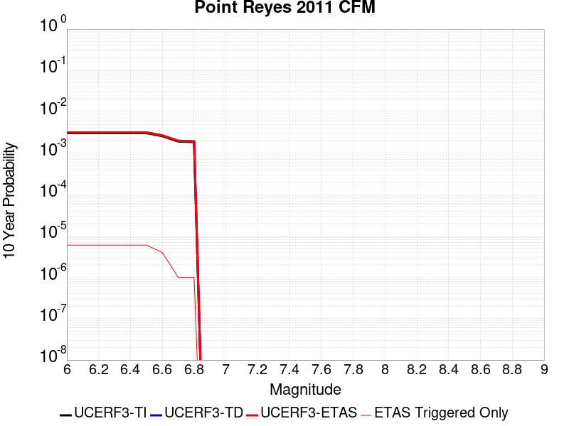 |

| Magnitude | 1 wk TI Prob | 1 wk TD Prob | 1 wk ETAS Prob | 1 wk ETAS/TD Gain | 1 wk ETAS Triggered Only | 1 mo TI Prob | 1 mo TD Prob | 1 mo ETAS Prob | 1 mo ETAS/TD Gain | 1 mo ETAS Triggered Only | 1 yr TI Prob | 1 yr TD Prob | 1 yr ETAS Prob | 1 yr ETAS/TD Gain | 1 yr ETAS Triggered Only | 10 yr TI Prob | 10 yr TD Prob | 10 yr ETAS Prob | 10 yr ETAS/TD Gain | 10 yr ETAS Triggered Only |
|-----|-----|-----|-----|-----|-----|-----|-----|-----|-----|-----|-----|-----|-----|-----|-----|-----|-----|-----|-----|-----|
| 6.0 | 5.880186E-6 | 6.1172223E-6 | 7.117216E-6 | 1.1634719 | 1.0E-6 | 2.5200554E-5 | 2.6216505E-5 | 2.8216451E-5 | 1.0762858 | 2.0E-6 | 3.0677355E-4 | 3.191572E-4 | 3.251553E-4 | 1.0187935 | 6.0E-6 | 0.003063504 | 0.0031887568 | 0.0031947375 | 1.0018756 | 6.0E-6 |
| 6.1 | 5.880186E-6 | 6.1172223E-6 | 7.117216E-6 | 1.1634719 | 1.0E-6 | 2.5200554E-5 | 2.6216505E-5 | 2.8216451E-5 | 1.0762858 | 2.0E-6 | 3.0677355E-4 | 3.191572E-4 | 3.251553E-4 | 1.0187935 | 6.0E-6 | 0.003063504 | 0.0031887568 | 0.0031947375 | 1.0018756 | 6.0E-6 |
| 6.2 | 5.880186E-6 | 6.1172223E-6 | 7.117216E-6 | 1.1634719 | 1.0E-6 | 2.5200554E-5 | 2.6216505E-5 | 2.8216451E-5 | 1.0762858 | 2.0E-6 | 3.0677355E-4 | 3.191572E-4 | 3.251553E-4 | 1.0187935 | 6.0E-6 | 0.003063504 | 0.0031887568 | 0.0031947375 | 1.0018756 | 6.0E-6 |
| 6.3 | 5.880186E-6 | 6.1172223E-6 | 7.117216E-6 | 1.1634719 | 1.0E-6 | 2.5200554E-5 | 2.6216505E-5 | 2.8216451E-5 | 1.0762858 | 2.0E-6 | 3.0677355E-4 | 3.191572E-4 | 3.251553E-4 | 1.0187935 | 6.0E-6 | 0.003063504 | 0.0031887568 | 0.0031947375 | 1.0018756 | 6.0E-6 |
| 6.4 | 5.880186E-6 | 6.1172223E-6 | 7.117216E-6 | 1.1634719 | 1.0E-6 | 2.5200554E-5 | 2.6216505E-5 | 2.8216451E-5 | 1.0762858 | 2.0E-6 | 3.0677355E-4 | 3.191572E-4 | 3.251553E-4 | 1.0187935 | 6.0E-6 | 0.003063504 | 0.0031887568 | 0.0031947375 | 1.0018756 | 6.0E-6 |
| 6.5 | 5.880186E-6 | 6.1172223E-6 | 7.117216E-6 | 1.1634719 | 1.0E-6 | 2.5200554E-5 | 2.6216505E-5 | 2.8216451E-5 | 1.0762858 | 2.0E-6 | 3.0677355E-4 | 3.191572E-4 | 3.251553E-4 | 1.0187935 | 6.0E-6 | 0.003063504 | 0.0031887568 | 0.0031947375 | 1.0018756 | 6.0E-6 |
| 6.6 | 4.962286E-6 | 5.1612233E-6 | 6.161218E-6 | 1.1937516 | 1.0E-6 | 2.1266766E-5 | 2.211944E-5 | 2.3119419E-5 | 1.0452081 | 1.0E-6 | 2.588921E-4 | 2.6928863E-4 | 2.7328756E-4 | 1.0148499 | 4.0E-6 | 0.002585907 | 0.002691363 | 0.002695352 | 1.0014822 | 4.0E-6 |
| 6.7 | 3.6899585E-6 | 3.8359885E-6 | 3.8359885E-6 | 1.0 | 0.0 | 1.5814012E-5 | 1.6439944E-5 | 1.6439944E-5 | 1.0 | 0.0 | 1.9251858E-4 | 2.0015506E-4 | 2.0115486E-4 | 1.0049951 | 1.0E-6 | 0.0019235188 | 0.0020014285 | 0.0020024264 | 1.0004987 | 1.0E-6 |
| 6.8 | 3.560543E-6 | 3.7012655E-6 | 3.7012655E-6 | 1.0 | 0.0 | 1.525938E-5 | 1.5862566E-5 | 1.5862566E-5 | 1.0 | 0.0 | 1.8576712E-4 | 1.9312675E-4 | 1.9412655E-4 | 1.0051769 | 1.0E-6 | 0.001856119 | 0.0019312674 | 0.0019322655 | 1.0005168 | 1.0E-6 |

## Great Valley 05 Pittsburg - Kirby Hills alt1
*[(top)](#table-of-contents)*

| 1 Week | 1 Month | 1 Year | 10 Year |
|-----|-----|-----|-----|
|  |  |  |  |

| Magnitude | 1 wk TI Prob | 1 wk TD Prob | 1 wk ETAS Prob | 1 wk ETAS/TD Gain | 1 wk ETAS Triggered Only | 1 mo TI Prob | 1 mo TD Prob | 1 mo ETAS Prob | 1 mo ETAS/TD Gain | 1 mo ETAS Triggered Only | 1 yr TI Prob | 1 yr TD Prob | 1 yr ETAS Prob | 1 yr ETAS/TD Gain | 1 yr ETAS Triggered Only | 10 yr TI Prob | 10 yr TD Prob | 10 yr ETAS Prob | 10 yr ETAS/TD Gain | 10 yr ETAS Triggered Only |
|-----|-----|-----|-----|-----|-----|-----|-----|-----|-----|-----|-----|-----|-----|-----|-----|-----|-----|-----|-----|-----|
| 6.0 | 1.9185833E-5 | 2.2430931E-5 | 2.3430908E-5 | 1.0445803 | 1.0E-6 | 8.222241E-5 | 9.6132564E-5 | 9.9132274E-5 | 1.0312039 | 3.0E-6 | 0.0010005981 | 0.0011704137 | 0.0011734101 | 1.0025601 | 3.0E-6 | 0.009961046 | 0.011704094 | 0.011709035 | 1.0004222 | 5.0E-6 |
| 6.1 | 1.9185833E-5 | 2.2430931E-5 | 2.3430908E-5 | 1.0445803 | 1.0E-6 | 8.222241E-5 | 9.6132564E-5 | 9.9132274E-5 | 1.0312039 | 3.0E-6 | 0.0010005981 | 0.0011704137 | 0.0011734101 | 1.0025601 | 3.0E-6 | 0.009961046 | 0.011704094 | 0.011709035 | 1.0004222 | 5.0E-6 |
| 6.2 | 1.9185833E-5 | 2.2430931E-5 | 2.3430908E-5 | 1.0445803 | 1.0E-6 | 8.222241E-5 | 9.6132564E-5 | 9.9132274E-5 | 1.0312039 | 3.0E-6 | 0.0010005981 | 0.0011704137 | 0.0011734101 | 1.0025601 | 3.0E-6 | 0.009961046 | 0.011704094 | 0.011709035 | 1.0004222 | 5.0E-6 |
| 6.3 | 1.9185833E-5 | 2.2430931E-5 | 2.3430908E-5 | 1.0445803 | 1.0E-6 | 8.222241E-5 | 9.6132564E-5 | 9.9132274E-5 | 1.0312039 | 3.0E-6 | 0.0010005981 | 0.0011704137 | 0.0011734101 | 1.0025601 | 3.0E-6 | 0.009961046 | 0.011704094 | 0.011709035 | 1.0004222 | 5.0E-6 |
| 6.4 | 1.9185833E-5 | 2.2430931E-5 | 2.3430908E-5 | 1.0445803 | 1.0E-6 | 8.222241E-5 | 9.6132564E-5 | 9.9132274E-5 | 1.0312039 | 3.0E-6 | 0.0010005981 | 0.0011704137 | 0.0011734101 | 1.0025601 | 3.0E-6 | 0.009961046 | 0.011704094 | 0.011709035 | 1.0004222 | 5.0E-6 |
| 6.5 | 1.9185833E-5 | 2.2430931E-5 | 2.3430908E-5 | 1.0445803 | 1.0E-6 | 8.222241E-5 | 9.6132564E-5 | 9.9132274E-5 | 1.0312039 | 3.0E-6 | 0.0010005981 | 0.0011704137 | 0.0011734101 | 1.0025601 | 3.0E-6 | 0.009961046 | 0.011704094 | 0.011709035 | 1.0004222 | 5.0E-6 |

## Hartley Springs 2011 CFM
*[(top)](#table-of-contents)*

| 1 Week | 1 Month | 1 Year | 10 Year |
|-----|-----|-----|-----|
|  |  |  |  |

| Magnitude | 1 wk TI Prob | 1 wk TD Prob | 1 wk ETAS Prob | 1 wk ETAS/TD Gain | 1 wk ETAS Triggered Only | 1 mo TI Prob | 1 mo TD Prob | 1 mo ETAS Prob | 1 mo ETAS/TD Gain | 1 mo ETAS Triggered Only | 1 yr TI Prob | 1 yr TD Prob | 1 yr ETAS Prob | 1 yr ETAS/TD Gain | 1 yr ETAS Triggered Only | 10 yr TI Prob | 10 yr TD Prob | 10 yr ETAS Prob | 10 yr ETAS/TD Gain | 10 yr ETAS Triggered Only |
|-----|-----|-----|-----|-----|-----|-----|-----|-----|-----|-----|-----|-----|-----|-----|-----|-----|-----|-----|-----|-----|
| 6.0 | 9.687499E-6 | 1.0368633E-5 | 1.1368623E-5 | 1.0964438 | 1.0E-6 | 4.1517193E-5 | 4.4436638E-5 | 4.643655E-5 | 1.0450059 | 2.0E-6 | 5.0535455E-4 | 5.409523E-4 | 5.449502E-4 | 1.0073904 | 4.0E-6 | 0.0050420687 | 0.005403274 | 0.005408247 | 1.0009204 | 5.0E-6 |
| 6.1 | 9.687499E-6 | 1.0368633E-5 | 1.1368623E-5 | 1.0964438 | 1.0E-6 | 4.1517193E-5 | 4.4436638E-5 | 4.643655E-5 | 1.0450059 | 2.0E-6 | 5.0535455E-4 | 5.409523E-4 | 5.449502E-4 | 1.0073904 | 4.0E-6 | 0.0050420687 | 0.005403274 | 0.005408247 | 1.0009204 | 5.0E-6 |
| 6.2 | 9.687499E-6 | 1.0368633E-5 | 1.1368623E-5 | 1.0964438 | 1.0E-6 | 4.1517193E-5 | 4.4436638E-5 | 4.643655E-5 | 1.0450059 | 2.0E-6 | 5.0535455E-4 | 5.409523E-4 | 5.449502E-4 | 1.0073904 | 4.0E-6 | 0.0050420687 | 0.005403274 | 0.005408247 | 1.0009204 | 5.0E-6 |
| 6.3 | 9.687499E-6 | 1.0368633E-5 | 1.1368623E-5 | 1.0964438 | 1.0E-6 | 4.1517193E-5 | 4.4436638E-5 | 4.643655E-5 | 1.0450059 | 2.0E-6 | 5.0535455E-4 | 5.409523E-4 | 5.449502E-4 | 1.0073904 | 4.0E-6 | 0.0050420687 | 0.005403274 | 0.005408247 | 1.0009204 | 5.0E-6 |
| 6.4 | 9.687499E-6 | 1.0368633E-5 | 1.1368623E-5 | 1.0964438 | 1.0E-6 | 4.1517193E-5 | 4.4436638E-5 | 4.643655E-5 | 1.0450059 | 2.0E-6 | 5.0535455E-4 | 5.409523E-4 | 5.449502E-4 | 1.0073904 | 4.0E-6 | 0.0050420687 | 0.005403274 | 0.005408247 | 1.0009204 | 5.0E-6 |
| 6.5 | 9.687499E-6 | 1.0368633E-5 | 1.1368623E-5 | 1.0964438 | 1.0E-6 | 4.1517193E-5 | 4.4436638E-5 | 4.643655E-5 | 1.0450059 | 2.0E-6 | 5.0535455E-4 | 5.409523E-4 | 5.449502E-4 | 1.0073904 | 4.0E-6 | 0.0050420687 | 0.005403274 | 0.005408247 | 1.0009204 | 5.0E-6 |
| 6.6 | 6.6994126E-6 | 7.1661625E-6 | 7.1661625E-6 | 1.0 | 0.0 | 2.8711453E-5 | 3.0712123E-5 | 3.0712123E-5 | 1.0 | 0.0 | 3.4950586E-4 | 3.739201E-4 | 3.7491973E-4 | 1.0026734 | 1.0E-6 | 0.0034895667 | 0.0037392012 | 0.0037411936 | 1.0005329 | 2.0E-6 |
| 6.7 | 6.6994126E-6 | 7.1661625E-6 | 7.1661625E-6 | 1.0 | 0.0 | 2.8711453E-5 | 3.0712123E-5 | 3.0712123E-5 | 1.0 | 0.0 | 3.4950586E-4 | 3.739201E-4 | 3.7491973E-4 | 1.0026734 | 1.0E-6 | 0.0034895667 | 0.0037392012 | 0.0037411936 | 1.0005329 | 2.0E-6 |

## Camp Rock 2011
*[(top)](#table-of-contents)*

| 1 Week | 1 Month | 1 Year | 10 Year |
|-----|-----|-----|-----|
|  |  |  |  |

| Magnitude | 1 wk TI Prob | 1 wk TD Prob | 1 wk ETAS Prob | 1 wk ETAS/TD Gain | 1 wk ETAS Triggered Only | 1 mo TI Prob | 1 mo TD Prob | 1 mo ETAS Prob | 1 mo ETAS/TD Gain | 1 mo ETAS Triggered Only | 1 yr TI Prob | 1 yr TD Prob | 1 yr ETAS Prob | 1 yr ETAS/TD Gain | 1 yr ETAS Triggered Only | 10 yr TI Prob | 10 yr TD Prob | 10 yr ETAS Prob | 10 yr ETAS/TD Gain | 10 yr ETAS Triggered Only |
|-----|-----|-----|-----|-----|-----|-----|-----|-----|-----|-----|-----|-----|-----|-----|-----|-----|-----|-----|-----|-----|
| 6.0 | 4.366639E-6 | 3.0054525E-7 | 2.3005446E-6 | 7.65457 | 2.0E-6 | 1.8714034E-5 | 1.2880505E-6 | 3.288048E-6 | 2.5527322 | 2.0E-6 | 2.2781953E-4 | 1.5681926E-5 | 1.9681862E-5 | 1.2550668 | 4.0E-6 | 0.002275861 | 1.5681045E-4 | 1.6080982E-4 | 1.0255045 | 4.0E-6 |
| 6.1 | 4.366639E-6 | 3.0054525E-7 | 2.3005446E-6 | 7.65457 | 2.0E-6 | 1.8714034E-5 | 1.2880505E-6 | 3.288048E-6 | 2.5527322 | 2.0E-6 | 2.2781953E-4 | 1.5681926E-5 | 1.9681862E-5 | 1.2550668 | 4.0E-6 | 0.002275861 | 1.5681045E-4 | 1.6080982E-4 | 1.0255045 | 4.0E-6 |
| 6.2 | 4.366639E-6 | 3.0054525E-7 | 2.3005446E-6 | 7.65457 | 2.0E-6 | 1.8714034E-5 | 1.2880505E-6 | 3.288048E-6 | 2.5527322 | 2.0E-6 | 2.2781953E-4 | 1.5681926E-5 | 1.9681862E-5 | 1.2550668 | 4.0E-6 | 0.002275861 | 1.5681045E-4 | 1.6080982E-4 | 1.0255045 | 4.0E-6 |
| 6.3 | 4.366639E-6 | 3.0054525E-7 | 2.3005446E-6 | 7.65457 | 2.0E-6 | 1.8714034E-5 | 1.2880505E-6 | 3.288048E-6 | 2.5527322 | 2.0E-6 | 2.2781953E-4 | 1.5681926E-5 | 1.9681862E-5 | 1.2550668 | 4.0E-6 | 0.002275861 | 1.5681045E-4 | 1.6080982E-4 | 1.0255045 | 4.0E-6 |
| 6.4 | 4.366639E-6 | 3.0054525E-7 | 2.3005446E-6 | 7.65457 | 2.0E-6 | 1.8714034E-5 | 1.2880505E-6 | 3.288048E-6 | 2.5527322 | 2.0E-6 | 2.2781953E-4 | 1.5681926E-5 | 1.9681862E-5 | 1.2550668 | 4.0E-6 | 0.002275861 | 1.5681045E-4 | 1.6080982E-4 | 1.0255045 | 4.0E-6 |
| 6.5 | 4.366639E-6 | 3.0054525E-7 | 2.3005446E-6 | 7.65457 | 2.0E-6 | 1.8714034E-5 | 1.2880505E-6 | 3.288048E-6 | 2.5527322 | 2.0E-6 | 2.2781953E-4 | 1.5681926E-5 | 1.9681862E-5 | 1.2550668 | 4.0E-6 | 0.002275861 | 1.5681045E-4 | 1.6080982E-4 | 1.0255045 | 4.0E-6 |
| 6.6 | 4.2648153E-6 | 2.3829955E-7 | 1.2382993E-6 | 5.1963983 | 1.0E-6 | 1.8277651E-5 | 1.0212834E-6 | 2.0212824E-6 | 1.9791591 | 1.0E-6 | 2.2250768E-4 | 1.2434075E-5 | 1.5434038E-5 | 1.2412695 | 3.0E-6 | 0.0022228502 | 1.2433571E-4 | 1.2733533E-4 | 1.0241252 | 3.0E-6 |
| 6.7 | 3.873362E-6 | 5.1035617E-8 | 5.1035617E-8 | 1.0 | 0.0 | 1.6600017E-5 | 2.1872405E-7 | 2.1872405E-7 | 1.0 | 0.0 | 2.0208646E-4 | 2.662963E-6 | 3.6629601E-6 | 1.3755206 | 1.0E-6 | 0.002019028 | 2.6629392E-5 | 2.7629365E-5 | 1.0375515 | 1.0E-6 |
| 6.8 | 3.6782014E-6 | 2.8925031E-8 | 2.8925031E-8 | 1.0 | 0.0 | 1.5763624E-5 | 1.2396441E-7 | 1.2396441E-7 | 1.0 | 0.0 | 1.9190523E-4 | 1.509266E-6 | 2.5092645E-6 | 1.6625727 | 1.0E-6 | 0.0019173959 | 1.5092586E-5 | 1.609257E-5 | 1.0662566 | 1.0E-6 |
| 6.9 | 3.5366595E-6 | 1.9346416E-8 | 1.9346416E-8 | 1.0 | 0.0 | 1.5157024E-5 | 8.291321E-8 | 8.291321E-8 | 1.0 | 0.0 | 1.8452114E-4 | 1.0094681E-6 | 2.0094672E-6 | 1.9906198 | 1.0E-6 | 0.00184368 | 1.0094653E-5 | 1.1094642E-5 | 1.0990614 | 1.0E-6 |
| 7.0 | 3.3366227E-6 | 6.549833E-9 | 6.549833E-9 | 1.0 | 0.0 | 1.4299733E-5 | 2.8070712E-8 | 2.8070712E-8 | 1.0 | 0.0 | 1.7408533E-4 | 3.417609E-7 | 3.417609E-7 | 1.0 | 0.0 | 0.0017394903 | 3.4176064E-6 | 3.4176064E-6 | 1.0 | 0.0 |
| 7.1 | 3.1700695E-6 | 5.4303326E-9 | 5.4303326E-9 | 1.0 | 0.0 | 1.3585942E-5 | 2.3272854E-8 | 2.3272854E-8 | 1.0 | 0.0 | 1.6539628E-4 | 2.83347E-7 | 2.83347E-7 | 1.0 | 0.0 | 0.0016527324 | 2.833469E-6 | 2.833469E-6 | 1.0 | 0.0 |
| 7.2 | 2.8879267E-6 | 9.331039E-10 | 9.331039E-10 | 1.0 | 0.0 | 1.237677E-5 | 3.999017E-9 | 3.999017E-9 | 1.0 | 0.0 | 1.5067676E-4 | 4.868803E-8 | 4.868803E-8 | 1.0 | 0.0 | 0.0015057464 | 4.868803E-7 | 4.868803E-7 | 1.0 | 0.0 |
| 7.3 | 2.4973094E-6 | 8.4248597E-10 | 8.4248597E-10 | 1.0 | 0.0 | 1.0702711E-5 | 3.6106542E-9 | 3.6106542E-9 | 1.0 | 0.0 | 1.3029772E-4 | 4.3959716E-8 | 4.3959716E-8 | 1.0 | 0.0 | 0.0013022134 | 4.3959716E-7 | 4.3959716E-7 | 1.0 | 0.0 |

## North Tahoe 2011 CFM
*[(top)](#table-of-contents)*

| 1 Week | 1 Month | 1 Year | 10 Year |
|-----|-----|-----|-----|
| 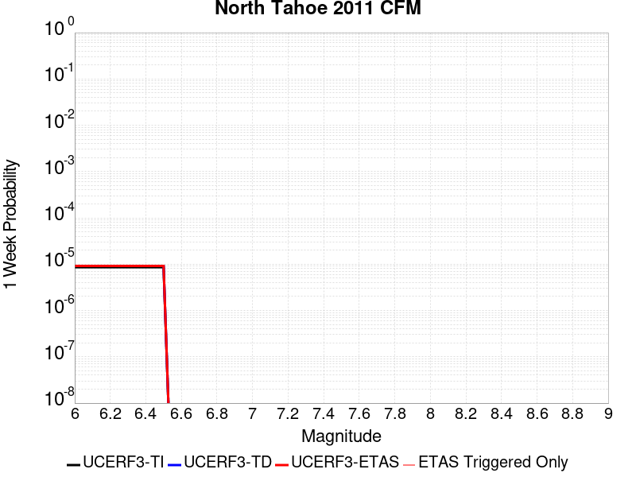 |  |  |  |

| Magnitude | 1 wk TI Prob | 1 wk TD Prob | 1 wk ETAS Prob | 1 wk ETAS/TD Gain | 1 wk ETAS Triggered Only | 1 mo TI Prob | 1 mo TD Prob | 1 mo ETAS Prob | 1 mo ETAS/TD Gain | 1 mo ETAS Triggered Only | 1 yr TI Prob | 1 yr TD Prob | 1 yr ETAS Prob | 1 yr ETAS/TD Gain | 1 yr ETAS Triggered Only | 10 yr TI Prob | 10 yr TD Prob | 10 yr ETAS Prob | 10 yr ETAS/TD Gain | 10 yr ETAS Triggered Only |
|-----|-----|-----|-----|-----|-----|-----|-----|-----|-----|-----|-----|-----|-----|-----|-----|-----|-----|-----|-----|-----|
| 6.0 | 8.589771E-6 | 9.184696E-6 | 9.184696E-6 | 1.0 | 0.0 | 3.6812784E-5 | 3.936298E-5 | 4.1362902E-5 | 1.0508071 | 2.0E-6 | 4.4810347E-4 | 4.792443E-4 | 4.832424E-4 | 1.0083425 | 4.0E-6 | 0.0044720094 | 0.004792443 | 0.004796424 | 1.0008307 | 4.0E-6 |
| 6.1 | 8.589771E-6 | 9.184696E-6 | 9.184696E-6 | 1.0 | 0.0 | 3.6812784E-5 | 3.936298E-5 | 4.1362902E-5 | 1.0508071 | 2.0E-6 | 4.4810347E-4 | 4.792443E-4 | 4.832424E-4 | 1.0083425 | 4.0E-6 | 0.0044720094 | 0.004792443 | 0.004796424 | 1.0008307 | 4.0E-6 |
| 6.2 | 8.589771E-6 | 9.184696E-6 | 9.184696E-6 | 1.0 | 0.0 | 3.6812784E-5 | 3.936298E-5 | 4.1362902E-5 | 1.0508071 | 2.0E-6 | 4.4810347E-4 | 4.792443E-4 | 4.832424E-4 | 1.0083425 | 4.0E-6 | 0.0044720094 | 0.004792443 | 0.004796424 | 1.0008307 | 4.0E-6 |
| 6.3 | 8.589771E-6 | 9.184696E-6 | 9.184696E-6 | 1.0 | 0.0 | 3.6812784E-5 | 3.936298E-5 | 4.1362902E-5 | 1.0508071 | 2.0E-6 | 4.4810347E-4 | 4.792443E-4 | 4.832424E-4 | 1.0083425 | 4.0E-6 | 0.0044720094 | 0.004792443 | 0.004796424 | 1.0008307 | 4.0E-6 |
| 6.4 | 8.589771E-6 | 9.184696E-6 | 9.184696E-6 | 1.0 | 0.0 | 3.6812784E-5 | 3.936298E-5 | 4.1362902E-5 | 1.0508071 | 2.0E-6 | 4.4810347E-4 | 4.792443E-4 | 4.832424E-4 | 1.0083425 | 4.0E-6 | 0.0044720094 | 0.004792443 | 0.004796424 | 1.0008307 | 4.0E-6 |
| 6.5 | 8.589771E-6 | 9.184696E-6 | 9.184696E-6 | 1.0 | 0.0 | 3.6812784E-5 | 3.936298E-5 | 4.1362902E-5 | 1.0508071 | 2.0E-6 | 4.4810347E-4 | 4.792443E-4 | 4.832424E-4 | 1.0083425 | 4.0E-6 | 0.0044720094 | 0.004792443 | 0.004796424 | 1.0008307 | 4.0E-6 |

## Pisgah-Bullion Mtn-Mesquite Lk
*[(top)](#table-of-contents)*

| 1 Week | 1 Month | 1 Year | 10 Year |
|-----|-----|-----|-----|
|  |  |  |  |

| Magnitude | 1 wk TI Prob | 1 wk TD Prob | 1 wk ETAS Prob | 1 wk ETAS/TD Gain | 1 wk ETAS Triggered Only | 1 mo TI Prob | 1 mo TD Prob | 1 mo ETAS Prob | 1 mo ETAS/TD Gain | 1 mo ETAS Triggered Only | 1 yr TI Prob | 1 yr TD Prob | 1 yr ETAS Prob | 1 yr ETAS/TD Gain | 1 yr ETAS Triggered Only | 10 yr TI Prob | 10 yr TD Prob | 10 yr ETAS Prob | 10 yr ETAS/TD Gain | 10 yr ETAS Triggered Only |
|-----|-----|-----|-----|-----|-----|-----|-----|-----|-----|-----|-----|-----|-----|-----|-----|-----|-----|-----|-----|-----|
| 6.0 | 9.757405E-6 | 3.2571834E-6 | 5.257177E-6 | 1.6140255 | 2.0E-6 | 4.181678E-5 | 1.3959294E-5 | 1.5959266E-5 | 1.1432717 | 2.0E-6 | 5.090004E-4 | 1.6994326E-4 | 1.7294276E-4 | 1.01765 | 3.0E-6 | 0.005078361 | 0.0016983406 | 0.0017023338 | 1.0023513 | 4.0E-6 |
| 6.1 | 9.757405E-6 | 3.2571834E-6 | 5.257177E-6 | 1.6140255 | 2.0E-6 | 4.181678E-5 | 1.3959294E-5 | 1.5959266E-5 | 1.1432717 | 2.0E-6 | 5.090004E-4 | 1.6994326E-4 | 1.7294276E-4 | 1.01765 | 3.0E-6 | 0.005078361 | 0.0016983406 | 0.0017023338 | 1.0023513 | 4.0E-6 |
| 6.2 | 9.757405E-6 | 3.2571834E-6 | 5.257177E-6 | 1.6140255 | 2.0E-6 | 4.181678E-5 | 1.3959294E-5 | 1.5959266E-5 | 1.1432717 | 2.0E-6 | 5.090004E-4 | 1.6994326E-4 | 1.7294276E-4 | 1.01765 | 3.0E-6 | 0.005078361 | 0.0016983406 | 0.0017023338 | 1.0023513 | 4.0E-6 |
| 6.3 | 9.757405E-6 | 3.2571834E-6 | 5.257177E-6 | 1.6140255 | 2.0E-6 | 4.181678E-5 | 1.3959294E-5 | 1.5959266E-5 | 1.1432717 | 2.0E-6 | 5.090004E-4 | 1.6994326E-4 | 1.7294276E-4 | 1.01765 | 3.0E-6 | 0.005078361 | 0.0016983406 | 0.0017023338 | 1.0023513 | 4.0E-6 |
| 6.4 | 9.757405E-6 | 3.2571834E-6 | 5.257177E-6 | 1.6140255 | 2.0E-6 | 4.181678E-5 | 1.3959294E-5 | 1.5959266E-5 | 1.1432717 | 2.0E-6 | 5.090004E-4 | 1.6994326E-4 | 1.7294276E-4 | 1.01765 | 3.0E-6 | 0.005078361 | 0.0016983406 | 0.0017023338 | 1.0023513 | 4.0E-6 |
| 6.5 | 9.757405E-6 | 3.2571834E-6 | 5.257177E-6 | 1.6140255 | 2.0E-6 | 4.181678E-5 | 1.3959294E-5 | 1.5959266E-5 | 1.1432717 | 2.0E-6 | 5.090004E-4 | 1.6994326E-4 | 1.7294276E-4 | 1.01765 | 3.0E-6 | 0.005078361 | 0.0016983406 | 0.0017023338 | 1.0023513 | 4.0E-6 |
| 6.6 | 8.852213E-6 | 2.7291178E-6 | 4.7291123E-6 | 1.7328355 | 2.0E-6 | 3.7937505E-5 | 1.1696178E-5 | 1.3696154E-5 | 1.170994 | 2.0E-6 | 4.6179123E-4 | 1.4239372E-4 | 1.453933E-4 | 1.0210654 | 3.0E-6 | 0.004608328 | 0.0014232274 | 0.0014262232 | 1.0021049 | 3.0E-6 |
| 6.7 | 7.756385E-6 | 2.2853417E-6 | 4.285337E-6 | 1.8751407 | 2.0E-6 | 3.3241224E-5 | 9.794297E-6 | 1.1794276E-5 | 1.2041985 | 2.0E-6 | 4.0463675E-4 | 1.1924106E-4 | 1.2124082E-4 | 1.0167707 | 2.0E-6 | 0.0040390077 | 0.0011919696 | 0.0011939673 | 1.0016758 | 2.0E-6 |
| 6.8 | 6.8437944E-6 | 2.0638372E-6 | 4.063833E-6 | 1.9690667 | 2.0E-6 | 2.9330216E-5 | 8.844998E-6 | 1.084498E-5 | 1.2261145 | 2.0E-6 | 3.570369E-4 | 1.07684544E-4 | 1.09684326E-4 | 1.0185708 | 2.0E-6 | 0.0035646379 | 0.0010765212 | 0.0010785192 | 1.0018559 | 2.0E-6 |
| 6.9 | 5.8630926E-6 | 1.8587051E-6 | 2.8587033E-6 | 1.538008 | 1.0E-6 | 2.5127298E-5 | 7.965866E-6 | 8.965858E-6 | 1.1255347 | 1.0E-6 | 3.058819E-4 | 9.698211E-5 | 9.798201E-5 | 1.0103102 | 1.0E-6 | 0.003054612 | 9.695946E-4 | 9.705936E-4 | 1.0010303 | 1.0E-6 |
| 7.0 | 5.1241714E-6 | 1.7030331E-6 | 2.7030314E-6 | 1.5871866 | 1.0E-6 | 2.196055E-5 | 7.2987045E-6 | 8.298697E-6 | 1.1370096 | 1.0E-6 | 2.6733687E-4 | 8.8860106E-5 | 8.986001E-5 | 1.0112526 | 1.0E-6 | 0.0026701551 | 8.88442E-4 | 8.8944106E-4 | 1.0011246 | 1.0E-6 |
| 7.1 | 4.4490575E-6 | 1.5093489E-6 | 2.5093473E-6 | 1.6625364 | 1.0E-6 | 1.906725E-5 | 6.468633E-6 | 7.4686263E-6 | 1.1545912 | 1.0E-6 | 2.3211904E-4 | 7.875475E-5 | 7.975467E-5 | 1.0126966 | 1.0E-6 | 0.0023187674 | 7.8746333E-4 | 7.884625E-4 | 1.0012689 | 1.0E-6 |
| 7.2 | 3.827017E-6 | 1.2527248E-6 | 2.2527236E-6 | 1.7982589 | 1.0E-6 | 1.6401398E-5 | 5.3688204E-6 | 6.3688153E-6 | 1.1862596 | 1.0E-6 | 1.9966872E-4 | 6.536539E-5 | 6.6365326E-5 | 1.0152977 | 1.0E-6 | 0.0019948941 | 6.5365393E-4 | 6.5465324E-4 | 1.0015289 | 1.0E-6 |

## Gillem - Big Crack 2011 CFM
*[(top)](#table-of-contents)*

| 1 Week | 1 Month | 1 Year | 10 Year |
|-----|-----|-----|-----|
|  |  |  |  |

| Magnitude | 1 wk TI Prob | 1 wk TD Prob | 1 wk ETAS Prob | 1 wk ETAS/TD Gain | 1 wk ETAS Triggered Only | 1 mo TI Prob | 1 mo TD Prob | 1 mo ETAS Prob | 1 mo ETAS/TD Gain | 1 mo ETAS Triggered Only | 1 yr TI Prob | 1 yr TD Prob | 1 yr ETAS Prob | 1 yr ETAS/TD Gain | 1 yr ETAS Triggered Only | 10 yr TI Prob | 10 yr TD Prob | 10 yr ETAS Prob | 10 yr ETAS/TD Gain | 10 yr ETAS Triggered Only |
|-----|-----|-----|-----|-----|-----|-----|-----|-----|-----|-----|-----|-----|-----|-----|-----|-----|-----|-----|-----|-----|
| 6.0 | 1.910764E-5 | 2.1994592E-5 | 2.299457E-5 | 1.0454648 | 1.0E-6 | 8.1887316E-5 | 9.426067E-5 | 9.626048E-5 | 1.0212158 | 2.0E-6 | 9.96522E-4 | 0.0011472917 | 0.0011502883 | 1.0026119 | 3.0E-6 | 0.009920651 | 0.011440402 | 0.011444356 | 1.0003456 | 4.0E-6 |
| 6.1 | 1.910764E-5 | 2.1994592E-5 | 2.299457E-5 | 1.0454648 | 1.0E-6 | 8.1887316E-5 | 9.426067E-5 | 9.626048E-5 | 1.0212158 | 2.0E-6 | 9.96522E-4 | 0.0011472917 | 0.0011502883 | 1.0026119 | 3.0E-6 | 0.009920651 | 0.011440402 | 0.011444356 | 1.0003456 | 4.0E-6 |
| 6.2 | 1.910764E-5 | 2.1994592E-5 | 2.299457E-5 | 1.0454648 | 1.0E-6 | 8.1887316E-5 | 9.426067E-5 | 9.626048E-5 | 1.0212158 | 2.0E-6 | 9.96522E-4 | 0.0011472917 | 0.0011502883 | 1.0026119 | 3.0E-6 | 0.009920651 | 0.011440402 | 0.011444356 | 1.0003456 | 4.0E-6 |
| 6.3 | 1.910764E-5 | 2.1994592E-5 | 2.299457E-5 | 1.0454648 | 1.0E-6 | 8.1887316E-5 | 9.426067E-5 | 9.626048E-5 | 1.0212158 | 2.0E-6 | 9.96522E-4 | 0.0011472917 | 0.0011502883 | 1.0026119 | 3.0E-6 | 0.009920651 | 0.011440402 | 0.011444356 | 1.0003456 | 4.0E-6 |
| 6.4 | 1.910764E-5 | 2.1994592E-5 | 2.299457E-5 | 1.0454648 | 1.0E-6 | 8.1887316E-5 | 9.426067E-5 | 9.626048E-5 | 1.0212158 | 2.0E-6 | 9.96522E-4 | 0.0011472917 | 0.0011502883 | 1.0026119 | 3.0E-6 | 0.009920651 | 0.011440402 | 0.011444356 | 1.0003456 | 4.0E-6 |
| 6.5 | 1.910764E-5 | 2.1994592E-5 | 2.299457E-5 | 1.0454648 | 1.0E-6 | 8.1887316E-5 | 9.426067E-5 | 9.626048E-5 | 1.0212158 | 2.0E-6 | 9.96522E-4 | 0.0011472917 | 0.0011502883 | 1.0026119 | 3.0E-6 | 0.009920651 | 0.011440402 | 0.011444356 | 1.0003456 | 4.0E-6 |
| 6.6 | 1.3213953E-5 | 1.5149388E-5 | 1.6149374E-5 | 1.0660082 | 1.0E-6 | 5.6629997E-5 | 6.4925705E-5 | 6.6925575E-5 | 1.0308025 | 2.0E-6 | 6.892521E-4 | 7.904269E-4 | 7.9342455E-4 | 1.0037924 | 3.0E-6 | 0.0068711825 | 0.0079000015 | 0.00790397 | 1.0005023 | 4.0E-6 |
| 6.7 | 1.21310995E-5 | 1.3896347E-5 | 1.4896334E-5 | 1.0719603 | 1.0E-6 | 5.198939E-5 | 5.9555772E-5 | 6.155566E-5 | 1.03358 | 2.0E-6 | 6.32787E-4 | 7.2509155E-4 | 7.2808936E-4 | 1.0041344 | 3.0E-6 | 0.0063098813 | 0.0072509153 | 0.0072548864 | 1.0005476 | 4.0E-6 |

## Likely 2011 CFM
*[(top)](#table-of-contents)*

| 1 Week | 1 Month | 1 Year | 10 Year |
|-----|-----|-----|-----|
|  |  |  |  |

| Magnitude | 1 wk TI Prob | 1 wk TD Prob | 1 wk ETAS Prob | 1 wk ETAS/TD Gain | 1 wk ETAS Triggered Only | 1 mo TI Prob | 1 mo TD Prob | 1 mo ETAS Prob | 1 mo ETAS/TD Gain | 1 mo ETAS Triggered Only | 1 yr TI Prob | 1 yr TD Prob | 1 yr ETAS Prob | 1 yr ETAS/TD Gain | 1 yr ETAS Triggered Only | 10 yr TI Prob | 10 yr TD Prob | 10 yr ETAS Prob | 10 yr ETAS/TD Gain | 10 yr ETAS Triggered Only |
|-----|-----|-----|-----|-----|-----|-----|-----|-----|-----|-----|-----|-----|-----|-----|-----|-----|-----|-----|-----|-----|
| 6.0 | 4.8283173E-6 | 4.977288E-6 | 4.977288E-6 | 1.0 | 0.0 | 2.0692623E-5 | 2.1331109E-5 | 2.1331109E-5 | 1.0 | 0.0 | 2.5190358E-4 | 2.5968385E-4 | 2.616833E-4 | 1.0076997 | 2.0E-6 | 0.0025161821 | 0.0025946426 | 0.0025976347 | 1.0011532 | 3.0E-6 |
| 6.1 | 4.8283173E-6 | 4.977288E-6 | 4.977288E-6 | 1.0 | 0.0 | 2.0692623E-5 | 2.1331109E-5 | 2.1331109E-5 | 1.0 | 0.0 | 2.5190358E-4 | 2.5968385E-4 | 2.616833E-4 | 1.0076997 | 2.0E-6 | 0.0025161821 | 0.0025946426 | 0.0025976347 | 1.0011532 | 3.0E-6 |
| 6.2 | 4.8283173E-6 | 4.977288E-6 | 4.977288E-6 | 1.0 | 0.0 | 2.0692623E-5 | 2.1331109E-5 | 2.1331109E-5 | 1.0 | 0.0 | 2.5190358E-4 | 2.5968385E-4 | 2.616833E-4 | 1.0076997 | 2.0E-6 | 0.0025161821 | 0.0025946426 | 0.0025976347 | 1.0011532 | 3.0E-6 |
| 6.3 | 4.8283173E-6 | 4.977288E-6 | 4.977288E-6 | 1.0 | 0.0 | 2.0692623E-5 | 2.1331109E-5 | 2.1331109E-5 | 1.0 | 0.0 | 2.5190358E-4 | 2.5968385E-4 | 2.616833E-4 | 1.0076997 | 2.0E-6 | 0.0025161821 | 0.0025946426 | 0.0025976347 | 1.0011532 | 3.0E-6 |
| 6.4 | 4.8283173E-6 | 4.977288E-6 | 4.977288E-6 | 1.0 | 0.0 | 2.0692623E-5 | 2.1331109E-5 | 2.1331109E-5 | 1.0 | 0.0 | 2.5190358E-4 | 2.5968385E-4 | 2.616833E-4 | 1.0076997 | 2.0E-6 | 0.0025161821 | 0.0025946426 | 0.0025976347 | 1.0011532 | 3.0E-6 |
| 6.5 | 4.8283173E-6 | 4.977288E-6 | 4.977288E-6 | 1.0 | 0.0 | 2.0692623E-5 | 2.1331109E-5 | 2.1331109E-5 | 1.0 | 0.0 | 2.5190358E-4 | 2.5968385E-4 | 2.616833E-4 | 1.0076997 | 2.0E-6 | 0.0025161821 | 0.0025946426 | 0.0025976347 | 1.0011532 | 3.0E-6 |
| 6.6 | 4.1529042E-6 | 4.2800852E-6 | 4.2800852E-6 | 1.0 | 0.0 | 1.779804E-5 | 1.834314E-5 | 1.834314E-5 | 1.0 | 0.0 | 2.1666959E-4 | 2.2331333E-4 | 2.2531288E-4 | 1.008954 | 2.0E-6 | 0.0021645846 | 0.00223172 | 0.0022347132 | 1.0013412 | 3.0E-6 |
| 6.7 | 3.5450967E-6 | 3.6525942E-6 | 3.6525942E-6 | 1.0 | 0.0 | 1.5193183E-5 | 1.5653928E-5 | 1.5653928E-5 | 1.0 | 0.0 | 1.849613E-4 | 1.905783E-4 | 1.9257792E-4 | 1.0104923 | 2.0E-6 | 0.0018480743 | 0.0019049724 | 0.0019079666 | 1.0015718 | 3.0E-6 |
| 6.8 | 2.9935204E-6 | 3.0833778E-6 | 3.0833778E-6 | 1.0 | 0.0 | 1.282931E-5 | 1.3214457E-5 | 1.3214457E-5 | 1.0 | 0.0 | 1.5618566E-4 | 1.6088245E-4 | 1.6288212E-4 | 1.0124295 | 2.0E-6 | 0.0015607593 | 0.0016084755 | 0.0016114706 | 1.0018622 | 3.0E-6 |
| 6.9 | 2.4887156E-6 | 2.5627064E-6 | 2.5627064E-6 | 1.0 | 0.0 | 1.0665881E-5 | 1.0983028E-5 | 1.0983028E-5 | 1.0 | 0.0 | 1.2984936E-4 | 1.3371836E-4 | 1.3571809E-4 | 1.0149548 | 2.0E-6 | 0.0012977351 | 0.0013371836 | 0.0013401796 | 1.0022405 | 3.0E-6 |

## Cedar Mtn-Mahogany Mtn
*[(top)](#table-of-contents)*

| 1 Week | 1 Month | 1 Year | 10 Year |
|-----|-----|-----|-----|
|  |  |  |  |

| Magnitude | 1 wk TI Prob | 1 wk TD Prob | 1 wk ETAS Prob | 1 wk ETAS/TD Gain | 1 wk ETAS Triggered Only | 1 mo TI Prob | 1 mo TD Prob | 1 mo ETAS Prob | 1 mo ETAS/TD Gain | 1 mo ETAS Triggered Only | 1 yr TI Prob | 1 yr TD Prob | 1 yr ETAS Prob | 1 yr ETAS/TD Gain | 1 yr ETAS Triggered Only | 10 yr TI Prob | 10 yr TD Prob | 10 yr ETAS Prob | 10 yr ETAS/TD Gain | 10 yr ETAS Triggered Only |
|-----|-----|-----|-----|-----|-----|-----|-----|-----|-----|-----|-----|-----|-----|-----|-----|-----|-----|-----|-----|-----|
| 6.0 | 1.5000067E-5 | 1.6423977E-5 | 1.742396E-5 | 1.0608855 | 1.0E-6 | 6.428442E-5 | 7.0387E-5 | 7.138694E-5 | 1.0142062 | 1.0E-6 | 7.823817E-4 | 8.567017E-4 | 8.587E-4 | 1.0023326 | 2.0E-6 | 0.007796329 | 0.0085415635 | 0.008544537 | 1.0003482 | 3.0E-6 |
| 6.1 | 1.5000067E-5 | 1.6423977E-5 | 1.742396E-5 | 1.0608855 | 1.0E-6 | 6.428442E-5 | 7.0387E-5 | 7.138694E-5 | 1.0142062 | 1.0E-6 | 7.823817E-4 | 8.567017E-4 | 8.587E-4 | 1.0023326 | 2.0E-6 | 0.007796329 | 0.0085415635 | 0.008544537 | 1.0003482 | 3.0E-6 |
| 6.2 | 1.5000067E-5 | 1.6423977E-5 | 1.742396E-5 | 1.0608855 | 1.0E-6 | 6.428442E-5 | 7.0387E-5 | 7.138694E-5 | 1.0142062 | 1.0E-6 | 7.823817E-4 | 8.567017E-4 | 8.587E-4 | 1.0023326 | 2.0E-6 | 0.007796329 | 0.0085415635 | 0.008544537 | 1.0003482 | 3.0E-6 |
| 6.3 | 1.5000067E-5 | 1.6423977E-5 | 1.742396E-5 | 1.0608855 | 1.0E-6 | 6.428442E-5 | 7.0387E-5 | 7.138694E-5 | 1.0142062 | 1.0E-6 | 7.823817E-4 | 8.567017E-4 | 8.587E-4 | 1.0023326 | 2.0E-6 | 0.007796329 | 0.0085415635 | 0.008544537 | 1.0003482 | 3.0E-6 |
| 6.4 | 1.5000067E-5 | 1.6423977E-5 | 1.742396E-5 | 1.0608855 | 1.0E-6 | 6.428442E-5 | 7.0387E-5 | 7.138694E-5 | 1.0142062 | 1.0E-6 | 7.823817E-4 | 8.567017E-4 | 8.587E-4 | 1.0023326 | 2.0E-6 | 0.007796329 | 0.0085415635 | 0.008544537 | 1.0003482 | 3.0E-6 |
| 6.5 | 1.5000067E-5 | 1.6423977E-5 | 1.742396E-5 | 1.0608855 | 1.0E-6 | 6.428442E-5 | 7.0387E-5 | 7.138694E-5 | 1.0142062 | 1.0E-6 | 7.823817E-4 | 8.567017E-4 | 8.587E-4 | 1.0023326 | 2.0E-6 | 0.007796329 | 0.0085415635 | 0.008544537 | 1.0003482 | 3.0E-6 |
| 6.6 | 1.307183E-5 | 1.4304934E-5 | 1.5304919E-5 | 1.0699049 | 1.0E-6 | 5.6020923E-5 | 6.130585E-5 | 6.2305786E-5 | 1.0163107 | 1.0E-6 | 6.818413E-4 | 7.462194E-4 | 7.482179E-4 | 1.0026782 | 2.0E-6 | 0.00679753 | 0.007444643 | 0.0074476204 | 1.0004 | 3.0E-6 |
| 6.7 | 1.1346564E-5 | 1.24039E-5 | 1.3403887E-5 | 1.0806189 | 1.0E-6 | 4.8627226E-5 | 5.3158914E-5 | 5.415886E-5 | 1.0188105 | 1.0E-6 | 5.9187564E-4 | 6.4709346E-4 | 6.4909214E-4 | 1.0030887 | 2.0E-6 | 0.0059030172 | 0.0064595393 | 0.0064615263 | 1.0003077 | 2.0E-6 |
| 6.8 | 9.790124E-6 | 1.0691899E-5 | 1.1691888E-5 | 1.0935278 | 1.0E-6 | 4.1957E-5 | 4.5822042E-5 | 4.6822E-5 | 1.0218226 | 1.0E-6 | 5.107067E-4 | 5.57816E-4 | 5.5981486E-4 | 1.0035834 | 2.0E-6 | 0.005095346 | 0.005571556 | 0.0055735447 | 1.0003569 | 2.0E-6 |
| 6.9 | 8.374105E-6 | 9.135799E-6 | 1.0135789E-5 | 1.1094584 | 1.0E-6 | 3.588853E-5 | 3.9153256E-5 | 4.0153216E-5 | 1.0255396 | 1.0E-6 | 4.3685522E-4 | 4.7666155E-4 | 4.786606E-4 | 1.0041939 | 2.0E-6 | 0.0043599745 | 0.0047637383 | 0.0047657285 | 1.0004178 | 2.0E-6 |
| 7.0 | 7.0748856E-6 | 7.711251E-6 | 8.711243E-6 | 1.1296797 | 1.0E-6 | 3.0320585E-5 | 3.3048218E-5 | 3.4048182E-5 | 1.0302578 | 1.0E-6 | 3.690906E-4 | 4.0236203E-4 | 4.0436123E-4 | 1.0049686 | 2.0E-6 | 0.0036847817 | 0.0040236204 | 0.0040256125 | 1.0004951 | 2.0E-6 |

## West Napa 2011 CFM
*[(top)](#table-of-contents)*

| 1 Week | 1 Month | 1 Year | 10 Year |
|-----|-----|-----|-----|
|  |  |  |  |

| Magnitude | 1 wk TI Prob | 1 wk TD Prob | 1 wk ETAS Prob | 1 wk ETAS/TD Gain | 1 wk ETAS Triggered Only | 1 mo TI Prob | 1 mo TD Prob | 1 mo ETAS Prob | 1 mo ETAS/TD Gain | 1 mo ETAS Triggered Only | 1 yr TI Prob | 1 yr TD Prob | 1 yr ETAS Prob | 1 yr ETAS/TD Gain | 1 yr ETAS Triggered Only | 10 yr TI Prob | 10 yr TD Prob | 10 yr ETAS Prob | 10 yr ETAS/TD Gain | 10 yr ETAS Triggered Only |
|-----|-----|-----|-----|-----|-----|-----|-----|-----|-----|-----|-----|-----|-----|-----|-----|-----|-----|-----|-----|-----|
| 6.0 | 1.7783477E-5 | 2.0537549E-5 | 2.2537508E-5 | 1.0973806 | 2.0E-6 | 7.621267E-5 | 8.801807E-5 | 9.0017886E-5 | 1.0227206 | 2.0E-6 | 9.2749426E-4 | 0.0010716199 | 0.0010736177 | 1.0018643 | 2.0E-6 | 0.009236327 | 0.010716184 | 0.010719152 | 1.0002769 | 3.0E-6 |
| 6.1 | 1.7783477E-5 | 2.0537549E-5 | 2.2537508E-5 | 1.0973806 | 2.0E-6 | 7.621267E-5 | 8.801807E-5 | 9.0017886E-5 | 1.0227206 | 2.0E-6 | 9.2749426E-4 | 0.0010716199 | 0.0010736177 | 1.0018643 | 2.0E-6 | 0.009236327 | 0.010716184 | 0.010719152 | 1.0002769 | 3.0E-6 |
| 6.2 | 1.7783477E-5 | 2.0537549E-5 | 2.2537508E-5 | 1.0973806 | 2.0E-6 | 7.621267E-5 | 8.801807E-5 | 9.0017886E-5 | 1.0227206 | 2.0E-6 | 9.2749426E-4 | 0.0010716199 | 0.0010736177 | 1.0018643 | 2.0E-6 | 0.009236327 | 0.010716184 | 0.010719152 | 1.0002769 | 3.0E-6 |
| 6.3 | 1.7783477E-5 | 2.0537549E-5 | 2.2537508E-5 | 1.0973806 | 2.0E-6 | 7.621267E-5 | 8.801807E-5 | 9.0017886E-5 | 1.0227206 | 2.0E-6 | 9.2749426E-4 | 0.0010716199 | 0.0010736177 | 1.0018643 | 2.0E-6 | 0.009236327 | 0.010716184 | 0.010719152 | 1.0002769 | 3.0E-6 |
| 6.4 | 1.7783477E-5 | 2.0537549E-5 | 2.2537508E-5 | 1.0973806 | 2.0E-6 | 7.621267E-5 | 8.801807E-5 | 9.0017886E-5 | 1.0227206 | 2.0E-6 | 9.2749426E-4 | 0.0010716199 | 0.0010736177 | 1.0018643 | 2.0E-6 | 0.009236327 | 0.010716184 | 0.010719152 | 1.0002769 | 3.0E-6 |
| 6.5 | 1.7783477E-5 | 2.0537549E-5 | 2.2537508E-5 | 1.0973806 | 2.0E-6 | 7.621267E-5 | 8.801807E-5 | 9.0017886E-5 | 1.0227206 | 2.0E-6 | 9.2749426E-4 | 0.0010716199 | 0.0010736177 | 1.0018643 | 2.0E-6 | 0.009236327 | 0.010716184 | 0.010719152 | 1.0002769 | 3.0E-6 |

## West Tahoe
*[(top)](#table-of-contents)*

| 1 Week | 1 Month | 1 Year | 10 Year |
|-----|-----|-----|-----|
|  |  |  |  |

| Magnitude | 1 wk TI Prob | 1 wk TD Prob | 1 wk ETAS Prob | 1 wk ETAS/TD Gain | 1 wk ETAS Triggered Only | 1 mo TI Prob | 1 mo TD Prob | 1 mo ETAS Prob | 1 mo ETAS/TD Gain | 1 mo ETAS Triggered Only | 1 yr TI Prob | 1 yr TD Prob | 1 yr ETAS Prob | 1 yr ETAS/TD Gain | 1 yr ETAS Triggered Only | 10 yr TI Prob | 10 yr TD Prob | 10 yr ETAS Prob | 10 yr ETAS/TD Gain | 10 yr ETAS Triggered Only |
|-----|-----|-----|-----|-----|-----|-----|-----|-----|-----|-----|-----|-----|-----|-----|-----|-----|-----|-----|-----|-----|
| 6.0 | 9.18365E-6 | 9.709047E-6 | 9.709047E-6 | 1.0 | 0.0 | 3.9357907E-5 | 4.1609703E-5 | 4.260966E-5 | 1.0240319 | 1.0E-6 | 4.7907716E-4 | 5.065095E-4 | 5.0850847E-4 | 1.0039465 | 2.0E-6 | 0.0047804564 | 0.0050564157 | 0.0050594 | 1.0005903 | 3.0E-6 |
| 6.1 | 9.18365E-6 | 9.709047E-6 | 9.709047E-6 | 1.0 | 0.0 | 3.9357907E-5 | 4.1609703E-5 | 4.260966E-5 | 1.0240319 | 1.0E-6 | 4.7907716E-4 | 5.065095E-4 | 5.0850847E-4 | 1.0039465 | 2.0E-6 | 0.0047804564 | 0.0050564157 | 0.0050594 | 1.0005903 | 3.0E-6 |
| 6.2 | 9.18365E-6 | 9.709047E-6 | 9.709047E-6 | 1.0 | 0.0 | 3.9357907E-5 | 4.1609703E-5 | 4.260966E-5 | 1.0240319 | 1.0E-6 | 4.7907716E-4 | 5.065095E-4 | 5.0850847E-4 | 1.0039465 | 2.0E-6 | 0.0047804564 | 0.0050564157 | 0.0050594 | 1.0005903 | 3.0E-6 |
| 6.3 | 9.18365E-6 | 9.709047E-6 | 9.709047E-6 | 1.0 | 0.0 | 3.9357907E-5 | 4.1609703E-5 | 4.260966E-5 | 1.0240319 | 1.0E-6 | 4.7907716E-4 | 5.065095E-4 | 5.0850847E-4 | 1.0039465 | 2.0E-6 | 0.0047804564 | 0.0050564157 | 0.0050594 | 1.0005903 | 3.0E-6 |
| 6.4 | 9.18365E-6 | 9.709047E-6 | 9.709047E-6 | 1.0 | 0.0 | 3.9357907E-5 | 4.1609703E-5 | 4.260966E-5 | 1.0240319 | 1.0E-6 | 4.7907716E-4 | 5.065095E-4 | 5.0850847E-4 | 1.0039465 | 2.0E-6 | 0.0047804564 | 0.0050564157 | 0.0050594 | 1.0005903 | 3.0E-6 |
| 6.5 | 9.18365E-6 | 9.709047E-6 | 9.709047E-6 | 1.0 | 0.0 | 3.9357907E-5 | 4.1609703E-5 | 4.260966E-5 | 1.0240319 | 1.0E-6 | 4.7907716E-4 | 5.065095E-4 | 5.0850847E-4 | 1.0039465 | 2.0E-6 | 0.0047804564 | 0.0050564157 | 0.0050594 | 1.0005903 | 3.0E-6 |
| 6.6 | 8.164356E-6 | 8.6257305E-6 | 8.6257305E-6 | 1.0 | 0.0 | 3.4989625E-5 | 3.6967052E-5 | 3.7967016E-5 | 1.0270501 | 1.0E-6 | 4.259154E-4 | 4.500096E-4 | 4.5200868E-4 | 1.0044423 | 2.0E-6 | 0.004251 | 0.004493797 | 0.0044967835 | 1.0006646 | 3.0E-6 |
| 6.7 | 7.1083327E-6 | 7.510388E-6 | 7.510388E-6 | 1.0 | 0.0 | 3.0463927E-5 | 3.2187138E-5 | 3.3187105E-5 | 1.0310674 | 1.0E-6 | 3.708352E-4 | 3.918357E-4 | 3.9383493E-4 | 1.0051022 | 2.0E-6 | 0.0037021697 | 0.0039141746 | 0.003917163 | 1.0007634 | 3.0E-6 |
| 6.8 | 6.3750726E-6 | 6.7311666E-6 | 6.7311666E-6 | 1.0 | 0.0 | 2.7321454E-5 | 2.8847693E-5 | 2.9847664E-5 | 1.0346638 | 1.0E-6 | 3.3258792E-4 | 3.5119147E-4 | 3.5219113E-4 | 1.0028465 | 1.0E-6 | 0.0033209058 | 0.0035090533 | 0.0035110463 | 1.0005679 | 2.0E-6 |
| 6.9 | 5.126961E-6 | 5.410055E-6 | 5.410055E-6 | 1.0 | 0.0 | 2.1972504E-5 | 2.3185894E-5 | 2.418587E-5 | 1.0431287 | 1.0E-6 | 2.674824E-4 | 2.8227826E-4 | 2.8327797E-4 | 1.0035416 | 1.0E-6 | 0.0026716068 | 0.0028218026 | 0.0028237968 | 1.0007068 | 2.0E-6 |
| 7.0 | 4.331526E-6 | 4.5688944E-6 | 4.5688944E-6 | 1.0 | 0.0 | 1.856355E-5 | 1.9580977E-5 | 2.0580957E-5 | 1.051069 | 1.0E-6 | 2.2598778E-4 | 2.3839838E-4 | 2.3939816E-4 | 1.0041937 | 1.0E-6 | 0.002257581 | 0.002383984 | 0.002385979 | 1.000837 | 2.0E-6 |

## Little Salmon (Onshore)
*[(top)](#table-of-contents)*

| 1 Week | 1 Month | 1 Year | 10 Year |
|-----|-----|-----|-----|
|  |  | 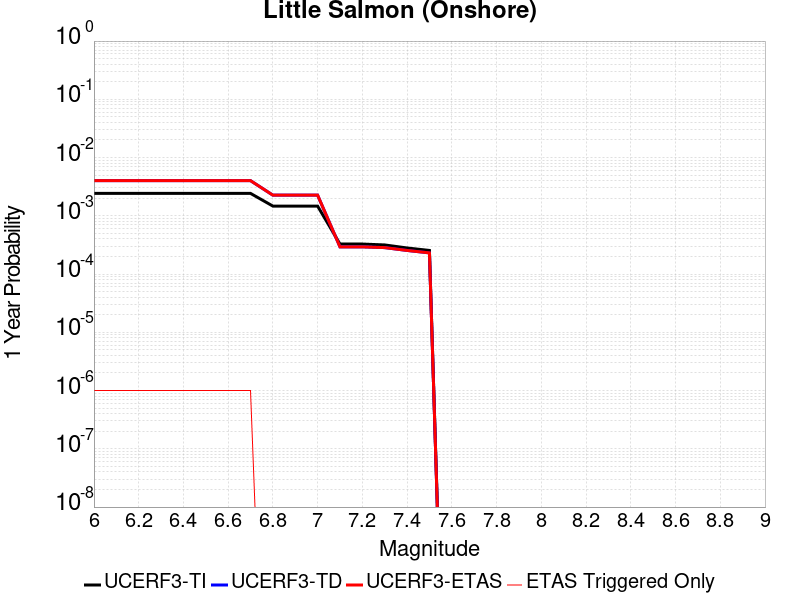 |  |

| Magnitude | 1 wk TI Prob | 1 wk TD Prob | 1 wk ETAS Prob | 1 wk ETAS/TD Gain | 1 wk ETAS Triggered Only | 1 mo TI Prob | 1 mo TD Prob | 1 mo ETAS Prob | 1 mo ETAS/TD Gain | 1 mo ETAS Triggered Only | 1 yr TI Prob | 1 yr TD Prob | 1 yr ETAS Prob | 1 yr ETAS/TD Gain | 1 yr ETAS Triggered Only | 10 yr TI Prob | 10 yr TD Prob | 10 yr ETAS Prob | 10 yr ETAS/TD Gain | 10 yr ETAS Triggered Only |
|-----|-----|-----|-----|-----|-----|-----|-----|-----|-----|-----|-----|-----|-----|-----|-----|-----|-----|-----|-----|-----|
| 6.0 | 4.6568723E-5 | 7.707324E-5 | 7.707324E-5 | 1.0 | 0.0 | 1.9956498E-4 | 3.302865E-4 | 3.3128617E-4 | 1.0030267 | 1.0E-6 | 0.0024269961 | 0.004016383 | 0.004017379 | 1.000248 | 1.0E-6 | 0.024006605 | 0.039698143 | 0.039700065 | 1.0000484 | 2.0E-6 |
| 6.1 | 4.6568723E-5 | 7.707324E-5 | 7.707324E-5 | 1.0 | 0.0 | 1.9956498E-4 | 3.302865E-4 | 3.3128617E-4 | 1.0030267 | 1.0E-6 | 0.0024269961 | 0.004016383 | 0.004017379 | 1.000248 | 1.0E-6 | 0.024006605 | 0.039698143 | 0.039700065 | 1.0000484 | 2.0E-6 |
| 6.2 | 4.6568723E-5 | 7.707324E-5 | 7.707324E-5 | 1.0 | 0.0 | 1.9956498E-4 | 3.302865E-4 | 3.3128617E-4 | 1.0030267 | 1.0E-6 | 0.0024269961 | 0.004016383 | 0.004017379 | 1.000248 | 1.0E-6 | 0.024006605 | 0.039698143 | 0.039700065 | 1.0000484 | 2.0E-6 |
| 6.3 | 4.6568723E-5 | 7.707324E-5 | 7.707324E-5 | 1.0 | 0.0 | 1.9956498E-4 | 3.302865E-4 | 3.3128617E-4 | 1.0030267 | 1.0E-6 | 0.0024269961 | 0.004016383 | 0.004017379 | 1.000248 | 1.0E-6 | 0.024006605 | 0.039698143 | 0.039700065 | 1.0000484 | 2.0E-6 |
| 6.4 | 4.6568723E-5 | 7.707324E-5 | 7.707324E-5 | 1.0 | 0.0 | 1.9956498E-4 | 3.302865E-4 | 3.3128617E-4 | 1.0030267 | 1.0E-6 | 0.0024269961 | 0.004016383 | 0.004017379 | 1.000248 | 1.0E-6 | 0.024006605 | 0.039698143 | 0.039700065 | 1.0000484 | 2.0E-6 |
| 6.5 | 4.6568723E-5 | 7.707324E-5 | 7.707324E-5 | 1.0 | 0.0 | 1.9956498E-4 | 3.302865E-4 | 3.3128617E-4 | 1.0030267 | 1.0E-6 | 0.0024269961 | 0.004016383 | 0.004017379 | 1.000248 | 1.0E-6 | 0.024006605 | 0.039698143 | 0.039700065 | 1.0000484 | 2.0E-6 |
| 6.6 | 4.6568723E-5 | 7.707324E-5 | 7.707324E-5 | 1.0 | 0.0 | 1.9956498E-4 | 3.302865E-4 | 3.3128617E-4 | 1.0030267 | 1.0E-6 | 0.0024269961 | 0.004016383 | 0.004017379 | 1.000248 | 1.0E-6 | 0.024006605 | 0.039698143 | 0.039700065 | 1.0000484 | 2.0E-6 |
| 6.7 | 4.6568723E-5 | 7.707324E-5 | 7.707324E-5 | 1.0 | 0.0 | 1.9956498E-4 | 3.302865E-4 | 3.3128617E-4 | 1.0030267 | 1.0E-6 | 0.0024269961 | 0.004016383 | 0.004017379 | 1.000248 | 1.0E-6 | 0.024006605 | 0.039698143 | 0.039700065 | 1.0000484 | 2.0E-6 |
| 6.8 | 2.817612E-5 | 4.3363176E-5 | 4.3363176E-5 | 1.0 | 0.0 | 1.2074922E-4 | 1.858391E-4 | 1.858391E-4 | 1.0 | 0.0 | 0.0014691303 | 0.0022620468 | 0.0022620468 | 1.0 | 0.0 | 0.014594556 | 0.022384832 | 0.02238581 | 1.0000436 | 1.0E-6 |
| 6.9 | 2.817612E-5 | 4.3363176E-5 | 4.3363176E-5 | 1.0 | 0.0 | 1.2074922E-4 | 1.858391E-4 | 1.858391E-4 | 1.0 | 0.0 | 0.0014691303 | 0.0022620468 | 0.0022620468 | 1.0 | 0.0 | 0.014594556 | 0.022384832 | 0.02238581 | 1.0000436 | 1.0E-6 |
| 7.0 | 2.817612E-5 | 4.3363176E-5 | 4.3363176E-5 | 1.0 | 0.0 | 1.2074922E-4 | 1.858391E-4 | 1.858391E-4 | 1.0 | 0.0 | 0.0014691303 | 0.0022620468 | 0.0022620468 | 1.0 | 0.0 | 0.014594556 | 0.022384832 | 0.02238581 | 1.0000436 | 1.0E-6 |
| 7.1 | 6.2777285E-6 | 5.618754E-6 | 5.618754E-6 | 1.0 | 0.0 | 2.6904274E-5 | 2.4080293E-5 | 2.4080293E-5 | 1.0 | 0.0 | 3.275103E-4 | 2.931631E-4 | 2.931631E-4 | 1.0 | 0.0 | 0.0032702803 | 0.0029313108 | 0.0029313108 | 1.0 | 0.0 |
| 7.2 | 6.2777285E-6 | 5.618754E-6 | 5.618754E-6 | 1.0 | 0.0 | 2.6904274E-5 | 2.4080293E-5 | 2.4080293E-5 | 1.0 | 0.0 | 3.275103E-4 | 2.931631E-4 | 2.931631E-4 | 1.0 | 0.0 | 0.0032702803 | 0.0029313108 | 0.0029313108 | 1.0 | 0.0 |
| 7.3 | 6.061432E-6 | 5.4547E-6 | 5.4547E-6 | 1.0 | 0.0 | 2.5977308E-5 | 2.3377217E-5 | 2.3377217E-5 | 1.0 | 0.0 | 3.1622782E-4 | 2.846054E-4 | 2.846054E-4 | 1.0 | 0.0 | 0.003157782 | 0.002845529 | 0.002845529 | 1.0 | 0.0 |
| 7.4 | 5.3761873E-6 | 4.8759243E-6 | 4.8759243E-6 | 1.0 | 0.0 | 2.30406E-5 | 2.089679E-5 | 2.089679E-5 | 1.0 | 0.0 | 2.804832E-4 | 2.5441346E-4 | 2.5441346E-4 | 1.0 | 0.0 | 0.0028012944 | 0.0025439227 | 0.0025439227 | 1.0 | 0.0 |
| 7.5 | 4.876217E-6 | 4.4262965E-6 | 4.4262965E-6 | 1.0 | 0.0 | 2.0897905E-5 | 1.8969842E-5 | 1.8969842E-5 | 1.0 | 0.0 | 2.544023E-4 | 2.3095783E-4 | 2.3095783E-4 | 1.0 | 0.0 | 0.0025411125 | 0.0023095782 | 0.0023095782 | 1.0 | 0.0 |

## Table Bluff
*[(top)](#table-of-contents)*

| 1 Week | 1 Month | 1 Year | 10 Year |
|-----|-----|-----|-----|
|  |  |  |  |

| Magnitude | 1 wk TI Prob | 1 wk TD Prob | 1 wk ETAS Prob | 1 wk ETAS/TD Gain | 1 wk ETAS Triggered Only | 1 mo TI Prob | 1 mo TD Prob | 1 mo ETAS Prob | 1 mo ETAS/TD Gain | 1 mo ETAS Triggered Only | 1 yr TI Prob | 1 yr TD Prob | 1 yr ETAS Prob | 1 yr ETAS/TD Gain | 1 yr ETAS Triggered Only | 10 yr TI Prob | 10 yr TD Prob | 10 yr ETAS Prob | 10 yr ETAS/TD Gain | 10 yr ETAS Triggered Only |
|-----|-----|-----|-----|-----|-----|-----|-----|-----|-----|-----|-----|-----|-----|-----|-----|-----|-----|-----|-----|-----|
| 6.0 | 8.541982E-6 | 8.987852E-6 | 9.987843E-6 | 1.1112603 | 1.0E-6 | 3.6607984E-5 | 3.851894E-5 | 3.95189E-5 | 1.0259602 | 1.0E-6 | 4.4561105E-4 | 4.6889263E-4 | 4.6989217E-4 | 1.0021317 | 1.0E-6 | 0.0044471854 | 0.004681533 | 0.004683524 | 1.0004252 | 2.0E-6 |
| 6.1 | 8.541982E-6 | 8.987852E-6 | 9.987843E-6 | 1.1112603 | 1.0E-6 | 3.6607984E-5 | 3.851894E-5 | 3.95189E-5 | 1.0259602 | 1.0E-6 | 4.4561105E-4 | 4.6889263E-4 | 4.6989217E-4 | 1.0021317 | 1.0E-6 | 0.0044471854 | 0.004681533 | 0.004683524 | 1.0004252 | 2.0E-6 |
| 6.2 | 8.541982E-6 | 8.987852E-6 | 9.987843E-6 | 1.1112603 | 1.0E-6 | 3.6607984E-5 | 3.851894E-5 | 3.95189E-5 | 1.0259602 | 1.0E-6 | 4.4561105E-4 | 4.6889263E-4 | 4.6989217E-4 | 1.0021317 | 1.0E-6 | 0.0044471854 | 0.004681533 | 0.004683524 | 1.0004252 | 2.0E-6 |
| 6.3 | 8.541982E-6 | 8.987852E-6 | 9.987843E-6 | 1.1112603 | 1.0E-6 | 3.6607984E-5 | 3.851894E-5 | 3.95189E-5 | 1.0259602 | 1.0E-6 | 4.4561105E-4 | 4.6889263E-4 | 4.6989217E-4 | 1.0021317 | 1.0E-6 | 0.0044471854 | 0.004681533 | 0.004683524 | 1.0004252 | 2.0E-6 |
| 6.4 | 8.541982E-6 | 8.987852E-6 | 9.987843E-6 | 1.1112603 | 1.0E-6 | 3.6607984E-5 | 3.851894E-5 | 3.95189E-5 | 1.0259602 | 1.0E-6 | 4.4561105E-4 | 4.6889263E-4 | 4.6989217E-4 | 1.0021317 | 1.0E-6 | 0.0044471854 | 0.004681533 | 0.004683524 | 1.0004252 | 2.0E-6 |
| 6.5 | 8.541982E-6 | 8.987852E-6 | 9.987843E-6 | 1.1112603 | 1.0E-6 | 3.6607984E-5 | 3.851894E-5 | 3.95189E-5 | 1.0259602 | 1.0E-6 | 4.4561105E-4 | 4.6889263E-4 | 4.6989217E-4 | 1.0021317 | 1.0E-6 | 0.0044471854 | 0.004681533 | 0.004683524 | 1.0004252 | 2.0E-6 |
| 6.6 | 7.603614E-6 | 7.999282E-6 | 8.9992745E-6 | 1.1250103 | 1.0E-6 | 3.258651E-5 | 3.428233E-5 | 3.5282297E-5 | 1.0291685 | 1.0E-6 | 3.9666853E-4 | 4.1733249E-4 | 4.1833206E-4 | 1.0023952 | 1.0E-6 | 0.0039596125 | 0.004167945 | 0.0041699368 | 1.0004779 | 2.0E-6 |
| 6.7 | 6.632537E-6 | 6.9728376E-6 | 7.972831E-6 | 1.1434126 | 1.0E-6 | 2.8424849E-5 | 2.9883386E-5 | 3.0883355E-5 | 1.0334624 | 1.0E-6 | 3.460176E-4 | 3.63794E-4 | 3.6479364E-4 | 1.0027478 | 1.0E-6 | 0.003454793 | 0.0036343904 | 0.0036363832 | 1.0005482 | 2.0E-6 |
| 6.8 | 5.585498E-6 | 5.866922E-6 | 6.8669165E-6 | 1.1704462 | 1.0E-6 | 2.393763E-5 | 2.5143843E-5 | 2.6143818E-5 | 1.0397701 | 1.0E-6 | 2.9140167E-4 | 3.0610696E-4 | 3.0710665E-4 | 1.0032659 | 1.0E-6 | 0.0029101984 | 0.0030591735 | 0.0030601704 | 1.0003259 | 1.0E-6 |
| 6.9 | 5.0134163E-6 | 5.2652563E-6 | 6.265251E-6 | 1.1899233 | 1.0E-6 | 2.1485892E-5 | 2.2565322E-5 | 2.3565299E-5 | 1.0443147 | 1.0E-6 | 2.6155933E-4 | 2.7472156E-4 | 2.757213E-4 | 1.0036391 | 1.0E-6 | 0.002612517 | 0.0027461157 | 0.002747113 | 1.0003631 | 1.0E-6 |
| 7.0 | 4.0872746E-6 | 4.288966E-6 | 5.2889613E-6 | 1.2331555 | 1.0E-6 | 1.7516773E-5 | 1.8381283E-5 | 1.9381263E-5 | 1.0544021 | 1.0E-6 | 2.1324586E-4 | 2.2379211E-4 | 2.2479189E-4 | 1.0044675 | 1.0E-6 | 0.0021304134 | 0.002237921 | 0.0022389188 | 1.0004458 | 1.0E-6 |
| 7.1 | 4.0872746E-6 | 4.288966E-6 | 5.2889613E-6 | 1.2331555 | 1.0E-6 | 1.7516773E-5 | 1.8381283E-5 | 1.9381263E-5 | 1.0544021 | 1.0E-6 | 2.1324586E-4 | 2.2379211E-4 | 2.2479189E-4 | 1.0044675 | 1.0E-6 | 0.0021304134 | 0.002237921 | 0.0022389188 | 1.0004458 | 1.0E-6 |

## Fish Slough 2011 CFM
*[(top)](#table-of-contents)*

| 1 Week | 1 Month | 1 Year | 10 Year |
|-----|-----|-----|-----|
| 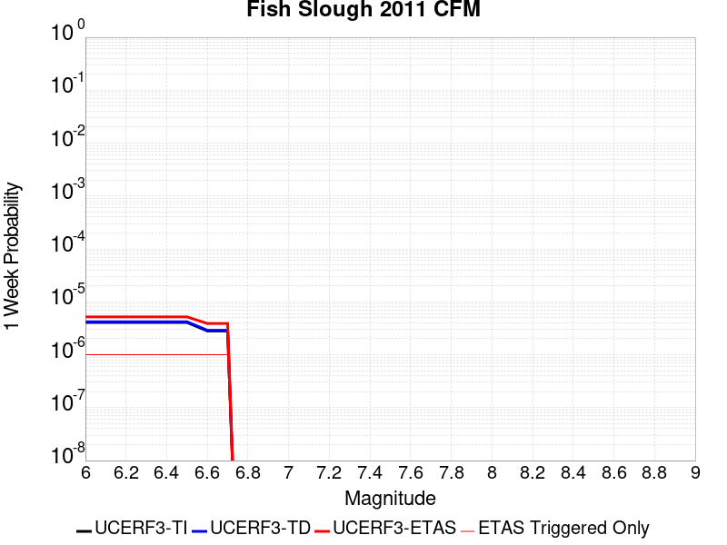 |  |  |  |

| Magnitude | 1 wk TI Prob | 1 wk TD Prob | 1 wk ETAS Prob | 1 wk ETAS/TD Gain | 1 wk ETAS Triggered Only | 1 mo TI Prob | 1 mo TD Prob | 1 mo ETAS Prob | 1 mo ETAS/TD Gain | 1 mo ETAS Triggered Only | 1 yr TI Prob | 1 yr TD Prob | 1 yr ETAS Prob | 1 yr ETAS/TD Gain | 1 yr ETAS Triggered Only | 10 yr TI Prob | 10 yr TD Prob | 10 yr ETAS Prob | 10 yr ETAS/TD Gain | 10 yr ETAS Triggered Only |
|-----|-----|-----|-----|-----|-----|-----|-----|-----|-----|-----|-----|-----|-----|-----|-----|-----|-----|-----|-----|-----|
| 6.0 | 4.080039E-6 | 4.1994913E-6 | 5.199487E-6 | 1.238123 | 1.0E-6 | 1.7485765E-5 | 1.7997761E-5 | 1.8997742E-5 | 1.0555614 | 1.0E-6 | 2.1286838E-4 | 2.1911228E-4 | 2.2111184E-4 | 1.0091257 | 2.0E-6 | 0.002126646 | 0.002190098 | 0.0021920935 | 1.0009112 | 2.0E-6 |
| 6.1 | 4.080039E-6 | 4.1994913E-6 | 5.199487E-6 | 1.238123 | 1.0E-6 | 1.7485765E-5 | 1.7997761E-5 | 1.8997742E-5 | 1.0555614 | 1.0E-6 | 2.1286838E-4 | 2.1911228E-4 | 2.2111184E-4 | 1.0091257 | 2.0E-6 | 0.002126646 | 0.002190098 | 0.0021920935 | 1.0009112 | 2.0E-6 |
| 6.2 | 4.080039E-6 | 4.1994913E-6 | 5.199487E-6 | 1.238123 | 1.0E-6 | 1.7485765E-5 | 1.7997761E-5 | 1.8997742E-5 | 1.0555614 | 1.0E-6 | 2.1286838E-4 | 2.1911228E-4 | 2.2111184E-4 | 1.0091257 | 2.0E-6 | 0.002126646 | 0.002190098 | 0.0021920935 | 1.0009112 | 2.0E-6 |
| 6.3 | 4.080039E-6 | 4.1994913E-6 | 5.199487E-6 | 1.238123 | 1.0E-6 | 1.7485765E-5 | 1.7997761E-5 | 1.8997742E-5 | 1.0555614 | 1.0E-6 | 2.1286838E-4 | 2.1911228E-4 | 2.2111184E-4 | 1.0091257 | 2.0E-6 | 0.002126646 | 0.002190098 | 0.0021920935 | 1.0009112 | 2.0E-6 |
| 6.4 | 4.080039E-6 | 4.1994913E-6 | 5.199487E-6 | 1.238123 | 1.0E-6 | 1.7485765E-5 | 1.7997761E-5 | 1.8997742E-5 | 1.0555614 | 1.0E-6 | 2.1286838E-4 | 2.1911228E-4 | 2.2111184E-4 | 1.0091257 | 2.0E-6 | 0.002126646 | 0.002190098 | 0.0021920935 | 1.0009112 | 2.0E-6 |
| 6.5 | 4.080039E-6 | 4.1994913E-6 | 5.199487E-6 | 1.238123 | 1.0E-6 | 1.7485765E-5 | 1.7997761E-5 | 1.8997742E-5 | 1.0555614 | 1.0E-6 | 2.1286838E-4 | 2.1911228E-4 | 2.2111184E-4 | 1.0091257 | 2.0E-6 | 0.002126646 | 0.002190098 | 0.0021920935 | 1.0009112 | 2.0E-6 |
| 6.6 | 2.8215584E-6 | 2.9034215E-6 | 3.903419E-6 | 1.3444202 | 1.0E-6 | 1.2092337E-5 | 1.2443235E-5 | 1.3443223E-5 | 1.080364 | 1.0E-6 | 1.4721425E-4 | 1.514964E-4 | 1.5349609E-4 | 1.0131997 | 2.0E-6 | 0.0014711677 | 0.0015149639 | 0.0015169609 | 1.0013182 | 2.0E-6 |
| 6.7 | 2.8215584E-6 | 2.9034215E-6 | 3.903419E-6 | 1.3444202 | 1.0E-6 | 1.2092337E-5 | 1.2443235E-5 | 1.3443223E-5 | 1.080364 | 1.0E-6 | 1.4721425E-4 | 1.514964E-4 | 1.5349609E-4 | 1.0131997 | 2.0E-6 | 0.0014711677 | 0.0015149639 | 0.0015169609 | 1.0013182 | 2.0E-6 |

## Hilton Creek 2011 CFM
*[(top)](#table-of-contents)*

| 1 Week | 1 Month | 1 Year | 10 Year |
|-----|-----|-----|-----|
|  |  |  |  |

| Magnitude | 1 wk TI Prob | 1 wk TD Prob | 1 wk ETAS Prob | 1 wk ETAS/TD Gain | 1 wk ETAS Triggered Only | 1 mo TI Prob | 1 mo TD Prob | 1 mo ETAS Prob | 1 mo ETAS/TD Gain | 1 mo ETAS Triggered Only | 1 yr TI Prob | 1 yr TD Prob | 1 yr ETAS Prob | 1 yr ETAS/TD Gain | 1 yr ETAS Triggered Only | 10 yr TI Prob | 10 yr TD Prob | 10 yr ETAS Prob | 10 yr ETAS/TD Gain | 10 yr ETAS Triggered Only |
|-----|-----|-----|-----|-----|-----|-----|-----|-----|-----|-----|-----|-----|-----|-----|-----|-----|-----|-----|-----|-----|
| 6.0 | 4.374322E-5 | 1.3041512E-5 | 1.3041512E-5 | 1.0 | 0.0 | 1.8745747E-4 | 5.5891596E-5 | 5.6891542E-5 | 1.0178908 | 1.0E-6 | 0.0022799056 | 6.803746E-4 | 6.8137393E-4 | 1.0014688 | 1.0E-6 | 0.022566564 | 0.0070343725 | 0.0070363586 | 1.0002823 | 2.0E-6 |
| 6.1 | 4.374322E-5 | 1.3041512E-5 | 1.3041512E-5 | 1.0 | 0.0 | 1.8745747E-4 | 5.5891596E-5 | 5.6891542E-5 | 1.0178908 | 1.0E-6 | 0.0022799056 | 6.803746E-4 | 6.8137393E-4 | 1.0014688 | 1.0E-6 | 0.022566564 | 0.0070343725 | 0.0070363586 | 1.0002823 | 2.0E-6 |
| 6.2 | 4.374322E-5 | 1.3041512E-5 | 1.3041512E-5 | 1.0 | 0.0 | 1.8745747E-4 | 5.5891596E-5 | 5.6891542E-5 | 1.0178908 | 1.0E-6 | 0.0022799056 | 6.803746E-4 | 6.8137393E-4 | 1.0014688 | 1.0E-6 | 0.022566564 | 0.0070343725 | 0.0070363586 | 1.0002823 | 2.0E-6 |
| 6.3 | 4.374322E-5 | 1.3041512E-5 | 1.3041512E-5 | 1.0 | 0.0 | 1.8745747E-4 | 5.5891596E-5 | 5.6891542E-5 | 1.0178908 | 1.0E-6 | 0.0022799056 | 6.803746E-4 | 6.8137393E-4 | 1.0014688 | 1.0E-6 | 0.022566564 | 0.0070343725 | 0.0070363586 | 1.0002823 | 2.0E-6 |
| 6.4 | 4.374322E-5 | 1.3041512E-5 | 1.3041512E-5 | 1.0 | 0.0 | 1.8745747E-4 | 5.5891596E-5 | 5.6891542E-5 | 1.0178908 | 1.0E-6 | 0.0022799056 | 6.803746E-4 | 6.8137393E-4 | 1.0014688 | 1.0E-6 | 0.022566564 | 0.0070343725 | 0.0070363586 | 1.0002823 | 2.0E-6 |
| 6.5 | 4.374322E-5 | 1.3041512E-5 | 1.3041512E-5 | 1.0 | 0.0 | 1.8745747E-4 | 5.5891596E-5 | 5.6891542E-5 | 1.0178908 | 1.0E-6 | 0.0022799056 | 6.803746E-4 | 6.8137393E-4 | 1.0014688 | 1.0E-6 | 0.022566564 | 0.0070343725 | 0.0070363586 | 1.0002823 | 2.0E-6 |
| 6.6 | 3.4174147E-5 | 6.012423E-6 | 6.012423E-6 | 1.0 | 0.0 | 1.4645241E-4 | 2.5767527E-5 | 2.6767502E-5 | 1.0388075 | 1.0E-6 | 0.0017815997 | 3.1371965E-4 | 3.1471933E-4 | 1.0031866 | 1.0E-6 | 0.017673839 | 0.0032900004 | 0.0032909971 | 1.0003029 | 1.0E-6 |
| 6.7 | 3.4174147E-5 | 6.012423E-6 | 6.012423E-6 | 1.0 | 0.0 | 1.4645241E-4 | 2.5767527E-5 | 2.6767502E-5 | 1.0388075 | 1.0E-6 | 0.0017815997 | 3.1371965E-4 | 3.1471933E-4 | 1.0031866 | 1.0E-6 | 0.017673839 | 0.0032900004 | 0.0032909971 | 1.0003029 | 1.0E-6 |

## Monterey Bay-Tularcitos
*[(top)](#table-of-contents)*

| 1 Week | 1 Month | 1 Year | 10 Year |
|-----|-----|-----|-----|
|  |  | 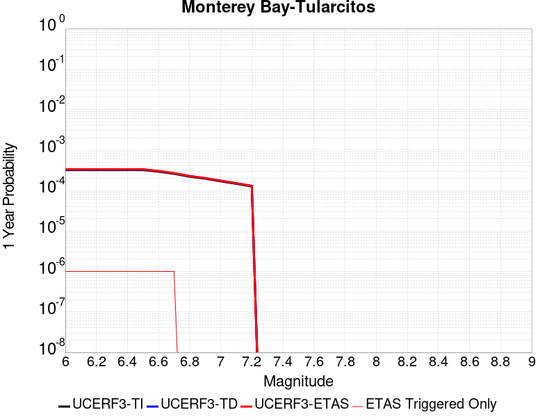 | 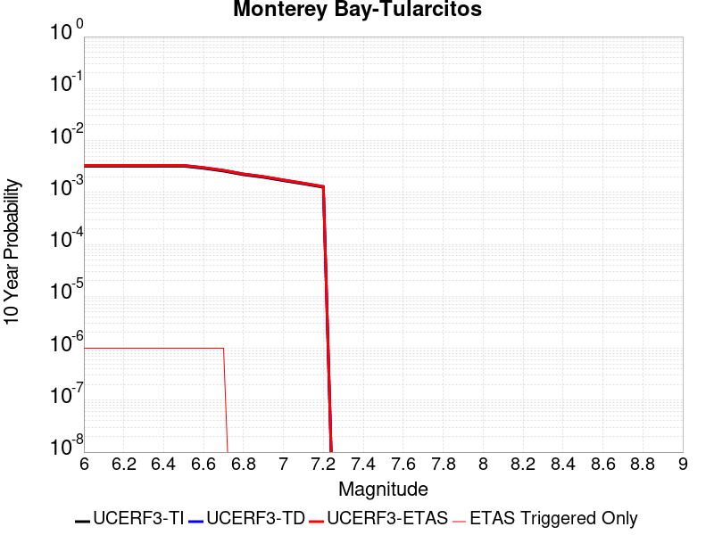 |

| Magnitude | 1 wk TI Prob | 1 wk TD Prob | 1 wk ETAS Prob | 1 wk ETAS/TD Gain | 1 wk ETAS Triggered Only | 1 mo TI Prob | 1 mo TD Prob | 1 mo ETAS Prob | 1 mo ETAS/TD Gain | 1 mo ETAS Triggered Only | 1 yr TI Prob | 1 yr TD Prob | 1 yr ETAS Prob | 1 yr ETAS/TD Gain | 1 yr ETAS Triggered Only | 10 yr TI Prob | 10 yr TD Prob | 10 yr ETAS Prob | 10 yr ETAS/TD Gain | 10 yr ETAS Triggered Only |
|-----|-----|-----|-----|-----|-----|-----|-----|-----|-----|-----|-----|-----|-----|-----|-----|-----|-----|-----|-----|-----|
| 6.0 | 6.147834E-6 | 6.3537386E-6 | 7.3537326E-6 | 1.1573867 | 1.0E-6 | 2.6347594E-5 | 2.7230071E-5 | 2.8230044E-5 | 1.0367231 | 1.0E-6 | 3.2073475E-4 | 3.314838E-4 | 3.324835E-4 | 1.0030158 | 1.0E-6 | 0.0032027222 | 0.003310695 | 0.0033116918 | 1.000301 | 1.0E-6 |
| 6.1 | 6.147834E-6 | 6.3537386E-6 | 7.3537326E-6 | 1.1573867 | 1.0E-6 | 2.6347594E-5 | 2.7230071E-5 | 2.8230044E-5 | 1.0367231 | 1.0E-6 | 3.2073475E-4 | 3.314838E-4 | 3.324835E-4 | 1.0030158 | 1.0E-6 | 0.0032027222 | 0.003310695 | 0.0033116918 | 1.000301 | 1.0E-6 |
| 6.2 | 6.147834E-6 | 6.3537386E-6 | 7.3537326E-6 | 1.1573867 | 1.0E-6 | 2.6347594E-5 | 2.7230071E-5 | 2.8230044E-5 | 1.0367231 | 1.0E-6 | 3.2073475E-4 | 3.314838E-4 | 3.324835E-4 | 1.0030158 | 1.0E-6 | 0.0032027222 | 0.003310695 | 0.0033116918 | 1.000301 | 1.0E-6 |
| 6.3 | 6.147834E-6 | 6.3537386E-6 | 7.3537326E-6 | 1.1573867 | 1.0E-6 | 2.6347594E-5 | 2.7230071E-5 | 2.8230044E-5 | 1.0367231 | 1.0E-6 | 3.2073475E-4 | 3.314838E-4 | 3.324835E-4 | 1.0030158 | 1.0E-6 | 0.0032027222 | 0.003310695 | 0.0033116918 | 1.000301 | 1.0E-6 |
| 6.4 | 6.147834E-6 | 6.3537386E-6 | 7.3537326E-6 | 1.1573867 | 1.0E-6 | 2.6347594E-5 | 2.7230071E-5 | 2.8230044E-5 | 1.0367231 | 1.0E-6 | 3.2073475E-4 | 3.314838E-4 | 3.324835E-4 | 1.0030158 | 1.0E-6 | 0.0032027222 | 0.003310695 | 0.0033116918 | 1.000301 | 1.0E-6 |
| 6.5 | 6.147834E-6 | 6.3537386E-6 | 7.3537326E-6 | 1.1573867 | 1.0E-6 | 2.6347594E-5 | 2.7230071E-5 | 2.8230044E-5 | 1.0367231 | 1.0E-6 | 3.2073475E-4 | 3.314838E-4 | 3.324835E-4 | 1.0030158 | 1.0E-6 | 0.0032027222 | 0.003310695 | 0.0033116918 | 1.000301 | 1.0E-6 |
| 6.6 | 5.589465E-6 | 5.775827E-6 | 6.7758215E-6 | 1.1731343 | 1.0E-6 | 2.3954632E-5 | 2.4753355E-5 | 2.575333E-5 | 1.0403975 | 1.0E-6 | 2.916086E-4 | 3.0133853E-4 | 3.0233822E-4 | 1.0033175 | 1.0E-6 | 0.0029122625 | 0.0030100958 | 0.0030110928 | 1.0003312 | 1.0E-6 |
| 6.7 | 4.9405426E-6 | 5.1041475E-6 | 6.1041424E-6 | 1.1959181 | 1.0E-6 | 2.1173582E-5 | 2.187478E-5 | 2.2874758E-5 | 1.0457138 | 1.0E-6 | 2.5775787E-4 | 2.6630092E-4 | 2.6730067E-4 | 1.0037541 | 1.0E-6 | 0.002574591 | 0.002660607 | 0.0026616042 | 1.0003749 | 1.0E-6 |
| 6.8 | 4.208054E-6 | 4.3459117E-6 | 4.3459117E-6 | 1.0 | 0.0 | 1.8034392E-5 | 1.8625247E-5 | 1.8625247E-5 | 1.0 | 0.0 | 2.1954661E-4 | 2.2674672E-4 | 2.2674672E-4 | 1.0 | 0.0 | 0.0021932982 | 0.002265932 | 0.002265932 | 1.0 | 0.0 |
| 6.9 | 3.7512484E-6 | 3.873087E-6 | 3.873087E-6 | 1.0 | 0.0 | 1.607668E-5 | 1.6598884E-5 | 1.6598884E-5 | 1.0 | 0.0 | 1.95716E-4 | 2.0208056E-4 | 2.0208056E-4 | 1.0 | 0.0 | 0.0019554372 | 0.0020197425 | 0.0020197425 | 1.0 | 0.0 |
| 7.0 | 3.2285764E-6 | 3.3316937E-6 | 3.3316937E-6 | 1.0 | 0.0 | 1.3836683E-5 | 1.4278654E-5 | 1.4278654E-5 | 1.0 | 0.0 | 1.6844859E-4 | 1.7383658E-4 | 1.7383658E-4 | 1.0 | 0.0 | 0.0016832096 | 0.001737775 | 0.001737775 | 1.0 | 0.0 |
| 7.1 | 2.8032086E-6 | 2.8916106E-6 | 2.8916106E-6 | 1.0 | 0.0 | 1.2013696E-5 | 1.2392602E-5 | 1.2392602E-5 | 1.0 | 0.0 | 1.4625693E-4 | 1.5087728E-4 | 1.5087728E-4 | 1.0 | 0.0 | 0.001461607 | 0.0015085127 | 0.0015085127 | 1.0 | 0.0 |
| 7.2 | 2.4112803E-6 | 2.4866415E-6 | 2.4866415E-6 | 1.0 | 0.0 | 1.0334018E-5 | 1.0657035E-5 | 1.0657035E-5 | 1.0 | 0.0 | 1.258094E-4 | 1.297494E-4 | 1.297494E-4 | 1.0 | 0.0 | 0.001257382 | 0.001297494 | 0.001297494 | 1.0 | 0.0 |

## Great Valley 02
*[(top)](#table-of-contents)*

| 1 Week | 1 Month | 1 Year | 10 Year |
|-----|-----|-----|-----|
|  |  |  |  |

| Magnitude | 1 wk TI Prob | 1 wk TD Prob | 1 wk ETAS Prob | 1 wk ETAS/TD Gain | 1 wk ETAS Triggered Only | 1 mo TI Prob | 1 mo TD Prob | 1 mo ETAS Prob | 1 mo ETAS/TD Gain | 1 mo ETAS Triggered Only | 1 yr TI Prob | 1 yr TD Prob | 1 yr ETAS Prob | 1 yr ETAS/TD Gain | 1 yr ETAS Triggered Only | 10 yr TI Prob | 10 yr TD Prob | 10 yr ETAS Prob | 10 yr ETAS/TD Gain | 10 yr ETAS Triggered Only |
|-----|-----|-----|-----|-----|-----|-----|-----|-----|-----|-----|-----|-----|-----|-----|-----|-----|-----|-----|-----|-----|
| 6.0 | 2.4956353E-6 | 2.5435015E-6 | 2.5435015E-6 | 1.0 | 0.0 | 1.0695536E-5 | 1.0900721E-5 | 1.0900721E-5 | 1.0 | 0.0 | 1.3021036E-4 | 1.3271628E-4 | 1.3271628E-4 | 1.0 | 0.0 | 0.001301341 | 0.0013271627 | 0.0013281615 | 1.0007524 | 1.0E-6 |
| 6.1 | 2.4956353E-6 | 2.5435015E-6 | 2.5435015E-6 | 1.0 | 0.0 | 1.0695536E-5 | 1.0900721E-5 | 1.0900721E-5 | 1.0 | 0.0 | 1.3021036E-4 | 1.3271628E-4 | 1.3271628E-4 | 1.0 | 0.0 | 0.001301341 | 0.0013271627 | 0.0013281615 | 1.0007524 | 1.0E-6 |
| 6.2 | 2.4956353E-6 | 2.5435015E-6 | 2.5435015E-6 | 1.0 | 0.0 | 1.0695536E-5 | 1.0900721E-5 | 1.0900721E-5 | 1.0 | 0.0 | 1.3021036E-4 | 1.3271628E-4 | 1.3271628E-4 | 1.0 | 0.0 | 0.001301341 | 0.0013271627 | 0.0013281615 | 1.0007524 | 1.0E-6 |
| 6.3 | 2.4956353E-6 | 2.5435015E-6 | 2.5435015E-6 | 1.0 | 0.0 | 1.0695536E-5 | 1.0900721E-5 | 1.0900721E-5 | 1.0 | 0.0 | 1.3021036E-4 | 1.3271628E-4 | 1.3271628E-4 | 1.0 | 0.0 | 0.001301341 | 0.0013271627 | 0.0013281615 | 1.0007524 | 1.0E-6 |
| 6.4 | 2.4956353E-6 | 2.5435015E-6 | 2.5435015E-6 | 1.0 | 0.0 | 1.0695536E-5 | 1.0900721E-5 | 1.0900721E-5 | 1.0 | 0.0 | 1.3021036E-4 | 1.3271628E-4 | 1.3271628E-4 | 1.0 | 0.0 | 0.001301341 | 0.0013271627 | 0.0013281615 | 1.0007524 | 1.0E-6 |

## Mad River (alt1)
*[(top)](#table-of-contents)*

| 1 Week | 1 Month | 1 Year | 10 Year |
|-----|-----|-----|-----|
| 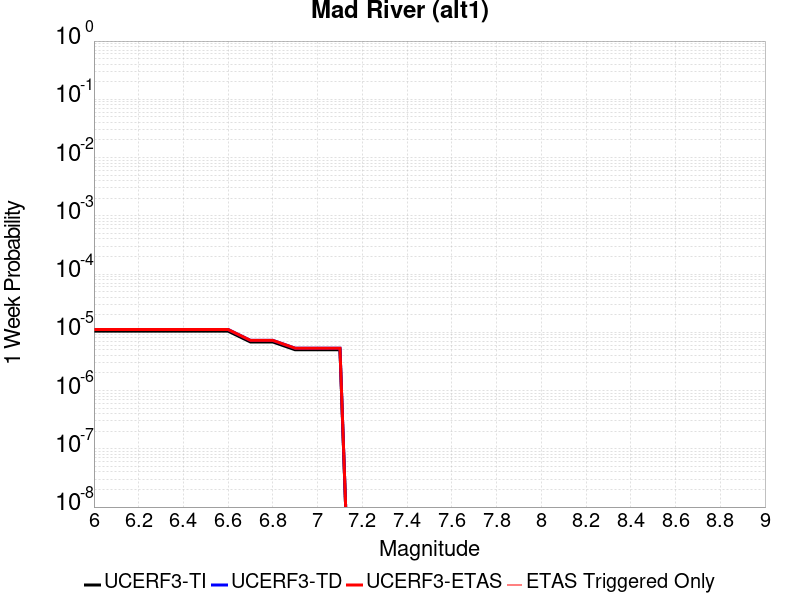 |  | 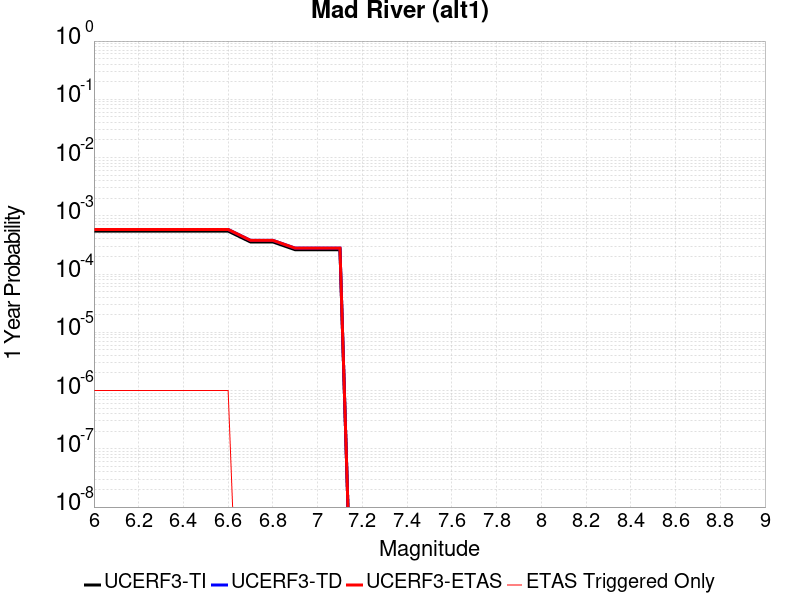 | 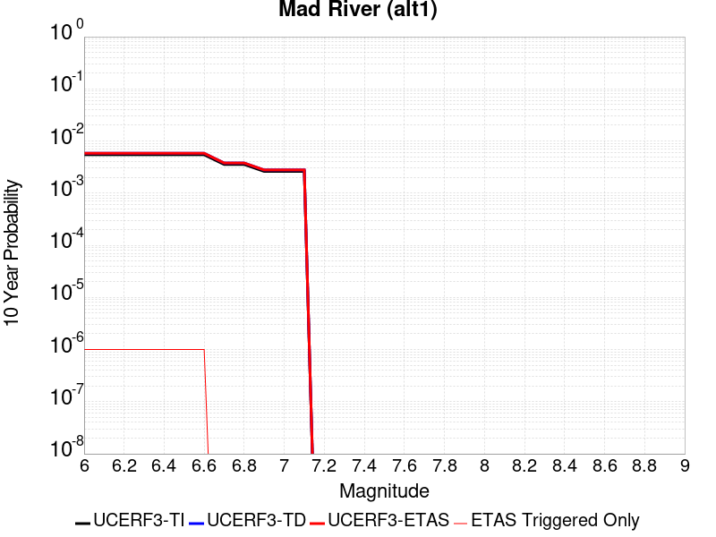 |

| Magnitude | 1 wk TI Prob | 1 wk TD Prob | 1 wk ETAS Prob | 1 wk ETAS/TD Gain | 1 wk ETAS Triggered Only | 1 mo TI Prob | 1 mo TD Prob | 1 mo ETAS Prob | 1 mo ETAS/TD Gain | 1 mo ETAS Triggered Only | 1 yr TI Prob | 1 yr TD Prob | 1 yr ETAS Prob | 1 yr ETAS/TD Gain | 1 yr ETAS Triggered Only | 10 yr TI Prob | 10 yr TD Prob | 10 yr ETAS Prob | 10 yr ETAS/TD Gain | 10 yr ETAS Triggered Only |
|-----|-----|-----|-----|-----|-----|-----|-----|-----|-----|-----|-----|-----|-----|-----|-----|-----|-----|-----|-----|-----|
| 6.0 | 1.0467587E-5 | 1.1164802E-5 | 1.1164802E-5 | 1.0 | 0.0 | 4.4860317E-5 | 4.7848524E-5 | 4.7848524E-5 | 1.0 | 0.0 | 5.460375E-4 | 5.8244454E-4 | 5.8344397E-4 | 1.0017159 | 1.0E-6 | 0.0054469774 | 0.0058135465 | 0.0058145407 | 1.0001711 | 1.0E-6 |
| 6.1 | 1.0467587E-5 | 1.1164802E-5 | 1.1164802E-5 | 1.0 | 0.0 | 4.4860317E-5 | 4.7848524E-5 | 4.7848524E-5 | 1.0 | 0.0 | 5.460375E-4 | 5.8244454E-4 | 5.8344397E-4 | 1.0017159 | 1.0E-6 | 0.0054469774 | 0.0058135465 | 0.0058145407 | 1.0001711 | 1.0E-6 |
| 6.2 | 1.0467587E-5 | 1.1164802E-5 | 1.1164802E-5 | 1.0 | 0.0 | 4.4860317E-5 | 4.7848524E-5 | 4.7848524E-5 | 1.0 | 0.0 | 5.460375E-4 | 5.8244454E-4 | 5.8344397E-4 | 1.0017159 | 1.0E-6 | 0.0054469774 | 0.0058135465 | 0.0058145407 | 1.0001711 | 1.0E-6 |
| 6.3 | 1.0467587E-5 | 1.1164802E-5 | 1.1164802E-5 | 1.0 | 0.0 | 4.4860317E-5 | 4.7848524E-5 | 4.7848524E-5 | 1.0 | 0.0 | 5.460375E-4 | 5.8244454E-4 | 5.8344397E-4 | 1.0017159 | 1.0E-6 | 0.0054469774 | 0.0058135465 | 0.0058145407 | 1.0001711 | 1.0E-6 |
| 6.4 | 1.0467587E-5 | 1.1164802E-5 | 1.1164802E-5 | 1.0 | 0.0 | 4.4860317E-5 | 4.7848524E-5 | 4.7848524E-5 | 1.0 | 0.0 | 5.460375E-4 | 5.8244454E-4 | 5.8344397E-4 | 1.0017159 | 1.0E-6 | 0.0054469774 | 0.0058135465 | 0.0058145407 | 1.0001711 | 1.0E-6 |
| 6.5 | 1.0467587E-5 | 1.1164802E-5 | 1.1164802E-5 | 1.0 | 0.0 | 4.4860317E-5 | 4.7848524E-5 | 4.7848524E-5 | 1.0 | 0.0 | 5.460375E-4 | 5.8244454E-4 | 5.8344397E-4 | 1.0017159 | 1.0E-6 | 0.0054469774 | 0.0058135465 | 0.0058145407 | 1.0001711 | 1.0E-6 |
| 6.6 | 1.0467587E-5 | 1.1164802E-5 | 1.1164802E-5 | 1.0 | 0.0 | 4.4860317E-5 | 4.7848524E-5 | 4.7848524E-5 | 1.0 | 0.0 | 5.460375E-4 | 5.8244454E-4 | 5.8344397E-4 | 1.0017159 | 1.0E-6 | 0.0054469774 | 0.0058135465 | 0.0058145407 | 1.0001711 | 1.0E-6 |
| 6.7 | 6.8156337E-6 | 7.26067E-6 | 7.26067E-6 | 1.0 | 0.0 | 2.9209532E-5 | 3.1117E-5 | 3.1117E-5 | 1.0 | 0.0 | 3.5556802E-4 | 3.7882148E-4 | 3.7882148E-4 | 1.0 | 0.0 | 0.0035499963 | 0.0037854728 | 0.0037854728 | 1.0 | 0.0 |
| 6.8 | 6.8156337E-6 | 7.26067E-6 | 7.26067E-6 | 1.0 | 0.0 | 2.9209532E-5 | 3.1117E-5 | 3.1117E-5 | 1.0 | 0.0 | 3.5556802E-4 | 3.7882148E-4 | 3.7882148E-4 | 1.0 | 0.0 | 0.0035499963 | 0.0037854728 | 0.0037854728 | 1.0 | 0.0 |
| 6.9 | 5.008665E-6 | 5.3308395E-6 | 5.3308395E-6 | 1.0 | 0.0 | 2.146553E-5 | 2.2846454E-5 | 2.2846454E-5 | 1.0 | 0.0 | 2.6131148E-4 | 2.7815558E-4 | 2.7815558E-4 | 1.0 | 0.0 | 0.0026100443 | 0.002781556 | 0.002781556 | 1.0 | 0.0 |
| 7.0 | 5.008665E-6 | 5.3308395E-6 | 5.3308395E-6 | 1.0 | 0.0 | 2.146553E-5 | 2.2846454E-5 | 2.2846454E-5 | 1.0 | 0.0 | 2.6131148E-4 | 2.7815558E-4 | 2.7815558E-4 | 1.0 | 0.0 | 0.0026100443 | 0.002781556 | 0.002781556 | 1.0 | 0.0 |
| 7.1 | 5.008665E-6 | 5.3308395E-6 | 5.3308395E-6 | 1.0 | 0.0 | 2.146553E-5 | 2.2846454E-5 | 2.2846454E-5 | 1.0 | 0.0 | 2.6131148E-4 | 2.7815558E-4 | 2.7815558E-4 | 1.0 | 0.0 | 0.0026100443 | 0.002781556 | 0.002781556 | 1.0 | 0.0 |

## Lions Head 2011 CFM
*[(top)](#table-of-contents)*

| 1 Week | 1 Month | 1 Year | 10 Year |
|-----|-----|-----|-----|
|  |  |  |  |

| Magnitude | 1 wk TI Prob | 1 wk TD Prob | 1 wk ETAS Prob | 1 wk ETAS/TD Gain | 1 wk ETAS Triggered Only | 1 mo TI Prob | 1 mo TD Prob | 1 mo ETAS Prob | 1 mo ETAS/TD Gain | 1 mo ETAS Triggered Only | 1 yr TI Prob | 1 yr TD Prob | 1 yr ETAS Prob | 1 yr ETAS/TD Gain | 1 yr ETAS Triggered Only | 10 yr TI Prob | 10 yr TD Prob | 10 yr ETAS Prob | 10 yr ETAS/TD Gain | 10 yr ETAS Triggered Only |
|-----|-----|-----|-----|-----|-----|-----|-----|-----|-----|-----|-----|-----|-----|-----|-----|-----|-----|-----|-----|-----|
| 6.0 | 3.9644272E-7 | 3.975295E-7 | 3.975295E-7 | 1.0 | 0.0 | 1.6990391E-6 | 1.7036973E-6 | 1.7036973E-6 | 1.0 | 0.0 | 2.0685604E-5 | 2.0742418E-5 | 2.0742418E-5 | 1.0 | 0.0 | 2.0683679E-4 | 2.0741469E-4 | 2.0841448E-4 | 1.0048202 | 1.0E-6 |
| 6.1 | 3.9644272E-7 | 3.975295E-7 | 3.975295E-7 | 1.0 | 0.0 | 1.6990391E-6 | 1.7036973E-6 | 1.7036973E-6 | 1.0 | 0.0 | 2.0685604E-5 | 2.0742418E-5 | 2.0742418E-5 | 1.0 | 0.0 | 2.0683679E-4 | 2.0741469E-4 | 2.0841448E-4 | 1.0048202 | 1.0E-6 |
| 6.2 | 3.9644272E-7 | 3.975295E-7 | 3.975295E-7 | 1.0 | 0.0 | 1.6990391E-6 | 1.7036973E-6 | 1.7036973E-6 | 1.0 | 0.0 | 2.0685604E-5 | 2.0742418E-5 | 2.0742418E-5 | 1.0 | 0.0 | 2.0683679E-4 | 2.0741469E-4 | 2.0841448E-4 | 1.0048202 | 1.0E-6 |
| 6.3 | 3.9644272E-7 | 3.975295E-7 | 3.975295E-7 | 1.0 | 0.0 | 1.6990391E-6 | 1.7036973E-6 | 1.7036973E-6 | 1.0 | 0.0 | 2.0685604E-5 | 2.0742418E-5 | 2.0742418E-5 | 1.0 | 0.0 | 2.0683679E-4 | 2.0741469E-4 | 2.0841448E-4 | 1.0048202 | 1.0E-6 |
| 6.4 | 3.9644272E-7 | 3.975295E-7 | 3.975295E-7 | 1.0 | 0.0 | 1.6990391E-6 | 1.7036973E-6 | 1.7036973E-6 | 1.0 | 0.0 | 2.0685604E-5 | 2.0742418E-5 | 2.0742418E-5 | 1.0 | 0.0 | 2.0683679E-4 | 2.0741469E-4 | 2.0841448E-4 | 1.0048202 | 1.0E-6 |
| 6.5 | 3.9644272E-7 | 3.975295E-7 | 3.975295E-7 | 1.0 | 0.0 | 1.6990391E-6 | 1.7036973E-6 | 1.7036973E-6 | 1.0 | 0.0 | 2.0685604E-5 | 2.0742418E-5 | 2.0742418E-5 | 1.0 | 0.0 | 2.0683679E-4 | 2.0741469E-4 | 2.0841448E-4 | 1.0048202 | 1.0E-6 |
| 6.6 | 2.741605E-7 | 2.7490307E-7 | 2.7490307E-7 | 1.0 | 0.0 | 1.174973E-6 | 1.178156E-6 | 1.178156E-6 | 1.0 | 0.0 | 1.4305203E-5 | 1.4344049E-5 | 1.4344049E-5 | 1.0 | 0.0 | 1.4304282E-4 | 1.434405E-4 | 1.434405E-4 | 1.0 | 0.0 |
| 6.7 | 2.741605E-7 | 2.7490307E-7 | 2.7490307E-7 | 1.0 | 0.0 | 1.174973E-6 | 1.178156E-6 | 1.178156E-6 | 1.0 | 0.0 | 1.4305203E-5 | 1.4344049E-5 | 1.4344049E-5 | 1.0 | 0.0 | 1.4304282E-4 | 1.434405E-4 | 1.434405E-4 | 1.0 | 0.0 |

## Quien Sabe 2011 CFM
*[(top)](#table-of-contents)*

| 1 Week | 1 Month | 1 Year | 10 Year |
|-----|-----|-----|-----|
|  |  |  |  |

| Magnitude | 1 wk TI Prob | 1 wk TD Prob | 1 wk ETAS Prob | 1 wk ETAS/TD Gain | 1 wk ETAS Triggered Only | 1 mo TI Prob | 1 mo TD Prob | 1 mo ETAS Prob | 1 mo ETAS/TD Gain | 1 mo ETAS Triggered Only | 1 yr TI Prob | 1 yr TD Prob | 1 yr ETAS Prob | 1 yr ETAS/TD Gain | 1 yr ETAS Triggered Only | 10 yr TI Prob | 10 yr TD Prob | 10 yr ETAS Prob | 10 yr ETAS/TD Gain | 10 yr ETAS Triggered Only |
|-----|-----|-----|-----|-----|-----|-----|-----|-----|-----|-----|-----|-----|-----|-----|-----|-----|-----|-----|-----|-----|
| 6.0 | 2.398591E-5 | 2.9279288E-5 | 3.027926E-5 | 1.0341529 | 1.0E-6 | 1.027927E-4 | 1.2548266E-4 | 1.2648254E-4 | 1.0079682 | 1.0E-6 | 0.0012507825 | 0.0015277443 | 0.0015287428 | 1.0006535 | 1.0E-6 | 0.012437659 | 0.015276767 | 0.015277752 | 1.0000645 | 1.0E-6 |
| 6.1 | 2.398591E-5 | 2.9279288E-5 | 3.027926E-5 | 1.0341529 | 1.0E-6 | 1.027927E-4 | 1.2548266E-4 | 1.2648254E-4 | 1.0079682 | 1.0E-6 | 0.0012507825 | 0.0015277443 | 0.0015287428 | 1.0006535 | 1.0E-6 | 0.012437659 | 0.015276767 | 0.015277752 | 1.0000645 | 1.0E-6 |
| 6.2 | 2.398591E-5 | 2.9279288E-5 | 3.027926E-5 | 1.0341529 | 1.0E-6 | 1.027927E-4 | 1.2548266E-4 | 1.2648254E-4 | 1.0079682 | 1.0E-6 | 0.0012507825 | 0.0015277443 | 0.0015287428 | 1.0006535 | 1.0E-6 | 0.012437659 | 0.015276767 | 0.015277752 | 1.0000645 | 1.0E-6 |
| 6.3 | 2.398591E-5 | 2.9279288E-5 | 3.027926E-5 | 1.0341529 | 1.0E-6 | 1.027927E-4 | 1.2548266E-4 | 1.2648254E-4 | 1.0079682 | 1.0E-6 | 0.0012507825 | 0.0015277443 | 0.0015287428 | 1.0006535 | 1.0E-6 | 0.012437659 | 0.015276767 | 0.015277752 | 1.0000645 | 1.0E-6 |
| 6.4 | 2.398591E-5 | 2.9279288E-5 | 3.027926E-5 | 1.0341529 | 1.0E-6 | 1.027927E-4 | 1.2548266E-4 | 1.2648254E-4 | 1.0079682 | 1.0E-6 | 0.0012507825 | 0.0015277443 | 0.0015287428 | 1.0006535 | 1.0E-6 | 0.012437659 | 0.015276767 | 0.015277752 | 1.0000645 | 1.0E-6 |

## Eureka Peak
*[(top)](#table-of-contents)*

| 1 Week | 1 Month | 1 Year | 10 Year |
|-----|-----|-----|-----|
|  |  |  |  |

| Magnitude | 1 wk TI Prob | 1 wk TD Prob | 1 wk ETAS Prob | 1 wk ETAS/TD Gain | 1 wk ETAS Triggered Only | 1 mo TI Prob | 1 mo TD Prob | 1 mo ETAS Prob | 1 mo ETAS/TD Gain | 1 mo ETAS Triggered Only | 1 yr TI Prob | 1 yr TD Prob | 1 yr ETAS Prob | 1 yr ETAS/TD Gain | 1 yr ETAS Triggered Only | 10 yr TI Prob | 10 yr TD Prob | 10 yr ETAS Prob | 10 yr ETAS/TD Gain | 10 yr ETAS Triggered Only |
|-----|-----|-----|-----|-----|-----|-----|-----|-----|-----|-----|-----|-----|-----|-----|-----|-----|-----|-----|-----|-----|
| 6.0 | 1.2856187E-5 | 2.827528E-6 | 3.8275252E-6 | 1.3536648 | 1.0E-6 | 5.509678E-5 | 1.2117977E-5 | 1.3117965E-5 | 1.0825211 | 1.0E-6 | 6.7059684E-4 | 1.4753637E-4 | 1.4853623E-4 | 1.006777 | 1.0E-6 | 0.0066857683 | 0.0014753637 | 0.0014763622 | 1.0006768 | 1.0E-6 |
| 6.1 | 1.2856187E-5 | 2.827528E-6 | 3.8275252E-6 | 1.3536648 | 1.0E-6 | 5.509678E-5 | 1.2117977E-5 | 1.3117965E-5 | 1.0825211 | 1.0E-6 | 6.7059684E-4 | 1.4753637E-4 | 1.4853623E-4 | 1.006777 | 1.0E-6 | 0.0066857683 | 0.0014753637 | 0.0014763622 | 1.0006768 | 1.0E-6 |
| 6.2 | 1.2856187E-5 | 2.827528E-6 | 3.8275252E-6 | 1.3536648 | 1.0E-6 | 5.509678E-5 | 1.2117977E-5 | 1.3117965E-5 | 1.0825211 | 1.0E-6 | 6.7059684E-4 | 1.4753637E-4 | 1.4853623E-4 | 1.006777 | 1.0E-6 | 0.0066857683 | 0.0014753637 | 0.0014763622 | 1.0006768 | 1.0E-6 |
| 6.3 | 1.2856187E-5 | 2.827528E-6 | 3.8275252E-6 | 1.3536648 | 1.0E-6 | 5.509678E-5 | 1.2117977E-5 | 1.3117965E-5 | 1.0825211 | 1.0E-6 | 6.7059684E-4 | 1.4753637E-4 | 1.4853623E-4 | 1.006777 | 1.0E-6 | 0.0066857683 | 0.0014753637 | 0.0014763622 | 1.0006768 | 1.0E-6 |
| 6.4 | 1.2856187E-5 | 2.827528E-6 | 3.8275252E-6 | 1.3536648 | 1.0E-6 | 5.509678E-5 | 1.2117977E-5 | 1.3117965E-5 | 1.0825211 | 1.0E-6 | 6.7059684E-4 | 1.4753637E-4 | 1.4853623E-4 | 1.006777 | 1.0E-6 | 0.0066857683 | 0.0014753637 | 0.0014763622 | 1.0006768 | 1.0E-6 |
| 6.5 | 1.2856187E-5 | 2.827528E-6 | 3.8275252E-6 | 1.3536648 | 1.0E-6 | 5.509678E-5 | 1.2117977E-5 | 1.3117965E-5 | 1.0825211 | 1.0E-6 | 6.7059684E-4 | 1.4753637E-4 | 1.4853623E-4 | 1.006777 | 1.0E-6 | 0.0066857683 | 0.0014753637 | 0.0014763622 | 1.0006768 | 1.0E-6 |

## Monte Vista - Shannon 2011 CFM
*[(top)](#table-of-contents)*

| 1 Week | 1 Month | 1 Year | 10 Year |
|-----|-----|-----|-----|
|  |  |  |  |

| Magnitude | 1 wk TI Prob | 1 wk TD Prob | 1 wk ETAS Prob | 1 wk ETAS/TD Gain | 1 wk ETAS Triggered Only | 1 mo TI Prob | 1 mo TD Prob | 1 mo ETAS Prob | 1 mo ETAS/TD Gain | 1 mo ETAS Triggered Only | 1 yr TI Prob | 1 yr TD Prob | 1 yr ETAS Prob | 1 yr ETAS/TD Gain | 1 yr ETAS Triggered Only | 10 yr TI Prob | 10 yr TD Prob | 10 yr ETAS Prob | 10 yr ETAS/TD Gain | 10 yr ETAS Triggered Only |
|-----|-----|-----|-----|-----|-----|-----|-----|-----|-----|-----|-----|-----|-----|-----|-----|-----|-----|-----|-----|-----|
| 6.0 | 1.0137845E-5 | 1.0977006E-5 | 1.1976995E-5 | 1.0910985 | 1.0E-6 | 4.3447184E-5 | 4.7044312E-5 | 4.8044265E-5 | 1.0212556 | 1.0E-6 | 5.2884105E-4 | 5.727645E-4 | 5.737639E-4 | 1.0017449 | 1.0E-6 | 0.005275843 | 0.005727645 | 0.005728639 | 1.0001736 | 1.0E-6 |
| 6.1 | 1.0137845E-5 | 1.0977006E-5 | 1.1976995E-5 | 1.0910985 | 1.0E-6 | 4.3447184E-5 | 4.7044312E-5 | 4.8044265E-5 | 1.0212556 | 1.0E-6 | 5.2884105E-4 | 5.727645E-4 | 5.737639E-4 | 1.0017449 | 1.0E-6 | 0.005275843 | 0.005727645 | 0.005728639 | 1.0001736 | 1.0E-6 |
| 6.2 | 1.0137845E-5 | 1.0977006E-5 | 1.1976995E-5 | 1.0910985 | 1.0E-6 | 4.3447184E-5 | 4.7044312E-5 | 4.8044265E-5 | 1.0212556 | 1.0E-6 | 5.2884105E-4 | 5.727645E-4 | 5.737639E-4 | 1.0017449 | 1.0E-6 | 0.005275843 | 0.005727645 | 0.005728639 | 1.0001736 | 1.0E-6 |
| 6.3 | 1.0137845E-5 | 1.0977006E-5 | 1.1976995E-5 | 1.0910985 | 1.0E-6 | 4.3447184E-5 | 4.7044312E-5 | 4.8044265E-5 | 1.0212556 | 1.0E-6 | 5.2884105E-4 | 5.727645E-4 | 5.737639E-4 | 1.0017449 | 1.0E-6 | 0.005275843 | 0.005727645 | 0.005728639 | 1.0001736 | 1.0E-6 |
| 6.4 | 1.0137845E-5 | 1.0977006E-5 | 1.1976995E-5 | 1.0910985 | 1.0E-6 | 4.3447184E-5 | 4.7044312E-5 | 4.8044265E-5 | 1.0212556 | 1.0E-6 | 5.2884105E-4 | 5.727645E-4 | 5.737639E-4 | 1.0017449 | 1.0E-6 | 0.005275843 | 0.005727645 | 0.005728639 | 1.0001736 | 1.0E-6 |

## Collayami 2011 CFM
*[(top)](#table-of-contents)*

| 1 Week | 1 Month | 1 Year | 10 Year |
|-----|-----|-----|-----|
|  |  |  |  |

| Magnitude | 1 wk TI Prob | 1 wk TD Prob | 1 wk ETAS Prob | 1 wk ETAS/TD Gain | 1 wk ETAS Triggered Only | 1 mo TI Prob | 1 mo TD Prob | 1 mo ETAS Prob | 1 mo ETAS/TD Gain | 1 mo ETAS Triggered Only | 1 yr TI Prob | 1 yr TD Prob | 1 yr ETAS Prob | 1 yr ETAS/TD Gain | 1 yr ETAS Triggered Only | 10 yr TI Prob | 10 yr TD Prob | 10 yr ETAS Prob | 10 yr ETAS/TD Gain | 10 yr ETAS Triggered Only |
|-----|-----|-----|-----|-----|-----|-----|-----|-----|-----|-----|-----|-----|-----|-----|-----|-----|-----|-----|-----|-----|
| 6.0 | 1.2952825E-5 | 1.4354933E-5 | 1.4354933E-5 | 1.0 | 0.0 | 5.551093E-5 | 6.152114E-5 | 6.152114E-5 | 1.0 | 0.0 | 6.7563594E-4 | 7.490199E-4 | 7.490199E-4 | 1.0 | 0.0 | 0.006735855 | 0.007490199 | 0.0074911914 | 1.0001326 | 1.0E-6 |
| 6.1 | 1.2952825E-5 | 1.4354933E-5 | 1.4354933E-5 | 1.0 | 0.0 | 5.551093E-5 | 6.152114E-5 | 6.152114E-5 | 1.0 | 0.0 | 6.7563594E-4 | 7.490199E-4 | 7.490199E-4 | 1.0 | 0.0 | 0.006735855 | 0.007490199 | 0.0074911914 | 1.0001326 | 1.0E-6 |
| 6.2 | 1.2952825E-5 | 1.4354933E-5 | 1.4354933E-5 | 1.0 | 0.0 | 5.551093E-5 | 6.152114E-5 | 6.152114E-5 | 1.0 | 0.0 | 6.7563594E-4 | 7.490199E-4 | 7.490199E-4 | 1.0 | 0.0 | 0.006735855 | 0.007490199 | 0.0074911914 | 1.0001326 | 1.0E-6 |
| 6.3 | 1.2952825E-5 | 1.4354933E-5 | 1.4354933E-5 | 1.0 | 0.0 | 5.551093E-5 | 6.152114E-5 | 6.152114E-5 | 1.0 | 0.0 | 6.7563594E-4 | 7.490199E-4 | 7.490199E-4 | 1.0 | 0.0 | 0.006735855 | 0.007490199 | 0.0074911914 | 1.0001326 | 1.0E-6 |
| 6.4 | 1.2952825E-5 | 1.4354933E-5 | 1.4354933E-5 | 1.0 | 0.0 | 5.551093E-5 | 6.152114E-5 | 6.152114E-5 | 1.0 | 0.0 | 6.7563594E-4 | 7.490199E-4 | 7.490199E-4 | 1.0 | 0.0 | 0.006735855 | 0.007490199 | 0.0074911914 | 1.0001326 | 1.0E-6 |
| 6.5 | 1.2952825E-5 | 1.4354933E-5 | 1.4354933E-5 | 1.0 | 0.0 | 5.551093E-5 | 6.152114E-5 | 6.152114E-5 | 1.0 | 0.0 | 6.7563594E-4 | 7.490199E-4 | 7.490199E-4 | 1.0 | 0.0 | 0.006735855 | 0.007490199 | 0.0074911914 | 1.0001326 | 1.0E-6 |

## McKinleyville (alt1)
*[(top)](#table-of-contents)*

| 1 Week | 1 Month | 1 Year | 10 Year |
|-----|-----|-----|-----|
|  |  |  |  |

| Magnitude | 1 wk TI Prob | 1 wk TD Prob | 1 wk ETAS Prob | 1 wk ETAS/TD Gain | 1 wk ETAS Triggered Only | 1 mo TI Prob | 1 mo TD Prob | 1 mo ETAS Prob | 1 mo ETAS/TD Gain | 1 mo ETAS Triggered Only | 1 yr TI Prob | 1 yr TD Prob | 1 yr ETAS Prob | 1 yr ETAS/TD Gain | 1 yr ETAS Triggered Only | 10 yr TI Prob | 10 yr TD Prob | 10 yr ETAS Prob | 10 yr ETAS/TD Gain | 10 yr ETAS Triggered Only |
|-----|-----|-----|-----|-----|-----|-----|-----|-----|-----|-----|-----|-----|-----|-----|-----|-----|-----|-----|-----|-----|
| 6.0 | 8.589568E-6 | 9.025071E-6 | 1.0025063E-5 | 1.1108015 | 1.0E-6 | 3.6811918E-5 | 3.8678438E-5 | 3.9678398E-5 | 1.0258532 | 1.0E-6 | 4.480929E-4 | 4.7083167E-4 | 4.718312E-4 | 1.0021229 | 1.0E-6 | 0.0044719046 | 0.0047006467 | 0.0047016423 | 1.0002117 | 1.0E-6 |
| 6.1 | 8.589568E-6 | 9.025071E-6 | 1.0025063E-5 | 1.1108015 | 1.0E-6 | 3.6811918E-5 | 3.8678438E-5 | 3.9678398E-5 | 1.0258532 | 1.0E-6 | 4.480929E-4 | 4.7083167E-4 | 4.718312E-4 | 1.0021229 | 1.0E-6 | 0.0044719046 | 0.0047006467 | 0.0047016423 | 1.0002117 | 1.0E-6 |
| 6.2 | 8.589568E-6 | 9.025071E-6 | 1.0025063E-5 | 1.1108015 | 1.0E-6 | 3.6811918E-5 | 3.8678438E-5 | 3.9678398E-5 | 1.0258532 | 1.0E-6 | 4.480929E-4 | 4.7083167E-4 | 4.718312E-4 | 1.0021229 | 1.0E-6 | 0.0044719046 | 0.0047006467 | 0.0047016423 | 1.0002117 | 1.0E-6 |
| 6.3 | 8.589568E-6 | 9.025071E-6 | 1.0025063E-5 | 1.1108015 | 1.0E-6 | 3.6811918E-5 | 3.8678438E-5 | 3.9678398E-5 | 1.0258532 | 1.0E-6 | 4.480929E-4 | 4.7083167E-4 | 4.718312E-4 | 1.0021229 | 1.0E-6 | 0.0044719046 | 0.0047006467 | 0.0047016423 | 1.0002117 | 1.0E-6 |
| 6.4 | 8.589568E-6 | 9.025071E-6 | 1.0025063E-5 | 1.1108015 | 1.0E-6 | 3.6811918E-5 | 3.8678438E-5 | 3.9678398E-5 | 1.0258532 | 1.0E-6 | 4.480929E-4 | 4.7083167E-4 | 4.718312E-4 | 1.0021229 | 1.0E-6 | 0.0044719046 | 0.0047006467 | 0.0047016423 | 1.0002117 | 1.0E-6 |
| 6.5 | 8.589568E-6 | 9.025071E-6 | 1.0025063E-5 | 1.1108015 | 1.0E-6 | 3.6811918E-5 | 3.8678438E-5 | 3.9678398E-5 | 1.0258532 | 1.0E-6 | 4.480929E-4 | 4.7083167E-4 | 4.718312E-4 | 1.0021229 | 1.0E-6 | 0.0044719046 | 0.0047006467 | 0.0047016423 | 1.0002117 | 1.0E-6 |
| 6.6 | 8.589568E-6 | 9.025071E-6 | 1.0025063E-5 | 1.1108015 | 1.0E-6 | 3.6811918E-5 | 3.8678438E-5 | 3.9678398E-5 | 1.0258532 | 1.0E-6 | 4.480929E-4 | 4.7083167E-4 | 4.718312E-4 | 1.0021229 | 1.0E-6 | 0.0044719046 | 0.0047006467 | 0.0047016423 | 1.0002117 | 1.0E-6 |
| 6.7 | 6.9296007E-6 | 7.2824996E-6 | 8.282493E-6 | 1.1373144 | 1.0E-6 | 2.969795E-5 | 3.1210464E-5 | 3.2210435E-5 | 1.0320395 | 1.0E-6 | 3.6151256E-4 | 3.7994332E-4 | 3.8094295E-4 | 1.002631 | 1.0E-6 | 0.00360925 | 0.0037951136 | 0.00379611 | 1.0002625 | 1.0E-6 |
| 6.8 | 6.1661035E-6 | 6.476121E-6 | 7.4761147E-6 | 1.1544124 | 1.0E-6 | 2.642589E-5 | 2.7754631E-5 | 2.8754603E-5 | 1.036029 | 1.0E-6 | 3.2168772E-4 | 3.378816E-4 | 3.3888125E-4 | 1.0029587 | 1.0E-6 | 0.0032122245 | 0.0033757745 | 0.0033767712 | 1.0002953 | 1.0E-6 |
| 6.9 | 4.91344E-6 | 5.1595584E-6 | 6.1595533E-6 | 1.193814 | 1.0E-6 | 2.1057429E-5 | 2.211232E-5 | 2.3112298E-5 | 1.0452226 | 1.0E-6 | 2.5634404E-4 | 2.6920447E-4 | 2.7020418E-4 | 1.0037136 | 1.0E-6 | 0.0025604854 | 0.002690766 | 0.0026917632 | 1.0003706 | 1.0E-6 |
| 7.0 | 4.584584E-6 | 4.812518E-6 | 5.8125133E-6 | 1.2077904 | 1.0E-6 | 1.964807E-5 | 2.0625028E-5 | 2.1625006E-5 | 1.0484837 | 1.0E-6 | 2.3918899E-4 | 2.5110084E-4 | 2.5210058E-4 | 1.0039815 | 1.0E-6 | 0.002389317 | 0.0025101388 | 0.0025111365 | 1.0003974 | 1.0E-6 |
| 7.1 | 3.7650907E-6 | 3.950512E-6 | 4.9505084E-6 | 1.2531307 | 1.0E-6 | 1.6136004E-5 | 1.6930768E-5 | 1.793075E-5 | 1.0590631 | 1.0E-6 | 1.9643812E-4 | 2.0613208E-4 | 2.0713187E-4 | 1.0048503 | 1.0E-6 | 0.0019626457 | 0.002061321 | 0.0020623188 | 1.0004841 | 1.0E-6 |

## Big Lagoon - Bald Mtn 2011 CFM
*[(top)](#table-of-contents)*

| 1 Week | 1 Month | 1 Year | 10 Year |
|-----|-----|-----|-----|
|  |  |  |  |

| Magnitude | 1 wk TI Prob | 1 wk TD Prob | 1 wk ETAS Prob | 1 wk ETAS/TD Gain | 1 wk ETAS Triggered Only | 1 mo TI Prob | 1 mo TD Prob | 1 mo ETAS Prob | 1 mo ETAS/TD Gain | 1 mo ETAS Triggered Only | 1 yr TI Prob | 1 yr TD Prob | 1 yr ETAS Prob | 1 yr ETAS/TD Gain | 1 yr ETAS Triggered Only | 10 yr TI Prob | 10 yr TD Prob | 10 yr ETAS Prob | 10 yr ETAS/TD Gain | 10 yr ETAS Triggered Only |
|-----|-----|-----|-----|-----|-----|-----|-----|-----|-----|-----|-----|-----|-----|-----|-----|-----|-----|-----|-----|-----|
| 6.0 | 5.4423062E-6 | 5.580483E-6 | 6.5804775E-6 | 1.1791949 | 1.0E-6 | 2.3323963E-5 | 2.3916165E-5 | 2.4916142E-5 | 1.0418117 | 1.0E-6 | 2.8393223E-4 | 2.9114538E-4 | 2.921451E-4 | 1.0034337 | 1.0E-6 | 0.0028356973 | 0.0029081283 | 0.0029091253 | 1.0003428 | 1.0E-6 |
| 6.1 | 5.4423062E-6 | 5.580483E-6 | 6.5804775E-6 | 1.1791949 | 1.0E-6 | 2.3323963E-5 | 2.3916165E-5 | 2.4916142E-5 | 1.0418117 | 1.0E-6 | 2.8393223E-4 | 2.9114538E-4 | 2.921451E-4 | 1.0034337 | 1.0E-6 | 0.0028356973 | 0.0029081283 | 0.0029091253 | 1.0003428 | 1.0E-6 |
| 6.2 | 5.4423062E-6 | 5.580483E-6 | 6.5804775E-6 | 1.1791949 | 1.0E-6 | 2.3323963E-5 | 2.3916165E-5 | 2.4916142E-5 | 1.0418117 | 1.0E-6 | 2.8393223E-4 | 2.9114538E-4 | 2.921451E-4 | 1.0034337 | 1.0E-6 | 0.0028356973 | 0.0029081283 | 0.0029091253 | 1.0003428 | 1.0E-6 |
| 6.3 | 5.4423062E-6 | 5.580483E-6 | 6.5804775E-6 | 1.1791949 | 1.0E-6 | 2.3323963E-5 | 2.3916165E-5 | 2.4916142E-5 | 1.0418117 | 1.0E-6 | 2.8393223E-4 | 2.9114538E-4 | 2.921451E-4 | 1.0034337 | 1.0E-6 | 0.0028356973 | 0.0029081283 | 0.0029091253 | 1.0003428 | 1.0E-6 |
| 6.4 | 5.4423062E-6 | 5.580483E-6 | 6.5804775E-6 | 1.1791949 | 1.0E-6 | 2.3323963E-5 | 2.3916165E-5 | 2.4916142E-5 | 1.0418117 | 1.0E-6 | 2.8393223E-4 | 2.9114538E-4 | 2.921451E-4 | 1.0034337 | 1.0E-6 | 0.0028356973 | 0.0029081283 | 0.0029091253 | 1.0003428 | 1.0E-6 |
| 6.5 | 5.4423062E-6 | 5.580483E-6 | 6.5804775E-6 | 1.1791949 | 1.0E-6 | 2.3323963E-5 | 2.3916165E-5 | 2.4916142E-5 | 1.0418117 | 1.0E-6 | 2.8393223E-4 | 2.9114538E-4 | 2.921451E-4 | 1.0034337 | 1.0E-6 | 0.0028356973 | 0.0029081283 | 0.0029091253 | 1.0003428 | 1.0E-6 |
| 6.6 | 5.4423062E-6 | 5.580483E-6 | 6.5804775E-6 | 1.1791949 | 1.0E-6 | 2.3323963E-5 | 2.3916165E-5 | 2.4916142E-5 | 1.0418117 | 1.0E-6 | 2.8393223E-4 | 2.9114538E-4 | 2.921451E-4 | 1.0034337 | 1.0E-6 | 0.0028356973 | 0.0029081283 | 0.0029091253 | 1.0003428 | 1.0E-6 |
| 6.7 | 4.9385494E-6 | 5.0658805E-6 | 6.0658754E-6 | 1.1973981 | 1.0E-6 | 2.116504E-5 | 2.1710763E-5 | 2.2710741E-5 | 1.0460591 | 1.0E-6 | 2.5765388E-4 | 2.6430128E-4 | 2.6530103E-4 | 1.0037825 | 1.0E-6 | 0.0025735535 | 0.0026403414 | 0.0026413389 | 1.0003778 | 1.0E-6 |
| 6.8 | 3.678584E-6 | 3.771469E-6 | 4.7714652E-6 | 1.2651477 | 1.0E-6 | 1.5765265E-5 | 1.6163363E-5 | 1.7163347E-5 | 1.0618674 | 1.0E-6 | 1.919252E-4 | 1.9677554E-4 | 1.9777534E-4 | 1.0050809 | 1.0E-6 | 0.0019175953 | 0.0019664422 | 0.0019674401 | 1.0005075 | 1.0E-6 |
| 6.9 | 3.678584E-6 | 3.771469E-6 | 4.7714652E-6 | 1.2651477 | 1.0E-6 | 1.5765265E-5 | 1.6163363E-5 | 1.7163347E-5 | 1.0618674 | 1.0E-6 | 1.919252E-4 | 1.9677554E-4 | 1.9777534E-4 | 1.0050809 | 1.0E-6 | 0.0019175953 | 0.0019664422 | 0.0019674401 | 1.0005075 | 1.0E-6 |
| 7.0 | 3.012377E-6 | 3.088109E-6 | 4.088106E-6 | 1.3238218 | 1.0E-6 | 1.2910124E-5 | 1.32347095E-5 | 1.4234696E-5 | 1.075558 | 1.0E-6 | 1.5716942E-4 | 1.6112492E-4 | 1.6212476E-4 | 1.0062053 | 1.0E-6 | 0.001570583 | 0.0016104983 | 0.0016114967 | 1.0006199 | 1.0E-6 |
| 7.1 | 2.9165221E-6 | 2.9896548E-6 | 3.9896518E-6 | 1.3344858 | 1.0E-6 | 1.2499321E-5 | 1.2812768E-5 | 1.3812755E-5 | 1.0780462 | 1.0E-6 | 1.521686E-4 | 1.5598853E-4 | 1.5698836E-4 | 1.0064098 | 1.0E-6 | 0.0015206445 | 0.0015592063 | 0.0015602048 | 1.0006404 | 1.0E-6 |
| 7.2 | 2.4942635E-6 | 2.5561792E-6 | 3.5561768E-6 | 1.3912078 | 1.0E-6 | 1.0689657E-5 | 1.0955032E-5 | 1.195502E-5 | 1.0912813 | 1.0E-6 | 1.301388E-4 | 1.3337354E-4 | 1.343734E-4 | 1.0074967 | 1.0E-6 | 0.0013006262 | 0.0013333461 | 0.0013343449 | 1.000749 | 1.0E-6 |
| 7.3 | 2.1656595E-6 | 2.2189913E-6 | 2.2189913E-6 | 1.0 | 0.0 | 9.281364E-6 | 9.509951E-6 | 9.509951E-6 | 1.0 | 0.0 | 1.12994756E-4 | 1.1578166E-4 | 1.1578166E-4 | 1.0 | 0.0 | 0.0011293732 | 0.001157621 | 0.001157621 | 1.0 | 0.0 |
| 7.4 | 1.9475124E-6 | 1.9951308E-6 | 1.9951308E-6 | 1.0 | 0.0 | 8.346455E-6 | 8.550555E-6 | 8.550555E-6 | 1.0 | 0.0 | 1.0161335E-4 | 1.04102175E-4 | 1.04102175E-4 | 1.0 | 0.0 | 0.001015669 | 0.0010409394 | 0.0010409394 | 1.0 | 0.0 |
| 7.5 | 1.7663988E-6 | 1.8093815E-6 | 1.8093815E-6 | 1.0 | 0.0 | 7.5702587E-6 | 7.754492E-6 | 7.754492E-6 | 1.0 | 0.0 | 9.2164E-5 | 9.441094E-5 | 9.441094E-5 | 1.0 | 0.0 | 9.212579E-4 | 9.441094E-4 | 9.441094E-4 | 1.0 | 0.0 |

