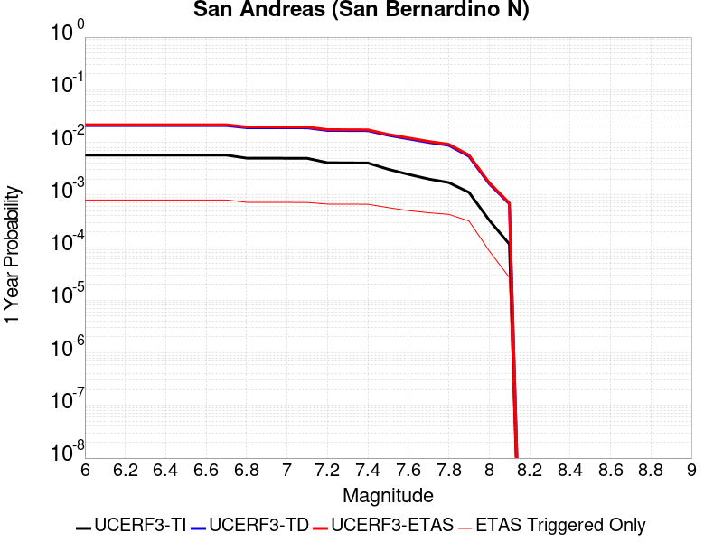
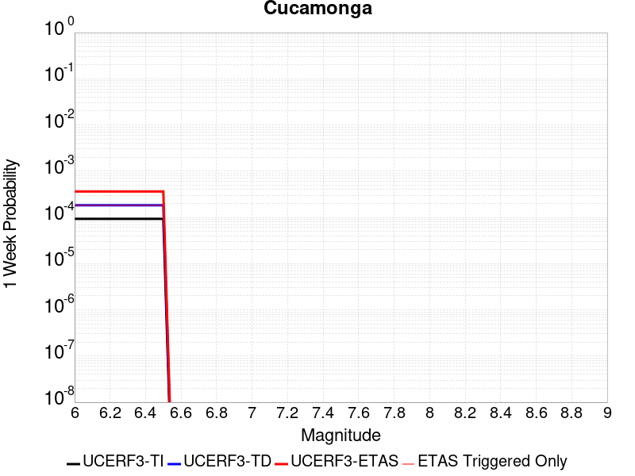
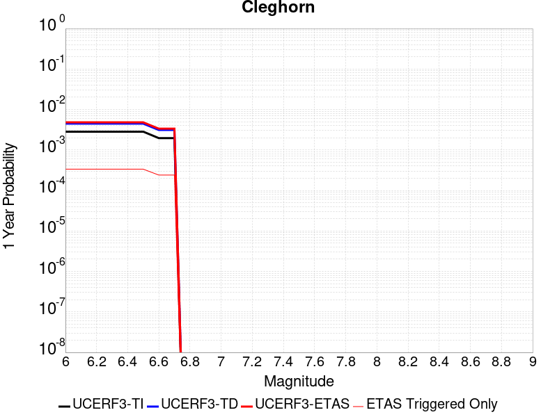
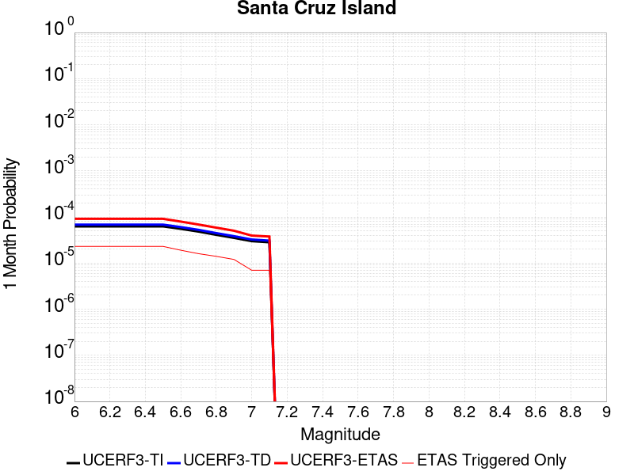
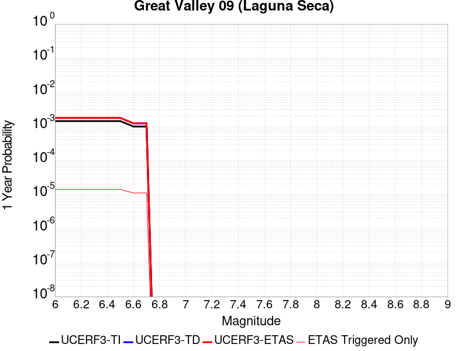
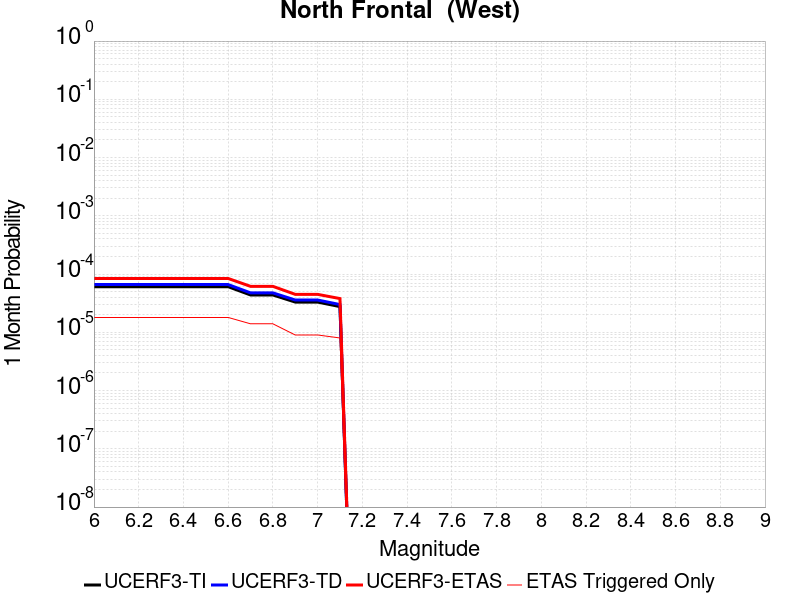
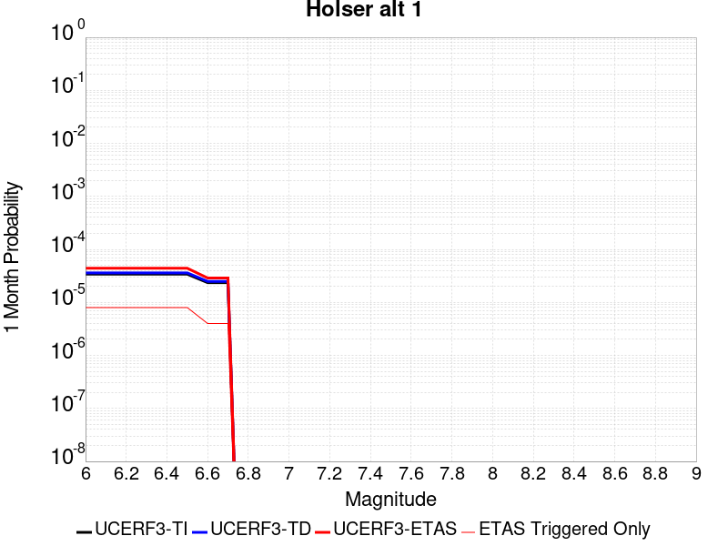

# Parent Section Magnitude-Probability Distributions

Only fault sections with at least one triggered aftershock are plotted. Sections are sorted by total supraseismogenic trigger rate (decreasing)

## Table Of Contents

* [Tank Canyon](#tank-canyon)
* [Little Lake](#little-lake)
* [Garlock (Central)](#garlock-central)
* [Owl Lake](#owl-lake)
* [Garlock (West)](#garlock-west)
* [Garlock (East)](#garlock-east)
* [Death Valley (So)](#death-valley-so)
* [Panamint Valley](#panamint-valley)
* [San Andreas (Mojave N)](#san-andreas-mojave-n)
* [San Andreas (Big Bend)](#san-andreas-big-bend)
* [San Andreas (Carrizo) rev](#san-andreas-carrizo-rev)
* [San Andreas (Mojave S)](#san-andreas-mojave-s)
* [San Andreas (Cholame) rev](#san-andreas-cholame-rev)
* [Blackwater](#blackwater)
* [San Andreas (Parkfield)](#san-andreas-parkfield)
* [Death Valley (Black Mtns Frontal)](#death-valley-black-mtns-frontal)
* [Hunter Mountain-Saline Valley](#hunter-mountain-saline-valley)
* [Pleito](#pleito)
* [San Cayetano](#san-cayetano)
* [San Andreas (San Bernardino N)](#san-andreas-san-bernardino-n)
* [Cucamonga](#cucamonga)
* [San Andreas (San Bernardino S)](#san-andreas-san-bernardino-s)
* [Death Valley (No)](#death-valley-no)
* [Gravel Hills-Harper Lk](#gravel-hills-harper-lk)
* [Cleghorn](#cleghorn)
* [Pitas Point (Lower West)](#pitas-point-lower-west)
* [Santa Ynez (East)](#santa-ynez-east)
* [Santa Ynez (West)](#santa-ynez-west)
* [Pitas Point (Lower)-Montalvo](#pitas-point-lower-montalvo)
* [San Jacinto (San Bernardino)](#san-jacinto-san-bernardino)
* [Red Mountain](#red-mountain)
* [San Andreas (Coachella) rev](#san-andreas-coachella-rev)
* [San Juan](#san-juan)
* [Mission Ridge-Arroyo Parida-Santa Ana](#mission-ridge-arroyo-parida-santa-ana)
* [So Sierra Nevada](#so-sierra-nevada)
* [San Andreas (San Gorgonio Pass-Garnet HIll)](#san-andreas-san-gorgonio-pass-garnet-hill)
* [San Jacinto (Stepovers Combined)](#san-jacinto-stepovers-combined)
* [Oak Ridge (Onshore)](#oak-ridge-onshore)
* [Santa Susana alt 1](#santa-susana-alt-1)
* [Death Valley (Fish Lake Valley)](#death-valley-fish-lake-valley)
* [San Jacinto (San Jacinto Valley) rev](#san-jacinto-san-jacinto-valley-rev)
* [Raymond](#raymond)
* [Lenwood-Lockhart-Old Woman Springs](#lenwood-lockhart-old-woman-springs)
* [Simi-Santa Rosa](#simi-santa-rosa)
* [Independence rev 2011](#independence-rev-2011)
* [San Jose](#san-jose)
* [Ventura-Pitas Point](#ventura-pitas-point)
* [San Jacinto (Anza) rev](#san-jacinto-anza-rev)
* [Elsinore (Stepovers Combined)](#elsinore-stepovers-combined)
* [Helendale-So Lockhart](#helendale-so-lockhart)
* [San Jacinto (Clark) rev](#san-jacinto-clark-rev)
* [Sierra Madre](#sierra-madre)
* [Chino alt 1](#chino-alt-1)
* [Elysian Park (Upper)](#elysian-park-upper)
* [Elsinore (Glen Ivy) rev](#elsinore-glen-ivy-rev)
* [Verdugo](#verdugo)
* [Santa Cruz Island](#santa-cruz-island)
* [Mono Lake 2011 CFM](#mono-lake-2011-cfm)
* [Clamshell-Sawpit](#clamshell-sawpit)
* [Great Valley 09 (Laguna Seca)](#great-valley-09-laguna-seca)
* [Great Valley 04b Gordon Valley](#great-valley-04b-gordon-valley)
* [Imperial](#imperial)
* [Calaveras (No) 2011 CFM](#calaveras-no-2011-cfm)
* [Santa Rosa Island](#santa-rosa-island)
* [Great Valley 04a Trout Creek](#great-valley-04a-trout-creek)
* [San Gregorio (South) 2011 CFM](#san-gregorio-south-2011-cfm)
* [Rose Canyon](#rose-canyon)
* [Deep Springs](#deep-springs)
* [Emerson-Copper Mtn 2011](#emerson-copper-mtn-2011)
* [Burnt Mtn](#burnt-mtn)
* [Hayward (No) 2011 CFM](#hayward-no-2011-cfm)
* [San Gabriel](#san-gabriel)
* [Elsinore (Temecula) rev](#elsinore-temecula-rev)
* [Hayward (So) 2011 CFM](#hayward-so-2011-cfm)
* [Great Valley 12](#great-valley-12)
* [North Frontal  (West)](#north-frontal--west)
* [Great Valley 03 Mysterious Ridge](#great-valley-03-mysterious-ridge)
* [Newport-Inglewood (Offshore)](#newport-inglewood-offshore)
* [Hosgri](#hosgri)
* [Anacapa-Dume alt 1](#anacapa-dume-alt-1)
* [San Andreas (Creeping Section) 2011 CFM](#san-andreas-creeping-section-2011-cfm)
* [Robinson Creek](#robinson-creek)
* [San Gregorio (North) 2011 CFM](#san-gregorio-north-2011-cfm)
* [Holser alt 1](#holser-alt-1)
* [Channel Islands Thrust](#channel-islands-thrust)
* [Los Osos 2011](#los-osos-2011)
* [Whittier alt 1](#whittier-alt-1)
* [Los Alamos 2011 CFM](#los-alamos-2011-cfm)

## Tank Canyon
*[(top)](#table-of-contents)*

| 1 Week | 1 Month | 1 Year | 10 Year |
|-----|-----|-----|-----|
|  |  |  |  |

| Magnitude | 1 wk TI Prob | 1 wk TD Prob | 1 wk ETAS Prob | 1 wk ETAS/TD Gain | 1 wk ETAS Triggered Only | 1 mo TI Prob | 1 mo TD Prob | 1 mo ETAS Prob | 1 mo ETAS/TD Gain | 1 mo ETAS Triggered Only | 1 yr TI Prob | 1 yr TD Prob | 1 yr ETAS Prob | 1 yr ETAS/TD Gain | 1 yr ETAS Triggered Only | 10 yr TI Prob | 10 yr TD Prob | 10 yr ETAS Prob | 10 yr ETAS/TD Gain | 10 yr ETAS Triggered Only |
|-----|-----|-----|-----|-----|-----|-----|-----|-----|-----|-----|-----|-----|-----|-----|-----|-----|-----|-----|-----|-----|
| 6.0 | 2.7748038E-5 | 3.5073965E-5 | 0.019939156 | 568.48883 | 0.019904781 | 1.18914744E-4 | 1.5031699E-4 | 0.02542002 | 169.1094 | 0.0252735 | 0.0014468255 | 0.0018300817 | 0.04111179 | 22.464455 | 0.03935373 | 0.014374418 | 0.018297758 | 0.07115176 | 3.8885508 | 0.05383914 |
| 6.1 | 2.7748038E-5 | 3.5073965E-5 | 0.019939156 | 568.48883 | 0.019904781 | 1.18914744E-4 | 1.5031699E-4 | 0.02542002 | 169.1094 | 0.0252735 | 0.0014468255 | 0.0018300817 | 0.04111179 | 22.464455 | 0.03935373 | 0.014374418 | 0.018297758 | 0.07115176 | 3.8885508 | 0.05383914 |
| 6.2 | 2.7748038E-5 | 3.5073965E-5 | 0.019939156 | 568.48883 | 0.019904781 | 1.18914744E-4 | 1.5031699E-4 | 0.02542002 | 169.1094 | 0.0252735 | 0.0014468255 | 0.0018300817 | 0.04111179 | 22.464455 | 0.03935373 | 0.014374418 | 0.018297758 | 0.07115176 | 3.8885508 | 0.05383914 |
| 6.3 | 2.7748038E-5 | 3.5073965E-5 | 0.019939156 | 568.48883 | 0.019904781 | 1.18914744E-4 | 1.5031699E-4 | 0.02542002 | 169.1094 | 0.0252735 | 0.0014468255 | 0.0018300817 | 0.04111179 | 22.464455 | 0.03935373 | 0.014374418 | 0.018297758 | 0.07115176 | 3.8885508 | 0.05383914 |

## Little Lake
*[(top)](#table-of-contents)*

| 1 Week | 1 Month | 1 Year | 10 Year |
|-----|-----|-----|-----|
|  |  |  |  |

| Magnitude | 1 wk TI Prob | 1 wk TD Prob | 1 wk ETAS Prob | 1 wk ETAS/TD Gain | 1 wk ETAS Triggered Only | 1 mo TI Prob | 1 mo TD Prob | 1 mo ETAS Prob | 1 mo ETAS/TD Gain | 1 mo ETAS Triggered Only | 1 yr TI Prob | 1 yr TD Prob | 1 yr ETAS Prob | 1 yr ETAS/TD Gain | 1 yr ETAS Triggered Only | 10 yr TI Prob | 10 yr TD Prob | 10 yr ETAS Prob | 10 yr ETAS/TD Gain | 10 yr ETAS Triggered Only |
|-----|-----|-----|-----|-----|-----|-----|-----|-----|-----|-----|-----|-----|-----|-----|-----|-----|-----|-----|-----|-----|
| 6.0 | 1.27106505E-5 | 1.3900362E-5 | 0.011865437 | 853.6063 | 0.011851702 | 5.447308E-5 | 5.957219E-5 | 0.015050575 | 252.64432 | 0.014991896 | 6.630079E-4 | 7.25151E-4 | 0.021222837 | 29.266783 | 0.02051256 | 0.006610333 | 0.0072377534 | 0.032680303 | 4.515255 | 0.02562804 |
| 6.1 | 1.27106505E-5 | 1.3900362E-5 | 0.011865437 | 853.6063 | 0.011851702 | 5.447308E-5 | 5.957219E-5 | 0.015050575 | 252.64432 | 0.014991896 | 6.630079E-4 | 7.25151E-4 | 0.021222837 | 29.266783 | 0.02051256 | 0.006610333 | 0.0072377534 | 0.032680303 | 4.515255 | 0.02562804 |
| 6.2 | 1.27106505E-5 | 1.3900362E-5 | 0.011865437 | 853.6063 | 0.011851702 | 5.447308E-5 | 5.957219E-5 | 0.015050575 | 252.64432 | 0.014991896 | 6.630079E-4 | 7.25151E-4 | 0.021222837 | 29.266783 | 0.02051256 | 0.006610333 | 0.0072377534 | 0.032680303 | 4.515255 | 0.02562804 |
| 6.3 | 1.27106505E-5 | 1.3900362E-5 | 0.011865437 | 853.6063 | 0.011851702 | 5.447308E-5 | 5.957219E-5 | 0.015050575 | 252.64432 | 0.014991896 | 6.630079E-4 | 7.25151E-4 | 0.021222837 | 29.266783 | 0.02051256 | 0.006610333 | 0.0072377534 | 0.032680303 | 4.515255 | 0.02562804 |
| 6.4 | 1.27106505E-5 | 1.3900362E-5 | 0.011865437 | 853.6063 | 0.011851702 | 5.447308E-5 | 5.957219E-5 | 0.015050575 | 252.64432 | 0.014991896 | 6.630079E-4 | 7.25151E-4 | 0.021222837 | 29.266783 | 0.02051256 | 0.006610333 | 0.0072377534 | 0.032680303 | 4.515255 | 0.02562804 |
| 6.5 | 1.27106505E-5 | 1.3900362E-5 | 0.011865437 | 853.6063 | 0.011851702 | 5.447308E-5 | 5.957219E-5 | 0.015050575 | 252.64432 | 0.014991896 | 6.630079E-4 | 7.25151E-4 | 0.021222837 | 29.266783 | 0.02051256 | 0.006610333 | 0.0072377534 | 0.032680303 | 4.515255 | 0.02562804 |
| 6.6 | 1.08505255E-5 | 1.1856941E-5 | 0.010141397 | 855.3131 | 0.010129659 | 4.6501424E-5 | 5.0815026E-5 | 0.012965475 | 255.1504 | 0.012915316 | 5.6600774E-4 | 6.1859656E-4 | 0.018182684 | 29.393446 | 0.01757496 | 0.005645683 | 0.006178476 | 0.027923355 | 4.519457 | 0.021880064 |
| 6.7 | 7.97625E-6 | 8.706619E-6 | 0.0074539417 | 856.12354 | 0.0074453 | 3.4183482E-5 | 3.7314083E-5 | 0.0097107785 | 260.24432 | 0.0096738245 | 4.161044E-4 | 4.5429895E-4 | 0.013566249 | 29.86194 | 0.013117909 | 0.004153261 | 0.0045429897 | 0.020777652 | 4.5735636 | 0.016308753 |
| 6.8 | 7.97625E-6 | 8.706619E-6 | 0.0074539417 | 856.12354 | 0.0074453 | 3.4183482E-5 | 3.7314083E-5 | 0.0097107785 | 260.24432 | 0.0096738245 | 4.161044E-4 | 4.5429895E-4 | 0.013566249 | 29.86194 | 0.013117909 | 0.004153261 | 0.0045429897 | 0.020777652 | 4.5735636 | 0.016308753 |

## Garlock (Central)
*[(top)](#table-of-contents)*

| 1 Week | 1 Month | 1 Year | 10 Year |
|-----|-----|-----|-----|
|  |  |  |  |

| Magnitude | 1 wk TI Prob | 1 wk TD Prob | 1 wk ETAS Prob | 1 wk ETAS/TD Gain | 1 wk ETAS Triggered Only | 1 mo TI Prob | 1 mo TD Prob | 1 mo ETAS Prob | 1 mo ETAS/TD Gain | 1 mo ETAS Triggered Only | 1 yr TI Prob | 1 yr TD Prob | 1 yr ETAS Prob | 1 yr ETAS/TD Gain | 1 yr ETAS Triggered Only | 10 yr TI Prob | 10 yr TD Prob | 10 yr ETAS Prob | 10 yr ETAS/TD Gain | 10 yr ETAS Triggered Only |
|-----|-----|-----|-----|-----|-----|-----|-----|-----|-----|-----|-----|-----|-----|-----|-----|-----|-----|-----|-----|-----|
| 6.0 | 2.575808E-5 | 1.9313613E-5 | 0.011111077 | 575.29767 | 0.011091977 | 1.10387096E-4 | 8.277037E-5 | 0.013756679 | 166.20294 | 0.013675041 | 0.0013431342 | 0.0010073289 | 0.019829517 | 19.685247 | 0.018841166 | 0.013350452 | 0.0100695705 | 0.03453706 | 3.4298441 | 0.02471637 |
| 6.1 | 2.575808E-5 | 1.9313613E-5 | 0.011111077 | 575.29767 | 0.011091977 | 1.10387096E-4 | 8.277037E-5 | 0.013756679 | 166.20294 | 0.013675041 | 0.0013431342 | 0.0010073289 | 0.019829517 | 19.685247 | 0.018841166 | 0.013350452 | 0.0100695705 | 0.03453706 | 3.4298441 | 0.02471637 |
| 6.2 | 2.575808E-5 | 1.9313613E-5 | 0.011111077 | 575.29767 | 0.011091977 | 1.10387096E-4 | 8.277037E-5 | 0.013756679 | 166.20294 | 0.013675041 | 0.0013431342 | 0.0010073289 | 0.019829517 | 19.685247 | 0.018841166 | 0.013350452 | 0.0100695705 | 0.03453706 | 3.4298441 | 0.02471637 |
| 6.3 | 2.575808E-5 | 1.9313613E-5 | 0.011111077 | 575.29767 | 0.011091977 | 1.10387096E-4 | 8.277037E-5 | 0.013756679 | 166.20294 | 0.013675041 | 0.0013431342 | 0.0010073289 | 0.019829517 | 19.685247 | 0.018841166 | 0.013350452 | 0.0100695705 | 0.03453706 | 3.4298441 | 0.02471637 |
| 6.4 | 2.575808E-5 | 1.9313613E-5 | 0.011111077 | 575.29767 | 0.011091977 | 1.10387096E-4 | 8.277037E-5 | 0.013756679 | 166.20294 | 0.013675041 | 0.0013431342 | 0.0010073289 | 0.019829517 | 19.685247 | 0.018841166 | 0.013350452 | 0.0100695705 | 0.03453706 | 3.4298441 | 0.02471637 |
| 6.5 | 2.575808E-5 | 1.9313613E-5 | 0.011111077 | 575.29767 | 0.011091977 | 1.10387096E-4 | 8.277037E-5 | 0.013756679 | 166.20294 | 0.013675041 | 0.0013431342 | 0.0010073289 | 0.019829517 | 19.685247 | 0.018841166 | 0.013350452 | 0.0100695705 | 0.03453706 | 3.4298441 | 0.02471637 |
| 6.6 | 2.540234E-5 | 1.885198E-5 | 0.010604147 | 562.4951 | 0.010585494 | 1.0886263E-4 | 8.0792066E-5 | 0.013248285 | 163.98003 | 0.013168558 | 0.0013245966 | 9.83265E-4 | 0.019046929 | 19.371105 | 0.018081443 | 0.013167289 | 0.009831364 | 0.033402033 | 3.3974972 | 0.0238047 |
| 6.7 | 2.4966947E-5 | 1.8286464E-5 | 0.009894524 | 541.0846 | 0.009876418 | 1.06996806E-4 | 7.8368575E-5 | 0.012486229 | 159.327 | 0.012408833 | 0.0013019076 | 9.5378514E-4 | 0.018107181 | 18.98455 | 0.017169774 | 0.012943068 | 0.009539624 | 0.031913273 | 3.3453386 | 0.022589142 |
| 6.8 | 2.4548952E-5 | 1.7797542E-5 | 0.009742098 | 547.38446 | 0.009724474 | 1.0520555E-4 | 7.627332E-5 | 0.012281582 | 161.02069 | 0.01220624 | 0.001280125 | 9.282974E-4 | 0.017829126 | 19.206264 | 0.016916532 | 0.012727758 | 0.009286596 | 0.031164182 | 3.3558238 | 0.022082658 |
| 6.9 | 2.3994342E-5 | 1.7148153E-5 | 0.009083038 | 529.68024 | 0.009066045 | 1.0282884E-4 | 7.349039E-5 | 0.011417875 | 155.36557 | 0.011345219 | 0.0012512221 | 8.944436E-4 | 0.016328357 | 18.255323 | 0.015447731 | 0.012442005 | 0.0089510605 | 0.029229818 | 3.2655144 | 0.020461913 |
| 7.0 | 2.343005E-5 | 1.6491087E-5 | 0.008525264 | 516.9619 | 0.008508914 | 1.0041064E-4 | 7.067455E-5 | 0.010807355 | 152.91722 | 0.01073744 | 0.0012218138 | 8.601883E-4 | 0.015333141 | 17.825333 | 0.014485413 | 0.01215118 | 0.008610493 | 0.027691124 | 3.2159748 | 0.019246353 |
| 7.1 | 2.2814058E-5 | 1.5782754E-5 | 0.00796744 | 504.81937 | 0.007951783 | 9.777087E-5 | 6.763899E-5 | 0.010145969 | 150.00177 | 0.010079011 | 0.0011897103 | 8.2325895E-4 | 0.014537648 | 17.658657 | 0.013725689 | 0.011833611 | 0.00824334 | 0.026477115 | 3.21194 | 0.018385332 |
| 7.2 | 2.2145266E-5 | 1.5027377E-5 | 0.007206978 | 479.58984 | 0.0071920585 | 9.490483E-5 | 6.440182E-5 | 0.009383089 | 145.696 | 0.009319287 | 0.0011548538 | 7.8387547E-4 | 0.013537242 | 17.269632 | 0.012763371 | 0.011488707 | 0.007851825 | 0.024987286 | 3.1823537 | 0.01727107 |
| 7.3 | 1.9954436E-5 | 1.3199953E-5 | 0.005938973 | 449.92377 | 0.005925851 | 8.551621E-5 | 5.657036E-5 | 0.0076533854 | 135.28967 | 0.007597245 | 0.0010406625 | 6.8859005E-4 | 0.010963115 | 15.921105 | 0.010281605 | 0.010358025 | 0.006900618 | 0.02058189 | 2.9826155 | 0.013776337 |
| 7.4 | 1.918037E-5 | 1.2553606E-5 | 0.0057357396 | 456.89975 | 0.0057232575 | 8.2198996E-5 | 5.3800417E-5 | 0.0073974086 | 137.49724 | 0.0073440033 | 0.0010003132 | 6.5488677E-4 | 0.010474222 | 15.993943 | 0.00982577 | 0.009958224 | 0.006564366 | 0.019596165 | 2.9852333 | 0.013117909 |
| 7.5 | 1.6994161E-5 | 1.0764553E-5 | 0.004011937 | 372.6989 | 0.0040012156 | 7.283008E-5 | 4.613333E-5 | 0.0054652514 | 118.46644 | 0.005419368 | 8.863455E-4 | 5.615903E-4 | 0.007901469 | 14.069811 | 0.0073440033 | 0.008828186 | 0.005632708 | 0.01570531 | 2.7882345 | 0.010129659 |
| 7.6 | 1.621788E-5 | 1.012848E-5 | 0.0037074168 | 366.03882 | 0.0036973257 | 6.950335E-5 | 4.34074E-5 | 0.0051080175 | 117.67619 | 0.0050648297 | 8.458747E-4 | 5.2841863E-4 | 0.0074129472 | 14.02855 | 0.0068881684 | 0.0084266225 | 0.005301458 | 0.014672099 | 2.7675593 | 0.009420583 |
| 7.7 | 7.713584E-6 | 3.2171508E-6 | 7.1229105E-4 | 221.40431 | 7.090762E-4 | 3.3057797E-5 | 1.378779E-5 | 0.0010773874 | 78.14069 | 0.0010636143 | 4.0240434E-4 | 1.6786634E-4 | 0.0020921787 | 12.46336 | 0.0019246354 | 0.0040167645 | 0.0016902693 | 0.0044206544 | 2.615355 | 0.002735008 |

## Owl Lake
*[(top)](#table-of-contents)*

| 1 Week | 1 Month | 1 Year | 10 Year |
|-----|-----|-----|-----|
|  |  |  |  |

| Magnitude | 1 wk TI Prob | 1 wk TD Prob | 1 wk ETAS Prob | 1 wk ETAS/TD Gain | 1 wk ETAS Triggered Only | 1 mo TI Prob | 1 mo TD Prob | 1 mo ETAS Prob | 1 mo ETAS/TD Gain | 1 mo ETAS Triggered Only | 1 yr TI Prob | 1 yr TD Prob | 1 yr ETAS Prob | 1 yr ETAS/TD Gain | 1 yr ETAS Triggered Only | 10 yr TI Prob | 10 yr TD Prob | 10 yr ETAS Prob | 10 yr ETAS/TD Gain | 10 yr ETAS Triggered Only |
|-----|-----|-----|-----|-----|-----|-----|-----|-----|-----|-----|-----|-----|-----|-----|-----|-----|-----|-----|-----|-----|
| 6.0 | 3.637175E-5 | 4.988367E-5 | 0.004608003 | 92.37498 | 0.0045583467 | 1.5586962E-4 | 2.1378716E-4 | 0.0061890087 | 28.949394 | 0.005976499 | 0.0018960608 | 0.0026025574 | 0.011998624 | 4.6103206 | 0.009420583 | 0.018799646 | 0.025995217 | 0.039462768 | 1.518078 | 0.013826986 |
| 6.1 | 3.637175E-5 | 4.988367E-5 | 0.004608003 | 92.37498 | 0.0045583467 | 1.5586962E-4 | 2.1378716E-4 | 0.0061890087 | 28.949394 | 0.005976499 | 0.0018960608 | 0.0026025574 | 0.011998624 | 4.6103206 | 0.009420583 | 0.018799646 | 0.025995217 | 0.039462768 | 1.518078 | 0.013826986 |
| 6.2 | 3.637175E-5 | 4.988367E-5 | 0.004608003 | 92.37498 | 0.0045583467 | 1.5586962E-4 | 2.1378716E-4 | 0.0061890087 | 28.949394 | 0.005976499 | 0.0018960608 | 0.0026025574 | 0.011998624 | 4.6103206 | 0.009420583 | 0.018799646 | 0.025995217 | 0.039462768 | 1.518078 | 0.013826986 |
| 6.3 | 3.637175E-5 | 4.988367E-5 | 0.004608003 | 92.37498 | 0.0045583467 | 1.5586962E-4 | 2.1378716E-4 | 0.0061890087 | 28.949394 | 0.005976499 | 0.0018960608 | 0.0026025574 | 0.011998624 | 4.6103206 | 0.009420583 | 0.018799646 | 0.025995217 | 0.039462768 | 1.518078 | 0.013826986 |
| 6.4 | 3.637175E-5 | 4.988367E-5 | 0.004608003 | 92.37498 | 0.0045583467 | 1.5586962E-4 | 2.1378716E-4 | 0.0061890087 | 28.949394 | 0.005976499 | 0.0018960608 | 0.0026025574 | 0.011998624 | 4.6103206 | 0.009420583 | 0.018799646 | 0.025995217 | 0.039462768 | 1.518078 | 0.013826986 |
| 6.5 | 3.637175E-5 | 4.988367E-5 | 0.004608003 | 92.37498 | 0.0045583467 | 1.5586962E-4 | 2.1378716E-4 | 0.0061890087 | 28.949394 | 0.005976499 | 0.0018960608 | 0.0026025574 | 0.011998624 | 4.6103206 | 0.009420583 | 0.018799646 | 0.025995217 | 0.039462768 | 1.518078 | 0.013826986 |

## Garlock (West)
*[(top)](#table-of-contents)*

| 1 Week | 1 Month | 1 Year | 10 Year |
|-----|-----|-----|-----|
|  |  |  |  |

| Magnitude | 1 wk TI Prob | 1 wk TD Prob | 1 wk ETAS Prob | 1 wk ETAS/TD Gain | 1 wk ETAS Triggered Only | 1 mo TI Prob | 1 mo TD Prob | 1 mo ETAS Prob | 1 mo ETAS/TD Gain | 1 mo ETAS Triggered Only | 1 yr TI Prob | 1 yr TD Prob | 1 yr ETAS Prob | 1 yr ETAS/TD Gain | 1 yr ETAS Triggered Only | 10 yr TI Prob | 10 yr TD Prob | 10 yr ETAS Prob | 10 yr ETAS/TD Gain | 10 yr ETAS Triggered Only |
|-----|-----|-----|-----|-----|-----|-----|-----|-----|-----|-----|-----|-----|-----|-----|-----|-----|-----|-----|-----|-----|
| 6.0 | 2.516656E-5 | 1.8065048E-5 | 0.004475035 | 247.71785 | 0.0044570505 | 1.07852225E-4 | 7.741977E-5 | 0.006053456 | 78.190056 | 0.005976499 | 0.0013123099 | 9.42255E-4 | 0.009190149 | 9.753356 | 0.008255673 | 0.013045873 | 0.009421492 | 0.020760164 | 2.20349 | 0.011446515 |
| 6.1 | 2.516656E-5 | 1.8065048E-5 | 0.004475035 | 247.71785 | 0.0044570505 | 1.07852225E-4 | 7.741977E-5 | 0.006053456 | 78.190056 | 0.005976499 | 0.0013123099 | 9.42255E-4 | 0.009190149 | 9.753356 | 0.008255673 | 0.013045873 | 0.009421492 | 0.020760164 | 2.20349 | 0.011446515 |
| 6.2 | 2.516656E-5 | 1.8065048E-5 | 0.004475035 | 247.71785 | 0.0044570505 | 1.07852225E-4 | 7.741977E-5 | 0.006053456 | 78.190056 | 0.005976499 | 0.0013123099 | 9.42255E-4 | 0.009190149 | 9.753356 | 0.008255673 | 0.013045873 | 0.009421492 | 0.020760164 | 2.20349 | 0.011446515 |
| 6.3 | 2.516656E-5 | 1.8065048E-5 | 0.004475035 | 247.71785 | 0.0044570505 | 1.07852225E-4 | 7.741977E-5 | 0.006053456 | 78.190056 | 0.005976499 | 0.0013123099 | 9.42255E-4 | 0.009190149 | 9.753356 | 0.008255673 | 0.013045873 | 0.009421492 | 0.020760164 | 2.20349 | 0.011446515 |
| 6.4 | 2.516656E-5 | 1.8065048E-5 | 0.004475035 | 247.71785 | 0.0044570505 | 1.07852225E-4 | 7.741977E-5 | 0.006053456 | 78.190056 | 0.005976499 | 0.0013123099 | 9.42255E-4 | 0.009190149 | 9.753356 | 0.008255673 | 0.013045873 | 0.009421492 | 0.020760164 | 2.20349 | 0.011446515 |
| 6.5 | 2.516656E-5 | 1.8065048E-5 | 0.004475035 | 247.71785 | 0.0044570505 | 1.07852225E-4 | 7.741977E-5 | 0.006053456 | 78.190056 | 0.005976499 | 0.0013123099 | 9.42255E-4 | 0.009190149 | 9.753356 | 0.008255673 | 0.013045873 | 0.009421492 | 0.020760164 | 2.20349 | 0.011446515 |
| 6.6 | 2.498869E-5 | 1.7877663E-5 | 0.004474848 | 250.30388 | 0.0044570505 | 1.07089996E-4 | 7.6616736E-5 | 0.006052658 | 78.99916 | 0.005976499 | 0.0013030408 | 9.3248655E-4 | 0.009180461 | 9.84514 | 0.008255673 | 0.012954267 | 0.009324339 | 0.020664124 | 2.2161489 | 0.011446515 |
| 6.7 | 2.4627925E-5 | 1.7497801E-5 | 0.00447447 | 255.71614 | 0.0044570505 | 1.0554398E-4 | 7.498886E-5 | 0.00605104 | 80.69252 | 0.005976499 | 0.0012842404 | 9.1268384E-4 | 0.009160821 | 10.037234 | 0.008255673 | 0.012768441 | 0.009128104 | 0.020470135 | 2.2425396 | 0.011446515 |
| 6.8 | 2.4270235E-5 | 1.716136E-5 | 0.004474135 | 260.70984 | 0.0044570505 | 1.04011146E-4 | 7.354704E-5 | 0.0060496065 | 82.25493 | 0.005976499 | 0.0012656 | 8.9514436E-4 | 0.009143427 | 10.214472 | 0.008255673 | 0.012584164 | 0.0089538675 | 0.020297892 | 2.2669413 | 0.011446515 |
| 6.9 | 2.3913764E-5 | 1.6823105E-5 | 0.004423151 | 262.9212 | 0.004406402 | 1.0248353E-4 | 7.2097464E-5 | 0.0059975213 | 83.186295 | 0.005925851 | 0.0012470228 | 8.775101E-4 | 0.009075334 | 10.342142 | 0.0082050245 | 0.012400482 | 0.00877859 | 0.020074418 | 2.2867472 | 0.011395867 |
| 7.0 | 2.3579369E-5 | 1.6492264E-5 | 0.0044228216 | 268.17554 | 0.004406402 | 1.0105052E-4 | 7.067965E-5 | 0.005996112 | 84.83505 | 0.005925851 | 0.0012295957 | 8.6026196E-4 | 0.009058228 | 10.529615 | 0.0082050245 | 0.012228143 | 0.008607132 | 0.019904913 | 2.3126068 | 0.011395867 |
| 7.1 | 2.3205374E-5 | 1.6105636E-5 | 0.0044224365 | 274.5894 | 0.004406402 | 9.944781E-5 | 6.902276E-5 | 0.0059944647 | 86.84765 | 0.005925851 | 0.0012101046 | 8.401051E-4 | 0.008987631 | 10.698221 | 0.008154376 | 0.0120353615 | 0.008406721 | 0.019656563 | 2.3381963 | 0.011345219 |
| 7.2 | 2.2799322E-5 | 1.5676578E-5 | 0.0043207146 | 275.6159 | 0.004305105 | 9.770772E-5 | 6.718404E-5 | 0.005891347 | 87.689674 | 0.0058245542 | 0.0011889422 | 8.177357E-4 | 0.00886423 | 10.83997 | 0.008053079 | 0.011826012 | 0.008184515 | 0.019286178 | 2.3564227 | 0.011193274 |
| 7.3 | 1.8228246E-5 | 1.1798695E-5 | 0.0042662057 | 361.58282 | 0.004254457 | 7.811871E-5 | 5.0565202E-5 | 0.0057735336 | 114.17997 | 0.0057232575 | 9.506803E-4 | 6.1551924E-4 | 0.008461174 | 13.746399 | 0.007850486 | 0.0094662355 | 0.006171021 | 0.017043542 | 2.7618673 | 0.010940032 |
| 7.4 | 1.7670916E-5 | 1.132978E-5 | 0.0041644434 | 367.5661 | 0.0041531604 | 7.5730306E-5 | 4.8555645E-5 | 0.005619598 | 115.735214 | 0.0055713127 | 9.216264E-4 | 5.9106643E-4 | 0.008183821 | 13.845857 | 0.007597245 | 0.009178135 | 0.0059269792 | 0.016449733 | 2.7753992 | 0.010585494 |
| 7.5 | 1.6994161E-5 | 1.0764553E-5 | 0.004011937 | 372.6989 | 0.0040012156 | 7.283008E-5 | 4.613333E-5 | 0.0054652514 | 118.46644 | 0.005419368 | 8.863455E-4 | 5.615903E-4 | 0.007901469 | 14.069811 | 0.0073440033 | 0.008828186 | 0.005632708 | 0.01570531 | 2.7882345 | 0.010129659 |
| 7.6 | 1.621788E-5 | 1.012848E-5 | 0.0037074168 | 366.03882 | 0.0036973257 | 6.950335E-5 | 4.34074E-5 | 0.0051080175 | 117.67619 | 0.0050648297 | 8.458747E-4 | 5.2841863E-4 | 0.0074129472 | 14.02855 | 0.0068881684 | 0.0084266225 | 0.005301458 | 0.014672099 | 2.7675593 | 0.009420583 |
| 7.7 | 7.713584E-6 | 3.2171508E-6 | 7.1229105E-4 | 221.40431 | 7.090762E-4 | 3.3057797E-5 | 1.378779E-5 | 0.0010773874 | 78.14069 | 0.0010636143 | 4.0240434E-4 | 1.6786634E-4 | 0.0020921787 | 12.46336 | 0.0019246354 | 0.0040167645 | 0.0016902693 | 0.0044206544 | 2.615355 | 0.002735008 |

## Garlock (East)
*[(top)](#table-of-contents)*

| 1 Week | 1 Month | 1 Year | 10 Year |
|-----|-----|-----|-----|
|  |  |  |  |

| Magnitude | 1 wk TI Prob | 1 wk TD Prob | 1 wk ETAS Prob | 1 wk ETAS/TD Gain | 1 wk ETAS Triggered Only | 1 mo TI Prob | 1 mo TD Prob | 1 mo ETAS Prob | 1 mo ETAS/TD Gain | 1 mo ETAS Triggered Only | 1 yr TI Prob | 1 yr TD Prob | 1 yr ETAS Prob | 1 yr ETAS/TD Gain | 1 yr ETAS Triggered Only | 10 yr TI Prob | 10 yr TD Prob | 10 yr ETAS Prob | 10 yr ETAS/TD Gain | 10 yr ETAS Triggered Only |
|-----|-----|-----|-----|-----|-----|-----|-----|-----|-----|-----|-----|-----|-----|-----|-----|-----|-----|-----|-----|-----|
| 6.0 | 2.2327951E-5 | 1.8303952E-5 | 0.004272683 | 233.42955 | 0.004254457 | 9.5687705E-5 | 7.8444085E-5 | 0.0054467428 | 69.43471 | 0.00536872 | 0.0011643751 | 9.548048E-4 | 0.008848395 | 9.267229 | 0.007901135 | 0.0115829315 | 0.0096519785 | 0.020135302 | 2.086132 | 0.010585494 |
| 6.1 | 2.2327951E-5 | 1.8303952E-5 | 0.004272683 | 233.42955 | 0.004254457 | 9.5687705E-5 | 7.8444085E-5 | 0.0054467428 | 69.43471 | 0.00536872 | 0.0011643751 | 9.548048E-4 | 0.008848395 | 9.267229 | 0.007901135 | 0.0115829315 | 0.0096519785 | 0.020135302 | 2.086132 | 0.010585494 |
| 6.2 | 2.2327951E-5 | 1.8303952E-5 | 0.004272683 | 233.42955 | 0.004254457 | 9.5687705E-5 | 7.8444085E-5 | 0.0054467428 | 69.43471 | 0.00536872 | 0.0011643751 | 9.548048E-4 | 0.008848395 | 9.267229 | 0.007901135 | 0.0115829315 | 0.0096519785 | 0.020135302 | 2.086132 | 0.010585494 |
| 6.3 | 2.2327951E-5 | 1.8303952E-5 | 0.004272683 | 233.42955 | 0.004254457 | 9.5687705E-5 | 7.8444085E-5 | 0.0054467428 | 69.43471 | 0.00536872 | 0.0011643751 | 9.548048E-4 | 0.008848395 | 9.267229 | 0.007901135 | 0.0115829315 | 0.0096519785 | 0.020135302 | 2.086132 | 0.010585494 |
| 6.4 | 2.2327951E-5 | 1.8303952E-5 | 0.004272683 | 233.42955 | 0.004254457 | 9.5687705E-5 | 7.8444085E-5 | 0.0054467428 | 69.43471 | 0.00536872 | 0.0011643751 | 9.548048E-4 | 0.008848395 | 9.267229 | 0.007901135 | 0.0115829315 | 0.0096519785 | 0.020135302 | 2.086132 | 0.010585494 |
| 6.5 | 2.2327951E-5 | 1.8303952E-5 | 0.004272683 | 233.42955 | 0.004254457 | 9.5687705E-5 | 7.8444085E-5 | 0.0054467428 | 69.43471 | 0.00536872 | 0.0011643751 | 9.548048E-4 | 0.008848395 | 9.267229 | 0.007901135 | 0.0115829315 | 0.0096519785 | 0.020135302 | 2.086132 | 0.010585494 |
| 6.6 | 2.222123E-5 | 1.816971E-5 | 0.004221902 | 232.35934 | 0.004203809 | 9.523036E-5 | 7.7868805E-5 | 0.005395526 | 69.289955 | 0.005318071 | 0.0011588129 | 9.4780687E-4 | 0.008740252 | 9.221554 | 0.0077998377 | 0.011527888 | 0.009581773 | 0.019965513 | 2.083697 | 0.010484198 |
| 6.7 | 2.2076227E-5 | 1.798404E-5 | 0.0042217174 | 234.74797 | 0.004203809 | 9.4608964E-5 | 7.707312E-5 | 0.0053947344 | 69.99502 | 0.005318071 | 0.0011512554 | 9.381278E-4 | 0.008730648 | 9.306459 | 0.0077998377 | 0.011453095 | 0.009485973 | 0.01982055 | 2.0894587 | 0.010433549 |
| 6.8 | 2.1962227E-5 | 1.7854036E-5 | 0.004221588 | 236.45006 | 0.004203809 | 9.4120434E-5 | 7.651599E-5 | 0.0053941803 | 70.49742 | 0.005318071 | 0.0011453138 | 9.313506E-4 | 0.008723924 | 9.366961 | 0.0077998377 | 0.01139429 | 0.00941876 | 0.019703867 | 2.091981 | 0.010382901 |
| 6.9 | 1.1702579E-5 | 6.6732687E-6 | 0.0037546223 | 562.63617 | 0.003747974 | 5.0152947E-5 | 2.8599494E-5 | 0.004536169 | 158.61012 | 0.0045076986 | 6.10441E-4 | 3.481581E-4 | 0.006727622 | 19.32347 | 0.0063816854 | 0.0060876687 | 0.0034954504 | 0.011772737 | 3.3680172 | 0.008306321 |
| 7.0 | 1.153538E-5 | 6.4796777E-6 | 0.0037037814 | 571.5997 | 0.0036973257 | 4.9436403E-5 | 2.7769835E-5 | 0.0044340496 | 159.67143 | 0.004406402 | 6.01722E-4 | 3.3806017E-4 | 0.006515064 | 19.271906 | 0.0061790925 | 0.006000953 | 0.0033946347 | 0.011420377 | 3.3642433 | 0.008053079 |
| 7.1 | 1.135938E-5 | 6.273818E-6 | 0.0035009845 | 558.03094 | 0.0034947325 | 4.868215E-5 | 2.6887597E-5 | 0.0041799364 | 155.45964 | 0.0041531604 | 5.925439E-4 | 3.2732222E-4 | 0.0062512336 | 19.098103 | 0.005925851 | 0.0059096646 | 0.0032873498 | 0.011011065 | 3.3495264 | 0.0077491896 |
| 7.2 | 1.1168294E-5 | 6.048814E-6 | 0.0031968723 | 528.51227 | 0.0031908427 | 4.786324E-5 | 2.5923315E-5 | 0.0038750942 | 149.48297 | 0.0038492708 | 5.825791E-4 | 3.1558552E-4 | 0.0059357723 | 18.80876 | 0.0056219613 | 0.005810542 | 0.0031701238 | 0.010490846 | 3.3092859 | 0.0073440033 |
| 7.3 | 1.0952553E-5 | 5.8686815E-6 | 0.0029434527 | 501.55264 | 0.0029376012 | 4.693867E-5 | 2.5151334E-5 | 0.00362109 | 143.97209 | 0.0035960292 | 5.713284E-4 | 3.0618932E-4 | 0.0054201013 | 17.701796 | 0.0051154783 | 0.0056986175 | 0.0030760262 | 0.009690544 | 3.150345 | 0.006634927 |
| 7.4 | 1.0735812E-5 | 5.691247E-6 | 0.0028419797 | 499.35977 | 0.0028363047 | 4.6009813E-5 | 2.4390914E-5 | 0.0035190382 | 144.2766 | 0.0034947325 | 5.600255E-4 | 2.9693378E-4 | 0.00520836 | 17.540476 | 0.004912885 | 0.0055861627 | 0.0029833042 | 0.009295454 | 3.115825 | 0.0063310373 |
| 7.5 | 9.0273E-6 | 4.284415E-6 | 0.0012198384 | 284.71527 | 0.0012155592 | 3.8687853E-5 | 1.8361723E-5 | 0.0016897249 | 92.02431 | 0.0016713939 | 4.709228E-4 | 2.2354414E-4 | 0.002755393 | 12.325946 | 0.0025324149 | 0.004699261 | 0.0022480614 | 0.0058360063 | 2.5960174 | 0.0035960292 |
| 7.6 | 8.549585E-6 | 3.885532E-6 | 9.6619944E-4 | 248.66594 | 9.623177E-4 | 3.6640562E-5 | 1.6652246E-5 | 0.0013841335 | 83.11993 | 0.001367504 | 4.4600753E-4 | 2.027353E-4 | 0.0024308087 | 11.990061 | 0.0022285252 | 0.0044511347 | 0.0020396118 | 0.0051228567 | 2.511682 | 0.0030895462 |
| 7.7 | 7.713584E-6 | 3.2171508E-6 | 7.1229105E-4 | 221.40431 | 7.090762E-4 | 3.3057797E-5 | 1.378779E-5 | 0.0010773874 | 78.14069 | 0.0010636143 | 4.0240434E-4 | 1.6786634E-4 | 0.0020921787 | 12.46336 | 0.0019246354 | 0.0040167645 | 0.0016902693 | 0.0044206544 | 2.615355 | 0.002735008 |

## Death Valley (So)
*[(top)](#table-of-contents)*

| 1 Week | 1 Month | 1 Year | 10 Year |
|-----|-----|-----|-----|
|  |  |  |  |

| Magnitude | 1 wk TI Prob | 1 wk TD Prob | 1 wk ETAS Prob | 1 wk ETAS/TD Gain | 1 wk ETAS Triggered Only | 1 mo TI Prob | 1 mo TD Prob | 1 mo ETAS Prob | 1 mo ETAS/TD Gain | 1 mo ETAS Triggered Only | 1 yr TI Prob | 1 yr TD Prob | 1 yr ETAS Prob | 1 yr ETAS/TD Gain | 1 yr ETAS Triggered Only | 10 yr TI Prob | 10 yr TD Prob | 10 yr ETAS Prob | 10 yr ETAS/TD Gain | 10 yr ETAS Triggered Only |
|-----|-----|-----|-----|-----|-----|-----|-----|-----|-----|-----|-----|-----|-----|-----|-----|-----|-----|-----|-----|-----|
| 6.0 | 4.4658216E-5 | 6.228887E-5 | 0.0019868044 | 31.89662 | 0.0019246354 | 1.9137832E-4 | 2.669324E-4 | 0.003355654 | 12.571175 | 0.0030895462 | 0.0023275411 | 0.0032461619 | 0.008597454 | 2.6484983 | 0.00536872 | 0.023033133 | 0.032094594 | 0.039889213 | 1.2428639 | 0.008053079 |
| 6.1 | 4.4658216E-5 | 6.228887E-5 | 0.0019868044 | 31.89662 | 0.0019246354 | 1.9137832E-4 | 2.669324E-4 | 0.003355654 | 12.571175 | 0.0030895462 | 0.0023275411 | 0.0032461619 | 0.008597454 | 2.6484983 | 0.00536872 | 0.023033133 | 0.032094594 | 0.039889213 | 1.2428639 | 0.008053079 |
| 6.2 | 4.4658216E-5 | 6.228887E-5 | 0.0019868044 | 31.89662 | 0.0019246354 | 1.9137832E-4 | 2.669324E-4 | 0.003355654 | 12.571175 | 0.0030895462 | 0.0023275411 | 0.0032461619 | 0.008597454 | 2.6484983 | 0.00536872 | 0.023033133 | 0.032094594 | 0.039889213 | 1.2428639 | 0.008053079 |
| 6.3 | 4.4658216E-5 | 6.228887E-5 | 0.0019868044 | 31.89662 | 0.0019246354 | 1.9137832E-4 | 2.669324E-4 | 0.003355654 | 12.571175 | 0.0030895462 | 0.0023275411 | 0.0032461619 | 0.008597454 | 2.6484983 | 0.00536872 | 0.023033133 | 0.032094594 | 0.039889213 | 1.2428639 | 0.008053079 |
| 6.4 | 4.4658216E-5 | 6.228887E-5 | 0.0019868044 | 31.89662 | 0.0019246354 | 1.9137832E-4 | 2.669324E-4 | 0.003355654 | 12.571175 | 0.0030895462 | 0.0023275411 | 0.0032461619 | 0.008597454 | 2.6484983 | 0.00536872 | 0.023033133 | 0.032094594 | 0.039889213 | 1.2428639 | 0.008053079 |
| 6.5 | 4.4658216E-5 | 6.228887E-5 | 0.0019868044 | 31.89662 | 0.0019246354 | 1.9137832E-4 | 2.669324E-4 | 0.003355654 | 12.571175 | 0.0030895462 | 0.0023275411 | 0.0032461619 | 0.008597454 | 2.6484983 | 0.00536872 | 0.023033133 | 0.032094594 | 0.039889213 | 1.2428639 | 0.008053079 |
| 6.6 | 3.6853275E-5 | 5.1089468E-5 | 0.0016717522 | 32.72205 | 0.0016207455 | 1.5793304E-4 | 2.1894388E-4 | 0.0027508044 | 12.56397 | 0.0025324149 | 0.0019211388 | 0.0026635646 | 0.006957203 | 2.6119895 | 0.004305105 | 0.019046152 | 0.026430551 | 0.032840803 | 1.2425319 | 0.006584279 |
| 6.7 | 2.9971921E-5 | 4.1332314E-5 | 0.0015100723 | 36.534904 | 0.0014688006 | 1.2844476E-4 | 1.7713365E-4 | 0.0024559035 | 13.864692 | 0.0022791733 | 0.0015626932 | 0.0021557007 | 0.0056934385 | 2.6411083 | 0.003545381 | 0.015517498 | 0.021467837 | 0.026671741 | 1.2424047 | 0.005318071 |
| 6.8 | 2.8134293E-5 | 3.8737995E-5 | 0.0013555427 | 34.99259 | 0.0013168558 | 1.2056997E-4 | 1.6601657E-4 | 0.002292892 | 13.811224 | 0.0021272285 | 0.0014669509 | 0.0020206098 | 0.005407189 | 2.6760185 | 0.003393436 | 0.014573049 | 0.020142367 | 0.025105178 | 1.2463868 | 0.0050648297 |
| 6.9 | 5.6768154E-6 | 7.307913E-6 | 1.592517E-4 | 21.79168 | 1.519449E-4 | 2.4328981E-5 | 3.1319494E-5 | 2.3390634E-4 | 7.4683948 | 2.0259319E-4 | 2.961651E-4 | 3.8129094E-4 | 5.838069E-4 | 1.5311323 | 2.0259319E-4 | 0.0029577068 | 0.003810565 | 0.0040628416 | 1.0662044 | 2.5324148E-4 |
| 7.0 | 5.556207E-6 | 7.1531585E-6 | 1.5909696E-4 | 22.241499 | 1.519449E-4 | 2.3812097E-5 | 3.0656276E-5 | 2.3324326E-4 | 7.6083364 | 2.0259319E-4 | 2.8987371E-4 | 3.7321905E-4 | 5.7573663E-4 | 1.5426239 | 2.0259319E-4 | 0.002894959 | 0.003730121 | 0.0039824178 | 1.0676377 | 2.5324148E-4 |
| 7.1 | 5.418659E-6 | 6.9768143E-6 | 1.5892065E-4 | 22.778397 | 1.519449E-4 | 2.3222618E-5 | 2.9900531E-5 | 2.3248767E-4 | 7.775369 | 2.0259319E-4 | 2.826987E-4 | 3.64021E-4 | 5.6654046E-4 | 1.55634 | 2.0259319E-4 | 0.0028233933 | 0.003638446 | 0.0038907663 | 1.0693483 | 2.5324148E-4 |
| 7.2 | 5.263499E-6 | 6.7766255E-6 | 1.5872049E-4 | 23.421759 | 1.519449E-4 | 2.2557659E-5 | 2.90426E-5 | 2.316299E-4 | 7.9755225 | 2.0259319E-4 | 2.7460488E-4 | 3.5357912E-4 | 5.561007E-4 | 1.5727758 | 2.0259319E-4 | 0.002742658 | 0.003534366 | 0.0037362431 | 1.0571183 | 2.0259319E-4 |
| 7.3 | 5.0913163E-6 | 6.5556187E-6 | 1.5849952E-4 | 24.17766 | 1.519449E-4 | 2.1819744E-5 | 2.8095446E-5 | 2.3068294E-4 | 8.210688 | 2.0259319E-4 | 2.65623E-4 | 3.420512E-4 | 5.445751E-4 | 1.5920864 | 2.0259319E-4 | 0.0026530572 | 0.0034194465 | 0.003621347 | 1.0590447 | 2.0259319E-4 |
| 7.4 | 5.018449E-6 | 6.4618785E-6 | 1.5840579E-4 | 24.513893 | 1.519449E-4 | 2.1507461E-5 | 2.7693712E-5 | 2.302813E-4 | 8.315291 | 2.0259319E-4 | 2.6182187E-4 | 3.371616E-4 | 5.396865E-4 | 1.6006761 | 2.0259319E-4 | 0.0026151363 | 0.0033706997 | 0.00357261 | 1.0599016 | 2.0259319E-4 |
| 7.5 | 4.993322E-6 | 6.430145E-6 | 1.5837407E-4 | 24.629938 | 1.519449E-4 | 2.1399776E-5 | 2.7557713E-5 | 2.3014532E-4 | 8.351394 | 2.0259319E-4 | 2.6051112E-4 | 3.3550634E-4 | 5.3803157E-4 | 1.6036406 | 2.0259319E-4 | 0.0026020592 | 0.003354197 | 0.0035561107 | 1.0601974 | 2.0259319E-4 |
| 7.6 | 4.882584E-6 | 6.2884383E-6 | 1.5823237E-4 | 25.16243 | 1.519449E-4 | 2.0925192E-5 | 2.6950413E-5 | 2.2953814E-4 | 8.5170555 | 2.0259319E-4 | 2.5473442E-4 | 3.2811466E-4 | 5.306414E-4 | 1.6172438 | 2.0259319E-4 | 0.0025444264 | 0.0032805006 | 0.003482429 | 1.0615542 | 2.0259319E-4 |
| 7.7 | 4.8153906E-6 | 6.202069E-6 | 1.0749804E-4 | 17.33261 | 1.01296595E-4 | 2.0637224E-5 | 2.6580266E-5 | 1.7852112E-4 | 6.7163033 | 1.519449E-4 | 2.5122924E-4 | 3.2360948E-4 | 4.7550522E-4 | 1.4693797 | 1.519449E-4 | 0.002509454 | 0.0032355804 | 0.0033870337 | 1.0468087 | 1.519449E-4 |
| 7.8 | 4.8153906E-6 | 6.202069E-6 | 1.0749804E-4 | 17.33261 | 1.01296595E-4 | 2.0637224E-5 | 2.6580266E-5 | 1.7852112E-4 | 6.7163033 | 1.519449E-4 | 2.5122924E-4 | 3.2360948E-4 | 4.7550522E-4 | 1.4693797 | 1.519449E-4 | 0.002509454 | 0.0032355804 | 0.0033870337 | 1.0468087 | 1.519449E-4 |

## Panamint Valley
*[(top)](#table-of-contents)*

| 1 Week | 1 Month | 1 Year | 10 Year |
|-----|-----|-----|-----|
|  |  |  |  |

| Magnitude | 1 wk TI Prob | 1 wk TD Prob | 1 wk ETAS Prob | 1 wk ETAS/TD Gain | 1 wk ETAS Triggered Only | 1 mo TI Prob | 1 mo TD Prob | 1 mo ETAS Prob | 1 mo ETAS/TD Gain | 1 mo ETAS Triggered Only | 1 yr TI Prob | 1 yr TD Prob | 1 yr ETAS Prob | 1 yr ETAS/TD Gain | 1 yr ETAS Triggered Only | 10 yr TI Prob | 10 yr TD Prob | 10 yr ETAS Prob | 10 yr ETAS/TD Gain | 10 yr ETAS Triggered Only |
|-----|-----|-----|-----|-----|-----|-----|-----|-----|-----|-----|-----|-----|-----|-----|-----|-----|-----|-----|-----|-----|
| 6.0 | 2.4839064E-5 | 2.5506472E-5 | 0.0016968576 | 66.52656 | 0.0016713939 | 1.0644879E-4 | 1.09309134E-4 | 0.0025908044 | 23.701628 | 0.0024817665 | 0.0012952434 | 0.0013300732 | 0.0049213194 | 3.7000365 | 0.0035960292 | 0.0128772 | 0.013225966 | 0.019023463 | 1.4383421 | 0.0058752024 |
| 6.1 | 2.4839064E-5 | 2.5506472E-5 | 0.0016968576 | 66.52656 | 0.0016713939 | 1.0644879E-4 | 1.09309134E-4 | 0.0025908044 | 23.701628 | 0.0024817665 | 0.0012952434 | 0.0013300732 | 0.0049213194 | 3.7000365 | 0.0035960292 | 0.0128772 | 0.013225966 | 0.019023463 | 1.4383421 | 0.0058752024 |
| 6.2 | 2.4839064E-5 | 2.5506472E-5 | 0.0016968576 | 66.52656 | 0.0016713939 | 1.0644879E-4 | 1.09309134E-4 | 0.0025908044 | 23.701628 | 0.0024817665 | 0.0012952434 | 0.0013300732 | 0.0049213194 | 3.7000365 | 0.0035960292 | 0.0128772 | 0.013225966 | 0.019023463 | 1.4383421 | 0.0058752024 |
| 6.3 | 2.4839064E-5 | 2.5506472E-5 | 0.0016968576 | 66.52656 | 0.0016713939 | 1.0644879E-4 | 1.09309134E-4 | 0.0025908044 | 23.701628 | 0.0024817665 | 0.0012952434 | 0.0013300732 | 0.0049213194 | 3.7000365 | 0.0035960292 | 0.0128772 | 0.013225966 | 0.019023463 | 1.4383421 | 0.0058752024 |
| 6.4 | 2.4839064E-5 | 2.5506472E-5 | 0.0016968576 | 66.52656 | 0.0016713939 | 1.0644879E-4 | 1.09309134E-4 | 0.0025908044 | 23.701628 | 0.0024817665 | 0.0012952434 | 0.0013300732 | 0.0049213194 | 3.7000365 | 0.0035960292 | 0.0128772 | 0.013225966 | 0.019023463 | 1.4383421 | 0.0058752024 |
| 6.5 | 2.4839064E-5 | 2.5506472E-5 | 0.0016968576 | 66.52656 | 0.0016713939 | 1.0644879E-4 | 1.09309134E-4 | 0.0025908044 | 23.701628 | 0.0024817665 | 0.0012952434 | 0.0013300732 | 0.0049213194 | 3.7000365 | 0.0035960292 | 0.0128772 | 0.013225966 | 0.019023463 | 1.4383421 | 0.0058752024 |
| 6.6 | 2.151644E-5 | 2.1799351E-5 | 0.0013386264 | 61.40671 | 0.0013168558 | 9.221006E-5 | 9.34227E-5 | 0.0020178782 | 21.599442 | 0.0019246354 | 0.0011220792 | 0.001136874 | 0.0039699543 | 3.4919913 | 0.0028363047 | 0.011164304 | 0.0113152405 | 0.015922159 | 1.4071428 | 0.0046596434 |
| 6.7 | 2.0301508E-5 | 2.043303E-5 | 0.0011853201 | 58.010002 | 0.0011649108 | 8.7003566E-5 | 8.7567445E-5 | 0.0018601026 | 21.241943 | 0.0017726904 | 0.0010587536 | 0.001065658 | 0.00354478 | 3.3263764 | 0.0024817665 | 0.010537235 | 0.01061009 | 0.014769295 | 1.3920048 | 0.004203809 |
| 6.8 | 1.782843E-5 | 1.789433E-5 | 0.0010814896 | 60.437557 | 0.0010636143 | 7.640532E-5 | 7.668799E-5 | 0.0016466648 | 21.472265 | 0.0015700973 | 9.298377E-4 | 9.3332166E-4 | 0.0031597668 | 3.3855069 | 0.0022285252 | 0.009259567 | 0.009298533 | 0.012961479 | 1.3939273 | 0.0036973257 |
| 6.9 | 1.6185495E-5 | 1.6192123E-5 | 8.2655175E-4 | 51.04653 | 8.1037276E-4 | 6.936456E-5 | 6.939322E-5 | 0.001284868 | 18.515757 | 0.0012155592 | 8.4418635E-4 | 8.4458006E-4 | 0.0026157734 | 3.0971289 | 0.0017726904 | 0.008409866 | 0.008418168 | 0.01158215 | 1.3758516 | 0.0031908427 |
| 7.0 | 1.4473978E-5 | 1.4401701E-5 | 7.741152E-4 | 53.75165 | 7.5972447E-4 | 6.202986E-5 | 6.172037E-5 | 0.001125269 | 18.231728 | 0.0010636143 | 7.5495185E-4 | 7.512313E-4 | 0.0022695388 | 3.021092 | 0.0015194489 | 0.0075239222 | 0.007491346 | 0.010306403 | 1.3757745 | 0.0028363047 |
| 7.1 | 1.29175705E-5 | 1.2765824E-5 | 6.2053767E-4 | 48.609287 | 6.077796E-4 | 5.535984E-5 | 5.470978E-5 | 9.1568375E-4 | 16.737112 | 8.6102105E-4 | 6.737976E-4 | 6.659326E-4 | 0.0019819115 | 2.976144 | 0.0013168558 | 0.0067175827 | 0.0066437623 | 0.009209665 | 1.3862122 | 0.0025830632 |
| 7.2 | 1.1461888E-5 | 1.1226499E-5 | 5.6835153E-4 | 50.625893 | 5.571313E-4 | 4.9121452E-5 | 4.8112932E-5 | 8.584467E-4 | 17.842329 | 8.1037276E-4 | 5.978896E-4 | 5.856619E-4 | 0.0018511278 | 3.1607447 | 0.0012662074 | 0.005962835 | 0.005845547 | 0.00816175 | 1.3962337 | 0.0023298217 |
| 7.3 | 1.011261E-5 | 9.918427E-6 | 4.657486E-4 | 46.95791 | 4.5583467E-4 | 4.3339038E-5 | 4.25071E-5 | 7.5155316E-4 | 17.680649 | 7.090762E-4 | 5.2752503E-4 | 5.1744515E-4 | 0.0016311312 | 3.1522782 | 0.0011142626 | 0.005262745 | 0.005166732 | 0.0071821962 | 1.390085 | 0.0020259318 |
| 7.4 | 4.3367913E-6 | 4.4250473E-6 | 1.0572119E-4 | 23.89154 | 1.01296595E-4 | 1.8586115E-5 | 1.896443E-5 | 2.2155378E-4 | 11.682595 | 2.0259319E-4 | 2.2626246E-4 | 2.3088178E-4 | 6.3597463E-4 | 2.7545466 | 4.0518638E-4 | 0.0022603222 | 0.0023078213 | 0.003015261 | 1.3065401 | 7.090762E-4 |
| 7.5 | 3.7993927E-6 | 3.8762123E-6 | 1.0517242E-4 | 27.13278 | 1.01296595E-4 | 1.628301E-5 | 1.6612312E-5 | 2.1920213E-4 | 13.195161 | 2.0259319E-4 | 1.9822762E-4 | 2.0225039E-4 | 6.073548E-4 | 3.0029848 | 4.0518638E-4 | 0.001980509 | 0.002022061 | 0.0026791575 | 1.3249637 | 6.584279E-4 |
| 7.6 | 3.2998898E-6 | 3.365071E-6 | 5.40132E-5 | 16.051132 | 5.0648297E-5 | 1.4142308E-5 | 1.4421733E-5 | 1.6636444E-4 | 11.535676 | 1.519449E-4 | 1.7216899E-4 | 1.755846E-4 | 4.7942103E-4 | 2.7304275 | 3.038898E-4 | 0.0017203566 | 0.001755846 | 0.0022108804 | 1.2591538 | 4.5583467E-4 |

## San Andreas (Mojave N)
*[(top)](#table-of-contents)*

| 1 Week | 1 Month | 1 Year | 10 Year |
|-----|-----|-----|-----|
|  |  |  |  |

| Magnitude | 1 wk TI Prob | 1 wk TD Prob | 1 wk ETAS Prob | 1 wk ETAS/TD Gain | 1 wk ETAS Triggered Only | 1 mo TI Prob | 1 mo TD Prob | 1 mo ETAS Prob | 1 mo ETAS/TD Gain | 1 mo ETAS Triggered Only | 1 yr TI Prob | 1 yr TD Prob | 1 yr ETAS Prob | 1 yr ETAS/TD Gain | 1 yr ETAS Triggered Only | 10 yr TI Prob | 10 yr TD Prob | 10 yr ETAS Prob | 10 yr ETAS/TD Gain | 10 yr ETAS Triggered Only |
|-----|-----|-----|-----|-----|-----|-----|-----|-----|-----|-----|-----|-----|-----|-----|-----|-----|-----|-----|-----|-----|
| 6.0 | 1.0523762E-4 | 4.3662923E-4 | 0.0010441435 | 2.3913732 | 6.077796E-4 | 4.5094037E-4 | 0.0018700866 | 0.0027294976 | 1.4595567 | 8.6102105E-4 | 0.005476387 | 0.022559863 | 0.024045033 | 1.0658324 | 0.0015194489 | 0.053433806 | 0.19573303 | 0.19813637 | 1.0122787 | 0.0029882495 |
| 6.1 | 1.0523762E-4 | 4.3662923E-4 | 0.0010441435 | 2.3913732 | 6.077796E-4 | 4.5094037E-4 | 0.0018700866 | 0.0027294976 | 1.4595567 | 8.6102105E-4 | 0.005476387 | 0.022559863 | 0.024045033 | 1.0658324 | 0.0015194489 | 0.053433806 | 0.19573303 | 0.19813637 | 1.0122787 | 0.0029882495 |
| 6.2 | 1.0523762E-4 | 4.3662923E-4 | 0.0010441435 | 2.3913732 | 6.077796E-4 | 4.5094037E-4 | 0.0018700866 | 0.0027294976 | 1.4595567 | 8.6102105E-4 | 0.005476387 | 0.022559863 | 0.024045033 | 1.0658324 | 0.0015194489 | 0.053433806 | 0.19573303 | 0.19813637 | 1.0122787 | 0.0029882495 |
| 6.3 | 1.0523762E-4 | 4.3662923E-4 | 0.0010441435 | 2.3913732 | 6.077796E-4 | 4.5094037E-4 | 0.0018700866 | 0.0027294976 | 1.4595567 | 8.6102105E-4 | 0.005476387 | 0.022559863 | 0.024045033 | 1.0658324 | 0.0015194489 | 0.053433806 | 0.19573303 | 0.19813637 | 1.0122787 | 0.0029882495 |
| 6.4 | 1.0523762E-4 | 4.3662923E-4 | 0.0010441435 | 2.3913732 | 6.077796E-4 | 4.5094037E-4 | 0.0018700866 | 0.0027294976 | 1.4595567 | 8.6102105E-4 | 0.005476387 | 0.022559863 | 0.024045033 | 1.0658324 | 0.0015194489 | 0.053433806 | 0.19573303 | 0.19813637 | 1.0122787 | 0.0029882495 |
| 6.5 | 1.0523762E-4 | 4.3662923E-4 | 0.0010441435 | 2.3913732 | 6.077796E-4 | 4.5094037E-4 | 0.0018700866 | 0.0027294976 | 1.4595567 | 8.6102105E-4 | 0.005476387 | 0.022559863 | 0.024045033 | 1.0658324 | 0.0015194489 | 0.053433806 | 0.19573303 | 0.19813637 | 1.0122787 | 0.0029882495 |
| 6.6 | 1.05157305E-4 | 4.3648225E-4 | 0.0010439965 | 2.391842 | 6.077796E-4 | 4.5059633E-4 | 0.0018694578 | 0.0027288692 | 1.4597117 | 8.6102105E-4 | 0.005472219 | 0.022552364 | 0.024037546 | 1.0658548 | 0.0015194489 | 0.053394135 | 0.19567315 | 0.19803596 | 1.0120752 | 0.0029376012 |
| 6.7 | 1.0507546E-4 | 4.363306E-4 | 0.001043845 | 2.3923259 | 6.077796E-4 | 4.5024566E-4 | 0.0018688086 | 0.0027282205 | 1.4598715 | 8.6102105E-4 | 0.0054679713 | 0.022544624 | 0.02402982 | 1.0658779 | 0.0015194489 | 0.053353705 | 0.1956114 | 0.19797437 | 1.01208 | 0.0029376012 |
| 6.8 | 1.0495169E-4 | 4.3606028E-4 | 0.0010435748 | 2.3931894 | 6.077796E-4 | 4.4971542E-4 | 0.0018676518 | 0.0027270648 | 1.4601569 | 8.6102105E-4 | 0.005461548 | 0.022530831 | 0.024016047 | 1.0659192 | 0.0015194489 | 0.053292558 | 0.19550118 | 0.19786449 | 1.0120884 | 0.0029376012 |
| 6.9 | 1.01919264E-4 | 4.2973462E-4 | 8.8537345E-4 | 2.0602794 | 4.5583467E-4 | 4.367237E-4 | 0.0018405803 | 0.0025483512 | 1.384537 | 7.090762E-4 | 0.0053041554 | 0.022207966 | 0.023545101 | 1.0602096 | 0.001367504 | 0.051793266 | 0.19291273 | 0.19512011 | 1.0114424 | 0.002735008 |
| 7.0 | 1.0166431E-4 | 4.2917405E-4 | 8.848131E-4 | 2.061665 | 4.5583467E-4 | 4.356314E-4 | 0.0018381812 | 0.002545954 | 1.3850397 | 7.090762E-4 | 0.0052909213 | 0.022179354 | 0.023516526 | 1.0602891 | 0.001367504 | 0.0516671 | 0.19268334 | 0.19485046 | 1.0112472 | 0.00268436 |
| 7.1 | 1.01401034E-4 | 4.2859098E-4 | 8.842303E-4 | 2.0631099 | 4.5583467E-4 | 4.3450345E-4 | 0.0018356858 | 0.0025434603 | 1.3855641 | 7.090762E-4 | 0.005277255 | 0.02214959 | 0.023486806 | 1.060372 | 0.001367504 | 0.051536802 | 0.19244485 | 0.1946126 | 1.0112643 | 0.00268436 |
| 7.2 | 1.0108741E-4 | 4.278926E-4 | 8.835322E-4 | 2.0648458 | 4.5583467E-4 | 4.3315982E-4 | 0.001832697 | 0.0025404736 | 1.3861941 | 7.090762E-4 | 0.0052609756 | 0.022113942 | 0.023451205 | 1.0604715 | 0.001367504 | 0.051381566 | 0.19215985 | 0.19432838 | 1.0112851 | 0.00268436 |
| 7.3 | 1.00634395E-4 | 4.2664207E-4 | 8.822823E-4 | 2.0679684 | 4.5583467E-4 | 4.3121897E-4 | 0.001827345 | 0.0025351255 | 1.3873272 | 7.090762E-4 | 0.0052374597 | 0.022050105 | 0.023387454 | 1.0606505 | 0.001367504 | 0.051157285 | 0.1916488 | 0.1938187 | 1.0113223 | 0.00268436 |
| 7.4 | 1.0012071E-4 | 4.2521826E-4 | 8.808591E-4 | 2.0715458 | 4.5583467E-4 | 4.290182E-4 | 0.0018212516 | 0.0025290363 | 1.3886255 | 7.090762E-4 | 0.0052107936 | 0.021977417 | 0.023314867 | 1.0608556 | 0.001367504 | 0.050902903 | 0.19106553 | 0.19319604 | 1.0111506 | 0.0026337116 |
| 7.5 | 9.339507E-5 | 4.0500556E-4 | 8.606556E-4 | 2.1250465 | 4.5583467E-4 | 4.002032E-4 | 0.0017347414 | 0.002392027 | 1.3788955 | 6.584279E-4 | 0.0048615932 | 0.020944512 | 0.022184199 | 1.0591891 | 0.0012662074 | 0.047566023 | 0.18278176 | 0.1848099 | 1.011096 | 0.0024817665 |
| 7.6 | 9.106496E-5 | 3.9784564E-4 | 8.53499E-4 | 2.1453018 | 4.5583467E-4 | 3.9022003E-4 | 0.0017040963 | 0.0023614021 | 1.3857211 | 6.584279E-4 | 0.0047405837 | 0.020578498 | 0.021818647 | 1.0602643 | 0.0012662074 | 0.046407226 | 0.17986235 | 0.18189774 | 1.0113164 | 0.0024817665 |
| 7.7 | 8.313271E-5 | 3.7445044E-4 | 7.794851E-4 | 2.0816777 | 4.0518638E-4 | 3.5623438E-4 | 0.0016039569 | 0.0022107617 | 1.3783174 | 6.077796E-4 | 0.004328531 | 0.019381423 | 0.020523755 | 1.0589396 | 0.0011649108 | 0.042451844 | 0.17016967 | 0.17210302 | 1.0113614 | 0.0023298217 |
| 7.8 | 5.726896E-5 | 2.6506177E-4 | 5.1823613E-4 | 1.9551524 | 2.5324148E-4 | 2.4541531E-4 | 0.0011355855 | 0.0014897209 | 1.3118528 | 3.545381E-4 | 0.0029838376 | 0.013756123 | 0.0145053975 | 1.0544684 | 7.5972447E-4 | 0.0294409 | 0.12299887 | 0.12437585 | 1.0111951 | 0.0015700973 |
| 7.9 | 2.148629E-5 | 1.04210856E-4 | 2.5613993E-4 | 2.4579005 | 1.519449E-4 | 9.208085E-5 | 4.46556E-4 | 6.490587E-4 | 1.4534767 | 2.0259319E-4 | 0.0011205077 | 0.005425832 | 0.005728073 | 1.0557041 | 3.038898E-4 | 0.011148746 | 0.049493838 | 0.049975254 | 1.0097268 | 5.0648296E-4 |
| 8.0 | 6.3800603E-6 | 3.136937E-5 | 8.201608E-5 | 2.6145275 | 5.0648297E-5 | 2.7342829E-5 | 1.3443502E-4 | 1.8507651E-4 | 1.3766986 | 5.0648297E-5 | 3.3284808E-4 | 0.0016358347 | 0.0017369655 | 1.0618222 | 1.01296595E-4 | 0.0033234998 | 0.015136539 | 0.015286184 | 1.0098864 | 1.519449E-4 |
| 8.1 | 2.2240692E-6 | 1.29589735E-5 | 6.360662E-5 | 4.9083066 | 5.0648297E-5 | 9.531691E-6 | 5.5538447E-5 | 1.06183936E-4 | 1.9118996 | 5.0648297E-5 | 1.1604215E-4 | 6.7617896E-4 | 7.77407E-4 | 1.1497061 | 1.01296595E-4 | 0.0011598158 | 0.0061071273 | 0.006258144 | 1.024728 | 1.519449E-4 |

## San Andreas (Big Bend)
*[(top)](#table-of-contents)*

| 1 Week | 1 Month | 1 Year | 10 Year |
|-----|-----|-----|-----|
|  |  |  |  |

| Magnitude | 1 wk TI Prob | 1 wk TD Prob | 1 wk ETAS Prob | 1 wk ETAS/TD Gain | 1 wk ETAS Triggered Only | 1 mo TI Prob | 1 mo TD Prob | 1 mo ETAS Prob | 1 mo ETAS/TD Gain | 1 mo ETAS Triggered Only | 1 yr TI Prob | 1 yr TD Prob | 1 yr ETAS Prob | 1 yr ETAS/TD Gain | 1 yr ETAS Triggered Only | 10 yr TI Prob | 10 yr TD Prob | 10 yr ETAS Prob | 10 yr ETAS/TD Gain | 10 yr ETAS Triggered Only |
|-----|-----|-----|-----|-----|-----|-----|-----|-----|-----|-----|-----|-----|-----|-----|-----|-----|-----|-----|-----|-----|
| 6.0 | 1.0734612E-4 | 4.329521E-4 | 8.885894E-4 | 2.0523965 | 4.5583467E-4 | 4.5997367E-4 | 0.0018543553 | 0.0025621166 | 1.3816751 | 7.090762E-4 | 0.005585809 | 0.0223732 | 0.023759622 | 1.0619681 | 0.0014181524 | 0.054474745 | 0.19450675 | 0.19670978 | 1.0113262 | 0.002735008 |
| 6.1 | 1.0734612E-4 | 4.329521E-4 | 8.885894E-4 | 2.0523965 | 4.5583467E-4 | 4.5997367E-4 | 0.0018543553 | 0.0025621166 | 1.3816751 | 7.090762E-4 | 0.005585809 | 0.0223732 | 0.023759622 | 1.0619681 | 0.0014181524 | 0.054474745 | 0.19450675 | 0.19670978 | 1.0113262 | 0.002735008 |
| 6.2 | 1.0734612E-4 | 4.329521E-4 | 8.885894E-4 | 2.0523965 | 4.5583467E-4 | 4.5997367E-4 | 0.0018543553 | 0.0025621166 | 1.3816751 | 7.090762E-4 | 0.005585809 | 0.0223732 | 0.023759622 | 1.0619681 | 0.0014181524 | 0.054474745 | 0.19450675 | 0.19670978 | 1.0113262 | 0.002735008 |
| 6.3 | 1.0734612E-4 | 4.329521E-4 | 8.885894E-4 | 2.0523965 | 4.5583467E-4 | 4.5997367E-4 | 0.0018543553 | 0.0025621166 | 1.3816751 | 7.090762E-4 | 0.005585809 | 0.0223732 | 0.023759622 | 1.0619681 | 0.0014181524 | 0.054474745 | 0.19450675 | 0.19670978 | 1.0113262 | 0.002735008 |
| 6.4 | 1.0734612E-4 | 4.329521E-4 | 8.885894E-4 | 2.0523965 | 4.5583467E-4 | 4.5997367E-4 | 0.0018543553 | 0.0025621166 | 1.3816751 | 7.090762E-4 | 0.005585809 | 0.0223732 | 0.023759622 | 1.0619681 | 0.0014181524 | 0.054474745 | 0.19450675 | 0.19670978 | 1.0113262 | 0.002735008 |
| 6.5 | 1.0734612E-4 | 4.329521E-4 | 8.885894E-4 | 2.0523965 | 4.5583467E-4 | 4.5997367E-4 | 0.0018543553 | 0.0025621166 | 1.3816751 | 7.090762E-4 | 0.005585809 | 0.0223732 | 0.023759622 | 1.0619681 | 0.0014181524 | 0.054474745 | 0.19450675 | 0.19670978 | 1.0113262 | 0.002735008 |
| 6.6 | 1.0724574E-4 | 4.3276677E-4 | 8.884042E-4 | 2.0528476 | 4.5583467E-4 | 4.595436E-4 | 0.0018535622 | 0.002561324 | 1.3818388 | 7.090762E-4 | 0.0055806 | 0.022363741 | 0.023750179 | 1.0619949 | 0.0014181524 | 0.054425213 | 0.19443108 | 0.19663432 | 1.0113317 | 0.002735008 |
| 6.7 | 1.0708281E-4 | 4.324658E-4 | 8.881033E-4 | 2.0535805 | 4.5583467E-4 | 4.588456E-4 | 0.0018522742 | 0.002560037 | 1.3821048 | 7.090762E-4 | 0.005572145 | 0.022348382 | 0.02373484 | 1.0620384 | 0.0014181524 | 0.054344814 | 0.19430833 | 0.19651191 | 1.0113406 | 0.002735008 |
| 6.8 | 1.0689705E-4 | 4.320727E-4 | 8.877104E-4 | 2.0545394 | 4.5583467E-4 | 4.580498E-4 | 0.0018505919 | 0.002558356 | 1.3824527 | 7.090762E-4 | 0.0055625057 | 0.022328319 | 0.023714807 | 1.0620955 | 0.0014181524 | 0.054253142 | 0.19414698 | 0.19635099 | 1.0113523 | 0.002735008 |
| 6.9 | 1.06647094E-4 | 4.3154295E-4 | 8.871809E-4 | 2.0558345 | 4.5583467E-4 | 4.5697892E-4 | 0.0018483247 | 0.0025560902 | 1.3829228 | 7.090762E-4 | 0.0055495338 | 0.022301283 | 0.023687808 | 1.0621724 | 0.0014181524 | 0.054129772 | 0.19392996 | 0.19613455 | 1.011368 | 0.002735008 |
| 7.0 | 1.0639214E-4 | 4.3100046E-4 | 8.866387E-4 | 2.0571642 | 4.5583467E-4 | 4.5588662E-4 | 0.001846003 | 0.0025537703 | 1.3834052 | 7.090762E-4 | 0.005536303 | 0.022273595 | 0.02366016 | 1.0622516 | 0.0014181524 | 0.054003917 | 0.19370714 | 0.19591235 | 1.0113842 | 0.002735008 |
| 7.1 | 9.878347E-5 | 4.1491815E-4 | 8.705637E-4 | 2.0981576 | 4.5583467E-4 | 4.2328905E-4 | 0.0017771729 | 0.0024344306 | 1.3698334 | 6.584279E-4 | 0.005141373 | 0.02145213 | 0.022740737 | 1.060069 | 0.0013168558 | 0.05024037 | 0.18707013 | 0.18921116 | 1.011445 | 0.0026337116 |
| 7.2 | 9.8447454E-5 | 4.1419562E-4 | 8.698415E-4 | 2.100074 | 4.5583467E-4 | 4.2184943E-4 | 0.0017740804 | 0.0024313403 | 1.3704791 | 6.584279E-4 | 0.0051239277 | 0.021415222 | 0.022703877 | 1.0601747 | 0.0013168558 | 0.05007382 | 0.18677177 | 0.18891357 | 1.0114676 | 0.0026337116 |
| 7.3 | 9.7971046E-5 | 4.1292782E-4 | 8.6857425E-4 | 2.103453 | 4.5583467E-4 | 4.1980835E-4 | 0.0017686546 | 0.002425918 | 1.3716177 | 6.584279E-4 | 0.0050991946 | 0.021350458 | 0.022639198 | 1.0603613 | 0.0013168558 | 0.049837634 | 0.1862459 | 0.1883891 | 1.0115074 | 0.0026337116 |
| 7.4 | 9.740844E-5 | 4.113638E-4 | 8.6701097E-4 | 2.10765 | 4.5583467E-4 | 4.1739794E-4 | 0.0017619608 | 0.0024192284 | 1.373032 | 6.584279E-4 | 0.0050699846 | 0.021270558 | 0.022559403 | 1.0605929 | 0.0013168558 | 0.049558636 | 0.18560115 | 0.18770479 | 1.0113342 | 0.0025830632 |
| 7.5 | 9.6629556E-5 | 4.0913856E-4 | 8.6478674E-4 | 2.113677 | 4.5583467E-4 | 4.1406092E-4 | 0.0017524367 | 0.0024097108 | 1.375063 | 6.584279E-4 | 0.005029545 | 0.021156862 | 0.022396281 | 1.0585823 | 0.0012662074 | 0.04917225 | 0.18468793 | 0.18671134 | 1.0109558 | 0.0024817665 |
| 7.6 | 9.57783E-5 | 4.0665545E-4 | 8.6230476E-4 | 2.12048 | 4.5583467E-4 | 4.1041384E-4 | 0.0017418092 | 0.0023990902 | 1.3773553 | 6.584279E-4 | 0.004985346 | 0.021029979 | 0.022269558 | 1.0589434 | 0.0012662074 | 0.048749782 | 0.18367083 | 0.18569678 | 1.0110303 | 0.0024817665 |
| 7.7 | 8.018139E-5 | 3.5930445E-4 | 7.643452E-4 | 2.1272914 | 4.0518638E-4 | 3.4358926E-4 | 0.0015391231 | 0.0021459672 | 1.3942791 | 6.077796E-4 | 0.004175178 | 0.018605733 | 0.01974897 | 1.0614454 | 0.0011649108 | 0.040976003 | 0.16405721 | 0.1660048 | 1.0118715 | 0.0023298217 |
| 7.8 | 5.450103E-5 | 2.5067478E-4 | 5.038528E-4 | 2.009986 | 2.5324148E-4 | 2.3355494E-4 | 0.0010739786 | 0.0014281359 | 1.329762 | 3.545381E-4 | 0.0028398235 | 0.013015171 | 0.013765007 | 1.0576125 | 7.5972447E-4 | 0.028038062 | 0.116878085 | 0.118264675 | 1.0118636 | 0.0015700973 |
| 7.9 | 2.0202247E-5 | 9.5990974E-5 | 2.4792127E-4 | 2.5827563 | 1.519449E-4 | 8.6578184E-5 | 4.1133902E-4 | 6.1384885E-4 | 1.4923186 | 2.0259319E-4 | 0.0010535796 | 0.004999033 | 0.005301404 | 1.0604858 | 3.038898E-4 | 0.010485985 | 0.04582507 | 0.046308346 | 1.0105461 | 5.0648296E-4 |
| 8.0 | 6.3800603E-6 | 3.136937E-5 | 8.201608E-5 | 2.6145275 | 5.0648297E-5 | 2.7342829E-5 | 1.3443502E-4 | 1.8507651E-4 | 1.3766986 | 5.0648297E-5 | 3.3284808E-4 | 0.0016358347 | 0.0017369655 | 1.0618222 | 1.01296595E-4 | 0.0033234998 | 0.015136539 | 0.015286184 | 1.0098864 | 1.519449E-4 |
| 8.1 | 2.2240692E-6 | 1.29589735E-5 | 6.360662E-5 | 4.9083066 | 5.0648297E-5 | 9.531691E-6 | 5.5538447E-5 | 1.06183936E-4 | 1.9118996 | 5.0648297E-5 | 1.1604215E-4 | 6.7617896E-4 | 7.77407E-4 | 1.1497061 | 1.01296595E-4 | 0.0011598158 | 0.0061071273 | 0.006258144 | 1.024728 | 1.519449E-4 |

## San Andreas (Carrizo) rev
*[(top)](#table-of-contents)*

| 1 Week | 1 Month | 1 Year | 10 Year |
|-----|-----|-----|-----|
|  |  |  |  |

| Magnitude | 1 wk TI Prob | 1 wk TD Prob | 1 wk ETAS Prob | 1 wk ETAS/TD Gain | 1 wk ETAS Triggered Only | 1 mo TI Prob | 1 mo TD Prob | 1 mo ETAS Prob | 1 mo ETAS/TD Gain | 1 mo ETAS Triggered Only | 1 yr TI Prob | 1 yr TD Prob | 1 yr ETAS Prob | 1 yr ETAS/TD Gain | 1 yr ETAS Triggered Only | 10 yr TI Prob | 10 yr TD Prob | 10 yr ETAS Prob | 10 yr ETAS/TD Gain | 10 yr ETAS Triggered Only |
|-----|-----|-----|-----|-----|-----|-----|-----|-----|-----|-----|-----|-----|-----|-----|-----|-----|-----|-----|-----|-----|
| 6.0 | 1.1113902E-4 | 4.4923634E-4 | 9.0486626E-4 | 2.0142322 | 4.5583467E-4 | 4.7622315E-4 | 0.0019240503 | 0.0025812113 | 1.3415508 | 6.584279E-4 | 0.005782614 | 0.023205092 | 0.024441916 | 1.0532997 | 0.0012662074 | 0.05634437 | 0.20058148 | 0.20264642 | 1.0102948 | 0.0025830632 |
| 6.1 | 1.1113902E-4 | 4.4923634E-4 | 9.0486626E-4 | 2.0142322 | 4.5583467E-4 | 4.7622315E-4 | 0.0019240503 | 0.0025812113 | 1.3415508 | 6.584279E-4 | 0.005782614 | 0.023205092 | 0.024441916 | 1.0532997 | 0.0012662074 | 0.05634437 | 0.20058148 | 0.20264642 | 1.0102948 | 0.0025830632 |
| 6.2 | 1.1113902E-4 | 4.4923634E-4 | 9.0486626E-4 | 2.0142322 | 4.5583467E-4 | 4.7622315E-4 | 0.0019240503 | 0.0025812113 | 1.3415508 | 6.584279E-4 | 0.005782614 | 0.023205092 | 0.024441916 | 1.0532997 | 0.0012662074 | 0.05634437 | 0.20058148 | 0.20264642 | 1.0102948 | 0.0025830632 |
| 6.3 | 1.1113902E-4 | 4.4923634E-4 | 9.0486626E-4 | 2.0142322 | 4.5583467E-4 | 4.7622315E-4 | 0.0019240503 | 0.0025812113 | 1.3415508 | 6.584279E-4 | 0.005782614 | 0.023205092 | 0.024441916 | 1.0532997 | 0.0012662074 | 0.05634437 | 0.20058148 | 0.20264642 | 1.0102948 | 0.0025830632 |
| 6.4 | 1.1113902E-4 | 4.4923634E-4 | 9.0486626E-4 | 2.0142322 | 4.5583467E-4 | 4.7622315E-4 | 0.0019240503 | 0.0025812113 | 1.3415508 | 6.584279E-4 | 0.005782614 | 0.023205092 | 0.024441916 | 1.0532997 | 0.0012662074 | 0.05634437 | 0.20058148 | 0.20264642 | 1.0102948 | 0.0025830632 |
| 6.5 | 1.1113902E-4 | 4.4923634E-4 | 9.0486626E-4 | 2.0142322 | 4.5583467E-4 | 4.7622315E-4 | 0.0019240503 | 0.0025812113 | 1.3415508 | 6.584279E-4 | 0.005782614 | 0.023205092 | 0.024441916 | 1.0532997 | 0.0012662074 | 0.05634437 | 0.20058148 | 0.20264642 | 1.0102948 | 0.0025830632 |
| 6.6 | 1.1099849E-4 | 4.4896975E-4 | 9.045998E-4 | 2.0148346 | 4.5583467E-4 | 4.7562108E-4 | 0.0019229094 | 0.002580071 | 1.3417538 | 6.584279E-4 | 0.005775322 | 0.023191497 | 0.02442834 | 1.0533317 | 0.0012662074 | 0.056275163 | 0.20047371 | 0.20253894 | 1.0103017 | 0.0025830632 |
| 6.7 | 1.1077418E-4 | 4.4854544E-4 | 9.041757E-4 | 2.015795 | 4.5583467E-4 | 4.7466008E-4 | 0.0019210937 | 0.0025782567 | 1.3420775 | 6.584279E-4 | 0.0057636844 | 0.023169862 | 0.024406731 | 1.0533826 | 0.0012662074 | 0.056164686 | 0.20030232 | 0.20236799 | 1.0103128 | 0.0025830632 |
| 6.8 | 1.105471E-4 | 4.4803345E-4 | 9.036639E-4 | 2.0169563 | 4.5583467E-4 | 4.7368725E-4 | 0.0019189026 | 0.002576067 | 1.3424689 | 6.584279E-4 | 0.0057519027 | 0.023143753 | 0.024380656 | 1.0534444 | 0.0012662074 | 0.056052838 | 0.20009586 | 0.20216207 | 1.010326 | 0.0025830632 |
| 6.9 | 1.1025541E-4 | 4.473621E-4 | 9.0299285E-4 | 2.0184832 | 4.5583467E-4 | 4.7243762E-4 | 0.0019160297 | 0.002573196 | 1.3429834 | 6.584279E-4 | 0.0057367687 | 0.023109518 | 0.024346465 | 1.0535254 | 0.0012662074 | 0.055909142 | 0.19982636 | 0.20189326 | 1.0103434 | 0.0025830632 |
| 7.0 | 1.0991533E-4 | 4.4657878E-4 | 9.022099E-4 | 2.0202703 | 4.5583467E-4 | 4.7098065E-4 | 0.0019126774 | 0.0025698459 | 1.3435856 | 6.584279E-4 | 0.0057191234 | 0.023069572 | 0.024306567 | 1.0536202 | 0.0012662074 | 0.055741582 | 0.19951206 | 0.20157976 | 1.0103638 | 0.0025830632 |
| 7.1 | 1.09542365E-4 | 4.457076E-4 | 9.013391E-4 | 2.0222654 | 4.5583467E-4 | 4.693828E-4 | 0.0019089493 | 0.0025661204 | 1.344258 | 6.584279E-4 | 0.0056997715 | 0.023025142 | 0.024262195 | 1.0537262 | 0.0012662074 | 0.05555778 | 0.19916314 | 0.20123175 | 1.0103865 | 0.0025830632 |
| 7.2 | 1.05608764E-4 | 4.3706578E-4 | 8.9270127E-4 | 2.0424871 | 4.5583467E-4 | 4.5253045E-4 | 0.0018719663 | 0.0025291615 | 1.3510722 | 6.584279E-4 | 0.005495649 | 0.022584237 | 0.023821848 | 1.0547998 | 0.0012662074 | 0.053617116 | 0.19563848 | 0.19767545 | 1.010412 | 0.0025324149 |
| 7.3 | 1.0511766E-4 | 4.3558737E-4 | 8.912235E-4 | 2.046027 | 4.5583467E-4 | 4.5042645E-4 | 0.0018656392 | 0.0025228388 | 1.352265 | 6.584279E-4 | 0.0054701613 | 0.0225088 | 0.023746507 | 1.0549877 | 0.0012662074 | 0.053374548 | 0.195048 | 0.19708648 | 1.0104511 | 0.0025324149 |
| 7.4 | 1.04579514E-4 | 4.3395188E-4 | 8.8958873E-4 | 2.049971 | 4.5583467E-4 | 4.481209E-4 | 0.00185864 | 0.002515844 | 1.3535941 | 6.584279E-4 | 0.005442232 | 0.022425342 | 0.023663156 | 1.055197 | 0.0012662074 | 0.053108674 | 0.19439563 | 0.19643575 | 1.0104947 | 0.0025324149 |
| 7.5 | 8.967509E-5 | 3.841574E-4 | 8.39817E-4 | 2.1861272 | 4.5583467E-4 | 3.842652E-4 | 0.0016455129 | 0.0023028573 | 1.3994769 | 6.584279E-4 | 0.004668397 | 0.019879378 | 0.021070773 | 1.0599312 | 0.0012155592 | 0.045715354 | 0.17451581 | 0.17648084 | 1.0112599 | 0.00238047 |
| 7.6 | 8.902246E-5 | 3.822647E-4 | 8.379251E-4 | 2.1920023 | 4.5583467E-4 | 3.8146903E-4 | 0.0016374114 | 0.0022947611 | 1.4014567 | 6.584279E-4 | 0.004634499 | 0.019782541 | 0.020974053 | 1.0602305 | 0.0012155592 | 0.0453903 | 0.17373076 | 0.17569767 | 1.0113215 | 0.00238047 |
| 7.7 | 7.776459E-5 | 3.4746045E-4 | 7.52506E-4 | 2.1657317 | 4.0518638E-4 | 3.3323426E-4 | 0.0014884217 | 0.0020952965 | 1.4077306 | 6.077796E-4 | 0.0040495815 | 0.017998766 | 0.01914271 | 1.0635568 | 0.0011649108 | 0.039765768 | 0.15920663 | 0.16116552 | 1.0123042 | 0.0023298217 |
| 7.8 | 5.2312953E-5 | 2.3975673E-4 | 4.929375E-4 | 2.0559902 | 2.5324148E-4 | 2.2417911E-4 | 0.0010272242 | 0.0013813982 | 1.3447874 | 3.545381E-4 | 0.0027259644 | 0.012452538 | 0.013202802 | 1.0602499 | 7.5972447E-4 | 0.026927674 | 0.112169944 | 0.113563925 | 1.0124273 | 0.0015700973 |
| 7.9 | 1.9307261E-5 | 9.060563E-5 | 2.4253676E-4 | 2.6768398 | 1.519449E-4 | 8.274278E-5 | 3.8826585E-4 | 5.907804E-4 | 1.5215873 | 2.0259319E-4 | 0.0010069277 | 0.0047193347 | 0.00502179 | 1.0640886 | 3.038898E-4 | 0.010023774 | 0.04339103 | 0.043875538 | 1.0111661 | 5.0648296E-4 |
| 8.0 | 6.3800603E-6 | 3.136937E-5 | 8.201608E-5 | 2.6145275 | 5.0648297E-5 | 2.7342829E-5 | 1.3443502E-4 | 1.8507651E-4 | 1.3766986 | 5.0648297E-5 | 3.3284808E-4 | 0.0016358347 | 0.0017369655 | 1.0618222 | 1.01296595E-4 | 0.0033234998 | 0.015136539 | 0.015286184 | 1.0098864 | 1.519449E-4 |
| 8.1 | 2.2240692E-6 | 1.29589735E-5 | 6.360662E-5 | 4.9083066 | 5.0648297E-5 | 9.531691E-6 | 5.5538447E-5 | 1.06183936E-4 | 1.9118996 | 5.0648297E-5 | 1.1604215E-4 | 6.7617896E-4 | 7.77407E-4 | 1.1497061 | 1.01296595E-4 | 0.0011598158 | 0.0061071273 | 0.006258144 | 1.024728 | 1.519449E-4 |

## San Andreas (Mojave S)
*[(top)](#table-of-contents)*

| 1 Week | 1 Month | 1 Year | 10 Year |
|-----|-----|-----|-----|
|  |  |  |  |

| Magnitude | 1 wk TI Prob | 1 wk TD Prob | 1 wk ETAS Prob | 1 wk ETAS/TD Gain | 1 wk ETAS Triggered Only | 1 mo TI Prob | 1 mo TD Prob | 1 mo ETAS Prob | 1 mo ETAS/TD Gain | 1 mo ETAS Triggered Only | 1 yr TI Prob | 1 yr TD Prob | 1 yr ETAS Prob | 1 yr ETAS/TD Gain | 1 yr ETAS Triggered Only | 10 yr TI Prob | 10 yr TD Prob | 10 yr ETAS Prob | 10 yr ETAS/TD Gain | 10 yr ETAS Triggered Only |
|-----|-----|-----|-----|-----|-----|-----|-----|-----|-----|-----|-----|-----|-----|-----|-----|-----|-----|-----|-----|-----|
| 6.0 | 1.2943693E-4 | 5.2341627E-4 | 0.001080256 | 2.0638564 | 5.571313E-4 | 5.5461173E-4 | 0.0022414345 | 0.0029489214 | 1.3156402 | 7.090762E-4 | 0.0067315125 | 0.026976345 | 0.02830696 | 1.0493252 | 0.001367504 | 0.0653122 | 0.22817664 | 0.23005304 | 1.0082234 | 0.0024311184 |
| 6.1 | 1.2943693E-4 | 5.2341627E-4 | 0.001080256 | 2.0638564 | 5.571313E-4 | 5.5461173E-4 | 0.0022414345 | 0.0029489214 | 1.3156402 | 7.090762E-4 | 0.0067315125 | 0.026976345 | 0.02830696 | 1.0493252 | 0.001367504 | 0.0653122 | 0.22817664 | 0.23005304 | 1.0082234 | 0.0024311184 |
| 6.2 | 1.2943693E-4 | 5.2341627E-4 | 0.001080256 | 2.0638564 | 5.571313E-4 | 5.5461173E-4 | 0.0022414345 | 0.0029489214 | 1.3156402 | 7.090762E-4 | 0.0067315125 | 0.026976345 | 0.02830696 | 1.0493252 | 0.001367504 | 0.0653122 | 0.22817664 | 0.23005304 | 1.0082234 | 0.0024311184 |
| 6.3 | 1.2943693E-4 | 5.2341627E-4 | 0.001080256 | 2.0638564 | 5.571313E-4 | 5.5461173E-4 | 0.0022414345 | 0.0029489214 | 1.3156402 | 7.090762E-4 | 0.0067315125 | 0.026976345 | 0.02830696 | 1.0493252 | 0.001367504 | 0.0653122 | 0.22817664 | 0.23005304 | 1.0082234 | 0.0024311184 |
| 6.4 | 1.2943693E-4 | 5.2341627E-4 | 0.001080256 | 2.0638564 | 5.571313E-4 | 5.5461173E-4 | 0.0022414345 | 0.0029489214 | 1.3156402 | 7.090762E-4 | 0.0067315125 | 0.026976345 | 0.02830696 | 1.0493252 | 0.001367504 | 0.0653122 | 0.22817664 | 0.23005304 | 1.0082234 | 0.0024311184 |
| 6.5 | 1.2943693E-4 | 5.2341627E-4 | 0.001080256 | 2.0638564 | 5.571313E-4 | 5.5461173E-4 | 0.0022414345 | 0.0029489214 | 1.3156402 | 7.090762E-4 | 0.0067315125 | 0.026976345 | 0.02830696 | 1.0493252 | 0.001367504 | 0.0653122 | 0.22817664 | 0.23005304 | 1.0082234 | 0.0024311184 |
| 6.6 | 1.2919602E-4 | 5.22933E-4 | 0.001079773 | 2.0648398 | 5.571313E-4 | 5.535797E-4 | 0.0022393672 | 0.0029468555 | 1.3159323 | 7.090762E-4 | 0.006719025 | 0.0269518 | 0.028282445 | 1.0493714 | 0.001367504 | 0.06519468 | 0.2279908 | 0.22986765 | 1.0082321 | 0.0024311184 |
| 6.7 | 1.287887E-4 | 5.2211765E-4 | 0.001078958 | 2.0665038 | 5.571313E-4 | 5.518348E-4 | 0.0022358787 | 0.0029433693 | 1.3164263 | 7.090762E-4 | 0.0066979113 | 0.026910376 | 0.02824108 | 1.0494494 | 0.001367504 | 0.06499596 | 0.22767708 | 0.2295547 | 1.0082468 | 0.0024311184 |
| 6.8 | 1.2835562E-4 | 5.210589E-4 | 0.0010778998 | 2.068672 | 5.571313E-4 | 5.499795E-4 | 0.002231349 | 0.0029388429 | 1.3170701 | 7.090762E-4 | 0.0066754622 | 0.02685659 | 0.028187366 | 1.0495512 | 0.001367504 | 0.06478462 | 0.22727028 | 0.22914888 | 1.008266 | 0.0024311184 |
| 6.9 | 1.278557E-4 | 5.198382E-4 | 0.0010766798 | 2.0711827 | 5.571313E-4 | 5.4783793E-4 | 0.0022261261 | 0.002933624 | 1.3178157 | 7.090762E-4 | 0.0066495477 | 0.02679457 | 0.028125431 | 1.0496691 | 0.001367504 | 0.06454061 | 0.22680105 | 0.2286808 | 1.008288 | 0.0024311184 |
| 7.0 | 1.2736667E-4 | 5.1865564E-4 | 0.001075498 | 2.0736263 | 5.571313E-4 | 5.457429E-4 | 0.0022210667 | 0.002928568 | 1.3185412 | 7.090762E-4 | 0.0066241967 | 0.026734486 | 0.02806543 | 1.0497838 | 0.001367504 | 0.06430185 | 0.22634536 | 0.22818702 | 1.0081365 | 0.00238047 |
| 7.1 | 1.2686207E-4 | 5.1743153E-4 | 0.0010742745 | 2.0761676 | 5.571313E-4 | 5.4358126E-4 | 0.0022158294 | 0.0029233345 | 1.3192958 | 7.090762E-4 | 0.006598038 | 0.026672287 | 0.028003316 | 1.049903 | 0.001367504 | 0.06405542 | 0.22587313 | 0.22771591 | 1.0081584 | 0.00238047 |
| 7.2 | 1.2627966E-4 | 5.1603396E-4 | 0.0010728778 | 2.0790837 | 5.571313E-4 | 5.4108625E-4 | 0.0022098501 | 0.0029173594 | 1.3201616 | 7.090762E-4 | 0.0065678447 | 0.026601272 | 0.027883098 | 1.0481867 | 0.0013168558 | 0.06377091 | 0.22533216 | 0.22713698 | 1.0080097 | 0.0023298217 |
| 7.3 | 1.1602937E-4 | 4.828936E-4 | 9.89132E-4 | 2.0483437 | 5.0648296E-4 | 4.971739E-4 | 0.0020680462 | 0.0027251125 | 1.3177232 | 6.584279E-4 | 0.006036306 | 0.024914496 | 0.026099771 | 1.0475737 | 0.0012155592 | 0.05874951 | 0.21248999 | 0.21424498 | 1.0082592 | 0.0022285252 |
| 7.4 | 1.1524662E-4 | 4.805332E-4 | 9.867728E-4 | 2.0534956 | 5.0648296E-4 | 4.938206E-4 | 0.0020579463 | 0.002715019 | 1.3192858 | 6.584279E-4 | 0.0059957043 | 0.024794336 | 0.025979757 | 1.0478101 | 0.0012155592 | 0.058364958 | 0.21155837 | 0.2132755 | 1.0081166 | 0.002177877 |
| 7.5 | 9.4520525E-5 | 4.1331907E-4 | 9.1959274E-4 | 2.2248979 | 5.0648296E-4 | 4.0502506E-4 | 0.0017702914 | 0.002376995 | 1.342714 | 6.077796E-4 | 0.0049200356 | 0.021363411 | 0.022453869 | 1.0510433 | 0.0011142626 | 0.048125222 | 0.18482538 | 0.18651816 | 1.0091587 | 0.0020765802 |
| 7.6 | 8.245433E-5 | 3.7524698E-4 | 7.802813E-4 | 2.0793808 | 4.0518638E-4 | 3.5332784E-4 | 0.00160733 | 0.0021129989 | 1.3146018 | 5.0648296E-4 | 0.004293284 | 0.019415388 | 0.020408688 | 1.0511603 | 0.0010129659 | 0.042112812 | 0.16915758 | 0.17075664 | 1.0094532 | 0.0019246354 |
| 7.7 | 7.414645E-5 | 3.5051344E-4 | 7.0492725E-4 | 2.0111277 | 3.545381E-4 | 3.1773178E-4 | 0.0015014539 | 0.0019566042 | 1.3031397 | 4.5583467E-4 | 0.0038615242 | 0.018148331 | 0.019043455 | 1.0493227 | 9.1166934E-4 | 0.037951093 | 0.15877695 | 0.16026817 | 1.009392 | 0.0017726904 |
| 7.8 | 6.36853E-5 | 3.084882E-4 | 5.616516E-4 | 1.8206582 | 2.5324148E-4 | 2.7290845E-4 | 0.0013215367 | 0.0016756064 | 1.2679226 | 3.545381E-4 | 0.0033175983 | 0.015991475 | 0.016739052 | 1.0467484 | 7.5972447E-4 | 0.03268505 | 0.14064915 | 0.14199843 | 1.0095931 | 0.0015700973 |
| 7.9 | 2.148629E-5 | 1.04210856E-4 | 2.5613993E-4 | 2.4579005 | 1.519449E-4 | 9.208085E-5 | 4.46556E-4 | 6.490587E-4 | 1.4534767 | 2.0259319E-4 | 0.0011205077 | 0.005425832 | 0.005728073 | 1.0557041 | 3.038898E-4 | 0.011148746 | 0.049493838 | 0.049975254 | 1.0097268 | 5.0648296E-4 |
| 8.0 | 6.3800603E-6 | 3.136937E-5 | 8.201608E-5 | 2.6145275 | 5.0648297E-5 | 2.7342829E-5 | 1.3443502E-4 | 1.8507651E-4 | 1.3766986 | 5.0648297E-5 | 3.3284808E-4 | 0.0016358347 | 0.0017369655 | 1.0618222 | 1.01296595E-4 | 0.0033234998 | 0.015136539 | 0.015286184 | 1.0098864 | 1.519449E-4 |
| 8.1 | 2.2240692E-6 | 1.29589735E-5 | 6.360662E-5 | 4.9083066 | 5.0648297E-5 | 9.531691E-6 | 5.5538447E-5 | 1.06183936E-4 | 1.9118996 | 5.0648297E-5 | 1.1604215E-4 | 6.7617896E-4 | 7.77407E-4 | 1.1497061 | 1.01296595E-4 | 0.0011598158 | 0.0061071273 | 0.006258144 | 1.024728 | 1.519449E-4 |

## San Andreas (Cholame) rev
*[(top)](#table-of-contents)*

| 1 Week | 1 Month | 1 Year | 10 Year |
|-----|-----|-----|-----|
|  |  |  |  |

| Magnitude | 1 wk TI Prob | 1 wk TD Prob | 1 wk ETAS Prob | 1 wk ETAS/TD Gain | 1 wk ETAS Triggered Only | 1 mo TI Prob | 1 mo TD Prob | 1 mo ETAS Prob | 1 mo ETAS/TD Gain | 1 mo ETAS Triggered Only | 1 yr TI Prob | 1 yr TD Prob | 1 yr ETAS Prob | 1 yr ETAS/TD Gain | 1 yr ETAS Triggered Only | 10 yr TI Prob | 10 yr TD Prob | 10 yr ETAS Prob | 10 yr ETAS/TD Gain | 10 yr ETAS Triggered Only |
|-----|-----|-----|-----|-----|-----|-----|-----|-----|-----|-----|-----|-----|-----|-----|-----|-----|-----|-----|-----|-----|
| 6.0 | 1.6051916E-4 | 5.7249254E-4 | 9.77447E-4 | 1.7073531 | 4.0518638E-4 | 6.877579E-4 | 0.0024516056 | 0.003007371 | 1.2266945 | 5.571313E-4 | 0.00834135 | 0.029507428 | 0.03044135 | 1.0316504 | 9.623177E-4 | 0.080351114 | 0.2474813 | 0.24915831 | 1.0067763 | 0.0022285252 |
| 6.1 | 1.6051916E-4 | 5.7249254E-4 | 9.77447E-4 | 1.7073531 | 4.0518638E-4 | 6.877579E-4 | 0.0024516056 | 0.003007371 | 1.2266945 | 5.571313E-4 | 0.00834135 | 0.029507428 | 0.03044135 | 1.0316504 | 9.623177E-4 | 0.080351114 | 0.2474813 | 0.24915831 | 1.0067763 | 0.0022285252 |
| 6.2 | 1.6051916E-4 | 5.7249254E-4 | 9.77447E-4 | 1.7073531 | 4.0518638E-4 | 6.877579E-4 | 0.0024516056 | 0.003007371 | 1.2266945 | 5.571313E-4 | 0.00834135 | 0.029507428 | 0.03044135 | 1.0316504 | 9.623177E-4 | 0.080351114 | 0.2474813 | 0.24915831 | 1.0067763 | 0.0022285252 |
| 6.3 | 1.6051916E-4 | 5.7249254E-4 | 9.77447E-4 | 1.7073531 | 4.0518638E-4 | 6.877579E-4 | 0.0024516056 | 0.003007371 | 1.2266945 | 5.571313E-4 | 0.00834135 | 0.029507428 | 0.03044135 | 1.0316504 | 9.623177E-4 | 0.080351114 | 0.2474813 | 0.24915831 | 1.0067763 | 0.0022285252 |
| 6.4 | 1.6051916E-4 | 5.7249254E-4 | 9.77447E-4 | 1.7073531 | 4.0518638E-4 | 6.877579E-4 | 0.0024516056 | 0.003007371 | 1.2266945 | 5.571313E-4 | 0.00834135 | 0.029507428 | 0.03044135 | 1.0316504 | 9.623177E-4 | 0.080351114 | 0.2474813 | 0.24915831 | 1.0067763 | 0.0022285252 |
| 6.5 | 1.6051916E-4 | 5.7249254E-4 | 9.77447E-4 | 1.7073531 | 4.0518638E-4 | 6.877579E-4 | 0.0024516056 | 0.003007371 | 1.2266945 | 5.571313E-4 | 0.00834135 | 0.029507428 | 0.03044135 | 1.0316504 | 9.623177E-4 | 0.080351114 | 0.2474813 | 0.24915831 | 1.0067763 | 0.0022285252 |
| 6.6 | 1.6029834E-4 | 5.7202484E-4 | 9.769795E-4 | 1.7079319 | 4.0518638E-4 | 6.86812E-4 | 0.002449605 | 0.0030053714 | 1.2268801 | 5.571313E-4 | 0.0083299205 | 0.029483816 | 0.03041776 | 1.0316765 | 9.623177E-4 | 0.08024513 | 0.24731047 | 0.24898787 | 1.0067825 | 0.0022285252 |
| 6.7 | 1.6007364E-4 | 5.7155016E-4 | 9.7650493E-4 | 1.7085202 | 4.0518638E-4 | 6.858495E-4 | 0.0024475744 | 0.003003342 | 1.2270688 | 5.571313E-4 | 0.008318293 | 0.029459693 | 0.030393662 | 1.0317032 | 9.623177E-4 | 0.08013727 | 0.2471372 | 0.24881497 | 1.0067888 | 0.0022285252 |
| 6.8 | 1.5980547E-4 | 5.708367E-4 | 9.7579183E-4 | 1.7094061 | 4.0518638E-4 | 6.8470073E-4 | 0.0024445227 | 0.003000292 | 1.227353 | 5.571313E-4 | 0.008304413 | 0.029423568 | 0.030357571 | 1.0317434 | 9.623177E-4 | 0.08000852 | 0.2468793 | 0.24855764 | 1.0067983 | 0.0022285252 |
| 6.9 | 1.5943033E-4 | 5.6985184E-4 | 9.7480736E-4 | 1.7106329 | 4.0518638E-4 | 6.830939E-4 | 0.0024403096 | 0.0029960813 | 1.2277464 | 5.571313E-4 | 0.008284999 | 0.029373717 | 0.030307768 | 1.0317988 | 9.623177E-4 | 0.0798284 | 0.24652228 | 0.24820141 | 1.0068114 | 0.0022285252 |
| 7.0 | 1.5906857E-4 | 5.6890905E-4 | 9.738649E-4 | 1.7118113 | 4.0518638E-4 | 6.815443E-4 | 0.0024362765 | 0.0029920505 | 1.2281244 | 5.571313E-4 | 0.008266276 | 0.029325863 | 0.030259961 | 1.0318524 | 9.623177E-4 | 0.079654664 | 0.24617939 | 0.2478593 | 1.0068239 | 0.0022285252 |
| 7.1 | 9.4986666E-5 | 3.9541177E-4 | 8.0043793E-4 | 2.0243149 | 4.0518638E-4 | 4.070222E-4 | 0.0016936905 | 0.0022498781 | 1.328388 | 5.571313E-4 | 0.0049442407 | 0.020456197 | 0.02139883 | 1.0460805 | 9.623177E-4 | 0.048356738 | 0.17850818 | 0.18029729 | 1.0100225 | 0.002177877 |
| 7.2 | 9.465065E-5 | 3.9454125E-4 | 7.995678E-4 | 2.0265758 | 4.0518638E-4 | 4.0558254E-4 | 0.0016899646 | 0.0022461542 | 1.3291132 | 5.571313E-4 | 0.0049267923 | 0.020411683 | 0.021354359 | 1.0461831 | 9.623177E-4 | 0.048189856 | 0.1781604 | 0.17995027 | 1.0100464 | 0.002177877 |
| 7.3 | 9.4370014E-5 | 3.9359776E-4 | 7.9862465E-4 | 2.0290377 | 4.0518638E-4 | 4.043802E-4 | 0.0016859263 | 0.0022421184 | 1.3299029 | 5.571313E-4 | 0.00491222 | 0.020363439 | 0.02130616 | 1.0462948 | 9.623177E-4 | 0.048050456 | 0.17778328 | 0.17957397 | 1.0100724 | 0.002177877 |
| 7.4 | 9.400309E-5 | 3.9239938E-4 | 7.974268E-4 | 2.0321815 | 4.0518638E-4 | 4.0280816E-4 | 0.0016807971 | 0.002236992 | 1.3309114 | 5.571313E-4 | 0.004893167 | 0.020302156 | 0.021244938 | 1.0464375 | 9.623177E-4 | 0.04786817 | 0.17730153 | 0.17909327 | 1.0101056 | 0.002177877 |
| 7.5 | 7.9358346E-5 | 3.4328582E-4 | 7.483331E-4 | 2.1799126 | 4.0518638E-4 | 3.4006286E-4 | 0.0014705557 | 0.0020268676 | 1.3783005 | 5.571313E-4 | 0.0041324073 | 0.017785678 | 0.018730879 | 1.053144 | 9.623177E-4 | 0.040564027 | 0.15729399 | 0.15904394 | 1.0111253 | 0.0020765802 |
| 7.6 | 7.898946E-5 | 3.4216905E-4 | 7.472168E-4 | 2.183765 | 4.0518638E-4 | 3.3848232E-4 | 0.0014657748 | 0.0020220894 | 1.3795363 | 5.571313E-4 | 0.0041132374 | 0.01772842 | 0.018673677 | 1.0533187 | 9.623177E-4 | 0.040379323 | 0.15682538 | 0.1585763 | 1.0111648 | 0.0020765802 |
| 7.7 | 6.8013156E-5 | 3.0816178E-4 | 6.625906E-4 | 2.1501389 | 3.545381E-4 | 2.914524E-4 | 0.0013201776 | 0.0018259919 | 1.3831412 | 5.0648296E-4 | 0.0035426598 | 0.015981914 | 0.016879013 | 1.0561322 | 9.1166934E-4 | 0.03486713 | 0.14234997 | 0.14408752 | 1.0122061 | 0.0020259318 |
| 7.8 | 4.7216392E-5 | 2.1851076E-4 | 4.716969E-4 | 2.1586897 | 2.5324148E-4 | 2.0234026E-4 | 9.36238E-4 | 0.0012398433 | 1.3242822 | 3.038898E-4 | 0.0024607095 | 0.011356776 | 0.011957653 | 1.0529091 | 6.077796E-4 | 0.024336396 | 0.10266637 | 0.10393893 | 1.012395 | 0.0014181524 |
| 7.9 | 1.604325E-5 | 7.688082E-5 | 2.2881402E-4 | 2.9762175 | 1.519449E-4 | 6.875498E-5 | 3.29461E-4 | 5.3198746E-4 | 1.6147206 | 2.0259319E-4 | 8.367703E-4 | 0.0040061846 | 0.004258412 | 1.0629594 | 2.5324148E-4 | 0.008336265 | 0.036792822 | 0.037231885 | 1.0119334 | 4.5583467E-4 |
| 8.0 | 5.458507E-6 | 2.769139E-5 | 7.8338286E-5 | 2.8289764 | 5.0648297E-5 | 2.3393392E-5 | 1.1867371E-4 | 1.69316E-4 | 1.4267355 | 5.0648297E-5 | 2.847773E-4 | 0.0014442017 | 0.0015453519 | 1.0700389 | 1.01296595E-4 | 0.0028441267 | 0.013304143 | 0.013454067 | 1.011269 | 1.519449E-4 |
| 8.1 | 2.2240692E-6 | 1.29589735E-5 | 6.360662E-5 | 4.9083066 | 5.0648297E-5 | 9.531691E-6 | 5.5538447E-5 | 1.06183936E-4 | 1.9118996 | 5.0648297E-5 | 1.1604215E-4 | 6.7617896E-4 | 7.77407E-4 | 1.1497061 | 1.01296595E-4 | 0.0011598158 | 0.0061071273 | 0.006258144 | 1.024728 | 1.519449E-4 |

## Blackwater
*[(top)](#table-of-contents)*

| 1 Week | 1 Month | 1 Year | 10 Year |
|-----|-----|-----|-----|
|  |  |  |  |

| Magnitude | 1 wk TI Prob | 1 wk TD Prob | 1 wk ETAS Prob | 1 wk ETAS/TD Gain | 1 wk ETAS Triggered Only | 1 mo TI Prob | 1 mo TD Prob | 1 mo ETAS Prob | 1 mo ETAS/TD Gain | 1 mo ETAS Triggered Only | 1 yr TI Prob | 1 yr TD Prob | 1 yr ETAS Prob | 1 yr ETAS/TD Gain | 1 yr ETAS Triggered Only | 10 yr TI Prob | 10 yr TD Prob | 10 yr ETAS Prob | 10 yr ETAS/TD Gain | 10 yr ETAS Triggered Only |
|-----|-----|-----|-----|-----|-----|-----|-----|-----|-----|-----|-----|-----|-----|-----|-----|-----|-----|-----|-----|-----|
| 6.0 | 7.413326E-6 | 7.774191E-6 | 6.661969E-4 | 85.69342 | 6.584279E-4 | 3.177101E-5 | 3.3317654E-5 | 7.423702E-4 | 22.281586 | 7.090762E-4 | 3.867434E-4 | 4.0558857E-4 | 0.0017219102 | 4.2454605 | 0.0013168558 | 0.0038607102 | 0.0040506064 | 0.006169218 | 1.5230358 | 0.0021272285 |
| 6.1 | 7.413326E-6 | 7.774191E-6 | 6.661969E-4 | 85.69342 | 6.584279E-4 | 3.177101E-5 | 3.3317654E-5 | 7.423702E-4 | 22.281586 | 7.090762E-4 | 3.867434E-4 | 4.0558857E-4 | 0.0017219102 | 4.2454605 | 0.0013168558 | 0.0038607102 | 0.0040506064 | 0.006169218 | 1.5230358 | 0.0021272285 |
| 6.2 | 7.413326E-6 | 7.774191E-6 | 6.661969E-4 | 85.69342 | 6.584279E-4 | 3.177101E-5 | 3.3317654E-5 | 7.423702E-4 | 22.281586 | 7.090762E-4 | 3.867434E-4 | 4.0558857E-4 | 0.0017219102 | 4.2454605 | 0.0013168558 | 0.0038607102 | 0.0040506064 | 0.006169218 | 1.5230358 | 0.0021272285 |
| 6.3 | 7.413326E-6 | 7.774191E-6 | 6.661969E-4 | 85.69342 | 6.584279E-4 | 3.177101E-5 | 3.3317654E-5 | 7.423702E-4 | 22.281586 | 7.090762E-4 | 3.867434E-4 | 4.0558857E-4 | 0.0017219102 | 4.2454605 | 0.0013168558 | 0.0038607102 | 0.0040506064 | 0.006169218 | 1.5230358 | 0.0021272285 |
| 6.4 | 7.413326E-6 | 7.774191E-6 | 6.661969E-4 | 85.69342 | 6.584279E-4 | 3.177101E-5 | 3.3317654E-5 | 7.423702E-4 | 22.281586 | 7.090762E-4 | 3.867434E-4 | 4.0558857E-4 | 0.0017219102 | 4.2454605 | 0.0013168558 | 0.0038607102 | 0.0040506064 | 0.006169218 | 1.5230358 | 0.0021272285 |
| 6.5 | 7.413326E-6 | 7.774191E-6 | 6.661969E-4 | 85.69342 | 6.584279E-4 | 3.177101E-5 | 3.3317654E-5 | 7.423702E-4 | 22.281586 | 7.090762E-4 | 3.867434E-4 | 4.0558857E-4 | 0.0017219102 | 4.2454605 | 0.0013168558 | 0.0038607102 | 0.0040506064 | 0.006169218 | 1.5230358 | 0.0021272285 |
| 6.6 | 6.51988E-6 | 6.8357062E-6 | 5.639632E-4 | 82.50255 | 5.571313E-4 | 2.7942044E-5 | 2.9295676E-5 | 6.3705747E-4 | 21.745785 | 6.077796E-4 | 3.4014127E-4 | 3.5663793E-4 | 0.0015211334 | 4.2652035 | 0.0011649108 | 0.0033962112 | 0.0035627622 | 0.0054300725 | 1.5241188 | 0.001873987 |
| 6.7 | 5.474748E-6 | 5.7374127E-6 | 5.1221746E-4 | 89.27674 | 5.0648296E-4 | 2.3462993E-5 | 2.4588799E-5 | 5.817064E-4 | 23.657373 | 5.571313E-4 | 2.856245E-4 | 2.993487E-4 | 0.0013626446 | 4.552031 | 0.0010636143 | 0.0028525768 | 0.0029915334 | 0.004708424 | 1.5739166 | 0.0017220421 |
| 6.8 | 4.643409E-6 | 4.8641823E-6 | 4.6069664E-4 | 94.71204 | 4.5583467E-4 | 1.9900172E-5 | 2.0846448E-5 | 5.2731886E-4 | 25.295383 | 5.0648296E-4 | 2.4225765E-4 | 2.5379687E-4 | 0.0012158703 | 4.7907224 | 9.623177E-4 | 0.0024199372 | 0.0025371225 | 0.0041032364 | 1.6172795 | 0.0015700973 |
| 6.9 | 3.883733E-6 | 4.0671357E-6 | 4.0925186E-4 | 100.6241 | 4.0518638E-4 | 1.6644462E-5 | 1.7430582E-5 | 4.7325733E-4 | 27.150976 | 4.5583467E-4 | 2.0262749E-4 | 2.1221735E-4 | 0.0011236932 | 5.2950115 | 9.1166934E-4 | 0.0020244285 | 0.0021221733 | 0.0034362345 | 1.6192054 | 0.0013168558 |
| 7.0 | 3.883733E-6 | 4.0671357E-6 | 4.0925186E-4 | 100.6241 | 4.0518638E-4 | 1.6644462E-5 | 1.7430582E-5 | 4.7325733E-4 | 27.150976 | 4.5583467E-4 | 2.0262749E-4 | 2.1221735E-4 | 0.0011236932 | 5.2950115 | 9.1166934E-4 | 0.0020244285 | 0.0021221733 | 0.0034362345 | 1.6192054 | 0.0013168558 |

## San Andreas (Parkfield)
*[(top)](#table-of-contents)*

| 1 Week | 1 Month | 1 Year | 10 Year |
|-----|-----|-----|-----|
|  |  |  |  |

| Magnitude | 1 wk TI Prob | 1 wk TD Prob | 1 wk ETAS Prob | 1 wk ETAS/TD Gain | 1 wk ETAS Triggered Only | 1 mo TI Prob | 1 mo TD Prob | 1 mo ETAS Prob | 1 mo ETAS/TD Gain | 1 mo ETAS Triggered Only | 1 yr TI Prob | 1 yr TD Prob | 1 yr ETAS Prob | 1 yr ETAS/TD Gain | 1 yr ETAS Triggered Only | 10 yr TI Prob | 10 yr TD Prob | 10 yr ETAS Prob | 10 yr ETAS/TD Gain | 10 yr ETAS Triggered Only |
|-----|-----|-----|-----|-----|-----|-----|-----|-----|-----|-----|-----|-----|-----|-----|-----|-----|-----|-----|-----|-----|
| 6.0 | 7.723521E-4 | 0.0013466828 | 0.0017513236 | 1.3004721 | 4.0518638E-4 | 0.0033058827 | 0.0057641217 | 0.0063180416 | 1.096098 | 5.571313E-4 | 0.03951393 | 0.06891971 | 0.06981571 | 1.0130006 | 9.623177E-4 | 0.3317935 | 0.5395069 | 0.54043984 | 1.0017292 | 0.0020259318 |
| 6.1 | 1.4269065E-4 | 5.017429E-4 | 7.548573E-4 | 1.5044703 | 2.5324148E-4 | 6.11388E-4 | 0.002148918 | 0.0025532339 | 1.1881485 | 4.0518638E-4 | 0.007418273 | 0.02591448 | 0.026605181 | 1.026653 | 7.090762E-4 | 0.0717547 | 0.22093078 | 0.22223291 | 1.0058938 | 0.0016713939 |
| 6.2 | 1.4269065E-4 | 5.017429E-4 | 7.548573E-4 | 1.5044703 | 2.5324148E-4 | 6.11388E-4 | 0.002148918 | 0.0025532339 | 1.1881485 | 4.0518638E-4 | 0.007418273 | 0.02591448 | 0.026605181 | 1.026653 | 7.090762E-4 | 0.0717547 | 0.22093078 | 0.22223291 | 1.0058938 | 0.0016713939 |
| 6.3 | 1.4269065E-4 | 5.017429E-4 | 7.548573E-4 | 1.5044703 | 2.5324148E-4 | 6.11388E-4 | 0.002148918 | 0.0025532339 | 1.1881485 | 4.0518638E-4 | 0.007418273 | 0.02591448 | 0.026605181 | 1.026653 | 7.090762E-4 | 0.0717547 | 0.22093078 | 0.22223291 | 1.0058938 | 0.0016713939 |
| 6.4 | 1.4269065E-4 | 5.017429E-4 | 7.548573E-4 | 1.5044703 | 2.5324148E-4 | 6.11388E-4 | 0.002148918 | 0.0025532339 | 1.1881485 | 4.0518638E-4 | 0.007418273 | 0.02591448 | 0.026605181 | 1.026653 | 7.090762E-4 | 0.0717547 | 0.22093078 | 0.22223291 | 1.0058938 | 0.0016713939 |
| 6.5 | 1.4269065E-4 | 5.017429E-4 | 7.548573E-4 | 1.5044703 | 2.5324148E-4 | 6.11388E-4 | 0.002148918 | 0.0025532339 | 1.1881485 | 4.0518638E-4 | 0.007418273 | 0.02591448 | 0.026605181 | 1.026653 | 7.090762E-4 | 0.0717547 | 0.22093078 | 0.22223291 | 1.0058938 | 0.0016713939 |
| 6.6 | 1.4257019E-4 | 5.015525E-4 | 7.54667E-4 | 1.5046619 | 2.5324148E-4 | 6.10872E-4 | 0.0021481037 | 0.0025524197 | 1.18822 | 4.0518638E-4 | 0.0074120336 | 0.025904845 | 0.026595553 | 1.0266633 | 7.090762E-4 | 0.07169635 | 0.22085924 | 0.22216149 | 1.0058963 | 0.0016713939 |
| 6.7 | 1.4246788E-4 | 5.013712E-4 | 7.544858E-4 | 1.5048445 | 2.5324148E-4 | 6.1043375E-4 | 0.002147328 | 0.0025516443 | 1.1882881 | 4.0518638E-4 | 0.007406734 | 0.025895536 | 0.026586251 | 1.0266731 | 7.090762E-4 | 0.07164679 | 0.22079132 | 0.22209369 | 1.0058986 | 0.0016713939 |
| 6.8 | 1.4238524E-4 | 5.0115754E-4 | 7.5427216E-4 | 1.5050598 | 2.5324148E-4 | 6.1007973E-4 | 0.0021464138 | 0.0025507305 | 1.1883684 | 4.0518638E-4 | 0.007402453 | 0.025884695 | 0.026575418 | 1.0266845 | 7.090762E-4 | 0.07160675 | 0.22071254 | 0.22201504 | 1.0059013 | 0.0016713939 |
| 6.9 | 1.4226006E-4 | 5.008332E-4 | 7.539479E-4 | 1.5053871 | 2.5324148E-4 | 6.095435E-4 | 0.0021450259 | 0.0025493433 | 1.1884906 | 4.0518638E-4 | 0.007395969 | 0.025868258 | 0.026558992 | 1.0267019 | 7.090762E-4 | 0.0715461 | 0.22059278 | 0.22189547 | 1.0059054 | 0.0016713939 |
| 7.0 | 1.421111E-4 | 5.0044054E-4 | 7.5355533E-4 | 1.5057839 | 2.5324148E-4 | 6.089054E-4 | 0.002143346 | 0.0025476639 | 1.1886387 | 4.0518638E-4 | 0.0073882528 | 0.025848212 | 0.02653896 | 1.0267233 | 7.090762E-4 | 0.07147392 | 0.22044773 | 0.22175066 | 1.0059104 | 0.0016713939 |
| 7.1 | 7.911531E-5 | 3.2991724E-4 | 5.8307516E-4 | 1.7673377 | 2.5324148E-4 | 3.3902156E-4 | 0.0014133246 | 0.0018179383 | 1.286285 | 4.0518638E-4 | 0.0041197776 | 0.017099971 | 0.017796922 | 1.0407574 | 7.090762E-4 | 0.04044234 | 0.15168123 | 0.15305614 | 1.0090644 | 0.0016207455 |
| 7.2 | 7.90033E-5 | 3.296154E-4 | 5.827734E-4 | 1.7680407 | 2.5324148E-4 | 3.3854163E-4 | 0.0014120324 | 0.0018166467 | 1.2865474 | 4.0518638E-4 | 0.004113957 | 0.017084487 | 0.01778145 | 1.040795 | 7.090762E-4 | 0.040386252 | 0.15155983 | 0.15293494 | 1.009073 | 0.0016207455 |
| 7.3 | 7.893314E-5 | 3.2935737E-4 | 5.8251544E-4 | 1.7686425 | 2.5324148E-4 | 3.3824102E-4 | 0.0014109277 | 0.0018155425 | 1.2867721 | 4.0518638E-4 | 0.0041103107 | 0.017071247 | 0.01776822 | 1.0408272 | 7.090762E-4 | 0.04035112 | 0.15145631 | 0.15283158 | 1.0090803 | 0.0016207455 |
| 7.4 | 7.878637E-5 | 3.2884022E-4 | 5.8199844E-4 | 1.7698518 | 2.5324148E-4 | 3.3761217E-4 | 0.0014087138 | 0.0018133293 | 1.2872235 | 4.0518638E-4 | 0.004102683 | 0.017044716 | 0.017741706 | 1.0408919 | 7.090762E-4 | 0.04027762 | 0.15124616 | 0.15262178 | 1.0090952 | 0.0016207455 |
| 7.5 | 6.8967216E-5 | 2.9620552E-4 | 5.49372E-4 | 1.8546988 | 2.5324148E-4 | 2.9554032E-4 | 0.001268987 | 0.0016736592 | 1.3188939 | 4.0518638E-4 | 0.0035922674 | 0.015367592 | 0.01606577 | 1.045432 | 7.090762E-4 | 0.035347503 | 0.13755313 | 0.13895093 | 1.010162 | 0.0016207455 |
| 7.6 | 6.8796966E-5 | 2.9566285E-4 | 5.4882944E-4 | 1.8562679 | 2.5324148E-4 | 2.948108E-4 | 0.0012666635 | 0.0016713367 | 1.3194796 | 4.0518638E-4 | 0.003583415 | 0.015339702 | 0.016037902 | 1.0455158 | 7.090762E-4 | 0.0352618 | 0.13732228 | 0.13872045 | 1.0101818 | 0.0016207455 |
| 7.7 | 5.8142083E-5 | 2.6259638E-4 | 5.1577133E-4 | 1.9641222 | 2.5324148E-4 | 2.4915655E-4 | 0.0011250726 | 0.0015298032 | 1.3597373 | 4.0518638E-4 | 0.0030292615 | 0.0136374645 | 0.014336871 | 1.0512856 | 7.090762E-4 | 0.029882994 | 0.122926764 | 0.124348275 | 1.0115639 | 0.0016207455 |
| 7.8 | 3.7720634E-5 | 1.7457761E-4 | 3.2649597E-4 | 1.8702054 | 1.519449E-4 | 1.6164983E-4 | 7.480669E-4 | 9.505085E-4 | 1.2706198 | 2.0259319E-4 | 0.0019663102 | 0.009085932 | 0.009487436 | 1.0441897 | 4.0518638E-4 | 0.019490024 | 0.08308776 | 0.08401656 | 1.0111785 | 0.0010129659 |
| 7.9 | 1.41195915E-5 | 6.798084E-5 | 1.186257E-4 | 1.7449871 | 5.0648297E-5 | 6.051113E-5 | 2.9132722E-4 | 3.9259432E-4 | 1.347606 | 1.01296595E-4 | 7.36474E-4 | 0.0035434929 | 0.0036948994 | 1.0427281 | 1.519449E-4 | 0.00734038 | 0.03258086 | 0.032923847 | 1.0105273 | 3.545381E-4 |
| 8.0 | 5.0866283E-6 | 2.564328E-5 | 7.629028E-5 | 2.9750593 | 5.0648297E-5 | 2.1799653E-5 | 1.09896864E-4 | 1.605396E-4 | 1.4608206 | 5.0648297E-5 | 2.6537845E-4 | 0.0013374792 | 0.0014386403 | 1.0756357 | 1.01296595E-4 | 0.0026506176 | 0.012337761 | 0.012487831 | 1.0121635 | 1.519449E-4 |
| 8.1 | 2.2154293E-6 | 1.2907957E-5 | 6.35556E-5 | 4.9237537 | 5.0648297E-5 | 9.494662E-6 | 5.5319815E-5 | 1.05965315E-4 | 1.9155037 | 5.0648297E-5 | 1.1559138E-4 | 6.7351875E-4 | 7.747471E-4 | 1.1502978 | 1.01296595E-4 | 0.0011553128 | 0.0060832473 | 0.0062342677 | 1.0248257 | 1.519449E-4 |

## Death Valley (Black Mtns Frontal)
*[(top)](#table-of-contents)*

| 1 Week | 1 Month | 1 Year | 10 Year |
|-----|-----|-----|-----|
|  |  |  |  |

| Magnitude | 1 wk TI Prob | 1 wk TD Prob | 1 wk ETAS Prob | 1 wk ETAS/TD Gain | 1 wk ETAS Triggered Only | 1 mo TI Prob | 1 mo TD Prob | 1 mo ETAS Prob | 1 mo ETAS/TD Gain | 1 mo ETAS Triggered Only | 1 yr TI Prob | 1 yr TD Prob | 1 yr ETAS Prob | 1 yr ETAS/TD Gain | 1 yr ETAS Triggered Only | 10 yr TI Prob | 10 yr TD Prob | 10 yr ETAS Prob | 10 yr ETAS/TD Gain | 10 yr ETAS Triggered Only |
|-----|-----|-----|-----|-----|-----|-----|-----|-----|-----|-----|-----|-----|-----|-----|-----|-----|-----|-----|-----|-----|
| 6.0 | 3.897727E-5 | 4.947383E-5 | 7.078691E-4 | 14.307951 | 6.584279E-4 | 1.6703474E-4 | 2.1201522E-4 | 0.0010728538 | 5.0602674 | 8.6102105E-4 | 0.0020317512 | 0.0025785444 | 0.0038920047 | 1.5093805 | 0.0013168558 | 0.020132754 | 0.025518417 | 0.027097804 | 1.061892 | 0.0016207455 |
| 6.1 | 3.897727E-5 | 4.947383E-5 | 7.078691E-4 | 14.307951 | 6.584279E-4 | 1.6703474E-4 | 2.1201522E-4 | 0.0010728538 | 5.0602674 | 8.6102105E-4 | 0.0020317512 | 0.0025785444 | 0.0038920047 | 1.5093805 | 0.0013168558 | 0.020132754 | 0.025518417 | 0.027097804 | 1.061892 | 0.0016207455 |
| 6.2 | 3.897727E-5 | 4.947383E-5 | 7.078691E-4 | 14.307951 | 6.584279E-4 | 1.6703474E-4 | 2.1201522E-4 | 0.0010728538 | 5.0602674 | 8.6102105E-4 | 0.0020317512 | 0.0025785444 | 0.0038920047 | 1.5093805 | 0.0013168558 | 0.020132754 | 0.025518417 | 0.027097804 | 1.061892 | 0.0016207455 |
| 6.3 | 3.897727E-5 | 4.947383E-5 | 7.078691E-4 | 14.307951 | 6.584279E-4 | 1.6703474E-4 | 2.1201522E-4 | 0.0010728538 | 5.0602674 | 8.6102105E-4 | 0.0020317512 | 0.0025785444 | 0.0038920047 | 1.5093805 | 0.0013168558 | 0.020132754 | 0.025518417 | 0.027097804 | 1.061892 | 0.0016207455 |
| 6.4 | 3.897727E-5 | 4.947383E-5 | 7.078691E-4 | 14.307951 | 6.584279E-4 | 1.6703474E-4 | 2.1201522E-4 | 0.0010728538 | 5.0602674 | 8.6102105E-4 | 0.0020317512 | 0.0025785444 | 0.0038920047 | 1.5093805 | 0.0013168558 | 0.020132754 | 0.025518417 | 0.027097804 | 1.061892 | 0.0016207455 |
| 6.5 | 3.897727E-5 | 4.947383E-5 | 7.078691E-4 | 14.307951 | 6.584279E-4 | 1.6703474E-4 | 2.1201522E-4 | 0.0010728538 | 5.0602674 | 8.6102105E-4 | 0.0020317512 | 0.0025785444 | 0.0038920047 | 1.5093805 | 0.0013168558 | 0.020132754 | 0.025518417 | 0.027097804 | 1.061892 | 0.0016207455 |
| 6.6 | 3.4230983E-5 | 4.342495E-5 | 4.9923983E-4 | 11.4966135 | 4.5583467E-4 | 1.4669597E-4 | 1.8609542E-4 | 8.444008E-4 | 4.5374613 | 6.584279E-4 | 0.0017845602 | 0.0022636733 | 0.0033754136 | 1.4911222 | 0.0011142626 | 0.017702973 | 0.022437919 | 0.023824252 | 1.0617852 | 0.0014181524 |
| 6.7 | 3.1676747E-5 | 4.019097E-5 | 4.4536107E-4 | 11.081122 | 4.0518638E-4 | 1.3575044E-4 | 1.7223743E-4 | 7.7991234E-4 | 4.5281234 | 6.077796E-4 | 0.0016515085 | 0.0020952902 | 0.0031566757 | 1.5065578 | 0.0010636143 | 0.016392887 | 0.020786978 | 0.022126056 | 1.064419 | 0.001367504 |
| 6.8 | 2.9047482E-5 | 3.684629E-5 | 3.9137132E-4 | 10.621729 | 3.545381E-4 | 1.2448327E-4 | 1.5790488E-4 | 7.1494817E-4 | 4.5277143 | 5.571313E-4 | 0.00151453 | 0.0019211107 | 0.0029321306 | 1.5262685 | 0.0010129659 | 0.015042495 | 0.019076241 | 0.020367976 | 1.0677143 | 0.0013168558 |
| 6.9 | 2.5887868E-5 | 3.279623E-5 | 3.3667605E-4 | 10.265694 | 3.038898E-4 | 1.10943285E-4 | 1.4054945E-4 | 6.4696127E-4 | 4.603086 | 5.0648296E-4 | 0.0013498975 | 0.0017101576 | 0.0026708297 | 1.5617447 | 9.623177E-4 | 0.01341727 | 0.01700073 | 0.018245412 | 1.0732133 | 0.0012662074 |
| 7.0 | 2.244997E-5 | 2.8405042E-5 | 3.322862E-4 | 11.698141 | 3.038898E-4 | 9.621061E-5 | 1.2173196E-4 | 5.7751115E-4 | 4.744121 | 4.5583467E-4 | 0.0011707348 | 0.0014813873 | 0.0022905595 | 1.546226 | 8.1037276E-4 | 0.011645862 | 0.014745472 | 0.015793404 | 1.0710679 | 0.0010636143 |
| 7.1 | 1.989245E-5 | 2.5153167E-5 | 2.783883E-4 | 11.067722 | 2.5324148E-4 | 8.525057E-5 | 1.07796564E-4 | 5.129393E-4 | 4.758401 | 4.0518638E-4 | 0.0010374314 | 0.0013119389 | 0.0020200848 | 1.5397705 | 7.090762E-4 | 0.010326017 | 0.013071986 | 0.0140217235 | 1.0726545 | 9.623177E-4 |
| 7.2 | 1.8805691E-5 | 2.3778988E-5 | 2.7701445E-4 | 11.649548 | 2.5324148E-4 | 8.059333E-5 | 1.0190769E-4 | 5.0705275E-4 | 4.975609 | 4.0518638E-4 | 9.807821E-4 | 0.0012403254 | 0.001948522 | 1.5709765 | 7.090762E-4 | 0.009764646 | 0.012364016 | 0.013264413 | 1.072824 | 9.1166934E-4 |
| 7.3 | 6.7321266E-6 | 8.65193E-6 | 1.605955E-4 | 18.561811 | 1.519449E-4 | 2.8851653E-5 | 3.707942E-5 | 2.9031152E-4 | 7.829452 | 2.5324148E-4 | 3.5121225E-4 | 4.5139133E-4 | 7.045185E-4 | 1.560771 | 2.5324148E-4 | 0.0035065769 | 0.004508958 | 0.004761058 | 1.0559108 | 2.5324148E-4 |
| 7.4 | 6.319214E-6 | 8.125558E-6 | 1.6006922E-4 | 19.699472 | 1.519449E-4 | 2.7082066E-5 | 3.48236E-5 | 2.8805627E-4 | 8.27187 | 2.5324148E-4 | 3.2967425E-4 | 4.2393777E-4 | 6.770719E-4 | 1.5971022 | 2.5324148E-4 | 0.003291856 | 0.0042355005 | 0.0044876696 | 1.0595369 | 2.5324148E-4 |
| 7.5 | 6.0176867E-6 | 7.741697E-6 | 1.5968541E-4 | 20.626669 | 1.519449E-4 | 2.578983E-5 | 3.317852E-5 | 2.864116E-4 | 8.632441 | 2.5324148E-4 | 3.1394596E-4 | 4.0391652E-4 | 6.570557E-4 | 1.6267117 | 2.5324148E-4 | 0.0031350278 | 0.004036032 | 0.0042882515 | 1.0624919 | 2.5324148E-4 |
| 7.6 | 5.6024205E-6 | 7.211712E-6 | 1.591555E-4 | 22.069035 | 1.519449E-4 | 2.4010153E-5 | 3.0907213E-5 | 2.3349414E-4 | 7.554682 | 2.0259319E-4 | 2.9228439E-4 | 3.762732E-4 | 5.7879015E-4 | 1.5382179 | 2.0259319E-4 | 0.0029190024 | 0.0037605667 | 0.003962398 | 1.0536704 | 2.0259319E-4 |
| 7.7 | 5.132066E-6 | 6.6084267E-6 | 1.0790435E-4 | 16.328297 | 1.01296595E-4 | 2.1994381E-5 | 2.8321763E-5 | 1.8026236E-4 | 6.3648 | 1.519449E-4 | 2.677487E-4 | 3.4480577E-4 | 4.9669825E-4 | 1.4405161 | 1.519449E-4 | 0.0026742632 | 0.00344691 | 0.0035983312 | 1.0439296 | 1.519449E-4 |
| 7.8 | 4.8153906E-6 | 6.202069E-6 | 1.0749804E-4 | 17.33261 | 1.01296595E-4 | 2.0637224E-5 | 2.6580266E-5 | 1.7852112E-4 | 6.7163033 | 1.519449E-4 | 2.5122924E-4 | 3.2360948E-4 | 4.7550522E-4 | 1.4693797 | 1.519449E-4 | 0.002509454 | 0.0032355804 | 0.0033870337 | 1.0468087 | 1.519449E-4 |

## Hunter Mountain-Saline Valley
*[(top)](#table-of-contents)*

| 1 Week | 1 Month | 1 Year | 10 Year |
|-----|-----|-----|-----|
|  |  |  |  |

| Magnitude | 1 wk TI Prob | 1 wk TD Prob | 1 wk ETAS Prob | 1 wk ETAS/TD Gain | 1 wk ETAS Triggered Only | 1 mo TI Prob | 1 mo TD Prob | 1 mo ETAS Prob | 1 mo ETAS/TD Gain | 1 mo ETAS Triggered Only | 1 yr TI Prob | 1 yr TD Prob | 1 yr ETAS Prob | 1 yr ETAS/TD Gain | 1 yr ETAS Triggered Only | 10 yr TI Prob | 10 yr TD Prob | 10 yr ETAS Prob | 10 yr ETAS/TD Gain | 10 yr ETAS Triggered Only |
|-----|-----|-----|-----|-----|-----|-----|-----|-----|-----|-----|-----|-----|-----|-----|-----|-----|-----|-----|-----|-----|
| 6.0 | 2.6350473E-5 | 3.0151663E-5 | 4.3532584E-4 | 14.437871 | 4.0518638E-4 | 1.12925714E-4 | 1.2921583E-4 | 7.3691685E-4 | 5.7029924 | 6.077796E-4 | 0.0013740034 | 0.0015722114 | 0.0024318788 | 1.5467887 | 8.6102105E-4 | 0.01365539 | 0.015625311 | 0.017021304 | 1.0893418 | 0.0014181524 |
| 6.1 | 2.6350473E-5 | 3.0151663E-5 | 4.3532584E-4 | 14.437871 | 4.0518638E-4 | 1.12925714E-4 | 1.2921583E-4 | 7.3691685E-4 | 5.7029924 | 6.077796E-4 | 0.0013740034 | 0.0015722114 | 0.0024318788 | 1.5467887 | 8.6102105E-4 | 0.01365539 | 0.015625311 | 0.017021304 | 1.0893418 | 0.0014181524 |
| 6.2 | 2.6350473E-5 | 3.0151663E-5 | 4.3532584E-4 | 14.437871 | 4.0518638E-4 | 1.12925714E-4 | 1.2921583E-4 | 7.3691685E-4 | 5.7029924 | 6.077796E-4 | 0.0013740034 | 0.0015722114 | 0.0024318788 | 1.5467887 | 8.6102105E-4 | 0.01365539 | 0.015625311 | 0.017021304 | 1.0893418 | 0.0014181524 |
| 6.3 | 2.6350473E-5 | 3.0151663E-5 | 4.3532584E-4 | 14.437871 | 4.0518638E-4 | 1.12925714E-4 | 1.2921583E-4 | 7.3691685E-4 | 5.7029924 | 6.077796E-4 | 0.0013740034 | 0.0015722114 | 0.0024318788 | 1.5467887 | 8.6102105E-4 | 0.01365539 | 0.015625311 | 0.017021304 | 1.0893418 | 0.0014181524 |
| 6.4 | 2.6350473E-5 | 3.0151663E-5 | 4.3532584E-4 | 14.437871 | 4.0518638E-4 | 1.12925714E-4 | 1.2921583E-4 | 7.3691685E-4 | 5.7029924 | 6.077796E-4 | 0.0013740034 | 0.0015722114 | 0.0024318788 | 1.5467887 | 8.6102105E-4 | 0.01365539 | 0.015625311 | 0.017021304 | 1.0893418 | 0.0014181524 |
| 6.5 | 2.6350473E-5 | 3.0151663E-5 | 4.3532584E-4 | 14.437871 | 4.0518638E-4 | 1.12925714E-4 | 1.2921583E-4 | 7.3691685E-4 | 5.7029924 | 6.077796E-4 | 0.0013740034 | 0.0015722114 | 0.0024318788 | 1.5467887 | 8.6102105E-4 | 0.01365539 | 0.015625311 | 0.017021304 | 1.0893418 | 0.0014181524 |
| 6.6 | 2.3915805E-5 | 2.727318E-5 | 4.3244852E-4 | 15.856182 | 4.0518638E-4 | 1.0249228E-4 | 1.1688063E-4 | 6.739468E-4 | 5.766112 | 5.571313E-4 | 0.0012471292 | 0.0014222359 | 0.002231456 | 1.5689775 | 8.1037276E-4 | 0.012401534 | 0.014145577 | 0.015393873 | 1.0882463 | 0.0012662074 |
| 6.7 | 2.1143418E-5 | 2.4001838E-5 | 2.7723724E-4 | 11.550668 | 2.5324148E-4 | 9.06115E-5 | 1.0286176E-4 | 5.080065E-4 | 4.93873 | 4.0518638E-4 | 0.0011026367 | 0.0012517641 | 0.0019093679 | 1.5253415 | 6.584279E-4 | 0.010971815 | 0.012461145 | 0.013561523 | 1.0883046 | 0.0011142626 |
| 6.8 | 1.8590634E-5 | 2.0984402E-5 | 2.2357334E-4 | 10.6542635 | 2.0259319E-4 | 7.967171E-5 | 8.993084E-5 | 3.937933E-4 | 4.378846 | 3.038898E-4 | 9.6957135E-4 | 0.0010944982 | 0.0016004269 | 1.4622471 | 5.0648296E-4 | 0.00965352 | 0.010904897 | 0.01185672 | 1.0872841 | 9.623177E-4 |
| 6.9 | 1.6592752E-5 | 1.863061E-5 | 2.2122003E-4 | 11.874009 | 2.0259319E-4 | 7.110986E-5 | 7.984381E-5 | 3.8370932E-4 | 4.8057494 | 3.038898E-4 | 8.6541864E-4 | 9.7180397E-4 | 0.0014777947 | 1.5206717 | 5.0648296E-4 | 0.008620561 | 0.009689213 | 0.010642206 | 1.0983561 | 9.623177E-4 |
| 7.0 | 1.4621345E-5 | 1.6318016E-5 | 2.1890791E-4 | 13.415105 | 2.0259319E-4 | 6.2661406E-5 | 6.993326E-5 | 3.738018E-4 | 5.345122 | 3.038898E-4 | 7.6263555E-4 | 8.512428E-4 | 0.0013572946 | 1.5944859 | 5.0648296E-4 | 0.0076002358 | 0.008493364 | 0.0094475085 | 1.11234 | 9.623177E-4 |
| 7.1 | 1.4214311E-5 | 1.5853855E-5 | 2.1844383E-4 | 13.778594 | 2.0259319E-4 | 6.0917053E-5 | 6.79441E-5 | 3.7181325E-4 | 5.47234 | 3.038898E-4 | 7.414127E-4 | 8.2704343E-4 | 0.0013331075 | 1.6118954 | 5.0648296E-4 | 0.0073894397 | 0.0082531925 | 0.009207568 | 1.1156372 | 9.623177E-4 |
| 7.2 | 5.322531E-6 | 5.4705556E-6 | 1.067666E-4 | 19.51659 | 1.01296595E-4 | 2.2810646E-5 | 2.3445109E-5 | 2.2603355E-4 | 9.640968 | 2.0259319E-4 | 2.7768422E-4 | 2.8542118E-4 | 6.904919E-4 | 2.4192035 | 4.0518638E-4 | 0.0027733748 | 0.002851954 | 0.0036095118 | 1.2656276 | 7.5972447E-4 |
| 7.3 | 4.9197506E-6 | 5.0347303E-6 | 1.06330815E-4 | 21.119467 | 1.01296595E-4 | 2.1084476E-5 | 2.1577318E-5 | 2.2416614E-4 | 10.388971 | 2.0259319E-4 | 2.5667323E-4 | 2.6268652E-4 | 6.6776644E-4 | 2.542066 | 4.0518638E-4 | 0.0025637697 | 0.0026251655 | 0.0033828956 | 1.2886409 | 7.5972447E-4 |
| 7.4 | 4.3367913E-6 | 4.4250473E-6 | 1.0572119E-4 | 23.89154 | 1.01296595E-4 | 1.8586115E-5 | 1.896443E-5 | 2.2155378E-4 | 11.682595 | 2.0259319E-4 | 2.2626246E-4 | 2.3088178E-4 | 6.3597463E-4 | 2.7545466 | 4.0518638E-4 | 0.0022603222 | 0.0023078213 | 0.003015261 | 1.3065401 | 7.090762E-4 |
| 7.5 | 3.7993927E-6 | 3.8762123E-6 | 1.0517242E-4 | 27.13278 | 1.01296595E-4 | 1.628301E-5 | 1.6612312E-5 | 2.1920213E-4 | 13.195161 | 2.0259319E-4 | 1.9822762E-4 | 2.0225039E-4 | 6.073548E-4 | 3.0029848 | 4.0518638E-4 | 0.001980509 | 0.002022061 | 0.0026791575 | 1.3249637 | 6.584279E-4 |
| 7.6 | 3.2998898E-6 | 3.365071E-6 | 5.40132E-5 | 16.051132 | 5.0648297E-5 | 1.4142308E-5 | 1.4421733E-5 | 1.6636444E-4 | 11.535676 | 1.519449E-4 | 1.7216899E-4 | 1.755846E-4 | 4.7942103E-4 | 2.7304275 | 3.038898E-4 | 0.0017203566 | 0.001755846 | 0.0022108804 | 1.2591538 | 4.5583467E-4 |

## Pleito
*[(top)](#table-of-contents)*

| 1 Week | 1 Month | 1 Year | 10 Year |
|-----|-----|-----|-----|
|  |  |  |  |

| Magnitude | 1 wk TI Prob | 1 wk TD Prob | 1 wk ETAS Prob | 1 wk ETAS/TD Gain | 1 wk ETAS Triggered Only | 1 mo TI Prob | 1 mo TD Prob | 1 mo ETAS Prob | 1 mo ETAS/TD Gain | 1 mo ETAS Triggered Only | 1 yr TI Prob | 1 yr TD Prob | 1 yr ETAS Prob | 1 yr ETAS/TD Gain | 1 yr ETAS Triggered Only | 10 yr TI Prob | 10 yr TD Prob | 10 yr ETAS Prob | 10 yr ETAS/TD Gain | 10 yr ETAS Triggered Only |
|-----|-----|-----|-----|-----|-----|-----|-----|-----|-----|-----|-----|-----|-----|-----|-----|-----|-----|-----|-----|-----|
| 6.0 | 2.8975299E-5 | 3.5014233E-5 | 1.8695381E-4 | 5.339366 | 1.519449E-4 | 1.2417394E-4 | 1.5005456E-4 | 4.0325805E-4 | 2.6874094 | 2.5324148E-4 | 0.0015107692 | 0.0018257706 | 0.0024324406 | 1.3322816 | 6.077796E-4 | 0.015005396 | 0.018145941 | 0.019389171 | 1.0685129 | 0.0012662074 |
| 6.1 | 2.8975299E-5 | 3.5014233E-5 | 1.8695381E-4 | 5.339366 | 1.519449E-4 | 1.2417394E-4 | 1.5005456E-4 | 4.0325805E-4 | 2.6874094 | 2.5324148E-4 | 0.0015107692 | 0.0018257706 | 0.0024324406 | 1.3322816 | 6.077796E-4 | 0.015005396 | 0.018145941 | 0.019389171 | 1.0685129 | 0.0012662074 |
| 6.2 | 2.8975299E-5 | 3.5014233E-5 | 1.8695381E-4 | 5.339366 | 1.519449E-4 | 1.2417394E-4 | 1.5005456E-4 | 4.0325805E-4 | 2.6874094 | 2.5324148E-4 | 0.0015107692 | 0.0018257706 | 0.0024324406 | 1.3322816 | 6.077796E-4 | 0.015005396 | 0.018145941 | 0.019389171 | 1.0685129 | 0.0012662074 |
| 6.3 | 2.8975299E-5 | 3.5014233E-5 | 1.8695381E-4 | 5.339366 | 1.519449E-4 | 1.2417394E-4 | 1.5005456E-4 | 4.0325805E-4 | 2.6874094 | 2.5324148E-4 | 0.0015107692 | 0.0018257706 | 0.0024324406 | 1.3322816 | 6.077796E-4 | 0.015005396 | 0.018145941 | 0.019389171 | 1.0685129 | 0.0012662074 |
| 6.4 | 2.8975299E-5 | 3.5014233E-5 | 1.8695381E-4 | 5.339366 | 1.519449E-4 | 1.2417394E-4 | 1.5005456E-4 | 4.0325805E-4 | 2.6874094 | 2.5324148E-4 | 0.0015107692 | 0.0018257706 | 0.0024324406 | 1.3322816 | 6.077796E-4 | 0.015005396 | 0.018145941 | 0.019389171 | 1.0685129 | 0.0012662074 |
| 6.5 | 2.8975299E-5 | 3.5014233E-5 | 1.8695381E-4 | 5.339366 | 1.519449E-4 | 1.2417394E-4 | 1.5005456E-4 | 4.0325805E-4 | 2.6874094 | 2.5324148E-4 | 0.0015107692 | 0.0018257706 | 0.0024324406 | 1.3322816 | 6.077796E-4 | 0.015005396 | 0.018145941 | 0.019389171 | 1.0685129 | 0.0012662074 |
| 6.6 | 2.6446418E-5 | 3.190913E-5 | 1.8384917E-4 | 5.761648 | 1.519449E-4 | 1.1333687E-4 | 1.367484E-4 | 3.3931388E-4 | 2.4813006 | 2.0259319E-4 | 0.0013790029 | 0.0016640209 | 0.002220225 | 1.3342532 | 5.571313E-4 | 0.013704768 | 0.016553096 | 0.017748535 | 1.0722184 | 0.0012155592 |
| 6.7 | 2.26497E-5 | 2.7271499E-5 | 1.2856533E-4 | 4.7142744 | 1.01296595E-4 | 9.706653E-5 | 1.1687469E-4 | 2.1815945E-4 | 1.8666098 | 1.01296595E-4 | 0.0011811443 | 0.0014223875 | 0.0018269976 | 1.2844584 | 4.0518638E-4 | 0.01174886 | 0.0141689 | 0.015017722 | 1.0599073 | 8.6102105E-4 |
| 6.8 | 1.799965E-5 | 2.159839E-5 | 1.228928E-4 | 5.6899056 | 1.01296595E-4 | 7.713908E-5 | 9.256323E-5 | 1.9385044E-4 | 2.094249 | 1.01296595E-4 | 9.387636E-4 | 0.0011267258 | 0.001379682 | 1.2245055 | 2.5324148E-4 | 0.009348078 | 0.011244575 | 0.011795441 | 1.0489895 | 5.571313E-4 |
| 6.9 | 1.799965E-5 | 2.159839E-5 | 1.228928E-4 | 5.6899056 | 1.01296595E-4 | 7.713908E-5 | 9.256323E-5 | 1.9385044E-4 | 2.094249 | 1.01296595E-4 | 9.387636E-4 | 0.0011267258 | 0.001379682 | 1.2245055 | 2.5324148E-4 | 0.009348078 | 0.011244575 | 0.011795441 | 1.0489895 | 5.571313E-4 |
| 7.0 | 1.3666451E-5 | 1.6355421E-5 | 1.17650365E-4 | 7.1933556 | 1.01296595E-4 | 5.8569192E-5 | 7.009466E-5 | 1.7138416E-4 | 2.4450386 | 1.01296595E-4 | 7.128466E-4 | 8.5340254E-4 | 0.0010052178 | 1.177894 | 1.519449E-4 | 0.0071056425 | 0.008534024 | 0.008885535 | 1.0411896 | 3.545381E-4 |

## San Cayetano
*[(top)](#table-of-contents)*

| 1 Week | 1 Month | 1 Year | 10 Year |
|-----|-----|-----|-----|
|  |  |  |  |

| Magnitude | 1 wk TI Prob | 1 wk TD Prob | 1 wk ETAS Prob | 1 wk ETAS/TD Gain | 1 wk ETAS Triggered Only | 1 mo TI Prob | 1 mo TD Prob | 1 mo ETAS Prob | 1 mo ETAS/TD Gain | 1 mo ETAS Triggered Only | 1 yr TI Prob | 1 yr TD Prob | 1 yr ETAS Prob | 1 yr ETAS/TD Gain | 1 yr ETAS Triggered Only | 10 yr TI Prob | 10 yr TD Prob | 10 yr ETAS Prob | 10 yr ETAS/TD Gain | 10 yr ETAS Triggered Only |
|-----|-----|-----|-----|-----|-----|-----|-----|-----|-----|-----|-----|-----|-----|-----|-----|-----|-----|-----|-----|-----|
| 6.0 | 8.1875E-5 | 1.8670029E-4 | 5.91811E-4 | 3.1698453 | 4.0518638E-4 | 3.5084566E-4 | 7.9996156E-4 | 0.0013060394 | 1.6326277 | 5.0648296E-4 | 0.004263182 | 0.009708474 | 0.010510979 | 1.0826603 | 8.1037276E-4 | 0.041823186 | 0.09218576 | 0.09324328 | 1.0114716 | 0.0011649108 |
| 6.1 | 8.1875E-5 | 1.8670029E-4 | 5.91811E-4 | 3.1698453 | 4.0518638E-4 | 3.5084566E-4 | 7.9996156E-4 | 0.0013060394 | 1.6326277 | 5.0648296E-4 | 0.004263182 | 0.009708474 | 0.010510979 | 1.0826603 | 8.1037276E-4 | 0.041823186 | 0.09218576 | 0.09324328 | 1.0114716 | 0.0011649108 |
| 6.2 | 8.1875E-5 | 1.8670029E-4 | 5.91811E-4 | 3.1698453 | 4.0518638E-4 | 3.5084566E-4 | 7.9996156E-4 | 0.0013060394 | 1.6326277 | 5.0648296E-4 | 0.004263182 | 0.009708474 | 0.010510979 | 1.0826603 | 8.1037276E-4 | 0.041823186 | 0.09218576 | 0.09324328 | 1.0114716 | 0.0011649108 |
| 6.3 | 8.1875E-5 | 1.8670029E-4 | 5.91811E-4 | 3.1698453 | 4.0518638E-4 | 3.5084566E-4 | 7.9996156E-4 | 0.0013060394 | 1.6326277 | 5.0648296E-4 | 0.004263182 | 0.009708474 | 0.010510979 | 1.0826603 | 8.1037276E-4 | 0.041823186 | 0.09218576 | 0.09324328 | 1.0114716 | 0.0011649108 |
| 6.4 | 8.1875E-5 | 1.8670029E-4 | 5.91811E-4 | 3.1698453 | 4.0518638E-4 | 3.5084566E-4 | 7.9996156E-4 | 0.0013060394 | 1.6326277 | 5.0648296E-4 | 0.004263182 | 0.009708474 | 0.010510979 | 1.0826603 | 8.1037276E-4 | 0.041823186 | 0.09218576 | 0.09324328 | 1.0114716 | 0.0011649108 |
| 6.5 | 8.1875E-5 | 1.8670029E-4 | 5.91811E-4 | 3.1698453 | 4.0518638E-4 | 3.5084566E-4 | 7.9996156E-4 | 0.0013060394 | 1.6326277 | 5.0648296E-4 | 0.004263182 | 0.009708474 | 0.010510979 | 1.0826603 | 8.1037276E-4 | 0.041823186 | 0.09218576 | 0.09324328 | 1.0114716 | 0.0011649108 |
| 6.6 | 8.1875E-5 | 1.8670029E-4 | 5.91811E-4 | 3.1698453 | 4.0518638E-4 | 3.5084566E-4 | 7.9996156E-4 | 0.0013060394 | 1.6326277 | 5.0648296E-4 | 0.004263182 | 0.009708474 | 0.010510979 | 1.0826603 | 8.1037276E-4 | 0.041823186 | 0.09218576 | 0.09324328 | 1.0114716 | 0.0011649108 |
| 6.7 | 5.4643962E-5 | 1.3262422E-4 | 3.8583213E-4 | 2.909213 | 2.5324148E-4 | 2.341674E-4 | 5.6833174E-4 | 8.7204884E-4 | 1.534401 | 3.038898E-4 | 0.0028472608 | 0.006909191 | 0.0074121747 | 1.0727992 | 5.0648296E-4 | 0.028110553 | 0.06647811 | 0.067234606 | 1.0113797 | 8.1037276E-4 |
| 6.8 | 5.4643962E-5 | 1.3262422E-4 | 3.8583213E-4 | 2.909213 | 2.5324148E-4 | 2.341674E-4 | 5.6833174E-4 | 8.7204884E-4 | 1.534401 | 3.038898E-4 | 0.0028472608 | 0.006909191 | 0.0074121747 | 1.0727992 | 5.0648296E-4 | 0.028110553 | 0.06647811 | 0.067234606 | 1.0113797 | 8.1037276E-4 |
| 6.9 | 4.9065253E-5 | 1.1962955E-4 | 3.221985E-4 | 2.693302 | 2.0259319E-4 | 2.102627E-4 | 5.1266217E-4 | 7.657739E-4 | 1.4937202 | 2.5324148E-4 | 0.002556943 | 0.006235295 | 0.0066379546 | 1.0645776 | 4.0518638E-4 | 0.02527722 | 0.06024073 | 0.060859494 | 1.0102715 | 6.584279E-4 |
| 7.0 | 3.8281665E-5 | 9.1909E-5 | 2.4383992E-4 | 2.6530583 | 1.519449E-4 | 1.6405396E-4 | 3.938957E-4 | 5.964091E-4 | 1.5141295 | 2.0259319E-4 | 0.0019955272 | 0.0047956803 | 0.005148518 | 1.0735741 | 3.545381E-4 | 0.019777026 | 0.04680347 | 0.047334526 | 1.0113465 | 5.571313E-4 |
| 7.1 | 3.8281665E-5 | 9.1909E-5 | 2.4383992E-4 | 2.6530583 | 1.519449E-4 | 1.6405396E-4 | 3.938957E-4 | 5.964091E-4 | 1.5141295 | 2.0259319E-4 | 0.0019955272 | 0.0047956803 | 0.005148518 | 1.0735741 | 3.545381E-4 | 0.019777026 | 0.04680347 | 0.047334526 | 1.0113465 | 5.571313E-4 |

## San Andreas (San Bernardino N)
*[(top)](#table-of-contents)*

| 1 Week | 1 Month | 1 Year | 10 Year |
|-----|-----|-----|-----|
|  |  |  |  |

| Magnitude | 1 wk TI Prob | 1 wk TD Prob | 1 wk ETAS Prob | 1 wk ETAS/TD Gain | 1 wk ETAS Triggered Only | 1 mo TI Prob | 1 mo TD Prob | 1 mo ETAS Prob | 1 mo ETAS/TD Gain | 1 mo ETAS Triggered Only | 1 yr TI Prob | 1 yr TD Prob | 1 yr ETAS Prob | 1 yr ETAS/TD Gain | 1 yr ETAS Triggered Only | 10 yr TI Prob | 10 yr TD Prob | 10 yr ETAS Prob | 10 yr ETAS/TD Gain | 10 yr ETAS Triggered Only |
|-----|-----|-----|-----|-----|-----|-----|-----|-----|-----|-----|-----|-----|-----|-----|-----|-----|-----|-----|-----|-----|
| 6.0 | 1.0995041E-4 | 4.016633E-4 | 8.0668693E-4 | 2.008366 | 4.0518638E-4 | 4.7113094E-4 | 0.0017203542 | 0.002276527 | 1.3232898 | 5.571313E-4 | 0.0057209437 | 0.020758318 | 0.021750256 | 1.0477852 | 0.0010129659 | 0.055758867 | 0.17985137 | 0.18093137 | 1.006005 | 0.0013168558 |
| 6.1 | 1.0995041E-4 | 4.016633E-4 | 8.0668693E-4 | 2.008366 | 4.0518638E-4 | 4.7113094E-4 | 0.0017203542 | 0.002276527 | 1.3232898 | 5.571313E-4 | 0.0057209437 | 0.020758318 | 0.021750256 | 1.0477852 | 0.0010129659 | 0.055758867 | 0.17985137 | 0.18093137 | 1.006005 | 0.0013168558 |
| 6.2 | 1.0995041E-4 | 4.016633E-4 | 8.0668693E-4 | 2.008366 | 4.0518638E-4 | 4.7113094E-4 | 0.0017203542 | 0.002276527 | 1.3232898 | 5.571313E-4 | 0.0057209437 | 0.020758318 | 0.021750256 | 1.0477852 | 0.0010129659 | 0.055758867 | 0.17985137 | 0.18093137 | 1.006005 | 0.0013168558 |
| 6.3 | 1.0995041E-4 | 4.016633E-4 | 8.0668693E-4 | 2.008366 | 4.0518638E-4 | 4.7113094E-4 | 0.0017203542 | 0.002276527 | 1.3232898 | 5.571313E-4 | 0.0057209437 | 0.020758318 | 0.021750256 | 1.0477852 | 0.0010129659 | 0.055758867 | 0.17985137 | 0.18093137 | 1.006005 | 0.0013168558 |
| 6.4 | 1.0995041E-4 | 4.016633E-4 | 8.0668693E-4 | 2.008366 | 4.0518638E-4 | 4.7113094E-4 | 0.0017203542 | 0.002276527 | 1.3232898 | 5.571313E-4 | 0.0057209437 | 0.020758318 | 0.021750256 | 1.0477852 | 0.0010129659 | 0.055758867 | 0.17985137 | 0.18093137 | 1.006005 | 0.0013168558 |
| 6.5 | 1.0995041E-4 | 4.016633E-4 | 8.0668693E-4 | 2.008366 | 4.0518638E-4 | 4.7113094E-4 | 0.0017203542 | 0.002276527 | 1.3232898 | 5.571313E-4 | 0.0057209437 | 0.020758318 | 0.021750256 | 1.0477852 | 0.0010129659 | 0.055758867 | 0.17985137 | 0.18093137 | 1.006005 | 0.0013168558 |
| 6.6 | 1.09829954E-4 | 4.014158E-4 | 8.0643955E-4 | 2.008988 | 4.0518638E-4 | 4.7061488E-4 | 0.0017192949 | 0.0022754683 | 1.3234892 | 5.571313E-4 | 0.0057146936 | 0.020745667 | 0.021737618 | 1.0478148 | 0.0010129659 | 0.05569951 | 0.17974973 | 0.18082988 | 1.0060092 | 0.0013168558 |
| 6.7 | 1.0968671E-4 | 4.0112622E-4 | 8.061501E-4 | 2.0097167 | 4.0518638E-4 | 4.7000122E-4 | 0.0017180555 | 0.0022742294 | 1.3237231 | 5.571313E-4 | 0.005707261 | 0.020730862 | 0.021722829 | 1.0478498 | 0.0010129659 | 0.05562892 | 0.17963059 | 0.18071091 | 1.0060141 | 0.0013168558 |
| 6.8 | 9.6153904E-5 | 3.6562132E-4 | 7.7065954E-4 | 2.107808 | 4.0518638E-4 | 4.1202307E-4 | 0.0015660744 | 0.0021223333 | 1.355193 | 5.571313E-4 | 0.0050048484 | 0.018912675 | 0.019807102 | 1.0472925 | 9.1166934E-4 | 0.048936214 | 0.16500922 | 0.1660242 | 1.0061511 | 0.0012155592 |
| 6.9 | 9.59246E-5 | 3.6505362E-4 | 7.7009207E-4 | 2.1095314 | 4.0518638E-4 | 4.1104064E-4 | 0.0015636444 | 0.0021199046 | 1.3557459 | 5.571313E-4 | 0.0049929423 | 0.0188836 | 0.019778056 | 1.0473667 | 9.1166934E-4 | 0.048822403 | 0.164772 | 0.16578728 | 1.0061617 | 0.0012155592 |
| 7.0 | 9.5669224E-5 | 3.64425E-4 | 7.694637E-4 | 2.1114461 | 4.0518638E-4 | 4.0994651E-4 | 0.0015609534 | 0.0021172152 | 1.3563602 | 5.571313E-4 | 0.004979682 | 0.018851407 | 0.01974589 | 1.0474491 | 9.1166934E-4 | 0.048695635 | 0.16450974 | 0.16552533 | 1.0061734 | 0.0012155592 |
| 7.1 | 9.5384006E-5 | 3.6372882E-4 | 7.6876784E-4 | 2.113574 | 4.0518638E-4 | 4.0872456E-4 | 0.0015579734 | 0.0021142368 | 1.3570429 | 5.571313E-4 | 0.0049648727 | 0.018815754 | 0.019710269 | 1.0475408 | 9.1166934E-4 | 0.04855404 | 0.16421874 | 0.16523467 | 1.0061865 | 0.0012155592 |
| 7.2 | 7.876192E-5 | 3.2410742E-4 | 6.2789867E-4 | 1.9373168 | 3.038898E-4 | 3.375074E-4 | 0.0013883485 | 0.0018435504 | 1.3278729 | 4.5583467E-4 | 0.0041014124 | 0.01678248 | 0.017429858 | 1.0385746 | 6.584279E-4 | 0.040265374 | 0.14711435 | 0.1479351 | 1.005579 | 9.623177E-4 |
| 7.3 | 7.8294186E-5 | 3.2266052E-4 | 6.2645227E-4 | 1.9415213 | 3.038898E-4 | 3.3550337E-4 | 0.0013821543 | 0.0018373589 | 1.3293443 | 4.5583467E-4 | 0.004077105 | 0.016708223 | 0.01735565 | 1.038749 | 6.584279E-4 | 0.040031098 | 0.14649805 | 0.14731939 | 1.0056065 | 9.623177E-4 |
| 7.4 | 7.778049E-5 | 3.210994E-4 | 6.248916E-4 | 1.9461002 | 3.038898E-4 | 3.3330236E-4 | 0.0013754707 | 0.0018306784 | 1.3309468 | 4.5583467E-4 | 0.0040504076 | 0.016628098 | 0.017275577 | 1.0389389 | 6.584279E-4 | 0.039773732 | 0.14583014 | 0.14665213 | 1.0056366 | 9.623177E-4 |
| 7.5 | 5.9146343E-5 | 2.6189696E-4 | 5.6570716E-4 | 2.160037 | 3.038898E-4 | 2.534597E-4 | 0.0011219733 | 0.0015267051 | 1.3607321 | 4.0518638E-4 | 0.0030815054 | 0.01358183 | 0.014181355 | 1.0441417 | 6.077796E-4 | 0.03039124 | 0.120311 | 0.12111299 | 1.006666 | 9.1166934E-4 |
| 7.6 | 4.7335114E-5 | 2.2432729E-4 | 4.2687505E-4 | 1.9029118 | 2.0259319E-4 | 2.02849E-4 | 9.6108246E-4 | 0.0012646802 | 1.3158914 | 3.038898E-4 | 0.0024668893 | 0.011644533 | 0.012145118 | 1.0429889 | 5.0648296E-4 | 0.024396837 | 0.10364283 | 0.10432381 | 1.0065705 | 7.5972447E-4 |
| 7.7 | 3.8561506E-5 | 1.9188043E-4 | 3.9443476E-4 | 2.0556278 | 2.0259319E-4 | 1.6525312E-4 | 8.22116E-4 | 0.001125756 | 1.3693396 | 3.038898E-4 | 0.0020101 | 0.009968772 | 0.010470206 | 1.0503005 | 5.0648296E-4 | 0.01992015 | 0.08914556 | 0.089791425 | 1.0072451 | 7.090762E-4 |
| 7.8 | 3.2975342E-5 | 1.6895565E-4 | 3.2087488E-4 | 1.8991663 | 1.519449E-4 | 1.4131523E-4 | 7.23923E-4 | 9.769811E-4 | 1.349565 | 2.5324148E-4 | 0.0017191551 | 0.008783187 | 0.009235018 | 1.0514427 | 4.5583467E-4 | 0.017059162 | 0.07850971 | 0.07911645 | 1.0077281 | 6.584279E-4 |
| 7.9 | 2.148629E-5 | 1.04210856E-4 | 2.5613993E-4 | 2.4579005 | 1.519449E-4 | 9.208085E-5 | 4.46556E-4 | 6.490587E-4 | 1.4534767 | 2.0259319E-4 | 0.0011205077 | 0.005425832 | 0.005728073 | 1.0557041 | 3.038898E-4 | 0.011148746 | 0.049493838 | 0.049975254 | 1.0097268 | 5.0648296E-4 |
| 8.0 | 6.3800603E-6 | 3.136937E-5 | 8.201608E-5 | 2.6145275 | 5.0648297E-5 | 2.7342829E-5 | 1.3443502E-4 | 1.8507651E-4 | 1.3766986 | 5.0648297E-5 | 3.3284808E-4 | 0.0016358347 | 0.0017369655 | 1.0618222 | 1.01296595E-4 | 0.0033234998 | 0.015136539 | 0.015286184 | 1.0098864 | 1.519449E-4 |
| 8.1 | 2.2240692E-6 | 1.29589735E-5 | 6.360662E-5 | 4.9083066 | 5.0648297E-5 | 9.531691E-6 | 5.5538447E-5 | 1.06183936E-4 | 1.9118996 | 5.0648297E-5 | 1.1604215E-4 | 6.7617896E-4 | 7.77407E-4 | 1.1497061 | 1.01296595E-4 | 0.0011598158 | 0.0061071273 | 0.006258144 | 1.024728 | 1.519449E-4 |

## Cucamonga
*[(top)](#table-of-contents)*

| 1 Week | 1 Month | 1 Year | 10 Year |
|-----|-----|-----|-----|
|  |  |  |  |

| Magnitude | 1 wk TI Prob | 1 wk TD Prob | 1 wk ETAS Prob | 1 wk ETAS/TD Gain | 1 wk ETAS Triggered Only | 1 mo TI Prob | 1 mo TD Prob | 1 mo ETAS Prob | 1 mo ETAS/TD Gain | 1 mo ETAS Triggered Only | 1 yr TI Prob | 1 yr TD Prob | 1 yr ETAS Prob | 1 yr ETAS/TD Gain | 1 yr ETAS Triggered Only | 10 yr TI Prob | 10 yr TD Prob | 10 yr ETAS Prob | 10 yr ETAS/TD Gain | 10 yr ETAS Triggered Only |
|-----|-----|-----|-----|-----|-----|-----|-----|-----|-----|-----|-----|-----|-----|-----|-----|-----|-----|-----|-----|-----|
| 6.0 | 9.287573E-5 | 1.8282168E-4 | 4.8665592E-4 | 2.6619158 | 3.038898E-4 | 3.9797812E-4 | 7.831635E-4 | 0.0012386412 | 1.581587 | 4.5583467E-4 | 0.0048346235 | 0.009502821 | 0.010405827 | 1.0950251 | 9.1166934E-4 | 0.047307868 | 0.09186649 | 0.09301638 | 1.012517 | 0.0012662074 |
| 6.1 | 9.287573E-5 | 1.8282168E-4 | 4.8665592E-4 | 2.6619158 | 3.038898E-4 | 3.9797812E-4 | 7.831635E-4 | 0.0012386412 | 1.581587 | 4.5583467E-4 | 0.0048346235 | 0.009502821 | 0.010405827 | 1.0950251 | 9.1166934E-4 | 0.047307868 | 0.09186649 | 0.09301638 | 1.012517 | 0.0012662074 |
| 6.2 | 9.287573E-5 | 1.8282168E-4 | 4.8665592E-4 | 2.6619158 | 3.038898E-4 | 3.9797812E-4 | 7.831635E-4 | 0.0012386412 | 1.581587 | 4.5583467E-4 | 0.0048346235 | 0.009502821 | 0.010405827 | 1.0950251 | 9.1166934E-4 | 0.047307868 | 0.09186649 | 0.09301638 | 1.012517 | 0.0012662074 |
| 6.3 | 9.287573E-5 | 1.8282168E-4 | 4.8665592E-4 | 2.6619158 | 3.038898E-4 | 3.9797812E-4 | 7.831635E-4 | 0.0012386412 | 1.581587 | 4.5583467E-4 | 0.0048346235 | 0.009502821 | 0.010405827 | 1.0950251 | 9.1166934E-4 | 0.047307868 | 0.09186649 | 0.09301638 | 1.012517 | 0.0012662074 |
| 6.4 | 9.287573E-5 | 1.8282168E-4 | 4.8665592E-4 | 2.6619158 | 3.038898E-4 | 3.9797812E-4 | 7.831635E-4 | 0.0012386412 | 1.581587 | 4.5583467E-4 | 0.0048346235 | 0.009502821 | 0.010405827 | 1.0950251 | 9.1166934E-4 | 0.047307868 | 0.09186649 | 0.09301638 | 1.012517 | 0.0012662074 |
| 6.5 | 9.287573E-5 | 1.8282168E-4 | 4.8665592E-4 | 2.6619158 | 3.038898E-4 | 3.9797812E-4 | 7.831635E-4 | 0.0012386412 | 1.581587 | 4.5583467E-4 | 0.0048346235 | 0.009502821 | 0.010405827 | 1.0950251 | 9.1166934E-4 | 0.047307868 | 0.09186649 | 0.09301638 | 1.012517 | 0.0012662074 |

## San Andreas (San Bernardino S)
*[(top)](#table-of-contents)*

| 1 Week | 1 Month | 1 Year | 10 Year |
|-----|-----|-----|-----|
|  |  |  |  |

| Magnitude | 1 wk TI Prob | 1 wk TD Prob | 1 wk ETAS Prob | 1 wk ETAS/TD Gain | 1 wk ETAS Triggered Only | 1 mo TI Prob | 1 mo TD Prob | 1 mo ETAS Prob | 1 mo ETAS/TD Gain | 1 mo ETAS Triggered Only | 1 yr TI Prob | 1 yr TD Prob | 1 yr ETAS Prob | 1 yr ETAS/TD Gain | 1 yr ETAS Triggered Only | 10 yr TI Prob | 10 yr TD Prob | 10 yr ETAS Prob | 10 yr ETAS/TD Gain | 10 yr ETAS Triggered Only |
|-----|-----|-----|-----|-----|-----|-----|-----|-----|-----|-----|-----|-----|-----|-----|-----|-----|-----|-----|-----|-----|
| 6.0 | 8.432835E-5 | 3.0557657E-4 | 7.106392E-4 | 2.3255682 | 4.0518638E-4 | 3.6135715E-4 | 0.0013090015 | 0.0017642395 | 1.347775 | 4.5583467E-4 | 0.004390651 | 0.015828904 | 0.016576603 | 1.0472363 | 7.5972447E-4 | 0.043049086 | 0.14053506 | 0.1413186 | 1.0055754 | 9.1166934E-4 |
| 6.1 | 8.432835E-5 | 3.0557657E-4 | 7.106392E-4 | 2.3255682 | 4.0518638E-4 | 3.6135715E-4 | 0.0013090015 | 0.0017642395 | 1.347775 | 4.5583467E-4 | 0.004390651 | 0.015828904 | 0.016576603 | 1.0472363 | 7.5972447E-4 | 0.043049086 | 0.14053506 | 0.1413186 | 1.0055754 | 9.1166934E-4 |
| 6.2 | 8.432835E-5 | 3.0557657E-4 | 7.106392E-4 | 2.3255682 | 4.0518638E-4 | 3.6135715E-4 | 0.0013090015 | 0.0017642395 | 1.347775 | 4.5583467E-4 | 0.004390651 | 0.015828904 | 0.016576603 | 1.0472363 | 7.5972447E-4 | 0.043049086 | 0.14053506 | 0.1413186 | 1.0055754 | 9.1166934E-4 |
| 6.3 | 8.432835E-5 | 3.0557657E-4 | 7.106392E-4 | 2.3255682 | 4.0518638E-4 | 3.6135715E-4 | 0.0013090015 | 0.0017642395 | 1.347775 | 4.5583467E-4 | 0.004390651 | 0.015828904 | 0.016576603 | 1.0472363 | 7.5972447E-4 | 0.043049086 | 0.14053506 | 0.1413186 | 1.0055754 | 9.1166934E-4 |
| 6.4 | 8.432835E-5 | 3.0557657E-4 | 7.106392E-4 | 2.3255682 | 4.0518638E-4 | 3.6135715E-4 | 0.0013090015 | 0.0017642395 | 1.347775 | 4.5583467E-4 | 0.004390651 | 0.015828904 | 0.016576603 | 1.0472363 | 7.5972447E-4 | 0.043049086 | 0.14053506 | 0.1413186 | 1.0055754 | 9.1166934E-4 |
| 6.5 | 8.432835E-5 | 3.0557657E-4 | 7.106392E-4 | 2.3255682 | 4.0518638E-4 | 3.6135715E-4 | 0.0013090015 | 0.0017642395 | 1.347775 | 4.5583467E-4 | 0.004390651 | 0.015828904 | 0.016576603 | 1.0472363 | 7.5972447E-4 | 0.043049086 | 0.14053506 | 0.1413186 | 1.0055754 | 9.1166934E-4 |
| 6.6 | 8.422796E-5 | 3.053887E-4 | 7.1045134E-4 | 2.3263838 | 4.0518638E-4 | 3.6092702E-4 | 0.0013081972 | 0.0017634355 | 1.3479891 | 4.5583467E-4 | 0.0043854355 | 0.015819253 | 0.01656696 | 1.0472655 | 7.5972447E-4 | 0.04299896 | 0.14045276 | 0.14123638 | 1.0055792 | 9.1166934E-4 |
| 6.7 | 8.4024105E-5 | 3.050066E-4 | 7.100694E-4 | 2.328046 | 4.0518638E-4 | 3.600536E-4 | 0.0013065612 | 0.0017618003 | 1.3484254 | 4.5583467E-4 | 0.004374844 | 0.015799625 | 0.016547345 | 1.0473253 | 7.5972447E-4 | 0.042897146 | 0.14028531 | 0.14106908 | 1.005587 | 9.1166934E-4 |
| 6.8 | 8.383834E-5 | 3.0460325E-4 | 7.0966623E-4 | 2.3298051 | 4.0518638E-4 | 3.592577E-4 | 0.0013048343 | 0.0017600742 | 1.3488871 | 4.5583467E-4 | 0.004365193 | 0.015778905 | 0.016526641 | 1.0473884 | 7.5972447E-4 | 0.042804368 | 0.14010844 | 0.14089237 | 1.0055952 | 9.1166934E-4 |
| 6.9 | 8.269897E-5 | 3.0217436E-4 | 7.0723833E-4 | 2.3404975 | 4.0518638E-4 | 3.54376E-4 | 0.0012944351 | 0.0017496798 | 1.3516936 | 4.5583467E-4 | 0.004305995 | 0.015654119 | 0.01640195 | 1.0477722 | 7.5972447E-4 | 0.042235088 | 0.13903125 | 0.13981616 | 1.0056456 | 9.1166934E-4 |
| 7.0 | 8.240144E-5 | 3.0153047E-4 | 7.0659467E-4 | 2.3433607 | 4.0518638E-4 | 3.5310123E-4 | 0.0012916784 | 0.0017469242 | 1.3524452 | 4.5583467E-4 | 0.004290536 | 0.015621036 | 0.016368894 | 1.0478749 | 7.5972447E-4 | 0.042086378 | 0.13874839 | 0.13953358 | 1.005659 | 9.1166934E-4 |
| 7.1 | 8.209429E-5 | 3.0086326E-4 | 7.059277E-4 | 2.346341 | 4.0518638E-4 | 3.5178522E-4 | 0.0012888217 | 0.0017440688 | 1.3532275 | 4.5583467E-4 | 0.0042745764 | 0.015586754 | 0.016334638 | 1.047982 | 7.5972447E-4 | 0.041932825 | 0.13845524 | 0.13924068 | 1.0056729 | 9.1166934E-4 |
| 7.2 | 6.547198E-5 | 2.6130548E-4 | 5.651158E-4 | 2.1626637 | 3.038898E-4 | 2.80564E-4 | 0.0011194341 | 0.0014735754 | 1.3163574 | 3.545381E-4 | 0.003410517 | 0.013550194 | 0.014049814 | 1.0368718 | 5.0648296E-4 | 0.03358648 | 0.12084773 | 0.12142659 | 1.00479 | 6.584279E-4 |
| 7.3 | 6.498085E-5 | 2.5983856E-4 | 5.636494E-4 | 2.169229 | 3.038898E-4 | 2.7845963E-4 | 0.0011131528 | 0.0014672963 | 1.3181444 | 3.545381E-4 | 0.0033849762 | 0.013474667 | 0.013974326 | 1.0370814 | 5.0648296E-4 | 0.033338774 | 0.12019604 | 0.12077533 | 1.0048195 | 6.584279E-4 |
| 7.4 | 5.658229E-5 | 2.4132969E-4 | 5.451461E-4 | 2.2589269 | 3.038898E-4 | 2.4247299E-4 | 0.0010338924 | 0.001388064 | 1.3425612 | 3.545381E-4 | 0.0029481123 | 0.0125208525 | 0.013020994 | 1.0399446 | 5.0648296E-4 | 0.02909307 | 0.111656904 | 0.11224181 | 1.0052384 | 6.584279E-4 |
| 7.5 | 5.1594427E-5 | 2.278611E-4 | 5.3168164E-4 | 2.3333585 | 3.038898E-4 | 2.2110023E-4 | 9.7621355E-4 | 0.0013304055 | 1.3628223 | 3.545381E-4 | 0.002688572 | 0.011826312 | 0.012326805 | 1.0423203 | 5.0648296E-4 | 0.026562763 | 0.10549111 | 0.106080085 | 1.0055832 | 6.584279E-4 |
| 7.6 | 3.6604233E-5 | 1.7518568E-4 | 3.777434E-4 | 2.1562457 | 2.0259319E-4 | 1.5686586E-4 | 7.5060193E-4 | 0.0010036534 | 1.3371313 | 2.5324148E-4 | 0.0019081688 | 0.009104266 | 0.009505764 | 1.0440999 | 4.0518638E-4 | 0.018918669 | 0.08175703 | 0.082222104 | 1.0056885 | 5.0648296E-4 |
| 7.7 | 2.7987022E-5 | 1.432022E-4 | 3.4576637E-4 | 2.4145327 | 2.0259319E-4 | 1.1993887E-4 | 6.13598E-4 | 8.666841E-4 | 1.4124625 | 2.5324148E-4 | 0.0014592775 | 0.0074482826 | 0.007850451 | 1.0539948 | 4.0518638E-4 | 0.01449732 | 0.06712321 | 0.06754845 | 1.0063351 | 4.5583467E-4 |
| 7.8 | 2.2592892E-5 | 1.21067766E-4 | 2.7299428E-4 | 2.254888 | 1.519449E-4 | 9.682308E-5 | 5.1877514E-4 | 7.2126323E-4 | 1.3903196 | 2.0259319E-4 | 0.0011781835 | 0.0063007227 | 0.006653027 | 1.0559149 | 3.545381E-4 | 0.011719566 | 0.05660409 | 0.056986343 | 1.0067531 | 4.0518638E-4 |
| 7.9 | 1.2843913E-5 | 6.366969E-5 | 2.1560492E-4 | 3.3863037 | 1.519449E-4 | 5.504418E-5 | 2.7284448E-4 | 4.2474794E-4 | 1.5567399 | 1.519449E-4 | 6.699568E-4 | 0.003317339 | 0.0035697406 | 1.0760854 | 2.5324148E-4 | 0.0066794064 | 0.030455248 | 0.030749884 | 1.0096743 | 3.038898E-4 |
| 8.0 | 6.3800603E-6 | 3.136937E-5 | 8.201608E-5 | 2.6145275 | 5.0648297E-5 | 2.7342829E-5 | 1.3443502E-4 | 1.8507651E-4 | 1.3766986 | 5.0648297E-5 | 3.3284808E-4 | 0.0016358347 | 0.0017369655 | 1.0618222 | 1.01296595E-4 | 0.0033234998 | 0.015136539 | 0.015286184 | 1.0098864 | 1.519449E-4 |
| 8.1 | 2.2240692E-6 | 1.29589735E-5 | 6.360662E-5 | 4.9083066 | 5.0648297E-5 | 9.531691E-6 | 5.5538447E-5 | 1.06183936E-4 | 1.9118996 | 5.0648297E-5 | 1.1604215E-4 | 6.7617896E-4 | 7.77407E-4 | 1.1497061 | 1.01296595E-4 | 0.0011598158 | 0.0061071273 | 0.006258144 | 1.024728 | 1.519449E-4 |

## Death Valley (No)
*[(top)](#table-of-contents)*

| 1 Week | 1 Month | 1 Year | 10 Year |
|-----|-----|-----|-----|
|  |  |  |  |

| Magnitude | 1 wk TI Prob | 1 wk TD Prob | 1 wk ETAS Prob | 1 wk ETAS/TD Gain | 1 wk ETAS Triggered Only | 1 mo TI Prob | 1 mo TD Prob | 1 mo ETAS Prob | 1 mo ETAS/TD Gain | 1 mo ETAS Triggered Only | 1 yr TI Prob | 1 yr TD Prob | 1 yr ETAS Prob | 1 yr ETAS/TD Gain | 1 yr ETAS Triggered Only | 10 yr TI Prob | 10 yr TD Prob | 10 yr ETAS Prob | 10 yr ETAS/TD Gain | 10 yr ETAS Triggered Only |
|-----|-----|-----|-----|-----|-----|-----|-----|-----|-----|-----|-----|-----|-----|-----|-----|-----|-----|-----|-----|-----|
| 6.0 | 4.5975892E-5 | 5.9477E-5 | 3.1270343E-4 | 5.257552 | 2.5324148E-4 | 1.9702465E-4 | 2.548782E-4 | 7.6123205E-4 | 2.9866505 | 5.0648296E-4 | 0.0023961363 | 0.003099011 | 0.003856381 | 1.2443908 | 7.5972447E-4 | 0.02370464 | 0.030588351 | 0.031423036 | 1.0272876 | 8.6102105E-4 |
| 6.1 | 4.5975892E-5 | 5.9477E-5 | 3.1270343E-4 | 5.257552 | 2.5324148E-4 | 1.9702465E-4 | 2.548782E-4 | 7.6123205E-4 | 2.9866505 | 5.0648296E-4 | 0.0023961363 | 0.003099011 | 0.003856381 | 1.2443908 | 7.5972447E-4 | 0.02370464 | 0.030588351 | 0.031423036 | 1.0272876 | 8.6102105E-4 |
| 6.2 | 4.5975892E-5 | 5.9477E-5 | 3.1270343E-4 | 5.257552 | 2.5324148E-4 | 1.9702465E-4 | 2.548782E-4 | 7.6123205E-4 | 2.9866505 | 5.0648296E-4 | 0.0023961363 | 0.003099011 | 0.003856381 | 1.2443908 | 7.5972447E-4 | 0.02370464 | 0.030588351 | 0.031423036 | 1.0272876 | 8.6102105E-4 |
| 6.3 | 4.5975892E-5 | 5.9477E-5 | 3.1270343E-4 | 5.257552 | 2.5324148E-4 | 1.9702465E-4 | 2.548782E-4 | 7.6123205E-4 | 2.9866505 | 5.0648296E-4 | 0.0023961363 | 0.003099011 | 0.003856381 | 1.2443908 | 7.5972447E-4 | 0.02370464 | 0.030588351 | 0.031423036 | 1.0272876 | 8.6102105E-4 |
| 6.4 | 4.5975892E-5 | 5.9477E-5 | 3.1270343E-4 | 5.257552 | 2.5324148E-4 | 1.9702465E-4 | 2.548782E-4 | 7.6123205E-4 | 2.9866505 | 5.0648296E-4 | 0.0023961363 | 0.003099011 | 0.003856381 | 1.2443908 | 7.5972447E-4 | 0.02370464 | 0.030588351 | 0.031423036 | 1.0272876 | 8.6102105E-4 |
| 6.5 | 4.5975892E-5 | 5.9477E-5 | 3.1270343E-4 | 5.257552 | 2.5324148E-4 | 1.9702465E-4 | 2.548782E-4 | 7.6123205E-4 | 2.9866505 | 5.0648296E-4 | 0.0023961363 | 0.003099011 | 0.003856381 | 1.2443908 | 7.5972447E-4 | 0.02370464 | 0.030588351 | 0.031423036 | 1.0272876 | 8.6102105E-4 |
| 6.6 | 4.1757343E-5 | 5.400243E-5 | 3.0723025E-4 | 5.689193 | 2.5324148E-4 | 1.7894777E-4 | 2.3142013E-4 | 7.377859E-4 | 3.18808 | 5.0648296E-4 | 0.002176512 | 0.0028141933 | 0.0035212738 | 1.2512552 | 7.090762E-4 | 0.021553177 | 0.02781613 | 0.02860396 | 1.0283228 | 8.1037276E-4 |
| 6.7 | 3.751902E-5 | 4.847215E-5 | 3.0170137E-4 | 6.224221 | 2.5324148E-4 | 1.607859E-4 | 2.0772294E-4 | 7.141007E-4 | 3.4377556 | 5.0648296E-4 | 0.0019558107 | 0.0025263957 | 0.0031831602 | 1.259961 | 6.584279E-4 | 0.019386867 | 0.025007667 | 0.025748393 | 1.0296199 | 7.5972447E-4 |
| 6.8 | 3.358376E-5 | 4.333242E-5 | 2.9656294E-4 | 6.8439045 | 2.5324148E-4 | 1.4392247E-4 | 1.8569885E-4 | 6.9208775E-4 | 3.7269363 | 5.0648296E-4 | 0.0017508477 | 0.0022588398 | 0.0029157805 | 1.290831 | 6.584279E-4 | 0.017371172 | 0.022389125 | 0.02313184 | 1.033173 | 7.5972447E-4 |
| 6.9 | 2.9934512E-5 | 3.8558388E-5 | 2.9179011E-4 | 7.5674872 | 2.5324148E-4 | 1.2828446E-4 | 1.6524145E-4 | 6.210008E-4 | 3.7581418 | 4.5583467E-4 | 0.0015607442 | 0.002010258 | 0.0026168157 | 1.3017313 | 6.077796E-4 | 0.0154982805 | 0.019950643 | 0.020645574 | 1.0348325 | 7.090762E-4 |
| 7.0 | 2.6778222E-5 | 3.444248E-5 | 2.370287E-4 | 6.8818707 | 2.0259319E-4 | 1.1475876E-4 | 1.4760396E-4 | 5.527305E-4 | 3.7446864 | 4.0518638E-4 | 0.0013962924 | 0.001795896 | 0.0023520268 | 1.3096676 | 5.571313E-4 | 0.013875516 | 0.017843472 | 0.01849015 | 1.0362418 | 6.584279E-4 |
| 7.1 | 2.3953568E-5 | 3.076199E-5 | 2.3334895E-4 | 7.585626 | 2.0259319E-4 | 1.0265411E-4 | 1.3183212E-4 | 5.369651E-4 | 4.0730977 | 4.0518638E-4 | 0.0012490972 | 0.0016041726 | 0.0021604102 | 1.3467442 | 5.571313E-4 | 0.012420994 | 0.015955374 | 0.016553456 | 1.0374846 | 6.077796E-4 |
| 7.2 | 2.121599E-5 | 2.720663E-5 | 2.2979431E-4 | 8.446261 | 2.0259319E-4 | 9.09225E-5 | 1.16596304E-4 | 5.2173546E-4 | 4.4747167 | 4.0518638E-4 | 0.0011064193 | 0.0014189329 | 0.0019752737 | 1.3920839 | 5.571313E-4 | 0.0110092675 | 0.0141279865 | 0.01472718 | 1.0424118 | 6.077796E-4 |
| 7.3 | 1.8611821E-5 | 2.3849978E-5 | 2.2643834E-4 | 9.494279 | 2.0259319E-4 | 7.976251E-5 | 1.0221185E-4 | 5.0735683E-4 | 4.963777 | 4.0518638E-4 | 9.706759E-4 | 0.0012440139 | 0.0018004521 | 1.4472926 | 5.571313E-4 | 0.009664469 | 0.0123994695 | 0.012999713 | 1.0484087 | 6.077796E-4 |
| 7.4 | 6.786848E-6 | 8.734327E-6 | 1.606779E-4 | 18.39614 | 1.519449E-4 | 2.9086168E-5 | 3.7432535E-5 | 2.9066455E-4 | 7.7650247 | 2.5324148E-4 | 3.5406655E-4 | 4.5568874E-4 | 7.088148E-4 | 1.5554802 | 2.5324148E-4 | 0.0035350295 | 0.004551757 | 0.004803846 | 1.0553827 | 2.5324148E-4 |
| 7.5 | 6.183793E-6 | 7.958103E-6 | 1.5990179E-4 | 20.092953 | 1.519449E-4 | 2.65017E-5 | 3.410595E-5 | 2.873388E-4 | 8.424888 | 2.5324148E-4 | 3.2261043E-4 | 4.1520374E-4 | 6.683401E-4 | 1.6096678 | 2.5324148E-4 | 0.003221425 | 0.0041484893 | 0.0044006803 | 1.060791 | 2.5324148E-4 |
| 7.6 | 5.6024205E-6 | 7.211712E-6 | 1.591555E-4 | 22.069035 | 1.519449E-4 | 2.4010153E-5 | 3.0907213E-5 | 2.3349414E-4 | 7.554682 | 2.0259319E-4 | 2.9228439E-4 | 3.762732E-4 | 5.7879015E-4 | 1.5382179 | 2.0259319E-4 | 0.0029190024 | 0.0037605667 | 0.003962398 | 1.0536704 | 2.0259319E-4 |
| 7.7 | 5.132066E-6 | 6.6084267E-6 | 1.0790435E-4 | 16.328297 | 1.01296595E-4 | 2.1994381E-5 | 2.8321763E-5 | 1.8026236E-4 | 6.3648 | 1.519449E-4 | 2.677487E-4 | 3.4480577E-4 | 4.9669825E-4 | 1.4405161 | 1.519449E-4 | 0.0026742632 | 0.00344691 | 0.0035983312 | 1.0439296 | 1.519449E-4 |
| 7.8 | 4.8153906E-6 | 6.202069E-6 | 1.0749804E-4 | 17.33261 | 1.01296595E-4 | 2.0637224E-5 | 2.6580266E-5 | 1.7852112E-4 | 6.7163033 | 1.519449E-4 | 2.5122924E-4 | 3.2360948E-4 | 4.7550522E-4 | 1.4693797 | 1.519449E-4 | 0.002509454 | 0.0032355804 | 0.0033870337 | 1.0468087 | 1.519449E-4 |

## Gravel Hills-Harper Lk
*[(top)](#table-of-contents)*

| 1 Week | 1 Month | 1 Year | 10 Year |
|-----|-----|-----|-----|
|  |  |  |  |

| Magnitude | 1 wk TI Prob | 1 wk TD Prob | 1 wk ETAS Prob | 1 wk ETAS/TD Gain | 1 wk ETAS Triggered Only | 1 mo TI Prob | 1 mo TD Prob | 1 mo ETAS Prob | 1 mo ETAS/TD Gain | 1 mo ETAS Triggered Only | 1 yr TI Prob | 1 yr TD Prob | 1 yr ETAS Prob | 1 yr ETAS/TD Gain | 1 yr ETAS Triggered Only | 10 yr TI Prob | 10 yr TD Prob | 10 yr ETAS Prob | 10 yr ETAS/TD Gain | 10 yr ETAS Triggered Only |
|-----|-----|-----|-----|-----|-----|-----|-----|-----|-----|-----|-----|-----|-----|-----|-----|-----|-----|-----|-----|-----|
| 6.0 | 1.0695174E-5 | 1.1443446E-5 | 1.633866E-4 | 14.277745 | 1.519449E-4 | 4.583565E-5 | 4.904268E-5 | 3.5291756E-4 | 7.196131 | 3.038898E-4 | 5.5790617E-4 | 5.9697754E-4 | 0.0011537762 | 1.9326962 | 5.571313E-4 | 0.0055650757 | 0.005958305 | 0.0066631567 | 1.1182972 | 7.090762E-4 |
| 6.1 | 1.0695174E-5 | 1.1443446E-5 | 1.633866E-4 | 14.277745 | 1.519449E-4 | 4.583565E-5 | 4.904268E-5 | 3.5291756E-4 | 7.196131 | 3.038898E-4 | 5.5790617E-4 | 5.9697754E-4 | 0.0011537762 | 1.9326962 | 5.571313E-4 | 0.0055650757 | 0.005958305 | 0.0066631567 | 1.1182972 | 7.090762E-4 |
| 6.2 | 1.0695174E-5 | 1.1443446E-5 | 1.633866E-4 | 14.277745 | 1.519449E-4 | 4.583565E-5 | 4.904268E-5 | 3.5291756E-4 | 7.196131 | 3.038898E-4 | 5.5790617E-4 | 5.9697754E-4 | 0.0011537762 | 1.9326962 | 5.571313E-4 | 0.0055650757 | 0.005958305 | 0.0066631567 | 1.1182972 | 7.090762E-4 |
| 6.3 | 1.0695174E-5 | 1.1443446E-5 | 1.633866E-4 | 14.277745 | 1.519449E-4 | 4.583565E-5 | 4.904268E-5 | 3.5291756E-4 | 7.196131 | 3.038898E-4 | 5.5790617E-4 | 5.9697754E-4 | 0.0011537762 | 1.9326962 | 5.571313E-4 | 0.0055650757 | 0.005958305 | 0.0066631567 | 1.1182972 | 7.090762E-4 |
| 6.4 | 1.0695174E-5 | 1.1443446E-5 | 1.633866E-4 | 14.277745 | 1.519449E-4 | 4.583565E-5 | 4.904268E-5 | 3.5291756E-4 | 7.196131 | 3.038898E-4 | 5.5790617E-4 | 5.9697754E-4 | 0.0011537762 | 1.9326962 | 5.571313E-4 | 0.0055650757 | 0.005958305 | 0.0066631567 | 1.1182972 | 7.090762E-4 |
| 6.5 | 1.0695174E-5 | 1.1443446E-5 | 1.633866E-4 | 14.277745 | 1.519449E-4 | 4.583565E-5 | 4.904268E-5 | 3.5291756E-4 | 7.196131 | 3.038898E-4 | 5.5790617E-4 | 5.9697754E-4 | 0.0011537762 | 1.9326962 | 5.571313E-4 | 0.0055650757 | 0.005958305 | 0.0066631567 | 1.1182972 | 7.090762E-4 |
| 6.6 | 9.406204E-6 | 1.0059137E-5 | 1.1135471E-4 | 11.070007 | 1.01296595E-4 | 4.0311683E-5 | 4.3110133E-5 | 2.963407E-4 | 6.874038 | 2.5324148E-4 | 4.906842E-4 | 5.247856E-4 | 9.80381E-4 | 1.8681555 | 4.5583467E-4 | 0.0048960214 | 0.005239992 | 0.005743821 | 1.0961508 | 5.0648296E-4 |
| 6.7 | 7.8983985E-6 | 8.44031E-6 | 8.44031E-6 | 1.0 | 0.0 | 3.384984E-5 | 3.6172514E-5 | 1.8811191E-4 | 5.2004104 | 1.519449E-4 | 4.1204385E-4 | 4.4035696E-4 | 7.4411294E-4 | 1.6897949 | 3.038898E-4 | 0.004112807 | 0.0043993196 | 0.004752298 | 1.0802348 | 3.545381E-4 |
| 6.8 | 6.69903E-6 | 7.1536347E-6 | 7.1536347E-6 | 1.0 | 0.0 | 2.8709812E-5 | 3.0658328E-5 | 1.3195182E-4 | 4.303947 | 1.01296595E-4 | 3.494859E-4 | 3.7324644E-4 | 6.263934E-4 | 1.67823 | 2.5324148E-4 | 0.003489368 | 0.00373063 | 0.0039829267 | 1.0676285 | 2.5324148E-4 |
| 6.9 | 5.603049E-6 | 5.978078E-6 | 5.978078E-6 | 1.0 | 0.0 | 2.4012847E-5 | 2.5620335E-5 | 1.2691434E-4 | 4.953656 | 1.01296595E-4 | 2.9231719E-4 | 3.1192758E-4 | 5.144576E-4 | 1.6492853 | 2.0259319E-4 | 0.0029193296 | 0.003119276 | 0.0033212372 | 1.0647461 | 2.0259319E-4 |
| 7.0 | 5.603049E-6 | 5.978078E-6 | 5.978078E-6 | 1.0 | 0.0 | 2.4012847E-5 | 2.5620335E-5 | 1.2691434E-4 | 4.953656 | 1.01296595E-4 | 2.9231719E-4 | 3.1192758E-4 | 5.144576E-4 | 1.6492853 | 2.0259319E-4 | 0.0029193296 | 0.003119276 | 0.0033212372 | 1.0647461 | 2.0259319E-4 |

## Cleghorn
*[(top)](#table-of-contents)*

| 1 Week | 1 Month | 1 Year | 10 Year |
|-----|-----|-----|-----|
|  |  |  |  |

| Magnitude | 1 wk TI Prob | 1 wk TD Prob | 1 wk ETAS Prob | 1 wk ETAS/TD Gain | 1 wk ETAS Triggered Only | 1 mo TI Prob | 1 mo TD Prob | 1 mo ETAS Prob | 1 mo ETAS/TD Gain | 1 mo ETAS Triggered Only | 1 yr TI Prob | 1 yr TD Prob | 1 yr ETAS Prob | 1 yr ETAS/TD Gain | 1 yr ETAS Triggered Only | 10 yr TI Prob | 10 yr TD Prob | 10 yr ETAS Prob | 10 yr ETAS/TD Gain | 10 yr ETAS Triggered Only |
|-----|-----|-----|-----|-----|-----|-----|-----|-----|-----|-----|-----|-----|-----|-----|-----|-----|-----|-----|-----|-----|
| 6.0 | 5.4416636E-5 | 8.607012E-5 | 2.8864588E-4 | 3.3536131 | 2.0259319E-4 | 2.331933E-4 | 3.6884286E-4 | 5.7136134E-4 | 1.5490644 | 2.0259319E-4 | 0.0028354323 | 0.0044848183 | 0.004787345 | 1.0674558 | 3.038898E-4 | 0.027995259 | 0.04426744 | 0.04484831 | 1.013122 | 6.077796E-4 |
| 6.1 | 5.4416636E-5 | 8.607012E-5 | 2.8864588E-4 | 3.3536131 | 2.0259319E-4 | 2.331933E-4 | 3.6884286E-4 | 5.7136134E-4 | 1.5490644 | 2.0259319E-4 | 0.0028354323 | 0.0044848183 | 0.004787345 | 1.0674558 | 3.038898E-4 | 0.027995259 | 0.04426744 | 0.04484831 | 1.013122 | 6.077796E-4 |
| 6.2 | 5.4416636E-5 | 8.607012E-5 | 2.8864588E-4 | 3.3536131 | 2.0259319E-4 | 2.331933E-4 | 3.6884286E-4 | 5.7136134E-4 | 1.5490644 | 2.0259319E-4 | 0.0028354323 | 0.0044848183 | 0.004787345 | 1.0674558 | 3.038898E-4 | 0.027995259 | 0.04426744 | 0.04484831 | 1.013122 | 6.077796E-4 |
| 6.3 | 5.4416636E-5 | 8.607012E-5 | 2.8864588E-4 | 3.3536131 | 2.0259319E-4 | 2.331933E-4 | 3.6884286E-4 | 5.7136134E-4 | 1.5490644 | 2.0259319E-4 | 0.0028354323 | 0.0044848183 | 0.004787345 | 1.0674558 | 3.038898E-4 | 0.027995259 | 0.04426744 | 0.04484831 | 1.013122 | 6.077796E-4 |
| 6.4 | 5.4416636E-5 | 8.607012E-5 | 2.8864588E-4 | 3.3536131 | 2.0259319E-4 | 2.331933E-4 | 3.6884286E-4 | 5.7136134E-4 | 1.5490644 | 2.0259319E-4 | 0.0028354323 | 0.0044848183 | 0.004787345 | 1.0674558 | 3.038898E-4 | 0.027995259 | 0.04426744 | 0.04484831 | 1.013122 | 6.077796E-4 |
| 6.5 | 5.4416636E-5 | 8.607012E-5 | 2.8864588E-4 | 3.3536131 | 2.0259319E-4 | 2.331933E-4 | 3.6884286E-4 | 5.7136134E-4 | 1.5490644 | 2.0259319E-4 | 0.0028354323 | 0.0044848183 | 0.004787345 | 1.0674558 | 3.038898E-4 | 0.027995259 | 0.04426744 | 0.04484831 | 1.013122 | 6.077796E-4 |
| 6.6 | 3.7632213E-5 | 5.9786213E-5 | 2.623673E-4 | 4.388425 | 2.0259319E-4 | 1.6127095E-4 | 2.5622663E-4 | 4.587679E-4 | 1.7904772 | 2.0259319E-4 | 0.0019617055 | 0.0031189616 | 0.0034219036 | 1.0971291 | 3.038898E-4 | 0.019444784 | 0.031117557 | 0.031706423 | 1.018924 | 6.077796E-4 |
| 6.7 | 3.7632213E-5 | 5.9786213E-5 | 2.623673E-4 | 4.388425 | 2.0259319E-4 | 1.6127095E-4 | 2.5622663E-4 | 4.587679E-4 | 1.7904772 | 2.0259319E-4 | 0.0019617055 | 0.0031189616 | 0.0034219036 | 1.0971291 | 3.038898E-4 | 0.019444784 | 0.031117557 | 0.031706423 | 1.018924 | 6.077796E-4 |

## Pitas Point (Lower West)
*[(top)](#table-of-contents)*

| 1 Week | 1 Month | 1 Year | 10 Year |
|-----|-----|-----|-----|
|  |  |  |  |

| Magnitude | 1 wk TI Prob | 1 wk TD Prob | 1 wk ETAS Prob | 1 wk ETAS/TD Gain | 1 wk ETAS Triggered Only | 1 mo TI Prob | 1 mo TD Prob | 1 mo ETAS Prob | 1 mo ETAS/TD Gain | 1 mo ETAS Triggered Only | 1 yr TI Prob | 1 yr TD Prob | 1 yr ETAS Prob | 1 yr ETAS/TD Gain | 1 yr ETAS Triggered Only | 10 yr TI Prob | 10 yr TD Prob | 10 yr ETAS Prob | 10 yr ETAS/TD Gain | 10 yr ETAS Triggered Only |
|-----|-----|-----|-----|-----|-----|-----|-----|-----|-----|-----|-----|-----|-----|-----|-----|-----|-----|-----|-----|-----|
| 6.0 | 3.3491036E-5 | 4.2920976E-5 | 1.4421322E-4 | 3.3599708 | 1.01296595E-4 | 1.4352512E-4 | 1.8393977E-4 | 4.3713467E-4 | 2.37651 | 2.5324148E-4 | 0.0017460176 | 0.0022381744 | 0.002591919 | 1.1580505 | 3.545381E-4 | 0.017323626 | 0.022255175 | 0.022799905 | 1.0244766 | 5.571313E-4 |
| 6.1 | 3.3491036E-5 | 4.2920976E-5 | 1.4421322E-4 | 3.3599708 | 1.01296595E-4 | 1.4352512E-4 | 1.8393977E-4 | 4.3713467E-4 | 2.37651 | 2.5324148E-4 | 0.0017460176 | 0.0022381744 | 0.002591919 | 1.1580505 | 3.545381E-4 | 0.017323626 | 0.022255175 | 0.022799905 | 1.0244766 | 5.571313E-4 |
| 6.2 | 3.3491036E-5 | 4.2920976E-5 | 1.4421322E-4 | 3.3599708 | 1.01296595E-4 | 1.4352512E-4 | 1.8393977E-4 | 4.3713467E-4 | 2.37651 | 2.5324148E-4 | 0.0017460176 | 0.0022381744 | 0.002591919 | 1.1580505 | 3.545381E-4 | 0.017323626 | 0.022255175 | 0.022799905 | 1.0244766 | 5.571313E-4 |
| 6.3 | 3.3491036E-5 | 4.2920976E-5 | 1.4421322E-4 | 3.3599708 | 1.01296595E-4 | 1.4352512E-4 | 1.8393977E-4 | 4.3713467E-4 | 2.37651 | 2.5324148E-4 | 0.0017460176 | 0.0022381744 | 0.002591919 | 1.1580505 | 3.545381E-4 | 0.017323626 | 0.022255175 | 0.022799905 | 1.0244766 | 5.571313E-4 |
| 6.4 | 3.3491036E-5 | 4.2920976E-5 | 1.4421322E-4 | 3.3599708 | 1.01296595E-4 | 1.4352512E-4 | 1.8393977E-4 | 4.3713467E-4 | 2.37651 | 2.5324148E-4 | 0.0017460176 | 0.0022381744 | 0.002591919 | 1.1580505 | 3.545381E-4 | 0.017323626 | 0.022255175 | 0.022799905 | 1.0244766 | 5.571313E-4 |
| 6.5 | 3.3491036E-5 | 4.2920976E-5 | 1.4421322E-4 | 3.3599708 | 1.01296595E-4 | 1.4352512E-4 | 1.8393977E-4 | 4.3713467E-4 | 2.37651 | 2.5324148E-4 | 0.0017460176 | 0.0022381744 | 0.002591919 | 1.1580505 | 3.545381E-4 | 0.017323626 | 0.022255175 | 0.022799905 | 1.0244766 | 5.571313E-4 |
| 6.6 | 3.3491036E-5 | 4.2920976E-5 | 1.4421322E-4 | 3.3599708 | 1.01296595E-4 | 1.4352512E-4 | 1.8393977E-4 | 4.3713467E-4 | 2.37651 | 2.5324148E-4 | 0.0017460176 | 0.0022381744 | 0.002591919 | 1.1580505 | 3.545381E-4 | 0.017323626 | 0.022255175 | 0.022799905 | 1.0244766 | 5.571313E-4 |
| 6.7 | 3.3491036E-5 | 4.2920976E-5 | 1.4421322E-4 | 3.3599708 | 1.01296595E-4 | 1.4352512E-4 | 1.8393977E-4 | 4.3713467E-4 | 2.37651 | 2.5324148E-4 | 0.0017460176 | 0.0022381744 | 0.002591919 | 1.1580505 | 3.545381E-4 | 0.017323626 | 0.022255175 | 0.022799905 | 1.0244766 | 5.571313E-4 |
| 6.8 | 1.993871E-5 | 2.5410276E-5 | 1.267043E-4 | 4.986341 | 1.01296595E-4 | 8.544882E-5 | 1.08901186E-4 | 3.114723E-4 | 2.8601372 | 2.0259319E-4 | 0.0010398427 | 0.0013258704 | 0.0016293572 | 1.2288964 | 3.038898E-4 | 0.010349905 | 0.013258544 | 0.013658358 | 1.0301552 | 4.0518638E-4 |
| 6.9 | 1.993871E-5 | 2.5410276E-5 | 1.267043E-4 | 4.986341 | 1.01296595E-4 | 8.544882E-5 | 1.08901186E-4 | 3.114723E-4 | 2.8601372 | 2.0259319E-4 | 0.0010398427 | 0.0013258704 | 0.0016293572 | 1.2288964 | 3.038898E-4 | 0.010349905 | 0.013258544 | 0.013658358 | 1.0301552 | 4.0518638E-4 |
| 7.0 | 1.993871E-5 | 2.5410276E-5 | 1.267043E-4 | 4.986341 | 1.01296595E-4 | 8.544882E-5 | 1.08901186E-4 | 3.114723E-4 | 2.8601372 | 2.0259319E-4 | 0.0010398427 | 0.0013258704 | 0.0016293572 | 1.2288964 | 3.038898E-4 | 0.010349905 | 0.013258544 | 0.013658358 | 1.0301552 | 4.0518638E-4 |
| 7.1 | 1.993871E-5 | 2.5410276E-5 | 1.267043E-4 | 4.986341 | 1.01296595E-4 | 8.544882E-5 | 1.08901186E-4 | 3.114723E-4 | 2.8601372 | 2.0259319E-4 | 0.0010398427 | 0.0013258704 | 0.0016293572 | 1.2288964 | 3.038898E-4 | 0.010349905 | 0.013258544 | 0.013658358 | 1.0301552 | 4.0518638E-4 |

## Santa Ynez (East)
*[(top)](#table-of-contents)*

| 1 Week | 1 Month | 1 Year | 10 Year |
|-----|-----|-----|-----|
|  |  |  |  |

| Magnitude | 1 wk TI Prob | 1 wk TD Prob | 1 wk ETAS Prob | 1 wk ETAS/TD Gain | 1 wk ETAS Triggered Only | 1 mo TI Prob | 1 mo TD Prob | 1 mo ETAS Prob | 1 mo ETAS/TD Gain | 1 mo ETAS Triggered Only | 1 yr TI Prob | 1 yr TD Prob | 1 yr ETAS Prob | 1 yr ETAS/TD Gain | 1 yr ETAS Triggered Only | 10 yr TI Prob | 10 yr TD Prob | 10 yr ETAS Prob | 10 yr ETAS/TD Gain | 10 yr ETAS Triggered Only |
|-----|-----|-----|-----|-----|-----|-----|-----|-----|-----|-----|-----|-----|-----|-----|-----|-----|-----|-----|-----|-----|
| 6.0 | 2.3428358E-5 | 2.7130885E-5 | 1.7907166E-4 | 6.600288 | 1.519449E-4 | 1.00403384E-4 | 1.16270545E-4 | 3.1884018E-4 | 2.7422266 | 2.0259319E-4 | 0.0012217257 | 0.0014147647 | 0.0017182246 | 1.214495 | 3.038898E-4 | 0.012150308 | 0.014066651 | 0.014665881 | 1.0425993 | 6.077796E-4 |
| 6.1 | 2.3428358E-5 | 2.7130885E-5 | 1.7907166E-4 | 6.600288 | 1.519449E-4 | 1.00403384E-4 | 1.16270545E-4 | 3.1884018E-4 | 2.7422266 | 2.0259319E-4 | 0.0012217257 | 0.0014147647 | 0.0017182246 | 1.214495 | 3.038898E-4 | 0.012150308 | 0.014066651 | 0.014665881 | 1.0425993 | 6.077796E-4 |
| 6.2 | 2.3428358E-5 | 2.7130885E-5 | 1.7907166E-4 | 6.600288 | 1.519449E-4 | 1.00403384E-4 | 1.16270545E-4 | 3.1884018E-4 | 2.7422266 | 2.0259319E-4 | 0.0012217257 | 0.0014147647 | 0.0017182246 | 1.214495 | 3.038898E-4 | 0.012150308 | 0.014066651 | 0.014665881 | 1.0425993 | 6.077796E-4 |
| 6.3 | 2.3428358E-5 | 2.7130885E-5 | 1.7907166E-4 | 6.600288 | 1.519449E-4 | 1.00403384E-4 | 1.16270545E-4 | 3.1884018E-4 | 2.7422266 | 2.0259319E-4 | 0.0012217257 | 0.0014147647 | 0.0017182246 | 1.214495 | 3.038898E-4 | 0.012150308 | 0.014066651 | 0.014665881 | 1.0425993 | 6.077796E-4 |
| 6.4 | 2.3428358E-5 | 2.7130885E-5 | 1.7907166E-4 | 6.600288 | 1.519449E-4 | 1.00403384E-4 | 1.16270545E-4 | 3.1884018E-4 | 2.7422266 | 2.0259319E-4 | 0.0012217257 | 0.0014147647 | 0.0017182246 | 1.214495 | 3.038898E-4 | 0.012150308 | 0.014066651 | 0.014665881 | 1.0425993 | 6.077796E-4 |
| 6.5 | 2.3428358E-5 | 2.7130885E-5 | 1.7907166E-4 | 6.600288 | 1.519449E-4 | 1.00403384E-4 | 1.16270545E-4 | 3.1884018E-4 | 2.7422266 | 2.0259319E-4 | 0.0012217257 | 0.0014147647 | 0.0017182246 | 1.214495 | 3.038898E-4 | 0.012150308 | 0.014066651 | 0.014665881 | 1.0425993 | 6.077796E-4 |
| 6.6 | 2.1941343E-5 | 2.5408908E-5 | 1.7734994E-4 | 6.979833 | 1.519449E-4 | 9.403093E-5 | 1.0889128E-4 | 3.114624E-4 | 2.8603063 | 2.0259319E-4 | 0.0011442254 | 0.0013250347 | 0.0016285218 | 1.2290409 | 3.038898E-4 | 0.011383517 | 0.013180321 | 0.013730109 | 1.0417128 | 5.571313E-4 |
| 6.7 | 1.9331053E-5 | 2.2379061E-5 | 1.7432055E-4 | 7.789449 | 1.519449E-4 | 8.2844745E-5 | 9.590723E-5 | 2.98481E-4 | 3.1121845 | 2.0259319E-4 | 0.001008168 | 0.0011671331 | 0.0014706682 | 1.260069 | 3.038898E-4 | 0.010036064 | 0.011618788 | 0.012169447 | 1.0473938 | 5.571313E-4 |
| 6.8 | 1.7302833E-5 | 2.0024241E-5 | 1.719661E-4 | 8.587895 | 1.519449E-4 | 7.415289E-5 | 8.5815846E-5 | 2.8839166E-4 | 3.3605874 | 2.0259319E-4 | 9.024375E-4 | 0.0010443943 | 0.0012973713 | 1.2422236 | 2.5324148E-4 | 0.008987815 | 0.010403484 | 0.010904698 | 1.0481775 | 5.0648296E-4 |
| 6.9 | 1.5430072E-5 | 1.7849516E-5 | 1.697917E-4 | 9.512399 | 1.519449E-4 | 6.6127206E-5 | 7.6496166E-5 | 2.7907387E-4 | 3.6482072 | 2.0259319E-4 | 8.048013E-4 | 9.3102927E-4 | 0.001184035 | 1.2717484 | 2.5324148E-4 | 0.008018929 | 0.0092798015 | 0.009731405 | 1.0486653 | 4.5583467E-4 |
| 7.0 | 1.355306E-5 | 1.5666186E-5 | 1.676087E-4 | 10.698756 | 1.519449E-4 | 5.808325E-5 | 6.7139554E-5 | 2.6971914E-4 | 4.0172915 | 2.0259319E-4 | 7.0693414E-4 | 8.172031E-4 | 0.0010702376 | 1.3096348 | 2.5324148E-4 | 0.0070468946 | 0.008150392 | 0.0085522765 | 1.0493085 | 4.0518638E-4 |
| 7.1 | 1.17999725E-5 | 1.36319095E-5 | 1.6557473E-4 | 12.146114 | 1.519449E-4 | 5.0570332E-5 | 5.842164E-5 | 2.61003E-4 | 4.467574 | 2.0259319E-4 | 6.155198E-4 | 7.11136E-4 | 9.641974E-4 | 1.3558551 | 2.5324148E-4 | 0.0061381776 | 0.0070969095 | 0.0074489317 | 1.0496022 | 3.545381E-4 |
| 7.2 | 5.357108E-6 | 6.2256004E-6 | 1.0752157E-4 | 17.270874 | 1.01296595E-4 | 2.2958831E-5 | 2.6681053E-5 | 1.7862189E-4 | 6.6947093 | 1.519449E-4 | 2.7948793E-4 | 3.248254E-4 | 4.7672095E-4 | 1.4676222 | 1.519449E-4 | 0.0027913668 | 0.0032466452 | 0.0034485806 | 1.0621982 | 2.0259319E-4 |
| 7.3 | 4.632513E-6 | 5.3767917E-6 | 1.06672844E-4 | 19.839497 | 1.01296595E-4 | 1.9853476E-5 | 2.3043369E-5 | 1.7498476E-4 | 7.593714 | 1.519449E-4 | 2.4168925E-4 | 2.8054876E-4 | 4.3245102E-4 | 1.5414469 | 1.519449E-4 | 0.0024142656 | 0.00280507 | 0.003007095 | 1.0720214 | 2.0259319E-4 |

## Santa Ynez (West)
*[(top)](#table-of-contents)*

| 1 Week | 1 Month | 1 Year | 10 Year |
|-----|-----|-----|-----|
|  |  |  |  |

| Magnitude | 1 wk TI Prob | 1 wk TD Prob | 1 wk ETAS Prob | 1 wk ETAS/TD Gain | 1 wk ETAS Triggered Only | 1 mo TI Prob | 1 mo TD Prob | 1 mo ETAS Prob | 1 mo ETAS/TD Gain | 1 mo ETAS Triggered Only | 1 yr TI Prob | 1 yr TD Prob | 1 yr ETAS Prob | 1 yr ETAS/TD Gain | 1 yr ETAS Triggered Only | 10 yr TI Prob | 10 yr TD Prob | 10 yr ETAS Prob | 10 yr ETAS/TD Gain | 10 yr ETAS Triggered Only |
|-----|-----|-----|-----|-----|-----|-----|-----|-----|-----|-----|-----|-----|-----|-----|-----|-----|-----|-----|-----|-----|
| 6.0 | 2.685192E-5 | 3.1815256E-5 | 1.3310862E-4 | 4.183799 | 1.01296595E-4 | 1.1507458E-4 | 1.3634498E-4 | 3.8955195E-4 | 2.8571053 | 2.5324148E-4 | 0.0014001325 | 0.0016589161 | 0.0019623018 | 1.1828818 | 3.038898E-4 | 0.013913437 | 0.016483301 | 0.017031249 | 1.0332426 | 5.571313E-4 |
| 6.1 | 2.685192E-5 | 3.1815256E-5 | 1.3310862E-4 | 4.183799 | 1.01296595E-4 | 1.1507458E-4 | 1.3634498E-4 | 3.8955195E-4 | 2.8571053 | 2.5324148E-4 | 0.0014001325 | 0.0016589161 | 0.0019623018 | 1.1828818 | 3.038898E-4 | 0.013913437 | 0.016483301 | 0.017031249 | 1.0332426 | 5.571313E-4 |
| 6.2 | 2.685192E-5 | 3.1815256E-5 | 1.3310862E-4 | 4.183799 | 1.01296595E-4 | 1.1507458E-4 | 1.3634498E-4 | 3.8955195E-4 | 2.8571053 | 2.5324148E-4 | 0.0014001325 | 0.0016589161 | 0.0019623018 | 1.1828818 | 3.038898E-4 | 0.013913437 | 0.016483301 | 0.017031249 | 1.0332426 | 5.571313E-4 |
| 6.3 | 2.685192E-5 | 3.1815256E-5 | 1.3310862E-4 | 4.183799 | 1.01296595E-4 | 1.1507458E-4 | 1.3634498E-4 | 3.8955195E-4 | 2.8571053 | 2.5324148E-4 | 0.0014001325 | 0.0016589161 | 0.0019623018 | 1.1828818 | 3.038898E-4 | 0.013913437 | 0.016483301 | 0.017031249 | 1.0332426 | 5.571313E-4 |
| 6.4 | 2.685192E-5 | 3.1815256E-5 | 1.3310862E-4 | 4.183799 | 1.01296595E-4 | 1.1507458E-4 | 1.3634498E-4 | 3.8955195E-4 | 2.8571053 | 2.5324148E-4 | 0.0014001325 | 0.0016589161 | 0.0019623018 | 1.1828818 | 3.038898E-4 | 0.013913437 | 0.016483301 | 0.017031249 | 1.0332426 | 5.571313E-4 |
| 6.5 | 2.685192E-5 | 3.1815256E-5 | 1.3310862E-4 | 4.183799 | 1.01296595E-4 | 1.1507458E-4 | 1.3634498E-4 | 3.8955195E-4 | 2.8571053 | 2.5324148E-4 | 0.0014001325 | 0.0016589161 | 0.0019623018 | 1.1828818 | 3.038898E-4 | 0.013913437 | 0.016483301 | 0.017031249 | 1.0332426 | 5.571313E-4 |
| 6.6 | 2.3238055E-5 | 2.7473923E-5 | 1.2876774E-4 | 4.6869073 | 1.01296595E-4 | 9.9587865E-5 | 1.1774108E-4 | 3.7095277E-4 | 3.1505806 | 2.5324148E-4 | 0.0012118078 | 0.0014327333 | 0.0017361876 | 1.211801 | 3.038898E-4 | 0.012052209 | 0.014252615 | 0.014801806 | 1.0385326 | 5.571313E-4 |
| 6.7 | 2.0120693E-5 | 2.3740045E-5 | 1.2503423E-4 | 5.266807 | 1.01296595E-4 | 8.622869E-5 | 1.0174008E-4 | 3.5495582E-4 | 3.4888492 | 2.5324148E-4 | 0.0010493286 | 0.001238158 | 0.0015416715 | 1.2451332 | 3.038898E-4 | 0.010443876 | 0.012329982 | 0.012880243 | 1.0446279 | 5.571313E-4 |
| 6.8 | 1.7365224E-5 | 2.0450778E-5 | 1.217453E-4 | 5.953089 | 1.01296595E-4 | 7.442026E-5 | 8.764423E-5 | 3.408635E-4 | 3.8891726 | 2.5324148E-4 | 9.056901E-4 | 0.0010667199 | 0.0013702855 | 1.2845786 | 3.038898E-4 | 0.009020077 | 0.010633079 | 0.0111341765 | 1.0471263 | 5.0648296E-4 |
| 6.9 | 1.6294387E-5 | 1.9182638E-5 | 1.2047729E-4 | 6.280538 | 1.01296595E-4 | 6.983122E-5 | 8.220969E-5 | 3.3543038E-4 | 4.08018 | 2.5324148E-4 | 8.4986346E-4 | 0.0010006167 | 0.0013042025 | 1.3033986 | 3.038898E-4 | 0.008466206 | 0.009978135 | 0.010479565 | 1.0502528 | 5.0648296E-4 |
| 7.0 | 6.8679647E-6 | 7.996758E-6 | 1.09292545E-4 | 13.667107 | 1.01296595E-4 | 2.9433802E-5 | 3.427155E-5 | 1.8621124E-4 | 5.433406 | 1.519449E-4 | 3.5829764E-4 | 4.1720842E-4 | 5.6908996E-4 | 1.3640423 | 1.519449E-4 | 0.0035772047 | 0.0041674105 | 0.004419597 | 1.0605139 | 2.5324148E-4 |
| 7.1 | 6.1421692E-6 | 7.1455725E-6 | 1.0844145E-4 | 15.176033 | 1.01296595E-4 | 2.6323318E-5 | 3.0623705E-5 | 1.8256395E-4 | 5.961524 | 1.519449E-4 | 3.2043926E-4 | 3.7281192E-4 | 5.2470015E-4 | 1.4074125 | 1.519449E-4 | 0.0031997757 | 0.0037250149 | 0.003926853 | 1.0541847 | 2.0259319E-4 |
| 7.2 | 5.357108E-6 | 6.2256004E-6 | 1.0752157E-4 | 17.270874 | 1.01296595E-4 | 2.2958831E-5 | 2.6681053E-5 | 1.7862189E-4 | 6.6947093 | 1.519449E-4 | 2.7948793E-4 | 3.248254E-4 | 4.7672095E-4 | 1.4676222 | 1.519449E-4 | 0.0027913668 | 0.0032466452 | 0.0034485806 | 1.0621982 | 2.0259319E-4 |
| 7.3 | 4.632513E-6 | 5.3767917E-6 | 1.06672844E-4 | 19.839497 | 1.01296595E-4 | 1.9853476E-5 | 2.3043369E-5 | 1.7498476E-4 | 7.593714 | 1.519449E-4 | 2.4168925E-4 | 2.8054876E-4 | 4.3245102E-4 | 1.5414469 | 1.519449E-4 | 0.0024142656 | 0.00280507 | 0.003007095 | 1.0720214 | 2.0259319E-4 |

## Pitas Point (Lower)-Montalvo
*[(top)](#table-of-contents)*

| 1 Week | 1 Month | 1 Year | 10 Year |
|-----|-----|-----|-----|
|  |  |  |  |

| Magnitude | 1 wk TI Prob | 1 wk TD Prob | 1 wk ETAS Prob | 1 wk ETAS/TD Gain | 1 wk ETAS Triggered Only | 1 mo TI Prob | 1 mo TD Prob | 1 mo ETAS Prob | 1 mo ETAS/TD Gain | 1 mo ETAS Triggered Only | 1 yr TI Prob | 1 yr TD Prob | 1 yr ETAS Prob | 1 yr ETAS/TD Gain | 1 yr ETAS Triggered Only | 10 yr TI Prob | 10 yr TD Prob | 10 yr ETAS Prob | 10 yr ETAS/TD Gain | 10 yr ETAS Triggered Only |
|-----|-----|-----|-----|-----|-----|-----|-----|-----|-----|-----|-----|-----|-----|-----|-----|-----|-----|-----|-----|-----|
| 6.0 | 2.7185706E-5 | 3.4195575E-5 | 8.484214E-5 | 2.4810855 | 5.0648297E-5 | 1.1650496E-4 | 1.4655244E-4 | 2.478342E-4 | 1.6910956 | 1.01296595E-4 | 0.0014175249 | 0.0017842753 | 0.0020370649 | 1.1416763 | 2.5324148E-4 | 0.014085168 | 0.017842641 | 0.018340087 | 1.0278796 | 5.0648296E-4 |
| 6.1 | 2.7185706E-5 | 3.4195575E-5 | 8.484214E-5 | 2.4810855 | 5.0648297E-5 | 1.1650496E-4 | 1.4655244E-4 | 2.478342E-4 | 1.6910956 | 1.01296595E-4 | 0.0014175249 | 0.0017842753 | 0.0020370649 | 1.1416763 | 2.5324148E-4 | 0.014085168 | 0.017842641 | 0.018340087 | 1.0278796 | 5.0648296E-4 |
| 6.2 | 2.7185706E-5 | 3.4195575E-5 | 8.484214E-5 | 2.4810855 | 5.0648297E-5 | 1.1650496E-4 | 1.4655244E-4 | 2.478342E-4 | 1.6910956 | 1.01296595E-4 | 0.0014175249 | 0.0017842753 | 0.0020370649 | 1.1416763 | 2.5324148E-4 | 0.014085168 | 0.017842641 | 0.018340087 | 1.0278796 | 5.0648296E-4 |
| 6.3 | 2.7185706E-5 | 3.4195575E-5 | 8.484214E-5 | 2.4810855 | 5.0648297E-5 | 1.1650496E-4 | 1.4655244E-4 | 2.478342E-4 | 1.6910956 | 1.01296595E-4 | 0.0014175249 | 0.0017842753 | 0.0020370649 | 1.1416763 | 2.5324148E-4 | 0.014085168 | 0.017842641 | 0.018340087 | 1.0278796 | 5.0648296E-4 |
| 6.4 | 2.7185706E-5 | 3.4195575E-5 | 8.484214E-5 | 2.4810855 | 5.0648297E-5 | 1.1650496E-4 | 1.4655244E-4 | 2.478342E-4 | 1.6910956 | 1.01296595E-4 | 0.0014175249 | 0.0017842753 | 0.0020370649 | 1.1416763 | 2.5324148E-4 | 0.014085168 | 0.017842641 | 0.018340087 | 1.0278796 | 5.0648296E-4 |
| 6.5 | 2.7185706E-5 | 3.4195575E-5 | 8.484214E-5 | 2.4810855 | 5.0648297E-5 | 1.1650496E-4 | 1.4655244E-4 | 2.478342E-4 | 1.6910956 | 1.01296595E-4 | 0.0014175249 | 0.0017842753 | 0.0020370649 | 1.1416763 | 2.5324148E-4 | 0.014085168 | 0.017842641 | 0.018340087 | 1.0278796 | 5.0648296E-4 |
| 6.6 | 2.7185706E-5 | 3.4195575E-5 | 8.484214E-5 | 2.4810855 | 5.0648297E-5 | 1.1650496E-4 | 1.4655244E-4 | 2.478342E-4 | 1.6910956 | 1.01296595E-4 | 0.0014175249 | 0.0017842753 | 0.0020370649 | 1.1416763 | 2.5324148E-4 | 0.014085168 | 0.017842641 | 0.018340087 | 1.0278796 | 5.0648296E-4 |
| 6.7 | 2.7185706E-5 | 3.4195575E-5 | 8.484214E-5 | 2.4810855 | 5.0648297E-5 | 1.1650496E-4 | 1.4655244E-4 | 2.478342E-4 | 1.6910956 | 1.01296595E-4 | 0.0014175249 | 0.0017842753 | 0.0020370649 | 1.1416763 | 2.5324148E-4 | 0.014085168 | 0.017842641 | 0.018340087 | 1.0278796 | 5.0648296E-4 |
| 6.8 | 2.7185706E-5 | 3.4195575E-5 | 8.484214E-5 | 2.4810855 | 5.0648297E-5 | 1.1650496E-4 | 1.4655244E-4 | 2.478342E-4 | 1.6910956 | 1.01296595E-4 | 0.0014175249 | 0.0017842753 | 0.0020370649 | 1.1416763 | 2.5324148E-4 | 0.014085168 | 0.017842641 | 0.018340087 | 1.0278796 | 5.0648296E-4 |
| 6.9 | 2.7185706E-5 | 3.4195575E-5 | 8.484214E-5 | 2.4810855 | 5.0648297E-5 | 1.1650496E-4 | 1.4655244E-4 | 2.478342E-4 | 1.6910956 | 1.01296595E-4 | 0.0014175249 | 0.0017842753 | 0.0020370649 | 1.1416763 | 2.5324148E-4 | 0.014085168 | 0.017842641 | 0.018340087 | 1.0278796 | 5.0648296E-4 |
| 7.0 | 2.7185706E-5 | 3.4195575E-5 | 8.484214E-5 | 2.4810855 | 5.0648297E-5 | 1.1650496E-4 | 1.4655244E-4 | 2.478342E-4 | 1.6910956 | 1.01296595E-4 | 0.0014175249 | 0.0017842753 | 0.0020370649 | 1.1416763 | 2.5324148E-4 | 0.014085168 | 0.017842641 | 0.018340087 | 1.0278796 | 5.0648296E-4 |
| 7.1 | 2.7185706E-5 | 3.4195575E-5 | 8.484214E-5 | 2.4810855 | 5.0648297E-5 | 1.1650496E-4 | 1.4655244E-4 | 2.478342E-4 | 1.6910956 | 1.01296595E-4 | 0.0014175249 | 0.0017842753 | 0.0020370649 | 1.1416763 | 2.5324148E-4 | 0.014085168 | 0.017842641 | 0.018340087 | 1.0278796 | 5.0648296E-4 |

## San Jacinto (San Bernardino)
*[(top)](#table-of-contents)*

| 1 Week | 1 Month | 1 Year | 10 Year |
|-----|-----|-----|-----|
|  |  |  |  |

| Magnitude | 1 wk TI Prob | 1 wk TD Prob | 1 wk ETAS Prob | 1 wk ETAS/TD Gain | 1 wk ETAS Triggered Only | 1 mo TI Prob | 1 mo TD Prob | 1 mo ETAS Prob | 1 mo ETAS/TD Gain | 1 mo ETAS Triggered Only | 1 yr TI Prob | 1 yr TD Prob | 1 yr ETAS Prob | 1 yr ETAS/TD Gain | 1 yr ETAS Triggered Only | 10 yr TI Prob | 10 yr TD Prob | 10 yr ETAS Prob | 10 yr ETAS/TD Gain | 10 yr ETAS Triggered Only |
|-----|-----|-----|-----|-----|-----|-----|-----|-----|-----|-----|-----|-----|-----|-----|-----|-----|-----|-----|-----|-----|
| 6.0 | 6.770798E-5 | 1.266041E-4 | 2.7852977E-4 | 2.2000058 | 1.519449E-4 | 2.901448E-4 | 5.424351E-4 | 7.449184E-4 | 1.3732858 | 2.0259319E-4 | 0.0035267917 | 0.0065838103 | 0.006885699 | 1.0458533 | 3.038898E-4 | 0.03471343 | 0.064538844 | 0.064965256 | 1.0066072 | 4.5583467E-4 |
| 6.1 | 6.770798E-5 | 1.266041E-4 | 2.7852977E-4 | 2.2000058 | 1.519449E-4 | 2.901448E-4 | 5.424351E-4 | 7.449184E-4 | 1.3732858 | 2.0259319E-4 | 0.0035267917 | 0.0065838103 | 0.006885699 | 1.0458533 | 3.038898E-4 | 0.03471343 | 0.064538844 | 0.064965256 | 1.0066072 | 4.5583467E-4 |
| 6.2 | 6.770798E-5 | 1.266041E-4 | 2.7852977E-4 | 2.2000058 | 1.519449E-4 | 2.901448E-4 | 5.424351E-4 | 7.449184E-4 | 1.3732858 | 2.0259319E-4 | 0.0035267917 | 0.0065838103 | 0.006885699 | 1.0458533 | 3.038898E-4 | 0.03471343 | 0.064538844 | 0.064965256 | 1.0066072 | 4.5583467E-4 |
| 6.3 | 6.770798E-5 | 1.266041E-4 | 2.7852977E-4 | 2.2000058 | 1.519449E-4 | 2.901448E-4 | 5.424351E-4 | 7.449184E-4 | 1.3732858 | 2.0259319E-4 | 0.0035267917 | 0.0065838103 | 0.006885699 | 1.0458533 | 3.038898E-4 | 0.03471343 | 0.064538844 | 0.064965256 | 1.0066072 | 4.5583467E-4 |
| 6.4 | 6.770798E-5 | 1.266041E-4 | 2.7852977E-4 | 2.2000058 | 1.519449E-4 | 2.901448E-4 | 5.424351E-4 | 7.449184E-4 | 1.3732858 | 2.0259319E-4 | 0.0035267917 | 0.0065838103 | 0.006885699 | 1.0458533 | 3.038898E-4 | 0.03471343 | 0.064538844 | 0.064965256 | 1.0066072 | 4.5583467E-4 |
| 6.5 | 6.770798E-5 | 1.266041E-4 | 2.7852977E-4 | 2.2000058 | 1.519449E-4 | 2.901448E-4 | 5.424351E-4 | 7.449184E-4 | 1.3732858 | 2.0259319E-4 | 0.0035267917 | 0.0065838103 | 0.006885699 | 1.0458533 | 3.038898E-4 | 0.03471343 | 0.064538844 | 0.064965256 | 1.0066072 | 4.5583467E-4 |
| 6.6 | 6.742141E-5 | 1.2610736E-4 | 2.780331E-4 | 2.2047331 | 1.519449E-4 | 2.889169E-4 | 5.403072E-4 | 7.4279093E-4 | 1.3747567 | 2.0259319E-4 | 0.00351189 | 0.0065580956 | 0.0068599926 | 1.0460342 | 3.038898E-4 | 0.034569066 | 0.064300194 | 0.064726725 | 1.0066333 | 4.5583467E-4 |
| 6.7 | 6.71276E-5 | 1.2559396E-4 | 2.7751975E-4 | 2.2096586 | 1.519449E-4 | 2.8765798E-4 | 5.3810794E-4 | 7.4059214E-4 | 1.3762891 | 2.0259319E-4 | 0.0034966122 | 0.0065315217 | 0.0068334267 | 1.0462228 | 3.038898E-4 | 0.034421038 | 0.06405372 | 0.064480364 | 1.0066606 | 4.5583467E-4 |
| 6.8 | 6.664797E-5 | 1.246922E-4 | 2.7661814E-4 | 2.2184079 | 1.519449E-4 | 2.8560287E-4 | 5.34245E-4 | 7.3672994E-4 | 1.3790114 | 2.0259319E-4 | 0.0034716716 | 0.0064848163 | 0.0067867353 | 1.0465579 | 3.038898E-4 | 0.034179345 | 0.06361825 | 0.06404509 | 1.0067093 | 4.5583467E-4 |
| 6.9 | 6.6334556E-5 | 1.2409322E-4 | 2.7601927E-4 | 2.2242897 | 1.519449E-4 | 2.8425996E-4 | 5.316793E-4 | 7.341648E-4 | 1.3808414 | 2.0259319E-4 | 0.0034553735 | 0.0064537986 | 0.0067054057 | 1.0389858 | 2.5324148E-4 | 0.034021374 | 0.06332935 | 0.06370887 | 1.0059929 | 4.0518638E-4 |
| 7.0 | 6.6140106E-5 | 1.237124E-4 | 2.756385E-4 | 2.2280588 | 1.519449E-4 | 2.834268E-4 | 5.3004787E-4 | 7.325337E-4 | 1.3820142 | 2.0259319E-4 | 0.0034452619 | 0.0064340793 | 0.0066856914 | 1.0391061 | 2.5324148E-4 | 0.033923354 | 0.06314599 | 0.06352559 | 1.0060115 | 4.0518638E-4 |
| 7.1 | 3.950743E-5 | 7.372838E-5 | 1.2437293E-4 | 1.6869073 | 5.0648297E-5 | 1.6930657E-4 | 3.1591134E-4 | 3.6654362E-4 | 1.1602738 | 5.0648297E-5 | 0.0020593586 | 0.003838852 | 0.00393976 | 1.0262859 | 1.01296595E-4 | 0.020403787 | 0.03836328 | 0.03846069 | 1.0025392 | 1.01296595E-4 |
| 7.2 | 3.9056304E-5 | 7.278862E-5 | 1.2343323E-4 | 1.6957765 | 5.0648297E-5 | 1.6737341E-4 | 3.1188547E-4 | 3.6251798E-4 | 1.1623433 | 5.0648297E-5 | 0.0020358667 | 0.0037901076 | 0.0038910203 | 1.0266253 | 1.01296595E-4 | 0.020173162 | 0.03790224 | 0.037999697 | 1.0025712 | 1.01296595E-4 |
| 7.3 | 3.8629096E-5 | 7.181476E-5 | 1.2245942E-4 | 1.7052125 | 5.0648297E-5 | 1.6554276E-4 | 3.0771297E-4 | 3.583457E-4 | 1.1645453 | 5.0648297E-5 | 0.00201362 | 0.0037395307 | 0.0038404486 | 1.0269867 | 1.01296595E-4 | 0.019954717 | 0.03741947 | 0.037516974 | 1.0026058 | 1.01296595E-4 |
| 7.4 | 2.2630244E-5 | 3.4288696E-5 | 8.493526E-5 | 2.477063 | 5.0648297E-5 | 9.698315E-5 | 1.4694584E-4 | 1.9758669E-4 | 1.3446226 | 5.0648297E-5 | 0.0011801302 | 0.0017880509 | 0.0018386085 | 1.0282754 | 5.0648297E-5 | 0.011738827 | 0.01851639 | 0.0185661 | 1.0026847 | 5.0648297E-5 |
| 7.5 | 2.187835E-5 | 3.2830816E-5 | 8.3477455E-5 | 2.5426552 | 5.0648297E-5 | 9.376098E-5 | 1.4069847E-4 | 1.9133964E-4 | 1.3599269 | 5.0648297E-5 | 0.0011409421 | 0.0017121107 | 0.0017626723 | 1.0295317 | 5.0648297E-5 | 0.01135102 | 0.017765915 | 0.017815664 | 1.0028002 | 5.0648297E-5 |
| 7.6 | 2.1126454E-5 | 3.1434487E-5 | 8.208119E-5 | 2.611183 | 5.0648297E-5 | 9.053881E-5 | 1.3471482E-4 | 1.853563E-4 | 1.3759161 | 5.0648297E-5 | 0.0011017525 | 0.0016393713 | 0.0016899366 | 1.0308443 | 5.0648297E-5 | 0.010963061 | 0.017041424 | 0.01709121 | 1.0029215 | 5.0648297E-5 |
| 7.7 | 1.5200701E-5 | 2.0237094E-5 | 2.0237094E-5 | 1.0 | 0.0 | 6.514423E-5 | 8.672961E-5 | 8.672961E-5 | 1.0 | 0.0 | 7.9284236E-4 | 0.0010557924 | 0.0010557924 | 1.0 | 0.0 | 0.007900197 | 0.011221906 | 0.011221906 | 1.0 | 0.0 |
| 7.8 | 1.5303123E-6 | 1.9707616E-6 | 1.9707616E-6 | 1.0 | 0.0 | 6.5584645E-6 | 8.446107E-6 | 8.446107E-6 | 1.0 | 0.0 | 7.984638E-5 | 1.0282895E-4 | 1.0282895E-4 | 1.0 | 0.0 | 7.98177E-4 | 0.001066982 | 0.001066982 | 1.0 | 0.0 |

## Red Mountain
*[(top)](#table-of-contents)*

| 1 Week | 1 Month | 1 Year | 10 Year |
|-----|-----|-----|-----|
|  |  |  |  |

| Magnitude | 1 wk TI Prob | 1 wk TD Prob | 1 wk ETAS Prob | 1 wk ETAS/TD Gain | 1 wk ETAS Triggered Only | 1 mo TI Prob | 1 mo TD Prob | 1 mo ETAS Prob | 1 mo ETAS/TD Gain | 1 mo ETAS Triggered Only | 1 yr TI Prob | 1 yr TD Prob | 1 yr ETAS Prob | 1 yr ETAS/TD Gain | 1 yr ETAS Triggered Only | 10 yr TI Prob | 10 yr TD Prob | 10 yr ETAS Prob | 10 yr ETAS/TD Gain | 10 yr ETAS Triggered Only |
|-----|-----|-----|-----|-----|-----|-----|-----|-----|-----|-----|-----|-----|-----|-----|-----|-----|-----|-----|-----|-----|
| 6.0 | 2.454631E-5 | 2.766036E-5 | 2.766036E-5 | 1.0 | 0.0 | 1.0519423E-4 | 1.18539596E-4 | 1.6918189E-4 | 1.4272183 | 5.0648297E-5 | 0.0012799873 | 0.0014423667 | 0.0015940925 | 1.1051922 | 1.519449E-4 | 0.012726397 | 0.014340373 | 0.014789671 | 1.031331 | 4.5583467E-4 |
| 6.1 | 2.454631E-5 | 2.766036E-5 | 2.766036E-5 | 1.0 | 0.0 | 1.0519423E-4 | 1.18539596E-4 | 1.6918189E-4 | 1.4272183 | 5.0648297E-5 | 0.0012799873 | 0.0014423667 | 0.0015940925 | 1.1051922 | 1.519449E-4 | 0.012726397 | 0.014340373 | 0.014789671 | 1.031331 | 4.5583467E-4 |
| 6.2 | 2.454631E-5 | 2.766036E-5 | 2.766036E-5 | 1.0 | 0.0 | 1.0519423E-4 | 1.18539596E-4 | 1.6918189E-4 | 1.4272183 | 5.0648297E-5 | 0.0012799873 | 0.0014423667 | 0.0015940925 | 1.1051922 | 1.519449E-4 | 0.012726397 | 0.014340373 | 0.014789671 | 1.031331 | 4.5583467E-4 |
| 6.3 | 2.454631E-5 | 2.766036E-5 | 2.766036E-5 | 1.0 | 0.0 | 1.0519423E-4 | 1.18539596E-4 | 1.6918189E-4 | 1.4272183 | 5.0648297E-5 | 0.0012799873 | 0.0014423667 | 0.0015940925 | 1.1051922 | 1.519449E-4 | 0.012726397 | 0.014340373 | 0.014789671 | 1.031331 | 4.5583467E-4 |
| 6.4 | 2.454631E-5 | 2.766036E-5 | 2.766036E-5 | 1.0 | 0.0 | 1.0519423E-4 | 1.18539596E-4 | 1.6918189E-4 | 1.4272183 | 5.0648297E-5 | 0.0012799873 | 0.0014423667 | 0.0015940925 | 1.1051922 | 1.519449E-4 | 0.012726397 | 0.014340373 | 0.014789671 | 1.031331 | 4.5583467E-4 |
| 6.5 | 2.454631E-5 | 2.766036E-5 | 2.766036E-5 | 1.0 | 0.0 | 1.0519423E-4 | 1.18539596E-4 | 1.6918189E-4 | 1.4272183 | 5.0648297E-5 | 0.0012799873 | 0.0014423667 | 0.0015940925 | 1.1051922 | 1.519449E-4 | 0.012726397 | 0.014340373 | 0.014789671 | 1.031331 | 4.5583467E-4 |
| 6.6 | 2.2412336E-5 | 2.524622E-5 | 2.524622E-5 | 1.0 | 0.0 | 9.6049334E-5 | 1.08194174E-4 | 1.5883699E-4 | 1.4680735 | 5.0648297E-5 | 0.0011687733 | 0.0013165694 | 0.0014683142 | 1.1152577 | 1.519449E-4 | 0.011626452 | 0.013097815 | 0.013547679 | 1.0343465 | 4.5583467E-4 |
| 6.7 | 1.9718891E-5 | 2.2200657E-5 | 2.2200657E-5 | 1.0 | 0.0 | 8.45068E-5 | 9.5142765E-5 | 1.4578624E-4 | 1.5322894 | 5.0648297E-5 | 0.0010283845 | 0.0011578472 | 0.0013096161 | 1.1310786 | 1.519449E-4 | 0.010236385 | 0.01152803 | 0.0119786095 | 1.0390856 | 4.5583467E-4 |
| 6.8 | 1.7471099E-5 | 1.9655563E-5 | 1.9655563E-5 | 1.0 | 0.0 | 7.487399E-5 | 8.4235966E-5 | 1.3488E-4 | 1.6012163 | 5.0648297E-5 | 9.1120956E-4 | 0.0010251886 | 0.0011769776 | 1.1480597 | 1.519449E-4 | 0.009074822 | 0.010214295 | 0.010565212 | 1.0343554 | 3.545381E-4 |
| 6.9 | 1.4678319E-5 | 1.6492819E-5 | 1.6492819E-5 | 1.0 | 0.0 | 6.2905565E-5 | 7.068214E-5 | 1.21326855E-4 | 1.7165136 | 5.0648297E-5 | 7.656061E-4 | 8.6031196E-4 | 9.615214E-4 | 1.1176428 | 1.01296595E-4 | 0.007629738 | 0.008579323 | 0.008830392 | 1.0292645 | 2.5324148E-4 |
| 7.0 | 1.3467646E-5 | 1.5122167E-5 | 1.5122167E-5 | 1.0 | 0.0 | 5.7717203E-5 | 6.480822E-5 | 1.1545324E-4 | 1.7814598 | 5.0648297E-5 | 7.024804E-4 | 7.888507E-4 | 8.900674E-4 | 1.128309 | 1.01296595E-4 | 0.0070026387 | 0.007869966 | 0.008121215 | 1.031925 | 2.5324148E-4 |
| 7.1 | 1.1752249E-5 | 1.3174863E-5 | 1.3174863E-5 | 1.0 | 0.0 | 5.0365805E-5 | 5.6463014E-5 | 1.07108455E-4 | 1.8969666 | 5.0648297E-5 | 6.1303115E-4 | 6.87316E-4 | 7.8854297E-4 | 1.1472787 | 1.01296595E-4 | 0.0061134277 | 0.00686129 | 0.007062493 | 1.0293244 | 2.0259319E-4 |
| 7.2 | 1.0311001E-5 | 1.1541763E-5 | 1.1541763E-5 | 1.0 | 0.0 | 4.4189255E-5 | 4.94643E-5 | 1.0011009E-4 | 2.0238857 | 5.0648297E-5 | 5.378713E-4 | 6.0215656E-4 | 7.0339214E-4 | 1.1681217 | 1.01296595E-4 | 0.0053657135 | 0.00601458 | 0.0061656106 | 1.0251108 | 1.519449E-4 |
| 7.3 | 8.985892E-6 | 1.0043356E-5 | 1.0043356E-5 | 1.0 | 0.0 | 3.85104E-5 | 4.304278E-5 | 9.36889E-5 | 2.1766462 | 5.0648297E-5 | 4.6876323E-4 | 5.2401435E-4 | 6.2525785E-4 | 1.1932075 | 1.01296595E-4 | 0.0046777567 | 0.005237055 | 0.0053378213 | 1.019241 | 1.01296595E-4 |
| 7.4 | 7.757385E-6 | 8.661384E-6 | 8.661384E-6 | 1.0 | 0.0 | 3.3245513E-5 | 3.7120215E-5 | 3.7120215E-5 | 1.0 | 0.0 | 4.0468894E-4 | 4.519386E-4 | 5.02564E-4 | 1.1120183 | 5.0648297E-5 | 0.0040395274 | 0.004519386 | 0.004569805 | 1.0111562 | 5.0648297E-5 |

## San Andreas (Coachella) rev
*[(top)](#table-of-contents)*

| 1 Week | 1 Month | 1 Year | 10 Year |
|-----|-----|-----|-----|
|  |  |  |  |

| Magnitude | 1 wk TI Prob | 1 wk TD Prob | 1 wk ETAS Prob | 1 wk ETAS/TD Gain | 1 wk ETAS Triggered Only | 1 mo TI Prob | 1 mo TD Prob | 1 mo ETAS Prob | 1 mo ETAS/TD Gain | 1 mo ETAS Triggered Only | 1 yr TI Prob | 1 yr TD Prob | 1 yr ETAS Prob | 1 yr ETAS/TD Gain | 1 yr ETAS Triggered Only | 10 yr TI Prob | 10 yr TD Prob | 10 yr ETAS Prob | 10 yr ETAS/TD Gain | 10 yr ETAS Triggered Only |
|-----|-----|-----|-----|-----|-----|-----|-----|-----|-----|-----|-----|-----|-----|-----|-----|-----|-----|-----|-----|-----|
| 6.0 | 1.4215116E-4 | 5.186186E-4 | 6.704847E-4 | 1.2928281 | 1.519449E-4 | 6.09077E-4 | 0.0022216013 | 0.0023732088 | 1.0682423 | 1.519449E-4 | 0.0073903278 | 0.026862355 | 0.027059507 | 1.0073394 | 2.0259319E-4 | 0.07149333 | 0.23013055 | 0.2304425 | 1.0013555 | 4.0518638E-4 |
| 6.1 | 1.4215116E-4 | 5.186186E-4 | 6.704847E-4 | 1.2928281 | 1.519449E-4 | 6.09077E-4 | 0.0022216013 | 0.0023732088 | 1.0682423 | 1.519449E-4 | 0.0073903278 | 0.026862355 | 0.027059507 | 1.0073394 | 2.0259319E-4 | 0.07149333 | 0.23013055 | 0.2304425 | 1.0013555 | 4.0518638E-4 |
| 6.2 | 1.4215116E-4 | 5.186186E-4 | 6.704847E-4 | 1.2928281 | 1.519449E-4 | 6.09077E-4 | 0.0022216013 | 0.0023732088 | 1.0682423 | 1.519449E-4 | 0.0073903278 | 0.026862355 | 0.027059507 | 1.0073394 | 2.0259319E-4 | 0.07149333 | 0.23013055 | 0.2304425 | 1.0013555 | 4.0518638E-4 |
| 6.3 | 1.4215116E-4 | 5.186186E-4 | 6.704847E-4 | 1.2928281 | 1.519449E-4 | 6.09077E-4 | 0.0022216013 | 0.0023732088 | 1.0682423 | 1.519449E-4 | 0.0073903278 | 0.026862355 | 0.027059507 | 1.0073394 | 2.0259319E-4 | 0.07149333 | 0.23013055 | 0.2304425 | 1.0013555 | 4.0518638E-4 |
| 6.4 | 1.4215116E-4 | 5.186186E-4 | 6.704847E-4 | 1.2928281 | 1.519449E-4 | 6.09077E-4 | 0.0022216013 | 0.0023732088 | 1.0682423 | 1.519449E-4 | 0.0073903278 | 0.026862355 | 0.027059507 | 1.0073394 | 2.0259319E-4 | 0.07149333 | 0.23013055 | 0.2304425 | 1.0013555 | 4.0518638E-4 |
| 6.5 | 1.4215116E-4 | 5.186186E-4 | 6.704847E-4 | 1.2928281 | 1.519449E-4 | 6.09077E-4 | 0.0022216013 | 0.0023732088 | 1.0682423 | 1.519449E-4 | 0.0073903278 | 0.026862355 | 0.027059507 | 1.0073394 | 2.0259319E-4 | 0.07149333 | 0.23013055 | 0.2304425 | 1.0013555 | 4.0518638E-4 |
| 6.6 | 1.419504E-4 | 5.181686E-4 | 6.700348E-4 | 1.2930825 | 1.519449E-4 | 6.08217E-4 | 0.0022196763 | 0.002371284 | 1.0683017 | 1.519449E-4 | 0.007379928 | 0.026839495 | 0.027036652 | 1.0073457 | 2.0259319E-4 | 0.071396045 | 0.22996132 | 0.23027332 | 1.0013568 | 4.0518638E-4 |
| 6.7 | 1.417257E-4 | 5.176668E-4 | 6.6953304E-4 | 1.2933668 | 1.519449E-4 | 6.0725445E-4 | 0.0022175293 | 0.0023691372 | 1.068368 | 1.519449E-4 | 0.007368289 | 0.026814 | 0.027011162 | 1.007353 | 2.0259319E-4 | 0.071287155 | 0.22977221 | 0.2300843 | 1.0013583 | 4.0518638E-4 |
| 6.8 | 1.414573E-4 | 5.168337E-4 | 6.687E-4 | 1.2938399 | 1.519449E-4 | 6.0610473E-4 | 0.0022139647 | 0.002365573 | 1.0684782 | 1.519449E-4 | 0.0073543857 | 0.02677167 | 0.02696884 | 1.0073649 | 2.0259319E-4 | 0.07115707 | 0.22946371 | 0.22977592 | 1.0013607 | 4.0518638E-4 |
| 6.9 | 1.4122782E-4 | 5.16135E-4 | 6.680015E-4 | 1.2942379 | 1.519449E-4 | 6.0512166E-4 | 0.0022109754 | 0.0023625845 | 1.0685711 | 1.519449E-4 | 0.0073424974 | 0.026736172 | 0.02693335 | 1.0073749 | 2.0259319E-4 | 0.071045816 | 0.22920302 | 0.22951533 | 1.0013626 | 4.0518638E-4 |
| 7.0 | 3.518344E-5 | 1.7667694E-4 | 2.273163E-4 | 1.2866212 | 5.0648297E-5 | 1.5077746E-4 | 7.570029E-4 | 8.076129E-4 | 1.0668557 | 5.0648297E-5 | 0.0018341698 | 0.009183929 | 0.009284296 | 1.0109285 | 1.01296595E-4 | 0.018191047 | 0.08167031 | 0.081856355 | 1.002278 | 2.0259319E-4 |
| 7.1 | 3.494209E-5 | 1.7597742E-4 | 2.266168E-4 | 1.2877607 | 5.0648297E-5 | 1.4974322E-4 | 7.5400673E-4 | 8.0461684E-4 | 1.0671215 | 5.0648297E-5 | 0.0018215991 | 0.009147758 | 0.009248127 | 1.0109721 | 1.01296595E-4 | 0.018067393 | 0.08135258 | 0.08153869 | 1.0022877 | 2.0259319E-4 |
| 7.2 | 3.469566E-5 | 1.7526992E-4 | 2.2590935E-4 | 1.2889224 | 5.0648297E-5 | 1.486872E-4 | 7.509763E-4 | 8.015866E-4 | 1.0673926 | 5.0648297E-5 | 0.0018087636 | 0.009111172 | 0.009211546 | 1.0110166 | 1.01296595E-4 | 0.017941121 | 0.081028596 | 0.08121477 | 1.0022976 | 2.0259319E-4 |
| 7.3 | 3.4415007E-5 | 1.7414277E-4 | 2.2478224E-4 | 1.290793 | 5.0648297E-5 | 1.4748455E-4 | 7.4614846E-4 | 7.967589E-4 | 1.067829 | 5.0648297E-5 | 0.0017941454 | 0.009052882 | 0.009153262 | 1.0110881 | 1.01296595E-4 | 0.017797293 | 0.0805192 | 0.08070548 | 1.0023135 | 2.0259319E-4 |
| 7.4 | 2.4040828E-5 | 1.2752844E-4 | 1.7817029E-4 | 1.3971024 | 5.0648297E-5 | 1.03028055E-4 | 5.4645713E-4 | 5.970778E-4 | 1.0926342 | 5.0648297E-5 | 0.0012536447 | 0.006636575 | 0.006737199 | 1.0151621 | 1.01296595E-4 | 0.012465959 | 0.05921359 | 0.059404187 | 1.0032188 | 2.0259319E-4 |
| 7.5 | 2.3755325E-5 | 1.2645396E-4 | 1.7709585E-4 | 1.4004769 | 5.0648297E-5 | 1.01804566E-4 | 5.418541E-4 | 5.9247494E-4 | 1.0934216 | 5.0648297E-5 | 0.0012387658 | 0.006580873 | 0.0066815033 | 1.0152913 | 1.01296595E-4 | 0.012318831 | 0.058711812 | 0.05890251 | 1.0032481 | 2.0259319E-4 |
| 7.6 | 1.8671783E-5 | 1.0518968E-4 | 1.5583265E-4 | 1.4814442 | 5.0648297E-5 | 8.001947E-5 | 4.507533E-4 | 5.013788E-4 | 1.112313 | 5.0648297E-5 | 9.7380154E-4 | 0.005477352 | 0.005578094 | 1.0183924 | 1.01296595E-4 | 0.009695454 | 0.048804447 | 0.048997156 | 1.0039486 | 2.0259319E-4 |
| 7.7 | 1.3209655E-5 | 8.279697E-5 | 1.3344108E-4 | 1.6116661 | 5.0648297E-5 | 5.6611578E-5 | 3.5481108E-4 | 4.054414E-4 | 1.1426966 | 5.0648297E-5 | 6.89028E-4 | 0.004313955 | 0.0044148145 | 1.0233798 | 1.01296595E-4 | 0.0068689547 | 0.038274445 | 0.038420573 | 1.0038179 | 1.519449E-4 |
| 7.8 | 1.2769314E-5 | 8.019109E-5 | 1.3083532E-4 | 1.6315445 | 5.0648297E-5 | 5.4724485E-5 | 3.4364598E-4 | 3.9427687E-4 | 1.1473345 | 5.0648297E-5 | 6.660669E-4 | 0.004178549 | 0.0042794226 | 1.0241407 | 1.01296595E-4 | 0.00664074 | 0.03708048 | 0.037226792 | 1.0039457 | 1.519449E-4 |
| 7.9 | 5.8437E-6 | 3.3993063E-5 | 8.463964E-5 | 2.4899092 | 5.0648297E-5 | 2.5044188E-5 | 1.4567829E-4 | 1.9631922E-4 | 1.3476216 | 5.0648297E-5 | 3.0487034E-4 | 0.0017725222 | 0.0018736393 | 1.057047 | 1.01296595E-4 | 0.003044524 | 0.015995512 | 0.016145026 | 1.0093473 | 1.519449E-4 |
| 8.0 | 2.9995317E-6 | 1.7081222E-5 | 6.772865E-5 | 3.9650943 | 5.0648297E-5 | 1.2855072E-5 | 7.320436E-5 | 1.2384895E-4 | 1.6918248 | 5.0648297E-5 | 1.5649926E-4 | 8.9110894E-4 | 9.923152E-4 | 1.1135734 | 1.01296595E-4 | 0.001563891 | 0.008076503 | 0.008227221 | 1.0186613 | 1.519449E-4 |
| 8.1 | 2.2240692E-6 | 1.29589735E-5 | 6.360662E-5 | 4.9083066 | 5.0648297E-5 | 9.531691E-6 | 5.5538447E-5 | 1.06183936E-4 | 1.9118996 | 5.0648297E-5 | 1.1604215E-4 | 6.7617896E-4 | 7.77407E-4 | 1.1497061 | 1.01296595E-4 | 0.0011598158 | 0.0061071273 | 0.006258144 | 1.024728 | 1.519449E-4 |

## San Juan
*[(top)](#table-of-contents)*

| 1 Week | 1 Month | 1 Year | 10 Year |
|-----|-----|-----|-----|
|  |  |  |  |

| Magnitude | 1 wk TI Prob | 1 wk TD Prob | 1 wk ETAS Prob | 1 wk ETAS/TD Gain | 1 wk ETAS Triggered Only | 1 mo TI Prob | 1 mo TD Prob | 1 mo ETAS Prob | 1 mo ETAS/TD Gain | 1 mo ETAS Triggered Only | 1 yr TI Prob | 1 yr TD Prob | 1 yr ETAS Prob | 1 yr ETAS/TD Gain | 1 yr ETAS Triggered Only | 10 yr TI Prob | 10 yr TD Prob | 10 yr ETAS Prob | 10 yr ETAS/TD Gain | 10 yr ETAS Triggered Only |
|-----|-----|-----|-----|-----|-----|-----|-----|-----|-----|-----|-----|-----|-----|-----|-----|-----|-----|-----|-----|-----|
| 6.0 | 1.5480582E-5 | 1.6991073E-5 | 1.6991073E-5 | 1.0 | 0.0 | 6.6343666E-5 | 7.281725E-5 | 7.281725E-5 | 1.0 | 0.0 | 8.074348E-4 | 8.8626205E-4 | 9.3686546E-4 | 1.0570976 | 5.0648297E-5 | 0.008045073 | 0.008834435 | 0.009236041 | 1.0454593 | 4.0518638E-4 |
| 6.1 | 1.5480582E-5 | 1.6991073E-5 | 1.6991073E-5 | 1.0 | 0.0 | 6.6343666E-5 | 7.281725E-5 | 7.281725E-5 | 1.0 | 0.0 | 8.074348E-4 | 8.8626205E-4 | 9.3686546E-4 | 1.0570976 | 5.0648297E-5 | 0.008045073 | 0.008834435 | 0.009236041 | 1.0454593 | 4.0518638E-4 |
| 6.2 | 1.5480582E-5 | 1.6991073E-5 | 1.6991073E-5 | 1.0 | 0.0 | 6.6343666E-5 | 7.281725E-5 | 7.281725E-5 | 1.0 | 0.0 | 8.074348E-4 | 8.8626205E-4 | 9.3686546E-4 | 1.0570976 | 5.0648297E-5 | 0.008045073 | 0.008834435 | 0.009236041 | 1.0454593 | 4.0518638E-4 |
| 6.3 | 1.5480582E-5 | 1.6991073E-5 | 1.6991073E-5 | 1.0 | 0.0 | 6.6343666E-5 | 7.281725E-5 | 7.281725E-5 | 1.0 | 0.0 | 8.074348E-4 | 8.8626205E-4 | 9.3686546E-4 | 1.0570976 | 5.0648297E-5 | 0.008045073 | 0.008834435 | 0.009236041 | 1.0454593 | 4.0518638E-4 |
| 6.4 | 1.5480582E-5 | 1.6991073E-5 | 1.6991073E-5 | 1.0 | 0.0 | 6.6343666E-5 | 7.281725E-5 | 7.281725E-5 | 1.0 | 0.0 | 8.074348E-4 | 8.8626205E-4 | 9.3686546E-4 | 1.0570976 | 5.0648297E-5 | 0.008045073 | 0.008834435 | 0.009236041 | 1.0454593 | 4.0518638E-4 |
| 6.5 | 1.5480582E-5 | 1.6991073E-5 | 1.6991073E-5 | 1.0 | 0.0 | 6.6343666E-5 | 7.281725E-5 | 7.281725E-5 | 1.0 | 0.0 | 8.074348E-4 | 8.8626205E-4 | 9.3686546E-4 | 1.0570976 | 5.0648297E-5 | 0.008045073 | 0.008834435 | 0.009236041 | 1.0454593 | 4.0518638E-4 |
| 6.6 | 1.3888578E-5 | 1.5238386E-5 | 1.5238386E-5 | 1.0 | 0.0 | 5.952112E-5 | 6.530614E-5 | 6.530614E-5 | 1.0 | 0.0 | 7.244287E-4 | 7.9488434E-4 | 8.4549235E-4 | 1.0636672 | 5.0648297E-5 | 0.007220716 | 0.007927506 | 0.008329481 | 1.0507063 | 4.0518638E-4 |
| 6.7 | 1.19326105E-5 | 1.3077807E-5 | 1.3077807E-5 | 1.0 | 0.0 | 5.1138755E-5 | 5.6046945E-5 | 5.6046945E-5 | 1.0 | 0.0 | 6.2243646E-4 | 6.8222906E-4 | 7.3284283E-4 | 1.0741888 | 5.0648297E-5 | 0.0062069595 | 0.006808338 | 0.007210766 | 1.059108 | 4.0518638E-4 |
| 6.8 | 1.0103744E-5 | 1.1057104E-5 | 1.1057104E-5 | 1.0 | 0.0 | 4.330104E-5 | 4.7387122E-5 | 4.7387122E-5 | 1.0 | 0.0 | 5.270626E-4 | 5.768559E-4 | 6.27475E-4 | 1.08775 | 5.0648297E-5 | 0.005258143 | 0.0057604914 | 0.006112987 | 1.0611919 | 3.545381E-4 |
| 6.9 | 8.642364E-6 | 9.446245E-6 | 9.446245E-6 | 1.0 | 0.0 | 3.703818E-5 | 4.048367E-5 | 4.048367E-5 | 1.0 | 0.0 | 4.508465E-4 | 4.928469E-4 | 5.434702E-4 | 1.1027162 | 5.0648297E-5 | 0.0044993293 | 0.0049243723 | 0.0052771643 | 1.071642 | 3.545381E-4 |
| 7.0 | 7.3015253E-6 | 7.97175E-6 | 7.97175E-6 | 1.0 | 0.0 | 3.1291875E-5 | 3.4164583E-5 | 3.4164583E-5 | 1.0 | 0.0 | 3.8091198E-4 | 4.1594342E-4 | 4.6657067E-4 | 1.1217166 | 5.0648297E-5 | 0.0038025973 | 0.004158416 | 0.004461042 | 1.0727744 | 3.038898E-4 |

## Mission Ridge-Arroyo Parida-Santa Ana
*[(top)](#table-of-contents)*

| 1 Week | 1 Month | 1 Year | 10 Year |
|-----|-----|-----|-----|
|  |  |  |  |

| Magnitude | 1 wk TI Prob | 1 wk TD Prob | 1 wk ETAS Prob | 1 wk ETAS/TD Gain | 1 wk ETAS Triggered Only | 1 mo TI Prob | 1 mo TD Prob | 1 mo ETAS Prob | 1 mo ETAS/TD Gain | 1 mo ETAS Triggered Only | 1 yr TI Prob | 1 yr TD Prob | 1 yr ETAS Prob | 1 yr ETAS/TD Gain | 1 yr ETAS Triggered Only | 10 yr TI Prob | 10 yr TD Prob | 10 yr ETAS Prob | 10 yr ETAS/TD Gain | 10 yr ETAS Triggered Only |
|-----|-----|-----|-----|-----|-----|-----|-----|-----|-----|-----|-----|-----|-----|-----|-----|-----|-----|-----|-----|-----|
| 6.0 | 7.834363E-6 | 8.254548E-6 | 5.8902428E-5 | 7.135754 | 5.0648297E-5 | 3.357541E-5 | 3.5376324E-5 | 8.602283E-5 | 2.4316497 | 5.0648297E-5 | 4.0870393E-4 | 4.306516E-4 | 5.8253104E-4 | 1.3526736 | 1.519449E-4 | 0.0040795305 | 0.00430111 | 0.0047045536 | 1.0937998 | 4.0518638E-4 |
| 6.1 | 7.834363E-6 | 8.254548E-6 | 5.8902428E-5 | 7.135754 | 5.0648297E-5 | 3.357541E-5 | 3.5376324E-5 | 8.602283E-5 | 2.4316497 | 5.0648297E-5 | 4.0870393E-4 | 4.306516E-4 | 5.8253104E-4 | 1.3526736 | 1.519449E-4 | 0.0040795305 | 0.00430111 | 0.0047045536 | 1.0937998 | 4.0518638E-4 |
| 6.2 | 7.834363E-6 | 8.254548E-6 | 5.8902428E-5 | 7.135754 | 5.0648297E-5 | 3.357541E-5 | 3.5376324E-5 | 8.602283E-5 | 2.4316497 | 5.0648297E-5 | 4.0870393E-4 | 4.306516E-4 | 5.8253104E-4 | 1.3526736 | 1.519449E-4 | 0.0040795305 | 0.00430111 | 0.0047045536 | 1.0937998 | 4.0518638E-4 |
| 6.3 | 7.834363E-6 | 8.254548E-6 | 5.8902428E-5 | 7.135754 | 5.0648297E-5 | 3.357541E-5 | 3.5376324E-5 | 8.602283E-5 | 2.4316497 | 5.0648297E-5 | 4.0870393E-4 | 4.306516E-4 | 5.8253104E-4 | 1.3526736 | 1.519449E-4 | 0.0040795305 | 0.00430111 | 0.0047045536 | 1.0937998 | 4.0518638E-4 |
| 6.4 | 7.834363E-6 | 8.254548E-6 | 5.8902428E-5 | 7.135754 | 5.0648297E-5 | 3.357541E-5 | 3.5376324E-5 | 8.602283E-5 | 2.4316497 | 5.0648297E-5 | 4.0870393E-4 | 4.306516E-4 | 5.8253104E-4 | 1.3526736 | 1.519449E-4 | 0.0040795305 | 0.00430111 | 0.0047045536 | 1.0937998 | 4.0518638E-4 |
| 6.5 | 7.834363E-6 | 8.254548E-6 | 5.8902428E-5 | 7.135754 | 5.0648297E-5 | 3.357541E-5 | 3.5376324E-5 | 8.602283E-5 | 2.4316497 | 5.0648297E-5 | 4.0870393E-4 | 4.306516E-4 | 5.8253104E-4 | 1.3526736 | 1.519449E-4 | 0.0040795305 | 0.00430111 | 0.0047045536 | 1.0937998 | 4.0518638E-4 |
| 6.6 | 6.3056787E-6 | 6.639724E-6 | 5.7287685E-5 | 8.628022 | 5.0648297E-5 | 2.7024058E-5 | 2.8455815E-5 | 7.910267E-5 | 2.7798421 | 5.0648297E-5 | 3.2896822E-4 | 3.4642397E-4 | 4.983162E-4 | 1.4384577 | 1.519449E-4 | 0.0032848166 | 0.0034617314 | 0.003815042 | 1.1020619 | 3.545381E-4 |
| 6.7 | 4.9162536E-6 | 5.1728953E-6 | 5.5820932E-5 | 10.791042 | 5.0648297E-5 | 2.1069487E-5 | 2.2169526E-5 | 7.28167E-5 | 3.2845402 | 5.0648297E-5 | 2.564908E-4 | 2.699095E-4 | 4.218134E-4 | 1.5627956 | 1.519449E-4 | 0.0025619497 | 0.002698656 | 0.0030522372 | 1.1310213 | 3.545381E-4 |
| 6.8 | 4.5714046E-6 | 4.809432E-6 | 5.5457487E-5 | 11.530984 | 5.0648297E-5 | 1.9591585E-5 | 2.0611853E-5 | 7.1259106E-5 | 3.4571908 | 5.0648297E-5 | 2.3850145E-4 | 2.509493E-4 | 4.0285607E-4 | 1.6053284 | 1.519449E-4 | 0.0023824563 | 0.0025094931 | 0.0028126203 | 1.1207922 | 3.038898E-4 |

## So Sierra Nevada
*[(top)](#table-of-contents)*

| 1 Week | 1 Month | 1 Year | 10 Year |
|-----|-----|-----|-----|
|  |  |  |  |

| Magnitude | 1 wk TI Prob | 1 wk TD Prob | 1 wk ETAS Prob | 1 wk ETAS/TD Gain | 1 wk ETAS Triggered Only | 1 mo TI Prob | 1 mo TD Prob | 1 mo ETAS Prob | 1 mo ETAS/TD Gain | 1 mo ETAS Triggered Only | 1 yr TI Prob | 1 yr TD Prob | 1 yr ETAS Prob | 1 yr ETAS/TD Gain | 1 yr ETAS Triggered Only | 10 yr TI Prob | 10 yr TD Prob | 10 yr ETAS Prob | 10 yr ETAS/TD Gain | 10 yr ETAS Triggered Only |
|-----|-----|-----|-----|-----|-----|-----|-----|-----|-----|-----|-----|-----|-----|-----|-----|-----|-----|-----|-----|-----|
| 6.0 | 1.1224332E-6 | 1.1279002E-6 | 1.5307263E-4 | 135.71468 | 1.519449E-4 | 4.8104193E-6 | 4.83385E-6 | 1.5677801E-4 | 32.43336 | 1.519449E-4 | 5.856528E-5 | 5.8850677E-5 | 3.1207726E-4 | 5.302866 | 2.5324148E-4 | 5.8549846E-4 | 5.8836513E-4 | 9.426946E-4 | 1.6022272 | 3.545381E-4 |
| 6.1 | 1.1224332E-6 | 1.1279002E-6 | 1.5307263E-4 | 135.71468 | 1.519449E-4 | 4.8104193E-6 | 4.83385E-6 | 1.5677801E-4 | 32.43336 | 1.519449E-4 | 5.856528E-5 | 5.8850677E-5 | 3.1207726E-4 | 5.302866 | 2.5324148E-4 | 5.8549846E-4 | 5.8836513E-4 | 9.426946E-4 | 1.6022272 | 3.545381E-4 |
| 6.2 | 1.1224332E-6 | 1.1279002E-6 | 1.5307263E-4 | 135.71468 | 1.519449E-4 | 4.8104193E-6 | 4.83385E-6 | 1.5677801E-4 | 32.43336 | 1.519449E-4 | 5.856528E-5 | 5.8850677E-5 | 3.1207726E-4 | 5.302866 | 2.5324148E-4 | 5.8549846E-4 | 5.8836513E-4 | 9.426946E-4 | 1.6022272 | 3.545381E-4 |
| 6.3 | 1.1224332E-6 | 1.1279002E-6 | 1.5307263E-4 | 135.71468 | 1.519449E-4 | 4.8104193E-6 | 4.83385E-6 | 1.5677801E-4 | 32.43336 | 1.519449E-4 | 5.856528E-5 | 5.8850677E-5 | 3.1207726E-4 | 5.302866 | 2.5324148E-4 | 5.8549846E-4 | 5.8836513E-4 | 9.426946E-4 | 1.6022272 | 3.545381E-4 |
| 6.4 | 1.1224332E-6 | 1.1279002E-6 | 1.5307263E-4 | 135.71468 | 1.519449E-4 | 4.8104193E-6 | 4.83385E-6 | 1.5677801E-4 | 32.43336 | 1.519449E-4 | 5.856528E-5 | 5.8850677E-5 | 3.1207726E-4 | 5.302866 | 2.5324148E-4 | 5.8549846E-4 | 5.8836513E-4 | 9.426946E-4 | 1.6022272 | 3.545381E-4 |
| 6.5 | 1.1224332E-6 | 1.1279002E-6 | 1.5307263E-4 | 135.71468 | 1.519449E-4 | 4.8104193E-6 | 4.83385E-6 | 1.5677801E-4 | 32.43336 | 1.519449E-4 | 5.856528E-5 | 5.8850677E-5 | 3.1207726E-4 | 5.302866 | 2.5324148E-4 | 5.8549846E-4 | 5.8836513E-4 | 9.426946E-4 | 1.6022272 | 3.545381E-4 |
| 6.6 | 9.894615E-7 | 9.942721E-7 | 1.5293901E-4 | 153.82007 | 1.519449E-4 | 4.2405422E-6 | 4.26116E-6 | 1.5620541E-4 | 36.65795 | 1.519449E-4 | 5.162738E-5 | 5.187853E-5 | 2.5446122E-4 | 4.9049425 | 2.0259319E-4 | 5.161539E-4 | 5.186781E-4 | 7.7178824E-4 | 1.4879909 | 2.5324148E-4 |
| 6.7 | 9.162716E-7 | 9.207134E-7 | 1.5286547E-4 | 166.02937 | 1.519449E-4 | 3.926872E-6 | 3.945909E-6 | 1.558902E-4 | 39.50679 | 1.519449E-4 | 4.780862E-5 | 4.8040525E-5 | 1.9997812E-4 | 4.1626964 | 1.519449E-4 | 4.7798335E-4 | 4.8031515E-4 | 6.82811E-4 | 1.4215896 | 2.0259319E-4 |
| 6.8 | 7.657727E-7 | 7.694662E-7 | 1.5271424E-4 | 198.46776 | 1.519449E-4 | 3.281879E-6 | 3.297709E-6 | 1.552421E-4 | 47.07574 | 1.519449E-4 | 3.9956143E-5 | 4.0149003E-5 | 1.920878E-4 | 4.784373 | 1.519449E-4 | 3.994896E-4 | 4.014309E-4 | 6.039428E-4 | 1.504475 | 2.0259319E-4 |
| 6.9 | 7.1341805E-7 | 7.168437E-7 | 1.02013364E-4 | 142.30907 | 1.01296595E-4 | 3.0575022E-6 | 3.0721847E-6 | 1.0436847E-4 | 33.97207 | 1.01296595E-4 | 3.7224454E-5 | 3.740334E-5 | 1.3869615E-4 | 3.708122 | 1.01296595E-4 | 3.721822E-4 | 3.7398373E-4 | 5.2587176E-4 | 1.4061356 | 1.519449E-4 |
| 7.0 | 6.4606763E-7 | 6.491541E-7 | 5.129742E-5 | 79.02194 | 5.0648297E-5 | 2.7688584E-6 | 2.7820868E-6 | 5.3430245E-5 | 19.205095 | 5.0648297E-5 | 3.3710327E-5 | 3.3871514E-5 | 8.45181E-5 | 2.495256 | 5.0648297E-5 | 3.3705216E-4 | 3.386767E-4 | 4.39939E-4 | 1.298994 | 1.01296595E-4 |
| 7.1 | 5.6480405E-7 | 5.674726E-7 | 5.1215742E-5 | 90.25236 | 5.0648297E-5 | 2.4205865E-6 | 2.432024E-6 | 5.30802E-5 | 21.825523 | 5.0648297E-5 | 2.9470242E-5 | 2.9609624E-5 | 8.0256425E-5 | 2.7104843 | 5.0648297E-5 | 2.9466333E-4 | 2.960699E-4 | 3.973365E-4 | 1.3420361 | 1.01296595E-4 |
| 7.2 | 4.8135706E-7 | 4.835969E-7 | 5.1131872E-5 | 105.732414 | 5.0648297E-5 | 2.062957E-6 | 2.0725574E-6 | 5.2720752E-5 | 25.437534 | 5.0648297E-5 | 2.5116213E-5 | 2.5233227E-5 | 7.588025E-5 | 3.007156 | 5.0648297E-5 | 2.5113375E-4 | 2.5231662E-4 | 3.0295213E-4 | 1.2006824 | 5.0648297E-5 |
| 7.3 | 4.2344834E-7 | 4.253936E-7 | 5.107367E-5 | 120.06215 | 5.0648297E-5 | 1.8147773E-6 | 1.823115E-6 | 5.247132E-5 | 28.781137 | 5.0648297E-5 | 2.209469E-5 | 2.2196331E-5 | 7.2843504E-5 | 3.2817814 | 5.0648297E-5 | 2.2092494E-4 | 2.2195408E-4 | 2.7259113E-4 | 1.228142 | 5.0648297E-5 |
| 7.4 | 3.701308E-7 | 3.7181007E-7 | 3.7181007E-7 | 1.0 | 0.0 | 1.5862739E-6 | 1.5934714E-6 | 1.5934714E-6 | 1.0 | 0.0 | 1.9312713E-5 | 1.9400473E-5 | 1.9400473E-5 | 1.0 | 0.0 | 1.9311035E-4 | 1.9400066E-4 | 1.9400066E-4 | 1.0 | 0.0 |
| 7.5 | 3.2063204E-7 | 3.2207842E-7 | 3.2207842E-7 | 1.0 | 0.0 | 1.3741366E-6 | 1.3803361E-6 | 1.3803361E-6 | 1.0 | 0.0 | 1.6729984E-5 | 1.6805592E-5 | 1.6805592E-5 | 1.0 | 0.0 | 1.6728725E-4 | 1.6805592E-4 | 1.6805592E-4 | 1.0 | 0.0 |

## San Andreas (San Gorgonio Pass-Garnet HIll)
*[(top)](#table-of-contents)*

| 1 Week | 1 Month | 1 Year | 10 Year |
|-----|-----|-----|-----|
|  |  |  |  |

| Magnitude | 1 wk TI Prob | 1 wk TD Prob | 1 wk ETAS Prob | 1 wk ETAS/TD Gain | 1 wk ETAS Triggered Only | 1 mo TI Prob | 1 mo TD Prob | 1 mo ETAS Prob | 1 mo ETAS/TD Gain | 1 mo ETAS Triggered Only | 1 yr TI Prob | 1 yr TD Prob | 1 yr ETAS Prob | 1 yr ETAS/TD Gain | 1 yr ETAS Triggered Only | 10 yr TI Prob | 10 yr TD Prob | 10 yr ETAS Prob | 10 yr ETAS/TD Gain | 10 yr ETAS Triggered Only |
|-----|-----|-----|-----|-----|-----|-----|-----|-----|-----|-----|-----|-----|-----|-----|-----|-----|-----|-----|-----|-----|
| 6.0 | 6.406053E-5 | 2.5446463E-4 | 3.5573545E-4 | 1.397976 | 1.01296595E-4 | 2.7451623E-4 | 0.0010901445 | 0.0012419238 | 1.1392286 | 1.519449E-4 | 0.0033371134 | 0.013198856 | 0.013398776 | 1.0151467 | 2.0259319E-4 | 0.03287443 | 0.11774556 | 0.11805835 | 1.0026565 | 3.545381E-4 |
| 6.1 | 6.406053E-5 | 2.5446463E-4 | 3.5573545E-4 | 1.397976 | 1.01296595E-4 | 2.7451623E-4 | 0.0010901445 | 0.0012419238 | 1.1392286 | 1.519449E-4 | 0.0033371134 | 0.013198856 | 0.013398776 | 1.0151467 | 2.0259319E-4 | 0.03287443 | 0.11774556 | 0.11805835 | 1.0026565 | 3.545381E-4 |
| 6.2 | 6.406053E-5 | 2.5446463E-4 | 3.5573545E-4 | 1.397976 | 1.01296595E-4 | 2.7451623E-4 | 0.0010901445 | 0.0012419238 | 1.1392286 | 1.519449E-4 | 0.0033371134 | 0.013198856 | 0.013398776 | 1.0151467 | 2.0259319E-4 | 0.03287443 | 0.11774556 | 0.11805835 | 1.0026565 | 3.545381E-4 |
| 6.3 | 6.406053E-5 | 2.5446463E-4 | 3.5573545E-4 | 1.397976 | 1.01296595E-4 | 2.7451623E-4 | 0.0010901445 | 0.0012419238 | 1.1392286 | 1.519449E-4 | 0.0033371134 | 0.013198856 | 0.013398776 | 1.0151467 | 2.0259319E-4 | 0.03287443 | 0.11774556 | 0.11805835 | 1.0026565 | 3.545381E-4 |
| 6.4 | 6.406053E-5 | 2.5446463E-4 | 3.5573545E-4 | 1.397976 | 1.01296595E-4 | 2.7451623E-4 | 0.0010901445 | 0.0012419238 | 1.1392286 | 1.519449E-4 | 0.0033371134 | 0.013198856 | 0.013398776 | 1.0151467 | 2.0259319E-4 | 0.03287443 | 0.11774556 | 0.11805835 | 1.0026565 | 3.545381E-4 |
| 6.5 | 6.406053E-5 | 2.5446463E-4 | 3.5573545E-4 | 1.397976 | 1.01296595E-4 | 2.7451623E-4 | 0.0010901445 | 0.0012419238 | 1.1392286 | 1.519449E-4 | 0.0033371134 | 0.013198856 | 0.013398776 | 1.0151467 | 2.0259319E-4 | 0.03287443 | 0.11774556 | 0.11805835 | 1.0026565 | 3.545381E-4 |
| 6.6 | 6.394007E-5 | 2.5425098E-4 | 3.555218E-4 | 1.3983105 | 1.01296595E-4 | 2.7400005E-4 | 0.0010892297 | 0.0012410091 | 1.1393456 | 1.519449E-4 | 0.0033308482 | 0.013187864 | 0.013387785 | 1.0151595 | 2.0259319E-4 | 0.032813635 | 0.11764885 | 0.117961675 | 1.002659 | 3.545381E-4 |
| 6.7 | 6.367558E-5 | 2.5377903E-4 | 3.550499E-4 | 1.3990514 | 1.01296595E-4 | 2.728668E-4 | 0.001087209 | 0.0012389886 | 1.1396049 | 1.519449E-4 | 0.003317093 | 0.013163578 | 0.013363504 | 1.0151879 | 2.0259319E-4 | 0.032680146 | 0.11743534 | 0.117748246 | 1.0026644 | 3.545381E-4 |
| 6.8 | 6.342804E-5 | 2.53231E-4 | 3.5450194E-4 | 1.3999152 | 1.01296595E-4 | 2.7180612E-4 | 0.0010848623 | 0.0012366422 | 1.1399072 | 1.519449E-4 | 0.0033042182 | 0.013135359 | 0.013335291 | 1.0152209 | 2.0259319E-4 | 0.03255518 | 0.11718895 | 0.117501944 | 1.0026708 | 3.545381E-4 |
| 6.9 | 6.311567E-5 | 2.5253315E-4 | 3.5380418E-4 | 1.4010206 | 1.01296595E-4 | 2.704677E-4 | 0.001081874 | 0.0012336546 | 1.1402941 | 1.519449E-4 | 0.0032879722 | 0.013099421 | 0.01329936 | 1.0152632 | 2.0259319E-4 | 0.03239748 | 0.116875 | 0.1171881 | 1.002679 | 3.545381E-4 |
| 7.0 | 6.275471E-5 | 2.516945E-4 | 3.5296558E-4 | 1.4023572 | 1.01296595E-4 | 2.6892102E-4 | 0.0010782827 | 0.0012300637 | 1.1407619 | 1.519449E-4 | 0.0032691984 | 0.013056225 | 0.013256173 | 1.0153143 | 2.0259319E-4 | 0.032215208 | 0.11649866 | 0.116811894 | 1.0026888 | 3.545381E-4 |
| 7.1 | 5.698032E-5 | 2.4105505E-4 | 3.4232723E-4 | 1.4201205 | 1.01296595E-4 | 2.4417852E-4 | 0.0010327251 | 0.001184513 | 1.1469781 | 1.519449E-4 | 0.0029688207 | 0.012508327 | 0.0127083855 | 1.0159941 | 2.0259319E-4 | 0.029294705 | 0.111619234 | 0.111889206 | 1.0024186 | 3.038898E-4 |
| 7.2 | 5.6554676E-5 | 2.3997852E-4 | 3.412508E-4 | 1.4220057 | 1.01296595E-4 | 2.4235467E-4 | 0.0010281149 | 0.0011799036 | 1.1476378 | 1.519449E-4 | 0.0029466755 | 0.012452842 | 0.012652912 | 1.0160662 | 2.0259319E-4 | 0.02907908 | 0.11113716 | 0.11140728 | 1.0024304 | 3.038898E-4 |
| 7.3 | 5.6086934E-5 | 2.3837794E-4 | 3.3965037E-4 | 1.4248399 | 1.01296595E-4 | 2.4035043E-4 | 0.0010212607 | 0.0011730504 | 1.1486298 | 1.519449E-4 | 0.0029223398 | 0.012370342 | 0.01257043 | 1.0161748 | 2.0259319E-4 | 0.028842075 | 0.11042753 | 0.110697865 | 1.0024481 | 3.038898E-4 |
| 7.4 | 3.770566E-5 | 1.74606E-4 | 2.758849E-4 | 1.5800426 | 1.01296595E-4 | 1.6158567E-4 | 7.4812124E-4 | 8.999525E-4 | 1.20295 | 1.519449E-4 | 0.0019655304 | 0.009074706 | 0.009275461 | 1.0221225 | 2.0259319E-4 | 0.019482363 | 0.081598505 | 0.0818776 | 1.0034204 | 3.038898E-4 |
| 7.5 | 3.2925338E-5 | 1.6180723E-4 | 2.6308745E-4 | 1.6259313 | 1.01296595E-4 | 1.4110096E-4 | 6.932988E-4 | 8.451384E-4 | 1.2190102 | 1.519449E-4 | 0.0017165504 | 0.008412451 | 0.00861334 | 1.02388 | 2.0259319E-4 | 0.017033515 | 0.07553181 | 0.07581274 | 1.0037194 | 3.038898E-4 |
| 7.6 | 2.755807E-5 | 1.3971048E-4 | 2.4099293E-4 | 1.7249452 | 1.01296595E-4 | 1.1810067E-4 | 5.986425E-4 | 7.5049646E-4 | 1.2536638 | 1.519449E-4 | 0.0014369272 | 0.0072677988 | 0.0074689193 | 1.0276729 | 2.0259319E-4 | 0.014276713 | 0.06540738 | 0.06569139 | 1.0043422 | 3.038898E-4 |
| 7.7 | 2.1845604E-5 | 1.16577445E-4 | 2.1786224E-4 | 1.8688197 | 1.01296595E-4 | 9.3620656E-5 | 4.9953954E-4 | 6.5140857E-4 | 1.3040179 | 1.519449E-4 | 0.0011392354 | 0.006068057 | 0.006269421 | 1.0331843 | 2.0259319E-4 | 0.011334128 | 0.054707337 | 0.054946724 | 1.0043758 | 2.5324148E-4 |
| 7.8 | 1.6634915E-5 | 9.5212796E-5 | 1.4585628E-4 | 1.5318978 | 5.0648297E-5 | 7.1290546E-5 | 4.0800648E-4 | 5.0926174E-4 | 1.2481707 | 1.01296595E-4 | 8.6761673E-4 | 0.0049589034 | 0.0051100953 | 1.0304888 | 1.519449E-4 | 0.008642371 | 0.044416133 | 0.04460973 | 1.0043586 | 2.0259319E-4 |
| 7.9 | 8.077817E-6 | 4.28294E-5 | 9.347553E-5 | 2.1825085 | 5.0648297E-5 | 3.461876E-5 | 1.8354366E-4 | 2.3418266E-4 | 1.2758962 | 5.0648297E-5 | 4.2140187E-4 | 0.0022327097 | 0.00233378 | 1.045268 | 1.01296595E-4 | 0.0042060367 | 0.020394128 | 0.020542976 | 1.0072985 | 1.519449E-4 |
| 8.0 | 4.568552E-6 | 2.316693E-5 | 7.381405E-5 | 3.186182 | 5.0648297E-5 | 1.957936E-5 | 9.928437E-5 | 1.4992764E-4 | 1.510083 | 5.0648297E-5 | 2.3835264E-4 | 0.0012083502 | 0.0013095244 | 1.0837291 | 1.01296595E-4 | 0.0023809716 | 0.011144294 | 0.011294547 | 1.0134823 | 1.519449E-4 |
| 8.1 | 2.2240692E-6 | 1.29589735E-5 | 6.360662E-5 | 4.9083066 | 5.0648297E-5 | 9.531691E-6 | 5.5538447E-5 | 1.06183936E-4 | 1.9118996 | 5.0648297E-5 | 1.1604215E-4 | 6.7617896E-4 | 7.77407E-4 | 1.1497061 | 1.01296595E-4 | 0.0011598158 | 0.0061071273 | 0.006258144 | 1.024728 | 1.519449E-4 |

## San Jacinto (Stepovers Combined)
*[(top)](#table-of-contents)*

| 1 Week | 1 Month | 1 Year | 10 Year |
|-----|-----|-----|-----|
|  |  |  |  |

| Magnitude | 1 wk TI Prob | 1 wk TD Prob | 1 wk ETAS Prob | 1 wk ETAS/TD Gain | 1 wk ETAS Triggered Only | 1 mo TI Prob | 1 mo TD Prob | 1 mo ETAS Prob | 1 mo ETAS/TD Gain | 1 mo ETAS Triggered Only | 1 yr TI Prob | 1 yr TD Prob | 1 yr ETAS Prob | 1 yr ETAS/TD Gain | 1 yr ETAS Triggered Only | 10 yr TI Prob | 10 yr TD Prob | 10 yr ETAS Prob | 10 yr ETAS/TD Gain | 10 yr ETAS Triggered Only |
|-----|-----|-----|-----|-----|-----|-----|-----|-----|-----|-----|-----|-----|-----|-----|-----|-----|-----|-----|-----|-----|
| 6.0 | 1.1968766E-4 | 2.2716755E-4 | 2.7780436E-4 | 1.222905 | 5.0648297E-5 | 5.128463E-4 | 9.731359E-4 | 0.0010237348 | 1.0519959 | 5.0648297E-5 | 0.0062260423 | 0.0117805805 | 0.011930735 | 1.012746 | 1.519449E-4 | 0.06054471 | 0.113027595 | 0.113252215 | 1.0019873 | 2.5324148E-4 |
| 6.1 | 1.1968766E-4 | 2.2716755E-4 | 2.7780436E-4 | 1.222905 | 5.0648297E-5 | 5.128463E-4 | 9.731359E-4 | 0.0010237348 | 1.0519959 | 5.0648297E-5 | 0.0062260423 | 0.0117805805 | 0.011930735 | 1.012746 | 1.519449E-4 | 0.06054471 | 0.113027595 | 0.113252215 | 1.0019873 | 2.5324148E-4 |
| 6.2 | 1.1968766E-4 | 2.2716755E-4 | 2.7780436E-4 | 1.222905 | 5.0648297E-5 | 5.128463E-4 | 9.731359E-4 | 0.0010237348 | 1.0519959 | 5.0648297E-5 | 0.0062260423 | 0.0117805805 | 0.011930735 | 1.012746 | 1.519449E-4 | 0.06054471 | 0.113027595 | 0.113252215 | 1.0019873 | 2.5324148E-4 |
| 6.3 | 1.1968766E-4 | 2.2716755E-4 | 2.7780436E-4 | 1.222905 | 5.0648297E-5 | 5.128463E-4 | 9.731359E-4 | 0.0010237348 | 1.0519959 | 5.0648297E-5 | 0.0062260423 | 0.0117805805 | 0.011930735 | 1.012746 | 1.519449E-4 | 0.06054471 | 0.113027595 | 0.113252215 | 1.0019873 | 2.5324148E-4 |
| 6.4 | 1.1968766E-4 | 2.2716755E-4 | 2.7780436E-4 | 1.222905 | 5.0648297E-5 | 5.128463E-4 | 9.731359E-4 | 0.0010237348 | 1.0519959 | 5.0648297E-5 | 0.0062260423 | 0.0117805805 | 0.011930735 | 1.012746 | 1.519449E-4 | 0.06054471 | 0.113027595 | 0.113252215 | 1.0019873 | 2.5324148E-4 |
| 6.5 | 1.1968766E-4 | 2.2716755E-4 | 2.7780436E-4 | 1.222905 | 5.0648297E-5 | 5.128463E-4 | 9.731359E-4 | 0.0010237348 | 1.0519959 | 5.0648297E-5 | 0.0062260423 | 0.0117805805 | 0.011930735 | 1.012746 | 1.519449E-4 | 0.06054471 | 0.113027595 | 0.113252215 | 1.0019873 | 2.5324148E-4 |
| 6.6 | 1.1957375E-4 | 2.2692814E-4 | 2.7756495E-4 | 1.2231402 | 5.0648297E-5 | 5.1235827E-4 | 9.7211095E-4 | 0.00102271 | 1.0520507 | 5.0648297E-5 | 0.006220135 | 0.011768302 | 0.011918459 | 1.0127594 | 1.519449E-4 | 0.06048886 | 0.11292298 | 0.113147624 | 1.0019894 | 2.5324148E-4 |
| 6.7 | 1.1951502E-4 | 2.2680471E-4 | 2.7744152E-4 | 1.2232617 | 5.0648297E-5 | 5.1210664E-4 | 9.7158254E-4 | 0.0010221816 | 1.0520791 | 5.0648297E-5 | 0.006217089 | 0.011761972 | 0.01191213 | 1.0127664 | 1.519449E-4 | 0.060460065 | 0.11286904 | 0.1130937 | 1.0019904 | 2.5324148E-4 |
| 6.8 | 1.1939376E-4 | 2.2654171E-4 | 2.7717854E-4 | 1.223521 | 5.0648297E-5 | 5.1158713E-4 | 9.704564E-4 | 0.0010210555 | 1.0521395 | 5.0648297E-5 | 0.0062108003 | 0.011748434 | 0.011898594 | 1.0127813 | 1.519449E-4 | 0.06040061 | 0.11275068 | 0.112975374 | 1.0019928 | 2.5324148E-4 |
| 6.9 | 1.19143144E-4 | 2.2600606E-4 | 2.766429E-4 | 1.2240509 | 5.0648297E-5 | 5.1051355E-4 | 9.6816255E-4 | 0.0010187618 | 1.0522631 | 5.0648297E-5 | 0.0061978037 | 0.011720859 | 0.011871024 | 1.0128117 | 1.519449E-4 | 0.060277723 | 0.11250938 | 0.112734124 | 1.0019976 | 2.5324148E-4 |
| 7.0 | 9.224271E-5 | 1.62278E-4 | 2.1291808E-4 | 1.3120576 | 5.0648297E-5 | 3.9526602E-4 | 6.952914E-4 | 7.4590446E-4 | 1.0727941 | 5.0648297E-5 | 0.0048017497 | 0.008436837 | 0.0085372785 | 1.0119052 | 1.01296595E-4 | 0.046993118 | 0.083286285 | 0.083425574 | 1.0016724 | 1.519449E-4 |
| 7.1 | 9.189464E-5 | 1.6160391E-4 | 2.1224402E-4 | 1.3133595 | 5.0648297E-5 | 3.9377474E-4 | 6.9240405E-4 | 7.430173E-4 | 1.0730978 | 5.0648297E-5 | 0.004783673 | 0.008401991 | 0.008502437 | 1.011955 | 1.01296595E-4 | 0.04682 | 0.0829684 | 0.08310773 | 1.0016794 | 1.519449E-4 |
| 7.2 | 9.121798E-5 | 1.6023654E-4 | 2.1087672E-4 | 1.316034 | 5.0648297E-5 | 3.9087565E-4 | 6.8654754E-4 | 7.371611E-4 | 1.0737218 | 5.0648297E-5 | 0.004748531 | 0.008331316 | 0.008431768 | 1.0120572 | 1.01296595E-4 | 0.046483368 | 0.08232578 | 0.08246522 | 1.0016937 | 1.519449E-4 |
| 7.3 | 8.9773785E-5 | 1.5732428E-4 | 2.0796461E-4 | 1.321885 | 5.0648297E-5 | 3.8468806E-4 | 6.740732E-4 | 7.2468736E-4 | 1.0750871 | 5.0648297E-5 | 0.004673523 | 0.008180636 | 0.008281104 | 1.0122812 | 1.01296595E-4 | 0.0457645 | 0.08092336 | 0.08106302 | 1.0017257 | 1.519449E-4 |
| 7.4 | 7.3478965E-5 | 1.1931325E-4 | 1.699555E-4 | 1.4244479 | 5.0648297E-5 | 3.1487184E-4 | 5.1127357E-4 | 5.6189595E-4 | 1.0990124 | 5.0648297E-5 | 0.0038268273 | 0.006212538 | 0.006262872 | 1.0081019 | 5.0648297E-5 | 0.037615944 | 0.06262941 | 0.06272436 | 1.0015161 | 1.01296595E-4 |
| 7.5 | 6.7516885E-5 | 1.08003216E-4 | 1.5864604E-4 | 1.4689012 | 5.0648297E-5 | 2.8932598E-4 | 4.6281965E-4 | 5.134445E-4 | 1.1093836 | 5.0648297E-5 | 0.003516855 | 0.005625739 | 0.0056761024 | 1.0089523 | 5.0648297E-5 | 0.034617163 | 0.057019595 | 0.057115115 | 1.0016752 | 1.01296595E-4 |
| 7.6 | 2.8268712E-5 | 4.2655167E-5 | 9.330131E-5 | 2.1873388 | 5.0648297E-5 | 1.21146004E-4 | 1.8279799E-4 | 2.3343702E-4 | 1.2770219 | 5.0648297E-5 | 0.0014739545 | 0.0022238137 | 0.0022743493 | 1.0227247 | 5.0648297E-5 | 0.014642165 | 0.022920644 | 0.022970133 | 1.0021591 | 5.0648297E-5 |
| 7.7 | 1.673878E-5 | 2.1973781E-5 | 2.1973781E-5 | 1.0 | 0.0 | 7.173566E-5 | 9.417205E-5 | 9.417205E-5 | 1.0 | 0.0 | 8.730317E-4 | 0.0011463144 | 0.0011463144 | 1.0 | 0.0 | 0.008696098 | 0.01216197 | 0.01216197 | 1.0 | 0.0 |
| 7.8 | 1.5303123E-6 | 1.9707616E-6 | 1.9707616E-6 | 1.0 | 0.0 | 6.5584645E-6 | 8.446107E-6 | 8.446107E-6 | 1.0 | 0.0 | 7.984638E-5 | 1.0282895E-4 | 1.0282895E-4 | 1.0 | 0.0 | 7.98177E-4 | 0.001066982 | 0.001066982 | 1.0 | 0.0 |

## Oak Ridge (Onshore)
*[(top)](#table-of-contents)*

| 1 Week | 1 Month | 1 Year | 10 Year |
|-----|-----|-----|-----|
|  |  |  |  |

| Magnitude | 1 wk TI Prob | 1 wk TD Prob | 1 wk ETAS Prob | 1 wk ETAS/TD Gain | 1 wk ETAS Triggered Only | 1 mo TI Prob | 1 mo TD Prob | 1 mo ETAS Prob | 1 mo ETAS/TD Gain | 1 mo ETAS Triggered Only | 1 yr TI Prob | 1 yr TD Prob | 1 yr ETAS Prob | 1 yr ETAS/TD Gain | 1 yr ETAS Triggered Only | 10 yr TI Prob | 10 yr TD Prob | 10 yr ETAS Prob | 10 yr ETAS/TD Gain | 10 yr ETAS Triggered Only |
|-----|-----|-----|-----|-----|-----|-----|-----|-----|-----|-----|-----|-----|-----|-----|-----|-----|-----|-----|-----|-----|
| 6.0 | 4.0081308E-5 | 5.2264888E-5 | 5.2264888E-5 | 1.0 | 0.0 | 1.7176573E-4 | 2.2397783E-4 | 2.7461478E-4 | 1.2260802 | 5.0648297E-5 | 0.0020892418 | 0.0027243528 | 0.0028253733 | 1.0370806 | 1.01296595E-4 | 0.020697087 | 0.02699201 | 0.027189136 | 1.0073031 | 2.0259319E-4 |
| 6.1 | 4.0081308E-5 | 5.2264888E-5 | 5.2264888E-5 | 1.0 | 0.0 | 1.7176573E-4 | 2.2397783E-4 | 2.7461478E-4 | 1.2260802 | 5.0648297E-5 | 0.0020892418 | 0.0027243528 | 0.0028253733 | 1.0370806 | 1.01296595E-4 | 0.020697087 | 0.02699201 | 0.027189136 | 1.0073031 | 2.0259319E-4 |
| 6.2 | 4.0081308E-5 | 5.2264888E-5 | 5.2264888E-5 | 1.0 | 0.0 | 1.7176573E-4 | 2.2397783E-4 | 2.7461478E-4 | 1.2260802 | 5.0648297E-5 | 0.0020892418 | 0.0027243528 | 0.0028253733 | 1.0370806 | 1.01296595E-4 | 0.020697087 | 0.02699201 | 0.027189136 | 1.0073031 | 2.0259319E-4 |
| 6.3 | 4.0081308E-5 | 5.2264888E-5 | 5.2264888E-5 | 1.0 | 0.0 | 1.7176573E-4 | 2.2397783E-4 | 2.7461478E-4 | 1.2260802 | 5.0648297E-5 | 0.0020892418 | 0.0027243528 | 0.0028253733 | 1.0370806 | 1.01296595E-4 | 0.020697087 | 0.02699201 | 0.027189136 | 1.0073031 | 2.0259319E-4 |
| 6.4 | 4.0081308E-5 | 5.2264888E-5 | 5.2264888E-5 | 1.0 | 0.0 | 1.7176573E-4 | 2.2397783E-4 | 2.7461478E-4 | 1.2260802 | 5.0648297E-5 | 0.0020892418 | 0.0027243528 | 0.0028253733 | 1.0370806 | 1.01296595E-4 | 0.020697087 | 0.02699201 | 0.027189136 | 1.0073031 | 2.0259319E-4 |
| 6.5 | 4.0081308E-5 | 5.2264888E-5 | 5.2264888E-5 | 1.0 | 0.0 | 1.7176573E-4 | 2.2397783E-4 | 2.7461478E-4 | 1.2260802 | 5.0648297E-5 | 0.0020892418 | 0.0027243528 | 0.0028253733 | 1.0370806 | 1.01296595E-4 | 0.020697087 | 0.02699201 | 0.027189136 | 1.0073031 | 2.0259319E-4 |
| 6.6 | 4.0081308E-5 | 5.2264888E-5 | 5.2264888E-5 | 1.0 | 0.0 | 1.7176573E-4 | 2.2397783E-4 | 2.7461478E-4 | 1.2260802 | 5.0648297E-5 | 0.0020892418 | 0.0027243528 | 0.0028253733 | 1.0370806 | 1.01296595E-4 | 0.020697087 | 0.02699201 | 0.027189136 | 1.0073031 | 2.0259319E-4 |
| 6.7 | 3.0016534E-5 | 3.908297E-5 | 3.908297E-5 | 1.0 | 0.0 | 1.2863595E-4 | 1.6749227E-4 | 1.6749227E-4 | 1.0 | 0.0 | 0.0015650174 | 0.0020381245 | 0.0020886695 | 1.0247998 | 5.0648297E-5 | 0.015540415 | 0.020274134 | 0.020373378 | 1.0048951 | 1.01296595E-4 |
| 6.8 | 2.4562401E-5 | 3.183199E-5 | 3.183199E-5 | 1.0 | 0.0 | 1.0526319E-4 | 1.3642012E-4 | 1.3642012E-4 | 1.0 | 0.0 | 0.0012808258 | 0.0016604326 | 0.0017109967 | 1.0304524 | 5.0648297E-5 | 0.012734687 | 0.01655699 | 0.01665661 | 1.0060167 | 1.01296595E-4 |
| 6.9 | 2.3845261E-5 | 3.090968E-5 | 3.090968E-5 | 1.0 | 0.0 | 1.0218997E-4 | 1.3246776E-4 | 1.3246776E-4 | 1.0 | 0.0 | 0.0012434528 | 0.0016123839 | 0.0016629505 | 1.0313615 | 5.0648297E-5 | 0.01236518 | 0.016083475 | 0.016183143 | 1.0061969 | 1.01296595E-4 |
| 7.0 | 2.2210486E-5 | 2.8783488E-5 | 2.8783488E-5 | 1.0 | 0.0 | 9.5184325E-5 | 1.2335637E-4 | 1.2335637E-4 | 1.0 | 0.0 | 0.001158253 | 0.0015016058 | 0.0015521781 | 1.0336788 | 5.0648297E-5 | 0.011522347 | 0.014990693 | 0.015090471 | 1.006656 | 1.01296595E-4 |
| 7.1 | 1.9072411E-5 | 2.4648589E-5 | 2.4648589E-5 | 1.0 | 0.0 | 8.173635E-5 | 1.05636806E-4 | 1.05636806E-4 | 1.0 | 0.0 | 9.946857E-4 | 0.0012861256 | 0.0013367088 | 1.0393299 | 5.0648297E-5 | 0.009902451 | 0.012860967 | 0.01296096 | 1.007775 | 1.01296595E-4 |

## Santa Susana alt 1
*[(top)](#table-of-contents)*

| 1 Week | 1 Month | 1 Year | 10 Year |
|-----|-----|-----|-----|
|  |  |  |  |

| Magnitude | 1 wk TI Prob | 1 wk TD Prob | 1 wk ETAS Prob | 1 wk ETAS/TD Gain | 1 wk ETAS Triggered Only | 1 mo TI Prob | 1 mo TD Prob | 1 mo ETAS Prob | 1 mo ETAS/TD Gain | 1 mo ETAS Triggered Only | 1 yr TI Prob | 1 yr TD Prob | 1 yr ETAS Prob | 1 yr ETAS/TD Gain | 1 yr ETAS Triggered Only | 10 yr TI Prob | 10 yr TD Prob | 10 yr ETAS Prob | 10 yr ETAS/TD Gain | 10 yr ETAS Triggered Only |
|-----|-----|-----|-----|-----|-----|-----|-----|-----|-----|-----|-----|-----|-----|-----|-----|-----|-----|-----|-----|-----|
| 6.0 | 9.5099895E-5 | 2.0216104E-4 | 2.527991E-4 | 1.2504838 | 5.0648297E-5 | 4.075073E-4 | 8.6613704E-4 | 9.673459E-4 | 1.1168509 | 1.01296595E-4 | 0.00495012 | 0.010495704 | 0.010646054 | 1.0143249 | 1.519449E-4 | 0.048412967 | 0.10018345 | 0.10041132 | 1.0022745 | 2.5324148E-4 |
| 6.1 | 9.5099895E-5 | 2.0216104E-4 | 2.527991E-4 | 1.2504838 | 5.0648297E-5 | 4.075073E-4 | 8.6613704E-4 | 9.673459E-4 | 1.1168509 | 1.01296595E-4 | 0.00495012 | 0.010495704 | 0.010646054 | 1.0143249 | 1.519449E-4 | 0.048412967 | 0.10018345 | 0.10041132 | 1.0022745 | 2.5324148E-4 |
| 6.2 | 9.5099895E-5 | 2.0216104E-4 | 2.527991E-4 | 1.2504838 | 5.0648297E-5 | 4.075073E-4 | 8.6613704E-4 | 9.673459E-4 | 1.1168509 | 1.01296595E-4 | 0.00495012 | 0.010495704 | 0.010646054 | 1.0143249 | 1.519449E-4 | 0.048412967 | 0.10018345 | 0.10041132 | 1.0022745 | 2.5324148E-4 |
| 6.3 | 9.5099895E-5 | 2.0216104E-4 | 2.527991E-4 | 1.2504838 | 5.0648297E-5 | 4.075073E-4 | 8.6613704E-4 | 9.673459E-4 | 1.1168509 | 1.01296595E-4 | 0.00495012 | 0.010495704 | 0.010646054 | 1.0143249 | 1.519449E-4 | 0.048412967 | 0.10018345 | 0.10041132 | 1.0022745 | 2.5324148E-4 |
| 6.4 | 9.5099895E-5 | 2.0216104E-4 | 2.527991E-4 | 1.2504838 | 5.0648297E-5 | 4.075073E-4 | 8.6613704E-4 | 9.673459E-4 | 1.1168509 | 1.01296595E-4 | 0.00495012 | 0.010495704 | 0.010646054 | 1.0143249 | 1.519449E-4 | 0.048412967 | 0.10018345 | 0.10041132 | 1.0022745 | 2.5324148E-4 |
| 6.5 | 9.5099895E-5 | 2.0216104E-4 | 2.527991E-4 | 1.2504838 | 5.0648297E-5 | 4.075073E-4 | 8.6613704E-4 | 9.673459E-4 | 1.1168509 | 1.01296595E-4 | 0.00495012 | 0.010495704 | 0.010646054 | 1.0143249 | 1.519449E-4 | 0.048412967 | 0.10018345 | 0.10041132 | 1.0022745 | 2.5324148E-4 |
| 6.6 | 6.811134E-5 | 1.4962441E-4 | 2.0026513E-4 | 1.3384522 | 5.0648297E-5 | 2.9187306E-4 | 6.410975E-4 | 7.423291E-4 | 1.1579037 | 1.01296595E-4 | 0.0035477648 | 0.007785119 | 0.007935881 | 1.0193654 | 1.519449E-4 | 0.034916576 | 0.075827375 | 0.07606141 | 1.0030864 | 2.5324148E-4 |
| 6.7 | 6.811134E-5 | 1.4962441E-4 | 2.0026513E-4 | 1.3384522 | 5.0648297E-5 | 2.9187306E-4 | 6.410975E-4 | 7.423291E-4 | 1.1579037 | 1.01296595E-4 | 0.0035477648 | 0.007785119 | 0.007935881 | 1.0193654 | 1.519449E-4 | 0.034916576 | 0.075827375 | 0.07606141 | 1.0030864 | 2.5324148E-4 |

## Death Valley (Fish Lake Valley)
*[(top)](#table-of-contents)*

| 1 Week | 1 Month | 1 Year | 10 Year |
|-----|-----|-----|-----|
|  |  |  |  |

| Magnitude | 1 wk TI Prob | 1 wk TD Prob | 1 wk ETAS Prob | 1 wk ETAS/TD Gain | 1 wk ETAS Triggered Only | 1 mo TI Prob | 1 mo TD Prob | 1 mo ETAS Prob | 1 mo ETAS/TD Gain | 1 mo ETAS Triggered Only | 1 yr TI Prob | 1 yr TD Prob | 1 yr ETAS Prob | 1 yr ETAS/TD Gain | 1 yr ETAS Triggered Only | 10 yr TI Prob | 10 yr TD Prob | 10 yr ETAS Prob | 10 yr ETAS/TD Gain | 10 yr ETAS Triggered Only |
|-----|-----|-----|-----|-----|-----|-----|-----|-----|-----|-----|-----|-----|-----|-----|-----|-----|-----|-----|-----|-----|
| 6.0 | 4.3822485E-5 | 5.789578E-5 | 2.0983188E-4 | 3.6243036 | 1.519449E-4 | 1.8779714E-4 | 2.4810387E-4 | 5.012825E-4 | 2.0204544 | 2.5324148E-4 | 0.0022840325 | 0.0030169503 | 0.003269428 | 1.0836864 | 2.5324148E-4 | 0.022606993 | 0.02980764 | 0.030053334 | 1.0082426 | 2.5324148E-4 |
| 6.1 | 4.3822485E-5 | 5.789578E-5 | 2.0983188E-4 | 3.6243036 | 1.519449E-4 | 1.8779714E-4 | 2.4810387E-4 | 5.012825E-4 | 2.0204544 | 2.5324148E-4 | 0.0022840325 | 0.0030169503 | 0.003269428 | 1.0836864 | 2.5324148E-4 | 0.022606993 | 0.02980764 | 0.030053334 | 1.0082426 | 2.5324148E-4 |
| 6.2 | 4.3822485E-5 | 5.789578E-5 | 2.0983188E-4 | 3.6243036 | 1.519449E-4 | 1.8779714E-4 | 2.4810387E-4 | 5.012825E-4 | 2.0204544 | 2.5324148E-4 | 0.0022840325 | 0.0030169503 | 0.003269428 | 1.0836864 | 2.5324148E-4 | 0.022606993 | 0.02980764 | 0.030053334 | 1.0082426 | 2.5324148E-4 |
| 6.3 | 4.3822485E-5 | 5.789578E-5 | 2.0983188E-4 | 3.6243036 | 1.519449E-4 | 1.8779714E-4 | 2.4810387E-4 | 5.012825E-4 | 2.0204544 | 2.5324148E-4 | 0.0022840325 | 0.0030169503 | 0.003269428 | 1.0836864 | 2.5324148E-4 | 0.022606993 | 0.02980764 | 0.030053334 | 1.0082426 | 2.5324148E-4 |
| 6.4 | 4.3822485E-5 | 5.789578E-5 | 2.0983188E-4 | 3.6243036 | 1.519449E-4 | 1.8779714E-4 | 2.4810387E-4 | 5.012825E-4 | 2.0204544 | 2.5324148E-4 | 0.0022840325 | 0.0030169503 | 0.003269428 | 1.0836864 | 2.5324148E-4 | 0.022606993 | 0.02980764 | 0.030053334 | 1.0082426 | 2.5324148E-4 |
| 6.5 | 4.3822485E-5 | 5.789578E-5 | 2.0983188E-4 | 3.6243036 | 1.519449E-4 | 1.8779714E-4 | 2.4810387E-4 | 5.012825E-4 | 2.0204544 | 2.5324148E-4 | 0.0022840325 | 0.0030169503 | 0.003269428 | 1.0836864 | 2.5324148E-4 | 0.022606993 | 0.02980764 | 0.030053334 | 1.0082426 | 2.5324148E-4 |
| 6.6 | 3.9688453E-5 | 5.2355826E-5 | 2.0429277E-4 | 3.9020064 | 1.519449E-4 | 1.7008229E-4 | 2.2436565E-4 | 4.7755032E-4 | 2.1284466 | 2.5324148E-4 | 0.002068785 | 0.002728719 | 0.0029812695 | 1.0925528 | 2.5324148E-4 | 0.020496314 | 0.027001087 | 0.02724749 | 1.0091257 | 2.5324148E-4 |
| 6.7 | 3.5513025E-5 | 4.675536E-5 | 1.9869315E-4 | 4.249634 | 1.519449E-4 | 1.5218981E-4 | 2.003676E-4 | 4.5355837E-4 | 2.263631 | 2.5324148E-4 | 0.0018513361 | 0.0024372523 | 0.0026898766 | 1.1036513 | 2.5324148E-4 | 0.018359885 | 0.024155488 | 0.024402613 | 1.0102305 | 2.5324148E-4 |
| 6.8 | 3.1370295E-5 | 4.1173662E-5 | 1.931123E-4 | 4.69019 | 1.519449E-4 | 1.344372E-4 | 1.764495E-4 | 4.2964632E-4 | 2.4349535 | 2.5324148E-4 | 0.0016355439 | 0.0021466594 | 0.0023993573 | 1.1177168 | 2.5324148E-4 | 0.016235588 | 0.021308923 | 0.021556769 | 1.011631 | 2.5324148E-4 |
| 6.9 | 2.7690912E-5 | 3.6226913E-5 | 1.881663E-4 | 5.1941023 | 1.519449E-4 | 1.1866994E-4 | 1.5525181E-4 | 4.0845398E-4 | 2.6309128 | 2.5324148E-4 | 0.0014438488 | 0.0018890527 | 0.0021418158 | 1.1338042 | 2.5324148E-4 | 0.014345038 | 0.01877914 | 0.019027626 | 1.013232 | 2.5324148E-4 |
| 7.0 | 2.4585379E-5 | 3.2061664E-5 | 1.8400169E-4 | 5.7389936 | 1.519449E-4 | 1.0536166E-4 | 1.3740273E-4 | 3.9060944E-4 | 2.8428068 | 2.5324148E-4 | 0.0012820233 | 0.0016720932 | 0.0019249112 | 1.1511985 | 2.5324148E-4 | 0.012746523 | 0.01664401 | 0.016893037 | 1.014962 | 2.5324148E-4 |
| 7.1 | 2.173166E-5 | 2.8279528E-5 | 1.8022013E-4 | 6.3728123 | 1.519449E-4 | 9.313236E-5 | 1.2119515E-4 | 3.7440594E-4 | 3.0892816 | 2.5324148E-4 | 0.0011332966 | 0.0014750471 | 0.001727915 | 1.1714305 | 2.5324148E-4 | 0.011275344 | 0.014701023 | 0.014950542 | 1.0169729 | 2.5324148E-4 |
| 7.2 | 6.825694E-6 | 8.797788E-6 | 1.1009349E-4 | 12.51377 | 1.01296595E-4 | 2.9252646E-5 | 3.77045E-5 | 2.4029006E-4 | 6.3729806 | 2.0259319E-4 | 3.5609276E-4 | 4.5899855E-4 | 6.6149875E-4 | 1.4411783 | 2.0259319E-4 | 0.0035552268 | 0.004584719 | 0.0047863834 | 1.0439862 | 2.0259319E-4 |
| 7.3 | 6.481329E-6 | 8.352135E-6 | 1.0964789E-4 | 13.128126 | 1.01296595E-4 | 2.7776827E-5 | 3.5794616E-5 | 2.3838055E-4 | 6.6596766 | 2.0259319E-4 | 3.381304E-4 | 4.357552E-4 | 6.3826016E-4 | 1.4647217 | 2.0259319E-4 | 0.0033761635 | 0.0043532187 | 0.00455493 | 1.0463362 | 2.0259319E-4 |
| 7.4 | 6.1412834E-6 | 7.910633E-6 | 1.0920643E-4 | 13.805017 | 1.01296595E-4 | 2.631952E-5 | 3.3902514E-5 | 2.3648884E-4 | 6.975555 | 2.0259319E-4 | 3.2039304E-4 | 4.1272782E-4 | 6.152374E-4 | 1.4906613 | 2.0259319E-4 | 0.003199315 | 0.004123822 | 0.00432558 | 1.0489249 | 2.0259319E-4 |
| 7.5 | 5.8397554E-6 | 7.51827E-6 | 1.0881411E-4 | 14.47329 | 1.01296595E-4 | 2.5027284E-5 | 3.2221E-5 | 2.3480767E-4 | 7.2874107 | 2.0259319E-4 | 3.0466457E-4 | 3.9226297E-4 | 5.947767E-4 | 1.5162703 | 2.0259319E-4 | 0.003042472 | 0.003919913 | 0.004121712 | 1.0514805 | 2.0259319E-4 |
| 7.6 | 5.5352266E-6 | 7.1253426E-6 | 1.0842122E-4 | 15.216281 | 1.01296595E-4 | 2.3722185E-5 | 3.0537067E-5 | 1.8247732E-4 | 5.9756007 | 1.519449E-4 | 2.8877932E-4 | 3.7176826E-4 | 5.2365666E-4 | 1.4085567 | 1.519449E-4 | 0.0028840434 | 0.0037156683 | 0.0038670485 | 1.0407411 | 1.519449E-4 |
| 7.7 | 5.132066E-6 | 6.6084267E-6 | 1.0790435E-4 | 16.328297 | 1.01296595E-4 | 2.1994381E-5 | 2.8321763E-5 | 1.8026236E-4 | 6.3648 | 1.519449E-4 | 2.677487E-4 | 3.4480577E-4 | 4.9669825E-4 | 1.4405161 | 1.519449E-4 | 0.0026742632 | 0.00344691 | 0.0035983312 | 1.0439296 | 1.519449E-4 |
| 7.8 | 4.8153906E-6 | 6.202069E-6 | 1.0749804E-4 | 17.33261 | 1.01296595E-4 | 2.0637224E-5 | 2.6580266E-5 | 1.7852112E-4 | 6.7163033 | 1.519449E-4 | 2.5122924E-4 | 3.2360948E-4 | 4.7550522E-4 | 1.4693797 | 1.519449E-4 | 0.002509454 | 0.0032355804 | 0.0033870337 | 1.0468087 | 1.519449E-4 |

## San Jacinto (San Jacinto Valley) rev
*[(top)](#table-of-contents)*

| 1 Week | 1 Month | 1 Year | 10 Year |
|-----|-----|-----|-----|
|  |  |  |  |

| Magnitude | 1 wk TI Prob | 1 wk TD Prob | 1 wk ETAS Prob | 1 wk ETAS/TD Gain | 1 wk ETAS Triggered Only | 1 mo TI Prob | 1 mo TD Prob | 1 mo ETAS Prob | 1 mo ETAS/TD Gain | 1 mo ETAS Triggered Only | 1 yr TI Prob | 1 yr TD Prob | 1 yr ETAS Prob | 1 yr ETAS/TD Gain | 1 yr ETAS Triggered Only | 10 yr TI Prob | 10 yr TD Prob | 10 yr ETAS Prob | 10 yr ETAS/TD Gain | 10 yr ETAS Triggered Only |
|-----|-----|-----|-----|-----|-----|-----|-----|-----|-----|-----|-----|-----|-----|-----|-----|-----|-----|-----|-----|-----|
| 6.0 | 7.806946E-5 | 1.580409E-4 | 2.0868119E-4 | 1.3204253 | 5.0648297E-5 | 3.345405E-4 | 6.770383E-4 | 7.276523E-4 | 1.0747579 | 5.0648297E-5 | 0.004065426 | 0.008203736 | 0.008354434 | 1.0183694 | 1.519449E-4 | 0.03991852 | 0.07910823 | 0.07934144 | 1.0029479 | 2.5324148E-4 |
| 6.1 | 7.806946E-5 | 1.580409E-4 | 2.0868119E-4 | 1.3204253 | 5.0648297E-5 | 3.345405E-4 | 6.770383E-4 | 7.276523E-4 | 1.0747579 | 5.0648297E-5 | 0.004065426 | 0.008203736 | 0.008354434 | 1.0183694 | 1.519449E-4 | 0.03991852 | 0.07910823 | 0.07934144 | 1.0029479 | 2.5324148E-4 |
| 6.2 | 7.806946E-5 | 1.580409E-4 | 2.0868119E-4 | 1.3204253 | 5.0648297E-5 | 3.345405E-4 | 6.770383E-4 | 7.276523E-4 | 1.0747579 | 5.0648297E-5 | 0.004065426 | 0.008203736 | 0.008354434 | 1.0183694 | 1.519449E-4 | 0.03991852 | 0.07910823 | 0.07934144 | 1.0029479 | 2.5324148E-4 |
| 6.3 | 7.806946E-5 | 1.580409E-4 | 2.0868119E-4 | 1.3204253 | 5.0648297E-5 | 3.345405E-4 | 6.770383E-4 | 7.276523E-4 | 1.0747579 | 5.0648297E-5 | 0.004065426 | 0.008203736 | 0.008354434 | 1.0183694 | 1.519449E-4 | 0.03991852 | 0.07910823 | 0.07934144 | 1.0029479 | 2.5324148E-4 |
| 6.4 | 7.806946E-5 | 1.580409E-4 | 2.0868119E-4 | 1.3204253 | 5.0648297E-5 | 3.345405E-4 | 6.770383E-4 | 7.276523E-4 | 1.0747579 | 5.0648297E-5 | 0.004065426 | 0.008203736 | 0.008354434 | 1.0183694 | 1.519449E-4 | 0.03991852 | 0.07910823 | 0.07934144 | 1.0029479 | 2.5324148E-4 |
| 6.5 | 7.806946E-5 | 1.580409E-4 | 2.0868119E-4 | 1.3204253 | 5.0648297E-5 | 3.345405E-4 | 6.770383E-4 | 7.276523E-4 | 1.0747579 | 5.0648297E-5 | 0.004065426 | 0.008203736 | 0.008354434 | 1.0183694 | 1.519449E-4 | 0.03991852 | 0.07910823 | 0.07934144 | 1.0029479 | 2.5324148E-4 |
| 6.6 | 7.8012505E-5 | 1.5793537E-4 | 2.0857567E-4 | 1.3206394 | 5.0648297E-5 | 3.3429646E-4 | 6.765863E-4 | 7.272003E-4 | 1.074808 | 5.0648297E-5 | 0.004062466 | 0.008198286 | 0.0083489865 | 1.0183818 | 1.519449E-4 | 0.039889984 | 0.079058796 | 0.079292014 | 1.00295 | 2.5324148E-4 |
| 6.7 | 7.8012505E-5 | 1.5793537E-4 | 2.0857567E-4 | 1.3206394 | 5.0648297E-5 | 3.3429646E-4 | 6.765863E-4 | 7.272003E-4 | 1.074808 | 5.0648297E-5 | 0.004062466 | 0.008198286 | 0.0083489865 | 1.0183818 | 1.519449E-4 | 0.039889984 | 0.079058796 | 0.079292014 | 1.00295 | 2.5324148E-4 |
| 6.8 | 7.7891236E-5 | 1.5767448E-4 | 2.083148E-4 | 1.32117 | 5.0648297E-5 | 3.3377687E-4 | 6.754689E-4 | 7.26083E-4 | 1.0749317 | 5.0648297E-5 | 0.004056163 | 0.0081848195 | 0.0083355205 | 1.0184122 | 1.519449E-4 | 0.039829224 | 0.0789369 | 0.07917015 | 1.002955 | 2.5324148E-4 |
| 6.9 | 7.764062E-5 | 1.5713525E-4 | 2.0777558E-4 | 1.3222723 | 5.0648297E-5 | 3.327031E-4 | 6.731594E-4 | 7.2377356E-4 | 1.075189 | 5.0648297E-5 | 0.0040431386 | 0.008156981 | 0.008307687 | 1.0184757 | 1.519449E-4 | 0.039703645 | 0.07868492 | 0.07891824 | 1.0029652 | 2.5324148E-4 |
| 7.0 | 5.0739076E-5 | 9.3390074E-5 | 1.4403365E-4 | 1.54228 | 5.0648297E-5 | 2.1743505E-4 | 4.0015313E-4 | 4.5078117E-4 | 1.1265216 | 5.0648297E-5 | 0.0026440579 | 0.0048604817 | 0.004961286 | 1.0207396 | 1.01296595E-4 | 0.026128192 | 0.04834233 | 0.048438728 | 1.0019941 | 1.01296595E-4 |
| 7.1 | 5.0390987E-5 | 9.2688424E-5 | 1.4333203E-4 | 1.5463854 | 5.0648297E-5 | 2.159435E-4 | 3.9714726E-4 | 4.4777544E-4 | 1.1274797 | 5.0648297E-5 | 0.002625942 | 0.004824109 | 0.0049249167 | 1.0208967 | 1.01296595E-4 | 0.025951283 | 0.048000354 | 0.048096787 | 1.002009 | 1.01296595E-4 |
| 7.2 | 4.9789487E-5 | 9.143531E-5 | 1.4207898E-4 | 1.5538743 | 5.0648297E-5 | 2.1336606E-4 | 3.917791E-4 | 4.4240756E-4 | 1.129227 | 5.0648297E-5 | 0.0025946372 | 0.0047591375 | 0.0048599523 | 1.0211834 | 1.01296595E-4 | 0.025645511 | 0.047391243 | 0.04748774 | 1.0020362 | 1.01296595E-4 |
| 7.3 | 4.9191407E-5 | 9.01359E-5 | 1.4077964E-4 | 1.5618597 | 5.0648297E-5 | 2.1080328E-4 | 3.8621208E-4 | 4.368408E-4 | 1.1310905 | 5.0648297E-5 | 0.002563509 | 0.004691701 | 0.0047925226 | 1.0214893 | 1.01296595E-4 | 0.025341382 | 0.04674962 | 0.046846185 | 1.0020655 | 1.01296595E-4 |
| 7.4 | 3.3192722E-5 | 5.2610532E-5 | 1.0325616E-4 | 1.962652 | 5.0648297E-5 | 1.4224676E-4 | 2.2545758E-4 | 2.7609445E-4 | 1.224596 | 5.0648297E-5 | 0.0017304786 | 0.0027420863 | 0.0027925957 | 1.0184201 | 5.0648297E-5 | 0.01717065 | 0.028029768 | 0.028078998 | 1.0017563 | 5.0648297E-5 |
| 7.5 | 2.8249084E-5 | 4.2866195E-5 | 9.3512324E-5 | 2.1814933 | 5.0648297E-5 | 1.2106189E-4 | 1.8370226E-4 | 2.3434125E-4 | 1.275658 | 5.0648297E-5 | 0.0014729318 | 0.0022347996 | 0.0022853345 | 1.0226128 | 5.0648297E-5 | 0.014632072 | 0.023027074 | 0.023076557 | 1.0021489 | 5.0648297E-5 |
| 7.6 | 2.7497194E-5 | 4.146988E-5 | 9.2116075E-5 | 2.2212768 | 5.0648297E-5 | 1.17839794E-4 | 1.7771887E-4 | 2.2835817E-4 | 1.2849405 | 5.0648297E-5 | 0.0014337553 | 0.0021620982 | 0.0022126369 | 1.0233749 | 5.0648297E-5 | 0.0142454 | 0.022306465 | 0.022355983 | 1.0022199 | 5.0648297E-5 |
| 7.7 | 1.673878E-5 | 2.1973781E-5 | 2.1973781E-5 | 1.0 | 0.0 | 7.173566E-5 | 9.417205E-5 | 9.417205E-5 | 1.0 | 0.0 | 8.730317E-4 | 0.0011463144 | 0.0011463144 | 1.0 | 0.0 | 0.008696098 | 0.01216197 | 0.01216197 | 1.0 | 0.0 |
| 7.8 | 1.5303123E-6 | 1.9707616E-6 | 1.9707616E-6 | 1.0 | 0.0 | 6.5584645E-6 | 8.446107E-6 | 8.446107E-6 | 1.0 | 0.0 | 7.984638E-5 | 1.0282895E-4 | 1.0282895E-4 | 1.0 | 0.0 | 7.98177E-4 | 0.001066982 | 0.001066982 | 1.0 | 0.0 |

## Raymond
*[(top)](#table-of-contents)*

| 1 Week | 1 Month | 1 Year | 10 Year |
|-----|-----|-----|-----|
|  |  |  |  |

| Magnitude | 1 wk TI Prob | 1 wk TD Prob | 1 wk ETAS Prob | 1 wk ETAS/TD Gain | 1 wk ETAS Triggered Only | 1 mo TI Prob | 1 mo TD Prob | 1 mo ETAS Prob | 1 mo ETAS/TD Gain | 1 mo ETAS Triggered Only | 1 yr TI Prob | 1 yr TD Prob | 1 yr ETAS Prob | 1 yr ETAS/TD Gain | 1 yr ETAS Triggered Only | 10 yr TI Prob | 10 yr TD Prob | 10 yr ETAS Prob | 10 yr ETAS/TD Gain | 10 yr ETAS Triggered Only |
|-----|-----|-----|-----|-----|-----|-----|-----|-----|-----|-----|-----|-----|-----|-----|-----|-----|-----|-----|-----|-----|
| 6.0 | 2.9380968E-5 | 3.7712594E-5 | 1.3900537E-4 | 3.6859138 | 1.01296595E-4 | 1.2591235E-4 | 1.616254E-4 | 2.6290564E-4 | 1.6266356 | 1.01296595E-4 | 0.0015319049 | 0.0019677528 | 0.00206885 | 1.051377 | 1.01296595E-4 | 0.015213877 | 0.0196723 | 0.019870909 | 1.0100958 | 2.0259319E-4 |
| 6.1 | 2.9380968E-5 | 3.7712594E-5 | 1.3900537E-4 | 3.6859138 | 1.01296595E-4 | 1.2591235E-4 | 1.616254E-4 | 2.6290564E-4 | 1.6266356 | 1.01296595E-4 | 0.0015319049 | 0.0019677528 | 0.00206885 | 1.051377 | 1.01296595E-4 | 0.015213877 | 0.0196723 | 0.019870909 | 1.0100958 | 2.0259319E-4 |
| 6.2 | 2.9380968E-5 | 3.7712594E-5 | 1.3900537E-4 | 3.6859138 | 1.01296595E-4 | 1.2591235E-4 | 1.616254E-4 | 2.6290564E-4 | 1.6266356 | 1.01296595E-4 | 0.0015319049 | 0.0019677528 | 0.00206885 | 1.051377 | 1.01296595E-4 | 0.015213877 | 0.0196723 | 0.019870909 | 1.0100958 | 2.0259319E-4 |
| 6.3 | 2.9380968E-5 | 3.7712594E-5 | 1.3900537E-4 | 3.6859138 | 1.01296595E-4 | 1.2591235E-4 | 1.616254E-4 | 2.6290564E-4 | 1.6266356 | 1.01296595E-4 | 0.0015319049 | 0.0019677528 | 0.00206885 | 1.051377 | 1.01296595E-4 | 0.015213877 | 0.0196723 | 0.019870909 | 1.0100958 | 2.0259319E-4 |
| 6.4 | 2.9380968E-5 | 3.7712594E-5 | 1.3900537E-4 | 3.6859138 | 1.01296595E-4 | 1.2591235E-4 | 1.616254E-4 | 2.6290564E-4 | 1.6266356 | 1.01296595E-4 | 0.0015319049 | 0.0019677528 | 0.00206885 | 1.051377 | 1.01296595E-4 | 0.015213877 | 0.0196723 | 0.019870909 | 1.0100958 | 2.0259319E-4 |
| 6.5 | 2.9380968E-5 | 3.7712594E-5 | 1.3900537E-4 | 3.6859138 | 1.01296595E-4 | 1.2591235E-4 | 1.616254E-4 | 2.6290564E-4 | 1.6266356 | 1.01296595E-4 | 0.0015319049 | 0.0019677528 | 0.00206885 | 1.051377 | 1.01296595E-4 | 0.015213877 | 0.0196723 | 0.019870909 | 1.0100958 | 2.0259319E-4 |
| 6.6 | 2.9380968E-5 | 3.7712594E-5 | 1.3900537E-4 | 3.6859138 | 1.01296595E-4 | 1.2591235E-4 | 1.616254E-4 | 2.6290564E-4 | 1.6266356 | 1.01296595E-4 | 0.0015319049 | 0.0019677528 | 0.00206885 | 1.051377 | 1.01296595E-4 | 0.015213877 | 0.0196723 | 0.019870909 | 1.0100958 | 2.0259319E-4 |

## Lenwood-Lockhart-Old Woman Springs
*[(top)](#table-of-contents)*

| 1 Week | 1 Month | 1 Year | 10 Year |
|-----|-----|-----|-----|
|  |  |  |  |

| Magnitude | 1 wk TI Prob | 1 wk TD Prob | 1 wk ETAS Prob | 1 wk ETAS/TD Gain | 1 wk ETAS Triggered Only | 1 mo TI Prob | 1 mo TD Prob | 1 mo ETAS Prob | 1 mo ETAS/TD Gain | 1 mo ETAS Triggered Only | 1 yr TI Prob | 1 yr TD Prob | 1 yr ETAS Prob | 1 yr ETAS/TD Gain | 1 yr ETAS Triggered Only | 10 yr TI Prob | 10 yr TD Prob | 10 yr ETAS Prob | 10 yr ETAS/TD Gain | 10 yr ETAS Triggered Only |
|-----|-----|-----|-----|-----|-----|-----|-----|-----|-----|-----|-----|-----|-----|-----|-----|-----|-----|-----|-----|-----|
| 6.0 | 1.1036675E-5 | 1.13471315E-5 | 6.1994855E-5 | 5.4634824 | 5.0648297E-5 | 4.7299174E-5 | 4.862975E-5 | 2.0056726E-4 | 4.1243734 | 1.519449E-4 | 5.7571527E-4 | 5.9192255E-4 | 7.4377755E-4 | 1.2565453 | 1.519449E-4 | 0.0057422607 | 0.005905067 | 0.006106464 | 1.0341058 | 2.0259319E-4 |
| 6.1 | 1.1036675E-5 | 1.13471315E-5 | 6.1994855E-5 | 5.4634824 | 5.0648297E-5 | 4.7299174E-5 | 4.862975E-5 | 2.0056726E-4 | 4.1243734 | 1.519449E-4 | 5.7571527E-4 | 5.9192255E-4 | 7.4377755E-4 | 1.2565453 | 1.519449E-4 | 0.0057422607 | 0.005905067 | 0.006106464 | 1.0341058 | 2.0259319E-4 |
| 6.2 | 1.1036675E-5 | 1.13471315E-5 | 6.1994855E-5 | 5.4634824 | 5.0648297E-5 | 4.7299174E-5 | 4.862975E-5 | 2.0056726E-4 | 4.1243734 | 1.519449E-4 | 5.7571527E-4 | 5.9192255E-4 | 7.4377755E-4 | 1.2565453 | 1.519449E-4 | 0.0057422607 | 0.005905067 | 0.006106464 | 1.0341058 | 2.0259319E-4 |
| 6.3 | 1.1036675E-5 | 1.13471315E-5 | 6.1994855E-5 | 5.4634824 | 5.0648297E-5 | 4.7299174E-5 | 4.862975E-5 | 2.0056726E-4 | 4.1243734 | 1.519449E-4 | 5.7571527E-4 | 5.9192255E-4 | 7.4377755E-4 | 1.2565453 | 1.519449E-4 | 0.0057422607 | 0.005905067 | 0.006106464 | 1.0341058 | 2.0259319E-4 |
| 6.4 | 1.1036675E-5 | 1.13471315E-5 | 6.1994855E-5 | 5.4634824 | 5.0648297E-5 | 4.7299174E-5 | 4.862975E-5 | 2.0056726E-4 | 4.1243734 | 1.519449E-4 | 5.7571527E-4 | 5.9192255E-4 | 7.4377755E-4 | 1.2565453 | 1.519449E-4 | 0.0057422607 | 0.005905067 | 0.006106464 | 1.0341058 | 2.0259319E-4 |
| 6.5 | 1.1036675E-5 | 1.13471315E-5 | 6.1994855E-5 | 5.4634824 | 5.0648297E-5 | 4.7299174E-5 | 4.862975E-5 | 2.0056726E-4 | 4.1243734 | 1.519449E-4 | 5.7571527E-4 | 5.9192255E-4 | 7.4377755E-4 | 1.2565453 | 1.519449E-4 | 0.0057422607 | 0.005905067 | 0.006106464 | 1.0341058 | 2.0259319E-4 |
| 6.6 | 1.006756E-5 | 1.03174325E-5 | 6.096521E-5 | 5.9089513 | 5.0648297E-5 | 4.314597E-5 | 4.421691E-5 | 1.4550902E-4 | 3.2908003 | 1.01296595E-4 | 5.251756E-4 | 5.3822406E-4 | 6.394661E-4 | 1.1881039 | 1.01296595E-4 | 0.0052393614 | 0.005370801 | 0.0055219294 | 1.028139 | 1.519449E-4 |
| 6.7 | 8.832586E-6 | 9.00346E-6 | 5.9651302E-5 | 6.6253753 | 5.0648297E-5 | 3.785339E-5 | 3.858578E-5 | 1.3987847E-4 | 3.6251302 | 1.01296595E-4 | 4.6076757E-4 | 4.696966E-4 | 5.709456E-4 | 1.2155626 | 1.01296595E-4 | 0.0045981337 | 0.004688617 | 0.0048398497 | 1.0322553 | 1.519449E-4 |
| 6.8 | 7.710114E-6 | 7.83513E-6 | 5.848303E-5 | 7.464206 | 5.0648297E-5 | 3.304293E-5 | 3.3578788E-5 | 1.3487198E-4 | 4.016583 | 1.01296595E-4 | 4.0222338E-4 | 4.08761E-4 | 5.1001617E-4 | 1.2477125 | 1.01296595E-4 | 0.0040149614 | 0.004081657 | 0.0042329817 | 1.0370743 | 1.519449E-4 |
| 6.9 | 6.7952105E-6 | 6.8845156E-6 | 5.7532467E-5 | 8.356792 | 5.0648297E-5 | 2.9122006E-5 | 2.9504821E-5 | 1.3079843E-4 | 4.4331203 | 1.01296595E-4 | 3.5450273E-4 | 3.5917785E-4 | 4.6043805E-4 | 1.2819222 | 1.01296595E-4 | 0.0035393774 | 0.0035875305 | 0.0037389302 | 1.0422016 | 1.519449E-4 |
| 7.0 | 6.0172265E-6 | 6.073082E-6 | 6.073082E-6 | 1.0 | 0.0 | 2.5787858E-5 | 2.6027325E-5 | 7.66743E-5 | 2.9459157 | 5.0648297E-5 | 3.1392195E-4 | 3.168524E-4 | 3.6748467E-4 | 1.1597975 | 5.0648297E-5 | 0.0031347885 | 0.0031655584 | 0.0032665345 | 1.0318983 | 1.01296595E-4 |
| 7.1 | 5.316028E-6 | 5.341159E-6 | 5.341159E-6 | 1.0 | 0.0 | 2.2782777E-5 | 2.289057E-5 | 7.353771E-5 | 3.2125766 | 5.0648297E-5 | 2.77345E-4 | 2.7867281E-4 | 3.2930702E-4 | 1.1816976 | 5.0648297E-5 | 0.0027699913 | 0.0027847814 | 0.002885796 | 1.0362737 | 1.01296595E-4 |
| 7.2 | 4.6786963E-6 | 4.6755235E-6 | 4.6755235E-6 | 1.0 | 0.0 | 2.0051402E-5 | 2.0037893E-5 | 7.068518E-5 | 3.5275753 | 5.0648297E-5 | 2.4409847E-4 | 2.4394978E-4 | 2.945857E-4 | 1.2075671 | 5.0648297E-5 | 0.0024383052 | 0.0024383632 | 0.0025394128 | 1.0414416 | 1.01296595E-4 |
| 7.3 | 4.0944874E-6 | 4.0799887E-6 | 4.0799887E-6 | 1.0 | 0.0 | 1.7547685E-5 | 1.7485638E-5 | 6.813305E-5 | 3.8965151 | 5.0648297E-5 | 2.1362212E-4 | 2.1288253E-4 | 2.6352005E-4 | 1.237866 | 5.0648297E-5 | 0.0021341688 | 0.002128325 | 0.002229406 | 1.0474932 | 1.01296595E-4 |
| 7.4 | 3.5544638E-6 | 3.5373362E-6 | 3.5373362E-6 | 1.0 | 0.0 | 1.5233327E-5 | 1.5160012E-5 | 6.5807544E-5 | 4.3408637 | 5.0648297E-5 | 1.8544997E-4 | 1.8457315E-4 | 2.352121E-4 | 1.2743571 | 5.0648297E-5 | 0.0018529529 | 0.0018457314 | 0.0019468411 | 1.0547802 | 1.01296595E-4 |

## Simi-Santa Rosa
*[(top)](#table-of-contents)*

| 1 Week | 1 Month | 1 Year | 10 Year |
|-----|-----|-----|-----|
|  |  |  |  |

| Magnitude | 1 wk TI Prob | 1 wk TD Prob | 1 wk ETAS Prob | 1 wk ETAS/TD Gain | 1 wk ETAS Triggered Only | 1 mo TI Prob | 1 mo TD Prob | 1 mo ETAS Prob | 1 mo ETAS/TD Gain | 1 mo ETAS Triggered Only | 1 yr TI Prob | 1 yr TD Prob | 1 yr ETAS Prob | 1 yr ETAS/TD Gain | 1 yr ETAS Triggered Only | 10 yr TI Prob | 10 yr TD Prob | 10 yr ETAS Prob | 10 yr ETAS/TD Gain | 10 yr ETAS Triggered Only |
|-----|-----|-----|-----|-----|-----|-----|-----|-----|-----|-----|-----|-----|-----|-----|-----|-----|-----|-----|-----|-----|
| 6.0 | 1.765222E-5 | 1.996643E-5 | 1.996643E-5 | 1.0 | 0.0 | 7.565018E-5 | 8.556876E-5 | 1.3621272E-4 | 1.5918511 | 5.0648297E-5 | 9.206518E-4 | 0.0010415068 | 0.0011426979 | 1.0971583 | 1.01296595E-4 | 0.009168469 | 0.010386396 | 0.010536763 | 1.0144773 | 1.519449E-4 |
| 6.1 | 1.765222E-5 | 1.996643E-5 | 1.996643E-5 | 1.0 | 0.0 | 7.565018E-5 | 8.556876E-5 | 1.3621272E-4 | 1.5918511 | 5.0648297E-5 | 9.206518E-4 | 0.0010415068 | 0.0011426979 | 1.0971583 | 1.01296595E-4 | 0.009168469 | 0.010386396 | 0.010536763 | 1.0144773 | 1.519449E-4 |
| 6.2 | 1.765222E-5 | 1.996643E-5 | 1.996643E-5 | 1.0 | 0.0 | 7.565018E-5 | 8.556876E-5 | 1.3621272E-4 | 1.5918511 | 5.0648297E-5 | 9.206518E-4 | 0.0010415068 | 0.0011426979 | 1.0971583 | 1.01296595E-4 | 0.009168469 | 0.010386396 | 0.010536763 | 1.0144773 | 1.519449E-4 |
| 6.3 | 1.765222E-5 | 1.996643E-5 | 1.996643E-5 | 1.0 | 0.0 | 7.565018E-5 | 8.556876E-5 | 1.3621272E-4 | 1.5918511 | 5.0648297E-5 | 9.206518E-4 | 0.0010415068 | 0.0011426979 | 1.0971583 | 1.01296595E-4 | 0.009168469 | 0.010386396 | 0.010536763 | 1.0144773 | 1.519449E-4 |
| 6.4 | 1.765222E-5 | 1.996643E-5 | 1.996643E-5 | 1.0 | 0.0 | 7.565018E-5 | 8.556876E-5 | 1.3621272E-4 | 1.5918511 | 5.0648297E-5 | 9.206518E-4 | 0.0010415068 | 0.0011426979 | 1.0971583 | 1.01296595E-4 | 0.009168469 | 0.010386396 | 0.010536763 | 1.0144773 | 1.519449E-4 |
| 6.5 | 1.765222E-5 | 1.996643E-5 | 1.996643E-5 | 1.0 | 0.0 | 7.565018E-5 | 8.556876E-5 | 1.3621272E-4 | 1.5918511 | 5.0648297E-5 | 9.206518E-4 | 0.0010415068 | 0.0011426979 | 1.0971583 | 1.01296595E-4 | 0.009168469 | 0.010386396 | 0.010536763 | 1.0144773 | 1.519449E-4 |
| 6.6 | 1.4207836E-5 | 1.605233E-5 | 1.605233E-5 | 1.0 | 0.0 | 6.0889306E-5 | 6.8795016E-5 | 1.1943983E-4 | 1.7361698 | 5.0648297E-5 | 7.4107514E-4 | 8.374578E-4 | 9.3866955E-4 | 1.1208559 | 1.01296595E-4 | 0.0073860865 | 0.0083626695 | 0.0085133435 | 1.0180175 | 1.519449E-4 |
| 6.7 | 1.1077219E-5 | 1.2498523E-5 | 1.2498523E-5 | 1.0 | 0.0 | 4.747293E-5 | 5.3565098E-5 | 5.3565098E-5 | 1.0 | 0.0 | 5.7782966E-4 | 6.521551E-4 | 7.027703E-4 | 1.0776123 | 5.0648297E-5 | 0.0057632946 | 0.0065215505 | 0.0066221864 | 1.0154313 | 1.01296595E-4 |
| 6.8 | 1.1077219E-5 | 1.2498523E-5 | 1.2498523E-5 | 1.0 | 0.0 | 4.747293E-5 | 5.3565098E-5 | 5.3565098E-5 | 1.0 | 0.0 | 5.7782966E-4 | 6.521551E-4 | 7.027703E-4 | 1.0776123 | 5.0648297E-5 | 0.0057632946 | 0.0065215505 | 0.0066221864 | 1.0154313 | 1.01296595E-4 |

## Independence rev 2011
*[(top)](#table-of-contents)*

| 1 Week | 1 Month | 1 Year | 10 Year |
|-----|-----|-----|-----|
|  |  |  |  |

| Magnitude | 1 wk TI Prob | 1 wk TD Prob | 1 wk ETAS Prob | 1 wk ETAS/TD Gain | 1 wk ETAS Triggered Only | 1 mo TI Prob | 1 mo TD Prob | 1 mo ETAS Prob | 1 mo ETAS/TD Gain | 1 mo ETAS Triggered Only | 1 yr TI Prob | 1 yr TD Prob | 1 yr ETAS Prob | 1 yr ETAS/TD Gain | 1 yr ETAS Triggered Only | 10 yr TI Prob | 10 yr TD Prob | 10 yr ETAS Prob | 10 yr ETAS/TD Gain | 10 yr ETAS Triggered Only |
|-----|-----|-----|-----|-----|-----|-----|-----|-----|-----|-----|-----|-----|-----|-----|-----|-----|-----|-----|-----|-----|
| 6.0 | 2.8756149E-6 | 2.9249488E-6 | 5.3573098E-5 | 18.31591 | 5.0648297E-5 | 1.2324005E-5 | 1.2535451E-5 | 1.1383078E-4 | 9.0807085 | 1.01296595E-4 | 1.5003444E-4 | 1.5261132E-4 | 2.5389245E-4 | 1.6636542 | 1.01296595E-4 | 0.0014993318 | 0.001525348 | 0.0016770612 | 1.0994613 | 1.519449E-4 |
| 6.1 | 2.8756149E-6 | 2.9249488E-6 | 5.3573098E-5 | 18.31591 | 5.0648297E-5 | 1.2324005E-5 | 1.2535451E-5 | 1.1383078E-4 | 9.0807085 | 1.01296595E-4 | 1.5003444E-4 | 1.5261132E-4 | 2.5389245E-4 | 1.6636542 | 1.01296595E-4 | 0.0014993318 | 0.001525348 | 0.0016770612 | 1.0994613 | 1.519449E-4 |
| 6.2 | 2.8756149E-6 | 2.9249488E-6 | 5.3573098E-5 | 18.31591 | 5.0648297E-5 | 1.2324005E-5 | 1.2535451E-5 | 1.1383078E-4 | 9.0807085 | 1.01296595E-4 | 1.5003444E-4 | 1.5261132E-4 | 2.5389245E-4 | 1.6636542 | 1.01296595E-4 | 0.0014993318 | 0.001525348 | 0.0016770612 | 1.0994613 | 1.519449E-4 |
| 6.3 | 2.8756149E-6 | 2.9249488E-6 | 5.3573098E-5 | 18.31591 | 5.0648297E-5 | 1.2324005E-5 | 1.2535451E-5 | 1.1383078E-4 | 9.0807085 | 1.01296595E-4 | 1.5003444E-4 | 1.5261132E-4 | 2.5389245E-4 | 1.6636542 | 1.01296595E-4 | 0.0014993318 | 0.001525348 | 0.0016770612 | 1.0994613 | 1.519449E-4 |
| 6.4 | 2.8756149E-6 | 2.9249488E-6 | 5.3573098E-5 | 18.31591 | 5.0648297E-5 | 1.2324005E-5 | 1.2535451E-5 | 1.1383078E-4 | 9.0807085 | 1.01296595E-4 | 1.5003444E-4 | 1.5261132E-4 | 2.5389245E-4 | 1.6636542 | 1.01296595E-4 | 0.0014993318 | 0.001525348 | 0.0016770612 | 1.0994613 | 1.519449E-4 |
| 6.5 | 2.8756149E-6 | 2.9249488E-6 | 5.3573098E-5 | 18.31591 | 5.0648297E-5 | 1.2324005E-5 | 1.2535451E-5 | 1.1383078E-4 | 9.0807085 | 1.01296595E-4 | 1.5003444E-4 | 1.5261132E-4 | 2.5389245E-4 | 1.6636542 | 1.01296595E-4 | 0.0014993318 | 0.001525348 | 0.0016770612 | 1.0994613 | 1.519449E-4 |
| 6.6 | 2.5516226E-6 | 2.5957236E-6 | 5.324389E-5 | 20.512157 | 5.0648297E-5 | 1.093548E-5 | 1.1124498E-5 | 1.1241997E-4 | 10.105622 | 1.01296595E-4 | 1.3313134E-4 | 1.3543516E-4 | 2.3671803E-4 | 1.747833 | 1.01296595E-4 | 0.0013305161 | 0.0013538024 | 0.0015055416 | 1.1120837 | 1.519449E-4 |
| 6.7 | 2.2186603E-6 | 2.256487E-6 | 5.290467E-5 | 23.445591 | 5.0648297E-5 | 9.50851E-6 | 9.670638E-6 | 6.0318445E-5 | 6.237277 | 5.0648297E-5 | 1.15759954E-4 | 1.1773639E-4 | 1.6837873E-4 | 1.4301332 | 5.0648297E-5 | 0.0011569967 | 0.0011770084 | 0.0012781858 | 1.0859615 | 1.01296595E-4 |
| 6.8 | 1.9751235E-6 | 2.0086552E-6 | 5.265685E-5 | 26.21498 | 5.0648297E-5 | 8.464787E-6 | 8.608508E-6 | 5.925637E-5 | 6.8834653 | 5.0648297E-5 | 1.0305391E-4 | 1.0480621E-4 | 1.554492E-4 | 1.483206 | 5.0648297E-5 | 0.0010300614 | 0.0010478286 | 0.001149019 | 1.0965716 | 1.01296595E-4 |
| 6.9 | 1.7189924E-6 | 1.7480062E-6 | 5.2396215E-5 | 29.974844 | 5.0648297E-5 | 7.36709E-6 | 7.4914487E-6 | 5.813937E-5 | 7.7607646 | 5.0648297E-5 | 8.969063E-5 | 9.1207185E-5 | 1.4185086E-4 | 1.5552597 | 5.0648297E-5 | 8.965443E-4 | 9.119541E-4 | 0.0010131584 | 1.1109751 | 1.01296595E-4 |
| 7.0 | 1.4014381E-6 | 1.4248745E-6 | 5.20731E-5 | 36.545746 | 5.0648297E-5 | 6.0061493E-6 | 6.1066053E-6 | 5.6754594E-5 | 9.293968 | 5.0648297E-5 | 7.312241E-5 | 7.434792E-5 | 1.2499245E-4 | 1.681183 | 5.0648297E-5 | 7.3098356E-4 | 7.434792E-4 | 8.4470044E-4 | 1.1361455 | 1.01296595E-4 |
| 7.1 | 1.4014381E-6 | 1.4248745E-6 | 5.20731E-5 | 36.545746 | 5.0648297E-5 | 6.0061493E-6 | 6.1066053E-6 | 5.6754594E-5 | 9.293968 | 5.0648297E-5 | 7.312241E-5 | 7.434792E-5 | 1.2499245E-4 | 1.681183 | 5.0648297E-5 | 7.3098356E-4 | 7.434792E-4 | 8.4470044E-4 | 1.1361455 | 1.01296595E-4 |

## San Jose
*[(top)](#table-of-contents)*

| 1 Week | 1 Month | 1 Year | 10 Year |
|-----|-----|-----|-----|
|  |  |  |  |

| Magnitude | 1 wk TI Prob | 1 wk TD Prob | 1 wk ETAS Prob | 1 wk ETAS/TD Gain | 1 wk ETAS Triggered Only | 1 mo TI Prob | 1 mo TD Prob | 1 mo ETAS Prob | 1 mo ETAS/TD Gain | 1 mo ETAS Triggered Only | 1 yr TI Prob | 1 yr TD Prob | 1 yr ETAS Prob | 1 yr ETAS/TD Gain | 1 yr ETAS Triggered Only | 10 yr TI Prob | 10 yr TD Prob | 10 yr ETAS Prob | 10 yr ETAS/TD Gain | 10 yr ETAS Triggered Only |
|-----|-----|-----|-----|-----|-----|-----|-----|-----|-----|-----|-----|-----|-----|-----|-----|-----|-----|-----|-----|-----|
| 6.0 | 9.706857E-6 | 1.0473486E-5 | 1.0473486E-5 | 1.0 | 0.0 | 4.160015E-5 | 4.488637E-5 | 4.488637E-5 | 1.0 | 0.0 | 5.063641E-4 | 5.4649153E-4 | 5.971122E-4 | 1.0926284 | 5.0648297E-5 | 0.0050521186 | 0.0054649157 | 0.00561603 | 1.0276518 | 1.519449E-4 |
| 6.1 | 9.706857E-6 | 1.0473486E-5 | 1.0473486E-5 | 1.0 | 0.0 | 4.160015E-5 | 4.488637E-5 | 4.488637E-5 | 1.0 | 0.0 | 5.063641E-4 | 5.4649153E-4 | 5.971122E-4 | 1.0926284 | 5.0648297E-5 | 0.0050521186 | 0.0054649157 | 0.00561603 | 1.0276518 | 1.519449E-4 |
| 6.2 | 9.706857E-6 | 1.0473486E-5 | 1.0473486E-5 | 1.0 | 0.0 | 4.160015E-5 | 4.488637E-5 | 4.488637E-5 | 1.0 | 0.0 | 5.063641E-4 | 5.4649153E-4 | 5.971122E-4 | 1.0926284 | 5.0648297E-5 | 0.0050521186 | 0.0054649157 | 0.00561603 | 1.0276518 | 1.519449E-4 |
| 6.3 | 9.706857E-6 | 1.0473486E-5 | 1.0473486E-5 | 1.0 | 0.0 | 4.160015E-5 | 4.488637E-5 | 4.488637E-5 | 1.0 | 0.0 | 5.063641E-4 | 5.4649153E-4 | 5.971122E-4 | 1.0926284 | 5.0648297E-5 | 0.0050521186 | 0.0054649157 | 0.00561603 | 1.0276518 | 1.519449E-4 |
| 6.4 | 9.706857E-6 | 1.0473486E-5 | 1.0473486E-5 | 1.0 | 0.0 | 4.160015E-5 | 4.488637E-5 | 4.488637E-5 | 1.0 | 0.0 | 5.063641E-4 | 5.4649153E-4 | 5.971122E-4 | 1.0926284 | 5.0648297E-5 | 0.0050521186 | 0.0054649157 | 0.00561603 | 1.0276518 | 1.519449E-4 |
| 6.5 | 9.706857E-6 | 1.0473486E-5 | 1.0473486E-5 | 1.0 | 0.0 | 4.160015E-5 | 4.488637E-5 | 4.488637E-5 | 1.0 | 0.0 | 5.063641E-4 | 5.4649153E-4 | 5.971122E-4 | 1.0926284 | 5.0648297E-5 | 0.0050521186 | 0.0054649157 | 0.00561603 | 1.0276518 | 1.519449E-4 |

## Ventura-Pitas Point
*[(top)](#table-of-contents)*

| 1 Week | 1 Month | 1 Year | 10 Year |
|-----|-----|-----|-----|
|  |  |  |  |

| Magnitude | 1 wk TI Prob | 1 wk TD Prob | 1 wk ETAS Prob | 1 wk ETAS/TD Gain | 1 wk ETAS Triggered Only | 1 mo TI Prob | 1 mo TD Prob | 1 mo ETAS Prob | 1 mo ETAS/TD Gain | 1 mo ETAS Triggered Only | 1 yr TI Prob | 1 yr TD Prob | 1 yr ETAS Prob | 1 yr ETAS/TD Gain | 1 yr ETAS Triggered Only | 10 yr TI Prob | 10 yr TD Prob | 10 yr ETAS Prob | 10 yr ETAS/TD Gain | 10 yr ETAS Triggered Only |
|-----|-----|-----|-----|-----|-----|-----|-----|-----|-----|-----|-----|-----|-----|-----|-----|-----|-----|-----|-----|-----|
| 6.0 | 1.3734005E-5 | 1.4989571E-5 | 1.4989571E-5 | 1.0 | 0.0 | 5.885869E-5 | 6.423993E-5 | 6.423993E-5 | 1.0 | 0.0 | 7.1636896E-4 | 7.819278E-4 | 8.325365E-4 | 1.064723 | 5.0648297E-5 | 0.00714064 | 0.007800344 | 0.007951104 | 1.0193273 | 1.519449E-4 |
| 6.1 | 1.3734005E-5 | 1.4989571E-5 | 1.4989571E-5 | 1.0 | 0.0 | 5.885869E-5 | 6.423993E-5 | 6.423993E-5 | 1.0 | 0.0 | 7.1636896E-4 | 7.819278E-4 | 8.325365E-4 | 1.064723 | 5.0648297E-5 | 0.00714064 | 0.007800344 | 0.007951104 | 1.0193273 | 1.519449E-4 |
| 6.2 | 1.3734005E-5 | 1.4989571E-5 | 1.4989571E-5 | 1.0 | 0.0 | 5.885869E-5 | 6.423993E-5 | 6.423993E-5 | 1.0 | 0.0 | 7.1636896E-4 | 7.819278E-4 | 8.325365E-4 | 1.064723 | 5.0648297E-5 | 0.00714064 | 0.007800344 | 0.007951104 | 1.0193273 | 1.519449E-4 |
| 6.3 | 1.3734005E-5 | 1.4989571E-5 | 1.4989571E-5 | 1.0 | 0.0 | 5.885869E-5 | 6.423993E-5 | 6.423993E-5 | 1.0 | 0.0 | 7.1636896E-4 | 7.819278E-4 | 8.325365E-4 | 1.064723 | 5.0648297E-5 | 0.00714064 | 0.007800344 | 0.007951104 | 1.0193273 | 1.519449E-4 |
| 6.4 | 1.3734005E-5 | 1.4989571E-5 | 1.4989571E-5 | 1.0 | 0.0 | 5.885869E-5 | 6.423993E-5 | 6.423993E-5 | 1.0 | 0.0 | 7.1636896E-4 | 7.819278E-4 | 8.325365E-4 | 1.064723 | 5.0648297E-5 | 0.00714064 | 0.007800344 | 0.007951104 | 1.0193273 | 1.519449E-4 |
| 6.5 | 1.3734005E-5 | 1.4989571E-5 | 1.4989571E-5 | 1.0 | 0.0 | 5.885869E-5 | 6.423993E-5 | 6.423993E-5 | 1.0 | 0.0 | 7.1636896E-4 | 7.819278E-4 | 8.325365E-4 | 1.064723 | 5.0648297E-5 | 0.00714064 | 0.007800344 | 0.007951104 | 1.0193273 | 1.519449E-4 |
| 6.6 | 1.3017341E-5 | 1.42015815E-5 | 1.42015815E-5 | 1.0 | 0.0 | 5.5787412E-5 | 6.0862993E-5 | 6.0862993E-5 | 1.0 | 0.0 | 6.7900005E-4 | 7.408419E-4 | 7.914527E-4 | 1.0683153 | 5.0648297E-5 | 0.006769291 | 0.0073922575 | 0.0075430796 | 1.0204027 | 1.519449E-4 |
| 6.7 | 1.0029534E-5 | 1.09311E-5 | 1.09311E-5 | 1.0 | 0.0 | 4.298301E-5 | 4.6847203E-5 | 4.6847203E-5 | 1.0 | 0.0 | 5.2319246E-4 | 5.70299E-4 | 6.209184E-4 | 1.0887594 | 5.0648297E-5 | 0.005219624 | 0.005696553 | 0.0058476324 | 1.0265212 | 1.519449E-4 |
| 6.8 | 7.869905E-6 | 8.563513E-6 | 8.563513E-6 | 1.0 | 0.0 | 3.372773E-5 | 3.6700705E-5 | 3.6700705E-5 | 1.0 | 0.0 | 4.1055772E-4 | 4.4682005E-4 | 4.974457E-4 | 1.1133021 | 5.0648297E-5 | 0.0040980005 | 0.004467117 | 0.004567961 | 1.0225748 | 1.01296595E-4 |
| 6.9 | 7.3736396E-6 | 8.021501E-6 | 8.021501E-6 | 1.0 | 0.0 | 3.1600932E-5 | 3.4377863E-5 | 3.4377863E-5 | 1.0 | 0.0 | 3.8467342E-4 | 4.1855048E-4 | 4.6917758E-4 | 1.1209582 | 5.0648297E-5 | 0.003840082 | 0.0041855047 | 0.004286377 | 1.0241004 | 1.01296595E-4 |

## San Jacinto (Anza) rev
*[(top)](#table-of-contents)*

| 1 Week | 1 Month | 1 Year | 10 Year |
|-----|-----|-----|-----|
|  |  |  |  |

| Magnitude | 1 wk TI Prob | 1 wk TD Prob | 1 wk ETAS Prob | 1 wk ETAS/TD Gain | 1 wk ETAS Triggered Only | 1 mo TI Prob | 1 mo TD Prob | 1 mo ETAS Prob | 1 mo ETAS/TD Gain | 1 mo ETAS Triggered Only | 1 yr TI Prob | 1 yr TD Prob | 1 yr ETAS Prob | 1 yr ETAS/TD Gain | 1 yr ETAS Triggered Only | 10 yr TI Prob | 10 yr TD Prob | 10 yr ETAS Prob | 10 yr ETAS/TD Gain | 10 yr ETAS Triggered Only |
|-----|-----|-----|-----|-----|-----|-----|-----|-----|-----|-----|-----|-----|-----|-----|-----|-----|-----|-----|-----|-----|
| 6.0 | 7.9249476E-5 | 1.2833404E-4 | 1.7897584E-4 | 1.3946092 | 5.0648297E-5 | 3.3959642E-4 | 5.4991845E-4 | 6.0053886E-4 | 1.0920508 | 5.0648297E-5 | 0.00412675 | 0.0066802585 | 0.0067305686 | 1.0075312 | 5.0648297E-5 | 0.04050952 | 0.067083985 | 0.06717849 | 1.0014087 | 1.01296595E-4 |
| 6.1 | 7.9249476E-5 | 1.2833404E-4 | 1.7897584E-4 | 1.3946092 | 5.0648297E-5 | 3.3959642E-4 | 5.4991845E-4 | 6.0053886E-4 | 1.0920508 | 5.0648297E-5 | 0.00412675 | 0.0066802585 | 0.0067305686 | 1.0075312 | 5.0648297E-5 | 0.04050952 | 0.067083985 | 0.06717849 | 1.0014087 | 1.01296595E-4 |
| 6.2 | 7.9249476E-5 | 1.2833404E-4 | 1.7897584E-4 | 1.3946092 | 5.0648297E-5 | 3.3959642E-4 | 5.4991845E-4 | 6.0053886E-4 | 1.0920508 | 5.0648297E-5 | 0.00412675 | 0.0066802585 | 0.0067305686 | 1.0075312 | 5.0648297E-5 | 0.04050952 | 0.067083985 | 0.06717849 | 1.0014087 | 1.01296595E-4 |
| 6.3 | 7.9249476E-5 | 1.2833404E-4 | 1.7897584E-4 | 1.3946092 | 5.0648297E-5 | 3.3959642E-4 | 5.4991845E-4 | 6.0053886E-4 | 1.0920508 | 5.0648297E-5 | 0.00412675 | 0.0066802585 | 0.0067305686 | 1.0075312 | 5.0648297E-5 | 0.04050952 | 0.067083985 | 0.06717849 | 1.0014087 | 1.01296595E-4 |
| 6.4 | 7.9249476E-5 | 1.2833404E-4 | 1.7897584E-4 | 1.3946092 | 5.0648297E-5 | 3.3959642E-4 | 5.4991845E-4 | 6.0053886E-4 | 1.0920508 | 5.0648297E-5 | 0.00412675 | 0.0066802585 | 0.0067305686 | 1.0075312 | 5.0648297E-5 | 0.04050952 | 0.067083985 | 0.06717849 | 1.0014087 | 1.01296595E-4 |
| 6.5 | 7.9249476E-5 | 1.2833404E-4 | 1.7897584E-4 | 1.3946092 | 5.0648297E-5 | 3.3959642E-4 | 5.4991845E-4 | 6.0053886E-4 | 1.0920508 | 5.0648297E-5 | 0.00412675 | 0.0066802585 | 0.0067305686 | 1.0075312 | 5.0648297E-5 | 0.04050952 | 0.067083985 | 0.06717849 | 1.0014087 | 1.01296595E-4 |
| 6.6 | 7.913556E-5 | 1.2821962E-4 | 1.7886142E-4 | 1.3949615 | 5.0648297E-5 | 3.3910832E-4 | 5.494282E-4 | 6.000487E-4 | 1.092133 | 5.0648297E-5 | 0.00412083 | 0.006674327 | 0.006724637 | 1.0075378 | 5.0648297E-5 | 0.04045248 | 0.067026526 | 0.06712104 | 1.00141 | 1.01296595E-4 |
| 6.7 | 7.843403E-5 | 1.2742344E-4 | 1.7806528E-4 | 1.3974296 | 5.0648297E-5 | 3.3610253E-4 | 5.460175E-4 | 5.966381E-4 | 1.0927088 | 5.0648297E-5 | 0.0040843724 | 0.0066330545 | 0.006683367 | 1.007585 | 5.0648297E-5 | 0.04010115 | 0.0666332 | 0.06672775 | 1.001419 | 1.01296595E-4 |
| 6.8 | 7.825213E-5 | 1.2717218E-4 | 1.7781404E-4 | 1.3982149 | 5.0648297E-5 | 3.3532316E-4 | 5.449411E-4 | 5.955618E-4 | 1.092892 | 5.0648297E-5 | 0.004074919 | 0.00662003 | 0.0066703428 | 1.0076001 | 5.0648297E-5 | 0.04001003 | 0.06650948 | 0.06660404 | 1.0014217 | 1.01296595E-4 |
| 6.9 | 7.788025E-5 | 1.2661066E-4 | 1.7725254E-4 | 1.3999813 | 5.0648297E-5 | 3.3372978E-4 | 5.4253556E-4 | 5.931564E-4 | 1.0933042 | 5.0648297E-5 | 0.004055592 | 0.0065909196 | 0.006641234 | 1.0076339 | 5.0648297E-5 | 0.03982372 | 0.06623408 | 0.06632867 | 1.0014281 | 1.01296595E-4 |
| 7.0 | 7.723858E-5 | 1.2564783E-4 | 1.7628976E-4 | 1.4030466 | 5.0648297E-5 | 3.309805E-4 | 5.3841085E-4 | 5.890319E-4 | 1.0940193 | 5.0648297E-5 | 0.0040222434 | 0.006541004 | 0.006591321 | 1.0076926 | 5.0648297E-5 | 0.03950216 | 0.065760486 | 0.065855116 | 1.0014391 | 1.01296595E-4 |
| 7.1 | 7.661684E-5 | 1.246636E-4 | 1.7530558E-4 | 1.4062291 | 5.0648297E-5 | 3.2831656E-4 | 5.3419446E-4 | 5.8481575E-4 | 1.0947618 | 5.0648297E-5 | 0.0039899293 | 0.0064899763 | 0.006540296 | 1.0077535 | 5.0648297E-5 | 0.039190482 | 0.06527789 | 0.06537258 | 1.0014504 | 1.01296595E-4 |
| 7.2 | 7.571461E-5 | 1.2320194E-4 | 1.7384399E-4 | 1.4110492 | 5.0648297E-5 | 3.2445084E-4 | 5.279328E-4 | 5.7855435E-4 | 1.0958863 | 5.0648297E-5 | 0.003943036 | 0.0064141913 | 0.006464515 | 1.0078456 | 5.0648297E-5 | 0.038738023 | 0.06456287 | 0.06465763 | 1.0014677 | 1.01296595E-4 |
| 7.3 | 7.427039E-5 | 1.20714394E-4 | 1.7135659E-4 | 1.4195206 | 5.0648297E-5 | 3.1826284E-4 | 5.172761E-4 | 5.678982E-4 | 1.0978628 | 5.0648297E-5 | 0.0038679668 | 0.0062852004 | 0.0063355304 | 1.0080076 | 5.0648297E-5 | 0.038013313 | 0.063324034 | 0.06341892 | 1.0014983 | 1.01296595E-4 |
| 7.4 | 7.3478965E-5 | 1.1931325E-4 | 1.699555E-4 | 1.4244479 | 5.0648297E-5 | 3.1487184E-4 | 5.1127357E-4 | 5.6189595E-4 | 1.0990124 | 5.0648297E-5 | 0.0038268273 | 0.006212538 | 0.006262872 | 1.0081019 | 5.0648297E-5 | 0.037615944 | 0.06262941 | 0.06272436 | 1.0015161 | 1.01296595E-4 |
| 7.5 | 6.7516885E-5 | 1.08003216E-4 | 1.5864604E-4 | 1.4689012 | 5.0648297E-5 | 2.8932598E-4 | 4.6281965E-4 | 5.134445E-4 | 1.1093836 | 5.0648297E-5 | 0.003516855 | 0.005625739 | 0.0056761024 | 1.0089523 | 5.0648297E-5 | 0.034617163 | 0.057019595 | 0.057115115 | 1.0016752 | 1.01296595E-4 |
| 7.6 | 2.8268712E-5 | 4.2655167E-5 | 9.330131E-5 | 2.1873388 | 5.0648297E-5 | 1.21146004E-4 | 1.8279799E-4 | 2.3343702E-4 | 1.2770219 | 5.0648297E-5 | 0.0014739545 | 0.0022238137 | 0.0022743493 | 1.0227247 | 5.0648297E-5 | 0.014642165 | 0.022920644 | 0.022970133 | 1.0021591 | 5.0648297E-5 |
| 7.7 | 1.673878E-5 | 2.1973781E-5 | 2.1973781E-5 | 1.0 | 0.0 | 7.173566E-5 | 9.417205E-5 | 9.417205E-5 | 1.0 | 0.0 | 8.730317E-4 | 0.0011463144 | 0.0011463144 | 1.0 | 0.0 | 0.008696098 | 0.01216197 | 0.01216197 | 1.0 | 0.0 |
| 7.8 | 1.5303123E-6 | 1.9707616E-6 | 1.9707616E-6 | 1.0 | 0.0 | 6.5584645E-6 | 8.446107E-6 | 8.446107E-6 | 1.0 | 0.0 | 7.984638E-5 | 1.0282895E-4 | 1.0282895E-4 | 1.0 | 0.0 | 7.98177E-4 | 0.001066982 | 0.001066982 | 1.0 | 0.0 |

## Elsinore (Stepovers Combined)
*[(top)](#table-of-contents)*

| 1 Week | 1 Month | 1 Year | 10 Year |
|-----|-----|-----|-----|
|  |  |  |  |

| Magnitude | 1 wk TI Prob | 1 wk TD Prob | 1 wk ETAS Prob | 1 wk ETAS/TD Gain | 1 wk ETAS Triggered Only | 1 mo TI Prob | 1 mo TD Prob | 1 mo ETAS Prob | 1 mo ETAS/TD Gain | 1 mo ETAS Triggered Only | 1 yr TI Prob | 1 yr TD Prob | 1 yr ETAS Prob | 1 yr ETAS/TD Gain | 1 yr ETAS Triggered Only | 10 yr TI Prob | 10 yr TD Prob | 10 yr ETAS Prob | 10 yr ETAS/TD Gain | 10 yr ETAS Triggered Only |
|-----|-----|-----|-----|-----|-----|-----|-----|-----|-----|-----|-----|-----|-----|-----|-----|-----|-----|-----|-----|-----|
| 6.0 | 6.646544E-5 | 8.957985E-5 | 1.9086737E-4 | 2.1306953 | 1.01296595E-4 | 2.8482082E-4 | 3.8387964E-4 | 4.8513734E-4 | 1.2637746 | 1.01296595E-4 | 0.00346218 | 0.0046677003 | 0.004768524 | 1.0216004 | 1.01296595E-4 | 0.03408735 | 0.046230808 | 0.04632742 | 1.0020899 | 1.01296595E-4 |
| 6.1 | 6.646544E-5 | 8.957985E-5 | 1.9086737E-4 | 2.1306953 | 1.01296595E-4 | 2.8482082E-4 | 3.8387964E-4 | 4.8513734E-4 | 1.2637746 | 1.01296595E-4 | 0.00346218 | 0.0046677003 | 0.004768524 | 1.0216004 | 1.01296595E-4 | 0.03408735 | 0.046230808 | 0.04632742 | 1.0020899 | 1.01296595E-4 |
| 6.2 | 6.646544E-5 | 8.957985E-5 | 1.9086737E-4 | 2.1306953 | 1.01296595E-4 | 2.8482082E-4 | 3.8387964E-4 | 4.8513734E-4 | 1.2637746 | 1.01296595E-4 | 0.00346218 | 0.0046677003 | 0.004768524 | 1.0216004 | 1.01296595E-4 | 0.03408735 | 0.046230808 | 0.04632742 | 1.0020899 | 1.01296595E-4 |
| 6.3 | 6.646544E-5 | 8.957985E-5 | 1.9086737E-4 | 2.1306953 | 1.01296595E-4 | 2.8482082E-4 | 3.8387964E-4 | 4.8513734E-4 | 1.2637746 | 1.01296595E-4 | 0.00346218 | 0.0046677003 | 0.004768524 | 1.0216004 | 1.01296595E-4 | 0.03408735 | 0.046230808 | 0.04632742 | 1.0020899 | 1.01296595E-4 |
| 6.4 | 6.646544E-5 | 8.957985E-5 | 1.9086737E-4 | 2.1306953 | 1.01296595E-4 | 2.8482082E-4 | 3.8387964E-4 | 4.8513734E-4 | 1.2637746 | 1.01296595E-4 | 0.00346218 | 0.0046677003 | 0.004768524 | 1.0216004 | 1.01296595E-4 | 0.03408735 | 0.046230808 | 0.04632742 | 1.0020899 | 1.01296595E-4 |
| 6.5 | 6.646544E-5 | 8.957985E-5 | 1.9086737E-4 | 2.1306953 | 1.01296595E-4 | 2.8482082E-4 | 3.8387964E-4 | 4.8513734E-4 | 1.2637746 | 1.01296595E-4 | 0.00346218 | 0.0046677003 | 0.004768524 | 1.0216004 | 1.01296595E-4 | 0.03408735 | 0.046230808 | 0.04632742 | 1.0020899 | 1.01296595E-4 |
| 6.6 | 6.646544E-5 | 8.957985E-5 | 1.9086737E-4 | 2.1306953 | 1.01296595E-4 | 2.8482082E-4 | 3.8387964E-4 | 4.8513734E-4 | 1.2637746 | 1.01296595E-4 | 0.00346218 | 0.0046677003 | 0.004768524 | 1.0216004 | 1.01296595E-4 | 0.03408735 | 0.046230808 | 0.04632742 | 1.0020899 | 1.01296595E-4 |
| 6.7 | 6.642995E-5 | 8.952384E-5 | 1.9081138E-4 | 2.1314027 | 1.01296595E-4 | 2.8466873E-4 | 3.8363968E-4 | 4.848974E-4 | 1.2639397 | 1.01296595E-4 | 0.0034603344 | 0.0046647936 | 0.0047656177 | 1.0216138 | 1.01296595E-4 | 0.03406946 | 0.046203177 | 0.046299793 | 1.0020912 | 1.01296595E-4 |
| 6.8 | 6.636925E-5 | 8.943652E-5 | 1.9072405E-4 | 2.1325076 | 1.01296595E-4 | 2.8440863E-4 | 3.8326555E-4 | 4.845233E-4 | 1.2641975 | 1.01296595E-4 | 0.0034571777 | 0.004660258 | 0.0047610826 | 1.0216349 | 1.01296595E-4 | 0.034038864 | 0.04615963 | 0.046256248 | 1.0020932 | 1.01296595E-4 |
| 6.9 | 2.99202E-5 | 3.4639877E-5 | 8.5286425E-5 | 2.4620879 | 5.0648297E-5 | 1.2822312E-4 | 1.4844954E-4 | 1.9909033E-4 | 1.3411312 | 5.0648297E-5 | 0.0015599986 | 0.001806118 | 0.0018566748 | 1.027992 | 5.0648297E-5 | 0.015490928 | 0.018018924 | 0.018068658 | 1.0027602 | 5.0648297E-5 |
| 7.0 | 2.9867753E-5 | 3.4571654E-5 | 8.52182E-5 | 2.4649732 | 5.0648297E-5 | 1.2799838E-4 | 1.4815718E-4 | 1.9879798E-4 | 1.3418045 | 5.0648297E-5 | 0.0015572662 | 0.0018025645 | 0.0018531214 | 1.0280473 | 5.0648297E-5 | 0.0154639855 | 0.017983891 | 0.01803363 | 1.0027657 | 5.0648297E-5 |
| 7.1 | 2.2490323E-5 | 2.6387466E-5 | 7.703443E-5 | 2.9193568 | 5.0648297E-5 | 9.638354E-5 | 1.1308515E-4 | 1.6372773E-4 | 1.4478269 | 5.0648297E-5 | 0.0011728378 | 0.0013761043 | 0.0014266829 | 1.036755 | 5.0648297E-5 | 0.011666672 | 0.013749547 | 0.013799499 | 1.003633 | 5.0648297E-5 |
| 7.2 | 2.1634029E-5 | 2.517618E-5 | 7.5823205E-5 | 3.011704 | 5.0648297E-5 | 9.271397E-5 | 1.0789436E-4 | 1.585372E-4 | 1.4693743 | 5.0648297E-5 | 0.001128208 | 0.001312983 | 0.0013635647 | 1.0385244 | 5.0648297E-5 | 0.011224974 | 0.013125413 | 0.013175396 | 1.0038081 | 5.0648297E-5 |
| 7.3 | 1.2803008E-5 | 1.6803417E-5 | 1.6803417E-5 | 1.0 | 0.0 | 5.486888E-5 | 7.2013085E-5 | 7.2013085E-5 | 1.0 | 0.0 | 6.678239E-4 | 8.76483E-4 | 8.76483E-4 | 1.0 | 0.0 | 0.006658205 | 0.008745466 | 0.008745466 | 1.0 | 0.0 |
| 7.4 | 1.2585987E-5 | 1.6510478E-5 | 1.6510478E-5 | 1.0 | 0.0 | 5.393883E-5 | 7.07577E-5 | 7.07577E-5 | 1.0 | 0.0 | 6.565074E-4 | 8.612108E-4 | 8.612108E-4 | 1.0 | 0.0 | 0.0065457127 | 0.008593576 | 0.008593576 | 1.0 | 0.0 |
| 7.5 | 1.1869309E-5 | 1.5627958E-5 | 1.5627958E-5 | 1.0 | 0.0 | 5.0867475E-5 | 6.697567E-5 | 6.697567E-5 | 1.0 | 0.0 | 6.191355E-4 | 8.151996E-4 | 8.151996E-4 | 1.0 | 0.0 | 0.0061741336 | 0.008135691 | 0.008135691 | 1.0 | 0.0 |
| 7.6 | 1.0456552E-5 | 1.3574289E-5 | 1.3574289E-5 | 1.0 | 0.0 | 4.4813027E-5 | 5.817464E-5 | 5.817464E-5 | 1.0 | 0.0 | 5.45462E-4 | 7.081186E-4 | 7.081186E-4 | 1.0 | 0.0 | 0.0054412507 | 0.0070718653 | 0.0070718653 | 1.0 | 0.0 |
| 7.7 | 4.463199E-6 | 5.214875E-6 | 5.214875E-6 | 1.0 | 0.0 | 1.9127854E-5 | 2.2349386E-5 | 2.2349386E-5 | 1.0 | 0.0 | 2.3285674E-4 | 2.7209E-4 | 2.7209E-4 | 1.0 | 0.0 | 0.0023261288 | 0.0027239968 | 0.0027239968 | 1.0 | 0.0 |
| 7.8 | 2.1601753E-7 | 2.7489222E-7 | 2.7489222E-7 | 1.0 | 0.0 | 9.257891E-7 | 1.1781094E-6 | 1.1781094E-6 | 1.0 | 0.0 | 1.1271423E-5 | 1.4343483E-5 | 1.4343483E-5 | 1.0 | 0.0 | 1.1270852E-4 | 1.435847E-4 | 1.435847E-4 | 1.0 | 0.0 |

## Helendale-So Lockhart
*[(top)](#table-of-contents)*

| 1 Week | 1 Month | 1 Year | 10 Year |
|-----|-----|-----|-----|
|  |  |  |  |

| Magnitude | 1 wk TI Prob | 1 wk TD Prob | 1 wk ETAS Prob | 1 wk ETAS/TD Gain | 1 wk ETAS Triggered Only | 1 mo TI Prob | 1 mo TD Prob | 1 mo ETAS Prob | 1 mo ETAS/TD Gain | 1 mo ETAS Triggered Only | 1 yr TI Prob | 1 yr TD Prob | 1 yr ETAS Prob | 1 yr ETAS/TD Gain | 1 yr ETAS Triggered Only | 10 yr TI Prob | 10 yr TD Prob | 10 yr ETAS Prob | 10 yr ETAS/TD Gain | 10 yr ETAS Triggered Only |
|-----|-----|-----|-----|-----|-----|-----|-----|-----|-----|-----|-----|-----|-----|-----|-----|-----|-----|-----|-----|-----|
| 6.0 | 7.171715E-6 | 7.4314485E-6 | 7.4314485E-6 | 1.0 | 0.0 | 3.073556E-5 | 3.184873E-5 | 8.249541E-5 | 2.5902264 | 5.0648297E-5 | 3.7414118E-4 | 3.8769832E-4 | 4.8895564E-4 | 1.2611755 | 1.01296595E-4 | 0.003735119 | 0.0038711112 | 0.003972016 | 1.0260661 | 1.01296595E-4 |
| 6.1 | 7.171715E-6 | 7.4314485E-6 | 7.4314485E-6 | 1.0 | 0.0 | 3.073556E-5 | 3.184873E-5 | 8.249541E-5 | 2.5902264 | 5.0648297E-5 | 3.7414118E-4 | 3.8769832E-4 | 4.8895564E-4 | 1.2611755 | 1.01296595E-4 | 0.003735119 | 0.0038711112 | 0.003972016 | 1.0260661 | 1.01296595E-4 |
| 6.2 | 7.171715E-6 | 7.4314485E-6 | 7.4314485E-6 | 1.0 | 0.0 | 3.073556E-5 | 3.184873E-5 | 8.249541E-5 | 2.5902264 | 5.0648297E-5 | 3.7414118E-4 | 3.8769832E-4 | 4.8895564E-4 | 1.2611755 | 1.01296595E-4 | 0.003735119 | 0.0038711112 | 0.003972016 | 1.0260661 | 1.01296595E-4 |
| 6.3 | 7.171715E-6 | 7.4314485E-6 | 7.4314485E-6 | 1.0 | 0.0 | 3.073556E-5 | 3.184873E-5 | 8.249541E-5 | 2.5902264 | 5.0648297E-5 | 3.7414118E-4 | 3.8769832E-4 | 4.8895564E-4 | 1.2611755 | 1.01296595E-4 | 0.003735119 | 0.0038711112 | 0.003972016 | 1.0260661 | 1.01296595E-4 |
| 6.4 | 7.171715E-6 | 7.4314485E-6 | 7.4314485E-6 | 1.0 | 0.0 | 3.073556E-5 | 3.184873E-5 | 8.249541E-5 | 2.5902264 | 5.0648297E-5 | 3.7414118E-4 | 3.8769832E-4 | 4.8895564E-4 | 1.2611755 | 1.01296595E-4 | 0.003735119 | 0.0038711112 | 0.003972016 | 1.0260661 | 1.01296595E-4 |
| 6.5 | 7.171715E-6 | 7.4314485E-6 | 7.4314485E-6 | 1.0 | 0.0 | 3.073556E-5 | 3.184873E-5 | 8.249541E-5 | 2.5902264 | 5.0648297E-5 | 3.7414118E-4 | 3.8769832E-4 | 4.8895564E-4 | 1.2611755 | 1.01296595E-4 | 0.003735119 | 0.0038711112 | 0.003972016 | 1.0260661 | 1.01296595E-4 |
| 6.6 | 6.5580157E-6 | 6.7948727E-6 | 6.7948727E-6 | 1.0 | 0.0 | 2.810548E-5 | 2.9120609E-5 | 7.976743E-5 | 2.739209 | 5.0648297E-5 | 3.421305E-4 | 3.5449475E-4 | 4.5575542E-4 | 1.2856479 | 1.01296595E-4 | 0.0034160423 | 0.0035401797 | 0.0036411176 | 1.0285121 | 1.01296595E-4 |
| 6.7 | 5.6879685E-6 | 5.8928526E-6 | 5.8928526E-6 | 1.0 | 0.0 | 2.4376779E-5 | 2.5254889E-5 | 7.590191E-5 | 3.0054343 | 5.0648297E-5 | 2.9674688E-4 | 3.074438E-4 | 4.0870928E-4 | 1.3293787 | 1.01296595E-4 | 0.0029635092 | 0.0030710634 | 0.0031720488 | 1.0328829 | 1.01296595E-4 |
| 6.8 | 4.958099E-6 | 5.135111E-6 | 5.135111E-6 | 1.0 | 0.0 | 2.1248823E-5 | 2.2007483E-5 | 7.2654664E-5 | 3.3013618 | 5.0648297E-5 | 2.586737E-4 | 2.6791706E-4 | 3.691865E-4 | 1.3779881 | 1.01296595E-4 | 0.0025837282 | 0.0026768132 | 0.0027778386 | 1.037741 | 1.01296595E-4 |
| 6.9 | 4.3792215E-6 | 4.5342804E-6 | 4.5342804E-6 | 1.0 | 0.0 | 1.8767958E-5 | 1.9432535E-5 | 7.007985E-5 | 3.6063151 | 5.0648297E-5 | 2.2847592E-4 | 2.3657428E-4 | 3.3784693E-4 | 1.4280796 | 1.01296595E-4 | 0.0022824116 | 0.0023640923 | 0.0024651494 | 1.0427467 | 1.01296595E-4 |
| 7.0 | 3.858262E-6 | 3.9935144E-6 | 3.9935144E-6 | 1.0 | 0.0 | 1.6535305E-5 | 1.7115E-5 | 6.7762434E-5 | 3.9592423 | 5.0648297E-5 | 2.0129874E-4 | 2.0836401E-4 | 3.096395E-4 | 1.4860507 | 1.01296595E-4 | 0.0020111648 | 0.0020825516 | 0.002183637 | 1.0485393 | 1.01296595E-4 |
| 7.1 | 3.3854772E-6 | 3.502769E-6 | 3.502769E-6 | 1.0 | 0.0 | 1.4509107E-5 | 1.501183E-5 | 6.565937E-5 | 4.373842 | 5.0648297E-5 | 1.7663406E-4 | 1.827625E-4 | 2.8404058E-4 | 1.5541513 | 1.01296595E-4 | 0.0017649373 | 0.0018269841 | 0.0019280956 | 1.0553434 | 1.01296595E-4 |
| 7.2 | 2.9527619E-6 | 3.05382E-6 | 3.05382E-6 | 1.0 | 0.0 | 1.2654632E-5 | 1.3087783E-5 | 6.373542E-5 | 4.8698406 | 5.0648297E-5 | 1.5405925E-4 | 1.5934087E-4 | 2.6062134E-4 | 1.6356213 | 1.01296595E-4 | 0.0015395249 | 0.0015931253 | 0.0016942605 | 1.0634823 | 1.01296595E-4 |
| 7.3 | 2.553375E-6 | 2.6399916E-6 | 2.6399916E-6 | 1.0 | 0.0 | 1.0942989E-5 | 1.13142505E-5 | 1.13142505E-5 | 1.0 | 0.0 | 1.3322275E-4 | 1.3775099E-4 | 1.8839231E-4 | 1.3676294 | 5.0648297E-5 | 0.0013314291 | 0.0013775099 | 0.0014280885 | 1.0367174 | 5.0648297E-5 |

## San Jacinto (Clark) rev
*[(top)](#table-of-contents)*

| 1 Week | 1 Month | 1 Year | 10 Year |
|-----|-----|-----|-----|
|  |  |  |  |

| Magnitude | 1 wk TI Prob | 1 wk TD Prob | 1 wk ETAS Prob | 1 wk ETAS/TD Gain | 1 wk ETAS Triggered Only | 1 mo TI Prob | 1 mo TD Prob | 1 mo ETAS Prob | 1 mo ETAS/TD Gain | 1 mo ETAS Triggered Only | 1 yr TI Prob | 1 yr TD Prob | 1 yr ETAS Prob | 1 yr ETAS/TD Gain | 1 yr ETAS Triggered Only | 10 yr TI Prob | 10 yr TD Prob | 10 yr ETAS Prob | 10 yr ETAS/TD Gain | 10 yr ETAS Triggered Only |
|-----|-----|-----|-----|-----|-----|-----|-----|-----|-----|-----|-----|-----|-----|-----|-----|-----|-----|-----|-----|-----|
| 6.0 | 6.1857165E-5 | 9.865906E-5 | 1.4930236E-4 | 1.5133163 | 5.0648297E-5 | 2.650752E-4 | 4.227864E-4 | 4.734133E-4 | 1.1197457 | 5.0648297E-5 | 0.0032225149 | 0.0051406594 | 0.005191047 | 1.0098019 | 5.0648297E-5 | 0.031761836 | 0.05230213 | 0.052398127 | 1.0018355 | 1.01296595E-4 |
| 6.1 | 6.1857165E-5 | 9.865906E-5 | 1.4930236E-4 | 1.5133163 | 5.0648297E-5 | 2.650752E-4 | 4.227864E-4 | 4.734133E-4 | 1.1197457 | 5.0648297E-5 | 0.0032225149 | 0.0051406594 | 0.005191047 | 1.0098019 | 5.0648297E-5 | 0.031761836 | 0.05230213 | 0.052398127 | 1.0018355 | 1.01296595E-4 |
| 6.2 | 6.1857165E-5 | 9.865906E-5 | 1.4930236E-4 | 1.5133163 | 5.0648297E-5 | 2.650752E-4 | 4.227864E-4 | 4.734133E-4 | 1.1197457 | 5.0648297E-5 | 0.0032225149 | 0.0051406594 | 0.005191047 | 1.0098019 | 5.0648297E-5 | 0.031761836 | 0.05230213 | 0.052398127 | 1.0018355 | 1.01296595E-4 |
| 6.3 | 6.1857165E-5 | 9.865906E-5 | 1.4930236E-4 | 1.5133163 | 5.0648297E-5 | 2.650752E-4 | 4.227864E-4 | 4.734133E-4 | 1.1197457 | 5.0648297E-5 | 0.0032225149 | 0.0051406594 | 0.005191047 | 1.0098019 | 5.0648297E-5 | 0.031761836 | 0.05230213 | 0.052398127 | 1.0018355 | 1.01296595E-4 |
| 6.4 | 6.1857165E-5 | 9.865906E-5 | 1.4930236E-4 | 1.5133163 | 5.0648297E-5 | 2.650752E-4 | 4.227864E-4 | 4.734133E-4 | 1.1197457 | 5.0648297E-5 | 0.0032225149 | 0.0051406594 | 0.005191047 | 1.0098019 | 5.0648297E-5 | 0.031761836 | 0.05230213 | 0.052398127 | 1.0018355 | 1.01296595E-4 |
| 6.5 | 6.1857165E-5 | 9.865906E-5 | 1.4930236E-4 | 1.5133163 | 5.0648297E-5 | 2.650752E-4 | 4.227864E-4 | 4.734133E-4 | 1.1197457 | 5.0648297E-5 | 0.0032225149 | 0.0051406594 | 0.005191047 | 1.0098019 | 5.0648297E-5 | 0.031761836 | 0.05230213 | 0.052398127 | 1.0018355 | 1.01296595E-4 |
| 6.6 | 6.1629326E-5 | 9.831641E-5 | 1.4895973E-4 | 1.5151055 | 5.0648297E-5 | 2.6409896E-4 | 4.2131837E-4 | 4.7194533E-4 | 1.1201632 | 5.0648297E-5 | 0.0032106643 | 0.00512287 | 0.0051732594 | 1.0098361 | 5.0648297E-5 | 0.031646714 | 0.052133482 | 0.052229498 | 1.0018418 | 1.01296595E-4 |
| 6.7 | 6.116108E-5 | 9.7617616E-5 | 1.4826097E-4 | 1.5187932 | 5.0648297E-5 | 2.6209257E-4 | 4.183245E-4 | 4.689516E-4 | 1.1210235 | 5.0648297E-5 | 0.0031863083 | 0.0050865905 | 0.005136981 | 1.0099065 | 5.0648297E-5 | 0.031410076 | 0.051788114 | 0.051884163 | 1.0018547 | 1.01296595E-4 |
| 6.8 | 6.110044E-5 | 9.753308E-5 | 1.4817643E-4 | 1.5192429 | 5.0648297E-5 | 2.6183276E-4 | 4.1796232E-4 | 4.6858945E-4 | 1.1211284 | 5.0648297E-5 | 0.0031831542 | 0.0050822017 | 0.0051325927 | 1.0099151 | 5.0648297E-5 | 0.03137943 | 0.051745888 | 0.05184194 | 1.0018563 | 1.01296595E-4 |
| 6.9 | 6.0730574E-5 | 9.694897E-5 | 1.4759236E-4 | 1.5223715 | 5.0648297E-5 | 2.6024794E-4 | 4.154598E-4 | 4.6608705E-4 | 1.1218584 | 5.0648297E-5 | 0.0031639151 | 0.005051875 | 0.0051022675 | 1.009975 | 5.0648297E-5 | 0.031192465 | 0.051456194 | 0.051552277 | 1.0018673 | 1.01296595E-4 |
| 7.0 | 6.0346E-5 | 9.636309E-5 | 1.470065E-4 | 1.5255479 | 5.0648297E-5 | 2.5860008E-4 | 4.1294965E-4 | 4.6357705E-4 | 1.1225994 | 5.0648297E-5 | 0.0031439106 | 0.005021455 | 0.005071849 | 1.0100358 | 5.0648297E-5 | 0.030998027 | 0.051163334 | 0.051259447 | 1.0018786 | 1.01296595E-4 |
| 7.1 | 5.9163158E-5 | 9.465252E-5 | 1.4529603E-4 | 1.5350466 | 5.0648297E-5 | 2.5353173E-4 | 4.0562096E-4 | 4.562487E-4 | 1.1248155 | 5.0648297E-5 | 0.0030823802 | 0.0049326345 | 0.004983033 | 1.0102173 | 5.0648297E-5 | 0.030399747 | 0.050306328 | 0.05040253 | 1.0019124 | 1.01296595E-4 |
| 7.2 | 5.863685E-5 | 9.390979E-5 | 1.4455333E-4 | 1.5392786 | 5.0648297E-5 | 2.512766E-4 | 4.0243877E-4 | 4.530667E-4 | 1.1258028 | 5.0648297E-5 | 0.0030550007 | 0.004894066 | 0.0049444665 | 1.0102983 | 5.0648297E-5 | 0.030133424 | 0.04993242 | 0.050028656 | 1.0019274 | 1.01296595E-4 |
| 7.3 | 5.8209655E-5 | 9.342446E-5 | 1.4406804E-4 | 1.5420804 | 5.0648297E-5 | 2.4944608E-4 | 4.0035948E-4 | 4.5098749E-4 | 1.1264564 | 5.0648297E-5 | 0.0030327768 | 0.004868864 | 0.004919266 | 1.0103519 | 5.0648297E-5 | 0.0299172 | 0.049677737 | 0.049774002 | 1.0019377 | 1.01296595E-4 |
| 7.4 | 5.7813933E-5 | 9.282713E-5 | 1.4347074E-4 | 1.545569 | 5.0648297E-5 | 2.4775046E-4 | 3.978003E-4 | 4.4842844E-4 | 1.1272702 | 5.0648297E-5 | 0.0030121899 | 0.0048378445 | 0.0048882477 | 1.0104185 | 5.0648297E-5 | 0.029716864 | 0.049371965 | 0.04946826 | 1.0019504 | 1.01296595E-4 |
| 7.5 | 5.731269E-5 | 9.1954265E-5 | 1.4259791E-4 | 1.5507481 | 5.0648297E-5 | 2.4560269E-4 | 3.9406057E-4 | 4.446889E-4 | 1.1284785 | 5.0648297E-5 | 0.0029861126 | 0.0047925147 | 0.00484292 | 1.0105176 | 5.0648297E-5 | 0.029463045 | 0.04892991 | 0.04902625 | 1.001969 | 1.01296595E-4 |
| 7.6 | 1.8838993E-5 | 2.7586504E-5 | 7.82334E-5 | 2.8359303 | 5.0648297E-5 | 8.073604E-5 | 1.1822497E-4 | 1.6886728E-4 | 1.4283555 | 5.0648297E-5 | 9.82518E-4 | 0.001438873 | 0.0014894485 | 1.0351493 | 5.0648297E-5 | 0.009781853 | 0.015056286 | 0.015106171 | 1.0033133 | 5.0648297E-5 |
| 7.7 | 1.2895799E-5 | 1.7139906E-5 | 1.7139906E-5 | 1.0 | 0.0 | 5.526654E-5 | 7.3456744E-5 | 7.3456744E-5 | 1.0 | 0.0 | 6.726624E-4 | 8.943358E-4 | 8.943358E-4 | 1.0 | 0.0 | 0.006706299 | 0.009567577 | 0.009567577 | 1.0 | 0.0 |

## Sierra Madre
*[(top)](#table-of-contents)*

| 1 Week | 1 Month | 1 Year | 10 Year |
|-----|-----|-----|-----|
|  |  |  |  |

| Magnitude | 1 wk TI Prob | 1 wk TD Prob | 1 wk ETAS Prob | 1 wk ETAS/TD Gain | 1 wk ETAS Triggered Only | 1 mo TI Prob | 1 mo TD Prob | 1 mo ETAS Prob | 1 mo ETAS/TD Gain | 1 mo ETAS Triggered Only | 1 yr TI Prob | 1 yr TD Prob | 1 yr ETAS Prob | 1 yr ETAS/TD Gain | 1 yr ETAS Triggered Only | 10 yr TI Prob | 10 yr TD Prob | 10 yr ETAS Prob | 10 yr ETAS/TD Gain | 10 yr ETAS Triggered Only |
|-----|-----|-----|-----|-----|-----|-----|-----|-----|-----|-----|-----|-----|-----|-----|-----|-----|-----|-----|-----|-----|
| 6.0 | 2.62475E-5 | 2.6538886E-5 | 7.718584E-5 | 2.9084055 | 5.0648297E-5 | 1.12484435E-4 | 1.1373365E-4 | 1.6437618E-4 | 1.4452732 | 5.0648297E-5 | 0.0013686377 | 0.0013839207 | 0.0014344988 | 1.0365471 | 5.0648297E-5 | 0.01360239 | 0.0137668215 | 0.0138667235 | 1.0072567 | 1.01296595E-4 |
| 6.1 | 2.62475E-5 | 2.6538886E-5 | 7.718584E-5 | 2.9084055 | 5.0648297E-5 | 1.12484435E-4 | 1.1373365E-4 | 1.6437618E-4 | 1.4452732 | 5.0648297E-5 | 0.0013686377 | 0.0013839207 | 0.0014344988 | 1.0365471 | 5.0648297E-5 | 0.01360239 | 0.0137668215 | 0.0138667235 | 1.0072567 | 1.01296595E-4 |
| 6.2 | 2.62475E-5 | 2.6538886E-5 | 7.718584E-5 | 2.9084055 | 5.0648297E-5 | 1.12484435E-4 | 1.1373365E-4 | 1.6437618E-4 | 1.4452732 | 5.0648297E-5 | 0.0013686377 | 0.0013839207 | 0.0014344988 | 1.0365471 | 5.0648297E-5 | 0.01360239 | 0.0137668215 | 0.0138667235 | 1.0072567 | 1.01296595E-4 |
| 6.3 | 2.62475E-5 | 2.6538886E-5 | 7.718584E-5 | 2.9084055 | 5.0648297E-5 | 1.12484435E-4 | 1.1373365E-4 | 1.6437618E-4 | 1.4452732 | 5.0648297E-5 | 0.0013686377 | 0.0013839207 | 0.0014344988 | 1.0365471 | 5.0648297E-5 | 0.01360239 | 0.0137668215 | 0.0138667235 | 1.0072567 | 1.01296595E-4 |
| 6.4 | 2.62475E-5 | 2.6538886E-5 | 7.718584E-5 | 2.9084055 | 5.0648297E-5 | 1.12484435E-4 | 1.1373365E-4 | 1.6437618E-4 | 1.4452732 | 5.0648297E-5 | 0.0013686377 | 0.0013839207 | 0.0014344988 | 1.0365471 | 5.0648297E-5 | 0.01360239 | 0.0137668215 | 0.0138667235 | 1.0072567 | 1.01296595E-4 |
| 6.5 | 2.62475E-5 | 2.6538886E-5 | 7.718584E-5 | 2.9084055 | 5.0648297E-5 | 1.12484435E-4 | 1.1373365E-4 | 1.6437618E-4 | 1.4452732 | 5.0648297E-5 | 0.0013686377 | 0.0013839207 | 0.0014344988 | 1.0365471 | 5.0648297E-5 | 0.01360239 | 0.0137668215 | 0.0138667235 | 1.0072567 | 1.01296595E-4 |
| 6.6 | 2.3026172E-5 | 2.2750124E-5 | 7.339727E-5 | 3.226236 | 5.0648297E-5 | 9.867986E-5 | 9.749739E-5 | 1.4814075E-4 | 1.519433 | 5.0648297E-5 | 0.001200765 | 0.0011864736 | 0.0012370618 | 1.0426375 | 5.0648297E-5 | 0.011942975 | 0.011814732 | 0.011914832 | 1.0084724 | 1.01296595E-4 |
| 6.7 | 2.1771615E-5 | 2.125092E-5 | 7.189814E-5 | 3.3832955 | 5.0648297E-5 | 9.3303584E-5 | 9.107268E-5 | 1.4171637E-4 | 1.5560799 | 5.0648297E-5 | 0.0011353791 | 0.0011083324 | 0.0011589247 | 1.0456471 | 5.0648297E-5 | 0.0112959575 | 0.011041103 | 0.011141281 | 1.0090733 | 1.01296595E-4 |
| 6.8 | 1.8811277E-5 | 1.813049E-5 | 6.877787E-5 | 3.793492 | 5.0648297E-5 | 8.061727E-5 | 7.770026E-5 | 1.2834462E-4 | 1.6517915 | 5.0648297E-5 | 9.810732E-4 | 9.4567396E-4 | 9.962744E-4 | 1.0535072 | 5.0648297E-5 | 0.009767532 | 0.009429028 | 0.00952937 | 1.0106418 | 1.01296595E-4 |
| 6.9 | 1.5745054E-5 | 1.4611581E-5 | 6.525914E-5 | 4.4662614 | 5.0648297E-5 | 6.747706E-5 | 6.262E-5 | 1.1326512E-4 | 1.8087692 | 5.0648297E-5 | 8.2122354E-4 | 7.622106E-4 | 8.128203E-4 | 1.0663986 | 5.0648297E-5 | 0.008181954 | 0.007607908 | 0.0077084335 | 1.0132134 | 1.01296595E-4 |
| 7.0 | 1.4540266E-5 | 1.3339557E-5 | 6.398718E-5 | 4.7967997 | 5.0648297E-5 | 6.231394E-5 | 5.7168716E-5 | 1.0781412E-4 | 1.8858937 | 5.0648297E-5 | 7.584081E-4 | 6.958848E-4 | 7.464978E-4 | 1.072732 | 5.0648297E-5 | 0.0075582503 | 0.0069488278 | 0.007049421 | 1.0144762 | 1.01296595E-4 |
| 7.1 | 1.2284893E-5 | 1.0947419E-5 | 6.1595165E-5 | 5.6264553 | 5.0648297E-5 | 5.264848E-5 | 4.6917092E-5 | 9.756302E-5 | 2.079477 | 5.0648297E-5 | 6.4080674E-4 | 5.7114166E-4 | 6.217611E-4 | 1.0886284 | 5.0648297E-5 | 0.0063896202 | 0.0057081603 | 0.0057585198 | 1.0088223 | 5.0648297E-5 |
| 7.2 | 5.5504106E-6 | 3.3297895E-6 | 3.3297895E-6 | 1.0 | 0.0 | 2.3787257E-5 | 1.4270517E-5 | 1.4270517E-5 | 1.0 | 0.0 | 2.8957136E-4 | 1.7374175E-4 | 1.7374175E-4 | 1.0 | 0.0 | 0.002891943 | 0.0017411701 | 0.0017411701 | 1.0 | 0.0 |

## Chino alt 1
*[(top)](#table-of-contents)*

| 1 Week | 1 Month | 1 Year | 10 Year |
|-----|-----|-----|-----|
|  |  |  |  |

| Magnitude | 1 wk TI Prob | 1 wk TD Prob | 1 wk ETAS Prob | 1 wk ETAS/TD Gain | 1 wk ETAS Triggered Only | 1 mo TI Prob | 1 mo TD Prob | 1 mo ETAS Prob | 1 mo ETAS/TD Gain | 1 mo ETAS Triggered Only | 1 yr TI Prob | 1 yr TD Prob | 1 yr ETAS Prob | 1 yr ETAS/TD Gain | 1 yr ETAS Triggered Only | 10 yr TI Prob | 10 yr TD Prob | 10 yr ETAS Prob | 10 yr ETAS/TD Gain | 10 yr ETAS Triggered Only |
|-----|-----|-----|-----|-----|-----|-----|-----|-----|-----|-----|-----|-----|-----|-----|-----|-----|-----|-----|-----|-----|
| 6.0 | 2.1665033E-5 | 2.5894844E-5 | 7.654183E-5 | 2.9558716 | 5.0648297E-5 | 9.2846836E-5 | 1.10977904E-4 | 1.6162058E-4 | 1.4563311 | 5.0648297E-5 | 0.001129824 | 0.0013511538 | 0.0014017337 | 1.0374346 | 5.0648297E-5 | 0.01124097 | 0.013511333 | 0.01361126 | 1.0073959 | 1.01296595E-4 |
| 6.1 | 2.1665033E-5 | 2.5894844E-5 | 7.654183E-5 | 2.9558716 | 5.0648297E-5 | 9.2846836E-5 | 1.10977904E-4 | 1.6162058E-4 | 1.4563311 | 5.0648297E-5 | 0.001129824 | 0.0013511538 | 0.0014017337 | 1.0374346 | 5.0648297E-5 | 0.01124097 | 0.013511333 | 0.01361126 | 1.0073959 | 1.01296595E-4 |
| 6.2 | 2.1665033E-5 | 2.5894844E-5 | 7.654183E-5 | 2.9558716 | 5.0648297E-5 | 9.2846836E-5 | 1.10977904E-4 | 1.6162058E-4 | 1.4563311 | 5.0648297E-5 | 0.001129824 | 0.0013511538 | 0.0014017337 | 1.0374346 | 5.0648297E-5 | 0.01124097 | 0.013511333 | 0.01361126 | 1.0073959 | 1.01296595E-4 |
| 6.3 | 2.1665033E-5 | 2.5894844E-5 | 7.654183E-5 | 2.9558716 | 5.0648297E-5 | 9.2846836E-5 | 1.10977904E-4 | 1.6162058E-4 | 1.4563311 | 5.0648297E-5 | 0.001129824 | 0.0013511538 | 0.0014017337 | 1.0374346 | 5.0648297E-5 | 0.01124097 | 0.013511333 | 0.01361126 | 1.0073959 | 1.01296595E-4 |
| 6.4 | 2.1665033E-5 | 2.5894844E-5 | 7.654183E-5 | 2.9558716 | 5.0648297E-5 | 9.2846836E-5 | 1.10977904E-4 | 1.6162058E-4 | 1.4563311 | 5.0648297E-5 | 0.001129824 | 0.0013511538 | 0.0014017337 | 1.0374346 | 5.0648297E-5 | 0.01124097 | 0.013511333 | 0.01361126 | 1.0073959 | 1.01296595E-4 |
| 6.5 | 2.1665033E-5 | 2.5894844E-5 | 7.654183E-5 | 2.9558716 | 5.0648297E-5 | 9.2846836E-5 | 1.10977904E-4 | 1.6162058E-4 | 1.4563311 | 5.0648297E-5 | 0.001129824 | 0.0013511538 | 0.0014017337 | 1.0374346 | 5.0648297E-5 | 0.01124097 | 0.013511333 | 0.01361126 | 1.0073959 | 1.01296595E-4 |

## Elysian Park (Upper)
*[(top)](#table-of-contents)*

| 1 Week | 1 Month | 1 Year | 10 Year |
|-----|-----|-----|-----|
|  |  |  |  |

| Magnitude | 1 wk TI Prob | 1 wk TD Prob | 1 wk ETAS Prob | 1 wk ETAS/TD Gain | 1 wk ETAS Triggered Only | 1 mo TI Prob | 1 mo TD Prob | 1 mo ETAS Prob | 1 mo ETAS/TD Gain | 1 mo ETAS Triggered Only | 1 yr TI Prob | 1 yr TD Prob | 1 yr ETAS Prob | 1 yr ETAS/TD Gain | 1 yr ETAS Triggered Only | 10 yr TI Prob | 10 yr TD Prob | 10 yr ETAS Prob | 10 yr ETAS/TD Gain | 10 yr ETAS Triggered Only |
|-----|-----|-----|-----|-----|-----|-----|-----|-----|-----|-----|-----|-----|-----|-----|-----|-----|-----|-----|-----|-----|
| 6.0 | 2.4686513E-5 | 3.0328916E-5 | 8.0975675E-5 | 2.6699166 | 5.0648297E-5 | 1.0579505E-4 | 1.2998107E-4 | 1.8062278E-4 | 1.3896084 | 5.0648297E-5 | 0.0012872935 | 0.0015825125 | 0.0016836488 | 1.0639087 | 1.01296595E-4 | 0.01279862 | 0.015824199 | 0.015923891 | 1.0063001 | 1.01296595E-4 |
| 6.1 | 2.4686513E-5 | 3.0328916E-5 | 8.0975675E-5 | 2.6699166 | 5.0648297E-5 | 1.0579505E-4 | 1.2998107E-4 | 1.8062278E-4 | 1.3896084 | 5.0648297E-5 | 0.0012872935 | 0.0015825125 | 0.0016836488 | 1.0639087 | 1.01296595E-4 | 0.01279862 | 0.015824199 | 0.015923891 | 1.0063001 | 1.01296595E-4 |
| 6.2 | 2.4686513E-5 | 3.0328916E-5 | 8.0975675E-5 | 2.6699166 | 5.0648297E-5 | 1.0579505E-4 | 1.2998107E-4 | 1.8062278E-4 | 1.3896084 | 5.0648297E-5 | 0.0012872935 | 0.0015825125 | 0.0016836488 | 1.0639087 | 1.01296595E-4 | 0.01279862 | 0.015824199 | 0.015923891 | 1.0063001 | 1.01296595E-4 |
| 6.3 | 2.4686513E-5 | 3.0328916E-5 | 8.0975675E-5 | 2.6699166 | 5.0648297E-5 | 1.0579505E-4 | 1.2998107E-4 | 1.8062278E-4 | 1.3896084 | 5.0648297E-5 | 0.0012872935 | 0.0015825125 | 0.0016836488 | 1.0639087 | 1.01296595E-4 | 0.01279862 | 0.015824199 | 0.015923891 | 1.0063001 | 1.01296595E-4 |
| 6.4 | 2.4686513E-5 | 3.0328916E-5 | 8.0975675E-5 | 2.6699166 | 5.0648297E-5 | 1.0579505E-4 | 1.2998107E-4 | 1.8062278E-4 | 1.3896084 | 5.0648297E-5 | 0.0012872935 | 0.0015825125 | 0.0016836488 | 1.0639087 | 1.01296595E-4 | 0.01279862 | 0.015824199 | 0.015923891 | 1.0063001 | 1.01296595E-4 |
| 6.5 | 2.4686513E-5 | 3.0328916E-5 | 8.0975675E-5 | 2.6699166 | 5.0648297E-5 | 1.0579505E-4 | 1.2998107E-4 | 1.8062278E-4 | 1.3896084 | 5.0648297E-5 | 0.0012872935 | 0.0015825125 | 0.0016836488 | 1.0639087 | 1.01296595E-4 | 0.01279862 | 0.015824199 | 0.015923891 | 1.0063001 | 1.01296595E-4 |

## Elsinore (Glen Ivy) rev
*[(top)](#table-of-contents)*

| 1 Week | 1 Month | 1 Year | 10 Year |
|-----|-----|-----|-----|
|  |  |  |  |

| Magnitude | 1 wk TI Prob | 1 wk TD Prob | 1 wk ETAS Prob | 1 wk ETAS/TD Gain | 1 wk ETAS Triggered Only | 1 mo TI Prob | 1 mo TD Prob | 1 mo ETAS Prob | 1 mo ETAS/TD Gain | 1 mo ETAS Triggered Only | 1 yr TI Prob | 1 yr TD Prob | 1 yr ETAS Prob | 1 yr ETAS/TD Gain | 1 yr ETAS Triggered Only | 10 yr TI Prob | 10 yr TD Prob | 10 yr ETAS Prob | 10 yr ETAS/TD Gain | 10 yr ETAS Triggered Only |
|-----|-----|-----|-----|-----|-----|-----|-----|-----|-----|-----|-----|-----|-----|-----|-----|-----|-----|-----|-----|-----|
| 6.0 | 5.3687647E-5 | 7.371829E-5 | 1.7500743E-4 | 2.3740027 | 1.01296595E-4 | 2.3006962E-4 | 3.1591902E-4 | 4.1718362E-4 | 1.3205397 | 1.01296595E-4 | 0.0027974995 | 0.0038433792 | 0.0039442866 | 1.0262548 | 1.01296595E-4 | 0.02762544 | 0.03826734 | 0.03836476 | 1.0025458 | 1.01296595E-4 |
| 6.1 | 5.3687647E-5 | 7.371829E-5 | 1.7500743E-4 | 2.3740027 | 1.01296595E-4 | 2.3006962E-4 | 3.1591902E-4 | 4.1718362E-4 | 1.3205397 | 1.01296595E-4 | 0.0027974995 | 0.0038433792 | 0.0039442866 | 1.0262548 | 1.01296595E-4 | 0.02762544 | 0.03826734 | 0.03836476 | 1.0025458 | 1.01296595E-4 |
| 6.2 | 5.3687647E-5 | 7.371829E-5 | 1.7500743E-4 | 2.3740027 | 1.01296595E-4 | 2.3006962E-4 | 3.1591902E-4 | 4.1718362E-4 | 1.3205397 | 1.01296595E-4 | 0.0027974995 | 0.0038433792 | 0.0039442866 | 1.0262548 | 1.01296595E-4 | 0.02762544 | 0.03826734 | 0.03836476 | 1.0025458 | 1.01296595E-4 |
| 6.3 | 5.3687647E-5 | 7.371829E-5 | 1.7500743E-4 | 2.3740027 | 1.01296595E-4 | 2.3006962E-4 | 3.1591902E-4 | 4.1718362E-4 | 1.3205397 | 1.01296595E-4 | 0.0027974995 | 0.0038433792 | 0.0039442866 | 1.0262548 | 1.01296595E-4 | 0.02762544 | 0.03826734 | 0.03836476 | 1.0025458 | 1.01296595E-4 |
| 6.4 | 5.3687647E-5 | 7.371829E-5 | 1.7500743E-4 | 2.3740027 | 1.01296595E-4 | 2.3006962E-4 | 3.1591902E-4 | 4.1718362E-4 | 1.3205397 | 1.01296595E-4 | 0.0027974995 | 0.0038433792 | 0.0039442866 | 1.0262548 | 1.01296595E-4 | 0.02762544 | 0.03826734 | 0.03836476 | 1.0025458 | 1.01296595E-4 |
| 6.5 | 5.3687647E-5 | 7.371829E-5 | 1.7500743E-4 | 2.3740027 | 1.01296595E-4 | 2.3006962E-4 | 3.1591902E-4 | 4.1718362E-4 | 1.3205397 | 1.01296595E-4 | 0.0027974995 | 0.0038433792 | 0.0039442866 | 1.0262548 | 1.01296595E-4 | 0.02762544 | 0.03826734 | 0.03836476 | 1.0025458 | 1.01296595E-4 |
| 6.6 | 5.366434E-5 | 7.368723E-5 | 1.7497636E-4 | 2.3745818 | 1.01296595E-4 | 2.2996974E-4 | 3.157859E-4 | 4.170505E-4 | 1.3206749 | 1.01296595E-4 | 0.0027962867 | 0.0038417643 | 0.0039426717 | 1.0262659 | 1.01296595E-4 | 0.027613612 | 0.03825175 | 0.038349174 | 1.0025469 | 1.01296595E-4 |
| 6.7 | 5.3605272E-5 | 7.360545E-5 | 1.748946E-4 | 2.3761094 | 1.01296595E-4 | 2.2971665E-4 | 3.1543552E-4 | 4.1670015E-4 | 1.3210312 | 1.01296595E-4 | 0.0027932131 | 0.0038375156 | 0.0039384235 | 1.0262951 | 1.01296595E-4 | 0.027583642 | 0.038210876 | 0.0383083 | 1.0025496 | 1.01296595E-4 |
| 6.8 | 5.3532647E-5 | 7.3514246E-5 | 1.748034E-4 | 2.3778167 | 1.01296595E-4 | 2.2940546E-4 | 3.1504474E-4 | 4.1630943E-4 | 1.3214295 | 1.01296595E-4 | 0.002789434 | 0.0038327747 | 0.003933683 | 1.0263277 | 1.01296595E-4 | 0.02754679 | 0.038164973 | 0.038262405 | 1.0025529 | 1.01296595E-4 |
| 6.9 | 1.7045348E-5 | 1.8678082E-5 | 6.932543E-5 | 3.7115927 | 5.0648297E-5 | 7.304944E-5 | 8.004709E-5 | 1.3069133E-4 | 1.6326807 | 5.0648297E-5 | 8.8901405E-4 | 9.74247E-4 | 0.001024846 | 1.0519365 | 5.0648297E-5 | 0.008854659 | 0.009768393 | 0.0098185465 | 1.0051342 | 5.0648297E-5 |
| 7.0 | 1.6940774E-5 | 1.8528288E-5 | 6.917565E-5 | 3.7335153 | 5.0648297E-5 | 7.2601295E-5 | 7.940515E-5 | 1.3004943E-4 | 1.6377958 | 5.0648297E-5 | 8.835623E-4 | 9.6643844E-4 | 0.0010170378 | 1.0523565 | 5.0648297E-5 | 0.0088005755 | 0.00969088 | 0.009741037 | 1.0051757 | 5.0648297E-5 |
| 7.1 | 1.6789645E-5 | 1.8323519E-5 | 6.897089E-5 | 3.7640634 | 5.0648297E-5 | 7.195364E-5 | 7.852762E-5 | 1.2917194E-4 | 1.6449237 | 5.0648297E-5 | 8.7568344E-4 | 9.55764E-4 | 0.0010063639 | 1.0529418 | 5.0648297E-5 | 0.008722408 | 0.009584869 | 0.009635032 | 1.0052335 | 5.0648297E-5 |
| 7.2 | 1.5933345E-5 | 1.7110096E-5 | 6.775753E-5 | 3.9600902 | 5.0648297E-5 | 6.828398E-5 | 7.332754E-5 | 1.2397212E-4 | 1.6906625 | 5.0648297E-5 | 8.310403E-4 | 8.925052E-4 | 9.431083E-4 | 1.0566978 | 5.0648297E-5 | 0.008279393 | 0.0089570135 | 0.009007208 | 1.0056039 | 5.0648297E-5 |
| 7.3 | 7.1186646E-6 | 8.762552E-6 | 8.762552E-6 | 1.0 | 0.0 | 3.0508205E-5 | 3.7553385E-5 | 3.7553385E-5 | 1.0 | 0.0 | 3.713741E-4 | 4.5714018E-4 | 4.5714018E-4 | 1.0 | 0.0 | 0.0037075407 | 0.004571716 | 0.004571716 | 1.0 | 0.0 |
| 7.4 | 6.937813E-6 | 8.529489E-6 | 8.529489E-6 | 1.0 | 0.0 | 2.9733144E-5 | 3.6554575E-5 | 3.6554575E-5 | 1.0 | 0.0 | 3.619409E-4 | 4.4498467E-4 | 4.4498467E-4 | 1.0 | 0.0 | 0.0036135197 | 0.0044503105 | 0.0044503105 | 1.0 | 0.0 |
| 7.5 | 6.22113E-6 | 7.646963E-6 | 7.646963E-6 | 1.0 | 0.0 | 2.6661715E-5 | 3.277242E-5 | 3.277242E-5 | 1.0 | 0.0 | 3.2455803E-4 | 3.989543E-4 | 3.989543E-4 | 1.0 | 0.0 | 0.003240844 | 0.0039905123 | 0.0039905123 | 1.0 | 0.0 |
| 7.6 | 5.9726967E-6 | 7.281061E-6 | 7.281061E-6 | 1.0 | 0.0 | 2.559702E-5 | 3.1204305E-5 | 3.1204305E-5 | 1.0 | 0.0 | 3.1159917E-4 | 3.798693E-4 | 3.798693E-4 | 1.0 | 0.0 | 0.003111626 | 0.0038002636 | 0.0038002636 | 1.0 | 0.0 |
| 7.7 | 4.463199E-6 | 5.214875E-6 | 5.214875E-6 | 1.0 | 0.0 | 1.9127854E-5 | 2.2349386E-5 | 2.2349386E-5 | 1.0 | 0.0 | 2.3285674E-4 | 2.7209E-4 | 2.7209E-4 | 1.0 | 0.0 | 0.0023261288 | 0.0027239968 | 0.0027239968 | 1.0 | 0.0 |
| 7.8 | 2.1601753E-7 | 2.7489222E-7 | 2.7489222E-7 | 1.0 | 0.0 | 9.257891E-7 | 1.1781094E-6 | 1.1781094E-6 | 1.0 | 0.0 | 1.1271423E-5 | 1.4343483E-5 | 1.4343483E-5 | 1.0 | 0.0 | 1.1270852E-4 | 1.435847E-4 | 1.435847E-4 | 1.0 | 0.0 |

## Verdugo
*[(top)](#table-of-contents)*

| 1 Week | 1 Month | 1 Year | 10 Year |
|-----|-----|-----|-----|
|  |  |  |  |

| Magnitude | 1 wk TI Prob | 1 wk TD Prob | 1 wk ETAS Prob | 1 wk ETAS/TD Gain | 1 wk ETAS Triggered Only | 1 mo TI Prob | 1 mo TD Prob | 1 mo ETAS Prob | 1 mo ETAS/TD Gain | 1 mo ETAS Triggered Only | 1 yr TI Prob | 1 yr TD Prob | 1 yr ETAS Prob | 1 yr ETAS/TD Gain | 1 yr ETAS Triggered Only | 10 yr TI Prob | 10 yr TD Prob | 10 yr ETAS Prob | 10 yr ETAS/TD Gain | 10 yr ETAS Triggered Only |
|-----|-----|-----|-----|-----|-----|-----|-----|-----|-----|-----|-----|-----|-----|-----|-----|-----|-----|-----|-----|-----|
| 6.0 | 9.032242E-6 | 9.607573E-6 | 6.0255385E-5 | 6.271655 | 5.0648297E-5 | 3.8709033E-5 | 4.1174942E-5 | 9.182116E-5 | 2.230025 | 5.0648297E-5 | 4.7118057E-4 | 5.0123956E-4 | 5.5186247E-4 | 1.1009954 | 5.0648297E-5 | 0.0047018277 | 0.0050059874 | 0.005106777 | 1.0201337 | 1.01296595E-4 |
| 6.1 | 9.032242E-6 | 9.607573E-6 | 6.0255385E-5 | 6.271655 | 5.0648297E-5 | 3.8709033E-5 | 4.1174942E-5 | 9.182116E-5 | 2.230025 | 5.0648297E-5 | 4.7118057E-4 | 5.0123956E-4 | 5.5186247E-4 | 1.1009954 | 5.0648297E-5 | 0.0047018277 | 0.0050059874 | 0.005106777 | 1.0201337 | 1.01296595E-4 |
| 6.2 | 9.032242E-6 | 9.607573E-6 | 6.0255385E-5 | 6.271655 | 5.0648297E-5 | 3.8709033E-5 | 4.1174942E-5 | 9.182116E-5 | 2.230025 | 5.0648297E-5 | 4.7118057E-4 | 5.0123956E-4 | 5.5186247E-4 | 1.1009954 | 5.0648297E-5 | 0.0047018277 | 0.0050059874 | 0.005106777 | 1.0201337 | 1.01296595E-4 |
| 6.3 | 9.032242E-6 | 9.607573E-6 | 6.0255385E-5 | 6.271655 | 5.0648297E-5 | 3.8709033E-5 | 4.1174942E-5 | 9.182116E-5 | 2.230025 | 5.0648297E-5 | 4.7118057E-4 | 5.0123956E-4 | 5.5186247E-4 | 1.1009954 | 5.0648297E-5 | 0.0047018277 | 0.0050059874 | 0.005106777 | 1.0201337 | 1.01296595E-4 |
| 6.4 | 9.032242E-6 | 9.607573E-6 | 6.0255385E-5 | 6.271655 | 5.0648297E-5 | 3.8709033E-5 | 4.1174942E-5 | 9.182116E-5 | 2.230025 | 5.0648297E-5 | 4.7118057E-4 | 5.0123956E-4 | 5.5186247E-4 | 1.1009954 | 5.0648297E-5 | 0.0047018277 | 0.0050059874 | 0.005106777 | 1.0201337 | 1.01296595E-4 |
| 6.5 | 9.032242E-6 | 9.607573E-6 | 6.0255385E-5 | 6.271655 | 5.0648297E-5 | 3.8709033E-5 | 4.1174942E-5 | 9.182116E-5 | 2.230025 | 5.0648297E-5 | 4.7118057E-4 | 5.0123956E-4 | 5.5186247E-4 | 1.1009954 | 5.0648297E-5 | 0.0047018277 | 0.0050059874 | 0.005106777 | 1.0201337 | 1.01296595E-4 |
| 6.6 | 7.857296E-6 | 8.353911E-6 | 5.9001784E-5 | 7.062774 | 5.0648297E-5 | 3.367369E-5 | 3.580226E-5 | 8.6448745E-5 | 2.414617 | 5.0648297E-5 | 4.0990004E-4 | 4.3585425E-4 | 4.8648048E-4 | 1.1161541 | 5.0648297E-5 | 0.0040914477 | 0.004354794 | 0.0044556493 | 1.0231596 | 1.01296595E-4 |
| 6.7 | 5.667953E-6 | 6.022347E-6 | 6.022347E-6 | 1.0 | 0.0 | 2.4291001E-5 | 2.5810059E-5 | 2.5810059E-5 | 1.0 | 0.0 | 2.957028E-4 | 3.1423746E-4 | 3.1423746E-4 | 1.0 | 0.0 | 0.0029530963 | 0.0031423746 | 0.003192864 | 1.0160671 | 5.0648297E-5 |
| 6.8 | 5.667953E-6 | 6.022347E-6 | 6.022347E-6 | 1.0 | 0.0 | 2.4291001E-5 | 2.5810059E-5 | 2.5810059E-5 | 1.0 | 0.0 | 2.957028E-4 | 3.1423746E-4 | 3.1423746E-4 | 1.0 | 0.0 | 0.0029530963 | 0.0031423746 | 0.003192864 | 1.0160671 | 5.0648297E-5 |

## Santa Cruz Island
*[(top)](#table-of-contents)*

| 1 Week | 1 Month | 1 Year | 10 Year |
|-----|-----|-----|-----|
|  |  |  |  |

| Magnitude | 1 wk TI Prob | 1 wk TD Prob | 1 wk ETAS Prob | 1 wk ETAS/TD Gain | 1 wk ETAS Triggered Only | 1 mo TI Prob | 1 mo TD Prob | 1 mo ETAS Prob | 1 mo ETAS/TD Gain | 1 mo ETAS Triggered Only | 1 yr TI Prob | 1 yr TD Prob | 1 yr ETAS Prob | 1 yr ETAS/TD Gain | 1 yr ETAS Triggered Only | 10 yr TI Prob | 10 yr TD Prob | 10 yr ETAS Prob | 10 yr ETAS/TD Gain | 10 yr ETAS Triggered Only |
|-----|-----|-----|-----|-----|-----|-----|-----|-----|-----|-----|-----|-----|-----|-----|-----|-----|-----|-----|-----|-----|
| 6.0 | 1.4571279E-5 | 1.590773E-5 | 1.590773E-5 | 1.0 | 0.0 | 6.2446845E-5 | 6.817458E-5 | 6.817458E-5 | 1.0 | 0.0 | 7.600251E-4 | 8.2977675E-4 | 8.2977675E-4 | 1.0 | 0.0 | 0.00757431 | 0.008273421 | 0.00832365 | 1.0060712 | 5.0648297E-5 |
| 6.1 | 1.4571279E-5 | 1.590773E-5 | 1.590773E-5 | 1.0 | 0.0 | 6.2446845E-5 | 6.817458E-5 | 6.817458E-5 | 1.0 | 0.0 | 7.600251E-4 | 8.2977675E-4 | 8.2977675E-4 | 1.0 | 0.0 | 0.00757431 | 0.008273421 | 0.00832365 | 1.0060712 | 5.0648297E-5 |
| 6.2 | 1.4571279E-5 | 1.590773E-5 | 1.590773E-5 | 1.0 | 0.0 | 6.2446845E-5 | 6.817458E-5 | 6.817458E-5 | 1.0 | 0.0 | 7.600251E-4 | 8.2977675E-4 | 8.2977675E-4 | 1.0 | 0.0 | 0.00757431 | 0.008273421 | 0.00832365 | 1.0060712 | 5.0648297E-5 |
| 6.3 | 1.4571279E-5 | 1.590773E-5 | 1.590773E-5 | 1.0 | 0.0 | 6.2446845E-5 | 6.817458E-5 | 6.817458E-5 | 1.0 | 0.0 | 7.600251E-4 | 8.2977675E-4 | 8.2977675E-4 | 1.0 | 0.0 | 0.00757431 | 0.008273421 | 0.00832365 | 1.0060712 | 5.0648297E-5 |
| 6.4 | 1.4571279E-5 | 1.590773E-5 | 1.590773E-5 | 1.0 | 0.0 | 6.2446845E-5 | 6.817458E-5 | 6.817458E-5 | 1.0 | 0.0 | 7.600251E-4 | 8.2977675E-4 | 8.2977675E-4 | 1.0 | 0.0 | 0.00757431 | 0.008273421 | 0.00832365 | 1.0060712 | 5.0648297E-5 |
| 6.5 | 1.4571279E-5 | 1.590773E-5 | 1.590773E-5 | 1.0 | 0.0 | 6.2446845E-5 | 6.817458E-5 | 6.817458E-5 | 1.0 | 0.0 | 7.600251E-4 | 8.2977675E-4 | 8.2977675E-4 | 1.0 | 0.0 | 0.00757431 | 0.008273421 | 0.00832365 | 1.0060712 | 5.0648297E-5 |
| 6.6 | 1.2903651E-5 | 1.4078563E-5 | 1.4078563E-5 | 1.0 | 0.0 | 5.530019E-5 | 6.033568E-5 | 6.033568E-5 | 1.0 | 0.0 | 6.730718E-4 | 7.344058E-4 | 7.344058E-4 | 1.0 | 0.0 | 0.006710368 | 0.0073263342 | 0.0073766117 | 1.0068625 | 5.0648297E-5 |
| 6.7 | 1.1244336E-5 | 1.2259967E-5 | 1.2259967E-5 | 1.0 | 0.0 | 4.8189122E-5 | 5.2542026E-5 | 5.2542026E-5 | 1.0 | 0.0 | 5.8654463E-4 | 6.395773E-4 | 6.395773E-4 | 1.0 | 0.0 | 0.0058499887 | 0.0063838377 | 0.0064341626 | 1.0078832 | 5.0648297E-5 |
| 6.8 | 9.568355E-6 | 1.0419911E-5 | 1.0419911E-5 | 1.0 | 0.0 | 4.100659E-5 | 4.465636E-5 | 4.465636E-5 | 1.0 | 0.0 | 4.991409E-4 | 5.4362084E-4 | 5.4362084E-4 | 1.0 | 0.0 | 0.0049802125 | 0.0054293126 | 0.005479686 | 1.009278 | 5.0648297E-5 |
| 6.9 | 8.213362E-6 | 8.934158E-6 | 8.934158E-6 | 1.0 | 0.0 | 3.5199646E-5 | 3.8289054E-5 | 3.8289054E-5 | 1.0 | 0.0 | 4.2847142E-4 | 4.6613417E-4 | 4.6613417E-4 | 1.0 | 0.0 | 0.0042764624 | 0.0046579046 | 0.004708317 | 1.010823 | 5.0648297E-5 |
| 7.0 | 6.972259E-6 | 7.5758644E-6 | 7.5758644E-6 | 1.0 | 0.0 | 2.9880768E-5 | 3.2467946E-5 | 3.2467946E-5 | 1.0 | 0.0 | 3.637376E-4 | 3.9528962E-4 | 3.9528962E-4 | 1.0 | 0.0 | 0.0036314281 | 0.003952149 | 0.004002597 | 1.0127647 | 5.0648297E-5 |
| 7.1 | 6.5867994E-6 | 7.155847E-6 | 7.155847E-6 | 1.0 | 0.0 | 2.8228835E-5 | 3.0667914E-5 | 3.0667914E-5 | 1.0 | 0.0 | 3.4363187E-4 | 3.7338186E-4 | 3.7338186E-4 | 1.0 | 0.0 | 0.0034310098 | 0.0037338187 | 0.003784278 | 1.013514 | 5.0648297E-5 |

## Mono Lake 2011 CFM
*[(top)](#table-of-contents)*

| 1 Week | 1 Month | 1 Year | 10 Year |
|-----|-----|-----|-----|
|  |  |  |  |

| Magnitude | 1 wk TI Prob | 1 wk TD Prob | 1 wk ETAS Prob | 1 wk ETAS/TD Gain | 1 wk ETAS Triggered Only | 1 mo TI Prob | 1 mo TD Prob | 1 mo ETAS Prob | 1 mo ETAS/TD Gain | 1 mo ETAS Triggered Only | 1 yr TI Prob | 1 yr TD Prob | 1 yr ETAS Prob | 1 yr ETAS/TD Gain | 1 yr ETAS Triggered Only | 10 yr TI Prob | 10 yr TD Prob | 10 yr ETAS Prob | 10 yr ETAS/TD Gain | 10 yr ETAS Triggered Only |
|-----|-----|-----|-----|-----|-----|-----|-----|-----|-----|-----|-----|-----|-----|-----|-----|-----|-----|-----|-----|-----|
| 6.0 | 5.046952E-5 | 7.691228E-5 | 7.691228E-5 | 1.0 | 0.0 | 2.1628001E-4 | 3.29613E-4 | 3.29613E-4 | 1.0 | 0.0 | 0.0026300293 | 0.0040091043 | 0.0040595494 | 1.0125827 | 5.0648297E-5 | 0.0259912 | 0.039705824 | 0.03975446 | 1.001225 | 5.0648297E-5 |
| 6.1 | 5.046952E-5 | 7.691228E-5 | 7.691228E-5 | 1.0 | 0.0 | 2.1628001E-4 | 3.29613E-4 | 3.29613E-4 | 1.0 | 0.0 | 0.0026300293 | 0.0040091043 | 0.0040595494 | 1.0125827 | 5.0648297E-5 | 0.0259912 | 0.039705824 | 0.03975446 | 1.001225 | 5.0648297E-5 |
| 6.2 | 5.046952E-5 | 7.691228E-5 | 7.691228E-5 | 1.0 | 0.0 | 2.1628001E-4 | 3.29613E-4 | 3.29613E-4 | 1.0 | 0.0 | 0.0026300293 | 0.0040091043 | 0.0040595494 | 1.0125827 | 5.0648297E-5 | 0.0259912 | 0.039705824 | 0.03975446 | 1.001225 | 5.0648297E-5 |
| 6.3 | 5.046952E-5 | 7.691228E-5 | 7.691228E-5 | 1.0 | 0.0 | 2.1628001E-4 | 3.29613E-4 | 3.29613E-4 | 1.0 | 0.0 | 0.0026300293 | 0.0040091043 | 0.0040595494 | 1.0125827 | 5.0648297E-5 | 0.0259912 | 0.039705824 | 0.03975446 | 1.001225 | 5.0648297E-5 |
| 6.4 | 5.046952E-5 | 7.691228E-5 | 7.691228E-5 | 1.0 | 0.0 | 2.1628001E-4 | 3.29613E-4 | 3.29613E-4 | 1.0 | 0.0 | 0.0026300293 | 0.0040091043 | 0.0040595494 | 1.0125827 | 5.0648297E-5 | 0.0259912 | 0.039705824 | 0.03975446 | 1.001225 | 5.0648297E-5 |
| 6.5 | 5.046952E-5 | 7.691228E-5 | 7.691228E-5 | 1.0 | 0.0 | 2.1628001E-4 | 3.29613E-4 | 3.29613E-4 | 1.0 | 0.0 | 0.0026300293 | 0.0040091043 | 0.0040595494 | 1.0125827 | 5.0648297E-5 | 0.0259912 | 0.039705824 | 0.03975446 | 1.001225 | 5.0648297E-5 |
| 6.6 | 4.2686057E-5 | 6.480708E-5 | 6.480708E-5 | 1.0 | 0.0 | 1.8292743E-4 | 2.7774464E-4 | 2.7774464E-4 | 1.0 | 0.0 | 0.0022248663 | 0.0033799042 | 0.0034303812 | 1.0149345 | 5.0648297E-5 | 0.02202723 | 0.033641294 | 0.03369024 | 1.001455 | 5.0648297E-5 |

## Clamshell-Sawpit
*[(top)](#table-of-contents)*

| 1 Week | 1 Month | 1 Year | 10 Year |
|-----|-----|-----|-----|
|  |  |  |  |

| Magnitude | 1 wk TI Prob | 1 wk TD Prob | 1 wk ETAS Prob | 1 wk ETAS/TD Gain | 1 wk ETAS Triggered Only | 1 mo TI Prob | 1 mo TD Prob | 1 mo ETAS Prob | 1 mo ETAS/TD Gain | 1 mo ETAS Triggered Only | 1 yr TI Prob | 1 yr TD Prob | 1 yr ETAS Prob | 1 yr ETAS/TD Gain | 1 yr ETAS Triggered Only | 10 yr TI Prob | 10 yr TD Prob | 10 yr ETAS Prob | 10 yr ETAS/TD Gain | 10 yr ETAS Triggered Only |
|-----|-----|-----|-----|-----|-----|-----|-----|-----|-----|-----|-----|-----|-----|-----|-----|-----|-----|-----|-----|-----|
| 6.0 | 1.1112015E-5 | 1.2128283E-5 | 1.2128283E-5 | 1.0 | 0.0 | 4.7622052E-5 | 5.1978353E-5 | 5.1978353E-5 | 1.0 | 0.0 | 5.796442E-4 | 6.328364E-4 | 6.328364E-4 | 1.0 | 0.0 | 0.0057813465 | 0.0063283644 | 0.006378692 | 1.0079527 | 5.0648297E-5 |
| 6.1 | 1.1112015E-5 | 1.2128283E-5 | 1.2128283E-5 | 1.0 | 0.0 | 4.7622052E-5 | 5.1978353E-5 | 5.1978353E-5 | 1.0 | 0.0 | 5.796442E-4 | 6.328364E-4 | 6.328364E-4 | 1.0 | 0.0 | 0.0057813465 | 0.0063283644 | 0.006378692 | 1.0079527 | 5.0648297E-5 |
| 6.2 | 1.1112015E-5 | 1.2128283E-5 | 1.2128283E-5 | 1.0 | 0.0 | 4.7622052E-5 | 5.1978353E-5 | 5.1978353E-5 | 1.0 | 0.0 | 5.796442E-4 | 6.328364E-4 | 6.328364E-4 | 1.0 | 0.0 | 0.0057813465 | 0.0063283644 | 0.006378692 | 1.0079527 | 5.0648297E-5 |
| 6.3 | 1.1112015E-5 | 1.2128283E-5 | 1.2128283E-5 | 1.0 | 0.0 | 4.7622052E-5 | 5.1978353E-5 | 5.1978353E-5 | 1.0 | 0.0 | 5.796442E-4 | 6.328364E-4 | 6.328364E-4 | 1.0 | 0.0 | 0.0057813465 | 0.0063283644 | 0.006378692 | 1.0079527 | 5.0648297E-5 |
| 6.4 | 1.1112015E-5 | 1.2128283E-5 | 1.2128283E-5 | 1.0 | 0.0 | 4.7622052E-5 | 5.1978353E-5 | 5.1978353E-5 | 1.0 | 0.0 | 5.796442E-4 | 6.328364E-4 | 6.328364E-4 | 1.0 | 0.0 | 0.0057813465 | 0.0063283644 | 0.006378692 | 1.0079527 | 5.0648297E-5 |
| 6.5 | 1.1112015E-5 | 1.2128283E-5 | 1.2128283E-5 | 1.0 | 0.0 | 4.7622052E-5 | 5.1978353E-5 | 5.1978353E-5 | 1.0 | 0.0 | 5.796442E-4 | 6.328364E-4 | 6.328364E-4 | 1.0 | 0.0 | 0.0057813465 | 0.0063283644 | 0.006378692 | 1.0079527 | 5.0648297E-5 |

## Great Valley 09 (Laguna Seca)
*[(top)](#table-of-contents)*

| 1 Week | 1 Month | 1 Year | 10 Year |
|-----|-----|-----|-----|
|  |  |  |  |

| Magnitude | 1 wk TI Prob | 1 wk TD Prob | 1 wk ETAS Prob | 1 wk ETAS/TD Gain | 1 wk ETAS Triggered Only | 1 mo TI Prob | 1 mo TD Prob | 1 mo ETAS Prob | 1 mo ETAS/TD Gain | 1 mo ETAS Triggered Only | 1 yr TI Prob | 1 yr TD Prob | 1 yr ETAS Prob | 1 yr ETAS/TD Gain | 1 yr ETAS Triggered Only | 10 yr TI Prob | 10 yr TD Prob | 10 yr ETAS Prob | 10 yr ETAS/TD Gain | 10 yr ETAS Triggered Only |
|-----|-----|-----|-----|-----|-----|-----|-----|-----|-----|-----|-----|-----|-----|-----|-----|-----|-----|-----|-----|-----|
| 6.0 | 2.7186308E-5 | 3.3603857E-5 | 8.425045E-5 | 2.5071661 | 5.0648297E-5 | 1.16507545E-4 | 1.4401274E-4 | 1.9465374E-4 | 1.3516425 | 5.0648297E-5 | 0.0014175563 | 0.0017526768 | 0.0018032363 | 1.028847 | 5.0648297E-5 | 0.014085478 | 0.017460305 | 0.017510068 | 1.0028502 | 5.0648297E-5 |
| 6.1 | 2.7186308E-5 | 3.3603857E-5 | 8.425045E-5 | 2.5071661 | 5.0648297E-5 | 1.16507545E-4 | 1.4401274E-4 | 1.9465374E-4 | 1.3516425 | 5.0648297E-5 | 0.0014175563 | 0.0017526768 | 0.0018032363 | 1.028847 | 5.0648297E-5 | 0.014085478 | 0.017460305 | 0.017510068 | 1.0028502 | 5.0648297E-5 |
| 6.2 | 2.7186308E-5 | 3.3603857E-5 | 8.425045E-5 | 2.5071661 | 5.0648297E-5 | 1.16507545E-4 | 1.4401274E-4 | 1.9465374E-4 | 1.3516425 | 5.0648297E-5 | 0.0014175563 | 0.0017526768 | 0.0018032363 | 1.028847 | 5.0648297E-5 | 0.014085478 | 0.017460305 | 0.017510068 | 1.0028502 | 5.0648297E-5 |
| 6.3 | 2.7186308E-5 | 3.3603857E-5 | 8.425045E-5 | 2.5071661 | 5.0648297E-5 | 1.16507545E-4 | 1.4401274E-4 | 1.9465374E-4 | 1.3516425 | 5.0648297E-5 | 0.0014175563 | 0.0017526768 | 0.0018032363 | 1.028847 | 5.0648297E-5 | 0.014085478 | 0.017460305 | 0.017510068 | 1.0028502 | 5.0648297E-5 |
| 6.4 | 2.7186308E-5 | 3.3603857E-5 | 8.425045E-5 | 2.5071661 | 5.0648297E-5 | 1.16507545E-4 | 1.4401274E-4 | 1.9465374E-4 | 1.3516425 | 5.0648297E-5 | 0.0014175563 | 0.0017526768 | 0.0018032363 | 1.028847 | 5.0648297E-5 | 0.014085478 | 0.017460305 | 0.017510068 | 1.0028502 | 5.0648297E-5 |
| 6.5 | 2.7186308E-5 | 3.3603857E-5 | 8.425045E-5 | 2.5071661 | 5.0648297E-5 | 1.16507545E-4 | 1.4401274E-4 | 1.9465374E-4 | 1.3516425 | 5.0648297E-5 | 0.0014175563 | 0.0017526768 | 0.0018032363 | 1.028847 | 5.0648297E-5 | 0.014085478 | 0.017460305 | 0.017510068 | 1.0028502 | 5.0648297E-5 |
| 6.6 | 1.8800807E-5 | 2.3153776E-5 | 7.3800904E-5 | 3.1874242 | 5.0648297E-5 | 8.05724E-5 | 9.923046E-5 | 1.4987374E-4 | 1.5103601 | 5.0648297E-5 | 9.805275E-4 | 0.0012081307 | 0.0012587178 | 1.0418723 | 5.0648297E-5 | 0.009762122 | 0.012081286 | 0.012131322 | 1.0041417 | 5.0648297E-5 |
| 6.7 | 1.8800807E-5 | 2.3153776E-5 | 7.3800904E-5 | 3.1874242 | 5.0648297E-5 | 8.05724E-5 | 9.923046E-5 | 1.4987374E-4 | 1.5103601 | 5.0648297E-5 | 9.805275E-4 | 0.0012081307 | 0.0012587178 | 1.0418723 | 5.0648297E-5 | 0.009762122 | 0.012081286 | 0.012131322 | 1.0041417 | 5.0648297E-5 |

## Great Valley 04b Gordon Valley
*[(top)](#table-of-contents)*

| 1 Week | 1 Month | 1 Year | 10 Year |
|-----|-----|-----|-----|
|  |  |  |  |

| Magnitude | 1 wk TI Prob | 1 wk TD Prob | 1 wk ETAS Prob | 1 wk ETAS/TD Gain | 1 wk ETAS Triggered Only | 1 mo TI Prob | 1 mo TD Prob | 1 mo ETAS Prob | 1 mo ETAS/TD Gain | 1 mo ETAS Triggered Only | 1 yr TI Prob | 1 yr TD Prob | 1 yr ETAS Prob | 1 yr ETAS/TD Gain | 1 yr ETAS Triggered Only | 10 yr TI Prob | 10 yr TD Prob | 10 yr ETAS Prob | 10 yr ETAS/TD Gain | 10 yr ETAS Triggered Only |
|-----|-----|-----|-----|-----|-----|-----|-----|-----|-----|-----|-----|-----|-----|-----|-----|-----|-----|-----|-----|-----|
| 6.0 | 2.4076155E-5 | 2.8932132E-5 | 2.8932132E-5 | 1.0 | 0.0 | 1.03179445E-4 | 1.2399205E-4 | 1.2399205E-4 | 1.0 | 0.0 | 0.0012554857 | 0.0015091051 | 0.0015091051 | 1.0 | 0.0 | 0.012484163 | 0.015042224 | 0.01509211 | 1.0033164 | 5.0648297E-5 |
| 6.1 | 2.4076155E-5 | 2.8932132E-5 | 2.8932132E-5 | 1.0 | 0.0 | 1.03179445E-4 | 1.2399205E-4 | 1.2399205E-4 | 1.0 | 0.0 | 0.0012554857 | 0.0015091051 | 0.0015091051 | 1.0 | 0.0 | 0.012484163 | 0.015042224 | 0.01509211 | 1.0033164 | 5.0648297E-5 |
| 6.2 | 2.4076155E-5 | 2.8932132E-5 | 2.8932132E-5 | 1.0 | 0.0 | 1.03179445E-4 | 1.2399205E-4 | 1.2399205E-4 | 1.0 | 0.0 | 0.0012554857 | 0.0015091051 | 0.0015091051 | 1.0 | 0.0 | 0.012484163 | 0.015042224 | 0.01509211 | 1.0033164 | 5.0648297E-5 |
| 6.3 | 2.4076155E-5 | 2.8932132E-5 | 2.8932132E-5 | 1.0 | 0.0 | 1.03179445E-4 | 1.2399205E-4 | 1.2399205E-4 | 1.0 | 0.0 | 0.0012554857 | 0.0015091051 | 0.0015091051 | 1.0 | 0.0 | 0.012484163 | 0.015042224 | 0.01509211 | 1.0033164 | 5.0648297E-5 |
| 6.4 | 2.4076155E-5 | 2.8932132E-5 | 2.8932132E-5 | 1.0 | 0.0 | 1.03179445E-4 | 1.2399205E-4 | 1.2399205E-4 | 1.0 | 0.0 | 0.0012554857 | 0.0015091051 | 0.0015091051 | 1.0 | 0.0 | 0.012484163 | 0.015042224 | 0.01509211 | 1.0033164 | 5.0648297E-5 |
| 6.5 | 2.4076155E-5 | 2.8932132E-5 | 2.8932132E-5 | 1.0 | 0.0 | 1.03179445E-4 | 1.2399205E-4 | 1.2399205E-4 | 1.0 | 0.0 | 0.0012554857 | 0.0015091051 | 0.0015091051 | 1.0 | 0.0 | 0.012484163 | 0.015042224 | 0.01509211 | 1.0033164 | 5.0648297E-5 |
| 6.6 | 1.664996E-5 | 1.9973098E-5 | 1.9973098E-5 | 1.0 | 0.0 | 7.135502E-5 | 8.559899E-5 | 8.559899E-5 | 1.0 | 0.0 | 8.68401E-4 | 0.0010421677 | 0.0010421677 | 1.0 | 0.0 | 0.008650154 | 0.010421675 | 0.010471795 | 1.0048093 | 5.0648297E-5 |
| 6.7 | 1.664996E-5 | 1.9973098E-5 | 1.9973098E-5 | 1.0 | 0.0 | 7.135502E-5 | 8.559899E-5 | 8.559899E-5 | 1.0 | 0.0 | 8.68401E-4 | 0.0010421677 | 0.0010421677 | 1.0 | 0.0 | 0.008650154 | 0.010421675 | 0.010471795 | 1.0048093 | 5.0648297E-5 |

## Imperial
*[(top)](#table-of-contents)*

| 1 Week | 1 Month | 1 Year | 10 Year |
|-----|-----|-----|-----|
|  |  |  |  |

| Magnitude | 1 wk TI Prob | 1 wk TD Prob | 1 wk ETAS Prob | 1 wk ETAS/TD Gain | 1 wk ETAS Triggered Only | 1 mo TI Prob | 1 mo TD Prob | 1 mo ETAS Prob | 1 mo ETAS/TD Gain | 1 mo ETAS Triggered Only | 1 yr TI Prob | 1 yr TD Prob | 1 yr ETAS Prob | 1 yr ETAS/TD Gain | 1 yr ETAS Triggered Only | 10 yr TI Prob | 10 yr TD Prob | 10 yr ETAS Prob | 10 yr ETAS/TD Gain | 10 yr ETAS Triggered Only |
|-----|-----|-----|-----|-----|-----|-----|-----|-----|-----|-----|-----|-----|-----|-----|-----|-----|-----|-----|-----|-----|
| 6.0 | 3.2610117E-4 | 4.2223663E-4 | 4.2223663E-4 | 1.0 | 0.0 | 0.001396828 | 0.0018087402 | 0.0018087402 | 1.0 | 0.0 | 0.016874276 | 0.0221874 | 0.022236926 | 1.0022321 | 5.0648297E-5 | 0.1564893 | 0.21658373 | 0.2166234 | 1.0001832 | 5.0648297E-5 |
| 6.1 | 3.2610117E-4 | 4.2223663E-4 | 4.2223663E-4 | 1.0 | 0.0 | 0.001396828 | 0.0018087402 | 0.0018087402 | 1.0 | 0.0 | 0.016874276 | 0.0221874 | 0.022236926 | 1.0022321 | 5.0648297E-5 | 0.1564893 | 0.21658373 | 0.2166234 | 1.0001832 | 5.0648297E-5 |
| 6.2 | 3.2610117E-4 | 4.2223663E-4 | 4.2223663E-4 | 1.0 | 0.0 | 0.001396828 | 0.0018087402 | 0.0018087402 | 1.0 | 0.0 | 0.016874276 | 0.0221874 | 0.022236926 | 1.0022321 | 5.0648297E-5 | 0.1564893 | 0.21658373 | 0.2166234 | 1.0001832 | 5.0648297E-5 |
| 6.3 | 3.2610117E-4 | 4.2223663E-4 | 4.2223663E-4 | 1.0 | 0.0 | 0.001396828 | 0.0018087402 | 0.0018087402 | 1.0 | 0.0 | 0.016874276 | 0.0221874 | 0.022236926 | 1.0022321 | 5.0648297E-5 | 0.1564893 | 0.21658373 | 0.2166234 | 1.0001832 | 5.0648297E-5 |
| 6.4 | 3.2610117E-4 | 4.2223663E-4 | 4.2223663E-4 | 1.0 | 0.0 | 0.001396828 | 0.0018087402 | 0.0018087402 | 1.0 | 0.0 | 0.016874276 | 0.0221874 | 0.022236926 | 1.0022321 | 5.0648297E-5 | 0.1564893 | 0.21658373 | 0.2166234 | 1.0001832 | 5.0648297E-5 |
| 6.5 | 3.2610117E-4 | 4.2223663E-4 | 4.2223663E-4 | 1.0 | 0.0 | 0.001396828 | 0.0018087402 | 0.0018087402 | 1.0 | 0.0 | 0.016874276 | 0.0221874 | 0.022236926 | 1.0022321 | 5.0648297E-5 | 0.1564893 | 0.21658373 | 0.2166234 | 1.0001832 | 5.0648297E-5 |
| 6.6 | 2.7505832E-4 | 3.51371E-4 | 3.51371E-4 | 1.0 | 0.0 | 0.0011782888 | 0.0015054093 | 0.0015054093 | 1.0 | 0.0 | 0.014251595 | 0.018531771 | 0.018581482 | 1.0026824 | 5.0648297E-5 | 0.13371493 | 0.18699032 | 0.18703151 | 1.0002202 | 5.0648297E-5 |
| 6.7 | 2.2892522E-4 | 2.8752215E-4 | 2.8752215E-4 | 1.0 | 0.0 | 9.807391E-4 | 0.0012320514 | 0.0012320514 | 1.0 | 0.0 | 0.011875284 | 0.015238598 | 0.015288474 | 1.003273 | 5.0648297E-5 | 0.11260368 | 0.1593126 | 0.1593552 | 1.0002673 | 5.0648297E-5 |
| 6.8 | 1.8687606E-4 | 2.3508105E-4 | 2.3508105E-4 | 1.0 | 0.0 | 8.0065156E-4 | 0.0010074902 | 0.0010074902 | 1.0 | 0.0 | 0.009704442 | 0.012523335 | 0.01257335 | 1.0039936 | 5.0648297E-5 | 0.09291432 | 0.13362566 | 0.13366954 | 1.0003284 | 5.0648297E-5 |
| 6.9 | 1.8687606E-4 | 2.3508105E-4 | 2.3508105E-4 | 1.0 | 0.0 | 8.0065156E-4 | 0.0010074902 | 0.0010074902 | 1.0 | 0.0 | 0.009704442 | 0.012523335 | 0.01257335 | 1.0039936 | 5.0648297E-5 | 0.09291432 | 0.13362566 | 0.13366954 | 1.0003284 | 5.0648297E-5 |

## Calaveras (No) 2011 CFM
*[(top)](#table-of-contents)*

| 1 Week | 1 Month | 1 Year | 10 Year |
|-----|-----|-----|-----|
|  |  |  |  |

| Magnitude | 1 wk TI Prob | 1 wk TD Prob | 1 wk ETAS Prob | 1 wk ETAS/TD Gain | 1 wk ETAS Triggered Only | 1 mo TI Prob | 1 mo TD Prob | 1 mo ETAS Prob | 1 mo ETAS/TD Gain | 1 mo ETAS Triggered Only | 1 yr TI Prob | 1 yr TD Prob | 1 yr ETAS Prob | 1 yr ETAS/TD Gain | 1 yr ETAS Triggered Only | 10 yr TI Prob | 10 yr TD Prob | 10 yr ETAS Prob | 10 yr ETAS/TD Gain | 10 yr ETAS Triggered Only |
|-----|-----|-----|-----|-----|-----|-----|-----|-----|-----|-----|-----|-----|-----|-----|-----|-----|-----|-----|-----|-----|
| 6.0 | 6.853089E-5 | 1.452927E-4 | 1.452927E-4 | 1.0 | 0.0 | 2.9367075E-4 | 6.225777E-4 | 6.225777E-4 | 1.0 | 0.0 | 0.0035695804 | 0.007561221 | 0.007561221 | 1.0 | 0.0 | 0.03512784 | 0.07195558 | 0.07200258 | 1.0006533 | 5.0648297E-5 |
| 6.1 | 6.853089E-5 | 1.452927E-4 | 1.452927E-4 | 1.0 | 0.0 | 2.9367075E-4 | 6.225777E-4 | 6.225777E-4 | 1.0 | 0.0 | 0.0035695804 | 0.007561221 | 0.007561221 | 1.0 | 0.0 | 0.03512784 | 0.07195558 | 0.07200258 | 1.0006533 | 5.0648297E-5 |
| 6.2 | 6.853089E-5 | 1.452927E-4 | 1.452927E-4 | 1.0 | 0.0 | 2.9367075E-4 | 6.225777E-4 | 6.225777E-4 | 1.0 | 0.0 | 0.0035695804 | 0.007561221 | 0.007561221 | 1.0 | 0.0 | 0.03512784 | 0.07195558 | 0.07200258 | 1.0006533 | 5.0648297E-5 |
| 6.3 | 6.853089E-5 | 1.452927E-4 | 1.452927E-4 | 1.0 | 0.0 | 2.9367075E-4 | 6.225777E-4 | 6.225777E-4 | 1.0 | 0.0 | 0.0035695804 | 0.007561221 | 0.007561221 | 1.0 | 0.0 | 0.03512784 | 0.07195558 | 0.07200258 | 1.0006533 | 5.0648297E-5 |
| 6.4 | 6.853089E-5 | 1.452927E-4 | 1.452927E-4 | 1.0 | 0.0 | 2.9367075E-4 | 6.225777E-4 | 6.225777E-4 | 1.0 | 0.0 | 0.0035695804 | 0.007561221 | 0.007561221 | 1.0 | 0.0 | 0.03512784 | 0.07195558 | 0.07200258 | 1.0006533 | 5.0648297E-5 |
| 6.5 | 6.853089E-5 | 1.452927E-4 | 1.452927E-4 | 1.0 | 0.0 | 2.9367075E-4 | 6.225777E-4 | 6.225777E-4 | 1.0 | 0.0 | 0.0035695804 | 0.007561221 | 0.007561221 | 1.0 | 0.0 | 0.03512784 | 0.07195558 | 0.07200258 | 1.0006533 | 5.0648297E-5 |
| 6.6 | 6.5130276E-5 | 1.385732E-4 | 1.385732E-4 | 1.0 | 0.0 | 2.7909988E-4 | 5.9379323E-4 | 5.9379323E-4 | 1.0 | 0.0 | 0.003392747 | 0.0072131394 | 0.0072131394 | 1.0 | 0.0 | 0.033414144 | 0.06881748 | 0.06886464 | 1.0006853 | 5.0648297E-5 |
| 6.7 | 6.1341E-5 | 1.3118902E-4 | 1.3118902E-4 | 1.0 | 0.0 | 2.6286353E-4 | 5.6216074E-4 | 5.6216074E-4 | 1.0 | 0.0 | 0.003195667 | 0.0068304855 | 0.0068304855 | 1.0 | 0.0 | 0.03150101 | 0.06536239 | 0.06540972 | 1.0007242 | 5.0648297E-5 |
| 6.8 | 3.241399E-5 | 7.175236E-5 | 7.175236E-5 | 1.0 | 0.0 | 1.389097E-4 | 3.075001E-4 | 3.075001E-4 | 1.0 | 0.0 | 0.0016899136 | 0.0037420401 | 0.0037420401 | 1.0 | 0.0 | 0.016771203 | 0.036092106 | 0.036092106 | 1.0 | 0.0 |
| 6.9 | 2.7363296E-5 | 6.059934E-5 | 6.059934E-5 | 1.0 | 0.0 | 1.1726599E-4 | 2.5971147E-4 | 2.5971147E-4 | 1.0 | 0.0 | 0.0014267784 | 0.003161987 | 0.003161987 | 1.0 | 0.0 | 0.014176525 | 0.030637112 | 0.030637112 | 1.0 | 0.0 |

## Santa Rosa Island
*[(top)](#table-of-contents)*

| 1 Week | 1 Month | 1 Year | 10 Year |
|-----|-----|-----|-----|
|  |  |  |  |

| Magnitude | 1 wk TI Prob | 1 wk TD Prob | 1 wk ETAS Prob | 1 wk ETAS/TD Gain | 1 wk ETAS Triggered Only | 1 mo TI Prob | 1 mo TD Prob | 1 mo ETAS Prob | 1 mo ETAS/TD Gain | 1 mo ETAS Triggered Only | 1 yr TI Prob | 1 yr TD Prob | 1 yr ETAS Prob | 1 yr ETAS/TD Gain | 1 yr ETAS Triggered Only | 10 yr TI Prob | 10 yr TD Prob | 10 yr ETAS Prob | 10 yr ETAS/TD Gain | 10 yr ETAS Triggered Only |
|-----|-----|-----|-----|-----|-----|-----|-----|-----|-----|-----|-----|-----|-----|-----|-----|-----|-----|-----|-----|-----|
| 6.0 | 1.7608221E-5 | 1.9925783E-5 | 7.057307E-5 | 3.5417967 | 5.0648297E-5 | 7.546163E-5 | 8.539441E-5 | 1.3603838E-4 | 1.5930595 | 5.0648297E-5 | 9.18358E-4 | 0.0010393565 | 0.0010899522 | 1.0486798 | 5.0648297E-5 | 0.009145721 | 0.010362199 | 0.010412321 | 1.0048372 | 5.0648297E-5 |
| 6.1 | 1.7608221E-5 | 1.9925783E-5 | 7.057307E-5 | 3.5417967 | 5.0648297E-5 | 7.546163E-5 | 8.539441E-5 | 1.3603838E-4 | 1.5930595 | 5.0648297E-5 | 9.18358E-4 | 0.0010393565 | 0.0010899522 | 1.0486798 | 5.0648297E-5 | 0.009145721 | 0.010362199 | 0.010412321 | 1.0048372 | 5.0648297E-5 |
| 6.2 | 1.7608221E-5 | 1.9925783E-5 | 7.057307E-5 | 3.5417967 | 5.0648297E-5 | 7.546163E-5 | 8.539441E-5 | 1.3603838E-4 | 1.5930595 | 5.0648297E-5 | 9.18358E-4 | 0.0010393565 | 0.0010899522 | 1.0486798 | 5.0648297E-5 | 0.009145721 | 0.010362199 | 0.010412321 | 1.0048372 | 5.0648297E-5 |
| 6.3 | 1.7608221E-5 | 1.9925783E-5 | 7.057307E-5 | 3.5417967 | 5.0648297E-5 | 7.546163E-5 | 8.539441E-5 | 1.3603838E-4 | 1.5930595 | 5.0648297E-5 | 9.18358E-4 | 0.0010393565 | 0.0010899522 | 1.0486798 | 5.0648297E-5 | 0.009145721 | 0.010362199 | 0.010412321 | 1.0048372 | 5.0648297E-5 |
| 6.4 | 1.7608221E-5 | 1.9925783E-5 | 7.057307E-5 | 3.5417967 | 5.0648297E-5 | 7.546163E-5 | 8.539441E-5 | 1.3603838E-4 | 1.5930595 | 5.0648297E-5 | 9.18358E-4 | 0.0010393565 | 0.0010899522 | 1.0486798 | 5.0648297E-5 | 0.009145721 | 0.010362199 | 0.010412321 | 1.0048372 | 5.0648297E-5 |
| 6.5 | 1.7608221E-5 | 1.9925783E-5 | 7.057307E-5 | 3.5417967 | 5.0648297E-5 | 7.546163E-5 | 8.539441E-5 | 1.3603838E-4 | 1.5930595 | 5.0648297E-5 | 9.18358E-4 | 0.0010393565 | 0.0010899522 | 1.0486798 | 5.0648297E-5 | 0.009145721 | 0.010362199 | 0.010412321 | 1.0048372 | 5.0648297E-5 |
| 6.6 | 1.4172421E-5 | 1.6018337E-5 | 1.6018337E-5 | 1.0 | 0.0 | 6.0737537E-5 | 6.8649184E-5 | 6.8649184E-5 | 1.0 | 0.0 | 7.392286E-4 | 8.356556E-4 | 8.356556E-4 | 1.0 | 0.0 | 0.0073677436 | 0.008342039 | 0.008342039 | 1.0 | 0.0 |
| 6.7 | 1.1049608E-5 | 1.2472602E-5 | 1.2472602E-5 | 1.0 | 0.0 | 4.7354602E-5 | 5.3453863E-5 | 5.3453863E-5 | 1.0 | 0.0 | 5.763898E-4 | 6.507749E-4 | 6.507749E-4 | 1.0 | 0.0 | 0.0057489704 | 0.0065052104 | 0.0065052104 | 1.0 | 0.0 |
| 6.8 | 1.0274539E-5 | 1.1595605E-5 | 1.1595605E-5 | 1.0 | 0.0 | 4.4032997E-5 | 4.9695453E-5 | 4.9695453E-5 | 1.0 | 0.0 | 5.3596986E-4 | 6.050421E-4 | 6.050421E-4 | 1.0 | 0.0 | 0.00534679 | 0.0060504214 | 0.0060504214 | 1.0 | 0.0 |

## Great Valley 04a Trout Creek
*[(top)](#table-of-contents)*

| 1 Week | 1 Month | 1 Year | 10 Year |
|-----|-----|-----|-----|
|  |  |  |  |

| Magnitude | 1 wk TI Prob | 1 wk TD Prob | 1 wk ETAS Prob | 1 wk ETAS/TD Gain | 1 wk ETAS Triggered Only | 1 mo TI Prob | 1 mo TD Prob | 1 mo ETAS Prob | 1 mo ETAS/TD Gain | 1 mo ETAS Triggered Only | 1 yr TI Prob | 1 yr TD Prob | 1 yr ETAS Prob | 1 yr ETAS/TD Gain | 1 yr ETAS Triggered Only | 10 yr TI Prob | 10 yr TD Prob | 10 yr ETAS Prob | 10 yr ETAS/TD Gain | 10 yr ETAS Triggered Only |
|-----|-----|-----|-----|-----|-----|-----|-----|-----|-----|-----|-----|-----|-----|-----|-----|-----|-----|-----|-----|-----|
| 6.0 | 2.9044959E-5 | 3.7163332E-5 | 3.7163332E-5 | 1.0 | 0.0 | 1.2447246E-4 | 1.5927143E-4 | 1.5927143E-4 | 1.0 | 0.0 | 0.0015143986 | 0.001939099 | 0.001939099 | 1.0 | 0.0 | 0.015041199 | 0.019386286 | 0.019435951 | 1.0025619 | 5.0648297E-5 |
| 6.1 | 2.9044959E-5 | 3.7163332E-5 | 3.7163332E-5 | 1.0 | 0.0 | 1.2447246E-4 | 1.5927143E-4 | 1.5927143E-4 | 1.0 | 0.0 | 0.0015143986 | 0.001939099 | 0.001939099 | 1.0 | 0.0 | 0.015041199 | 0.019386286 | 0.019435951 | 1.0025619 | 5.0648297E-5 |
| 6.2 | 2.9044959E-5 | 3.7163332E-5 | 3.7163332E-5 | 1.0 | 0.0 | 1.2447246E-4 | 1.5927143E-4 | 1.5927143E-4 | 1.0 | 0.0 | 0.0015143986 | 0.001939099 | 0.001939099 | 1.0 | 0.0 | 0.015041199 | 0.019386286 | 0.019435951 | 1.0025619 | 5.0648297E-5 |
| 6.3 | 2.9044959E-5 | 3.7163332E-5 | 3.7163332E-5 | 1.0 | 0.0 | 1.2447246E-4 | 1.5927143E-4 | 1.5927143E-4 | 1.0 | 0.0 | 0.0015143986 | 0.001939099 | 0.001939099 | 1.0 | 0.0 | 0.015041199 | 0.019386286 | 0.019435951 | 1.0025619 | 5.0648297E-5 |
| 6.4 | 2.9044959E-5 | 3.7163332E-5 | 3.7163332E-5 | 1.0 | 0.0 | 1.2447246E-4 | 1.5927143E-4 | 1.5927143E-4 | 1.0 | 0.0 | 0.0015143986 | 0.001939099 | 0.001939099 | 1.0 | 0.0 | 0.015041199 | 0.019386286 | 0.019435951 | 1.0025619 | 5.0648297E-5 |

## San Gregorio (South) 2011 CFM
*[(top)](#table-of-contents)*

| 1 Week | 1 Month | 1 Year | 10 Year |
|-----|-----|-----|-----|
|  |  |  |  |

| Magnitude | 1 wk TI Prob | 1 wk TD Prob | 1 wk ETAS Prob | 1 wk ETAS/TD Gain | 1 wk ETAS Triggered Only | 1 mo TI Prob | 1 mo TD Prob | 1 mo ETAS Prob | 1 mo ETAS/TD Gain | 1 mo ETAS Triggered Only | 1 yr TI Prob | 1 yr TD Prob | 1 yr ETAS Prob | 1 yr ETAS/TD Gain | 1 yr ETAS Triggered Only | 10 yr TI Prob | 10 yr TD Prob | 10 yr ETAS Prob | 10 yr ETAS/TD Gain | 10 yr ETAS Triggered Only |
|-----|-----|-----|-----|-----|-----|-----|-----|-----|-----|-----|-----|-----|-----|-----|-----|-----|-----|-----|-----|-----|
| 6.0 | 4.5472258E-5 | 5.991556E-5 | 5.991556E-5 | 1.0 | 0.0 | 1.9486654E-4 | 2.5675958E-4 | 3.073949E-4 | 1.197209 | 5.0648297E-5 | 0.0023699186 | 0.0031223015 | 0.0031727916 | 1.0161709 | 5.0648297E-5 | 0.023448035 | 0.03088203 | 0.030931115 | 1.0015894 | 5.0648297E-5 |
| 6.1 | 4.5472258E-5 | 5.991556E-5 | 5.991556E-5 | 1.0 | 0.0 | 1.9486654E-4 | 2.5675958E-4 | 3.073949E-4 | 1.197209 | 5.0648297E-5 | 0.0023699186 | 0.0031223015 | 0.0031727916 | 1.0161709 | 5.0648297E-5 | 0.023448035 | 0.03088203 | 0.030931115 | 1.0015894 | 5.0648297E-5 |
| 6.2 | 4.5472258E-5 | 5.991556E-5 | 5.991556E-5 | 1.0 | 0.0 | 1.9486654E-4 | 2.5675958E-4 | 3.073949E-4 | 1.197209 | 5.0648297E-5 | 0.0023699186 | 0.0031223015 | 0.0031727916 | 1.0161709 | 5.0648297E-5 | 0.023448035 | 0.03088203 | 0.030931115 | 1.0015894 | 5.0648297E-5 |
| 6.3 | 4.5472258E-5 | 5.991556E-5 | 5.991556E-5 | 1.0 | 0.0 | 1.9486654E-4 | 2.5675958E-4 | 3.073949E-4 | 1.197209 | 5.0648297E-5 | 0.0023699186 | 0.0031223015 | 0.0031727916 | 1.0161709 | 5.0648297E-5 | 0.023448035 | 0.03088203 | 0.030931115 | 1.0015894 | 5.0648297E-5 |
| 6.4 | 4.5472258E-5 | 5.991556E-5 | 5.991556E-5 | 1.0 | 0.0 | 1.9486654E-4 | 2.5675958E-4 | 3.073949E-4 | 1.197209 | 5.0648297E-5 | 0.0023699186 | 0.0031223015 | 0.0031727916 | 1.0161709 | 5.0648297E-5 | 0.023448035 | 0.03088203 | 0.030931115 | 1.0015894 | 5.0648297E-5 |
| 6.5 | 4.5472258E-5 | 5.991556E-5 | 5.991556E-5 | 1.0 | 0.0 | 1.9486654E-4 | 2.5675958E-4 | 3.073949E-4 | 1.197209 | 5.0648297E-5 | 0.0023699186 | 0.0031223015 | 0.0031727916 | 1.0161709 | 5.0648297E-5 | 0.023448035 | 0.03088203 | 0.030931115 | 1.0015894 | 5.0648297E-5 |
| 6.6 | 4.315749E-5 | 5.674213E-5 | 5.674213E-5 | 1.0 | 0.0 | 1.8494757E-4 | 2.4316214E-4 | 2.9379813E-4 | 1.2082396 | 5.0648297E-5 | 0.0022494113 | 0.002957233 | 0.0030077314 | 1.0170763 | 5.0648297E-5 | 0.02226778 | 0.02927816 | 0.029327326 | 1.0016793 | 5.0648297E-5 |
| 6.7 | 4.008459E-5 | 5.251357E-5 | 5.251357E-5 | 1.0 | 0.0 | 1.7177979E-4 | 2.250431E-4 | 2.7568E-4 | 1.2250098 | 5.0648297E-5 | 0.0020894127 | 0.002737236 | 0.0027877456 | 1.0184528 | 5.0648297E-5 | 0.020698763 | 0.02713696 | 0.027186234 | 1.0018158 | 5.0648297E-5 |
| 6.8 | 3.7885424E-5 | 4.9452636E-5 | 4.9452636E-5 | 1.0 | 0.0 | 1.62356E-4 | 2.1192706E-4 | 2.6256463E-4 | 1.2389387 | 5.0648297E-5 | 0.001974892 | 0.0025779405 | 0.0026284582 | 1.0195961 | 5.0648297E-5 | 0.019574333 | 0.025582204 | 0.025631556 | 1.0019292 | 5.0648297E-5 |
| 6.9 | 3.543751E-5 | 4.6004345E-5 | 4.6004345E-5 | 1.0 | 0.0 | 1.5186622E-4 | 1.97151E-4 | 2.477893E-4 | 1.2568504 | 5.0648297E-5 | 0.001847403 | 0.0023984574 | 0.0024489842 | 1.0210664 | 5.0648297E-5 | 0.018321203 | 0.023827864 | 0.023877304 | 1.002075 | 5.0648297E-5 |
| 7.0 | 3.3186065E-5 | 4.2815023E-5 | 4.2815023E-5 | 1.0 | 0.0 | 1.4221824E-4 | 1.834845E-4 | 2.341235E-4 | 1.2759852 | 5.0648297E-5 | 0.0017301317 | 0.0022324256 | 0.002282961 | 1.0226369 | 5.0648297E-5 | 0.017167237 | 0.022202516 | 0.02225204 | 1.0022305 | 5.0648297E-5 |
| 7.1 | 3.076152E-5 | 3.9376442E-5 | 3.9376442E-5 | 1.0 | 0.0 | 1.3182842E-4 | 1.6874976E-4 | 1.6874976E-4 | 1.0 | 0.0 | 0.0016038293 | 0.0020533882 | 0.0020533882 | 1.0 | 0.0 | 0.015923034 | 0.020447142 | 0.020447142 | 1.0 | 0.0 |
| 7.2 | 2.8039283E-5 | 3.552108E-5 | 3.552108E-5 | 1.0 | 0.0 | 1.2016282E-4 | 1.5222882E-4 | 1.5222882E-4 | 1.0 | 0.0 | 0.0014620004 | 0.00185261 | 0.00185261 | 1.0 | 0.0 | 0.0145241935 | 0.018474856 | 0.018474856 | 1.0 | 0.0 |
| 7.3 | 2.4776145E-5 | 3.1098632E-5 | 3.1098632E-5 | 1.0 | 0.0 | 1.0617916E-4 | 1.3327754E-4 | 1.3327754E-4 | 1.0 | 0.0 | 0.0012919646 | 0.0016222443 | 0.0016222443 | 1.0 | 0.0 | 0.012844792 | 0.0162039 | 0.0162039 | 1.0 | 0.0 |
| 7.4 | 2.1508438E-5 | 2.6824098E-5 | 2.6824098E-5 | 1.0 | 0.0 | 9.217577E-5 | 1.1495983E-4 | 1.1495983E-4 | 1.0 | 0.0 | 0.0011216622 | 0.0013995317 | 0.0013995317 | 1.0 | 0.0 | 0.011160175 | 0.014002349 | 0.014002349 | 1.0 | 0.0 |

## Rose Canyon
*[(top)](#table-of-contents)*

| 1 Week | 1 Month | 1 Year | 10 Year |
|-----|-----|-----|-----|
|  |  |  |  |

| Magnitude | 1 wk TI Prob | 1 wk TD Prob | 1 wk ETAS Prob | 1 wk ETAS/TD Gain | 1 wk ETAS Triggered Only | 1 mo TI Prob | 1 mo TD Prob | 1 mo ETAS Prob | 1 mo ETAS/TD Gain | 1 mo ETAS Triggered Only | 1 yr TI Prob | 1 yr TD Prob | 1 yr ETAS Prob | 1 yr ETAS/TD Gain | 1 yr ETAS Triggered Only | 10 yr TI Prob | 10 yr TD Prob | 10 yr ETAS Prob | 10 yr ETAS/TD Gain | 10 yr ETAS Triggered Only |
|-----|-----|-----|-----|-----|-----|-----|-----|-----|-----|-----|-----|-----|-----|-----|-----|-----|-----|-----|-----|-----|
| 6.0 | 1.9167945E-5 | 1.6478027E-5 | 6.712549E-5 | 4.0736365 | 5.0648297E-5 | 8.214574E-5 | 7.06186E-5 | 1.21263314E-4 | 1.7171584 | 5.0648297E-5 | 9.996655E-4 | 8.5951196E-4 | 9.101167E-4 | 1.0588762 | 5.0648297E-5 | 0.009951805 | 0.008568751 | 0.008618965 | 1.0058602 | 5.0648297E-5 |
| 6.1 | 1.9167945E-5 | 1.6478027E-5 | 6.712549E-5 | 4.0736365 | 5.0648297E-5 | 8.214574E-5 | 7.06186E-5 | 1.21263314E-4 | 1.7171584 | 5.0648297E-5 | 9.996655E-4 | 8.5951196E-4 | 9.101167E-4 | 1.0588762 | 5.0648297E-5 | 0.009951805 | 0.008568751 | 0.008618965 | 1.0058602 | 5.0648297E-5 |
| 6.2 | 1.9167945E-5 | 1.6478027E-5 | 6.712549E-5 | 4.0736365 | 5.0648297E-5 | 8.214574E-5 | 7.06186E-5 | 1.21263314E-4 | 1.7171584 | 5.0648297E-5 | 9.996655E-4 | 8.5951196E-4 | 9.101167E-4 | 1.0588762 | 5.0648297E-5 | 0.009951805 | 0.008568751 | 0.008618965 | 1.0058602 | 5.0648297E-5 |
| 6.3 | 1.9167945E-5 | 1.6478027E-5 | 6.712549E-5 | 4.0736365 | 5.0648297E-5 | 8.214574E-5 | 7.06186E-5 | 1.21263314E-4 | 1.7171584 | 5.0648297E-5 | 9.996655E-4 | 8.5951196E-4 | 9.101167E-4 | 1.0588762 | 5.0648297E-5 | 0.009951805 | 0.008568751 | 0.008618965 | 1.0058602 | 5.0648297E-5 |
| 6.4 | 1.9167945E-5 | 1.6478027E-5 | 6.712549E-5 | 4.0736365 | 5.0648297E-5 | 8.214574E-5 | 7.06186E-5 | 1.21263314E-4 | 1.7171584 | 5.0648297E-5 | 9.996655E-4 | 8.5951196E-4 | 9.101167E-4 | 1.0588762 | 5.0648297E-5 | 0.009951805 | 0.008568751 | 0.008618965 | 1.0058602 | 5.0648297E-5 |
| 6.5 | 1.9167945E-5 | 1.6478027E-5 | 6.712549E-5 | 4.0736365 | 5.0648297E-5 | 8.214574E-5 | 7.06186E-5 | 1.21263314E-4 | 1.7171584 | 5.0648297E-5 | 9.996655E-4 | 8.5951196E-4 | 9.101167E-4 | 1.0588762 | 5.0648297E-5 | 0.009951805 | 0.008568751 | 0.008618965 | 1.0058602 | 5.0648297E-5 |
| 6.6 | 1.6032436E-5 | 1.3771202E-5 | 6.4418804E-5 | 4.6777906 | 5.0648297E-5 | 6.870863E-5 | 5.901849E-5 | 1.096638E-4 | 1.8581262 | 5.0648297E-5 | 8.362065E-4 | 7.183819E-4 | 7.689938E-4 | 1.0704527 | 5.0648297E-5 | 0.008330669 | 0.0071673454 | 0.0072176307 | 1.007016 | 5.0648297E-5 |
| 6.7 | 1.32651885E-5 | 1.1282621E-5 | 1.1282621E-5 | 1.0 | 0.0 | 5.684957E-5 | 4.8353573E-5 | 4.8353573E-5 | 1.0 | 0.0 | 6.919237E-4 | 5.8861315E-4 | 5.8861315E-4 | 1.0 | 0.0 | 0.0068977326 | 0.005877156 | 0.005877156 | 1.0 | 0.0 |
| 6.8 | 1.2374002E-5 | 1.0546746E-5 | 1.0546746E-5 | 1.0 | 0.0 | 5.303036E-5 | 4.5199937E-5 | 4.5199937E-5 | 1.0 | 0.0 | 6.4545334E-4 | 5.5023754E-4 | 5.5023754E-4 | 1.0 | 0.0 | 0.006435818 | 0.005495354 | 0.005495354 | 1.0 | 0.0 |
| 6.9 | 3.8401595E-6 | 3.178941E-6 | 3.178941E-6 | 1.0 | 0.0 | 1.6457723E-5 | 1.3623983E-5 | 1.3623983E-5 | 1.0 | 0.0 | 2.0035435E-4 | 1.6586324E-4 | 1.6586324E-4 | 1.0 | 0.0 | 0.0020017382 | 0.0016577742 | 0.0016577742 | 1.0 | 0.0 |
| 7.0 | 3.6026508E-6 | 2.9376413E-6 | 2.9376413E-6 | 1.0 | 0.0 | 1.543984E-5 | 1.2589852E-5 | 1.2589852E-5 | 1.0 | 0.0 | 1.8796384E-4 | 1.5327454E-4 | 1.5327454E-4 | 1.0 | 0.0 | 0.0018780495 | 0.0015320673 | 0.0015320673 | 1.0 | 0.0 |
| 7.1 | 3.3657313E-6 | 2.6902792E-6 | 2.6902792E-6 | 1.0 | 0.0 | 1.4424483E-5 | 1.1529739E-5 | 1.1529739E-5 | 1.0 | 0.0 | 1.7560393E-4 | 1.4036939E-4 | 1.4036939E-4 | 1.0 | 0.0 | 0.0017546522 | 0.0014031857 | 0.0014031857 | 1.0 | 0.0 |
| 7.2 | 3.1430025E-6 | 2.4618412E-6 | 2.4618412E-6 | 1.0 | 0.0 | 1.3469941E-5 | 1.0550727E-5 | 1.0550727E-5 | 1.0 | 0.0 | 1.639842E-4 | 1.2845139E-4 | 1.2845139E-4 | 1.0 | 0.0 | 0.0016386324 | 0.0012841492 | 0.0012841492 | 1.0 | 0.0 |
| 7.3 | 2.898987E-6 | 2.2514312E-6 | 2.2514312E-6 | 1.0 | 0.0 | 1.24241715E-5 | 9.648977E-6 | 9.648977E-6 | 1.0 | 0.0 | 1.5125379E-4 | 1.1747381E-4 | 1.1747381E-4 | 1.0 | 0.0 | 0.0015115088 | 0.0011744945 | 0.0011744945 | 1.0 | 0.0 |
| 7.4 | 2.5994284E-6 | 2.0116724E-6 | 2.0116724E-6 | 1.0 | 0.0 | 1.114036E-5 | 8.621447E-6 | 8.621447E-6 | 1.0 | 0.0 | 1.3562544E-4 | 1.049649E-4 | 1.049649E-4 | 1.0 | 0.0 | 0.0013554269 | 0.00104953 | 0.00104953 | 1.0 | 0.0 |
| 7.5 | 2.2517988E-6 | 1.7516537E-6 | 1.7516537E-6 | 1.0 | 0.0 | 9.650531E-6 | 7.5070875E-6 | 7.5070875E-6 | 1.0 | 0.0 | 1.17488875E-4 | 9.139879E-5 | 9.139879E-5 | 1.0 | 0.0 | 0.0011742678 | 9.1398787E-4 | 9.1398787E-4 | 1.0 | 0.0 |

## Deep Springs
*[(top)](#table-of-contents)*

| 1 Week | 1 Month | 1 Year | 10 Year |
|-----|-----|-----|-----|
|  |  |  |  |

| Magnitude | 1 wk TI Prob | 1 wk TD Prob | 1 wk ETAS Prob | 1 wk ETAS/TD Gain | 1 wk ETAS Triggered Only | 1 mo TI Prob | 1 mo TD Prob | 1 mo ETAS Prob | 1 mo ETAS/TD Gain | 1 mo ETAS Triggered Only | 1 yr TI Prob | 1 yr TD Prob | 1 yr ETAS Prob | 1 yr ETAS/TD Gain | 1 yr ETAS Triggered Only | 10 yr TI Prob | 10 yr TD Prob | 10 yr ETAS Prob | 10 yr ETAS/TD Gain | 10 yr ETAS Triggered Only |
|-----|-----|-----|-----|-----|-----|-----|-----|-----|-----|-----|-----|-----|-----|-----|-----|-----|-----|-----|-----|-----|
| 6.0 | 1.5918817E-5 | 1.7845163E-5 | 1.7845163E-5 | 1.0 | 0.0 | 6.8221714E-5 | 7.64782E-5 | 7.64782E-5 | 1.0 | 0.0 | 8.3028286E-4 | 9.3093317E-4 | 9.3093317E-4 | 1.0 | 0.0 | 0.008271876 | 0.009290814 | 0.009340991 | 1.0054008 | 5.0648297E-5 |
| 6.1 | 1.5918817E-5 | 1.7845163E-5 | 1.7845163E-5 | 1.0 | 0.0 | 6.8221714E-5 | 7.64782E-5 | 7.64782E-5 | 1.0 | 0.0 | 8.3028286E-4 | 9.3093317E-4 | 9.3093317E-4 | 1.0 | 0.0 | 0.008271876 | 0.009290814 | 0.009340991 | 1.0054008 | 5.0648297E-5 |
| 6.2 | 1.5918817E-5 | 1.7845163E-5 | 1.7845163E-5 | 1.0 | 0.0 | 6.8221714E-5 | 7.64782E-5 | 7.64782E-5 | 1.0 | 0.0 | 8.3028286E-4 | 9.3093317E-4 | 9.3093317E-4 | 1.0 | 0.0 | 0.008271876 | 0.009290814 | 0.009340991 | 1.0054008 | 5.0648297E-5 |
| 6.3 | 1.5918817E-5 | 1.7845163E-5 | 1.7845163E-5 | 1.0 | 0.0 | 6.8221714E-5 | 7.64782E-5 | 7.64782E-5 | 1.0 | 0.0 | 8.3028286E-4 | 9.3093317E-4 | 9.3093317E-4 | 1.0 | 0.0 | 0.008271876 | 0.009290814 | 0.009340991 | 1.0054008 | 5.0648297E-5 |
| 6.4 | 1.5918817E-5 | 1.7845163E-5 | 1.7845163E-5 | 1.0 | 0.0 | 6.8221714E-5 | 7.64782E-5 | 7.64782E-5 | 1.0 | 0.0 | 8.3028286E-4 | 9.3093317E-4 | 9.3093317E-4 | 1.0 | 0.0 | 0.008271876 | 0.009290814 | 0.009340991 | 1.0054008 | 5.0648297E-5 |
| 6.5 | 1.5918817E-5 | 1.7845163E-5 | 1.7845163E-5 | 1.0 | 0.0 | 6.8221714E-5 | 7.64782E-5 | 7.64782E-5 | 1.0 | 0.0 | 8.3028286E-4 | 9.3093317E-4 | 9.3093317E-4 | 1.0 | 0.0 | 0.008271876 | 0.009290814 | 0.009340991 | 1.0054008 | 5.0648297E-5 |
| 6.6 | 1.1008706E-5 | 1.2328163E-5 | 1.2328163E-5 | 1.0 | 0.0 | 4.7179317E-5 | 5.2834985E-5 | 5.2834985E-5 | 1.0 | 0.0 | 5.7425676E-4 | 6.4326596E-4 | 6.4326596E-4 | 1.0 | 0.0 | 0.0057277507 | 0.0064326595 | 0.0064829816 | 1.007823 | 5.0648297E-5 |
| 6.7 | 1.1008706E-5 | 1.2328163E-5 | 1.2328163E-5 | 1.0 | 0.0 | 4.7179317E-5 | 5.2834985E-5 | 5.2834985E-5 | 1.0 | 0.0 | 5.7425676E-4 | 6.4326596E-4 | 6.4326596E-4 | 1.0 | 0.0 | 0.0057277507 | 0.0064326595 | 0.0064829816 | 1.007823 | 5.0648297E-5 |

## Emerson-Copper Mtn 2011
*[(top)](#table-of-contents)*

| 1 Week | 1 Month | 1 Year | 10 Year |
|-----|-----|-----|-----|
|  |  |  |  |

| Magnitude | 1 wk TI Prob | 1 wk TD Prob | 1 wk ETAS Prob | 1 wk ETAS/TD Gain | 1 wk ETAS Triggered Only | 1 mo TI Prob | 1 mo TD Prob | 1 mo ETAS Prob | 1 mo ETAS/TD Gain | 1 mo ETAS Triggered Only | 1 yr TI Prob | 1 yr TD Prob | 1 yr ETAS Prob | 1 yr ETAS/TD Gain | 1 yr ETAS Triggered Only | 10 yr TI Prob | 10 yr TD Prob | 10 yr ETAS Prob | 10 yr ETAS/TD Gain | 10 yr ETAS Triggered Only |
|-----|-----|-----|-----|-----|-----|-----|-----|-----|-----|-----|-----|-----|-----|-----|-----|-----|-----|-----|-----|-----|
| 6.0 | 1.3738761E-5 | 7.363802E-6 | 5.8011727E-5 | 7.8779583 | 5.0648297E-5 | 5.8879075E-5 | 3.1558855E-5 | 8.220555E-5 | 2.6048334 | 5.0648297E-5 | 7.166169E-4 | 3.841763E-4 | 4.3480514E-4 | 1.1317854 | 5.0648297E-5 | 0.007143104 | 0.0038365931 | 0.0038870473 | 1.0131507 | 5.0648297E-5 |
| 6.1 | 1.3738761E-5 | 7.363802E-6 | 5.8011727E-5 | 7.8779583 | 5.0648297E-5 | 5.8879075E-5 | 3.1558855E-5 | 8.220555E-5 | 2.6048334 | 5.0648297E-5 | 7.166169E-4 | 3.841763E-4 | 4.3480514E-4 | 1.1317854 | 5.0648297E-5 | 0.007143104 | 0.0038365931 | 0.0038870473 | 1.0131507 | 5.0648297E-5 |
| 6.2 | 1.3738761E-5 | 7.363802E-6 | 5.8011727E-5 | 7.8779583 | 5.0648297E-5 | 5.8879075E-5 | 3.1558855E-5 | 8.220555E-5 | 2.6048334 | 5.0648297E-5 | 7.166169E-4 | 3.841763E-4 | 4.3480514E-4 | 1.1317854 | 5.0648297E-5 | 0.007143104 | 0.0038365931 | 0.0038870473 | 1.0131507 | 5.0648297E-5 |
| 6.3 | 1.3738761E-5 | 7.363802E-6 | 5.8011727E-5 | 7.8779583 | 5.0648297E-5 | 5.8879075E-5 | 3.1558855E-5 | 8.220555E-5 | 2.6048334 | 5.0648297E-5 | 7.166169E-4 | 3.841763E-4 | 4.3480514E-4 | 1.1317854 | 5.0648297E-5 | 0.007143104 | 0.0038365931 | 0.0038870473 | 1.0131507 | 5.0648297E-5 |
| 6.4 | 1.3738761E-5 | 7.363802E-6 | 5.8011727E-5 | 7.8779583 | 5.0648297E-5 | 5.8879075E-5 | 3.1558855E-5 | 8.220555E-5 | 2.6048334 | 5.0648297E-5 | 7.166169E-4 | 3.841763E-4 | 4.3480514E-4 | 1.1317854 | 5.0648297E-5 | 0.007143104 | 0.0038365931 | 0.0038870473 | 1.0131507 | 5.0648297E-5 |
| 6.5 | 1.3738761E-5 | 7.363802E-6 | 5.8011727E-5 | 7.8779583 | 5.0648297E-5 | 5.8879075E-5 | 3.1558855E-5 | 8.220555E-5 | 2.6048334 | 5.0648297E-5 | 7.166169E-4 | 3.841763E-4 | 4.3480514E-4 | 1.1317854 | 5.0648297E-5 | 0.007143104 | 0.0038365931 | 0.0038870473 | 1.0131507 | 5.0648297E-5 |
| 6.6 | 1.2946993E-5 | 6.644407E-6 | 6.644407E-6 | 1.0 | 0.0 | 5.5485933E-5 | 2.8475804E-5 | 2.8475804E-5 | 1.0 | 0.0 | 6.7533186E-4 | 3.4665258E-4 | 3.4665258E-4 | 1.0 | 0.0 | 0.006732832 | 0.0034625726 | 0.0034625726 | 1.0 | 0.0 |
| 6.7 | 1.1127743E-5 | 5.301015E-6 | 5.301015E-6 | 1.0 | 0.0 | 4.7689457E-5 | 2.2718517E-5 | 2.2718517E-5 | 1.0 | 0.0 | 5.8046443E-4 | 2.765771E-4 | 2.765771E-4 | 1.0 | 0.0 | 0.005789506 | 0.00276373 | 0.00276373 | 1.0 | 0.0 |
| 6.8 | 9.893959E-6 | 4.385705E-6 | 4.385705E-6 | 1.0 | 0.0 | 4.2401993E-5 | 1.8795821E-5 | 1.8795821E-5 | 1.0 | 0.0 | 5.16122E-4 | 2.2882903E-4 | 2.2882903E-4 | 1.0 | 0.0 | 0.005149249 | 0.0022873012 | 0.0022873012 | 1.0 | 0.0 |
| 6.9 | 8.432605E-6 | 3.3001859E-6 | 3.3001859E-6 | 1.0 | 0.0 | 3.6139234E-5 | 1.4143652E-5 | 1.4143652E-5 | 1.0 | 0.0 | 4.3990635E-4 | 1.7219881E-4 | 1.7219881E-4 | 1.0 | 0.0 | 0.0043903654 | 0.0017219725 | 0.0017219725 | 1.0 | 0.0 |
| 7.0 | 8.181617E-6 | 3.2873893E-6 | 3.2873893E-6 | 1.0 | 0.0 | 3.5063604E-5 | 1.40888105E-5 | 1.40888105E-5 | 1.0 | 0.0 | 4.2681574E-4 | 1.7153122E-4 | 1.7153122E-4 | 1.0 | 0.0 | 0.004259969 | 0.0017153069 | 0.0017153069 | 1.0 | 0.0 |
| 7.1 | 3.1700695E-6 | 5.4303326E-9 | 5.4303326E-9 | 1.0 | 0.0 | 1.3585942E-5 | 2.3272854E-8 | 2.3272854E-8 | 1.0 | 0.0 | 1.6539628E-4 | 2.83347E-7 | 2.83347E-7 | 1.0 | 0.0 | 0.0016527324 | 2.833469E-6 | 2.833469E-6 | 1.0 | 0.0 |
| 7.2 | 2.8879267E-6 | 9.331039E-10 | 9.331039E-10 | 1.0 | 0.0 | 1.237677E-5 | 3.999017E-9 | 3.999017E-9 | 1.0 | 0.0 | 1.5067676E-4 | 4.868803E-8 | 4.868803E-8 | 1.0 | 0.0 | 0.0015057464 | 4.868803E-7 | 4.868803E-7 | 1.0 | 0.0 |
| 7.3 | 2.4973094E-6 | 8.4248597E-10 | 8.4248597E-10 | 1.0 | 0.0 | 1.0702711E-5 | 3.6106542E-9 | 3.6106542E-9 | 1.0 | 0.0 | 1.3029772E-4 | 4.3959716E-8 | 4.3959716E-8 | 1.0 | 0.0 | 0.0013022134 | 4.3959716E-7 | 4.3959716E-7 | 1.0 | 0.0 |

## Burnt Mtn
*[(top)](#table-of-contents)*

| 1 Week | 1 Month | 1 Year | 10 Year |
|-----|-----|-----|-----|
|  |  |  |  |

| Magnitude | 1 wk TI Prob | 1 wk TD Prob | 1 wk ETAS Prob | 1 wk ETAS/TD Gain | 1 wk ETAS Triggered Only | 1 mo TI Prob | 1 mo TD Prob | 1 mo ETAS Prob | 1 mo ETAS/TD Gain | 1 mo ETAS Triggered Only | 1 yr TI Prob | 1 yr TD Prob | 1 yr ETAS Prob | 1 yr ETAS/TD Gain | 1 yr ETAS Triggered Only | 10 yr TI Prob | 10 yr TD Prob | 10 yr ETAS Prob | 10 yr ETAS/TD Gain | 10 yr ETAS Triggered Only |
|-----|-----|-----|-----|-----|-----|-----|-----|-----|-----|-----|-----|-----|-----|-----|-----|-----|-----|-----|-----|-----|
| 6.0 | 1.1997946E-5 | 8.64995E-6 | 8.64995E-6 | 1.0 | 0.0 | 5.1418756E-5 | 3.7071215E-5 | 8.7717635E-5 | 2.3661926 | 5.0648297E-5 | 6.2584353E-4 | 4.5134206E-4 | 5.019675E-4 | 1.1121664 | 5.0648297E-5 | 0.006240839 | 0.0045134206 | 0.00456384 | 1.0111711 | 5.0648297E-5 |
| 6.1 | 1.1997946E-5 | 8.64995E-6 | 8.64995E-6 | 1.0 | 0.0 | 5.1418756E-5 | 3.7071215E-5 | 8.7717635E-5 | 2.3661926 | 5.0648297E-5 | 6.2584353E-4 | 4.5134206E-4 | 5.019675E-4 | 1.1121664 | 5.0648297E-5 | 0.006240839 | 0.0045134206 | 0.00456384 | 1.0111711 | 5.0648297E-5 |
| 6.2 | 1.1997946E-5 | 8.64995E-6 | 8.64995E-6 | 1.0 | 0.0 | 5.1418756E-5 | 3.7071215E-5 | 8.7717635E-5 | 2.3661926 | 5.0648297E-5 | 6.2584353E-4 | 4.5134206E-4 | 5.019675E-4 | 1.1121664 | 5.0648297E-5 | 0.006240839 | 0.0045134206 | 0.00456384 | 1.0111711 | 5.0648297E-5 |
| 6.3 | 1.1997946E-5 | 8.64995E-6 | 8.64995E-6 | 1.0 | 0.0 | 5.1418756E-5 | 3.7071215E-5 | 8.7717635E-5 | 2.3661926 | 5.0648297E-5 | 6.2584353E-4 | 4.5134206E-4 | 5.019675E-4 | 1.1121664 | 5.0648297E-5 | 0.006240839 | 0.0045134206 | 0.00456384 | 1.0111711 | 5.0648297E-5 |
| 6.4 | 1.1997946E-5 | 8.64995E-6 | 8.64995E-6 | 1.0 | 0.0 | 5.1418756E-5 | 3.7071215E-5 | 8.7717635E-5 | 2.3661926 | 5.0648297E-5 | 6.2584353E-4 | 4.5134206E-4 | 5.019675E-4 | 1.1121664 | 5.0648297E-5 | 0.006240839 | 0.0045134206 | 0.00456384 | 1.0111711 | 5.0648297E-5 |
| 6.5 | 1.1997946E-5 | 8.64995E-6 | 8.64995E-6 | 1.0 | 0.0 | 5.1418756E-5 | 3.7071215E-5 | 8.7717635E-5 | 2.3661926 | 5.0648297E-5 | 6.2584353E-4 | 4.5134206E-4 | 5.019675E-4 | 1.1121664 | 5.0648297E-5 | 0.006240839 | 0.0045134206 | 0.00456384 | 1.0111711 | 5.0648297E-5 |
| 6.6 | 1.1997946E-5 | 8.64995E-6 | 8.64995E-6 | 1.0 | 0.0 | 5.1418756E-5 | 3.7071215E-5 | 8.7717635E-5 | 2.3661926 | 5.0648297E-5 | 6.2584353E-4 | 4.5134206E-4 | 5.019675E-4 | 1.1121664 | 5.0648297E-5 | 0.006240839 | 0.0045134206 | 0.00456384 | 1.0111711 | 5.0648297E-5 |

## Hayward (No) 2011 CFM
*[(top)](#table-of-contents)*

| 1 Week | 1 Month | 1 Year | 10 Year |
|-----|-----|-----|-----|
|  |  |  |  |

| Magnitude | 1 wk TI Prob | 1 wk TD Prob | 1 wk ETAS Prob | 1 wk ETAS/TD Gain | 1 wk ETAS Triggered Only | 1 mo TI Prob | 1 mo TD Prob | 1 mo ETAS Prob | 1 mo ETAS/TD Gain | 1 mo ETAS Triggered Only | 1 yr TI Prob | 1 yr TD Prob | 1 yr ETAS Prob | 1 yr ETAS/TD Gain | 1 yr ETAS Triggered Only | 10 yr TI Prob | 10 yr TD Prob | 10 yr ETAS Prob | 10 yr ETAS/TD Gain | 10 yr ETAS Triggered Only |
|-----|-----|-----|-----|-----|-----|-----|-----|-----|-----|-----|-----|-----|-----|-----|-----|-----|-----|-----|-----|-----|
| 6.0 | 1.382333E-4 | 3.232079E-4 | 3.232079E-4 | 1.0 | 0.0 | 5.9229386E-4 | 0.0013846606 | 0.0014352388 | 1.0365275 | 5.0648297E-5 | 0.007187361 | 0.016766893 | 0.016816692 | 1.0029701 | 5.0648297E-5 | 0.06959299 | 0.1516654 | 0.15170836 | 1.0002832 | 5.0648297E-5 |
| 6.1 | 1.382333E-4 | 3.232079E-4 | 3.232079E-4 | 1.0 | 0.0 | 5.9229386E-4 | 0.0013846606 | 0.0014352388 | 1.0365275 | 5.0648297E-5 | 0.007187361 | 0.016766893 | 0.016816692 | 1.0029701 | 5.0648297E-5 | 0.06959299 | 0.1516654 | 0.15170836 | 1.0002832 | 5.0648297E-5 |
| 6.2 | 1.382333E-4 | 3.232079E-4 | 3.232079E-4 | 1.0 | 0.0 | 5.9229386E-4 | 0.0013846606 | 0.0014352388 | 1.0365275 | 5.0648297E-5 | 0.007187361 | 0.016766893 | 0.016816692 | 1.0029701 | 5.0648297E-5 | 0.06959299 | 0.1516654 | 0.15170836 | 1.0002832 | 5.0648297E-5 |
| 6.3 | 1.382333E-4 | 3.232079E-4 | 3.232079E-4 | 1.0 | 0.0 | 5.9229386E-4 | 0.0013846606 | 0.0014352388 | 1.0365275 | 5.0648297E-5 | 0.007187361 | 0.016766893 | 0.016816692 | 1.0029701 | 5.0648297E-5 | 0.06959299 | 0.1516654 | 0.15170836 | 1.0002832 | 5.0648297E-5 |
| 6.4 | 1.382333E-4 | 3.232079E-4 | 3.232079E-4 | 1.0 | 0.0 | 5.9229386E-4 | 0.0013846606 | 0.0014352388 | 1.0365275 | 5.0648297E-5 | 0.007187361 | 0.016766893 | 0.016816692 | 1.0029701 | 5.0648297E-5 | 0.06959299 | 0.1516654 | 0.15170836 | 1.0002832 | 5.0648297E-5 |
| 6.5 | 1.382333E-4 | 3.232079E-4 | 3.232079E-4 | 1.0 | 0.0 | 5.9229386E-4 | 0.0013846606 | 0.0014352388 | 1.0365275 | 5.0648297E-5 | 0.007187361 | 0.016766893 | 0.016816692 | 1.0029701 | 5.0648297E-5 | 0.06959299 | 0.1516654 | 0.15170836 | 1.0002832 | 5.0648297E-5 |
| 6.6 | 7.644285E-5 | 1.8948103E-4 | 1.8948103E-4 | 1.0 | 0.0 | 3.2757106E-4 | 8.1190845E-4 | 8.625156E-4 | 1.0623311 | 5.0648297E-5 | 0.003980886 | 0.009857853 | 0.009908002 | 1.0050873 | 5.0648297E-5 | 0.039103247 | 0.092153184 | 0.09219917 | 1.000499 | 5.0648297E-5 |
| 6.7 | 7.460781E-5 | 1.8587815E-4 | 1.8587815E-4 | 1.0 | 0.0 | 3.1970858E-4 | 7.96477E-4 | 8.47085E-4 | 1.0635397 | 5.0648297E-5 | 0.003885506 | 0.009671659 | 0.009721817 | 1.0051861 | 5.0648297E-5 | 0.03818268 | 0.09049087 | 0.09053694 | 1.000509 | 5.0648297E-5 |
| 6.8 | 7.23009E-5 | 1.8048302E-4 | 1.8048302E-4 | 1.0 | 0.0 | 3.098242E-4 | 7.733689E-4 | 8.239781E-4 | 1.0654398 | 5.0648297E-5 | 0.0037655863 | 0.009392778 | 0.009442951 | 1.0053416 | 5.0648297E-5 | 0.037024144 | 0.088001564 | 0.08804776 | 1.0005249 | 5.0648297E-5 |
| 6.9 | 6.957746E-5 | 1.7407205E-4 | 1.7407205E-4 | 1.0 | 0.0 | 2.98155E-4 | 7.4590935E-4 | 7.9651986E-4 | 1.0678507 | 5.0648297E-5 | 0.003623996 | 0.009061288 | 0.009111477 | 1.0055388 | 5.0648297E-5 | 0.035654634 | 0.08503664 | 0.085082985 | 1.0005449 | 5.0648297E-5 |
| 7.0 | 2.1073694E-5 | 5.2247637E-5 | 5.2247637E-5 | 1.0 | 0.0 | 9.031271E-5 | 2.2390416E-4 | 2.2390416E-4 | 1.0 | 0.0 | 0.0010990025 | 0.0027234992 | 0.0027234992 | 1.0 | 0.0 | 0.010935834 | 0.026391491 | 0.026391491 | 1.0 | 0.0 |
| 7.1 | 1.8670535E-5 | 4.6669888E-5 | 4.6669888E-5 | 1.0 | 0.0 | 8.001412E-5 | 2.0000339E-4 | 2.0000339E-4 | 1.0 | 0.0 | 9.737365E-4 | 0.0024331913 | 0.0024331913 | 1.0 | 0.0 | 0.009694808 | 0.023618827 | 0.023618827 | 1.0 | 0.0 |
| 7.2 | 6.6138855E-6 | 1.8792352E-5 | 1.8792352E-5 | 1.0 | 0.0 | 2.8344915E-5 | 8.053787E-5 | 8.053787E-5 | 1.0 | 0.0 | 3.4504468E-4 | 9.8041E-4 | 9.8041E-4 | 1.0 | 0.0 | 0.0034450945 | 0.009560432 | 0.009560432 | 1.0 | 0.0 |
| 7.3 | 5.4382035E-6 | 1.5442325E-5 | 1.5442325E-5 | 1.0 | 0.0 | 2.3306378E-5 | 6.618139E-5 | 6.618139E-5 | 1.0 | 0.0 | 2.8371823E-4 | 8.0575846E-4 | 8.0575846E-4 | 1.0 | 0.0 | 0.0028335627 | 0.007868089 | 0.007868089 | 1.0 | 0.0 |

## San Gabriel
*[(top)](#table-of-contents)*

| 1 Week | 1 Month | 1 Year | 10 Year |
|-----|-----|-----|-----|
|  |  |  |  |

| Magnitude | 1 wk TI Prob | 1 wk TD Prob | 1 wk ETAS Prob | 1 wk ETAS/TD Gain | 1 wk ETAS Triggered Only | 1 mo TI Prob | 1 mo TD Prob | 1 mo ETAS Prob | 1 mo ETAS/TD Gain | 1 mo ETAS Triggered Only | 1 yr TI Prob | 1 yr TD Prob | 1 yr ETAS Prob | 1 yr ETAS/TD Gain | 1 yr ETAS Triggered Only | 10 yr TI Prob | 10 yr TD Prob | 10 yr ETAS Prob | 10 yr ETAS/TD Gain | 10 yr ETAS Triggered Only |
|-----|-----|-----|-----|-----|-----|-----|-----|-----|-----|-----|-----|-----|-----|-----|-----|-----|-----|-----|-----|-----|
| 6.0 | 1.26160985E-5 | 1.3513258E-5 | 1.3513258E-5 | 1.0 | 0.0 | 5.406787E-5 | 5.791289E-5 | 5.791289E-5 | 1.0 | 0.0 | 6.580775E-4 | 7.048994E-4 | 7.048994E-4 | 1.0 | 0.0 | 0.006561321 | 0.007030387 | 0.007080679 | 1.0071535 | 5.0648297E-5 |
| 6.1 | 1.26160985E-5 | 1.3513258E-5 | 1.3513258E-5 | 1.0 | 0.0 | 5.406787E-5 | 5.791289E-5 | 5.791289E-5 | 1.0 | 0.0 | 6.580775E-4 | 7.048994E-4 | 7.048994E-4 | 1.0 | 0.0 | 0.006561321 | 0.007030387 | 0.007080679 | 1.0071535 | 5.0648297E-5 |
| 6.2 | 1.26160985E-5 | 1.3513258E-5 | 1.3513258E-5 | 1.0 | 0.0 | 5.406787E-5 | 5.791289E-5 | 5.791289E-5 | 1.0 | 0.0 | 6.580775E-4 | 7.048994E-4 | 7.048994E-4 | 1.0 | 0.0 | 0.006561321 | 0.007030387 | 0.007080679 | 1.0071535 | 5.0648297E-5 |
| 6.3 | 1.26160985E-5 | 1.3513258E-5 | 1.3513258E-5 | 1.0 | 0.0 | 5.406787E-5 | 5.791289E-5 | 5.791289E-5 | 1.0 | 0.0 | 6.580775E-4 | 7.048994E-4 | 7.048994E-4 | 1.0 | 0.0 | 0.006561321 | 0.007030387 | 0.007080679 | 1.0071535 | 5.0648297E-5 |
| 6.4 | 1.26160985E-5 | 1.3513258E-5 | 1.3513258E-5 | 1.0 | 0.0 | 5.406787E-5 | 5.791289E-5 | 5.791289E-5 | 1.0 | 0.0 | 6.580775E-4 | 7.048994E-4 | 7.048994E-4 | 1.0 | 0.0 | 0.006561321 | 0.007030387 | 0.007080679 | 1.0071535 | 5.0648297E-5 |
| 6.5 | 1.26160985E-5 | 1.3513258E-5 | 1.3513258E-5 | 1.0 | 0.0 | 5.406787E-5 | 5.791289E-5 | 5.791289E-5 | 1.0 | 0.0 | 6.580775E-4 | 7.048994E-4 | 7.048994E-4 | 1.0 | 0.0 | 0.006561321 | 0.007030387 | 0.007080679 | 1.0071535 | 5.0648297E-5 |
| 6.6 | 1.1803596E-5 | 1.264043E-5 | 1.264043E-5 | 1.0 | 0.0 | 5.058586E-5 | 5.417236E-5 | 5.417236E-5 | 1.0 | 0.0 | 6.1570876E-4 | 6.5938674E-4 | 6.5938674E-4 | 1.0 | 0.0 | 0.0061400565 | 0.006578034 | 0.006628349 | 1.007649 | 5.0648297E-5 |
| 6.7 | 9.549731E-6 | 1.0215835E-5 | 1.0215835E-5 | 1.0 | 0.0 | 4.0926778E-5 | 4.378162E-5 | 4.378162E-5 | 1.0 | 0.0 | 4.9816957E-4 | 5.329474E-4 | 5.329474E-4 | 1.0 | 0.0 | 0.0049705426 | 0.005320286 | 0.005370665 | 1.0094692 | 5.0648297E-5 |
| 6.8 | 9.157154E-6 | 9.798772E-6 | 9.798772E-6 | 1.0 | 0.0 | 3.9244354E-5 | 4.1994266E-5 | 4.1994266E-5 | 1.0 | 0.0 | 4.7769528E-4 | 5.111967E-4 | 5.111967E-4 | 1.0 | 0.0 | 0.004766697 | 0.005103788 | 0.0051541775 | 1.009873 | 5.0648297E-5 |
| 6.9 | 7.844496E-6 | 8.385175E-6 | 8.385175E-6 | 1.0 | 0.0 | 3.3618835E-5 | 3.593617E-5 | 3.593617E-5 | 1.0 | 0.0 | 4.0923245E-4 | 4.374709E-4 | 4.374709E-4 | 1.0 | 0.0 | 0.0040847966 | 0.0043696202 | 0.004420047 | 1.0115404 | 5.0648297E-5 |
| 7.0 | 6.7619258E-6 | 7.2223247E-6 | 7.2223247E-6 | 1.0 | 0.0 | 2.897936E-5 | 3.0952655E-5 | 3.0952655E-5 | 1.0 | 0.0 | 3.527666E-4 | 3.7681893E-4 | 3.7681893E-4 | 1.0 | 0.0 | 0.0035220713 | 0.0037652855 | 0.0038157431 | 1.0134008 | 5.0648297E-5 |
| 7.1 | 5.927114E-6 | 6.3258008E-6 | 6.3258008E-6 | 1.0 | 0.0 | 2.540167E-5 | 2.7110491E-5 | 2.7110491E-5 | 1.0 | 0.0 | 3.0922145E-4 | 3.300555E-4 | 3.300555E-4 | 1.0 | 0.0 | 0.0030879152 | 0.0032991117 | 0.0032991117 | 1.0 | 0.0 |
| 7.2 | 4.9482483E-6 | 5.276545E-6 | 5.276545E-6 | 1.0 | 0.0 | 2.1206606E-5 | 2.2613764E-5 | 2.2613764E-5 | 1.0 | 0.0 | 2.5815985E-4 | 2.7532259E-4 | 2.7532259E-4 | 1.0 | 0.0 | 0.0025786015 | 0.0027532259 | 0.0027532259 | 1.0 | 0.0 |

## Elsinore (Temecula) rev
*[(top)](#table-of-contents)*

| 1 Week | 1 Month | 1 Year | 10 Year |
|-----|-----|-----|-----|
|  |  |  |  |

| Magnitude | 1 wk TI Prob | 1 wk TD Prob | 1 wk ETAS Prob | 1 wk ETAS/TD Gain | 1 wk ETAS Triggered Only | 1 mo TI Prob | 1 mo TD Prob | 1 mo ETAS Prob | 1 mo ETAS/TD Gain | 1 mo ETAS Triggered Only | 1 yr TI Prob | 1 yr TD Prob | 1 yr ETAS Prob | 1 yr ETAS/TD Gain | 1 yr ETAS Triggered Only | 10 yr TI Prob | 10 yr TD Prob | 10 yr ETAS Prob | 10 yr ETAS/TD Gain | 10 yr ETAS Triggered Only |
|-----|-----|-----|-----|-----|-----|-----|-----|-----|-----|-----|-----|-----|-----|-----|-----|-----|-----|-----|-----|-----|
| 6.0 | 2.9985375E-5 | 3.4747958E-5 | 8.5394495E-5 | 2.45754 | 5.0648297E-5 | 1.2850242E-4 | 1.4891267E-4 | 1.9955344E-4 | 1.3400701 | 5.0648297E-5 | 0.0015633941 | 0.0018117457 | 0.0018623022 | 1.0279049 | 5.0648297E-5 | 0.01552441 | 0.018074041 | 0.018123774 | 1.0027516 | 5.0648297E-5 |
| 6.1 | 2.9985375E-5 | 3.4747958E-5 | 8.5394495E-5 | 2.45754 | 5.0648297E-5 | 1.2850242E-4 | 1.4891267E-4 | 1.9955344E-4 | 1.3400701 | 5.0648297E-5 | 0.0015633941 | 0.0018117457 | 0.0018623022 | 1.0279049 | 5.0648297E-5 | 0.01552441 | 0.018074041 | 0.018123774 | 1.0027516 | 5.0648297E-5 |
| 6.2 | 2.9985375E-5 | 3.4747958E-5 | 8.5394495E-5 | 2.45754 | 5.0648297E-5 | 1.2850242E-4 | 1.4891267E-4 | 1.9955344E-4 | 1.3400701 | 5.0648297E-5 | 0.0015633941 | 0.0018117457 | 0.0018623022 | 1.0279049 | 5.0648297E-5 | 0.01552441 | 0.018074041 | 0.018123774 | 1.0027516 | 5.0648297E-5 |
| 6.3 | 2.9985375E-5 | 3.4747958E-5 | 8.5394495E-5 | 2.45754 | 5.0648297E-5 | 1.2850242E-4 | 1.4891267E-4 | 1.9955344E-4 | 1.3400701 | 5.0648297E-5 | 0.0015633941 | 0.0018117457 | 0.0018623022 | 1.0279049 | 5.0648297E-5 | 0.01552441 | 0.018074041 | 0.018123774 | 1.0027516 | 5.0648297E-5 |
| 6.4 | 2.9985375E-5 | 3.4747958E-5 | 8.5394495E-5 | 2.45754 | 5.0648297E-5 | 1.2850242E-4 | 1.4891267E-4 | 1.9955344E-4 | 1.3400701 | 5.0648297E-5 | 0.0015633941 | 0.0018117457 | 0.0018623022 | 1.0279049 | 5.0648297E-5 | 0.01552441 | 0.018074041 | 0.018123774 | 1.0027516 | 5.0648297E-5 |
| 6.5 | 2.9985375E-5 | 3.4747958E-5 | 8.5394495E-5 | 2.45754 | 5.0648297E-5 | 1.2850242E-4 | 1.4891267E-4 | 1.9955344E-4 | 1.3400701 | 5.0648297E-5 | 0.0015633941 | 0.0018117457 | 0.0018623022 | 1.0279049 | 5.0648297E-5 | 0.01552441 | 0.018074041 | 0.018123774 | 1.0027516 | 5.0648297E-5 |
| 6.6 | 2.9915182E-5 | 3.46808E-5 | 8.5327345E-5 | 2.4603624 | 5.0648297E-5 | 1.2820162E-4 | 1.486249E-4 | 1.9926568E-4 | 1.3407288 | 5.0648297E-5 | 0.0015597371 | 0.0018082478 | 0.0018588045 | 1.027959 | 5.0648297E-5 | 0.015488351 | 0.018039845 | 0.01808958 | 1.002757 | 5.0648297E-5 |
| 6.7 | 2.9879424E-5 | 3.463569E-5 | 8.5282234E-5 | 2.4622648 | 5.0648297E-5 | 1.2804838E-4 | 1.4843159E-4 | 1.9907237E-4 | 1.3411726 | 5.0648297E-5 | 0.0015578741 | 0.0018058982 | 0.001856455 | 1.0279953 | 5.0648297E-5 | 0.01546998 | 0.018016884 | 0.01806662 | 1.0027605 | 5.0648297E-5 |
| 6.8 | 2.9818717E-5 | 3.45724E-5 | 8.521895E-5 | 2.4649415 | 5.0648297E-5 | 1.2778824E-4 | 1.4816038E-4 | 1.9880118E-4 | 1.3417971 | 5.0648297E-5 | 0.0015547115 | 0.0018026017 | 0.0018531588 | 1.0280467 | 5.0648297E-5 | 0.015438793 | 0.017984249 | 0.018033985 | 1.0027657 | 5.0648297E-5 |
| 6.9 | 2.9704783E-5 | 3.4430177E-5 | 8.507673E-5 | 2.470993 | 5.0648297E-5 | 1.273E-4 | 1.4755092E-4 | 1.9819174E-4 | 1.3432091 | 5.0648297E-5 | 0.0015487756 | 0.001795194 | 0.0018457513 | 1.0281626 | 5.0648297E-5 | 0.015380259 | 0.017911145 | 0.017960887 | 1.0027771 | 5.0648297E-5 |
| 7.0 | 2.9613002E-5 | 3.4300047E-5 | 8.494661E-5 | 2.4765742 | 5.0648297E-5 | 1.269067E-4 | 1.4699328E-4 | 1.9763413E-4 | 1.3445114 | 5.0648297E-5 | 0.0015439938 | 0.0017884158 | 0.0018389736 | 1.0282695 | 5.0648297E-5 | 0.015333103 | 0.017844401 | 0.017894145 | 1.0027877 | 5.0648297E-5 |
| 7.1 | 2.2180364E-5 | 2.6018337E-5 | 7.666532E-5 | 2.9465878 | 5.0648297E-5 | 9.505524E-5 | 1.115033E-4 | 1.6214595E-4 | 1.4541807 | 5.0648297E-5 | 0.0011566831 | 0.0013568681 | 0.0014074476 | 1.0372767 | 5.0648297E-5 | 0.01150681 | 0.013559197 | 0.013609159 | 1.0036846 | 5.0648297E-5 |
| 7.2 | 2.1985565E-5 | 2.5725127E-5 | 7.637212E-5 | 2.9687755 | 5.0648297E-5 | 9.422044E-5 | 1.1024679E-4 | 1.608895E-4 | 1.4593577 | 5.0648297E-5 | 0.0011465302 | 0.0013415889 | 0.0013921693 | 1.0377018 | 5.0648297E-5 | 0.0114063285 | 0.013408055 | 0.013458024 | 1.0037268 | 5.0648297E-5 |
| 7.3 | 1.3039819E-5 | 1.715471E-5 | 1.715471E-5 | 1.0 | 0.0 | 5.5883742E-5 | 7.3518546E-5 | 7.3518546E-5 | 1.0 | 0.0 | 6.801722E-4 | 8.947971E-4 | 8.947971E-4 | 1.0 | 0.0 | 0.006780941 | 0.008927152 | 0.008927152 | 1.0 | 0.0 |
| 7.4 | 1.2750458E-5 | 1.6749926E-5 | 1.6749926E-5 | 1.0 | 0.0 | 5.464368E-5 | 7.178385E-5 | 7.178385E-5 | 1.0 | 0.0 | 6.650837E-4 | 8.736942E-4 | 8.736942E-4 | 1.0 | 0.0 | 0.006630967 | 0.008717438 | 0.008717438 | 1.0 | 0.0 |
| 7.5 | 1.1924516E-5 | 1.570584E-5 | 1.570584E-5 | 1.0 | 0.0 | 5.1104067E-5 | 6.730944E-5 | 6.730944E-5 | 1.0 | 0.0 | 6.220144E-4 | 8.192601E-4 | 8.192601E-4 | 1.0 | 0.0 | 0.006202762 | 0.008175999 | 0.008175999 | 1.0 | 0.0 |
| 7.6 | 1.0456552E-5 | 1.3574289E-5 | 1.3574289E-5 | 1.0 | 0.0 | 4.4813027E-5 | 5.817464E-5 | 5.817464E-5 | 1.0 | 0.0 | 5.45462E-4 | 7.081186E-4 | 7.081186E-4 | 1.0 | 0.0 | 0.0054412507 | 0.0070718653 | 0.0070718653 | 1.0 | 0.0 |
| 7.7 | 4.463199E-6 | 5.214875E-6 | 5.214875E-6 | 1.0 | 0.0 | 1.9127854E-5 | 2.2349386E-5 | 2.2349386E-5 | 1.0 | 0.0 | 2.3285674E-4 | 2.7209E-4 | 2.7209E-4 | 1.0 | 0.0 | 0.0023261288 | 0.0027239968 | 0.0027239968 | 1.0 | 0.0 |
| 7.8 | 2.1601753E-7 | 2.7489222E-7 | 2.7489222E-7 | 1.0 | 0.0 | 9.257891E-7 | 1.1781094E-6 | 1.1781094E-6 | 1.0 | 0.0 | 1.1271423E-5 | 1.4343483E-5 | 1.4343483E-5 | 1.0 | 0.0 | 1.1270852E-4 | 1.435847E-4 | 1.435847E-4 | 1.0 | 0.0 |

## Hayward (So) 2011 CFM
*[(top)](#table-of-contents)*

| 1 Week | 1 Month | 1 Year | 10 Year |
|-----|-----|-----|-----|
|  |  |  |  |

| Magnitude | 1 wk TI Prob | 1 wk TD Prob | 1 wk ETAS Prob | 1 wk ETAS/TD Gain | 1 wk ETAS Triggered Only | 1 mo TI Prob | 1 mo TD Prob | 1 mo ETAS Prob | 1 mo ETAS/TD Gain | 1 mo ETAS Triggered Only | 1 yr TI Prob | 1 yr TD Prob | 1 yr ETAS Prob | 1 yr ETAS/TD Gain | 1 yr ETAS Triggered Only | 10 yr TI Prob | 10 yr TD Prob | 10 yr ETAS Prob | 10 yr ETAS/TD Gain | 10 yr ETAS Triggered Only |
|-----|-----|-----|-----|-----|-----|-----|-----|-----|-----|-----|-----|-----|-----|-----|-----|-----|-----|-----|-----|-----|
| 6.0 | 1.2701664E-4 | 2.8183177E-4 | 2.8183177E-4 | 1.0 | 0.0 | 5.4424343E-4 | 0.001207496 | 0.0012580832 | 1.0418942 | 5.0648297E-5 | 0.0066060508 | 0.014638459 | 0.014688366 | 1.0034093 | 5.0648297E-5 | 0.06413091 | 0.13469909 | 0.13474292 | 1.0003253 | 5.0648297E-5 |
| 6.1 | 1.2701664E-4 | 2.8183177E-4 | 2.8183177E-4 | 1.0 | 0.0 | 5.4424343E-4 | 0.001207496 | 0.0012580832 | 1.0418942 | 5.0648297E-5 | 0.0066060508 | 0.014638459 | 0.014688366 | 1.0034093 | 5.0648297E-5 | 0.06413091 | 0.13469909 | 0.13474292 | 1.0003253 | 5.0648297E-5 |
| 6.2 | 1.2701664E-4 | 2.8183177E-4 | 2.8183177E-4 | 1.0 | 0.0 | 5.4424343E-4 | 0.001207496 | 0.0012580832 | 1.0418942 | 5.0648297E-5 | 0.0066060508 | 0.014638459 | 0.014688366 | 1.0034093 | 5.0648297E-5 | 0.06413091 | 0.13469909 | 0.13474292 | 1.0003253 | 5.0648297E-5 |
| 6.3 | 1.2701664E-4 | 2.8183177E-4 | 2.8183177E-4 | 1.0 | 0.0 | 5.4424343E-4 | 0.001207496 | 0.0012580832 | 1.0418942 | 5.0648297E-5 | 0.0066060508 | 0.014638459 | 0.014688366 | 1.0034093 | 5.0648297E-5 | 0.06413091 | 0.13469909 | 0.13474292 | 1.0003253 | 5.0648297E-5 |
| 6.4 | 1.2701664E-4 | 2.8183177E-4 | 2.8183177E-4 | 1.0 | 0.0 | 5.4424343E-4 | 0.001207496 | 0.0012580832 | 1.0418942 | 5.0648297E-5 | 0.0066060508 | 0.014638459 | 0.014688366 | 1.0034093 | 5.0648297E-5 | 0.06413091 | 0.13469909 | 0.13474292 | 1.0003253 | 5.0648297E-5 |
| 6.5 | 1.2701664E-4 | 2.8183177E-4 | 2.8183177E-4 | 1.0 | 0.0 | 5.4424343E-4 | 0.001207496 | 0.0012580832 | 1.0418942 | 5.0648297E-5 | 0.0066060508 | 0.014638459 | 0.014688366 | 1.0034093 | 5.0648297E-5 | 0.06413091 | 0.13469909 | 0.13474292 | 1.0003253 | 5.0648297E-5 |
| 6.6 | 1.2617561E-4 | 2.8017466E-4 | 2.8017466E-4 | 1.0 | 0.0 | 5.4064055E-4 | 0.0012004005 | 0.0012509881 | 1.0421422 | 5.0648297E-5 | 0.0065624514 | 0.014553229 | 0.014603141 | 1.0034295 | 5.0648297E-5 | 0.06372008 | 0.1339794 | 0.13402326 | 1.0003273 | 5.0648297E-5 |
| 6.7 | 6.106194E-5 | 1.5483651E-4 | 1.5483651E-4 | 1.0 | 0.0 | 2.6166777E-4 | 6.6351274E-4 | 7.141274E-4 | 1.076283 | 5.0648297E-5 | 0.0031811513 | 0.0080654435 | 0.008115683 | 1.006229 | 5.0648297E-5 | 0.031359967 | 0.075871445 | 0.07591825 | 1.0006169 | 5.0648297E-5 |
| 6.8 | 6.005265E-5 | 1.523396E-4 | 1.523396E-4 | 1.0 | 0.0 | 2.573431E-4 | 6.528171E-4 | 7.034323E-4 | 1.0775336 | 5.0648297E-5 | 0.0031286513 | 0.00793618 | 0.007986426 | 1.0063313 | 5.0648297E-5 | 0.030849686 | 0.07472291 | 0.07476977 | 1.0006272 | 5.0648297E-5 |
| 6.9 | 5.8771016E-5 | 1.4917298E-4 | 1.4917298E-4 | 1.0 | 0.0 | 2.5185148E-4 | 6.392526E-4 | 6.898685E-4 | 1.0791799 | 5.0648297E-5 | 0.0030619805 | 0.007772221 | 0.007822476 | 1.0064659 | 5.0648297E-5 | 0.030201323 | 0.073260926 | 0.073307864 | 1.0006407 | 5.0648297E-5 |
| 7.0 | 1.1420259E-5 | 2.9975652E-5 | 2.9975652E-5 | 1.0 | 0.0 | 4.894305E-5 | 1.2846253E-4 | 1.2846253E-4 | 1.0 | 0.0 | 5.957187E-4 | 0.0015632241 | 0.0015632241 | 1.0 | 0.0 | 0.005941243 | 0.015188666 | 0.015188666 | 1.0 | 0.0 |
| 7.1 | 9.497712E-6 | 2.5505822E-5 | 2.5505822E-5 | 1.0 | 0.0 | 4.0703846E-5 | 1.0930784E-4 | 1.0930784E-4 | 1.0 | 0.0 | 4.954566E-4 | 0.0013303217 | 0.0013303217 | 1.0 | 0.0 | 0.0049435347 | 0.01294365 | 0.01294365 | 1.0 | 0.0 |
| 7.2 | 6.6138855E-6 | 1.8792352E-5 | 1.8792352E-5 | 1.0 | 0.0 | 2.8344915E-5 | 8.053787E-5 | 8.053787E-5 | 1.0 | 0.0 | 3.4504468E-4 | 9.8041E-4 | 9.8041E-4 | 1.0 | 0.0 | 0.0034450945 | 0.009560432 | 0.009560432 | 1.0 | 0.0 |
| 7.3 | 5.4382035E-6 | 1.5442325E-5 | 1.5442325E-5 | 1.0 | 0.0 | 2.3306378E-5 | 6.618139E-5 | 6.618139E-5 | 1.0 | 0.0 | 2.8371823E-4 | 8.0575846E-4 | 8.0575846E-4 | 1.0 | 0.0 | 0.0028335627 | 0.007868089 | 0.007868089 | 1.0 | 0.0 |

## Great Valley 12
*[(top)](#table-of-contents)*

| 1 Week | 1 Month | 1 Year | 10 Year |
|-----|-----|-----|-----|
|  |  |  |  |

| Magnitude | 1 wk TI Prob | 1 wk TD Prob | 1 wk ETAS Prob | 1 wk ETAS/TD Gain | 1 wk ETAS Triggered Only | 1 mo TI Prob | 1 mo TD Prob | 1 mo ETAS Prob | 1 mo ETAS/TD Gain | 1 mo ETAS Triggered Only | 1 yr TI Prob | 1 yr TD Prob | 1 yr ETAS Prob | 1 yr ETAS/TD Gain | 1 yr ETAS Triggered Only | 10 yr TI Prob | 10 yr TD Prob | 10 yr ETAS Prob | 10 yr ETAS/TD Gain | 10 yr ETAS Triggered Only |
|-----|-----|-----|-----|-----|-----|-----|-----|-----|-----|-----|-----|-----|-----|-----|-----|-----|-----|-----|-----|-----|
| 6.0 | 4.2144962E-5 | 6.0987146E-5 | 6.0987146E-5 | 1.0 | 0.0 | 1.8060877E-4 | 2.6137347E-4 | 2.6137347E-4 | 1.0 | 0.0 | 0.002196694 | 0.0031813493 | 0.0032318363 | 1.0158697 | 5.0648297E-5 | 0.021751061 | 0.031729307 | 0.031778347 | 1.0015457 | 5.0648297E-5 |
| 6.1 | 4.2144962E-5 | 6.0987146E-5 | 6.0987146E-5 | 1.0 | 0.0 | 1.8060877E-4 | 2.6137347E-4 | 2.6137347E-4 | 1.0 | 0.0 | 0.002196694 | 0.0031813493 | 0.0032318363 | 1.0158697 | 5.0648297E-5 | 0.021751061 | 0.031729307 | 0.031778347 | 1.0015457 | 5.0648297E-5 |
| 6.2 | 4.2144962E-5 | 6.0987146E-5 | 6.0987146E-5 | 1.0 | 0.0 | 1.8060877E-4 | 2.6137347E-4 | 2.6137347E-4 | 1.0 | 0.0 | 0.002196694 | 0.0031813493 | 0.0032318363 | 1.0158697 | 5.0648297E-5 | 0.021751061 | 0.031729307 | 0.031778347 | 1.0015457 | 5.0648297E-5 |
| 6.3 | 4.2144962E-5 | 6.0987146E-5 | 6.0987146E-5 | 1.0 | 0.0 | 1.8060877E-4 | 2.6137347E-4 | 2.6137347E-4 | 1.0 | 0.0 | 0.002196694 | 0.0031813493 | 0.0032318363 | 1.0158697 | 5.0648297E-5 | 0.021751061 | 0.031729307 | 0.031778347 | 1.0015457 | 5.0648297E-5 |

## North Frontal  (West)
*[(top)](#table-of-contents)*

| 1 Week | 1 Month | 1 Year | 10 Year |
|-----|-----|-----|-----|
|  |  |  |  |

| Magnitude | 1 wk TI Prob | 1 wk TD Prob | 1 wk ETAS Prob | 1 wk ETAS/TD Gain | 1 wk ETAS Triggered Only | 1 mo TI Prob | 1 mo TD Prob | 1 mo ETAS Prob | 1 mo ETAS/TD Gain | 1 mo ETAS Triggered Only | 1 yr TI Prob | 1 yr TD Prob | 1 yr ETAS Prob | 1 yr ETAS/TD Gain | 1 yr ETAS Triggered Only | 10 yr TI Prob | 10 yr TD Prob | 10 yr ETAS Prob | 10 yr ETAS/TD Gain | 10 yr ETAS Triggered Only |
|-----|-----|-----|-----|-----|-----|-----|-----|-----|-----|-----|-----|-----|-----|-----|-----|-----|-----|-----|-----|-----|
| 6.0 | 1.416208E-5 | 1.5408456E-5 | 1.5408456E-5 | 1.0 | 0.0 | 6.0693215E-5 | 6.603497E-5 | 6.603497E-5 | 1.0 | 0.0 | 7.386894E-4 | 8.037511E-4 | 8.543587E-4 | 1.0629642 | 5.0648297E-5 | 0.007362387 | 0.008015518 | 0.00806576 | 1.0062681 | 5.0648297E-5 |
| 6.1 | 1.416208E-5 | 1.5408456E-5 | 1.5408456E-5 | 1.0 | 0.0 | 6.0693215E-5 | 6.603497E-5 | 6.603497E-5 | 1.0 | 0.0 | 7.386894E-4 | 8.037511E-4 | 8.543587E-4 | 1.0629642 | 5.0648297E-5 | 0.007362387 | 0.008015518 | 0.00806576 | 1.0062681 | 5.0648297E-5 |
| 6.2 | 1.416208E-5 | 1.5408456E-5 | 1.5408456E-5 | 1.0 | 0.0 | 6.0693215E-5 | 6.603497E-5 | 6.603497E-5 | 1.0 | 0.0 | 7.386894E-4 | 8.037511E-4 | 8.543587E-4 | 1.0629642 | 5.0648297E-5 | 0.007362387 | 0.008015518 | 0.00806576 | 1.0062681 | 5.0648297E-5 |
| 6.3 | 1.416208E-5 | 1.5408456E-5 | 1.5408456E-5 | 1.0 | 0.0 | 6.0693215E-5 | 6.603497E-5 | 6.603497E-5 | 1.0 | 0.0 | 7.386894E-4 | 8.037511E-4 | 8.543587E-4 | 1.0629642 | 5.0648297E-5 | 0.007362387 | 0.008015518 | 0.00806576 | 1.0062681 | 5.0648297E-5 |
| 6.4 | 1.416208E-5 | 1.5408456E-5 | 1.5408456E-5 | 1.0 | 0.0 | 6.0693215E-5 | 6.603497E-5 | 6.603497E-5 | 1.0 | 0.0 | 7.386894E-4 | 8.037511E-4 | 8.543587E-4 | 1.0629642 | 5.0648297E-5 | 0.007362387 | 0.008015518 | 0.00806576 | 1.0062681 | 5.0648297E-5 |
| 6.5 | 1.416208E-5 | 1.5408456E-5 | 1.5408456E-5 | 1.0 | 0.0 | 6.0693215E-5 | 6.603497E-5 | 6.603497E-5 | 1.0 | 0.0 | 7.386894E-4 | 8.037511E-4 | 8.543587E-4 | 1.0629642 | 5.0648297E-5 | 0.007362387 | 0.008015518 | 0.00806576 | 1.0062681 | 5.0648297E-5 |
| 6.6 | 1.416208E-5 | 1.5408456E-5 | 1.5408456E-5 | 1.0 | 0.0 | 6.0693215E-5 | 6.603497E-5 | 6.603497E-5 | 1.0 | 0.0 | 7.386894E-4 | 8.037511E-4 | 8.543587E-4 | 1.0629642 | 5.0648297E-5 | 0.007362387 | 0.008015518 | 0.00806576 | 1.0062681 | 5.0648297E-5 |
| 6.7 | 1.02118975E-5 | 1.1093774E-5 | 1.1093774E-5 | 1.0 | 0.0 | 4.3764543E-5 | 4.754425E-5 | 4.754425E-5 | 1.0 | 0.0 | 5.32703E-4 | 5.787631E-4 | 6.2938203E-4 | 1.0874606 | 5.0648297E-5 | 0.0053142784 | 0.00577899 | 0.005829346 | 1.0087136 | 5.0648297E-5 |
| 6.8 | 1.02118975E-5 | 1.1093774E-5 | 1.1093774E-5 | 1.0 | 0.0 | 4.3764543E-5 | 4.754425E-5 | 4.754425E-5 | 1.0 | 0.0 | 5.32703E-4 | 5.787631E-4 | 6.2938203E-4 | 1.0874606 | 5.0648297E-5 | 0.0053142784 | 0.00577899 | 0.005829346 | 1.0087136 | 5.0648297E-5 |
| 6.9 | 7.711016E-6 | 8.362843E-6 | 8.362843E-6 | 1.0 | 0.0 | 3.3046796E-5 | 3.5840614E-5 | 3.5840614E-5 | 1.0 | 0.0 | 4.0227044E-4 | 4.3633426E-4 | 4.8696046E-4 | 1.1160262 | 5.0648297E-5 | 0.0040154303 | 0.004360873 | 0.0044113 | 1.0115637 | 5.0648297E-5 |
| 7.0 | 7.711016E-6 | 8.362843E-6 | 8.362843E-6 | 1.0 | 0.0 | 3.3046796E-5 | 3.5840614E-5 | 3.5840614E-5 | 1.0 | 0.0 | 4.0227044E-4 | 4.3633426E-4 | 4.8696046E-4 | 1.1160262 | 5.0648297E-5 | 0.0040154303 | 0.004360873 | 0.0044113 | 1.0115637 | 5.0648297E-5 |
| 7.1 | 6.4475635E-6 | 6.9876623E-6 | 6.9876623E-6 | 1.0 | 0.0 | 2.7632123E-5 | 2.9947125E-5 | 2.9947125E-5 | 1.0 | 0.0 | 3.3636915E-4 | 3.6460624E-4 | 4.1523608E-4 | 1.1388617 | 5.0648297E-5 | 0.0033586046 | 0.0036460625 | 0.003696526 | 1.0138406 | 5.0648297E-5 |

## Great Valley 03 Mysterious Ridge
*[(top)](#table-of-contents)*

| 1 Week | 1 Month | 1 Year | 10 Year |
|-----|-----|-----|-----|
|  |  |  |  |

| Magnitude | 1 wk TI Prob | 1 wk TD Prob | 1 wk ETAS Prob | 1 wk ETAS/TD Gain | 1 wk ETAS Triggered Only | 1 mo TI Prob | 1 mo TD Prob | 1 mo ETAS Prob | 1 mo ETAS/TD Gain | 1 mo ETAS Triggered Only | 1 yr TI Prob | 1 yr TD Prob | 1 yr ETAS Prob | 1 yr ETAS/TD Gain | 1 yr ETAS Triggered Only | 10 yr TI Prob | 10 yr TD Prob | 10 yr ETAS Prob | 10 yr ETAS/TD Gain | 10 yr ETAS Triggered Only |
|-----|-----|-----|-----|-----|-----|-----|-----|-----|-----|-----|-----|-----|-----|-----|-----|-----|-----|-----|-----|-----|
| 6.0 | 1.9343506E-5 | 2.1910257E-5 | 7.255744E-5 | 3.3115745 | 5.0648297E-5 | 8.289811E-5 | 9.389859E-5 | 1.4454214E-4 | 1.539343 | 5.0648297E-5 | 0.0010088171 | 0.0011427705 | 0.0011933609 | 1.0442699 | 5.0648297E-5 | 0.010042497 | 0.011384191 | 0.011434263 | 1.0043983 | 5.0648297E-5 |
| 6.1 | 1.9343506E-5 | 2.1910257E-5 | 7.255744E-5 | 3.3115745 | 5.0648297E-5 | 8.289811E-5 | 9.389859E-5 | 1.4454214E-4 | 1.539343 | 5.0648297E-5 | 0.0010088171 | 0.0011427705 | 0.0011933609 | 1.0442699 | 5.0648297E-5 | 0.010042497 | 0.011384191 | 0.011434263 | 1.0043983 | 5.0648297E-5 |
| 6.2 | 1.9343506E-5 | 2.1910257E-5 | 7.255744E-5 | 3.3115745 | 5.0648297E-5 | 8.289811E-5 | 9.389859E-5 | 1.4454214E-4 | 1.539343 | 5.0648297E-5 | 0.0010088171 | 0.0011427705 | 0.0011933609 | 1.0442699 | 5.0648297E-5 | 0.010042497 | 0.011384191 | 0.011434263 | 1.0043983 | 5.0648297E-5 |
| 6.3 | 1.9343506E-5 | 2.1910257E-5 | 7.255744E-5 | 3.3115745 | 5.0648297E-5 | 8.289811E-5 | 9.389859E-5 | 1.4454214E-4 | 1.539343 | 5.0648297E-5 | 0.0010088171 | 0.0011427705 | 0.0011933609 | 1.0442699 | 5.0648297E-5 | 0.010042497 | 0.011384191 | 0.011434263 | 1.0043983 | 5.0648297E-5 |
| 6.4 | 1.9343506E-5 | 2.1910257E-5 | 7.255744E-5 | 3.3115745 | 5.0648297E-5 | 8.289811E-5 | 9.389859E-5 | 1.4454214E-4 | 1.539343 | 5.0648297E-5 | 0.0010088171 | 0.0011427705 | 0.0011933609 | 1.0442699 | 5.0648297E-5 | 0.010042497 | 0.011384191 | 0.011434263 | 1.0043983 | 5.0648297E-5 |
| 6.5 | 1.9343506E-5 | 2.1910257E-5 | 7.255744E-5 | 3.3115745 | 5.0648297E-5 | 8.289811E-5 | 9.389859E-5 | 1.4454214E-4 | 1.539343 | 5.0648297E-5 | 0.0010088171 | 0.0011427705 | 0.0011933609 | 1.0442699 | 5.0648297E-5 | 0.010042497 | 0.011384191 | 0.011434263 | 1.0043983 | 5.0648297E-5 |
| 6.6 | 1.7440449E-5 | 1.9750794E-5 | 7.039809E-5 | 3.564317 | 5.0648297E-5 | 7.474264E-5 | 8.464438E-5 | 1.352884E-4 | 1.5983151 | 5.0648297E-5 | 9.096117E-4 | 0.0010302118 | 0.0010808079 | 1.0491123 | 5.0648297E-5 | 0.009058975 | 0.010269466 | 0.010319594 | 1.0048813 | 5.0648297E-5 |
| 6.7 | 1.468422E-5 | 1.6604492E-5 | 6.725195E-5 | 4.050226 | 5.0648297E-5 | 6.2930856E-5 | 7.116102E-5 | 1.21805715E-4 | 1.7116915 | 5.0648297E-5 | 7.659138E-4 | 8.6619187E-4 | 9.167963E-4 | 1.0584217 | 5.0648297E-5 | 0.007632794 | 0.008642968 | 0.008693178 | 1.0058094 | 5.0648297E-5 |
| 6.8 | 1.211602E-5 | 1.3673764E-5 | 6.432137E-5 | 4.7039986 | 5.0648297E-5 | 5.1924766E-5 | 5.8601363E-5 | 1.0924669E-4 | 1.8642347 | 5.0648297E-5 | 6.320007E-4 | 7.133854E-4 | 7.6399755E-4 | 1.0709465 | 5.0648297E-5 | 0.006302063 | 0.007125407 | 0.0071756947 | 1.0070574 | 5.0648297E-5 |
| 6.9 | 9.837659E-6 | 1.1085766E-5 | 6.17335E-5 | 5.5687175 | 5.0648297E-5 | 4.2160715E-5 | 4.7510377E-5 | 9.815627E-5 | 2.0659964 | 5.0648297E-5 | 5.131858E-4 | 5.7842984E-4 | 6.2904885E-4 | 1.0875111 | 5.0648297E-5 | 0.005120023 | 0.005783415 | 0.00583377 | 1.0087068 | 5.0648297E-5 |
| 7.0 | 9.54151E-6 | 1.0750372E-5 | 6.1398125E-5 | 5.711256 | 5.0648297E-5 | 4.0891544E-5 | 4.6073023E-5 | 9.6718984E-5 | 2.0992541 | 5.0648297E-5 | 4.977408E-4 | 5.609391E-4 | 6.1155896E-4 | 1.0902413 | 5.0648297E-5 | 0.0049662744 | 0.0056093903 | 0.005659755 | 1.0089786 | 5.0648297E-5 |

## Newport-Inglewood (Offshore)
*[(top)](#table-of-contents)*

| 1 Week | 1 Month | 1 Year | 10 Year |
|-----|-----|-----|-----|
|  |  |  |  |

| Magnitude | 1 wk TI Prob | 1 wk TD Prob | 1 wk ETAS Prob | 1 wk ETAS/TD Gain | 1 wk ETAS Triggered Only | 1 mo TI Prob | 1 mo TD Prob | 1 mo ETAS Prob | 1 mo ETAS/TD Gain | 1 mo ETAS Triggered Only | 1 yr TI Prob | 1 yr TD Prob | 1 yr ETAS Prob | 1 yr ETAS/TD Gain | 1 yr ETAS Triggered Only | 10 yr TI Prob | 10 yr TD Prob | 10 yr ETAS Prob | 10 yr ETAS/TD Gain | 10 yr ETAS Triggered Only |
|-----|-----|-----|-----|-----|-----|-----|-----|-----|-----|-----|-----|-----|-----|-----|-----|-----|-----|-----|-----|-----|
| 6.0 | 1.9418812E-5 | 2.0497266E-5 | 7.1144525E-5 | 3.4709275 | 5.0648297E-5 | 8.322083E-5 | 8.7843E-5 | 1.3848685E-4 | 1.5765269 | 5.0648297E-5 | 0.0010127426 | 0.0010690573 | 0.0011196515 | 1.047326 | 5.0648297E-5 | 0.010081396 | 0.010648402 | 0.010698511 | 1.0047058 | 5.0648297E-5 |
| 6.1 | 1.9418812E-5 | 2.0497266E-5 | 7.1144525E-5 | 3.4709275 | 5.0648297E-5 | 8.322083E-5 | 8.7843E-5 | 1.3848685E-4 | 1.5765269 | 5.0648297E-5 | 0.0010127426 | 0.0010690573 | 0.0011196515 | 1.047326 | 5.0648297E-5 | 0.010081396 | 0.010648402 | 0.010698511 | 1.0047058 | 5.0648297E-5 |
| 6.2 | 1.9418812E-5 | 2.0497266E-5 | 7.1144525E-5 | 3.4709275 | 5.0648297E-5 | 8.322083E-5 | 8.7843E-5 | 1.3848685E-4 | 1.5765269 | 5.0648297E-5 | 0.0010127426 | 0.0010690573 | 0.0011196515 | 1.047326 | 5.0648297E-5 | 0.010081396 | 0.010648402 | 0.010698511 | 1.0047058 | 5.0648297E-5 |
| 6.3 | 1.9418812E-5 | 2.0497266E-5 | 7.1144525E-5 | 3.4709275 | 5.0648297E-5 | 8.322083E-5 | 8.7843E-5 | 1.3848685E-4 | 1.5765269 | 5.0648297E-5 | 0.0010127426 | 0.0010690573 | 0.0011196515 | 1.047326 | 5.0648297E-5 | 0.010081396 | 0.010648402 | 0.010698511 | 1.0047058 | 5.0648297E-5 |
| 6.4 | 1.9418812E-5 | 2.0497266E-5 | 7.1144525E-5 | 3.4709275 | 5.0648297E-5 | 8.322083E-5 | 8.7843E-5 | 1.3848685E-4 | 1.5765269 | 5.0648297E-5 | 0.0010127426 | 0.0010690573 | 0.0011196515 | 1.047326 | 5.0648297E-5 | 0.010081396 | 0.010648402 | 0.010698511 | 1.0047058 | 5.0648297E-5 |
| 6.5 | 1.9418812E-5 | 2.0497266E-5 | 7.1144525E-5 | 3.4709275 | 5.0648297E-5 | 8.322083E-5 | 8.7843E-5 | 1.3848685E-4 | 1.5765269 | 5.0648297E-5 | 0.0010127426 | 0.0010690573 | 0.0011196515 | 1.047326 | 5.0648297E-5 | 0.010081396 | 0.010648402 | 0.010698511 | 1.0047058 | 5.0648297E-5 |
| 6.6 | 1.6939659E-5 | 1.7683546E-5 | 6.833095E-5 | 3.8640978 | 5.0648297E-5 | 7.259652E-5 | 7.578494E-5 | 1.2642941E-4 | 1.6682655 | 5.0648297E-5 | 8.8350417E-4 | 9.2238374E-4 | 9.7298535E-4 | 1.0548595 | 5.0648297E-5 | 0.008799998 | 0.00919468 | 0.009244862 | 1.0054578 | 5.0648297E-5 |
| 6.7 | 1.4691289E-5 | 1.5149292E-5 | 6.579682E-5 | 4.3432274 | 5.0648297E-5 | 6.2961146E-5 | 6.492444E-5 | 1.1556945E-4 | 1.7800608 | 5.0648297E-5 | 7.662824E-4 | 7.9025986E-4 | 8.408681E-4 | 1.0640401 | 5.0648297E-5 | 0.007636454 | 0.007883489 | 0.007933739 | 1.006374 | 5.0648297E-5 |
| 6.8 | 1.26037085E-5 | 1.2822538E-5 | 6.347019E-5 | 4.9498925 | 5.0648297E-5 | 5.4014774E-5 | 5.4953085E-5 | 1.055986E-4 | 1.9216137 | 5.0648297E-5 | 6.5743143E-4 | 6.689387E-4 | 7.195531E-4 | 1.0756638 | 5.0648297E-5 | 0.006554899 | 0.0066781086 | 0.0067284186 | 1.0075336 | 5.0648297E-5 |
| 6.9 | 1.1764378E-5 | 1.1934175E-5 | 6.2581865E-5 | 5.243921 | 5.0648297E-5 | 5.0417784E-5 | 5.114597E-5 | 1.0179167E-4 | 1.990219 | 5.0648297E-5 | 6.1366364E-4 | 6.226143E-4 | 6.732311E-4 | 1.0812972 | 5.0648297E-5 | 0.006119718 | 0.006217534 | 0.0062678675 | 1.0080954 | 5.0648297E-5 |
| 7.0 | 4.071841E-6 | 3.3071306E-6 | 3.3071306E-6 | 1.0 | 0.0 | 1.745063E-5 | 1.4173362E-5 | 1.4173362E-5 | 1.0 | 0.0 | 2.124407E-4 | 1.7255088E-4 | 1.7255088E-4 | 1.0 | 0.0 | 0.0021223773 | 0.0017245489 | 0.0017245489 | 1.0 | 0.0 |
| 7.1 | 3.6344509E-6 | 2.9049047E-6 | 2.9049047E-6 | 1.0 | 0.0 | 1.5576124E-5 | 1.2449554E-5 | 1.2449554E-5 | 1.0 | 0.0 | 1.8962282E-4 | 1.5156664E-4 | 1.5156664E-4 | 1.0 | 0.0 | 0.0018946109 | 0.0015150115 | 0.0015150115 | 1.0 | 0.0 |
| 7.2 | 3.2446756E-6 | 2.5395498E-6 | 2.5395498E-6 | 1.0 | 0.0 | 1.3905678E-5 | 1.0883761E-5 | 1.0883761E-5 | 1.0 | 0.0 | 1.6928847E-4 | 1.325056E-4 | 1.325056E-4 | 1.0 | 0.0 | 0.0016915957 | 0.0013246438 | 0.0013246438 | 1.0 | 0.0 |
| 7.3 | 2.898987E-6 | 2.2514312E-6 | 2.2514312E-6 | 1.0 | 0.0 | 1.24241715E-5 | 9.648977E-6 | 9.648977E-6 | 1.0 | 0.0 | 1.5125379E-4 | 1.1747381E-4 | 1.1747381E-4 | 1.0 | 0.0 | 0.0015115088 | 0.0011744945 | 0.0011744945 | 1.0 | 0.0 |
| 7.4 | 2.5994284E-6 | 2.0116724E-6 | 2.0116724E-6 | 1.0 | 0.0 | 1.114036E-5 | 8.621447E-6 | 8.621447E-6 | 1.0 | 0.0 | 1.3562544E-4 | 1.049649E-4 | 1.049649E-4 | 1.0 | 0.0 | 0.0013554269 | 0.00104953 | 0.00104953 | 1.0 | 0.0 |
| 7.5 | 2.2517988E-6 | 1.7516537E-6 | 1.7516537E-6 | 1.0 | 0.0 | 9.650531E-6 | 7.5070875E-6 | 7.5070875E-6 | 1.0 | 0.0 | 1.17488875E-4 | 9.139879E-5 | 9.139879E-5 | 1.0 | 0.0 | 0.0011742678 | 9.1398787E-4 | 9.1398787E-4 | 1.0 | 0.0 |

## Hosgri
*[(top)](#table-of-contents)*

| 1 Week | 1 Month | 1 Year | 10 Year |
|-----|-----|-----|-----|
|  |  |  |  |

| Magnitude | 1 wk TI Prob | 1 wk TD Prob | 1 wk ETAS Prob | 1 wk ETAS/TD Gain | 1 wk ETAS Triggered Only | 1 mo TI Prob | 1 mo TD Prob | 1 mo ETAS Prob | 1 mo ETAS/TD Gain | 1 mo ETAS Triggered Only | 1 yr TI Prob | 1 yr TD Prob | 1 yr ETAS Prob | 1 yr ETAS/TD Gain | 1 yr ETAS Triggered Only | 10 yr TI Prob | 10 yr TD Prob | 10 yr ETAS Prob | 10 yr ETAS/TD Gain | 10 yr ETAS Triggered Only |
|-----|-----|-----|-----|-----|-----|-----|-----|-----|-----|-----|-----|-----|-----|-----|-----|-----|-----|-----|-----|-----|
| 6.0 | 3.1107833E-5 | 3.720853E-5 | 8.785495E-5 | 2.3611505 | 5.0648297E-5 | 1.3331248E-4 | 1.5945687E-4 | 2.100971E-4 | 1.3175794 | 5.0648297E-5 | 0.0016218709 | 0.001939923 | 0.0019904731 | 1.0260577 | 5.0648297E-5 | 0.01610085 | 0.01925631 | 0.019305984 | 1.0025796 | 5.0648297E-5 |
| 6.1 | 3.1107833E-5 | 3.720853E-5 | 8.785495E-5 | 2.3611505 | 5.0648297E-5 | 1.3331248E-4 | 1.5945687E-4 | 2.100971E-4 | 1.3175794 | 5.0648297E-5 | 0.0016218709 | 0.001939923 | 0.0019904731 | 1.0260577 | 5.0648297E-5 | 0.01610085 | 0.01925631 | 0.019305984 | 1.0025796 | 5.0648297E-5 |
| 6.2 | 3.1107833E-5 | 3.720853E-5 | 8.785495E-5 | 2.3611505 | 5.0648297E-5 | 1.3331248E-4 | 1.5945687E-4 | 2.100971E-4 | 1.3175794 | 5.0648297E-5 | 0.0016218709 | 0.001939923 | 0.0019904731 | 1.0260577 | 5.0648297E-5 | 0.01610085 | 0.01925631 | 0.019305984 | 1.0025796 | 5.0648297E-5 |
| 6.3 | 3.1107833E-5 | 3.720853E-5 | 8.785495E-5 | 2.3611505 | 5.0648297E-5 | 1.3331248E-4 | 1.5945687E-4 | 2.100971E-4 | 1.3175794 | 5.0648297E-5 | 0.0016218709 | 0.001939923 | 0.0019904731 | 1.0260577 | 5.0648297E-5 | 0.01610085 | 0.01925631 | 0.019305984 | 1.0025796 | 5.0648297E-5 |
| 6.4 | 3.1107833E-5 | 3.720853E-5 | 8.785495E-5 | 2.3611505 | 5.0648297E-5 | 1.3331248E-4 | 1.5945687E-4 | 2.100971E-4 | 1.3175794 | 5.0648297E-5 | 0.0016218709 | 0.001939923 | 0.0019904731 | 1.0260577 | 5.0648297E-5 | 0.01610085 | 0.01925631 | 0.019305984 | 1.0025796 | 5.0648297E-5 |
| 6.5 | 3.1107833E-5 | 3.720853E-5 | 8.785495E-5 | 2.3611505 | 5.0648297E-5 | 1.3331248E-4 | 1.5945687E-4 | 2.100971E-4 | 1.3175794 | 5.0648297E-5 | 0.0016218709 | 0.001939923 | 0.0019904731 | 1.0260577 | 5.0648297E-5 | 0.01610085 | 0.01925631 | 0.019305984 | 1.0025796 | 5.0648297E-5 |
| 6.6 | 2.743495E-5 | 3.2780124E-5 | 8.342676E-5 | 2.545041 | 5.0648297E-5 | 1.1757306E-4 | 1.4048017E-4 | 1.9112135E-4 | 1.3604864 | 5.0648297E-5 | 0.0014305119 | 0.0017092682 | 0.0017598299 | 1.029581 | 5.0648297E-5 | 0.014213383 | 0.016987413 | 0.0170372 | 1.0029309 | 5.0648297E-5 |
| 6.7 | 2.418707E-5 | 2.8858389E-5 | 7.9505226E-5 | 2.7550125 | 5.0648297E-5 | 1.0365475E-4 | 1.2367443E-4 | 1.7431646E-4 | 1.4094785 | 5.0648297E-5 | 0.001261266 | 0.0015049598 | 0.0015555319 | 1.0336035 | 5.0648297E-5 | 0.012541314 | 0.014973709 | 0.015023599 | 1.0033318 | 5.0648297E-5 |
| 6.8 | 2.1292695E-5 | 2.5360874E-5 | 7.6007884E-5 | 2.9970531 | 5.0648297E-5 | 9.125122E-5 | 1.0868641E-4 | 1.593292E-4 | 1.4659534 | 5.0648297E-5 | 0.0011104173 | 0.0013227165 | 0.0013732978 | 1.0382404 | 5.0648297E-5 | 0.011048851 | 0.013174292 | 0.013224273 | 1.0037938 | 5.0648297E-5 |
| 6.9 | 1.8692357E-5 | 2.221764E-5 | 7.2864816E-5 | 3.2795928 | 5.0648297E-5 | 8.010764E-5 | 9.521646E-5 | 1.4585994E-4 | 1.5318773 | 5.0648297E-5 | 9.7487407E-4 | 0.001158906 | 0.0012094956 | 1.0436529 | 5.0648297E-5 | 0.009706085 | 0.01155437 | 0.011604433 | 1.0043328 | 5.0648297E-5 |
| 7.0 | 1.6336586E-5 | 1.9370036E-5 | 1.9370036E-5 | 1.0 | 0.0 | 7.001206E-5 | 8.301328E-5 | 8.301328E-5 | 1.0 | 0.0 | 8.520634E-4 | 0.0010104795 | 0.0010104795 | 1.0 | 0.0 | 0.008488038 | 0.010084504 | 0.010084504 | 1.0 | 0.0 |
| 7.1 | 1.4184237E-5 | 1.6776847E-5 | 1.6776847E-5 | 1.0 | 0.0 | 6.0788174E-5 | 7.1900264E-5 | 7.1900264E-5 | 1.0 | 0.0 | 7.398447E-4 | 8.7529485E-4 | 8.7529485E-4 | 1.0 | 0.0 | 0.007373864 | 0.008744048 | 0.008744048 | 1.0 | 0.0 |
| 7.2 | 1.2201091E-5 | 1.4405841E-5 | 1.4405841E-5 | 1.0 | 0.0 | 5.228934E-5 | 6.1739316E-5 | 6.1739316E-5 | 1.0 | 0.0 | 6.3643674E-4 | 7.516762E-4 | 7.516762E-4 | 1.0 | 0.0 | 0.006346171 | 0.007516762 | 0.007516762 | 1.0 | 0.0 |

## Anacapa-Dume alt 1
*[(top)](#table-of-contents)*

| 1 Week | 1 Month | 1 Year | 10 Year |
|-----|-----|-----|-----|
|  |  |  |  |

| Magnitude | 1 wk TI Prob | 1 wk TD Prob | 1 wk ETAS Prob | 1 wk ETAS/TD Gain | 1 wk ETAS Triggered Only | 1 mo TI Prob | 1 mo TD Prob | 1 mo ETAS Prob | 1 mo ETAS/TD Gain | 1 mo ETAS Triggered Only | 1 yr TI Prob | 1 yr TD Prob | 1 yr ETAS Prob | 1 yr ETAS/TD Gain | 1 yr ETAS Triggered Only | 10 yr TI Prob | 10 yr TD Prob | 10 yr ETAS Prob | 10 yr ETAS/TD Gain | 10 yr ETAS Triggered Only |
|-----|-----|-----|-----|-----|-----|-----|-----|-----|-----|-----|-----|-----|-----|-----|-----|-----|-----|-----|-----|-----|
| 6.0 | 2.8047281E-5 | 3.3042823E-5 | 3.3042823E-5 | 1.0 | 0.0 | 1.20197095E-4 | 1.4160581E-4 | 1.4160581E-4 | 1.0 | 0.0 | 0.0014624172 | 0.0017229331 | 0.0017229331 | 1.0 | 0.0 | 0.014528306 | 0.017120155 | 0.017169936 | 1.0029078 | 5.0648297E-5 |
| 6.1 | 2.8047281E-5 | 3.3042823E-5 | 3.3042823E-5 | 1.0 | 0.0 | 1.20197095E-4 | 1.4160581E-4 | 1.4160581E-4 | 1.0 | 0.0 | 0.0014624172 | 0.0017229331 | 0.0017229331 | 1.0 | 0.0 | 0.014528306 | 0.017120155 | 0.017169936 | 1.0029078 | 5.0648297E-5 |
| 6.2 | 2.8047281E-5 | 3.3042823E-5 | 3.3042823E-5 | 1.0 | 0.0 | 1.20197095E-4 | 1.4160581E-4 | 1.4160581E-4 | 1.0 | 0.0 | 0.0014624172 | 0.0017229331 | 0.0017229331 | 1.0 | 0.0 | 0.014528306 | 0.017120155 | 0.017169936 | 1.0029078 | 5.0648297E-5 |
| 6.3 | 2.8047281E-5 | 3.3042823E-5 | 3.3042823E-5 | 1.0 | 0.0 | 1.20197095E-4 | 1.4160581E-4 | 1.4160581E-4 | 1.0 | 0.0 | 0.0014624172 | 0.0017229331 | 0.0017229331 | 1.0 | 0.0 | 0.014528306 | 0.017120155 | 0.017169936 | 1.0029078 | 5.0648297E-5 |
| 6.4 | 2.8047281E-5 | 3.3042823E-5 | 3.3042823E-5 | 1.0 | 0.0 | 1.20197095E-4 | 1.4160581E-4 | 1.4160581E-4 | 1.0 | 0.0 | 0.0014624172 | 0.0017229331 | 0.0017229331 | 1.0 | 0.0 | 0.014528306 | 0.017120155 | 0.017169936 | 1.0029078 | 5.0648297E-5 |
| 6.5 | 2.8047281E-5 | 3.3042823E-5 | 3.3042823E-5 | 1.0 | 0.0 | 1.20197095E-4 | 1.4160581E-4 | 1.4160581E-4 | 1.0 | 0.0 | 0.0014624172 | 0.0017229331 | 0.0017229331 | 1.0 | 0.0 | 0.014528306 | 0.017120155 | 0.017169936 | 1.0029078 | 5.0648297E-5 |
| 6.6 | 2.8047281E-5 | 3.3042823E-5 | 3.3042823E-5 | 1.0 | 0.0 | 1.20197095E-4 | 1.4160581E-4 | 1.4160581E-4 | 1.0 | 0.0 | 0.0014624172 | 0.0017229331 | 0.0017229331 | 1.0 | 0.0 | 0.014528306 | 0.017120155 | 0.017169936 | 1.0029078 | 5.0648297E-5 |
| 6.7 | 1.8557415E-5 | 2.1779932E-5 | 2.1779932E-5 | 1.0 | 0.0 | 7.952935E-5 | 9.334038E-5 | 9.334038E-5 | 1.0 | 0.0 | 9.6783973E-4 | 0.0011360307 | 0.0011360307 | 1.0 | 0.0 | 0.009636354 | 0.011322291 | 0.011322291 | 1.0 | 0.0 |
| 6.8 | 1.8557415E-5 | 2.1779932E-5 | 2.1779932E-5 | 1.0 | 0.0 | 7.952935E-5 | 9.334038E-5 | 9.334038E-5 | 1.0 | 0.0 | 9.6783973E-4 | 0.0011360307 | 0.0011360307 | 1.0 | 0.0 | 0.009636354 | 0.011322291 | 0.011322291 | 1.0 | 0.0 |
| 6.9 | 1.3238843E-5 | 1.5484396E-5 | 1.5484396E-5 | 1.0 | 0.0 | 5.6736666E-5 | 6.636107E-5 | 6.636107E-5 | 1.0 | 0.0 | 6.9054996E-4 | 8.078341E-4 | 8.078341E-4 | 1.0 | 0.0 | 0.0068840804 | 0.008067372 | 0.008067372 | 1.0 | 0.0 |
| 7.0 | 1.3238843E-5 | 1.5484396E-5 | 1.5484396E-5 | 1.0 | 0.0 | 5.6736666E-5 | 6.636107E-5 | 6.636107E-5 | 1.0 | 0.0 | 6.9054996E-4 | 8.078341E-4 | 8.078341E-4 | 1.0 | 0.0 | 0.0068840804 | 0.008067372 | 0.008067372 | 1.0 | 0.0 |
| 7.1 | 1.0270256E-5 | 1.1981463E-5 | 1.1981463E-5 | 1.0 | 0.0 | 4.401464E-5 | 5.134913E-5 | 5.134913E-5 | 1.0 | 0.0 | 5.3574645E-4 | 6.2517566E-4 | 6.2517566E-4 | 1.0 | 0.0 | 0.005344567 | 0.0062517566 | 0.0062517566 | 1.0 | 0.0 |

## San Andreas (Creeping Section) 2011 CFM
*[(top)](#table-of-contents)*

| 1 Week | 1 Month | 1 Year | 10 Year |
|-----|-----|-----|-----|
|  |  |  |  |

| Magnitude | 1 wk TI Prob | 1 wk TD Prob | 1 wk ETAS Prob | 1 wk ETAS/TD Gain | 1 wk ETAS Triggered Only | 1 mo TI Prob | 1 mo TD Prob | 1 mo ETAS Prob | 1 mo ETAS/TD Gain | 1 mo ETAS Triggered Only | 1 yr TI Prob | 1 yr TD Prob | 1 yr ETAS Prob | 1 yr ETAS/TD Gain | 1 yr ETAS Triggered Only | 10 yr TI Prob | 10 yr TD Prob | 10 yr ETAS Prob | 10 yr ETAS/TD Gain | 10 yr ETAS Triggered Only |
|-----|-----|-----|-----|-----|-----|-----|-----|-----|-----|-----|-----|-----|-----|-----|-----|-----|-----|-----|-----|-----|
| 6.0 | 2.0678692E-4 | 4.6456268E-4 | 4.6456268E-4 | 1.0 | 0.0 | 8.8592863E-4 | 0.0019886654 | 0.0019886654 | 1.0 | 0.0 | 0.010732949 | 0.023858009 | 0.023858009 | 1.0 | 0.0 | 0.10229127 | 0.20777887 | 0.207819 | 1.0001931 | 5.0648297E-5 |
| 6.1 | 1.5597911E-4 | 3.5018445E-4 | 3.5018445E-4 | 1.0 | 0.0 | 6.683106E-4 | 0.0014995098 | 0.0014995098 | 1.0 | 0.0 | 0.008106367 | 0.018075831 | 0.018075831 | 1.0 | 0.0 | 0.0781696 | 0.16418044 | 0.16422276 | 1.0002578 | 5.0648297E-5 |
| 6.2 | 1.5597911E-4 | 3.5018445E-4 | 3.5018445E-4 | 1.0 | 0.0 | 6.683106E-4 | 0.0014995098 | 0.0014995098 | 1.0 | 0.0 | 0.008106367 | 0.018075831 | 0.018075831 | 1.0 | 0.0 | 0.0781696 | 0.16418044 | 0.16422276 | 1.0002578 | 5.0648297E-5 |
| 6.3 | 1.5597911E-4 | 3.5018445E-4 | 3.5018445E-4 | 1.0 | 0.0 | 6.683106E-4 | 0.0014995098 | 0.0014995098 | 1.0 | 0.0 | 0.008106367 | 0.018075831 | 0.018075831 | 1.0 | 0.0 | 0.0781696 | 0.16418044 | 0.16422276 | 1.0002578 | 5.0648297E-5 |

## Robinson Creek
*[(top)](#table-of-contents)*

| 1 Week | 1 Month | 1 Year | 10 Year |
|-----|-----|-----|-----|
|  |  |  |  |

| Magnitude | 1 wk TI Prob | 1 wk TD Prob | 1 wk ETAS Prob | 1 wk ETAS/TD Gain | 1 wk ETAS Triggered Only | 1 mo TI Prob | 1 mo TD Prob | 1 mo ETAS Prob | 1 mo ETAS/TD Gain | 1 mo ETAS Triggered Only | 1 yr TI Prob | 1 yr TD Prob | 1 yr ETAS Prob | 1 yr ETAS/TD Gain | 1 yr ETAS Triggered Only | 10 yr TI Prob | 10 yr TD Prob | 10 yr ETAS Prob | 10 yr ETAS/TD Gain | 10 yr ETAS Triggered Only |
|-----|-----|-----|-----|-----|-----|-----|-----|-----|-----|-----|-----|-----|-----|-----|-----|-----|-----|-----|-----|-----|
| 6.0 | 1.0723721E-5 | 1.1667189E-5 | 1.1667189E-5 | 1.0 | 0.0 | 4.5957993E-5 | 5.000224E-5 | 5.000224E-5 | 1.0 | 0.0 | 5.593949E-4 | 6.087773E-4 | 6.087773E-4 | 1.0 | 0.0 | 0.0055798884 | 0.0060877725 | 0.0061381124 | 1.0082691 | 5.0648297E-5 |
| 6.1 | 1.0723721E-5 | 1.1667189E-5 | 1.1667189E-5 | 1.0 | 0.0 | 4.5957993E-5 | 5.000224E-5 | 5.000224E-5 | 1.0 | 0.0 | 5.593949E-4 | 6.087773E-4 | 6.087773E-4 | 1.0 | 0.0 | 0.0055798884 | 0.0060877725 | 0.0061381124 | 1.0082691 | 5.0648297E-5 |
| 6.2 | 1.0723721E-5 | 1.1667189E-5 | 1.1667189E-5 | 1.0 | 0.0 | 4.5957993E-5 | 5.000224E-5 | 5.000224E-5 | 1.0 | 0.0 | 5.593949E-4 | 6.087773E-4 | 6.087773E-4 | 1.0 | 0.0 | 0.0055798884 | 0.0060877725 | 0.0061381124 | 1.0082691 | 5.0648297E-5 |
| 6.3 | 1.0723721E-5 | 1.1667189E-5 | 1.1667189E-5 | 1.0 | 0.0 | 4.5957993E-5 | 5.000224E-5 | 5.000224E-5 | 1.0 | 0.0 | 5.593949E-4 | 6.087773E-4 | 6.087773E-4 | 1.0 | 0.0 | 0.0055798884 | 0.0060877725 | 0.0061381124 | 1.0082691 | 5.0648297E-5 |
| 6.4 | 1.0723721E-5 | 1.1667189E-5 | 1.1667189E-5 | 1.0 | 0.0 | 4.5957993E-5 | 5.000224E-5 | 5.000224E-5 | 1.0 | 0.0 | 5.593949E-4 | 6.087773E-4 | 6.087773E-4 | 1.0 | 0.0 | 0.0055798884 | 0.0060877725 | 0.0061381124 | 1.0082691 | 5.0648297E-5 |
| 6.5 | 1.0723721E-5 | 1.1667189E-5 | 1.1667189E-5 | 1.0 | 0.0 | 4.5957993E-5 | 5.000224E-5 | 5.000224E-5 | 1.0 | 0.0 | 5.593949E-4 | 6.087773E-4 | 6.087773E-4 | 1.0 | 0.0 | 0.0055798884 | 0.0060877725 | 0.0061381124 | 1.0082691 | 5.0648297E-5 |

## San Gregorio (North) 2011 CFM
*[(top)](#table-of-contents)*

| 1 Week | 1 Month | 1 Year | 10 Year |
|-----|-----|-----|-----|
|  |  |  |  |

| Magnitude | 1 wk TI Prob | 1 wk TD Prob | 1 wk ETAS Prob | 1 wk ETAS/TD Gain | 1 wk ETAS Triggered Only | 1 mo TI Prob | 1 mo TD Prob | 1 mo ETAS Prob | 1 mo ETAS/TD Gain | 1 mo ETAS Triggered Only | 1 yr TI Prob | 1 yr TD Prob | 1 yr ETAS Prob | 1 yr ETAS/TD Gain | 1 yr ETAS Triggered Only | 10 yr TI Prob | 10 yr TD Prob | 10 yr ETAS Prob | 10 yr ETAS/TD Gain | 10 yr ETAS Triggered Only |
|-----|-----|-----|-----|-----|-----|-----|-----|-----|-----|-----|-----|-----|-----|-----|-----|-----|-----|-----|-----|-----|
| 6.0 | 5.5588036E-5 | 7.309379E-5 | 7.309379E-5 | 1.0 | 0.0 | 2.3821268E-4 | 3.1322511E-4 | 3.6385757E-4 | 1.1616488 | 5.0648297E-5 | 0.0028963822 | 0.0038075363 | 0.0038579917 | 1.0132514 | 5.0648297E-5 | 0.028589217 | 0.037540782 | 0.037589528 | 1.0012985 | 5.0648297E-5 |
| 6.1 | 5.5588036E-5 | 7.309379E-5 | 7.309379E-5 | 1.0 | 0.0 | 2.3821268E-4 | 3.1322511E-4 | 3.6385757E-4 | 1.1616488 | 5.0648297E-5 | 0.0028963822 | 0.0038075363 | 0.0038579917 | 1.0132514 | 5.0648297E-5 | 0.028589217 | 0.037540782 | 0.037589528 | 1.0012985 | 5.0648297E-5 |
| 6.2 | 5.5588036E-5 | 7.309379E-5 | 7.309379E-5 | 1.0 | 0.0 | 2.3821268E-4 | 3.1322511E-4 | 3.6385757E-4 | 1.1616488 | 5.0648297E-5 | 0.0028963822 | 0.0038075363 | 0.0038579917 | 1.0132514 | 5.0648297E-5 | 0.028589217 | 0.037540782 | 0.037589528 | 1.0012985 | 5.0648297E-5 |
| 6.3 | 5.5588036E-5 | 7.309379E-5 | 7.309379E-5 | 1.0 | 0.0 | 2.3821268E-4 | 3.1322511E-4 | 3.6385757E-4 | 1.1616488 | 5.0648297E-5 | 0.0028963822 | 0.0038075363 | 0.0038579917 | 1.0132514 | 5.0648297E-5 | 0.028589217 | 0.037540782 | 0.037589528 | 1.0012985 | 5.0648297E-5 |
| 6.4 | 5.5588036E-5 | 7.309379E-5 | 7.309379E-5 | 1.0 | 0.0 | 2.3821268E-4 | 3.1322511E-4 | 3.6385757E-4 | 1.1616488 | 5.0648297E-5 | 0.0028963822 | 0.0038075363 | 0.0038579917 | 1.0132514 | 5.0648297E-5 | 0.028589217 | 0.037540782 | 0.037589528 | 1.0012985 | 5.0648297E-5 |
| 6.5 | 5.5588036E-5 | 7.309379E-5 | 7.309379E-5 | 1.0 | 0.0 | 2.3821268E-4 | 3.1322511E-4 | 3.6385757E-4 | 1.1616488 | 5.0648297E-5 | 0.0028963822 | 0.0038075363 | 0.0038579917 | 1.0132514 | 5.0648297E-5 | 0.028589217 | 0.037540782 | 0.037589528 | 1.0012985 | 5.0648297E-5 |
| 6.6 | 5.0958548E-5 | 6.682393E-5 | 6.682393E-5 | 1.0 | 0.0 | 2.183755E-4 | 2.863609E-4 | 3.369947E-4 | 1.1768181 | 5.0648297E-5 | 0.00265548 | 0.0034816042 | 0.0035320763 | 1.0144968 | 5.0648297E-5 | 0.026239716 | 0.034387864 | 0.03443677 | 1.0014222 | 5.0648297E-5 |
| 6.7 | 4.7004516E-5 | 6.144922E-5 | 6.144922E-5 | 1.0 | 0.0 | 2.0143238E-4 | 2.6333152E-4 | 3.1396648E-4 | 1.192286 | 5.0648297E-5 | 0.0024496808 | 0.0032021217 | 0.0032526078 | 1.0157665 | 5.0648297E-5 | 0.024228523 | 0.0316763 | 0.031725343 | 1.0015483 | 5.0648297E-5 |
| 6.8 | 4.3033368E-5 | 5.6114783E-5 | 5.6114783E-5 | 1.0 | 0.0 | 1.8441568E-4 | 2.4047414E-4 | 2.9111025E-4 | 1.2105678 | 5.0648297E-5 | 0.0022429486 | 0.0029246213 | 0.0029751214 | 1.0172672 | 5.0648297E-5 | 0.02220445 | 0.028973768 | 0.029022949 | 1.0016974 | 5.0648297E-5 |
| 6.9 | 3.8965114E-5 | 5.0579423E-5 | 5.0579423E-5 | 1.0 | 0.0 | 1.6698265E-4 | 2.1675539E-4 | 2.6739272E-4 | 1.233615 | 5.0648297E-5 | 0.002031118 | 0.0026365893 | 0.002687104 | 1.0191591 | 5.0648297E-5 | 0.020126536 | 0.026162632 | 0.026211955 | 1.0018853 | 5.0648297E-5 |
| 7.0 | 3.5280933E-5 | 4.5518376E-5 | 4.5518376E-5 | 1.0 | 0.0 | 1.5119524E-4 | 1.9506861E-4 | 2.4570702E-4 | 1.2595929 | 5.0648297E-5 | 0.0018392478 | 0.0023731652 | 0.0024236932 | 1.0212915 | 5.0648297E-5 | 0.018240994 | 0.023584368 | 0.023633821 | 1.0020969 | 5.0648297E-5 |
| 7.1 | 3.1442076E-5 | 4.0255403E-5 | 4.0255403E-5 | 1.0 | 0.0 | 1.347448E-4 | 1.7251623E-4 | 1.7251623E-4 | 1.0 | 0.0 | 0.0016392834 | 0.002099158 | 0.002099158 | 1.0 | 0.0 | 0.016272435 | 0.02089746 | 0.02089746 | 1.0 | 0.0 |
| 7.2 | 2.8039283E-5 | 3.552108E-5 | 3.552108E-5 | 1.0 | 0.0 | 1.2016282E-4 | 1.5222882E-4 | 1.5222882E-4 | 1.0 | 0.0 | 0.0014620004 | 0.00185261 | 0.00185261 | 1.0 | 0.0 | 0.0145241935 | 0.018474856 | 0.018474856 | 1.0 | 0.0 |
| 7.3 | 2.4776145E-5 | 3.1098632E-5 | 3.1098632E-5 | 1.0 | 0.0 | 1.0617916E-4 | 1.3327754E-4 | 1.3327754E-4 | 1.0 | 0.0 | 0.0012919646 | 0.0016222443 | 0.0016222443 | 1.0 | 0.0 | 0.012844792 | 0.0162039 | 0.0162039 | 1.0 | 0.0 |
| 7.4 | 2.1508438E-5 | 2.6824098E-5 | 2.6824098E-5 | 1.0 | 0.0 | 9.217577E-5 | 1.1495983E-4 | 1.1495983E-4 | 1.0 | 0.0 | 0.0011216622 | 0.0013995317 | 0.0013995317 | 1.0 | 0.0 | 0.011160175 | 0.014002349 | 0.014002349 | 1.0 | 0.0 |

## Holser alt 1
*[(top)](#table-of-contents)*

| 1 Week | 1 Month | 1 Year | 10 Year |
|-----|-----|-----|-----|
|  |  |  |  |

| Magnitude | 1 wk TI Prob | 1 wk TD Prob | 1 wk ETAS Prob | 1 wk ETAS/TD Gain | 1 wk ETAS Triggered Only | 1 mo TI Prob | 1 mo TD Prob | 1 mo ETAS Prob | 1 mo ETAS/TD Gain | 1 mo ETAS Triggered Only | 1 yr TI Prob | 1 yr TD Prob | 1 yr ETAS Prob | 1 yr ETAS/TD Gain | 1 yr ETAS Triggered Only | 10 yr TI Prob | 10 yr TD Prob | 10 yr ETAS Prob | 10 yr ETAS/TD Gain | 10 yr ETAS Triggered Only |
|-----|-----|-----|-----|-----|-----|-----|-----|-----|-----|-----|-----|-----|-----|-----|-----|-----|-----|-----|-----|-----|
| 6.0 | 7.962936E-6 | 8.4235735E-6 | 8.4235735E-6 | 1.0 | 0.0 | 3.4126424E-5 | 3.6100817E-5 | 3.6100817E-5 | 1.0 | 0.0 | 4.1540997E-4 | 4.394895E-4 | 4.394895E-4 | 1.0 | 0.0 | 0.004146343 | 0.0043911743 | 0.0044416003 | 1.0114834 | 5.0648297E-5 |
| 6.1 | 7.962936E-6 | 8.4235735E-6 | 8.4235735E-6 | 1.0 | 0.0 | 3.4126424E-5 | 3.6100817E-5 | 3.6100817E-5 | 1.0 | 0.0 | 4.1540997E-4 | 4.394895E-4 | 4.394895E-4 | 1.0 | 0.0 | 0.004146343 | 0.0043911743 | 0.0044416003 | 1.0114834 | 5.0648297E-5 |
| 6.2 | 7.962936E-6 | 8.4235735E-6 | 8.4235735E-6 | 1.0 | 0.0 | 3.4126424E-5 | 3.6100817E-5 | 3.6100817E-5 | 1.0 | 0.0 | 4.1540997E-4 | 4.394895E-4 | 4.394895E-4 | 1.0 | 0.0 | 0.004146343 | 0.0043911743 | 0.0044416003 | 1.0114834 | 5.0648297E-5 |
| 6.3 | 7.962936E-6 | 8.4235735E-6 | 8.4235735E-6 | 1.0 | 0.0 | 3.4126424E-5 | 3.6100817E-5 | 3.6100817E-5 | 1.0 | 0.0 | 4.1540997E-4 | 4.394895E-4 | 4.394895E-4 | 1.0 | 0.0 | 0.004146343 | 0.0043911743 | 0.0044416003 | 1.0114834 | 5.0648297E-5 |
| 6.4 | 7.962936E-6 | 8.4235735E-6 | 8.4235735E-6 | 1.0 | 0.0 | 3.4126424E-5 | 3.6100817E-5 | 3.6100817E-5 | 1.0 | 0.0 | 4.1540997E-4 | 4.394895E-4 | 4.394895E-4 | 1.0 | 0.0 | 0.004146343 | 0.0043911743 | 0.0044416003 | 1.0114834 | 5.0648297E-5 |
| 6.5 | 7.962936E-6 | 8.4235735E-6 | 8.4235735E-6 | 1.0 | 0.0 | 3.4126424E-5 | 3.6100817E-5 | 3.6100817E-5 | 1.0 | 0.0 | 4.1540997E-4 | 4.394895E-4 | 4.394895E-4 | 1.0 | 0.0 | 0.004146343 | 0.0043911743 | 0.0044416003 | 1.0114834 | 5.0648297E-5 |
| 6.6 | 5.506786E-6 | 5.810526E-6 | 5.810526E-6 | 1.0 | 0.0 | 2.3600298E-5 | 2.4902254E-5 | 2.4902254E-5 | 1.0 | 0.0 | 2.8729573E-4 | 3.0318493E-4 | 3.0318493E-4 | 1.0 | 0.0 | 0.002869246 | 0.0030318494 | 0.003082344 | 1.0166547 | 5.0648297E-5 |
| 6.7 | 5.506786E-6 | 5.810526E-6 | 5.810526E-6 | 1.0 | 0.0 | 2.3600298E-5 | 2.4902254E-5 | 2.4902254E-5 | 1.0 | 0.0 | 2.8729573E-4 | 3.0318493E-4 | 3.0318493E-4 | 1.0 | 0.0 | 0.002869246 | 0.0030318494 | 0.003082344 | 1.0166547 | 5.0648297E-5 |

## Channel Islands Thrust
*[(top)](#table-of-contents)*

| 1 Week | 1 Month | 1 Year | 10 Year |
|-----|-----|-----|-----|
|  |  |  |  |

| Magnitude | 1 wk TI Prob | 1 wk TD Prob | 1 wk ETAS Prob | 1 wk ETAS/TD Gain | 1 wk ETAS Triggered Only | 1 mo TI Prob | 1 mo TD Prob | 1 mo ETAS Prob | 1 mo ETAS/TD Gain | 1 mo ETAS Triggered Only | 1 yr TI Prob | 1 yr TD Prob | 1 yr ETAS Prob | 1 yr ETAS/TD Gain | 1 yr ETAS Triggered Only | 10 yr TI Prob | 10 yr TD Prob | 10 yr ETAS Prob | 10 yr ETAS/TD Gain | 10 yr ETAS Triggered Only |
|-----|-----|-----|-----|-----|-----|-----|-----|-----|-----|-----|-----|-----|-----|-----|-----|-----|-----|-----|-----|-----|
| 6.0 | 1.9940422E-5 | 2.234876E-5 | 7.299593E-5 | 3.2662182 | 5.0648297E-5 | 8.545615E-5 | 9.577758E-5 | 1.4642102E-4 | 1.528761 | 5.0648297E-5 | 0.001039932 | 0.0011655908 | 0.00121618 | 1.0434022 | 5.0648297E-5 | 0.010350789 | 0.0116068935 | 0.011656954 | 1.004313 | 5.0648297E-5 |
| 6.1 | 1.9940422E-5 | 2.234876E-5 | 7.299593E-5 | 3.2662182 | 5.0648297E-5 | 8.545615E-5 | 9.577758E-5 | 1.4642102E-4 | 1.528761 | 5.0648297E-5 | 0.001039932 | 0.0011655908 | 0.00121618 | 1.0434022 | 5.0648297E-5 | 0.010350789 | 0.0116068935 | 0.011656954 | 1.004313 | 5.0648297E-5 |
| 6.2 | 1.9940422E-5 | 2.234876E-5 | 7.299593E-5 | 3.2662182 | 5.0648297E-5 | 8.545615E-5 | 9.577758E-5 | 1.4642102E-4 | 1.528761 | 5.0648297E-5 | 0.001039932 | 0.0011655908 | 0.00121618 | 1.0434022 | 5.0648297E-5 | 0.010350789 | 0.0116068935 | 0.011656954 | 1.004313 | 5.0648297E-5 |
| 6.3 | 1.9940422E-5 | 2.234876E-5 | 7.299593E-5 | 3.2662182 | 5.0648297E-5 | 8.545615E-5 | 9.577758E-5 | 1.4642102E-4 | 1.528761 | 5.0648297E-5 | 0.001039932 | 0.0011655908 | 0.00121618 | 1.0434022 | 5.0648297E-5 | 0.010350789 | 0.0116068935 | 0.011656954 | 1.004313 | 5.0648297E-5 |
| 6.4 | 1.9940422E-5 | 2.234876E-5 | 7.299593E-5 | 3.2662182 | 5.0648297E-5 | 8.545615E-5 | 9.577758E-5 | 1.4642102E-4 | 1.528761 | 5.0648297E-5 | 0.001039932 | 0.0011655908 | 0.00121618 | 1.0434022 | 5.0648297E-5 | 0.010350789 | 0.0116068935 | 0.011656954 | 1.004313 | 5.0648297E-5 |
| 6.5 | 1.9940422E-5 | 2.234876E-5 | 7.299593E-5 | 3.2662182 | 5.0648297E-5 | 8.545615E-5 | 9.577758E-5 | 1.4642102E-4 | 1.528761 | 5.0648297E-5 | 0.001039932 | 0.0011655908 | 0.00121618 | 1.0434022 | 5.0648297E-5 | 0.010350789 | 0.0116068935 | 0.011656954 | 1.004313 | 5.0648297E-5 |
| 6.6 | 1.9940422E-5 | 2.234876E-5 | 7.299593E-5 | 3.2662182 | 5.0648297E-5 | 8.545615E-5 | 9.577758E-5 | 1.4642102E-4 | 1.528761 | 5.0648297E-5 | 0.001039932 | 0.0011655908 | 0.00121618 | 1.0434022 | 5.0648297E-5 | 0.010350789 | 0.0116068935 | 0.011656954 | 1.004313 | 5.0648297E-5 |
| 6.7 | 1.5039115E-5 | 1.6832886E-5 | 6.748033E-5 | 4.008839 | 5.0648297E-5 | 6.445176E-5 | 7.213959E-5 | 1.2278423E-4 | 1.7020367 | 5.0648297E-5 | 7.844176E-4 | 8.780601E-4 | 9.2866394E-4 | 1.0576314 | 5.0648297E-5 | 0.007816545 | 0.00875716 | 0.008807365 | 1.005733 | 5.0648297E-5 |
| 6.8 | 1.4337753E-5 | 1.605477E-5 | 6.6702254E-5 | 4.154669 | 5.0648297E-5 | 6.1446066E-5 | 6.8804984E-5 | 1.19449796E-4 | 1.7360631 | 5.0648297E-5 | 7.4784906E-4 | 8.3749247E-4 | 8.880983E-4 | 1.0604255 | 5.0648297E-5 | 0.007453373 | 0.008354535 | 0.008404761 | 1.0060117 | 5.0648297E-5 |
| 6.9 | 1.1226918E-5 | 1.2540004E-5 | 6.318767E-5 | 5.0388875 | 5.0648297E-5 | 4.8114474E-5 | 5.3742377E-5 | 1.0438795E-4 | 1.942377 | 5.0648297E-5 | 5.856363E-4 | 6.542256E-4 | 7.0484076E-4 | 1.0773665 | 5.0648297E-5 | 0.0058409534 | 0.0065336456 | 0.006583963 | 1.0077013 | 5.0648297E-5 |
| 7.0 | 1.0975239E-5 | 1.2259085E-5 | 6.2906765E-5 | 5.13144 | 5.0648297E-5 | 4.703589E-5 | 5.253849E-5 | 1.0318413E-4 | 1.9639721 | 5.0648297E-5 | 5.725115E-4 | 6.395769E-4 | 6.901928E-4 | 1.0791397 | 5.0648297E-5 | 0.005710388 | 0.006388001 | 0.006438326 | 1.0078781 | 5.0648297E-5 |
| 7.1 | 9.782044E-6 | 1.0913239E-5 | 6.156098E-5 | 5.6409454 | 5.0648297E-5 | 4.1922372E-5 | 4.6770787E-5 | 9.741672E-5 | 2.0828538 | 5.0648297E-5 | 5.102853E-4 | 5.693929E-4 | 6.200124E-4 | 1.0889008 | 5.0648297E-5 | 0.0050911517 | 0.005689868 | 0.005740228 | 1.0088508 | 5.0648297E-5 |
| 7.2 | 8.244729E-6 | 9.190053E-6 | 9.190053E-6 | 1.0 | 0.0 | 3.5334073E-5 | 3.938594E-5 | 3.938594E-5 | 1.0 | 0.0 | 4.3010744E-4 | 4.7952382E-4 | 4.7952382E-4 | 1.0 | 0.0 | 0.004292759 | 0.0047952384 | 0.0047952384 | 1.0 | 0.0 |

## Los Osos 2011
*[(top)](#table-of-contents)*

| 1 Week | 1 Month | 1 Year | 10 Year |
|-----|-----|-----|-----|
|  |  |  |  |

| Magnitude | 1 wk TI Prob | 1 wk TD Prob | 1 wk ETAS Prob | 1 wk ETAS/TD Gain | 1 wk ETAS Triggered Only | 1 mo TI Prob | 1 mo TD Prob | 1 mo ETAS Prob | 1 mo ETAS/TD Gain | 1 mo ETAS Triggered Only | 1 yr TI Prob | 1 yr TD Prob | 1 yr ETAS Prob | 1 yr ETAS/TD Gain | 1 yr ETAS Triggered Only | 10 yr TI Prob | 10 yr TD Prob | 10 yr ETAS Prob | 10 yr ETAS/TD Gain | 10 yr ETAS Triggered Only |
|-----|-----|-----|-----|-----|-----|-----|-----|-----|-----|-----|-----|-----|-----|-----|-----|-----|-----|-----|-----|-----|
| 6.0 | 8.431995E-6 | 8.921914E-6 | 5.956976E-5 | 6.6767917 | 5.0648297E-5 | 3.6136626E-5 | 3.8236416E-5 | 8.888278E-5 | 2.3245583 | 5.0648297E-5 | 4.3987457E-4 | 4.6546472E-4 | 5.1608944E-4 | 1.1087617 | 5.0648297E-5 | 0.004390049 | 0.0046484126 | 0.0046988255 | 1.0108452 | 5.0648297E-5 |
| 6.1 | 8.431995E-6 | 8.921914E-6 | 5.956976E-5 | 6.6767917 | 5.0648297E-5 | 3.6136626E-5 | 3.8236416E-5 | 8.888278E-5 | 2.3245583 | 5.0648297E-5 | 4.3987457E-4 | 4.6546472E-4 | 5.1608944E-4 | 1.1087617 | 5.0648297E-5 | 0.004390049 | 0.0046484126 | 0.0046988255 | 1.0108452 | 5.0648297E-5 |
| 6.2 | 8.431995E-6 | 8.921914E-6 | 5.956976E-5 | 6.6767917 | 5.0648297E-5 | 3.6136626E-5 | 3.8236416E-5 | 8.888278E-5 | 2.3245583 | 5.0648297E-5 | 4.3987457E-4 | 4.6546472E-4 | 5.1608944E-4 | 1.1087617 | 5.0648297E-5 | 0.004390049 | 0.0046484126 | 0.0046988255 | 1.0108452 | 5.0648297E-5 |
| 6.3 | 8.431995E-6 | 8.921914E-6 | 5.956976E-5 | 6.6767917 | 5.0648297E-5 | 3.6136626E-5 | 3.8236416E-5 | 8.888278E-5 | 2.3245583 | 5.0648297E-5 | 4.3987457E-4 | 4.6546472E-4 | 5.1608944E-4 | 1.1087617 | 5.0648297E-5 | 0.004390049 | 0.0046484126 | 0.0046988255 | 1.0108452 | 5.0648297E-5 |
| 6.4 | 8.431995E-6 | 8.921914E-6 | 5.956976E-5 | 6.6767917 | 5.0648297E-5 | 3.6136626E-5 | 3.8236416E-5 | 8.888278E-5 | 2.3245583 | 5.0648297E-5 | 4.3987457E-4 | 4.6546472E-4 | 5.1608944E-4 | 1.1087617 | 5.0648297E-5 | 0.004390049 | 0.0046484126 | 0.0046988255 | 1.0108452 | 5.0648297E-5 |
| 6.5 | 8.431995E-6 | 8.921914E-6 | 5.956976E-5 | 6.6767917 | 5.0648297E-5 | 3.6136626E-5 | 3.8236416E-5 | 8.888278E-5 | 2.3245583 | 5.0648297E-5 | 4.3987457E-4 | 4.6546472E-4 | 5.1608944E-4 | 1.1087617 | 5.0648297E-5 | 0.004390049 | 0.0046484126 | 0.0046988255 | 1.0108452 | 5.0648297E-5 |
| 6.6 | 7.640001E-6 | 8.0825275E-6 | 5.8730417E-5 | 7.2663426 | 5.0648297E-5 | 3.274245E-5 | 3.4639146E-5 | 8.528569E-5 | 2.4621186 | 5.0648297E-5 | 3.9856642E-4 | 4.2168552E-4 | 4.7231244E-4 | 1.1200585 | 5.0648297E-5 | 0.0039785234 | 0.004212338 | 0.004262773 | 1.0119731 | 5.0648297E-5 |
| 6.7 | 6.515521E-6 | 6.8883687E-6 | 5.753632E-5 | 8.352677 | 5.0648297E-5 | 2.7923363E-5 | 2.9521441E-5 | 8.016825E-5 | 2.7155938 | 5.0648297E-5 | 3.399139E-4 | 3.593989E-4 | 4.10029E-4 | 1.1408744 | 5.0648297E-5 | 0.0033939444 | 0.003591573 | 0.0036420394 | 1.0140513 | 5.0648297E-5 |
| 6.8 | 4.831725E-6 | 5.104944E-6 | 5.5752982E-5 | 10.9213705 | 5.0648297E-5 | 2.0707228E-5 | 2.1878332E-5 | 7.252552E-5 | 3.3149476 | 5.0648297E-5 | 2.5208134E-4 | 2.6636868E-4 | 3.170035E-4 | 1.1900929 | 5.0648297E-5 | 0.0025179558 | 0.0026636869 | 0.0027142002 | 1.0189637 | 5.0648297E-5 |
| 6.9 | 4.831725E-6 | 5.104944E-6 | 5.5752982E-5 | 10.9213705 | 5.0648297E-5 | 2.0707228E-5 | 2.1878332E-5 | 7.252552E-5 | 3.3149476 | 5.0648297E-5 | 2.5208134E-4 | 2.6636868E-4 | 3.170035E-4 | 1.1900929 | 5.0648297E-5 | 0.0025179558 | 0.0026636869 | 0.0027142002 | 1.0189637 | 5.0648297E-5 |

## Whittier alt 1
*[(top)](#table-of-contents)*

| 1 Week | 1 Month | 1 Year | 10 Year |
|-----|-----|-----|-----|
|  |  |  |  |

| Magnitude | 1 wk TI Prob | 1 wk TD Prob | 1 wk ETAS Prob | 1 wk ETAS/TD Gain | 1 wk ETAS Triggered Only | 1 mo TI Prob | 1 mo TD Prob | 1 mo ETAS Prob | 1 mo ETAS/TD Gain | 1 mo ETAS Triggered Only | 1 yr TI Prob | 1 yr TD Prob | 1 yr ETAS Prob | 1 yr ETAS/TD Gain | 1 yr ETAS Triggered Only | 10 yr TI Prob | 10 yr TD Prob | 10 yr ETAS Prob | 10 yr ETAS/TD Gain | 10 yr ETAS Triggered Only |
|-----|-----|-----|-----|-----|-----|-----|-----|-----|-----|-----|-----|-----|-----|-----|-----|-----|-----|-----|-----|-----|
| 6.0 | 1.9677844E-5 | 3.0721494E-5 | 8.1368235E-5 | 2.648577 | 5.0648297E-5 | 8.4330895E-5 | 1.3166165E-4 | 1.8230328E-4 | 1.3846346 | 5.0648297E-5 | 0.001026245 | 0.0016026449 | 0.001653212 | 1.0315523 | 5.0648297E-5 | 0.010215186 | 0.015995702 | 0.01604554 | 1.0031158 | 5.0648297E-5 |
| 6.1 | 1.9677844E-5 | 3.0721494E-5 | 8.1368235E-5 | 2.648577 | 5.0648297E-5 | 8.4330895E-5 | 1.3166165E-4 | 1.8230328E-4 | 1.3846346 | 5.0648297E-5 | 0.001026245 | 0.0016026449 | 0.001653212 | 1.0315523 | 5.0648297E-5 | 0.010215186 | 0.015995702 | 0.01604554 | 1.0031158 | 5.0648297E-5 |
| 6.2 | 1.9677844E-5 | 3.0721494E-5 | 8.1368235E-5 | 2.648577 | 5.0648297E-5 | 8.4330895E-5 | 1.3166165E-4 | 1.8230328E-4 | 1.3846346 | 5.0648297E-5 | 0.001026245 | 0.0016026449 | 0.001653212 | 1.0315523 | 5.0648297E-5 | 0.010215186 | 0.015995702 | 0.01604554 | 1.0031158 | 5.0648297E-5 |
| 6.3 | 1.9677844E-5 | 3.0721494E-5 | 8.1368235E-5 | 2.648577 | 5.0648297E-5 | 8.4330895E-5 | 1.3166165E-4 | 1.8230328E-4 | 1.3846346 | 5.0648297E-5 | 0.001026245 | 0.0016026449 | 0.001653212 | 1.0315523 | 5.0648297E-5 | 0.010215186 | 0.015995702 | 0.01604554 | 1.0031158 | 5.0648297E-5 |
| 6.4 | 1.9677844E-5 | 3.0721494E-5 | 8.1368235E-5 | 2.648577 | 5.0648297E-5 | 8.4330895E-5 | 1.3166165E-4 | 1.8230328E-4 | 1.3846346 | 5.0648297E-5 | 0.001026245 | 0.0016026449 | 0.001653212 | 1.0315523 | 5.0648297E-5 | 0.010215186 | 0.015995702 | 0.01604554 | 1.0031158 | 5.0648297E-5 |
| 6.5 | 1.9677844E-5 | 3.0721494E-5 | 8.1368235E-5 | 2.648577 | 5.0648297E-5 | 8.4330895E-5 | 1.3166165E-4 | 1.8230328E-4 | 1.3846346 | 5.0648297E-5 | 0.001026245 | 0.0016026449 | 0.001653212 | 1.0315523 | 5.0648297E-5 | 0.010215186 | 0.015995702 | 0.01604554 | 1.0031158 | 5.0648297E-5 |
| 6.6 | 1.9631225E-5 | 3.06427E-5 | 8.128944E-5 | 2.652816 | 5.0648297E-5 | 8.413111E-5 | 1.3132399E-4 | 1.8196563E-4 | 1.3856237 | 5.0648297E-5 | 0.0010238149 | 0.00159854 | 0.0016491073 | 1.0316335 | 5.0648297E-5 | 0.010191108 | 0.015955312 | 0.016005153 | 1.0031238 | 5.0648297E-5 |
| 6.7 | 1.9536663E-5 | 3.0504027E-5 | 8.115078E-5 | 2.66033 | 5.0648297E-5 | 8.372587E-5 | 1.3072975E-4 | 1.8137142E-4 | 1.3873768 | 5.0648297E-5 | 0.0010188858 | 0.0015913156 | 0.0016418834 | 1.0317773 | 5.0648297E-5 | 0.010142268 | 0.015884183 | 0.015934026 | 1.003138 | 5.0648297E-5 |
| 6.8 | 1.9439643E-5 | 3.0352345E-5 | 8.09991E-5 | 2.6686277 | 5.0648297E-5 | 8.331009E-5 | 1.3007974E-4 | 1.8072146E-4 | 1.3893129 | 5.0648297E-5 | 0.0010138283 | 0.0015834133 | 0.0016339815 | 1.0319362 | 5.0648297E-5 | 0.010092155 | 0.015806418 | 0.015856266 | 1.0031537 | 5.0648297E-5 |
| 6.9 | 1.9363486E-5 | 3.025448E-5 | 8.090124E-5 | 2.6740253 | 5.0648297E-5 | 8.298373E-5 | 1.2966036E-4 | 1.803021E-4 | 1.3905722 | 5.0648297E-5 | 0.0010098586 | 0.0015783148 | 0.0016288832 | 1.0320394 | 5.0648297E-5 | 0.010052818 | 0.0157561 | 0.01580595 | 1.0031638 | 5.0648297E-5 |
| 7.0 | 3.152724E-6 | 4.1925437E-6 | 4.1925437E-6 | 1.0 | 0.0 | 1.3511604E-5 | 1.7967934E-5 | 1.7967934E-5 | 1.0 | 0.0 | 1.6449137E-4 | 2.1873988E-4 | 2.1873988E-4 | 1.0 | 0.0 | 0.0016436966 | 0.0021877585 | 0.0021877585 | 1.0 | 0.0 |
| 7.1 | 3.0699127E-6 | 4.0761943E-6 | 4.0761943E-6 | 1.0 | 0.0 | 1.3156702E-5 | 1.74693E-5 | 1.74693E-5 | 1.0 | 0.0 | 1.6017107E-4 | 2.1267022E-4 | 2.1267022E-4 | 1.0 | 0.0 | 0.0016005568 | 0.0021271154 | 0.0021271154 | 1.0 | 0.0 |
| 7.2 | 2.2585555E-6 | 2.9159935E-6 | 2.9159935E-6 | 1.0 | 0.0 | 9.679487E-6 | 1.249706E-5 | 1.249706E-5 | 1.0 | 0.0 | 1.1784139E-4 | 1.5214195E-4 | 1.5214195E-4 | 1.0 | 0.0 | 0.0011777892 | 0.0015224252 | 0.0015224252 | 1.0 | 0.0 |
| 7.3 | 2.1766068E-6 | 2.8138447E-6 | 2.8138447E-6 | 1.0 | 0.0 | 9.3282815E-6 | 1.2059283E-5 | 1.2059283E-5 | 1.0 | 0.0 | 1.13565904E-4 | 1.4681274E-4 | 1.4681274E-4 | 1.0 | 0.0 | 0.0011350788 | 0.0014690856 | 0.0014690856 | 1.0 | 0.0 |
| 7.4 | 2.0680952E-6 | 2.676193E-6 | 2.676193E-6 | 1.0 | 0.0 | 8.863235E-6 | 1.1469352E-5 | 1.1469352E-5 | 1.0 | 0.0 | 1.0790454E-4 | 1.3963127E-4 | 1.3963127E-4 | 1.0 | 0.0 | 0.0010785216 | 0.0013971858 | 0.0013971858 | 1.0 | 0.0 |
| 7.5 | 1.4388213E-6 | 1.9265901E-6 | 1.9265901E-6 | 1.0 | 0.0 | 6.1663623E-6 | 8.256791E-6 | 8.256791E-6 | 1.0 | 0.0 | 7.507287E-5 | 1.0052218E-4 | 1.0052218E-4 | 1.0 | 0.0 | 7.504752E-4 | 0.0010053911 | 0.0010053911 | 1.0 | 0.0 |
| 7.6 | 1.2179905E-6 | 1.5985206E-6 | 1.5985206E-6 | 1.0 | 0.0 | 5.219949E-6 | 6.850787E-6 | 6.850787E-6 | 1.0 | 0.0 | 6.355102E-5 | 8.3405495E-5 | 8.3405495E-5 | 1.0 | 0.0 | 6.353285E-4 | 8.343059E-4 | 8.343059E-4 | 1.0 | 0.0 |
| 7.7 | 9.55754E-7 | 1.2252901E-6 | 1.2252901E-6 | 1.0 | 0.0 | 4.096082E-6 | 5.251235E-6 | 5.251235E-6 | 1.0 | 0.0 | 4.9868657E-5 | 6.393224E-5 | 6.393224E-5 | 1.0 | 0.0 | 4.985747E-4 | 6.396533E-4 | 6.396533E-4 | 1.0 | 0.0 |
| 7.8 | 2.1601753E-7 | 2.7489222E-7 | 2.7489222E-7 | 1.0 | 0.0 | 9.257891E-7 | 1.1781094E-6 | 1.1781094E-6 | 1.0 | 0.0 | 1.1271423E-5 | 1.4343483E-5 | 1.4343483E-5 | 1.0 | 0.0 | 1.1270852E-4 | 1.435847E-4 | 1.435847E-4 | 1.0 | 0.0 |

## Los Alamos 2011 CFM
*[(top)](#table-of-contents)*

| 1 Week | 1 Month | 1 Year | 10 Year |
|-----|-----|-----|-----|
|  |  |  |  |

| Magnitude | 1 wk TI Prob | 1 wk TD Prob | 1 wk ETAS Prob | 1 wk ETAS/TD Gain | 1 wk ETAS Triggered Only | 1 mo TI Prob | 1 mo TD Prob | 1 mo ETAS Prob | 1 mo ETAS/TD Gain | 1 mo ETAS Triggered Only | 1 yr TI Prob | 1 yr TD Prob | 1 yr ETAS Prob | 1 yr ETAS/TD Gain | 1 yr ETAS Triggered Only | 10 yr TI Prob | 10 yr TD Prob | 10 yr ETAS Prob | 10 yr ETAS/TD Gain | 10 yr ETAS Triggered Only |
|-----|-----|-----|-----|-----|-----|-----|-----|-----|-----|-----|-----|-----|-----|-----|-----|-----|-----|-----|-----|-----|
| 6.0 | 1.3678262E-5 | 1.5031193E-5 | 6.567873E-5 | 4.3694954 | 5.0648297E-5 | 5.8619804E-5 | 6.441852E-5 | 1.1506355E-4 | 1.7861875 | 5.0648297E-5 | 7.134624E-4 | 7.841395E-4 | 8.347481E-4 | 1.0645403 | 5.0648297E-5 | 0.0071117613 | 0.007826112 | 0.0078763645 | 1.0064211 | 5.0648297E-5 |
| 6.1 | 1.3678262E-5 | 1.5031193E-5 | 6.567873E-5 | 4.3694954 | 5.0648297E-5 | 5.8619804E-5 | 6.441852E-5 | 1.1506355E-4 | 1.7861875 | 5.0648297E-5 | 7.134624E-4 | 7.841395E-4 | 8.347481E-4 | 1.0645403 | 5.0648297E-5 | 0.0071117613 | 0.007826112 | 0.0078763645 | 1.0064211 | 5.0648297E-5 |
| 6.2 | 1.3678262E-5 | 1.5031193E-5 | 6.567873E-5 | 4.3694954 | 5.0648297E-5 | 5.8619804E-5 | 6.441852E-5 | 1.1506355E-4 | 1.7861875 | 5.0648297E-5 | 7.134624E-4 | 7.841395E-4 | 8.347481E-4 | 1.0645403 | 5.0648297E-5 | 0.0071117613 | 0.007826112 | 0.0078763645 | 1.0064211 | 5.0648297E-5 |
| 6.3 | 1.3678262E-5 | 1.5031193E-5 | 6.567873E-5 | 4.3694954 | 5.0648297E-5 | 5.8619804E-5 | 6.441852E-5 | 1.1506355E-4 | 1.7861875 | 5.0648297E-5 | 7.134624E-4 | 7.841395E-4 | 8.347481E-4 | 1.0645403 | 5.0648297E-5 | 0.0071117613 | 0.007826112 | 0.0078763645 | 1.0064211 | 5.0648297E-5 |
| 6.4 | 1.3678262E-5 | 1.5031193E-5 | 6.567873E-5 | 4.3694954 | 5.0648297E-5 | 5.8619804E-5 | 6.441852E-5 | 1.1506355E-4 | 1.7861875 | 5.0648297E-5 | 7.134624E-4 | 7.841395E-4 | 8.347481E-4 | 1.0645403 | 5.0648297E-5 | 0.0071117613 | 0.007826112 | 0.0078763645 | 1.0064211 | 5.0648297E-5 |
| 6.5 | 1.3678262E-5 | 1.5031193E-5 | 6.567873E-5 | 4.3694954 | 5.0648297E-5 | 5.8619804E-5 | 6.441852E-5 | 1.1506355E-4 | 1.7861875 | 5.0648297E-5 | 7.134624E-4 | 7.841395E-4 | 8.347481E-4 | 1.0645403 | 5.0648297E-5 | 0.0071117613 | 0.007826112 | 0.0078763645 | 1.0064211 | 5.0648297E-5 |
| 6.6 | 1.3678262E-5 | 1.5031193E-5 | 6.567873E-5 | 4.3694954 | 5.0648297E-5 | 5.8619804E-5 | 6.441852E-5 | 1.1506355E-4 | 1.7861875 | 5.0648297E-5 | 7.134624E-4 | 7.841395E-4 | 8.347481E-4 | 1.0645403 | 5.0648297E-5 | 0.0071117613 | 0.007826112 | 0.0078763645 | 1.0064211 | 5.0648297E-5 |
| 6.7 | 8.282411E-6 | 9.085969E-6 | 5.9733808E-5 | 6.5742908 | 5.0648297E-5 | 3.5495563E-5 | 3.893987E-5 | 8.9586196E-5 | 2.3006291 | 5.0648297E-5 | 4.3207276E-4 | 4.740929E-4 | 5.247172E-4 | 1.1067814 | 5.0648297E-5 | 0.0043123364 | 0.004740929 | 0.004791337 | 1.0106325 | 5.0648297E-5 |
| 6.8 | 8.282411E-6 | 9.085969E-6 | 5.9733808E-5 | 6.5742908 | 5.0648297E-5 | 3.5495563E-5 | 3.893987E-5 | 8.9586196E-5 | 2.3006291 | 5.0648297E-5 | 4.3207276E-4 | 4.740929E-4 | 5.247172E-4 | 1.1067814 | 5.0648297E-5 | 0.0043123364 | 0.004740929 | 0.004791337 | 1.0106325 | 5.0648297E-5 |

