# Parent Section Magnitude-Probability Distributions

Only fault sections with at least one triggered aftershock are plotted. Sections are sorted by total supraseismogenic trigger rate (decreasing)

## Table Of Contents

* [Tank Canyon](#tank-canyon)
* [Garlock (Central)](#garlock-central)
* [Little Lake](#little-lake)
* [Owl Lake](#owl-lake)
* [Garlock (West)](#garlock-west)
* [Garlock (East)](#garlock-east)
* [Death Valley (So)](#death-valley-so)
* [Panamint Valley](#panamint-valley)
* [San Andreas (Mojave N)](#san-andreas-mojave-n)
* [San Andreas (Big Bend)](#san-andreas-big-bend)
* [San Andreas (Mojave S)](#san-andreas-mojave-s)
* [San Andreas (Carrizo) rev](#san-andreas-carrizo-rev)
* [Blackwater](#blackwater)
* [San Andreas (Cholame) rev](#san-andreas-cholame-rev)
* [San Andreas (Parkfield)](#san-andreas-parkfield)
* [Death Valley (Black Mtns Frontal)](#death-valley-black-mtns-frontal)
* [Hunter Mountain-Saline Valley](#hunter-mountain-saline-valley)
* [San Andreas (San Bernardino N)](#san-andreas-san-bernardino-n)
* [Cucamonga](#cucamonga)
* [Pleito](#pleito)
* [San Cayetano](#san-cayetano)
* [Death Valley (No)](#death-valley-no)
* [Gravel Hills-Harper Lk](#gravel-hills-harper-lk)
* [San Andreas (San Bernardino S)](#san-andreas-san-bernardino-s)
* [Cleghorn](#cleghorn)
* [Pitas Point (Lower West)](#pitas-point-lower-west)
* [Red Mountain](#red-mountain)
* [Santa Ynez (West)](#santa-ynez-west)
* [San Andreas (San Gorgonio Pass-Garnet HIll)](#san-andreas-san-gorgonio-pass-garnet-hill)
* [San Andreas (Coachella) rev](#san-andreas-coachella-rev)
* [San Jacinto (San Bernardino)](#san-jacinto-san-bernardino)
* [Santa Ynez (East)](#santa-ynez-east)
* [Pitas Point (Lower)-Montalvo](#pitas-point-lower-montalvo)
* [Lenwood-Lockhart-Old Woman Springs](#lenwood-lockhart-old-woman-springs)
* [Death Valley (Fish Lake Valley)](#death-valley-fish-lake-valley)
* [So Sierra Nevada](#so-sierra-nevada)
* [Santa Susana alt 1](#santa-susana-alt-1)
* [San Juan](#san-juan)
* [Oak Ridge (Onshore)](#oak-ridge-onshore)
* [Raymond](#raymond)
* [San Jacinto (Stepovers Combined)](#san-jacinto-stepovers-combined)
* [Sierra Madre](#sierra-madre)
* [San Jacinto (San Jacinto Valley) rev](#san-jacinto-san-jacinto-valley-rev)
* [Mission Ridge-Arroyo Parida-Santa Ana](#mission-ridge-arroyo-parida-santa-ana)
* [Clamshell-Sawpit](#clamshell-sawpit)
* [Elysian Park (Upper)](#elysian-park-upper)
* [Ventura-Pitas Point](#ventura-pitas-point)
* [Chino alt 1](#chino-alt-1)
* [Helendale-So Lockhart](#helendale-so-lockhart)
* [Channel Islands Thrust](#channel-islands-thrust)
* [Elsinore (Stepovers Combined)](#elsinore-stepovers-combined)
* [Elsinore (Glen Ivy) rev](#elsinore-glen-ivy-rev)
* [Whittier alt 1](#whittier-alt-1)
* [Simi-Santa Rosa](#simi-santa-rosa)
* [Los Alamos 2011 CFM](#los-alamos-2011-cfm)
* [Calico-Hidalgo](#calico-hidalgo)
* [Verdugo](#verdugo)
* [San Jose](#san-jose)
* [Santa Cruz Island](#santa-cruz-island)
* [San Jacinto (Anza) rev](#san-jacinto-anza-rev)
* [Independence rev 2011](#independence-rev-2011)
* [Hollywood](#hollywood)
* [San Gabriel](#san-gabriel)
* [North Frontal  (West)](#north-frontal--west)
* [Pinto Mtn](#pinto-mtn)
* [Mono Lake 2011 CFM](#mono-lake-2011-cfm)
* [Santa Rosa Island](#santa-rosa-island)
* [Hayward (No) 2011 CFM](#hayward-no-2011-cfm)
* [Great Valley 12](#great-valley-12)
* [Calaveras (Central) 2011 CFM](#calaveras-central-2011-cfm)
* [San Jacinto (Clark) rev](#san-jacinto-clark-rev)
* [Newport-Inglewood (Offshore)](#newport-inglewood-offshore)
* [Imperial](#imperial)
* [Hayward (So) 2011 CFM](#hayward-so-2011-cfm)
* [Anacapa-Dume alt 1](#anacapa-dume-alt-1)
* [San Andreas (Creeping Section) 2011 CFM](#san-andreas-creeping-section-2011-cfm)
* [Santa Monica alt 1](#santa-monica-alt-1)
* [Sierra Madre (San Fernando)](#sierra-madre-san-fernando)
* [Holser alt 1](#holser-alt-1)
* [Hosgri](#hosgri)
* [Great Valley 08 (Quinto)](#great-valley-08-quinto)
* [Deep Springs](#deep-springs)
* [Elsinore (Temecula) rev](#elsinore-temecula-rev)
* [Concord 2011 CFM](#concord-2011-cfm)
* [Johnson Valley (No) 2011 rev](#johnson-valley-no-2011-rev)
* [San Gregorio (North) 2011 CFM](#san-gregorio-north-2011-cfm)
* [Great Valley 11](#great-valley-11)
* [San Jacinto (Superstition Mtn)](#san-jacinto-superstition-mtn)
* [Green Valley 2011 CFM](#green-valley-2011-cfm)
* [Great Valley 10 (Panoche)](#great-valley-10-panoche)
* [Puente Hills](#puente-hills)
* [Great Valley 14 (Kettleman Hills)](#great-valley-14-kettleman-hills)
* [Los Osos 2011](#los-osos-2011)
* [San Joaquin Hills](#san-joaquin-hills)
* [Emerson-Copper Mtn 2011](#emerson-copper-mtn-2011)
* [Palos Verdes](#palos-verdes)
* [Calaveras (No) 2011 CFM](#calaveras-no-2011-cfm)
* [Rose Canyon](#rose-canyon)
* [Rodgers Creek - Healdsburg 2011 CFM](#rodgers-creek---healdsburg-2011-cfm)
* [San Gregorio (South) 2011 CFM](#san-gregorio-south-2011-cfm)
* [San Jacinto (Coyote Creek)](#san-jacinto-coyote-creek)
* [Hat Creek-McArthur-Mayfield](#hat-creek-mcarthur-mayfield)
* [Casmalia 2011 CFM](#casmalia-2011-cfm)
* [Coronado Bank alt1](#coronado-bank-alt1)
* [Newport-Inglewood alt 1](#newport-inglewood-alt-1)
* [Great Valley 09 (Laguna Seca)](#great-valley-09-laguna-seca)
* [San Jacinto (Borrego)](#san-jacinto-borrego)
* [Calaveras (So) 2011 CFM](#calaveras-so-2011-cfm)
* [Honey Lake 2011 CFM](#honey-lake-2011-cfm)
* [Robinson Creek](#robinson-creek)
* [Round Valley](#round-valley)
* [San Luis Range 2011 CFM](#san-luis-range-2011-cfm)
* [Great Valley 04b Gordon Valley](#great-valley-04b-gordon-valley)
* [White Mountains](#white-mountains)
* [Malibu Coast alt 1](#malibu-coast-alt-1)
* [Great Valley 07 (Orestimba)](#great-valley-07-orestimba)
* [Earthquake Valley](#earthquake-valley)
* [North Frontal  (East)](#north-frontal--east)
* [Ortigalita (South)](#ortigalita-south)
* [Great Valley 04a Trout Creek](#great-valley-04a-trout-creek)
* [Hunting Creek - Berryessa 2011 CFM](#hunting-creek---berryessa-2011-cfm)
* [Maacama 2011 CFM](#maacama-2011-cfm)
* [West Napa 2011 CFM](#west-napa-2011-cfm)
* [Bartlett Springs 2011 CFM](#bartlett-springs-2011-cfm)
* [Rinconada 2011 CFM](#rinconada-2011-cfm)
* [Elsinore (Coyote Mountains)](#elsinore-coyote-mountains)
* [Ortigalita (North)](#ortigalita-north)
* [Little Salmon (Onshore)](#little-salmon-onshore)
* [Greenville (No) 2011 CFM](#greenville-no-2011-cfm)
* [Great Valley 03 Mysterious Ridge](#great-valley-03-mysterious-ridge)
* [Lions Head 2011 CFM](#lions-head-2011-cfm)
* [Hartley Springs 2011 CFM](#hartley-springs-2011-cfm)
* [Point Reyes 2011 CFM](#point-reyes-2011-cfm)
* [Burnt Mtn](#burnt-mtn)
* [Pisgah-Bullion Mtn-Mesquite Lk](#pisgah-bullion-mtn-mesquite-lk)
* [Gillem - Big Crack 2011 CFM](#gillem---big-crack-2011-cfm)
* [Likely 2011 CFM](#likely-2011-cfm)
* [Collayami 2011 CFM](#collayami-2011-cfm)
* [West Tahoe](#west-tahoe)
* [Elsinore (Julian)](#elsinore-julian)

## Tank Canyon
*[(top)](#table-of-contents)*

| 1 Week | 1 Month | 1 Year | 10 Year |
|-----|-----|-----|-----|
|  |  |  |  |

| Magnitude | 1 wk TI Prob | 1 wk TD Prob | 1 wk ETAS Prob | 1 wk ETAS/TD Gain | 1 wk ETAS Triggered Only | 1 mo TI Prob | 1 mo TD Prob | 1 mo ETAS Prob | 1 mo ETAS/TD Gain | 1 mo ETAS Triggered Only | 1 yr TI Prob | 1 yr TD Prob | 1 yr ETAS Prob | 1 yr ETAS/TD Gain | 1 yr ETAS Triggered Only | 10 yr TI Prob | 10 yr TD Prob | 10 yr ETAS Prob | 10 yr ETAS/TD Gain | 10 yr ETAS Triggered Only |
|-----|-----|-----|-----|-----|-----|-----|-----|-----|-----|-----|-----|-----|-----|-----|-----|-----|-----|-----|-----|-----|
| 6.0 | 2.7748038E-5 | 3.5073965E-5 | 0.020808509 | 593.275 | 0.020774163 | 1.18914744E-4 | 1.5031699E-4 | 0.02775232 | 184.62529 | 0.027606152 | 0.0014468255 | 0.0018300817 | 0.043521937 | 23.781418 | 0.041768294 | 0.014374418 | 0.018297758 | 0.074103504 | 4.0498676 | 0.0568459 |
| 6.1 | 2.7748038E-5 | 3.5073965E-5 | 0.020808509 | 593.275 | 0.020774163 | 1.18914744E-4 | 1.5031699E-4 | 0.02775232 | 184.62529 | 0.027606152 | 0.0014468255 | 0.0018300817 | 0.043521937 | 23.781418 | 0.041768294 | 0.014374418 | 0.018297758 | 0.074103504 | 4.0498676 | 0.0568459 |
| 6.2 | 2.7748038E-5 | 3.5073965E-5 | 0.020808509 | 593.275 | 0.020774163 | 1.18914744E-4 | 1.5031699E-4 | 0.02775232 | 184.62529 | 0.027606152 | 0.0014468255 | 0.0018300817 | 0.043521937 | 23.781418 | 0.041768294 | 0.014374418 | 0.018297758 | 0.074103504 | 4.0498676 | 0.0568459 |
| 6.3 | 2.7748038E-5 | 3.5073965E-5 | 0.020808509 | 593.275 | 0.020774163 | 1.18914744E-4 | 1.5031699E-4 | 0.02775232 | 184.62529 | 0.027606152 | 0.0014468255 | 0.0018300817 | 0.043521937 | 23.781418 | 0.041768294 | 0.014374418 | 0.018297758 | 0.074103504 | 4.0498676 | 0.0568459 |

## Garlock (Central)
*[(top)](#table-of-contents)*

| 1 Week | 1 Month | 1 Year | 10 Year |
|-----|-----|-----|-----|
|  |  |  |  |

| Magnitude | 1 wk TI Prob | 1 wk TD Prob | 1 wk ETAS Prob | 1 wk ETAS/TD Gain | 1 wk ETAS Triggered Only | 1 mo TI Prob | 1 mo TD Prob | 1 mo ETAS Prob | 1 mo ETAS/TD Gain | 1 mo ETAS Triggered Only | 1 yr TI Prob | 1 yr TD Prob | 1 yr ETAS Prob | 1 yr ETAS/TD Gain | 1 yr ETAS Triggered Only | 10 yr TI Prob | 10 yr TD Prob | 10 yr ETAS Prob | 10 yr ETAS/TD Gain | 10 yr ETAS Triggered Only |
|-----|-----|-----|-----|-----|-----|-----|-----|-----|-----|-----|-----|-----|-----|-----|-----|-----|-----|-----|-----|-----|
| 6.0 | 2.575808E-5 | 1.9313613E-5 | 0.011768037 | 609.31305 | 0.01174895 | 1.10387096E-4 | 8.277037E-5 | 0.014777446 | 178.53546 | 0.014695892 | 0.0013431342 | 0.0010073289 | 0.02123705 | 21.082539 | 0.020250117 | 0.013350452 | 0.0100695705 | 0.03551801 | 3.5272615 | 0.025707299 |
| 6.1 | 2.575808E-5 | 1.9313613E-5 | 0.011768037 | 609.31305 | 0.01174895 | 1.10387096E-4 | 8.277037E-5 | 0.014777446 | 178.53546 | 0.014695892 | 0.0013431342 | 0.0010073289 | 0.02123705 | 21.082539 | 0.020250117 | 0.013350452 | 0.0100695705 | 0.03551801 | 3.5272615 | 0.025707299 |
| 6.2 | 2.575808E-5 | 1.9313613E-5 | 0.011768037 | 609.31305 | 0.01174895 | 1.10387096E-4 | 8.277037E-5 | 0.014777446 | 178.53546 | 0.014695892 | 0.0013431342 | 0.0010073289 | 0.02123705 | 21.082539 | 0.020250117 | 0.013350452 | 0.0100695705 | 0.03551801 | 3.5272615 | 0.025707299 |
| 6.3 | 2.575808E-5 | 1.9313613E-5 | 0.011768037 | 609.31305 | 0.01174895 | 1.10387096E-4 | 8.277037E-5 | 0.014777446 | 178.53546 | 0.014695892 | 0.0013431342 | 0.0010073289 | 0.02123705 | 21.082539 | 0.020250117 | 0.013350452 | 0.0100695705 | 0.03551801 | 3.5272615 | 0.025707299 |
| 6.4 | 2.575808E-5 | 1.9313613E-5 | 0.011768037 | 609.31305 | 0.01174895 | 1.10387096E-4 | 8.277037E-5 | 0.014777446 | 178.53546 | 0.014695892 | 0.0013431342 | 0.0010073289 | 0.02123705 | 21.082539 | 0.020250117 | 0.013350452 | 0.0100695705 | 0.03551801 | 3.5272615 | 0.025707299 |
| 6.5 | 2.575808E-5 | 1.9313613E-5 | 0.011768037 | 609.31305 | 0.01174895 | 1.10387096E-4 | 8.277037E-5 | 0.014777446 | 178.53546 | 0.014695892 | 0.0013431342 | 0.0010073289 | 0.02123705 | 21.082539 | 0.020250117 | 0.013350452 | 0.0100695705 | 0.03551801 | 3.5272615 | 0.025707299 |
| 6.6 | 2.540234E-5 | 1.885198E-5 | 0.011288833 | 598.8142 | 0.011270193 | 1.0886263E-4 | 8.0792066E-5 | 0.014196507 | 175.7166 | 0.014116855 | 0.0013245966 | 9.83265E-4 | 0.02041202 | 20.75943 | 0.019447876 | 0.013167289 | 0.009831364 | 0.03426095 | 3.4848623 | 0.024672149 |
| 6.7 | 2.4966947E-5 | 1.8286464E-5 | 0.010806291 | 590.9448 | 0.010788202 | 1.06996806E-4 | 7.8368575E-5 | 0.013595719 | 173.48431 | 0.01351841 | 0.0013019076 | 9.5378514E-4 | 0.019562246 | 20.510118 | 0.018626226 | 0.012943068 | 0.009539624 | 0.032909483 | 3.4497674 | 0.023594946 |
| 6.8 | 2.4548952E-5 | 1.7797542E-5 | 0.010391755 | 583.8871 | 0.010374142 | 1.0520555E-4 | 7.627332E-5 | 0.013053474 | 171.14076 | 0.012978191 | 0.001280125 | 9.282974E-4 | 0.01877775 | 20.228163 | 0.017866038 | 0.012727758 | 0.009286596 | 0.03170419 | 3.4139729 | 0.022627728 |
| 6.9 | 2.3994342E-5 | 1.7148153E-5 | 0.009737685 | 567.85614 | 0.009720704 | 1.0282884E-4 | 7.349039E-5 | 0.012232373 | 166.4486 | 0.012159775 | 0.0012512221 | 8.944436E-4 | 0.017619783 | 19.699156 | 0.016740313 | 0.012442005 | 0.0089510605 | 0.029959245 | 3.347005 | 0.021197926 |
| 7.0 | 2.343005E-5 | 1.6491087E-5 | 0.009135364 | 553.9576 | 0.009119023 | 1.0041064E-4 | 7.067455E-5 | 0.0115115065 | 162.88051 | 0.011441641 | 0.0012218138 | 8.601883E-4 | 0.016600324 | 19.298477 | 0.015753686 | 0.01215118 | 0.008610493 | 0.028420066 | 3.300632 | 0.019981626 |
| 7.1 | 2.2814058E-5 | 1.5782754E-5 | 0.00860739 | 545.3668 | 0.008591743 | 9.777087E-5 | 6.763899E-5 | 0.010832469 | 160.15125 | 0.010765558 | 0.0011897103 | 8.2325895E-4 | 0.01559109 | 18.938257 | 0.014779998 | 0.011833611 | 0.00824334 | 0.02688285 | 3.2611597 | 0.018794438 |
| 7.2 | 2.2145266E-5 | 1.5027377E-5 | 0.0079985 | 532.2619 | 0.007983593 | 9.490483E-5 | 6.440182E-5 | 0.010065893 | 156.29825 | 0.010002135 | 0.0011548538 | 7.8387547E-4 | 0.0144856265 | 18.4795 | 0.0137125 | 0.011488707 | 0.007851825 | 0.025118632 | 3.199082 | 0.017403455 |
| 7.3 | 1.9954436E-5 | 1.3199953E-5 | 0.006434279 | 487.44708 | 0.0064211637 | 8.551621E-5 | 5.657036E-5 | 0.008075293 | 142.74777 | 0.008019176 | 0.0010406625 | 6.8859005E-4 | 0.0117570665 | 17.074116 | 0.011076103 | 0.010358025 | 0.006900618 | 0.020823684 | 3.017655 | 0.014019811 |
| 7.4 | 1.918037E-5 | 1.2553606E-5 | 0.0060583996 | 482.60233 | 0.0060459217 | 8.2198996E-5 | 5.3800417E-5 | 0.0075938143 | 141.14787 | 0.007540419 | 0.0010003132 | 6.5488677E-4 | 0.011048096 | 16.87024 | 0.0104000205 | 0.009958224 | 0.006564366 | 0.019637326 | 2.9915037 | 0.013159342 |
| 7.5 | 1.6994161E-5 | 1.0764553E-5 | 0.0046656537 | 433.42755 | 0.0046549393 | 7.283008E-5 | 4.613333E-5 | 0.0058653476 | 127.13905 | 0.0058194827 | 8.863455E-4 | 5.615903E-4 | 0.008488971 | 15.115951 | 0.007931835 | 0.008828186 | 0.005632708 | 0.01560102 | 2.7697194 | 0.010024779 |
| 7.6 | 1.621788E-5 | 1.012848E-5 | 0.0043738876 | 431.84048 | 0.004363803 | 6.950335E-5 | 4.34074E-5 | 0.005487412 | 126.41652 | 0.005444241 | 8.458747E-4 | 5.2841863E-4 | 0.007935528 | 15.017502 | 0.0074110255 | 0.0084266225 | 0.005301458 | 0.014626334 | 2.7589269 | 0.009374576 |
| 7.7 | 7.713584E-6 | 3.2171508E-6 | 0.0012518626 | 389.12152 | 0.0012486494 | 3.3057797E-5 | 1.378779E-5 | 0.001537378 | 111.50286 | 0.0015236111 | 4.0240434E-4 | 1.6786634E-4 | 0.0022701614 | 13.523625 | 0.0021026481 | 0.0040167645 | 0.0016902693 | 0.004438468 | 2.6258938 | 0.0027528515 |

## Little Lake
*[(top)](#table-of-contents)*

| 1 Week | 1 Month | 1 Year | 10 Year |
|-----|-----|-----|-----|
|  |  |  |  |

| Magnitude | 1 wk TI Prob | 1 wk TD Prob | 1 wk ETAS Prob | 1 wk ETAS/TD Gain | 1 wk ETAS Triggered Only | 1 mo TI Prob | 1 mo TD Prob | 1 mo ETAS Prob | 1 mo ETAS/TD Gain | 1 mo ETAS Triggered Only | 1 yr TI Prob | 1 yr TD Prob | 1 yr ETAS Prob | 1 yr ETAS/TD Gain | 1 yr ETAS Triggered Only | 10 yr TI Prob | 10 yr TD Prob | 10 yr ETAS Prob | 10 yr ETAS/TD Gain | 10 yr ETAS Triggered Only |
|-----|-----|-----|-----|-----|-----|-----|-----|-----|-----|-----|-----|-----|-----|-----|-----|-----|-----|-----|-----|-----|
| 6.0 | 1.27106505E-5 | 1.3900362E-5 | 0.011461851 | 824.5721 | 0.0114481095 | 5.447308E-5 | 5.957219E-5 | 0.014576684 | 244.68939 | 0.014517976 | 6.630079E-4 | 7.25151E-4 | 0.020844216 | 28.744656 | 0.020133663 | 0.006610333 | 0.0072377534 | 0.03272045 | 4.520802 | 0.02566848 |
| 6.1 | 1.27106505E-5 | 1.3900362E-5 | 0.011461851 | 824.5721 | 0.0114481095 | 5.447308E-5 | 5.957219E-5 | 0.014576684 | 244.68939 | 0.014517976 | 6.630079E-4 | 7.25151E-4 | 0.020844216 | 28.744656 | 0.020133663 | 0.006610333 | 0.0072377534 | 0.03272045 | 4.520802 | 0.02566848 |
| 6.2 | 1.27106505E-5 | 1.3900362E-5 | 0.011461851 | 824.5721 | 0.0114481095 | 5.447308E-5 | 5.957219E-5 | 0.014576684 | 244.68939 | 0.014517976 | 6.630079E-4 | 7.25151E-4 | 0.020844216 | 28.744656 | 0.020133663 | 0.006610333 | 0.0072377534 | 0.03272045 | 4.520802 | 0.02566848 |
| 6.3 | 1.27106505E-5 | 1.3900362E-5 | 0.011461851 | 824.5721 | 0.0114481095 | 5.447308E-5 | 5.957219E-5 | 0.014576684 | 244.68939 | 0.014517976 | 6.630079E-4 | 7.25151E-4 | 0.020844216 | 28.744656 | 0.020133663 | 0.006610333 | 0.0072377534 | 0.03272045 | 4.520802 | 0.02566848 |
| 6.4 | 1.27106505E-5 | 1.3900362E-5 | 0.011461851 | 824.5721 | 0.0114481095 | 5.447308E-5 | 5.957219E-5 | 0.014576684 | 244.68939 | 0.014517976 | 6.630079E-4 | 7.25151E-4 | 0.020844216 | 28.744656 | 0.020133663 | 0.006610333 | 0.0072377534 | 0.03272045 | 4.520802 | 0.02566848 |
| 6.5 | 1.27106505E-5 | 1.3900362E-5 | 0.011461851 | 824.5721 | 0.0114481095 | 5.447308E-5 | 5.957219E-5 | 0.014576684 | 244.68939 | 0.014517976 | 6.630079E-4 | 7.25151E-4 | 0.020844216 | 28.744656 | 0.020133663 | 0.006610333 | 0.0072377534 | 0.03272045 | 4.520802 | 0.02566848 |
| 6.6 | 1.08505255E-5 | 1.1856941E-5 | 0.009748619 | 822.18677 | 0.009736878 | 4.6501424E-5 | 5.0815026E-5 | 0.012400819 | 244.0384 | 0.012350631 | 5.6600774E-4 | 6.1859656E-4 | 0.017681537 | 28.583311 | 0.017073503 | 0.005645683 | 0.006178476 | 0.027856255 | 4.5085964 | 0.021812547 |
| 6.7 | 7.97625E-6 | 8.706619E-6 | 0.007122065 | 818.00574 | 0.00711342 | 3.4183482E-5 | 3.7314083E-5 | 0.009042782 | 242.34232 | 0.009005804 | 4.161044E-4 | 4.5429895E-4 | 0.0129803885 | 28.572348 | 0.0125317825 | 0.004153261 | 0.0045429897 | 0.020572882 | 4.52849 | 0.01610305 |
| 6.8 | 7.97625E-6 | 8.706619E-6 | 0.007122065 | 818.00574 | 0.00711342 | 3.4183482E-5 | 3.7314083E-5 | 0.009042782 | 242.34232 | 0.009005804 | 4.161044E-4 | 4.5429895E-4 | 0.0129803885 | 28.572348 | 0.0125317825 | 0.004153261 | 0.0045429897 | 0.020572882 | 4.52849 | 0.01610305 |

## Owl Lake
*[(top)](#table-of-contents)*

| 1 Week | 1 Month | 1 Year | 10 Year |
|-----|-----|-----|-----|
|  |  |  |  |

| Magnitude | 1 wk TI Prob | 1 wk TD Prob | 1 wk ETAS Prob | 1 wk ETAS/TD Gain | 1 wk ETAS Triggered Only | 1 mo TI Prob | 1 mo TD Prob | 1 mo ETAS Prob | 1 mo ETAS/TD Gain | 1 mo ETAS Triggered Only | 1 yr TI Prob | 1 yr TD Prob | 1 yr ETAS Prob | 1 yr ETAS/TD Gain | 1 yr ETAS Triggered Only | 10 yr TI Prob | 10 yr TD Prob | 10 yr ETAS Prob | 10 yr ETAS/TD Gain | 10 yr ETAS Triggered Only |
|-----|-----|-----|-----|-----|-----|-----|-----|-----|-----|-----|-----|-----|-----|-----|-----|-----|-----|-----|-----|-----|
| 6.0 | 3.637175E-5 | 4.988367E-5 | 0.0043940614 | 88.08617 | 0.0043443944 | 1.5586962E-4 | 2.1378716E-4 | 0.00637808 | 29.833784 | 0.006165611 | 0.0018960608 | 0.0026025574 | 0.012485095 | 4.797241 | 0.009908324 | 0.018799646 | 0.025995217 | 0.03960962 | 1.5237272 | 0.013977758 |
| 6.1 | 3.637175E-5 | 4.988367E-5 | 0.0043940614 | 88.08617 | 0.0043443944 | 1.5586962E-4 | 2.1378716E-4 | 0.00637808 | 29.833784 | 0.006165611 | 0.0018960608 | 0.0026025574 | 0.012485095 | 4.797241 | 0.009908324 | 0.018799646 | 0.025995217 | 0.03960962 | 1.5237272 | 0.013977758 |
| 6.2 | 3.637175E-5 | 4.988367E-5 | 0.0043940614 | 88.08617 | 0.0043443944 | 1.5586962E-4 | 2.1378716E-4 | 0.00637808 | 29.833784 | 0.006165611 | 0.0018960608 | 0.0026025574 | 0.012485095 | 4.797241 | 0.009908324 | 0.018799646 | 0.025995217 | 0.03960962 | 1.5237272 | 0.013977758 |
| 6.3 | 3.637175E-5 | 4.988367E-5 | 0.0043940614 | 88.08617 | 0.0043443944 | 1.5586962E-4 | 2.1378716E-4 | 0.00637808 | 29.833784 | 0.006165611 | 0.0018960608 | 0.0026025574 | 0.012485095 | 4.797241 | 0.009908324 | 0.018799646 | 0.025995217 | 0.03960962 | 1.5237272 | 0.013977758 |
| 6.4 | 3.637175E-5 | 4.988367E-5 | 0.0043940614 | 88.08617 | 0.0043443944 | 1.5586962E-4 | 2.1378716E-4 | 0.00637808 | 29.833784 | 0.006165611 | 0.0018960608 | 0.0026025574 | 0.012485095 | 4.797241 | 0.009908324 | 0.018799646 | 0.025995217 | 0.03960962 | 1.5237272 | 0.013977758 |
| 6.5 | 3.637175E-5 | 4.988367E-5 | 0.0043940614 | 88.08617 | 0.0043443944 | 1.5586962E-4 | 2.1378716E-4 | 0.00637808 | 29.833784 | 0.006165611 | 0.0018960608 | 0.0026025574 | 0.012485095 | 4.797241 | 0.009908324 | 0.018799646 | 0.025995217 | 0.03960962 | 1.5237272 | 0.013977758 |

## Garlock (West)
*[(top)](#table-of-contents)*

| 1 Week | 1 Month | 1 Year | 10 Year |
|-----|-----|-----|-----|
|  |  |  |  |

| Magnitude | 1 wk TI Prob | 1 wk TD Prob | 1 wk ETAS Prob | 1 wk ETAS/TD Gain | 1 wk ETAS Triggered Only | 1 mo TI Prob | 1 mo TD Prob | 1 mo ETAS Prob | 1 mo ETAS/TD Gain | 1 mo ETAS Triggered Only | 1 yr TI Prob | 1 yr TD Prob | 1 yr ETAS Prob | 1 yr ETAS/TD Gain | 1 yr ETAS Triggered Only | 10 yr TI Prob | 10 yr TD Prob | 10 yr ETAS Prob | 10 yr ETAS/TD Gain | 10 yr ETAS Triggered Only |
|-----|-----|-----|-----|-----|-----|-----|-----|-----|-----|-----|-----|-----|-----|-----|-----|-----|-----|-----|-----|-----|
| 6.0 | 2.516656E-5 | 1.8065048E-5 | 0.005455738 | 302.0052 | 0.0054377713 | 1.07852225E-4 | 7.741977E-5 | 0.0068862373 | 88.946754 | 0.006809345 | 0.0013123099 | 9.42255E-4 | 0.0102983015 | 10.92942 | 0.009364871 | 0.013045873 | 0.009421492 | 0.021187924 | 2.2488928 | 0.011878344 |
| 6.1 | 2.516656E-5 | 1.8065048E-5 | 0.005455738 | 302.0052 | 0.0054377713 | 1.07852225E-4 | 7.741977E-5 | 0.0068862373 | 88.946754 | 0.006809345 | 0.0013123099 | 9.42255E-4 | 0.0102983015 | 10.92942 | 0.009364871 | 0.013045873 | 0.009421492 | 0.021187924 | 2.2488928 | 0.011878344 |
| 6.2 | 2.516656E-5 | 1.8065048E-5 | 0.005455738 | 302.0052 | 0.0054377713 | 1.07852225E-4 | 7.741977E-5 | 0.0068862373 | 88.946754 | 0.006809345 | 0.0013123099 | 9.42255E-4 | 0.0102983015 | 10.92942 | 0.009364871 | 0.013045873 | 0.009421492 | 0.021187924 | 2.2488928 | 0.011878344 |
| 6.3 | 2.516656E-5 | 1.8065048E-5 | 0.005455738 | 302.0052 | 0.0054377713 | 1.07852225E-4 | 7.741977E-5 | 0.0068862373 | 88.946754 | 0.006809345 | 0.0013123099 | 9.42255E-4 | 0.0102983015 | 10.92942 | 0.009364871 | 0.013045873 | 0.009421492 | 0.021187924 | 2.2488928 | 0.011878344 |
| 6.4 | 2.516656E-5 | 1.8065048E-5 | 0.005455738 | 302.0052 | 0.0054377713 | 1.07852225E-4 | 7.741977E-5 | 0.0068862373 | 88.946754 | 0.006809345 | 0.0013123099 | 9.42255E-4 | 0.0102983015 | 10.92942 | 0.009364871 | 0.013045873 | 0.009421492 | 0.021187924 | 2.2488928 | 0.011878344 |
| 6.5 | 2.516656E-5 | 1.8065048E-5 | 0.005455738 | 302.0052 | 0.0054377713 | 1.07852225E-4 | 7.741977E-5 | 0.0068862373 | 88.946754 | 0.006809345 | 0.0013123099 | 9.42255E-4 | 0.0102983015 | 10.92942 | 0.009364871 | 0.013045873 | 0.009421492 | 0.021187924 | 2.2488928 | 0.011878344 |
| 6.6 | 2.498869E-5 | 1.7877663E-5 | 0.0054555517 | 305.16025 | 0.0054377713 | 1.07089996E-4 | 7.6616736E-5 | 0.0068854396 | 89.868614 | 0.006809345 | 0.0013030408 | 9.3248655E-4 | 0.010288625 | 11.033537 | 0.009364871 | 0.012954267 | 0.009324339 | 0.021091927 | 2.262029 | 0.011878344 |
| 6.7 | 2.4627925E-5 | 1.7497801E-5 | 0.0054487046 | 311.39368 | 0.0054313014 | 1.0554398E-4 | 7.498886E-5 | 0.006877354 | 91.71168 | 0.006802875 | 0.0012842404 | 9.1268384E-4 | 0.010262544 | 11.244358 | 0.009358401 | 0.012768441 | 0.009128104 | 0.0208852 | 2.2880108 | 0.011865404 |
| 6.8 | 2.4270235E-5 | 1.716136E-5 | 0.005445135 | 317.29044 | 0.005428067 | 1.04011146E-4 | 7.354704E-5 | 0.006872687 | 93.446144 | 0.00679964 | 0.0012656 | 8.9514436E-4 | 0.010241937 | 11.441659 | 0.009355166 | 0.012584164 | 0.0089538675 | 0.020709826 | 2.3129475 | 0.01186217 |
| 6.9 | 2.3913764E-5 | 1.6823105E-5 | 0.0054415637 | 323.45773 | 0.005424832 | 1.0248353E-4 | 7.2097464E-5 | 0.0068680127 | 95.26012 | 0.0067964057 | 0.0012470228 | 8.775101E-4 | 0.010221235 | 11.647997 | 0.0093519315 | 0.012400482 | 0.00877859 | 0.02053342 | 2.3390338 | 0.011858935 |
| 7.0 | 2.3579369E-5 | 1.6492264E-5 | 0.0054250606 | 328.9458 | 0.0054086577 | 1.0105052E-4 | 7.067965E-5 | 0.0068504317 | 96.922264 | 0.0067802314 | 0.0012295957 | 8.6026196E-4 | 0.010187988 | 11.842891 | 0.009335757 | 0.012228143 | 0.008607132 | 0.02034796 | 2.3640814 | 0.011842761 |
| 7.1 | 2.3205374E-5 | 1.6105636E-5 | 0.005411737 | 336.0151 | 0.0053957184 | 9.944781E-5 | 6.902276E-5 | 0.006822909 | 98.85013 | 0.0067543527 | 0.0012101046 | 8.401051E-4 | 0.010119538 | 12.045562 | 0.009287234 | 0.0120353615 | 0.008406721 | 0.020092186 | 2.3900144 | 0.011784534 |
| 7.2 | 2.2799322E-5 | 1.5676578E-5 | 0.0053627887 | 342.0892 | 0.0053471955 | 9.770772E-5 | 6.718404E-5 | 0.006749921 | 100.46911 | 0.006683186 | 0.0011889422 | 8.177357E-4 | 0.009964855 | 12.185913 | 0.009154606 | 0.011826012 | 0.008184515 | 0.01969293 | 2.4061205 | 0.011603382 |
| 7.3 | 1.8228246E-5 | 1.1798695E-5 | 0.0052068955 | 441.31116 | 0.005195158 | 7.811871E-5 | 5.0565202E-5 | 0.006552271 | 129.58064 | 0.0065020346 | 9.506803E-4 | 6.1551924E-4 | 0.009499396 | 15.433143 | 0.008889349 | 0.0094662355 | 0.006171021 | 0.01736202 | 2.813476 | 0.011260489 |
| 7.4 | 1.7670916E-5 | 1.132978E-5 | 0.005022045 | 443.2606 | 0.005010772 | 7.5730306E-5 | 4.8555645E-5 | 0.0062947343 | 129.6396 | 0.006246482 | 9.216264E-4 | 5.9106643E-4 | 0.00908721 | 15.374261 | 0.008501167 | 0.009178135 | 0.0059269792 | 0.01662873 | 2.8055995 | 0.010765558 |
| 7.5 | 1.6994161E-5 | 1.0764553E-5 | 0.0046656537 | 433.42755 | 0.0046549393 | 7.283008E-5 | 4.613333E-5 | 0.0058653476 | 127.13905 | 0.0058194827 | 8.863455E-4 | 5.615903E-4 | 0.008488971 | 15.115951 | 0.007931835 | 0.008828186 | 0.005632708 | 0.01560102 | 2.7697194 | 0.010024779 |
| 7.6 | 1.621788E-5 | 1.012848E-5 | 0.0043738876 | 431.84048 | 0.004363803 | 6.950335E-5 | 4.34074E-5 | 0.005487412 | 126.41652 | 0.005444241 | 8.458747E-4 | 5.2841863E-4 | 0.007935528 | 15.017502 | 0.0074110255 | 0.0084266225 | 0.005301458 | 0.014626334 | 2.7589269 | 0.009374576 |
| 7.7 | 7.713584E-6 | 3.2171508E-6 | 0.0012518626 | 389.12152 | 0.0012486494 | 3.3057797E-5 | 1.378779E-5 | 0.001537378 | 111.50286 | 0.0015236111 | 4.0240434E-4 | 1.6786634E-4 | 0.0022701614 | 13.523625 | 0.0021026481 | 0.0040167645 | 0.0016902693 | 0.004438468 | 2.6258938 | 0.0027528515 |

## Garlock (East)
*[(top)](#table-of-contents)*

| 1 Week | 1 Month | 1 Year | 10 Year |
|-----|-----|-----|-----|
|  |  |  |  |

| Magnitude | 1 wk TI Prob | 1 wk TD Prob | 1 wk ETAS Prob | 1 wk ETAS/TD Gain | 1 wk ETAS Triggered Only | 1 mo TI Prob | 1 mo TD Prob | 1 mo ETAS Prob | 1 mo ETAS/TD Gain | 1 mo ETAS Triggered Only | 1 yr TI Prob | 1 yr TD Prob | 1 yr ETAS Prob | 1 yr ETAS/TD Gain | 1 yr ETAS Triggered Only | 10 yr TI Prob | 10 yr TD Prob | 10 yr ETAS Prob | 10 yr ETAS/TD Gain | 10 yr ETAS Triggered Only |
|-----|-----|-----|-----|-----|-----|-----|-----|-----|-----|-----|-----|-----|-----|-----|-----|-----|-----|-----|-----|-----|
| 6.0 | 2.2327951E-5 | 1.8303952E-5 | 0.0045146537 | 246.64912 | 0.004496432 | 9.5687705E-5 | 7.8444085E-5 | 0.005787494 | 73.778595 | 0.005709498 | 0.0011643751 | 9.548048E-4 | 0.009253951 | 9.691981 | 0.008307077 | 0.0115829315 | 0.0096519785 | 0.020560307 | 2.1301649 | 0.011014641 |
| 6.1 | 2.2327951E-5 | 1.8303952E-5 | 0.0045146537 | 246.64912 | 0.004496432 | 9.5687705E-5 | 7.8444085E-5 | 0.005787494 | 73.778595 | 0.005709498 | 0.0011643751 | 9.548048E-4 | 0.009253951 | 9.691981 | 0.008307077 | 0.0115829315 | 0.0096519785 | 0.020560307 | 2.1301649 | 0.011014641 |
| 6.2 | 2.2327951E-5 | 1.8303952E-5 | 0.0045146537 | 246.64912 | 0.004496432 | 9.5687705E-5 | 7.8444085E-5 | 0.005787494 | 73.778595 | 0.005709498 | 0.0011643751 | 9.548048E-4 | 0.009253951 | 9.691981 | 0.008307077 | 0.0115829315 | 0.0096519785 | 0.020560307 | 2.1301649 | 0.011014641 |
| 6.3 | 2.2327951E-5 | 1.8303952E-5 | 0.0045146537 | 246.64912 | 0.004496432 | 9.5687705E-5 | 7.8444085E-5 | 0.005787494 | 73.778595 | 0.005709498 | 0.0011643751 | 9.548048E-4 | 0.009253951 | 9.691981 | 0.008307077 | 0.0115829315 | 0.0096519785 | 0.020560307 | 2.1301649 | 0.011014641 |
| 6.4 | 2.2327951E-5 | 1.8303952E-5 | 0.0045146537 | 246.64912 | 0.004496432 | 9.5687705E-5 | 7.8444085E-5 | 0.005787494 | 73.778595 | 0.005709498 | 0.0011643751 | 9.548048E-4 | 0.009253951 | 9.691981 | 0.008307077 | 0.0115829315 | 0.0096519785 | 0.020560307 | 2.1301649 | 0.011014641 |
| 6.5 | 2.2327951E-5 | 1.8303952E-5 | 0.0045146537 | 246.64912 | 0.004496432 | 9.5687705E-5 | 7.8444085E-5 | 0.005787494 | 73.778595 | 0.005709498 | 0.0011643751 | 9.548048E-4 | 0.009253951 | 9.691981 | 0.008307077 | 0.0115829315 | 0.0096519785 | 0.020560307 | 2.1301649 | 0.011014641 |
| 6.6 | 2.222123E-5 | 1.816971E-5 | 0.0045080506 | 248.10799 | 0.0044899625 | 9.523036E-5 | 7.7868805E-5 | 0.005773984 | 74.150154 | 0.005696559 | 0.0011588129 | 9.4780687E-4 | 0.009224388 | 9.73235 | 0.008284434 | 0.011527888 | 0.009581773 | 0.020452429 | 2.1345139 | 0.010975823 |
| 6.7 | 2.2076227E-5 | 1.798404E-5 | 0.004501396 | 250.29947 | 0.0044834926 | 9.4608964E-5 | 7.707312E-5 | 0.0057634893 | 74.779495 | 0.005686854 | 0.0011512554 | 9.381278E-4 | 0.009201862 | 9.808751 | 0.008271494 | 0.011453095 | 0.009485973 | 0.020332046 | 2.1433802 | 0.010949944 |
| 6.8 | 2.1962227E-5 | 1.7854036E-5 | 0.004494797 | 251.75243 | 0.0044770227 | 9.4120434E-5 | 7.651599E-5 | 0.0057564657 | 75.23219 | 0.0056803846 | 0.0011453138 | 9.313506E-4 | 0.0091854455 | 9.8625 | 0.00826179 | 0.01139429 | 0.00941876 | 0.020243138 | 2.149236 | 0.0109273 |
| 6.9 | 1.1702579E-5 | 6.6732687E-6 | 0.003959625 | 593.3562 | 0.003952978 | 5.0152947E-5 | 2.8599494E-5 | 0.00495189 | 173.14607 | 0.004923431 | 6.10441E-4 | 3.481581E-4 | 0.007148665 | 20.532812 | 0.006802875 | 0.0060876687 | 0.0034954504 | 0.012089397 | 3.4586093 | 0.008624092 |
| 7.0 | 1.153538E-5 | 6.4796777E-6 | 0.0038850314 | 599.5717 | 0.003878577 | 4.9436403E-5 | 2.7769835E-5 | 0.004850787 | 174.67828 | 0.004823151 | 6.01722E-4 | 3.3806017E-4 | 0.0070092855 | 20.733839 | 0.0066734813 | 0.006000953 | 0.0033946347 | 0.011834705 | 3.4862971 | 0.00846882 |
| 7.1 | 1.135938E-5 | 6.273818E-6 | 0.003690737 | 588.27606 | 0.0036844863 | 4.868215E-5 | 2.6887597E-5 | 0.0046202415 | 171.8354 | 0.004593477 | 5.925439E-4 | 3.2732222E-4 | 0.0066784746 | 20.403364 | 0.006353232 | 0.0059096646 | 0.0032873498 | 0.011347872 | 3.451982 | 0.008087108 |
| 7.2 | 1.1168294E-5 | 6.048814E-6 | 0.003396144 | 561.4562 | 0.0033901157 | 4.786324E-5 | 2.5923315E-5 | 0.0042602234 | 164.33945 | 0.00423441 | 5.825791E-4 | 3.1558552E-4 | 0.006184973 | 19.598404 | 0.0058712405 | 0.005810542 | 0.0031701238 | 0.010599575 | 3.343584 | 0.0074530784 |
| 7.3 | 1.0952553E-5 | 5.8686815E-6 | 0.0031889356 | 543.38196 | 0.0031830857 | 4.693867E-5 | 2.5151334E-5 | 0.003990969 | 158.67824 | 0.0039659175 | 5.713284E-4 | 3.0618932E-4 | 0.0058037387 | 18.954739 | 0.0054992335 | 0.0056986175 | 0.0030760262 | 0.010009546 | 3.2540507 | 0.0069549126 |
| 7.4 | 1.0735812E-5 | 5.691247E-6 | 0.002997904 | 526.75696 | 0.00299223 | 4.6009813E-5 | 2.4390914E-5 | 0.003767013 | 154.44328 | 0.0037427135 | 5.600255E-4 | 2.9693378E-4 | 0.0055067185 | 18.545275 | 0.0052113323 | 0.0055861627 | 0.0029833042 | 0.009553022 | 3.2021613 | 0.0065893754 |
| 7.5 | 9.0273E-6 | 4.284415E-6 | 0.0018254933 | 426.0776 | 0.0018212167 | 3.8687853E-5 | 1.8361723E-5 | 0.0022988843 | 125.19981 | 0.0022805645 | 4.709228E-4 | 2.2354414E-4 | 0.0033056606 | 14.787507 | 0.0030828055 | 0.004699261 | 0.0022480614 | 0.006146967 | 2.7343414 | 0.0039076903 |
| 7.6 | 8.549585E-6 | 3.885532E-6 | 0.0016277705 | 418.93118 | 0.0016238913 | 3.6640562E-5 | 1.6652246E-5 | 0.0020351608 | 122.215385 | 0.002018542 | 4.4600753E-4 | 2.027353E-4 | 0.002945326 | 14.52794 | 0.002743147 | 0.0044511347 | 0.0020396118 | 0.0055228886 | 2.7078135 | 0.0034903958 |
| 7.7 | 7.713584E-6 | 3.2171508E-6 | 0.0012518626 | 389.12152 | 0.0012486494 | 3.3057797E-5 | 1.378779E-5 | 0.001537378 | 111.50286 | 0.0015236111 | 4.0240434E-4 | 1.6786634E-4 | 0.0022701614 | 13.523625 | 0.0021026481 | 0.0040167645 | 0.0016902693 | 0.004438468 | 2.6258938 | 0.0027528515 |

## Death Valley (So)
*[(top)](#table-of-contents)*

| 1 Week | 1 Month | 1 Year | 10 Year |
|-----|-----|-----|-----|
|  |  |  |  |

| Magnitude | 1 wk TI Prob | 1 wk TD Prob | 1 wk ETAS Prob | 1 wk ETAS/TD Gain | 1 wk ETAS Triggered Only | 1 mo TI Prob | 1 mo TD Prob | 1 mo ETAS Prob | 1 mo ETAS/TD Gain | 1 mo ETAS Triggered Only | 1 yr TI Prob | 1 yr TD Prob | 1 yr ETAS Prob | 1 yr ETAS/TD Gain | 1 yr ETAS Triggered Only | 10 yr TI Prob | 10 yr TD Prob | 10 yr ETAS Prob | 10 yr ETAS/TD Gain | 10 yr ETAS Triggered Only |
|-----|-----|-----|-----|-----|-----|-----|-----|-----|-----|-----|-----|-----|-----|-----|-----|-----|-----|-----|-----|-----|
| 6.0 | 4.4658216E-5 | 6.228887E-5 | 0.00208394 | 33.45606 | 0.002021777 | 1.9137832E-4 | 2.669324E-4 | 0.0032163218 | 12.0492 | 0.002950177 | 0.0023275411 | 0.0032461619 | 0.008376091 | 2.5803058 | 0.005146635 | 0.023033133 | 0.032094594 | 0.03971863 | 1.2375491 | 0.007876843 |
| 6.1 | 4.4658216E-5 | 6.228887E-5 | 0.00208394 | 33.45606 | 0.002021777 | 1.9137832E-4 | 2.669324E-4 | 0.0032163218 | 12.0492 | 0.002950177 | 0.0023275411 | 0.0032461619 | 0.008376091 | 2.5803058 | 0.005146635 | 0.023033133 | 0.032094594 | 0.03971863 | 1.2375491 | 0.007876843 |
| 6.2 | 4.4658216E-5 | 6.228887E-5 | 0.00208394 | 33.45606 | 0.002021777 | 1.9137832E-4 | 2.669324E-4 | 0.0032163218 | 12.0492 | 0.002950177 | 0.0023275411 | 0.0032461619 | 0.008376091 | 2.5803058 | 0.005146635 | 0.023033133 | 0.032094594 | 0.03971863 | 1.2375491 | 0.007876843 |
| 6.3 | 4.4658216E-5 | 6.228887E-5 | 0.00208394 | 33.45606 | 0.002021777 | 1.9137832E-4 | 2.669324E-4 | 0.0032163218 | 12.0492 | 0.002950177 | 0.0023275411 | 0.0032461619 | 0.008376091 | 2.5803058 | 0.005146635 | 0.023033133 | 0.032094594 | 0.03971863 | 1.2375491 | 0.007876843 |
| 6.4 | 4.4658216E-5 | 6.228887E-5 | 0.00208394 | 33.45606 | 0.002021777 | 1.9137832E-4 | 2.669324E-4 | 0.0032163218 | 12.0492 | 0.002950177 | 0.0023275411 | 0.0032461619 | 0.008376091 | 2.5803058 | 0.005146635 | 0.023033133 | 0.032094594 | 0.03971863 | 1.2375491 | 0.007876843 |
| 6.5 | 4.4658216E-5 | 6.228887E-5 | 0.00208394 | 33.45606 | 0.002021777 | 1.9137832E-4 | 2.669324E-4 | 0.0032163218 | 12.0492 | 0.002950177 | 0.0023275411 | 0.0032461619 | 0.008376091 | 2.5803058 | 0.005146635 | 0.023033133 | 0.032094594 | 0.03971863 | 1.2375491 | 0.007876843 |
| 6.6 | 3.6853275E-5 | 5.1089468E-5 | 0.0017654687 | 34.55641 | 0.0017144668 | 1.5793304E-4 | 2.1894388E-4 | 0.0027027596 | 12.34453 | 0.0024843595 | 0.0019211388 | 0.0026635646 | 0.00700284 | 2.6291234 | 0.004350864 | 0.019046152 | 0.026430551 | 0.032852065 | 1.242958 | 0.0065958453 |
| 6.7 | 2.9971921E-5 | 4.1332314E-5 | 0.0014257879 | 34.49572 | 0.0013845129 | 1.2844476E-4 | 1.7713365E-4 | 0.0021662097 | 12.229239 | 0.0019894284 | 0.0015626932 | 0.0021557007 | 0.005593382 | 2.5946934 | 0.003445108 | 0.015517498 | 0.021467837 | 0.026649594 | 1.2413731 | 0.005295438 |
| 6.8 | 2.8134293E-5 | 3.8737995E-5 | 0.0013390946 | 34.56799 | 0.001300407 | 1.2056997E-4 | 1.6601657E-4 | 0.0020386798 | 12.279978 | 0.0018729742 | 0.0014669509 | 0.0020206098 | 0.0052779713 | 2.6120687 | 0.0032639566 | 0.014573049 | 0.020142367 | 0.025036361 | 1.2429702 | 0.0049945978 |
| 6.9 | 5.6768154E-6 | 7.307913E-6 | 6.229984E-5 | 8.524984 | 5.4992335E-5 | 2.4328981E-5 | 3.1319494E-5 | 1.18657525E-4 | 3.7886157 | 8.734076E-5 | 2.961651E-4 | 3.8129094E-4 | 5.106353E-4 | 1.3392276 | 1.2939372E-4 | 0.0029577068 | 0.003810565 | 0.0040200287 | 1.0549692 | 2.102648E-4 |
| 7.0 | 5.556207E-6 | 7.1531585E-6 | 5.891028E-5 | 8.235561 | 5.175749E-5 | 2.3812097E-5 | 3.0656276E-5 | 1.11524874E-4 | 3.6379135 | 8.0871076E-5 | 2.8987371E-4 | 3.7321905E-4 | 4.928636E-4 | 1.3205745 | 1.196892E-4 | 0.002894959 | 0.003730121 | 0.003929933 | 1.0535672 | 2.0056027E-4 |
| 7.1 | 5.418659E-6 | 6.9768143E-6 | 5.5499124E-5 | 7.9547944 | 4.852265E-5 | 2.3222618E-5 | 2.9900531E-5 | 1.0753445E-4 | 3.5964057 | 7.7636236E-5 | 2.826987E-4 | 3.64021E-4 | 4.771993E-4 | 1.3109114 | 1.1321951E-4 | 0.0028233933 | 0.003638446 | 0.0038253844 | 1.0513786 | 1.876209E-4 |
| 7.2 | 5.263499E-6 | 6.7766255E-6 | 5.5298944E-5 | 8.160248 | 4.852265E-5 | 2.2557659E-5 | 2.90426E-5 | 1.0344183E-4 | 3.5617278 | 7.440139E-5 | 2.7460488E-4 | 3.5357912E-4 | 4.635249E-4 | 1.310951 | 1.0998467E-4 | 0.002742658 | 0.003534366 | 0.0037052066 | 1.048337 | 1.7144669E-4 |
| 7.3 | 5.0913163E-6 | 6.5556187E-6 | 5.1843126E-5 | 7.9081974 | 4.5287805E-5 | 2.1819744E-5 | 2.8095446E-5 | 9.9259996E-5 | 3.5329566 | 7.116655E-5 | 2.65623E-4 | 3.420512E-4 | 4.4553078E-4 | 1.3025266 | 1.0351498E-4 | 0.0026530572 | 0.0034194465 | 0.003574188 | 1.0452534 | 1.5527247E-4 |
| 7.4 | 5.018449E-6 | 6.4618785E-6 | 4.851457E-5 | 7.507812 | 4.205296E-5 | 2.1507461E-5 | 2.7693712E-5 | 9.2388786E-5 | 3.3360925 | 6.469686E-5 | 2.6182187E-4 | 3.371616E-4 | 4.3094042E-4 | 1.2781421 | 9.381045E-5 | 0.0026151363 | 0.0033706997 | 0.003512553 | 1.0420842 | 1.423331E-4 |
| 7.5 | 4.993322E-6 | 6.430145E-6 | 4.8482834E-5 | 7.539929 | 4.205296E-5 | 2.1399776E-5 | 2.7557713E-5 | 9.225279E-5 | 3.3476214 | 6.469686E-5 | 2.6051112E-4 | 3.3550634E-4 | 4.292853E-4 | 1.2795148 | 9.381045E-5 | 0.0026020592 | 0.003354197 | 0.0034960527 | 1.042292 | 1.423331E-4 |
| 7.6 | 4.882584E-6 | 6.2884383E-6 | 4.8341135E-5 | 7.687304 | 4.205296E-5 | 2.0925192E-5 | 2.6950413E-5 | 9.164553E-5 | 3.4005244 | 6.469686E-5 | 2.5473442E-4 | 3.2811466E-4 | 4.2189434E-4 | 1.2858137 | 9.381045E-5 | 0.0025444264 | 0.0032805006 | 0.003412694 | 1.0402968 | 1.3262857E-4 |
| 7.7 | 4.8153906E-6 | 6.202069E-6 | 4.5019944E-5 | 7.258859 | 3.8818118E-5 | 2.0637224E-5 | 2.6580266E-5 | 7.833638E-5 | 2.947163 | 5.175749E-5 | 2.5122924E-4 | 3.2360948E-4 | 4.044544E-4 | 1.2498224 | 8.0871076E-5 | 0.002509454 | 0.0032355804 | 0.0033548824 | 1.0368719 | 1.196892E-4 |
| 7.8 | 4.8153906E-6 | 6.202069E-6 | 4.5019944E-5 | 7.258859 | 3.8818118E-5 | 2.0637224E-5 | 2.6580266E-5 | 7.833638E-5 | 2.947163 | 5.175749E-5 | 2.5122924E-4 | 3.2360948E-4 | 4.044544E-4 | 1.2498224 | 8.0871076E-5 | 0.002509454 | 0.0032355804 | 0.0033548824 | 1.0368719 | 1.196892E-4 |

## Panamint Valley
*[(top)](#table-of-contents)*

| 1 Week | 1 Month | 1 Year | 10 Year |
|-----|-----|-----|-----|
|  |  |  |  |

| Magnitude | 1 wk TI Prob | 1 wk TD Prob | 1 wk ETAS Prob | 1 wk ETAS/TD Gain | 1 wk ETAS Triggered Only | 1 mo TI Prob | 1 mo TD Prob | 1 mo ETAS Prob | 1 mo ETAS/TD Gain | 1 mo ETAS Triggered Only | 1 yr TI Prob | 1 yr TD Prob | 1 yr ETAS Prob | 1 yr ETAS/TD Gain | 1 yr ETAS Triggered Only | 10 yr TI Prob | 10 yr TD Prob | 10 yr ETAS Prob | 10 yr ETAS/TD Gain | 10 yr ETAS Triggered Only |
|-----|-----|-----|-----|-----|-----|-----|-----|-----|-----|-----|-----|-----|-----|-----|-----|-----|-----|-----|-----|-----|
| 6.0 | 2.4839064E-5 | 2.5506472E-5 | 0.0022380827 | 87.74568 | 0.0022126327 | 1.0644879E-4 | 1.09309134E-4 | 0.0029718324 | 27.18741 | 0.0028628362 | 0.0012952434 | 0.0013300732 | 0.005755914 | 4.3275166 | 0.0044317353 | 0.0128772 | 0.013225966 | 0.019456865 | 1.4711112 | 0.0063144136 |
| 6.1 | 2.4839064E-5 | 2.5506472E-5 | 0.0022380827 | 87.74568 | 0.0022126327 | 1.0644879E-4 | 1.09309134E-4 | 0.0029718324 | 27.18741 | 0.0028628362 | 0.0012952434 | 0.0013300732 | 0.005755914 | 4.3275166 | 0.0044317353 | 0.0128772 | 0.013225966 | 0.019456865 | 1.4711112 | 0.0063144136 |
| 6.2 | 2.4839064E-5 | 2.5506472E-5 | 0.0022380827 | 87.74568 | 0.0022126327 | 1.0644879E-4 | 1.09309134E-4 | 0.0029718324 | 27.18741 | 0.0028628362 | 0.0012952434 | 0.0013300732 | 0.005755914 | 4.3275166 | 0.0044317353 | 0.0128772 | 0.013225966 | 0.019456865 | 1.4711112 | 0.0063144136 |
| 6.3 | 2.4839064E-5 | 2.5506472E-5 | 0.0022380827 | 87.74568 | 0.0022126327 | 1.0644879E-4 | 1.09309134E-4 | 0.0029718324 | 27.18741 | 0.0028628362 | 0.0012952434 | 0.0013300732 | 0.005755914 | 4.3275166 | 0.0044317353 | 0.0128772 | 0.013225966 | 0.019456865 | 1.4711112 | 0.0063144136 |
| 6.4 | 2.4839064E-5 | 2.5506472E-5 | 0.0022380827 | 87.74568 | 0.0022126327 | 1.0644879E-4 | 1.09309134E-4 | 0.0029718324 | 27.18741 | 0.0028628362 | 0.0012952434 | 0.0013300732 | 0.005755914 | 4.3275166 | 0.0044317353 | 0.0128772 | 0.013225966 | 0.019456865 | 1.4711112 | 0.0063144136 |
| 6.5 | 2.4839064E-5 | 2.5506472E-5 | 0.0022380827 | 87.74568 | 0.0022126327 | 1.0644879E-4 | 1.09309134E-4 | 0.0029718324 | 27.18741 | 0.0028628362 | 0.0012952434 | 0.0013300732 | 0.005755914 | 4.3275166 | 0.0044317353 | 0.0128772 | 0.013225966 | 0.019456865 | 1.4711112 | 0.0063144136 |
| 6.6 | 2.151644E-5 | 2.1799351E-5 | 0.0018397416 | 84.39433 | 0.0018179818 | 9.221006E-5 | 9.34227E-5 | 0.002457872 | 26.309153 | 0.0023646704 | 0.0011220792 | 0.001136874 | 0.004833327 | 4.2514186 | 0.0037006605 | 0.011164304 | 0.0113152405 | 0.016480397 | 1.456478 | 0.0052242717 |
| 6.7 | 2.0301508E-5 | 2.043303E-5 | 0.0017219258 | 84.27168 | 0.0017015275 | 8.7003566E-5 | 8.7567445E-5 | 0.0023000063 | 26.265543 | 0.0022126327 | 0.0010587536 | 0.001065658 | 0.004468318 | 4.1930127 | 0.0034062897 | 0.010537235 | 0.01061009 | 0.015378865 | 1.4494568 | 0.004819916 |
| 6.8 | 1.782843E-5 | 1.789433E-5 | 0.0014897216 | 83.251045 | 0.0014718536 | 7.640532E-5 | 7.668799E-5 | 0.00197863 | 25.80104 | 0.0019020878 | 9.298377E-4 | 9.3332166E-4 | 0.0038613542 | 4.137217 | 0.0029307678 | 0.009259567 | 0.009298533 | 0.013400631 | 1.4411553 | 0.004140599 |
| 6.9 | 1.6185495E-5 | 1.6192123E-5 | 0.0013424563 | 82.90798 | 0.0013262857 | 6.936456E-5 | 6.939322E-5 | 0.0017740373 | 25.564993 | 0.0017047623 | 8.4418635E-4 | 8.4458006E-4 | 0.0034658222 | 4.103604 | 0.0026234577 | 0.008409866 | 0.008418168 | 0.012100507 | 1.4374275 | 0.0037135999 |
| 7.0 | 1.4473978E-5 | 1.4401701E-5 | 0.0011789284 | 81.86037 | 0.0011645436 | 6.202986E-5 | 6.172037E-5 | 0.0015755335 | 25.526962 | 0.0015139066 | 7.5495185E-4 | 7.512313E-4 | 0.0030591742 | 4.0722136 | 0.002309678 | 0.0075239222 | 0.007491346 | 0.010737273 | 1.4332901 | 0.0032704265 |
| 7.1 | 1.29175705E-5 | 1.2765824E-5 | 0.0010123196 | 79.299194 | 9.995665E-4 | 5.535984E-5 | 5.470978E-5 | 0.0013582802 | 24.82701 | 0.0013036418 | 6.737976E-4 | 6.659326E-4 | 0.0026572691 | 3.990297 | 0.0019926634 | 0.0067175827 | 0.0066437623 | 0.0094779385 | 1.426592 | 0.0028531316 |
| 7.2 | 1.1461888E-5 | 1.1226499E-5 | 9.040332E-4 | 80.526726 | 8.928167E-4 | 4.9121452E-5 | 4.8112932E-5 | 0.0011996616 | 24.934288 | 0.0011516041 | 5.978896E-4 | 5.856619E-4 | 0.00233792 | 3.9919279 | 0.001753285 | 0.005962835 | 0.005845547 | 0.008353976 | 1.4291178 | 0.0025231775 |
| 7.3 | 1.011261E-5 | 9.918427E-6 | 7.7980343E-4 | 78.62169 | 7.6989265E-4 | 4.3339038E-5 | 4.25071E-5 | 0.0010420311 | 24.514284 | 9.995665E-4 | 5.2752503E-4 | 5.1744515E-4 | 0.0020338015 | 3.9304678 | 0.0015171415 | 0.005262745 | 0.005166732 | 0.00735506 | 1.423542 | 0.0021996934 |
| 7.4 | 4.3367913E-6 | 4.4250473E-6 | 2.826203E-4 | 63.868317 | 2.781965E-4 | 1.8586115E-5 | 1.896443E-5 | 3.5214695E-4 | 18.568811 | 3.3318883E-4 | 2.2626246E-4 | 2.3088178E-4 | 6.8365526E-4 | 2.961062 | 4.5287804E-4 | 0.0022603222 | 0.0023078213 | 0.0029791158 | 1.290878 | 6.728474E-4 |
| 7.5 | 3.7993927E-6 | 3.8762123E-6 | 2.5942782E-4 | 66.928185 | 2.5555262E-4 | 1.628301E-5 | 1.6612312E-5 | 3.206825E-4 | 19.303905 | 3.0407525E-4 | 1.9822762E-4 | 2.0225039E-4 | 6.1946077E-4 | 3.062841 | 4.1729477E-4 | 0.001980509 | 0.002022061 | 0.0026289818 | 1.3001496 | 6.081505E-4 |
| 7.6 | 3.2998898E-6 | 3.365071E-6 | 2.265685E-4 | 67.32948 | 2.2320417E-4 | 1.4142308E-5 | 1.4421733E-5 | 2.8614464E-4 | 19.841211 | 2.7172684E-4 | 1.7216899E-4 | 1.755846E-4 | 5.539948E-4 | 3.1551445 | 3.7847666E-4 | 0.0017203566 | 0.001755846 | 0.0022951162 | 1.3071284 | 5.402188E-4 |

## San Andreas (Mojave N)
*[(top)](#table-of-contents)*

| 1 Week | 1 Month | 1 Year | 10 Year |
|-----|-----|-----|-----|
|  |  |  |  |

| Magnitude | 1 wk TI Prob | 1 wk TD Prob | 1 wk ETAS Prob | 1 wk ETAS/TD Gain | 1 wk ETAS Triggered Only | 1 mo TI Prob | 1 mo TD Prob | 1 mo ETAS Prob | 1 mo ETAS/TD Gain | 1 mo ETAS Triggered Only | 1 yr TI Prob | 1 yr TD Prob | 1 yr ETAS Prob | 1 yr ETAS/TD Gain | 1 yr ETAS Triggered Only | 10 yr TI Prob | 10 yr TD Prob | 10 yr ETAS Prob | 10 yr ETAS/TD Gain | 10 yr ETAS Triggered Only |
|-----|-----|-----|-----|-----|-----|-----|-----|-----|-----|-----|-----|-----|-----|-----|-----|-----|-----|-----|-----|-----|
| 6.0 | 1.0523762E-4 | 4.3662923E-4 | 0.0011318168 | 2.5921693 | 6.9549127E-4 | 4.5094037E-4 | 0.0018700866 | 0.0028516399 | 1.5248705 | 9.833924E-4 | 0.005476387 | 0.022559863 | 0.024245137 | 1.0747024 | 0.0017241715 | 0.053433806 | 0.19573303 | 0.19785339 | 1.0108329 | 0.0026363973 |
| 6.1 | 1.0523762E-4 | 4.3662923E-4 | 0.0011318168 | 2.5921693 | 6.9549127E-4 | 4.5094037E-4 | 0.0018700866 | 0.0028516399 | 1.5248705 | 9.833924E-4 | 0.005476387 | 0.022559863 | 0.024245137 | 1.0747024 | 0.0017241715 | 0.053433806 | 0.19573303 | 0.19785339 | 1.0108329 | 0.0026363973 |
| 6.2 | 1.0523762E-4 | 4.3662923E-4 | 0.0011318168 | 2.5921693 | 6.9549127E-4 | 4.5094037E-4 | 0.0018700866 | 0.0028516399 | 1.5248705 | 9.833924E-4 | 0.005476387 | 0.022559863 | 0.024245137 | 1.0747024 | 0.0017241715 | 0.053433806 | 0.19573303 | 0.19785339 | 1.0108329 | 0.0026363973 |
| 6.3 | 1.0523762E-4 | 4.3662923E-4 | 0.0011318168 | 2.5921693 | 6.9549127E-4 | 4.5094037E-4 | 0.0018700866 | 0.0028516399 | 1.5248705 | 9.833924E-4 | 0.005476387 | 0.022559863 | 0.024245137 | 1.0747024 | 0.0017241715 | 0.053433806 | 0.19573303 | 0.19785339 | 1.0108329 | 0.0026363973 |
| 6.4 | 1.0523762E-4 | 4.3662923E-4 | 0.0011318168 | 2.5921693 | 6.9549127E-4 | 4.5094037E-4 | 0.0018700866 | 0.0028516399 | 1.5248705 | 9.833924E-4 | 0.005476387 | 0.022559863 | 0.024245137 | 1.0747024 | 0.0017241715 | 0.053433806 | 0.19573303 | 0.19785339 | 1.0108329 | 0.0026363973 |
| 6.5 | 1.0523762E-4 | 4.3662923E-4 | 0.0011318168 | 2.5921693 | 6.9549127E-4 | 4.5094037E-4 | 0.0018700866 | 0.0028516399 | 1.5248705 | 9.833924E-4 | 0.005476387 | 0.022559863 | 0.024245137 | 1.0747024 | 0.0017241715 | 0.053433806 | 0.19573303 | 0.19785339 | 1.0108329 | 0.0026363973 |
| 6.6 | 1.05157305E-4 | 4.3648225E-4 | 0.00113167 | 2.5927055 | 6.9549127E-4 | 4.5059633E-4 | 0.0018694578 | 0.0028510117 | 1.5250474 | 9.833924E-4 | 0.005472219 | 0.022552364 | 0.024237651 | 1.0747278 | 0.0017241715 | 0.053394135 | 0.19567315 | 0.19779108 | 1.0108237 | 0.0026331623 |
| 6.7 | 1.0507546E-4 | 4.363306E-4 | 0.0011315184 | 2.5932593 | 6.9549127E-4 | 4.5024566E-4 | 0.0018688086 | 0.0028471344 | 1.5235023 | 9.801575E-4 | 0.0054679713 | 0.022544624 | 0.024223601 | 1.0744735 | 0.0017177017 | 0.053353705 | 0.1956114 | 0.19772428 | 1.0108014 | 0.0026266926 |
| 6.8 | 1.0495169E-4 | 4.3606028E-4 | 0.0011312483 | 2.5942476 | 6.9549127E-4 | 4.4971542E-4 | 0.0018676518 | 0.0028459786 | 1.5238272 | 9.801575E-4 | 0.005461548 | 0.022530831 | 0.02420667 | 1.0743798 | 0.0017144668 | 0.053292558 | 0.19550118 | 0.19760655 | 1.010769 | 0.002616988 |
| 6.9 | 1.01919264E-4 | 4.2973462E-4 | 0.0010699583 | 2.4898117 | 6.4049894E-4 | 4.367237E-4 | 0.0018405803 | 0.0027543558 | 1.4964607 | 9.1546064E-4 | 0.0053041554 | 0.022207966 | 0.023764165 | 1.0700738 | 0.0015915429 | 0.051793266 | 0.19291273 | 0.19487865 | 1.0101908 | 0.002435837 |
| 7.0 | 1.0166431E-4 | 4.2917405E-4 | 0.0010661647 | 2.4842243 | 6.372641E-4 | 4.356314E-4 | 0.0018381812 | 0.0027487301 | 1.4953532 | 9.1222575E-4 | 0.0052909213 | 0.022179354 | 0.02372927 | 1.0698811 | 0.0015850732 | 0.0516671 | 0.19268334 | 0.19464199 | 1.0101652 | 0.0024261323 |
| 7.1 | 1.01401034E-4 | 4.2859098E-4 | 0.0010655819 | 2.4862444 | 6.372641E-4 | 4.3450345E-4 | 0.0018356858 | 0.002746237 | 1.4960278 | 9.1222575E-4 | 0.005277255 | 0.02214959 | 0.023696393 | 1.0698344 | 0.0015818384 | 0.051536802 | 0.19244485 | 0.19439624 | 1.0101401 | 0.0024164277 |
| 7.2 | 1.0108741E-4 | 4.278926E-4 | 0.001064884 | 2.4886713 | 6.372641E-4 | 4.3315982E-4 | 0.001832697 | 0.002743251 | 1.4968382 | 9.1222575E-4 | 0.0052609756 | 0.022113942 | 0.023654472 | 1.0696633 | 0.0015753686 | 0.051381566 | 0.19215985 | 0.1941041 | 1.0101179 | 0.0024067233 |
| 7.3 | 1.00634395E-4 | 4.2664207E-4 | 0.0010636343 | 2.4930365 | 6.372641E-4 | 4.3121897E-4 | 0.001827345 | 0.002731446 | 1.4947621 | 9.057561E-4 | 0.0052374597 | 0.022050105 | 0.023584409 | 1.0695827 | 0.0015688989 | 0.051157285 | 0.1916488 | 0.19357598 | 1.0100558 | 0.0023840794 |
| 7.4 | 1.0012071E-4 | 4.2521826E-4 | 0.0010622113 | 2.498038 | 6.372641E-4 | 4.290182E-4 | 0.0018212516 | 0.0027253581 | 1.4964204 | 9.057561E-4 | 0.0052107936 | 0.021977417 | 0.023511834 | 1.069818 | 0.0015688989 | 0.050902903 | 0.19106553 | 0.19298887 | 1.0100664 | 0.0023776097 |
| 7.5 | 9.339507E-5 | 4.0500556E-4 | 0.0010096763 | 2.4929936 | 6.0491567E-4 | 4.002032E-4 | 0.0017347414 | 0.0025872586 | 1.4914376 | 8.539986E-4 | 0.0048615932 | 0.020944512 | 0.022395039 | 1.0692557 | 0.0014815582 | 0.047566023 | 0.18278176 | 0.18461111 | 1.0100085 | 0.0022385113 |
| 7.6 | 9.106496E-5 | 3.9784564E-4 | 9.831194E-4 | 2.4711075 | 5.855066E-4 | 3.9022003E-4 | 0.0017040963 | 0.002530805 | 1.4851302 | 8.2811987E-4 | 0.0047405837 | 0.020578498 | 0.022001052 | 1.0691283 | 0.0014524446 | 0.046407226 | 0.17986235 | 0.18166375 | 1.0100154 | 0.0021964584 |
| 7.7 | 8.313271E-5 | 3.7445044E-4 | 9.015324E-4 | 2.407615 | 5.2727945E-4 | 3.5623438E-4 | 0.0016039569 | 0.002359696 | 1.4711717 | 7.569533E-4 | 0.004328531 | 0.019381423 | 0.020675657 | 1.0667771 | 0.001319816 | 0.042451844 | 0.17016967 | 0.17181787 | 1.0096856 | 0.0019861937 |
| 7.8 | 5.726896E-5 | 2.6506177E-4 | 6.143322E-4 | 2.3176947 | 3.4936305E-4 | 2.4541531E-4 | 0.0011355855 | 0.0016428791 | 1.4467243 | 5.078704E-4 | 0.0029838376 | 0.013756123 | 0.014604756 | 1.0616912 | 8.6046825E-4 | 0.0294409 | 0.12299887 | 0.12414217 | 1.0092952 | 0.0013036418 |
| 7.9 | 2.148629E-5 | 1.04210856E-4 | 2.2065308E-4 | 2.1173713 | 1.1645435E-4 | 9.208085E-5 | 4.46556E-4 | 6.437933E-4 | 1.4416856 | 1.9732543E-4 | 0.0011205077 | 0.005425832 | 0.005750778 | 1.0598887 | 3.2671916E-4 | 0.011148746 | 0.049493838 | 0.049945824 | 1.0091321 | 4.7552196E-4 |
| 8.0 | 6.3800603E-6 | 3.136937E-5 | 5.7247304E-5 | 1.8249427 | 2.5878746E-5 | 2.7342829E-5 | 1.3443502E-4 | 1.7971674E-4 | 1.3368298 | 4.5287805E-5 | 3.3284808E-4 | 0.0016358347 | 0.0017068848 | 1.0434335 | 7.116655E-5 | 0.0033234998 | 0.015136539 | 0.015232115 | 1.0063143 | 9.70453E-5 |
| 8.1 | 2.2240692E-6 | 1.29589735E-5 | 1.9428575E-5 | 1.4992373 | 6.4696865E-6 | 9.531691E-6 | 5.5538447E-5 | 6.84771E-5 | 1.2329675 | 1.2939373E-5 | 1.1604215E-4 | 6.7617896E-4 | 6.955749E-4 | 1.0286846 | 1.9409059E-5 | 0.0011598158 | 0.0061071273 | 0.006139278 | 1.0052645 | 3.234843E-5 |

## San Andreas (Big Bend)
*[(top)](#table-of-contents)*

| 1 Week | 1 Month | 1 Year | 10 Year |
|-----|-----|-----|-----|
|  |  |  |  |

| Magnitude | 1 wk TI Prob | 1 wk TD Prob | 1 wk ETAS Prob | 1 wk ETAS/TD Gain | 1 wk ETAS Triggered Only | 1 mo TI Prob | 1 mo TD Prob | 1 mo ETAS Prob | 1 mo ETAS/TD Gain | 1 mo ETAS Triggered Only | 1 yr TI Prob | 1 yr TD Prob | 1 yr ETAS Prob | 1 yr ETAS/TD Gain | 1 yr ETAS Triggered Only | 10 yr TI Prob | 10 yr TD Prob | 10 yr ETAS Prob | 10 yr ETAS/TD Gain | 10 yr ETAS Triggered Only |
|-----|-----|-----|-----|-----|-----|-----|-----|-----|-----|-----|-----|-----|-----|-----|-----|-----|-----|-----|-----|-----|
| 6.0 | 1.0734612E-4 | 4.329521E-4 | 0.0010796406 | 2.4936721 | 6.469686E-4 | 4.5997367E-4 | 0.0018543553 | 0.0027778049 | 1.4979895 | 9.2516514E-4 | 0.005585809 | 0.0223732 | 0.023938622 | 1.0699686 | 0.0016012473 | 0.054474745 | 0.19450675 | 0.19647922 | 1.0101409 | 0.0024487763 |
| 6.1 | 1.0734612E-4 | 4.329521E-4 | 0.0010796406 | 2.4936721 | 6.469686E-4 | 4.5997367E-4 | 0.0018543553 | 0.0027778049 | 1.4979895 | 9.2516514E-4 | 0.005585809 | 0.0223732 | 0.023938622 | 1.0699686 | 0.0016012473 | 0.054474745 | 0.19450675 | 0.19647922 | 1.0101409 | 0.0024487763 |
| 6.2 | 1.0734612E-4 | 4.329521E-4 | 0.0010796406 | 2.4936721 | 6.469686E-4 | 4.5997367E-4 | 0.0018543553 | 0.0027778049 | 1.4979895 | 9.2516514E-4 | 0.005585809 | 0.0223732 | 0.023938622 | 1.0699686 | 0.0016012473 | 0.054474745 | 0.19450675 | 0.19647922 | 1.0101409 | 0.0024487763 |
| 6.3 | 1.0734612E-4 | 4.329521E-4 | 0.0010796406 | 2.4936721 | 6.469686E-4 | 4.5997367E-4 | 0.0018543553 | 0.0027778049 | 1.4979895 | 9.2516514E-4 | 0.005585809 | 0.0223732 | 0.023938622 | 1.0699686 | 0.0016012473 | 0.054474745 | 0.19450675 | 0.19647922 | 1.0101409 | 0.0024487763 |
| 6.4 | 1.0734612E-4 | 4.329521E-4 | 0.0010796406 | 2.4936721 | 6.469686E-4 | 4.5997367E-4 | 0.0018543553 | 0.0027778049 | 1.4979895 | 9.2516514E-4 | 0.005585809 | 0.0223732 | 0.023938622 | 1.0699686 | 0.0016012473 | 0.054474745 | 0.19450675 | 0.19647922 | 1.0101409 | 0.0024487763 |
| 6.5 | 1.0734612E-4 | 4.329521E-4 | 0.0010796406 | 2.4936721 | 6.469686E-4 | 4.5997367E-4 | 0.0018543553 | 0.0027778049 | 1.4979895 | 9.2516514E-4 | 0.005585809 | 0.0223732 | 0.023938622 | 1.0699686 | 0.0016012473 | 0.054474745 | 0.19450675 | 0.19647922 | 1.0101409 | 0.0024487763 |
| 6.6 | 1.0724574E-4 | 4.3276677E-4 | 0.0010794554 | 2.494312 | 6.469686E-4 | 4.595436E-4 | 0.0018535622 | 0.0027770125 | 1.498203 | 9.2516514E-4 | 0.0055806 | 0.022363741 | 0.023929179 | 1.0699989 | 0.0016012473 | 0.054425213 | 0.19443108 | 0.19640374 | 1.0101458 | 0.0024487763 |
| 6.7 | 1.0708281E-4 | 4.324658E-4 | 0.0010791547 | 2.4953525 | 6.469686E-4 | 4.588456E-4 | 0.0018522742 | 0.0027724968 | 1.496807 | 9.219303E-4 | 0.005572145 | 0.022348382 | 0.02391068 | 1.0699066 | 0.0015980125 | 0.054344814 | 0.19430833 | 0.19627868 | 1.0101403 | 0.0024455413 |
| 6.8 | 1.0689705E-4 | 4.320727E-4 | 0.0010787618 | 2.4967136 | 6.469686E-4 | 4.580498E-4 | 0.0018505919 | 0.002770816 | 1.4972594 | 9.219303E-4 | 0.0055625057 | 0.022328319 | 0.023887489 | 1.0698292 | 0.0015947777 | 0.054253142 | 0.19414698 | 0.1961099 | 1.0101105 | 0.002435837 |
| 6.9 | 1.06647094E-4 | 4.3154295E-4 | 0.0010782324 | 2.4985516 | 6.469686E-4 | 4.5697892E-4 | 0.0018483247 | 0.002768551 | 1.4978704 | 9.219303E-4 | 0.0055495338 | 0.022301283 | 0.023857333 | 1.069774 | 0.0015915429 | 0.054129772 | 0.19392996 | 0.1958908 | 1.0101111 | 0.002432602 |
| 7.0 | 1.0639214E-4 | 4.3100046E-4 | 0.0010744568 | 2.4929366 | 6.437338E-4 | 4.5588662E-4 | 0.001846003 | 0.0027630026 | 1.4967487 | 9.1869547E-4 | 0.005536303 | 0.022273595 | 0.023823364 | 1.0695786 | 0.0015850732 | 0.054003917 | 0.19370714 | 0.1956633 | 1.0100986 | 0.0024261323 |
| 7.1 | 9.878347E-5 | 4.1491815E-4 | 0.0010131159 | 2.4417245 | 5.98446E-4 | 4.2328905E-4 | 0.0017771729 | 0.0026231955 | 1.4760498 | 8.475289E-4 | 0.005141373 | 0.02145213 | 0.022895575 | 1.0672867 | 0.0014750885 | 0.05024037 | 0.18707013 | 0.18888989 | 1.0097276 | 0.0022385113 |
| 7.2 | 9.8447454E-5 | 4.1419562E-4 | 0.0010123937 | 2.4442406 | 5.98446E-4 | 4.2184943E-4 | 0.0017740804 | 0.0026201059 | 1.476881 | 8.475289E-4 | 0.0051239277 | 0.021415222 | 0.022855556 | 1.0672575 | 0.0014718536 | 0.05007382 | 0.18677177 | 0.18858692 | 1.0097185 | 0.0022320417 |
| 7.3 | 9.7971046E-5 | 4.1292782E-4 | 0.0010111267 | 2.4486766 | 5.98446E-4 | 4.1980835E-4 | 0.0017686546 | 0.0026082261 | 1.4746951 | 8.410592E-4 | 0.0050991946 | 0.021350458 | 0.022784555 | 1.0671694 | 0.0014653839 | 0.049837634 | 0.1862459 | 0.18804908 | 1.0096817 | 0.0022158676 |
| 7.4 | 9.740844E-5 | 4.113638E-4 | 0.0010095637 | 2.4541867 | 5.98446E-4 | 4.1739794E-4 | 0.0017619608 | 0.002601538 | 1.4765017 | 8.410592E-4 | 0.0050699846 | 0.021270558 | 0.022704773 | 1.0674272 | 0.0014653839 | 0.049558636 | 0.18560115 | 0.18740048 | 1.0096946 | 0.002209398 |
| 7.5 | 9.6629556E-5 | 4.0913856E-4 | 0.0010008727 | 2.4462926 | 5.919763E-4 | 4.1406092E-4 | 0.0017524367 | 0.0025823344 | 1.4735678 | 8.313547E-4 | 0.005029545 | 0.021156862 | 0.022572245 | 1.0668994 | 0.0014459749 | 0.04917225 | 0.18468793 | 0.18646818 | 1.0096393 | 0.002183519 |
| 7.6 | 9.57783E-5 | 4.0665545E-4 | 9.91924E-4 | 2.4392245 | 5.855066E-4 | 4.1041384E-4 | 0.0017418092 | 0.0025652575 | 1.4727546 | 8.24885E-4 | 0.004985346 | 0.021029979 | 0.022436045 | 1.0668601 | 0.0014362703 | 0.048749782 | 0.18367083 | 0.18544011 | 1.0096328 | 0.0021673448 |
| 7.7 | 8.018139E-5 | 3.5930445E-4 | 8.766934E-4 | 2.4399736 | 5.175749E-4 | 3.4358926E-4 | 0.0015391231 | 0.002278762 | 1.4805586 | 7.407791E-4 | 0.004175178 | 0.018605733 | 0.019866072 | 1.0677392 | 0.0012842327 | 0.040976003 | 0.16405721 | 0.16567428 | 1.0098568 | 0.0019344361 |
| 7.8 | 5.450103E-5 | 2.5067478E-4 | 5.9024815E-4 | 2.3546371 | 3.3965852E-4 | 2.3355494E-4 | 0.0010739786 | 0.0015651467 | 1.4573351 | 4.916962E-4 | 0.0028398235 | 0.013015171 | 0.013835705 | 1.0630444 | 8.313547E-4 | 0.028038062 | 0.116878085 | 0.11798937 | 1.009508 | 0.0012583539 |
| 7.9 | 2.0202247E-5 | 9.5990974E-5 | 2.0273055E-4 | 2.1119752 | 1.0674982E-4 | 8.6578184E-5 | 4.1133902E-4 | 5.924157E-4 | 1.4402128 | 1.8115122E-4 | 0.0010535796 | 0.004999033 | 0.0052983696 | 1.0598788 | 3.0084042E-4 | 0.010485985 | 0.04582507 | 0.04625102 | 1.0092952 | 4.4640835E-4 |
| 8.0 | 6.3800603E-6 | 3.136937E-5 | 5.7247304E-5 | 1.8249427 | 2.5878746E-5 | 2.7342829E-5 | 1.3443502E-4 | 1.7971674E-4 | 1.3368298 | 4.5287805E-5 | 3.3284808E-4 | 0.0016358347 | 0.0017068848 | 1.0434335 | 7.116655E-5 | 0.0033234998 | 0.015136539 | 0.015232115 | 1.0063143 | 9.70453E-5 |
| 8.1 | 2.2240692E-6 | 1.29589735E-5 | 1.9428575E-5 | 1.4992373 | 6.4696865E-6 | 9.531691E-6 | 5.5538447E-5 | 6.84771E-5 | 1.2329675 | 1.2939373E-5 | 1.1604215E-4 | 6.7617896E-4 | 6.955749E-4 | 1.0286846 | 1.9409059E-5 | 0.0011598158 | 0.0061071273 | 0.006139278 | 1.0052645 | 3.234843E-5 |

## San Andreas (Mojave S)
*[(top)](#table-of-contents)*

| 1 Week | 1 Month | 1 Year | 10 Year |
|-----|-----|-----|-----|
|  |  |  |  |

| Magnitude | 1 wk TI Prob | 1 wk TD Prob | 1 wk ETAS Prob | 1 wk ETAS/TD Gain | 1 wk ETAS Triggered Only | 1 mo TI Prob | 1 mo TD Prob | 1 mo ETAS Prob | 1 mo ETAS/TD Gain | 1 mo ETAS Triggered Only | 1 yr TI Prob | 1 yr TD Prob | 1 yr ETAS Prob | 1 yr ETAS/TD Gain | 1 yr ETAS Triggered Only | 10 yr TI Prob | 10 yr TD Prob | 10 yr ETAS Prob | 10 yr ETAS/TD Gain | 10 yr ETAS Triggered Only |
|-----|-----|-----|-----|-----|-----|-----|-----|-----|-----|-----|-----|-----|-----|-----|-----|-----|-----|-----|-----|-----|
| 6.0 | 1.2943693E-4 | 5.2341627E-4 | 0.0011183158 | 2.1365707 | 5.952111E-4 | 5.5461173E-4 | 0.0022414345 | 0.0030870638 | 1.3772714 | 8.475289E-4 | 0.0067315125 | 0.026976345 | 0.028421083 | 1.0535557 | 0.001484793 | 0.0653122 | 0.22817664 | 0.22991936 | 1.0076376 | 0.0022579206 |
| 6.1 | 1.2943693E-4 | 5.2341627E-4 | 0.0011183158 | 2.1365707 | 5.952111E-4 | 5.5461173E-4 | 0.0022414345 | 0.0030870638 | 1.3772714 | 8.475289E-4 | 0.0067315125 | 0.026976345 | 0.028421083 | 1.0535557 | 0.001484793 | 0.0653122 | 0.22817664 | 0.22991936 | 1.0076376 | 0.0022579206 |
| 6.2 | 1.2943693E-4 | 5.2341627E-4 | 0.0011183158 | 2.1365707 | 5.952111E-4 | 5.5461173E-4 | 0.0022414345 | 0.0030870638 | 1.3772714 | 8.475289E-4 | 0.0067315125 | 0.026976345 | 0.028421083 | 1.0535557 | 0.001484793 | 0.0653122 | 0.22817664 | 0.22991936 | 1.0076376 | 0.0022579206 |
| 6.3 | 1.2943693E-4 | 5.2341627E-4 | 0.0011183158 | 2.1365707 | 5.952111E-4 | 5.5461173E-4 | 0.0022414345 | 0.0030870638 | 1.3772714 | 8.475289E-4 | 0.0067315125 | 0.026976345 | 0.028421083 | 1.0535557 | 0.001484793 | 0.0653122 | 0.22817664 | 0.22991936 | 1.0076376 | 0.0022579206 |
| 6.4 | 1.2943693E-4 | 5.2341627E-4 | 0.0011183158 | 2.1365707 | 5.952111E-4 | 5.5461173E-4 | 0.0022414345 | 0.0030870638 | 1.3772714 | 8.475289E-4 | 0.0067315125 | 0.026976345 | 0.028421083 | 1.0535557 | 0.001484793 | 0.0653122 | 0.22817664 | 0.22991936 | 1.0076376 | 0.0022579206 |
| 6.5 | 1.2943693E-4 | 5.2341627E-4 | 0.0011183158 | 2.1365707 | 5.952111E-4 | 5.5461173E-4 | 0.0022414345 | 0.0030870638 | 1.3772714 | 8.475289E-4 | 0.0067315125 | 0.026976345 | 0.028421083 | 1.0535557 | 0.001484793 | 0.0653122 | 0.22817664 | 0.22991936 | 1.0076376 | 0.0022579206 |
| 6.6 | 1.2919602E-4 | 5.22933E-4 | 0.001117833 | 2.1376216 | 5.952111E-4 | 5.535797E-4 | 0.0022393672 | 0.0030817706 | 1.3761792 | 8.442941E-4 | 0.006719025 | 0.0269518 | 0.028393427 | 1.0534891 | 0.0014815582 | 0.06519468 | 0.2279908 | 0.22973144 | 1.0076346 | 0.0022546856 |
| 6.7 | 1.287887E-4 | 5.2211765E-4 | 0.001117018 | 2.139399 | 5.952111E-4 | 5.518348E-4 | 0.0022358787 | 0.0030750574 | 1.3753239 | 8.410592E-4 | 0.0066979113 | 0.026910376 | 0.028348917 | 1.0534568 | 0.0014783234 | 0.06499596 | 0.22767708 | 0.22941594 | 1.0076374 | 0.002251451 |
| 6.8 | 1.2835562E-4 | 5.210589E-4 | 0.0011127267 | 2.1355104 | 5.919763E-4 | 5.499795E-4 | 0.002231349 | 0.003067304 | 1.3746411 | 8.3782437E-4 | 0.0066754622 | 0.02685659 | 0.028288914 | 1.0533323 | 0.0014718536 | 0.06478462 | 0.22727028 | 0.22900504 | 1.0076331 | 0.0022449812 |
| 6.9 | 1.278557E-4 | 5.198382E-4 | 0.0011115067 | 2.1381783 | 5.919763E-4 | 5.4783793E-4 | 0.0022261261 | 0.0030620855 | 1.375522 | 8.3782437E-4 | 0.0066495477 | 0.02679457 | 0.028226985 | 1.0534592 | 0.0014718536 | 0.06454061 | 0.22680105 | 0.22853687 | 1.0076535 | 0.0022449812 |
| 7.0 | 1.2736667E-4 | 5.1865564E-4 | 0.0011103249 | 2.1407747 | 5.919763E-4 | 5.457429E-4 | 0.0022210667 | 0.0030570303 | 1.3763793 | 8.3782437E-4 | 0.0066241967 | 0.026734486 | 0.02816699 | 1.0535827 | 0.0014718536 | 0.06430185 | 0.22634536 | 0.2280772 | 1.0076513 | 0.0022385113 |
| 7.1 | 1.2686207E-4 | 5.1743153E-4 | 0.0011058684 | 2.1372266 | 5.8874144E-4 | 5.4358126E-4 | 0.0022158294 | 0.0030485697 | 1.3758142 | 8.3458953E-4 | 0.006598038 | 0.026672287 | 0.028101735 | 1.053593 | 0.0014686187 | 0.06405542 | 0.22587313 | 0.227601 | 1.0076498 | 0.0022320417 |
| 7.2 | 1.2627966E-4 | 5.1603396E-4 | 0.0011044716 | 2.140308 | 5.8874144E-4 | 5.4108625E-4 | 0.0022098501 | 0.0030425955 | 1.3768333 | 8.3458953E-4 | 0.0065678447 | 0.026601272 | 0.028024524 | 1.0535033 | 0.0014621491 | 0.06377091 | 0.22533216 | 0.22705624 | 1.0076513 | 0.002225572 |
| 7.3 | 1.1602937E-4 | 4.828936E-4 | 0.0010454846 | 2.1650412 | 5.628627E-4 | 4.971739E-4 | 0.0020680462 | 0.0028718566 | 1.3886809 | 8.054759E-4 | 0.006036306 | 0.024914496 | 0.026283441 | 1.0549457 | 0.0014039219 | 0.05874951 | 0.21248999 | 0.21417642 | 1.0079365 | 0.0021414661 |
| 7.4 | 1.1524662E-4 | 4.805332E-4 | 0.0010431254 | 2.1707666 | 5.628627E-4 | 4.938206E-4 | 0.0020579463 | 0.0028617645 | 1.3905925 | 8.054759E-4 | 0.0059957043 | 0.024794336 | 0.026160294 | 1.0550915 | 0.001400687 | 0.058364958 | 0.21155837 | 0.21323915 | 1.0079447 | 0.0021317615 |
| 7.5 | 9.4520525E-5 | 4.1331907E-4 | 9.274465E-4 | 2.2438996 | 5.1434006E-4 | 4.0502506E-4 | 0.0017702914 | 0.0025000717 | 1.4122374 | 7.3107454E-4 | 0.0049200356 | 0.021363411 | 0.022604378 | 1.0580885 | 0.0012680585 | 0.048125222 | 0.18482538 | 0.18637855 | 1.0084034 | 0.0019053227 |
| 7.6 | 8.245433E-5 | 3.7524698E-4 | 8.408896E-4 | 2.2408962 | 4.658174E-4 | 3.5332784E-4 | 0.00160733 | 0.002269407 | 1.411911 | 6.631428E-4 | 0.004293284 | 0.019415388 | 0.020573182 | 1.0596328 | 0.0011807177 | 0.042112812 | 0.16915758 | 0.17064115 | 1.0087703 | 0.0017856334 |
| 7.7 | 7.414645E-5 | 3.5051344E-4 | 7.6442823E-4 | 2.1808815 | 4.1405993E-4 | 3.1773178E-4 | 0.0015014539 | 0.0021022314 | 1.4001304 | 6.0168083E-4 | 0.0038615242 | 0.018148331 | 0.019183751 | 1.0570532 | 0.0010545589 | 0.037951093 | 0.15877695 | 0.16011035 | 1.0083979 | 0.0015850732 |
| 7.8 | 6.36853E-5 | 3.084882E-4 | 6.771466E-4 | 2.1950483 | 3.6877213E-4 | 2.7290845E-4 | 0.0013215367 | 0.0018578111 | 1.4057959 | 5.3698395E-4 | 0.0033175983 | 0.015991475 | 0.01689548 | 1.0565304 | 9.1869547E-4 | 0.03268505 | 0.14064915 | 0.1418306 | 1.0084 | 0.0013748084 |
| 7.9 | 2.148629E-5 | 1.04210856E-4 | 2.2065308E-4 | 2.1173713 | 1.1645435E-4 | 9.208085E-5 | 4.46556E-4 | 6.437933E-4 | 1.4416856 | 1.9732543E-4 | 0.0011205077 | 0.005425832 | 0.005750778 | 1.0598887 | 3.2671916E-4 | 0.011148746 | 0.049493838 | 0.049945824 | 1.0091321 | 4.7552196E-4 |
| 8.0 | 6.3800603E-6 | 3.136937E-5 | 5.7247304E-5 | 1.8249427 | 2.5878746E-5 | 2.7342829E-5 | 1.3443502E-4 | 1.7971674E-4 | 1.3368298 | 4.5287805E-5 | 3.3284808E-4 | 0.0016358347 | 0.0017068848 | 1.0434335 | 7.116655E-5 | 0.0033234998 | 0.015136539 | 0.015232115 | 1.0063143 | 9.70453E-5 |
| 8.1 | 2.2240692E-6 | 1.29589735E-5 | 1.9428575E-5 | 1.4992373 | 6.4696865E-6 | 9.531691E-6 | 5.5538447E-5 | 6.84771E-5 | 1.2329675 | 1.2939373E-5 | 1.1604215E-4 | 6.7617896E-4 | 6.955749E-4 | 1.0286846 | 1.9409059E-5 | 0.0011598158 | 0.0061071273 | 0.006139278 | 1.0052645 | 3.234843E-5 |

## San Andreas (Carrizo) rev
*[(top)](#table-of-contents)*

| 1 Week | 1 Month | 1 Year | 10 Year |
|-----|-----|-----|-----|
|  |  |  | 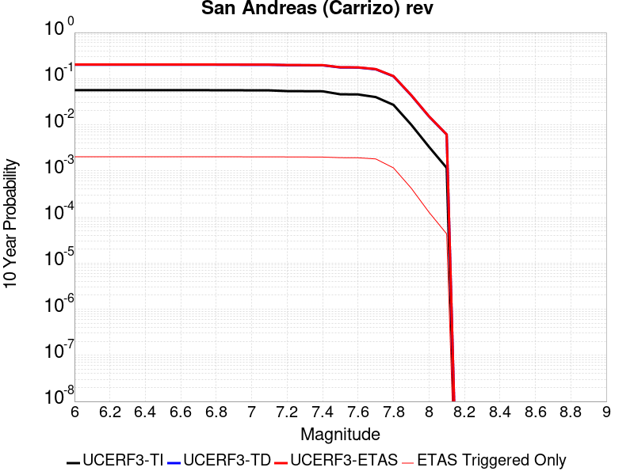 |

| Magnitude | 1 wk TI Prob | 1 wk TD Prob | 1 wk ETAS Prob | 1 wk ETAS/TD Gain | 1 wk ETAS Triggered Only | 1 mo TI Prob | 1 mo TD Prob | 1 mo ETAS Prob | 1 mo ETAS/TD Gain | 1 mo ETAS Triggered Only | 1 yr TI Prob | 1 yr TD Prob | 1 yr ETAS Prob | 1 yr ETAS/TD Gain | 1 yr ETAS Triggered Only | 10 yr TI Prob | 10 yr TD Prob | 10 yr ETAS Prob | 10 yr ETAS/TD Gain | 10 yr ETAS Triggered Only |
|-----|-----|-----|-----|-----|-----|-----|-----|-----|-----|-----|-----|-----|-----|-----|-----|-----|-----|-----|-----|-----|
| 6.0 | 1.1113902E-4 | 4.4923634E-4 | 0.0010215463 | 2.273962 | 5.725672E-4 | 4.7622315E-4 | 0.0019240503 | 0.0027279765 | 1.4178301 | 8.054759E-4 | 0.005782614 | 0.023205092 | 0.024560638 | 1.0584159 | 0.0013877477 | 0.05634437 | 0.20058148 | 0.2022572 | 1.0083543 | 0.0020961782 |
| 6.1 | 1.1113902E-4 | 4.4923634E-4 | 0.0010215463 | 2.273962 | 5.725672E-4 | 4.7622315E-4 | 0.0019240503 | 0.0027279765 | 1.4178301 | 8.054759E-4 | 0.005782614 | 0.023205092 | 0.024560638 | 1.0584159 | 0.0013877477 | 0.05634437 | 0.20058148 | 0.2022572 | 1.0083543 | 0.0020961782 |
| 6.2 | 1.1113902E-4 | 4.4923634E-4 | 0.0010215463 | 2.273962 | 5.725672E-4 | 4.7622315E-4 | 0.0019240503 | 0.0027279765 | 1.4178301 | 8.054759E-4 | 0.005782614 | 0.023205092 | 0.024560638 | 1.0584159 | 0.0013877477 | 0.05634437 | 0.20058148 | 0.2022572 | 1.0083543 | 0.0020961782 |
| 6.3 | 1.1113902E-4 | 4.4923634E-4 | 0.0010215463 | 2.273962 | 5.725672E-4 | 4.7622315E-4 | 0.0019240503 | 0.0027279765 | 1.4178301 | 8.054759E-4 | 0.005782614 | 0.023205092 | 0.024560638 | 1.0584159 | 0.0013877477 | 0.05634437 | 0.20058148 | 0.2022572 | 1.0083543 | 0.0020961782 |
| 6.4 | 1.1113902E-4 | 4.4923634E-4 | 0.0010215463 | 2.273962 | 5.725672E-4 | 4.7622315E-4 | 0.0019240503 | 0.0027279765 | 1.4178301 | 8.054759E-4 | 0.005782614 | 0.023205092 | 0.024560638 | 1.0584159 | 0.0013877477 | 0.05634437 | 0.20058148 | 0.2022572 | 1.0083543 | 0.0020961782 |
| 6.5 | 1.1113902E-4 | 4.4923634E-4 | 0.0010215463 | 2.273962 | 5.725672E-4 | 4.7622315E-4 | 0.0019240503 | 0.0027279765 | 1.4178301 | 8.054759E-4 | 0.005782614 | 0.023205092 | 0.024560638 | 1.0584159 | 0.0013877477 | 0.05634437 | 0.20058148 | 0.2022572 | 1.0083543 | 0.0020961782 |
| 6.6 | 1.1099849E-4 | 4.4896975E-4 | 0.00102128 | 2.2747188 | 5.725672E-4 | 4.7562108E-4 | 0.0019229094 | 0.0027268364 | 1.4180785 | 8.054759E-4 | 0.005775322 | 0.023191497 | 0.024547061 | 1.0584509 | 0.0013877477 | 0.056275163 | 0.20047371 | 0.20214966 | 1.0083599 | 0.0020961782 |
| 6.7 | 1.1077418E-4 | 4.4854544E-4 | 0.0010208559 | 2.2759252 | 5.725672E-4 | 4.7466008E-4 | 0.0019210937 | 0.0027250221 | 1.4184744 | 8.054759E-4 | 0.0057636844 | 0.023169862 | 0.024525456 | 1.0585067 | 0.0013877477 | 0.056164686 | 0.20030232 | 0.20197864 | 1.0083688 | 0.0020961782 |
| 6.8 | 1.105471E-4 | 4.4803345E-4 | 0.0010203442 | 2.2773838 | 5.725672E-4 | 4.7368725E-4 | 0.0019189026 | 0.0027228328 | 1.4189532 | 8.054759E-4 | 0.0057519027 | 0.023143753 | 0.024499385 | 1.0585743 | 0.0013877477 | 0.056052838 | 0.20009586 | 0.20177002 | 1.0083667 | 0.0020929435 |
| 6.9 | 1.1025541E-4 | 4.473621E-4 | 0.0010196732 | 2.2793016 | 5.725672E-4 | 4.7243762E-4 | 0.0019160297 | 0.0027199623 | 1.4195826 | 8.054759E-4 | 0.0057367687 | 0.023109518 | 0.024465196 | 1.0586631 | 0.0013877477 | 0.055909142 | 0.19982636 | 0.20150107 | 1.0083809 | 0.0020929435 |
| 7.0 | 1.0991533E-4 | 4.4657878E-4 | 0.0010188903 | 2.2815466 | 5.725672E-4 | 4.7098065E-4 | 0.0019126774 | 0.0027166128 | 1.4203193 | 8.054759E-4 | 0.0057191234 | 0.023069572 | 0.024425304 | 1.0587672 | 0.0013877477 | 0.055741582 | 0.19951206 | 0.20118743 | 1.0083973 | 0.0020929435 |
| 7.1 | 1.09542365E-4 | 4.457076E-4 | 0.0010180196 | 2.2840526 | 5.725672E-4 | 4.693828E-4 | 0.0019089493 | 0.0027128877 | 1.4211417 | 8.054759E-4 | 0.0056997715 | 0.023025142 | 0.024380937 | 1.0588832 | 0.0013877477 | 0.05555778 | 0.19916314 | 0.20083925 | 1.0084157 | 0.0020929435 |
| 7.2 | 1.05608764E-4 | 4.3706578E-4 | 0.0010061493 | 2.3020546 | 5.693324E-4 | 4.5253045E-4 | 0.0018719663 | 0.0026727056 | 1.4277531 | 8.022411E-4 | 0.005495649 | 0.022584237 | 0.02393432 | 1.0597799 | 0.001381278 | 0.053617116 | 0.19563848 | 0.19731155 | 1.0085518 | 0.0020800042 |
| 7.3 | 1.0511766E-4 | 4.3558737E-4 | 0.0010046718 | 2.3064759 | 5.693324E-4 | 4.5042645E-4 | 0.0018656392 | 0.002659926 | 1.4257451 | 7.957714E-4 | 0.0054701613 | 0.0225088 | 0.023852663 | 1.059704 | 0.0013748084 | 0.053374548 | 0.195048 | 0.1967145 | 1.008544 | 0.0020702996 |
| 7.4 | 1.04579514E-4 | 4.3395188E-4 | 0.0010030372 | 2.311402 | 5.693324E-4 | 4.481209E-4 | 0.00185864 | 0.0026529324 | 1.4273514 | 7.957714E-4 | 0.005442232 | 0.022425342 | 0.02376932 | 1.0599312 | 0.0013748084 | 0.053108674 | 0.19439563 | 0.19606347 | 1.0085796 | 0.0020702996 |
| 7.5 | 8.967509E-5 | 3.841574E-4 | 9.3710306E-4 | 2.4393728 | 5.5315817E-4 | 3.842652E-4 | 0.0016455129 | 0.0024238273 | 1.472992 | 7.795972E-4 | 0.004668397 | 0.019879378 | 0.02118881 | 1.0658689 | 0.0013359903 | 0.045715354 | 0.17451581 | 0.17617674 | 1.0095174 | 0.0020120724 |
| 7.6 | 8.902246E-5 | 3.822647E-4 | 9.319778E-4 | 2.438043 | 5.4992334E-4 | 3.8146903E-4 | 0.0016374114 | 0.0024125027 | 1.4733636 | 7.763624E-4 | 0.004634499 | 0.019782541 | 0.02108576 | 1.0658772 | 0.0013295205 | 0.0453903 | 0.17373076 | 0.17538258 | 1.0095079 | 0.001999133 |
| 7.7 | 7.776459E-5 | 3.4746045E-4 | 8.583881E-4 | 2.4704628 | 5.1110523E-4 | 3.3323426E-4 | 0.0014884217 | 0.002218408 | 1.4904432 | 7.3107454E-4 | 0.0040495815 | 0.017998766 | 0.019237649 | 1.0688314 | 0.0012615888 | 0.039765768 | 0.15920663 | 0.16080046 | 1.0100111 | 0.001895618 |
| 7.8 | 5.2312953E-5 | 2.3975673E-4 | 5.7609973E-4 | 2.4028513 | 3.364237E-4 | 2.2417911E-4 | 0.0010272242 | 0.0015119523 | 1.4718814 | 4.8522648E-4 | 0.0027259644 | 0.012452538 | 0.013254373 | 1.0643913 | 8.1194565E-4 | 0.026927674 | 0.112169944 | 0.11325556 | 1.0096782 | 0.0012227707 |
| 7.9 | 1.9307261E-5 | 9.060563E-5 | 1.9734578E-4 | 2.1780741 | 1.0674982E-4 | 8.274278E-5 | 3.8826585E-4 | 5.6611316E-4 | 1.4580555 | 1.7791637E-4 | 0.0010069277 | 0.0047193347 | 0.005009096 | 1.0613989 | 2.911359E-4 | 0.010023774 | 0.04339103 | 0.043802597 | 1.009485 | 4.3023413E-4 |
| 8.0 | 6.3800603E-6 | 3.136937E-5 | 5.7247304E-5 | 1.8249427 | 2.5878746E-5 | 2.7342829E-5 | 1.3443502E-4 | 1.7971674E-4 | 1.3368298 | 4.5287805E-5 | 3.3284808E-4 | 0.0016358347 | 0.0017068848 | 1.0434335 | 7.116655E-5 | 0.0033234998 | 0.015136539 | 0.015232115 | 1.0063143 | 9.70453E-5 |
| 8.1 | 2.2240692E-6 | 1.29589735E-5 | 1.9428575E-5 | 1.4992373 | 6.4696865E-6 | 9.531691E-6 | 5.5538447E-5 | 6.84771E-5 | 1.2329675 | 1.2939373E-5 | 1.1604215E-4 | 6.7617896E-4 | 6.955749E-4 | 1.0286846 | 1.9409059E-5 | 0.0011598158 | 0.0061071273 | 0.006139278 | 1.0052645 | 3.234843E-5 |

## Blackwater
*[(top)](#table-of-contents)*

| 1 Week | 1 Month | 1 Year | 10 Year |
|-----|-----|-----|-----|
| 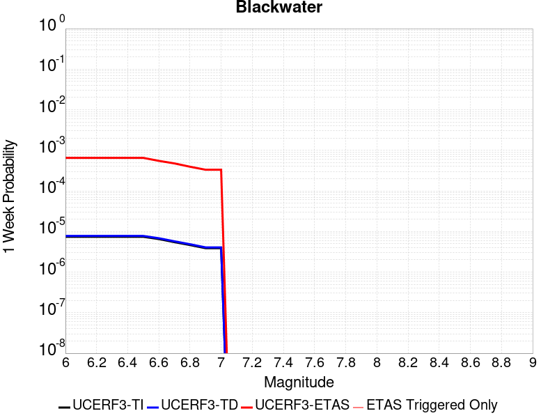 |  |  |  |

| Magnitude | 1 wk TI Prob | 1 wk TD Prob | 1 wk ETAS Prob | 1 wk ETAS/TD Gain | 1 wk ETAS Triggered Only | 1 mo TI Prob | 1 mo TD Prob | 1 mo ETAS Prob | 1 mo ETAS/TD Gain | 1 mo ETAS Triggered Only | 1 yr TI Prob | 1 yr TD Prob | 1 yr ETAS Prob | 1 yr ETAS/TD Gain | 1 yr ETAS Triggered Only | 10 yr TI Prob | 10 yr TD Prob | 10 yr ETAS Prob | 10 yr ETAS/TD Gain | 10 yr ETAS Triggered Only |
|-----|-----|-----|-----|-----|-----|-----|-----|-----|-----|-----|-----|-----|-----|-----|-----|-----|-----|-----|-----|-----|
| 6.0 | 7.413326E-6 | 7.774191E-6 | 7.097297E-4 | 91.29307 | 7.0196093E-4 | 3.177101E-5 | 3.3317654E-5 | 9.358088E-4 | 28.087475 | 9.0252125E-4 | 3.867434E-4 | 4.0558857E-4 | 0.0018283423 | 4.507874 | 0.001423331 | 0.0038607102 | 0.0040506064 | 0.006025533 | 1.4875633 | 0.0019829588 |
| 6.1 | 7.413326E-6 | 7.774191E-6 | 7.097297E-4 | 91.29307 | 7.0196093E-4 | 3.177101E-5 | 3.3317654E-5 | 9.358088E-4 | 28.087475 | 9.0252125E-4 | 3.867434E-4 | 4.0558857E-4 | 0.0018283423 | 4.507874 | 0.001423331 | 0.0038607102 | 0.0040506064 | 0.006025533 | 1.4875633 | 0.0019829588 |
| 6.2 | 7.413326E-6 | 7.774191E-6 | 7.097297E-4 | 91.29307 | 7.0196093E-4 | 3.177101E-5 | 3.3317654E-5 | 9.358088E-4 | 28.087475 | 9.0252125E-4 | 3.867434E-4 | 4.0558857E-4 | 0.0018283423 | 4.507874 | 0.001423331 | 0.0038607102 | 0.0040506064 | 0.006025533 | 1.4875633 | 0.0019829588 |
| 6.3 | 7.413326E-6 | 7.774191E-6 | 7.097297E-4 | 91.29307 | 7.0196093E-4 | 3.177101E-5 | 3.3317654E-5 | 9.358088E-4 | 28.087475 | 9.0252125E-4 | 3.867434E-4 | 4.0558857E-4 | 0.0018283423 | 4.507874 | 0.001423331 | 0.0038607102 | 0.0040506064 | 0.006025533 | 1.4875633 | 0.0019829588 |
| 6.4 | 7.413326E-6 | 7.774191E-6 | 7.097297E-4 | 91.29307 | 7.0196093E-4 | 3.177101E-5 | 3.3317654E-5 | 9.358088E-4 | 28.087475 | 9.0252125E-4 | 3.867434E-4 | 4.0558857E-4 | 0.0018283423 | 4.507874 | 0.001423331 | 0.0038607102 | 0.0040506064 | 0.006025533 | 1.4875633 | 0.0019829588 |
| 6.5 | 7.413326E-6 | 7.774191E-6 | 7.097297E-4 | 91.29307 | 7.0196093E-4 | 3.177101E-5 | 3.3317654E-5 | 9.358088E-4 | 28.087475 | 9.0252125E-4 | 3.867434E-4 | 4.0558857E-4 | 0.0018283423 | 4.507874 | 0.001423331 | 0.0038607102 | 0.0040506064 | 0.006025533 | 1.4875633 | 0.0019829588 |
| 6.6 | 6.51988E-6 | 6.8357062E-6 | 5.891035E-4 | 86.18034 | 5.822718E-4 | 2.7942044E-5 | 2.9295676E-5 | 7.9593103E-4 | 27.168892 | 7.666578E-4 | 3.4014127E-4 | 3.5663793E-4 | 0.001604842 | 4.49992 | 0.0012486494 | 0.0033962112 | 0.0035627622 | 0.005303354 | 1.4885513 | 0.0017468153 |
| 6.7 | 5.474748E-6 | 5.7374127E-6 | 5.200745E-4 | 90.64618 | 5.1434006E-4 | 2.3462993E-5 | 2.4588799E-5 | 6.909501E-4 | 28.100197 | 6.6637766E-4 | 2.856245E-4 | 2.993487E-4 | 0.0014085678 | 4.7054415 | 0.0011095512 | 0.0028525768 | 0.0029915334 | 0.0045234873 | 1.5120965 | 0.0015365505 |
| 6.8 | 4.643409E-6 | 4.8641823E-6 | 4.3833104E-4 | 90.11403 | 4.33469E-4 | 1.9900172E-5 | 2.0846448E-5 | 5.804626E-4 | 27.844679 | 5.5962784E-4 | 2.4225765E-4 | 2.5379687E-4 | 0.0011981314 | 4.720828 | 9.445742E-4 | 0.0024199372 | 0.0025371225 | 0.00385359 | 1.5188822 | 0.001319816 |
| 6.9 | 3.883733E-6 | 4.0671357E-6 | 3.663681E-4 | 90.080124 | 3.6230244E-4 | 1.6644462E-5 | 1.7430582E-5 | 4.8647466E-4 | 27.90926 | 4.6905226E-4 | 2.0262749E-4 | 2.1221735E-4 | 0.0010239907 | 4.8251977 | 8.1194565E-4 | 0.0020244285 | 0.0021221733 | 0.0032293699 | 1.5217277 | 0.0011095512 |
| 7.0 | 3.883733E-6 | 4.0671357E-6 | 3.663681E-4 | 90.080124 | 3.6230244E-4 | 1.6644462E-5 | 1.7430582E-5 | 4.8647466E-4 | 27.90926 | 4.6905226E-4 | 2.0262749E-4 | 2.1221735E-4 | 0.0010239907 | 4.8251977 | 8.1194565E-4 | 0.0020244285 | 0.0021221733 | 0.0032293699 | 1.5217277 | 0.0011095512 |

## San Andreas (Cholame) rev
*[(top)](#table-of-contents)*

| 1 Week | 1 Month | 1 Year | 10 Year |
|-----|-----|-----|-----|
|  |  |  |  |

| Magnitude | 1 wk TI Prob | 1 wk TD Prob | 1 wk ETAS Prob | 1 wk ETAS/TD Gain | 1 wk ETAS Triggered Only | 1 mo TI Prob | 1 mo TD Prob | 1 mo ETAS Prob | 1 mo ETAS/TD Gain | 1 mo ETAS Triggered Only | 1 yr TI Prob | 1 yr TD Prob | 1 yr ETAS Prob | 1 yr ETAS/TD Gain | 1 yr ETAS Triggered Only | 10 yr TI Prob | 10 yr TD Prob | 10 yr ETAS Prob | 10 yr ETAS/TD Gain | 10 yr ETAS Triggered Only |
|-----|-----|-----|-----|-----|-----|-----|-----|-----|-----|-----|-----|-----|-----|-----|-----|-----|-----|-----|-----|-----|
| 6.0 | 1.6051916E-4 | 5.7249254E-4 | 0.0010994701 | 1.9204968 | 5.2727945E-4 | 6.877579E-4 | 0.0024516056 | 0.0031647533 | 1.2908901 | 7.149003E-4 | 0.00834135 | 0.029507428 | 0.030678421 | 1.0396847 | 0.0012065965 | 0.080351114 | 0.2474813 | 0.24889319 | 1.005705 | 0.001876209 |
| 6.1 | 1.6051916E-4 | 5.7249254E-4 | 0.0010994701 | 1.9204968 | 5.2727945E-4 | 6.877579E-4 | 0.0024516056 | 0.0031647533 | 1.2908901 | 7.149003E-4 | 0.00834135 | 0.029507428 | 0.030678421 | 1.0396847 | 0.0012065965 | 0.080351114 | 0.2474813 | 0.24889319 | 1.005705 | 0.001876209 |
| 6.2 | 1.6051916E-4 | 5.7249254E-4 | 0.0010994701 | 1.9204968 | 5.2727945E-4 | 6.877579E-4 | 0.0024516056 | 0.0031647533 | 1.2908901 | 7.149003E-4 | 0.00834135 | 0.029507428 | 0.030678421 | 1.0396847 | 0.0012065965 | 0.080351114 | 0.2474813 | 0.24889319 | 1.005705 | 0.001876209 |
| 6.3 | 1.6051916E-4 | 5.7249254E-4 | 0.0010994701 | 1.9204968 | 5.2727945E-4 | 6.877579E-4 | 0.0024516056 | 0.0031647533 | 1.2908901 | 7.149003E-4 | 0.00834135 | 0.029507428 | 0.030678421 | 1.0396847 | 0.0012065965 | 0.080351114 | 0.2474813 | 0.24889319 | 1.005705 | 0.001876209 |
| 6.4 | 1.6051916E-4 | 5.7249254E-4 | 0.0010994701 | 1.9204968 | 5.2727945E-4 | 6.877579E-4 | 0.0024516056 | 0.0031647533 | 1.2908901 | 7.149003E-4 | 0.00834135 | 0.029507428 | 0.030678421 | 1.0396847 | 0.0012065965 | 0.080351114 | 0.2474813 | 0.24889319 | 1.005705 | 0.001876209 |
| 6.5 | 1.6051916E-4 | 5.7249254E-4 | 0.0010994701 | 1.9204968 | 5.2727945E-4 | 6.877579E-4 | 0.0024516056 | 0.0031647533 | 1.2908901 | 7.149003E-4 | 0.00834135 | 0.029507428 | 0.030678421 | 1.0396847 | 0.0012065965 | 0.080351114 | 0.2474813 | 0.24889319 | 1.005705 | 0.001876209 |
| 6.6 | 1.6029834E-4 | 5.7202484E-4 | 0.0010990027 | 1.9212499 | 5.2727945E-4 | 6.86812E-4 | 0.002449605 | 0.003162754 | 1.2911282 | 7.149003E-4 | 0.0083299205 | 0.029483816 | 0.030654836 | 1.0397174 | 0.0012065965 | 0.08024513 | 0.24731047 | 0.24872269 | 1.0057102 | 0.001876209 |
| 6.7 | 1.6007364E-4 | 5.7155016E-4 | 0.0010985283 | 1.9220154 | 5.2727945E-4 | 6.858495E-4 | 0.0024475744 | 0.0031607249 | 1.2913704 | 7.149003E-4 | 0.008318293 | 0.029459693 | 0.030630743 | 1.0397509 | 0.0012065965 | 0.08013727 | 0.2471372 | 0.24854973 | 1.0057156 | 0.001876209 |
| 6.8 | 1.5980547E-4 | 5.708367E-4 | 0.0010978152 | 1.9231684 | 5.2727945E-4 | 6.8470073E-4 | 0.0024445227 | 0.0031576753 | 1.2917349 | 7.149003E-4 | 0.008304413 | 0.029423568 | 0.030594662 | 1.0398012 | 0.0012065965 | 0.08000852 | 0.2468793 | 0.24829231 | 1.0057235 | 0.001876209 |
| 6.9 | 1.5943033E-4 | 5.6985184E-4 | 0.0010968308 | 1.9247649 | 5.2727945E-4 | 6.830939E-4 | 0.0024403096 | 0.0031534655 | 1.2922399 | 7.149003E-4 | 0.008284999 | 0.029373717 | 0.030544871 | 1.0398709 | 0.0012065965 | 0.0798284 | 0.24652228 | 0.24793595 | 1.0057344 | 0.001876209 |
| 7.0 | 1.5906857E-4 | 5.6890905E-4 | 0.0010958886 | 1.9262983 | 5.2727945E-4 | 6.815443E-4 | 0.0024362765 | 0.0031494352 | 1.2927248 | 7.149003E-4 | 0.008266276 | 0.029325863 | 0.030497076 | 1.0399379 | 0.0012065965 | 0.079654664 | 0.24617939 | 0.24759372 | 1.005745 | 0.001876209 |
| 7.1 | 9.4986666E-5 | 3.9541177E-4 | 8.9014706E-4 | 2.2511902 | 4.94931E-4 | 4.070222E-4 | 0.0016936905 | 0.0023686278 | 1.3985008 | 6.760822E-4 | 0.0049442407 | 0.020456197 | 0.021587411 | 1.0552994 | 0.001154839 | 0.048356738 | 0.17850818 | 0.17996442 | 1.008158 | 0.001772694 |
| 7.2 | 9.465065E-5 | 3.9454125E-4 | 8.8927697E-4 | 2.2539518 | 4.94931E-4 | 4.0558254E-4 | 0.0016899646 | 0.0023649042 | 1.3993809 | 6.760822E-4 | 0.0049267923 | 0.020411683 | 0.02154295 | 1.0554225 | 0.001154839 | 0.048189856 | 0.1781604 | 0.17961727 | 1.0081773 | 0.001772694 |
| 7.3 | 9.4370014E-5 | 3.9359776E-4 | 8.8833395E-4 | 2.256959 | 4.94931E-4 | 4.043802E-4 | 0.0016859263 | 0.0023608687 | 1.4003392 | 6.760822E-4 | 0.00491222 | 0.020363439 | 0.021494761 | 1.0555565 | 0.001154839 | 0.048050456 | 0.17778328 | 0.17924081 | 1.0081984 | 0.001772694 |
| 7.4 | 9.400309E-5 | 3.9239938E-4 | 8.871362E-4 | 2.2607992 | 4.94931E-4 | 4.0280816E-4 | 0.0016807971 | 0.002355743 | 1.4015629 | 6.760822E-4 | 0.004893167 | 0.020302156 | 0.021433549 | 1.0557277 | 0.001154839 | 0.04786817 | 0.17730153 | 0.17875992 | 1.0082254 | 0.001772694 |
| 7.5 | 7.9358346E-5 | 3.4328582E-4 | 8.283457E-4 | 2.4129913 | 4.8522648E-4 | 3.4006286E-4 | 0.0014705557 | 0.0021359534 | 1.4524804 | 6.6637766E-4 | 0.0041324073 | 0.017785678 | 0.018897736 | 1.0625255 | 0.0011321951 | 0.040564027 | 0.15729399 | 0.15875241 | 1.009272 | 0.0017306411 |
| 7.6 | 7.898946E-5 | 3.4216905E-4 | 8.2722947E-4 | 2.4176047 | 4.8522648E-4 | 3.3848232E-4 | 0.0014657748 | 0.0021311757 | 1.4539585 | 6.6637766E-4 | 0.0041132374 | 0.01772842 | 0.018837366 | 1.0625519 | 0.0011289603 | 0.040379323 | 0.15682538 | 0.15827915 | 1.0092701 | 0.0017241715 |
| 7.7 | 6.8013156E-5 | 3.0816178E-4 | 7.6090026E-4 | 2.4691584 | 4.5287804E-4 | 2.914524E-4 | 0.0013201776 | 0.0019469087 | 1.4747324 | 6.2755955E-4 | 0.0035426598 | 0.015981914 | 0.017032351 | 1.0657266 | 0.0010674982 | 0.03486713 | 0.14234997 | 0.14375104 | 1.0098423 | 0.0016335958 |
| 7.8 | 4.7216392E-5 | 2.1851076E-4 | 5.225196E-4 | 2.3912761 | 3.0407525E-4 | 2.0234026E-4 | 9.36238E-4 | 0.0013596057 | 1.4522009 | 4.2376446E-4 | 0.0024607095 | 0.011356776 | 0.012063557 | 1.0622343 | 7.149003E-4 | 0.024336396 | 0.10266637 | 0.103662014 | 1.0096978 | 0.0011095512 |
| 7.9 | 1.604325E-5 | 7.688082E-5 | 1.6098027E-4 | 2.093894 | 8.410592E-5 | 6.875498E-5 | 3.29461E-4 | 4.6527965E-4 | 1.412245 | 1.3586342E-4 | 8.367703E-4 | 0.0040061846 | 0.0042317165 | 1.0562959 | 2.2643902E-4 | 0.008336265 | 0.036792822 | 0.03713556 | 1.0093154 | 3.5583274E-4 |
| 8.0 | 5.458507E-6 | 2.769139E-5 | 4.709991E-5 | 1.7008865 | 1.9409059E-5 | 2.3393392E-5 | 1.1867371E-4 | 1.4778385E-4 | 1.2452955 | 2.9113588E-5 | 2.847773E-4 | 0.0014442017 | 0.0014991146 | 1.038023 | 5.4992335E-5 | 0.0028441267 | 0.013304143 | 0.013383939 | 1.0059978 | 8.0871076E-5 |
| 8.1 | 2.2240692E-6 | 1.29589735E-5 | 1.9428575E-5 | 1.4992373 | 6.4696865E-6 | 9.531691E-6 | 5.5538447E-5 | 6.84771E-5 | 1.2329675 | 1.2939373E-5 | 1.1604215E-4 | 6.7617896E-4 | 6.955749E-4 | 1.0286846 | 1.9409059E-5 | 0.0011598158 | 0.0061071273 | 0.006139278 | 1.0052645 | 3.234843E-5 |

## San Andreas (Parkfield)
*[(top)](#table-of-contents)*

| 1 Week | 1 Month | 1 Year | 10 Year |
|-----|-----|-----|-----|
|  |  |  |  |

| Magnitude | 1 wk TI Prob | 1 wk TD Prob | 1 wk ETAS Prob | 1 wk ETAS/TD Gain | 1 wk ETAS Triggered Only | 1 mo TI Prob | 1 mo TD Prob | 1 mo ETAS Prob | 1 mo ETAS/TD Gain | 1 mo ETAS Triggered Only | 1 yr TI Prob | 1 yr TD Prob | 1 yr ETAS Prob | 1 yr ETAS/TD Gain | 1 yr ETAS Triggered Only | 10 yr TI Prob | 10 yr TD Prob | 10 yr ETAS Prob | 10 yr ETAS/TD Gain | 10 yr ETAS Triggered Only |
|-----|-----|-----|-----|-----|-----|-----|-----|-----|-----|-----|-----|-----|-----|-----|-----|-----|-----|-----|-----|-----|
| 6.0 | 7.723521E-4 | 0.0013466828 | 0.0018764826 | 1.393411 | 5.305143E-4 | 0.0033058827 | 0.0057641217 | 0.0064941985 | 1.1266588 | 7.343094E-4 | 0.03951393 | 0.06891971 | 0.07004315 | 1.0163007 | 0.0012065965 | 0.3317935 | 0.5395069 | 0.54036194 | 1.0015849 | 0.0018567999 |
| 6.1 | 1.4269065E-4 | 5.017429E-4 | 9.349944E-4 | 1.8634931 | 4.33469E-4 | 6.11388E-4 | 0.002148918 | 0.0027396223 | 1.2748845 | 5.919763E-4 | 0.007418273 | 0.02591448 | 0.026891295 | 1.0376937 | 0.0010028013 | 0.0717547 | 0.22093078 | 0.22216062 | 1.0055666 | 0.0015786034 |
| 6.2 | 1.4269065E-4 | 5.017429E-4 | 9.349944E-4 | 1.8634931 | 4.33469E-4 | 6.11388E-4 | 0.002148918 | 0.0027396223 | 1.2748845 | 5.919763E-4 | 0.007418273 | 0.02591448 | 0.026891295 | 1.0376937 | 0.0010028013 | 0.0717547 | 0.22093078 | 0.22216062 | 1.0055666 | 0.0015786034 |
| 6.3 | 1.4269065E-4 | 5.017429E-4 | 9.349944E-4 | 1.8634931 | 4.33469E-4 | 6.11388E-4 | 0.002148918 | 0.0027396223 | 1.2748845 | 5.919763E-4 | 0.007418273 | 0.02591448 | 0.026891295 | 1.0376937 | 0.0010028013 | 0.0717547 | 0.22093078 | 0.22216062 | 1.0055666 | 0.0015786034 |
| 6.4 | 1.4269065E-4 | 5.017429E-4 | 9.349944E-4 | 1.8634931 | 4.33469E-4 | 6.11388E-4 | 0.002148918 | 0.0027396223 | 1.2748845 | 5.919763E-4 | 0.007418273 | 0.02591448 | 0.026891295 | 1.0376937 | 0.0010028013 | 0.0717547 | 0.22093078 | 0.22216062 | 1.0055666 | 0.0015786034 |
| 6.5 | 1.4269065E-4 | 5.017429E-4 | 9.349944E-4 | 1.8634931 | 4.33469E-4 | 6.11388E-4 | 0.002148918 | 0.0027396223 | 1.2748845 | 5.919763E-4 | 0.007418273 | 0.02591448 | 0.026891295 | 1.0376937 | 0.0010028013 | 0.0717547 | 0.22093078 | 0.22216062 | 1.0055666 | 0.0015786034 |
| 6.6 | 1.4257019E-4 | 5.015525E-4 | 9.348041E-4 | 1.8638209 | 4.33469E-4 | 6.10872E-4 | 0.0021481037 | 0.0027388083 | 1.2749889 | 5.919763E-4 | 0.0074120336 | 0.025904845 | 0.026881669 | 1.0377082 | 0.0010028013 | 0.07169635 | 0.22085924 | 0.2220892 | 1.005569 | 0.0015786034 |
| 6.7 | 1.4246788E-4 | 5.013712E-4 | 9.346229E-4 | 1.8641335 | 4.33469E-4 | 6.1043375E-4 | 0.002147328 | 0.0027380332 | 1.2750884 | 5.919763E-4 | 0.007406734 | 0.025895536 | 0.02687237 | 1.0377221 | 0.0010028013 | 0.07164679 | 0.22079132 | 0.22202139 | 1.0055711 | 0.0015786034 |
| 6.8 | 1.4238524E-4 | 5.0115754E-4 | 9.344093E-4 | 1.8645021 | 4.33469E-4 | 6.1007973E-4 | 0.0021464138 | 0.0027371193 | 1.2752059 | 5.919763E-4 | 0.007402453 | 0.025884695 | 0.02686154 | 1.0377383 | 0.0010028013 | 0.07160675 | 0.22071254 | 0.22194274 | 1.0055737 | 0.0015786034 |
| 6.9 | 1.4226006E-4 | 5.008332E-4 | 9.340851E-4 | 1.8650622 | 4.33469E-4 | 6.095435E-4 | 0.0021450259 | 0.0027357326 | 1.2753843 | 5.919763E-4 | 0.007395969 | 0.025868258 | 0.02684512 | 1.0377629 | 0.0010028013 | 0.0715461 | 0.22059278 | 0.22182316 | 1.0055776 | 0.0015786034 |
| 7.0 | 1.421111E-4 | 5.0044054E-4 | 9.336926E-4 | 1.8657413 | 4.33469E-4 | 6.089054E-4 | 0.002143346 | 0.0027340534 | 1.2756007 | 5.919763E-4 | 0.0073882528 | 0.025848212 | 0.026825093 | 1.0377929 | 0.0010028013 | 0.07147392 | 0.22044773 | 0.22167833 | 1.0055823 | 0.0015786034 |
| 7.1 | 7.911531E-5 | 3.2991724E-4 | 7.3090545E-4 | 2.2154207 | 4.0112055E-4 | 3.3902156E-4 | 0.0014133246 | 0.0019657009 | 1.3908348 | 5.5315817E-4 | 0.0041197776 | 0.017099971 | 0.018034752 | 1.0546657 | 9.510439E-4 | 0.04044234 | 0.15168123 | 0.15293258 | 1.0082499 | 0.0014750885 |
| 7.2 | 7.90033E-5 | 3.296154E-4 | 7.3060376E-4 | 2.216534 | 4.0112055E-4 | 3.3854163E-4 | 0.0014120324 | 0.0019644096 | 1.3911929 | 5.5315817E-4 | 0.004113957 | 0.017084487 | 0.018019283 | 1.0547161 | 9.510439E-4 | 0.040386252 | 0.15155983 | 0.15281136 | 1.0082576 | 0.0014750885 |
| 7.3 | 7.893314E-5 | 3.2935737E-4 | 7.303458E-4 | 2.2174873 | 4.0112055E-4 | 3.3824102E-4 | 0.0014109277 | 0.0019633055 | 1.3914996 | 5.5315817E-4 | 0.0041103107 | 0.017071247 | 0.018006057 | 1.0547593 | 9.510439E-4 | 0.04035112 | 0.15145631 | 0.152708 | 1.0082643 | 0.0014750885 |
| 7.4 | 7.878637E-5 | 3.2884022E-4 | 7.2982884E-4 | 2.2194028 | 4.0112055E-4 | 3.3761217E-4 | 0.0014087138 | 0.0019610927 | 1.3921158 | 5.5315817E-4 | 0.004102683 | 0.017044716 | 0.01797955 | 1.0548459 | 9.510439E-4 | 0.04027762 | 0.15124616 | 0.15249816 | 1.0082778 | 0.0014750885 |
| 7.5 | 6.8967216E-5 | 2.9620552E-4 | 6.907395E-4 | 2.3319602 | 3.9465085E-4 | 2.9554032E-4 | 0.001268987 | 0.0018149818 | 1.4302603 | 5.466885E-4 | 0.0035922674 | 0.015367592 | 0.01629765 | 1.0605208 | 9.445742E-4 | 0.035347503 | 0.13755313 | 0.13881415 | 1.0091676 | 0.0014621491 |
| 7.6 | 6.8796966E-5 | 2.9566285E-4 | 6.90197E-4 | 2.3344057 | 3.9465085E-4 | 2.948108E-4 | 0.0012666635 | 0.0018126596 | 1.4310505 | 5.466885E-4 | 0.003583415 | 0.015339702 | 0.016269786 | 1.0606325 | 9.445742E-4 | 0.0352618 | 0.13732228 | 0.13858084 | 1.009165 | 0.0014589143 |
| 7.7 | 5.8142083E-5 | 2.6259638E-4 | 6.312716E-4 | 2.403962 | 3.6877213E-4 | 2.4915655E-4 | 0.0011250726 | 0.001638834 | 1.4566473 | 5.1434006E-4 | 0.0030292615 | 0.0136374645 | 0.014514915 | 1.0643412 | 8.8958186E-4 | 0.029882994 | 0.122926764 | 0.124132566 | 1.0098091 | 0.0013748084 |
| 7.8 | 3.7720634E-5 | 1.7457761E-4 | 4.009771E-4 | 2.2968416 | 2.2643902E-4 | 1.6164983E-4 | 7.480669E-4 | 0.0010648443 | 1.4234614 | 3.1701464E-4 | 0.0019663102 | 0.009085932 | 0.009624448 | 1.0592692 | 5.434537E-4 | 0.019490024 | 0.08308776 | 0.08387673 | 1.0094956 | 8.6046825E-4 |
| 7.9 | 1.41195915E-5 | 6.798084E-5 | 1.326733E-4 | 1.9516279 | 6.469686E-5 | 6.051113E-5 | 2.9132722E-4 | 4.0127986E-4 | 1.3774197 | 1.0998467E-4 | 7.36474E-4 | 0.0035434929 | 0.0037336722 | 1.05367 | 1.9085575E-4 | 0.00734038 | 0.03258086 | 0.032881286 | 1.009221 | 3.1054494E-4 |
| 8.0 | 5.0866283E-6 | 2.564328E-5 | 4.5051842E-5 | 1.7568673 | 1.9409059E-5 | 2.1799653E-5 | 1.09896864E-4 | 1.3577277E-4 | 1.2354562 | 2.5878746E-5 | 2.6537845E-4 | 0.0013374792 | 0.0013891675 | 1.038646 | 5.175749E-5 | 0.0026506176 | 0.012337761 | 0.012414439 | 1.006215 | 7.7636236E-5 |
| 8.1 | 2.2154293E-6 | 1.2907957E-5 | 1.937756E-5 | 1.5012105 | 6.4696865E-6 | 9.494662E-6 | 5.5319815E-5 | 6.825847E-5 | 1.2338883 | 1.2939373E-5 | 1.1559138E-4 | 6.7351875E-4 | 6.9291476E-4 | 1.028798 | 1.9409059E-5 | 0.0011553128 | 0.0060832473 | 0.006115399 | 1.0052853 | 3.234843E-5 |

## Death Valley (Black Mtns Frontal)
*[(top)](#table-of-contents)*

| 1 Week | 1 Month | 1 Year | 10 Year |
|-----|-----|-----|-----|
|  |  |  |  |

| Magnitude | 1 wk TI Prob | 1 wk TD Prob | 1 wk ETAS Prob | 1 wk ETAS/TD Gain | 1 wk ETAS Triggered Only | 1 mo TI Prob | 1 mo TD Prob | 1 mo ETAS Prob | 1 mo ETAS/TD Gain | 1 mo ETAS Triggered Only | 1 yr TI Prob | 1 yr TD Prob | 1 yr ETAS Prob | 1 yr ETAS/TD Gain | 1 yr ETAS Triggered Only | 10 yr TI Prob | 10 yr TD Prob | 10 yr ETAS Prob | 10 yr ETAS/TD Gain | 10 yr ETAS Triggered Only |
|-----|-----|-----|-----|-----|-----|-----|-----|-----|-----|-----|-----|-----|-----|-----|-----|-----|-----|-----|-----|-----|
| 6.0 | 3.897727E-5 | 4.947383E-5 | 6.123087E-4 | 12.376416 | 5.628627E-4 | 1.6703474E-4 | 2.1201522E-4 | 0.0010011496 | 4.7220645 | 7.893017E-4 | 0.0020317512 | 0.0025785444 | 0.0038562394 | 1.4955101 | 0.0012809979 | 0.020132754 | 0.025518417 | 0.027236419 | 1.0673239 | 0.0017629896 |
| 6.1 | 3.897727E-5 | 4.947383E-5 | 6.123087E-4 | 12.376416 | 5.628627E-4 | 1.6703474E-4 | 2.1201522E-4 | 0.0010011496 | 4.7220645 | 7.893017E-4 | 0.0020317512 | 0.0025785444 | 0.0038562394 | 1.4955101 | 0.0012809979 | 0.020132754 | 0.025518417 | 0.027236419 | 1.0673239 | 0.0017629896 |
| 6.2 | 3.897727E-5 | 4.947383E-5 | 6.123087E-4 | 12.376416 | 5.628627E-4 | 1.6703474E-4 | 2.1201522E-4 | 0.0010011496 | 4.7220645 | 7.893017E-4 | 0.0020317512 | 0.0025785444 | 0.0038562394 | 1.4955101 | 0.0012809979 | 0.020132754 | 0.025518417 | 0.027236419 | 1.0673239 | 0.0017629896 |
| 6.3 | 3.897727E-5 | 4.947383E-5 | 6.123087E-4 | 12.376416 | 5.628627E-4 | 1.6703474E-4 | 2.1201522E-4 | 0.0010011496 | 4.7220645 | 7.893017E-4 | 0.0020317512 | 0.0025785444 | 0.0038562394 | 1.4955101 | 0.0012809979 | 0.020132754 | 0.025518417 | 0.027236419 | 1.0673239 | 0.0017629896 |
| 6.4 | 3.897727E-5 | 4.947383E-5 | 6.123087E-4 | 12.376416 | 5.628627E-4 | 1.6703474E-4 | 2.1201522E-4 | 0.0010011496 | 4.7220645 | 7.893017E-4 | 0.0020317512 | 0.0025785444 | 0.0038562394 | 1.4955101 | 0.0012809979 | 0.020132754 | 0.025518417 | 0.027236419 | 1.0673239 | 0.0017629896 |
| 6.5 | 3.897727E-5 | 4.947383E-5 | 6.123087E-4 | 12.376416 | 5.628627E-4 | 1.6703474E-4 | 2.1201522E-4 | 0.0010011496 | 4.7220645 | 7.893017E-4 | 0.0020317512 | 0.0025785444 | 0.0038562394 | 1.4955101 | 0.0012809979 | 0.020132754 | 0.025518417 | 0.027236419 | 1.0673239 | 0.0017629896 |
| 6.6 | 3.4230983E-5 | 4.342495E-5 | 5.124568E-4 | 11.800978 | 4.6905226E-4 | 1.4669597E-4 | 1.8609542E-4 | 8.523491E-4 | 4.580172 | 6.6637766E-4 | 0.0017845602 | 0.0022636733 | 0.0033642577 | 1.486194 | 0.0011030815 | 0.017702973 | 0.022437919 | 0.023955805 | 1.0676482 | 0.0015527247 |
| 6.7 | 3.1676747E-5 | 4.019097E-5 | 4.7364252E-4 | 11.7848 | 4.33469E-4 | 1.3575044E-4 | 1.7223743E-4 | 7.802832E-4 | 4.530277 | 6.081505E-4 | 0.0016515085 | 0.0020952902 | 0.0031024464 | 1.4806763 | 0.001009271 | 0.016392887 | 0.020786978 | 0.022168053 | 1.0664394 | 0.0014103916 |
| 6.8 | 2.9047482E-5 | 3.684629E-5 | 4.1207427E-4 | 11.183602 | 3.752418E-4 | 1.2448327E-4 | 1.5790488E-4 | 7.0450705E-4 | 4.4615912 | 5.466885E-4 | 0.00151453 | 0.0019211107 | 0.0028315838 | 1.4739307 | 9.1222575E-4 | 0.015042495 | 0.019076241 | 0.02032011 | 1.0652051 | 0.0012680585 |
| 6.9 | 2.5887868E-5 | 3.279623E-5 | 3.5626994E-4 | 10.863136 | 3.234843E-4 | 1.10943285E-4 | 1.4054945E-4 | 6.2570773E-4 | 4.4518685 | 4.8522648E-4 | 0.0013498975 | 0.0017101576 | 0.0025142562 | 1.4701897 | 8.054759E-4 | 0.01341727 | 0.01700073 | 0.018107317 | 1.0650905 | 0.0011257255 |
| 7.0 | 2.244997E-5 | 2.8405042E-5 | 2.8718513E-4 | 10.110357 | 2.5878745E-4 | 9.621061E-5 | 1.2173196E-4 | 5.228037E-4 | 4.294712 | 4.0112055E-4 | 0.0011707348 | 0.0014813873 | 0.002166158 | 1.4622498 | 6.8578677E-4 | 0.011645862 | 0.014745472 | 0.015704803 | 1.0650593 | 9.736878E-4 |
| 7.1 | 1.989245E-5 | 2.5153167E-5 | 2.4511697E-4 | 9.744974 | 2.1996934E-4 | 8.525057E-5 | 1.07796564E-4 | 4.5065297E-4 | 4.180588 | 3.4289339E-4 | 0.0010374314 | 0.0013119389 | 0.0018740632 | 1.4284683 | 5.628627E-4 | 0.010326017 | 0.013071986 | 0.01388928 | 1.0625226 | 8.2811987E-4 |
| 7.2 | 1.8805691E-5 | 2.3778988E-5 | 2.3727356E-4 | 9.978287 | 2.1349965E-4 | 8.059333E-5 | 1.0190769E-4 | 4.3506257E-4 | 4.269183 | 3.3318883E-4 | 9.807821E-4 | 0.0012403254 | 0.001783105 | 1.4376106 | 5.434537E-4 | 0.009764646 | 0.012364016 | 0.013140364 | 1.0627909 | 7.8606687E-4 |
| 7.3 | 6.7321266E-6 | 8.65193E-6 | 6.364379E-5 | 7.3560214 | 5.4992335E-5 | 2.8851653E-5 | 3.707942E-5 | 1.2441694E-4 | 3.355418 | 8.734076E-5 | 3.5121225E-4 | 4.5139133E-4 | 5.8072666E-4 | 1.286526 | 1.2939372E-4 | 0.0035065769 | 0.004508958 | 0.004695733 | 1.0414231 | 1.876209E-4 |
| 7.4 | 6.319214E-6 | 8.125558E-6 | 5.6647812E-5 | 6.971559 | 4.852265E-5 | 2.7082066E-5 | 3.48236E-5 | 1.1245713E-4 | 3.2293367 | 7.7636236E-5 | 3.2967425E-4 | 4.2393777E-4 | 5.3710927E-4 | 1.2669531 | 1.1321951E-4 | 0.003291856 | 0.0042355005 | 0.004403 | 1.0395465 | 1.6821185E-4 |
| 7.5 | 6.0176867E-6 | 7.741697E-6 | 5.626397E-5 | 7.2676535 | 4.852265E-5 | 2.578983E-5 | 3.317852E-5 | 1.0757744E-4 | 3.2423823 | 7.440139E-5 | 3.1394596E-4 | 4.0391652E-4 | 5.1385676E-4 | 1.2721856 | 1.0998467E-4 | 0.0031350278 | 0.004036032 | 0.0041938997 | 1.0391146 | 1.5850732E-4 |
| 7.6 | 5.6024205E-6 | 7.211712E-6 | 5.573401E-5 | 7.7282634 | 4.852265E-5 | 2.4010153E-5 | 3.0907213E-5 | 1.02071564E-4 | 3.302516 | 7.116655E-5 | 2.9228439E-4 | 3.762732E-4 | 4.8298287E-4 | 1.2835962 | 1.0674982E-4 | 0.0029190024 | 0.0037605667 | 0.0039055874 | 1.0385635 | 1.4556794E-4 |
| 7.7 | 5.132066E-6 | 6.6084267E-6 | 4.5426288E-5 | 6.8739944 | 3.8818118E-5 | 2.1994381E-5 | 2.8321763E-5 | 8.0077785E-5 | 2.8274295 | 5.175749E-5 | 2.677487E-4 | 3.4480577E-4 | 4.2564896E-4 | 1.2344601 | 8.0871076E-5 | 0.0026742632 | 0.00344691 | 0.0035661866 | 1.034604 | 1.196892E-4 |
| 7.8 | 4.8153906E-6 | 6.202069E-6 | 4.5019944E-5 | 7.258859 | 3.8818118E-5 | 2.0637224E-5 | 2.6580266E-5 | 7.833638E-5 | 2.947163 | 5.175749E-5 | 2.5122924E-4 | 3.2360948E-4 | 4.044544E-4 | 1.2498224 | 8.0871076E-5 | 0.002509454 | 0.0032355804 | 0.0033548824 | 1.0368719 | 1.196892E-4 |

## Hunter Mountain-Saline Valley
*[(top)](#table-of-contents)*

| 1 Week | 1 Month | 1 Year | 10 Year |
|-----|-----|-----|-----|
|  |  |  |  |

| Magnitude | 1 wk TI Prob | 1 wk TD Prob | 1 wk ETAS Prob | 1 wk ETAS/TD Gain | 1 wk ETAS Triggered Only | 1 mo TI Prob | 1 mo TD Prob | 1 mo ETAS Prob | 1 mo ETAS/TD Gain | 1 mo ETAS Triggered Only | 1 yr TI Prob | 1 yr TD Prob | 1 yr ETAS Prob | 1 yr ETAS/TD Gain | 1 yr ETAS Triggered Only | 10 yr TI Prob | 10 yr TD Prob | 10 yr ETAS Prob | 10 yr ETAS/TD Gain | 10 yr ETAS Triggered Only |
|-----|-----|-----|-----|-----|-----|-----|-----|-----|-----|-----|-----|-----|-----|-----|-----|-----|-----|-----|-----|-----|
| 6.0 | 2.6350473E-5 | 3.0151663E-5 | 5.7035417E-4 | 18.916176 | 5.402188E-4 | 1.12925714E-4 | 1.2921583E-4 | 8.472582E-4 | 6.556923 | 7.1813515E-4 | 0.0013740034 | 0.0015722114 | 0.0025863552 | 1.6450429 | 0.0010157408 | 0.01365539 | 0.015625311 | 0.017058246 | 1.0917059 | 0.0014556794 |
| 6.1 | 2.6350473E-5 | 3.0151663E-5 | 5.7035417E-4 | 18.916176 | 5.402188E-4 | 1.12925714E-4 | 1.2921583E-4 | 8.472582E-4 | 6.556923 | 7.1813515E-4 | 0.0013740034 | 0.0015722114 | 0.0025863552 | 1.6450429 | 0.0010157408 | 0.01365539 | 0.015625311 | 0.017058246 | 1.0917059 | 0.0014556794 |
| 6.2 | 2.6350473E-5 | 3.0151663E-5 | 5.7035417E-4 | 18.916176 | 5.402188E-4 | 1.12925714E-4 | 1.2921583E-4 | 8.472582E-4 | 6.556923 | 7.1813515E-4 | 0.0013740034 | 0.0015722114 | 0.0025863552 | 1.6450429 | 0.0010157408 | 0.01365539 | 0.015625311 | 0.017058246 | 1.0917059 | 0.0014556794 |
| 6.3 | 2.6350473E-5 | 3.0151663E-5 | 5.7035417E-4 | 18.916176 | 5.402188E-4 | 1.12925714E-4 | 1.2921583E-4 | 8.472582E-4 | 6.556923 | 7.1813515E-4 | 0.0013740034 | 0.0015722114 | 0.0025863552 | 1.6450429 | 0.0010157408 | 0.01365539 | 0.015625311 | 0.017058246 | 1.0917059 | 0.0014556794 |
| 6.4 | 2.6350473E-5 | 3.0151663E-5 | 5.7035417E-4 | 18.916176 | 5.402188E-4 | 1.12925714E-4 | 1.2921583E-4 | 8.472582E-4 | 6.556923 | 7.1813515E-4 | 0.0013740034 | 0.0015722114 | 0.0025863552 | 1.6450429 | 0.0010157408 | 0.01365539 | 0.015625311 | 0.017058246 | 1.0917059 | 0.0014556794 |
| 6.5 | 2.6350473E-5 | 3.0151663E-5 | 5.7035417E-4 | 18.916176 | 5.402188E-4 | 1.12925714E-4 | 1.2921583E-4 | 8.472582E-4 | 6.556923 | 7.1813515E-4 | 0.0013740034 | 0.0015722114 | 0.0025863552 | 1.6450429 | 0.0010157408 | 0.01365539 | 0.015625311 | 0.017058246 | 1.0917059 | 0.0014556794 |
| 6.6 | 2.3915805E-5 | 2.727318E-5 | 5.4159923E-4 | 19.858309 | 5.1434006E-4 | 1.0249228E-4 | 1.1688063E-4 | 7.961183E-4 | 6.8113794 | 6.7931705E-4 | 0.0012471292 | 0.0014222359 | 0.002381618 | 1.674559 | 9.607484E-4 | 0.012401534 | 0.014145577 | 0.015504126 | 1.0960406 | 0.0013780432 |
| 6.7 | 2.1143418E-5 | 2.4001838E-5 | 4.898081E-4 | 20.407106 | 4.658174E-4 | 9.06115E-5 | 1.0286176E-4 | 7.077152E-4 | 6.8802557 | 6.0491567E-4 | 0.0011026367 | 0.0012517641 | 0.0021240786 | 1.696868 | 8.7340764E-4 | 0.010971815 | 0.012461145 | 0.013700624 | 1.0994675 | 0.0012551191 |
| 6.8 | 1.8590634E-5 | 2.0984402E-5 | 4.5767907E-4 | 21.810442 | 4.3670382E-4 | 7.967171E-5 | 8.993084E-5 | 6.430393E-4 | 7.1503754 | 5.5315817E-4 | 9.6957135E-4 | 0.0010944982 | 0.0018861674 | 1.7233169 | 7.925366E-4 | 0.00965352 | 0.010904897 | 0.012037544 | 1.1038659 | 0.0011451344 |
| 6.9 | 1.6592752E-5 | 1.863061E-5 | 4.520915E-4 | 24.26606 | 4.33469E-4 | 7.110986E-5 | 7.984381E-5 | 6.2325405E-4 | 7.805916 | 5.434537E-4 | 8.6541864E-4 | 9.7180397E-4 | 0.0017377167 | 1.788135 | 7.666578E-4 | 0.008620561 | 0.009689213 | 0.010778403 | 1.1124127 | 0.0010998467 |
| 7.0 | 1.4621345E-5 | 1.6318016E-5 | 4.3037118E-4 | 26.37399 | 4.1405993E-4 | 6.2661406E-5 | 6.993326E-5 | 5.8100274E-4 | 8.3079605 | 5.1110523E-4 | 7.6263555E-4 | 8.512428E-4 | 0.0015849271 | 1.8618978 | 7.343094E-4 | 0.0076002358 | 0.008493364 | 0.009542174 | 1.1234858 | 0.0010577937 |
| 7.1 | 1.4214311E-5 | 1.5853855E-5 | 4.1696805E-4 | 26.300735 | 4.0112055E-4 | 6.0917053E-5 | 6.79441E-5 | 5.628415E-4 | 8.28389 | 4.94931E-4 | 7.414127E-4 | 8.2704343E-4 | 0.0015413525 | 1.8636899 | 7.149003E-4 | 0.0073894397 | 0.0082531925 | 0.009279799 | 1.124389 | 0.0010351498 |
| 7.2 | 5.322531E-6 | 5.4705556E-6 | 3.1277898E-4 | 57.17499 | 3.073101E-4 | 2.2810646E-5 | 2.3445109E-5 | 3.889738E-4 | 16.59083 | 3.6553727E-4 | 2.7768422E-4 | 2.8542118E-4 | 8.1901794E-4 | 2.8695066 | 5.337491E-4 | 0.0027733748 | 0.002851954 | 0.0036325534 | 1.2737069 | 7.8283204E-4 |
| 7.3 | 4.9197506E-6 | 5.0347303E-6 | 2.9940397E-4 | 59.467728 | 2.9437072E-4 | 2.1084476E-5 | 2.1577318E-5 | 3.741676E-4 | 17.340784 | 3.525979E-4 | 2.5667323E-4 | 2.6268652E-4 | 7.607215E-4 | 2.895929 | 4.9816584E-4 | 0.0025637697 | 0.0026251655 | 0.0033607737 | 1.280214 | 7.3754427E-4 |
| 7.4 | 4.3367913E-6 | 4.4250473E-6 | 2.826203E-4 | 63.868317 | 2.781965E-4 | 1.8586115E-5 | 1.896443E-5 | 3.5214695E-4 | 18.568811 | 3.3318883E-4 | 2.2626246E-4 | 2.3088178E-4 | 6.8365526E-4 | 2.961062 | 4.5287804E-4 | 0.0022603222 | 0.0023078213 | 0.0029791158 | 1.290878 | 6.728474E-4 |
| 7.5 | 3.7993927E-6 | 3.8762123E-6 | 2.5942782E-4 | 66.928185 | 2.5555262E-4 | 1.628301E-5 | 1.6612312E-5 | 3.206825E-4 | 19.303905 | 3.0407525E-4 | 1.9822762E-4 | 2.0225039E-4 | 6.1946077E-4 | 3.062841 | 4.1729477E-4 | 0.001980509 | 0.002022061 | 0.0026289818 | 1.3001496 | 6.081505E-4 |
| 7.6 | 3.2998898E-6 | 3.365071E-6 | 2.265685E-4 | 67.32948 | 2.2320417E-4 | 1.4142308E-5 | 1.4421733E-5 | 2.8614464E-4 | 19.841211 | 2.7172684E-4 | 1.7216899E-4 | 1.755846E-4 | 5.539948E-4 | 3.1551445 | 3.7847666E-4 | 0.0017203566 | 0.001755846 | 0.0022951162 | 1.3071284 | 5.402188E-4 |

## San Andreas (San Bernardino N)
*[(top)](#table-of-contents)*

| 1 Week | 1 Month | 1 Year | 10 Year |
|-----|-----|-----|-----|
|  |  |  |  |

| Magnitude | 1 wk TI Prob | 1 wk TD Prob | 1 wk ETAS Prob | 1 wk ETAS/TD Gain | 1 wk ETAS Triggered Only | 1 mo TI Prob | 1 mo TD Prob | 1 mo ETAS Prob | 1 mo ETAS/TD Gain | 1 mo ETAS Triggered Only | 1 yr TI Prob | 1 yr TD Prob | 1 yr ETAS Prob | 1 yr ETAS/TD Gain | 1 yr ETAS Triggered Only | 10 yr TI Prob | 10 yr TD Prob | 10 yr ETAS Prob | 10 yr ETAS/TD Gain | 10 yr ETAS Triggered Only |
|-----|-----|-----|-----|-----|-----|-----|-----|-----|-----|-----|-----|-----|-----|-----|-----|-----|-----|-----|-----|-----|
| 6.0 | 1.0995041E-4 | 4.016633E-4 | 7.0561643E-4 | 1.756736 | 3.0407525E-4 | 4.7113094E-4 | 0.0017203542 | 0.0021982873 | 1.2778109 | 4.787568E-4 | 0.0057209437 | 0.020758318 | 0.021588253 | 1.0399809 | 8.475289E-4 | 0.055758867 | 0.17985137 | 0.18089932 | 1.0058268 | 0.001277763 |
| 6.1 | 1.0995041E-4 | 4.016633E-4 | 7.0561643E-4 | 1.756736 | 3.0407525E-4 | 4.7113094E-4 | 0.0017203542 | 0.0021982873 | 1.2778109 | 4.787568E-4 | 0.0057209437 | 0.020758318 | 0.021588253 | 1.0399809 | 8.475289E-4 | 0.055758867 | 0.17985137 | 0.18089932 | 1.0058268 | 0.001277763 |
| 6.2 | 1.0995041E-4 | 4.016633E-4 | 7.0561643E-4 | 1.756736 | 3.0407525E-4 | 4.7113094E-4 | 0.0017203542 | 0.0021982873 | 1.2778109 | 4.787568E-4 | 0.0057209437 | 0.020758318 | 0.021588253 | 1.0399809 | 8.475289E-4 | 0.055758867 | 0.17985137 | 0.18089932 | 1.0058268 | 0.001277763 |
| 6.3 | 1.0995041E-4 | 4.016633E-4 | 7.0561643E-4 | 1.756736 | 3.0407525E-4 | 4.7113094E-4 | 0.0017203542 | 0.0021982873 | 1.2778109 | 4.787568E-4 | 0.0057209437 | 0.020758318 | 0.021588253 | 1.0399809 | 8.475289E-4 | 0.055758867 | 0.17985137 | 0.18089932 | 1.0058268 | 0.001277763 |
| 6.4 | 1.0995041E-4 | 4.016633E-4 | 7.0561643E-4 | 1.756736 | 3.0407525E-4 | 4.7113094E-4 | 0.0017203542 | 0.0021982873 | 1.2778109 | 4.787568E-4 | 0.0057209437 | 0.020758318 | 0.021588253 | 1.0399809 | 8.475289E-4 | 0.055758867 | 0.17985137 | 0.18089932 | 1.0058268 | 0.001277763 |
| 6.5 | 1.0995041E-4 | 4.016633E-4 | 7.0561643E-4 | 1.756736 | 3.0407525E-4 | 4.7113094E-4 | 0.0017203542 | 0.0021982873 | 1.2778109 | 4.787568E-4 | 0.0057209437 | 0.020758318 | 0.021588253 | 1.0399809 | 8.475289E-4 | 0.055758867 | 0.17985137 | 0.18089932 | 1.0058268 | 0.001277763 |
| 6.6 | 1.09829954E-4 | 4.014158E-4 | 7.05369E-4 | 1.7572029 | 3.0407525E-4 | 4.7061488E-4 | 0.0017192949 | 0.0021972286 | 1.2779824 | 4.787568E-4 | 0.0057146936 | 0.020745667 | 0.021575613 | 1.0400058 | 8.475289E-4 | 0.05569951 | 0.17974973 | 0.18079782 | 1.0058308 | 0.001277763 |
| 6.7 | 1.0968671E-4 | 4.0112622E-4 | 7.050795E-4 | 1.7577497 | 3.0407525E-4 | 4.7000122E-4 | 0.0017180555 | 0.0021959897 | 1.2781832 | 4.787568E-4 | 0.005707261 | 0.020730862 | 0.021560822 | 1.0400349 | 8.475289E-4 | 0.05562892 | 0.17963059 | 0.18067884 | 1.0058355 | 0.001277763 |
| 6.8 | 9.6153904E-5 | 3.6562132E-4 | 6.4371614E-4 | 1.7606088 | 2.781965E-4 | 4.1202307E-4 | 0.0015660744 | 0.0019988646 | 1.2763535 | 4.33469E-4 | 0.0050048484 | 0.018912675 | 0.019639444 | 1.0384276 | 7.407791E-4 | 0.048936214 | 0.16500922 | 0.16595459 | 1.0057292 | 0.0011321951 |
| 6.9 | 9.59246E-5 | 3.6505362E-4 | 6.4314855E-4 | 1.7617921 | 2.781965E-4 | 4.1104064E-4 | 0.0015636444 | 0.0019964355 | 1.2767836 | 4.33469E-4 | 0.0049929423 | 0.0188836 | 0.019610392 | 1.0384879 | 7.407791E-4 | 0.048822403 | 0.164772 | 0.16571765 | 1.0057391 | 0.0011321951 |
| 7.0 | 9.5669224E-5 | 3.64425E-4 | 6.4252014E-4 | 1.7631066 | 2.781965E-4 | 4.0994651E-4 | 0.0015609534 | 0.0019937458 | 1.2772615 | 4.33469E-4 | 0.004979682 | 0.018851407 | 0.019578222 | 1.0385549 | 7.407791E-4 | 0.048695635 | 0.16450974 | 0.16545568 | 1.0057501 | 0.0011321951 |
| 7.1 | 9.5384006E-5 | 3.6372882E-4 | 6.4182415E-4 | 1.7645677 | 2.781965E-4 | 4.0872456E-4 | 0.0015579734 | 0.0019907672 | 1.2777927 | 4.33469E-4 | 0.0049648727 | 0.018815754 | 0.019542594 | 1.0386294 | 7.407791E-4 | 0.04855404 | 0.16421874 | 0.16516499 | 1.0057622 | 0.0011321951 |
| 7.2 | 7.876192E-5 | 3.2410742E-4 | 5.763434E-4 | 1.7782482 | 2.5231775E-4 | 3.375074E-4 | 0.0013883485 | 0.0017759908 | 1.279211 | 3.881812E-4 | 0.0041014124 | 0.01678248 | 0.017434493 | 1.0388509 | 6.631428E-4 | 0.040265374 | 0.14711435 | 0.14798895 | 1.005945 | 0.0010254453 |
| 7.3 | 7.8294186E-5 | 3.2266052E-4 | 5.7489687E-4 | 1.7817391 | 2.5231775E-4 | 3.3550337E-4 | 0.0013821543 | 0.0017697989 | 1.280464 | 3.881812E-4 | 0.004077105 | 0.016708223 | 0.017357105 | 1.0388361 | 6.59908E-4 | 0.040031098 | 0.14649805 | 0.1473705 | 1.0059555 | 0.0010222105 |
| 7.4 | 7.778049E-5 | 3.210994E-4 | 5.7333615E-4 | 1.785541 | 2.5231775E-4 | 3.3330236E-4 | 0.0013754707 | 0.001763118 | 1.2818288 | 3.881812E-4 | 0.0040504076 | 0.016628098 | 0.01727385 | 1.038835 | 6.5667316E-4 | 0.039773732 | 0.14583014 | 0.14670052 | 1.0059685 | 0.0010189756 |
| 7.5 | 5.9146343E-5 | 2.6189696E-4 | 4.9151067E-4 | 1.876733 | 2.2967387E-4 | 2.534597E-4 | 0.0011219733 | 0.0014741756 | 1.3139132 | 3.525979E-4 | 0.0030815054 | 0.01358183 | 0.014165767 | 1.0429939 | 5.919763E-4 | 0.03039124 | 0.120311 | 0.12109356 | 1.0065044 | 8.8958186E-4 |
| 7.6 | 4.7335114E-5 | 2.2432729E-4 | 4.119061E-4 | 1.8361837 | 1.876209E-4 | 2.02849E-4 | 9.6108246E-4 | 0.0012519385 | 1.3026339 | 2.911359E-4 | 0.0024668893 | 0.011644533 | 0.012152883 | 1.0436558 | 5.1434006E-4 | 0.024396837 | 0.10364283 | 0.104344524 | 1.0067704 | 7.8283204E-4 |
| 7.7 | 3.8561506E-5 | 1.9188043E-4 | 3.6329424E-4 | 1.8933364 | 1.7144669E-4 | 1.6525312E-4 | 8.22116E-4 | 0.0010936194 | 1.3302495 | 2.7172684E-4 | 0.0020101 | 0.009968772 | 0.010439553 | 1.0472256 | 4.7552196E-4 | 0.01992015 | 0.08914556 | 0.08977905 | 1.0071063 | 6.9549127E-4 |
| 7.8 | 3.2975342E-5 | 1.6895565E-4 | 3.242019E-4 | 1.9188579 | 1.5527247E-4 | 1.4131523E-4 | 7.23923E-4 | 9.792906E-4 | 1.3527552 | 2.5555262E-4 | 0.0017191551 | 0.008783187 | 0.009219261 | 1.0496488 | 4.3993868E-4 | 0.017059162 | 0.07850971 | 0.07909992 | 1.0075177 | 6.4049894E-4 |
| 7.9 | 2.148629E-5 | 1.04210856E-4 | 2.2065308E-4 | 2.1173713 | 1.1645435E-4 | 9.208085E-5 | 4.46556E-4 | 6.437933E-4 | 1.4416856 | 1.9732543E-4 | 0.0011205077 | 0.005425832 | 0.005750778 | 1.0598887 | 3.2671916E-4 | 0.011148746 | 0.049493838 | 0.049945824 | 1.0091321 | 4.7552196E-4 |
| 8.0 | 6.3800603E-6 | 3.136937E-5 | 5.7247304E-5 | 1.8249427 | 2.5878746E-5 | 2.7342829E-5 | 1.3443502E-4 | 1.7971674E-4 | 1.3368298 | 4.5287805E-5 | 3.3284808E-4 | 0.0016358347 | 0.0017068848 | 1.0434335 | 7.116655E-5 | 0.0033234998 | 0.015136539 | 0.015232115 | 1.0063143 | 9.70453E-5 |
| 8.1 | 2.2240692E-6 | 1.29589735E-5 | 1.9428575E-5 | 1.4992373 | 6.4696865E-6 | 9.531691E-6 | 5.5538447E-5 | 6.84771E-5 | 1.2329675 | 1.2939373E-5 | 1.1604215E-4 | 6.7617896E-4 | 6.955749E-4 | 1.0286846 | 1.9409059E-5 | 0.0011598158 | 0.0061071273 | 0.006139278 | 1.0052645 | 3.234843E-5 |

## Cucamonga
*[(top)](#table-of-contents)*

| 1 Week | 1 Month | 1 Year | 10 Year |
|-----|-----|-----|-----|
|  |  |  |  |

| Magnitude | 1 wk TI Prob | 1 wk TD Prob | 1 wk ETAS Prob | 1 wk ETAS/TD Gain | 1 wk ETAS Triggered Only | 1 mo TI Prob | 1 mo TD Prob | 1 mo ETAS Prob | 1 mo ETAS/TD Gain | 1 mo ETAS Triggered Only | 1 yr TI Prob | 1 yr TD Prob | 1 yr ETAS Prob | 1 yr ETAS/TD Gain | 1 yr ETAS Triggered Only | 10 yr TI Prob | 10 yr TD Prob | 10 yr ETAS Prob | 10 yr ETAS/TD Gain | 10 yr ETAS Triggered Only |
|-----|-----|-----|-----|-----|-----|-----|-----|-----|-----|-----|-----|-----|-----|-----|-----|-----|-----|-----|-----|-----|
| 6.0 | 9.287573E-5 | 1.8282168E-4 | 3.736425E-4 | 2.043754 | 1.9085575E-4 | 3.9797812E-4 | 7.831635E-4 | 0.0011096267 | 1.416852 | 3.2671916E-4 | 0.0048346235 | 0.009502821 | 0.010194907 | 1.0728296 | 6.987261E-4 | 0.047307868 | 0.09186649 | 0.092909366 | 1.0113521 | 0.0011483693 |
| 6.1 | 9.287573E-5 | 1.8282168E-4 | 3.736425E-4 | 2.043754 | 1.9085575E-4 | 3.9797812E-4 | 7.831635E-4 | 0.0011096267 | 1.416852 | 3.2671916E-4 | 0.0048346235 | 0.009502821 | 0.010194907 | 1.0728296 | 6.987261E-4 | 0.047307868 | 0.09186649 | 0.092909366 | 1.0113521 | 0.0011483693 |
| 6.2 | 9.287573E-5 | 1.8282168E-4 | 3.736425E-4 | 2.043754 | 1.9085575E-4 | 3.9797812E-4 | 7.831635E-4 | 0.0011096267 | 1.416852 | 3.2671916E-4 | 0.0048346235 | 0.009502821 | 0.010194907 | 1.0728296 | 6.987261E-4 | 0.047307868 | 0.09186649 | 0.092909366 | 1.0113521 | 0.0011483693 |
| 6.3 | 9.287573E-5 | 1.8282168E-4 | 3.736425E-4 | 2.043754 | 1.9085575E-4 | 3.9797812E-4 | 7.831635E-4 | 0.0011096267 | 1.416852 | 3.2671916E-4 | 0.0048346235 | 0.009502821 | 0.010194907 | 1.0728296 | 6.987261E-4 | 0.047307868 | 0.09186649 | 0.092909366 | 1.0113521 | 0.0011483693 |
| 6.4 | 9.287573E-5 | 1.8282168E-4 | 3.736425E-4 | 2.043754 | 1.9085575E-4 | 3.9797812E-4 | 7.831635E-4 | 0.0011096267 | 1.416852 | 3.2671916E-4 | 0.0048346235 | 0.009502821 | 0.010194907 | 1.0728296 | 6.987261E-4 | 0.047307868 | 0.09186649 | 0.092909366 | 1.0113521 | 0.0011483693 |
| 6.5 | 9.287573E-5 | 1.8282168E-4 | 3.736425E-4 | 2.043754 | 1.9085575E-4 | 3.9797812E-4 | 7.831635E-4 | 0.0011096267 | 1.416852 | 3.2671916E-4 | 0.0048346235 | 0.009502821 | 0.010194907 | 1.0728296 | 6.987261E-4 | 0.047307868 | 0.09186649 | 0.092909366 | 1.0113521 | 0.0011483693 |

## Pleito
*[(top)](#table-of-contents)*

| 1 Week | 1 Month | 1 Year | 10 Year |
|-----|-----|-----|-----|
|  |  |  |  |

| Magnitude | 1 wk TI Prob | 1 wk TD Prob | 1 wk ETAS Prob | 1 wk ETAS/TD Gain | 1 wk ETAS Triggered Only | 1 mo TI Prob | 1 mo TD Prob | 1 mo ETAS Prob | 1 mo ETAS/TD Gain | 1 mo ETAS Triggered Only | 1 yr TI Prob | 1 yr TD Prob | 1 yr ETAS Prob | 1 yr ETAS/TD Gain | 1 yr ETAS Triggered Only | 10 yr TI Prob | 10 yr TD Prob | 10 yr ETAS Prob | 10 yr ETAS/TD Gain | 10 yr ETAS Triggered Only |
|-----|-----|-----|-----|-----|-----|-----|-----|-----|-----|-----|-----|-----|-----|-----|-----|-----|-----|-----|-----|-----|
| 6.0 | 2.8975299E-5 | 3.5014233E-5 | 1.8704653E-4 | 5.3420143 | 1.5203762E-4 | 1.2417394E-4 | 1.5005456E-4 | 4.2497498E-4 | 2.8321362 | 2.7496167E-4 | 0.0015107692 | 0.0018257706 | 0.0024005214 | 1.3147991 | 5.7580206E-4 | 0.015005396 | 0.018145941 | 0.01920042 | 1.0581111 | 0.0010739679 |
| 6.1 | 2.8975299E-5 | 3.5014233E-5 | 1.8704653E-4 | 5.3420143 | 1.5203762E-4 | 1.2417394E-4 | 1.5005456E-4 | 4.2497498E-4 | 2.8321362 | 2.7496167E-4 | 0.0015107692 | 0.0018257706 | 0.0024005214 | 1.3147991 | 5.7580206E-4 | 0.015005396 | 0.018145941 | 0.01920042 | 1.0581111 | 0.0010739679 |
| 6.2 | 2.8975299E-5 | 3.5014233E-5 | 1.8704653E-4 | 5.3420143 | 1.5203762E-4 | 1.2417394E-4 | 1.5005456E-4 | 4.2497498E-4 | 2.8321362 | 2.7496167E-4 | 0.0015107692 | 0.0018257706 | 0.0024005214 | 1.3147991 | 5.7580206E-4 | 0.015005396 | 0.018145941 | 0.01920042 | 1.0581111 | 0.0010739679 |
| 6.3 | 2.8975299E-5 | 3.5014233E-5 | 1.8704653E-4 | 5.3420143 | 1.5203762E-4 | 1.2417394E-4 | 1.5005456E-4 | 4.2497498E-4 | 2.8321362 | 2.7496167E-4 | 0.0015107692 | 0.0018257706 | 0.0024005214 | 1.3147991 | 5.7580206E-4 | 0.015005396 | 0.018145941 | 0.01920042 | 1.0581111 | 0.0010739679 |
| 6.4 | 2.8975299E-5 | 3.5014233E-5 | 1.8704653E-4 | 5.3420143 | 1.5203762E-4 | 1.2417394E-4 | 1.5005456E-4 | 4.2497498E-4 | 2.8321362 | 2.7496167E-4 | 0.0015107692 | 0.0018257706 | 0.0024005214 | 1.3147991 | 5.7580206E-4 | 0.015005396 | 0.018145941 | 0.01920042 | 1.0581111 | 0.0010739679 |
| 6.5 | 2.8975299E-5 | 3.5014233E-5 | 1.8704653E-4 | 5.3420143 | 1.5203762E-4 | 1.2417394E-4 | 1.5005456E-4 | 4.2497498E-4 | 2.8321362 | 2.7496167E-4 | 0.0015107692 | 0.0018257706 | 0.0024005214 | 1.3147991 | 5.7580206E-4 | 0.015005396 | 0.018145941 | 0.01920042 | 1.0581111 | 0.0010739679 |
| 6.6 | 2.6446418E-5 | 3.190913E-5 | 1.7423769E-4 | 5.4604335 | 1.423331E-4 | 1.1333687E-4 | 1.367484E-4 | 3.8256287E-4 | 2.7975674 | 2.458481E-4 | 0.0013790029 | 0.0016640209 | 0.0021936523 | 1.3182842 | 5.305143E-4 | 0.013704768 | 0.016553096 | 0.017536119 | 1.0593859 | 9.995665E-4 |
| 6.7 | 2.26497E-5 | 2.7271499E-5 | 1.5989644E-4 | 5.863134 | 1.3262857E-4 | 9.706653E-5 | 1.1687469E-4 | 3.4005276E-4 | 2.9095502 | 2.2320417E-4 | 0.0011811443 | 0.0014223875 | 0.0018940029 | 1.331566 | 4.722871E-4 | 0.01174886 | 0.0141689 | 0.0150395 | 1.0614444 | 8.831122E-4 |
| 6.8 | 1.799965E-5 | 2.159839E-5 | 1.4451977E-4 | 6.691229 | 1.2292404E-4 | 7.713908E-5 | 9.256323E-5 | 2.834013E-4 | 3.061705 | 1.9085575E-4 | 9.387636E-4 | 0.0011267258 | 0.0015112384 | 1.3412654 | 3.8494632E-4 | 0.009348078 | 0.011244575 | 0.011973825 | 1.0648535 | 7.3754427E-4 |
| 6.9 | 1.799965E-5 | 2.159839E-5 | 1.4451977E-4 | 6.691229 | 1.2292404E-4 | 7.713908E-5 | 9.256323E-5 | 2.834013E-4 | 3.061705 | 1.9085575E-4 | 9.387636E-4 | 0.0011267258 | 0.0015112384 | 1.3412654 | 3.8494632E-4 | 0.009348078 | 0.011244575 | 0.011973825 | 1.0648535 | 7.3754427E-4 |
| 7.0 | 1.3666451E-5 | 1.6355421E-5 | 1.10164336E-4 | 6.7356467 | 9.381045E-5 | 5.8569192E-5 | 7.009466E-5 | 2.1888701E-4 | 3.1227343 | 1.4880278E-4 | 7.128466E-4 | 8.5340254E-4 | 0.0011604504 | 1.3597925 | 3.073101E-4 | 0.0071056425 | 0.008534024 | 0.009127363 | 1.0695263 | 5.98446E-4 |

## San Cayetano
*[(top)](#table-of-contents)*

| 1 Week | 1 Month | 1 Year | 10 Year |
|-----|-----|-----|-----|
|  |  |  |  |

| Magnitude | 1 wk TI Prob | 1 wk TD Prob | 1 wk ETAS Prob | 1 wk ETAS/TD Gain | 1 wk ETAS Triggered Only | 1 mo TI Prob | 1 mo TD Prob | 1 mo ETAS Prob | 1 mo ETAS/TD Gain | 1 mo ETAS Triggered Only | 1 yr TI Prob | 1 yr TD Prob | 1 yr ETAS Prob | 1 yr ETAS/TD Gain | 1 yr ETAS Triggered Only | 10 yr TI Prob | 10 yr TD Prob | 10 yr ETAS Prob | 10 yr ETAS/TD Gain | 10 yr ETAS Triggered Only |
|-----|-----|-----|-----|-----|-----|-----|-----|-----|-----|-----|-----|-----|-----|-----|-----|-----|-----|-----|-----|-----|
| 6.0 | 8.1875E-5 | 1.8670029E-4 | 4.2926823E-4 | 2.2992373 | 2.4261324E-4 | 3.5084566E-4 | 7.9996156E-4 | 0.0011393484 | 1.424254 | 3.3965852E-4 | 0.004263182 | 0.009708474 | 0.010294704 | 1.0603832 | 5.919763E-4 | 0.041823186 | 0.09218576 | 0.09302857 | 1.0091425 | 9.2839997E-4 |
| 6.1 | 8.1875E-5 | 1.8670029E-4 | 4.2926823E-4 | 2.2992373 | 2.4261324E-4 | 3.5084566E-4 | 7.9996156E-4 | 0.0011393484 | 1.424254 | 3.3965852E-4 | 0.004263182 | 0.009708474 | 0.010294704 | 1.0603832 | 5.919763E-4 | 0.041823186 | 0.09218576 | 0.09302857 | 1.0091425 | 9.2839997E-4 |
| 6.2 | 8.1875E-5 | 1.8670029E-4 | 4.2926823E-4 | 2.2992373 | 2.4261324E-4 | 3.5084566E-4 | 7.9996156E-4 | 0.0011393484 | 1.424254 | 3.3965852E-4 | 0.004263182 | 0.009708474 | 0.010294704 | 1.0603832 | 5.919763E-4 | 0.041823186 | 0.09218576 | 0.09302857 | 1.0091425 | 9.2839997E-4 |
| 6.3 | 8.1875E-5 | 1.8670029E-4 | 4.2926823E-4 | 2.2992373 | 2.4261324E-4 | 3.5084566E-4 | 7.9996156E-4 | 0.0011393484 | 1.424254 | 3.3965852E-4 | 0.004263182 | 0.009708474 | 0.010294704 | 1.0603832 | 5.919763E-4 | 0.041823186 | 0.09218576 | 0.09302857 | 1.0091425 | 9.2839997E-4 |
| 6.4 | 8.1875E-5 | 1.8670029E-4 | 4.2926823E-4 | 2.2992373 | 2.4261324E-4 | 3.5084566E-4 | 7.9996156E-4 | 0.0011393484 | 1.424254 | 3.3965852E-4 | 0.004263182 | 0.009708474 | 0.010294704 | 1.0603832 | 5.919763E-4 | 0.041823186 | 0.09218576 | 0.09302857 | 1.0091425 | 9.2839997E-4 |
| 6.5 | 8.1875E-5 | 1.8670029E-4 | 4.2926823E-4 | 2.2992373 | 2.4261324E-4 | 3.5084566E-4 | 7.9996156E-4 | 0.0011393484 | 1.424254 | 3.3965852E-4 | 0.004263182 | 0.009708474 | 0.010294704 | 1.0603832 | 5.919763E-4 | 0.041823186 | 0.09218576 | 0.09302857 | 1.0091425 | 9.2839997E-4 |
| 6.6 | 8.1875E-5 | 1.8670029E-4 | 4.2926823E-4 | 2.2992373 | 2.4261324E-4 | 3.5084566E-4 | 7.9996156E-4 | 0.0011393484 | 1.424254 | 3.3965852E-4 | 0.004263182 | 0.009708474 | 0.010294704 | 1.0603832 | 5.919763E-4 | 0.041823186 | 0.09218576 | 0.09302857 | 1.0091425 | 9.2839997E-4 |
| 6.7 | 5.4643962E-5 | 1.3262422E-4 | 3.0081376E-4 | 2.268166 | 1.6821185E-4 | 2.341674E-4 | 5.6833174E-4 | 8.108071E-4 | 1.4266441 | 2.4261324E-4 | 0.0028472608 | 0.006909191 | 0.00734609 | 1.0632344 | 4.3993868E-4 | 0.028110553 | 0.06647811 | 0.067124344 | 1.009721 | 6.9225644E-4 |
| 6.8 | 5.4643962E-5 | 1.3262422E-4 | 3.0081376E-4 | 2.268166 | 1.6821185E-4 | 2.341674E-4 | 5.6833174E-4 | 8.108071E-4 | 1.4266441 | 2.4261324E-4 | 0.0028472608 | 0.006909191 | 0.00734609 | 1.0632344 | 4.3993868E-4 | 0.028110553 | 0.06647811 | 0.067124344 | 1.009721 | 6.9225644E-4 |
| 6.9 | 4.9065253E-5 | 1.1962955E-4 | 2.6841453E-4 | 2.2437143 | 1.4880278E-4 | 2.102627E-4 | 5.1266217E-4 | 7.228192E-4 | 1.4099327 | 2.102648E-4 | 0.002556943 | 0.006235295 | 0.006617841 | 1.0613518 | 3.8494632E-4 | 0.02527722 | 0.06024073 | 0.060821366 | 1.0096385 | 6.1785505E-4 |
| 7.0 | 3.8281665E-5 | 9.1909E-5 | 1.9864901E-4 | 2.1613662 | 1.0674982E-4 | 1.6405396E-4 | 3.938957E-4 | 5.5557414E-4 | 1.41046 | 1.6174215E-4 | 0.0019955272 | 0.0047956803 | 0.0050886394 | 1.0610881 | 2.9437072E-4 | 0.019777026 | 0.04680347 | 0.047262903 | 1.0098162 | 4.8199162E-4 |
| 7.1 | 3.8281665E-5 | 9.1909E-5 | 1.9864901E-4 | 2.1613662 | 1.0674982E-4 | 1.6405396E-4 | 3.938957E-4 | 5.5557414E-4 | 1.41046 | 1.6174215E-4 | 0.0019955272 | 0.0047956803 | 0.0050886394 | 1.0610881 | 2.9437072E-4 | 0.019777026 | 0.04680347 | 0.047262903 | 1.0098162 | 4.8199162E-4 |

## Death Valley (No)
*[(top)](#table-of-contents)*

| 1 Week | 1 Month | 1 Year | 10 Year |
|-----|-----|-----|-----|
|  |  |  |  |

| Magnitude | 1 wk TI Prob | 1 wk TD Prob | 1 wk ETAS Prob | 1 wk ETAS/TD Gain | 1 wk ETAS Triggered Only | 1 mo TI Prob | 1 mo TD Prob | 1 mo ETAS Prob | 1 mo ETAS/TD Gain | 1 mo ETAS Triggered Only | 1 yr TI Prob | 1 yr TD Prob | 1 yr ETAS Prob | 1 yr ETAS/TD Gain | 1 yr ETAS Triggered Only | 10 yr TI Prob | 10 yr TD Prob | 10 yr ETAS Prob | 10 yr ETAS/TD Gain | 10 yr ETAS Triggered Only |
|-----|-----|-----|-----|-----|-----|-----|-----|-----|-----|-----|-----|-----|-----|-----|-----|-----|-----|-----|-----|-----|
| 6.0 | 4.5975892E-5 | 5.9477E-5 | 3.7000346E-4 | 6.2209506 | 3.1054494E-4 | 1.9702465E-4 | 2.548782E-4 | 7.0117274E-4 | 2.7510114 | 4.4640835E-4 | 0.0023961363 | 0.003099011 | 0.0037955716 | 1.2247688 | 6.987261E-4 | 0.02370464 | 0.030588351 | 0.031525984 | 1.0306532 | 9.672181E-4 |
| 6.1 | 4.5975892E-5 | 5.9477E-5 | 3.7000346E-4 | 6.2209506 | 3.1054494E-4 | 1.9702465E-4 | 2.548782E-4 | 7.0117274E-4 | 2.7510114 | 4.4640835E-4 | 0.0023961363 | 0.003099011 | 0.0037955716 | 1.2247688 | 6.987261E-4 | 0.02370464 | 0.030588351 | 0.031525984 | 1.0306532 | 9.672181E-4 |
| 6.2 | 4.5975892E-5 | 5.9477E-5 | 3.7000346E-4 | 6.2209506 | 3.1054494E-4 | 1.9702465E-4 | 2.548782E-4 | 7.0117274E-4 | 2.7510114 | 4.4640835E-4 | 0.0023961363 | 0.003099011 | 0.0037955716 | 1.2247688 | 6.987261E-4 | 0.02370464 | 0.030588351 | 0.031525984 | 1.0306532 | 9.672181E-4 |
| 6.3 | 4.5975892E-5 | 5.9477E-5 | 3.7000346E-4 | 6.2209506 | 3.1054494E-4 | 1.9702465E-4 | 2.548782E-4 | 7.0117274E-4 | 2.7510114 | 4.4640835E-4 | 0.0023961363 | 0.003099011 | 0.0037955716 | 1.2247688 | 6.987261E-4 | 0.02370464 | 0.030588351 | 0.031525984 | 1.0306532 | 9.672181E-4 |
| 6.4 | 4.5975892E-5 | 5.9477E-5 | 3.7000346E-4 | 6.2209506 | 3.1054494E-4 | 1.9702465E-4 | 2.548782E-4 | 7.0117274E-4 | 2.7510114 | 4.4640835E-4 | 0.0023961363 | 0.003099011 | 0.0037955716 | 1.2247688 | 6.987261E-4 | 0.02370464 | 0.030588351 | 0.031525984 | 1.0306532 | 9.672181E-4 |
| 6.5 | 4.5975892E-5 | 5.9477E-5 | 3.7000346E-4 | 6.2209506 | 3.1054494E-4 | 1.9702465E-4 | 2.548782E-4 | 7.0117274E-4 | 2.7510114 | 4.4640835E-4 | 0.0023961363 | 0.003099011 | 0.0037955716 | 1.2247688 | 6.987261E-4 | 0.02370464 | 0.030588351 | 0.031525984 | 1.0306532 | 9.672181E-4 |
| 6.6 | 4.1757343E-5 | 5.400243E-5 | 3.1601058E-4 | 5.851784 | 2.6202228E-4 | 1.7894777E-4 | 2.3142013E-4 | 6.2274555E-4 | 2.690974 | 3.9141602E-4 | 0.002176512 | 0.0028141933 | 0.0034303095 | 1.2189318 | 6.1785505E-4 | 0.021553177 | 0.02781613 | 0.028655807 | 1.0301868 | 8.6370314E-4 |
| 6.7 | 3.751902E-5 | 4.847215E-5 | 2.781349E-4 | 5.7380347 | 2.2967387E-4 | 1.607859E-4 | 2.0772294E-4 | 5.5377925E-4 | 2.6659515 | 3.4612822E-4 | 0.0019558107 | 0.0025263957 | 0.0030749298 | 1.2171211 | 5.4992334E-4 | 0.019386867 | 0.025007667 | 0.025764614 | 1.0302687 | 7.763624E-4 |
| 6.8 | 3.358376E-5 | 4.333242E-5 | 2.374146E-4 | 5.478914 | 1.940906E-4 | 1.4392247E-4 | 1.8569885E-4 | 4.7678067E-4 | 2.567494 | 2.911359E-4 | 0.0017508477 | 0.0022588398 | 0.0027365151 | 1.2114693 | 4.787568E-4 | 0.017371172 | 0.022389125 | 0.023065882 | 1.0302271 | 6.9225644E-4 |
| 6.9 | 2.9934512E-5 | 3.8558388E-5 | 2.0352902E-4 | 5.2784634 | 1.64977E-4 | 1.2828446E-4 | 1.6524145E-4 | 4.1751753E-4 | 2.5267117 | 2.5231775E-4 | 0.0015607442 | 0.002010258 | 0.002436399 | 1.2119832 | 4.269993E-4 | 0.0154982805 | 0.019950643 | 0.020549832 | 1.0300335 | 6.1138533E-4 |
| 7.0 | 2.6778222E-5 | 3.444248E-5 | 1.800054E-4 | 5.2262616 | 1.4556794E-4 | 1.1475876E-4 | 1.4760396E-4 | 3.772439E-4 | 2.5557845 | 2.2967387E-4 | 0.0013962924 | 0.001795896 | 0.00218338 | 1.2157608 | 3.881812E-4 | 0.013875516 | 0.017843472 | 0.018389937 | 1.0306255 | 5.56393E-4 |
| 7.1 | 2.3953568E-5 | 3.076199E-5 | 1.6338647E-4 | 5.311311 | 1.3262857E-4 | 1.0265411E-4 | 1.3183212E-4 | 3.4853804E-4 | 2.6438022 | 2.167345E-4 | 0.0012490972 | 0.0016041726 | 0.001956205 | 1.2194479 | 3.525979E-4 | 0.012420994 | 0.015955374 | 0.016451957 | 1.0311233 | 5.046355E-4 |
| 7.2 | 2.121599E-5 | 2.720663E-5 | 1.4689258E-4 | 5.399146 | 1.196892E-4 | 9.09225E-5 | 1.16596304E-4 | 3.171332E-4 | 2.719925 | 2.0056027E-4 | 0.0011064193 | 0.0014189329 | 0.0017419583 | 1.2276536 | 3.234843E-4 | 0.0110092675 | 0.0141279865 | 0.014580845 | 1.032054 | 4.5934774E-4 |
| 7.3 | 1.8611821E-5 | 2.3849978E-5 | 1.2412772E-4 | 5.2045217 | 1.0028014E-4 | 7.976251E-5 | 1.0221185E-4 | 2.7364102E-4 | 2.6771946 | 1.7144669E-4 | 9.706759E-4 | 0.0012440139 | 0.0015250951 | 1.225947 | 2.8143136E-4 | 0.009664469 | 0.0123994695 | 0.012798811 | 1.0322063 | 4.043554E-4 |
| 7.4 | 6.786848E-6 | 8.734327E-6 | 6.0491366E-5 | 6.9257045 | 5.175749E-5 | 2.9086168E-5 | 3.7432535E-5 | 1.1830059E-4 | 3.160368 | 8.0871076E-5 | 3.5406655E-4 | 4.5568874E-4 | 5.7209004E-4 | 1.2554404 | 1.1645435E-4 | 0.0035350295 | 0.004551757 | 0.0047256434 | 1.038202 | 1.7468153E-4 |
| 7.5 | 6.183793E-6 | 7.958103E-6 | 5.6480363E-5 | 7.0972147 | 4.852265E-5 | 2.65017E-5 | 3.410595E-5 | 1.08504806E-4 | 3.1814039 | 7.440139E-5 | 3.2261043E-4 | 4.1520374E-4 | 5.2514276E-4 | 1.2647833 | 1.0998467E-4 | 0.003221425 | 0.0041484893 | 0.004306339 | 1.0380499 | 1.5850732E-4 |
| 7.6 | 5.6024205E-6 | 7.211712E-6 | 5.573401E-5 | 7.7282634 | 4.852265E-5 | 2.4010153E-5 | 3.0907213E-5 | 1.02071564E-4 | 3.302516 | 7.116655E-5 | 2.9228439E-4 | 3.762732E-4 | 4.8298287E-4 | 1.2835962 | 1.0674982E-4 | 0.0029190024 | 0.0037605667 | 0.0039055874 | 1.0385635 | 1.4556794E-4 |
| 7.7 | 5.132066E-6 | 6.6084267E-6 | 4.5426288E-5 | 6.8739944 | 3.8818118E-5 | 2.1994381E-5 | 2.8321763E-5 | 8.0077785E-5 | 2.8274295 | 5.175749E-5 | 2.677487E-4 | 3.4480577E-4 | 4.2564896E-4 | 1.2344601 | 8.0871076E-5 | 0.0026742632 | 0.00344691 | 0.0035661866 | 1.034604 | 1.196892E-4 |
| 7.8 | 4.8153906E-6 | 6.202069E-6 | 4.5019944E-5 | 7.258859 | 3.8818118E-5 | 2.0637224E-5 | 2.6580266E-5 | 7.833638E-5 | 2.947163 | 5.175749E-5 | 2.5122924E-4 | 3.2360948E-4 | 4.044544E-4 | 1.2498224 | 8.0871076E-5 | 0.002509454 | 0.0032355804 | 0.0033548824 | 1.0368719 | 1.196892E-4 |

## Gravel Hills-Harper Lk
*[(top)](#table-of-contents)*

| 1 Week | 1 Month | 1 Year | 10 Year |
|-----|-----|-----|-----|
|  |  |  |  |

| Magnitude | 1 wk TI Prob | 1 wk TD Prob | 1 wk ETAS Prob | 1 wk ETAS/TD Gain | 1 wk ETAS Triggered Only | 1 mo TI Prob | 1 mo TD Prob | 1 mo ETAS Prob | 1 mo ETAS/TD Gain | 1 mo ETAS Triggered Only | 1 yr TI Prob | 1 yr TD Prob | 1 yr ETAS Prob | 1 yr ETAS/TD Gain | 1 yr ETAS Triggered Only | 10 yr TI Prob | 10 yr TD Prob | 10 yr ETAS Prob | 10 yr ETAS/TD Gain | 10 yr ETAS Triggered Only |
|-----|-----|-----|-----|-----|-----|-----|-----|-----|-----|-----|-----|-----|-----|-----|-----|-----|-----|-----|-----|-----|
| 6.0 | 1.0695174E-5 | 1.1443446E-5 | 2.4434947E-4 | 21.352789 | 2.329087E-4 | 4.583565E-5 | 4.904268E-5 | 3.8868457E-4 | 7.9254346 | 3.3965852E-4 | 5.5790617E-4 | 5.9697754E-4 | 0.0011368738 | 1.904383 | 5.402188E-4 | 0.0055650757 | 0.005958305 | 0.006726826 | 1.1289831 | 7.7312754E-4 |
| 6.1 | 1.0695174E-5 | 1.1443446E-5 | 2.4434947E-4 | 21.352789 | 2.329087E-4 | 4.583565E-5 | 4.904268E-5 | 3.8868457E-4 | 7.9254346 | 3.3965852E-4 | 5.5790617E-4 | 5.9697754E-4 | 0.0011368738 | 1.904383 | 5.402188E-4 | 0.0055650757 | 0.005958305 | 0.006726826 | 1.1289831 | 7.7312754E-4 |
| 6.2 | 1.0695174E-5 | 1.1443446E-5 | 2.4434947E-4 | 21.352789 | 2.329087E-4 | 4.583565E-5 | 4.904268E-5 | 3.8868457E-4 | 7.9254346 | 3.3965852E-4 | 5.5790617E-4 | 5.9697754E-4 | 0.0011368738 | 1.904383 | 5.402188E-4 | 0.0055650757 | 0.005958305 | 0.006726826 | 1.1289831 | 7.7312754E-4 |
| 6.3 | 1.0695174E-5 | 1.1443446E-5 | 2.4434947E-4 | 21.352789 | 2.329087E-4 | 4.583565E-5 | 4.904268E-5 | 3.8868457E-4 | 7.9254346 | 3.3965852E-4 | 5.5790617E-4 | 5.9697754E-4 | 0.0011368738 | 1.904383 | 5.402188E-4 | 0.0055650757 | 0.005958305 | 0.006726826 | 1.1289831 | 7.7312754E-4 |
| 6.4 | 1.0695174E-5 | 1.1443446E-5 | 2.4434947E-4 | 21.352789 | 2.329087E-4 | 4.583565E-5 | 4.904268E-5 | 3.8868457E-4 | 7.9254346 | 3.3965852E-4 | 5.5790617E-4 | 5.9697754E-4 | 0.0011368738 | 1.904383 | 5.402188E-4 | 0.0055650757 | 0.005958305 | 0.006726826 | 1.1289831 | 7.7312754E-4 |
| 6.5 | 1.0695174E-5 | 1.1443446E-5 | 2.4434947E-4 | 21.352789 | 2.329087E-4 | 4.583565E-5 | 4.904268E-5 | 3.8868457E-4 | 7.9254346 | 3.3965852E-4 | 5.5790617E-4 | 5.9697754E-4 | 0.0011368738 | 1.904383 | 5.402188E-4 | 0.0055650757 | 0.005958305 | 0.006726826 | 1.1289831 | 7.7312754E-4 |
| 6.6 | 9.406204E-6 | 1.0059137E-5 | 2.0091297E-4 | 19.97318 | 1.9085575E-4 | 4.0311683E-5 | 4.3110133E-5 | 3.3423345E-4 | 7.753014 | 2.911359E-4 | 4.906842E-4 | 5.247856E-4 | 9.903585E-4 | 1.8871679 | 4.658174E-4 | 0.0048960214 | 0.005239992 | 0.005896442 | 1.1252769 | 6.59908E-4 |
| 6.7 | 7.8983985E-6 | 8.44031E-6 | 1.507722E-4 | 17.86335 | 1.423331E-4 | 3.384984E-5 | 3.6172514E-5 | 2.690728E-4 | 7.438598 | 2.329087E-4 | 4.1204385E-4 | 4.4035696E-4 | 8.251338E-4 | 1.8737838 | 3.8494632E-4 | 0.004112807 | 0.0043993196 | 0.0049275 | 1.1200596 | 5.305143E-4 |
| 6.8 | 6.69903E-6 | 7.1536347E-6 | 1.2360715E-4 | 17.27893 | 1.1645435E-4 | 2.8709812E-5 | 3.0658328E-5 | 2.2474297E-4 | 7.330568 | 1.940906E-4 | 3.494859E-4 | 3.7324644E-4 | 6.933764E-4 | 1.8576906 | 3.2024947E-4 | 0.003489368 | 0.00373063 | 0.00417215 | 1.11835 | 4.431735E-4 |
| 6.9 | 5.603049E-6 | 5.978078E-6 | 1.0949244E-4 | 18.315659 | 1.0351498E-4 | 2.4012847E-5 | 2.5620335E-5 | 1.9059311E-4 | 7.439134 | 1.64977E-4 | 2.9231719E-4 | 3.1192758E-4 | 5.868035E-4 | 1.881217 | 2.7496167E-4 | 0.0029193296 | 0.003119276 | 0.003496572 | 1.1209563 | 3.7847666E-4 |
| 7.0 | 5.603049E-6 | 5.978078E-6 | 1.0949244E-4 | 18.315659 | 1.0351498E-4 | 2.4012847E-5 | 2.5620335E-5 | 1.9059311E-4 | 7.439134 | 1.64977E-4 | 2.9231719E-4 | 3.1192758E-4 | 5.868035E-4 | 1.881217 | 2.7496167E-4 | 0.0029193296 | 0.003119276 | 0.003496572 | 1.1209563 | 3.7847666E-4 |

## San Andreas (San Bernardino S)
*[(top)](#table-of-contents)*

| 1 Week | 1 Month | 1 Year | 10 Year |
|-----|-----|-----|-----|
|  |  |  |  |

| Magnitude | 1 wk TI Prob | 1 wk TD Prob | 1 wk ETAS Prob | 1 wk ETAS/TD Gain | 1 wk ETAS Triggered Only | 1 mo TI Prob | 1 mo TD Prob | 1 mo ETAS Prob | 1 mo ETAS/TD Gain | 1 mo ETAS Triggered Only | 1 yr TI Prob | 1 yr TD Prob | 1 yr ETAS Prob | 1 yr ETAS/TD Gain | 1 yr ETAS Triggered Only | 10 yr TI Prob | 10 yr TD Prob | 10 yr ETAS Prob | 10 yr ETAS/TD Gain | 10 yr ETAS Triggered Only |
|-----|-----|-----|-----|-----|-----|-----|-----|-----|-----|-----|-----|-----|-----|-----|-----|-----|-----|-----|-----|-----|
| 6.0 | 8.432835E-5 | 3.0557657E-4 | 4.996079E-4 | 1.6349678 | 1.940906E-4 | 3.6135715E-4 | 0.0013090015 | 0.0016062175 | 1.2270555 | 2.9760555E-4 | 0.004390651 | 0.015828904 | 0.016328735 | 1.0315771 | 5.078704E-4 | 0.043049086 | 0.14053506 | 0.14117172 | 1.0045303 | 7.407791E-4 |
| 6.1 | 8.432835E-5 | 3.0557657E-4 | 4.996079E-4 | 1.6349678 | 1.940906E-4 | 3.6135715E-4 | 0.0013090015 | 0.0016062175 | 1.2270555 | 2.9760555E-4 | 0.004390651 | 0.015828904 | 0.016328735 | 1.0315771 | 5.078704E-4 | 0.043049086 | 0.14053506 | 0.14117172 | 1.0045303 | 7.407791E-4 |
| 6.2 | 8.432835E-5 | 3.0557657E-4 | 4.996079E-4 | 1.6349678 | 1.940906E-4 | 3.6135715E-4 | 0.0013090015 | 0.0016062175 | 1.2270555 | 2.9760555E-4 | 0.004390651 | 0.015828904 | 0.016328735 | 1.0315771 | 5.078704E-4 | 0.043049086 | 0.14053506 | 0.14117172 | 1.0045303 | 7.407791E-4 |
| 6.3 | 8.432835E-5 | 3.0557657E-4 | 4.996079E-4 | 1.6349678 | 1.940906E-4 | 3.6135715E-4 | 0.0013090015 | 0.0016062175 | 1.2270555 | 2.9760555E-4 | 0.004390651 | 0.015828904 | 0.016328735 | 1.0315771 | 5.078704E-4 | 0.043049086 | 0.14053506 | 0.14117172 | 1.0045303 | 7.407791E-4 |
| 6.4 | 8.432835E-5 | 3.0557657E-4 | 4.996079E-4 | 1.6349678 | 1.940906E-4 | 3.6135715E-4 | 0.0013090015 | 0.0016062175 | 1.2270555 | 2.9760555E-4 | 0.004390651 | 0.015828904 | 0.016328735 | 1.0315771 | 5.078704E-4 | 0.043049086 | 0.14053506 | 0.14117172 | 1.0045303 | 7.407791E-4 |
| 6.5 | 8.432835E-5 | 3.0557657E-4 | 4.996079E-4 | 1.6349678 | 1.940906E-4 | 3.6135715E-4 | 0.0013090015 | 0.0016062175 | 1.2270555 | 2.9760555E-4 | 0.004390651 | 0.015828904 | 0.016328735 | 1.0315771 | 5.078704E-4 | 0.043049086 | 0.14053506 | 0.14117172 | 1.0045303 | 7.407791E-4 |
| 6.6 | 8.422796E-5 | 3.053887E-4 | 4.9942004E-4 | 1.6353585 | 1.940906E-4 | 3.6092702E-4 | 0.0013081972 | 0.0016054134 | 1.2271953 | 2.9760555E-4 | 0.0043854355 | 0.015819253 | 0.01631909 | 1.0315967 | 5.078704E-4 | 0.04299896 | 0.14045276 | 0.14108948 | 1.0045334 | 7.407791E-4 |
| 6.7 | 8.4024105E-5 | 3.050066E-4 | 4.9903797E-4 | 1.6361548 | 1.940906E-4 | 3.600536E-4 | 0.0013065612 | 0.0016037779 | 1.2274802 | 2.9760555E-4 | 0.004374844 | 0.015799625 | 0.016299471 | 1.0316366 | 5.078704E-4 | 0.042897146 | 0.14028531 | 0.14092217 | 1.0045397 | 7.407791E-4 |
| 6.8 | 8.383834E-5 | 3.0460325E-4 | 4.986347E-4 | 1.6369973 | 1.940906E-4 | 3.592577E-4 | 0.0013048343 | 0.0016020515 | 1.2277817 | 2.9760555E-4 | 0.004365193 | 0.015778905 | 0.01627876 | 1.0316788 | 5.078704E-4 | 0.042804368 | 0.14010844 | 0.14074543 | 1.0045464 | 7.407791E-4 |
| 6.9 | 8.269897E-5 | 3.0217436E-4 | 4.962063E-4 | 1.6421192 | 1.940906E-4 | 3.54376E-4 | 0.0012944351 | 0.0015916554 | 1.2296139 | 2.9760555E-4 | 0.004305995 | 0.015654119 | 0.016150855 | 1.031732 | 5.046355E-4 | 0.042235088 | 0.13903125 | 0.13966624 | 1.0045674 | 7.3754427E-4 |
| 7.0 | 8.240144E-5 | 3.0153047E-4 | 4.9556256E-4 | 1.6434907 | 1.940906E-4 | 3.5310123E-4 | 0.0012916784 | 0.0015888995 | 1.2301046 | 2.9760555E-4 | 0.004290536 | 0.015621036 | 0.016117789 | 1.0318003 | 5.046355E-4 | 0.042086378 | 0.13874839 | 0.13938361 | 1.0045781 | 7.3754427E-4 |
| 7.1 | 8.209429E-5 | 3.0086326E-4 | 4.9489544E-4 | 1.6449182 | 1.940906E-4 | 3.5178522E-4 | 0.0012888217 | 0.0015860436 | 1.2306153 | 2.9760555E-4 | 0.0042745764 | 0.015586754 | 0.016083525 | 1.0318713 | 5.046355E-4 | 0.041932825 | 0.13845524 | 0.13909067 | 1.0045894 | 7.3754427E-4 |
| 7.2 | 6.547198E-5 | 2.6130548E-4 | 4.2947335E-4 | 1.6435682 | 1.6821185E-4 | 2.80564E-4 | 0.0011194341 | 0.0013714695 | 1.2251452 | 2.5231775E-4 | 0.003410517 | 0.013550194 | 0.013971407 | 1.0310854 | 4.269993E-4 | 0.03358648 | 0.12084773 | 0.1214023 | 1.004589 | 6.307944E-4 |
| 7.3 | 6.498085E-5 | 2.5983856E-4 | 4.280067E-4 | 1.6472024 | 1.6821185E-4 | 2.7845963E-4 | 0.0011131528 | 0.0013651898 | 1.2264172 | 2.5231775E-4 | 0.0033849762 | 0.013474667 | 0.013895913 | 1.031262 | 4.269993E-4 | 0.033338774 | 0.12019604 | 0.12075101 | 1.0046172 | 6.307944E-4 |
| 7.4 | 5.658229E-5 | 2.4132969E-4 | 4.0950094E-4 | 1.6968527 | 1.6821185E-4 | 2.4247299E-4 | 0.0010338924 | 0.0012859493 | 1.2437941 | 2.5231775E-4 | 0.0029481123 | 0.0125208525 | 0.012942505 | 1.033676 | 4.269993E-4 | 0.02909307 | 0.111656904 | 0.11221727 | 1.0050186 | 6.307944E-4 |
| 7.5 | 5.1594427E-5 | 2.278611E-4 | 3.895664E-4 | 1.7096661 | 1.6174215E-4 | 2.2110023E-4 | 9.7621355E-4 | 0.00121859 | 1.2482822 | 2.4261324E-4 | 0.002688572 | 0.011826312 | 0.0122322785 | 1.0343274 | 4.1082507E-4 | 0.026562763 | 0.10549111 | 0.106026426 | 1.0050745 | 5.98446E-4 |
| 7.6 | 3.6604233E-5 | 1.7518568E-4 | 3.0455674E-4 | 1.7384796 | 1.2939372E-4 | 1.5686586E-4 | 7.5060193E-4 | 9.477793E-4 | 1.2626922 | 1.9732543E-4 | 0.0019081688 | 0.009104266 | 0.009447243 | 1.0376722 | 3.4612822E-4 | 0.018918669 | 0.08175703 | 0.08222041 | 1.0056677 | 5.046355E-4 |
| 7.7 | 2.7987022E-5 | 1.432022E-4 | 2.5963987E-4 | 1.8130997 | 1.1645435E-4 | 1.1993887E-4 | 6.13598E-4 | 7.94638E-4 | 1.2950467 | 1.8115122E-4 | 0.0014592775 | 0.0074482826 | 0.0077565145 | 1.0413829 | 3.1054494E-4 | 0.01449732 | 0.06712321 | 0.06751853 | 1.0058894 | 4.2376446E-4 |
| 7.8 | 2.2592892E-5 | 1.21067766E-4 | 2.2133577E-4 | 1.8281972 | 1.0028014E-4 | 9.682308E-5 | 5.1877514E-4 | 6.8366656E-4 | 1.3178476 | 1.64977E-4 | 0.0011781835 | 0.0063007227 | 0.0065803807 | 1.0443851 | 2.8143136E-4 | 0.011719566 | 0.05660409 | 0.056961145 | 1.006308 | 3.7847666E-4 |
| 7.9 | 1.2843913E-5 | 6.366969E-5 | 1.3806635E-4 | 2.1684783 | 7.440139E-5 | 5.504418E-5 | 2.7284448E-4 | 3.9896896E-4 | 1.4622576 | 1.2615888E-4 | 6.699568E-4 | 0.003317339 | 0.0035172342 | 1.0602577 | 2.0056027E-4 | 0.0066794064 | 0.030455248 | 0.03070302 | 1.0081356 | 2.5555262E-4 |
| 8.0 | 6.3800603E-6 | 3.136937E-5 | 5.7247304E-5 | 1.8249427 | 2.5878746E-5 | 2.7342829E-5 | 1.3443502E-4 | 1.7971674E-4 | 1.3368298 | 4.5287805E-5 | 3.3284808E-4 | 0.0016358347 | 0.0017068848 | 1.0434335 | 7.116655E-5 | 0.0033234998 | 0.015136539 | 0.015232115 | 1.0063143 | 9.70453E-5 |
| 8.1 | 2.2240692E-6 | 1.29589735E-5 | 1.9428575E-5 | 1.4992373 | 6.4696865E-6 | 9.531691E-6 | 5.5538447E-5 | 6.84771E-5 | 1.2329675 | 1.2939373E-5 | 1.1604215E-4 | 6.7617896E-4 | 6.955749E-4 | 1.0286846 | 1.9409059E-5 | 0.0011598158 | 0.0061071273 | 0.006139278 | 1.0052645 | 3.234843E-5 |

## Cleghorn
*[(top)](#table-of-contents)*

| 1 Week | 1 Month | 1 Year | 10 Year |
|-----|-----|-----|-----|
|  |  |  |  |

| Magnitude | 1 wk TI Prob | 1 wk TD Prob | 1 wk ETAS Prob | 1 wk ETAS/TD Gain | 1 wk ETAS Triggered Only | 1 mo TI Prob | 1 mo TD Prob | 1 mo ETAS Prob | 1 mo ETAS/TD Gain | 1 mo ETAS Triggered Only | 1 yr TI Prob | 1 yr TD Prob | 1 yr ETAS Prob | 1 yr ETAS/TD Gain | 1 yr ETAS Triggered Only | 10 yr TI Prob | 10 yr TD Prob | 10 yr ETAS Prob | 10 yr ETAS/TD Gain | 10 yr ETAS Triggered Only |
|-----|-----|-----|-----|-----|-----|-----|-----|-----|-----|-----|-----|-----|-----|-----|-----|-----|-----|-----|-----|-----|
| 6.0 | 5.4416636E-5 | 8.607012E-5 | 1.8310705E-4 | 2.1274173 | 9.70453E-5 | 2.331933E-4 | 3.6884286E-4 | 5.2405806E-4 | 1.4208167 | 1.5527247E-4 | 0.0028354323 | 0.0044848183 | 0.004832614 | 1.0775497 | 3.4936305E-4 | 0.027995259 | 0.04426744 | 0.044882677 | 1.0138981 | 6.437338E-4 |
| 6.1 | 5.4416636E-5 | 8.607012E-5 | 1.8310705E-4 | 2.1274173 | 9.70453E-5 | 2.331933E-4 | 3.6884286E-4 | 5.2405806E-4 | 1.4208167 | 1.5527247E-4 | 0.0028354323 | 0.0044848183 | 0.004832614 | 1.0775497 | 3.4936305E-4 | 0.027995259 | 0.04426744 | 0.044882677 | 1.0138981 | 6.437338E-4 |
| 6.2 | 5.4416636E-5 | 8.607012E-5 | 1.8310705E-4 | 2.1274173 | 9.70453E-5 | 2.331933E-4 | 3.6884286E-4 | 5.2405806E-4 | 1.4208167 | 1.5527247E-4 | 0.0028354323 | 0.0044848183 | 0.004832614 | 1.0775497 | 3.4936305E-4 | 0.027995259 | 0.04426744 | 0.044882677 | 1.0138981 | 6.437338E-4 |
| 6.3 | 5.4416636E-5 | 8.607012E-5 | 1.8310705E-4 | 2.1274173 | 9.70453E-5 | 2.331933E-4 | 3.6884286E-4 | 5.2405806E-4 | 1.4208167 | 1.5527247E-4 | 0.0028354323 | 0.0044848183 | 0.004832614 | 1.0775497 | 3.4936305E-4 | 0.027995259 | 0.04426744 | 0.044882677 | 1.0138981 | 6.437338E-4 |
| 6.4 | 5.4416636E-5 | 8.607012E-5 | 1.8310705E-4 | 2.1274173 | 9.70453E-5 | 2.331933E-4 | 3.6884286E-4 | 5.2405806E-4 | 1.4208167 | 1.5527247E-4 | 0.0028354323 | 0.0044848183 | 0.004832614 | 1.0775497 | 3.4936305E-4 | 0.027995259 | 0.04426744 | 0.044882677 | 1.0138981 | 6.437338E-4 |
| 6.5 | 5.4416636E-5 | 8.607012E-5 | 1.8310705E-4 | 2.1274173 | 9.70453E-5 | 2.331933E-4 | 3.6884286E-4 | 5.2405806E-4 | 1.4208167 | 1.5527247E-4 | 0.0028354323 | 0.0044848183 | 0.004832614 | 1.0775497 | 3.4936305E-4 | 0.027995259 | 0.04426744 | 0.044882677 | 1.0138981 | 6.437338E-4 |
| 6.6 | 3.7632213E-5 | 5.9786213E-5 | 1.3741781E-4 | 2.2984865 | 7.7636236E-5 | 1.6127095E-4 | 2.5622663E-4 | 3.7265115E-4 | 1.454381 | 1.1645435E-4 | 0.0019617055 | 0.0031189616 | 0.0033801666 | 1.0837474 | 2.6202228E-4 | 0.019444784 | 0.031117557 | 0.031609625 | 1.0158131 | 5.078704E-4 |
| 6.7 | 3.7632213E-5 | 5.9786213E-5 | 1.3741781E-4 | 2.2984865 | 7.7636236E-5 | 1.6127095E-4 | 2.5622663E-4 | 3.7265115E-4 | 1.454381 | 1.1645435E-4 | 0.0019617055 | 0.0031189616 | 0.0033801666 | 1.0837474 | 2.6202228E-4 | 0.019444784 | 0.031117557 | 0.031609625 | 1.0158131 | 5.078704E-4 |

## Pitas Point (Lower West)
*[(top)](#table-of-contents)*

| 1 Week | 1 Month | 1 Year | 10 Year |
|-----|-----|-----|-----|
|  |  |  |  |

| Magnitude | 1 wk TI Prob | 1 wk TD Prob | 1 wk ETAS Prob | 1 wk ETAS/TD Gain | 1 wk ETAS Triggered Only | 1 mo TI Prob | 1 mo TD Prob | 1 mo ETAS Prob | 1 mo ETAS/TD Gain | 1 mo ETAS Triggered Only | 1 yr TI Prob | 1 yr TD Prob | 1 yr ETAS Prob | 1 yr ETAS/TD Gain | 1 yr ETAS Triggered Only | 10 yr TI Prob | 10 yr TD Prob | 10 yr ETAS Prob | 10 yr ETAS/TD Gain | 10 yr ETAS Triggered Only |
|-----|-----|-----|-----|-----|-----|-----|-----|-----|-----|-----|-----|-----|-----|-----|-----|-----|-----|-----|-----|-----|
| 6.0 | 3.3491036E-5 | 4.2920976E-5 | 1.3025799E-4 | 3.034833 | 8.734076E-5 | 1.4352512E-4 | 1.8393977E-4 | 3.262467E-4 | 1.7736604 | 1.423331E-4 | 0.0017460176 | 0.0022381744 | 0.0024899275 | 1.1124815 | 2.5231775E-4 | 0.017323626 | 0.022255175 | 0.022691647 | 1.0196122 | 4.4640835E-4 |
| 6.1 | 3.3491036E-5 | 4.2920976E-5 | 1.3025799E-4 | 3.034833 | 8.734076E-5 | 1.4352512E-4 | 1.8393977E-4 | 3.262467E-4 | 1.7736604 | 1.423331E-4 | 0.0017460176 | 0.0022381744 | 0.0024899275 | 1.1124815 | 2.5231775E-4 | 0.017323626 | 0.022255175 | 0.022691647 | 1.0196122 | 4.4640835E-4 |
| 6.2 | 3.3491036E-5 | 4.2920976E-5 | 1.3025799E-4 | 3.034833 | 8.734076E-5 | 1.4352512E-4 | 1.8393977E-4 | 3.262467E-4 | 1.7736604 | 1.423331E-4 | 0.0017460176 | 0.0022381744 | 0.0024899275 | 1.1124815 | 2.5231775E-4 | 0.017323626 | 0.022255175 | 0.022691647 | 1.0196122 | 4.4640835E-4 |
| 6.3 | 3.3491036E-5 | 4.2920976E-5 | 1.3025799E-4 | 3.034833 | 8.734076E-5 | 1.4352512E-4 | 1.8393977E-4 | 3.262467E-4 | 1.7736604 | 1.423331E-4 | 0.0017460176 | 0.0022381744 | 0.0024899275 | 1.1124815 | 2.5231775E-4 | 0.017323626 | 0.022255175 | 0.022691647 | 1.0196122 | 4.4640835E-4 |
| 6.4 | 3.3491036E-5 | 4.2920976E-5 | 1.3025799E-4 | 3.034833 | 8.734076E-5 | 1.4352512E-4 | 1.8393977E-4 | 3.262467E-4 | 1.7736604 | 1.423331E-4 | 0.0017460176 | 0.0022381744 | 0.0024899275 | 1.1124815 | 2.5231775E-4 | 0.017323626 | 0.022255175 | 0.022691647 | 1.0196122 | 4.4640835E-4 |
| 6.5 | 3.3491036E-5 | 4.2920976E-5 | 1.3025799E-4 | 3.034833 | 8.734076E-5 | 1.4352512E-4 | 1.8393977E-4 | 3.262467E-4 | 1.7736604 | 1.423331E-4 | 0.0017460176 | 0.0022381744 | 0.0024899275 | 1.1124815 | 2.5231775E-4 | 0.017323626 | 0.022255175 | 0.022691647 | 1.0196122 | 4.4640835E-4 |
| 6.6 | 3.3491036E-5 | 4.2920976E-5 | 1.3025799E-4 | 3.034833 | 8.734076E-5 | 1.4352512E-4 | 1.8393977E-4 | 3.262467E-4 | 1.7736604 | 1.423331E-4 | 0.0017460176 | 0.0022381744 | 0.0024899275 | 1.1124815 | 2.5231775E-4 | 0.017323626 | 0.022255175 | 0.022691647 | 1.0196122 | 4.4640835E-4 |
| 6.7 | 3.3491036E-5 | 4.2920976E-5 | 1.3025799E-4 | 3.034833 | 8.734076E-5 | 1.4352512E-4 | 1.8393977E-4 | 3.262467E-4 | 1.7736604 | 1.423331E-4 | 0.0017460176 | 0.0022381744 | 0.0024899275 | 1.1124815 | 2.5231775E-4 | 0.017323626 | 0.022255175 | 0.022691647 | 1.0196122 | 4.4640835E-4 |
| 6.8 | 1.993871E-5 | 2.5410276E-5 | 9.0105495E-5 | 3.5460258 | 6.469686E-5 | 8.544882E-5 | 1.08901186E-4 | 2.1887387E-4 | 2.0098393 | 1.0998467E-4 | 0.0010398427 | 0.0013258704 | 0.0015003203 | 1.1315739 | 1.7468153E-4 | 0.010349905 | 0.013258544 | 0.013549011 | 1.0219079 | 2.9437072E-4 |
| 6.9 | 1.993871E-5 | 2.5410276E-5 | 9.0105495E-5 | 3.5460258 | 6.469686E-5 | 8.544882E-5 | 1.08901186E-4 | 2.1887387E-4 | 2.0098393 | 1.0998467E-4 | 0.0010398427 | 0.0013258704 | 0.0015003203 | 1.1315739 | 1.7468153E-4 | 0.010349905 | 0.013258544 | 0.013549011 | 1.0219079 | 2.9437072E-4 |
| 7.0 | 1.993871E-5 | 2.5410276E-5 | 9.0105495E-5 | 3.5460258 | 6.469686E-5 | 8.544882E-5 | 1.08901186E-4 | 2.1887387E-4 | 2.0098393 | 1.0998467E-4 | 0.0010398427 | 0.0013258704 | 0.0015003203 | 1.1315739 | 1.7468153E-4 | 0.010349905 | 0.013258544 | 0.013549011 | 1.0219079 | 2.9437072E-4 |
| 7.1 | 1.993871E-5 | 2.5410276E-5 | 9.0105495E-5 | 3.5460258 | 6.469686E-5 | 8.544882E-5 | 1.08901186E-4 | 2.1887387E-4 | 2.0098393 | 1.0998467E-4 | 0.0010398427 | 0.0013258704 | 0.0015003203 | 1.1315739 | 1.7468153E-4 | 0.010349905 | 0.013258544 | 0.013549011 | 1.0219079 | 2.9437072E-4 |

## Red Mountain
*[(top)](#table-of-contents)*

| 1 Week | 1 Month | 1 Year | 10 Year |
|-----|-----|-----|-----|
|  |  |  |  |

| Magnitude | 1 wk TI Prob | 1 wk TD Prob | 1 wk ETAS Prob | 1 wk ETAS/TD Gain | 1 wk ETAS Triggered Only | 1 mo TI Prob | 1 mo TD Prob | 1 mo ETAS Prob | 1 mo ETAS/TD Gain | 1 mo ETAS Triggered Only | 1 yr TI Prob | 1 yr TD Prob | 1 yr ETAS Prob | 1 yr ETAS/TD Gain | 1 yr ETAS Triggered Only | 10 yr TI Prob | 10 yr TD Prob | 10 yr ETAS Prob | 10 yr ETAS/TD Gain | 10 yr ETAS Triggered Only |
|-----|-----|-----|-----|-----|-----|-----|-----|-----|-----|-----|-----|-----|-----|-----|-----|-----|-----|-----|-----|-----|
| 6.0 | 2.454631E-5 | 2.766036E-5 | 8.588593E-5 | 3.1050184 | 5.8227175E-5 | 1.0519423E-4 | 1.18539596E-4 | 2.2527677E-4 | 1.9004347 | 1.0674982E-4 | 0.0012799873 | 0.0014423667 | 0.0016264869 | 1.1276513 | 1.8438607E-4 | 0.012726397 | 0.014340373 | 0.014691103 | 1.0244576 | 3.5583274E-4 |
| 6.1 | 2.454631E-5 | 2.766036E-5 | 8.588593E-5 | 3.1050184 | 5.8227175E-5 | 1.0519423E-4 | 1.18539596E-4 | 2.2527677E-4 | 1.9004347 | 1.0674982E-4 | 0.0012799873 | 0.0014423667 | 0.0016264869 | 1.1276513 | 1.8438607E-4 | 0.012726397 | 0.014340373 | 0.014691103 | 1.0244576 | 3.5583274E-4 |
| 6.2 | 2.454631E-5 | 2.766036E-5 | 8.588593E-5 | 3.1050184 | 5.8227175E-5 | 1.0519423E-4 | 1.18539596E-4 | 2.2527677E-4 | 1.9004347 | 1.0674982E-4 | 0.0012799873 | 0.0014423667 | 0.0016264869 | 1.1276513 | 1.8438607E-4 | 0.012726397 | 0.014340373 | 0.014691103 | 1.0244576 | 3.5583274E-4 |
| 6.3 | 2.454631E-5 | 2.766036E-5 | 8.588593E-5 | 3.1050184 | 5.8227175E-5 | 1.0519423E-4 | 1.18539596E-4 | 2.2527677E-4 | 1.9004347 | 1.0674982E-4 | 0.0012799873 | 0.0014423667 | 0.0016264869 | 1.1276513 | 1.8438607E-4 | 0.012726397 | 0.014340373 | 0.014691103 | 1.0244576 | 3.5583274E-4 |
| 6.4 | 2.454631E-5 | 2.766036E-5 | 8.588593E-5 | 3.1050184 | 5.8227175E-5 | 1.0519423E-4 | 1.18539596E-4 | 2.2527677E-4 | 1.9004347 | 1.0674982E-4 | 0.0012799873 | 0.0014423667 | 0.0016264869 | 1.1276513 | 1.8438607E-4 | 0.012726397 | 0.014340373 | 0.014691103 | 1.0244576 | 3.5583274E-4 |
| 6.5 | 2.454631E-5 | 2.766036E-5 | 8.588593E-5 | 3.1050184 | 5.8227175E-5 | 1.0519423E-4 | 1.18539596E-4 | 2.2527677E-4 | 1.9004347 | 1.0674982E-4 | 0.0012799873 | 0.0014423667 | 0.0016264869 | 1.1276513 | 1.8438607E-4 | 0.012726397 | 0.014340373 | 0.014691103 | 1.0244576 | 3.5583274E-4 |
| 6.6 | 2.2412336E-5 | 2.524622E-5 | 7.7002405E-5 | 3.0500567 | 5.175749E-5 | 9.6049334E-5 | 1.08194174E-4 | 2.0522896E-4 | 1.8968579 | 9.70453E-5 | 0.0011687733 | 0.0013165694 | 0.0014942515 | 1.1349584 | 1.7791637E-4 | 0.011626452 | 0.013097815 | 0.013429833 | 1.025349 | 3.364237E-4 |
| 6.7 | 1.9718891E-5 | 2.2200657E-5 | 6.425269E-5 | 2.8941793 | 4.205296E-5 | 8.45068E-5 | 9.5142765E-5 | 1.8247523E-4 | 1.9179096 | 8.734076E-5 | 0.0010283845 | 0.0011578472 | 0.001316171 | 1.1367399 | 1.5850732E-4 | 0.010236385 | 0.01152803 | 0.011834995 | 1.0266277 | 3.1054494E-4 |
| 6.8 | 1.7471099E-5 | 1.9655563E-5 | 5.8472917E-5 | 2.9748788 | 3.8818118E-5 | 7.487399E-5 | 8.4235966E-5 | 1.4892737E-4 | 1.7679785 | 6.469686E-5 | 9.1120956E-4 | 0.0010251886 | 0.0011512181 | 1.122933 | 1.2615888E-4 | 0.009074822 | 0.010214295 | 0.01047044 | 1.025077 | 2.5878745E-4 |
| 6.9 | 1.4678319E-5 | 1.6492819E-5 | 4.5605928E-5 | 2.765199 | 2.9113588E-5 | 6.2905565E-5 | 7.068214E-5 | 1.2567059E-4 | 1.777968 | 5.4992335E-5 | 7.656061E-4 | 8.6031196E-4 | 9.70202E-4 | 1.1277328 | 1.0998467E-4 | 0.007629738 | 0.008579323 | 0.008810233 | 1.0269147 | 2.329087E-4 |
| 7.0 | 1.3467646E-5 | 1.5122167E-5 | 4.4235316E-5 | 2.925197 | 2.9113588E-5 | 5.7717203E-5 | 6.480822E-5 | 1.1979699E-4 | 1.8484845 | 5.4992335E-5 | 7.024804E-4 | 7.888507E-4 | 8.9228404E-4 | 1.131119 | 1.0351498E-4 | 0.0070026387 | 0.007869966 | 0.008088205 | 1.0277305 | 2.1996934E-4 |
| 7.1 | 1.1752249E-5 | 1.3174863E-5 | 3.9053266E-5 | 2.9642258 | 2.5878746E-5 | 5.0365805E-5 | 5.6463014E-5 | 1.0498292E-4 | 1.859322 | 4.852265E-5 | 6.1303115E-4 | 6.87316E-4 | 7.7459676E-4 | 1.1269878 | 8.734076E-5 | 0.0061134277 | 0.00686129 | 0.007044411 | 1.026689 | 1.8438607E-4 |
| 7.2 | 1.0311001E-5 | 1.1541763E-5 | 3.4185403E-5 | 2.9618874 | 2.2643902E-5 | 4.4189255E-5 | 4.94643E-5 | 9.1515176E-5 | 1.8501259 | 4.205296E-5 | 5.378713E-4 | 6.0215656E-4 | 6.765131E-4 | 1.1234838 | 7.440139E-5 | 0.0053657135 | 0.00601458 | 0.006159272 | 1.0240569 | 1.4556794E-4 |
| 7.3 | 8.985892E-6 | 1.0043356E-5 | 2.6217409E-5 | 2.610423 | 1.6174215E-5 | 3.85104E-5 | 4.304278E-5 | 7.862452E-5 | 1.82666 | 3.5583274E-5 | 4.6876323E-4 | 5.2401435E-4 | 5.9191044E-4 | 1.1295692 | 6.793171E-5 | 0.0046777567 | 0.005237055 | 0.0053657712 | 1.024578 | 1.2939372E-4 |
| 7.4 | 7.757385E-6 | 8.661384E-6 | 2.1600643E-5 | 2.4939024 | 1.2939373E-5 | 3.3245513E-5 | 3.7120215E-5 | 6.2998E-5 | 1.6971346 | 2.5878746E-5 | 4.0468894E-4 | 4.519386E-4 | 5.036727E-4 | 1.1144716 | 5.175749E-5 | 0.0040395274 | 0.004519386 | 0.0046256534 | 1.0235137 | 1.0674982E-4 |

## Santa Ynez (West)
*[(top)](#table-of-contents)*

| 1 Week | 1 Month | 1 Year | 10 Year |
|-----|-----|-----|-----|
|  |  |  |  |

| Magnitude | 1 wk TI Prob | 1 wk TD Prob | 1 wk ETAS Prob | 1 wk ETAS/TD Gain | 1 wk ETAS Triggered Only | 1 mo TI Prob | 1 mo TD Prob | 1 mo ETAS Prob | 1 mo ETAS/TD Gain | 1 mo ETAS Triggered Only | 1 yr TI Prob | 1 yr TD Prob | 1 yr ETAS Prob | 1 yr ETAS/TD Gain | 1 yr ETAS Triggered Only | 10 yr TI Prob | 10 yr TD Prob | 10 yr ETAS Prob | 10 yr ETAS/TD Gain | 10 yr ETAS Triggered Only |
|-----|-----|-----|-----|-----|-----|-----|-----|-----|-----|-----|-----|-----|-----|-----|-----|-----|-----|-----|-----|-----|
| 6.0 | 2.685192E-5 | 3.1815256E-5 | 8.3571096E-5 | 2.626762 | 5.175749E-5 | 1.1507458E-4 | 1.3634498E-4 | 2.3337704E-4 | 1.7116659 | 9.70453E-5 | 0.0014001325 | 0.0016589161 | 0.0018656027 | 1.1245914 | 2.0702997E-4 | 0.013913437 | 0.016483301 | 0.016858721 | 1.0227758 | 3.817115E-4 |
| 6.1 | 2.685192E-5 | 3.1815256E-5 | 8.3571096E-5 | 2.626762 | 5.175749E-5 | 1.1507458E-4 | 1.3634498E-4 | 2.3337704E-4 | 1.7116659 | 9.70453E-5 | 0.0014001325 | 0.0016589161 | 0.0018656027 | 1.1245914 | 2.0702997E-4 | 0.013913437 | 0.016483301 | 0.016858721 | 1.0227758 | 3.817115E-4 |
| 6.2 | 2.685192E-5 | 3.1815256E-5 | 8.3571096E-5 | 2.626762 | 5.175749E-5 | 1.1507458E-4 | 1.3634498E-4 | 2.3337704E-4 | 1.7116659 | 9.70453E-5 | 0.0014001325 | 0.0016589161 | 0.0018656027 | 1.1245914 | 2.0702997E-4 | 0.013913437 | 0.016483301 | 0.016858721 | 1.0227758 | 3.817115E-4 |
| 6.3 | 2.685192E-5 | 3.1815256E-5 | 8.3571096E-5 | 2.626762 | 5.175749E-5 | 1.1507458E-4 | 1.3634498E-4 | 2.3337704E-4 | 1.7116659 | 9.70453E-5 | 0.0014001325 | 0.0016589161 | 0.0018656027 | 1.1245914 | 2.0702997E-4 | 0.013913437 | 0.016483301 | 0.016858721 | 1.0227758 | 3.817115E-4 |
| 6.4 | 2.685192E-5 | 3.1815256E-5 | 8.3571096E-5 | 2.626762 | 5.175749E-5 | 1.1507458E-4 | 1.3634498E-4 | 2.3337704E-4 | 1.7116659 | 9.70453E-5 | 0.0014001325 | 0.0016589161 | 0.0018656027 | 1.1245914 | 2.0702997E-4 | 0.013913437 | 0.016483301 | 0.016858721 | 1.0227758 | 3.817115E-4 |
| 6.5 | 2.685192E-5 | 3.1815256E-5 | 8.3571096E-5 | 2.626762 | 5.175749E-5 | 1.1507458E-4 | 1.3634498E-4 | 2.3337704E-4 | 1.7116659 | 9.70453E-5 | 0.0014001325 | 0.0016589161 | 0.0018656027 | 1.1245914 | 2.0702997E-4 | 0.013913437 | 0.016483301 | 0.016858721 | 1.0227758 | 3.817115E-4 |
| 6.6 | 2.3238055E-5 | 2.7473923E-5 | 7.922999E-5 | 2.883825 | 5.175749E-5 | 9.9587865E-5 | 1.1774108E-4 | 2.1477495E-4 | 1.8241292 | 9.70453E-5 | 0.0012118078 | 0.0014327333 | 0.0016200853 | 1.1307656 | 1.876209E-4 | 0.012052209 | 0.014252615 | 0.014590621 | 1.0237154 | 3.4289339E-4 |
| 6.7 | 2.0120693E-5 | 2.3740045E-5 | 7.5496304E-5 | 3.1801248 | 5.175749E-5 | 8.622869E-5 | 1.0174008E-4 | 1.8907196E-4 | 1.8583822 | 8.734076E-5 | 0.0010493286 | 0.001238158 | 0.0013996998 | 1.1304696 | 1.6174215E-4 | 0.010443876 | 0.012329982 | 0.012623917 | 1.0238391 | 2.9760555E-4 |
| 6.8 | 1.7365224E-5 | 2.0450778E-5 | 6.897243E-5 | 3.3726068 | 4.852265E-5 | 7.442026E-5 | 8.764423E-5 | 1.7174278E-4 | 1.9595447 | 8.410592E-5 | 9.056901E-4 | 0.0010667199 | 0.0012185953 | 1.1423761 | 1.5203762E-4 | 0.009020077 | 0.010633079 | 0.010908318 | 1.0258851 | 2.781965E-4 |
| 6.9 | 1.6294387E-5 | 1.9182638E-5 | 6.770436E-5 | 3.52946 | 4.852265E-5 | 6.983122E-5 | 8.220969E-5 | 1.663087E-4 | 2.0229816 | 8.410592E-5 | 8.4986346E-4 | 0.0010006167 | 0.0011492707 | 1.1485623 | 1.4880278E-4 | 0.008466206 | 0.009978135 | 0.01024715 | 1.0269605 | 2.7172684E-4 |
| 7.0 | 6.8679647E-6 | 7.996758E-6 | 3.3875294E-5 | 4.236129 | 2.5878746E-5 | 2.9433802E-5 | 3.427155E-5 | 7.632307E-5 | 2.2270095 | 4.205296E-5 | 3.5829764E-4 | 4.1720842E-4 | 4.9804576E-4 | 1.1937577 | 8.0871076E-5 | 0.0035772047 | 0.0041674105 | 0.004302708 | 1.0324656 | 1.3586342E-4 |
| 7.1 | 6.1421692E-6 | 7.1455725E-6 | 2.6554493E-5 | 3.716216 | 1.9409059E-5 | 2.6323318E-5 | 3.0623705E-5 | 6.297114E-5 | 2.0562878 | 3.234843E-5 | 3.2043926E-4 | 3.7281192E-4 | 4.4395195E-4 | 1.1908201 | 7.116655E-5 | 0.0031997757 | 0.0037250149 | 0.0038378127 | 1.0302812 | 1.1321951E-4 |
| 7.2 | 5.357108E-6 | 6.2256004E-6 | 2.563454E-5 | 4.117601 | 1.9409059E-5 | 2.2958831E-5 | 2.6681053E-5 | 5.902862E-5 | 2.2123797 | 3.234843E-5 | 2.7948793E-4 | 3.248254E-4 | 3.9273503E-4 | 1.2090651 | 6.793171E-5 | 0.0027913668 | 0.0032466452 | 0.003349824 | 1.0317801 | 1.0351498E-4 |
| 7.3 | 4.632513E-6 | 5.3767917E-6 | 2.155092E-5 | 4.0081377 | 1.6174215E-5 | 1.9853476E-5 | 2.3043369E-5 | 5.2156287E-5 | 2.2633967 | 2.9113588E-5 | 2.4168925E-4 | 2.8054876E-4 | 3.3552566E-4 | 1.1959621 | 5.4992335E-5 | 0.0024142656 | 0.00280507 | 0.0028953915 | 1.0321994 | 9.057561E-5 |

## San Andreas (San Gorgonio Pass-Garnet HIll)
*[(top)](#table-of-contents)*

| 1 Week | 1 Month | 1 Year | 10 Year |
|-----|-----|-----|-----|
|  |  |  |  |

| Magnitude | 1 wk TI Prob | 1 wk TD Prob | 1 wk ETAS Prob | 1 wk ETAS/TD Gain | 1 wk ETAS Triggered Only | 1 mo TI Prob | 1 mo TD Prob | 1 mo ETAS Prob | 1 mo ETAS/TD Gain | 1 mo ETAS Triggered Only | 1 yr TI Prob | 1 yr TD Prob | 1 yr ETAS Prob | 1 yr ETAS/TD Gain | 1 yr ETAS Triggered Only | 10 yr TI Prob | 10 yr TD Prob | 10 yr ETAS Prob | 10 yr ETAS/TD Gain | 10 yr ETAS Triggered Only |
|-----|-----|-----|-----|-----|-----|-----|-----|-----|-----|-----|-----|-----|-----|-----|-----|-----|-----|-----|-----|-----|
| 6.0 | 6.406053E-5 | 2.5446463E-4 | 3.4501718E-4 | 1.3558552 | 9.057561E-5 | 2.7451623E-4 | 0.0010901445 | 0.0012387851 | 1.1363494 | 1.4880278E-4 | 0.0033371134 | 0.013198856 | 0.013451036 | 1.0191061 | 2.5555262E-4 | 0.03287443 | 0.11774556 | 0.11808804 | 1.0029086 | 3.881812E-4 |
| 6.1 | 6.406053E-5 | 2.5446463E-4 | 3.4501718E-4 | 1.3558552 | 9.057561E-5 | 2.7451623E-4 | 0.0010901445 | 0.0012387851 | 1.1363494 | 1.4880278E-4 | 0.0033371134 | 0.013198856 | 0.013451036 | 1.0191061 | 2.5555262E-4 | 0.03287443 | 0.11774556 | 0.11808804 | 1.0029086 | 3.881812E-4 |
| 6.2 | 6.406053E-5 | 2.5446463E-4 | 3.4501718E-4 | 1.3558552 | 9.057561E-5 | 2.7451623E-4 | 0.0010901445 | 0.0012387851 | 1.1363494 | 1.4880278E-4 | 0.0033371134 | 0.013198856 | 0.013451036 | 1.0191061 | 2.5555262E-4 | 0.03287443 | 0.11774556 | 0.11808804 | 1.0029086 | 3.881812E-4 |
| 6.3 | 6.406053E-5 | 2.5446463E-4 | 3.4501718E-4 | 1.3558552 | 9.057561E-5 | 2.7451623E-4 | 0.0010901445 | 0.0012387851 | 1.1363494 | 1.4880278E-4 | 0.0033371134 | 0.013198856 | 0.013451036 | 1.0191061 | 2.5555262E-4 | 0.03287443 | 0.11774556 | 0.11808804 | 1.0029086 | 3.881812E-4 |
| 6.4 | 6.406053E-5 | 2.5446463E-4 | 3.4501718E-4 | 1.3558552 | 9.057561E-5 | 2.7451623E-4 | 0.0010901445 | 0.0012387851 | 1.1363494 | 1.4880278E-4 | 0.0033371134 | 0.013198856 | 0.013451036 | 1.0191061 | 2.5555262E-4 | 0.03287443 | 0.11774556 | 0.11808804 | 1.0029086 | 3.881812E-4 |
| 6.5 | 6.406053E-5 | 2.5446463E-4 | 3.4501718E-4 | 1.3558552 | 9.057561E-5 | 2.7451623E-4 | 0.0010901445 | 0.0012387851 | 1.1363494 | 1.4880278E-4 | 0.0033371134 | 0.013198856 | 0.013451036 | 1.0191061 | 2.5555262E-4 | 0.03287443 | 0.11774556 | 0.11808804 | 1.0029086 | 3.881812E-4 |
| 6.6 | 6.394007E-5 | 2.5425098E-4 | 3.4480356E-4 | 1.3561543 | 9.057561E-5 | 2.7400005E-4 | 0.0010892297 | 0.0012378704 | 1.1364641 | 1.4880278E-4 | 0.0033308482 | 0.013187864 | 0.013440046 | 1.0191224 | 2.5555262E-4 | 0.032813635 | 0.11764885 | 0.11799136 | 1.0029113 | 3.881812E-4 |
| 6.7 | 6.367558E-5 | 2.5377903E-4 | 3.4433164E-4 | 1.3568168 | 9.057561E-5 | 2.728668E-4 | 0.001087209 | 0.0012358499 | 1.136718 | 1.4880278E-4 | 0.003317093 | 0.013163578 | 0.013415767 | 1.019158 | 2.5555262E-4 | 0.032680146 | 0.11743534 | 0.117777936 | 1.0029173 | 3.881812E-4 |
| 6.8 | 6.342804E-5 | 2.53231E-4 | 3.4378367E-4 | 1.3575892 | 9.057561E-5 | 2.7180612E-4 | 0.0010848623 | 0.0012335036 | 1.137014 | 1.4880278E-4 | 0.0033042182 | 0.013135359 | 0.013387555 | 1.0191997 | 2.5555262E-4 | 0.03255518 | 0.11718895 | 0.11753165 | 1.0029242 | 3.881812E-4 |
| 6.9 | 6.311567E-5 | 2.5253315E-4 | 3.430859E-4 | 1.3585776 | 9.057561E-5 | 2.704677E-4 | 0.001081874 | 0.0012305158 | 1.1373929 | 1.4880278E-4 | 0.0032879722 | 0.013099421 | 0.013351626 | 1.0192531 | 2.5555262E-4 | 0.03239748 | 0.116875 | 0.11721782 | 1.0029331 | 3.881812E-4 |
| 7.0 | 6.275471E-5 | 2.516945E-4 | 3.422473E-4 | 1.3597727 | 9.057561E-5 | 2.6892102E-4 | 0.0010782827 | 0.0012269251 | 1.137851 | 1.4880278E-4 | 0.0032691984 | 0.013056225 | 0.013308441 | 1.0193176 | 2.5555262E-4 | 0.032215208 | 0.11649866 | 0.116841614 | 1.0029439 | 3.881812E-4 |
| 7.1 | 5.698032E-5 | 2.4105505E-4 | 3.3160884E-4 | 1.375656 | 9.057561E-5 | 2.4417852E-4 | 0.0010327251 | 0.0011813742 | 1.1439387 | 1.4880278E-4 | 0.0029688207 | 0.012508327 | 0.012760683 | 1.0201751 | 2.5555262E-4 | 0.029294705 | 0.111619234 | 0.111961216 | 1.0030638 | 3.8494632E-4 |
| 7.2 | 5.6554676E-5 | 2.3997852E-4 | 3.3053238E-4 | 1.3773416 | 9.057561E-5 | 2.4235467E-4 | 0.0010281149 | 0.0011767647 | 1.1445848 | 1.4880278E-4 | 0.0029466755 | 0.012452842 | 0.0127052115 | 1.020266 | 2.5555262E-4 | 0.02907908 | 0.11113716 | 0.11147933 | 1.0030787 | 3.8494632E-4 |
| 7.3 | 5.6086934E-5 | 2.3837794E-4 | 3.2893196E-4 | 1.3798758 | 9.057561E-5 | 2.4035043E-4 | 0.0010212607 | 0.0011699116 | 1.1455562 | 1.4880278E-4 | 0.0029223398 | 0.012370342 | 0.0126227345 | 1.0204029 | 2.5555262E-4 | 0.028842075 | 0.11042753 | 0.11076709 | 1.003075 | 3.817115E-4 |
| 7.4 | 3.770566E-5 | 1.74606E-4 | 2.5869723E-4 | 1.4816056 | 8.410592E-5 | 1.6158567E-4 | 7.4812124E-4 | 8.871154E-4 | 1.185791 | 1.3909825E-4 | 0.0019655304 | 0.009074706 | 0.009315117 | 1.0264925 | 2.4261324E-4 | 0.019482363 | 0.081598505 | 0.08193421 | 1.0041142 | 3.6553727E-4 |
| 7.5 | 3.2925338E-5 | 1.6180723E-4 | 2.3943091E-4 | 1.4797293 | 7.7636236E-5 | 1.4110096E-4 | 6.932988E-4 | 8.226029E-4 | 1.1865054 | 1.2939372E-4 | 0.0017165504 | 0.008412451 | 0.008636985 | 1.0266907 | 2.2643902E-4 | 0.017033515 | 0.07553181 | 0.07583983 | 1.004078 | 3.3318883E-4 |
| 7.6 | 2.755807E-5 | 1.3971048E-4 | 2.1410148E-4 | 1.5324653 | 7.440139E-5 | 1.1810067E-4 | 5.986425E-4 | 7.247259E-4 | 1.2106154 | 1.2615888E-4 | 0.0014369272 | 0.0072677988 | 0.007486169 | 1.0300463 | 2.1996934E-4 | 0.014276713 | 0.06540738 | 0.06570668 | 1.004576 | 3.2024947E-4 |
| 7.7 | 2.1845604E-5 | 1.16577445E-4 | 1.877357E-4 | 1.6103947 | 7.116655E-5 | 9.3620656E-5 | 4.9953954E-4 | 6.19169E-4 | 1.2394793 | 1.196892E-4 | 0.0011392354 | 0.006068057 | 0.0062770457 | 1.0344409 | 2.102648E-4 | 0.011334128 | 0.054707337 | 0.054982543 | 1.0050305 | 2.911359E-4 |
| 7.8 | 1.6634915E-5 | 9.5212796E-5 | 1.5343443E-4 | 1.6114895 | 5.8227175E-5 | 7.1290546E-5 | 4.0800648E-4 | 5.1471277E-4 | 1.2615309 | 1.0674982E-4 | 8.6761673E-4 | 0.0049589034 | 0.0051423754 | 1.0369984 | 1.8438607E-4 | 0.008642371 | 0.044416133 | 0.044654153 | 1.0053588 | 2.4908292E-4 |
| 7.9 | 8.077817E-6 | 4.28294E-5 | 7.841115E-5 | 1.8307786 | 3.5583274E-5 | 3.461876E-5 | 1.8354366E-4 | 2.5469714E-4 | 1.3876652 | 7.116655E-5 | 4.2140187E-4 | 0.0022327097 | 0.0023424486 | 1.0491506 | 1.0998467E-4 | 0.0042060367 | 0.020394128 | 0.02053356 | 1.0068368 | 1.423331E-4 |
| 8.0 | 4.568552E-6 | 2.316693E-5 | 3.9340768E-5 | 1.6981435 | 1.6174215E-5 | 1.957936E-5 | 9.928437E-5 | 1.3486411E-4 | 1.358362 | 3.5583274E-5 | 2.3835264E-4 | 0.0012083502 | 0.0012568142 | 1.0401076 | 4.852265E-5 | 0.0023809716 | 0.011144294 | 0.01121147 | 1.0060277 | 6.793171E-5 |
| 8.1 | 2.2240692E-6 | 1.29589735E-5 | 1.9428575E-5 | 1.4992373 | 6.4696865E-6 | 9.531691E-6 | 5.5538447E-5 | 6.84771E-5 | 1.2329675 | 1.2939373E-5 | 1.1604215E-4 | 6.7617896E-4 | 6.955749E-4 | 1.0286846 | 1.9409059E-5 | 0.0011598158 | 0.0061071273 | 0.006139278 | 1.0052645 | 3.234843E-5 |

## San Andreas (Coachella) rev
*[(top)](#table-of-contents)*

| 1 Week | 1 Month | 1 Year | 10 Year |
|-----|-----|-----|-----|
|  |  |  |  |

| Magnitude | 1 wk TI Prob | 1 wk TD Prob | 1 wk ETAS Prob | 1 wk ETAS/TD Gain | 1 wk ETAS Triggered Only | 1 mo TI Prob | 1 mo TD Prob | 1 mo ETAS Prob | 1 mo ETAS/TD Gain | 1 mo ETAS Triggered Only | 1 yr TI Prob | 1 yr TD Prob | 1 yr ETAS Prob | 1 yr ETAS/TD Gain | 1 yr ETAS Triggered Only | 10 yr TI Prob | 10 yr TD Prob | 10 yr ETAS Prob | 10 yr ETAS/TD Gain | 10 yr ETAS Triggered Only |
|-----|-----|-----|-----|-----|-----|-----|-----|-----|-----|-----|-----|-----|-----|-----|-----|-----|-----|-----|-----|-----|
| 6.0 | 1.4215116E-4 | 5.186186E-4 | 6.220799E-4 | 1.199494 | 1.0351498E-4 | 6.09077E-4 | 0.0022216013 | 0.0023797564 | 1.0711898 | 1.5850732E-4 | 0.0073903278 | 0.026862355 | 0.027107894 | 1.0091406 | 2.5231775E-4 | 0.07149333 | 0.23013055 | 0.23042442 | 1.001277 | 3.817115E-4 |
| 6.1 | 1.4215116E-4 | 5.186186E-4 | 6.220799E-4 | 1.199494 | 1.0351498E-4 | 6.09077E-4 | 0.0022216013 | 0.0023797564 | 1.0711898 | 1.5850732E-4 | 0.0073903278 | 0.026862355 | 0.027107894 | 1.0091406 | 2.5231775E-4 | 0.07149333 | 0.23013055 | 0.23042442 | 1.001277 | 3.817115E-4 |
| 6.2 | 1.4215116E-4 | 5.186186E-4 | 6.220799E-4 | 1.199494 | 1.0351498E-4 | 6.09077E-4 | 0.0022216013 | 0.0023797564 | 1.0711898 | 1.5850732E-4 | 0.0073903278 | 0.026862355 | 0.027107894 | 1.0091406 | 2.5231775E-4 | 0.07149333 | 0.23013055 | 0.23042442 | 1.001277 | 3.817115E-4 |
| 6.3 | 1.4215116E-4 | 5.186186E-4 | 6.220799E-4 | 1.199494 | 1.0351498E-4 | 6.09077E-4 | 0.0022216013 | 0.0023797564 | 1.0711898 | 1.5850732E-4 | 0.0073903278 | 0.026862355 | 0.027107894 | 1.0091406 | 2.5231775E-4 | 0.07149333 | 0.23013055 | 0.23042442 | 1.001277 | 3.817115E-4 |
| 6.4 | 1.4215116E-4 | 5.186186E-4 | 6.220799E-4 | 1.199494 | 1.0351498E-4 | 6.09077E-4 | 0.0022216013 | 0.0023797564 | 1.0711898 | 1.5850732E-4 | 0.0073903278 | 0.026862355 | 0.027107894 | 1.0091406 | 2.5231775E-4 | 0.07149333 | 0.23013055 | 0.23042442 | 1.001277 | 3.817115E-4 |
| 6.5 | 1.4215116E-4 | 5.186186E-4 | 6.220799E-4 | 1.199494 | 1.0351498E-4 | 6.09077E-4 | 0.0022216013 | 0.0023797564 | 1.0711898 | 1.5850732E-4 | 0.0073903278 | 0.026862355 | 0.027107894 | 1.0091406 | 2.5231775E-4 | 0.07149333 | 0.23013055 | 0.23042442 | 1.001277 | 3.817115E-4 |
| 6.6 | 1.419504E-4 | 5.181686E-4 | 6.2163E-4 | 1.1996673 | 1.0351498E-4 | 6.08217E-4 | 0.0022196763 | 0.0023778316 | 1.0712516 | 1.5850732E-4 | 0.007379928 | 0.026839495 | 0.027085042 | 1.0091487 | 2.5231775E-4 | 0.071396045 | 0.22996132 | 0.23025525 | 1.0012782 | 3.817115E-4 |
| 6.7 | 1.417257E-4 | 5.176668E-4 | 6.2112825E-4 | 1.1998609 | 1.0351498E-4 | 6.0725445E-4 | 0.0022175293 | 0.0023756851 | 1.0713208 | 1.5850732E-4 | 0.007368289 | 0.026814 | 0.027059553 | 1.0091577 | 2.5231775E-4 | 0.071287155 | 0.22977221 | 0.23006622 | 1.0012796 | 3.817115E-4 |
| 6.8 | 1.414573E-4 | 5.168337E-4 | 6.202952E-4 | 1.2001833 | 1.0351498E-4 | 6.0610473E-4 | 0.0022139647 | 0.002372121 | 1.0714358 | 1.5850732E-4 | 0.0073543857 | 0.02677167 | 0.027017234 | 1.0091724 | 2.5231775E-4 | 0.07115707 | 0.22946371 | 0.22975785 | 1.0012817 | 3.817115E-4 |
| 6.9 | 1.4122782E-4 | 5.16135E-4 | 6.1959657E-4 | 1.2004545 | 1.0351498E-4 | 6.0512166E-4 | 0.0022109754 | 0.0023691324 | 1.0715326 | 1.5850732E-4 | 0.0073424974 | 0.026736172 | 0.026981743 | 1.009185 | 2.5231775E-4 | 0.071045816 | 0.22920302 | 0.22949724 | 1.0012836 | 3.817115E-4 |
| 7.0 | 3.518344E-5 | 1.7667694E-4 | 2.3812811E-4 | 1.3478165 | 6.146202E-5 | 1.5077746E-4 | 7.570029E-4 | 8.6043956E-4 | 1.1366397 | 1.0351498E-4 | 0.0018341698 | 0.009183929 | 0.009363417 | 1.0195436 | 1.8115122E-4 | 0.018191047 | 0.08167031 | 0.08190202 | 1.0028372 | 2.5231775E-4 |
| 7.1 | 3.494209E-5 | 1.7597742E-4 | 2.3742863E-4 | 1.3491994 | 6.146202E-5 | 1.4974322E-4 | 7.5400673E-4 | 8.5744367E-4 | 1.1371831 | 1.0351498E-4 | 0.0018215991 | 0.009147758 | 0.009327251 | 1.0196216 | 1.8115122E-4 | 0.018067393 | 0.08135258 | 0.08158437 | 1.0028492 | 2.5231775E-4 |
| 7.2 | 3.469566E-5 | 1.7526992E-4 | 2.3672117E-4 | 1.3506092 | 6.146202E-5 | 1.486872E-4 | 7.509763E-4 | 8.5441355E-4 | 1.137737 | 1.0351498E-4 | 0.0018087636 | 0.009111172 | 0.009290673 | 1.0197011 | 1.8115122E-4 | 0.017941121 | 0.081028596 | 0.08126047 | 1.0028616 | 2.5231775E-4 |
| 7.3 | 3.4415007E-5 | 1.7414277E-4 | 2.3559408E-4 | 1.3528789 | 6.146202E-5 | 1.4748455E-4 | 7.4614846E-4 | 8.4958615E-4 | 1.138629 | 1.0351498E-4 | 0.0017941454 | 0.009052882 | 0.0092323935 | 1.0198292 | 1.8115122E-4 | 0.017797293 | 0.0805192 | 0.08074822 | 1.0028443 | 2.4908292E-4 |
| 7.4 | 2.4040828E-5 | 1.2752844E-4 | 1.8251376E-4 | 1.4311613 | 5.4992335E-5 | 1.03028055E-4 | 5.4645713E-4 | 6.4021634E-4 | 1.1715765 | 9.381045E-5 | 0.0012536447 | 0.006636575 | 0.0068036704 | 1.025178 | 1.6821185E-4 | 0.012465959 | 0.05921359 | 0.059432708 | 1.0037005 | 2.329087E-4 |
| 7.5 | 2.3755325E-5 | 1.2645396E-4 | 1.8143933E-4 | 1.4348253 | 5.4992335E-5 | 1.01804566E-4 | 5.418541E-4 | 6.3561375E-4 | 1.1730348 | 9.381045E-5 | 0.0012387658 | 0.006580873 | 0.006747978 | 1.0253925 | 1.6821185E-4 | 0.012318831 | 0.058711812 | 0.058931045 | 1.0037341 | 2.329087E-4 |
| 7.6 | 1.8671783E-5 | 1.0518968E-4 | 1.5694172E-4 | 1.4919878 | 5.175749E-5 | 8.001947E-5 | 4.507533E-4 | 5.4128806E-4 | 1.2008522 | 9.057561E-5 | 9.7380154E-4 | 0.005477352 | 0.0056382082 | 1.0293676 | 1.6174215E-4 | 0.009695454 | 0.048804447 | 0.04901368 | 1.0042872 | 2.1996934E-4 |
| 7.7 | 1.3209655E-5 | 8.279697E-5 | 1.3131561E-4 | 1.5859952 | 4.852265E-5 | 5.6611578E-5 | 3.5481108E-4 | 4.3888716E-4 | 1.2369602 | 8.410592E-5 | 6.89028E-4 | 0.004313955 | 0.004468558 | 1.0358378 | 1.5527247E-4 | 0.0068689547 | 0.038274445 | 0.038461104 | 1.004877 | 1.940906E-4 |
| 7.8 | 1.2769314E-5 | 8.019109E-5 | 1.2870984E-4 | 1.6050392 | 4.852265E-5 | 5.4724485E-5 | 3.4364598E-4 | 4.27723E-4 | 1.2446617 | 8.410592E-5 | 6.660669E-4 | 0.004178549 | 0.0043299515 | 1.0362332 | 1.5203762E-4 | 0.00664074 | 0.03708048 | 0.037264258 | 1.0049562 | 1.9085575E-4 |
| 7.9 | 5.8437E-6 | 3.3993063E-5 | 5.987093E-5 | 1.761269 | 2.5878746E-5 | 2.5044188E-5 | 1.4567829E-4 | 1.9742825E-4 | 1.3552345 | 5.175749E-5 | 3.0487034E-4 | 0.0017725222 | 0.0018564791 | 1.0473658 | 8.410592E-5 | 0.003044524 | 0.015995512 | 0.016103737 | 1.006766 | 1.0998467E-4 |
| 8.0 | 2.9995317E-6 | 1.7081222E-5 | 2.6785585E-5 | 1.5681306 | 9.7045295E-6 | 1.2855072E-5 | 7.320436E-5 | 9.5846604E-5 | 1.3093019 | 2.2643902E-5 | 1.5649926E-4 | 8.9110894E-4 | 9.201966E-4 | 1.0326421 | 2.9113588E-5 | 0.001563891 | 0.008076503 | 0.008118216 | 1.0051647 | 4.205296E-5 |
| 8.1 | 2.2240692E-6 | 1.29589735E-5 | 1.9428575E-5 | 1.4992373 | 6.4696865E-6 | 9.531691E-6 | 5.5538447E-5 | 6.84771E-5 | 1.2329675 | 1.2939373E-5 | 1.1604215E-4 | 6.7617896E-4 | 6.955749E-4 | 1.0286846 | 1.9409059E-5 | 0.0011598158 | 0.0061071273 | 0.006139278 | 1.0052645 | 3.234843E-5 |

## San Jacinto (San Bernardino)
*[(top)](#table-of-contents)*

| 1 Week | 1 Month | 1 Year | 10 Year |
|-----|-----|-----|-----|
|  |  |  |  |

| Magnitude | 1 wk TI Prob | 1 wk TD Prob | 1 wk ETAS Prob | 1 wk ETAS/TD Gain | 1 wk ETAS Triggered Only | 1 mo TI Prob | 1 mo TD Prob | 1 mo ETAS Prob | 1 mo ETAS/TD Gain | 1 mo ETAS Triggered Only | 1 yr TI Prob | 1 yr TD Prob | 1 yr ETAS Prob | 1 yr ETAS/TD Gain | 1 yr ETAS Triggered Only | 10 yr TI Prob | 10 yr TD Prob | 10 yr ETAS Prob | 10 yr ETAS/TD Gain | 10 yr ETAS Triggered Only |
|-----|-----|-----|-----|-----|-----|-----|-----|-----|-----|-----|-----|-----|-----|-----|-----|-----|-----|-----|-----|-----|
| 6.0 | 6.770798E-5 | 1.266041E-4 | 1.9776163E-4 | 1.5620477 | 7.116655E-5 | 2.901448E-4 | 5.424351E-4 | 6.523601E-4 | 1.202651 | 1.0998467E-4 | 0.0035267917 | 0.0065838103 | 0.006811972 | 1.034655 | 2.2967387E-4 | 0.03471343 | 0.064538844 | 0.06488986 | 1.0054389 | 3.752418E-4 |
| 6.1 | 6.770798E-5 | 1.266041E-4 | 1.9776163E-4 | 1.5620477 | 7.116655E-5 | 2.901448E-4 | 5.424351E-4 | 6.523601E-4 | 1.202651 | 1.0998467E-4 | 0.0035267917 | 0.0065838103 | 0.006811972 | 1.034655 | 2.2967387E-4 | 0.03471343 | 0.064538844 | 0.06488986 | 1.0054389 | 3.752418E-4 |
| 6.2 | 6.770798E-5 | 1.266041E-4 | 1.9776163E-4 | 1.5620477 | 7.116655E-5 | 2.901448E-4 | 5.424351E-4 | 6.523601E-4 | 1.202651 | 1.0998467E-4 | 0.0035267917 | 0.0065838103 | 0.006811972 | 1.034655 | 2.2967387E-4 | 0.03471343 | 0.064538844 | 0.06488986 | 1.0054389 | 3.752418E-4 |
| 6.3 | 6.770798E-5 | 1.266041E-4 | 1.9776163E-4 | 1.5620477 | 7.116655E-5 | 2.901448E-4 | 5.424351E-4 | 6.523601E-4 | 1.202651 | 1.0998467E-4 | 0.0035267917 | 0.0065838103 | 0.006811972 | 1.034655 | 2.2967387E-4 | 0.03471343 | 0.064538844 | 0.06488986 | 1.0054389 | 3.752418E-4 |
| 6.4 | 6.770798E-5 | 1.266041E-4 | 1.9776163E-4 | 1.5620477 | 7.116655E-5 | 2.901448E-4 | 5.424351E-4 | 6.523601E-4 | 1.202651 | 1.0998467E-4 | 0.0035267917 | 0.0065838103 | 0.006811972 | 1.034655 | 2.2967387E-4 | 0.03471343 | 0.064538844 | 0.06488986 | 1.0054389 | 3.752418E-4 |
| 6.5 | 6.770798E-5 | 1.266041E-4 | 1.9776163E-4 | 1.5620477 | 7.116655E-5 | 2.901448E-4 | 5.424351E-4 | 6.523601E-4 | 1.202651 | 1.0998467E-4 | 0.0035267917 | 0.0065838103 | 0.006811972 | 1.034655 | 2.2967387E-4 | 0.03471343 | 0.064538844 | 0.06488986 | 1.0054389 | 3.752418E-4 |
| 6.6 | 6.742141E-5 | 1.2610736E-4 | 1.9726495E-4 | 1.5642618 | 7.116655E-5 | 2.889169E-4 | 5.403072E-4 | 6.502324E-4 | 1.2034495 | 1.0998467E-4 | 0.00351189 | 0.0065580956 | 0.0067862635 | 1.0347917 | 2.2967387E-4 | 0.034569066 | 0.064300194 | 0.06465131 | 1.0054605 | 3.752418E-4 |
| 6.7 | 6.71276E-5 | 1.2559396E-4 | 1.9675156E-4 | 1.5665687 | 7.116655E-5 | 2.8765798E-4 | 5.3810794E-4 | 6.4803346E-4 | 1.2042814 | 1.0998467E-4 | 0.0034966122 | 0.0065315217 | 0.0067564817 | 1.0344422 | 2.2643902E-4 | 0.034421038 | 0.06405372 | 0.0644019 | 1.0054357 | 3.7200697E-4 |
| 6.8 | 6.664797E-5 | 1.246922E-4 | 1.9584988E-4 | 1.5706667 | 7.116655E-5 | 2.8560287E-4 | 5.34245E-4 | 6.441709E-4 | 1.2057594 | 1.0998467E-4 | 0.0034716716 | 0.0064848163 | 0.0067097866 | 1.0346919 | 2.2643902E-4 | 0.034179345 | 0.06361825 | 0.063966595 | 1.0054755 | 3.7200697E-4 |
| 6.9 | 6.6334556E-5 | 1.2409322E-4 | 1.9525095E-4 | 1.5734215 | 7.116655E-5 | 2.8425996E-4 | 5.316793E-4 | 6.416055E-4 | 1.2067528 | 1.0998467E-4 | 0.0034553735 | 0.0064537986 | 0.0066755624 | 1.0343617 | 2.2320417E-4 | 0.034021374 | 0.06332935 | 0.06367476 | 1.0054543 | 3.6877213E-4 |
| 7.0 | 6.6140106E-5 | 1.237124E-4 | 1.9487014E-4 | 1.5751868 | 7.116655E-5 | 2.834268E-4 | 5.3004787E-4 | 6.3997426E-4 | 1.2073895 | 1.0998467E-4 | 0.0034452619 | 0.0064340793 | 0.0066558477 | 1.0344677 | 2.2320417E-4 | 0.033923354 | 0.06314599 | 0.06349147 | 1.0054712 | 3.6877213E-4 |
| 7.1 | 3.950743E-5 | 7.372838E-5 | 9.960522E-5 | 1.3509753 | 2.5878746E-5 | 1.6930657E-4 | 3.1591134E-4 | 3.57951E-4 | 1.1330743 | 4.205296E-5 | 0.0020593586 | 0.003838852 | 0.003922635 | 1.0218251 | 8.410592E-5 | 0.020403787 | 0.03836328 | 0.03848771 | 1.0032434 | 1.2939372E-4 |
| 7.2 | 3.9056304E-5 | 7.278862E-5 | 9.8665485E-5 | 1.355507 | 2.5878746E-5 | 1.6737341E-4 | 3.1188547E-4 | 3.539253E-4 | 1.1347926 | 4.205296E-5 | 0.0020358667 | 0.0037901076 | 0.0038738947 | 1.0221068 | 8.410592E-5 | 0.020173162 | 0.03790224 | 0.038026728 | 1.0032845 | 1.2939372E-4 |
| 7.3 | 3.8629096E-5 | 7.181476E-5 | 9.769164E-5 | 1.3603283 | 2.5878746E-5 | 1.6554276E-4 | 3.0771297E-4 | 3.4975298E-4 | 1.1366209 | 4.205296E-5 | 0.00201362 | 0.0037395307 | 0.0038233222 | 1.0224069 | 8.410592E-5 | 0.019954717 | 0.03741947 | 0.03754402 | 1.0033286 | 1.2939372E-4 |
| 7.4 | 2.2630244E-5 | 3.4288696E-5 | 4.075816E-5 | 1.1886764 | 6.4696865E-6 | 9.698315E-5 | 1.4694584E-4 | 1.5664894E-4 | 1.0660318 | 9.7045295E-6 | 0.0011801302 | 0.0017880509 | 0.0018074252 | 1.0108354 | 1.9409059E-5 | 0.011738827 | 0.01851639 | 0.018560838 | 1.0024005 | 4.5287805E-5 |
| 7.5 | 2.187835E-5 | 3.2830816E-5 | 3.9300292E-5 | 1.1970549 | 6.4696865E-6 | 9.376098E-5 | 1.4069847E-4 | 1.5040163E-4 | 1.0689642 | 9.7045295E-6 | 0.0011409421 | 0.0017121107 | 0.0017314865 | 1.0113169 | 1.9409059E-5 | 0.01135102 | 0.017765915 | 0.017810399 | 1.0025039 | 4.5287805E-5 |
| 7.6 | 2.1126454E-5 | 3.1434487E-5 | 3.790397E-5 | 1.2058084 | 6.4696865E-6 | 9.053881E-5 | 1.3471482E-4 | 1.4441804E-4 | 1.0720279 | 9.7045295E-6 | 0.0011017525 | 0.0016393713 | 0.0016587486 | 1.01182 | 1.9409059E-5 | 0.010963061 | 0.017041424 | 0.017085942 | 1.0026122 | 4.5287805E-5 |
| 7.7 | 1.5200701E-5 | 2.0237094E-5 | 2.3471872E-5 | 1.159844 | 3.2348432E-6 | 6.514423E-5 | 8.672961E-5 | 8.9964175E-5 | 1.0372947 | 3.2348432E-6 | 7.9284236E-4 | 0.0010557924 | 0.0010622552 | 1.0061213 | 6.4696865E-6 | 0.007900197 | 0.011221906 | 0.0112538915 | 1.0028503 | 3.234843E-5 |
| 7.8 | 1.5303123E-6 | 1.9707616E-6 | 1.9707616E-6 | 1.0 | 0.0 | 6.5584645E-6 | 8.446107E-6 | 8.446107E-6 | 1.0 | 0.0 | 7.984638E-5 | 1.0282895E-4 | 1.0282895E-4 | 1.0 | 0.0 | 7.98177E-4 | 0.001066982 | 0.0010702135 | 1.0030285 | 3.2348432E-6 |

## Santa Ynez (East)
*[(top)](#table-of-contents)*

| 1 Week | 1 Month | 1 Year | 10 Year |
|-----|-----|-----|-----|
|  |  |  |  |

| Magnitude | 1 wk TI Prob | 1 wk TD Prob | 1 wk ETAS Prob | 1 wk ETAS/TD Gain | 1 wk ETAS Triggered Only | 1 mo TI Prob | 1 mo TD Prob | 1 mo ETAS Prob | 1 mo ETAS/TD Gain | 1 mo ETAS Triggered Only | 1 yr TI Prob | 1 yr TD Prob | 1 yr ETAS Prob | 1 yr ETAS/TD Gain | 1 yr ETAS Triggered Only | 10 yr TI Prob | 10 yr TD Prob | 10 yr ETAS Prob | 10 yr ETAS/TD Gain | 10 yr ETAS Triggered Only |
|-----|-----|-----|-----|-----|-----|-----|-----|-----|-----|-----|-----|-----|-----|-----|-----|-----|-----|-----|-----|-----|
| 6.0 | 2.3428358E-5 | 2.7130885E-5 | 8.2121725E-5 | 3.0268724 | 5.4992335E-5 | 1.00403384E-4 | 1.16270545E-4 | 2.0683563E-4 | 1.7789167 | 9.057561E-5 | 0.0012217257 | 0.0014147647 | 0.0016150413 | 1.1415617 | 2.0056027E-4 | 0.012150308 | 0.014066651 | 0.0144111 | 1.0244869 | 3.4936305E-4 |
| 6.1 | 2.3428358E-5 | 2.7130885E-5 | 8.2121725E-5 | 3.0268724 | 5.4992335E-5 | 1.00403384E-4 | 1.16270545E-4 | 2.0683563E-4 | 1.7789167 | 9.057561E-5 | 0.0012217257 | 0.0014147647 | 0.0016150413 | 1.1415617 | 2.0056027E-4 | 0.012150308 | 0.014066651 | 0.0144111 | 1.0244869 | 3.4936305E-4 |
| 6.2 | 2.3428358E-5 | 2.7130885E-5 | 8.2121725E-5 | 3.0268724 | 5.4992335E-5 | 1.00403384E-4 | 1.16270545E-4 | 2.0683563E-4 | 1.7789167 | 9.057561E-5 | 0.0012217257 | 0.0014147647 | 0.0016150413 | 1.1415617 | 2.0056027E-4 | 0.012150308 | 0.014066651 | 0.0144111 | 1.0244869 | 3.4936305E-4 |
| 6.3 | 2.3428358E-5 | 2.7130885E-5 | 8.2121725E-5 | 3.0268724 | 5.4992335E-5 | 1.00403384E-4 | 1.16270545E-4 | 2.0683563E-4 | 1.7789167 | 9.057561E-5 | 0.0012217257 | 0.0014147647 | 0.0016150413 | 1.1415617 | 2.0056027E-4 | 0.012150308 | 0.014066651 | 0.0144111 | 1.0244869 | 3.4936305E-4 |
| 6.4 | 2.3428358E-5 | 2.7130885E-5 | 8.2121725E-5 | 3.0268724 | 5.4992335E-5 | 1.00403384E-4 | 1.16270545E-4 | 2.0683563E-4 | 1.7789167 | 9.057561E-5 | 0.0012217257 | 0.0014147647 | 0.0016150413 | 1.1415617 | 2.0056027E-4 | 0.012150308 | 0.014066651 | 0.0144111 | 1.0244869 | 3.4936305E-4 |
| 6.5 | 2.3428358E-5 | 2.7130885E-5 | 8.2121725E-5 | 3.0268724 | 5.4992335E-5 | 1.00403384E-4 | 1.16270545E-4 | 2.0683563E-4 | 1.7789167 | 9.057561E-5 | 0.0012217257 | 0.0014147647 | 0.0016150413 | 1.1415617 | 2.0056027E-4 | 0.012150308 | 0.014066651 | 0.0144111 | 1.0244869 | 3.4936305E-4 |
| 6.6 | 2.1941343E-5 | 2.5408908E-5 | 8.039985E-5 | 3.1642385 | 5.4992335E-5 | 9.403093E-5 | 1.0889128E-4 | 1.9945703E-4 | 1.831708 | 9.057561E-5 | 0.0011442254 | 0.0013250347 | 0.0015188681 | 1.1462855 | 1.940906E-4 | 0.011383517 | 0.013180321 | 0.013499542 | 1.0242195 | 3.234843E-4 |
| 6.7 | 1.9331053E-5 | 2.2379061E-5 | 7.4135394E-5 | 3.3127124 | 5.175749E-5 | 8.2844745E-5 | 9.590723E-5 | 1.8000508E-4 | 1.8768667 | 8.410592E-5 | 0.001008168 | 0.0011671331 | 0.0013319176 | 1.1411873 | 1.64977E-4 | 0.010036064 | 0.011618788 | 0.011903345 | 1.0244911 | 2.8790103E-4 |
| 6.8 | 1.7302833E-5 | 2.0024241E-5 | 6.531114E-5 | 3.2616036 | 4.5287805E-5 | 7.415289E-5 | 8.5815846E-5 | 1.6021085E-4 | 1.8669145 | 7.440139E-5 | 9.024375E-4 | 0.0010443943 | 0.0011898102 | 1.1392347 | 1.4556794E-4 | 0.008987815 | 0.010403484 | 0.010659579 | 1.0246162 | 2.5878745E-4 |
| 6.9 | 1.5430072E-5 | 1.7849516E-5 | 5.666694E-5 | 3.1747048 | 3.8818118E-5 | 6.6127206E-5 | 7.6496166E-5 | 1.3795348E-4 | 1.8034039 | 6.146202E-5 | 8.048013E-4 | 9.3102927E-4 | 0.0010603025 | 1.1388499 | 1.2939372E-4 | 0.008018929 | 0.0092798015 | 0.009497729 | 1.0234841 | 2.1996934E-4 |
| 7.0 | 1.355306E-5 | 1.5666186E-5 | 5.4483695E-5 | 3.4777894 | 3.8818118E-5 | 5.808325E-5 | 6.7139554E-5 | 1.2859744E-4 | 1.9153754 | 6.146202E-5 | 7.0693414E-4 | 8.172031E-4 | 9.4002666E-4 | 1.1502975 | 1.2292404E-4 | 0.0070468946 | 0.008150392 | 0.008352526 | 1.0248005 | 2.0379512E-4 |
| 7.1 | 1.17999725E-5 | 1.36319095E-5 | 4.59799E-5 | 3.372961 | 3.234843E-5 | 5.0570332E-5 | 5.842164E-5 | 1.1017611E-4 | 1.8858783 | 5.175749E-5 | 6.155198E-4 | 7.11136E-4 | 8.2427496E-4 | 1.1590961 | 1.1321951E-4 | 0.0061381776 | 0.0070969095 | 0.007273563 | 1.0248916 | 1.7791637E-4 |
| 7.2 | 5.357108E-6 | 6.2256004E-6 | 2.563454E-5 | 4.117601 | 1.9409059E-5 | 2.2958831E-5 | 2.6681053E-5 | 5.902862E-5 | 2.2123797 | 3.234843E-5 | 2.7948793E-4 | 3.248254E-4 | 3.9273503E-4 | 1.2090651 | 6.793171E-5 | 0.0027913668 | 0.0032466452 | 0.003349824 | 1.0317801 | 1.0351498E-4 |
| 7.3 | 4.632513E-6 | 5.3767917E-6 | 2.155092E-5 | 4.0081377 | 1.6174215E-5 | 1.9853476E-5 | 2.3043369E-5 | 5.2156287E-5 | 2.2633967 | 2.9113588E-5 | 2.4168925E-4 | 2.8054876E-4 | 3.3552566E-4 | 1.1959621 | 5.4992335E-5 | 0.0024142656 | 0.00280507 | 0.0028953915 | 1.0321994 | 9.057561E-5 |

## Pitas Point (Lower)-Montalvo
*[(top)](#table-of-contents)*

| 1 Week | 1 Month | 1 Year | 10 Year |
|-----|-----|-----|-----|
|  |  |  |  |

| Magnitude | 1 wk TI Prob | 1 wk TD Prob | 1 wk ETAS Prob | 1 wk ETAS/TD Gain | 1 wk ETAS Triggered Only | 1 mo TI Prob | 1 mo TD Prob | 1 mo ETAS Prob | 1 mo ETAS/TD Gain | 1 mo ETAS Triggered Only | 1 yr TI Prob | 1 yr TD Prob | 1 yr ETAS Prob | 1 yr ETAS/TD Gain | 1 yr ETAS Triggered Only | 10 yr TI Prob | 10 yr TD Prob | 10 yr ETAS Prob | 10 yr ETAS/TD Gain | 10 yr ETAS Triggered Only |
|-----|-----|-----|-----|-----|-----|-----|-----|-----|-----|-----|-----|-----|-----|-----|-----|-----|-----|-----|-----|-----|
| 6.0 | 2.7185706E-5 | 3.4195575E-5 | 1.05359686E-4 | 3.0810914 | 7.116655E-5 | 1.1650496E-4 | 1.4655244E-4 | 2.5328662E-4 | 1.7283002 | 1.0674982E-4 | 0.0014175249 | 0.0017842753 | 0.0019877069 | 1.1140136 | 2.0379512E-4 | 0.014085168 | 0.017842641 | 0.018176239 | 1.0186967 | 3.3965852E-4 |
| 6.1 | 2.7185706E-5 | 3.4195575E-5 | 1.05359686E-4 | 3.0810914 | 7.116655E-5 | 1.1650496E-4 | 1.4655244E-4 | 2.5328662E-4 | 1.7283002 | 1.0674982E-4 | 0.0014175249 | 0.0017842753 | 0.0019877069 | 1.1140136 | 2.0379512E-4 | 0.014085168 | 0.017842641 | 0.018176239 | 1.0186967 | 3.3965852E-4 |
| 6.2 | 2.7185706E-5 | 3.4195575E-5 | 1.05359686E-4 | 3.0810914 | 7.116655E-5 | 1.1650496E-4 | 1.4655244E-4 | 2.5328662E-4 | 1.7283002 | 1.0674982E-4 | 0.0014175249 | 0.0017842753 | 0.0019877069 | 1.1140136 | 2.0379512E-4 | 0.014085168 | 0.017842641 | 0.018176239 | 1.0186967 | 3.3965852E-4 |
| 6.3 | 2.7185706E-5 | 3.4195575E-5 | 1.05359686E-4 | 3.0810914 | 7.116655E-5 | 1.1650496E-4 | 1.4655244E-4 | 2.5328662E-4 | 1.7283002 | 1.0674982E-4 | 0.0014175249 | 0.0017842753 | 0.0019877069 | 1.1140136 | 2.0379512E-4 | 0.014085168 | 0.017842641 | 0.018176239 | 1.0186967 | 3.3965852E-4 |
| 6.4 | 2.7185706E-5 | 3.4195575E-5 | 1.05359686E-4 | 3.0810914 | 7.116655E-5 | 1.1650496E-4 | 1.4655244E-4 | 2.5328662E-4 | 1.7283002 | 1.0674982E-4 | 0.0014175249 | 0.0017842753 | 0.0019877069 | 1.1140136 | 2.0379512E-4 | 0.014085168 | 0.017842641 | 0.018176239 | 1.0186967 | 3.3965852E-4 |
| 6.5 | 2.7185706E-5 | 3.4195575E-5 | 1.05359686E-4 | 3.0810914 | 7.116655E-5 | 1.1650496E-4 | 1.4655244E-4 | 2.5328662E-4 | 1.7283002 | 1.0674982E-4 | 0.0014175249 | 0.0017842753 | 0.0019877069 | 1.1140136 | 2.0379512E-4 | 0.014085168 | 0.017842641 | 0.018176239 | 1.0186967 | 3.3965852E-4 |
| 6.6 | 2.7185706E-5 | 3.4195575E-5 | 1.05359686E-4 | 3.0810914 | 7.116655E-5 | 1.1650496E-4 | 1.4655244E-4 | 2.5328662E-4 | 1.7283002 | 1.0674982E-4 | 0.0014175249 | 0.0017842753 | 0.0019877069 | 1.1140136 | 2.0379512E-4 | 0.014085168 | 0.017842641 | 0.018176239 | 1.0186967 | 3.3965852E-4 |
| 6.7 | 2.7185706E-5 | 3.4195575E-5 | 1.05359686E-4 | 3.0810914 | 7.116655E-5 | 1.1650496E-4 | 1.4655244E-4 | 2.5328662E-4 | 1.7283002 | 1.0674982E-4 | 0.0014175249 | 0.0017842753 | 0.0019877069 | 1.1140136 | 2.0379512E-4 | 0.014085168 | 0.017842641 | 0.018176239 | 1.0186967 | 3.3965852E-4 |
| 6.8 | 2.7185706E-5 | 3.4195575E-5 | 1.05359686E-4 | 3.0810914 | 7.116655E-5 | 1.1650496E-4 | 1.4655244E-4 | 2.5328662E-4 | 1.7283002 | 1.0674982E-4 | 0.0014175249 | 0.0017842753 | 0.0019877069 | 1.1140136 | 2.0379512E-4 | 0.014085168 | 0.017842641 | 0.018176239 | 1.0186967 | 3.3965852E-4 |
| 6.9 | 2.7185706E-5 | 3.4195575E-5 | 1.05359686E-4 | 3.0810914 | 7.116655E-5 | 1.1650496E-4 | 1.4655244E-4 | 2.5328662E-4 | 1.7283002 | 1.0674982E-4 | 0.0014175249 | 0.0017842753 | 0.0019877069 | 1.1140136 | 2.0379512E-4 | 0.014085168 | 0.017842641 | 0.018176239 | 1.0186967 | 3.3965852E-4 |
| 7.0 | 2.7185706E-5 | 3.4195575E-5 | 1.05359686E-4 | 3.0810914 | 7.116655E-5 | 1.1650496E-4 | 1.4655244E-4 | 2.5328662E-4 | 1.7283002 | 1.0674982E-4 | 0.0014175249 | 0.0017842753 | 0.0019877069 | 1.1140136 | 2.0379512E-4 | 0.014085168 | 0.017842641 | 0.018176239 | 1.0186967 | 3.3965852E-4 |
| 7.1 | 2.7185706E-5 | 3.4195575E-5 | 1.05359686E-4 | 3.0810914 | 7.116655E-5 | 1.1650496E-4 | 1.4655244E-4 | 2.5328662E-4 | 1.7283002 | 1.0674982E-4 | 0.0014175249 | 0.0017842753 | 0.0019877069 | 1.1140136 | 2.0379512E-4 | 0.014085168 | 0.017842641 | 0.018176239 | 1.0186967 | 3.3965852E-4 |

## Lenwood-Lockhart-Old Woman Springs
*[(top)](#table-of-contents)*

| 1 Week | 1 Month | 1 Year | 10 Year |
|-----|-----|-----|-----|
|  |  |  |  |

| Magnitude | 1 wk TI Prob | 1 wk TD Prob | 1 wk ETAS Prob | 1 wk ETAS/TD Gain | 1 wk ETAS Triggered Only | 1 mo TI Prob | 1 mo TD Prob | 1 mo ETAS Prob | 1 mo ETAS/TD Gain | 1 mo ETAS Triggered Only | 1 yr TI Prob | 1 yr TD Prob | 1 yr ETAS Prob | 1 yr ETAS/TD Gain | 1 yr ETAS Triggered Only | 10 yr TI Prob | 10 yr TD Prob | 10 yr ETAS Prob | 10 yr ETAS/TD Gain | 10 yr ETAS Triggered Only |
|-----|-----|-----|-----|-----|-----|-----|-----|-----|-----|-----|-----|-----|-----|-----|-----|-----|-----|-----|-----|-----|
| 6.0 | 1.1036675E-5 | 1.13471315E-5 | 1.0515652E-4 | 9.267233 | 9.381045E-5 | 4.7299174E-5 | 4.862975E-5 | 1.8125187E-4 | 3.7271807 | 1.3262857E-4 | 5.7571527E-4 | 5.9192255E-4 | 7.9559704E-4 | 1.3440897 | 2.0379512E-4 | 0.0057422607 | 0.005905067 | 0.006181621 | 1.0468333 | 2.781965E-4 |
| 6.1 | 1.1036675E-5 | 1.13471315E-5 | 1.0515652E-4 | 9.267233 | 9.381045E-5 | 4.7299174E-5 | 4.862975E-5 | 1.8125187E-4 | 3.7271807 | 1.3262857E-4 | 5.7571527E-4 | 5.9192255E-4 | 7.9559704E-4 | 1.3440897 | 2.0379512E-4 | 0.0057422607 | 0.005905067 | 0.006181621 | 1.0468333 | 2.781965E-4 |
| 6.2 | 1.1036675E-5 | 1.13471315E-5 | 1.0515652E-4 | 9.267233 | 9.381045E-5 | 4.7299174E-5 | 4.862975E-5 | 1.8125187E-4 | 3.7271807 | 1.3262857E-4 | 5.7571527E-4 | 5.9192255E-4 | 7.9559704E-4 | 1.3440897 | 2.0379512E-4 | 0.0057422607 | 0.005905067 | 0.006181621 | 1.0468333 | 2.781965E-4 |
| 6.3 | 1.1036675E-5 | 1.13471315E-5 | 1.0515652E-4 | 9.267233 | 9.381045E-5 | 4.7299174E-5 | 4.862975E-5 | 1.8125187E-4 | 3.7271807 | 1.3262857E-4 | 5.7571527E-4 | 5.9192255E-4 | 7.9559704E-4 | 1.3440897 | 2.0379512E-4 | 0.0057422607 | 0.005905067 | 0.006181621 | 1.0468333 | 2.781965E-4 |
| 6.4 | 1.1036675E-5 | 1.13471315E-5 | 1.0515652E-4 | 9.267233 | 9.381045E-5 | 4.7299174E-5 | 4.862975E-5 | 1.8125187E-4 | 3.7271807 | 1.3262857E-4 | 5.7571527E-4 | 5.9192255E-4 | 7.9559704E-4 | 1.3440897 | 2.0379512E-4 | 0.0057422607 | 0.005905067 | 0.006181621 | 1.0468333 | 2.781965E-4 |
| 6.5 | 1.1036675E-5 | 1.13471315E-5 | 1.0515652E-4 | 9.267233 | 9.381045E-5 | 4.7299174E-5 | 4.862975E-5 | 1.8125187E-4 | 3.7271807 | 1.3262857E-4 | 5.7571527E-4 | 5.9192255E-4 | 7.9559704E-4 | 1.3440897 | 2.0379512E-4 | 0.0057422607 | 0.005905067 | 0.006181621 | 1.0468333 | 2.781965E-4 |
| 6.6 | 1.006756E-5 | 1.03174325E-5 | 9.118768E-5 | 8.838214 | 8.0871076E-5 | 4.314597E-5 | 4.421691E-5 | 1.5743141E-4 | 3.5604346 | 1.1321951E-4 | 5.251756E-4 | 5.3822406E-4 | 7.1927777E-4 | 1.336391 | 1.8115122E-4 | 0.0052393614 | 0.005370801 | 0.0056121107 | 1.04493 | 2.4261324E-4 |
| 6.7 | 8.832586E-6 | 9.00346E-6 | 7.046493E-5 | 7.8264275 | 6.146202E-5 | 3.785339E-5 | 3.858578E-5 | 1.3239261E-4 | 3.4311247 | 9.381045E-5 | 4.6076757E-4 | 4.696966E-4 | 6.2812946E-4 | 1.337309 | 1.5850732E-4 | 0.0045981337 | 0.004688617 | 0.0049043354 | 1.046009 | 2.167345E-4 |
| 6.8 | 7.710114E-6 | 7.83513E-6 | 6.606185E-5 | 8.431493 | 5.8227175E-5 | 3.304293E-5 | 3.3578788E-5 | 1.2091662E-4 | 3.6009822 | 8.734076E-5 | 4.0222338E-4 | 4.08761E-4 | 5.542694E-4 | 1.3559744 | 1.4556794E-4 | 0.0040149614 | 0.004081657 | 0.004281399 | 1.0489364 | 2.0056027E-4 |
| 6.9 | 6.7952105E-6 | 6.8845156E-6 | 5.864165E-5 | 8.517905 | 5.175749E-5 | 2.9122006E-5 | 2.9504821E-5 | 1.0066927E-4 | 3.41196 | 7.116655E-5 | 3.5450273E-4 | 3.5917785E-4 | 4.6265565E-4 | 1.2880963 | 1.0351498E-4 | 0.0035393774 | 0.0035875305 | 0.003742246 | 1.0431259 | 1.5527247E-4 |
| 7.0 | 6.0172265E-6 | 6.073082E-6 | 4.4890963E-5 | 7.3917923 | 3.8818118E-5 | 2.5787858E-5 | 2.6027325E-5 | 8.4252984E-5 | 3.2370975 | 5.8227175E-5 | 3.1392195E-4 | 3.168524E-4 | 4.041655E-4 | 1.275564 | 8.734076E-5 | 0.0031347885 | 0.0031655584 | 0.0033009918 | 1.0427834 | 1.3586342E-4 |
| 7.1 | 5.316028E-6 | 5.341159E-6 | 3.7689417E-5 | 7.0564117 | 3.234843E-5 | 2.2782777E-5 | 2.289057E-5 | 7.464687E-5 | 3.2610316 | 5.175749E-5 | 2.77345E-4 | 2.7867281E-4 | 3.5952136E-4 | 1.2901199 | 8.0871076E-5 | 0.0027699913 | 0.0027847814 | 0.0029105889 | 1.0451769 | 1.2615888E-4 |
| 7.2 | 4.6786963E-6 | 4.6755235E-6 | 3.7023805E-5 | 7.9186435 | 3.234843E-5 | 2.0051402E-5 | 2.0037893E-5 | 7.179435E-5 | 3.582929 | 5.175749E-5 | 2.4409847E-4 | 2.4394978E-4 | 3.2480113E-4 | 1.3314263 | 8.0871076E-5 | 0.0024383052 | 0.0024383632 | 0.0025642144 | 1.051613 | 1.2615888E-4 |
| 7.3 | 4.0944874E-6 | 4.0799887E-6 | 3.3193457E-5 | 8.135674 | 2.9113588E-5 | 1.7547685E-5 | 1.7485638E-5 | 6.600744E-5 | 3.7749517 | 4.852265E-5 | 2.1362212E-4 | 2.1288253E-4 | 2.8079978E-4 | 1.3190362 | 6.793171E-5 | 0.0021341688 | 0.002128325 | 0.0022348475 | 1.05005 | 1.0674982E-4 |
| 7.4 | 3.5544638E-6 | 3.5373362E-6 | 3.265082E-5 | 9.230342 | 2.9113588E-5 | 1.5233327E-5 | 1.5160012E-5 | 6.0447128E-5 | 3.9872746 | 4.5287805E-5 | 1.8544997E-4 | 1.8457315E-4 | 2.4925807E-4 | 1.3504568 | 6.469686E-5 | 0.0018529529 | 0.0018457314 | 0.0019425977 | 1.0524812 | 9.70453E-5 |

## Death Valley (Fish Lake Valley)
*[(top)](#table-of-contents)*

| 1 Week | 1 Month | 1 Year | 10 Year |
|-----|-----|-----|-----|
|  |  |  |  |

| Magnitude | 1 wk TI Prob | 1 wk TD Prob | 1 wk ETAS Prob | 1 wk ETAS/TD Gain | 1 wk ETAS Triggered Only | 1 mo TI Prob | 1 mo TD Prob | 1 mo ETAS Prob | 1 mo ETAS/TD Gain | 1 mo ETAS Triggered Only | 1 yr TI Prob | 1 yr TD Prob | 1 yr ETAS Prob | 1 yr ETAS/TD Gain | 1 yr ETAS Triggered Only | 10 yr TI Prob | 10 yr TD Prob | 10 yr ETAS Prob | 10 yr ETAS/TD Gain | 10 yr ETAS Triggered Only |
|-----|-----|-----|-----|-----|-----|-----|-----|-----|-----|-----|-----|-----|-----|-----|-----|-----|-----|-----|-----|-----|
| 6.0 | 4.3822485E-5 | 5.789578E-5 | 1.517008E-4 | 2.6202393 | 9.381045E-5 | 1.8779714E-4 | 2.4810387E-4 | 3.6776336E-4 | 1.482296 | 1.196892E-4 | 0.0022840325 | 0.0030169503 | 0.00319433 | 1.0587944 | 1.7791637E-4 | 0.022606993 | 0.02980764 | 0.030046161 | 1.0080019 | 2.458481E-4 |
| 6.1 | 4.3822485E-5 | 5.789578E-5 | 1.517008E-4 | 2.6202393 | 9.381045E-5 | 1.8779714E-4 | 2.4810387E-4 | 3.6776336E-4 | 1.482296 | 1.196892E-4 | 0.0022840325 | 0.0030169503 | 0.00319433 | 1.0587944 | 1.7791637E-4 | 0.022606993 | 0.02980764 | 0.030046161 | 1.0080019 | 2.458481E-4 |
| 6.2 | 4.3822485E-5 | 5.789578E-5 | 1.517008E-4 | 2.6202393 | 9.381045E-5 | 1.8779714E-4 | 2.4810387E-4 | 3.6776336E-4 | 1.482296 | 1.196892E-4 | 0.0022840325 | 0.0030169503 | 0.00319433 | 1.0587944 | 1.7791637E-4 | 0.022606993 | 0.02980764 | 0.030046161 | 1.0080019 | 2.458481E-4 |
| 6.3 | 4.3822485E-5 | 5.789578E-5 | 1.517008E-4 | 2.6202393 | 9.381045E-5 | 1.8779714E-4 | 2.4810387E-4 | 3.6776336E-4 | 1.482296 | 1.196892E-4 | 0.0022840325 | 0.0030169503 | 0.00319433 | 1.0587944 | 1.7791637E-4 | 0.022606993 | 0.02980764 | 0.030046161 | 1.0080019 | 2.458481E-4 |
| 6.4 | 4.3822485E-5 | 5.789578E-5 | 1.517008E-4 | 2.6202393 | 9.381045E-5 | 1.8779714E-4 | 2.4810387E-4 | 3.6776336E-4 | 1.482296 | 1.196892E-4 | 0.0022840325 | 0.0030169503 | 0.00319433 | 1.0587944 | 1.7791637E-4 | 0.022606993 | 0.02980764 | 0.030046161 | 1.0080019 | 2.458481E-4 |
| 6.5 | 4.3822485E-5 | 5.789578E-5 | 1.517008E-4 | 2.6202393 | 9.381045E-5 | 1.8779714E-4 | 2.4810387E-4 | 3.6776336E-4 | 1.482296 | 1.196892E-4 | 0.0022840325 | 0.0030169503 | 0.00319433 | 1.0587944 | 1.7791637E-4 | 0.022606993 | 0.02980764 | 0.030046161 | 1.0080019 | 2.458481E-4 |
| 6.6 | 3.9688453E-5 | 5.2355826E-5 | 1.4616136E-4 | 2.7916925 | 9.381045E-5 | 1.7008229E-4 | 2.2436565E-4 | 3.44028E-4 | 1.5333363 | 1.196892E-4 | 0.002068785 | 0.002728719 | 0.00290615 | 1.0650235 | 1.7791637E-4 | 0.020496314 | 0.027001087 | 0.027237149 | 1.0087427 | 2.4261324E-4 |
| 6.7 | 3.5513025E-5 | 4.675536E-5 | 1.3085734E-4 | 2.7987669 | 8.410592E-5 | 1.5218981E-4 | 2.003676E-4 | 3.0709605E-4 | 1.5326631 | 1.0674982E-4 | 0.0018513361 | 0.0024372523 | 0.0025953732 | 1.0648768 | 1.5850732E-4 | 0.018359885 | 0.024155488 | 0.024370145 | 1.0088865 | 2.1996934E-4 |
| 6.8 | 3.1370295E-5 | 4.1173662E-5 | 1.2527613E-4 | 3.0426276 | 8.410592E-5 | 1.344372E-4 | 1.764495E-4 | 2.8318047E-4 | 1.6048813 | 1.0674982E-4 | 0.0016355439 | 0.0021466594 | 0.0023015984 | 1.0721768 | 1.5527247E-4 | 0.016235588 | 0.021308923 | 0.02152104 | 1.0099543 | 2.167345E-4 |
| 6.9 | 2.7690912E-5 | 3.6226913E-5 | 1.1062561E-4 | 3.0536857 | 7.440139E-5 | 1.1866994E-4 | 1.5525181E-4 | 2.5228204E-4 | 1.624986 | 9.70453E-5 | 0.0014438488 | 0.0018890527 | 0.0020311167 | 1.0752039 | 1.423331E-4 | 0.014345038 | 0.01877914 | 0.018969586 | 1.0101414 | 1.940906E-4 |
| 7.0 | 2.4585379E-5 | 3.2061664E-5 | 9.999119E-5 | 3.1187148 | 6.793171E-5 | 1.0536166E-4 | 1.3740273E-4 | 2.279659E-4 | 1.6591074 | 9.057561E-5 | 0.0012820233 | 0.0016720932 | 0.0018077294 | 1.0811176 | 1.3586342E-4 | 0.012746523 | 0.01664401 | 0.016828509 | 1.0110849 | 1.876209E-4 |
| 7.1 | 2.173166E-5 | 2.8279528E-5 | 9.297456E-5 | 3.2876985 | 6.469686E-5 | 9.313236E-5 | 1.2119515E-4 | 2.0852534E-4 | 1.7205749 | 8.734076E-5 | 0.0011332966 | 0.0014750471 | 0.00160748 | 1.0897821 | 1.3262857E-4 | 0.011275344 | 0.014701023 | 0.014879512 | 1.0121412 | 1.8115122E-4 |
| 7.2 | 6.825694E-6 | 8.797788E-6 | 5.732001E-5 | 6.515275 | 4.852265E-5 | 2.9252646E-5 | 3.77045E-5 | 1.0563365E-4 | 2.801619 | 6.793171E-5 | 3.5609276E-4 | 4.5899855E-4 | 5.6246604E-4 | 1.22542 | 1.0351498E-4 | 0.0035552268 | 0.004584719 | 0.0047296197 | 1.0316051 | 1.4556794E-4 |
| 7.3 | 6.481329E-6 | 8.352135E-6 | 5.6874378E-5 | 6.8095613 | 4.852265E-5 | 2.7776827E-5 | 3.5794616E-5 | 1.0372389E-4 | 2.897751 | 6.793171E-5 | 3.381304E-4 | 4.357552E-4 | 5.392251E-4 | 1.2374495 | 1.0351498E-4 | 0.0033761635 | 0.0043532187 | 0.004498153 | 1.0332936 | 1.4556794E-4 |
| 7.4 | 6.1412834E-6 | 7.910633E-6 | 5.6432895E-5 | 7.133803 | 4.852265E-5 | 2.631952E-5 | 3.3902514E-5 | 9.8597186E-5 | 2.9082558 | 6.469686E-5 | 3.2039304E-4 | 4.1272782E-4 | 5.129666E-4 | 1.2428689 | 1.0028014E-4 | 0.003199315 | 0.004123822 | 0.004265568 | 1.0343726 | 1.423331E-4 |
| 7.5 | 5.8397554E-6 | 7.51827E-6 | 5.2805735E-5 | 7.023655 | 4.5287805E-5 | 2.5027284E-5 | 3.2221E-5 | 9.368104E-5 | 2.9074528 | 6.146202E-5 | 3.0466457E-4 | 3.9226297E-4 | 4.892702E-4 | 1.2473015 | 9.70453E-5 | 0.003042472 | 0.003919913 | 0.004055244 | 1.034524 | 1.3586342E-4 |
| 7.6 | 5.5352266E-6 | 7.1253426E-6 | 5.2412823E-5 | 7.355832 | 4.5287805E-5 | 2.3722185E-5 | 3.0537067E-5 | 8.876246E-5 | 2.9067123 | 5.8227175E-5 | 2.8877932E-4 | 3.7176826E-4 | 4.6554382E-4 | 1.252242 | 9.381045E-5 | 0.0028840434 | 0.0037156683 | 0.003847804 | 1.0355618 | 1.3262857E-4 |
| 7.7 | 5.132066E-6 | 6.6084267E-6 | 4.5426288E-5 | 6.8739944 | 3.8818118E-5 | 2.1994381E-5 | 2.8321763E-5 | 8.0077785E-5 | 2.8274295 | 5.175749E-5 | 2.677487E-4 | 3.4480577E-4 | 4.2564896E-4 | 1.2344601 | 8.0871076E-5 | 0.0026742632 | 0.00344691 | 0.0035661866 | 1.034604 | 1.196892E-4 |
| 7.8 | 4.8153906E-6 | 6.202069E-6 | 4.5019944E-5 | 7.258859 | 3.8818118E-5 | 2.0637224E-5 | 2.6580266E-5 | 7.833638E-5 | 2.947163 | 5.175749E-5 | 2.5122924E-4 | 3.2360948E-4 | 4.044544E-4 | 1.2498224 | 8.0871076E-5 | 0.002509454 | 0.0032355804 | 0.0033548824 | 1.0368719 | 1.196892E-4 |

## So Sierra Nevada
*[(top)](#table-of-contents)*

| 1 Week | 1 Month | 1 Year | 10 Year |
|-----|-----|-----|-----|
|  |  |  |  |

| Magnitude | 1 wk TI Prob | 1 wk TD Prob | 1 wk ETAS Prob | 1 wk ETAS/TD Gain | 1 wk ETAS Triggered Only | 1 mo TI Prob | 1 mo TD Prob | 1 mo ETAS Prob | 1 mo ETAS/TD Gain | 1 mo ETAS Triggered Only | 1 yr TI Prob | 1 yr TD Prob | 1 yr ETAS Prob | 1 yr ETAS/TD Gain | 1 yr ETAS Triggered Only | 10 yr TI Prob | 10 yr TD Prob | 10 yr ETAS Prob | 10 yr ETAS/TD Gain | 10 yr ETAS Triggered Only |
|-----|-----|-----|-----|-----|-----|-----|-----|-----|-----|-----|-----|-----|-----|-----|-----|-----|-----|-----|-----|-----|
| 6.0 | 1.1224332E-6 | 1.1279002E-6 | 5.612017E-5 | 49.756325 | 5.4992335E-5 | 4.8104193E-6 | 4.83385E-6 | 1.0187868E-4 | 21.076094 | 9.70453E-5 | 5.856528E-5 | 5.8850677E-5 | 2.3028727E-4 | 3.9130776 | 1.7144669E-4 | 5.8549846E-4 | 5.8836513E-4 | 8.308356E-4 | 1.4121089 | 2.4261324E-4 |
| 6.1 | 1.1224332E-6 | 1.1279002E-6 | 5.612017E-5 | 49.756325 | 5.4992335E-5 | 4.8104193E-6 | 4.83385E-6 | 1.0187868E-4 | 21.076094 | 9.70453E-5 | 5.856528E-5 | 5.8850677E-5 | 2.3028727E-4 | 3.9130776 | 1.7144669E-4 | 5.8549846E-4 | 5.8836513E-4 | 8.308356E-4 | 1.4121089 | 2.4261324E-4 |
| 6.2 | 1.1224332E-6 | 1.1279002E-6 | 5.612017E-5 | 49.756325 | 5.4992335E-5 | 4.8104193E-6 | 4.83385E-6 | 1.0187868E-4 | 21.076094 | 9.70453E-5 | 5.856528E-5 | 5.8850677E-5 | 2.3028727E-4 | 3.9130776 | 1.7144669E-4 | 5.8549846E-4 | 5.8836513E-4 | 8.308356E-4 | 1.4121089 | 2.4261324E-4 |
| 6.3 | 1.1224332E-6 | 1.1279002E-6 | 5.612017E-5 | 49.756325 | 5.4992335E-5 | 4.8104193E-6 | 4.83385E-6 | 1.0187868E-4 | 21.076094 | 9.70453E-5 | 5.856528E-5 | 5.8850677E-5 | 2.3028727E-4 | 3.9130776 | 1.7144669E-4 | 5.8549846E-4 | 5.8836513E-4 | 8.308356E-4 | 1.4121089 | 2.4261324E-4 |
| 6.4 | 1.1224332E-6 | 1.1279002E-6 | 5.612017E-5 | 49.756325 | 5.4992335E-5 | 4.8104193E-6 | 4.83385E-6 | 1.0187868E-4 | 21.076094 | 9.70453E-5 | 5.856528E-5 | 5.8850677E-5 | 2.3028727E-4 | 3.9130776 | 1.7144669E-4 | 5.8549846E-4 | 5.8836513E-4 | 8.308356E-4 | 1.4121089 | 2.4261324E-4 |
| 6.5 | 1.1224332E-6 | 1.1279002E-6 | 5.612017E-5 | 49.756325 | 5.4992335E-5 | 4.8104193E-6 | 4.83385E-6 | 1.0187868E-4 | 21.076094 | 9.70453E-5 | 5.856528E-5 | 5.8850677E-5 | 2.3028727E-4 | 3.9130776 | 1.7144669E-4 | 5.8549846E-4 | 5.8836513E-4 | 8.308356E-4 | 1.4121089 | 2.4261324E-4 |
| 6.6 | 9.894615E-7 | 9.942721E-7 | 4.3047192E-5 | 43.29518 | 4.205296E-5 | 4.2405422E-6 | 4.26116E-6 | 8.836672E-5 | 20.737715 | 8.410592E-5 | 5.162738E-5 | 5.187853E-5 | 2.006736E-4 | 3.8681433 | 1.4880278E-4 | 5.161539E-4 | 5.186781E-4 | 7.2883384E-4 | 1.4051757 | 2.102648E-4 |
| 6.7 | 9.162716E-7 | 9.207134E-7 | 3.9738796E-5 | 43.160877 | 3.8818118E-5 | 3.926872E-6 | 3.945909E-6 | 8.481667E-5 | 21.494835 | 8.0871076E-5 | 4.780862E-5 | 4.8040525E-5 | 1.7742804E-4 | 3.6932993 | 1.2939372E-4 | 4.7798335E-4 | 4.8031515E-4 | 6.5814605E-4 | 1.370238 | 1.7791637E-4 |
| 6.8 | 7.657727E-7 | 7.694662E-7 | 3.9587554E-5 | 51.44807 | 3.8818118E-5 | 3.281879E-6 | 3.297709E-6 | 8.0933685E-5 | 24.542398 | 7.7636236E-5 | 3.9956143E-5 | 4.0149003E-5 | 1.5659869E-4 | 3.9004374 | 1.1645435E-4 | 3.994896E-4 | 4.014309E-4 | 5.598746E-4 | 1.3946973 | 1.5850732E-4 |
| 6.9 | 7.1341805E-7 | 7.168437E-7 | 3.306525E-5 | 46.126163 | 3.234843E-5 | 3.0575022E-6 | 3.0721847E-6 | 7.1003684E-5 | 23.11179 | 6.793171E-5 | 3.7224454E-5 | 3.740334E-5 | 1.4414918E-4 | 3.8539116 | 1.0674982E-4 | 3.721822E-4 | 3.7398373E-4 | 5.227309E-4 | 1.3977369 | 1.4880278E-4 |
| 7.0 | 6.4606763E-7 | 6.491541E-7 | 2.3293042E-5 | 35.882145 | 2.2643902E-5 | 2.7688584E-6 | 2.7820868E-6 | 5.4539432E-5 | 19.603785 | 5.175749E-5 | 3.3710327E-5 | 3.3871514E-5 | 1.1797459E-4 | 3.483003 | 8.410592E-5 | 3.3705216E-4 | 3.386767E-4 | 4.615591E-4 | 1.362831 | 1.2292404E-4 |
| 7.1 | 5.6480405E-7 | 5.674726E-7 | 2.3211362E-5 | 40.90305 | 2.2643902E-5 | 2.4205865E-6 | 2.432024E-6 | 5.418939E-5 | 22.2816 | 5.175749E-5 | 2.9470242E-5 | 2.9609624E-5 | 1.00774065E-4 | 3.4034226 | 7.116655E-5 | 2.9466333E-4 | 2.960699E-4 | 3.9632033E-4 | 1.338604 | 1.0028014E-4 |
| 7.2 | 4.8135706E-7 | 4.835969E-7 | 2.3127488E-5 | 47.82389 | 2.2643902E-5 | 2.062957E-6 | 2.0725574E-6 | 5.382994E-5 | 25.972713 | 5.175749E-5 | 2.5116213E-5 | 2.5233227E-5 | 8.66937E-5 | 3.435696 | 6.146202E-5 | 2.5113375E-4 | 2.5231662E-4 | 3.331673E-4 | 1.3204334 | 8.0871076E-5 |
| 7.3 | 4.2344834E-7 | 4.253936E-7 | 1.9834444E-5 | 46.6261 | 1.9409059E-5 | 1.8147773E-6 | 1.823115E-6 | 5.0345672E-5 | 27.615194 | 4.852265E-5 | 2.209469E-5 | 2.2196331E-5 | 7.718744E-5 | 3.4774866 | 5.4992335E-5 | 2.2092494E-4 | 2.2195408E-4 | 2.9633896E-4 | 1.3351363 | 7.440139E-5 |
| 7.4 | 3.701308E-7 | 3.7181007E-7 | 1.654602E-5 | 44.50127 | 1.6174215E-5 | 1.5862739E-6 | 1.5934714E-6 | 3.717669E-5 | 23.330627 | 3.5583274E-5 | 1.9312713E-5 | 1.9400473E-5 | 5.8217836E-5 | 3.0008461 | 3.8818118E-5 | 1.9311035E-4 | 1.9400066E-4 | 2.489823E-4 | 1.2834097 | 5.4992335E-5 |
| 7.5 | 3.2063204E-7 | 3.2207842E-7 | 1.649629E-5 | 51.218235 | 1.6174215E-5 | 1.3741366E-6 | 1.3803361E-6 | 3.3728724E-5 | 24.435152 | 3.234843E-5 | 1.6729984E-5 | 1.6805592E-5 | 5.238827E-5 | 3.1173117 | 3.5583274E-5 | 1.6728725E-4 | 1.6805592E-4 | 2.1980472E-4 | 1.307926 | 5.175749E-5 |

## Santa Susana alt 1
*[(top)](#table-of-contents)*

| 1 Week | 1 Month | 1 Year | 10 Year |
|-----|-----|-----|-----|
|  |  |  |  |

| Magnitude | 1 wk TI Prob | 1 wk TD Prob | 1 wk ETAS Prob | 1 wk ETAS/TD Gain | 1 wk ETAS Triggered Only | 1 mo TI Prob | 1 mo TD Prob | 1 mo ETAS Prob | 1 mo ETAS/TD Gain | 1 mo ETAS Triggered Only | 1 yr TI Prob | 1 yr TD Prob | 1 yr ETAS Prob | 1 yr ETAS/TD Gain | 1 yr ETAS Triggered Only | 10 yr TI Prob | 10 yr TD Prob | 10 yr ETAS Prob | 10 yr ETAS/TD Gain | 10 yr ETAS Triggered Only |
|-----|-----|-----|-----|-----|-----|-----|-----|-----|-----|-----|-----|-----|-----|-----|-----|-----|-----|-----|-----|-----|
| 6.0 | 9.5099895E-5 | 2.0216104E-4 | 2.6037646E-4 | 1.2879655 | 5.8227175E-5 | 4.075073E-4 | 8.6613704E-4 | 9.501701E-4 | 1.0970205 | 8.410592E-5 | 0.00495012 | 0.010495704 | 0.010642945 | 1.0140287 | 1.4880278E-4 | 0.048412967 | 0.10018345 | 0.100398846 | 1.00215 | 2.393784E-4 |
| 6.1 | 9.5099895E-5 | 2.0216104E-4 | 2.6037646E-4 | 1.2879655 | 5.8227175E-5 | 4.075073E-4 | 8.6613704E-4 | 9.501701E-4 | 1.0970205 | 8.410592E-5 | 0.00495012 | 0.010495704 | 0.010642945 | 1.0140287 | 1.4880278E-4 | 0.048412967 | 0.10018345 | 0.100398846 | 1.00215 | 2.393784E-4 |
| 6.2 | 9.5099895E-5 | 2.0216104E-4 | 2.6037646E-4 | 1.2879655 | 5.8227175E-5 | 4.075073E-4 | 8.6613704E-4 | 9.501701E-4 | 1.0970205 | 8.410592E-5 | 0.00495012 | 0.010495704 | 0.010642945 | 1.0140287 | 1.4880278E-4 | 0.048412967 | 0.10018345 | 0.100398846 | 1.00215 | 2.393784E-4 |
| 6.3 | 9.5099895E-5 | 2.0216104E-4 | 2.6037646E-4 | 1.2879655 | 5.8227175E-5 | 4.075073E-4 | 8.6613704E-4 | 9.501701E-4 | 1.0970205 | 8.410592E-5 | 0.00495012 | 0.010495704 | 0.010642945 | 1.0140287 | 1.4880278E-4 | 0.048412967 | 0.10018345 | 0.100398846 | 1.00215 | 2.393784E-4 |
| 6.4 | 9.5099895E-5 | 2.0216104E-4 | 2.6037646E-4 | 1.2879655 | 5.8227175E-5 | 4.075073E-4 | 8.6613704E-4 | 9.501701E-4 | 1.0970205 | 8.410592E-5 | 0.00495012 | 0.010495704 | 0.010642945 | 1.0140287 | 1.4880278E-4 | 0.048412967 | 0.10018345 | 0.100398846 | 1.00215 | 2.393784E-4 |
| 6.5 | 9.5099895E-5 | 2.0216104E-4 | 2.6037646E-4 | 1.2879655 | 5.8227175E-5 | 4.075073E-4 | 8.6613704E-4 | 9.501701E-4 | 1.0970205 | 8.410592E-5 | 0.00495012 | 0.010495704 | 0.010642945 | 1.0140287 | 1.4880278E-4 | 0.048412967 | 0.10018345 | 0.100398846 | 1.00215 | 2.393784E-4 |
| 6.6 | 6.811134E-5 | 1.4962441E-4 | 1.8520237E-4 | 1.2377818 | 3.5583274E-5 | 2.9187306E-4 | 6.410975E-4 | 6.9928734E-4 | 1.090766 | 5.8227175E-5 | 0.0035477648 | 0.007785119 | 0.0078910375 | 1.0136052 | 1.0674982E-4 | 0.034916576 | 0.075827375 | 0.07599778 | 1.0022472 | 1.8438607E-4 |
| 6.7 | 6.811134E-5 | 1.4962441E-4 | 1.8520237E-4 | 1.2377818 | 3.5583274E-5 | 2.9187306E-4 | 6.410975E-4 | 6.9928734E-4 | 1.090766 | 5.8227175E-5 | 0.0035477648 | 0.007785119 | 0.0078910375 | 1.0136052 | 1.0674982E-4 | 0.034916576 | 0.075827375 | 0.07599778 | 1.0022472 | 1.8438607E-4 |

## San Juan
*[(top)](#table-of-contents)*

| 1 Week | 1 Month | 1 Year | 10 Year |
|-----|-----|-----|-----|
|  |  |  |  |

| Magnitude | 1 wk TI Prob | 1 wk TD Prob | 1 wk ETAS Prob | 1 wk ETAS/TD Gain | 1 wk ETAS Triggered Only | 1 mo TI Prob | 1 mo TD Prob | 1 mo ETAS Prob | 1 mo ETAS/TD Gain | 1 mo ETAS Triggered Only | 1 yr TI Prob | 1 yr TD Prob | 1 yr ETAS Prob | 1 yr ETAS/TD Gain | 1 yr ETAS Triggered Only | 10 yr TI Prob | 10 yr TD Prob | 10 yr ETAS Prob | 10 yr ETAS/TD Gain | 10 yr ETAS Triggered Only |
|-----|-----|-----|-----|-----|-----|-----|-----|-----|-----|-----|-----|-----|-----|-----|-----|-----|-----|-----|-----|-----|
| 6.0 | 1.5480582E-5 | 1.6991073E-5 | 5.580853E-5 | 3.2845798 | 3.8818118E-5 | 6.6343666E-5 | 7.281725E-5 | 1.4074401E-4 | 1.9328388 | 6.793171E-5 | 8.074348E-4 | 8.8626205E-4 | 0.0010058451 | 1.1349298 | 1.196892E-4 | 0.008045073 | 0.008834435 | 0.009058873 | 1.0254049 | 2.2643902E-4 |
| 6.1 | 1.5480582E-5 | 1.6991073E-5 | 5.580853E-5 | 3.2845798 | 3.8818118E-5 | 6.6343666E-5 | 7.281725E-5 | 1.4074401E-4 | 1.9328388 | 6.793171E-5 | 8.074348E-4 | 8.8626205E-4 | 0.0010058451 | 1.1349298 | 1.196892E-4 | 0.008045073 | 0.008834435 | 0.009058873 | 1.0254049 | 2.2643902E-4 |
| 6.2 | 1.5480582E-5 | 1.6991073E-5 | 5.580853E-5 | 3.2845798 | 3.8818118E-5 | 6.6343666E-5 | 7.281725E-5 | 1.4074401E-4 | 1.9328388 | 6.793171E-5 | 8.074348E-4 | 8.8626205E-4 | 0.0010058451 | 1.1349298 | 1.196892E-4 | 0.008045073 | 0.008834435 | 0.009058873 | 1.0254049 | 2.2643902E-4 |
| 6.3 | 1.5480582E-5 | 1.6991073E-5 | 5.580853E-5 | 3.2845798 | 3.8818118E-5 | 6.6343666E-5 | 7.281725E-5 | 1.4074401E-4 | 1.9328388 | 6.793171E-5 | 8.074348E-4 | 8.8626205E-4 | 0.0010058451 | 1.1349298 | 1.196892E-4 | 0.008045073 | 0.008834435 | 0.009058873 | 1.0254049 | 2.2643902E-4 |
| 6.4 | 1.5480582E-5 | 1.6991073E-5 | 5.580853E-5 | 3.2845798 | 3.8818118E-5 | 6.6343666E-5 | 7.281725E-5 | 1.4074401E-4 | 1.9328388 | 6.793171E-5 | 8.074348E-4 | 8.8626205E-4 | 0.0010058451 | 1.1349298 | 1.196892E-4 | 0.008045073 | 0.008834435 | 0.009058873 | 1.0254049 | 2.2643902E-4 |
| 6.5 | 1.5480582E-5 | 1.6991073E-5 | 5.580853E-5 | 3.2845798 | 3.8818118E-5 | 6.6343666E-5 | 7.281725E-5 | 1.4074401E-4 | 1.9328388 | 6.793171E-5 | 8.074348E-4 | 8.8626205E-4 | 0.0010058451 | 1.1349298 | 1.196892E-4 | 0.008045073 | 0.008834435 | 0.009058873 | 1.0254049 | 2.2643902E-4 |
| 6.6 | 1.3888578E-5 | 1.5238386E-5 | 5.082112E-5 | 3.335072 | 3.5583274E-5 | 5.952112E-5 | 6.530614E-5 | 1.2676415E-4 | 1.9410754 | 6.146202E-5 | 7.244287E-4 | 7.9488434E-4 | 9.0478157E-4 | 1.1382556 | 1.0998467E-4 | 0.007220716 | 0.007927506 | 0.008129686 | 1.0255035 | 2.0379512E-4 |
| 6.7 | 1.19326105E-5 | 1.3077807E-5 | 4.5425815E-5 | 3.4735038 | 3.234843E-5 | 5.1138755E-5 | 5.6046945E-5 | 1.0456687E-4 | 1.8657016 | 4.852265E-5 | 6.2243646E-4 | 6.8222906E-4 | 7.727429E-4 | 1.1326736 | 9.057561E-5 | 0.0062069595 | 0.006808338 | 0.006975405 | 1.0245385 | 1.6821185E-4 |
| 6.8 | 1.0103744E-5 | 1.1057104E-5 | 3.6935562E-5 | 3.3404374 | 2.5878746E-5 | 4.330104E-5 | 4.7387122E-5 | 8.62034E-5 | 1.8191314 | 3.8818118E-5 | 5.270626E-4 | 5.768559E-4 | 6.576803E-4 | 1.140112 | 8.0871076E-5 | 0.005258143 | 0.0057604914 | 0.0059052208 | 1.0251244 | 1.4556794E-4 |
| 6.9 | 8.642364E-6 | 9.446245E-6 | 3.2089934E-5 | 3.39711 | 2.2643902E-5 | 3.703818E-5 | 4.048367E-5 | 7.60655E-5 | 1.8789182 | 3.5583274E-5 | 4.508465E-4 | 4.928469E-4 | 5.672116E-4 | 1.1508881 | 7.440139E-5 | 0.0044993293 | 0.0049243723 | 0.0050595663 | 1.0274541 | 1.3586342E-4 |
| 7.0 | 7.3015253E-6 | 7.97175E-6 | 2.4145837E-5 | 3.0289254 | 1.6174215E-5 | 3.1291875E-5 | 3.4164583E-5 | 6.327718E-5 | 1.8521278 | 2.9113588E-5 | 3.8091198E-4 | 4.1594342E-4 | 4.8384687E-4 | 1.1632516 | 6.793171E-5 | 0.0038025973 | 0.004158416 | 0.004274386 | 1.0278881 | 1.1645435E-4 |

## Oak Ridge (Onshore)
*[(top)](#table-of-contents)*

| 1 Week | 1 Month | 1 Year | 10 Year |
|-----|-----|-----|-----|
|  |  |  |  |

| Magnitude | 1 wk TI Prob | 1 wk TD Prob | 1 wk ETAS Prob | 1 wk ETAS/TD Gain | 1 wk ETAS Triggered Only | 1 mo TI Prob | 1 mo TD Prob | 1 mo ETAS Prob | 1 mo ETAS/TD Gain | 1 mo ETAS Triggered Only | 1 yr TI Prob | 1 yr TD Prob | 1 yr ETAS Prob | 1 yr ETAS/TD Gain | 1 yr ETAS Triggered Only | 10 yr TI Prob | 10 yr TD Prob | 10 yr ETAS Prob | 10 yr ETAS/TD Gain | 10 yr ETAS Triggered Only |
|-----|-----|-----|-----|-----|-----|-----|-----|-----|-----|-----|-----|-----|-----|-----|-----|-----|-----|-----|-----|-----|
| 6.0 | 4.0081308E-5 | 5.2264888E-5 | 8.137696E-5 | 1.55701 | 2.9113588E-5 | 1.7176573E-4 | 2.2397783E-4 | 2.7895786E-4 | 1.2454708 | 5.4992335E-5 | 0.0020892418 | 0.0027243528 | 0.002850168 | 1.0461817 | 1.2615888E-4 | 0.020697087 | 0.02699201 | 0.027190305 | 1.0073464 | 2.0379512E-4 |
| 6.1 | 4.0081308E-5 | 5.2264888E-5 | 8.137696E-5 | 1.55701 | 2.9113588E-5 | 1.7176573E-4 | 2.2397783E-4 | 2.7895786E-4 | 1.2454708 | 5.4992335E-5 | 0.0020892418 | 0.0027243528 | 0.002850168 | 1.0461817 | 1.2615888E-4 | 0.020697087 | 0.02699201 | 0.027190305 | 1.0073464 | 2.0379512E-4 |
| 6.2 | 4.0081308E-5 | 5.2264888E-5 | 8.137696E-5 | 1.55701 | 2.9113588E-5 | 1.7176573E-4 | 2.2397783E-4 | 2.7895786E-4 | 1.2454708 | 5.4992335E-5 | 0.0020892418 | 0.0027243528 | 0.002850168 | 1.0461817 | 1.2615888E-4 | 0.020697087 | 0.02699201 | 0.027190305 | 1.0073464 | 2.0379512E-4 |
| 6.3 | 4.0081308E-5 | 5.2264888E-5 | 8.137696E-5 | 1.55701 | 2.9113588E-5 | 1.7176573E-4 | 2.2397783E-4 | 2.7895786E-4 | 1.2454708 | 5.4992335E-5 | 0.0020892418 | 0.0027243528 | 0.002850168 | 1.0461817 | 1.2615888E-4 | 0.020697087 | 0.02699201 | 0.027190305 | 1.0073464 | 2.0379512E-4 |
| 6.4 | 4.0081308E-5 | 5.2264888E-5 | 8.137696E-5 | 1.55701 | 2.9113588E-5 | 1.7176573E-4 | 2.2397783E-4 | 2.7895786E-4 | 1.2454708 | 5.4992335E-5 | 0.0020892418 | 0.0027243528 | 0.002850168 | 1.0461817 | 1.2615888E-4 | 0.020697087 | 0.02699201 | 0.027190305 | 1.0073464 | 2.0379512E-4 |
| 6.5 | 4.0081308E-5 | 5.2264888E-5 | 8.137696E-5 | 1.55701 | 2.9113588E-5 | 1.7176573E-4 | 2.2397783E-4 | 2.7895786E-4 | 1.2454708 | 5.4992335E-5 | 0.0020892418 | 0.0027243528 | 0.002850168 | 1.0461817 | 1.2615888E-4 | 0.020697087 | 0.02699201 | 0.027190305 | 1.0073464 | 2.0379512E-4 |
| 6.6 | 4.0081308E-5 | 5.2264888E-5 | 8.137696E-5 | 1.55701 | 2.9113588E-5 | 1.7176573E-4 | 2.2397783E-4 | 2.7895786E-4 | 1.2454708 | 5.4992335E-5 | 0.0020892418 | 0.0027243528 | 0.002850168 | 1.0461817 | 1.2615888E-4 | 0.020697087 | 0.02699201 | 0.027190305 | 1.0073464 | 2.0379512E-4 |
| 6.7 | 3.0016534E-5 | 3.908297E-5 | 6.172599E-5 | 1.5793576 | 2.2643902E-5 | 1.2863595E-4 | 1.6749227E-4 | 2.0953818E-4 | 1.251032 | 4.205296E-5 | 0.0015650174 | 0.0020381245 | 0.002134972 | 1.0475179 | 9.70453E-5 | 0.015540415 | 0.020274134 | 0.020426258 | 1.0075034 | 1.5527247E-4 |
| 6.8 | 2.4562401E-5 | 3.183199E-5 | 5.124043E-5 | 1.609715 | 1.9409059E-5 | 1.0526319E-4 | 1.3642012E-4 | 1.6876413E-4 | 1.2370913 | 3.234843E-5 | 0.0012808258 | 0.0016604326 | 0.0017347104 | 1.044734 | 7.440139E-5 | 0.012734687 | 0.01655699 | 0.016674697 | 1.0071093 | 1.196892E-4 |
| 6.9 | 2.3845261E-5 | 3.090968E-5 | 5.031814E-5 | 1.6279088 | 1.9409059E-5 | 1.0218997E-4 | 1.3246776E-4 | 1.615775E-4 | 1.2197496 | 2.9113588E-5 | 0.0012434528 | 0.0016123839 | 0.0016834356 | 1.0440663 | 7.116655E-5 | 0.01236518 | 0.016083475 | 0.016194874 | 1.0069263 | 1.1321951E-4 |
| 7.0 | 2.2210486E-5 | 2.8783488E-5 | 4.819199E-5 | 1.6742929 | 1.9409059E-5 | 9.5184325E-5 | 1.2335637E-4 | 1.5246637E-4 | 1.2359829 | 2.9113588E-5 | 0.001158253 | 0.0015016058 | 0.0015726655 | 1.0473225 | 7.116655E-5 | 0.011522347 | 0.014990693 | 0.015102215 | 1.0074394 | 1.1321951E-4 |
| 7.1 | 1.9072411E-5 | 2.4648589E-5 | 4.4057168E-5 | 1.7874115 | 1.9409059E-5 | 8.173635E-5 | 1.05636806E-4 | 1.3151282E-4 | 1.2449526 | 2.5878746E-5 | 9.946857E-4 | 0.0012861256 | 0.0013475086 | 1.047727 | 6.146202E-5 | 0.009902451 | 0.012860967 | 0.012963151 | 1.0079453 | 1.0351498E-4 |

## Raymond
*[(top)](#table-of-contents)*

| 1 Week | 1 Month | 1 Year | 10 Year |
|-----|-----|-----|-----|
|  |  |  |  |

| Magnitude | 1 wk TI Prob | 1 wk TD Prob | 1 wk ETAS Prob | 1 wk ETAS/TD Gain | 1 wk ETAS Triggered Only | 1 mo TI Prob | 1 mo TD Prob | 1 mo ETAS Prob | 1 mo ETAS/TD Gain | 1 mo ETAS Triggered Only | 1 yr TI Prob | 1 yr TD Prob | 1 yr ETAS Prob | 1 yr ETAS/TD Gain | 1 yr ETAS Triggered Only | 10 yr TI Prob | 10 yr TD Prob | 10 yr ETAS Prob | 10 yr ETAS/TD Gain | 10 yr ETAS Triggered Only |
|-----|-----|-----|-----|-----|-----|-----|-----|-----|-----|-----|-----|-----|-----|-----|-----|-----|-----|-----|-----|-----|
| 6.0 | 2.9380968E-5 | 3.7712594E-5 | 8.299869E-5 | 2.2008216 | 4.5287805E-5 | 1.2591235E-4 | 1.616254E-4 | 2.3924909E-4 | 1.4802691 | 7.7636236E-5 | 0.0015319049 | 0.0019677528 | 0.0021098058 | 1.0721905 | 1.423331E-4 | 0.015213877 | 0.0196723 | 0.019875258 | 1.0103168 | 2.0702997E-4 |
| 6.1 | 2.9380968E-5 | 3.7712594E-5 | 8.299869E-5 | 2.2008216 | 4.5287805E-5 | 1.2591235E-4 | 1.616254E-4 | 2.3924909E-4 | 1.4802691 | 7.7636236E-5 | 0.0015319049 | 0.0019677528 | 0.0021098058 | 1.0721905 | 1.423331E-4 | 0.015213877 | 0.0196723 | 0.019875258 | 1.0103168 | 2.0702997E-4 |
| 6.2 | 2.9380968E-5 | 3.7712594E-5 | 8.299869E-5 | 2.2008216 | 4.5287805E-5 | 1.2591235E-4 | 1.616254E-4 | 2.3924909E-4 | 1.4802691 | 7.7636236E-5 | 0.0015319049 | 0.0019677528 | 0.0021098058 | 1.0721905 | 1.423331E-4 | 0.015213877 | 0.0196723 | 0.019875258 | 1.0103168 | 2.0702997E-4 |
| 6.3 | 2.9380968E-5 | 3.7712594E-5 | 8.299869E-5 | 2.2008216 | 4.5287805E-5 | 1.2591235E-4 | 1.616254E-4 | 2.3924909E-4 | 1.4802691 | 7.7636236E-5 | 0.0015319049 | 0.0019677528 | 0.0021098058 | 1.0721905 | 1.423331E-4 | 0.015213877 | 0.0196723 | 0.019875258 | 1.0103168 | 2.0702997E-4 |
| 6.4 | 2.9380968E-5 | 3.7712594E-5 | 8.299869E-5 | 2.2008216 | 4.5287805E-5 | 1.2591235E-4 | 1.616254E-4 | 2.3924909E-4 | 1.4802691 | 7.7636236E-5 | 0.0015319049 | 0.0019677528 | 0.0021098058 | 1.0721905 | 1.423331E-4 | 0.015213877 | 0.0196723 | 0.019875258 | 1.0103168 | 2.0702997E-4 |
| 6.5 | 2.9380968E-5 | 3.7712594E-5 | 8.299869E-5 | 2.2008216 | 4.5287805E-5 | 1.2591235E-4 | 1.616254E-4 | 2.3924909E-4 | 1.4802691 | 7.7636236E-5 | 0.0015319049 | 0.0019677528 | 0.0021098058 | 1.0721905 | 1.423331E-4 | 0.015213877 | 0.0196723 | 0.019875258 | 1.0103168 | 2.0702997E-4 |
| 6.6 | 2.9380968E-5 | 3.7712594E-5 | 8.299869E-5 | 2.2008216 | 4.5287805E-5 | 1.2591235E-4 | 1.616254E-4 | 2.3924909E-4 | 1.4802691 | 7.7636236E-5 | 0.0015319049 | 0.0019677528 | 0.0021098058 | 1.0721905 | 1.423331E-4 | 0.015213877 | 0.0196723 | 0.019875258 | 1.0103168 | 2.0702997E-4 |

## San Jacinto (Stepovers Combined)
*[(top)](#table-of-contents)*

| 1 Week | 1 Month | 1 Year | 10 Year |
|-----|-----|-----|-----|
|  |  |  |  |

| Magnitude | 1 wk TI Prob | 1 wk TD Prob | 1 wk ETAS Prob | 1 wk ETAS/TD Gain | 1 wk ETAS Triggered Only | 1 mo TI Prob | 1 mo TD Prob | 1 mo ETAS Prob | 1 mo ETAS/TD Gain | 1 mo ETAS Triggered Only | 1 yr TI Prob | 1 yr TD Prob | 1 yr ETAS Prob | 1 yr ETAS/TD Gain | 1 yr ETAS Triggered Only | 10 yr TI Prob | 10 yr TD Prob | 10 yr ETAS Prob | 10 yr ETAS/TD Gain | 10 yr ETAS Triggered Only |
|-----|-----|-----|-----|-----|-----|-----|-----|-----|-----|-----|-----|-----|-----|-----|-----|-----|-----|-----|-----|-----|
| 6.0 | 1.1968766E-4 | 2.2716755E-4 | 2.6921096E-4 | 1.1850766 | 4.205296E-5 | 5.128463E-4 | 9.731359E-4 | 0.0010313063 | 1.0597763 | 5.8227175E-5 | 0.0062260423 | 0.0117805805 | 0.011898859 | 1.0100402 | 1.196892E-4 | 0.06054471 | 0.113027595 | 0.11320835 | 1.0015993 | 2.0379512E-4 |
| 6.1 | 1.1968766E-4 | 2.2716755E-4 | 2.6921096E-4 | 1.1850766 | 4.205296E-5 | 5.128463E-4 | 9.731359E-4 | 0.0010313063 | 1.0597763 | 5.8227175E-5 | 0.0062260423 | 0.0117805805 | 0.011898859 | 1.0100402 | 1.196892E-4 | 0.06054471 | 0.113027595 | 0.11320835 | 1.0015993 | 2.0379512E-4 |
| 6.2 | 1.1968766E-4 | 2.2716755E-4 | 2.6921096E-4 | 1.1850766 | 4.205296E-5 | 5.128463E-4 | 9.731359E-4 | 0.0010313063 | 1.0597763 | 5.8227175E-5 | 0.0062260423 | 0.0117805805 | 0.011898859 | 1.0100402 | 1.196892E-4 | 0.06054471 | 0.113027595 | 0.11320835 | 1.0015993 | 2.0379512E-4 |
| 6.3 | 1.1968766E-4 | 2.2716755E-4 | 2.6921096E-4 | 1.1850766 | 4.205296E-5 | 5.128463E-4 | 9.731359E-4 | 0.0010313063 | 1.0597763 | 5.8227175E-5 | 0.0062260423 | 0.0117805805 | 0.011898859 | 1.0100402 | 1.196892E-4 | 0.06054471 | 0.113027595 | 0.11320835 | 1.0015993 | 2.0379512E-4 |
| 6.4 | 1.1968766E-4 | 2.2716755E-4 | 2.6921096E-4 | 1.1850766 | 4.205296E-5 | 5.128463E-4 | 9.731359E-4 | 0.0010313063 | 1.0597763 | 5.8227175E-5 | 0.0062260423 | 0.0117805805 | 0.011898859 | 1.0100402 | 1.196892E-4 | 0.06054471 | 0.113027595 | 0.11320835 | 1.0015993 | 2.0379512E-4 |
| 6.5 | 1.1968766E-4 | 2.2716755E-4 | 2.6921096E-4 | 1.1850766 | 4.205296E-5 | 5.128463E-4 | 9.731359E-4 | 0.0010313063 | 1.0597763 | 5.8227175E-5 | 0.0062260423 | 0.0117805805 | 0.011898859 | 1.0100402 | 1.196892E-4 | 0.06054471 | 0.113027595 | 0.11320835 | 1.0015993 | 2.0379512E-4 |
| 6.6 | 1.1957375E-4 | 2.2692814E-4 | 2.6897158E-4 | 1.185272 | 4.205296E-5 | 5.1235827E-4 | 9.7211095E-4 | 0.0010302815 | 1.0598395 | 5.8227175E-5 | 0.006220135 | 0.011768302 | 0.011886583 | 1.0100508 | 1.196892E-4 | 0.06048886 | 0.11292298 | 0.11310376 | 1.001601 | 2.0379512E-4 |
| 6.7 | 1.1951502E-4 | 2.2680471E-4 | 2.6884812E-4 | 1.1853728 | 4.205296E-5 | 5.1210664E-4 | 9.7158254E-4 | 0.0010297531 | 1.059872 | 5.8227175E-5 | 0.006217089 | 0.011761972 | 0.011880253 | 1.0100563 | 1.196892E-4 | 0.060460065 | 0.11286904 | 0.113049835 | 1.0016018 | 2.0379512E-4 |
| 6.8 | 1.1939376E-4 | 2.2654171E-4 | 2.6858514E-4 | 1.185588 | 4.205296E-5 | 5.1158713E-4 | 9.704564E-4 | 0.001028627 | 1.0599415 | 5.8227175E-5 | 0.0062108003 | 0.011748434 | 0.011866718 | 1.0100679 | 1.196892E-4 | 0.06040061 | 0.11275068 | 0.1129315 | 1.0016037 | 2.0379512E-4 |
| 6.9 | 1.19143144E-4 | 2.2600606E-4 | 2.680495E-4 | 1.186028 | 4.205296E-5 | 5.1051355E-4 | 9.6816255E-4 | 0.0010263333 | 1.0600837 | 5.8227175E-5 | 0.0061978037 | 0.011720859 | 0.011839146 | 1.0100919 | 1.196892E-4 | 0.060277723 | 0.11250938 | 0.11269024 | 1.0016075 | 2.0379512E-4 |
| 7.0 | 9.224271E-5 | 1.62278E-4 | 1.9138686E-4 | 1.1793765 | 2.9113588E-5 | 3.9526602E-4 | 6.952914E-4 | 7.4054766E-4 | 1.0650897 | 4.5287805E-5 | 0.0048017497 | 0.008436837 | 0.008529856 | 1.0110253 | 9.381045E-5 | 0.046993118 | 0.083286285 | 0.08342862 | 1.0017091 | 1.5527247E-4 |
| 7.1 | 9.189464E-5 | 1.6160391E-4 | 1.9071279E-4 | 1.1801249 | 2.9113588E-5 | 3.9377474E-4 | 6.9240405E-4 | 7.376605E-4 | 1.0653614 | 4.5287805E-5 | 0.004783673 | 0.008401991 | 0.008495013 | 1.0110714 | 9.381045E-5 | 0.04682 | 0.0829684 | 0.08310782 | 1.0016805 | 1.5203762E-4 |
| 7.2 | 9.121798E-5 | 1.6023654E-4 | 1.8934546E-4 | 1.1816622 | 2.9113588E-5 | 3.9087565E-4 | 6.8654754E-4 | 7.318043E-4 | 1.0659193 | 4.5287805E-5 | 0.004748531 | 0.008331316 | 0.0084243445 | 1.0111662 | 9.381045E-5 | 0.046483368 | 0.08232578 | 0.08246233 | 1.0016587 | 1.4880278E-4 |
| 7.3 | 8.9773785E-5 | 1.5732428E-4 | 1.8643329E-4 | 1.1850256 | 2.9113588E-5 | 3.8468806E-4 | 6.740732E-4 | 7.1933045E-4 | 1.06714 | 4.5287805E-5 | 0.004673523 | 0.008180636 | 0.008273679 | 1.0113735 | 9.381045E-5 | 0.0457645 | 0.08092336 | 0.08106013 | 1.00169 | 1.4880278E-4 |
| 7.4 | 7.3478965E-5 | 1.1931325E-4 | 1.2901661E-4 | 1.0813268 | 9.7045295E-6 | 3.1487184E-4 | 5.1127357E-4 | 5.242063E-4 | 1.0252951 | 1.2939373E-5 | 0.0038268273 | 0.006212538 | 0.0062414706 | 1.0046571 | 2.9113588E-5 | 0.037615944 | 0.06262941 | 0.06268702 | 1.0009199 | 6.146202E-5 |
| 7.5 | 6.7516885E-5 | 1.08003216E-4 | 1.17706695E-4 | 1.0898443 | 9.7045295E-6 | 2.8932598E-4 | 4.6281965E-4 | 4.7575304E-4 | 1.0279448 | 1.2939373E-5 | 0.003516855 | 0.005625739 | 0.005651472 | 1.0045742 | 2.5878746E-5 | 0.034617163 | 0.057019595 | 0.057074502 | 1.000963 | 5.8227175E-5 |
| 7.6 | 2.8268712E-5 | 4.2655167E-5 | 4.9124577E-5 | 1.1516677 | 6.4696865E-6 | 1.21146004E-4 | 1.8279799E-4 | 1.9250074E-4 | 1.0530791 | 9.7045295E-6 | 0.0014739545 | 0.0022238137 | 0.0022431796 | 1.0087084 | 1.9409059E-5 | 0.014642165 | 0.022920644 | 0.022964895 | 1.0019306 | 4.5287805E-5 |
| 7.7 | 1.673878E-5 | 2.1973781E-5 | 2.5208554E-5 | 1.1472105 | 3.2348432E-6 | 7.173566E-5 | 9.417205E-5 | 9.740659E-5 | 1.0343472 | 3.2348432E-6 | 8.730317E-4 | 0.0011463144 | 0.0011527768 | 1.0056374 | 6.4696865E-6 | 0.008696098 | 0.01216197 | 0.012193926 | 1.0026275 | 3.234843E-5 |
| 7.8 | 1.5303123E-6 | 1.9707616E-6 | 1.9707616E-6 | 1.0 | 0.0 | 6.5584645E-6 | 8.446107E-6 | 8.446107E-6 | 1.0 | 0.0 | 7.984638E-5 | 1.0282895E-4 | 1.0282895E-4 | 1.0 | 0.0 | 7.98177E-4 | 0.001066982 | 0.0010702135 | 1.0030285 | 3.2348432E-6 |

## Sierra Madre
*[(top)](#table-of-contents)*

| 1 Week | 1 Month | 1 Year | 10 Year |
|-----|-----|-----|-----|
|  |  |  |  |

| Magnitude | 1 wk TI Prob | 1 wk TD Prob | 1 wk ETAS Prob | 1 wk ETAS/TD Gain | 1 wk ETAS Triggered Only | 1 mo TI Prob | 1 mo TD Prob | 1 mo ETAS Prob | 1 mo ETAS/TD Gain | 1 mo ETAS Triggered Only | 1 yr TI Prob | 1 yr TD Prob | 1 yr ETAS Prob | 1 yr ETAS/TD Gain | 1 yr ETAS Triggered Only | 10 yr TI Prob | 10 yr TD Prob | 10 yr ETAS Prob | 10 yr ETAS/TD Gain | 10 yr ETAS Triggered Only |
|-----|-----|-----|-----|-----|-----|-----|-----|-----|-----|-----|-----|-----|-----|-----|-----|-----|-----|-----|-----|-----|
| 6.0 | 2.62475E-5 | 2.6538886E-5 | 6.535598E-5 | 2.4626496 | 3.8818118E-5 | 1.12484435E-4 | 1.1373365E-4 | 1.7518867E-4 | 1.5403416 | 6.146202E-5 | 0.0013686377 | 0.0013839207 | 0.0015163657 | 1.0957028 | 1.3262857E-4 | 0.01360239 | 0.0137668215 | 0.01396462 | 1.0143678 | 2.0056027E-4 |
| 6.1 | 2.62475E-5 | 2.6538886E-5 | 6.535598E-5 | 2.4626496 | 3.8818118E-5 | 1.12484435E-4 | 1.1373365E-4 | 1.7518867E-4 | 1.5403416 | 6.146202E-5 | 0.0013686377 | 0.0013839207 | 0.0015163657 | 1.0957028 | 1.3262857E-4 | 0.01360239 | 0.0137668215 | 0.01396462 | 1.0143678 | 2.0056027E-4 |
| 6.2 | 2.62475E-5 | 2.6538886E-5 | 6.535598E-5 | 2.4626496 | 3.8818118E-5 | 1.12484435E-4 | 1.1373365E-4 | 1.7518867E-4 | 1.5403416 | 6.146202E-5 | 0.0013686377 | 0.0013839207 | 0.0015163657 | 1.0957028 | 1.3262857E-4 | 0.01360239 | 0.0137668215 | 0.01396462 | 1.0143678 | 2.0056027E-4 |
| 6.3 | 2.62475E-5 | 2.6538886E-5 | 6.535598E-5 | 2.4626496 | 3.8818118E-5 | 1.12484435E-4 | 1.1373365E-4 | 1.7518867E-4 | 1.5403416 | 6.146202E-5 | 0.0013686377 | 0.0013839207 | 0.0015163657 | 1.0957028 | 1.3262857E-4 | 0.01360239 | 0.0137668215 | 0.01396462 | 1.0143678 | 2.0056027E-4 |
| 6.4 | 2.62475E-5 | 2.6538886E-5 | 6.535598E-5 | 2.4626496 | 3.8818118E-5 | 1.12484435E-4 | 1.1373365E-4 | 1.7518867E-4 | 1.5403416 | 6.146202E-5 | 0.0013686377 | 0.0013839207 | 0.0015163657 | 1.0957028 | 1.3262857E-4 | 0.01360239 | 0.0137668215 | 0.01396462 | 1.0143678 | 2.0056027E-4 |
| 6.5 | 2.62475E-5 | 2.6538886E-5 | 6.535598E-5 | 2.4626496 | 3.8818118E-5 | 1.12484435E-4 | 1.1373365E-4 | 1.7518867E-4 | 1.5403416 | 6.146202E-5 | 0.0013686377 | 0.0013839207 | 0.0015163657 | 1.0957028 | 1.3262857E-4 | 0.01360239 | 0.0137668215 | 0.01396462 | 1.0143678 | 2.0056027E-4 |
| 6.6 | 2.3026172E-5 | 2.2750124E-5 | 6.1567356E-5 | 2.7062428 | 3.8818118E-5 | 9.867986E-5 | 9.749739E-5 | 1.5248435E-4 | 1.563984 | 5.4992335E-5 | 0.001200765 | 0.0011864736 | 0.0012995588 | 1.095312 | 1.1321951E-4 | 0.011942975 | 0.011814732 | 0.011993743 | 1.0151515 | 1.8115122E-4 |
| 6.7 | 2.1771615E-5 | 2.125092E-5 | 6.0068214E-5 | 2.826617 | 3.8818118E-5 | 9.3303584E-5 | 9.107268E-5 | 1.4606E-4 | 1.6037741 | 5.4992335E-5 | 0.0011353791 | 0.0011083324 | 0.0012181952 | 1.0991244 | 1.0998467E-4 | 0.0112959575 | 0.011041103 | 0.011213856 | 1.0156463 | 1.7468153E-4 |
| 6.8 | 1.8811277E-5 | 1.813049E-5 | 5.0478335E-5 | 2.7841682 | 3.234843E-5 | 8.061727E-5 | 7.770026E-5 | 1.2621914E-4 | 1.6244365 | 4.852265E-5 | 9.810732E-4 | 9.4567396E-4 | 0.0010426275 | 1.1025232 | 9.70453E-5 | 0.009767532 | 0.009429028 | 0.009579632 | 1.0159724 | 1.5203762E-4 |
| 6.9 | 1.5745054E-5 | 1.4611581E-5 | 4.0489947E-5 | 2.771086 | 2.5878746E-5 | 6.747706E-5 | 6.262E-5 | 1.0143569E-4 | 1.6198609 | 3.8818118E-5 | 8.2122354E-4 | 7.622106E-4 | 8.3978765E-4 | 1.101779 | 7.7636236E-5 | 0.008181954 | 0.007607908 | 0.0077234763 | 1.0151906 | 1.1645435E-4 |
| 7.0 | 1.4540266E-5 | 1.3339557E-5 | 2.9513556E-5 | 2.2124841 | 1.6174215E-5 | 6.231394E-5 | 5.7168716E-5 | 8.628064E-5 | 1.5092282 | 2.9113588E-5 | 7.584081E-4 | 6.958848E-4 | 7.637692E-4 | 1.0975512 | 6.793171E-5 | 0.0075582503 | 0.0069488278 | 0.0070516234 | 1.0147933 | 1.0351498E-4 |
| 7.1 | 1.2284893E-5 | 1.0947419E-5 | 2.7121458E-5 | 2.4774294 | 1.6174215E-5 | 5.264848E-5 | 4.6917092E-5 | 7.2794624E-5 | 1.5515587 | 2.5878746E-5 | 6.4080674E-4 | 5.7114166E-4 | 6.261026E-4 | 1.0962299 | 5.4992335E-5 | 0.0063896202 | 0.0057081603 | 0.005782137 | 1.0129598 | 7.440139E-5 |
| 7.2 | 5.5504106E-6 | 3.3297895E-6 | 6.564622E-6 | 1.9714825 | 3.2348432E-6 | 2.3787257E-5 | 1.4270517E-5 | 2.074011E-5 | 1.4533539 | 6.4696865E-6 | 2.8957136E-4 | 1.7374175E-4 | 1.9314744E-4 | 1.1116927 | 1.9409059E-5 | 0.002891943 | 0.0017411701 | 0.0017637745 | 1.0129824 | 2.2643902E-5 |

## San Jacinto (San Jacinto Valley) rev
*[(top)](#table-of-contents)*

| 1 Week | 1 Month | 1 Year | 10 Year |
|-----|-----|-----|-----|
|  |  |  |  |

| Magnitude | 1 wk TI Prob | 1 wk TD Prob | 1 wk ETAS Prob | 1 wk ETAS/TD Gain | 1 wk ETAS Triggered Only | 1 mo TI Prob | 1 mo TD Prob | 1 mo ETAS Prob | 1 mo ETAS/TD Gain | 1 mo ETAS Triggered Only | 1 yr TI Prob | 1 yr TD Prob | 1 yr ETAS Prob | 1 yr ETAS/TD Gain | 1 yr ETAS Triggered Only | 10 yr TI Prob | 10 yr TD Prob | 10 yr ETAS Prob | 10 yr ETAS/TD Gain | 10 yr ETAS Triggered Only |
|-----|-----|-----|-----|-----|-----|-----|-----|-----|-----|-----|-----|-----|-----|-----|-----|-----|-----|-----|-----|-----|
| 6.0 | 7.806946E-5 | 1.580409E-4 | 1.9685288E-4 | 1.2455819 | 3.8818118E-5 | 3.345405E-4 | 6.770383E-4 | 7.319934E-4 | 1.0811698 | 5.4992335E-5 | 0.004065426 | 0.008203736 | 0.008316026 | 1.0136877 | 1.1321951E-4 | 0.03991852 | 0.07910823 | 0.07927803 | 1.0021464 | 1.8438607E-4 |
| 6.1 | 7.806946E-5 | 1.580409E-4 | 1.9685288E-4 | 1.2455819 | 3.8818118E-5 | 3.345405E-4 | 6.770383E-4 | 7.319934E-4 | 1.0811698 | 5.4992335E-5 | 0.004065426 | 0.008203736 | 0.008316026 | 1.0136877 | 1.1321951E-4 | 0.03991852 | 0.07910823 | 0.07927803 | 1.0021464 | 1.8438607E-4 |
| 6.2 | 7.806946E-5 | 1.580409E-4 | 1.9685288E-4 | 1.2455819 | 3.8818118E-5 | 3.345405E-4 | 6.770383E-4 | 7.319934E-4 | 1.0811698 | 5.4992335E-5 | 0.004065426 | 0.008203736 | 0.008316026 | 1.0136877 | 1.1321951E-4 | 0.03991852 | 0.07910823 | 0.07927803 | 1.0021464 | 1.8438607E-4 |
| 6.3 | 7.806946E-5 | 1.580409E-4 | 1.9685288E-4 | 1.2455819 | 3.8818118E-5 | 3.345405E-4 | 6.770383E-4 | 7.319934E-4 | 1.0811698 | 5.4992335E-5 | 0.004065426 | 0.008203736 | 0.008316026 | 1.0136877 | 1.1321951E-4 | 0.03991852 | 0.07910823 | 0.07927803 | 1.0021464 | 1.8438607E-4 |
| 6.4 | 7.806946E-5 | 1.580409E-4 | 1.9685288E-4 | 1.2455819 | 3.8818118E-5 | 3.345405E-4 | 6.770383E-4 | 7.319934E-4 | 1.0811698 | 5.4992335E-5 | 0.004065426 | 0.008203736 | 0.008316026 | 1.0136877 | 1.1321951E-4 | 0.03991852 | 0.07910823 | 0.07927803 | 1.0021464 | 1.8438607E-4 |
| 6.5 | 7.806946E-5 | 1.580409E-4 | 1.9685288E-4 | 1.2455819 | 3.8818118E-5 | 3.345405E-4 | 6.770383E-4 | 7.319934E-4 | 1.0811698 | 5.4992335E-5 | 0.004065426 | 0.008203736 | 0.008316026 | 1.0136877 | 1.1321951E-4 | 0.03991852 | 0.07910823 | 0.07927803 | 1.0021464 | 1.8438607E-4 |
| 6.6 | 7.8012505E-5 | 1.5793537E-4 | 1.9674735E-4 | 1.245746 | 3.8818118E-5 | 3.3429646E-4 | 6.765863E-4 | 7.315414E-4 | 1.0812241 | 5.4992335E-5 | 0.004062466 | 0.008198286 | 0.008310578 | 1.0136969 | 1.1321951E-4 | 0.039889984 | 0.079058796 | 0.0792286 | 1.0021479 | 1.8438607E-4 |
| 6.7 | 7.8012505E-5 | 1.5793537E-4 | 1.9674735E-4 | 1.245746 | 3.8818118E-5 | 3.3429646E-4 | 6.765863E-4 | 7.315414E-4 | 1.0812241 | 5.4992335E-5 | 0.004062466 | 0.008198286 | 0.008310578 | 1.0136969 | 1.1321951E-4 | 0.039889984 | 0.079058796 | 0.0792286 | 1.0021479 | 1.8438607E-4 |
| 6.8 | 7.7891236E-5 | 1.5767448E-4 | 1.9648648E-4 | 1.2461526 | 3.8818118E-5 | 3.3377687E-4 | 6.754689E-4 | 7.304241E-4 | 1.0813586 | 5.4992335E-5 | 0.004056163 | 0.0081848195 | 0.008297113 | 1.0137197 | 1.1321951E-4 | 0.039829224 | 0.0789369 | 0.07910673 | 1.0021515 | 1.8438607E-4 |
| 6.9 | 7.764062E-5 | 1.5713525E-4 | 1.9594726E-4 | 1.2469975 | 3.8818118E-5 | 3.327031E-4 | 6.731594E-4 | 7.281147E-4 | 1.0816379 | 5.4992335E-5 | 0.0040431386 | 0.008156981 | 0.008269277 | 1.0137669 | 1.1321951E-4 | 0.039703645 | 0.07868492 | 0.0788548 | 1.002159 | 1.8438607E-4 |
| 7.0 | 5.0739076E-5 | 9.3390074E-5 | 1.19266406E-4 | 1.2770779 | 2.5878746E-5 | 2.1743505E-4 | 4.0015313E-4 | 4.4218928E-4 | 1.1050501 | 4.205296E-5 | 0.0026440579 | 0.0048604817 | 0.0049473983 | 1.0178822 | 8.734076E-5 | 0.026128192 | 0.04834233 | 0.048468545 | 1.0026109 | 1.3262857E-4 |
| 7.1 | 5.0390987E-5 | 9.2688424E-5 | 1.1856477E-4 | 1.2791756 | 2.5878746E-5 | 2.159435E-4 | 3.9714726E-4 | 4.3918352E-4 | 1.1058456 | 4.205296E-5 | 0.002625942 | 0.004824109 | 0.0049110283 | 1.0180178 | 8.734076E-5 | 0.025951283 | 0.048000354 | 0.048126616 | 1.0026305 | 1.3262857E-4 |
| 7.2 | 4.9789487E-5 | 9.143531E-5 | 1.1731168E-4 | 1.283002 | 2.5878746E-5 | 2.1336606E-4 | 3.917791E-4 | 4.3381558E-4 | 1.1072963 | 4.205296E-5 | 0.0025946372 | 0.0047591375 | 0.0048460625 | 1.0182649 | 8.734076E-5 | 0.025645511 | 0.047391243 | 0.047517586 | 1.002666 | 1.3262857E-4 |
| 7.3 | 4.9191407E-5 | 9.01359E-5 | 1.16012314E-4 | 1.2870822 | 2.5878746E-5 | 2.1080328E-4 | 3.8621208E-4 | 4.282488E-4 | 1.1088436 | 4.205296E-5 | 0.002563509 | 0.004691701 | 0.004778632 | 1.0185287 | 8.734076E-5 | 0.025341382 | 0.04674962 | 0.04687605 | 1.0027044 | 1.3262857E-4 |
| 7.4 | 3.3192722E-5 | 5.2610532E-5 | 5.9079877E-5 | 1.1229668 | 6.4696865E-6 | 1.4224676E-4 | 2.2545758E-4 | 2.3515993E-4 | 1.043034 | 9.7045295E-6 | 0.0017304786 | 0.0027420863 | 0.002764668 | 1.0082352 | 2.2643902E-5 | 0.01717065 | 0.028029768 | 0.028076932 | 1.0016826 | 4.852265E-5 |
| 7.5 | 2.8249084E-5 | 4.2866195E-5 | 4.9335606E-5 | 1.150921 | 6.4696865E-6 | 1.2106189E-4 | 1.8370226E-4 | 1.9340501E-4 | 1.0528178 | 9.7045295E-6 | 0.0014729318 | 0.0022347996 | 0.0022541652 | 1.0086656 | 1.9409059E-5 | 0.014632072 | 0.023027074 | 0.023071319 | 1.0019214 | 4.5287805E-5 |
| 7.6 | 2.7497194E-5 | 4.146988E-5 | 4.79393E-5 | 1.1560028 | 6.4696865E-6 | 1.17839794E-4 | 1.7771887E-4 | 1.8742167E-4 | 1.0545964 | 9.7045295E-6 | 0.0014337553 | 0.0021620982 | 0.0021814653 | 1.0089575 | 1.9409059E-5 | 0.0142454 | 0.022306465 | 0.022350742 | 1.001985 | 4.5287805E-5 |
| 7.7 | 1.673878E-5 | 2.1973781E-5 | 2.5208554E-5 | 1.1472105 | 3.2348432E-6 | 7.173566E-5 | 9.417205E-5 | 9.740659E-5 | 1.0343472 | 3.2348432E-6 | 8.730317E-4 | 0.0011463144 | 0.0011527768 | 1.0056374 | 6.4696865E-6 | 0.008696098 | 0.01216197 | 0.012193926 | 1.0026275 | 3.234843E-5 |
| 7.8 | 1.5303123E-6 | 1.9707616E-6 | 1.9707616E-6 | 1.0 | 0.0 | 6.5584645E-6 | 8.446107E-6 | 8.446107E-6 | 1.0 | 0.0 | 7.984638E-5 | 1.0282895E-4 | 1.0282895E-4 | 1.0 | 0.0 | 7.98177E-4 | 0.001066982 | 0.0010702135 | 1.0030285 | 3.2348432E-6 |

## Mission Ridge-Arroyo Parida-Santa Ana
*[(top)](#table-of-contents)*

| 1 Week | 1 Month | 1 Year | 10 Year |
|-----|-----|-----|-----|
|  |  |  |  |

| Magnitude | 1 wk TI Prob | 1 wk TD Prob | 1 wk ETAS Prob | 1 wk ETAS/TD Gain | 1 wk ETAS Triggered Only | 1 mo TI Prob | 1 mo TD Prob | 1 mo ETAS Prob | 1 mo ETAS/TD Gain | 1 mo ETAS Triggered Only | 1 yr TI Prob | 1 yr TD Prob | 1 yr ETAS Prob | 1 yr ETAS/TD Gain | 1 yr ETAS Triggered Only | 10 yr TI Prob | 10 yr TD Prob | 10 yr ETAS Prob | 10 yr ETAS/TD Gain | 10 yr ETAS Triggered Only |
|-----|-----|-----|-----|-----|-----|-----|-----|-----|-----|-----|-----|-----|-----|-----|-----|-----|-----|-----|-----|-----|
| 6.0 | 7.834363E-6 | 8.254548E-6 | 3.0898264E-5 | 3.7431803 | 2.2643902E-5 | 3.357541E-5 | 3.5376324E-5 | 8.0662525E-5 | 2.2801273 | 4.5287805E-5 | 4.0870393E-4 | 4.306516E-4 | 5.2442163E-4 | 1.2177399 | 9.381045E-5 | 0.0040795305 | 0.00430111 | 0.0044750404 | 1.0404384 | 1.7468153E-4 |
| 6.1 | 7.834363E-6 | 8.254548E-6 | 3.0898264E-5 | 3.7431803 | 2.2643902E-5 | 3.357541E-5 | 3.5376324E-5 | 8.0662525E-5 | 2.2801273 | 4.5287805E-5 | 4.0870393E-4 | 4.306516E-4 | 5.2442163E-4 | 1.2177399 | 9.381045E-5 | 0.0040795305 | 0.00430111 | 0.0044750404 | 1.0404384 | 1.7468153E-4 |
| 6.2 | 7.834363E-6 | 8.254548E-6 | 3.0898264E-5 | 3.7431803 | 2.2643902E-5 | 3.357541E-5 | 3.5376324E-5 | 8.0662525E-5 | 2.2801273 | 4.5287805E-5 | 4.0870393E-4 | 4.306516E-4 | 5.2442163E-4 | 1.2177399 | 9.381045E-5 | 0.0040795305 | 0.00430111 | 0.0044750404 | 1.0404384 | 1.7468153E-4 |
| 6.3 | 7.834363E-6 | 8.254548E-6 | 3.0898264E-5 | 3.7431803 | 2.2643902E-5 | 3.357541E-5 | 3.5376324E-5 | 8.0662525E-5 | 2.2801273 | 4.5287805E-5 | 4.0870393E-4 | 4.306516E-4 | 5.2442163E-4 | 1.2177399 | 9.381045E-5 | 0.0040795305 | 0.00430111 | 0.0044750404 | 1.0404384 | 1.7468153E-4 |
| 6.4 | 7.834363E-6 | 8.254548E-6 | 3.0898264E-5 | 3.7431803 | 2.2643902E-5 | 3.357541E-5 | 3.5376324E-5 | 8.0662525E-5 | 2.2801273 | 4.5287805E-5 | 4.0870393E-4 | 4.306516E-4 | 5.2442163E-4 | 1.2177399 | 9.381045E-5 | 0.0040795305 | 0.00430111 | 0.0044750404 | 1.0404384 | 1.7468153E-4 |
| 6.5 | 7.834363E-6 | 8.254548E-6 | 3.0898264E-5 | 3.7431803 | 2.2643902E-5 | 3.357541E-5 | 3.5376324E-5 | 8.0662525E-5 | 2.2801273 | 4.5287805E-5 | 4.0870393E-4 | 4.306516E-4 | 5.2442163E-4 | 1.2177399 | 9.381045E-5 | 0.0040795305 | 0.00430111 | 0.0044750404 | 1.0404384 | 1.7468153E-4 |
| 6.6 | 6.3056787E-6 | 6.639724E-6 | 2.6048654E-5 | 3.9231532 | 1.9409059E-5 | 2.7024058E-5 | 2.8455815E-5 | 6.4038075E-5 | 2.250439 | 3.5583274E-5 | 3.2896822E-4 | 3.4642397E-4 | 4.2079957E-4 | 1.2146953 | 7.440139E-5 | 0.0032848166 | 0.0034617314 | 0.0036067953 | 1.041905 | 1.4556794E-4 |
| 6.7 | 4.9162536E-6 | 5.1728953E-6 | 2.1347027E-5 | 4.1267076 | 1.6174215E-5 | 2.1069487E-5 | 2.2169526E-5 | 5.451724E-5 | 2.4591072 | 3.234843E-5 | 2.564908E-4 | 2.699095E-4 | 3.2812095E-4 | 1.2156703 | 5.8227175E-5 | 0.0025619497 | 0.002698656 | 0.0028083439 | 1.0406454 | 1.0998467E-4 |
| 6.8 | 4.5714046E-6 | 4.809432E-6 | 2.098357E-5 | 4.3630037 | 1.6174215E-5 | 1.9591585E-5 | 2.0611853E-5 | 4.972484E-5 | 2.412439 | 2.9113588E-5 | 2.3850145E-4 | 2.509493E-4 | 3.0592785E-4 | 1.2190822 | 5.4992335E-5 | 0.0023824563 | 0.0025094931 | 0.0026095216 | 1.03986 | 1.0028014E-4 |

## Clamshell-Sawpit
*[(top)](#table-of-contents)*

| 1 Week | 1 Month | 1 Year | 10 Year |
|-----|-----|-----|-----|
|  |  |  |  |

| Magnitude | 1 wk TI Prob | 1 wk TD Prob | 1 wk ETAS Prob | 1 wk ETAS/TD Gain | 1 wk ETAS Triggered Only | 1 mo TI Prob | 1 mo TD Prob | 1 mo ETAS Prob | 1 mo ETAS/TD Gain | 1 mo ETAS Triggered Only | 1 yr TI Prob | 1 yr TD Prob | 1 yr ETAS Prob | 1 yr ETAS/TD Gain | 1 yr ETAS Triggered Only | 10 yr TI Prob | 10 yr TD Prob | 10 yr ETAS Prob | 10 yr ETAS/TD Gain | 10 yr ETAS Triggered Only |
|-----|-----|-----|-----|-----|-----|-----|-----|-----|-----|-----|-----|-----|-----|-----|-----|-----|-----|-----|-----|-----|
| 6.0 | 1.1112015E-5 | 1.2128283E-5 | 4.1241517E-5 | 3.4004416 | 2.9113588E-5 | 4.7622052E-5 | 5.1978353E-5 | 9.72638E-5 | 1.8712367 | 4.5287805E-5 | 5.796442E-4 | 6.328364E-4 | 7.2335475E-4 | 1.1430359 | 9.057561E-5 | 0.0057813465 | 0.0063283644 | 0.0064922976 | 1.0259044 | 1.64977E-4 |
| 6.1 | 1.1112015E-5 | 1.2128283E-5 | 4.1241517E-5 | 3.4004416 | 2.9113588E-5 | 4.7622052E-5 | 5.1978353E-5 | 9.72638E-5 | 1.8712367 | 4.5287805E-5 | 5.796442E-4 | 6.328364E-4 | 7.2335475E-4 | 1.1430359 | 9.057561E-5 | 0.0057813465 | 0.0063283644 | 0.0064922976 | 1.0259044 | 1.64977E-4 |
| 6.2 | 1.1112015E-5 | 1.2128283E-5 | 4.1241517E-5 | 3.4004416 | 2.9113588E-5 | 4.7622052E-5 | 5.1978353E-5 | 9.72638E-5 | 1.8712367 | 4.5287805E-5 | 5.796442E-4 | 6.328364E-4 | 7.2335475E-4 | 1.1430359 | 9.057561E-5 | 0.0057813465 | 0.0063283644 | 0.0064922976 | 1.0259044 | 1.64977E-4 |
| 6.3 | 1.1112015E-5 | 1.2128283E-5 | 4.1241517E-5 | 3.4004416 | 2.9113588E-5 | 4.7622052E-5 | 5.1978353E-5 | 9.72638E-5 | 1.8712367 | 4.5287805E-5 | 5.796442E-4 | 6.328364E-4 | 7.2335475E-4 | 1.1430359 | 9.057561E-5 | 0.0057813465 | 0.0063283644 | 0.0064922976 | 1.0259044 | 1.64977E-4 |
| 6.4 | 1.1112015E-5 | 1.2128283E-5 | 4.1241517E-5 | 3.4004416 | 2.9113588E-5 | 4.7622052E-5 | 5.1978353E-5 | 9.72638E-5 | 1.8712367 | 4.5287805E-5 | 5.796442E-4 | 6.328364E-4 | 7.2335475E-4 | 1.1430359 | 9.057561E-5 | 0.0057813465 | 0.0063283644 | 0.0064922976 | 1.0259044 | 1.64977E-4 |
| 6.5 | 1.1112015E-5 | 1.2128283E-5 | 4.1241517E-5 | 3.4004416 | 2.9113588E-5 | 4.7622052E-5 | 5.1978353E-5 | 9.72638E-5 | 1.8712367 | 4.5287805E-5 | 5.796442E-4 | 6.328364E-4 | 7.2335475E-4 | 1.1430359 | 9.057561E-5 | 0.0057813465 | 0.0063283644 | 0.0064922976 | 1.0259044 | 1.64977E-4 |

## Elysian Park (Upper)
*[(top)](#table-of-contents)*

| 1 Week | 1 Month | 1 Year | 10 Year |
|-----|-----|-----|-----|
| 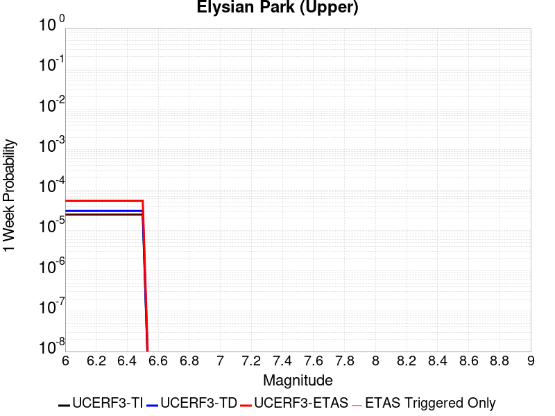 |  |  |  |

| Magnitude | 1 wk TI Prob | 1 wk TD Prob | 1 wk ETAS Prob | 1 wk ETAS/TD Gain | 1 wk ETAS Triggered Only | 1 mo TI Prob | 1 mo TD Prob | 1 mo ETAS Prob | 1 mo ETAS/TD Gain | 1 mo ETAS Triggered Only | 1 yr TI Prob | 1 yr TD Prob | 1 yr ETAS Prob | 1 yr ETAS/TD Gain | 1 yr ETAS Triggered Only | 10 yr TI Prob | 10 yr TD Prob | 10 yr ETAS Prob | 10 yr ETAS/TD Gain | 10 yr ETAS Triggered Only |
|-----|-----|-----|-----|-----|-----|-----|-----|-----|-----|-----|-----|-----|-----|-----|-----|-----|-----|-----|-----|-----|
| 6.0 | 2.4686513E-5 | 3.0328916E-5 | 6.2676365E-5 | 2.0665548 | 3.234843E-5 | 1.0579505E-4 | 1.2998107E-4 | 1.784974E-4 | 1.3732569 | 4.852265E-5 | 0.0012872935 | 0.0015825125 | 0.0016923231 | 1.06939 | 1.0998467E-4 | 0.01279862 | 0.015824199 | 0.015977014 | 1.009657 | 1.5527247E-4 |
| 6.1 | 2.4686513E-5 | 3.0328916E-5 | 6.2676365E-5 | 2.0665548 | 3.234843E-5 | 1.0579505E-4 | 1.2998107E-4 | 1.784974E-4 | 1.3732569 | 4.852265E-5 | 0.0012872935 | 0.0015825125 | 0.0016923231 | 1.06939 | 1.0998467E-4 | 0.01279862 | 0.015824199 | 0.015977014 | 1.009657 | 1.5527247E-4 |
| 6.2 | 2.4686513E-5 | 3.0328916E-5 | 6.2676365E-5 | 2.0665548 | 3.234843E-5 | 1.0579505E-4 | 1.2998107E-4 | 1.784974E-4 | 1.3732569 | 4.852265E-5 | 0.0012872935 | 0.0015825125 | 0.0016923231 | 1.06939 | 1.0998467E-4 | 0.01279862 | 0.015824199 | 0.015977014 | 1.009657 | 1.5527247E-4 |
| 6.3 | 2.4686513E-5 | 3.0328916E-5 | 6.2676365E-5 | 2.0665548 | 3.234843E-5 | 1.0579505E-4 | 1.2998107E-4 | 1.784974E-4 | 1.3732569 | 4.852265E-5 | 0.0012872935 | 0.0015825125 | 0.0016923231 | 1.06939 | 1.0998467E-4 | 0.01279862 | 0.015824199 | 0.015977014 | 1.009657 | 1.5527247E-4 |
| 6.4 | 2.4686513E-5 | 3.0328916E-5 | 6.2676365E-5 | 2.0665548 | 3.234843E-5 | 1.0579505E-4 | 1.2998107E-4 | 1.784974E-4 | 1.3732569 | 4.852265E-5 | 0.0012872935 | 0.0015825125 | 0.0016923231 | 1.06939 | 1.0998467E-4 | 0.01279862 | 0.015824199 | 0.015977014 | 1.009657 | 1.5527247E-4 |
| 6.5 | 2.4686513E-5 | 3.0328916E-5 | 6.2676365E-5 | 2.0665548 | 3.234843E-5 | 1.0579505E-4 | 1.2998107E-4 | 1.784974E-4 | 1.3732569 | 4.852265E-5 | 0.0012872935 | 0.0015825125 | 0.0016923231 | 1.06939 | 1.0998467E-4 | 0.01279862 | 0.015824199 | 0.015977014 | 1.009657 | 1.5527247E-4 |

## Ventura-Pitas Point
*[(top)](#table-of-contents)*

| 1 Week | 1 Month | 1 Year | 10 Year |
|-----|-----|-----|-----|
|  |  |  |  |

| Magnitude | 1 wk TI Prob | 1 wk TD Prob | 1 wk ETAS Prob | 1 wk ETAS/TD Gain | 1 wk ETAS Triggered Only | 1 mo TI Prob | 1 mo TD Prob | 1 mo ETAS Prob | 1 mo ETAS/TD Gain | 1 mo ETAS Triggered Only | 1 yr TI Prob | 1 yr TD Prob | 1 yr ETAS Prob | 1 yr ETAS/TD Gain | 1 yr ETAS Triggered Only | 10 yr TI Prob | 10 yr TD Prob | 10 yr ETAS Prob | 10 yr ETAS/TD Gain | 10 yr ETAS Triggered Only |
|-----|-----|-----|-----|-----|-----|-----|-----|-----|-----|-----|-----|-----|-----|-----|-----|-----|-----|-----|-----|-----|
| 6.0 | 1.3734005E-5 | 1.4989571E-5 | 3.439834E-5 | 2.2948182 | 1.9409059E-5 | 5.885869E-5 | 6.423993E-5 | 9.982092E-5 | 1.5538765 | 3.5583274E-5 | 7.1636896E-4 | 7.819278E-4 | 8.627356E-4 | 1.1033443 | 8.0871076E-5 | 0.00714064 | 0.007800344 | 0.007938357 | 1.0176933 | 1.3909825E-4 |
| 6.1 | 1.3734005E-5 | 1.4989571E-5 | 3.439834E-5 | 2.2948182 | 1.9409059E-5 | 5.885869E-5 | 6.423993E-5 | 9.982092E-5 | 1.5538765 | 3.5583274E-5 | 7.1636896E-4 | 7.819278E-4 | 8.627356E-4 | 1.1033443 | 8.0871076E-5 | 0.00714064 | 0.007800344 | 0.007938357 | 1.0176933 | 1.3909825E-4 |
| 6.2 | 1.3734005E-5 | 1.4989571E-5 | 3.439834E-5 | 2.2948182 | 1.9409059E-5 | 5.885869E-5 | 6.423993E-5 | 9.982092E-5 | 1.5538765 | 3.5583274E-5 | 7.1636896E-4 | 7.819278E-4 | 8.627356E-4 | 1.1033443 | 8.0871076E-5 | 0.00714064 | 0.007800344 | 0.007938357 | 1.0176933 | 1.3909825E-4 |
| 6.3 | 1.3734005E-5 | 1.4989571E-5 | 3.439834E-5 | 2.2948182 | 1.9409059E-5 | 5.885869E-5 | 6.423993E-5 | 9.982092E-5 | 1.5538765 | 3.5583274E-5 | 7.1636896E-4 | 7.819278E-4 | 8.627356E-4 | 1.1033443 | 8.0871076E-5 | 0.00714064 | 0.007800344 | 0.007938357 | 1.0176933 | 1.3909825E-4 |
| 6.4 | 1.3734005E-5 | 1.4989571E-5 | 3.439834E-5 | 2.2948182 | 1.9409059E-5 | 5.885869E-5 | 6.423993E-5 | 9.982092E-5 | 1.5538765 | 3.5583274E-5 | 7.1636896E-4 | 7.819278E-4 | 8.627356E-4 | 1.1033443 | 8.0871076E-5 | 0.00714064 | 0.007800344 | 0.007938357 | 1.0176933 | 1.3909825E-4 |
| 6.5 | 1.3734005E-5 | 1.4989571E-5 | 3.439834E-5 | 2.2948182 | 1.9409059E-5 | 5.885869E-5 | 6.423993E-5 | 9.982092E-5 | 1.5538765 | 3.5583274E-5 | 7.1636896E-4 | 7.819278E-4 | 8.627356E-4 | 1.1033443 | 8.0871076E-5 | 0.00714064 | 0.007800344 | 0.007938357 | 1.0176933 | 1.3909825E-4 |
| 6.6 | 1.3017341E-5 | 1.42015815E-5 | 3.3610366E-5 | 2.3666635 | 1.9409059E-5 | 5.5787412E-5 | 6.0862993E-5 | 9.64441E-5 | 1.5846099 | 3.5583274E-5 | 6.7900005E-4 | 7.408419E-4 | 8.2165306E-4 | 1.1090802 | 8.0871076E-5 | 0.006769291 | 0.0073922575 | 0.0075271167 | 1.0182433 | 1.3586342E-4 |
| 6.7 | 1.0029534E-5 | 1.09311E-5 | 2.387033E-5 | 2.183708 | 1.2939373E-5 | 4.298301E-5 | 4.6847203E-5 | 7.272473E-5 | 1.5523816 | 2.5878746E-5 | 5.2319246E-4 | 5.70299E-4 | 6.3172594E-4 | 1.1077101 | 6.146202E-5 | 0.005219624 | 0.005696553 | 0.0058026947 | 1.0186327 | 1.0674982E-4 |
| 6.8 | 7.869905E-6 | 8.563513E-6 | 2.1502774E-5 | 2.510976 | 1.2939373E-5 | 3.372773E-5 | 3.6700705E-5 | 5.9343776E-5 | 1.6169655 | 2.2643902E-5 | 4.1055772E-4 | 4.4682005E-4 | 5.017878E-4 | 1.1230199 | 5.4992335E-5 | 0.0040980005 | 0.004467117 | 0.0045605083 | 1.0209064 | 9.381045E-5 |
| 6.9 | 7.3736396E-6 | 8.021501E-6 | 2.096077E-5 | 2.613073 | 1.2939373E-5 | 3.1600932E-5 | 3.4377863E-5 | 5.7020985E-5 | 1.6586542 | 2.2643902E-5 | 3.8467342E-4 | 4.1855048E-4 | 4.702863E-4 | 1.1236072 | 5.175749E-5 | 0.003840082 | 0.0041855047 | 0.00427248 | 1.0207801 | 8.734076E-5 |

## Chino alt 1
*[(top)](#table-of-contents)*

| 1 Week | 1 Month | 1 Year | 10 Year |
|-----|-----|-----|-----|
|  | 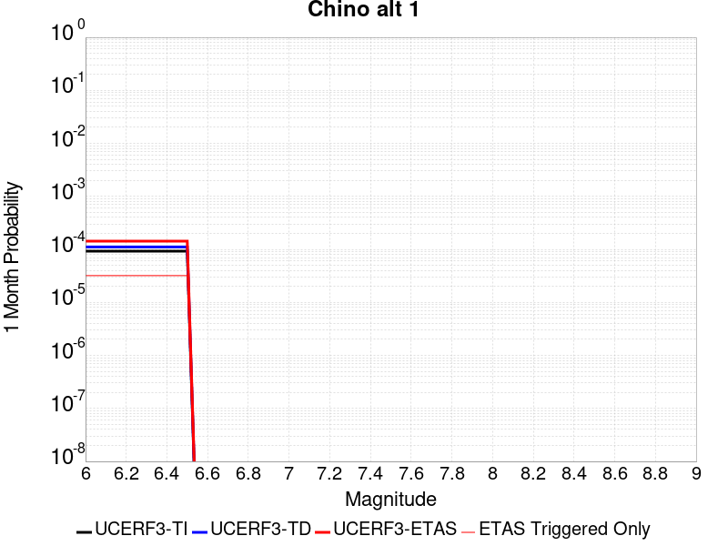 |  |  |

| Magnitude | 1 wk TI Prob | 1 wk TD Prob | 1 wk ETAS Prob | 1 wk ETAS/TD Gain | 1 wk ETAS Triggered Only | 1 mo TI Prob | 1 mo TD Prob | 1 mo ETAS Prob | 1 mo ETAS/TD Gain | 1 mo ETAS Triggered Only | 1 yr TI Prob | 1 yr TD Prob | 1 yr ETAS Prob | 1 yr ETAS/TD Gain | 1 yr ETAS Triggered Only | 10 yr TI Prob | 10 yr TD Prob | 10 yr ETAS Prob | 10 yr ETAS/TD Gain | 10 yr ETAS Triggered Only |
|-----|-----|-----|-----|-----|-----|-----|-----|-----|-----|-----|-----|-----|-----|-----|-----|-----|-----|-----|-----|-----|
| 6.0 | 2.1665033E-5 | 2.5894844E-5 | 5.8242436E-5 | 2.2491906 | 3.234843E-5 | 9.2846836E-5 | 1.10977904E-4 | 1.6272964E-4 | 1.4663248 | 5.175749E-5 | 0.001129824 | 0.0013511538 | 0.0014416071 | 1.0669452 | 9.057561E-5 | 0.01124097 | 0.013511333 | 0.013642169 | 1.0096835 | 1.3262857E-4 |
| 6.1 | 2.1665033E-5 | 2.5894844E-5 | 5.8242436E-5 | 2.2491906 | 3.234843E-5 | 9.2846836E-5 | 1.10977904E-4 | 1.6272964E-4 | 1.4663248 | 5.175749E-5 | 0.001129824 | 0.0013511538 | 0.0014416071 | 1.0669452 | 9.057561E-5 | 0.01124097 | 0.013511333 | 0.013642169 | 1.0096835 | 1.3262857E-4 |
| 6.2 | 2.1665033E-5 | 2.5894844E-5 | 5.8242436E-5 | 2.2491906 | 3.234843E-5 | 9.2846836E-5 | 1.10977904E-4 | 1.6272964E-4 | 1.4663248 | 5.175749E-5 | 0.001129824 | 0.0013511538 | 0.0014416071 | 1.0669452 | 9.057561E-5 | 0.01124097 | 0.013511333 | 0.013642169 | 1.0096835 | 1.3262857E-4 |
| 6.3 | 2.1665033E-5 | 2.5894844E-5 | 5.8242436E-5 | 2.2491906 | 3.234843E-5 | 9.2846836E-5 | 1.10977904E-4 | 1.6272964E-4 | 1.4663248 | 5.175749E-5 | 0.001129824 | 0.0013511538 | 0.0014416071 | 1.0669452 | 9.057561E-5 | 0.01124097 | 0.013511333 | 0.013642169 | 1.0096835 | 1.3262857E-4 |
| 6.4 | 2.1665033E-5 | 2.5894844E-5 | 5.8242436E-5 | 2.2491906 | 3.234843E-5 | 9.2846836E-5 | 1.10977904E-4 | 1.6272964E-4 | 1.4663248 | 5.175749E-5 | 0.001129824 | 0.0013511538 | 0.0014416071 | 1.0669452 | 9.057561E-5 | 0.01124097 | 0.013511333 | 0.013642169 | 1.0096835 | 1.3262857E-4 |
| 6.5 | 2.1665033E-5 | 2.5894844E-5 | 5.8242436E-5 | 2.2491906 | 3.234843E-5 | 9.2846836E-5 | 1.10977904E-4 | 1.6272964E-4 | 1.4663248 | 5.175749E-5 | 0.001129824 | 0.0013511538 | 0.0014416071 | 1.0669452 | 9.057561E-5 | 0.01124097 | 0.013511333 | 0.013642169 | 1.0096835 | 1.3262857E-4 |

## Helendale-So Lockhart
*[(top)](#table-of-contents)*

| 1 Week | 1 Month | 1 Year | 10 Year |
|-----|-----|-----|-----|
|  |  |  |  |

| Magnitude | 1 wk TI Prob | 1 wk TD Prob | 1 wk ETAS Prob | 1 wk ETAS/TD Gain | 1 wk ETAS Triggered Only | 1 mo TI Prob | 1 mo TD Prob | 1 mo ETAS Prob | 1 mo ETAS/TD Gain | 1 mo ETAS Triggered Only | 1 yr TI Prob | 1 yr TD Prob | 1 yr ETAS Prob | 1 yr ETAS/TD Gain | 1 yr ETAS Triggered Only | 10 yr TI Prob | 10 yr TD Prob | 10 yr ETAS Prob | 10 yr ETAS/TD Gain | 10 yr ETAS Triggered Only |
|-----|-----|-----|-----|-----|-----|-----|-----|-----|-----|-----|-----|-----|-----|-----|-----|-----|-----|-----|-----|-----|
| 6.0 | 7.171715E-6 | 7.4314485E-6 | 4.624928E-5 | 6.223454 | 3.8818118E-5 | 3.073556E-5 | 3.184873E-5 | 9.654353E-5 | 3.031315 | 6.469686E-5 | 3.7414118E-4 | 3.8769832E-4 | 4.6530445E-4 | 1.2001715 | 7.7636236E-5 | 0.003735119 | 0.0038711112 | 0.0039935596 | 1.0316312 | 1.2292404E-4 |
| 6.1 | 7.171715E-6 | 7.4314485E-6 | 4.624928E-5 | 6.223454 | 3.8818118E-5 | 3.073556E-5 | 3.184873E-5 | 9.654353E-5 | 3.031315 | 6.469686E-5 | 3.7414118E-4 | 3.8769832E-4 | 4.6530445E-4 | 1.2001715 | 7.7636236E-5 | 0.003735119 | 0.0038711112 | 0.0039935596 | 1.0316312 | 1.2292404E-4 |
| 6.2 | 7.171715E-6 | 7.4314485E-6 | 4.624928E-5 | 6.223454 | 3.8818118E-5 | 3.073556E-5 | 3.184873E-5 | 9.654353E-5 | 3.031315 | 6.469686E-5 | 3.7414118E-4 | 3.8769832E-4 | 4.6530445E-4 | 1.2001715 | 7.7636236E-5 | 0.003735119 | 0.0038711112 | 0.0039935596 | 1.0316312 | 1.2292404E-4 |
| 6.3 | 7.171715E-6 | 7.4314485E-6 | 4.624928E-5 | 6.223454 | 3.8818118E-5 | 3.073556E-5 | 3.184873E-5 | 9.654353E-5 | 3.031315 | 6.469686E-5 | 3.7414118E-4 | 3.8769832E-4 | 4.6530445E-4 | 1.2001715 | 7.7636236E-5 | 0.003735119 | 0.0038711112 | 0.0039935596 | 1.0316312 | 1.2292404E-4 |
| 6.4 | 7.171715E-6 | 7.4314485E-6 | 4.624928E-5 | 6.223454 | 3.8818118E-5 | 3.073556E-5 | 3.184873E-5 | 9.654353E-5 | 3.031315 | 6.469686E-5 | 3.7414118E-4 | 3.8769832E-4 | 4.6530445E-4 | 1.2001715 | 7.7636236E-5 | 0.003735119 | 0.0038711112 | 0.0039935596 | 1.0316312 | 1.2292404E-4 |
| 6.5 | 7.171715E-6 | 7.4314485E-6 | 4.624928E-5 | 6.223454 | 3.8818118E-5 | 3.073556E-5 | 3.184873E-5 | 9.654353E-5 | 3.031315 | 6.469686E-5 | 3.7414118E-4 | 3.8769832E-4 | 4.6530445E-4 | 1.2001715 | 7.7636236E-5 | 0.003735119 | 0.0038711112 | 0.0039935596 | 1.0316312 | 1.2292404E-4 |
| 6.6 | 6.5580157E-6 | 6.7948727E-6 | 3.9143084E-5 | 5.7606797 | 3.234843E-5 | 2.810548E-5 | 2.9120609E-5 | 8.734609E-5 | 2.9994595 | 5.8227175E-5 | 3.421305E-4 | 3.5449475E-4 | 4.2563607E-4 | 1.2006837 | 7.116655E-5 | 0.0034160423 | 0.0035401797 | 0.003649775 | 1.0309576 | 1.0998467E-4 |
| 6.7 | 5.6879685E-6 | 5.8928526E-6 | 3.500627E-5 | 5.9404626 | 2.9113588E-5 | 2.4376779E-5 | 2.5254889E-5 | 7.054155E-5 | 2.793184 | 4.5287805E-5 | 2.9674688E-4 | 3.074438E-4 | 3.656531E-4 | 1.1893331 | 5.8227175E-5 | 0.0029635092 | 0.0030710634 | 0.003154911 | 1.0273025 | 8.410592E-5 |
| 6.8 | 4.958099E-6 | 5.135111E-6 | 2.454407E-5 | 4.779657 | 1.9409059E-5 | 2.1248823E-5 | 2.2007483E-5 | 5.4355205E-5 | 2.4698508 | 3.234843E-5 | 2.586737E-4 | 2.6791706E-4 | 3.1319272E-4 | 1.1689913 | 4.5287805E-5 | 0.0025837282 | 0.0026768132 | 0.0027413368 | 1.0241047 | 6.469686E-5 |
| 6.9 | 4.3792215E-6 | 4.5342804E-6 | 2.3943252E-5 | 5.280496 | 1.9409059E-5 | 1.8767958E-5 | 1.9432535E-5 | 4.8545557E-5 | 2.4981587 | 2.9113588E-5 | 2.2847592E-4 | 2.3657428E-4 | 2.7861728E-4 | 1.1777159 | 4.205296E-5 | 0.0022824116 | 0.0023640923 | 0.002422182 | 1.0245715 | 5.8227175E-5 |
| 7.0 | 3.858262E-6 | 3.9935144E-6 | 2.0167665E-5 | 5.0501046 | 1.6174215E-5 | 1.6535305E-5 | 1.7115E-5 | 4.2993302E-5 | 2.5120246 | 2.5878746E-5 | 2.0129874E-4 | 2.0836401E-4 | 2.4393988E-4 | 1.1707389 | 3.5583274E-5 | 0.0020111648 | 0.0020825516 | 0.0021309732 | 1.023251 | 4.852265E-5 |
| 7.1 | 3.3854772E-6 | 3.502769E-6 | 1.3207265E-5 | 3.7705212 | 9.7045295E-6 | 1.4509107E-5 | 1.501183E-5 | 3.44206E-5 | 2.2928982 | 1.9409059E-5 | 1.7663406E-4 | 1.827625E-4 | 2.1187076E-4 | 1.1592683 | 2.9113588E-5 | 0.0017649373 | 0.0018269841 | 0.0018625023 | 1.0194409 | 3.5583274E-5 |
| 7.2 | 2.9527619E-6 | 3.05382E-6 | 1.275832E-5 | 4.177823 | 9.7045295E-6 | 1.2654632E-5 | 1.3087783E-5 | 3.2496588E-5 | 2.4829712 | 1.9409059E-5 | 1.5405925E-4 | 1.5934087E-4 | 1.8844982E-4 | 1.1826835 | 2.9113588E-5 | 0.0015395249 | 0.0015931253 | 0.0016286519 | 1.0222999 | 3.5583274E-5 |
| 7.3 | 2.553375E-6 | 2.6399916E-6 | 1.2344495E-5 | 4.67596 | 9.7045295E-6 | 1.0942989E-5 | 1.13142505E-5 | 2.7488282E-5 | 2.4295275 | 1.6174215E-5 | 1.3322275E-4 | 1.3775099E-4 | 1.6362617E-4 | 1.1878402 | 2.5878746E-5 | 0.0013314291 | 0.0013775099 | 0.0014098139 | 1.023451 | 3.234843E-5 |

## Channel Islands Thrust
*[(top)](#table-of-contents)*

| 1 Week | 1 Month | 1 Year | 10 Year |
|-----|-----|-----|-----|
|  |  |  |  |

| Magnitude | 1 wk TI Prob | 1 wk TD Prob | 1 wk ETAS Prob | 1 wk ETAS/TD Gain | 1 wk ETAS Triggered Only | 1 mo TI Prob | 1 mo TD Prob | 1 mo ETAS Prob | 1 mo ETAS/TD Gain | 1 mo ETAS Triggered Only | 1 yr TI Prob | 1 yr TD Prob | 1 yr ETAS Prob | 1 yr ETAS/TD Gain | 1 yr ETAS Triggered Only | 10 yr TI Prob | 10 yr TD Prob | 10 yr ETAS Prob | 10 yr ETAS/TD Gain | 10 yr ETAS Triggered Only |
|-----|-----|-----|-----|-----|-----|-----|-----|-----|-----|-----|-----|-----|-----|-----|-----|-----|-----|-----|-----|-----|
| 6.0 | 1.9940422E-5 | 2.234876E-5 | 4.4992157E-5 | 2.0131836 | 2.2643902E-5 | 8.545615E-5 | 9.577758E-5 | 1.281229E-4 | 1.337713 | 3.234843E-5 | 0.001039932 | 0.0011655908 | 0.0012366744 | 1.0609851 | 7.116655E-5 | 0.010350789 | 0.0116068935 | 0.011715601 | 1.0093658 | 1.0998467E-4 |
| 6.1 | 1.9940422E-5 | 2.234876E-5 | 4.4992157E-5 | 2.0131836 | 2.2643902E-5 | 8.545615E-5 | 9.577758E-5 | 1.281229E-4 | 1.337713 | 3.234843E-5 | 0.001039932 | 0.0011655908 | 0.0012366744 | 1.0609851 | 7.116655E-5 | 0.010350789 | 0.0116068935 | 0.011715601 | 1.0093658 | 1.0998467E-4 |
| 6.2 | 1.9940422E-5 | 2.234876E-5 | 4.4992157E-5 | 2.0131836 | 2.2643902E-5 | 8.545615E-5 | 9.577758E-5 | 1.281229E-4 | 1.337713 | 3.234843E-5 | 0.001039932 | 0.0011655908 | 0.0012366744 | 1.0609851 | 7.116655E-5 | 0.010350789 | 0.0116068935 | 0.011715601 | 1.0093658 | 1.0998467E-4 |
| 6.3 | 1.9940422E-5 | 2.234876E-5 | 4.4992157E-5 | 2.0131836 | 2.2643902E-5 | 8.545615E-5 | 9.577758E-5 | 1.281229E-4 | 1.337713 | 3.234843E-5 | 0.001039932 | 0.0011655908 | 0.0012366744 | 1.0609851 | 7.116655E-5 | 0.010350789 | 0.0116068935 | 0.011715601 | 1.0093658 | 1.0998467E-4 |
| 6.4 | 1.9940422E-5 | 2.234876E-5 | 4.4992157E-5 | 2.0131836 | 2.2643902E-5 | 8.545615E-5 | 9.577758E-5 | 1.281229E-4 | 1.337713 | 3.234843E-5 | 0.001039932 | 0.0011655908 | 0.0012366744 | 1.0609851 | 7.116655E-5 | 0.010350789 | 0.0116068935 | 0.011715601 | 1.0093658 | 1.0998467E-4 |
| 6.5 | 1.9940422E-5 | 2.234876E-5 | 4.4992157E-5 | 2.0131836 | 2.2643902E-5 | 8.545615E-5 | 9.577758E-5 | 1.281229E-4 | 1.337713 | 3.234843E-5 | 0.001039932 | 0.0011655908 | 0.0012366744 | 1.0609851 | 7.116655E-5 | 0.010350789 | 0.0116068935 | 0.011715601 | 1.0093658 | 1.0998467E-4 |
| 6.6 | 1.9940422E-5 | 2.234876E-5 | 4.4992157E-5 | 2.0131836 | 2.2643902E-5 | 8.545615E-5 | 9.577758E-5 | 1.281229E-4 | 1.337713 | 3.234843E-5 | 0.001039932 | 0.0011655908 | 0.0012366744 | 1.0609851 | 7.116655E-5 | 0.010350789 | 0.0116068935 | 0.011715601 | 1.0093658 | 1.0998467E-4 |
| 6.7 | 1.5039115E-5 | 1.6832886E-5 | 3.6241618E-5 | 2.1530247 | 1.9409059E-5 | 6.445176E-5 | 7.213959E-5 | 1.0125108E-4 | 1.4035438 | 2.9113588E-5 | 7.844176E-4 | 8.780601E-4 | 9.3300414E-4 | 1.0625744 | 5.4992335E-5 | 0.007816545 | 0.00875716 | 0.008843736 | 1.0098863 | 8.734076E-5 |
| 6.8 | 1.4337753E-5 | 1.605477E-5 | 3.5463516E-5 | 2.2089086 | 1.9409059E-5 | 6.1446066E-5 | 6.8804984E-5 | 9.791657E-5 | 1.4231029 | 2.9113588E-5 | 7.4784906E-4 | 8.3749247E-4 | 8.892066E-4 | 1.0617487 | 5.175749E-5 | 0.007453373 | 0.008354535 | 0.008437939 | 1.009983 | 8.410592E-5 |
| 6.9 | 1.1226918E-5 | 1.2540004E-5 | 3.1948817E-5 | 2.547752 | 1.9409059E-5 | 4.8114474E-5 | 5.3742377E-5 | 8.28544E-5 | 1.5416958 | 2.9113588E-5 | 5.856363E-4 | 6.542256E-4 | 7.0271647E-4 | 1.0741196 | 4.852265E-5 | 0.0058409534 | 0.0065336456 | 0.00659792 | 1.0098374 | 6.469686E-5 |
| 7.0 | 1.0975239E-5 | 1.2259085E-5 | 3.1667907E-5 | 2.5832193 | 1.9409059E-5 | 4.703589E-5 | 5.253849E-5 | 8.165055E-5 | 1.5541091 | 2.9113588E-5 | 5.725115E-4 | 6.395769E-4 | 6.8806845E-4 | 1.0758183 | 4.852265E-5 | 0.005710388 | 0.006388001 | 0.0064522848 | 1.0100632 | 6.469686E-5 |
| 7.1 | 9.782044E-6 | 1.0913239E-5 | 3.0322086E-5 | 2.7784681 | 1.9409059E-5 | 4.1922372E-5 | 4.6770787E-5 | 7.264833E-5 | 1.5532842 | 2.5878746E-5 | 5.102853E-4 | 5.693929E-4 | 6.1142194E-4 | 1.0738137 | 4.205296E-5 | 0.0050911517 | 0.005689868 | 0.005744547 | 1.0096099 | 5.4992335E-5 |
| 7.2 | 8.244729E-6 | 9.190053E-6 | 2.2129307E-5 | 2.407963 | 1.2939373E-5 | 3.5334073E-5 | 3.938594E-5 | 5.8794234E-5 | 1.4927721 | 1.9409059E-5 | 4.3010744E-4 | 4.7952382E-4 | 5.1509E-4 | 1.0741699 | 3.5583274E-5 | 0.004292759 | 0.0047952384 | 0.004843528 | 1.0100704 | 4.852265E-5 |

## Elsinore (Stepovers Combined)
*[(top)](#table-of-contents)*

| 1 Week | 1 Month | 1 Year | 10 Year |
|-----|-----|-----|-----|
|  |  |  |  |

| Magnitude | 1 wk TI Prob | 1 wk TD Prob | 1 wk ETAS Prob | 1 wk ETAS/TD Gain | 1 wk ETAS Triggered Only | 1 mo TI Prob | 1 mo TD Prob | 1 mo ETAS Prob | 1 mo ETAS/TD Gain | 1 mo ETAS Triggered Only | 1 yr TI Prob | 1 yr TD Prob | 1 yr ETAS Prob | 1 yr ETAS/TD Gain | 1 yr ETAS Triggered Only | 10 yr TI Prob | 10 yr TD Prob | 10 yr ETAS Prob | 10 yr ETAS/TD Gain | 10 yr ETAS Triggered Only |
|-----|-----|-----|-----|-----|-----|-----|-----|-----|-----|-----|-----|-----|-----|-----|-----|-----|-----|-----|-----|-----|
| 6.0 | 6.646544E-5 | 8.957985E-5 | 1.18690834E-4 | 1.3249724 | 2.9113588E-5 | 2.8482082E-4 | 3.8387964E-4 | 4.1944926E-4 | 1.0926583 | 3.5583274E-5 | 0.00346218 | 0.0046677003 | 0.0047256555 | 1.0124162 | 5.8227175E-5 | 0.03408735 | 0.046230808 | 0.046323366 | 1.0020021 | 9.70453E-5 |
| 6.1 | 6.646544E-5 | 8.957985E-5 | 1.18690834E-4 | 1.3249724 | 2.9113588E-5 | 2.8482082E-4 | 3.8387964E-4 | 4.1944926E-4 | 1.0926583 | 3.5583274E-5 | 0.00346218 | 0.0046677003 | 0.0047256555 | 1.0124162 | 5.8227175E-5 | 0.03408735 | 0.046230808 | 0.046323366 | 1.0020021 | 9.70453E-5 |
| 6.2 | 6.646544E-5 | 8.957985E-5 | 1.18690834E-4 | 1.3249724 | 2.9113588E-5 | 2.8482082E-4 | 3.8387964E-4 | 4.1944926E-4 | 1.0926583 | 3.5583274E-5 | 0.00346218 | 0.0046677003 | 0.0047256555 | 1.0124162 | 5.8227175E-5 | 0.03408735 | 0.046230808 | 0.046323366 | 1.0020021 | 9.70453E-5 |
| 6.3 | 6.646544E-5 | 8.957985E-5 | 1.18690834E-4 | 1.3249724 | 2.9113588E-5 | 2.8482082E-4 | 3.8387964E-4 | 4.1944926E-4 | 1.0926583 | 3.5583274E-5 | 0.00346218 | 0.0046677003 | 0.0047256555 | 1.0124162 | 5.8227175E-5 | 0.03408735 | 0.046230808 | 0.046323366 | 1.0020021 | 9.70453E-5 |
| 6.4 | 6.646544E-5 | 8.957985E-5 | 1.18690834E-4 | 1.3249724 | 2.9113588E-5 | 2.8482082E-4 | 3.8387964E-4 | 4.1944926E-4 | 1.0926583 | 3.5583274E-5 | 0.00346218 | 0.0046677003 | 0.0047256555 | 1.0124162 | 5.8227175E-5 | 0.03408735 | 0.046230808 | 0.046323366 | 1.0020021 | 9.70453E-5 |
| 6.5 | 6.646544E-5 | 8.957985E-5 | 1.18690834E-4 | 1.3249724 | 2.9113588E-5 | 2.8482082E-4 | 3.8387964E-4 | 4.1944926E-4 | 1.0926583 | 3.5583274E-5 | 0.00346218 | 0.0046677003 | 0.0047256555 | 1.0124162 | 5.8227175E-5 | 0.03408735 | 0.046230808 | 0.046323366 | 1.0020021 | 9.70453E-5 |
| 6.6 | 6.646544E-5 | 8.957985E-5 | 1.18690834E-4 | 1.3249724 | 2.9113588E-5 | 2.8482082E-4 | 3.8387964E-4 | 4.1944926E-4 | 1.0926583 | 3.5583274E-5 | 0.00346218 | 0.0046677003 | 0.0047256555 | 1.0124162 | 5.8227175E-5 | 0.03408735 | 0.046230808 | 0.046323366 | 1.0020021 | 9.70453E-5 |
| 6.7 | 6.642995E-5 | 8.952384E-5 | 1.1863482E-4 | 1.3251758 | 2.9113588E-5 | 2.8466873E-4 | 3.8363968E-4 | 4.192093E-4 | 1.0927162 | 3.5583274E-5 | 0.0034603344 | 0.0046647936 | 0.0047227493 | 1.012424 | 5.8227175E-5 | 0.03406946 | 0.046203177 | 0.046295736 | 1.0020033 | 9.70453E-5 |
| 6.8 | 6.636925E-5 | 8.943652E-5 | 1.18547505E-4 | 1.3254932 | 2.9113588E-5 | 2.8440863E-4 | 3.8326555E-4 | 4.1883517E-4 | 1.0928068 | 3.5583274E-5 | 0.0034571777 | 0.004660258 | 0.004718214 | 1.0124362 | 5.8227175E-5 | 0.034038864 | 0.04615963 | 0.046252195 | 1.0020053 | 9.70453E-5 |
| 6.9 | 2.99202E-5 | 3.4639877E-5 | 4.7578804E-5 | 1.3735268 | 1.2939373E-5 | 1.2822312E-4 | 1.4844954E-4 | 1.61387E-4 | 1.0871505 | 1.2939373E-5 | 0.0015599986 | 0.001806118 | 0.001822263 | 1.008939 | 1.6174215E-5 | 0.015490928 | 0.018018924 | 0.018044336 | 1.0014104 | 2.5878746E-5 |
| 7.0 | 2.9867753E-5 | 3.4571654E-5 | 4.751058E-5 | 1.374264 | 1.2939373E-5 | 1.2799838E-4 | 1.4815718E-4 | 1.6109465E-4 | 1.0873225 | 1.2939373E-5 | 0.0015572662 | 0.0018025645 | 0.0018187095 | 1.0089567 | 1.6174215E-5 | 0.0154639855 | 0.017983891 | 0.018009305 | 1.0014131 | 2.5878746E-5 |
| 7.1 | 2.2490323E-5 | 2.6387466E-5 | 3.285698E-5 | 1.2451738 | 6.4696865E-6 | 9.638354E-5 | 1.1308515E-4 | 1.1955411E-4 | 1.0572042 | 6.4696865E-6 | 0.0011728378 | 0.0013761043 | 0.0013857954 | 1.0070425 | 9.7045295E-6 | 0.011666672 | 0.013749547 | 0.013765499 | 1.0011601 | 1.6174215E-5 |
| 7.2 | 2.1634029E-5 | 2.517618E-5 | 3.1645704E-5 | 1.25697 | 6.4696865E-6 | 9.271397E-5 | 1.0789436E-4 | 1.1436335E-4 | 1.0599567 | 6.4696865E-6 | 0.001128208 | 0.001312983 | 0.0013226747 | 1.0073816 | 9.7045295E-6 | 0.011224974 | 0.013125413 | 0.013141375 | 1.001216 | 1.6174215E-5 |
| 7.3 | 1.2803008E-5 | 1.6803417E-5 | 1.6803417E-5 | 1.0 | 0.0 | 5.486888E-5 | 7.2013085E-5 | 7.2013085E-5 | 1.0 | 0.0 | 6.678239E-4 | 8.76483E-4 | 8.7971496E-4 | 1.0036875 | 3.2348432E-6 | 0.006658205 | 0.008745466 | 0.008748673 | 1.0003667 | 3.2348432E-6 |
| 7.4 | 1.2585987E-5 | 1.6510478E-5 | 1.6510478E-5 | 1.0 | 0.0 | 5.393883E-5 | 7.07577E-5 | 7.07577E-5 | 1.0 | 0.0 | 6.565074E-4 | 8.612108E-4 | 8.6444285E-4 | 1.003753 | 3.2348432E-6 | 0.0065457127 | 0.008593576 | 0.008596783 | 1.0003732 | 3.2348432E-6 |
| 7.5 | 1.1869309E-5 | 1.5627958E-5 | 1.5627958E-5 | 1.0 | 0.0 | 5.0867475E-5 | 6.697567E-5 | 6.697567E-5 | 1.0 | 0.0 | 6.191355E-4 | 8.151996E-4 | 8.184318E-4 | 1.0039649 | 3.2348432E-6 | 0.0061741336 | 0.008135691 | 0.0081389 | 1.0003943 | 3.2348432E-6 |
| 7.6 | 1.0456552E-5 | 1.3574289E-5 | 1.3574289E-5 | 1.0 | 0.0 | 4.4813027E-5 | 5.817464E-5 | 5.817464E-5 | 1.0 | 0.0 | 5.45462E-4 | 7.081186E-4 | 7.1135117E-4 | 1.004565 | 3.2348432E-6 | 0.0054412507 | 0.0070718653 | 0.0070750774 | 1.0004542 | 3.2348432E-6 |
| 7.7 | 4.463199E-6 | 5.214875E-6 | 5.214875E-6 | 1.0 | 0.0 | 1.9127854E-5 | 2.2349386E-5 | 2.2349386E-5 | 1.0 | 0.0 | 2.3285674E-4 | 2.7209E-4 | 2.7532398E-4 | 1.0118856 | 3.2348432E-6 | 0.0023261288 | 0.0027239968 | 0.0027272226 | 1.0011843 | 3.2348432E-6 |
| 7.8 | 2.1601753E-7 | 2.7489222E-7 | 2.7489222E-7 | 1.0 | 0.0 | 9.257891E-7 | 1.1781094E-6 | 1.1781094E-6 | 1.0 | 0.0 | 1.1271423E-5 | 1.4343483E-5 | 1.4343483E-5 | 1.0 | 0.0 | 1.1270852E-4 | 1.435847E-4 | 1.435847E-4 | 1.0 | 0.0 |

## Elsinore (Glen Ivy) rev
*[(top)](#table-of-contents)*

| 1 Week | 1 Month | 1 Year | 10 Year |
|-----|-----|-----|-----|
| 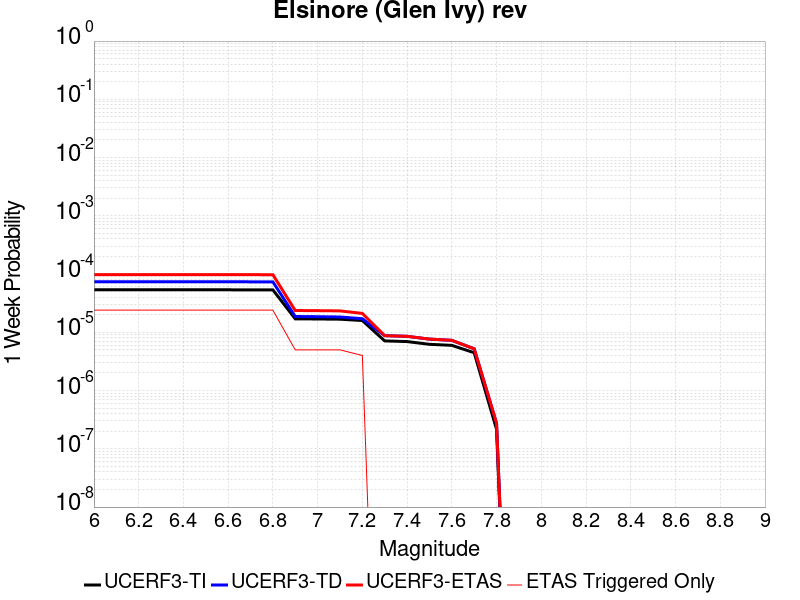 |  |  |  |

| Magnitude | 1 wk TI Prob | 1 wk TD Prob | 1 wk ETAS Prob | 1 wk ETAS/TD Gain | 1 wk ETAS Triggered Only | 1 mo TI Prob | 1 mo TD Prob | 1 mo ETAS Prob | 1 mo ETAS/TD Gain | 1 mo ETAS Triggered Only | 1 yr TI Prob | 1 yr TD Prob | 1 yr ETAS Prob | 1 yr ETAS/TD Gain | 1 yr ETAS Triggered Only | 10 yr TI Prob | 10 yr TD Prob | 10 yr ETAS Prob | 10 yr ETAS/TD Gain | 10 yr ETAS Triggered Only |
|-----|-----|-----|-----|-----|-----|-----|-----|-----|-----|-----|-----|-----|-----|-----|-----|-----|-----|-----|-----|-----|
| 6.0 | 5.3687647E-5 | 7.371829E-5 | 9.636053E-5 | 1.3071454 | 2.2643902E-5 | 2.3006962E-4 | 3.1591902E-4 | 3.450234E-4 | 1.0921261 | 2.9113588E-5 | 0.0027974995 | 0.0038433792 | 0.0038949377 | 1.0134149 | 5.175749E-5 | 0.02762544 | 0.03826734 | 0.03835134 | 1.002195 | 8.734076E-5 |
| 6.1 | 5.3687647E-5 | 7.371829E-5 | 9.636053E-5 | 1.3071454 | 2.2643902E-5 | 2.3006962E-4 | 3.1591902E-4 | 3.450234E-4 | 1.0921261 | 2.9113588E-5 | 0.0027974995 | 0.0038433792 | 0.0038949377 | 1.0134149 | 5.175749E-5 | 0.02762544 | 0.03826734 | 0.03835134 | 1.002195 | 8.734076E-5 |
| 6.2 | 5.3687647E-5 | 7.371829E-5 | 9.636053E-5 | 1.3071454 | 2.2643902E-5 | 2.3006962E-4 | 3.1591902E-4 | 3.450234E-4 | 1.0921261 | 2.9113588E-5 | 0.0027974995 | 0.0038433792 | 0.0038949377 | 1.0134149 | 5.175749E-5 | 0.02762544 | 0.03826734 | 0.03835134 | 1.002195 | 8.734076E-5 |
| 6.3 | 5.3687647E-5 | 7.371829E-5 | 9.636053E-5 | 1.3071454 | 2.2643902E-5 | 2.3006962E-4 | 3.1591902E-4 | 3.450234E-4 | 1.0921261 | 2.9113588E-5 | 0.0027974995 | 0.0038433792 | 0.0038949377 | 1.0134149 | 5.175749E-5 | 0.02762544 | 0.03826734 | 0.03835134 | 1.002195 | 8.734076E-5 |
| 6.4 | 5.3687647E-5 | 7.371829E-5 | 9.636053E-5 | 1.3071454 | 2.2643902E-5 | 2.3006962E-4 | 3.1591902E-4 | 3.450234E-4 | 1.0921261 | 2.9113588E-5 | 0.0027974995 | 0.0038433792 | 0.0038949377 | 1.0134149 | 5.175749E-5 | 0.02762544 | 0.03826734 | 0.03835134 | 1.002195 | 8.734076E-5 |
| 6.5 | 5.3687647E-5 | 7.371829E-5 | 9.636053E-5 | 1.3071454 | 2.2643902E-5 | 2.3006962E-4 | 3.1591902E-4 | 3.450234E-4 | 1.0921261 | 2.9113588E-5 | 0.0027974995 | 0.0038433792 | 0.0038949377 | 1.0134149 | 5.175749E-5 | 0.02762544 | 0.03826734 | 0.03835134 | 1.002195 | 8.734076E-5 |
| 6.6 | 5.366434E-5 | 7.368723E-5 | 9.632946E-5 | 1.3072748 | 2.2643902E-5 | 2.2996974E-4 | 3.157859E-4 | 3.448903E-4 | 1.092165 | 2.9113588E-5 | 0.0027962867 | 0.0038417643 | 0.003893323 | 1.0134206 | 5.175749E-5 | 0.027613612 | 0.03825175 | 0.03833575 | 1.002196 | 8.734076E-5 |
| 6.7 | 5.3605272E-5 | 7.360545E-5 | 9.6247684E-5 | 1.3076162 | 2.2643902E-5 | 2.2971665E-4 | 3.1543552E-4 | 3.445399E-4 | 1.0922674 | 2.9113588E-5 | 0.0027932131 | 0.0038375156 | 0.0038890745 | 1.0134355 | 5.175749E-5 | 0.027583642 | 0.038210876 | 0.038294878 | 1.0021985 | 8.734076E-5 |
| 6.8 | 5.3532647E-5 | 7.3514246E-5 | 9.615649E-5 | 1.307998 | 2.2643902E-5 | 2.2940546E-4 | 3.1504474E-4 | 3.4414916E-4 | 1.0923818 | 2.9113588E-5 | 0.002789434 | 0.0038327747 | 0.003884334 | 1.0134522 | 5.175749E-5 | 0.02754679 | 0.038164973 | 0.03824898 | 1.0022012 | 8.734076E-5 |
| 6.9 | 1.7045348E-5 | 1.8678082E-5 | 2.5147649E-5 | 1.346372 | 6.4696865E-6 | 7.304944E-5 | 8.004709E-5 | 8.651625E-5 | 1.080817 | 6.4696865E-6 | 8.8901405E-4 | 9.74247E-4 | 9.839421E-4 | 1.0099514 | 9.7045295E-6 | 0.008854659 | 0.009768393 | 0.009784409 | 1.0016396 | 1.6174215E-5 |
| 7.0 | 1.6940774E-5 | 1.8528288E-5 | 2.4997855E-5 | 1.3491724 | 6.4696865E-6 | 7.2601295E-5 | 7.940515E-5 | 8.587432E-5 | 1.0814705 | 6.4696865E-6 | 8.835623E-4 | 9.6643844E-4 | 9.7613357E-4 | 1.0100318 | 9.7045295E-6 | 0.0088005755 | 0.00969088 | 0.009706898 | 1.0016528 | 1.6174215E-5 |
| 7.1 | 1.6789645E-5 | 1.8323519E-5 | 2.4793088E-5 | 1.3530746 | 6.4696865E-6 | 7.195364E-5 | 7.852762E-5 | 8.49968E-5 | 1.0823809 | 6.4696865E-6 | 8.7568344E-4 | 9.55764E-4 | 9.654592E-4 | 1.010144 | 9.7045295E-6 | 0.008722408 | 0.009584869 | 0.009600889 | 1.0016713 | 1.6174215E-5 |
| 7.2 | 1.5933345E-5 | 1.7110096E-5 | 2.3579672E-5 | 1.3781145 | 6.4696865E-6 | 6.828398E-5 | 7.332754E-5 | 7.979675E-5 | 1.0882235 | 6.4696865E-6 | 8.310403E-4 | 8.925052E-4 | 9.0220105E-4 | 1.0108637 | 9.7045295E-6 | 0.008279393 | 0.0089570135 | 0.0089730425 | 1.0017896 | 1.6174215E-5 |
| 7.3 | 7.1186646E-6 | 8.762552E-6 | 8.762552E-6 | 1.0 | 0.0 | 3.0508205E-5 | 3.7553385E-5 | 3.7553385E-5 | 1.0 | 0.0 | 3.713741E-4 | 4.5714018E-4 | 4.6037356E-4 | 1.007073 | 3.2348432E-6 | 0.0037075407 | 0.004571716 | 0.004574936 | 1.0007043 | 3.2348432E-6 |
| 7.4 | 6.937813E-6 | 8.529489E-6 | 8.529489E-6 | 1.0 | 0.0 | 2.9733144E-5 | 3.6554575E-5 | 3.6554575E-5 | 1.0 | 0.0 | 3.619409E-4 | 4.4498467E-4 | 4.4821808E-4 | 1.0072663 | 3.2348432E-6 | 0.0036135197 | 0.0044503105 | 0.004453531 | 1.0007236 | 3.2348432E-6 |
| 7.5 | 6.22113E-6 | 7.646963E-6 | 7.646963E-6 | 1.0 | 0.0 | 2.6661715E-5 | 3.277242E-5 | 3.277242E-5 | 1.0 | 0.0 | 3.2455803E-4 | 3.989543E-4 | 4.0218784E-4 | 1.008105 | 3.2348432E-6 | 0.003240844 | 0.0039905123 | 0.0039937343 | 1.0008074 | 3.2348432E-6 |
| 7.6 | 5.9726967E-6 | 7.281061E-6 | 7.281061E-6 | 1.0 | 0.0 | 2.559702E-5 | 3.1204305E-5 | 3.1204305E-5 | 1.0 | 0.0 | 3.1159917E-4 | 3.798693E-4 | 3.8310292E-4 | 1.0085125 | 3.2348432E-6 | 0.003111626 | 0.0038002636 | 0.0038034862 | 1.0008479 | 3.2348432E-6 |
| 7.7 | 4.463199E-6 | 5.214875E-6 | 5.214875E-6 | 1.0 | 0.0 | 1.9127854E-5 | 2.2349386E-5 | 2.2349386E-5 | 1.0 | 0.0 | 2.3285674E-4 | 2.7209E-4 | 2.7532398E-4 | 1.0118856 | 3.2348432E-6 | 0.0023261288 | 0.0027239968 | 0.0027272226 | 1.0011843 | 3.2348432E-6 |
| 7.8 | 2.1601753E-7 | 2.7489222E-7 | 2.7489222E-7 | 1.0 | 0.0 | 9.257891E-7 | 1.1781094E-6 | 1.1781094E-6 | 1.0 | 0.0 | 1.1271423E-5 | 1.4343483E-5 | 1.4343483E-5 | 1.0 | 0.0 | 1.1270852E-4 | 1.435847E-4 | 1.435847E-4 | 1.0 | 0.0 |

## Whittier alt 1
*[(top)](#table-of-contents)*

| 1 Week | 1 Month | 1 Year | 10 Year |
|-----|-----|-----|-----|
|  |  |  |  |

| Magnitude | 1 wk TI Prob | 1 wk TD Prob | 1 wk ETAS Prob | 1 wk ETAS/TD Gain | 1 wk ETAS Triggered Only | 1 mo TI Prob | 1 mo TD Prob | 1 mo ETAS Prob | 1 mo ETAS/TD Gain | 1 mo ETAS Triggered Only | 1 yr TI Prob | 1 yr TD Prob | 1 yr ETAS Prob | 1 yr ETAS/TD Gain | 1 yr ETAS Triggered Only | 10 yr TI Prob | 10 yr TD Prob | 10 yr ETAS Prob | 10 yr ETAS/TD Gain | 10 yr ETAS Triggered Only |
|-----|-----|-----|-----|-----|-----|-----|-----|-----|-----|-----|-----|-----|-----|-----|-----|-----|-----|-----|-----|-----|
| 6.0 | 1.9677844E-5 | 3.0721494E-5 | 5.33647E-5 | 1.7370477 | 2.2643902E-5 | 8.4330895E-5 | 1.3166165E-4 | 1.6077141E-4 | 1.2210952 | 2.9113588E-5 | 0.001026245 | 0.0016026449 | 0.0016640085 | 1.038289 | 6.146202E-5 | 0.010215186 | 0.015995702 | 0.016078463 | 1.0051739 | 8.410592E-5 |
| 6.1 | 1.9677844E-5 | 3.0721494E-5 | 5.33647E-5 | 1.7370477 | 2.2643902E-5 | 8.4330895E-5 | 1.3166165E-4 | 1.6077141E-4 | 1.2210952 | 2.9113588E-5 | 0.001026245 | 0.0016026449 | 0.0016640085 | 1.038289 | 6.146202E-5 | 0.010215186 | 0.015995702 | 0.016078463 | 1.0051739 | 8.410592E-5 |
| 6.2 | 1.9677844E-5 | 3.0721494E-5 | 5.33647E-5 | 1.7370477 | 2.2643902E-5 | 8.4330895E-5 | 1.3166165E-4 | 1.6077141E-4 | 1.2210952 | 2.9113588E-5 | 0.001026245 | 0.0016026449 | 0.0016640085 | 1.038289 | 6.146202E-5 | 0.010215186 | 0.015995702 | 0.016078463 | 1.0051739 | 8.410592E-5 |
| 6.3 | 1.9677844E-5 | 3.0721494E-5 | 5.33647E-5 | 1.7370477 | 2.2643902E-5 | 8.4330895E-5 | 1.3166165E-4 | 1.6077141E-4 | 1.2210952 | 2.9113588E-5 | 0.001026245 | 0.0016026449 | 0.0016640085 | 1.038289 | 6.146202E-5 | 0.010215186 | 0.015995702 | 0.016078463 | 1.0051739 | 8.410592E-5 |
| 6.4 | 1.9677844E-5 | 3.0721494E-5 | 5.33647E-5 | 1.7370477 | 2.2643902E-5 | 8.4330895E-5 | 1.3166165E-4 | 1.6077141E-4 | 1.2210952 | 2.9113588E-5 | 0.001026245 | 0.0016026449 | 0.0016640085 | 1.038289 | 6.146202E-5 | 0.010215186 | 0.015995702 | 0.016078463 | 1.0051739 | 8.410592E-5 |
| 6.5 | 1.9677844E-5 | 3.0721494E-5 | 5.33647E-5 | 1.7370477 | 2.2643902E-5 | 8.4330895E-5 | 1.3166165E-4 | 1.6077141E-4 | 1.2210952 | 2.9113588E-5 | 0.001026245 | 0.0016026449 | 0.0016640085 | 1.038289 | 6.146202E-5 | 0.010215186 | 0.015995702 | 0.016078463 | 1.0051739 | 8.410592E-5 |
| 6.6 | 1.9631225E-5 | 3.06427E-5 | 5.3285905E-5 | 1.738943 | 2.2643902E-5 | 8.413111E-5 | 1.3132399E-4 | 1.6043376E-4 | 1.2216637 | 2.9113588E-5 | 0.0010238149 | 0.00159854 | 0.0016599037 | 1.0383874 | 6.146202E-5 | 0.010191108 | 0.015955312 | 0.016038077 | 1.0051873 | 8.410592E-5 |
| 6.7 | 1.9536663E-5 | 3.0504027E-5 | 5.314724E-5 | 1.7423023 | 2.2643902E-5 | 8.372587E-5 | 1.3072975E-4 | 1.5983953E-4 | 1.2226714 | 2.9113588E-5 | 0.0010188858 | 0.0015913156 | 0.0016526799 | 1.0385619 | 6.146202E-5 | 0.010142268 | 0.015884183 | 0.015966952 | 1.0052109 | 8.410592E-5 |
| 6.8 | 1.9439643E-5 | 3.0352345E-5 | 5.2995558E-5 | 1.7460121 | 2.2643902E-5 | 8.331009E-5 | 1.3007974E-4 | 1.5918954E-4 | 1.2237843 | 2.9113588E-5 | 0.0010138283 | 0.0015834133 | 0.0016447781 | 1.0387547 | 6.146202E-5 | 0.010092155 | 0.015806418 | 0.015889194 | 1.0052369 | 8.410592E-5 |
| 6.9 | 1.9363486E-5 | 3.025448E-5 | 5.2897696E-5 | 1.7484252 | 2.2643902E-5 | 8.298373E-5 | 1.2966036E-4 | 1.5877017E-4 | 1.2245082 | 2.9113588E-5 | 0.0010098586 | 0.0015783148 | 0.0016396798 | 1.0388801 | 6.146202E-5 | 0.010052818 | 0.0157561 | 0.015838882 | 1.0052539 | 8.410592E-5 |
| 7.0 | 3.152724E-6 | 4.1925437E-6 | 4.1925437E-6 | 1.0 | 0.0 | 1.3511604E-5 | 1.7967934E-5 | 1.7967934E-5 | 1.0 | 0.0 | 1.6449137E-4 | 2.1873988E-4 | 2.2197401E-4 | 1.0147853 | 3.2348432E-6 | 0.0016436966 | 0.0021877585 | 0.0021909864 | 1.0014753 | 3.2348432E-6 |
| 7.1 | 3.0699127E-6 | 4.0761943E-6 | 4.0761943E-6 | 1.0 | 0.0 | 1.3156702E-5 | 1.74693E-5 | 1.74693E-5 | 1.0 | 0.0 | 1.6017107E-4 | 2.1267022E-4 | 2.1590437E-4 | 1.0152074 | 3.2348432E-6 | 0.0016005568 | 0.0021271154 | 0.0021303433 | 1.0015175 | 3.2348432E-6 |
| 7.2 | 2.2585555E-6 | 2.9159935E-6 | 2.9159935E-6 | 1.0 | 0.0 | 9.679487E-6 | 1.249706E-5 | 1.249706E-5 | 1.0 | 0.0 | 1.1784139E-4 | 1.5214195E-4 | 1.553763E-4 | 1.0212588 | 3.2348432E-6 | 0.0011777892 | 0.0015224252 | 0.0015256552 | 1.0021216 | 3.2348432E-6 |
| 7.3 | 2.1766068E-6 | 2.8138447E-6 | 2.8138447E-6 | 1.0 | 0.0 | 9.3282815E-6 | 1.2059283E-5 | 1.2059283E-5 | 1.0 | 0.0 | 1.13565904E-4 | 1.4681274E-4 | 1.5004711E-4 | 1.0220306 | 3.2348432E-6 | 0.0011350788 | 0.0014690856 | 0.0014723158 | 1.0021987 | 3.2348432E-6 |
| 7.4 | 2.0680952E-6 | 2.676193E-6 | 2.676193E-6 | 1.0 | 0.0 | 8.863235E-6 | 1.1469352E-5 | 1.1469352E-5 | 1.0 | 0.0 | 1.0790454E-4 | 1.3963127E-4 | 1.4286567E-4 | 1.0231638 | 3.2348432E-6 | 0.0010785216 | 0.0013971858 | 0.0014004161 | 1.0023121 | 3.2348432E-6 |
| 7.5 | 1.4388213E-6 | 1.9265901E-6 | 1.9265901E-6 | 1.0 | 0.0 | 6.1663623E-6 | 8.256791E-6 | 8.256791E-6 | 1.0 | 0.0 | 7.507287E-5 | 1.0052218E-4 | 1.037567E-4 | 1.0321772 | 3.2348432E-6 | 7.504752E-4 | 0.0010053911 | 0.0010086228 | 1.0032142 | 3.2348432E-6 |
| 7.6 | 1.2179905E-6 | 1.5985206E-6 | 1.5985206E-6 | 1.0 | 0.0 | 5.219949E-6 | 6.850787E-6 | 6.850787E-6 | 1.0 | 0.0 | 6.355102E-5 | 8.3405495E-5 | 8.664007E-5 | 1.0387813 | 3.2348432E-6 | 6.353285E-4 | 8.343059E-4 | 8.3753804E-4 | 1.0038741 | 3.2348432E-6 |
| 7.7 | 9.55754E-7 | 1.2252901E-6 | 1.2252901E-6 | 1.0 | 0.0 | 4.096082E-6 | 5.251235E-6 | 5.251235E-6 | 1.0 | 0.0 | 4.9868657E-5 | 6.393224E-5 | 6.7166875E-5 | 1.0505948 | 3.2348432E-6 | 4.985747E-4 | 6.396533E-4 | 6.4288604E-4 | 1.005054 | 3.2348432E-6 |
| 7.8 | 2.1601753E-7 | 2.7489222E-7 | 2.7489222E-7 | 1.0 | 0.0 | 9.257891E-7 | 1.1781094E-6 | 1.1781094E-6 | 1.0 | 0.0 | 1.1271423E-5 | 1.4343483E-5 | 1.4343483E-5 | 1.0 | 0.0 | 1.1270852E-4 | 1.435847E-4 | 1.435847E-4 | 1.0 | 0.0 |

## Simi-Santa Rosa
*[(top)](#table-of-contents)*

| 1 Week | 1 Month | 1 Year | 10 Year |
|-----|-----|-----|-----|
|  |  |  |  |

| Magnitude | 1 wk TI Prob | 1 wk TD Prob | 1 wk ETAS Prob | 1 wk ETAS/TD Gain | 1 wk ETAS Triggered Only | 1 mo TI Prob | 1 mo TD Prob | 1 mo ETAS Prob | 1 mo ETAS/TD Gain | 1 mo ETAS Triggered Only | 1 yr TI Prob | 1 yr TD Prob | 1 yr ETAS Prob | 1 yr ETAS/TD Gain | 1 yr ETAS Triggered Only | 10 yr TI Prob | 10 yr TD Prob | 10 yr ETAS Prob | 10 yr ETAS/TD Gain | 10 yr ETAS Triggered Only |
|-----|-----|-----|-----|-----|-----|-----|-----|-----|-----|-----|-----|-----|-----|-----|-----|-----|-----|-----|-----|-----|
| 6.0 | 1.765222E-5 | 1.996643E-5 | 2.6435986E-5 | 1.3240217 | 6.4696865E-6 | 7.565018E-5 | 8.556876E-5 | 1.0174159E-4 | 1.189004 | 1.6174215E-5 | 9.206518E-4 | 0.0010415068 | 0.0010932104 | 1.049643 | 5.175749E-5 | 0.009168469 | 0.010386396 | 0.0104696285 | 1.0080136 | 8.410592E-5 |
| 6.1 | 1.765222E-5 | 1.996643E-5 | 2.6435986E-5 | 1.3240217 | 6.4696865E-6 | 7.565018E-5 | 8.556876E-5 | 1.0174159E-4 | 1.189004 | 1.6174215E-5 | 9.206518E-4 | 0.0010415068 | 0.0010932104 | 1.049643 | 5.175749E-5 | 0.009168469 | 0.010386396 | 0.0104696285 | 1.0080136 | 8.410592E-5 |
| 6.2 | 1.765222E-5 | 1.996643E-5 | 2.6435986E-5 | 1.3240217 | 6.4696865E-6 | 7.565018E-5 | 8.556876E-5 | 1.0174159E-4 | 1.189004 | 1.6174215E-5 | 9.206518E-4 | 0.0010415068 | 0.0010932104 | 1.049643 | 5.175749E-5 | 0.009168469 | 0.010386396 | 0.0104696285 | 1.0080136 | 8.410592E-5 |
| 6.3 | 1.765222E-5 | 1.996643E-5 | 2.6435986E-5 | 1.3240217 | 6.4696865E-6 | 7.565018E-5 | 8.556876E-5 | 1.0174159E-4 | 1.189004 | 1.6174215E-5 | 9.206518E-4 | 0.0010415068 | 0.0010932104 | 1.049643 | 5.175749E-5 | 0.009168469 | 0.010386396 | 0.0104696285 | 1.0080136 | 8.410592E-5 |
| 6.4 | 1.765222E-5 | 1.996643E-5 | 2.6435986E-5 | 1.3240217 | 6.4696865E-6 | 7.565018E-5 | 8.556876E-5 | 1.0174159E-4 | 1.189004 | 1.6174215E-5 | 9.206518E-4 | 0.0010415068 | 0.0010932104 | 1.049643 | 5.175749E-5 | 0.009168469 | 0.010386396 | 0.0104696285 | 1.0080136 | 8.410592E-5 |
| 6.5 | 1.765222E-5 | 1.996643E-5 | 2.6435986E-5 | 1.3240217 | 6.4696865E-6 | 7.565018E-5 | 8.556876E-5 | 1.0174159E-4 | 1.189004 | 1.6174215E-5 | 9.206518E-4 | 0.0010415068 | 0.0010932104 | 1.049643 | 5.175749E-5 | 0.009168469 | 0.010386396 | 0.0104696285 | 1.0080136 | 8.410592E-5 |
| 6.6 | 1.4207836E-5 | 1.605233E-5 | 1.9287121E-5 | 1.2015153 | 3.2348432E-6 | 6.0889306E-5 | 6.8795016E-5 | 7.849887E-5 | 1.1410547 | 9.7045295E-6 | 7.4107514E-4 | 8.374578E-4 | 8.762434E-4 | 1.0463135 | 3.8818118E-5 | 0.0073860865 | 0.0083626695 | 0.008430033 | 1.0080553 | 6.793171E-5 |
| 6.7 | 1.1077219E-5 | 1.2498523E-5 | 1.2498523E-5 | 1.0 | 0.0 | 4.747293E-5 | 5.3565098E-5 | 5.6799767E-5 | 1.0603876 | 3.2348432E-6 | 5.7782966E-4 | 6.521551E-4 | 6.8124966E-4 | 1.044613 | 2.9113588E-5 | 0.0057632946 | 0.0065215505 | 0.006576184 | 1.0083774 | 5.4992335E-5 |
| 6.8 | 1.1077219E-5 | 1.2498523E-5 | 1.2498523E-5 | 1.0 | 0.0 | 4.747293E-5 | 5.3565098E-5 | 5.6799767E-5 | 1.0603876 | 3.2348432E-6 | 5.7782966E-4 | 6.521551E-4 | 6.8124966E-4 | 1.044613 | 2.9113588E-5 | 0.0057632946 | 0.0065215505 | 0.006576184 | 1.0083774 | 5.4992335E-5 |

## Los Alamos 2011 CFM
*[(top)](#table-of-contents)*

| 1 Week | 1 Month | 1 Year | 10 Year |
|-----|-----|-----|-----|
|  |  |  |  |

| Magnitude | 1 wk TI Prob | 1 wk TD Prob | 1 wk ETAS Prob | 1 wk ETAS/TD Gain | 1 wk ETAS Triggered Only | 1 mo TI Prob | 1 mo TD Prob | 1 mo ETAS Prob | 1 mo ETAS/TD Gain | 1 mo ETAS Triggered Only | 1 yr TI Prob | 1 yr TD Prob | 1 yr ETAS Prob | 1 yr ETAS/TD Gain | 1 yr ETAS Triggered Only | 10 yr TI Prob | 10 yr TD Prob | 10 yr ETAS Prob | 10 yr ETAS/TD Gain | 10 yr ETAS Triggered Only |
|-----|-----|-----|-----|-----|-----|-----|-----|-----|-----|-----|-----|-----|-----|-----|-----|-----|-----|-----|-----|-----|
| 6.0 | 1.3678262E-5 | 1.5031193E-5 | 4.090955E-5 | 2.7216434 | 2.5878746E-5 | 5.8619804E-5 | 6.441852E-5 | 9.353023E-5 | 1.4519153 | 2.9113588E-5 | 7.134624E-4 | 7.841395E-4 | 8.358564E-4 | 1.0659537 | 5.175749E-5 | 0.0071117613 | 0.007826112 | 0.00790635 | 1.0102526 | 8.0871076E-5 |
| 6.1 | 1.3678262E-5 | 1.5031193E-5 | 4.090955E-5 | 2.7216434 | 2.5878746E-5 | 5.8619804E-5 | 6.441852E-5 | 9.353023E-5 | 1.4519153 | 2.9113588E-5 | 7.134624E-4 | 7.841395E-4 | 8.358564E-4 | 1.0659537 | 5.175749E-5 | 0.0071117613 | 0.007826112 | 0.00790635 | 1.0102526 | 8.0871076E-5 |
| 6.2 | 1.3678262E-5 | 1.5031193E-5 | 4.090955E-5 | 2.7216434 | 2.5878746E-5 | 5.8619804E-5 | 6.441852E-5 | 9.353023E-5 | 1.4519153 | 2.9113588E-5 | 7.134624E-4 | 7.841395E-4 | 8.358564E-4 | 1.0659537 | 5.175749E-5 | 0.0071117613 | 0.007826112 | 0.00790635 | 1.0102526 | 8.0871076E-5 |
| 6.3 | 1.3678262E-5 | 1.5031193E-5 | 4.090955E-5 | 2.7216434 | 2.5878746E-5 | 5.8619804E-5 | 6.441852E-5 | 9.353023E-5 | 1.4519153 | 2.9113588E-5 | 7.134624E-4 | 7.841395E-4 | 8.358564E-4 | 1.0659537 | 5.175749E-5 | 0.0071117613 | 0.007826112 | 0.00790635 | 1.0102526 | 8.0871076E-5 |
| 6.4 | 1.3678262E-5 | 1.5031193E-5 | 4.090955E-5 | 2.7216434 | 2.5878746E-5 | 5.8619804E-5 | 6.441852E-5 | 9.353023E-5 | 1.4519153 | 2.9113588E-5 | 7.134624E-4 | 7.841395E-4 | 8.358564E-4 | 1.0659537 | 5.175749E-5 | 0.0071117613 | 0.007826112 | 0.00790635 | 1.0102526 | 8.0871076E-5 |
| 6.5 | 1.3678262E-5 | 1.5031193E-5 | 4.090955E-5 | 2.7216434 | 2.5878746E-5 | 5.8619804E-5 | 6.441852E-5 | 9.353023E-5 | 1.4519153 | 2.9113588E-5 | 7.134624E-4 | 7.841395E-4 | 8.358564E-4 | 1.0659537 | 5.175749E-5 | 0.0071117613 | 0.007826112 | 0.00790635 | 1.0102526 | 8.0871076E-5 |
| 6.6 | 1.3678262E-5 | 1.5031193E-5 | 4.090955E-5 | 2.7216434 | 2.5878746E-5 | 5.8619804E-5 | 6.441852E-5 | 9.353023E-5 | 1.4519153 | 2.9113588E-5 | 7.134624E-4 | 7.841395E-4 | 8.358564E-4 | 1.0659537 | 5.175749E-5 | 0.0071117613 | 0.007826112 | 0.00790635 | 1.0102526 | 8.0871076E-5 |
| 6.7 | 8.282411E-6 | 9.085969E-6 | 2.5260038E-5 | 2.780115 | 1.6174215E-5 | 3.5495563E-5 | 3.893987E-5 | 5.5113454E-5 | 1.4153477 | 1.6174215E-5 | 4.3207276E-4 | 4.740929E-4 | 5.096593E-4 | 1.07502 | 3.5583274E-5 | 0.0043123364 | 0.004740929 | 0.004792441 | 1.0108654 | 5.175749E-5 |
| 6.8 | 8.282411E-6 | 9.085969E-6 | 2.5260038E-5 | 2.780115 | 1.6174215E-5 | 3.5495563E-5 | 3.893987E-5 | 5.5113454E-5 | 1.4153477 | 1.6174215E-5 | 4.3207276E-4 | 4.740929E-4 | 5.096593E-4 | 1.07502 | 3.5583274E-5 | 0.0043123364 | 0.004740929 | 0.004792441 | 1.0108654 | 5.175749E-5 |

## Calico-Hidalgo
*[(top)](#table-of-contents)*

| 1 Week | 1 Month | 1 Year | 10 Year |
|-----|-----|-----|-----|
|  |  |  |  |

| Magnitude | 1 wk TI Prob | 1 wk TD Prob | 1 wk ETAS Prob | 1 wk ETAS/TD Gain | 1 wk ETAS Triggered Only | 1 mo TI Prob | 1 mo TD Prob | 1 mo ETAS Prob | 1 mo ETAS/TD Gain | 1 mo ETAS Triggered Only | 1 yr TI Prob | 1 yr TD Prob | 1 yr ETAS Prob | 1 yr ETAS/TD Gain | 1 yr ETAS Triggered Only | 10 yr TI Prob | 10 yr TD Prob | 10 yr ETAS Prob | 10 yr ETAS/TD Gain | 10 yr ETAS Triggered Only |
|-----|-----|-----|-----|-----|-----|-----|-----|-----|-----|-----|-----|-----|-----|-----|-----|-----|-----|-----|-----|-----|
| 6.0 | 2.0989894E-5 | 2.9615694E-5 | 5.872842E-5 | 1.9830168 | 2.9113588E-5 | 8.995359E-5 | 1.269188E-4 | 1.65732E-4 | 1.3058112 | 3.8818118E-5 | 0.0010946346 | 0.0015442439 | 0.001605611 | 1.0397393 | 6.146202E-5 | 0.010892583 | 0.015345532 | 0.015425163 | 1.0051892 | 8.0871076E-5 |
| 6.1 | 2.0989894E-5 | 2.9615694E-5 | 5.872842E-5 | 1.9830168 | 2.9113588E-5 | 8.995359E-5 | 1.269188E-4 | 1.65732E-4 | 1.3058112 | 3.8818118E-5 | 0.0010946346 | 0.0015442439 | 0.001605611 | 1.0397393 | 6.146202E-5 | 0.010892583 | 0.015345532 | 0.015425163 | 1.0051892 | 8.0871076E-5 |
| 6.2 | 2.0989894E-5 | 2.9615694E-5 | 5.872842E-5 | 1.9830168 | 2.9113588E-5 | 8.995359E-5 | 1.269188E-4 | 1.65732E-4 | 1.3058112 | 3.8818118E-5 | 0.0010946346 | 0.0015442439 | 0.001605611 | 1.0397393 | 6.146202E-5 | 0.010892583 | 0.015345532 | 0.015425163 | 1.0051892 | 8.0871076E-5 |
| 6.3 | 2.0989894E-5 | 2.9615694E-5 | 5.872842E-5 | 1.9830168 | 2.9113588E-5 | 8.995359E-5 | 1.269188E-4 | 1.65732E-4 | 1.3058112 | 3.8818118E-5 | 0.0010946346 | 0.0015442439 | 0.001605611 | 1.0397393 | 6.146202E-5 | 0.010892583 | 0.015345532 | 0.015425163 | 1.0051892 | 8.0871076E-5 |
| 6.4 | 2.0989894E-5 | 2.9615694E-5 | 5.872842E-5 | 1.9830168 | 2.9113588E-5 | 8.995359E-5 | 1.269188E-4 | 1.65732E-4 | 1.3058112 | 3.8818118E-5 | 0.0010946346 | 0.0015442439 | 0.001605611 | 1.0397393 | 6.146202E-5 | 0.010892583 | 0.015345532 | 0.015425163 | 1.0051892 | 8.0871076E-5 |
| 6.5 | 2.0989894E-5 | 2.9615694E-5 | 5.872842E-5 | 1.9830168 | 2.9113588E-5 | 8.995359E-5 | 1.269188E-4 | 1.65732E-4 | 1.3058112 | 3.8818118E-5 | 0.0010946346 | 0.0015442439 | 0.001605611 | 1.0397393 | 6.146202E-5 | 0.010892583 | 0.015345532 | 0.015425163 | 1.0051892 | 8.0871076E-5 |
| 6.6 | 1.929251E-5 | 2.7260403E-5 | 5.3138443E-5 | 1.9492904 | 2.5878746E-5 | 8.2679566E-5 | 1.1682564E-4 | 1.491703E-4 | 1.2768626 | 3.234843E-5 | 0.0010061589 | 0.0014215263 | 0.0014764405 | 1.0386304 | 5.4992335E-5 | 0.0100161545 | 0.0141346 | 0.014201571 | 1.0047381 | 6.793171E-5 |
| 6.7 | 1.699933E-5 | 2.4101535E-5 | 4.351013E-5 | 1.8052844 | 1.9409059E-5 | 7.2852235E-5 | 1.03288774E-4 | 1.2916485E-4 | 1.2505217 | 2.5878746E-5 | 8.86615E-4 | 0.0012569166 | 0.0013021475 | 1.0359856 | 4.5287805E-5 | 0.00883086 | 0.012508152 | 0.012562457 | 1.0043415 | 5.4992335E-5 |
| 6.8 | 1.4895645E-5 | 2.0902306E-5 | 3.7076185E-5 | 1.7737844 | 1.6174215E-5 | 6.383692E-5 | 8.9578796E-5 | 1.1222067E-4 | 1.2527593 | 2.2643902E-5 | 7.769373E-4 | 0.001090176 | 0.0011257206 | 1.0326043 | 3.5583274E-5 | 0.0077422657 | 0.010858163 | 0.01089656 | 1.0035362 | 3.8818118E-5 |
| 6.9 | 1.3209459E-5 | 1.8371871E-5 | 3.454579E-5 | 1.8803631 | 1.6174215E-5 | 5.6610737E-5 | 7.8734774E-5 | 1.0137689E-4 | 1.2875745 | 2.2643902E-5 | 6.8901776E-4 | 9.5827354E-4 | 9.90591E-4 | 1.0337247 | 3.234843E-5 | 0.0068688532 | 0.009551193 | 0.009586437 | 1.00369 | 3.5583274E-5 |
| 7.0 | 1.1401334E-5 | 1.5655183E-5 | 3.1829146E-5 | 2.0331378 | 1.6174215E-5 | 4.8861944E-5 | 6.709247E-5 | 8.973485E-5 | 1.3374802 | 2.2643902E-5 | 5.9473177E-4 | 8.166432E-4 | 8.489652E-4 | 1.0395792 | 3.234843E-5 | 0.0059314263 | 0.008146102 | 0.008181395 | 1.0043325 | 3.5583274E-5 |
| 7.1 | 1.0049503E-5 | 1.3644847E-5 | 2.6584043E-5 | 1.9482844 | 1.2939373E-5 | 4.3068587E-5 | 5.847716E-5 | 7.788508E-5 | 1.3318889 | 1.9409059E-5 | 5.2423385E-4 | 7.118249E-4 | 7.3768524E-4 | 1.0363296 | 2.5878746E-5 | 0.005229989 | 0.007105075 | 0.0071339817 | 1.0040685 | 2.9113588E-5 |
| 7.2 | 8.817072E-6 | 1.1833239E-5 | 1.830285E-5 | 1.546732 | 6.4696865E-6 | 3.7786904E-5 | 5.0713446E-5 | 6.0417486E-5 | 1.1913503 | 9.7045295E-6 | 4.5995842E-4 | 6.1735895E-4 | 6.3352316E-4 | 1.0261829 | 1.6174215E-5 | 0.004590076 | 0.006166015 | 0.0061853044 | 1.0031283 | 1.9409059E-5 |
| 7.3 | 7.683954E-6 | 1.0189235E-5 | 1.6658856E-5 | 1.6349466 | 6.4696865E-6 | 3.2930817E-5 | 4.3667966E-5 | 5.337207E-5 | 1.2222248 | 9.7045295E-6 | 4.008589E-4 | 5.316249E-4 | 5.477905E-4 | 1.0304079 | 1.6174215E-5 | 0.004001366 | 0.00531305 | 0.0053323563 | 1.0036337 | 1.9409059E-5 |
| 7.4 | 6.633441E-6 | 8.756893E-6 | 1.1991708E-5 | 1.3694022 | 3.2348432E-6 | 2.8428722E-5 | 3.7529542E-5 | 4.3998985E-5 | 1.1723827 | 6.4696865E-6 | 3.460647E-4 | 4.5692216E-4 | 4.6985561E-4 | 1.0283056 | 1.2939373E-5 | 0.0034552629 | 0.0045692218 | 0.004585322 | 1.0035236 | 1.6174215E-5 |

## Verdugo
*[(top)](#table-of-contents)*

| 1 Week | 1 Month | 1 Year | 10 Year |
|-----|-----|-----|-----|
|  |  |  |  |

| Magnitude | 1 wk TI Prob | 1 wk TD Prob | 1 wk ETAS Prob | 1 wk ETAS/TD Gain | 1 wk ETAS Triggered Only | 1 mo TI Prob | 1 mo TD Prob | 1 mo ETAS Prob | 1 mo ETAS/TD Gain | 1 mo ETAS Triggered Only | 1 yr TI Prob | 1 yr TD Prob | 1 yr ETAS Prob | 1 yr ETAS/TD Gain | 1 yr ETAS Triggered Only | 10 yr TI Prob | 10 yr TD Prob | 10 yr ETAS Prob | 10 yr ETAS/TD Gain | 10 yr ETAS Triggered Only |
|-----|-----|-----|-----|-----|-----|-----|-----|-----|-----|-----|-----|-----|-----|-----|-----|-----|-----|-----|-----|-----|
| 6.0 | 9.032242E-6 | 9.607573E-6 | 3.2251257E-5 | 3.356858 | 2.2643902E-5 | 3.8709033E-5 | 4.1174942E-5 | 7.3522046E-5 | 1.7856016 | 3.234843E-5 | 4.7118057E-4 | 5.0123956E-4 | 5.5943755E-4 | 1.1161082 | 5.8227175E-5 | 0.0047018277 | 0.0050059874 | 0.005083235 | 1.015431 | 7.7636236E-5 |
| 6.1 | 9.032242E-6 | 9.607573E-6 | 3.2251257E-5 | 3.356858 | 2.2643902E-5 | 3.8709033E-5 | 4.1174942E-5 | 7.3522046E-5 | 1.7856016 | 3.234843E-5 | 4.7118057E-4 | 5.0123956E-4 | 5.5943755E-4 | 1.1161082 | 5.8227175E-5 | 0.0047018277 | 0.0050059874 | 0.005083235 | 1.015431 | 7.7636236E-5 |
| 6.2 | 9.032242E-6 | 9.607573E-6 | 3.2251257E-5 | 3.356858 | 2.2643902E-5 | 3.8709033E-5 | 4.1174942E-5 | 7.3522046E-5 | 1.7856016 | 3.234843E-5 | 4.7118057E-4 | 5.0123956E-4 | 5.5943755E-4 | 1.1161082 | 5.8227175E-5 | 0.0047018277 | 0.0050059874 | 0.005083235 | 1.015431 | 7.7636236E-5 |
| 6.3 | 9.032242E-6 | 9.607573E-6 | 3.2251257E-5 | 3.356858 | 2.2643902E-5 | 3.8709033E-5 | 4.1174942E-5 | 7.3522046E-5 | 1.7856016 | 3.234843E-5 | 4.7118057E-4 | 5.0123956E-4 | 5.5943755E-4 | 1.1161082 | 5.8227175E-5 | 0.0047018277 | 0.0050059874 | 0.005083235 | 1.015431 | 7.7636236E-5 |
| 6.4 | 9.032242E-6 | 9.607573E-6 | 3.2251257E-5 | 3.356858 | 2.2643902E-5 | 3.8709033E-5 | 4.1174942E-5 | 7.3522046E-5 | 1.7856016 | 3.234843E-5 | 4.7118057E-4 | 5.0123956E-4 | 5.5943755E-4 | 1.1161082 | 5.8227175E-5 | 0.0047018277 | 0.0050059874 | 0.005083235 | 1.015431 | 7.7636236E-5 |
| 6.5 | 9.032242E-6 | 9.607573E-6 | 3.2251257E-5 | 3.356858 | 2.2643902E-5 | 3.8709033E-5 | 4.1174942E-5 | 7.3522046E-5 | 1.7856016 | 3.234843E-5 | 4.7118057E-4 | 5.0123956E-4 | 5.5943755E-4 | 1.1161082 | 5.8227175E-5 | 0.0047018277 | 0.0050059874 | 0.005083235 | 1.015431 | 7.7636236E-5 |
| 6.6 | 7.857296E-6 | 8.353911E-6 | 3.0997624E-5 | 3.7105525 | 2.2643902E-5 | 3.367369E-5 | 3.580226E-5 | 6.4914806E-5 | 1.8131483 | 2.9113588E-5 | 4.0990004E-4 | 4.3585425E-4 | 4.875892E-4 | 1.1186978 | 5.175749E-5 | 0.0040914477 | 0.004354794 | 0.0044256505 | 1.016271 | 7.116655E-5 |
| 6.7 | 5.667953E-6 | 6.022347E-6 | 1.8961642E-5 | 3.148547 | 1.2939373E-5 | 2.4291001E-5 | 2.5810059E-5 | 4.1983858E-5 | 1.6266471 | 1.6174215E-5 | 2.957028E-4 | 3.1423746E-4 | 3.3687425E-4 | 1.0720372 | 2.2643902E-5 | 0.0029530963 | 0.0031423746 | 0.003177846 | 1.011288 | 3.5583274E-5 |
| 6.8 | 5.667953E-6 | 6.022347E-6 | 1.8961642E-5 | 3.148547 | 1.2939373E-5 | 2.4291001E-5 | 2.5810059E-5 | 4.1983858E-5 | 1.6266471 | 1.6174215E-5 | 2.957028E-4 | 3.1423746E-4 | 3.3687425E-4 | 1.0720372 | 2.2643902E-5 | 0.0029530963 | 0.0031423746 | 0.003177846 | 1.011288 | 3.5583274E-5 |

## San Jose
*[(top)](#table-of-contents)*

| 1 Week | 1 Month | 1 Year | 10 Year |
|-----|-----|-----|-----|
|  |  |  |  |

| Magnitude | 1 wk TI Prob | 1 wk TD Prob | 1 wk ETAS Prob | 1 wk ETAS/TD Gain | 1 wk ETAS Triggered Only | 1 mo TI Prob | 1 mo TD Prob | 1 mo ETAS Prob | 1 mo ETAS/TD Gain | 1 mo ETAS Triggered Only | 1 yr TI Prob | 1 yr TD Prob | 1 yr ETAS Prob | 1 yr ETAS/TD Gain | 1 yr ETAS Triggered Only | 10 yr TI Prob | 10 yr TD Prob | 10 yr ETAS Prob | 10 yr ETAS/TD Gain | 10 yr ETAS Triggered Only |
|-----|-----|-----|-----|-----|-----|-----|-----|-----|-----|-----|-----|-----|-----|-----|-----|-----|-----|-----|-----|-----|
| 6.0 | 9.706857E-6 | 1.0473486E-5 | 2.0177913E-5 | 1.9265709 | 9.7045295E-6 | 4.160015E-5 | 4.488637E-5 | 5.782516E-5 | 1.2882566 | 1.2939373E-5 | 5.063641E-4 | 5.4649153E-4 | 5.917546E-4 | 1.0828248 | 4.5287805E-5 | 0.0050521186 | 0.0054649157 | 0.0055421274 | 1.0141287 | 7.7636236E-5 |
| 6.1 | 9.706857E-6 | 1.0473486E-5 | 2.0177913E-5 | 1.9265709 | 9.7045295E-6 | 4.160015E-5 | 4.488637E-5 | 5.782516E-5 | 1.2882566 | 1.2939373E-5 | 5.063641E-4 | 5.4649153E-4 | 5.917546E-4 | 1.0828248 | 4.5287805E-5 | 0.0050521186 | 0.0054649157 | 0.0055421274 | 1.0141287 | 7.7636236E-5 |
| 6.2 | 9.706857E-6 | 1.0473486E-5 | 2.0177913E-5 | 1.9265709 | 9.7045295E-6 | 4.160015E-5 | 4.488637E-5 | 5.782516E-5 | 1.2882566 | 1.2939373E-5 | 5.063641E-4 | 5.4649153E-4 | 5.917546E-4 | 1.0828248 | 4.5287805E-5 | 0.0050521186 | 0.0054649157 | 0.0055421274 | 1.0141287 | 7.7636236E-5 |
| 6.3 | 9.706857E-6 | 1.0473486E-5 | 2.0177913E-5 | 1.9265709 | 9.7045295E-6 | 4.160015E-5 | 4.488637E-5 | 5.782516E-5 | 1.2882566 | 1.2939373E-5 | 5.063641E-4 | 5.4649153E-4 | 5.917546E-4 | 1.0828248 | 4.5287805E-5 | 0.0050521186 | 0.0054649157 | 0.0055421274 | 1.0141287 | 7.7636236E-5 |
| 6.4 | 9.706857E-6 | 1.0473486E-5 | 2.0177913E-5 | 1.9265709 | 9.7045295E-6 | 4.160015E-5 | 4.488637E-5 | 5.782516E-5 | 1.2882566 | 1.2939373E-5 | 5.063641E-4 | 5.4649153E-4 | 5.917546E-4 | 1.0828248 | 4.5287805E-5 | 0.0050521186 | 0.0054649157 | 0.0055421274 | 1.0141287 | 7.7636236E-5 |
| 6.5 | 9.706857E-6 | 1.0473486E-5 | 2.0177913E-5 | 1.9265709 | 9.7045295E-6 | 4.160015E-5 | 4.488637E-5 | 5.782516E-5 | 1.2882566 | 1.2939373E-5 | 5.063641E-4 | 5.4649153E-4 | 5.917546E-4 | 1.0828248 | 4.5287805E-5 | 0.0050521186 | 0.0054649157 | 0.0055421274 | 1.0141287 | 7.7636236E-5 |

## Santa Cruz Island
*[(top)](#table-of-contents)*

| 1 Week | 1 Month | 1 Year | 10 Year |
|-----|-----|-----|-----|
|  |  |  |  |

| Magnitude | 1 wk TI Prob | 1 wk TD Prob | 1 wk ETAS Prob | 1 wk ETAS/TD Gain | 1 wk ETAS Triggered Only | 1 mo TI Prob | 1 mo TD Prob | 1 mo ETAS Prob | 1 mo ETAS/TD Gain | 1 mo ETAS Triggered Only | 1 yr TI Prob | 1 yr TD Prob | 1 yr ETAS Prob | 1 yr ETAS/TD Gain | 1 yr ETAS Triggered Only | 10 yr TI Prob | 10 yr TD Prob | 10 yr ETAS Prob | 10 yr ETAS/TD Gain | 10 yr ETAS Triggered Only |
|-----|-----|-----|-----|-----|-----|-----|-----|-----|-----|-----|-----|-----|-----|-----|-----|-----|-----|-----|-----|-----|
| 6.0 | 1.4571279E-5 | 1.590773E-5 | 2.5612104E-5 | 1.6100415 | 9.7045295E-6 | 6.2446845E-5 | 6.817458E-5 | 8.4347696E-5 | 1.2372308 | 1.6174215E-5 | 7.600251E-4 | 8.2977675E-4 | 8.588662E-4 | 1.035057 | 2.9113588E-5 | 0.00757431 | 0.008273421 | 0.008347207 | 1.0089184 | 7.440139E-5 |
| 6.1 | 1.4571279E-5 | 1.590773E-5 | 2.5612104E-5 | 1.6100415 | 9.7045295E-6 | 6.2446845E-5 | 6.817458E-5 | 8.4347696E-5 | 1.2372308 | 1.6174215E-5 | 7.600251E-4 | 8.2977675E-4 | 8.588662E-4 | 1.035057 | 2.9113588E-5 | 0.00757431 | 0.008273421 | 0.008347207 | 1.0089184 | 7.440139E-5 |
| 6.2 | 1.4571279E-5 | 1.590773E-5 | 2.5612104E-5 | 1.6100415 | 9.7045295E-6 | 6.2446845E-5 | 6.817458E-5 | 8.4347696E-5 | 1.2372308 | 1.6174215E-5 | 7.600251E-4 | 8.2977675E-4 | 8.588662E-4 | 1.035057 | 2.9113588E-5 | 0.00757431 | 0.008273421 | 0.008347207 | 1.0089184 | 7.440139E-5 |
| 6.3 | 1.4571279E-5 | 1.590773E-5 | 2.5612104E-5 | 1.6100415 | 9.7045295E-6 | 6.2446845E-5 | 6.817458E-5 | 8.4347696E-5 | 1.2372308 | 1.6174215E-5 | 7.600251E-4 | 8.2977675E-4 | 8.588662E-4 | 1.035057 | 2.9113588E-5 | 0.00757431 | 0.008273421 | 0.008347207 | 1.0089184 | 7.440139E-5 |
| 6.4 | 1.4571279E-5 | 1.590773E-5 | 2.5612104E-5 | 1.6100415 | 9.7045295E-6 | 6.2446845E-5 | 6.817458E-5 | 8.4347696E-5 | 1.2372308 | 1.6174215E-5 | 7.600251E-4 | 8.2977675E-4 | 8.588662E-4 | 1.035057 | 2.9113588E-5 | 0.00757431 | 0.008273421 | 0.008347207 | 1.0089184 | 7.440139E-5 |
| 6.5 | 1.4571279E-5 | 1.590773E-5 | 2.5612104E-5 | 1.6100415 | 9.7045295E-6 | 6.2446845E-5 | 6.817458E-5 | 8.4347696E-5 | 1.2372308 | 1.6174215E-5 | 7.600251E-4 | 8.2977675E-4 | 8.588662E-4 | 1.035057 | 2.9113588E-5 | 0.00757431 | 0.008273421 | 0.008347207 | 1.0089184 | 7.440139E-5 |
| 6.6 | 1.2903651E-5 | 1.4078563E-5 | 2.3782955E-5 | 1.6893028 | 9.7045295E-6 | 5.530019E-5 | 6.033568E-5 | 7.650892E-5 | 1.2680544 | 1.6174215E-5 | 6.730718E-4 | 7.344058E-4 | 7.6026557E-4 | 1.0352118 | 2.5878746E-5 | 0.006710368 | 0.0073263342 | 0.0073937685 | 1.0092044 | 6.793171E-5 |
| 6.7 | 1.1244336E-5 | 1.2259967E-5 | 2.1964377E-5 | 1.7915528 | 9.7045295E-6 | 4.8189122E-5 | 5.2542026E-5 | 6.8715395E-5 | 1.3078177 | 1.6174215E-5 | 5.8654463E-4 | 6.395773E-4 | 6.654395E-4 | 1.0404364 | 2.5878746E-5 | 0.0058499887 | 0.0063838377 | 0.006441693 | 1.0090628 | 5.8227175E-5 |
| 6.8 | 9.568355E-6 | 1.0419911E-5 | 2.0124338E-5 | 1.9313351 | 9.7045295E-6 | 4.100659E-5 | 4.465636E-5 | 6.0829858E-5 | 1.3621767 | 1.6174215E-5 | 4.991409E-4 | 5.4362084E-4 | 5.6625245E-4 | 1.0416312 | 2.2643902E-5 | 0.0049802125 | 0.0054293126 | 0.0054711374 | 1.0077035 | 4.205296E-5 |
| 6.9 | 8.213362E-6 | 8.934158E-6 | 1.86386E-5 | 2.0862179 | 9.7045295E-6 | 3.5199646E-5 | 3.8289054E-5 | 5.446265E-5 | 1.4224079 | 1.6174215E-5 | 4.2847142E-4 | 4.6613417E-4 | 4.887675E-4 | 1.0485555 | 2.2643902E-5 | 0.0042764624 | 0.0046579046 | 0.004699762 | 1.0089862 | 4.205296E-5 |
| 7.0 | 6.972259E-6 | 7.5758644E-6 | 1.4045501E-5 | 1.8539801 | 6.4696865E-6 | 2.9880768E-5 | 3.2467946E-5 | 3.893742E-5 | 1.1992574 | 6.4696865E-6 | 3.637376E-4 | 3.9528962E-4 | 4.082239E-4 | 1.0327209 | 1.2939373E-5 | 0.0036314281 | 0.003952149 | 0.00398437 | 1.0081527 | 3.234843E-5 |
| 7.1 | 6.5867994E-6 | 7.155847E-6 | 1.3625487E-5 | 1.9041054 | 6.4696865E-6 | 2.8228835E-5 | 3.0667914E-5 | 3.7137404E-5 | 1.210953 | 6.4696865E-6 | 3.4363187E-4 | 3.7338186E-4 | 3.8631642E-4 | 1.0346416 | 1.2939373E-5 | 0.0034310098 | 0.0037338187 | 0.0037660464 | 1.0086312 | 3.234843E-5 |

## San Jacinto (Anza) rev
*[(top)](#table-of-contents)*

| 1 Week | 1 Month | 1 Year | 10 Year |
|-----|-----|-----|-----|
|  |  |  |  |

| Magnitude | 1 wk TI Prob | 1 wk TD Prob | 1 wk ETAS Prob | 1 wk ETAS/TD Gain | 1 wk ETAS Triggered Only | 1 mo TI Prob | 1 mo TD Prob | 1 mo ETAS Prob | 1 mo ETAS/TD Gain | 1 mo ETAS Triggered Only | 1 yr TI Prob | 1 yr TD Prob | 1 yr ETAS Prob | 1 yr ETAS/TD Gain | 1 yr ETAS Triggered Only | 10 yr TI Prob | 10 yr TD Prob | 10 yr ETAS Prob | 10 yr ETAS/TD Gain | 10 yr ETAS Triggered Only |
|-----|-----|-----|-----|-----|-----|-----|-----|-----|-----|-----|-----|-----|-----|-----|-----|-----|-----|-----|-----|-----|
| 6.0 | 7.9249476E-5 | 1.2833404E-4 | 1.3803733E-4 | 1.0756096 | 9.7045295E-6 | 3.3959642E-4 | 5.4991845E-4 | 5.628507E-4 | 1.0235167 | 1.2939373E-5 | 0.00412675 | 0.0066802585 | 0.006709178 | 1.0043291 | 2.9113588E-5 | 0.04050952 | 0.067083985 | 0.06715038 | 1.0009897 | 7.116655E-5 |
| 6.1 | 7.9249476E-5 | 1.2833404E-4 | 1.3803733E-4 | 1.0756096 | 9.7045295E-6 | 3.3959642E-4 | 5.4991845E-4 | 5.628507E-4 | 1.0235167 | 1.2939373E-5 | 0.00412675 | 0.0066802585 | 0.006709178 | 1.0043291 | 2.9113588E-5 | 0.04050952 | 0.067083985 | 0.06715038 | 1.0009897 | 7.116655E-5 |
| 6.2 | 7.9249476E-5 | 1.2833404E-4 | 1.3803733E-4 | 1.0756096 | 9.7045295E-6 | 3.3959642E-4 | 5.4991845E-4 | 5.628507E-4 | 1.0235167 | 1.2939373E-5 | 0.00412675 | 0.0066802585 | 0.006709178 | 1.0043291 | 2.9113588E-5 | 0.04050952 | 0.067083985 | 0.06715038 | 1.0009897 | 7.116655E-5 |
| 6.3 | 7.9249476E-5 | 1.2833404E-4 | 1.3803733E-4 | 1.0756096 | 9.7045295E-6 | 3.3959642E-4 | 5.4991845E-4 | 5.628507E-4 | 1.0235167 | 1.2939373E-5 | 0.00412675 | 0.0066802585 | 0.006709178 | 1.0043291 | 2.9113588E-5 | 0.04050952 | 0.067083985 | 0.06715038 | 1.0009897 | 7.116655E-5 |
| 6.4 | 7.9249476E-5 | 1.2833404E-4 | 1.3803733E-4 | 1.0756096 | 9.7045295E-6 | 3.3959642E-4 | 5.4991845E-4 | 5.628507E-4 | 1.0235167 | 1.2939373E-5 | 0.00412675 | 0.0066802585 | 0.006709178 | 1.0043291 | 2.9113588E-5 | 0.04050952 | 0.067083985 | 0.06715038 | 1.0009897 | 7.116655E-5 |
| 6.5 | 7.9249476E-5 | 1.2833404E-4 | 1.3803733E-4 | 1.0756096 | 9.7045295E-6 | 3.3959642E-4 | 5.4991845E-4 | 5.628507E-4 | 1.0235167 | 1.2939373E-5 | 0.00412675 | 0.0066802585 | 0.006709178 | 1.0043291 | 2.9113588E-5 | 0.04050952 | 0.067083985 | 0.06715038 | 1.0009897 | 7.116655E-5 |
| 6.6 | 7.913556E-5 | 1.2821962E-4 | 1.3792289E-4 | 1.075677 | 9.7045295E-6 | 3.3910832E-4 | 5.494282E-4 | 5.6236045E-4 | 1.0235376 | 1.2939373E-5 | 0.00412083 | 0.006674327 | 0.0067032464 | 1.0043329 | 2.9113588E-5 | 0.04045248 | 0.067026526 | 0.067092925 | 1.0009906 | 7.116655E-5 |
| 6.7 | 7.843403E-5 | 1.2742344E-4 | 1.3712673E-4 | 1.07615 | 9.7045295E-6 | 3.3610253E-4 | 5.460175E-4 | 5.589498E-4 | 1.0236847 | 1.2939373E-5 | 0.0040843724 | 0.0066330545 | 0.0066619753 | 1.0043601 | 2.9113588E-5 | 0.04010115 | 0.0666332 | 0.066699624 | 1.0009968 | 7.116655E-5 |
| 6.8 | 7.825213E-5 | 1.2717218E-4 | 1.3687547E-4 | 1.0763005 | 9.7045295E-6 | 3.3532316E-4 | 5.449411E-4 | 5.5787346E-4 | 1.0237316 | 1.2939373E-5 | 0.004074919 | 0.00662003 | 0.0066489507 | 1.0043687 | 2.9113588E-5 | 0.04001003 | 0.06650948 | 0.066575915 | 1.0009989 | 7.116655E-5 |
| 6.9 | 7.788025E-5 | 1.2661066E-4 | 1.3631396E-4 | 1.0766389 | 9.7045295E-6 | 3.3372978E-4 | 5.4253556E-4 | 5.554679E-4 | 1.0238369 | 1.2939373E-5 | 0.004055592 | 0.0065909196 | 0.0066198413 | 1.0043881 | 2.9113588E-5 | 0.03982372 | 0.06623408 | 0.06630053 | 1.0010033 | 7.116655E-5 |
| 7.0 | 7.723858E-5 | 1.2564783E-4 | 1.3535113E-4 | 1.0772263 | 9.7045295E-6 | 3.309805E-4 | 5.3841085E-4 | 5.5134326E-4 | 1.0240196 | 1.2939373E-5 | 0.0040222434 | 0.006541004 | 0.006569927 | 1.0044218 | 2.9113588E-5 | 0.03950216 | 0.065760486 | 0.06582697 | 1.001011 | 7.116655E-5 |
| 7.1 | 7.661684E-5 | 1.246636E-4 | 1.3436693E-4 | 1.077836 | 9.7045295E-6 | 3.2831656E-4 | 5.3419446E-4 | 5.471269E-4 | 1.0242093 | 1.2939373E-5 | 0.0039899293 | 0.0064899763 | 0.0065189013 | 1.0044568 | 2.9113588E-5 | 0.039190482 | 0.06527789 | 0.06534139 | 1.0009727 | 6.793171E-5 |
| 7.2 | 7.571461E-5 | 1.2320194E-4 | 1.3290528E-4 | 1.0787596 | 9.7045295E-6 | 3.2445084E-4 | 5.279328E-4 | 5.408653E-4 | 1.0244966 | 1.2939373E-5 | 0.003943036 | 0.0064141913 | 0.006443118 | 1.0045098 | 2.9113588E-5 | 0.038738023 | 0.06456287 | 0.06462339 | 1.0009373 | 6.469686E-5 |
| 7.3 | 7.427039E-5 | 1.20714394E-4 | 1.3041776E-4 | 1.0803828 | 9.7045295E-6 | 3.1826284E-4 | 5.172761E-4 | 5.302088E-4 | 1.0250015 | 1.2939373E-5 | 0.0038679668 | 0.0062852004 | 0.006314131 | 1.004603 | 2.9113588E-5 | 0.038013313 | 0.063324034 | 0.06338464 | 1.000957 | 6.469686E-5 |
| 7.4 | 7.3478965E-5 | 1.1931325E-4 | 1.2901661E-4 | 1.0813268 | 9.7045295E-6 | 3.1487184E-4 | 5.1127357E-4 | 5.242063E-4 | 1.0252951 | 1.2939373E-5 | 0.0038268273 | 0.006212538 | 0.0062414706 | 1.0046571 | 2.9113588E-5 | 0.037615944 | 0.06262941 | 0.06268702 | 1.0009199 | 6.146202E-5 |
| 7.5 | 6.7516885E-5 | 1.08003216E-4 | 1.17706695E-4 | 1.0898443 | 9.7045295E-6 | 2.8932598E-4 | 4.6281965E-4 | 4.7575304E-4 | 1.0279448 | 1.2939373E-5 | 0.003516855 | 0.005625739 | 0.005651472 | 1.0045742 | 2.5878746E-5 | 0.034617163 | 0.057019595 | 0.057074502 | 1.000963 | 5.8227175E-5 |
| 7.6 | 2.8268712E-5 | 4.2655167E-5 | 4.9124577E-5 | 1.1516677 | 6.4696865E-6 | 1.21146004E-4 | 1.8279799E-4 | 1.9250074E-4 | 1.0530791 | 9.7045295E-6 | 0.0014739545 | 0.0022238137 | 0.0022431796 | 1.0087084 | 1.9409059E-5 | 0.014642165 | 0.022920644 | 0.022964895 | 1.0019306 | 4.5287805E-5 |
| 7.7 | 1.673878E-5 | 2.1973781E-5 | 2.5208554E-5 | 1.1472105 | 3.2348432E-6 | 7.173566E-5 | 9.417205E-5 | 9.740659E-5 | 1.0343472 | 3.2348432E-6 | 8.730317E-4 | 0.0011463144 | 0.0011527768 | 1.0056374 | 6.4696865E-6 | 0.008696098 | 0.01216197 | 0.012193926 | 1.0026275 | 3.234843E-5 |
| 7.8 | 1.5303123E-6 | 1.9707616E-6 | 1.9707616E-6 | 1.0 | 0.0 | 6.5584645E-6 | 8.446107E-6 | 8.446107E-6 | 1.0 | 0.0 | 7.984638E-5 | 1.0282895E-4 | 1.0282895E-4 | 1.0 | 0.0 | 7.98177E-4 | 0.001066982 | 0.0010702135 | 1.0030285 | 3.2348432E-6 |

## Independence rev 2011
*[(top)](#table-of-contents)*

| 1 Week | 1 Month | 1 Year | 10 Year |
|-----|-----|-----|-----|
|  |  |  |  |

| Magnitude | 1 wk TI Prob | 1 wk TD Prob | 1 wk ETAS Prob | 1 wk ETAS/TD Gain | 1 wk ETAS Triggered Only | 1 mo TI Prob | 1 mo TD Prob | 1 mo ETAS Prob | 1 mo ETAS/TD Gain | 1 mo ETAS Triggered Only | 1 yr TI Prob | 1 yr TD Prob | 1 yr ETAS Prob | 1 yr ETAS/TD Gain | 1 yr ETAS Triggered Only | 10 yr TI Prob | 10 yr TD Prob | 10 yr ETAS Prob | 10 yr ETAS/TD Gain | 10 yr ETAS Triggered Only |
|-----|-----|-----|-----|-----|-----|-----|-----|-----|-----|-----|-----|-----|-----|-----|-----|-----|-----|-----|-----|-----|
| 6.0 | 2.8756149E-6 | 2.9249488E-6 | 2.5568785E-5 | 8.741617 | 2.2643902E-5 | 1.2324005E-5 | 1.2535451E-5 | 4.811828E-5 | 3.8385758 | 3.5583274E-5 | 1.5003444E-4 | 1.5261132E-4 | 2.0759525E-4 | 1.3602874 | 5.4992335E-5 | 0.0014993318 | 0.001525348 | 0.001596406 | 1.0465847 | 7.116655E-5 |
| 6.1 | 2.8756149E-6 | 2.9249488E-6 | 2.5568785E-5 | 8.741617 | 2.2643902E-5 | 1.2324005E-5 | 1.2535451E-5 | 4.811828E-5 | 3.8385758 | 3.5583274E-5 | 1.5003444E-4 | 1.5261132E-4 | 2.0759525E-4 | 1.3602874 | 5.4992335E-5 | 0.0014993318 | 0.001525348 | 0.001596406 | 1.0465847 | 7.116655E-5 |
| 6.2 | 2.8756149E-6 | 2.9249488E-6 | 2.5568785E-5 | 8.741617 | 2.2643902E-5 | 1.2324005E-5 | 1.2535451E-5 | 4.811828E-5 | 3.8385758 | 3.5583274E-5 | 1.5003444E-4 | 1.5261132E-4 | 2.0759525E-4 | 1.3602874 | 5.4992335E-5 | 0.0014993318 | 0.001525348 | 0.001596406 | 1.0465847 | 7.116655E-5 |
| 6.3 | 2.8756149E-6 | 2.9249488E-6 | 2.5568785E-5 | 8.741617 | 2.2643902E-5 | 1.2324005E-5 | 1.2535451E-5 | 4.811828E-5 | 3.8385758 | 3.5583274E-5 | 1.5003444E-4 | 1.5261132E-4 | 2.0759525E-4 | 1.3602874 | 5.4992335E-5 | 0.0014993318 | 0.001525348 | 0.001596406 | 1.0465847 | 7.116655E-5 |
| 6.4 | 2.8756149E-6 | 2.9249488E-6 | 2.5568785E-5 | 8.741617 | 2.2643902E-5 | 1.2324005E-5 | 1.2535451E-5 | 4.811828E-5 | 3.8385758 | 3.5583274E-5 | 1.5003444E-4 | 1.5261132E-4 | 2.0759525E-4 | 1.3602874 | 5.4992335E-5 | 0.0014993318 | 0.001525348 | 0.001596406 | 1.0465847 | 7.116655E-5 |
| 6.5 | 2.8756149E-6 | 2.9249488E-6 | 2.5568785E-5 | 8.741617 | 2.2643902E-5 | 1.2324005E-5 | 1.2535451E-5 | 4.811828E-5 | 3.8385758 | 3.5583274E-5 | 1.5003444E-4 | 1.5261132E-4 | 2.0759525E-4 | 1.3602874 | 5.4992335E-5 | 0.0014993318 | 0.001525348 | 0.001596406 | 1.0465847 | 7.116655E-5 |
| 6.6 | 2.5516226E-6 | 2.5957236E-6 | 2.5239568E-5 | 9.723519 | 2.2643902E-5 | 1.093548E-5 | 1.1124498E-5 | 4.6707377E-5 | 4.1986055 | 3.5583274E-5 | 1.3313134E-4 | 1.3543516E-4 | 1.9042005E-4 | 1.4059868 | 5.4992335E-5 | 0.0013305161 | 0.0013538024 | 0.0014248725 | 1.0524968 | 7.116655E-5 |
| 6.7 | 2.2186603E-6 | 2.256487E-6 | 2.1665503E-5 | 9.60143 | 1.9409059E-5 | 9.50851E-6 | 9.670638E-6 | 3.5549132E-5 | 3.6759863 | 2.5878746E-5 | 1.15759954E-4 | 1.1773639E-4 | 1.597844E-4 | 1.3571368 | 4.205296E-5 | 0.0011569967 | 0.0011770084 | 0.001231936 | 1.0466671 | 5.4992335E-5 |
| 6.8 | 1.9751235E-6 | 2.0086552E-6 | 2.1417674E-5 | 10.662694 | 1.9409059E-5 | 8.464787E-6 | 8.608508E-6 | 3.448703E-5 | 4.0061564 | 2.5878746E-5 | 1.0305391E-4 | 1.0480621E-4 | 1.4685477E-4 | 1.4012029 | 4.205296E-5 | 0.0010300614 | 0.0010478286 | 0.0011027632 | 1.0524272 | 5.4992335E-5 |
| 6.9 | 1.7189924E-6 | 1.7480062E-6 | 2.1157031E-5 | 12.103521 | 1.9409059E-5 | 7.36709E-6 | 7.4914487E-6 | 3.337E-5 | 4.454412 | 2.5878746E-5 | 8.969063E-5 | 9.1207185E-5 | 1.3325631E-4 | 1.4610287 | 4.205296E-5 | 8.965443E-4 | 9.119541E-4 | 9.636644E-4 | 1.0567027 | 5.175749E-5 |
| 7.0 | 1.4014381E-6 | 1.4248745E-6 | 1.7599068E-5 | 12.35131 | 1.6174215E-5 | 6.0061493E-6 | 6.1066053E-6 | 2.8750368E-5 | 4.7080774 | 2.2643902E-5 | 7.312241E-5 | 7.434792E-5 | 1.09928544E-4 | 1.4785693 | 3.5583274E-5 | 7.3098356E-4 | 7.434792E-4 | 7.8550086E-4 | 1.0565203 | 4.205296E-5 |
| 7.1 | 1.4014381E-6 | 1.4248745E-6 | 1.7599068E-5 | 12.35131 | 1.6174215E-5 | 6.0061493E-6 | 6.1066053E-6 | 2.8750368E-5 | 4.7080774 | 2.2643902E-5 | 7.312241E-5 | 7.434792E-5 | 1.09928544E-4 | 1.4785693 | 3.5583274E-5 | 7.3098356E-4 | 7.434792E-4 | 7.8550086E-4 | 1.0565203 | 4.205296E-5 |

## Hollywood
*[(top)](#table-of-contents)*

| 1 Week | 1 Month | 1 Year | 10 Year |
|-----|-----|-----|-----|
|  |  |  |  |

| Magnitude | 1 wk TI Prob | 1 wk TD Prob | 1 wk ETAS Prob | 1 wk ETAS/TD Gain | 1 wk ETAS Triggered Only | 1 mo TI Prob | 1 mo TD Prob | 1 mo ETAS Prob | 1 mo ETAS/TD Gain | 1 mo ETAS Triggered Only | 1 yr TI Prob | 1 yr TD Prob | 1 yr ETAS Prob | 1 yr ETAS/TD Gain | 1 yr ETAS Triggered Only | 10 yr TI Prob | 10 yr TD Prob | 10 yr ETAS Prob | 10 yr ETAS/TD Gain | 10 yr ETAS Triggered Only |
|-----|-----|-----|-----|-----|-----|-----|-----|-----|-----|-----|-----|-----|-----|-----|-----|-----|-----|-----|-----|-----|
| 6.0 | 1.8637298E-5 | 2.1684791E-5 | 2.8154338E-5 | 1.2983449 | 6.4696865E-6 | 7.987169E-5 | 9.2934824E-5 | 1.1234208E-4 | 1.2088265 | 1.9409059E-5 | 9.720039E-4 | 0.0011314814 | 0.0011637931 | 1.0285571 | 3.234843E-5 | 0.009677634 | 0.011314785 | 0.011375552 | 1.0053705 | 6.146202E-5 |
| 6.1 | 1.8637298E-5 | 2.1684791E-5 | 2.8154338E-5 | 1.2983449 | 6.4696865E-6 | 7.987169E-5 | 9.2934824E-5 | 1.1234208E-4 | 1.2088265 | 1.9409059E-5 | 9.720039E-4 | 0.0011314814 | 0.0011637931 | 1.0285571 | 3.234843E-5 | 0.009677634 | 0.011314785 | 0.011375552 | 1.0053705 | 6.146202E-5 |
| 6.2 | 1.8637298E-5 | 2.1684791E-5 | 2.8154338E-5 | 1.2983449 | 6.4696865E-6 | 7.987169E-5 | 9.2934824E-5 | 1.1234208E-4 | 1.2088265 | 1.9409059E-5 | 9.720039E-4 | 0.0011314814 | 0.0011637931 | 1.0285571 | 3.234843E-5 | 0.009677634 | 0.011314785 | 0.011375552 | 1.0053705 | 6.146202E-5 |
| 6.3 | 1.8637298E-5 | 2.1684791E-5 | 2.8154338E-5 | 1.2983449 | 6.4696865E-6 | 7.987169E-5 | 9.2934824E-5 | 1.1234208E-4 | 1.2088265 | 1.9409059E-5 | 9.720039E-4 | 0.0011314814 | 0.0011637931 | 1.0285571 | 3.234843E-5 | 0.009677634 | 0.011314785 | 0.011375552 | 1.0053705 | 6.146202E-5 |
| 6.4 | 1.8637298E-5 | 2.1684791E-5 | 2.8154338E-5 | 1.2983449 | 6.4696865E-6 | 7.987169E-5 | 9.2934824E-5 | 1.1234208E-4 | 1.2088265 | 1.9409059E-5 | 9.720039E-4 | 0.0011314814 | 0.0011637931 | 1.0285571 | 3.234843E-5 | 0.009677634 | 0.011314785 | 0.011375552 | 1.0053705 | 6.146202E-5 |
| 6.5 | 1.8637298E-5 | 2.1684791E-5 | 2.8154338E-5 | 1.2983449 | 6.4696865E-6 | 7.987169E-5 | 9.2934824E-5 | 1.1234208E-4 | 1.2088265 | 1.9409059E-5 | 9.720039E-4 | 0.0011314814 | 0.0011637931 | 1.0285571 | 3.234843E-5 | 0.009677634 | 0.011314785 | 0.011375552 | 1.0053705 | 6.146202E-5 |

## San Gabriel
*[(top)](#table-of-contents)*

| 1 Week | 1 Month | 1 Year | 10 Year |
|-----|-----|-----|-----|
|  |  |  |  |

| Magnitude | 1 wk TI Prob | 1 wk TD Prob | 1 wk ETAS Prob | 1 wk ETAS/TD Gain | 1 wk ETAS Triggered Only | 1 mo TI Prob | 1 mo TD Prob | 1 mo ETAS Prob | 1 mo ETAS/TD Gain | 1 mo ETAS Triggered Only | 1 yr TI Prob | 1 yr TD Prob | 1 yr ETAS Prob | 1 yr ETAS/TD Gain | 1 yr ETAS Triggered Only | 10 yr TI Prob | 10 yr TD Prob | 10 yr ETAS Prob | 10 yr ETAS/TD Gain | 10 yr ETAS Triggered Only |
|-----|-----|-----|-----|-----|-----|-----|-----|-----|-----|-----|-----|-----|-----|-----|-----|-----|-----|-----|-----|-----|
| 6.0 | 1.26160985E-5 | 1.3513258E-5 | 3.6156853E-5 | 2.6756577 | 2.2643902E-5 | 5.406787E-5 | 5.791289E-5 | 9.025945E-5 | 1.5585382 | 3.234843E-5 | 6.580775E-4 | 7.048994E-4 | 7.469227E-4 | 1.0596161 | 4.205296E-5 | 0.006561321 | 0.007030387 | 0.007088205 | 1.008224 | 5.8227175E-5 |
| 6.1 | 1.26160985E-5 | 1.3513258E-5 | 3.6156853E-5 | 2.6756577 | 2.2643902E-5 | 5.406787E-5 | 5.791289E-5 | 9.025945E-5 | 1.5585382 | 3.234843E-5 | 6.580775E-4 | 7.048994E-4 | 7.469227E-4 | 1.0596161 | 4.205296E-5 | 0.006561321 | 0.007030387 | 0.007088205 | 1.008224 | 5.8227175E-5 |
| 6.2 | 1.26160985E-5 | 1.3513258E-5 | 3.6156853E-5 | 2.6756577 | 2.2643902E-5 | 5.406787E-5 | 5.791289E-5 | 9.025945E-5 | 1.5585382 | 3.234843E-5 | 6.580775E-4 | 7.048994E-4 | 7.469227E-4 | 1.0596161 | 4.205296E-5 | 0.006561321 | 0.007030387 | 0.007088205 | 1.008224 | 5.8227175E-5 |
| 6.3 | 1.26160985E-5 | 1.3513258E-5 | 3.6156853E-5 | 2.6756577 | 2.2643902E-5 | 5.406787E-5 | 5.791289E-5 | 9.025945E-5 | 1.5585382 | 3.234843E-5 | 6.580775E-4 | 7.048994E-4 | 7.469227E-4 | 1.0596161 | 4.205296E-5 | 0.006561321 | 0.007030387 | 0.007088205 | 1.008224 | 5.8227175E-5 |
| 6.4 | 1.26160985E-5 | 1.3513258E-5 | 3.6156853E-5 | 2.6756577 | 2.2643902E-5 | 5.406787E-5 | 5.791289E-5 | 9.025945E-5 | 1.5585382 | 3.234843E-5 | 6.580775E-4 | 7.048994E-4 | 7.469227E-4 | 1.0596161 | 4.205296E-5 | 0.006561321 | 0.007030387 | 0.007088205 | 1.008224 | 5.8227175E-5 |
| 6.5 | 1.26160985E-5 | 1.3513258E-5 | 3.6156853E-5 | 2.6756577 | 2.2643902E-5 | 5.406787E-5 | 5.791289E-5 | 9.025945E-5 | 1.5585382 | 3.234843E-5 | 6.580775E-4 | 7.048994E-4 | 7.469227E-4 | 1.0596161 | 4.205296E-5 | 0.006561321 | 0.007030387 | 0.007088205 | 1.008224 | 5.8227175E-5 |
| 6.6 | 1.1803596E-5 | 1.264043E-5 | 3.2049244E-5 | 2.5354552 | 1.9409059E-5 | 5.058586E-5 | 5.417236E-5 | 8.328437E-5 | 1.5373961 | 2.9113588E-5 | 6.1570876E-4 | 6.5938674E-4 | 6.9494656E-4 | 1.0539286 | 3.5583274E-5 | 0.0061400565 | 0.006578034 | 0.006626237 | 1.0073279 | 4.852265E-5 |
| 6.7 | 9.549731E-6 | 1.0215835E-5 | 2.9624694E-5 | 2.8998802 | 1.9409059E-5 | 4.0926778E-5 | 4.378162E-5 | 6.965923E-5 | 1.5910611 | 2.5878746E-5 | 4.9816957E-4 | 5.329474E-4 | 5.652786E-4 | 1.0606649 | 3.234843E-5 | 0.0049705426 | 0.005320286 | 0.005365333 | 1.008467 | 4.5287805E-5 |
| 6.8 | 9.157154E-6 | 9.798772E-6 | 2.920764E-5 | 2.980745 | 1.9409059E-5 | 3.9244354E-5 | 4.1994266E-5 | 6.787192E-5 | 1.6162188 | 2.5878746E-5 | 4.7769528E-4 | 5.111967E-4 | 5.435286E-4 | 1.0632474 | 3.234843E-5 | 0.004766697 | 0.005103788 | 0.0051488443 | 1.008828 | 4.5287805E-5 |
| 6.9 | 7.844496E-6 | 8.385175E-6 | 2.779407E-5 | 3.3146682 | 1.9409059E-5 | 3.3618835E-5 | 3.593617E-5 | 5.8579255E-5 | 1.6300919 | 2.2643902E-5 | 4.0923245E-4 | 4.374709E-4 | 4.6657177E-4 | 1.0665207 | 2.9113588E-5 | 0.0040847966 | 0.0043696202 | 0.0044082687 | 1.0088449 | 3.8818118E-5 |
| 7.0 | 6.7619258E-6 | 7.2223247E-6 | 2.6631244E-5 | 3.6873505 | 1.9409059E-5 | 2.897936E-5 | 3.0952655E-5 | 5.3595857E-5 | 1.7315431 | 2.2643902E-5 | 3.527666E-4 | 3.7681893E-4 | 4.0268793E-4 | 1.068651 | 2.5878746E-5 | 0.0035220713 | 0.0037652855 | 0.0038007349 | 1.0094148 | 3.5583274E-5 |
| 7.1 | 5.927114E-6 | 6.3258008E-6 | 2.5734736E-5 | 4.068218 | 1.9409059E-5 | 2.540167E-5 | 2.7110491E-5 | 4.975378E-5 | 1.8352224 | 2.2643902E-5 | 3.0922145E-4 | 3.300555E-4 | 3.559257E-4 | 1.0783814 | 2.5878746E-5 | 0.0030879152 | 0.0032991117 | 0.0033313534 | 1.0097729 | 3.234843E-5 |
| 7.2 | 4.9482483E-6 | 5.276545E-6 | 1.821585E-5 | 3.4522305 | 1.2939373E-5 | 2.1206606E-5 | 2.2613764E-5 | 3.8787613E-5 | 1.7152215 | 1.6174215E-5 | 2.5815985E-4 | 2.7532259E-4 | 2.9472628E-4 | 1.0704763 | 1.9409059E-5 | 0.0025786015 | 0.0027532259 | 0.0027790333 | 1.0093735 | 2.5878746E-5 |

## North Frontal  (West)
*[(top)](#table-of-contents)*

| 1 Week | 1 Month | 1 Year | 10 Year |
|-----|-----|-----|-----|
|  |  |  |  |

| Magnitude | 1 wk TI Prob | 1 wk TD Prob | 1 wk ETAS Prob | 1 wk ETAS/TD Gain | 1 wk ETAS Triggered Only | 1 mo TI Prob | 1 mo TD Prob | 1 mo ETAS Prob | 1 mo ETAS/TD Gain | 1 mo ETAS Triggered Only | 1 yr TI Prob | 1 yr TD Prob | 1 yr ETAS Prob | 1 yr ETAS/TD Gain | 1 yr ETAS Triggered Only | 10 yr TI Prob | 10 yr TD Prob | 10 yr ETAS Prob | 10 yr ETAS/TD Gain | 10 yr ETAS Triggered Only |
|-----|-----|-----|-----|-----|-----|-----|-----|-----|-----|-----|-----|-----|-----|-----|-----|-----|-----|-----|-----|-----|
| 6.0 | 1.416208E-5 | 1.5408456E-5 | 2.5112835E-5 | 1.6298088 | 9.7045295E-6 | 6.0693215E-5 | 6.603497E-5 | 7.897349E-5 | 1.1959343 | 1.2939373E-5 | 7.386894E-4 | 8.037511E-4 | 8.263768E-4 | 1.0281501 | 2.2643902E-5 | 0.007362387 | 0.008015518 | 0.008070069 | 1.0068058 | 5.4992335E-5 |
| 6.1 | 1.416208E-5 | 1.5408456E-5 | 2.5112835E-5 | 1.6298088 | 9.7045295E-6 | 6.0693215E-5 | 6.603497E-5 | 7.897349E-5 | 1.1959343 | 1.2939373E-5 | 7.386894E-4 | 8.037511E-4 | 8.263768E-4 | 1.0281501 | 2.2643902E-5 | 0.007362387 | 0.008015518 | 0.008070069 | 1.0068058 | 5.4992335E-5 |
| 6.2 | 1.416208E-5 | 1.5408456E-5 | 2.5112835E-5 | 1.6298088 | 9.7045295E-6 | 6.0693215E-5 | 6.603497E-5 | 7.897349E-5 | 1.1959343 | 1.2939373E-5 | 7.386894E-4 | 8.037511E-4 | 8.263768E-4 | 1.0281501 | 2.2643902E-5 | 0.007362387 | 0.008015518 | 0.008070069 | 1.0068058 | 5.4992335E-5 |
| 6.3 | 1.416208E-5 | 1.5408456E-5 | 2.5112835E-5 | 1.6298088 | 9.7045295E-6 | 6.0693215E-5 | 6.603497E-5 | 7.897349E-5 | 1.1959343 | 1.2939373E-5 | 7.386894E-4 | 8.037511E-4 | 8.263768E-4 | 1.0281501 | 2.2643902E-5 | 0.007362387 | 0.008015518 | 0.008070069 | 1.0068058 | 5.4992335E-5 |
| 6.4 | 1.416208E-5 | 1.5408456E-5 | 2.5112835E-5 | 1.6298088 | 9.7045295E-6 | 6.0693215E-5 | 6.603497E-5 | 7.897349E-5 | 1.1959343 | 1.2939373E-5 | 7.386894E-4 | 8.037511E-4 | 8.263768E-4 | 1.0281501 | 2.2643902E-5 | 0.007362387 | 0.008015518 | 0.008070069 | 1.0068058 | 5.4992335E-5 |
| 6.5 | 1.416208E-5 | 1.5408456E-5 | 2.5112835E-5 | 1.6298088 | 9.7045295E-6 | 6.0693215E-5 | 6.603497E-5 | 7.897349E-5 | 1.1959343 | 1.2939373E-5 | 7.386894E-4 | 8.037511E-4 | 8.263768E-4 | 1.0281501 | 2.2643902E-5 | 0.007362387 | 0.008015518 | 0.008070069 | 1.0068058 | 5.4992335E-5 |
| 6.6 | 1.416208E-5 | 1.5408456E-5 | 2.5112835E-5 | 1.6298088 | 9.7045295E-6 | 6.0693215E-5 | 6.603497E-5 | 7.897349E-5 | 1.1959343 | 1.2939373E-5 | 7.386894E-4 | 8.037511E-4 | 8.263768E-4 | 1.0281501 | 2.2643902E-5 | 0.007362387 | 0.008015518 | 0.008070069 | 1.0068058 | 5.4992335E-5 |
| 6.7 | 1.02118975E-5 | 1.1093774E-5 | 1.7563389E-5 | 1.5831752 | 6.4696865E-6 | 4.3764543E-5 | 4.754425E-5 | 5.724832E-5 | 1.204106 | 9.7045295E-6 | 5.32703E-4 | 5.787631E-4 | 5.981609E-4 | 1.033516 | 1.9409059E-5 | 0.0053142784 | 0.00577899 | 0.0058240164 | 1.0077914 | 4.5287805E-5 |
| 6.8 | 1.02118975E-5 | 1.1093774E-5 | 1.7563389E-5 | 1.5831752 | 6.4696865E-6 | 4.3764543E-5 | 4.754425E-5 | 5.724832E-5 | 1.204106 | 9.7045295E-6 | 5.32703E-4 | 5.787631E-4 | 5.981609E-4 | 1.033516 | 1.9409059E-5 | 0.0053142784 | 0.00577899 | 0.0058240164 | 1.0077914 | 4.5287805E-5 |
| 6.9 | 7.711016E-6 | 8.362843E-6 | 1.1597659E-5 | 1.3868082 | 3.2348432E-6 | 3.3046796E-5 | 3.5840614E-5 | 4.231007E-5 | 1.1805062 | 6.4696865E-6 | 4.0227044E-4 | 4.3633426E-4 | 4.49268E-4 | 1.0296417 | 1.2939373E-5 | 0.0040154303 | 0.004360873 | 0.0043898593 | 1.006647 | 2.9113588E-5 |
| 7.0 | 7.711016E-6 | 8.362843E-6 | 1.1597659E-5 | 1.3868082 | 3.2348432E-6 | 3.3046796E-5 | 3.5840614E-5 | 4.231007E-5 | 1.1805062 | 6.4696865E-6 | 4.0227044E-4 | 4.3633426E-4 | 4.49268E-4 | 1.0296417 | 1.2939373E-5 | 0.0040154303 | 0.004360873 | 0.0043898593 | 1.006647 | 2.9113588E-5 |
| 7.1 | 6.4475635E-6 | 6.9876623E-6 | 1.0222483E-5 | 1.4629332 | 3.2348432E-6 | 2.7632123E-5 | 2.9947125E-5 | 3.6416615E-5 | 1.2160305 | 6.4696865E-6 | 3.3636915E-4 | 3.6460624E-4 | 3.7754088E-4 | 1.0354757 | 1.2939373E-5 | 0.0033586046 | 0.0036460625 | 0.00367507 | 1.0079558 | 2.9113588E-5 |

## Pinto Mtn
*[(top)](#table-of-contents)*

| 1 Week | 1 Month | 1 Year | 10 Year |
|-----|-----|-----|-----|
|  |  |  |  |

| Magnitude | 1 wk TI Prob | 1 wk TD Prob | 1 wk ETAS Prob | 1 wk ETAS/TD Gain | 1 wk ETAS Triggered Only | 1 mo TI Prob | 1 mo TD Prob | 1 mo ETAS Prob | 1 mo ETAS/TD Gain | 1 mo ETAS Triggered Only | 1 yr TI Prob | 1 yr TD Prob | 1 yr ETAS Prob | 1 yr ETAS/TD Gain | 1 yr ETAS Triggered Only | 10 yr TI Prob | 10 yr TD Prob | 10 yr ETAS Prob | 10 yr ETAS/TD Gain | 10 yr ETAS Triggered Only |
|-----|-----|-----|-----|-----|-----|-----|-----|-----|-----|-----|-----|-----|-----|-----|-----|-----|-----|-----|-----|-----|
| 6.0 | 3.51701E-5 | 4.3047E-5 | 6.892463E-5 | 1.6011484 | 2.5878746E-5 | 1.5072028E-4 | 1.844764E-4 | 2.1358462E-4 | 1.1577883 | 2.9113588E-5 | 0.0018334748 | 0.0022440937 | 0.002286052 | 1.0186974 | 4.205296E-5 | 0.018184211 | 0.022254989 | 0.022308758 | 1.002416 | 5.4992335E-5 |
| 6.1 | 3.51701E-5 | 4.3047E-5 | 6.892463E-5 | 1.6011484 | 2.5878746E-5 | 1.5072028E-4 | 1.844764E-4 | 2.1358462E-4 | 1.1577883 | 2.9113588E-5 | 0.0018334748 | 0.0022440937 | 0.002286052 | 1.0186974 | 4.205296E-5 | 0.018184211 | 0.022254989 | 0.022308758 | 1.002416 | 5.4992335E-5 |
| 6.2 | 3.51701E-5 | 4.3047E-5 | 6.892463E-5 | 1.6011484 | 2.5878746E-5 | 1.5072028E-4 | 1.844764E-4 | 2.1358462E-4 | 1.1577883 | 2.9113588E-5 | 0.0018334748 | 0.0022440937 | 0.002286052 | 1.0186974 | 4.205296E-5 | 0.018184211 | 0.022254989 | 0.022308758 | 1.002416 | 5.4992335E-5 |
| 6.3 | 3.51701E-5 | 4.3047E-5 | 6.892463E-5 | 1.6011484 | 2.5878746E-5 | 1.5072028E-4 | 1.844764E-4 | 2.1358462E-4 | 1.1577883 | 2.9113588E-5 | 0.0018334748 | 0.0022440937 | 0.002286052 | 1.0186974 | 4.205296E-5 | 0.018184211 | 0.022254989 | 0.022308758 | 1.002416 | 5.4992335E-5 |
| 6.4 | 3.51701E-5 | 4.3047E-5 | 6.892463E-5 | 1.6011484 | 2.5878746E-5 | 1.5072028E-4 | 1.844764E-4 | 2.1358462E-4 | 1.1577883 | 2.9113588E-5 | 0.0018334748 | 0.0022440937 | 0.002286052 | 1.0186974 | 4.205296E-5 | 0.018184211 | 0.022254989 | 0.022308758 | 1.002416 | 5.4992335E-5 |
| 6.5 | 3.51701E-5 | 4.3047E-5 | 6.892463E-5 | 1.6011484 | 2.5878746E-5 | 1.5072028E-4 | 1.844764E-4 | 2.1358462E-4 | 1.1577883 | 2.9113588E-5 | 0.0018334748 | 0.0022440937 | 0.002286052 | 1.0186974 | 4.205296E-5 | 0.018184211 | 0.022254989 | 0.022308758 | 1.002416 | 5.4992335E-5 |
| 6.6 | 3.3749162E-5 | 4.1291092E-5 | 6.716877E-5 | 1.6267133 | 2.5878746E-5 | 1.4463125E-4 | 1.7695212E-4 | 2.0606056E-4 | 1.1644989 | 2.9113588E-5 | 0.0017594631 | 0.0021526704 | 0.0021914048 | 1.0179937 | 3.8818118E-5 | 0.017455976 | 0.021358717 | 0.021403039 | 1.0020751 | 4.5287805E-5 |
| 6.7 | 2.7121987E-5 | 3.3122094E-5 | 5.253051E-5 | 1.5859659 | 1.9409059E-5 | 1.162319E-4 | 1.4194637E-4 | 1.6458705E-4 | 1.1595017 | 2.2643902E-5 | 0.0014142047 | 0.0017272272 | 0.001749832 | 1.0130873 | 2.2643902E-5 | 0.014052387 | 0.01717749 | 0.017199745 | 1.0012956 | 2.2643902E-5 |
| 6.8 | 2.2587206E-5 | 2.7508535E-5 | 4.3682307E-5 | 1.5879546 | 1.6174215E-5 | 9.679872E-5 | 1.1789061E-4 | 1.3729738E-4 | 1.1646168 | 1.9409059E-5 | 0.0011778872 | 0.001434766 | 0.0014541473 | 1.0135083 | 1.9409059E-5 | 0.011716634 | 0.014293642 | 0.014312774 | 1.0013385 | 1.9409059E-5 |
| 6.9 | 2.1440546E-5 | 2.6093185E-5 | 3.903222E-5 | 1.495878 | 1.2939373E-5 | 9.1884816E-5 | 1.1182535E-4 | 1.2799776E-4 | 1.144622 | 1.6174215E-5 | 0.0011181235 | 0.0013610155 | 0.0013771676 | 1.0118678 | 1.6174215E-5 | 0.011125144 | 0.013565313 | 0.013581268 | 1.0011761 | 1.6174215E-5 |
| 7.0 | 1.7893128E-5 | 2.1693293E-5 | 2.8162838E-5 | 1.2982279 | 6.4696865E-6 | 7.6682576E-5 | 9.2970135E-5 | 1.0267376E-4 | 1.1043736 | 9.7045295E-6 | 9.332105E-4 | 0.001131712 | 0.0011414055 | 1.0085654 | 9.7045295E-6 | 0.009293012 | 0.011297592 | 0.011307186 | 1.0008492 | 9.7045295E-6 |
| 7.1 | 1.5338705E-5 | 1.854412E-5 | 2.5013687E-5 | 1.3488742 | 6.4696865E-6 | 6.573565E-5 | 7.947455E-5 | 8.9178306E-5 | 1.1220989 | 9.7045295E-6 | 8.0003764E-4 | 9.675582E-4 | 9.772533E-4 | 1.0100203 | 9.7045295E-6 | 0.007971635 | 0.009671222 | 0.009680833 | 1.0009937 | 9.7045295E-6 |
| 7.2 | 1.4525263E-5 | 1.7549126E-5 | 2.4018698E-5 | 1.368655 | 6.4696865E-6 | 6.2249645E-5 | 7.521054E-5 | 8.491434E-5 | 1.1290218 | 9.7045295E-6 | 7.5762585E-4 | 9.1568835E-4 | 9.2538394E-4 | 1.0105884 | 9.7045295E-6 | 0.007550481 | 0.009156883 | 0.009166499 | 1.0010501 | 9.7045295E-6 |

## Mono Lake 2011 CFM
*[(top)](#table-of-contents)*

| 1 Week | 1 Month | 1 Year | 10 Year |
|-----|-----|-----|-----|
|  |  |  |  |

| Magnitude | 1 wk TI Prob | 1 wk TD Prob | 1 wk ETAS Prob | 1 wk ETAS/TD Gain | 1 wk ETAS Triggered Only | 1 mo TI Prob | 1 mo TD Prob | 1 mo ETAS Prob | 1 mo ETAS/TD Gain | 1 mo ETAS Triggered Only | 1 yr TI Prob | 1 yr TD Prob | 1 yr ETAS Prob | 1 yr ETAS/TD Gain | 1 yr ETAS Triggered Only | 10 yr TI Prob | 10 yr TD Prob | 10 yr ETAS Prob | 10 yr ETAS/TD Gain | 10 yr ETAS Triggered Only |
|-----|-----|-----|-----|-----|-----|-----|-----|-----|-----|-----|-----|-----|-----|-----|-----|-----|-----|-----|-----|-----|
| 6.0 | 5.046952E-5 | 7.691228E-5 | 9.308525E-5 | 1.2102782 | 1.6174215E-5 | 2.1628001E-4 | 3.29613E-4 | 3.4578188E-4 | 1.0490541 | 1.6174215E-5 | 0.0026300293 | 0.0040091043 | 0.004034879 | 1.0064291 | 2.5878746E-5 | 0.0259912 | 0.039705824 | 0.039749313 | 1.0010953 | 4.5287805E-5 |
| 6.1 | 5.046952E-5 | 7.691228E-5 | 9.308525E-5 | 1.2102782 | 1.6174215E-5 | 2.1628001E-4 | 3.29613E-4 | 3.4578188E-4 | 1.0490541 | 1.6174215E-5 | 0.0026300293 | 0.0040091043 | 0.004034879 | 1.0064291 | 2.5878746E-5 | 0.0259912 | 0.039705824 | 0.039749313 | 1.0010953 | 4.5287805E-5 |
| 6.2 | 5.046952E-5 | 7.691228E-5 | 9.308525E-5 | 1.2102782 | 1.6174215E-5 | 2.1628001E-4 | 3.29613E-4 | 3.4578188E-4 | 1.0490541 | 1.6174215E-5 | 0.0026300293 | 0.0040091043 | 0.004034879 | 1.0064291 | 2.5878746E-5 | 0.0259912 | 0.039705824 | 0.039749313 | 1.0010953 | 4.5287805E-5 |
| 6.3 | 5.046952E-5 | 7.691228E-5 | 9.308525E-5 | 1.2102782 | 1.6174215E-5 | 2.1628001E-4 | 3.29613E-4 | 3.4578188E-4 | 1.0490541 | 1.6174215E-5 | 0.0026300293 | 0.0040091043 | 0.004034879 | 1.0064291 | 2.5878746E-5 | 0.0259912 | 0.039705824 | 0.039749313 | 1.0010953 | 4.5287805E-5 |
| 6.4 | 5.046952E-5 | 7.691228E-5 | 9.308525E-5 | 1.2102782 | 1.6174215E-5 | 2.1628001E-4 | 3.29613E-4 | 3.4578188E-4 | 1.0490541 | 1.6174215E-5 | 0.0026300293 | 0.0040091043 | 0.004034879 | 1.0064291 | 2.5878746E-5 | 0.0259912 | 0.039705824 | 0.039749313 | 1.0010953 | 4.5287805E-5 |
| 6.5 | 5.046952E-5 | 7.691228E-5 | 9.308525E-5 | 1.2102782 | 1.6174215E-5 | 2.1628001E-4 | 3.29613E-4 | 3.4578188E-4 | 1.0490541 | 1.6174215E-5 | 0.0026300293 | 0.0040091043 | 0.004034879 | 1.0064291 | 2.5878746E-5 | 0.0259912 | 0.039705824 | 0.039749313 | 1.0010953 | 4.5287805E-5 |
| 6.6 | 4.2686057E-5 | 6.480708E-5 | 7.7745615E-5 | 1.199647 | 1.2939373E-5 | 1.8292743E-4 | 2.7774464E-4 | 2.9068041E-4 | 1.0465744 | 1.2939373E-5 | 0.0022248663 | 0.0033799042 | 0.0034024715 | 1.0066769 | 2.2643902E-5 | 0.02202723 | 0.033641294 | 0.033681933 | 1.001208 | 4.205296E-5 |

## Santa Rosa Island
*[(top)](#table-of-contents)*

| 1 Week | 1 Month | 1 Year | 10 Year |
|-----|-----|-----|-----|
|  |  |  |  |

| Magnitude | 1 wk TI Prob | 1 wk TD Prob | 1 wk ETAS Prob | 1 wk ETAS/TD Gain | 1 wk ETAS Triggered Only | 1 mo TI Prob | 1 mo TD Prob | 1 mo ETAS Prob | 1 mo ETAS/TD Gain | 1 mo ETAS Triggered Only | 1 yr TI Prob | 1 yr TD Prob | 1 yr ETAS Prob | 1 yr ETAS/TD Gain | 1 yr ETAS Triggered Only | 10 yr TI Prob | 10 yr TD Prob | 10 yr ETAS Prob | 10 yr ETAS/TD Gain | 10 yr ETAS Triggered Only |
|-----|-----|-----|-----|-----|-----|-----|-----|-----|-----|-----|-----|-----|-----|-----|-----|-----|-----|-----|-----|-----|
| 6.0 | 1.7608221E-5 | 1.9925783E-5 | 3.609968E-5 | 1.8117068 | 1.6174215E-5 | 7.546163E-5 | 8.539441E-5 | 1.0480181E-4 | 1.2272679 | 1.9409059E-5 | 9.18358E-4 | 0.0010393565 | 0.0010716713 | 1.0310912 | 3.234843E-5 | 0.009145721 | 0.010362199 | 0.010407017 | 1.0043252 | 4.5287805E-5 |
| 6.1 | 1.7608221E-5 | 1.9925783E-5 | 3.609968E-5 | 1.8117068 | 1.6174215E-5 | 7.546163E-5 | 8.539441E-5 | 1.0480181E-4 | 1.2272679 | 1.9409059E-5 | 9.18358E-4 | 0.0010393565 | 0.0010716713 | 1.0310912 | 3.234843E-5 | 0.009145721 | 0.010362199 | 0.010407017 | 1.0043252 | 4.5287805E-5 |
| 6.2 | 1.7608221E-5 | 1.9925783E-5 | 3.609968E-5 | 1.8117068 | 1.6174215E-5 | 7.546163E-5 | 8.539441E-5 | 1.0480181E-4 | 1.2272679 | 1.9409059E-5 | 9.18358E-4 | 0.0010393565 | 0.0010716713 | 1.0310912 | 3.234843E-5 | 0.009145721 | 0.010362199 | 0.010407017 | 1.0043252 | 4.5287805E-5 |
| 6.3 | 1.7608221E-5 | 1.9925783E-5 | 3.609968E-5 | 1.8117068 | 1.6174215E-5 | 7.546163E-5 | 8.539441E-5 | 1.0480181E-4 | 1.2272679 | 1.9409059E-5 | 9.18358E-4 | 0.0010393565 | 0.0010716713 | 1.0310912 | 3.234843E-5 | 0.009145721 | 0.010362199 | 0.010407017 | 1.0043252 | 4.5287805E-5 |
| 6.4 | 1.7608221E-5 | 1.9925783E-5 | 3.609968E-5 | 1.8117068 | 1.6174215E-5 | 7.546163E-5 | 8.539441E-5 | 1.0480181E-4 | 1.2272679 | 1.9409059E-5 | 9.18358E-4 | 0.0010393565 | 0.0010716713 | 1.0310912 | 3.234843E-5 | 0.009145721 | 0.010362199 | 0.010407017 | 1.0043252 | 4.5287805E-5 |
| 6.5 | 1.7608221E-5 | 1.9925783E-5 | 3.609968E-5 | 1.8117068 | 1.6174215E-5 | 7.546163E-5 | 8.539441E-5 | 1.0480181E-4 | 1.2272679 | 1.9409059E-5 | 9.18358E-4 | 0.0010393565 | 0.0010716713 | 1.0310912 | 3.234843E-5 | 0.009145721 | 0.010362199 | 0.010407017 | 1.0043252 | 4.5287805E-5 |
| 6.6 | 1.4172421E-5 | 1.6018337E-5 | 2.5722711E-5 | 1.605829 | 9.7045295E-6 | 6.0737537E-5 | 6.8649184E-5 | 8.158767E-5 | 1.1884725 | 1.2939373E-5 | 7.392286E-4 | 8.356556E-4 | 8.5828063E-4 | 1.0270746 | 2.2643902E-5 | 0.0073677436 | 0.008342039 | 0.008374117 | 1.0038455 | 3.234843E-5 |
| 6.7 | 1.1049608E-5 | 1.2472602E-5 | 2.2177011E-5 | 1.778058 | 9.7045295E-6 | 4.7354602E-5 | 5.3453863E-5 | 6.315787E-5 | 1.1815399 | 9.7045295E-6 | 5.763898E-4 | 6.507749E-4 | 6.7017134E-4 | 1.0298052 | 1.9409059E-5 | 0.0057489704 | 0.0065052104 | 0.006527707 | 1.0034583 | 2.2643902E-5 |
| 6.8 | 1.0274539E-5 | 1.1595605E-5 | 2.1300022E-5 | 1.8369048 | 9.7045295E-6 | 4.4032997E-5 | 4.9695453E-5 | 5.93995E-5 | 1.1952703 | 9.7045295E-6 | 5.3596986E-4 | 6.050421E-4 | 6.2443945E-4 | 1.0320594 | 1.9409059E-5 | 0.00534679 | 0.0060504214 | 0.006072928 | 1.0037199 | 2.2643902E-5 |

## Hayward (No) 2011 CFM
*[(top)](#table-of-contents)*

| 1 Week | 1 Month | 1 Year | 10 Year |
|-----|-----|-----|-----|
|  |  |  |  |

| Magnitude | 1 wk TI Prob | 1 wk TD Prob | 1 wk ETAS Prob | 1 wk ETAS/TD Gain | 1 wk ETAS Triggered Only | 1 mo TI Prob | 1 mo TD Prob | 1 mo ETAS Prob | 1 mo ETAS/TD Gain | 1 mo ETAS Triggered Only | 1 yr TI Prob | 1 yr TD Prob | 1 yr ETAS Prob | 1 yr ETAS/TD Gain | 1 yr ETAS Triggered Only | 10 yr TI Prob | 10 yr TD Prob | 10 yr ETAS Prob | 10 yr ETAS/TD Gain | 10 yr ETAS Triggered Only |
|-----|-----|-----|-----|-----|-----|-----|-----|-----|-----|-----|-----|-----|-----|-----|-----|-----|-----|-----|-----|-----|
| 6.0 | 1.382333E-4 | 3.232079E-4 | 3.3614307E-4 | 1.0400213 | 1.2939373E-5 | 5.9229386E-4 | 0.0013846606 | 0.0014072732 | 1.0163307 | 2.2643902E-5 | 0.007187361 | 0.016766893 | 0.01680506 | 1.0022763 | 3.8818118E-5 | 0.06959299 | 0.1516654 | 0.15170382 | 1.0002533 | 4.5287805E-5 |
| 6.1 | 1.382333E-4 | 3.232079E-4 | 3.3614307E-4 | 1.0400213 | 1.2939373E-5 | 5.9229386E-4 | 0.0013846606 | 0.0014072732 | 1.0163307 | 2.2643902E-5 | 0.007187361 | 0.016766893 | 0.01680506 | 1.0022763 | 3.8818118E-5 | 0.06959299 | 0.1516654 | 0.15170382 | 1.0002533 | 4.5287805E-5 |
| 6.2 | 1.382333E-4 | 3.232079E-4 | 3.3614307E-4 | 1.0400213 | 1.2939373E-5 | 5.9229386E-4 | 0.0013846606 | 0.0014072732 | 1.0163307 | 2.2643902E-5 | 0.007187361 | 0.016766893 | 0.01680506 | 1.0022763 | 3.8818118E-5 | 0.06959299 | 0.1516654 | 0.15170382 | 1.0002533 | 4.5287805E-5 |
| 6.3 | 1.382333E-4 | 3.232079E-4 | 3.3614307E-4 | 1.0400213 | 1.2939373E-5 | 5.9229386E-4 | 0.0013846606 | 0.0014072732 | 1.0163307 | 2.2643902E-5 | 0.007187361 | 0.016766893 | 0.01680506 | 1.0022763 | 3.8818118E-5 | 0.06959299 | 0.1516654 | 0.15170382 | 1.0002533 | 4.5287805E-5 |
| 6.4 | 1.382333E-4 | 3.232079E-4 | 3.3614307E-4 | 1.0400213 | 1.2939373E-5 | 5.9229386E-4 | 0.0013846606 | 0.0014072732 | 1.0163307 | 2.2643902E-5 | 0.007187361 | 0.016766893 | 0.01680506 | 1.0022763 | 3.8818118E-5 | 0.06959299 | 0.1516654 | 0.15170382 | 1.0002533 | 4.5287805E-5 |
| 6.5 | 1.382333E-4 | 3.232079E-4 | 3.3614307E-4 | 1.0400213 | 1.2939373E-5 | 5.9229386E-4 | 0.0013846606 | 0.0014072732 | 1.0163307 | 2.2643902E-5 | 0.007187361 | 0.016766893 | 0.01680506 | 1.0022763 | 3.8818118E-5 | 0.06959299 | 0.1516654 | 0.15170382 | 1.0002533 | 4.5287805E-5 |
| 6.6 | 7.644285E-5 | 1.8948103E-4 | 1.9271526E-4 | 1.0170689 | 3.2348432E-6 | 3.2757106E-4 | 8.1190845E-4 | 8.216051E-4 | 1.011943 | 9.7045295E-6 | 0.003980886 | 0.009857853 | 0.009880274 | 1.0022744 | 2.2643902E-5 | 0.039103247 | 0.092153184 | 0.09217962 | 1.0002868 | 2.9113588E-5 |
| 6.7 | 7.460781E-5 | 1.8587815E-4 | 1.891124E-4 | 1.0173998 | 3.2348432E-6 | 3.1970858E-4 | 7.96477E-4 | 8.0617383E-4 | 1.0121746 | 9.7045295E-6 | 0.003885506 | 0.009671659 | 0.009694084 | 1.0023186 | 2.2643902E-5 | 0.03818268 | 0.09049087 | 0.09051735 | 1.0002927 | 2.9113588E-5 |
| 6.8 | 7.23009E-5 | 1.8048302E-4 | 1.8371727E-4 | 1.01792 | 3.2348432E-6 | 3.098242E-4 | 7.733689E-4 | 7.83066E-4 | 1.0125387 | 9.7045295E-6 | 0.0037655863 | 0.009392778 | 0.009415209 | 1.0023881 | 2.2643902E-5 | 0.037024144 | 0.088001564 | 0.08802812 | 1.0003017 | 2.9113588E-5 |
| 6.9 | 6.957746E-5 | 1.7407205E-4 | 1.7730633E-4 | 1.0185801 | 3.2348432E-6 | 2.98155E-4 | 7.4590935E-4 | 7.556066E-4 | 1.0130006 | 9.7045295E-6 | 0.003623996 | 0.009061288 | 0.009083726 | 1.0024763 | 2.2643902E-5 | 0.035654634 | 0.08503664 | 0.085063286 | 1.0003133 | 2.9113588E-5 |
| 7.0 | 2.1073694E-5 | 5.2247637E-5 | 5.5482313E-5 | 1.0619104 | 3.2348432E-6 | 9.031271E-5 | 2.2390416E-4 | 2.2713828E-4 | 1.0144442 | 3.2348432E-6 | 0.0010990025 | 0.0027234992 | 0.0027364034 | 1.0047381 | 1.2939373E-5 | 0.010935834 | 0.026391491 | 0.026404088 | 1.0004773 | 1.2939373E-5 |
| 7.1 | 1.8670535E-5 | 4.6669888E-5 | 4.9904582E-5 | 1.0693101 | 3.2348432E-6 | 8.001412E-5 | 2.0000339E-4 | 2.0323758E-4 | 1.0161707 | 3.2348432E-6 | 9.737365E-4 | 0.0024331913 | 0.0024428724 | 1.0039787 | 9.7045295E-6 | 0.009694808 | 0.023618827 | 0.023628302 | 1.0004011 | 9.7045295E-6 |
| 7.2 | 6.6138855E-6 | 1.8792352E-5 | 2.2027136E-5 | 1.1721328 | 3.2348432E-6 | 2.8344915E-5 | 8.053787E-5 | 8.377246E-5 | 1.0401622 | 3.2348432E-6 | 3.4504468E-4 | 9.8041E-4 | 9.90105E-4 | 1.0098888 | 9.7045295E-6 | 0.0034450945 | 0.009560432 | 0.009570044 | 1.0010054 | 9.7045295E-6 |
| 7.3 | 5.4382035E-6 | 1.5442325E-5 | 1.8677118E-5 | 1.2094758 | 3.2348432E-6 | 2.3306378E-5 | 6.618139E-5 | 6.941602E-5 | 1.0488752 | 3.2348432E-6 | 2.8371823E-4 | 8.0575846E-4 | 8.1545516E-4 | 1.0120343 | 9.7045295E-6 | 0.0028335627 | 0.007868089 | 0.007877718 | 1.0012237 | 9.7045295E-6 |

## Great Valley 12
*[(top)](#table-of-contents)*

| 1 Week | 1 Month | 1 Year | 10 Year |
|-----|-----|-----|-----|
|  |  |  |  |

| Magnitude | 1 wk TI Prob | 1 wk TD Prob | 1 wk ETAS Prob | 1 wk ETAS/TD Gain | 1 wk ETAS Triggered Only | 1 mo TI Prob | 1 mo TD Prob | 1 mo ETAS Prob | 1 mo ETAS/TD Gain | 1 mo ETAS Triggered Only | 1 yr TI Prob | 1 yr TD Prob | 1 yr ETAS Prob | 1 yr ETAS/TD Gain | 1 yr ETAS Triggered Only | 10 yr TI Prob | 10 yr TD Prob | 10 yr ETAS Prob | 10 yr ETAS/TD Gain | 10 yr ETAS Triggered Only |
|-----|-----|-----|-----|-----|-----|-----|-----|-----|-----|-----|-----|-----|-----|-----|-----|-----|-----|-----|-----|-----|
| 6.0 | 4.2144962E-5 | 6.0987146E-5 | 6.7456436E-5 | 1.1060764 | 6.4696865E-6 | 1.8060877E-4 | 2.6137347E-4 | 2.7107546E-4 | 1.0371193 | 9.7045295E-6 | 0.002196694 | 0.0031813493 | 0.0032103702 | 1.0091223 | 2.9113588E-5 | 0.021751061 | 0.031729307 | 0.031773157 | 1.001382 | 4.5287805E-5 |
| 6.1 | 4.2144962E-5 | 6.0987146E-5 | 6.7456436E-5 | 1.1060764 | 6.4696865E-6 | 1.8060877E-4 | 2.6137347E-4 | 2.7107546E-4 | 1.0371193 | 9.7045295E-6 | 0.002196694 | 0.0031813493 | 0.0032103702 | 1.0091223 | 2.9113588E-5 | 0.021751061 | 0.031729307 | 0.031773157 | 1.001382 | 4.5287805E-5 |
| 6.2 | 4.2144962E-5 | 6.0987146E-5 | 6.7456436E-5 | 1.1060764 | 6.4696865E-6 | 1.8060877E-4 | 2.6137347E-4 | 2.7107546E-4 | 1.0371193 | 9.7045295E-6 | 0.002196694 | 0.0031813493 | 0.0032103702 | 1.0091223 | 2.9113588E-5 | 0.021751061 | 0.031729307 | 0.031773157 | 1.001382 | 4.5287805E-5 |
| 6.3 | 4.2144962E-5 | 6.0987146E-5 | 6.7456436E-5 | 1.1060764 | 6.4696865E-6 | 1.8060877E-4 | 2.6137347E-4 | 2.7107546E-4 | 1.0371193 | 9.7045295E-6 | 0.002196694 | 0.0031813493 | 0.0032103702 | 1.0091223 | 2.9113588E-5 | 0.021751061 | 0.031729307 | 0.031773157 | 1.001382 | 4.5287805E-5 |

## Calaveras (Central) 2011 CFM
*[(top)](#table-of-contents)*

| 1 Week | 1 Month | 1 Year | 10 Year |
|-----|-----|-----|-----|
|  |  |  |  |

| Magnitude | 1 wk TI Prob | 1 wk TD Prob | 1 wk ETAS Prob | 1 wk ETAS/TD Gain | 1 wk ETAS Triggered Only | 1 mo TI Prob | 1 mo TD Prob | 1 mo ETAS Prob | 1 mo ETAS/TD Gain | 1 mo ETAS Triggered Only | 1 yr TI Prob | 1 yr TD Prob | 1 yr ETAS Prob | 1 yr ETAS/TD Gain | 1 yr ETAS Triggered Only | 10 yr TI Prob | 10 yr TD Prob | 10 yr ETAS Prob | 10 yr ETAS/TD Gain | 10 yr ETAS Triggered Only |
|-----|-----|-----|-----|-----|-----|-----|-----|-----|-----|-----|-----|-----|-----|-----|-----|-----|-----|-----|-----|-----|
| 6.0 | 2.6808938E-4 | 5.8386003E-4 | 6.0325774E-4 | 1.0332233 | 1.9409059E-5 | 0.0011484486 | 0.0025008651 | 0.002526679 | 1.0103221 | 2.5878746E-5 | 0.013892986 | 0.030145591 | 0.030173827 | 1.0009366 | 2.9113588E-5 | 0.13055827 | 0.25237754 | 0.2524114 | 1.0001341 | 4.5287805E-5 |
| 6.1 | 2.6808938E-4 | 5.8386003E-4 | 6.0325774E-4 | 1.0332233 | 1.9409059E-5 | 0.0011484486 | 0.0025008651 | 0.002526679 | 1.0103221 | 2.5878746E-5 | 0.013892986 | 0.030145591 | 0.030173827 | 1.0009366 | 2.9113588E-5 | 0.13055827 | 0.25237754 | 0.2524114 | 1.0001341 | 4.5287805E-5 |
| 6.2 | 2.6808938E-4 | 5.8386003E-4 | 6.0325774E-4 | 1.0332233 | 1.9409059E-5 | 0.0011484486 | 0.0025008651 | 0.002526679 | 1.0103221 | 2.5878746E-5 | 0.013892986 | 0.030145591 | 0.030173827 | 1.0009366 | 2.9113588E-5 | 0.13055827 | 0.25237754 | 0.2524114 | 1.0001341 | 4.5287805E-5 |
| 6.3 | 2.6808938E-4 | 5.8386003E-4 | 6.0325774E-4 | 1.0332233 | 1.9409059E-5 | 0.0011484486 | 0.0025008651 | 0.002526679 | 1.0103221 | 2.5878746E-5 | 0.013892986 | 0.030145591 | 0.030173827 | 1.0009366 | 2.9113588E-5 | 0.13055827 | 0.25237754 | 0.2524114 | 1.0001341 | 4.5287805E-5 |
| 6.4 | 1.1043065E-4 | 2.3596571E-4 | 2.4890204E-4 | 1.0548229 | 1.2939373E-5 | 4.7318838E-4 | 0.0010110455 | 0.0010239718 | 1.0127851 | 1.2939373E-5 | 0.0057458607 | 0.0122675765 | 0.012280357 | 1.0010418 | 1.2939373E-5 | 0.055995476 | 0.1116302 | 0.111644566 | 1.0001287 | 1.6174215E-5 |
| 6.5 | 4.6058474E-5 | 1.0043265E-4 | 1.0366717E-4 | 1.0322058 | 3.2348432E-6 | 1.9737853E-4 | 4.3038116E-4 | 4.3361462E-4 | 1.007513 | 3.2348432E-6 | 0.002400435 | 0.0052319476 | 0.005235166 | 1.000615 | 3.2348432E-6 | 0.023746708 | 0.04974921 | 0.049755357 | 1.0001236 | 6.4696865E-6 |
| 6.6 | 4.0714523E-5 | 8.96959E-5 | 9.293046E-5 | 1.0360613 | 3.2348432E-6 | 1.7447914E-4 | 3.8438084E-4 | 3.8761445E-4 | 1.0084125 | 3.2348432E-6 | 0.0021222138 | 0.004674486 | 0.0046777055 | 1.0006888 | 3.2348432E-6 | 0.02102061 | 0.04470526 | 0.04471144 | 1.0001383 | 6.4696865E-6 |
| 6.7 | 3.6925157E-5 | 8.2311366E-5 | 8.5545944E-5 | 1.0392969 | 3.2348432E-6 | 1.5824108E-4 | 3.527417E-4 | 3.559754E-4 | 1.0091673 | 3.2348432E-6 | 0.0019248825 | 0.0042908536 | 0.0042940746 | 1.0007507 | 3.2348432E-6 | 0.019082947 | 0.041160695 | 0.041166898 | 1.0001507 | 6.4696865E-6 |
| 6.8 | 3.241399E-5 | 7.175236E-5 | 7.4986965E-5 | 1.0450802 | 3.2348432E-6 | 1.389097E-4 | 3.075001E-4 | 3.1073394E-4 | 1.0105165 | 3.2348432E-6 | 0.0016899136 | 0.0037420401 | 0.003745263 | 1.0008612 | 3.2348432E-6 | 0.016771203 | 0.036092106 | 0.036098342 | 1.0001727 | 6.4696865E-6 |
| 6.9 | 2.7363296E-5 | 6.059934E-5 | 6.059934E-5 | 1.0 | 0.0 | 1.1726599E-4 | 2.5971147E-4 | 2.5971147E-4 | 1.0 | 0.0 | 0.0014267784 | 0.003161987 | 0.003161987 | 1.0 | 0.0 | 0.014176525 | 0.030637112 | 0.030640246 | 1.0001024 | 3.2348432E-6 |

## San Jacinto (Clark) rev
*[(top)](#table-of-contents)*

| 1 Week | 1 Month | 1 Year | 10 Year |
|-----|-----|-----|-----|
|  |  |  |  |

| Magnitude | 1 wk TI Prob | 1 wk TD Prob | 1 wk ETAS Prob | 1 wk ETAS/TD Gain | 1 wk ETAS Triggered Only | 1 mo TI Prob | 1 mo TD Prob | 1 mo ETAS Prob | 1 mo ETAS/TD Gain | 1 mo ETAS Triggered Only | 1 yr TI Prob | 1 yr TD Prob | 1 yr ETAS Prob | 1 yr ETAS/TD Gain | 1 yr ETAS Triggered Only | 10 yr TI Prob | 10 yr TD Prob | 10 yr ETAS Prob | 10 yr ETAS/TD Gain | 10 yr ETAS Triggered Only |
|-----|-----|-----|-----|-----|-----|-----|-----|-----|-----|-----|-----|-----|-----|-----|-----|-----|-----|-----|-----|-----|
| 6.0 | 6.1857165E-5 | 9.865906E-5 | 1.0512811E-4 | 1.0655698 | 6.4696865E-6 | 2.650752E-4 | 4.227864E-4 | 4.2925336E-4 | 1.015296 | 6.4696865E-6 | 0.0032225149 | 0.0051406594 | 0.005153532 | 1.0025041 | 1.2939373E-5 | 0.031761836 | 0.05230213 | 0.052341983 | 1.000762 | 4.205296E-5 |
| 6.1 | 6.1857165E-5 | 9.865906E-5 | 1.0512811E-4 | 1.0655698 | 6.4696865E-6 | 2.650752E-4 | 4.227864E-4 | 4.2925336E-4 | 1.015296 | 6.4696865E-6 | 0.0032225149 | 0.0051406594 | 0.005153532 | 1.0025041 | 1.2939373E-5 | 0.031761836 | 0.05230213 | 0.052341983 | 1.000762 | 4.205296E-5 |
| 6.2 | 6.1857165E-5 | 9.865906E-5 | 1.0512811E-4 | 1.0655698 | 6.4696865E-6 | 2.650752E-4 | 4.227864E-4 | 4.2925336E-4 | 1.015296 | 6.4696865E-6 | 0.0032225149 | 0.0051406594 | 0.005153532 | 1.0025041 | 1.2939373E-5 | 0.031761836 | 0.05230213 | 0.052341983 | 1.000762 | 4.205296E-5 |
| 6.3 | 6.1857165E-5 | 9.865906E-5 | 1.0512811E-4 | 1.0655698 | 6.4696865E-6 | 2.650752E-4 | 4.227864E-4 | 4.2925336E-4 | 1.015296 | 6.4696865E-6 | 0.0032225149 | 0.0051406594 | 0.005153532 | 1.0025041 | 1.2939373E-5 | 0.031761836 | 0.05230213 | 0.052341983 | 1.000762 | 4.205296E-5 |
| 6.4 | 6.1857165E-5 | 9.865906E-5 | 1.0512811E-4 | 1.0655698 | 6.4696865E-6 | 2.650752E-4 | 4.227864E-4 | 4.2925336E-4 | 1.015296 | 6.4696865E-6 | 0.0032225149 | 0.0051406594 | 0.005153532 | 1.0025041 | 1.2939373E-5 | 0.031761836 | 0.05230213 | 0.052341983 | 1.000762 | 4.205296E-5 |
| 6.5 | 6.1857165E-5 | 9.865906E-5 | 1.0512811E-4 | 1.0655698 | 6.4696865E-6 | 2.650752E-4 | 4.227864E-4 | 4.2925336E-4 | 1.015296 | 6.4696865E-6 | 0.0032225149 | 0.0051406594 | 0.005153532 | 1.0025041 | 1.2939373E-5 | 0.031761836 | 0.05230213 | 0.052341983 | 1.000762 | 4.205296E-5 |
| 6.6 | 6.1629326E-5 | 9.831641E-5 | 1.0478546E-4 | 1.0657983 | 6.4696865E-6 | 2.6409896E-4 | 4.2131837E-4 | 4.2778533E-4 | 1.0153494 | 6.4696865E-6 | 0.0032106643 | 0.00512287 | 0.0051357434 | 1.0025128 | 1.2939373E-5 | 0.031646714 | 0.052133482 | 0.052173343 | 1.0007646 | 4.205296E-5 |
| 6.7 | 6.116108E-5 | 9.7617616E-5 | 1.0408667E-4 | 1.0662694 | 6.4696865E-6 | 2.6209257E-4 | 4.183245E-4 | 4.2479148E-4 | 1.0154593 | 6.4696865E-6 | 0.0031863083 | 0.0050865905 | 0.005099464 | 1.0025309 | 1.2939373E-5 | 0.031410076 | 0.051788114 | 0.05182799 | 1.00077 | 4.205296E-5 |
| 6.8 | 6.110044E-5 | 9.753308E-5 | 1.0400214E-4 | 1.0663267 | 6.4696865E-6 | 2.6183276E-4 | 4.1796232E-4 | 4.244293E-4 | 1.0154727 | 6.4696865E-6 | 0.0031831542 | 0.0050822017 | 0.0050950754 | 1.0025331 | 1.2939373E-5 | 0.03137943 | 0.051745888 | 0.051785763 | 1.0007707 | 4.205296E-5 |
| 6.9 | 6.0730574E-5 | 9.694897E-5 | 1.0341803E-4 | 1.0667264 | 6.4696865E-6 | 2.6024794E-4 | 4.154598E-4 | 4.2192682E-4 | 1.0155659 | 6.4696865E-6 | 0.0031639151 | 0.005051875 | 0.005064749 | 1.0025483 | 1.2939373E-5 | 0.031192465 | 0.051456194 | 0.051496085 | 1.0007752 | 4.205296E-5 |
| 7.0 | 6.0346E-5 | 9.636309E-5 | 1.0283215E-4 | 1.0671321 | 6.4696865E-6 | 2.5860008E-4 | 4.1294965E-4 | 4.1941667E-4 | 1.0156605 | 6.4696865E-6 | 0.0031439106 | 0.005021455 | 0.00503433 | 1.0025638 | 1.2939373E-5 | 0.030998027 | 0.051163334 | 0.051203236 | 1.0007799 | 4.205296E-5 |
| 7.1 | 5.9163158E-5 | 9.465252E-5 | 1.0112159E-4 | 1.0683455 | 6.4696865E-6 | 2.5353173E-4 | 4.0562096E-4 | 4.12088E-4 | 1.0159436 | 6.4696865E-6 | 0.0030823802 | 0.0049326345 | 0.00494551 | 1.0026103 | 1.2939373E-5 | 0.030399747 | 0.050306328 | 0.050346266 | 1.0007939 | 4.205296E-5 |
| 7.2 | 5.863685E-5 | 9.390979E-5 | 1.00378864E-4 | 1.068886 | 6.4696865E-6 | 2.512766E-4 | 4.0243877E-4 | 4.0890588E-4 | 1.0160698 | 6.4696865E-6 | 0.0030550007 | 0.004894066 | 0.004906942 | 1.002631 | 1.2939373E-5 | 0.030133424 | 0.04993242 | 0.04997237 | 1.0008001 | 4.205296E-5 |
| 7.3 | 5.8209655E-5 | 9.342446E-5 | 9.989354E-5 | 1.069244 | 6.4696865E-6 | 2.4944608E-4 | 4.0035948E-4 | 4.0682658E-4 | 1.0161532 | 6.4696865E-6 | 0.0030327768 | 0.004868864 | 0.0048817405 | 1.0026447 | 1.2939373E-5 | 0.0299172 | 0.049677737 | 0.049717702 | 1.0008044 | 4.205296E-5 |
| 7.4 | 5.7813933E-5 | 9.282713E-5 | 9.929622E-5 | 1.0696896 | 6.4696865E-6 | 2.4775046E-4 | 3.978003E-4 | 4.042674E-4 | 1.0162572 | 6.4696865E-6 | 0.0030121899 | 0.0048378445 | 0.0048507215 | 1.0026617 | 1.2939373E-5 | 0.029716864 | 0.049371965 | 0.049408868 | 1.0007474 | 3.8818118E-5 |
| 7.5 | 5.731269E-5 | 9.1954265E-5 | 9.842336E-5 | 1.0703511 | 6.4696865E-6 | 2.4560269E-4 | 3.9406057E-4 | 4.005277E-4 | 1.0164115 | 6.4696865E-6 | 0.0029861126 | 0.0047925147 | 0.0048053917 | 1.002687 | 1.2939373E-5 | 0.029463045 | 0.04892991 | 0.04896683 | 1.0007545 | 3.8818118E-5 |
| 7.6 | 1.8838993E-5 | 2.7586504E-5 | 3.082126E-5 | 1.1172585 | 3.2348432E-6 | 8.073604E-5 | 1.1822497E-4 | 1.2145943E-4 | 1.0273585 | 3.2348432E-6 | 9.82518E-4 | 0.001438873 | 0.0014453334 | 1.0044899 | 6.4696865E-6 | 0.009781853 | 0.015056286 | 0.015081775 | 1.0016929 | 2.5878746E-5 |
| 7.7 | 1.2895799E-5 | 1.7139906E-5 | 1.7139906E-5 | 1.0 | 0.0 | 5.526654E-5 | 7.3456744E-5 | 7.3456744E-5 | 1.0 | 0.0 | 6.726624E-4 | 8.943358E-4 | 8.975678E-4 | 1.0036138 | 3.2348432E-6 | 0.006706299 | 0.009567577 | 0.009590005 | 1.0023441 | 2.2643902E-5 |

## Newport-Inglewood (Offshore)
*[(top)](#table-of-contents)*

| 1 Week | 1 Month | 1 Year | 10 Year |
|-----|-----|-----|-----|
|  |  |  |  |

| Magnitude | 1 wk TI Prob | 1 wk TD Prob | 1 wk ETAS Prob | 1 wk ETAS/TD Gain | 1 wk ETAS Triggered Only | 1 mo TI Prob | 1 mo TD Prob | 1 mo ETAS Prob | 1 mo ETAS/TD Gain | 1 mo ETAS Triggered Only | 1 yr TI Prob | 1 yr TD Prob | 1 yr ETAS Prob | 1 yr ETAS/TD Gain | 1 yr ETAS Triggered Only | 10 yr TI Prob | 10 yr TD Prob | 10 yr ETAS Prob | 10 yr ETAS/TD Gain | 10 yr ETAS Triggered Only |
|-----|-----|-----|-----|-----|-----|-----|-----|-----|-----|-----|-----|-----|-----|-----|-----|-----|-----|-----|-----|-----|
| 6.0 | 1.9418812E-5 | 2.0497266E-5 | 3.9905928E-5 | 1.9468902 | 1.9409059E-5 | 8.322083E-5 | 8.7843E-5 | 1.0725035E-4 | 1.2209322 | 1.9409059E-5 | 0.0010127426 | 0.0010690573 | 0.0010949083 | 1.0241812 | 2.5878746E-5 | 0.010081396 | 0.010648402 | 0.010686807 | 1.0036067 | 3.8818118E-5 |
| 6.1 | 1.9418812E-5 | 2.0497266E-5 | 3.9905928E-5 | 1.9468902 | 1.9409059E-5 | 8.322083E-5 | 8.7843E-5 | 1.0725035E-4 | 1.2209322 | 1.9409059E-5 | 0.0010127426 | 0.0010690573 | 0.0010949083 | 1.0241812 | 2.5878746E-5 | 0.010081396 | 0.010648402 | 0.010686807 | 1.0036067 | 3.8818118E-5 |
| 6.2 | 1.9418812E-5 | 2.0497266E-5 | 3.9905928E-5 | 1.9468902 | 1.9409059E-5 | 8.322083E-5 | 8.7843E-5 | 1.0725035E-4 | 1.2209322 | 1.9409059E-5 | 0.0010127426 | 0.0010690573 | 0.0010949083 | 1.0241812 | 2.5878746E-5 | 0.010081396 | 0.010648402 | 0.010686807 | 1.0036067 | 3.8818118E-5 |
| 6.3 | 1.9418812E-5 | 2.0497266E-5 | 3.9905928E-5 | 1.9468902 | 1.9409059E-5 | 8.322083E-5 | 8.7843E-5 | 1.0725035E-4 | 1.2209322 | 1.9409059E-5 | 0.0010127426 | 0.0010690573 | 0.0010949083 | 1.0241812 | 2.5878746E-5 | 0.010081396 | 0.010648402 | 0.010686807 | 1.0036067 | 3.8818118E-5 |
| 6.4 | 1.9418812E-5 | 2.0497266E-5 | 3.9905928E-5 | 1.9468902 | 1.9409059E-5 | 8.322083E-5 | 8.7843E-5 | 1.0725035E-4 | 1.2209322 | 1.9409059E-5 | 0.0010127426 | 0.0010690573 | 0.0010949083 | 1.0241812 | 2.5878746E-5 | 0.010081396 | 0.010648402 | 0.010686807 | 1.0036067 | 3.8818118E-5 |
| 6.5 | 1.9418812E-5 | 2.0497266E-5 | 3.9905928E-5 | 1.9468902 | 1.9409059E-5 | 8.322083E-5 | 8.7843E-5 | 1.0725035E-4 | 1.2209322 | 1.9409059E-5 | 0.0010127426 | 0.0010690573 | 0.0010949083 | 1.0241812 | 2.5878746E-5 | 0.010081396 | 0.010648402 | 0.010686807 | 1.0036067 | 3.8818118E-5 |
| 6.6 | 1.6939659E-5 | 1.7683546E-5 | 3.709226E-5 | 2.097558 | 1.9409059E-5 | 7.259652E-5 | 7.578494E-5 | 9.519253E-5 | 1.2560877 | 1.9409059E-5 | 8.8350417E-4 | 9.2238374E-4 | 9.482386E-4 | 1.0280305 | 2.5878746E-5 | 0.008799998 | 0.00919468 | 0.00923314 | 1.0041829 | 3.8818118E-5 |
| 6.7 | 1.4691289E-5 | 1.5149292E-5 | 3.4558056E-5 | 2.2811666 | 1.9409059E-5 | 6.2961146E-5 | 6.492444E-5 | 8.4332234E-5 | 1.298929 | 1.9409059E-5 | 7.662824E-4 | 7.9025986E-4 | 8.1611815E-4 | 1.0327213 | 2.5878746E-5 | 0.007636454 | 0.007883489 | 0.007922002 | 1.0048852 | 3.8818118E-5 |
| 6.8 | 1.26037085E-5 | 1.2822538E-5 | 3.2231346E-5 | 2.513648 | 1.9409059E-5 | 5.4014774E-5 | 5.4953085E-5 | 7.436108E-5 | 1.3531739 | 1.9409059E-5 | 6.5743143E-4 | 6.689387E-4 | 6.9156743E-4 | 1.0338279 | 2.2643902E-5 | 0.006554899 | 0.0066781086 | 0.006710241 | 1.0048116 | 3.234843E-5 |
| 6.9 | 1.1764378E-5 | 1.1934175E-5 | 3.1343003E-5 | 2.6263235 | 1.9409059E-5 | 5.0417784E-5 | 5.114597E-5 | 7.055404E-5 | 1.3794643 | 1.9409059E-5 | 6.1366364E-4 | 6.226143E-4 | 6.452441E-4 | 1.0363464 | 2.2643902E-5 | 0.006119718 | 0.006217534 | 0.0062464667 | 1.0046533 | 2.9113588E-5 |
| 7.0 | 4.071841E-6 | 3.3071306E-6 | 9.776795E-6 | 2.9562774 | 6.4696865E-6 | 1.745063E-5 | 1.4173362E-5 | 2.0642956E-5 | 1.4564615 | 6.4696865E-6 | 2.124407E-4 | 1.7255088E-4 | 1.8225373E-4 | 1.0562319 | 9.7045295E-6 | 0.0021223773 | 0.0017245489 | 0.0017342367 | 1.0056176 | 9.7045295E-6 |
| 7.1 | 3.6344509E-6 | 2.9049047E-6 | 6.1397386E-6 | 2.1135767 | 3.2348432E-6 | 1.5576124E-5 | 1.2449554E-5 | 1.5684356E-5 | 1.2598329 | 3.2348432E-6 | 1.8962282E-4 | 1.5156664E-4 | 1.5803534E-4 | 1.042679 | 6.4696865E-6 | 0.0018946109 | 0.0015150115 | 0.0015214714 | 1.0042639 | 6.4696865E-6 |
| 7.2 | 3.2446756E-6 | 2.5395498E-6 | 5.7743846E-6 | 2.2737827 | 3.2348432E-6 | 1.3905678E-5 | 1.0883761E-5 | 1.4118569E-5 | 1.2972142 | 3.2348432E-6 | 1.6928847E-4 | 1.325056E-4 | 1.3574E-4 | 1.0244097 | 3.2348432E-6 | 0.0016915957 | 0.0013246438 | 0.0013278745 | 1.0024388 | 3.2348432E-6 |
| 7.3 | 2.898987E-6 | 2.2514312E-6 | 5.486267E-6 | 2.436791 | 3.2348432E-6 | 1.24241715E-5 | 9.648977E-6 | 1.2883789E-5 | 1.3352492 | 3.2348432E-6 | 1.5125379E-4 | 1.1747381E-4 | 1.20708275E-4 | 1.0275335 | 3.2348432E-6 | 0.0015115088 | 0.0011744945 | 0.0011777256 | 1.002751 | 3.2348432E-6 |
| 7.4 | 2.5994284E-6 | 2.0116724E-6 | 5.246509E-6 | 2.6080334 | 3.2348432E-6 | 1.114036E-5 | 8.621447E-6 | 1.1856262E-5 | 1.3752056 | 3.2348432E-6 | 1.3562544E-4 | 1.049649E-4 | 1.08199405E-4 | 1.0308151 | 3.2348432E-6 | 0.0013554269 | 0.00104953 | 0.0010527615 | 1.0030789 | 3.2348432E-6 |
| 7.5 | 2.2517988E-6 | 1.7516537E-6 | 4.986491E-6 | 2.8467333 | 3.2348432E-6 | 9.650531E-6 | 7.5070875E-6 | 1.0741906E-5 | 1.430902 | 3.2348432E-6 | 1.17488875E-4 | 9.139879E-5 | 9.463334E-5 | 1.0353894 | 3.2348432E-6 | 0.0011742678 | 9.1398787E-4 | 9.172198E-4 | 1.003536 | 3.2348432E-6 |

## Imperial
*[(top)](#table-of-contents)*

| 1 Week | 1 Month | 1 Year | 10 Year |
|-----|-----|-----|-----|
|  |  |  |  |

| Magnitude | 1 wk TI Prob | 1 wk TD Prob | 1 wk ETAS Prob | 1 wk ETAS/TD Gain | 1 wk ETAS Triggered Only | 1 mo TI Prob | 1 mo TD Prob | 1 mo ETAS Prob | 1 mo ETAS/TD Gain | 1 mo ETAS Triggered Only | 1 yr TI Prob | 1 yr TD Prob | 1 yr ETAS Prob | 1 yr ETAS/TD Gain | 1 yr ETAS Triggered Only | 10 yr TI Prob | 10 yr TD Prob | 10 yr ETAS Prob | 10 yr ETAS/TD Gain | 10 yr ETAS Triggered Only |
|-----|-----|-----|-----|-----|-----|-----|-----|-----|-----|-----|-----|-----|-----|-----|-----|-----|-----|-----|-----|-----|
| 6.0 | 3.2610117E-4 | 4.2223663E-4 | 4.4487097E-4 | 1.0536058 | 2.2643902E-5 | 0.001396828 | 0.0018087402 | 0.0018345722 | 1.0142817 | 2.5878746E-5 | 0.016874276 | 0.0221874 | 0.02221587 | 1.001283 | 2.9113588E-5 | 0.1564893 | 0.21658373 | 0.2166116 | 1.0001287 | 3.5583274E-5 |
| 6.1 | 3.2610117E-4 | 4.2223663E-4 | 4.4487097E-4 | 1.0536058 | 2.2643902E-5 | 0.001396828 | 0.0018087402 | 0.0018345722 | 1.0142817 | 2.5878746E-5 | 0.016874276 | 0.0221874 | 0.02221587 | 1.001283 | 2.9113588E-5 | 0.1564893 | 0.21658373 | 0.2166116 | 1.0001287 | 3.5583274E-5 |
| 6.2 | 3.2610117E-4 | 4.2223663E-4 | 4.4487097E-4 | 1.0536058 | 2.2643902E-5 | 0.001396828 | 0.0018087402 | 0.0018345722 | 1.0142817 | 2.5878746E-5 | 0.016874276 | 0.0221874 | 0.02221587 | 1.001283 | 2.9113588E-5 | 0.1564893 | 0.21658373 | 0.2166116 | 1.0001287 | 3.5583274E-5 |
| 6.3 | 3.2610117E-4 | 4.2223663E-4 | 4.4487097E-4 | 1.0536058 | 2.2643902E-5 | 0.001396828 | 0.0018087402 | 0.0018345722 | 1.0142817 | 2.5878746E-5 | 0.016874276 | 0.0221874 | 0.02221587 | 1.001283 | 2.9113588E-5 | 0.1564893 | 0.21658373 | 0.2166116 | 1.0001287 | 3.5583274E-5 |
| 6.4 | 3.2610117E-4 | 4.2223663E-4 | 4.4487097E-4 | 1.0536058 | 2.2643902E-5 | 0.001396828 | 0.0018087402 | 0.0018345722 | 1.0142817 | 2.5878746E-5 | 0.016874276 | 0.0221874 | 0.02221587 | 1.001283 | 2.9113588E-5 | 0.1564893 | 0.21658373 | 0.2166116 | 1.0001287 | 3.5583274E-5 |
| 6.5 | 3.2610117E-4 | 4.2223663E-4 | 4.4487097E-4 | 1.0536058 | 2.2643902E-5 | 0.001396828 | 0.0018087402 | 0.0018345722 | 1.0142817 | 2.5878746E-5 | 0.016874276 | 0.0221874 | 0.02221587 | 1.001283 | 2.9113588E-5 | 0.1564893 | 0.21658373 | 0.2166116 | 1.0001287 | 3.5583274E-5 |
| 6.6 | 2.7505832E-4 | 3.51371E-4 | 3.6753956E-4 | 1.0460155 | 1.6174215E-5 | 0.0011782888 | 0.0015054093 | 0.0015247891 | 1.0128734 | 1.9409059E-5 | 0.014251595 | 0.018531771 | 0.018553996 | 1.0011992 | 2.2643902E-5 | 0.13371493 | 0.18699032 | 0.187014 | 1.0001266 | 2.9113588E-5 |
| 6.7 | 2.2892522E-4 | 2.8752215E-4 | 3.0045782E-4 | 1.0449901 | 1.2939373E-5 | 9.807391E-4 | 0.0012320514 | 0.0012482057 | 1.0131117 | 1.6174215E-5 | 0.011875284 | 0.015238598 | 0.015257711 | 1.0012543 | 1.9409059E-5 | 0.11260368 | 0.1593126 | 0.15933165 | 1.0001194 | 2.2643902E-5 |
| 6.8 | 1.8687606E-4 | 2.3508105E-4 | 2.447833E-4 | 1.0412719 | 9.7045295E-6 | 8.0065156E-4 | 0.0010074902 | 0.0010204165 | 1.0128303 | 1.2939373E-5 | 0.009704442 | 0.012523335 | 0.012539308 | 1.0012753 | 1.6174215E-5 | 0.09291432 | 0.13362566 | 0.13364248 | 1.0001259 | 1.9409059E-5 |
| 6.9 | 1.8687606E-4 | 2.3508105E-4 | 2.447833E-4 | 1.0412719 | 9.7045295E-6 | 8.0065156E-4 | 0.0010074902 | 0.0010204165 | 1.0128303 | 1.2939373E-5 | 0.009704442 | 0.012523335 | 0.012539308 | 1.0012753 | 1.6174215E-5 | 0.09291432 | 0.13362566 | 0.13364248 | 1.0001259 | 1.9409059E-5 |

## Hayward (So) 2011 CFM
*[(top)](#table-of-contents)*

| 1 Week | 1 Month | 1 Year | 10 Year |
|-----|-----|-----|-----|
|  |  |  |  |

| Magnitude | 1 wk TI Prob | 1 wk TD Prob | 1 wk ETAS Prob | 1 wk ETAS/TD Gain | 1 wk ETAS Triggered Only | 1 mo TI Prob | 1 mo TD Prob | 1 mo ETAS Prob | 1 mo ETAS/TD Gain | 1 mo ETAS Triggered Only | 1 yr TI Prob | 1 yr TD Prob | 1 yr ETAS Prob | 1 yr ETAS/TD Gain | 1 yr ETAS Triggered Only | 10 yr TI Prob | 10 yr TD Prob | 10 yr ETAS Prob | 10 yr ETAS/TD Gain | 10 yr ETAS Triggered Only |
|-----|-----|-----|-----|-----|-----|-----|-----|-----|-----|-----|-----|-----|-----|-----|-----|-----|-----|-----|-----|-----|
| 6.0 | 1.2701664E-4 | 2.8183177E-4 | 2.8506573E-4 | 1.0114747 | 3.2348432E-6 | 5.4424343E-4 | 0.001207496 | 0.0012171889 | 1.0080272 | 9.7045295E-6 | 0.0066060508 | 0.014638459 | 0.014660772 | 1.0015242 | 2.2643902E-5 | 0.06413091 | 0.13469909 | 0.13472708 | 1.0002078 | 3.234843E-5 |
| 6.1 | 1.2701664E-4 | 2.8183177E-4 | 2.8506573E-4 | 1.0114747 | 3.2348432E-6 | 5.4424343E-4 | 0.001207496 | 0.0012171889 | 1.0080272 | 9.7045295E-6 | 0.0066060508 | 0.014638459 | 0.014660772 | 1.0015242 | 2.2643902E-5 | 0.06413091 | 0.13469909 | 0.13472708 | 1.0002078 | 3.234843E-5 |
| 6.2 | 1.2701664E-4 | 2.8183177E-4 | 2.8506573E-4 | 1.0114747 | 3.2348432E-6 | 5.4424343E-4 | 0.001207496 | 0.0012171889 | 1.0080272 | 9.7045295E-6 | 0.0066060508 | 0.014638459 | 0.014660772 | 1.0015242 | 2.2643902E-5 | 0.06413091 | 0.13469909 | 0.13472708 | 1.0002078 | 3.234843E-5 |
| 6.3 | 1.2701664E-4 | 2.8183177E-4 | 2.8506573E-4 | 1.0114747 | 3.2348432E-6 | 5.4424343E-4 | 0.001207496 | 0.0012171889 | 1.0080272 | 9.7045295E-6 | 0.0066060508 | 0.014638459 | 0.014660772 | 1.0015242 | 2.2643902E-5 | 0.06413091 | 0.13469909 | 0.13472708 | 1.0002078 | 3.234843E-5 |
| 6.4 | 1.2701664E-4 | 2.8183177E-4 | 2.8506573E-4 | 1.0114747 | 3.2348432E-6 | 5.4424343E-4 | 0.001207496 | 0.0012171889 | 1.0080272 | 9.7045295E-6 | 0.0066060508 | 0.014638459 | 0.014660772 | 1.0015242 | 2.2643902E-5 | 0.06413091 | 0.13469909 | 0.13472708 | 1.0002078 | 3.234843E-5 |
| 6.5 | 1.2701664E-4 | 2.8183177E-4 | 2.8506573E-4 | 1.0114747 | 3.2348432E-6 | 5.4424343E-4 | 0.001207496 | 0.0012171889 | 1.0080272 | 9.7045295E-6 | 0.0066060508 | 0.014638459 | 0.014660772 | 1.0015242 | 2.2643902E-5 | 0.06413091 | 0.13469909 | 0.13472708 | 1.0002078 | 3.234843E-5 |
| 6.6 | 1.2617561E-4 | 2.8017466E-4 | 2.834086E-4 | 1.0115426 | 3.2348432E-6 | 5.4064055E-4 | 0.0012004005 | 0.0012100935 | 1.0080748 | 9.7045295E-6 | 0.0065624514 | 0.014553229 | 0.014575544 | 1.0015333 | 2.2643902E-5 | 0.06372008 | 0.1339794 | 0.13400741 | 1.0002091 | 3.234843E-5 |
| 6.7 | 6.106194E-5 | 1.5483651E-4 | 1.5807085E-4 | 1.0208888 | 3.2348432E-6 | 2.6166777E-4 | 6.6351274E-4 | 6.7321083E-4 | 1.0146163 | 9.7045295E-6 | 0.0031811513 | 0.0080654435 | 0.008084696 | 1.002387 | 1.9409059E-5 | 0.031359967 | 0.075871445 | 0.075892374 | 1.0002759 | 2.2643902E-5 |
| 6.8 | 6.005265E-5 | 1.523396E-4 | 1.5557396E-4 | 1.0212312 | 3.2348432E-6 | 2.573431E-4 | 6.528171E-4 | 6.625153E-4 | 1.0148559 | 9.7045295E-6 | 0.0031286513 | 0.00793618 | 0.007955435 | 1.0024263 | 1.9409059E-5 | 0.030849686 | 0.07472291 | 0.07474386 | 1.0002804 | 2.2643902E-5 |
| 6.9 | 5.8771016E-5 | 1.4917298E-4 | 1.5240735E-4 | 1.0216819 | 3.2348432E-6 | 2.5185148E-4 | 6.392526E-4 | 6.489509E-4 | 1.0151714 | 9.7045295E-6 | 0.0030619805 | 0.007772221 | 0.0077914796 | 1.0024779 | 1.9409059E-5 | 0.030201323 | 0.073260926 | 0.073281914 | 1.0002865 | 2.2643902E-5 |
| 7.0 | 1.1420259E-5 | 2.9975652E-5 | 3.32104E-5 | 1.1079124 | 3.2348432E-6 | 4.894305E-5 | 1.2846253E-4 | 1.3169696E-4 | 1.025178 | 3.2348432E-6 | 5.957187E-4 | 0.0015632241 | 0.0015729135 | 1.0061983 | 9.7045295E-6 | 0.005941243 | 0.015188666 | 0.015198223 | 1.0006292 | 9.7045295E-6 |
| 7.1 | 9.497712E-6 | 2.5505822E-5 | 2.8740582E-5 | 1.1268244 | 3.2348432E-6 | 4.0703846E-5 | 1.0930784E-4 | 1.1254233E-4 | 1.0295906 | 3.2348432E-6 | 4.954566E-4 | 0.0013303217 | 0.0013400132 | 1.0072851 | 9.7045295E-6 | 0.0049435347 | 0.01294365 | 0.012953229 | 1.00074 | 9.7045295E-6 |
| 7.2 | 6.6138855E-6 | 1.8792352E-5 | 2.2027136E-5 | 1.1721328 | 3.2348432E-6 | 2.8344915E-5 | 8.053787E-5 | 8.377246E-5 | 1.0401622 | 3.2348432E-6 | 3.4504468E-4 | 9.8041E-4 | 9.90105E-4 | 1.0098888 | 9.7045295E-6 | 0.0034450945 | 0.009560432 | 0.009570044 | 1.0010054 | 9.7045295E-6 |
| 7.3 | 5.4382035E-6 | 1.5442325E-5 | 1.8677118E-5 | 1.2094758 | 3.2348432E-6 | 2.3306378E-5 | 6.618139E-5 | 6.941602E-5 | 1.0488752 | 3.2348432E-6 | 2.8371823E-4 | 8.0575846E-4 | 8.1545516E-4 | 1.0120343 | 9.7045295E-6 | 0.0028335627 | 0.007868089 | 0.007877718 | 1.0012237 | 9.7045295E-6 |

## Anacapa-Dume alt 1
*[(top)](#table-of-contents)*

| 1 Week | 1 Month | 1 Year | 10 Year |
|-----|-----|-----|-----|
|  |  |  |  |

| Magnitude | 1 wk TI Prob | 1 wk TD Prob | 1 wk ETAS Prob | 1 wk ETAS/TD Gain | 1 wk ETAS Triggered Only | 1 mo TI Prob | 1 mo TD Prob | 1 mo ETAS Prob | 1 mo ETAS/TD Gain | 1 mo ETAS Triggered Only | 1 yr TI Prob | 1 yr TD Prob | 1 yr ETAS Prob | 1 yr ETAS/TD Gain | 1 yr ETAS Triggered Only | 10 yr TI Prob | 10 yr TD Prob | 10 yr ETAS Prob | 10 yr ETAS/TD Gain | 10 yr ETAS Triggered Only |
|-----|-----|-----|-----|-----|-----|-----|-----|-----|-----|-----|-----|-----|-----|-----|-----|-----|-----|-----|-----|-----|
| 6.0 | 2.8047281E-5 | 3.3042823E-5 | 4.2747033E-5 | 1.2936858 | 9.7045295E-6 | 1.20197095E-4 | 1.4160581E-4 | 1.6101211E-4 | 1.1370445 | 1.9409059E-5 | 0.0014624172 | 0.0017229331 | 0.0017455381 | 1.01312 | 2.2643902E-5 | 0.014528306 | 0.017120155 | 0.01715195 | 1.0018572 | 3.234843E-5 |
| 6.1 | 2.8047281E-5 | 3.3042823E-5 | 4.2747033E-5 | 1.2936858 | 9.7045295E-6 | 1.20197095E-4 | 1.4160581E-4 | 1.6101211E-4 | 1.1370445 | 1.9409059E-5 | 0.0014624172 | 0.0017229331 | 0.0017455381 | 1.01312 | 2.2643902E-5 | 0.014528306 | 0.017120155 | 0.01715195 | 1.0018572 | 3.234843E-5 |
| 6.2 | 2.8047281E-5 | 3.3042823E-5 | 4.2747033E-5 | 1.2936858 | 9.7045295E-6 | 1.20197095E-4 | 1.4160581E-4 | 1.6101211E-4 | 1.1370445 | 1.9409059E-5 | 0.0014624172 | 0.0017229331 | 0.0017455381 | 1.01312 | 2.2643902E-5 | 0.014528306 | 0.017120155 | 0.01715195 | 1.0018572 | 3.234843E-5 |
| 6.3 | 2.8047281E-5 | 3.3042823E-5 | 4.2747033E-5 | 1.2936858 | 9.7045295E-6 | 1.20197095E-4 | 1.4160581E-4 | 1.6101211E-4 | 1.1370445 | 1.9409059E-5 | 0.0014624172 | 0.0017229331 | 0.0017455381 | 1.01312 | 2.2643902E-5 | 0.014528306 | 0.017120155 | 0.01715195 | 1.0018572 | 3.234843E-5 |
| 6.4 | 2.8047281E-5 | 3.3042823E-5 | 4.2747033E-5 | 1.2936858 | 9.7045295E-6 | 1.20197095E-4 | 1.4160581E-4 | 1.6101211E-4 | 1.1370445 | 1.9409059E-5 | 0.0014624172 | 0.0017229331 | 0.0017455381 | 1.01312 | 2.2643902E-5 | 0.014528306 | 0.017120155 | 0.01715195 | 1.0018572 | 3.234843E-5 |
| 6.5 | 2.8047281E-5 | 3.3042823E-5 | 4.2747033E-5 | 1.2936858 | 9.7045295E-6 | 1.20197095E-4 | 1.4160581E-4 | 1.6101211E-4 | 1.1370445 | 1.9409059E-5 | 0.0014624172 | 0.0017229331 | 0.0017455381 | 1.01312 | 2.2643902E-5 | 0.014528306 | 0.017120155 | 0.01715195 | 1.0018572 | 3.234843E-5 |
| 6.6 | 2.8047281E-5 | 3.3042823E-5 | 4.2747033E-5 | 1.2936858 | 9.7045295E-6 | 1.20197095E-4 | 1.4160581E-4 | 1.6101211E-4 | 1.1370445 | 1.9409059E-5 | 0.0014624172 | 0.0017229331 | 0.0017455381 | 1.01312 | 2.2643902E-5 | 0.014528306 | 0.017120155 | 0.01715195 | 1.0018572 | 3.234843E-5 |
| 6.7 | 1.8557415E-5 | 2.1779932E-5 | 2.5014704E-5 | 1.1485208 | 3.2348432E-6 | 7.952935E-5 | 9.334038E-5 | 1.03044E-4 | 1.1039596 | 9.7045295E-6 | 9.6783973E-4 | 0.0011360307 | 0.0011457242 | 1.0085328 | 9.7045295E-6 | 0.009636354 | 0.011322291 | 0.011335083 | 1.0011299 | 1.2939373E-5 |
| 6.8 | 1.8557415E-5 | 2.1779932E-5 | 2.5014704E-5 | 1.1485208 | 3.2348432E-6 | 7.952935E-5 | 9.334038E-5 | 1.03044E-4 | 1.1039596 | 9.7045295E-6 | 9.6783973E-4 | 0.0011360307 | 0.0011457242 | 1.0085328 | 9.7045295E-6 | 0.009636354 | 0.011322291 | 0.011335083 | 1.0011299 | 1.2939373E-5 |
| 6.9 | 1.3238843E-5 | 1.5484396E-5 | 1.5484396E-5 | 1.0 | 0.0 | 5.6736666E-5 | 6.636107E-5 | 7.283033E-5 | 1.0974858 | 6.4696865E-6 | 6.9054996E-4 | 8.078341E-4 | 8.142986E-4 | 1.0080022 | 6.4696865E-6 | 0.0068840804 | 0.008067372 | 0.008076998 | 1.0011933 | 9.7045295E-6 |
| 7.0 | 1.3238843E-5 | 1.5484396E-5 | 1.5484396E-5 | 1.0 | 0.0 | 5.6736666E-5 | 6.636107E-5 | 7.283033E-5 | 1.0974858 | 6.4696865E-6 | 6.9054996E-4 | 8.078341E-4 | 8.142986E-4 | 1.0080022 | 6.4696865E-6 | 0.0068840804 | 0.008067372 | 0.008076998 | 1.0011933 | 9.7045295E-6 |
| 7.1 | 1.0270256E-5 | 1.1981463E-5 | 1.1981463E-5 | 1.0 | 0.0 | 4.401464E-5 | 5.134913E-5 | 5.4583805E-5 | 1.0629938 | 3.2348432E-6 | 5.3574645E-4 | 6.2517566E-4 | 6.2840845E-4 | 1.0051711 | 3.2348432E-6 | 0.005344567 | 0.0062517566 | 0.0062581855 | 1.0010284 | 6.4696865E-6 |

## San Andreas (Creeping Section) 2011 CFM
*[(top)](#table-of-contents)*

| 1 Week | 1 Month | 1 Year | 10 Year |
|-----|-----|-----|-----|
|  |  |  |  |

| Magnitude | 1 wk TI Prob | 1 wk TD Prob | 1 wk ETAS Prob | 1 wk ETAS/TD Gain | 1 wk ETAS Triggered Only | 1 mo TI Prob | 1 mo TD Prob | 1 mo ETAS Prob | 1 mo ETAS/TD Gain | 1 mo ETAS Triggered Only | 1 yr TI Prob | 1 yr TD Prob | 1 yr ETAS Prob | 1 yr ETAS/TD Gain | 1 yr ETAS Triggered Only | 10 yr TI Prob | 10 yr TD Prob | 10 yr ETAS Prob | 10 yr ETAS/TD Gain | 10 yr ETAS Triggered Only |
|-----|-----|-----|-----|-----|-----|-----|-----|-----|-----|-----|-----|-----|-----|-----|-----|-----|-----|-----|-----|-----|
| 6.0 | 2.0678692E-4 | 4.6456268E-4 | 4.742627E-4 | 1.0208799 | 9.7045295E-6 | 8.8592863E-4 | 0.0019886654 | 0.0020048076 | 1.0081171 | 1.6174215E-5 | 0.010732949 | 0.023858009 | 0.023876954 | 1.0007942 | 1.9409059E-5 | 0.10229127 | 0.20777887 | 0.2078045 | 1.0001234 | 3.234843E-5 |
| 6.1 | 1.5597911E-4 | 3.5018445E-4 | 3.5988557E-4 | 1.0277029 | 9.7045295E-6 | 6.683106E-4 | 0.0014995098 | 0.0015124298 | 1.0086161 | 1.2939373E-5 | 0.008106367 | 0.018075831 | 0.018091712 | 1.0008786 | 1.6174215E-5 | 0.0781696 | 0.16418044 | 0.16420478 | 1.0001482 | 2.9113588E-5 |
| 6.2 | 1.5597911E-4 | 3.5018445E-4 | 3.5988557E-4 | 1.0277029 | 9.7045295E-6 | 6.683106E-4 | 0.0014995098 | 0.0015124298 | 1.0086161 | 1.2939373E-5 | 0.008106367 | 0.018075831 | 0.018091712 | 1.0008786 | 1.6174215E-5 | 0.0781696 | 0.16418044 | 0.16420478 | 1.0001482 | 2.9113588E-5 |
| 6.3 | 1.5597911E-4 | 3.5018445E-4 | 3.5988557E-4 | 1.0277029 | 9.7045295E-6 | 6.683106E-4 | 0.0014995098 | 0.0015124298 | 1.0086161 | 1.2939373E-5 | 0.008106367 | 0.018075831 | 0.018091712 | 1.0008786 | 1.6174215E-5 | 0.0781696 | 0.16418044 | 0.16420478 | 1.0001482 | 2.9113588E-5 |

## Santa Monica alt 1
*[(top)](#table-of-contents)*

| 1 Week | 1 Month | 1 Year | 10 Year |
|-----|-----|-----|-----|
| 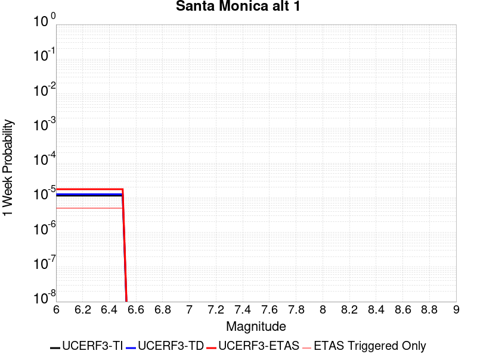 |  |  |  |

| Magnitude | 1 wk TI Prob | 1 wk TD Prob | 1 wk ETAS Prob | 1 wk ETAS/TD Gain | 1 wk ETAS Triggered Only | 1 mo TI Prob | 1 mo TD Prob | 1 mo ETAS Prob | 1 mo ETAS/TD Gain | 1 mo ETAS Triggered Only | 1 yr TI Prob | 1 yr TD Prob | 1 yr ETAS Prob | 1 yr ETAS/TD Gain | 1 yr ETAS Triggered Only | 10 yr TI Prob | 10 yr TD Prob | 10 yr ETAS Prob | 10 yr ETAS/TD Gain | 10 yr ETAS Triggered Only |
|-----|-----|-----|-----|-----|-----|-----|-----|-----|-----|-----|-----|-----|-----|-----|-----|-----|-----|-----|-----|-----|
| 6.0 | 1.14914055E-5 | 1.2581658E-5 | 2.2286065E-5 | 1.7713139 | 9.7045295E-6 | 4.9247952E-5 | 5.392139E-5 | 6.36254E-5 | 1.1799659 | 9.7045295E-6 | 5.9942884E-4 | 6.564929E-4 | 6.726565E-4 | 1.0246211 | 1.6174215E-5 | 0.005978145 | 0.006564929 | 0.006593852 | 1.0044056 | 2.9113588E-5 |
| 6.1 | 1.14914055E-5 | 1.2581658E-5 | 2.2286065E-5 | 1.7713139 | 9.7045295E-6 | 4.9247952E-5 | 5.392139E-5 | 6.36254E-5 | 1.1799659 | 9.7045295E-6 | 5.9942884E-4 | 6.564929E-4 | 6.726565E-4 | 1.0246211 | 1.6174215E-5 | 0.005978145 | 0.006564929 | 0.006593852 | 1.0044056 | 2.9113588E-5 |
| 6.2 | 1.14914055E-5 | 1.2581658E-5 | 2.2286065E-5 | 1.7713139 | 9.7045295E-6 | 4.9247952E-5 | 5.392139E-5 | 6.36254E-5 | 1.1799659 | 9.7045295E-6 | 5.9942884E-4 | 6.564929E-4 | 6.726565E-4 | 1.0246211 | 1.6174215E-5 | 0.005978145 | 0.006564929 | 0.006593852 | 1.0044056 | 2.9113588E-5 |
| 6.3 | 1.14914055E-5 | 1.2581658E-5 | 2.2286065E-5 | 1.7713139 | 9.7045295E-6 | 4.9247952E-5 | 5.392139E-5 | 6.36254E-5 | 1.1799659 | 9.7045295E-6 | 5.9942884E-4 | 6.564929E-4 | 6.726565E-4 | 1.0246211 | 1.6174215E-5 | 0.005978145 | 0.006564929 | 0.006593852 | 1.0044056 | 2.9113588E-5 |
| 6.4 | 1.14914055E-5 | 1.2581658E-5 | 2.2286065E-5 | 1.7713139 | 9.7045295E-6 | 4.9247952E-5 | 5.392139E-5 | 6.36254E-5 | 1.1799659 | 9.7045295E-6 | 5.9942884E-4 | 6.564929E-4 | 6.726565E-4 | 1.0246211 | 1.6174215E-5 | 0.005978145 | 0.006564929 | 0.006593852 | 1.0044056 | 2.9113588E-5 |
| 6.5 | 1.14914055E-5 | 1.2581658E-5 | 2.2286065E-5 | 1.7713139 | 9.7045295E-6 | 4.9247952E-5 | 5.392139E-5 | 6.36254E-5 | 1.1799659 | 9.7045295E-6 | 5.9942884E-4 | 6.564929E-4 | 6.726565E-4 | 1.0246211 | 1.6174215E-5 | 0.005978145 | 0.006564929 | 0.006593852 | 1.0044056 | 2.9113588E-5 |

## Sierra Madre (San Fernando)
*[(top)](#table-of-contents)*

| 1 Week | 1 Month | 1 Year | 10 Year |
|-----|-----|-----|-----|
|  |  |  |  |

| Magnitude | 1 wk TI Prob | 1 wk TD Prob | 1 wk ETAS Prob | 1 wk ETAS/TD Gain | 1 wk ETAS Triggered Only | 1 mo TI Prob | 1 mo TD Prob | 1 mo ETAS Prob | 1 mo ETAS/TD Gain | 1 mo ETAS Triggered Only | 1 yr TI Prob | 1 yr TD Prob | 1 yr ETAS Prob | 1 yr ETAS/TD Gain | 1 yr ETAS Triggered Only | 10 yr TI Prob | 10 yr TD Prob | 10 yr ETAS Prob | 10 yr ETAS/TD Gain | 10 yr ETAS Triggered Only |
|-----|-----|-----|-----|-----|-----|-----|-----|-----|-----|-----|-----|-----|-----|-----|-----|-----|-----|-----|-----|-----|
| 6.0 | 2.76706E-5 | 4.4463613E-6 | 7.68119E-6 | 1.7275226 | 3.2348432E-6 | 1.1858289E-4 | 1.9055766E-5 | 2.876011E-5 | 1.5092603 | 9.7045295E-6 | 0.0014427905 | 2.3199158E-4 | 2.5786433E-4 | 1.1115245 | 2.5878746E-5 | 0.01433459 | 0.0023232098 | 0.0023522559 | 1.0125026 | 2.9113588E-5 |
| 6.1 | 2.76706E-5 | 4.4463613E-6 | 7.68119E-6 | 1.7275226 | 3.2348432E-6 | 1.1858289E-4 | 1.9055766E-5 | 2.876011E-5 | 1.5092603 | 9.7045295E-6 | 0.0014427905 | 2.3199158E-4 | 2.5786433E-4 | 1.1115245 | 2.5878746E-5 | 0.01433459 | 0.0023232098 | 0.0023522559 | 1.0125026 | 2.9113588E-5 |
| 6.2 | 2.76706E-5 | 4.4463613E-6 | 7.68119E-6 | 1.7275226 | 3.2348432E-6 | 1.1858289E-4 | 1.9055766E-5 | 2.876011E-5 | 1.5092603 | 9.7045295E-6 | 0.0014427905 | 2.3199158E-4 | 2.5786433E-4 | 1.1115245 | 2.5878746E-5 | 0.01433459 | 0.0023232098 | 0.0023522559 | 1.0125026 | 2.9113588E-5 |
| 6.3 | 2.76706E-5 | 4.4463613E-6 | 7.68119E-6 | 1.7275226 | 3.2348432E-6 | 1.1858289E-4 | 1.9055766E-5 | 2.876011E-5 | 1.5092603 | 9.7045295E-6 | 0.0014427905 | 2.3199158E-4 | 2.5786433E-4 | 1.1115245 | 2.5878746E-5 | 0.01433459 | 0.0023232098 | 0.0023522559 | 1.0125026 | 2.9113588E-5 |
| 6.4 | 2.76706E-5 | 4.4463613E-6 | 7.68119E-6 | 1.7275226 | 3.2348432E-6 | 1.1858289E-4 | 1.9055766E-5 | 2.876011E-5 | 1.5092603 | 9.7045295E-6 | 0.0014427905 | 2.3199158E-4 | 2.5786433E-4 | 1.1115245 | 2.5878746E-5 | 0.01433459 | 0.0023232098 | 0.0023522559 | 1.0125026 | 2.9113588E-5 |
| 6.5 | 2.76706E-5 | 4.4463613E-6 | 7.68119E-6 | 1.7275226 | 3.2348432E-6 | 1.1858289E-4 | 1.9055766E-5 | 2.876011E-5 | 1.5092603 | 9.7045295E-6 | 0.0014427905 | 2.3199158E-4 | 2.5786433E-4 | 1.1115245 | 2.5878746E-5 | 0.01433459 | 0.0023232098 | 0.0023522559 | 1.0125026 | 2.9113588E-5 |
| 6.6 | 7.4064433E-6 | 4.4463613E-6 | 7.68119E-6 | 1.7275226 | 3.2348432E-6 | 3.1741514E-5 | 1.9055766E-5 | 2.8760109E-5 | 1.5092603 | 9.7045295E-6 | 3.863844E-4 | 2.3199158E-4 | 2.578643E-4 | 1.1115245 | 2.5878746E-5 | 0.0038571327 | 0.0023232098 | 0.0023522556 | 1.0125026 | 2.9113588E-5 |
| 6.7 | 7.4064433E-6 | 4.4463613E-6 | 7.68119E-6 | 1.7275226 | 3.2348432E-6 | 3.1741514E-5 | 1.9055766E-5 | 2.8760109E-5 | 1.5092603 | 9.7045295E-6 | 3.863844E-4 | 2.3199158E-4 | 2.578643E-4 | 1.1115245 | 2.5878746E-5 | 0.0038571327 | 0.0023232098 | 0.0023522556 | 1.0125026 | 2.9113588E-5 |
| 6.8 | 6.925624E-6 | 4.2295183E-6 | 7.464348E-6 | 1.7648221 | 3.2348432E-6 | 2.9680907E-5 | 1.8126451E-5 | 2.7830803E-5 | 1.5353698 | 9.7045295E-6 | 3.613051E-4 | 2.2067946E-4 | 2.465525E-4 | 1.1172426 | 2.5878746E-5 | 0.0036071825 | 0.0022100909 | 0.00223914 | 1.0131439 | 2.9113588E-5 |
| 6.9 | 6.8073305E-6 | 4.1955877E-6 | 7.430417E-6 | 1.7710075 | 3.2348432E-6 | 2.9173947E-5 | 1.7981036E-5 | 2.768539E-5 | 1.5396994 | 9.7045295E-6 | 3.551349E-4 | 2.1890938E-4 | 2.4478245E-4 | 1.1181908 | 2.5878746E-5 | 0.003545679 | 0.0021923676 | 0.0022214174 | 1.0132504 | 2.9113588E-5 |
| 7.0 | 6.5550776E-6 | 4.0390173E-6 | 7.2738476E-6 | 1.8008953 | 3.2348432E-6 | 2.8092887E-5 | 1.7310029E-5 | 2.701439E-5 | 1.5606208 | 9.7045295E-6 | 3.4197723E-4 | 2.1074146E-4 | 2.3661475E-4 | 1.1227727 | 2.5878746E-5 | 0.0034145142 | 0.0021107546 | 0.0021398065 | 1.0137639 | 2.9113588E-5 |
| 7.1 | 6.141366E-6 | 3.8129206E-6 | 7.0477513E-6 | 1.8483866 | 3.2348432E-6 | 2.6319874E-5 | 1.6341055E-5 | 2.6045425E-5 | 1.5938644 | 9.7045295E-6 | 3.2039735E-4 | 1.9894639E-4 | 2.2481999E-4 | 1.1300532 | 2.5878746E-5 | 0.003199358 | 0.001992886 | 0.0020219414 | 1.0145797 | 2.9113588E-5 |
| 7.2 | 5.5504106E-6 | 3.3297895E-6 | 6.564622E-6 | 1.9714825 | 3.2348432E-6 | 2.3787257E-5 | 1.4270517E-5 | 2.074011E-5 | 1.4533539 | 6.4696865E-6 | 2.8957136E-4 | 1.7374175E-4 | 1.9314744E-4 | 1.1116927 | 1.9409059E-5 | 0.002891943 | 0.0017411701 | 0.0017637745 | 1.0129824 | 2.2643902E-5 |

## Holser alt 1
*[(top)](#table-of-contents)*

| 1 Week | 1 Month | 1 Year | 10 Year |
|-----|-----|-----|-----|
|  |  |  |  |

| Magnitude | 1 wk TI Prob | 1 wk TD Prob | 1 wk ETAS Prob | 1 wk ETAS/TD Gain | 1 wk ETAS Triggered Only | 1 mo TI Prob | 1 mo TD Prob | 1 mo ETAS Prob | 1 mo ETAS/TD Gain | 1 mo ETAS Triggered Only | 1 yr TI Prob | 1 yr TD Prob | 1 yr ETAS Prob | 1 yr ETAS/TD Gain | 1 yr ETAS Triggered Only | 10 yr TI Prob | 10 yr TD Prob | 10 yr ETAS Prob | 10 yr ETAS/TD Gain | 10 yr ETAS Triggered Only |
|-----|-----|-----|-----|-----|-----|-----|-----|-----|-----|-----|-----|-----|-----|-----|-----|-----|-----|-----|-----|-----|
| 6.0 | 7.962936E-6 | 8.4235735E-6 | 1.4893205E-5 | 1.7680389 | 6.4696865E-6 | 3.4126424E-5 | 3.6100817E-5 | 4.903972E-5 | 1.3584104 | 1.2939373E-5 | 4.1540997E-4 | 4.394895E-4 | 4.5565658E-4 | 1.0367861 | 1.6174215E-5 | 0.004146343 | 0.0043911743 | 0.0044201603 | 1.0066009 | 2.9113588E-5 |
| 6.1 | 7.962936E-6 | 8.4235735E-6 | 1.4893205E-5 | 1.7680389 | 6.4696865E-6 | 3.4126424E-5 | 3.6100817E-5 | 4.903972E-5 | 1.3584104 | 1.2939373E-5 | 4.1540997E-4 | 4.394895E-4 | 4.5565658E-4 | 1.0367861 | 1.6174215E-5 | 0.004146343 | 0.0043911743 | 0.0044201603 | 1.0066009 | 2.9113588E-5 |
| 6.2 | 7.962936E-6 | 8.4235735E-6 | 1.4893205E-5 | 1.7680389 | 6.4696865E-6 | 3.4126424E-5 | 3.6100817E-5 | 4.903972E-5 | 1.3584104 | 1.2939373E-5 | 4.1540997E-4 | 4.394895E-4 | 4.5565658E-4 | 1.0367861 | 1.6174215E-5 | 0.004146343 | 0.0043911743 | 0.0044201603 | 1.0066009 | 2.9113588E-5 |
| 6.3 | 7.962936E-6 | 8.4235735E-6 | 1.4893205E-5 | 1.7680389 | 6.4696865E-6 | 3.4126424E-5 | 3.6100817E-5 | 4.903972E-5 | 1.3584104 | 1.2939373E-5 | 4.1540997E-4 | 4.394895E-4 | 4.5565658E-4 | 1.0367861 | 1.6174215E-5 | 0.004146343 | 0.0043911743 | 0.0044201603 | 1.0066009 | 2.9113588E-5 |
| 6.4 | 7.962936E-6 | 8.4235735E-6 | 1.4893205E-5 | 1.7680389 | 6.4696865E-6 | 3.4126424E-5 | 3.6100817E-5 | 4.903972E-5 | 1.3584104 | 1.2939373E-5 | 4.1540997E-4 | 4.394895E-4 | 4.5565658E-4 | 1.0367861 | 1.6174215E-5 | 0.004146343 | 0.0043911743 | 0.0044201603 | 1.0066009 | 2.9113588E-5 |
| 6.5 | 7.962936E-6 | 8.4235735E-6 | 1.4893205E-5 | 1.7680389 | 6.4696865E-6 | 3.4126424E-5 | 3.6100817E-5 | 4.903972E-5 | 1.3584104 | 1.2939373E-5 | 4.1540997E-4 | 4.394895E-4 | 4.5565658E-4 | 1.0367861 | 1.6174215E-5 | 0.004146343 | 0.0043911743 | 0.0044201603 | 1.0066009 | 2.9113588E-5 |
| 6.6 | 5.506786E-6 | 5.810526E-6 | 9.04535E-6 | 1.556718 | 3.2348432E-6 | 2.3600298E-5 | 2.4902254E-5 | 3.137178E-5 | 1.2597967 | 6.4696865E-6 | 2.8729573E-4 | 3.0318493E-4 | 3.1288652E-4 | 1.0319989 | 9.7045295E-6 | 0.002869246 | 0.0030318494 | 0.0030479745 | 1.0053186 | 1.6174215E-5 |
| 6.7 | 5.506786E-6 | 5.810526E-6 | 9.04535E-6 | 1.556718 | 3.2348432E-6 | 2.3600298E-5 | 2.4902254E-5 | 3.137178E-5 | 1.2597967 | 6.4696865E-6 | 2.8729573E-4 | 3.0318493E-4 | 3.1288652E-4 | 1.0319989 | 9.7045295E-6 | 0.002869246 | 0.0030318494 | 0.0030479745 | 1.0053186 | 1.6174215E-5 |

## Hosgri
*[(top)](#table-of-contents)*

| 1 Week | 1 Month | 1 Year | 10 Year |
|-----|-----|-----|-----|
|  |  | 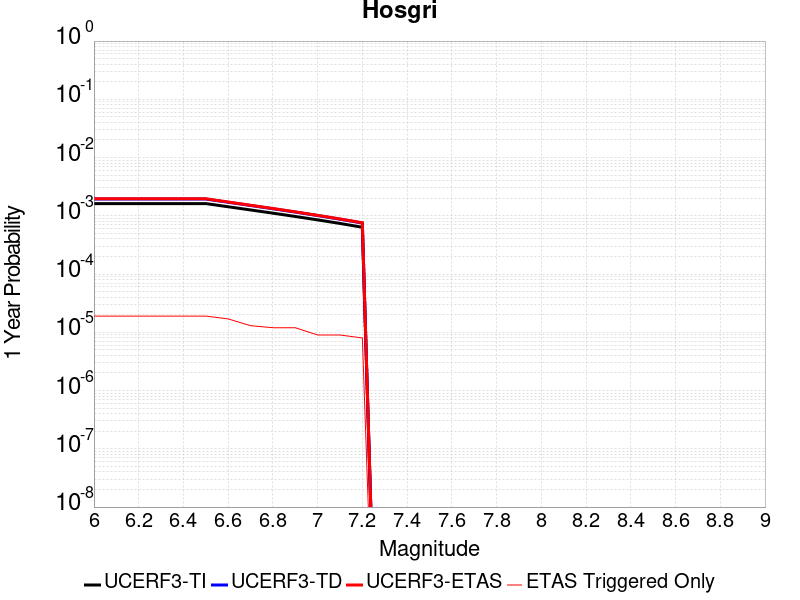 |  |

| Magnitude | 1 wk TI Prob | 1 wk TD Prob | 1 wk ETAS Prob | 1 wk ETAS/TD Gain | 1 wk ETAS Triggered Only | 1 mo TI Prob | 1 mo TD Prob | 1 mo ETAS Prob | 1 mo ETAS/TD Gain | 1 mo ETAS Triggered Only | 1 yr TI Prob | 1 yr TD Prob | 1 yr ETAS Prob | 1 yr ETAS/TD Gain | 1 yr ETAS Triggered Only | 10 yr TI Prob | 10 yr TD Prob | 10 yr ETAS Prob | 10 yr ETAS/TD Gain | 10 yr ETAS Triggered Only |
|-----|-----|-----|-----|-----|-----|-----|-----|-----|-----|-----|-----|-----|-----|-----|-----|-----|-----|-----|-----|-----|
| 6.0 | 3.1107833E-5 | 3.720853E-5 | 4.69127E-5 | 1.2608049 | 9.7045295E-6 | 1.3331248E-4 | 1.5945687E-4 | 1.6915986E-4 | 1.0608501 | 9.7045295E-6 | 0.0016218709 | 0.001939923 | 0.0019528373 | 1.0066571 | 1.2939373E-5 | 0.01610085 | 0.01925631 | 0.019284863 | 1.0014828 | 2.9113588E-5 |
| 6.1 | 3.1107833E-5 | 3.720853E-5 | 4.69127E-5 | 1.2608049 | 9.7045295E-6 | 1.3331248E-4 | 1.5945687E-4 | 1.6915986E-4 | 1.0608501 | 9.7045295E-6 | 0.0016218709 | 0.001939923 | 0.0019528373 | 1.0066571 | 1.2939373E-5 | 0.01610085 | 0.01925631 | 0.019284863 | 1.0014828 | 2.9113588E-5 |
| 6.2 | 3.1107833E-5 | 3.720853E-5 | 4.69127E-5 | 1.2608049 | 9.7045295E-6 | 1.3331248E-4 | 1.5945687E-4 | 1.6915986E-4 | 1.0608501 | 9.7045295E-6 | 0.0016218709 | 0.001939923 | 0.0019528373 | 1.0066571 | 1.2939373E-5 | 0.01610085 | 0.01925631 | 0.019284863 | 1.0014828 | 2.9113588E-5 |
| 6.3 | 3.1107833E-5 | 3.720853E-5 | 4.69127E-5 | 1.2608049 | 9.7045295E-6 | 1.3331248E-4 | 1.5945687E-4 | 1.6915986E-4 | 1.0608501 | 9.7045295E-6 | 0.0016218709 | 0.001939923 | 0.0019528373 | 1.0066571 | 1.2939373E-5 | 0.01610085 | 0.01925631 | 0.019284863 | 1.0014828 | 2.9113588E-5 |
| 6.4 | 3.1107833E-5 | 3.720853E-5 | 4.69127E-5 | 1.2608049 | 9.7045295E-6 | 1.3331248E-4 | 1.5945687E-4 | 1.6915986E-4 | 1.0608501 | 9.7045295E-6 | 0.0016218709 | 0.001939923 | 0.0019528373 | 1.0066571 | 1.2939373E-5 | 0.01610085 | 0.01925631 | 0.019284863 | 1.0014828 | 2.9113588E-5 |
| 6.5 | 3.1107833E-5 | 3.720853E-5 | 4.69127E-5 | 1.2608049 | 9.7045295E-6 | 1.3331248E-4 | 1.5945687E-4 | 1.6915986E-4 | 1.0608501 | 9.7045295E-6 | 0.0016218709 | 0.001939923 | 0.0019528373 | 1.0066571 | 1.2939373E-5 | 0.01610085 | 0.01925631 | 0.019284863 | 1.0014828 | 2.9113588E-5 |
| 6.6 | 2.743495E-5 | 3.2780124E-5 | 4.2484335E-5 | 1.2960395 | 9.7045295E-6 | 1.1757306E-4 | 1.4048017E-4 | 1.5018333E-4 | 1.0690714 | 9.7045295E-6 | 0.0014305119 | 0.0017092682 | 0.0017189562 | 1.0056679 | 9.7045295E-6 | 0.014213383 | 0.016987413 | 0.017009672 | 1.0013103 | 2.2643902E-5 |
| 6.7 | 2.418707E-5 | 2.8858389E-5 | 3.532789E-5 | 1.2241809 | 6.4696865E-6 | 1.0365475E-4 | 1.2367443E-4 | 1.3014332E-4 | 1.0523058 | 6.4696865E-6 | 0.001261266 | 0.0015049598 | 0.0015114198 | 1.0042925 | 6.4696865E-6 | 0.012541314 | 0.014973709 | 0.014986455 | 1.0008512 | 1.2939373E-5 |
| 6.8 | 2.1292695E-5 | 2.5360874E-5 | 3.1830394E-5 | 1.2550986 | 6.4696865E-6 | 9.125122E-5 | 1.0868641E-4 | 1.15155395E-4 | 1.0595196 | 6.4696865E-6 | 0.0011104173 | 0.0013227165 | 0.0013291776 | 1.0048847 | 6.4696865E-6 | 0.011048851 | 0.013174292 | 0.01318706 | 1.0009692 | 1.2939373E-5 |
| 6.9 | 1.8692357E-5 | 2.221764E-5 | 2.8687184E-5 | 1.2911894 | 6.4696865E-6 | 8.010764E-5 | 9.521646E-5 | 1.0168554E-4 | 1.0679407 | 6.4696865E-6 | 9.7487407E-4 | 0.001158906 | 0.0011653682 | 1.0055761 | 6.4696865E-6 | 0.009706085 | 0.01155437 | 0.01156716 | 1.001107 | 1.2939373E-5 |
| 7.0 | 1.6336586E-5 | 1.9370036E-5 | 1.9370036E-5 | 1.0 | 0.0 | 7.001206E-5 | 8.301328E-5 | 8.301328E-5 | 1.0 | 0.0 | 8.520634E-4 | 0.0010104795 | 0.0010104795 | 1.0 | 0.0 | 0.008488038 | 0.010084504 | 0.010090909 | 1.000635 | 6.4696865E-6 |
| 7.1 | 1.4184237E-5 | 1.6776847E-5 | 1.6776847E-5 | 1.0 | 0.0 | 6.0788174E-5 | 7.1900264E-5 | 7.1900264E-5 | 1.0 | 0.0 | 7.398447E-4 | 8.7529485E-4 | 8.7529485E-4 | 1.0 | 0.0 | 0.007373864 | 0.008744048 | 0.0087472545 | 1.0003667 | 3.2348432E-6 |
| 7.2 | 1.2201091E-5 | 1.4405841E-5 | 1.4405841E-5 | 1.0 | 0.0 | 5.228934E-5 | 6.1739316E-5 | 6.1739316E-5 | 1.0 | 0.0 | 6.3643674E-4 | 7.516762E-4 | 7.516762E-4 | 1.0 | 0.0 | 0.006346171 | 0.007516762 | 0.0075199725 | 1.0004271 | 3.2348432E-6 |

## Great Valley 08 (Quinto)
*[(top)](#table-of-contents)*

| 1 Week | 1 Month | 1 Year | 10 Year |
|-----|-----|-----|-----|
|  |  |  |  |

| Magnitude | 1 wk TI Prob | 1 wk TD Prob | 1 wk ETAS Prob | 1 wk ETAS/TD Gain | 1 wk ETAS Triggered Only | 1 mo TI Prob | 1 mo TD Prob | 1 mo ETAS Prob | 1 mo ETAS/TD Gain | 1 mo ETAS Triggered Only | 1 yr TI Prob | 1 yr TD Prob | 1 yr ETAS Prob | 1 yr ETAS/TD Gain | 1 yr ETAS Triggered Only | 10 yr TI Prob | 10 yr TD Prob | 10 yr ETAS Prob | 10 yr ETAS/TD Gain | 10 yr ETAS Triggered Only |
|-----|-----|-----|-----|-----|-----|-----|-----|-----|-----|-----|-----|-----|-----|-----|-----|-----|-----|-----|-----|-----|
| 6.0 | 2.5524263E-5 | 3.1194424E-5 | 3.4429166E-5 | 1.1036962 | 3.2348432E-6 | 1.0938511E-4 | 1.3368827E-4 | 1.3692268E-4 | 1.0241936 | 3.2348432E-6 | 0.0013309501 | 0.0016272905 | 0.0016466681 | 1.0119078 | 1.9409059E-5 | 0.013230069 | 0.016236922 | 0.016265564 | 1.0017639 | 2.9113588E-5 |
| 6.1 | 2.5524263E-5 | 3.1194424E-5 | 3.4429166E-5 | 1.1036962 | 3.2348432E-6 | 1.0938511E-4 | 1.3368827E-4 | 1.3692268E-4 | 1.0241936 | 3.2348432E-6 | 0.0013309501 | 0.0016272905 | 0.0016466681 | 1.0119078 | 1.9409059E-5 | 0.013230069 | 0.016236922 | 0.016265564 | 1.0017639 | 2.9113588E-5 |
| 6.2 | 2.5524263E-5 | 3.1194424E-5 | 3.4429166E-5 | 1.1036962 | 3.2348432E-6 | 1.0938511E-4 | 1.3368827E-4 | 1.3692268E-4 | 1.0241936 | 3.2348432E-6 | 0.0013309501 | 0.0016272905 | 0.0016466681 | 1.0119078 | 1.9409059E-5 | 0.013230069 | 0.016236922 | 0.016265564 | 1.0017639 | 2.9113588E-5 |
| 6.3 | 2.5524263E-5 | 3.1194424E-5 | 3.4429166E-5 | 1.1036962 | 3.2348432E-6 | 1.0938511E-4 | 1.3368827E-4 | 1.3692268E-4 | 1.0241936 | 3.2348432E-6 | 0.0013309501 | 0.0016272905 | 0.0016466681 | 1.0119078 | 1.9409059E-5 | 0.013230069 | 0.016236922 | 0.016265564 | 1.0017639 | 2.9113588E-5 |
| 6.4 | 2.5524263E-5 | 3.1194424E-5 | 3.4429166E-5 | 1.1036962 | 3.2348432E-6 | 1.0938511E-4 | 1.3368827E-4 | 1.3692268E-4 | 1.0241936 | 3.2348432E-6 | 0.0013309501 | 0.0016272905 | 0.0016466681 | 1.0119078 | 1.9409059E-5 | 0.013230069 | 0.016236922 | 0.016265564 | 1.0017639 | 2.9113588E-5 |
| 6.5 | 2.5524263E-5 | 3.1194424E-5 | 3.4429166E-5 | 1.1036962 | 3.2348432E-6 | 1.0938511E-4 | 1.3368827E-4 | 1.3692268E-4 | 1.0241936 | 3.2348432E-6 | 0.0013309501 | 0.0016272905 | 0.0016466681 | 1.0119078 | 1.9409059E-5 | 0.013230069 | 0.016236922 | 0.016265564 | 1.0017639 | 2.9113588E-5 |
| 6.6 | 2.0986998E-5 | 2.5576908E-5 | 2.8811668E-5 | 1.1264719 | 3.2348432E-6 | 8.994117E-5 | 1.0961532E-4 | 1.1284981E-4 | 1.0295076 | 3.2348432E-6 | 0.0010944837 | 0.0013345632 | 0.0013539464 | 1.014524 | 1.9409059E-5 | 0.010891088 | 0.013345085 | 0.013373811 | 1.0021524 | 2.9113588E-5 |

## Deep Springs
*[(top)](#table-of-contents)*

| 1 Week | 1 Month | 1 Year | 10 Year |
|-----|-----|-----|-----|
|  |  |  |  |

| Magnitude | 1 wk TI Prob | 1 wk TD Prob | 1 wk ETAS Prob | 1 wk ETAS/TD Gain | 1 wk ETAS Triggered Only | 1 mo TI Prob | 1 mo TD Prob | 1 mo ETAS Prob | 1 mo ETAS/TD Gain | 1 mo ETAS Triggered Only | 1 yr TI Prob | 1 yr TD Prob | 1 yr ETAS Prob | 1 yr ETAS/TD Gain | 1 yr ETAS Triggered Only | 10 yr TI Prob | 10 yr TD Prob | 10 yr ETAS Prob | 10 yr ETAS/TD Gain | 10 yr ETAS Triggered Only |
|-----|-----|-----|-----|-----|-----|-----|-----|-----|-----|-----|-----|-----|-----|-----|-----|-----|-----|-----|-----|-----|
| 6.0 | 1.5918817E-5 | 1.7845163E-5 | 2.7549519E-5 | 1.5438088 | 9.7045295E-6 | 6.8221714E-5 | 7.64782E-5 | 8.9416586E-5 | 1.1691774 | 1.2939373E-5 | 8.3028286E-4 | 9.3093317E-4 | 9.470923E-4 | 1.0173581 | 1.6174215E-5 | 0.008271876 | 0.009290814 | 0.009316452 | 1.0027596 | 2.5878746E-5 |
| 6.1 | 1.5918817E-5 | 1.7845163E-5 | 2.7549519E-5 | 1.5438088 | 9.7045295E-6 | 6.8221714E-5 | 7.64782E-5 | 8.9416586E-5 | 1.1691774 | 1.2939373E-5 | 8.3028286E-4 | 9.3093317E-4 | 9.470923E-4 | 1.0173581 | 1.6174215E-5 | 0.008271876 | 0.009290814 | 0.009316452 | 1.0027596 | 2.5878746E-5 |
| 6.2 | 1.5918817E-5 | 1.7845163E-5 | 2.7549519E-5 | 1.5438088 | 9.7045295E-6 | 6.8221714E-5 | 7.64782E-5 | 8.9416586E-5 | 1.1691774 | 1.2939373E-5 | 8.3028286E-4 | 9.3093317E-4 | 9.470923E-4 | 1.0173581 | 1.6174215E-5 | 0.008271876 | 0.009290814 | 0.009316452 | 1.0027596 | 2.5878746E-5 |
| 6.3 | 1.5918817E-5 | 1.7845163E-5 | 2.7549519E-5 | 1.5438088 | 9.7045295E-6 | 6.8221714E-5 | 7.64782E-5 | 8.9416586E-5 | 1.1691774 | 1.2939373E-5 | 8.3028286E-4 | 9.3093317E-4 | 9.470923E-4 | 1.0173581 | 1.6174215E-5 | 0.008271876 | 0.009290814 | 0.009316452 | 1.0027596 | 2.5878746E-5 |
| 6.4 | 1.5918817E-5 | 1.7845163E-5 | 2.7549519E-5 | 1.5438088 | 9.7045295E-6 | 6.8221714E-5 | 7.64782E-5 | 8.9416586E-5 | 1.1691774 | 1.2939373E-5 | 8.3028286E-4 | 9.3093317E-4 | 9.470923E-4 | 1.0173581 | 1.6174215E-5 | 0.008271876 | 0.009290814 | 0.009316452 | 1.0027596 | 2.5878746E-5 |
| 6.5 | 1.5918817E-5 | 1.7845163E-5 | 2.7549519E-5 | 1.5438088 | 9.7045295E-6 | 6.8221714E-5 | 7.64782E-5 | 8.9416586E-5 | 1.1691774 | 1.2939373E-5 | 8.3028286E-4 | 9.3093317E-4 | 9.470923E-4 | 1.0173581 | 1.6174215E-5 | 0.008271876 | 0.009290814 | 0.009316452 | 1.0027596 | 2.5878746E-5 |
| 6.6 | 1.1008706E-5 | 1.2328163E-5 | 2.2032573E-5 | 1.787174 | 9.7045295E-6 | 4.7179317E-5 | 5.2834985E-5 | 6.2539E-5 | 1.1836665 | 9.7045295E-6 | 5.7425676E-4 | 6.4326596E-4 | 6.5619696E-4 | 1.0201021 | 1.2939373E-5 | 0.0057277507 | 0.0064326595 | 0.0064519434 | 1.0029979 | 1.9409059E-5 |
| 6.7 | 1.1008706E-5 | 1.2328163E-5 | 2.2032573E-5 | 1.787174 | 9.7045295E-6 | 4.7179317E-5 | 5.2834985E-5 | 6.2539E-5 | 1.1836665 | 9.7045295E-6 | 5.7425676E-4 | 6.4326596E-4 | 6.5619696E-4 | 1.0201021 | 1.2939373E-5 | 0.0057277507 | 0.0064326595 | 0.0064519434 | 1.0029979 | 1.9409059E-5 |

## Elsinore (Temecula) rev
*[(top)](#table-of-contents)*

| 1 Week | 1 Month | 1 Year | 10 Year |
|-----|-----|-----|-----|
|  |  |  |  |

| Magnitude | 1 wk TI Prob | 1 wk TD Prob | 1 wk ETAS Prob | 1 wk ETAS/TD Gain | 1 wk ETAS Triggered Only | 1 mo TI Prob | 1 mo TD Prob | 1 mo ETAS Prob | 1 mo ETAS/TD Gain | 1 mo ETAS Triggered Only | 1 yr TI Prob | 1 yr TD Prob | 1 yr ETAS Prob | 1 yr ETAS/TD Gain | 1 yr ETAS Triggered Only | 10 yr TI Prob | 10 yr TD Prob | 10 yr ETAS Prob | 10 yr ETAS/TD Gain | 10 yr ETAS Triggered Only |
|-----|-----|-----|-----|-----|-----|-----|-----|-----|-----|-----|-----|-----|-----|-----|-----|-----|-----|-----|-----|-----|
| 6.0 | 2.9985375E-5 | 3.4747958E-5 | 4.768688E-5 | 1.372365 | 1.2939373E-5 | 1.2850242E-4 | 1.4891267E-4 | 1.6185013E-4 | 1.0868794 | 1.2939373E-5 | 0.0015633941 | 0.0018117457 | 0.0018278905 | 1.0089113 | 1.6174215E-5 | 0.01552441 | 0.018074041 | 0.018099451 | 1.001406 | 2.5878746E-5 |
| 6.1 | 2.9985375E-5 | 3.4747958E-5 | 4.768688E-5 | 1.372365 | 1.2939373E-5 | 1.2850242E-4 | 1.4891267E-4 | 1.6185013E-4 | 1.0868794 | 1.2939373E-5 | 0.0015633941 | 0.0018117457 | 0.0018278905 | 1.0089113 | 1.6174215E-5 | 0.01552441 | 0.018074041 | 0.018099451 | 1.001406 | 2.5878746E-5 |
| 6.2 | 2.9985375E-5 | 3.4747958E-5 | 4.768688E-5 | 1.372365 | 1.2939373E-5 | 1.2850242E-4 | 1.4891267E-4 | 1.6185013E-4 | 1.0868794 | 1.2939373E-5 | 0.0015633941 | 0.0018117457 | 0.0018278905 | 1.0089113 | 1.6174215E-5 | 0.01552441 | 0.018074041 | 0.018099451 | 1.001406 | 2.5878746E-5 |
| 6.3 | 2.9985375E-5 | 3.4747958E-5 | 4.768688E-5 | 1.372365 | 1.2939373E-5 | 1.2850242E-4 | 1.4891267E-4 | 1.6185013E-4 | 1.0868794 | 1.2939373E-5 | 0.0015633941 | 0.0018117457 | 0.0018278905 | 1.0089113 | 1.6174215E-5 | 0.01552441 | 0.018074041 | 0.018099451 | 1.001406 | 2.5878746E-5 |
| 6.4 | 2.9985375E-5 | 3.4747958E-5 | 4.768688E-5 | 1.372365 | 1.2939373E-5 | 1.2850242E-4 | 1.4891267E-4 | 1.6185013E-4 | 1.0868794 | 1.2939373E-5 | 0.0015633941 | 0.0018117457 | 0.0018278905 | 1.0089113 | 1.6174215E-5 | 0.01552441 | 0.018074041 | 0.018099451 | 1.001406 | 2.5878746E-5 |
| 6.5 | 2.9985375E-5 | 3.4747958E-5 | 4.768688E-5 | 1.372365 | 1.2939373E-5 | 1.2850242E-4 | 1.4891267E-4 | 1.6185013E-4 | 1.0868794 | 1.2939373E-5 | 0.0015633941 | 0.0018117457 | 0.0018278905 | 1.0089113 | 1.6174215E-5 | 0.01552441 | 0.018074041 | 0.018099451 | 1.001406 | 2.5878746E-5 |
| 6.6 | 2.9915182E-5 | 3.46808E-5 | 4.7619724E-5 | 1.3730861 | 1.2939373E-5 | 1.2820162E-4 | 1.486249E-4 | 1.6156235E-4 | 1.0870477 | 1.2939373E-5 | 0.0015597371 | 0.0018082478 | 0.0018243927 | 1.0089285 | 1.6174215E-5 | 0.015488351 | 0.018039845 | 0.018065255 | 1.0014087 | 2.5878746E-5 |
| 6.7 | 2.9879424E-5 | 3.463569E-5 | 4.7574613E-5 | 1.373572 | 1.2939373E-5 | 1.2804838E-4 | 1.4843159E-4 | 1.6136904E-4 | 1.0871611 | 1.2939373E-5 | 0.0015578741 | 0.0018058982 | 0.0018220432 | 1.0089401 | 1.6174215E-5 | 0.01546998 | 0.018016884 | 0.018042296 | 1.0014105 | 2.5878746E-5 |
| 6.8 | 2.9818717E-5 | 3.45724E-5 | 4.7511327E-5 | 1.3742559 | 1.2939373E-5 | 1.2778824E-4 | 1.4816038E-4 | 1.6109784E-4 | 1.0873206 | 1.2939373E-5 | 0.0015547115 | 0.0018026017 | 0.0018187468 | 1.0089566 | 1.6174215E-5 | 0.015438793 | 0.017984249 | 0.018009663 | 1.0014131 | 2.5878746E-5 |
| 6.9 | 2.9704783E-5 | 3.4430177E-5 | 4.7369103E-5 | 1.3758019 | 1.2939373E-5 | 1.273E-4 | 1.4755092E-4 | 1.6048839E-4 | 1.0876813 | 1.2939373E-5 | 0.0015487756 | 0.001795194 | 0.0018113392 | 1.0089935 | 1.6174215E-5 | 0.015380259 | 0.017911145 | 0.017936561 | 1.001419 | 2.5878746E-5 |
| 7.0 | 2.9613002E-5 | 3.4300047E-5 | 4.7238977E-5 | 1.3772278 | 1.2939373E-5 | 1.269067E-4 | 1.4699328E-4 | 1.5993074E-4 | 1.088014 | 1.2939373E-5 | 0.0015439938 | 0.0017884158 | 0.0018045611 | 1.0090277 | 1.6174215E-5 | 0.015333103 | 0.017844401 | 0.017869819 | 1.0014243 | 2.5878746E-5 |
| 7.1 | 2.2180364E-5 | 2.6018337E-5 | 3.2487857E-5 | 1.2486522 | 6.4696865E-6 | 9.505524E-5 | 1.115033E-4 | 1.1797227E-4 | 1.058016 | 6.4696865E-6 | 0.0011566831 | 0.0013568681 | 0.0013665594 | 1.0071424 | 9.7045295E-6 | 0.01150681 | 0.013559197 | 0.0135751525 | 1.0011767 | 1.6174215E-5 |
| 7.2 | 2.1985565E-5 | 2.5725127E-5 | 3.2194646E-5 | 1.2514864 | 6.4696865E-6 | 9.422044E-5 | 1.1024679E-4 | 1.1671576E-4 | 1.0586772 | 6.4696865E-6 | 0.0011465302 | 0.0013415889 | 0.0013512804 | 1.007224 | 9.7045295E-6 | 0.0114063285 | 0.013408055 | 0.013424012 | 1.0011902 | 1.6174215E-5 |
| 7.3 | 1.3039819E-5 | 1.715471E-5 | 1.715471E-5 | 1.0 | 0.0 | 5.5883742E-5 | 7.3518546E-5 | 7.3518546E-5 | 1.0 | 0.0 | 6.801722E-4 | 8.947971E-4 | 8.98029E-4 | 1.0036119 | 3.2348432E-6 | 0.006780941 | 0.008927152 | 0.008930357 | 1.0003592 | 3.2348432E-6 |
| 7.4 | 1.2750458E-5 | 1.6749926E-5 | 1.6749926E-5 | 1.0 | 0.0 | 5.464368E-5 | 7.178385E-5 | 7.178385E-5 | 1.0 | 0.0 | 6.650837E-4 | 8.736942E-4 | 8.7692623E-4 | 1.0036993 | 3.2348432E-6 | 0.006630967 | 0.008717438 | 0.008720645 | 1.0003679 | 3.2348432E-6 |
| 7.5 | 1.1924516E-5 | 1.570584E-5 | 1.570584E-5 | 1.0 | 0.0 | 5.1104067E-5 | 6.730944E-5 | 6.730944E-5 | 1.0 | 0.0 | 6.220144E-4 | 8.192601E-4 | 8.224923E-4 | 1.0039452 | 3.2348432E-6 | 0.006202762 | 0.008175999 | 0.008179207 | 1.0003924 | 3.2348432E-6 |
| 7.6 | 1.0456552E-5 | 1.3574289E-5 | 1.3574289E-5 | 1.0 | 0.0 | 4.4813027E-5 | 5.817464E-5 | 5.817464E-5 | 1.0 | 0.0 | 5.45462E-4 | 7.081186E-4 | 7.1135117E-4 | 1.004565 | 3.2348432E-6 | 0.0054412507 | 0.0070718653 | 0.0070750774 | 1.0004542 | 3.2348432E-6 |
| 7.7 | 4.463199E-6 | 5.214875E-6 | 5.214875E-6 | 1.0 | 0.0 | 1.9127854E-5 | 2.2349386E-5 | 2.2349386E-5 | 1.0 | 0.0 | 2.3285674E-4 | 2.7209E-4 | 2.7532398E-4 | 1.0118856 | 3.2348432E-6 | 0.0023261288 | 0.0027239968 | 0.0027272226 | 1.0011843 | 3.2348432E-6 |
| 7.8 | 2.1601753E-7 | 2.7489222E-7 | 2.7489222E-7 | 1.0 | 0.0 | 9.257891E-7 | 1.1781094E-6 | 1.1781094E-6 | 1.0 | 0.0 | 1.1271423E-5 | 1.4343483E-5 | 1.4343483E-5 | 1.0 | 0.0 | 1.1270852E-4 | 1.435847E-4 | 1.435847E-4 | 1.0 | 0.0 |

## Concord 2011 CFM
*[(top)](#table-of-contents)*

| 1 Week | 1 Month | 1 Year | 10 Year |
|-----|-----|-----|-----|
|  |  |  |  |

| Magnitude | 1 wk TI Prob | 1 wk TD Prob | 1 wk ETAS Prob | 1 wk ETAS/TD Gain | 1 wk ETAS Triggered Only | 1 mo TI Prob | 1 mo TD Prob | 1 mo ETAS Prob | 1 mo ETAS/TD Gain | 1 mo ETAS Triggered Only | 1 yr TI Prob | 1 yr TD Prob | 1 yr ETAS Prob | 1 yr ETAS/TD Gain | 1 yr ETAS Triggered Only | 10 yr TI Prob | 10 yr TD Prob | 10 yr ETAS Prob | 10 yr ETAS/TD Gain | 10 yr ETAS Triggered Only |
|-----|-----|-----|-----|-----|-----|-----|-----|-----|-----|-----|-----|-----|-----|-----|-----|-----|-----|-----|-----|-----|
| 6.0 | 7.9834055E-5 | 1.7647086E-4 | 1.8617368E-4 | 1.0549825 | 9.7045295E-6 | 3.421011E-4 | 7.562273E-4 | 7.659245E-4 | 1.0128231 | 9.7045295E-6 | 0.0041571283 | 0.009193515 | 0.009215951 | 1.0024403 | 2.2643902E-5 | 0.040802166 | 0.08864039 | 0.08866397 | 1.0002661 | 2.5878746E-5 |
| 6.1 | 7.9834055E-5 | 1.7647086E-4 | 1.8617368E-4 | 1.0549825 | 9.7045295E-6 | 3.421011E-4 | 7.562273E-4 | 7.659245E-4 | 1.0128231 | 9.7045295E-6 | 0.0041571283 | 0.009193515 | 0.009215951 | 1.0024403 | 2.2643902E-5 | 0.040802166 | 0.08864039 | 0.08866397 | 1.0002661 | 2.5878746E-5 |
| 6.2 | 7.9834055E-5 | 1.7647086E-4 | 1.8617368E-4 | 1.0549825 | 9.7045295E-6 | 3.421011E-4 | 7.562273E-4 | 7.659245E-4 | 1.0128231 | 9.7045295E-6 | 0.0041571283 | 0.009193515 | 0.009215951 | 1.0024403 | 2.2643902E-5 | 0.040802166 | 0.08864039 | 0.08866397 | 1.0002661 | 2.5878746E-5 |
| 6.3 | 7.9834055E-5 | 1.7647086E-4 | 1.8617368E-4 | 1.0549825 | 9.7045295E-6 | 3.421011E-4 | 7.562273E-4 | 7.659245E-4 | 1.0128231 | 9.7045295E-6 | 0.0041571283 | 0.009193515 | 0.009215951 | 1.0024403 | 2.2643902E-5 | 0.040802166 | 0.08864039 | 0.08866397 | 1.0002661 | 2.5878746E-5 |
| 6.4 | 7.9834055E-5 | 1.7647086E-4 | 1.8617368E-4 | 1.0549825 | 9.7045295E-6 | 3.421011E-4 | 7.562273E-4 | 7.659245E-4 | 1.0128231 | 9.7045295E-6 | 0.0041571283 | 0.009193515 | 0.009215951 | 1.0024403 | 2.2643902E-5 | 0.040802166 | 0.08864039 | 0.08866397 | 1.0002661 | 2.5878746E-5 |
| 6.5 | 7.9834055E-5 | 1.7647086E-4 | 1.8617368E-4 | 1.0549825 | 9.7045295E-6 | 3.421011E-4 | 7.562273E-4 | 7.659245E-4 | 1.0128231 | 9.7045295E-6 | 0.0041571283 | 0.009193515 | 0.009215951 | 1.0024403 | 2.2643902E-5 | 0.040802166 | 0.08864039 | 0.08866397 | 1.0002661 | 2.5878746E-5 |
| 6.6 | 6.153684E-5 | 1.4011236E-4 | 1.4334676E-4 | 1.0230843 | 3.2348432E-6 | 2.6370265E-4 | 6.004815E-4 | 6.0371443E-4 | 1.0053838 | 3.2348432E-6 | 0.0032058533 | 0.0073108627 | 0.0073237075 | 1.0017569 | 1.2939373E-5 | 0.03159998 | 0.071543366 | 0.07155838 | 1.0002099 | 1.6174215E-5 |
| 6.7 | 6.153684E-5 | 1.4011236E-4 | 1.4334676E-4 | 1.0230843 | 3.2348432E-6 | 2.6370265E-4 | 6.004815E-4 | 6.0371443E-4 | 1.0053838 | 3.2348432E-6 | 0.0032058533 | 0.0073108627 | 0.0073237075 | 1.0017569 | 1.2939373E-5 | 0.03159998 | 0.071543366 | 0.07155838 | 1.0002099 | 1.6174215E-5 |

## Johnson Valley (No) 2011 rev
*[(top)](#table-of-contents)*

| 1 Week | 1 Month | 1 Year | 10 Year |
|-----|-----|-----|-----|
|  |  |  |  |

| Magnitude | 1 wk TI Prob | 1 wk TD Prob | 1 wk ETAS Prob | 1 wk ETAS/TD Gain | 1 wk ETAS Triggered Only | 1 mo TI Prob | 1 mo TD Prob | 1 mo ETAS Prob | 1 mo ETAS/TD Gain | 1 mo ETAS Triggered Only | 1 yr TI Prob | 1 yr TD Prob | 1 yr ETAS Prob | 1 yr ETAS/TD Gain | 1 yr ETAS Triggered Only | 10 yr TI Prob | 10 yr TD Prob | 10 yr ETAS Prob | 10 yr ETAS/TD Gain | 10 yr ETAS Triggered Only |
|-----|-----|-----|-----|-----|-----|-----|-----|-----|-----|-----|-----|-----|-----|-----|-----|-----|-----|-----|-----|-----|
| 6.0 | 1.5411064E-5 | 1.0176766E-5 | 1.6646387E-5 | 1.6357245 | 6.4696865E-6 | 6.6045744E-5 | 4.3614225E-5 | 5.331833E-5 | 1.2224987 | 9.7045295E-6 | 8.0381025E-4 | 5.3091673E-4 | 5.503155E-4 | 1.0365382 | 1.9409059E-5 | 0.00800909 | 0.005300697 | 0.005326438 | 1.0048562 | 2.5878746E-5 |
| 6.1 | 1.5411064E-5 | 1.0176766E-5 | 1.6646387E-5 | 1.6357245 | 6.4696865E-6 | 6.6045744E-5 | 4.3614225E-5 | 5.331833E-5 | 1.2224987 | 9.7045295E-6 | 8.0381025E-4 | 5.3091673E-4 | 5.503155E-4 | 1.0365382 | 1.9409059E-5 | 0.00800909 | 0.005300697 | 0.005326438 | 1.0048562 | 2.5878746E-5 |
| 6.2 | 1.5411064E-5 | 1.0176766E-5 | 1.6646387E-5 | 1.6357245 | 6.4696865E-6 | 6.6045744E-5 | 4.3614225E-5 | 5.331833E-5 | 1.2224987 | 9.7045295E-6 | 8.0381025E-4 | 5.3091673E-4 | 5.503155E-4 | 1.0365382 | 1.9409059E-5 | 0.00800909 | 0.005300697 | 0.005326438 | 1.0048562 | 2.5878746E-5 |
| 6.3 | 1.5411064E-5 | 1.0176766E-5 | 1.6646387E-5 | 1.6357245 | 6.4696865E-6 | 6.6045744E-5 | 4.3614225E-5 | 5.331833E-5 | 1.2224987 | 9.7045295E-6 | 8.0381025E-4 | 5.3091673E-4 | 5.503155E-4 | 1.0365382 | 1.9409059E-5 | 0.00800909 | 0.005300697 | 0.005326438 | 1.0048562 | 2.5878746E-5 |
| 6.4 | 1.5411064E-5 | 1.0176766E-5 | 1.6646387E-5 | 1.6357245 | 6.4696865E-6 | 6.6045744E-5 | 4.3614225E-5 | 5.331833E-5 | 1.2224987 | 9.7045295E-6 | 8.0381025E-4 | 5.3091673E-4 | 5.503155E-4 | 1.0365382 | 1.9409059E-5 | 0.00800909 | 0.005300697 | 0.005326438 | 1.0048562 | 2.5878746E-5 |
| 6.5 | 1.5411064E-5 | 1.0176766E-5 | 1.6646387E-5 | 1.6357245 | 6.4696865E-6 | 6.6045744E-5 | 4.3614225E-5 | 5.331833E-5 | 1.2224987 | 9.7045295E-6 | 8.0381025E-4 | 5.3091673E-4 | 5.503155E-4 | 1.0365382 | 1.9409059E-5 | 0.00800909 | 0.005300697 | 0.005326438 | 1.0048562 | 2.5878746E-5 |
| 6.6 | 1.4834682E-5 | 9.547515E-6 | 1.601714E-5 | 1.6776239 | 6.4696865E-6 | 6.357566E-5 | 4.091752E-5 | 5.0621653E-5 | 1.2371633 | 9.7045295E-6 | 7.7375874E-4 | 4.9809937E-4 | 5.1749876E-4 | 1.0389469 | 1.9409059E-5 | 0.0077107013 | 0.0049739927 | 0.004999743 | 1.0051769 | 2.5878746E-5 |
| 6.7 | 1.0814841E-5 | 5.8714368E-6 | 9.106261E-6 | 1.5509425 | 3.2348432E-6 | 4.6348494E-5 | 2.5163265E-5 | 2.8398026E-5 | 1.128551 | 3.2348432E-6 | 5.641468E-4 | 3.063563E-4 | 3.12824E-4 | 1.0211117 | 6.4696865E-6 | 0.005627168 | 0.0030629311 | 0.0030758309 | 1.0042115 | 1.2939373E-5 |
| 6.8 | 1.0245956E-5 | 5.404906E-6 | 8.639732E-6 | 1.598498 | 3.2348432E-6 | 4.3910502E-5 | 2.3163884E-5 | 2.6398651E-5 | 1.139647 | 3.2348432E-6 | 5.344792E-4 | 2.8202028E-4 | 2.8848814E-4 | 1.0229341 | 6.4696865E-6 | 0.0053319554 | 0.0028202015 | 0.0028331045 | 1.0045751 | 1.2939373E-5 |
| 6.9 | 3.2082864E-6 | 9.347539E-10 | 9.347539E-10 | 1.0 | 0.0 | 1.3749726E-5 | 4.006089E-9 | 4.006089E-9 | 1.0 | 0.0 | 1.6739006E-4 | 4.8774126E-8 | 4.8774126E-8 | 1.0 | 0.0 | 0.0016726403 | 4.8774126E-7 | 4.8774126E-7 | 1.0 | 0.0 |
| 7.0 | 3.1573343E-6 | 9.347539E-10 | 9.347539E-10 | 1.0 | 0.0 | 1.3531363E-5 | 4.006089E-9 | 4.006089E-9 | 1.0 | 0.0 | 1.6473189E-4 | 4.8774126E-8 | 4.8774126E-8 | 1.0 | 0.0 | 0.0016460982 | 4.8774126E-7 | 4.8774126E-7 | 1.0 | 0.0 |
| 7.1 | 3.0995338E-6 | 9.347539E-10 | 9.347539E-10 | 1.0 | 0.0 | 1.32836485E-5 | 4.006089E-9 | 4.006089E-9 | 1.0 | 0.0 | 1.6171642E-4 | 4.8774126E-8 | 4.8774126E-8 | 1.0 | 0.0 | 0.0016159879 | 4.8774126E-7 | 4.8774126E-7 | 1.0 | 0.0 |
| 7.2 | 2.8879267E-6 | 9.331039E-10 | 9.331039E-10 | 1.0 | 0.0 | 1.237677E-5 | 3.999017E-9 | 3.999017E-9 | 1.0 | 0.0 | 1.5067676E-4 | 4.868803E-8 | 4.868803E-8 | 1.0 | 0.0 | 0.0015057464 | 4.868803E-7 | 4.868803E-7 | 1.0 | 0.0 |
| 7.3 | 2.4973094E-6 | 8.4248597E-10 | 8.4248597E-10 | 1.0 | 0.0 | 1.0702711E-5 | 3.6106542E-9 | 3.6106542E-9 | 1.0 | 0.0 | 1.3029772E-4 | 4.3959716E-8 | 4.3959716E-8 | 1.0 | 0.0 | 0.0013022134 | 4.3959716E-7 | 4.3959716E-7 | 1.0 | 0.0 |

## San Gregorio (North) 2011 CFM
*[(top)](#table-of-contents)*

| 1 Week | 1 Month | 1 Year | 10 Year |
|-----|-----|-----|-----|
|  |  |  |  |

| Magnitude | 1 wk TI Prob | 1 wk TD Prob | 1 wk ETAS Prob | 1 wk ETAS/TD Gain | 1 wk ETAS Triggered Only | 1 mo TI Prob | 1 mo TD Prob | 1 mo ETAS Prob | 1 mo ETAS/TD Gain | 1 mo ETAS Triggered Only | 1 yr TI Prob | 1 yr TD Prob | 1 yr ETAS Prob | 1 yr ETAS/TD Gain | 1 yr ETAS Triggered Only | 10 yr TI Prob | 10 yr TD Prob | 10 yr ETAS Prob | 10 yr ETAS/TD Gain | 10 yr ETAS Triggered Only |
|-----|-----|-----|-----|-----|-----|-----|-----|-----|-----|-----|-----|-----|-----|-----|-----|-----|-----|-----|-----|-----|
| 6.0 | 5.5588036E-5 | 7.309379E-5 | 8.279761E-5 | 1.1327585 | 9.7045295E-6 | 2.3821268E-4 | 3.1322511E-4 | 3.2616046E-4 | 1.0412972 | 1.2939373E-5 | 0.0028963822 | 0.0038075363 | 0.0038268715 | 1.0050781 | 1.9409059E-5 | 0.028589217 | 0.037540782 | 0.03756569 | 1.0006635 | 2.5878746E-5 |
| 6.1 | 5.5588036E-5 | 7.309379E-5 | 8.279761E-5 | 1.1327585 | 9.7045295E-6 | 2.3821268E-4 | 3.1322511E-4 | 3.2616046E-4 | 1.0412972 | 1.2939373E-5 | 0.0028963822 | 0.0038075363 | 0.0038268715 | 1.0050781 | 1.9409059E-5 | 0.028589217 | 0.037540782 | 0.03756569 | 1.0006635 | 2.5878746E-5 |
| 6.2 | 5.5588036E-5 | 7.309379E-5 | 8.279761E-5 | 1.1327585 | 9.7045295E-6 | 2.3821268E-4 | 3.1322511E-4 | 3.2616046E-4 | 1.0412972 | 1.2939373E-5 | 0.0028963822 | 0.0038075363 | 0.0038268715 | 1.0050781 | 1.9409059E-5 | 0.028589217 | 0.037540782 | 0.03756569 | 1.0006635 | 2.5878746E-5 |
| 6.3 | 5.5588036E-5 | 7.309379E-5 | 8.279761E-5 | 1.1327585 | 9.7045295E-6 | 2.3821268E-4 | 3.1322511E-4 | 3.2616046E-4 | 1.0412972 | 1.2939373E-5 | 0.0028963822 | 0.0038075363 | 0.0038268715 | 1.0050781 | 1.9409059E-5 | 0.028589217 | 0.037540782 | 0.03756569 | 1.0006635 | 2.5878746E-5 |
| 6.4 | 5.5588036E-5 | 7.309379E-5 | 8.279761E-5 | 1.1327585 | 9.7045295E-6 | 2.3821268E-4 | 3.1322511E-4 | 3.2616046E-4 | 1.0412972 | 1.2939373E-5 | 0.0028963822 | 0.0038075363 | 0.0038268715 | 1.0050781 | 1.9409059E-5 | 0.028589217 | 0.037540782 | 0.03756569 | 1.0006635 | 2.5878746E-5 |
| 6.5 | 5.5588036E-5 | 7.309379E-5 | 8.279761E-5 | 1.1327585 | 9.7045295E-6 | 2.3821268E-4 | 3.1322511E-4 | 3.2616046E-4 | 1.0412972 | 1.2939373E-5 | 0.0028963822 | 0.0038075363 | 0.0038268715 | 1.0050781 | 1.9409059E-5 | 0.028589217 | 0.037540782 | 0.03756569 | 1.0006635 | 2.5878746E-5 |
| 6.6 | 5.0958548E-5 | 6.682393E-5 | 7.652781E-5 | 1.1452156 | 9.7045295E-6 | 2.183755E-4 | 2.863609E-4 | 2.9929657E-4 | 1.0451726 | 1.2939373E-5 | 0.00265548 | 0.0034816042 | 0.0035009456 | 1.0055554 | 1.9409059E-5 | 0.026239716 | 0.034387864 | 0.034412853 | 1.0007267 | 2.5878746E-5 |
| 6.7 | 4.7004516E-5 | 6.144922E-5 | 7.1153154E-5 | 1.157918 | 9.7045295E-6 | 2.0143238E-4 | 2.6333152E-4 | 2.762675E-4 | 1.0491242 | 1.2939373E-5 | 0.0024496808 | 0.0032021217 | 0.0032214685 | 1.0060419 | 1.9409059E-5 | 0.024228523 | 0.0316763 | 0.03170136 | 1.0007911 | 2.5878746E-5 |
| 6.8 | 4.3033368E-5 | 5.6114783E-5 | 6.2584106E-5 | 1.1152873 | 6.4696865E-6 | 1.8441568E-4 | 2.4047414E-4 | 2.5017632E-4 | 1.0403461 | 9.7045295E-6 | 0.0022429486 | 0.0029246213 | 0.0029407481 | 1.0055141 | 1.6174215E-5 | 0.02220445 | 0.028973768 | 0.028995756 | 1.0007589 | 2.2643902E-5 |
| 6.9 | 3.8965114E-5 | 5.0579423E-5 | 5.7048783E-5 | 1.127905 | 6.4696865E-6 | 1.6698265E-4 | 2.1675539E-4 | 2.2645782E-4 | 1.0447621 | 9.7045295E-6 | 0.002031118 | 0.0026365893 | 0.002652721 | 1.0061183 | 1.6174215E-5 | 0.020126536 | 0.026162632 | 0.026181532 | 1.0007224 | 1.9409059E-5 |
| 7.0 | 3.5280933E-5 | 4.5518376E-5 | 5.1987765E-5 | 1.142127 | 6.4696865E-6 | 1.5119524E-4 | 1.9506861E-4 | 2.0477125E-4 | 1.0497396 | 9.7045295E-6 | 0.0018392478 | 0.0023731652 | 0.0023893008 | 1.0067993 | 1.6174215E-5 | 0.018240994 | 0.023584368 | 0.023603318 | 1.0008036 | 1.9409059E-5 |
| 7.1 | 3.1442076E-5 | 4.0255403E-5 | 4.3490116E-5 | 1.0803548 | 3.2348432E-6 | 1.347448E-4 | 1.7251623E-4 | 1.7575052E-4 | 1.0187477 | 3.2348432E-6 | 0.0016392834 | 0.002099158 | 0.0021088421 | 1.0046134 | 9.7045295E-6 | 0.016272435 | 0.02089746 | 0.020910129 | 1.0006063 | 1.2939373E-5 |
| 7.2 | 2.8039283E-5 | 3.552108E-5 | 3.8755807E-5 | 1.091065 | 3.2348432E-6 | 1.2016282E-4 | 1.5222882E-4 | 1.5546317E-4 | 1.0212467 | 3.2348432E-6 | 0.0014620004 | 0.00185261 | 0.0018622965 | 1.0052286 | 9.7045295E-6 | 0.0145241935 | 0.018474856 | 0.018487556 | 1.0006875 | 1.2939373E-5 |
| 7.3 | 2.4776145E-5 | 3.1098632E-5 | 3.4333378E-5 | 1.1040156 | 3.2348432E-6 | 1.0617916E-4 | 1.3327754E-4 | 1.3651195E-4 | 1.0242683 | 3.2348432E-6 | 0.0012919646 | 0.0016222443 | 0.0016287034 | 1.0039816 | 6.4696865E-6 | 0.012844792 | 0.0162039 | 0.016213449 | 1.0005893 | 9.7045295E-6 |
| 7.4 | 2.1508438E-5 | 2.6824098E-5 | 3.0058854E-5 | 1.1205914 | 3.2348432E-6 | 9.217577E-5 | 1.1495983E-4 | 1.1819431E-4 | 1.0281357 | 3.2348432E-6 | 0.0011216622 | 0.0013995317 | 0.0014059924 | 1.0046163 | 6.4696865E-6 | 0.011160175 | 0.014002349 | 0.014011918 | 1.0006833 | 9.7045295E-6 |

## Great Valley 11
*[(top)](#table-of-contents)*

| 1 Week | 1 Month | 1 Year | 10 Year |
|-----|-----|-----|-----|
|  |  |  |  |

| Magnitude | 1 wk TI Prob | 1 wk TD Prob | 1 wk ETAS Prob | 1 wk ETAS/TD Gain | 1 wk ETAS Triggered Only | 1 mo TI Prob | 1 mo TD Prob | 1 mo ETAS Prob | 1 mo ETAS/TD Gain | 1 mo ETAS Triggered Only | 1 yr TI Prob | 1 yr TD Prob | 1 yr ETAS Prob | 1 yr ETAS/TD Gain | 1 yr ETAS Triggered Only | 10 yr TI Prob | 10 yr TD Prob | 10 yr ETAS Prob | 10 yr ETAS/TD Gain | 10 yr ETAS Triggered Only |
|-----|-----|-----|-----|-----|-----|-----|-----|-----|-----|-----|-----|-----|-----|-----|-----|-----|-----|-----|-----|-----|
| 6.0 | 3.056394E-5 | 3.967284E-5 | 4.6142268E-5 | 1.1630695 | 6.4696865E-6 | 1.3098175E-4 | 1.7002384E-4 | 1.8296101E-4 | 1.0760903 | 1.2939373E-5 | 0.0015935361 | 0.0020699822 | 0.0020958073 | 1.0124761 | 2.5878746E-5 | 0.015821574 | 0.02069238 | 0.020717723 | 1.0012248 | 2.5878746E-5 |
| 6.1 | 3.056394E-5 | 3.967284E-5 | 4.6142268E-5 | 1.1630695 | 6.4696865E-6 | 1.3098175E-4 | 1.7002384E-4 | 1.8296101E-4 | 1.0760903 | 1.2939373E-5 | 0.0015935361 | 0.0020699822 | 0.0020958073 | 1.0124761 | 2.5878746E-5 | 0.015821574 | 0.02069238 | 0.020717723 | 1.0012248 | 2.5878746E-5 |
| 6.2 | 3.056394E-5 | 3.967284E-5 | 4.6142268E-5 | 1.1630695 | 6.4696865E-6 | 1.3098175E-4 | 1.7002384E-4 | 1.8296101E-4 | 1.0760903 | 1.2939373E-5 | 0.0015935361 | 0.0020699822 | 0.0020958073 | 1.0124761 | 2.5878746E-5 | 0.015821574 | 0.02069238 | 0.020717723 | 1.0012248 | 2.5878746E-5 |
| 6.3 | 3.056394E-5 | 3.967284E-5 | 4.6142268E-5 | 1.1630695 | 6.4696865E-6 | 1.3098175E-4 | 1.7002384E-4 | 1.8296101E-4 | 1.0760903 | 1.2939373E-5 | 0.0015935361 | 0.0020699822 | 0.0020958073 | 1.0124761 | 2.5878746E-5 | 0.015821574 | 0.02069238 | 0.020717723 | 1.0012248 | 2.5878746E-5 |
| 6.4 | 3.056394E-5 | 3.967284E-5 | 4.6142268E-5 | 1.1630695 | 6.4696865E-6 | 1.3098175E-4 | 1.7002384E-4 | 1.8296101E-4 | 1.0760903 | 1.2939373E-5 | 0.0015935361 | 0.0020699822 | 0.0020958073 | 1.0124761 | 2.5878746E-5 | 0.015821574 | 0.02069238 | 0.020717723 | 1.0012248 | 2.5878746E-5 |

## San Jacinto (Superstition Mtn)
*[(top)](#table-of-contents)*

| 1 Week | 1 Month | 1 Year | 10 Year |
|-----|-----|-----|-----|
|  |  |  |  |

| Magnitude | 1 wk TI Prob | 1 wk TD Prob | 1 wk ETAS Prob | 1 wk ETAS/TD Gain | 1 wk ETAS Triggered Only | 1 mo TI Prob | 1 mo TD Prob | 1 mo ETAS Prob | 1 mo ETAS/TD Gain | 1 mo ETAS Triggered Only | 1 yr TI Prob | 1 yr TD Prob | 1 yr ETAS Prob | 1 yr ETAS/TD Gain | 1 yr ETAS Triggered Only | 10 yr TI Prob | 10 yr TD Prob | 10 yr ETAS Prob | 10 yr ETAS/TD Gain | 10 yr ETAS Triggered Only |
|-----|-----|-----|-----|-----|-----|-----|-----|-----|-----|-----|-----|-----|-----|-----|-----|-----|-----|-----|-----|-----|
| 6.0 | 6.369931E-5 | 1.1782884E-4 | 1.1782884E-4 | 1.0 | 0.0 | 2.729685E-4 | 5.049214E-4 | 5.049214E-4 | 1.0 | 0.0 | 0.003318327 | 0.006136903 | 0.006140118 | 1.0005239 | 3.2348432E-6 | 0.032692123 | 0.059778612 | 0.059802942 | 1.000407 | 2.5878746E-5 |
| 6.1 | 6.369931E-5 | 1.1782884E-4 | 1.1782884E-4 | 1.0 | 0.0 | 2.729685E-4 | 5.049214E-4 | 5.049214E-4 | 1.0 | 0.0 | 0.003318327 | 0.006136903 | 0.006140118 | 1.0005239 | 3.2348432E-6 | 0.032692123 | 0.059778612 | 0.059802942 | 1.000407 | 2.5878746E-5 |
| 6.2 | 6.369931E-5 | 1.1782884E-4 | 1.1782884E-4 | 1.0 | 0.0 | 2.729685E-4 | 5.049214E-4 | 5.049214E-4 | 1.0 | 0.0 | 0.003318327 | 0.006136903 | 0.006140118 | 1.0005239 | 3.2348432E-6 | 0.032692123 | 0.059778612 | 0.059802942 | 1.000407 | 2.5878746E-5 |
| 6.3 | 6.369931E-5 | 1.1782884E-4 | 1.1782884E-4 | 1.0 | 0.0 | 2.729685E-4 | 5.049214E-4 | 5.049214E-4 | 1.0 | 0.0 | 0.003318327 | 0.006136903 | 0.006140118 | 1.0005239 | 3.2348432E-6 | 0.032692123 | 0.059778612 | 0.059802942 | 1.000407 | 2.5878746E-5 |
| 6.4 | 6.369931E-5 | 1.1782884E-4 | 1.1782884E-4 | 1.0 | 0.0 | 2.729685E-4 | 5.049214E-4 | 5.049214E-4 | 1.0 | 0.0 | 0.003318327 | 0.006136903 | 0.006140118 | 1.0005239 | 3.2348432E-6 | 0.032692123 | 0.059778612 | 0.059802942 | 1.000407 | 2.5878746E-5 |
| 6.5 | 6.369931E-5 | 1.1782884E-4 | 1.1782884E-4 | 1.0 | 0.0 | 2.729685E-4 | 5.049214E-4 | 5.049214E-4 | 1.0 | 0.0 | 0.003318327 | 0.006136903 | 0.006140118 | 1.0005239 | 3.2348432E-6 | 0.032692123 | 0.059778612 | 0.059802942 | 1.000407 | 2.5878746E-5 |
| 6.6 | 6.356468E-5 | 1.1754235E-4 | 1.1754235E-4 | 1.0 | 0.0 | 2.723916E-4 | 5.036941E-4 | 5.036941E-4 | 1.0 | 0.0 | 0.003311325 | 0.0061220443 | 0.0061252597 | 1.0005251 | 3.2348432E-6 | 0.032624163 | 0.059641294 | 0.05966563 | 1.000408 | 2.5878746E-5 |
| 6.7 | 3.0048706E-5 | 4.931984E-5 | 4.931984E-5 | 1.0 | 0.0 | 1.2877381E-4 | 2.1135958E-4 | 2.1135958E-4 | 1.0 | 0.0 | 0.0015666935 | 0.0025713246 | 0.002574551 | 1.0012548 | 3.2348432E-6 | 0.015556943 | 0.025631001 | 0.02564361 | 1.0004919 | 1.2939373E-5 |
| 6.8 | 2.9819825E-5 | 4.8735175E-5 | 4.8735175E-5 | 1.0 | 0.0 | 1.2779298E-4 | 2.088543E-4 | 2.088543E-4 | 1.0 | 0.0 | 0.0015547692 | 0.0025408939 | 0.0025408939 | 1.0 | 0.0 | 0.015439362 | 0.025341224 | 0.025350682 | 1.0003732 | 9.7045295E-6 |
| 6.9 | 2.9555731E-5 | 4.8134865E-5 | 4.8134865E-5 | 1.0 | 0.0 | 1.2666127E-4 | 2.0628194E-4 | 2.0628194E-4 | 1.0 | 0.0 | 0.0015410101 | 0.002509648 | 0.002509648 | 1.0 | 0.0 | 0.015303677 | 0.025041468 | 0.02505093 | 1.0003778 | 9.7045295E-6 |
| 7.0 | 2.915559E-5 | 4.744423E-5 | 4.744423E-5 | 1.0 | 0.0 | 1.2494654E-4 | 2.0332253E-4 | 2.0332253E-4 | 1.0 | 0.0 | 0.0015201626 | 0.0024736994 | 0.0024736994 | 1.0 | 0.0 | 0.015098056 | 0.024688803 | 0.024698269 | 1.0003834 | 9.7045295E-6 |
| 7.1 | 1.5605729E-5 | 2.3894689E-5 | 2.3894689E-5 | 1.0 | 0.0 | 6.687998E-5 | 1.0240406E-4 | 1.0240406E-4 | 1.0 | 0.0 | 8.139595E-4 | 0.0012464593 | 0.0012464593 | 1.0 | 0.0 | 0.008109846 | 0.01256506 | 0.0125714475 | 1.0005084 | 6.4696865E-6 |
| 7.2 | 1.4951773E-5 | 2.282491E-5 | 2.282491E-5 | 1.0 | 0.0 | 6.407745E-5 | 9.781964E-5 | 9.781964E-5 | 1.0 | 0.0 | 7.7986374E-4 | 0.001190706 | 0.001190706 | 1.0 | 0.0 | 0.0077713258 | 0.012013012 | 0.012019403 | 1.000532 | 6.4696865E-6 |
| 7.3 | 1.3807349E-5 | 2.1078144E-5 | 2.1078144E-5 | 1.0 | 0.0 | 5.917301E-5 | 9.033404E-5 | 9.033404E-5 | 1.0 | 0.0 | 7.2019326E-4 | 0.0010996633 | 0.0010996633 | 1.0 | 0.0 | 0.0071786367 | 0.011102179 | 0.011108577 | 1.0005763 | 6.4696865E-6 |
| 7.4 | 2.3105063E-6 | 3.2496644E-6 | 3.2496644E-6 | 1.0 | 0.0 | 9.902133E-6 | 1.3927083E-5 | 1.3927083E-5 | 1.0 | 0.0 | 1.2055179E-4 | 1.6955346E-4 | 1.6955346E-4 | 1.0 | 0.0 | 0.0012048641 | 0.0017464611 | 0.0017496903 | 1.0018489 | 3.2348432E-6 |
| 7.5 | 2.3105063E-6 | 3.2496644E-6 | 3.2496644E-6 | 1.0 | 0.0 | 9.902133E-6 | 1.3927083E-5 | 1.3927083E-5 | 1.0 | 0.0 | 1.2055179E-4 | 1.6955346E-4 | 1.6955346E-4 | 1.0 | 0.0 | 0.0012048641 | 0.0017464611 | 0.0017496903 | 1.0018489 | 3.2348432E-6 |
| 7.6 | 2.3105063E-6 | 3.2496644E-6 | 3.2496644E-6 | 1.0 | 0.0 | 9.902133E-6 | 1.3927083E-5 | 1.3927083E-5 | 1.0 | 0.0 | 1.2055179E-4 | 1.6955346E-4 | 1.6955346E-4 | 1.0 | 0.0 | 0.0012048641 | 0.0017464611 | 0.0017496903 | 1.0018489 | 3.2348432E-6 |
| 7.7 | 1.5389671E-6 | 2.0643286E-6 | 2.0643286E-6 | 1.0 | 0.0 | 6.5955564E-6 | 8.847107E-6 | 8.847107E-6 | 1.0 | 0.0 | 8.029794E-5 | 1.07710875E-4 | 1.07710875E-4 | 1.0 | 0.0 | 8.0268935E-4 | 0.0011189707 | 0.0011222019 | 1.0028877 | 3.2348432E-6 |
| 7.8 | 7.6409924E-7 | 1.0693483E-6 | 1.0693483E-6 | 1.0 | 0.0 | 3.274707E-6 | 4.582921E-6 | 4.582921E-6 | 1.0 | 0.0 | 3.9868828E-5 | 5.5797067E-5 | 5.5797067E-5 | 1.0 | 0.0 | 3.9861677E-4 | 5.7725405E-4 | 5.80487E-4 | 1.0056006 | 3.2348432E-6 |

## Green Valley 2011 CFM
*[(top)](#table-of-contents)*

| 1 Week | 1 Month | 1 Year | 10 Year |
|-----|-----|-----|-----|
|  |  |  |  |

| Magnitude | 1 wk TI Prob | 1 wk TD Prob | 1 wk ETAS Prob | 1 wk ETAS/TD Gain | 1 wk ETAS Triggered Only | 1 mo TI Prob | 1 mo TD Prob | 1 mo ETAS Prob | 1 mo ETAS/TD Gain | 1 mo ETAS Triggered Only | 1 yr TI Prob | 1 yr TD Prob | 1 yr ETAS Prob | 1 yr ETAS/TD Gain | 1 yr ETAS Triggered Only | 10 yr TI Prob | 10 yr TD Prob | 10 yr ETAS Prob | 10 yr ETAS/TD Gain | 10 yr ETAS Triggered Only |
|-----|-----|-----|-----|-----|-----|-----|-----|-----|-----|-----|-----|-----|-----|-----|-----|-----|-----|-----|-----|-----|
| 6.0 | 7.9834055E-5 | 1.7647086E-4 | 1.8617368E-4 | 1.0549825 | 9.7045295E-6 | 3.421011E-4 | 7.562273E-4 | 7.659245E-4 | 1.0128231 | 9.7045295E-6 | 0.0041571283 | 0.009193515 | 0.009215951 | 1.0024403 | 2.2643902E-5 | 0.040802166 | 0.08864039 | 0.08866397 | 1.0002661 | 2.5878746E-5 |
| 6.1 | 7.9834055E-5 | 1.7647086E-4 | 1.8617368E-4 | 1.0549825 | 9.7045295E-6 | 3.421011E-4 | 7.562273E-4 | 7.659245E-4 | 1.0128231 | 9.7045295E-6 | 0.0041571283 | 0.009193515 | 0.009215951 | 1.0024403 | 2.2643902E-5 | 0.040802166 | 0.08864039 | 0.08866397 | 1.0002661 | 2.5878746E-5 |
| 6.2 | 7.9834055E-5 | 1.7647086E-4 | 1.8617368E-4 | 1.0549825 | 9.7045295E-6 | 3.421011E-4 | 7.562273E-4 | 7.659245E-4 | 1.0128231 | 9.7045295E-6 | 0.0041571283 | 0.009193515 | 0.009215951 | 1.0024403 | 2.2643902E-5 | 0.040802166 | 0.08864039 | 0.08866397 | 1.0002661 | 2.5878746E-5 |
| 6.3 | 7.9834055E-5 | 1.7647086E-4 | 1.8617368E-4 | 1.0549825 | 9.7045295E-6 | 3.421011E-4 | 7.562273E-4 | 7.659245E-4 | 1.0128231 | 9.7045295E-6 | 0.0041571283 | 0.009193515 | 0.009215951 | 1.0024403 | 2.2643902E-5 | 0.040802166 | 0.08864039 | 0.08866397 | 1.0002661 | 2.5878746E-5 |
| 6.4 | 7.9834055E-5 | 1.7647086E-4 | 1.8617368E-4 | 1.0549825 | 9.7045295E-6 | 3.421011E-4 | 7.562273E-4 | 7.659245E-4 | 1.0128231 | 9.7045295E-6 | 0.0041571283 | 0.009193515 | 0.009215951 | 1.0024403 | 2.2643902E-5 | 0.040802166 | 0.08864039 | 0.08866397 | 1.0002661 | 2.5878746E-5 |
| 6.5 | 7.9834055E-5 | 1.7647086E-4 | 1.8617368E-4 | 1.0549825 | 9.7045295E-6 | 3.421011E-4 | 7.562273E-4 | 7.659245E-4 | 1.0128231 | 9.7045295E-6 | 0.0041571283 | 0.009193515 | 0.009215951 | 1.0024403 | 2.2643902E-5 | 0.040802166 | 0.08864039 | 0.08866397 | 1.0002661 | 2.5878746E-5 |
| 6.6 | 6.153684E-5 | 1.4011236E-4 | 1.4334676E-4 | 1.0230843 | 3.2348432E-6 | 2.6370265E-4 | 6.004815E-4 | 6.0371443E-4 | 1.0053838 | 3.2348432E-6 | 0.0032058533 | 0.0073108627 | 0.0073237075 | 1.0017569 | 1.2939373E-5 | 0.03159998 | 0.071543366 | 0.07155838 | 1.0002099 | 1.6174215E-5 |
| 6.7 | 6.153684E-5 | 1.4011236E-4 | 1.4334676E-4 | 1.0230843 | 3.2348432E-6 | 2.6370265E-4 | 6.004815E-4 | 6.0371443E-4 | 1.0053838 | 3.2348432E-6 | 0.0032058533 | 0.0073108627 | 0.0073237075 | 1.0017569 | 1.2939373E-5 | 0.03159998 | 0.071543366 | 0.07155838 | 1.0002099 | 1.6174215E-5 |

## Great Valley 10 (Panoche)
*[(top)](#table-of-contents)*

| 1 Week | 1 Month | 1 Year | 10 Year |
|-----|-----|-----|-----|
|  |  |  |  |

| Magnitude | 1 wk TI Prob | 1 wk TD Prob | 1 wk ETAS Prob | 1 wk ETAS/TD Gain | 1 wk ETAS Triggered Only | 1 mo TI Prob | 1 mo TD Prob | 1 mo ETAS Prob | 1 mo ETAS/TD Gain | 1 mo ETAS Triggered Only | 1 yr TI Prob | 1 yr TD Prob | 1 yr ETAS Prob | 1 yr ETAS/TD Gain | 1 yr ETAS Triggered Only | 10 yr TI Prob | 10 yr TD Prob | 10 yr ETAS Prob | 10 yr ETAS/TD Gain | 10 yr ETAS Triggered Only |
|-----|-----|-----|-----|-----|-----|-----|-----|-----|-----|-----|-----|-----|-----|-----|-----|-----|-----|-----|-----|-----|
| 6.0 | 3.6887384E-5 | 5.0836705E-5 | 6.377542E-5 | 1.2545152 | 1.2939373E-5 | 1.580792E-4 | 2.1787158E-4 | 2.3404228E-4 | 1.0742213 | 1.6174215E-5 | 0.0019229152 | 0.002652291 | 0.0026748748 | 1.0085149 | 2.2643902E-5 | 0.01906361 | 0.026489226 | 0.026514418 | 1.000951 | 2.5878746E-5 |
| 6.1 | 3.6887384E-5 | 5.0836705E-5 | 6.377542E-5 | 1.2545152 | 1.2939373E-5 | 1.580792E-4 | 2.1787158E-4 | 2.3404228E-4 | 1.0742213 | 1.6174215E-5 | 0.0019229152 | 0.002652291 | 0.0026748748 | 1.0085149 | 2.2643902E-5 | 0.01906361 | 0.026489226 | 0.026514418 | 1.000951 | 2.5878746E-5 |
| 6.2 | 3.6887384E-5 | 5.0836705E-5 | 6.377542E-5 | 1.2545152 | 1.2939373E-5 | 1.580792E-4 | 2.1787158E-4 | 2.3404228E-4 | 1.0742213 | 1.6174215E-5 | 0.0019229152 | 0.002652291 | 0.0026748748 | 1.0085149 | 2.2643902E-5 | 0.01906361 | 0.026489226 | 0.026514418 | 1.000951 | 2.5878746E-5 |
| 6.3 | 3.6887384E-5 | 5.0836705E-5 | 6.377542E-5 | 1.2545152 | 1.2939373E-5 | 1.580792E-4 | 2.1787158E-4 | 2.3404228E-4 | 1.0742213 | 1.6174215E-5 | 0.0019229152 | 0.002652291 | 0.0026748748 | 1.0085149 | 2.2643902E-5 | 0.01906361 | 0.026489226 | 0.026514418 | 1.000951 | 2.5878746E-5 |
| 6.4 | 3.6887384E-5 | 5.0836705E-5 | 6.377542E-5 | 1.2545152 | 1.2939373E-5 | 1.580792E-4 | 2.1787158E-4 | 2.3404228E-4 | 1.0742213 | 1.6174215E-5 | 0.0019229152 | 0.002652291 | 0.0026748748 | 1.0085149 | 2.2643902E-5 | 0.01906361 | 0.026489226 | 0.026514418 | 1.000951 | 2.5878746E-5 |

## Puente Hills
*[(top)](#table-of-contents)*

| 1 Week | 1 Month | 1 Year | 10 Year |
|-----|-----|-----|-----|
| 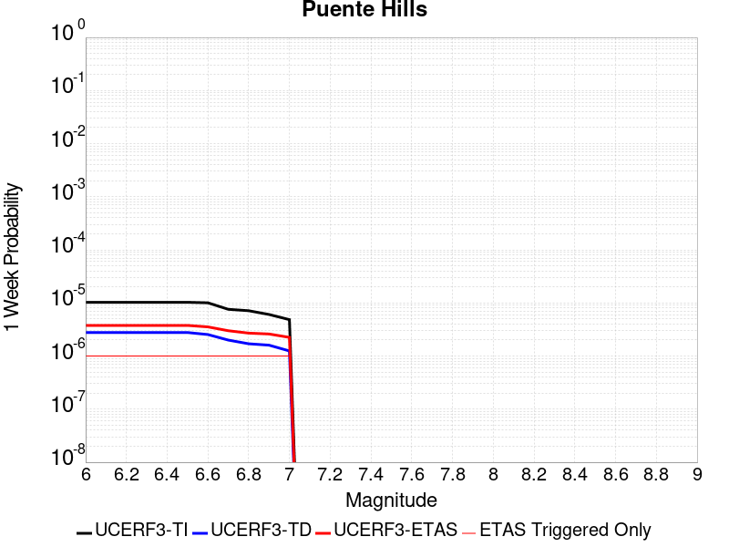 |  |  |  |

| Magnitude | 1 wk TI Prob | 1 wk TD Prob | 1 wk ETAS Prob | 1 wk ETAS/TD Gain | 1 wk ETAS Triggered Only | 1 mo TI Prob | 1 mo TD Prob | 1 mo ETAS Prob | 1 mo ETAS/TD Gain | 1 mo ETAS Triggered Only | 1 yr TI Prob | 1 yr TD Prob | 1 yr ETAS Prob | 1 yr ETAS/TD Gain | 1 yr ETAS Triggered Only | 10 yr TI Prob | 10 yr TD Prob | 10 yr ETAS Prob | 10 yr ETAS/TD Gain | 10 yr ETAS Triggered Only |
|-----|-----|-----|-----|-----|-----|-----|-----|-----|-----|-----|-----|-----|-----|-----|-----|-----|-----|-----|-----|-----|
| 6.0 | 1.0287503E-5 | 2.7754043E-6 | 6.0102384E-6 | 2.1655362 | 3.2348432E-6 | 4.4088552E-5 | 1.189455E-5 | 1.5129355E-5 | 1.2719569 | 3.2348432E-6 | 5.3664594E-4 | 1.4480915E-4 | 1.6098103E-4 | 1.1116772 | 1.6174215E-5 | 0.0053535183 | 0.0014474059 | 0.0014732472 | 1.0178535 | 2.5878746E-5 |
| 6.1 | 1.0287503E-5 | 2.7754043E-6 | 6.0102384E-6 | 2.1655362 | 3.2348432E-6 | 4.4088552E-5 | 1.189455E-5 | 1.5129355E-5 | 1.2719569 | 3.2348432E-6 | 5.3664594E-4 | 1.4480915E-4 | 1.6098103E-4 | 1.1116772 | 1.6174215E-5 | 0.0053535183 | 0.0014474059 | 0.0014732472 | 1.0178535 | 2.5878746E-5 |
| 6.2 | 1.0287503E-5 | 2.7754043E-6 | 6.0102384E-6 | 2.1655362 | 3.2348432E-6 | 4.4088552E-5 | 1.189455E-5 | 1.5129355E-5 | 1.2719569 | 3.2348432E-6 | 5.3664594E-4 | 1.4480915E-4 | 1.6098103E-4 | 1.1116772 | 1.6174215E-5 | 0.0053535183 | 0.0014474059 | 0.0014732472 | 1.0178535 | 2.5878746E-5 |
| 6.3 | 1.0287503E-5 | 2.7754043E-6 | 6.0102384E-6 | 2.1655362 | 3.2348432E-6 | 4.4088552E-5 | 1.189455E-5 | 1.5129355E-5 | 1.2719569 | 3.2348432E-6 | 5.3664594E-4 | 1.4480915E-4 | 1.6098103E-4 | 1.1116772 | 1.6174215E-5 | 0.0053535183 | 0.0014474059 | 0.0014732472 | 1.0178535 | 2.5878746E-5 |
| 6.4 | 1.0287503E-5 | 2.7754043E-6 | 6.0102384E-6 | 2.1655362 | 3.2348432E-6 | 4.4088552E-5 | 1.189455E-5 | 1.5129355E-5 | 1.2719569 | 3.2348432E-6 | 5.3664594E-4 | 1.4480915E-4 | 1.6098103E-4 | 1.1116772 | 1.6174215E-5 | 0.0053535183 | 0.0014474059 | 0.0014732472 | 1.0178535 | 2.5878746E-5 |
| 6.5 | 1.0287503E-5 | 2.7754043E-6 | 6.0102384E-6 | 2.1655362 | 3.2348432E-6 | 4.4088552E-5 | 1.189455E-5 | 1.5129355E-5 | 1.2719569 | 3.2348432E-6 | 5.3664594E-4 | 1.4480915E-4 | 1.6098103E-4 | 1.1116772 | 1.6174215E-5 | 0.0053535183 | 0.0014474059 | 0.0014732472 | 1.0178535 | 2.5878746E-5 |
| 6.6 | 1.0067095E-5 | 2.542514E-6 | 5.777349E-6 | 2.2722979 | 3.2348432E-6 | 4.314398E-5 | 1.0896458E-5 | 1.4131266E-5 | 1.2968678 | 3.2348432E-6 | 5.251514E-4 | 1.3265885E-4 | 1.4883092E-4 | 1.1219072 | 1.6174215E-5 | 0.0052391207 | 0.0013260479 | 0.0013518924 | 1.0194898 | 2.5878746E-5 |
| 6.7 | 7.591482E-6 | 1.9997742E-6 | 5.234611E-6 | 2.617601 | 3.2348432E-6 | 3.2534514E-5 | 8.570445E-6 | 1.180526E-5 | 1.3774384 | 3.2348432E-6 | 3.9603573E-4 | 1.0434237E-4 | 1.14045884E-4 | 1.092997 | 9.7045295E-6 | 0.003953307 | 0.0010431492 | 0.0010593066 | 1.015489 | 1.6174215E-5 |
| 6.8 | 7.141342E-6 | 1.7041792E-6 | 4.939017E-6 | 2.8981793 | 3.2348432E-6 | 3.060539E-5 | 7.3036163E-6 | 1.0538436E-5 | 1.4429065 | 3.2348432E-6 | 3.7255694E-4 | 8.891999E-5 | 9.8623656E-5 | 1.1091281 | 9.7045295E-6 | 0.0037193296 | 8.8904874E-4 | 9.052086E-4 | 1.0181766 | 1.6174215E-5 |
| 6.9 | 6.066927E-6 | 1.6035817E-6 | 4.8384195E-6 | 3.017258 | 3.2348432E-6 | 2.6000856E-5 | 6.8724867E-6 | 1.0107307E-5 | 1.4706914 | 3.2348432E-6 | 3.1651446E-4 | 8.367139E-5 | 9.33751E-5 | 1.1159742 | 9.7045295E-6 | 0.0031606401 | 8.3660224E-4 | 8.527629E-4 | 1.019317 | 1.6174215E-5 |
| 7.0 | 4.852166E-6 | 1.2478142E-6 | 4.4826534E-6 | 3.5924044 | 3.2348432E-6 | 2.0794832E-5 | 5.347775E-6 | 8.582601E-6 | 1.6048919 | 3.2348432E-6 | 2.5314768E-4 | 6.510917E-5 | 7.481306E-5 | 1.1490405 | 9.7045295E-6 | 0.0025285948 | 6.510916E-4 | 6.672553E-4 | 1.0248256 | 1.6174215E-5 |

## Great Valley 14 (Kettleman Hills)
*[(top)](#table-of-contents)*

| 1 Week | 1 Month | 1 Year | 10 Year |
|-----|-----|-----|-----|
|  |  |  |  |

| Magnitude | 1 wk TI Prob | 1 wk TD Prob | 1 wk ETAS Prob | 1 wk ETAS/TD Gain | 1 wk ETAS Triggered Only | 1 mo TI Prob | 1 mo TD Prob | 1 mo ETAS Prob | 1 mo ETAS/TD Gain | 1 mo ETAS Triggered Only | 1 yr TI Prob | 1 yr TD Prob | 1 yr ETAS Prob | 1 yr ETAS/TD Gain | 1 yr ETAS Triggered Only | 10 yr TI Prob | 10 yr TD Prob | 10 yr ETAS Prob | 10 yr ETAS/TD Gain | 10 yr ETAS Triggered Only |
|-----|-----|-----|-----|-----|-----|-----|-----|-----|-----|-----|-----|-----|-----|-----|-----|-----|-----|-----|-----|-----|
| 6.0 | 2.0537544E-5 | 2.4301013E-5 | 2.7535778E-5 | 1.1331123 | 3.2348432E-6 | 8.801508E-5 | 1.041472E-4 | 1.1708522E-4 | 1.1242282 | 1.2939373E-5 | 0.0010710567 | 0.0012679921 | 0.0012873765 | 1.0152875 | 1.9409059E-5 | 0.010659092 | 0.0126799205 | 0.01270547 | 1.002015 | 2.5878746E-5 |
| 6.1 | 2.0537544E-5 | 2.4301013E-5 | 2.7535778E-5 | 1.1331123 | 3.2348432E-6 | 8.801508E-5 | 1.041472E-4 | 1.1708522E-4 | 1.1242282 | 1.2939373E-5 | 0.0010710567 | 0.0012679921 | 0.0012873765 | 1.0152875 | 1.9409059E-5 | 0.010659092 | 0.0126799205 | 0.01270547 | 1.002015 | 2.5878746E-5 |
| 6.2 | 2.0537544E-5 | 2.4301013E-5 | 2.7535778E-5 | 1.1331123 | 3.2348432E-6 | 8.801508E-5 | 1.041472E-4 | 1.1708522E-4 | 1.1242282 | 1.2939373E-5 | 0.0010710567 | 0.0012679921 | 0.0012873765 | 1.0152875 | 1.9409059E-5 | 0.010659092 | 0.0126799205 | 0.01270547 | 1.002015 | 2.5878746E-5 |
| 6.3 | 2.0537544E-5 | 2.4301013E-5 | 2.7535778E-5 | 1.1331123 | 3.2348432E-6 | 8.801508E-5 | 1.041472E-4 | 1.1708522E-4 | 1.1242282 | 1.2939373E-5 | 0.0010710567 | 0.0012679921 | 0.0012873765 | 1.0152875 | 1.9409059E-5 | 0.010659092 | 0.0126799205 | 0.01270547 | 1.002015 | 2.5878746E-5 |
| 6.4 | 2.0537544E-5 | 2.4301013E-5 | 2.7535778E-5 | 1.1331123 | 3.2348432E-6 | 8.801508E-5 | 1.041472E-4 | 1.1708522E-4 | 1.1242282 | 1.2939373E-5 | 0.0010710567 | 0.0012679921 | 0.0012873765 | 1.0152875 | 1.9409059E-5 | 0.010659092 | 0.0126799205 | 0.01270547 | 1.002015 | 2.5878746E-5 |
| 6.5 | 2.0537544E-5 | 2.4301013E-5 | 2.7535778E-5 | 1.1331123 | 3.2348432E-6 | 8.801508E-5 | 1.041472E-4 | 1.1708522E-4 | 1.1242282 | 1.2939373E-5 | 0.0010710567 | 0.0012679921 | 0.0012873765 | 1.0152875 | 1.9409059E-5 | 0.010659092 | 0.0126799205 | 0.01270547 | 1.002015 | 2.5878746E-5 |
| 6.6 | 2.0537544E-5 | 2.4301013E-5 | 2.7535778E-5 | 1.1331123 | 3.2348432E-6 | 8.801508E-5 | 1.041472E-4 | 1.1708522E-4 | 1.1242282 | 1.2939373E-5 | 0.0010710567 | 0.0012679921 | 0.0012873765 | 1.0152875 | 1.9409059E-5 | 0.010659092 | 0.0126799205 | 0.01270547 | 1.002015 | 2.5878746E-5 |
| 6.7 | 2.0537544E-5 | 2.4301013E-5 | 2.7535778E-5 | 1.1331123 | 3.2348432E-6 | 8.801508E-5 | 1.041472E-4 | 1.1708522E-4 | 1.1242282 | 1.2939373E-5 | 0.0010710567 | 0.0012679921 | 0.0012873765 | 1.0152875 | 1.9409059E-5 | 0.010659092 | 0.0126799205 | 0.01270547 | 1.002015 | 2.5878746E-5 |
| 6.8 | 2.0537544E-5 | 2.4301013E-5 | 2.7535778E-5 | 1.1331123 | 3.2348432E-6 | 8.801508E-5 | 1.041472E-4 | 1.1708522E-4 | 1.1242282 | 1.2939373E-5 | 0.0010710567 | 0.0012679921 | 0.0012873765 | 1.0152875 | 1.9409059E-5 | 0.010659092 | 0.0126799205 | 0.01270547 | 1.002015 | 2.5878746E-5 |
| 6.9 | 2.0537544E-5 | 2.4301013E-5 | 2.7535778E-5 | 1.1331123 | 3.2348432E-6 | 8.801508E-5 | 1.041472E-4 | 1.1708522E-4 | 1.1242282 | 1.2939373E-5 | 0.0010710567 | 0.0012679921 | 0.0012873765 | 1.0152875 | 1.9409059E-5 | 0.010659092 | 0.0126799205 | 0.01270547 | 1.002015 | 2.5878746E-5 |

## Los Osos 2011
*[(top)](#table-of-contents)*

| 1 Week | 1 Month | 1 Year | 10 Year |
|-----|-----|-----|-----|
|  |  |  |  |

| Magnitude | 1 wk TI Prob | 1 wk TD Prob | 1 wk ETAS Prob | 1 wk ETAS/TD Gain | 1 wk ETAS Triggered Only | 1 mo TI Prob | 1 mo TD Prob | 1 mo ETAS Prob | 1 mo ETAS/TD Gain | 1 mo ETAS Triggered Only | 1 yr TI Prob | 1 yr TD Prob | 1 yr ETAS Prob | 1 yr ETAS/TD Gain | 1 yr ETAS Triggered Only | 10 yr TI Prob | 10 yr TD Prob | 10 yr ETAS Prob | 10 yr ETAS/TD Gain | 10 yr ETAS Triggered Only |
|-----|-----|-----|-----|-----|-----|-----|-----|-----|-----|-----|-----|-----|-----|-----|-----|-----|-----|-----|-----|-----|
| 6.0 | 8.431995E-6 | 8.921914E-6 | 2.1861171E-5 | 2.4502783 | 1.2939373E-5 | 3.6136626E-5 | 3.8236416E-5 | 5.117529E-5 | 1.3383915 | 1.2939373E-5 | 4.3987457E-4 | 4.6546472E-4 | 4.8486475E-4 | 1.0416788 | 1.9409059E-5 | 0.004390049 | 0.0046484126 | 0.004674171 | 1.0055413 | 2.5878746E-5 |
| 6.1 | 8.431995E-6 | 8.921914E-6 | 2.1861171E-5 | 2.4502783 | 1.2939373E-5 | 3.6136626E-5 | 3.8236416E-5 | 5.117529E-5 | 1.3383915 | 1.2939373E-5 | 4.3987457E-4 | 4.6546472E-4 | 4.8486475E-4 | 1.0416788 | 1.9409059E-5 | 0.004390049 | 0.0046484126 | 0.004674171 | 1.0055413 | 2.5878746E-5 |
| 6.2 | 8.431995E-6 | 8.921914E-6 | 2.1861171E-5 | 2.4502783 | 1.2939373E-5 | 3.6136626E-5 | 3.8236416E-5 | 5.117529E-5 | 1.3383915 | 1.2939373E-5 | 4.3987457E-4 | 4.6546472E-4 | 4.8486475E-4 | 1.0416788 | 1.9409059E-5 | 0.004390049 | 0.0046484126 | 0.004674171 | 1.0055413 | 2.5878746E-5 |
| 6.3 | 8.431995E-6 | 8.921914E-6 | 2.1861171E-5 | 2.4502783 | 1.2939373E-5 | 3.6136626E-5 | 3.8236416E-5 | 5.117529E-5 | 1.3383915 | 1.2939373E-5 | 4.3987457E-4 | 4.6546472E-4 | 4.8486475E-4 | 1.0416788 | 1.9409059E-5 | 0.004390049 | 0.0046484126 | 0.004674171 | 1.0055413 | 2.5878746E-5 |
| 6.4 | 8.431995E-6 | 8.921914E-6 | 2.1861171E-5 | 2.4502783 | 1.2939373E-5 | 3.6136626E-5 | 3.8236416E-5 | 5.117529E-5 | 1.3383915 | 1.2939373E-5 | 4.3987457E-4 | 4.6546472E-4 | 4.8486475E-4 | 1.0416788 | 1.9409059E-5 | 0.004390049 | 0.0046484126 | 0.004674171 | 1.0055413 | 2.5878746E-5 |
| 6.5 | 8.431995E-6 | 8.921914E-6 | 2.1861171E-5 | 2.4502783 | 1.2939373E-5 | 3.6136626E-5 | 3.8236416E-5 | 5.117529E-5 | 1.3383915 | 1.2939373E-5 | 4.3987457E-4 | 4.6546472E-4 | 4.8486475E-4 | 1.0416788 | 1.9409059E-5 | 0.004390049 | 0.0046484126 | 0.004674171 | 1.0055413 | 2.5878746E-5 |
| 6.6 | 7.640001E-6 | 8.0825275E-6 | 2.1021797E-5 | 2.6008937 | 1.2939373E-5 | 3.274245E-5 | 3.4639146E-5 | 4.757807E-5 | 1.3735348 | 1.2939373E-5 | 3.9856642E-4 | 4.2168552E-4 | 4.378529E-4 | 1.03834 | 1.6174215E-5 | 0.0039785234 | 0.004212338 | 0.0042316653 | 1.0045882 | 1.9409059E-5 |
| 6.7 | 6.515521E-6 | 6.8883687E-6 | 1.9827652E-5 | 2.878425 | 1.2939373E-5 | 2.7923363E-5 | 2.9521441E-5 | 4.2460433E-5 | 1.4382913 | 1.2939373E-5 | 3.399139E-4 | 3.593989E-4 | 3.755673E-4 | 1.0449873 | 1.6174215E-5 | 0.0033939444 | 0.003591573 | 0.0036109122 | 1.0053847 | 1.9409059E-5 |
| 6.8 | 4.831725E-6 | 5.104944E-6 | 1.4809424E-5 | 2.9009964 | 9.7045295E-6 | 2.0707228E-5 | 2.1878332E-5 | 3.1582647E-5 | 1.4435583 | 9.7045295E-6 | 2.5208134E-4 | 2.6636868E-4 | 2.7607064E-4 | 1.036423 | 9.7045295E-6 | 0.0025179558 | 0.0026636869 | 0.0026733654 | 1.0036336 | 9.7045295E-6 |
| 6.9 | 4.831725E-6 | 5.104944E-6 | 1.4809424E-5 | 2.9009964 | 9.7045295E-6 | 2.0707228E-5 | 2.1878332E-5 | 3.1582647E-5 | 1.4435583 | 9.7045295E-6 | 2.5208134E-4 | 2.6636868E-4 | 2.7607064E-4 | 1.036423 | 9.7045295E-6 | 0.0025179558 | 0.0026636869 | 0.0026733654 | 1.0036336 | 9.7045295E-6 |

## San Joaquin Hills
*[(top)](#table-of-contents)*

| 1 Week | 1 Month | 1 Year | 10 Year |
|-----|-----|-----|-----|
|  |  |  |  |

| Magnitude | 1 wk TI Prob | 1 wk TD Prob | 1 wk ETAS Prob | 1 wk ETAS/TD Gain | 1 wk ETAS Triggered Only | 1 mo TI Prob | 1 mo TD Prob | 1 mo ETAS Prob | 1 mo ETAS/TD Gain | 1 mo ETAS Triggered Only | 1 yr TI Prob | 1 yr TD Prob | 1 yr ETAS Prob | 1 yr ETAS/TD Gain | 1 yr ETAS Triggered Only | 10 yr TI Prob | 10 yr TD Prob | 10 yr ETAS Prob | 10 yr ETAS/TD Gain | 10 yr ETAS Triggered Only |
|-----|-----|-----|-----|-----|-----|-----|-----|-----|-----|-----|-----|-----|-----|-----|-----|-----|-----|-----|-----|-----|
| 6.0 | 7.517352E-6 | 7.930626E-6 | 1.7635079E-5 | 2.2236679 | 9.7045295E-6 | 3.2216827E-5 | 3.398822E-5 | 5.0161885E-5 | 1.475861 | 1.6174215E-5 | 3.9216926E-4 | 4.137751E-4 | 4.2994262E-4 | 1.0390732 | 1.6174215E-5 | 0.003914779 | 0.0041346652 | 0.0041572154 | 1.005454 | 2.2643902E-5 |
| 6.1 | 7.517352E-6 | 7.930626E-6 | 1.7635079E-5 | 2.2236679 | 9.7045295E-6 | 3.2216827E-5 | 3.398822E-5 | 5.0161885E-5 | 1.475861 | 1.6174215E-5 | 3.9216926E-4 | 4.137751E-4 | 4.2994262E-4 | 1.0390732 | 1.6174215E-5 | 0.003914779 | 0.0041346652 | 0.0041572154 | 1.005454 | 2.2643902E-5 |
| 6.2 | 7.517352E-6 | 7.930626E-6 | 1.7635079E-5 | 2.2236679 | 9.7045295E-6 | 3.2216827E-5 | 3.398822E-5 | 5.0161885E-5 | 1.475861 | 1.6174215E-5 | 3.9216926E-4 | 4.137751E-4 | 4.2994262E-4 | 1.0390732 | 1.6174215E-5 | 0.003914779 | 0.0041346652 | 0.0041572154 | 1.005454 | 2.2643902E-5 |
| 6.3 | 7.517352E-6 | 7.930626E-6 | 1.7635079E-5 | 2.2236679 | 9.7045295E-6 | 3.2216827E-5 | 3.398822E-5 | 5.0161885E-5 | 1.475861 | 1.6174215E-5 | 3.9216926E-4 | 4.137751E-4 | 4.2994262E-4 | 1.0390732 | 1.6174215E-5 | 0.003914779 | 0.0041346652 | 0.0041572154 | 1.005454 | 2.2643902E-5 |
| 6.4 | 7.517352E-6 | 7.930626E-6 | 1.7635079E-5 | 2.2236679 | 9.7045295E-6 | 3.2216827E-5 | 3.398822E-5 | 5.0161885E-5 | 1.475861 | 1.6174215E-5 | 3.9216926E-4 | 4.137751E-4 | 4.2994262E-4 | 1.0390732 | 1.6174215E-5 | 0.003914779 | 0.0041346652 | 0.0041572154 | 1.005454 | 2.2643902E-5 |
| 6.5 | 7.517352E-6 | 7.930626E-6 | 1.7635079E-5 | 2.2236679 | 9.7045295E-6 | 3.2216827E-5 | 3.398822E-5 | 5.0161885E-5 | 1.475861 | 1.6174215E-5 | 3.9216926E-4 | 4.137751E-4 | 4.2994262E-4 | 1.0390732 | 1.6174215E-5 | 0.003914779 | 0.0041346652 | 0.0041572154 | 1.005454 | 2.2643902E-5 |
| 6.6 | 7.1722156E-6 | 7.567309E-6 | 1.4036947E-5 | 1.8549455 | 6.4696865E-6 | 3.0737705E-5 | 3.2431184E-5 | 4.537014E-5 | 1.3989664 | 1.2939373E-5 | 3.7416728E-4 | 3.9482507E-4 | 4.0775933E-4 | 1.0327594 | 1.2939373E-5 | 0.003735379 | 0.003945838 | 0.0039651706 | 1.0048995 | 1.9409059E-5 |
| 6.7 | 5.595255E-6 | 5.8979463E-6 | 1.23675945E-5 | 2.0969324 | 6.4696865E-6 | 2.3979444E-5 | 2.5276911E-5 | 3.8215956E-5 | 1.5118918 | 1.2939373E-5 | 2.9191063E-4 | 3.077464E-4 | 3.206818E-4 | 1.0420326 | 1.2939373E-5 | 0.0029152746 | 0.003077464 | 0.0030968133 | 1.0062875 | 1.9409059E-5 |
| 6.8 | 5.595255E-6 | 5.8979463E-6 | 1.23675945E-5 | 2.0969324 | 6.4696865E-6 | 2.3979444E-5 | 2.5276911E-5 | 3.8215956E-5 | 1.5118918 | 1.2939373E-5 | 2.9191063E-4 | 3.077464E-4 | 3.206818E-4 | 1.0420326 | 1.2939373E-5 | 0.0029152746 | 0.003077464 | 0.0030968133 | 1.0062875 | 1.9409059E-5 |
| 6.9 | 5.595255E-6 | 5.8979463E-6 | 1.23675945E-5 | 2.0969324 | 6.4696865E-6 | 2.3979444E-5 | 2.5276911E-5 | 3.8215956E-5 | 1.5118918 | 1.2939373E-5 | 2.9191063E-4 | 3.077464E-4 | 3.206818E-4 | 1.0420326 | 1.2939373E-5 | 0.0029152746 | 0.003077464 | 0.0030968133 | 1.0062875 | 1.9409059E-5 |

## Emerson-Copper Mtn 2011
*[(top)](#table-of-contents)*

| 1 Week | 1 Month | 1 Year | 10 Year |
|-----|-----|-----|-----|
|  |  |  |  |

| Magnitude | 1 wk TI Prob | 1 wk TD Prob | 1 wk ETAS Prob | 1 wk ETAS/TD Gain | 1 wk ETAS Triggered Only | 1 mo TI Prob | 1 mo TD Prob | 1 mo ETAS Prob | 1 mo ETAS/TD Gain | 1 mo ETAS Triggered Only | 1 yr TI Prob | 1 yr TD Prob | 1 yr ETAS Prob | 1 yr ETAS/TD Gain | 1 yr ETAS Triggered Only | 10 yr TI Prob | 10 yr TD Prob | 10 yr ETAS Prob | 10 yr ETAS/TD Gain | 10 yr ETAS Triggered Only |
|-----|-----|-----|-----|-----|-----|-----|-----|-----|-----|-----|-----|-----|-----|-----|-----|-----|-----|-----|-----|-----|
| 6.0 | 1.3738761E-5 | 7.363802E-6 | 1.706826E-5 | 2.3178596 | 9.7045295E-6 | 5.8879075E-5 | 3.1558855E-5 | 4.773256E-5 | 1.5124934 | 1.6174215E-5 | 7.166169E-4 | 3.841763E-4 | 4.003443E-4 | 1.0420848 | 1.6174215E-5 | 0.007143104 | 0.0038365931 | 0.0038591502 | 1.0058794 | 2.2643902E-5 |
| 6.1 | 1.3738761E-5 | 7.363802E-6 | 1.706826E-5 | 2.3178596 | 9.7045295E-6 | 5.8879075E-5 | 3.1558855E-5 | 4.773256E-5 | 1.5124934 | 1.6174215E-5 | 7.166169E-4 | 3.841763E-4 | 4.003443E-4 | 1.0420848 | 1.6174215E-5 | 0.007143104 | 0.0038365931 | 0.0038591502 | 1.0058794 | 2.2643902E-5 |
| 6.2 | 1.3738761E-5 | 7.363802E-6 | 1.706826E-5 | 2.3178596 | 9.7045295E-6 | 5.8879075E-5 | 3.1558855E-5 | 4.773256E-5 | 1.5124934 | 1.6174215E-5 | 7.166169E-4 | 3.841763E-4 | 4.003443E-4 | 1.0420848 | 1.6174215E-5 | 0.007143104 | 0.0038365931 | 0.0038591502 | 1.0058794 | 2.2643902E-5 |
| 6.3 | 1.3738761E-5 | 7.363802E-6 | 1.706826E-5 | 2.3178596 | 9.7045295E-6 | 5.8879075E-5 | 3.1558855E-5 | 4.773256E-5 | 1.5124934 | 1.6174215E-5 | 7.166169E-4 | 3.841763E-4 | 4.003443E-4 | 1.0420848 | 1.6174215E-5 | 0.007143104 | 0.0038365931 | 0.0038591502 | 1.0058794 | 2.2643902E-5 |
| 6.4 | 1.3738761E-5 | 7.363802E-6 | 1.706826E-5 | 2.3178596 | 9.7045295E-6 | 5.8879075E-5 | 3.1558855E-5 | 4.773256E-5 | 1.5124934 | 1.6174215E-5 | 7.166169E-4 | 3.841763E-4 | 4.003443E-4 | 1.0420848 | 1.6174215E-5 | 0.007143104 | 0.0038365931 | 0.0038591502 | 1.0058794 | 2.2643902E-5 |
| 6.5 | 1.3738761E-5 | 7.363802E-6 | 1.706826E-5 | 2.3178596 | 9.7045295E-6 | 5.8879075E-5 | 3.1558855E-5 | 4.773256E-5 | 1.5124934 | 1.6174215E-5 | 7.166169E-4 | 3.841763E-4 | 4.003443E-4 | 1.0420848 | 1.6174215E-5 | 0.007143104 | 0.0038365931 | 0.0038591502 | 1.0058794 | 2.2643902E-5 |
| 6.6 | 1.2946993E-5 | 6.644407E-6 | 1.31140505E-5 | 1.9736975 | 6.4696865E-6 | 5.5485933E-5 | 2.8475804E-5 | 4.141481E-5 | 1.4543859 | 1.2939373E-5 | 6.7533186E-4 | 3.4665258E-4 | 3.5958746E-4 | 1.0373137 | 1.2939373E-5 | 0.006732832 | 0.0034625726 | 0.0034819143 | 1.005586 | 1.9409059E-5 |
| 6.7 | 1.1127743E-5 | 5.301015E-6 | 1.1770667E-5 | 2.2204554 | 6.4696865E-6 | 4.7689457E-5 | 2.2718517E-5 | 3.5657595E-5 | 1.5695388 | 1.2939373E-5 | 5.8046443E-4 | 2.765771E-4 | 2.8951291E-4 | 1.046771 | 1.2939373E-5 | 0.005789506 | 0.00276373 | 0.0027830855 | 1.0070034 | 1.9409059E-5 |
| 6.8 | 9.893959E-6 | 4.385705E-6 | 1.0855363E-5 | 2.4751694 | 6.4696865E-6 | 4.2401993E-5 | 1.8795821E-5 | 3.173495E-5 | 1.6884046 | 1.2939373E-5 | 5.16122E-4 | 2.2882903E-4 | 2.4176545E-4 | 1.0565331 | 1.2939373E-5 | 0.005149249 | 0.0022873012 | 0.0023034385 | 1.0070552 | 1.6174215E-5 |
| 6.9 | 8.432605E-6 | 3.3001859E-6 | 9.76985E-6 | 2.9603941 | 6.4696865E-6 | 3.6139234E-5 | 1.4143652E-5 | 2.7082842E-5 | 1.9148407 | 1.2939373E-5 | 4.3990635E-4 | 1.7219881E-4 | 1.8513596E-4 | 1.0751292 | 1.2939373E-5 | 0.0043903654 | 0.0017219725 | 0.0017381189 | 1.0093766 | 1.6174215E-5 |
| 7.0 | 8.181617E-6 | 3.2873893E-6 | 9.757055E-6 | 2.9680252 | 6.4696865E-6 | 3.5063604E-5 | 1.40888105E-5 | 2.7028002E-5 | 1.9184018 | 1.2939373E-5 | 4.2681574E-4 | 1.7153122E-4 | 1.8446837E-4 | 1.0754216 | 1.2939373E-5 | 0.004259969 | 0.0017153069 | 0.0017314533 | 1.0094131 | 1.6174215E-5 |
| 7.1 | 3.1700695E-6 | 5.4303326E-9 | 5.4303326E-9 | 1.0 | 0.0 | 1.3585942E-5 | 2.3272854E-8 | 2.3272854E-8 | 1.0 | 0.0 | 1.6539628E-4 | 2.83347E-7 | 2.83347E-7 | 1.0 | 0.0 | 0.0016527324 | 2.833469E-6 | 2.833469E-6 | 1.0 | 0.0 |
| 7.2 | 2.8879267E-6 | 9.331039E-10 | 9.331039E-10 | 1.0 | 0.0 | 1.237677E-5 | 3.999017E-9 | 3.999017E-9 | 1.0 | 0.0 | 1.5067676E-4 | 4.868803E-8 | 4.868803E-8 | 1.0 | 0.0 | 0.0015057464 | 4.868803E-7 | 4.868803E-7 | 1.0 | 0.0 |
| 7.3 | 2.4973094E-6 | 8.4248597E-10 | 8.4248597E-10 | 1.0 | 0.0 | 1.0702711E-5 | 3.6106542E-9 | 3.6106542E-9 | 1.0 | 0.0 | 1.3029772E-4 | 4.3959716E-8 | 4.3959716E-8 | 1.0 | 0.0 | 0.0013022134 | 4.3959716E-7 | 4.3959716E-7 | 1.0 | 0.0 |

## Palos Verdes
*[(top)](#table-of-contents)*

| 1 Week | 1 Month | 1 Year | 10 Year |
|-----|-----|-----|-----|
|  |  |  |  |

| Magnitude | 1 wk TI Prob | 1 wk TD Prob | 1 wk ETAS Prob | 1 wk ETAS/TD Gain | 1 wk ETAS Triggered Only | 1 mo TI Prob | 1 mo TD Prob | 1 mo ETAS Prob | 1 mo ETAS/TD Gain | 1 mo ETAS Triggered Only | 1 yr TI Prob | 1 yr TD Prob | 1 yr ETAS Prob | 1 yr ETAS/TD Gain | 1 yr ETAS Triggered Only | 10 yr TI Prob | 10 yr TD Prob | 10 yr ETAS Prob | 10 yr ETAS/TD Gain | 10 yr ETAS Triggered Only |
|-----|-----|-----|-----|-----|-----|-----|-----|-----|-----|-----|-----|-----|-----|-----|-----|-----|-----|-----|-----|-----|
| 6.0 | 2.416717E-5 | 2.7219172E-5 | 3.368868E-5 | 1.2376821 | 6.4696865E-6 | 1.0356947E-4 | 1.16648946E-4 | 1.2311788E-4 | 1.0554564 | 6.4696865E-6 | 0.0012602288 | 0.0014193773 | 0.001429068 | 1.0068275 | 9.7045295E-6 | 0.01253106 | 0.014113327 | 0.014135651 | 1.0015818 | 2.2643902E-5 |
| 6.1 | 2.416717E-5 | 2.7219172E-5 | 3.368868E-5 | 1.2376821 | 6.4696865E-6 | 1.0356947E-4 | 1.16648946E-4 | 1.2311788E-4 | 1.0554564 | 6.4696865E-6 | 0.0012602288 | 0.0014193773 | 0.001429068 | 1.0068275 | 9.7045295E-6 | 0.01253106 | 0.014113327 | 0.014135651 | 1.0015818 | 2.2643902E-5 |
| 6.2 | 2.416717E-5 | 2.7219172E-5 | 3.368868E-5 | 1.2376821 | 6.4696865E-6 | 1.0356947E-4 | 1.16648946E-4 | 1.2311788E-4 | 1.0554564 | 6.4696865E-6 | 0.0012602288 | 0.0014193773 | 0.001429068 | 1.0068275 | 9.7045295E-6 | 0.01253106 | 0.014113327 | 0.014135651 | 1.0015818 | 2.2643902E-5 |
| 6.3 | 2.416717E-5 | 2.7219172E-5 | 3.368868E-5 | 1.2376821 | 6.4696865E-6 | 1.0356947E-4 | 1.16648946E-4 | 1.2311788E-4 | 1.0554564 | 6.4696865E-6 | 0.0012602288 | 0.0014193773 | 0.001429068 | 1.0068275 | 9.7045295E-6 | 0.01253106 | 0.014113327 | 0.014135651 | 1.0015818 | 2.2643902E-5 |
| 6.4 | 2.416717E-5 | 2.7219172E-5 | 3.368868E-5 | 1.2376821 | 6.4696865E-6 | 1.0356947E-4 | 1.16648946E-4 | 1.2311788E-4 | 1.0554564 | 6.4696865E-6 | 0.0012602288 | 0.0014193773 | 0.001429068 | 1.0068275 | 9.7045295E-6 | 0.01253106 | 0.014113327 | 0.014135651 | 1.0015818 | 2.2643902E-5 |
| 6.5 | 2.416717E-5 | 2.7219172E-5 | 3.368868E-5 | 1.2376821 | 6.4696865E-6 | 1.0356947E-4 | 1.16648946E-4 | 1.2311788E-4 | 1.0554564 | 6.4696865E-6 | 0.0012602288 | 0.0014193773 | 0.001429068 | 1.0068275 | 9.7045295E-6 | 0.01253106 | 0.014113327 | 0.014135651 | 1.0015818 | 2.2643902E-5 |
| 6.6 | 2.2181084E-5 | 2.4975725E-5 | 3.1445248E-5 | 1.2590325 | 6.4696865E-6 | 9.505832E-5 | 1.07035E-4 | 1.1350399E-4 | 1.0604382 | 6.4696865E-6 | 0.0011567206 | 0.0013024732 | 0.0013121652 | 1.0074412 | 9.7045295E-6 | 0.0115071805 | 0.012958492 | 0.012980842 | 1.0017247 | 2.2643902E-5 |
| 6.7 | 1.9382267E-5 | 2.1828162E-5 | 2.8297707E-5 | 1.2963853 | 6.4696865E-6 | 8.306422E-5 | 9.354648E-5 | 1.0001555E-4 | 1.0691537 | 6.4696865E-6 | 0.0010108376 | 0.0011384335 | 0.0011481269 | 1.0085148 | 9.7045295E-6 | 0.0100625185 | 0.011335945 | 0.011358332 | 1.0019749 | 2.2643902E-5 |
| 6.8 | 1.6157266E-5 | 1.8180996E-5 | 2.4650564E-5 | 1.3558424 | 6.4696865E-6 | 6.9243586E-5 | 7.791678E-5 | 8.438596E-5 | 1.0830268 | 6.4696865E-6 | 8.4271457E-4 | 9.483226E-4 | 9.5801795E-4 | 1.0102236 | 9.7045295E-6 | 0.00839526 | 0.009452482 | 0.009474911 | 1.0023729 | 2.2643902E-5 |
| 6.9 | 1.3828139E-5 | 1.5540487E-5 | 2.2010074E-5 | 1.4163052 | 6.4696865E-6 | 5.9262107E-5 | 6.6600944E-5 | 7.3070194E-5 | 1.0971346 | 6.4696865E-6 | 7.212773E-4 | 8.1066263E-4 | 8.203593E-4 | 1.0119615 | 9.7045295E-6 | 0.007189407 | 0.008086668 | 0.008102711 | 1.0019839 | 1.6174215E-5 |
| 7.0 | 1.1833321E-5 | 1.3284609E-5 | 1.9754209E-5 | 1.4869996 | 6.4696865E-6 | 5.0713246E-5 | 5.6933346E-5 | 6.3402666E-5 | 1.1136297 | 6.4696865E-6 | 6.1725883E-4 | 6.930404E-4 | 7.027382E-4 | 1.0139931 | 9.7045295E-6 | 0.0061554713 | 0.006918346 | 0.0069311955 | 1.0018574 | 1.2939373E-5 |
| 7.1 | 1.0044758E-5 | 1.1258023E-5 | 1.449283E-5 | 1.2873335 | 3.2348432E-6 | 4.304825E-5 | 4.8248323E-5 | 5.148301E-5 | 1.0670425 | 3.2348432E-6 | 5.239864E-4 | 5.873616E-4 | 5.9382746E-4 | 1.0110084 | 6.4696865E-6 | 0.005227526 | 0.005867563 | 0.0058772108 | 1.0016443 | 9.7045295E-6 |
| 7.2 | 8.481934E-6 | 9.495382E-6 | 1.2730195E-5 | 1.3406721 | 3.2348432E-6 | 3.635064E-5 | 4.0694402E-5 | 4.3929114E-5 | 1.0794879 | 3.2348432E-6 | 4.4247916E-4 | 4.9543753E-4 | 4.986708E-4 | 1.006526 | 3.2348432E-6 | 0.0044159917 | 0.0049527287 | 0.0049591665 | 1.0012999 | 6.4696865E-6 |

## Calaveras (No) 2011 CFM
*[(top)](#table-of-contents)*

| 1 Week | 1 Month | 1 Year | 10 Year |
|-----|-----|-----|-----|
|  |  |  |  |

| Magnitude | 1 wk TI Prob | 1 wk TD Prob | 1 wk ETAS Prob | 1 wk ETAS/TD Gain | 1 wk ETAS Triggered Only | 1 mo TI Prob | 1 mo TD Prob | 1 mo ETAS Prob | 1 mo ETAS/TD Gain | 1 mo ETAS Triggered Only | 1 yr TI Prob | 1 yr TD Prob | 1 yr ETAS Prob | 1 yr ETAS/TD Gain | 1 yr ETAS Triggered Only | 10 yr TI Prob | 10 yr TD Prob | 10 yr ETAS Prob | 10 yr ETAS/TD Gain | 10 yr ETAS Triggered Only |
|-----|-----|-----|-----|-----|-----|-----|-----|-----|-----|-----|-----|-----|-----|-----|-----|-----|-----|-----|-----|-----|
| 6.0 | 6.853089E-5 | 1.452927E-4 | 1.5176143E-4 | 1.0445222 | 6.4696865E-6 | 2.9367075E-4 | 6.225777E-4 | 6.290433E-4 | 1.0103853 | 6.4696865E-6 | 0.0035695804 | 0.007561221 | 0.0075740623 | 1.0016984 | 1.2939373E-5 | 0.03512784 | 0.07195558 | 0.071976595 | 1.0002921 | 2.2643902E-5 |
| 6.1 | 6.853089E-5 | 1.452927E-4 | 1.5176143E-4 | 1.0445222 | 6.4696865E-6 | 2.9367075E-4 | 6.225777E-4 | 6.290433E-4 | 1.0103853 | 6.4696865E-6 | 0.0035695804 | 0.007561221 | 0.0075740623 | 1.0016984 | 1.2939373E-5 | 0.03512784 | 0.07195558 | 0.071976595 | 1.0002921 | 2.2643902E-5 |
| 6.2 | 6.853089E-5 | 1.452927E-4 | 1.5176143E-4 | 1.0445222 | 6.4696865E-6 | 2.9367075E-4 | 6.225777E-4 | 6.290433E-4 | 1.0103853 | 6.4696865E-6 | 0.0035695804 | 0.007561221 | 0.0075740623 | 1.0016984 | 1.2939373E-5 | 0.03512784 | 0.07195558 | 0.071976595 | 1.0002921 | 2.2643902E-5 |
| 6.3 | 6.853089E-5 | 1.452927E-4 | 1.5176143E-4 | 1.0445222 | 6.4696865E-6 | 2.9367075E-4 | 6.225777E-4 | 6.290433E-4 | 1.0103853 | 6.4696865E-6 | 0.0035695804 | 0.007561221 | 0.0075740623 | 1.0016984 | 1.2939373E-5 | 0.03512784 | 0.07195558 | 0.071976595 | 1.0002921 | 2.2643902E-5 |
| 6.4 | 6.853089E-5 | 1.452927E-4 | 1.5176143E-4 | 1.0445222 | 6.4696865E-6 | 2.9367075E-4 | 6.225777E-4 | 6.290433E-4 | 1.0103853 | 6.4696865E-6 | 0.0035695804 | 0.007561221 | 0.0075740623 | 1.0016984 | 1.2939373E-5 | 0.03512784 | 0.07195558 | 0.071976595 | 1.0002921 | 2.2643902E-5 |
| 6.5 | 6.853089E-5 | 1.452927E-4 | 1.5176143E-4 | 1.0445222 | 6.4696865E-6 | 2.9367075E-4 | 6.225777E-4 | 6.290433E-4 | 1.0103853 | 6.4696865E-6 | 0.0035695804 | 0.007561221 | 0.0075740623 | 1.0016984 | 1.2939373E-5 | 0.03512784 | 0.07195558 | 0.071976595 | 1.0002921 | 2.2643902E-5 |
| 6.6 | 6.5130276E-5 | 1.385732E-4 | 1.45042E-4 | 1.0466814 | 6.4696865E-6 | 2.7909988E-4 | 5.9379323E-4 | 6.0025905E-4 | 1.010889 | 6.4696865E-6 | 0.003392747 | 0.0072131394 | 0.007225985 | 1.0017809 | 1.2939373E-5 | 0.033414144 | 0.06881748 | 0.06883857 | 1.0003064 | 2.2643902E-5 |
| 6.7 | 6.1341E-5 | 1.3118902E-4 | 1.3765786E-4 | 1.0493093 | 6.4696865E-6 | 2.6286353E-4 | 5.6216074E-4 | 5.686268E-4 | 1.0115021 | 6.4696865E-6 | 0.003195667 | 0.0068304855 | 0.0068433364 | 1.0018814 | 1.2939373E-5 | 0.03150101 | 0.06536239 | 0.065383546 | 1.0003238 | 2.2643902E-5 |
| 6.8 | 3.241399E-5 | 7.175236E-5 | 7.4986965E-5 | 1.0450802 | 3.2348432E-6 | 1.389097E-4 | 3.075001E-4 | 3.1073394E-4 | 1.0105165 | 3.2348432E-6 | 0.0016899136 | 0.0037420401 | 0.003745263 | 1.0008612 | 3.2348432E-6 | 0.016771203 | 0.036092106 | 0.036098342 | 1.0001727 | 6.4696865E-6 |
| 6.9 | 2.7363296E-5 | 6.059934E-5 | 6.059934E-5 | 1.0 | 0.0 | 1.1726599E-4 | 2.5971147E-4 | 2.5971147E-4 | 1.0 | 0.0 | 0.0014267784 | 0.003161987 | 0.003161987 | 1.0 | 0.0 | 0.014176525 | 0.030637112 | 0.030640246 | 1.0001024 | 3.2348432E-6 |

## Rose Canyon
*[(top)](#table-of-contents)*

| 1 Week | 1 Month | 1 Year | 10 Year |
|-----|-----|-----|-----|
|  |  | 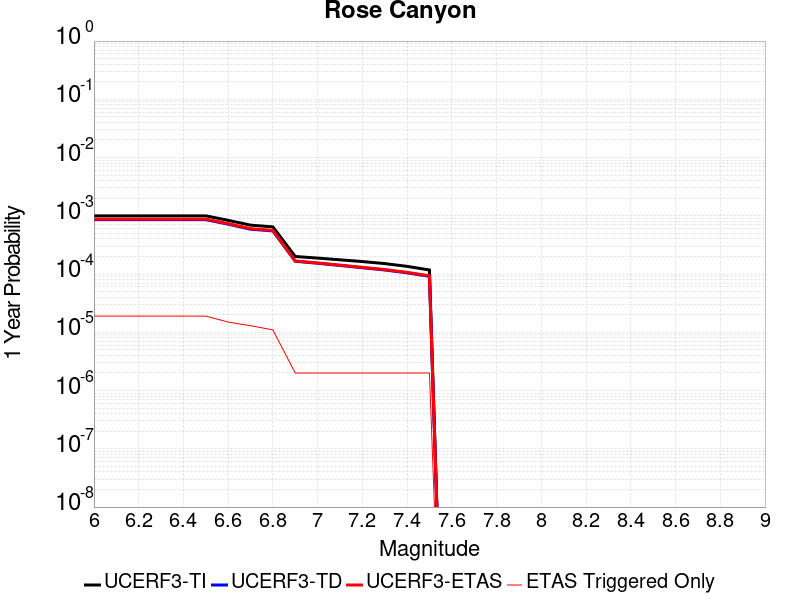 |  |

| Magnitude | 1 wk TI Prob | 1 wk TD Prob | 1 wk ETAS Prob | 1 wk ETAS/TD Gain | 1 wk ETAS Triggered Only | 1 mo TI Prob | 1 mo TD Prob | 1 mo ETAS Prob | 1 mo ETAS/TD Gain | 1 mo ETAS Triggered Only | 1 yr TI Prob | 1 yr TD Prob | 1 yr ETAS Prob | 1 yr ETAS/TD Gain | 1 yr ETAS Triggered Only | 10 yr TI Prob | 10 yr TD Prob | 10 yr ETAS Prob | 10 yr ETAS/TD Gain | 10 yr ETAS Triggered Only |
|-----|-----|-----|-----|-----|-----|-----|-----|-----|-----|-----|-----|-----|-----|-----|-----|-----|-----|-----|-----|-----|
| 6.0 | 1.9167945E-5 | 1.6478027E-5 | 2.9417186E-5 | 1.7852372 | 1.2939373E-5 | 8.214574E-5 | 7.06186E-5 | 8.355705E-5 | 1.183216 | 1.2939373E-5 | 9.996655E-4 | 8.5951196E-4 | 8.7567227E-4 | 1.0188017 | 1.6174215E-5 | 0.009951805 | 0.008568751 | 0.0085912 | 1.00262 | 2.2643902E-5 |
| 6.1 | 1.9167945E-5 | 1.6478027E-5 | 2.9417186E-5 | 1.7852372 | 1.2939373E-5 | 8.214574E-5 | 7.06186E-5 | 8.355705E-5 | 1.183216 | 1.2939373E-5 | 9.996655E-4 | 8.5951196E-4 | 8.7567227E-4 | 1.0188017 | 1.6174215E-5 | 0.009951805 | 0.008568751 | 0.0085912 | 1.00262 | 2.2643902E-5 |
| 6.2 | 1.9167945E-5 | 1.6478027E-5 | 2.9417186E-5 | 1.7852372 | 1.2939373E-5 | 8.214574E-5 | 7.06186E-5 | 8.355705E-5 | 1.183216 | 1.2939373E-5 | 9.996655E-4 | 8.5951196E-4 | 8.7567227E-4 | 1.0188017 | 1.6174215E-5 | 0.009951805 | 0.008568751 | 0.0085912 | 1.00262 | 2.2643902E-5 |
| 6.3 | 1.9167945E-5 | 1.6478027E-5 | 2.9417186E-5 | 1.7852372 | 1.2939373E-5 | 8.214574E-5 | 7.06186E-5 | 8.355705E-5 | 1.183216 | 1.2939373E-5 | 9.996655E-4 | 8.5951196E-4 | 8.7567227E-4 | 1.0188017 | 1.6174215E-5 | 0.009951805 | 0.008568751 | 0.0085912 | 1.00262 | 2.2643902E-5 |
| 6.4 | 1.9167945E-5 | 1.6478027E-5 | 2.9417186E-5 | 1.7852372 | 1.2939373E-5 | 8.214574E-5 | 7.06186E-5 | 8.355705E-5 | 1.183216 | 1.2939373E-5 | 9.996655E-4 | 8.5951196E-4 | 8.7567227E-4 | 1.0188017 | 1.6174215E-5 | 0.009951805 | 0.008568751 | 0.0085912 | 1.00262 | 2.2643902E-5 |
| 6.5 | 1.9167945E-5 | 1.6478027E-5 | 2.9417186E-5 | 1.7852372 | 1.2939373E-5 | 8.214574E-5 | 7.06186E-5 | 8.355705E-5 | 1.183216 | 1.2939373E-5 | 9.996655E-4 | 8.5951196E-4 | 8.7567227E-4 | 1.0188017 | 1.6174215E-5 | 0.009951805 | 0.008568751 | 0.0085912 | 1.00262 | 2.2643902E-5 |
| 6.6 | 1.6032436E-5 | 1.3771202E-5 | 2.6710397E-5 | 1.9395835 | 1.2939373E-5 | 6.870863E-5 | 5.901849E-5 | 7.19571E-5 | 1.2192297 | 1.2939373E-5 | 8.362065E-4 | 7.183819E-4 | 7.345445E-4 | 1.0224986 | 1.6174215E-5 | 0.008330669 | 0.0071673454 | 0.007189827 | 1.0031366 | 2.2643902E-5 |
| 6.7 | 1.32651885E-5 | 1.1282621E-5 | 2.0987041E-5 | 1.860121 | 9.7045295E-6 | 5.684957E-5 | 4.8353573E-5 | 5.8057634E-5 | 1.2006896 | 9.7045295E-6 | 6.919237E-4 | 5.8861315E-4 | 6.015449E-4 | 1.0219699 | 1.2939373E-5 | 0.0068977326 | 0.005877156 | 0.005896451 | 1.003283 | 1.9409059E-5 |
| 6.8 | 1.2374002E-5 | 1.0546746E-5 | 1.7016364E-5 | 1.6134231 | 6.4696865E-6 | 5.303036E-5 | 4.5199937E-5 | 5.166933E-5 | 1.1431284 | 6.4696865E-6 | 6.4545334E-4 | 5.5023754E-4 | 5.5993674E-4 | 1.0176272 | 9.7045295E-6 | 0.006435818 | 0.005495354 | 0.0055114394 | 1.0029271 | 1.6174215E-5 |
| 6.9 | 3.8401595E-6 | 3.178941E-6 | 6.413774E-6 | 2.017582 | 3.2348432E-6 | 1.6457723E-5 | 1.3623983E-5 | 1.6858783E-5 | 1.2374341 | 3.2348432E-6 | 2.0035435E-4 | 1.6586324E-4 | 1.6909755E-4 | 1.0194999 | 3.2348432E-6 | 0.0020017382 | 0.0016577742 | 0.0016610037 | 1.0019481 | 3.2348432E-6 |
| 7.0 | 3.6026508E-6 | 2.9376413E-6 | 6.172475E-6 | 2.101167 | 3.2348432E-6 | 1.543984E-5 | 1.2589852E-5 | 1.5824655E-5 | 1.2569373 | 3.2348432E-6 | 1.8796384E-4 | 1.5327454E-4 | 1.5650889E-4 | 1.0211017 | 3.2348432E-6 | 0.0018780495 | 0.0015320673 | 0.0015352971 | 1.0021082 | 3.2348432E-6 |
| 7.1 | 3.3657313E-6 | 2.6902792E-6 | 5.925114E-6 | 2.202416 | 3.2348432E-6 | 1.4424483E-5 | 1.1529739E-5 | 1.4764544E-5 | 1.2805619 | 3.2348432E-6 | 1.7560393E-4 | 1.4036939E-4 | 1.4360377E-4 | 1.023042 | 3.2348432E-6 | 0.0017546522 | 0.0014031857 | 0.001406416 | 1.0023022 | 3.2348432E-6 |
| 7.2 | 3.1430025E-6 | 2.4618412E-6 | 5.6966765E-6 | 2.31399 | 3.2348432E-6 | 1.3469941E-5 | 1.0550727E-5 | 1.3785536E-5 | 1.3065958 | 3.2348432E-6 | 1.639842E-4 | 1.2845139E-4 | 1.3168581E-4 | 1.0251802 | 3.2348432E-6 | 0.0016386324 | 0.0012841492 | 0.0012873799 | 1.0025158 | 3.2348432E-6 |
| 7.3 | 2.898987E-6 | 2.2514312E-6 | 5.486267E-6 | 2.436791 | 3.2348432E-6 | 1.24241715E-5 | 9.648977E-6 | 1.2883789E-5 | 1.3352492 | 3.2348432E-6 | 1.5125379E-4 | 1.1747381E-4 | 1.20708275E-4 | 1.0275335 | 3.2348432E-6 | 0.0015115088 | 0.0011744945 | 0.0011777256 | 1.002751 | 3.2348432E-6 |
| 7.4 | 2.5994284E-6 | 2.0116724E-6 | 5.246509E-6 | 2.6080334 | 3.2348432E-6 | 1.114036E-5 | 8.621447E-6 | 1.1856262E-5 | 1.3752056 | 3.2348432E-6 | 1.3562544E-4 | 1.049649E-4 | 1.08199405E-4 | 1.0308151 | 3.2348432E-6 | 0.0013554269 | 0.00104953 | 0.0010527615 | 1.0030789 | 3.2348432E-6 |
| 7.5 | 2.2517988E-6 | 1.7516537E-6 | 4.986491E-6 | 2.8467333 | 3.2348432E-6 | 9.650531E-6 | 7.5070875E-6 | 1.0741906E-5 | 1.430902 | 3.2348432E-6 | 1.17488875E-4 | 9.139879E-5 | 9.463334E-5 | 1.0353894 | 3.2348432E-6 | 0.0011742678 | 9.1398787E-4 | 9.172198E-4 | 1.003536 | 3.2348432E-6 |

## Rodgers Creek - Healdsburg 2011 CFM
*[(top)](#table-of-contents)*

| 1 Week | 1 Month | 1 Year | 10 Year |
|-----|-----|-----|-----|
|  |  |  |  |

| Magnitude | 1 wk TI Prob | 1 wk TD Prob | 1 wk ETAS Prob | 1 wk ETAS/TD Gain | 1 wk ETAS Triggered Only | 1 mo TI Prob | 1 mo TD Prob | 1 mo ETAS Prob | 1 mo ETAS/TD Gain | 1 mo ETAS Triggered Only | 1 yr TI Prob | 1 yr TD Prob | 1 yr ETAS Prob | 1 yr ETAS/TD Gain | 1 yr ETAS Triggered Only | 10 yr TI Prob | 10 yr TD Prob | 10 yr ETAS Prob | 10 yr ETAS/TD Gain | 10 yr ETAS Triggered Only |
|-----|-----|-----|-----|-----|-----|-----|-----|-----|-----|-----|-----|-----|-----|-----|-----|-----|-----|-----|-----|-----|
| 6.0 | 9.830927E-5 | 2.4955187E-4 | 2.5925398E-4 | 1.0388781 | 9.7045295E-6 | 4.212574E-4 | 0.0010693158 | 0.00107901 | 1.0090657 | 9.7045295E-6 | 0.0051167537 | 0.012984863 | 0.01300402 | 1.0014753 | 1.9409059E-5 | 0.05000532 | 0.12216672 | 0.1221866 | 1.0001627 | 2.2643902E-5 |
| 6.1 | 9.830927E-5 | 2.4955187E-4 | 2.5925398E-4 | 1.0388781 | 9.7045295E-6 | 4.212574E-4 | 0.0010693158 | 0.00107901 | 1.0090657 | 9.7045295E-6 | 0.0051167537 | 0.012984863 | 0.01300402 | 1.0014753 | 1.9409059E-5 | 0.05000532 | 0.12216672 | 0.1221866 | 1.0001627 | 2.2643902E-5 |
| 6.2 | 9.830927E-5 | 2.4955187E-4 | 2.5925398E-4 | 1.0388781 | 9.7045295E-6 | 4.212574E-4 | 0.0010693158 | 0.00107901 | 1.0090657 | 9.7045295E-6 | 0.0051167537 | 0.012984863 | 0.01300402 | 1.0014753 | 1.9409059E-5 | 0.05000532 | 0.12216672 | 0.1221866 | 1.0001627 | 2.2643902E-5 |
| 6.3 | 9.830927E-5 | 2.4955187E-4 | 2.5925398E-4 | 1.0388781 | 9.7045295E-6 | 4.212574E-4 | 0.0010693158 | 0.00107901 | 1.0090657 | 9.7045295E-6 | 0.0051167537 | 0.012984863 | 0.01300402 | 1.0014753 | 1.9409059E-5 | 0.05000532 | 0.12216672 | 0.1221866 | 1.0001627 | 2.2643902E-5 |
| 6.4 | 9.830927E-5 | 2.4955187E-4 | 2.5925398E-4 | 1.0388781 | 9.7045295E-6 | 4.212574E-4 | 0.0010693158 | 0.00107901 | 1.0090657 | 9.7045295E-6 | 0.0051167537 | 0.012984863 | 0.01300402 | 1.0014753 | 1.9409059E-5 | 0.05000532 | 0.12216672 | 0.1221866 | 1.0001627 | 2.2643902E-5 |
| 6.5 | 9.830927E-5 | 2.4955187E-4 | 2.5925398E-4 | 1.0388781 | 9.7045295E-6 | 4.212574E-4 | 0.0010693158 | 0.00107901 | 1.0090657 | 9.7045295E-6 | 0.0051167537 | 0.012984863 | 0.01300402 | 1.0014753 | 1.9409059E-5 | 0.05000532 | 0.12216672 | 0.1221866 | 1.0001627 | 2.2643902E-5 |
| 6.6 | 9.722793E-5 | 2.4745433E-4 | 2.5715647E-4 | 1.0392077 | 9.7045295E-6 | 4.1662456E-4 | 0.001060334 | 0.0010700283 | 1.0091426 | 9.7045295E-6 | 0.0050606127 | 0.012876847 | 0.012896006 | 1.0014879 | 1.9409059E-5 | 0.049469102 | 0.12122572 | 0.12124562 | 1.0001642 | 2.2643902E-5 |
| 6.7 | 9.631043E-5 | 2.4569524E-4 | 2.5539738E-4 | 1.0394886 | 9.7045295E-6 | 4.1269368E-4 | 0.0010528011 | 0.0010624954 | 1.0092081 | 9.7045295E-6 | 0.0050129755 | 0.012786214 | 0.012805375 | 1.0014986 | 1.9409059E-5 | 0.049013894 | 0.12043094 | 0.120450854 | 1.0001653 | 2.2643902E-5 |
| 6.8 | 9.5157004E-5 | 2.4311169E-4 | 2.5281386E-4 | 1.0399083 | 9.7045295E-6 | 4.0775197E-4 | 0.0010417376 | 0.0010514321 | 1.009306 | 9.7045295E-6 | 0.0049530854 | 0.012653089 | 0.012672253 | 1.0015146 | 1.9409059E-5 | 0.048441324 | 0.1192606 | 0.11928055 | 1.0001673 | 2.2643902E-5 |
| 6.9 | 9.3715214E-5 | 2.3986747E-4 | 2.4956968E-4 | 1.0404482 | 9.7045295E-6 | 4.015748E-4 | 0.0010278448 | 0.0010375394 | 1.009432 | 9.7045295E-6 | 0.004878218 | 0.012485896 | 0.012505063 | 1.001535 | 1.9409059E-5 | 0.047725122 | 0.11779124 | 0.11781122 | 1.0001696 | 2.2643902E-5 |
| 7.0 | 9.21773E-5 | 2.3636219E-4 | 2.4606442E-4 | 1.0410482 | 9.7045295E-6 | 3.9498575E-4 | 0.0010128339 | 0.0010225286 | 1.0095719 | 9.7045295E-6 | 0.0047983527 | 0.012305218 | 0.012324388 | 1.001558 | 1.9409059E-5 | 0.046960585 | 0.11620537 | 0.11622252 | 1.0001476 | 1.9409059E-5 |
| 7.1 | 1.8670535E-5 | 4.6669888E-5 | 4.9904582E-5 | 1.0693101 | 3.2348432E-6 | 8.001412E-5 | 2.0000339E-4 | 2.0323758E-4 | 1.0161707 | 3.2348432E-6 | 9.737365E-4 | 0.0024331913 | 0.0024428724 | 1.0039787 | 9.7045295E-6 | 0.009694808 | 0.023618827 | 0.023628302 | 1.0004011 | 9.7045295E-6 |
| 7.2 | 6.6138855E-6 | 1.8792352E-5 | 2.2027136E-5 | 1.1721328 | 3.2348432E-6 | 2.8344915E-5 | 8.053787E-5 | 8.377246E-5 | 1.0401622 | 3.2348432E-6 | 3.4504468E-4 | 9.8041E-4 | 9.90105E-4 | 1.0098888 | 9.7045295E-6 | 0.0034450945 | 0.009560432 | 0.009570044 | 1.0010054 | 9.7045295E-6 |
| 7.3 | 5.4382035E-6 | 1.5442325E-5 | 1.8677118E-5 | 1.2094758 | 3.2348432E-6 | 2.3306378E-5 | 6.618139E-5 | 6.941602E-5 | 1.0488752 | 3.2348432E-6 | 2.8371823E-4 | 8.0575846E-4 | 8.1545516E-4 | 1.0120343 | 9.7045295E-6 | 0.0028335627 | 0.007868089 | 0.007877718 | 1.0012237 | 9.7045295E-6 |

## San Gregorio (South) 2011 CFM
*[(top)](#table-of-contents)*

| 1 Week | 1 Month | 1 Year | 10 Year |
|-----|-----|-----|-----|
|  |  |  |  |

| Magnitude | 1 wk TI Prob | 1 wk TD Prob | 1 wk ETAS Prob | 1 wk ETAS/TD Gain | 1 wk ETAS Triggered Only | 1 mo TI Prob | 1 mo TD Prob | 1 mo ETAS Prob | 1 mo ETAS/TD Gain | 1 mo ETAS Triggered Only | 1 yr TI Prob | 1 yr TD Prob | 1 yr ETAS Prob | 1 yr ETAS/TD Gain | 1 yr ETAS Triggered Only | 10 yr TI Prob | 10 yr TD Prob | 10 yr ETAS Prob | 10 yr ETAS/TD Gain | 10 yr ETAS Triggered Only |
|-----|-----|-----|-----|-----|-----|-----|-----|-----|-----|-----|-----|-----|-----|-----|-----|-----|-----|-----|-----|-----|
| 6.0 | 4.5472258E-5 | 5.991556E-5 | 6.315021E-5 | 1.0539868 | 3.2348432E-6 | 1.9486654E-4 | 2.5675958E-4 | 2.6322762E-4 | 1.025191 | 6.4696865E-6 | 0.0023699186 | 0.0031223015 | 0.0031352004 | 1.0041312 | 1.2939373E-5 | 0.023448035 | 0.03088203 | 0.03090084 | 1.000609 | 1.9409059E-5 |
| 6.1 | 4.5472258E-5 | 5.991556E-5 | 6.315021E-5 | 1.0539868 | 3.2348432E-6 | 1.9486654E-4 | 2.5675958E-4 | 2.6322762E-4 | 1.025191 | 6.4696865E-6 | 0.0023699186 | 0.0031223015 | 0.0031352004 | 1.0041312 | 1.2939373E-5 | 0.023448035 | 0.03088203 | 0.03090084 | 1.000609 | 1.9409059E-5 |
| 6.2 | 4.5472258E-5 | 5.991556E-5 | 6.315021E-5 | 1.0539868 | 3.2348432E-6 | 1.9486654E-4 | 2.5675958E-4 | 2.6322762E-4 | 1.025191 | 6.4696865E-6 | 0.0023699186 | 0.0031223015 | 0.0031352004 | 1.0041312 | 1.2939373E-5 | 0.023448035 | 0.03088203 | 0.03090084 | 1.000609 | 1.9409059E-5 |
| 6.3 | 4.5472258E-5 | 5.991556E-5 | 6.315021E-5 | 1.0539868 | 3.2348432E-6 | 1.9486654E-4 | 2.5675958E-4 | 2.6322762E-4 | 1.025191 | 6.4696865E-6 | 0.0023699186 | 0.0031223015 | 0.0031352004 | 1.0041312 | 1.2939373E-5 | 0.023448035 | 0.03088203 | 0.03090084 | 1.000609 | 1.9409059E-5 |
| 6.4 | 4.5472258E-5 | 5.991556E-5 | 6.315021E-5 | 1.0539868 | 3.2348432E-6 | 1.9486654E-4 | 2.5675958E-4 | 2.6322762E-4 | 1.025191 | 6.4696865E-6 | 0.0023699186 | 0.0031223015 | 0.0031352004 | 1.0041312 | 1.2939373E-5 | 0.023448035 | 0.03088203 | 0.03090084 | 1.000609 | 1.9409059E-5 |
| 6.5 | 4.5472258E-5 | 5.991556E-5 | 6.315021E-5 | 1.0539868 | 3.2348432E-6 | 1.9486654E-4 | 2.5675958E-4 | 2.6322762E-4 | 1.025191 | 6.4696865E-6 | 0.0023699186 | 0.0031223015 | 0.0031352004 | 1.0041312 | 1.2939373E-5 | 0.023448035 | 0.03088203 | 0.03090084 | 1.000609 | 1.9409059E-5 |
| 6.6 | 4.315749E-5 | 5.674213E-5 | 5.9976788E-5 | 1.0570064 | 3.2348432E-6 | 1.8494757E-4 | 2.4316214E-4 | 2.4963025E-4 | 1.0266 | 6.4696865E-6 | 0.0022494113 | 0.002957233 | 0.0029701341 | 1.0043626 | 1.2939373E-5 | 0.02226778 | 0.02927816 | 0.029297 | 1.0006435 | 1.9409059E-5 |
| 6.7 | 4.008459E-5 | 5.251357E-5 | 5.574824E-5 | 1.0615969 | 3.2348432E-6 | 1.7177979E-4 | 2.250431E-4 | 2.3151132E-4 | 1.0287422 | 6.4696865E-6 | 0.0020894127 | 0.002737236 | 0.00275014 | 1.0047143 | 1.2939373E-5 | 0.020698763 | 0.02713696 | 0.02715584 | 1.0006958 | 1.9409059E-5 |
| 6.8 | 3.7885424E-5 | 4.9452636E-5 | 5.268732E-5 | 1.0654098 | 3.2348432E-6 | 1.62356E-4 | 2.1192706E-4 | 2.1839538E-4 | 1.0305214 | 6.4696865E-6 | 0.001974892 | 0.0025779405 | 0.0025908465 | 1.0050063 | 1.2939373E-5 | 0.019574333 | 0.025582204 | 0.025601117 | 1.0007393 | 1.9409059E-5 |
| 6.9 | 3.543751E-5 | 4.6004345E-5 | 4.923904E-5 | 1.0703129 | 3.2348432E-6 | 1.5186622E-4 | 1.97151E-4 | 2.0361942E-4 | 1.0328094 | 6.4696865E-6 | 0.001847403 | 0.0023984574 | 0.0024113657 | 1.005382 | 1.2939373E-5 | 0.018321203 | 0.023827864 | 0.023843652 | 1.0006626 | 1.6174215E-5 |
| 7.0 | 3.3186065E-5 | 4.2815023E-5 | 4.604973E-5 | 1.0755507 | 3.2348432E-6 | 1.4221824E-4 | 1.834845E-4 | 1.8995299E-4 | 1.0352536 | 6.4696865E-6 | 0.0017301317 | 0.0022324256 | 0.0022453363 | 1.0057832 | 1.2939373E-5 | 0.017167237 | 0.022202516 | 0.022218332 | 1.0007123 | 1.6174215E-5 |
| 7.1 | 3.076152E-5 | 3.9376442E-5 | 4.261116E-5 | 1.0821486 | 3.2348432E-6 | 1.3182842E-4 | 1.6874976E-4 | 1.7198405E-4 | 1.0191662 | 3.2348432E-6 | 0.0016038293 | 0.0020533882 | 0.0020630728 | 1.0047164 | 9.7045295E-6 | 0.015923034 | 0.020447142 | 0.020459818 | 1.0006199 | 1.2939373E-5 |
| 7.2 | 2.8039283E-5 | 3.552108E-5 | 3.8755807E-5 | 1.091065 | 3.2348432E-6 | 1.2016282E-4 | 1.5222882E-4 | 1.5546317E-4 | 1.0212467 | 3.2348432E-6 | 0.0014620004 | 0.00185261 | 0.0018622965 | 1.0052286 | 9.7045295E-6 | 0.0145241935 | 0.018474856 | 0.018487556 | 1.0006875 | 1.2939373E-5 |
| 7.3 | 2.4776145E-5 | 3.1098632E-5 | 3.4333378E-5 | 1.1040156 | 3.2348432E-6 | 1.0617916E-4 | 1.3327754E-4 | 1.3651195E-4 | 1.0242683 | 3.2348432E-6 | 0.0012919646 | 0.0016222443 | 0.0016287034 | 1.0039816 | 6.4696865E-6 | 0.012844792 | 0.0162039 | 0.016213449 | 1.0005893 | 9.7045295E-6 |
| 7.4 | 2.1508438E-5 | 2.6824098E-5 | 3.0058854E-5 | 1.1205914 | 3.2348432E-6 | 9.217577E-5 | 1.1495983E-4 | 1.1819431E-4 | 1.0281357 | 3.2348432E-6 | 0.0011216622 | 0.0013995317 | 0.0014059924 | 1.0046163 | 6.4696865E-6 | 0.011160175 | 0.014002349 | 0.014011918 | 1.0006833 | 9.7045295E-6 |

## San Jacinto (Coyote Creek)
*[(top)](#table-of-contents)*

| 1 Week | 1 Month | 1 Year | 10 Year |
|-----|-----|-----|-----|
|  |  |  |  |

| Magnitude | 1 wk TI Prob | 1 wk TD Prob | 1 wk ETAS Prob | 1 wk ETAS/TD Gain | 1 wk ETAS Triggered Only | 1 mo TI Prob | 1 mo TD Prob | 1 mo ETAS Prob | 1 mo ETAS/TD Gain | 1 mo ETAS Triggered Only | 1 yr TI Prob | 1 yr TD Prob | 1 yr ETAS Prob | 1 yr ETAS/TD Gain | 1 yr ETAS Triggered Only | 10 yr TI Prob | 10 yr TD Prob | 10 yr ETAS Prob | 10 yr ETAS/TD Gain | 10 yr ETAS Triggered Only |
|-----|-----|-----|-----|-----|-----|-----|-----|-----|-----|-----|-----|-----|-----|-----|-----|-----|-----|-----|-----|-----|
| 6.0 | 4.69665E-5 | 6.4235006E-5 | 6.746964E-5 | 1.0503563 | 3.2348432E-6 | 2.0126947E-4 | 2.7526915E-4 | 2.785031E-4 | 1.0117483 | 3.2348432E-6 | 0.002447702 | 0.0033471098 | 0.0033503338 | 1.0009632 | 3.2348432E-6 | 0.024209166 | 0.033357523 | 0.033376284 | 1.0005624 | 1.9409059E-5 |
| 6.1 | 4.69665E-5 | 6.4235006E-5 | 6.746964E-5 | 1.0503563 | 3.2348432E-6 | 2.0126947E-4 | 2.7526915E-4 | 2.785031E-4 | 1.0117483 | 3.2348432E-6 | 0.002447702 | 0.0033471098 | 0.0033503338 | 1.0009632 | 3.2348432E-6 | 0.024209166 | 0.033357523 | 0.033376284 | 1.0005624 | 1.9409059E-5 |
| 6.2 | 4.69665E-5 | 6.4235006E-5 | 6.746964E-5 | 1.0503563 | 3.2348432E-6 | 2.0126947E-4 | 2.7526915E-4 | 2.785031E-4 | 1.0117483 | 3.2348432E-6 | 0.002447702 | 0.0033471098 | 0.0033503338 | 1.0009632 | 3.2348432E-6 | 0.024209166 | 0.033357523 | 0.033376284 | 1.0005624 | 1.9409059E-5 |
| 6.3 | 4.69665E-5 | 6.4235006E-5 | 6.746964E-5 | 1.0503563 | 3.2348432E-6 | 2.0126947E-4 | 2.7526915E-4 | 2.785031E-4 | 1.0117483 | 3.2348432E-6 | 0.002447702 | 0.0033471098 | 0.0033503338 | 1.0009632 | 3.2348432E-6 | 0.024209166 | 0.033357523 | 0.033376284 | 1.0005624 | 1.9409059E-5 |
| 6.4 | 4.69665E-5 | 6.4235006E-5 | 6.746964E-5 | 1.0503563 | 3.2348432E-6 | 2.0126947E-4 | 2.7526915E-4 | 2.785031E-4 | 1.0117483 | 3.2348432E-6 | 0.002447702 | 0.0033471098 | 0.0033503338 | 1.0009632 | 3.2348432E-6 | 0.024209166 | 0.033357523 | 0.033376284 | 1.0005624 | 1.9409059E-5 |
| 6.5 | 4.69665E-5 | 6.4235006E-5 | 6.746964E-5 | 1.0503563 | 3.2348432E-6 | 2.0126947E-4 | 2.7526915E-4 | 2.785031E-4 | 1.0117483 | 3.2348432E-6 | 0.002447702 | 0.0033471098 | 0.0033503338 | 1.0009632 | 3.2348432E-6 | 0.024209166 | 0.033357523 | 0.033376284 | 1.0005624 | 1.9409059E-5 |
| 6.6 | 4.65626E-5 | 6.365397E-5 | 6.6888606E-5 | 1.0508159 | 3.2348432E-6 | 1.9953873E-4 | 2.7277967E-4 | 2.7601363E-4 | 1.0118556 | 3.2348432E-6 | 0.0024266774 | 0.0033169023 | 0.0033201266 | 1.000972 | 3.2348432E-6 | 0.024003487 | 0.033065155 | 0.03308392 | 1.0005676 | 1.9409059E-5 |
| 6.7 | 4.6128687E-5 | 6.303452E-5 | 6.626916E-5 | 1.0513153 | 3.2348432E-6 | 1.9767939E-4 | 2.7012554E-4 | 2.733595E-4 | 1.0119721 | 3.2348432E-6 | 0.00240409 | 0.0032846953 | 0.0032879196 | 1.0009816 | 3.2348432E-6 | 0.023782477 | 0.032753225 | 0.032771997 | 1.0005732 | 1.9409059E-5 |
| 6.8 | 4.5828285E-5 | 6.268431E-5 | 6.591895E-5 | 1.0516021 | 3.2348432E-6 | 1.9639214E-4 | 2.6862495E-4 | 2.7185894E-4 | 1.012039 | 3.2348432E-6 | 0.0023884522 | 0.0032664812 | 0.0032697057 | 1.000987 | 3.2348432E-6 | 0.02362944 | 0.03257484 | 0.032593615 | 1.0005764 | 1.9409059E-5 |
| 6.9 | 4.523555E-5 | 6.1988314E-5 | 6.522296E-5 | 1.0521815 | 3.2348432E-6 | 1.9385223E-4 | 2.656427E-4 | 2.688767E-4 | 1.0121741 | 3.2348432E-6 | 0.0023575963 | 0.003230282 | 0.0032335063 | 1.0009981 | 3.2348432E-6 | 0.023327406 | 0.032220315 | 0.03223597 | 1.0004858 | 1.6174215E-5 |
| 7.0 | 3.2913522E-5 | 4.3638418E-5 | 4.687312E-5 | 1.074125 | 3.2348432E-6 | 1.4105032E-4 | 1.8701174E-4 | 1.9024598E-4 | 1.0172943 | 3.2348432E-6 | 0.0017159348 | 0.0022750867 | 0.0022783142 | 1.0014186 | 3.2348432E-6 | 0.017027453 | 0.022874728 | 0.022887371 | 1.0005528 | 1.2939373E-5 |
| 7.1 | 3.2150587E-5 | 4.262259E-5 | 4.5857294E-5 | 1.0758919 | 3.2348432E-6 | 1.3778094E-4 | 1.8265881E-4 | 1.8589306E-4 | 1.0177065 | 3.2348432E-6 | 0.0016761922 | 0.002222199 | 0.0022254267 | 1.0014524 | 3.2348432E-6 | 0.016636053 | 0.02235371 | 0.02236636 | 1.0005659 | 1.2939373E-5 |
| 7.2 | 3.1169668E-5 | 4.115963E-5 | 4.439434E-5 | 1.0785894 | 3.2348432E-6 | 1.3357744E-4 | 1.7638985E-4 | 1.7962411E-4 | 1.0183359 | 3.2348432E-6 | 0.0016250921 | 0.0021460268 | 0.0021492548 | 1.0015042 | 3.2348432E-6 | 0.016132593 | 0.021605676 | 0.021618336 | 1.0005859 | 1.2939373E-5 |
| 7.3 | 1.8423585E-5 | 2.7220098E-5 | 3.0454854E-5 | 1.118837 | 3.2348432E-6 | 7.895583E-5 | 1.1665466E-4 | 1.1988912E-4 | 1.0277269 | 3.2348432E-6 | 9.608633E-4 | 0.0014197543 | 0.0014229846 | 1.0022752 | 3.2348432E-6 | 0.009567193 | 0.014355129 | 0.014367882 | 1.0008885 | 1.2939373E-5 |
| 7.4 | 6.9267962E-6 | 9.391728E-6 | 1.262654E-5 | 1.3444321 | 3.2348432E-6 | 2.968593E-5 | 4.024971E-5 | 4.3484426E-5 | 1.0803661 | 3.2348432E-6 | 3.6136628E-4 | 4.899425E-4 | 4.9317576E-4 | 1.0065993 | 3.2348432E-6 | 0.003607792 | 0.005030186 | 0.0050398414 | 1.0019195 | 9.7045295E-6 |
| 7.5 | 6.1587302E-6 | 8.234252E-6 | 1.1469068E-5 | 1.3928488 | 3.2348432E-6 | 2.6394291E-5 | 3.5289235E-5 | 3.8523965E-5 | 1.0916634 | 3.2348432E-6 | 3.213031E-4 | 4.2957254E-4 | 4.32806E-4 | 1.0075271 | 3.2348432E-6 | 0.0032083893 | 0.004419193 | 0.004428855 | 1.0021863 | 9.7045295E-6 |
| 7.6 | 5.383844E-6 | 7.2529047E-6 | 1.04877245E-5 | 1.4460033 | 3.2348432E-6 | 2.3073413E-5 | 3.108356E-5 | 3.4318302E-5 | 1.104066 | 3.2348432E-6 | 2.8088258E-4 | 3.7838623E-4 | 3.8161984E-4 | 1.0085459 | 3.2348432E-6 | 0.0028052782 | 0.0038957447 | 0.0039054113 | 1.0024813 | 9.7045295E-6 |
| 7.7 | 3.843031E-6 | 4.8339584E-6 | 8.068786E-6 | 1.6691881 | 3.2348432E-6 | 1.647003E-5 | 2.0716834E-5 | 2.395161E-5 | 1.1561424 | 3.2348432E-6 | 2.0050416E-4 | 2.5220422E-4 | 2.5543824E-4 | 1.0128231 | 3.2348432E-6 | 0.0020032334 | 0.002619455 | 0.0026291343 | 1.0036951 | 9.7045295E-6 |
| 7.8 | 1.5303123E-6 | 1.9707616E-6 | 1.9707616E-6 | 1.0 | 0.0 | 6.5584645E-6 | 8.446107E-6 | 8.446107E-6 | 1.0 | 0.0 | 7.984638E-5 | 1.0282895E-4 | 1.0282895E-4 | 1.0 | 0.0 | 7.98177E-4 | 0.001066982 | 0.0010702135 | 1.0030285 | 3.2348432E-6 |

## Hat Creek-McArthur-Mayfield
*[(top)](#table-of-contents)*

| 1 Week | 1 Month | 1 Year | 10 Year |
|-----|-----|-----|-----|
|  |  |  |  |

| Magnitude | 1 wk TI Prob | 1 wk TD Prob | 1 wk ETAS Prob | 1 wk ETAS/TD Gain | 1 wk ETAS Triggered Only | 1 mo TI Prob | 1 mo TD Prob | 1 mo ETAS Prob | 1 mo ETAS/TD Gain | 1 mo ETAS Triggered Only | 1 yr TI Prob | 1 yr TD Prob | 1 yr ETAS Prob | 1 yr ETAS/TD Gain | 1 yr ETAS Triggered Only | 10 yr TI Prob | 10 yr TD Prob | 10 yr ETAS Prob | 10 yr ETAS/TD Gain | 10 yr ETAS Triggered Only |
|-----|-----|-----|-----|-----|-----|-----|-----|-----|-----|-----|-----|-----|-----|-----|-----|-----|-----|-----|-----|-----|
| 6.0 | 2.1823456E-5 | 2.4773932E-5 | 3.447822E-5 | 1.3917137 | 9.7045295E-6 | 9.352575E-5 | 1.0617048E-4 | 1.2234299E-4 | 1.1523257 | 1.6174215E-5 | 0.0011380811 | 0.0012920036 | 0.0013113875 | 1.0150031 | 1.9409059E-5 | 0.011322702 | 0.01285923 | 0.012878389 | 1.00149 | 1.9409059E-5 |
| 6.1 | 2.1823456E-5 | 2.4773932E-5 | 3.447822E-5 | 1.3917137 | 9.7045295E-6 | 9.352575E-5 | 1.0617048E-4 | 1.2234299E-4 | 1.1523257 | 1.6174215E-5 | 0.0011380811 | 0.0012920036 | 0.0013113875 | 1.0150031 | 1.9409059E-5 | 0.011322702 | 0.01285923 | 0.012878389 | 1.00149 | 1.9409059E-5 |
| 6.2 | 2.1823456E-5 | 2.4773932E-5 | 3.447822E-5 | 1.3917137 | 9.7045295E-6 | 9.352575E-5 | 1.0617048E-4 | 1.2234299E-4 | 1.1523257 | 1.6174215E-5 | 0.0011380811 | 0.0012920036 | 0.0013113875 | 1.0150031 | 1.9409059E-5 | 0.011322702 | 0.01285923 | 0.012878389 | 1.00149 | 1.9409059E-5 |
| 6.3 | 2.1823456E-5 | 2.4773932E-5 | 3.447822E-5 | 1.3917137 | 9.7045295E-6 | 9.352575E-5 | 1.0617048E-4 | 1.2234299E-4 | 1.1523257 | 1.6174215E-5 | 0.0011380811 | 0.0012920036 | 0.0013113875 | 1.0150031 | 1.9409059E-5 | 0.011322702 | 0.01285923 | 0.012878389 | 1.00149 | 1.9409059E-5 |
| 6.4 | 2.1823456E-5 | 2.4773932E-5 | 3.447822E-5 | 1.3917137 | 9.7045295E-6 | 9.352575E-5 | 1.0617048E-4 | 1.2234299E-4 | 1.1523257 | 1.6174215E-5 | 0.0011380811 | 0.0012920036 | 0.0013113875 | 1.0150031 | 1.9409059E-5 | 0.011322702 | 0.01285923 | 0.012878389 | 1.00149 | 1.9409059E-5 |
| 6.5 | 2.1823456E-5 | 2.4773932E-5 | 3.447822E-5 | 1.3917137 | 9.7045295E-6 | 9.352575E-5 | 1.0617048E-4 | 1.2234299E-4 | 1.1523257 | 1.6174215E-5 | 0.0011380811 | 0.0012920036 | 0.0013113875 | 1.0150031 | 1.9409059E-5 | 0.011322702 | 0.01285923 | 0.012878389 | 1.00149 | 1.9409059E-5 |
| 6.6 | 1.9340694E-5 | 2.1946753E-5 | 2.5181524E-5 | 1.1473918 | 3.2348432E-6 | 8.288605E-5 | 9.405493E-5 | 1.03758546E-4 | 1.1031697 | 9.7045295E-6 | 0.0010086704 | 0.001144661 | 0.0011543544 | 1.0084684 | 9.7045295E-6 | 0.010041044 | 0.011401833 | 0.0114114275 | 1.0008414 | 9.7045295E-6 |
| 6.7 | 1.6797176E-5 | 1.9037067E-5 | 2.2271848E-5 | 1.1699202 | 3.2348432E-6 | 7.1985916E-5 | 8.1585684E-5 | 9.128942E-5 | 1.1189393 | 9.7045295E-6 | 8.7607605E-4 | 9.929959E-4 | 0.0010026909 | 1.0097632 | 9.7045295E-6 | 0.0087263035 | 0.00989965 | 0.009909258 | 1.0009706 | 9.7045295E-6 |
| 6.8 | 1.4852288E-5 | 1.6815693E-5 | 2.0050482E-5 | 1.1923672 | 3.2348432E-6 | 6.365111E-5 | 7.206607E-5 | 8.17699E-5 | 1.1346519 | 9.7045295E-6 | 7.7467674E-4 | 8.771936E-4 | 8.8688964E-4 | 1.0110534 | 9.7045295E-6 | 0.007719817 | 0.008751296 | 0.008760916 | 1.0010992 | 9.7045295E-6 |
| 6.9 | 1.2757133E-5 | 1.4418652E-5 | 1.7653449E-5 | 1.2243481 | 3.2348432E-6 | 5.467228E-5 | 6.179356E-5 | 7.149749E-5 | 1.1570379 | 9.7045295E-6 | 6.654317E-4 | 7.522186E-4 | 7.619158E-4 | 1.0128915 | 9.7045295E-6 | 0.0066344263 | 0.007510623 | 0.0075202547 | 1.0012825 | 9.7045295E-6 |
| 7.0 | 1.10079245E-5 | 1.2422667E-5 | 1.565747E-5 | 1.2603952 | 3.2348432E-6 | 4.7175967E-5 | 5.3239713E-5 | 5.9709055E-5 | 1.1215135 | 6.4696865E-6 | 5.74216E-4 | 6.4814166E-4 | 6.546072E-4 | 1.0099754 | 6.4696865E-6 | 0.005727345 | 0.0064763394 | 0.0064827674 | 1.0009925 | 6.4696865E-6 |
| 7.1 | 9.3994E-6 | 1.059216E-5 | 1.3826969E-5 | 1.3053966 | 3.2348432E-6 | 4.0282524E-5 | 4.5394972E-5 | 5.1864365E-5 | 1.1425134 | 6.4696865E-6 | 4.9032934E-4 | 5.526838E-4 | 5.591499E-4 | 1.0116994 | 6.4696865E-6 | 0.004892489 | 0.005526838 | 0.0055332715 | 1.0011641 | 6.4696865E-6 |

## Casmalia 2011 CFM
*[(top)](#table-of-contents)*

| 1 Week | 1 Month | 1 Year | 10 Year |
|-----|-----|-----|-----|
| 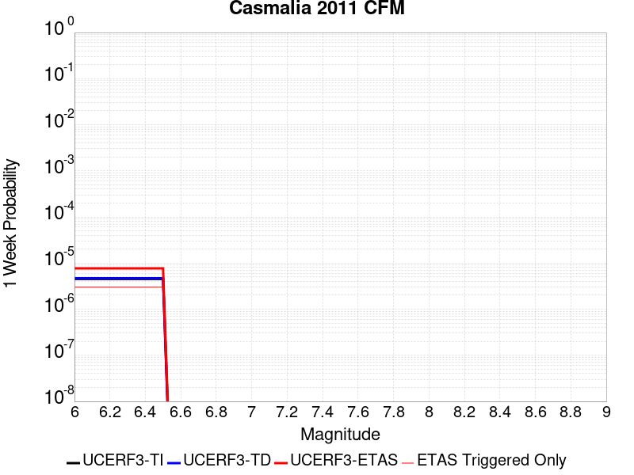 |  |  |  |

| Magnitude | 1 wk TI Prob | 1 wk TD Prob | 1 wk ETAS Prob | 1 wk ETAS/TD Gain | 1 wk ETAS Triggered Only | 1 mo TI Prob | 1 mo TD Prob | 1 mo ETAS Prob | 1 mo ETAS/TD Gain | 1 mo ETAS Triggered Only | 1 yr TI Prob | 1 yr TD Prob | 1 yr ETAS Prob | 1 yr ETAS/TD Gain | 1 yr ETAS Triggered Only | 10 yr TI Prob | 10 yr TD Prob | 10 yr ETAS Prob | 10 yr ETAS/TD Gain | 10 yr ETAS Triggered Only |
|-----|-----|-----|-----|-----|-----|-----|-----|-----|-----|-----|-----|-----|-----|-----|-----|-----|-----|-----|-----|-----|
| 6.0 | 4.5215784E-6 | 4.6811892E-6 | 4.6811892E-6 | 1.0 | 0.0 | 1.9378049E-5 | 2.0062238E-5 | 2.3297018E-5 | 1.1612371 | 3.2348432E-6 | 2.359022E-4 | 2.4425777E-4 | 2.539599E-4 | 1.039721 | 9.7045295E-6 | 0.0023565195 | 0.0024425776 | 0.0024619391 | 1.0079267 | 1.9409059E-5 |
| 6.1 | 4.5215784E-6 | 4.6811892E-6 | 4.6811892E-6 | 1.0 | 0.0 | 1.9378049E-5 | 2.0062238E-5 | 2.3297018E-5 | 1.1612371 | 3.2348432E-6 | 2.359022E-4 | 2.4425777E-4 | 2.539599E-4 | 1.039721 | 9.7045295E-6 | 0.0023565195 | 0.0024425776 | 0.0024619391 | 1.0079267 | 1.9409059E-5 |
| 6.2 | 4.5215784E-6 | 4.6811892E-6 | 4.6811892E-6 | 1.0 | 0.0 | 1.9378049E-5 | 2.0062238E-5 | 2.3297018E-5 | 1.1612371 | 3.2348432E-6 | 2.359022E-4 | 2.4425777E-4 | 2.539599E-4 | 1.039721 | 9.7045295E-6 | 0.0023565195 | 0.0024425776 | 0.0024619391 | 1.0079267 | 1.9409059E-5 |
| 6.3 | 4.5215784E-6 | 4.6811892E-6 | 4.6811892E-6 | 1.0 | 0.0 | 1.9378049E-5 | 2.0062238E-5 | 2.3297018E-5 | 1.1612371 | 3.2348432E-6 | 2.359022E-4 | 2.4425777E-4 | 2.539599E-4 | 1.039721 | 9.7045295E-6 | 0.0023565195 | 0.0024425776 | 0.0024619391 | 1.0079267 | 1.9409059E-5 |
| 6.4 | 4.5215784E-6 | 4.6811892E-6 | 4.6811892E-6 | 1.0 | 0.0 | 1.9378049E-5 | 2.0062238E-5 | 2.3297018E-5 | 1.1612371 | 3.2348432E-6 | 2.359022E-4 | 2.4425777E-4 | 2.539599E-4 | 1.039721 | 9.7045295E-6 | 0.0023565195 | 0.0024425776 | 0.0024619391 | 1.0079267 | 1.9409059E-5 |
| 6.5 | 4.5215784E-6 | 4.6811892E-6 | 4.6811892E-6 | 1.0 | 0.0 | 1.9378049E-5 | 2.0062238E-5 | 2.3297018E-5 | 1.1612371 | 3.2348432E-6 | 2.359022E-4 | 2.4425777E-4 | 2.539599E-4 | 1.039721 | 9.7045295E-6 | 0.0023565195 | 0.0024425776 | 0.0024619391 | 1.0079267 | 1.9409059E-5 |

## Coronado Bank alt1
*[(top)](#table-of-contents)*

| 1 Week | 1 Month | 1 Year | 10 Year |
|-----|-----|-----|-----|
|  |  |  |  |

| Magnitude | 1 wk TI Prob | 1 wk TD Prob | 1 wk ETAS Prob | 1 wk ETAS/TD Gain | 1 wk ETAS Triggered Only | 1 mo TI Prob | 1 mo TD Prob | 1 mo ETAS Prob | 1 mo ETAS/TD Gain | 1 mo ETAS Triggered Only | 1 yr TI Prob | 1 yr TD Prob | 1 yr ETAS Prob | 1 yr ETAS/TD Gain | 1 yr ETAS Triggered Only | 10 yr TI Prob | 10 yr TD Prob | 10 yr ETAS Prob | 10 yr ETAS/TD Gain | 10 yr ETAS Triggered Only |
|-----|-----|-----|-----|-----|-----|-----|-----|-----|-----|-----|-----|-----|-----|-----|-----|-----|-----|-----|-----|-----|
| 6.0 | 2.2805418E-5 | 2.2997261E-5 | 2.9466799E-5 | 1.2813177 | 6.4696865E-6 | 9.773385E-5 | 9.8556375E-5 | 1.0502542E-4 | 1.0656381 | 6.4696865E-6 | 0.00118926 | 0.0011993361 | 0.001209029 | 1.0080819 | 9.7045295E-6 | 0.011829156 | 0.011935918 | 0.011951899 | 1.001339 | 1.6174215E-5 |
| 6.1 | 2.2805418E-5 | 2.2997261E-5 | 2.9466799E-5 | 1.2813177 | 6.4696865E-6 | 9.773385E-5 | 9.8556375E-5 | 1.0502542E-4 | 1.0656381 | 6.4696865E-6 | 0.00118926 | 0.0011993361 | 0.001209029 | 1.0080819 | 9.7045295E-6 | 0.011829156 | 0.011935918 | 0.011951899 | 1.001339 | 1.6174215E-5 |
| 6.2 | 2.2805418E-5 | 2.2997261E-5 | 2.9466799E-5 | 1.2813177 | 6.4696865E-6 | 9.773385E-5 | 9.8556375E-5 | 1.0502542E-4 | 1.0656381 | 6.4696865E-6 | 0.00118926 | 0.0011993361 | 0.001209029 | 1.0080819 | 9.7045295E-6 | 0.011829156 | 0.011935918 | 0.011951899 | 1.001339 | 1.6174215E-5 |
| 6.3 | 2.2805418E-5 | 2.2997261E-5 | 2.9466799E-5 | 1.2813177 | 6.4696865E-6 | 9.773385E-5 | 9.8556375E-5 | 1.0502542E-4 | 1.0656381 | 6.4696865E-6 | 0.00118926 | 0.0011993361 | 0.001209029 | 1.0080819 | 9.7045295E-6 | 0.011829156 | 0.011935918 | 0.011951899 | 1.001339 | 1.6174215E-5 |
| 6.4 | 2.2805418E-5 | 2.2997261E-5 | 2.9466799E-5 | 1.2813177 | 6.4696865E-6 | 9.773385E-5 | 9.8556375E-5 | 1.0502542E-4 | 1.0656381 | 6.4696865E-6 | 0.00118926 | 0.0011993361 | 0.001209029 | 1.0080819 | 9.7045295E-6 | 0.011829156 | 0.011935918 | 0.011951899 | 1.001339 | 1.6174215E-5 |
| 6.5 | 2.2805418E-5 | 2.2997261E-5 | 2.9466799E-5 | 1.2813177 | 6.4696865E-6 | 9.773385E-5 | 9.8556375E-5 | 1.0502542E-4 | 1.0656381 | 6.4696865E-6 | 0.00118926 | 0.0011993361 | 0.001209029 | 1.0080819 | 9.7045295E-6 | 0.011829156 | 0.011935918 | 0.011951899 | 1.001339 | 1.6174215E-5 |
| 6.6 | 2.0608364E-5 | 2.2997261E-5 | 2.9466799E-5 | 1.2813177 | 6.4696865E-6 | 8.831857E-5 | 9.8556375E-5 | 1.0502542E-4 | 1.0656381 | 6.4696865E-6 | 0.0010747481 | 0.0011993361 | 0.001209029 | 1.0080819 | 9.7045295E-6 | 0.010695651 | 0.011935918 | 0.011951899 | 1.001339 | 1.6174215E-5 |
| 6.7 | 1.8279972E-5 | 2.0392206E-5 | 2.6861762E-5 | 1.3172562 | 6.4696865E-6 | 7.834038E-5 | 8.7392655E-5 | 9.3861774E-5 | 1.0740236 | 6.4696865E-6 | 9.533768E-4 | 0.0010635584 | 0.0010732526 | 1.0091149 | 9.7045295E-6 | 0.00949297 | 0.010591865 | 0.0106078675 | 1.0015109 | 1.6174215E-5 |
| 6.8 | 1.5100513E-5 | 1.6821805E-5 | 2.0056594E-5 | 1.1922973 | 3.2348432E-6 | 6.471488E-5 | 7.209186E-5 | 7.532647E-5 | 1.0448679 | 3.2348432E-6 | 7.876188E-4 | 8.77436E-4 | 8.8390004E-4 | 1.0073669 | 6.4696865E-6 | 0.007848332 | 0.008746733 | 0.008759559 | 1.0014664 | 1.2939373E-5 |
| 6.9 | 1.3558665E-5 | 1.5095915E-5 | 1.833071E-5 | 1.2142828 | 3.2348432E-6 | 5.810727E-5 | 6.4695574E-5 | 6.793021E-5 | 1.0499978 | 3.2348432E-6 | 7.0722634E-4 | 7.874548E-4 | 7.939194E-4 | 1.0082095 | 6.4696865E-6 | 0.0070497985 | 0.007853617 | 0.007866454 | 1.0016346 | 1.2939373E-5 |
| 7.0 | 1.1606914E-5 | 1.2905324E-5 | 1.6140126E-5 | 1.2506564 | 3.2348432E-6 | 4.9742972E-5 | 5.5307755E-5 | 5.854242E-5 | 1.0584848 | 3.2348432E-6 | 6.0545234E-4 | 6.7323423E-4 | 6.7969953E-4 | 1.0096034 | 6.4696865E-6 | 0.0060380544 | 0.006718854 | 0.0067317067 | 1.0019128 | 1.2939373E-5 |
| 7.1 | 9.601701E-6 | 1.06512E-5 | 1.3886008E-5 | 1.3037037 | 3.2348432E-6 | 4.11495E-5 | 4.564759E-5 | 4.8882288E-5 | 1.0708623 | 3.2348432E-6 | 5.0088E-4 | 5.556874E-4 | 5.6215347E-4 | 1.0116363 | 6.4696865E-6 | 0.0049975254 | 0.005549817 | 0.0055594672 | 1.0017389 | 9.7045295E-6 |
| 7.2 | 8.368532E-6 | 9.267938E-6 | 1.2502752E-5 | 1.3490326 | 3.2348432E-6 | 3.5864643E-5 | 3.971952E-5 | 4.2954234E-5 | 1.0814389 | 3.2348432E-6 | 4.3656456E-4 | 4.8354716E-4 | 4.9001374E-4 | 1.0133731 | 6.4696865E-6 | 0.004357079 | 0.0048317458 | 0.0048414036 | 1.0019988 | 9.7045295E-6 |
| 7.3 | 6.710382E-6 | 7.416545E-6 | 7.416545E-6 | 1.0 | 0.0 | 2.8758463E-5 | 3.1785192E-5 | 3.1785192E-5 | 1.0 | 0.0 | 3.5007801E-4 | 3.8698473E-4 | 3.902183E-4 | 1.0083559 | 3.2348432E-6 | 0.0034952704 | 0.0038698472 | 0.003876292 | 1.0016654 | 6.4696865E-6 |

## Newport-Inglewood alt 1
*[(top)](#table-of-contents)*

| 1 Week | 1 Month | 1 Year | 10 Year |
|-----|-----|-----|-----|
|  |  |  |  |

| Magnitude | 1 wk TI Prob | 1 wk TD Prob | 1 wk ETAS Prob | 1 wk ETAS/TD Gain | 1 wk ETAS Triggered Only | 1 mo TI Prob | 1 mo TD Prob | 1 mo ETAS Prob | 1 mo ETAS/TD Gain | 1 mo ETAS Triggered Only | 1 yr TI Prob | 1 yr TD Prob | 1 yr ETAS Prob | 1 yr ETAS/TD Gain | 1 yr ETAS Triggered Only | 10 yr TI Prob | 10 yr TD Prob | 10 yr ETAS Prob | 10 yr ETAS/TD Gain | 10 yr ETAS Triggered Only |
|-----|-----|-----|-----|-----|-----|-----|-----|-----|-----|-----|-----|-----|-----|-----|-----|-----|-----|-----|-----|-----|
| 6.0 | 1.1148327E-5 | 8.39976E-6 | 1.8104207E-5 | 2.1553245 | 9.7045295E-6 | 4.777767E-5 | 3.599853E-5 | 4.893744E-5 | 1.3594288 | 1.2939373E-5 | 5.8153784E-4 | 4.3820433E-4 | 4.5437145E-4 | 1.0368941 | 1.6174215E-5 | 0.005800184 | 0.0043744235 | 0.004390527 | 1.0036813 | 1.6174215E-5 |
| 6.1 | 1.1148327E-5 | 8.39976E-6 | 1.8104207E-5 | 2.1553245 | 9.7045295E-6 | 4.777767E-5 | 3.599853E-5 | 4.893744E-5 | 1.3594288 | 1.2939373E-5 | 5.8153784E-4 | 4.3820433E-4 | 4.5437145E-4 | 1.0368941 | 1.6174215E-5 | 0.005800184 | 0.0043744235 | 0.004390527 | 1.0036813 | 1.6174215E-5 |
| 6.2 | 1.1148327E-5 | 8.39976E-6 | 1.8104207E-5 | 2.1553245 | 9.7045295E-6 | 4.777767E-5 | 3.599853E-5 | 4.893744E-5 | 1.3594288 | 1.2939373E-5 | 5.8153784E-4 | 4.3820433E-4 | 4.5437145E-4 | 1.0368941 | 1.6174215E-5 | 0.005800184 | 0.0043744235 | 0.004390527 | 1.0036813 | 1.6174215E-5 |
| 6.3 | 1.1148327E-5 | 8.39976E-6 | 1.8104207E-5 | 2.1553245 | 9.7045295E-6 | 4.777767E-5 | 3.599853E-5 | 4.893744E-5 | 1.3594288 | 1.2939373E-5 | 5.8153784E-4 | 4.3820433E-4 | 4.5437145E-4 | 1.0368941 | 1.6174215E-5 | 0.005800184 | 0.0043744235 | 0.004390527 | 1.0036813 | 1.6174215E-5 |
| 6.4 | 1.1148327E-5 | 8.39976E-6 | 1.8104207E-5 | 2.1553245 | 9.7045295E-6 | 4.777767E-5 | 3.599853E-5 | 4.893744E-5 | 1.3594288 | 1.2939373E-5 | 5.8153784E-4 | 4.3820433E-4 | 4.5437145E-4 | 1.0368941 | 1.6174215E-5 | 0.005800184 | 0.0043744235 | 0.004390527 | 1.0036813 | 1.6174215E-5 |
| 6.5 | 1.1148327E-5 | 8.39976E-6 | 1.8104207E-5 | 2.1553245 | 9.7045295E-6 | 4.777767E-5 | 3.599853E-5 | 4.893744E-5 | 1.3594288 | 1.2939373E-5 | 5.8153784E-4 | 4.3820433E-4 | 4.5437145E-4 | 1.0368941 | 1.6174215E-5 | 0.005800184 | 0.0043744235 | 0.004390527 | 1.0036813 | 1.6174215E-5 |
| 6.6 | 1.00224415E-5 | 7.532022E-6 | 1.7236478E-5 | 2.2884264 | 9.7045295E-6 | 4.2952615E-5 | 3.2279753E-5 | 4.521871E-5 | 1.4008381 | 1.2939373E-5 | 5.228226E-4 | 3.9294525E-4 | 4.0911313E-4 | 1.0411453 | 1.6174215E-5 | 0.005215943 | 0.0039235037 | 0.0039396146 | 1.0041062 | 1.6174215E-5 |
| 6.7 | 8.770557E-6 | 6.5171002E-6 | 1.6221566E-5 | 2.4890773 | 9.7045295E-6 | 3.7587557E-5 | 2.7930188E-5 | 4.08692E-5 | 1.4632626 | 1.2939373E-5 | 4.575324E-4 | 3.400069E-4 | 3.561756E-4 | 1.0475541 | 1.6174215E-5 | 0.0045659156 | 0.0033958422 | 0.0034119615 | 1.0047468 | 1.6174215E-5 |
| 6.8 | 8.263289E-6 | 6.1460423E-6 | 1.5850512E-5 | 2.5789785 | 9.7045295E-6 | 3.5413614E-5 | 2.633997E-5 | 3.9279003E-5 | 1.4912318 | 1.2939373E-5 | 4.3107543E-4 | 3.206518E-4 | 3.3682084E-4 | 1.0504255 | 1.6174215E-5 | 0.0043024016 | 0.0032028586 | 0.003218981 | 1.0050337 | 1.6174215E-5 |
| 6.9 | 7.711276E-6 | 5.7474776E-6 | 1.5451951E-5 | 2.6884754 | 9.7045295E-6 | 3.304791E-5 | 2.4631869E-5 | 3.7570924E-5 | 1.5252973 | 1.2939373E-5 | 4.0228397E-4 | 2.9986154E-4 | 3.160309E-4 | 1.0539228 | 1.6174215E-5 | 0.004015565 | 0.0029955322 | 0.0030116579 | 1.0053833 | 1.6174215E-5 |
| 7.0 | 6.9854723E-6 | 5.2637565E-6 | 1.4968235E-5 | 2.843641 | 9.7045295E-6 | 2.9937395E-5 | 2.2558817E-5 | 3.2263128E-5 | 1.4301782 | 9.7045295E-6 | 3.644268E-4 | 2.7462872E-4 | 2.8756453E-4 | 1.0471029 | 1.2939373E-5 | 0.0036382976 | 0.0027438495 | 0.0027567532 | 1.0047028 | 1.2939373E-5 |
| 7.1 | 6.123445E-6 | 4.66162E-6 | 1.1131277E-5 | 2.3878558 | 6.4696865E-6 | 2.6243071E-5 | 1.9978273E-5 | 2.6447831E-5 | 1.3238297 | 6.4696865E-6 | 3.1946256E-4 | 2.4321795E-4 | 2.5292012E-4 | 1.0398909 | 9.7045295E-6 | 0.0031900369 | 0.0024304604 | 0.0024401413 | 1.0039831 | 9.7045295E-6 |
| 7.2 | 3.0524068E-6 | 2.3598534E-6 | 5.594689E-6 | 2.370778 | 3.2348432E-6 | 1.3081678E-5 | 1.011364E-5 | 1.334845E-5 | 1.3198463 | 3.2348432E-6 | 1.5925779E-4 | 1.2313046E-4 | 1.263649E-4 | 1.0262685 | 3.2348432E-6 | 0.001591437 | 0.001231 | 0.0012342308 | 1.0026246 | 3.2348432E-6 |
| 7.3 | 2.8490606E-6 | 2.204696E-6 | 5.4395323E-6 | 2.467248 | 3.2348432E-6 | 1.2210203E-5 | 9.448685E-6 | 1.26834975E-5 | 1.3423558 | 3.2348432E-6 | 1.4864908E-4 | 1.1503552E-4 | 1.18269985E-4 | 1.0281172 | 3.2348432E-6 | 0.0014854969 | 0.0011501369 | 0.001153368 | 1.0028093 | 3.2348432E-6 |
| 7.4 | 2.5994284E-6 | 2.0116724E-6 | 5.246509E-6 | 2.6080334 | 3.2348432E-6 | 1.114036E-5 | 8.621447E-6 | 1.1856262E-5 | 1.3752056 | 3.2348432E-6 | 1.3562544E-4 | 1.049649E-4 | 1.08199405E-4 | 1.0308151 | 3.2348432E-6 | 0.0013554269 | 0.00104953 | 0.0010527615 | 1.0030789 | 3.2348432E-6 |
| 7.5 | 2.2517988E-6 | 1.7516537E-6 | 4.986491E-6 | 2.8467333 | 3.2348432E-6 | 9.650531E-6 | 7.5070875E-6 | 1.0741906E-5 | 1.430902 | 3.2348432E-6 | 1.17488875E-4 | 9.139879E-5 | 9.463334E-5 | 1.0353894 | 3.2348432E-6 | 0.0011742678 | 9.1398787E-4 | 9.172198E-4 | 1.003536 | 3.2348432E-6 |

## Great Valley 09 (Laguna Seca)
*[(top)](#table-of-contents)*

| 1 Week | 1 Month | 1 Year | 10 Year |
|-----|-----|-----|-----|
|  |  |  |  |

| Magnitude | 1 wk TI Prob | 1 wk TD Prob | 1 wk ETAS Prob | 1 wk ETAS/TD Gain | 1 wk ETAS Triggered Only | 1 mo TI Prob | 1 mo TD Prob | 1 mo ETAS Prob | 1 mo ETAS/TD Gain | 1 mo ETAS Triggered Only | 1 yr TI Prob | 1 yr TD Prob | 1 yr ETAS Prob | 1 yr ETAS/TD Gain | 1 yr ETAS Triggered Only | 10 yr TI Prob | 10 yr TD Prob | 10 yr ETAS Prob | 10 yr ETAS/TD Gain | 10 yr ETAS Triggered Only |
|-----|-----|-----|-----|-----|-----|-----|-----|-----|-----|-----|-----|-----|-----|-----|-----|-----|-----|-----|-----|-----|
| 6.0 | 2.7186308E-5 | 3.3603857E-5 | 4.0073326E-5 | 1.1925216 | 6.4696865E-6 | 1.16507545E-4 | 1.4401274E-4 | 1.5371587E-4 | 1.0673769 | 9.7045295E-6 | 0.0014175563 | 0.0017526768 | 0.0017655935 | 1.0073696 | 1.2939373E-5 | 0.014085478 | 0.017460305 | 0.017476197 | 1.0009102 | 1.6174215E-5 |
| 6.1 | 2.7186308E-5 | 3.3603857E-5 | 4.0073326E-5 | 1.1925216 | 6.4696865E-6 | 1.16507545E-4 | 1.4401274E-4 | 1.5371587E-4 | 1.0673769 | 9.7045295E-6 | 0.0014175563 | 0.0017526768 | 0.0017655935 | 1.0073696 | 1.2939373E-5 | 0.014085478 | 0.017460305 | 0.017476197 | 1.0009102 | 1.6174215E-5 |
| 6.2 | 2.7186308E-5 | 3.3603857E-5 | 4.0073326E-5 | 1.1925216 | 6.4696865E-6 | 1.16507545E-4 | 1.4401274E-4 | 1.5371587E-4 | 1.0673769 | 9.7045295E-6 | 0.0014175563 | 0.0017526768 | 0.0017655935 | 1.0073696 | 1.2939373E-5 | 0.014085478 | 0.017460305 | 0.017476197 | 1.0009102 | 1.6174215E-5 |
| 6.3 | 2.7186308E-5 | 3.3603857E-5 | 4.0073326E-5 | 1.1925216 | 6.4696865E-6 | 1.16507545E-4 | 1.4401274E-4 | 1.5371587E-4 | 1.0673769 | 9.7045295E-6 | 0.0014175563 | 0.0017526768 | 0.0017655935 | 1.0073696 | 1.2939373E-5 | 0.014085478 | 0.017460305 | 0.017476197 | 1.0009102 | 1.6174215E-5 |
| 6.4 | 2.7186308E-5 | 3.3603857E-5 | 4.0073326E-5 | 1.1925216 | 6.4696865E-6 | 1.16507545E-4 | 1.4401274E-4 | 1.5371587E-4 | 1.0673769 | 9.7045295E-6 | 0.0014175563 | 0.0017526768 | 0.0017655935 | 1.0073696 | 1.2939373E-5 | 0.014085478 | 0.017460305 | 0.017476197 | 1.0009102 | 1.6174215E-5 |
| 6.5 | 2.7186308E-5 | 3.3603857E-5 | 4.0073326E-5 | 1.1925216 | 6.4696865E-6 | 1.16507545E-4 | 1.4401274E-4 | 1.5371587E-4 | 1.0673769 | 9.7045295E-6 | 0.0014175563 | 0.0017526768 | 0.0017655935 | 1.0073696 | 1.2939373E-5 | 0.014085478 | 0.017460305 | 0.017476197 | 1.0009102 | 1.6174215E-5 |
| 6.6 | 1.8800807E-5 | 2.3153776E-5 | 2.9623312E-5 | 1.2794161 | 6.4696865E-6 | 8.05724E-5 | 9.923046E-5 | 1.0893403E-4 | 1.0977882 | 9.7045295E-6 | 9.805275E-4 | 0.0012081307 | 0.0012210546 | 1.0106972 | 1.2939373E-5 | 0.009762122 | 0.012081286 | 0.012097265 | 1.0013226 | 1.6174215E-5 |
| 6.7 | 1.8800807E-5 | 2.3153776E-5 | 2.9623312E-5 | 1.2794161 | 6.4696865E-6 | 8.05724E-5 | 9.923046E-5 | 1.0893403E-4 | 1.0977882 | 9.7045295E-6 | 9.805275E-4 | 0.0012081307 | 0.0012210546 | 1.0106972 | 1.2939373E-5 | 0.009762122 | 0.012081286 | 0.012097265 | 1.0013226 | 1.6174215E-5 |

## San Jacinto (Borrego)
*[(top)](#table-of-contents)*

| 1 Week | 1 Month | 1 Year | 10 Year |
|-----|-----|-----|-----|
| 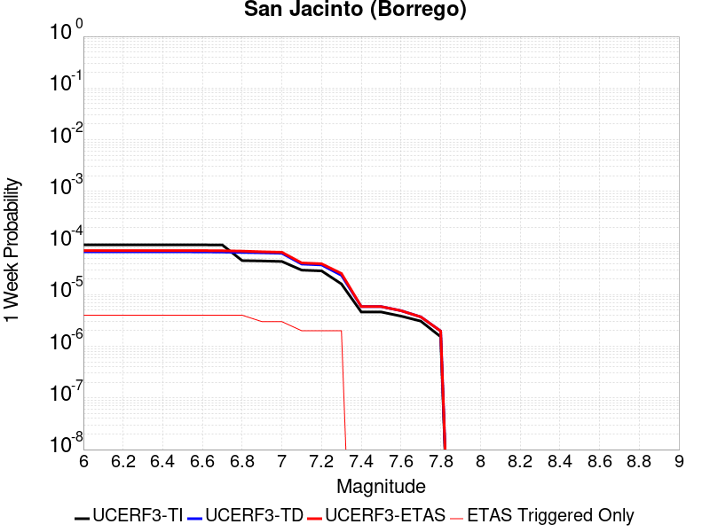 |  |  |  |

| Magnitude | 1 wk TI Prob | 1 wk TD Prob | 1 wk ETAS Prob | 1 wk ETAS/TD Gain | 1 wk ETAS Triggered Only | 1 mo TI Prob | 1 mo TD Prob | 1 mo ETAS Prob | 1 mo ETAS/TD Gain | 1 mo ETAS Triggered Only | 1 yr TI Prob | 1 yr TD Prob | 1 yr ETAS Prob | 1 yr ETAS/TD Gain | 1 yr ETAS Triggered Only | 10 yr TI Prob | 10 yr TD Prob | 10 yr ETAS Prob | 10 yr ETAS/TD Gain | 10 yr ETAS Triggered Only |
|-----|-----|-----|-----|-----|-----|-----|-----|-----|-----|-----|-----|-----|-----|-----|-----|-----|-----|-----|-----|-----|
| 6.0 | 9.239128E-5 | 6.746147E-5 | 6.746147E-5 | 1.0 | 0.0 | 3.9590252E-4 | 2.890956E-4 | 2.890956E-4 | 1.0 | 0.0 | 0.004809465 | 0.003515305 | 0.0035185285 | 1.000917 | 3.2348432E-6 | 0.047066994 | 0.03517175 | 0.035187356 | 1.0004437 | 1.6174215E-5 |
| 6.1 | 9.239128E-5 | 6.746147E-5 | 6.746147E-5 | 1.0 | 0.0 | 3.9590252E-4 | 2.890956E-4 | 2.890956E-4 | 1.0 | 0.0 | 0.004809465 | 0.003515305 | 0.0035185285 | 1.000917 | 3.2348432E-6 | 0.047066994 | 0.03517175 | 0.035187356 | 1.0004437 | 1.6174215E-5 |
| 6.2 | 9.239128E-5 | 6.746147E-5 | 6.746147E-5 | 1.0 | 0.0 | 3.9590252E-4 | 2.890956E-4 | 2.890956E-4 | 1.0 | 0.0 | 0.004809465 | 0.003515305 | 0.0035185285 | 1.000917 | 3.2348432E-6 | 0.047066994 | 0.03517175 | 0.035187356 | 1.0004437 | 1.6174215E-5 |
| 6.3 | 9.239128E-5 | 6.746147E-5 | 6.746147E-5 | 1.0 | 0.0 | 3.9590252E-4 | 2.890956E-4 | 2.890956E-4 | 1.0 | 0.0 | 0.004809465 | 0.003515305 | 0.0035185285 | 1.000917 | 3.2348432E-6 | 0.047066994 | 0.03517175 | 0.035187356 | 1.0004437 | 1.6174215E-5 |
| 6.4 | 9.239128E-5 | 6.746147E-5 | 6.746147E-5 | 1.0 | 0.0 | 3.9590252E-4 | 2.890956E-4 | 2.890956E-4 | 1.0 | 0.0 | 0.004809465 | 0.003515305 | 0.0035185285 | 1.000917 | 3.2348432E-6 | 0.047066994 | 0.03517175 | 0.035187356 | 1.0004437 | 1.6174215E-5 |
| 6.5 | 9.239128E-5 | 6.746147E-5 | 6.746147E-5 | 1.0 | 0.0 | 3.9590252E-4 | 2.890956E-4 | 2.890956E-4 | 1.0 | 0.0 | 0.004809465 | 0.003515305 | 0.0035185285 | 1.000917 | 3.2348432E-6 | 0.047066994 | 0.03517175 | 0.035187356 | 1.0004437 | 1.6174215E-5 |
| 6.6 | 9.205471E-5 | 6.722113E-5 | 6.722113E-5 | 1.0 | 0.0 | 3.9446054E-4 | 2.8806578E-4 | 2.8806578E-4 | 1.0 | 0.0 | 0.004791986 | 0.0035028076 | 0.0035060311 | 1.0009203 | 3.2348432E-6 | 0.046899613 | 0.035048313 | 0.035063922 | 1.0004454 | 1.6174215E-5 |
| 6.7 | 9.1629794E-5 | 6.682258E-5 | 6.682258E-5 | 1.0 | 0.0 | 3.9264E-4 | 2.8635806E-4 | 2.8635806E-4 | 1.0 | 0.0 | 0.0047699185 | 0.0034820824 | 0.003485306 | 1.0009258 | 3.2348432E-6 | 0.046688255 | 0.034847513 | 0.03486312 | 1.000448 | 1.6174215E-5 |
| 6.8 | 4.5613822E-5 | 6.5666274E-5 | 6.5666274E-5 | 1.0 | 0.0 | 1.9547316E-4 | 2.8140357E-4 | 2.8140357E-4 | 1.0 | 0.0 | 0.0023772882 | 0.0034219522 | 0.0034219522 | 1.0 | 0.0 | 0.02352017 | 0.034074746 | 0.034087244 | 1.0003668 | 1.2939373E-5 |
| 6.9 | 4.4921322E-5 | 6.461979E-5 | 6.461979E-5 | 1.0 | 0.0 | 1.9250574E-4 | 2.7691957E-4 | 2.7691957E-4 | 1.0 | 0.0 | 0.002341238 | 0.0033675297 | 0.0033675297 | 1.0 | 0.0 | 0.02316725 | 0.033549417 | 0.033558797 | 1.0002795 | 9.7045295E-6 |
| 7.0 | 4.3896973E-5 | 6.325712E-5 | 6.325712E-5 | 1.0 | 0.0 | 1.8811632E-4 | 2.710808E-4 | 2.710808E-4 | 1.0 | 0.0 | 0.0022879103 | 0.0032966596 | 0.0032966596 | 1.0 | 0.0 | 0.02264498 | 0.032856427 | 0.03286581 | 1.0002856 | 9.7045295E-6 |
| 7.1 | 2.9838686E-5 | 3.9105144E-5 | 3.9105144E-5 | 1.0 | 0.0 | 1.2787382E-4 | 1.6758604E-4 | 1.6758604E-4 | 1.0 | 0.0 | 0.0015557519 | 0.0020390416 | 0.0020390416 | 1.0 | 0.0 | 0.015449053 | 0.020523686 | 0.020530023 | 1.0003088 | 6.4696865E-6 |
| 7.2 | 2.8857767E-5 | 3.7642178E-5 | 3.7642178E-5 | 1.0 | 0.0 | 1.2367028E-4 | 1.6131697E-4 | 1.6131697E-4 | 1.0 | 0.0 | 0.0015046457 | 0.0019628557 | 0.0019628557 | 1.0 | 0.0 | 0.014944986 | 0.019774253 | 0.019780595 | 1.0003207 | 6.4696865E-6 |
| 7.3 | 1.6111655E-5 | 2.3702598E-5 | 2.3702598E-5 | 1.0 | 0.0 | 6.9048125E-5 | 1.0158089E-4 | 1.0158089E-4 | 1.0 | 0.0 | 8.4033667E-4 | 0.0012364498 | 0.0012364498 | 1.0 | 0.0 | 0.0083716605 | 0.012510133 | 0.012516521 | 1.0005107 | 6.4696865E-6 |
| 7.4 | 4.6148393E-6 | 5.874165E-6 | 5.874165E-6 | 1.0 | 0.0 | 1.9777734E-5 | 2.5174792E-5 | 2.5174792E-5 | 1.0 | 0.0 | 2.4076729E-4 | 3.064673E-4 | 3.064673E-4 | 1.0 | 0.0 | 0.002405066 | 0.0031677345 | 0.0031709592 | 1.0010179 | 3.2348432E-6 |
| 7.5 | 4.6148393E-6 | 5.874165E-6 | 5.874165E-6 | 1.0 | 0.0 | 1.9777734E-5 | 2.5174792E-5 | 2.5174792E-5 | 1.0 | 0.0 | 2.4076729E-4 | 3.064673E-4 | 3.064673E-4 | 1.0 | 0.0 | 0.002405066 | 0.0031677345 | 0.0031709592 | 1.0010179 | 3.2348432E-6 |
| 7.6 | 3.839952E-6 | 4.892815E-6 | 4.892815E-6 | 1.0 | 0.0 | 1.6456834E-5 | 2.0969073E-5 | 2.0969073E-5 | 1.0 | 0.0 | 2.0034352E-4 | 2.5527467E-4 | 2.5527467E-4 | 1.0 | 0.0 | 0.00200163 | 0.0026436278 | 0.0026468541 | 1.0012203 | 3.2348432E-6 |
| 7.7 | 3.068414E-6 | 3.707481E-6 | 3.707481E-6 | 1.0 | 0.0 | 1.3150278E-5 | 1.5889133E-5 | 1.5889133E-5 | 1.0 | 0.0 | 1.6009288E-4 | 1.9343739E-4 | 1.9343739E-4 | 1.0 | 0.0 | 0.001599776 | 0.0020167015 | 0.0020199297 | 1.0016007 | 3.2348432E-6 |
| 7.8 | 1.5303123E-6 | 1.9707616E-6 | 1.9707616E-6 | 1.0 | 0.0 | 6.5584645E-6 | 8.446107E-6 | 8.446107E-6 | 1.0 | 0.0 | 7.984638E-5 | 1.0282895E-4 | 1.0282895E-4 | 1.0 | 0.0 | 7.98177E-4 | 0.001066982 | 0.0010702135 | 1.0030285 | 3.2348432E-6 |

## Calaveras (So) 2011 CFM
*[(top)](#table-of-contents)*

| 1 Week | 1 Month | 1 Year | 10 Year |
|-----|-----|-----|-----|
|  |  |  |  |

| Magnitude | 1 wk TI Prob | 1 wk TD Prob | 1 wk ETAS Prob | 1 wk ETAS/TD Gain | 1 wk ETAS Triggered Only | 1 mo TI Prob | 1 mo TD Prob | 1 mo ETAS Prob | 1 mo ETAS/TD Gain | 1 mo ETAS Triggered Only | 1 yr TI Prob | 1 yr TD Prob | 1 yr ETAS Prob | 1 yr ETAS/TD Gain | 1 yr ETAS Triggered Only | 10 yr TI Prob | 10 yr TD Prob | 10 yr ETAS Prob | 10 yr ETAS/TD Gain | 10 yr ETAS Triggered Only |
|-----|-----|-----|-----|-----|-----|-----|-----|-----|-----|-----|-----|-----|-----|-----|-----|-----|-----|-----|-----|-----|
| 6.0 | 1.00604906E-4 | 2.1600646E-4 | 2.2570889E-4 | 1.0449173 | 9.7045295E-6 | 4.3109263E-4 | 9.255689E-4 | 9.3526446E-4 | 1.0104753 | 9.7045295E-6 | 0.0052359286 | 0.0112380525 | 0.011247648 | 1.0008539 | 9.7045295E-6 | 0.05114268 | 0.102641135 | 0.10265275 | 1.0001131 | 1.2939373E-5 |
| 6.1 | 1.00604906E-4 | 2.1600646E-4 | 2.2570889E-4 | 1.0449173 | 9.7045295E-6 | 4.3109263E-4 | 9.255689E-4 | 9.3526446E-4 | 1.0104753 | 9.7045295E-6 | 0.0052359286 | 0.0112380525 | 0.011247648 | 1.0008539 | 9.7045295E-6 | 0.05114268 | 0.102641135 | 0.10265275 | 1.0001131 | 1.2939373E-5 |
| 6.2 | 1.00604906E-4 | 2.1600646E-4 | 2.2570889E-4 | 1.0449173 | 9.7045295E-6 | 4.3109263E-4 | 9.255689E-4 | 9.3526446E-4 | 1.0104753 | 9.7045295E-6 | 0.0052359286 | 0.0112380525 | 0.011247648 | 1.0008539 | 9.7045295E-6 | 0.05114268 | 0.102641135 | 0.10265275 | 1.0001131 | 1.2939373E-5 |
| 6.3 | 1.00604906E-4 | 2.1600646E-4 | 2.2570889E-4 | 1.0449173 | 9.7045295E-6 | 4.3109263E-4 | 9.255689E-4 | 9.3526446E-4 | 1.0104753 | 9.7045295E-6 | 0.0052359286 | 0.0112380525 | 0.011247648 | 1.0008539 | 9.7045295E-6 | 0.05114268 | 0.102641135 | 0.10265275 | 1.0001131 | 1.2939373E-5 |
| 6.4 | 1.00604906E-4 | 2.1600646E-4 | 2.2570889E-4 | 1.0449173 | 9.7045295E-6 | 4.3109263E-4 | 9.255689E-4 | 9.3526446E-4 | 1.0104753 | 9.7045295E-6 | 0.0052359286 | 0.0112380525 | 0.011247648 | 1.0008539 | 9.7045295E-6 | 0.05114268 | 0.102641135 | 0.10265275 | 1.0001131 | 1.2939373E-5 |
| 6.5 | 3.6232093E-5 | 8.0470694E-5 | 8.0470694E-5 | 1.0 | 0.0 | 1.5527116E-4 | 3.448549E-4 | 3.448549E-4 | 1.0 | 0.0 | 0.0018887871 | 0.004195091 | 0.004195091 | 1.0 | 0.0 | 0.018728139 | 0.040133998 | 0.040137105 | 1.0000774 | 3.2348432E-6 |
| 6.6 | 3.4288823E-5 | 7.645369E-5 | 7.645369E-5 | 1.0 | 0.0 | 1.4694381E-4 | 3.2764356E-4 | 3.2764356E-4 | 1.0 | 0.0 | 0.0017875729 | 0.003986383 | 0.003986383 | 1.0 | 0.0 | 0.017732618 | 0.03829094 | 0.038294055 | 1.0000813 | 3.2348432E-6 |
| 6.7 | 3.365726E-5 | 7.5152966E-5 | 7.5152966E-5 | 1.0 | 0.0 | 1.4423742E-4 | 3.220704E-4 | 3.220704E-4 | 1.0 | 0.0 | 0.001754676 | 0.003918774 | 0.003918774 | 1.0 | 0.0 | 0.017408855 | 0.037675563 | 0.037678678 | 1.0000826 | 3.2348432E-6 |
| 6.8 | 2.9146076E-5 | 6.459388E-5 | 6.459388E-5 | 1.0 | 0.0 | 1.2490578E-4 | 2.768274E-4 | 2.768274E-4 | 1.0 | 0.0 | 0.001519667 | 0.0033697556 | 0.0033697556 | 1.0 | 0.0 | 0.015093167 | 0.032588553 | 0.032591682 | 1.0000961 | 3.2348432E-6 |
| 6.9 | 2.7363296E-5 | 6.059934E-5 | 6.059934E-5 | 1.0 | 0.0 | 1.1726599E-4 | 2.5971147E-4 | 2.5971147E-4 | 1.0 | 0.0 | 0.0014267784 | 0.003161987 | 0.003161987 | 1.0 | 0.0 | 0.014176525 | 0.030637112 | 0.030640246 | 1.0001024 | 3.2348432E-6 |

## Honey Lake 2011 CFM
*[(top)](#table-of-contents)*

| 1 Week | 1 Month | 1 Year | 10 Year |
|-----|-----|-----|-----|
|  |  |  | 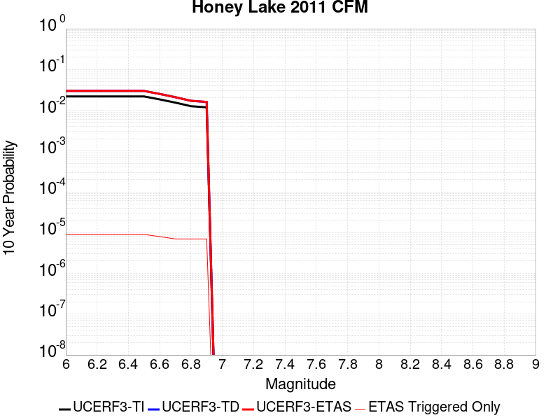 |

| Magnitude | 1 wk TI Prob | 1 wk TD Prob | 1 wk ETAS Prob | 1 wk ETAS/TD Gain | 1 wk ETAS Triggered Only | 1 mo TI Prob | 1 mo TD Prob | 1 mo ETAS Prob | 1 mo ETAS/TD Gain | 1 mo ETAS Triggered Only | 1 yr TI Prob | 1 yr TD Prob | 1 yr ETAS Prob | 1 yr ETAS/TD Gain | 1 yr ETAS Triggered Only | 10 yr TI Prob | 10 yr TD Prob | 10 yr ETAS Prob | 10 yr ETAS/TD Gain | 10 yr ETAS Triggered Only |
|-----|-----|-----|-----|-----|-----|-----|-----|-----|-----|-----|-----|-----|-----|-----|-----|-----|-----|-----|-----|-----|
| 6.0 | 4.2419113E-5 | 5.7836412E-5 | 5.7836412E-5 | 1.0 | 0.0 | 1.8178353E-4 | 2.4785337E-4 | 2.4785337E-4 | 1.0 | 0.0 | 0.002210968 | 0.0030145324 | 0.0030209825 | 1.0021397 | 6.4696865E-6 | 0.021890994 | 0.029842986 | 0.029855538 | 1.0004207 | 1.2939373E-5 |
| 6.1 | 4.2419113E-5 | 5.7836412E-5 | 5.7836412E-5 | 1.0 | 0.0 | 1.8178353E-4 | 2.4785337E-4 | 2.4785337E-4 | 1.0 | 0.0 | 0.002210968 | 0.0030145324 | 0.0030209825 | 1.0021397 | 6.4696865E-6 | 0.021890994 | 0.029842986 | 0.029855538 | 1.0004207 | 1.2939373E-5 |
| 6.2 | 4.2419113E-5 | 5.7836412E-5 | 5.7836412E-5 | 1.0 | 0.0 | 1.8178353E-4 | 2.4785337E-4 | 2.4785337E-4 | 1.0 | 0.0 | 0.002210968 | 0.0030145324 | 0.0030209825 | 1.0021397 | 6.4696865E-6 | 0.021890994 | 0.029842986 | 0.029855538 | 1.0004207 | 1.2939373E-5 |
| 6.3 | 4.2419113E-5 | 5.7836412E-5 | 5.7836412E-5 | 1.0 | 0.0 | 1.8178353E-4 | 2.4785337E-4 | 2.4785337E-4 | 1.0 | 0.0 | 0.002210968 | 0.0030145324 | 0.0030209825 | 1.0021397 | 6.4696865E-6 | 0.021890994 | 0.029842986 | 0.029855538 | 1.0004207 | 1.2939373E-5 |
| 6.4 | 4.2419113E-5 | 5.7836412E-5 | 5.7836412E-5 | 1.0 | 0.0 | 1.8178353E-4 | 2.4785337E-4 | 2.4785337E-4 | 1.0 | 0.0 | 0.002210968 | 0.0030145324 | 0.0030209825 | 1.0021397 | 6.4696865E-6 | 0.021890994 | 0.029842986 | 0.029855538 | 1.0004207 | 1.2939373E-5 |
| 6.5 | 4.2419113E-5 | 5.7836412E-5 | 5.7836412E-5 | 1.0 | 0.0 | 1.8178353E-4 | 2.4785337E-4 | 2.4785337E-4 | 1.0 | 0.0 | 0.002210968 | 0.0030145324 | 0.0030209825 | 1.0021397 | 6.4696865E-6 | 0.021890994 | 0.029842986 | 0.029855538 | 1.0004207 | 1.2939373E-5 |
| 6.6 | 3.5778685E-5 | 4.865727E-5 | 4.865727E-5 | 1.0 | 0.0 | 1.533282E-4 | 2.0852126E-4 | 2.0852126E-4 | 1.0 | 0.0 | 0.0018651724 | 0.002536925 | 0.0025433784 | 1.0025437 | 6.4696865E-6 | 0.01849595 | 0.025190448 | 0.02520306 | 1.0005007 | 1.2939373E-5 |
| 6.7 | 2.9777242E-5 | 4.0327057E-5 | 4.0327057E-5 | 1.0 | 0.0 | 1.2761052E-4 | 1.7282547E-4 | 1.7282547E-4 | 1.0 | 0.0 | 0.0015525507 | 0.0021032947 | 0.0021097509 | 1.0030695 | 6.4696865E-6 | 0.0154174855 | 0.020948831 | 0.020961499 | 1.0006047 | 1.2939373E-5 |
| 6.8 | 2.4307292E-5 | 3.2781874E-5 | 3.2781874E-5 | 1.0 | 0.0 | 1.0416994E-4 | 1.4049283E-4 | 1.4049283E-4 | 1.0 | 0.0 | 0.0012675312 | 0.0017103229 | 0.0017167816 | 1.0037763 | 6.4696865E-6 | 0.012603257 | 0.017085526 | 0.017098244 | 1.0007443 | 1.2939373E-5 |
| 6.9 | 2.2774519E-5 | 3.0696156E-5 | 3.0696156E-5 | 1.0 | 0.0 | 9.760143E-5 | 1.3155496E-4 | 1.3155496E-4 | 1.0 | 0.0 | 0.0011876496 | 0.0016016681 | 0.0016081274 | 1.0040329 | 6.4696865E-6 | 0.011813223 | 0.016015066 | 0.016027799 | 1.000795 | 1.2939373E-5 |

## Robinson Creek
*[(top)](#table-of-contents)*

| 1 Week | 1 Month | 1 Year | 10 Year |
|-----|-----|-----|-----|
|  | 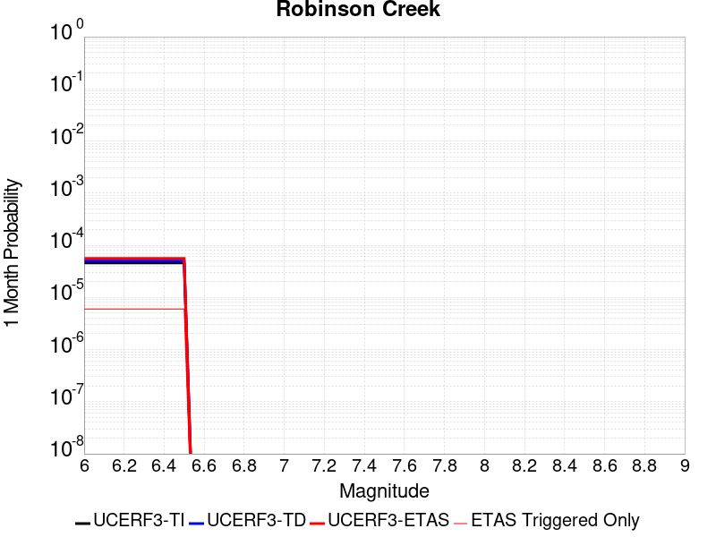 |  |  |

| Magnitude | 1 wk TI Prob | 1 wk TD Prob | 1 wk ETAS Prob | 1 wk ETAS/TD Gain | 1 wk ETAS Triggered Only | 1 mo TI Prob | 1 mo TD Prob | 1 mo ETAS Prob | 1 mo ETAS/TD Gain | 1 mo ETAS Triggered Only | 1 yr TI Prob | 1 yr TD Prob | 1 yr ETAS Prob | 1 yr ETAS/TD Gain | 1 yr ETAS Triggered Only | 10 yr TI Prob | 10 yr TD Prob | 10 yr ETAS Prob | 10 yr ETAS/TD Gain | 10 yr ETAS Triggered Only |
|-----|-----|-----|-----|-----|-----|-----|-----|-----|-----|-----|-----|-----|-----|-----|-----|-----|-----|-----|-----|-----|
| 6.0 | 1.0723721E-5 | 1.1667189E-5 | 1.1667189E-5 | 1.0 | 0.0 | 4.5957993E-5 | 5.000224E-5 | 5.323692E-5 | 1.0646907 | 3.2348432E-6 | 5.593949E-4 | 6.087773E-4 | 6.1201013E-4 | 1.0053104 | 3.2348432E-6 | 0.0055798884 | 0.0060877725 | 0.006100633 | 1.0021125 | 1.2939373E-5 |
| 6.1 | 1.0723721E-5 | 1.1667189E-5 | 1.1667189E-5 | 1.0 | 0.0 | 4.5957993E-5 | 5.000224E-5 | 5.323692E-5 | 1.0646907 | 3.2348432E-6 | 5.593949E-4 | 6.087773E-4 | 6.1201013E-4 | 1.0053104 | 3.2348432E-6 | 0.0055798884 | 0.0060877725 | 0.006100633 | 1.0021125 | 1.2939373E-5 |
| 6.2 | 1.0723721E-5 | 1.1667189E-5 | 1.1667189E-5 | 1.0 | 0.0 | 4.5957993E-5 | 5.000224E-5 | 5.323692E-5 | 1.0646907 | 3.2348432E-6 | 5.593949E-4 | 6.087773E-4 | 6.1201013E-4 | 1.0053104 | 3.2348432E-6 | 0.0055798884 | 0.0060877725 | 0.006100633 | 1.0021125 | 1.2939373E-5 |
| 6.3 | 1.0723721E-5 | 1.1667189E-5 | 1.1667189E-5 | 1.0 | 0.0 | 4.5957993E-5 | 5.000224E-5 | 5.323692E-5 | 1.0646907 | 3.2348432E-6 | 5.593949E-4 | 6.087773E-4 | 6.1201013E-4 | 1.0053104 | 3.2348432E-6 | 0.0055798884 | 0.0060877725 | 0.006100633 | 1.0021125 | 1.2939373E-5 |
| 6.4 | 1.0723721E-5 | 1.1667189E-5 | 1.1667189E-5 | 1.0 | 0.0 | 4.5957993E-5 | 5.000224E-5 | 5.323692E-5 | 1.0646907 | 3.2348432E-6 | 5.593949E-4 | 6.087773E-4 | 6.1201013E-4 | 1.0053104 | 3.2348432E-6 | 0.0055798884 | 0.0060877725 | 0.006100633 | 1.0021125 | 1.2939373E-5 |
| 6.5 | 1.0723721E-5 | 1.1667189E-5 | 1.1667189E-5 | 1.0 | 0.0 | 4.5957993E-5 | 5.000224E-5 | 5.323692E-5 | 1.0646907 | 3.2348432E-6 | 5.593949E-4 | 6.087773E-4 | 6.1201013E-4 | 1.0053104 | 3.2348432E-6 | 0.0055798884 | 0.0060877725 | 0.006100633 | 1.0021125 | 1.2939373E-5 |

## Round Valley
*[(top)](#table-of-contents)*

| 1 Week | 1 Month | 1 Year | 10 Year |
|-----|-----|-----|-----|
|  |  |  |  |

| Magnitude | 1 wk TI Prob | 1 wk TD Prob | 1 wk ETAS Prob | 1 wk ETAS/TD Gain | 1 wk ETAS Triggered Only | 1 mo TI Prob | 1 mo TD Prob | 1 mo ETAS Prob | 1 mo ETAS/TD Gain | 1 mo ETAS Triggered Only | 1 yr TI Prob | 1 yr TD Prob | 1 yr ETAS Prob | 1 yr ETAS/TD Gain | 1 yr ETAS Triggered Only | 10 yr TI Prob | 10 yr TD Prob | 10 yr ETAS Prob | 10 yr ETAS/TD Gain | 10 yr ETAS Triggered Only |
|-----|-----|-----|-----|-----|-----|-----|-----|-----|-----|-----|-----|-----|-----|-----|-----|-----|-----|-----|-----|-----|
| 6.0 | 1.5129573E-5 | 1.668525E-5 | 2.6389618E-5 | 1.5816135 | 9.7045295E-6 | 6.483941E-5 | 7.1506845E-5 | 8.121068E-5 | 1.135705 | 9.7045295E-6 | 7.8913395E-4 | 8.7035226E-4 | 8.800484E-4 | 1.0111405 | 9.7045295E-6 | 0.007863375 | 0.008679682 | 0.0086925095 | 1.0014778 | 1.2939373E-5 |
| 6.1 | 1.5129573E-5 | 1.668525E-5 | 2.6389618E-5 | 1.5816135 | 9.7045295E-6 | 6.483941E-5 | 7.1506845E-5 | 8.121068E-5 | 1.135705 | 9.7045295E-6 | 7.8913395E-4 | 8.7035226E-4 | 8.800484E-4 | 1.0111405 | 9.7045295E-6 | 0.007863375 | 0.008679682 | 0.0086925095 | 1.0014778 | 1.2939373E-5 |
| 6.2 | 1.5129573E-5 | 1.668525E-5 | 2.6389618E-5 | 1.5816135 | 9.7045295E-6 | 6.483941E-5 | 7.1506845E-5 | 8.121068E-5 | 1.135705 | 9.7045295E-6 | 7.8913395E-4 | 8.7035226E-4 | 8.800484E-4 | 1.0111405 | 9.7045295E-6 | 0.007863375 | 0.008679682 | 0.0086925095 | 1.0014778 | 1.2939373E-5 |
| 6.3 | 1.5129573E-5 | 1.668525E-5 | 2.6389618E-5 | 1.5816135 | 9.7045295E-6 | 6.483941E-5 | 7.1506845E-5 | 8.121068E-5 | 1.135705 | 9.7045295E-6 | 7.8913395E-4 | 8.7035226E-4 | 8.800484E-4 | 1.0111405 | 9.7045295E-6 | 0.007863375 | 0.008679682 | 0.0086925095 | 1.0014778 | 1.2939373E-5 |
| 6.4 | 1.5129573E-5 | 1.668525E-5 | 2.6389618E-5 | 1.5816135 | 9.7045295E-6 | 6.483941E-5 | 7.1506845E-5 | 8.121068E-5 | 1.135705 | 9.7045295E-6 | 7.8913395E-4 | 8.7035226E-4 | 8.800484E-4 | 1.0111405 | 9.7045295E-6 | 0.007863375 | 0.008679682 | 0.0086925095 | 1.0014778 | 1.2939373E-5 |
| 6.5 | 1.5129573E-5 | 1.668525E-5 | 2.6389618E-5 | 1.5816135 | 9.7045295E-6 | 6.483941E-5 | 7.1506845E-5 | 8.121068E-5 | 1.135705 | 9.7045295E-6 | 7.8913395E-4 | 8.7035226E-4 | 8.800484E-4 | 1.0111405 | 9.7045295E-6 | 0.007863375 | 0.008679682 | 0.0086925095 | 1.0014778 | 1.2939373E-5 |
| 6.6 | 1.4434947E-5 | 1.5912143E-5 | 2.5616517E-5 | 1.6098723 | 9.7045295E-6 | 6.186259E-5 | 6.81937E-5 | 7.789757E-5 | 1.1422986 | 9.7045295E-6 | 7.529168E-4 | 8.3004584E-4 | 8.397423E-4 | 1.0116818 | 9.7045295E-6 | 0.0075037093 | 0.00827966 | 0.008292492 | 1.0015498 | 1.2939373E-5 |
| 6.7 | 1.15477105E-5 | 1.2717341E-5 | 1.9186944E-5 | 1.508723 | 6.4696865E-6 | 4.948925E-5 | 5.4502318E-5 | 6.097165E-5 | 1.1186984 | 6.4696865E-6 | 6.02365E-4 | 6.6346437E-4 | 6.699298E-4 | 1.0097449 | 6.4696865E-6 | 0.0060073487 | 0.0066247126 | 0.006634353 | 1.0014552 | 9.7045295E-6 |
| 6.8 | 8.959772E-6 | 9.845762E-6 | 9.845762E-6 | 1.0 | 0.0 | 3.8398455E-5 | 4.2195978E-5 | 4.2195978E-5 | 1.0 | 0.0 | 4.674009E-4 | 5.1371043E-4 | 5.1371043E-4 | 1.0 | 0.0 | 0.0046641906 | 0.0051345914 | 0.0051378096 | 1.0006268 | 3.2348432E-6 |
| 6.9 | 7.926176E-6 | 8.705021E-6 | 8.705021E-6 | 1.0 | 0.0 | 3.3968885E-5 | 3.7307233E-5 | 3.7307233E-5 | 1.0 | 0.0 | 4.1349267E-4 | 4.5421557E-4 | 4.5421557E-4 | 1.0 | 0.0 | 0.004127241 | 0.0045421557 | 0.0045453757 | 1.0007089 | 3.2348432E-6 |
| 7.0 | 7.926176E-6 | 8.705021E-6 | 8.705021E-6 | 1.0 | 0.0 | 3.3968885E-5 | 3.7307233E-5 | 3.7307233E-5 | 1.0 | 0.0 | 4.1349267E-4 | 4.5421557E-4 | 4.5421557E-4 | 1.0 | 0.0 | 0.004127241 | 0.0045421557 | 0.0045453757 | 1.0007089 | 3.2348432E-6 |

## San Luis Range 2011 CFM
*[(top)](#table-of-contents)*

| 1 Week | 1 Month | 1 Year | 10 Year |
|-----|-----|-----|-----|
|  |  |  |  |

| Magnitude | 1 wk TI Prob | 1 wk TD Prob | 1 wk ETAS Prob | 1 wk ETAS/TD Gain | 1 wk ETAS Triggered Only | 1 mo TI Prob | 1 mo TD Prob | 1 mo ETAS Prob | 1 mo ETAS/TD Gain | 1 mo ETAS Triggered Only | 1 yr TI Prob | 1 yr TD Prob | 1 yr ETAS Prob | 1 yr ETAS/TD Gain | 1 yr ETAS Triggered Only | 10 yr TI Prob | 10 yr TD Prob | 10 yr ETAS Prob | 10 yr ETAS/TD Gain | 10 yr ETAS Triggered Only |
|-----|-----|-----|-----|-----|-----|-----|-----|-----|-----|-----|-----|-----|-----|-----|-----|-----|-----|-----|-----|-----|
| 6.0 | 2.8589725E-6 | 2.906881E-6 | 6.141715E-6 | 2.1128194 | 3.2348432E-6 | 1.2252682E-5 | 1.24580165E-5 | 1.8927623E-5 | 1.5193126 | 6.4696865E-6 | 1.491662E-4 | 1.5166836E-4 | 1.6460576E-4 | 1.0853007 | 1.2939373E-5 | 0.0014906611 | 0.0015158989 | 0.0015288186 | 1.0085229 | 1.2939373E-5 |
| 6.1 | 2.8589725E-6 | 2.906881E-6 | 6.141715E-6 | 2.1128194 | 3.2348432E-6 | 1.2252682E-5 | 1.24580165E-5 | 1.8927623E-5 | 1.5193126 | 6.4696865E-6 | 1.491662E-4 | 1.5166836E-4 | 1.6460576E-4 | 1.0853007 | 1.2939373E-5 | 0.0014906611 | 0.0015158989 | 0.0015288186 | 1.0085229 | 1.2939373E-5 |
| 6.2 | 2.8589725E-6 | 2.906881E-6 | 6.141715E-6 | 2.1128194 | 3.2348432E-6 | 1.2252682E-5 | 1.24580165E-5 | 1.8927623E-5 | 1.5193126 | 6.4696865E-6 | 1.491662E-4 | 1.5166836E-4 | 1.6460576E-4 | 1.0853007 | 1.2939373E-5 | 0.0014906611 | 0.0015158989 | 0.0015288186 | 1.0085229 | 1.2939373E-5 |
| 6.3 | 2.8589725E-6 | 2.906881E-6 | 6.141715E-6 | 2.1128194 | 3.2348432E-6 | 1.2252682E-5 | 1.24580165E-5 | 1.8927623E-5 | 1.5193126 | 6.4696865E-6 | 1.491662E-4 | 1.5166836E-4 | 1.6460576E-4 | 1.0853007 | 1.2939373E-5 | 0.0014906611 | 0.0015158989 | 0.0015288186 | 1.0085229 | 1.2939373E-5 |
| 6.4 | 2.8589725E-6 | 2.906881E-6 | 6.141715E-6 | 2.1128194 | 3.2348432E-6 | 1.2252682E-5 | 1.24580165E-5 | 1.8927623E-5 | 1.5193126 | 6.4696865E-6 | 1.491662E-4 | 1.5166836E-4 | 1.6460576E-4 | 1.0853007 | 1.2939373E-5 | 0.0014906611 | 0.0015158989 | 0.0015288186 | 1.0085229 | 1.2939373E-5 |
| 6.5 | 2.8589725E-6 | 2.906881E-6 | 6.141715E-6 | 2.1128194 | 3.2348432E-6 | 1.2252682E-5 | 1.24580165E-5 | 1.8927623E-5 | 1.5193126 | 6.4696865E-6 | 1.491662E-4 | 1.5166836E-4 | 1.6460576E-4 | 1.0853007 | 1.2939373E-5 | 0.0014906611 | 0.0015158989 | 0.0015288186 | 1.0085229 | 1.2939373E-5 |
| 6.6 | 2.4544863E-6 | 2.495234E-6 | 2.495234E-6 | 1.0 | 0.0 | 1.0519184E-5 | 1.06938305E-5 | 1.06938305E-5 | 1.0 | 0.0 | 1.2806353E-4 | 1.3019213E-4 | 1.3666096E-4 | 1.0496869 | 6.4696865E-6 | 0.0012798976 | 0.0013014051 | 0.0013078664 | 1.0049648 | 6.4696865E-6 |
| 6.7 | 2.1688998E-6 | 2.204711E-6 | 2.204711E-6 | 1.0 | 0.0 | 9.295252E-6 | 9.448742E-6 | 9.448742E-6 | 1.0 | 0.0 | 1.1316381E-4 | 1.1503485E-4 | 1.2150379E-4 | 1.0562346 | 6.4696865E-6 | 0.001131062 | 0.0011499968 | 0.0011564591 | 1.0056194 | 6.4696865E-6 |
| 6.8 | 1.9191828E-6 | 1.950576E-6 | 1.950576E-6 | 1.0 | 0.0 | 8.2250435E-6 | 8.359599E-6 | 8.359599E-6 | 1.0 | 0.0 | 1.001353E-4 | 1.01775826E-4 | 1.0824485E-4 | 1.0635616 | 6.4696865E-6 | 0.0010009019 | 0.0010175342 | 0.0010239973 | 1.0063517 | 6.4696865E-6 |
| 6.9 | 1.6115068E-6 | 1.6374516E-6 | 1.6374516E-6 | 1.0 | 0.0 | 6.9064395E-6 | 7.0176447E-6 | 7.0176447E-6 | 1.0 | 0.0 | 8.4082654E-5 | 8.5438915E-5 | 8.867348E-5 | 1.0378582 | 3.2348432E-6 | 8.405085E-4 | 8.543001E-4 | 8.575322E-4 | 1.0037833 | 3.2348432E-6 |
| 7.0 | 1.367995E-6 | 1.3898027E-6 | 1.3898027E-6 | 1.0 | 0.0 | 5.8628225E-6 | 5.956297E-6 | 5.956297E-6 | 1.0 | 0.0 | 7.137752E-5 | 7.251792E-5 | 7.575253E-5 | 1.0446043 | 3.2348432E-6 | 7.13546E-4 | 7.251792E-4 | 7.284117E-4 | 1.0044575 | 3.2348432E-6 |
| 7.1 | 1.367995E-6 | 1.3898027E-6 | 1.3898027E-6 | 1.0 | 0.0 | 5.8628225E-6 | 5.956297E-6 | 5.956297E-6 | 1.0 | 0.0 | 7.137752E-5 | 7.251792E-5 | 7.575253E-5 | 1.0446043 | 3.2348432E-6 | 7.13546E-4 | 7.251792E-4 | 7.284117E-4 | 1.0044575 | 3.2348432E-6 |

## Great Valley 04b Gordon Valley
*[(top)](#table-of-contents)*

| 1 Week | 1 Month | 1 Year | 10 Year |
|-----|-----|-----|-----|
|  |  |  |  |

| Magnitude | 1 wk TI Prob | 1 wk TD Prob | 1 wk ETAS Prob | 1 wk ETAS/TD Gain | 1 wk ETAS Triggered Only | 1 mo TI Prob | 1 mo TD Prob | 1 mo ETAS Prob | 1 mo ETAS/TD Gain | 1 mo ETAS Triggered Only | 1 yr TI Prob | 1 yr TD Prob | 1 yr ETAS Prob | 1 yr ETAS/TD Gain | 1 yr ETAS Triggered Only | 10 yr TI Prob | 10 yr TD Prob | 10 yr ETAS Prob | 10 yr ETAS/TD Gain | 10 yr ETAS Triggered Only |
|-----|-----|-----|-----|-----|-----|-----|-----|-----|-----|-----|-----|-----|-----|-----|-----|-----|-----|-----|-----|-----|
| 6.0 | 2.4076155E-5 | 2.8932132E-5 | 2.8932132E-5 | 1.0 | 0.0 | 1.03179445E-4 | 1.2399205E-4 | 1.2399205E-4 | 1.0 | 0.0 | 0.0012554857 | 0.0015091051 | 0.001512335 | 1.0021403 | 3.2348432E-6 | 0.012484163 | 0.015042224 | 0.015054968 | 1.0008472 | 1.2939373E-5 |
| 6.1 | 2.4076155E-5 | 2.8932132E-5 | 2.8932132E-5 | 1.0 | 0.0 | 1.03179445E-4 | 1.2399205E-4 | 1.2399205E-4 | 1.0 | 0.0 | 0.0012554857 | 0.0015091051 | 0.001512335 | 1.0021403 | 3.2348432E-6 | 0.012484163 | 0.015042224 | 0.015054968 | 1.0008472 | 1.2939373E-5 |
| 6.2 | 2.4076155E-5 | 2.8932132E-5 | 2.8932132E-5 | 1.0 | 0.0 | 1.03179445E-4 | 1.2399205E-4 | 1.2399205E-4 | 1.0 | 0.0 | 0.0012554857 | 0.0015091051 | 0.001512335 | 1.0021403 | 3.2348432E-6 | 0.012484163 | 0.015042224 | 0.015054968 | 1.0008472 | 1.2939373E-5 |
| 6.3 | 2.4076155E-5 | 2.8932132E-5 | 2.8932132E-5 | 1.0 | 0.0 | 1.03179445E-4 | 1.2399205E-4 | 1.2399205E-4 | 1.0 | 0.0 | 0.0012554857 | 0.0015091051 | 0.001512335 | 1.0021403 | 3.2348432E-6 | 0.012484163 | 0.015042224 | 0.015054968 | 1.0008472 | 1.2939373E-5 |
| 6.4 | 2.4076155E-5 | 2.8932132E-5 | 2.8932132E-5 | 1.0 | 0.0 | 1.03179445E-4 | 1.2399205E-4 | 1.2399205E-4 | 1.0 | 0.0 | 0.0012554857 | 0.0015091051 | 0.001512335 | 1.0021403 | 3.2348432E-6 | 0.012484163 | 0.015042224 | 0.015054968 | 1.0008472 | 1.2939373E-5 |
| 6.5 | 2.4076155E-5 | 2.8932132E-5 | 2.8932132E-5 | 1.0 | 0.0 | 1.03179445E-4 | 1.2399205E-4 | 1.2399205E-4 | 1.0 | 0.0 | 0.0012554857 | 0.0015091051 | 0.001512335 | 1.0021403 | 3.2348432E-6 | 0.012484163 | 0.015042224 | 0.015054968 | 1.0008472 | 1.2939373E-5 |
| 6.6 | 1.664996E-5 | 1.9973098E-5 | 1.9973098E-5 | 1.0 | 0.0 | 7.135502E-5 | 8.559899E-5 | 8.559899E-5 | 1.0 | 0.0 | 8.68401E-4 | 0.0010421677 | 0.0010421677 | 1.0 | 0.0 | 0.008650154 | 0.010421675 | 0.010431278 | 1.0009215 | 9.7045295E-6 |
| 6.7 | 1.664996E-5 | 1.9973098E-5 | 1.9973098E-5 | 1.0 | 0.0 | 7.135502E-5 | 8.559899E-5 | 8.559899E-5 | 1.0 | 0.0 | 8.68401E-4 | 0.0010421677 | 0.0010421677 | 1.0 | 0.0 | 0.008650154 | 0.010421675 | 0.010431278 | 1.0009215 | 9.7045295E-6 |

## White Mountains
*[(top)](#table-of-contents)*

| 1 Week | 1 Month | 1 Year | 10 Year |
|-----|-----|-----|-----|
| 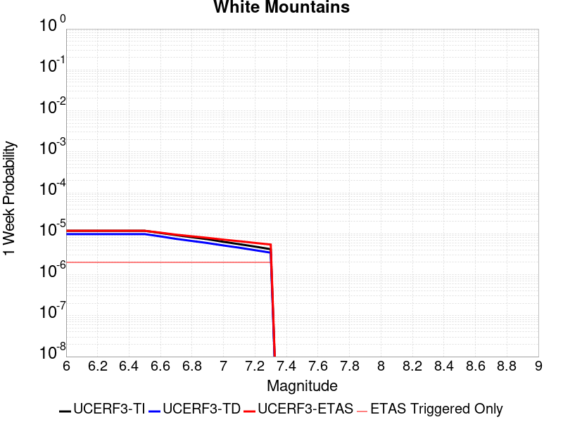 |  |  |  |

| Magnitude | 1 wk TI Prob | 1 wk TD Prob | 1 wk ETAS Prob | 1 wk ETAS/TD Gain | 1 wk ETAS Triggered Only | 1 mo TI Prob | 1 mo TD Prob | 1 mo ETAS Prob | 1 mo ETAS/TD Gain | 1 mo ETAS Triggered Only | 1 yr TI Prob | 1 yr TD Prob | 1 yr ETAS Prob | 1 yr ETAS/TD Gain | 1 yr ETAS Triggered Only | 10 yr TI Prob | 10 yr TD Prob | 10 yr ETAS Prob | 10 yr ETAS/TD Gain | 10 yr ETAS Triggered Only |
|-----|-----|-----|-----|-----|-----|-----|-----|-----|-----|-----|-----|-----|-----|-----|-----|-----|-----|-----|-----|-----|
| 6.0 | 1.17818645E-5 | 9.78196E-6 | 1.3016772E-5 | 1.3306916 | 3.2348432E-6 | 5.049273E-5 | 4.19221E-5 | 4.515681E-5 | 1.07716 | 3.2348432E-6 | 6.145756E-4 | 5.1029754E-4 | 5.1999715E-4 | 1.0190077 | 9.7045295E-6 | 0.006128787 | 0.005092789 | 0.005105662 | 1.0025278 | 1.2939373E-5 |
| 6.1 | 1.17818645E-5 | 9.78196E-6 | 1.3016772E-5 | 1.3306916 | 3.2348432E-6 | 5.049273E-5 | 4.19221E-5 | 4.515681E-5 | 1.07716 | 3.2348432E-6 | 6.145756E-4 | 5.1029754E-4 | 5.1999715E-4 | 1.0190077 | 9.7045295E-6 | 0.006128787 | 0.005092789 | 0.005105662 | 1.0025278 | 1.2939373E-5 |
| 6.2 | 1.17818645E-5 | 9.78196E-6 | 1.3016772E-5 | 1.3306916 | 3.2348432E-6 | 5.049273E-5 | 4.19221E-5 | 4.515681E-5 | 1.07716 | 3.2348432E-6 | 6.145756E-4 | 5.1029754E-4 | 5.1999715E-4 | 1.0190077 | 9.7045295E-6 | 0.006128787 | 0.005092789 | 0.005105662 | 1.0025278 | 1.2939373E-5 |
| 6.3 | 1.17818645E-5 | 9.78196E-6 | 1.3016772E-5 | 1.3306916 | 3.2348432E-6 | 5.049273E-5 | 4.19221E-5 | 4.515681E-5 | 1.07716 | 3.2348432E-6 | 6.145756E-4 | 5.1029754E-4 | 5.1999715E-4 | 1.0190077 | 9.7045295E-6 | 0.006128787 | 0.005092789 | 0.005105662 | 1.0025278 | 1.2939373E-5 |
| 6.4 | 1.17818645E-5 | 9.78196E-6 | 1.3016772E-5 | 1.3306916 | 3.2348432E-6 | 5.049273E-5 | 4.19221E-5 | 4.515681E-5 | 1.07716 | 3.2348432E-6 | 6.145756E-4 | 5.1029754E-4 | 5.1999715E-4 | 1.0190077 | 9.7045295E-6 | 0.006128787 | 0.005092789 | 0.005105662 | 1.0025278 | 1.2939373E-5 |
| 6.5 | 1.17818645E-5 | 9.78196E-6 | 1.3016772E-5 | 1.3306916 | 3.2348432E-6 | 5.049273E-5 | 4.19221E-5 | 4.515681E-5 | 1.07716 | 3.2348432E-6 | 6.145756E-4 | 5.1029754E-4 | 5.1999715E-4 | 1.0190077 | 9.7045295E-6 | 0.006128787 | 0.005092789 | 0.005105662 | 1.0025278 | 1.2939373E-5 |
| 6.6 | 1.0418851E-5 | 8.601228E-6 | 1.1836043E-5 | 1.3760877 | 3.2348432E-6 | 4.4651457E-5 | 3.6861973E-5 | 4.0096696E-5 | 1.0877523 | 3.2348432E-6 | 5.434959E-4 | 4.4871747E-4 | 4.5841763E-4 | 1.0216175 | 9.7045295E-6 | 0.0054216855 | 0.0044796285 | 0.0044892896 | 1.0021566 | 9.7045295E-6 |
| 6.7 | 9.210677E-6 | 7.477168E-6 | 1.0711987E-5 | 1.4326262 | 3.2348432E-6 | 3.9473733E-5 | 3.20447E-5 | 3.5279438E-5 | 1.1009446 | 3.2348432E-6 | 4.804867E-4 | 3.900896E-4 | 3.9979036E-4 | 1.024868 | 9.7045295E-6 | 0.0047944915 | 0.0038955477 | 0.0039052146 | 1.0024815 | 9.7045295E-6 |
| 6.8 | 8.211876E-6 | 6.649268E-6 | 9.88409E-6 | 1.4864929 | 3.2348432E-6 | 3.519328E-5 | 2.8496637E-5 | 3.173139E-5 | 1.1135135 | 3.2348432E-6 | 4.2839395E-4 | 3.469065E-4 | 3.5660766E-4 | 1.0279648 | 9.7045295E-6 | 0.0042756903 | 0.00346514 | 0.0034748109 | 1.0027909 | 9.7045295E-6 |
| 6.9 | 7.3301526E-6 | 5.9145773E-6 | 9.149401E-6 | 1.546924 | 3.2348432E-6 | 3.141456E-5 | 2.5348027E-5 | 2.8582788E-5 | 1.1276139 | 3.2348432E-6 | 3.8240515E-4 | 3.0858364E-4 | 3.1828517E-4 | 1.031439 | 9.7045295E-6 | 0.0038174777 | 0.003083034 | 0.0030927088 | 1.0031381 | 9.7045295E-6 |
| 7.0 | 6.338452E-6 | 5.1713537E-6 | 8.40618E-6 | 1.625528 | 3.2348432E-6 | 2.7164511E-5 | 2.2162842E-5 | 2.5397612E-5 | 1.1459547 | 3.2348432E-6 | 3.3067772E-4 | 2.6981422E-4 | 2.7951613E-4 | 1.0359577 | 9.7045295E-6 | 0.003301861 | 0.0026963425 | 0.0027060208 | 1.0035894 | 9.7045295E-6 |
| 7.1 | 5.5617493E-6 | 4.5614056E-6 | 7.796234E-6 | 1.7091736 | 3.2348432E-6 | 2.3835852E-5 | 1.954882E-5 | 2.2783599E-5 | 1.1654719 | 3.2348432E-6 | 2.9016283E-4 | 2.3799589E-4 | 2.476981E-4 | 1.0407664 | 9.7045295E-6 | 0.0028978426 | 0.0023788814 | 0.0023885628 | 1.0040698 | 9.7045295E-6 |
| 7.2 | 4.850874E-6 | 3.965666E-6 | 7.2004964E-6 | 1.8157092 | 3.2348432E-6 | 2.0789295E-5 | 1.6995684E-5 | 2.0230473E-5 | 1.19033 | 3.2348432E-6 | 2.5308027E-4 | 2.0691776E-4 | 2.133861E-4 | 1.0312605 | 6.4696865E-6 | 0.0025279224 | 0.002068716 | 0.0020751723 | 1.0031209 | 6.4696865E-6 |
| 7.3 | 4.1947515E-6 | 3.448504E-6 | 6.683336E-6 | 1.9380392 | 3.2348432E-6 | 1.7977383E-5 | 1.4779303E-5 | 1.8014098E-5 | 1.2188734 | 3.2348432E-6 | 2.1885266E-4 | 1.7993801E-4 | 1.8640653E-4 | 1.0359486 | 6.4696865E-6 | 0.0021863724 | 0.00179938 | 0.0018058381 | 1.003589 | 6.4696865E-6 |

## Malibu Coast alt 1
*[(top)](#table-of-contents)*

| 1 Week | 1 Month | 1 Year | 10 Year |
|-----|-----|-----|-----|
|  |  |  |  |

| Magnitude | 1 wk TI Prob | 1 wk TD Prob | 1 wk ETAS Prob | 1 wk ETAS/TD Gain | 1 wk ETAS Triggered Only | 1 mo TI Prob | 1 mo TD Prob | 1 mo ETAS Prob | 1 mo ETAS/TD Gain | 1 mo ETAS Triggered Only | 1 yr TI Prob | 1 yr TD Prob | 1 yr ETAS Prob | 1 yr ETAS/TD Gain | 1 yr ETAS Triggered Only | 10 yr TI Prob | 10 yr TD Prob | 10 yr ETAS Prob | 10 yr ETAS/TD Gain | 10 yr ETAS Triggered Only |
|-----|-----|-----|-----|-----|-----|-----|-----|-----|-----|-----|-----|-----|-----|-----|-----|-----|-----|-----|-----|-----|
| 6.0 | 5.5048527E-6 | 5.7432603E-6 | 1.22129095E-5 | 2.1264768 | 6.4696865E-6 | 2.3592012E-5 | 2.4613972E-5 | 3.4318262E-5 | 1.3942595 | 9.7045295E-6 | 2.8719488E-4 | 2.996751E-4 | 3.1261062E-4 | 1.0431651 | 1.2939373E-5 | 0.00286824 | 0.002996751 | 0.0030096518 | 1.0043049 | 1.2939373E-5 |
| 6.1 | 5.5048527E-6 | 5.7432603E-6 | 1.22129095E-5 | 2.1264768 | 6.4696865E-6 | 2.3592012E-5 | 2.4613972E-5 | 3.4318262E-5 | 1.3942595 | 9.7045295E-6 | 2.8719488E-4 | 2.996751E-4 | 3.1261062E-4 | 1.0431651 | 1.2939373E-5 | 0.00286824 | 0.002996751 | 0.0030096518 | 1.0043049 | 1.2939373E-5 |
| 6.2 | 5.5048527E-6 | 5.7432603E-6 | 1.22129095E-5 | 2.1264768 | 6.4696865E-6 | 2.3592012E-5 | 2.4613972E-5 | 3.4318262E-5 | 1.3942595 | 9.7045295E-6 | 2.8719488E-4 | 2.996751E-4 | 3.1261062E-4 | 1.0431651 | 1.2939373E-5 | 0.00286824 | 0.002996751 | 0.0030096518 | 1.0043049 | 1.2939373E-5 |
| 6.3 | 5.5048527E-6 | 5.7432603E-6 | 1.22129095E-5 | 2.1264768 | 6.4696865E-6 | 2.3592012E-5 | 2.4613972E-5 | 3.4318262E-5 | 1.3942595 | 9.7045295E-6 | 2.8719488E-4 | 2.996751E-4 | 3.1261062E-4 | 1.0431651 | 1.2939373E-5 | 0.00286824 | 0.002996751 | 0.0030096518 | 1.0043049 | 1.2939373E-5 |
| 6.4 | 5.5048527E-6 | 5.7432603E-6 | 1.22129095E-5 | 2.1264768 | 6.4696865E-6 | 2.3592012E-5 | 2.4613972E-5 | 3.4318262E-5 | 1.3942595 | 9.7045295E-6 | 2.8719488E-4 | 2.996751E-4 | 3.1261062E-4 | 1.0431651 | 1.2939373E-5 | 0.00286824 | 0.002996751 | 0.0030096518 | 1.0043049 | 1.2939373E-5 |
| 6.5 | 5.5048527E-6 | 5.7432603E-6 | 1.22129095E-5 | 2.1264768 | 6.4696865E-6 | 2.3592012E-5 | 2.4613972E-5 | 3.4318262E-5 | 1.3942595 | 9.7045295E-6 | 2.8719488E-4 | 2.996751E-4 | 3.1261062E-4 | 1.0431651 | 1.2939373E-5 | 0.00286824 | 0.002996751 | 0.0030096518 | 1.0043049 | 1.2939373E-5 |

## Great Valley 07 (Orestimba)
*[(top)](#table-of-contents)*

| 1 Week | 1 Month | 1 Year | 10 Year |
|-----|-----|-----|-----|
|  |  |  |  |

| Magnitude | 1 wk TI Prob | 1 wk TD Prob | 1 wk ETAS Prob | 1 wk ETAS/TD Gain | 1 wk ETAS Triggered Only | 1 mo TI Prob | 1 mo TD Prob | 1 mo ETAS Prob | 1 mo ETAS/TD Gain | 1 mo ETAS Triggered Only | 1 yr TI Prob | 1 yr TD Prob | 1 yr ETAS Prob | 1 yr ETAS/TD Gain | 1 yr ETAS Triggered Only | 10 yr TI Prob | 10 yr TD Prob | 10 yr ETAS Prob | 10 yr ETAS/TD Gain | 10 yr ETAS Triggered Only |
|-----|-----|-----|-----|-----|-----|-----|-----|-----|-----|-----|-----|-----|-----|-----|-----|-----|-----|-----|-----|-----|
| 6.0 | 2.841624E-5 | 3.5190245E-5 | 3.5190245E-5 | 1.0 | 0.0 | 1.21778205E-4 | 1.5081046E-4 | 1.5404481E-4 | 1.0214465 | 3.2348432E-6 | 0.0014816412 | 0.0018352446 | 0.0018417025 | 1.0035188 | 6.4696865E-6 | 0.014718015 | 0.018267011 | 0.018279715 | 1.0006953 | 1.2939373E-5 |
| 6.1 | 2.841624E-5 | 3.5190245E-5 | 3.5190245E-5 | 1.0 | 0.0 | 1.21778205E-4 | 1.5081046E-4 | 1.5404481E-4 | 1.0214465 | 3.2348432E-6 | 0.0014816412 | 0.0018352446 | 0.0018417025 | 1.0035188 | 6.4696865E-6 | 0.014718015 | 0.018267011 | 0.018279715 | 1.0006953 | 1.2939373E-5 |
| 6.2 | 2.841624E-5 | 3.5190245E-5 | 3.5190245E-5 | 1.0 | 0.0 | 1.21778205E-4 | 1.5081046E-4 | 1.5404481E-4 | 1.0214465 | 3.2348432E-6 | 0.0014816412 | 0.0018352446 | 0.0018417025 | 1.0035188 | 6.4696865E-6 | 0.014718015 | 0.018267011 | 0.018279715 | 1.0006953 | 1.2939373E-5 |
| 6.3 | 2.841624E-5 | 3.5190245E-5 | 3.5190245E-5 | 1.0 | 0.0 | 1.21778205E-4 | 1.5081046E-4 | 1.5404481E-4 | 1.0214465 | 3.2348432E-6 | 0.0014816412 | 0.0018352446 | 0.0018417025 | 1.0035188 | 6.4696865E-6 | 0.014718015 | 0.018267011 | 0.018279715 | 1.0006953 | 1.2939373E-5 |
| 6.4 | 2.841624E-5 | 3.5190245E-5 | 3.5190245E-5 | 1.0 | 0.0 | 1.21778205E-4 | 1.5081046E-4 | 1.5404481E-4 | 1.0214465 | 3.2348432E-6 | 0.0014816412 | 0.0018352446 | 0.0018417025 | 1.0035188 | 6.4696865E-6 | 0.014718015 | 0.018267011 | 0.018279715 | 1.0006953 | 1.2939373E-5 |
| 6.5 | 2.841624E-5 | 3.5190245E-5 | 3.5190245E-5 | 1.0 | 0.0 | 1.21778205E-4 | 1.5081046E-4 | 1.5404481E-4 | 1.0214465 | 3.2348432E-6 | 0.0014816412 | 0.0018352446 | 0.0018417025 | 1.0035188 | 6.4696865E-6 | 0.014718015 | 0.018267011 | 0.018279715 | 1.0006953 | 1.2939373E-5 |
| 6.6 | 1.9500372E-5 | 2.4072657E-5 | 2.4072657E-5 | 1.0 | 0.0 | 8.357035E-5 | 1.03168066E-4 | 1.0640258E-4 | 1.0313518 | 3.2348432E-6 | 0.001016994 | 0.0012559886 | 0.0012624502 | 1.0051446 | 6.4696865E-6 | 0.010123523 | 0.012551772 | 0.012564549 | 1.0010179 | 1.2939373E-5 |
| 6.7 | 1.83568E-5 | 2.264984E-5 | 2.264984E-5 | 1.0 | 0.0 | 7.866963E-5 | 9.707074E-5 | 1.0030527E-4 | 1.0333214 | 3.2348432E-6 | 9.5738185E-4 | 0.0011818361 | 0.0011882981 | 1.0054678 | 6.4696865E-6 | 0.009532678 | 0.011818337 | 0.011831123 | 1.001082 | 1.2939373E-5 |

## Earthquake Valley
*[(top)](#table-of-contents)*

| 1 Week | 1 Month | 1 Year | 10 Year |
|-----|-----|-----|-----|
|  |  |  |  |

| Magnitude | 1 wk TI Prob | 1 wk TD Prob | 1 wk ETAS Prob | 1 wk ETAS/TD Gain | 1 wk ETAS Triggered Only | 1 mo TI Prob | 1 mo TD Prob | 1 mo ETAS Prob | 1 mo ETAS/TD Gain | 1 mo ETAS Triggered Only | 1 yr TI Prob | 1 yr TD Prob | 1 yr ETAS Prob | 1 yr ETAS/TD Gain | 1 yr ETAS Triggered Only | 10 yr TI Prob | 10 yr TD Prob | 10 yr ETAS Prob | 10 yr ETAS/TD Gain | 10 yr ETAS Triggered Only |
|-----|-----|-----|-----|-----|-----|-----|-----|-----|-----|-----|-----|-----|-----|-----|-----|-----|-----|-----|-----|-----|
| 6.0 | 3.5437843E-5 | 4.817542E-5 | 5.4644795E-5 | 1.1342878 | 6.4696865E-6 | 1.5186763E-4 | 2.064661E-4 | 2.1616863E-4 | 1.0469933 | 9.7045295E-6 | 0.0018474202 | 0.0025134909 | 0.002523171 | 1.0038513 | 9.7045295E-6 | 0.018321373 | 0.025109923 | 0.025122538 | 1.0005023 | 1.2939373E-5 |
| 6.1 | 3.5437843E-5 | 4.817542E-5 | 5.4644795E-5 | 1.1342878 | 6.4696865E-6 | 1.5186763E-4 | 2.064661E-4 | 2.1616863E-4 | 1.0469933 | 9.7045295E-6 | 0.0018474202 | 0.0025134909 | 0.002523171 | 1.0038513 | 9.7045295E-6 | 0.018321373 | 0.025109923 | 0.025122538 | 1.0005023 | 1.2939373E-5 |
| 6.2 | 3.5437843E-5 | 4.817542E-5 | 5.4644795E-5 | 1.1342878 | 6.4696865E-6 | 1.5186763E-4 | 2.064661E-4 | 2.1616863E-4 | 1.0469933 | 9.7045295E-6 | 0.0018474202 | 0.0025134909 | 0.002523171 | 1.0038513 | 9.7045295E-6 | 0.018321373 | 0.025109923 | 0.025122538 | 1.0005023 | 1.2939373E-5 |
| 6.3 | 3.5437843E-5 | 4.817542E-5 | 5.4644795E-5 | 1.1342878 | 6.4696865E-6 | 1.5186763E-4 | 2.064661E-4 | 2.1616863E-4 | 1.0469933 | 9.7045295E-6 | 0.0018474202 | 0.0025134909 | 0.002523171 | 1.0038513 | 9.7045295E-6 | 0.018321373 | 0.025109923 | 0.025122538 | 1.0005023 | 1.2939373E-5 |
| 6.4 | 3.5437843E-5 | 4.817542E-5 | 5.4644795E-5 | 1.1342878 | 6.4696865E-6 | 1.5186763E-4 | 2.064661E-4 | 2.1616863E-4 | 1.0469933 | 9.7045295E-6 | 0.0018474202 | 0.0025134909 | 0.002523171 | 1.0038513 | 9.7045295E-6 | 0.018321373 | 0.025109923 | 0.025122538 | 1.0005023 | 1.2939373E-5 |
| 6.5 | 3.5437843E-5 | 4.817542E-5 | 5.4644795E-5 | 1.1342878 | 6.4696865E-6 | 1.5186763E-4 | 2.064661E-4 | 2.1616863E-4 | 1.0469933 | 9.7045295E-6 | 0.0018474202 | 0.0025134909 | 0.002523171 | 1.0038513 | 9.7045295E-6 | 0.018321373 | 0.025109923 | 0.025122538 | 1.0005023 | 1.2939373E-5 |
| 6.6 | 3.5437843E-5 | 4.817542E-5 | 5.4644795E-5 | 1.1342878 | 6.4696865E-6 | 1.5186763E-4 | 2.064661E-4 | 2.1616863E-4 | 1.0469933 | 9.7045295E-6 | 0.0018474202 | 0.0025134909 | 0.002523171 | 1.0038513 | 9.7045295E-6 | 0.018321373 | 0.025109923 | 0.025122538 | 1.0005023 | 1.2939373E-5 |

## North Frontal  (East)
*[(top)](#table-of-contents)*

| 1 Week | 1 Month | 1 Year | 10 Year |
|-----|-----|-----|-----|
|  |  |  |  |

| Magnitude | 1 wk TI Prob | 1 wk TD Prob | 1 wk ETAS Prob | 1 wk ETAS/TD Gain | 1 wk ETAS Triggered Only | 1 mo TI Prob | 1 mo TD Prob | 1 mo ETAS Prob | 1 mo ETAS/TD Gain | 1 mo ETAS Triggered Only | 1 yr TI Prob | 1 yr TD Prob | 1 yr ETAS Prob | 1 yr ETAS/TD Gain | 1 yr ETAS Triggered Only | 10 yr TI Prob | 10 yr TD Prob | 10 yr ETAS Prob | 10 yr ETAS/TD Gain | 10 yr ETAS Triggered Only |
|-----|-----|-----|-----|-----|-----|-----|-----|-----|-----|-----|-----|-----|-----|-----|-----|-----|-----|-----|-----|-----|
| 6.0 | 9.1043175E-6 | 9.692292E-6 | 1.6161915E-5 | 1.6675019 | 6.4696865E-6 | 3.901792E-5 | 4.153805E-5 | 5.1242176E-5 | 1.2336202 | 9.7045295E-6 | 4.7493965E-4 | 5.0566456E-4 | 5.185974E-4 | 1.0255759 | 1.2939373E-5 | 0.004739259 | 0.0050506443 | 0.0050635184 | 1.0025489 | 1.2939373E-5 |
| 6.1 | 9.1043175E-6 | 9.692292E-6 | 1.6161915E-5 | 1.6675019 | 6.4696865E-6 | 3.901792E-5 | 4.153805E-5 | 5.1242176E-5 | 1.2336202 | 9.7045295E-6 | 4.7493965E-4 | 5.0566456E-4 | 5.185974E-4 | 1.0255759 | 1.2939373E-5 | 0.004739259 | 0.0050506443 | 0.0050635184 | 1.0025489 | 1.2939373E-5 |
| 6.2 | 9.1043175E-6 | 9.692292E-6 | 1.6161915E-5 | 1.6675019 | 6.4696865E-6 | 3.901792E-5 | 4.153805E-5 | 5.1242176E-5 | 1.2336202 | 9.7045295E-6 | 4.7493965E-4 | 5.0566456E-4 | 5.185974E-4 | 1.0255759 | 1.2939373E-5 | 0.004739259 | 0.0050506443 | 0.0050635184 | 1.0025489 | 1.2939373E-5 |
| 6.3 | 9.1043175E-6 | 9.692292E-6 | 1.6161915E-5 | 1.6675019 | 6.4696865E-6 | 3.901792E-5 | 4.153805E-5 | 5.1242176E-5 | 1.2336202 | 9.7045295E-6 | 4.7493965E-4 | 5.0566456E-4 | 5.185974E-4 | 1.0255759 | 1.2939373E-5 | 0.004739259 | 0.0050506443 | 0.0050635184 | 1.0025489 | 1.2939373E-5 |
| 6.4 | 9.1043175E-6 | 9.692292E-6 | 1.6161915E-5 | 1.6675019 | 6.4696865E-6 | 3.901792E-5 | 4.153805E-5 | 5.1242176E-5 | 1.2336202 | 9.7045295E-6 | 4.7493965E-4 | 5.0566456E-4 | 5.185974E-4 | 1.0255759 | 1.2939373E-5 | 0.004739259 | 0.0050506443 | 0.0050635184 | 1.0025489 | 1.2939373E-5 |
| 6.5 | 9.1043175E-6 | 9.692292E-6 | 1.6161915E-5 | 1.6675019 | 6.4696865E-6 | 3.901792E-5 | 4.153805E-5 | 5.1242176E-5 | 1.2336202 | 9.7045295E-6 | 4.7493965E-4 | 5.0566456E-4 | 5.185974E-4 | 1.0255759 | 1.2939373E-5 | 0.004739259 | 0.0050506443 | 0.0050635184 | 1.0025489 | 1.2939373E-5 |
| 6.6 | 9.1043175E-6 | 9.692292E-6 | 1.6161915E-5 | 1.6675019 | 6.4696865E-6 | 3.901792E-5 | 4.153805E-5 | 5.1242176E-5 | 1.2336202 | 9.7045295E-6 | 4.7493965E-4 | 5.0566456E-4 | 5.185974E-4 | 1.0255759 | 1.2939373E-5 | 0.004739259 | 0.0050506443 | 0.0050635184 | 1.0025489 | 1.2939373E-5 |
| 6.7 | 5.803986E-6 | 6.1718774E-6 | 9.406701E-6 | 1.5241231 | 3.2348432E-6 | 2.4873989E-5 | 2.6450904E-5 | 3.292042E-5 | 1.2445858 | 6.4696865E-6 | 3.0279873E-4 | 3.2203976E-4 | 3.3174115E-4 | 1.0301249 | 9.7045295E-6 | 0.0030238647 | 0.0032203975 | 0.0032300707 | 1.0030037 | 9.7045295E-6 |
| 6.8 | 5.803986E-6 | 6.1718774E-6 | 9.406701E-6 | 1.5241231 | 3.2348432E-6 | 2.4873989E-5 | 2.6450904E-5 | 3.292042E-5 | 1.2445858 | 6.4696865E-6 | 3.0279873E-4 | 3.2203976E-4 | 3.3174115E-4 | 1.0301249 | 9.7045295E-6 | 0.0030238647 | 0.0032203975 | 0.0032300707 | 1.0030037 | 9.7045295E-6 |

## Ortigalita (South)
*[(top)](#table-of-contents)*

| 1 Week | 1 Month | 1 Year | 10 Year |
|-----|-----|-----|-----|
|  |  |  |  |

| Magnitude | 1 wk TI Prob | 1 wk TD Prob | 1 wk ETAS Prob | 1 wk ETAS/TD Gain | 1 wk ETAS Triggered Only | 1 mo TI Prob | 1 mo TD Prob | 1 mo ETAS Prob | 1 mo ETAS/TD Gain | 1 mo ETAS Triggered Only | 1 yr TI Prob | 1 yr TD Prob | 1 yr ETAS Prob | 1 yr ETAS/TD Gain | 1 yr ETAS Triggered Only | 10 yr TI Prob | 10 yr TD Prob | 10 yr ETAS Prob | 10 yr ETAS/TD Gain | 10 yr ETAS Triggered Only |
|-----|-----|-----|-----|-----|-----|-----|-----|-----|-----|-----|-----|-----|-----|-----|-----|-----|-----|-----|-----|-----|
| 6.0 | 1.4857814E-5 | 1.6363798E-5 | 1.6363798E-5 | 1.0 | 0.0 | 6.3674786E-5 | 7.0129216E-5 | 7.0129216E-5 | 1.0 | 0.0 | 7.749648E-4 | 8.5358426E-4 | 8.6004846E-4 | 1.007573 | 6.4696865E-6 | 0.007722678 | 0.00851246 | 0.008522081 | 1.0011303 | 9.7045295E-6 |
| 6.1 | 1.4857814E-5 | 1.6363798E-5 | 1.6363798E-5 | 1.0 | 0.0 | 6.3674786E-5 | 7.0129216E-5 | 7.0129216E-5 | 1.0 | 0.0 | 7.749648E-4 | 8.5358426E-4 | 8.6004846E-4 | 1.007573 | 6.4696865E-6 | 0.007722678 | 0.00851246 | 0.008522081 | 1.0011303 | 9.7045295E-6 |
| 6.2 | 1.4857814E-5 | 1.6363798E-5 | 1.6363798E-5 | 1.0 | 0.0 | 6.3674786E-5 | 7.0129216E-5 | 7.0129216E-5 | 1.0 | 0.0 | 7.749648E-4 | 8.5358426E-4 | 8.6004846E-4 | 1.007573 | 6.4696865E-6 | 0.007722678 | 0.00851246 | 0.008522081 | 1.0011303 | 9.7045295E-6 |
| 6.3 | 1.4857814E-5 | 1.6363798E-5 | 1.6363798E-5 | 1.0 | 0.0 | 6.3674786E-5 | 7.0129216E-5 | 7.0129216E-5 | 1.0 | 0.0 | 7.749648E-4 | 8.5358426E-4 | 8.6004846E-4 | 1.007573 | 6.4696865E-6 | 0.007722678 | 0.00851246 | 0.008522081 | 1.0011303 | 9.7045295E-6 |
| 6.4 | 1.4857814E-5 | 1.6363798E-5 | 1.6363798E-5 | 1.0 | 0.0 | 6.3674786E-5 | 7.0129216E-5 | 7.0129216E-5 | 1.0 | 0.0 | 7.749648E-4 | 8.5358426E-4 | 8.6004846E-4 | 1.007573 | 6.4696865E-6 | 0.007722678 | 0.00851246 | 0.008522081 | 1.0011303 | 9.7045295E-6 |
| 6.5 | 1.4857814E-5 | 1.6363798E-5 | 1.6363798E-5 | 1.0 | 0.0 | 6.3674786E-5 | 7.0129216E-5 | 7.0129216E-5 | 1.0 | 0.0 | 7.749648E-4 | 8.5358426E-4 | 8.6004846E-4 | 1.007573 | 6.4696865E-6 | 0.007722678 | 0.00851246 | 0.008522081 | 1.0011303 | 9.7045295E-6 |
| 6.6 | 1.3155901E-5 | 1.4481668E-5 | 1.4481668E-5 | 1.0 | 0.0 | 5.6381214E-5 | 6.206335E-5 | 6.206335E-5 | 1.0 | 0.0 | 6.862251E-4 | 7.554543E-4 | 7.619191E-4 | 1.0085574 | 6.4696865E-6 | 0.006841099 | 0.0075381896 | 0.007547821 | 1.0012777 | 9.7045295E-6 |
| 6.7 | 1.1435482E-5 | 1.257952E-5 | 1.257952E-5 | 1.0 | 0.0 | 4.9008286E-5 | 5.3911648E-5 | 5.3911648E-5 | 1.0 | 0.0 | 5.965125E-4 | 6.56271E-4 | 6.5950374E-4 | 1.0049258 | 3.2348432E-6 | 0.0059491387 | 0.006552586 | 0.0065590134 | 1.0009809 | 6.4696865E-6 |
| 6.8 | 9.95085E-6 | 1.09376715E-5 | 1.09376715E-5 | 1.0 | 0.0 | 4.2645803E-5 | 4.687542E-5 | 4.687542E-5 | 1.0 | 0.0 | 5.1908894E-4 | 5.706525E-4 | 5.7388545E-4 | 1.0056654 | 3.2348432E-6 | 0.0051787808 | 0.0057010585 | 0.005704275 | 1.0005642 | 3.2348432E-6 |
| 6.9 | 8.322863E-6 | 9.140197E-6 | 9.140197E-6 | 1.0 | 0.0 | 3.5668927E-5 | 3.917221E-5 | 3.917221E-5 | 1.0 | 0.0 | 4.3418267E-4 | 4.7690995E-4 | 4.7690995E-4 | 1.0 | 0.0 | 0.004333353 | 0.0047679534 | 0.0047679534 | 1.0 | 0.0 |
| 7.0 | 7.83641E-6 | 8.6048385E-6 | 8.6048385E-6 | 1.0 | 0.0 | 3.3584183E-5 | 3.687788E-5 | 3.687788E-5 | 1.0 | 0.0 | 4.088107E-4 | 4.4898817E-4 | 4.4898817E-4 | 1.0 | 0.0 | 0.0040805945 | 0.0044898815 | 0.0044898815 | 1.0 | 0.0 |

## Great Valley 04a Trout Creek
*[(top)](#table-of-contents)*

| 1 Week | 1 Month | 1 Year | 10 Year |
|-----|-----|-----|-----|
|  |  |  |  |

| Magnitude | 1 wk TI Prob | 1 wk TD Prob | 1 wk ETAS Prob | 1 wk ETAS/TD Gain | 1 wk ETAS Triggered Only | 1 mo TI Prob | 1 mo TD Prob | 1 mo ETAS Prob | 1 mo ETAS/TD Gain | 1 mo ETAS Triggered Only | 1 yr TI Prob | 1 yr TD Prob | 1 yr ETAS Prob | 1 yr ETAS/TD Gain | 1 yr ETAS Triggered Only | 10 yr TI Prob | 10 yr TD Prob | 10 yr ETAS Prob | 10 yr ETAS/TD Gain | 10 yr ETAS Triggered Only |
|-----|-----|-----|-----|-----|-----|-----|-----|-----|-----|-----|-----|-----|-----|-----|-----|-----|-----|-----|-----|-----|
| 6.0 | 2.9044959E-5 | 3.7163332E-5 | 4.0398056E-5 | 1.0870407 | 3.2348432E-6 | 1.2447246E-4 | 1.5927143E-4 | 1.6250576E-4 | 1.0203071 | 3.2348432E-6 | 0.0015143986 | 0.001939099 | 0.0019455561 | 1.00333 | 6.4696865E-6 | 0.015041199 | 0.019386286 | 0.019395802 | 1.0004909 | 9.7045295E-6 |
| 6.1 | 2.9044959E-5 | 3.7163332E-5 | 4.0398056E-5 | 1.0870407 | 3.2348432E-6 | 1.2447246E-4 | 1.5927143E-4 | 1.6250576E-4 | 1.0203071 | 3.2348432E-6 | 0.0015143986 | 0.001939099 | 0.0019455561 | 1.00333 | 6.4696865E-6 | 0.015041199 | 0.019386286 | 0.019395802 | 1.0004909 | 9.7045295E-6 |
| 6.2 | 2.9044959E-5 | 3.7163332E-5 | 4.0398056E-5 | 1.0870407 | 3.2348432E-6 | 1.2447246E-4 | 1.5927143E-4 | 1.6250576E-4 | 1.0203071 | 3.2348432E-6 | 0.0015143986 | 0.001939099 | 0.0019455561 | 1.00333 | 6.4696865E-6 | 0.015041199 | 0.019386286 | 0.019395802 | 1.0004909 | 9.7045295E-6 |
| 6.3 | 2.9044959E-5 | 3.7163332E-5 | 4.0398056E-5 | 1.0870407 | 3.2348432E-6 | 1.2447246E-4 | 1.5927143E-4 | 1.6250576E-4 | 1.0203071 | 3.2348432E-6 | 0.0015143986 | 0.001939099 | 0.0019455561 | 1.00333 | 6.4696865E-6 | 0.015041199 | 0.019386286 | 0.019395802 | 1.0004909 | 9.7045295E-6 |
| 6.4 | 2.9044959E-5 | 3.7163332E-5 | 4.0398056E-5 | 1.0870407 | 3.2348432E-6 | 1.2447246E-4 | 1.5927143E-4 | 1.6250576E-4 | 1.0203071 | 3.2348432E-6 | 0.0015143986 | 0.001939099 | 0.0019455561 | 1.00333 | 6.4696865E-6 | 0.015041199 | 0.019386286 | 0.019395802 | 1.0004909 | 9.7045295E-6 |

## Hunting Creek - Berryessa 2011 CFM
*[(top)](#table-of-contents)*

| 1 Week | 1 Month | 1 Year | 10 Year |
|-----|-----|-----|-----|
|  |  |  |  |

| Magnitude | 1 wk TI Prob | 1 wk TD Prob | 1 wk ETAS Prob | 1 wk ETAS/TD Gain | 1 wk ETAS Triggered Only | 1 mo TI Prob | 1 mo TD Prob | 1 mo ETAS Prob | 1 mo ETAS/TD Gain | 1 mo ETAS Triggered Only | 1 yr TI Prob | 1 yr TD Prob | 1 yr ETAS Prob | 1 yr ETAS/TD Gain | 1 yr ETAS Triggered Only | 10 yr TI Prob | 10 yr TD Prob | 10 yr ETAS Prob | 10 yr ETAS/TD Gain | 10 yr ETAS Triggered Only |
|-----|-----|-----|-----|-----|-----|-----|-----|-----|-----|-----|-----|-----|-----|-----|-----|-----|-----|-----|-----|-----|
| 6.0 | 8.539243E-5 | 1.6866675E-4 | 1.7513534E-4 | 1.0383513 | 6.4696865E-6 | 3.6591623E-4 | 7.2268036E-4 | 7.2914537E-4 | 1.0089458 | 6.4696865E-6 | 0.004445933 | 0.008761587 | 0.008771206 | 1.0010979 | 9.7045295E-6 | 0.04358031 | 0.08407048 | 0.08407937 | 1.0001057 | 9.7045295E-6 |
| 6.1 | 8.539243E-5 | 1.6866675E-4 | 1.7513534E-4 | 1.0383513 | 6.4696865E-6 | 3.6591623E-4 | 7.2268036E-4 | 7.2914537E-4 | 1.0089458 | 6.4696865E-6 | 0.004445933 | 0.008761587 | 0.008771206 | 1.0010979 | 9.7045295E-6 | 0.04358031 | 0.08407048 | 0.08407937 | 1.0001057 | 9.7045295E-6 |
| 6.2 | 8.539243E-5 | 1.6866675E-4 | 1.7513534E-4 | 1.0383513 | 6.4696865E-6 | 3.6591623E-4 | 7.2268036E-4 | 7.2914537E-4 | 1.0089458 | 6.4696865E-6 | 0.004445933 | 0.008761587 | 0.008771206 | 1.0010979 | 9.7045295E-6 | 0.04358031 | 0.08407048 | 0.08407937 | 1.0001057 | 9.7045295E-6 |
| 6.3 | 8.539243E-5 | 1.6866675E-4 | 1.7513534E-4 | 1.0383513 | 6.4696865E-6 | 3.6591623E-4 | 7.2268036E-4 | 7.2914537E-4 | 1.0089458 | 6.4696865E-6 | 0.004445933 | 0.008761587 | 0.008771206 | 1.0010979 | 9.7045295E-6 | 0.04358031 | 0.08407048 | 0.08407937 | 1.0001057 | 9.7045295E-6 |
| 6.4 | 8.539243E-5 | 1.6866675E-4 | 1.7513534E-4 | 1.0383513 | 6.4696865E-6 | 3.6591623E-4 | 7.2268036E-4 | 7.2914537E-4 | 1.0089458 | 6.4696865E-6 | 0.004445933 | 0.008761587 | 0.008771206 | 1.0010979 | 9.7045295E-6 | 0.04358031 | 0.08407048 | 0.08407937 | 1.0001057 | 9.7045295E-6 |
| 6.5 | 8.539243E-5 | 1.6866675E-4 | 1.7513534E-4 | 1.0383513 | 6.4696865E-6 | 3.6591623E-4 | 7.2268036E-4 | 7.2914537E-4 | 1.0089458 | 6.4696865E-6 | 0.004445933 | 0.008761587 | 0.008771206 | 1.0010979 | 9.7045295E-6 | 0.04358031 | 0.08407048 | 0.08407937 | 1.0001057 | 9.7045295E-6 |
| 6.6 | 8.234729E-5 | 1.6319305E-4 | 1.6966168E-4 | 1.0396379 | 6.4696865E-6 | 3.528692E-4 | 6.9923437E-4 | 7.056995E-4 | 1.0092461 | 6.4696865E-6 | 0.004287722 | 0.008478905 | 0.008488527 | 1.0011349 | 9.7045295E-6 | 0.042059302 | 0.0815029 | 0.08151182 | 1.0001093 | 9.7045295E-6 |
| 6.7 | 6.651597E-5 | 1.3351835E-4 | 1.3998717E-4 | 1.0484489 | 6.4696865E-6 | 2.8503727E-4 | 5.7215174E-4 | 5.7861774E-4 | 1.0113012 | 6.4696865E-6 | 0.0034648073 | 0.006946119 | 0.006955756 | 1.0013874 | 9.7045295E-6 | 0.034112815 | 0.06753316 | 0.06754221 | 1.000134 | 9.7045295E-6 |
| 6.8 | 5.133638E-5 | 1.0202814E-4 | 1.0849717E-4 | 1.0634043 | 6.4696865E-6 | 2.199945E-4 | 4.3726346E-4 | 4.437303E-4 | 1.0147893 | 6.4696865E-6 | 0.0026751433 | 0.005315561 | 0.005325214 | 1.001816 | 9.7045295E-6 | 0.026431682 | 0.052353263 | 0.05236246 | 1.0001757 | 9.7045295E-6 |
| 6.9 | 5.133638E-5 | 1.0202814E-4 | 1.0849717E-4 | 1.0634043 | 6.4696865E-6 | 2.199945E-4 | 4.3726346E-4 | 4.437303E-4 | 1.0147893 | 6.4696865E-6 | 0.0026751433 | 0.005315561 | 0.005325214 | 1.001816 | 9.7045295E-6 | 0.026431682 | 0.052353263 | 0.05236246 | 1.0001757 | 9.7045295E-6 |

## Maacama 2011 CFM
*[(top)](#table-of-contents)*

| 1 Week | 1 Month | 1 Year | 10 Year |
|-----|-----|-----|-----|
|  |  | 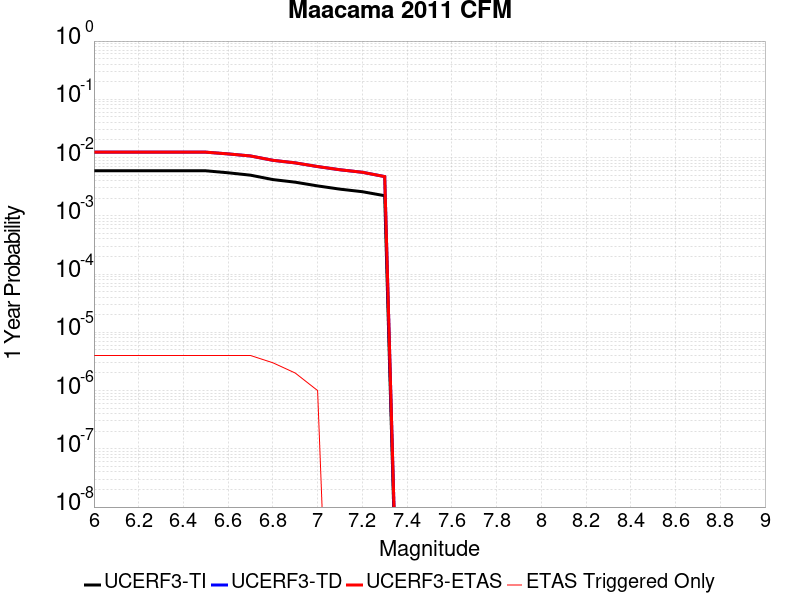 |  |

| Magnitude | 1 wk TI Prob | 1 wk TD Prob | 1 wk ETAS Prob | 1 wk ETAS/TD Gain | 1 wk ETAS Triggered Only | 1 mo TI Prob | 1 mo TD Prob | 1 mo ETAS Prob | 1 mo ETAS/TD Gain | 1 mo ETAS Triggered Only | 1 yr TI Prob | 1 yr TD Prob | 1 yr ETAS Prob | 1 yr ETAS/TD Gain | 1 yr ETAS Triggered Only | 10 yr TI Prob | 10 yr TD Prob | 10 yr ETAS Prob | 10 yr ETAS/TD Gain | 10 yr ETAS Triggered Only |
|-----|-----|-----|-----|-----|-----|-----|-----|-----|-----|-----|-----|-----|-----|-----|-----|-----|-----|-----|-----|-----|
| 6.0 | 1.1397471E-4 | 2.3888213E-4 | 2.421162E-4 | 1.0135384 | 3.2348432E-6 | 4.883716E-4 | 0.0010233513 | 0.0010265829 | 1.0031577 | 3.2348432E-6 | 0.005929726 | 0.0123792365 | 0.012382432 | 1.0002581 | 3.2348432E-6 | 0.057739746 | 0.11623567 | 0.11624139 | 1.0000492 | 6.4696865E-6 |
| 6.1 | 1.1397471E-4 | 2.3888213E-4 | 2.421162E-4 | 1.0135384 | 3.2348432E-6 | 4.883716E-4 | 0.0010233513 | 0.0010265829 | 1.0031577 | 3.2348432E-6 | 0.005929726 | 0.0123792365 | 0.012382432 | 1.0002581 | 3.2348432E-6 | 0.057739746 | 0.11623567 | 0.11624139 | 1.0000492 | 6.4696865E-6 |
| 6.2 | 1.1397471E-4 | 2.3888213E-4 | 2.421162E-4 | 1.0135384 | 3.2348432E-6 | 4.883716E-4 | 0.0010233513 | 0.0010265829 | 1.0031577 | 3.2348432E-6 | 0.005929726 | 0.0123792365 | 0.012382432 | 1.0002581 | 3.2348432E-6 | 0.057739746 | 0.11623567 | 0.11624139 | 1.0000492 | 6.4696865E-6 |
| 6.3 | 1.1397471E-4 | 2.3888213E-4 | 2.421162E-4 | 1.0135384 | 3.2348432E-6 | 4.883716E-4 | 0.0010233513 | 0.0010265829 | 1.0031577 | 3.2348432E-6 | 0.005929726 | 0.0123792365 | 0.012382432 | 1.0002581 | 3.2348432E-6 | 0.057739746 | 0.11623567 | 0.11624139 | 1.0000492 | 6.4696865E-6 |
| 6.4 | 1.1397471E-4 | 2.3888213E-4 | 2.421162E-4 | 1.0135384 | 3.2348432E-6 | 4.883716E-4 | 0.0010233513 | 0.0010265829 | 1.0031577 | 3.2348432E-6 | 0.005929726 | 0.0123792365 | 0.012382432 | 1.0002581 | 3.2348432E-6 | 0.057739746 | 0.11623567 | 0.11624139 | 1.0000492 | 6.4696865E-6 |
| 6.5 | 1.1397471E-4 | 2.3888213E-4 | 2.421162E-4 | 1.0135384 | 3.2348432E-6 | 4.883716E-4 | 0.0010233513 | 0.0010265829 | 1.0031577 | 3.2348432E-6 | 0.005929726 | 0.0123792365 | 0.012382432 | 1.0002581 | 3.2348432E-6 | 0.057739746 | 0.11623567 | 0.11624139 | 1.0000492 | 6.4696865E-6 |
| 6.6 | 1.0527533E-4 | 2.2283354E-4 | 2.2606766E-4 | 1.0145136 | 3.2348432E-6 | 4.5110195E-4 | 9.5463224E-4 | 9.57864E-4 | 1.0033853 | 3.2348432E-6 | 0.0054783444 | 0.011553699 | 0.011556896 | 1.0002768 | 3.2348432E-6 | 0.053452436 | 0.108992726 | 0.10899849 | 1.0000529 | 6.4696865E-6 |
| 6.7 | 9.575816E-5 | 2.0519714E-4 | 2.0843132E-4 | 1.0157614 | 3.2348432E-6 | 4.1032754E-4 | 8.7910803E-4 | 8.8234E-4 | 1.0036764 | 3.2348432E-6 | 0.0049843 | 0.010645687 | 0.010648887 | 1.0003006 | 3.2348432E-6 | 0.048739783 | 0.1009658 | 0.10097162 | 1.0000576 | 6.4696865E-6 |
| 6.8 | 8.04535E-5 | 1.726804E-4 | 1.726804E-4 | 1.0 | 0.0 | 3.4475516E-4 | 7.3985505E-4 | 7.3985505E-4 | 1.0 | 0.0 | 0.004189318 | 0.0089691775 | 0.0089691775 | 1.0 | 0.0 | 0.041112173 | 0.08595115 | 0.08595115 | 1.0 | 0.0 |
| 6.9 | 7.2530966E-5 | 1.5590987E-4 | 1.5590987E-4 | 1.0 | 0.0 | 3.1080993E-4 | 6.6803093E-4 | 6.6803093E-4 | 1.0 | 0.0 | 0.0037775463 | 0.00810342 | 0.00810342 | 1.0 | 0.0 | 0.037139744 | 0.078110136 | 0.078110136 | 1.0 | 0.0 |
| 7.0 | 6.260435E-5 | 1.3465792E-4 | 1.3465792E-4 | 1.0 | 0.0 | 2.6827675E-4 | 5.7700626E-4 | 5.7700626E-4 | 1.0 | 0.0 | 0.0032613778 | 0.0070053353 | 0.0070053353 | 1.0 | 0.0 | 0.03213927 | 0.068087414 | 0.068087414 | 1.0 | 0.0 |
| 7.1 | 5.5055898E-5 | 1.1855079E-4 | 1.1855079E-4 | 1.0 | 0.0 | 2.359325E-4 | 5.080153E-4 | 5.080153E-4 | 1.0 | 0.0 | 0.0028686945 | 0.0061722714 | 0.0061722714 | 1.0 | 0.0 | 0.02831944 | 0.060414217 | 0.060414217 | 1.0 | 0.0 |
| 7.2 | 4.9762843E-5 | 1.0731735E-4 | 1.0731735E-4 | 1.0 | 0.0 | 2.132519E-4 | 4.5990077E-4 | 4.5990077E-4 | 1.0 | 0.0 | 0.0025932505 | 0.0055908677 | 0.0055908677 | 1.0 | 0.0 | 0.025631964 | 0.05502247 | 0.05502247 | 1.0 | 0.0 |
| 7.3 | 4.247324E-5 | 9.040619E-5 | 9.040619E-5 | 1.0 | 0.0 | 1.8201546E-4 | 3.874551E-4 | 3.874551E-4 | 1.0 | 0.0 | 0.002213786 | 0.004714052 | 0.004714052 | 1.0 | 0.0 | 0.021918617 | 0.046766482 | 0.046766482 | 1.0 | 0.0 |

## West Napa 2011 CFM
*[(top)](#table-of-contents)*

| 1 Week | 1 Month | 1 Year | 10 Year |
|-----|-----|-----|-----|
|  |  |  |  |

| Magnitude | 1 wk TI Prob | 1 wk TD Prob | 1 wk ETAS Prob | 1 wk ETAS/TD Gain | 1 wk ETAS Triggered Only | 1 mo TI Prob | 1 mo TD Prob | 1 mo ETAS Prob | 1 mo ETAS/TD Gain | 1 mo ETAS Triggered Only | 1 yr TI Prob | 1 yr TD Prob | 1 yr ETAS Prob | 1 yr ETAS/TD Gain | 1 yr ETAS Triggered Only | 10 yr TI Prob | 10 yr TD Prob | 10 yr ETAS Prob | 10 yr ETAS/TD Gain | 10 yr ETAS Triggered Only |
|-----|-----|-----|-----|-----|-----|-----|-----|-----|-----|-----|-----|-----|-----|-----|-----|-----|-----|-----|-----|-----|
| 6.0 | 1.7783477E-5 | 2.0537549E-5 | 2.7007101E-5 | 1.315011 | 6.4696865E-6 | 7.621267E-5 | 8.801807E-5 | 9.448718E-5 | 1.0734977 | 6.4696865E-6 | 9.2749426E-4 | 0.0010716199 | 0.0010780826 | 1.0060308 | 6.4696865E-6 | 0.009236327 | 0.010716184 | 0.010722585 | 1.0005972 | 6.4696865E-6 |
| 6.1 | 1.7783477E-5 | 2.0537549E-5 | 2.7007101E-5 | 1.315011 | 6.4696865E-6 | 7.621267E-5 | 8.801807E-5 | 9.448718E-5 | 1.0734977 | 6.4696865E-6 | 9.2749426E-4 | 0.0010716199 | 0.0010780826 | 1.0060308 | 6.4696865E-6 | 0.009236327 | 0.010716184 | 0.010722585 | 1.0005972 | 6.4696865E-6 |
| 6.2 | 1.7783477E-5 | 2.0537549E-5 | 2.7007101E-5 | 1.315011 | 6.4696865E-6 | 7.621267E-5 | 8.801807E-5 | 9.448718E-5 | 1.0734977 | 6.4696865E-6 | 9.2749426E-4 | 0.0010716199 | 0.0010780826 | 1.0060308 | 6.4696865E-6 | 0.009236327 | 0.010716184 | 0.010722585 | 1.0005972 | 6.4696865E-6 |
| 6.3 | 1.7783477E-5 | 2.0537549E-5 | 2.7007101E-5 | 1.315011 | 6.4696865E-6 | 7.621267E-5 | 8.801807E-5 | 9.448718E-5 | 1.0734977 | 6.4696865E-6 | 9.2749426E-4 | 0.0010716199 | 0.0010780826 | 1.0060308 | 6.4696865E-6 | 0.009236327 | 0.010716184 | 0.010722585 | 1.0005972 | 6.4696865E-6 |
| 6.4 | 1.7783477E-5 | 2.0537549E-5 | 2.7007101E-5 | 1.315011 | 6.4696865E-6 | 7.621267E-5 | 8.801807E-5 | 9.448718E-5 | 1.0734977 | 6.4696865E-6 | 9.2749426E-4 | 0.0010716199 | 0.0010780826 | 1.0060308 | 6.4696865E-6 | 0.009236327 | 0.010716184 | 0.010722585 | 1.0005972 | 6.4696865E-6 |
| 6.5 | 1.7783477E-5 | 2.0537549E-5 | 2.7007101E-5 | 1.315011 | 6.4696865E-6 | 7.621267E-5 | 8.801807E-5 | 9.448718E-5 | 1.0734977 | 6.4696865E-6 | 9.2749426E-4 | 0.0010716199 | 0.0010780826 | 1.0060308 | 6.4696865E-6 | 0.009236327 | 0.010716184 | 0.010722585 | 1.0005972 | 6.4696865E-6 |

## Bartlett Springs 2011 CFM
*[(top)](#table-of-contents)*

| 1 Week | 1 Month | 1 Year | 10 Year |
|-----|-----|-----|-----|
|  |  |  |  |

| Magnitude | 1 wk TI Prob | 1 wk TD Prob | 1 wk ETAS Prob | 1 wk ETAS/TD Gain | 1 wk ETAS Triggered Only | 1 mo TI Prob | 1 mo TD Prob | 1 mo ETAS Prob | 1 mo ETAS/TD Gain | 1 mo ETAS Triggered Only | 1 yr TI Prob | 1 yr TD Prob | 1 yr ETAS Prob | 1 yr ETAS/TD Gain | 1 yr ETAS Triggered Only | 10 yr TI Prob | 10 yr TD Prob | 10 yr ETAS Prob | 10 yr ETAS/TD Gain | 10 yr ETAS Triggered Only |
|-----|-----|-----|-----|-----|-----|-----|-----|-----|-----|-----|-----|-----|-----|-----|-----|-----|-----|-----|-----|-----|
| 6.0 | 8.242153E-5 | 1.3548869E-4 | 1.387231E-4 | 1.0238721 | 3.2348432E-6 | 3.531873E-4 | 5.805392E-4 | 5.837722E-4 | 1.0055689 | 3.2348432E-6 | 0.0042915796 | 0.007045981 | 0.007049193 | 1.0004559 | 3.2348432E-6 | 0.042096417 | 0.06832537 | 0.0683314 | 1.0000882 | 6.4696865E-6 |
| 6.1 | 8.242153E-5 | 1.3548869E-4 | 1.387231E-4 | 1.0238721 | 3.2348432E-6 | 3.531873E-4 | 5.805392E-4 | 5.837722E-4 | 1.0055689 | 3.2348432E-6 | 0.0042915796 | 0.007045981 | 0.007049193 | 1.0004559 | 3.2348432E-6 | 0.042096417 | 0.06832537 | 0.0683314 | 1.0000882 | 6.4696865E-6 |
| 6.2 | 8.242153E-5 | 1.3548869E-4 | 1.387231E-4 | 1.0238721 | 3.2348432E-6 | 3.531873E-4 | 5.805392E-4 | 5.837722E-4 | 1.0055689 | 3.2348432E-6 | 0.0042915796 | 0.007045981 | 0.007049193 | 1.0004559 | 3.2348432E-6 | 0.042096417 | 0.06832537 | 0.0683314 | 1.0000882 | 6.4696865E-6 |
| 6.3 | 8.242153E-5 | 1.3548869E-4 | 1.387231E-4 | 1.0238721 | 3.2348432E-6 | 3.531873E-4 | 5.805392E-4 | 5.837722E-4 | 1.0055689 | 3.2348432E-6 | 0.0042915796 | 0.007045981 | 0.007049193 | 1.0004559 | 3.2348432E-6 | 0.042096417 | 0.06832537 | 0.0683314 | 1.0000882 | 6.4696865E-6 |
| 6.4 | 8.242153E-5 | 1.3548869E-4 | 1.387231E-4 | 1.0238721 | 3.2348432E-6 | 3.531873E-4 | 5.805392E-4 | 5.837722E-4 | 1.0055689 | 3.2348432E-6 | 0.0042915796 | 0.007045981 | 0.007049193 | 1.0004559 | 3.2348432E-6 | 0.042096417 | 0.06832537 | 0.0683314 | 1.0000882 | 6.4696865E-6 |
| 6.5 | 8.242153E-5 | 1.3548869E-4 | 1.387231E-4 | 1.0238721 | 3.2348432E-6 | 3.531873E-4 | 5.805392E-4 | 5.837722E-4 | 1.0055689 | 3.2348432E-6 | 0.0042915796 | 0.007045981 | 0.007049193 | 1.0004559 | 3.2348432E-6 | 0.042096417 | 0.06832537 | 0.0683314 | 1.0000882 | 6.4696865E-6 |
| 6.6 | 7.3732925E-5 | 1.2139435E-4 | 1.246288E-4 | 1.0266441 | 3.2348432E-6 | 3.1595997E-4 | 5.201647E-4 | 5.233979E-4 | 1.0062157 | 3.2348432E-6 | 0.0038400285 | 0.006316066 | 0.0063192802 | 1.0005089 | 3.2348432E-6 | 0.037743475 | 0.061516248 | 0.061519284 | 1.0000494 | 3.2348432E-6 |
| 6.7 | 6.4427455E-5 | 1.0639332E-4 | 1.0962782E-4 | 1.0304013 | 3.2348432E-6 | 2.7608842E-4 | 4.5590108E-4 | 4.5913443E-4 | 1.0070922 | 3.2348432E-6 | 0.0033561962 | 0.005538538 | 0.005541755 | 1.0005808 | 3.2348432E-6 | 0.03305959 | 0.054209318 | 0.054212376 | 1.0000564 | 3.2348432E-6 |
| 6.8 | 5.705542E-5 | 9.3937684E-5 | 9.7172226E-5 | 1.0344328 | 3.2348432E-6 | 2.445003E-4 | 4.025391E-4 | 4.0577262E-4 | 1.0080329 | 3.2348432E-6 | 0.0029727279 | 0.0048922407 | 0.0048954594 | 1.000658 | 3.2348432E-6 | 0.029332744 | 0.04807333 | 0.048076406 | 1.000064 | 3.2348432E-6 |
| 6.9 | 4.917994E-5 | 8.06976E-5 | 8.06976E-5 | 1.0 | 0.0 | 2.1075415E-4 | 3.458147E-4 | 3.458147E-4 | 1.0 | 0.0 | 0.0025629124 | 0.004204774 | 0.004204774 | 1.0 | 0.0 | 0.02533555 | 0.04150473 | 0.04150473 | 1.0 | 0.0 |
| 7.0 | 4.3285007E-5 | 7.0767834E-5 | 7.0767834E-5 | 1.0 | 0.0 | 1.8549398E-4 | 3.03271E-4 | 3.03271E-4 | 1.0 | 0.0 | 0.00225605 | 0.0036888847 | 0.0036888847 | 1.0 | 0.0 | 0.022332832 | 0.036549065 | 0.036549065 | 1.0 | 0.0 |
| 7.1 | 3.7582267E-5 | 6.121996E-5 | 6.121996E-5 | 1.0 | 0.0 | 1.6105692E-4 | 2.623618E-4 | 2.623618E-4 | 1.0 | 0.0 | 0.0019591043 | 0.0031925675 | 0.0031925675 | 1.0 | 0.0 | 0.019419227 | 0.03175786 | 0.03175786 | 1.0 | 0.0 |
| 7.2 | 3.232781E-5 | 5.250154E-5 | 5.250154E-5 | 1.0 | 0.0 | 1.385404E-4 | 2.2500534E-4 | 2.2500534E-4 | 1.0 | 0.0 | 0.0016854245 | 0.0027391335 | 0.0027391335 | 1.0 | 0.0 | 0.016726987 | 0.027359791 | 0.027359791 | 1.0 | 0.0 |

## Rinconada 2011 CFM
*[(top)](#table-of-contents)*

| 1 Week | 1 Month | 1 Year | 10 Year |
|-----|-----|-----|-----|
|  | 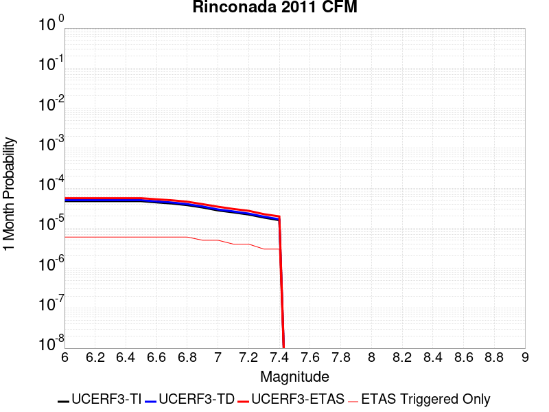 |  |  |

| Magnitude | 1 wk TI Prob | 1 wk TD Prob | 1 wk ETAS Prob | 1 wk ETAS/TD Gain | 1 wk ETAS Triggered Only | 1 mo TI Prob | 1 mo TD Prob | 1 mo ETAS Prob | 1 mo ETAS/TD Gain | 1 mo ETAS Triggered Only | 1 yr TI Prob | 1 yr TD Prob | 1 yr ETAS Prob | 1 yr ETAS/TD Gain | 1 yr ETAS Triggered Only | 10 yr TI Prob | 10 yr TD Prob | 10 yr ETAS Prob | 10 yr ETAS/TD Gain | 10 yr ETAS Triggered Only |
|-----|-----|-----|-----|-----|-----|-----|-----|-----|-----|-----|-----|-----|-----|-----|-----|-----|-----|-----|-----|-----|
| 6.0 | 1.1071962E-5 | 1.1724135E-5 | 1.8193745E-5 | 1.5518198 | 6.4696865E-6 | 4.74504E-5 | 5.024544E-5 | 5.67148E-5 | 1.1287552 | 6.4696865E-6 | 5.775555E-4 | 6.115867E-4 | 6.1805244E-4 | 1.0105721 | 6.4696865E-6 | 0.0057605673 | 0.006101035 | 0.0061074654 | 1.0010539 | 6.4696865E-6 |
| 6.1 | 1.1071962E-5 | 1.1724135E-5 | 1.8193745E-5 | 1.5518198 | 6.4696865E-6 | 4.74504E-5 | 5.024544E-5 | 5.67148E-5 | 1.1287552 | 6.4696865E-6 | 5.775555E-4 | 6.115867E-4 | 6.1805244E-4 | 1.0105721 | 6.4696865E-6 | 0.0057605673 | 0.006101035 | 0.0061074654 | 1.0010539 | 6.4696865E-6 |
| 6.2 | 1.1071962E-5 | 1.1724135E-5 | 1.8193745E-5 | 1.5518198 | 6.4696865E-6 | 4.74504E-5 | 5.024544E-5 | 5.67148E-5 | 1.1287552 | 6.4696865E-6 | 5.775555E-4 | 6.115867E-4 | 6.1805244E-4 | 1.0105721 | 6.4696865E-6 | 0.0057605673 | 0.006101035 | 0.0061074654 | 1.0010539 | 6.4696865E-6 |
| 6.3 | 1.1071962E-5 | 1.1724135E-5 | 1.8193745E-5 | 1.5518198 | 6.4696865E-6 | 4.74504E-5 | 5.024544E-5 | 5.67148E-5 | 1.1287552 | 6.4696865E-6 | 5.775555E-4 | 6.115867E-4 | 6.1805244E-4 | 1.0105721 | 6.4696865E-6 | 0.0057605673 | 0.006101035 | 0.0061074654 | 1.0010539 | 6.4696865E-6 |
| 6.4 | 1.1071962E-5 | 1.1724135E-5 | 1.8193745E-5 | 1.5518198 | 6.4696865E-6 | 4.74504E-5 | 5.024544E-5 | 5.67148E-5 | 1.1287552 | 6.4696865E-6 | 5.775555E-4 | 6.115867E-4 | 6.1805244E-4 | 1.0105721 | 6.4696865E-6 | 0.0057605673 | 0.006101035 | 0.0061074654 | 1.0010539 | 6.4696865E-6 |
| 6.5 | 1.1071962E-5 | 1.1724135E-5 | 1.8193745E-5 | 1.5518198 | 6.4696865E-6 | 4.74504E-5 | 5.024544E-5 | 5.67148E-5 | 1.1287552 | 6.4696865E-6 | 5.775555E-4 | 6.115867E-4 | 6.1805244E-4 | 1.0105721 | 6.4696865E-6 | 0.0057605673 | 0.006101035 | 0.0061074654 | 1.0010539 | 6.4696865E-6 |
| 6.6 | 1.0302408E-5 | 1.0909815E-5 | 1.737943E-5 | 1.5930088 | 6.4696865E-6 | 4.4152428E-5 | 4.6755624E-5 | 5.322501E-5 | 1.1383659 | 6.4696865E-6 | 5.374232E-4 | 5.6912116E-4 | 5.755872E-4 | 1.0113614 | 6.4696865E-6 | 0.0053612534 | 0.005678627 | 0.00568506 | 1.0011328 | 6.4696865E-6 |
| 6.7 | 9.66584E-6 | 1.0235816E-5 | 1.6705437E-5 | 1.6320571 | 6.4696865E-6 | 4.142437E-5 | 4.386716E-5 | 5.0336563E-5 | 1.1474771 | 6.4696865E-6 | 5.0422497E-4 | 5.339719E-4 | 5.404381E-4 | 1.0121096 | 6.4696865E-6 | 0.005030824 | 0.0053288722 | 0.0053353077 | 1.0012076 | 6.4696865E-6 |
| 6.8 | 8.79599E-6 | 9.312425E-6 | 1.578205E-5 | 1.6947305 | 6.4696865E-6 | 3.7696555E-5 | 3.9909897E-5 | 4.6379322E-5 | 1.1621009 | 6.4696865E-6 | 4.588589E-4 | 4.8581464E-4 | 4.9228116E-4 | 1.0133107 | 6.4696865E-6 | 0.004579126 | 0.0048494954 | 0.0048559336 | 1.0013276 | 6.4696865E-6 |
| 6.9 | 7.69202E-6 | 8.138578E-6 | 1.4608211E-5 | 1.7949342 | 6.4696865E-6 | 3.2965385E-5 | 3.4879264E-5 | 4.1348725E-5 | 1.1854815 | 6.4696865E-6 | 4.0127963E-4 | 4.2459206E-4 | 4.31059E-4 | 1.0152309 | 6.4696865E-6 | 0.004005558 | 0.004239751 | 0.004246193 | 1.0015194 | 6.4696865E-6 |
| 7.0 | 6.497495E-6 | 6.8676477E-6 | 1.333729E-5 | 1.9420463 | 6.4696865E-6 | 2.784611E-5 | 2.9432555E-5 | 3.590205E-5 | 1.2198075 | 6.4696865E-6 | 3.3897365E-4 | 3.5830197E-4 | 3.6476934E-4 | 1.0180501 | 6.4696865E-6 | 0.0033845706 | 0.0035791604 | 0.0035856068 | 1.0018011 | 6.4696865E-6 |
| 7.1 | 5.7995403E-6 | 6.1257683E-6 | 1.2595415E-5 | 2.0561364 | 6.4696865E-6 | 2.4854935E-5 | 2.625314E-5 | 3.2722655E-5 | 1.2464283 | 6.4696865E-6 | 3.0256683E-4 | 3.196045E-4 | 3.2607213E-4 | 1.0202364 | 6.4696865E-6 | 0.0030215518 | 0.0031933533 | 0.0031998025 | 1.0020195 | 6.4696865E-6 |
| 7.2 | 5.130714E-6 | 5.414656E-6 | 1.1884307E-5 | 2.1948407 | 6.4696865E-6 | 2.1988588E-5 | 2.320557E-5 | 2.9675106E-5 | 1.2787924 | 6.4696865E-6 | 2.6767817E-4 | 2.825105E-4 | 2.8897836E-4 | 1.0228943 | 6.4696865E-6 | 0.0026735596 | 0.0028234075 | 0.002829859 | 1.002285 | 6.4696865E-6 |
| 7.3 | 4.295291E-6 | 4.5275724E-6 | 7.762401E-6 | 1.714473 | 3.2348432E-6 | 1.840826E-5 | 1.9403846E-5 | 2.2638626E-5 | 1.1667082 | 3.2348432E-6 | 2.2409752E-4 | 2.3623534E-4 | 2.3946942E-4 | 1.0136901 | 3.2348432E-6 | 0.0022387167 | 0.0023617179 | 0.0023649451 | 1.0013665 | 3.2348432E-6 |
| 7.4 | 3.6962015E-6 | 3.894617E-6 | 7.129447E-6 | 1.8305902 | 3.2348432E-6 | 1.5840767E-5 | 1.6691214E-5 | 1.9926003E-5 | 1.1938019 | 3.2348432E-6 | 1.9284427E-4 | 2.0321553E-4 | 2.0644972E-4 | 1.015915 | 3.2348432E-6 | 0.0019267701 | 0.0020321554 | 0.0020353836 | 1.0015886 | 3.2348432E-6 |

## Elsinore (Coyote Mountains)
*[(top)](#table-of-contents)*

| 1 Week | 1 Month | 1 Year | 10 Year |
|-----|-----|-----|-----|
|  |  |  |  |

| Magnitude | 1 wk TI Prob | 1 wk TD Prob | 1 wk ETAS Prob | 1 wk ETAS/TD Gain | 1 wk ETAS Triggered Only | 1 mo TI Prob | 1 mo TD Prob | 1 mo ETAS Prob | 1 mo ETAS/TD Gain | 1 mo ETAS Triggered Only | 1 yr TI Prob | 1 yr TD Prob | 1 yr ETAS Prob | 1 yr ETAS/TD Gain | 1 yr ETAS Triggered Only | 10 yr TI Prob | 10 yr TD Prob | 10 yr ETAS Prob | 10 yr ETAS/TD Gain | 10 yr ETAS Triggered Only |
|-----|-----|-----|-----|-----|-----|-----|-----|-----|-----|-----|-----|-----|-----|-----|-----|-----|-----|-----|-----|-----|
| 6.0 | 3.0311965E-5 | 3.994109E-5 | 3.994109E-5 | 1.0 | 0.0 | 1.2990195E-4 | 1.7116935E-4 | 1.7116935E-4 | 1.0 | 0.0 | 0.0015804088 | 0.0020827882 | 0.0020892443 | 1.0030998 | 6.4696865E-6 | 0.015692165 | 0.020715257 | 0.020721592 | 1.0003059 | 6.4696865E-6 |
| 6.1 | 3.0311965E-5 | 3.994109E-5 | 3.994109E-5 | 1.0 | 0.0 | 1.2990195E-4 | 1.7116935E-4 | 1.7116935E-4 | 1.0 | 0.0 | 0.0015804088 | 0.0020827882 | 0.0020892443 | 1.0030998 | 6.4696865E-6 | 0.015692165 | 0.020715257 | 0.020721592 | 1.0003059 | 6.4696865E-6 |
| 6.2 | 3.0311965E-5 | 3.994109E-5 | 3.994109E-5 | 1.0 | 0.0 | 1.2990195E-4 | 1.7116935E-4 | 1.7116935E-4 | 1.0 | 0.0 | 0.0015804088 | 0.0020827882 | 0.0020892443 | 1.0030998 | 6.4696865E-6 | 0.015692165 | 0.020715257 | 0.020721592 | 1.0003059 | 6.4696865E-6 |
| 6.3 | 3.0311965E-5 | 3.994109E-5 | 3.994109E-5 | 1.0 | 0.0 | 1.2990195E-4 | 1.7116935E-4 | 1.7116935E-4 | 1.0 | 0.0 | 0.0015804088 | 0.0020827882 | 0.0020892443 | 1.0030998 | 6.4696865E-6 | 0.015692165 | 0.020715257 | 0.020721592 | 1.0003059 | 6.4696865E-6 |
| 6.4 | 3.0311965E-5 | 3.994109E-5 | 3.994109E-5 | 1.0 | 0.0 | 1.2990195E-4 | 1.7116935E-4 | 1.7116935E-4 | 1.0 | 0.0 | 0.0015804088 | 0.0020827882 | 0.0020892443 | 1.0030998 | 6.4696865E-6 | 0.015692165 | 0.020715257 | 0.020721592 | 1.0003059 | 6.4696865E-6 |
| 6.5 | 3.0311965E-5 | 3.994109E-5 | 3.994109E-5 | 1.0 | 0.0 | 1.2990195E-4 | 1.7116935E-4 | 1.7116935E-4 | 1.0 | 0.0 | 0.0015804088 | 0.0020827882 | 0.0020892443 | 1.0030998 | 6.4696865E-6 | 0.015692165 | 0.020715257 | 0.020721592 | 1.0003059 | 6.4696865E-6 |
| 6.6 | 3.0265346E-5 | 3.988092E-5 | 3.988092E-5 | 1.0 | 0.0 | 1.2970218E-4 | 1.7091153E-4 | 1.7091153E-4 | 1.0 | 0.0 | 0.0015779801 | 0.0020796552 | 0.0020861116 | 1.0031044 | 6.4696865E-6 | 0.01566822 | 0.020684522 | 0.020690857 | 1.0003064 | 6.4696865E-6 |
| 6.7 | 3.0194358E-5 | 3.978925E-5 | 3.978925E-5 | 1.0 | 0.0 | 1.2939797E-4 | 1.705187E-4 | 1.705187E-4 | 1.0 | 0.0 | 0.0015742818 | 0.002074882 | 0.002081338 | 1.0031116 | 6.4696865E-6 | 0.01563176 | 0.020637691 | 0.020644028 | 1.000307 | 6.4696865E-6 |
| 6.8 | 3.012086E-5 | 3.969423E-5 | 3.969423E-5 | 1.0 | 0.0 | 1.2908301E-4 | 1.7011153E-4 | 1.7011153E-4 | 1.0 | 0.0 | 0.0015704527 | 0.002069934 | 0.0020763902 | 1.0031191 | 6.4696865E-6 | 0.0155940065 | 0.020589132 | 0.020595469 | 1.0003078 | 6.4696865E-6 |
| 6.9 | 1.1573938E-5 | 1.5760072E-5 | 1.5760072E-5 | 1.0 | 0.0 | 4.9601647E-5 | 6.7541885E-5 | 6.7541885E-5 | 1.0 | 0.0 | 6.037327E-4 | 8.2209584E-4 | 8.2209584E-4 | 1.0 | 0.0 | 0.006020951 | 0.0082034515 | 0.0082034515 | 1.0 | 0.0 |
| 7.0 | 1.1534603E-5 | 1.5714604E-5 | 1.5714604E-5 | 1.0 | 0.0 | 4.9433074E-5 | 6.7347035E-5 | 6.7347035E-5 | 1.0 | 0.0 | 6.016815E-4 | 8.1972533E-4 | 8.1972533E-4 | 1.0 | 0.0 | 0.00600055 | 0.008179921 | 0.008179921 | 1.0 | 0.0 |
| 7.1 | 1.1452482E-5 | 1.5613095E-5 | 1.5613095E-5 | 1.0 | 0.0 | 4.908114E-5 | 6.691202E-5 | 6.691202E-5 | 1.0 | 0.0 | 5.973991E-4 | 8.14433E-4 | 8.14433E-4 | 1.0 | 0.0 | 0.0059579564 | 0.008127386 | 0.008127386 | 1.0 | 0.0 |
| 7.2 | 1.1348771E-5 | 1.5475387E-5 | 1.5475387E-5 | 1.0 | 0.0 | 4.8636684E-5 | 6.632187E-5 | 6.632187E-5 | 1.0 | 0.0 | 5.919907E-4 | 8.0725324E-4 | 8.0725324E-4 | 1.0 | 0.0 | 0.005904162 | 0.008056112 | 0.008056112 | 1.0 | 0.0 |
| 7.3 | 1.1250434E-5 | 1.531563E-5 | 1.531563E-5 | 1.0 | 0.0 | 4.8215254E-5 | 6.5637236E-5 | 6.5637236E-5 | 1.0 | 0.0 | 5.8686256E-4 | 7.9892395E-4 | 7.9892395E-4 | 1.0 | 0.0 | 0.005853152 | 0.007973419 | 0.007973419 | 1.0 | 0.0 |
| 7.4 | 1.1178093E-5 | 1.5190572E-5 | 1.5190572E-5 | 1.0 | 0.0 | 4.7905232E-5 | 6.5101296E-5 | 6.5101296E-5 | 1.0 | 0.0 | 5.830901E-4 | 7.924037E-4 | 7.924037E-4 | 1.0 | 0.0 | 0.005815625 | 0.007908682 | 0.007908682 | 1.0 | 0.0 |
| 7.5 | 9.060744E-6 | 1.1679365E-5 | 1.1679365E-5 | 1.0 | 0.0 | 3.883118E-5 | 5.0053855E-5 | 5.0053855E-5 | 1.0 | 0.0 | 4.7266704E-4 | 6.0930493E-4 | 6.0930493E-4 | 1.0 | 0.0 | 0.0047166296 | 0.0060878657 | 0.0060878657 | 1.0 | 0.0 |
| 7.6 | 8.950329E-6 | 1.1523338E-5 | 1.1523338E-5 | 1.0 | 0.0 | 3.835799E-5 | 4.938519E-5 | 4.938519E-5 | 1.0 | 0.0 | 4.6690844E-4 | 6.0116843E-4 | 6.0116843E-4 | 1.0 | 0.0 | 0.0046592862 | 0.006006978 | 0.006006978 | 1.0 | 0.0 |
| 7.7 | 4.2479364E-6 | 4.9388354E-6 | 4.9388354E-6 | 1.0 | 0.0 | 1.8205315E-5 | 2.116638E-5 | 2.116638E-5 | 1.0 | 0.0 | 2.2162717E-4 | 2.5769032E-4 | 2.5769032E-4 | 1.0 | 0.0 | 0.0022140627 | 0.002580199 | 0.002580199 | 1.0 | 0.0 |
| 7.8 | 2.1601753E-7 | 2.7489222E-7 | 2.7489222E-7 | 1.0 | 0.0 | 9.257891E-7 | 1.1781094E-6 | 1.1781094E-6 | 1.0 | 0.0 | 1.1271423E-5 | 1.4343483E-5 | 1.4343483E-5 | 1.0 | 0.0 | 1.1270852E-4 | 1.435847E-4 | 1.435847E-4 | 1.0 | 0.0 |

## Ortigalita (North)
*[(top)](#table-of-contents)*

| 1 Week | 1 Month | 1 Year | 10 Year |
|-----|-----|-----|-----|
|  |  |  |  |

| Magnitude | 1 wk TI Prob | 1 wk TD Prob | 1 wk ETAS Prob | 1 wk ETAS/TD Gain | 1 wk ETAS Triggered Only | 1 mo TI Prob | 1 mo TD Prob | 1 mo ETAS Prob | 1 mo ETAS/TD Gain | 1 mo ETAS Triggered Only | 1 yr TI Prob | 1 yr TD Prob | 1 yr ETAS Prob | 1 yr ETAS/TD Gain | 1 yr ETAS Triggered Only | 10 yr TI Prob | 10 yr TD Prob | 10 yr ETAS Prob | 10 yr ETAS/TD Gain | 10 yr ETAS Triggered Only |
|-----|-----|-----|-----|-----|-----|-----|-----|-----|-----|-----|-----|-----|-----|-----|-----|-----|-----|-----|-----|-----|
| 6.0 | 1.2851045E-5 | 1.4149535E-5 | 1.4149535E-5 | 1.0 | 0.0 | 5.5074743E-5 | 6.0639988E-5 | 6.0639988E-5 | 1.0 | 0.0 | 6.7032874E-4 | 7.381366E-4 | 7.413691E-4 | 1.0043792 | 3.2348432E-6 | 0.006683103 | 0.007366162 | 0.0073725837 | 1.0008718 | 6.4696865E-6 |
| 6.1 | 1.2851045E-5 | 1.4149535E-5 | 1.4149535E-5 | 1.0 | 0.0 | 5.5074743E-5 | 6.0639988E-5 | 6.0639988E-5 | 1.0 | 0.0 | 6.7032874E-4 | 7.381366E-4 | 7.413691E-4 | 1.0043792 | 3.2348432E-6 | 0.006683103 | 0.007366162 | 0.0073725837 | 1.0008718 | 6.4696865E-6 |
| 6.2 | 1.2851045E-5 | 1.4149535E-5 | 1.4149535E-5 | 1.0 | 0.0 | 5.5074743E-5 | 6.0639988E-5 | 6.0639988E-5 | 1.0 | 0.0 | 6.7032874E-4 | 7.381366E-4 | 7.413691E-4 | 1.0043792 | 3.2348432E-6 | 0.006683103 | 0.007366162 | 0.0073725837 | 1.0008718 | 6.4696865E-6 |
| 6.3 | 1.2851045E-5 | 1.4149535E-5 | 1.4149535E-5 | 1.0 | 0.0 | 5.5074743E-5 | 6.0639988E-5 | 6.0639988E-5 | 1.0 | 0.0 | 6.7032874E-4 | 7.381366E-4 | 7.413691E-4 | 1.0043792 | 3.2348432E-6 | 0.006683103 | 0.007366162 | 0.0073725837 | 1.0008718 | 6.4696865E-6 |
| 6.4 | 1.2851045E-5 | 1.4149535E-5 | 1.4149535E-5 | 1.0 | 0.0 | 5.5074743E-5 | 6.0639988E-5 | 6.0639988E-5 | 1.0 | 0.0 | 6.7032874E-4 | 7.381366E-4 | 7.413691E-4 | 1.0043792 | 3.2348432E-6 | 0.006683103 | 0.007366162 | 0.0073725837 | 1.0008718 | 6.4696865E-6 |
| 6.5 | 1.2851045E-5 | 1.4149535E-5 | 1.4149535E-5 | 1.0 | 0.0 | 5.5074743E-5 | 6.0639988E-5 | 6.0639988E-5 | 1.0 | 0.0 | 6.7032874E-4 | 7.381366E-4 | 7.413691E-4 | 1.0043792 | 3.2348432E-6 | 0.006683103 | 0.007366162 | 0.0073725837 | 1.0008718 | 6.4696865E-6 |
| 6.6 | 1.2121653E-5 | 1.3341035E-5 | 1.3341035E-5 | 1.0 | 0.0 | 5.1948908E-5 | 5.7175144E-5 | 5.7175144E-5 | 1.0 | 0.0 | 6.322944E-4 | 6.9597963E-4 | 6.992122E-4 | 1.0046446 | 3.2348432E-6 | 0.0063049835 | 0.006947282 | 0.0069537065 | 1.0009248 | 6.4696865E-6 |
| 6.7 | 1.1138555E-5 | 1.225241E-5 | 1.225241E-5 | 1.0 | 0.0 | 4.7735793E-5 | 5.2509804E-5 | 5.2509804E-5 | 1.0 | 0.0 | 5.810283E-4 | 6.3921354E-4 | 6.424463E-4 | 1.0050575 | 3.2348432E-6 | 0.0057951147 | 0.0063829916 | 0.00638942 | 1.0010071 | 6.4696865E-6 |
| 6.8 | 9.95085E-6 | 1.09376715E-5 | 1.09376715E-5 | 1.0 | 0.0 | 4.2645803E-5 | 4.687542E-5 | 4.687542E-5 | 1.0 | 0.0 | 5.1908894E-4 | 5.706525E-4 | 5.7388545E-4 | 1.0056654 | 3.2348432E-6 | 0.0051787808 | 0.0057010585 | 0.005704275 | 1.0005642 | 3.2348432E-6 |
| 6.9 | 8.322863E-6 | 9.140197E-6 | 9.140197E-6 | 1.0 | 0.0 | 3.5668927E-5 | 3.917221E-5 | 3.917221E-5 | 1.0 | 0.0 | 4.3418267E-4 | 4.7690995E-4 | 4.7690995E-4 | 1.0 | 0.0 | 0.004333353 | 0.0047679534 | 0.0047679534 | 1.0 | 0.0 |
| 7.0 | 7.83641E-6 | 8.6048385E-6 | 8.6048385E-6 | 1.0 | 0.0 | 3.3584183E-5 | 3.687788E-5 | 3.687788E-5 | 1.0 | 0.0 | 4.088107E-4 | 4.4898817E-4 | 4.4898817E-4 | 1.0 | 0.0 | 0.0040805945 | 0.0044898815 | 0.0044898815 | 1.0 | 0.0 |

## Little Salmon (Onshore)
*[(top)](#table-of-contents)*

| 1 Week | 1 Month | 1 Year | 10 Year |
|-----|-----|-----|-----|
|  |  |  | 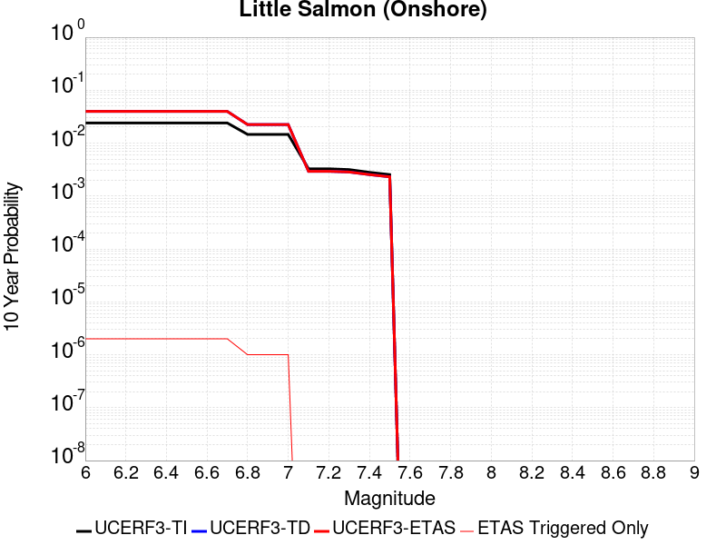 |

| Magnitude | 1 wk TI Prob | 1 wk TD Prob | 1 wk ETAS Prob | 1 wk ETAS/TD Gain | 1 wk ETAS Triggered Only | 1 mo TI Prob | 1 mo TD Prob | 1 mo ETAS Prob | 1 mo ETAS/TD Gain | 1 mo ETAS Triggered Only | 1 yr TI Prob | 1 yr TD Prob | 1 yr ETAS Prob | 1 yr ETAS/TD Gain | 1 yr ETAS Triggered Only | 10 yr TI Prob | 10 yr TD Prob | 10 yr ETAS Prob | 10 yr ETAS/TD Gain | 10 yr ETAS Triggered Only |
|-----|-----|-----|-----|-----|-----|-----|-----|-----|-----|-----|-----|-----|-----|-----|-----|-----|-----|-----|-----|-----|
| 6.0 | 4.6568723E-5 | 7.707324E-5 | 7.707324E-5 | 1.0 | 0.0 | 1.9956498E-4 | 3.302865E-4 | 3.302865E-4 | 1.0 | 0.0 | 0.0024269961 | 0.004016383 | 0.004016383 | 1.0 | 0.0 | 0.024006605 | 0.039698143 | 0.03970125 | 1.0000782 | 3.2348432E-6 |
| 6.1 | 4.6568723E-5 | 7.707324E-5 | 7.707324E-5 | 1.0 | 0.0 | 1.9956498E-4 | 3.302865E-4 | 3.302865E-4 | 1.0 | 0.0 | 0.0024269961 | 0.004016383 | 0.004016383 | 1.0 | 0.0 | 0.024006605 | 0.039698143 | 0.03970125 | 1.0000782 | 3.2348432E-6 |
| 6.2 | 4.6568723E-5 | 7.707324E-5 | 7.707324E-5 | 1.0 | 0.0 | 1.9956498E-4 | 3.302865E-4 | 3.302865E-4 | 1.0 | 0.0 | 0.0024269961 | 0.004016383 | 0.004016383 | 1.0 | 0.0 | 0.024006605 | 0.039698143 | 0.03970125 | 1.0000782 | 3.2348432E-6 |
| 6.3 | 4.6568723E-5 | 7.707324E-5 | 7.707324E-5 | 1.0 | 0.0 | 1.9956498E-4 | 3.302865E-4 | 3.302865E-4 | 1.0 | 0.0 | 0.0024269961 | 0.004016383 | 0.004016383 | 1.0 | 0.0 | 0.024006605 | 0.039698143 | 0.03970125 | 1.0000782 | 3.2348432E-6 |
| 6.4 | 4.6568723E-5 | 7.707324E-5 | 7.707324E-5 | 1.0 | 0.0 | 1.9956498E-4 | 3.302865E-4 | 3.302865E-4 | 1.0 | 0.0 | 0.0024269961 | 0.004016383 | 0.004016383 | 1.0 | 0.0 | 0.024006605 | 0.039698143 | 0.03970125 | 1.0000782 | 3.2348432E-6 |
| 6.5 | 4.6568723E-5 | 7.707324E-5 | 7.707324E-5 | 1.0 | 0.0 | 1.9956498E-4 | 3.302865E-4 | 3.302865E-4 | 1.0 | 0.0 | 0.0024269961 | 0.004016383 | 0.004016383 | 1.0 | 0.0 | 0.024006605 | 0.039698143 | 0.03970125 | 1.0000782 | 3.2348432E-6 |
| 6.6 | 4.6568723E-5 | 7.707324E-5 | 7.707324E-5 | 1.0 | 0.0 | 1.9956498E-4 | 3.302865E-4 | 3.302865E-4 | 1.0 | 0.0 | 0.0024269961 | 0.004016383 | 0.004016383 | 1.0 | 0.0 | 0.024006605 | 0.039698143 | 0.03970125 | 1.0000782 | 3.2348432E-6 |
| 6.7 | 4.6568723E-5 | 7.707324E-5 | 7.707324E-5 | 1.0 | 0.0 | 1.9956498E-4 | 3.302865E-4 | 3.302865E-4 | 1.0 | 0.0 | 0.0024269961 | 0.004016383 | 0.004016383 | 1.0 | 0.0 | 0.024006605 | 0.039698143 | 0.03970125 | 1.0000782 | 3.2348432E-6 |
| 6.8 | 2.817612E-5 | 4.3363176E-5 | 4.3363176E-5 | 1.0 | 0.0 | 1.2074922E-4 | 1.858391E-4 | 1.858391E-4 | 1.0 | 0.0 | 0.0014691303 | 0.0022620468 | 0.0022620468 | 1.0 | 0.0 | 0.014594556 | 0.022384832 | 0.022387994 | 1.0001413 | 3.2348432E-6 |
| 6.9 | 2.817612E-5 | 4.3363176E-5 | 4.3363176E-5 | 1.0 | 0.0 | 1.2074922E-4 | 1.858391E-4 | 1.858391E-4 | 1.0 | 0.0 | 0.0014691303 | 0.0022620468 | 0.0022620468 | 1.0 | 0.0 | 0.014594556 | 0.022384832 | 0.022387994 | 1.0001413 | 3.2348432E-6 |
| 7.0 | 2.817612E-5 | 4.3363176E-5 | 4.3363176E-5 | 1.0 | 0.0 | 1.2074922E-4 | 1.858391E-4 | 1.858391E-4 | 1.0 | 0.0 | 0.0014691303 | 0.0022620468 | 0.0022620468 | 1.0 | 0.0 | 0.014594556 | 0.022384832 | 0.022387994 | 1.0001413 | 3.2348432E-6 |
| 7.1 | 6.2777285E-6 | 5.618754E-6 | 5.618754E-6 | 1.0 | 0.0 | 2.6904274E-5 | 2.4080293E-5 | 2.4080293E-5 | 1.0 | 0.0 | 3.275103E-4 | 2.931631E-4 | 2.931631E-4 | 1.0 | 0.0 | 0.0032702803 | 0.0029313108 | 0.0029313108 | 1.0 | 0.0 |
| 7.2 | 6.2777285E-6 | 5.618754E-6 | 5.618754E-6 | 1.0 | 0.0 | 2.6904274E-5 | 2.4080293E-5 | 2.4080293E-5 | 1.0 | 0.0 | 3.275103E-4 | 2.931631E-4 | 2.931631E-4 | 1.0 | 0.0 | 0.0032702803 | 0.0029313108 | 0.0029313108 | 1.0 | 0.0 |
| 7.3 | 6.061432E-6 | 5.4547E-6 | 5.4547E-6 | 1.0 | 0.0 | 2.5977308E-5 | 2.3377217E-5 | 2.3377217E-5 | 1.0 | 0.0 | 3.1622782E-4 | 2.846054E-4 | 2.846054E-4 | 1.0 | 0.0 | 0.003157782 | 0.002845529 | 0.002845529 | 1.0 | 0.0 |
| 7.4 | 5.3761873E-6 | 4.8759243E-6 | 4.8759243E-6 | 1.0 | 0.0 | 2.30406E-5 | 2.089679E-5 | 2.089679E-5 | 1.0 | 0.0 | 2.804832E-4 | 2.5441346E-4 | 2.5441346E-4 | 1.0 | 0.0 | 0.0028012944 | 0.0025439227 | 0.0025439227 | 1.0 | 0.0 |
| 7.5 | 4.876217E-6 | 4.4262965E-6 | 4.4262965E-6 | 1.0 | 0.0 | 2.0897905E-5 | 1.8969842E-5 | 1.8969842E-5 | 1.0 | 0.0 | 2.544023E-4 | 2.3095783E-4 | 2.3095783E-4 | 1.0 | 0.0 | 0.0025411125 | 0.0023095782 | 0.0023095782 | 1.0 | 0.0 |

## Greenville (No) 2011 CFM
*[(top)](#table-of-contents)*

| 1 Week | 1 Month | 1 Year | 10 Year |
|-----|-----|-----|-----|
|  |  |  |  |

| Magnitude | 1 wk TI Prob | 1 wk TD Prob | 1 wk ETAS Prob | 1 wk ETAS/TD Gain | 1 wk ETAS Triggered Only | 1 mo TI Prob | 1 mo TD Prob | 1 mo ETAS Prob | 1 mo ETAS/TD Gain | 1 mo ETAS Triggered Only | 1 yr TI Prob | 1 yr TD Prob | 1 yr ETAS Prob | 1 yr ETAS/TD Gain | 1 yr ETAS Triggered Only | 10 yr TI Prob | 10 yr TD Prob | 10 yr ETAS Prob | 10 yr ETAS/TD Gain | 10 yr ETAS Triggered Only |
|-----|-----|-----|-----|-----|-----|-----|-----|-----|-----|-----|-----|-----|-----|-----|-----|-----|-----|-----|-----|-----|
| 6.0 | 3.63306E-5 | 4.6667676E-5 | 4.6667676E-5 | 1.0 | 0.0 | 1.5569327E-4 | 1.9999327E-4 | 1.9999327E-4 | 1.0 | 0.0 | 0.0018939174 | 0.0024329948 | 0.0024329948 | 1.0 | 0.0 | 0.018778576 | 0.024141787 | 0.024144944 | 1.0001308 | 3.2348432E-6 |
| 6.1 | 3.63306E-5 | 4.6667676E-5 | 4.6667676E-5 | 1.0 | 0.0 | 1.5569327E-4 | 1.9999327E-4 | 1.9999327E-4 | 1.0 | 0.0 | 0.0018939174 | 0.0024329948 | 0.0024329948 | 1.0 | 0.0 | 0.018778576 | 0.024141787 | 0.024144944 | 1.0001308 | 3.2348432E-6 |
| 6.2 | 3.63306E-5 | 4.6667676E-5 | 4.6667676E-5 | 1.0 | 0.0 | 1.5569327E-4 | 1.9999327E-4 | 1.9999327E-4 | 1.0 | 0.0 | 0.0018939174 | 0.0024329948 | 0.0024329948 | 1.0 | 0.0 | 0.018778576 | 0.024141787 | 0.024144944 | 1.0001308 | 3.2348432E-6 |
| 6.3 | 3.63306E-5 | 4.6667676E-5 | 4.6667676E-5 | 1.0 | 0.0 | 1.5569327E-4 | 1.9999327E-4 | 1.9999327E-4 | 1.0 | 0.0 | 0.0018939174 | 0.0024329948 | 0.0024329948 | 1.0 | 0.0 | 0.018778576 | 0.024141787 | 0.024144944 | 1.0001308 | 3.2348432E-6 |
| 6.4 | 3.63306E-5 | 4.6667676E-5 | 4.6667676E-5 | 1.0 | 0.0 | 1.5569327E-4 | 1.9999327E-4 | 1.9999327E-4 | 1.0 | 0.0 | 0.0018939174 | 0.0024329948 | 0.0024329948 | 1.0 | 0.0 | 0.018778576 | 0.024141787 | 0.024144944 | 1.0001308 | 3.2348432E-6 |
| 6.5 | 3.63306E-5 | 4.6667676E-5 | 4.6667676E-5 | 1.0 | 0.0 | 1.5569327E-4 | 1.9999327E-4 | 1.9999327E-4 | 1.0 | 0.0 | 0.0018939174 | 0.0024329948 | 0.0024329948 | 1.0 | 0.0 | 0.018778576 | 0.024141787 | 0.024144944 | 1.0001308 | 3.2348432E-6 |
| 6.6 | 2.9615265E-5 | 3.7887366E-5 | 3.7887366E-5 | 1.0 | 0.0 | 1.2691639E-4 | 1.6236881E-4 | 1.6236881E-4 | 1.0 | 0.0 | 0.0015441116 | 0.0019758374 | 0.0019758374 | 1.0 | 0.0 | 0.015334264 | 0.019660108 | 0.01966328 | 1.0001613 | 3.2348432E-6 |
| 6.7 | 2.6531234E-5 | 3.391368E-5 | 3.391368E-5 | 1.0 | 0.0 | 1.13700335E-4 | 1.453407E-4 | 1.453407E-4 | 1.0 | 0.0 | 0.0013834225 | 0.0017688754 | 0.0017688754 | 1.0 | 0.0 | 0.013748418 | 0.01762526 | 0.017628437 | 1.0001802 | 3.2348432E-6 |
| 6.8 | 1.9943202E-5 | 2.533084E-5 | 2.533084E-5 | 1.0 | 0.0 | 8.546806E-5 | 1.08560555E-4 | 1.08560555E-4 | 1.0 | 0.0 | 0.001040077 | 0.0013216892 | 0.0013216892 | 1.0 | 0.0 | 0.010352224 | 0.013213348 | 0.013213348 | 1.0 | 0.0 |
| 6.9 | 1.950561E-5 | 2.4769395E-5 | 2.4769395E-5 | 1.0 | 0.0 | 8.35928E-5 | 1.0615455E-4 | 1.0615455E-4 | 1.0 | 0.0 | 0.0010172671 | 0.0012924309 | 0.0012924309 | 1.0 | 0.0 | 0.010126229 | 0.012924177 | 0.012924177 | 1.0 | 0.0 |

## Great Valley 03 Mysterious Ridge
*[(top)](#table-of-contents)*

| 1 Week | 1 Month | 1 Year | 10 Year |
|-----|-----|-----|-----|
|  |  |  |  |

| Magnitude | 1 wk TI Prob | 1 wk TD Prob | 1 wk ETAS Prob | 1 wk ETAS/TD Gain | 1 wk ETAS Triggered Only | 1 mo TI Prob | 1 mo TD Prob | 1 mo ETAS Prob | 1 mo ETAS/TD Gain | 1 mo ETAS Triggered Only | 1 yr TI Prob | 1 yr TD Prob | 1 yr ETAS Prob | 1 yr ETAS/TD Gain | 1 yr ETAS Triggered Only | 10 yr TI Prob | 10 yr TD Prob | 10 yr ETAS Prob | 10 yr ETAS/TD Gain | 10 yr ETAS Triggered Only |
|-----|-----|-----|-----|-----|-----|-----|-----|-----|-----|-----|-----|-----|-----|-----|-----|-----|-----|-----|-----|-----|
| 6.0 | 1.9343506E-5 | 2.1910257E-5 | 2.5145027E-5 | 1.1476374 | 3.2348432E-6 | 8.289811E-5 | 9.389859E-5 | 9.713313E-5 | 1.0344472 | 3.2348432E-6 | 0.0010088171 | 0.0011427705 | 0.0011460016 | 1.0028275 | 3.2348432E-6 | 0.010042497 | 0.011384191 | 0.011387388 | 1.000281 | 3.2348432E-6 |
| 6.1 | 1.9343506E-5 | 2.1910257E-5 | 2.5145027E-5 | 1.1476374 | 3.2348432E-6 | 8.289811E-5 | 9.389859E-5 | 9.713313E-5 | 1.0344472 | 3.2348432E-6 | 0.0010088171 | 0.0011427705 | 0.0011460016 | 1.0028275 | 3.2348432E-6 | 0.010042497 | 0.011384191 | 0.011387388 | 1.000281 | 3.2348432E-6 |
| 6.2 | 1.9343506E-5 | 2.1910257E-5 | 2.5145027E-5 | 1.1476374 | 3.2348432E-6 | 8.289811E-5 | 9.389859E-5 | 9.713313E-5 | 1.0344472 | 3.2348432E-6 | 0.0010088171 | 0.0011427705 | 0.0011460016 | 1.0028275 | 3.2348432E-6 | 0.010042497 | 0.011384191 | 0.011387388 | 1.000281 | 3.2348432E-6 |
| 6.3 | 1.9343506E-5 | 2.1910257E-5 | 2.5145027E-5 | 1.1476374 | 3.2348432E-6 | 8.289811E-5 | 9.389859E-5 | 9.713313E-5 | 1.0344472 | 3.2348432E-6 | 0.0010088171 | 0.0011427705 | 0.0011460016 | 1.0028275 | 3.2348432E-6 | 0.010042497 | 0.011384191 | 0.011387388 | 1.000281 | 3.2348432E-6 |
| 6.4 | 1.9343506E-5 | 2.1910257E-5 | 2.5145027E-5 | 1.1476374 | 3.2348432E-6 | 8.289811E-5 | 9.389859E-5 | 9.713313E-5 | 1.0344472 | 3.2348432E-6 | 0.0010088171 | 0.0011427705 | 0.0011460016 | 1.0028275 | 3.2348432E-6 | 0.010042497 | 0.011384191 | 0.011387388 | 1.000281 | 3.2348432E-6 |
| 6.5 | 1.9343506E-5 | 2.1910257E-5 | 2.5145027E-5 | 1.1476374 | 3.2348432E-6 | 8.289811E-5 | 9.389859E-5 | 9.713313E-5 | 1.0344472 | 3.2348432E-6 | 0.0010088171 | 0.0011427705 | 0.0011460016 | 1.0028275 | 3.2348432E-6 | 0.010042497 | 0.011384191 | 0.011387388 | 1.000281 | 3.2348432E-6 |
| 6.6 | 1.7440449E-5 | 1.9750794E-5 | 2.2985574E-5 | 1.1637797 | 3.2348432E-6 | 7.474264E-5 | 8.464438E-5 | 8.787895E-5 | 1.0382136 | 3.2348432E-6 | 9.096117E-4 | 0.0010302118 | 0.0010334433 | 1.0031368 | 3.2348432E-6 | 0.009058975 | 0.010269466 | 0.010272668 | 1.0003117 | 3.2348432E-6 |
| 6.7 | 1.468422E-5 | 1.6604492E-5 | 1.983928E-5 | 1.1948141 | 3.2348432E-6 | 6.2930856E-5 | 7.116102E-5 | 7.439563E-5 | 1.0454549 | 3.2348432E-6 | 7.659138E-4 | 8.6619187E-4 | 8.694239E-4 | 1.0037314 | 3.2348432E-6 | 0.007632794 | 0.008642968 | 0.008646174 | 1.0003711 | 3.2348432E-6 |
| 6.8 | 1.211602E-5 | 1.3673764E-5 | 1.6908563E-5 | 1.2365698 | 3.2348432E-6 | 5.1924766E-5 | 5.8601363E-5 | 6.183601E-5 | 1.0551976 | 3.2348432E-6 | 6.320007E-4 | 7.133854E-4 | 7.16618E-4 | 1.0045313 | 3.2348432E-6 | 0.006302063 | 0.007125407 | 0.007128619 | 1.0004507 | 3.2348432E-6 |
| 6.9 | 9.837659E-6 | 1.1085766E-5 | 1.4320573E-5 | 1.2917982 | 3.2348432E-6 | 4.2160715E-5 | 4.7510377E-5 | 5.0745068E-5 | 1.0680839 | 3.2348432E-6 | 5.131858E-4 | 5.7842984E-4 | 5.816628E-4 | 1.0055892 | 3.2348432E-6 | 0.005120023 | 0.005783415 | 0.005786631 | 1.0005561 | 3.2348432E-6 |
| 7.0 | 9.54151E-6 | 1.0750372E-5 | 1.398518E-5 | 1.300902 | 3.2348432E-6 | 4.0891544E-5 | 4.6073023E-5 | 4.9307717E-5 | 1.070208 | 3.2348432E-6 | 4.977408E-4 | 5.609391E-4 | 5.641721E-4 | 1.0057636 | 3.2348432E-6 | 0.0049662744 | 0.0056093903 | 0.005612607 | 1.0005734 | 3.2348432E-6 |

## Lions Head 2011 CFM
*[(top)](#table-of-contents)*

| 1 Week | 1 Month | 1 Year | 10 Year |
|-----|-----|-----|-----|
|  |  |  |  |

| Magnitude | 1 wk TI Prob | 1 wk TD Prob | 1 wk ETAS Prob | 1 wk ETAS/TD Gain | 1 wk ETAS Triggered Only | 1 mo TI Prob | 1 mo TD Prob | 1 mo ETAS Prob | 1 mo ETAS/TD Gain | 1 mo ETAS Triggered Only | 1 yr TI Prob | 1 yr TD Prob | 1 yr ETAS Prob | 1 yr ETAS/TD Gain | 1 yr ETAS Triggered Only | 10 yr TI Prob | 10 yr TD Prob | 10 yr ETAS Prob | 10 yr ETAS/TD Gain | 10 yr ETAS Triggered Only |
|-----|-----|-----|-----|-----|-----|-----|-----|-----|-----|-----|-----|-----|-----|-----|-----|-----|-----|-----|-----|-----|
| 6.0 | 3.9644272E-7 | 3.975295E-7 | 3.975295E-7 | 1.0 | 0.0 | 1.6990391E-6 | 1.7036973E-6 | 1.7036973E-6 | 1.0 | 0.0 | 2.0685604E-5 | 2.0742418E-5 | 2.0742418E-5 | 1.0 | 0.0 | 2.0683679E-4 | 2.0741469E-4 | 2.1064887E-4 | 1.0155928 | 3.2348432E-6 |
| 6.1 | 3.9644272E-7 | 3.975295E-7 | 3.975295E-7 | 1.0 | 0.0 | 1.6990391E-6 | 1.7036973E-6 | 1.7036973E-6 | 1.0 | 0.0 | 2.0685604E-5 | 2.0742418E-5 | 2.0742418E-5 | 1.0 | 0.0 | 2.0683679E-4 | 2.0741469E-4 | 2.1064887E-4 | 1.0155928 | 3.2348432E-6 |
| 6.2 | 3.9644272E-7 | 3.975295E-7 | 3.975295E-7 | 1.0 | 0.0 | 1.6990391E-6 | 1.7036973E-6 | 1.7036973E-6 | 1.0 | 0.0 | 2.0685604E-5 | 2.0742418E-5 | 2.0742418E-5 | 1.0 | 0.0 | 2.0683679E-4 | 2.0741469E-4 | 2.1064887E-4 | 1.0155928 | 3.2348432E-6 |
| 6.3 | 3.9644272E-7 | 3.975295E-7 | 3.975295E-7 | 1.0 | 0.0 | 1.6990391E-6 | 1.7036973E-6 | 1.7036973E-6 | 1.0 | 0.0 | 2.0685604E-5 | 2.0742418E-5 | 2.0742418E-5 | 1.0 | 0.0 | 2.0683679E-4 | 2.0741469E-4 | 2.1064887E-4 | 1.0155928 | 3.2348432E-6 |
| 6.4 | 3.9644272E-7 | 3.975295E-7 | 3.975295E-7 | 1.0 | 0.0 | 1.6990391E-6 | 1.7036973E-6 | 1.7036973E-6 | 1.0 | 0.0 | 2.0685604E-5 | 2.0742418E-5 | 2.0742418E-5 | 1.0 | 0.0 | 2.0683679E-4 | 2.0741469E-4 | 2.1064887E-4 | 1.0155928 | 3.2348432E-6 |
| 6.5 | 3.9644272E-7 | 3.975295E-7 | 3.975295E-7 | 1.0 | 0.0 | 1.6990391E-6 | 1.7036973E-6 | 1.7036973E-6 | 1.0 | 0.0 | 2.0685604E-5 | 2.0742418E-5 | 2.0742418E-5 | 1.0 | 0.0 | 2.0683679E-4 | 2.0741469E-4 | 2.1064887E-4 | 1.0155928 | 3.2348432E-6 |
| 6.6 | 2.741605E-7 | 2.7490307E-7 | 2.7490307E-7 | 1.0 | 0.0 | 1.174973E-6 | 1.178156E-6 | 1.178156E-6 | 1.0 | 0.0 | 1.4305203E-5 | 1.4344049E-5 | 1.4344049E-5 | 1.0 | 0.0 | 1.4304282E-4 | 1.434405E-4 | 1.434405E-4 | 1.0 | 0.0 |
| 6.7 | 2.741605E-7 | 2.7490307E-7 | 2.7490307E-7 | 1.0 | 0.0 | 1.174973E-6 | 1.178156E-6 | 1.178156E-6 | 1.0 | 0.0 | 1.4305203E-5 | 1.4344049E-5 | 1.4344049E-5 | 1.0 | 0.0 | 1.4304282E-4 | 1.434405E-4 | 1.434405E-4 | 1.0 | 0.0 |

## Hartley Springs 2011 CFM
*[(top)](#table-of-contents)*

| 1 Week | 1 Month | 1 Year | 10 Year |
|-----|-----|-----|-----|
|  |  |  |  |

| Magnitude | 1 wk TI Prob | 1 wk TD Prob | 1 wk ETAS Prob | 1 wk ETAS/TD Gain | 1 wk ETAS Triggered Only | 1 mo TI Prob | 1 mo TD Prob | 1 mo ETAS Prob | 1 mo ETAS/TD Gain | 1 mo ETAS Triggered Only | 1 yr TI Prob | 1 yr TD Prob | 1 yr ETAS Prob | 1 yr ETAS/TD Gain | 1 yr ETAS Triggered Only | 10 yr TI Prob | 10 yr TD Prob | 10 yr ETAS Prob | 10 yr ETAS/TD Gain | 10 yr ETAS Triggered Only |
|-----|-----|-----|-----|-----|-----|-----|-----|-----|-----|-----|-----|-----|-----|-----|-----|-----|-----|-----|-----|-----|
| 6.0 | 9.687499E-6 | 1.0368633E-5 | 1.0368633E-5 | 1.0 | 0.0 | 4.1517193E-5 | 4.4436638E-5 | 4.767134E-5 | 1.0727935 | 3.2348432E-6 | 5.0535455E-4 | 5.409523E-4 | 5.441854E-4 | 1.0059767 | 3.2348432E-6 | 0.0050420687 | 0.005403274 | 0.0054064915 | 1.0005955 | 3.2348432E-6 |
| 6.1 | 9.687499E-6 | 1.0368633E-5 | 1.0368633E-5 | 1.0 | 0.0 | 4.1517193E-5 | 4.4436638E-5 | 4.767134E-5 | 1.0727935 | 3.2348432E-6 | 5.0535455E-4 | 5.409523E-4 | 5.441854E-4 | 1.0059767 | 3.2348432E-6 | 0.0050420687 | 0.005403274 | 0.0054064915 | 1.0005955 | 3.2348432E-6 |
| 6.2 | 9.687499E-6 | 1.0368633E-5 | 1.0368633E-5 | 1.0 | 0.0 | 4.1517193E-5 | 4.4436638E-5 | 4.767134E-5 | 1.0727935 | 3.2348432E-6 | 5.0535455E-4 | 5.409523E-4 | 5.441854E-4 | 1.0059767 | 3.2348432E-6 | 0.0050420687 | 0.005403274 | 0.0054064915 | 1.0005955 | 3.2348432E-6 |
| 6.3 | 9.687499E-6 | 1.0368633E-5 | 1.0368633E-5 | 1.0 | 0.0 | 4.1517193E-5 | 4.4436638E-5 | 4.767134E-5 | 1.0727935 | 3.2348432E-6 | 5.0535455E-4 | 5.409523E-4 | 5.441854E-4 | 1.0059767 | 3.2348432E-6 | 0.0050420687 | 0.005403274 | 0.0054064915 | 1.0005955 | 3.2348432E-6 |
| 6.4 | 9.687499E-6 | 1.0368633E-5 | 1.0368633E-5 | 1.0 | 0.0 | 4.1517193E-5 | 4.4436638E-5 | 4.767134E-5 | 1.0727935 | 3.2348432E-6 | 5.0535455E-4 | 5.409523E-4 | 5.441854E-4 | 1.0059767 | 3.2348432E-6 | 0.0050420687 | 0.005403274 | 0.0054064915 | 1.0005955 | 3.2348432E-6 |
| 6.5 | 9.687499E-6 | 1.0368633E-5 | 1.0368633E-5 | 1.0 | 0.0 | 4.1517193E-5 | 4.4436638E-5 | 4.767134E-5 | 1.0727935 | 3.2348432E-6 | 5.0535455E-4 | 5.409523E-4 | 5.441854E-4 | 1.0059767 | 3.2348432E-6 | 0.0050420687 | 0.005403274 | 0.0054064915 | 1.0005955 | 3.2348432E-6 |
| 6.6 | 6.6994126E-6 | 7.1661625E-6 | 7.1661625E-6 | 1.0 | 0.0 | 2.8711453E-5 | 3.0712123E-5 | 3.0712123E-5 | 1.0 | 0.0 | 3.4950586E-4 | 3.739201E-4 | 3.739201E-4 | 1.0 | 0.0 | 0.0034895667 | 0.0037392012 | 0.0037392012 | 1.0 | 0.0 |
| 6.7 | 6.6994126E-6 | 7.1661625E-6 | 7.1661625E-6 | 1.0 | 0.0 | 2.8711453E-5 | 3.0712123E-5 | 3.0712123E-5 | 1.0 | 0.0 | 3.4950586E-4 | 3.739201E-4 | 3.739201E-4 | 1.0 | 0.0 | 0.0034895667 | 0.0037392012 | 0.0037392012 | 1.0 | 0.0 |

## Point Reyes 2011 CFM
*[(top)](#table-of-contents)*

| 1 Week | 1 Month | 1 Year | 10 Year |
|-----|-----|-----|-----|
|  |  |  |  |

| Magnitude | 1 wk TI Prob | 1 wk TD Prob | 1 wk ETAS Prob | 1 wk ETAS/TD Gain | 1 wk ETAS Triggered Only | 1 mo TI Prob | 1 mo TD Prob | 1 mo ETAS Prob | 1 mo ETAS/TD Gain | 1 mo ETAS Triggered Only | 1 yr TI Prob | 1 yr TD Prob | 1 yr ETAS Prob | 1 yr ETAS/TD Gain | 1 yr ETAS Triggered Only | 10 yr TI Prob | 10 yr TD Prob | 10 yr ETAS Prob | 10 yr ETAS/TD Gain | 10 yr ETAS Triggered Only |
|-----|-----|-----|-----|-----|-----|-----|-----|-----|-----|-----|-----|-----|-----|-----|-----|-----|-----|-----|-----|-----|
| 6.0 | 5.880186E-6 | 6.1172223E-6 | 6.1172223E-6 | 1.0 | 0.0 | 2.5200554E-5 | 2.6216505E-5 | 2.9451263E-5 | 1.1233864 | 3.2348432E-6 | 3.0677355E-4 | 3.191572E-4 | 3.2239102E-4 | 1.0101323 | 3.2348432E-6 | 0.003063504 | 0.0031887568 | 0.0031919812 | 1.0010113 | 3.2348432E-6 |
| 6.1 | 5.880186E-6 | 6.1172223E-6 | 6.1172223E-6 | 1.0 | 0.0 | 2.5200554E-5 | 2.6216505E-5 | 2.9451263E-5 | 1.1233864 | 3.2348432E-6 | 3.0677355E-4 | 3.191572E-4 | 3.2239102E-4 | 1.0101323 | 3.2348432E-6 | 0.003063504 | 0.0031887568 | 0.0031919812 | 1.0010113 | 3.2348432E-6 |
| 6.2 | 5.880186E-6 | 6.1172223E-6 | 6.1172223E-6 | 1.0 | 0.0 | 2.5200554E-5 | 2.6216505E-5 | 2.9451263E-5 | 1.1233864 | 3.2348432E-6 | 3.0677355E-4 | 3.191572E-4 | 3.2239102E-4 | 1.0101323 | 3.2348432E-6 | 0.003063504 | 0.0031887568 | 0.0031919812 | 1.0010113 | 3.2348432E-6 |
| 6.3 | 5.880186E-6 | 6.1172223E-6 | 6.1172223E-6 | 1.0 | 0.0 | 2.5200554E-5 | 2.6216505E-5 | 2.9451263E-5 | 1.1233864 | 3.2348432E-6 | 3.0677355E-4 | 3.191572E-4 | 3.2239102E-4 | 1.0101323 | 3.2348432E-6 | 0.003063504 | 0.0031887568 | 0.0031919812 | 1.0010113 | 3.2348432E-6 |
| 6.4 | 5.880186E-6 | 6.1172223E-6 | 6.1172223E-6 | 1.0 | 0.0 | 2.5200554E-5 | 2.6216505E-5 | 2.9451263E-5 | 1.1233864 | 3.2348432E-6 | 3.0677355E-4 | 3.191572E-4 | 3.2239102E-4 | 1.0101323 | 3.2348432E-6 | 0.003063504 | 0.0031887568 | 0.0031919812 | 1.0010113 | 3.2348432E-6 |
| 6.5 | 5.880186E-6 | 6.1172223E-6 | 6.1172223E-6 | 1.0 | 0.0 | 2.5200554E-5 | 2.6216505E-5 | 2.9451263E-5 | 1.1233864 | 3.2348432E-6 | 3.0677355E-4 | 3.191572E-4 | 3.2239102E-4 | 1.0101323 | 3.2348432E-6 | 0.003063504 | 0.0031887568 | 0.0031919812 | 1.0010113 | 3.2348432E-6 |
| 6.6 | 4.962286E-6 | 5.1612233E-6 | 5.1612233E-6 | 1.0 | 0.0 | 2.1266766E-5 | 2.211944E-5 | 2.211944E-5 | 1.0 | 0.0 | 2.588921E-4 | 2.6928863E-4 | 2.6928863E-4 | 1.0 | 0.0 | 0.002585907 | 0.002691363 | 0.002691363 | 1.0 | 0.0 |
| 6.7 | 3.6899585E-6 | 3.8359885E-6 | 3.8359885E-6 | 1.0 | 0.0 | 1.5814012E-5 | 1.6439944E-5 | 1.6439944E-5 | 1.0 | 0.0 | 1.9251858E-4 | 2.0015506E-4 | 2.0015506E-4 | 1.0 | 0.0 | 0.0019235188 | 0.0020014285 | 0.0020014285 | 1.0 | 0.0 |
| 6.8 | 3.560543E-6 | 3.7012655E-6 | 3.7012655E-6 | 1.0 | 0.0 | 1.525938E-5 | 1.5862566E-5 | 1.5862566E-5 | 1.0 | 0.0 | 1.8576712E-4 | 1.9312675E-4 | 1.9312675E-4 | 1.0 | 0.0 | 0.001856119 | 0.0019312674 | 0.0019312674 | 1.0 | 0.0 |

## Burnt Mtn
*[(top)](#table-of-contents)*

| 1 Week | 1 Month | 1 Year | 10 Year |
|-----|-----|-----|-----|
| 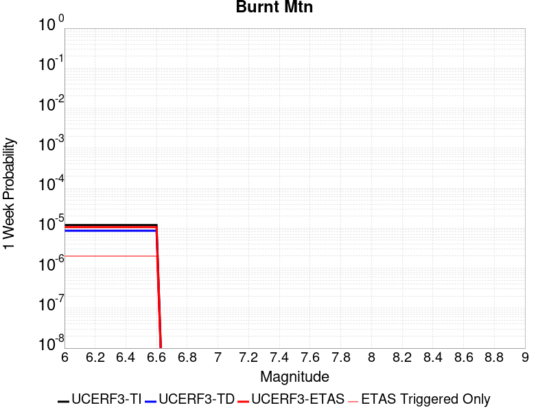 |  |  |  |

| Magnitude | 1 wk TI Prob | 1 wk TD Prob | 1 wk ETAS Prob | 1 wk ETAS/TD Gain | 1 wk ETAS Triggered Only | 1 mo TI Prob | 1 mo TD Prob | 1 mo ETAS Prob | 1 mo ETAS/TD Gain | 1 mo ETAS Triggered Only | 1 yr TI Prob | 1 yr TD Prob | 1 yr ETAS Prob | 1 yr ETAS/TD Gain | 1 yr ETAS Triggered Only | 10 yr TI Prob | 10 yr TD Prob | 10 yr ETAS Prob | 10 yr ETAS/TD Gain | 10 yr ETAS Triggered Only |
|-----|-----|-----|-----|-----|-----|-----|-----|-----|-----|-----|-----|-----|-----|-----|-----|-----|-----|-----|-----|-----|
| 6.0 | 1.1997946E-5 | 8.64995E-6 | 8.64995E-6 | 1.0 | 0.0 | 5.1418756E-5 | 3.7071215E-5 | 4.030594E-5 | 1.087257 | 3.2348432E-6 | 6.2584353E-4 | 4.5134206E-4 | 4.5457543E-4 | 1.0071639 | 3.2348432E-6 | 0.006240839 | 0.0045134206 | 0.0045166407 | 1.0007135 | 3.2348432E-6 |
| 6.1 | 1.1997946E-5 | 8.64995E-6 | 8.64995E-6 | 1.0 | 0.0 | 5.1418756E-5 | 3.7071215E-5 | 4.030594E-5 | 1.087257 | 3.2348432E-6 | 6.2584353E-4 | 4.5134206E-4 | 4.5457543E-4 | 1.0071639 | 3.2348432E-6 | 0.006240839 | 0.0045134206 | 0.0045166407 | 1.0007135 | 3.2348432E-6 |
| 6.2 | 1.1997946E-5 | 8.64995E-6 | 8.64995E-6 | 1.0 | 0.0 | 5.1418756E-5 | 3.7071215E-5 | 4.030594E-5 | 1.087257 | 3.2348432E-6 | 6.2584353E-4 | 4.5134206E-4 | 4.5457543E-4 | 1.0071639 | 3.2348432E-6 | 0.006240839 | 0.0045134206 | 0.0045166407 | 1.0007135 | 3.2348432E-6 |
| 6.3 | 1.1997946E-5 | 8.64995E-6 | 8.64995E-6 | 1.0 | 0.0 | 5.1418756E-5 | 3.7071215E-5 | 4.030594E-5 | 1.087257 | 3.2348432E-6 | 6.2584353E-4 | 4.5134206E-4 | 4.5457543E-4 | 1.0071639 | 3.2348432E-6 | 0.006240839 | 0.0045134206 | 0.0045166407 | 1.0007135 | 3.2348432E-6 |
| 6.4 | 1.1997946E-5 | 8.64995E-6 | 8.64995E-6 | 1.0 | 0.0 | 5.1418756E-5 | 3.7071215E-5 | 4.030594E-5 | 1.087257 | 3.2348432E-6 | 6.2584353E-4 | 4.5134206E-4 | 4.5457543E-4 | 1.0071639 | 3.2348432E-6 | 0.006240839 | 0.0045134206 | 0.0045166407 | 1.0007135 | 3.2348432E-6 |
| 6.5 | 1.1997946E-5 | 8.64995E-6 | 8.64995E-6 | 1.0 | 0.0 | 5.1418756E-5 | 3.7071215E-5 | 4.030594E-5 | 1.087257 | 3.2348432E-6 | 6.2584353E-4 | 4.5134206E-4 | 4.5457543E-4 | 1.0071639 | 3.2348432E-6 | 0.006240839 | 0.0045134206 | 0.0045166407 | 1.0007135 | 3.2348432E-6 |
| 6.6 | 1.1997946E-5 | 8.64995E-6 | 8.64995E-6 | 1.0 | 0.0 | 5.1418756E-5 | 3.7071215E-5 | 4.030594E-5 | 1.087257 | 3.2348432E-6 | 6.2584353E-4 | 4.5134206E-4 | 4.5457543E-4 | 1.0071639 | 3.2348432E-6 | 0.006240839 | 0.0045134206 | 0.0045166407 | 1.0007135 | 3.2348432E-6 |

## Pisgah-Bullion Mtn-Mesquite Lk
*[(top)](#table-of-contents)*

| 1 Week | 1 Month | 1 Year | 10 Year |
|-----|-----|-----|-----|
|  | 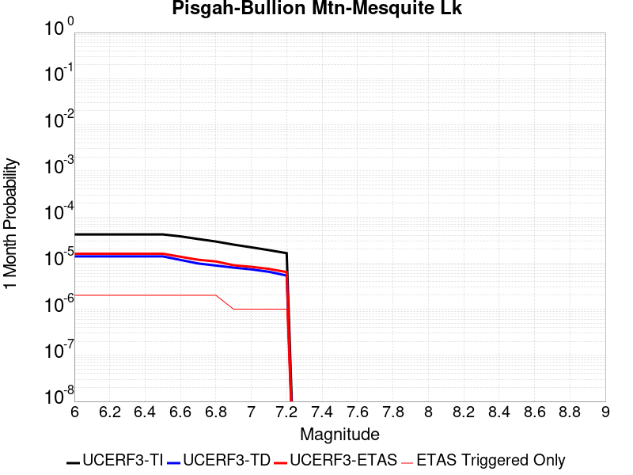 |  |  |

| Magnitude | 1 wk TI Prob | 1 wk TD Prob | 1 wk ETAS Prob | 1 wk ETAS/TD Gain | 1 wk ETAS Triggered Only | 1 mo TI Prob | 1 mo TD Prob | 1 mo ETAS Prob | 1 mo ETAS/TD Gain | 1 mo ETAS Triggered Only | 1 yr TI Prob | 1 yr TD Prob | 1 yr ETAS Prob | 1 yr ETAS/TD Gain | 1 yr ETAS Triggered Only | 10 yr TI Prob | 10 yr TD Prob | 10 yr ETAS Prob | 10 yr ETAS/TD Gain | 10 yr ETAS Triggered Only |
|-----|-----|-----|-----|-----|-----|-----|-----|-----|-----|-----|-----|-----|-----|-----|-----|-----|-----|-----|-----|-----|
| 6.0 | 9.757405E-6 | 3.2571834E-6 | 6.492016E-6 | 1.9931381 | 3.2348432E-6 | 4.181678E-5 | 1.3959294E-5 | 1.7194092E-5 | 1.2317308 | 3.2348432E-6 | 5.090004E-4 | 1.6994326E-4 | 1.7317756E-4 | 1.0190316 | 3.2348432E-6 | 0.005078361 | 0.0016983406 | 0.00170157 | 1.0019015 | 3.2348432E-6 |
| 6.1 | 9.757405E-6 | 3.2571834E-6 | 6.492016E-6 | 1.9931381 | 3.2348432E-6 | 4.181678E-5 | 1.3959294E-5 | 1.7194092E-5 | 1.2317308 | 3.2348432E-6 | 5.090004E-4 | 1.6994326E-4 | 1.7317756E-4 | 1.0190316 | 3.2348432E-6 | 0.005078361 | 0.0016983406 | 0.00170157 | 1.0019015 | 3.2348432E-6 |
| 6.2 | 9.757405E-6 | 3.2571834E-6 | 6.492016E-6 | 1.9931381 | 3.2348432E-6 | 4.181678E-5 | 1.3959294E-5 | 1.7194092E-5 | 1.2317308 | 3.2348432E-6 | 5.090004E-4 | 1.6994326E-4 | 1.7317756E-4 | 1.0190316 | 3.2348432E-6 | 0.005078361 | 0.0016983406 | 0.00170157 | 1.0019015 | 3.2348432E-6 |
| 6.3 | 9.757405E-6 | 3.2571834E-6 | 6.492016E-6 | 1.9931381 | 3.2348432E-6 | 4.181678E-5 | 1.3959294E-5 | 1.7194092E-5 | 1.2317308 | 3.2348432E-6 | 5.090004E-4 | 1.6994326E-4 | 1.7317756E-4 | 1.0190316 | 3.2348432E-6 | 0.005078361 | 0.0016983406 | 0.00170157 | 1.0019015 | 3.2348432E-6 |
| 6.4 | 9.757405E-6 | 3.2571834E-6 | 6.492016E-6 | 1.9931381 | 3.2348432E-6 | 4.181678E-5 | 1.3959294E-5 | 1.7194092E-5 | 1.2317308 | 3.2348432E-6 | 5.090004E-4 | 1.6994326E-4 | 1.7317756E-4 | 1.0190316 | 3.2348432E-6 | 0.005078361 | 0.0016983406 | 0.00170157 | 1.0019015 | 3.2348432E-6 |
| 6.5 | 9.757405E-6 | 3.2571834E-6 | 6.492016E-6 | 1.9931381 | 3.2348432E-6 | 4.181678E-5 | 1.3959294E-5 | 1.7194092E-5 | 1.2317308 | 3.2348432E-6 | 5.090004E-4 | 1.6994326E-4 | 1.7317756E-4 | 1.0190316 | 3.2348432E-6 | 0.005078361 | 0.0016983406 | 0.00170157 | 1.0019015 | 3.2348432E-6 |
| 6.6 | 8.852213E-6 | 2.7291178E-6 | 5.963952E-6 | 2.1853042 | 3.2348432E-6 | 3.7937505E-5 | 1.1696178E-5 | 1.49309835E-5 | 1.2765695 | 3.2348432E-6 | 4.6179123E-4 | 1.4239372E-4 | 1.456281E-4 | 1.0227144 | 3.2348432E-6 | 0.004608328 | 0.0014232274 | 0.0014264577 | 1.0022696 | 3.2348432E-6 |
| 6.7 | 7.756385E-6 | 2.2853417E-6 | 5.5201776E-6 | 2.4154713 | 3.2348432E-6 | 3.3241224E-5 | 9.794297E-6 | 1.3029107E-5 | 1.330275 | 3.2348432E-6 | 4.0463675E-4 | 1.1924106E-4 | 1.2247551E-4 | 1.0271254 | 3.2348432E-6 | 0.0040390077 | 0.0011919696 | 0.0011952006 | 1.0027106 | 3.2348432E-6 |
| 6.8 | 6.8437944E-6 | 2.0638372E-6 | 5.298674E-6 | 2.5673892 | 3.2348432E-6 | 2.9330216E-5 | 8.844998E-6 | 1.2079812E-5 | 1.3657224 | 3.2348432E-6 | 3.570369E-4 | 1.07684544E-4 | 1.1091904E-4 | 1.0300368 | 3.2348432E-6 | 0.0035646379 | 0.0010765212 | 0.0010797527 | 1.0030017 | 3.2348432E-6 |
| 6.9 | 5.8630926E-6 | 1.8587051E-6 | 1.8587051E-6 | 1.0 | 0.0 | 2.5127298E-5 | 7.965866E-6 | 7.965866E-6 | 1.0 | 0.0 | 3.058819E-4 | 9.698211E-5 | 9.698211E-5 | 1.0 | 0.0 | 0.003054612 | 9.695946E-4 | 9.695946E-4 | 1.0 | 0.0 |
| 7.0 | 5.1241714E-6 | 1.7030331E-6 | 1.7030331E-6 | 1.0 | 0.0 | 2.196055E-5 | 7.2987045E-6 | 7.2987045E-6 | 1.0 | 0.0 | 2.6733687E-4 | 8.8860106E-5 | 8.8860106E-5 | 1.0 | 0.0 | 0.0026701551 | 8.88442E-4 | 8.88442E-4 | 1.0 | 0.0 |
| 7.1 | 4.4490575E-6 | 1.5093489E-6 | 1.5093489E-6 | 1.0 | 0.0 | 1.906725E-5 | 6.468633E-6 | 6.468633E-6 | 1.0 | 0.0 | 2.3211904E-4 | 7.875475E-5 | 7.875475E-5 | 1.0 | 0.0 | 0.0023187674 | 7.8746333E-4 | 7.8746333E-4 | 1.0 | 0.0 |
| 7.2 | 3.827017E-6 | 1.2527248E-6 | 1.2527248E-6 | 1.0 | 0.0 | 1.6401398E-5 | 5.3688204E-6 | 5.3688204E-6 | 1.0 | 0.0 | 1.9966872E-4 | 6.536539E-5 | 6.536539E-5 | 1.0 | 0.0 | 0.0019948941 | 6.5365393E-4 | 6.5365393E-4 | 1.0 | 0.0 |

## Gillem - Big Crack 2011 CFM
*[(top)](#table-of-contents)*

| 1 Week | 1 Month | 1 Year | 10 Year |
|-----|-----|-----|-----|
|  |  |  |  |

| Magnitude | 1 wk TI Prob | 1 wk TD Prob | 1 wk ETAS Prob | 1 wk ETAS/TD Gain | 1 wk ETAS Triggered Only | 1 mo TI Prob | 1 mo TD Prob | 1 mo ETAS Prob | 1 mo ETAS/TD Gain | 1 mo ETAS Triggered Only | 1 yr TI Prob | 1 yr TD Prob | 1 yr ETAS Prob | 1 yr ETAS/TD Gain | 1 yr ETAS Triggered Only | 10 yr TI Prob | 10 yr TD Prob | 10 yr ETAS Prob | 10 yr ETAS/TD Gain | 10 yr ETAS Triggered Only |
|-----|-----|-----|-----|-----|-----|-----|-----|-----|-----|-----|-----|-----|-----|-----|-----|-----|-----|-----|-----|-----|
| 6.0 | 1.910764E-5 | 2.1994592E-5 | 2.1994592E-5 | 1.0 | 0.0 | 8.1887316E-5 | 9.426067E-5 | 9.7495205E-5 | 1.0343149 | 3.2348432E-6 | 9.96522E-4 | 0.0011472917 | 0.0011505228 | 1.0028163 | 3.2348432E-6 | 0.009920651 | 0.011440402 | 0.0114436 | 1.0002795 | 3.2348432E-6 |
| 6.1 | 1.910764E-5 | 2.1994592E-5 | 2.1994592E-5 | 1.0 | 0.0 | 8.1887316E-5 | 9.426067E-5 | 9.7495205E-5 | 1.0343149 | 3.2348432E-6 | 9.96522E-4 | 0.0011472917 | 0.0011505228 | 1.0028163 | 3.2348432E-6 | 0.009920651 | 0.011440402 | 0.0114436 | 1.0002795 | 3.2348432E-6 |
| 6.2 | 1.910764E-5 | 2.1994592E-5 | 2.1994592E-5 | 1.0 | 0.0 | 8.1887316E-5 | 9.426067E-5 | 9.7495205E-5 | 1.0343149 | 3.2348432E-6 | 9.96522E-4 | 0.0011472917 | 0.0011505228 | 1.0028163 | 3.2348432E-6 | 0.009920651 | 0.011440402 | 0.0114436 | 1.0002795 | 3.2348432E-6 |
| 6.3 | 1.910764E-5 | 2.1994592E-5 | 2.1994592E-5 | 1.0 | 0.0 | 8.1887316E-5 | 9.426067E-5 | 9.7495205E-5 | 1.0343149 | 3.2348432E-6 | 9.96522E-4 | 0.0011472917 | 0.0011505228 | 1.0028163 | 3.2348432E-6 | 0.009920651 | 0.011440402 | 0.0114436 | 1.0002795 | 3.2348432E-6 |
| 6.4 | 1.910764E-5 | 2.1994592E-5 | 2.1994592E-5 | 1.0 | 0.0 | 8.1887316E-5 | 9.426067E-5 | 9.7495205E-5 | 1.0343149 | 3.2348432E-6 | 9.96522E-4 | 0.0011472917 | 0.0011505228 | 1.0028163 | 3.2348432E-6 | 0.009920651 | 0.011440402 | 0.0114436 | 1.0002795 | 3.2348432E-6 |
| 6.5 | 1.910764E-5 | 2.1994592E-5 | 2.1994592E-5 | 1.0 | 0.0 | 8.1887316E-5 | 9.426067E-5 | 9.7495205E-5 | 1.0343149 | 3.2348432E-6 | 9.96522E-4 | 0.0011472917 | 0.0011505228 | 1.0028163 | 3.2348432E-6 | 0.009920651 | 0.011440402 | 0.0114436 | 1.0002795 | 3.2348432E-6 |
| 6.6 | 1.3213953E-5 | 1.5149388E-5 | 1.5149388E-5 | 1.0 | 0.0 | 5.6629997E-5 | 6.4925705E-5 | 6.8160334E-5 | 1.0498205 | 3.2348432E-6 | 6.892521E-4 | 7.904269E-4 | 7.936592E-4 | 1.0040892 | 3.2348432E-6 | 0.0068711825 | 0.0079000015 | 0.007903211 | 1.0004063 | 3.2348432E-6 |
| 6.7 | 1.21310995E-5 | 1.3896347E-5 | 1.3896347E-5 | 1.0 | 0.0 | 5.198939E-5 | 5.9555772E-5 | 6.279042E-5 | 1.054313 | 3.2348432E-6 | 6.32787E-4 | 7.2509155E-4 | 7.2832406E-4 | 1.0044581 | 3.2348432E-6 | 0.0063098813 | 0.0072509153 | 0.007254127 | 1.0004429 | 3.2348432E-6 |

## Likely 2011 CFM
*[(top)](#table-of-contents)*

| 1 Week | 1 Month | 1 Year | 10 Year |
|-----|-----|-----|-----|
|  |  |  |  |

| Magnitude | 1 wk TI Prob | 1 wk TD Prob | 1 wk ETAS Prob | 1 wk ETAS/TD Gain | 1 wk ETAS Triggered Only | 1 mo TI Prob | 1 mo TD Prob | 1 mo ETAS Prob | 1 mo ETAS/TD Gain | 1 mo ETAS Triggered Only | 1 yr TI Prob | 1 yr TD Prob | 1 yr ETAS Prob | 1 yr ETAS/TD Gain | 1 yr ETAS Triggered Only | 10 yr TI Prob | 10 yr TD Prob | 10 yr ETAS Prob | 10 yr ETAS/TD Gain | 10 yr ETAS Triggered Only |
|-----|-----|-----|-----|-----|-----|-----|-----|-----|-----|-----|-----|-----|-----|-----|-----|-----|-----|-----|-----|-----|
| 6.0 | 4.8283173E-6 | 4.977288E-6 | 4.977288E-6 | 1.0 | 0.0 | 2.0692623E-5 | 2.1331109E-5 | 2.1331109E-5 | 1.0 | 0.0 | 2.5190358E-4 | 2.5968385E-4 | 2.6291783E-4 | 1.0124537 | 3.2348432E-6 | 0.0025161821 | 0.0025946426 | 0.002597869 | 1.0012435 | 3.2348432E-6 |
| 6.1 | 4.8283173E-6 | 4.977288E-6 | 4.977288E-6 | 1.0 | 0.0 | 2.0692623E-5 | 2.1331109E-5 | 2.1331109E-5 | 1.0 | 0.0 | 2.5190358E-4 | 2.5968385E-4 | 2.6291783E-4 | 1.0124537 | 3.2348432E-6 | 0.0025161821 | 0.0025946426 | 0.002597869 | 1.0012435 | 3.2348432E-6 |
| 6.2 | 4.8283173E-6 | 4.977288E-6 | 4.977288E-6 | 1.0 | 0.0 | 2.0692623E-5 | 2.1331109E-5 | 2.1331109E-5 | 1.0 | 0.0 | 2.5190358E-4 | 2.5968385E-4 | 2.6291783E-4 | 1.0124537 | 3.2348432E-6 | 0.0025161821 | 0.0025946426 | 0.002597869 | 1.0012435 | 3.2348432E-6 |
| 6.3 | 4.8283173E-6 | 4.977288E-6 | 4.977288E-6 | 1.0 | 0.0 | 2.0692623E-5 | 2.1331109E-5 | 2.1331109E-5 | 1.0 | 0.0 | 2.5190358E-4 | 2.5968385E-4 | 2.6291783E-4 | 1.0124537 | 3.2348432E-6 | 0.0025161821 | 0.0025946426 | 0.002597869 | 1.0012435 | 3.2348432E-6 |
| 6.4 | 4.8283173E-6 | 4.977288E-6 | 4.977288E-6 | 1.0 | 0.0 | 2.0692623E-5 | 2.1331109E-5 | 2.1331109E-5 | 1.0 | 0.0 | 2.5190358E-4 | 2.5968385E-4 | 2.6291783E-4 | 1.0124537 | 3.2348432E-6 | 0.0025161821 | 0.0025946426 | 0.002597869 | 1.0012435 | 3.2348432E-6 |
| 6.5 | 4.8283173E-6 | 4.977288E-6 | 4.977288E-6 | 1.0 | 0.0 | 2.0692623E-5 | 2.1331109E-5 | 2.1331109E-5 | 1.0 | 0.0 | 2.5190358E-4 | 2.5968385E-4 | 2.6291783E-4 | 1.0124537 | 3.2348432E-6 | 0.0025161821 | 0.0025946426 | 0.002597869 | 1.0012435 | 3.2348432E-6 |
| 6.6 | 4.1529042E-6 | 4.2800852E-6 | 4.2800852E-6 | 1.0 | 0.0 | 1.779804E-5 | 1.834314E-5 | 1.834314E-5 | 1.0 | 0.0 | 2.1666959E-4 | 2.2331333E-4 | 2.2654745E-4 | 1.0144824 | 3.2348432E-6 | 0.0021645846 | 0.00223172 | 0.0022349476 | 1.0014462 | 3.2348432E-6 |
| 6.7 | 3.5450967E-6 | 3.6525942E-6 | 3.6525942E-6 | 1.0 | 0.0 | 1.5193183E-5 | 1.5653928E-5 | 1.5653928E-5 | 1.0 | 0.0 | 1.849613E-4 | 1.905783E-4 | 1.9381254E-4 | 1.0169706 | 3.2348432E-6 | 0.0018480743 | 0.0019049724 | 0.001908201 | 1.0016949 | 3.2348432E-6 |
| 6.8 | 2.9935204E-6 | 3.0833778E-6 | 3.0833778E-6 | 1.0 | 0.0 | 1.282931E-5 | 1.3214457E-5 | 1.3214457E-5 | 1.0 | 0.0 | 1.5618566E-4 | 1.6088245E-4 | 1.6411678E-4 | 1.0201037 | 3.2348432E-6 | 0.0015607593 | 0.0016084755 | 0.001611705 | 1.0020078 | 3.2348432E-6 |
| 6.9 | 2.4887156E-6 | 2.5627064E-6 | 2.5627064E-6 | 1.0 | 0.0 | 1.0665881E-5 | 1.0983028E-5 | 1.0983028E-5 | 1.0 | 0.0 | 1.2984936E-4 | 1.3371836E-4 | 1.3695277E-4 | 1.0241883 | 3.2348432E-6 | 0.0012977351 | 0.0013371836 | 0.0013404142 | 1.0024159 | 3.2348432E-6 |

## Collayami 2011 CFM
*[(top)](#table-of-contents)*

| 1 Week | 1 Month | 1 Year | 10 Year |
|-----|-----|-----|-----|
|  |  |  |  |

| Magnitude | 1 wk TI Prob | 1 wk TD Prob | 1 wk ETAS Prob | 1 wk ETAS/TD Gain | 1 wk ETAS Triggered Only | 1 mo TI Prob | 1 mo TD Prob | 1 mo ETAS Prob | 1 mo ETAS/TD Gain | 1 mo ETAS Triggered Only | 1 yr TI Prob | 1 yr TD Prob | 1 yr ETAS Prob | 1 yr ETAS/TD Gain | 1 yr ETAS Triggered Only | 10 yr TI Prob | 10 yr TD Prob | 10 yr ETAS Prob | 10 yr ETAS/TD Gain | 10 yr ETAS Triggered Only |
|-----|-----|-----|-----|-----|-----|-----|-----|-----|-----|-----|-----|-----|-----|-----|-----|-----|-----|-----|-----|-----|
| 6.0 | 1.2952825E-5 | 1.4354933E-5 | 1.4354933E-5 | 1.0 | 0.0 | 5.551093E-5 | 6.152114E-5 | 6.152114E-5 | 1.0 | 0.0 | 6.7563594E-4 | 7.490199E-4 | 7.490199E-4 | 1.0 | 0.0 | 0.006735855 | 0.007490199 | 0.00749341 | 1.0004287 | 3.2348432E-6 |
| 6.1 | 1.2952825E-5 | 1.4354933E-5 | 1.4354933E-5 | 1.0 | 0.0 | 5.551093E-5 | 6.152114E-5 | 6.152114E-5 | 1.0 | 0.0 | 6.7563594E-4 | 7.490199E-4 | 7.490199E-4 | 1.0 | 0.0 | 0.006735855 | 0.007490199 | 0.00749341 | 1.0004287 | 3.2348432E-6 |
| 6.2 | 1.2952825E-5 | 1.4354933E-5 | 1.4354933E-5 | 1.0 | 0.0 | 5.551093E-5 | 6.152114E-5 | 6.152114E-5 | 1.0 | 0.0 | 6.7563594E-4 | 7.490199E-4 | 7.490199E-4 | 1.0 | 0.0 | 0.006735855 | 0.007490199 | 0.00749341 | 1.0004287 | 3.2348432E-6 |
| 6.3 | 1.2952825E-5 | 1.4354933E-5 | 1.4354933E-5 | 1.0 | 0.0 | 5.551093E-5 | 6.152114E-5 | 6.152114E-5 | 1.0 | 0.0 | 6.7563594E-4 | 7.490199E-4 | 7.490199E-4 | 1.0 | 0.0 | 0.006735855 | 0.007490199 | 0.00749341 | 1.0004287 | 3.2348432E-6 |
| 6.4 | 1.2952825E-5 | 1.4354933E-5 | 1.4354933E-5 | 1.0 | 0.0 | 5.551093E-5 | 6.152114E-5 | 6.152114E-5 | 1.0 | 0.0 | 6.7563594E-4 | 7.490199E-4 | 7.490199E-4 | 1.0 | 0.0 | 0.006735855 | 0.007490199 | 0.00749341 | 1.0004287 | 3.2348432E-6 |
| 6.5 | 1.2952825E-5 | 1.4354933E-5 | 1.4354933E-5 | 1.0 | 0.0 | 5.551093E-5 | 6.152114E-5 | 6.152114E-5 | 1.0 | 0.0 | 6.7563594E-4 | 7.490199E-4 | 7.490199E-4 | 1.0 | 0.0 | 0.006735855 | 0.007490199 | 0.00749341 | 1.0004287 | 3.2348432E-6 |

## West Tahoe
*[(top)](#table-of-contents)*

| 1 Week | 1 Month | 1 Year | 10 Year |
|-----|-----|-----|-----|
|  |  |  |  |

| Magnitude | 1 wk TI Prob | 1 wk TD Prob | 1 wk ETAS Prob | 1 wk ETAS/TD Gain | 1 wk ETAS Triggered Only | 1 mo TI Prob | 1 mo TD Prob | 1 mo ETAS Prob | 1 mo ETAS/TD Gain | 1 mo ETAS Triggered Only | 1 yr TI Prob | 1 yr TD Prob | 1 yr ETAS Prob | 1 yr ETAS/TD Gain | 1 yr ETAS Triggered Only | 10 yr TI Prob | 10 yr TD Prob | 10 yr ETAS Prob | 10 yr ETAS/TD Gain | 10 yr ETAS Triggered Only |
|-----|-----|-----|-----|-----|-----|-----|-----|-----|-----|-----|-----|-----|-----|-----|-----|-----|-----|-----|-----|-----|
| 6.0 | 9.18365E-6 | 9.709047E-6 | 9.709047E-6 | 1.0 | 0.0 | 3.9357907E-5 | 4.1609703E-5 | 4.1609703E-5 | 1.0 | 0.0 | 4.7907716E-4 | 5.065095E-4 | 5.097427E-4 | 1.0063833 | 3.2348432E-6 | 0.0047804564 | 0.0050564157 | 0.005059634 | 1.0006365 | 3.2348432E-6 |
| 6.1 | 9.18365E-6 | 9.709047E-6 | 9.709047E-6 | 1.0 | 0.0 | 3.9357907E-5 | 4.1609703E-5 | 4.1609703E-5 | 1.0 | 0.0 | 4.7907716E-4 | 5.065095E-4 | 5.097427E-4 | 1.0063833 | 3.2348432E-6 | 0.0047804564 | 0.0050564157 | 0.005059634 | 1.0006365 | 3.2348432E-6 |
| 6.2 | 9.18365E-6 | 9.709047E-6 | 9.709047E-6 | 1.0 | 0.0 | 3.9357907E-5 | 4.1609703E-5 | 4.1609703E-5 | 1.0 | 0.0 | 4.7907716E-4 | 5.065095E-4 | 5.097427E-4 | 1.0063833 | 3.2348432E-6 | 0.0047804564 | 0.0050564157 | 0.005059634 | 1.0006365 | 3.2348432E-6 |
| 6.3 | 9.18365E-6 | 9.709047E-6 | 9.709047E-6 | 1.0 | 0.0 | 3.9357907E-5 | 4.1609703E-5 | 4.1609703E-5 | 1.0 | 0.0 | 4.7907716E-4 | 5.065095E-4 | 5.097427E-4 | 1.0063833 | 3.2348432E-6 | 0.0047804564 | 0.0050564157 | 0.005059634 | 1.0006365 | 3.2348432E-6 |
| 6.4 | 9.18365E-6 | 9.709047E-6 | 9.709047E-6 | 1.0 | 0.0 | 3.9357907E-5 | 4.1609703E-5 | 4.1609703E-5 | 1.0 | 0.0 | 4.7907716E-4 | 5.065095E-4 | 5.097427E-4 | 1.0063833 | 3.2348432E-6 | 0.0047804564 | 0.0050564157 | 0.005059634 | 1.0006365 | 3.2348432E-6 |
| 6.5 | 9.18365E-6 | 9.709047E-6 | 9.709047E-6 | 1.0 | 0.0 | 3.9357907E-5 | 4.1609703E-5 | 4.1609703E-5 | 1.0 | 0.0 | 4.7907716E-4 | 5.065095E-4 | 5.097427E-4 | 1.0063833 | 3.2348432E-6 | 0.0047804564 | 0.0050564157 | 0.005059634 | 1.0006365 | 3.2348432E-6 |
| 6.6 | 8.164356E-6 | 8.6257305E-6 | 8.6257305E-6 | 1.0 | 0.0 | 3.4989625E-5 | 3.6967052E-5 | 3.6967052E-5 | 1.0 | 0.0 | 4.259154E-4 | 4.500096E-4 | 4.5324297E-4 | 1.0071851 | 3.2348432E-6 | 0.004251 | 0.004493797 | 0.0044970172 | 1.0007166 | 3.2348432E-6 |
| 6.7 | 7.1083327E-6 | 7.510388E-6 | 7.510388E-6 | 1.0 | 0.0 | 3.0463927E-5 | 3.2187138E-5 | 3.2187138E-5 | 1.0 | 0.0 | 3.708352E-4 | 3.918357E-4 | 3.9506928E-4 | 1.0082524 | 3.2348432E-6 | 0.0037021697 | 0.0039141746 | 0.003917397 | 1.0008233 | 3.2348432E-6 |
| 6.8 | 6.3750726E-6 | 6.7311666E-6 | 6.7311666E-6 | 1.0 | 0.0 | 2.7321454E-5 | 2.8847693E-5 | 2.8847693E-5 | 1.0 | 0.0 | 3.3258792E-4 | 3.5119147E-4 | 3.5119147E-4 | 1.0 | 0.0 | 0.0033209058 | 0.0035090533 | 0.0035090533 | 1.0 | 0.0 |
| 6.9 | 5.126961E-6 | 5.410055E-6 | 5.410055E-6 | 1.0 | 0.0 | 2.1972504E-5 | 2.3185894E-5 | 2.3185894E-5 | 1.0 | 0.0 | 2.674824E-4 | 2.8227826E-4 | 2.8227826E-4 | 1.0 | 0.0 | 0.0026716068 | 0.0028218026 | 0.0028218026 | 1.0 | 0.0 |
| 7.0 | 4.331526E-6 | 4.5688944E-6 | 4.5688944E-6 | 1.0 | 0.0 | 1.856355E-5 | 1.9580977E-5 | 1.9580977E-5 | 1.0 | 0.0 | 2.2598778E-4 | 2.3839838E-4 | 2.3839838E-4 | 1.0 | 0.0 | 0.002257581 | 0.002383984 | 0.002383984 | 1.0 | 0.0 |

## Elsinore (Julian)
*[(top)](#table-of-contents)*

| 1 Week | 1 Month | 1 Year | 10 Year |
|-----|-----|-----|-----|
| 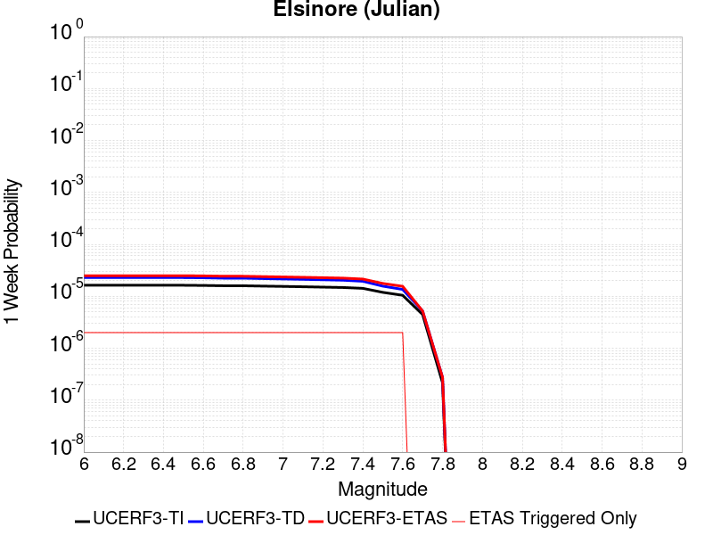 | 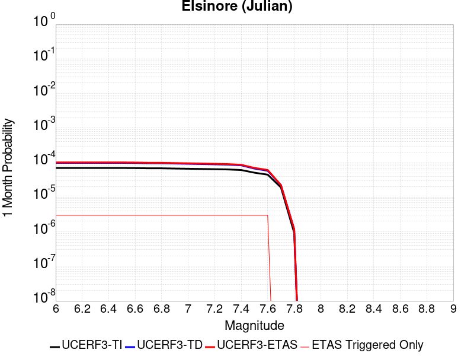 |  |  |

| Magnitude | 1 wk TI Prob | 1 wk TD Prob | 1 wk ETAS Prob | 1 wk ETAS/TD Gain | 1 wk ETAS Triggered Only | 1 mo TI Prob | 1 mo TD Prob | 1 mo ETAS Prob | 1 mo ETAS/TD Gain | 1 mo ETAS Triggered Only | 1 yr TI Prob | 1 yr TD Prob | 1 yr ETAS Prob | 1 yr ETAS/TD Gain | 1 yr ETAS Triggered Only | 10 yr TI Prob | 10 yr TD Prob | 10 yr ETAS Prob | 10 yr ETAS/TD Gain | 10 yr ETAS Triggered Only |
|-----|-----|-----|-----|-----|-----|-----|-----|-----|-----|-----|-----|-----|-----|-----|-----|-----|-----|-----|-----|-----|
| 6.0 | 1.6316579E-5 | 2.2937022E-5 | 2.2937022E-5 | 1.0 | 0.0 | 6.992632E-5 | 9.8298326E-5 | 9.8298326E-5 | 1.0 | 0.0 | 8.510204E-4 | 0.0011962154 | 0.0011994464 | 1.002701 | 3.2348432E-6 | 0.008477687 | 0.011913514 | 0.01191671 | 1.0002683 | 3.2348432E-6 |
| 6.1 | 1.6316579E-5 | 2.2937022E-5 | 2.2937022E-5 | 1.0 | 0.0 | 6.992632E-5 | 9.8298326E-5 | 9.8298326E-5 | 1.0 | 0.0 | 8.510204E-4 | 0.0011962154 | 0.0011994464 | 1.002701 | 3.2348432E-6 | 0.008477687 | 0.011913514 | 0.01191671 | 1.0002683 | 3.2348432E-6 |
| 6.2 | 1.6316579E-5 | 2.2937022E-5 | 2.2937022E-5 | 1.0 | 0.0 | 6.992632E-5 | 9.8298326E-5 | 9.8298326E-5 | 1.0 | 0.0 | 8.510204E-4 | 0.0011962154 | 0.0011994464 | 1.002701 | 3.2348432E-6 | 0.008477687 | 0.011913514 | 0.01191671 | 1.0002683 | 3.2348432E-6 |
| 6.3 | 1.6316579E-5 | 2.2937022E-5 | 2.2937022E-5 | 1.0 | 0.0 | 6.992632E-5 | 9.8298326E-5 | 9.8298326E-5 | 1.0 | 0.0 | 8.510204E-4 | 0.0011962154 | 0.0011994464 | 1.002701 | 3.2348432E-6 | 0.008477687 | 0.011913514 | 0.01191671 | 1.0002683 | 3.2348432E-6 |
| 6.4 | 1.6316579E-5 | 2.2937022E-5 | 2.2937022E-5 | 1.0 | 0.0 | 6.992632E-5 | 9.8298326E-5 | 9.8298326E-5 | 1.0 | 0.0 | 8.510204E-4 | 0.0011962154 | 0.0011994464 | 1.002701 | 3.2348432E-6 | 0.008477687 | 0.011913514 | 0.01191671 | 1.0002683 | 3.2348432E-6 |
| 6.5 | 1.6316579E-5 | 2.2937022E-5 | 2.2937022E-5 | 1.0 | 0.0 | 6.992632E-5 | 9.8298326E-5 | 9.8298326E-5 | 1.0 | 0.0 | 8.510204E-4 | 0.0011962154 | 0.0011994464 | 1.002701 | 3.2348432E-6 | 0.008477687 | 0.011913514 | 0.01191671 | 1.0002683 | 3.2348432E-6 |
| 6.6 | 1.6187845E-5 | 2.2737193E-5 | 2.2737193E-5 | 1.0 | 0.0 | 6.937464E-5 | 9.744198E-5 | 9.744198E-5 | 1.0 | 0.0 | 8.443089E-4 | 0.0011858008 | 0.0011890319 | 1.0027248 | 3.2348432E-6 | 0.008411082 | 0.01181048 | 0.011813677 | 1.0002706 | 3.2348432E-6 |
| 6.7 | 1.5985162E-5 | 2.2371887E-5 | 2.2371887E-5 | 1.0 | 0.0 | 6.850604E-5 | 9.58765E-5 | 9.58765E-5 | 1.0 | 0.0 | 8.3374185E-4 | 0.0011667616 | 0.0011699926 | 1.0027692 | 3.2348432E-6 | 0.008306207 | 0.011622093 | 0.01162529 | 1.0002751 | 3.2348432E-6 |
| 6.8 | 1.5961046E-5 | 2.2344699E-5 | 2.2344699E-5 | 1.0 | 0.0 | 6.840269E-5 | 9.575999E-5 | 9.575999E-5 | 1.0 | 0.0 | 8.324845E-4 | 0.0011653446 | 0.0011685756 | 1.0027727 | 3.2348432E-6 | 0.008293727 | 0.011608072 | 0.011611269 | 1.0002755 | 3.2348432E-6 |
| 6.9 | 1.5722166E-5 | 2.1942922E-5 | 2.1942922E-5 | 1.0 | 0.0 | 6.737897E-5 | 9.4038216E-5 | 9.4038216E-5 | 1.0 | 0.0 | 8.2003017E-4 | 0.0011444042 | 0.0011476354 | 1.0028235 | 3.2348432E-6 | 0.008170107 | 0.011400834 | 0.011404031 | 1.0002805 | 3.2348432E-6 |
| 7.0 | 1.5513018E-5 | 2.1584812E-5 | 2.1584812E-5 | 1.0 | 0.0 | 6.648267E-5 | 9.250357E-5 | 9.250357E-5 | 1.0 | 0.0 | 8.0912595E-4 | 0.0011257393 | 0.0011289705 | 1.0028703 | 3.2348432E-6 | 0.008061862 | 0.011216079 | 0.011219278 | 1.0002851 | 3.2348432E-6 |
| 7.1 | 1.527908E-5 | 2.1219155E-5 | 2.1219155E-5 | 1.0 | 0.0 | 6.5480126E-5 | 9.093658E-5 | 9.093658E-5 | 1.0 | 0.0 | 7.9692894E-4 | 0.0011066807 | 0.001109912 | 1.0029198 | 3.2348432E-6 | 0.007940771 | 0.011027294 | 0.011030493 | 1.0002902 | 3.2348432E-6 |
| 7.2 | 1.5025522E-5 | 2.082222E-5 | 2.082222E-5 | 1.0 | 0.0 | 6.4393505E-5 | 8.9235546E-5 | 8.9235546E-5 | 1.0 | 0.0 | 7.8370894E-4 | 0.0010859915 | 0.0010892228 | 1.0029755 | 3.2348432E-6 | 0.0078095077 | 0.010822412 | 0.010825612 | 1.0002956 | 3.2348432E-6 |
| 7.3 | 1.4779679E-5 | 2.0420333E-5 | 2.0420333E-5 | 1.0 | 0.0 | 6.333994E-5 | 8.751328E-5 | 8.751328E-5 | 1.0 | 0.0 | 7.708909E-4 | 0.0010650436 | 0.0010682751 | 1.003034 | 3.2348432E-6 | 0.007682222 | 0.010614914 | 0.010618114 | 1.0003015 | 3.2348432E-6 |
| 7.4 | 1.4238534E-5 | 1.9488383E-5 | 1.9488383E-5 | 1.0 | 0.0 | 6.1020863E-5 | 8.351947E-5 | 8.351947E-5 | 1.0 | 0.0 | 7.4267574E-4 | 0.001016465 | 0.0010196966 | 1.0031792 | 3.2348432E-6 | 0.007401986 | 0.010133445 | 0.010136648 | 1.000316 | 3.2348432E-6 |
| 7.5 | 1.1924516E-5 | 1.570584E-5 | 1.570584E-5 | 1.0 | 0.0 | 5.1104067E-5 | 6.730944E-5 | 6.730944E-5 | 1.0 | 0.0 | 6.220144E-4 | 8.192601E-4 | 8.224923E-4 | 1.0039452 | 3.2348432E-6 | 0.006202762 | 0.008175999 | 0.008179207 | 1.0003924 | 3.2348432E-6 |
| 7.6 | 1.0456552E-5 | 1.3574289E-5 | 1.3574289E-5 | 1.0 | 0.0 | 4.4813027E-5 | 5.817464E-5 | 5.817464E-5 | 1.0 | 0.0 | 5.45462E-4 | 7.081186E-4 | 7.1135117E-4 | 1.004565 | 3.2348432E-6 | 0.0054412507 | 0.0070718653 | 0.0070750774 | 1.0004542 | 3.2348432E-6 |
| 7.7 | 4.463199E-6 | 5.214875E-6 | 5.214875E-6 | 1.0 | 0.0 | 1.9127854E-5 | 2.2349386E-5 | 2.2349386E-5 | 1.0 | 0.0 | 2.3285674E-4 | 2.7209E-4 | 2.7532398E-4 | 1.0118856 | 3.2348432E-6 | 0.0023261288 | 0.0027239968 | 0.0027272226 | 1.0011843 | 3.2348432E-6 |
| 7.8 | 2.1601753E-7 | 2.7489222E-7 | 2.7489222E-7 | 1.0 | 0.0 | 9.257891E-7 | 1.1781094E-6 | 1.1781094E-6 | 1.0 | 0.0 | 1.1271423E-5 | 1.4343483E-5 | 1.4343483E-5 | 1.0 | 0.0 | 1.1270852E-4 | 1.435847E-4 | 1.435847E-4 | 1.0 | 0.0 |

