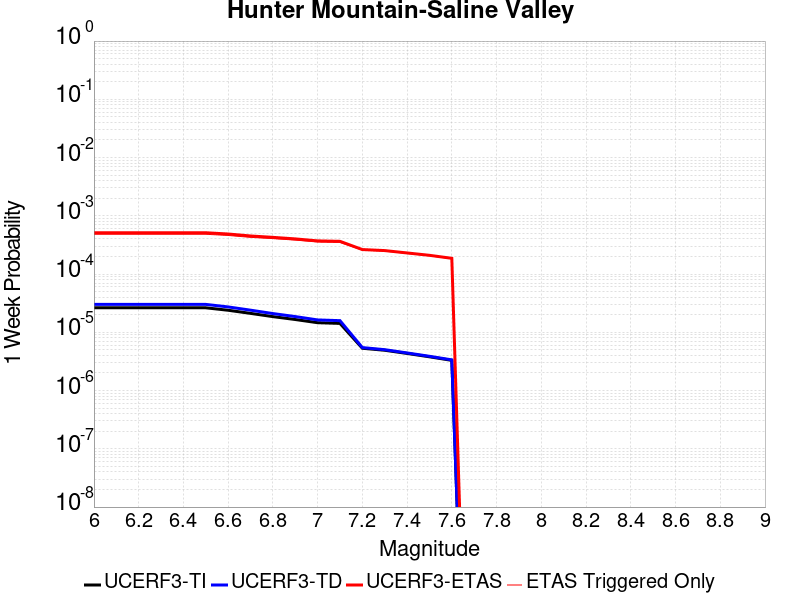
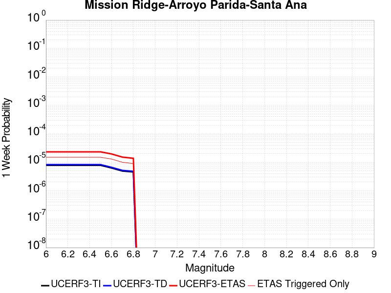
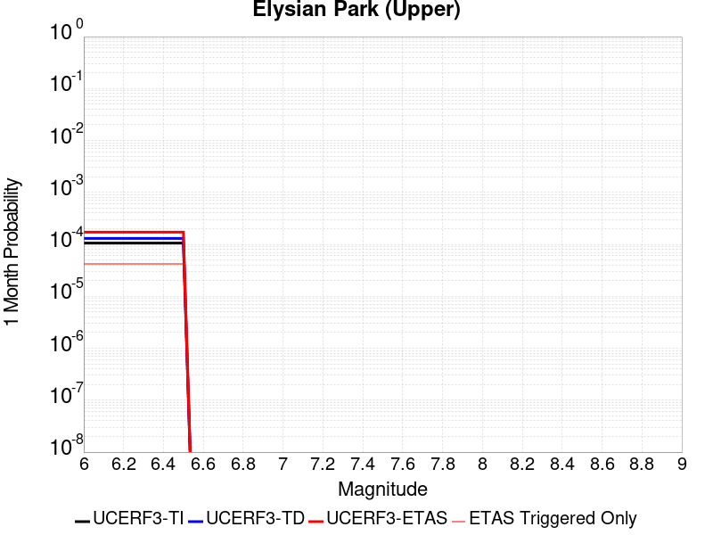
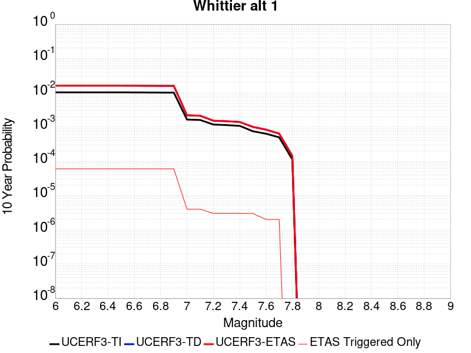
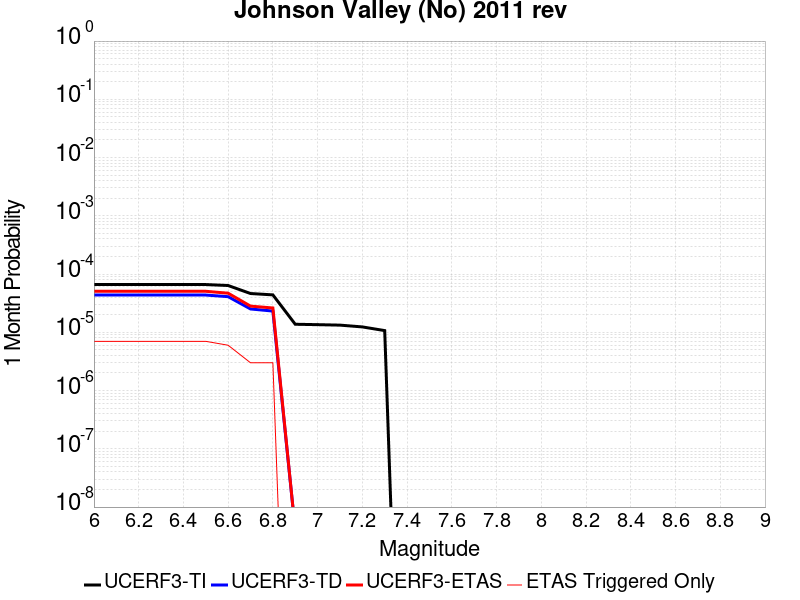
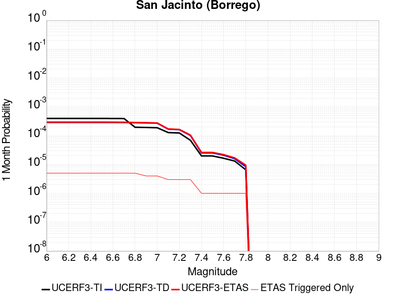
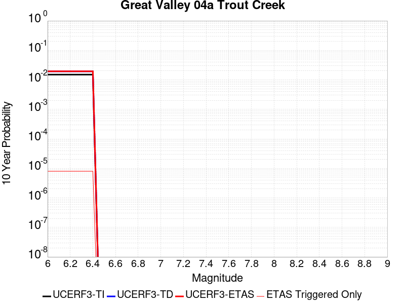
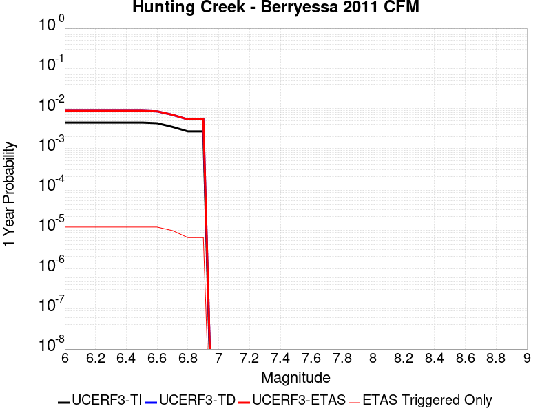

# Parent Section Magnitude-Probability Distributions

Only fault sections with at least one triggered aftershock are plotted. Sections are sorted by total supraseismogenic trigger rate (decreasing)

## Table Of Contents

* [Tank Canyon](#tank-canyon)
* [Garlock (Central)](#garlock-central)
* [Little Lake](#little-lake)
* [Owl Lake](#owl-lake)
* [Garlock (West)](#garlock-west)
* [Garlock (East)](#garlock-east)
* [Death Valley (So)](#death-valley-so)
* [Panamint Valley](#panamint-valley)
* [San Andreas (Mojave N)](#san-andreas-mojave-n)
* [San Andreas (Big Bend)](#san-andreas-big-bend)
* [San Andreas (Mojave S)](#san-andreas-mojave-s)
* [San Andreas (Carrizo) rev](#san-andreas-carrizo-rev)
* [Blackwater](#blackwater)
* [Death Valley (Black Mtns Frontal)](#death-valley-black-mtns-frontal)
* [San Andreas (Cholame) rev](#san-andreas-cholame-rev)
* [San Andreas (Parkfield)](#san-andreas-parkfield)
* [Hunter Mountain-Saline Valley](#hunter-mountain-saline-valley)
* [San Andreas (San Bernardino N)](#san-andreas-san-bernardino-n)
* [Cucamonga](#cucamonga)
* [Pleito](#pleito)
* [San Cayetano](#san-cayetano)
* [Death Valley (No)](#death-valley-no)
* [San Andreas (San Bernardino S)](#san-andreas-san-bernardino-s)
* [Gravel Hills-Harper Lk](#gravel-hills-harper-lk)
* [Cleghorn](#cleghorn)
* [Pitas Point (Lower West)](#pitas-point-lower-west)
* [Red Mountain](#red-mountain)
* [Santa Ynez (West)](#santa-ynez-west)
* [San Andreas (San Gorgonio Pass-Garnet HIll)](#san-andreas-san-gorgonio-pass-garnet-hill)
* [San Jacinto (San Bernardino)](#san-jacinto-san-bernardino)
* [San Andreas (Coachella) rev](#san-andreas-coachella-rev)
* [Pitas Point (Lower)-Montalvo](#pitas-point-lower-montalvo)
* [Santa Ynez (East)](#santa-ynez-east)
* [Lenwood-Lockhart-Old Woman Springs](#lenwood-lockhart-old-woman-springs)
* [Death Valley (Fish Lake Valley)](#death-valley-fish-lake-valley)
* [So Sierra Nevada](#so-sierra-nevada)
* [Santa Susana alt 1](#santa-susana-alt-1)
* [Raymond](#raymond)
* [Oak Ridge (Onshore)](#oak-ridge-onshore)
* [San Juan](#san-juan)
* [Sierra Madre](#sierra-madre)
* [Mission Ridge-Arroyo Parida-Santa Ana](#mission-ridge-arroyo-parida-santa-ana)
* [San Jacinto (Stepovers Combined)](#san-jacinto-stepovers-combined)
* [Clamshell-Sawpit](#clamshell-sawpit)
* [Elysian Park (Upper)](#elysian-park-upper)
* [San Jacinto (San Jacinto Valley) rev](#san-jacinto-san-jacinto-valley-rev)
* [Ventura-Pitas Point](#ventura-pitas-point)
* [Chino alt 1](#chino-alt-1)
* [Helendale-So Lockhart](#helendale-so-lockhart)
* [Channel Islands Thrust](#channel-islands-thrust)
* [Elsinore (Stepovers Combined)](#elsinore-stepovers-combined)
* [Whittier alt 1](#whittier-alt-1)
* [Independence rev 2011](#independence-rev-2011)
* [Los Alamos 2011 CFM](#los-alamos-2011-cfm)
* [Verdugo](#verdugo)
* [Elsinore (Glen Ivy) rev](#elsinore-glen-ivy-rev)
* [San Jose](#san-jose)
* [Simi-Santa Rosa](#simi-santa-rosa)
* [Santa Cruz Island](#santa-cruz-island)
* [Hollywood](#hollywood)
* [Calico-Hidalgo](#calico-hidalgo)
* [San Jacinto (Anza) rev](#san-jacinto-anza-rev)
* [Pinto Mtn](#pinto-mtn)
* [Mono Lake 2011 CFM](#mono-lake-2011-cfm)
* [San Gabriel](#san-gabriel)
* [North Frontal  (West)](#north-frontal--west)
* [Imperial](#imperial)
* [Hayward (No) 2011 CFM](#hayward-no-2011-cfm)
* [Great Valley 12](#great-valley-12)
* [Calaveras (Central) 2011 CFM](#calaveras-central-2011-cfm)
* [San Jacinto (Clark) rev](#san-jacinto-clark-rev)
* [Newport-Inglewood (Offshore)](#newport-inglewood-offshore)
* [Hayward (So) 2011 CFM](#hayward-so-2011-cfm)
* [Great Valley 14 (Kettleman Hills)](#great-valley-14-kettleman-hills)
* [Santa Rosa Island](#santa-rosa-island)
* [Concord 2011 CFM](#concord-2011-cfm)
* [Anacapa-Dume alt 1](#anacapa-dume-alt-1)
* [San Gregorio (North) 2011 CFM](#san-gregorio-north-2011-cfm)
* [San Jacinto (Superstition Mtn)](#san-jacinto-superstition-mtn)
* [Green Valley 2011 CFM](#green-valley-2011-cfm)
* [Great Valley 10 (Panoche)](#great-valley-10-panoche)
* [Hosgri](#hosgri)
* [Los Osos 2011](#los-osos-2011)
* [Deep Springs](#deep-springs)
* [Santa Monica alt 1](#santa-monica-alt-1)
* [Elsinore (Temecula) rev](#elsinore-temecula-rev)
* [Johnson Valley (No) 2011 rev](#johnson-valley-no-2011-rev)
* [Calaveras (No) 2011 CFM](#calaveras-no-2011-cfm)
* [Holser alt 1](#holser-alt-1)
* [Rose Canyon](#rose-canyon)
* [Puente Hills](#puente-hills)
* [San Gregorio (South) 2011 CFM](#san-gregorio-south-2011-cfm)
* [Emerson-Copper Mtn 2011](#emerson-copper-mtn-2011)
* [Palos Verdes](#palos-verdes)
* [Great Valley 11](#great-valley-11)
* [San Jacinto (Borrego)](#san-jacinto-borrego)
* [Great Valley 08 (Quinto)](#great-valley-08-quinto)
* [Casmalia 2011 CFM](#casmalia-2011-cfm)
* [Coronado Bank alt1](#coronado-bank-alt1)
* [San Joaquin Hills](#san-joaquin-hills)
* [San Jacinto (Coyote Creek)](#san-jacinto-coyote-creek)
* [Malibu Coast alt 1](#malibu-coast-alt-1)
* [North Frontal  (East)](#north-frontal--east)
* [Rodgers Creek - Healdsburg 2011 CFM](#rodgers-creek---healdsburg-2011-cfm)
* [San Andreas (Creeping Section) 2011 CFM](#san-andreas-creeping-section-2011-cfm)
* [Calaveras (So) 2011 CFM](#calaveras-so-2011-cfm)
* [Robinson Creek](#robinson-creek)
* [Newport-Inglewood alt 1](#newport-inglewood-alt-1)
* [Great Valley 09 (Laguna Seca)](#great-valley-09-laguna-seca)
* [Great Valley 07 (Orestimba)](#great-valley-07-orestimba)
* [Hat Creek-McArthur-Mayfield](#hat-creek-mcarthur-mayfield)
* [West Napa 2011 CFM](#west-napa-2011-cfm)
* [Honey Lake 2011 CFM](#honey-lake-2011-cfm)
* [Round Valley](#round-valley)
* [Rinconada 2011 CFM](#rinconada-2011-cfm)
* [Ortigalita (South)](#ortigalita-south)
* [San Luis Range 2011 CFM](#san-luis-range-2011-cfm)
* [Great Valley 04a Trout Creek](#great-valley-04a-trout-creek)
* [Great Valley 04b Gordon Valley](#great-valley-04b-gordon-valley)
* [White Mountains](#white-mountains)
* [Earthquake Valley](#earthquake-valley)
* [Greenville (No) 2011 CFM](#greenville-no-2011-cfm)
* [Great Valley 03 Mysterious Ridge](#great-valley-03-mysterious-ridge)
* [Maacama 2011 CFM](#maacama-2011-cfm)
* [Lions Head 2011 CFM](#lions-head-2011-cfm)
* [Hartley Springs 2011 CFM](#hartley-springs-2011-cfm)
* [Bartlett Springs 2011 CFM](#bartlett-springs-2011-cfm)
* [Burnt Mtn](#burnt-mtn)
* [Sierra Madre (San Fernando)](#sierra-madre-san-fernando)
* [Gillem - Big Crack 2011 CFM](#gillem---big-crack-2011-cfm)
* [Likely 2011 CFM](#likely-2011-cfm)
* [West Tahoe](#west-tahoe)
* [Hunting Creek - Berryessa 2011 CFM](#hunting-creek---berryessa-2011-cfm)
* [Elsinore (Julian)](#elsinore-julian)
* [Ortigalita (North)](#ortigalita-north)

## Tank Canyon
*[(top)](#table-of-contents)*

| 1 Week | 1 Month | 1 Year | 10 Year |
|-----|-----|-----|-----|
|  |  |  |  |

| Magnitude | 1 wk TI Prob | 1 wk TD Prob | 1 wk ETAS Prob | 1 wk ETAS/TD Gain | 1 wk ETAS Triggered Only | 1 mo TI Prob | 1 mo TD Prob | 1 mo ETAS Prob | 1 mo ETAS/TD Gain | 1 mo ETAS Triggered Only | 1 yr TI Prob | 1 yr TD Prob | 1 yr ETAS Prob | 1 yr ETAS/TD Gain | 1 yr ETAS Triggered Only | 10 yr TI Prob | 10 yr TD Prob | 10 yr ETAS Prob | 10 yr ETAS/TD Gain | 10 yr ETAS Triggered Only |
|-----|-----|-----|-----|-----|-----|-----|-----|-----|-----|-----|-----|-----|-----|-----|-----|-----|-----|-----|-----|-----|
| 6.0 | 2.7748038E-5 | 3.5073965E-5 | 0.02093903 | 596.99634 | 0.020904688 | 1.18914744E-4 | 1.5031699E-4 | 0.027872166 | 185.42258 | 0.027726017 | 0.0014468255 | 0.0018300817 | 0.043601196 | 23.824726 | 0.0418477 | 0.014374418 | 0.018297758 | 0.07431052 | 4.0611815 | 0.05705677 |
| 6.1 | 2.7748038E-5 | 3.5073965E-5 | 0.02093903 | 596.99634 | 0.020904688 | 1.18914744E-4 | 1.5031699E-4 | 0.027872166 | 185.42258 | 0.027726017 | 0.0014468255 | 0.0018300817 | 0.043601196 | 23.824726 | 0.0418477 | 0.014374418 | 0.018297758 | 0.07431052 | 4.0611815 | 0.05705677 |
| 6.2 | 2.7748038E-5 | 3.5073965E-5 | 0.02093903 | 596.99634 | 0.020904688 | 1.18914744E-4 | 1.5031699E-4 | 0.027872166 | 185.42258 | 0.027726017 | 0.0014468255 | 0.0018300817 | 0.043601196 | 23.824726 | 0.0418477 | 0.014374418 | 0.018297758 | 0.07431052 | 4.0611815 | 0.05705677 |
| 6.3 | 2.7748038E-5 | 3.5073965E-5 | 0.02093903 | 596.99634 | 0.020904688 | 1.18914744E-4 | 1.5031699E-4 | 0.027872166 | 185.42258 | 0.027726017 | 0.0014468255 | 0.0018300817 | 0.043601196 | 23.824726 | 0.0418477 | 0.014374418 | 0.018297758 | 0.07431052 | 4.0611815 | 0.05705677 |

## Garlock (Central)
*[(top)](#table-of-contents)*

| 1 Week | 1 Month | 1 Year | 10 Year |
|-----|-----|-----|-----|
|  |  |  |  |

| Magnitude | 1 wk TI Prob | 1 wk TD Prob | 1 wk ETAS Prob | 1 wk ETAS/TD Gain | 1 wk ETAS Triggered Only | 1 mo TI Prob | 1 mo TD Prob | 1 mo ETAS Prob | 1 mo ETAS/TD Gain | 1 mo ETAS Triggered Only | 1 yr TI Prob | 1 yr TD Prob | 1 yr ETAS Prob | 1 yr ETAS/TD Gain | 1 yr ETAS Triggered Only | 10 yr TI Prob | 10 yr TD Prob | 10 yr ETAS Prob | 10 yr ETAS/TD Gain | 10 yr ETAS Triggered Only |
|-----|-----|-----|-----|-----|-----|-----|-----|-----|-----|-----|-----|-----|-----|-----|-----|-----|-----|-----|-----|-----|
| 6.0 | 2.575808E-5 | 1.9313613E-5 | 0.011874975 | 614.85 | 0.01185589 | 1.10387096E-4 | 8.277037E-5 | 0.014960082 | 180.74199 | 0.014878543 | 0.0013431342 | 0.0010073289 | 0.021517696 | 21.361143 | 0.020531047 | 0.013350452 | 0.0100695705 | 0.03571443 | 3.546768 | 0.025905719 |
| 6.1 | 2.575808E-5 | 1.9313613E-5 | 0.011874975 | 614.85 | 0.01185589 | 1.10387096E-4 | 8.277037E-5 | 0.014960082 | 180.74199 | 0.014878543 | 0.0013431342 | 0.0010073289 | 0.021517696 | 21.361143 | 0.020531047 | 0.013350452 | 0.0100695705 | 0.03571443 | 3.546768 | 0.025905719 |
| 6.2 | 2.575808E-5 | 1.9313613E-5 | 0.011874975 | 614.85 | 0.01185589 | 1.10387096E-4 | 8.277037E-5 | 0.014960082 | 180.74199 | 0.014878543 | 0.0013431342 | 0.0010073289 | 0.021517696 | 21.361143 | 0.020531047 | 0.013350452 | 0.0100695705 | 0.03571443 | 3.546768 | 0.025905719 |
| 6.3 | 2.575808E-5 | 1.9313613E-5 | 0.011874975 | 614.85 | 0.01185589 | 1.10387096E-4 | 8.277037E-5 | 0.014960082 | 180.74199 | 0.014878543 | 0.0013431342 | 0.0010073289 | 0.021517696 | 21.361143 | 0.020531047 | 0.013350452 | 0.0100695705 | 0.03571443 | 3.546768 | 0.025905719 |
| 6.4 | 2.575808E-5 | 1.9313613E-5 | 0.011874975 | 614.85 | 0.01185589 | 1.10387096E-4 | 8.277037E-5 | 0.014960082 | 180.74199 | 0.014878543 | 0.0013431342 | 0.0010073289 | 0.021517696 | 21.361143 | 0.020531047 | 0.013350452 | 0.0100695705 | 0.03571443 | 3.546768 | 0.025905719 |
| 6.5 | 2.575808E-5 | 1.9313613E-5 | 0.011874975 | 614.85 | 0.01185589 | 1.10387096E-4 | 8.277037E-5 | 0.014960082 | 180.74199 | 0.014878543 | 0.0013431342 | 0.0010073289 | 0.021517696 | 21.361143 | 0.020531047 | 0.013350452 | 0.0100695705 | 0.03571443 | 3.546768 | 0.025905719 |
| 6.6 | 2.540234E-5 | 1.885198E-5 | 0.011409872 | 605.2347 | 0.011391235 | 1.0886263E-4 | 8.0792066E-5 | 0.014402508 | 178.26636 | 0.014322873 | 0.0013245966 | 9.83265E-4 | 0.020699725 | 21.05203 | 0.019735865 | 0.013167289 | 0.009831364 | 0.034481585 | 3.5073042 | 0.024894973 |
| 6.7 | 2.4966947E-5 | 1.8286464E-5 | 0.0109207155 | 597.20215 | 0.010902628 | 1.06996806E-4 | 7.8368575E-5 | 0.013815753 | 176.292 | 0.013738462 | 0.0013019076 | 9.5378514E-4 | 0.019828545 | 20.78932 | 0.01889278 | 0.012943068 | 0.009539624 | 0.033139072 | 3.4738343 | 0.023826746 |
| 6.8 | 2.4548952E-5 | 1.7797542E-5 | 0.010493906 | 589.6268 | 0.010476296 | 1.0520555E-4 | 7.627332E-5 | 0.0132820085 | 174.13702 | 0.013206743 | 0.001280125 | 9.282974E-4 | 0.019047381 | 20.51862 | 0.018135918 | 0.012727758 | 0.009286596 | 0.031957157 | 3.441213 | 0.022883065 |
| 6.9 | 2.3994342E-5 | 1.7148153E-5 | 0.009793898 | 571.1343 | 0.009776917 | 1.0282884E-4 | 7.349039E-5 | 0.012407499 | 168.8316 | 0.012334916 | 0.0012512221 | 8.944436E-4 | 0.017841578 | 19.947124 | 0.016962305 | 0.012442005 | 0.0089510605 | 0.030190842 | 3.3728786 | 0.021431617 |
| 7.0 | 2.343005E-5 | 1.6491087E-5 | 0.009218426 | 558.9944 | 0.009202086 | 1.0041064E-4 | 7.067455E-5 | 0.01171018 | 165.69162 | 0.011640328 | 0.0012218138 | 8.601883E-4 | 0.01683153 | 19.567265 | 0.015985092 | 0.01215118 | 0.008610493 | 0.028670318 | 3.3296957 | 0.020234052 |
| 7.1 | 2.2814058E-5 | 1.5782754E-5 | 0.008700385 | 551.2589 | 0.008684739 | 9.777087E-5 | 6.763899E-5 | 0.01101743 | 162.88577 | 0.010950531 | 0.0011897103 | 8.2325895E-4 | 0.015837928 | 19.238089 | 0.015027041 | 0.011833611 | 0.00824334 | 0.02717041 | 3.2960439 | 0.01908439 |
| 7.2 | 2.2145266E-5 | 1.5027377E-5 | 0.008120023 | 540.34863 | 0.008105118 | 9.490483E-5 | 6.440182E-5 | 0.010295735 | 159.86713 | 0.010231992 | 0.0011548538 | 7.8387547E-4 | 0.0147796115 | 18.85454 | 0.014006716 | 0.011488707 | 0.007851825 | 0.025455628 | 3.2420013 | 0.017743118 |
| 7.3 | 1.9954436E-5 | 1.3199953E-5 | 0.006527866 | 494.53702 | 0.006514752 | 8.551621E-5 | 5.657036E-5 | 0.008261819 | 146.04501 | 0.008205713 | 0.0010406625 | 6.8859005E-4 | 0.012004963 | 17.434122 | 0.011324171 | 0.010358025 | 0.006900618 | 0.02114844 | 3.0647168 | 0.014346824 |
| 7.4 | 1.918037E-5 | 1.2553606E-5 | 0.0061727487 | 491.7112 | 0.0061602723 | 8.2198996E-5 | 5.3800417E-5 | 0.0077944417 | 144.87698 | 0.007741058 | 0.0010003132 | 6.5488677E-4 | 0.011320594 | 17.286337 | 0.010672696 | 0.009958224 | 0.006564366 | 0.019969944 | 3.042174 | 0.013494158 |
| 7.5 | 1.6994161E-5 | 1.0764553E-5 | 0.0047339085 | 439.76828 | 0.004723195 | 7.283008E-5 | 4.613333E-5 | 0.00600973 | 130.26872 | 0.0059638717 | 8.863455E-4 | 5.615903E-4 | 0.0087004565 | 15.492534 | 0.00814344 | 0.008828186 | 0.005632708 | 0.015849935 | 2.8139105 | 0.010275104 |
| 7.6 | 1.621788E-5 | 1.012848E-5 | 0.0044410727 | 438.47375 | 0.0044309893 | 6.950335E-5 | 4.34074E-5 | 0.0056286063 | 129.66928 | 0.0055854414 | 8.458747E-4 | 5.2841863E-4 | 0.008145693 | 15.415226 | 0.0076213013 | 0.0084266225 | 0.005301458 | 0.0148693025 | 2.8047574 | 0.009618839 |
| 7.7 | 7.713584E-6 | 3.2171508E-6 | 0.0012343096 | 383.66547 | 0.0012310965 | 3.3057797E-5 | 1.378779E-5 | 0.0015610199 | 113.21757 | 0.0015472535 | 4.0240434E-4 | 1.6786634E-4 | 0.0023374893 | 13.924705 | 0.0021699872 | 0.0040167645 | 0.0016902693 | 0.0044782697 | 2.6494415 | 0.0027927207 |

## Little Lake
*[(top)](#table-of-contents)*

| 1 Week | 1 Month | 1 Year | 10 Year |
|-----|-----|-----|-----|
|  |  |  |  |

| Magnitude | 1 wk TI Prob | 1 wk TD Prob | 1 wk ETAS Prob | 1 wk ETAS/TD Gain | 1 wk ETAS Triggered Only | 1 mo TI Prob | 1 mo TD Prob | 1 mo ETAS Prob | 1 mo ETAS/TD Gain | 1 mo ETAS Triggered Only | 1 yr TI Prob | 1 yr TD Prob | 1 yr ETAS Prob | 1 yr ETAS/TD Gain | 1 yr ETAS Triggered Only | 10 yr TI Prob | 10 yr TD Prob | 10 yr ETAS Prob | 10 yr ETAS/TD Gain | 10 yr ETAS Triggered Only |
|-----|-----|-----|-----|-----|-----|-----|-----|-----|-----|-----|-----|-----|-----|-----|-----|-----|-----|-----|-----|-----|
| 6.0 | 1.27106505E-5 | 1.3900362E-5 | 0.0115007805 | 827.37274 | 0.01148704 | 5.447308E-5 | 5.957219E-5 | 0.0146642 | 246.1585 | 0.014605498 | 6.630079E-4 | 7.25151E-4 | 0.02100676 | 28.968805 | 0.020296326 | 0.006610333 | 0.0072377534 | 0.032932196 | 4.5500574 | 0.025881767 |
| 6.1 | 1.27106505E-5 | 1.3900362E-5 | 0.0115007805 | 827.37274 | 0.01148704 | 5.447308E-5 | 5.957219E-5 | 0.0146642 | 246.1585 | 0.014605498 | 6.630079E-4 | 7.25151E-4 | 0.02100676 | 28.968805 | 0.020296326 | 0.006610333 | 0.0072377534 | 0.032932196 | 4.5500574 | 0.025881767 |
| 6.2 | 1.27106505E-5 | 1.3900362E-5 | 0.0115007805 | 827.37274 | 0.01148704 | 5.447308E-5 | 5.957219E-5 | 0.0146642 | 246.1585 | 0.014605498 | 6.630079E-4 | 7.25151E-4 | 0.02100676 | 28.968805 | 0.020296326 | 0.006610333 | 0.0072377534 | 0.032932196 | 4.5500574 | 0.025881767 |
| 6.3 | 1.27106505E-5 | 1.3900362E-5 | 0.0115007805 | 827.37274 | 0.01148704 | 5.447308E-5 | 5.957219E-5 | 0.0146642 | 246.1585 | 0.014605498 | 6.630079E-4 | 7.25151E-4 | 0.02100676 | 28.968805 | 0.020296326 | 0.006610333 | 0.0072377534 | 0.032932196 | 4.5500574 | 0.025881767 |
| 6.4 | 1.27106505E-5 | 1.3900362E-5 | 0.0115007805 | 827.37274 | 0.01148704 | 5.447308E-5 | 5.957219E-5 | 0.0146642 | 246.1585 | 0.014605498 | 6.630079E-4 | 7.25151E-4 | 0.02100676 | 28.968805 | 0.020296326 | 0.006610333 | 0.0072377534 | 0.032932196 | 4.5500574 | 0.025881767 |
| 6.5 | 1.27106505E-5 | 1.3900362E-5 | 0.0115007805 | 827.37274 | 0.01148704 | 5.447308E-5 | 5.957219E-5 | 0.0146642 | 246.1585 | 0.014605498 | 6.630079E-4 | 7.25151E-4 | 0.02100676 | 28.968805 | 0.020296326 | 0.006610333 | 0.0072377534 | 0.032932196 | 4.5500574 | 0.025881767 |
| 6.6 | 1.08505255E-5 | 1.1856941E-5 | 0.009874882 | 832.83563 | 0.009863142 | 4.6501424E-5 | 5.0815026E-5 | 0.012562335 | 247.21692 | 0.012512155 | 5.6600774E-4 | 6.1859656E-4 | 0.017881583 | 28.906698 | 0.017273672 | 0.005645683 | 0.006178476 | 0.028091803 | 4.5467205 | 0.02204956 |
| 6.7 | 7.97625E-6 | 8.706619E-6 | 0.0073377383 | 842.777 | 0.0073290956 | 3.4183482E-5 | 3.7314083E-5 | 0.009286958 | 248.88614 | 0.009249989 | 4.161044E-4 | 4.5429895E-4 | 0.01328636 | 29.245852 | 0.012837892 | 0.004153261 | 0.0045429897 | 0.020898933 | 4.60026 | 0.016430587 |
| 6.8 | 7.97625E-6 | 8.706619E-6 | 0.0073377383 | 842.777 | 0.0073290956 | 3.4183482E-5 | 3.7314083E-5 | 0.009286958 | 248.88614 | 0.009249989 | 4.161044E-4 | 4.5429895E-4 | 0.01328636 | 29.245852 | 0.012837892 | 0.004153261 | 0.0045429897 | 0.020898933 | 4.60026 | 0.016430587 |

## Owl Lake
*[(top)](#table-of-contents)*

| 1 Week | 1 Month | 1 Year | 10 Year |
|-----|-----|-----|-----|
|  |  |  |  |

| Magnitude | 1 wk TI Prob | 1 wk TD Prob | 1 wk ETAS Prob | 1 wk ETAS/TD Gain | 1 wk ETAS Triggered Only | 1 mo TI Prob | 1 mo TD Prob | 1 mo ETAS Prob | 1 mo ETAS/TD Gain | 1 mo ETAS Triggered Only | 1 yr TI Prob | 1 yr TD Prob | 1 yr ETAS Prob | 1 yr ETAS/TD Gain | 1 yr ETAS Triggered Only | 10 yr TI Prob | 10 yr TD Prob | 10 yr ETAS Prob | 10 yr ETAS/TD Gain | 10 yr ETAS Triggered Only |
|-----|-----|-----|-----|-----|-----|-----|-----|-----|-----|-----|-----|-----|-----|-----|-----|-----|-----|-----|-----|-----|
| 6.0 | 3.637175E-5 | 4.988367E-5 | 0.0043704812 | 87.613464 | 0.0043208133 | 1.5586962E-4 | 2.1378716E-4 | 0.0063440073 | 29.674406 | 0.0061315307 | 0.0018960608 | 0.0026025574 | 0.012502141 | 4.803791 | 0.009925416 | 0.018799646 | 0.025995217 | 0.039511852 | 1.5199661 | 0.013877379 |
| 6.1 | 3.637175E-5 | 4.988367E-5 | 0.0043704812 | 87.613464 | 0.0043208133 | 1.5586962E-4 | 2.1378716E-4 | 0.0063440073 | 29.674406 | 0.0061315307 | 0.0018960608 | 0.0026025574 | 0.012502141 | 4.803791 | 0.009925416 | 0.018799646 | 0.025995217 | 0.039511852 | 1.5199661 | 0.013877379 |
| 6.2 | 3.637175E-5 | 4.988367E-5 | 0.0043704812 | 87.613464 | 0.0043208133 | 1.5586962E-4 | 2.1378716E-4 | 0.0063440073 | 29.674406 | 0.0061315307 | 0.0018960608 | 0.0026025574 | 0.012502141 | 4.803791 | 0.009925416 | 0.018799646 | 0.025995217 | 0.039511852 | 1.5199661 | 0.013877379 |
| 6.3 | 3.637175E-5 | 4.988367E-5 | 0.0043704812 | 87.613464 | 0.0043208133 | 1.5586962E-4 | 2.1378716E-4 | 0.0063440073 | 29.674406 | 0.0061315307 | 0.0018960608 | 0.0026025574 | 0.012502141 | 4.803791 | 0.009925416 | 0.018799646 | 0.025995217 | 0.039511852 | 1.5199661 | 0.013877379 |
| 6.4 | 3.637175E-5 | 4.988367E-5 | 0.0043704812 | 87.613464 | 0.0043208133 | 1.5586962E-4 | 2.1378716E-4 | 0.0063440073 | 29.674406 | 0.0061315307 | 0.0018960608 | 0.0026025574 | 0.012502141 | 4.803791 | 0.009925416 | 0.018799646 | 0.025995217 | 0.039511852 | 1.5199661 | 0.013877379 |
| 6.5 | 3.637175E-5 | 4.988367E-5 | 0.0043704812 | 87.613464 | 0.0043208133 | 1.5586962E-4 | 2.1378716E-4 | 0.0063440073 | 29.674406 | 0.0061315307 | 0.0018960608 | 0.0026025574 | 0.012502141 | 4.803791 | 0.009925416 | 0.018799646 | 0.025995217 | 0.039511852 | 1.5199661 | 0.013877379 |

## Garlock (West)
*[(top)](#table-of-contents)*

| 1 Week | 1 Month | 1 Year | 10 Year |
|-----|-----|-----|-----|
|  |  |  |  |

| Magnitude | 1 wk TI Prob | 1 wk TD Prob | 1 wk ETAS Prob | 1 wk ETAS/TD Gain | 1 wk ETAS Triggered Only | 1 mo TI Prob | 1 mo TD Prob | 1 mo ETAS Prob | 1 mo ETAS/TD Gain | 1 mo ETAS Triggered Only | 1 yr TI Prob | 1 yr TD Prob | 1 yr ETAS Prob | 1 yr ETAS/TD Gain | 1 yr ETAS Triggered Only | 10 yr TI Prob | 10 yr TD Prob | 10 yr ETAS Prob | 10 yr ETAS/TD Gain | 10 yr ETAS Triggered Only |
|-----|-----|-----|-----|-----|-----|-----|-----|-----|-----|-----|-----|-----|-----|-----|-----|-----|-----|-----|-----|-----|
| 6.0 | 2.516656E-5 | 1.8065048E-5 | 0.005593825 | 309.64908 | 0.005575861 | 1.07852225E-4 | 7.741977E-5 | 0.0070946054 | 91.63816 | 0.007017729 | 0.0013123099 | 9.42255E-4 | 0.01060946 | 11.259647 | 0.009676322 | 0.013045873 | 0.009421492 | 0.021531057 | 2.285313 | 0.012224739 |
| 6.1 | 2.516656E-5 | 1.8065048E-5 | 0.005593825 | 309.64908 | 0.005575861 | 1.07852225E-4 | 7.741977E-5 | 0.0070946054 | 91.63816 | 0.007017729 | 0.0013123099 | 9.42255E-4 | 0.01060946 | 11.259647 | 0.009676322 | 0.013045873 | 0.009421492 | 0.021531057 | 2.285313 | 0.012224739 |
| 6.2 | 2.516656E-5 | 1.8065048E-5 | 0.005593825 | 309.64908 | 0.005575861 | 1.07852225E-4 | 7.741977E-5 | 0.0070946054 | 91.63816 | 0.007017729 | 0.0013123099 | 9.42255E-4 | 0.01060946 | 11.259647 | 0.009676322 | 0.013045873 | 0.009421492 | 0.021531057 | 2.285313 | 0.012224739 |
| 6.3 | 2.516656E-5 | 1.8065048E-5 | 0.005593825 | 309.64908 | 0.005575861 | 1.07852225E-4 | 7.741977E-5 | 0.0070946054 | 91.63816 | 0.007017729 | 0.0013123099 | 9.42255E-4 | 0.01060946 | 11.259647 | 0.009676322 | 0.013045873 | 0.009421492 | 0.021531057 | 2.285313 | 0.012224739 |
| 6.4 | 2.516656E-5 | 1.8065048E-5 | 0.005593825 | 309.64908 | 0.005575861 | 1.07852225E-4 | 7.741977E-5 | 0.0070946054 | 91.63816 | 0.007017729 | 0.0013123099 | 9.42255E-4 | 0.01060946 | 11.259647 | 0.009676322 | 0.013045873 | 0.009421492 | 0.021531057 | 2.285313 | 0.012224739 |
| 6.5 | 2.516656E-5 | 1.8065048E-5 | 0.005593825 | 309.64908 | 0.005575861 | 1.07852225E-4 | 7.741977E-5 | 0.0070946054 | 91.63816 | 0.007017729 | 0.0013123099 | 9.42255E-4 | 0.01060946 | 11.259647 | 0.009676322 | 0.013045873 | 0.009421492 | 0.021531057 | 2.285313 | 0.012224739 |
| 6.6 | 2.498869E-5 | 1.7877663E-5 | 0.005593639 | 312.88425 | 0.005575861 | 1.07089996E-4 | 7.6616736E-5 | 0.0070938077 | 92.58823 | 0.007017729 | 0.0013030408 | 9.3248655E-4 | 0.0105997855 | 11.367227 | 0.009676322 | 0.012954267 | 0.009324339 | 0.021435091 | 2.2988322 | 0.012224739 |
| 6.7 | 2.4627925E-5 | 1.7497801E-5 | 0.0055836807 | 319.10757 | 0.0055662803 | 1.0554398E-4 | 7.498886E-5 | 0.0070826113 | 94.44886 | 0.0070081484 | 0.0012842404 | 9.1268384E-4 | 0.0105706025 | 11.581888 | 0.009666742 | 0.012768441 | 0.009128104 | 0.021227015 | 2.3254573 | 0.012210369 |
| 6.8 | 2.4270235E-5 | 1.716136E-5 | 0.005578556 | 325.06494 | 0.00556149 | 1.04011146E-4 | 7.354704E-5 | 0.00707639 | 96.215836 | 0.007003358 | 0.0012656 | 8.9514436E-4 | 0.010548447 | 11.784074 | 0.009661951 | 0.012584164 | 0.0089538675 | 0.021050159 | 2.3509572 | 0.012205578 |
| 6.9 | 2.3913764E-5 | 1.6823105E-5 | 0.0055734296 | 331.2961 | 0.0055567 | 1.0248353E-4 | 7.2097464E-5 | 0.0070701605 | 98.06393 | 0.006998568 | 0.0012470228 | 8.775101E-4 | 0.010526197 | 11.995528 | 0.009657161 | 0.012400482 | 0.00877859 | 0.020872273 | 2.3776338 | 0.012200789 |
| 7.0 | 2.3579369E-5 | 1.6492264E-5 | 0.00555394 | 336.7603 | 0.005537539 | 1.0105052E-4 | 7.067965E-5 | 0.007049593 | 99.74007 | 0.006979407 | 0.0012295957 | 8.6026196E-4 | 0.01048997 | 12.193927 | 0.009638 | 0.012228143 | 0.008607132 | 0.02068391 | 2.403113 | 0.012181628 |
| 7.1 | 2.3205374E-5 | 1.6105636E-5 | 0.005539185 | 343.92834 | 0.005523168 | 9.944781E-5 | 6.902276E-5 | 0.007023998 | 101.763504 | 0.0069554555 | 0.0012101046 | 8.401051E-4 | 0.010436505 | 12.422856 | 0.009604468 | 0.0120353615 | 0.008406721 | 0.02043844 | 2.4312024 | 0.012133725 |
| 7.2 | 2.2799322E-5 | 1.5676578E-5 | 0.0054764855 | 349.3419 | 0.0054608947 | 9.770772E-5 | 6.718404E-5 | 0.0069407434 | 103.3094 | 0.006874021 | 0.0011889422 | 8.177357E-4 | 0.010265973 | 12.554146 | 0.0094559705 | 0.011826012 | 0.008184515 | 0.020019388 | 2.4460077 | 0.011932534 |
| 7.3 | 1.8228246E-5 | 1.1798695E-5 | 0.005281021 | 447.59366 | 0.0052692844 | 7.811871E-5 | 5.0565202E-5 | 0.006699108 | 132.48454 | 0.006648879 | 9.506803E-4 | 6.1551924E-4 | 0.009740132 | 15.824252 | 0.009130233 | 0.0094662355 | 0.006171021 | 0.017649064 | 2.8599906 | 0.011549314 |
| 7.4 | 1.7670916E-5 | 1.132978E-5 | 0.005108107 | 450.8567 | 0.005096835 | 7.5730306E-5 | 4.8555645E-5 | 0.0064528203 | 132.89537 | 0.0064045754 | 9.216264E-4 | 5.9106643E-4 | 0.009342483 | 15.806149 | 0.008756593 | 0.009178135 | 0.0059269792 | 0.016926892 | 2.8559053 | 0.011065497 |
| 7.5 | 1.6994161E-5 | 1.0764553E-5 | 0.0047339085 | 439.76828 | 0.004723195 | 7.283008E-5 | 4.613333E-5 | 0.00600973 | 130.26872 | 0.0059638717 | 8.863455E-4 | 5.615903E-4 | 0.0087004565 | 15.492534 | 0.00814344 | 0.008828186 | 0.005632708 | 0.015849935 | 2.8139105 | 0.010275104 |
| 7.6 | 1.621788E-5 | 1.012848E-5 | 0.0044410727 | 438.47375 | 0.0044309893 | 6.950335E-5 | 4.34074E-5 | 0.0056286063 | 129.66928 | 0.0055854414 | 8.458747E-4 | 5.2841863E-4 | 0.008145693 | 15.415226 | 0.0076213013 | 0.0084266225 | 0.005301458 | 0.0148693025 | 2.8047574 | 0.009618839 |
| 7.7 | 7.713584E-6 | 3.2171508E-6 | 0.0012343096 | 383.66547 | 0.0012310965 | 3.3057797E-5 | 1.378779E-5 | 0.0015610199 | 113.21757 | 0.0015472535 | 4.0240434E-4 | 1.6786634E-4 | 0.0023374893 | 13.924705 | 0.0021699872 | 0.0040167645 | 0.0016902693 | 0.0044782697 | 2.6494415 | 0.0027927207 |

## Garlock (East)
*[(top)](#table-of-contents)*

| 1 Week | 1 Month | 1 Year | 10 Year |
|-----|-----|-----|-----|
|  |  |  |  |

| Magnitude | 1 wk TI Prob | 1 wk TD Prob | 1 wk ETAS Prob | 1 wk ETAS/TD Gain | 1 wk ETAS Triggered Only | 1 mo TI Prob | 1 mo TD Prob | 1 mo ETAS Prob | 1 mo ETAS/TD Gain | 1 mo ETAS Triggered Only | 1 yr TI Prob | 1 yr TD Prob | 1 yr ETAS Prob | 1 yr ETAS/TD Gain | 1 yr ETAS Triggered Only | 10 yr TI Prob | 10 yr TD Prob | 10 yr ETAS Prob | 10 yr ETAS/TD Gain | 10 yr ETAS Triggered Only |
|-----|-----|-----|-----|-----|-----|-----|-----|-----|-----|-----|-----|-----|-----|-----|-----|-----|-----|-----|-----|-----|
| 6.0 | 2.2327951E-5 | 1.8303952E-5 | 0.0044827433 | 244.90576 | 0.004464521 | 9.5687705E-5 | 7.8444085E-5 | 0.005811934 | 74.09014 | 0.0057339394 | 0.0011643751 | 9.548048E-4 | 0.009243611 | 9.681152 | 0.008296728 | 0.0115829315 | 0.0096519785 | 0.02062016 | 2.1363661 | 0.011075078 |
| 6.1 | 2.2327951E-5 | 1.8303952E-5 | 0.0044827433 | 244.90576 | 0.004464521 | 9.5687705E-5 | 7.8444085E-5 | 0.005811934 | 74.09014 | 0.0057339394 | 0.0011643751 | 9.548048E-4 | 0.009243611 | 9.681152 | 0.008296728 | 0.0115829315 | 0.0096519785 | 0.02062016 | 2.1363661 | 0.011075078 |
| 6.2 | 2.2327951E-5 | 1.8303952E-5 | 0.0044827433 | 244.90576 | 0.004464521 | 9.5687705E-5 | 7.8444085E-5 | 0.005811934 | 74.09014 | 0.0057339394 | 0.0011643751 | 9.548048E-4 | 0.009243611 | 9.681152 | 0.008296728 | 0.0115829315 | 0.0096519785 | 0.02062016 | 2.1363661 | 0.011075078 |
| 6.3 | 2.2327951E-5 | 1.8303952E-5 | 0.0044827433 | 244.90576 | 0.004464521 | 9.5687705E-5 | 7.8444085E-5 | 0.005811934 | 74.09014 | 0.0057339394 | 0.0011643751 | 9.548048E-4 | 0.009243611 | 9.681152 | 0.008296728 | 0.0115829315 | 0.0096519785 | 0.02062016 | 2.1363661 | 0.011075078 |
| 6.4 | 2.2327951E-5 | 1.8303952E-5 | 0.0044827433 | 244.90576 | 0.004464521 | 9.5687705E-5 | 7.8444085E-5 | 0.005811934 | 74.09014 | 0.0057339394 | 0.0011643751 | 9.548048E-4 | 0.009243611 | 9.681152 | 0.008296728 | 0.0115829315 | 0.0096519785 | 0.02062016 | 2.1363661 | 0.011075078 |
| 6.5 | 2.2327951E-5 | 1.8303952E-5 | 0.0044827433 | 244.90576 | 0.004464521 | 9.5687705E-5 | 7.8444085E-5 | 0.005811934 | 74.09014 | 0.0057339394 | 0.0011643751 | 9.548048E-4 | 0.009243611 | 9.681152 | 0.008296728 | 0.0115829315 | 0.0096519785 | 0.02062016 | 2.1363661 | 0.011075078 |
| 6.6 | 2.222123E-5 | 1.816971E-5 | 0.004473029 | 246.18054 | 0.0044549406 | 9.523036E-5 | 7.7868805E-5 | 0.005796992 | 74.44563 | 0.0057195686 | 0.0011588129 | 9.4780687E-4 | 0.009212743 | 9.720063 | 0.008272776 | 0.011527888 | 0.009581773 | 0.020512776 | 2.1408122 | 0.0110367555 |
| 6.7 | 2.2076227E-5 | 1.798404E-5 | 0.004463264 | 248.17915 | 0.00444536 | 9.4608964E-5 | 7.707312E-5 | 0.005786621 | 75.07963 | 0.005709988 | 0.0011512554 | 9.381278E-4 | 0.009193572 | 9.799913 | 0.008263196 | 0.011453095 | 0.009485973 | 0.02039431 | 2.1499438 | 0.011012805 |
| 6.8 | 2.1962227E-5 | 1.7854036E-5 | 0.0044535543 | 249.44243 | 0.0044357795 | 9.4120434E-5 | 7.651599E-5 | 0.0057764873 | 75.49386 | 0.0057004075 | 0.0011453138 | 9.313506E-4 | 0.009177279 | 9.853732 | 0.008253615 | 0.01139429 | 0.00941876 | 0.020308858 | 2.1562135 | 0.010993644 |
| 6.9 | 1.1702579E-5 | 6.6732687E-6 | 0.0038819665 | 581.71893 | 0.0038753191 | 5.0152947E-5 | 2.8599494E-5 | 0.0049241036 | 172.17451 | 0.0048956443 | 6.10441E-4 | 3.481581E-4 | 0.007076128 | 20.324469 | 0.0067303134 | 0.0060876687 | 0.0034954504 | 0.012016173 | 3.4376612 | 0.008550611 |
| 7.0 | 1.153538E-5 | 6.4796777E-6 | 0.0038290813 | 590.937 | 0.0038226263 | 4.9436403E-5 | 2.7769835E-5 | 0.004841846 | 174.35631 | 0.00481421 | 6.01722E-4 | 3.3806017E-4 | 0.006946382 | 20.547768 | 0.006610557 | 0.006000953 | 0.0033946347 | 0.0117682265 | 3.4667134 | 0.008402114 |
| 7.1 | 1.135938E-5 | 6.273818E-6 | 0.0036803791 | 586.6251 | 0.0036741283 | 4.868215E-5 | 2.6887597E-5 | 0.004649363 | 172.91849 | 0.0046225996 | 5.925439E-4 | 3.2732222E-4 | 0.0066675483 | 20.369984 | 0.006342302 | 0.0059096646 | 0.0032873498 | 0.011346725 | 3.451633 | 0.008085957 |
| 7.2 | 1.1168294E-5 | 6.048814E-6 | 0.003392741 | 560.8936 | 0.0033867129 | 4.786324E-5 | 2.5923315E-5 | 0.004327464 | 166.93327 | 0.0043016523 | 5.825791E-4 | 3.1558552E-4 | 0.006224899 | 19.724918 | 0.005911179 | 0.005810542 | 0.0031701238 | 0.010652663 | 3.3603303 | 0.007506335 |
| 7.3 | 1.0952553E-5 | 5.8686815E-6 | 0.0031770011 | 541.3484 | 0.003171151 | 4.693867E-5 | 2.5151334E-5 | 0.004039287 | 160.59932 | 0.004014237 | 5.713284E-4 | 3.0618932E-4 | 0.005832455 | 19.048525 | 0.0055279583 | 0.0056986175 | 0.0030760262 | 0.010053067 | 3.2681992 | 0.006998568 |
| 7.4 | 1.0735812E-5 | 5.691247E-6 | 0.0029947956 | 526.21075 | 0.0029891212 | 4.6009813E-5 | 2.4390914E-5 | 0.0038181832 | 156.5412 | 0.0037938848 | 5.600255E-4 | 2.9693378E-4 | 0.0055454983 | 18.675875 | 0.0052501233 | 0.0055861627 | 0.0029833042 | 0.009593244 | 3.2156436 | 0.006629718 |
| 7.5 | 9.0273E-6 | 4.284415E-6 | 0.0017910432 | 418.0368 | 0.0017867665 | 3.8687853E-5 | 1.8361723E-5 | 0.0023080632 | 125.69971 | 0.0022897436 | 4.709228E-4 | 2.2354414E-4 | 0.0033173594 | 14.839841 | 0.003094507 | 0.004699261 | 0.0022480614 | 0.0061337864 | 2.7284782 | 0.0038944802 |
| 7.6 | 8.549585E-6 | 3.885532E-6 | 0.0016038257 | 412.76862 | 0.0015999463 | 3.6640562E-5 | 1.6652246E-5 | 0.0020524783 | 123.25533 | 0.00203586 | 4.4600753E-4 | 2.027353E-4 | 0.0029757328 | 14.677921 | 0.0027735597 | 0.0044511347 | 0.0020396118 | 0.005524588 | 2.7086465 | 0.0034920985 |
| 7.7 | 7.713584E-6 | 3.2171508E-6 | 0.0012343096 | 383.66547 | 0.0012310965 | 3.3057797E-5 | 1.378779E-5 | 0.0015610199 | 113.21757 | 0.0015472535 | 4.0240434E-4 | 1.6786634E-4 | 0.0023374893 | 13.924705 | 0.0021699872 | 0.0040167645 | 0.0016902693 | 0.0044782697 | 2.6494415 | 0.0027927207 |

## Death Valley (So)
*[(top)](#table-of-contents)*

| 1 Week | 1 Month | 1 Year | 10 Year |
|-----|-----|-----|-----|
|  |  |  |  |

| Magnitude | 1 wk TI Prob | 1 wk TD Prob | 1 wk ETAS Prob | 1 wk ETAS/TD Gain | 1 wk ETAS Triggered Only | 1 mo TI Prob | 1 mo TD Prob | 1 mo ETAS Prob | 1 mo ETAS/TD Gain | 1 mo ETAS Triggered Only | 1 yr TI Prob | 1 yr TD Prob | 1 yr ETAS Prob | 1 yr ETAS/TD Gain | 1 yr ETAS Triggered Only | 10 yr TI Prob | 10 yr TD Prob | 10 yr ETAS Prob | 10 yr ETAS/TD Gain | 10 yr ETAS Triggered Only |
|-----|-----|-----|-----|-----|-----|-----|-----|-----|-----|-----|-----|-----|-----|-----|-----|-----|-----|-----|-----|-----|
| 6.0 | 4.4658216E-5 | 6.228887E-5 | 0.002093232 | 33.605236 | 0.0020310697 | 1.9137832E-4 | 2.669324E-4 | 0.0032360998 | 12.123294 | 0.0029699602 | 0.0023275411 | 0.0032461619 | 0.008331226 | 2.5664854 | 0.0051016253 | 0.023033133 | 0.032094594 | 0.03974021 | 1.2382213 | 0.007899136 |
| 6.1 | 4.4658216E-5 | 6.228887E-5 | 0.002093232 | 33.605236 | 0.0020310697 | 1.9137832E-4 | 2.669324E-4 | 0.0032360998 | 12.123294 | 0.0029699602 | 0.0023275411 | 0.0032461619 | 0.008331226 | 2.5664854 | 0.0051016253 | 0.023033133 | 0.032094594 | 0.03974021 | 1.2382213 | 0.007899136 |
| 6.2 | 4.4658216E-5 | 6.228887E-5 | 0.002093232 | 33.605236 | 0.0020310697 | 1.9137832E-4 | 2.669324E-4 | 0.0032360998 | 12.123294 | 0.0029699602 | 0.0023275411 | 0.0032461619 | 0.008331226 | 2.5664854 | 0.0051016253 | 0.023033133 | 0.032094594 | 0.03974021 | 1.2382213 | 0.007899136 |
| 6.3 | 4.4658216E-5 | 6.228887E-5 | 0.002093232 | 33.605236 | 0.0020310697 | 1.9137832E-4 | 2.669324E-4 | 0.0032360998 | 12.123294 | 0.0029699602 | 0.0023275411 | 0.0032461619 | 0.008331226 | 2.5664854 | 0.0051016253 | 0.023033133 | 0.032094594 | 0.03974021 | 1.2382213 | 0.007899136 |
| 6.4 | 4.4658216E-5 | 6.228887E-5 | 0.002093232 | 33.605236 | 0.0020310697 | 1.9137832E-4 | 2.669324E-4 | 0.0032360998 | 12.123294 | 0.0029699602 | 0.0023275411 | 0.0032461619 | 0.008331226 | 2.5664854 | 0.0051016253 | 0.023033133 | 0.032094594 | 0.03974021 | 1.2382213 | 0.007899136 |
| 6.5 | 4.4658216E-5 | 6.228887E-5 | 0.002093232 | 33.605236 | 0.0020310697 | 1.9137832E-4 | 2.669324E-4 | 0.0032360998 | 12.123294 | 0.0029699602 | 0.0023275411 | 0.0032461619 | 0.008331226 | 2.5664854 | 0.0051016253 | 0.023033133 | 0.032094594 | 0.03974021 | 1.2382213 | 0.007899136 |
| 6.6 | 3.6853275E-5 | 5.1089468E-5 | 0.0017898645 | 35.033924 | 0.0017388639 | 1.5793304E-4 | 2.1894388E-4 | 0.002757225 | 12.593295 | 0.002538837 | 0.0019211388 | 0.0026635646 | 0.0070063113 | 2.6304266 | 0.004354345 | 0.019046152 | 0.026430551 | 0.032941006 | 1.2463231 | 0.006687201 |
| 6.7 | 2.9971921E-5 | 4.1332314E-5 | 0.0014256599 | 34.49262 | 0.0013843847 | 1.2844476E-4 | 1.7713365E-4 | 0.0021886858 | 12.356127 | 0.0020119087 | 0.0015626932 | 0.0021557007 | 0.0055685723 | 2.5831845 | 0.0034202447 | 0.015517498 | 0.021467837 | 0.026727125 | 1.2449845 | 0.00537467 |
| 6.8 | 2.8134293E-5 | 3.8737995E-5 | 0.001346428 | 34.757298 | 0.0013077406 | 1.2056997E-4 | 1.6601657E-4 | 0.0020674334 | 12.453176 | 0.0019017326 | 0.0014669509 | 0.0020206098 | 0.0052427202 | 2.5946229 | 0.0032286344 | 0.014573049 | 0.020142367 | 0.02511307 | 1.2467785 | 0.005072884 |
| 6.9 | 5.6768154E-6 | 7.307913E-6 | 6.0000373E-5 | 8.210329 | 5.2692845E-5 | 2.4328981E-5 | 3.1319494E-5 | 1.1275134E-4 | 3.600037 | 8.1434395E-5 | 2.961651E-4 | 3.8129094E-4 | 5.15367E-4 | 1.3516372 | 1.3412724E-4 | 0.0029577068 | 0.003810565 | 0.0040348493 | 1.0588585 | 2.2514215E-4 |
| 7.0 | 5.556207E-6 | 7.1531585E-6 | 5.9845624E-5 | 8.366322 | 5.2692845E-5 | 2.3812097E-5 | 3.0656276E-5 | 1.0729806E-4 | 3.5000358 | 7.664414E-5 | 2.8987371E-4 | 3.7321905E-4 | 4.977193E-4 | 1.3335849 | 1.2454673E-4 | 0.002894959 | 0.003730121 | 0.0039448785 | 1.0575739 | 2.1556164E-4 |
| 7.1 | 5.418659E-6 | 6.9768143E-6 | 5.966929E-5 | 8.552512 | 5.2692845E-5 | 2.3222618E-5 | 2.9900531E-5 | 1.0654238E-4 | 3.5632267 | 7.664414E-5 | 2.826987E-4 | 3.64021E-4 | 4.8852235E-4 | 1.342017 | 1.2454673E-4 | 0.0028233933 | 0.003638446 | 0.0038436777 | 1.0564064 | 2.0598112E-4 |
| 7.2 | 5.263499E-6 | 6.7766255E-6 | 5.9469112E-5 | 8.775623 | 5.2692845E-5 | 2.2557659E-5 | 2.90426E-5 | 1.0568451E-4 | 3.638948 | 7.664414E-5 | 2.7460488E-4 | 3.5357912E-4 | 4.7808178E-4 | 1.3521211 | 1.2454673E-4 | 0.002742658 | 0.003534366 | 0.0037300724 | 1.0553725 | 1.964006E-4 |
| 7.3 | 5.0913163E-6 | 6.5556187E-6 | 5.445789E-5 | 8.307055 | 4.7902584E-5 | 2.1819744E-5 | 2.8095446E-5 | 9.9947305E-5 | 3.55742 | 7.185388E-5 | 2.65623E-4 | 3.420512E-4 | 4.5697807E-4 | 1.3359932 | 1.14966206E-4 | 0.0026530572 | 0.0034194465 | 0.0035913063 | 1.0502595 | 1.724493E-4 |
| 7.4 | 5.018449E-6 | 6.4618785E-6 | 5.4364154E-5 | 8.413057 | 4.7902584E-5 | 2.1507461E-5 | 2.7693712E-5 | 9.475547E-5 | 3.421552 | 6.706362E-5 | 2.6182187E-4 | 3.371616E-4 | 4.4251175E-4 | 1.3124619 | 1.0538569E-4 | 0.0026151363 | 0.0033706997 | 0.0035282453 | 1.0467398 | 1.5807853E-4 |
| 7.5 | 4.993322E-6 | 6.430145E-6 | 5.433242E-5 | 8.449642 | 4.7902584E-5 | 2.1399776E-5 | 2.7557713E-5 | 9.4619485E-5 | 3.4335027 | 6.706362E-5 | 2.6051112E-4 | 3.3550634E-4 | 4.4085665E-4 | 1.3140041 | 1.0538569E-4 | 0.0026020592 | 0.003354197 | 0.0035117452 | 1.0469705 | 1.5807853E-4 |
| 7.6 | 4.882584E-6 | 6.2884383E-6 | 5.419072E-5 | 8.6175165 | 4.7902584E-5 | 2.0925192E-5 | 2.6950413E-5 | 9.4012226E-5 | 3.4883409 | 6.706362E-5 | 2.5473442E-4 | 3.2811466E-4 | 4.334658E-4 | 1.3210802 | 1.0538569E-4 | 0.0025444264 | 0.0032805006 | 0.003433286 | 1.0465738 | 1.5328827E-4 |
| 7.7 | 4.8153906E-6 | 6.202069E-6 | 4.9314127E-5 | 7.9512386 | 4.3112326E-5 | 2.0637224E-5 | 2.6580266E-5 | 8.406184E-5 | 3.162566 | 5.7483103E-5 | 2.5122924E-4 | 3.2360948E-4 | 4.1938366E-4 | 1.295956 | 9.580517E-5 | 0.002509454 | 0.0032355804 | 0.0033788232 | 1.0442711 | 1.4370776E-4 |
| 7.8 | 4.8153906E-6 | 6.202069E-6 | 4.9314127E-5 | 7.9512386 | 4.3112326E-5 | 2.0637224E-5 | 2.6580266E-5 | 8.406184E-5 | 3.162566 | 5.7483103E-5 | 2.5122924E-4 | 3.2360948E-4 | 4.1938366E-4 | 1.295956 | 9.580517E-5 | 0.002509454 | 0.0032355804 | 0.0033788232 | 1.0442711 | 1.4370776E-4 |

## Panamint Valley
*[(top)](#table-of-contents)*

| 1 Week | 1 Month | 1 Year | 10 Year |
|-----|-----|-----|-----|
|  |  |  |  |

| Magnitude | 1 wk TI Prob | 1 wk TD Prob | 1 wk ETAS Prob | 1 wk ETAS/TD Gain | 1 wk ETAS Triggered Only | 1 mo TI Prob | 1 mo TD Prob | 1 mo ETAS Prob | 1 mo ETAS/TD Gain | 1 mo ETAS Triggered Only | 1 yr TI Prob | 1 yr TD Prob | 1 yr ETAS Prob | 1 yr ETAS/TD Gain | 1 yr ETAS Triggered Only | 10 yr TI Prob | 10 yr TD Prob | 10 yr ETAS Prob | 10 yr ETAS/TD Gain | 10 yr ETAS Triggered Only |
|-----|-----|-----|-----|-----|-----|-----|-----|-----|-----|-----|-----|-----|-----|-----|-----|-----|-----|-----|-----|-----|
| 6.0 | 2.4839064E-5 | 2.5506472E-5 | 0.0022145987 | 86.824974 | 0.0021891482 | 1.0644879E-4 | 1.09309134E-4 | 0.0029783603 | 27.247131 | 0.0028693648 | 0.0012952434 | 0.0013300732 | 0.0058077914 | 4.3665204 | 0.004483682 | 0.0128772 | 0.013225966 | 0.019517474 | 1.4756936 | 0.006375834 |
| 6.1 | 2.4839064E-5 | 2.5506472E-5 | 0.0022145987 | 86.824974 | 0.0021891482 | 1.0644879E-4 | 1.09309134E-4 | 0.0029783603 | 27.247131 | 0.0028693648 | 0.0012952434 | 0.0013300732 | 0.0058077914 | 4.3665204 | 0.004483682 | 0.0128772 | 0.013225966 | 0.019517474 | 1.4756936 | 0.006375834 |
| 6.2 | 2.4839064E-5 | 2.5506472E-5 | 0.0022145987 | 86.824974 | 0.0021891482 | 1.0644879E-4 | 1.09309134E-4 | 0.0029783603 | 27.247131 | 0.0028693648 | 0.0012952434 | 0.0013300732 | 0.0058077914 | 4.3665204 | 0.004483682 | 0.0128772 | 0.013225966 | 0.019517474 | 1.4756936 | 0.006375834 |
| 6.3 | 2.4839064E-5 | 2.5506472E-5 | 0.0022145987 | 86.824974 | 0.0021891482 | 1.0644879E-4 | 1.09309134E-4 | 0.0029783603 | 27.247131 | 0.0028693648 | 0.0012952434 | 0.0013300732 | 0.0058077914 | 4.3665204 | 0.004483682 | 0.0128772 | 0.013225966 | 0.019517474 | 1.4756936 | 0.006375834 |
| 6.4 | 2.4839064E-5 | 2.5506472E-5 | 0.0022145987 | 86.824974 | 0.0021891482 | 1.0644879E-4 | 1.09309134E-4 | 0.0029783603 | 27.247131 | 0.0028693648 | 0.0012952434 | 0.0013300732 | 0.0058077914 | 4.3665204 | 0.004483682 | 0.0128772 | 0.013225966 | 0.019517474 | 1.4756936 | 0.006375834 |
| 6.5 | 2.4839064E-5 | 2.5506472E-5 | 0.0022145987 | 86.824974 | 0.0021891482 | 1.0644879E-4 | 1.09309134E-4 | 0.0029783603 | 27.247131 | 0.0028693648 | 0.0012952434 | 0.0013300732 | 0.0058077914 | 4.3665204 | 0.004483682 | 0.0128772 | 0.013225966 | 0.019517474 | 1.4756936 | 0.006375834 |
| 6.6 | 2.151644E-5 | 2.1799351E-5 | 0.0017941564 | 82.30321 | 0.0017723957 | 9.221006E-5 | 9.34227E-5 | 0.0024356402 | 26.071182 | 0.0023424365 | 0.0011220792 | 0.001136874 | 0.004859458 | 4.2744036 | 0.0037268212 | 0.011164304 | 0.0113152405 | 0.016529636 | 1.4608296 | 0.0052740746 |
| 6.7 | 2.0301508E-5 | 2.043303E-5 | 0.0016778286 | 82.113556 | 0.0016574295 | 8.7003566E-5 | 8.7567445E-5 | 0.0022861036 | 26.106775 | 0.0021987287 | 0.0010587536 | 0.001065658 | 0.0044822576 | 4.206094 | 0.0034202447 | 0.010537235 | 0.01061009 | 0.015415874 | 1.4529449 | 0.004857322 |
| 6.8 | 1.782843E-5 | 1.789433E-5 | 0.0014453658 | 80.77228 | 0.001427497 | 7.640532E-5 | 7.668799E-5 | 0.0019447455 | 25.359194 | 0.0018682008 | 9.298377E-4 | 9.3332166E-4 | 0.003857438 | 4.133021 | 0.002926848 | 0.009259567 | 0.009298533 | 0.013417815 | 1.4430034 | 0.0041579446 |
| 6.9 | 1.6185495E-5 | 1.6192123E-5 | 0.0012855901 | 79.39601 | 0.0012694185 | 6.936456E-5 | 6.939322E-5 | 0.0017362875 | 25.020994 | 0.00166701 | 8.4418635E-4 | 8.4458006E-4 | 0.0034482798 | 4.0828333 | 0.0026059006 | 0.008409866 | 0.008418168 | 0.012108866 | 1.4384205 | 0.003722031 |
| 7.0 | 1.4473978E-5 | 1.4401701E-5 | 0.0011305158 | 78.49877 | 0.0011161303 | 6.202986E-5 | 6.172037E-5 | 0.0015561888 | 25.213537 | 0.0014945606 | 7.5495185E-4 | 7.512313E-4 | 0.0030679747 | 4.083928 | 0.0023184852 | 0.0075239222 | 0.007491346 | 0.010757601 | 1.4360037 | 0.0032909077 |
| 7.1 | 1.29175705E-5 | 1.2765824E-5 | 9.755955E-4 | 76.42244 | 9.6284196E-4 | 5.535984E-5 | 5.470978E-5 | 0.0013623788 | 24.901924 | 0.0013077406 | 6.737976E-4 | 6.659326E-4 | 0.0026908626 | 4.040743 | 0.0020262795 | 0.0067175827 | 0.0066437623 | 0.009532131 | 1.434749 | 0.0029076869 |
| 7.2 | 1.1461888E-5 | 1.1226499E-5 | 8.5909275E-4 | 76.52365 | 8.478758E-4 | 4.9121452E-5 | 4.8112932E-5 | 0.0011881397 | 24.694809 | 0.0011400816 | 5.978896E-4 | 5.856619E-4 | 0.002380957 | 4.0654116 | 0.001796347 | 0.005962835 | 0.005845547 | 0.0084266905 | 1.4415572 | 0.0025963201 |
| 7.3 | 1.011261E-5 | 9.918427E-6 | 7.380305E-4 | 74.410034 | 7.281193E-4 | 4.3339038E-5 | 4.25071E-5 | 0.0010340485 | 24.326488 | 9.915836E-4 | 5.2752503E-4 | 5.1744515E-4 | 0.0020830492 | 4.0256424 | 0.0015664145 | 0.005262745 | 0.005166732 | 0.0074303485 | 1.4381138 | 0.0022753729 |
| 7.4 | 4.3367913E-6 | 4.4250473E-6 | 2.678881E-4 | 60.539036 | 2.6346423E-4 | 1.8586115E-5 | 1.896443E-5 | 3.5427616E-4 | 18.681086 | 3.353181E-4 | 2.2626246E-4 | 2.3088178E-4 | 7.145862E-4 | 3.0950305 | 4.838161E-4 | 0.0022603222 | 0.0023078213 | 0.0030247017 | 1.3106309 | 7.1853877E-4 |
| 7.5 | 3.7993927E-6 | 3.8762123E-6 | 2.6254918E-4 | 67.73344 | 2.5867397E-4 | 1.628301E-5 | 1.6612312E-5 | 3.3755432E-4 | 20.319525 | 3.2094732E-4 | 1.9822762E-4 | 2.0225039E-4 | 6.668115E-4 | 3.2969604 | 4.6465508E-4 | 0.001980509 | 0.002022061 | 0.0026913413 | 1.3309891 | 6.706362E-4 |
| 7.6 | 3.2998898E-6 | 3.365071E-6 | 2.1413574E-4 | 63.634834 | 2.1077138E-4 | 1.4142308E-5 | 1.4421733E-5 | 2.8746252E-4 | 19.932592 | 2.7304474E-4 | 1.7216899E-4 | 1.755846E-4 | 5.8268505E-4 | 3.3185432 | 4.07172E-4 | 0.0017203566 | 0.001755846 | 0.0023392313 | 1.3322532 | 5.8441155E-4 |

## San Andreas (Mojave N)
*[(top)](#table-of-contents)*

| 1 Week | 1 Month | 1 Year | 10 Year |
|-----|-----|-----|-----|
|  |  |  |  |

| Magnitude | 1 wk TI Prob | 1 wk TD Prob | 1 wk ETAS Prob | 1 wk ETAS/TD Gain | 1 wk ETAS Triggered Only | 1 mo TI Prob | 1 mo TD Prob | 1 mo ETAS Prob | 1 mo ETAS/TD Gain | 1 mo ETAS Triggered Only | 1 yr TI Prob | 1 yr TD Prob | 1 yr ETAS Prob | 1 yr ETAS/TD Gain | 1 yr ETAS Triggered Only | 10 yr TI Prob | 10 yr TD Prob | 10 yr ETAS Prob | 10 yr ETAS/TD Gain | 10 yr ETAS Triggered Only |
|-----|-----|-----|-----|-----|-----|-----|-----|-----|-----|-----|-----|-----|-----|-----|-----|-----|-----|-----|-----|-----|
| 6.0 | 1.0523762E-4 | 4.3662923E-4 | 0.0011021844 | 2.524303 | 6.6584593E-4 | 4.5094037E-4 | 0.0018700866 | 0.0028120028 | 1.5036751 | 9.4368093E-4 | 0.005476387 | 0.022559863 | 0.024217358 | 1.073471 | 0.0016957516 | 0.053433806 | 0.19573303 | 0.19781731 | 1.0106486 | 0.0025915299 |
| 6.1 | 1.0523762E-4 | 4.3662923E-4 | 0.0011021844 | 2.524303 | 6.6584593E-4 | 4.5094037E-4 | 0.0018700866 | 0.0028120028 | 1.5036751 | 9.4368093E-4 | 0.005476387 | 0.022559863 | 0.024217358 | 1.073471 | 0.0016957516 | 0.053433806 | 0.19573303 | 0.19781731 | 1.0106486 | 0.0025915299 |
| 6.2 | 1.0523762E-4 | 4.3662923E-4 | 0.0011021844 | 2.524303 | 6.6584593E-4 | 4.5094037E-4 | 0.0018700866 | 0.0028120028 | 1.5036751 | 9.4368093E-4 | 0.005476387 | 0.022559863 | 0.024217358 | 1.073471 | 0.0016957516 | 0.053433806 | 0.19573303 | 0.19781731 | 1.0106486 | 0.0025915299 |
| 6.3 | 1.0523762E-4 | 4.3662923E-4 | 0.0011021844 | 2.524303 | 6.6584593E-4 | 4.5094037E-4 | 0.0018700866 | 0.0028120028 | 1.5036751 | 9.4368093E-4 | 0.005476387 | 0.022559863 | 0.024217358 | 1.073471 | 0.0016957516 | 0.053433806 | 0.19573303 | 0.19781731 | 1.0106486 | 0.0025915299 |
| 6.4 | 1.0523762E-4 | 4.3662923E-4 | 0.0011021844 | 2.524303 | 6.6584593E-4 | 4.5094037E-4 | 0.0018700866 | 0.0028120028 | 1.5036751 | 9.4368093E-4 | 0.005476387 | 0.022559863 | 0.024217358 | 1.073471 | 0.0016957516 | 0.053433806 | 0.19573303 | 0.19781731 | 1.0106486 | 0.0025915299 |
| 6.5 | 1.0523762E-4 | 4.3662923E-4 | 0.0011021844 | 2.524303 | 6.6584593E-4 | 4.5094037E-4 | 0.0018700866 | 0.0028120028 | 1.5036751 | 9.4368093E-4 | 0.005476387 | 0.022559863 | 0.024217358 | 1.073471 | 0.0016957516 | 0.053433806 | 0.19573303 | 0.19781731 | 1.0106486 | 0.0025915299 |
| 6.6 | 1.05157305E-4 | 4.3648225E-4 | 0.0011020376 | 2.5248165 | 6.6584593E-4 | 4.5059633E-4 | 0.0018694578 | 0.0028113744 | 1.5038449 | 9.4368093E-4 | 0.005472219 | 0.022552364 | 0.024209872 | 1.073496 | 0.0016957516 | 0.053394135 | 0.19567315 | 0.19775374 | 1.010633 | 0.0025867396 |
| 6.7 | 1.0507546E-4 | 4.363306E-4 | 0.001101886 | 2.5253468 | 6.6584593E-4 | 4.5024566E-4 | 0.0018688086 | 0.0028059448 | 1.5014617 | 9.388907E-4 | 0.0054679713 | 0.022544624 | 0.024192782 | 1.0731064 | 0.001686171 | 0.053353705 | 0.1956114 | 0.19768444 | 1.0105977 | 0.002577159 |
| 6.8 | 1.0495169E-4 | 4.3606028E-4 | 0.0011016158 | 2.5262926 | 6.6584593E-4 | 4.4971542E-4 | 0.0018676518 | 0.002804789 | 1.501773 | 9.388907E-4 | 0.005461548 | 0.022530831 | 0.024179012 | 1.0731522 | 0.001686171 | 0.053292558 | 0.19550118 | 0.19756679 | 1.0105658 | 0.0025675786 |
| 6.9 | 1.01919264E-4 | 4.2973462E-4 | 0.0010426242 | 2.426205 | 6.131531E-4 | 4.367237E-4 | 0.0018405803 | 0.0027203655 | 1.4779935 | 8.814076E-4 | 0.0053041554 | 0.022207966 | 0.023753647 | 1.0696002 | 0.0015807853 | 0.051793266 | 0.19291273 | 0.19485353 | 1.0100605 | 0.0024047098 |
| 7.0 | 1.0166431E-4 | 4.2917405E-4 | 0.0010372758 | 2.4169116 | 6.0836284E-4 | 4.356314E-4 | 0.0018381812 | 0.0027131871 | 1.4760172 | 8.766173E-4 | 0.0052909213 | 0.022179354 | 0.02371571 | 1.0692697 | 0.0015712047 | 0.0516671 | 0.19268334 | 0.1946131 | 1.0100152 | 0.002390339 |
| 7.1 | 1.01401034E-4 | 4.2859098E-4 | 0.0010366931 | 2.4188402 | 6.0836284E-4 | 4.3450345E-4 | 0.0018356858 | 0.002710694 | 1.4766655 | 8.766173E-4 | 0.005277255 | 0.02214959 | 0.023681311 | 1.0691534 | 0.0015664145 | 0.051536802 | 0.19244485 | 0.19436744 | 1.0099903 | 0.0023807585 |
| 7.2 | 1.0108741E-4 | 4.278926E-4 | 0.0010359951 | 2.421157 | 6.0836284E-4 | 4.3315982E-4 | 0.001832697 | 0.0027077077 | 1.4774443 | 8.766173E-4 | 0.0052609756 | 0.022113942 | 0.023636349 | 1.0688437 | 0.001556834 | 0.051381566 | 0.19215985 | 0.19407152 | 1.0099483 | 0.0023663878 |
| 7.3 | 1.00634395E-4 | 4.2664207E-4 | 0.0010347454 | 2.4253242 | 6.0836284E-4 | 4.3121897E-4 | 0.001827345 | 0.0027023605 | 1.4788452 | 8.766173E-4 | 0.0052374597 | 0.022050105 | 0.02357261 | 1.0690476 | 0.001556834 | 0.051157285 | 0.1916488 | 0.19355392 | 1.0099407 | 0.0023568072 |
| 7.4 | 1.0012071E-4 | 4.2521826E-4 | 0.0010333224 | 2.4300988 | 6.0836284E-4 | 4.290182E-4 | 0.0018212516 | 0.0026962722 | 1.4804503 | 8.766173E-4 | 0.0052107936 | 0.021977417 | 0.023500035 | 1.0692811 | 0.001556834 | 0.050902903 | 0.19106553 | 0.19296429 | 1.0099376 | 0.0023472267 |
| 7.5 | 9.339507E-5 | 4.0500556E-4 | 9.891804E-4 | 2.442387 | 5.8441155E-4 | 4.002032E-4 | 0.0017347414 | 0.0025668005 | 1.4796444 | 8.33505E-4 | 0.0048615932 | 0.020944512 | 0.02238901 | 1.0689678 | 0.0014753996 | 0.047566023 | 0.18278176 | 0.18459426 | 1.0099162 | 0.0022178898 |
| 7.6 | 9.106496E-5 | 3.9784564E-4 | 9.580829E-4 | 2.4081774 | 5.6046026E-4 | 3.9022003E-4 | 0.0017040963 | 0.0025027064 | 1.4686413 | 7.9997315E-4 | 0.0047405837 | 0.020578498 | 0.021990694 | 1.0686249 | 0.0014418678 | 0.046407226 | 0.17986235 | 0.18164204 | 1.0098947 | 0.0021699872 |
| 7.7 | 8.313271E-5 | 3.7445044E-4 | 8.820277E-4 | 2.355526 | 5.077674E-4 | 3.5623438E-4 | 0.0016039569 | 0.002335691 | 1.4562055 | 7.3290954E-4 | 0.004328531 | 0.019381423 | 0.020663816 | 1.0661662 | 0.0013077406 | 0.042451844 | 0.17016967 | 0.17180343 | 1.0096008 | 0.0019687964 |
| 7.8 | 5.726896E-5 | 2.6506177E-4 | 6.2902493E-4 | 2.3731258 | 3.6405964E-4 | 2.4541531E-4 | 0.0011355855 | 0.0016523459 | 1.4550608 | 5.1734794E-4 | 0.0029838376 | 0.013756123 | 0.01459706 | 1.0611318 | 8.5266604E-4 | 0.0294409 | 0.12299887 | 0.124120556 | 1.0091195 | 0.001278999 |
| 7.9 | 2.148629E-5 | 1.04210856E-4 | 2.1437532E-4 | 2.0571303 | 1.1017595E-4 | 9.208085E-5 | 4.46556E-4 | 6.237164E-4 | 1.3967261 | 1.7723956E-4 | 0.0011205077 | 0.005425832 | 0.005730745 | 1.0561966 | 3.0657655E-4 | 0.011148746 | 0.049493838 | 0.049903624 | 1.0082796 | 4.3112328E-4 |
| 8.0 | 6.3800603E-6 | 3.136937E-5 | 6.0110022E-5 | 1.916201 | 2.8741551E-5 | 2.7342829E-5 | 1.3443502E-4 | 1.7754156E-4 | 1.3206495 | 4.3112326E-5 | 3.3284808E-4 | 0.0016358347 | 0.001707571 | 1.043853 | 7.185388E-5 | 0.0033234998 | 0.015136539 | 0.015235611 | 1.0065453 | 1.0059543E-4 |
| 8.1 | 2.2240692E-6 | 1.29589735E-5 | 2.2539367E-5 | 1.7392864 | 9.580517E-6 | 9.531691E-6 | 5.5538447E-5 | 6.990843E-5 | 1.2587392 | 1.4370776E-5 | 1.1604215E-4 | 6.7617896E-4 | 7.0011406E-4 | 1.0353975 | 2.3951292E-5 | 0.0011598158 | 0.0061071273 | 0.006145215 | 1.0062367 | 3.832207E-5 |

## San Andreas (Big Bend)
*[(top)](#table-of-contents)*

| 1 Week | 1 Month | 1 Year | 10 Year |
|-----|-----|-----|-----|
|  |  |  |  |

| Magnitude | 1 wk TI Prob | 1 wk TD Prob | 1 wk ETAS Prob | 1 wk ETAS/TD Gain | 1 wk ETAS Triggered Only | 1 mo TI Prob | 1 mo TD Prob | 1 mo ETAS Prob | 1 mo ETAS/TD Gain | 1 mo ETAS Triggered Only | 1 yr TI Prob | 1 yr TD Prob | 1 yr ETAS Prob | 1 yr ETAS/TD Gain | 1 yr ETAS Triggered Only | 10 yr TI Prob | 10 yr TD Prob | 10 yr ETAS Prob | 10 yr ETAS/TD Gain | 10 yr ETAS Triggered Only |
|-----|-----|-----|-----|-----|-----|-----|-----|-----|-----|-----|-----|-----|-----|-----|-----|-----|-----|-----|-----|-----|
| 6.0 | 1.0734612E-4 | 4.329521E-4 | 0.0010410516 | 2.404542 | 6.0836284E-4 | 4.5997367E-4 | 0.0018543553 | 0.0027389098 | 1.4770145 | 8.8619784E-4 | 0.005585809 | 0.0223732 | 0.0239233 | 1.0692838 | 0.0015855755 | 0.054474745 | 0.19450675 | 0.19646302 | 1.0100576 | 0.002428661 |
| 6.1 | 1.0734612E-4 | 4.329521E-4 | 0.0010410516 | 2.404542 | 6.0836284E-4 | 4.5997367E-4 | 0.0018543553 | 0.0027389098 | 1.4770145 | 8.8619784E-4 | 0.005585809 | 0.0223732 | 0.0239233 | 1.0692838 | 0.0015855755 | 0.054474745 | 0.19450675 | 0.19646302 | 1.0100576 | 0.002428661 |
| 6.2 | 1.0734612E-4 | 4.329521E-4 | 0.0010410516 | 2.404542 | 6.0836284E-4 | 4.5997367E-4 | 0.0018543553 | 0.0027389098 | 1.4770145 | 8.8619784E-4 | 0.005585809 | 0.0223732 | 0.0239233 | 1.0692838 | 0.0015855755 | 0.054474745 | 0.19450675 | 0.19646302 | 1.0100576 | 0.002428661 |
| 6.3 | 1.0734612E-4 | 4.329521E-4 | 0.0010410516 | 2.404542 | 6.0836284E-4 | 4.5997367E-4 | 0.0018543553 | 0.0027389098 | 1.4770145 | 8.8619784E-4 | 0.005585809 | 0.0223732 | 0.0239233 | 1.0692838 | 0.0015855755 | 0.054474745 | 0.19450675 | 0.19646302 | 1.0100576 | 0.002428661 |
| 6.4 | 1.0734612E-4 | 4.329521E-4 | 0.0010410516 | 2.404542 | 6.0836284E-4 | 4.5997367E-4 | 0.0018543553 | 0.0027389098 | 1.4770145 | 8.8619784E-4 | 0.005585809 | 0.0223732 | 0.0239233 | 1.0692838 | 0.0015855755 | 0.054474745 | 0.19450675 | 0.19646302 | 1.0100576 | 0.002428661 |
| 6.5 | 1.0734612E-4 | 4.329521E-4 | 0.0010410516 | 2.404542 | 6.0836284E-4 | 4.5997367E-4 | 0.0018543553 | 0.0027389098 | 1.4770145 | 8.8619784E-4 | 0.005585809 | 0.0223732 | 0.0239233 | 1.0692838 | 0.0015855755 | 0.054474745 | 0.19450675 | 0.19646302 | 1.0100576 | 0.002428661 |
| 6.6 | 1.0724574E-4 | 4.3276677E-4 | 0.0010408664 | 2.4051437 | 6.0836284E-4 | 4.595436E-4 | 0.0018535622 | 0.0027381175 | 1.4772191 | 8.8619784E-4 | 0.0055806 | 0.022363741 | 0.023913857 | 1.0693138 | 0.0015855755 | 0.054425213 | 0.19443108 | 0.19638753 | 1.0100625 | 0.002428661 |
| 6.7 | 1.0708281E-4 | 4.324658E-4 | 0.0010405655 | 2.4061222 | 6.0836284E-4 | 4.588456E-4 | 0.0018522742 | 0.0027320492 | 1.4749701 | 8.814076E-4 | 0.005572145 | 0.022348382 | 0.023893839 | 1.069153 | 0.0015807853 | 0.054344814 | 0.19430833 | 0.19626123 | 1.0100505 | 0.0024238708 |
| 6.8 | 1.0689705E-4 | 4.320727E-4 | 0.0010401726 | 2.407402 | 6.0836284E-4 | 4.580498E-4 | 0.0018505919 | 0.0027303684 | 1.4754027 | 8.814076E-4 | 0.0055625057 | 0.022328319 | 0.023873808 | 1.0692165 | 0.0015807853 | 0.054253142 | 0.19414698 | 0.19609255 | 1.0100211 | 0.0024142903 |
| 6.9 | 1.06647094E-4 | 4.3154295E-4 | 0.0010396433 | 2.4091303 | 6.0836284E-4 | 4.5697892E-4 | 0.0018483247 | 0.0027281032 | 1.475987 | 8.814076E-4 | 0.0055495338 | 0.022301283 | 0.023842132 | 1.0690924 | 0.001575995 | 0.054129772 | 0.19392996 | 0.19587217 | 1.0100151 | 0.0024095 |
| 7.0 | 1.0639214E-4 | 4.3100046E-4 | 0.0010343129 | 2.3997953 | 6.035726E-4 | 4.5588662E-4 | 0.001846003 | 0.002721002 | 1.4739965 | 8.766173E-4 | 0.005536303 | 0.022273595 | 0.02380512 | 1.0687597 | 0.0015664145 | 0.054003917 | 0.19370714 | 0.19564217 | 1.0099895 | 0.0023999196 |
| 7.1 | 9.878347E-5 | 4.1491815E-4 | 9.7514584E-4 | 2.3502126 | 5.6046026E-4 | 4.2328905E-4 | 0.0017771729 | 0.0025757244 | 1.4493381 | 7.9997315E-4 | 0.005141373 | 0.02145213 | 0.02285838 | 1.065553 | 0.0014370775 | 0.05024037 | 0.18707013 | 0.18884586 | 1.0094923 | 0.002184358 |
| 7.2 | 9.8447454E-5 | 4.1419562E-4 | 9.744237E-4 | 2.3525689 | 5.6046026E-4 | 4.2184943E-4 | 0.0017740804 | 0.0025726345 | 1.4501227 | 7.9997315E-4 | 0.0051239277 | 0.021415222 | 0.022816837 | 1.0654495 | 0.0014322873 | 0.05007382 | 0.18677177 | 0.18854035 | 1.0094693 | 0.0021747774 |
| 7.3 | 9.7971046E-5 | 4.1292782E-4 | 9.7315665E-4 | 2.3567233 | 5.6046026E-4 | 4.1980835E-4 | 0.0017686546 | 0.0025672128 | 1.4515061 | 7.9997315E-4 | 0.0050991946 | 0.021350458 | 0.022752166 | 1.0656524 | 0.0014322873 | 0.049837634 | 0.1862459 | 0.18801174 | 1.0094812 | 0.0021699872 |
| 7.4 | 9.740844E-5 | 4.113638E-4 | 9.7159354E-4 | 2.3618836 | 5.6046026E-4 | 4.1739794E-4 | 0.0017619608 | 0.0025605245 | 1.4532244 | 7.9997315E-4 | 0.0050699846 | 0.021270558 | 0.02267238 | 1.0659044 | 0.0014322873 | 0.049558636 | 0.18560115 | 0.18736057 | 1.0094796 | 0.0021604067 |
| 7.5 | 9.6629556E-5 | 4.0913856E-4 | 9.693695E-4 | 2.369294 | 5.6046026E-4 | 4.1406092E-4 | 0.0017524367 | 0.0025462261 | 1.4529632 | 7.951829E-4 | 0.005029545 | 0.021156862 | 0.02254009 | 1.0653797 | 0.0014131262 | 0.04917225 | 0.18468793 | 0.18642591 | 1.0094103 | 0.0021316651 |
| 7.6 | 9.57783E-5 | 4.0665545E-4 | 9.573112E-4 | 2.3541088 | 5.5087975E-4 | 4.1041384E-4 | 0.0017418092 | 0.0025260432 | 1.4502411 | 7.856024E-4 | 0.004985346 | 0.021029979 | 0.022404008 | 1.0653367 | 0.0014035457 | 0.048749782 | 0.18367083 | 0.18539535 | 1.009389 | 0.002112504 |
| 7.7 | 8.018139E-5 | 3.5930445E-4 | 8.525238E-4 | 2.372706 | 4.9339666E-4 | 3.4358926E-4 | 0.0015391231 | 0.0022517731 | 1.4630234 | 7.137485E-4 | 0.004175178 | 0.018605733 | 0.019842131 | 1.0664525 | 0.001259838 | 0.040976003 | 0.16405721 | 0.16564696 | 1.0096902 | 0.0019017326 |
| 7.8 | 5.450103E-5 | 2.5067478E-4 | 6.00276E-4 | 2.3946404 | 3.4968887E-4 | 2.3355494E-4 | 0.0010739786 | 0.0015716305 | 1.4633722 | 4.981869E-4 | 0.0028398235 | 0.013015171 | 0.013818916 | 1.0617545 | 8.14344E-4 | 0.028038062 | 0.116878085 | 0.11795683 | 1.0092297 | 0.0012215159 |
| 7.9 | 2.0202247E-5 | 9.5990974E-5 | 1.9178695E-4 | 1.9979686 | 9.580517E-5 | 8.6578184E-5 | 4.1133902E-4 | 5.6935253E-4 | 1.3841442 | 1.5807853E-4 | 0.0010535796 | 0.004999033 | 0.0052707125 | 1.0543464 | 2.7304474E-4 | 0.010485985 | 0.04582507 | 0.046204444 | 1.0082787 | 3.9759144E-4 |
| 8.0 | 6.3800603E-6 | 3.136937E-5 | 6.0110022E-5 | 1.916201 | 2.8741551E-5 | 2.7342829E-5 | 1.3443502E-4 | 1.7754156E-4 | 1.3206495 | 4.3112326E-5 | 3.3284808E-4 | 0.0016358347 | 0.001707571 | 1.043853 | 7.185388E-5 | 0.0033234998 | 0.015136539 | 0.015235611 | 1.0065453 | 1.0059543E-4 |
| 8.1 | 2.2240692E-6 | 1.29589735E-5 | 2.2539367E-5 | 1.7392864 | 9.580517E-6 | 9.531691E-6 | 5.5538447E-5 | 6.990843E-5 | 1.2587392 | 1.4370776E-5 | 1.1604215E-4 | 6.7617896E-4 | 7.0011406E-4 | 1.0353975 | 2.3951292E-5 | 0.0011598158 | 0.0061071273 | 0.006145215 | 1.0062367 | 3.832207E-5 |

## San Andreas (Mojave S)
*[(top)](#table-of-contents)*

| 1 Week | 1 Month | 1 Year | 10 Year |
|-----|-----|-----|-----|
|  |  |  |  |

| Magnitude | 1 wk TI Prob | 1 wk TD Prob | 1 wk ETAS Prob | 1 wk ETAS/TD Gain | 1 wk ETAS Triggered Only | 1 mo TI Prob | 1 mo TD Prob | 1 mo ETAS Prob | 1 mo ETAS/TD Gain | 1 mo ETAS Triggered Only | 1 yr TI Prob | 1 yr TD Prob | 1 yr ETAS Prob | 1 yr ETAS/TD Gain | 1 yr ETAS Triggered Only | 10 yr TI Prob | 10 yr TD Prob | 10 yr ETAS Prob | 10 yr ETAS/TD Gain | 10 yr ETAS Triggered Only |
|-----|-----|-----|-----|-----|-----|-----|-----|-----|-----|-----|-----|-----|-----|-----|-----|-----|-----|-----|-----|-----|
| 6.0 | 1.2943693E-4 | 5.2341627E-4 | 0.0011123096 | 2.1250958 | 5.892018E-4 | 5.5461173E-4 | 0.0022414345 | 0.003077851 | 1.3731611 | 8.3829527E-4 | 0.0067315125 | 0.026976345 | 0.028425926 | 1.0537353 | 0.0014897704 | 0.0653122 | 0.22817664 | 0.22990325 | 1.0075669 | 0.0022370508 |
| 6.1 | 1.2943693E-4 | 5.2341627E-4 | 0.0011123096 | 2.1250958 | 5.892018E-4 | 5.5461173E-4 | 0.0022414345 | 0.003077851 | 1.3731611 | 8.3829527E-4 | 0.0067315125 | 0.026976345 | 0.028425926 | 1.0537353 | 0.0014897704 | 0.0653122 | 0.22817664 | 0.22990325 | 1.0075669 | 0.0022370508 |
| 6.2 | 1.2943693E-4 | 5.2341627E-4 | 0.0011123096 | 2.1250958 | 5.892018E-4 | 5.5461173E-4 | 0.0022414345 | 0.003077851 | 1.3731611 | 8.3829527E-4 | 0.0067315125 | 0.026976345 | 0.028425926 | 1.0537353 | 0.0014897704 | 0.0653122 | 0.22817664 | 0.22990325 | 1.0075669 | 0.0022370508 |
| 6.3 | 1.2943693E-4 | 5.2341627E-4 | 0.0011123096 | 2.1250958 | 5.892018E-4 | 5.5461173E-4 | 0.0022414345 | 0.003077851 | 1.3731611 | 8.3829527E-4 | 0.0067315125 | 0.026976345 | 0.028425926 | 1.0537353 | 0.0014897704 | 0.0653122 | 0.22817664 | 0.22990325 | 1.0075669 | 0.0022370508 |
| 6.4 | 1.2943693E-4 | 5.2341627E-4 | 0.0011123096 | 2.1250958 | 5.892018E-4 | 5.5461173E-4 | 0.0022414345 | 0.003077851 | 1.3731611 | 8.3829527E-4 | 0.0067315125 | 0.026976345 | 0.028425926 | 1.0537353 | 0.0014897704 | 0.0653122 | 0.22817664 | 0.22990325 | 1.0075669 | 0.0022370508 |
| 6.5 | 1.2943693E-4 | 5.2341627E-4 | 0.0011123096 | 2.1250958 | 5.892018E-4 | 5.5461173E-4 | 0.0022414345 | 0.003077851 | 1.3731611 | 8.3829527E-4 | 0.0067315125 | 0.026976345 | 0.028425926 | 1.0537353 | 0.0014897704 | 0.0653122 | 0.22817664 | 0.22990325 | 1.0075669 | 0.0022370508 |
| 6.6 | 1.2919602E-4 | 5.22933E-4 | 0.0011118267 | 2.1261358 | 5.892018E-4 | 5.535797E-4 | 0.0022393672 | 0.0030710057 | 1.3713721 | 8.33505E-4 | 0.006719025 | 0.0269518 | 0.028396755 | 1.0536126 | 0.0014849801 | 0.06519468 | 0.2279908 | 0.22971413 | 1.0075587 | 0.0022322605 |
| 6.7 | 1.287887E-4 | 5.2211765E-4 | 0.0011110118 | 2.1278956 | 5.892018E-4 | 5.518348E-4 | 0.0022358787 | 0.00306752 | 1.3719528 | 8.33505E-4 | 0.0066979113 | 0.026910376 | 0.028355394 | 1.0536975 | 0.0014849801 | 0.06499596 | 0.22767708 | 0.22940111 | 1.0075723 | 0.0022322605 |
| 6.8 | 1.2835562E-4 | 5.210589E-4 | 0.0011051659 | 2.121 | 5.8441155E-4 | 5.499795E-4 | 0.002231349 | 0.0030582144 | 1.3705676 | 8.2871475E-4 | 0.0066754622 | 0.02685659 | 0.028292365 | 1.0534608 | 0.0014753996 | 0.06478462 | 0.22727028 | 0.22898781 | 1.0075573 | 0.00222268 |
| 6.9 | 1.278557E-4 | 5.198382E-4 | 0.0011039459 | 2.1236339 | 5.8441155E-4 | 5.4783793E-4 | 0.0022261261 | 0.003052996 | 1.3714389 | 8.2871475E-4 | 0.0066495477 | 0.02679457 | 0.028230436 | 1.053588 | 0.0014753996 | 0.06454061 | 0.22680105 | 0.22851963 | 1.0075774 | 0.00222268 |
| 7.0 | 1.2736667E-4 | 5.1865564E-4 | 0.001102764 | 2.126197 | 5.8441155E-4 | 5.457429E-4 | 0.0022210667 | 0.0030479408 | 1.3722869 | 8.2871475E-4 | 0.0066241967 | 0.026734486 | 0.028170442 | 1.0537118 | 0.0014753996 | 0.06430185 | 0.22634536 | 0.22805753 | 1.0075644 | 0.0022130995 |
| 7.1 | 1.2686207E-4 | 5.1743153E-4 | 0.0011015406 | 2.1288629 | 5.8441155E-4 | 5.4358126E-4 | 0.0022158294 | 0.003042708 | 1.3731688 | 8.2871475E-4 | 0.006598038 | 0.026672287 | 0.028108334 | 1.0538404 | 0.0014753996 | 0.06405542 | 0.22587313 | 0.22758265 | 1.0075685 | 0.0022083092 |
| 7.2 | 1.2627966E-4 | 5.1603396E-4 | 0.0011001439 | 2.1319215 | 5.8441155E-4 | 5.4108625E-4 | 0.0022098501 | 0.0030367337 | 1.3741808 | 8.2871475E-4 | 0.0065678447 | 0.026601272 | 0.028028097 | 1.0536375 | 0.0014658191 | 0.06377091 | 0.22533216 | 0.22703543 | 1.007559 | 0.0021987287 |
| 7.3 | 1.1602937E-4 | 4.828936E-4 | 0.0010430833 | 2.1600683 | 5.6046026E-4 | 4.971739E-4 | 0.0020680462 | 0.0028711455 | 1.3883371 | 8.0476346E-4 | 0.006036306 | 0.024914496 | 0.026283074 | 1.0549309 | 0.0014035457 | 0.05874951 | 0.21248999 | 0.2141536 | 1.0078292 | 0.002112504 |
| 7.4 | 1.1524662E-4 | 4.805332E-4 | 0.0010407241 | 2.1657696 | 5.6046026E-4 | 4.938206E-4 | 0.0020579463 | 0.0028610535 | 1.390247 | 8.0476346E-4 | 0.0059957043 | 0.024794336 | 0.026163083 | 1.0552039 | 0.0014035457 | 0.058364958 | 0.21155837 | 0.21321641 | 1.0078372 | 0.0021029236 |
| 7.5 | 9.4520525E-5 | 4.1331907E-4 | 9.304532E-4 | 2.251174 | 5.1734794E-4 | 4.0502506E-4 | 0.0017702914 | 0.0025066852 | 1.4159733 | 7.376998E-4 | 0.0049200356 | 0.021363411 | 0.022610398 | 1.0583702 | 0.0012742088 | 0.048125222 | 0.18482538 | 0.18636781 | 1.0083454 | 0.0018921521 |
| 7.6 | 8.245433E-5 | 3.7524698E-4 | 8.4451615E-4 | 2.2505608 | 4.6944534E-4 | 3.5332784E-4 | 0.00160733 | 0.0022721058 | 1.4135901 | 6.6584593E-4 | 0.004293284 | 0.019415388 | 0.020580307 | 1.0599998 | 0.0011879841 | 0.042112812 | 0.16915758 | 0.17062618 | 1.0086819 | 0.0017676054 |
| 7.7 | 7.414645E-5 | 3.5051344E-4 | 7.7190844E-4 | 2.202222 | 4.2154276E-4 | 3.1773178E-4 | 0.0015014539 | 0.0021041203 | 1.4013885 | 6.035726E-4 | 0.0038615242 | 0.018148331 | 0.019183062 | 1.0570152 | 0.0010538569 | 0.037951093 | 0.15877695 | 0.16009869 | 1.0083245 | 0.0015712047 |
| 7.8 | 6.36853E-5 | 3.084882E-4 | 6.820131E-4 | 2.210824 | 3.7364016E-4 | 2.7290845E-4 | 0.0013215367 | 0.0018621206 | 1.409057 | 5.4129923E-4 | 0.0033175983 | 0.015991475 | 0.016882356 | 1.0557097 | 9.053589E-4 | 0.03268505 | 0.14064915 | 0.14181001 | 1.0082536 | 0.0013508529 |
| 7.9 | 2.148629E-5 | 1.04210856E-4 | 2.1437532E-4 | 2.0571303 | 1.1017595E-4 | 9.208085E-5 | 4.46556E-4 | 6.237164E-4 | 1.3967261 | 1.7723956E-4 | 0.0011205077 | 0.005425832 | 0.005730745 | 1.0561966 | 3.0657655E-4 | 0.011148746 | 0.049493838 | 0.049903624 | 1.0082796 | 4.3112328E-4 |
| 8.0 | 6.3800603E-6 | 3.136937E-5 | 6.0110022E-5 | 1.916201 | 2.8741551E-5 | 2.7342829E-5 | 1.3443502E-4 | 1.7754156E-4 | 1.3206495 | 4.3112326E-5 | 3.3284808E-4 | 0.0016358347 | 0.001707571 | 1.043853 | 7.185388E-5 | 0.0033234998 | 0.015136539 | 0.015235611 | 1.0065453 | 1.0059543E-4 |
| 8.1 | 2.2240692E-6 | 1.29589735E-5 | 2.2539367E-5 | 1.7392864 | 9.580517E-6 | 9.531691E-6 | 5.5538447E-5 | 6.990843E-5 | 1.2587392 | 1.4370776E-5 | 1.1604215E-4 | 6.7617896E-4 | 7.0011406E-4 | 1.0353975 | 2.3951292E-5 | 0.0011598158 | 0.0061071273 | 0.006145215 | 1.0062367 | 3.832207E-5 |

## San Andreas (Carrizo) rev
*[(top)](#table-of-contents)*

| 1 Week | 1 Month | 1 Year | 10 Year |
|-----|-----|-----|-----|
|  |  |  |  |

| Magnitude | 1 wk TI Prob | 1 wk TD Prob | 1 wk ETAS Prob | 1 wk ETAS/TD Gain | 1 wk ETAS Triggered Only | 1 mo TI Prob | 1 mo TD Prob | 1 mo ETAS Prob | 1 mo ETAS/TD Gain | 1 mo ETAS Triggered Only | 1 yr TI Prob | 1 yr TD Prob | 1 yr ETAS Prob | 1 yr ETAS/TD Gain | 1 yr ETAS Triggered Only | 10 yr TI Prob | 10 yr TD Prob | 10 yr ETAS Prob | 10 yr ETAS/TD Gain | 10 yr ETAS Triggered Only |
|-----|-----|-----|-----|-----|-----|-----|-----|-----|-----|-----|-----|-----|-----|-----|-----|-----|-----|-----|-----|-----|
| 6.0 | 1.1113902E-4 | 4.4923634E-4 | 9.855042E-4 | 2.1937323 | 5.36509E-4 | 4.7622315E-4 | 0.0019240503 | 0.0026794549 | 1.3926116 | 7.568608E-4 | 0.005782614 | 0.023205092 | 0.024519918 | 1.0566611 | 0.0013460626 | 0.05634437 | 0.20058148 | 0.20222813 | 1.0082093 | 0.0020598113 |
| 6.1 | 1.1113902E-4 | 4.4923634E-4 | 9.855042E-4 | 2.1937323 | 5.36509E-4 | 4.7622315E-4 | 0.0019240503 | 0.0026794549 | 1.3926116 | 7.568608E-4 | 0.005782614 | 0.023205092 | 0.024519918 | 1.0566611 | 0.0013460626 | 0.05634437 | 0.20058148 | 0.20222813 | 1.0082093 | 0.0020598113 |
| 6.2 | 1.1113902E-4 | 4.4923634E-4 | 9.855042E-4 | 2.1937323 | 5.36509E-4 | 4.7622315E-4 | 0.0019240503 | 0.0026794549 | 1.3926116 | 7.568608E-4 | 0.005782614 | 0.023205092 | 0.024519918 | 1.0566611 | 0.0013460626 | 0.05634437 | 0.20058148 | 0.20222813 | 1.0082093 | 0.0020598113 |
| 6.3 | 1.1113902E-4 | 4.4923634E-4 | 9.855042E-4 | 2.1937323 | 5.36509E-4 | 4.7622315E-4 | 0.0019240503 | 0.0026794549 | 1.3926116 | 7.568608E-4 | 0.005782614 | 0.023205092 | 0.024519918 | 1.0566611 | 0.0013460626 | 0.05634437 | 0.20058148 | 0.20222813 | 1.0082093 | 0.0020598113 |
| 6.4 | 1.1113902E-4 | 4.4923634E-4 | 9.855042E-4 | 2.1937323 | 5.36509E-4 | 4.7622315E-4 | 0.0019240503 | 0.0026794549 | 1.3926116 | 7.568608E-4 | 0.005782614 | 0.023205092 | 0.024519918 | 1.0566611 | 0.0013460626 | 0.05634437 | 0.20058148 | 0.20222813 | 1.0082093 | 0.0020598113 |
| 6.5 | 1.1113902E-4 | 4.4923634E-4 | 9.855042E-4 | 2.1937323 | 5.36509E-4 | 4.7622315E-4 | 0.0019240503 | 0.0026794549 | 1.3926116 | 7.568608E-4 | 0.005782614 | 0.023205092 | 0.024519918 | 1.0566611 | 0.0013460626 | 0.05634437 | 0.20058148 | 0.20222813 | 1.0082093 | 0.0020598113 |
| 6.6 | 1.1099849E-4 | 4.4896975E-4 | 9.852378E-4 | 2.1944416 | 5.36509E-4 | 4.7562108E-4 | 0.0019229094 | 0.002678315 | 1.392845 | 7.568608E-4 | 0.005775322 | 0.023191497 | 0.024506344 | 1.0566951 | 0.0013460626 | 0.056275163 | 0.20047371 | 0.20212059 | 1.008215 | 0.0020598113 |
| 6.7 | 1.1077418E-4 | 4.4854544E-4 | 9.848138E-4 | 2.195572 | 5.36509E-4 | 4.7466008E-4 | 0.0019210937 | 0.0026765005 | 1.3932171 | 7.568608E-4 | 0.0057636844 | 0.023169862 | 0.024484737 | 1.0567493 | 0.0013460626 | 0.056164686 | 0.20030232 | 0.20194955 | 1.0082237 | 0.0020598113 |
| 6.8 | 1.105471E-4 | 4.4803345E-4 | 9.84302E-4 | 2.1969388 | 5.36509E-4 | 4.7368725E-4 | 0.0019189026 | 0.0026743112 | 1.393667 | 7.568608E-4 | 0.0057519027 | 0.023143753 | 0.024458664 | 1.0568149 | 0.0013460626 | 0.056052838 | 0.20009586 | 0.20173968 | 1.0082152 | 0.002055021 |
| 6.9 | 1.1025541E-4 | 4.473621E-4 | 9.83631E-4 | 2.1987357 | 5.36509E-4 | 4.7243762E-4 | 0.0019160297 | 0.0026714404 | 1.3942584 | 7.568608E-4 | 0.0057367687 | 0.023109518 | 0.024424475 | 1.0569011 | 0.0013460626 | 0.055909142 | 0.19982636 | 0.20147073 | 1.008229 | 0.002055021 |
| 7.0 | 1.0991533E-4 | 4.4657878E-4 | 9.828481E-4 | 2.2008393 | 5.36509E-4 | 4.7098065E-4 | 0.0019126774 | 0.0026680906 | 1.3949506 | 7.568608E-4 | 0.0057191234 | 0.023069572 | 0.02438458 | 1.057002 | 0.0013460626 | 0.055741582 | 0.19951206 | 0.20115708 | 1.0082452 | 0.002055021 |
| 7.1 | 1.09542365E-4 | 4.457076E-4 | 9.819774E-4 | 2.2031875 | 5.36509E-4 | 4.693828E-4 | 0.0019089493 | 0.0026643653 | 1.3957235 | 7.568608E-4 | 0.0056997715 | 0.023025142 | 0.024340212 | 1.0571145 | 0.0013460626 | 0.05555778 | 0.19916314 | 0.20080888 | 1.0082632 | 0.002055021 |
| 7.2 | 1.05608764E-4 | 4.3706578E-4 | 9.685521E-4 | 2.2160327 | 5.317187E-4 | 4.5253045E-4 | 0.0018719663 | 0.002622629 | 1.4010023 | 7.5207057E-4 | 0.005495649 | 0.022584237 | 0.023890534 | 1.0578412 | 0.0013364821 | 0.053617116 | 0.19563848 | 0.19727604 | 1.0083704 | 0.00203586 |
| 7.3 | 1.0511766E-4 | 4.3558737E-4 | 9.670745E-4 | 2.220162 | 5.317187E-4 | 4.5042645E-4 | 0.0018656392 | 0.0026163068 | 1.4023647 | 7.5207057E-4 | 0.0054701613 | 0.0225088 | 0.0238152 | 1.0580395 | 0.0013364821 | 0.053374548 | 0.195048 | 0.19668677 | 1.0084019 | 0.00203586 |
| 7.4 | 1.04579514E-4 | 4.3395188E-4 | 9.6543983E-4 | 2.2247624 | 5.317187E-4 | 4.481209E-4 | 0.00185864 | 0.0026093128 | 1.4038829 | 7.5207057E-4 | 0.005442232 | 0.022425342 | 0.023731854 | 1.0582604 | 0.0013364821 | 0.053108674 | 0.19439563 | 0.19603573 | 1.0084369 | 0.00203586 |
| 7.5 | 8.967509E-5 | 3.841574E-4 | 9.06095E-4 | 2.3586557 | 5.221382E-4 | 3.842652E-4 | 0.0016455129 | 0.0023867812 | 1.4504786 | 7.4249005E-4 | 0.004668397 | 0.019879378 | 0.02115173 | 1.0640037 | 0.0012981601 | 0.045715354 | 0.17451581 | 0.17614102 | 1.0093126 | 0.0019687964 |
| 7.6 | 8.902246E-5 | 3.822647E-4 | 8.994148E-4 | 2.3528588 | 5.1734794E-4 | 3.8146903E-4 | 0.0016374114 | 0.0023739033 | 1.4497904 | 7.376998E-4 | 0.004634499 | 0.019782541 | 0.021050325 | 1.064086 | 0.0012933698 | 0.0453903 | 0.17373076 | 0.17534564 | 1.0092953 | 0.0019544256 |
| 7.7 | 7.776459E-5 | 3.4746045E-4 | 8.3589705E-4 | 2.4057329 | 4.886064E-4 | 3.3323426E-4 | 0.0014884217 | 0.0021963248 | 1.4756066 | 7.0895825E-4 | 0.0040495815 | 0.017998766 | 0.019212408 | 1.0674292 | 0.0012358867 | 0.039765768 | 0.15920663 | 0.1607774 | 1.0098662 | 0.0018682008 |
| 7.8 | 5.2312953E-5 | 2.3975673E-4 | 5.8457267E-4 | 2.4381907 | 3.448986E-4 | 2.2417911E-4 | 0.0010272242 | 0.0015201141 | 1.4798268 | 4.9339666E-4 | 0.0027259644 | 0.012452538 | 0.013233089 | 1.062682 | 7.9039263E-4 | 0.026927674 | 0.112169944 | 0.11322467 | 1.009403 | 0.0011879841 |
| 7.9 | 1.9307261E-5 | 9.060563E-5 | 1.8640212E-4 | 2.0572906 | 9.580517E-5 | 8.274278E-5 | 3.8826585E-4 | 5.4628303E-4 | 1.4069818 | 1.5807853E-4 | 0.0010069277 | 0.0047193347 | 0.004981555 | 1.0555631 | 2.6346423E-4 | 0.010023774 | 0.04339103 | 0.043762207 | 1.0085542 | 3.8801093E-4 |
| 8.0 | 6.3800603E-6 | 3.136937E-5 | 6.0110022E-5 | 1.916201 | 2.8741551E-5 | 2.7342829E-5 | 1.3443502E-4 | 1.7754156E-4 | 1.3206495 | 4.3112326E-5 | 3.3284808E-4 | 0.0016358347 | 0.001707571 | 1.043853 | 7.185388E-5 | 0.0033234998 | 0.015136539 | 0.015235611 | 1.0065453 | 1.0059543E-4 |
| 8.1 | 2.2240692E-6 | 1.29589735E-5 | 2.2539367E-5 | 1.7392864 | 9.580517E-6 | 9.531691E-6 | 5.5538447E-5 | 6.990843E-5 | 1.2587392 | 1.4370776E-5 | 1.1604215E-4 | 6.7617896E-4 | 7.0011406E-4 | 1.0353975 | 2.3951292E-5 | 0.0011598158 | 0.0061071273 | 0.006145215 | 1.0062367 | 3.832207E-5 |

## Blackwater
*[(top)](#table-of-contents)*

| 1 Week | 1 Month | 1 Year | 10 Year |
|-----|-----|-----|-----|
|  |  |  |  |

| Magnitude | 1 wk TI Prob | 1 wk TD Prob | 1 wk ETAS Prob | 1 wk ETAS/TD Gain | 1 wk ETAS Triggered Only | 1 mo TI Prob | 1 mo TD Prob | 1 mo ETAS Prob | 1 mo ETAS/TD Gain | 1 mo ETAS Triggered Only | 1 yr TI Prob | 1 yr TD Prob | 1 yr ETAS Prob | 1 yr ETAS/TD Gain | 1 yr ETAS Triggered Only | 10 yr TI Prob | 10 yr TD Prob | 10 yr ETAS Prob | 10 yr ETAS/TD Gain | 10 yr ETAS Triggered Only |
|-----|-----|-----|-----|-----|-----|-----|-----|-----|-----|-----|-----|-----|-----|-----|-----|-----|-----|-----|-----|-----|
| 6.0 | 7.413326E-6 | 7.774191E-6 | 7.071465E-4 | 90.960785 | 6.9937774E-4 | 3.177101E-5 | 3.3317654E-5 | 9.530166E-4 | 28.603952 | 9.1972965E-4 | 3.867434E-4 | 4.0558857E-4 | 0.0017989884 | 4.4355006 | 0.0013939652 | 0.0038607102 | 0.0040506064 | 0.006011428 | 1.484081 | 0.0019687964 |
| 6.1 | 7.413326E-6 | 7.774191E-6 | 7.071465E-4 | 90.960785 | 6.9937774E-4 | 3.177101E-5 | 3.3317654E-5 | 9.530166E-4 | 28.603952 | 9.1972965E-4 | 3.867434E-4 | 4.0558857E-4 | 0.0017989884 | 4.4355006 | 0.0013939652 | 0.0038607102 | 0.0040506064 | 0.006011428 | 1.484081 | 0.0019687964 |
| 6.2 | 7.413326E-6 | 7.774191E-6 | 7.071465E-4 | 90.960785 | 6.9937774E-4 | 3.177101E-5 | 3.3317654E-5 | 9.530166E-4 | 28.603952 | 9.1972965E-4 | 3.867434E-4 | 4.0558857E-4 | 0.0017989884 | 4.4355006 | 0.0013939652 | 0.0038607102 | 0.0040506064 | 0.006011428 | 1.484081 | 0.0019687964 |
| 6.3 | 7.413326E-6 | 7.774191E-6 | 7.071465E-4 | 90.960785 | 6.9937774E-4 | 3.177101E-5 | 3.3317654E-5 | 9.530166E-4 | 28.603952 | 9.1972965E-4 | 3.867434E-4 | 4.0558857E-4 | 0.0017989884 | 4.4355006 | 0.0013939652 | 0.0038607102 | 0.0040506064 | 0.006011428 | 1.484081 | 0.0019687964 |
| 6.4 | 7.413326E-6 | 7.774191E-6 | 7.071465E-4 | 90.960785 | 6.9937774E-4 | 3.177101E-5 | 3.3317654E-5 | 9.530166E-4 | 28.603952 | 9.1972965E-4 | 3.867434E-4 | 4.0558857E-4 | 0.0017989884 | 4.4355006 | 0.0013939652 | 0.0038607102 | 0.0040506064 | 0.006011428 | 1.484081 | 0.0019687964 |
| 6.5 | 7.413326E-6 | 7.774191E-6 | 7.071465E-4 | 90.960785 | 6.9937774E-4 | 3.177101E-5 | 3.3317654E-5 | 9.530166E-4 | 28.603952 | 9.1972965E-4 | 3.867434E-4 | 4.0558857E-4 | 0.0017989884 | 4.4355006 | 0.0013939652 | 0.0038607102 | 0.0040506064 | 0.006011428 | 1.484081 | 0.0019687964 |
| 6.6 | 6.51988E-6 | 6.8357062E-6 | 6.008237E-4 | 87.8949 | 5.9399207E-4 | 2.7942044E-5 | 2.9295676E-5 | 8.2924543E-4 | 28.306068 | 7.9997315E-4 | 3.4014127E-4 | 3.5663793E-4 | 0.0015968725 | 4.477573 | 0.001240677 | 0.0033962112 | 0.0035627622 | 0.0053049773 | 1.4890069 | 0.0017484444 |
| 6.7 | 5.474748E-6 | 5.7374127E-6 | 5.3266285E-4 | 92.84025 | 5.2692846E-4 | 2.3462993E-5 | 2.4588799E-5 | 7.191592E-4 | 29.24743 | 6.945875E-4 | 2.856245E-4 | 2.993487E-4 | 0.0013959896 | 4.6634226 | 0.0010969692 | 0.0028525768 | 0.0029915334 | 0.0045150546 | 1.5092777 | 0.0015280924 |
| 6.8 | 4.643409E-6 | 4.8641823E-6 | 4.311951E-4 | 88.64699 | 4.2633302E-4 | 1.9900172E-5 | 2.0846448E-5 | 5.860852E-4 | 28.114391 | 5.652505E-4 | 2.4225765E-4 | 2.5379687E-4 | 0.001163715 | 4.5852222 | 9.1014913E-4 | 0.0024199372 | 0.0025371225 | 0.003827211 | 1.5084848 | 0.0012933698 |
| 6.9 | 3.883733E-6 | 4.0671357E-6 | 3.5375459E-4 | 86.9788 | 3.4968887E-4 | 1.6644462E-5 | 1.7430582E-5 | 4.9165793E-4 | 28.206625 | 4.742356E-4 | 2.0262749E-4 | 2.1221735E-4 | 0.0010072315 | 4.7462263 | 7.951829E-4 | 0.0020244285 | 0.0021221733 | 0.0032120345 | 1.513559 | 0.001092179 |
| 7.0 | 3.883733E-6 | 4.0671357E-6 | 3.5375459E-4 | 86.9788 | 3.4968887E-4 | 1.6644462E-5 | 1.7430582E-5 | 4.9165793E-4 | 28.206625 | 4.742356E-4 | 2.0262749E-4 | 2.1221735E-4 | 0.0010072315 | 4.7462263 | 7.951829E-4 | 0.0020244285 | 0.0021221733 | 0.0032120345 | 1.513559 | 0.001092179 |

## Death Valley (Black Mtns Frontal)
*[(top)](#table-of-contents)*

| 1 Week | 1 Month | 1 Year | 10 Year |
|-----|-----|-----|-----|
|  |  |  |  |

| Magnitude | 1 wk TI Prob | 1 wk TD Prob | 1 wk ETAS Prob | 1 wk ETAS/TD Gain | 1 wk ETAS Triggered Only | 1 mo TI Prob | 1 mo TD Prob | 1 mo ETAS Prob | 1 mo ETAS/TD Gain | 1 mo ETAS Triggered Only | 1 yr TI Prob | 1 yr TD Prob | 1 yr ETAS Prob | 1 yr ETAS/TD Gain | 1 yr ETAS Triggered Only | 10 yr TI Prob | 10 yr TD Prob | 10 yr ETAS Prob | 10 yr ETAS/TD Gain | 10 yr ETAS Triggered Only |
|-----|-----|-----|-----|-----|-----|-----|-----|-----|-----|-----|-----|-----|-----|-----|-----|-----|-----|-----|-----|-----|
| 6.0 | 3.897727E-5 | 4.947383E-5 | 6.3385646E-4 | 12.8119545 | 5.8441155E-4 | 1.6703474E-4 | 2.1201522E-4 | 0.0010118188 | 4.7723875 | 7.9997315E-4 | 0.0020317512 | 0.0025785444 | 0.0038924688 | 1.5095605 | 0.0013173211 | 0.020132754 | 0.025518417 | 0.027292265 | 1.0695124 | 0.0018202983 |
| 6.1 | 3.897727E-5 | 4.947383E-5 | 6.3385646E-4 | 12.8119545 | 5.8441155E-4 | 1.6703474E-4 | 2.1201522E-4 | 0.0010118188 | 4.7723875 | 7.9997315E-4 | 0.0020317512 | 0.0025785444 | 0.0038924688 | 1.5095605 | 0.0013173211 | 0.020132754 | 0.025518417 | 0.027292265 | 1.0695124 | 0.0018202983 |
| 6.2 | 3.897727E-5 | 4.947383E-5 | 6.3385646E-4 | 12.8119545 | 5.8441155E-4 | 1.6703474E-4 | 2.1201522E-4 | 0.0010118188 | 4.7723875 | 7.9997315E-4 | 0.0020317512 | 0.0025785444 | 0.0038924688 | 1.5095605 | 0.0013173211 | 0.020132754 | 0.025518417 | 0.027292265 | 1.0695124 | 0.0018202983 |
| 6.3 | 3.897727E-5 | 4.947383E-5 | 6.3385646E-4 | 12.8119545 | 5.8441155E-4 | 1.6703474E-4 | 2.1201522E-4 | 0.0010118188 | 4.7723875 | 7.9997315E-4 | 0.0020317512 | 0.0025785444 | 0.0038924688 | 1.5095605 | 0.0013173211 | 0.020132754 | 0.025518417 | 0.027292265 | 1.0695124 | 0.0018202983 |
| 6.4 | 3.897727E-5 | 4.947383E-5 | 6.3385646E-4 | 12.8119545 | 5.8441155E-4 | 1.6703474E-4 | 2.1201522E-4 | 0.0010118188 | 4.7723875 | 7.9997315E-4 | 0.0020317512 | 0.0025785444 | 0.0038924688 | 1.5095605 | 0.0013173211 | 0.020132754 | 0.025518417 | 0.027292265 | 1.0695124 | 0.0018202983 |
| 6.5 | 3.897727E-5 | 4.947383E-5 | 6.3385646E-4 | 12.8119545 | 5.8441155E-4 | 1.6703474E-4 | 2.1201522E-4 | 0.0010118188 | 4.7723875 | 7.9997315E-4 | 0.0020317512 | 0.0025785444 | 0.0038924688 | 1.5095605 | 0.0013173211 | 0.020132754 | 0.025518417 | 0.027292265 | 1.0695124 | 0.0018202983 |
| 6.6 | 3.4230983E-5 | 4.342495E-5 | 5.0805986E-4 | 11.699722 | 4.6465508E-4 | 1.4669597E-4 | 1.8609542E-4 | 8.422387E-4 | 4.525843 | 6.562654E-4 | 0.0017845602 | 0.0022636733 | 0.0033724976 | 1.4898341 | 0.00111134 | 0.017702973 | 0.022437919 | 0.023983236 | 1.0688708 | 0.0015807853 |
| 6.7 | 3.1676747E-5 | 4.019097E-5 | 4.8087703E-4 | 11.964803 | 4.407038E-4 | 1.3575044E-4 | 1.7223743E-4 | 7.8049547E-4 | 4.531509 | 6.0836284E-4 | 0.0016515085 | 0.0020952902 | 0.0031230377 | 1.4905038 | 0.0010299056 | 0.016392887 | 0.020786978 | 0.022212947 | 1.0685991 | 0.0014562386 |
| 6.8 | 2.9047482E-5 | 3.684629E-5 | 4.1526277E-4 | 11.270138 | 3.784304E-4 | 1.2448327E-4 | 1.5790488E-4 | 6.991186E-4 | 4.427467 | 5.4129923E-4 | 0.00151453 | 0.0019211107 | 0.0028342924 | 1.4753405 | 9.149394E-4 | 0.015042495 | 0.019076241 | 0.020344937 | 1.0665066 | 0.0012933698 |
| 6.9 | 2.5887868E-5 | 3.279623E-5 | 3.5373302E-4 | 10.785783 | 3.2094732E-4 | 1.10943285E-4 | 1.4054945E-4 | 6.147184E-4 | 4.37368 | 4.742356E-4 | 0.0013498975 | 0.0017101576 | 0.0025183267 | 1.4725701 | 8.095537E-4 | 0.01341727 | 0.01700073 | 0.018135555 | 1.0667516 | 0.0011544523 |
| 7.0 | 2.244997E-5 | 2.8405042E-5 | 2.966519E-4 | 10.443635 | 2.682545E-4 | 9.621061E-5 | 1.2173196E-4 | 5.240647E-4 | 4.305071 | 4.0238173E-4 | 0.0011707348 | 0.0014813873 | 0.0021749458 | 1.4681818 | 6.945875E-4 | 0.011645862 | 0.014745472 | 0.015746033 | 1.0678555 | 0.0010155349 |
| 7.1 | 1.989245E-5 | 2.5153167E-5 | 2.5028965E-4 | 9.950622 | 2.2514215E-4 | 8.525057E-5 | 1.07796564E-4 | 4.4786825E-4 | 4.1547546 | 3.4010835E-4 | 0.0010374314 | 0.0013119389 | 0.0019099356 | 1.4558115 | 5.987823E-4 | 0.010326017 | 0.013071986 | 0.013951327 | 1.0672691 | 8.909881E-4 |
| 7.2 | 1.8805691E-5 | 2.3778988E-5 | 2.393355E-4 | 10.065 | 2.1556164E-4 | 8.059333E-5 | 1.0190769E-4 | 4.3240184E-4 | 4.243074 | 3.3052784E-4 | 9.807821E-4 | 0.0012403254 | 0.0018144435 | 1.4628769 | 5.7483104E-4 | 0.009764646 | 0.012364016 | 0.013201408 | 1.0677282 | 8.478758E-4 |
| 7.3 | 6.7321266E-6 | 8.65193E-6 | 6.613453E-5 | 7.643905 | 5.7483103E-5 | 2.8851653E-5 | 3.707942E-5 | 1.2330088E-4 | 3.3253186 | 8.622465E-5 | 3.5121225E-4 | 4.5139133E-4 | 5.902461E-4 | 1.307615 | 1.389175E-4 | 0.0035065769 | 0.004508958 | 0.0047140103 | 1.0454767 | 2.0598112E-4 |
| 7.4 | 6.319214E-6 | 8.125558E-6 | 6.0817973E-5 | 7.4847746 | 5.2692845E-5 | 2.7082066E-5 | 3.48236E-5 | 1.11465066E-4 | 3.2008486 | 7.664414E-5 | 3.2967425E-4 | 4.2393777E-4 | 5.484317E-4 | 1.2936609 | 1.2454673E-4 | 0.003291856 | 0.0042355005 | 0.0044215294 | 1.0439214 | 1.8682008E-4 |
| 7.5 | 6.0176867E-6 | 7.741697E-6 | 6.0434133E-5 | 7.8063164 | 5.2692845E-5 | 2.578983E-5 | 3.317852E-5 | 1.0982012E-4 | 3.3099763 | 7.664414E-5 | 3.1394596E-4 | 4.0391652E-4 | 5.2841293E-4 | 1.3082231 | 1.2454673E-4 | 0.0031350278 | 0.004036032 | 0.004212556 | 1.043737 | 1.7723956E-4 |
| 7.6 | 5.6024205E-6 | 7.211712E-6 | 5.9904174E-5 | 8.306513 | 5.2692845E-5 | 2.4010153E-5 | 3.0907213E-5 | 1.02758866E-4 | 3.3247538 | 7.185388E-5 | 2.9228439E-4 | 3.762732E-4 | 4.959846E-4 | 1.3181502 | 1.1975646E-4 | 0.0029190024 | 0.0037605667 | 0.0039275954 | 1.0444158 | 1.6765905E-4 |
| 7.7 | 5.132066E-6 | 6.6084267E-6 | 4.9720467E-5 | 7.523798 | 4.3112326E-5 | 2.1994381E-5 | 2.8321763E-5 | 8.5803236E-5 | 3.0295868 | 5.7483103E-5 | 2.677487E-4 | 3.4480577E-4 | 4.405779E-4 | 1.2777568 | 9.580517E-5 | 0.0026742632 | 0.00344691 | 0.0035901226 | 1.041548 | 1.4370776E-4 |
| 7.8 | 4.8153906E-6 | 6.202069E-6 | 4.9314127E-5 | 7.9512386 | 4.3112326E-5 | 2.0637224E-5 | 2.6580266E-5 | 8.406184E-5 | 3.162566 | 5.7483103E-5 | 2.5122924E-4 | 3.2360948E-4 | 4.1938366E-4 | 1.295956 | 9.580517E-5 | 0.002509454 | 0.0032355804 | 0.0033788232 | 1.0442711 | 1.4370776E-4 |

## San Andreas (Cholame) rev
*[(top)](#table-of-contents)*

| 1 Week | 1 Month | 1 Year | 10 Year |
|-----|-----|-----|-----|
|  |  |  |  |

| Magnitude | 1 wk TI Prob | 1 wk TD Prob | 1 wk ETAS Prob | 1 wk ETAS/TD Gain | 1 wk ETAS Triggered Only | 1 mo TI Prob | 1 mo TD Prob | 1 mo ETAS Prob | 1 mo ETAS/TD Gain | 1 mo ETAS Triggered Only | 1 yr TI Prob | 1 yr TD Prob | 1 yr ETAS Prob | 1 yr ETAS/TD Gain | 1 yr ETAS Triggered Only | 10 yr TI Prob | 10 yr TD Prob | 10 yr ETAS Prob | 10 yr ETAS/TD Gain | 10 yr ETAS Triggered Only |
|-----|-----|-----|-----|-----|-----|-----|-----|-----|-----|-----|-----|-----|-----|-----|-----|-----|-----|-----|-----|-----|
| 6.0 | 1.6051916E-4 | 5.7249254E-4 | 0.0010656067 | 1.861346 | 4.9339666E-4 | 6.877579E-4 | 0.0024516056 | 0.0031253763 | 1.2748283 | 6.7542645E-4 | 0.00834135 | 0.029507428 | 0.030623166 | 1.0378121 | 0.0011496621 | 0.080351114 | 0.2474813 | 0.2488511 | 1.005535 | 0.0018202983 |
| 6.1 | 1.6051916E-4 | 5.7249254E-4 | 0.0010656067 | 1.861346 | 4.9339666E-4 | 6.877579E-4 | 0.0024516056 | 0.0031253763 | 1.2748283 | 6.7542645E-4 | 0.00834135 | 0.029507428 | 0.030623166 | 1.0378121 | 0.0011496621 | 0.080351114 | 0.2474813 | 0.2488511 | 1.005535 | 0.0018202983 |
| 6.2 | 1.6051916E-4 | 5.7249254E-4 | 0.0010656067 | 1.861346 | 4.9339666E-4 | 6.877579E-4 | 0.0024516056 | 0.0031253763 | 1.2748283 | 6.7542645E-4 | 0.00834135 | 0.029507428 | 0.030623166 | 1.0378121 | 0.0011496621 | 0.080351114 | 0.2474813 | 0.2488511 | 1.005535 | 0.0018202983 |
| 6.3 | 1.6051916E-4 | 5.7249254E-4 | 0.0010656067 | 1.861346 | 4.9339666E-4 | 6.877579E-4 | 0.0024516056 | 0.0031253763 | 1.2748283 | 6.7542645E-4 | 0.00834135 | 0.029507428 | 0.030623166 | 1.0378121 | 0.0011496621 | 0.080351114 | 0.2474813 | 0.2488511 | 1.005535 | 0.0018202983 |
| 6.4 | 1.6051916E-4 | 5.7249254E-4 | 0.0010656067 | 1.861346 | 4.9339666E-4 | 6.877579E-4 | 0.0024516056 | 0.0031253763 | 1.2748283 | 6.7542645E-4 | 0.00834135 | 0.029507428 | 0.030623166 | 1.0378121 | 0.0011496621 | 0.080351114 | 0.2474813 | 0.2488511 | 1.005535 | 0.0018202983 |
| 6.5 | 1.6051916E-4 | 5.7249254E-4 | 0.0010656067 | 1.861346 | 4.9339666E-4 | 6.877579E-4 | 0.0024516056 | 0.0031253763 | 1.2748283 | 6.7542645E-4 | 0.00834135 | 0.029507428 | 0.030623166 | 1.0378121 | 0.0011496621 | 0.080351114 | 0.2474813 | 0.2488511 | 1.005535 | 0.0018202983 |
| 6.6 | 1.6029834E-4 | 5.7202484E-4 | 0.0010651392 | 1.8620507 | 4.9339666E-4 | 6.86812E-4 | 0.002449605 | 0.003123377 | 1.2750533 | 6.7542645E-4 | 0.0083299205 | 0.029483816 | 0.030599581 | 1.0378433 | 0.0011496621 | 0.08024513 | 0.24731047 | 0.24868059 | 1.0055401 | 0.0018202983 |
| 6.7 | 1.6007364E-4 | 5.7155016E-4 | 0.0010646648 | 1.862767 | 4.9339666E-4 | 6.858495E-4 | 0.0024475744 | 0.0031213476 | 1.275282 | 6.7542645E-4 | 0.008318293 | 0.029459693 | 0.030575486 | 1.0378753 | 0.0011496621 | 0.08013727 | 0.2471372 | 0.24850763 | 1.0055453 | 0.0018202983 |
| 6.8 | 1.5980547E-4 | 5.708367E-4 | 0.0010639518 | 1.863846 | 4.9339666E-4 | 6.8470073E-4 | 0.0024445227 | 0.003118298 | 1.2756265 | 6.7542645E-4 | 0.008304413 | 0.029423568 | 0.030539403 | 1.0379232 | 0.0011496621 | 0.08000852 | 0.2468793 | 0.2482502 | 1.0055529 | 0.0018202983 |
| 6.9 | 1.5943033E-4 | 5.6985184E-4 | 0.0010629673 | 1.8653398 | 4.9339666E-4 | 6.830939E-4 | 0.0024403096 | 0.0031140877 | 1.2761036 | 6.7542645E-4 | 0.008284999 | 0.029373717 | 0.030489609 | 1.0379895 | 0.0011496621 | 0.0798284 | 0.24652228 | 0.24789383 | 1.0055636 | 0.0018202983 |
| 7.0 | 1.5906857E-4 | 5.6890905E-4 | 0.001062025 | 1.8667746 | 4.9339666E-4 | 6.815443E-4 | 0.0024362765 | 0.0031100574 | 1.2765617 | 6.7542645E-4 | 0.008266276 | 0.029325863 | 0.030441811 | 1.0380534 | 0.0011496621 | 0.079654664 | 0.24617939 | 0.24755156 | 1.0055739 | 0.0018202983 |
| 7.1 | 9.4986666E-5 | 3.9541177E-4 | 8.5509475E-4 | 2.1625423 | 4.5986482E-4 | 4.070222E-4 | 0.0016936905 | 0.002329716 | 1.3755263 | 6.371044E-4 | 0.0049442407 | 0.020456197 | 0.021530725 | 1.0525283 | 0.0010969692 | 0.048356738 | 0.17850818 | 0.17992483 | 1.0079361 | 0.0017244931 |
| 7.2 | 9.465065E-5 | 3.9454125E-4 | 8.542246E-4 | 2.1651087 | 4.5986482E-4 | 4.0558254E-4 | 0.0016899646 | 0.0023259923 | 1.3763556 | 6.371044E-4 | 0.0049267923 | 0.020411683 | 0.021486262 | 1.0526452 | 0.0010969692 | 0.048189856 | 0.1781604 | 0.17957765 | 1.007955 | 0.0017244931 |
| 7.3 | 9.4370014E-5 | 3.9359776E-4 | 8.532816E-4 | 2.1679025 | 4.5986482E-4 | 4.043802E-4 | 0.0016859263 | 0.0023219564 | 1.3772587 | 6.371044E-4 | 0.00491222 | 0.020363439 | 0.02143807 | 1.0527725 | 0.0010969692 | 0.048050456 | 0.17778328 | 0.17920119 | 1.0079755 | 0.0017244931 |
| 7.4 | 9.400309E-5 | 3.9239938E-4 | 8.5208373E-4 | 2.1714706 | 4.5986482E-4 | 4.0280816E-4 | 0.0016807971 | 0.0023168307 | 1.3784119 | 6.371044E-4 | 0.004893167 | 0.020302156 | 0.021376856 | 1.0529351 | 0.0010969692 | 0.04786817 | 0.17730153 | 0.17872027 | 1.0080018 | 0.0017244931 |
| 7.5 | 7.9358346E-5 | 3.4328582E-4 | 7.9341553E-4 | 2.3112388 | 4.502843E-4 | 3.4006286E-4 | 0.0014705557 | 0.0020971566 | 1.4260981 | 6.2752387E-4 | 0.0041324073 | 0.017785678 | 0.01883961 | 1.0592574 | 0.001073018 | 0.040564027 | 0.15729399 | 0.15870282 | 1.0089567 | 0.0016718003 |
| 7.6 | 7.898946E-5 | 3.4216905E-4 | 7.922993E-4 | 2.31552 | 4.502843E-4 | 3.3848232E-4 | 0.0014657748 | 0.002092379 | 1.42749 | 6.2752387E-4 | 0.0041132374 | 0.01772842 | 0.018782414 | 1.0594523 | 0.001073018 | 0.040379323 | 0.15682538 | 0.15823096 | 1.0089628 | 0.00166701 |
| 7.7 | 6.8013156E-5 | 3.0816178E-4 | 7.295746E-4 | 2.3675053 | 4.2154276E-4 | 2.914524E-4 | 0.0013201776 | 0.0019181693 | 1.4529632 | 5.987823E-4 | 0.0035426598 | 0.015981914 | 0.016981218 | 1.0625272 | 0.0010155349 | 0.03486713 | 0.14234997 | 0.14370985 | 1.009553 | 0.0015855755 |
| 7.8 | 4.7216392E-5 | 2.1851076E-4 | 5.298095E-4 | 2.4246383 | 3.113668E-4 | 2.0234026E-4 | 9.36238E-4 | 0.0013621718 | 1.4549419 | 4.2633302E-4 | 0.0024607095 | 0.011356776 | 0.012029267 | 1.0592151 | 6.802167E-4 | 0.024336396 | 0.10266637 | 0.10362063 | 1.0092947 | 0.0010634374 |
| 7.9 | 1.604325E-5 | 7.688082E-5 | 1.4872917E-4 | 1.9345421 | 7.185388E-5 | 6.875498E-5 | 3.29461E-4 | 4.3960064E-4 | 1.3343025 | 1.1017595E-4 | 8.367703E-4 | 0.0040061846 | 0.0041970275 | 1.047637 | 1.9161034E-4 | 0.008336265 | 0.036792822 | 0.03708812 | 1.0080259 | 3.0657655E-4 |
| 8.0 | 5.458507E-6 | 2.769139E-5 | 5.164202E-5 | 1.8649125 | 2.3951292E-5 | 2.3393392E-5 | 1.1867371E-4 | 1.4741186E-4 | 1.2421609 | 2.8741551E-5 | 2.847773E-4 | 0.0014442017 | 0.0015016018 | 1.0397452 | 5.7483103E-5 | 0.0028441267 | 0.013304143 | 0.013389221 | 1.0063949 | 8.622465E-5 |
| 8.1 | 2.2240692E-6 | 1.29589735E-5 | 2.2539367E-5 | 1.7392864 | 9.580517E-6 | 9.531691E-6 | 5.5538447E-5 | 6.990843E-5 | 1.2587392 | 1.4370776E-5 | 1.1604215E-4 | 6.7617896E-4 | 7.0011406E-4 | 1.0353975 | 2.3951292E-5 | 0.0011598158 | 0.0061071273 | 0.006145215 | 1.0062367 | 3.832207E-5 |

## San Andreas (Parkfield)
*[(top)](#table-of-contents)*

| 1 Week | 1 Month | 1 Year | 10 Year |
|-----|-----|-----|-----|
|  |  |  |  |

| Magnitude | 1 wk TI Prob | 1 wk TD Prob | 1 wk ETAS Prob | 1 wk ETAS/TD Gain | 1 wk ETAS Triggered Only | 1 mo TI Prob | 1 mo TD Prob | 1 mo ETAS Prob | 1 mo ETAS/TD Gain | 1 mo ETAS Triggered Only | 1 yr TI Prob | 1 yr TD Prob | 1 yr ETAS Prob | 1 yr ETAS/TD Gain | 1 yr ETAS Triggered Only | 10 yr TI Prob | 10 yr TD Prob | 10 yr ETAS Prob | 10 yr ETAS/TD Gain | 10 yr ETAS Triggered Only |
|-----|-----|-----|-----|-----|-----|-----|-----|-----|-----|-----|-----|-----|-----|-----|-----|-----|-----|-----|-----|-----|
| 6.0 | 7.723521E-4 | 0.0013466828 | 0.0018298473 | 1.3587812 | 4.838161E-4 | 0.0033058827 | 0.0057641217 | 0.0064499425 | 1.118981 | 6.897972E-4 | 0.03951393 | 0.06891971 | 0.06998122 | 1.0154021 | 0.0011400816 | 0.3317935 | 0.5395069 | 0.5403341 | 1.0015333 | 0.001796347 |
| 6.1 | 1.4269065E-4 | 5.017429E-4 | 8.8955916E-4 | 1.7729383 | 3.8801093E-4 | 6.11388E-4 | 0.002148918 | 0.0026938342 | 1.2535769 | 5.460895E-4 | 0.007418273 | 0.02591448 | 0.026833707 | 1.0354716 | 9.4368093E-4 | 0.0717547 | 0.22093078 | 0.22211008 | 1.0053378 | 0.0015137217 |
| 6.2 | 1.4269065E-4 | 5.017429E-4 | 8.8955916E-4 | 1.7729383 | 3.8801093E-4 | 6.11388E-4 | 0.002148918 | 0.0026938342 | 1.2535769 | 5.460895E-4 | 0.007418273 | 0.02591448 | 0.026833707 | 1.0354716 | 9.4368093E-4 | 0.0717547 | 0.22093078 | 0.22211008 | 1.0053378 | 0.0015137217 |
| 6.3 | 1.4269065E-4 | 5.017429E-4 | 8.8955916E-4 | 1.7729383 | 3.8801093E-4 | 6.11388E-4 | 0.002148918 | 0.0026938342 | 1.2535769 | 5.460895E-4 | 0.007418273 | 0.02591448 | 0.026833707 | 1.0354716 | 9.4368093E-4 | 0.0717547 | 0.22093078 | 0.22211008 | 1.0053378 | 0.0015137217 |
| 6.4 | 1.4269065E-4 | 5.017429E-4 | 8.8955916E-4 | 1.7729383 | 3.8801093E-4 | 6.11388E-4 | 0.002148918 | 0.0026938342 | 1.2535769 | 5.460895E-4 | 0.007418273 | 0.02591448 | 0.026833707 | 1.0354716 | 9.4368093E-4 | 0.0717547 | 0.22093078 | 0.22211008 | 1.0053378 | 0.0015137217 |
| 6.5 | 1.4269065E-4 | 5.017429E-4 | 8.8955916E-4 | 1.7729383 | 3.8801093E-4 | 6.11388E-4 | 0.002148918 | 0.0026938342 | 1.2535769 | 5.460895E-4 | 0.007418273 | 0.02591448 | 0.026833707 | 1.0354716 | 9.4368093E-4 | 0.0717547 | 0.22093078 | 0.22211008 | 1.0053378 | 0.0015137217 |
| 6.6 | 1.4257019E-4 | 5.015525E-4 | 8.893688E-4 | 1.7732317 | 3.8801093E-4 | 6.10872E-4 | 0.0021481037 | 0.00269302 | 1.2536732 | 5.460895E-4 | 0.0074120336 | 0.025904845 | 0.02682408 | 1.035485 | 9.4368093E-4 | 0.07169635 | 0.22085924 | 0.22203864 | 1.0053401 | 0.0015137217 |
| 6.7 | 1.4246788E-4 | 5.013712E-4 | 8.891876E-4 | 1.7735114 | 3.8801093E-4 | 6.1043375E-4 | 0.002147328 | 0.002692245 | 1.2537651 | 5.460895E-4 | 0.007406734 | 0.025895536 | 0.026814781 | 1.0354981 | 9.4368093E-4 | 0.07164679 | 0.22079132 | 0.22197083 | 1.0053421 | 0.0015137217 |
| 6.8 | 1.4238524E-4 | 5.0115754E-4 | 8.8897406E-4 | 1.7738414 | 3.8801093E-4 | 6.1007973E-4 | 0.0021464138 | 0.002691331 | 1.2538733 | 5.460895E-4 | 0.007402453 | 0.025884695 | 0.02680395 | 1.0355134 | 9.4368093E-4 | 0.07160675 | 0.22071254 | 0.22189218 | 1.0053446 | 0.0015137217 |
| 6.9 | 1.4226006E-4 | 5.008332E-4 | 8.8864984E-4 | 1.7743428 | 3.8801093E-4 | 6.095435E-4 | 0.0021450259 | 0.002689944 | 1.254038 | 5.460895E-4 | 0.007395969 | 0.025868258 | 0.026787529 | 1.0355365 | 9.4368093E-4 | 0.0715461 | 0.22059278 | 0.22177258 | 1.0053483 | 0.0015137217 |
| 7.0 | 1.421111E-4 | 5.0044054E-4 | 8.8825735E-4 | 1.7749507 | 3.8801093E-4 | 6.089054E-4 | 0.002143346 | 0.002688265 | 1.2542375 | 5.460895E-4 | 0.0073882528 | 0.025848212 | 0.026767502 | 1.0355649 | 9.4368093E-4 | 0.07147392 | 0.22044773 | 0.22162776 | 1.0053529 | 0.0015137217 |
| 7.1 | 7.911531E-5 | 3.2991724E-4 | 6.842794E-4 | 2.074094 | 3.5447913E-4 | 3.3902156E-4 | 0.0014133246 | 0.0019203743 | 1.3587638 | 5.077674E-4 | 0.0041197776 | 0.017099971 | 0.017975723 | 1.0512136 | 8.909881E-4 | 0.04044234 | 0.15168123 | 0.15288001 | 1.0079033 | 0.0014131262 |
| 7.2 | 7.90033E-5 | 3.296154E-4 | 6.839777E-4 | 2.075078 | 3.5447913E-4 | 3.3854163E-4 | 0.0014120324 | 0.0019190828 | 1.3590926 | 5.077674E-4 | 0.004113957 | 0.017084487 | 0.017960252 | 1.051261 | 8.909881E-4 | 0.040386252 | 0.15155983 | 0.15275879 | 1.0079107 | 0.0014131262 |
| 7.3 | 7.893314E-5 | 3.2935737E-4 | 6.8371976E-4 | 2.0759206 | 3.5447913E-4 | 3.3824102E-4 | 0.0014109277 | 0.0019179787 | 1.3593742 | 5.077674E-4 | 0.0041103107 | 0.017071247 | 0.017947026 | 1.0513014 | 8.909881E-4 | 0.04035112 | 0.15145631 | 0.15265541 | 1.0079172 | 0.0014131262 |
| 7.4 | 7.878637E-5 | 3.2884022E-4 | 6.8320276E-4 | 2.077613 | 3.5447913E-4 | 3.3761217E-4 | 0.0014087138 | 0.0019157658 | 1.3599398 | 5.077674E-4 | 0.004102683 | 0.017044716 | 0.017920516 | 1.0513825 | 8.909881E-4 | 0.04027762 | 0.15124616 | 0.15244557 | 1.00793 | 0.0014131262 |
| 7.5 | 6.8967216E-5 | 2.9620552E-4 | 6.457908E-4 | 2.180212 | 3.4968887E-4 | 2.9554032E-4 | 0.001268987 | 0.0017713258 | 1.3958582 | 5.029772E-4 | 0.0035922674 | 0.015367592 | 0.01624017 | 1.0567805 | 8.8619784E-4 | 0.035347503 | 0.13755313 | 0.13875948 | 1.0087701 | 0.0013987555 |
| 7.6 | 6.8796966E-5 | 2.9566285E-4 | 6.4524834E-4 | 2.1823788 | 3.4968887E-4 | 2.948108E-4 | 0.0012666635 | 0.0017690036 | 1.3965852 | 5.029772E-4 | 0.003583415 | 0.015339702 | 0.016212307 | 1.0568854 | 8.8619784E-4 | 0.0352618 | 0.13732228 | 0.13852482 | 1.0087571 | 0.0013939652 |
| 7.7 | 5.8142083E-5 | 2.6259638E-4 | 5.930374E-4 | 2.258361 | 3.3052784E-4 | 2.4915655E-4 | 0.0011250726 | 0.0016083444 | 1.4295472 | 4.838161E-4 | 0.0030292615 | 0.0136374645 | 0.014464328 | 1.0606318 | 8.3829527E-4 | 0.029882994 | 0.122926764 | 0.12408635 | 1.0094332 | 0.0013221113 |
| 7.8 | 3.7720634E-5 | 1.7457761E-4 | 3.9968046E-4 | 2.2894142 | 2.2514215E-4 | 1.6164983E-4 | 7.480669E-4 | 0.0010639874 | 1.422316 | 3.1615706E-4 | 0.0019663102 | 0.009085932 | 0.009589085 | 1.0553772 | 5.077674E-4 | 0.019490024 | 0.08308776 | 0.08383004 | 1.0089338 | 8.095537E-4 |
| 7.9 | 1.41195915E-5 | 6.798084E-5 | 1.15880175E-4 | 1.7046003 | 4.7902584E-5 | 6.051113E-5 | 2.9132722E-4 | 3.7752677E-4 | 1.2958856 | 8.622465E-5 | 7.36474E-4 | 0.0035434929 | 0.003696238 | 1.0431058 | 1.5328827E-4 | 0.00734038 | 0.03258086 | 0.032826472 | 1.0075386 | 2.538837E-4 |
| 8.0 | 5.0866283E-6 | 2.564328E-5 | 4.9593957E-5 | 1.9339943 | 2.3951292E-5 | 2.1799653E-5 | 1.09896864E-4 | 1.3863527E-4 | 1.2615033 | 2.8741551E-5 | 2.6537845E-4 | 0.0013374792 | 0.0013948855 | 1.0429212 | 5.7483103E-5 | 0.0026506176 | 0.012337761 | 0.012422921 | 1.0069025 | 8.622465E-5 |
| 8.1 | 2.2154293E-6 | 1.2907957E-5 | 2.248835E-5 | 1.7422084 | 9.580517E-6 | 9.494662E-6 | 5.5319815E-5 | 6.96898E-5 | 1.2597619 | 1.4370776E-5 | 1.1559138E-4 | 6.7351875E-4 | 6.974539E-4 | 1.0355375 | 2.3951292E-5 | 0.0011553128 | 0.0060832473 | 0.0061213365 | 1.0062612 | 3.832207E-5 |

## Hunter Mountain-Saline Valley
*[(top)](#table-of-contents)*

| 1 Week | 1 Month | 1 Year | 10 Year |
|-----|-----|-----|-----|
|  |  |  |  |

| Magnitude | 1 wk TI Prob | 1 wk TD Prob | 1 wk ETAS Prob | 1 wk ETAS/TD Gain | 1 wk ETAS Triggered Only | 1 mo TI Prob | 1 mo TD Prob | 1 mo ETAS Prob | 1 mo ETAS/TD Gain | 1 mo ETAS Triggered Only | 1 yr TI Prob | 1 yr TD Prob | 1 yr ETAS Prob | 1 yr ETAS/TD Gain | 1 yr ETAS Triggered Only | 10 yr TI Prob | 10 yr TD Prob | 10 yr ETAS Prob | 10 yr ETAS/TD Gain | 10 yr ETAS Triggered Only |
|-----|-----|-----|-----|-----|-----|-----|-----|-----|-----|-----|-----|-----|-----|-----|-----|-----|-----|-----|-----|-----|
| 6.0 | 2.6350473E-5 | 3.0151663E-5 | 5.426939E-4 | 17.998804 | 5.125577E-4 | 1.12925714E-4 | 1.2921583E-4 | 8.285032E-4 | 6.411778 | 6.9937774E-4 | 0.0013740034 | 0.0015722114 | 0.002595715 | 1.6509962 | 0.0010251154 | 0.01365539 | 0.015625311 | 0.017054081 | 1.0914394 | 0.0014514483 |
| 6.1 | 2.6350473E-5 | 3.0151663E-5 | 5.426939E-4 | 17.998804 | 5.125577E-4 | 1.12925714E-4 | 1.2921583E-4 | 8.285032E-4 | 6.411778 | 6.9937774E-4 | 0.0013740034 | 0.0015722114 | 0.002595715 | 1.6509962 | 0.0010251154 | 0.01365539 | 0.015625311 | 0.017054081 | 1.0914394 | 0.0014514483 |
| 6.2 | 2.6350473E-5 | 3.0151663E-5 | 5.426939E-4 | 17.998804 | 5.125577E-4 | 1.12925714E-4 | 1.2921583E-4 | 8.285032E-4 | 6.411778 | 6.9937774E-4 | 0.0013740034 | 0.0015722114 | 0.002595715 | 1.6509962 | 0.0010251154 | 0.01365539 | 0.015625311 | 0.017054081 | 1.0914394 | 0.0014514483 |
| 6.3 | 2.6350473E-5 | 3.0151663E-5 | 5.426939E-4 | 17.998804 | 5.125577E-4 | 1.12925714E-4 | 1.2921583E-4 | 8.285032E-4 | 6.411778 | 6.9937774E-4 | 0.0013740034 | 0.0015722114 | 0.002595715 | 1.6509962 | 0.0010251154 | 0.01365539 | 0.015625311 | 0.017054081 | 1.0914394 | 0.0014514483 |
| 6.4 | 2.6350473E-5 | 3.0151663E-5 | 5.426939E-4 | 17.998804 | 5.125577E-4 | 1.12925714E-4 | 1.2921583E-4 | 8.285032E-4 | 6.411778 | 6.9937774E-4 | 0.0013740034 | 0.0015722114 | 0.002595715 | 1.6509962 | 0.0010251154 | 0.01365539 | 0.015625311 | 0.017054081 | 1.0914394 | 0.0014514483 |
| 6.5 | 2.6350473E-5 | 3.0151663E-5 | 5.426939E-4 | 17.998804 | 5.125577E-4 | 1.12925714E-4 | 1.2921583E-4 | 8.285032E-4 | 6.411778 | 6.9937774E-4 | 0.0013740034 | 0.0015722114 | 0.002595715 | 1.6509962 | 0.0010251154 | 0.01365539 | 0.015625311 | 0.017054081 | 1.0914394 | 0.0014514483 |
| 6.6 | 2.3915805E-5 | 2.727318E-5 | 5.2065635E-4 | 19.090416 | 4.9339666E-4 | 1.0249228E-4 | 1.1688063E-4 | 7.8264874E-4 | 6.6961374 | 6.6584593E-4 | 0.0012471292 | 0.0014222359 | 0.0024076256 | 1.6928456 | 9.867933E-4 | 0.012401534 | 0.014145577 | 0.015515101 | 1.0968164 | 0.001389175 |
| 6.7 | 2.1143418E-5 | 2.4001838E-5 | 4.6948518E-4 | 19.560385 | 4.4549405E-4 | 9.06115E-5 | 1.0286176E-4 | 6.9679273E-4 | 6.7740693 | 5.9399207E-4 | 0.0011026367 | 0.0012517641 | 0.0021512054 | 1.718539 | 9.005686E-4 | 0.010971815 | 0.012461145 | 0.013728937 | 1.1017396 | 0.0012837893 |
| 6.8 | 1.8590634E-5 | 2.0984402E-5 | 4.32938E-4 | 20.63142 | 4.1196225E-4 | 7.967171E-5 | 8.993084E-5 | 6.359712E-4 | 7.071781 | 5.460895E-4 | 9.6957135E-4 | 0.0010944982 | 0.0019127359 | 1.7475916 | 8.1913423E-4 | 0.00965352 | 0.010904897 | 0.01207045 | 1.1068835 | 0.0011784036 |
| 6.9 | 1.6592752E-5 | 1.863061E-5 | 4.3058518E-4 | 23.111706 | 4.1196225E-4 | 7.110986E-5 | 7.984381E-5 | 6.1630993E-4 | 7.718944 | 5.36509E-4 | 8.6541864E-4 | 9.7180397E-4 | 0.0017614285 | 1.8125348 | 7.9039263E-4 | 0.008620561 | 0.009689213 | 0.01080876 | 1.1155457 | 0.001130501 |
| 7.0 | 1.4621345E-5 | 1.6318016E-5 | 4.1390298E-4 | 25.364786 | 3.9759144E-4 | 6.2661406E-5 | 6.993326E-5 | 5.87245E-4 | 8.397221 | 5.1734794E-4 | 7.6263555E-4 | 8.512428E-4 | 0.0016218179 | 1.9052354 | 7.712316E-4 | 0.0076002358 | 0.008493364 | 0.009590515 | 1.1291775 | 0.0011065498 |
| 7.1 | 1.4214311E-5 | 1.5853855E-5 | 4.0385863E-4 | 25.473845 | 3.8801093E-4 | 6.0917053E-5 | 6.79441E-5 | 5.7088706E-4 | 8.402306 | 5.029772E-4 | 7.414127E-4 | 8.2704343E-4 | 0.001578492 | 1.9085963 | 7.5207057E-4 | 0.0073894397 | 0.0082531925 | 0.009331607 | 1.1306663 | 0.0010873887 |
| 7.2 | 5.322531E-6 | 5.4705556E-6 | 2.8330402E-4 | 51.787067 | 2.77835E-4 | 2.2810646E-5 | 2.3445109E-5 | 3.7312577E-4 | 15.914866 | 3.4968887E-4 | 2.7768422E-4 | 2.8542118E-4 | 8.361437E-4 | 2.9295082 | 5.5087975E-4 | 0.0027733748 | 0.002851954 | 0.0036639755 | 1.2847246 | 8.14344E-4 |
| 7.3 | 4.9197506E-6 | 5.0347303E-6 | 2.7807808E-4 | 55.231976 | 2.7304474E-4 | 2.1084476E-5 | 2.1577318E-5 | 3.6646848E-4 | 16.983969 | 3.448986E-4 | 2.5667323E-4 | 2.6268652E-4 | 7.7989855E-4 | 2.9689326 | 5.1734794E-4 | 0.0025637697 | 0.0026251655 | 0.0033943725 | 1.2930127 | 7.712316E-4 |
| 7.4 | 4.3367913E-6 | 4.4250473E-6 | 2.678881E-4 | 60.539036 | 2.6346423E-4 | 1.8586115E-5 | 1.896443E-5 | 3.5427616E-4 | 18.681086 | 3.353181E-4 | 2.2626246E-4 | 2.3088178E-4 | 7.145862E-4 | 3.0950305 | 4.838161E-4 | 0.0022603222 | 0.0023078213 | 0.0030247017 | 1.3106309 | 7.1853877E-4 |
| 7.5 | 3.7993927E-6 | 3.8762123E-6 | 2.6254918E-4 | 67.73344 | 2.5867397E-4 | 1.628301E-5 | 1.6612312E-5 | 3.3755432E-4 | 20.319525 | 3.2094732E-4 | 1.9822762E-4 | 2.0225039E-4 | 6.668115E-4 | 3.2969604 | 4.6465508E-4 | 0.001980509 | 0.002022061 | 0.0026913413 | 1.3309891 | 6.706362E-4 |
| 7.6 | 3.2998898E-6 | 3.365071E-6 | 2.1413574E-4 | 63.634834 | 2.1077138E-4 | 1.4142308E-5 | 1.4421733E-5 | 2.8746252E-4 | 19.932592 | 2.7304474E-4 | 1.7216899E-4 | 1.755846E-4 | 5.8268505E-4 | 3.3185432 | 4.07172E-4 | 0.0017203566 | 0.001755846 | 0.0023392313 | 1.3322532 | 5.8441155E-4 |

## San Andreas (San Bernardino N)
*[(top)](#table-of-contents)*

| 1 Week | 1 Month | 1 Year | 10 Year |
|-----|-----|-----|-----|
|  |  |  |  |

| Magnitude | 1 wk TI Prob | 1 wk TD Prob | 1 wk ETAS Prob | 1 wk ETAS/TD Gain | 1 wk ETAS Triggered Only | 1 mo TI Prob | 1 mo TD Prob | 1 mo ETAS Prob | 1 mo ETAS/TD Gain | 1 mo ETAS Triggered Only | 1 yr TI Prob | 1 yr TD Prob | 1 yr ETAS Prob | 1 yr ETAS/TD Gain | 1 yr ETAS Triggered Only | 10 yr TI Prob | 10 yr TD Prob | 10 yr ETAS Prob | 10 yr ETAS/TD Gain | 10 yr ETAS Triggered Only |
|-----|-----|-----|-----|-----|-----|-----|-----|-----|-----|-----|-----|-----|-----|-----|-----|-----|-----|-----|-----|-----|
| 6.0 | 1.0995041E-4 | 4.016633E-4 | 6.889634E-4 | 1.7152759 | 2.8741552E-4 | 4.7113094E-4 | 0.0017203542 | 0.0021794278 | 1.2668483 | 4.5986482E-4 | 0.0057209437 | 0.020758318 | 0.021607356 | 1.0409012 | 8.670368E-4 | 0.055758867 | 0.17985137 | 0.18090034 | 1.0058324 | 0.001278999 |
| 6.1 | 1.0995041E-4 | 4.016633E-4 | 6.889634E-4 | 1.7152759 | 2.8741552E-4 | 4.7113094E-4 | 0.0017203542 | 0.0021794278 | 1.2668483 | 4.5986482E-4 | 0.0057209437 | 0.020758318 | 0.021607356 | 1.0409012 | 8.670368E-4 | 0.055758867 | 0.17985137 | 0.18090034 | 1.0058324 | 0.001278999 |
| 6.2 | 1.0995041E-4 | 4.016633E-4 | 6.889634E-4 | 1.7152759 | 2.8741552E-4 | 4.7113094E-4 | 0.0017203542 | 0.0021794278 | 1.2668483 | 4.5986482E-4 | 0.0057209437 | 0.020758318 | 0.021607356 | 1.0409012 | 8.670368E-4 | 0.055758867 | 0.17985137 | 0.18090034 | 1.0058324 | 0.001278999 |
| 6.3 | 1.0995041E-4 | 4.016633E-4 | 6.889634E-4 | 1.7152759 | 2.8741552E-4 | 4.7113094E-4 | 0.0017203542 | 0.0021794278 | 1.2668483 | 4.5986482E-4 | 0.0057209437 | 0.020758318 | 0.021607356 | 1.0409012 | 8.670368E-4 | 0.055758867 | 0.17985137 | 0.18090034 | 1.0058324 | 0.001278999 |
| 6.4 | 1.0995041E-4 | 4.016633E-4 | 6.889634E-4 | 1.7152759 | 2.8741552E-4 | 4.7113094E-4 | 0.0017203542 | 0.0021794278 | 1.2668483 | 4.5986482E-4 | 0.0057209437 | 0.020758318 | 0.021607356 | 1.0409012 | 8.670368E-4 | 0.055758867 | 0.17985137 | 0.18090034 | 1.0058324 | 0.001278999 |
| 6.5 | 1.0995041E-4 | 4.016633E-4 | 6.889634E-4 | 1.7152759 | 2.8741552E-4 | 4.7113094E-4 | 0.0017203542 | 0.0021794278 | 1.2668483 | 4.5986482E-4 | 0.0057209437 | 0.020758318 | 0.021607356 | 1.0409012 | 8.670368E-4 | 0.055758867 | 0.17985137 | 0.18090034 | 1.0058324 | 0.001278999 |
| 6.6 | 1.09829954E-4 | 4.014158E-4 | 6.8871595E-4 | 1.7157171 | 2.8741552E-4 | 4.7061488E-4 | 0.0017192949 | 0.002178369 | 1.2670131 | 4.5986482E-4 | 0.0057146936 | 0.020745667 | 0.021594716 | 1.0409266 | 8.670368E-4 | 0.05569951 | 0.17974973 | 0.18079883 | 1.0058365 | 0.001278999 |
| 6.7 | 1.0968671E-4 | 4.0112622E-4 | 6.8842643E-4 | 1.716234 | 2.8741552E-4 | 4.7000122E-4 | 0.0017180555 | 0.0021771302 | 1.2672061 | 4.5986482E-4 | 0.005707261 | 0.020730862 | 0.021579925 | 1.0409565 | 8.670368E-4 | 0.05562892 | 0.17963059 | 0.18067986 | 1.0058411 | 0.001278999 |
| 6.8 | 9.6153904E-5 | 3.6562132E-4 | 6.242007E-4 | 1.7072328 | 2.5867397E-4 | 4.1202307E-4 | 0.0015660744 | 0.0019726087 | 1.2595881 | 4.07172E-4 | 0.0050048484 | 0.018912675 | 0.019645821 | 1.0387648 | 7.472803E-4 | 0.048936214 | 0.16500922 | 0.16594517 | 1.0056722 | 0.0011209205 |
| 6.9 | 9.59246E-5 | 3.6505362E-4 | 6.2363315E-4 | 1.708333 | 2.5867397E-4 | 4.1104064E-4 | 0.0015636444 | 0.0019701796 | 1.2599921 | 4.07172E-4 | 0.0049929423 | 0.0188836 | 0.01961677 | 1.0388258 | 7.472803E-4 | 0.048822403 | 0.164772 | 0.16570823 | 1.005682 | 0.0011209205 |
| 7.0 | 9.5669224E-5 | 3.64425E-4 | 6.230047E-4 | 1.7095553 | 2.5867397E-4 | 4.0994651E-4 | 0.0015609534 | 0.00196749 | 1.2604411 | 4.07172E-4 | 0.004979682 | 0.018851407 | 0.019584602 | 1.0388932 | 7.472803E-4 | 0.048695635 | 0.16450974 | 0.16544627 | 1.0056928 | 0.0011209205 |
| 7.1 | 9.5384006E-5 | 3.6372882E-4 | 6.223087E-4 | 1.7109139 | 2.5867397E-4 | 4.0872456E-4 | 0.0015579734 | 0.0019645111 | 1.26094 | 4.07172E-4 | 0.0049648727 | 0.018815754 | 0.019548973 | 1.0389684 | 7.472803E-4 | 0.04855404 | 0.16421874 | 0.16515557 | 1.0057049 | 0.0011209205 |
| 7.2 | 7.876192E-5 | 3.2410742E-4 | 5.539653E-4 | 1.7092029 | 2.2993241E-4 | 3.375074E-4 | 0.0013883485 | 0.0017471191 | 1.2584153 | 3.5926938E-4 | 0.0041014124 | 0.01678248 | 0.017427731 | 1.038448 | 6.562654E-4 | 0.040265374 | 0.14711435 | 0.14796415 | 1.0057764 | 9.963738E-4 |
| 7.3 | 7.8294186E-5 | 3.2266052E-4 | 5.5251876E-4 | 1.7123841 | 2.2993241E-4 | 3.3550337E-4 | 0.0013821543 | 0.0017409271 | 1.2595751 | 3.5926938E-4 | 0.004077105 | 0.016708223 | 0.017348815 | 1.0383399 | 6.5147516E-4 | 0.040031098 | 0.14649805 | 0.14734437 | 1.005777 | 9.915836E-4 |
| 7.4 | 7.778049E-5 | 3.210994E-4 | 5.50958E-4 | 1.7158487 | 2.2993241E-4 | 3.3330236E-4 | 0.0013754707 | 0.0017342459 | 1.2608382 | 3.5926938E-4 | 0.0040504076 | 0.016628098 | 0.01726874 | 1.0385277 | 6.5147516E-4 | 0.039773732 | 0.14583014 | 0.14667712 | 1.005808 | 9.915836E-4 |
| 7.5 | 5.9146343E-5 | 2.6189696E-4 | 4.6303513E-4 | 1.768005 | 2.0119087E-4 | 2.534597E-4 | 0.0011219733 | 0.0014377757 | 1.2814704 | 3.1615706E-4 | 0.0030815054 | 0.01358183 | 0.014148855 | 1.0417486 | 5.7483104E-4 | 0.03039124 | 0.120311 | 0.12106109 | 1.0062345 | 8.5266604E-4 |
| 7.6 | 4.7335114E-5 | 2.2432729E-4 | 3.8715955E-4 | 1.7258692 | 1.6286879E-4 | 2.02849E-4 | 9.6108246E-4 | 0.0012147222 | 1.2639104 | 2.538837E-4 | 0.0024668893 | 0.011644533 | 0.0121369185 | 1.0422847 | 4.981869E-4 | 0.024396837 | 0.10364283 | 0.10431266 | 1.0064628 | 7.472803E-4 |
| 7.7 | 3.8561506E-5 | 1.9188043E-4 | 3.451393E-4 | 1.7987206 | 1.5328827E-4 | 1.6525312E-4 | 8.22116E-4 | 0.0010662184 | 1.2969196 | 2.443032E-4 | 0.0020101 | 0.009968772 | 0.010424052 | 1.0456706 | 4.5986482E-4 | 0.01992015 | 0.08914556 | 0.08974769 | 1.0067544 | 6.610557E-4 |
| 7.8 | 3.2975342E-5 | 1.6895565E-4 | 3.0784967E-4 | 1.8220739 | 1.389175E-4 | 1.4131523E-4 | 7.23923E-4 | 9.536889E-4 | 1.3173901 | 2.2993241E-4 | 0.0017191551 | 0.008783187 | 0.009205775 | 1.0481133 | 4.2633302E-4 | 0.017059162 | 0.07850971 | 0.079070315 | 1.0071405 | 6.0836284E-4 |
| 7.9 | 2.148629E-5 | 1.04210856E-4 | 2.1437532E-4 | 2.0571303 | 1.1017595E-4 | 9.208085E-5 | 4.46556E-4 | 6.237164E-4 | 1.3967261 | 1.7723956E-4 | 0.0011205077 | 0.005425832 | 0.005730745 | 1.0561966 | 3.0657655E-4 | 0.011148746 | 0.049493838 | 0.049903624 | 1.0082796 | 4.3112328E-4 |
| 8.0 | 6.3800603E-6 | 3.136937E-5 | 6.0110022E-5 | 1.916201 | 2.8741551E-5 | 2.7342829E-5 | 1.3443502E-4 | 1.7754156E-4 | 1.3206495 | 4.3112326E-5 | 3.3284808E-4 | 0.0016358347 | 0.001707571 | 1.043853 | 7.185388E-5 | 0.0033234998 | 0.015136539 | 0.015235611 | 1.0065453 | 1.0059543E-4 |
| 8.1 | 2.2240692E-6 | 1.29589735E-5 | 2.2539367E-5 | 1.7392864 | 9.580517E-6 | 9.531691E-6 | 5.5538447E-5 | 6.990843E-5 | 1.2587392 | 1.4370776E-5 | 1.1604215E-4 | 6.7617896E-4 | 7.0011406E-4 | 1.0353975 | 2.3951292E-5 | 0.0011598158 | 0.0061071273 | 0.006145215 | 1.0062367 | 3.832207E-5 |

## Cucamonga
*[(top)](#table-of-contents)*

| 1 Week | 1 Month | 1 Year | 10 Year |
|-----|-----|-----|-----|
|  |  |  |  |

| Magnitude | 1 wk TI Prob | 1 wk TD Prob | 1 wk ETAS Prob | 1 wk ETAS/TD Gain | 1 wk ETAS Triggered Only | 1 mo TI Prob | 1 mo TD Prob | 1 mo ETAS Prob | 1 mo ETAS/TD Gain | 1 mo ETAS Triggered Only | 1 yr TI Prob | 1 yr TD Prob | 1 yr ETAS Prob | 1 yr ETAS/TD Gain | 1 yr ETAS Triggered Only | 10 yr TI Prob | 10 yr TD Prob | 10 yr ETAS Prob | 10 yr ETAS/TD Gain | 10 yr ETAS Triggered Only |
|-----|-----|-----|-----|-----|-----|-----|-----|-----|-----|-----|-----|-----|-----|-----|-----|-----|-----|-----|-----|-----|
| 6.0 | 9.287573E-5 | 1.8282168E-4 | 3.6002885E-4 | 1.9692897 | 1.7723956E-4 | 3.9797812E-4 | 7.831635E-4 | 0.001099073 | 1.4033761 | 3.1615706E-4 | 0.0048346235 | 0.009502821 | 0.010205043 | 1.073896 | 7.0895825E-4 | 0.047307868 | 0.09186649 | 0.09292794 | 1.0115542 | 0.0011688231 |
| 6.1 | 9.287573E-5 | 1.8282168E-4 | 3.6002885E-4 | 1.9692897 | 1.7723956E-4 | 3.9797812E-4 | 7.831635E-4 | 0.001099073 | 1.4033761 | 3.1615706E-4 | 0.0048346235 | 0.009502821 | 0.010205043 | 1.073896 | 7.0895825E-4 | 0.047307868 | 0.09186649 | 0.09292794 | 1.0115542 | 0.0011688231 |
| 6.2 | 9.287573E-5 | 1.8282168E-4 | 3.6002885E-4 | 1.9692897 | 1.7723956E-4 | 3.9797812E-4 | 7.831635E-4 | 0.001099073 | 1.4033761 | 3.1615706E-4 | 0.0048346235 | 0.009502821 | 0.010205043 | 1.073896 | 7.0895825E-4 | 0.047307868 | 0.09186649 | 0.09292794 | 1.0115542 | 0.0011688231 |
| 6.3 | 9.287573E-5 | 1.8282168E-4 | 3.6002885E-4 | 1.9692897 | 1.7723956E-4 | 3.9797812E-4 | 7.831635E-4 | 0.001099073 | 1.4033761 | 3.1615706E-4 | 0.0048346235 | 0.009502821 | 0.010205043 | 1.073896 | 7.0895825E-4 | 0.047307868 | 0.09186649 | 0.09292794 | 1.0115542 | 0.0011688231 |
| 6.4 | 9.287573E-5 | 1.8282168E-4 | 3.6002885E-4 | 1.9692897 | 1.7723956E-4 | 3.9797812E-4 | 7.831635E-4 | 0.001099073 | 1.4033761 | 3.1615706E-4 | 0.0048346235 | 0.009502821 | 0.010205043 | 1.073896 | 7.0895825E-4 | 0.047307868 | 0.09186649 | 0.09292794 | 1.0115542 | 0.0011688231 |
| 6.5 | 9.287573E-5 | 1.8282168E-4 | 3.6002885E-4 | 1.9692897 | 1.7723956E-4 | 3.9797812E-4 | 7.831635E-4 | 0.001099073 | 1.4033761 | 3.1615706E-4 | 0.0048346235 | 0.009502821 | 0.010205043 | 1.073896 | 7.0895825E-4 | 0.047307868 | 0.09186649 | 0.09292794 | 1.0115542 | 0.0011688231 |

## Pleito
*[(top)](#table-of-contents)*

| 1 Week | 1 Month | 1 Year | 10 Year |
|-----|-----|-----|-----|
|  |  |  |  |

| Magnitude | 1 wk TI Prob | 1 wk TD Prob | 1 wk ETAS Prob | 1 wk ETAS/TD Gain | 1 wk ETAS Triggered Only | 1 mo TI Prob | 1 mo TD Prob | 1 mo ETAS Prob | 1 mo ETAS/TD Gain | 1 mo ETAS Triggered Only | 1 yr TI Prob | 1 yr TD Prob | 1 yr ETAS Prob | 1 yr ETAS/TD Gain | 1 yr ETAS Triggered Only | 10 yr TI Prob | 10 yr TD Prob | 10 yr ETAS Prob | 10 yr ETAS/TD Gain | 10 yr ETAS Triggered Only |
|-----|-----|-----|-----|-----|-----|-----|-----|-----|-----|-----|-----|-----|-----|-----|-----|-----|-----|-----|-----|-----|
| 6.0 | 2.8975299E-5 | 3.5014233E-5 | 2.026674E-4 | 5.7881436 | 1.6765905E-4 | 1.2417394E-4 | 1.5005456E-4 | 4.5179558E-4 | 3.0108752 | 3.017863E-4 | 0.0015107692 | 0.0018257706 | 0.0024234597 | 1.3273627 | 5.987823E-4 | 0.015005396 | 0.018145941 | 0.019213598 | 1.0588373 | 0.0010873887 |
| 6.1 | 2.8975299E-5 | 3.5014233E-5 | 2.026674E-4 | 5.7881436 | 1.6765905E-4 | 1.2417394E-4 | 1.5005456E-4 | 4.5179558E-4 | 3.0108752 | 3.017863E-4 | 0.0015107692 | 0.0018257706 | 0.0024234597 | 1.3273627 | 5.987823E-4 | 0.015005396 | 0.018145941 | 0.019213598 | 1.0588373 | 0.0010873887 |
| 6.2 | 2.8975299E-5 | 3.5014233E-5 | 2.026674E-4 | 5.7881436 | 1.6765905E-4 | 1.2417394E-4 | 1.5005456E-4 | 4.5179558E-4 | 3.0108752 | 3.017863E-4 | 0.0015107692 | 0.0018257706 | 0.0024234597 | 1.3273627 | 5.987823E-4 | 0.015005396 | 0.018145941 | 0.019213598 | 1.0588373 | 0.0010873887 |
| 6.3 | 2.8975299E-5 | 3.5014233E-5 | 2.026674E-4 | 5.7881436 | 1.6765905E-4 | 1.2417394E-4 | 1.5005456E-4 | 4.5179558E-4 | 3.0108752 | 3.017863E-4 | 0.0015107692 | 0.0018257706 | 0.0024234597 | 1.3273627 | 5.987823E-4 | 0.015005396 | 0.018145941 | 0.019213598 | 1.0588373 | 0.0010873887 |
| 6.4 | 2.8975299E-5 | 3.5014233E-5 | 2.026674E-4 | 5.7881436 | 1.6765905E-4 | 1.2417394E-4 | 1.5005456E-4 | 4.5179558E-4 | 3.0108752 | 3.017863E-4 | 0.0015107692 | 0.0018257706 | 0.0024234597 | 1.3273627 | 5.987823E-4 | 0.015005396 | 0.018145941 | 0.019213598 | 1.0588373 | 0.0010873887 |
| 6.5 | 2.8975299E-5 | 3.5014233E-5 | 2.026674E-4 | 5.7881436 | 1.6765905E-4 | 1.2417394E-4 | 1.5005456E-4 | 4.5179558E-4 | 3.0108752 | 3.017863E-4 | 0.0015107692 | 0.0018257706 | 0.0024234597 | 1.3273627 | 5.987823E-4 | 0.015005396 | 0.018145941 | 0.019213598 | 1.0588373 | 0.0010873887 |
| 6.6 | 2.6446418E-5 | 3.190913E-5 | 1.8998262E-4 | 5.953864 | 1.5807853E-4 | 1.1333687E-4 | 1.367484E-4 | 4.0496618E-4 | 2.9613962 | 2.682545E-4 | 0.0013790029 | 0.0016640209 | 0.002213984 | 1.3305025 | 5.5087975E-4 | 0.013704768 | 0.016553096 | 0.017551823 | 1.0603346 | 0.0010155349 |
| 6.7 | 2.26497E-5 | 2.7271499E-5 | 1.7097534E-4 | 6.269378 | 1.4370776E-4 | 9.706653E-5 | 1.1687469E-4 | 3.563596E-4 | 3.0490744 | 2.3951293E-4 | 0.0011811443 | 0.0014223875 | 0.0019198658 | 1.3497487 | 4.981869E-4 | 0.01174886 | 0.0141689 | 0.015066154 | 1.0633255 | 9.1014913E-4 |
| 6.8 | 1.799965E-5 | 2.159839E-5 | 1.5572274E-4 | 7.2099233 | 1.3412724E-4 | 7.713908E-5 | 9.256323E-5 | 3.033151E-4 | 3.2768424 | 2.1077138E-4 | 9.387636E-4 | 0.0011267258 | 0.001533439 | 1.3609691 | 4.07172E-4 | 0.009348078 | 0.011244575 | 0.011997661 | 1.0669733 | 7.616511E-4 |
| 6.9 | 1.799965E-5 | 2.159839E-5 | 1.5572274E-4 | 7.2099233 | 1.3412724E-4 | 7.713908E-5 | 9.256323E-5 | 3.033151E-4 | 3.2768424 | 2.1077138E-4 | 9.387636E-4 | 0.0011267258 | 0.001533439 | 1.3609691 | 4.07172E-4 | 0.009348078 | 0.011244575 | 0.011997661 | 1.0669733 | 7.616511E-4 |
| 7.0 | 1.3666451E-5 | 1.6355421E-5 | 1.2173939E-4 | 7.443366 | 1.0538569E-4 | 5.8569192E-5 | 7.009466E-5 | 2.3774196E-4 | 3.391727 | 1.6765905E-4 | 7.128466E-4 | 8.5340254E-4 | 0.001174076 | 1.3757586 | 3.2094732E-4 | 0.0071056425 | 0.008534024 | 0.009141943 | 1.071235 | 6.131531E-4 |

## San Cayetano
*[(top)](#table-of-contents)*

| 1 Week | 1 Month | 1 Year | 10 Year |
|-----|-----|-----|-----|
|  |  |  |  |

| Magnitude | 1 wk TI Prob | 1 wk TD Prob | 1 wk ETAS Prob | 1 wk ETAS/TD Gain | 1 wk ETAS Triggered Only | 1 mo TI Prob | 1 mo TD Prob | 1 mo ETAS Prob | 1 mo ETAS/TD Gain | 1 mo ETAS Triggered Only | 1 yr TI Prob | 1 yr TD Prob | 1 yr ETAS Prob | 1 yr ETAS/TD Gain | 1 yr ETAS Triggered Only | 10 yr TI Prob | 10 yr TD Prob | 10 yr ETAS Prob | 10 yr ETAS/TD Gain | 10 yr ETAS Triggered Only |
|-----|-----|-----|-----|-----|-----|-----|-----|-----|-----|-----|-----|-----|-----|-----|-----|-----|-----|-----|-----|-----|
| 6.0 | 8.1875E-5 | 1.8670029E-4 | 4.3095785E-4 | 2.3082871 | 2.443032E-4 | 3.5084566E-4 | 7.9996156E-4 | 0.0011254386 | 1.4068658 | 3.2573758E-4 | 0.004263182 | 0.009708474 | 0.010263493 | 1.0571685 | 5.6046026E-4 | 0.041823186 | 0.09218576 | 0.092985906 | 1.0086797 | 8.814076E-4 |
| 6.1 | 8.1875E-5 | 1.8670029E-4 | 4.3095785E-4 | 2.3082871 | 2.443032E-4 | 3.5084566E-4 | 7.9996156E-4 | 0.0011254386 | 1.4068658 | 3.2573758E-4 | 0.004263182 | 0.009708474 | 0.010263493 | 1.0571685 | 5.6046026E-4 | 0.041823186 | 0.09218576 | 0.092985906 | 1.0086797 | 8.814076E-4 |
| 6.2 | 8.1875E-5 | 1.8670029E-4 | 4.3095785E-4 | 2.3082871 | 2.443032E-4 | 3.5084566E-4 | 7.9996156E-4 | 0.0011254386 | 1.4068658 | 3.2573758E-4 | 0.004263182 | 0.009708474 | 0.010263493 | 1.0571685 | 5.6046026E-4 | 0.041823186 | 0.09218576 | 0.092985906 | 1.0086797 | 8.814076E-4 |
| 6.3 | 8.1875E-5 | 1.8670029E-4 | 4.3095785E-4 | 2.3082871 | 2.443032E-4 | 3.5084566E-4 | 7.9996156E-4 | 0.0011254386 | 1.4068658 | 3.2573758E-4 | 0.004263182 | 0.009708474 | 0.010263493 | 1.0571685 | 5.6046026E-4 | 0.041823186 | 0.09218576 | 0.092985906 | 1.0086797 | 8.814076E-4 |
| 6.4 | 8.1875E-5 | 1.8670029E-4 | 4.3095785E-4 | 2.3082871 | 2.443032E-4 | 3.5084566E-4 | 7.9996156E-4 | 0.0011254386 | 1.4068658 | 3.2573758E-4 | 0.004263182 | 0.009708474 | 0.010263493 | 1.0571685 | 5.6046026E-4 | 0.041823186 | 0.09218576 | 0.092985906 | 1.0086797 | 8.814076E-4 |
| 6.5 | 8.1875E-5 | 1.8670029E-4 | 4.3095785E-4 | 2.3082871 | 2.443032E-4 | 3.5084566E-4 | 7.9996156E-4 | 0.0011254386 | 1.4068658 | 3.2573758E-4 | 0.004263182 | 0.009708474 | 0.010263493 | 1.0571685 | 5.6046026E-4 | 0.041823186 | 0.09218576 | 0.092985906 | 1.0086797 | 8.814076E-4 |
| 6.6 | 8.1875E-5 | 1.8670029E-4 | 4.3095785E-4 | 2.3082871 | 2.443032E-4 | 3.5084566E-4 | 7.9996156E-4 | 0.0011254386 | 1.4068658 | 3.2573758E-4 | 0.004263182 | 0.009708474 | 0.010263493 | 1.0571685 | 5.6046026E-4 | 0.041823186 | 0.09218576 | 0.092985906 | 1.0086797 | 8.814076E-4 |
| 6.7 | 5.4643962E-5 | 1.3262422E-4 | 3.0984028E-4 | 2.336227 | 1.7723956E-4 | 2.341674E-4 | 5.6833174E-4 | 8.02921E-4 | 1.4127682 | 2.3472267E-4 | 0.0028472608 | 0.006909191 | 0.0073420927 | 1.0626559 | 4.3591353E-4 | 0.028110553 | 0.06647811 | 0.06709969 | 1.0093502 | 6.6584593E-4 |
| 6.8 | 5.4643962E-5 | 1.3262422E-4 | 3.0984028E-4 | 2.336227 | 1.7723956E-4 | 2.341674E-4 | 5.6833174E-4 | 8.02921E-4 | 1.4127682 | 2.3472267E-4 | 0.0028472608 | 0.006909191 | 0.0073420927 | 1.0626559 | 4.3591353E-4 | 0.028110553 | 0.06647811 | 0.06709969 | 1.0093502 | 6.6584593E-4 |
| 6.9 | 4.9065253E-5 | 1.1962955E-4 | 2.728995E-4 | 2.2812047 | 1.5328827E-4 | 2.102627E-4 | 5.1266217E-4 | 7.089621E-4 | 1.3829031 | 1.964006E-4 | 0.002556943 | 0.006235295 | 0.0066066054 | 1.0595498 | 3.7364016E-4 | 0.02527722 | 0.06024073 | 0.060789935 | 1.0091169 | 5.8441155E-4 |
| 7.0 | 3.8281665E-5 | 9.1909E-5 | 2.0207482E-4 | 2.19864 | 1.1017595E-4 | 1.6405396E-4 | 3.938957E-4 | 5.471236E-4 | 1.3890063 | 1.5328827E-4 | 0.0019955272 | 0.0047956803 | 0.0050817174 | 1.0596447 | 2.8741552E-4 | 0.019777026 | 0.04680347 | 0.047237247 | 1.009268 | 4.5507457E-4 |
| 7.1 | 3.8281665E-5 | 9.1909E-5 | 2.0207482E-4 | 2.19864 | 1.1017595E-4 | 1.6405396E-4 | 3.938957E-4 | 5.471236E-4 | 1.3890063 | 1.5328827E-4 | 0.0019955272 | 0.0047956803 | 0.0050817174 | 1.0596447 | 2.8741552E-4 | 0.019777026 | 0.04680347 | 0.047237247 | 1.009268 | 4.5507457E-4 |

## Death Valley (No)
*[(top)](#table-of-contents)*

| 1 Week | 1 Month | 1 Year | 10 Year |
|-----|-----|-----|-----|
|  |  |  |  |

| Magnitude | 1 wk TI Prob | 1 wk TD Prob | 1 wk ETAS Prob | 1 wk ETAS/TD Gain | 1 wk ETAS Triggered Only | 1 mo TI Prob | 1 mo TD Prob | 1 mo ETAS Prob | 1 mo ETAS/TD Gain | 1 mo ETAS Triggered Only | 1 yr TI Prob | 1 yr TD Prob | 1 yr ETAS Prob | 1 yr ETAS/TD Gain | 1 yr ETAS Triggered Only | 10 yr TI Prob | 10 yr TD Prob | 10 yr ETAS Prob | 10 yr ETAS/TD Gain | 10 yr ETAS Triggered Only |
|-----|-----|-----|-----|-----|-----|-----|-----|-----|-----|-----|-----|-----|-----|-----|-----|-----|-----|-----|-----|-----|
| 6.0 | 4.5975892E-5 | 5.9477E-5 | 3.660353E-4 | 6.154233 | 3.0657655E-4 | 1.9702465E-4 | 2.548782E-4 | 6.906806E-4 | 2.709846 | 4.3591353E-4 | 0.0023961363 | 0.003099011 | 0.0037866705 | 1.2218964 | 6.897972E-4 | 0.02370464 | 0.030588351 | 0.031475306 | 1.0289965 | 9.149394E-4 |
| 6.1 | 4.5975892E-5 | 5.9477E-5 | 3.660353E-4 | 6.154233 | 3.0657655E-4 | 1.9702465E-4 | 2.548782E-4 | 6.906806E-4 | 2.709846 | 4.3591353E-4 | 0.0023961363 | 0.003099011 | 0.0037866705 | 1.2218964 | 6.897972E-4 | 0.02370464 | 0.030588351 | 0.031475306 | 1.0289965 | 9.149394E-4 |
| 6.2 | 4.5975892E-5 | 5.9477E-5 | 3.660353E-4 | 6.154233 | 3.0657655E-4 | 1.9702465E-4 | 2.548782E-4 | 6.906806E-4 | 2.709846 | 4.3591353E-4 | 0.0023961363 | 0.003099011 | 0.0037866705 | 1.2218964 | 6.897972E-4 | 0.02370464 | 0.030588351 | 0.031475306 | 1.0289965 | 9.149394E-4 |
| 6.3 | 4.5975892E-5 | 5.9477E-5 | 3.660353E-4 | 6.154233 | 3.0657655E-4 | 1.9702465E-4 | 2.548782E-4 | 6.906806E-4 | 2.709846 | 4.3591353E-4 | 0.0023961363 | 0.003099011 | 0.0037866705 | 1.2218964 | 6.897972E-4 | 0.02370464 | 0.030588351 | 0.031475306 | 1.0289965 | 9.149394E-4 |
| 6.4 | 4.5975892E-5 | 5.9477E-5 | 3.660353E-4 | 6.154233 | 3.0657655E-4 | 1.9702465E-4 | 2.548782E-4 | 6.906806E-4 | 2.709846 | 4.3591353E-4 | 0.0023961363 | 0.003099011 | 0.0037866705 | 1.2218964 | 6.897972E-4 | 0.02370464 | 0.030588351 | 0.031475306 | 1.0289965 | 9.149394E-4 |
| 6.5 | 4.5975892E-5 | 5.9477E-5 | 3.660353E-4 | 6.154233 | 3.0657655E-4 | 1.9702465E-4 | 2.548782E-4 | 6.906806E-4 | 2.709846 | 4.3591353E-4 | 0.0023961363 | 0.003099011 | 0.0037866705 | 1.2218964 | 6.897972E-4 | 0.02370464 | 0.030588351 | 0.031475306 | 1.0289965 | 9.149394E-4 |
| 6.6 | 4.1757343E-5 | 5.400243E-5 | 3.1266242E-4 | 5.7897844 | 2.5867397E-4 | 1.7894777E-4 | 2.3142013E-4 | 6.145521E-4 | 2.655569 | 3.8322067E-4 | 0.002176512 | 0.0028141933 | 0.0034256207 | 1.2172657 | 6.131531E-4 | 0.021553177 | 0.02781613 | 0.028617134 | 1.0287964 | 8.239245E-4 |
| 6.7 | 3.751902E-5 | 4.847215E-5 | 2.7839342E-4 | 5.7433686 | 2.2993241E-4 | 1.607859E-4 | 2.0772294E-4 | 5.5733917E-4 | 2.6830893 | 3.4968887E-4 | 0.0019558107 | 0.0025263957 | 0.0030806619 | 1.21939 | 5.5567E-4 | 0.019386867 | 0.025007667 | 0.025736261 | 1.0291348 | 7.472803E-4 |
| 6.8 | 3.358376E-5 | 4.333242E-5 | 2.4451455E-4 | 5.6427627 | 2.0119087E-4 | 1.4392247E-4 | 1.8569885E-4 | 4.874291E-4 | 2.6248364 | 3.017863E-4 | 0.0017508477 | 0.0022588398 | 0.002751122 | 1.2179358 | 4.9339666E-4 | 0.017371172 | 0.022389125 | 0.023044746 | 1.029283 | 6.706362E-4 |
| 6.9 | 2.9934512E-5 | 3.8558388E-5 | 2.1579112E-4 | 5.5964766 | 1.7723956E-4 | 1.2828446E-4 | 1.6524145E-4 | 4.2866214E-4 | 2.5941563 | 2.6346423E-4 | 0.0015607442 | 0.002010258 | 0.0024644178 | 1.2259212 | 4.5507457E-4 | 0.0154982805 | 0.019950643 | 0.020551564 | 1.0301204 | 6.131531E-4 |
| 7.0 | 2.6778222E-5 | 3.444248E-5 | 1.9251557E-4 | 5.5894804 | 1.5807853E-4 | 1.1475876E-4 | 1.4760396E-4 | 3.8708153E-4 | 2.6224332 | 2.3951293E-4 | 0.0013962924 | 0.001795896 | 0.0022119 | 1.2316415 | 4.167525E-4 | 0.013875516 | 0.017843472 | 0.018384522 | 1.0303221 | 5.5087975E-4 |
| 7.1 | 2.3953568E-5 | 3.076199E-5 | 1.6967522E-4 | 5.515743 | 1.389175E-4 | 1.0265411E-4 | 1.3183212E-4 | 3.5215495E-4 | 2.671238 | 2.203519E-4 | 0.0012490972 | 0.0016041726 | 0.0019772134 | 1.2325441 | 3.7364016E-4 | 0.012420994 | 0.015955374 | 0.01644561 | 1.0307256 | 4.981869E-4 |
| 7.2 | 2.121599E-5 | 2.720663E-5 | 1.6133022E-4 | 5.929813 | 1.3412724E-4 | 9.09225E-5 | 1.16596304E-4 | 3.321328E-4 | 2.8485706 | 2.1556164E-4 | 0.0011064193 | 0.0014189329 | 0.0017681257 | 1.2460953 | 3.4968887E-4 | 0.0110092675 | 0.0141279865 | 0.0145908 | 1.0327586 | 4.6944534E-4 |
| 7.3 | 1.8611821E-5 | 2.3849978E-5 | 1.3881344E-4 | 5.8202753 | 1.14966206E-4 | 7.976251E-5 | 1.0221185E-4 | 2.8901282E-4 | 2.8275864 | 1.8682008E-4 | 9.706759E-4 | 0.0012440139 | 0.001550209 | 1.2461349 | 3.0657655E-4 | 0.009664469 | 0.0123994695 | 0.0128110545 | 1.0331937 | 4.167525E-4 |
| 7.4 | 6.786848E-6 | 8.734327E-6 | 6.6216926E-5 | 7.5812283 | 5.7483103E-5 | 2.9086168E-5 | 3.7432535E-5 | 1.1886388E-4 | 3.1754162 | 8.1434395E-5 | 3.5406655E-4 | 4.5568874E-4 | 5.849668E-4 | 1.2836981 | 1.2933699E-4 | 0.0035350295 | 0.004551757 | 0.0047424952 | 1.0419043 | 1.9161034E-4 |
| 7.5 | 6.183793E-6 | 7.958103E-6 | 6.0650527E-5 | 7.621229 | 5.2692845E-5 | 2.65017E-5 | 3.410595E-5 | 1.10747475E-4 | 3.2471597 | 7.664414E-5 | 3.2261043E-4 | 4.1520374E-4 | 5.3969875E-4 | 1.2998408 | 1.2454673E-4 | 0.003221425 | 0.0041484893 | 0.0043249936 | 1.0425466 | 1.7723956E-4 |
| 7.6 | 5.6024205E-6 | 7.211712E-6 | 5.9904174E-5 | 8.306513 | 5.2692845E-5 | 2.4010153E-5 | 3.0907213E-5 | 1.02758866E-4 | 3.3247538 | 7.185388E-5 | 2.9228439E-4 | 3.762732E-4 | 4.959846E-4 | 1.3181502 | 1.1975646E-4 | 0.0029190024 | 0.0037605667 | 0.0039275954 | 1.0444158 | 1.6765905E-4 |
| 7.7 | 5.132066E-6 | 6.6084267E-6 | 4.9720467E-5 | 7.523798 | 4.3112326E-5 | 2.1994381E-5 | 2.8321763E-5 | 8.5803236E-5 | 3.0295868 | 5.7483103E-5 | 2.677487E-4 | 3.4480577E-4 | 4.405779E-4 | 1.2777568 | 9.580517E-5 | 0.0026742632 | 0.00344691 | 0.0035901226 | 1.041548 | 1.4370776E-4 |
| 7.8 | 4.8153906E-6 | 6.202069E-6 | 4.9314127E-5 | 7.9512386 | 4.3112326E-5 | 2.0637224E-5 | 2.6580266E-5 | 8.406184E-5 | 3.162566 | 5.7483103E-5 | 2.5122924E-4 | 3.2360948E-4 | 4.1938366E-4 | 1.295956 | 9.580517E-5 | 0.002509454 | 0.0032355804 | 0.0033788232 | 1.0442711 | 1.4370776E-4 |

## San Andreas (San Bernardino S)
*[(top)](#table-of-contents)*

| 1 Week | 1 Month | 1 Year | 10 Year |
|-----|-----|-----|-----|
|  |  |  |  |

| Magnitude | 1 wk TI Prob | 1 wk TD Prob | 1 wk ETAS Prob | 1 wk ETAS/TD Gain | 1 wk ETAS Triggered Only | 1 mo TI Prob | 1 mo TD Prob | 1 mo ETAS Prob | 1 mo ETAS/TD Gain | 1 mo ETAS Triggered Only | 1 yr TI Prob | 1 yr TD Prob | 1 yr ETAS Prob | 1 yr ETAS/TD Gain | 1 yr ETAS Triggered Only | 10 yr TI Prob | 10 yr TD Prob | 10 yr ETAS Prob | 10 yr ETAS/TD Gain | 10 yr ETAS Triggered Only |
|-----|-----|-----|-----|-----|-----|-----|-----|-----|-----|-----|-----|-----|-----|-----|-----|-----|-----|-----|-----|-----|
| 6.0 | 8.432835E-5 | 3.0557657E-4 | 4.923396E-4 | 1.6111823 | 1.8682008E-4 | 3.6135715E-4 | 0.0013090015 | 0.0015960408 | 1.2192811 | 2.8741552E-4 | 0.004390651 | 0.015828904 | 0.016361635 | 1.0336556 | 5.4129923E-4 | 0.043049086 | 0.14053506 | 0.14120202 | 1.0047458 | 7.7602186E-4 |
| 6.1 | 8.432835E-5 | 3.0557657E-4 | 4.923396E-4 | 1.6111823 | 1.8682008E-4 | 3.6135715E-4 | 0.0013090015 | 0.0015960408 | 1.2192811 | 2.8741552E-4 | 0.004390651 | 0.015828904 | 0.016361635 | 1.0336556 | 5.4129923E-4 | 0.043049086 | 0.14053506 | 0.14120202 | 1.0047458 | 7.7602186E-4 |
| 6.2 | 8.432835E-5 | 3.0557657E-4 | 4.923396E-4 | 1.6111823 | 1.8682008E-4 | 3.6135715E-4 | 0.0013090015 | 0.0015960408 | 1.2192811 | 2.8741552E-4 | 0.004390651 | 0.015828904 | 0.016361635 | 1.0336556 | 5.4129923E-4 | 0.043049086 | 0.14053506 | 0.14120202 | 1.0047458 | 7.7602186E-4 |
| 6.3 | 8.432835E-5 | 3.0557657E-4 | 4.923396E-4 | 1.6111823 | 1.8682008E-4 | 3.6135715E-4 | 0.0013090015 | 0.0015960408 | 1.2192811 | 2.8741552E-4 | 0.004390651 | 0.015828904 | 0.016361635 | 1.0336556 | 5.4129923E-4 | 0.043049086 | 0.14053506 | 0.14120202 | 1.0047458 | 7.7602186E-4 |
| 6.4 | 8.432835E-5 | 3.0557657E-4 | 4.923396E-4 | 1.6111823 | 1.8682008E-4 | 3.6135715E-4 | 0.0013090015 | 0.0015960408 | 1.2192811 | 2.8741552E-4 | 0.004390651 | 0.015828904 | 0.016361635 | 1.0336556 | 5.4129923E-4 | 0.043049086 | 0.14053506 | 0.14120202 | 1.0047458 | 7.7602186E-4 |
| 6.5 | 8.432835E-5 | 3.0557657E-4 | 4.923396E-4 | 1.6111823 | 1.8682008E-4 | 3.6135715E-4 | 0.0013090015 | 0.0015960408 | 1.2192811 | 2.8741552E-4 | 0.004390651 | 0.015828904 | 0.016361635 | 1.0336556 | 5.4129923E-4 | 0.043049086 | 0.14053506 | 0.14120202 | 1.0047458 | 7.7602186E-4 |
| 6.6 | 8.422796E-5 | 3.053887E-4 | 4.921517E-4 | 1.6115584 | 1.8682008E-4 | 3.6092702E-4 | 0.0013081972 | 0.0015952367 | 1.2194161 | 2.8741552E-4 | 0.0043854355 | 0.015819253 | 0.01635199 | 1.0336765 | 5.4129923E-4 | 0.04299896 | 0.14045276 | 0.14111978 | 1.0047492 | 7.7602186E-4 |
| 6.7 | 8.4024105E-5 | 3.050066E-4 | 4.917697E-4 | 1.6123248 | 1.8682008E-4 | 3.600536E-4 | 0.0013065612 | 0.0015936011 | 1.2196912 | 2.8741552E-4 | 0.004374844 | 0.015799625 | 0.016332371 | 1.033719 | 5.4129923E-4 | 0.042897146 | 0.14028531 | 0.14095247 | 1.0047557 | 7.7602186E-4 |
| 6.8 | 8.383834E-5 | 3.0460325E-4 | 4.9136643E-4 | 1.6131358 | 1.8682008E-4 | 3.592577E-4 | 0.0013048343 | 0.0015918748 | 1.2199824 | 2.8741552E-4 | 0.004365193 | 0.015778905 | 0.016311662 | 1.033764 | 5.4129923E-4 | 0.042804368 | 0.14010844 | 0.14077573 | 1.0047626 | 7.7602186E-4 |
| 6.9 | 8.269897E-5 | 3.0217436E-4 | 4.88938E-4 | 1.6180657 | 1.8682008E-4 | 3.54376E-4 | 0.0012944351 | 0.0015814786 | 1.2217519 | 2.8741552E-4 | 0.004305995 | 0.015654119 | 0.016186943 | 1.0340375 | 5.4129923E-4 | 0.042235088 | 0.13903125 | 0.13969937 | 1.0048056 | 7.7602186E-4 |
| 7.0 | 8.240144E-5 | 3.0153047E-4 | 4.8829423E-4 | 1.619386 | 1.8682008E-4 | 3.5310123E-4 | 0.0012916784 | 0.0015787226 | 1.2222258 | 2.8741552E-4 | 0.004290536 | 0.015621036 | 0.01615388 | 1.0341107 | 5.4129923E-4 | 0.042086378 | 0.13874839 | 0.13941675 | 1.004817 | 7.7602186E-4 |
| 7.1 | 8.209429E-5 | 3.0086326E-4 | 4.8762714E-4 | 1.62076 | 1.8682008E-4 | 3.5178522E-4 | 0.0012888217 | 0.0015758667 | 1.222719 | 2.8741552E-4 | 0.0042745764 | 0.015586754 | 0.016119616 | 1.0341868 | 5.4129923E-4 | 0.041932825 | 0.13845524 | 0.13912383 | 1.0048288 | 7.7602186E-4 |
| 7.2 | 6.547198E-5 | 2.6130548E-4 | 4.193427E-4 | 1.6047988 | 1.5807853E-4 | 2.80564E-4 | 0.0011194341 | 0.001358679 | 1.2137194 | 2.3951293E-4 | 0.003410517 | 0.013550194 | 0.013994377 | 1.0327805 | 4.502843E-4 | 0.03358648 | 0.12084773 | 0.12142048 | 1.0047394 | 6.5147516E-4 |
| 7.3 | 6.498085E-5 | 2.5983856E-4 | 4.1787603E-4 | 1.608214 | 1.5807853E-4 | 2.7845963E-4 | 0.0011131528 | 0.0013523991 | 1.2149267 | 2.3951293E-4 | 0.0033849762 | 0.013474667 | 0.013918884 | 1.0329669 | 4.502843E-4 | 0.033338774 | 0.12019604 | 0.12076921 | 1.0047686 | 6.5147516E-4 |
| 7.4 | 5.658229E-5 | 2.4132969E-4 | 3.9937007E-4 | 1.6548734 | 1.5807853E-4 | 2.4247299E-4 | 0.0010338924 | 0.0012731577 | 1.2314218 | 2.3951293E-4 | 0.0029481123 | 0.0125208525 | 0.0129654985 | 1.0355124 | 4.502843E-4 | 0.02909307 | 0.111656904 | 0.112235636 | 1.0051831 | 6.5147516E-4 |
| 7.5 | 5.1594427E-5 | 2.278611E-4 | 3.7632528E-4 | 1.6515557 | 1.4849802E-4 | 2.2110023E-4 | 9.7621355E-4 | 0.0012011359 | 1.2304028 | 2.2514215E-4 | 0.002688572 | 0.011826312 | 0.012247603 | 1.0356232 | 4.2633302E-4 | 0.026562763 | 0.10549111 | 0.1060353 | 1.0051585 | 6.0836284E-4 |
| 7.6 | 3.6604233E-5 | 1.7518568E-4 | 2.9971058E-4 | 1.7108167 | 1.2454673E-4 | 1.5686586E-4 | 7.5060193E-4 | 9.372818E-4 | 1.2487068 | 1.8682008E-4 | 0.0019081688 | 0.009104266 | 0.009469758 | 1.0401452 | 3.688499E-4 | 0.018918669 | 0.08175703 | 0.08224088 | 1.0059181 | 5.2692846E-4 |
| 7.7 | 2.7987022E-5 | 1.432022E-4 | 2.5815194E-4 | 1.8027093 | 1.14966206E-4 | 1.1993887E-4 | 6.13598E-4 | 7.907288E-4 | 1.2886757 | 1.7723956E-4 | 0.0014592775 | 0.0074482826 | 0.007776349 | 1.0440458 | 3.3052784E-4 | 0.01449732 | 0.06712321 | 0.0675388 | 1.0061915 | 4.4549405E-4 |
| 7.8 | 2.2592892E-5 | 1.21067766E-4 | 2.2165102E-4 | 1.8308012 | 1.0059543E-4 | 9.682308E-5 | 5.1877514E-4 | 6.8155944E-4 | 1.3137858 | 1.6286879E-4 | 0.0011781835 | 0.0063007227 | 0.0066006077 | 1.0475953 | 3.017863E-4 | 0.011719566 | 0.05660409 | 0.056983694 | 1.0067064 | 4.0238173E-4 |
| 7.9 | 1.2843913E-5 | 6.366969E-5 | 1.4988886E-4 | 2.3541634 | 8.622465E-5 | 5.504418E-5 | 2.7284448E-4 | 4.021462E-4 | 1.4739025 | 1.2933699E-4 | 6.699568E-4 | 0.003317339 | 0.00353696 | 1.066204 | 2.203519E-4 | 0.0066794064 | 0.030455248 | 0.030719979 | 1.0086924 | 2.7304474E-4 |
| 8.0 | 6.3800603E-6 | 3.136937E-5 | 6.0110022E-5 | 1.916201 | 2.8741551E-5 | 2.7342829E-5 | 1.3443502E-4 | 1.7754156E-4 | 1.3206495 | 4.3112326E-5 | 3.3284808E-4 | 0.0016358347 | 0.001707571 | 1.043853 | 7.185388E-5 | 0.0033234998 | 0.015136539 | 0.015235611 | 1.0065453 | 1.0059543E-4 |
| 8.1 | 2.2240692E-6 | 1.29589735E-5 | 2.2539367E-5 | 1.7392864 | 9.580517E-6 | 9.531691E-6 | 5.5538447E-5 | 6.990843E-5 | 1.2587392 | 1.4370776E-5 | 1.1604215E-4 | 6.7617896E-4 | 7.0011406E-4 | 1.0353975 | 2.3951292E-5 | 0.0011598158 | 0.0061071273 | 0.006145215 | 1.0062367 | 3.832207E-5 |

## Gravel Hills-Harper Lk
*[(top)](#table-of-contents)*

| 1 Week | 1 Month | 1 Year | 10 Year |
|-----|-----|-----|-----|
|  |  |  |  |

| Magnitude | 1 wk TI Prob | 1 wk TD Prob | 1 wk ETAS Prob | 1 wk ETAS/TD Gain | 1 wk ETAS Triggered Only | 1 mo TI Prob | 1 mo TD Prob | 1 mo ETAS Prob | 1 mo ETAS/TD Gain | 1 mo ETAS Triggered Only | 1 yr TI Prob | 1 yr TD Prob | 1 yr ETAS Prob | 1 yr ETAS/TD Gain | 1 yr ETAS Triggered Only | 10 yr TI Prob | 10 yr TD Prob | 10 yr ETAS Prob | 10 yr ETAS/TD Gain | 10 yr ETAS Triggered Only |
|-----|-----|-----|-----|-----|-----|-----|-----|-----|-----|-----|-----|-----|-----|-----|-----|-----|-----|-----|-----|-----|
| 6.0 | 1.0695174E-5 | 1.1443446E-5 | 2.078418E-4 | 18.162518 | 1.964006E-4 | 4.583565E-5 | 4.904268E-5 | 3.4123412E-4 | 6.957901 | 2.9220578E-4 | 5.5790617E-4 | 5.9697754E-4 | 0.001094867 | 1.8340172 | 4.981869E-4 | 0.0055650757 | 0.005958305 | 0.0066487542 | 1.1158801 | 6.945875E-4 |
| 6.1 | 1.0695174E-5 | 1.1443446E-5 | 2.078418E-4 | 18.162518 | 1.964006E-4 | 4.583565E-5 | 4.904268E-5 | 3.4123412E-4 | 6.957901 | 2.9220578E-4 | 5.5790617E-4 | 5.9697754E-4 | 0.001094867 | 1.8340172 | 4.981869E-4 | 0.0055650757 | 0.005958305 | 0.0066487542 | 1.1158801 | 6.945875E-4 |
| 6.2 | 1.0695174E-5 | 1.1443446E-5 | 2.078418E-4 | 18.162518 | 1.964006E-4 | 4.583565E-5 | 4.904268E-5 | 3.4123412E-4 | 6.957901 | 2.9220578E-4 | 5.5790617E-4 | 5.9697754E-4 | 0.001094867 | 1.8340172 | 4.981869E-4 | 0.0055650757 | 0.005958305 | 0.0066487542 | 1.1158801 | 6.945875E-4 |
| 6.3 | 1.0695174E-5 | 1.1443446E-5 | 2.078418E-4 | 18.162518 | 1.964006E-4 | 4.583565E-5 | 4.904268E-5 | 3.4123412E-4 | 6.957901 | 2.9220578E-4 | 5.5790617E-4 | 5.9697754E-4 | 0.001094867 | 1.8340172 | 4.981869E-4 | 0.0055650757 | 0.005958305 | 0.0066487542 | 1.1158801 | 6.945875E-4 |
| 6.4 | 1.0695174E-5 | 1.1443446E-5 | 2.078418E-4 | 18.162518 | 1.964006E-4 | 4.583565E-5 | 4.904268E-5 | 3.4123412E-4 | 6.957901 | 2.9220578E-4 | 5.5790617E-4 | 5.9697754E-4 | 0.001094867 | 1.8340172 | 4.981869E-4 | 0.0055650757 | 0.005958305 | 0.0066487542 | 1.1158801 | 6.945875E-4 |
| 6.5 | 1.0695174E-5 | 1.1443446E-5 | 2.078418E-4 | 18.162518 | 1.964006E-4 | 4.583565E-5 | 4.904268E-5 | 3.4123412E-4 | 6.957901 | 2.9220578E-4 | 5.5790617E-4 | 5.9697754E-4 | 0.001094867 | 1.8340172 | 4.981869E-4 | 0.0055650757 | 0.005958305 | 0.0066487542 | 1.1158801 | 6.945875E-4 |
| 6.6 | 9.406204E-6 | 1.0059137E-5 | 1.777165E-4 | 17.667171 | 1.6765905E-4 | 4.0311683E-5 | 4.3110133E-5 | 3.0177293E-4 | 7.0000467 | 2.5867397E-4 | 4.906842E-4 | 5.247856E-4 | 9.652581E-4 | 1.8393381 | 4.407038E-4 | 0.0048960214 | 0.005239992 | 0.005840402 | 1.1145822 | 6.035726E-4 |
| 6.7 | 7.8983985E-6 | 8.44031E-6 | 1.2819577E-4 | 15.188514 | 1.1975646E-4 | 3.384984E-5 | 3.6172514E-5 | 2.32566E-4 | 6.429357 | 1.964006E-4 | 4.1204385E-4 | 4.4035696E-4 | 7.8989187E-4 | 1.7937535 | 3.4968887E-4 | 0.004112807 | 0.0043993196 | 0.0048762383 | 1.1084074 | 4.7902585E-4 |
| 6.8 | 6.69903E-6 | 7.1536347E-6 | 9.81679E-5 | 13.722799 | 9.101491E-5 | 2.8709812E-5 | 3.0658328E-5 | 1.7915179E-4 | 5.843495 | 1.4849802E-4 | 3.494859E-4 | 3.7324644E-4 | 6.414008E-4 | 1.7184378 | 2.682545E-4 | 0.003489368 | 0.00373063 | 0.004117193 | 1.1036189 | 3.8801093E-4 |
| 6.9 | 5.603049E-6 | 5.978078E-6 | 9.2202215E-5 | 15.423388 | 8.622465E-5 | 2.4012847E-5 | 2.5620335E-5 | 1.5974414E-4 | 6.2350526 | 1.3412724E-4 | 2.9231719E-4 | 3.1192758E-4 | 5.513658E-4 | 1.7676083 | 2.3951293E-4 | 0.0029193296 | 0.003119276 | 0.003453548 | 1.1071634 | 3.353181E-4 |
| 7.0 | 5.603049E-6 | 5.978078E-6 | 9.2202215E-5 | 15.423388 | 8.622465E-5 | 2.4012847E-5 | 2.5620335E-5 | 1.5974414E-4 | 6.2350526 | 1.3412724E-4 | 2.9231719E-4 | 3.1192758E-4 | 5.513658E-4 | 1.7676083 | 2.3951293E-4 | 0.0029193296 | 0.003119276 | 0.003453548 | 1.1071634 | 3.353181E-4 |

## Cleghorn
*[(top)](#table-of-contents)*

| 1 Week | 1 Month | 1 Year | 10 Year |
|-----|-----|-----|-----|
|  |  |  |  |

| Magnitude | 1 wk TI Prob | 1 wk TD Prob | 1 wk ETAS Prob | 1 wk ETAS/TD Gain | 1 wk ETAS Triggered Only | 1 mo TI Prob | 1 mo TD Prob | 1 mo ETAS Prob | 1 mo ETAS/TD Gain | 1 mo ETAS Triggered Only | 1 yr TI Prob | 1 yr TD Prob | 1 yr ETAS Prob | 1 yr ETAS/TD Gain | 1 yr ETAS Triggered Only | 10 yr TI Prob | 10 yr TD Prob | 10 yr ETAS Prob | 10 yr ETAS/TD Gain | 10 yr ETAS Triggered Only |
|-----|-----|-----|-----|-----|-----|-----|-----|-----|-----|-----|-----|-----|-----|-----|-----|-----|-----|-----|-----|-----|
| 6.0 | 5.4416636E-5 | 8.607012E-5 | 1.674975E-4 | 1.9460588 | 8.1434395E-5 | 2.331933E-4 | 3.6884286E-4 | 5.077091E-4 | 1.3764917 | 1.389175E-4 | 0.0028354323 | 0.0044848183 | 0.0048377076 | 1.0786853 | 3.5447913E-4 | 0.027995259 | 0.04426744 | 0.044894654 | 1.0141687 | 6.562654E-4 |
| 6.1 | 5.4416636E-5 | 8.607012E-5 | 1.674975E-4 | 1.9460588 | 8.1434395E-5 | 2.331933E-4 | 3.6884286E-4 | 5.077091E-4 | 1.3764917 | 1.389175E-4 | 0.0028354323 | 0.0044848183 | 0.0048377076 | 1.0786853 | 3.5447913E-4 | 0.027995259 | 0.04426744 | 0.044894654 | 1.0141687 | 6.562654E-4 |
| 6.2 | 5.4416636E-5 | 8.607012E-5 | 1.674975E-4 | 1.9460588 | 8.1434395E-5 | 2.331933E-4 | 3.6884286E-4 | 5.077091E-4 | 1.3764917 | 1.389175E-4 | 0.0028354323 | 0.0044848183 | 0.0048377076 | 1.0786853 | 3.5447913E-4 | 0.027995259 | 0.04426744 | 0.044894654 | 1.0141687 | 6.562654E-4 |
| 6.3 | 5.4416636E-5 | 8.607012E-5 | 1.674975E-4 | 1.9460588 | 8.1434395E-5 | 2.331933E-4 | 3.6884286E-4 | 5.077091E-4 | 1.3764917 | 1.389175E-4 | 0.0028354323 | 0.0044848183 | 0.0048377076 | 1.0786853 | 3.5447913E-4 | 0.027995259 | 0.04426744 | 0.044894654 | 1.0141687 | 6.562654E-4 |
| 6.4 | 5.4416636E-5 | 8.607012E-5 | 1.674975E-4 | 1.9460588 | 8.1434395E-5 | 2.331933E-4 | 3.6884286E-4 | 5.077091E-4 | 1.3764917 | 1.389175E-4 | 0.0028354323 | 0.0044848183 | 0.0048377076 | 1.0786853 | 3.5447913E-4 | 0.027995259 | 0.04426744 | 0.044894654 | 1.0141687 | 6.562654E-4 |
| 6.5 | 5.4416636E-5 | 8.607012E-5 | 1.674975E-4 | 1.9460588 | 8.1434395E-5 | 2.331933E-4 | 3.6884286E-4 | 5.077091E-4 | 1.3764917 | 1.389175E-4 | 0.0028354323 | 0.0044848183 | 0.0048377076 | 1.0786853 | 3.5447913E-4 | 0.027995259 | 0.04426744 | 0.044894654 | 1.0141687 | 6.562654E-4 |
| 6.6 | 3.7632213E-5 | 5.9786213E-5 | 1.2205585E-4 | 2.0415385 | 6.2273364E-5 | 1.6127095E-4 | 2.5622663E-4 | 3.5679628E-4 | 1.3925028 | 1.0059543E-4 | 0.0019617055 | 0.0031189616 | 0.0033911548 | 1.0872704 | 2.7304474E-4 | 0.019444784 | 0.031117557 | 0.031642012 | 1.016854 | 5.4129923E-4 |
| 6.7 | 3.7632213E-5 | 5.9786213E-5 | 1.2205585E-4 | 2.0415385 | 6.2273364E-5 | 1.6127095E-4 | 2.5622663E-4 | 3.5679628E-4 | 1.3925028 | 1.0059543E-4 | 0.0019617055 | 0.0031189616 | 0.0033911548 | 1.0872704 | 2.7304474E-4 | 0.019444784 | 0.031117557 | 0.031642012 | 1.016854 | 5.4129923E-4 |

## Pitas Point (Lower West)
*[(top)](#table-of-contents)*

| 1 Week | 1 Month | 1 Year | 10 Year |
|-----|-----|-----|-----|
|  |  |  |  |

| Magnitude | 1 wk TI Prob | 1 wk TD Prob | 1 wk ETAS Prob | 1 wk ETAS/TD Gain | 1 wk ETAS Triggered Only | 1 mo TI Prob | 1 mo TD Prob | 1 mo ETAS Prob | 1 mo ETAS/TD Gain | 1 mo ETAS Triggered Only | 1 yr TI Prob | 1 yr TD Prob | 1 yr ETAS Prob | 1 yr ETAS/TD Gain | 1 yr ETAS Triggered Only | 10 yr TI Prob | 10 yr TD Prob | 10 yr ETAS Prob | 10 yr ETAS/TD Gain | 10 yr ETAS Triggered Only |
|-----|-----|-----|-----|-----|-----|-----|-----|-----|-----|-----|-----|-----|-----|-----|-----|-----|-----|-----|-----|-----|
| 6.0 | 3.3491036E-5 | 4.2920976E-5 | 1.19561824E-4 | 2.785627 | 7.664414E-5 | 1.4352512E-4 | 1.8393977E-4 | 3.1325297E-4 | 1.7030191 | 1.2933699E-4 | 0.0017460176 | 0.0022381744 | 0.0024819307 | 1.1089085 | 2.443032E-4 | 0.017323626 | 0.022255175 | 0.02268607 | 1.0193616 | 4.407038E-4 |
| 6.1 | 3.3491036E-5 | 4.2920976E-5 | 1.19561824E-4 | 2.785627 | 7.664414E-5 | 1.4352512E-4 | 1.8393977E-4 | 3.1325297E-4 | 1.7030191 | 1.2933699E-4 | 0.0017460176 | 0.0022381744 | 0.0024819307 | 1.1089085 | 2.443032E-4 | 0.017323626 | 0.022255175 | 0.02268607 | 1.0193616 | 4.407038E-4 |
| 6.2 | 3.3491036E-5 | 4.2920976E-5 | 1.19561824E-4 | 2.785627 | 7.664414E-5 | 1.4352512E-4 | 1.8393977E-4 | 3.1325297E-4 | 1.7030191 | 1.2933699E-4 | 0.0017460176 | 0.0022381744 | 0.0024819307 | 1.1089085 | 2.443032E-4 | 0.017323626 | 0.022255175 | 0.02268607 | 1.0193616 | 4.407038E-4 |
| 6.3 | 3.3491036E-5 | 4.2920976E-5 | 1.19561824E-4 | 2.785627 | 7.664414E-5 | 1.4352512E-4 | 1.8393977E-4 | 3.1325297E-4 | 1.7030191 | 1.2933699E-4 | 0.0017460176 | 0.0022381744 | 0.0024819307 | 1.1089085 | 2.443032E-4 | 0.017323626 | 0.022255175 | 0.02268607 | 1.0193616 | 4.407038E-4 |
| 6.4 | 3.3491036E-5 | 4.2920976E-5 | 1.19561824E-4 | 2.785627 | 7.664414E-5 | 1.4352512E-4 | 1.8393977E-4 | 3.1325297E-4 | 1.7030191 | 1.2933699E-4 | 0.0017460176 | 0.0022381744 | 0.0024819307 | 1.1089085 | 2.443032E-4 | 0.017323626 | 0.022255175 | 0.02268607 | 1.0193616 | 4.407038E-4 |
| 6.5 | 3.3491036E-5 | 4.2920976E-5 | 1.19561824E-4 | 2.785627 | 7.664414E-5 | 1.4352512E-4 | 1.8393977E-4 | 3.1325297E-4 | 1.7030191 | 1.2933699E-4 | 0.0017460176 | 0.0022381744 | 0.0024819307 | 1.1089085 | 2.443032E-4 | 0.017323626 | 0.022255175 | 0.02268607 | 1.0193616 | 4.407038E-4 |
| 6.6 | 3.3491036E-5 | 4.2920976E-5 | 1.19561824E-4 | 2.785627 | 7.664414E-5 | 1.4352512E-4 | 1.8393977E-4 | 3.1325297E-4 | 1.7030191 | 1.2933699E-4 | 0.0017460176 | 0.0022381744 | 0.0024819307 | 1.1089085 | 2.443032E-4 | 0.017323626 | 0.022255175 | 0.02268607 | 1.0193616 | 4.407038E-4 |
| 6.7 | 3.3491036E-5 | 4.2920976E-5 | 1.19561824E-4 | 2.785627 | 7.664414E-5 | 1.4352512E-4 | 1.8393977E-4 | 3.1325297E-4 | 1.7030191 | 1.2933699E-4 | 0.0017460176 | 0.0022381744 | 0.0024819307 | 1.1089085 | 2.443032E-4 | 0.017323626 | 0.022255175 | 0.02268607 | 1.0193616 | 4.407038E-4 |
| 6.8 | 1.993871E-5 | 2.5410276E-5 | 8.2891915E-5 | 3.2621415 | 5.7483103E-5 | 8.544882E-5 | 1.08901186E-4 | 2.0948566E-4 | 1.9236307 | 1.0059543E-4 | 0.0010398427 | 0.0013258704 | 0.0014837394 | 1.1190681 | 1.5807853E-4 | 0.010349905 | 0.013258544 | 0.013542148 | 1.0213903 | 2.8741552E-4 |
| 6.9 | 1.993871E-5 | 2.5410276E-5 | 8.2891915E-5 | 3.2621415 | 5.7483103E-5 | 8.544882E-5 | 1.08901186E-4 | 2.0948566E-4 | 1.9236307 | 1.0059543E-4 | 0.0010398427 | 0.0013258704 | 0.0014837394 | 1.1190681 | 1.5807853E-4 | 0.010349905 | 0.013258544 | 0.013542148 | 1.0213903 | 2.8741552E-4 |
| 7.0 | 1.993871E-5 | 2.5410276E-5 | 8.2891915E-5 | 3.2621415 | 5.7483103E-5 | 8.544882E-5 | 1.08901186E-4 | 2.0948566E-4 | 1.9236307 | 1.0059543E-4 | 0.0010398427 | 0.0013258704 | 0.0014837394 | 1.1190681 | 1.5807853E-4 | 0.010349905 | 0.013258544 | 0.013542148 | 1.0213903 | 2.8741552E-4 |
| 7.1 | 1.993871E-5 | 2.5410276E-5 | 8.2891915E-5 | 3.2621415 | 5.7483103E-5 | 8.544882E-5 | 1.08901186E-4 | 2.0948566E-4 | 1.9236307 | 1.0059543E-4 | 0.0010398427 | 0.0013258704 | 0.0014837394 | 1.1190681 | 1.5807853E-4 | 0.010349905 | 0.013258544 | 0.013542148 | 1.0213903 | 2.8741552E-4 |

## Red Mountain
*[(top)](#table-of-contents)*

| 1 Week | 1 Month | 1 Year | 10 Year |
|-----|-----|-----|-----|
|  |  |  |  |

| Magnitude | 1 wk TI Prob | 1 wk TD Prob | 1 wk ETAS Prob | 1 wk ETAS/TD Gain | 1 wk ETAS Triggered Only | 1 mo TI Prob | 1 mo TD Prob | 1 mo ETAS Prob | 1 mo ETAS/TD Gain | 1 mo ETAS Triggered Only | 1 yr TI Prob | 1 yr TD Prob | 1 yr ETAS Prob | 1 yr ETAS/TD Gain | 1 yr ETAS Triggered Only | 10 yr TI Prob | 10 yr TD Prob | 10 yr ETAS Prob | 10 yr ETAS/TD Gain | 10 yr ETAS Triggered Only |
|-----|-----|-----|-----|-----|-----|-----|-----|-----|-----|-----|-----|-----|-----|-----|-----|-----|-----|-----|-----|-----|
| 6.0 | 2.454631E-5 | 2.766036E-5 | 8.514187E-5 | 3.0781186 | 5.7483103E-5 | 1.0519423E-4 | 1.18539596E-4 | 2.191231E-4 | 1.8485224 | 1.0059543E-4 | 0.0012799873 | 0.0014423667 | 0.0016193506 | 1.1227038 | 1.7723956E-4 | 0.012726397 | 0.014340373 | 0.014689769 | 1.0243645 | 3.5447913E-4 |
| 6.1 | 2.454631E-5 | 2.766036E-5 | 8.514187E-5 | 3.0781186 | 5.7483103E-5 | 1.0519423E-4 | 1.18539596E-4 | 2.191231E-4 | 1.8485224 | 1.0059543E-4 | 0.0012799873 | 0.0014423667 | 0.0016193506 | 1.1227038 | 1.7723956E-4 | 0.012726397 | 0.014340373 | 0.014689769 | 1.0243645 | 3.5447913E-4 |
| 6.2 | 2.454631E-5 | 2.766036E-5 | 8.514187E-5 | 3.0781186 | 5.7483103E-5 | 1.0519423E-4 | 1.18539596E-4 | 2.191231E-4 | 1.8485224 | 1.0059543E-4 | 0.0012799873 | 0.0014423667 | 0.0016193506 | 1.1227038 | 1.7723956E-4 | 0.012726397 | 0.014340373 | 0.014689769 | 1.0243645 | 3.5447913E-4 |
| 6.3 | 2.454631E-5 | 2.766036E-5 | 8.514187E-5 | 3.0781186 | 5.7483103E-5 | 1.0519423E-4 | 1.18539596E-4 | 2.191231E-4 | 1.8485224 | 1.0059543E-4 | 0.0012799873 | 0.0014423667 | 0.0016193506 | 1.1227038 | 1.7723956E-4 | 0.012726397 | 0.014340373 | 0.014689769 | 1.0243645 | 3.5447913E-4 |
| 6.4 | 2.454631E-5 | 2.766036E-5 | 8.514187E-5 | 3.0781186 | 5.7483103E-5 | 1.0519423E-4 | 1.18539596E-4 | 2.191231E-4 | 1.8485224 | 1.0059543E-4 | 0.0012799873 | 0.0014423667 | 0.0016193506 | 1.1227038 | 1.7723956E-4 | 0.012726397 | 0.014340373 | 0.014689769 | 1.0243645 | 3.5447913E-4 |
| 6.5 | 2.454631E-5 | 2.766036E-5 | 8.514187E-5 | 3.0781186 | 5.7483103E-5 | 1.0519423E-4 | 1.18539596E-4 | 2.191231E-4 | 1.8485224 | 1.0059543E-4 | 0.0012799873 | 0.0014423667 | 0.0016193506 | 1.1227038 | 1.7723956E-4 | 0.012726397 | 0.014340373 | 0.014689769 | 1.0243645 | 3.5447913E-4 |
| 6.6 | 2.2412336E-5 | 2.524622E-5 | 7.3147596E-5 | 2.8973682 | 4.7902584E-5 | 9.6049334E-5 | 1.08194174E-4 | 1.9919923E-4 | 1.8411273 | 9.101491E-5 | 0.0011687733 | 0.0013165694 | 0.0014887917 | 1.1308113 | 1.724493E-4 | 0.011626452 | 0.013097815 | 0.0134334685 | 1.0256267 | 3.4010835E-4 |
| 6.7 | 1.9718891E-5 | 2.2200657E-5 | 6.0521874E-5 | 2.72613 | 3.832207E-5 | 8.45068E-5 | 9.5142765E-5 | 1.8135921E-4 | 1.9061798 | 8.622465E-5 | 0.0010283845 | 0.0011578472 | 0.0013157427 | 1.13637 | 1.5807853E-4 | 0.010236385 | 0.01152803 | 0.011840542 | 1.0271089 | 3.1615706E-4 |
| 6.8 | 1.7471099E-5 | 1.9655563E-5 | 5.797688E-5 | 2.9496422 | 3.832207E-5 | 7.487399E-5 | 8.4235966E-5 | 1.5608378E-4 | 1.8529353 | 7.185388E-5 | 9.1120956E-4 | 0.0010251886 | 0.0011639637 | 1.1353654 | 1.389175E-4 | 0.009074822 | 0.010214295 | 0.010484551 | 1.0264586 | 2.7304474E-4 |
| 6.9 | 1.4678319E-5 | 1.6492819E-5 | 4.0443716E-5 | 2.4522016 | 2.3951292E-5 | 6.2905565E-5 | 7.068214E-5 | 1.2816118E-4 | 1.8132045 | 5.7483103E-5 | 7.656061E-4 | 8.6031196E-4 | 9.7517925E-4 | 1.1335182 | 1.14966206E-4 | 0.007629738 | 0.008579323 | 0.008816781 | 1.0276779 | 2.3951293E-4 |
| 7.0 | 1.3467646E-5 | 1.5122167E-5 | 3.9073097E-5 | 2.5838294 | 2.3951292E-5 | 5.7717203E-5 | 6.480822E-5 | 1.222876E-4 | 1.886915 | 5.7483103E-5 | 7.024804E-4 | 7.888507E-4 | 8.9893973E-4 | 1.1395563 | 1.1017595E-4 | 0.0070026387 | 0.007869966 | 0.008093337 | 1.0283827 | 2.2514215E-4 |
| 7.1 | 1.1752249E-5 | 1.3174863E-5 | 3.2335643E-5 | 2.454344 | 1.9161034E-5 | 5.0365805E-5 | 5.6463014E-5 | 1.04362894E-4 | 1.8483409 | 4.7902584E-5 | 6.1303115E-4 | 6.87316E-4 | 7.782684E-4 | 1.1323297 | 9.101491E-5 | 0.0061134277 | 0.00686129 | 0.007046828 | 1.0270413 | 1.8682008E-4 |
| 7.2 | 1.0311001E-5 | 1.1541763E-5 | 2.5912374E-5 | 2.2450964 | 1.4370776E-5 | 4.4189255E-5 | 4.94643E-5 | 8.778447E-5 | 1.7747036 | 3.832207E-5 | 5.378713E-4 | 6.0215656E-4 | 6.739672E-4 | 1.1192557 | 7.185388E-5 | 0.0053657135 | 0.00601458 | 0.0061526615 | 1.0229579 | 1.389175E-4 |
| 7.3 | 8.985892E-6 | 1.0043356E-5 | 1.9623778E-5 | 1.9539063 | 9.580517E-6 | 3.85104E-5 | 4.304278E-5 | 7.6573146E-5 | 1.779001 | 3.353181E-5 | 4.6876323E-4 | 5.2401435E-4 | 5.910428E-4 | 1.1279135 | 6.706362E-5 | 0.0046777567 | 0.005237055 | 0.005356184 | 1.0227474 | 1.1975646E-4 |
| 7.4 | 7.757385E-6 | 8.661384E-6 | 1.8241817E-5 | 2.106109 | 9.580517E-6 | 3.3245513E-5 | 3.7120215E-5 | 6.107062E-5 | 1.6452119 | 2.3951292E-5 | 4.0468894E-4 | 4.519386E-4 | 5.046076E-4 | 1.1165402 | 5.2692845E-5 | 0.0040395274 | 0.004519386 | 0.0046195267 | 1.022158 | 1.0059543E-4 |

## Santa Ynez (West)
*[(top)](#table-of-contents)*

| 1 Week | 1 Month | 1 Year | 10 Year |
|-----|-----|-----|-----|
|  |  |  |  |

| Magnitude | 1 wk TI Prob | 1 wk TD Prob | 1 wk ETAS Prob | 1 wk ETAS/TD Gain | 1 wk ETAS Triggered Only | 1 mo TI Prob | 1 mo TD Prob | 1 mo ETAS Prob | 1 mo ETAS/TD Gain | 1 mo ETAS Triggered Only | 1 yr TI Prob | 1 yr TD Prob | 1 yr ETAS Prob | 1 yr ETAS/TD Gain | 1 yr ETAS Triggered Only | 10 yr TI Prob | 10 yr TD Prob | 10 yr ETAS Prob | 10 yr ETAS/TD Gain | 10 yr ETAS Triggered Only |
|-----|-----|-----|-----|-----|-----|-----|-----|-----|-----|-----|-----|-----|-----|-----|-----|-----|-----|-----|-----|-----|
| 6.0 | 2.685192E-5 | 3.1815256E-5 | 7.9716316E-5 | 2.5056005 | 4.7902584E-5 | 1.1507458E-4 | 1.3634498E-4 | 2.1776828E-4 | 1.5971859 | 8.1434395E-5 | 0.0014001325 | 0.0016589161 | 0.0018454263 | 1.1124289 | 1.8682008E-4 | 0.013913437 | 0.016483301 | 0.016850783 | 1.0222942 | 3.7364016E-4 |
| 6.1 | 2.685192E-5 | 3.1815256E-5 | 7.9716316E-5 | 2.5056005 | 4.7902584E-5 | 1.1507458E-4 | 1.3634498E-4 | 2.1776828E-4 | 1.5971859 | 8.1434395E-5 | 0.0014001325 | 0.0016589161 | 0.0018454263 | 1.1124289 | 1.8682008E-4 | 0.013913437 | 0.016483301 | 0.016850783 | 1.0222942 | 3.7364016E-4 |
| 6.2 | 2.685192E-5 | 3.1815256E-5 | 7.9716316E-5 | 2.5056005 | 4.7902584E-5 | 1.1507458E-4 | 1.3634498E-4 | 2.1776828E-4 | 1.5971859 | 8.1434395E-5 | 0.0014001325 | 0.0016589161 | 0.0018454263 | 1.1124289 | 1.8682008E-4 | 0.013913437 | 0.016483301 | 0.016850783 | 1.0222942 | 3.7364016E-4 |
| 6.3 | 2.685192E-5 | 3.1815256E-5 | 7.9716316E-5 | 2.5056005 | 4.7902584E-5 | 1.1507458E-4 | 1.3634498E-4 | 2.1776828E-4 | 1.5971859 | 8.1434395E-5 | 0.0014001325 | 0.0016589161 | 0.0018454263 | 1.1124289 | 1.8682008E-4 | 0.013913437 | 0.016483301 | 0.016850783 | 1.0222942 | 3.7364016E-4 |
| 6.4 | 2.685192E-5 | 3.1815256E-5 | 7.9716316E-5 | 2.5056005 | 4.7902584E-5 | 1.1507458E-4 | 1.3634498E-4 | 2.1776828E-4 | 1.5971859 | 8.1434395E-5 | 0.0014001325 | 0.0016589161 | 0.0018454263 | 1.1124289 | 1.8682008E-4 | 0.013913437 | 0.016483301 | 0.016850783 | 1.0222942 | 3.7364016E-4 |
| 6.5 | 2.685192E-5 | 3.1815256E-5 | 7.9716316E-5 | 2.5056005 | 4.7902584E-5 | 1.1507458E-4 | 1.3634498E-4 | 2.1776828E-4 | 1.5971859 | 8.1434395E-5 | 0.0014001325 | 0.0016589161 | 0.0018454263 | 1.1124289 | 1.8682008E-4 | 0.013913437 | 0.016483301 | 0.016850783 | 1.0222942 | 3.7364016E-4 |
| 6.6 | 2.3238055E-5 | 2.7473923E-5 | 7.5375196E-5 | 2.7435176 | 4.7902584E-5 | 9.9587865E-5 | 1.1774108E-4 | 1.9916588E-4 | 1.6915581 | 8.1434395E-5 | 0.0012118078 | 0.0014327333 | 0.0016001521 | 1.1168528 | 1.6765905E-4 | 0.012052209 | 0.014252615 | 0.014583154 | 1.0231915 | 3.353181E-4 |
| 6.7 | 2.0120693E-5 | 2.3740045E-5 | 7.1641494E-5 | 3.0177488 | 4.7902584E-5 | 8.622869E-5 | 1.0174008E-4 | 1.7358665E-4 | 1.7061776 | 7.185388E-5 | 0.0010493286 | 0.001238158 | 0.0013864721 | 1.1197861 | 1.4849802E-4 | 0.010443876 | 0.012329982 | 0.012623316 | 1.0237904 | 2.9699603E-4 |
| 6.8 | 1.7365224E-5 | 2.0450778E-5 | 6.835238E-5 | 3.3422878 | 4.7902584E-5 | 7.442026E-5 | 8.764423E-5 | 1.594918E-4 | 1.819764 | 7.185388E-5 | 9.056901E-4 | 0.0010667199 | 0.0012054893 | 1.1300898 | 1.389175E-4 | 0.009020077 | 0.010633079 | 0.01090796 | 1.0258515 | 2.77835E-4 |
| 6.9 | 1.6294387E-5 | 1.9182638E-5 | 6.708431E-5 | 3.4971366 | 4.7902584E-5 | 6.983122E-5 | 8.220969E-5 | 1.5405766E-4 | 1.8739599 | 7.185388E-5 | 8.4986346E-4 | 0.0010006167 | 0.0011393953 | 1.138693 | 1.389175E-4 | 0.008466206 | 0.009978135 | 0.010248455 | 1.0270913 | 2.7304474E-4 |
| 7.0 | 6.8679647E-6 | 7.996758E-6 | 3.6738078E-5 | 4.594122 | 2.8741551E-5 | 2.9433802E-5 | 3.427155E-5 | 7.25923E-5 | 2.1181507 | 3.832207E-5 | 3.5829764E-4 | 4.1720842E-4 | 5.033971E-4 | 1.2065842 | 8.622465E-5 | 0.0035772047 | 0.0041674105 | 0.004305749 | 1.0331954 | 1.389175E-4 |
| 7.1 | 6.1421692E-6 | 7.1455725E-6 | 3.588692E-5 | 5.022259 | 2.8741551E-5 | 2.6323318E-5 | 3.0623705E-5 | 6.89446E-5 | 2.2513475 | 3.832207E-5 | 3.2043926E-4 | 3.7281192E-4 | 4.5900443E-4 | 1.2311957 | 8.622465E-5 | 0.0031997757 | 0.0037250149 | 0.0038490975 | 1.0333107 | 1.2454673E-4 |
| 7.2 | 5.357108E-6 | 6.2256004E-6 | 3.496697E-5 | 5.6166425 | 2.8741551E-5 | 2.2958831E-5 | 2.6681053E-5 | 6.5002096E-5 | 2.4362645 | 3.832207E-5 | 2.7948793E-4 | 3.248254E-4 | 4.0623333E-4 | 1.2506206 | 8.1434395E-5 | 0.0027913668 | 0.0032466452 | 0.0033564633 | 1.0338252 | 1.1017595E-4 |
| 7.3 | 4.632513E-6 | 5.3767917E-6 | 2.9327955E-5 | 5.4545455 | 2.3951292E-5 | 1.9853476E-5 | 2.3043369E-5 | 5.6574405E-5 | 2.4551275 | 3.353181E-5 | 2.4168925E-4 | 2.8054876E-4 | 3.4280465E-4 | 1.2219076 | 6.2273364E-5 | 0.0024142656 | 0.00280507 | 0.0028958297 | 1.0323555 | 9.101491E-5 |

## San Andreas (San Gorgonio Pass-Garnet HIll)
*[(top)](#table-of-contents)*

| 1 Week | 1 Month | 1 Year | 10 Year |
|-----|-----|-----|-----|
|  |  |  |  |

| Magnitude | 1 wk TI Prob | 1 wk TD Prob | 1 wk ETAS Prob | 1 wk ETAS/TD Gain | 1 wk ETAS Triggered Only | 1 mo TI Prob | 1 mo TD Prob | 1 mo ETAS Prob | 1 mo ETAS/TD Gain | 1 mo ETAS Triggered Only | 1 yr TI Prob | 1 yr TD Prob | 1 yr ETAS Prob | 1 yr ETAS/TD Gain | 1 yr ETAS Triggered Only | 10 yr TI Prob | 10 yr TD Prob | 10 yr ETAS Prob | 10 yr ETAS/TD Gain | 10 yr ETAS Triggered Only |
|-----|-----|-----|-----|-----|-----|-----|-----|-----|-----|-----|-----|-----|-----|-----|-----|-----|-----|-----|-----|-----|
| 6.0 | 6.406053E-5 | 2.5446463E-4 | 3.3587829E-4 | 1.319941 | 8.1434395E-5 | 2.7451623E-4 | 0.0010901445 | 0.0012241255 | 1.122902 | 1.3412724E-4 | 0.0033371134 | 0.013198856 | 0.013454116 | 1.0193396 | 2.5867397E-4 | 0.03287443 | 0.11774556 | 0.11808789 | 1.0029073 | 3.8801093E-4 |
| 6.1 | 6.406053E-5 | 2.5446463E-4 | 3.3587829E-4 | 1.319941 | 8.1434395E-5 | 2.7451623E-4 | 0.0010901445 | 0.0012241255 | 1.122902 | 1.3412724E-4 | 0.0033371134 | 0.013198856 | 0.013454116 | 1.0193396 | 2.5867397E-4 | 0.03287443 | 0.11774556 | 0.11808789 | 1.0029073 | 3.8801093E-4 |
| 6.2 | 6.406053E-5 | 2.5446463E-4 | 3.3587829E-4 | 1.319941 | 8.1434395E-5 | 2.7451623E-4 | 0.0010901445 | 0.0012241255 | 1.122902 | 1.3412724E-4 | 0.0033371134 | 0.013198856 | 0.013454116 | 1.0193396 | 2.5867397E-4 | 0.03287443 | 0.11774556 | 0.11808789 | 1.0029073 | 3.8801093E-4 |
| 6.3 | 6.406053E-5 | 2.5446463E-4 | 3.3587829E-4 | 1.319941 | 8.1434395E-5 | 2.7451623E-4 | 0.0010901445 | 0.0012241255 | 1.122902 | 1.3412724E-4 | 0.0033371134 | 0.013198856 | 0.013454116 | 1.0193396 | 2.5867397E-4 | 0.03287443 | 0.11774556 | 0.11808789 | 1.0029073 | 3.8801093E-4 |
| 6.4 | 6.406053E-5 | 2.5446463E-4 | 3.3587829E-4 | 1.319941 | 8.1434395E-5 | 2.7451623E-4 | 0.0010901445 | 0.0012241255 | 1.122902 | 1.3412724E-4 | 0.0033371134 | 0.013198856 | 0.013454116 | 1.0193396 | 2.5867397E-4 | 0.03287443 | 0.11774556 | 0.11808789 | 1.0029073 | 3.8801093E-4 |
| 6.5 | 6.406053E-5 | 2.5446463E-4 | 3.3587829E-4 | 1.319941 | 8.1434395E-5 | 2.7451623E-4 | 0.0010901445 | 0.0012241255 | 1.122902 | 1.3412724E-4 | 0.0033371134 | 0.013198856 | 0.013454116 | 1.0193396 | 2.5867397E-4 | 0.03287443 | 0.11774556 | 0.11808789 | 1.0029073 | 3.8801093E-4 |
| 6.6 | 6.394007E-5 | 2.5425098E-4 | 3.3566466E-4 | 1.32021 | 8.1434395E-5 | 2.7400005E-4 | 0.0010892297 | 0.0012232108 | 1.1230054 | 1.3412724E-4 | 0.0033308482 | 0.013187864 | 0.013443126 | 1.0193559 | 2.5867397E-4 | 0.032813635 | 0.11764885 | 0.11799121 | 1.00291 | 3.8801093E-4 |
| 6.7 | 6.367558E-5 | 2.5377903E-4 | 3.3519274E-4 | 1.3208055 | 8.1434395E-5 | 2.728668E-4 | 0.001087209 | 0.0012211903 | 1.1232343 | 1.3412724E-4 | 0.003317093 | 0.013163578 | 0.013418847 | 1.019392 | 2.5867397E-4 | 0.032680146 | 0.11743534 | 0.11777779 | 1.002916 | 3.8801093E-4 |
| 6.8 | 6.342804E-5 | 2.53231E-4 | 3.3464478E-4 | 1.3215001 | 8.1434395E-5 | 2.7180612E-4 | 0.0010848623 | 0.001218844 | 1.1235012 | 1.3412724E-4 | 0.0033042182 | 0.013135359 | 0.013390635 | 1.0194343 | 2.5867397E-4 | 0.03255518 | 0.11718895 | 0.11753149 | 1.002923 | 3.8801093E-4 |
| 6.9 | 6.311567E-5 | 2.5253315E-4 | 3.3394698E-4 | 1.3223886 | 8.1434395E-5 | 2.704677E-4 | 0.001081874 | 0.0012158562 | 1.1238426 | 1.3412724E-4 | 0.0032879722 | 0.013099421 | 0.013354707 | 1.0194883 | 2.5867397E-4 | 0.03239748 | 0.116875 | 0.11721766 | 1.0029318 | 3.8801093E-4 |
| 7.0 | 6.275471E-5 | 2.516945E-4 | 3.331084E-4 | 1.3234632 | 8.1434395E-5 | 2.6892102E-4 | 0.0010782827 | 0.0012122653 | 1.1242555 | 1.3412724E-4 | 0.0032691984 | 0.013056225 | 0.013311521 | 1.0195537 | 2.5867397E-4 | 0.032215208 | 0.11649866 | 0.116841465 | 1.0029426 | 3.8801093E-4 |
| 7.1 | 5.698032E-5 | 2.4105505E-4 | 3.2246983E-4 | 1.3377434 | 8.1434395E-5 | 2.4417852E-4 | 0.0010327251 | 0.0011667138 | 1.1297429 | 1.3412724E-4 | 0.0029688207 | 0.012508327 | 0.012763765 | 1.0204215 | 2.5867397E-4 | 0.029294705 | 0.111619234 | 0.11195968 | 1.0030501 | 3.8322067E-4 |
| 7.2 | 5.6554676E-5 | 2.3997852E-4 | 3.2139337E-4 | 1.3392589 | 8.1434395E-5 | 2.4235467E-4 | 0.0010281149 | 0.0011621042 | 1.1303253 | 1.3412724E-4 | 0.0029466755 | 0.012452842 | 0.012708294 | 1.0205137 | 2.5867397E-4 | 0.02907908 | 0.11113716 | 0.11147779 | 1.003065 | 3.8322067E-4 |
| 7.3 | 5.6086934E-5 | 2.3837794E-4 | 3.1979292E-4 | 1.3415374 | 8.1434395E-5 | 2.4035043E-4 | 0.0010212607 | 0.0011552509 | 1.1312008 | 1.3412724E-4 | 0.0029223398 | 0.012370342 | 0.012625817 | 1.0206522 | 2.5867397E-4 | 0.028842075 | 0.11042753 | 0.11076844 | 1.0030872 | 3.8322067E-4 |
| 7.4 | 3.770566E-5 | 1.74606E-4 | 2.5602616E-4 | 1.466308 | 8.1434395E-5 | 1.6158567E-4 | 7.4812124E-4 | 8.7736145E-4 | 1.1727531 | 1.2933699E-4 | 0.0019655304 | 0.009074706 | 0.009326286 | 1.0277232 | 2.538837E-4 | 0.019482363 | 0.081598505 | 0.08194166 | 1.0042053 | 3.7364016E-4 |
| 7.5 | 3.2925338E-5 | 1.6180723E-4 | 2.3364948E-4 | 1.443999 | 7.185388E-5 | 1.4110096E-4 | 6.932988E-4 | 8.081853E-4 | 1.16571 | 1.14966206E-4 | 0.0017165504 | 0.008412451 | 0.008640449 | 1.0271025 | 2.2993241E-4 | 0.017033515 | 0.07553181 | 0.07583737 | 1.0040455 | 3.3052784E-4 |
| 7.6 | 2.755807E-5 | 1.3971048E-4 | 2.1155432E-4 | 1.5142337 | 7.185388E-5 | 1.1810067E-4 | 5.986425E-4 | 7.135399E-4 | 1.1919298 | 1.14966206E-4 | 0.0014369272 | 0.0072677988 | 0.0074913045 | 1.0307529 | 2.2514215E-4 | 0.014276713 | 0.06540738 | 0.06571181 | 1.0046544 | 3.2573758E-4 |
| 7.7 | 2.1845604E-5 | 1.16577445E-4 | 1.8842294E-4 | 1.6162899 | 7.185388E-5 | 9.3620656E-5 | 4.9953954E-4 | 6.1444833E-4 | 1.2300293 | 1.14966206E-4 | 0.0011392354 | 0.006068057 | 0.006287072 | 1.0360931 | 2.203519E-4 | 0.011334128 | 0.054707337 | 0.054992612 | 1.0052146 | 3.017863E-4 |
| 7.8 | 1.6634915E-5 | 9.5212796E-5 | 1.5748023E-4 | 1.6539818 | 6.2273364E-5 | 7.1290546E-5 | 4.0800648E-4 | 5.133492E-4 | 1.2581887 | 1.0538569E-4 | 8.6761673E-4 | 0.0049589034 | 0.0051543303 | 1.0394093 | 1.964006E-4 | 0.008642371 | 0.044416133 | 0.044667896 | 1.0056683 | 2.6346423E-4 |
| 7.9 | 8.077817E-6 | 4.28294E-5 | 9.072993E-5 | 2.1184032 | 4.7902584E-5 | 3.461876E-5 | 1.8354366E-4 | 2.5538434E-4 | 1.3914093 | 7.185388E-5 | 4.2140187E-4 | 0.0022327097 | 0.0023521986 | 1.0535176 | 1.1975646E-4 | 0.0042060367 | 0.020394128 | 0.020534905 | 1.0069028 | 1.4370776E-4 |
| 8.0 | 4.568552E-6 | 2.316693E-5 | 4.232752E-5 | 1.8270665 | 1.9161034E-5 | 1.957936E-5 | 9.928437E-5 | 1.3281286E-4 | 1.3377014 | 3.353181E-5 | 2.3835264E-4 | 0.0012083502 | 0.0012561949 | 1.039595 | 4.7902584E-5 | 0.0023809716 | 0.011144294 | 0.011210611 | 1.0059507 | 6.706362E-5 |
| 8.1 | 2.2240692E-6 | 1.29589735E-5 | 2.2539367E-5 | 1.7392864 | 9.580517E-6 | 9.531691E-6 | 5.5538447E-5 | 6.990843E-5 | 1.2587392 | 1.4370776E-5 | 1.1604215E-4 | 6.7617896E-4 | 7.0011406E-4 | 1.0353975 | 2.3951292E-5 | 0.0011598158 | 0.0061071273 | 0.006145215 | 1.0062367 | 3.832207E-5 |

## San Jacinto (San Bernardino)
*[(top)](#table-of-contents)*

| 1 Week | 1 Month | 1 Year | 10 Year |
|-----|-----|-----|-----|
|  |  |  |  |

| Magnitude | 1 wk TI Prob | 1 wk TD Prob | 1 wk ETAS Prob | 1 wk ETAS/TD Gain | 1 wk ETAS Triggered Only | 1 mo TI Prob | 1 mo TD Prob | 1 mo ETAS Prob | 1 mo ETAS/TD Gain | 1 mo ETAS Triggered Only | 1 yr TI Prob | 1 yr TD Prob | 1 yr ETAS Prob | 1 yr ETAS/TD Gain | 1 yr ETAS Triggered Only | 10 yr TI Prob | 10 yr TD Prob | 10 yr ETAS Prob | 10 yr ETAS/TD Gain | 10 yr ETAS Triggered Only |
|-----|-----|-----|-----|-----|-----|-----|-----|-----|-----|-----|-----|-----|-----|-----|-----|-----|-----|-----|-----|-----|
| 6.0 | 6.770798E-5 | 1.266041E-4 | 1.9365923E-4 | 1.5296443 | 6.706362E-5 | 2.901448E-4 | 5.424351E-4 | 6.4297597E-4 | 1.1853509 | 1.0059543E-4 | 0.0035267917 | 0.0065838103 | 0.0067979526 | 1.0325257 | 2.1556164E-4 | 0.03471343 | 0.064538844 | 0.064888366 | 1.0054158 | 3.7364016E-4 |
| 6.1 | 6.770798E-5 | 1.266041E-4 | 1.9365923E-4 | 1.5296443 | 6.706362E-5 | 2.901448E-4 | 5.424351E-4 | 6.4297597E-4 | 1.1853509 | 1.0059543E-4 | 0.0035267917 | 0.0065838103 | 0.0067979526 | 1.0325257 | 2.1556164E-4 | 0.03471343 | 0.064538844 | 0.064888366 | 1.0054158 | 3.7364016E-4 |
| 6.2 | 6.770798E-5 | 1.266041E-4 | 1.9365923E-4 | 1.5296443 | 6.706362E-5 | 2.901448E-4 | 5.424351E-4 | 6.4297597E-4 | 1.1853509 | 1.0059543E-4 | 0.0035267917 | 0.0065838103 | 0.0067979526 | 1.0325257 | 2.1556164E-4 | 0.03471343 | 0.064538844 | 0.064888366 | 1.0054158 | 3.7364016E-4 |
| 6.3 | 6.770798E-5 | 1.266041E-4 | 1.9365923E-4 | 1.5296443 | 6.706362E-5 | 2.901448E-4 | 5.424351E-4 | 6.4297597E-4 | 1.1853509 | 1.0059543E-4 | 0.0035267917 | 0.0065838103 | 0.0067979526 | 1.0325257 | 2.1556164E-4 | 0.03471343 | 0.064538844 | 0.064888366 | 1.0054158 | 3.7364016E-4 |
| 6.4 | 6.770798E-5 | 1.266041E-4 | 1.9365923E-4 | 1.5296443 | 6.706362E-5 | 2.901448E-4 | 5.424351E-4 | 6.4297597E-4 | 1.1853509 | 1.0059543E-4 | 0.0035267917 | 0.0065838103 | 0.0067979526 | 1.0325257 | 2.1556164E-4 | 0.03471343 | 0.064538844 | 0.064888366 | 1.0054158 | 3.7364016E-4 |
| 6.5 | 6.770798E-5 | 1.266041E-4 | 1.9365923E-4 | 1.5296443 | 6.706362E-5 | 2.901448E-4 | 5.424351E-4 | 6.4297597E-4 | 1.1853509 | 1.0059543E-4 | 0.0035267917 | 0.0065838103 | 0.0067979526 | 1.0325257 | 2.1556164E-4 | 0.03471343 | 0.064538844 | 0.064888366 | 1.0054158 | 3.7364016E-4 |
| 6.6 | 6.742141E-5 | 1.2610736E-4 | 1.9316253E-4 | 1.5317308 | 6.706362E-5 | 2.889169E-4 | 5.403072E-4 | 6.4084824E-4 | 1.1860813 | 1.0059543E-4 | 0.00351189 | 0.0065580956 | 0.006772244 | 1.0326539 | 2.1556164E-4 | 0.034569066 | 0.064300194 | 0.06464981 | 1.0054373 | 3.7364016E-4 |
| 6.7 | 6.71276E-5 | 1.2559396E-4 | 1.9264915E-4 | 1.5339047 | 6.706362E-5 | 2.8765798E-4 | 5.3810794E-4 | 6.386493E-4 | 1.1868422 | 1.0059543E-4 | 0.0034966122 | 0.0065315217 | 0.0067456756 | 1.0327877 | 2.1556164E-4 | 0.034421038 | 0.06405372 | 0.06440343 | 1.0054595 | 3.7364016E-4 |
| 6.8 | 6.664797E-5 | 1.246922E-4 | 1.9174746E-4 | 1.5377662 | 6.706362E-5 | 2.8560287E-4 | 5.34245E-4 | 6.347867E-4 | 1.1881939 | 1.0059543E-4 | 0.0034716716 | 0.0064848163 | 0.00669898 | 1.0330254 | 2.1556164E-4 | 0.034179345 | 0.06361825 | 0.06396812 | 1.0054995 | 3.7364016E-4 |
| 6.9 | 6.6334556E-5 | 1.2409322E-4 | 1.9114852E-4 | 1.5403622 | 6.706362E-5 | 2.8425996E-4 | 5.316793E-4 | 6.322212E-4 | 1.1891026 | 1.0059543E-4 | 0.0034553735 | 0.0064537986 | 0.0066632098 | 1.0324477 | 2.1077138E-4 | 0.034021374 | 0.06332935 | 0.06367484 | 1.0054555 | 3.688499E-4 |
| 7.0 | 6.6140106E-5 | 1.237124E-4 | 1.9076772E-4 | 1.5420259 | 6.706362E-5 | 2.834268E-4 | 5.3004787E-4 | 6.3058996E-4 | 1.189685 | 1.0059543E-4 | 0.0034452619 | 0.0064340793 | 0.0066434946 | 1.0325478 | 2.1077138E-4 | 0.033923354 | 0.06314599 | 0.063491546 | 1.0054724 | 3.688499E-4 |
| 7.1 | 3.950743E-5 | 7.372838E-5 | 9.2887996E-5 | 1.2598677 | 1.9161034E-5 | 1.6930657E-4 | 3.1591134E-4 | 3.446438E-4 | 1.0909511 | 2.8741551E-5 | 0.0020593586 | 0.003838852 | 0.0039008863 | 1.0161597 | 6.2273364E-5 | 0.020403787 | 0.03836328 | 0.03846923 | 1.0027617 | 1.1017595E-4 |
| 7.2 | 3.9056304E-5 | 7.278862E-5 | 9.194826E-5 | 1.263223 | 1.9161034E-5 | 1.6737341E-4 | 3.1188547E-4 | 3.4061805E-4 | 1.0921254 | 2.8741551E-5 | 0.0020358667 | 0.0037901076 | 0.0038521448 | 1.0163683 | 6.2273364E-5 | 0.020173162 | 0.03790224 | 0.03800824 | 1.0027966 | 1.1017595E-4 |
| 7.3 | 3.8629096E-5 | 7.181476E-5 | 9.097441E-5 | 1.2667928 | 1.9161034E-5 | 1.6554276E-4 | 3.0771297E-4 | 3.3644566E-4 | 1.0933751 | 2.8741551E-5 | 0.00201362 | 0.0037395307 | 0.0038015712 | 1.0165905 | 6.2273364E-5 | 0.019954717 | 0.03741947 | 0.03752552 | 1.0028342 | 1.1017595E-4 |
| 7.4 | 2.2630244E-5 | 3.4288696E-5 | 3.907879E-5 | 1.139699 | 4.7902586E-6 | 9.698315E-5 | 1.4694584E-4 | 1.5173538E-4 | 1.032594 | 4.7902586E-6 | 0.0011801302 | 0.0017880509 | 0.0017976142 | 1.0053484 | 9.580517E-6 | 0.011738827 | 0.01851639 | 0.0185493 | 1.0017774 | 3.353181E-5 |
| 7.5 | 2.187835E-5 | 3.2830816E-5 | 3.7620917E-5 | 1.1459026 | 4.7902586E-6 | 9.376098E-5 | 1.4069847E-4 | 1.4548805E-4 | 1.0340415 | 4.7902586E-6 | 0.0011409421 | 0.0017121107 | 0.0017216748 | 1.0055861 | 9.580517E-6 | 0.01135102 | 0.017765915 | 0.017798852 | 1.001854 | 3.353181E-5 |
| 7.6 | 2.1126454E-5 | 3.1434487E-5 | 3.6224596E-5 | 1.1523838 | 4.7902586E-6 | 9.053881E-5 | 1.3471482E-4 | 1.3950444E-4 | 1.0355537 | 4.7902586E-6 | 0.0011017525 | 0.0016393713 | 0.0016489361 | 1.0058345 | 9.580517E-6 | 0.010963061 | 0.017041424 | 0.017074386 | 1.0019342 | 3.353181E-5 |
| 7.7 | 1.5200701E-5 | 2.0237094E-5 | 2.0237094E-5 | 1.0 | 0.0 | 6.514423E-5 | 8.672961E-5 | 8.672961E-5 | 1.0 | 0.0 | 7.9284236E-4 | 0.0010557924 | 0.0010557924 | 1.0 | 0.0 | 0.007900197 | 0.011221906 | 0.011245589 | 1.0021104 | 2.3951292E-5 |
| 7.8 | 1.5303123E-6 | 1.9707616E-6 | 1.9707616E-6 | 1.0 | 0.0 | 6.5584645E-6 | 8.446107E-6 | 8.446107E-6 | 1.0 | 0.0 | 7.984638E-5 | 1.0282895E-4 | 1.0282895E-4 | 1.0 | 0.0 | 7.98177E-4 | 0.001066982 | 0.0010717672 | 1.0044848 | 4.7902586E-6 |

## San Andreas (Coachella) rev
*[(top)](#table-of-contents)*

| 1 Week | 1 Month | 1 Year | 10 Year |
|-----|-----|-----|-----|
|  |  |  |  |

| Magnitude | 1 wk TI Prob | 1 wk TD Prob | 1 wk ETAS Prob | 1 wk ETAS/TD Gain | 1 wk ETAS Triggered Only | 1 mo TI Prob | 1 mo TD Prob | 1 mo ETAS Prob | 1 mo ETAS/TD Gain | 1 mo ETAS Triggered Only | 1 yr TI Prob | 1 yr TD Prob | 1 yr ETAS Prob | 1 yr ETAS/TD Gain | 1 yr ETAS Triggered Only | 10 yr TI Prob | 10 yr TD Prob | 10 yr ETAS Prob | 10 yr ETAS/TD Gain | 10 yr ETAS Triggered Only |
|-----|-----|-----|-----|-----|-----|-----|-----|-----|-----|-----|-----|-----|-----|-----|-----|-----|-----|-----|-----|-----|
| 6.0 | 1.4215116E-4 | 5.186186E-4 | 6.1437406E-4 | 1.1846356 | 9.580517E-5 | 6.09077E-4 | 0.0022216013 | 0.0023649898 | 1.0645429 | 1.4370776E-4 | 0.0073903278 | 0.026862355 | 0.027100096 | 1.0088503 | 2.443032E-4 | 0.07149333 | 0.23013055 | 0.23041083 | 1.001218 | 3.6405964E-4 |
| 6.1 | 1.4215116E-4 | 5.186186E-4 | 6.1437406E-4 | 1.1846356 | 9.580517E-5 | 6.09077E-4 | 0.0022216013 | 0.0023649898 | 1.0645429 | 1.4370776E-4 | 0.0073903278 | 0.026862355 | 0.027100096 | 1.0088503 | 2.443032E-4 | 0.07149333 | 0.23013055 | 0.23041083 | 1.001218 | 3.6405964E-4 |
| 6.2 | 1.4215116E-4 | 5.186186E-4 | 6.1437406E-4 | 1.1846356 | 9.580517E-5 | 6.09077E-4 | 0.0022216013 | 0.0023649898 | 1.0645429 | 1.4370776E-4 | 0.0073903278 | 0.026862355 | 0.027100096 | 1.0088503 | 2.443032E-4 | 0.07149333 | 0.23013055 | 0.23041083 | 1.001218 | 3.6405964E-4 |
| 6.3 | 1.4215116E-4 | 5.186186E-4 | 6.1437406E-4 | 1.1846356 | 9.580517E-5 | 6.09077E-4 | 0.0022216013 | 0.0023649898 | 1.0645429 | 1.4370776E-4 | 0.0073903278 | 0.026862355 | 0.027100096 | 1.0088503 | 2.443032E-4 | 0.07149333 | 0.23013055 | 0.23041083 | 1.001218 | 3.6405964E-4 |
| 6.4 | 1.4215116E-4 | 5.186186E-4 | 6.1437406E-4 | 1.1846356 | 9.580517E-5 | 6.09077E-4 | 0.0022216013 | 0.0023649898 | 1.0645429 | 1.4370776E-4 | 0.0073903278 | 0.026862355 | 0.027100096 | 1.0088503 | 2.443032E-4 | 0.07149333 | 0.23013055 | 0.23041083 | 1.001218 | 3.6405964E-4 |
| 6.5 | 1.4215116E-4 | 5.186186E-4 | 6.1437406E-4 | 1.1846356 | 9.580517E-5 | 6.09077E-4 | 0.0022216013 | 0.0023649898 | 1.0645429 | 1.4370776E-4 | 0.0073903278 | 0.026862355 | 0.027100096 | 1.0088503 | 2.443032E-4 | 0.07149333 | 0.23013055 | 0.23041083 | 1.001218 | 3.6405964E-4 |
| 6.6 | 1.419504E-4 | 5.181686E-4 | 6.139242E-4 | 1.1847961 | 9.580517E-5 | 6.08217E-4 | 0.0022196763 | 0.002363065 | 1.0645989 | 1.4370776E-4 | 0.007379928 | 0.026839495 | 0.027077243 | 1.0088581 | 2.443032E-4 | 0.071396045 | 0.22996132 | 0.23024166 | 1.001219 | 3.6405964E-4 |
| 6.7 | 1.417257E-4 | 5.176668E-4 | 6.134224E-4 | 1.1849753 | 9.580517E-5 | 6.0725445E-4 | 0.0022175293 | 0.0023609183 | 1.0646616 | 1.4370776E-4 | 0.007368289 | 0.026814 | 0.027051754 | 1.0088668 | 2.443032E-4 | 0.071287155 | 0.22977221 | 0.23005262 | 1.0012203 | 3.6405964E-4 |
| 6.8 | 1.414573E-4 | 5.168337E-4 | 6.125893E-4 | 1.1852736 | 9.580517E-5 | 6.0610473E-4 | 0.0022139647 | 0.0023573542 | 1.0647659 | 1.4370776E-4 | 0.0073543857 | 0.02677167 | 0.027009433 | 1.0088811 | 2.443032E-4 | 0.07115707 | 0.22946371 | 0.22974424 | 1.0012225 | 3.6405964E-4 |
| 6.9 | 1.4122782E-4 | 5.16135E-4 | 6.1189075E-4 | 1.1855246 | 9.580517E-5 | 6.0512166E-4 | 0.0022109754 | 0.0023543655 | 1.0648538 | 1.4370776E-4 | 0.0073424974 | 0.026736172 | 0.026973944 | 1.0088933 | 2.443032E-4 | 0.071045816 | 0.22920302 | 0.22948363 | 1.0012243 | 3.6405964E-4 |
| 7.0 | 3.518344E-5 | 1.7667694E-4 | 2.2457106E-4 | 1.271083 | 4.7902584E-5 | 1.5077746E-4 | 7.570029E-4 | 8.3837565E-4 | 1.1074933 | 8.1434395E-5 | 0.0018341698 | 0.009183929 | 0.009354795 | 1.0186049 | 1.724493E-4 | 0.018191047 | 0.08167031 | 0.08188586 | 1.0026393 | 2.3472267E-4 |
| 7.1 | 3.494209E-5 | 1.7597742E-4 | 2.2387158E-4 | 1.2721608 | 4.7902584E-5 | 1.4974322E-4 | 7.5400673E-4 | 8.353797E-4 | 1.1079208 | 8.1434395E-5 | 0.0018215991 | 0.009147758 | 0.009318629 | 1.0186791 | 1.724493E-4 | 0.018067393 | 0.08135258 | 0.081568204 | 1.0026505 | 2.3472267E-4 |
| 7.2 | 3.469566E-5 | 1.7526992E-4 | 2.2316411E-4 | 1.2732596 | 4.7902584E-5 | 1.486872E-4 | 7.509763E-4 | 8.323496E-4 | 1.1083566 | 8.1434395E-5 | 0.0018087636 | 0.009111172 | 0.00928205 | 1.0187548 | 1.724493E-4 | 0.017941121 | 0.081028596 | 0.0812443 | 1.0026621 | 2.3472267E-4 |
| 7.3 | 3.4415007E-5 | 1.7414277E-4 | 2.2203701E-4 | 1.2750286 | 4.7902584E-5 | 1.4748455E-4 | 7.4614846E-4 | 8.275221E-4 | 1.1090583 | 8.1434395E-5 | 0.0017941454 | 0.009052882 | 0.00922377 | 1.0188767 | 1.724493E-4 | 0.017797293 | 0.0805192 | 0.08073502 | 1.0026804 | 2.3472267E-4 |
| 7.4 | 2.4040828E-5 | 1.2752844E-4 | 1.7542492E-4 | 1.3755748 | 4.7902584E-5 | 1.03028055E-4 | 5.4645713E-4 | 6.230594E-4 | 1.1401798 | 7.664414E-5 | 0.0012536447 | 0.006636575 | 0.0068031214 | 1.0250952 | 1.6765905E-4 | 0.012465959 | 0.05921359 | 0.0594254 | 1.0035771 | 2.2514215E-4 |
| 7.5 | 2.3755325E-5 | 1.2645396E-4 | 1.7435048E-4 | 1.3787665 | 4.7902584E-5 | 1.01804566E-4 | 5.418541E-4 | 6.184567E-4 | 1.1413713 | 7.664414E-5 | 0.0012387658 | 0.006580873 | 0.006747429 | 1.0253091 | 1.6765905E-4 | 0.012318831 | 0.058711812 | 0.058923736 | 1.0036095 | 2.2514215E-4 |
| 7.6 | 1.8671783E-5 | 1.0518968E-4 | 1.5308723E-4 | 1.4553446 | 4.7902584E-5 | 8.001947E-5 | 4.507533E-4 | 5.2736286E-4 | 1.1699591 | 7.664414E-5 | 9.7380154E-4 | 0.005477352 | 0.005639329 | 1.0295721 | 1.6286879E-4 | 0.009695454 | 0.048804447 | 0.049014047 | 1.0042946 | 2.203519E-4 |
| 7.7 | 1.3209655E-5 | 8.279697E-5 | 1.306956E-4 | 1.5785068 | 4.7902584E-5 | 5.6611578E-5 | 3.5481108E-4 | 4.3142802E-4 | 1.2159373 | 7.664414E-5 | 6.89028E-4 | 0.004313955 | 0.004476121 | 1.0375911 | 1.6286879E-4 | 0.0068689547 | 0.038274445 | 0.038467932 | 1.0050553 | 2.0119087E-4 |
| 7.8 | 1.2769314E-5 | 8.019109E-5 | 1.2808983E-4 | 1.5973076 | 4.7902584E-5 | 5.4724485E-5 | 3.4364598E-4 | 4.202638E-4 | 1.2229556 | 7.664414E-5 | 6.660669E-4 | 0.004178549 | 0.0043359674 | 1.0376729 | 1.5807853E-4 | 0.00664074 | 0.03708048 | 0.0372696 | 1.0051003 | 1.964006E-4 |
| 7.9 | 5.8437E-6 | 3.3993063E-5 | 6.752373E-5 | 1.9863974 | 3.353181E-5 | 2.5044188E-5 | 1.4567829E-4 | 1.9357391E-4 | 1.3287766 | 4.7902584E-5 | 3.0487034E-4 | 0.0017725222 | 0.0018633759 | 1.0512567 | 9.101491E-5 | 0.003044524 | 0.015995512 | 0.016103925 | 1.0067778 | 1.1017595E-4 |
| 8.0 | 2.9995317E-6 | 1.7081222E-5 | 2.6661573E-5 | 1.5608705 | 9.580517E-6 | 1.2855072E-5 | 7.320436E-5 | 8.757409E-5 | 1.196296 | 1.4370776E-5 | 1.5649926E-4 | 8.9110894E-4 | 9.150389E-4 | 1.0268542 | 2.3951292E-5 | 0.001563891 | 0.008076503 | 0.008114515 | 1.0047066 | 3.832207E-5 |
| 8.1 | 2.2240692E-6 | 1.29589735E-5 | 2.2539367E-5 | 1.7392864 | 9.580517E-6 | 9.531691E-6 | 5.5538447E-5 | 6.990843E-5 | 1.2587392 | 1.4370776E-5 | 1.1604215E-4 | 6.7617896E-4 | 7.0011406E-4 | 1.0353975 | 2.3951292E-5 | 0.0011598158 | 0.0061071273 | 0.006145215 | 1.0062367 | 3.832207E-5 |

## Pitas Point (Lower)-Montalvo
*[(top)](#table-of-contents)*

| 1 Week | 1 Month | 1 Year | 10 Year |
|-----|-----|-----|-----|
|  |  |  |  |

| Magnitude | 1 wk TI Prob | 1 wk TD Prob | 1 wk ETAS Prob | 1 wk ETAS/TD Gain | 1 wk ETAS Triggered Only | 1 mo TI Prob | 1 mo TD Prob | 1 mo ETAS Prob | 1 mo ETAS/TD Gain | 1 mo ETAS Triggered Only | 1 yr TI Prob | 1 yr TD Prob | 1 yr ETAS Prob | 1 yr ETAS/TD Gain | 1 yr ETAS Triggered Only | 10 yr TI Prob | 10 yr TD Prob | 10 yr ETAS Prob | 10 yr ETAS/TD Gain | 10 yr ETAS Triggered Only |
|-----|-----|-----|-----|-----|-----|-----|-----|-----|-----|-----|-----|-----|-----|-----|-----|-----|-----|-----|-----|-----|
| 6.0 | 2.7185706E-5 | 3.4195575E-5 | 1.1562718E-4 | 3.3813496 | 8.1434395E-5 | 1.1650496E-4 | 1.4655244E-4 | 2.615018E-4 | 1.7843565 | 1.14966206E-4 | 0.0014175249 | 0.0017842753 | 0.001989889 | 1.1152365 | 2.0598112E-4 | 0.014085168 | 0.017842641 | 0.018167272 | 1.0181941 | 3.3052784E-4 |
| 6.1 | 2.7185706E-5 | 3.4195575E-5 | 1.1562718E-4 | 3.3813496 | 8.1434395E-5 | 1.1650496E-4 | 1.4655244E-4 | 2.615018E-4 | 1.7843565 | 1.14966206E-4 | 0.0014175249 | 0.0017842753 | 0.001989889 | 1.1152365 | 2.0598112E-4 | 0.014085168 | 0.017842641 | 0.018167272 | 1.0181941 | 3.3052784E-4 |
| 6.2 | 2.7185706E-5 | 3.4195575E-5 | 1.1562718E-4 | 3.3813496 | 8.1434395E-5 | 1.1650496E-4 | 1.4655244E-4 | 2.615018E-4 | 1.7843565 | 1.14966206E-4 | 0.0014175249 | 0.0017842753 | 0.001989889 | 1.1152365 | 2.0598112E-4 | 0.014085168 | 0.017842641 | 0.018167272 | 1.0181941 | 3.3052784E-4 |
| 6.3 | 2.7185706E-5 | 3.4195575E-5 | 1.1562718E-4 | 3.3813496 | 8.1434395E-5 | 1.1650496E-4 | 1.4655244E-4 | 2.615018E-4 | 1.7843565 | 1.14966206E-4 | 0.0014175249 | 0.0017842753 | 0.001989889 | 1.1152365 | 2.0598112E-4 | 0.014085168 | 0.017842641 | 0.018167272 | 1.0181941 | 3.3052784E-4 |
| 6.4 | 2.7185706E-5 | 3.4195575E-5 | 1.1562718E-4 | 3.3813496 | 8.1434395E-5 | 1.1650496E-4 | 1.4655244E-4 | 2.615018E-4 | 1.7843565 | 1.14966206E-4 | 0.0014175249 | 0.0017842753 | 0.001989889 | 1.1152365 | 2.0598112E-4 | 0.014085168 | 0.017842641 | 0.018167272 | 1.0181941 | 3.3052784E-4 |
| 6.5 | 2.7185706E-5 | 3.4195575E-5 | 1.1562718E-4 | 3.3813496 | 8.1434395E-5 | 1.1650496E-4 | 1.4655244E-4 | 2.615018E-4 | 1.7843565 | 1.14966206E-4 | 0.0014175249 | 0.0017842753 | 0.001989889 | 1.1152365 | 2.0598112E-4 | 0.014085168 | 0.017842641 | 0.018167272 | 1.0181941 | 3.3052784E-4 |
| 6.6 | 2.7185706E-5 | 3.4195575E-5 | 1.1562718E-4 | 3.3813496 | 8.1434395E-5 | 1.1650496E-4 | 1.4655244E-4 | 2.615018E-4 | 1.7843565 | 1.14966206E-4 | 0.0014175249 | 0.0017842753 | 0.001989889 | 1.1152365 | 2.0598112E-4 | 0.014085168 | 0.017842641 | 0.018167272 | 1.0181941 | 3.3052784E-4 |
| 6.7 | 2.7185706E-5 | 3.4195575E-5 | 1.1562718E-4 | 3.3813496 | 8.1434395E-5 | 1.1650496E-4 | 1.4655244E-4 | 2.615018E-4 | 1.7843565 | 1.14966206E-4 | 0.0014175249 | 0.0017842753 | 0.001989889 | 1.1152365 | 2.0598112E-4 | 0.014085168 | 0.017842641 | 0.018167272 | 1.0181941 | 3.3052784E-4 |
| 6.8 | 2.7185706E-5 | 3.4195575E-5 | 1.1562718E-4 | 3.3813496 | 8.1434395E-5 | 1.1650496E-4 | 1.4655244E-4 | 2.615018E-4 | 1.7843565 | 1.14966206E-4 | 0.0014175249 | 0.0017842753 | 0.001989889 | 1.1152365 | 2.0598112E-4 | 0.014085168 | 0.017842641 | 0.018167272 | 1.0181941 | 3.3052784E-4 |
| 6.9 | 2.7185706E-5 | 3.4195575E-5 | 1.1562718E-4 | 3.3813496 | 8.1434395E-5 | 1.1650496E-4 | 1.4655244E-4 | 2.615018E-4 | 1.7843565 | 1.14966206E-4 | 0.0014175249 | 0.0017842753 | 0.001989889 | 1.1152365 | 2.0598112E-4 | 0.014085168 | 0.017842641 | 0.018167272 | 1.0181941 | 3.3052784E-4 |
| 7.0 | 2.7185706E-5 | 3.4195575E-5 | 1.1562718E-4 | 3.3813496 | 8.1434395E-5 | 1.1650496E-4 | 1.4655244E-4 | 2.615018E-4 | 1.7843565 | 1.14966206E-4 | 0.0014175249 | 0.0017842753 | 0.001989889 | 1.1152365 | 2.0598112E-4 | 0.014085168 | 0.017842641 | 0.018167272 | 1.0181941 | 3.3052784E-4 |
| 7.1 | 2.7185706E-5 | 3.4195575E-5 | 1.1562718E-4 | 3.3813496 | 8.1434395E-5 | 1.1650496E-4 | 1.4655244E-4 | 2.615018E-4 | 1.7843565 | 1.14966206E-4 | 0.0014175249 | 0.0017842753 | 0.001989889 | 1.1152365 | 2.0598112E-4 | 0.014085168 | 0.017842641 | 0.018167272 | 1.0181941 | 3.3052784E-4 |

## Santa Ynez (East)
*[(top)](#table-of-contents)*

| 1 Week | 1 Month | 1 Year | 10 Year |
|-----|-----|-----|-----|
|  |  |  |  |

| Magnitude | 1 wk TI Prob | 1 wk TD Prob | 1 wk ETAS Prob | 1 wk ETAS/TD Gain | 1 wk ETAS Triggered Only | 1 mo TI Prob | 1 mo TD Prob | 1 mo ETAS Prob | 1 mo ETAS/TD Gain | 1 mo ETAS Triggered Only | 1 yr TI Prob | 1 yr TD Prob | 1 yr ETAS Prob | 1 yr ETAS/TD Gain | 1 yr ETAS Triggered Only | 10 yr TI Prob | 10 yr TD Prob | 10 yr ETAS Prob | 10 yr ETAS/TD Gain | 10 yr ETAS Triggered Only |
|-----|-----|-----|-----|-----|-----|-----|-----|-----|-----|-----|-----|-----|-----|-----|-----|-----|-----|-----|-----|-----|
| 6.0 | 2.3428358E-5 | 2.7130885E-5 | 8.940256E-5 | 3.2952318 | 6.2273364E-5 | 1.00403384E-4 | 1.16270545E-4 | 2.0248517E-4 | 1.7415001 | 8.622465E-5 | 0.0012217257 | 0.0014147647 | 0.0016013205 | 1.1318635 | 1.8682008E-4 | 0.012150308 | 0.014066651 | 0.014373638 | 1.0218238 | 3.113668E-4 |
| 6.1 | 2.3428358E-5 | 2.7130885E-5 | 8.940256E-5 | 3.2952318 | 6.2273364E-5 | 1.00403384E-4 | 1.16270545E-4 | 2.0248517E-4 | 1.7415001 | 8.622465E-5 | 0.0012217257 | 0.0014147647 | 0.0016013205 | 1.1318635 | 1.8682008E-4 | 0.012150308 | 0.014066651 | 0.014373638 | 1.0218238 | 3.113668E-4 |
| 6.2 | 2.3428358E-5 | 2.7130885E-5 | 8.940256E-5 | 3.2952318 | 6.2273364E-5 | 1.00403384E-4 | 1.16270545E-4 | 2.0248517E-4 | 1.7415001 | 8.622465E-5 | 0.0012217257 | 0.0014147647 | 0.0016013205 | 1.1318635 | 1.8682008E-4 | 0.012150308 | 0.014066651 | 0.014373638 | 1.0218238 | 3.113668E-4 |
| 6.3 | 2.3428358E-5 | 2.7130885E-5 | 8.940256E-5 | 3.2952318 | 6.2273364E-5 | 1.00403384E-4 | 1.16270545E-4 | 2.0248517E-4 | 1.7415001 | 8.622465E-5 | 0.0012217257 | 0.0014147647 | 0.0016013205 | 1.1318635 | 1.8682008E-4 | 0.012150308 | 0.014066651 | 0.014373638 | 1.0218238 | 3.113668E-4 |
| 6.4 | 2.3428358E-5 | 2.7130885E-5 | 8.940256E-5 | 3.2952318 | 6.2273364E-5 | 1.00403384E-4 | 1.16270545E-4 | 2.0248517E-4 | 1.7415001 | 8.622465E-5 | 0.0012217257 | 0.0014147647 | 0.0016013205 | 1.1318635 | 1.8682008E-4 | 0.012150308 | 0.014066651 | 0.014373638 | 1.0218238 | 3.113668E-4 |
| 6.5 | 2.3428358E-5 | 2.7130885E-5 | 8.940256E-5 | 3.2952318 | 6.2273364E-5 | 1.00403384E-4 | 1.16270545E-4 | 2.0248517E-4 | 1.7415001 | 8.622465E-5 | 0.0012217257 | 0.0014147647 | 0.0016013205 | 1.1318635 | 1.8682008E-4 | 0.012150308 | 0.014066651 | 0.014373638 | 1.0218238 | 3.113668E-4 |
| 6.6 | 2.1941343E-5 | 2.5408908E-5 | 8.768069E-5 | 3.4507852 | 6.2273364E-5 | 9.403093E-5 | 1.0889128E-4 | 1.9510655E-4 | 1.7917554 | 8.622465E-5 | 0.0011442254 | 0.0013250347 | 0.0015068233 | 1.1371953 | 1.8202982E-4 | 0.011383517 | 0.013180321 | 0.013468675 | 1.0218776 | 2.9220578E-4 |
| 6.7 | 1.9331053E-5 | 2.2379061E-5 | 8.465103E-5 | 3.7825997 | 6.2273364E-5 | 8.2844745E-5 | 9.590723E-5 | 1.8212361E-4 | 1.8989561 | 8.622465E-5 | 0.001008168 | 0.0011671331 | 0.0013489504 | 1.1557811 | 1.8202982E-4 | 0.010036064 | 0.011618788 | 0.01189813 | 1.0240422 | 2.8262526E-4 |
| 6.8 | 1.7302833E-5 | 2.0024241E-5 | 7.750619E-5 | 3.870618 | 5.7483103E-5 | 7.415289E-5 | 8.5815846E-5 | 1.624534E-4 | 1.8930467 | 7.664414E-5 | 9.024375E-4 | 0.0010443943 | 0.0012023078 | 1.151201 | 1.5807853E-4 | 0.008987815 | 0.010403484 | 0.0106594665 | 1.0246055 | 2.5867397E-4 |
| 6.9 | 1.5430072E-5 | 1.7849516E-5 | 6.575124E-5 | 3.6836433 | 4.7902584E-5 | 6.6127206E-5 | 7.6496166E-5 | 1.3876476E-4 | 1.8140094 | 6.2273364E-5 | 8.048013E-4 | 9.3102927E-4 | 0.0010746032 | 1.15421 | 1.4370776E-4 | 0.008018929 | 0.0092798015 | 0.0095076 | 1.0245478 | 2.2993241E-4 |
| 7.0 | 1.355306E-5 | 1.5666186E-5 | 6.356802E-5 | 4.0576577 | 4.7902584E-5 | 5.808325E-5 | 6.7139554E-5 | 1.2940873E-4 | 1.927459 | 6.2273364E-5 | 7.0693414E-4 | 8.172031E-4 | 9.512207E-4 | 1.1639955 | 1.3412724E-4 | 0.0070468946 | 0.008150392 | 0.008359446 | 1.0256495 | 2.1077138E-4 |
| 7.1 | 1.17999725E-5 | 1.36319095E-5 | 6.153384E-5 | 4.513956 | 4.7902584E-5 | 5.0570332E-5 | 5.842164E-5 | 1.2069136E-4 | 2.0658674 | 6.2273364E-5 | 6.155198E-4 | 7.11136E-4 | 8.4516784E-4 | 1.1884757 | 1.3412724E-4 | 0.0061381776 | 0.0070969095 | 0.0072966726 | 1.0281479 | 2.0119087E-4 |
| 7.2 | 5.357108E-6 | 6.2256004E-6 | 3.496697E-5 | 5.6166425 | 2.8741551E-5 | 2.2958831E-5 | 2.6681053E-5 | 6.5002096E-5 | 2.4362645 | 3.832207E-5 | 2.7948793E-4 | 3.248254E-4 | 4.0623333E-4 | 1.2506206 | 8.1434395E-5 | 0.0027913668 | 0.0032466452 | 0.0033564633 | 1.0338252 | 1.1017595E-4 |
| 7.3 | 4.632513E-6 | 5.3767917E-6 | 2.9327955E-5 | 5.4545455 | 2.3951292E-5 | 1.9853476E-5 | 2.3043369E-5 | 5.6574405E-5 | 2.4551275 | 3.353181E-5 | 2.4168925E-4 | 2.8054876E-4 | 3.4280465E-4 | 1.2219076 | 6.2273364E-5 | 0.0024142656 | 0.00280507 | 0.0028958297 | 1.0323555 | 9.101491E-5 |

## Lenwood-Lockhart-Old Woman Springs
*[(top)](#table-of-contents)*

| 1 Week | 1 Month | 1 Year | 10 Year |
|-----|-----|-----|-----|
|  |  |  |  |

| Magnitude | 1 wk TI Prob | 1 wk TD Prob | 1 wk ETAS Prob | 1 wk ETAS/TD Gain | 1 wk ETAS Triggered Only | 1 mo TI Prob | 1 mo TD Prob | 1 mo ETAS Prob | 1 mo ETAS/TD Gain | 1 mo ETAS Triggered Only | 1 yr TI Prob | 1 yr TD Prob | 1 yr ETAS Prob | 1 yr ETAS/TD Gain | 1 yr ETAS Triggered Only | 10 yr TI Prob | 10 yr TD Prob | 10 yr ETAS Prob | 10 yr ETAS/TD Gain | 10 yr ETAS Triggered Only |
|-----|-----|-----|-----|-----|-----|-----|-----|-----|-----|-----|-----|-----|-----|-----|-----|-----|-----|-----|-----|-----|
| 6.0 | 1.1036675E-5 | 1.13471315E-5 | 8.79904E-5 | 7.7544174 | 7.664414E-5 | 4.7299174E-5 | 4.862975E-5 | 1.6838039E-4 | 3.4624975 | 1.1975646E-4 | 5.7571527E-4 | 5.9192255E-4 | 7.7384466E-4 | 1.307341 | 1.8202982E-4 | 0.0057422607 | 0.005905067 | 0.0061669755 | 1.0443531 | 2.6346423E-4 |
| 6.1 | 1.1036675E-5 | 1.13471315E-5 | 8.79904E-5 | 7.7544174 | 7.664414E-5 | 4.7299174E-5 | 4.862975E-5 | 1.6838039E-4 | 3.4624975 | 1.1975646E-4 | 5.7571527E-4 | 5.9192255E-4 | 7.7384466E-4 | 1.307341 | 1.8202982E-4 | 0.0057422607 | 0.005905067 | 0.0061669755 | 1.0443531 | 2.6346423E-4 |
| 6.2 | 1.1036675E-5 | 1.13471315E-5 | 8.79904E-5 | 7.7544174 | 7.664414E-5 | 4.7299174E-5 | 4.862975E-5 | 1.6838039E-4 | 3.4624975 | 1.1975646E-4 | 5.7571527E-4 | 5.9192255E-4 | 7.7384466E-4 | 1.307341 | 1.8202982E-4 | 0.0057422607 | 0.005905067 | 0.0061669755 | 1.0443531 | 2.6346423E-4 |
| 6.3 | 1.1036675E-5 | 1.13471315E-5 | 8.79904E-5 | 7.7544174 | 7.664414E-5 | 4.7299174E-5 | 4.862975E-5 | 1.6838039E-4 | 3.4624975 | 1.1975646E-4 | 5.7571527E-4 | 5.9192255E-4 | 7.7384466E-4 | 1.307341 | 1.8202982E-4 | 0.0057422607 | 0.005905067 | 0.0061669755 | 1.0443531 | 2.6346423E-4 |
| 6.4 | 1.1036675E-5 | 1.13471315E-5 | 8.79904E-5 | 7.7544174 | 7.664414E-5 | 4.7299174E-5 | 4.862975E-5 | 1.6838039E-4 | 3.4624975 | 1.1975646E-4 | 5.7571527E-4 | 5.9192255E-4 | 7.7384466E-4 | 1.307341 | 1.8202982E-4 | 0.0057422607 | 0.005905067 | 0.0061669755 | 1.0443531 | 2.6346423E-4 |
| 6.5 | 1.1036675E-5 | 1.13471315E-5 | 8.79904E-5 | 7.7544174 | 7.664414E-5 | 4.7299174E-5 | 4.862975E-5 | 1.6838039E-4 | 3.4624975 | 1.1975646E-4 | 5.7571527E-4 | 5.9192255E-4 | 7.7384466E-4 | 1.307341 | 1.8202982E-4 | 0.0057422607 | 0.005905067 | 0.0061669755 | 1.0443531 | 2.6346423E-4 |
| 6.6 | 1.006756E-5 | 1.03174325E-5 | 7.259015E-5 | 7.03568 | 6.2273364E-5 | 4.314597E-5 | 4.421691E-5 | 1.4001784E-4 | 3.166613 | 9.580517E-5 | 5.251756E-4 | 5.3822406E-4 | 6.914298E-4 | 1.2846506 | 1.5328827E-4 | 0.0052393614 | 0.005370801 | 0.005585205 | 1.0399203 | 2.1556164E-4 |
| 6.7 | 8.832586E-6 | 9.00346E-6 | 4.7325182E-5 | 5.256333 | 3.832207E-5 | 3.785339E-5 | 3.858578E-5 | 1.10436886E-4 | 2.8621137 | 7.185388E-5 | 4.6076757E-4 | 4.696966E-4 | 5.941848E-4 | 1.2650397 | 1.2454673E-4 | 0.0045981337 | 0.004688617 | 0.0048697935 | 1.0386417 | 1.8202982E-4 |
| 6.8 | 7.710114E-6 | 7.83513E-6 | 4.136668E-5 | 5.279641 | 3.353181E-5 | 3.304293E-5 | 3.3578788E-5 | 1.0064016E-4 | 2.9971347 | 6.706362E-5 | 4.0222338E-4 | 4.08761E-4 | 5.284685E-4 | 1.2928545 | 1.1975646E-4 | 0.0040149614 | 0.004081657 | 0.0042581735 | 1.0432462 | 1.7723956E-4 |
| 6.9 | 6.7952105E-6 | 6.8845156E-6 | 3.5625868E-5 | 5.1747823 | 2.8741551E-5 | 2.9122006E-5 | 2.9504821E-5 | 8.219611E-5 | 2.7858534 | 5.2692845E-5 | 3.5450273E-4 | 3.5917785E-4 | 4.4058298E-4 | 1.226643 | 8.1434395E-5 | 0.0035393774 | 0.0035875305 | 0.0037211766 | 1.0372529 | 1.3412724E-4 |
| 7.0 | 6.0172265E-6 | 6.073082E-6 | 2.5234E-5 | 4.1550565 | 1.9161034E-5 | 2.5787858E-5 | 2.6027325E-5 | 6.913853E-5 | 2.6563826 | 4.3112326E-5 | 3.1392195E-4 | 3.168524E-4 | 3.8389477E-4 | 1.2115886 | 6.706362E-5 | 0.0031347885 | 0.0031655584 | 0.0032801607 | 1.0362029 | 1.14966206E-4 |
| 7.1 | 5.316028E-6 | 5.341159E-6 | 1.9711859E-5 | 3.690558 | 1.4370776E-5 | 2.2782777E-5 | 2.289057E-5 | 6.121176E-5 | 2.6741037 | 3.832207E-5 | 2.77345E-4 | 2.7867281E-4 | 3.4092885E-4 | 1.2234018 | 6.2273364E-5 | 0.0027699913 | 0.0027847814 | 0.0028898735 | 1.0377381 | 1.0538569E-4 |
| 7.2 | 4.6786963E-6 | 4.6755235E-6 | 1.9046232E-5 | 4.073604 | 1.4370776E-5 | 2.0051402E-5 | 2.0037893E-5 | 5.8359194E-5 | 2.9124415 | 3.832207E-5 | 2.4409847E-4 | 2.4394978E-4 | 3.0620795E-4 | 1.255209 | 6.2273364E-5 | 0.0024383052 | 0.0024383632 | 0.002543492 | 1.0431144 | 1.0538569E-4 |
| 7.3 | 4.0944874E-6 | 4.0799887E-6 | 1.8450706E-5 | 4.5222445 | 1.4370776E-5 | 1.7547685E-5 | 1.7485638E-5 | 5.5807035E-5 | 3.191593 | 3.832207E-5 | 2.1362212E-4 | 2.1288253E-4 | 2.703534E-4 | 1.2699652 | 5.7483103E-5 | 0.0021341688 | 0.002128325 | 0.0022239261 | 1.0449185 | 9.580517E-5 |
| 7.4 | 3.5544638E-6 | 3.5373362E-6 | 1.7908062E-5 | 5.062584 | 1.4370776E-5 | 1.5233327E-5 | 1.5160012E-5 | 5.34815E-5 | 3.5278006 | 3.832207E-5 | 1.8544997E-4 | 1.8457315E-4 | 2.4204564E-4 | 1.3113806 | 5.7483103E-5 | 0.0018529529 | 0.0018457314 | 0.0019365784 | 1.04922 | 9.101491E-5 |

## Death Valley (Fish Lake Valley)
*[(top)](#table-of-contents)*

| 1 Week | 1 Month | 1 Year | 10 Year |
|-----|-----|-----|-----|
|  |  |  |  |

| Magnitude | 1 wk TI Prob | 1 wk TD Prob | 1 wk ETAS Prob | 1 wk ETAS/TD Gain | 1 wk ETAS Triggered Only | 1 mo TI Prob | 1 mo TD Prob | 1 mo ETAS Prob | 1 mo ETAS/TD Gain | 1 mo ETAS Triggered Only | 1 yr TI Prob | 1 yr TD Prob | 1 yr ETAS Prob | 1 yr ETAS/TD Gain | 1 yr ETAS Triggered Only | 10 yr TI Prob | 10 yr TD Prob | 10 yr ETAS Prob | 10 yr ETAS/TD Gain | 10 yr ETAS Triggered Only |
|-----|-----|-----|-----|-----|-----|-----|-----|-----|-----|-----|-----|-----|-----|-----|-----|-----|-----|-----|-----|-----|
| 6.0 | 4.3822485E-5 | 5.789578E-5 | 1.4890543E-4 | 2.5719564 | 9.101491E-5 | 1.8779714E-4 | 2.4810387E-4 | 3.678306E-4 | 1.4825671 | 1.1975646E-4 | 0.0022840325 | 0.0030169503 | 0.0031936553 | 1.0585706 | 1.7723956E-4 | 0.022606993 | 0.02980764 | 0.03004931 | 1.0081077 | 2.4909346E-4 |
| 6.1 | 4.3822485E-5 | 5.789578E-5 | 1.4890543E-4 | 2.5719564 | 9.101491E-5 | 1.8779714E-4 | 2.4810387E-4 | 3.678306E-4 | 1.4825671 | 1.1975646E-4 | 0.0022840325 | 0.0030169503 | 0.0031936553 | 1.0585706 | 1.7723956E-4 | 0.022606993 | 0.02980764 | 0.03004931 | 1.0081077 | 2.4909346E-4 |
| 6.2 | 4.3822485E-5 | 5.789578E-5 | 1.4890543E-4 | 2.5719564 | 9.101491E-5 | 1.8779714E-4 | 2.4810387E-4 | 3.678306E-4 | 1.4825671 | 1.1975646E-4 | 0.0022840325 | 0.0030169503 | 0.0031936553 | 1.0585706 | 1.7723956E-4 | 0.022606993 | 0.02980764 | 0.03004931 | 1.0081077 | 2.4909346E-4 |
| 6.3 | 4.3822485E-5 | 5.789578E-5 | 1.4890543E-4 | 2.5719564 | 9.101491E-5 | 1.8779714E-4 | 2.4810387E-4 | 3.678306E-4 | 1.4825671 | 1.1975646E-4 | 0.0022840325 | 0.0030169503 | 0.0031936553 | 1.0585706 | 1.7723956E-4 | 0.022606993 | 0.02980764 | 0.03004931 | 1.0081077 | 2.4909346E-4 |
| 6.4 | 4.3822485E-5 | 5.789578E-5 | 1.4890543E-4 | 2.5719564 | 9.101491E-5 | 1.8779714E-4 | 2.4810387E-4 | 3.678306E-4 | 1.4825671 | 1.1975646E-4 | 0.0022840325 | 0.0030169503 | 0.0031936553 | 1.0585706 | 1.7723956E-4 | 0.022606993 | 0.02980764 | 0.03004931 | 1.0081077 | 2.4909346E-4 |
| 6.5 | 4.3822485E-5 | 5.789578E-5 | 1.4890543E-4 | 2.5719564 | 9.101491E-5 | 1.8779714E-4 | 2.4810387E-4 | 3.678306E-4 | 1.4825671 | 1.1975646E-4 | 0.0022840325 | 0.0030169503 | 0.0031936553 | 1.0585706 | 1.7723956E-4 | 0.022606993 | 0.02980764 | 0.03004931 | 1.0081077 | 2.4909346E-4 |
| 6.6 | 3.9688453E-5 | 5.2355826E-5 | 1.4336598E-4 | 2.7383003 | 9.101491E-5 | 1.7008229E-4 | 2.2436565E-4 | 3.4409523E-4 | 1.533636 | 1.1975646E-4 | 0.002068785 | 0.002728719 | 0.002905475 | 1.0647762 | 1.7723956E-4 | 0.020496314 | 0.027001087 | 0.027238794 | 1.0088036 | 2.443032E-4 |
| 6.7 | 3.5513025E-5 | 4.675536E-5 | 1.3297598E-4 | 2.84408 | 8.622465E-5 | 1.5218981E-4 | 2.003676E-4 | 3.1531078E-4 | 1.5736614 | 1.14966206E-4 | 0.0018513361 | 0.0024372523 | 0.0026045027 | 1.0686226 | 1.6765905E-4 | 0.018359885 | 0.024155488 | 0.024379868 | 1.0092889 | 2.2993241E-4 |
| 6.8 | 3.1370295E-5 | 4.1173662E-5 | 1.2739477E-4 | 3.0940838 | 8.622465E-5 | 1.344372E-4 | 1.764495E-4 | 2.913954E-4 | 1.6514381 | 1.14966206E-4 | 0.0016355439 | 0.0021466594 | 0.0023091785 | 1.0757079 | 1.6286879E-4 | 0.016235588 | 0.021308923 | 0.021529268 | 1.0103405 | 2.2514215E-4 |
| 6.9 | 2.7690912E-5 | 3.6226913E-5 | 1.1286827E-4 | 3.1155918 | 7.664414E-5 | 1.1866994E-4 | 1.5525181E-4 | 2.6062113E-4 | 1.6786995 | 1.0538569E-4 | 0.0014438488 | 0.0018890527 | 0.0020420514 | 1.0809923 | 1.5328827E-4 | 0.014345038 | 0.01877914 | 0.018985953 | 1.0110129 | 2.1077138E-4 |
| 7.0 | 2.4585379E-5 | 3.2061664E-5 | 1.0391324E-4 | 3.241043 | 7.185388E-5 | 1.0536166E-4 | 1.3740273E-4 | 2.3798434E-4 | 1.7320204 | 1.0059543E-4 | 0.0012820233 | 0.0016720932 | 0.0018203428 | 1.0886612 | 1.4849802E-4 | 0.012746523 | 0.01664401 | 0.016846564 | 1.0121697 | 2.0598112E-4 |
| 7.1 | 2.173166E-5 | 2.8279528E-5 | 9.534125E-5 | 3.3713877 | 6.706362E-5 | 9.313236E-5 | 1.2119515E-4 | 2.1698872E-4 | 1.7904075 | 9.580517E-5 | 0.0011332966 | 0.0014750471 | 0.0016185428 | 1.0972822 | 1.4370776E-4 | 0.011275344 | 0.014701023 | 0.014894537 | 1.0131632 | 1.964006E-4 |
| 7.2 | 6.825694E-6 | 8.797788E-6 | 6.1490166E-5 | 6.9892764 | 5.2692845E-5 | 2.9252646E-5 | 3.77045E-5 | 1.1434575E-4 | 3.0326817 | 7.664414E-5 | 3.5609276E-4 | 4.5899855E-4 | 5.834881E-4 | 1.27122 | 1.2454673E-4 | 0.0035552268 | 0.004584719 | 0.0047563775 | 1.0374415 | 1.724493E-4 |
| 7.3 | 6.481329E-6 | 8.352135E-6 | 6.104454E-5 | 7.3088546 | 5.2692845E-5 | 2.7776827E-5 | 3.5794616E-5 | 1.12436006E-4 | 3.141143 | 7.664414E-5 | 3.381304E-4 | 4.357552E-4 | 5.602477E-4 | 1.2856935 | 1.2454673E-4 | 0.0033761635 | 0.0043532187 | 0.0045249173 | 1.0394417 | 1.724493E-4 |
| 7.4 | 6.1412834E-6 | 7.910633E-6 | 6.060306E-5 | 7.660962 | 5.2692845E-5 | 2.631952E-5 | 3.3902514E-5 | 1.05753956E-4 | 3.1193545 | 7.185388E-5 | 3.2039304E-4 | 4.1272782E-4 | 5.3243485E-4 | 1.2900387 | 1.1975646E-4 | 0.003199315 | 0.004123822 | 0.00429079 | 1.0404886 | 1.6765905E-4 |
| 7.5 | 5.8397554E-6 | 7.51827E-6 | 5.5420496E-5 | 7.3714423 | 4.7902584E-5 | 2.5027284E-5 | 3.2221E-5 | 9.928246E-5 | 3.0812964 | 6.706362E-5 | 3.0466457E-4 | 3.9226297E-4 | 5.071841E-4 | 1.2929696 | 1.14966206E-4 | 0.003042472 | 0.003919913 | 0.0040821433 | 1.0413862 | 1.6286879E-4 |
| 7.6 | 5.5352266E-6 | 7.1253426E-6 | 5.5027587E-5 | 7.722799 | 4.7902584E-5 | 2.3722185E-5 | 3.0537067E-5 | 9.280853E-5 | 3.039209 | 6.2273364E-5 | 2.8877932E-4 | 3.7176826E-4 | 4.8190323E-4 | 1.2962464 | 1.1017595E-4 | 0.0028840434 | 0.0037156683 | 0.0038731594 | 1.0423857 | 1.5807853E-4 |
| 7.7 | 5.132066E-6 | 6.6084267E-6 | 4.9720467E-5 | 7.523798 | 4.3112326E-5 | 2.1994381E-5 | 2.8321763E-5 | 8.5803236E-5 | 3.0295868 | 5.7483103E-5 | 2.677487E-4 | 3.4480577E-4 | 4.405779E-4 | 1.2777568 | 9.580517E-5 | 0.0026742632 | 0.00344691 | 0.0035901226 | 1.041548 | 1.4370776E-4 |
| 7.8 | 4.8153906E-6 | 6.202069E-6 | 4.9314127E-5 | 7.9512386 | 4.3112326E-5 | 2.0637224E-5 | 2.6580266E-5 | 8.406184E-5 | 3.162566 | 5.7483103E-5 | 2.5122924E-4 | 3.2360948E-4 | 4.1938366E-4 | 1.295956 | 9.580517E-5 | 0.002509454 | 0.0032355804 | 0.0033788232 | 1.0442711 | 1.4370776E-4 |

## So Sierra Nevada
*[(top)](#table-of-contents)*

| 1 Week | 1 Month | 1 Year | 10 Year |
|-----|-----|-----|-----|
|  |  |  |  |

| Magnitude | 1 wk TI Prob | 1 wk TD Prob | 1 wk ETAS Prob | 1 wk ETAS/TD Gain | 1 wk ETAS Triggered Only | 1 mo TI Prob | 1 mo TD Prob | 1 mo ETAS Prob | 1 mo ETAS/TD Gain | 1 mo ETAS Triggered Only | 1 yr TI Prob | 1 yr TD Prob | 1 yr ETAS Prob | 1 yr ETAS/TD Gain | 1 yr ETAS Triggered Only | 10 yr TI Prob | 10 yr TD Prob | 10 yr ETAS Prob | 10 yr ETAS/TD Gain | 10 yr ETAS Triggered Only |
|-----|-----|-----|-----|-----|-----|-----|-----|-----|-----|-----|-----|-----|-----|-----|-----|-----|-----|-----|-----|-----|
| 6.0 | 1.1224332E-6 | 1.1279002E-6 | 5.8610938E-5 | 51.964645 | 5.7483103E-5 | 4.8104193E-6 | 4.83385E-6 | 1.1021903E-4 | 22.801498 | 1.0538569E-4 | 5.856528E-5 | 5.8850677E-5 | 2.3607981E-4 | 4.011505 | 1.7723956E-4 | 5.8549846E-4 | 5.8836513E-4 | 8.277371E-4 | 1.4068426 | 2.3951293E-4 |
| 6.1 | 1.1224332E-6 | 1.1279002E-6 | 5.8610938E-5 | 51.964645 | 5.7483103E-5 | 4.8104193E-6 | 4.83385E-6 | 1.1021903E-4 | 22.801498 | 1.0538569E-4 | 5.856528E-5 | 5.8850677E-5 | 2.3607981E-4 | 4.011505 | 1.7723956E-4 | 5.8549846E-4 | 5.8836513E-4 | 8.277371E-4 | 1.4068426 | 2.3951293E-4 |
| 6.2 | 1.1224332E-6 | 1.1279002E-6 | 5.8610938E-5 | 51.964645 | 5.7483103E-5 | 4.8104193E-6 | 4.83385E-6 | 1.1021903E-4 | 22.801498 | 1.0538569E-4 | 5.856528E-5 | 5.8850677E-5 | 2.3607981E-4 | 4.011505 | 1.7723956E-4 | 5.8549846E-4 | 5.8836513E-4 | 8.277371E-4 | 1.4068426 | 2.3951293E-4 |
| 6.3 | 1.1224332E-6 | 1.1279002E-6 | 5.8610938E-5 | 51.964645 | 5.7483103E-5 | 4.8104193E-6 | 4.83385E-6 | 1.1021903E-4 | 22.801498 | 1.0538569E-4 | 5.856528E-5 | 5.8850677E-5 | 2.3607981E-4 | 4.011505 | 1.7723956E-4 | 5.8549846E-4 | 5.8836513E-4 | 8.277371E-4 | 1.4068426 | 2.3951293E-4 |
| 6.4 | 1.1224332E-6 | 1.1279002E-6 | 5.8610938E-5 | 51.964645 | 5.7483103E-5 | 4.8104193E-6 | 4.83385E-6 | 1.1021903E-4 | 22.801498 | 1.0538569E-4 | 5.856528E-5 | 5.8850677E-5 | 2.3607981E-4 | 4.011505 | 1.7723956E-4 | 5.8549846E-4 | 5.8836513E-4 | 8.277371E-4 | 1.4068426 | 2.3951293E-4 |
| 6.5 | 1.1224332E-6 | 1.1279002E-6 | 5.8610938E-5 | 51.964645 | 5.7483103E-5 | 4.8104193E-6 | 4.83385E-6 | 1.1021903E-4 | 22.801498 | 1.0538569E-4 | 5.856528E-5 | 5.8850677E-5 | 2.3607981E-4 | 4.011505 | 1.7723956E-4 | 5.8549846E-4 | 5.8836513E-4 | 8.277371E-4 | 1.4068426 | 2.3951293E-4 |
| 6.6 | 9.894615E-7 | 9.942721E-7 | 4.4106557E-5 | 44.36065 | 4.3112326E-5 | 4.2405422E-6 | 4.26116E-6 | 9.527568E-5 | 22.359095 | 9.101491E-5 | 5.162738E-5 | 5.187853E-5 | 2.0515885E-4 | 3.9546003 | 1.5328827E-4 | 5.161539E-4 | 5.186781E-4 | 7.245524E-4 | 1.3969212 | 2.0598112E-4 |
| 6.7 | 9.162716E-7 | 9.207134E-7 | 3.9242746E-5 | 42.62211 | 3.832207E-5 | 3.926872E-6 | 3.945909E-6 | 9.017022E-5 | 22.85157 | 8.622465E-5 | 4.780862E-5 | 4.8040525E-5 | 1.8216133E-4 | 3.791826 | 1.3412724E-4 | 4.7798335E-4 | 4.8031515E-4 | 6.526816E-4 | 1.3588612 | 1.724493E-4 |
| 6.8 | 7.657727E-7 | 7.694662E-7 | 3.9091505E-5 | 50.803406 | 3.832207E-5 | 3.281879E-6 | 3.297709E-6 | 8.473184E-5 | 25.69415 | 8.1434395E-5 | 3.9956143E-5 | 4.0149003E-5 | 1.6469073E-4 | 4.101988 | 1.2454673E-4 | 3.994896E-4 | 4.014309E-4 | 5.59446E-4 | 1.3936296 | 1.5807853E-4 |
| 6.9 | 7.1341805E-7 | 7.168437E-7 | 2.9458375E-5 | 41.094555 | 2.8741551E-5 | 3.0575022E-6 | 3.0721847E-6 | 7.492584E-5 | 24.388456 | 7.185388E-5 | 3.7224454E-5 | 3.740334E-5 | 1.5236525E-4 | 4.073573 | 1.14966206E-4 | 3.721822E-4 | 3.7398373E-4 | 5.224262E-4 | 1.3969223 | 1.4849802E-4 |
| 7.0 | 6.4606763E-7 | 6.491541E-7 | 1.9810175E-5 | 30.516907 | 1.9161034E-5 | 2.7688584E-6 | 2.7820868E-6 | 5.5474786E-5 | 19.939991 | 5.2692845E-5 | 3.3710327E-5 | 3.3871514E-5 | 1.20093246E-4 | 3.545553 | 8.622465E-5 | 3.3705216E-4 | 3.386767E-4 | 4.5360398E-4 | 1.3393421 | 1.14966206E-4 |
| 7.1 | 5.6480405E-7 | 5.674726E-7 | 1.9728495E-5 | 34.765545 | 1.9161034E-5 | 2.4205865E-6 | 2.432024E-6 | 5.512474E-5 | 22.666199 | 5.2692845E-5 | 2.9470242E-5 | 2.9609624E-5 | 1.0146137E-4 | 3.426635 | 7.185388E-5 | 2.9466333E-4 | 2.960699E-4 | 3.8705787E-4 | 1.3073192 | 9.101491E-5 |
| 7.2 | 4.8135706E-7 | 4.835969E-7 | 1.9644622E-5 | 40.62189 | 1.9161034E-5 | 2.062957E-6 | 2.0725574E-6 | 5.4765293E-5 | 26.424017 | 5.2692845E-5 | 2.5116213E-5 | 2.5233227E-5 | 8.750502E-5 | 3.4678488 | 6.2273364E-5 | 2.5113375E-4 | 2.5231662E-4 | 3.2415238E-4 | 1.2847048 | 7.185388E-5 |
| 7.3 | 4.2344834E-7 | 4.253936E-7 | 1.4796163E-5 | 34.782288 | 1.4370776E-5 | 1.8147773E-6 | 1.823115E-6 | 4.972561E-5 | 27.275084 | 4.7902584E-5 | 2.209469E-5 | 2.2196331E-5 | 7.967815E-5 | 3.5896995 | 5.7483103E-5 | 2.2092494E-4 | 2.2195408E-4 | 2.890028E-4 | 1.3020838 | 6.706362E-5 |
| 7.4 | 3.701308E-7 | 3.7181007E-7 | 9.952323E-6 | 26.767225 | 9.580517E-6 | 1.5862739E-6 | 1.5934714E-6 | 3.5125227E-5 | 22.043211 | 3.353181E-5 | 1.9312713E-5 | 1.9400473E-5 | 5.7721798E-5 | 2.975278 | 3.832207E-5 | 1.9311035E-4 | 1.9400066E-4 | 2.4189395E-4 | 1.2468718 | 4.7902584E-5 |
| 7.5 | 3.2063204E-7 | 3.2207842E-7 | 9.902592E-6 | 30.745905 | 9.580517E-6 | 1.3741366E-6 | 1.3803361E-6 | 3.0121848E-5 | 21.822111 | 2.8741551E-5 | 1.6729984E-5 | 1.6805592E-5 | 5.033684E-5 | 2.9952433 | 3.353181E-5 | 1.6728725E-4 | 1.6805592E-4 | 2.1116101E-4 | 1.2564925 | 4.3112326E-5 |

## Santa Susana alt 1
*[(top)](#table-of-contents)*

| 1 Week | 1 Month | 1 Year | 10 Year |
|-----|-----|-----|-----|
|  |  |  |  |

| Magnitude | 1 wk TI Prob | 1 wk TD Prob | 1 wk ETAS Prob | 1 wk ETAS/TD Gain | 1 wk ETAS Triggered Only | 1 mo TI Prob | 1 mo TD Prob | 1 mo ETAS Prob | 1 mo ETAS/TD Gain | 1 mo ETAS Triggered Only | 1 yr TI Prob | 1 yr TD Prob | 1 yr ETAS Prob | 1 yr ETAS/TD Gain | 1 yr ETAS Triggered Only | 10 yr TI Prob | 10 yr TD Prob | 10 yr ETAS Prob | 10 yr ETAS/TD Gain | 10 yr ETAS Triggered Only |
|-----|-----|-----|-----|-----|-----|-----|-----|-----|-----|-----|-----|-----|-----|-----|-----|-----|-----|-----|-----|-----|
| 6.0 | 9.5099895E-5 | 2.0216104E-4 | 2.6442183E-4 | 1.3079761 | 6.2273364E-5 | 4.075073E-4 | 8.6613704E-4 | 9.475009E-4 | 1.0939388 | 8.1434395E-5 | 0.00495012 | 0.010495704 | 0.010633163 | 1.0130967 | 1.389175E-4 | 0.048412967 | 0.10018345 | 0.100390345 | 1.0020652 | 2.2993241E-4 |
| 6.1 | 9.5099895E-5 | 2.0216104E-4 | 2.6442183E-4 | 1.3079761 | 6.2273364E-5 | 4.075073E-4 | 8.6613704E-4 | 9.475009E-4 | 1.0939388 | 8.1434395E-5 | 0.00495012 | 0.010495704 | 0.010633163 | 1.0130967 | 1.389175E-4 | 0.048412967 | 0.10018345 | 0.100390345 | 1.0020652 | 2.2993241E-4 |
| 6.2 | 9.5099895E-5 | 2.0216104E-4 | 2.6442183E-4 | 1.3079761 | 6.2273364E-5 | 4.075073E-4 | 8.6613704E-4 | 9.475009E-4 | 1.0939388 | 8.1434395E-5 | 0.00495012 | 0.010495704 | 0.010633163 | 1.0130967 | 1.389175E-4 | 0.048412967 | 0.10018345 | 0.100390345 | 1.0020652 | 2.2993241E-4 |
| 6.3 | 9.5099895E-5 | 2.0216104E-4 | 2.6442183E-4 | 1.3079761 | 6.2273364E-5 | 4.075073E-4 | 8.6613704E-4 | 9.475009E-4 | 1.0939388 | 8.1434395E-5 | 0.00495012 | 0.010495704 | 0.010633163 | 1.0130967 | 1.389175E-4 | 0.048412967 | 0.10018345 | 0.100390345 | 1.0020652 | 2.2993241E-4 |
| 6.4 | 9.5099895E-5 | 2.0216104E-4 | 2.6442183E-4 | 1.3079761 | 6.2273364E-5 | 4.075073E-4 | 8.6613704E-4 | 9.475009E-4 | 1.0939388 | 8.1434395E-5 | 0.00495012 | 0.010495704 | 0.010633163 | 1.0130967 | 1.389175E-4 | 0.048412967 | 0.10018345 | 0.100390345 | 1.0020652 | 2.2993241E-4 |
| 6.5 | 9.5099895E-5 | 2.0216104E-4 | 2.6442183E-4 | 1.3079761 | 6.2273364E-5 | 4.075073E-4 | 8.6613704E-4 | 9.475009E-4 | 1.0939388 | 8.1434395E-5 | 0.00495012 | 0.010495704 | 0.010633163 | 1.0130967 | 1.389175E-4 | 0.048412967 | 0.10018345 | 0.100390345 | 1.0020652 | 2.2993241E-4 |
| 6.6 | 6.811134E-5 | 1.4962441E-4 | 1.831512E-4 | 1.224073 | 3.353181E-5 | 2.9187306E-4 | 6.410975E-4 | 6.937565E-4 | 1.0821389 | 5.2692845E-5 | 0.0035477648 | 0.007785119 | 0.007884931 | 1.012821 | 1.0059543E-4 | 0.034916576 | 0.075827375 | 0.07600003 | 1.0022769 | 1.8682008E-4 |
| 6.7 | 6.811134E-5 | 1.4962441E-4 | 1.831512E-4 | 1.224073 | 3.353181E-5 | 2.9187306E-4 | 6.410975E-4 | 6.937565E-4 | 1.0821389 | 5.2692845E-5 | 0.0035477648 | 0.007785119 | 0.007884931 | 1.012821 | 1.0059543E-4 | 0.034916576 | 0.075827375 | 0.07600003 | 1.0022769 | 1.8682008E-4 |

## Raymond
*[(top)](#table-of-contents)*

| 1 Week | 1 Month | 1 Year | 10 Year |
|-----|-----|-----|-----|
|  |  |  |  |

| Magnitude | 1 wk TI Prob | 1 wk TD Prob | 1 wk ETAS Prob | 1 wk ETAS/TD Gain | 1 wk ETAS Triggered Only | 1 mo TI Prob | 1 mo TD Prob | 1 mo ETAS Prob | 1 mo ETAS/TD Gain | 1 mo ETAS Triggered Only | 1 yr TI Prob | 1 yr TD Prob | 1 yr ETAS Prob | 1 yr ETAS/TD Gain | 1 yr ETAS Triggered Only | 10 yr TI Prob | 10 yr TD Prob | 10 yr ETAS Prob | 10 yr ETAS/TD Gain | 10 yr ETAS Triggered Only |
|-----|-----|-----|-----|-----|-----|-----|-----|-----|-----|-----|-----|-----|-----|-----|-----|-----|-----|-----|-----|-----|
| 6.0 | 2.9380968E-5 | 3.7712594E-5 | 9.040345E-5 | 2.3971686 | 5.2692845E-5 | 1.2591235E-4 | 1.616254E-4 | 2.574151E-4 | 1.5926648 | 9.580517E-5 | 0.0015319049 | 0.0019677528 | 0.0021207393 | 1.0777469 | 1.5328827E-4 | 0.015213877 | 0.0196723 | 0.019888317 | 1.0109807 | 2.203519E-4 |
| 6.1 | 2.9380968E-5 | 3.7712594E-5 | 9.040345E-5 | 2.3971686 | 5.2692845E-5 | 1.2591235E-4 | 1.616254E-4 | 2.574151E-4 | 1.5926648 | 9.580517E-5 | 0.0015319049 | 0.0019677528 | 0.0021207393 | 1.0777469 | 1.5328827E-4 | 0.015213877 | 0.0196723 | 0.019888317 | 1.0109807 | 2.203519E-4 |
| 6.2 | 2.9380968E-5 | 3.7712594E-5 | 9.040345E-5 | 2.3971686 | 5.2692845E-5 | 1.2591235E-4 | 1.616254E-4 | 2.574151E-4 | 1.5926648 | 9.580517E-5 | 0.0015319049 | 0.0019677528 | 0.0021207393 | 1.0777469 | 1.5328827E-4 | 0.015213877 | 0.0196723 | 0.019888317 | 1.0109807 | 2.203519E-4 |
| 6.3 | 2.9380968E-5 | 3.7712594E-5 | 9.040345E-5 | 2.3971686 | 5.2692845E-5 | 1.2591235E-4 | 1.616254E-4 | 2.574151E-4 | 1.5926648 | 9.580517E-5 | 0.0015319049 | 0.0019677528 | 0.0021207393 | 1.0777469 | 1.5328827E-4 | 0.015213877 | 0.0196723 | 0.019888317 | 1.0109807 | 2.203519E-4 |
| 6.4 | 2.9380968E-5 | 3.7712594E-5 | 9.040345E-5 | 2.3971686 | 5.2692845E-5 | 1.2591235E-4 | 1.616254E-4 | 2.574151E-4 | 1.5926648 | 9.580517E-5 | 0.0015319049 | 0.0019677528 | 0.0021207393 | 1.0777469 | 1.5328827E-4 | 0.015213877 | 0.0196723 | 0.019888317 | 1.0109807 | 2.203519E-4 |
| 6.5 | 2.9380968E-5 | 3.7712594E-5 | 9.040345E-5 | 2.3971686 | 5.2692845E-5 | 1.2591235E-4 | 1.616254E-4 | 2.574151E-4 | 1.5926648 | 9.580517E-5 | 0.0015319049 | 0.0019677528 | 0.0021207393 | 1.0777469 | 1.5328827E-4 | 0.015213877 | 0.0196723 | 0.019888317 | 1.0109807 | 2.203519E-4 |
| 6.6 | 2.9380968E-5 | 3.7712594E-5 | 9.040345E-5 | 2.3971686 | 5.2692845E-5 | 1.2591235E-4 | 1.616254E-4 | 2.574151E-4 | 1.5926648 | 9.580517E-5 | 0.0015319049 | 0.0019677528 | 0.0021207393 | 1.0777469 | 1.5328827E-4 | 0.015213877 | 0.0196723 | 0.019888317 | 1.0109807 | 2.203519E-4 |

## Oak Ridge (Onshore)
*[(top)](#table-of-contents)*

| 1 Week | 1 Month | 1 Year | 10 Year |
|-----|-----|-----|-----|
|  |  |  |  |

| Magnitude | 1 wk TI Prob | 1 wk TD Prob | 1 wk ETAS Prob | 1 wk ETAS/TD Gain | 1 wk ETAS Triggered Only | 1 mo TI Prob | 1 mo TD Prob | 1 mo ETAS Prob | 1 mo ETAS/TD Gain | 1 mo ETAS Triggered Only | 1 yr TI Prob | 1 yr TD Prob | 1 yr ETAS Prob | 1 yr ETAS/TD Gain | 1 yr ETAS Triggered Only | 10 yr TI Prob | 10 yr TD Prob | 10 yr ETAS Prob | 10 yr ETAS/TD Gain | 10 yr ETAS Triggered Only |
|-----|-----|-----|-----|-----|-----|-----|-----|-----|-----|-----|-----|-----|-----|-----|-----|-----|-----|-----|-----|-----|
| 6.0 | 4.0081308E-5 | 5.2264888E-5 | 8.100494E-5 | 1.5498921 | 2.8741551E-5 | 1.7176573E-4 | 2.2397783E-4 | 2.766589E-4 | 1.2352065 | 5.2692845E-5 | 0.0020892418 | 0.0027243528 | 0.002843783 | 1.043838 | 1.1975646E-4 | 0.020697087 | 0.02699201 | 0.027192432 | 1.0074252 | 2.0598112E-4 |
| 6.1 | 4.0081308E-5 | 5.2264888E-5 | 8.100494E-5 | 1.5498921 | 2.8741551E-5 | 1.7176573E-4 | 2.2397783E-4 | 2.766589E-4 | 1.2352065 | 5.2692845E-5 | 0.0020892418 | 0.0027243528 | 0.002843783 | 1.043838 | 1.1975646E-4 | 0.020697087 | 0.02699201 | 0.027192432 | 1.0074252 | 2.0598112E-4 |
| 6.2 | 4.0081308E-5 | 5.2264888E-5 | 8.100494E-5 | 1.5498921 | 2.8741551E-5 | 1.7176573E-4 | 2.2397783E-4 | 2.766589E-4 | 1.2352065 | 5.2692845E-5 | 0.0020892418 | 0.0027243528 | 0.002843783 | 1.043838 | 1.1975646E-4 | 0.020697087 | 0.02699201 | 0.027192432 | 1.0074252 | 2.0598112E-4 |
| 6.3 | 4.0081308E-5 | 5.2264888E-5 | 8.100494E-5 | 1.5498921 | 2.8741551E-5 | 1.7176573E-4 | 2.2397783E-4 | 2.766589E-4 | 1.2352065 | 5.2692845E-5 | 0.0020892418 | 0.0027243528 | 0.002843783 | 1.043838 | 1.1975646E-4 | 0.020697087 | 0.02699201 | 0.027192432 | 1.0074252 | 2.0598112E-4 |
| 6.4 | 4.0081308E-5 | 5.2264888E-5 | 8.100494E-5 | 1.5498921 | 2.8741551E-5 | 1.7176573E-4 | 2.2397783E-4 | 2.766589E-4 | 1.2352065 | 5.2692845E-5 | 0.0020892418 | 0.0027243528 | 0.002843783 | 1.043838 | 1.1975646E-4 | 0.020697087 | 0.02699201 | 0.027192432 | 1.0074252 | 2.0598112E-4 |
| 6.5 | 4.0081308E-5 | 5.2264888E-5 | 8.100494E-5 | 1.5498921 | 2.8741551E-5 | 1.7176573E-4 | 2.2397783E-4 | 2.766589E-4 | 1.2352065 | 5.2692845E-5 | 0.0020892418 | 0.0027243528 | 0.002843783 | 1.043838 | 1.1975646E-4 | 0.020697087 | 0.02699201 | 0.027192432 | 1.0074252 | 2.0598112E-4 |
| 6.6 | 4.0081308E-5 | 5.2264888E-5 | 8.100494E-5 | 1.5498921 | 2.8741551E-5 | 1.7176573E-4 | 2.2397783E-4 | 2.766589E-4 | 1.2352065 | 5.2692845E-5 | 0.0020892418 | 0.0027243528 | 0.002843783 | 1.043838 | 1.1975646E-4 | 0.020697087 | 0.02699201 | 0.027192432 | 1.0074252 | 2.0598112E-4 |
| 6.7 | 3.0016534E-5 | 3.908297E-5 | 5.8243255E-5 | 1.4902464 | 1.9161034E-5 | 1.2863595E-4 | 1.6749227E-4 | 2.0101845E-4 | 1.2001656 | 3.353181E-5 | 0.0015650174 | 0.0020381245 | 0.0021193929 | 1.0398741 | 8.1434395E-5 | 0.015540415 | 0.020274134 | 0.02041493 | 1.0069445 | 1.4370776E-4 |
| 6.8 | 2.4562401E-5 | 3.183199E-5 | 4.620231E-5 | 1.4514426 | 1.4370776E-5 | 1.0526319E-4 | 1.3642012E-4 | 1.6036814E-4 | 1.1755462 | 2.3951292E-5 | 0.0012808258 | 0.0016604326 | 0.0017178202 | 1.0345619 | 5.7483103E-5 | 0.012734687 | 0.01655699 | 0.016670052 | 1.0068287 | 1.14966206E-4 |
| 6.9 | 2.3845261E-5 | 3.090968E-5 | 4.5280012E-5 | 1.4649136 | 1.4370776E-5 | 1.0218997E-4 | 1.3246776E-4 | 1.5641587E-4 | 1.1807845 | 2.3951292E-5 | 0.0012434528 | 0.0016123839 | 0.0016697743 | 1.0355935 | 5.7483103E-5 | 0.01236518 | 0.016083475 | 0.01619188 | 1.0067401 | 1.1017595E-4 |
| 7.0 | 2.2210486E-5 | 2.8783488E-5 | 4.315385E-5 | 1.4992572 | 1.4370776E-5 | 9.5184325E-5 | 1.2335637E-4 | 1.473047E-4 | 1.1941395 | 2.3951292E-5 | 0.001158253 | 0.0015016058 | 0.0015590026 | 1.0382236 | 5.7483103E-5 | 0.011522347 | 0.014990693 | 0.015099217 | 1.0072395 | 1.1017595E-4 |
| 7.1 | 1.9072411E-5 | 2.4648589E-5 | 3.901901E-5 | 1.583012 | 1.4370776E-5 | 8.173635E-5 | 1.05636806E-4 | 1.2958556E-4 | 1.2267085 | 2.3951292E-5 | 9.946857E-4 | 0.0012861256 | 0.0013387507 | 1.0409175 | 5.2692845E-5 | 0.009902451 | 0.012860967 | 0.0129649965 | 1.0080888 | 1.0538569E-4 |

## San Juan
*[(top)](#table-of-contents)*

| 1 Week | 1 Month | 1 Year | 10 Year |
|-----|-----|-----|-----|
|  |  |  |  |

| Magnitude | 1 wk TI Prob | 1 wk TD Prob | 1 wk ETAS Prob | 1 wk ETAS/TD Gain | 1 wk ETAS Triggered Only | 1 mo TI Prob | 1 mo TD Prob | 1 mo ETAS Prob | 1 mo ETAS/TD Gain | 1 mo ETAS Triggered Only | 1 yr TI Prob | 1 yr TD Prob | 1 yr ETAS Prob | 1 yr ETAS/TD Gain | 1 yr ETAS Triggered Only | 10 yr TI Prob | 10 yr TD Prob | 10 yr ETAS Prob | 10 yr ETAS/TD Gain | 10 yr ETAS Triggered Only |
|-----|-----|-----|-----|-----|-----|-----|-----|-----|-----|-----|-----|-----|-----|-----|-----|-----|-----|-----|-----|-----|
| 6.0 | 1.5480582E-5 | 1.6991073E-5 | 4.5732133E-5 | 2.691539 | 2.8741551E-5 | 6.6343666E-5 | 7.281725E-5 | 1.3508608E-4 | 1.8551383 | 6.2273364E-5 | 8.074348E-4 | 8.8626205E-4 | 9.819823E-4 | 1.1080045 | 9.580517E-5 | 0.008045073 | 0.008834435 | 0.0090385955 | 1.0231097 | 2.0598112E-4 |
| 6.1 | 1.5480582E-5 | 1.6991073E-5 | 4.5732133E-5 | 2.691539 | 2.8741551E-5 | 6.6343666E-5 | 7.281725E-5 | 1.3508608E-4 | 1.8551383 | 6.2273364E-5 | 8.074348E-4 | 8.8626205E-4 | 9.819823E-4 | 1.1080045 | 9.580517E-5 | 0.008045073 | 0.008834435 | 0.0090385955 | 1.0231097 | 2.0598112E-4 |
| 6.2 | 1.5480582E-5 | 1.6991073E-5 | 4.5732133E-5 | 2.691539 | 2.8741551E-5 | 6.6343666E-5 | 7.281725E-5 | 1.3508608E-4 | 1.8551383 | 6.2273364E-5 | 8.074348E-4 | 8.8626205E-4 | 9.819823E-4 | 1.1080045 | 9.580517E-5 | 0.008045073 | 0.008834435 | 0.0090385955 | 1.0231097 | 2.0598112E-4 |
| 6.3 | 1.5480582E-5 | 1.6991073E-5 | 4.5732133E-5 | 2.691539 | 2.8741551E-5 | 6.6343666E-5 | 7.281725E-5 | 1.3508608E-4 | 1.8551383 | 6.2273364E-5 | 8.074348E-4 | 8.8626205E-4 | 9.819823E-4 | 1.1080045 | 9.580517E-5 | 0.008045073 | 0.008834435 | 0.0090385955 | 1.0231097 | 2.0598112E-4 |
| 6.4 | 1.5480582E-5 | 1.6991073E-5 | 4.5732133E-5 | 2.691539 | 2.8741551E-5 | 6.6343666E-5 | 7.281725E-5 | 1.3508608E-4 | 1.8551383 | 6.2273364E-5 | 8.074348E-4 | 8.8626205E-4 | 9.819823E-4 | 1.1080045 | 9.580517E-5 | 0.008045073 | 0.008834435 | 0.0090385955 | 1.0231097 | 2.0598112E-4 |
| 6.5 | 1.5480582E-5 | 1.6991073E-5 | 4.5732133E-5 | 2.691539 | 2.8741551E-5 | 6.6343666E-5 | 7.281725E-5 | 1.3508608E-4 | 1.8551383 | 6.2273364E-5 | 8.074348E-4 | 8.8626205E-4 | 9.819823E-4 | 1.1080045 | 9.580517E-5 | 0.008045073 | 0.008834435 | 0.0090385955 | 1.0231097 | 2.0598112E-4 |
| 6.6 | 1.3888578E-5 | 1.5238386E-5 | 3.9189315E-5 | 2.5717497 | 2.3951292E-5 | 5.952112E-5 | 6.530614E-5 | 1.1799554E-4 | 1.8068062 | 5.2692845E-5 | 7.244287E-4 | 7.9488434E-4 | 8.76254E-4 | 1.1023667 | 8.1434395E-5 | 0.007220716 | 0.007927506 | 0.008112846 | 1.0233792 | 1.8682008E-4 |
| 6.7 | 1.19326105E-5 | 1.3077807E-5 | 3.7028785E-5 | 2.8314216 | 2.3951292E-5 | 5.1138755E-5 | 5.6046945E-5 | 9.4366864E-5 | 1.6837112 | 3.832207E-5 | 6.2243646E-4 | 6.8222906E-4 | 7.4446E-4 | 1.0912169 | 6.2273364E-5 | 0.0062069595 | 0.006808338 | 0.006960583 | 1.0223615 | 1.5328827E-4 |
| 6.8 | 1.0103744E-5 | 1.1057104E-5 | 3.0217925E-5 | 2.732897 | 1.9161034E-5 | 4.330104E-5 | 4.7387122E-5 | 7.612731E-5 | 1.6064979 | 2.8741551E-5 | 5.270626E-4 | 5.768559E-4 | 6.2951836E-4 | 1.0912923 | 5.2692845E-5 | 0.005258143 | 0.0057604914 | 0.0058890833 | 1.0223231 | 1.2933699E-4 |
| 6.9 | 8.642364E-6 | 9.446245E-6 | 2.3816885E-5 | 2.5213072 | 1.4370776E-5 | 3.703818E-5 | 4.048367E-5 | 6.4433996E-5 | 1.5916046 | 2.3951292E-5 | 4.508465E-4 | 4.928469E-4 | 5.3593796E-4 | 1.087433 | 4.3112326E-5 | 0.0044993293 | 0.0049243723 | 0.0050387722 | 1.0232314 | 1.14966206E-4 |
| 7.0 | 7.3015253E-6 | 7.97175E-6 | 2.234241E-5 | 2.8026984 | 1.4370776E-5 | 3.1291875E-5 | 3.4164583E-5 | 5.811506E-5 | 1.7010322 | 2.3951292E-5 | 3.8091198E-4 | 4.1594342E-4 | 4.5903784E-4 | 1.1036063 | 4.3112326E-5 | 0.0038025973 | 0.004158416 | 0.0042538224 | 1.022943 | 9.580517E-5 |

## Sierra Madre
*[(top)](#table-of-contents)*

| 1 Week | 1 Month | 1 Year | 10 Year |
|-----|-----|-----|-----|
|  |  |  |  |

| Magnitude | 1 wk TI Prob | 1 wk TD Prob | 1 wk ETAS Prob | 1 wk ETAS/TD Gain | 1 wk ETAS Triggered Only | 1 mo TI Prob | 1 mo TD Prob | 1 mo ETAS Prob | 1 mo ETAS/TD Gain | 1 mo ETAS Triggered Only | 1 yr TI Prob | 1 yr TD Prob | 1 yr ETAS Prob | 1 yr ETAS/TD Gain | 1 yr ETAS Triggered Only | 10 yr TI Prob | 10 yr TD Prob | 10 yr ETAS Prob | 10 yr ETAS/TD Gain | 10 yr ETAS Triggered Only |
|-----|-----|-----|-----|-----|-----|-----|-----|-----|-----|-----|-----|-----|-----|-----|-----|-----|-----|-----|-----|-----|
| 6.0 | 2.62475E-5 | 2.6538886E-5 | 6.0069804E-5 | 2.2634637 | 3.353181E-5 | 1.12484435E-4 | 1.1373365E-4 | 1.664205E-4 | 1.4632477 | 5.2692845E-5 | 0.0013686377 | 0.0013839207 | 0.001508295 | 1.089871 | 1.2454673E-4 | 0.01360239 | 0.0137668215 | 0.013960518 | 1.0140698 | 1.964006E-4 |
| 6.1 | 2.62475E-5 | 2.6538886E-5 | 6.0069804E-5 | 2.2634637 | 3.353181E-5 | 1.12484435E-4 | 1.1373365E-4 | 1.664205E-4 | 1.4632477 | 5.2692845E-5 | 0.0013686377 | 0.0013839207 | 0.001508295 | 1.089871 | 1.2454673E-4 | 0.01360239 | 0.0137668215 | 0.013960518 | 1.0140698 | 1.964006E-4 |
| 6.2 | 2.62475E-5 | 2.6538886E-5 | 6.0069804E-5 | 2.2634637 | 3.353181E-5 | 1.12484435E-4 | 1.1373365E-4 | 1.664205E-4 | 1.4632477 | 5.2692845E-5 | 0.0013686377 | 0.0013839207 | 0.001508295 | 1.089871 | 1.2454673E-4 | 0.01360239 | 0.0137668215 | 0.013960518 | 1.0140698 | 1.964006E-4 |
| 6.3 | 2.62475E-5 | 2.6538886E-5 | 6.0069804E-5 | 2.2634637 | 3.353181E-5 | 1.12484435E-4 | 1.1373365E-4 | 1.664205E-4 | 1.4632477 | 5.2692845E-5 | 0.0013686377 | 0.0013839207 | 0.001508295 | 1.089871 | 1.2454673E-4 | 0.01360239 | 0.0137668215 | 0.013960518 | 1.0140698 | 1.964006E-4 |
| 6.4 | 2.62475E-5 | 2.6538886E-5 | 6.0069804E-5 | 2.2634637 | 3.353181E-5 | 1.12484435E-4 | 1.1373365E-4 | 1.664205E-4 | 1.4632477 | 5.2692845E-5 | 0.0013686377 | 0.0013839207 | 0.001508295 | 1.089871 | 1.2454673E-4 | 0.01360239 | 0.0137668215 | 0.013960518 | 1.0140698 | 1.964006E-4 |
| 6.5 | 2.62475E-5 | 2.6538886E-5 | 6.0069804E-5 | 2.2634637 | 3.353181E-5 | 1.12484435E-4 | 1.1373365E-4 | 1.664205E-4 | 1.4632477 | 5.2692845E-5 | 0.0013686377 | 0.0013839207 | 0.001508295 | 1.089871 | 1.2454673E-4 | 0.01360239 | 0.0137668215 | 0.013960518 | 1.0140698 | 1.964006E-4 |
| 6.6 | 2.3026172E-5 | 2.2750124E-5 | 5.628117E-5 | 2.473884 | 3.353181E-5 | 9.867986E-5 | 9.749739E-5 | 1.453953E-4 | 1.4912739 | 4.7902584E-5 | 0.001200765 | 0.0011864736 | 0.0012917343 | 1.0887172 | 1.0538569E-4 | 0.011942975 | 0.011814732 | 0.011989878 | 1.0148244 | 1.7723956E-4 |
| 6.7 | 2.1771615E-5 | 2.125092E-5 | 5.4782016E-5 | 2.5778656 | 3.353181E-5 | 9.3303584E-5 | 9.107268E-5 | 1.389709E-4 | 1.525934 | 4.7902584E-5 | 0.0011353791 | 0.0011083324 | 0.0012088164 | 1.0906622 | 1.0059543E-4 | 0.0112959575 | 0.011041103 | 0.011211648 | 1.0154464 | 1.724493E-4 |
| 6.8 | 1.8811277E-5 | 1.813049E-5 | 4.208135E-5 | 2.3210266 | 2.3951292E-5 | 8.061727E-5 | 7.770026E-5 | 1.1601935E-4 | 1.4931656 | 3.832207E-5 | 9.810732E-4 | 9.4567396E-4 | 0.001031817 | 1.0910918 | 8.622465E-5 | 0.009767532 | 0.009429028 | 0.009571381 | 1.0150973 | 1.4370776E-4 |
| 6.9 | 1.5745054E-5 | 1.4611581E-5 | 3.3772336E-5 | 2.3113403 | 1.9161034E-5 | 6.747706E-5 | 6.262E-5 | 9.1359754E-5 | 1.4589548 | 2.8741551E-5 | 8.2122354E-4 | 7.622106E-4 | 8.244365E-4 | 1.0816387 | 6.2273364E-5 | 0.008181954 | 0.007607908 | 0.007707738 | 1.0131218 | 1.0059543E-4 |
| 7.0 | 1.4540266E-5 | 1.3339557E-5 | 2.2919947E-5 | 1.718194 | 9.580517E-6 | 6.231394E-5 | 5.7168716E-5 | 7.632865E-5 | 1.3351473 | 1.9161034E-5 | 7.584081E-4 | 6.958848E-4 | 7.48541E-4 | 1.075668 | 5.2692845E-5 | 0.0075582503 | 0.0069488278 | 0.0070344536 | 1.0123223 | 8.622465E-5 |
| 7.1 | 1.2284893E-5 | 1.0947419E-5 | 2.0527832E-5 | 1.8751298 | 9.580517E-6 | 5.264848E-5 | 4.6917092E-5 | 6.1287195E-5 | 1.3062872 | 1.4370776E-5 | 6.4080674E-4 | 5.7114166E-4 | 6.0944183E-4 | 1.067059 | 3.832207E-5 | 0.0063896202 | 0.0057081603 | 0.0057605524 | 1.0091784 | 5.2692845E-5 |
| 7.2 | 5.5504106E-6 | 3.3297895E-6 | 3.3297895E-6 | 1.0 | 0.0 | 2.3787257E-5 | 1.4270517E-5 | 1.4270517E-5 | 1.0 | 0.0 | 2.8957136E-4 | 1.7374175E-4 | 1.7374175E-4 | 1.0 | 0.0 | 0.002891943 | 0.0017411701 | 0.0017411701 | 1.0 | 0.0 |

## Mission Ridge-Arroyo Parida-Santa Ana
*[(top)](#table-of-contents)*

| 1 Week | 1 Month | 1 Year | 10 Year |
|-----|-----|-----|-----|
|  |  |  |  |

| Magnitude | 1 wk TI Prob | 1 wk TD Prob | 1 wk ETAS Prob | 1 wk ETAS/TD Gain | 1 wk ETAS Triggered Only | 1 mo TI Prob | 1 mo TD Prob | 1 mo ETAS Prob | 1 mo ETAS/TD Gain | 1 mo ETAS Triggered Only | 1 yr TI Prob | 1 yr TD Prob | 1 yr ETAS Prob | 1 yr ETAS/TD Gain | 1 yr ETAS Triggered Only | 10 yr TI Prob | 10 yr TD Prob | 10 yr ETAS Prob | 10 yr ETAS/TD Gain | 10 yr ETAS Triggered Only |
|-----|-----|-----|-----|-----|-----|-----|-----|-----|-----|-----|-----|-----|-----|-----|-----|-----|-----|-----|-----|-----|
| 6.0 | 7.834363E-6 | 8.254548E-6 | 2.7415424E-5 | 3.3212507 | 1.9161034E-5 | 3.357541E-5 | 3.5376324E-5 | 7.369704E-5 | 2.0832305 | 3.832207E-5 | 4.0870393E-4 | 4.306516E-4 | 5.2641553E-4 | 1.2223698 | 9.580517E-5 | 0.0040795305 | 0.00430111 | 0.004477587 | 1.0410306 | 1.7723956E-4 |
| 6.1 | 7.834363E-6 | 8.254548E-6 | 2.7415424E-5 | 3.3212507 | 1.9161034E-5 | 3.357541E-5 | 3.5376324E-5 | 7.369704E-5 | 2.0832305 | 3.832207E-5 | 4.0870393E-4 | 4.306516E-4 | 5.2641553E-4 | 1.2223698 | 9.580517E-5 | 0.0040795305 | 0.00430111 | 0.004477587 | 1.0410306 | 1.7723956E-4 |
| 6.2 | 7.834363E-6 | 8.254548E-6 | 2.7415424E-5 | 3.3212507 | 1.9161034E-5 | 3.357541E-5 | 3.5376324E-5 | 7.369704E-5 | 2.0832305 | 3.832207E-5 | 4.0870393E-4 | 4.306516E-4 | 5.2641553E-4 | 1.2223698 | 9.580517E-5 | 0.0040795305 | 0.00430111 | 0.004477587 | 1.0410306 | 1.7723956E-4 |
| 6.3 | 7.834363E-6 | 8.254548E-6 | 2.7415424E-5 | 3.3212507 | 1.9161034E-5 | 3.357541E-5 | 3.5376324E-5 | 7.369704E-5 | 2.0832305 | 3.832207E-5 | 4.0870393E-4 | 4.306516E-4 | 5.2641553E-4 | 1.2223698 | 9.580517E-5 | 0.0040795305 | 0.00430111 | 0.004477587 | 1.0410306 | 1.7723956E-4 |
| 6.4 | 7.834363E-6 | 8.254548E-6 | 2.7415424E-5 | 3.3212507 | 1.9161034E-5 | 3.357541E-5 | 3.5376324E-5 | 7.369704E-5 | 2.0832305 | 3.832207E-5 | 4.0870393E-4 | 4.306516E-4 | 5.2641553E-4 | 1.2223698 | 9.580517E-5 | 0.0040795305 | 0.00430111 | 0.004477587 | 1.0410306 | 1.7723956E-4 |
| 6.5 | 7.834363E-6 | 8.254548E-6 | 2.7415424E-5 | 3.3212507 | 1.9161034E-5 | 3.357541E-5 | 3.5376324E-5 | 7.369704E-5 | 2.0832305 | 3.832207E-5 | 4.0870393E-4 | 4.306516E-4 | 5.2641553E-4 | 1.2223698 | 9.580517E-5 | 0.0040795305 | 0.00430111 | 0.004477587 | 1.0410306 | 1.7723956E-4 |
| 6.6 | 6.3056787E-6 | 6.639724E-6 | 2.5800631E-5 | 3.8857987 | 1.9161034E-5 | 2.7024058E-5 | 2.8455815E-5 | 5.7196547E-5 | 2.0100126 | 2.8741551E-5 | 3.2896822E-4 | 3.4642397E-4 | 4.1825295E-4 | 1.2073442 | 7.185388E-5 | 0.0032848166 | 0.0034617314 | 0.0036049415 | 1.0413696 | 1.4370776E-4 |
| 6.7 | 4.9162536E-6 | 5.1728953E-6 | 2.433383E-5 | 4.7041025 | 1.9161034E-5 | 2.1069487E-5 | 2.2169526E-5 | 5.091044E-5 | 2.2964153 | 2.8741551E-5 | 2.564908E-4 | 2.699095E-4 | 3.2737709E-4 | 1.2129142 | 5.7483103E-5 | 0.0025619497 | 0.002698656 | 0.0028037573 | 1.0389458 | 1.0538569E-4 |
| 6.8 | 4.5714046E-6 | 4.809432E-6 | 2.3970375E-5 | 4.984034 | 1.9161034E-5 | 1.9591585E-5 | 2.0611853E-5 | 4.935281E-5 | 2.3943899 | 2.8741551E-5 | 2.3850145E-4 | 2.509493E-4 | 3.0841798E-4 | 1.2290051 | 5.7483103E-5 | 0.0023824563 | 0.0025094931 | 0.0026050578 | 1.0380813 | 9.580517E-5 |

## San Jacinto (Stepovers Combined)
*[(top)](#table-of-contents)*

| 1 Week | 1 Month | 1 Year | 10 Year |
|-----|-----|-----|-----|
|  |  |  |  |

| Magnitude | 1 wk TI Prob | 1 wk TD Prob | 1 wk ETAS Prob | 1 wk ETAS/TD Gain | 1 wk ETAS Triggered Only | 1 mo TI Prob | 1 mo TD Prob | 1 mo ETAS Prob | 1 mo ETAS/TD Gain | 1 mo ETAS Triggered Only | 1 yr TI Prob | 1 yr TD Prob | 1 yr ETAS Prob | 1 yr ETAS/TD Gain | 1 yr ETAS Triggered Only | 10 yr TI Prob | 10 yr TD Prob | 10 yr ETAS Prob | 10 yr ETAS/TD Gain | 10 yr ETAS Triggered Only |
|-----|-----|-----|-----|-----|-----|-----|-----|-----|-----|-----|-----|-----|-----|-----|-----|-----|-----|-----|-----|-----|
| 6.0 | 1.1968766E-4 | 2.2716755E-4 | 2.559026E-4 | 1.1264926 | 2.8741551E-5 | 5.128463E-4 | 9.731359E-4 | 0.0010114206 | 1.0393417 | 3.832207E-5 | 0.0062260423 | 0.0117805805 | 0.011865789 | 1.007233 | 8.622465E-5 | 0.06054471 | 0.113027595 | 0.113180555 | 1.0013533 | 1.724493E-4 |
| 6.1 | 1.1968766E-4 | 2.2716755E-4 | 2.559026E-4 | 1.1264926 | 2.8741551E-5 | 5.128463E-4 | 9.731359E-4 | 0.0010114206 | 1.0393417 | 3.832207E-5 | 0.0062260423 | 0.0117805805 | 0.011865789 | 1.007233 | 8.622465E-5 | 0.06054471 | 0.113027595 | 0.113180555 | 1.0013533 | 1.724493E-4 |
| 6.2 | 1.1968766E-4 | 2.2716755E-4 | 2.559026E-4 | 1.1264926 | 2.8741551E-5 | 5.128463E-4 | 9.731359E-4 | 0.0010114206 | 1.0393417 | 3.832207E-5 | 0.0062260423 | 0.0117805805 | 0.011865789 | 1.007233 | 8.622465E-5 | 0.06054471 | 0.113027595 | 0.113180555 | 1.0013533 | 1.724493E-4 |
| 6.3 | 1.1968766E-4 | 2.2716755E-4 | 2.559026E-4 | 1.1264926 | 2.8741551E-5 | 5.128463E-4 | 9.731359E-4 | 0.0010114206 | 1.0393417 | 3.832207E-5 | 0.0062260423 | 0.0117805805 | 0.011865789 | 1.007233 | 8.622465E-5 | 0.06054471 | 0.113027595 | 0.113180555 | 1.0013533 | 1.724493E-4 |
| 6.4 | 1.1968766E-4 | 2.2716755E-4 | 2.559026E-4 | 1.1264926 | 2.8741551E-5 | 5.128463E-4 | 9.731359E-4 | 0.0010114206 | 1.0393417 | 3.832207E-5 | 0.0062260423 | 0.0117805805 | 0.011865789 | 1.007233 | 8.622465E-5 | 0.06054471 | 0.113027595 | 0.113180555 | 1.0013533 | 1.724493E-4 |
| 6.5 | 1.1968766E-4 | 2.2716755E-4 | 2.559026E-4 | 1.1264926 | 2.8741551E-5 | 5.128463E-4 | 9.731359E-4 | 0.0010114206 | 1.0393417 | 3.832207E-5 | 0.0062260423 | 0.0117805805 | 0.011865789 | 1.007233 | 8.622465E-5 | 0.06054471 | 0.113027595 | 0.113180555 | 1.0013533 | 1.724493E-4 |
| 6.6 | 1.1957375E-4 | 2.2692814E-4 | 2.5566318E-4 | 1.1266261 | 2.8741551E-5 | 5.1235827E-4 | 9.7211095E-4 | 0.0010103957 | 1.0393832 | 3.832207E-5 | 0.006220135 | 0.011768302 | 0.011853512 | 1.0072407 | 8.622465E-5 | 0.06048886 | 0.11292298 | 0.11307596 | 1.0013547 | 1.724493E-4 |
| 6.7 | 1.1951502E-4 | 2.2680471E-4 | 2.5553975E-4 | 1.126695 | 2.8741551E-5 | 5.1210664E-4 | 9.7158254E-4 | 0.0010098674 | 1.0394046 | 3.832207E-5 | 0.006217089 | 0.011761972 | 0.011847182 | 1.0072446 | 8.622465E-5 | 0.060460065 | 0.11286904 | 0.11302202 | 1.0013554 | 1.724493E-4 |
| 6.8 | 1.1939376E-4 | 2.2654171E-4 | 2.5527677E-4 | 1.1268421 | 2.8741551E-5 | 5.1158713E-4 | 9.704564E-4 | 0.0010087412 | 1.0394504 | 3.832207E-5 | 0.0062108003 | 0.011748434 | 0.011833646 | 1.007253 | 8.622465E-5 | 0.06040061 | 0.11275068 | 0.112903684 | 1.0013571 | 1.724493E-4 |
| 6.9 | 1.19143144E-4 | 2.2600606E-4 | 2.547411E-4 | 1.1271429 | 2.8741551E-5 | 5.1051355E-4 | 9.6816255E-4 | 0.0010064475 | 1.039544 | 3.832207E-5 | 0.0061978037 | 0.011720859 | 0.011806074 | 1.0072703 | 8.622465E-5 | 0.060277723 | 0.11250938 | 0.11266242 | 1.0013603 | 1.724493E-4 |
| 7.0 | 9.224271E-5 | 1.62278E-4 | 1.862254E-4 | 1.1475703 | 2.3951292E-5 | 3.9526602E-4 | 6.952914E-4 | 7.2879985E-4 | 1.0481935 | 3.353181E-5 | 0.0048017497 | 0.008436837 | 0.008508084 | 1.0084448 | 7.185388E-5 | 0.046993118 | 0.083286285 | 0.08341363 | 1.001529 | 1.389175E-4 |
| 7.1 | 9.189464E-5 | 1.6160391E-4 | 1.8555134E-4 | 1.1481858 | 2.3951292E-5 | 3.9377474E-4 | 6.9240405E-4 | 7.259126E-4 | 1.0483946 | 3.353181E-5 | 0.004783673 | 0.008401991 | 0.008473242 | 1.0084802 | 7.185388E-5 | 0.04682 | 0.0829684 | 0.08309579 | 1.0015354 | 1.389175E-4 |
| 7.2 | 9.121798E-5 | 1.6023654E-4 | 1.84184E-4 | 1.1494507 | 2.3951292E-5 | 3.9087565E-4 | 6.8654754E-4 | 7.2005636E-4 | 1.0488076 | 3.353181E-5 | 0.004748531 | 0.008331316 | 0.008402571 | 1.0085527 | 7.185388E-5 | 0.046483368 | 0.08232578 | 0.08244887 | 1.0014951 | 1.3412724E-4 |
| 7.3 | 8.9773785E-5 | 1.5732428E-4 | 1.8127181E-4 | 1.1522176 | 2.3951292E-5 | 3.8468806E-4 | 6.740732E-4 | 7.075824E-4 | 1.0497116 | 3.353181E-5 | 0.004673523 | 0.008180636 | 0.008251903 | 1.0087116 | 7.185388E-5 | 0.0457645 | 0.08092336 | 0.08104664 | 1.0015234 | 1.3412724E-4 |
| 7.4 | 7.3478965E-5 | 1.1931325E-4 | 1.2889261E-4 | 1.0802876 | 9.580517E-6 | 3.1487184E-4 | 5.1127357E-4 | 5.208492E-4 | 1.018729 | 9.580517E-6 | 0.0038268273 | 0.006212538 | 0.00623158 | 1.0030651 | 1.9161034E-5 | 0.037615944 | 0.06262941 | 0.0626788 | 1.0007887 | 5.2692845E-5 |
| 7.5 | 6.7516885E-5 | 1.08003216E-4 | 1.175827E-4 | 1.0886962 | 9.580517E-6 | 2.8932598E-4 | 4.6281965E-4 | 4.7239574E-4 | 1.0206908 | 9.580517E-6 | 0.003516855 | 0.005625739 | 0.005644792 | 1.0033869 | 1.9161034E-5 | 0.034617163 | 0.057019595 | 0.057069283 | 1.0008714 | 5.2692845E-5 |
| 7.6 | 2.8268712E-5 | 4.2655167E-5 | 4.744522E-5 | 1.1122972 | 4.7902586E-6 | 1.21146004E-4 | 1.8279799E-4 | 1.8758737E-4 | 1.0262004 | 4.7902586E-6 | 0.0014739545 | 0.0022238137 | 0.002233373 | 1.0042986 | 9.580517E-6 | 0.014642165 | 0.022920644 | 0.022953408 | 1.0014294 | 3.353181E-5 |
| 7.7 | 1.673878E-5 | 2.1973781E-5 | 2.1973781E-5 | 1.0 | 0.0 | 7.173566E-5 | 9.417205E-5 | 9.417205E-5 | 1.0 | 0.0 | 8.730317E-4 | 0.0011463144 | 0.0011463144 | 1.0 | 0.0 | 0.008696098 | 0.01216197 | 0.01218563 | 1.0019454 | 2.3951292E-5 |
| 7.8 | 1.5303123E-6 | 1.9707616E-6 | 1.9707616E-6 | 1.0 | 0.0 | 6.5584645E-6 | 8.446107E-6 | 8.446107E-6 | 1.0 | 0.0 | 7.984638E-5 | 1.0282895E-4 | 1.0282895E-4 | 1.0 | 0.0 | 7.98177E-4 | 0.001066982 | 0.0010717672 | 1.0044848 | 4.7902586E-6 |

## Clamshell-Sawpit
*[(top)](#table-of-contents)*

| 1 Week | 1 Month | 1 Year | 10 Year |
|-----|-----|-----|-----|
|  |  |  |  |

| Magnitude | 1 wk TI Prob | 1 wk TD Prob | 1 wk ETAS Prob | 1 wk ETAS/TD Gain | 1 wk ETAS Triggered Only | 1 mo TI Prob | 1 mo TD Prob | 1 mo ETAS Prob | 1 mo ETAS/TD Gain | 1 mo ETAS Triggered Only | 1 yr TI Prob | 1 yr TD Prob | 1 yr ETAS Prob | 1 yr ETAS/TD Gain | 1 yr ETAS Triggered Only | 10 yr TI Prob | 10 yr TD Prob | 10 yr ETAS Prob | 10 yr ETAS/TD Gain | 10 yr ETAS Triggered Only |
|-----|-----|-----|-----|-----|-----|-----|-----|-----|-----|-----|-----|-----|-----|-----|-----|-----|-----|-----|-----|-----|
| 6.0 | 1.1112015E-5 | 1.2128283E-5 | 4.0869487E-5 | 3.369767 | 2.8741551E-5 | 4.7622052E-5 | 5.1978353E-5 | 9.508844E-5 | 1.8293854 | 4.3112326E-5 | 5.796442E-4 | 6.328364E-4 | 7.2379375E-4 | 1.1437296 | 9.101491E-5 | 0.0057813465 | 0.0063283644 | 0.0064949626 | 1.0263256 | 1.6765905E-4 |
| 6.1 | 1.1112015E-5 | 1.2128283E-5 | 4.0869487E-5 | 3.369767 | 2.8741551E-5 | 4.7622052E-5 | 5.1978353E-5 | 9.508844E-5 | 1.8293854 | 4.3112326E-5 | 5.796442E-4 | 6.328364E-4 | 7.2379375E-4 | 1.1437296 | 9.101491E-5 | 0.0057813465 | 0.0063283644 | 0.0064949626 | 1.0263256 | 1.6765905E-4 |
| 6.2 | 1.1112015E-5 | 1.2128283E-5 | 4.0869487E-5 | 3.369767 | 2.8741551E-5 | 4.7622052E-5 | 5.1978353E-5 | 9.508844E-5 | 1.8293854 | 4.3112326E-5 | 5.796442E-4 | 6.328364E-4 | 7.2379375E-4 | 1.1437296 | 9.101491E-5 | 0.0057813465 | 0.0063283644 | 0.0064949626 | 1.0263256 | 1.6765905E-4 |
| 6.3 | 1.1112015E-5 | 1.2128283E-5 | 4.0869487E-5 | 3.369767 | 2.8741551E-5 | 4.7622052E-5 | 5.1978353E-5 | 9.508844E-5 | 1.8293854 | 4.3112326E-5 | 5.796442E-4 | 6.328364E-4 | 7.2379375E-4 | 1.1437296 | 9.101491E-5 | 0.0057813465 | 0.0063283644 | 0.0064949626 | 1.0263256 | 1.6765905E-4 |
| 6.4 | 1.1112015E-5 | 1.2128283E-5 | 4.0869487E-5 | 3.369767 | 2.8741551E-5 | 4.7622052E-5 | 5.1978353E-5 | 9.508844E-5 | 1.8293854 | 4.3112326E-5 | 5.796442E-4 | 6.328364E-4 | 7.2379375E-4 | 1.1437296 | 9.101491E-5 | 0.0057813465 | 0.0063283644 | 0.0064949626 | 1.0263256 | 1.6765905E-4 |
| 6.5 | 1.1112015E-5 | 1.2128283E-5 | 4.0869487E-5 | 3.369767 | 2.8741551E-5 | 4.7622052E-5 | 5.1978353E-5 | 9.508844E-5 | 1.8293854 | 4.3112326E-5 | 5.796442E-4 | 6.328364E-4 | 7.2379375E-4 | 1.1437296 | 9.101491E-5 | 0.0057813465 | 0.0063283644 | 0.0064949626 | 1.0263256 | 1.6765905E-4 |

## Elysian Park (Upper)
*[(top)](#table-of-contents)*

| 1 Week | 1 Month | 1 Year | 10 Year |
|-----|-----|-----|-----|
|  |  |  |  |

| Magnitude | 1 wk TI Prob | 1 wk TD Prob | 1 wk ETAS Prob | 1 wk ETAS/TD Gain | 1 wk ETAS Triggered Only | 1 mo TI Prob | 1 mo TD Prob | 1 mo ETAS Prob | 1 mo ETAS/TD Gain | 1 mo ETAS Triggered Only | 1 yr TI Prob | 1 yr TD Prob | 1 yr ETAS Prob | 1 yr ETAS/TD Gain | 1 yr ETAS Triggered Only | 10 yr TI Prob | 10 yr TD Prob | 10 yr ETAS Prob | 10 yr ETAS/TD Gain | 10 yr ETAS Triggered Only |
|-----|-----|-----|-----|-----|-----|-----|-----|-----|-----|-----|-----|-----|-----|-----|-----|-----|-----|-----|-----|-----|
| 6.0 | 2.4686513E-5 | 3.0328916E-5 | 5.9069596E-5 | 1.9476329 | 2.8741551E-5 | 1.0579505E-4 | 1.2998107E-4 | 1.7787743E-4 | 1.3684872 | 4.7902584E-5 | 0.0012872935 | 0.0015825125 | 0.0016877315 | 1.0664885 | 1.0538569E-4 | 0.01279862 | 0.015824199 | 0.015984489 | 1.0101296 | 1.6286879E-4 |
| 6.1 | 2.4686513E-5 | 3.0328916E-5 | 5.9069596E-5 | 1.9476329 | 2.8741551E-5 | 1.0579505E-4 | 1.2998107E-4 | 1.7787743E-4 | 1.3684872 | 4.7902584E-5 | 0.0012872935 | 0.0015825125 | 0.0016877315 | 1.0664885 | 1.0538569E-4 | 0.01279862 | 0.015824199 | 0.015984489 | 1.0101296 | 1.6286879E-4 |
| 6.2 | 2.4686513E-5 | 3.0328916E-5 | 5.9069596E-5 | 1.9476329 | 2.8741551E-5 | 1.0579505E-4 | 1.2998107E-4 | 1.7787743E-4 | 1.3684872 | 4.7902584E-5 | 0.0012872935 | 0.0015825125 | 0.0016877315 | 1.0664885 | 1.0538569E-4 | 0.01279862 | 0.015824199 | 0.015984489 | 1.0101296 | 1.6286879E-4 |
| 6.3 | 2.4686513E-5 | 3.0328916E-5 | 5.9069596E-5 | 1.9476329 | 2.8741551E-5 | 1.0579505E-4 | 1.2998107E-4 | 1.7787743E-4 | 1.3684872 | 4.7902584E-5 | 0.0012872935 | 0.0015825125 | 0.0016877315 | 1.0664885 | 1.0538569E-4 | 0.01279862 | 0.015824199 | 0.015984489 | 1.0101296 | 1.6286879E-4 |
| 6.4 | 2.4686513E-5 | 3.0328916E-5 | 5.9069596E-5 | 1.9476329 | 2.8741551E-5 | 1.0579505E-4 | 1.2998107E-4 | 1.7787743E-4 | 1.3684872 | 4.7902584E-5 | 0.0012872935 | 0.0015825125 | 0.0016877315 | 1.0664885 | 1.0538569E-4 | 0.01279862 | 0.015824199 | 0.015984489 | 1.0101296 | 1.6286879E-4 |
| 6.5 | 2.4686513E-5 | 3.0328916E-5 | 5.9069596E-5 | 1.9476329 | 2.8741551E-5 | 1.0579505E-4 | 1.2998107E-4 | 1.7787743E-4 | 1.3684872 | 4.7902584E-5 | 0.0012872935 | 0.0015825125 | 0.0016877315 | 1.0664885 | 1.0538569E-4 | 0.01279862 | 0.015824199 | 0.015984489 | 1.0101296 | 1.6286879E-4 |

## San Jacinto (San Jacinto Valley) rev
*[(top)](#table-of-contents)*

| 1 Week | 1 Month | 1 Year | 10 Year |
|-----|-----|-----|-----|
|  |  |  |  |

| Magnitude | 1 wk TI Prob | 1 wk TD Prob | 1 wk ETAS Prob | 1 wk ETAS/TD Gain | 1 wk ETAS Triggered Only | 1 mo TI Prob | 1 mo TD Prob | 1 mo ETAS Prob | 1 mo ETAS/TD Gain | 1 mo ETAS Triggered Only | 1 yr TI Prob | 1 yr TD Prob | 1 yr ETAS Prob | 1 yr ETAS/TD Gain | 1 yr ETAS Triggered Only | 10 yr TI Prob | 10 yr TD Prob | 10 yr ETAS Prob | 10 yr ETAS/TD Gain | 10 yr ETAS Triggered Only |
|-----|-----|-----|-----|-----|-----|-----|-----|-----|-----|-----|-----|-----|-----|-----|-----|-----|-----|-----|-----|-----|
| 6.0 | 7.806946E-5 | 1.580409E-4 | 1.819884E-4 | 1.1515273 | 2.3951292E-5 | 3.345405E-4 | 6.770383E-4 | 7.105474E-4 | 1.0494937 | 3.353181E-5 | 0.004065426 | 0.008203736 | 0.008279751 | 1.0092659 | 7.664414E-5 | 0.03991852 | 0.07910823 | 0.079244986 | 1.0017287 | 1.4849802E-4 |
| 6.1 | 7.806946E-5 | 1.580409E-4 | 1.819884E-4 | 1.1515273 | 2.3951292E-5 | 3.345405E-4 | 6.770383E-4 | 7.105474E-4 | 1.0494937 | 3.353181E-5 | 0.004065426 | 0.008203736 | 0.008279751 | 1.0092659 | 7.664414E-5 | 0.03991852 | 0.07910823 | 0.079244986 | 1.0017287 | 1.4849802E-4 |
| 6.2 | 7.806946E-5 | 1.580409E-4 | 1.819884E-4 | 1.1515273 | 2.3951292E-5 | 3.345405E-4 | 6.770383E-4 | 7.105474E-4 | 1.0494937 | 3.353181E-5 | 0.004065426 | 0.008203736 | 0.008279751 | 1.0092659 | 7.664414E-5 | 0.03991852 | 0.07910823 | 0.079244986 | 1.0017287 | 1.4849802E-4 |
| 6.3 | 7.806946E-5 | 1.580409E-4 | 1.819884E-4 | 1.1515273 | 2.3951292E-5 | 3.345405E-4 | 6.770383E-4 | 7.105474E-4 | 1.0494937 | 3.353181E-5 | 0.004065426 | 0.008203736 | 0.008279751 | 1.0092659 | 7.664414E-5 | 0.03991852 | 0.07910823 | 0.079244986 | 1.0017287 | 1.4849802E-4 |
| 6.4 | 7.806946E-5 | 1.580409E-4 | 1.819884E-4 | 1.1515273 | 2.3951292E-5 | 3.345405E-4 | 6.770383E-4 | 7.105474E-4 | 1.0494937 | 3.353181E-5 | 0.004065426 | 0.008203736 | 0.008279751 | 1.0092659 | 7.664414E-5 | 0.03991852 | 0.07910823 | 0.079244986 | 1.0017287 | 1.4849802E-4 |
| 6.5 | 7.806946E-5 | 1.580409E-4 | 1.819884E-4 | 1.1515273 | 2.3951292E-5 | 3.345405E-4 | 6.770383E-4 | 7.105474E-4 | 1.0494937 | 3.353181E-5 | 0.004065426 | 0.008203736 | 0.008279751 | 1.0092659 | 7.664414E-5 | 0.03991852 | 0.07910823 | 0.079244986 | 1.0017287 | 1.4849802E-4 |
| 6.6 | 7.8012505E-5 | 1.5793537E-4 | 1.8188288E-4 | 1.1516285 | 2.3951292E-5 | 3.3429646E-4 | 6.765863E-4 | 7.100954E-4 | 1.0495268 | 3.353181E-5 | 0.004062466 | 0.008198286 | 0.008274303 | 1.0092721 | 7.664414E-5 | 0.039889984 | 0.079058796 | 0.07919555 | 1.0017298 | 1.4849802E-4 |
| 6.7 | 7.8012505E-5 | 1.5793537E-4 | 1.8188288E-4 | 1.1516285 | 2.3951292E-5 | 3.3429646E-4 | 6.765863E-4 | 7.100954E-4 | 1.0495268 | 3.353181E-5 | 0.004062466 | 0.008198286 | 0.008274303 | 1.0092721 | 7.664414E-5 | 0.039889984 | 0.079058796 | 0.07919555 | 1.0017298 | 1.4849802E-4 |
| 6.8 | 7.7891236E-5 | 1.5767448E-4 | 1.81622E-4 | 1.1518794 | 2.3951292E-5 | 3.3377687E-4 | 6.754689E-4 | 7.0897804E-4 | 1.0496087 | 3.353181E-5 | 0.004056163 | 0.0081848195 | 0.008260837 | 1.0092876 | 7.664414E-5 | 0.039829224 | 0.0789369 | 0.079073675 | 1.0017327 | 1.4849802E-4 |
| 6.9 | 7.764062E-5 | 1.5713525E-4 | 1.8108277E-4 | 1.1524007 | 2.3951292E-5 | 3.327031E-4 | 6.731594E-4 | 7.066686E-4 | 1.049779 | 3.353181E-5 | 0.0040431386 | 0.008156981 | 0.0082330005 | 1.0093195 | 7.664414E-5 | 0.039703645 | 0.07868492 | 0.07882173 | 1.0017388 | 1.4849802E-4 |
| 7.0 | 5.0739076E-5 | 9.3390074E-5 | 1.1254932E-4 | 1.2051529 | 1.9161034E-5 | 2.1743505E-4 | 4.0015313E-4 | 4.2888318E-4 | 1.0717976 | 2.8741551E-5 | 0.0026440579 | 0.0048604817 | 0.0049224524 | 1.0127499 | 6.2273364E-5 | 0.026128192 | 0.04834233 | 0.04844718 | 1.0021689 | 1.1017595E-4 |
| 7.1 | 5.0390987E-5 | 9.2688424E-5 | 1.1184768E-4 | 1.206706 | 1.9161034E-5 | 2.159435E-4 | 3.9714726E-4 | 4.258774E-4 | 1.0723413 | 2.8741551E-5 | 0.002625942 | 0.004824109 | 0.004886082 | 1.0128465 | 6.2273364E-5 | 0.025951283 | 0.048000354 | 0.048105244 | 1.0021851 | 1.1017595E-4 |
| 7.2 | 4.9789487E-5 | 9.143531E-5 | 1.1059459E-4 | 1.2095392 | 1.9161034E-5 | 2.1336606E-4 | 3.917791E-4 | 4.2050937E-4 | 1.0733329 | 2.8741551E-5 | 0.0025946372 | 0.0047591375 | 0.0048211147 | 1.0130228 | 6.2273364E-5 | 0.025645511 | 0.047391243 | 0.0474962 | 1.0022147 | 1.1017595E-4 |
| 7.3 | 4.9191407E-5 | 9.01359E-5 | 1.0929521E-4 | 1.2125602 | 1.9161034E-5 | 2.1080328E-4 | 3.8621208E-4 | 4.1494254E-4 | 1.0743903 | 2.8741551E-5 | 0.002563509 | 0.004691701 | 0.0047536823 | 1.0132108 | 6.2273364E-5 | 0.025341382 | 0.04674962 | 0.04685465 | 1.0022465 | 1.1017595E-4 |
| 7.4 | 3.3192722E-5 | 5.2610532E-5 | 5.740054E-5 | 1.0910466 | 4.7902586E-6 | 1.4224676E-4 | 2.2545758E-4 | 2.3024676E-4 | 1.021242 | 4.7902586E-6 | 0.0017304786 | 0.0027420863 | 0.0027516405 | 1.0034842 | 9.580517E-6 | 0.01717065 | 0.028029768 | 0.02806236 | 1.0011628 | 3.353181E-5 |
| 7.5 | 2.8249084E-5 | 4.2866195E-5 | 4.765625E-5 | 1.1117443 | 4.7902586E-6 | 1.2106189E-4 | 1.8370226E-4 | 1.8849164E-4 | 1.0260714 | 4.7902586E-6 | 0.0014729318 | 0.0022347996 | 0.0022443586 | 1.0042773 | 9.580517E-6 | 0.014632072 | 0.023027074 | 0.023059834 | 1.0014226 | 3.353181E-5 |
| 7.6 | 2.7497194E-5 | 4.146988E-5 | 4.625994E-5 | 1.115507 | 4.7902586E-6 | 1.17839794E-4 | 1.7771887E-4 | 1.8250827E-4 | 1.0269493 | 4.7902586E-6 | 0.0014337553 | 0.0021620982 | 0.002171658 | 1.0044216 | 9.580517E-6 | 0.0142454 | 0.022306465 | 0.022339247 | 1.0014697 | 3.353181E-5 |
| 7.7 | 1.673878E-5 | 2.1973781E-5 | 2.1973781E-5 | 1.0 | 0.0 | 7.173566E-5 | 9.417205E-5 | 9.417205E-5 | 1.0 | 0.0 | 8.730317E-4 | 0.0011463144 | 0.0011463144 | 1.0 | 0.0 | 0.008696098 | 0.01216197 | 0.01218563 | 1.0019454 | 2.3951292E-5 |
| 7.8 | 1.5303123E-6 | 1.9707616E-6 | 1.9707616E-6 | 1.0 | 0.0 | 6.5584645E-6 | 8.446107E-6 | 8.446107E-6 | 1.0 | 0.0 | 7.984638E-5 | 1.0282895E-4 | 1.0282895E-4 | 1.0 | 0.0 | 7.98177E-4 | 0.001066982 | 0.0010717672 | 1.0044848 | 4.7902586E-6 |

## Ventura-Pitas Point
*[(top)](#table-of-contents)*

| 1 Week | 1 Month | 1 Year | 10 Year |
|-----|-----|-----|-----|
|  |  |  |  |

| Magnitude | 1 wk TI Prob | 1 wk TD Prob | 1 wk ETAS Prob | 1 wk ETAS/TD Gain | 1 wk ETAS Triggered Only | 1 mo TI Prob | 1 mo TD Prob | 1 mo ETAS Prob | 1 mo ETAS/TD Gain | 1 mo ETAS Triggered Only | 1 yr TI Prob | 1 yr TD Prob | 1 yr ETAS Prob | 1 yr ETAS/TD Gain | 1 yr ETAS Triggered Only | 10 yr TI Prob | 10 yr TD Prob | 10 yr ETAS Prob | 10 yr ETAS/TD Gain | 10 yr ETAS Triggered Only |
|-----|-----|-----|-----|-----|-----|-----|-----|-----|-----|-----|-----|-----|-----|-----|-----|-----|-----|-----|-----|-----|
| 6.0 | 1.3734005E-5 | 1.4989571E-5 | 2.4569945E-5 | 1.639136 | 9.580517E-6 | 5.885869E-5 | 6.423993E-5 | 9.297964E-5 | 1.4473807 | 2.8741551E-5 | 7.1636896E-4 | 7.819278E-4 | 8.58512E-4 | 1.0979428 | 7.664414E-5 | 0.00714064 | 0.007800344 | 0.007928672 | 1.0164516 | 1.2933699E-4 |
| 6.1 | 1.3734005E-5 | 1.4989571E-5 | 2.4569945E-5 | 1.639136 | 9.580517E-6 | 5.885869E-5 | 6.423993E-5 | 9.297964E-5 | 1.4473807 | 2.8741551E-5 | 7.1636896E-4 | 7.819278E-4 | 8.58512E-4 | 1.0979428 | 7.664414E-5 | 0.00714064 | 0.007800344 | 0.007928672 | 1.0164516 | 1.2933699E-4 |
| 6.2 | 1.3734005E-5 | 1.4989571E-5 | 2.4569945E-5 | 1.639136 | 9.580517E-6 | 5.885869E-5 | 6.423993E-5 | 9.297964E-5 | 1.4473807 | 2.8741551E-5 | 7.1636896E-4 | 7.819278E-4 | 8.58512E-4 | 1.0979428 | 7.664414E-5 | 0.00714064 | 0.007800344 | 0.007928672 | 1.0164516 | 1.2933699E-4 |
| 6.3 | 1.3734005E-5 | 1.4989571E-5 | 2.4569945E-5 | 1.639136 | 9.580517E-6 | 5.885869E-5 | 6.423993E-5 | 9.297964E-5 | 1.4473807 | 2.8741551E-5 | 7.1636896E-4 | 7.819278E-4 | 8.58512E-4 | 1.0979428 | 7.664414E-5 | 0.00714064 | 0.007800344 | 0.007928672 | 1.0164516 | 1.2933699E-4 |
| 6.4 | 1.3734005E-5 | 1.4989571E-5 | 2.4569945E-5 | 1.639136 | 9.580517E-6 | 5.885869E-5 | 6.423993E-5 | 9.297964E-5 | 1.4473807 | 2.8741551E-5 | 7.1636896E-4 | 7.819278E-4 | 8.58512E-4 | 1.0979428 | 7.664414E-5 | 0.00714064 | 0.007800344 | 0.007928672 | 1.0164516 | 1.2933699E-4 |
| 6.5 | 1.3734005E-5 | 1.4989571E-5 | 2.4569945E-5 | 1.639136 | 9.580517E-6 | 5.885869E-5 | 6.423993E-5 | 9.297964E-5 | 1.4473807 | 2.8741551E-5 | 7.1636896E-4 | 7.819278E-4 | 8.58512E-4 | 1.0979428 | 7.664414E-5 | 0.00714064 | 0.007800344 | 0.007928672 | 1.0164516 | 1.2933699E-4 |
| 6.6 | 1.3017341E-5 | 1.42015815E-5 | 2.3781962E-5 | 1.6745995 | 9.580517E-6 | 5.5787412E-5 | 6.0862993E-5 | 8.960279E-5 | 1.4722049 | 2.8741551E-5 | 6.7900005E-4 | 7.408419E-4 | 8.174293E-4 | 1.1033788 | 7.664414E-5 | 0.006769291 | 0.0073922575 | 0.0075206384 | 1.0173669 | 1.2933699E-4 |
| 6.7 | 1.0029534E-5 | 1.09311E-5 | 1.5721307E-5 | 1.4382181 | 4.7902586E-6 | 4.298301E-5 | 4.6847203E-5 | 6.6007335E-5 | 1.4089922 | 1.9161034E-5 | 5.2319246E-4 | 5.70299E-4 | 6.277493E-4 | 1.1007372 | 5.7483103E-5 | 0.005219624 | 0.005696553 | 0.0057965755 | 1.0175585 | 1.0059543E-4 |
| 6.8 | 7.869905E-6 | 8.563513E-6 | 1.335373E-5 | 1.5593753 | 4.7902586E-6 | 3.372773E-5 | 3.6700705E-5 | 5.1070954E-5 | 1.3915523 | 1.4370776E-5 | 4.1055772E-4 | 4.4682005E-4 | 4.947012E-4 | 1.1071599 | 4.7902584E-5 | 0.0040980005 | 0.004467117 | 0.004548188 | 1.0181483 | 8.1434395E-5 |
| 6.9 | 7.3736396E-6 | 8.021501E-6 | 1.2811722E-5 | 1.5971725 | 4.7902586E-6 | 3.1600932E-5 | 3.4377863E-5 | 4.8748145E-5 | 1.4180098 | 1.4370776E-5 | 3.8467342E-4 | 4.1855048E-4 | 4.66433E-4 | 1.1144009 | 4.7902584E-5 | 0.003840082 | 0.0041855047 | 0.004261828 | 1.0182352 | 7.664414E-5 |

## Chino alt 1
*[(top)](#table-of-contents)*

| 1 Week | 1 Month | 1 Year | 10 Year |
|-----|-----|-----|-----|
|  |  |  |  |

| Magnitude | 1 wk TI Prob | 1 wk TD Prob | 1 wk ETAS Prob | 1 wk ETAS/TD Gain | 1 wk ETAS Triggered Only | 1 mo TI Prob | 1 mo TD Prob | 1 mo ETAS Prob | 1 mo ETAS/TD Gain | 1 mo ETAS Triggered Only | 1 yr TI Prob | 1 yr TD Prob | 1 yr ETAS Prob | 1 yr ETAS/TD Gain | 1 yr ETAS Triggered Only | 10 yr TI Prob | 10 yr TD Prob | 10 yr ETAS Prob | 10 yr ETAS/TD Gain | 10 yr ETAS Triggered Only |
|-----|-----|-----|-----|-----|-----|-----|-----|-----|-----|-----|-----|-----|-----|-----|-----|-----|-----|-----|-----|-----|
| 6.0 | 2.1665033E-5 | 2.5894844E-5 | 4.9845516E-5 | 1.9249206 | 2.3951292E-5 | 9.2846836E-5 | 1.10977904E-4 | 1.4929572E-4 | 1.3452743 | 3.832207E-5 | 0.001129824 | 0.0013511538 | 0.001437262 | 1.0637293 | 8.622465E-5 | 0.01124097 | 0.013511333 | 0.013643648 | 1.0097929 | 1.3412724E-4 |
| 6.1 | 2.1665033E-5 | 2.5894844E-5 | 4.9845516E-5 | 1.9249206 | 2.3951292E-5 | 9.2846836E-5 | 1.10977904E-4 | 1.4929572E-4 | 1.3452743 | 3.832207E-5 | 0.001129824 | 0.0013511538 | 0.001437262 | 1.0637293 | 8.622465E-5 | 0.01124097 | 0.013511333 | 0.013643648 | 1.0097929 | 1.3412724E-4 |
| 6.2 | 2.1665033E-5 | 2.5894844E-5 | 4.9845516E-5 | 1.9249206 | 2.3951292E-5 | 9.2846836E-5 | 1.10977904E-4 | 1.4929572E-4 | 1.3452743 | 3.832207E-5 | 0.001129824 | 0.0013511538 | 0.001437262 | 1.0637293 | 8.622465E-5 | 0.01124097 | 0.013511333 | 0.013643648 | 1.0097929 | 1.3412724E-4 |
| 6.3 | 2.1665033E-5 | 2.5894844E-5 | 4.9845516E-5 | 1.9249206 | 2.3951292E-5 | 9.2846836E-5 | 1.10977904E-4 | 1.4929572E-4 | 1.3452743 | 3.832207E-5 | 0.001129824 | 0.0013511538 | 0.001437262 | 1.0637293 | 8.622465E-5 | 0.01124097 | 0.013511333 | 0.013643648 | 1.0097929 | 1.3412724E-4 |
| 6.4 | 2.1665033E-5 | 2.5894844E-5 | 4.9845516E-5 | 1.9249206 | 2.3951292E-5 | 9.2846836E-5 | 1.10977904E-4 | 1.4929572E-4 | 1.3452743 | 3.832207E-5 | 0.001129824 | 0.0013511538 | 0.001437262 | 1.0637293 | 8.622465E-5 | 0.01124097 | 0.013511333 | 0.013643648 | 1.0097929 | 1.3412724E-4 |
| 6.5 | 2.1665033E-5 | 2.5894844E-5 | 4.9845516E-5 | 1.9249206 | 2.3951292E-5 | 9.2846836E-5 | 1.10977904E-4 | 1.4929572E-4 | 1.3452743 | 3.832207E-5 | 0.001129824 | 0.0013511538 | 0.001437262 | 1.0637293 | 8.622465E-5 | 0.01124097 | 0.013511333 | 0.013643648 | 1.0097929 | 1.3412724E-4 |

## Helendale-So Lockhart
*[(top)](#table-of-contents)*

| 1 Week | 1 Month | 1 Year | 10 Year |
|-----|-----|-----|-----|
|  |  |  |  |

| Magnitude | 1 wk TI Prob | 1 wk TD Prob | 1 wk ETAS Prob | 1 wk ETAS/TD Gain | 1 wk ETAS Triggered Only | 1 mo TI Prob | 1 mo TD Prob | 1 mo ETAS Prob | 1 mo ETAS/TD Gain | 1 mo ETAS Triggered Only | 1 yr TI Prob | 1 yr TD Prob | 1 yr ETAS Prob | 1 yr ETAS/TD Gain | 1 yr ETAS Triggered Only | 10 yr TI Prob | 10 yr TD Prob | 10 yr ETAS Prob | 10 yr ETAS/TD Gain | 10 yr ETAS Triggered Only |
|-----|-----|-----|-----|-----|-----|-----|-----|-----|-----|-----|-----|-----|-----|-----|-----|-----|-----|-----|-----|-----|
| 6.0 | 7.171715E-6 | 7.4314485E-6 | 3.6172787E-5 | 4.8675284 | 2.8741551E-5 | 3.073556E-5 | 3.184873E-5 | 8.453989E-5 | 2.65442 | 5.2692845E-5 | 3.7414118E-4 | 3.8769832E-4 | 4.5473594E-4 | 1.1729118 | 6.706362E-5 | 0.003735119 | 0.0038711112 | 0.0039999476 | 1.0332814 | 1.2933699E-4 |
| 6.1 | 7.171715E-6 | 7.4314485E-6 | 3.6172787E-5 | 4.8675284 | 2.8741551E-5 | 3.073556E-5 | 3.184873E-5 | 8.453989E-5 | 2.65442 | 5.2692845E-5 | 3.7414118E-4 | 3.8769832E-4 | 4.5473594E-4 | 1.1729118 | 6.706362E-5 | 0.003735119 | 0.0038711112 | 0.0039999476 | 1.0332814 | 1.2933699E-4 |
| 6.2 | 7.171715E-6 | 7.4314485E-6 | 3.6172787E-5 | 4.8675284 | 2.8741551E-5 | 3.073556E-5 | 3.184873E-5 | 8.453989E-5 | 2.65442 | 5.2692845E-5 | 3.7414118E-4 | 3.8769832E-4 | 4.5473594E-4 | 1.1729118 | 6.706362E-5 | 0.003735119 | 0.0038711112 | 0.0039999476 | 1.0332814 | 1.2933699E-4 |
| 6.3 | 7.171715E-6 | 7.4314485E-6 | 3.6172787E-5 | 4.8675284 | 2.8741551E-5 | 3.073556E-5 | 3.184873E-5 | 8.453989E-5 | 2.65442 | 5.2692845E-5 | 3.7414118E-4 | 3.8769832E-4 | 4.5473594E-4 | 1.1729118 | 6.706362E-5 | 0.003735119 | 0.0038711112 | 0.0039999476 | 1.0332814 | 1.2933699E-4 |
| 6.4 | 7.171715E-6 | 7.4314485E-6 | 3.6172787E-5 | 4.8675284 | 2.8741551E-5 | 3.073556E-5 | 3.184873E-5 | 8.453989E-5 | 2.65442 | 5.2692845E-5 | 3.7414118E-4 | 3.8769832E-4 | 4.5473594E-4 | 1.1729118 | 6.706362E-5 | 0.003735119 | 0.0038711112 | 0.0039999476 | 1.0332814 | 1.2933699E-4 |
| 6.5 | 7.171715E-6 | 7.4314485E-6 | 3.6172787E-5 | 4.8675284 | 2.8741551E-5 | 3.073556E-5 | 3.184873E-5 | 8.453989E-5 | 2.65442 | 5.2692845E-5 | 3.7414118E-4 | 3.8769832E-4 | 4.5473594E-4 | 1.1729118 | 6.706362E-5 | 0.003735119 | 0.0038711112 | 0.0039999476 | 1.0332814 | 1.2933699E-4 |
| 6.6 | 6.5580157E-6 | 6.7948727E-6 | 3.0746003E-5 | 4.524883 | 2.3951292E-5 | 2.810548E-5 | 2.9120609E-5 | 7.7021796E-5 | 2.6449242 | 4.7902584E-5 | 3.421305E-4 | 3.5449475E-4 | 4.1674604E-4 | 1.1756057 | 6.2273364E-5 | 0.0034160423 | 0.0035401797 | 0.003654739 | 1.0323597 | 1.14966206E-4 |
| 6.7 | 5.6879685E-6 | 5.8928526E-6 | 2.9844005E-5 | 5.064441 | 2.3951292E-5 | 2.4376779E-5 | 2.5254889E-5 | 6.836613E-5 | 2.7070453 | 4.3112326E-5 | 2.9674688E-4 | 3.074438E-4 | 3.6490924E-4 | 1.1869136 | 5.7483103E-5 | 0.0029635092 | 0.0030710634 | 0.0031617987 | 1.0295453 | 9.101491E-5 |
| 6.8 | 4.958099E-6 | 5.135111E-6 | 1.9505813E-5 | 3.7985182 | 1.4370776E-5 | 2.1248823E-5 | 2.2007483E-5 | 5.0748404E-5 | 2.3059611 | 2.8741551E-5 | 2.586737E-4 | 2.6791706E-4 | 3.1101785E-4 | 1.1608735 | 4.3112326E-5 | 0.0025837282 | 0.0026768132 | 0.0027484747 | 1.0267712 | 7.185388E-5 |
| 6.9 | 4.3792215E-6 | 4.5342804E-6 | 1.8904992E-5 | 4.1693473 | 1.4370776E-5 | 1.8767958E-5 | 1.9432535E-5 | 4.817353E-5 | 2.479014 | 2.8741551E-5 | 2.2847592E-4 | 2.3657428E-4 | 2.796764E-4 | 1.1821928 | 4.3112326E-5 | 0.0022824116 | 0.0023640923 | 0.0024309973 | 1.0283005 | 6.706362E-5 |
| 7.0 | 3.858262E-6 | 3.9935144E-6 | 1.3573993E-5 | 3.3990095 | 9.580517E-6 | 1.6535305E-5 | 1.7115E-5 | 4.1065883E-5 | 2.3994088 | 2.3951292E-5 | 2.0129874E-4 | 2.0836401E-4 | 2.466781E-4 | 1.1838806 | 3.832207E-5 | 0.0020111648 | 0.0020825516 | 0.0021399148 | 1.0275447 | 5.7483103E-5 |
| 7.1 | 3.3854772E-6 | 3.502769E-6 | 8.293011E-6 | 2.3675585 | 4.7902586E-6 | 1.4509107E-5 | 1.501183E-5 | 3.4172575E-5 | 2.2763765 | 1.9161034E-5 | 1.7663406E-4 | 1.827625E-4 | 2.1628817E-4 | 1.1834385 | 3.353181E-5 | 0.0017649373 | 0.0018269841 | 0.0018700176 | 1.0235544 | 4.3112326E-5 |
| 7.2 | 2.9527619E-6 | 3.05382E-6 | 7.8440635E-6 | 2.5686073 | 4.7902586E-6 | 1.2654632E-5 | 1.3087783E-5 | 3.2248565E-5 | 2.4640205 | 1.9161034E-5 | 1.5405925E-4 | 1.5934087E-4 | 1.9286733E-4 | 1.2104073 | 3.353181E-5 | 0.0015395249 | 0.0015931253 | 0.0016361689 | 1.0270183 | 4.3112326E-5 |
| 7.3 | 2.553375E-6 | 2.6399916E-6 | 7.4302375E-6 | 2.8144927 | 4.7902586E-6 | 1.0942989E-5 | 1.13142505E-5 | 2.5684863E-5 | 2.270134 | 1.4370776E-5 | 1.3322275E-4 | 1.3775099E-4 | 1.664886E-4 | 1.2086198 | 2.8741551E-5 | 0.0013314291 | 0.0013775099 | 0.0014157792 | 1.0277815 | 3.832207E-5 |

## Channel Islands Thrust
*[(top)](#table-of-contents)*

| 1 Week | 1 Month | 1 Year | 10 Year |
|-----|-----|-----|-----|
|  |  |  |  |

| Magnitude | 1 wk TI Prob | 1 wk TD Prob | 1 wk ETAS Prob | 1 wk ETAS/TD Gain | 1 wk ETAS Triggered Only | 1 mo TI Prob | 1 mo TD Prob | 1 mo ETAS Prob | 1 mo ETAS/TD Gain | 1 mo ETAS Triggered Only | 1 yr TI Prob | 1 yr TD Prob | 1 yr ETAS Prob | 1 yr ETAS/TD Gain | 1 yr ETAS Triggered Only | 10 yr TI Prob | 10 yr TD Prob | 10 yr ETAS Prob | 10 yr ETAS/TD Gain | 10 yr ETAS Triggered Only |
|-----|-----|-----|-----|-----|-----|-----|-----|-----|-----|-----|-----|-----|-----|-----|-----|-----|-----|-----|-----|-----|
| 6.0 | 1.9940422E-5 | 2.234876E-5 | 4.1509367E-5 | 1.8573453 | 1.9161034E-5 | 8.545615E-5 | 9.577758E-5 | 1.19726574E-4 | 1.250048 | 2.3951292E-5 | 0.001039932 | 0.0011655908 | 0.0012325762 | 1.0574691 | 6.706362E-5 | 0.010350789 | 0.0116068935 | 0.011701587 | 1.0081583 | 9.580517E-5 |
| 6.1 | 1.9940422E-5 | 2.234876E-5 | 4.1509367E-5 | 1.8573453 | 1.9161034E-5 | 8.545615E-5 | 9.577758E-5 | 1.19726574E-4 | 1.250048 | 2.3951292E-5 | 0.001039932 | 0.0011655908 | 0.0012325762 | 1.0574691 | 6.706362E-5 | 0.010350789 | 0.0116068935 | 0.011701587 | 1.0081583 | 9.580517E-5 |
| 6.2 | 1.9940422E-5 | 2.234876E-5 | 4.1509367E-5 | 1.8573453 | 1.9161034E-5 | 8.545615E-5 | 9.577758E-5 | 1.19726574E-4 | 1.250048 | 2.3951292E-5 | 0.001039932 | 0.0011655908 | 0.0012325762 | 1.0574691 | 6.706362E-5 | 0.010350789 | 0.0116068935 | 0.011701587 | 1.0081583 | 9.580517E-5 |
| 6.3 | 1.9940422E-5 | 2.234876E-5 | 4.1509367E-5 | 1.8573453 | 1.9161034E-5 | 8.545615E-5 | 9.577758E-5 | 1.19726574E-4 | 1.250048 | 2.3951292E-5 | 0.001039932 | 0.0011655908 | 0.0012325762 | 1.0574691 | 6.706362E-5 | 0.010350789 | 0.0116068935 | 0.011701587 | 1.0081583 | 9.580517E-5 |
| 6.4 | 1.9940422E-5 | 2.234876E-5 | 4.1509367E-5 | 1.8573453 | 1.9161034E-5 | 8.545615E-5 | 9.577758E-5 | 1.19726574E-4 | 1.250048 | 2.3951292E-5 | 0.001039932 | 0.0011655908 | 0.0012325762 | 1.0574691 | 6.706362E-5 | 0.010350789 | 0.0116068935 | 0.011701587 | 1.0081583 | 9.580517E-5 |
| 6.5 | 1.9940422E-5 | 2.234876E-5 | 4.1509367E-5 | 1.8573453 | 1.9161034E-5 | 8.545615E-5 | 9.577758E-5 | 1.19726574E-4 | 1.250048 | 2.3951292E-5 | 0.001039932 | 0.0011655908 | 0.0012325762 | 1.0574691 | 6.706362E-5 | 0.010350789 | 0.0116068935 | 0.011701587 | 1.0081583 | 9.580517E-5 |
| 6.6 | 1.9940422E-5 | 2.234876E-5 | 4.1509367E-5 | 1.8573453 | 1.9161034E-5 | 8.545615E-5 | 9.577758E-5 | 1.19726574E-4 | 1.250048 | 2.3951292E-5 | 0.001039932 | 0.0011655908 | 0.0012325762 | 1.0574691 | 6.706362E-5 | 0.010350789 | 0.0116068935 | 0.011701587 | 1.0081583 | 9.580517E-5 |
| 6.7 | 1.5039115E-5 | 1.6832886E-5 | 3.120342E-5 | 1.8537177 | 1.4370776E-5 | 6.445176E-5 | 7.213959E-5 | 9.129925E-5 | 1.2655914 | 1.9161034E-5 | 7.844176E-4 | 8.780601E-4 | 9.259206E-4 | 1.0545071 | 4.7902584E-5 | 0.007816545 | 0.00875716 | 0.008833134 | 1.0086756 | 7.664414E-5 |
| 6.8 | 1.4337753E-5 | 1.605477E-5 | 3.0425315E-5 | 1.895095 | 1.4370776E-5 | 6.1446066E-5 | 6.8804984E-5 | 8.79647E-5 | 1.2784641 | 1.9161034E-5 | 7.4784906E-4 | 8.3749247E-4 | 8.805687E-4 | 1.0514348 | 4.3112326E-5 | 0.007453373 | 0.008354535 | 0.008425789 | 1.0085287 | 7.185388E-5 |
| 6.9 | 1.1226918E-5 | 1.2540004E-5 | 2.6910599E-5 | 2.1459801 | 1.4370776E-5 | 4.8114474E-5 | 5.3742377E-5 | 7.290238E-5 | 1.3565158 | 1.9161034E-5 | 5.856363E-4 | 6.542256E-4 | 6.973097E-4 | 1.0658551 | 4.3112326E-5 | 0.0058409534 | 0.0065336456 | 0.0065907533 | 1.0087405 | 5.7483103E-5 |
| 7.0 | 1.0975239E-5 | 1.2259085E-5 | 2.6629685E-5 | 2.1722407 | 1.4370776E-5 | 4.703589E-5 | 5.253849E-5 | 7.1698516E-5 | 1.3646855 | 1.9161034E-5 | 5.725115E-4 | 6.395769E-4 | 6.826616E-4 | 1.0673645 | 4.3112326E-5 | 0.005710388 | 0.006388001 | 0.006445117 | 1.0089412 | 5.7483103E-5 |
| 7.1 | 9.782044E-6 | 1.0913239E-5 | 2.5283858E-5 | 2.316806 | 1.4370776E-5 | 4.1922372E-5 | 4.6770787E-5 | 6.114089E-5 | 1.3072453 | 1.4370776E-5 | 5.102853E-4 | 5.693929E-4 | 6.0290564E-4 | 1.058857 | 3.353181E-5 | 0.0050911517 | 0.005689868 | 0.0057327347 | 1.0075339 | 4.3112326E-5 |
| 7.2 | 8.244729E-6 | 9.190053E-6 | 1.3980267E-5 | 1.521239 | 4.7902586E-6 | 3.5334073E-5 | 3.938594E-5 | 4.417601E-5 | 1.1216187 | 4.7902586E-6 | 4.3010744E-4 | 4.7952382E-4 | 5.034636E-4 | 1.0499241 | 2.3951292E-5 | 0.004292759 | 0.0047952384 | 0.004828609 | 1.0069592 | 3.353181E-5 |

## Elsinore (Stepovers Combined)
*[(top)](#table-of-contents)*

| 1 Week | 1 Month | 1 Year | 10 Year |
|-----|-----|-----|-----|
|  |  |  |  |

| Magnitude | 1 wk TI Prob | 1 wk TD Prob | 1 wk ETAS Prob | 1 wk ETAS/TD Gain | 1 wk ETAS Triggered Only | 1 mo TI Prob | 1 mo TD Prob | 1 mo ETAS Prob | 1 mo ETAS/TD Gain | 1 mo ETAS Triggered Only | 1 yr TI Prob | 1 yr TD Prob | 1 yr ETAS Prob | 1 yr ETAS/TD Gain | 1 yr ETAS Triggered Only | 10 yr TI Prob | 10 yr TD Prob | 10 yr ETAS Prob | 10 yr ETAS/TD Gain | 10 yr ETAS Triggered Only |
|-----|-----|-----|-----|-----|-----|-----|-----|-----|-----|-----|-----|-----|-----|-----|-----|-----|-----|-----|-----|-----|
| 6.0 | 6.646544E-5 | 8.957985E-5 | 1.1831883E-4 | 1.3208196 | 2.8741551E-5 | 2.8482082E-4 | 3.8387964E-4 | 4.22187E-4 | 1.09979 | 3.832207E-5 | 0.00346218 | 0.0046677003 | 0.004724915 | 1.0122576 | 5.7483103E-5 | 0.03408735 | 0.046230808 | 0.046317615 | 1.0018777 | 9.101491E-5 |
| 6.1 | 6.646544E-5 | 8.957985E-5 | 1.1831883E-4 | 1.3208196 | 2.8741551E-5 | 2.8482082E-4 | 3.8387964E-4 | 4.22187E-4 | 1.09979 | 3.832207E-5 | 0.00346218 | 0.0046677003 | 0.004724915 | 1.0122576 | 5.7483103E-5 | 0.03408735 | 0.046230808 | 0.046317615 | 1.0018777 | 9.101491E-5 |
| 6.2 | 6.646544E-5 | 8.957985E-5 | 1.1831883E-4 | 1.3208196 | 2.8741551E-5 | 2.8482082E-4 | 3.8387964E-4 | 4.22187E-4 | 1.09979 | 3.832207E-5 | 0.00346218 | 0.0046677003 | 0.004724915 | 1.0122576 | 5.7483103E-5 | 0.03408735 | 0.046230808 | 0.046317615 | 1.0018777 | 9.101491E-5 |
| 6.3 | 6.646544E-5 | 8.957985E-5 | 1.1831883E-4 | 1.3208196 | 2.8741551E-5 | 2.8482082E-4 | 3.8387964E-4 | 4.22187E-4 | 1.09979 | 3.832207E-5 | 0.00346218 | 0.0046677003 | 0.004724915 | 1.0122576 | 5.7483103E-5 | 0.03408735 | 0.046230808 | 0.046317615 | 1.0018777 | 9.101491E-5 |
| 6.4 | 6.646544E-5 | 8.957985E-5 | 1.1831883E-4 | 1.3208196 | 2.8741551E-5 | 2.8482082E-4 | 3.8387964E-4 | 4.22187E-4 | 1.09979 | 3.832207E-5 | 0.00346218 | 0.0046677003 | 0.004724915 | 1.0122576 | 5.7483103E-5 | 0.03408735 | 0.046230808 | 0.046317615 | 1.0018777 | 9.101491E-5 |
| 6.5 | 6.646544E-5 | 8.957985E-5 | 1.1831883E-4 | 1.3208196 | 2.8741551E-5 | 2.8482082E-4 | 3.8387964E-4 | 4.22187E-4 | 1.09979 | 3.832207E-5 | 0.00346218 | 0.0046677003 | 0.004724915 | 1.0122576 | 5.7483103E-5 | 0.03408735 | 0.046230808 | 0.046317615 | 1.0018777 | 9.101491E-5 |
| 6.6 | 6.646544E-5 | 8.957985E-5 | 1.1831883E-4 | 1.3208196 | 2.8741551E-5 | 2.8482082E-4 | 3.8387964E-4 | 4.22187E-4 | 1.09979 | 3.832207E-5 | 0.00346218 | 0.0046677003 | 0.004724915 | 1.0122576 | 5.7483103E-5 | 0.03408735 | 0.046230808 | 0.046317615 | 1.0018777 | 9.101491E-5 |
| 6.7 | 6.642995E-5 | 8.952384E-5 | 1.1826282E-4 | 1.3210204 | 2.8741551E-5 | 2.8466873E-4 | 3.8363968E-4 | 4.2194704E-4 | 1.0998524 | 3.832207E-5 | 0.0034603344 | 0.0046647936 | 0.0047220085 | 1.0122653 | 5.7483103E-5 | 0.03406946 | 0.046203177 | 0.046289984 | 1.0018789 | 9.101491E-5 |
| 6.8 | 6.636925E-5 | 8.943652E-5 | 1.181755E-4 | 1.3213339 | 2.8741551E-5 | 2.8440863E-4 | 3.8326555E-4 | 4.215729E-4 | 1.09995 | 3.832207E-5 | 0.0034571777 | 0.004660258 | 0.0047174734 | 1.0122772 | 5.7483103E-5 | 0.034038864 | 0.04615963 | 0.04624644 | 1.0018808 | 9.101491E-5 |
| 6.9 | 2.99202E-5 | 3.4639877E-5 | 4.9010156E-5 | 1.4148479 | 1.4370776E-5 | 1.2822312E-4 | 1.4844954E-4 | 1.6281819E-4 | 1.0967914 | 1.4370776E-5 | 0.0015599986 | 0.001806118 | 0.0018252444 | 1.0105898 | 1.9161034E-5 | 0.015490928 | 0.018018924 | 0.018047146 | 1.0015663 | 2.8741551E-5 |
| 7.0 | 2.9867753E-5 | 3.4571654E-5 | 4.8941933E-5 | 1.4156665 | 1.4370776E-5 | 1.2799838E-4 | 1.4815718E-4 | 1.6252583E-4 | 1.0969825 | 1.4370776E-5 | 0.0015572662 | 0.0018025645 | 0.0018216909 | 1.0106107 | 1.9161034E-5 | 0.0154639855 | 0.017983891 | 0.018012116 | 1.0015694 | 2.8741551E-5 |
| 7.1 | 2.2490323E-5 | 2.6387466E-5 | 3.5967732E-5 | 1.3630612 | 9.580517E-6 | 9.638354E-5 | 1.1308515E-4 | 1.2266458E-4 | 1.0847099 | 9.580517E-6 | 0.0011728378 | 0.0013761043 | 0.0013904553 | 1.0104287 | 1.4370776E-5 | 0.011666672 | 0.013749547 | 0.013768445 | 1.0013744 | 1.9161034E-5 |
| 7.2 | 2.1634029E-5 | 2.517618E-5 | 3.4756456E-5 | 1.3805294 | 9.580517E-6 | 9.271397E-5 | 1.0789436E-4 | 1.1747384E-4 | 1.0887858 | 9.580517E-6 | 0.001128208 | 0.001312983 | 0.0013273349 | 1.0109308 | 1.4370776E-5 | 0.011224974 | 0.013125413 | 0.013144323 | 1.0014406 | 1.9161034E-5 |
| 7.3 | 1.2803008E-5 | 1.6803417E-5 | 1.6803417E-5 | 1.0 | 0.0 | 5.486888E-5 | 7.2013085E-5 | 7.2013085E-5 | 1.0 | 0.0 | 6.678239E-4 | 8.76483E-4 | 8.81269E-4 | 1.0054605 | 4.7902586E-6 | 0.006658205 | 0.008745466 | 0.008750214 | 1.000543 | 4.7902586E-6 |
| 7.4 | 1.2585987E-5 | 1.6510478E-5 | 1.6510478E-5 | 1.0 | 0.0 | 5.393883E-5 | 7.07577E-5 | 7.07577E-5 | 1.0 | 0.0 | 6.565074E-4 | 8.612108E-4 | 8.6599693E-4 | 1.0055574 | 4.7902586E-6 | 0.0065457127 | 0.008593576 | 0.008598325 | 1.0005527 | 4.7902586E-6 |
| 7.5 | 1.1869309E-5 | 1.5627958E-5 | 1.5627958E-5 | 1.0 | 0.0 | 5.0867475E-5 | 6.697567E-5 | 6.697567E-5 | 1.0 | 0.0 | 6.191355E-4 | 8.151996E-4 | 8.1998593E-4 | 1.0058714 | 4.7902586E-6 | 0.0061741336 | 0.008135691 | 0.008140442 | 1.000584 | 4.7902586E-6 |
| 7.6 | 1.0456552E-5 | 1.3574289E-5 | 1.3574289E-5 | 1.0 | 0.0 | 4.4813027E-5 | 5.817464E-5 | 5.817464E-5 | 1.0 | 0.0 | 5.45462E-4 | 7.081186E-4 | 7.129055E-4 | 1.00676 | 4.7902586E-6 | 0.0054412507 | 0.0070718653 | 0.007076622 | 1.0006726 | 4.7902586E-6 |
| 7.7 | 4.463199E-6 | 5.214875E-6 | 5.214875E-6 | 1.0 | 0.0 | 1.9127854E-5 | 2.2349386E-5 | 2.2349386E-5 | 1.0 | 0.0 | 2.3285674E-4 | 2.7209E-4 | 2.7687897E-4 | 1.0176007 | 4.7902586E-6 | 0.0023261288 | 0.0027239968 | 0.002728774 | 1.0017538 | 4.7902586E-6 |
| 7.8 | 2.1601753E-7 | 2.7489222E-7 | 2.7489222E-7 | 1.0 | 0.0 | 9.257891E-7 | 1.1781094E-6 | 1.1781094E-6 | 1.0 | 0.0 | 1.1271423E-5 | 1.4343483E-5 | 1.4343483E-5 | 1.0 | 0.0 | 1.1270852E-4 | 1.435847E-4 | 1.435847E-4 | 1.0 | 0.0 |

## Whittier alt 1
*[(top)](#table-of-contents)*

| 1 Week | 1 Month | 1 Year | 10 Year |
|-----|-----|-----|-----|
|  |  |  |  |

| Magnitude | 1 wk TI Prob | 1 wk TD Prob | 1 wk ETAS Prob | 1 wk ETAS/TD Gain | 1 wk ETAS Triggered Only | 1 mo TI Prob | 1 mo TD Prob | 1 mo ETAS Prob | 1 mo ETAS/TD Gain | 1 mo ETAS Triggered Only | 1 yr TI Prob | 1 yr TD Prob | 1 yr ETAS Prob | 1 yr ETAS/TD Gain | 1 yr ETAS Triggered Only | 10 yr TI Prob | 10 yr TD Prob | 10 yr ETAS Prob | 10 yr ETAS/TD Gain | 10 yr ETAS Triggered Only |
|-----|-----|-----|-----|-----|-----|-----|-----|-----|-----|-----|-----|-----|-----|-----|-----|-----|-----|-----|-----|-----|
| 6.0 | 1.9677844E-5 | 3.0721494E-5 | 5.946216E-5 | 1.9355232 | 2.8741551E-5 | 8.4330895E-5 | 1.3166165E-4 | 1.6039942E-4 | 1.2182698 | 2.8741551E-5 | 0.001026245 | 0.0016026449 | 0.0016696011 | 1.0417786 | 6.706362E-5 | 0.010215186 | 0.015995702 | 0.016085261 | 1.0055989 | 9.101491E-5 |
| 6.1 | 1.9677844E-5 | 3.0721494E-5 | 5.946216E-5 | 1.9355232 | 2.8741551E-5 | 8.4330895E-5 | 1.3166165E-4 | 1.6039942E-4 | 1.2182698 | 2.8741551E-5 | 0.001026245 | 0.0016026449 | 0.0016696011 | 1.0417786 | 6.706362E-5 | 0.010215186 | 0.015995702 | 0.016085261 | 1.0055989 | 9.101491E-5 |
| 6.2 | 1.9677844E-5 | 3.0721494E-5 | 5.946216E-5 | 1.9355232 | 2.8741551E-5 | 8.4330895E-5 | 1.3166165E-4 | 1.6039942E-4 | 1.2182698 | 2.8741551E-5 | 0.001026245 | 0.0016026449 | 0.0016696011 | 1.0417786 | 6.706362E-5 | 0.010215186 | 0.015995702 | 0.016085261 | 1.0055989 | 9.101491E-5 |
| 6.3 | 1.9677844E-5 | 3.0721494E-5 | 5.946216E-5 | 1.9355232 | 2.8741551E-5 | 8.4330895E-5 | 1.3166165E-4 | 1.6039942E-4 | 1.2182698 | 2.8741551E-5 | 0.001026245 | 0.0016026449 | 0.0016696011 | 1.0417786 | 6.706362E-5 | 0.010215186 | 0.015995702 | 0.016085261 | 1.0055989 | 9.101491E-5 |
| 6.4 | 1.9677844E-5 | 3.0721494E-5 | 5.946216E-5 | 1.9355232 | 2.8741551E-5 | 8.4330895E-5 | 1.3166165E-4 | 1.6039942E-4 | 1.2182698 | 2.8741551E-5 | 0.001026245 | 0.0016026449 | 0.0016696011 | 1.0417786 | 6.706362E-5 | 0.010215186 | 0.015995702 | 0.016085261 | 1.0055989 | 9.101491E-5 |
| 6.5 | 1.9677844E-5 | 3.0721494E-5 | 5.946216E-5 | 1.9355232 | 2.8741551E-5 | 8.4330895E-5 | 1.3166165E-4 | 1.6039942E-4 | 1.2182698 | 2.8741551E-5 | 0.001026245 | 0.0016026449 | 0.0016696011 | 1.0417786 | 6.706362E-5 | 0.010215186 | 0.015995702 | 0.016085261 | 1.0055989 | 9.101491E-5 |
| 6.6 | 1.9631225E-5 | 3.06427E-5 | 5.938337E-5 | 1.9379288 | 2.8741551E-5 | 8.413111E-5 | 1.3132399E-4 | 1.6006177E-4 | 1.2188312 | 2.8741551E-5 | 0.0010238149 | 0.00159854 | 0.0016654964 | 1.041886 | 6.706362E-5 | 0.010191108 | 0.015955312 | 0.016044876 | 1.0056133 | 9.101491E-5 |
| 6.7 | 1.9536663E-5 | 3.0504027E-5 | 5.9244703E-5 | 1.9421928 | 2.8741551E-5 | 8.372587E-5 | 1.3072975E-4 | 1.5946754E-4 | 1.219826 | 2.8741551E-5 | 0.0010188858 | 0.0015913156 | 0.0016582726 | 1.0420765 | 6.706362E-5 | 0.010142268 | 0.015884183 | 0.015973752 | 1.0056388 | 9.101491E-5 |
| 6.8 | 1.9439643E-5 | 3.0352345E-5 | 5.9093025E-5 | 1.9469014 | 2.8741551E-5 | 8.331009E-5 | 1.3007974E-4 | 1.5881755E-4 | 1.2209246 | 2.8741551E-5 | 0.0010138283 | 0.0015834133 | 0.0016503708 | 1.0422868 | 6.706362E-5 | 0.010092155 | 0.015806418 | 0.015895994 | 1.0056671 | 9.101491E-5 |
| 6.9 | 1.9363486E-5 | 3.025448E-5 | 5.899516E-5 | 1.9499645 | 2.8741551E-5 | 8.298373E-5 | 1.2966036E-4 | 1.583982E-4 | 1.2216393 | 2.8741551E-5 | 0.0010098586 | 0.0015783148 | 0.0016452726 | 1.0424236 | 6.706362E-5 | 0.010052818 | 0.0157561 | 0.01584568 | 1.0056854 | 9.101491E-5 |
| 7.0 | 3.152724E-6 | 4.1925437E-6 | 4.1925437E-6 | 1.0 | 0.0 | 1.3511604E-5 | 1.7967934E-5 | 1.7967934E-5 | 1.0 | 0.0 | 1.6449137E-4 | 2.1873988E-4 | 2.2352909E-4 | 1.0218946 | 4.7902586E-6 | 0.0016436966 | 0.0021877585 | 0.0021925382 | 1.0021847 | 4.7902586E-6 |
| 7.1 | 3.0699127E-6 | 4.0761943E-6 | 4.0761943E-6 | 1.0 | 0.0 | 1.3156702E-5 | 1.74693E-5 | 1.74693E-5 | 1.0 | 0.0 | 1.6017107E-4 | 2.1267022E-4 | 2.1745946E-4 | 1.0225196 | 4.7902586E-6 | 0.0016005568 | 0.0021271154 | 0.0021318956 | 1.0022472 | 4.7902586E-6 |
| 7.2 | 2.2585555E-6 | 2.9159935E-6 | 2.9159935E-6 | 1.0 | 0.0 | 9.679487E-6 | 1.249706E-5 | 1.249706E-5 | 1.0 | 0.0 | 1.1784139E-4 | 1.5214195E-4 | 1.5693148E-4 | 1.0314807 | 4.7902586E-6 | 0.0011777892 | 0.0015224252 | 0.0015272083 | 1.0031416 | 4.7902586E-6 |
| 7.3 | 2.1766068E-6 | 2.8138447E-6 | 2.8138447E-6 | 1.0 | 0.0 | 9.3282815E-6 | 1.2059283E-5 | 1.2059283E-5 | 1.0 | 0.0 | 1.13565904E-4 | 1.4681274E-4 | 1.516023E-4 | 1.0326235 | 4.7902586E-6 | 0.0011350788 | 0.0014690856 | 0.0014738688 | 1.003256 | 4.7902586E-6 |
| 7.4 | 2.0680952E-6 | 2.676193E-6 | 2.676193E-6 | 1.0 | 0.0 | 8.863235E-6 | 1.1469352E-5 | 1.1469352E-5 | 1.0 | 0.0 | 1.0790454E-4 | 1.3963127E-4 | 1.4442086E-4 | 1.0343016 | 4.7902586E-6 | 0.0010785216 | 0.0013971858 | 0.0014019695 | 1.0034237 | 4.7902586E-6 |
| 7.5 | 1.4388213E-6 | 1.9265901E-6 | 1.9265901E-6 | 1.0 | 0.0 | 6.1663623E-6 | 8.256791E-6 | 8.256791E-6 | 1.0 | 0.0 | 7.507287E-5 | 1.0052218E-4 | 1.05311956E-4 | 1.0476489 | 4.7902586E-6 | 7.504752E-4 | 0.0010053911 | 0.0010101766 | 1.0047598 | 4.7902586E-6 |
| 7.6 | 1.2179905E-6 | 1.5985206E-6 | 1.5985206E-6 | 1.0 | 0.0 | 5.219949E-6 | 6.850787E-6 | 6.850787E-6 | 1.0 | 0.0 | 6.355102E-5 | 8.3405495E-5 | 8.819536E-5 | 1.0574286 | 4.7902586E-6 | 6.353285E-4 | 8.343059E-4 | 8.390922E-4 | 1.0057368 | 4.7902586E-6 |
| 7.7 | 9.55754E-7 | 1.2252901E-6 | 1.2252901E-6 | 1.0 | 0.0 | 4.096082E-6 | 5.251235E-6 | 5.251235E-6 | 1.0 | 0.0 | 4.9868657E-5 | 6.393224E-5 | 6.872219E-5 | 1.0749223 | 4.7902586E-6 | 4.985747E-4 | 6.396533E-4 | 6.444405E-4 | 1.0074841 | 4.7902586E-6 |
| 7.8 | 2.1601753E-7 | 2.7489222E-7 | 2.7489222E-7 | 1.0 | 0.0 | 9.257891E-7 | 1.1781094E-6 | 1.1781094E-6 | 1.0 | 0.0 | 1.1271423E-5 | 1.4343483E-5 | 1.4343483E-5 | 1.0 | 0.0 | 1.1270852E-4 | 1.435847E-4 | 1.435847E-4 | 1.0 | 0.0 |

## Independence rev 2011
*[(top)](#table-of-contents)*

| 1 Week | 1 Month | 1 Year | 10 Year |
|-----|-----|-----|-----|
|  |  |  |  |

| Magnitude | 1 wk TI Prob | 1 wk TD Prob | 1 wk ETAS Prob | 1 wk ETAS/TD Gain | 1 wk ETAS Triggered Only | 1 mo TI Prob | 1 mo TD Prob | 1 mo ETAS Prob | 1 mo ETAS/TD Gain | 1 mo ETAS Triggered Only | 1 yr TI Prob | 1 yr TD Prob | 1 yr ETAS Prob | 1 yr ETAS/TD Gain | 1 yr ETAS Triggered Only | 10 yr TI Prob | 10 yr TD Prob | 10 yr ETAS Prob | 10 yr ETAS/TD Gain | 10 yr ETAS Triggered Only |
|-----|-----|-----|-----|-----|-----|-----|-----|-----|-----|-----|-----|-----|-----|-----|-----|-----|-----|-----|-----|-----|
| 6.0 | 2.8756149E-6 | 2.9249488E-6 | 2.6876172E-5 | 9.188595 | 2.3951292E-5 | 1.2324005E-5 | 1.2535451E-5 | 5.5647237E-5 | 4.439189 | 4.3112326E-5 | 1.5003444E-4 | 1.5261132E-4 | 2.1487517E-4 | 1.4079897 | 6.2273364E-5 | 0.0014993318 | 0.001525348 | 0.0016114411 | 1.0564417 | 8.622465E-5 |
| 6.1 | 2.8756149E-6 | 2.9249488E-6 | 2.6876172E-5 | 9.188595 | 2.3951292E-5 | 1.2324005E-5 | 1.2535451E-5 | 5.5647237E-5 | 4.439189 | 4.3112326E-5 | 1.5003444E-4 | 1.5261132E-4 | 2.1487517E-4 | 1.4079897 | 6.2273364E-5 | 0.0014993318 | 0.001525348 | 0.0016114411 | 1.0564417 | 8.622465E-5 |
| 6.2 | 2.8756149E-6 | 2.9249488E-6 | 2.6876172E-5 | 9.188595 | 2.3951292E-5 | 1.2324005E-5 | 1.2535451E-5 | 5.5647237E-5 | 4.439189 | 4.3112326E-5 | 1.5003444E-4 | 1.5261132E-4 | 2.1487517E-4 | 1.4079897 | 6.2273364E-5 | 0.0014993318 | 0.001525348 | 0.0016114411 | 1.0564417 | 8.622465E-5 |
| 6.3 | 2.8756149E-6 | 2.9249488E-6 | 2.6876172E-5 | 9.188595 | 2.3951292E-5 | 1.2324005E-5 | 1.2535451E-5 | 5.5647237E-5 | 4.439189 | 4.3112326E-5 | 1.5003444E-4 | 1.5261132E-4 | 2.1487517E-4 | 1.4079897 | 6.2273364E-5 | 0.0014993318 | 0.001525348 | 0.0016114411 | 1.0564417 | 8.622465E-5 |
| 6.4 | 2.8756149E-6 | 2.9249488E-6 | 2.6876172E-5 | 9.188595 | 2.3951292E-5 | 1.2324005E-5 | 1.2535451E-5 | 5.5647237E-5 | 4.439189 | 4.3112326E-5 | 1.5003444E-4 | 1.5261132E-4 | 2.1487517E-4 | 1.4079897 | 6.2273364E-5 | 0.0014993318 | 0.001525348 | 0.0016114411 | 1.0564417 | 8.622465E-5 |
| 6.5 | 2.8756149E-6 | 2.9249488E-6 | 2.6876172E-5 | 9.188595 | 2.3951292E-5 | 1.2324005E-5 | 1.2535451E-5 | 5.5647237E-5 | 4.439189 | 4.3112326E-5 | 1.5003444E-4 | 1.5261132E-4 | 2.1487517E-4 | 1.4079897 | 6.2273364E-5 | 0.0014993318 | 0.001525348 | 0.0016114411 | 1.0564417 | 8.622465E-5 |
| 6.6 | 2.5516226E-6 | 2.5957236E-6 | 2.6546953E-5 | 10.227189 | 2.3951292E-5 | 1.093548E-5 | 1.1124498E-5 | 5.4236345E-5 | 4.875397 | 4.3112326E-5 | 1.3313134E-4 | 1.3543516E-4 | 1.9770008E-4 | 1.4597398 | 6.2273364E-5 | 0.0013305161 | 0.0013538024 | 0.0014399103 | 1.0636045 | 8.622465E-5 |
| 6.7 | 2.2186603E-6 | 2.256487E-6 | 2.1417478E-5 | 9.491514 | 1.9161034E-5 | 9.50851E-6 | 9.670638E-6 | 3.8411912E-5 | 3.9720142 | 2.8741551E-5 | 1.15759954E-4 | 1.1773639E-4 | 1.6084364E-4 | 1.3661336 | 4.3112326E-5 | 0.0011569967 | 0.0011770084 | 0.0012392085 | 1.052846 | 6.2273364E-5 |
| 6.8 | 1.9751235E-6 | 2.0086552E-6 | 2.1169652E-5 | 10.539216 | 1.9161034E-5 | 8.464787E-6 | 8.608508E-6 | 3.734981E-5 | 4.338709 | 2.8741551E-5 | 1.0305391E-4 | 1.0480621E-4 | 1.4791402E-4 | 1.4113097 | 4.3112326E-5 | 0.0010300614 | 0.0010478286 | 0.0011100366 | 1.0593686 | 6.2273364E-5 |
| 6.9 | 1.7189924E-6 | 1.7480062E-6 | 2.0909007E-5 | 11.961632 | 1.9161034E-5 | 7.36709E-6 | 7.4914487E-6 | 3.6232785E-5 | 4.8365526 | 2.8741551E-5 | 8.969063E-5 | 9.1207185E-5 | 1.3431557E-4 | 1.4726425 | 4.3112326E-5 | 8.965443E-4 | 9.119541E-4 | 9.693848E-4 | 1.0629754 | 5.7483103E-5 |
| 7.0 | 1.4014381E-6 | 1.4248745E-6 | 2.0585881E-5 | 14.447505 | 1.9161034E-5 | 6.0061493E-6 | 6.1066053E-6 | 3.484798E-5 | 5.7066045 | 2.8741551E-5 | 7.312241E-5 | 7.434792E-5 | 1.12667134E-4 | 1.5154041 | 3.832207E-5 | 7.3098356E-4 | 7.434792E-4 | 7.9134613E-4 | 1.0643824 | 4.7902584E-5 |
| 7.1 | 1.4014381E-6 | 1.4248745E-6 | 2.0585881E-5 | 14.447505 | 1.9161034E-5 | 6.0061493E-6 | 6.1066053E-6 | 3.484798E-5 | 5.7066045 | 2.8741551E-5 | 7.312241E-5 | 7.434792E-5 | 1.12667134E-4 | 1.5154041 | 3.832207E-5 | 7.3098356E-4 | 7.434792E-4 | 7.9134613E-4 | 1.0643824 | 4.7902584E-5 |

## Los Alamos 2011 CFM
*[(top)](#table-of-contents)*

| 1 Week | 1 Month | 1 Year | 10 Year |
|-----|-----|-----|-----|
|  |  |  |  |

| Magnitude | 1 wk TI Prob | 1 wk TD Prob | 1 wk ETAS Prob | 1 wk ETAS/TD Gain | 1 wk ETAS Triggered Only | 1 mo TI Prob | 1 mo TD Prob | 1 mo ETAS Prob | 1 mo ETAS/TD Gain | 1 mo ETAS Triggered Only | 1 yr TI Prob | 1 yr TD Prob | 1 yr ETAS Prob | 1 yr ETAS/TD Gain | 1 yr ETAS Triggered Only | 10 yr TI Prob | 10 yr TD Prob | 10 yr ETAS Prob | 10 yr ETAS/TD Gain | 10 yr ETAS Triggered Only |
|-----|-----|-----|-----|-----|-----|-----|-----|-----|-----|-----|-----|-----|-----|-----|-----|-----|-----|-----|-----|-----|
| 6.0 | 1.3678262E-5 | 1.5031193E-5 | 4.377231E-5 | 2.9120984 | 2.8741551E-5 | 5.8619804E-5 | 6.441852E-5 | 9.315822E-5 | 1.4461403 | 2.8741551E-5 | 7.134624E-4 | 7.841395E-4 | 8.3200453E-4 | 1.0610415 | 4.7902584E-5 | 0.0071117613 | 0.007826112 | 0.007906909 | 1.010324 | 8.1434395E-5 |
| 6.1 | 1.3678262E-5 | 1.5031193E-5 | 4.377231E-5 | 2.9120984 | 2.8741551E-5 | 5.8619804E-5 | 6.441852E-5 | 9.315822E-5 | 1.4461403 | 2.8741551E-5 | 7.134624E-4 | 7.841395E-4 | 8.3200453E-4 | 1.0610415 | 4.7902584E-5 | 0.0071117613 | 0.007826112 | 0.007906909 | 1.010324 | 8.1434395E-5 |
| 6.2 | 1.3678262E-5 | 1.5031193E-5 | 4.377231E-5 | 2.9120984 | 2.8741551E-5 | 5.8619804E-5 | 6.441852E-5 | 9.315822E-5 | 1.4461403 | 2.8741551E-5 | 7.134624E-4 | 7.841395E-4 | 8.3200453E-4 | 1.0610415 | 4.7902584E-5 | 0.0071117613 | 0.007826112 | 0.007906909 | 1.010324 | 8.1434395E-5 |
| 6.3 | 1.3678262E-5 | 1.5031193E-5 | 4.377231E-5 | 2.9120984 | 2.8741551E-5 | 5.8619804E-5 | 6.441852E-5 | 9.315822E-5 | 1.4461403 | 2.8741551E-5 | 7.134624E-4 | 7.841395E-4 | 8.3200453E-4 | 1.0610415 | 4.7902584E-5 | 0.0071117613 | 0.007826112 | 0.007906909 | 1.010324 | 8.1434395E-5 |
| 6.4 | 1.3678262E-5 | 1.5031193E-5 | 4.377231E-5 | 2.9120984 | 2.8741551E-5 | 5.8619804E-5 | 6.441852E-5 | 9.315822E-5 | 1.4461403 | 2.8741551E-5 | 7.134624E-4 | 7.841395E-4 | 8.3200453E-4 | 1.0610415 | 4.7902584E-5 | 0.0071117613 | 0.007826112 | 0.007906909 | 1.010324 | 8.1434395E-5 |
| 6.5 | 1.3678262E-5 | 1.5031193E-5 | 4.377231E-5 | 2.9120984 | 2.8741551E-5 | 5.8619804E-5 | 6.441852E-5 | 9.315822E-5 | 1.4461403 | 2.8741551E-5 | 7.134624E-4 | 7.841395E-4 | 8.3200453E-4 | 1.0610415 | 4.7902584E-5 | 0.0071117613 | 0.007826112 | 0.007906909 | 1.010324 | 8.1434395E-5 |
| 6.6 | 1.3678262E-5 | 1.5031193E-5 | 4.377231E-5 | 2.9120984 | 2.8741551E-5 | 5.8619804E-5 | 6.441852E-5 | 9.315822E-5 | 1.4461403 | 2.8741551E-5 | 7.134624E-4 | 7.841395E-4 | 8.3200453E-4 | 1.0610415 | 4.7902584E-5 | 0.0071117613 | 0.007826112 | 0.007906909 | 1.010324 | 8.1434395E-5 |
| 6.7 | 8.282411E-6 | 9.085969E-6 | 2.824683E-5 | 3.1088405 | 1.9161034E-5 | 3.5495563E-5 | 3.893987E-5 | 5.810016E-5 | 1.492048 | 1.9161034E-5 | 4.3207276E-4 | 4.740929E-4 | 5.076088E-4 | 1.0706948 | 3.353181E-5 | 0.0043123364 | 0.004740929 | 0.004793372 | 1.0110618 | 5.2692845E-5 |
| 6.8 | 8.282411E-6 | 9.085969E-6 | 2.824683E-5 | 3.1088405 | 1.9161034E-5 | 3.5495563E-5 | 3.893987E-5 | 5.810016E-5 | 1.492048 | 1.9161034E-5 | 4.3207276E-4 | 4.740929E-4 | 5.076088E-4 | 1.0706948 | 3.353181E-5 | 0.0043123364 | 0.004740929 | 0.004793372 | 1.0110618 | 5.2692845E-5 |

## Verdugo
*[(top)](#table-of-contents)*

| 1 Week | 1 Month | 1 Year | 10 Year |
|-----|-----|-----|-----|
|  |  |  |  |

| Magnitude | 1 wk TI Prob | 1 wk TD Prob | 1 wk ETAS Prob | 1 wk ETAS/TD Gain | 1 wk ETAS Triggered Only | 1 mo TI Prob | 1 mo TD Prob | 1 mo ETAS Prob | 1 mo ETAS/TD Gain | 1 mo ETAS Triggered Only | 1 yr TI Prob | 1 yr TD Prob | 1 yr ETAS Prob | 1 yr ETAS/TD Gain | 1 yr ETAS Triggered Only | 10 yr TI Prob | 10 yr TD Prob | 10 yr ETAS Prob | 10 yr ETAS/TD Gain | 10 yr ETAS Triggered Only |
|-----|-----|-----|-----|-----|-----|-----|-----|-----|-----|-----|-----|-----|-----|-----|-----|-----|-----|-----|-----|-----|
| 6.0 | 9.032242E-6 | 9.607573E-6 | 2.8768423E-5 | 2.9943488 | 1.9161034E-5 | 3.8709033E-5 | 4.1174942E-5 | 7.470537E-5 | 1.8143406 | 3.353181E-5 | 4.7118057E-4 | 5.0123956E-4 | 5.634817E-4 | 1.1241765 | 6.2273364E-5 | 0.0047018277 | 0.0050059874 | 0.005082248 | 1.0152339 | 7.664414E-5 |
| 6.1 | 9.032242E-6 | 9.607573E-6 | 2.8768423E-5 | 2.9943488 | 1.9161034E-5 | 3.8709033E-5 | 4.1174942E-5 | 7.470537E-5 | 1.8143406 | 3.353181E-5 | 4.7118057E-4 | 5.0123956E-4 | 5.634817E-4 | 1.1241765 | 6.2273364E-5 | 0.0047018277 | 0.0050059874 | 0.005082248 | 1.0152339 | 7.664414E-5 |
| 6.2 | 9.032242E-6 | 9.607573E-6 | 2.8768423E-5 | 2.9943488 | 1.9161034E-5 | 3.8709033E-5 | 4.1174942E-5 | 7.470537E-5 | 1.8143406 | 3.353181E-5 | 4.7118057E-4 | 5.0123956E-4 | 5.634817E-4 | 1.1241765 | 6.2273364E-5 | 0.0047018277 | 0.0050059874 | 0.005082248 | 1.0152339 | 7.664414E-5 |
| 6.3 | 9.032242E-6 | 9.607573E-6 | 2.8768423E-5 | 2.9943488 | 1.9161034E-5 | 3.8709033E-5 | 4.1174942E-5 | 7.470537E-5 | 1.8143406 | 3.353181E-5 | 4.7118057E-4 | 5.0123956E-4 | 5.634817E-4 | 1.1241765 | 6.2273364E-5 | 0.0047018277 | 0.0050059874 | 0.005082248 | 1.0152339 | 7.664414E-5 |
| 6.4 | 9.032242E-6 | 9.607573E-6 | 2.8768423E-5 | 2.9943488 | 1.9161034E-5 | 3.8709033E-5 | 4.1174942E-5 | 7.470537E-5 | 1.8143406 | 3.353181E-5 | 4.7118057E-4 | 5.0123956E-4 | 5.634817E-4 | 1.1241765 | 6.2273364E-5 | 0.0047018277 | 0.0050059874 | 0.005082248 | 1.0152339 | 7.664414E-5 |
| 6.5 | 9.032242E-6 | 9.607573E-6 | 2.8768423E-5 | 2.9943488 | 1.9161034E-5 | 3.8709033E-5 | 4.1174942E-5 | 7.470537E-5 | 1.8143406 | 3.353181E-5 | 4.7118057E-4 | 5.0123956E-4 | 5.634817E-4 | 1.1241765 | 6.2273364E-5 | 0.0047018277 | 0.0050059874 | 0.005082248 | 1.0152339 | 7.664414E-5 |
| 6.6 | 7.857296E-6 | 8.353911E-6 | 2.7514785E-5 | 3.2936413 | 1.9161034E-5 | 3.367369E-5 | 3.580226E-5 | 6.454278E-5 | 1.8027573 | 2.8741551E-5 | 4.0990004E-4 | 4.3585425E-4 | 4.933123E-4 | 1.1318285 | 5.7483103E-5 | 0.0040914477 | 0.004354794 | 0.004426335 | 1.0164281 | 7.185388E-5 |
| 6.7 | 5.667953E-6 | 6.022347E-6 | 1.0812577E-5 | 1.7954091 | 4.7902586E-6 | 2.4291001E-5 | 2.5810059E-5 | 3.5390327E-5 | 1.3711835 | 9.580517E-6 | 2.957028E-4 | 3.1423746E-4 | 3.3339247E-4 | 1.0609571 | 1.9161034E-5 | 0.0029530963 | 0.0031423746 | 0.0031758011 | 1.0106373 | 3.353181E-5 |
| 6.8 | 5.667953E-6 | 6.022347E-6 | 1.0812577E-5 | 1.7954091 | 4.7902586E-6 | 2.4291001E-5 | 2.5810059E-5 | 3.5390327E-5 | 1.3711835 | 9.580517E-6 | 2.957028E-4 | 3.1423746E-4 | 3.3339247E-4 | 1.0609571 | 1.9161034E-5 | 0.0029530963 | 0.0031423746 | 0.0031758011 | 1.0106373 | 3.353181E-5 |

## Elsinore (Glen Ivy) rev
*[(top)](#table-of-contents)*

| 1 Week | 1 Month | 1 Year | 10 Year |
|-----|-----|-----|-----|
|  |  |  |  |

| Magnitude | 1 wk TI Prob | 1 wk TD Prob | 1 wk ETAS Prob | 1 wk ETAS/TD Gain | 1 wk ETAS Triggered Only | 1 mo TI Prob | 1 mo TD Prob | 1 mo ETAS Prob | 1 mo ETAS/TD Gain | 1 mo ETAS Triggered Only | 1 yr TI Prob | 1 yr TD Prob | 1 yr ETAS Prob | 1 yr ETAS/TD Gain | 1 yr ETAS Triggered Only | 10 yr TI Prob | 10 yr TD Prob | 10 yr ETAS Prob | 10 yr ETAS/TD Gain | 10 yr ETAS Triggered Only |
|-----|-----|-----|-----|-----|-----|-----|-----|-----|-----|-----|-----|-----|-----|-----|-----|-----|-----|-----|-----|-----|
| 6.0 | 5.3687647E-5 | 7.371829E-5 | 9.766782E-5 | 1.324879 | 2.3951292E-5 | 2.3006962E-4 | 3.1591902E-4 | 3.4944023E-4 | 1.106107 | 3.353181E-5 | 0.0027974995 | 0.0038433792 | 0.0038958695 | 1.0136573 | 5.2692845E-5 | 0.02762544 | 0.03826734 | 0.038345657 | 1.0020466 | 8.1434395E-5 |
| 6.1 | 5.3687647E-5 | 7.371829E-5 | 9.766782E-5 | 1.324879 | 2.3951292E-5 | 2.3006962E-4 | 3.1591902E-4 | 3.4944023E-4 | 1.106107 | 3.353181E-5 | 0.0027974995 | 0.0038433792 | 0.0038958695 | 1.0136573 | 5.2692845E-5 | 0.02762544 | 0.03826734 | 0.038345657 | 1.0020466 | 8.1434395E-5 |
| 6.2 | 5.3687647E-5 | 7.371829E-5 | 9.766782E-5 | 1.324879 | 2.3951292E-5 | 2.3006962E-4 | 3.1591902E-4 | 3.4944023E-4 | 1.106107 | 3.353181E-5 | 0.0027974995 | 0.0038433792 | 0.0038958695 | 1.0136573 | 5.2692845E-5 | 0.02762544 | 0.03826734 | 0.038345657 | 1.0020466 | 8.1434395E-5 |
| 6.3 | 5.3687647E-5 | 7.371829E-5 | 9.766782E-5 | 1.324879 | 2.3951292E-5 | 2.3006962E-4 | 3.1591902E-4 | 3.4944023E-4 | 1.106107 | 3.353181E-5 | 0.0027974995 | 0.0038433792 | 0.0038958695 | 1.0136573 | 5.2692845E-5 | 0.02762544 | 0.03826734 | 0.038345657 | 1.0020466 | 8.1434395E-5 |
| 6.4 | 5.3687647E-5 | 7.371829E-5 | 9.766782E-5 | 1.324879 | 2.3951292E-5 | 2.3006962E-4 | 3.1591902E-4 | 3.4944023E-4 | 1.106107 | 3.353181E-5 | 0.0027974995 | 0.0038433792 | 0.0038958695 | 1.0136573 | 5.2692845E-5 | 0.02762544 | 0.03826734 | 0.038345657 | 1.0020466 | 8.1434395E-5 |
| 6.5 | 5.3687647E-5 | 7.371829E-5 | 9.766782E-5 | 1.324879 | 2.3951292E-5 | 2.3006962E-4 | 3.1591902E-4 | 3.4944023E-4 | 1.106107 | 3.353181E-5 | 0.0027974995 | 0.0038433792 | 0.0038958695 | 1.0136573 | 5.2692845E-5 | 0.02762544 | 0.03826734 | 0.038345657 | 1.0020466 | 8.1434395E-5 |
| 6.6 | 5.366434E-5 | 7.368723E-5 | 9.763676E-5 | 1.325016 | 2.3951292E-5 | 2.2996974E-4 | 3.157859E-4 | 3.493071E-4 | 1.1061517 | 3.353181E-5 | 0.0027962867 | 0.0038417643 | 0.0038942546 | 1.013663 | 5.2692845E-5 | 0.027613612 | 0.03825175 | 0.03833007 | 1.0020474 | 8.1434395E-5 |
| 6.7 | 5.3605272E-5 | 7.360545E-5 | 9.755498E-5 | 1.3253771 | 2.3951292E-5 | 2.2971665E-4 | 3.1543552E-4 | 3.4895673E-4 | 1.1062697 | 3.353181E-5 | 0.0027932131 | 0.0038375156 | 0.003890006 | 1.0136783 | 5.2692845E-5 | 0.027583642 | 0.038210876 | 0.038289197 | 1.0020498 | 8.1434395E-5 |
| 6.8 | 5.3532647E-5 | 7.3514246E-5 | 9.746378E-5 | 1.3257809 | 2.3951292E-5 | 2.2940546E-4 | 3.1504474E-4 | 3.4856598E-4 | 1.1064016 | 3.353181E-5 | 0.002789434 | 0.0038327747 | 0.0038852657 | 1.0136952 | 5.2692845E-5 | 0.02754679 | 0.038164973 | 0.0382433 | 1.0020523 | 8.1434395E-5 |
| 6.9 | 1.7045348E-5 | 1.8678082E-5 | 2.825842E-5 | 1.5129187 | 9.580517E-6 | 7.304944E-5 | 8.004709E-5 | 8.962684E-5 | 1.1196765 | 9.580517E-6 | 8.8901405E-4 | 9.74247E-4 | 9.886038E-4 | 1.0147363 | 1.4370776E-5 | 0.008854659 | 0.009768393 | 0.009787367 | 1.0019424 | 1.9161034E-5 |
| 7.0 | 1.6940774E-5 | 1.8528288E-5 | 2.8108629E-5 | 1.5170655 | 9.580517E-6 | 7.2601295E-5 | 7.940515E-5 | 8.898491E-5 | 1.120644 | 9.580517E-6 | 8.835623E-4 | 9.6643844E-4 | 9.807954E-4 | 1.0148555 | 1.4370776E-5 | 0.0088005755 | 0.00969088 | 0.009709856 | 1.001958 | 1.9161034E-5 |
| 7.1 | 1.6789645E-5 | 1.8323519E-5 | 2.7903861E-5 | 1.522844 | 9.580517E-6 | 7.195364E-5 | 7.852762E-5 | 8.810739E-5 | 1.1219923 | 9.580517E-6 | 8.7568344E-4 | 9.55764E-4 | 9.70121E-4 | 1.0150216 | 1.4370776E-5 | 0.008722408 | 0.009584869 | 0.009603847 | 1.00198 | 1.9161034E-5 |
| 7.2 | 1.5933345E-5 | 1.7110096E-5 | 2.669045E-5 | 1.5599239 | 9.580517E-6 | 6.828398E-5 | 7.332754E-5 | 8.2907354E-5 | 1.1306442 | 9.580517E-6 | 8.310403E-4 | 8.925052E-4 | 9.0686313E-4 | 1.0160873 | 1.4370776E-5 | 0.008279393 | 0.0089570135 | 0.008976003 | 1.00212 | 1.9161034E-5 |
| 7.3 | 7.1186646E-6 | 8.762552E-6 | 8.762552E-6 | 1.0 | 0.0 | 3.0508205E-5 | 3.7553385E-5 | 3.7553385E-5 | 1.0 | 0.0 | 3.713741E-4 | 4.5714018E-4 | 4.6192826E-4 | 1.010474 | 4.7902586E-6 | 0.0037075407 | 0.004571716 | 0.004576484 | 1.001043 | 4.7902586E-6 |
| 7.4 | 6.937813E-6 | 8.529489E-6 | 8.529489E-6 | 1.0 | 0.0 | 2.9733144E-5 | 3.6554575E-5 | 3.6554575E-5 | 1.0 | 0.0 | 3.619409E-4 | 4.4498467E-4 | 4.497728E-4 | 1.0107602 | 4.7902586E-6 | 0.0036135197 | 0.0044503105 | 0.0044550793 | 1.0010716 | 4.7902586E-6 |
| 7.5 | 6.22113E-6 | 7.646963E-6 | 7.646963E-6 | 1.0 | 0.0 | 2.6661715E-5 | 3.277242E-5 | 3.277242E-5 | 1.0 | 0.0 | 3.2455803E-4 | 3.989543E-4 | 4.0374266E-4 | 1.0120022 | 4.7902586E-6 | 0.003240844 | 0.0039905123 | 0.0039952835 | 1.0011957 | 4.7902586E-6 |
| 7.6 | 5.9726967E-6 | 7.281061E-6 | 7.281061E-6 | 1.0 | 0.0 | 2.559702E-5 | 3.1204305E-5 | 3.1204305E-5 | 1.0 | 0.0 | 3.1159917E-4 | 3.798693E-4 | 3.8465773E-4 | 1.0126055 | 4.7902586E-6 | 0.003111626 | 0.0038002636 | 0.0038050357 | 1.0012558 | 4.7902586E-6 |
| 7.7 | 4.463199E-6 | 5.214875E-6 | 5.214875E-6 | 1.0 | 0.0 | 1.9127854E-5 | 2.2349386E-5 | 2.2349386E-5 | 1.0 | 0.0 | 2.3285674E-4 | 2.7209E-4 | 2.7687897E-4 | 1.0176007 | 4.7902586E-6 | 0.0023261288 | 0.0027239968 | 0.002728774 | 1.0017538 | 4.7902586E-6 |
| 7.8 | 2.1601753E-7 | 2.7489222E-7 | 2.7489222E-7 | 1.0 | 0.0 | 9.257891E-7 | 1.1781094E-6 | 1.1781094E-6 | 1.0 | 0.0 | 1.1271423E-5 | 1.4343483E-5 | 1.4343483E-5 | 1.0 | 0.0 | 1.1270852E-4 | 1.435847E-4 | 1.435847E-4 | 1.0 | 0.0 |

## San Jose
*[(top)](#table-of-contents)*

| 1 Week | 1 Month | 1 Year | 10 Year |
|-----|-----|-----|-----|
|  |  |  |  |

| Magnitude | 1 wk TI Prob | 1 wk TD Prob | 1 wk ETAS Prob | 1 wk ETAS/TD Gain | 1 wk ETAS Triggered Only | 1 mo TI Prob | 1 mo TD Prob | 1 mo ETAS Prob | 1 mo ETAS/TD Gain | 1 mo ETAS Triggered Only | 1 yr TI Prob | 1 yr TD Prob | 1 yr ETAS Prob | 1 yr ETAS/TD Gain | 1 yr ETAS Triggered Only | 10 yr TI Prob | 10 yr TD Prob | 10 yr ETAS Prob | 10 yr ETAS/TD Gain | 10 yr ETAS Triggered Only |
|-----|-----|-----|-----|-----|-----|-----|-----|-----|-----|-----|-----|-----|-----|-----|-----|-----|-----|-----|-----|-----|
| 6.0 | 9.706857E-6 | 1.0473486E-5 | 2.0053903E-5 | 1.9147304 | 9.580517E-6 | 4.160015E-5 | 4.488637E-5 | 5.92565E-5 | 1.3201447 | 1.4370776E-5 | 5.063641E-4 | 5.4649153E-4 | 5.991556E-4 | 1.0963676 | 5.2692845E-5 | 0.0050521186 | 0.0054649157 | 0.0055411407 | 1.0139481 | 7.664414E-5 |
| 6.1 | 9.706857E-6 | 1.0473486E-5 | 2.0053903E-5 | 1.9147304 | 9.580517E-6 | 4.160015E-5 | 4.488637E-5 | 5.92565E-5 | 1.3201447 | 1.4370776E-5 | 5.063641E-4 | 5.4649153E-4 | 5.991556E-4 | 1.0963676 | 5.2692845E-5 | 0.0050521186 | 0.0054649157 | 0.0055411407 | 1.0139481 | 7.664414E-5 |
| 6.2 | 9.706857E-6 | 1.0473486E-5 | 2.0053903E-5 | 1.9147304 | 9.580517E-6 | 4.160015E-5 | 4.488637E-5 | 5.92565E-5 | 1.3201447 | 1.4370776E-5 | 5.063641E-4 | 5.4649153E-4 | 5.991556E-4 | 1.0963676 | 5.2692845E-5 | 0.0050521186 | 0.0054649157 | 0.0055411407 | 1.0139481 | 7.664414E-5 |
| 6.3 | 9.706857E-6 | 1.0473486E-5 | 2.0053903E-5 | 1.9147304 | 9.580517E-6 | 4.160015E-5 | 4.488637E-5 | 5.92565E-5 | 1.3201447 | 1.4370776E-5 | 5.063641E-4 | 5.4649153E-4 | 5.991556E-4 | 1.0963676 | 5.2692845E-5 | 0.0050521186 | 0.0054649157 | 0.0055411407 | 1.0139481 | 7.664414E-5 |
| 6.4 | 9.706857E-6 | 1.0473486E-5 | 2.0053903E-5 | 1.9147304 | 9.580517E-6 | 4.160015E-5 | 4.488637E-5 | 5.92565E-5 | 1.3201447 | 1.4370776E-5 | 5.063641E-4 | 5.4649153E-4 | 5.991556E-4 | 1.0963676 | 5.2692845E-5 | 0.0050521186 | 0.0054649157 | 0.0055411407 | 1.0139481 | 7.664414E-5 |
| 6.5 | 9.706857E-6 | 1.0473486E-5 | 2.0053903E-5 | 1.9147304 | 9.580517E-6 | 4.160015E-5 | 4.488637E-5 | 5.92565E-5 | 1.3201447 | 1.4370776E-5 | 5.063641E-4 | 5.4649153E-4 | 5.991556E-4 | 1.0963676 | 5.2692845E-5 | 0.0050521186 | 0.0054649157 | 0.0055411407 | 1.0139481 | 7.664414E-5 |

## Simi-Santa Rosa
*[(top)](#table-of-contents)*

| 1 Week | 1 Month | 1 Year | 10 Year |
|-----|-----|-----|-----|
|  |  |  |  |

| Magnitude | 1 wk TI Prob | 1 wk TD Prob | 1 wk ETAS Prob | 1 wk ETAS/TD Gain | 1 wk ETAS Triggered Only | 1 mo TI Prob | 1 mo TD Prob | 1 mo ETAS Prob | 1 mo ETAS/TD Gain | 1 mo ETAS Triggered Only | 1 yr TI Prob | 1 yr TD Prob | 1 yr ETAS Prob | 1 yr ETAS/TD Gain | 1 yr ETAS Triggered Only | 10 yr TI Prob | 10 yr TD Prob | 10 yr ETAS Prob | 10 yr ETAS/TD Gain | 10 yr ETAS Triggered Only |
|-----|-----|-----|-----|-----|-----|-----|-----|-----|-----|-----|-----|-----|-----|-----|-----|-----|-----|-----|-----|-----|
| 6.0 | 1.765222E-5 | 1.996643E-5 | 1.996643E-5 | 1.0 | 0.0 | 7.565018E-5 | 8.556876E-5 | 9.514846E-5 | 1.1119533 | 9.580517E-6 | 9.206518E-4 | 0.0010415068 | 0.001079789 | 1.0367565 | 3.832207E-5 | 0.009168469 | 0.010386396 | 0.010462244 | 1.0073026 | 7.664414E-5 |
| 6.1 | 1.765222E-5 | 1.996643E-5 | 1.996643E-5 | 1.0 | 0.0 | 7.565018E-5 | 8.556876E-5 | 9.514846E-5 | 1.1119533 | 9.580517E-6 | 9.206518E-4 | 0.0010415068 | 0.001079789 | 1.0367565 | 3.832207E-5 | 0.009168469 | 0.010386396 | 0.010462244 | 1.0073026 | 7.664414E-5 |
| 6.2 | 1.765222E-5 | 1.996643E-5 | 1.996643E-5 | 1.0 | 0.0 | 7.565018E-5 | 8.556876E-5 | 9.514846E-5 | 1.1119533 | 9.580517E-6 | 9.206518E-4 | 0.0010415068 | 0.001079789 | 1.0367565 | 3.832207E-5 | 0.009168469 | 0.010386396 | 0.010462244 | 1.0073026 | 7.664414E-5 |
| 6.3 | 1.765222E-5 | 1.996643E-5 | 1.996643E-5 | 1.0 | 0.0 | 7.565018E-5 | 8.556876E-5 | 9.514846E-5 | 1.1119533 | 9.580517E-6 | 9.206518E-4 | 0.0010415068 | 0.001079789 | 1.0367565 | 3.832207E-5 | 0.009168469 | 0.010386396 | 0.010462244 | 1.0073026 | 7.664414E-5 |
| 6.4 | 1.765222E-5 | 1.996643E-5 | 1.996643E-5 | 1.0 | 0.0 | 7.565018E-5 | 8.556876E-5 | 9.514846E-5 | 1.1119533 | 9.580517E-6 | 9.206518E-4 | 0.0010415068 | 0.001079789 | 1.0367565 | 3.832207E-5 | 0.009168469 | 0.010386396 | 0.010462244 | 1.0073026 | 7.664414E-5 |
| 6.5 | 1.765222E-5 | 1.996643E-5 | 1.996643E-5 | 1.0 | 0.0 | 7.565018E-5 | 8.556876E-5 | 9.514846E-5 | 1.1119533 | 9.580517E-6 | 9.206518E-4 | 0.0010415068 | 0.001079789 | 1.0367565 | 3.832207E-5 | 0.009168469 | 0.010386396 | 0.010462244 | 1.0073026 | 7.664414E-5 |
| 6.6 | 1.4207836E-5 | 1.605233E-5 | 1.605233E-5 | 1.0 | 0.0 | 6.0889306E-5 | 6.8795016E-5 | 7.837487E-5 | 1.1392522 | 9.580517E-6 | 7.4107514E-4 | 8.374578E-4 | 8.709615E-4 | 1.0400065 | 3.353181E-5 | 0.0073860865 | 0.0083626695 | 0.008429172 | 1.0079523 | 6.706362E-5 |
| 6.7 | 1.1077219E-5 | 1.2498523E-5 | 1.2498523E-5 | 1.0 | 0.0 | 4.747293E-5 | 5.3565098E-5 | 5.83551E-5 | 1.0894239 | 4.7902586E-6 | 5.7782966E-4 | 6.521551E-4 | 6.808779E-4 | 1.044043 | 2.8741551E-5 | 0.0057632946 | 0.0065215505 | 0.0065786587 | 1.0087569 | 5.7483103E-5 |
| 6.8 | 1.1077219E-5 | 1.2498523E-5 | 1.2498523E-5 | 1.0 | 0.0 | 4.747293E-5 | 5.3565098E-5 | 5.83551E-5 | 1.0894239 | 4.7902586E-6 | 5.7782966E-4 | 6.521551E-4 | 6.808779E-4 | 1.044043 | 2.8741551E-5 | 0.0057632946 | 0.0065215505 | 0.0065786587 | 1.0087569 | 5.7483103E-5 |

## Santa Cruz Island
*[(top)](#table-of-contents)*

| 1 Week | 1 Month | 1 Year | 10 Year |
|-----|-----|-----|-----|
|  |  |  |  |

| Magnitude | 1 wk TI Prob | 1 wk TD Prob | 1 wk ETAS Prob | 1 wk ETAS/TD Gain | 1 wk ETAS Triggered Only | 1 mo TI Prob | 1 mo TD Prob | 1 mo ETAS Prob | 1 mo ETAS/TD Gain | 1 mo ETAS Triggered Only | 1 yr TI Prob | 1 yr TD Prob | 1 yr ETAS Prob | 1 yr ETAS/TD Gain | 1 yr ETAS Triggered Only | 10 yr TI Prob | 10 yr TD Prob | 10 yr ETAS Prob | 10 yr ETAS/TD Gain | 10 yr ETAS Triggered Only |
|-----|-----|-----|-----|-----|-----|-----|-----|-----|-----|-----|-----|-----|-----|-----|-----|-----|-----|-----|-----|-----|
| 6.0 | 1.4571279E-5 | 1.590773E-5 | 1.590773E-5 | 1.0 | 0.0 | 6.2446845E-5 | 6.817458E-5 | 7.296451E-5 | 1.0702598 | 4.7902586E-6 | 7.600251E-4 | 8.2977675E-4 | 8.537082E-4 | 1.0288408 | 2.3951292E-5 | 0.00757431 | 0.008273421 | 0.008339929 | 1.0080389 | 6.706362E-5 |
| 6.1 | 1.4571279E-5 | 1.590773E-5 | 1.590773E-5 | 1.0 | 0.0 | 6.2446845E-5 | 6.817458E-5 | 7.296451E-5 | 1.0702598 | 4.7902586E-6 | 7.600251E-4 | 8.2977675E-4 | 8.537082E-4 | 1.0288408 | 2.3951292E-5 | 0.00757431 | 0.008273421 | 0.008339929 | 1.0080389 | 6.706362E-5 |
| 6.2 | 1.4571279E-5 | 1.590773E-5 | 1.590773E-5 | 1.0 | 0.0 | 6.2446845E-5 | 6.817458E-5 | 7.296451E-5 | 1.0702598 | 4.7902586E-6 | 7.600251E-4 | 8.2977675E-4 | 8.537082E-4 | 1.0288408 | 2.3951292E-5 | 0.00757431 | 0.008273421 | 0.008339929 | 1.0080389 | 6.706362E-5 |
| 6.3 | 1.4571279E-5 | 1.590773E-5 | 1.590773E-5 | 1.0 | 0.0 | 6.2446845E-5 | 6.817458E-5 | 7.296451E-5 | 1.0702598 | 4.7902586E-6 | 7.600251E-4 | 8.2977675E-4 | 8.537082E-4 | 1.0288408 | 2.3951292E-5 | 0.00757431 | 0.008273421 | 0.008339929 | 1.0080389 | 6.706362E-5 |
| 6.4 | 1.4571279E-5 | 1.590773E-5 | 1.590773E-5 | 1.0 | 0.0 | 6.2446845E-5 | 6.817458E-5 | 7.296451E-5 | 1.0702598 | 4.7902586E-6 | 7.600251E-4 | 8.2977675E-4 | 8.537082E-4 | 1.0288408 | 2.3951292E-5 | 0.00757431 | 0.008273421 | 0.008339929 | 1.0080389 | 6.706362E-5 |
| 6.5 | 1.4571279E-5 | 1.590773E-5 | 1.590773E-5 | 1.0 | 0.0 | 6.2446845E-5 | 6.817458E-5 | 7.296451E-5 | 1.0702598 | 4.7902586E-6 | 7.600251E-4 | 8.2977675E-4 | 8.537082E-4 | 1.0288408 | 2.3951292E-5 | 0.00757431 | 0.008273421 | 0.008339929 | 1.0080389 | 6.706362E-5 |
| 6.6 | 1.2903651E-5 | 1.4078563E-5 | 1.4078563E-5 | 1.0 | 0.0 | 5.530019E-5 | 6.033568E-5 | 6.512565E-5 | 1.0793886 | 4.7902586E-6 | 6.730718E-4 | 7.344058E-4 | 7.535528E-4 | 1.0260713 | 1.9161034E-5 | 0.006710368 | 0.0073263342 | 0.0073833964 | 1.0077887 | 5.7483103E-5 |
| 6.7 | 1.1244336E-5 | 1.2259967E-5 | 1.2259967E-5 | 1.0 | 0.0 | 4.8189122E-5 | 5.2542026E-5 | 5.7332032E-5 | 1.0911653 | 4.7902586E-6 | 5.8654463E-4 | 6.395773E-4 | 6.587261E-4 | 1.0299398 | 1.9161034E-5 | 0.0058499887 | 0.0063838377 | 0.006440954 | 1.008947 | 5.7483103E-5 |
| 6.8 | 9.568355E-6 | 1.0419911E-5 | 1.0419911E-5 | 1.0 | 0.0 | 4.100659E-5 | 4.465636E-5 | 4.9446408E-5 | 1.1072645 | 4.7902586E-6 | 4.991409E-4 | 5.4362084E-4 | 5.579838E-4 | 1.026421 | 1.4370776E-5 | 0.0049802125 | 0.0054293126 | 0.0054674265 | 1.00702 | 3.832207E-5 |
| 6.9 | 8.213362E-6 | 8.934158E-6 | 8.934158E-6 | 1.0 | 0.0 | 3.5199646E-5 | 3.8289054E-5 | 4.307913E-5 | 1.125103 | 4.7902586E-6 | 4.2847142E-4 | 4.6613417E-4 | 4.8049825E-4 | 1.0308154 | 1.4370776E-5 | 0.0042764624 | 0.0046579046 | 0.0046960483 | 1.008189 | 3.832207E-5 |
| 7.0 | 6.972259E-6 | 7.5758644E-6 | 7.5758644E-6 | 1.0 | 0.0 | 2.9880768E-5 | 3.2467946E-5 | 3.2467946E-5 | 1.0 | 0.0 | 3.637376E-4 | 3.9528962E-4 | 4.0486635E-4 | 1.0242271 | 9.580517E-6 | 0.0036314281 | 0.003952149 | 0.0039855484 | 1.0084509 | 3.353181E-5 |
| 7.1 | 6.5867994E-6 | 7.155847E-6 | 7.155847E-6 | 1.0 | 0.0 | 2.8228835E-5 | 3.0667914E-5 | 3.0667914E-5 | 1.0 | 0.0 | 3.4363187E-4 | 3.7338186E-4 | 3.8295882E-4 | 1.0256492 | 9.580517E-6 | 0.0034310098 | 0.0037338187 | 0.0037672254 | 1.008947 | 3.353181E-5 |

## Hollywood
*[(top)](#table-of-contents)*

| 1 Week | 1 Month | 1 Year | 10 Year |
|-----|-----|-----|-----|
|  |  |  |  |

| Magnitude | 1 wk TI Prob | 1 wk TD Prob | 1 wk ETAS Prob | 1 wk ETAS/TD Gain | 1 wk ETAS Triggered Only | 1 mo TI Prob | 1 mo TD Prob | 1 mo ETAS Prob | 1 mo ETAS/TD Gain | 1 mo ETAS Triggered Only | 1 yr TI Prob | 1 yr TD Prob | 1 yr ETAS Prob | 1 yr ETAS/TD Gain | 1 yr ETAS Triggered Only | 10 yr TI Prob | 10 yr TD Prob | 10 yr ETAS Prob | 10 yr ETAS/TD Gain | 10 yr ETAS Triggered Only |
|-----|-----|-----|-----|-----|-----|-----|-----|-----|-----|-----|-----|-----|-----|-----|-----|-----|-----|-----|-----|-----|
| 6.0 | 1.8637298E-5 | 2.1684791E-5 | 3.1265103E-5 | 1.4417986 | 9.580517E-6 | 7.987169E-5 | 9.2934824E-5 | 1.216737E-4 | 1.3092369 | 2.8741551E-5 | 9.720039E-4 | 0.0011314814 | 0.00116976 | 1.0338306 | 3.832207E-5 | 0.009677634 | 0.011314785 | 0.011385826 | 1.0062786 | 7.185388E-5 |
| 6.1 | 1.8637298E-5 | 2.1684791E-5 | 3.1265103E-5 | 1.4417986 | 9.580517E-6 | 7.987169E-5 | 9.2934824E-5 | 1.216737E-4 | 1.3092369 | 2.8741551E-5 | 9.720039E-4 | 0.0011314814 | 0.00116976 | 1.0338306 | 3.832207E-5 | 0.009677634 | 0.011314785 | 0.011385826 | 1.0062786 | 7.185388E-5 |
| 6.2 | 1.8637298E-5 | 2.1684791E-5 | 3.1265103E-5 | 1.4417986 | 9.580517E-6 | 7.987169E-5 | 9.2934824E-5 | 1.216737E-4 | 1.3092369 | 2.8741551E-5 | 9.720039E-4 | 0.0011314814 | 0.00116976 | 1.0338306 | 3.832207E-5 | 0.009677634 | 0.011314785 | 0.011385826 | 1.0062786 | 7.185388E-5 |
| 6.3 | 1.8637298E-5 | 2.1684791E-5 | 3.1265103E-5 | 1.4417986 | 9.580517E-6 | 7.987169E-5 | 9.2934824E-5 | 1.216737E-4 | 1.3092369 | 2.8741551E-5 | 9.720039E-4 | 0.0011314814 | 0.00116976 | 1.0338306 | 3.832207E-5 | 0.009677634 | 0.011314785 | 0.011385826 | 1.0062786 | 7.185388E-5 |
| 6.4 | 1.8637298E-5 | 2.1684791E-5 | 3.1265103E-5 | 1.4417986 | 9.580517E-6 | 7.987169E-5 | 9.2934824E-5 | 1.216737E-4 | 1.3092369 | 2.8741551E-5 | 9.720039E-4 | 0.0011314814 | 0.00116976 | 1.0338306 | 3.832207E-5 | 0.009677634 | 0.011314785 | 0.011385826 | 1.0062786 | 7.185388E-5 |
| 6.5 | 1.8637298E-5 | 2.1684791E-5 | 3.1265103E-5 | 1.4417986 | 9.580517E-6 | 7.987169E-5 | 9.2934824E-5 | 1.216737E-4 | 1.3092369 | 2.8741551E-5 | 9.720039E-4 | 0.0011314814 | 0.00116976 | 1.0338306 | 3.832207E-5 | 0.009677634 | 0.011314785 | 0.011385826 | 1.0062786 | 7.185388E-5 |

## Calico-Hidalgo
*[(top)](#table-of-contents)*

| 1 Week | 1 Month | 1 Year | 10 Year |
|-----|-----|-----|-----|
|  |  |  |  |

| Magnitude | 1 wk TI Prob | 1 wk TD Prob | 1 wk ETAS Prob | 1 wk ETAS/TD Gain | 1 wk ETAS Triggered Only | 1 mo TI Prob | 1 mo TD Prob | 1 mo ETAS Prob | 1 mo ETAS/TD Gain | 1 mo ETAS Triggered Only | 1 yr TI Prob | 1 yr TD Prob | 1 yr ETAS Prob | 1 yr ETAS/TD Gain | 1 yr ETAS Triggered Only | 10 yr TI Prob | 10 yr TD Prob | 10 yr ETAS Prob | 10 yr ETAS/TD Gain | 10 yr ETAS Triggered Only |
|-----|-----|-----|-----|-----|-----|-----|-----|-----|-----|-----|-----|-----|-----|-----|-----|-----|-----|-----|-----|-----|
| 6.0 | 2.0989894E-5 | 2.9615694E-5 | 5.8356392E-5 | 1.970455 | 2.8741551E-5 | 8.995359E-5 | 1.269188E-4 | 1.6044636E-4 | 1.2641654 | 3.353181E-5 | 0.0010946346 | 0.0015442439 | 0.0015920725 | 1.0309722 | 4.7902584E-5 | 0.010892583 | 0.015345532 | 0.015411567 | 1.0043032 | 6.706362E-5 |
| 6.1 | 2.0989894E-5 | 2.9615694E-5 | 5.8356392E-5 | 1.970455 | 2.8741551E-5 | 8.995359E-5 | 1.269188E-4 | 1.6044636E-4 | 1.2641654 | 3.353181E-5 | 0.0010946346 | 0.0015442439 | 0.0015920725 | 1.0309722 | 4.7902584E-5 | 0.010892583 | 0.015345532 | 0.015411567 | 1.0043032 | 6.706362E-5 |
| 6.2 | 2.0989894E-5 | 2.9615694E-5 | 5.8356392E-5 | 1.970455 | 2.8741551E-5 | 8.995359E-5 | 1.269188E-4 | 1.6044636E-4 | 1.2641654 | 3.353181E-5 | 0.0010946346 | 0.0015442439 | 0.0015920725 | 1.0309722 | 4.7902584E-5 | 0.010892583 | 0.015345532 | 0.015411567 | 1.0043032 | 6.706362E-5 |
| 6.3 | 2.0989894E-5 | 2.9615694E-5 | 5.8356392E-5 | 1.970455 | 2.8741551E-5 | 8.995359E-5 | 1.269188E-4 | 1.6044636E-4 | 1.2641654 | 3.353181E-5 | 0.0010946346 | 0.0015442439 | 0.0015920725 | 1.0309722 | 4.7902584E-5 | 0.010892583 | 0.015345532 | 0.015411567 | 1.0043032 | 6.706362E-5 |
| 6.4 | 2.0989894E-5 | 2.9615694E-5 | 5.8356392E-5 | 1.970455 | 2.8741551E-5 | 8.995359E-5 | 1.269188E-4 | 1.6044636E-4 | 1.2641654 | 3.353181E-5 | 0.0010946346 | 0.0015442439 | 0.0015920725 | 1.0309722 | 4.7902584E-5 | 0.010892583 | 0.015345532 | 0.015411567 | 1.0043032 | 6.706362E-5 |
| 6.5 | 2.0989894E-5 | 2.9615694E-5 | 5.8356392E-5 | 1.970455 | 2.8741551E-5 | 8.995359E-5 | 1.269188E-4 | 1.6044636E-4 | 1.2641654 | 3.353181E-5 | 0.0010946346 | 0.0015442439 | 0.0015920725 | 1.0309722 | 4.7902584E-5 | 0.010892583 | 0.015345532 | 0.015411567 | 1.0043032 | 6.706362E-5 |
| 6.6 | 1.929251E-5 | 2.7260403E-5 | 5.6001172E-5 | 2.0543046 | 2.8741551E-5 | 8.2679566E-5 | 1.1682564E-4 | 1.5035353E-4 | 1.2869909 | 3.353181E-5 | 0.0010061589 | 0.0014215263 | 0.0014693609 | 1.03365 | 4.7902584E-5 | 0.0100161545 | 0.0141346 | 0.014191271 | 1.0040094 | 5.7483103E-5 |
| 6.7 | 1.699933E-5 | 2.4101535E-5 | 4.805225E-5 | 1.9937423 | 2.3951292E-5 | 7.2852235E-5 | 1.03288774E-4 | 1.3202736E-4 | 1.2782353 | 2.8741551E-5 | 8.86615E-4 | 0.0012569166 | 0.0012999747 | 1.0342569 | 4.3112326E-5 | 0.00883086 | 0.012508152 | 0.012555456 | 1.0037818 | 4.7902584E-5 |
| 6.8 | 1.4895645E-5 | 2.0902306E-5 | 4.006294E-5 | 1.9166756 | 1.9161034E-5 | 6.383692E-5 | 8.9578796E-5 | 1.13527945E-4 | 1.2673528 | 2.3951292E-5 | 7.769373E-4 | 0.001090176 | 0.0011236713 | 1.0307246 | 3.353181E-5 | 0.0077422657 | 0.010858163 | 0.010896069 | 1.003491 | 3.832207E-5 |
| 6.9 | 1.3209459E-5 | 1.8371871E-5 | 3.7532554E-5 | 2.0429358 | 1.9161034E-5 | 5.6610737E-5 | 7.8734774E-5 | 1.02684186E-4 | 1.3041782 | 2.3951292E-5 | 6.8901776E-4 | 9.5827354E-4 | 9.917732E-4 | 1.0349584 | 3.353181E-5 | 0.0068688532 | 0.009551193 | 0.009589149 | 1.003974 | 3.832207E-5 |
| 7.0 | 1.1401334E-5 | 1.5655183E-5 | 3.4815916E-5 | 2.2239227 | 1.9161034E-5 | 4.8861944E-5 | 6.709247E-5 | 9.104216E-5 | 1.3569653 | 2.3951292E-5 | 5.9473177E-4 | 8.166432E-4 | 8.5014757E-4 | 1.041027 | 3.353181E-5 | 0.0059314263 | 0.008146102 | 0.008184112 | 1.004666 | 3.832207E-5 |
| 7.1 | 1.0049503E-5 | 1.3644847E-5 | 3.280562E-5 | 2.4042497 | 1.9161034E-5 | 4.3068587E-5 | 5.847716E-5 | 8.2427054E-5 | 1.4095597 | 2.3951292E-5 | 5.2423385E-4 | 7.118249E-4 | 7.40546E-4 | 1.0403485 | 2.8741551E-5 | 0.005229989 | 0.007105075 | 0.0071383687 | 1.0046859 | 3.353181E-5 |
| 7.2 | 8.817072E-6 | 1.1833239E-5 | 2.1413643E-5 | 1.809618 | 9.580517E-6 | 3.7786904E-5 | 5.0713446E-5 | 6.508349E-5 | 1.2833577 | 1.4370776E-5 | 4.5995842E-4 | 6.1735895E-4 | 6.365081E-4 | 1.0310179 | 1.9161034E-5 | 0.004590076 | 0.006166015 | 0.0061898185 | 1.0038605 | 2.3951292E-5 |
| 7.3 | 7.683954E-6 | 1.0189235E-5 | 1.9769655E-5 | 1.9402491 | 9.580517E-6 | 3.2930817E-5 | 4.3667966E-5 | 5.8038113E-5 | 1.3290776 | 1.4370776E-5 | 4.008589E-4 | 5.316249E-4 | 5.5077573E-4 | 1.0360233 | 1.9161034E-5 | 0.004001366 | 0.00531305 | 0.005336874 | 1.004484 | 2.3951292E-5 |
| 7.4 | 6.633441E-6 | 8.756893E-6 | 1.3547109E-5 | 1.5470225 | 4.7902586E-6 | 2.8428722E-5 | 3.7529542E-5 | 4.7109697E-5 | 1.2552698 | 9.580517E-6 | 3.460647E-4 | 4.5692216E-4 | 4.7128636E-4 | 1.0314369 | 1.4370776E-5 | 0.0034552629 | 0.0045692218 | 0.0045882952 | 1.0041744 | 1.9161034E-5 |

## San Jacinto (Anza) rev
*[(top)](#table-of-contents)*

| 1 Week | 1 Month | 1 Year | 10 Year |
|-----|-----|-----|-----|
|  |  |  |  |

| Magnitude | 1 wk TI Prob | 1 wk TD Prob | 1 wk ETAS Prob | 1 wk ETAS/TD Gain | 1 wk ETAS Triggered Only | 1 mo TI Prob | 1 mo TD Prob | 1 mo ETAS Prob | 1 mo ETAS/TD Gain | 1 mo ETAS Triggered Only | 1 yr TI Prob | 1 yr TD Prob | 1 yr ETAS Prob | 1 yr ETAS/TD Gain | 1 yr ETAS Triggered Only | 10 yr TI Prob | 10 yr TD Prob | 10 yr ETAS Prob | 10 yr ETAS/TD Gain | 10 yr ETAS Triggered Only |
|-----|-----|-----|-----|-----|-----|-----|-----|-----|-----|-----|-----|-----|-----|-----|-----|-----|-----|-----|-----|-----|
| 6.0 | 7.9249476E-5 | 1.2833404E-4 | 1.3791333E-4 | 1.0746434 | 9.580517E-6 | 3.3959642E-4 | 5.4991845E-4 | 5.5949367E-4 | 1.0174121 | 9.580517E-6 | 0.00412675 | 0.0066802585 | 0.0066992915 | 1.0028491 | 1.9161034E-5 | 0.04050952 | 0.067083985 | 0.067142084 | 1.000866 | 6.2273364E-5 |
| 6.1 | 7.9249476E-5 | 1.2833404E-4 | 1.3791333E-4 | 1.0746434 | 9.580517E-6 | 3.3959642E-4 | 5.4991845E-4 | 5.5949367E-4 | 1.0174121 | 9.580517E-6 | 0.00412675 | 0.0066802585 | 0.0066992915 | 1.0028491 | 1.9161034E-5 | 0.04050952 | 0.067083985 | 0.067142084 | 1.000866 | 6.2273364E-5 |
| 6.2 | 7.9249476E-5 | 1.2833404E-4 | 1.3791333E-4 | 1.0746434 | 9.580517E-6 | 3.3959642E-4 | 5.4991845E-4 | 5.5949367E-4 | 1.0174121 | 9.580517E-6 | 0.00412675 | 0.0066802585 | 0.0066992915 | 1.0028491 | 1.9161034E-5 | 0.04050952 | 0.067083985 | 0.067142084 | 1.000866 | 6.2273364E-5 |
| 6.3 | 7.9249476E-5 | 1.2833404E-4 | 1.3791333E-4 | 1.0746434 | 9.580517E-6 | 3.3959642E-4 | 5.4991845E-4 | 5.5949367E-4 | 1.0174121 | 9.580517E-6 | 0.00412675 | 0.0066802585 | 0.0066992915 | 1.0028491 | 1.9161034E-5 | 0.04050952 | 0.067083985 | 0.067142084 | 1.000866 | 6.2273364E-5 |
| 6.4 | 7.9249476E-5 | 1.2833404E-4 | 1.3791333E-4 | 1.0746434 | 9.580517E-6 | 3.3959642E-4 | 5.4991845E-4 | 5.5949367E-4 | 1.0174121 | 9.580517E-6 | 0.00412675 | 0.0066802585 | 0.0066992915 | 1.0028491 | 1.9161034E-5 | 0.04050952 | 0.067083985 | 0.067142084 | 1.000866 | 6.2273364E-5 |
| 6.5 | 7.9249476E-5 | 1.2833404E-4 | 1.3791333E-4 | 1.0746434 | 9.580517E-6 | 3.3959642E-4 | 5.4991845E-4 | 5.5949367E-4 | 1.0174121 | 9.580517E-6 | 0.00412675 | 0.0066802585 | 0.0066992915 | 1.0028491 | 1.9161034E-5 | 0.04050952 | 0.067083985 | 0.067142084 | 1.000866 | 6.2273364E-5 |
| 6.6 | 7.913556E-5 | 1.2821962E-4 | 1.3779891E-4 | 1.07471 | 9.580517E-6 | 3.3910832E-4 | 5.494282E-4 | 5.5900344E-4 | 1.0174277 | 9.580517E-6 | 0.00412083 | 0.006674327 | 0.00669336 | 1.0028517 | 1.9161034E-5 | 0.04045248 | 0.067026526 | 0.067084625 | 1.0008668 | 6.2273364E-5 |
| 6.7 | 7.843403E-5 | 1.2742344E-4 | 1.3700273E-4 | 1.0751768 | 9.580517E-6 | 3.3610253E-4 | 5.460175E-4 | 5.5559276E-4 | 1.0175366 | 9.580517E-6 | 0.0040843724 | 0.0066330545 | 0.006652089 | 1.0028696 | 1.9161034E-5 | 0.04010115 | 0.0666332 | 0.066691324 | 1.0008723 | 6.2273364E-5 |
| 6.8 | 7.825213E-5 | 1.2717218E-4 | 1.3675148E-4 | 1.0753254 | 9.580517E-6 | 3.3532316E-4 | 5.449411E-4 | 5.545164E-4 | 1.0175712 | 9.580517E-6 | 0.004074919 | 0.00662003 | 0.006639064 | 1.0028752 | 1.9161034E-5 | 0.04001003 | 0.06650948 | 0.06656761 | 1.000874 | 6.2273364E-5 |
| 6.9 | 7.788025E-5 | 1.2661066E-4 | 1.3618996E-4 | 1.0756595 | 9.580517E-6 | 3.3372978E-4 | 5.4253556E-4 | 5.5211084E-4 | 1.0176492 | 9.580517E-6 | 0.004055592 | 0.0065909196 | 0.006609954 | 1.0028881 | 1.9161034E-5 | 0.03982372 | 0.06623408 | 0.06629223 | 1.000878 | 6.2273364E-5 |
| 7.0 | 7.723858E-5 | 1.2564783E-4 | 1.3522714E-4 | 1.0762393 | 9.580517E-6 | 3.309805E-4 | 5.3841085E-4 | 5.4798624E-4 | 1.0177845 | 9.580517E-6 | 0.0040222434 | 0.006541004 | 0.0065600397 | 1.0029103 | 1.9161034E-5 | 0.03950216 | 0.065760486 | 0.06581866 | 1.0008847 | 6.2273364E-5 |
| 7.1 | 7.661684E-5 | 1.246636E-4 | 1.3424293E-4 | 1.0768414 | 9.580517E-6 | 3.2831656E-4 | 5.3419446E-4 | 5.437699E-4 | 1.0179249 | 9.580517E-6 | 0.0039899293 | 0.0064899763 | 0.006509013 | 1.0029333 | 1.9161034E-5 | 0.039190482 | 0.06527789 | 0.0653361 | 1.0008917 | 6.2273364E-5 |
| 7.2 | 7.571461E-5 | 1.2320194E-4 | 1.3278128E-4 | 1.0777532 | 9.580517E-6 | 3.2445084E-4 | 5.279328E-4 | 5.375082E-4 | 1.0181377 | 9.580517E-6 | 0.003943036 | 0.0064141913 | 0.0064332294 | 1.0029681 | 1.9161034E-5 | 0.038738023 | 0.06456287 | 0.06461664 | 1.0008329 | 5.7483103E-5 |
| 7.3 | 7.427039E-5 | 1.20714394E-4 | 1.3029376E-4 | 1.0793556 | 9.580517E-6 | 3.1826284E-4 | 5.172761E-4 | 5.268517E-4 | 1.0185115 | 9.580517E-6 | 0.0038679668 | 0.0062852004 | 0.006304241 | 1.0030295 | 1.9161034E-5 | 0.038013313 | 0.063324034 | 0.06337788 | 1.0008503 | 5.7483103E-5 |
| 7.4 | 7.3478965E-5 | 1.1931325E-4 | 1.2889261E-4 | 1.0802876 | 9.580517E-6 | 3.1487184E-4 | 5.1127357E-4 | 5.208492E-4 | 1.018729 | 9.580517E-6 | 0.0038268273 | 0.006212538 | 0.00623158 | 1.0030651 | 1.9161034E-5 | 0.037615944 | 0.06262941 | 0.0626788 | 1.0007887 | 5.2692845E-5 |
| 7.5 | 6.7516885E-5 | 1.08003216E-4 | 1.175827E-4 | 1.0886962 | 9.580517E-6 | 2.8932598E-4 | 4.6281965E-4 | 4.7239574E-4 | 1.0206908 | 9.580517E-6 | 0.003516855 | 0.005625739 | 0.005644792 | 1.0033869 | 1.9161034E-5 | 0.034617163 | 0.057019595 | 0.057069283 | 1.0008714 | 5.2692845E-5 |
| 7.6 | 2.8268712E-5 | 4.2655167E-5 | 4.744522E-5 | 1.1122972 | 4.7902586E-6 | 1.21146004E-4 | 1.8279799E-4 | 1.8758737E-4 | 1.0262004 | 4.7902586E-6 | 0.0014739545 | 0.0022238137 | 0.002233373 | 1.0042986 | 9.580517E-6 | 0.014642165 | 0.022920644 | 0.022953408 | 1.0014294 | 3.353181E-5 |
| 7.7 | 1.673878E-5 | 2.1973781E-5 | 2.1973781E-5 | 1.0 | 0.0 | 7.173566E-5 | 9.417205E-5 | 9.417205E-5 | 1.0 | 0.0 | 8.730317E-4 | 0.0011463144 | 0.0011463144 | 1.0 | 0.0 | 0.008696098 | 0.01216197 | 0.01218563 | 1.0019454 | 2.3951292E-5 |
| 7.8 | 1.5303123E-6 | 1.9707616E-6 | 1.9707616E-6 | 1.0 | 0.0 | 6.5584645E-6 | 8.446107E-6 | 8.446107E-6 | 1.0 | 0.0 | 7.984638E-5 | 1.0282895E-4 | 1.0282895E-4 | 1.0 | 0.0 | 7.98177E-4 | 0.001066982 | 0.0010717672 | 1.0044848 | 4.7902586E-6 |

## Pinto Mtn
*[(top)](#table-of-contents)*

| 1 Week | 1 Month | 1 Year | 10 Year |
|-----|-----|-----|-----|
|  |  |  |  |

| Magnitude | 1 wk TI Prob | 1 wk TD Prob | 1 wk ETAS Prob | 1 wk ETAS/TD Gain | 1 wk ETAS Triggered Only | 1 mo TI Prob | 1 mo TD Prob | 1 mo ETAS Prob | 1 mo ETAS/TD Gain | 1 mo ETAS Triggered Only | 1 yr TI Prob | 1 yr TD Prob | 1 yr ETAS Prob | 1 yr ETAS/TD Gain | 1 yr ETAS Triggered Only | 10 yr TI Prob | 10 yr TD Prob | 10 yr ETAS Prob | 10 yr ETAS/TD Gain | 10 yr ETAS Triggered Only |
|-----|-----|-----|-----|-----|-----|-----|-----|-----|-----|-----|-----|-----|-----|-----|-----|-----|-----|-----|-----|-----|
| 6.0 | 3.51701E-5 | 4.3047E-5 | 7.178731E-5 | 1.6676496 | 2.8741551E-5 | 1.5072028E-4 | 1.844764E-4 | 2.1321265E-4 | 1.155772 | 2.8741551E-5 | 0.0018334748 | 0.0022440937 | 0.0022918887 | 1.0212982 | 4.7902584E-5 | 0.018184211 | 0.022254989 | 0.022315877 | 1.0027359 | 6.2273364E-5 |
| 6.1 | 3.51701E-5 | 4.3047E-5 | 7.178731E-5 | 1.6676496 | 2.8741551E-5 | 1.5072028E-4 | 1.844764E-4 | 2.1321265E-4 | 1.155772 | 2.8741551E-5 | 0.0018334748 | 0.0022440937 | 0.0022918887 | 1.0212982 | 4.7902584E-5 | 0.018184211 | 0.022254989 | 0.022315877 | 1.0027359 | 6.2273364E-5 |
| 6.2 | 3.51701E-5 | 4.3047E-5 | 7.178731E-5 | 1.6676496 | 2.8741551E-5 | 1.5072028E-4 | 1.844764E-4 | 2.1321265E-4 | 1.155772 | 2.8741551E-5 | 0.0018334748 | 0.0022440937 | 0.0022918887 | 1.0212982 | 4.7902584E-5 | 0.018184211 | 0.022254989 | 0.022315877 | 1.0027359 | 6.2273364E-5 |
| 6.3 | 3.51701E-5 | 4.3047E-5 | 7.178731E-5 | 1.6676496 | 2.8741551E-5 | 1.5072028E-4 | 1.844764E-4 | 2.1321265E-4 | 1.155772 | 2.8741551E-5 | 0.0018334748 | 0.0022440937 | 0.0022918887 | 1.0212982 | 4.7902584E-5 | 0.018184211 | 0.022254989 | 0.022315877 | 1.0027359 | 6.2273364E-5 |
| 6.4 | 3.51701E-5 | 4.3047E-5 | 7.178731E-5 | 1.6676496 | 2.8741551E-5 | 1.5072028E-4 | 1.844764E-4 | 2.1321265E-4 | 1.155772 | 2.8741551E-5 | 0.0018334748 | 0.0022440937 | 0.0022918887 | 1.0212982 | 4.7902584E-5 | 0.018184211 | 0.022254989 | 0.022315877 | 1.0027359 | 6.2273364E-5 |
| 6.5 | 3.51701E-5 | 4.3047E-5 | 7.178731E-5 | 1.6676496 | 2.8741551E-5 | 1.5072028E-4 | 1.844764E-4 | 2.1321265E-4 | 1.155772 | 2.8741551E-5 | 0.0018334748 | 0.0022440937 | 0.0022918887 | 1.0212982 | 4.7902584E-5 | 0.018184211 | 0.022254989 | 0.022315877 | 1.0027359 | 6.2273364E-5 |
| 6.6 | 3.3749162E-5 | 4.1291092E-5 | 7.0031456E-5 | 1.6960428 | 2.8741551E-5 | 1.4463125E-4 | 1.7695212E-4 | 2.0568859E-4 | 1.1623968 | 2.8741551E-5 | 0.0017594631 | 0.0021526704 | 0.0021956898 | 1.0199842 | 4.3112326E-5 | 0.017455976 | 0.021358717 | 0.021405596 | 1.0021949 | 4.7902584E-5 |
| 6.7 | 2.7121987E-5 | 3.3122094E-5 | 5.2282496E-5 | 1.5784779 | 1.9161034E-5 | 1.162319E-4 | 1.4194637E-4 | 1.6110469E-4 | 1.1349686 | 1.9161034E-5 | 0.0014142047 | 0.0017272272 | 0.0017463551 | 1.0110743 | 1.9161034E-5 | 0.014052387 | 0.01717749 | 0.017196322 | 1.0010964 | 1.9161034E-5 |
| 6.8 | 2.2587206E-5 | 2.7508535E-5 | 4.1878913E-5 | 1.5223972 | 1.4370776E-5 | 9.679872E-5 | 1.1789061E-4 | 1.322597E-4 | 1.1218848 | 1.4370776E-5 | 0.0011778872 | 0.001434766 | 0.0014491162 | 1.0100018 | 1.4370776E-5 | 0.011716634 | 0.014293642 | 0.014307807 | 1.000991 | 1.4370776E-5 |
| 6.9 | 2.1440546E-5 | 2.6093185E-5 | 4.0463587E-5 | 1.5507339 | 1.4370776E-5 | 9.1884816E-5 | 1.1182535E-4 | 1.2619451E-4 | 1.1284965 | 1.4370776E-5 | 0.0011181235 | 0.0013610155 | 0.0013753667 | 1.0105445 | 1.4370776E-5 | 0.011125144 | 0.013565313 | 0.013579489 | 1.001045 | 1.4370776E-5 |
| 7.0 | 1.7893128E-5 | 2.1693293E-5 | 3.12736E-5 | 1.4416254 | 9.580517E-6 | 7.6682576E-5 | 9.2970135E-5 | 1.0254976E-4 | 1.1030399 | 9.580517E-6 | 9.332105E-4 | 0.001131712 | 0.0011412817 | 1.0084559 | 9.580517E-6 | 0.009293012 | 0.011297592 | 0.0113070635 | 1.0008384 | 9.580517E-6 |
| 7.1 | 1.5338705E-5 | 1.854412E-5 | 2.812446E-5 | 1.5166241 | 9.580517E-6 | 6.573565E-5 | 7.947455E-5 | 8.905431E-5 | 1.1205387 | 9.580517E-6 | 8.0003764E-4 | 9.675582E-4 | 9.771294E-4 | 1.0098922 | 9.580517E-6 | 0.007971635 | 0.009671222 | 0.009680711 | 1.0009811 | 9.580517E-6 |
| 7.2 | 1.4525263E-5 | 1.7549126E-5 | 2.7129476E-5 | 1.545916 | 9.580517E-6 | 6.2249645E-5 | 7.521054E-5 | 8.4790336E-5 | 1.1273731 | 9.580517E-6 | 7.5762585E-4 | 9.1568835E-4 | 9.252601E-4 | 1.0104531 | 9.580517E-6 | 0.007550481 | 0.009156883 | 0.009166376 | 1.0010366 | 9.580517E-6 |

## Mono Lake 2011 CFM
*[(top)](#table-of-contents)*

| 1 Week | 1 Month | 1 Year | 10 Year |
|-----|-----|-----|-----|
|  |  |  |  |

| Magnitude | 1 wk TI Prob | 1 wk TD Prob | 1 wk ETAS Prob | 1 wk ETAS/TD Gain | 1 wk ETAS Triggered Only | 1 mo TI Prob | 1 mo TD Prob | 1 mo ETAS Prob | 1 mo ETAS/TD Gain | 1 mo ETAS Triggered Only | 1 yr TI Prob | 1 yr TD Prob | 1 yr ETAS Prob | 1 yr ETAS/TD Gain | 1 yr ETAS Triggered Only | 10 yr TI Prob | 10 yr TD Prob | 10 yr ETAS Prob | 10 yr ETAS/TD Gain | 10 yr ETAS Triggered Only |
|-----|-----|-----|-----|-----|-----|-----|-----|-----|-----|-----|-----|-----|-----|-----|-----|-----|-----|-----|-----|-----|
| 6.0 | 5.046952E-5 | 7.691228E-5 | 1.00861726E-4 | 1.3113866 | 2.3951292E-5 | 2.1628001E-4 | 3.29613E-4 | 3.535564E-4 | 1.0726409 | 2.3951292E-5 | 0.0026300293 | 0.0040091043 | 0.0040472727 | 1.0095204 | 3.832207E-5 | 0.0259912 | 0.039705824 | 0.039761025 | 1.0013902 | 5.7483103E-5 |
| 6.1 | 5.046952E-5 | 7.691228E-5 | 1.00861726E-4 | 1.3113866 | 2.3951292E-5 | 2.1628001E-4 | 3.29613E-4 | 3.535564E-4 | 1.0726409 | 2.3951292E-5 | 0.0026300293 | 0.0040091043 | 0.0040472727 | 1.0095204 | 3.832207E-5 | 0.0259912 | 0.039705824 | 0.039761025 | 1.0013902 | 5.7483103E-5 |
| 6.2 | 5.046952E-5 | 7.691228E-5 | 1.00861726E-4 | 1.3113866 | 2.3951292E-5 | 2.1628001E-4 | 3.29613E-4 | 3.535564E-4 | 1.0726409 | 2.3951292E-5 | 0.0026300293 | 0.0040091043 | 0.0040472727 | 1.0095204 | 3.832207E-5 | 0.0259912 | 0.039705824 | 0.039761025 | 1.0013902 | 5.7483103E-5 |
| 6.3 | 5.046952E-5 | 7.691228E-5 | 1.00861726E-4 | 1.3113866 | 2.3951292E-5 | 2.1628001E-4 | 3.29613E-4 | 3.535564E-4 | 1.0726409 | 2.3951292E-5 | 0.0026300293 | 0.0040091043 | 0.0040472727 | 1.0095204 | 3.832207E-5 | 0.0259912 | 0.039705824 | 0.039761025 | 1.0013902 | 5.7483103E-5 |
| 6.4 | 5.046952E-5 | 7.691228E-5 | 1.00861726E-4 | 1.3113866 | 2.3951292E-5 | 2.1628001E-4 | 3.29613E-4 | 3.535564E-4 | 1.0726409 | 2.3951292E-5 | 0.0026300293 | 0.0040091043 | 0.0040472727 | 1.0095204 | 3.832207E-5 | 0.0259912 | 0.039705824 | 0.039761025 | 1.0013902 | 5.7483103E-5 |
| 6.5 | 5.046952E-5 | 7.691228E-5 | 1.00861726E-4 | 1.3113866 | 2.3951292E-5 | 2.1628001E-4 | 3.29613E-4 | 3.535564E-4 | 1.0726409 | 2.3951292E-5 | 0.0026300293 | 0.0040091043 | 0.0040472727 | 1.0095204 | 3.832207E-5 | 0.0259912 | 0.039705824 | 0.039761025 | 1.0013902 | 5.7483103E-5 |
| 6.6 | 4.2686057E-5 | 6.480708E-5 | 8.396687E-5 | 1.2956434 | 1.9161034E-5 | 1.8292743E-4 | 2.7774464E-4 | 2.9690034E-4 | 1.0689688 | 1.9161034E-5 | 0.0022248663 | 0.0033799042 | 0.0034133226 | 1.0098875 | 3.353181E-5 | 0.02202723 | 0.033641294 | 0.033692215 | 1.0015136 | 5.2692845E-5 |

## San Gabriel
*[(top)](#table-of-contents)*

| 1 Week | 1 Month | 1 Year | 10 Year |
|-----|-----|-----|-----|
|  |  |  |  |

| Magnitude | 1 wk TI Prob | 1 wk TD Prob | 1 wk ETAS Prob | 1 wk ETAS/TD Gain | 1 wk ETAS Triggered Only | 1 mo TI Prob | 1 mo TD Prob | 1 mo ETAS Prob | 1 mo ETAS/TD Gain | 1 mo ETAS Triggered Only | 1 yr TI Prob | 1 yr TD Prob | 1 yr ETAS Prob | 1 yr ETAS/TD Gain | 1 yr ETAS Triggered Only | 10 yr TI Prob | 10 yr TD Prob | 10 yr ETAS Prob | 10 yr ETAS/TD Gain | 10 yr ETAS Triggered Only |
|-----|-----|-----|-----|-----|-----|-----|-----|-----|-----|-----|-----|-----|-----|-----|-----|-----|-----|-----|-----|-----|
| 6.0 | 1.26160985E-5 | 1.3513258E-5 | 3.2674034E-5 | 2.4179242 | 1.9161034E-5 | 5.406787E-5 | 5.791289E-5 | 8.665278E-5 | 1.4962606 | 2.8741551E-5 | 6.580775E-4 | 7.048994E-4 | 7.431944E-4 | 1.054327 | 3.832207E-5 | 0.006561321 | 0.007030387 | 0.007087466 | 1.0081189 | 5.7483103E-5 |
| 6.1 | 1.26160985E-5 | 1.3513258E-5 | 3.2674034E-5 | 2.4179242 | 1.9161034E-5 | 5.406787E-5 | 5.791289E-5 | 8.665278E-5 | 1.4962606 | 2.8741551E-5 | 6.580775E-4 | 7.048994E-4 | 7.431944E-4 | 1.054327 | 3.832207E-5 | 0.006561321 | 0.007030387 | 0.007087466 | 1.0081189 | 5.7483103E-5 |
| 6.2 | 1.26160985E-5 | 1.3513258E-5 | 3.2674034E-5 | 2.4179242 | 1.9161034E-5 | 5.406787E-5 | 5.791289E-5 | 8.665278E-5 | 1.4962606 | 2.8741551E-5 | 6.580775E-4 | 7.048994E-4 | 7.431944E-4 | 1.054327 | 3.832207E-5 | 0.006561321 | 0.007030387 | 0.007087466 | 1.0081189 | 5.7483103E-5 |
| 6.3 | 1.26160985E-5 | 1.3513258E-5 | 3.2674034E-5 | 2.4179242 | 1.9161034E-5 | 5.406787E-5 | 5.791289E-5 | 8.665278E-5 | 1.4962606 | 2.8741551E-5 | 6.580775E-4 | 7.048994E-4 | 7.431944E-4 | 1.054327 | 3.832207E-5 | 0.006561321 | 0.007030387 | 0.007087466 | 1.0081189 | 5.7483103E-5 |
| 6.4 | 1.26160985E-5 | 1.3513258E-5 | 3.2674034E-5 | 2.4179242 | 1.9161034E-5 | 5.406787E-5 | 5.791289E-5 | 8.665278E-5 | 1.4962606 | 2.8741551E-5 | 6.580775E-4 | 7.048994E-4 | 7.431944E-4 | 1.054327 | 3.832207E-5 | 0.006561321 | 0.007030387 | 0.007087466 | 1.0081189 | 5.7483103E-5 |
| 6.5 | 1.26160985E-5 | 1.3513258E-5 | 3.2674034E-5 | 2.4179242 | 1.9161034E-5 | 5.406787E-5 | 5.791289E-5 | 8.665278E-5 | 1.4962606 | 2.8741551E-5 | 6.580775E-4 | 7.048994E-4 | 7.431944E-4 | 1.054327 | 3.832207E-5 | 0.006561321 | 0.007030387 | 0.007087466 | 1.0081189 | 5.7483103E-5 |
| 6.6 | 1.1803596E-5 | 1.264043E-5 | 2.7011023E-5 | 2.1368754 | 1.4370776E-5 | 5.058586E-5 | 5.417236E-5 | 7.812236E-5 | 1.4421073 | 2.3951292E-5 | 6.1570876E-4 | 6.5938674E-4 | 6.928964E-4 | 1.0508195 | 3.353181E-5 | 0.0061400565 | 0.006578034 | 0.006625621 | 1.0072343 | 4.7902584E-5 |
| 6.7 | 9.549731E-6 | 1.0215835E-5 | 2.4586463E-5 | 2.4067013 | 1.4370776E-5 | 4.0926778E-5 | 4.378162E-5 | 6.773186E-5 | 1.5470388 | 2.3951292E-5 | 4.9816957E-4 | 5.329474E-4 | 5.6646136E-4 | 1.0628841 | 3.353181E-5 | 0.0049705426 | 0.005320286 | 0.005367934 | 1.0089558 | 4.7902584E-5 |
| 6.8 | 9.157154E-6 | 9.798772E-6 | 2.4169407E-5 | 2.4665751 | 1.4370776E-5 | 3.9244354E-5 | 4.1994266E-5 | 6.594455E-5 | 1.5703228 | 2.3951292E-5 | 4.7769528E-4 | 5.111967E-4 | 5.4471137E-4 | 1.0655612 | 3.353181E-5 | 0.004766697 | 0.005103788 | 0.005151446 | 1.0093378 | 4.7902584E-5 |
| 6.9 | 7.844496E-6 | 8.385175E-6 | 2.2755828E-5 | 2.7138171 | 1.4370776E-5 | 3.3618835E-5 | 3.593617E-5 | 5.5096512E-5 | 1.5331773 | 1.9161034E-5 | 4.0923245E-4 | 4.374709E-4 | 4.6619988E-4 | 1.0656706 | 2.8741551E-5 | 0.0040847966 | 0.0043696202 | 0.0044125444 | 1.0098233 | 4.3112326E-5 |
| 7.0 | 6.7619258E-6 | 7.2223247E-6 | 2.1592996E-5 | 2.989757 | 1.4370776E-5 | 2.897936E-5 | 3.0952655E-5 | 5.0113096E-5 | 1.6190242 | 1.9161034E-5 | 3.527666E-4 | 3.7681893E-4 | 4.007612E-4 | 1.0635378 | 2.3951292E-5 | 0.0035220713 | 0.0037652855 | 0.0038034632 | 1.0101395 | 3.832207E-5 |
| 7.1 | 5.927114E-6 | 6.3258008E-6 | 2.0696485E-5 | 3.2717574 | 1.4370776E-5 | 2.540167E-5 | 2.7110491E-5 | 4.6271005E-5 | 1.7067565 | 1.9161034E-5 | 3.0922145E-4 | 3.300555E-4 | 3.5399888E-4 | 1.0725435 | 2.3951292E-5 | 0.0030879152 | 0.0032991117 | 0.003332533 | 1.0101304 | 3.353181E-5 |
| 7.2 | 4.9482483E-6 | 5.276545E-6 | 1.00667785E-5 | 1.9078352 | 4.7902586E-6 | 2.1206606E-5 | 2.2613764E-5 | 3.2194064E-5 | 1.4236491 | 9.580517E-6 | 2.5815985E-4 | 2.7532259E-4 | 2.896894E-4 | 1.0521817 | 1.4370776E-5 | 0.0025786015 | 0.0027532259 | 0.002777111 | 1.0086755 | 2.3951292E-5 |

## North Frontal  (West)
*[(top)](#table-of-contents)*

| 1 Week | 1 Month | 1 Year | 10 Year |
|-----|-----|-----|-----|
|  |  |  |  |

| Magnitude | 1 wk TI Prob | 1 wk TD Prob | 1 wk ETAS Prob | 1 wk ETAS/TD Gain | 1 wk ETAS Triggered Only | 1 mo TI Prob | 1 mo TD Prob | 1 mo ETAS Prob | 1 mo ETAS/TD Gain | 1 mo ETAS Triggered Only | 1 yr TI Prob | 1 yr TD Prob | 1 yr ETAS Prob | 1 yr ETAS/TD Gain | 1 yr ETAS Triggered Only | 10 yr TI Prob | 10 yr TD Prob | 10 yr ETAS Prob | 10 yr ETAS/TD Gain | 10 yr ETAS Triggered Only |
|-----|-----|-----|-----|-----|-----|-----|-----|-----|-----|-----|-----|-----|-----|-----|-----|-----|-----|-----|-----|-----|
| 6.0 | 1.416208E-5 | 1.5408456E-5 | 2.4988825E-5 | 1.6217605 | 9.580517E-6 | 6.0693215E-5 | 6.603497E-5 | 8.0404796E-5 | 1.2176093 | 1.4370776E-5 | 7.386894E-4 | 8.037511E-4 | 8.2768314E-4 | 1.0297754 | 2.3951292E-5 | 0.007362387 | 0.008015518 | 0.008067789 | 1.0065211 | 5.2692845E-5 |
| 6.1 | 1.416208E-5 | 1.5408456E-5 | 2.4988825E-5 | 1.6217605 | 9.580517E-6 | 6.0693215E-5 | 6.603497E-5 | 8.0404796E-5 | 1.2176093 | 1.4370776E-5 | 7.386894E-4 | 8.037511E-4 | 8.2768314E-4 | 1.0297754 | 2.3951292E-5 | 0.007362387 | 0.008015518 | 0.008067789 | 1.0065211 | 5.2692845E-5 |
| 6.2 | 1.416208E-5 | 1.5408456E-5 | 2.4988825E-5 | 1.6217605 | 9.580517E-6 | 6.0693215E-5 | 6.603497E-5 | 8.0404796E-5 | 1.2176093 | 1.4370776E-5 | 7.386894E-4 | 8.037511E-4 | 8.2768314E-4 | 1.0297754 | 2.3951292E-5 | 0.007362387 | 0.008015518 | 0.008067789 | 1.0065211 | 5.2692845E-5 |
| 6.3 | 1.416208E-5 | 1.5408456E-5 | 2.4988825E-5 | 1.6217605 | 9.580517E-6 | 6.0693215E-5 | 6.603497E-5 | 8.0404796E-5 | 1.2176093 | 1.4370776E-5 | 7.386894E-4 | 8.037511E-4 | 8.2768314E-4 | 1.0297754 | 2.3951292E-5 | 0.007362387 | 0.008015518 | 0.008067789 | 1.0065211 | 5.2692845E-5 |
| 6.4 | 1.416208E-5 | 1.5408456E-5 | 2.4988825E-5 | 1.6217605 | 9.580517E-6 | 6.0693215E-5 | 6.603497E-5 | 8.0404796E-5 | 1.2176093 | 1.4370776E-5 | 7.386894E-4 | 8.037511E-4 | 8.2768314E-4 | 1.0297754 | 2.3951292E-5 | 0.007362387 | 0.008015518 | 0.008067789 | 1.0065211 | 5.2692845E-5 |
| 6.5 | 1.416208E-5 | 1.5408456E-5 | 2.4988825E-5 | 1.6217605 | 9.580517E-6 | 6.0693215E-5 | 6.603497E-5 | 8.0404796E-5 | 1.2176093 | 1.4370776E-5 | 7.386894E-4 | 8.037511E-4 | 8.2768314E-4 | 1.0297754 | 2.3951292E-5 | 0.007362387 | 0.008015518 | 0.008067789 | 1.0065211 | 5.2692845E-5 |
| 6.6 | 1.416208E-5 | 1.5408456E-5 | 2.4988825E-5 | 1.6217605 | 9.580517E-6 | 6.0693215E-5 | 6.603497E-5 | 8.0404796E-5 | 1.2176093 | 1.4370776E-5 | 7.386894E-4 | 8.037511E-4 | 8.2768314E-4 | 1.0297754 | 2.3951292E-5 | 0.007362387 | 0.008015518 | 0.008067789 | 1.0065211 | 5.2692845E-5 |
| 6.7 | 1.02118975E-5 | 1.1093774E-5 | 1.588398E-5 | 1.4317923 | 4.7902586E-6 | 4.3764543E-5 | 4.754425E-5 | 5.712431E-5 | 1.2014978 | 9.580517E-6 | 5.32703E-4 | 5.787631E-4 | 5.97913E-4 | 1.0330877 | 1.9161034E-5 | 0.0053142784 | 0.00577899 | 0.0058218534 | 1.0074171 | 4.3112326E-5 |
| 6.8 | 1.02118975E-5 | 1.1093774E-5 | 1.588398E-5 | 1.4317923 | 4.7902586E-6 | 4.3764543E-5 | 4.754425E-5 | 5.712431E-5 | 1.2014978 | 9.580517E-6 | 5.32703E-4 | 5.787631E-4 | 5.97913E-4 | 1.0330877 | 1.9161034E-5 | 0.0053142784 | 0.00577899 | 0.0058218534 | 1.0074171 | 4.3112326E-5 |
| 6.9 | 7.711016E-6 | 8.362843E-6 | 1.3153061E-5 | 1.5727979 | 4.7902586E-6 | 3.3046796E-5 | 3.5840614E-5 | 4.5420788E-5 | 1.2672994 | 9.580517E-6 | 4.0227044E-4 | 4.3633426E-4 | 4.5548694E-4 | 1.0438945 | 1.9161034E-5 | 0.0040154303 | 0.004360873 | 0.004389489 | 1.006562 | 2.8741551E-5 |
| 7.0 | 7.711016E-6 | 8.362843E-6 | 1.3153061E-5 | 1.5727979 | 4.7902586E-6 | 3.3046796E-5 | 3.5840614E-5 | 4.5420788E-5 | 1.2672994 | 9.580517E-6 | 4.0227044E-4 | 4.3633426E-4 | 4.5548694E-4 | 1.0438945 | 1.9161034E-5 | 0.0040154303 | 0.004360873 | 0.004389489 | 1.006562 | 2.8741551E-5 |
| 7.1 | 6.4475635E-6 | 6.9876623E-6 | 1.1777887E-5 | 1.6855261 | 4.7902586E-6 | 2.7632123E-5 | 2.9947125E-5 | 3.9527353E-5 | 1.3199048 | 9.580517E-6 | 3.3636915E-4 | 3.6460624E-4 | 3.8376029E-4 | 1.0525335 | 1.9161034E-5 | 0.0033586046 | 0.0036460625 | 0.003674699 | 1.0078541 | 2.8741551E-5 |

## Imperial
*[(top)](#table-of-contents)*

| 1 Week | 1 Month | 1 Year | 10 Year |
|-----|-----|-----|-----|
|  |  |  |  |

| Magnitude | 1 wk TI Prob | 1 wk TD Prob | 1 wk ETAS Prob | 1 wk ETAS/TD Gain | 1 wk ETAS Triggered Only | 1 mo TI Prob | 1 mo TD Prob | 1 mo ETAS Prob | 1 mo ETAS/TD Gain | 1 mo ETAS Triggered Only | 1 yr TI Prob | 1 yr TD Prob | 1 yr ETAS Prob | 1 yr ETAS/TD Gain | 1 yr ETAS Triggered Only | 10 yr TI Prob | 10 yr TD Prob | 10 yr ETAS Prob | 10 yr ETAS/TD Gain | 10 yr ETAS Triggered Only |
|-----|-----|-----|-----|-----|-----|-----|-----|-----|-----|-----|-----|-----|-----|-----|-----|-----|-----|-----|-----|-----|
| 6.0 | 3.2610117E-4 | 4.2223663E-4 | 4.5575429E-4 | 1.0793812 | 3.353181E-5 | 0.001396828 | 0.0018087402 | 0.0018422113 | 1.0185052 | 3.353181E-5 | 0.016874276 | 0.0221874 | 0.022224873 | 1.0016888 | 3.832207E-5 | 0.1564893 | 0.21658373 | 0.21662125 | 1.0001733 | 4.7902584E-5 |
| 6.1 | 3.2610117E-4 | 4.2223663E-4 | 4.5575429E-4 | 1.0793812 | 3.353181E-5 | 0.001396828 | 0.0018087402 | 0.0018422113 | 1.0185052 | 3.353181E-5 | 0.016874276 | 0.0221874 | 0.022224873 | 1.0016888 | 3.832207E-5 | 0.1564893 | 0.21658373 | 0.21662125 | 1.0001733 | 4.7902584E-5 |
| 6.2 | 3.2610117E-4 | 4.2223663E-4 | 4.5575429E-4 | 1.0793812 | 3.353181E-5 | 0.001396828 | 0.0018087402 | 0.0018422113 | 1.0185052 | 3.353181E-5 | 0.016874276 | 0.0221874 | 0.022224873 | 1.0016888 | 3.832207E-5 | 0.1564893 | 0.21658373 | 0.21662125 | 1.0001733 | 4.7902584E-5 |
| 6.3 | 3.2610117E-4 | 4.2223663E-4 | 4.5575429E-4 | 1.0793812 | 3.353181E-5 | 0.001396828 | 0.0018087402 | 0.0018422113 | 1.0185052 | 3.353181E-5 | 0.016874276 | 0.0221874 | 0.022224873 | 1.0016888 | 3.832207E-5 | 0.1564893 | 0.21658373 | 0.21662125 | 1.0001733 | 4.7902584E-5 |
| 6.4 | 3.2610117E-4 | 4.2223663E-4 | 4.5575429E-4 | 1.0793812 | 3.353181E-5 | 0.001396828 | 0.0018087402 | 0.0018422113 | 1.0185052 | 3.353181E-5 | 0.016874276 | 0.0221874 | 0.022224873 | 1.0016888 | 3.832207E-5 | 0.1564893 | 0.21658373 | 0.21662125 | 1.0001733 | 4.7902584E-5 |
| 6.5 | 3.2610117E-4 | 4.2223663E-4 | 4.5575429E-4 | 1.0793812 | 3.353181E-5 | 0.001396828 | 0.0018087402 | 0.0018422113 | 1.0185052 | 3.353181E-5 | 0.016874276 | 0.0221874 | 0.022224873 | 1.0016888 | 3.832207E-5 | 0.1564893 | 0.21658373 | 0.21662125 | 1.0001733 | 4.7902584E-5 |
| 6.6 | 2.7505832E-4 | 3.51371E-4 | 3.753139E-4 | 1.0681413 | 2.3951292E-5 | 0.0011782888 | 0.0015054093 | 0.0015293246 | 1.0158862 | 2.3951292E-5 | 0.014251595 | 0.018531771 | 0.018559981 | 1.0015222 | 2.8741551E-5 | 0.13371493 | 0.18699032 | 0.18702148 | 1.0001667 | 3.832207E-5 |
| 6.7 | 2.2892522E-4 | 2.8752215E-4 | 3.0667768E-4 | 1.0666227 | 1.9161034E-5 | 9.807391E-4 | 0.0012320514 | 0.0012511888 | 1.015533 | 1.9161034E-5 | 0.011875284 | 0.015238598 | 0.015262184 | 1.0015478 | 2.3951292E-5 | 0.11260368 | 0.1593126 | 0.15933678 | 1.0001516 | 2.8741551E-5 |
| 6.8 | 1.8687606E-4 | 2.3508105E-4 | 2.4944844E-4 | 1.0611168 | 1.4370776E-5 | 8.0065156E-4 | 0.0010074902 | 0.0010218465 | 1.0142496 | 1.4370776E-5 | 0.009704442 | 0.012523335 | 0.012542257 | 1.0015109 | 1.9161034E-5 | 0.09291432 | 0.13362566 | 0.13364641 | 1.0001553 | 2.3951292E-5 |
| 6.9 | 1.8687606E-4 | 2.3508105E-4 | 2.4944844E-4 | 1.0611168 | 1.4370776E-5 | 8.0065156E-4 | 0.0010074902 | 0.0010218465 | 1.0142496 | 1.4370776E-5 | 0.009704442 | 0.012523335 | 0.012542257 | 1.0015109 | 1.9161034E-5 | 0.09291432 | 0.13362566 | 0.13364641 | 1.0001553 | 2.3951292E-5 |

## Hayward (No) 2011 CFM
*[(top)](#table-of-contents)*

| 1 Week | 1 Month | 1 Year | 10 Year |
|-----|-----|-----|-----|
|  |  |  |  |

| Magnitude | 1 wk TI Prob | 1 wk TD Prob | 1 wk ETAS Prob | 1 wk ETAS/TD Gain | 1 wk ETAS Triggered Only | 1 mo TI Prob | 1 mo TD Prob | 1 mo ETAS Prob | 1 mo ETAS/TD Gain | 1 mo ETAS Triggered Only | 1 yr TI Prob | 1 yr TD Prob | 1 yr ETAS Prob | 1 yr ETAS/TD Gain | 1 yr ETAS Triggered Only | 10 yr TI Prob | 10 yr TD Prob | 10 yr ETAS Prob | 10 yr ETAS/TD Gain | 10 yr ETAS Triggered Only |
|-----|-----|-----|-----|-----|-----|-----|-----|-----|-----|-----|-----|-----|-----|-----|-----|-----|-----|-----|-----|-----|
| 6.0 | 1.382333E-4 | 3.232079E-4 | 3.4236273E-4 | 1.0592648 | 1.9161034E-5 | 5.9229386E-4 | 0.0013846606 | 0.0014133623 | 1.0207283 | 2.8741551E-5 | 0.007187361 | 0.016766893 | 0.016809283 | 1.0025282 | 4.3112326E-5 | 0.06959299 | 0.1516654 | 0.15170604 | 1.000268 | 4.7902584E-5 |
| 6.1 | 1.382333E-4 | 3.232079E-4 | 3.4236273E-4 | 1.0592648 | 1.9161034E-5 | 5.9229386E-4 | 0.0013846606 | 0.0014133623 | 1.0207283 | 2.8741551E-5 | 0.007187361 | 0.016766893 | 0.016809283 | 1.0025282 | 4.3112326E-5 | 0.06959299 | 0.1516654 | 0.15170604 | 1.000268 | 4.7902584E-5 |
| 6.2 | 1.382333E-4 | 3.232079E-4 | 3.4236273E-4 | 1.0592648 | 1.9161034E-5 | 5.9229386E-4 | 0.0013846606 | 0.0014133623 | 1.0207283 | 2.8741551E-5 | 0.007187361 | 0.016766893 | 0.016809283 | 1.0025282 | 4.3112326E-5 | 0.06959299 | 0.1516654 | 0.15170604 | 1.000268 | 4.7902584E-5 |
| 6.3 | 1.382333E-4 | 3.232079E-4 | 3.4236273E-4 | 1.0592648 | 1.9161034E-5 | 5.9229386E-4 | 0.0013846606 | 0.0014133623 | 1.0207283 | 2.8741551E-5 | 0.007187361 | 0.016766893 | 0.016809283 | 1.0025282 | 4.3112326E-5 | 0.06959299 | 0.1516654 | 0.15170604 | 1.000268 | 4.7902584E-5 |
| 6.4 | 1.382333E-4 | 3.232079E-4 | 3.4236273E-4 | 1.0592648 | 1.9161034E-5 | 5.9229386E-4 | 0.0013846606 | 0.0014133623 | 1.0207283 | 2.8741551E-5 | 0.007187361 | 0.016766893 | 0.016809283 | 1.0025282 | 4.3112326E-5 | 0.06959299 | 0.1516654 | 0.15170604 | 1.000268 | 4.7902584E-5 |
| 6.5 | 1.382333E-4 | 3.232079E-4 | 3.4236273E-4 | 1.0592648 | 1.9161034E-5 | 5.9229386E-4 | 0.0013846606 | 0.0014133623 | 1.0207283 | 2.8741551E-5 | 0.007187361 | 0.016766893 | 0.016809283 | 1.0025282 | 4.3112326E-5 | 0.06959299 | 0.1516654 | 0.15170604 | 1.000268 | 4.7902584E-5 |
| 6.6 | 7.644285E-5 | 1.8948103E-4 | 1.9427038E-4 | 1.0252762 | 4.7902586E-6 | 3.2757106E-4 | 8.1190845E-4 | 8.262675E-4 | 1.0176857 | 1.4370776E-5 | 0.003980886 | 0.009857853 | 0.00988631 | 1.0028869 | 2.8741551E-5 | 0.039103247 | 0.092153184 | 0.09218363 | 1.0003303 | 3.353181E-5 |
| 6.7 | 7.460781E-5 | 1.8587815E-4 | 1.9066752E-4 | 1.0257661 | 4.7902586E-6 | 3.1970858E-4 | 7.96477E-4 | 8.108364E-4 | 1.0180285 | 1.4370776E-5 | 0.003885506 | 0.009671659 | 0.009700122 | 1.002943 | 2.8741551E-5 | 0.03818268 | 0.09049087 | 0.090521365 | 1.000337 | 3.353181E-5 |
| 6.8 | 7.23009E-5 | 1.8048302E-4 | 1.8527241E-4 | 1.0265366 | 4.7902586E-6 | 3.098242E-4 | 7.733689E-4 | 7.877286E-4 | 1.0185677 | 1.4370776E-5 | 0.0037655863 | 0.009392778 | 0.00942125 | 1.0030313 | 2.8741551E-5 | 0.037024144 | 0.088001564 | 0.08803215 | 1.0003475 | 3.353181E-5 |
| 6.9 | 6.957746E-5 | 1.7407205E-4 | 1.7886148E-4 | 1.027514 | 4.7902586E-6 | 2.98155E-4 | 7.4590935E-4 | 7.602694E-4 | 1.0192517 | 1.4370776E-5 | 0.003623996 | 0.009061288 | 0.009089769 | 1.0031432 | 2.8741551E-5 | 0.035654634 | 0.08503664 | 0.085067324 | 1.0003608 | 3.353181E-5 |
| 7.0 | 2.1073694E-5 | 5.2247637E-5 | 5.7037647E-5 | 1.091679 | 4.7902586E-6 | 9.031271E-5 | 2.2390416E-4 | 2.2869334E-4 | 1.0213895 | 4.7902586E-6 | 0.0010990025 | 0.0027234992 | 0.0027378309 | 1.0052623 | 1.4370776E-5 | 0.010935834 | 0.026391491 | 0.026405482 | 1.0005301 | 1.4370776E-5 |
| 7.1 | 1.8670535E-5 | 4.6669888E-5 | 5.1459923E-5 | 1.1026366 | 4.7902586E-6 | 8.001412E-5 | 2.0000339E-4 | 2.0479268E-4 | 1.023946 | 4.7902586E-6 | 9.737365E-4 | 0.0024331913 | 0.0024427485 | 1.0039278 | 9.580517E-6 | 0.009694808 | 0.023618827 | 0.02362818 | 1.000396 | 9.580517E-6 |
| 7.2 | 6.6138855E-6 | 1.8792352E-5 | 2.3582521E-5 | 1.2548999 | 4.7902586E-6 | 2.8344915E-5 | 8.053787E-5 | 8.5327745E-5 | 1.0594735 | 4.7902586E-6 | 3.4504468E-4 | 9.8041E-4 | 9.899811E-4 | 1.0097624 | 9.580517E-6 | 0.0034450945 | 0.009560432 | 0.0095699215 | 1.0009925 | 9.580517E-6 |
| 7.3 | 5.4382035E-6 | 1.5442325E-5 | 2.023251E-5 | 1.3101984 | 4.7902586E-6 | 2.3306378E-5 | 6.618139E-5 | 7.0971335E-5 | 1.072376 | 4.7902586E-6 | 2.8371823E-4 | 8.0575846E-4 | 8.1533124E-4 | 1.0118805 | 9.580517E-6 | 0.0028335627 | 0.007868089 | 0.007877594 | 1.0012081 | 9.580517E-6 |

## Great Valley 12
*[(top)](#table-of-contents)*

| 1 Week | 1 Month | 1 Year | 10 Year |
|-----|-----|-----|-----|
|  |  |  |  |

| Magnitude | 1 wk TI Prob | 1 wk TD Prob | 1 wk ETAS Prob | 1 wk ETAS/TD Gain | 1 wk ETAS Triggered Only | 1 mo TI Prob | 1 mo TD Prob | 1 mo ETAS Prob | 1 mo ETAS/TD Gain | 1 mo ETAS Triggered Only | 1 yr TI Prob | 1 yr TD Prob | 1 yr ETAS Prob | 1 yr ETAS/TD Gain | 1 yr ETAS Triggered Only | 10 yr TI Prob | 10 yr TD Prob | 10 yr ETAS Prob | 10 yr ETAS/TD Gain | 10 yr ETAS Triggered Only |
|-----|-----|-----|-----|-----|-----|-----|-----|-----|-----|-----|-----|-----|-----|-----|-----|-----|-----|-----|-----|-----|
| 6.0 | 4.2144962E-5 | 6.0987146E-5 | 6.577711E-5 | 1.0785406 | 4.7902586E-6 | 1.8060877E-4 | 2.6137347E-4 | 2.6616247E-4 | 1.0183225 | 4.7902586E-6 | 0.002196694 | 0.0031813493 | 0.0032099993 | 1.0090057 | 2.8741551E-5 | 0.021751061 | 0.031729307 | 0.03177569 | 1.0014619 | 4.7902584E-5 |
| 6.1 | 4.2144962E-5 | 6.0987146E-5 | 6.577711E-5 | 1.0785406 | 4.7902586E-6 | 1.8060877E-4 | 2.6137347E-4 | 2.6616247E-4 | 1.0183225 | 4.7902586E-6 | 0.002196694 | 0.0031813493 | 0.0032099993 | 1.0090057 | 2.8741551E-5 | 0.021751061 | 0.031729307 | 0.03177569 | 1.0014619 | 4.7902584E-5 |
| 6.2 | 4.2144962E-5 | 6.0987146E-5 | 6.577711E-5 | 1.0785406 | 4.7902586E-6 | 1.8060877E-4 | 2.6137347E-4 | 2.6616247E-4 | 1.0183225 | 4.7902586E-6 | 0.002196694 | 0.0031813493 | 0.0032099993 | 1.0090057 | 2.8741551E-5 | 0.021751061 | 0.031729307 | 0.03177569 | 1.0014619 | 4.7902584E-5 |
| 6.3 | 4.2144962E-5 | 6.0987146E-5 | 6.577711E-5 | 1.0785406 | 4.7902586E-6 | 1.8060877E-4 | 2.6137347E-4 | 2.6616247E-4 | 1.0183225 | 4.7902586E-6 | 0.002196694 | 0.0031813493 | 0.0032099993 | 1.0090057 | 2.8741551E-5 | 0.021751061 | 0.031729307 | 0.03177569 | 1.0014619 | 4.7902584E-5 |

## Calaveras (Central) 2011 CFM
*[(top)](#table-of-contents)*

| 1 Week | 1 Month | 1 Year | 10 Year |
|-----|-----|-----|-----|
|  |  |  |  |

| Magnitude | 1 wk TI Prob | 1 wk TD Prob | 1 wk ETAS Prob | 1 wk ETAS/TD Gain | 1 wk ETAS Triggered Only | 1 mo TI Prob | 1 mo TD Prob | 1 mo ETAS Prob | 1 mo ETAS/TD Gain | 1 mo ETAS Triggered Only | 1 yr TI Prob | 1 yr TD Prob | 1 yr ETAS Prob | 1 yr ETAS/TD Gain | 1 yr ETAS Triggered Only | 10 yr TI Prob | 10 yr TD Prob | 10 yr ETAS Prob | 10 yr ETAS/TD Gain | 10 yr ETAS Triggered Only |
|-----|-----|-----|-----|-----|-----|-----|-----|-----|-----|-----|-----|-----|-----|-----|-----|-----|-----|-----|-----|-----|
| 6.0 | 2.6808938E-4 | 5.8386003E-4 | 6.077973E-4 | 1.0409983 | 2.3951292E-5 | 0.0011484486 | 0.0025008651 | 0.0025295347 | 1.0114639 | 2.8741551E-5 | 0.013892986 | 0.030145591 | 0.030178111 | 1.0010788 | 3.353181E-5 | 0.13055827 | 0.25237754 | 0.25241336 | 1.0001419 | 4.7902584E-5 |
| 6.1 | 2.6808938E-4 | 5.8386003E-4 | 6.077973E-4 | 1.0409983 | 2.3951292E-5 | 0.0011484486 | 0.0025008651 | 0.0025295347 | 1.0114639 | 2.8741551E-5 | 0.013892986 | 0.030145591 | 0.030178111 | 1.0010788 | 3.353181E-5 | 0.13055827 | 0.25237754 | 0.25241336 | 1.0001419 | 4.7902584E-5 |
| 6.2 | 2.6808938E-4 | 5.8386003E-4 | 6.077973E-4 | 1.0409983 | 2.3951292E-5 | 0.0011484486 | 0.0025008651 | 0.0025295347 | 1.0114639 | 2.8741551E-5 | 0.013892986 | 0.030145591 | 0.030178111 | 1.0010788 | 3.353181E-5 | 0.13055827 | 0.25237754 | 0.25241336 | 1.0001419 | 4.7902584E-5 |
| 6.3 | 2.6808938E-4 | 5.8386003E-4 | 6.077973E-4 | 1.0409983 | 2.3951292E-5 | 0.0011484486 | 0.0025008651 | 0.0025295347 | 1.0114639 | 2.8741551E-5 | 0.013892986 | 0.030145591 | 0.030178111 | 1.0010788 | 3.353181E-5 | 0.13055827 | 0.25237754 | 0.25241336 | 1.0001419 | 4.7902584E-5 |
| 6.4 | 1.1043065E-4 | 2.3596571E-4 | 2.503331E-4 | 1.0608876 | 1.4370776E-5 | 4.7318838E-4 | 0.0010110455 | 0.0010254018 | 1.0141994 | 1.4370776E-5 | 0.0057458607 | 0.0122675765 | 0.012281771 | 1.001157 | 1.4370776E-5 | 0.055995476 | 0.1116302 | 0.111647226 | 1.0001525 | 1.9161034E-5 |
| 6.5 | 4.6058474E-5 | 1.0043265E-4 | 1.05222425E-4 | 1.0476915 | 4.7902586E-6 | 1.9737853E-4 | 4.3038116E-4 | 4.3516938E-4 | 1.0111254 | 4.7902586E-6 | 0.002400435 | 0.0052319476 | 0.0052367128 | 1.0009108 | 4.7902586E-6 | 0.023746708 | 0.04974921 | 0.049758315 | 1.000183 | 9.580517E-6 |
| 6.6 | 4.0714523E-5 | 8.96959E-5 | 9.448573E-5 | 1.0534008 | 4.7902586E-6 | 1.7447914E-4 | 3.8438084E-4 | 3.8916926E-4 | 1.0124575 | 4.7902586E-6 | 0.0021222138 | 0.004674486 | 0.004679254 | 1.00102 | 4.7902586E-6 | 0.02102061 | 0.04470526 | 0.044714414 | 1.0002047 | 9.580517E-6 |
| 6.7 | 3.6925157E-5 | 8.2311366E-5 | 8.710123E-5 | 1.058192 | 4.7902586E-6 | 1.5824108E-4 | 3.527417E-4 | 3.5753028E-4 | 1.0135753 | 4.7902586E-6 | 0.0019248825 | 0.0042908536 | 0.0042956234 | 1.0011116 | 4.7902586E-6 | 0.019082947 | 0.041160695 | 0.04116988 | 1.0002232 | 9.580517E-6 |
| 6.8 | 3.241399E-5 | 7.175236E-5 | 7.6542274E-5 | 1.0667562 | 4.7902586E-6 | 1.389097E-4 | 3.075001E-4 | 3.122889E-4 | 1.0155733 | 4.7902586E-6 | 0.0016899136 | 0.0037420401 | 0.0037468127 | 1.0012753 | 4.7902586E-6 | 0.016771203 | 0.036092106 | 0.03610134 | 1.0002558 | 9.580517E-6 |
| 6.9 | 2.7363296E-5 | 6.059934E-5 | 6.059934E-5 | 1.0 | 0.0 | 1.1726599E-4 | 2.5971147E-4 | 2.5971147E-4 | 1.0 | 0.0 | 0.0014267784 | 0.003161987 | 0.003161987 | 1.0 | 0.0 | 0.014176525 | 0.030637112 | 0.030641753 | 1.0001515 | 4.7902586E-6 |

## San Jacinto (Clark) rev
*[(top)](#table-of-contents)*

| 1 Week | 1 Month | 1 Year | 10 Year |
|-----|-----|-----|-----|
|  |  |  |  |

| Magnitude | 1 wk TI Prob | 1 wk TD Prob | 1 wk ETAS Prob | 1 wk ETAS/TD Gain | 1 wk ETAS Triggered Only | 1 mo TI Prob | 1 mo TD Prob | 1 mo ETAS Prob | 1 mo ETAS/TD Gain | 1 mo ETAS Triggered Only | 1 yr TI Prob | 1 yr TD Prob | 1 yr ETAS Prob | 1 yr ETAS/TD Gain | 1 yr ETAS Triggered Only | 10 yr TI Prob | 10 yr TD Prob | 10 yr ETAS Prob | 10 yr ETAS/TD Gain | 10 yr ETAS Triggered Only |
|-----|-----|-----|-----|-----|-----|-----|-----|-----|-----|-----|-----|-----|-----|-----|-----|-----|-----|-----|-----|-----|
| 6.0 | 6.1857165E-5 | 9.865906E-5 | 1.0823863E-4 | 1.0970978 | 9.580517E-6 | 2.650752E-4 | 4.227864E-4 | 4.3236287E-4 | 1.0226508 | 9.580517E-6 | 0.0032225149 | 0.0051406594 | 0.005154956 | 1.0027812 | 1.4370776E-5 | 0.031761836 | 0.05230213 | 0.052347526 | 1.000868 | 4.7902584E-5 |
| 6.1 | 6.1857165E-5 | 9.865906E-5 | 1.0823863E-4 | 1.0970978 | 9.580517E-6 | 2.650752E-4 | 4.227864E-4 | 4.3236287E-4 | 1.0226508 | 9.580517E-6 | 0.0032225149 | 0.0051406594 | 0.005154956 | 1.0027812 | 1.4370776E-5 | 0.031761836 | 0.05230213 | 0.052347526 | 1.000868 | 4.7902584E-5 |
| 6.2 | 6.1857165E-5 | 9.865906E-5 | 1.0823863E-4 | 1.0970978 | 9.580517E-6 | 2.650752E-4 | 4.227864E-4 | 4.3236287E-4 | 1.0226508 | 9.580517E-6 | 0.0032225149 | 0.0051406594 | 0.005154956 | 1.0027812 | 1.4370776E-5 | 0.031761836 | 0.05230213 | 0.052347526 | 1.000868 | 4.7902584E-5 |
| 6.3 | 6.1857165E-5 | 9.865906E-5 | 1.0823863E-4 | 1.0970978 | 9.580517E-6 | 2.650752E-4 | 4.227864E-4 | 4.3236287E-4 | 1.0226508 | 9.580517E-6 | 0.0032225149 | 0.0051406594 | 0.005154956 | 1.0027812 | 1.4370776E-5 | 0.031761836 | 0.05230213 | 0.052347526 | 1.000868 | 4.7902584E-5 |
| 6.4 | 6.1857165E-5 | 9.865906E-5 | 1.0823863E-4 | 1.0970978 | 9.580517E-6 | 2.650752E-4 | 4.227864E-4 | 4.3236287E-4 | 1.0226508 | 9.580517E-6 | 0.0032225149 | 0.0051406594 | 0.005154956 | 1.0027812 | 1.4370776E-5 | 0.031761836 | 0.05230213 | 0.052347526 | 1.000868 | 4.7902584E-5 |
| 6.5 | 6.1857165E-5 | 9.865906E-5 | 1.0823863E-4 | 1.0970978 | 9.580517E-6 | 2.650752E-4 | 4.227864E-4 | 4.3236287E-4 | 1.0226508 | 9.580517E-6 | 0.0032225149 | 0.0051406594 | 0.005154956 | 1.0027812 | 1.4370776E-5 | 0.031761836 | 0.05230213 | 0.052347526 | 1.000868 | 4.7902584E-5 |
| 6.6 | 6.1629326E-5 | 9.831641E-5 | 1.0789598E-4 | 1.0974362 | 9.580517E-6 | 2.6409896E-4 | 4.2131837E-4 | 4.3089484E-4 | 1.0227298 | 9.580517E-6 | 0.0032106643 | 0.00512287 | 0.0051371674 | 1.0027908 | 1.4370776E-5 | 0.031646714 | 0.052133482 | 0.052178886 | 1.000871 | 4.7902584E-5 |
| 6.7 | 6.116108E-5 | 9.7617616E-5 | 1.0719719E-4 | 1.0981338 | 9.580517E-6 | 2.6209257E-4 | 4.183245E-4 | 4.2790102E-4 | 1.0228926 | 9.580517E-6 | 0.0031863083 | 0.0050865905 | 0.005100888 | 1.0028108 | 1.4370776E-5 | 0.031410076 | 0.051788114 | 0.051833533 | 1.000877 | 4.7902584E-5 |
| 6.8 | 6.110044E-5 | 9.753308E-5 | 1.0711266E-4 | 1.0982188 | 9.580517E-6 | 2.6183276E-4 | 4.1796232E-4 | 4.2753885E-4 | 1.0229124 | 9.580517E-6 | 0.0031831542 | 0.0050822017 | 0.0050964993 | 1.0028133 | 1.4370776E-5 | 0.03137943 | 0.051745888 | 0.05179131 | 1.0008779 | 4.7902584E-5 |
| 6.9 | 6.0730574E-5 | 9.694897E-5 | 1.0652856E-4 | 1.0988107 | 9.580517E-6 | 2.6024794E-4 | 4.154598E-4 | 4.2503633E-4 | 1.0230504 | 9.580517E-6 | 0.0031639151 | 0.005051875 | 0.005066173 | 1.0028303 | 1.4370776E-5 | 0.031192465 | 0.051456194 | 0.05150163 | 1.000883 | 4.7902584E-5 |
| 7.0 | 6.0346E-5 | 9.636309E-5 | 1.0594268E-4 | 1.0994115 | 9.580517E-6 | 2.5860008E-4 | 4.1294965E-4 | 4.225262E-4 | 1.0231906 | 9.580517E-6 | 0.0031439106 | 0.005021455 | 0.005035754 | 1.0028476 | 1.4370776E-5 | 0.030998027 | 0.051163334 | 0.051208787 | 1.0008883 | 4.7902584E-5 |
| 7.1 | 5.9163158E-5 | 9.465252E-5 | 1.0423213E-4 | 1.1012082 | 9.580517E-6 | 2.5353173E-4 | 4.0562096E-4 | 4.1519757E-4 | 1.0236098 | 9.580517E-6 | 0.0030823802 | 0.0049326345 | 0.0049469345 | 1.002899 | 1.4370776E-5 | 0.030399747 | 0.050306328 | 0.05035182 | 1.0009043 | 4.7902584E-5 |
| 7.2 | 5.863685E-5 | 9.390979E-5 | 1.034894E-4 | 1.1020087 | 9.580517E-6 | 2.512766E-4 | 4.0243877E-4 | 4.1201545E-4 | 1.0237966 | 9.580517E-6 | 0.0030550007 | 0.004894066 | 0.0049083666 | 1.0029219 | 1.4370776E-5 | 0.030133424 | 0.04993242 | 0.04997793 | 1.0009115 | 4.7902584E-5 |
| 7.3 | 5.8209655E-5 | 9.342446E-5 | 1.0300409E-4 | 1.1025387 | 9.580517E-6 | 2.4944608E-4 | 4.0035948E-4 | 4.0993615E-4 | 1.0239202 | 9.580517E-6 | 0.0030327768 | 0.004868864 | 0.004883165 | 1.0029372 | 1.4370776E-5 | 0.0299172 | 0.049677737 | 0.04972326 | 1.0009164 | 4.7902584E-5 |
| 7.4 | 5.7813933E-5 | 9.282713E-5 | 1.0240676E-4 | 1.1031985 | 9.580517E-6 | 2.4775046E-4 | 3.978003E-4 | 4.07377E-4 | 1.0240742 | 9.580517E-6 | 0.0030121899 | 0.0048378445 | 0.004852146 | 1.0029562 | 1.4370776E-5 | 0.029716864 | 0.049371965 | 0.04941295 | 1.00083 | 4.3112326E-5 |
| 7.5 | 5.731269E-5 | 9.1954265E-5 | 1.0153391E-4 | 1.1041783 | 9.580517E-6 | 2.4560269E-4 | 3.9406057E-4 | 4.036373E-4 | 1.0243027 | 9.580517E-6 | 0.0029861126 | 0.0047925147 | 0.0048068166 | 1.0029842 | 1.4370776E-5 | 0.029463045 | 0.04892991 | 0.04897091 | 1.000838 | 4.3112326E-5 |
| 7.6 | 1.8838993E-5 | 2.7586504E-5 | 3.237663E-5 | 1.1736403 | 4.7902586E-6 | 8.073604E-5 | 1.1822497E-4 | 1.2301466E-4 | 1.0405134 | 4.7902586E-6 | 9.82518E-4 | 0.001438873 | 0.0014436564 | 1.0033244 | 4.7902586E-6 | 0.009781853 | 0.015056286 | 0.015079876 | 1.0015669 | 2.3951292E-5 |
| 7.7 | 1.2895799E-5 | 1.7139906E-5 | 1.7139906E-5 | 1.0 | 0.0 | 5.526654E-5 | 7.3456744E-5 | 7.3456744E-5 | 1.0 | 0.0 | 6.726624E-4 | 8.943358E-4 | 8.943358E-4 | 1.0 | 0.0 | 0.006706299 | 0.009567577 | 0.009586555 | 1.0019835 | 1.9161034E-5 |

## Newport-Inglewood (Offshore)
*[(top)](#table-of-contents)*

| 1 Week | 1 Month | 1 Year | 10 Year |
|-----|-----|-----|-----|
|  |  |  |  |

| Magnitude | 1 wk TI Prob | 1 wk TD Prob | 1 wk ETAS Prob | 1 wk ETAS/TD Gain | 1 wk ETAS Triggered Only | 1 mo TI Prob | 1 mo TD Prob | 1 mo ETAS Prob | 1 mo ETAS/TD Gain | 1 mo ETAS Triggered Only | 1 yr TI Prob | 1 yr TD Prob | 1 yr ETAS Prob | 1 yr ETAS/TD Gain | 1 yr ETAS Triggered Only | 10 yr TI Prob | 10 yr TD Prob | 10 yr ETAS Prob | 10 yr ETAS/TD Gain | 10 yr ETAS Triggered Only |
|-----|-----|-----|-----|-----|-----|-----|-----|-----|-----|-----|-----|-----|-----|-----|-----|-----|-----|-----|-----|-----|
| 6.0 | 1.9418812E-5 | 2.0497266E-5 | 4.444807E-5 | 2.1684875 | 2.3951292E-5 | 8.322083E-5 | 8.7843E-5 | 1.11792186E-4 | 1.2726363 | 2.3951292E-5 | 0.0010127426 | 0.0010690573 | 0.0010977681 | 1.0268562 | 2.8741551E-5 | 0.010081396 | 0.010648402 | 0.010695795 | 1.0044507 | 4.7902584E-5 |
| 6.1 | 1.9418812E-5 | 2.0497266E-5 | 4.444807E-5 | 2.1684875 | 2.3951292E-5 | 8.322083E-5 | 8.7843E-5 | 1.11792186E-4 | 1.2726363 | 2.3951292E-5 | 0.0010127426 | 0.0010690573 | 0.0010977681 | 1.0268562 | 2.8741551E-5 | 0.010081396 | 0.010648402 | 0.010695795 | 1.0044507 | 4.7902584E-5 |
| 6.2 | 1.9418812E-5 | 2.0497266E-5 | 4.444807E-5 | 2.1684875 | 2.3951292E-5 | 8.322083E-5 | 8.7843E-5 | 1.11792186E-4 | 1.2726363 | 2.3951292E-5 | 0.0010127426 | 0.0010690573 | 0.0010977681 | 1.0268562 | 2.8741551E-5 | 0.010081396 | 0.010648402 | 0.010695795 | 1.0044507 | 4.7902584E-5 |
| 6.3 | 1.9418812E-5 | 2.0497266E-5 | 4.444807E-5 | 2.1684875 | 2.3951292E-5 | 8.322083E-5 | 8.7843E-5 | 1.11792186E-4 | 1.2726363 | 2.3951292E-5 | 0.0010127426 | 0.0010690573 | 0.0010977681 | 1.0268562 | 2.8741551E-5 | 0.010081396 | 0.010648402 | 0.010695795 | 1.0044507 | 4.7902584E-5 |
| 6.4 | 1.9418812E-5 | 2.0497266E-5 | 4.444807E-5 | 2.1684875 | 2.3951292E-5 | 8.322083E-5 | 8.7843E-5 | 1.11792186E-4 | 1.2726363 | 2.3951292E-5 | 0.0010127426 | 0.0010690573 | 0.0010977681 | 1.0268562 | 2.8741551E-5 | 0.010081396 | 0.010648402 | 0.010695795 | 1.0044507 | 4.7902584E-5 |
| 6.5 | 1.9418812E-5 | 2.0497266E-5 | 4.444807E-5 | 2.1684875 | 2.3951292E-5 | 8.322083E-5 | 8.7843E-5 | 1.11792186E-4 | 1.2726363 | 2.3951292E-5 | 0.0010127426 | 0.0010690573 | 0.0010977681 | 1.0268562 | 2.8741551E-5 | 0.010081396 | 0.010648402 | 0.010695795 | 1.0044507 | 4.7902584E-5 |
| 6.6 | 1.6939659E-5 | 1.7683546E-5 | 4.1634416E-5 | 2.3544157 | 2.3951292E-5 | 7.259652E-5 | 7.578494E-5 | 9.9734425E-5 | 1.3160189 | 2.3951292E-5 | 8.8350417E-4 | 9.2238374E-4 | 9.510988E-4 | 1.0311314 | 2.8741551E-5 | 0.008799998 | 0.00919468 | 0.009242142 | 1.0051619 | 4.7902584E-5 |
| 6.7 | 1.4691289E-5 | 1.5149292E-5 | 3.910022E-5 | 2.5809934 | 2.3951292E-5 | 6.2961146E-5 | 6.492444E-5 | 8.887418E-5 | 1.3688864 | 2.3951292E-5 | 7.662824E-4 | 7.9025986E-4 | 8.189787E-4 | 1.036341 | 2.8741551E-5 | 0.007636454 | 0.007883489 | 0.0079310145 | 1.0060284 | 4.7902584E-5 |
| 6.8 | 1.26037085E-5 | 1.2822538E-5 | 3.6773523E-5 | 2.8678818 | 2.3951292E-5 | 5.4014774E-5 | 5.4953085E-5 | 7.890306E-5 | 1.4358258 | 2.3951292E-5 | 6.5743143E-4 | 6.689387E-4 | 6.9287396E-4 | 1.0357809 | 2.3951292E-5 | 0.006554899 | 0.0066781086 | 0.0067161745 | 1.0057001 | 3.832207E-5 |
| 6.9 | 1.1764378E-5 | 1.1934175E-5 | 3.5885183E-5 | 3.006926 | 2.3951292E-5 | 5.0417784E-5 | 5.114597E-5 | 7.509603E-5 | 1.468269 | 2.3951292E-5 | 6.1366364E-4 | 6.226143E-4 | 6.465507E-4 | 1.038445 | 2.3951292E-5 | 0.006119718 | 0.006217534 | 0.0062508574 | 1.0053595 | 3.353181E-5 |
| 7.0 | 4.071841E-6 | 3.3071306E-6 | 8.097373E-6 | 2.448459 | 4.7902586E-6 | 1.745063E-5 | 1.4173362E-5 | 1.8963552E-5 | 1.3379714 | 4.7902586E-6 | 2.124407E-4 | 1.7255088E-4 | 1.7734032E-4 | 1.0277567 | 4.7902586E-6 | 0.0021223773 | 0.0017245489 | 0.0017293309 | 1.0027729 | 4.7902586E-6 |
| 7.1 | 3.6344509E-6 | 2.9049047E-6 | 7.695149E-6 | 2.6490195 | 4.7902586E-6 | 1.5576124E-5 | 1.2449554E-5 | 1.7239752E-5 | 1.3847687 | 4.7902586E-6 | 1.8962282E-4 | 1.5156664E-4 | 1.5635617E-4 | 1.0316001 | 4.7902586E-6 | 0.0018946109 | 0.0015150115 | 0.0015197946 | 1.003157 | 4.7902586E-6 |
| 7.2 | 3.2446756E-6 | 2.5395498E-6 | 7.329796E-6 | 2.8862581 | 4.7902586E-6 | 1.3905678E-5 | 1.0883761E-5 | 1.5673968E-5 | 1.4401242 | 4.7902586E-6 | 1.6928847E-4 | 1.325056E-4 | 1.3729521E-4 | 1.0361465 | 4.7902586E-6 | 0.0016915957 | 0.0013246438 | 0.0013294278 | 1.0036114 | 4.7902586E-6 |
| 7.3 | 2.898987E-6 | 2.2514312E-6 | 7.041679E-6 | 3.1276455 | 4.7902586E-6 | 1.24241715E-5 | 9.648977E-6 | 1.443919E-5 | 1.4964477 | 4.7902586E-6 | 1.5125379E-4 | 1.1747381E-4 | 1.222635E-4 | 1.0407724 | 4.7902586E-6 | 0.0015115088 | 0.0011744945 | 0.0011792792 | 1.0040737 | 4.7902586E-6 |
| 7.4 | 2.5994284E-6 | 2.0116724E-6 | 6.8019212E-6 | 3.381227 | 4.7902586E-6 | 1.114036E-5 | 8.621447E-6 | 1.34116635E-5 | 1.5556164 | 4.7902586E-6 | 1.3562544E-4 | 1.049649E-4 | 1.09754656E-4 | 1.045632 | 4.7902586E-6 | 0.0013554269 | 0.00104953 | 0.0010543152 | 1.0045594 | 4.7902586E-6 |
| 7.5 | 2.2517988E-6 | 1.7516537E-6 | 6.541904E-6 | 3.7347016 | 4.7902586E-6 | 9.650531E-6 | 7.5070875E-6 | 1.229731E-5 | 1.6380934 | 4.7902586E-6 | 1.17488875E-4 | 9.139879E-5 | 9.618861E-5 | 1.0524057 | 4.7902586E-6 | 0.0011742678 | 9.1398787E-4 | 9.1877376E-4 | 1.0052363 | 4.7902586E-6 |

## Hayward (So) 2011 CFM
*[(top)](#table-of-contents)*

| 1 Week | 1 Month | 1 Year | 10 Year |
|-----|-----|-----|-----|
|  |  |  |  |

| Magnitude | 1 wk TI Prob | 1 wk TD Prob | 1 wk ETAS Prob | 1 wk ETAS/TD Gain | 1 wk ETAS Triggered Only | 1 mo TI Prob | 1 mo TD Prob | 1 mo ETAS Prob | 1 mo ETAS/TD Gain | 1 mo ETAS Triggered Only | 1 yr TI Prob | 1 yr TD Prob | 1 yr ETAS Prob | 1 yr ETAS/TD Gain | 1 yr ETAS Triggered Only | 10 yr TI Prob | 10 yr TD Prob | 10 yr ETAS Prob | 10 yr ETAS/TD Gain | 10 yr ETAS Triggered Only |
|-----|-----|-----|-----|-----|-----|-----|-----|-----|-----|-----|-----|-----|-----|-----|-----|-----|-----|-----|-----|-----|
| 6.0 | 1.2701664E-4 | 2.8183177E-4 | 2.866207E-4 | 1.0169921 | 4.7902586E-6 | 5.4424343E-4 | 0.001207496 | 0.0012218495 | 1.011887 | 1.4370776E-5 | 0.0066060508 | 0.014638459 | 0.01466678 | 1.0019346 | 2.8741551E-5 | 0.06413091 | 0.13469909 | 0.13473225 | 1.0002462 | 3.832207E-5 |
| 6.1 | 1.2701664E-4 | 2.8183177E-4 | 2.866207E-4 | 1.0169921 | 4.7902586E-6 | 5.4424343E-4 | 0.001207496 | 0.0012218495 | 1.011887 | 1.4370776E-5 | 0.0066060508 | 0.014638459 | 0.01466678 | 1.0019346 | 2.8741551E-5 | 0.06413091 | 0.13469909 | 0.13473225 | 1.0002462 | 3.832207E-5 |
| 6.2 | 1.2701664E-4 | 2.8183177E-4 | 2.866207E-4 | 1.0169921 | 4.7902586E-6 | 5.4424343E-4 | 0.001207496 | 0.0012218495 | 1.011887 | 1.4370776E-5 | 0.0066060508 | 0.014638459 | 0.01466678 | 1.0019346 | 2.8741551E-5 | 0.06413091 | 0.13469909 | 0.13473225 | 1.0002462 | 3.832207E-5 |
| 6.3 | 1.2701664E-4 | 2.8183177E-4 | 2.866207E-4 | 1.0169921 | 4.7902586E-6 | 5.4424343E-4 | 0.001207496 | 0.0012218495 | 1.011887 | 1.4370776E-5 | 0.0066060508 | 0.014638459 | 0.01466678 | 1.0019346 | 2.8741551E-5 | 0.06413091 | 0.13469909 | 0.13473225 | 1.0002462 | 3.832207E-5 |
| 6.4 | 1.2701664E-4 | 2.8183177E-4 | 2.866207E-4 | 1.0169921 | 4.7902586E-6 | 5.4424343E-4 | 0.001207496 | 0.0012218495 | 1.011887 | 1.4370776E-5 | 0.0066060508 | 0.014638459 | 0.01466678 | 1.0019346 | 2.8741551E-5 | 0.06413091 | 0.13469909 | 0.13473225 | 1.0002462 | 3.832207E-5 |
| 6.5 | 1.2701664E-4 | 2.8183177E-4 | 2.866207E-4 | 1.0169921 | 4.7902586E-6 | 5.4424343E-4 | 0.001207496 | 0.0012218495 | 1.011887 | 1.4370776E-5 | 0.0066060508 | 0.014638459 | 0.01466678 | 1.0019346 | 2.8741551E-5 | 0.06413091 | 0.13469909 | 0.13473225 | 1.0002462 | 3.832207E-5 |
| 6.6 | 1.2617561E-4 | 2.8017466E-4 | 2.8496355E-4 | 1.0170926 | 4.7902586E-6 | 5.4064055E-4 | 0.0012004005 | 0.0012147541 | 1.0119573 | 1.4370776E-5 | 0.0065624514 | 0.014553229 | 0.014581553 | 1.0019462 | 2.8741551E-5 | 0.06372008 | 0.1339794 | 0.1340126 | 1.0002477 | 3.832207E-5 |
| 6.7 | 6.106194E-5 | 1.5483651E-4 | 1.5962603E-4 | 1.0309328 | 4.7902586E-6 | 2.6166777E-4 | 6.6351274E-4 | 6.7787396E-4 | 1.0216442 | 1.4370776E-5 | 0.0031811513 | 0.0080654435 | 0.0080892015 | 1.0029457 | 2.3951292E-5 | 0.031359967 | 0.075871445 | 0.07589801 | 1.0003501 | 2.8741551E-5 |
| 6.8 | 6.005265E-5 | 1.523396E-4 | 1.5712914E-4 | 1.0314398 | 4.7902586E-6 | 2.573431E-4 | 6.528171E-4 | 6.671785E-4 | 1.0219991 | 1.4370776E-5 | 0.0031286513 | 0.00793618 | 0.007959941 | 1.0029941 | 2.3951292E-5 | 0.030849686 | 0.07472291 | 0.0747495 | 1.000356 | 2.8741551E-5 |
| 6.9 | 5.8771016E-5 | 1.4917298E-4 | 1.5396252E-4 | 1.0321074 | 4.7902586E-6 | 2.5185148E-4 | 6.392526E-4 | 6.536142E-4 | 1.0224662 | 1.4370776E-5 | 0.0030619805 | 0.007772221 | 0.0077959863 | 1.0030577 | 2.3951292E-5 | 0.030201323 | 0.073260926 | 0.07328756 | 1.0003636 | 2.8741551E-5 |
| 7.0 | 1.1420259E-5 | 2.9975652E-5 | 3.4765766E-5 | 1.1598002 | 4.7902586E-6 | 4.894305E-5 | 1.2846253E-4 | 1.3325218E-4 | 1.0372844 | 4.7902586E-6 | 5.957187E-4 | 0.0015632241 | 0.0015727897 | 1.0061191 | 9.580517E-6 | 0.005941243 | 0.015188666 | 0.0151981 | 1.0006212 | 9.580517E-6 |
| 7.1 | 9.497712E-6 | 2.5505822E-5 | 3.0295958E-5 | 1.1878057 | 4.7902586E-6 | 4.0703846E-5 | 1.0930784E-4 | 1.1409757E-4 | 1.0438187 | 4.7902586E-6 | 4.954566E-4 | 0.0013303217 | 0.0013398894 | 1.007192 | 9.580517E-6 | 0.0049435347 | 0.01294365 | 0.012953106 | 1.0007306 | 9.580517E-6 |
| 7.2 | 6.6138855E-6 | 1.8792352E-5 | 2.3582521E-5 | 1.2548999 | 4.7902586E-6 | 2.8344915E-5 | 8.053787E-5 | 8.5327745E-5 | 1.0594735 | 4.7902586E-6 | 3.4504468E-4 | 9.8041E-4 | 9.899811E-4 | 1.0097624 | 9.580517E-6 | 0.0034450945 | 0.009560432 | 0.0095699215 | 1.0009925 | 9.580517E-6 |
| 7.3 | 5.4382035E-6 | 1.5442325E-5 | 2.023251E-5 | 1.3101984 | 4.7902586E-6 | 2.3306378E-5 | 6.618139E-5 | 7.0971335E-5 | 1.072376 | 4.7902586E-6 | 2.8371823E-4 | 8.0575846E-4 | 8.1533124E-4 | 1.0118805 | 9.580517E-6 | 0.0028335627 | 0.007868089 | 0.007877594 | 1.0012081 | 9.580517E-6 |

## Great Valley 14 (Kettleman Hills)
*[(top)](#table-of-contents)*

| 1 Week | 1 Month | 1 Year | 10 Year |
|-----|-----|-----|-----|
|  |  |  |  |

| Magnitude | 1 wk TI Prob | 1 wk TD Prob | 1 wk ETAS Prob | 1 wk ETAS/TD Gain | 1 wk ETAS Triggered Only | 1 mo TI Prob | 1 mo TD Prob | 1 mo ETAS Prob | 1 mo ETAS/TD Gain | 1 mo ETAS Triggered Only | 1 yr TI Prob | 1 yr TD Prob | 1 yr ETAS Prob | 1 yr ETAS/TD Gain | 1 yr ETAS Triggered Only | 10 yr TI Prob | 10 yr TD Prob | 10 yr ETAS Prob | 10 yr ETAS/TD Gain | 10 yr ETAS Triggered Only |
|-----|-----|-----|-----|-----|-----|-----|-----|-----|-----|-----|-----|-----|-----|-----|-----|-----|-----|-----|-----|-----|
| 6.0 | 2.0537544E-5 | 2.4301013E-5 | 2.9091154E-5 | 1.197117 | 4.7902586E-6 | 8.801508E-5 | 1.041472E-4 | 1.2330624E-4 | 1.1839612 | 1.9161034E-5 | 0.0010710567 | 0.0012679921 | 0.0012966972 | 1.0226382 | 2.8741551E-5 | 0.010659092 | 0.0126799205 | 0.012717756 | 1.0029839 | 3.832207E-5 |
| 6.1 | 2.0537544E-5 | 2.4301013E-5 | 2.9091154E-5 | 1.197117 | 4.7902586E-6 | 8.801508E-5 | 1.041472E-4 | 1.2330624E-4 | 1.1839612 | 1.9161034E-5 | 0.0010710567 | 0.0012679921 | 0.0012966972 | 1.0226382 | 2.8741551E-5 | 0.010659092 | 0.0126799205 | 0.012717756 | 1.0029839 | 3.832207E-5 |
| 6.2 | 2.0537544E-5 | 2.4301013E-5 | 2.9091154E-5 | 1.197117 | 4.7902586E-6 | 8.801508E-5 | 1.041472E-4 | 1.2330624E-4 | 1.1839612 | 1.9161034E-5 | 0.0010710567 | 0.0012679921 | 0.0012966972 | 1.0226382 | 2.8741551E-5 | 0.010659092 | 0.0126799205 | 0.012717756 | 1.0029839 | 3.832207E-5 |
| 6.3 | 2.0537544E-5 | 2.4301013E-5 | 2.9091154E-5 | 1.197117 | 4.7902586E-6 | 8.801508E-5 | 1.041472E-4 | 1.2330624E-4 | 1.1839612 | 1.9161034E-5 | 0.0010710567 | 0.0012679921 | 0.0012966972 | 1.0226382 | 2.8741551E-5 | 0.010659092 | 0.0126799205 | 0.012717756 | 1.0029839 | 3.832207E-5 |
| 6.4 | 2.0537544E-5 | 2.4301013E-5 | 2.9091154E-5 | 1.197117 | 4.7902586E-6 | 8.801508E-5 | 1.041472E-4 | 1.2330624E-4 | 1.1839612 | 1.9161034E-5 | 0.0010710567 | 0.0012679921 | 0.0012966972 | 1.0226382 | 2.8741551E-5 | 0.010659092 | 0.0126799205 | 0.012717756 | 1.0029839 | 3.832207E-5 |
| 6.5 | 2.0537544E-5 | 2.4301013E-5 | 2.9091154E-5 | 1.197117 | 4.7902586E-6 | 8.801508E-5 | 1.041472E-4 | 1.2330624E-4 | 1.1839612 | 1.9161034E-5 | 0.0010710567 | 0.0012679921 | 0.0012966972 | 1.0226382 | 2.8741551E-5 | 0.010659092 | 0.0126799205 | 0.012717756 | 1.0029839 | 3.832207E-5 |
| 6.6 | 2.0537544E-5 | 2.4301013E-5 | 2.9091154E-5 | 1.197117 | 4.7902586E-6 | 8.801508E-5 | 1.041472E-4 | 1.2330624E-4 | 1.1839612 | 1.9161034E-5 | 0.0010710567 | 0.0012679921 | 0.0012966972 | 1.0226382 | 2.8741551E-5 | 0.010659092 | 0.0126799205 | 0.012717756 | 1.0029839 | 3.832207E-5 |
| 6.7 | 2.0537544E-5 | 2.4301013E-5 | 2.9091154E-5 | 1.197117 | 4.7902586E-6 | 8.801508E-5 | 1.041472E-4 | 1.2330624E-4 | 1.1839612 | 1.9161034E-5 | 0.0010710567 | 0.0012679921 | 0.0012966972 | 1.0226382 | 2.8741551E-5 | 0.010659092 | 0.0126799205 | 0.012717756 | 1.0029839 | 3.832207E-5 |
| 6.8 | 2.0537544E-5 | 2.4301013E-5 | 2.9091154E-5 | 1.197117 | 4.7902586E-6 | 8.801508E-5 | 1.041472E-4 | 1.2330624E-4 | 1.1839612 | 1.9161034E-5 | 0.0010710567 | 0.0012679921 | 0.0012966972 | 1.0226382 | 2.8741551E-5 | 0.010659092 | 0.0126799205 | 0.012717756 | 1.0029839 | 3.832207E-5 |
| 6.9 | 2.0537544E-5 | 2.4301013E-5 | 2.9091154E-5 | 1.197117 | 4.7902586E-6 | 8.801508E-5 | 1.041472E-4 | 1.2330624E-4 | 1.1839612 | 1.9161034E-5 | 0.0010710567 | 0.0012679921 | 0.0012966972 | 1.0226382 | 2.8741551E-5 | 0.010659092 | 0.0126799205 | 0.012717756 | 1.0029839 | 3.832207E-5 |

## Santa Rosa Island
*[(top)](#table-of-contents)*

| 1 Week | 1 Month | 1 Year | 10 Year |
|-----|-----|-----|-----|
|  |  |  |  |

| Magnitude | 1 wk TI Prob | 1 wk TD Prob | 1 wk ETAS Prob | 1 wk ETAS/TD Gain | 1 wk ETAS Triggered Only | 1 mo TI Prob | 1 mo TD Prob | 1 mo ETAS Prob | 1 mo ETAS/TD Gain | 1 mo ETAS Triggered Only | 1 yr TI Prob | 1 yr TD Prob | 1 yr ETAS Prob | 1 yr ETAS/TD Gain | 1 yr ETAS Triggered Only | 10 yr TI Prob | 10 yr TD Prob | 10 yr ETAS Prob | 10 yr ETAS/TD Gain | 10 yr ETAS Triggered Only |
|-----|-----|-----|-----|-----|-----|-----|-----|-----|-----|-----|-----|-----|-----|-----|-----|-----|-----|-----|-----|-----|
| 6.0 | 1.7608221E-5 | 1.9925783E-5 | 3.4296274E-5 | 1.7212007 | 1.4370776E-5 | 7.546163E-5 | 8.539441E-5 | 1.0455381E-4 | 1.2243636 | 1.9161034E-5 | 9.18358E-4 | 0.0010393565 | 0.0010632828 | 1.0230204 | 2.3951292E-5 | 0.009145721 | 0.010362199 | 0.0103953825 | 1.0032024 | 3.353181E-5 |
| 6.1 | 1.7608221E-5 | 1.9925783E-5 | 3.4296274E-5 | 1.7212007 | 1.4370776E-5 | 7.546163E-5 | 8.539441E-5 | 1.0455381E-4 | 1.2243636 | 1.9161034E-5 | 9.18358E-4 | 0.0010393565 | 0.0010632828 | 1.0230204 | 2.3951292E-5 | 0.009145721 | 0.010362199 | 0.0103953825 | 1.0032024 | 3.353181E-5 |
| 6.2 | 1.7608221E-5 | 1.9925783E-5 | 3.4296274E-5 | 1.7212007 | 1.4370776E-5 | 7.546163E-5 | 8.539441E-5 | 1.0455381E-4 | 1.2243636 | 1.9161034E-5 | 9.18358E-4 | 0.0010393565 | 0.0010632828 | 1.0230204 | 2.3951292E-5 | 0.009145721 | 0.010362199 | 0.0103953825 | 1.0032024 | 3.353181E-5 |
| 6.3 | 1.7608221E-5 | 1.9925783E-5 | 3.4296274E-5 | 1.7212007 | 1.4370776E-5 | 7.546163E-5 | 8.539441E-5 | 1.0455381E-4 | 1.2243636 | 1.9161034E-5 | 9.18358E-4 | 0.0010393565 | 0.0010632828 | 1.0230204 | 2.3951292E-5 | 0.009145721 | 0.010362199 | 0.0103953825 | 1.0032024 | 3.353181E-5 |
| 6.4 | 1.7608221E-5 | 1.9925783E-5 | 3.4296274E-5 | 1.7212007 | 1.4370776E-5 | 7.546163E-5 | 8.539441E-5 | 1.0455381E-4 | 1.2243636 | 1.9161034E-5 | 9.18358E-4 | 0.0010393565 | 0.0010632828 | 1.0230204 | 2.3951292E-5 | 0.009145721 | 0.010362199 | 0.0103953825 | 1.0032024 | 3.353181E-5 |
| 6.5 | 1.7608221E-5 | 1.9925783E-5 | 3.4296274E-5 | 1.7212007 | 1.4370776E-5 | 7.546163E-5 | 8.539441E-5 | 1.0455381E-4 | 1.2243636 | 1.9161034E-5 | 9.18358E-4 | 0.0010393565 | 0.0010632828 | 1.0230204 | 2.3951292E-5 | 0.009145721 | 0.010362199 | 0.0103953825 | 1.0032024 | 3.353181E-5 |
| 6.6 | 1.4172421E-5 | 1.6018337E-5 | 2.5598702E-5 | 1.5980873 | 9.580517E-6 | 6.0737537E-5 | 6.8649184E-5 | 8.3018975E-5 | 1.2093221 | 1.4370776E-5 | 7.392286E-4 | 8.356556E-4 | 8.500144E-4 | 1.0171826 | 1.4370776E-5 | 0.0073677436 | 0.008342039 | 0.00836579 | 1.0028472 | 2.3951292E-5 |
| 6.7 | 1.1049608E-5 | 1.2472602E-5 | 2.2053E-5 | 1.7681154 | 9.580517E-6 | 4.7354602E-5 | 5.3453863E-5 | 6.303387E-5 | 1.1792201 | 9.580517E-6 | 5.763898E-4 | 6.507749E-4 | 6.603492E-4 | 1.0147121 | 9.580517E-6 | 0.0057489704 | 0.0065052104 | 0.0065194876 | 1.0021948 | 1.4370776E-5 |
| 6.8 | 1.0274539E-5 | 1.1595605E-5 | 2.117601E-5 | 1.82621 | 9.580517E-6 | 4.4032997E-5 | 4.9695453E-5 | 5.927549E-5 | 1.192775 | 9.580517E-6 | 5.3596986E-4 | 6.050421E-4 | 6.1461685E-4 | 1.0158249 | 9.580517E-6 | 0.00534679 | 0.0060504214 | 0.006064705 | 1.0023608 | 1.4370776E-5 |

## Concord 2011 CFM
*[(top)](#table-of-contents)*

| 1 Week | 1 Month | 1 Year | 10 Year |
|-----|-----|-----|-----|
|  |  |  |  |

| Magnitude | 1 wk TI Prob | 1 wk TD Prob | 1 wk ETAS Prob | 1 wk ETAS/TD Gain | 1 wk ETAS Triggered Only | 1 mo TI Prob | 1 mo TD Prob | 1 mo ETAS Prob | 1 mo ETAS/TD Gain | 1 mo ETAS Triggered Only | 1 yr TI Prob | 1 yr TD Prob | 1 yr ETAS Prob | 1 yr ETAS/TD Gain | 1 yr ETAS Triggered Only | 10 yr TI Prob | 10 yr TD Prob | 10 yr ETAS Prob | 10 yr ETAS/TD Gain | 10 yr ETAS Triggered Only |
|-----|-----|-----|-----|-----|-----|-----|-----|-----|-----|-----|-----|-----|-----|-----|-----|-----|-----|-----|-----|-----|
| 6.0 | 7.9834055E-5 | 1.7647086E-4 | 1.908391E-4 | 1.08142 | 1.4370776E-5 | 3.421011E-4 | 7.562273E-4 | 7.705872E-4 | 1.0189888 | 1.4370776E-5 | 0.0041571283 | 0.009193515 | 0.009226739 | 1.0036138 | 3.353181E-5 | 0.040802166 | 0.08864039 | 0.08867095 | 1.0003448 | 3.353181E-5 |
| 6.1 | 7.9834055E-5 | 1.7647086E-4 | 1.908391E-4 | 1.08142 | 1.4370776E-5 | 3.421011E-4 | 7.562273E-4 | 7.705872E-4 | 1.0189888 | 1.4370776E-5 | 0.0041571283 | 0.009193515 | 0.009226739 | 1.0036138 | 3.353181E-5 | 0.040802166 | 0.08864039 | 0.08867095 | 1.0003448 | 3.353181E-5 |
| 6.2 | 7.9834055E-5 | 1.7647086E-4 | 1.908391E-4 | 1.08142 | 1.4370776E-5 | 3.421011E-4 | 7.562273E-4 | 7.705872E-4 | 1.0189888 | 1.4370776E-5 | 0.0041571283 | 0.009193515 | 0.009226739 | 1.0036138 | 3.353181E-5 | 0.040802166 | 0.08864039 | 0.08867095 | 1.0003448 | 3.353181E-5 |
| 6.3 | 7.9834055E-5 | 1.7647086E-4 | 1.908391E-4 | 1.08142 | 1.4370776E-5 | 3.421011E-4 | 7.562273E-4 | 7.705872E-4 | 1.0189888 | 1.4370776E-5 | 0.0041571283 | 0.009193515 | 0.009226739 | 1.0036138 | 3.353181E-5 | 0.040802166 | 0.08864039 | 0.08867095 | 1.0003448 | 3.353181E-5 |
| 6.4 | 7.9834055E-5 | 1.7647086E-4 | 1.908391E-4 | 1.08142 | 1.4370776E-5 | 3.421011E-4 | 7.562273E-4 | 7.705872E-4 | 1.0189888 | 1.4370776E-5 | 0.0041571283 | 0.009193515 | 0.009226739 | 1.0036138 | 3.353181E-5 | 0.040802166 | 0.08864039 | 0.08867095 | 1.0003448 | 3.353181E-5 |
| 6.5 | 7.9834055E-5 | 1.7647086E-4 | 1.908391E-4 | 1.08142 | 1.4370776E-5 | 3.421011E-4 | 7.562273E-4 | 7.705872E-4 | 1.0189888 | 1.4370776E-5 | 0.0041571283 | 0.009193515 | 0.009226739 | 1.0036138 | 3.353181E-5 | 0.040802166 | 0.08864039 | 0.08867095 | 1.0003448 | 3.353181E-5 |
| 6.6 | 6.153684E-5 | 1.4011236E-4 | 1.4490195E-4 | 1.0341839 | 4.7902586E-6 | 2.6370265E-4 | 6.004815E-4 | 6.052689E-4 | 1.0079726 | 4.7902586E-6 | 0.0032058533 | 0.0073108627 | 0.0073298835 | 1.0026017 | 1.9161034E-5 | 0.03159998 | 0.071543366 | 0.07156115 | 1.0002487 | 1.9161034E-5 |
| 6.7 | 6.153684E-5 | 1.4011236E-4 | 1.4490195E-4 | 1.0341839 | 4.7902586E-6 | 2.6370265E-4 | 6.004815E-4 | 6.052689E-4 | 1.0079726 | 4.7902586E-6 | 0.0032058533 | 0.0073108627 | 0.0073298835 | 1.0026017 | 1.9161034E-5 | 0.03159998 | 0.071543366 | 0.07156115 | 1.0002487 | 1.9161034E-5 |

## Anacapa-Dume alt 1
*[(top)](#table-of-contents)*

| 1 Week | 1 Month | 1 Year | 10 Year |
|-----|-----|-----|-----|
|  |  |  |  |

| Magnitude | 1 wk TI Prob | 1 wk TD Prob | 1 wk ETAS Prob | 1 wk ETAS/TD Gain | 1 wk ETAS Triggered Only | 1 mo TI Prob | 1 mo TD Prob | 1 mo ETAS Prob | 1 mo ETAS/TD Gain | 1 mo ETAS Triggered Only | 1 yr TI Prob | 1 yr TD Prob | 1 yr ETAS Prob | 1 yr ETAS/TD Gain | 1 yr ETAS Triggered Only | 10 yr TI Prob | 10 yr TD Prob | 10 yr ETAS Prob | 10 yr ETAS/TD Gain | 10 yr ETAS Triggered Only |
|-----|-----|-----|-----|-----|-----|-----|-----|-----|-----|-----|-----|-----|-----|-----|-----|-----|-----|-----|-----|-----|
| 6.0 | 2.8047281E-5 | 3.3042823E-5 | 4.7413123E-5 | 1.4348993 | 1.4370776E-5 | 1.20197095E-4 | 1.4160581E-4 | 1.6076412E-4 | 1.1352934 | 1.9161034E-5 | 0.0014624172 | 0.0017229331 | 0.0017468432 | 1.0138775 | 2.3951292E-5 | 0.014528306 | 0.017120155 | 0.017153112 | 1.0019251 | 3.353181E-5 |
| 6.1 | 2.8047281E-5 | 3.3042823E-5 | 4.7413123E-5 | 1.4348993 | 1.4370776E-5 | 1.20197095E-4 | 1.4160581E-4 | 1.6076412E-4 | 1.1352934 | 1.9161034E-5 | 0.0014624172 | 0.0017229331 | 0.0017468432 | 1.0138775 | 2.3951292E-5 | 0.014528306 | 0.017120155 | 0.017153112 | 1.0019251 | 3.353181E-5 |
| 6.2 | 2.8047281E-5 | 3.3042823E-5 | 4.7413123E-5 | 1.4348993 | 1.4370776E-5 | 1.20197095E-4 | 1.4160581E-4 | 1.6076412E-4 | 1.1352934 | 1.9161034E-5 | 0.0014624172 | 0.0017229331 | 0.0017468432 | 1.0138775 | 2.3951292E-5 | 0.014528306 | 0.017120155 | 0.017153112 | 1.0019251 | 3.353181E-5 |
| 6.3 | 2.8047281E-5 | 3.3042823E-5 | 4.7413123E-5 | 1.4348993 | 1.4370776E-5 | 1.20197095E-4 | 1.4160581E-4 | 1.6076412E-4 | 1.1352934 | 1.9161034E-5 | 0.0014624172 | 0.0017229331 | 0.0017468432 | 1.0138775 | 2.3951292E-5 | 0.014528306 | 0.017120155 | 0.017153112 | 1.0019251 | 3.353181E-5 |
| 6.4 | 2.8047281E-5 | 3.3042823E-5 | 4.7413123E-5 | 1.4348993 | 1.4370776E-5 | 1.20197095E-4 | 1.4160581E-4 | 1.6076412E-4 | 1.1352934 | 1.9161034E-5 | 0.0014624172 | 0.0017229331 | 0.0017468432 | 1.0138775 | 2.3951292E-5 | 0.014528306 | 0.017120155 | 0.017153112 | 1.0019251 | 3.353181E-5 |
| 6.5 | 2.8047281E-5 | 3.3042823E-5 | 4.7413123E-5 | 1.4348993 | 1.4370776E-5 | 1.20197095E-4 | 1.4160581E-4 | 1.6076412E-4 | 1.1352934 | 1.9161034E-5 | 0.0014624172 | 0.0017229331 | 0.0017468432 | 1.0138775 | 2.3951292E-5 | 0.014528306 | 0.017120155 | 0.017153112 | 1.0019251 | 3.353181E-5 |
| 6.6 | 2.8047281E-5 | 3.3042823E-5 | 4.7413123E-5 | 1.4348993 | 1.4370776E-5 | 1.20197095E-4 | 1.4160581E-4 | 1.6076412E-4 | 1.1352934 | 1.9161034E-5 | 0.0014624172 | 0.0017229331 | 0.0017468432 | 1.0138775 | 2.3951292E-5 | 0.014528306 | 0.017120155 | 0.017153112 | 1.0019251 | 3.353181E-5 |
| 6.7 | 1.8557415E-5 | 2.1779932E-5 | 2.6570086E-5 | 1.2199343 | 4.7902586E-6 | 7.952935E-5 | 9.334038E-5 | 9.8130186E-5 | 1.0513155 | 4.7902586E-6 | 9.6783973E-4 | 0.0011360307 | 0.0011408156 | 1.0042119 | 4.7902586E-6 | 0.009636354 | 0.011322291 | 0.011327026 | 1.0004183 | 4.7902586E-6 |
| 6.8 | 1.8557415E-5 | 2.1779932E-5 | 2.6570086E-5 | 1.2199343 | 4.7902586E-6 | 7.952935E-5 | 9.334038E-5 | 9.8130186E-5 | 1.0513155 | 4.7902586E-6 | 9.6783973E-4 | 0.0011360307 | 0.0011408156 | 1.0042119 | 4.7902586E-6 | 0.009636354 | 0.011322291 | 0.011327026 | 1.0004183 | 4.7902586E-6 |
| 6.9 | 1.3238843E-5 | 1.5484396E-5 | 1.5484396E-5 | 1.0 | 0.0 | 5.6736666E-5 | 6.636107E-5 | 6.636107E-5 | 1.0 | 0.0 | 6.9054996E-4 | 8.078341E-4 | 8.078341E-4 | 1.0 | 0.0 | 0.0068840804 | 0.008067372 | 0.008067372 | 1.0 | 0.0 |
| 7.0 | 1.3238843E-5 | 1.5484396E-5 | 1.5484396E-5 | 1.0 | 0.0 | 5.6736666E-5 | 6.636107E-5 | 6.636107E-5 | 1.0 | 0.0 | 6.9054996E-4 | 8.078341E-4 | 8.078341E-4 | 1.0 | 0.0 | 0.0068840804 | 0.008067372 | 0.008067372 | 1.0 | 0.0 |
| 7.1 | 1.0270256E-5 | 1.1981463E-5 | 1.1981463E-5 | 1.0 | 0.0 | 4.401464E-5 | 5.134913E-5 | 5.134913E-5 | 1.0 | 0.0 | 5.3574645E-4 | 6.2517566E-4 | 6.2517566E-4 | 1.0 | 0.0 | 0.005344567 | 0.0062517566 | 0.0062517566 | 1.0 | 0.0 |

## San Gregorio (North) 2011 CFM
*[(top)](#table-of-contents)*

| 1 Week | 1 Month | 1 Year | 10 Year |
|-----|-----|-----|-----|
|  |  |  |  |

| Magnitude | 1 wk TI Prob | 1 wk TD Prob | 1 wk ETAS Prob | 1 wk ETAS/TD Gain | 1 wk ETAS Triggered Only | 1 mo TI Prob | 1 mo TD Prob | 1 mo ETAS Prob | 1 mo ETAS/TD Gain | 1 mo ETAS Triggered Only | 1 yr TI Prob | 1 yr TD Prob | 1 yr ETAS Prob | 1 yr ETAS/TD Gain | 1 yr ETAS Triggered Only | 10 yr TI Prob | 10 yr TD Prob | 10 yr ETAS Prob | 10 yr ETAS/TD Gain | 10 yr ETAS Triggered Only |
|-----|-----|-----|-----|-----|-----|-----|-----|-----|-----|-----|-----|-----|-----|-----|-----|-----|-----|-----|-----|-----|
| 6.0 | 5.5588036E-5 | 7.309379E-5 | 8.7463515E-5 | 1.1965929 | 1.4370776E-5 | 2.3821268E-4 | 3.1322511E-4 | 3.3238015E-4 | 1.0611542 | 1.9161034E-5 | 0.0028963822 | 0.0038075363 | 0.0038313963 | 1.0062666 | 2.3951292E-5 | 0.028589217 | 0.037540782 | 0.037573054 | 1.0008597 | 3.353181E-5 |
| 6.1 | 5.5588036E-5 | 7.309379E-5 | 8.7463515E-5 | 1.1965929 | 1.4370776E-5 | 2.3821268E-4 | 3.1322511E-4 | 3.3238015E-4 | 1.0611542 | 1.9161034E-5 | 0.0028963822 | 0.0038075363 | 0.0038313963 | 1.0062666 | 2.3951292E-5 | 0.028589217 | 0.037540782 | 0.037573054 | 1.0008597 | 3.353181E-5 |
| 6.2 | 5.5588036E-5 | 7.309379E-5 | 8.7463515E-5 | 1.1965929 | 1.4370776E-5 | 2.3821268E-4 | 3.1322511E-4 | 3.3238015E-4 | 1.0611542 | 1.9161034E-5 | 0.0028963822 | 0.0038075363 | 0.0038313963 | 1.0062666 | 2.3951292E-5 | 0.028589217 | 0.037540782 | 0.037573054 | 1.0008597 | 3.353181E-5 |
| 6.3 | 5.5588036E-5 | 7.309379E-5 | 8.7463515E-5 | 1.1965929 | 1.4370776E-5 | 2.3821268E-4 | 3.1322511E-4 | 3.3238015E-4 | 1.0611542 | 1.9161034E-5 | 0.0028963822 | 0.0038075363 | 0.0038313963 | 1.0062666 | 2.3951292E-5 | 0.028589217 | 0.037540782 | 0.037573054 | 1.0008597 | 3.353181E-5 |
| 6.4 | 5.5588036E-5 | 7.309379E-5 | 8.7463515E-5 | 1.1965929 | 1.4370776E-5 | 2.3821268E-4 | 3.1322511E-4 | 3.3238015E-4 | 1.0611542 | 1.9161034E-5 | 0.0028963822 | 0.0038075363 | 0.0038313963 | 1.0062666 | 2.3951292E-5 | 0.028589217 | 0.037540782 | 0.037573054 | 1.0008597 | 3.353181E-5 |
| 6.5 | 5.5588036E-5 | 7.309379E-5 | 8.7463515E-5 | 1.1965929 | 1.4370776E-5 | 2.3821268E-4 | 3.1322511E-4 | 3.3238015E-4 | 1.0611542 | 1.9161034E-5 | 0.0028963822 | 0.0038075363 | 0.0038313963 | 1.0062666 | 2.3951292E-5 | 0.028589217 | 0.037540782 | 0.037573054 | 1.0008597 | 3.353181E-5 |
| 6.6 | 5.0958548E-5 | 6.682393E-5 | 8.119374E-5 | 1.21504 | 1.4370776E-5 | 2.183755E-4 | 2.863609E-4 | 3.0551644E-4 | 1.066893 | 1.9161034E-5 | 0.00265548 | 0.0034816042 | 0.003505472 | 1.0068555 | 2.3951292E-5 | 0.026239716 | 0.034387864 | 0.034420244 | 1.0009415 | 3.353181E-5 |
| 6.7 | 4.7004516E-5 | 6.144922E-5 | 7.581911E-5 | 1.2338499 | 1.4370776E-5 | 2.0143238E-4 | 2.6333152E-4 | 2.824875E-4 | 1.0727447 | 1.9161034E-5 | 0.0024496808 | 0.0032021217 | 0.0032259962 | 1.0074558 | 2.3951292E-5 | 0.024228523 | 0.0316763 | 0.03170877 | 1.0010251 | 3.353181E-5 |
| 6.8 | 4.3033368E-5 | 5.6114783E-5 | 6.569476E-5 | 1.1707212 | 9.580517E-6 | 1.8441568E-4 | 2.4047414E-4 | 2.5484146E-4 | 1.0597458 | 1.4370776E-5 | 0.0022429486 | 0.0029246213 | 0.0029437263 | 1.0065324 | 1.9161034E-5 | 0.02220445 | 0.028973768 | 0.029001677 | 1.0009632 | 2.8741551E-5 |
| 6.9 | 3.8965114E-5 | 5.0579423E-5 | 6.0159455E-5 | 1.1894057 | 9.580517E-6 | 1.6698265E-4 | 2.1675539E-4 | 2.3112305E-4 | 1.0662851 | 1.4370776E-5 | 0.002031118 | 0.0026365893 | 0.0026556998 | 1.0072482 | 1.9161034E-5 | 0.020126536 | 0.026162632 | 0.026185956 | 1.0008916 | 2.3951292E-5 |
| 7.0 | 3.5280933E-5 | 4.5518376E-5 | 5.5098455E-5 | 1.2104663 | 9.580517E-6 | 1.5119524E-4 | 1.9506861E-4 | 2.0943659E-4 | 1.073656 | 1.4370776E-5 | 0.0018392478 | 0.0023731652 | 0.0023922806 | 1.0080549 | 1.9161034E-5 | 0.018240994 | 0.023584368 | 0.023607753 | 1.0009916 | 2.3951292E-5 |
| 7.1 | 3.1442076E-5 | 4.0255403E-5 | 4.5045468E-5 | 1.1189919 | 4.7902586E-6 | 1.347448E-4 | 1.7251623E-4 | 1.7730566E-4 | 1.0277622 | 4.7902586E-6 | 0.0016392834 | 0.002099158 | 0.0021087183 | 1.0045544 | 9.580517E-6 | 0.016272435 | 0.02089746 | 0.02091153 | 1.0006733 | 1.4370776E-5 |
| 7.2 | 2.8039283E-5 | 3.552108E-5 | 4.0311166E-5 | 1.134852 | 4.7902586E-6 | 1.2016282E-4 | 1.5222882E-4 | 1.5701835E-4 | 1.0314627 | 4.7902586E-6 | 0.0014620004 | 0.00185261 | 0.0018621727 | 1.0051618 | 9.580517E-6 | 0.0145241935 | 0.018474856 | 0.01848896 | 1.0007635 | 1.4370776E-5 |
| 7.3 | 2.4776145E-5 | 3.1098632E-5 | 3.5888745E-5 | 1.1540296 | 4.7902586E-6 | 1.0617916E-4 | 1.3327754E-4 | 1.3806716E-4 | 1.0359372 | 4.7902586E-6 | 0.0012919646 | 0.0016222443 | 0.0016270267 | 1.002948 | 4.7902586E-6 | 0.012844792 | 0.0162039 | 0.016213326 | 1.0005816 | 9.580517E-6 |
| 7.4 | 2.1508438E-5 | 2.6824098E-5 | 3.161423E-5 | 1.1785756 | 4.7902586E-6 | 9.217577E-5 | 1.1495983E-4 | 1.19749544E-4 | 1.0416642 | 4.7902586E-6 | 0.0011216622 | 0.0013995317 | 0.0014043153 | 1.003418 | 4.7902586E-6 | 0.011160175 | 0.014002349 | 0.014011796 | 1.0006746 | 9.580517E-6 |

## San Jacinto (Superstition Mtn)
*[(top)](#table-of-contents)*

| 1 Week | 1 Month | 1 Year | 10 Year |
|-----|-----|-----|-----|
|  |  |  |  |

| Magnitude | 1 wk TI Prob | 1 wk TD Prob | 1 wk ETAS Prob | 1 wk ETAS/TD Gain | 1 wk ETAS Triggered Only | 1 mo TI Prob | 1 mo TD Prob | 1 mo ETAS Prob | 1 mo ETAS/TD Gain | 1 mo ETAS Triggered Only | 1 yr TI Prob | 1 yr TD Prob | 1 yr ETAS Prob | 1 yr ETAS/TD Gain | 1 yr ETAS Triggered Only | 10 yr TI Prob | 10 yr TD Prob | 10 yr ETAS Prob | 10 yr ETAS/TD Gain | 10 yr ETAS Triggered Only |
|-----|-----|-----|-----|-----|-----|-----|-----|-----|-----|-----|-----|-----|-----|-----|-----|-----|-----|-----|-----|-----|
| 6.0 | 6.369931E-5 | 1.1782884E-4 | 1.1782884E-4 | 1.0 | 0.0 | 2.729685E-4 | 5.049214E-4 | 5.049214E-4 | 1.0 | 0.0 | 0.003318327 | 0.006136903 | 0.006141664 | 1.0007758 | 4.7902586E-6 | 0.032692123 | 0.059778612 | 0.05981014 | 1.0005274 | 3.353181E-5 |
| 6.1 | 6.369931E-5 | 1.1782884E-4 | 1.1782884E-4 | 1.0 | 0.0 | 2.729685E-4 | 5.049214E-4 | 5.049214E-4 | 1.0 | 0.0 | 0.003318327 | 0.006136903 | 0.006141664 | 1.0007758 | 4.7902586E-6 | 0.032692123 | 0.059778612 | 0.05981014 | 1.0005274 | 3.353181E-5 |
| 6.2 | 6.369931E-5 | 1.1782884E-4 | 1.1782884E-4 | 1.0 | 0.0 | 2.729685E-4 | 5.049214E-4 | 5.049214E-4 | 1.0 | 0.0 | 0.003318327 | 0.006136903 | 0.006141664 | 1.0007758 | 4.7902586E-6 | 0.032692123 | 0.059778612 | 0.05981014 | 1.0005274 | 3.353181E-5 |
| 6.3 | 6.369931E-5 | 1.1782884E-4 | 1.1782884E-4 | 1.0 | 0.0 | 2.729685E-4 | 5.049214E-4 | 5.049214E-4 | 1.0 | 0.0 | 0.003318327 | 0.006136903 | 0.006141664 | 1.0007758 | 4.7902586E-6 | 0.032692123 | 0.059778612 | 0.05981014 | 1.0005274 | 3.353181E-5 |
| 6.4 | 6.369931E-5 | 1.1782884E-4 | 1.1782884E-4 | 1.0 | 0.0 | 2.729685E-4 | 5.049214E-4 | 5.049214E-4 | 1.0 | 0.0 | 0.003318327 | 0.006136903 | 0.006141664 | 1.0007758 | 4.7902586E-6 | 0.032692123 | 0.059778612 | 0.05981014 | 1.0005274 | 3.353181E-5 |
| 6.5 | 6.369931E-5 | 1.1782884E-4 | 1.1782884E-4 | 1.0 | 0.0 | 2.729685E-4 | 5.049214E-4 | 5.049214E-4 | 1.0 | 0.0 | 0.003318327 | 0.006136903 | 0.006141664 | 1.0007758 | 4.7902586E-6 | 0.032692123 | 0.059778612 | 0.05981014 | 1.0005274 | 3.353181E-5 |
| 6.6 | 6.356468E-5 | 1.1754235E-4 | 1.1754235E-4 | 1.0 | 0.0 | 2.723916E-4 | 5.036941E-4 | 5.036941E-4 | 1.0 | 0.0 | 0.003311325 | 0.0061220443 | 0.006126805 | 1.0007777 | 4.7902586E-6 | 0.032624163 | 0.059641294 | 0.05967283 | 1.0005287 | 3.353181E-5 |
| 6.7 | 3.0048706E-5 | 4.931984E-5 | 4.931984E-5 | 1.0 | 0.0 | 1.2877381E-4 | 2.1135958E-4 | 2.1135958E-4 | 1.0 | 0.0 | 0.0015666935 | 0.0025713246 | 0.0025761025 | 1.0018581 | 4.7902586E-6 | 0.015556943 | 0.025631001 | 0.025649672 | 1.0007284 | 1.9161034E-5 |
| 6.8 | 2.9819825E-5 | 4.8735175E-5 | 4.8735175E-5 | 1.0 | 0.0 | 1.2779298E-4 | 2.088543E-4 | 2.088543E-4 | 1.0 | 0.0 | 0.0015547692 | 0.0025408939 | 0.0025408939 | 1.0 | 0.0 | 0.015439362 | 0.025341224 | 0.025355231 | 1.0005528 | 1.4370776E-5 |
| 6.9 | 2.9555731E-5 | 4.8134865E-5 | 4.8134865E-5 | 1.0 | 0.0 | 1.2666127E-4 | 2.0628194E-4 | 2.0628194E-4 | 1.0 | 0.0 | 0.0015410101 | 0.002509648 | 0.002509648 | 1.0 | 0.0 | 0.015303677 | 0.025041468 | 0.02505548 | 1.0005594 | 1.4370776E-5 |
| 7.0 | 2.915559E-5 | 4.744423E-5 | 4.744423E-5 | 1.0 | 0.0 | 1.2494654E-4 | 2.0332253E-4 | 2.0332253E-4 | 1.0 | 0.0 | 0.0015201626 | 0.0024736994 | 0.0024736994 | 1.0 | 0.0 | 0.015098056 | 0.024688803 | 0.024702819 | 1.0005677 | 1.4370776E-5 |
| 7.1 | 1.5605729E-5 | 2.3894689E-5 | 2.3894689E-5 | 1.0 | 0.0 | 6.687998E-5 | 1.0240406E-4 | 1.0240406E-4 | 1.0 | 0.0 | 8.139595E-4 | 0.0012464593 | 0.0012464593 | 1.0 | 0.0 | 0.008109846 | 0.01256506 | 0.012574519 | 1.0007529 | 9.580517E-6 |
| 7.2 | 1.4951773E-5 | 2.282491E-5 | 2.282491E-5 | 1.0 | 0.0 | 6.407745E-5 | 9.781964E-5 | 9.781964E-5 | 1.0 | 0.0 | 7.7986374E-4 | 0.001190706 | 0.001190706 | 1.0 | 0.0 | 0.0077713258 | 0.012013012 | 0.012022477 | 1.000788 | 9.580517E-6 |
| 7.3 | 1.3807349E-5 | 2.1078144E-5 | 2.1078144E-5 | 1.0 | 0.0 | 5.917301E-5 | 9.033404E-5 | 9.033404E-5 | 1.0 | 0.0 | 7.2019326E-4 | 0.0010996633 | 0.0010996633 | 1.0 | 0.0 | 0.0071786367 | 0.011102179 | 0.011111653 | 1.0008533 | 9.580517E-6 |
| 7.4 | 2.3105063E-6 | 3.2496644E-6 | 3.2496644E-6 | 1.0 | 0.0 | 9.902133E-6 | 1.3927083E-5 | 1.3927083E-5 | 1.0 | 0.0 | 1.2055179E-4 | 1.6955346E-4 | 1.6955346E-4 | 1.0 | 0.0 | 0.0012048641 | 0.0017464611 | 0.001751243 | 1.002738 | 4.7902586E-6 |
| 7.5 | 2.3105063E-6 | 3.2496644E-6 | 3.2496644E-6 | 1.0 | 0.0 | 9.902133E-6 | 1.3927083E-5 | 1.3927083E-5 | 1.0 | 0.0 | 1.2055179E-4 | 1.6955346E-4 | 1.6955346E-4 | 1.0 | 0.0 | 0.0012048641 | 0.0017464611 | 0.001751243 | 1.002738 | 4.7902586E-6 |
| 7.6 | 2.3105063E-6 | 3.2496644E-6 | 3.2496644E-6 | 1.0 | 0.0 | 9.902133E-6 | 1.3927083E-5 | 1.3927083E-5 | 1.0 | 0.0 | 1.2055179E-4 | 1.6955346E-4 | 1.6955346E-4 | 1.0 | 0.0 | 0.0012048641 | 0.0017464611 | 0.001751243 | 1.002738 | 4.7902586E-6 |
| 7.7 | 1.5389671E-6 | 2.0643286E-6 | 2.0643286E-6 | 1.0 | 0.0 | 6.5955564E-6 | 8.847107E-6 | 8.847107E-6 | 1.0 | 0.0 | 8.029794E-5 | 1.07710875E-4 | 1.07710875E-4 | 1.0 | 0.0 | 8.0268935E-4 | 0.0011189707 | 0.0011237556 | 1.0042762 | 4.7902586E-6 |
| 7.8 | 7.6409924E-7 | 1.0693483E-6 | 1.0693483E-6 | 1.0 | 0.0 | 3.274707E-6 | 4.582921E-6 | 4.582921E-6 | 1.0 | 0.0 | 3.9868828E-5 | 5.5797067E-5 | 5.5797067E-5 | 1.0 | 0.0 | 3.9861677E-4 | 5.7725405E-4 | 5.8204157E-4 | 1.0082935 | 4.7902586E-6 |

## Green Valley 2011 CFM
*[(top)](#table-of-contents)*

| 1 Week | 1 Month | 1 Year | 10 Year |
|-----|-----|-----|-----|
|  |  |  |  |

| Magnitude | 1 wk TI Prob | 1 wk TD Prob | 1 wk ETAS Prob | 1 wk ETAS/TD Gain | 1 wk ETAS Triggered Only | 1 mo TI Prob | 1 mo TD Prob | 1 mo ETAS Prob | 1 mo ETAS/TD Gain | 1 mo ETAS Triggered Only | 1 yr TI Prob | 1 yr TD Prob | 1 yr ETAS Prob | 1 yr ETAS/TD Gain | 1 yr ETAS Triggered Only | 10 yr TI Prob | 10 yr TD Prob | 10 yr ETAS Prob | 10 yr ETAS/TD Gain | 10 yr ETAS Triggered Only |
|-----|-----|-----|-----|-----|-----|-----|-----|-----|-----|-----|-----|-----|-----|-----|-----|-----|-----|-----|-----|-----|
| 6.0 | 7.9834055E-5 | 1.7647086E-4 | 1.908391E-4 | 1.08142 | 1.4370776E-5 | 3.421011E-4 | 7.562273E-4 | 7.705872E-4 | 1.0189888 | 1.4370776E-5 | 0.0041571283 | 0.009193515 | 0.009226739 | 1.0036138 | 3.353181E-5 | 0.040802166 | 0.08864039 | 0.08867095 | 1.0003448 | 3.353181E-5 |
| 6.1 | 7.9834055E-5 | 1.7647086E-4 | 1.908391E-4 | 1.08142 | 1.4370776E-5 | 3.421011E-4 | 7.562273E-4 | 7.705872E-4 | 1.0189888 | 1.4370776E-5 | 0.0041571283 | 0.009193515 | 0.009226739 | 1.0036138 | 3.353181E-5 | 0.040802166 | 0.08864039 | 0.08867095 | 1.0003448 | 3.353181E-5 |
| 6.2 | 7.9834055E-5 | 1.7647086E-4 | 1.908391E-4 | 1.08142 | 1.4370776E-5 | 3.421011E-4 | 7.562273E-4 | 7.705872E-4 | 1.0189888 | 1.4370776E-5 | 0.0041571283 | 0.009193515 | 0.009226739 | 1.0036138 | 3.353181E-5 | 0.040802166 | 0.08864039 | 0.08867095 | 1.0003448 | 3.353181E-5 |
| 6.3 | 7.9834055E-5 | 1.7647086E-4 | 1.908391E-4 | 1.08142 | 1.4370776E-5 | 3.421011E-4 | 7.562273E-4 | 7.705872E-4 | 1.0189888 | 1.4370776E-5 | 0.0041571283 | 0.009193515 | 0.009226739 | 1.0036138 | 3.353181E-5 | 0.040802166 | 0.08864039 | 0.08867095 | 1.0003448 | 3.353181E-5 |
| 6.4 | 7.9834055E-5 | 1.7647086E-4 | 1.908391E-4 | 1.08142 | 1.4370776E-5 | 3.421011E-4 | 7.562273E-4 | 7.705872E-4 | 1.0189888 | 1.4370776E-5 | 0.0041571283 | 0.009193515 | 0.009226739 | 1.0036138 | 3.353181E-5 | 0.040802166 | 0.08864039 | 0.08867095 | 1.0003448 | 3.353181E-5 |
| 6.5 | 7.9834055E-5 | 1.7647086E-4 | 1.908391E-4 | 1.08142 | 1.4370776E-5 | 3.421011E-4 | 7.562273E-4 | 7.705872E-4 | 1.0189888 | 1.4370776E-5 | 0.0041571283 | 0.009193515 | 0.009226739 | 1.0036138 | 3.353181E-5 | 0.040802166 | 0.08864039 | 0.08867095 | 1.0003448 | 3.353181E-5 |
| 6.6 | 6.153684E-5 | 1.4011236E-4 | 1.4490195E-4 | 1.0341839 | 4.7902586E-6 | 2.6370265E-4 | 6.004815E-4 | 6.052689E-4 | 1.0079726 | 4.7902586E-6 | 0.0032058533 | 0.0073108627 | 0.0073298835 | 1.0026017 | 1.9161034E-5 | 0.03159998 | 0.071543366 | 0.07156115 | 1.0002487 | 1.9161034E-5 |
| 6.7 | 6.153684E-5 | 1.4011236E-4 | 1.4490195E-4 | 1.0341839 | 4.7902586E-6 | 2.6370265E-4 | 6.004815E-4 | 6.052689E-4 | 1.0079726 | 4.7902586E-6 | 0.0032058533 | 0.0073108627 | 0.0073298835 | 1.0026017 | 1.9161034E-5 | 0.03159998 | 0.071543366 | 0.07156115 | 1.0002487 | 1.9161034E-5 |

## Great Valley 10 (Panoche)
*[(top)](#table-of-contents)*

| 1 Week | 1 Month | 1 Year | 10 Year |
|-----|-----|-----|-----|
|  |  |  |  |

| Magnitude | 1 wk TI Prob | 1 wk TD Prob | 1 wk ETAS Prob | 1 wk ETAS/TD Gain | 1 wk ETAS Triggered Only | 1 mo TI Prob | 1 mo TD Prob | 1 mo ETAS Prob | 1 mo ETAS/TD Gain | 1 mo ETAS Triggered Only | 1 yr TI Prob | 1 yr TD Prob | 1 yr ETAS Prob | 1 yr ETAS/TD Gain | 1 yr ETAS Triggered Only | 10 yr TI Prob | 10 yr TD Prob | 10 yr ETAS Prob | 10 yr ETAS/TD Gain | 10 yr ETAS Triggered Only |
|-----|-----|-----|-----|-----|-----|-----|-----|-----|-----|-----|-----|-----|-----|-----|-----|-----|-----|-----|-----|-----|
| 6.0 | 3.6887384E-5 | 5.0836705E-5 | 6.9996764E-5 | 1.3768942 | 1.9161034E-5 | 1.580792E-4 | 2.1787158E-4 | 2.3702845E-4 | 1.0879273 | 1.9161034E-5 | 0.0019229152 | 0.002652291 | 0.0026809562 | 1.0108078 | 2.8741551E-5 | 0.01906361 | 0.026489226 | 0.026521869 | 1.0012324 | 3.353181E-5 |
| 6.1 | 3.6887384E-5 | 5.0836705E-5 | 6.9996764E-5 | 1.3768942 | 1.9161034E-5 | 1.580792E-4 | 2.1787158E-4 | 2.3702845E-4 | 1.0879273 | 1.9161034E-5 | 0.0019229152 | 0.002652291 | 0.0026809562 | 1.0108078 | 2.8741551E-5 | 0.01906361 | 0.026489226 | 0.026521869 | 1.0012324 | 3.353181E-5 |
| 6.2 | 3.6887384E-5 | 5.0836705E-5 | 6.9996764E-5 | 1.3768942 | 1.9161034E-5 | 1.580792E-4 | 2.1787158E-4 | 2.3702845E-4 | 1.0879273 | 1.9161034E-5 | 0.0019229152 | 0.002652291 | 0.0026809562 | 1.0108078 | 2.8741551E-5 | 0.01906361 | 0.026489226 | 0.026521869 | 1.0012324 | 3.353181E-5 |
| 6.3 | 3.6887384E-5 | 5.0836705E-5 | 6.9996764E-5 | 1.3768942 | 1.9161034E-5 | 1.580792E-4 | 2.1787158E-4 | 2.3702845E-4 | 1.0879273 | 1.9161034E-5 | 0.0019229152 | 0.002652291 | 0.0026809562 | 1.0108078 | 2.8741551E-5 | 0.01906361 | 0.026489226 | 0.026521869 | 1.0012324 | 3.353181E-5 |
| 6.4 | 3.6887384E-5 | 5.0836705E-5 | 6.9996764E-5 | 1.3768942 | 1.9161034E-5 | 1.580792E-4 | 2.1787158E-4 | 2.3702845E-4 | 1.0879273 | 1.9161034E-5 | 0.0019229152 | 0.002652291 | 0.0026809562 | 1.0108078 | 2.8741551E-5 | 0.01906361 | 0.026489226 | 0.026521869 | 1.0012324 | 3.353181E-5 |

## Hosgri
*[(top)](#table-of-contents)*

| 1 Week | 1 Month | 1 Year | 10 Year |
|-----|-----|-----|-----|
|  |  |  |  |

| Magnitude | 1 wk TI Prob | 1 wk TD Prob | 1 wk ETAS Prob | 1 wk ETAS/TD Gain | 1 wk ETAS Triggered Only | 1 mo TI Prob | 1 mo TD Prob | 1 mo ETAS Prob | 1 mo ETAS/TD Gain | 1 mo ETAS Triggered Only | 1 yr TI Prob | 1 yr TD Prob | 1 yr ETAS Prob | 1 yr ETAS/TD Gain | 1 yr ETAS Triggered Only | 10 yr TI Prob | 10 yr TD Prob | 10 yr ETAS Prob | 10 yr ETAS/TD Gain | 10 yr ETAS Triggered Only |
|-----|-----|-----|-----|-----|-----|-----|-----|-----|-----|-----|-----|-----|-----|-----|-----|-----|-----|-----|-----|-----|
| 6.0 | 3.1107833E-5 | 3.720853E-5 | 5.1578772E-5 | 1.3862082 | 1.4370776E-5 | 1.3331248E-4 | 1.5945687E-4 | 1.7382536E-4 | 1.0901089 | 1.4370776E-5 | 0.0016218709 | 0.001939923 | 0.0019590468 | 1.009858 | 1.9161034E-5 | 0.01610085 | 0.01925631 | 0.019289197 | 1.0017078 | 3.353181E-5 |
| 6.1 | 3.1107833E-5 | 3.720853E-5 | 5.1578772E-5 | 1.3862082 | 1.4370776E-5 | 1.3331248E-4 | 1.5945687E-4 | 1.7382536E-4 | 1.0901089 | 1.4370776E-5 | 0.0016218709 | 0.001939923 | 0.0019590468 | 1.009858 | 1.9161034E-5 | 0.01610085 | 0.01925631 | 0.019289197 | 1.0017078 | 3.353181E-5 |
| 6.2 | 3.1107833E-5 | 3.720853E-5 | 5.1578772E-5 | 1.3862082 | 1.4370776E-5 | 1.3331248E-4 | 1.5945687E-4 | 1.7382536E-4 | 1.0901089 | 1.4370776E-5 | 0.0016218709 | 0.001939923 | 0.0019590468 | 1.009858 | 1.9161034E-5 | 0.01610085 | 0.01925631 | 0.019289197 | 1.0017078 | 3.353181E-5 |
| 6.3 | 3.1107833E-5 | 3.720853E-5 | 5.1578772E-5 | 1.3862082 | 1.4370776E-5 | 1.3331248E-4 | 1.5945687E-4 | 1.7382536E-4 | 1.0901089 | 1.4370776E-5 | 0.0016218709 | 0.001939923 | 0.0019590468 | 1.009858 | 1.9161034E-5 | 0.01610085 | 0.01925631 | 0.019289197 | 1.0017078 | 3.353181E-5 |
| 6.4 | 3.1107833E-5 | 3.720853E-5 | 5.1578772E-5 | 1.3862082 | 1.4370776E-5 | 1.3331248E-4 | 1.5945687E-4 | 1.7382536E-4 | 1.0901089 | 1.4370776E-5 | 0.0016218709 | 0.001939923 | 0.0019590468 | 1.009858 | 1.9161034E-5 | 0.01610085 | 0.01925631 | 0.019289197 | 1.0017078 | 3.353181E-5 |
| 6.5 | 3.1107833E-5 | 3.720853E-5 | 5.1578772E-5 | 1.3862082 | 1.4370776E-5 | 1.3331248E-4 | 1.5945687E-4 | 1.7382536E-4 | 1.0901089 | 1.4370776E-5 | 0.0016218709 | 0.001939923 | 0.0019590468 | 1.009858 | 1.9161034E-5 | 0.01610085 | 0.01925631 | 0.019289197 | 1.0017078 | 3.353181E-5 |
| 6.6 | 2.743495E-5 | 3.2780124E-5 | 4.7150428E-5 | 1.4383847 | 1.4370776E-5 | 1.1757306E-4 | 1.4048017E-4 | 1.5484892E-4 | 1.1022831 | 1.4370776E-5 | 0.0014305119 | 0.0017092682 | 0.0017236144 | 1.0083932 | 1.4370776E-5 | 0.014213383 | 0.016987413 | 0.017015666 | 1.0016632 | 2.8741551E-5 |
| 6.7 | 2.418707E-5 | 2.8858389E-5 | 3.843863E-5 | 1.3319741 | 9.580517E-6 | 1.0365475E-4 | 1.2367443E-4 | 1.3325376E-4 | 1.077456 | 9.580517E-6 | 0.001261266 | 0.0015049598 | 0.0015145259 | 1.0063564 | 9.580517E-6 | 0.012541314 | 0.014973709 | 0.014992584 | 1.0012605 | 1.9161034E-5 |
| 6.8 | 2.1292695E-5 | 2.5360874E-5 | 3.4941146E-5 | 1.377758 | 9.580517E-6 | 9.125122E-5 | 1.0868641E-4 | 1.1826589E-4 | 1.0881387 | 9.580517E-6 | 0.0011104173 | 0.0013227165 | 0.0013322843 | 1.0072335 | 9.580517E-6 | 0.011048851 | 0.013174292 | 0.0131932 | 1.0014353 | 1.9161034E-5 |
| 6.9 | 1.8692357E-5 | 2.221764E-5 | 3.1797947E-5 | 1.4312025 | 9.580517E-6 | 8.010764E-5 | 9.521646E-5 | 1.0479607E-4 | 1.1006087 | 9.580517E-6 | 9.7487407E-4 | 0.001158906 | 0.0011684755 | 1.0082573 | 9.580517E-6 | 0.009706085 | 0.01155437 | 0.01157331 | 1.0016391 | 1.9161034E-5 |
| 7.0 | 1.6336586E-5 | 1.9370036E-5 | 1.9370036E-5 | 1.0 | 0.0 | 7.001206E-5 | 8.301328E-5 | 8.301328E-5 | 1.0 | 0.0 | 8.520634E-4 | 0.0010104795 | 0.0010104795 | 1.0 | 0.0 | 0.008488038 | 0.010084504 | 0.010093989 | 1.0009404 | 9.580517E-6 |
| 7.1 | 1.4184237E-5 | 1.6776847E-5 | 1.6776847E-5 | 1.0 | 0.0 | 6.0788174E-5 | 7.1900264E-5 | 7.1900264E-5 | 1.0 | 0.0 | 7.398447E-4 | 8.7529485E-4 | 8.7529485E-4 | 1.0 | 0.0 | 0.007373864 | 0.008744048 | 0.008748796 | 1.000543 | 4.7902586E-6 |
| 7.2 | 1.2201091E-5 | 1.4405841E-5 | 1.4405841E-5 | 1.0 | 0.0 | 5.228934E-5 | 6.1739316E-5 | 6.1739316E-5 | 1.0 | 0.0 | 6.3643674E-4 | 7.516762E-4 | 7.516762E-4 | 1.0 | 0.0 | 0.006346171 | 0.007516762 | 0.007521516 | 1.0006325 | 4.7902586E-6 |

## Los Osos 2011
*[(top)](#table-of-contents)*

| 1 Week | 1 Month | 1 Year | 10 Year |
|-----|-----|-----|-----|
|  |  |  |  |

| Magnitude | 1 wk TI Prob | 1 wk TD Prob | 1 wk ETAS Prob | 1 wk ETAS/TD Gain | 1 wk ETAS Triggered Only | 1 mo TI Prob | 1 mo TD Prob | 1 mo ETAS Prob | 1 mo ETAS/TD Gain | 1 mo ETAS Triggered Only | 1 yr TI Prob | 1 yr TD Prob | 1 yr ETAS Prob | 1 yr ETAS/TD Gain | 1 yr ETAS Triggered Only | 10 yr TI Prob | 10 yr TD Prob | 10 yr ETAS Prob | 10 yr ETAS/TD Gain | 10 yr ETAS Triggered Only |
|-----|-----|-----|-----|-----|-----|-----|-----|-----|-----|-----|-----|-----|-----|-----|-----|-----|-----|-----|-----|-----|
| 6.0 | 8.431995E-6 | 8.921914E-6 | 2.3292561E-5 | 2.6107135 | 1.4370776E-5 | 3.6136626E-5 | 3.8236416E-5 | 5.260664E-5 | 1.3758256 | 1.4370776E-5 | 4.3987457E-4 | 4.6546472E-4 | 4.894049E-4 | 1.0514327 | 2.3951292E-5 | 0.004390049 | 0.0046484126 | 0.0046817884 | 1.0071801 | 3.353181E-5 |
| 6.1 | 8.431995E-6 | 8.921914E-6 | 2.3292561E-5 | 2.6107135 | 1.4370776E-5 | 3.6136626E-5 | 3.8236416E-5 | 5.260664E-5 | 1.3758256 | 1.4370776E-5 | 4.3987457E-4 | 4.6546472E-4 | 4.894049E-4 | 1.0514327 | 2.3951292E-5 | 0.004390049 | 0.0046484126 | 0.0046817884 | 1.0071801 | 3.353181E-5 |
| 6.2 | 8.431995E-6 | 8.921914E-6 | 2.3292561E-5 | 2.6107135 | 1.4370776E-5 | 3.6136626E-5 | 3.8236416E-5 | 5.260664E-5 | 1.3758256 | 1.4370776E-5 | 4.3987457E-4 | 4.6546472E-4 | 4.894049E-4 | 1.0514327 | 2.3951292E-5 | 0.004390049 | 0.0046484126 | 0.0046817884 | 1.0071801 | 3.353181E-5 |
| 6.3 | 8.431995E-6 | 8.921914E-6 | 2.3292561E-5 | 2.6107135 | 1.4370776E-5 | 3.6136626E-5 | 3.8236416E-5 | 5.260664E-5 | 1.3758256 | 1.4370776E-5 | 4.3987457E-4 | 4.6546472E-4 | 4.894049E-4 | 1.0514327 | 2.3951292E-5 | 0.004390049 | 0.0046484126 | 0.0046817884 | 1.0071801 | 3.353181E-5 |
| 6.4 | 8.431995E-6 | 8.921914E-6 | 2.3292561E-5 | 2.6107135 | 1.4370776E-5 | 3.6136626E-5 | 3.8236416E-5 | 5.260664E-5 | 1.3758256 | 1.4370776E-5 | 4.3987457E-4 | 4.6546472E-4 | 4.894049E-4 | 1.0514327 | 2.3951292E-5 | 0.004390049 | 0.0046484126 | 0.0046817884 | 1.0071801 | 3.353181E-5 |
| 6.5 | 8.431995E-6 | 8.921914E-6 | 2.3292561E-5 | 2.6107135 | 1.4370776E-5 | 3.6136626E-5 | 3.8236416E-5 | 5.260664E-5 | 1.3758256 | 1.4370776E-5 | 4.3987457E-4 | 4.6546472E-4 | 4.894049E-4 | 1.0514327 | 2.3951292E-5 | 0.004390049 | 0.0046484126 | 0.0046817884 | 1.0071801 | 3.353181E-5 |
| 6.6 | 7.640001E-6 | 8.0825275E-6 | 2.2453187E-5 | 2.7779906 | 1.4370776E-5 | 3.274245E-5 | 3.4639146E-5 | 4.9009424E-5 | 1.4148566 | 1.4370776E-5 | 3.9856642E-4 | 4.2168552E-4 | 4.4083846E-4 | 1.04542 | 1.9161034E-5 | 0.0039785234 | 0.004212338 | 0.0042361887 | 1.0056621 | 2.3951292E-5 |
| 6.7 | 6.515521E-6 | 6.8883687E-6 | 2.1259046E-5 | 3.0862236 | 1.4370776E-5 | 2.7923363E-5 | 2.9521441E-5 | 4.3891792E-5 | 1.4867767 | 1.4370776E-5 | 3.399139E-4 | 3.593989E-4 | 3.7855306E-4 | 1.0532949 | 1.9161034E-5 | 0.0033939444 | 0.003591573 | 0.0036154382 | 1.0066448 | 2.3951292E-5 |
| 6.8 | 4.831725E-6 | 5.104944E-6 | 1.4685412E-5 | 2.876704 | 9.580517E-6 | 2.0707228E-5 | 2.1878332E-5 | 3.145864E-5 | 1.4378902 | 9.580517E-6 | 2.5208134E-4 | 2.6636868E-4 | 2.7594666E-4 | 1.0359576 | 9.580517E-6 | 0.0025179558 | 0.0026636869 | 0.0026732418 | 1.0035871 | 9.580517E-6 |
| 6.9 | 4.831725E-6 | 5.104944E-6 | 1.4685412E-5 | 2.876704 | 9.580517E-6 | 2.0707228E-5 | 2.1878332E-5 | 3.145864E-5 | 1.4378902 | 9.580517E-6 | 2.5208134E-4 | 2.6636868E-4 | 2.7594666E-4 | 1.0359576 | 9.580517E-6 | 0.0025179558 | 0.0026636869 | 0.0026732418 | 1.0035871 | 9.580517E-6 |

## Deep Springs
*[(top)](#table-of-contents)*

| 1 Week | 1 Month | 1 Year | 10 Year |
|-----|-----|-----|-----|
|  |  |  |  |

| Magnitude | 1 wk TI Prob | 1 wk TD Prob | 1 wk ETAS Prob | 1 wk ETAS/TD Gain | 1 wk ETAS Triggered Only | 1 mo TI Prob | 1 mo TD Prob | 1 mo ETAS Prob | 1 mo ETAS/TD Gain | 1 mo ETAS Triggered Only | 1 yr TI Prob | 1 yr TD Prob | 1 yr ETAS Prob | 1 yr ETAS/TD Gain | 1 yr ETAS Triggered Only | 10 yr TI Prob | 10 yr TD Prob | 10 yr ETAS Prob | 10 yr ETAS/TD Gain | 10 yr ETAS Triggered Only |
|-----|-----|-----|-----|-----|-----|-----|-----|-----|-----|-----|-----|-----|-----|-----|-----|-----|-----|-----|-----|-----|
| 6.0 | 1.5918817E-5 | 1.7845163E-5 | 3.221568E-5 | 1.8052893 | 1.4370776E-5 | 6.8221714E-5 | 7.64782E-5 | 9.084788E-5 | 1.1878924 | 1.4370776E-5 | 8.3028286E-4 | 9.3093317E-4 | 9.500764E-4 | 1.0205635 | 1.9161034E-5 | 0.008271876 | 0.009290814 | 0.009319289 | 1.0030648 | 2.8741551E-5 |
| 6.1 | 1.5918817E-5 | 1.7845163E-5 | 3.221568E-5 | 1.8052893 | 1.4370776E-5 | 6.8221714E-5 | 7.64782E-5 | 9.084788E-5 | 1.1878924 | 1.4370776E-5 | 8.3028286E-4 | 9.3093317E-4 | 9.500764E-4 | 1.0205635 | 1.9161034E-5 | 0.008271876 | 0.009290814 | 0.009319289 | 1.0030648 | 2.8741551E-5 |
| 6.2 | 1.5918817E-5 | 1.7845163E-5 | 3.221568E-5 | 1.8052893 | 1.4370776E-5 | 6.8221714E-5 | 7.64782E-5 | 9.084788E-5 | 1.1878924 | 1.4370776E-5 | 8.3028286E-4 | 9.3093317E-4 | 9.500764E-4 | 1.0205635 | 1.9161034E-5 | 0.008271876 | 0.009290814 | 0.009319289 | 1.0030648 | 2.8741551E-5 |
| 6.3 | 1.5918817E-5 | 1.7845163E-5 | 3.221568E-5 | 1.8052893 | 1.4370776E-5 | 6.8221714E-5 | 7.64782E-5 | 9.084788E-5 | 1.1878924 | 1.4370776E-5 | 8.3028286E-4 | 9.3093317E-4 | 9.500764E-4 | 1.0205635 | 1.9161034E-5 | 0.008271876 | 0.009290814 | 0.009319289 | 1.0030648 | 2.8741551E-5 |
| 6.4 | 1.5918817E-5 | 1.7845163E-5 | 3.221568E-5 | 1.8052893 | 1.4370776E-5 | 6.8221714E-5 | 7.64782E-5 | 9.084788E-5 | 1.1878924 | 1.4370776E-5 | 8.3028286E-4 | 9.3093317E-4 | 9.500764E-4 | 1.0205635 | 1.9161034E-5 | 0.008271876 | 0.009290814 | 0.009319289 | 1.0030648 | 2.8741551E-5 |
| 6.5 | 1.5918817E-5 | 1.7845163E-5 | 3.221568E-5 | 1.8052893 | 1.4370776E-5 | 6.8221714E-5 | 7.64782E-5 | 9.084788E-5 | 1.1878924 | 1.4370776E-5 | 8.3028286E-4 | 9.3093317E-4 | 9.500764E-4 | 1.0205635 | 1.9161034E-5 | 0.008271876 | 0.009290814 | 0.009319289 | 1.0030648 | 2.8741551E-5 |
| 6.6 | 1.1008706E-5 | 1.2328163E-5 | 2.669876E-5 | 2.1656723 | 1.4370776E-5 | 4.7179317E-5 | 5.2834985E-5 | 6.7205E-5 | 1.2719792 | 1.4370776E-5 | 5.7425676E-4 | 6.4326596E-4 | 6.6241465E-4 | 1.029768 | 1.9161034E-5 | 0.0057277507 | 0.0064326595 | 0.006461216 | 1.0044394 | 2.8741551E-5 |
| 6.7 | 1.1008706E-5 | 1.2328163E-5 | 2.669876E-5 | 2.1656723 | 1.4370776E-5 | 4.7179317E-5 | 5.2834985E-5 | 6.7205E-5 | 1.2719792 | 1.4370776E-5 | 5.7425676E-4 | 6.4326596E-4 | 6.6241465E-4 | 1.029768 | 1.9161034E-5 | 0.0057277507 | 0.0064326595 | 0.006461216 | 1.0044394 | 2.8741551E-5 |

## Santa Monica alt 1
*[(top)](#table-of-contents)*

| 1 Week | 1 Month | 1 Year | 10 Year |
|-----|-----|-----|-----|
|  |  |  |  |

| Magnitude | 1 wk TI Prob | 1 wk TD Prob | 1 wk ETAS Prob | 1 wk ETAS/TD Gain | 1 wk ETAS Triggered Only | 1 mo TI Prob | 1 mo TD Prob | 1 mo ETAS Prob | 1 mo ETAS/TD Gain | 1 mo ETAS Triggered Only | 1 yr TI Prob | 1 yr TD Prob | 1 yr ETAS Prob | 1 yr ETAS/TD Gain | 1 yr ETAS Triggered Only | 10 yr TI Prob | 10 yr TD Prob | 10 yr ETAS Prob | 10 yr ETAS/TD Gain | 10 yr ETAS Triggered Only |
|-----|-----|-----|-----|-----|-----|-----|-----|-----|-----|-----|-----|-----|-----|-----|-----|-----|-----|-----|-----|-----|
| 6.0 | 1.14914055E-5 | 1.2581658E-5 | 2.2162054E-5 | 1.7614574 | 9.580517E-6 | 4.9247952E-5 | 5.392139E-5 | 6.350139E-5 | 1.1776661 | 9.580517E-6 | 5.9942884E-4 | 6.564929E-4 | 6.7085424E-4 | 1.0218759 | 1.4370776E-5 | 0.005978145 | 0.006564929 | 0.006593482 | 1.0043494 | 2.8741551E-5 |
| 6.1 | 1.14914055E-5 | 1.2581658E-5 | 2.2162054E-5 | 1.7614574 | 9.580517E-6 | 4.9247952E-5 | 5.392139E-5 | 6.350139E-5 | 1.1776661 | 9.580517E-6 | 5.9942884E-4 | 6.564929E-4 | 6.7085424E-4 | 1.0218759 | 1.4370776E-5 | 0.005978145 | 0.006564929 | 0.006593482 | 1.0043494 | 2.8741551E-5 |
| 6.2 | 1.14914055E-5 | 1.2581658E-5 | 2.2162054E-5 | 1.7614574 | 9.580517E-6 | 4.9247952E-5 | 5.392139E-5 | 6.350139E-5 | 1.1776661 | 9.580517E-6 | 5.9942884E-4 | 6.564929E-4 | 6.7085424E-4 | 1.0218759 | 1.4370776E-5 | 0.005978145 | 0.006564929 | 0.006593482 | 1.0043494 | 2.8741551E-5 |
| 6.3 | 1.14914055E-5 | 1.2581658E-5 | 2.2162054E-5 | 1.7614574 | 9.580517E-6 | 4.9247952E-5 | 5.392139E-5 | 6.350139E-5 | 1.1776661 | 9.580517E-6 | 5.9942884E-4 | 6.564929E-4 | 6.7085424E-4 | 1.0218759 | 1.4370776E-5 | 0.005978145 | 0.006564929 | 0.006593482 | 1.0043494 | 2.8741551E-5 |
| 6.4 | 1.14914055E-5 | 1.2581658E-5 | 2.2162054E-5 | 1.7614574 | 9.580517E-6 | 4.9247952E-5 | 5.392139E-5 | 6.350139E-5 | 1.1776661 | 9.580517E-6 | 5.9942884E-4 | 6.564929E-4 | 6.7085424E-4 | 1.0218759 | 1.4370776E-5 | 0.005978145 | 0.006564929 | 0.006593482 | 1.0043494 | 2.8741551E-5 |
| 6.5 | 1.14914055E-5 | 1.2581658E-5 | 2.2162054E-5 | 1.7614574 | 9.580517E-6 | 4.9247952E-5 | 5.392139E-5 | 6.350139E-5 | 1.1776661 | 9.580517E-6 | 5.9942884E-4 | 6.564929E-4 | 6.7085424E-4 | 1.0218759 | 1.4370776E-5 | 0.005978145 | 0.006564929 | 0.006593482 | 1.0043494 | 2.8741551E-5 |

## Elsinore (Temecula) rev
*[(top)](#table-of-contents)*

| 1 Week | 1 Month | 1 Year | 10 Year |
|-----|-----|-----|-----|
|  |  |  |  |

| Magnitude | 1 wk TI Prob | 1 wk TD Prob | 1 wk ETAS Prob | 1 wk ETAS/TD Gain | 1 wk ETAS Triggered Only | 1 mo TI Prob | 1 mo TD Prob | 1 mo ETAS Prob | 1 mo ETAS/TD Gain | 1 mo ETAS Triggered Only | 1 yr TI Prob | 1 yr TD Prob | 1 yr ETAS Prob | 1 yr ETAS/TD Gain | 1 yr ETAS Triggered Only | 10 yr TI Prob | 10 yr TD Prob | 10 yr ETAS Prob | 10 yr ETAS/TD Gain | 10 yr ETAS Triggered Only |
|-----|-----|-----|-----|-----|-----|-----|-----|-----|-----|-----|-----|-----|-----|-----|-----|-----|-----|-----|-----|-----|
| 6.0 | 2.9985375E-5 | 3.4747958E-5 | 4.9118233E-5 | 1.4135574 | 1.4370776E-5 | 1.2850242E-4 | 1.4891267E-4 | 1.6328132E-4 | 1.0964904 | 1.4370776E-5 | 0.0015633941 | 0.0018117457 | 0.0018308719 | 1.0105568 | 1.9161034E-5 | 0.01552441 | 0.018074041 | 0.018102262 | 1.0015615 | 2.8741551E-5 |
| 6.1 | 2.9985375E-5 | 3.4747958E-5 | 4.9118233E-5 | 1.4135574 | 1.4370776E-5 | 1.2850242E-4 | 1.4891267E-4 | 1.6328132E-4 | 1.0964904 | 1.4370776E-5 | 0.0015633941 | 0.0018117457 | 0.0018308719 | 1.0105568 | 1.9161034E-5 | 0.01552441 | 0.018074041 | 0.018102262 | 1.0015615 | 2.8741551E-5 |
| 6.2 | 2.9985375E-5 | 3.4747958E-5 | 4.9118233E-5 | 1.4135574 | 1.4370776E-5 | 1.2850242E-4 | 1.4891267E-4 | 1.6328132E-4 | 1.0964904 | 1.4370776E-5 | 0.0015633941 | 0.0018117457 | 0.0018308719 | 1.0105568 | 1.9161034E-5 | 0.01552441 | 0.018074041 | 0.018102262 | 1.0015615 | 2.8741551E-5 |
| 6.3 | 2.9985375E-5 | 3.4747958E-5 | 4.9118233E-5 | 1.4135574 | 1.4370776E-5 | 1.2850242E-4 | 1.4891267E-4 | 1.6328132E-4 | 1.0964904 | 1.4370776E-5 | 0.0015633941 | 0.0018117457 | 0.0018308719 | 1.0105568 | 1.9161034E-5 | 0.01552441 | 0.018074041 | 0.018102262 | 1.0015615 | 2.8741551E-5 |
| 6.4 | 2.9985375E-5 | 3.4747958E-5 | 4.9118233E-5 | 1.4135574 | 1.4370776E-5 | 1.2850242E-4 | 1.4891267E-4 | 1.6328132E-4 | 1.0964904 | 1.4370776E-5 | 0.0015633941 | 0.0018117457 | 0.0018308719 | 1.0105568 | 1.9161034E-5 | 0.01552441 | 0.018074041 | 0.018102262 | 1.0015615 | 2.8741551E-5 |
| 6.5 | 2.9985375E-5 | 3.4747958E-5 | 4.9118233E-5 | 1.4135574 | 1.4370776E-5 | 1.2850242E-4 | 1.4891267E-4 | 1.6328132E-4 | 1.0964904 | 1.4370776E-5 | 0.0015633941 | 0.0018117457 | 0.0018308719 | 1.0105568 | 1.9161034E-5 | 0.01552441 | 0.018074041 | 0.018102262 | 1.0015615 | 2.8741551E-5 |
| 6.6 | 2.9915182E-5 | 3.46808E-5 | 4.905108E-5 | 1.4143583 | 1.4370776E-5 | 1.2820162E-4 | 1.486249E-4 | 1.6299354E-4 | 1.0966772 | 1.4370776E-5 | 0.0015597371 | 0.0018082478 | 0.0018273741 | 1.0105773 | 1.9161034E-5 | 0.015488351 | 0.018039845 | 0.018068068 | 1.0015645 | 2.8741551E-5 |
| 6.7 | 2.9879424E-5 | 3.463569E-5 | 4.9005965E-5 | 1.414898 | 1.4370776E-5 | 1.2804838E-4 | 1.4843159E-4 | 1.6280022E-4 | 1.0968032 | 1.4370776E-5 | 0.0015578741 | 0.0018058982 | 0.0018250246 | 1.0105911 | 1.9161034E-5 | 0.01546998 | 0.018016884 | 0.018045109 | 1.0015665 | 2.8741551E-5 |
| 6.8 | 2.9818717E-5 | 3.45724E-5 | 4.894268E-5 | 1.4156575 | 1.4370776E-5 | 1.2778824E-4 | 1.4816038E-4 | 1.6252903E-4 | 1.0969803 | 1.4370776E-5 | 0.0015547115 | 0.0018026017 | 0.0018217283 | 1.0106105 | 1.9161034E-5 | 0.015438793 | 0.017984249 | 0.018012473 | 1.0015694 | 2.8741551E-5 |
| 6.9 | 2.9704783E-5 | 3.4430177E-5 | 4.880046E-5 | 1.4173746 | 1.4370776E-5 | 1.273E-4 | 1.4755092E-4 | 1.6191958E-4 | 1.097381 | 1.4370776E-5 | 0.0015487756 | 0.001795194 | 0.0018143206 | 1.0106543 | 1.9161034E-5 | 0.015380259 | 0.017911145 | 0.017939374 | 1.001576 | 2.8741551E-5 |
| 7.0 | 2.9613002E-5 | 3.4300047E-5 | 4.867033E-5 | 1.4189581 | 1.4370776E-5 | 1.269067E-4 | 1.4699328E-4 | 1.6136194E-4 | 1.0977504 | 1.4370776E-5 | 0.0015439938 | 0.0017884158 | 0.0018075426 | 1.0106949 | 1.9161034E-5 | 0.015333103 | 0.017844401 | 0.01787263 | 1.0015819 | 2.8741551E-5 |
| 7.1 | 2.2180364E-5 | 2.6018337E-5 | 3.5598605E-5 | 1.3682121 | 9.580517E-6 | 9.505524E-5 | 1.115033E-4 | 1.2108275E-4 | 1.0859118 | 9.580517E-6 | 0.0011566831 | 0.0013568681 | 0.0013712193 | 1.0105767 | 1.4370776E-5 | 0.01150681 | 0.013559197 | 0.013578098 | 1.001394 | 1.9161034E-5 |
| 7.2 | 2.1985565E-5 | 2.5725127E-5 | 3.53054E-5 | 1.3724091 | 9.580517E-6 | 9.422044E-5 | 1.1024679E-4 | 1.1982625E-4 | 1.086891 | 9.580517E-6 | 0.0011465302 | 0.0013415889 | 0.0013559404 | 1.0106974 | 1.4370776E-5 | 0.0114063285 | 0.013408055 | 0.013426959 | 1.0014099 | 1.9161034E-5 |
| 7.3 | 1.3039819E-5 | 1.715471E-5 | 1.715471E-5 | 1.0 | 0.0 | 5.5883742E-5 | 7.3518546E-5 | 7.3518546E-5 | 1.0 | 0.0 | 6.801722E-4 | 8.947971E-4 | 8.9958304E-4 | 1.0053487 | 4.7902586E-6 | 0.006780941 | 0.008927152 | 0.0089318985 | 1.0005318 | 4.7902586E-6 |
| 7.4 | 1.2750458E-5 | 1.6749926E-5 | 1.6749926E-5 | 1.0 | 0.0 | 5.464368E-5 | 7.178385E-5 | 7.178385E-5 | 1.0 | 0.0 | 6.650837E-4 | 8.736942E-4 | 8.7848026E-4 | 1.005478 | 4.7902586E-6 | 0.006630967 | 0.008717438 | 0.008722186 | 1.0005447 | 4.7902586E-6 |
| 7.5 | 1.1924516E-5 | 1.570584E-5 | 1.570584E-5 | 1.0 | 0.0 | 5.1104067E-5 | 6.730944E-5 | 6.730944E-5 | 1.0 | 0.0 | 6.220144E-4 | 8.192601E-4 | 8.2404644E-4 | 1.0058422 | 4.7902586E-6 | 0.006202762 | 0.008175999 | 0.00818075 | 1.0005811 | 4.7902586E-6 |
| 7.6 | 1.0456552E-5 | 1.3574289E-5 | 1.3574289E-5 | 1.0 | 0.0 | 4.4813027E-5 | 5.817464E-5 | 5.817464E-5 | 1.0 | 0.0 | 5.45462E-4 | 7.081186E-4 | 7.129055E-4 | 1.00676 | 4.7902586E-6 | 0.0054412507 | 0.0070718653 | 0.007076622 | 1.0006726 | 4.7902586E-6 |
| 7.7 | 4.463199E-6 | 5.214875E-6 | 5.214875E-6 | 1.0 | 0.0 | 1.9127854E-5 | 2.2349386E-5 | 2.2349386E-5 | 1.0 | 0.0 | 2.3285674E-4 | 2.7209E-4 | 2.7687897E-4 | 1.0176007 | 4.7902586E-6 | 0.0023261288 | 0.0027239968 | 0.002728774 | 1.0017538 | 4.7902586E-6 |
| 7.8 | 2.1601753E-7 | 2.7489222E-7 | 2.7489222E-7 | 1.0 | 0.0 | 9.257891E-7 | 1.1781094E-6 | 1.1781094E-6 | 1.0 | 0.0 | 1.1271423E-5 | 1.4343483E-5 | 1.4343483E-5 | 1.0 | 0.0 | 1.1270852E-4 | 1.435847E-4 | 1.435847E-4 | 1.0 | 0.0 |

## Johnson Valley (No) 2011 rev
*[(top)](#table-of-contents)*

| 1 Week | 1 Month | 1 Year | 10 Year |
|-----|-----|-----|-----|
|  |  |  |  |

| Magnitude | 1 wk TI Prob | 1 wk TD Prob | 1 wk ETAS Prob | 1 wk ETAS/TD Gain | 1 wk ETAS Triggered Only | 1 mo TI Prob | 1 mo TD Prob | 1 mo ETAS Prob | 1 mo ETAS/TD Gain | 1 mo ETAS Triggered Only | 1 yr TI Prob | 1 yr TD Prob | 1 yr ETAS Prob | 1 yr ETAS/TD Gain | 1 yr ETAS Triggered Only | 10 yr TI Prob | 10 yr TD Prob | 10 yr ETAS Prob | 10 yr ETAS/TD Gain | 10 yr ETAS Triggered Only |
|-----|-----|-----|-----|-----|-----|-----|-----|-----|-----|-----|-----|-----|-----|-----|-----|-----|-----|-----|-----|-----|
| 6.0 | 1.5411064E-5 | 1.0176766E-5 | 1.9757186E-5 | 1.9414011 | 9.580517E-6 | 6.6045744E-5 | 4.3614225E-5 | 5.7984373E-5 | 1.329483 | 1.4370776E-5 | 8.0381025E-4 | 5.3091673E-4 | 5.548553E-4 | 1.0450891 | 2.3951292E-5 | 0.00800909 | 0.005300697 | 0.005329286 | 1.0053935 | 2.8741551E-5 |
| 6.1 | 1.5411064E-5 | 1.0176766E-5 | 1.9757186E-5 | 1.9414011 | 9.580517E-6 | 6.6045744E-5 | 4.3614225E-5 | 5.7984373E-5 | 1.329483 | 1.4370776E-5 | 8.0381025E-4 | 5.3091673E-4 | 5.548553E-4 | 1.0450891 | 2.3951292E-5 | 0.00800909 | 0.005300697 | 0.005329286 | 1.0053935 | 2.8741551E-5 |
| 6.2 | 1.5411064E-5 | 1.0176766E-5 | 1.9757186E-5 | 1.9414011 | 9.580517E-6 | 6.6045744E-5 | 4.3614225E-5 | 5.7984373E-5 | 1.329483 | 1.4370776E-5 | 8.0381025E-4 | 5.3091673E-4 | 5.548553E-4 | 1.0450891 | 2.3951292E-5 | 0.00800909 | 0.005300697 | 0.005329286 | 1.0053935 | 2.8741551E-5 |
| 6.3 | 1.5411064E-5 | 1.0176766E-5 | 1.9757186E-5 | 1.9414011 | 9.580517E-6 | 6.6045744E-5 | 4.3614225E-5 | 5.7984373E-5 | 1.329483 | 1.4370776E-5 | 8.0381025E-4 | 5.3091673E-4 | 5.548553E-4 | 1.0450891 | 2.3951292E-5 | 0.00800909 | 0.005300697 | 0.005329286 | 1.0053935 | 2.8741551E-5 |
| 6.4 | 1.5411064E-5 | 1.0176766E-5 | 1.9757186E-5 | 1.9414011 | 9.580517E-6 | 6.6045744E-5 | 4.3614225E-5 | 5.7984373E-5 | 1.329483 | 1.4370776E-5 | 8.0381025E-4 | 5.3091673E-4 | 5.548553E-4 | 1.0450891 | 2.3951292E-5 | 0.00800909 | 0.005300697 | 0.005329286 | 1.0053935 | 2.8741551E-5 |
| 6.5 | 1.5411064E-5 | 1.0176766E-5 | 1.9757186E-5 | 1.9414011 | 9.580517E-6 | 6.6045744E-5 | 4.3614225E-5 | 5.7984373E-5 | 1.329483 | 1.4370776E-5 | 8.0381025E-4 | 5.3091673E-4 | 5.548553E-4 | 1.0450891 | 2.3951292E-5 | 0.00800909 | 0.005300697 | 0.005329286 | 1.0053935 | 2.8741551E-5 |
| 6.6 | 1.4834682E-5 | 9.547515E-6 | 1.9127941E-5 | 2.003447 | 9.580517E-6 | 6.357566E-5 | 4.091752E-5 | 5.5287706E-5 | 1.3511989 | 1.4370776E-5 | 7.7375874E-4 | 4.9809937E-4 | 5.220387E-4 | 1.0480614 | 2.3951292E-5 | 0.0077107013 | 0.0049739927 | 0.0050025913 | 1.0057496 | 2.8741551E-5 |
| 6.7 | 1.0814841E-5 | 5.8714368E-6 | 1.0661667E-5 | 1.8158532 | 4.7902586E-6 | 4.6348494E-5 | 2.5163265E-5 | 2.9953402E-5 | 1.1903623 | 4.7902586E-6 | 5.641468E-4 | 3.063563E-4 | 3.111451E-4 | 1.0156314 | 4.7902586E-6 | 0.005627168 | 0.0030629311 | 0.0030724823 | 1.0031183 | 9.580517E-6 |
| 6.8 | 1.0245956E-5 | 5.404906E-6 | 1.0195139E-5 | 1.8862749 | 4.7902586E-6 | 4.3910502E-5 | 2.3163884E-5 | 2.795403E-5 | 1.2067938 | 4.7902586E-6 | 5.344792E-4 | 2.8202028E-4 | 2.8680917E-4 | 1.0169808 | 4.7902586E-6 | 0.0053319554 | 0.0028202015 | 0.002829755 | 1.0033876 | 9.580517E-6 |
| 6.9 | 3.2082864E-6 | 9.347539E-10 | 9.347539E-10 | 1.0 | 0.0 | 1.3749726E-5 | 4.006089E-9 | 4.006089E-9 | 1.0 | 0.0 | 1.6739006E-4 | 4.8774126E-8 | 4.8774126E-8 | 1.0 | 0.0 | 0.0016726403 | 4.8774126E-7 | 4.8774126E-7 | 1.0 | 0.0 |
| 7.0 | 3.1573343E-6 | 9.347539E-10 | 9.347539E-10 | 1.0 | 0.0 | 1.3531363E-5 | 4.006089E-9 | 4.006089E-9 | 1.0 | 0.0 | 1.6473189E-4 | 4.8774126E-8 | 4.8774126E-8 | 1.0 | 0.0 | 0.0016460982 | 4.8774126E-7 | 4.8774126E-7 | 1.0 | 0.0 |
| 7.1 | 3.0995338E-6 | 9.347539E-10 | 9.347539E-10 | 1.0 | 0.0 | 1.32836485E-5 | 4.006089E-9 | 4.006089E-9 | 1.0 | 0.0 | 1.6171642E-4 | 4.8774126E-8 | 4.8774126E-8 | 1.0 | 0.0 | 0.0016159879 | 4.8774126E-7 | 4.8774126E-7 | 1.0 | 0.0 |
| 7.2 | 2.8879267E-6 | 9.331039E-10 | 9.331039E-10 | 1.0 | 0.0 | 1.237677E-5 | 3.999017E-9 | 3.999017E-9 | 1.0 | 0.0 | 1.5067676E-4 | 4.868803E-8 | 4.868803E-8 | 1.0 | 0.0 | 0.0015057464 | 4.868803E-7 | 4.868803E-7 | 1.0 | 0.0 |
| 7.3 | 2.4973094E-6 | 8.4248597E-10 | 8.4248597E-10 | 1.0 | 0.0 | 1.0702711E-5 | 3.6106542E-9 | 3.6106542E-9 | 1.0 | 0.0 | 1.3029772E-4 | 4.3959716E-8 | 4.3959716E-8 | 1.0 | 0.0 | 0.0013022134 | 4.3959716E-7 | 4.3959716E-7 | 1.0 | 0.0 |

## Calaveras (No) 2011 CFM
*[(top)](#table-of-contents)*

| 1 Week | 1 Month | 1 Year | 10 Year |
|-----|-----|-----|-----|
|  |  |  |  |

| Magnitude | 1 wk TI Prob | 1 wk TD Prob | 1 wk ETAS Prob | 1 wk ETAS/TD Gain | 1 wk ETAS Triggered Only | 1 mo TI Prob | 1 mo TD Prob | 1 mo ETAS Prob | 1 mo ETAS/TD Gain | 1 mo ETAS Triggered Only | 1 yr TI Prob | 1 yr TD Prob | 1 yr ETAS Prob | 1 yr ETAS/TD Gain | 1 yr ETAS Triggered Only | 10 yr TI Prob | 10 yr TD Prob | 10 yr ETAS Prob | 10 yr ETAS/TD Gain | 10 yr ETAS Triggered Only |
|-----|-----|-----|-----|-----|-----|-----|-----|-----|-----|-----|-----|-----|-----|-----|-----|-----|-----|-----|-----|-----|
| 6.0 | 6.853089E-5 | 1.452927E-4 | 1.5487181E-4 | 1.0659299 | 9.580517E-6 | 2.9367075E-4 | 6.225777E-4 | 6.321522E-4 | 1.0153788 | 9.580517E-6 | 0.0035695804 | 0.007561221 | 0.0075754826 | 1.0018862 | 1.4370776E-5 | 0.03512784 | 0.07195558 | 0.07198225 | 1.0003707 | 2.8741551E-5 |
| 6.1 | 6.853089E-5 | 1.452927E-4 | 1.5487181E-4 | 1.0659299 | 9.580517E-6 | 2.9367075E-4 | 6.225777E-4 | 6.321522E-4 | 1.0153788 | 9.580517E-6 | 0.0035695804 | 0.007561221 | 0.0075754826 | 1.0018862 | 1.4370776E-5 | 0.03512784 | 0.07195558 | 0.07198225 | 1.0003707 | 2.8741551E-5 |
| 6.2 | 6.853089E-5 | 1.452927E-4 | 1.5487181E-4 | 1.0659299 | 9.580517E-6 | 2.9367075E-4 | 6.225777E-4 | 6.321522E-4 | 1.0153788 | 9.580517E-6 | 0.0035695804 | 0.007561221 | 0.0075754826 | 1.0018862 | 1.4370776E-5 | 0.03512784 | 0.07195558 | 0.07198225 | 1.0003707 | 2.8741551E-5 |
| 6.3 | 6.853089E-5 | 1.452927E-4 | 1.5487181E-4 | 1.0659299 | 9.580517E-6 | 2.9367075E-4 | 6.225777E-4 | 6.321522E-4 | 1.0153788 | 9.580517E-6 | 0.0035695804 | 0.007561221 | 0.0075754826 | 1.0018862 | 1.4370776E-5 | 0.03512784 | 0.07195558 | 0.07198225 | 1.0003707 | 2.8741551E-5 |
| 6.4 | 6.853089E-5 | 1.452927E-4 | 1.5487181E-4 | 1.0659299 | 9.580517E-6 | 2.9367075E-4 | 6.225777E-4 | 6.321522E-4 | 1.0153788 | 9.580517E-6 | 0.0035695804 | 0.007561221 | 0.0075754826 | 1.0018862 | 1.4370776E-5 | 0.03512784 | 0.07195558 | 0.07198225 | 1.0003707 | 2.8741551E-5 |
| 6.5 | 6.853089E-5 | 1.452927E-4 | 1.5487181E-4 | 1.0659299 | 9.580517E-6 | 2.9367075E-4 | 6.225777E-4 | 6.321522E-4 | 1.0153788 | 9.580517E-6 | 0.0035695804 | 0.007561221 | 0.0075754826 | 1.0018862 | 1.4370776E-5 | 0.03512784 | 0.07195558 | 0.07198225 | 1.0003707 | 2.8741551E-5 |
| 6.6 | 6.5130276E-5 | 1.385732E-4 | 1.481524E-4 | 1.0691273 | 9.580517E-6 | 2.7909988E-4 | 5.9379323E-4 | 6.0336804E-4 | 1.0161248 | 9.580517E-6 | 0.003392747 | 0.0072131394 | 0.0072274064 | 1.0019779 | 1.4370776E-5 | 0.033414144 | 0.06881748 | 0.06884425 | 1.0003889 | 2.8741551E-5 |
| 6.7 | 6.1341E-5 | 1.3118902E-4 | 1.4076829E-4 | 1.0730188 | 9.580517E-6 | 2.6286353E-4 | 5.6216074E-4 | 5.7173584E-4 | 1.0170327 | 9.580517E-6 | 0.003195667 | 0.0068304855 | 0.006844758 | 1.0020895 | 1.4370776E-5 | 0.03150101 | 0.06536239 | 0.065389246 | 1.000411 | 2.8741551E-5 |
| 6.8 | 3.241399E-5 | 7.175236E-5 | 7.6542274E-5 | 1.0667562 | 4.7902586E-6 | 1.389097E-4 | 3.075001E-4 | 3.122889E-4 | 1.0155733 | 4.7902586E-6 | 0.0016899136 | 0.0037420401 | 0.0037468127 | 1.0012753 | 4.7902586E-6 | 0.016771203 | 0.036092106 | 0.03610134 | 1.0002558 | 9.580517E-6 |
| 6.9 | 2.7363296E-5 | 6.059934E-5 | 6.059934E-5 | 1.0 | 0.0 | 1.1726599E-4 | 2.5971147E-4 | 2.5971147E-4 | 1.0 | 0.0 | 0.0014267784 | 0.003161987 | 0.003161987 | 1.0 | 0.0 | 0.014176525 | 0.030637112 | 0.030641753 | 1.0001515 | 4.7902586E-6 |

## Holser alt 1
*[(top)](#table-of-contents)*

| 1 Week | 1 Month | 1 Year | 10 Year |
|-----|-----|-----|-----|
|  |  |  |  |

| Magnitude | 1 wk TI Prob | 1 wk TD Prob | 1 wk ETAS Prob | 1 wk ETAS/TD Gain | 1 wk ETAS Triggered Only | 1 mo TI Prob | 1 mo TD Prob | 1 mo ETAS Prob | 1 mo ETAS/TD Gain | 1 mo ETAS Triggered Only | 1 yr TI Prob | 1 yr TD Prob | 1 yr ETAS Prob | 1 yr ETAS/TD Gain | 1 yr ETAS Triggered Only | 10 yr TI Prob | 10 yr TD Prob | 10 yr ETAS Prob | 10 yr ETAS/TD Gain | 10 yr ETAS Triggered Only |
|-----|-----|-----|-----|-----|-----|-----|-----|-----|-----|-----|-----|-----|-----|-----|-----|-----|-----|-----|-----|-----|
| 6.0 | 7.962936E-6 | 8.4235735E-6 | 1.3213792E-5 | 1.5686681 | 4.7902586E-6 | 3.4126424E-5 | 3.6100817E-5 | 4.5680987E-5 | 1.2653728 | 9.580517E-6 | 4.1540997E-4 | 4.394895E-4 | 4.490658E-4 | 1.0217897 | 9.580517E-6 | 0.004146343 | 0.0043911743 | 0.0044197896 | 1.0065166 | 2.8741551E-5 |
| 6.1 | 7.962936E-6 | 8.4235735E-6 | 1.3213792E-5 | 1.5686681 | 4.7902586E-6 | 3.4126424E-5 | 3.6100817E-5 | 4.5680987E-5 | 1.2653728 | 9.580517E-6 | 4.1540997E-4 | 4.394895E-4 | 4.490658E-4 | 1.0217897 | 9.580517E-6 | 0.004146343 | 0.0043911743 | 0.0044197896 | 1.0065166 | 2.8741551E-5 |
| 6.2 | 7.962936E-6 | 8.4235735E-6 | 1.3213792E-5 | 1.5686681 | 4.7902586E-6 | 3.4126424E-5 | 3.6100817E-5 | 4.5680987E-5 | 1.2653728 | 9.580517E-6 | 4.1540997E-4 | 4.394895E-4 | 4.490658E-4 | 1.0217897 | 9.580517E-6 | 0.004146343 | 0.0043911743 | 0.0044197896 | 1.0065166 | 2.8741551E-5 |
| 6.3 | 7.962936E-6 | 8.4235735E-6 | 1.3213792E-5 | 1.5686681 | 4.7902586E-6 | 3.4126424E-5 | 3.6100817E-5 | 4.5680987E-5 | 1.2653728 | 9.580517E-6 | 4.1540997E-4 | 4.394895E-4 | 4.490658E-4 | 1.0217897 | 9.580517E-6 | 0.004146343 | 0.0043911743 | 0.0044197896 | 1.0065166 | 2.8741551E-5 |
| 6.4 | 7.962936E-6 | 8.4235735E-6 | 1.3213792E-5 | 1.5686681 | 4.7902586E-6 | 3.4126424E-5 | 3.6100817E-5 | 4.5680987E-5 | 1.2653728 | 9.580517E-6 | 4.1540997E-4 | 4.394895E-4 | 4.490658E-4 | 1.0217897 | 9.580517E-6 | 0.004146343 | 0.0043911743 | 0.0044197896 | 1.0065166 | 2.8741551E-5 |
| 6.5 | 7.962936E-6 | 8.4235735E-6 | 1.3213792E-5 | 1.5686681 | 4.7902586E-6 | 3.4126424E-5 | 3.6100817E-5 | 4.5680987E-5 | 1.2653728 | 9.580517E-6 | 4.1540997E-4 | 4.394895E-4 | 4.490658E-4 | 1.0217897 | 9.580517E-6 | 0.004146343 | 0.0043911743 | 0.0044197896 | 1.0065166 | 2.8741551E-5 |
| 6.6 | 5.506786E-6 | 5.810526E-6 | 1.06007565E-5 | 1.8244057 | 4.7902586E-6 | 2.3600298E-5 | 2.4902254E-5 | 3.448253E-5 | 1.3847153 | 9.580517E-6 | 2.8729573E-4 | 3.0318493E-4 | 3.1276254E-4 | 1.03159 | 9.580517E-6 | 0.002869246 | 0.0030318494 | 0.0030509522 | 1.0063008 | 1.9161034E-5 |
| 6.7 | 5.506786E-6 | 5.810526E-6 | 1.06007565E-5 | 1.8244057 | 4.7902586E-6 | 2.3600298E-5 | 2.4902254E-5 | 3.448253E-5 | 1.3847153 | 9.580517E-6 | 2.8729573E-4 | 3.0318493E-4 | 3.1276254E-4 | 1.03159 | 9.580517E-6 | 0.002869246 | 0.0030318494 | 0.0030509522 | 1.0063008 | 1.9161034E-5 |

## Rose Canyon
*[(top)](#table-of-contents)*

| 1 Week | 1 Month | 1 Year | 10 Year |
|-----|-----|-----|-----|
|  |  |  |  |

| Magnitude | 1 wk TI Prob | 1 wk TD Prob | 1 wk ETAS Prob | 1 wk ETAS/TD Gain | 1 wk ETAS Triggered Only | 1 mo TI Prob | 1 mo TD Prob | 1 mo ETAS Prob | 1 mo ETAS/TD Gain | 1 mo ETAS Triggered Only | 1 yr TI Prob | 1 yr TD Prob | 1 yr ETAS Prob | 1 yr ETAS/TD Gain | 1 yr ETAS Triggered Only | 10 yr TI Prob | 10 yr TD Prob | 10 yr ETAS Prob | 10 yr ETAS/TD Gain | 10 yr ETAS Triggered Only |
|-----|-----|-----|-----|-----|-----|-----|-----|-----|-----|-----|-----|-----|-----|-----|-----|-----|-----|-----|-----|-----|
| 6.0 | 1.9167945E-5 | 1.6478027E-5 | 3.5638746E-5 | 2.1628041 | 1.9161034E-5 | 8.214574E-5 | 7.06186E-5 | 8.9778274E-5 | 1.2713121 | 1.9161034E-5 | 9.996655E-4 | 8.5951196E-4 | 8.8344264E-4 | 1.0278422 | 2.3951292E-5 | 0.009951805 | 0.008568751 | 0.008597245 | 1.0033255 | 2.8741551E-5 |
| 6.1 | 1.9167945E-5 | 1.6478027E-5 | 3.5638746E-5 | 2.1628041 | 1.9161034E-5 | 8.214574E-5 | 7.06186E-5 | 8.9778274E-5 | 1.2713121 | 1.9161034E-5 | 9.996655E-4 | 8.5951196E-4 | 8.8344264E-4 | 1.0278422 | 2.3951292E-5 | 0.009951805 | 0.008568751 | 0.008597245 | 1.0033255 | 2.8741551E-5 |
| 6.2 | 1.9167945E-5 | 1.6478027E-5 | 3.5638746E-5 | 2.1628041 | 1.9161034E-5 | 8.214574E-5 | 7.06186E-5 | 8.9778274E-5 | 1.2713121 | 1.9161034E-5 | 9.996655E-4 | 8.5951196E-4 | 8.8344264E-4 | 1.0278422 | 2.3951292E-5 | 0.009951805 | 0.008568751 | 0.008597245 | 1.0033255 | 2.8741551E-5 |
| 6.3 | 1.9167945E-5 | 1.6478027E-5 | 3.5638746E-5 | 2.1628041 | 1.9161034E-5 | 8.214574E-5 | 7.06186E-5 | 8.9778274E-5 | 1.2713121 | 1.9161034E-5 | 9.996655E-4 | 8.5951196E-4 | 8.8344264E-4 | 1.0278422 | 2.3951292E-5 | 0.009951805 | 0.008568751 | 0.008597245 | 1.0033255 | 2.8741551E-5 |
| 6.4 | 1.9167945E-5 | 1.6478027E-5 | 3.5638746E-5 | 2.1628041 | 1.9161034E-5 | 8.214574E-5 | 7.06186E-5 | 8.9778274E-5 | 1.2713121 | 1.9161034E-5 | 9.996655E-4 | 8.5951196E-4 | 8.8344264E-4 | 1.0278422 | 2.3951292E-5 | 0.009951805 | 0.008568751 | 0.008597245 | 1.0033255 | 2.8741551E-5 |
| 6.5 | 1.9167945E-5 | 1.6478027E-5 | 3.5638746E-5 | 2.1628041 | 1.9161034E-5 | 8.214574E-5 | 7.06186E-5 | 8.9778274E-5 | 1.2713121 | 1.9161034E-5 | 9.996655E-4 | 8.5951196E-4 | 8.8344264E-4 | 1.0278422 | 2.3951292E-5 | 0.009951805 | 0.008568751 | 0.008597245 | 1.0033255 | 2.8741551E-5 |
| 6.6 | 1.6032436E-5 | 1.3771202E-5 | 3.2931974E-5 | 2.391365 | 1.9161034E-5 | 6.870863E-5 | 5.901849E-5 | 7.81784E-5 | 1.3246424 | 1.9161034E-5 | 8.362065E-4 | 7.183819E-4 | 7.4231595E-4 | 1.0333166 | 2.3951292E-5 | 0.008330669 | 0.0071673454 | 0.007195881 | 1.0039814 | 2.8741551E-5 |
| 6.7 | 1.32651885E-5 | 1.1282621E-5 | 2.5653235E-5 | 2.2736945 | 1.4370776E-5 | 5.684957E-5 | 4.8353573E-5 | 6.272366E-5 | 1.2971876 | 1.4370776E-5 | 6.919237E-4 | 5.8861315E-4 | 6.077629E-4 | 1.0325336 | 1.9161034E-5 | 0.0068977326 | 0.005877156 | 0.0059009665 | 1.0040513 | 2.3951292E-5 |
| 6.8 | 1.2374002E-5 | 1.0546746E-5 | 2.0127161E-5 | 1.9083765 | 9.580517E-6 | 5.303036E-5 | 4.5199937E-5 | 5.478002E-5 | 1.2119491 | 9.580517E-6 | 6.4545334E-4 | 5.5023754E-4 | 5.646004E-4 | 1.026103 | 1.4370776E-5 | 0.006435818 | 0.005495354 | 0.00551441 | 1.0034676 | 1.9161034E-5 |
| 6.9 | 3.8401595E-6 | 3.178941E-6 | 7.9691845E-6 | 2.5068676 | 4.7902586E-6 | 1.6457723E-5 | 1.3623983E-5 | 1.8414177E-5 | 1.3516 | 4.7902586E-6 | 2.0035435E-4 | 1.6586324E-4 | 1.7065271E-4 | 1.028876 | 4.7902586E-6 | 0.0020017382 | 0.0016577742 | 0.0016625565 | 1.0028847 | 4.7902586E-6 |
| 7.0 | 3.6026508E-6 | 2.9376413E-6 | 7.7278855E-6 | 2.6306431 | 4.7902586E-6 | 1.543984E-5 | 1.2589852E-5 | 1.738005E-5 | 1.3804809 | 4.7902586E-6 | 1.8796384E-4 | 1.5327454E-4 | 1.5806405E-4 | 1.031248 | 4.7902586E-6 | 0.0018780495 | 0.0015320673 | 0.0015368502 | 1.0031219 | 4.7902586E-6 |
| 7.1 | 3.3657313E-6 | 2.6902792E-6 | 7.480525E-6 | 2.7805758 | 4.7902586E-6 | 1.4424483E-5 | 1.1529739E-5 | 1.6319942E-5 | 1.415465 | 4.7902586E-6 | 1.7560393E-4 | 1.4036939E-4 | 1.4515898E-4 | 1.0341213 | 4.7902586E-6 | 0.0017546522 | 0.0014031857 | 0.0014079692 | 1.003409 | 4.7902586E-6 |
| 7.2 | 3.1430025E-6 | 2.4618412E-6 | 7.252088E-6 | 2.9457984 | 4.7902586E-6 | 1.3469941E-5 | 1.0550727E-5 | 1.5340935E-5 | 1.4540169 | 4.7902586E-6 | 1.639842E-4 | 1.2845139E-4 | 1.3324102E-4 | 1.0372876 | 4.7902586E-6 | 0.0016386324 | 0.0012841492 | 0.0012889333 | 1.0037255 | 4.7902586E-6 |
| 7.3 | 2.898987E-6 | 2.2514312E-6 | 7.041679E-6 | 3.1276455 | 4.7902586E-6 | 1.24241715E-5 | 9.648977E-6 | 1.443919E-5 | 1.4964477 | 4.7902586E-6 | 1.5125379E-4 | 1.1747381E-4 | 1.222635E-4 | 1.0407724 | 4.7902586E-6 | 0.0015115088 | 0.0011744945 | 0.0011792792 | 1.0040737 | 4.7902586E-6 |
| 7.4 | 2.5994284E-6 | 2.0116724E-6 | 6.8019212E-6 | 3.381227 | 4.7902586E-6 | 1.114036E-5 | 8.621447E-6 | 1.34116635E-5 | 1.5556164 | 4.7902586E-6 | 1.3562544E-4 | 1.049649E-4 | 1.09754656E-4 | 1.045632 | 4.7902586E-6 | 0.0013554269 | 0.00104953 | 0.0010543152 | 1.0045594 | 4.7902586E-6 |
| 7.5 | 2.2517988E-6 | 1.7516537E-6 | 6.541904E-6 | 3.7347016 | 4.7902586E-6 | 9.650531E-6 | 7.5070875E-6 | 1.229731E-5 | 1.6380934 | 4.7902586E-6 | 1.17488875E-4 | 9.139879E-5 | 9.618861E-5 | 1.0524057 | 4.7902586E-6 | 0.0011742678 | 9.1398787E-4 | 9.1877376E-4 | 1.0052363 | 4.7902586E-6 |

## Puente Hills
*[(top)](#table-of-contents)*

| 1 Week | 1 Month | 1 Year | 10 Year |
|-----|-----|-----|-----|
|  |  |  |  |

| Magnitude | 1 wk TI Prob | 1 wk TD Prob | 1 wk ETAS Prob | 1 wk ETAS/TD Gain | 1 wk ETAS Triggered Only | 1 mo TI Prob | 1 mo TD Prob | 1 mo ETAS Prob | 1 mo ETAS/TD Gain | 1 mo ETAS Triggered Only | 1 yr TI Prob | 1 yr TD Prob | 1 yr ETAS Prob | 1 yr ETAS/TD Gain | 1 yr ETAS Triggered Only | 10 yr TI Prob | 10 yr TD Prob | 10 yr ETAS Prob | 10 yr ETAS/TD Gain | 10 yr ETAS Triggered Only |
|-----|-----|-----|-----|-----|-----|-----|-----|-----|-----|-----|-----|-----|-----|-----|-----|-----|-----|-----|-----|-----|
| 6.0 | 1.0287503E-5 | 2.7754043E-6 | 7.5656494E-6 | 2.725963 | 4.7902586E-6 | 4.4088552E-5 | 1.189455E-5 | 1.6684751E-5 | 1.4027224 | 4.7902586E-6 | 5.3664594E-4 | 1.4480915E-4 | 1.6396742E-4 | 1.1323 | 1.9161034E-5 | 0.0053535183 | 0.0014474059 | 0.0014761059 | 1.0198286 | 2.8741551E-5 |
| 6.1 | 1.0287503E-5 | 2.7754043E-6 | 7.5656494E-6 | 2.725963 | 4.7902586E-6 | 4.4088552E-5 | 1.189455E-5 | 1.6684751E-5 | 1.4027224 | 4.7902586E-6 | 5.3664594E-4 | 1.4480915E-4 | 1.6396742E-4 | 1.1323 | 1.9161034E-5 | 0.0053535183 | 0.0014474059 | 0.0014761059 | 1.0198286 | 2.8741551E-5 |
| 6.2 | 1.0287503E-5 | 2.7754043E-6 | 7.5656494E-6 | 2.725963 | 4.7902586E-6 | 4.4088552E-5 | 1.189455E-5 | 1.6684751E-5 | 1.4027224 | 4.7902586E-6 | 5.3664594E-4 | 1.4480915E-4 | 1.6396742E-4 | 1.1323 | 1.9161034E-5 | 0.0053535183 | 0.0014474059 | 0.0014761059 | 1.0198286 | 2.8741551E-5 |
| 6.3 | 1.0287503E-5 | 2.7754043E-6 | 7.5656494E-6 | 2.725963 | 4.7902586E-6 | 4.4088552E-5 | 1.189455E-5 | 1.6684751E-5 | 1.4027224 | 4.7902586E-6 | 5.3664594E-4 | 1.4480915E-4 | 1.6396742E-4 | 1.1323 | 1.9161034E-5 | 0.0053535183 | 0.0014474059 | 0.0014761059 | 1.0198286 | 2.8741551E-5 |
| 6.4 | 1.0287503E-5 | 2.7754043E-6 | 7.5656494E-6 | 2.725963 | 4.7902586E-6 | 4.4088552E-5 | 1.189455E-5 | 1.6684751E-5 | 1.4027224 | 4.7902586E-6 | 5.3664594E-4 | 1.4480915E-4 | 1.6396742E-4 | 1.1323 | 1.9161034E-5 | 0.0053535183 | 0.0014474059 | 0.0014761059 | 1.0198286 | 2.8741551E-5 |
| 6.5 | 1.0287503E-5 | 2.7754043E-6 | 7.5656494E-6 | 2.725963 | 4.7902586E-6 | 4.4088552E-5 | 1.189455E-5 | 1.6684751E-5 | 1.4027224 | 4.7902586E-6 | 5.3664594E-4 | 1.4480915E-4 | 1.6396742E-4 | 1.1323 | 1.9161034E-5 | 0.0053535183 | 0.0014474059 | 0.0014761059 | 1.0198286 | 2.8741551E-5 |
| 6.6 | 1.0067095E-5 | 2.542514E-6 | 7.3327606E-6 | 2.884059 | 4.7902586E-6 | 4.314398E-5 | 1.0896458E-5 | 1.5686664E-5 | 1.4396113 | 4.7902586E-6 | 5.251514E-4 | 1.3265885E-4 | 1.5181735E-4 | 1.1444192 | 1.9161034E-5 | 0.0052391207 | 0.0013260479 | 0.0013547513 | 1.0216459 | 2.8741551E-5 |
| 6.7 | 7.591482E-6 | 1.9997742E-6 | 6.7900232E-6 | 3.3953948 | 4.7902586E-6 | 3.2534514E-5 | 8.570445E-6 | 1.3360663E-5 | 1.5589229 | 4.7902586E-6 | 3.9603573E-4 | 1.0434237E-4 | 1.1871164E-4 | 1.1377127 | 1.4370776E-5 | 0.003953307 | 0.0010431492 | 0.0010622902 | 1.0183493 | 1.9161034E-5 |
| 6.8 | 7.141342E-6 | 1.7041792E-6 | 6.4944297E-6 | 3.8108842 | 4.7902586E-6 | 3.060539E-5 | 7.3036163E-6 | 1.209384E-5 | 1.6558701 | 4.7902586E-6 | 3.7255694E-4 | 8.891999E-5 | 1.0328949E-4 | 1.1616004 | 1.4370776E-5 | 0.0037193296 | 8.8904874E-4 | 9.081928E-4 | 1.0215331 | 1.9161034E-5 |
| 6.9 | 6.066927E-6 | 1.6035817E-6 | 6.3938323E-6 | 3.9872198 | 4.7902586E-6 | 2.6000856E-5 | 6.8724867E-6 | 1.16627125E-5 | 1.6970149 | 4.7902586E-6 | 3.1651446E-4 | 8.367139E-5 | 9.804096E-5 | 1.1717381 | 1.4370776E-5 | 0.0031606401 | 8.3660224E-4 | 8.5574726E-4 | 1.0228842 | 1.9161034E-5 |
| 7.0 | 4.852166E-6 | 1.2478142E-6 | 6.0380667E-6 | 4.838915 | 4.7902586E-6 | 2.0794832E-5 | 5.347775E-6 | 1.0138008E-5 | 1.8957431 | 4.7902586E-6 | 2.5314768E-4 | 6.510917E-5 | 7.9479E-5 | 1.2207038 | 1.4370776E-5 | 0.0025285948 | 6.510916E-4 | 6.702402E-4 | 1.0294099 | 1.9161034E-5 |

## San Gregorio (South) 2011 CFM
*[(top)](#table-of-contents)*

| 1 Week | 1 Month | 1 Year | 10 Year |
|-----|-----|-----|-----|
|  |  |  |  |

| Magnitude | 1 wk TI Prob | 1 wk TD Prob | 1 wk ETAS Prob | 1 wk ETAS/TD Gain | 1 wk ETAS Triggered Only | 1 mo TI Prob | 1 mo TD Prob | 1 mo ETAS Prob | 1 mo ETAS/TD Gain | 1 mo ETAS Triggered Only | 1 yr TI Prob | 1 yr TD Prob | 1 yr ETAS Prob | 1 yr ETAS/TD Gain | 1 yr ETAS Triggered Only | 10 yr TI Prob | 10 yr TD Prob | 10 yr ETAS Prob | 10 yr ETAS/TD Gain | 10 yr ETAS Triggered Only |
|-----|-----|-----|-----|-----|-----|-----|-----|-----|-----|-----|-----|-----|-----|-----|-----|-----|-----|-----|-----|-----|
| 6.0 | 4.5472258E-5 | 5.991556E-5 | 6.4705535E-5 | 1.0799453 | 4.7902586E-6 | 1.9486654E-4 | 2.5675958E-4 | 2.6633765E-4 | 1.0373036 | 9.580517E-6 | 0.0023699186 | 0.0031223015 | 0.0031366274 | 1.0045882 | 1.4370776E-5 | 0.023448035 | 0.03088203 | 0.030905243 | 1.0007516 | 2.3951292E-5 |
| 6.1 | 4.5472258E-5 | 5.991556E-5 | 6.4705535E-5 | 1.0799453 | 4.7902586E-6 | 1.9486654E-4 | 2.5675958E-4 | 2.6633765E-4 | 1.0373036 | 9.580517E-6 | 0.0023699186 | 0.0031223015 | 0.0031366274 | 1.0045882 | 1.4370776E-5 | 0.023448035 | 0.03088203 | 0.030905243 | 1.0007516 | 2.3951292E-5 |
| 6.2 | 4.5472258E-5 | 5.991556E-5 | 6.4705535E-5 | 1.0799453 | 4.7902586E-6 | 1.9486654E-4 | 2.5675958E-4 | 2.6633765E-4 | 1.0373036 | 9.580517E-6 | 0.0023699186 | 0.0031223015 | 0.0031366274 | 1.0045882 | 1.4370776E-5 | 0.023448035 | 0.03088203 | 0.030905243 | 1.0007516 | 2.3951292E-5 |
| 6.3 | 4.5472258E-5 | 5.991556E-5 | 6.4705535E-5 | 1.0799453 | 4.7902586E-6 | 1.9486654E-4 | 2.5675958E-4 | 2.6633765E-4 | 1.0373036 | 9.580517E-6 | 0.0023699186 | 0.0031223015 | 0.0031366274 | 1.0045882 | 1.4370776E-5 | 0.023448035 | 0.03088203 | 0.030905243 | 1.0007516 | 2.3951292E-5 |
| 6.4 | 4.5472258E-5 | 5.991556E-5 | 6.4705535E-5 | 1.0799453 | 4.7902586E-6 | 1.9486654E-4 | 2.5675958E-4 | 2.6633765E-4 | 1.0373036 | 9.580517E-6 | 0.0023699186 | 0.0031223015 | 0.0031366274 | 1.0045882 | 1.4370776E-5 | 0.023448035 | 0.03088203 | 0.030905243 | 1.0007516 | 2.3951292E-5 |
| 6.5 | 4.5472258E-5 | 5.991556E-5 | 6.4705535E-5 | 1.0799453 | 4.7902586E-6 | 1.9486654E-4 | 2.5675958E-4 | 2.6633765E-4 | 1.0373036 | 9.580517E-6 | 0.0023699186 | 0.0031223015 | 0.0031366274 | 1.0045882 | 1.4370776E-5 | 0.023448035 | 0.03088203 | 0.030905243 | 1.0007516 | 2.3951292E-5 |
| 6.6 | 4.315749E-5 | 5.674213E-5 | 6.153212E-5 | 1.0844167 | 4.7902586E-6 | 1.8494757E-4 | 2.4316214E-4 | 2.5274034E-4 | 1.0393901 | 9.580517E-6 | 0.0022494113 | 0.002957233 | 0.0029715612 | 1.0048451 | 1.4370776E-5 | 0.02226778 | 0.02927816 | 0.02930141 | 1.000794 | 2.3951292E-5 |
| 6.7 | 4.008459E-5 | 5.251357E-5 | 5.7303576E-5 | 1.0912147 | 4.7902586E-6 | 1.7177979E-4 | 2.250431E-4 | 2.3462146E-4 | 1.0425624 | 9.580517E-6 | 0.0020894127 | 0.002737236 | 0.0027515674 | 1.0052358 | 1.4370776E-5 | 0.020698763 | 0.02713696 | 0.02716026 | 1.0008587 | 2.3951292E-5 |
| 6.8 | 3.7885424E-5 | 4.9452636E-5 | 5.4242657E-5 | 1.0968608 | 4.7902586E-6 | 1.62356E-4 | 2.1192706E-4 | 2.2150554E-4 | 1.0451971 | 9.580517E-6 | 0.001974892 | 0.0025779405 | 0.0025922742 | 1.0055602 | 1.4370776E-5 | 0.019574333 | 0.025582204 | 0.025605543 | 1.0009123 | 2.3951292E-5 |
| 6.9 | 3.543751E-5 | 4.6004345E-5 | 5.079438E-5 | 1.1041214 | 4.7902586E-6 | 1.5186622E-4 | 1.97151E-4 | 2.0672964E-4 | 1.0485852 | 9.580517E-6 | 0.001847403 | 0.0023984574 | 0.0024127937 | 1.0059773 | 1.4370776E-5 | 0.018321203 | 0.023827864 | 0.023846569 | 1.000785 | 1.9161034E-5 |
| 7.0 | 3.3186065E-5 | 4.2815023E-5 | 4.7605077E-5 | 1.1118779 | 4.7902586E-6 | 1.4221824E-4 | 1.834845E-4 | 1.9306326E-4 | 1.0522047 | 9.580517E-6 | 0.0017301317 | 0.0022324256 | 0.0022467645 | 1.0064229 | 1.4370776E-5 | 0.017167237 | 0.022202516 | 0.022221252 | 1.0008439 | 1.9161034E-5 |
| 7.1 | 3.076152E-5 | 3.9376442E-5 | 4.4166514E-5 | 1.1216481 | 4.7902586E-6 | 1.3182842E-4 | 1.6874976E-4 | 1.735392E-4 | 1.028382 | 4.7902586E-6 | 0.0016038293 | 0.0020533882 | 0.002062949 | 1.0046561 | 9.580517E-6 | 0.015923034 | 0.020447142 | 0.02046122 | 1.0006884 | 1.4370776E-5 |
| 7.2 | 2.8039283E-5 | 3.552108E-5 | 4.0311166E-5 | 1.134852 | 4.7902586E-6 | 1.2016282E-4 | 1.5222882E-4 | 1.5701835E-4 | 1.0314627 | 4.7902586E-6 | 0.0014620004 | 0.00185261 | 0.0018621727 | 1.0051618 | 9.580517E-6 | 0.0145241935 | 0.018474856 | 0.01848896 | 1.0007635 | 1.4370776E-5 |
| 7.3 | 2.4776145E-5 | 3.1098632E-5 | 3.5888745E-5 | 1.1540296 | 4.7902586E-6 | 1.0617916E-4 | 1.3327754E-4 | 1.3806716E-4 | 1.0359372 | 4.7902586E-6 | 0.0012919646 | 0.0016222443 | 0.0016270267 | 1.002948 | 4.7902586E-6 | 0.012844792 | 0.0162039 | 0.016213326 | 1.0005816 | 9.580517E-6 |
| 7.4 | 2.1508438E-5 | 2.6824098E-5 | 3.161423E-5 | 1.1785756 | 4.7902586E-6 | 9.217577E-5 | 1.1495983E-4 | 1.19749544E-4 | 1.0416642 | 4.7902586E-6 | 0.0011216622 | 0.0013995317 | 0.0014043153 | 1.003418 | 4.7902586E-6 | 0.011160175 | 0.014002349 | 0.014011796 | 1.0006746 | 9.580517E-6 |

## Emerson-Copper Mtn 2011
*[(top)](#table-of-contents)*

| 1 Week | 1 Month | 1 Year | 10 Year |
|-----|-----|-----|-----|
|  |  |  |  |

| Magnitude | 1 wk TI Prob | 1 wk TD Prob | 1 wk ETAS Prob | 1 wk ETAS/TD Gain | 1 wk ETAS Triggered Only | 1 mo TI Prob | 1 mo TD Prob | 1 mo ETAS Prob | 1 mo ETAS/TD Gain | 1 mo ETAS Triggered Only | 1 yr TI Prob | 1 yr TD Prob | 1 yr ETAS Prob | 1 yr ETAS/TD Gain | 1 yr ETAS Triggered Only | 10 yr TI Prob | 10 yr TD Prob | 10 yr ETAS Prob | 10 yr ETAS/TD Gain | 10 yr ETAS Triggered Only |
|-----|-----|-----|-----|-----|-----|-----|-----|-----|-----|-----|-----|-----|-----|-----|-----|-----|-----|-----|-----|-----|
| 6.0 | 1.3738761E-5 | 7.363802E-6 | 1.6944248E-5 | 2.301019 | 9.580517E-6 | 5.8879075E-5 | 3.1558855E-5 | 5.0719285E-5 | 1.6071333 | 1.9161034E-5 | 7.166169E-4 | 3.841763E-4 | 4.0332996E-4 | 1.0498564 | 1.9161034E-5 | 0.007143104 | 0.0038365931 | 0.0038604527 | 1.0062189 | 2.3951292E-5 |
| 6.1 | 1.3738761E-5 | 7.363802E-6 | 1.6944248E-5 | 2.301019 | 9.580517E-6 | 5.8879075E-5 | 3.1558855E-5 | 5.0719285E-5 | 1.6071333 | 1.9161034E-5 | 7.166169E-4 | 3.841763E-4 | 4.0332996E-4 | 1.0498564 | 1.9161034E-5 | 0.007143104 | 0.0038365931 | 0.0038604527 | 1.0062189 | 2.3951292E-5 |
| 6.2 | 1.3738761E-5 | 7.363802E-6 | 1.6944248E-5 | 2.301019 | 9.580517E-6 | 5.8879075E-5 | 3.1558855E-5 | 5.0719285E-5 | 1.6071333 | 1.9161034E-5 | 7.166169E-4 | 3.841763E-4 | 4.0332996E-4 | 1.0498564 | 1.9161034E-5 | 0.007143104 | 0.0038365931 | 0.0038604527 | 1.0062189 | 2.3951292E-5 |
| 6.3 | 1.3738761E-5 | 7.363802E-6 | 1.6944248E-5 | 2.301019 | 9.580517E-6 | 5.8879075E-5 | 3.1558855E-5 | 5.0719285E-5 | 1.6071333 | 1.9161034E-5 | 7.166169E-4 | 3.841763E-4 | 4.0332996E-4 | 1.0498564 | 1.9161034E-5 | 0.007143104 | 0.0038365931 | 0.0038604527 | 1.0062189 | 2.3951292E-5 |
| 6.4 | 1.3738761E-5 | 7.363802E-6 | 1.6944248E-5 | 2.301019 | 9.580517E-6 | 5.8879075E-5 | 3.1558855E-5 | 5.0719285E-5 | 1.6071333 | 1.9161034E-5 | 7.166169E-4 | 3.841763E-4 | 4.0332996E-4 | 1.0498564 | 1.9161034E-5 | 0.007143104 | 0.0038365931 | 0.0038604527 | 1.0062189 | 2.3951292E-5 |
| 6.5 | 1.3738761E-5 | 7.363802E-6 | 1.6944248E-5 | 2.301019 | 9.580517E-6 | 5.8879075E-5 | 3.1558855E-5 | 5.0719285E-5 | 1.6071333 | 1.9161034E-5 | 7.166169E-4 | 3.841763E-4 | 4.0332996E-4 | 1.0498564 | 1.9161034E-5 | 0.007143104 | 0.0038365931 | 0.0038604527 | 1.0062189 | 2.3951292E-5 |
| 6.6 | 1.2946993E-5 | 6.644407E-6 | 1.1434634E-5 | 1.7209412 | 4.7902586E-6 | 5.5485933E-5 | 2.8475804E-5 | 4.284617E-5 | 1.5046518 | 1.4370776E-5 | 6.7533186E-4 | 3.4665258E-4 | 3.6101835E-4 | 1.0414414 | 1.4370776E-5 | 0.006732832 | 0.0034625726 | 0.0034816673 | 1.0055146 | 1.9161034E-5 |
| 6.7 | 1.1127743E-5 | 5.301015E-6 | 1.00912475E-5 | 1.9036446 | 4.7902586E-6 | 4.7689457E-5 | 2.2718517E-5 | 3.7088965E-5 | 1.6325434 | 1.4370776E-5 | 5.8046443E-4 | 2.765771E-4 | 2.9094392E-4 | 1.051945 | 1.4370776E-5 | 0.005789506 | 0.00276373 | 0.0027828382 | 1.0069139 | 1.9161034E-5 |
| 6.8 | 9.893959E-6 | 4.385705E-6 | 9.175942E-6 | 2.092239 | 4.7902586E-6 | 4.2401993E-5 | 1.8795821E-5 | 3.3166325E-5 | 1.7645586 | 1.4370776E-5 | 5.16122E-4 | 2.2882903E-4 | 2.4319651E-4 | 1.0627869 | 1.4370776E-5 | 0.005149249 | 0.0022873012 | 0.0023064185 | 1.008358 | 1.9161034E-5 |
| 6.9 | 8.432605E-6 | 3.3001859E-6 | 8.090428E-6 | 2.451507 | 4.7902586E-6 | 3.6139234E-5 | 1.4143652E-5 | 2.8514225E-5 | 2.016044 | 1.4370776E-5 | 4.3990635E-4 | 1.7219881E-4 | 1.8656711E-4 | 1.0834402 | 1.4370776E-5 | 0.0043903654 | 0.0017219725 | 0.0017411006 | 1.0111082 | 1.9161034E-5 |
| 7.0 | 8.181617E-6 | 3.2873893E-6 | 8.077632E-6 | 2.4571571 | 4.7902586E-6 | 3.5063604E-5 | 1.40888105E-5 | 2.8459384E-5 | 2.019999 | 1.4370776E-5 | 4.2681574E-4 | 1.7153122E-4 | 1.8589952E-4 | 1.083765 | 1.4370776E-5 | 0.004259969 | 0.0017153069 | 0.0017344351 | 1.0111514 | 1.9161034E-5 |
| 7.1 | 3.1700695E-6 | 5.4303326E-9 | 5.4303326E-9 | 1.0 | 0.0 | 1.3585942E-5 | 2.3272854E-8 | 2.3272854E-8 | 1.0 | 0.0 | 1.6539628E-4 | 2.83347E-7 | 2.83347E-7 | 1.0 | 0.0 | 0.0016527324 | 2.833469E-6 | 2.833469E-6 | 1.0 | 0.0 |
| 7.2 | 2.8879267E-6 | 9.331039E-10 | 9.331039E-10 | 1.0 | 0.0 | 1.237677E-5 | 3.999017E-9 | 3.999017E-9 | 1.0 | 0.0 | 1.5067676E-4 | 4.868803E-8 | 4.868803E-8 | 1.0 | 0.0 | 0.0015057464 | 4.868803E-7 | 4.868803E-7 | 1.0 | 0.0 |
| 7.3 | 2.4973094E-6 | 8.4248597E-10 | 8.4248597E-10 | 1.0 | 0.0 | 1.0702711E-5 | 3.6106542E-9 | 3.6106542E-9 | 1.0 | 0.0 | 1.3029772E-4 | 4.3959716E-8 | 4.3959716E-8 | 1.0 | 0.0 | 0.0013022134 | 4.3959716E-7 | 4.3959716E-7 | 1.0 | 0.0 |

## Palos Verdes
*[(top)](#table-of-contents)*

| 1 Week | 1 Month | 1 Year | 10 Year |
|-----|-----|-----|-----|
|  |  |  |  |

| Magnitude | 1 wk TI Prob | 1 wk TD Prob | 1 wk ETAS Prob | 1 wk ETAS/TD Gain | 1 wk ETAS Triggered Only | 1 mo TI Prob | 1 mo TD Prob | 1 mo ETAS Prob | 1 mo ETAS/TD Gain | 1 mo ETAS Triggered Only | 1 yr TI Prob | 1 yr TD Prob | 1 yr ETAS Prob | 1 yr ETAS/TD Gain | 1 yr ETAS Triggered Only | 10 yr TI Prob | 10 yr TD Prob | 10 yr ETAS Prob | 10 yr ETAS/TD Gain | 10 yr ETAS Triggered Only |
|-----|-----|-----|-----|-----|-----|-----|-----|-----|-----|-----|-----|-----|-----|-----|-----|-----|-----|-----|-----|-----|
| 6.0 | 2.416717E-5 | 2.7219172E-5 | 3.679943E-5 | 1.3519672 | 9.580517E-6 | 1.0356947E-4 | 1.16648946E-4 | 1.2622835E-4 | 1.0821216 | 9.580517E-6 | 0.0012602288 | 0.0014193773 | 0.0014337277 | 1.0101104 | 1.4370776E-5 | 0.01253106 | 0.014113327 | 0.01413694 | 1.0016731 | 2.3951292E-5 |
| 6.1 | 2.416717E-5 | 2.7219172E-5 | 3.679943E-5 | 1.3519672 | 9.580517E-6 | 1.0356947E-4 | 1.16648946E-4 | 1.2622835E-4 | 1.0821216 | 9.580517E-6 | 0.0012602288 | 0.0014193773 | 0.0014337277 | 1.0101104 | 1.4370776E-5 | 0.01253106 | 0.014113327 | 0.01413694 | 1.0016731 | 2.3951292E-5 |
| 6.2 | 2.416717E-5 | 2.7219172E-5 | 3.679943E-5 | 1.3519672 | 9.580517E-6 | 1.0356947E-4 | 1.16648946E-4 | 1.2622835E-4 | 1.0821216 | 9.580517E-6 | 0.0012602288 | 0.0014193773 | 0.0014337277 | 1.0101104 | 1.4370776E-5 | 0.01253106 | 0.014113327 | 0.01413694 | 1.0016731 | 2.3951292E-5 |
| 6.3 | 2.416717E-5 | 2.7219172E-5 | 3.679943E-5 | 1.3519672 | 9.580517E-6 | 1.0356947E-4 | 1.16648946E-4 | 1.2622835E-4 | 1.0821216 | 9.580517E-6 | 0.0012602288 | 0.0014193773 | 0.0014337277 | 1.0101104 | 1.4370776E-5 | 0.01253106 | 0.014113327 | 0.01413694 | 1.0016731 | 2.3951292E-5 |
| 6.4 | 2.416717E-5 | 2.7219172E-5 | 3.679943E-5 | 1.3519672 | 9.580517E-6 | 1.0356947E-4 | 1.16648946E-4 | 1.2622835E-4 | 1.0821216 | 9.580517E-6 | 0.0012602288 | 0.0014193773 | 0.0014337277 | 1.0101104 | 1.4370776E-5 | 0.01253106 | 0.014113327 | 0.01413694 | 1.0016731 | 2.3951292E-5 |
| 6.5 | 2.416717E-5 | 2.7219172E-5 | 3.679943E-5 | 1.3519672 | 9.580517E-6 | 1.0356947E-4 | 1.16648946E-4 | 1.2622835E-4 | 1.0821216 | 9.580517E-6 | 0.0012602288 | 0.0014193773 | 0.0014337277 | 1.0101104 | 1.4370776E-5 | 0.01253106 | 0.014113327 | 0.01413694 | 1.0016731 | 2.3951292E-5 |
| 6.6 | 2.2181084E-5 | 2.4975725E-5 | 3.4556004E-5 | 1.3835835 | 9.580517E-6 | 9.505832E-5 | 1.07035E-4 | 1.16614494E-4 | 1.0894986 | 9.580517E-6 | 0.0011567206 | 0.0013024732 | 0.0013168253 | 1.0110191 | 1.4370776E-5 | 0.0115071805 | 0.012958492 | 0.012982133 | 1.0018244 | 2.3951292E-5 |
| 6.7 | 1.9382267E-5 | 2.1828162E-5 | 3.140847E-5 | 1.4388967 | 9.580517E-6 | 8.306422E-5 | 9.354648E-5 | 1.031261E-4 | 1.102405 | 9.580517E-6 | 0.0010108376 | 0.0011384335 | 0.0011527878 | 1.0126089 | 1.4370776E-5 | 0.0100625185 | 0.011335945 | 0.011359625 | 1.0020889 | 2.3951292E-5 |
| 6.8 | 1.6157266E-5 | 1.8180996E-5 | 2.7761338E-5 | 1.5269427 | 9.580517E-6 | 6.9243586E-5 | 7.791678E-5 | 8.749655E-5 | 1.1229488 | 9.580517E-6 | 8.4271457E-4 | 9.483226E-4 | 9.6267974E-4 | 1.0151395 | 1.4370776E-5 | 0.00839526 | 0.009452482 | 0.009476206 | 1.00251 | 2.3951292E-5 |
| 6.9 | 1.3828139E-5 | 1.5540487E-5 | 2.5120857E-5 | 1.616478 | 9.580517E-6 | 5.9262107E-5 | 6.6600944E-5 | 7.618082E-5 | 1.14384 | 9.580517E-6 | 7.212773E-4 | 8.1066263E-4 | 8.250217E-4 | 1.0177128 | 1.4370776E-5 | 0.007189407 | 0.008086668 | 0.008105674 | 1.0023503 | 1.9161034E-5 |
| 7.0 | 1.1833321E-5 | 1.3284609E-5 | 2.2864999E-5 | 1.7211646 | 9.580517E-6 | 5.0713246E-5 | 5.6933346E-5 | 6.651332E-5 | 1.1682664 | 9.580517E-6 | 6.1725883E-4 | 6.930404E-4 | 7.074012E-4 | 1.0207214 | 1.4370776E-5 | 0.0061554713 | 0.006918346 | 0.006932617 | 1.0020628 | 1.4370776E-5 |
| 7.1 | 1.0044758E-5 | 1.1258023E-5 | 1.6048227E-5 | 1.4254925 | 4.7902586E-6 | 4.304825E-5 | 4.8248323E-5 | 5.303835E-5 | 1.0992787 | 4.7902586E-6 | 5.239864E-4 | 5.873616E-4 | 5.9693644E-4 | 1.0163015 | 9.580517E-6 | 0.005227526 | 0.005867563 | 0.0058770874 | 1.0016232 | 9.580517E-6 |
| 7.2 | 8.481934E-6 | 9.495382E-6 | 1.4285595E-5 | 1.5044782 | 4.7902586E-6 | 3.635064E-5 | 4.0694402E-5 | 4.5484463E-5 | 1.1177082 | 4.7902586E-6 | 4.4247916E-4 | 4.9543753E-4 | 5.002254E-4 | 1.0096639 | 4.7902586E-6 | 0.0044159917 | 0.0049527287 | 0.0049574953 | 1.0009624 | 4.7902586E-6 |

## Great Valley 11
*[(top)](#table-of-contents)*

| 1 Week | 1 Month | 1 Year | 10 Year |
|-----|-----|-----|-----|
|  |  |  |  |

| Magnitude | 1 wk TI Prob | 1 wk TD Prob | 1 wk ETAS Prob | 1 wk ETAS/TD Gain | 1 wk ETAS Triggered Only | 1 mo TI Prob | 1 mo TD Prob | 1 mo ETAS Prob | 1 mo ETAS/TD Gain | 1 mo ETAS Triggered Only | 1 yr TI Prob | 1 yr TD Prob | 1 yr ETAS Prob | 1 yr ETAS/TD Gain | 1 yr ETAS Triggered Only | 10 yr TI Prob | 10 yr TD Prob | 10 yr ETAS Prob | 10 yr ETAS/TD Gain | 10 yr ETAS Triggered Only |
|-----|-----|-----|-----|-----|-----|-----|-----|-----|-----|-----|-----|-----|-----|-----|-----|-----|-----|-----|-----|-----|
| 6.0 | 3.056394E-5 | 3.967284E-5 | 4.4462908E-5 | 1.1207392 | 4.7902586E-6 | 1.3098175E-4 | 1.7002384E-4 | 1.7960274E-4 | 1.0563385 | 9.580517E-6 | 0.0015935361 | 0.0020699822 | 0.002093884 | 1.0115469 | 2.3951292E-5 | 0.015821574 | 0.02069238 | 0.020715836 | 1.0011336 | 2.3951292E-5 |
| 6.1 | 3.056394E-5 | 3.967284E-5 | 4.4462908E-5 | 1.1207392 | 4.7902586E-6 | 1.3098175E-4 | 1.7002384E-4 | 1.7960274E-4 | 1.0563385 | 9.580517E-6 | 0.0015935361 | 0.0020699822 | 0.002093884 | 1.0115469 | 2.3951292E-5 | 0.015821574 | 0.02069238 | 0.020715836 | 1.0011336 | 2.3951292E-5 |
| 6.2 | 3.056394E-5 | 3.967284E-5 | 4.4462908E-5 | 1.1207392 | 4.7902586E-6 | 1.3098175E-4 | 1.7002384E-4 | 1.7960274E-4 | 1.0563385 | 9.580517E-6 | 0.0015935361 | 0.0020699822 | 0.002093884 | 1.0115469 | 2.3951292E-5 | 0.015821574 | 0.02069238 | 0.020715836 | 1.0011336 | 2.3951292E-5 |
| 6.3 | 3.056394E-5 | 3.967284E-5 | 4.4462908E-5 | 1.1207392 | 4.7902586E-6 | 1.3098175E-4 | 1.7002384E-4 | 1.7960274E-4 | 1.0563385 | 9.580517E-6 | 0.0015935361 | 0.0020699822 | 0.002093884 | 1.0115469 | 2.3951292E-5 | 0.015821574 | 0.02069238 | 0.020715836 | 1.0011336 | 2.3951292E-5 |
| 6.4 | 3.056394E-5 | 3.967284E-5 | 4.4462908E-5 | 1.1207392 | 4.7902586E-6 | 1.3098175E-4 | 1.7002384E-4 | 1.7960274E-4 | 1.0563385 | 9.580517E-6 | 0.0015935361 | 0.0020699822 | 0.002093884 | 1.0115469 | 2.3951292E-5 | 0.015821574 | 0.02069238 | 0.020715836 | 1.0011336 | 2.3951292E-5 |

## San Jacinto (Borrego)
*[(top)](#table-of-contents)*

| 1 Week | 1 Month | 1 Year | 10 Year |
|-----|-----|-----|-----|
|  |  |  |  |

| Magnitude | 1 wk TI Prob | 1 wk TD Prob | 1 wk ETAS Prob | 1 wk ETAS/TD Gain | 1 wk ETAS Triggered Only | 1 mo TI Prob | 1 mo TD Prob | 1 mo ETAS Prob | 1 mo ETAS/TD Gain | 1 mo ETAS Triggered Only | 1 yr TI Prob | 1 yr TD Prob | 1 yr ETAS Prob | 1 yr ETAS/TD Gain | 1 yr ETAS Triggered Only | 10 yr TI Prob | 10 yr TD Prob | 10 yr ETAS Prob | 10 yr ETAS/TD Gain | 10 yr ETAS Triggered Only |
|-----|-----|-----|-----|-----|-----|-----|-----|-----|-----|-----|-----|-----|-----|-----|-----|-----|-----|-----|-----|-----|
| 6.0 | 9.239128E-5 | 6.746147E-5 | 6.746147E-5 | 1.0 | 0.0 | 3.9590252E-4 | 2.890956E-4 | 2.890956E-4 | 1.0 | 0.0 | 0.004809465 | 0.003515305 | 0.0035200785 | 1.0013579 | 4.7902586E-6 | 0.047066994 | 0.03517175 | 0.03519486 | 1.0006571 | 2.3951292E-5 |
| 6.1 | 9.239128E-5 | 6.746147E-5 | 6.746147E-5 | 1.0 | 0.0 | 3.9590252E-4 | 2.890956E-4 | 2.890956E-4 | 1.0 | 0.0 | 0.004809465 | 0.003515305 | 0.0035200785 | 1.0013579 | 4.7902586E-6 | 0.047066994 | 0.03517175 | 0.03519486 | 1.0006571 | 2.3951292E-5 |
| 6.2 | 9.239128E-5 | 6.746147E-5 | 6.746147E-5 | 1.0 | 0.0 | 3.9590252E-4 | 2.890956E-4 | 2.890956E-4 | 1.0 | 0.0 | 0.004809465 | 0.003515305 | 0.0035200785 | 1.0013579 | 4.7902586E-6 | 0.047066994 | 0.03517175 | 0.03519486 | 1.0006571 | 2.3951292E-5 |
| 6.3 | 9.239128E-5 | 6.746147E-5 | 6.746147E-5 | 1.0 | 0.0 | 3.9590252E-4 | 2.890956E-4 | 2.890956E-4 | 1.0 | 0.0 | 0.004809465 | 0.003515305 | 0.0035200785 | 1.0013579 | 4.7902586E-6 | 0.047066994 | 0.03517175 | 0.03519486 | 1.0006571 | 2.3951292E-5 |
| 6.4 | 9.239128E-5 | 6.746147E-5 | 6.746147E-5 | 1.0 | 0.0 | 3.9590252E-4 | 2.890956E-4 | 2.890956E-4 | 1.0 | 0.0 | 0.004809465 | 0.003515305 | 0.0035200785 | 1.0013579 | 4.7902586E-6 | 0.047066994 | 0.03517175 | 0.03519486 | 1.0006571 | 2.3951292E-5 |
| 6.5 | 9.239128E-5 | 6.746147E-5 | 6.746147E-5 | 1.0 | 0.0 | 3.9590252E-4 | 2.890956E-4 | 2.890956E-4 | 1.0 | 0.0 | 0.004809465 | 0.003515305 | 0.0035200785 | 1.0013579 | 4.7902586E-6 | 0.047066994 | 0.03517175 | 0.03519486 | 1.0006571 | 2.3951292E-5 |
| 6.6 | 9.205471E-5 | 6.722113E-5 | 6.722113E-5 | 1.0 | 0.0 | 3.9446054E-4 | 2.8806578E-4 | 2.8806578E-4 | 1.0 | 0.0 | 0.004791986 | 0.0035028076 | 0.003507581 | 1.0013628 | 4.7902586E-6 | 0.046899613 | 0.035048313 | 0.035071425 | 1.0006595 | 2.3951292E-5 |
| 6.7 | 9.1629794E-5 | 6.682258E-5 | 6.682258E-5 | 1.0 | 0.0 | 3.9264E-4 | 2.8635806E-4 | 2.8635806E-4 | 1.0 | 0.0 | 0.0047699185 | 0.0034820824 | 0.0034868561 | 1.0013709 | 4.7902586E-6 | 0.046688255 | 0.034847513 | 0.03487063 | 1.0006634 | 2.3951292E-5 |
| 6.8 | 4.5613822E-5 | 6.5666274E-5 | 6.5666274E-5 | 1.0 | 0.0 | 1.9547316E-4 | 2.8140357E-4 | 2.8140357E-4 | 1.0 | 0.0 | 0.0023772882 | 0.0034219522 | 0.0034219522 | 1.0 | 0.0 | 0.02352017 | 0.034074746 | 0.034093253 | 1.0005431 | 1.9161034E-5 |
| 6.9 | 4.4921322E-5 | 6.461979E-5 | 6.461979E-5 | 1.0 | 0.0 | 1.9250574E-4 | 2.7691957E-4 | 2.7691957E-4 | 1.0 | 0.0 | 0.002341238 | 0.0033675297 | 0.0033675297 | 1.0 | 0.0 | 0.02316725 | 0.033549417 | 0.033563305 | 1.000414 | 1.4370776E-5 |
| 7.0 | 4.3896973E-5 | 6.325712E-5 | 6.325712E-5 | 1.0 | 0.0 | 1.8811632E-4 | 2.710808E-4 | 2.710808E-4 | 1.0 | 0.0 | 0.0022879103 | 0.0032966596 | 0.0032966596 | 1.0 | 0.0 | 0.02264498 | 0.032856427 | 0.032870326 | 1.000423 | 1.4370776E-5 |
| 7.1 | 2.9838686E-5 | 3.9105144E-5 | 3.9105144E-5 | 1.0 | 0.0 | 1.2787382E-4 | 1.6758604E-4 | 1.6758604E-4 | 1.0 | 0.0 | 0.0015557519 | 0.0020390416 | 0.0020390416 | 1.0 | 0.0 | 0.015449053 | 0.020523686 | 0.02053307 | 1.0004572 | 9.580517E-6 |
| 7.2 | 2.8857767E-5 | 3.7642178E-5 | 3.7642178E-5 | 1.0 | 0.0 | 1.2367028E-4 | 1.6131697E-4 | 1.6131697E-4 | 1.0 | 0.0 | 0.0015046457 | 0.0019628557 | 0.0019628557 | 1.0 | 0.0 | 0.014944986 | 0.019774253 | 0.019783644 | 1.0004749 | 9.580517E-6 |
| 7.3 | 1.6111655E-5 | 2.3702598E-5 | 2.3702598E-5 | 1.0 | 0.0 | 6.9048125E-5 | 1.0158089E-4 | 1.0158089E-4 | 1.0 | 0.0 | 8.4033667E-4 | 0.0012364498 | 0.0012364498 | 1.0 | 0.0 | 0.0083716605 | 0.012510133 | 0.012519593 | 1.0007563 | 9.580517E-6 |
| 7.4 | 4.6148393E-6 | 5.874165E-6 | 5.874165E-6 | 1.0 | 0.0 | 1.9777734E-5 | 2.5174792E-5 | 2.5174792E-5 | 1.0 | 0.0 | 2.4076729E-4 | 3.064673E-4 | 3.064673E-4 | 1.0 | 0.0 | 0.002405066 | 0.0031677345 | 0.0031725096 | 1.0015074 | 4.7902586E-6 |
| 7.5 | 4.6148393E-6 | 5.874165E-6 | 5.874165E-6 | 1.0 | 0.0 | 1.9777734E-5 | 2.5174792E-5 | 2.5174792E-5 | 1.0 | 0.0 | 2.4076729E-4 | 3.064673E-4 | 3.064673E-4 | 1.0 | 0.0 | 0.002405066 | 0.0031677345 | 0.0031725096 | 1.0015074 | 4.7902586E-6 |
| 7.6 | 3.839952E-6 | 4.892815E-6 | 4.892815E-6 | 1.0 | 0.0 | 1.6456834E-5 | 2.0969073E-5 | 2.0969073E-5 | 1.0 | 0.0 | 2.0034352E-4 | 2.5527467E-4 | 2.5527467E-4 | 1.0 | 0.0 | 0.00200163 | 0.0026436278 | 0.0026484055 | 1.0018072 | 4.7902586E-6 |
| 7.7 | 3.068414E-6 | 3.707481E-6 | 3.707481E-6 | 1.0 | 0.0 | 1.3150278E-5 | 1.5889133E-5 | 1.5889133E-5 | 1.0 | 0.0 | 1.6009288E-4 | 1.9343739E-4 | 1.9343739E-4 | 1.0 | 0.0 | 0.001599776 | 0.0020167015 | 0.002021482 | 1.0023705 | 4.7902586E-6 |
| 7.8 | 1.5303123E-6 | 1.9707616E-6 | 1.9707616E-6 | 1.0 | 0.0 | 6.5584645E-6 | 8.446107E-6 | 8.446107E-6 | 1.0 | 0.0 | 7.984638E-5 | 1.0282895E-4 | 1.0282895E-4 | 1.0 | 0.0 | 7.98177E-4 | 0.001066982 | 0.0010717672 | 1.0044848 | 4.7902586E-6 |

## Great Valley 08 (Quinto)
*[(top)](#table-of-contents)*

| 1 Week | 1 Month | 1 Year | 10 Year |
|-----|-----|-----|-----|
|  |  |  |  |

| Magnitude | 1 wk TI Prob | 1 wk TD Prob | 1 wk ETAS Prob | 1 wk ETAS/TD Gain | 1 wk ETAS Triggered Only | 1 mo TI Prob | 1 mo TD Prob | 1 mo ETAS Prob | 1 mo ETAS/TD Gain | 1 mo ETAS Triggered Only | 1 yr TI Prob | 1 yr TD Prob | 1 yr ETAS Prob | 1 yr ETAS/TD Gain | 1 yr ETAS Triggered Only | 10 yr TI Prob | 10 yr TD Prob | 10 yr ETAS Prob | 10 yr ETAS/TD Gain | 10 yr ETAS Triggered Only |
|-----|-----|-----|-----|-----|-----|-----|-----|-----|-----|-----|-----|-----|-----|-----|-----|-----|-----|-----|-----|-----|
| 6.0 | 2.5524263E-5 | 3.1194424E-5 | 3.1194424E-5 | 1.0 | 0.0 | 1.0938511E-4 | 1.3368827E-4 | 1.3368827E-4 | 1.0 | 0.0 | 0.0013309501 | 0.0016272905 | 0.0016464203 | 1.0117557 | 1.9161034E-5 | 0.013230069 | 0.016236922 | 0.016260484 | 1.0014511 | 2.3951292E-5 |
| 6.1 | 2.5524263E-5 | 3.1194424E-5 | 3.1194424E-5 | 1.0 | 0.0 | 1.0938511E-4 | 1.3368827E-4 | 1.3368827E-4 | 1.0 | 0.0 | 0.0013309501 | 0.0016272905 | 0.0016464203 | 1.0117557 | 1.9161034E-5 | 0.013230069 | 0.016236922 | 0.016260484 | 1.0014511 | 2.3951292E-5 |
| 6.2 | 2.5524263E-5 | 3.1194424E-5 | 3.1194424E-5 | 1.0 | 0.0 | 1.0938511E-4 | 1.3368827E-4 | 1.3368827E-4 | 1.0 | 0.0 | 0.0013309501 | 0.0016272905 | 0.0016464203 | 1.0117557 | 1.9161034E-5 | 0.013230069 | 0.016236922 | 0.016260484 | 1.0014511 | 2.3951292E-5 |
| 6.3 | 2.5524263E-5 | 3.1194424E-5 | 3.1194424E-5 | 1.0 | 0.0 | 1.0938511E-4 | 1.3368827E-4 | 1.3368827E-4 | 1.0 | 0.0 | 0.0013309501 | 0.0016272905 | 0.0016464203 | 1.0117557 | 1.9161034E-5 | 0.013230069 | 0.016236922 | 0.016260484 | 1.0014511 | 2.3951292E-5 |
| 6.4 | 2.5524263E-5 | 3.1194424E-5 | 3.1194424E-5 | 1.0 | 0.0 | 1.0938511E-4 | 1.3368827E-4 | 1.3368827E-4 | 1.0 | 0.0 | 0.0013309501 | 0.0016272905 | 0.0016464203 | 1.0117557 | 1.9161034E-5 | 0.013230069 | 0.016236922 | 0.016260484 | 1.0014511 | 2.3951292E-5 |
| 6.5 | 2.5524263E-5 | 3.1194424E-5 | 3.1194424E-5 | 1.0 | 0.0 | 1.0938511E-4 | 1.3368827E-4 | 1.3368827E-4 | 1.0 | 0.0 | 0.0013309501 | 0.0016272905 | 0.0016464203 | 1.0117557 | 1.9161034E-5 | 0.013230069 | 0.016236922 | 0.016260484 | 1.0014511 | 2.3951292E-5 |
| 6.6 | 2.0986998E-5 | 2.5576908E-5 | 2.5576908E-5 | 1.0 | 0.0 | 8.994117E-5 | 1.0961532E-4 | 1.0961532E-4 | 1.0 | 0.0 | 0.0010944837 | 0.0013345632 | 0.0013536987 | 1.0143384 | 1.9161034E-5 | 0.010891088 | 0.013345085 | 0.013368717 | 1.0017709 | 2.3951292E-5 |

## Casmalia 2011 CFM
*[(top)](#table-of-contents)*

| 1 Week | 1 Month | 1 Year | 10 Year |
|-----|-----|-----|-----|
|  |  |  |  |

| Magnitude | 1 wk TI Prob | 1 wk TD Prob | 1 wk ETAS Prob | 1 wk ETAS/TD Gain | 1 wk ETAS Triggered Only | 1 mo TI Prob | 1 mo TD Prob | 1 mo ETAS Prob | 1 mo ETAS/TD Gain | 1 mo ETAS Triggered Only | 1 yr TI Prob | 1 yr TD Prob | 1 yr ETAS Prob | 1 yr ETAS/TD Gain | 1 yr ETAS Triggered Only | 10 yr TI Prob | 10 yr TD Prob | 10 yr ETAS Prob | 10 yr ETAS/TD Gain | 10 yr ETAS Triggered Only |
|-----|-----|-----|-----|-----|-----|-----|-----|-----|-----|-----|-----|-----|-----|-----|-----|-----|-----|-----|-----|-----|
| 6.0 | 4.5215784E-6 | 4.6811892E-6 | 4.6811892E-6 | 1.0 | 0.0 | 1.9378049E-5 | 2.0062238E-5 | 2.4852401E-5 | 1.2387651 | 4.7902586E-6 | 2.359022E-4 | 2.4425777E-4 | 2.5383593E-4 | 1.0392134 | 9.580517E-6 | 0.0023565195 | 0.0024425776 | 0.0024664705 | 1.0097818 | 2.3951292E-5 |
| 6.1 | 4.5215784E-6 | 4.6811892E-6 | 4.6811892E-6 | 1.0 | 0.0 | 1.9378049E-5 | 2.0062238E-5 | 2.4852401E-5 | 1.2387651 | 4.7902586E-6 | 2.359022E-4 | 2.4425777E-4 | 2.5383593E-4 | 1.0392134 | 9.580517E-6 | 0.0023565195 | 0.0024425776 | 0.0024664705 | 1.0097818 | 2.3951292E-5 |
| 6.2 | 4.5215784E-6 | 4.6811892E-6 | 4.6811892E-6 | 1.0 | 0.0 | 1.9378049E-5 | 2.0062238E-5 | 2.4852401E-5 | 1.2387651 | 4.7902586E-6 | 2.359022E-4 | 2.4425777E-4 | 2.5383593E-4 | 1.0392134 | 9.580517E-6 | 0.0023565195 | 0.0024425776 | 0.0024664705 | 1.0097818 | 2.3951292E-5 |
| 6.3 | 4.5215784E-6 | 4.6811892E-6 | 4.6811892E-6 | 1.0 | 0.0 | 1.9378049E-5 | 2.0062238E-5 | 2.4852401E-5 | 1.2387651 | 4.7902586E-6 | 2.359022E-4 | 2.4425777E-4 | 2.5383593E-4 | 1.0392134 | 9.580517E-6 | 0.0023565195 | 0.0024425776 | 0.0024664705 | 1.0097818 | 2.3951292E-5 |
| 6.4 | 4.5215784E-6 | 4.6811892E-6 | 4.6811892E-6 | 1.0 | 0.0 | 1.9378049E-5 | 2.0062238E-5 | 2.4852401E-5 | 1.2387651 | 4.7902586E-6 | 2.359022E-4 | 2.4425777E-4 | 2.5383593E-4 | 1.0392134 | 9.580517E-6 | 0.0023565195 | 0.0024425776 | 0.0024664705 | 1.0097818 | 2.3951292E-5 |
| 6.5 | 4.5215784E-6 | 4.6811892E-6 | 4.6811892E-6 | 1.0 | 0.0 | 1.9378049E-5 | 2.0062238E-5 | 2.4852401E-5 | 1.2387651 | 4.7902586E-6 | 2.359022E-4 | 2.4425777E-4 | 2.5383593E-4 | 1.0392134 | 9.580517E-6 | 0.0023565195 | 0.0024425776 | 0.0024664705 | 1.0097818 | 2.3951292E-5 |

## Coronado Bank alt1
*[(top)](#table-of-contents)*

| 1 Week | 1 Month | 1 Year | 10 Year |
|-----|-----|-----|-----|
|  |  |  |  |

| Magnitude | 1 wk TI Prob | 1 wk TD Prob | 1 wk ETAS Prob | 1 wk ETAS/TD Gain | 1 wk ETAS Triggered Only | 1 mo TI Prob | 1 mo TD Prob | 1 mo ETAS Prob | 1 mo ETAS/TD Gain | 1 mo ETAS Triggered Only | 1 yr TI Prob | 1 yr TD Prob | 1 yr ETAS Prob | 1 yr ETAS/TD Gain | 1 yr ETAS Triggered Only | 10 yr TI Prob | 10 yr TD Prob | 10 yr ETAS Prob | 10 yr ETAS/TD Gain | 10 yr ETAS Triggered Only |
|-----|-----|-----|-----|-----|-----|-----|-----|-----|-----|-----|-----|-----|-----|-----|-----|-----|-----|-----|-----|-----|
| 6.0 | 2.2805418E-5 | 2.2997261E-5 | 3.2577558E-5 | 1.4165843 | 9.580517E-6 | 9.773385E-5 | 9.8556375E-5 | 1.0813595E-4 | 1.097199 | 9.580517E-6 | 0.00118926 | 0.0011993361 | 0.0012136897 | 1.0119679 | 1.4370776E-5 | 0.011829156 | 0.011935918 | 0.0119548505 | 1.0015862 | 1.9161034E-5 |
| 6.1 | 2.2805418E-5 | 2.2997261E-5 | 3.2577558E-5 | 1.4165843 | 9.580517E-6 | 9.773385E-5 | 9.8556375E-5 | 1.0813595E-4 | 1.097199 | 9.580517E-6 | 0.00118926 | 0.0011993361 | 0.0012136897 | 1.0119679 | 1.4370776E-5 | 0.011829156 | 0.011935918 | 0.0119548505 | 1.0015862 | 1.9161034E-5 |
| 6.2 | 2.2805418E-5 | 2.2997261E-5 | 3.2577558E-5 | 1.4165843 | 9.580517E-6 | 9.773385E-5 | 9.8556375E-5 | 1.0813595E-4 | 1.097199 | 9.580517E-6 | 0.00118926 | 0.0011993361 | 0.0012136897 | 1.0119679 | 1.4370776E-5 | 0.011829156 | 0.011935918 | 0.0119548505 | 1.0015862 | 1.9161034E-5 |
| 6.3 | 2.2805418E-5 | 2.2997261E-5 | 3.2577558E-5 | 1.4165843 | 9.580517E-6 | 9.773385E-5 | 9.8556375E-5 | 1.0813595E-4 | 1.097199 | 9.580517E-6 | 0.00118926 | 0.0011993361 | 0.0012136897 | 1.0119679 | 1.4370776E-5 | 0.011829156 | 0.011935918 | 0.0119548505 | 1.0015862 | 1.9161034E-5 |
| 6.4 | 2.2805418E-5 | 2.2997261E-5 | 3.2577558E-5 | 1.4165843 | 9.580517E-6 | 9.773385E-5 | 9.8556375E-5 | 1.0813595E-4 | 1.097199 | 9.580517E-6 | 0.00118926 | 0.0011993361 | 0.0012136897 | 1.0119679 | 1.4370776E-5 | 0.011829156 | 0.011935918 | 0.0119548505 | 1.0015862 | 1.9161034E-5 |
| 6.5 | 2.2805418E-5 | 2.2997261E-5 | 3.2577558E-5 | 1.4165843 | 9.580517E-6 | 9.773385E-5 | 9.8556375E-5 | 1.0813595E-4 | 1.097199 | 9.580517E-6 | 0.00118926 | 0.0011993361 | 0.0012136897 | 1.0119679 | 1.4370776E-5 | 0.011829156 | 0.011935918 | 0.0119548505 | 1.0015862 | 1.9161034E-5 |
| 6.6 | 2.0608364E-5 | 2.2997261E-5 | 3.2577558E-5 | 1.4165843 | 9.580517E-6 | 8.831857E-5 | 9.8556375E-5 | 1.0813595E-4 | 1.097199 | 9.580517E-6 | 0.0010747481 | 0.0011993361 | 0.0012136897 | 1.0119679 | 1.4370776E-5 | 0.010695651 | 0.011935918 | 0.0119548505 | 1.0015862 | 1.9161034E-5 |
| 6.7 | 1.8279972E-5 | 2.0392206E-5 | 2.9972529E-5 | 1.4698031 | 9.580517E-6 | 7.834038E-5 | 8.7392655E-5 | 9.697233E-5 | 1.1096165 | 9.580517E-6 | 9.533768E-4 | 0.0010635584 | 0.0010779139 | 1.0134976 | 1.4370776E-5 | 0.00949297 | 0.010591865 | 0.0106108235 | 1.0017899 | 1.9161034E-5 |
| 6.8 | 1.5100513E-5 | 1.6821805E-5 | 2.1611982E-5 | 1.28476 | 4.7902586E-6 | 6.471488E-5 | 7.209186E-5 | 7.688177E-5 | 1.0664418 | 4.7902586E-6 | 7.876188E-4 | 8.77436E-4 | 8.8700815E-4 | 1.0109092 | 9.580517E-6 | 0.007848332 | 0.008746733 | 0.008760978 | 1.0016286 | 1.4370776E-5 |
| 6.9 | 1.3558665E-5 | 1.5095915E-5 | 1.9886102E-5 | 1.3173168 | 4.7902586E-6 | 5.810727E-5 | 6.4695574E-5 | 6.9485526E-5 | 1.0740383 | 4.7902586E-6 | 7.0722634E-4 | 7.874548E-4 | 7.970278E-4 | 1.0121568 | 9.580517E-6 | 0.0070497985 | 0.007853617 | 0.007867875 | 1.0018154 | 1.4370776E-5 |
| 7.0 | 1.1606914E-5 | 1.2905324E-5 | 1.7695522E-5 | 1.3711799 | 4.7902586E-6 | 4.9742972E-5 | 5.5307755E-5 | 6.009775E-5 | 1.0866061 | 4.7902586E-6 | 6.0545234E-4 | 6.7323423E-4 | 6.828083E-4 | 1.014221 | 9.580517E-6 | 0.0060380544 | 0.006718854 | 0.0067331283 | 1.0021245 | 1.4370776E-5 |
| 7.1 | 9.601701E-6 | 1.06512E-5 | 1.5441407E-5 | 1.4497341 | 4.7902586E-6 | 4.11495E-5 | 4.564759E-5 | 5.0437633E-5 | 1.1049352 | 4.7902586E-6 | 5.0088E-4 | 5.556874E-4 | 5.6526257E-4 | 1.0172312 | 9.580517E-6 | 0.0049975254 | 0.005549817 | 0.005559344 | 1.0017167 | 9.580517E-6 |
| 7.2 | 8.368532E-6 | 9.267938E-6 | 1.4058152E-5 | 1.5168587 | 4.7902586E-6 | 3.5864643E-5 | 3.971952E-5 | 4.450959E-5 | 1.1205974 | 4.7902586E-6 | 4.3656456E-4 | 4.8354716E-4 | 4.93123E-4 | 1.0198034 | 9.580517E-6 | 0.004357079 | 0.0048317458 | 0.00484128 | 1.0019733 | 9.580517E-6 |
| 7.3 | 6.710382E-6 | 7.416545E-6 | 7.416545E-6 | 1.0 | 0.0 | 2.8758463E-5 | 3.1785192E-5 | 3.1785192E-5 | 1.0 | 0.0 | 3.5007801E-4 | 3.8698473E-4 | 3.9177312E-4 | 1.0123737 | 4.7902586E-6 | 0.0034952704 | 0.0038698472 | 0.0038746188 | 1.0012331 | 4.7902586E-6 |

## San Joaquin Hills
*[(top)](#table-of-contents)*

| 1 Week | 1 Month | 1 Year | 10 Year |
|-----|-----|-----|-----|
|  |  |  |  |

| Magnitude | 1 wk TI Prob | 1 wk TD Prob | 1 wk ETAS Prob | 1 wk ETAS/TD Gain | 1 wk ETAS Triggered Only | 1 mo TI Prob | 1 mo TD Prob | 1 mo ETAS Prob | 1 mo ETAS/TD Gain | 1 mo ETAS Triggered Only | 1 yr TI Prob | 1 yr TD Prob | 1 yr ETAS Prob | 1 yr ETAS/TD Gain | 1 yr ETAS Triggered Only | 10 yr TI Prob | 10 yr TD Prob | 10 yr ETAS Prob | 10 yr ETAS/TD Gain | 10 yr ETAS Triggered Only |
|-----|-----|-----|-----|-----|-----|-----|-----|-----|-----|-----|-----|-----|-----|-----|-----|-----|-----|-----|-----|-----|
| 6.0 | 7.517352E-6 | 7.930626E-6 | 1.2720847E-5 | 1.6040155 | 4.7902586E-6 | 3.2216827E-5 | 3.398822E-5 | 4.8358506E-5 | 1.422802 | 1.4370776E-5 | 3.9216926E-4 | 4.137751E-4 | 4.2813993E-4 | 1.0347165 | 1.4370776E-5 | 0.003914779 | 0.0041346652 | 0.004153747 | 1.0046151 | 1.9161034E-5 |
| 6.1 | 7.517352E-6 | 7.930626E-6 | 1.2720847E-5 | 1.6040155 | 4.7902586E-6 | 3.2216827E-5 | 3.398822E-5 | 4.8358506E-5 | 1.422802 | 1.4370776E-5 | 3.9216926E-4 | 4.137751E-4 | 4.2813993E-4 | 1.0347165 | 1.4370776E-5 | 0.003914779 | 0.0041346652 | 0.004153747 | 1.0046151 | 1.9161034E-5 |
| 6.2 | 7.517352E-6 | 7.930626E-6 | 1.2720847E-5 | 1.6040155 | 4.7902586E-6 | 3.2216827E-5 | 3.398822E-5 | 4.8358506E-5 | 1.422802 | 1.4370776E-5 | 3.9216926E-4 | 4.137751E-4 | 4.2813993E-4 | 1.0347165 | 1.4370776E-5 | 0.003914779 | 0.0041346652 | 0.004153747 | 1.0046151 | 1.9161034E-5 |
| 6.3 | 7.517352E-6 | 7.930626E-6 | 1.2720847E-5 | 1.6040155 | 4.7902586E-6 | 3.2216827E-5 | 3.398822E-5 | 4.8358506E-5 | 1.422802 | 1.4370776E-5 | 3.9216926E-4 | 4.137751E-4 | 4.2813993E-4 | 1.0347165 | 1.4370776E-5 | 0.003914779 | 0.0041346652 | 0.004153747 | 1.0046151 | 1.9161034E-5 |
| 6.4 | 7.517352E-6 | 7.930626E-6 | 1.2720847E-5 | 1.6040155 | 4.7902586E-6 | 3.2216827E-5 | 3.398822E-5 | 4.8358506E-5 | 1.422802 | 1.4370776E-5 | 3.9216926E-4 | 4.137751E-4 | 4.2813993E-4 | 1.0347165 | 1.4370776E-5 | 0.003914779 | 0.0041346652 | 0.004153747 | 1.0046151 | 1.9161034E-5 |
| 6.5 | 7.517352E-6 | 7.930626E-6 | 1.2720847E-5 | 1.6040155 | 4.7902586E-6 | 3.2216827E-5 | 3.398822E-5 | 4.8358506E-5 | 1.422802 | 1.4370776E-5 | 3.9216926E-4 | 4.137751E-4 | 4.2813993E-4 | 1.0347165 | 1.4370776E-5 | 0.003914779 | 0.0041346652 | 0.004153747 | 1.0046151 | 1.9161034E-5 |
| 6.6 | 7.1722156E-6 | 7.567309E-6 | 1.2357531E-5 | 1.6330153 | 4.7902586E-6 | 3.0737705E-5 | 3.2431184E-5 | 4.6801495E-5 | 1.4431015 | 1.4370776E-5 | 3.7416728E-4 | 3.9482507E-4 | 4.091902E-4 | 1.0363835 | 1.4370776E-5 | 0.003735379 | 0.003945838 | 0.003964924 | 1.0048368 | 1.9161034E-5 |
| 6.7 | 5.595255E-6 | 5.8979463E-6 | 1.0688176E-5 | 1.8121861 | 4.7902586E-6 | 2.3979444E-5 | 2.5276911E-5 | 3.9647326E-5 | 1.5685194 | 1.4370776E-5 | 2.9191063E-4 | 3.077464E-4 | 3.2211276E-4 | 1.0466825 | 1.4370776E-5 | 0.0029152746 | 0.003077464 | 0.003096566 | 1.0062071 | 1.9161034E-5 |
| 6.8 | 5.595255E-6 | 5.8979463E-6 | 1.0688176E-5 | 1.8121861 | 4.7902586E-6 | 2.3979444E-5 | 2.5276911E-5 | 3.9647326E-5 | 1.5685194 | 1.4370776E-5 | 2.9191063E-4 | 3.077464E-4 | 3.2211276E-4 | 1.0466825 | 1.4370776E-5 | 0.0029152746 | 0.003077464 | 0.003096566 | 1.0062071 | 1.9161034E-5 |
| 6.9 | 5.595255E-6 | 5.8979463E-6 | 1.0688176E-5 | 1.8121861 | 4.7902586E-6 | 2.3979444E-5 | 2.5276911E-5 | 3.9647326E-5 | 1.5685194 | 1.4370776E-5 | 2.9191063E-4 | 3.077464E-4 | 3.2211276E-4 | 1.0466825 | 1.4370776E-5 | 0.0029152746 | 0.003077464 | 0.003096566 | 1.0062071 | 1.9161034E-5 |

## San Jacinto (Coyote Creek)
*[(top)](#table-of-contents)*

| 1 Week | 1 Month | 1 Year | 10 Year |
|-----|-----|-----|-----|
|  |  |  |  |

| Magnitude | 1 wk TI Prob | 1 wk TD Prob | 1 wk ETAS Prob | 1 wk ETAS/TD Gain | 1 wk ETAS Triggered Only | 1 mo TI Prob | 1 mo TD Prob | 1 mo ETAS Prob | 1 mo ETAS/TD Gain | 1 mo ETAS Triggered Only | 1 yr TI Prob | 1 yr TD Prob | 1 yr ETAS Prob | 1 yr ETAS/TD Gain | 1 yr ETAS Triggered Only | 10 yr TI Prob | 10 yr TD Prob | 10 yr ETAS Prob | 10 yr ETAS/TD Gain | 10 yr ETAS Triggered Only |
|-----|-----|-----|-----|-----|-----|-----|-----|-----|-----|-----|-----|-----|-----|-----|-----|-----|-----|-----|-----|-----|
| 6.0 | 4.69665E-5 | 6.4235006E-5 | 6.4235006E-5 | 1.0 | 0.0 | 2.0126947E-4 | 2.7526915E-4 | 2.7526915E-4 | 1.0 | 0.0 | 0.002447702 | 0.0033471098 | 0.0033471098 | 1.0 | 0.0 | 0.024209166 | 0.033357523 | 0.033376046 | 1.0005553 | 1.9161034E-5 |
| 6.1 | 4.69665E-5 | 6.4235006E-5 | 6.4235006E-5 | 1.0 | 0.0 | 2.0126947E-4 | 2.7526915E-4 | 2.7526915E-4 | 1.0 | 0.0 | 0.002447702 | 0.0033471098 | 0.0033471098 | 1.0 | 0.0 | 0.024209166 | 0.033357523 | 0.033376046 | 1.0005553 | 1.9161034E-5 |
| 6.2 | 4.69665E-5 | 6.4235006E-5 | 6.4235006E-5 | 1.0 | 0.0 | 2.0126947E-4 | 2.7526915E-4 | 2.7526915E-4 | 1.0 | 0.0 | 0.002447702 | 0.0033471098 | 0.0033471098 | 1.0 | 0.0 | 0.024209166 | 0.033357523 | 0.033376046 | 1.0005553 | 1.9161034E-5 |
| 6.3 | 4.69665E-5 | 6.4235006E-5 | 6.4235006E-5 | 1.0 | 0.0 | 2.0126947E-4 | 2.7526915E-4 | 2.7526915E-4 | 1.0 | 0.0 | 0.002447702 | 0.0033471098 | 0.0033471098 | 1.0 | 0.0 | 0.024209166 | 0.033357523 | 0.033376046 | 1.0005553 | 1.9161034E-5 |
| 6.4 | 4.69665E-5 | 6.4235006E-5 | 6.4235006E-5 | 1.0 | 0.0 | 2.0126947E-4 | 2.7526915E-4 | 2.7526915E-4 | 1.0 | 0.0 | 0.002447702 | 0.0033471098 | 0.0033471098 | 1.0 | 0.0 | 0.024209166 | 0.033357523 | 0.033376046 | 1.0005553 | 1.9161034E-5 |
| 6.5 | 4.69665E-5 | 6.4235006E-5 | 6.4235006E-5 | 1.0 | 0.0 | 2.0126947E-4 | 2.7526915E-4 | 2.7526915E-4 | 1.0 | 0.0 | 0.002447702 | 0.0033471098 | 0.0033471098 | 1.0 | 0.0 | 0.024209166 | 0.033357523 | 0.033376046 | 1.0005553 | 1.9161034E-5 |
| 6.6 | 4.65626E-5 | 6.365397E-5 | 6.365397E-5 | 1.0 | 0.0 | 1.9953873E-4 | 2.7277967E-4 | 2.7277967E-4 | 1.0 | 0.0 | 0.0024266774 | 0.0033169023 | 0.0033169023 | 1.0 | 0.0 | 0.024003487 | 0.033065155 | 0.03308368 | 1.0005603 | 1.9161034E-5 |
| 6.7 | 4.6128687E-5 | 6.303452E-5 | 6.303452E-5 | 1.0 | 0.0 | 1.9767939E-4 | 2.7012554E-4 | 2.7012554E-4 | 1.0 | 0.0 | 0.00240409 | 0.0032846953 | 0.0032846953 | 1.0 | 0.0 | 0.023782477 | 0.032753225 | 0.03277176 | 1.0005659 | 1.9161034E-5 |
| 6.8 | 4.5828285E-5 | 6.268431E-5 | 6.268431E-5 | 1.0 | 0.0 | 1.9639214E-4 | 2.6862495E-4 | 2.6862495E-4 | 1.0 | 0.0 | 0.0023884522 | 0.0032664812 | 0.0032664812 | 1.0 | 0.0 | 0.02362944 | 0.03257484 | 0.032593373 | 1.0005691 | 1.9161034E-5 |
| 6.9 | 4.523555E-5 | 6.1988314E-5 | 6.1988314E-5 | 1.0 | 0.0 | 1.9385223E-4 | 2.656427E-4 | 2.656427E-4 | 1.0 | 0.0 | 0.0023575963 | 0.003230282 | 0.003230282 | 1.0 | 0.0 | 0.023327406 | 0.032220315 | 0.032234225 | 1.0004317 | 1.4370776E-5 |
| 7.0 | 3.2913522E-5 | 4.3638418E-5 | 4.3638418E-5 | 1.0 | 0.0 | 1.4105032E-4 | 1.8701174E-4 | 1.8701174E-4 | 1.0 | 0.0 | 0.0017159348 | 0.0022750867 | 0.0022750867 | 1.0 | 0.0 | 0.017027453 | 0.022874728 | 0.02288409 | 1.0004092 | 9.580517E-6 |
| 7.1 | 3.2150587E-5 | 4.262259E-5 | 4.262259E-5 | 1.0 | 0.0 | 1.3778094E-4 | 1.8265881E-4 | 1.8265881E-4 | 1.0 | 0.0 | 0.0016761922 | 0.002222199 | 0.002222199 | 1.0 | 0.0 | 0.016636053 | 0.02235371 | 0.022363076 | 1.000419 | 9.580517E-6 |
| 7.2 | 3.1169668E-5 | 4.115963E-5 | 4.115963E-5 | 1.0 | 0.0 | 1.3357744E-4 | 1.7638985E-4 | 1.7638985E-4 | 1.0 | 0.0 | 0.0016250921 | 0.0021460268 | 0.0021460268 | 1.0 | 0.0 | 0.016132593 | 0.021605676 | 0.02161505 | 1.0004338 | 9.580517E-6 |
| 7.3 | 1.8423585E-5 | 2.7220098E-5 | 2.7220098E-5 | 1.0 | 0.0 | 7.895583E-5 | 1.1665466E-4 | 1.1665466E-4 | 1.0 | 0.0 | 9.608633E-4 | 0.0014197543 | 0.0014197543 | 1.0 | 0.0 | 0.009567193 | 0.014355129 | 0.014364571 | 1.0006578 | 9.580517E-6 |
| 7.4 | 6.9267962E-6 | 9.391728E-6 | 9.391728E-6 | 1.0 | 0.0 | 2.968593E-5 | 4.024971E-5 | 4.024971E-5 | 1.0 | 0.0 | 3.6136628E-4 | 4.899425E-4 | 4.899425E-4 | 1.0 | 0.0 | 0.003607792 | 0.005030186 | 0.005034952 | 1.0009475 | 4.7902586E-6 |
| 7.5 | 6.1587302E-6 | 8.234252E-6 | 8.234252E-6 | 1.0 | 0.0 | 2.6394291E-5 | 3.5289235E-5 | 3.5289235E-5 | 1.0 | 0.0 | 3.213031E-4 | 4.2957254E-4 | 4.2957254E-4 | 1.0 | 0.0 | 0.0032083893 | 0.004419193 | 0.0044239624 | 1.0010792 | 4.7902586E-6 |
| 7.6 | 5.383844E-6 | 7.2529047E-6 | 7.2529047E-6 | 1.0 | 0.0 | 2.3073413E-5 | 3.108356E-5 | 3.108356E-5 | 1.0 | 0.0 | 2.8088258E-4 | 3.7838623E-4 | 3.7838623E-4 | 1.0 | 0.0 | 0.0028052782 | 0.0038957447 | 0.0039005163 | 1.0012249 | 4.7902586E-6 |
| 7.7 | 3.843031E-6 | 4.8339584E-6 | 4.8339584E-6 | 1.0 | 0.0 | 1.647003E-5 | 2.0716834E-5 | 2.0716834E-5 | 1.0 | 0.0 | 2.0050416E-4 | 2.5220422E-4 | 2.5220422E-4 | 1.0 | 0.0 | 0.0020032334 | 0.002619455 | 0.002624233 | 1.0018239 | 4.7902586E-6 |
| 7.8 | 1.5303123E-6 | 1.9707616E-6 | 1.9707616E-6 | 1.0 | 0.0 | 6.5584645E-6 | 8.446107E-6 | 8.446107E-6 | 1.0 | 0.0 | 7.984638E-5 | 1.0282895E-4 | 1.0282895E-4 | 1.0 | 0.0 | 7.98177E-4 | 0.001066982 | 0.0010717672 | 1.0044848 | 4.7902586E-6 |

## Malibu Coast alt 1
*[(top)](#table-of-contents)*

| 1 Week | 1 Month | 1 Year | 10 Year |
|-----|-----|-----|-----|
|  |  |  |  |

| Magnitude | 1 wk TI Prob | 1 wk TD Prob | 1 wk ETAS Prob | 1 wk ETAS/TD Gain | 1 wk ETAS Triggered Only | 1 mo TI Prob | 1 mo TD Prob | 1 mo ETAS Prob | 1 mo ETAS/TD Gain | 1 mo ETAS Triggered Only | 1 yr TI Prob | 1 yr TD Prob | 1 yr ETAS Prob | 1 yr ETAS/TD Gain | 1 yr ETAS Triggered Only | 10 yr TI Prob | 10 yr TD Prob | 10 yr ETAS Prob | 10 yr ETAS/TD Gain | 10 yr ETAS Triggered Only |
|-----|-----|-----|-----|-----|-----|-----|-----|-----|-----|-----|-----|-----|-----|-----|-----|-----|-----|-----|-----|-----|
| 6.0 | 5.5048527E-6 | 5.7432603E-6 | 1.5323722E-5 | 2.6681225 | 9.580517E-6 | 2.3592012E-5 | 2.4613972E-5 | 3.8984395E-5 | 1.5838319 | 1.4370776E-5 | 2.8719488E-4 | 2.996751E-4 | 3.188304E-4 | 1.0639201 | 1.9161034E-5 | 0.00286824 | 0.002996751 | 0.0030158546 | 1.0063747 | 1.9161034E-5 |
| 6.1 | 5.5048527E-6 | 5.7432603E-6 | 1.5323722E-5 | 2.6681225 | 9.580517E-6 | 2.3592012E-5 | 2.4613972E-5 | 3.8984395E-5 | 1.5838319 | 1.4370776E-5 | 2.8719488E-4 | 2.996751E-4 | 3.188304E-4 | 1.0639201 | 1.9161034E-5 | 0.00286824 | 0.002996751 | 0.0030158546 | 1.0063747 | 1.9161034E-5 |
| 6.2 | 5.5048527E-6 | 5.7432603E-6 | 1.5323722E-5 | 2.6681225 | 9.580517E-6 | 2.3592012E-5 | 2.4613972E-5 | 3.8984395E-5 | 1.5838319 | 1.4370776E-5 | 2.8719488E-4 | 2.996751E-4 | 3.188304E-4 | 1.0639201 | 1.9161034E-5 | 0.00286824 | 0.002996751 | 0.0030158546 | 1.0063747 | 1.9161034E-5 |
| 6.3 | 5.5048527E-6 | 5.7432603E-6 | 1.5323722E-5 | 2.6681225 | 9.580517E-6 | 2.3592012E-5 | 2.4613972E-5 | 3.8984395E-5 | 1.5838319 | 1.4370776E-5 | 2.8719488E-4 | 2.996751E-4 | 3.188304E-4 | 1.0639201 | 1.9161034E-5 | 0.00286824 | 0.002996751 | 0.0030158546 | 1.0063747 | 1.9161034E-5 |
| 6.4 | 5.5048527E-6 | 5.7432603E-6 | 1.5323722E-5 | 2.6681225 | 9.580517E-6 | 2.3592012E-5 | 2.4613972E-5 | 3.8984395E-5 | 1.5838319 | 1.4370776E-5 | 2.8719488E-4 | 2.996751E-4 | 3.188304E-4 | 1.0639201 | 1.9161034E-5 | 0.00286824 | 0.002996751 | 0.0030158546 | 1.0063747 | 1.9161034E-5 |
| 6.5 | 5.5048527E-6 | 5.7432603E-6 | 1.5323722E-5 | 2.6681225 | 9.580517E-6 | 2.3592012E-5 | 2.4613972E-5 | 3.8984395E-5 | 1.5838319 | 1.4370776E-5 | 2.8719488E-4 | 2.996751E-4 | 3.188304E-4 | 1.0639201 | 1.9161034E-5 | 0.00286824 | 0.002996751 | 0.0030158546 | 1.0063747 | 1.9161034E-5 |

## North Frontal  (East)
*[(top)](#table-of-contents)*

| 1 Week | 1 Month | 1 Year | 10 Year |
|-----|-----|-----|-----|
|  |  |  |  |

| Magnitude | 1 wk TI Prob | 1 wk TD Prob | 1 wk ETAS Prob | 1 wk ETAS/TD Gain | 1 wk ETAS Triggered Only | 1 mo TI Prob | 1 mo TD Prob | 1 mo ETAS Prob | 1 mo ETAS/TD Gain | 1 mo ETAS Triggered Only | 1 yr TI Prob | 1 yr TD Prob | 1 yr ETAS Prob | 1 yr ETAS/TD Gain | 1 yr ETAS Triggered Only | 10 yr TI Prob | 10 yr TD Prob | 10 yr ETAS Prob | 10 yr ETAS/TD Gain | 10 yr ETAS Triggered Only |
|-----|-----|-----|-----|-----|-----|-----|-----|-----|-----|-----|-----|-----|-----|-----|-----|-----|-----|-----|-----|-----|
| 6.0 | 9.1043175E-6 | 9.692292E-6 | 1.9272717E-5 | 1.988458 | 9.580517E-6 | 3.901792E-5 | 4.153805E-5 | 5.590823E-5 | 1.3459522 | 1.4370776E-5 | 4.7493965E-4 | 5.0566456E-4 | 5.2481587E-4 | 1.0378736 | 1.9161034E-5 | 0.004739259 | 0.0050506443 | 0.0050697085 | 1.0037746 | 1.9161034E-5 |
| 6.1 | 9.1043175E-6 | 9.692292E-6 | 1.9272717E-5 | 1.988458 | 9.580517E-6 | 3.901792E-5 | 4.153805E-5 | 5.590823E-5 | 1.3459522 | 1.4370776E-5 | 4.7493965E-4 | 5.0566456E-4 | 5.2481587E-4 | 1.0378736 | 1.9161034E-5 | 0.004739259 | 0.0050506443 | 0.0050697085 | 1.0037746 | 1.9161034E-5 |
| 6.2 | 9.1043175E-6 | 9.692292E-6 | 1.9272717E-5 | 1.988458 | 9.580517E-6 | 3.901792E-5 | 4.153805E-5 | 5.590823E-5 | 1.3459522 | 1.4370776E-5 | 4.7493965E-4 | 5.0566456E-4 | 5.2481587E-4 | 1.0378736 | 1.9161034E-5 | 0.004739259 | 0.0050506443 | 0.0050697085 | 1.0037746 | 1.9161034E-5 |
| 6.3 | 9.1043175E-6 | 9.692292E-6 | 1.9272717E-5 | 1.988458 | 9.580517E-6 | 3.901792E-5 | 4.153805E-5 | 5.590823E-5 | 1.3459522 | 1.4370776E-5 | 4.7493965E-4 | 5.0566456E-4 | 5.2481587E-4 | 1.0378736 | 1.9161034E-5 | 0.004739259 | 0.0050506443 | 0.0050697085 | 1.0037746 | 1.9161034E-5 |
| 6.4 | 9.1043175E-6 | 9.692292E-6 | 1.9272717E-5 | 1.988458 | 9.580517E-6 | 3.901792E-5 | 4.153805E-5 | 5.590823E-5 | 1.3459522 | 1.4370776E-5 | 4.7493965E-4 | 5.0566456E-4 | 5.2481587E-4 | 1.0378736 | 1.9161034E-5 | 0.004739259 | 0.0050506443 | 0.0050697085 | 1.0037746 | 1.9161034E-5 |
| 6.5 | 9.1043175E-6 | 9.692292E-6 | 1.9272717E-5 | 1.988458 | 9.580517E-6 | 3.901792E-5 | 4.153805E-5 | 5.590823E-5 | 1.3459522 | 1.4370776E-5 | 4.7493965E-4 | 5.0566456E-4 | 5.2481587E-4 | 1.0378736 | 1.9161034E-5 | 0.004739259 | 0.0050506443 | 0.0050697085 | 1.0037746 | 1.9161034E-5 |
| 6.6 | 9.1043175E-6 | 9.692292E-6 | 1.9272717E-5 | 1.988458 | 9.580517E-6 | 3.901792E-5 | 4.153805E-5 | 5.590823E-5 | 1.3459522 | 1.4370776E-5 | 4.7493965E-4 | 5.0566456E-4 | 5.2481587E-4 | 1.0378736 | 1.9161034E-5 | 0.004739259 | 0.0050506443 | 0.0050697085 | 1.0037746 | 1.9161034E-5 |
| 6.7 | 5.803986E-6 | 6.1718774E-6 | 1.0962107E-5 | 1.7761381 | 4.7902586E-6 | 2.4873989E-5 | 2.6450904E-5 | 3.6031168E-5 | 1.3621904 | 9.580517E-6 | 3.0279873E-4 | 3.2203976E-4 | 3.364059E-4 | 1.0446099 | 1.4370776E-5 | 0.0030238647 | 0.0032203975 | 0.003234722 | 1.004448 | 1.4370776E-5 |
| 6.8 | 5.803986E-6 | 6.1718774E-6 | 1.0962107E-5 | 1.7761381 | 4.7902586E-6 | 2.4873989E-5 | 2.6450904E-5 | 3.6031168E-5 | 1.3621904 | 9.580517E-6 | 3.0279873E-4 | 3.2203976E-4 | 3.364059E-4 | 1.0446099 | 1.4370776E-5 | 0.0030238647 | 0.0032203975 | 0.003234722 | 1.004448 | 1.4370776E-5 |

## Rodgers Creek - Healdsburg 2011 CFM
*[(top)](#table-of-contents)*

| 1 Week | 1 Month | 1 Year | 10 Year |
|-----|-----|-----|-----|
|  |  |  |  |

| Magnitude | 1 wk TI Prob | 1 wk TD Prob | 1 wk ETAS Prob | 1 wk ETAS/TD Gain | 1 wk ETAS Triggered Only | 1 mo TI Prob | 1 mo TD Prob | 1 mo ETAS Prob | 1 mo ETAS/TD Gain | 1 mo ETAS Triggered Only | 1 yr TI Prob | 1 yr TD Prob | 1 yr ETAS Prob | 1 yr ETAS/TD Gain | 1 yr ETAS Triggered Only | 10 yr TI Prob | 10 yr TD Prob | 10 yr ETAS Prob | 10 yr ETAS/TD Gain | 10 yr ETAS Triggered Only |
|-----|-----|-----|-----|-----|-----|-----|-----|-----|-----|-----|-----|-----|-----|-----|-----|-----|-----|-----|-----|-----|
| 6.0 | 9.830927E-5 | 2.4955187E-4 | 2.5913E-4 | 1.0383813 | 9.580517E-6 | 4.212574E-4 | 0.0010693158 | 0.0010788861 | 1.0089499 | 9.580517E-6 | 0.0051167537 | 0.012984863 | 0.013003775 | 1.0014565 | 1.9161034E-5 | 0.05000532 | 0.12216672 | 0.12218354 | 1.0001377 | 1.9161034E-5 |
| 6.1 | 9.830927E-5 | 2.4955187E-4 | 2.5913E-4 | 1.0383813 | 9.580517E-6 | 4.212574E-4 | 0.0010693158 | 0.0010788861 | 1.0089499 | 9.580517E-6 | 0.0051167537 | 0.012984863 | 0.013003775 | 1.0014565 | 1.9161034E-5 | 0.05000532 | 0.12216672 | 0.12218354 | 1.0001377 | 1.9161034E-5 |
| 6.2 | 9.830927E-5 | 2.4955187E-4 | 2.5913E-4 | 1.0383813 | 9.580517E-6 | 4.212574E-4 | 0.0010693158 | 0.0010788861 | 1.0089499 | 9.580517E-6 | 0.0051167537 | 0.012984863 | 0.013003775 | 1.0014565 | 1.9161034E-5 | 0.05000532 | 0.12216672 | 0.12218354 | 1.0001377 | 1.9161034E-5 |
| 6.3 | 9.830927E-5 | 2.4955187E-4 | 2.5913E-4 | 1.0383813 | 9.580517E-6 | 4.212574E-4 | 0.0010693158 | 0.0010788861 | 1.0089499 | 9.580517E-6 | 0.0051167537 | 0.012984863 | 0.013003775 | 1.0014565 | 1.9161034E-5 | 0.05000532 | 0.12216672 | 0.12218354 | 1.0001377 | 1.9161034E-5 |
| 6.4 | 9.830927E-5 | 2.4955187E-4 | 2.5913E-4 | 1.0383813 | 9.580517E-6 | 4.212574E-4 | 0.0010693158 | 0.0010788861 | 1.0089499 | 9.580517E-6 | 0.0051167537 | 0.012984863 | 0.013003775 | 1.0014565 | 1.9161034E-5 | 0.05000532 | 0.12216672 | 0.12218354 | 1.0001377 | 1.9161034E-5 |
| 6.5 | 9.830927E-5 | 2.4955187E-4 | 2.5913E-4 | 1.0383813 | 9.580517E-6 | 4.212574E-4 | 0.0010693158 | 0.0010788861 | 1.0089499 | 9.580517E-6 | 0.0051167537 | 0.012984863 | 0.013003775 | 1.0014565 | 1.9161034E-5 | 0.05000532 | 0.12216672 | 0.12218354 | 1.0001377 | 1.9161034E-5 |
| 6.6 | 9.722793E-5 | 2.4745433E-4 | 2.570325E-4 | 1.0387068 | 9.580517E-6 | 4.1662456E-4 | 0.001060334 | 0.0010699043 | 1.0090258 | 9.580517E-6 | 0.0050606127 | 0.012876847 | 0.012895761 | 1.0014689 | 1.9161034E-5 | 0.049469102 | 0.12122572 | 0.12124256 | 1.0001389 | 1.9161034E-5 |
| 6.7 | 9.631043E-5 | 2.4569524E-4 | 2.552734E-4 | 1.038984 | 9.580517E-6 | 4.1269368E-4 | 0.0010528011 | 0.0010623715 | 1.0090904 | 9.580517E-6 | 0.0050129755 | 0.012786214 | 0.01280513 | 1.0014794 | 1.9161034E-5 | 0.049013894 | 0.12043094 | 0.12044779 | 1.00014 | 1.9161034E-5 |
| 6.8 | 9.5157004E-5 | 2.4311169E-4 | 2.5268988E-4 | 1.0393983 | 9.580517E-6 | 4.0775197E-4 | 0.0010417376 | 0.0010513081 | 1.0091871 | 9.580517E-6 | 0.0049530854 | 0.012653089 | 0.012672008 | 1.0014951 | 1.9161034E-5 | 0.048441324 | 0.1192606 | 0.11927748 | 1.0001415 | 1.9161034E-5 |
| 6.9 | 9.3715214E-5 | 2.3986747E-4 | 2.494457E-4 | 1.0399313 | 9.580517E-6 | 4.015748E-4 | 0.0010278448 | 0.0010374155 | 1.0093114 | 9.580517E-6 | 0.004878218 | 0.012485896 | 0.012504818 | 1.0015155 | 1.9161034E-5 | 0.047725122 | 0.11779124 | 0.11780814 | 1.0001435 | 1.9161034E-5 |
| 7.0 | 9.21773E-5 | 2.3636219E-4 | 2.4594043E-4 | 1.0405236 | 9.580517E-6 | 3.9498575E-4 | 0.0010128339 | 0.0010224048 | 1.0094495 | 9.580517E-6 | 0.0047983527 | 0.012305218 | 0.012324143 | 1.001538 | 1.9161034E-5 | 0.046960585 | 0.11620537 | 0.11622231 | 1.0001457 | 1.9161034E-5 |
| 7.1 | 1.8670535E-5 | 4.6669888E-5 | 5.1459923E-5 | 1.1026366 | 4.7902586E-6 | 8.001412E-5 | 2.0000339E-4 | 2.0479268E-4 | 1.023946 | 4.7902586E-6 | 9.737365E-4 | 0.0024331913 | 0.0024427485 | 1.0039278 | 9.580517E-6 | 0.009694808 | 0.023618827 | 0.02362818 | 1.000396 | 9.580517E-6 |
| 7.2 | 6.6138855E-6 | 1.8792352E-5 | 2.3582521E-5 | 1.2548999 | 4.7902586E-6 | 2.8344915E-5 | 8.053787E-5 | 8.5327745E-5 | 1.0594735 | 4.7902586E-6 | 3.4504468E-4 | 9.8041E-4 | 9.899811E-4 | 1.0097624 | 9.580517E-6 | 0.0034450945 | 0.009560432 | 0.0095699215 | 1.0009925 | 9.580517E-6 |
| 7.3 | 5.4382035E-6 | 1.5442325E-5 | 2.023251E-5 | 1.3101984 | 4.7902586E-6 | 2.3306378E-5 | 6.618139E-5 | 7.0971335E-5 | 1.072376 | 4.7902586E-6 | 2.8371823E-4 | 8.0575846E-4 | 8.1533124E-4 | 1.0118805 | 9.580517E-6 | 0.0028335627 | 0.007868089 | 0.007877594 | 1.0012081 | 9.580517E-6 |

## San Andreas (Creeping Section) 2011 CFM
*[(top)](#table-of-contents)*

| 1 Week | 1 Month | 1 Year | 10 Year |
|-----|-----|-----|-----|
|  |  |  |  |

| Magnitude | 1 wk TI Prob | 1 wk TD Prob | 1 wk ETAS Prob | 1 wk ETAS/TD Gain | 1 wk ETAS Triggered Only | 1 mo TI Prob | 1 mo TD Prob | 1 mo ETAS Prob | 1 mo ETAS/TD Gain | 1 mo ETAS Triggered Only | 1 yr TI Prob | 1 yr TD Prob | 1 yr ETAS Prob | 1 yr ETAS/TD Gain | 1 yr ETAS Triggered Only | 10 yr TI Prob | 10 yr TD Prob | 10 yr ETAS Prob | 10 yr ETAS/TD Gain | 10 yr ETAS Triggered Only |
|-----|-----|-----|-----|-----|-----|-----|-----|-----|-----|-----|-----|-----|-----|-----|-----|-----|-----|-----|-----|-----|
| 6.0 | 2.0678692E-4 | 4.6456268E-4 | 4.6456268E-4 | 1.0 | 0.0 | 8.8592863E-4 | 0.0019886654 | 0.0019934461 | 1.002404 | 4.7902586E-6 | 0.010732949 | 0.023858009 | 0.023867361 | 1.000392 | 9.580517E-6 | 0.10229127 | 0.20777887 | 0.20779406 | 1.0000731 | 1.9161034E-5 |
| 6.1 | 1.5597911E-4 | 3.5018445E-4 | 3.5018445E-4 | 1.0 | 0.0 | 6.683106E-4 | 0.0014995098 | 0.0014995098 | 1.0 | 0.0 | 0.008106367 | 0.018075831 | 0.018080534 | 1.0002602 | 4.7902586E-6 | 0.0781696 | 0.16418044 | 0.16419245 | 1.0000732 | 1.4370776E-5 |
| 6.2 | 1.5597911E-4 | 3.5018445E-4 | 3.5018445E-4 | 1.0 | 0.0 | 6.683106E-4 | 0.0014995098 | 0.0014995098 | 1.0 | 0.0 | 0.008106367 | 0.018075831 | 0.018080534 | 1.0002602 | 4.7902586E-6 | 0.0781696 | 0.16418044 | 0.16419245 | 1.0000732 | 1.4370776E-5 |
| 6.3 | 1.5597911E-4 | 3.5018445E-4 | 3.5018445E-4 | 1.0 | 0.0 | 6.683106E-4 | 0.0014995098 | 0.0014995098 | 1.0 | 0.0 | 0.008106367 | 0.018075831 | 0.018080534 | 1.0002602 | 4.7902586E-6 | 0.0781696 | 0.16418044 | 0.16419245 | 1.0000732 | 1.4370776E-5 |

## Calaveras (So) 2011 CFM
*[(top)](#table-of-contents)*

| 1 Week | 1 Month | 1 Year | 10 Year |
|-----|-----|-----|-----|
|  |  |  |  |

| Magnitude | 1 wk TI Prob | 1 wk TD Prob | 1 wk ETAS Prob | 1 wk ETAS/TD Gain | 1 wk ETAS Triggered Only | 1 mo TI Prob | 1 mo TD Prob | 1 mo ETAS Prob | 1 mo ETAS/TD Gain | 1 mo ETAS Triggered Only | 1 yr TI Prob | 1 yr TD Prob | 1 yr ETAS Prob | 1 yr ETAS/TD Gain | 1 yr ETAS Triggered Only | 10 yr TI Prob | 10 yr TD Prob | 10 yr ETAS Prob | 10 yr ETAS/TD Gain | 10 yr ETAS Triggered Only |
|-----|-----|-----|-----|-----|-----|-----|-----|-----|-----|-----|-----|-----|-----|-----|-----|-----|-----|-----|-----|-----|
| 6.0 | 1.00604906E-4 | 2.1600646E-4 | 2.2558491E-4 | 1.0443434 | 9.580517E-6 | 4.3109263E-4 | 9.255689E-4 | 9.351406E-4 | 1.0103414 | 9.580517E-6 | 0.0052359286 | 0.0112380525 | 0.011247525 | 1.0008429 | 9.580517E-6 | 0.05114268 | 0.102641135 | 0.10265403 | 1.0001256 | 1.4370776E-5 |
| 6.1 | 1.00604906E-4 | 2.1600646E-4 | 2.2558491E-4 | 1.0443434 | 9.580517E-6 | 4.3109263E-4 | 9.255689E-4 | 9.351406E-4 | 1.0103414 | 9.580517E-6 | 0.0052359286 | 0.0112380525 | 0.011247525 | 1.0008429 | 9.580517E-6 | 0.05114268 | 0.102641135 | 0.10265403 | 1.0001256 | 1.4370776E-5 |
| 6.2 | 1.00604906E-4 | 2.1600646E-4 | 2.2558491E-4 | 1.0443434 | 9.580517E-6 | 4.3109263E-4 | 9.255689E-4 | 9.351406E-4 | 1.0103414 | 9.580517E-6 | 0.0052359286 | 0.0112380525 | 0.011247525 | 1.0008429 | 9.580517E-6 | 0.05114268 | 0.102641135 | 0.10265403 | 1.0001256 | 1.4370776E-5 |
| 6.3 | 1.00604906E-4 | 2.1600646E-4 | 2.2558491E-4 | 1.0443434 | 9.580517E-6 | 4.3109263E-4 | 9.255689E-4 | 9.351406E-4 | 1.0103414 | 9.580517E-6 | 0.0052359286 | 0.0112380525 | 0.011247525 | 1.0008429 | 9.580517E-6 | 0.05114268 | 0.102641135 | 0.10265403 | 1.0001256 | 1.4370776E-5 |
| 6.4 | 1.00604906E-4 | 2.1600646E-4 | 2.2558491E-4 | 1.0443434 | 9.580517E-6 | 4.3109263E-4 | 9.255689E-4 | 9.351406E-4 | 1.0103414 | 9.580517E-6 | 0.0052359286 | 0.0112380525 | 0.011247525 | 1.0008429 | 9.580517E-6 | 0.05114268 | 0.102641135 | 0.10265403 | 1.0001256 | 1.4370776E-5 |
| 6.5 | 3.6232093E-5 | 8.0470694E-5 | 8.0470694E-5 | 1.0 | 0.0 | 1.5527116E-4 | 3.448549E-4 | 3.448549E-4 | 1.0 | 0.0 | 0.0018887871 | 0.004195091 | 0.004195091 | 1.0 | 0.0 | 0.018728139 | 0.040133998 | 0.0401386 | 1.0001146 | 4.7902586E-6 |
| 6.6 | 3.4288823E-5 | 7.645369E-5 | 7.645369E-5 | 1.0 | 0.0 | 1.4694381E-4 | 3.2764356E-4 | 3.2764356E-4 | 1.0 | 0.0 | 0.0017875729 | 0.003986383 | 0.003986383 | 1.0 | 0.0 | 0.017732618 | 0.03829094 | 0.03829555 | 1.0001203 | 4.7902586E-6 |
| 6.7 | 3.365726E-5 | 7.5152966E-5 | 7.5152966E-5 | 1.0 | 0.0 | 1.4423742E-4 | 3.220704E-4 | 3.220704E-4 | 1.0 | 0.0 | 0.001754676 | 0.003918774 | 0.003918774 | 1.0 | 0.0 | 0.017408855 | 0.037675563 | 0.037680175 | 1.0001223 | 4.7902586E-6 |
| 6.8 | 2.9146076E-5 | 6.459388E-5 | 6.459388E-5 | 1.0 | 0.0 | 1.2490578E-4 | 2.768274E-4 | 2.768274E-4 | 1.0 | 0.0 | 0.001519667 | 0.0033697556 | 0.0033697556 | 1.0 | 0.0 | 0.015093167 | 0.032588553 | 0.032593187 | 1.0001422 | 4.7902586E-6 |
| 6.9 | 2.7363296E-5 | 6.059934E-5 | 6.059934E-5 | 1.0 | 0.0 | 1.1726599E-4 | 2.5971147E-4 | 2.5971147E-4 | 1.0 | 0.0 | 0.0014267784 | 0.003161987 | 0.003161987 | 1.0 | 0.0 | 0.014176525 | 0.030637112 | 0.030641753 | 1.0001515 | 4.7902586E-6 |

## Robinson Creek
*[(top)](#table-of-contents)*

| 1 Week | 1 Month | 1 Year | 10 Year |
|-----|-----|-----|-----|
|  |  |  |  |

| Magnitude | 1 wk TI Prob | 1 wk TD Prob | 1 wk ETAS Prob | 1 wk ETAS/TD Gain | 1 wk ETAS Triggered Only | 1 mo TI Prob | 1 mo TD Prob | 1 mo ETAS Prob | 1 mo ETAS/TD Gain | 1 mo ETAS Triggered Only | 1 yr TI Prob | 1 yr TD Prob | 1 yr ETAS Prob | 1 yr ETAS/TD Gain | 1 yr ETAS Triggered Only | 10 yr TI Prob | 10 yr TD Prob | 10 yr ETAS Prob | 10 yr ETAS/TD Gain | 10 yr ETAS Triggered Only |
|-----|-----|-----|-----|-----|-----|-----|-----|-----|-----|-----|-----|-----|-----|-----|-----|-----|-----|-----|-----|-----|
| 6.0 | 1.0723721E-5 | 1.1667189E-5 | 1.1667189E-5 | 1.0 | 0.0 | 4.5957993E-5 | 5.000224E-5 | 5.4792257E-5 | 1.0957961 | 4.7902586E-6 | 5.593949E-4 | 6.087773E-4 | 6.135646E-4 | 1.0078639 | 4.7902586E-6 | 0.0055798884 | 0.0060877725 | 0.006102056 | 1.0023463 | 1.4370776E-5 |
| 6.1 | 1.0723721E-5 | 1.1667189E-5 | 1.1667189E-5 | 1.0 | 0.0 | 4.5957993E-5 | 5.000224E-5 | 5.4792257E-5 | 1.0957961 | 4.7902586E-6 | 5.593949E-4 | 6.087773E-4 | 6.135646E-4 | 1.0078639 | 4.7902586E-6 | 0.0055798884 | 0.0060877725 | 0.006102056 | 1.0023463 | 1.4370776E-5 |
| 6.2 | 1.0723721E-5 | 1.1667189E-5 | 1.1667189E-5 | 1.0 | 0.0 | 4.5957993E-5 | 5.000224E-5 | 5.4792257E-5 | 1.0957961 | 4.7902586E-6 | 5.593949E-4 | 6.087773E-4 | 6.135646E-4 | 1.0078639 | 4.7902586E-6 | 0.0055798884 | 0.0060877725 | 0.006102056 | 1.0023463 | 1.4370776E-5 |
| 6.3 | 1.0723721E-5 | 1.1667189E-5 | 1.1667189E-5 | 1.0 | 0.0 | 4.5957993E-5 | 5.000224E-5 | 5.4792257E-5 | 1.0957961 | 4.7902586E-6 | 5.593949E-4 | 6.087773E-4 | 6.135646E-4 | 1.0078639 | 4.7902586E-6 | 0.0055798884 | 0.0060877725 | 0.006102056 | 1.0023463 | 1.4370776E-5 |
| 6.4 | 1.0723721E-5 | 1.1667189E-5 | 1.1667189E-5 | 1.0 | 0.0 | 4.5957993E-5 | 5.000224E-5 | 5.4792257E-5 | 1.0957961 | 4.7902586E-6 | 5.593949E-4 | 6.087773E-4 | 6.135646E-4 | 1.0078639 | 4.7902586E-6 | 0.0055798884 | 0.0060877725 | 0.006102056 | 1.0023463 | 1.4370776E-5 |
| 6.5 | 1.0723721E-5 | 1.1667189E-5 | 1.1667189E-5 | 1.0 | 0.0 | 4.5957993E-5 | 5.000224E-5 | 5.4792257E-5 | 1.0957961 | 4.7902586E-6 | 5.593949E-4 | 6.087773E-4 | 6.135646E-4 | 1.0078639 | 4.7902586E-6 | 0.0055798884 | 0.0060877725 | 0.006102056 | 1.0023463 | 1.4370776E-5 |

## Newport-Inglewood alt 1
*[(top)](#table-of-contents)*

| 1 Week | 1 Month | 1 Year | 10 Year |
|-----|-----|-----|-----|
|  |  |  |  |

| Magnitude | 1 wk TI Prob | 1 wk TD Prob | 1 wk ETAS Prob | 1 wk ETAS/TD Gain | 1 wk ETAS Triggered Only | 1 mo TI Prob | 1 mo TD Prob | 1 mo ETAS Prob | 1 mo ETAS/TD Gain | 1 mo ETAS Triggered Only | 1 yr TI Prob | 1 yr TD Prob | 1 yr ETAS Prob | 1 yr ETAS/TD Gain | 1 yr ETAS Triggered Only | 10 yr TI Prob | 10 yr TD Prob | 10 yr ETAS Prob | 10 yr ETAS/TD Gain | 10 yr ETAS Triggered Only |
|-----|-----|-----|-----|-----|-----|-----|-----|-----|-----|-----|-----|-----|-----|-----|-----|-----|-----|-----|-----|-----|
| 6.0 | 1.1148327E-5 | 8.39976E-6 | 1.7980195E-5 | 2.1405609 | 9.580517E-6 | 4.777767E-5 | 3.599853E-5 | 5.036879E-5 | 1.3991901 | 1.4370776E-5 | 5.8153784E-4 | 4.3820433E-4 | 4.525688E-4 | 1.0327803 | 1.4370776E-5 | 0.005800184 | 0.0043744235 | 0.0043887314 | 1.0032709 | 1.4370776E-5 |
| 6.1 | 1.1148327E-5 | 8.39976E-6 | 1.7980195E-5 | 2.1405609 | 9.580517E-6 | 4.777767E-5 | 3.599853E-5 | 5.036879E-5 | 1.3991901 | 1.4370776E-5 | 5.8153784E-4 | 4.3820433E-4 | 4.525688E-4 | 1.0327803 | 1.4370776E-5 | 0.005800184 | 0.0043744235 | 0.0043887314 | 1.0032709 | 1.4370776E-5 |
| 6.2 | 1.1148327E-5 | 8.39976E-6 | 1.7980195E-5 | 2.1405609 | 9.580517E-6 | 4.777767E-5 | 3.599853E-5 | 5.036879E-5 | 1.3991901 | 1.4370776E-5 | 5.8153784E-4 | 4.3820433E-4 | 4.525688E-4 | 1.0327803 | 1.4370776E-5 | 0.005800184 | 0.0043744235 | 0.0043887314 | 1.0032709 | 1.4370776E-5 |
| 6.3 | 1.1148327E-5 | 8.39976E-6 | 1.7980195E-5 | 2.1405609 | 9.580517E-6 | 4.777767E-5 | 3.599853E-5 | 5.036879E-5 | 1.3991901 | 1.4370776E-5 | 5.8153784E-4 | 4.3820433E-4 | 4.525688E-4 | 1.0327803 | 1.4370776E-5 | 0.005800184 | 0.0043744235 | 0.0043887314 | 1.0032709 | 1.4370776E-5 |
| 6.4 | 1.1148327E-5 | 8.39976E-6 | 1.7980195E-5 | 2.1405609 | 9.580517E-6 | 4.777767E-5 | 3.599853E-5 | 5.036879E-5 | 1.3991901 | 1.4370776E-5 | 5.8153784E-4 | 4.3820433E-4 | 4.525688E-4 | 1.0327803 | 1.4370776E-5 | 0.005800184 | 0.0043744235 | 0.0043887314 | 1.0032709 | 1.4370776E-5 |
| 6.5 | 1.1148327E-5 | 8.39976E-6 | 1.7980195E-5 | 2.1405609 | 9.580517E-6 | 4.777767E-5 | 3.599853E-5 | 5.036879E-5 | 1.3991901 | 1.4370776E-5 | 5.8153784E-4 | 4.3820433E-4 | 4.525688E-4 | 1.0327803 | 1.4370776E-5 | 0.005800184 | 0.0043744235 | 0.0043887314 | 1.0032709 | 1.4370776E-5 |
| 6.6 | 1.00224415E-5 | 7.532022E-6 | 1.7112467E-5 | 2.271962 | 9.580517E-6 | 4.2952615E-5 | 3.2279753E-5 | 4.6650064E-5 | 1.4451803 | 1.4370776E-5 | 5.228226E-4 | 3.9294525E-4 | 4.0731038E-4 | 1.0365576 | 1.4370776E-5 | 0.005215943 | 0.0039235037 | 0.003937818 | 1.0036484 | 1.4370776E-5 |
| 6.7 | 8.770557E-6 | 6.5171002E-6 | 1.6097554E-5 | 2.4700487 | 9.580517E-6 | 3.7587557E-5 | 2.7930188E-5 | 4.2300562E-5 | 1.5145105 | 1.4370776E-5 | 4.575324E-4 | 3.400069E-4 | 3.5437278E-4 | 1.0422517 | 1.4370776E-5 | 0.0045659156 | 0.0033958422 | 0.003410164 | 1.0042175 | 1.4370776E-5 |
| 6.8 | 8.263289E-6 | 6.1460423E-6 | 1.57265E-5 | 2.5588012 | 9.580517E-6 | 3.5413614E-5 | 2.633997E-5 | 4.071037E-5 | 1.5455737 | 1.4370776E-5 | 4.3107543E-4 | 3.206518E-4 | 3.3501798E-4 | 1.044803 | 1.4370776E-5 | 0.0043024016 | 0.0032028586 | 0.0032171833 | 1.0044725 | 1.4370776E-5 |
| 6.9 | 7.711276E-6 | 5.7474776E-6 | 1.532794E-5 | 2.6668985 | 9.580517E-6 | 3.304791E-5 | 2.4631869E-5 | 3.900229E-5 | 1.5834076 | 1.4370776E-5 | 4.0228397E-4 | 2.9986154E-4 | 3.14228E-4 | 1.0479103 | 1.4370776E-5 | 0.004015565 | 0.0029955322 | 0.00300986 | 1.004783 | 1.4370776E-5 |
| 7.0 | 6.9854723E-6 | 5.2637565E-6 | 1.4844223E-5 | 2.8200817 | 9.580517E-6 | 2.9937395E-5 | 2.2558817E-5 | 3.2139116E-5 | 1.424681 | 9.580517E-6 | 3.644268E-4 | 2.7462872E-4 | 2.8420662E-4 | 1.0348758 | 9.580517E-6 | 0.0036382976 | 0.0027438495 | 0.0027534037 | 1.0034821 | 9.580517E-6 |
| 7.1 | 6.123445E-6 | 4.66162E-6 | 1.4242092E-5 | 3.0551808 | 9.580517E-6 | 2.6243071E-5 | 1.9978273E-5 | 2.95586E-5 | 1.4795372 | 9.580517E-6 | 3.1946256E-4 | 2.4321795E-4 | 2.5279613E-4 | 1.039381 | 9.580517E-6 | 0.0031900369 | 0.0024304604 | 0.0024400176 | 1.0039322 | 9.580517E-6 |
| 7.2 | 3.0524068E-6 | 2.3598534E-6 | 7.1501004E-6 | 3.029892 | 4.7902586E-6 | 1.3081678E-5 | 1.011364E-5 | 1.490385E-5 | 1.4736385 | 4.7902586E-6 | 1.5925779E-4 | 1.2313046E-4 | 1.2792012E-4 | 1.0388992 | 4.7902586E-6 | 0.001591437 | 0.001231 | 0.0012357843 | 1.0038866 | 4.7902586E-6 |
| 7.3 | 2.8490606E-6 | 2.204696E-6 | 6.994944E-6 | 3.1727476 | 4.7902586E-6 | 1.2210203E-5 | 9.448685E-6 | 1.4238898E-5 | 1.5069715 | 4.7902586E-6 | 1.4864908E-4 | 1.1503552E-4 | 1.1982522E-4 | 1.0416368 | 4.7902586E-6 | 0.0014854969 | 0.0011501369 | 0.0011549217 | 1.0041602 | 4.7902586E-6 |
| 7.4 | 2.5994284E-6 | 2.0116724E-6 | 6.8019212E-6 | 3.381227 | 4.7902586E-6 | 1.114036E-5 | 8.621447E-6 | 1.34116635E-5 | 1.5556164 | 4.7902586E-6 | 1.3562544E-4 | 1.049649E-4 | 1.09754656E-4 | 1.045632 | 4.7902586E-6 | 0.0013554269 | 0.00104953 | 0.0010543152 | 1.0045594 | 4.7902586E-6 |
| 7.5 | 2.2517988E-6 | 1.7516537E-6 | 6.541904E-6 | 3.7347016 | 4.7902586E-6 | 9.650531E-6 | 7.5070875E-6 | 1.229731E-5 | 1.6380934 | 4.7902586E-6 | 1.17488875E-4 | 9.139879E-5 | 9.618861E-5 | 1.0524057 | 4.7902586E-6 | 0.0011742678 | 9.1398787E-4 | 9.1877376E-4 | 1.0052363 | 4.7902586E-6 |

## Great Valley 09 (Laguna Seca)
*[(top)](#table-of-contents)*

| 1 Week | 1 Month | 1 Year | 10 Year |
|-----|-----|-----|-----|
|  |  |  |  |

| Magnitude | 1 wk TI Prob | 1 wk TD Prob | 1 wk ETAS Prob | 1 wk ETAS/TD Gain | 1 wk ETAS Triggered Only | 1 mo TI Prob | 1 mo TD Prob | 1 mo ETAS Prob | 1 mo ETAS/TD Gain | 1 mo ETAS Triggered Only | 1 yr TI Prob | 1 yr TD Prob | 1 yr ETAS Prob | 1 yr ETAS/TD Gain | 1 yr ETAS Triggered Only | 10 yr TI Prob | 10 yr TD Prob | 10 yr ETAS Prob | 10 yr ETAS/TD Gain | 10 yr ETAS Triggered Only |
|-----|-----|-----|-----|-----|-----|-----|-----|-----|-----|-----|-----|-----|-----|-----|-----|-----|-----|-----|-----|-----|
| 6.0 | 2.7186308E-5 | 3.3603857E-5 | 3.8393955E-5 | 1.142546 | 4.7902586E-6 | 1.16507545E-4 | 1.4401274E-4 | 1.5359187E-4 | 1.0665159 | 9.580517E-6 | 0.0014175563 | 0.0017526768 | 0.0017622405 | 1.0054567 | 9.580517E-6 | 0.014085478 | 0.017460305 | 0.017474424 | 1.0008087 | 1.4370776E-5 |
| 6.1 | 2.7186308E-5 | 3.3603857E-5 | 3.8393955E-5 | 1.142546 | 4.7902586E-6 | 1.16507545E-4 | 1.4401274E-4 | 1.5359187E-4 | 1.0665159 | 9.580517E-6 | 0.0014175563 | 0.0017526768 | 0.0017622405 | 1.0054567 | 9.580517E-6 | 0.014085478 | 0.017460305 | 0.017474424 | 1.0008087 | 1.4370776E-5 |
| 6.2 | 2.7186308E-5 | 3.3603857E-5 | 3.8393955E-5 | 1.142546 | 4.7902586E-6 | 1.16507545E-4 | 1.4401274E-4 | 1.5359187E-4 | 1.0665159 | 9.580517E-6 | 0.0014175563 | 0.0017526768 | 0.0017622405 | 1.0054567 | 9.580517E-6 | 0.014085478 | 0.017460305 | 0.017474424 | 1.0008087 | 1.4370776E-5 |
| 6.3 | 2.7186308E-5 | 3.3603857E-5 | 3.8393955E-5 | 1.142546 | 4.7902586E-6 | 1.16507545E-4 | 1.4401274E-4 | 1.5359187E-4 | 1.0665159 | 9.580517E-6 | 0.0014175563 | 0.0017526768 | 0.0017622405 | 1.0054567 | 9.580517E-6 | 0.014085478 | 0.017460305 | 0.017474424 | 1.0008087 | 1.4370776E-5 |
| 6.4 | 2.7186308E-5 | 3.3603857E-5 | 3.8393955E-5 | 1.142546 | 4.7902586E-6 | 1.16507545E-4 | 1.4401274E-4 | 1.5359187E-4 | 1.0665159 | 9.580517E-6 | 0.0014175563 | 0.0017526768 | 0.0017622405 | 1.0054567 | 9.580517E-6 | 0.014085478 | 0.017460305 | 0.017474424 | 1.0008087 | 1.4370776E-5 |
| 6.5 | 2.7186308E-5 | 3.3603857E-5 | 3.8393955E-5 | 1.142546 | 4.7902586E-6 | 1.16507545E-4 | 1.4401274E-4 | 1.5359187E-4 | 1.0665159 | 9.580517E-6 | 0.0014175563 | 0.0017526768 | 0.0017622405 | 1.0054567 | 9.580517E-6 | 0.014085478 | 0.017460305 | 0.017474424 | 1.0008087 | 1.4370776E-5 |
| 6.6 | 1.8800807E-5 | 2.3153776E-5 | 2.7943923E-5 | 1.206884 | 4.7902586E-6 | 8.05724E-5 | 9.923046E-5 | 1.0881003E-4 | 1.0965385 | 9.580517E-6 | 9.805275E-4 | 0.0012081307 | 0.0012176997 | 1.0079205 | 9.580517E-6 | 0.009762122 | 0.012081286 | 0.012095483 | 1.0011752 | 1.4370776E-5 |
| 6.7 | 1.8800807E-5 | 2.3153776E-5 | 2.7943923E-5 | 1.206884 | 4.7902586E-6 | 8.05724E-5 | 9.923046E-5 | 1.0881003E-4 | 1.0965385 | 9.580517E-6 | 9.805275E-4 | 0.0012081307 | 0.0012176997 | 1.0079205 | 9.580517E-6 | 0.009762122 | 0.012081286 | 0.012095483 | 1.0011752 | 1.4370776E-5 |

## Great Valley 07 (Orestimba)
*[(top)](#table-of-contents)*

| 1 Week | 1 Month | 1 Year | 10 Year |
|-----|-----|-----|-----|
|  |  |  |  |

| Magnitude | 1 wk TI Prob | 1 wk TD Prob | 1 wk ETAS Prob | 1 wk ETAS/TD Gain | 1 wk ETAS Triggered Only | 1 mo TI Prob | 1 mo TD Prob | 1 mo ETAS Prob | 1 mo ETAS/TD Gain | 1 mo ETAS Triggered Only | 1 yr TI Prob | 1 yr TD Prob | 1 yr ETAS Prob | 1 yr ETAS/TD Gain | 1 yr ETAS Triggered Only | 10 yr TI Prob | 10 yr TD Prob | 10 yr ETAS Prob | 10 yr ETAS/TD Gain | 10 yr ETAS Triggered Only |
|-----|-----|-----|-----|-----|-----|-----|-----|-----|-----|-----|-----|-----|-----|-----|-----|-----|-----|-----|-----|-----|
| 6.0 | 2.841624E-5 | 3.5190245E-5 | 3.5190245E-5 | 1.0 | 0.0 | 1.21778205E-4 | 1.5081046E-4 | 1.5559999E-4 | 1.0317587 | 4.7902586E-6 | 0.0014816412 | 0.0018352446 | 0.0018448075 | 1.0052108 | 9.580517E-6 | 0.014718015 | 0.018267011 | 0.01828112 | 1.0007724 | 1.4370776E-5 |
| 6.1 | 2.841624E-5 | 3.5190245E-5 | 3.5190245E-5 | 1.0 | 0.0 | 1.21778205E-4 | 1.5081046E-4 | 1.5559999E-4 | 1.0317587 | 4.7902586E-6 | 0.0014816412 | 0.0018352446 | 0.0018448075 | 1.0052108 | 9.580517E-6 | 0.014718015 | 0.018267011 | 0.01828112 | 1.0007724 | 1.4370776E-5 |
| 6.2 | 2.841624E-5 | 3.5190245E-5 | 3.5190245E-5 | 1.0 | 0.0 | 1.21778205E-4 | 1.5081046E-4 | 1.5559999E-4 | 1.0317587 | 4.7902586E-6 | 0.0014816412 | 0.0018352446 | 0.0018448075 | 1.0052108 | 9.580517E-6 | 0.014718015 | 0.018267011 | 0.01828112 | 1.0007724 | 1.4370776E-5 |
| 6.3 | 2.841624E-5 | 3.5190245E-5 | 3.5190245E-5 | 1.0 | 0.0 | 1.21778205E-4 | 1.5081046E-4 | 1.5559999E-4 | 1.0317587 | 4.7902586E-6 | 0.0014816412 | 0.0018352446 | 0.0018448075 | 1.0052108 | 9.580517E-6 | 0.014718015 | 0.018267011 | 0.01828112 | 1.0007724 | 1.4370776E-5 |
| 6.4 | 2.841624E-5 | 3.5190245E-5 | 3.5190245E-5 | 1.0 | 0.0 | 1.21778205E-4 | 1.5081046E-4 | 1.5559999E-4 | 1.0317587 | 4.7902586E-6 | 0.0014816412 | 0.0018352446 | 0.0018448075 | 1.0052108 | 9.580517E-6 | 0.014718015 | 0.018267011 | 0.01828112 | 1.0007724 | 1.4370776E-5 |
| 6.5 | 2.841624E-5 | 3.5190245E-5 | 3.5190245E-5 | 1.0 | 0.0 | 1.21778205E-4 | 1.5081046E-4 | 1.5559999E-4 | 1.0317587 | 4.7902586E-6 | 0.0014816412 | 0.0018352446 | 0.0018448075 | 1.0052108 | 9.580517E-6 | 0.014718015 | 0.018267011 | 0.01828112 | 1.0007724 | 1.4370776E-5 |
| 6.6 | 1.9500372E-5 | 2.4072657E-5 | 2.4072657E-5 | 1.0 | 0.0 | 8.357035E-5 | 1.03168066E-4 | 1.0795783E-4 | 1.0464268 | 4.7902586E-6 | 0.001016994 | 0.0012559886 | 0.0012655571 | 1.0076183 | 9.580517E-6 | 0.010123523 | 0.012551772 | 0.012565963 | 1.0011306 | 1.4370776E-5 |
| 6.7 | 1.83568E-5 | 2.264984E-5 | 2.264984E-5 | 1.0 | 0.0 | 7.866963E-5 | 9.707074E-5 | 1.0186053E-4 | 1.0493433 | 4.7902586E-6 | 9.5738185E-4 | 0.0011818361 | 0.0011914053 | 1.0080969 | 9.580517E-6 | 0.009532678 | 0.011818337 | 0.011832538 | 1.0012016 | 1.4370776E-5 |

## Hat Creek-McArthur-Mayfield
*[(top)](#table-of-contents)*

| 1 Week | 1 Month | 1 Year | 10 Year |
|-----|-----|-----|-----|
|  |  |  |  |

| Magnitude | 1 wk TI Prob | 1 wk TD Prob | 1 wk ETAS Prob | 1 wk ETAS/TD Gain | 1 wk ETAS Triggered Only | 1 mo TI Prob | 1 mo TD Prob | 1 mo ETAS Prob | 1 mo ETAS/TD Gain | 1 mo ETAS Triggered Only | 1 yr TI Prob | 1 yr TD Prob | 1 yr ETAS Prob | 1 yr ETAS/TD Gain | 1 yr ETAS Triggered Only | 10 yr TI Prob | 10 yr TD Prob | 10 yr ETAS Prob | 10 yr ETAS/TD Gain | 10 yr ETAS Triggered Only |
|-----|-----|-----|-----|-----|-----|-----|-----|-----|-----|-----|-----|-----|-----|-----|-----|-----|-----|-----|-----|-----|
| 6.0 | 2.1823456E-5 | 2.4773932E-5 | 3.4354212E-5 | 1.3867081 | 9.580517E-6 | 9.352575E-5 | 1.0617048E-4 | 1.1574999E-4 | 1.0902275 | 9.580517E-6 | 0.0011380811 | 0.0012920036 | 0.0013063558 | 1.0111085 | 1.4370776E-5 | 0.011322702 | 0.01285923 | 0.012873416 | 1.0011032 | 1.4370776E-5 |
| 6.1 | 2.1823456E-5 | 2.4773932E-5 | 3.4354212E-5 | 1.3867081 | 9.580517E-6 | 9.352575E-5 | 1.0617048E-4 | 1.1574999E-4 | 1.0902275 | 9.580517E-6 | 0.0011380811 | 0.0012920036 | 0.0013063558 | 1.0111085 | 1.4370776E-5 | 0.011322702 | 0.01285923 | 0.012873416 | 1.0011032 | 1.4370776E-5 |
| 6.2 | 2.1823456E-5 | 2.4773932E-5 | 3.4354212E-5 | 1.3867081 | 9.580517E-6 | 9.352575E-5 | 1.0617048E-4 | 1.1574999E-4 | 1.0902275 | 9.580517E-6 | 0.0011380811 | 0.0012920036 | 0.0013063558 | 1.0111085 | 1.4370776E-5 | 0.011322702 | 0.01285923 | 0.012873416 | 1.0011032 | 1.4370776E-5 |
| 6.3 | 2.1823456E-5 | 2.4773932E-5 | 3.4354212E-5 | 1.3867081 | 9.580517E-6 | 9.352575E-5 | 1.0617048E-4 | 1.1574999E-4 | 1.0902275 | 9.580517E-6 | 0.0011380811 | 0.0012920036 | 0.0013063558 | 1.0111085 | 1.4370776E-5 | 0.011322702 | 0.01285923 | 0.012873416 | 1.0011032 | 1.4370776E-5 |
| 6.4 | 2.1823456E-5 | 2.4773932E-5 | 3.4354212E-5 | 1.3867081 | 9.580517E-6 | 9.352575E-5 | 1.0617048E-4 | 1.1574999E-4 | 1.0902275 | 9.580517E-6 | 0.0011380811 | 0.0012920036 | 0.0013063558 | 1.0111085 | 1.4370776E-5 | 0.011322702 | 0.01285923 | 0.012873416 | 1.0011032 | 1.4370776E-5 |
| 6.5 | 2.1823456E-5 | 2.4773932E-5 | 3.4354212E-5 | 1.3867081 | 9.580517E-6 | 9.352575E-5 | 1.0617048E-4 | 1.1574999E-4 | 1.0902275 | 9.580517E-6 | 0.0011380811 | 0.0012920036 | 0.0013063558 | 1.0111085 | 1.4370776E-5 | 0.011322702 | 0.01285923 | 0.012873416 | 1.0011032 | 1.4370776E-5 |
| 6.6 | 1.9340694E-5 | 2.1946753E-5 | 2.6736905E-5 | 1.2182626 | 4.7902586E-6 | 8.288605E-5 | 9.405493E-5 | 9.8844735E-5 | 1.0509256 | 4.7902586E-6 | 0.0010086704 | 0.001144661 | 0.0011494458 | 1.0041801 | 4.7902586E-6 | 0.010041044 | 0.011401833 | 0.011406569 | 1.0004153 | 4.7902586E-6 |
| 6.7 | 1.6797176E-5 | 1.9037067E-5 | 2.3827233E-5 | 1.2516232 | 4.7902586E-6 | 7.1985916E-5 | 8.1585684E-5 | 8.637555E-5 | 1.0587096 | 4.7902586E-6 | 8.7607605E-4 | 9.929959E-4 | 9.977815E-4 | 1.0048193 | 4.7902586E-6 | 0.0087263035 | 0.00989965 | 0.009904392 | 1.0004791 | 4.7902586E-6 |
| 6.8 | 1.4852288E-5 | 1.6815693E-5 | 2.160587E-5 | 1.2848636 | 4.7902586E-6 | 6.365111E-5 | 7.206607E-5 | 7.6855984E-5 | 1.0664656 | 4.7902586E-6 | 7.7467674E-4 | 8.771936E-4 | 8.8197965E-4 | 1.0054561 | 4.7902586E-6 | 0.007719817 | 0.008751296 | 0.008756045 | 1.0005426 | 4.7902586E-6 |
| 6.9 | 1.2757133E-5 | 1.4418652E-5 | 1.9208843E-5 | 1.3322217 | 4.7902586E-6 | 5.467228E-5 | 6.179356E-5 | 6.6583525E-5 | 1.0775156 | 4.7902586E-6 | 6.654317E-4 | 7.522186E-4 | 7.5700524E-4 | 1.0063634 | 4.7902586E-6 | 0.0066344263 | 0.007510623 | 0.0075153774 | 1.000633 | 4.7902586E-6 |
| 7.0 | 1.10079245E-5 | 1.2422667E-5 | 1.7212866E-5 | 1.3856015 | 4.7902586E-6 | 4.7175967E-5 | 5.3239713E-5 | 5.8029716E-5 | 1.0899705 | 4.7902586E-6 | 5.74216E-4 | 6.4814166E-4 | 6.5292884E-4 | 1.007386 | 4.7902586E-6 | 0.005727345 | 0.0064763394 | 0.006481099 | 1.0007348 | 4.7902586E-6 |
| 7.1 | 9.3994E-6 | 1.059216E-5 | 1.5382368E-5 | 1.452241 | 4.7902586E-6 | 4.0282524E-5 | 4.5394972E-5 | 5.018501E-5 | 1.1055192 | 4.7902586E-6 | 4.9032934E-4 | 5.526838E-4 | 5.5747136E-4 | 1.0086625 | 4.7902586E-6 | 0.004892489 | 0.005526838 | 0.0055316016 | 1.0008619 | 4.7902586E-6 |

## West Napa 2011 CFM
*[(top)](#table-of-contents)*

| 1 Week | 1 Month | 1 Year | 10 Year |
|-----|-----|-----|-----|
|  |  |  |  |

| Magnitude | 1 wk TI Prob | 1 wk TD Prob | 1 wk ETAS Prob | 1 wk ETAS/TD Gain | 1 wk ETAS Triggered Only | 1 mo TI Prob | 1 mo TD Prob | 1 mo ETAS Prob | 1 mo ETAS/TD Gain | 1 mo ETAS Triggered Only | 1 yr TI Prob | 1 yr TD Prob | 1 yr ETAS Prob | 1 yr ETAS/TD Gain | 1 yr ETAS Triggered Only | 10 yr TI Prob | 10 yr TD Prob | 10 yr ETAS Prob | 10 yr ETAS/TD Gain | 10 yr ETAS Triggered Only |
|-----|-----|-----|-----|-----|-----|-----|-----|-----|-----|-----|-----|-----|-----|-----|-----|-----|-----|-----|-----|-----|
| 6.0 | 1.7783477E-5 | 2.0537549E-5 | 3.0117868E-5 | 1.4664782 | 9.580517E-6 | 7.621267E-5 | 8.801807E-5 | 9.759774E-5 | 1.1088376 | 9.580517E-6 | 9.2749426E-4 | 0.0010716199 | 0.0010811901 | 1.0089307 | 9.580517E-6 | 0.009236327 | 0.010716184 | 0.010725662 | 1.0008844 | 9.580517E-6 |
| 6.1 | 1.7783477E-5 | 2.0537549E-5 | 3.0117868E-5 | 1.4664782 | 9.580517E-6 | 7.621267E-5 | 8.801807E-5 | 9.759774E-5 | 1.1088376 | 9.580517E-6 | 9.2749426E-4 | 0.0010716199 | 0.0010811901 | 1.0089307 | 9.580517E-6 | 0.009236327 | 0.010716184 | 0.010725662 | 1.0008844 | 9.580517E-6 |
| 6.2 | 1.7783477E-5 | 2.0537549E-5 | 3.0117868E-5 | 1.4664782 | 9.580517E-6 | 7.621267E-5 | 8.801807E-5 | 9.759774E-5 | 1.1088376 | 9.580517E-6 | 9.2749426E-4 | 0.0010716199 | 0.0010811901 | 1.0089307 | 9.580517E-6 | 0.009236327 | 0.010716184 | 0.010725662 | 1.0008844 | 9.580517E-6 |
| 6.3 | 1.7783477E-5 | 2.0537549E-5 | 3.0117868E-5 | 1.4664782 | 9.580517E-6 | 7.621267E-5 | 8.801807E-5 | 9.759774E-5 | 1.1088376 | 9.580517E-6 | 9.2749426E-4 | 0.0010716199 | 0.0010811901 | 1.0089307 | 9.580517E-6 | 0.009236327 | 0.010716184 | 0.010725662 | 1.0008844 | 9.580517E-6 |
| 6.4 | 1.7783477E-5 | 2.0537549E-5 | 3.0117868E-5 | 1.4664782 | 9.580517E-6 | 7.621267E-5 | 8.801807E-5 | 9.759774E-5 | 1.1088376 | 9.580517E-6 | 9.2749426E-4 | 0.0010716199 | 0.0010811901 | 1.0089307 | 9.580517E-6 | 0.009236327 | 0.010716184 | 0.010725662 | 1.0008844 | 9.580517E-6 |
| 6.5 | 1.7783477E-5 | 2.0537549E-5 | 3.0117868E-5 | 1.4664782 | 9.580517E-6 | 7.621267E-5 | 8.801807E-5 | 9.759774E-5 | 1.1088376 | 9.580517E-6 | 9.2749426E-4 | 0.0010716199 | 0.0010811901 | 1.0089307 | 9.580517E-6 | 0.009236327 | 0.010716184 | 0.010725662 | 1.0008844 | 9.580517E-6 |

## Honey Lake 2011 CFM
*[(top)](#table-of-contents)*

| 1 Week | 1 Month | 1 Year | 10 Year |
|-----|-----|-----|-----|
|  |  |  |  |

| Magnitude | 1 wk TI Prob | 1 wk TD Prob | 1 wk ETAS Prob | 1 wk ETAS/TD Gain | 1 wk ETAS Triggered Only | 1 mo TI Prob | 1 mo TD Prob | 1 mo ETAS Prob | 1 mo ETAS/TD Gain | 1 mo ETAS Triggered Only | 1 yr TI Prob | 1 yr TD Prob | 1 yr ETAS Prob | 1 yr ETAS/TD Gain | 1 yr ETAS Triggered Only | 10 yr TI Prob | 10 yr TD Prob | 10 yr ETAS Prob | 10 yr ETAS/TD Gain | 10 yr ETAS Triggered Only |
|-----|-----|-----|-----|-----|-----|-----|-----|-----|-----|-----|-----|-----|-----|-----|-----|-----|-----|-----|-----|-----|
| 6.0 | 4.2419113E-5 | 5.7836412E-5 | 5.7836412E-5 | 1.0 | 0.0 | 1.8178353E-4 | 2.4785337E-4 | 2.4785337E-4 | 1.0 | 0.0 | 0.002210968 | 0.0030145324 | 0.0030193082 | 1.0015843 | 4.7902586E-6 | 0.021890994 | 0.029842986 | 0.02985228 | 1.0003115 | 9.580517E-6 |
| 6.1 | 4.2419113E-5 | 5.7836412E-5 | 5.7836412E-5 | 1.0 | 0.0 | 1.8178353E-4 | 2.4785337E-4 | 2.4785337E-4 | 1.0 | 0.0 | 0.002210968 | 0.0030145324 | 0.0030193082 | 1.0015843 | 4.7902586E-6 | 0.021890994 | 0.029842986 | 0.02985228 | 1.0003115 | 9.580517E-6 |
| 6.2 | 4.2419113E-5 | 5.7836412E-5 | 5.7836412E-5 | 1.0 | 0.0 | 1.8178353E-4 | 2.4785337E-4 | 2.4785337E-4 | 1.0 | 0.0 | 0.002210968 | 0.0030145324 | 0.0030193082 | 1.0015843 | 4.7902586E-6 | 0.021890994 | 0.029842986 | 0.02985228 | 1.0003115 | 9.580517E-6 |
| 6.3 | 4.2419113E-5 | 5.7836412E-5 | 5.7836412E-5 | 1.0 | 0.0 | 1.8178353E-4 | 2.4785337E-4 | 2.4785337E-4 | 1.0 | 0.0 | 0.002210968 | 0.0030145324 | 0.0030193082 | 1.0015843 | 4.7902586E-6 | 0.021890994 | 0.029842986 | 0.02985228 | 1.0003115 | 9.580517E-6 |
| 6.4 | 4.2419113E-5 | 5.7836412E-5 | 5.7836412E-5 | 1.0 | 0.0 | 1.8178353E-4 | 2.4785337E-4 | 2.4785337E-4 | 1.0 | 0.0 | 0.002210968 | 0.0030145324 | 0.0030193082 | 1.0015843 | 4.7902586E-6 | 0.021890994 | 0.029842986 | 0.02985228 | 1.0003115 | 9.580517E-6 |
| 6.5 | 4.2419113E-5 | 5.7836412E-5 | 5.7836412E-5 | 1.0 | 0.0 | 1.8178353E-4 | 2.4785337E-4 | 2.4785337E-4 | 1.0 | 0.0 | 0.002210968 | 0.0030145324 | 0.0030193082 | 1.0015843 | 4.7902586E-6 | 0.021890994 | 0.029842986 | 0.02985228 | 1.0003115 | 9.580517E-6 |
| 6.6 | 3.5778685E-5 | 4.865727E-5 | 4.865727E-5 | 1.0 | 0.0 | 1.533282E-4 | 2.0852126E-4 | 2.0852126E-4 | 1.0 | 0.0 | 0.0018651724 | 0.002536925 | 0.0025417032 | 1.0018834 | 4.7902586E-6 | 0.01849595 | 0.025190448 | 0.025199788 | 1.0003707 | 9.580517E-6 |
| 6.7 | 2.9777242E-5 | 4.0327057E-5 | 4.0327057E-5 | 1.0 | 0.0 | 1.2761052E-4 | 1.7282547E-4 | 1.7282547E-4 | 1.0 | 0.0 | 0.0015525507 | 0.0021032947 | 0.002108075 | 1.0022727 | 4.7902586E-6 | 0.0154174855 | 0.020948831 | 0.020958211 | 1.0004478 | 9.580517E-6 |
| 6.8 | 2.4307292E-5 | 3.2781874E-5 | 3.2781874E-5 | 1.0 | 0.0 | 1.0416994E-4 | 1.4049283E-4 | 1.4049283E-4 | 1.0 | 0.0 | 0.0012675312 | 0.0017103229 | 0.001715105 | 1.002796 | 4.7902586E-6 | 0.012603257 | 0.017085526 | 0.017094942 | 1.0005511 | 9.580517E-6 |
| 6.9 | 2.2774519E-5 | 3.0696156E-5 | 3.0696156E-5 | 1.0 | 0.0 | 9.760143E-5 | 1.3155496E-4 | 1.3155496E-4 | 1.0 | 0.0 | 0.0011876496 | 0.0016016681 | 0.0016064506 | 1.002986 | 4.7902586E-6 | 0.011813223 | 0.016015066 | 0.016024495 | 1.0005887 | 9.580517E-6 |

## Round Valley
*[(top)](#table-of-contents)*

| 1 Week | 1 Month | 1 Year | 10 Year |
|-----|-----|-----|-----|
|  |  |  |  |

| Magnitude | 1 wk TI Prob | 1 wk TD Prob | 1 wk ETAS Prob | 1 wk ETAS/TD Gain | 1 wk ETAS Triggered Only | 1 mo TI Prob | 1 mo TD Prob | 1 mo ETAS Prob | 1 mo ETAS/TD Gain | 1 mo ETAS Triggered Only | 1 yr TI Prob | 1 yr TD Prob | 1 yr ETAS Prob | 1 yr ETAS/TD Gain | 1 yr ETAS Triggered Only | 10 yr TI Prob | 10 yr TD Prob | 10 yr ETAS Prob | 10 yr ETAS/TD Gain | 10 yr ETAS Triggered Only |
|-----|-----|-----|-----|-----|-----|-----|-----|-----|-----|-----|-----|-----|-----|-----|-----|-----|-----|-----|-----|-----|
| 6.0 | 1.5129573E-5 | 1.668525E-5 | 2.6265607E-5 | 1.5741812 | 9.580517E-6 | 6.483941E-5 | 7.1506845E-5 | 8.108668E-5 | 1.1339709 | 9.580517E-6 | 7.8913395E-4 | 8.7035226E-4 | 8.7992445E-4 | 1.010998 | 9.580517E-6 | 0.007863375 | 0.008679682 | 0.008689179 | 1.0010942 | 9.580517E-6 |
| 6.1 | 1.5129573E-5 | 1.668525E-5 | 2.6265607E-5 | 1.5741812 | 9.580517E-6 | 6.483941E-5 | 7.1506845E-5 | 8.108668E-5 | 1.1339709 | 9.580517E-6 | 7.8913395E-4 | 8.7035226E-4 | 8.7992445E-4 | 1.010998 | 9.580517E-6 | 0.007863375 | 0.008679682 | 0.008689179 | 1.0010942 | 9.580517E-6 |
| 6.2 | 1.5129573E-5 | 1.668525E-5 | 2.6265607E-5 | 1.5741812 | 9.580517E-6 | 6.483941E-5 | 7.1506845E-5 | 8.108668E-5 | 1.1339709 | 9.580517E-6 | 7.8913395E-4 | 8.7035226E-4 | 8.7992445E-4 | 1.010998 | 9.580517E-6 | 0.007863375 | 0.008679682 | 0.008689179 | 1.0010942 | 9.580517E-6 |
| 6.3 | 1.5129573E-5 | 1.668525E-5 | 2.6265607E-5 | 1.5741812 | 9.580517E-6 | 6.483941E-5 | 7.1506845E-5 | 8.108668E-5 | 1.1339709 | 9.580517E-6 | 7.8913395E-4 | 8.7035226E-4 | 8.7992445E-4 | 1.010998 | 9.580517E-6 | 0.007863375 | 0.008679682 | 0.008689179 | 1.0010942 | 9.580517E-6 |
| 6.4 | 1.5129573E-5 | 1.668525E-5 | 2.6265607E-5 | 1.5741812 | 9.580517E-6 | 6.483941E-5 | 7.1506845E-5 | 8.108668E-5 | 1.1339709 | 9.580517E-6 | 7.8913395E-4 | 8.7035226E-4 | 8.7992445E-4 | 1.010998 | 9.580517E-6 | 0.007863375 | 0.008679682 | 0.008689179 | 1.0010942 | 9.580517E-6 |
| 6.5 | 1.5129573E-5 | 1.668525E-5 | 2.6265607E-5 | 1.5741812 | 9.580517E-6 | 6.483941E-5 | 7.1506845E-5 | 8.108668E-5 | 1.1339709 | 9.580517E-6 | 7.8913395E-4 | 8.7035226E-4 | 8.7992445E-4 | 1.010998 | 9.580517E-6 | 0.007863375 | 0.008679682 | 0.008689179 | 1.0010942 | 9.580517E-6 |
| 6.6 | 1.4434947E-5 | 1.5912143E-5 | 2.5492507E-5 | 1.6020789 | 9.580517E-6 | 6.186259E-5 | 6.81937E-5 | 7.777356E-5 | 1.1404802 | 9.580517E-6 | 7.529168E-4 | 8.3004584E-4 | 8.3961844E-4 | 1.0115325 | 9.580517E-6 | 0.0075037093 | 0.00827966 | 0.00828916 | 1.0011475 | 9.580517E-6 |
| 6.7 | 1.15477105E-5 | 1.2717341E-5 | 2.2297736E-5 | 1.7533332 | 9.580517E-6 | 4.948925E-5 | 5.4502318E-5 | 6.408231E-5 | 1.1757723 | 9.580517E-6 | 6.02365E-4 | 6.6346437E-4 | 6.7303854E-4 | 1.0144305 | 9.580517E-6 | 0.0060073487 | 0.0066247126 | 0.00663423 | 1.0014366 | 9.580517E-6 |
| 6.8 | 8.959772E-6 | 9.845762E-6 | 9.845762E-6 | 1.0 | 0.0 | 3.8398455E-5 | 4.2195978E-5 | 4.2195978E-5 | 1.0 | 0.0 | 4.674009E-4 | 5.1371043E-4 | 5.1371043E-4 | 1.0 | 0.0 | 0.0046641906 | 0.0051345914 | 0.0051345914 | 1.0 | 0.0 |
| 6.9 | 7.926176E-6 | 8.705021E-6 | 8.705021E-6 | 1.0 | 0.0 | 3.3968885E-5 | 3.7307233E-5 | 3.7307233E-5 | 1.0 | 0.0 | 4.1349267E-4 | 4.5421557E-4 | 4.5421557E-4 | 1.0 | 0.0 | 0.004127241 | 0.0045421557 | 0.0045421557 | 1.0 | 0.0 |
| 7.0 | 7.926176E-6 | 8.705021E-6 | 8.705021E-6 | 1.0 | 0.0 | 3.3968885E-5 | 3.7307233E-5 | 3.7307233E-5 | 1.0 | 0.0 | 4.1349267E-4 | 4.5421557E-4 | 4.5421557E-4 | 1.0 | 0.0 | 0.004127241 | 0.0045421557 | 0.0045421557 | 1.0 | 0.0 |

## Rinconada 2011 CFM
*[(top)](#table-of-contents)*

| 1 Week | 1 Month | 1 Year | 10 Year |
|-----|-----|-----|-----|
|  |  |  |  |

| Magnitude | 1 wk TI Prob | 1 wk TD Prob | 1 wk ETAS Prob | 1 wk ETAS/TD Gain | 1 wk ETAS Triggered Only | 1 mo TI Prob | 1 mo TD Prob | 1 mo ETAS Prob | 1 mo ETAS/TD Gain | 1 mo ETAS Triggered Only | 1 yr TI Prob | 1 yr TD Prob | 1 yr ETAS Prob | 1 yr ETAS/TD Gain | 1 yr ETAS Triggered Only | 10 yr TI Prob | 10 yr TD Prob | 10 yr ETAS Prob | 10 yr ETAS/TD Gain | 10 yr ETAS Triggered Only |
|-----|-----|-----|-----|-----|-----|-----|-----|-----|-----|-----|-----|-----|-----|-----|-----|-----|-----|-----|-----|-----|
| 6.0 | 1.1071962E-5 | 1.1724135E-5 | 2.130454E-5 | 1.8171524 | 9.580517E-6 | 4.74504E-5 | 5.024544E-5 | 5.9825477E-5 | 1.1906648 | 9.580517E-6 | 5.775555E-4 | 6.115867E-4 | 6.2116137E-4 | 1.0156554 | 9.580517E-6 | 0.0057605673 | 0.006101035 | 0.006110557 | 1.0015607 | 9.580517E-6 |
| 6.1 | 1.1071962E-5 | 1.1724135E-5 | 2.130454E-5 | 1.8171524 | 9.580517E-6 | 4.74504E-5 | 5.024544E-5 | 5.9825477E-5 | 1.1906648 | 9.580517E-6 | 5.775555E-4 | 6.115867E-4 | 6.2116137E-4 | 1.0156554 | 9.580517E-6 | 0.0057605673 | 0.006101035 | 0.006110557 | 1.0015607 | 9.580517E-6 |
| 6.2 | 1.1071962E-5 | 1.1724135E-5 | 2.130454E-5 | 1.8171524 | 9.580517E-6 | 4.74504E-5 | 5.024544E-5 | 5.9825477E-5 | 1.1906648 | 9.580517E-6 | 5.775555E-4 | 6.115867E-4 | 6.2116137E-4 | 1.0156554 | 9.580517E-6 | 0.0057605673 | 0.006101035 | 0.006110557 | 1.0015607 | 9.580517E-6 |
| 6.3 | 1.1071962E-5 | 1.1724135E-5 | 2.130454E-5 | 1.8171524 | 9.580517E-6 | 4.74504E-5 | 5.024544E-5 | 5.9825477E-5 | 1.1906648 | 9.580517E-6 | 5.775555E-4 | 6.115867E-4 | 6.2116137E-4 | 1.0156554 | 9.580517E-6 | 0.0057605673 | 0.006101035 | 0.006110557 | 1.0015607 | 9.580517E-6 |
| 6.4 | 1.1071962E-5 | 1.1724135E-5 | 2.130454E-5 | 1.8171524 | 9.580517E-6 | 4.74504E-5 | 5.024544E-5 | 5.9825477E-5 | 1.1906648 | 9.580517E-6 | 5.775555E-4 | 6.115867E-4 | 6.2116137E-4 | 1.0156554 | 9.580517E-6 | 0.0057605673 | 0.006101035 | 0.006110557 | 1.0015607 | 9.580517E-6 |
| 6.5 | 1.1071962E-5 | 1.1724135E-5 | 2.130454E-5 | 1.8171524 | 9.580517E-6 | 4.74504E-5 | 5.024544E-5 | 5.9825477E-5 | 1.1906648 | 9.580517E-6 | 5.775555E-4 | 6.115867E-4 | 6.2116137E-4 | 1.0156554 | 9.580517E-6 | 0.0057605673 | 0.006101035 | 0.006110557 | 1.0015607 | 9.580517E-6 |
| 6.6 | 1.0302408E-5 | 1.0909815E-5 | 2.0490228E-5 | 1.8781462 | 9.580517E-6 | 4.4152428E-5 | 4.6755624E-5 | 5.633569E-5 | 1.2048966 | 9.580517E-6 | 5.374232E-4 | 5.6912116E-4 | 5.7869626E-4 | 1.0168242 | 9.580517E-6 | 0.0053612534 | 0.005678627 | 0.005688153 | 1.0016775 | 9.580517E-6 |
| 6.7 | 9.66584E-6 | 1.0235816E-5 | 1.9816236E-5 | 1.9359702 | 9.580517E-6 | 4.142437E-5 | 4.386716E-5 | 5.3447257E-5 | 1.2183888 | 9.580517E-6 | 5.0422497E-4 | 5.339719E-4 | 5.435473E-4 | 1.0179324 | 9.580517E-6 | 0.005030824 | 0.0053288722 | 0.005338402 | 1.0017883 | 9.580517E-6 |
| 6.8 | 8.79599E-6 | 9.312425E-6 | 1.8892853E-5 | 2.028779 | 9.580517E-6 | 3.7696555E-5 | 3.9909897E-5 | 4.949003E-5 | 1.2400441 | 9.580517E-6 | 4.588589E-4 | 4.8581464E-4 | 4.953905E-4 | 1.0197109 | 9.580517E-6 | 0.004579126 | 0.0048494954 | 0.0048590293 | 1.001966 | 9.580517E-6 |
| 6.9 | 7.69202E-6 | 8.138578E-6 | 1.7719016E-5 | 2.1771638 | 9.580517E-6 | 3.2965385E-5 | 3.4879264E-5 | 4.4459448E-5 | 1.274667 | 9.580517E-6 | 4.0127963E-4 | 4.2459206E-4 | 4.341685E-4 | 1.0225545 | 9.580517E-6 | 0.004005558 | 0.004239751 | 0.0042492906 | 1.0022501 | 9.580517E-6 |
| 7.0 | 6.497495E-6 | 6.8676477E-6 | 1.6448099E-5 | 2.395012 | 9.580517E-6 | 2.784611E-5 | 2.9432555E-5 | 3.901279E-5 | 1.3254979 | 9.580517E-6 | 3.3897365E-4 | 3.5830197E-4 | 3.6787905E-4 | 1.0267291 | 9.580517E-6 | 0.0033845706 | 0.0035791604 | 0.0035887067 | 1.0026672 | 9.580517E-6 |
| 7.1 | 5.7995403E-6 | 6.1257683E-6 | 1.5706228E-5 | 2.5639603 | 9.580517E-6 | 2.4854935E-5 | 2.625314E-5 | 3.5833404E-5 | 1.3649188 | 9.580517E-6 | 3.0256683E-4 | 3.196045E-4 | 3.2918196E-4 | 1.0299666 | 9.580517E-6 | 0.0030215518 | 0.0031933533 | 0.0032029033 | 1.0029906 | 9.580517E-6 |
| 7.2 | 5.130714E-6 | 5.414656E-6 | 1.4995121E-5 | 2.7693582 | 9.580517E-6 | 2.1988588E-5 | 2.320557E-5 | 3.2785865E-5 | 1.4128447 | 9.580517E-6 | 2.6767817E-4 | 2.825105E-4 | 2.920883E-4 | 1.0339025 | 9.580517E-6 | 0.0026735596 | 0.0028234075 | 0.002832961 | 1.0033836 | 9.580517E-6 |
| 7.3 | 4.295291E-6 | 4.5275724E-6 | 9.31781E-6 | 2.0580144 | 4.7902586E-6 | 1.840826E-5 | 1.9403846E-5 | 2.419401E-5 | 1.2468668 | 4.7902586E-6 | 2.2409752E-4 | 2.3623534E-4 | 2.4102446E-4 | 1.0202727 | 4.7902586E-6 | 0.0022387167 | 0.0023617179 | 0.002366497 | 1.0020235 | 4.7902586E-6 |
| 7.4 | 3.6962015E-6 | 3.894617E-6 | 8.684857E-6 | 2.2299645 | 4.7902586E-6 | 1.5840767E-5 | 1.6691214E-5 | 2.1481394E-5 | 1.286988 | 4.7902586E-6 | 1.9284427E-4 | 2.0321553E-4 | 2.0800481E-4 | 1.0235676 | 4.7902586E-6 | 0.0019267701 | 0.0020321554 | 0.0020369359 | 1.0023525 | 4.7902586E-6 |

## Ortigalita (South)
*[(top)](#table-of-contents)*

| 1 Week | 1 Month | 1 Year | 10 Year |
|-----|-----|-----|-----|
|  |  |  |  |

| Magnitude | 1 wk TI Prob | 1 wk TD Prob | 1 wk ETAS Prob | 1 wk ETAS/TD Gain | 1 wk ETAS Triggered Only | 1 mo TI Prob | 1 mo TD Prob | 1 mo ETAS Prob | 1 mo ETAS/TD Gain | 1 mo ETAS Triggered Only | 1 yr TI Prob | 1 yr TD Prob | 1 yr ETAS Prob | 1 yr ETAS/TD Gain | 1 yr ETAS Triggered Only | 10 yr TI Prob | 10 yr TD Prob | 10 yr ETAS Prob | 10 yr ETAS/TD Gain | 10 yr ETAS Triggered Only |
|-----|-----|-----|-----|-----|-----|-----|-----|-----|-----|-----|-----|-----|-----|-----|-----|-----|-----|-----|-----|-----|
| 6.0 | 1.4857814E-5 | 1.6363798E-5 | 1.6363798E-5 | 1.0 | 0.0 | 6.3674786E-5 | 7.0129216E-5 | 7.0129216E-5 | 1.0 | 0.0 | 7.749648E-4 | 8.5358426E-4 | 8.6315663E-4 | 1.0112143 | 9.580517E-6 | 0.007722678 | 0.00851246 | 0.008521958 | 1.0011159 | 9.580517E-6 |
| 6.1 | 1.4857814E-5 | 1.6363798E-5 | 1.6363798E-5 | 1.0 | 0.0 | 6.3674786E-5 | 7.0129216E-5 | 7.0129216E-5 | 1.0 | 0.0 | 7.749648E-4 | 8.5358426E-4 | 8.6315663E-4 | 1.0112143 | 9.580517E-6 | 0.007722678 | 0.00851246 | 0.008521958 | 1.0011159 | 9.580517E-6 |
| 6.2 | 1.4857814E-5 | 1.6363798E-5 | 1.6363798E-5 | 1.0 | 0.0 | 6.3674786E-5 | 7.0129216E-5 | 7.0129216E-5 | 1.0 | 0.0 | 7.749648E-4 | 8.5358426E-4 | 8.6315663E-4 | 1.0112143 | 9.580517E-6 | 0.007722678 | 0.00851246 | 0.008521958 | 1.0011159 | 9.580517E-6 |
| 6.3 | 1.4857814E-5 | 1.6363798E-5 | 1.6363798E-5 | 1.0 | 0.0 | 6.3674786E-5 | 7.0129216E-5 | 7.0129216E-5 | 1.0 | 0.0 | 7.749648E-4 | 8.5358426E-4 | 8.6315663E-4 | 1.0112143 | 9.580517E-6 | 0.007722678 | 0.00851246 | 0.008521958 | 1.0011159 | 9.580517E-6 |
| 6.4 | 1.4857814E-5 | 1.6363798E-5 | 1.6363798E-5 | 1.0 | 0.0 | 6.3674786E-5 | 7.0129216E-5 | 7.0129216E-5 | 1.0 | 0.0 | 7.749648E-4 | 8.5358426E-4 | 8.6315663E-4 | 1.0112143 | 9.580517E-6 | 0.007722678 | 0.00851246 | 0.008521958 | 1.0011159 | 9.580517E-6 |
| 6.5 | 1.4857814E-5 | 1.6363798E-5 | 1.6363798E-5 | 1.0 | 0.0 | 6.3674786E-5 | 7.0129216E-5 | 7.0129216E-5 | 1.0 | 0.0 | 7.749648E-4 | 8.5358426E-4 | 8.6315663E-4 | 1.0112143 | 9.580517E-6 | 0.007722678 | 0.00851246 | 0.008521958 | 1.0011159 | 9.580517E-6 |
| 6.6 | 1.3155901E-5 | 1.4481668E-5 | 1.4481668E-5 | 1.0 | 0.0 | 5.6381214E-5 | 6.206335E-5 | 6.206335E-5 | 1.0 | 0.0 | 6.862251E-4 | 7.554543E-4 | 7.650276E-4 | 1.0126722 | 9.580517E-6 | 0.006841099 | 0.0075381896 | 0.007547698 | 1.0012614 | 9.580517E-6 |
| 6.7 | 1.1435482E-5 | 1.257952E-5 | 1.257952E-5 | 1.0 | 0.0 | 4.9008286E-5 | 5.3911648E-5 | 5.3911648E-5 | 1.0 | 0.0 | 5.965125E-4 | 6.56271E-4 | 6.610581E-4 | 1.0072944 | 4.7902586E-6 | 0.0059491387 | 0.006552586 | 0.006557345 | 1.0007262 | 4.7902586E-6 |
| 6.8 | 9.95085E-6 | 1.09376715E-5 | 1.09376715E-5 | 1.0 | 0.0 | 4.2645803E-5 | 4.687542E-5 | 4.687542E-5 | 1.0 | 0.0 | 5.1908894E-4 | 5.706525E-4 | 5.7544E-4 | 1.0083896 | 4.7902586E-6 | 0.0051787808 | 0.0057010585 | 0.0057058213 | 1.0008354 | 4.7902586E-6 |
| 6.9 | 8.322863E-6 | 9.140197E-6 | 9.140197E-6 | 1.0 | 0.0 | 3.5668927E-5 | 3.917221E-5 | 3.917221E-5 | 1.0 | 0.0 | 4.3418267E-4 | 4.7690995E-4 | 4.7690995E-4 | 1.0 | 0.0 | 0.004333353 | 0.0047679534 | 0.0047679534 | 1.0 | 0.0 |
| 7.0 | 7.83641E-6 | 8.6048385E-6 | 8.6048385E-6 | 1.0 | 0.0 | 3.3584183E-5 | 3.687788E-5 | 3.687788E-5 | 1.0 | 0.0 | 4.088107E-4 | 4.4898817E-4 | 4.4898817E-4 | 1.0 | 0.0 | 0.0040805945 | 0.0044898815 | 0.0044898815 | 1.0 | 0.0 |

## San Luis Range 2011 CFM
*[(top)](#table-of-contents)*

| 1 Week | 1 Month | 1 Year | 10 Year |
|-----|-----|-----|-----|
|  |  |  |  |

| Magnitude | 1 wk TI Prob | 1 wk TD Prob | 1 wk ETAS Prob | 1 wk ETAS/TD Gain | 1 wk ETAS Triggered Only | 1 mo TI Prob | 1 mo TD Prob | 1 mo ETAS Prob | 1 mo ETAS/TD Gain | 1 mo ETAS Triggered Only | 1 yr TI Prob | 1 yr TD Prob | 1 yr ETAS Prob | 1 yr ETAS/TD Gain | 1 yr ETAS Triggered Only | 10 yr TI Prob | 10 yr TD Prob | 10 yr ETAS Prob | 10 yr ETAS/TD Gain | 10 yr ETAS Triggered Only |
|-----|-----|-----|-----|-----|-----|-----|-----|-----|-----|-----|-----|-----|-----|-----|-----|-----|-----|-----|-----|-----|
| 6.0 | 2.8589725E-6 | 2.906881E-6 | 2.906881E-6 | 1.0 | 0.0 | 1.2252682E-5 | 1.24580165E-5 | 1.7248216E-5 | 1.3845073 | 4.7902586E-6 | 1.491662E-4 | 1.5166836E-4 | 1.6124742E-4 | 1.0631579 | 9.580517E-6 | 0.0014906611 | 0.0015158989 | 0.0015254648 | 1.0063105 | 9.580517E-6 |
| 6.1 | 2.8589725E-6 | 2.906881E-6 | 2.906881E-6 | 1.0 | 0.0 | 1.2252682E-5 | 1.24580165E-5 | 1.7248216E-5 | 1.3845073 | 4.7902586E-6 | 1.491662E-4 | 1.5166836E-4 | 1.6124742E-4 | 1.0631579 | 9.580517E-6 | 0.0014906611 | 0.0015158989 | 0.0015254648 | 1.0063105 | 9.580517E-6 |
| 6.2 | 2.8589725E-6 | 2.906881E-6 | 2.906881E-6 | 1.0 | 0.0 | 1.2252682E-5 | 1.24580165E-5 | 1.7248216E-5 | 1.3845073 | 4.7902586E-6 | 1.491662E-4 | 1.5166836E-4 | 1.6124742E-4 | 1.0631579 | 9.580517E-6 | 0.0014906611 | 0.0015158989 | 0.0015254648 | 1.0063105 | 9.580517E-6 |
| 6.3 | 2.8589725E-6 | 2.906881E-6 | 2.906881E-6 | 1.0 | 0.0 | 1.2252682E-5 | 1.24580165E-5 | 1.7248216E-5 | 1.3845073 | 4.7902586E-6 | 1.491662E-4 | 1.5166836E-4 | 1.6124742E-4 | 1.0631579 | 9.580517E-6 | 0.0014906611 | 0.0015158989 | 0.0015254648 | 1.0063105 | 9.580517E-6 |
| 6.4 | 2.8589725E-6 | 2.906881E-6 | 2.906881E-6 | 1.0 | 0.0 | 1.2252682E-5 | 1.24580165E-5 | 1.7248216E-5 | 1.3845073 | 4.7902586E-6 | 1.491662E-4 | 1.5166836E-4 | 1.6124742E-4 | 1.0631579 | 9.580517E-6 | 0.0014906611 | 0.0015158989 | 0.0015254648 | 1.0063105 | 9.580517E-6 |
| 6.5 | 2.8589725E-6 | 2.906881E-6 | 2.906881E-6 | 1.0 | 0.0 | 1.2252682E-5 | 1.24580165E-5 | 1.7248216E-5 | 1.3845073 | 4.7902586E-6 | 1.491662E-4 | 1.5166836E-4 | 1.6124742E-4 | 1.0631579 | 9.580517E-6 | 0.0014906611 | 0.0015158989 | 0.0015254648 | 1.0063105 | 9.580517E-6 |
| 6.6 | 2.4544863E-6 | 2.495234E-6 | 2.495234E-6 | 1.0 | 0.0 | 1.0519184E-5 | 1.06938305E-5 | 1.06938305E-5 | 1.0 | 0.0 | 1.2806353E-4 | 1.3019213E-4 | 1.3498176E-4 | 1.036789 | 4.7902586E-6 | 0.0012798976 | 0.0013014051 | 0.0013061891 | 1.003676 | 4.7902586E-6 |
| 6.7 | 2.1688998E-6 | 2.204711E-6 | 2.204711E-6 | 1.0 | 0.0 | 9.295252E-6 | 9.448742E-6 | 9.448742E-6 | 1.0 | 0.0 | 1.1316381E-4 | 1.1503485E-4 | 1.1982455E-4 | 1.0416371 | 4.7902586E-6 | 0.001131062 | 0.0011499968 | 0.0011547816 | 1.0041606 | 4.7902586E-6 |
| 6.8 | 1.9191828E-6 | 1.950576E-6 | 1.950576E-6 | 1.0 | 0.0 | 8.2250435E-6 | 8.359599E-6 | 8.359599E-6 | 1.0 | 0.0 | 1.001353E-4 | 1.01775826E-4 | 1.06565596E-4 | 1.0470619 | 4.7902586E-6 | 0.0010009019 | 0.0010175342 | 0.0010223195 | 1.0047029 | 4.7902586E-6 |
| 6.9 | 1.6115068E-6 | 1.6374516E-6 | 1.6374516E-6 | 1.0 | 0.0 | 6.9064395E-6 | 7.0176447E-6 | 7.0176447E-6 | 1.0 | 0.0 | 8.4082654E-5 | 8.5438915E-5 | 8.5438915E-5 | 1.0 | 0.0 | 8.405085E-4 | 8.543001E-4 | 8.543001E-4 | 1.0 | 0.0 |
| 7.0 | 1.367995E-6 | 1.3898027E-6 | 1.3898027E-6 | 1.0 | 0.0 | 5.8628225E-6 | 5.956297E-6 | 5.956297E-6 | 1.0 | 0.0 | 7.137752E-5 | 7.251792E-5 | 7.251792E-5 | 1.0 | 0.0 | 7.13546E-4 | 7.251792E-4 | 7.251792E-4 | 1.0 | 0.0 |
| 7.1 | 1.367995E-6 | 1.3898027E-6 | 1.3898027E-6 | 1.0 | 0.0 | 5.8628225E-6 | 5.956297E-6 | 5.956297E-6 | 1.0 | 0.0 | 7.137752E-5 | 7.251792E-5 | 7.251792E-5 | 1.0 | 0.0 | 7.13546E-4 | 7.251792E-4 | 7.251792E-4 | 1.0 | 0.0 |

## Great Valley 04a Trout Creek
*[(top)](#table-of-contents)*

| 1 Week | 1 Month | 1 Year | 10 Year |
|-----|-----|-----|-----|
|  |  |  |  |

| Magnitude | 1 wk TI Prob | 1 wk TD Prob | 1 wk ETAS Prob | 1 wk ETAS/TD Gain | 1 wk ETAS Triggered Only | 1 mo TI Prob | 1 mo TD Prob | 1 mo ETAS Prob | 1 mo ETAS/TD Gain | 1 mo ETAS Triggered Only | 1 yr TI Prob | 1 yr TD Prob | 1 yr ETAS Prob | 1 yr ETAS/TD Gain | 1 yr ETAS Triggered Only | 10 yr TI Prob | 10 yr TD Prob | 10 yr ETAS Prob | 10 yr ETAS/TD Gain | 10 yr ETAS Triggered Only |
|-----|-----|-----|-----|-----|-----|-----|-----|-----|-----|-----|-----|-----|-----|-----|-----|-----|-----|-----|-----|-----|
| 6.0 | 2.9044959E-5 | 3.7163332E-5 | 3.7163332E-5 | 1.0 | 0.0 | 1.2447246E-4 | 1.5927143E-4 | 1.5927143E-4 | 1.0 | 0.0 | 0.0015143986 | 0.001939099 | 0.00194388 | 1.0024656 | 4.7902586E-6 | 0.015041199 | 0.019386286 | 0.019395681 | 1.0004846 | 9.580517E-6 |
| 6.1 | 2.9044959E-5 | 3.7163332E-5 | 3.7163332E-5 | 1.0 | 0.0 | 1.2447246E-4 | 1.5927143E-4 | 1.5927143E-4 | 1.0 | 0.0 | 0.0015143986 | 0.001939099 | 0.00194388 | 1.0024656 | 4.7902586E-6 | 0.015041199 | 0.019386286 | 0.019395681 | 1.0004846 | 9.580517E-6 |
| 6.2 | 2.9044959E-5 | 3.7163332E-5 | 3.7163332E-5 | 1.0 | 0.0 | 1.2447246E-4 | 1.5927143E-4 | 1.5927143E-4 | 1.0 | 0.0 | 0.0015143986 | 0.001939099 | 0.00194388 | 1.0024656 | 4.7902586E-6 | 0.015041199 | 0.019386286 | 0.019395681 | 1.0004846 | 9.580517E-6 |
| 6.3 | 2.9044959E-5 | 3.7163332E-5 | 3.7163332E-5 | 1.0 | 0.0 | 1.2447246E-4 | 1.5927143E-4 | 1.5927143E-4 | 1.0 | 0.0 | 0.0015143986 | 0.001939099 | 0.00194388 | 1.0024656 | 4.7902586E-6 | 0.015041199 | 0.019386286 | 0.019395681 | 1.0004846 | 9.580517E-6 |
| 6.4 | 2.9044959E-5 | 3.7163332E-5 | 3.7163332E-5 | 1.0 | 0.0 | 1.2447246E-4 | 1.5927143E-4 | 1.5927143E-4 | 1.0 | 0.0 | 0.0015143986 | 0.001939099 | 0.00194388 | 1.0024656 | 4.7902586E-6 | 0.015041199 | 0.019386286 | 0.019395681 | 1.0004846 | 9.580517E-6 |

## Great Valley 04b Gordon Valley
*[(top)](#table-of-contents)*

| 1 Week | 1 Month | 1 Year | 10 Year |
|-----|-----|-----|-----|
|  |  |  |  |

| Magnitude | 1 wk TI Prob | 1 wk TD Prob | 1 wk ETAS Prob | 1 wk ETAS/TD Gain | 1 wk ETAS Triggered Only | 1 mo TI Prob | 1 mo TD Prob | 1 mo ETAS Prob | 1 mo ETAS/TD Gain | 1 mo ETAS Triggered Only | 1 yr TI Prob | 1 yr TD Prob | 1 yr ETAS Prob | 1 yr ETAS/TD Gain | 1 yr ETAS Triggered Only | 10 yr TI Prob | 10 yr TD Prob | 10 yr ETAS Prob | 10 yr ETAS/TD Gain | 10 yr ETAS Triggered Only |
|-----|-----|-----|-----|-----|-----|-----|-----|-----|-----|-----|-----|-----|-----|-----|-----|-----|-----|-----|-----|-----|
| 6.0 | 2.4076155E-5 | 2.8932132E-5 | 2.8932132E-5 | 1.0 | 0.0 | 1.03179445E-4 | 1.2399205E-4 | 1.2399205E-4 | 1.0 | 0.0 | 0.0012554857 | 0.0015091051 | 0.0015138881 | 1.0031694 | 4.7902586E-6 | 0.012484163 | 0.015042224 | 0.01505166 | 1.0006273 | 9.580517E-6 |
| 6.1 | 2.4076155E-5 | 2.8932132E-5 | 2.8932132E-5 | 1.0 | 0.0 | 1.03179445E-4 | 1.2399205E-4 | 1.2399205E-4 | 1.0 | 0.0 | 0.0012554857 | 0.0015091051 | 0.0015138881 | 1.0031694 | 4.7902586E-6 | 0.012484163 | 0.015042224 | 0.01505166 | 1.0006273 | 9.580517E-6 |
| 6.2 | 2.4076155E-5 | 2.8932132E-5 | 2.8932132E-5 | 1.0 | 0.0 | 1.03179445E-4 | 1.2399205E-4 | 1.2399205E-4 | 1.0 | 0.0 | 0.0012554857 | 0.0015091051 | 0.0015138881 | 1.0031694 | 4.7902586E-6 | 0.012484163 | 0.015042224 | 0.01505166 | 1.0006273 | 9.580517E-6 |
| 6.3 | 2.4076155E-5 | 2.8932132E-5 | 2.8932132E-5 | 1.0 | 0.0 | 1.03179445E-4 | 1.2399205E-4 | 1.2399205E-4 | 1.0 | 0.0 | 0.0012554857 | 0.0015091051 | 0.0015138881 | 1.0031694 | 4.7902586E-6 | 0.012484163 | 0.015042224 | 0.01505166 | 1.0006273 | 9.580517E-6 |
| 6.4 | 2.4076155E-5 | 2.8932132E-5 | 2.8932132E-5 | 1.0 | 0.0 | 1.03179445E-4 | 1.2399205E-4 | 1.2399205E-4 | 1.0 | 0.0 | 0.0012554857 | 0.0015091051 | 0.0015138881 | 1.0031694 | 4.7902586E-6 | 0.012484163 | 0.015042224 | 0.01505166 | 1.0006273 | 9.580517E-6 |
| 6.5 | 2.4076155E-5 | 2.8932132E-5 | 2.8932132E-5 | 1.0 | 0.0 | 1.03179445E-4 | 1.2399205E-4 | 1.2399205E-4 | 1.0 | 0.0 | 0.0012554857 | 0.0015091051 | 0.0015138881 | 1.0031694 | 4.7902586E-6 | 0.012484163 | 0.015042224 | 0.01505166 | 1.0006273 | 9.580517E-6 |
| 6.6 | 1.664996E-5 | 1.9973098E-5 | 1.9973098E-5 | 1.0 | 0.0 | 7.135502E-5 | 8.559899E-5 | 8.559899E-5 | 1.0 | 0.0 | 8.68401E-4 | 0.0010421677 | 0.0010421677 | 1.0 | 0.0 | 0.008650154 | 0.010421675 | 0.010426414 | 1.0004549 | 4.7902586E-6 |
| 6.7 | 1.664996E-5 | 1.9973098E-5 | 1.9973098E-5 | 1.0 | 0.0 | 7.135502E-5 | 8.559899E-5 | 8.559899E-5 | 1.0 | 0.0 | 8.68401E-4 | 0.0010421677 | 0.0010421677 | 1.0 | 0.0 | 0.008650154 | 0.010421675 | 0.010426414 | 1.0004549 | 4.7902586E-6 |

## White Mountains
*[(top)](#table-of-contents)*

| 1 Week | 1 Month | 1 Year | 10 Year |
|-----|-----|-----|-----|
|  |  |  |  |

| Magnitude | 1 wk TI Prob | 1 wk TD Prob | 1 wk ETAS Prob | 1 wk ETAS/TD Gain | 1 wk ETAS Triggered Only | 1 mo TI Prob | 1 mo TD Prob | 1 mo ETAS Prob | 1 mo ETAS/TD Gain | 1 mo ETAS Triggered Only | 1 yr TI Prob | 1 yr TD Prob | 1 yr ETAS Prob | 1 yr ETAS/TD Gain | 1 yr ETAS Triggered Only | 10 yr TI Prob | 10 yr TD Prob | 10 yr ETAS Prob | 10 yr ETAS/TD Gain | 10 yr ETAS Triggered Only |
|-----|-----|-----|-----|-----|-----|-----|-----|-----|-----|-----|-----|-----|-----|-----|-----|-----|-----|-----|-----|-----|
| 6.0 | 1.17818645E-5 | 9.78196E-6 | 1.45721715E-5 | 1.4896985 | 4.7902586E-6 | 5.049273E-5 | 4.19221E-5 | 4.6712157E-5 | 1.1142609 | 4.7902586E-6 | 6.145756E-4 | 5.1029754E-4 | 5.1987317E-4 | 1.0187647 | 9.580517E-6 | 0.006128787 | 0.005092789 | 0.0051023206 | 1.0018716 | 9.580517E-6 |
| 6.1 | 1.17818645E-5 | 9.78196E-6 | 1.45721715E-5 | 1.4896985 | 4.7902586E-6 | 5.049273E-5 | 4.19221E-5 | 4.6712157E-5 | 1.1142609 | 4.7902586E-6 | 6.145756E-4 | 5.1029754E-4 | 5.1987317E-4 | 1.0187647 | 9.580517E-6 | 0.006128787 | 0.005092789 | 0.0051023206 | 1.0018716 | 9.580517E-6 |
| 6.2 | 1.17818645E-5 | 9.78196E-6 | 1.45721715E-5 | 1.4896985 | 4.7902586E-6 | 5.049273E-5 | 4.19221E-5 | 4.6712157E-5 | 1.1142609 | 4.7902586E-6 | 6.145756E-4 | 5.1029754E-4 | 5.1987317E-4 | 1.0187647 | 9.580517E-6 | 0.006128787 | 0.005092789 | 0.0051023206 | 1.0018716 | 9.580517E-6 |
| 6.3 | 1.17818645E-5 | 9.78196E-6 | 1.45721715E-5 | 1.4896985 | 4.7902586E-6 | 5.049273E-5 | 4.19221E-5 | 4.6712157E-5 | 1.1142609 | 4.7902586E-6 | 6.145756E-4 | 5.1029754E-4 | 5.1987317E-4 | 1.0187647 | 9.580517E-6 | 0.006128787 | 0.005092789 | 0.0051023206 | 1.0018716 | 9.580517E-6 |
| 6.4 | 1.17818645E-5 | 9.78196E-6 | 1.45721715E-5 | 1.4896985 | 4.7902586E-6 | 5.049273E-5 | 4.19221E-5 | 4.6712157E-5 | 1.1142609 | 4.7902586E-6 | 6.145756E-4 | 5.1029754E-4 | 5.1987317E-4 | 1.0187647 | 9.580517E-6 | 0.006128787 | 0.005092789 | 0.0051023206 | 1.0018716 | 9.580517E-6 |
| 6.5 | 1.17818645E-5 | 9.78196E-6 | 1.45721715E-5 | 1.4896985 | 4.7902586E-6 | 5.049273E-5 | 4.19221E-5 | 4.6712157E-5 | 1.1142609 | 4.7902586E-6 | 6.145756E-4 | 5.1029754E-4 | 5.1987317E-4 | 1.0187647 | 9.580517E-6 | 0.006128787 | 0.005092789 | 0.0051023206 | 1.0018716 | 9.580517E-6 |
| 6.6 | 1.0418851E-5 | 8.601228E-6 | 1.33914455E-5 | 1.5569224 | 4.7902586E-6 | 4.4651457E-5 | 3.6861973E-5 | 4.1652052E-5 | 1.1299465 | 4.7902586E-6 | 5.434959E-4 | 4.4871747E-4 | 4.5829368E-4 | 1.0213413 | 9.580517E-6 | 0.0054216855 | 0.0044796285 | 0.004489166 | 1.0021291 | 9.580517E-6 |
| 6.7 | 9.210677E-6 | 7.477168E-6 | 1.2267391E-5 | 1.6406467 | 4.7902586E-6 | 3.9473733E-5 | 3.20447E-5 | 3.6834805E-5 | 1.149482 | 4.7902586E-6 | 4.804867E-4 | 3.900896E-4 | 3.9966637E-4 | 1.0245502 | 9.580517E-6 | 0.0047944915 | 0.0038955477 | 0.003905091 | 1.0024498 | 9.580517E-6 |
| 6.8 | 8.211876E-6 | 6.649268E-6 | 1.1439495E-5 | 1.7204142 | 4.7902586E-6 | 3.519328E-5 | 2.8496637E-5 | 3.328676E-5 | 1.1680943 | 4.7902586E-6 | 4.2839395E-4 | 3.469065E-4 | 3.564837E-4 | 1.0276074 | 9.580517E-6 | 0.0042756903 | 0.00346514 | 0.0034746872 | 1.0027553 | 9.580517E-6 |
| 6.9 | 7.3301526E-6 | 5.9145773E-6 | 1.0704807E-5 | 1.8099024 | 4.7902586E-6 | 3.141456E-5 | 2.5348027E-5 | 3.0138164E-5 | 1.1889747 | 4.7902586E-6 | 3.8240515E-4 | 3.0858364E-4 | 3.1816118E-4 | 1.0310372 | 9.580517E-6 | 0.0038174777 | 0.003083034 | 0.0030925851 | 1.0030979 | 9.580517E-6 |
| 7.0 | 6.338452E-6 | 5.1713537E-6 | 9.961587E-6 | 1.9263017 | 4.7902586E-6 | 2.7164511E-5 | 2.2162842E-5 | 2.6952994E-5 | 1.2161344 | 4.7902586E-6 | 3.3067772E-4 | 2.6981422E-4 | 2.7939214E-4 | 1.0354983 | 9.580517E-6 | 0.003301861 | 0.0026963425 | 0.0027058972 | 1.0035436 | 9.580517E-6 |
| 7.1 | 5.5617493E-6 | 4.5614056E-6 | 9.351643E-6 | 2.0501668 | 4.7902586E-6 | 2.3835852E-5 | 1.954882E-5 | 2.4338984E-5 | 1.245036 | 4.7902586E-6 | 2.9016283E-4 | 2.3799589E-4 | 2.4757412E-4 | 1.0402454 | 9.580517E-6 | 0.0028978426 | 0.0023788814 | 0.0023884391 | 1.0040177 | 9.580517E-6 |
| 7.2 | 4.850874E-6 | 3.965666E-6 | 8.755906E-6 | 2.2079282 | 4.7902586E-6 | 2.0789295E-5 | 1.6995684E-5 | 2.1785861E-5 | 1.2818466 | 4.7902586E-6 | 2.5308027E-4 | 2.0691776E-4 | 2.164963E-4 | 1.0462915 | 9.580517E-6 | 0.0025279224 | 0.002068716 | 0.0020782766 | 1.0046215 | 9.580517E-6 |
| 7.3 | 4.1947515E-6 | 3.448504E-6 | 8.238746E-6 | 2.3890784 | 4.7902586E-6 | 1.7977383E-5 | 1.4779303E-5 | 1.956949E-5 | 1.3241146 | 4.7902586E-6 | 2.1885266E-4 | 1.7993801E-4 | 1.895168E-4 | 1.0532339 | 9.580517E-6 | 0.0021863724 | 0.00179938 | 0.0018089433 | 1.0053147 | 9.580517E-6 |

## Earthquake Valley
*[(top)](#table-of-contents)*

| 1 Week | 1 Month | 1 Year | 10 Year |
|-----|-----|-----|-----|
|  |  |  |  |

| Magnitude | 1 wk TI Prob | 1 wk TD Prob | 1 wk ETAS Prob | 1 wk ETAS/TD Gain | 1 wk ETAS Triggered Only | 1 mo TI Prob | 1 mo TD Prob | 1 mo ETAS Prob | 1 mo ETAS/TD Gain | 1 mo ETAS Triggered Only | 1 yr TI Prob | 1 yr TD Prob | 1 yr ETAS Prob | 1 yr ETAS/TD Gain | 1 yr ETAS Triggered Only | 10 yr TI Prob | 10 yr TD Prob | 10 yr ETAS Prob | 10 yr ETAS/TD Gain | 10 yr ETAS Triggered Only |
|-----|-----|-----|-----|-----|-----|-----|-----|-----|-----|-----|-----|-----|-----|-----|-----|-----|-----|-----|-----|-----|
| 6.0 | 3.5437843E-5 | 4.817542E-5 | 5.296545E-5 | 1.0994289 | 4.7902586E-6 | 1.5186763E-4 | 2.064661E-4 | 2.1604463E-4 | 1.0463928 | 9.580517E-6 | 0.0018474202 | 0.0025134909 | 0.0025230474 | 1.0038021 | 9.580517E-6 | 0.018321373 | 0.025109923 | 0.025119264 | 1.0003719 | 9.580517E-6 |
| 6.1 | 3.5437843E-5 | 4.817542E-5 | 5.296545E-5 | 1.0994289 | 4.7902586E-6 | 1.5186763E-4 | 2.064661E-4 | 2.1604463E-4 | 1.0463928 | 9.580517E-6 | 0.0018474202 | 0.0025134909 | 0.0025230474 | 1.0038021 | 9.580517E-6 | 0.018321373 | 0.025109923 | 0.025119264 | 1.0003719 | 9.580517E-6 |
| 6.2 | 3.5437843E-5 | 4.817542E-5 | 5.296545E-5 | 1.0994289 | 4.7902586E-6 | 1.5186763E-4 | 2.064661E-4 | 2.1604463E-4 | 1.0463928 | 9.580517E-6 | 0.0018474202 | 0.0025134909 | 0.0025230474 | 1.0038021 | 9.580517E-6 | 0.018321373 | 0.025109923 | 0.025119264 | 1.0003719 | 9.580517E-6 |
| 6.3 | 3.5437843E-5 | 4.817542E-5 | 5.296545E-5 | 1.0994289 | 4.7902586E-6 | 1.5186763E-4 | 2.064661E-4 | 2.1604463E-4 | 1.0463928 | 9.580517E-6 | 0.0018474202 | 0.0025134909 | 0.0025230474 | 1.0038021 | 9.580517E-6 | 0.018321373 | 0.025109923 | 0.025119264 | 1.0003719 | 9.580517E-6 |
| 6.4 | 3.5437843E-5 | 4.817542E-5 | 5.296545E-5 | 1.0994289 | 4.7902586E-6 | 1.5186763E-4 | 2.064661E-4 | 2.1604463E-4 | 1.0463928 | 9.580517E-6 | 0.0018474202 | 0.0025134909 | 0.0025230474 | 1.0038021 | 9.580517E-6 | 0.018321373 | 0.025109923 | 0.025119264 | 1.0003719 | 9.580517E-6 |
| 6.5 | 3.5437843E-5 | 4.817542E-5 | 5.296545E-5 | 1.0994289 | 4.7902586E-6 | 1.5186763E-4 | 2.064661E-4 | 2.1604463E-4 | 1.0463928 | 9.580517E-6 | 0.0018474202 | 0.0025134909 | 0.0025230474 | 1.0038021 | 9.580517E-6 | 0.018321373 | 0.025109923 | 0.025119264 | 1.0003719 | 9.580517E-6 |
| 6.6 | 3.5437843E-5 | 4.817542E-5 | 5.296545E-5 | 1.0994289 | 4.7902586E-6 | 1.5186763E-4 | 2.064661E-4 | 2.1604463E-4 | 1.0463928 | 9.580517E-6 | 0.0018474202 | 0.0025134909 | 0.0025230474 | 1.0038021 | 9.580517E-6 | 0.018321373 | 0.025109923 | 0.025119264 | 1.0003719 | 9.580517E-6 |

## Greenville (No) 2011 CFM
*[(top)](#table-of-contents)*

| 1 Week | 1 Month | 1 Year | 10 Year |
|-----|-----|-----|-----|
|  |  |  |  |

| Magnitude | 1 wk TI Prob | 1 wk TD Prob | 1 wk ETAS Prob | 1 wk ETAS/TD Gain | 1 wk ETAS Triggered Only | 1 mo TI Prob | 1 mo TD Prob | 1 mo ETAS Prob | 1 mo ETAS/TD Gain | 1 mo ETAS Triggered Only | 1 yr TI Prob | 1 yr TD Prob | 1 yr ETAS Prob | 1 yr ETAS/TD Gain | 1 yr ETAS Triggered Only | 10 yr TI Prob | 10 yr TD Prob | 10 yr ETAS Prob | 10 yr ETAS/TD Gain | 10 yr ETAS Triggered Only |
|-----|-----|-----|-----|-----|-----|-----|-----|-----|-----|-----|-----|-----|-----|-----|-----|-----|-----|-----|-----|-----|
| 6.0 | 3.63306E-5 | 4.6667676E-5 | 4.6667676E-5 | 1.0 | 0.0 | 1.5569327E-4 | 1.9999327E-4 | 1.9999327E-4 | 1.0 | 0.0 | 0.0018939174 | 0.0024329948 | 0.0024329948 | 1.0 | 0.0 | 0.018778576 | 0.024141787 | 0.024146462 | 1.0001936 | 4.7902586E-6 |
| 6.1 | 3.63306E-5 | 4.6667676E-5 | 4.6667676E-5 | 1.0 | 0.0 | 1.5569327E-4 | 1.9999327E-4 | 1.9999327E-4 | 1.0 | 0.0 | 0.0018939174 | 0.0024329948 | 0.0024329948 | 1.0 | 0.0 | 0.018778576 | 0.024141787 | 0.024146462 | 1.0001936 | 4.7902586E-6 |
| 6.2 | 3.63306E-5 | 4.6667676E-5 | 4.6667676E-5 | 1.0 | 0.0 | 1.5569327E-4 | 1.9999327E-4 | 1.9999327E-4 | 1.0 | 0.0 | 0.0018939174 | 0.0024329948 | 0.0024329948 | 1.0 | 0.0 | 0.018778576 | 0.024141787 | 0.024146462 | 1.0001936 | 4.7902586E-6 |
| 6.3 | 3.63306E-5 | 4.6667676E-5 | 4.6667676E-5 | 1.0 | 0.0 | 1.5569327E-4 | 1.9999327E-4 | 1.9999327E-4 | 1.0 | 0.0 | 0.0018939174 | 0.0024329948 | 0.0024329948 | 1.0 | 0.0 | 0.018778576 | 0.024141787 | 0.024146462 | 1.0001936 | 4.7902586E-6 |
| 6.4 | 3.63306E-5 | 4.6667676E-5 | 4.6667676E-5 | 1.0 | 0.0 | 1.5569327E-4 | 1.9999327E-4 | 1.9999327E-4 | 1.0 | 0.0 | 0.0018939174 | 0.0024329948 | 0.0024329948 | 1.0 | 0.0 | 0.018778576 | 0.024141787 | 0.024146462 | 1.0001936 | 4.7902586E-6 |
| 6.5 | 3.63306E-5 | 4.6667676E-5 | 4.6667676E-5 | 1.0 | 0.0 | 1.5569327E-4 | 1.9999327E-4 | 1.9999327E-4 | 1.0 | 0.0 | 0.0018939174 | 0.0024329948 | 0.0024329948 | 1.0 | 0.0 | 0.018778576 | 0.024141787 | 0.024146462 | 1.0001936 | 4.7902586E-6 |
| 6.6 | 2.9615265E-5 | 3.7887366E-5 | 3.7887366E-5 | 1.0 | 0.0 | 1.2691639E-4 | 1.6236881E-4 | 1.6236881E-4 | 1.0 | 0.0 | 0.0015441116 | 0.0019758374 | 0.0019758374 | 1.0 | 0.0 | 0.015334264 | 0.019660108 | 0.019664805 | 1.0002389 | 4.7902586E-6 |
| 6.7 | 2.6531234E-5 | 3.391368E-5 | 3.391368E-5 | 1.0 | 0.0 | 1.13700335E-4 | 1.453407E-4 | 1.453407E-4 | 1.0 | 0.0 | 0.0013834225 | 0.0017688754 | 0.0017688754 | 1.0 | 0.0 | 0.013748418 | 0.01762526 | 0.017629964 | 1.000267 | 4.7902586E-6 |
| 6.8 | 1.9943202E-5 | 2.533084E-5 | 2.533084E-5 | 1.0 | 0.0 | 8.546806E-5 | 1.08560555E-4 | 1.08560555E-4 | 1.0 | 0.0 | 0.001040077 | 0.0013216892 | 0.0013216892 | 1.0 | 0.0 | 0.010352224 | 0.013213348 | 0.013213348 | 1.0 | 0.0 |
| 6.9 | 1.950561E-5 | 2.4769395E-5 | 2.4769395E-5 | 1.0 | 0.0 | 8.35928E-5 | 1.0615455E-4 | 1.0615455E-4 | 1.0 | 0.0 | 0.0010172671 | 0.0012924309 | 0.0012924309 | 1.0 | 0.0 | 0.010126229 | 0.012924177 | 0.012924177 | 1.0 | 0.0 |

## Great Valley 03 Mysterious Ridge
*[(top)](#table-of-contents)*

| 1 Week | 1 Month | 1 Year | 10 Year |
|-----|-----|-----|-----|
|  |  |  |  |

| Magnitude | 1 wk TI Prob | 1 wk TD Prob | 1 wk ETAS Prob | 1 wk ETAS/TD Gain | 1 wk ETAS Triggered Only | 1 mo TI Prob | 1 mo TD Prob | 1 mo ETAS Prob | 1 mo ETAS/TD Gain | 1 mo ETAS Triggered Only | 1 yr TI Prob | 1 yr TD Prob | 1 yr ETAS Prob | 1 yr ETAS/TD Gain | 1 yr ETAS Triggered Only | 10 yr TI Prob | 10 yr TD Prob | 10 yr ETAS Prob | 10 yr ETAS/TD Gain | 10 yr ETAS Triggered Only |
|-----|-----|-----|-----|-----|-----|-----|-----|-----|-----|-----|-----|-----|-----|-----|-----|-----|-----|-----|-----|-----|
| 6.0 | 1.9343506E-5 | 2.1910257E-5 | 2.6700409E-5 | 1.2186261 | 4.7902586E-6 | 8.289811E-5 | 9.389859E-5 | 9.86884E-5 | 1.0510105 | 4.7902586E-6 | 0.0010088171 | 0.0011427705 | 0.0011475553 | 1.004187 | 4.7902586E-6 | 0.010042497 | 0.011384191 | 0.011388927 | 1.000416 | 4.7902586E-6 |
| 6.1 | 1.9343506E-5 | 2.1910257E-5 | 2.6700409E-5 | 1.2186261 | 4.7902586E-6 | 8.289811E-5 | 9.389859E-5 | 9.86884E-5 | 1.0510105 | 4.7902586E-6 | 0.0010088171 | 0.0011427705 | 0.0011475553 | 1.004187 | 4.7902586E-6 | 0.010042497 | 0.011384191 | 0.011388927 | 1.000416 | 4.7902586E-6 |
| 6.2 | 1.9343506E-5 | 2.1910257E-5 | 2.6700409E-5 | 1.2186261 | 4.7902586E-6 | 8.289811E-5 | 9.389859E-5 | 9.86884E-5 | 1.0510105 | 4.7902586E-6 | 0.0010088171 | 0.0011427705 | 0.0011475553 | 1.004187 | 4.7902586E-6 | 0.010042497 | 0.011384191 | 0.011388927 | 1.000416 | 4.7902586E-6 |
| 6.3 | 1.9343506E-5 | 2.1910257E-5 | 2.6700409E-5 | 1.2186261 | 4.7902586E-6 | 8.289811E-5 | 9.389859E-5 | 9.86884E-5 | 1.0510105 | 4.7902586E-6 | 0.0010088171 | 0.0011427705 | 0.0011475553 | 1.004187 | 4.7902586E-6 | 0.010042497 | 0.011384191 | 0.011388927 | 1.000416 | 4.7902586E-6 |
| 6.4 | 1.9343506E-5 | 2.1910257E-5 | 2.6700409E-5 | 1.2186261 | 4.7902586E-6 | 8.289811E-5 | 9.389859E-5 | 9.86884E-5 | 1.0510105 | 4.7902586E-6 | 0.0010088171 | 0.0011427705 | 0.0011475553 | 1.004187 | 4.7902586E-6 | 0.010042497 | 0.011384191 | 0.011388927 | 1.000416 | 4.7902586E-6 |
| 6.5 | 1.9343506E-5 | 2.1910257E-5 | 2.6700409E-5 | 1.2186261 | 4.7902586E-6 | 8.289811E-5 | 9.389859E-5 | 9.86884E-5 | 1.0510105 | 4.7902586E-6 | 0.0010088171 | 0.0011427705 | 0.0011475553 | 1.004187 | 4.7902586E-6 | 0.010042497 | 0.011384191 | 0.011388927 | 1.000416 | 4.7902586E-6 |
| 6.6 | 1.7440449E-5 | 1.9750794E-5 | 2.454096E-5 | 1.2425302 | 4.7902586E-6 | 7.474264E-5 | 8.464438E-5 | 8.943424E-5 | 1.0565879 | 4.7902586E-6 | 9.096117E-4 | 0.0010302118 | 0.001034997 | 1.004645 | 4.7902586E-6 | 0.009058975 | 0.010269466 | 0.010274207 | 1.0004617 | 4.7902586E-6 |
| 6.7 | 1.468422E-5 | 1.6604492E-5 | 2.1394671E-5 | 1.288487 | 4.7902586E-6 | 6.2930856E-5 | 7.116102E-5 | 7.5950935E-5 | 1.0673109 | 4.7902586E-6 | 7.659138E-4 | 8.6619187E-4 | 8.70978E-4 | 1.0055255 | 4.7902586E-6 | 0.007632794 | 0.008642968 | 0.008647717 | 1.0005494 | 4.7902586E-6 |
| 6.8 | 1.211602E-5 | 1.3673764E-5 | 1.8463958E-5 | 1.35032 | 4.7902586E-6 | 5.1924766E-5 | 5.8601363E-5 | 6.3391344E-5 | 1.0817384 | 4.7902586E-6 | 6.320007E-4 | 7.133854E-4 | 7.1817223E-4 | 1.00671 | 4.7902586E-6 | 0.006302063 | 0.007125407 | 0.0071301633 | 1.0006675 | 4.7902586E-6 |
| 6.9 | 9.837659E-6 | 1.1085766E-5 | 1.5875972E-5 | 1.4321041 | 4.7902586E-6 | 4.2160715E-5 | 4.7510377E-5 | 5.230041E-5 | 1.1008208 | 4.7902586E-6 | 5.131858E-4 | 5.7842984E-4 | 5.832173E-4 | 1.0082767 | 4.7902586E-6 | 0.005120023 | 0.005783415 | 0.0057881773 | 1.0008235 | 4.7902586E-6 |
| 7.0 | 9.54151E-6 | 1.0750372E-5 | 1.554058E-5 | 1.4455853 | 4.7902586E-6 | 4.0891544E-5 | 4.6073023E-5 | 5.0863062E-5 | 1.1039662 | 4.7902586E-6 | 4.977408E-4 | 5.609391E-4 | 5.657266E-4 | 1.0085349 | 4.7902586E-6 | 0.0049662744 | 0.0056093903 | 0.005614154 | 1.0008491 | 4.7902586E-6 |

## Maacama 2011 CFM
*[(top)](#table-of-contents)*

| 1 Week | 1 Month | 1 Year | 10 Year |
|-----|-----|-----|-----|
|  |  |  |  |

| Magnitude | 1 wk TI Prob | 1 wk TD Prob | 1 wk ETAS Prob | 1 wk ETAS/TD Gain | 1 wk ETAS Triggered Only | 1 mo TI Prob | 1 mo TD Prob | 1 mo ETAS Prob | 1 mo ETAS/TD Gain | 1 mo ETAS Triggered Only | 1 yr TI Prob | 1 yr TD Prob | 1 yr ETAS Prob | 1 yr ETAS/TD Gain | 1 yr ETAS Triggered Only | 10 yr TI Prob | 10 yr TD Prob | 10 yr ETAS Prob | 10 yr ETAS/TD Gain | 10 yr ETAS Triggered Only |
|-----|-----|-----|-----|-----|-----|-----|-----|-----|-----|-----|-----|-----|-----|-----|-----|-----|-----|-----|-----|-----|
| 6.0 | 1.1397471E-4 | 2.3888213E-4 | 2.4367125E-4 | 1.020048 | 4.7902586E-6 | 4.883716E-4 | 0.0010233513 | 0.0010281367 | 1.0046761 | 4.7902586E-6 | 0.005929726 | 0.0123792365 | 0.012383968 | 1.0003822 | 4.7902586E-6 | 0.057739746 | 0.11623567 | 0.116239905 | 1.0000365 | 4.7902586E-6 |
| 6.1 | 1.1397471E-4 | 2.3888213E-4 | 2.4367125E-4 | 1.020048 | 4.7902586E-6 | 4.883716E-4 | 0.0010233513 | 0.0010281367 | 1.0046761 | 4.7902586E-6 | 0.005929726 | 0.0123792365 | 0.012383968 | 1.0003822 | 4.7902586E-6 | 0.057739746 | 0.11623567 | 0.116239905 | 1.0000365 | 4.7902586E-6 |
| 6.2 | 1.1397471E-4 | 2.3888213E-4 | 2.4367125E-4 | 1.020048 | 4.7902586E-6 | 4.883716E-4 | 0.0010233513 | 0.0010281367 | 1.0046761 | 4.7902586E-6 | 0.005929726 | 0.0123792365 | 0.012383968 | 1.0003822 | 4.7902586E-6 | 0.057739746 | 0.11623567 | 0.116239905 | 1.0000365 | 4.7902586E-6 |
| 6.3 | 1.1397471E-4 | 2.3888213E-4 | 2.4367125E-4 | 1.020048 | 4.7902586E-6 | 4.883716E-4 | 0.0010233513 | 0.0010281367 | 1.0046761 | 4.7902586E-6 | 0.005929726 | 0.0123792365 | 0.012383968 | 1.0003822 | 4.7902586E-6 | 0.057739746 | 0.11623567 | 0.116239905 | 1.0000365 | 4.7902586E-6 |
| 6.4 | 1.1397471E-4 | 2.3888213E-4 | 2.4367125E-4 | 1.020048 | 4.7902586E-6 | 4.883716E-4 | 0.0010233513 | 0.0010281367 | 1.0046761 | 4.7902586E-6 | 0.005929726 | 0.0123792365 | 0.012383968 | 1.0003822 | 4.7902586E-6 | 0.057739746 | 0.11623567 | 0.116239905 | 1.0000365 | 4.7902586E-6 |
| 6.5 | 1.1397471E-4 | 2.3888213E-4 | 2.4367125E-4 | 1.020048 | 4.7902586E-6 | 4.883716E-4 | 0.0010233513 | 0.0010281367 | 1.0046761 | 4.7902586E-6 | 0.005929726 | 0.0123792365 | 0.012383968 | 1.0003822 | 4.7902586E-6 | 0.057739746 | 0.11623567 | 0.116239905 | 1.0000365 | 4.7902586E-6 |
| 6.6 | 1.0527533E-4 | 2.2283354E-4 | 2.2762273E-4 | 1.0214922 | 4.7902586E-6 | 4.5110195E-4 | 9.5463224E-4 | 9.594179E-4 | 1.0050131 | 4.7902586E-6 | 0.0054783444 | 0.011553699 | 0.011558434 | 1.0004098 | 4.7902586E-6 | 0.053452436 | 0.108992726 | 0.108996995 | 1.0000391 | 4.7902586E-6 |
| 6.7 | 9.575816E-5 | 2.0519714E-4 | 2.099864E-4 | 1.0233399 | 4.7902586E-6 | 4.1032754E-4 | 8.7910803E-4 | 8.838941E-4 | 1.0054442 | 4.7902586E-6 | 0.0049843 | 0.010645687 | 0.010650425 | 1.0004451 | 4.7902586E-6 | 0.048739783 | 0.1009658 | 0.100970104 | 1.0000427 | 4.7902586E-6 |
| 6.8 | 8.04535E-5 | 1.726804E-4 | 1.726804E-4 | 1.0 | 0.0 | 3.4475516E-4 | 7.3985505E-4 | 7.3985505E-4 | 1.0 | 0.0 | 0.004189318 | 0.0089691775 | 0.0089691775 | 1.0 | 0.0 | 0.041112173 | 0.08595115 | 0.08595115 | 1.0 | 0.0 |
| 6.9 | 7.2530966E-5 | 1.5590987E-4 | 1.5590987E-4 | 1.0 | 0.0 | 3.1080993E-4 | 6.6803093E-4 | 6.6803093E-4 | 1.0 | 0.0 | 0.0037775463 | 0.00810342 | 0.00810342 | 1.0 | 0.0 | 0.037139744 | 0.078110136 | 0.078110136 | 1.0 | 0.0 |
| 7.0 | 6.260435E-5 | 1.3465792E-4 | 1.3465792E-4 | 1.0 | 0.0 | 2.6827675E-4 | 5.7700626E-4 | 5.7700626E-4 | 1.0 | 0.0 | 0.0032613778 | 0.0070053353 | 0.0070053353 | 1.0 | 0.0 | 0.03213927 | 0.068087414 | 0.068087414 | 1.0 | 0.0 |
| 7.1 | 5.5055898E-5 | 1.1855079E-4 | 1.1855079E-4 | 1.0 | 0.0 | 2.359325E-4 | 5.080153E-4 | 5.080153E-4 | 1.0 | 0.0 | 0.0028686945 | 0.0061722714 | 0.0061722714 | 1.0 | 0.0 | 0.02831944 | 0.060414217 | 0.060414217 | 1.0 | 0.0 |
| 7.2 | 4.9762843E-5 | 1.0731735E-4 | 1.0731735E-4 | 1.0 | 0.0 | 2.132519E-4 | 4.5990077E-4 | 4.5990077E-4 | 1.0 | 0.0 | 0.0025932505 | 0.0055908677 | 0.0055908677 | 1.0 | 0.0 | 0.025631964 | 0.05502247 | 0.05502247 | 1.0 | 0.0 |
| 7.3 | 4.247324E-5 | 9.040619E-5 | 9.040619E-5 | 1.0 | 0.0 | 1.8201546E-4 | 3.874551E-4 | 3.874551E-4 | 1.0 | 0.0 | 0.002213786 | 0.004714052 | 0.004714052 | 1.0 | 0.0 | 0.021918617 | 0.046766482 | 0.046766482 | 1.0 | 0.0 |

## Lions Head 2011 CFM
*[(top)](#table-of-contents)*

| 1 Week | 1 Month | 1 Year | 10 Year |
|-----|-----|-----|-----|
|  |  |  |  |

| Magnitude | 1 wk TI Prob | 1 wk TD Prob | 1 wk ETAS Prob | 1 wk ETAS/TD Gain | 1 wk ETAS Triggered Only | 1 mo TI Prob | 1 mo TD Prob | 1 mo ETAS Prob | 1 mo ETAS/TD Gain | 1 mo ETAS Triggered Only | 1 yr TI Prob | 1 yr TD Prob | 1 yr ETAS Prob | 1 yr ETAS/TD Gain | 1 yr ETAS Triggered Only | 10 yr TI Prob | 10 yr TD Prob | 10 yr ETAS Prob | 10 yr ETAS/TD Gain | 10 yr ETAS Triggered Only |
|-----|-----|-----|-----|-----|-----|-----|-----|-----|-----|-----|-----|-----|-----|-----|-----|-----|-----|-----|-----|-----|
| 6.0 | 3.9644272E-7 | 3.975295E-7 | 3.975295E-7 | 1.0 | 0.0 | 1.6990391E-6 | 1.7036973E-6 | 1.7036973E-6 | 1.0 | 0.0 | 2.0685604E-5 | 2.0742418E-5 | 2.0742418E-5 | 1.0 | 0.0 | 2.0683679E-4 | 2.0741469E-4 | 2.1220396E-4 | 1.0230902 | 4.7902586E-6 |
| 6.1 | 3.9644272E-7 | 3.975295E-7 | 3.975295E-7 | 1.0 | 0.0 | 1.6990391E-6 | 1.7036973E-6 | 1.7036973E-6 | 1.0 | 0.0 | 2.0685604E-5 | 2.0742418E-5 | 2.0742418E-5 | 1.0 | 0.0 | 2.0683679E-4 | 2.0741469E-4 | 2.1220396E-4 | 1.0230902 | 4.7902586E-6 |
| 6.2 | 3.9644272E-7 | 3.975295E-7 | 3.975295E-7 | 1.0 | 0.0 | 1.6990391E-6 | 1.7036973E-6 | 1.7036973E-6 | 1.0 | 0.0 | 2.0685604E-5 | 2.0742418E-5 | 2.0742418E-5 | 1.0 | 0.0 | 2.0683679E-4 | 2.0741469E-4 | 2.1220396E-4 | 1.0230902 | 4.7902586E-6 |
| 6.3 | 3.9644272E-7 | 3.975295E-7 | 3.975295E-7 | 1.0 | 0.0 | 1.6990391E-6 | 1.7036973E-6 | 1.7036973E-6 | 1.0 | 0.0 | 2.0685604E-5 | 2.0742418E-5 | 2.0742418E-5 | 1.0 | 0.0 | 2.0683679E-4 | 2.0741469E-4 | 2.1220396E-4 | 1.0230902 | 4.7902586E-6 |
| 6.4 | 3.9644272E-7 | 3.975295E-7 | 3.975295E-7 | 1.0 | 0.0 | 1.6990391E-6 | 1.7036973E-6 | 1.7036973E-6 | 1.0 | 0.0 | 2.0685604E-5 | 2.0742418E-5 | 2.0742418E-5 | 1.0 | 0.0 | 2.0683679E-4 | 2.0741469E-4 | 2.1220396E-4 | 1.0230902 | 4.7902586E-6 |
| 6.5 | 3.9644272E-7 | 3.975295E-7 | 3.975295E-7 | 1.0 | 0.0 | 1.6990391E-6 | 1.7036973E-6 | 1.7036973E-6 | 1.0 | 0.0 | 2.0685604E-5 | 2.0742418E-5 | 2.0742418E-5 | 1.0 | 0.0 | 2.0683679E-4 | 2.0741469E-4 | 2.1220396E-4 | 1.0230902 | 4.7902586E-6 |
| 6.6 | 2.741605E-7 | 2.7490307E-7 | 2.7490307E-7 | 1.0 | 0.0 | 1.174973E-6 | 1.178156E-6 | 1.178156E-6 | 1.0 | 0.0 | 1.4305203E-5 | 1.4344049E-5 | 1.4344049E-5 | 1.0 | 0.0 | 1.4304282E-4 | 1.434405E-4 | 1.434405E-4 | 1.0 | 0.0 |
| 6.7 | 2.741605E-7 | 2.7490307E-7 | 2.7490307E-7 | 1.0 | 0.0 | 1.174973E-6 | 1.178156E-6 | 1.178156E-6 | 1.0 | 0.0 | 1.4305203E-5 | 1.4344049E-5 | 1.4344049E-5 | 1.0 | 0.0 | 1.4304282E-4 | 1.434405E-4 | 1.434405E-4 | 1.0 | 0.0 |

## Hartley Springs 2011 CFM
*[(top)](#table-of-contents)*

| 1 Week | 1 Month | 1 Year | 10 Year |
|-----|-----|-----|-----|
|  |  |  |  |

| Magnitude | 1 wk TI Prob | 1 wk TD Prob | 1 wk ETAS Prob | 1 wk ETAS/TD Gain | 1 wk ETAS Triggered Only | 1 mo TI Prob | 1 mo TD Prob | 1 mo ETAS Prob | 1 mo ETAS/TD Gain | 1 mo ETAS Triggered Only | 1 yr TI Prob | 1 yr TD Prob | 1 yr ETAS Prob | 1 yr ETAS/TD Gain | 1 yr ETAS Triggered Only | 10 yr TI Prob | 10 yr TD Prob | 10 yr ETAS Prob | 10 yr ETAS/TD Gain | 10 yr ETAS Triggered Only |
|-----|-----|-----|-----|-----|-----|-----|-----|-----|-----|-----|-----|-----|-----|-----|-----|-----|-----|-----|-----|-----|
| 6.0 | 9.687499E-6 | 1.0368633E-5 | 1.0368633E-5 | 1.0 | 0.0 | 4.1517193E-5 | 4.4436638E-5 | 4.9226684E-5 | 1.107795 | 4.7902586E-6 | 5.0535455E-4 | 5.409523E-4 | 5.4574E-4 | 1.0088505 | 4.7902586E-6 | 0.0050420687 | 0.005403274 | 0.0054080384 | 1.0008818 | 4.7902586E-6 |
| 6.1 | 9.687499E-6 | 1.0368633E-5 | 1.0368633E-5 | 1.0 | 0.0 | 4.1517193E-5 | 4.4436638E-5 | 4.9226684E-5 | 1.107795 | 4.7902586E-6 | 5.0535455E-4 | 5.409523E-4 | 5.4574E-4 | 1.0088505 | 4.7902586E-6 | 0.0050420687 | 0.005403274 | 0.0054080384 | 1.0008818 | 4.7902586E-6 |
| 6.2 | 9.687499E-6 | 1.0368633E-5 | 1.0368633E-5 | 1.0 | 0.0 | 4.1517193E-5 | 4.4436638E-5 | 4.9226684E-5 | 1.107795 | 4.7902586E-6 | 5.0535455E-4 | 5.409523E-4 | 5.4574E-4 | 1.0088505 | 4.7902586E-6 | 0.0050420687 | 0.005403274 | 0.0054080384 | 1.0008818 | 4.7902586E-6 |
| 6.3 | 9.687499E-6 | 1.0368633E-5 | 1.0368633E-5 | 1.0 | 0.0 | 4.1517193E-5 | 4.4436638E-5 | 4.9226684E-5 | 1.107795 | 4.7902586E-6 | 5.0535455E-4 | 5.409523E-4 | 5.4574E-4 | 1.0088505 | 4.7902586E-6 | 0.0050420687 | 0.005403274 | 0.0054080384 | 1.0008818 | 4.7902586E-6 |
| 6.4 | 9.687499E-6 | 1.0368633E-5 | 1.0368633E-5 | 1.0 | 0.0 | 4.1517193E-5 | 4.4436638E-5 | 4.9226684E-5 | 1.107795 | 4.7902586E-6 | 5.0535455E-4 | 5.409523E-4 | 5.4574E-4 | 1.0088505 | 4.7902586E-6 | 0.0050420687 | 0.005403274 | 0.0054080384 | 1.0008818 | 4.7902586E-6 |
| 6.5 | 9.687499E-6 | 1.0368633E-5 | 1.0368633E-5 | 1.0 | 0.0 | 4.1517193E-5 | 4.4436638E-5 | 4.9226684E-5 | 1.107795 | 4.7902586E-6 | 5.0535455E-4 | 5.409523E-4 | 5.4574E-4 | 1.0088505 | 4.7902586E-6 | 0.0050420687 | 0.005403274 | 0.0054080384 | 1.0008818 | 4.7902586E-6 |
| 6.6 | 6.6994126E-6 | 7.1661625E-6 | 7.1661625E-6 | 1.0 | 0.0 | 2.8711453E-5 | 3.0712123E-5 | 3.0712123E-5 | 1.0 | 0.0 | 3.4950586E-4 | 3.739201E-4 | 3.739201E-4 | 1.0 | 0.0 | 0.0034895667 | 0.0037392012 | 0.0037392012 | 1.0 | 0.0 |
| 6.7 | 6.6994126E-6 | 7.1661625E-6 | 7.1661625E-6 | 1.0 | 0.0 | 2.8711453E-5 | 3.0712123E-5 | 3.0712123E-5 | 1.0 | 0.0 | 3.4950586E-4 | 3.739201E-4 | 3.739201E-4 | 1.0 | 0.0 | 0.0034895667 | 0.0037392012 | 0.0037392012 | 1.0 | 0.0 |

## Bartlett Springs 2011 CFM
*[(top)](#table-of-contents)*

| 1 Week | 1 Month | 1 Year | 10 Year |
|-----|-----|-----|-----|
|  |  |  |  |

| Magnitude | 1 wk TI Prob | 1 wk TD Prob | 1 wk ETAS Prob | 1 wk ETAS/TD Gain | 1 wk ETAS Triggered Only | 1 mo TI Prob | 1 mo TD Prob | 1 mo ETAS Prob | 1 mo ETAS/TD Gain | 1 mo ETAS Triggered Only | 1 yr TI Prob | 1 yr TD Prob | 1 yr ETAS Prob | 1 yr ETAS/TD Gain | 1 yr ETAS Triggered Only | 10 yr TI Prob | 10 yr TD Prob | 10 yr ETAS Prob | 10 yr ETAS/TD Gain | 10 yr ETAS Triggered Only |
|-----|-----|-----|-----|-----|-----|-----|-----|-----|-----|-----|-----|-----|-----|-----|-----|-----|-----|-----|-----|-----|
| 6.0 | 8.242153E-5 | 1.3548869E-4 | 1.4027831E-4 | 1.0353506 | 4.7902586E-6 | 3.531873E-4 | 5.805392E-4 | 5.853267E-4 | 1.0082467 | 4.7902586E-6 | 0.0042915796 | 0.007045981 | 0.0070507377 | 1.0006751 | 4.7902586E-6 | 0.042096417 | 0.06832537 | 0.06832983 | 1.0000653 | 4.7902586E-6 |
| 6.1 | 8.242153E-5 | 1.3548869E-4 | 1.4027831E-4 | 1.0353506 | 4.7902586E-6 | 3.531873E-4 | 5.805392E-4 | 5.853267E-4 | 1.0082467 | 4.7902586E-6 | 0.0042915796 | 0.007045981 | 0.0070507377 | 1.0006751 | 4.7902586E-6 | 0.042096417 | 0.06832537 | 0.06832983 | 1.0000653 | 4.7902586E-6 |
| 6.2 | 8.242153E-5 | 1.3548869E-4 | 1.4027831E-4 | 1.0353506 | 4.7902586E-6 | 3.531873E-4 | 5.805392E-4 | 5.853267E-4 | 1.0082467 | 4.7902586E-6 | 0.0042915796 | 0.007045981 | 0.0070507377 | 1.0006751 | 4.7902586E-6 | 0.042096417 | 0.06832537 | 0.06832983 | 1.0000653 | 4.7902586E-6 |
| 6.3 | 8.242153E-5 | 1.3548869E-4 | 1.4027831E-4 | 1.0353506 | 4.7902586E-6 | 3.531873E-4 | 5.805392E-4 | 5.853267E-4 | 1.0082467 | 4.7902586E-6 | 0.0042915796 | 0.007045981 | 0.0070507377 | 1.0006751 | 4.7902586E-6 | 0.042096417 | 0.06832537 | 0.06832983 | 1.0000653 | 4.7902586E-6 |
| 6.4 | 8.242153E-5 | 1.3548869E-4 | 1.4027831E-4 | 1.0353506 | 4.7902586E-6 | 3.531873E-4 | 5.805392E-4 | 5.853267E-4 | 1.0082467 | 4.7902586E-6 | 0.0042915796 | 0.007045981 | 0.0070507377 | 1.0006751 | 4.7902586E-6 | 0.042096417 | 0.06832537 | 0.06832983 | 1.0000653 | 4.7902586E-6 |
| 6.5 | 8.242153E-5 | 1.3548869E-4 | 1.4027831E-4 | 1.0353506 | 4.7902586E-6 | 3.531873E-4 | 5.805392E-4 | 5.853267E-4 | 1.0082467 | 4.7902586E-6 | 0.0042915796 | 0.007045981 | 0.0070507377 | 1.0006751 | 4.7902586E-6 | 0.042096417 | 0.06832537 | 0.06832983 | 1.0000653 | 4.7902586E-6 |
| 6.6 | 7.3732925E-5 | 1.2139435E-4 | 1.2618402E-4 | 1.0394555 | 4.7902586E-6 | 3.1595997E-4 | 5.201647E-4 | 5.249525E-4 | 1.0092044 | 4.7902586E-6 | 0.0038400285 | 0.006316066 | 0.006320826 | 1.0007536 | 4.7902586E-6 | 0.037743475 | 0.061516248 | 0.061520744 | 1.0000731 | 4.7902586E-6 |
| 6.7 | 6.4427455E-5 | 1.0639332E-4 | 1.1118307E-4 | 1.0450193 | 4.7902586E-6 | 2.7608842E-4 | 4.5590108E-4 | 4.6068916E-4 | 1.0105025 | 4.7902586E-6 | 0.0033561962 | 0.005538538 | 0.005543302 | 1.0008601 | 4.7902586E-6 | 0.03305959 | 0.054209318 | 0.054213848 | 1.0000836 | 4.7902586E-6 |
| 6.8 | 5.705542E-5 | 9.3937684E-5 | 9.87275E-5 | 1.0509893 | 4.7902586E-6 | 2.445003E-4 | 4.025391E-4 | 4.0732743E-4 | 1.0118953 | 4.7902586E-6 | 0.0029727279 | 0.0048922407 | 0.0048970073 | 1.0009744 | 4.7902586E-6 | 0.029332744 | 0.04807333 | 0.04807789 | 1.0000949 | 4.7902586E-6 |
| 6.9 | 4.917994E-5 | 8.06976E-5 | 8.06976E-5 | 1.0 | 0.0 | 2.1075415E-4 | 3.458147E-4 | 3.458147E-4 | 1.0 | 0.0 | 0.0025629124 | 0.004204774 | 0.004204774 | 1.0 | 0.0 | 0.02533555 | 0.04150473 | 0.04150473 | 1.0 | 0.0 |
| 7.0 | 4.3285007E-5 | 7.0767834E-5 | 7.0767834E-5 | 1.0 | 0.0 | 1.8549398E-4 | 3.03271E-4 | 3.03271E-4 | 1.0 | 0.0 | 0.00225605 | 0.0036888847 | 0.0036888847 | 1.0 | 0.0 | 0.022332832 | 0.036549065 | 0.036549065 | 1.0 | 0.0 |
| 7.1 | 3.7582267E-5 | 6.121996E-5 | 6.121996E-5 | 1.0 | 0.0 | 1.6105692E-4 | 2.623618E-4 | 2.623618E-4 | 1.0 | 0.0 | 0.0019591043 | 0.0031925675 | 0.0031925675 | 1.0 | 0.0 | 0.019419227 | 0.03175786 | 0.03175786 | 1.0 | 0.0 |
| 7.2 | 3.232781E-5 | 5.250154E-5 | 5.250154E-5 | 1.0 | 0.0 | 1.385404E-4 | 2.2500534E-4 | 2.2500534E-4 | 1.0 | 0.0 | 0.0016854245 | 0.0027391335 | 0.0027391335 | 1.0 | 0.0 | 0.016726987 | 0.027359791 | 0.027359791 | 1.0 | 0.0 |

## Burnt Mtn
*[(top)](#table-of-contents)*

| 1 Week | 1 Month | 1 Year | 10 Year |
|-----|-----|-----|-----|
|  |  |  |  |

| Magnitude | 1 wk TI Prob | 1 wk TD Prob | 1 wk ETAS Prob | 1 wk ETAS/TD Gain | 1 wk ETAS Triggered Only | 1 mo TI Prob | 1 mo TD Prob | 1 mo ETAS Prob | 1 mo ETAS/TD Gain | 1 mo ETAS Triggered Only | 1 yr TI Prob | 1 yr TD Prob | 1 yr ETAS Prob | 1 yr ETAS/TD Gain | 1 yr ETAS Triggered Only | 10 yr TI Prob | 10 yr TD Prob | 10 yr ETAS Prob | 10 yr ETAS/TD Gain | 10 yr ETAS Triggered Only |
|-----|-----|-----|-----|-----|-----|-----|-----|-----|-----|-----|-----|-----|-----|-----|-----|-----|-----|-----|-----|-----|
| 6.0 | 1.1997946E-5 | 8.64995E-6 | 8.64995E-6 | 1.0 | 0.0 | 5.1418756E-5 | 3.7071215E-5 | 4.1861298E-5 | 1.129213 | 4.7902586E-6 | 6.2584353E-4 | 4.5134206E-4 | 4.5613016E-4 | 1.0106086 | 4.7902586E-6 | 0.006240839 | 0.0045134206 | 0.004518189 | 1.0010566 | 4.7902586E-6 |
| 6.1 | 1.1997946E-5 | 8.64995E-6 | 8.64995E-6 | 1.0 | 0.0 | 5.1418756E-5 | 3.7071215E-5 | 4.1861298E-5 | 1.129213 | 4.7902586E-6 | 6.2584353E-4 | 4.5134206E-4 | 4.5613016E-4 | 1.0106086 | 4.7902586E-6 | 0.006240839 | 0.0045134206 | 0.004518189 | 1.0010566 | 4.7902586E-6 |
| 6.2 | 1.1997946E-5 | 8.64995E-6 | 8.64995E-6 | 1.0 | 0.0 | 5.1418756E-5 | 3.7071215E-5 | 4.1861298E-5 | 1.129213 | 4.7902586E-6 | 6.2584353E-4 | 4.5134206E-4 | 4.5613016E-4 | 1.0106086 | 4.7902586E-6 | 0.006240839 | 0.0045134206 | 0.004518189 | 1.0010566 | 4.7902586E-6 |
| 6.3 | 1.1997946E-5 | 8.64995E-6 | 8.64995E-6 | 1.0 | 0.0 | 5.1418756E-5 | 3.7071215E-5 | 4.1861298E-5 | 1.129213 | 4.7902586E-6 | 6.2584353E-4 | 4.5134206E-4 | 4.5613016E-4 | 1.0106086 | 4.7902586E-6 | 0.006240839 | 0.0045134206 | 0.004518189 | 1.0010566 | 4.7902586E-6 |
| 6.4 | 1.1997946E-5 | 8.64995E-6 | 8.64995E-6 | 1.0 | 0.0 | 5.1418756E-5 | 3.7071215E-5 | 4.1861298E-5 | 1.129213 | 4.7902586E-6 | 6.2584353E-4 | 4.5134206E-4 | 4.5613016E-4 | 1.0106086 | 4.7902586E-6 | 0.006240839 | 0.0045134206 | 0.004518189 | 1.0010566 | 4.7902586E-6 |
| 6.5 | 1.1997946E-5 | 8.64995E-6 | 8.64995E-6 | 1.0 | 0.0 | 5.1418756E-5 | 3.7071215E-5 | 4.1861298E-5 | 1.129213 | 4.7902586E-6 | 6.2584353E-4 | 4.5134206E-4 | 4.5613016E-4 | 1.0106086 | 4.7902586E-6 | 0.006240839 | 0.0045134206 | 0.004518189 | 1.0010566 | 4.7902586E-6 |
| 6.6 | 1.1997946E-5 | 8.64995E-6 | 8.64995E-6 | 1.0 | 0.0 | 5.1418756E-5 | 3.7071215E-5 | 4.1861298E-5 | 1.129213 | 4.7902586E-6 | 6.2584353E-4 | 4.5134206E-4 | 4.5613016E-4 | 1.0106086 | 4.7902586E-6 | 0.006240839 | 0.0045134206 | 0.004518189 | 1.0010566 | 4.7902586E-6 |

## Sierra Madre (San Fernando)
*[(top)](#table-of-contents)*

| 1 Week | 1 Month | 1 Year | 10 Year |
|-----|-----|-----|-----|
|  |  |  |  |

| Magnitude | 1 wk TI Prob | 1 wk TD Prob | 1 wk ETAS Prob | 1 wk ETAS/TD Gain | 1 wk ETAS Triggered Only | 1 mo TI Prob | 1 mo TD Prob | 1 mo ETAS Prob | 1 mo ETAS/TD Gain | 1 mo ETAS Triggered Only | 1 yr TI Prob | 1 yr TD Prob | 1 yr ETAS Prob | 1 yr ETAS/TD Gain | 1 yr ETAS Triggered Only | 10 yr TI Prob | 10 yr TD Prob | 10 yr ETAS Prob | 10 yr ETAS/TD Gain | 10 yr ETAS Triggered Only |
|-----|-----|-----|-----|-----|-----|-----|-----|-----|-----|-----|-----|-----|-----|-----|-----|-----|-----|-----|-----|-----|
| 6.0 | 2.76706E-5 | 4.4463613E-6 | 4.4463613E-6 | 1.0 | 0.0 | 1.1858289E-4 | 1.9055766E-5 | 1.9055766E-5 | 1.0 | 0.0 | 0.0014427905 | 2.3199158E-4 | 2.3678073E-4 | 1.0206436 | 4.7902586E-6 | 0.01433459 | 0.0023232098 | 0.0023279889 | 1.0020571 | 4.7902586E-6 |
| 6.1 | 2.76706E-5 | 4.4463613E-6 | 4.4463613E-6 | 1.0 | 0.0 | 1.1858289E-4 | 1.9055766E-5 | 1.9055766E-5 | 1.0 | 0.0 | 0.0014427905 | 2.3199158E-4 | 2.3678073E-4 | 1.0206436 | 4.7902586E-6 | 0.01433459 | 0.0023232098 | 0.0023279889 | 1.0020571 | 4.7902586E-6 |
| 6.2 | 2.76706E-5 | 4.4463613E-6 | 4.4463613E-6 | 1.0 | 0.0 | 1.1858289E-4 | 1.9055766E-5 | 1.9055766E-5 | 1.0 | 0.0 | 0.0014427905 | 2.3199158E-4 | 2.3678073E-4 | 1.0206436 | 4.7902586E-6 | 0.01433459 | 0.0023232098 | 0.0023279889 | 1.0020571 | 4.7902586E-6 |
| 6.3 | 2.76706E-5 | 4.4463613E-6 | 4.4463613E-6 | 1.0 | 0.0 | 1.1858289E-4 | 1.9055766E-5 | 1.9055766E-5 | 1.0 | 0.0 | 0.0014427905 | 2.3199158E-4 | 2.3678073E-4 | 1.0206436 | 4.7902586E-6 | 0.01433459 | 0.0023232098 | 0.0023279889 | 1.0020571 | 4.7902586E-6 |
| 6.4 | 2.76706E-5 | 4.4463613E-6 | 4.4463613E-6 | 1.0 | 0.0 | 1.1858289E-4 | 1.9055766E-5 | 1.9055766E-5 | 1.0 | 0.0 | 0.0014427905 | 2.3199158E-4 | 2.3678073E-4 | 1.0206436 | 4.7902586E-6 | 0.01433459 | 0.0023232098 | 0.0023279889 | 1.0020571 | 4.7902586E-6 |
| 6.5 | 2.76706E-5 | 4.4463613E-6 | 4.4463613E-6 | 1.0 | 0.0 | 1.1858289E-4 | 1.9055766E-5 | 1.9055766E-5 | 1.0 | 0.0 | 0.0014427905 | 2.3199158E-4 | 2.3678073E-4 | 1.0206436 | 4.7902586E-6 | 0.01433459 | 0.0023232098 | 0.0023279889 | 1.0020571 | 4.7902586E-6 |
| 6.6 | 7.4064433E-6 | 4.4463613E-6 | 4.4463613E-6 | 1.0 | 0.0 | 3.1741514E-5 | 1.9055766E-5 | 1.9055766E-5 | 1.0 | 0.0 | 3.863844E-4 | 2.3199158E-4 | 2.3678072E-4 | 1.0206436 | 4.7902586E-6 | 0.0038571327 | 0.0023232098 | 0.0023279889 | 1.0020571 | 4.7902586E-6 |
| 6.7 | 7.4064433E-6 | 4.4463613E-6 | 4.4463613E-6 | 1.0 | 0.0 | 3.1741514E-5 | 1.9055766E-5 | 1.9055766E-5 | 1.0 | 0.0 | 3.863844E-4 | 2.3199158E-4 | 2.3678072E-4 | 1.0206436 | 4.7902586E-6 | 0.0038571327 | 0.0023232098 | 0.0023279889 | 1.0020571 | 4.7902586E-6 |
| 6.8 | 6.925624E-6 | 4.2295183E-6 | 4.2295183E-6 | 1.0 | 0.0 | 2.9680907E-5 | 1.8126451E-5 | 1.8126451E-5 | 1.0 | 0.0 | 3.613051E-4 | 2.2067946E-4 | 2.2546867E-4 | 1.021702 | 4.7902586E-6 | 0.0036071825 | 0.0022100909 | 0.0022148704 | 1.0021627 | 4.7902586E-6 |
| 6.9 | 6.8073305E-6 | 4.1955877E-6 | 4.1955877E-6 | 1.0 | 0.0 | 2.9173947E-5 | 1.7981036E-5 | 1.7981036E-5 | 1.0 | 0.0 | 3.551349E-4 | 2.1890938E-4 | 2.2369859E-4 | 1.0218776 | 4.7902586E-6 | 0.003545679 | 0.0021923676 | 0.0021971473 | 1.0021802 | 4.7902586E-6 |
| 7.0 | 6.5550776E-6 | 4.0390173E-6 | 4.0390173E-6 | 1.0 | 0.0 | 2.8092887E-5 | 1.7310029E-5 | 1.7310029E-5 | 1.0 | 0.0 | 3.4197723E-4 | 2.1074146E-4 | 2.1553072E-4 | 1.0227257 | 4.7902586E-6 | 0.0034145142 | 0.0021107546 | 0.0021155346 | 1.0022646 | 4.7902586E-6 |
| 7.1 | 6.141366E-6 | 3.8129206E-6 | 3.8129206E-6 | 1.0 | 0.0 | 2.6319874E-5 | 1.6341055E-5 | 1.6341055E-5 | 1.0 | 0.0 | 3.2039735E-4 | 1.9894639E-4 | 2.037357E-4 | 1.0240734 | 4.7902586E-6 | 0.003199358 | 0.001992886 | 0.0019976667 | 1.0023988 | 4.7902586E-6 |
| 7.2 | 5.5504106E-6 | 3.3297895E-6 | 3.3297895E-6 | 1.0 | 0.0 | 2.3787257E-5 | 1.4270517E-5 | 1.4270517E-5 | 1.0 | 0.0 | 2.8957136E-4 | 1.7374175E-4 | 1.7374175E-4 | 1.0 | 0.0 | 0.002891943 | 0.0017411701 | 0.0017411701 | 1.0 | 0.0 |

## Gillem - Big Crack 2011 CFM
*[(top)](#table-of-contents)*

| 1 Week | 1 Month | 1 Year | 10 Year |
|-----|-----|-----|-----|
|  |  |  |  |

| Magnitude | 1 wk TI Prob | 1 wk TD Prob | 1 wk ETAS Prob | 1 wk ETAS/TD Gain | 1 wk ETAS Triggered Only | 1 mo TI Prob | 1 mo TD Prob | 1 mo ETAS Prob | 1 mo ETAS/TD Gain | 1 mo ETAS Triggered Only | 1 yr TI Prob | 1 yr TD Prob | 1 yr ETAS Prob | 1 yr ETAS/TD Gain | 1 yr ETAS Triggered Only | 10 yr TI Prob | 10 yr TD Prob | 10 yr ETAS Prob | 10 yr ETAS/TD Gain | 10 yr ETAS Triggered Only |
|-----|-----|-----|-----|-----|-----|-----|-----|-----|-----|-----|-----|-----|-----|-----|-----|-----|-----|-----|-----|-----|
| 6.0 | 1.910764E-5 | 2.1994592E-5 | 2.1994592E-5 | 1.0 | 0.0 | 8.1887316E-5 | 9.426067E-5 | 9.905048E-5 | 1.0508145 | 4.7902586E-6 | 9.96522E-4 | 0.0011472917 | 0.0011520765 | 1.0041705 | 4.7902586E-6 | 0.009920651 | 0.011440402 | 0.011445138 | 1.0004139 | 4.7902586E-6 |
| 6.1 | 1.910764E-5 | 2.1994592E-5 | 2.1994592E-5 | 1.0 | 0.0 | 8.1887316E-5 | 9.426067E-5 | 9.905048E-5 | 1.0508145 | 4.7902586E-6 | 9.96522E-4 | 0.0011472917 | 0.0011520765 | 1.0041705 | 4.7902586E-6 | 0.009920651 | 0.011440402 | 0.011445138 | 1.0004139 | 4.7902586E-6 |
| 6.2 | 1.910764E-5 | 2.1994592E-5 | 2.1994592E-5 | 1.0 | 0.0 | 8.1887316E-5 | 9.426067E-5 | 9.905048E-5 | 1.0508145 | 4.7902586E-6 | 9.96522E-4 | 0.0011472917 | 0.0011520765 | 1.0041705 | 4.7902586E-6 | 0.009920651 | 0.011440402 | 0.011445138 | 1.0004139 | 4.7902586E-6 |
| 6.3 | 1.910764E-5 | 2.1994592E-5 | 2.1994592E-5 | 1.0 | 0.0 | 8.1887316E-5 | 9.426067E-5 | 9.905048E-5 | 1.0508145 | 4.7902586E-6 | 9.96522E-4 | 0.0011472917 | 0.0011520765 | 1.0041705 | 4.7902586E-6 | 0.009920651 | 0.011440402 | 0.011445138 | 1.0004139 | 4.7902586E-6 |
| 6.4 | 1.910764E-5 | 2.1994592E-5 | 2.1994592E-5 | 1.0 | 0.0 | 8.1887316E-5 | 9.426067E-5 | 9.905048E-5 | 1.0508145 | 4.7902586E-6 | 9.96522E-4 | 0.0011472917 | 0.0011520765 | 1.0041705 | 4.7902586E-6 | 0.009920651 | 0.011440402 | 0.011445138 | 1.0004139 | 4.7902586E-6 |
| 6.5 | 1.910764E-5 | 2.1994592E-5 | 2.1994592E-5 | 1.0 | 0.0 | 8.1887316E-5 | 9.426067E-5 | 9.905048E-5 | 1.0508145 | 4.7902586E-6 | 9.96522E-4 | 0.0011472917 | 0.0011520765 | 1.0041705 | 4.7902586E-6 | 0.009920651 | 0.011440402 | 0.011445138 | 1.0004139 | 4.7902586E-6 |
| 6.6 | 1.3213953E-5 | 1.5149388E-5 | 1.5149388E-5 | 1.0 | 0.0 | 5.6629997E-5 | 6.4925705E-5 | 6.971565E-5 | 1.0737758 | 4.7902586E-6 | 6.892521E-4 | 7.904269E-4 | 7.952134E-4 | 1.0060556 | 4.7902586E-6 | 0.0068711825 | 0.0079000015 | 0.007904754 | 1.0006015 | 4.7902586E-6 |
| 6.7 | 1.21310995E-5 | 1.3896347E-5 | 1.3896347E-5 | 1.0 | 0.0 | 5.198939E-5 | 5.9555772E-5 | 6.4345746E-5 | 1.0804284 | 4.7902586E-6 | 6.32787E-4 | 7.2509155E-4 | 7.298783E-4 | 1.0066016 | 4.7902586E-6 | 0.0063098813 | 0.0072509153 | 0.007255671 | 1.0006559 | 4.7902586E-6 |

## Likely 2011 CFM
*[(top)](#table-of-contents)*

| 1 Week | 1 Month | 1 Year | 10 Year |
|-----|-----|-----|-----|
|  |  |  |  |

| Magnitude | 1 wk TI Prob | 1 wk TD Prob | 1 wk ETAS Prob | 1 wk ETAS/TD Gain | 1 wk ETAS Triggered Only | 1 mo TI Prob | 1 mo TD Prob | 1 mo ETAS Prob | 1 mo ETAS/TD Gain | 1 mo ETAS Triggered Only | 1 yr TI Prob | 1 yr TD Prob | 1 yr ETAS Prob | 1 yr ETAS/TD Gain | 1 yr ETAS Triggered Only | 10 yr TI Prob | 10 yr TD Prob | 10 yr ETAS Prob | 10 yr ETAS/TD Gain | 10 yr ETAS Triggered Only |
|-----|-----|-----|-----|-----|-----|-----|-----|-----|-----|-----|-----|-----|-----|-----|-----|-----|-----|-----|-----|-----|
| 6.0 | 4.8283173E-6 | 4.977288E-6 | 4.977288E-6 | 1.0 | 0.0 | 2.0692623E-5 | 2.1331109E-5 | 2.1331109E-5 | 1.0 | 0.0 | 2.5190358E-4 | 2.5968385E-4 | 2.6447285E-4 | 1.0184417 | 4.7902586E-6 | 0.0025161821 | 0.0025946426 | 0.0025994203 | 1.0018414 | 4.7902586E-6 |
| 6.1 | 4.8283173E-6 | 4.977288E-6 | 4.977288E-6 | 1.0 | 0.0 | 2.0692623E-5 | 2.1331109E-5 | 2.1331109E-5 | 1.0 | 0.0 | 2.5190358E-4 | 2.5968385E-4 | 2.6447285E-4 | 1.0184417 | 4.7902586E-6 | 0.0025161821 | 0.0025946426 | 0.0025994203 | 1.0018414 | 4.7902586E-6 |
| 6.2 | 4.8283173E-6 | 4.977288E-6 | 4.977288E-6 | 1.0 | 0.0 | 2.0692623E-5 | 2.1331109E-5 | 2.1331109E-5 | 1.0 | 0.0 | 2.5190358E-4 | 2.5968385E-4 | 2.6447285E-4 | 1.0184417 | 4.7902586E-6 | 0.0025161821 | 0.0025946426 | 0.0025994203 | 1.0018414 | 4.7902586E-6 |
| 6.3 | 4.8283173E-6 | 4.977288E-6 | 4.977288E-6 | 1.0 | 0.0 | 2.0692623E-5 | 2.1331109E-5 | 2.1331109E-5 | 1.0 | 0.0 | 2.5190358E-4 | 2.5968385E-4 | 2.6447285E-4 | 1.0184417 | 4.7902586E-6 | 0.0025161821 | 0.0025946426 | 0.0025994203 | 1.0018414 | 4.7902586E-6 |
| 6.4 | 4.8283173E-6 | 4.977288E-6 | 4.977288E-6 | 1.0 | 0.0 | 2.0692623E-5 | 2.1331109E-5 | 2.1331109E-5 | 1.0 | 0.0 | 2.5190358E-4 | 2.5968385E-4 | 2.6447285E-4 | 1.0184417 | 4.7902586E-6 | 0.0025161821 | 0.0025946426 | 0.0025994203 | 1.0018414 | 4.7902586E-6 |
| 6.5 | 4.8283173E-6 | 4.977288E-6 | 4.977288E-6 | 1.0 | 0.0 | 2.0692623E-5 | 2.1331109E-5 | 2.1331109E-5 | 1.0 | 0.0 | 2.5190358E-4 | 2.5968385E-4 | 2.6447285E-4 | 1.0184417 | 4.7902586E-6 | 0.0025161821 | 0.0025946426 | 0.0025994203 | 1.0018414 | 4.7902586E-6 |
| 6.6 | 4.1529042E-6 | 4.2800852E-6 | 4.2800852E-6 | 1.0 | 0.0 | 1.779804E-5 | 1.834314E-5 | 1.834314E-5 | 1.0 | 0.0 | 2.1666959E-4 | 2.2331333E-4 | 2.2810251E-4 | 1.0214461 | 4.7902586E-6 | 0.0021645846 | 0.00223172 | 0.0022364995 | 1.0021416 | 4.7902586E-6 |
| 6.7 | 3.5450967E-6 | 3.6525942E-6 | 3.6525942E-6 | 1.0 | 0.0 | 1.5193183E-5 | 1.5653928E-5 | 1.5653928E-5 | 1.0 | 0.0 | 1.849613E-4 | 1.905783E-4 | 1.9536765E-4 | 1.0251306 | 4.7902586E-6 | 0.0018480743 | 0.0019049724 | 0.0019097534 | 1.0025098 | 4.7902586E-6 |
| 6.8 | 2.9935204E-6 | 3.0833778E-6 | 3.0833778E-6 | 1.0 | 0.0 | 1.282931E-5 | 1.3214457E-5 | 1.3214457E-5 | 1.0 | 0.0 | 1.5618566E-4 | 1.6088245E-4 | 1.6567194E-4 | 1.0297701 | 4.7902586E-6 | 0.0015607593 | 0.0016084755 | 0.0016132579 | 1.0029733 | 4.7902586E-6 |
| 6.9 | 2.4887156E-6 | 2.5627064E-6 | 2.5627064E-6 | 1.0 | 0.0 | 1.0665881E-5 | 1.0983028E-5 | 1.0983028E-5 | 1.0 | 0.0 | 1.2984936E-4 | 1.3371836E-4 | 1.3850798E-4 | 1.0358187 | 4.7902586E-6 | 0.0012977351 | 0.0013371836 | 0.0013419675 | 1.0035776 | 4.7902586E-6 |

## West Tahoe
*[(top)](#table-of-contents)*

| 1 Week | 1 Month | 1 Year | 10 Year |
|-----|-----|-----|-----|
|  |  |  |  |

| Magnitude | 1 wk TI Prob | 1 wk TD Prob | 1 wk ETAS Prob | 1 wk ETAS/TD Gain | 1 wk ETAS Triggered Only | 1 mo TI Prob | 1 mo TD Prob | 1 mo ETAS Prob | 1 mo ETAS/TD Gain | 1 mo ETAS Triggered Only | 1 yr TI Prob | 1 yr TD Prob | 1 yr ETAS Prob | 1 yr ETAS/TD Gain | 1 yr ETAS Triggered Only | 10 yr TI Prob | 10 yr TD Prob | 10 yr ETAS Prob | 10 yr ETAS/TD Gain | 10 yr ETAS Triggered Only |
|-----|-----|-----|-----|-----|-----|-----|-----|-----|-----|-----|-----|-----|-----|-----|-----|-----|-----|-----|-----|-----|
| 6.0 | 9.18365E-6 | 9.709047E-6 | 9.709047E-6 | 1.0 | 0.0 | 3.9357907E-5 | 4.1609703E-5 | 4.1609703E-5 | 1.0 | 0.0 | 4.7907716E-4 | 5.065095E-4 | 5.112973E-4 | 1.0094526 | 4.7902586E-6 | 0.0047804564 | 0.0050564157 | 0.0050611817 | 1.0009426 | 4.7902586E-6 |
| 6.1 | 9.18365E-6 | 9.709047E-6 | 9.709047E-6 | 1.0 | 0.0 | 3.9357907E-5 | 4.1609703E-5 | 4.1609703E-5 | 1.0 | 0.0 | 4.7907716E-4 | 5.065095E-4 | 5.112973E-4 | 1.0094526 | 4.7902586E-6 | 0.0047804564 | 0.0050564157 | 0.0050611817 | 1.0009426 | 4.7902586E-6 |
| 6.2 | 9.18365E-6 | 9.709047E-6 | 9.709047E-6 | 1.0 | 0.0 | 3.9357907E-5 | 4.1609703E-5 | 4.1609703E-5 | 1.0 | 0.0 | 4.7907716E-4 | 5.065095E-4 | 5.112973E-4 | 1.0094526 | 4.7902586E-6 | 0.0047804564 | 0.0050564157 | 0.0050611817 | 1.0009426 | 4.7902586E-6 |
| 6.3 | 9.18365E-6 | 9.709047E-6 | 9.709047E-6 | 1.0 | 0.0 | 3.9357907E-5 | 4.1609703E-5 | 4.1609703E-5 | 1.0 | 0.0 | 4.7907716E-4 | 5.065095E-4 | 5.112973E-4 | 1.0094526 | 4.7902586E-6 | 0.0047804564 | 0.0050564157 | 0.0050611817 | 1.0009426 | 4.7902586E-6 |
| 6.4 | 9.18365E-6 | 9.709047E-6 | 9.709047E-6 | 1.0 | 0.0 | 3.9357907E-5 | 4.1609703E-5 | 4.1609703E-5 | 1.0 | 0.0 | 4.7907716E-4 | 5.065095E-4 | 5.112973E-4 | 1.0094526 | 4.7902586E-6 | 0.0047804564 | 0.0050564157 | 0.0050611817 | 1.0009426 | 4.7902586E-6 |
| 6.5 | 9.18365E-6 | 9.709047E-6 | 9.709047E-6 | 1.0 | 0.0 | 3.9357907E-5 | 4.1609703E-5 | 4.1609703E-5 | 1.0 | 0.0 | 4.7907716E-4 | 5.065095E-4 | 5.112973E-4 | 1.0094526 | 4.7902586E-6 | 0.0047804564 | 0.0050564157 | 0.0050611817 | 1.0009426 | 4.7902586E-6 |
| 6.6 | 8.164356E-6 | 8.6257305E-6 | 8.6257305E-6 | 1.0 | 0.0 | 3.4989625E-5 | 3.6967052E-5 | 3.6967052E-5 | 1.0 | 0.0 | 4.259154E-4 | 4.500096E-4 | 4.547977E-4 | 1.01064 | 4.7902586E-6 | 0.004251 | 0.004493797 | 0.0044985656 | 1.0010612 | 4.7902586E-6 |
| 6.7 | 7.1083327E-6 | 7.510388E-6 | 7.510388E-6 | 1.0 | 0.0 | 3.0463927E-5 | 3.2187138E-5 | 3.2187138E-5 | 1.0 | 0.0 | 3.708352E-4 | 3.918357E-4 | 3.966241E-4 | 1.0122204 | 4.7902586E-6 | 0.0037021697 | 0.0039141746 | 0.0039189463 | 1.001219 | 4.7902586E-6 |
| 6.8 | 6.3750726E-6 | 6.7311666E-6 | 6.7311666E-6 | 1.0 | 0.0 | 2.7321454E-5 | 2.8847693E-5 | 2.8847693E-5 | 1.0 | 0.0 | 3.3258792E-4 | 3.5119147E-4 | 3.5119147E-4 | 1.0 | 0.0 | 0.0033209058 | 0.0035090533 | 0.0035090533 | 1.0 | 0.0 |
| 6.9 | 5.126961E-6 | 5.410055E-6 | 5.410055E-6 | 1.0 | 0.0 | 2.1972504E-5 | 2.3185894E-5 | 2.3185894E-5 | 1.0 | 0.0 | 2.674824E-4 | 2.8227826E-4 | 2.8227826E-4 | 1.0 | 0.0 | 0.0026716068 | 0.0028218026 | 0.0028218026 | 1.0 | 0.0 |
| 7.0 | 4.331526E-6 | 4.5688944E-6 | 4.5688944E-6 | 1.0 | 0.0 | 1.856355E-5 | 1.9580977E-5 | 1.9580977E-5 | 1.0 | 0.0 | 2.2598778E-4 | 2.3839838E-4 | 2.3839838E-4 | 1.0 | 0.0 | 0.002257581 | 0.002383984 | 0.002383984 | 1.0 | 0.0 |

## Hunting Creek - Berryessa 2011 CFM
*[(top)](#table-of-contents)*

| 1 Week | 1 Month | 1 Year | 10 Year |
|-----|-----|-----|-----|
|  |  |  |  |

| Magnitude | 1 wk TI Prob | 1 wk TD Prob | 1 wk ETAS Prob | 1 wk ETAS/TD Gain | 1 wk ETAS Triggered Only | 1 mo TI Prob | 1 mo TD Prob | 1 mo ETAS Prob | 1 mo ETAS/TD Gain | 1 mo ETAS Triggered Only | 1 yr TI Prob | 1 yr TD Prob | 1 yr ETAS Prob | 1 yr ETAS/TD Gain | 1 yr ETAS Triggered Only | 10 yr TI Prob | 10 yr TD Prob | 10 yr ETAS Prob | 10 yr ETAS/TD Gain | 10 yr ETAS Triggered Only |
|-----|-----|-----|-----|-----|-----|-----|-----|-----|-----|-----|-----|-----|-----|-----|-----|-----|-----|-----|-----|-----|
| 6.0 | 8.539243E-5 | 1.6866675E-4 | 1.734562E-4 | 1.0283959 | 4.7902586E-6 | 3.6591623E-4 | 7.2268036E-4 | 7.274672E-4 | 1.0066236 | 4.7902586E-6 | 0.004445933 | 0.008761587 | 0.0087663345 | 1.0005419 | 4.7902586E-6 | 0.04358031 | 0.08407048 | 0.08407487 | 1.0000522 | 4.7902586E-6 |
| 6.1 | 8.539243E-5 | 1.6866675E-4 | 1.734562E-4 | 1.0283959 | 4.7902586E-6 | 3.6591623E-4 | 7.2268036E-4 | 7.274672E-4 | 1.0066236 | 4.7902586E-6 | 0.004445933 | 0.008761587 | 0.0087663345 | 1.0005419 | 4.7902586E-6 | 0.04358031 | 0.08407048 | 0.08407487 | 1.0000522 | 4.7902586E-6 |
| 6.2 | 8.539243E-5 | 1.6866675E-4 | 1.734562E-4 | 1.0283959 | 4.7902586E-6 | 3.6591623E-4 | 7.2268036E-4 | 7.274672E-4 | 1.0066236 | 4.7902586E-6 | 0.004445933 | 0.008761587 | 0.0087663345 | 1.0005419 | 4.7902586E-6 | 0.04358031 | 0.08407048 | 0.08407487 | 1.0000522 | 4.7902586E-6 |
| 6.3 | 8.539243E-5 | 1.6866675E-4 | 1.734562E-4 | 1.0283959 | 4.7902586E-6 | 3.6591623E-4 | 7.2268036E-4 | 7.274672E-4 | 1.0066236 | 4.7902586E-6 | 0.004445933 | 0.008761587 | 0.0087663345 | 1.0005419 | 4.7902586E-6 | 0.04358031 | 0.08407048 | 0.08407487 | 1.0000522 | 4.7902586E-6 |
| 6.4 | 8.539243E-5 | 1.6866675E-4 | 1.734562E-4 | 1.0283959 | 4.7902586E-6 | 3.6591623E-4 | 7.2268036E-4 | 7.274672E-4 | 1.0066236 | 4.7902586E-6 | 0.004445933 | 0.008761587 | 0.0087663345 | 1.0005419 | 4.7902586E-6 | 0.04358031 | 0.08407048 | 0.08407487 | 1.0000522 | 4.7902586E-6 |
| 6.5 | 8.539243E-5 | 1.6866675E-4 | 1.734562E-4 | 1.0283959 | 4.7902586E-6 | 3.6591623E-4 | 7.2268036E-4 | 7.274672E-4 | 1.0066236 | 4.7902586E-6 | 0.004445933 | 0.008761587 | 0.0087663345 | 1.0005419 | 4.7902586E-6 | 0.04358031 | 0.08407048 | 0.08407487 | 1.0000522 | 4.7902586E-6 |
| 6.6 | 8.234729E-5 | 1.6319305E-4 | 1.6798252E-4 | 1.0293485 | 4.7902586E-6 | 3.528692E-4 | 6.9923437E-4 | 7.0402125E-4 | 1.006846 | 4.7902586E-6 | 0.004287722 | 0.008478905 | 0.008483654 | 1.0005602 | 4.7902586E-6 | 0.042059302 | 0.0815029 | 0.0815073 | 1.000054 | 4.7902586E-6 |
| 6.7 | 6.651597E-5 | 1.3351835E-4 | 1.3830797E-4 | 1.0358723 | 4.7902586E-6 | 2.8503727E-4 | 5.7215174E-4 | 5.7693926E-4 | 1.0083675 | 4.7902586E-6 | 0.0034648073 | 0.006946119 | 0.0069508757 | 1.0006849 | 4.7902586E-6 | 0.034112815 | 0.06753316 | 0.06753763 | 1.0000662 | 4.7902586E-6 |
| 6.8 | 5.133638E-5 | 1.0202814E-4 | 1.0681791E-4 | 1.0469456 | 4.7902586E-6 | 2.199945E-4 | 4.3726346E-4 | 4.4205162E-4 | 1.0109503 | 4.7902586E-6 | 0.0026751433 | 0.005315561 | 0.005320326 | 1.0008963 | 4.7902586E-6 | 0.026431682 | 0.052353263 | 0.052357804 | 1.0000867 | 4.7902586E-6 |
| 6.9 | 5.133638E-5 | 1.0202814E-4 | 1.0681791E-4 | 1.0469456 | 4.7902586E-6 | 2.199945E-4 | 4.3726346E-4 | 4.4205162E-4 | 1.0109503 | 4.7902586E-6 | 0.0026751433 | 0.005315561 | 0.005320326 | 1.0008963 | 4.7902586E-6 | 0.026431682 | 0.052353263 | 0.052357804 | 1.0000867 | 4.7902586E-6 |

## Elsinore (Julian)
*[(top)](#table-of-contents)*

| 1 Week | 1 Month | 1 Year | 10 Year |
|-----|-----|-----|-----|
|  |  |  |  |

| Magnitude | 1 wk TI Prob | 1 wk TD Prob | 1 wk ETAS Prob | 1 wk ETAS/TD Gain | 1 wk ETAS Triggered Only | 1 mo TI Prob | 1 mo TD Prob | 1 mo ETAS Prob | 1 mo ETAS/TD Gain | 1 mo ETAS Triggered Only | 1 yr TI Prob | 1 yr TD Prob | 1 yr ETAS Prob | 1 yr ETAS/TD Gain | 1 yr ETAS Triggered Only | 10 yr TI Prob | 10 yr TD Prob | 10 yr ETAS Prob | 10 yr ETAS/TD Gain | 10 yr ETAS Triggered Only |
|-----|-----|-----|-----|-----|-----|-----|-----|-----|-----|-----|-----|-----|-----|-----|-----|-----|-----|-----|-----|-----|
| 6.0 | 1.6316579E-5 | 2.2937022E-5 | 2.2937022E-5 | 1.0 | 0.0 | 6.992632E-5 | 9.8298326E-5 | 9.8298326E-5 | 1.0 | 0.0 | 8.510204E-4 | 0.0011962154 | 0.001201 | 1.0039997 | 4.7902586E-6 | 0.008477687 | 0.011913514 | 0.011918248 | 1.0003973 | 4.7902586E-6 |
| 6.1 | 1.6316579E-5 | 2.2937022E-5 | 2.2937022E-5 | 1.0 | 0.0 | 6.992632E-5 | 9.8298326E-5 | 9.8298326E-5 | 1.0 | 0.0 | 8.510204E-4 | 0.0011962154 | 0.001201 | 1.0039997 | 4.7902586E-6 | 0.008477687 | 0.011913514 | 0.011918248 | 1.0003973 | 4.7902586E-6 |
| 6.2 | 1.6316579E-5 | 2.2937022E-5 | 2.2937022E-5 | 1.0 | 0.0 | 6.992632E-5 | 9.8298326E-5 | 9.8298326E-5 | 1.0 | 0.0 | 8.510204E-4 | 0.0011962154 | 0.001201 | 1.0039997 | 4.7902586E-6 | 0.008477687 | 0.011913514 | 0.011918248 | 1.0003973 | 4.7902586E-6 |
| 6.3 | 1.6316579E-5 | 2.2937022E-5 | 2.2937022E-5 | 1.0 | 0.0 | 6.992632E-5 | 9.8298326E-5 | 9.8298326E-5 | 1.0 | 0.0 | 8.510204E-4 | 0.0011962154 | 0.001201 | 1.0039997 | 4.7902586E-6 | 0.008477687 | 0.011913514 | 0.011918248 | 1.0003973 | 4.7902586E-6 |
| 6.4 | 1.6316579E-5 | 2.2937022E-5 | 2.2937022E-5 | 1.0 | 0.0 | 6.992632E-5 | 9.8298326E-5 | 9.8298326E-5 | 1.0 | 0.0 | 8.510204E-4 | 0.0011962154 | 0.001201 | 1.0039997 | 4.7902586E-6 | 0.008477687 | 0.011913514 | 0.011918248 | 1.0003973 | 4.7902586E-6 |
| 6.5 | 1.6316579E-5 | 2.2937022E-5 | 2.2937022E-5 | 1.0 | 0.0 | 6.992632E-5 | 9.8298326E-5 | 9.8298326E-5 | 1.0 | 0.0 | 8.510204E-4 | 0.0011962154 | 0.001201 | 1.0039997 | 4.7902586E-6 | 0.008477687 | 0.011913514 | 0.011918248 | 1.0003973 | 4.7902586E-6 |
| 6.6 | 1.6187845E-5 | 2.2737193E-5 | 2.2737193E-5 | 1.0 | 0.0 | 6.937464E-5 | 9.744198E-5 | 9.744198E-5 | 1.0 | 0.0 | 8.443089E-4 | 0.0011858008 | 0.0011905854 | 1.0040349 | 4.7902586E-6 | 0.008411082 | 0.01181048 | 0.011815214 | 1.0004008 | 4.7902586E-6 |
| 6.7 | 1.5985162E-5 | 2.2371887E-5 | 2.2371887E-5 | 1.0 | 0.0 | 6.850604E-5 | 9.58765E-5 | 9.58765E-5 | 1.0 | 0.0 | 8.3374185E-4 | 0.0011667616 | 0.0011715463 | 1.0041008 | 4.7902586E-6 | 0.008306207 | 0.011622093 | 0.0116268275 | 1.0004073 | 4.7902586E-6 |
| 6.8 | 1.5961046E-5 | 2.2344699E-5 | 2.2344699E-5 | 1.0 | 0.0 | 6.840269E-5 | 9.575999E-5 | 9.575999E-5 | 1.0 | 0.0 | 8.324845E-4 | 0.0011653446 | 0.0011701293 | 1.0041058 | 4.7902586E-6 | 0.008293727 | 0.011608072 | 0.011612806 | 1.0004079 | 4.7902586E-6 |
| 6.9 | 1.5722166E-5 | 2.1942922E-5 | 2.1942922E-5 | 1.0 | 0.0 | 6.737897E-5 | 9.4038216E-5 | 9.4038216E-5 | 1.0 | 0.0 | 8.2003017E-4 | 0.0011444042 | 0.001149189 | 1.004181 | 4.7902586E-6 | 0.008170107 | 0.011400834 | 0.0114055695 | 1.0004153 | 4.7902586E-6 |
| 7.0 | 1.5513018E-5 | 2.1584812E-5 | 2.1584812E-5 | 1.0 | 0.0 | 6.648267E-5 | 9.250357E-5 | 9.250357E-5 | 1.0 | 0.0 | 8.0912595E-4 | 0.0011257393 | 0.0011305242 | 1.0042504 | 4.7902586E-6 | 0.008061862 | 0.011216079 | 0.011220816 | 1.0004222 | 4.7902586E-6 |
| 7.1 | 1.527908E-5 | 2.1219155E-5 | 2.1219155E-5 | 1.0 | 0.0 | 6.5480126E-5 | 9.093658E-5 | 9.093658E-5 | 1.0 | 0.0 | 7.9692894E-4 | 0.0011066807 | 0.0011114656 | 1.0043237 | 4.7902586E-6 | 0.007940771 | 0.011027294 | 0.011032032 | 1.0004296 | 4.7902586E-6 |
| 7.2 | 1.5025522E-5 | 2.082222E-5 | 2.082222E-5 | 1.0 | 0.0 | 6.4393505E-5 | 8.9235546E-5 | 8.9235546E-5 | 1.0 | 0.0 | 7.8370894E-4 | 0.0010859915 | 0.0010907765 | 1.0044062 | 4.7902586E-6 | 0.0078095077 | 0.010822412 | 0.01082715 | 1.0004379 | 4.7902586E-6 |
| 7.3 | 1.4779679E-5 | 2.0420333E-5 | 2.0420333E-5 | 1.0 | 0.0 | 6.333994E-5 | 8.751328E-5 | 8.751328E-5 | 1.0 | 0.0 | 7.708909E-4 | 0.0010650436 | 0.0010698288 | 1.0044929 | 4.7902586E-6 | 0.007682222 | 0.010614914 | 0.010619653 | 1.0004464 | 4.7902586E-6 |
| 7.4 | 1.4238534E-5 | 1.9488383E-5 | 1.9488383E-5 | 1.0 | 0.0 | 6.1020863E-5 | 8.351947E-5 | 8.351947E-5 | 1.0 | 0.0 | 7.4267574E-4 | 0.001016465 | 0.0010212505 | 1.0047079 | 4.7902586E-6 | 0.007401986 | 0.010133445 | 0.010138188 | 1.0004679 | 4.7902586E-6 |
| 7.5 | 1.1924516E-5 | 1.570584E-5 | 1.570584E-5 | 1.0 | 0.0 | 5.1104067E-5 | 6.730944E-5 | 6.730944E-5 | 1.0 | 0.0 | 6.220144E-4 | 8.192601E-4 | 8.2404644E-4 | 1.0058422 | 4.7902586E-6 | 0.006202762 | 0.008175999 | 0.00818075 | 1.0005811 | 4.7902586E-6 |
| 7.6 | 1.0456552E-5 | 1.3574289E-5 | 1.3574289E-5 | 1.0 | 0.0 | 4.4813027E-5 | 5.817464E-5 | 5.817464E-5 | 1.0 | 0.0 | 5.45462E-4 | 7.081186E-4 | 7.129055E-4 | 1.00676 | 4.7902586E-6 | 0.0054412507 | 0.0070718653 | 0.007076622 | 1.0006726 | 4.7902586E-6 |
| 7.7 | 4.463199E-6 | 5.214875E-6 | 5.214875E-6 | 1.0 | 0.0 | 1.9127854E-5 | 2.2349386E-5 | 2.2349386E-5 | 1.0 | 0.0 | 2.3285674E-4 | 2.7209E-4 | 2.7687897E-4 | 1.0176007 | 4.7902586E-6 | 0.0023261288 | 0.0027239968 | 0.002728774 | 1.0017538 | 4.7902586E-6 |
| 7.8 | 2.1601753E-7 | 2.7489222E-7 | 2.7489222E-7 | 1.0 | 0.0 | 9.257891E-7 | 1.1781094E-6 | 1.1781094E-6 | 1.0 | 0.0 | 1.1271423E-5 | 1.4343483E-5 | 1.4343483E-5 | 1.0 | 0.0 | 1.1270852E-4 | 1.435847E-4 | 1.435847E-4 | 1.0 | 0.0 |

## Ortigalita (North)
*[(top)](#table-of-contents)*

| 1 Week | 1 Month | 1 Year | 10 Year |
|-----|-----|-----|-----|
|  |  |  |  |

| Magnitude | 1 wk TI Prob | 1 wk TD Prob | 1 wk ETAS Prob | 1 wk ETAS/TD Gain | 1 wk ETAS Triggered Only | 1 mo TI Prob | 1 mo TD Prob | 1 mo ETAS Prob | 1 mo ETAS/TD Gain | 1 mo ETAS Triggered Only | 1 yr TI Prob | 1 yr TD Prob | 1 yr ETAS Prob | 1 yr ETAS/TD Gain | 1 yr ETAS Triggered Only | 10 yr TI Prob | 10 yr TD Prob | 10 yr ETAS Prob | 10 yr ETAS/TD Gain | 10 yr ETAS Triggered Only |
|-----|-----|-----|-----|-----|-----|-----|-----|-----|-----|-----|-----|-----|-----|-----|-----|-----|-----|-----|-----|-----|
| 6.0 | 1.2851045E-5 | 1.4149535E-5 | 1.4149535E-5 | 1.0 | 0.0 | 5.5074743E-5 | 6.0639988E-5 | 6.0639988E-5 | 1.0 | 0.0 | 6.7032874E-4 | 7.381366E-4 | 7.4292335E-4 | 1.0064849 | 4.7902586E-6 | 0.006683103 | 0.007366162 | 0.0073709167 | 1.0006455 | 4.7902586E-6 |
| 6.1 | 1.2851045E-5 | 1.4149535E-5 | 1.4149535E-5 | 1.0 | 0.0 | 5.5074743E-5 | 6.0639988E-5 | 6.0639988E-5 | 1.0 | 0.0 | 6.7032874E-4 | 7.381366E-4 | 7.4292335E-4 | 1.0064849 | 4.7902586E-6 | 0.006683103 | 0.007366162 | 0.0073709167 | 1.0006455 | 4.7902586E-6 |
| 6.2 | 1.2851045E-5 | 1.4149535E-5 | 1.4149535E-5 | 1.0 | 0.0 | 5.5074743E-5 | 6.0639988E-5 | 6.0639988E-5 | 1.0 | 0.0 | 6.7032874E-4 | 7.381366E-4 | 7.4292335E-4 | 1.0064849 | 4.7902586E-6 | 0.006683103 | 0.007366162 | 0.0073709167 | 1.0006455 | 4.7902586E-6 |
| 6.3 | 1.2851045E-5 | 1.4149535E-5 | 1.4149535E-5 | 1.0 | 0.0 | 5.5074743E-5 | 6.0639988E-5 | 6.0639988E-5 | 1.0 | 0.0 | 6.7032874E-4 | 7.381366E-4 | 7.4292335E-4 | 1.0064849 | 4.7902586E-6 | 0.006683103 | 0.007366162 | 0.0073709167 | 1.0006455 | 4.7902586E-6 |
| 6.4 | 1.2851045E-5 | 1.4149535E-5 | 1.4149535E-5 | 1.0 | 0.0 | 5.5074743E-5 | 6.0639988E-5 | 6.0639988E-5 | 1.0 | 0.0 | 6.7032874E-4 | 7.381366E-4 | 7.4292335E-4 | 1.0064849 | 4.7902586E-6 | 0.006683103 | 0.007366162 | 0.0073709167 | 1.0006455 | 4.7902586E-6 |
| 6.5 | 1.2851045E-5 | 1.4149535E-5 | 1.4149535E-5 | 1.0 | 0.0 | 5.5074743E-5 | 6.0639988E-5 | 6.0639988E-5 | 1.0 | 0.0 | 6.7032874E-4 | 7.381366E-4 | 7.4292335E-4 | 1.0064849 | 4.7902586E-6 | 0.006683103 | 0.007366162 | 0.0073709167 | 1.0006455 | 4.7902586E-6 |
| 6.6 | 1.2121653E-5 | 1.3341035E-5 | 1.3341035E-5 | 1.0 | 0.0 | 5.1948908E-5 | 5.7175144E-5 | 5.7175144E-5 | 1.0 | 0.0 | 6.322944E-4 | 6.9597963E-4 | 7.0076657E-4 | 1.006878 | 4.7902586E-6 | 0.0063049835 | 0.006947282 | 0.006952039 | 1.0006847 | 4.7902586E-6 |
| 6.7 | 1.1138555E-5 | 1.225241E-5 | 1.225241E-5 | 1.0 | 0.0 | 4.7735793E-5 | 5.2509804E-5 | 5.2509804E-5 | 1.0 | 0.0 | 5.810283E-4 | 6.3921354E-4 | 6.440007E-4 | 1.0074892 | 4.7902586E-6 | 0.0057951147 | 0.0063829916 | 0.0063877515 | 1.0007457 | 4.7902586E-6 |
| 6.8 | 9.95085E-6 | 1.09376715E-5 | 1.09376715E-5 | 1.0 | 0.0 | 4.2645803E-5 | 4.687542E-5 | 4.687542E-5 | 1.0 | 0.0 | 5.1908894E-4 | 5.706525E-4 | 5.7544E-4 | 1.0083896 | 4.7902586E-6 | 0.0051787808 | 0.0057010585 | 0.0057058213 | 1.0008354 | 4.7902586E-6 |
| 6.9 | 8.322863E-6 | 9.140197E-6 | 9.140197E-6 | 1.0 | 0.0 | 3.5668927E-5 | 3.917221E-5 | 3.917221E-5 | 1.0 | 0.0 | 4.3418267E-4 | 4.7690995E-4 | 4.7690995E-4 | 1.0 | 0.0 | 0.004333353 | 0.0047679534 | 0.0047679534 | 1.0 | 0.0 |
| 7.0 | 7.83641E-6 | 8.6048385E-6 | 8.6048385E-6 | 1.0 | 0.0 | 3.3584183E-5 | 3.687788E-5 | 3.687788E-5 | 1.0 | 0.0 | 4.088107E-4 | 4.4898817E-4 | 4.4898817E-4 | 1.0 | 0.0 | 0.0040805945 | 0.0044898815 | 0.0044898815 | 1.0 | 0.0 |

