# Parent Section Magnitude-Probability Distributions

Only fault sections with at least one triggered aftershock are plotted. Sections are sorted by total supraseismogenic trigger rate (decreasing)

## Table Of Contents

* [Tank Canyon](#tank-canyon)
* [Little Lake](#little-lake)
* [Garlock (Central)](#garlock-central)
* [Owl Lake](#owl-lake)
* [Garlock (West)](#garlock-west)
* [Garlock (East)](#garlock-east)
* [Death Valley (So)](#death-valley-so)
* [Panamint Valley](#panamint-valley)
* [San Andreas (Mojave N)](#san-andreas-mojave-n)
* [San Andreas (Big Bend)](#san-andreas-big-bend)
* [San Andreas (Mojave S)](#san-andreas-mojave-s)
* [San Andreas (Carrizo) rev](#san-andreas-carrizo-rev)
* [Death Valley (Black Mtns Frontal)](#death-valley-black-mtns-frontal)
* [San Andreas (Parkfield)](#san-andreas-parkfield)
* [Blackwater](#blackwater)
* [San Andreas (Cholame) rev](#san-andreas-cholame-rev)
* [Hunter Mountain-Saline Valley](#hunter-mountain-saline-valley)
* [San Andreas (San Bernardino N)](#san-andreas-san-bernardino-n)
* [Cucamonga](#cucamonga)
* [Pleito](#pleito)
* [San Cayetano](#san-cayetano)
* [Death Valley (No)](#death-valley-no)
* [San Andreas (San Bernardino S)](#san-andreas-san-bernardino-s)
* [Cleghorn](#cleghorn)
* [Gravel Hills-Harper Lk](#gravel-hills-harper-lk)
* [Pitas Point (Lower West)](#pitas-point-lower-west)
* [Red Mountain](#red-mountain)
* [Santa Ynez (West)](#santa-ynez-west)
* [Pitas Point (Lower)-Montalvo](#pitas-point-lower-montalvo)
* [San Jacinto (San Bernardino)](#san-jacinto-san-bernardino)
* [Santa Ynez (East)](#santa-ynez-east)
* [San Andreas (Coachella) rev](#san-andreas-coachella-rev)
* [San Andreas (San Gorgonio Pass-Garnet HIll)](#san-andreas-san-gorgonio-pass-garnet-hill)
* [Death Valley (Fish Lake Valley)](#death-valley-fish-lake-valley)
* [Lenwood-Lockhart-Old Woman Springs](#lenwood-lockhart-old-woman-springs)
* [So Sierra Nevada](#so-sierra-nevada)
* [Oak Ridge (Onshore)](#oak-ridge-onshore)
* [San Juan](#san-juan)
* [Mission Ridge-Arroyo Parida-Santa Ana](#mission-ridge-arroyo-parida-santa-ana)
* [Santa Susana alt 1](#santa-susana-alt-1)
* [Raymond](#raymond)
* [San Jacinto (Stepovers Combined)](#san-jacinto-stepovers-combined)
* [Ventura-Pitas Point](#ventura-pitas-point)
* [San Jacinto (San Jacinto Valley) rev](#san-jacinto-san-jacinto-valley-rev)
* [Sierra Madre](#sierra-madre)
* [Channel Islands Thrust](#channel-islands-thrust)
* [Clamshell-Sawpit](#clamshell-sawpit)
* [Chino alt 1](#chino-alt-1)
* [Elysian Park (Upper)](#elysian-park-upper)
* [Simi-Santa Rosa](#simi-santa-rosa)
* [Helendale-So Lockhart](#helendale-so-lockhart)
* [Whittier alt 1](#whittier-alt-1)
* [Los Alamos 2011 CFM](#los-alamos-2011-cfm)
* [Santa Cruz Island](#santa-cruz-island)
* [San Jacinto (Anza) rev](#san-jacinto-anza-rev)
* [Elsinore (Stepovers Combined)](#elsinore-stepovers-combined)
* [Elsinore (Glen Ivy) rev](#elsinore-glen-ivy-rev)
* [San Jose](#san-jose)
* [Independence rev 2011](#independence-rev-2011)
* [Verdugo](#verdugo)
* [Hayward (So) 2011 CFM](#hayward-so-2011-cfm)
* [Pinto Mtn](#pinto-mtn)
* [Newport-Inglewood (Offshore)](#newport-inglewood-offshore)
* [Calaveras (Central) 2011 CFM](#calaveras-central-2011-cfm)
* [Calico-Hidalgo](#calico-hidalgo)
* [Hayward (No) 2011 CFM](#hayward-no-2011-cfm)
* [San Jacinto (Clark) rev](#san-jacinto-clark-rev)
* [Calaveras (No) 2011 CFM](#calaveras-no-2011-cfm)
* [Great Valley 14 (Kettleman Hills)](#great-valley-14-kettleman-hills)
* [Hosgri](#hosgri)
* [San Gregorio (North) 2011 CFM](#san-gregorio-north-2011-cfm)
* [Imperial](#imperial)
* [Emerson-Copper Mtn 2011](#emerson-copper-mtn-2011)
* [Great Valley 12](#great-valley-12)
* [North Frontal  (West)](#north-frontal--west)
* [Mono Lake 2011 CFM](#mono-lake-2011-cfm)
* [Concord 2011 CFM](#concord-2011-cfm)
* [Great Valley 10 (Panoche)](#great-valley-10-panoche)
* [Johnson Valley (No) 2011 rev](#johnson-valley-no-2011-rev)
* [Rodgers Creek - Healdsburg 2011 CFM](#rodgers-creek---healdsburg-2011-cfm)
* [San Gregorio (South) 2011 CFM](#san-gregorio-south-2011-cfm)
* [Rose Canyon](#rose-canyon)
* [San Gabriel](#san-gabriel)
* [San Jacinto (Superstition Mtn)](#san-jacinto-superstition-mtn)
* [Anacapa-Dume alt 1](#anacapa-dume-alt-1)
* [Santa Rosa Island](#santa-rosa-island)
* [Deep Springs](#deep-springs)
* [Calaveras (So) 2011 CFM](#calaveras-so-2011-cfm)
* [Green Valley 2011 CFM](#green-valley-2011-cfm)
* [Hollywood](#hollywood)
* [Los Osos 2011](#los-osos-2011)
* [Coronado Bank alt1](#coronado-bank-alt1)
* [Casmalia 2011 CFM](#casmalia-2011-cfm)
* [Great Valley 09 (Laguna Seca)](#great-valley-09-laguna-seca)
* [Great Valley 04b Gordon Valley](#great-valley-04b-gordon-valley)
* [Elsinore (Temecula) rev](#elsinore-temecula-rev)
* [Great Valley 07 (Orestimba)](#great-valley-07-orestimba)
* [San Jacinto (Borrego)](#san-jacinto-borrego)
* [Holser alt 1](#holser-alt-1)
* [Malibu Coast alt 1](#malibu-coast-alt-1)
* [San Jacinto (Coyote Creek)](#san-jacinto-coyote-creek)
* [Newport-Inglewood alt 1](#newport-inglewood-alt-1)
* [Santa Monica alt 1](#santa-monica-alt-1)
* [Great Valley 04a Trout Creek](#great-valley-04a-trout-creek)
* [Honey Lake 2011 CFM](#honey-lake-2011-cfm)
* [Palos Verdes](#palos-verdes)
* [Rinconada 2011 CFM](#rinconada-2011-cfm)
* [Great Valley 03 Mysterious Ridge](#great-valley-03-mysterious-ridge)
* [San Joaquin Hills](#san-joaquin-hills)
* [San Luis Range 2011 CFM](#san-luis-range-2011-cfm)
* [North Frontal  (East)](#north-frontal--east)
* [Hat Creek-McArthur-Mayfield](#hat-creek-mcarthur-mayfield)
* [Great Valley 08 (Quinto)](#great-valley-08-quinto)
* [Burnt Mtn](#burnt-mtn)
* [Great Valley 11](#great-valley-11)
* [Puente Hills](#puente-hills)
* [San Andreas (Creeping Section) 2011 CFM](#san-andreas-creeping-section-2011-cfm)
* [Hunting Creek - Berryessa 2011 CFM](#hunting-creek---berryessa-2011-cfm)
* [Robinson Creek](#robinson-creek)

## Tank Canyon
*[(top)](#table-of-contents)*

| 1 Week | 1 Month | 1 Year | 10 Year |
|-----|-----|-----|-----|
|  |  |  |  |

| Magnitude | 1 wk TI Prob | 1 wk TD Prob | 1 wk ETAS Prob | 1 wk ETAS/TD Gain | 1 wk ETAS Triggered Only | 1 mo TI Prob | 1 mo TD Prob | 1 mo ETAS Prob | 1 mo ETAS/TD Gain | 1 mo ETAS Triggered Only | 1 yr TI Prob | 1 yr TD Prob | 1 yr ETAS Prob | 1 yr ETAS/TD Gain | 1 yr ETAS Triggered Only | 10 yr TI Prob | 10 yr TD Prob | 10 yr ETAS Prob | 10 yr ETAS/TD Gain | 10 yr ETAS Triggered Only |
|-----|-----|-----|-----|-----|-----|-----|-----|-----|-----|-----|-----|-----|-----|-----|-----|-----|-----|-----|-----|-----|
| 6.0 | 2.7748038E-5 | 3.5073965E-5 | 0.021226753 | 605.19965 | 0.02119242 | 1.18914744E-4 | 1.5031699E-4 | 0.027795214 | 184.91064 | 0.027649052 | 0.0014468255 | 0.0018300817 | 0.043238852 | 23.626734 | 0.04148469 | 0.014374418 | 0.018297758 | 0.07357681 | 4.021083 | 0.056309383 |
| 6.1 | 2.7748038E-5 | 3.5073965E-5 | 0.021226753 | 605.19965 | 0.02119242 | 1.18914744E-4 | 1.5031699E-4 | 0.027795214 | 184.91064 | 0.027649052 | 0.0014468255 | 0.0018300817 | 0.043238852 | 23.626734 | 0.04148469 | 0.014374418 | 0.018297758 | 0.07357681 | 4.021083 | 0.056309383 |
| 6.2 | 2.7748038E-5 | 3.5073965E-5 | 0.021226753 | 605.19965 | 0.02119242 | 1.18914744E-4 | 1.5031699E-4 | 0.027795214 | 184.91064 | 0.027649052 | 0.0014468255 | 0.0018300817 | 0.043238852 | 23.626734 | 0.04148469 | 0.014374418 | 0.018297758 | 0.07357681 | 4.021083 | 0.056309383 |
| 6.3 | 2.7748038E-5 | 3.5073965E-5 | 0.021226753 | 605.19965 | 0.02119242 | 1.18914744E-4 | 1.5031699E-4 | 0.027795214 | 184.91064 | 0.027649052 | 0.0014468255 | 0.0018300817 | 0.043238852 | 23.626734 | 0.04148469 | 0.014374418 | 0.018297758 | 0.07357681 | 4.021083 | 0.056309383 |

## Little Lake
*[(top)](#table-of-contents)*

| 1 Week | 1 Month | 1 Year | 10 Year |
|-----|-----|-----|-----|
|  |  |  |  |

| Magnitude | 1 wk TI Prob | 1 wk TD Prob | 1 wk ETAS Prob | 1 wk ETAS/TD Gain | 1 wk ETAS Triggered Only | 1 mo TI Prob | 1 mo TD Prob | 1 mo ETAS Prob | 1 mo ETAS/TD Gain | 1 mo ETAS Triggered Only | 1 yr TI Prob | 1 yr TD Prob | 1 yr ETAS Prob | 1 yr ETAS/TD Gain | 1 yr ETAS Triggered Only | 10 yr TI Prob | 10 yr TD Prob | 10 yr ETAS Prob | 10 yr ETAS/TD Gain | 10 yr ETAS Triggered Only |
|-----|-----|-----|-----|-----|-----|-----|-----|-----|-----|-----|-----|-----|-----|-----|-----|-----|-----|-----|-----|-----|
| 6.0 | 1.27106505E-5 | 1.3900362E-5 | 0.011804591 | 849.22894 | 0.011790854 | 5.447308E-5 | 5.957219E-5 | 0.014894495 | 250.02428 | 0.014835806 | 6.630079E-4 | 7.25151E-4 | 0.020791713 | 28.672255 | 0.020081125 | 0.006610333 | 0.0072377534 | 0.03259051 | 4.5028486 | 0.02553759 |
| 6.1 | 1.27106505E-5 | 1.3900362E-5 | 0.011804591 | 849.22894 | 0.011790854 | 5.447308E-5 | 5.957219E-5 | 0.014894495 | 250.02428 | 0.014835806 | 6.630079E-4 | 7.25151E-4 | 0.020791713 | 28.672255 | 0.020081125 | 0.006610333 | 0.0072377534 | 0.03259051 | 4.5028486 | 0.02553759 |
| 6.2 | 1.27106505E-5 | 1.3900362E-5 | 0.011804591 | 849.22894 | 0.011790854 | 5.447308E-5 | 5.957219E-5 | 0.014894495 | 250.02428 | 0.014835806 | 6.630079E-4 | 7.25151E-4 | 0.020791713 | 28.672255 | 0.020081125 | 0.006610333 | 0.0072377534 | 0.03259051 | 4.5028486 | 0.02553759 |
| 6.3 | 1.27106505E-5 | 1.3900362E-5 | 0.011804591 | 849.22894 | 0.011790854 | 5.447308E-5 | 5.957219E-5 | 0.014894495 | 250.02428 | 0.014835806 | 6.630079E-4 | 7.25151E-4 | 0.020791713 | 28.672255 | 0.020081125 | 0.006610333 | 0.0072377534 | 0.03259051 | 4.5028486 | 0.02553759 |
| 6.4 | 1.27106505E-5 | 1.3900362E-5 | 0.011804591 | 849.22894 | 0.011790854 | 5.447308E-5 | 5.957219E-5 | 0.014894495 | 250.02428 | 0.014835806 | 6.630079E-4 | 7.25151E-4 | 0.020791713 | 28.672255 | 0.020081125 | 0.006610333 | 0.0072377534 | 0.03259051 | 4.5028486 | 0.02553759 |
| 6.5 | 1.27106505E-5 | 1.3900362E-5 | 0.011804591 | 849.22894 | 0.011790854 | 5.447308E-5 | 5.957219E-5 | 0.014894495 | 250.02428 | 0.014835806 | 6.630079E-4 | 7.25151E-4 | 0.020791713 | 28.672255 | 0.020081125 | 0.006610333 | 0.0072377534 | 0.03259051 | 4.5028486 | 0.02553759 |
| 6.6 | 1.08505255E-5 | 1.1856941E-5 | 0.010269 | 866.0751 | 0.0102572655 | 4.6501424E-5 | 5.0815026E-5 | 0.01290786 | 254.01659 | 0.012857699 | 5.6600774E-4 | 6.1859656E-4 | 0.01773308 | 28.666632 | 0.017125076 | 0.005645683 | 0.006178476 | 0.02770382 | 4.483925 | 0.021659166 |
| 6.7 | 7.97625E-6 | 8.706619E-6 | 0.007687697 | 882.97156 | 0.007679058 | 3.4183482E-5 | 3.7314083E-5 | 0.009671894 | 259.20224 | 0.009634939 | 4.161044E-4 | 4.5429895E-4 | 0.013350588 | 29.38723 | 0.01290215 | 0.004153261 | 0.0045429897 | 0.020716332 | 4.5600657 | 0.016247151 |
| 6.8 | 7.97625E-6 | 8.706619E-6 | 0.007687697 | 882.97156 | 0.007679058 | 3.4183482E-5 | 3.7314083E-5 | 0.009671894 | 259.20224 | 0.009634939 | 4.161044E-4 | 4.5429895E-4 | 0.013350588 | 29.38723 | 0.01290215 | 0.004153261 | 0.0045429897 | 0.020716332 | 4.5600657 | 0.016247151 |

## Garlock (Central)
*[(top)](#table-of-contents)*

| 1 Week | 1 Month | 1 Year | 10 Year |
|-----|-----|-----|-----|
|  |  |  |  |

| Magnitude | 1 wk TI Prob | 1 wk TD Prob | 1 wk ETAS Prob | 1 wk ETAS/TD Gain | 1 wk ETAS Triggered Only | 1 mo TI Prob | 1 mo TD Prob | 1 mo ETAS Prob | 1 mo ETAS/TD Gain | 1 mo ETAS Triggered Only | 1 yr TI Prob | 1 yr TD Prob | 1 yr ETAS Prob | 1 yr ETAS/TD Gain | 1 yr ETAS Triggered Only | 10 yr TI Prob | 10 yr TD Prob | 10 yr ETAS Prob | 10 yr ETAS/TD Gain | 10 yr ETAS Triggered Only |
|-----|-----|-----|-----|-----|-----|-----|-----|-----|-----|-----|-----|-----|-----|-----|-----|-----|-----|-----|-----|-----|
| 6.0 | 2.575808E-5 | 1.9313613E-5 | 0.011643249 | 602.8519 | 0.011624159 | 1.10387096E-4 | 8.277037E-5 | 0.0145506505 | 175.79541 | 0.014469078 | 0.0013431342 | 0.0010073289 | 0.020968309 | 20.815754 | 0.019981109 | 0.013350452 | 0.0100695705 | 0.03517399 | 3.4930973 | 0.025359781 |
| 6.1 | 2.575808E-5 | 1.9313613E-5 | 0.011643249 | 602.8519 | 0.011624159 | 1.10387096E-4 | 8.277037E-5 | 0.0145506505 | 175.79541 | 0.014469078 | 0.0013431342 | 0.0010073289 | 0.020968309 | 20.815754 | 0.019981109 | 0.013350452 | 0.0100695705 | 0.03517399 | 3.4930973 | 0.025359781 |
| 6.2 | 2.575808E-5 | 1.9313613E-5 | 0.011643249 | 602.8519 | 0.011624159 | 1.10387096E-4 | 8.277037E-5 | 0.0145506505 | 175.79541 | 0.014469078 | 0.0013431342 | 0.0010073289 | 0.020968309 | 20.815754 | 0.019981109 | 0.013350452 | 0.0100695705 | 0.03517399 | 3.4930973 | 0.025359781 |
| 6.3 | 2.575808E-5 | 1.9313613E-5 | 0.011643249 | 602.8519 | 0.011624159 | 1.10387096E-4 | 8.277037E-5 | 0.0145506505 | 175.79541 | 0.014469078 | 0.0013431342 | 0.0010073289 | 0.020968309 | 20.815754 | 0.019981109 | 0.013350452 | 0.0100695705 | 0.03517399 | 3.4930973 | 0.025359781 |
| 6.4 | 2.575808E-5 | 1.9313613E-5 | 0.011643249 | 602.8519 | 0.011624159 | 1.10387096E-4 | 8.277037E-5 | 0.0145506505 | 175.79541 | 0.014469078 | 0.0013431342 | 0.0010073289 | 0.020968309 | 20.815754 | 0.019981109 | 0.013350452 | 0.0100695705 | 0.03517399 | 3.4930973 | 0.025359781 |
| 6.5 | 2.575808E-5 | 1.9313613E-5 | 0.011643249 | 602.8519 | 0.011624159 | 1.10387096E-4 | 8.277037E-5 | 0.0145506505 | 175.79541 | 0.014469078 | 0.0013431342 | 0.0010073289 | 0.020968309 | 20.815754 | 0.019981109 | 0.013350452 | 0.0100695705 | 0.03517399 | 3.4930973 | 0.025359781 |
| 6.6 | 2.540234E-5 | 1.885198E-5 | 0.01118717 | 593.42145 | 0.011168528 | 1.0886263E-4 | 8.0792066E-5 | 0.014037547 | 173.74907 | 0.013957882 | 0.0013245966 | 9.83265E-4 | 0.020134278 | 20.476961 | 0.019169861 | 0.013167289 | 0.009831364 | 0.03391848 | 3.450028 | 0.024326276 |
| 6.7 | 2.4966947E-5 | 1.8286464E-5 | 0.0107421 | 587.4345 | 0.01072401 | 1.06996806E-4 | 7.8368575E-5 | 0.0135240005 | 172.56917 | 0.013446686 | 0.0013019076 | 9.5378514E-4 | 0.019361505 | 20.29965 | 0.018425293 | 0.012943068 | 0.009539624 | 0.03272026 | 3.4299319 | 0.0234039 |
| 6.8 | 2.4548952E-5 | 1.7797542E-5 | 0.010341557 | 581.0666 | 0.010323943 | 1.0520555E-4 | 7.627332E-5 | 0.013055224 | 171.16371 | 0.012979941 | 0.001280125 | 9.282974E-4 | 0.018648122 | 20.088522 | 0.01773629 | 0.012727758 | 0.009286596 | 0.031559344 | 3.3983757 | 0.022481525 |
| 6.9 | 2.3994342E-5 | 1.7148153E-5 | 0.009663035 | 563.5029 | 0.0096460525 | 1.0282884E-4 | 7.349039E-5 | 0.012230178 | 166.41875 | 0.012157582 | 0.0012512221 | 8.944436E-4 | 0.017493464 | 19.557928 | 0.01661388 | 0.012442005 | 0.0089510605 | 0.029876692 | 3.3377824 | 0.02111463 |
| 7.0 | 2.343005E-5 | 1.6491087E-5 | 0.009117858 | 552.89606 | 0.009101517 | 1.0041064E-4 | 7.067455E-5 | 0.011560666 | 163.5761 | 0.011490804 | 0.0012218138 | 8.601883E-4 | 0.016527092 | 19.213343 | 0.015680391 | 0.01215118 | 0.008610493 | 0.028353449 | 3.2928953 | 0.01991443 |
| 7.1 | 2.2814058E-5 | 1.5782754E-5 | 0.008561516 | 542.4602 | 0.008545869 | 9.777087E-5 | 6.763899E-5 | 0.010813148 | 159.8656 | 0.010746235 | 0.0011897103 | 8.2325895E-4 | 0.015558021 | 18.898088 | 0.0147469025 | 0.011833611 | 0.00824334 | 0.026891474 | 3.2622058 | 0.018803135 |
| 7.2 | 2.2145266E-5 | 1.5027377E-5 | 0.007927339 | 527.5264 | 0.00791243 | 9.490483E-5 | 6.440182E-5 | 0.010032088 | 155.77335 | 0.009968328 | 0.0011548538 | 7.8387547E-4 | 0.014442106 | 18.423979 | 0.013668945 | 0.011488707 | 0.007851825 | 0.02517321 | 3.206033 | 0.017458465 |
| 7.3 | 1.9954436E-5 | 1.3199953E-5 | 0.006436408 | 487.6084 | 0.0064232927 | 8.551621E-5 | 5.657036E-5 | 0.00814635 | 144.00386 | 0.008090237 | 0.0010406625 | 6.8859005E-4 | 0.011760585 | 17.079226 | 0.011079624 | 0.010358025 | 0.006900618 | 0.020982908 | 3.0407288 | 0.0141801415 |
| 7.4 | 1.918037E-5 | 1.2553606E-5 | 0.006113494 | 486.99106 | 0.006101017 | 8.2198996E-5 | 5.3800417E-5 | 0.007765782 | 144.34427 | 0.0077123963 | 0.0010003132 | 6.5488677E-4 | 0.011205288 | 17.110268 | 0.010557315 | 0.009958224 | 0.006564366 | 0.019989023 | 3.0450804 | 0.013513363 |
| 7.5 | 1.6994161E-5 | 1.0764553E-5 | 0.004733723 | 439.75104 | 0.004723009 | 7.283008E-5 | 4.613333E-5 | 0.006102419 | 132.27788 | 0.006056565 | 8.863455E-4 | 5.615903E-4 | 0.008736138 | 15.55607 | 0.008179141 | 0.008828186 | 0.005632708 | 0.015986903 | 2.8382268 | 0.010412847 |
| 7.6 | 1.621788E-5 | 1.012848E-5 | 0.004455269 | 439.87534 | 0.0044451854 | 6.950335E-5 | 4.34074E-5 | 0.0057218852 | 131.8182 | 0.005678724 | 8.458747E-4 | 5.2841863E-4 | 0.008192311 | 15.5034485 | 0.0076679448 | 0.0084266225 | 0.005301458 | 0.015029021 | 2.8348844 | 0.009779408 |
| 7.7 | 7.713584E-6 | 3.2171508E-6 | 0.0011811875 | 367.1533 | 0.0011779742 | 3.3057797E-5 | 1.378779E-5 | 0.0015362428 | 111.420525 | 0.001522476 | 4.0240434E-4 | 1.6786634E-4 | 0.002412308 | 14.37041 | 0.0022448185 | 0.0040167645 | 0.0016902693 | 0.004552568 | 2.6933978 | 0.0028671445 |

## Owl Lake
*[(top)](#table-of-contents)*

| 1 Week | 1 Month | 1 Year | 10 Year |
|-----|-----|-----|-----|
|  |  |  |  |

| Magnitude | 1 wk TI Prob | 1 wk TD Prob | 1 wk ETAS Prob | 1 wk ETAS/TD Gain | 1 wk ETAS Triggered Only | 1 mo TI Prob | 1 mo TD Prob | 1 mo ETAS Prob | 1 mo ETAS/TD Gain | 1 mo ETAS Triggered Only | 1 yr TI Prob | 1 yr TD Prob | 1 yr ETAS Prob | 1 yr ETAS/TD Gain | 1 yr ETAS Triggered Only | 10 yr TI Prob | 10 yr TD Prob | 10 yr ETAS Prob | 10 yr ETAS/TD Gain | 10 yr ETAS Triggered Only |
|-----|-----|-----|-----|-----|-----|-----|-----|-----|-----|-----|-----|-----|-----|-----|-----|-----|-----|-----|-----|-----|
| 6.0 | 3.637175E-5 | 4.988367E-5 | 0.0043726107 | 87.65615 | 0.004322943 | 1.5586962E-4 | 2.1378716E-4 | 0.0062357257 | 29.167913 | 0.0060232263 | 0.0018960608 | 0.0026025574 | 0.0123454295 | 4.7435765 | 0.009768295 | 0.018799646 | 0.025995217 | 0.0394279 | 1.5167366 | 0.013791188 |
| 6.1 | 3.637175E-5 | 4.988367E-5 | 0.0043726107 | 87.65615 | 0.004322943 | 1.5586962E-4 | 2.1378716E-4 | 0.0062357257 | 29.167913 | 0.0060232263 | 0.0018960608 | 0.0026025574 | 0.0123454295 | 4.7435765 | 0.009768295 | 0.018799646 | 0.025995217 | 0.0394279 | 1.5167366 | 0.013791188 |
| 6.2 | 3.637175E-5 | 4.988367E-5 | 0.0043726107 | 87.65615 | 0.004322943 | 1.5586962E-4 | 2.1378716E-4 | 0.0062357257 | 29.167913 | 0.0060232263 | 0.0018960608 | 0.0026025574 | 0.0123454295 | 4.7435765 | 0.009768295 | 0.018799646 | 0.025995217 | 0.0394279 | 1.5167366 | 0.013791188 |
| 6.3 | 3.637175E-5 | 4.988367E-5 | 0.0043726107 | 87.65615 | 0.004322943 | 1.5586962E-4 | 2.1378716E-4 | 0.0062357257 | 29.167913 | 0.0060232263 | 0.0018960608 | 0.0026025574 | 0.0123454295 | 4.7435765 | 0.009768295 | 0.018799646 | 0.025995217 | 0.0394279 | 1.5167366 | 0.013791188 |
| 6.4 | 3.637175E-5 | 4.988367E-5 | 0.0043726107 | 87.65615 | 0.004322943 | 1.5586962E-4 | 2.1378716E-4 | 0.0062357257 | 29.167913 | 0.0060232263 | 0.0018960608 | 0.0026025574 | 0.0123454295 | 4.7435765 | 0.009768295 | 0.018799646 | 0.025995217 | 0.0394279 | 1.5167366 | 0.013791188 |
| 6.5 | 3.637175E-5 | 4.988367E-5 | 0.0043726107 | 87.65615 | 0.004322943 | 1.5586962E-4 | 2.1378716E-4 | 0.0062357257 | 29.167913 | 0.0060232263 | 0.0018960608 | 0.0026025574 | 0.0123454295 | 4.7435765 | 0.009768295 | 0.018799646 | 0.025995217 | 0.0394279 | 1.5167366 | 0.013791188 |

## Garlock (West)
*[(top)](#table-of-contents)*

| 1 Week | 1 Month | 1 Year | 10 Year |
|-----|-----|-----|-----|
|  |  |  |  |

| Magnitude | 1 wk TI Prob | 1 wk TD Prob | 1 wk ETAS Prob | 1 wk ETAS/TD Gain | 1 wk ETAS Triggered Only | 1 mo TI Prob | 1 mo TD Prob | 1 mo ETAS Prob | 1 mo ETAS/TD Gain | 1 mo ETAS Triggered Only | 1 yr TI Prob | 1 yr TD Prob | 1 yr ETAS Prob | 1 yr ETAS/TD Gain | 1 yr ETAS Triggered Only | 10 yr TI Prob | 10 yr TD Prob | 10 yr ETAS Prob | 10 yr ETAS/TD Gain | 10 yr ETAS Triggered Only |
|-----|-----|-----|-----|-----|-----|-----|-----|-----|-----|-----|-----|-----|-----|-----|-----|-----|-----|-----|-----|-----|
| 6.0 | 2.516656E-5 | 1.8065048E-5 | 0.0055188825 | 305.50058 | 0.005500917 | 1.07852225E-4 | 7.741977E-5 | 0.0070669325 | 91.28072 | 0.0069900537 | 0.0013123099 | 9.42255E-4 | 0.010512603 | 11.156856 | 0.009579374 | 0.013045873 | 0.009421492 | 0.021486547 | 2.2805886 | 0.012179808 |
| 6.1 | 2.516656E-5 | 1.8065048E-5 | 0.0055188825 | 305.50058 | 0.005500917 | 1.07852225E-4 | 7.741977E-5 | 0.0070669325 | 91.28072 | 0.0069900537 | 0.0013123099 | 9.42255E-4 | 0.010512603 | 11.156856 | 0.009579374 | 0.013045873 | 0.009421492 | 0.021486547 | 2.2805886 | 0.012179808 |
| 6.2 | 2.516656E-5 | 1.8065048E-5 | 0.0055188825 | 305.50058 | 0.005500917 | 1.07852225E-4 | 7.741977E-5 | 0.0070669325 | 91.28072 | 0.0069900537 | 0.0013123099 | 9.42255E-4 | 0.010512603 | 11.156856 | 0.009579374 | 0.013045873 | 0.009421492 | 0.021486547 | 2.2805886 | 0.012179808 |
| 6.3 | 2.516656E-5 | 1.8065048E-5 | 0.0055188825 | 305.50058 | 0.005500917 | 1.07852225E-4 | 7.741977E-5 | 0.0070669325 | 91.28072 | 0.0069900537 | 0.0013123099 | 9.42255E-4 | 0.010512603 | 11.156856 | 0.009579374 | 0.013045873 | 0.009421492 | 0.021486547 | 2.2805886 | 0.012179808 |
| 6.4 | 2.516656E-5 | 1.8065048E-5 | 0.0055188825 | 305.50058 | 0.005500917 | 1.07852225E-4 | 7.741977E-5 | 0.0070669325 | 91.28072 | 0.0069900537 | 0.0013123099 | 9.42255E-4 | 0.010512603 | 11.156856 | 0.009579374 | 0.013045873 | 0.009421492 | 0.021486547 | 2.2805886 | 0.012179808 |
| 6.5 | 2.516656E-5 | 1.8065048E-5 | 0.0055188825 | 305.50058 | 0.005500917 | 1.07852225E-4 | 7.741977E-5 | 0.0070669325 | 91.28072 | 0.0069900537 | 0.0013123099 | 9.42255E-4 | 0.010512603 | 11.156856 | 0.009579374 | 0.013045873 | 0.009421492 | 0.021486547 | 2.2805886 | 0.012179808 |
| 6.6 | 2.498869E-5 | 1.7877663E-5 | 0.0055186963 | 308.69226 | 0.005500917 | 1.07089996E-4 | 7.6616736E-5 | 0.0070661353 | 92.22704 | 0.0069900537 | 0.0013030408 | 9.3248655E-4 | 0.010502928 | 11.263356 | 0.009579374 | 0.012954267 | 0.009324339 | 0.021390578 | 2.2940583 | 0.012179808 |
| 6.7 | 2.4627925E-5 | 1.7497801E-5 | 0.0055072056 | 314.737 | 0.005489804 | 1.0554398E-4 | 7.498886E-5 | 0.0070534064 | 94.059395 | 0.006978941 | 0.0012842404 | 9.1268384E-4 | 0.010472212 | 11.474085 | 0.009568261 | 0.012768441 | 0.009128104 | 0.021185722 | 2.3209333 | 0.012168695 |
| 6.8 | 2.4270235E-5 | 1.716136E-5 | 0.0054957583 | 320.24026 | 0.005478691 | 1.04011146E-4 | 7.354704E-5 | 0.0070408625 | 95.73278 | 0.006967828 | 0.0012656 | 8.9514436E-4 | 0.010443738 | 11.667099 | 0.009557148 | 0.012584164 | 0.0089538675 | 0.021002593 | 2.3456447 | 0.012157582 |
| 6.9 | 2.3913764E-5 | 1.6823105E-5 | 0.005484309 | 325.99863 | 0.005467578 | 1.0248353E-4 | 7.2097464E-5 | 0.007028311 | 97.48347 | 0.006956715 | 0.0012470228 | 8.775101E-4 | 0.0104151685 | 11.869001 | 0.009546036 | 0.012400482 | 0.00877859 | 0.02081843 | 2.3715005 | 0.012146469 |
| 7.0 | 2.3579369E-5 | 1.6492264E-5 | 0.0054395287 | 329.82306 | 0.0054231263 | 1.0105052E-4 | 7.067965E-5 | 0.006982454 | 98.79017 | 0.006912263 | 0.0012295957 | 8.6026196E-4 | 0.010353671 | 12.035487 | 0.009501584 | 0.012228143 | 0.008607132 | 0.020604987 | 2.393943 | 0.012102017 |
| 7.1 | 2.3205374E-5 | 1.6105636E-5 | 0.0054391446 | 337.71683 | 0.0054231263 | 9.944781E-5 | 6.902276E-5 | 0.0069585843 | 100.81579 | 0.006890037 | 0.0012101046 | 8.401051E-4 | 0.010289292 | 12.247624 | 0.009457132 | 0.0120353615 | 0.008406721 | 0.020351902 | 2.4209085 | 0.012046453 |
| 7.2 | 2.2799322E-5 | 1.5676578E-5 | 0.005372041 | 342.6794 | 0.0053564482 | 9.770772E-5 | 6.718404E-5 | 0.0068678604 | 102.22458 | 0.0068011335 | 0.0011889422 | 8.177357E-4 | 0.010067265 | 12.311147 | 0.009257099 | 0.011826012 | 0.008184515 | 0.019878866 | 2.4288387 | 0.011790854 |
| 7.3 | 1.8228246E-5 | 1.1798695E-5 | 0.0051792655 | 438.96936 | 0.005167528 | 7.811871E-5 | 5.0565202E-5 | 0.006606882 | 130.66064 | 0.0065566483 | 9.506803E-4 | 6.1551924E-4 | 0.009533736 | 15.488933 | 0.008923709 | 0.0094662355 | 0.006171021 | 0.017502561 | 2.83625 | 0.0114019 |
| 7.4 | 1.7670916E-5 | 1.132978E-5 | 0.0050565577 | 446.30682 | 0.0050452854 | 7.5730306E-5 | 4.8555645E-5 | 0.0064381994 | 132.59425 | 0.0063899537 | 9.216264E-4 | 5.9106643E-4 | 0.009265161 | 15.675329 | 0.008679224 | 0.009178135 | 0.0059269792 | 0.016929887 | 2.856411 | 0.011068512 |
| 7.5 | 1.6994161E-5 | 1.0764553E-5 | 0.004733723 | 439.75104 | 0.004723009 | 7.283008E-5 | 4.613333E-5 | 0.006102419 | 132.27788 | 0.006056565 | 8.863455E-4 | 5.615903E-4 | 0.008736138 | 15.55607 | 0.008179141 | 0.008828186 | 0.005632708 | 0.015986903 | 2.8382268 | 0.010412847 |
| 7.6 | 1.621788E-5 | 1.012848E-5 | 0.004455269 | 439.87534 | 0.0044451854 | 6.950335E-5 | 4.34074E-5 | 0.0057218852 | 131.8182 | 0.005678724 | 8.458747E-4 | 5.2841863E-4 | 0.008192311 | 15.5034485 | 0.0076679448 | 0.0084266225 | 0.005301458 | 0.015029021 | 2.8348844 | 0.009779408 |
| 7.7 | 7.713584E-6 | 3.2171508E-6 | 0.0011811875 | 367.1533 | 0.0011779742 | 3.3057797E-5 | 1.378779E-5 | 0.0015362428 | 111.420525 | 0.001522476 | 4.0240434E-4 | 1.6786634E-4 | 0.002412308 | 14.37041 | 0.0022448185 | 0.0040167645 | 0.0016902693 | 0.004552568 | 2.6933978 | 0.0028671445 |

## Garlock (East)
*[(top)](#table-of-contents)*

| 1 Week | 1 Month | 1 Year | 10 Year |
|-----|-----|-----|-----|
|  |  |  |  |

| Magnitude | 1 wk TI Prob | 1 wk TD Prob | 1 wk ETAS Prob | 1 wk ETAS/TD Gain | 1 wk ETAS Triggered Only | 1 mo TI Prob | 1 mo TD Prob | 1 mo ETAS Prob | 1 mo ETAS/TD Gain | 1 mo ETAS Triggered Only | 1 yr TI Prob | 1 yr TD Prob | 1 yr ETAS Prob | 1 yr ETAS/TD Gain | 1 yr ETAS Triggered Only | 10 yr TI Prob | 10 yr TD Prob | 10 yr ETAS Prob | 10 yr ETAS/TD Gain | 10 yr ETAS Triggered Only |
|-----|-----|-----|-----|-----|-----|-----|-----|-----|-----|-----|-----|-----|-----|-----|-----|-----|-----|-----|-----|-----|
| 6.0 | 2.2327951E-5 | 1.8303952E-5 | 0.004452295 | 243.2423 | 0.0044340724 | 9.5687705E-5 | 7.8444085E-5 | 0.005790059 | 73.81129 | 0.005712063 | 0.0011643751 | 9.548048E-4 | 0.009303774 | 9.744163 | 0.008356948 | 0.0115829315 | 0.0096519785 | 0.020767737 | 2.151656 | 0.011224093 |
| 6.1 | 2.2327951E-5 | 1.8303952E-5 | 0.004452295 | 243.2423 | 0.0044340724 | 9.5687705E-5 | 7.8444085E-5 | 0.005790059 | 73.81129 | 0.005712063 | 0.0011643751 | 9.548048E-4 | 0.009303774 | 9.744163 | 0.008356948 | 0.0115829315 | 0.0096519785 | 0.020767737 | 2.151656 | 0.011224093 |
| 6.2 | 2.2327951E-5 | 1.8303952E-5 | 0.004452295 | 243.2423 | 0.0044340724 | 9.5687705E-5 | 7.8444085E-5 | 0.005790059 | 73.81129 | 0.005712063 | 0.0011643751 | 9.548048E-4 | 0.009303774 | 9.744163 | 0.008356948 | 0.0115829315 | 0.0096519785 | 0.020767737 | 2.151656 | 0.011224093 |
| 6.3 | 2.2327951E-5 | 1.8303952E-5 | 0.004452295 | 243.2423 | 0.0044340724 | 9.5687705E-5 | 7.8444085E-5 | 0.005790059 | 73.81129 | 0.005712063 | 0.0011643751 | 9.548048E-4 | 0.009303774 | 9.744163 | 0.008356948 | 0.0115829315 | 0.0096519785 | 0.020767737 | 2.151656 | 0.011224093 |
| 6.4 | 2.2327951E-5 | 1.8303952E-5 | 0.004452295 | 243.2423 | 0.0044340724 | 9.5687705E-5 | 7.8444085E-5 | 0.005790059 | 73.81129 | 0.005712063 | 0.0011643751 | 9.548048E-4 | 0.009303774 | 9.744163 | 0.008356948 | 0.0115829315 | 0.0096519785 | 0.020767737 | 2.151656 | 0.011224093 |
| 6.5 | 2.2327951E-5 | 1.8303952E-5 | 0.004452295 | 243.2423 | 0.0044340724 | 9.5687705E-5 | 7.8444085E-5 | 0.005790059 | 73.81129 | 0.005712063 | 0.0011643751 | 9.548048E-4 | 0.009303774 | 9.744163 | 0.008356948 | 0.0115829315 | 0.0096519785 | 0.020767737 | 2.151656 | 0.011224093 |
| 6.6 | 2.222123E-5 | 1.816971E-5 | 0.004441049 | 244.42044 | 0.0044229594 | 9.523036E-5 | 7.7868805E-5 | 0.005778375 | 74.20655 | 0.00570095 | 0.0011588129 | 9.4780687E-4 | 0.00927463 | 9.785358 | 0.008334722 | 0.011527888 | 0.009581773 | 0.020643286 | 2.1544328 | 0.011168528 |
| 6.7 | 2.2076227E-5 | 1.798404E-5 | 0.004440864 | 246.9336 | 0.0044229594 | 9.4608964E-5 | 7.707312E-5 | 0.005777584 | 74.96237 | 0.00570095 | 0.0011512554 | 9.381278E-4 | 0.009265032 | 9.876086 | 0.008334722 | 0.011453095 | 0.009485973 | 0.020526541 | 2.1638837 | 0.011146302 |
| 6.8 | 2.1962227E-5 | 1.7854036E-5 | 0.0044407346 | 248.7244 | 0.0044229594 | 9.4120434E-5 | 7.651599E-5 | 0.00577703 | 75.500946 | 0.00570095 | 0.0011453138 | 9.313506E-4 | 0.00925831 | 9.940737 | 0.008334722 | 0.01139429 | 0.00941876 | 0.02044907 | 2.1711 | 0.011135189 |
| 6.9 | 1.1702579E-5 | 6.6732687E-6 | 0.003962862 | 593.8412 | 0.003956215 | 5.0152947E-5 | 2.8599494E-5 | 0.00502929 | 175.85242 | 0.0050008334 | 6.10441E-4 | 3.481581E-4 | 0.007213578 | 20.719261 | 0.006867811 | 0.0060876687 | 0.0034954504 | 0.0121443365 | 3.4743268 | 0.008679224 |
| 7.0 | 1.153538E-5 | 6.4796777E-6 | 0.0039071045 | 602.9782 | 0.0039006502 | 4.9436403E-5 | 2.7769835E-5 | 0.004939563 | 177.87514 | 0.00491193 | 6.01722E-4 | 3.3806017E-4 | 0.0070813484 | 20.947006 | 0.0067455685 | 0.006000953 | 0.0033946347 | 0.011878268 | 3.4991298 | 0.00851253 |
| 7.1 | 1.135938E-5 | 6.273818E-6 | 0.003751319 | 597.9324 | 0.0037450686 | 4.868215E-5 | 2.6887597E-5 | 0.004716432 | 175.41292 | 0.0046896706 | 5.925439E-4 | 3.2732222E-4 | 0.0068040593 | 20.787037 | 0.0064788577 | 0.0059096646 | 0.0032873498 | 0.011461756 | 3.486625 | 0.008201367 |
| 7.2 | 1.1168294E-5 | 6.048814E-6 | 0.003417708 | 565.0211 | 0.0034116798 | 4.786324E-5 | 2.5923315E-5 | 0.0043265284 | 166.8972 | 0.004300717 | 5.825791E-4 | 3.1558552E-4 | 0.006314692 | 20.009447 | 0.0060010003 | 0.005810542 | 0.0031701238 | 0.010736216 | 3.3866866 | 0.0075901537 |
| 7.3 | 1.0952553E-5 | 5.8686815E-6 | 0.0031841574 | 542.5678 | 0.0031783076 | 4.693867E-5 | 2.5151334E-5 | 0.0040146047 | 159.61797 | 0.003989554 | 5.713284E-4 | 3.0618932E-4 | 0.0058609694 | 19.141651 | 0.0055564814 | 0.0056986175 | 0.0030760262 | 0.010077815 | 3.2762449 | 0.0070233927 |
| 7.4 | 1.0735812E-5 | 5.691247E-6 | 0.0029839484 | 524.3049 | 0.0029782741 | 4.6009813E-5 | 2.4390914E-5 | 0.0038027063 | 155.90666 | 0.0037784076 | 5.600255E-4 | 2.9693378E-4 | 0.005574024 | 18.771942 | 0.0052786577 | 0.0055861627 | 0.0029833042 | 0.00965335 | 3.2357912 | 0.006690004 |
| 7.5 | 9.0273E-6 | 4.284415E-6 | 0.0018045767 | 421.1956 | 0.0018003001 | 3.8687853E-5 | 1.8361723E-5 | 0.0023409284 | 127.48958 | 0.0023226093 | 4.709228E-4 | 2.2354414E-4 | 0.003423362 | 15.314033 | 0.0032005333 | 0.004699261 | 0.0022480614 | 0.006239734 | 2.7756069 | 0.0040006666 |
| 7.6 | 8.549585E-6 | 3.885532E-6 | 0.001615259 | 415.71115 | 0.0016113797 | 3.6640562E-5 | 1.6652246E-5 | 0.0020614034 | 123.79131 | 0.0020447853 | 4.4600753E-4 | 2.027353E-4 | 0.003058188 | 15.084635 | 0.0028560315 | 0.0044511347 | 0.0020396118 | 0.005588507 | 2.7399855 | 0.0035561481 |
| 7.7 | 7.713584E-6 | 3.2171508E-6 | 0.0011811875 | 367.1533 | 0.0011779742 | 3.3057797E-5 | 1.378779E-5 | 0.0015362428 | 111.420525 | 0.001522476 | 4.0240434E-4 | 1.6786634E-4 | 0.002412308 | 14.37041 | 0.0022448185 | 0.0040167645 | 0.0016902693 | 0.004552568 | 2.6933978 | 0.0028671445 |

## Death Valley (So)
*[(top)](#table-of-contents)*

| 1 Week | 1 Month | 1 Year | 10 Year |
|-----|-----|-----|-----|
|  |  |  |  |

| Magnitude | 1 wk TI Prob | 1 wk TD Prob | 1 wk ETAS Prob | 1 wk ETAS/TD Gain | 1 wk ETAS Triggered Only | 1 mo TI Prob | 1 mo TD Prob | 1 mo ETAS Prob | 1 mo ETAS/TD Gain | 1 mo ETAS Triggered Only | 1 yr TI Prob | 1 yr TD Prob | 1 yr ETAS Prob | 1 yr ETAS/TD Gain | 1 yr ETAS Triggered Only | 10 yr TI Prob | 10 yr TD Prob | 10 yr ETAS Prob | 10 yr ETAS/TD Gain | 10 yr ETAS Triggered Only |
|-----|-----|-----|-----|-----|-----|-----|-----|-----|-----|-----|-----|-----|-----|-----|-----|-----|-----|-----|-----|-----|
| 6.0 | 4.4658216E-5 | 6.228887E-5 | 0.0021291713 | 34.182213 | 0.002067011 | 1.9137832E-4 | 2.669324E-4 | 0.0033555115 | 12.5706415 | 0.0030894037 | 0.0023275411 | 0.0032461619 | 0.008607376 | 2.6515548 | 0.0053786743 | 0.023033133 | 0.032094594 | 0.040011227 | 1.2466657 | 0.008179141 |
| 6.1 | 4.4658216E-5 | 6.228887E-5 | 0.0021291713 | 34.182213 | 0.002067011 | 1.9137832E-4 | 2.669324E-4 | 0.0033555115 | 12.5706415 | 0.0030894037 | 0.0023275411 | 0.0032461619 | 0.008607376 | 2.6515548 | 0.0053786743 | 0.023033133 | 0.032094594 | 0.040011227 | 1.2466657 | 0.008179141 |
| 6.2 | 4.4658216E-5 | 6.228887E-5 | 0.0021291713 | 34.182213 | 0.002067011 | 1.9137832E-4 | 2.669324E-4 | 0.0033555115 | 12.5706415 | 0.0030894037 | 0.0023275411 | 0.0032461619 | 0.008607376 | 2.6515548 | 0.0053786743 | 0.023033133 | 0.032094594 | 0.040011227 | 1.2466657 | 0.008179141 |
| 6.3 | 4.4658216E-5 | 6.228887E-5 | 0.0021291713 | 34.182213 | 0.002067011 | 1.9137832E-4 | 2.669324E-4 | 0.0033555115 | 12.5706415 | 0.0030894037 | 0.0023275411 | 0.0032461619 | 0.008607376 | 2.6515548 | 0.0053786743 | 0.023033133 | 0.032094594 | 0.040011227 | 1.2466657 | 0.008179141 |
| 6.4 | 4.4658216E-5 | 6.228887E-5 | 0.0021291713 | 34.182213 | 0.002067011 | 1.9137832E-4 | 2.669324E-4 | 0.0033555115 | 12.5706415 | 0.0030894037 | 0.0023275411 | 0.0032461619 | 0.008607376 | 2.6515548 | 0.0053786743 | 0.023033133 | 0.032094594 | 0.040011227 | 1.2466657 | 0.008179141 |
| 6.5 | 4.4658216E-5 | 6.228887E-5 | 0.0021291713 | 34.182213 | 0.002067011 | 1.9137832E-4 | 2.669324E-4 | 0.0033555115 | 12.5706415 | 0.0030894037 | 0.0023275411 | 0.0032461619 | 0.008607376 | 2.6515548 | 0.0053786743 | 0.023033133 | 0.032094594 | 0.040011227 | 1.2466657 | 0.008179141 |
| 6.6 | 3.6853275E-5 | 5.1089468E-5 | 0.0017846231 | 34.93133 | 0.0017336223 | 1.5793304E-4 | 2.1894388E-4 | 0.002841029 | 12.97606 | 0.0026226593 | 0.0019211388 | 0.0026635646 | 0.00719666 | 2.7018907 | 0.004545202 | 0.019046152 | 0.026430551 | 0.033214215 | 1.25666 | 0.006967828 |
| 6.7 | 2.9971921E-5 | 4.1332314E-5 | 0.0015192954 | 36.75805 | 0.0014780241 | 1.2844476E-4 | 1.7713365E-4 | 0.0023659996 | 13.357144 | 0.0021892537 | 0.0015626932 | 0.0021557007 | 0.005781806 | 2.6821005 | 0.003633939 | 0.015517498 | 0.021467837 | 0.027013777 | 1.2583371 | 0.0056676115 |
| 6.8 | 2.8134293E-5 | 3.8737995E-5 | 0.0014055795 | 36.284264 | 0.0013668945 | 1.2056997E-4 | 1.6601657E-4 | 0.0021882402 | 13.180854 | 0.0020225593 | 0.0014669509 | 0.0020206098 | 0.0054364866 | 2.6905177 | 0.0034227928 | 0.014573049 | 0.020142367 | 0.025380034 | 1.2600324 | 0.005345335 |
| 6.9 | 5.6768154E-6 | 7.307913E-6 | 7.3985204E-5 | 10.123985 | 6.667778E-5 | 2.4328981E-5 | 3.1319494E-5 | 1.20220415E-4 | 3.8385172 | 8.8903704E-5 | 2.961651E-4 | 3.8129094E-4 | 5.479218E-4 | 1.4370177 | 1.6669444E-4 | 0.0029577068 | 0.003810565 | 0.0040873303 | 1.0726311 | 2.778241E-4 |
| 7.0 | 5.556207E-6 | 7.1531585E-6 | 7.383046E-5 | 10.321379 | 6.667778E-5 | 2.3812097E-5 | 3.0656276E-5 | 1.08444634E-4 | 3.5374367 | 7.779074E-5 | 2.8987371E-4 | 3.7321905E-4 | 5.176336E-4 | 1.3869433 | 1.4446852E-4 | 0.002894959 | 0.003730121 | 0.0039847656 | 1.0682671 | 2.5559816E-4 |
| 7.1 | 5.418659E-6 | 6.9768143E-6 | 7.3654126E-5 | 10.556986 | 6.667778E-5 | 2.3222618E-5 | 2.9900531E-5 | 1.07688946E-4 | 3.601573 | 7.779074E-5 | 2.826987E-4 | 3.64021E-4 | 5.0843693E-4 | 1.3967242 | 1.4446852E-4 | 0.0028233933 | 0.003638446 | 0.0038820417 | 1.0669504 | 2.4448519E-4 |
| 7.2 | 5.263499E-6 | 6.7766255E-6 | 7.345395E-5 | 10.839312 | 6.667778E-5 | 2.2557659E-5 | 2.90426E-5 | 1.0683108E-4 | 3.678427 | 7.779074E-5 | 2.7460488E-4 | 3.5357912E-4 | 4.979966E-4 | 1.4084445 | 1.4446852E-4 | 0.002742658 | 0.003534366 | 0.0037558395 | 1.062663 | 2.2225926E-4 |
| 7.3 | 5.0913163E-6 | 6.5556187E-6 | 7.3232964E-5 | 11.171022 | 6.667778E-5 | 2.1819744E-5 | 2.8095446E-5 | 1.05884006E-4 | 3.7687247 | 7.779074E-5 | 2.65623E-4 | 3.420512E-4 | 4.7536116E-4 | 1.3897368 | 1.3335556E-4 | 0.0026530572 | 0.0034194465 | 0.003618796 | 1.0582987 | 2.0003333E-4 |
| 7.4 | 5.018449E-6 | 6.4618785E-6 | 7.313923E-5 | 11.318571 | 6.667778E-5 | 2.1507461E-5 | 2.7693712E-5 | 1.054823E-4 | 3.8088899 | 7.779074E-5 | 2.6182187E-4 | 3.371616E-4 | 4.7047218E-4 | 1.3953909 | 1.3335556E-4 | 0.0026151363 | 0.0033706997 | 0.0035700588 | 1.0591447 | 2.0003333E-4 |
| 7.5 | 4.993322E-6 | 6.430145E-6 | 7.31075E-5 | 11.369494 | 6.667778E-5 | 2.1399776E-5 | 2.7557713E-5 | 1.0534631E-4 | 3.8227522 | 7.779074E-5 | 2.6051112E-4 | 3.3550634E-4 | 4.6881713E-4 | 1.3973422 | 1.3335556E-4 | 0.0026020592 | 0.003354197 | 0.0035535593 | 1.0594367 | 2.0003333E-4 |
| 7.6 | 4.882584E-6 | 6.2884383E-6 | 7.29658E-5 | 11.603168 | 6.667778E-5 | 2.0925192E-5 | 2.6950413E-5 | 1.0473906E-4 | 3.886362 | 7.779074E-5 | 2.5473442E-4 | 3.2811466E-4 | 4.6142648E-4 | 1.4062964 | 1.3335556E-4 | 0.0025444264 | 0.0032805006 | 0.0034798777 | 1.0607765 | 2.0003333E-4 |
| 7.7 | 4.8153906E-6 | 6.202069E-6 | 6.176654E-5 | 9.9590225 | 5.5564815E-5 | 2.0637224E-5 | 2.6580266E-5 | 9.3256276E-5 | 3.508478 | 6.667778E-5 | 2.5122924E-4 | 3.2360948E-4 | 4.4581253E-4 | 1.377625 | 1.2224259E-4 | 0.002509454 | 0.0032355804 | 0.0034238896 | 1.0581995 | 1.8892037E-4 |
| 7.8 | 4.8153906E-6 | 6.202069E-6 | 6.176654E-5 | 9.9590225 | 5.5564815E-5 | 2.0637224E-5 | 2.6580266E-5 | 9.3256276E-5 | 3.508478 | 6.667778E-5 | 2.5122924E-4 | 3.2360948E-4 | 4.4581253E-4 | 1.377625 | 1.2224259E-4 | 0.002509454 | 0.0032355804 | 0.0034238896 | 1.0581995 | 1.8892037E-4 |

## Panamint Valley
*[(top)](#table-of-contents)*

| 1 Week | 1 Month | 1 Year | 10 Year |
|-----|-----|-----|-----|
|  |  |  |  |

| Magnitude | 1 wk TI Prob | 1 wk TD Prob | 1 wk ETAS Prob | 1 wk ETAS/TD Gain | 1 wk ETAS Triggered Only | 1 mo TI Prob | 1 mo TD Prob | 1 mo ETAS Prob | 1 mo ETAS/TD Gain | 1 mo ETAS Triggered Only | 1 yr TI Prob | 1 yr TD Prob | 1 yr ETAS Prob | 1 yr ETAS/TD Gain | 1 yr ETAS Triggered Only | 10 yr TI Prob | 10 yr TD Prob | 10 yr ETAS Prob | 10 yr ETAS/TD Gain | 10 yr ETAS Triggered Only |
|-----|-----|-----|-----|-----|-----|-----|-----|-----|-----|-----|-----|-----|-----|-----|-----|-----|-----|-----|-----|-----|
| 6.0 | 2.4839064E-5 | 2.5506472E-5 | 0.0023258312 | 91.18592 | 0.0023003833 | 1.0644879E-4 | 1.09309134E-4 | 0.0030983696 | 28.345018 | 0.0029893871 | 0.0012952434 | 0.0013300732 | 0.005891426 | 4.4294 | 0.004567428 | 0.0128772 | 0.013225966 | 0.0196301 | 1.4842092 | 0.0064899707 |
| 6.1 | 2.4839064E-5 | 2.5506472E-5 | 0.0023258312 | 91.18592 | 0.0023003833 | 1.0644879E-4 | 1.09309134E-4 | 0.0030983696 | 28.345018 | 0.0029893871 | 0.0012952434 | 0.0013300732 | 0.005891426 | 4.4294 | 0.004567428 | 0.0128772 | 0.013225966 | 0.0196301 | 1.4842092 | 0.0064899707 |
| 6.2 | 2.4839064E-5 | 2.5506472E-5 | 0.0023258312 | 91.18592 | 0.0023003833 | 1.0644879E-4 | 1.09309134E-4 | 0.0030983696 | 28.345018 | 0.0029893871 | 0.0012952434 | 0.0013300732 | 0.005891426 | 4.4294 | 0.004567428 | 0.0128772 | 0.013225966 | 0.0196301 | 1.4842092 | 0.0064899707 |
| 6.3 | 2.4839064E-5 | 2.5506472E-5 | 0.0023258312 | 91.18592 | 0.0023003833 | 1.0644879E-4 | 1.09309134E-4 | 0.0030983696 | 28.345018 | 0.0029893871 | 0.0012952434 | 0.0013300732 | 0.005891426 | 4.4294 | 0.004567428 | 0.0128772 | 0.013225966 | 0.0196301 | 1.4842092 | 0.0064899707 |
| 6.4 | 2.4839064E-5 | 2.5506472E-5 | 0.0023258312 | 91.18592 | 0.0023003833 | 1.0644879E-4 | 1.09309134E-4 | 0.0030983696 | 28.345018 | 0.0029893871 | 0.0012952434 | 0.0013300732 | 0.005891426 | 4.4294 | 0.004567428 | 0.0128772 | 0.013225966 | 0.0196301 | 1.4842092 | 0.0064899707 |
| 6.5 | 2.4839064E-5 | 2.5506472E-5 | 0.0023258312 | 91.18592 | 0.0023003833 | 1.0644879E-4 | 1.09309134E-4 | 0.0030983696 | 28.345018 | 0.0029893871 | 0.0012952434 | 0.0013300732 | 0.005891426 | 4.4294 | 0.004567428 | 0.0128772 | 0.013225966 | 0.0196301 | 1.4842092 | 0.0064899707 |
| 6.6 | 2.151644E-5 | 2.1799351E-5 | 0.0018665111 | 85.62232 | 0.0018447519 | 9.221006E-5 | 9.34227E-5 | 0.0024935985 | 26.69157 | 0.0024004001 | 0.0011220792 | 0.001136874 | 0.0048665847 | 4.280672 | 0.0037339556 | 0.011164304 | 0.0113152405 | 0.016622066 | 1.4689981 | 0.0053675612 |
| 6.7 | 2.0301508E-5 | 2.043303E-5 | 0.0017540199 | 85.842384 | 0.0017336223 | 8.7003566E-5 | 8.7567445E-5 | 0.0023544135 | 26.886858 | 0.0022670445 | 0.0010587536 | 0.001065658 | 0.0045181066 | 4.2397337 | 0.0034561316 | 0.010537235 | 0.01061009 | 0.015480898 | 1.4590733 | 0.004923043 |
| 6.8 | 1.782843E-5 | 1.789433E-5 | 0.001540343 | 86.07995 | 0.001522476 | 7.640532E-5 | 7.668799E-5 | 0.0020324194 | 26.502449 | 0.0019558815 | 9.298377E-4 | 9.3332166E-4 | 0.0039310213 | 4.211861 | 0.0030005001 | 0.009259567 | 0.009298533 | 0.0134821925 | 1.4499267 | 0.004222926 |
| 6.9 | 1.6185495E-5 | 1.6192123E-5 | 0.0013386133 | 82.67065 | 0.0013224427 | 6.936456E-5 | 6.939322E-5 | 0.0017584465 | 25.340319 | 0.0016891704 | 8.4418635E-4 | 8.4458006E-4 | 0.0035094386 | 4.1552467 | 0.002667111 | 0.008409866 | 0.008418168 | 0.012164768 | 1.4450612 | 0.0037784076 |
| 7.0 | 1.4473978E-5 | 1.4401701E-5 | 0.0011479076 | 79.70639 | 0.0011335223 | 6.202986E-5 | 6.172037E-5 | 0.0015396533 | 24.945627 | 0.0014780241 | 7.5495185E-4 | 7.512313E-4 | 0.003038782 | 4.0450683 | 0.0022892705 | 0.0075239222 | 0.007491346 | 0.010745111 | 1.4343365 | 0.0032783241 |
| 7.1 | 1.29175705E-5 | 1.2765824E-5 | 9.2401716E-4 | 72.3821 | 9.11263E-4 | 5.535984E-5 | 5.470978E-5 | 0.0012659566 | 23.139492 | 0.001211313 | 6.737976E-4 | 6.659326E-4 | 0.0026205117 | 3.9351003 | 0.0019558815 | 0.0067175827 | 0.0066437623 | 0.009458741 | 1.4237025 | 0.0028338057 |
| 7.2 | 1.1461888E-5 | 1.1226499E-5 | 8.558022E-4 | 76.23055 | 8.445852E-4 | 4.9121452E-5 | 4.8112932E-5 | 0.0011371309 | 23.634623 | 0.0010890705 | 5.978896E-4 | 5.856619E-4 | 0.002373801 | 4.0531936 | 0.0017891871 | 0.005962835 | 0.005845547 | 0.008397635 | 1.4365867 | 0.0025670945 |
| 7.3 | 1.011261E-5 | 9.918427E-6 | 7.544796E-4 | 76.068474 | 7.4456853E-4 | 4.3339038E-5 | 4.25071E-5 | 0.0010204063 | 24.00555 | 9.779407E-4 | 5.2752503E-4 | 5.1744515E-4 | 0.0021390982 | 4.133961 | 0.0016224927 | 0.005262745 | 0.005166732 | 0.0074552298 | 1.4429295 | 0.0023003833 |
| 7.4 | 4.3367913E-6 | 4.4250473E-6 | 3.0447374E-4 | 68.806885 | 3.0005001E-4 | 1.8586115E-5 | 1.896443E-5 | 4.1902353E-4 | 22.095232 | 4.0006667E-4 | 2.2626246E-4 | 2.3088178E-4 | 7.9751207E-4 | 3.4542007 | 5.667611E-4 | 0.0022603222 | 0.0023078213 | 0.00313937 | 1.3603177 | 8.3347224E-4 |
| 7.5 | 3.7993927E-6 | 3.8762123E-6 | 3.0392504E-4 | 78.407745 | 3.0005001E-4 | 1.628301E-5 | 1.6612312E-5 | 4.0555958E-4 | 24.41319 | 3.8895372E-4 | 1.9822762E-4 | 2.0225039E-4 | 7.466755E-4 | 3.6918368 | 5.445352E-4 | 0.001980509 | 0.002022061 | 0.002787305 | 1.3784475 | 7.667945E-4 |
| 7.6 | 3.2998898E-6 | 3.365071E-6 | 2.5896236E-4 | 76.955986 | 2.5559816E-4 | 1.4142308E-5 | 1.4421733E-5 | 3.5891862E-4 | 24.887344 | 3.4450187E-4 | 1.7216899E-4 | 1.755846E-4 | 6.533581E-4 | 3.7210445 | 4.7785742E-4 | 0.0017203566 | 0.001755846 | 0.0024325466 | 1.3853985 | 6.778908E-4 |

## San Andreas (Mojave N)
*[(top)](#table-of-contents)*

| 1 Week | 1 Month | 1 Year | 10 Year |
|-----|-----|-----|-----|
|  |  |  |  |

| Magnitude | 1 wk TI Prob | 1 wk TD Prob | 1 wk ETAS Prob | 1 wk ETAS/TD Gain | 1 wk ETAS Triggered Only | 1 mo TI Prob | 1 mo TD Prob | 1 mo ETAS Prob | 1 mo ETAS/TD Gain | 1 mo ETAS Triggered Only | 1 yr TI Prob | 1 yr TD Prob | 1 yr ETAS Prob | 1 yr ETAS/TD Gain | 1 yr ETAS Triggered Only | 10 yr TI Prob | 10 yr TD Prob | 10 yr ETAS Prob | 10 yr ETAS/TD Gain | 10 yr ETAS Triggered Only |
|-----|-----|-----|-----|-----|-----|-----|-----|-----|-----|-----|-----|-----|-----|-----|-----|-----|-----|-----|-----|-----|
| 6.0 | 1.0523762E-4 | 4.3662923E-4 | 0.0010697915 | 2.4501145 | 6.3343893E-4 | 4.5094037E-4 | 0.0018700866 | 0.0027241847 | 1.4567157 | 8.556982E-4 | 0.005476387 | 0.022559863 | 0.024200063 | 1.0727043 | 0.0016780575 | 0.053433806 | 0.19573303 | 0.19782446 | 1.0106852 | 0.0026004333 |
| 6.1 | 1.0523762E-4 | 4.3662923E-4 | 0.0010697915 | 2.4501145 | 6.3343893E-4 | 4.5094037E-4 | 0.0018700866 | 0.0027241847 | 1.4567157 | 8.556982E-4 | 0.005476387 | 0.022559863 | 0.024200063 | 1.0727043 | 0.0016780575 | 0.053433806 | 0.19573303 | 0.19782446 | 1.0106852 | 0.0026004333 |
| 6.2 | 1.0523762E-4 | 4.3662923E-4 | 0.0010697915 | 2.4501145 | 6.3343893E-4 | 4.5094037E-4 | 0.0018700866 | 0.0027241847 | 1.4567157 | 8.556982E-4 | 0.005476387 | 0.022559863 | 0.024200063 | 1.0727043 | 0.0016780575 | 0.053433806 | 0.19573303 | 0.19782446 | 1.0106852 | 0.0026004333 |
| 6.3 | 1.0523762E-4 | 4.3662923E-4 | 0.0010697915 | 2.4501145 | 6.3343893E-4 | 4.5094037E-4 | 0.0018700866 | 0.0027241847 | 1.4567157 | 8.556982E-4 | 0.005476387 | 0.022559863 | 0.024200063 | 1.0727043 | 0.0016780575 | 0.053433806 | 0.19573303 | 0.19782446 | 1.0106852 | 0.0026004333 |
| 6.4 | 1.0523762E-4 | 4.3662923E-4 | 0.0010697915 | 2.4501145 | 6.3343893E-4 | 4.5094037E-4 | 0.0018700866 | 0.0027241847 | 1.4567157 | 8.556982E-4 | 0.005476387 | 0.022559863 | 0.024200063 | 1.0727043 | 0.0016780575 | 0.053433806 | 0.19573303 | 0.19782446 | 1.0106852 | 0.0026004333 |
| 6.5 | 1.0523762E-4 | 4.3662923E-4 | 0.0010697915 | 2.4501145 | 6.3343893E-4 | 4.5094037E-4 | 0.0018700866 | 0.0027241847 | 1.4567157 | 8.556982E-4 | 0.005476387 | 0.022559863 | 0.024200063 | 1.0727043 | 0.0016780575 | 0.053433806 | 0.19573303 | 0.19782446 | 1.0106852 | 0.0026004333 |
| 6.6 | 1.05157305E-4 | 4.3648225E-4 | 0.0010696447 | 2.4506028 | 6.3343893E-4 | 4.5059633E-4 | 0.0018694578 | 0.0027235562 | 1.4568696 | 8.556982E-4 | 0.005472219 | 0.022552364 | 0.024192577 | 1.0727291 | 0.0016780575 | 0.053394135 | 0.19567315 | 0.19775581 | 1.0106436 | 0.0025893205 |
| 6.7 | 1.0507546E-4 | 4.363306E-4 | 0.0010694931 | 2.4511073 | 6.3343893E-4 | 4.5024566E-4 | 0.0018688086 | 0.0027229076 | 1.4570286 | 8.556982E-4 | 0.0054679713 | 0.022544624 | 0.024184851 | 1.0727546 | 0.0016780575 | 0.053353705 | 0.1956114 | 0.19769421 | 1.0106478 | 0.0025893205 |
| 6.8 | 1.0495169E-4 | 4.3606028E-4 | 0.0010692229 | 2.4520073 | 6.3343893E-4 | 4.4971542E-4 | 0.0018676518 | 0.0027217518 | 1.4573122 | 8.556982E-4 | 0.005461548 | 0.022530831 | 0.024171082 | 1.0728002 | 0.0016780575 | 0.053292558 | 0.19550118 | 0.19758429 | 1.0106552 | 0.0025893205 |
| 6.9 | 1.01919264E-4 | 4.2973462E-4 | 9.962522E-4 | 2.3182962 | 5.667611E-4 | 4.367237E-4 | 0.0018405803 | 0.0026170558 | 1.4218646 | 7.7790744E-4 | 0.0053041554 | 0.022207966 | 0.02372923 | 1.0685008 | 0.0015558149 | 0.051793266 | 0.19291273 | 0.19485903 | 1.010089 | 0.0024115131 |
| 7.0 | 1.0166431E-4 | 4.2917405E-4 | 9.95692E-4 | 2.320019 | 5.667611E-4 | 4.356314E-4 | 0.0018381812 | 0.0026146586 | 1.4224162 | 7.7790744E-4 | 0.0052909213 | 0.022179354 | 0.023700662 | 1.0685911 | 0.0015558149 | 0.0516671 | 0.19268334 | 0.19462122 | 1.0100573 | 0.0024004001 |
| 7.1 | 1.01401034E-4 | 4.2859098E-4 | 9.951092E-4 | 2.3218155 | 5.667611E-4 | 4.3450345E-4 | 0.0018356858 | 0.0026121652 | 1.4229915 | 7.7790744E-4 | 0.005277255 | 0.02214959 | 0.023670945 | 1.0686854 | 0.0015558149 | 0.051536802 | 0.19244485 | 0.1943833 | 1.0100728 | 0.0024004001 |
| 7.2 | 1.0108741E-4 | 4.278926E-4 | 9.944112E-4 | 2.323974 | 5.667611E-4 | 4.3315982E-4 | 0.001832697 | 0.0026091787 | 1.4236826 | 7.7790744E-4 | 0.0052609756 | 0.022113942 | 0.023624483 | 1.0683073 | 0.0015447019 | 0.051381566 | 0.19215985 | 0.19409001 | 1.0100446 | 0.002389287 |
| 7.3 | 1.00634395E-4 | 4.2664207E-4 | 9.931613E-4 | 2.3278563 | 5.667611E-4 | 4.3121897E-4 | 0.001827345 | 0.002603831 | 1.4249257 | 7.7790744E-4 | 0.0052374597 | 0.022050105 | 0.023560746 | 1.0685095 | 0.0015447019 | 0.051157285 | 0.1916488 | 0.1935712 | 1.0100309 | 0.002378174 |
| 7.4 | 1.0012071E-4 | 4.2521826E-4 | 9.917384E-4 | 2.3323042 | 5.667611E-4 | 4.290182E-4 | 0.0018212516 | 0.0025977422 | 1.42635 | 7.7790744E-4 | 0.0052107936 | 0.021977417 | 0.02348817 | 1.0687412 | 0.0015447019 | 0.050902903 | 0.19106553 | 0.19298033 | 1.0100217 | 0.002367061 |
| 7.5 | 9.339507E-5 | 4.0500556E-4 | 9.7153714E-4 | 2.3988242 | 5.667611E-4 | 4.002032E-4 | 0.0017347414 | 0.0025002058 | 1.4412556 | 7.667945E-4 | 0.0048615932 | 0.020944512 | 0.0224351 | 1.0711684 | 0.001522476 | 0.047566023 | 0.18278176 | 0.18465258 | 1.0102353 | 0.0022892705 |
| 7.6 | 9.106496E-5 | 3.9784564E-4 | 9.421642E-4 | 2.3681653 | 5.445352E-4 | 3.9022003E-4 | 0.0017040963 | 0.002425208 | 1.4231637 | 7.2234264E-4 | 0.0047405837 | 0.020578498 | 0.022026105 | 1.0703456 | 0.0014780241 | 0.046407226 | 0.17986235 | 0.1816943 | 1.0101852 | 0.0022337057 |
| 7.7 | 8.313271E-5 | 3.7445044E-4 | 8.4102014E-4 | 2.246012 | 4.6674444E-4 | 3.5623438E-4 | 0.0016039569 | 0.0022474749 | 1.4012066 | 6.445519E-4 | 0.004328531 | 0.019381423 | 0.02064554 | 1.0652232 | 0.0012891038 | 0.042451844 | 0.17016967 | 0.17182037 | 1.0097004 | 0.0019892205 |
| 7.8 | 5.726896E-5 | 2.6506177E-4 | 6.205823E-4 | 2.3412745 | 3.5561481E-4 | 2.4541531E-4 | 0.0011355855 | 0.0016129002 | 1.4203248 | 4.7785742E-4 | 0.0029838376 | 0.013756123 | 0.014621971 | 1.0629426 | 8.779241E-4 | 0.0294409 | 0.12299887 | 0.12411968 | 1.0091122 | 0.0012779908 |
| 7.9 | 2.148629E-5 | 1.04210856E-4 | 2.3755252E-4 | 2.2795372 | 1.3335556E-4 | 9.208085E-5 | 4.46556E-4 | 6.35392E-4 | 1.422872 | 1.8892037E-4 | 0.0011205077 | 0.005425832 | 0.005757412 | 1.0611113 | 3.333889E-4 | 0.011148746 | 0.049493838 | 0.049916353 | 1.0085368 | 4.4451852E-4 |
| 8.0 | 6.3800603E-6 | 3.136937E-5 | 6.4707216E-5 | 2.0627515 | 3.333889E-5 | 2.7342829E-5 | 1.3443502E-4 | 1.788809E-4 | 1.3306123 | 4.4451852E-5 | 3.3284808E-4 | 0.0016358347 | 0.0017245929 | 1.0542587 | 8.8903704E-5 | 0.0033234998 | 0.015136539 | 0.015256931 | 1.0079538 | 1.2224259E-4 |
| 8.1 | 2.2240692E-6 | 1.29589735E-5 | 2.4071793E-5 | 1.8575386 | 1.1112963E-5 | 9.531691E-6 | 5.5538447E-5 | 6.665079E-5 | 1.2000839 | 1.1112963E-5 | 1.1604215E-4 | 6.7617896E-4 | 7.094953E-4 | 1.0492715 | 3.333889E-5 | 0.0011598158 | 0.0061071273 | 0.0061513074 | 1.0072342 | 4.4451852E-5 |

## San Andreas (Big Bend)
*[(top)](#table-of-contents)*

| 1 Week | 1 Month | 1 Year | 10 Year |
|-----|-----|-----|-----|
|  |  |  |  |

| Magnitude | 1 wk TI Prob | 1 wk TD Prob | 1 wk ETAS Prob | 1 wk ETAS/TD Gain | 1 wk ETAS Triggered Only | 1 mo TI Prob | 1 mo TD Prob | 1 mo ETAS Prob | 1 mo ETAS/TD Gain | 1 mo ETAS Triggered Only | 1 yr TI Prob | 1 yr TD Prob | 1 yr ETAS Prob | 1 yr ETAS/TD Gain | 1 yr ETAS Triggered Only | 10 yr TI Prob | 10 yr TD Prob | 10 yr ETAS Prob | 10 yr ETAS/TD Gain | 10 yr ETAS Triggered Only |
|-----|-----|-----|-----|-----|-----|-----|-----|-----|-----|-----|-----|-----|-----|-----|-----|-----|-----|-----|-----|-----|
| 6.0 | 1.0734612E-4 | 4.329521E-4 | 0.0010327923 | 2.3854654 | 6.0010003E-4 | 4.5997367E-4 | 0.0018543553 | 0.0026862822 | 1.4486339 | 8.3347224E-4 | 0.005585809 | 0.0223732 | 0.023948528 | 1.0704114 | 0.0016113797 | 0.054474745 | 0.19450675 | 0.19648501 | 1.0101707 | 0.002455965 |
| 6.1 | 1.0734612E-4 | 4.329521E-4 | 0.0010327923 | 2.3854654 | 6.0010003E-4 | 4.5997367E-4 | 0.0018543553 | 0.0026862822 | 1.4486339 | 8.3347224E-4 | 0.005585809 | 0.0223732 | 0.023948528 | 1.0704114 | 0.0016113797 | 0.054474745 | 0.19450675 | 0.19648501 | 1.0101707 | 0.002455965 |
| 6.2 | 1.0734612E-4 | 4.329521E-4 | 0.0010327923 | 2.3854654 | 6.0010003E-4 | 4.5997367E-4 | 0.0018543553 | 0.0026862822 | 1.4486339 | 8.3347224E-4 | 0.005585809 | 0.0223732 | 0.023948528 | 1.0704114 | 0.0016113797 | 0.054474745 | 0.19450675 | 0.19648501 | 1.0101707 | 0.002455965 |
| 6.3 | 1.0734612E-4 | 4.329521E-4 | 0.0010327923 | 2.3854654 | 6.0010003E-4 | 4.5997367E-4 | 0.0018543553 | 0.0026862822 | 1.4486339 | 8.3347224E-4 | 0.005585809 | 0.0223732 | 0.023948528 | 1.0704114 | 0.0016113797 | 0.054474745 | 0.19450675 | 0.19648501 | 1.0101707 | 0.002455965 |
| 6.4 | 1.0734612E-4 | 4.329521E-4 | 0.0010327923 | 2.3854654 | 6.0010003E-4 | 4.5997367E-4 | 0.0018543553 | 0.0026862822 | 1.4486339 | 8.3347224E-4 | 0.005585809 | 0.0223732 | 0.023948528 | 1.0704114 | 0.0016113797 | 0.054474745 | 0.19450675 | 0.19648501 | 1.0101707 | 0.002455965 |
| 6.5 | 1.0734612E-4 | 4.329521E-4 | 0.0010327923 | 2.3854654 | 6.0010003E-4 | 4.5997367E-4 | 0.0018543553 | 0.0026862822 | 1.4486339 | 8.3347224E-4 | 0.005585809 | 0.0223732 | 0.023948528 | 1.0704114 | 0.0016113797 | 0.054474745 | 0.19450675 | 0.19648501 | 1.0101707 | 0.002455965 |
| 6.6 | 1.0724574E-4 | 4.3276677E-4 | 0.001032607 | 2.386059 | 6.0010003E-4 | 4.595436E-4 | 0.0018535622 | 0.0026854896 | 1.4488262 | 8.3347224E-4 | 0.0055806 | 0.022363741 | 0.023939084 | 1.0704418 | 0.0016113797 | 0.054425213 | 0.19443108 | 0.19640952 | 1.0101756 | 0.002455965 |
| 6.7 | 1.0708281E-4 | 4.324658E-4 | 0.0010323063 | 2.3870242 | 6.0010003E-4 | 4.588456E-4 | 0.0018522742 | 0.0026842025 | 1.4491389 | 8.3347224E-4 | 0.005572145 | 0.022348382 | 0.02392375 | 1.0704913 | 0.0016113797 | 0.054344814 | 0.19430833 | 0.19628708 | 1.0101836 | 0.002455965 |
| 6.8 | 1.0689705E-4 | 4.320727E-4 | 0.0010319134 | 2.3882866 | 6.0010003E-4 | 4.580498E-4 | 0.0018505919 | 0.0026825217 | 1.449548 | 8.3347224E-4 | 0.0055625057 | 0.022328319 | 0.02390372 | 1.0705562 | 0.0016113797 | 0.054253142 | 0.19414698 | 0.19612613 | 1.0101941 | 0.002455965 |
| 6.9 | 1.06647094E-4 | 4.3154295E-4 | 0.001031384 | 2.3899915 | 6.0010003E-4 | 4.5697892E-4 | 0.0018483247 | 0.0026802565 | 1.4501004 | 8.3347224E-4 | 0.0055495338 | 0.022301283 | 0.023876727 | 1.0706437 | 0.0016113797 | 0.054129772 | 0.19392996 | 0.19590963 | 1.0102082 | 0.002455965 |
| 7.0 | 1.0639214E-4 | 4.3100046E-4 | 0.0010308418 | 2.3917418 | 6.0010003E-4 | 4.5588662E-4 | 0.001846003 | 0.0026779366 | 1.4506675 | 8.3347224E-4 | 0.005536303 | 0.022273595 | 0.023849083 | 1.0707334 | 0.0016113797 | 0.054003917 | 0.19370714 | 0.19568737 | 1.0102228 | 0.002455965 |
| 7.1 | 9.878347E-5 | 4.1491815E-4 | 9.592274E-4 | 2.3118474 | 5.445352E-4 | 4.2328905E-4 | 0.0017771729 | 0.0024982318 | 1.4057337 | 7.2234264E-4 | 0.005141373 | 0.02145213 | 0.022865824 | 1.0659 | 0.0014446853 | 0.05024037 | 0.18707013 | 0.18887694 | 1.0096585 | 0.0022225927 |
| 7.2 | 9.8447454E-5 | 4.1419562E-4 | 9.5850526E-4 | 2.3141367 | 5.445352E-4 | 4.2184943E-4 | 0.0017740804 | 0.0024951417 | 1.4064422 | 7.2234264E-4 | 0.0051239277 | 0.021415222 | 0.022818094 | 1.0655081 | 0.0014335723 | 0.05007382 | 0.18677177 | 0.1885702 | 1.009629 | 0.0022114797 |
| 7.3 | 9.7971046E-5 | 4.1292782E-4 | 9.5723814E-4 | 2.3181732 | 5.445352E-4 | 4.1980835E-4 | 0.0017686546 | 0.0024897195 | 1.4076912 | 7.2234264E-4 | 0.0050991946 | 0.021350458 | 0.022753423 | 1.0657113 | 0.0014335723 | 0.049837634 | 0.1862459 | 0.1880455 | 1.0096625 | 0.0022114797 |
| 7.4 | 9.740844E-5 | 4.113638E-4 | 9.5567503E-4 | 2.3231869 | 5.445352E-4 | 4.1739794E-4 | 0.0017619608 | 0.0024830305 | 1.4092429 | 7.2234264E-4 | 0.0050699846 | 0.021270558 | 0.022673637 | 1.0659635 | 0.0014335723 | 0.049558636 | 0.18560115 | 0.18739311 | 1.009655 | 0.0022003667 |
| 7.5 | 9.6629556E-5 | 4.0913856E-4 | 9.53451E-4 | 2.3303864 | 5.445352E-4 | 4.1406092E-4 | 0.0017524367 | 0.0024735136 | 1.4114709 | 7.2234264E-4 | 0.005029545 | 0.021156862 | 0.022549227 | 1.0658115 | 0.0014224593 | 0.04917225 | 0.18468793 | 0.1864638 | 1.0096155 | 0.002178141 |
| 7.6 | 9.57783E-5 | 4.0665545E-4 | 9.3986077E-4 | 2.3111968 | 5.334222E-4 | 4.1041384E-4 | 0.0017418092 | 0.0024518 | 1.4076169 | 7.1122963E-4 | 0.004985346 | 0.021029979 | 0.022411644 | 1.0656998 | 0.0014113464 | 0.048749782 | 0.18367083 | 0.18543078 | 1.009582 | 0.002155915 |
| 7.7 | 8.018139E-5 | 3.5930445E-4 | 8.036633E-4 | 2.2367196 | 4.4451852E-4 | 3.4358926E-4 | 0.0015391231 | 0.0021604912 | 1.4037157 | 6.223259E-4 | 0.004175178 | 0.018605733 | 0.019805415 | 1.0644791 | 0.001222426 | 0.040976003 | 0.16405721 | 0.16565506 | 1.0097395 | 0.0019114297 |
| 7.8 | 5.450103E-5 | 2.5067478E-4 | 5.839801E-4 | 2.3296325 | 3.333889E-4 | 2.3355494E-4 | 0.0010739786 | 0.0015291207 | 1.4237907 | 4.556315E-4 | 0.0028398235 | 0.013015171 | 0.013826827 | 1.0623623 | 8.223593E-4 | 0.028038062 | 0.116878085 | 0.117947824 | 1.0091525 | 0.001211313 |
| 7.9 | 2.0202247E-5 | 9.5990974E-5 | 2.0710994E-4 | 2.157598 | 1.1112963E-4 | 8.6578184E-5 | 4.1133902E-4 | 5.779649E-4 | 1.4050816 | 1.6669444E-4 | 0.0010535796 | 0.004999033 | 0.0052865255 | 1.0575097 | 2.8893704E-4 | 0.010485985 | 0.04582507 | 0.046206806 | 1.0083302 | 4.0006667E-4 |
| 8.0 | 6.3800603E-6 | 3.136937E-5 | 6.4707216E-5 | 2.0627515 | 3.333889E-5 | 2.7342829E-5 | 1.3443502E-4 | 1.788809E-4 | 1.3306123 | 4.4451852E-5 | 3.3284808E-4 | 0.0016358347 | 0.0017245929 | 1.0542587 | 8.8903704E-5 | 0.0033234998 | 0.015136539 | 0.015256931 | 1.0079538 | 1.2224259E-4 |
| 8.1 | 2.2240692E-6 | 1.29589735E-5 | 2.4071793E-5 | 1.8575386 | 1.1112963E-5 | 9.531691E-6 | 5.5538447E-5 | 6.665079E-5 | 1.2000839 | 1.1112963E-5 | 1.1604215E-4 | 6.7617896E-4 | 7.094953E-4 | 1.0492715 | 3.333889E-5 | 0.0011598158 | 0.0061071273 | 0.0061513074 | 1.0072342 | 4.4451852E-5 |

## San Andreas (Mojave S)
*[(top)](#table-of-contents)*

| 1 Week | 1 Month | 1 Year | 10 Year |
|-----|-----|-----|-----|
|  |  |  |  |

| Magnitude | 1 wk TI Prob | 1 wk TD Prob | 1 wk ETAS Prob | 1 wk ETAS/TD Gain | 1 wk ETAS Triggered Only | 1 mo TI Prob | 1 mo TD Prob | 1 mo ETAS Prob | 1 mo ETAS/TD Gain | 1 mo ETAS Triggered Only | 1 yr TI Prob | 1 yr TD Prob | 1 yr ETAS Prob | 1 yr ETAS/TD Gain | 1 yr ETAS Triggered Only | 10 yr TI Prob | 10 yr TD Prob | 10 yr ETAS Prob | 10 yr ETAS/TD Gain | 10 yr ETAS Triggered Only |
|-----|-----|-----|-----|-----|-----|-----|-----|-----|-----|-----|-----|-----|-----|-----|-----|-----|-----|-----|-----|-----|
| 6.0 | 1.2943693E-4 | 5.2341627E-4 | 0.0011120951 | 2.1246858 | 5.889871E-4 | 5.5461173E-4 | 0.0022414345 | 0.0030286864 | 1.3512268 | 7.890204E-4 | 0.0067315125 | 0.026976345 | 0.028479377 | 1.0557166 | 0.0015447019 | 0.0653122 | 0.22817664 | 0.22994356 | 1.0077436 | 0.0022892705 |
| 6.1 | 1.2943693E-4 | 5.2341627E-4 | 0.0011120951 | 2.1246858 | 5.889871E-4 | 5.5461173E-4 | 0.0022414345 | 0.0030286864 | 1.3512268 | 7.890204E-4 | 0.0067315125 | 0.026976345 | 0.028479377 | 1.0557166 | 0.0015447019 | 0.0653122 | 0.22817664 | 0.22994356 | 1.0077436 | 0.0022892705 |
| 6.2 | 1.2943693E-4 | 5.2341627E-4 | 0.0011120951 | 2.1246858 | 5.889871E-4 | 5.5461173E-4 | 0.0022414345 | 0.0030286864 | 1.3512268 | 7.890204E-4 | 0.0067315125 | 0.026976345 | 0.028479377 | 1.0557166 | 0.0015447019 | 0.0653122 | 0.22817664 | 0.22994356 | 1.0077436 | 0.0022892705 |
| 6.3 | 1.2943693E-4 | 5.2341627E-4 | 0.0011120951 | 2.1246858 | 5.889871E-4 | 5.5461173E-4 | 0.0022414345 | 0.0030286864 | 1.3512268 | 7.890204E-4 | 0.0067315125 | 0.026976345 | 0.028479377 | 1.0557166 | 0.0015447019 | 0.0653122 | 0.22817664 | 0.22994356 | 1.0077436 | 0.0022892705 |
| 6.4 | 1.2943693E-4 | 5.2341627E-4 | 0.0011120951 | 2.1246858 | 5.889871E-4 | 5.5461173E-4 | 0.0022414345 | 0.0030286864 | 1.3512268 | 7.890204E-4 | 0.0067315125 | 0.026976345 | 0.028479377 | 1.0557166 | 0.0015447019 | 0.0653122 | 0.22817664 | 0.22994356 | 1.0077436 | 0.0022892705 |
| 6.5 | 1.2943693E-4 | 5.2341627E-4 | 0.0011120951 | 2.1246858 | 5.889871E-4 | 5.5461173E-4 | 0.0022414345 | 0.0030286864 | 1.3512268 | 7.890204E-4 | 0.0067315125 | 0.026976345 | 0.028479377 | 1.0557166 | 0.0015447019 | 0.0653122 | 0.22817664 | 0.22994356 | 1.0077436 | 0.0022892705 |
| 6.6 | 1.2919602E-4 | 5.22933E-4 | 0.0011116121 | 2.1257255 | 5.889871E-4 | 5.535797E-4 | 0.0022393672 | 0.0030266207 | 1.3515518 | 7.890204E-4 | 0.006719025 | 0.0269518 | 0.028454868 | 1.0557688 | 0.0015447019 | 0.06519468 | 0.2279908 | 0.22975814 | 1.0077518 | 0.0022892705 |
| 6.7 | 1.287887E-4 | 5.2211765E-4 | 0.0011107972 | 2.1274846 | 5.889871E-4 | 5.518348E-4 | 0.0022358787 | 0.0030231348 | 1.3521016 | 7.890204E-4 | 0.0066979113 | 0.026910376 | 0.02841351 | 1.0558571 | 0.0015447019 | 0.06499596 | 0.22767708 | 0.22944514 | 1.0077657 | 0.0022892705 |
| 6.8 | 1.2835562E-4 | 5.210589E-4 | 0.0011097391 | 2.1297767 | 5.889871E-4 | 5.499795E-4 | 0.002231349 | 0.0030186088 | 1.3528179 | 7.890204E-4 | 0.0066754622 | 0.02685659 | 0.028348992 | 1.0555693 | 0.001533589 | 0.06478462 | 0.22727028 | 0.22903067 | 1.0077459 | 0.0022781575 |
| 6.9 | 1.278557E-4 | 5.198382E-4 | 0.001108519 | 2.132431 | 5.889871E-4 | 5.4783793E-4 | 0.0022261261 | 0.00301339 | 1.3536475 | 7.890204E-4 | 0.0066495477 | 0.02679457 | 0.028287066 | 1.0557015 | 0.001533589 | 0.06454061 | 0.22680105 | 0.22856253 | 1.0077666 | 0.0022781575 |
| 7.0 | 1.2736667E-4 | 5.1865564E-4 | 0.0011073372 | 2.1350143 | 5.889871E-4 | 5.457429E-4 | 0.0022210667 | 0.0030083347 | 1.3544549 | 7.890204E-4 | 0.0066241967 | 0.026734486 | 0.028227076 | 1.0558301 | 0.001533589 | 0.06430185 | 0.22634536 | 0.22809067 | 1.0077108 | 0.0022559315 |
| 7.1 | 1.2686207E-4 | 5.1743153E-4 | 0.0011061138 | 2.1377008 | 5.889871E-4 | 5.4358126E-4 | 0.0022158294 | 0.0030031016 | 1.3552945 | 7.890204E-4 | 0.006598038 | 0.026672287 | 0.028164972 | 1.0559639 | 0.001533589 | 0.06405542 | 0.22587313 | 0.22761951 | 1.0077317 | 0.0022559315 |
| 7.2 | 1.2627966E-4 | 5.1603396E-4 | 0.001104717 | 2.1407835 | 5.889871E-4 | 5.4108625E-4 | 0.0022098501 | 0.002997127 | 1.356258 | 7.890204E-4 | 0.0065678447 | 0.026601272 | 0.028083248 | 1.0557107 | 0.001522476 | 0.06377091 | 0.22533216 | 0.22707114 | 1.0077175 | 0.0022448185 |
| 7.3 | 1.1602937E-4 | 4.828936E-4 | 0.0010382734 | 2.150108 | 5.556482E-4 | 4.971739E-4 | 0.0020680462 | 0.002822165 | 1.3646528 | 7.556815E-4 | 0.006036306 | 0.024914496 | 0.026312351 | 1.0561061 | 0.0014335723 | 0.05874951 | 0.21248999 | 0.21417029 | 1.0079076 | 0.002133689 |
| 7.4 | 1.1524662E-4 | 4.805332E-4 | 0.0010359144 | 2.1557603 | 5.556482E-4 | 4.938206E-4 | 0.0020579463 | 0.0028120726 | 1.3664461 | 7.556815E-4 | 0.0059957043 | 0.024794336 | 0.026192363 | 1.0563849 | 0.0014335723 | 0.058364958 | 0.21155837 | 0.2132319 | 1.0079105 | 0.0021225759 |
| 7.5 | 9.4520525E-5 | 4.1331907E-4 | 9.5762924E-4 | 2.3169248 | 5.445352E-4 | 4.0502506E-4 | 0.0017702914 | 0.0025024486 | 1.4135801 | 7.334556E-4 | 0.0049200356 | 0.021363411 | 0.02271198 | 1.0631251 | 0.0013780075 | 0.048125222 | 0.18482538 | 0.18643789 | 1.0087245 | 0.0019781075 |
| 7.6 | 8.245433E-5 | 3.7524698E-4 | 8.529251E-4 | 2.27297 | 4.7785742E-4 | 3.5332784E-4 | 0.00160733 | 0.002239751 | 1.3934604 | 6.3343893E-4 | 0.004293284 | 0.019415388 | 0.02065767 | 1.0639844 | 0.0012668779 | 0.042112812 | 0.16915758 | 0.17066257 | 1.0088971 | 0.001811413 |
| 7.7 | 7.414645E-5 | 3.5051344E-4 | 7.6154893E-4 | 2.172667 | 4.1117964E-4 | 3.1773178E-4 | 0.0015014539 | 0.002067364 | 1.3769081 | 5.667611E-4 | 0.0038615242 | 0.018148331 | 0.019217636 | 1.0589204 | 0.0010890705 | 0.037951093 | 0.15877695 | 0.16010444 | 1.0083607 | 0.0015780408 |
| 7.8 | 6.36853E-5 | 3.084882E-4 | 6.7510287E-4 | 2.1884236 | 3.667278E-4 | 2.7290845E-4 | 0.0013215367 | 0.0018209593 | 1.3779104 | 5.000833E-4 | 0.0033175983 | 0.015991475 | 0.016910037 | 1.0574406 | 9.334889E-4 | 0.03268505 | 0.14064915 | 0.14181425 | 1.0082837 | 0.0013557816 |
| 7.9 | 2.148629E-5 | 1.04210856E-4 | 2.3755252E-4 | 2.2795372 | 1.3335556E-4 | 9.208085E-5 | 4.46556E-4 | 6.35392E-4 | 1.422872 | 1.8892037E-4 | 0.0011205077 | 0.005425832 | 0.005757412 | 1.0611113 | 3.333889E-4 | 0.011148746 | 0.049493838 | 0.049916353 | 1.0085368 | 4.4451852E-4 |
| 8.0 | 6.3800603E-6 | 3.136937E-5 | 6.4707216E-5 | 2.0627515 | 3.333889E-5 | 2.7342829E-5 | 1.3443502E-4 | 1.788809E-4 | 1.3306123 | 4.4451852E-5 | 3.3284808E-4 | 0.0016358347 | 0.0017245929 | 1.0542587 | 8.8903704E-5 | 0.0033234998 | 0.015136539 | 0.015256931 | 1.0079538 | 1.2224259E-4 |
| 8.1 | 2.2240692E-6 | 1.29589735E-5 | 2.4071793E-5 | 1.8575386 | 1.1112963E-5 | 9.531691E-6 | 5.5538447E-5 | 6.665079E-5 | 1.2000839 | 1.1112963E-5 | 1.1604215E-4 | 6.7617896E-4 | 7.094953E-4 | 1.0492715 | 3.333889E-5 | 0.0011598158 | 0.0061071273 | 0.0061513074 | 1.0072342 | 4.4451852E-5 |

## San Andreas (Carrizo) rev
*[(top)](#table-of-contents)*

| 1 Week | 1 Month | 1 Year | 10 Year |
|-----|-----|-----|-----|
|  |  |  |  |

| Magnitude | 1 wk TI Prob | 1 wk TD Prob | 1 wk ETAS Prob | 1 wk ETAS/TD Gain | 1 wk ETAS Triggered Only | 1 mo TI Prob | 1 mo TD Prob | 1 mo ETAS Prob | 1 mo ETAS/TD Gain | 1 mo ETAS Triggered Only | 1 yr TI Prob | 1 yr TD Prob | 1 yr ETAS Prob | 1 yr ETAS/TD Gain | 1 yr ETAS Triggered Only | 10 yr TI Prob | 10 yr TD Prob | 10 yr ETAS Prob | 10 yr ETAS/TD Gain | 10 yr ETAS Triggered Only |
|-----|-----|-----|-----|-----|-----|-----|-----|-----|-----|-----|-----|-----|-----|-----|-----|-----|-----|-----|-----|-----|
| 6.0 | 1.1113902E-4 | 4.4923634E-4 | 9.3798706E-4 | 2.087959 | 4.8897037E-4 | 4.7622315E-4 | 0.0019240503 | 0.0025895452 | 1.3458823 | 6.667778E-4 | 0.005782614 | 0.023205092 | 0.024485992 | 1.0551991 | 0.0013113297 | 0.05634437 | 0.20058148 | 0.20224276 | 1.0082824 | 0.002078124 |
| 6.1 | 1.1113902E-4 | 4.4923634E-4 | 9.3798706E-4 | 2.087959 | 4.8897037E-4 | 4.7622315E-4 | 0.0019240503 | 0.0025895452 | 1.3458823 | 6.667778E-4 | 0.005782614 | 0.023205092 | 0.024485992 | 1.0551991 | 0.0013113297 | 0.05634437 | 0.20058148 | 0.20224276 | 1.0082824 | 0.002078124 |
| 6.2 | 1.1113902E-4 | 4.4923634E-4 | 9.3798706E-4 | 2.087959 | 4.8897037E-4 | 4.7622315E-4 | 0.0019240503 | 0.0025895452 | 1.3458823 | 6.667778E-4 | 0.005782614 | 0.023205092 | 0.024485992 | 1.0551991 | 0.0013113297 | 0.05634437 | 0.20058148 | 0.20224276 | 1.0082824 | 0.002078124 |
| 6.3 | 1.1113902E-4 | 4.4923634E-4 | 9.3798706E-4 | 2.087959 | 4.8897037E-4 | 4.7622315E-4 | 0.0019240503 | 0.0025895452 | 1.3458823 | 6.667778E-4 | 0.005782614 | 0.023205092 | 0.024485992 | 1.0551991 | 0.0013113297 | 0.05634437 | 0.20058148 | 0.20224276 | 1.0082824 | 0.002078124 |
| 6.4 | 1.1113902E-4 | 4.4923634E-4 | 9.3798706E-4 | 2.087959 | 4.8897037E-4 | 4.7622315E-4 | 0.0019240503 | 0.0025895452 | 1.3458823 | 6.667778E-4 | 0.005782614 | 0.023205092 | 0.024485992 | 1.0551991 | 0.0013113297 | 0.05634437 | 0.20058148 | 0.20224276 | 1.0082824 | 0.002078124 |
| 6.5 | 1.1113902E-4 | 4.4923634E-4 | 9.3798706E-4 | 2.087959 | 4.8897037E-4 | 4.7622315E-4 | 0.0019240503 | 0.0025895452 | 1.3458823 | 6.667778E-4 | 0.005782614 | 0.023205092 | 0.024485992 | 1.0551991 | 0.0013113297 | 0.05634437 | 0.20058148 | 0.20224276 | 1.0082824 | 0.002078124 |
| 6.6 | 1.1099849E-4 | 4.4896975E-4 | 9.377206E-4 | 2.0886054 | 4.8897037E-4 | 4.7562108E-4 | 0.0019229094 | 0.002588405 | 1.3460879 | 6.667778E-4 | 0.005775322 | 0.023191497 | 0.024472415 | 1.0552322 | 0.0013113297 | 0.056275163 | 0.20047371 | 0.20213522 | 1.0082879 | 0.002078124 |
| 6.7 | 1.1077418E-4 | 4.4854544E-4 | 9.372965E-4 | 2.0896356 | 4.8897037E-4 | 4.7466008E-4 | 0.0019210937 | 0.0025865906 | 1.3464156 | 6.667778E-4 | 0.0057636844 | 0.023169862 | 0.024450809 | 1.055285 | 0.0013113297 | 0.056164686 | 0.20030232 | 0.2019642 | 1.0082968 | 0.002078124 |
| 6.8 | 1.105471E-4 | 4.4803345E-4 | 9.367848E-4 | 2.0908813 | 4.8897037E-4 | 4.7368725E-4 | 0.0019189026 | 0.002584401 | 1.3468119 | 6.667778E-4 | 0.0057519027 | 0.023143753 | 0.024424734 | 1.0553489 | 0.0013113297 | 0.056052838 | 0.20009586 | 0.20175816 | 1.0083076 | 0.002078124 |
| 6.9 | 1.1025541E-4 | 4.473621E-4 | 9.3611376E-4 | 2.092519 | 4.8897037E-4 | 4.7243762E-4 | 0.0019160297 | 0.00258153 | 1.347333 | 6.667778E-4 | 0.0057367687 | 0.023109518 | 0.024390545 | 1.0554328 | 0.0013113297 | 0.055909142 | 0.19982636 | 0.20148921 | 1.0083215 | 0.002078124 |
| 7.0 | 1.0991533E-4 | 4.4657878E-4 | 9.353308E-4 | 2.0944364 | 4.8897037E-4 | 4.7098065E-4 | 0.0019126774 | 0.0025781798 | 1.3479428 | 6.667778E-4 | 0.0057191234 | 0.023069572 | 0.024350649 | 1.055531 | 0.0013113297 | 0.055741582 | 0.19951206 | 0.20117557 | 1.0083379 | 0.002078124 |
| 7.1 | 1.09542365E-4 | 4.457076E-4 | 9.3446E-4 | 2.0965765 | 4.8897037E-4 | 4.693828E-4 | 0.0019089493 | 0.0025744543 | 1.3486236 | 6.667778E-4 | 0.0056997715 | 0.023025142 | 0.024306279 | 1.0556407 | 0.0013113297 | 0.05555778 | 0.19916314 | 0.20082738 | 1.0083562 | 0.002078124 |
| 7.2 | 1.05608764E-4 | 4.3706578E-4 | 9.258225E-4 | 2.118268 | 4.8897037E-4 | 4.5253045E-4 | 0.0018719663 | 0.002537496 | 1.3555243 | 6.667778E-4 | 0.005495649 | 0.022584237 | 0.023855088 | 1.0562717 | 0.0013002167 | 0.053617116 | 0.19563848 | 0.19729216 | 1.0084528 | 0.0020558983 |
| 7.3 | 1.0511766E-4 | 4.3558737E-4 | 9.2434476E-4 | 2.122065 | 4.8897037E-4 | 4.5042645E-4 | 0.0018656392 | 0.0025311732 | 1.3567324 | 6.667778E-4 | 0.0054701613 | 0.0225088 | 0.02377975 | 1.0564646 | 0.0013002167 | 0.053374548 | 0.195048 | 0.19670291 | 1.0084846 | 0.0020558983 |
| 7.4 | 1.04579514E-4 | 4.3395188E-4 | 9.2271005E-4 | 2.1262958 | 4.8897037E-4 | 4.481209E-4 | 0.00185864 | 0.0025241785 | 1.3580782 | 6.667778E-4 | 0.005442232 | 0.022425342 | 0.023696402 | 1.0566796 | 0.0013002167 | 0.053108674 | 0.19439563 | 0.19605187 | 1.0085199 | 0.0020558983 |
| 7.5 | 8.967509E-5 | 3.841574E-4 | 8.7293994E-4 | 2.2723496 | 4.8897037E-4 | 3.842652E-4 | 0.0016455129 | 0.0023111934 | 1.4045429 | 6.667778E-4 | 0.004668397 | 0.019879378 | 0.021142855 | 1.0635571 | 0.0012891038 | 0.045715354 | 0.17451581 | 0.1761854 | 1.009567 | 0.0020225593 |
| 7.6 | 8.902246E-5 | 3.822647E-4 | 8.7104813E-4 | 2.278652 | 4.8897037E-4 | 3.8146903E-4 | 0.0016374114 | 0.0023030974 | 1.4065478 | 6.667778E-4 | 0.004634499 | 0.019782541 | 0.021046143 | 1.0638746 | 0.0012891038 | 0.0453903 | 0.17373076 | 0.17539275 | 1.0095665 | 0.0020114463 |
| 7.7 | 7.776459E-5 | 3.4746045E-4 | 7.9182454E-4 | 2.278891 | 4.4451852E-4 | 3.3323426E-4 | 0.0014884217 | 0.0021098214 | 1.417489 | 6.223259E-4 | 0.0040495815 | 0.017998766 | 0.01919919 | 1.0666947 | 0.001222426 | 0.039765768 | 0.15920663 | 0.16081375 | 1.0100945 | 0.0019114297 |
| 7.8 | 5.2312953E-5 | 2.3975673E-4 | 5.730657E-4 | 2.3901966 | 3.333889E-4 | 2.2417911E-4 | 0.0010272242 | 0.0014823878 | 1.4431003 | 4.556315E-4 | 0.0027259644 | 0.012452538 | 0.013264657 | 1.0652171 | 8.223593E-4 | 0.026927674 | 0.112169944 | 0.11324538 | 1.0095876 | 0.001211313 |
| 7.9 | 1.9307261E-5 | 9.060563E-5 | 2.017252E-4 | 2.226409 | 1.1112963E-4 | 8.274278E-5 | 3.8826585E-4 | 5.5489555E-4 | 1.429164 | 1.6669444E-4 | 0.0010069277 | 0.0047193347 | 0.005006908 | 1.0609351 | 2.8893704E-4 | 0.010023774 | 0.04339103 | 0.04377374 | 1.0088199 | 4.0006667E-4 |
| 8.0 | 6.3800603E-6 | 3.136937E-5 | 6.4707216E-5 | 2.0627515 | 3.333889E-5 | 2.7342829E-5 | 1.3443502E-4 | 1.788809E-4 | 1.3306123 | 4.4451852E-5 | 3.3284808E-4 | 0.0016358347 | 0.0017245929 | 1.0542587 | 8.8903704E-5 | 0.0033234998 | 0.015136539 | 0.015256931 | 1.0079538 | 1.2224259E-4 |
| 8.1 | 2.2240692E-6 | 1.29589735E-5 | 2.4071793E-5 | 1.8575386 | 1.1112963E-5 | 9.531691E-6 | 5.5538447E-5 | 6.665079E-5 | 1.2000839 | 1.1112963E-5 | 1.1604215E-4 | 6.7617896E-4 | 7.094953E-4 | 1.0492715 | 3.333889E-5 | 0.0011598158 | 0.0061071273 | 0.0061513074 | 1.0072342 | 4.4451852E-5 |

## Death Valley (Black Mtns Frontal)
*[(top)](#table-of-contents)*

| 1 Week | 1 Month | 1 Year | 10 Year |
|-----|-----|-----|-----|
|  |  |  | 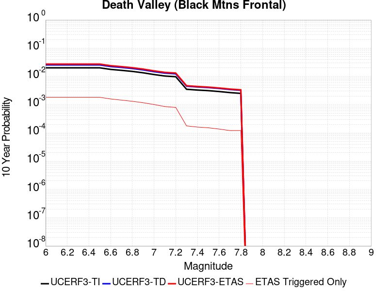 |

| Magnitude | 1 wk TI Prob | 1 wk TD Prob | 1 wk ETAS Prob | 1 wk ETAS/TD Gain | 1 wk ETAS Triggered Only | 1 mo TI Prob | 1 mo TD Prob | 1 mo ETAS Prob | 1 mo ETAS/TD Gain | 1 mo ETAS Triggered Only | 1 yr TI Prob | 1 yr TD Prob | 1 yr ETAS Prob | 1 yr ETAS/TD Gain | 1 yr ETAS Triggered Only | 10 yr TI Prob | 10 yr TD Prob | 10 yr ETAS Prob | 10 yr ETAS/TD Gain | 10 yr ETAS Triggered Only |
|-----|-----|-----|-----|-----|-----|-----|-----|-----|-----|-----|-----|-----|-----|-----|-----|-----|-----|-----|-----|-----|
| 6.0 | 3.897727E-5 | 4.947383E-5 | 7.2733103E-4 | 14.701329 | 6.778908E-4 | 1.6703474E-4 | 2.1201522E-4 | 0.0011008638 | 5.192381 | 8.8903704E-4 | 0.0020317512 | 0.0025785444 | 0.0040860106 | 1.5846189 | 0.001511363 | 0.020132754 | 0.025518417 | 0.027489364 | 1.0772363 | 0.0020225593 |
| 6.1 | 3.897727E-5 | 4.947383E-5 | 7.2733103E-4 | 14.701329 | 6.778908E-4 | 1.6703474E-4 | 2.1201522E-4 | 0.0011008638 | 5.192381 | 8.8903704E-4 | 0.0020317512 | 0.0025785444 | 0.0040860106 | 1.5846189 | 0.001511363 | 0.020132754 | 0.025518417 | 0.027489364 | 1.0772363 | 0.0020225593 |
| 6.2 | 3.897727E-5 | 4.947383E-5 | 7.2733103E-4 | 14.701329 | 6.778908E-4 | 1.6703474E-4 | 2.1201522E-4 | 0.0011008638 | 5.192381 | 8.8903704E-4 | 0.0020317512 | 0.0025785444 | 0.0040860106 | 1.5846189 | 0.001511363 | 0.020132754 | 0.025518417 | 0.027489364 | 1.0772363 | 0.0020225593 |
| 6.3 | 3.897727E-5 | 4.947383E-5 | 7.2733103E-4 | 14.701329 | 6.778908E-4 | 1.6703474E-4 | 2.1201522E-4 | 0.0011008638 | 5.192381 | 8.8903704E-4 | 0.0020317512 | 0.0025785444 | 0.0040860106 | 1.5846189 | 0.001511363 | 0.020132754 | 0.025518417 | 0.027489364 | 1.0772363 | 0.0020225593 |
| 6.4 | 3.897727E-5 | 4.947383E-5 | 7.2733103E-4 | 14.701329 | 6.778908E-4 | 1.6703474E-4 | 2.1201522E-4 | 0.0011008638 | 5.192381 | 8.8903704E-4 | 0.0020317512 | 0.0025785444 | 0.0040860106 | 1.5846189 | 0.001511363 | 0.020132754 | 0.025518417 | 0.027489364 | 1.0772363 | 0.0020225593 |
| 6.5 | 3.897727E-5 | 4.947383E-5 | 7.2733103E-4 | 14.701329 | 6.778908E-4 | 1.6703474E-4 | 2.1201522E-4 | 0.0011008638 | 5.192381 | 8.8903704E-4 | 0.0020317512 | 0.0025785444 | 0.0040860106 | 1.5846189 | 0.001511363 | 0.020132754 | 0.025518417 | 0.027489364 | 1.0772363 | 0.0020225593 |
| 6.6 | 3.4230983E-5 | 4.342495E-5 | 5.879365E-4 | 13.539141 | 5.445352E-4 | 1.4669597E-4 | 1.8609542E-4 | 9.305254E-4 | 5.0002594 | 7.4456853E-4 | 0.0017845602 | 0.0022636733 | 0.0035942101 | 1.5877777 | 0.0013335556 | 0.017702973 | 0.022437919 | 0.02420869 | 1.0789186 | 0.001811413 |
| 6.7 | 3.1676747E-5 | 4.019097E-5 | 5.513667E-4 | 13.718672 | 5.111963E-4 | 1.3575044E-4 | 1.7223743E-4 | 8.611225E-4 | 4.9996247 | 6.8900373E-4 | 0.0016515085 | 0.0020952902 | 0.0033262444 | 1.5874863 | 0.001233539 | 0.016392887 | 0.020786978 | 0.022419272 | 1.0785248 | 0.0016669445 |
| 6.8 | 2.9047482E-5 | 3.684629E-5 | 4.9246097E-4 | 13.36528 | 4.556315E-4 | 1.2448327E-4 | 1.5790488E-4 | 7.8013254E-4 | 4.940522 | 6.223259E-4 | 0.00151453 | 0.0019211107 | 0.0030413636 | 1.5831279 | 0.0011224092 | 0.015042495 | 0.019076241 | 0.020580575 | 1.078859 | 0.001533589 |
| 6.9 | 2.5887868E-5 | 3.279623E-5 | 4.1062458E-4 | 12.520481 | 3.7784074E-4 | 1.10943285E-4 | 1.4054945E-4 | 6.7389675E-4 | 4.79473 | 5.334222E-4 | 0.0013498975 | 0.0017101576 | 0.00269752 | 1.5773517 | 9.890537E-4 | 0.01341727 | 0.01700073 | 0.018333463 | 1.0783926 | 0.0013557816 |
| 7.0 | 2.244997E-5 | 2.8405042E-5 | 3.6178448E-4 | 12.736629 | 3.333889E-4 | 9.621061E-5 | 1.2173196E-4 | 5.77308E-4 | 4.742452 | 4.556315E-4 | 0.0011707348 | 0.0014813873 | 0.0023247213 | 1.5692867 | 8.445852E-4 | 0.011645862 | 0.014745472 | 0.015906077 | 1.0787092 | 0.0011779742 |
| 7.1 | 1.989245E-5 | 2.5153167E-5 | 3.0297026E-4 | 12.045014 | 2.778241E-4 | 8.525057E-5 | 1.07796564E-4 | 4.744848E-4 | 4.4016695 | 3.667278E-4 | 0.0010374314 | 0.0013119389 | 0.0019889402 | 1.5160313 | 6.778908E-4 | 0.010326017 | 0.013071986 | 0.0140371425 | 1.0738341 | 9.779407E-4 |
| 7.2 | 1.8805691E-5 | 2.3778988E-5 | 3.0159648E-4 | 12.683318 | 2.778241E-4 | 8.059333E-5 | 1.0190769E-4 | 4.685981E-4 | 4.5982604 | 3.667278E-4 | 9.807821E-4 | 0.0012403254 | 0.0019062762 | 1.5369161 | 6.667778E-4 | 0.009764646 | 0.012364016 | 0.013285963 | 1.074567 | 9.334889E-4 |
| 7.3 | 6.7321266E-6 | 8.65193E-6 | 8.6442E-5 | 9.991065 | 7.779074E-5 | 2.8851653E-5 | 3.707942E-5 | 1.3709239E-4 | 3.6972635 | 1.0001667E-4 | 3.5121225E-4 | 4.5139133E-4 | 6.2911847E-4 | 1.3937318 | 1.7780741E-4 | 0.0035065769 | 0.004508958 | 0.0047523407 | 1.0539776 | 2.4448519E-4 |
| 7.4 | 6.319214E-6 | 8.125558E-6 | 7.4802796E-5 | 9.205865 | 6.667778E-5 | 2.7082066E-5 | 3.48236E-5 | 1.2372421E-4 | 3.552884 | 8.8903704E-5 | 3.2967425E-4 | 4.2393777E-4 | 5.9056154E-4 | 1.3930383 | 1.6669444E-4 | 0.003291856 | 0.0042355005 | 0.0044678845 | 1.0548657 | 2.3337222E-4 |
| 7.5 | 6.0176867E-6 | 7.741697E-6 | 7.441896E-5 | 9.612745 | 6.667778E-5 | 2.578983E-5 | 3.317852E-5 | 1.2207928E-4 | 3.6794672 | 8.8903704E-5 | 3.1394596E-4 | 4.0391652E-4 | 5.7054363E-4 | 1.4125286 | 1.6669444E-4 | 0.0031350278 | 0.004036032 | 0.0042684623 | 1.0575888 | 2.3337222E-4 |
| 7.6 | 5.6024205E-6 | 7.211712E-6 | 7.388901E-5 | 10.245697 | 6.667778E-5 | 2.4010153E-5 | 3.0907213E-5 | 1.0869555E-4 | 3.5168345 | 7.779074E-5 | 2.9228439E-4 | 3.762732E-4 | 5.3179613E-4 | 1.4133245 | 1.5558148E-4 | 0.0029190024 | 0.0037605667 | 0.0039819903 | 1.0588803 | 2.2225926E-4 |
| 7.7 | 5.132066E-6 | 6.6084267E-6 | 6.2172876E-5 | 9.40812 | 5.5564815E-5 | 2.1994381E-5 | 2.8321763E-5 | 9.499765E-5 | 3.354228 | 6.667778E-5 | 2.677487E-4 | 3.4480577E-4 | 4.670062E-4 | 1.3544037 | 1.2224259E-4 | 0.0026742632 | 0.00344691 | 0.0036351793 | 1.0546197 | 1.8892037E-4 |
| 7.8 | 4.8153906E-6 | 6.202069E-6 | 6.176654E-5 | 9.9590225 | 5.5564815E-5 | 2.0637224E-5 | 2.6580266E-5 | 9.3256276E-5 | 3.508478 | 6.667778E-5 | 2.5122924E-4 | 3.2360948E-4 | 4.4581253E-4 | 1.377625 | 1.2224259E-4 | 0.002509454 | 0.0032355804 | 0.0034238896 | 1.0581995 | 1.8892037E-4 |

## San Andreas (Parkfield)
*[(top)](#table-of-contents)*

| 1 Week | 1 Month | 1 Year | 10 Year |
|-----|-----|-----|-----|
|  |  |  |  |

| Magnitude | 1 wk TI Prob | 1 wk TD Prob | 1 wk ETAS Prob | 1 wk ETAS/TD Gain | 1 wk ETAS Triggered Only | 1 mo TI Prob | 1 mo TD Prob | 1 mo ETAS Prob | 1 mo ETAS/TD Gain | 1 mo ETAS Triggered Only | 1 yr TI Prob | 1 yr TD Prob | 1 yr ETAS Prob | 1 yr ETAS/TD Gain | 1 yr ETAS Triggered Only | 10 yr TI Prob | 10 yr TD Prob | 10 yr ETAS Prob | 10 yr ETAS/TD Gain | 10 yr ETAS Triggered Only |
|-----|-----|-----|-----|-----|-----|-----|-----|-----|-----|-----|-----|-----|-----|-----|-----|-----|-----|-----|-----|-----|
| 6.0 | 7.723521E-4 | 0.0013466828 | 0.0018238967 | 1.3543625 | 4.7785742E-4 | 0.0033058827 | 0.0057641217 | 0.006427056 | 1.1150105 | 6.667778E-4 | 0.03951393 | 0.06891971 | 0.07003719 | 1.0162143 | 0.0012002001 | 0.3317935 | 0.5395069 | 0.54039735 | 1.0016505 | 0.0019336556 |
| 6.1 | 1.4269065E-4 | 5.017429E-4 | 8.682867E-4 | 1.7305411 | 3.667278E-4 | 6.11388E-4 | 0.002148918 | 0.0026479268 | 1.232214 | 5.000833E-4 | 0.007418273 | 0.02591448 | 0.02684543 | 1.0359238 | 9.5571484E-4 | 0.0717547 | 0.22093078 | 0.22216019 | 1.0055647 | 0.0015780408 |
| 6.2 | 1.4269065E-4 | 5.017429E-4 | 8.682867E-4 | 1.7305411 | 3.667278E-4 | 6.11388E-4 | 0.002148918 | 0.0026479268 | 1.232214 | 5.000833E-4 | 0.007418273 | 0.02591448 | 0.02684543 | 1.0359238 | 9.5571484E-4 | 0.0717547 | 0.22093078 | 0.22216019 | 1.0055647 | 0.0015780408 |
| 6.3 | 1.4269065E-4 | 5.017429E-4 | 8.682867E-4 | 1.7305411 | 3.667278E-4 | 6.11388E-4 | 0.002148918 | 0.0026479268 | 1.232214 | 5.000833E-4 | 0.007418273 | 0.02591448 | 0.02684543 | 1.0359238 | 9.5571484E-4 | 0.0717547 | 0.22093078 | 0.22216019 | 1.0055647 | 0.0015780408 |
| 6.4 | 1.4269065E-4 | 5.017429E-4 | 8.682867E-4 | 1.7305411 | 3.667278E-4 | 6.11388E-4 | 0.002148918 | 0.0026479268 | 1.232214 | 5.000833E-4 | 0.007418273 | 0.02591448 | 0.02684543 | 1.0359238 | 9.5571484E-4 | 0.0717547 | 0.22093078 | 0.22216019 | 1.0055647 | 0.0015780408 |
| 6.5 | 1.4269065E-4 | 5.017429E-4 | 8.682867E-4 | 1.7305411 | 3.667278E-4 | 6.11388E-4 | 0.002148918 | 0.0026479268 | 1.232214 | 5.000833E-4 | 0.007418273 | 0.02591448 | 0.02684543 | 1.0359238 | 9.5571484E-4 | 0.0717547 | 0.22093078 | 0.22216019 | 1.0055647 | 0.0015780408 |
| 6.6 | 1.4257019E-4 | 5.015525E-4 | 8.6809637E-4 | 1.7308185 | 3.667278E-4 | 6.10872E-4 | 0.0021481037 | 0.0026471126 | 1.2323022 | 5.000833E-4 | 0.0074120336 | 0.025904845 | 0.026835803 | 1.0359375 | 9.5571484E-4 | 0.07169635 | 0.22085924 | 0.22208875 | 1.005567 | 0.0015780408 |
| 6.7 | 1.4246788E-4 | 5.013712E-4 | 8.6791517E-4 | 1.7310829 | 3.667278E-4 | 6.1043375E-4 | 0.002147328 | 0.0026463375 | 1.2323862 | 5.000833E-4 | 0.007406734 | 0.025895536 | 0.026826503 | 1.0359508 | 9.5571484E-4 | 0.07164679 | 0.22079132 | 0.22202094 | 1.0055692 | 0.0015780408 |
| 6.8 | 1.4238524E-4 | 5.0115754E-4 | 8.6770154E-4 | 1.7313948 | 3.667278E-4 | 6.1007973E-4 | 0.0021464138 | 0.0026454236 | 1.2324854 | 5.000833E-4 | 0.007402453 | 0.025884695 | 0.026815671 | 1.0359663 | 9.5571484E-4 | 0.07160675 | 0.22071254 | 0.22194229 | 1.0055717 | 0.0015780408 |
| 6.9 | 1.4226006E-4 | 5.008332E-4 | 8.673773E-4 | 1.7318686 | 3.667278E-4 | 6.095435E-4 | 0.0021450259 | 0.0026440367 | 1.2326362 | 5.000833E-4 | 0.007395969 | 0.025868258 | 0.02679925 | 1.0359898 | 9.5571484E-4 | 0.0715461 | 0.22059278 | 0.22182271 | 1.0055755 | 0.0015780408 |
| 7.0 | 1.421111E-4 | 5.0044054E-4 | 8.6698483E-4 | 1.7324432 | 3.667278E-4 | 6.089054E-4 | 0.002143346 | 0.0026423575 | 1.232819 | 5.000833E-4 | 0.0073882528 | 0.025848212 | 0.026779223 | 1.0360184 | 9.5571484E-4 | 0.07147392 | 0.22044773 | 0.2216779 | 1.0055803 | 0.0015780408 |
| 7.1 | 7.911531E-5 | 3.2991724E-4 | 6.743054E-4 | 2.0438623 | 3.4450187E-4 | 3.3902156E-4 | 0.0014133246 | 0.0018905066 | 1.3376309 | 4.7785742E-4 | 0.0041197776 | 0.017099971 | 0.018006574 | 1.0530179 | 9.2237594E-4 | 0.04044234 | 0.15168123 | 0.15294449 | 1.0083284 | 0.0014891371 |
| 7.2 | 7.90033E-5 | 3.296154E-4 | 6.7400374E-4 | 2.0448186 | 3.4450187E-4 | 3.3854163E-4 | 0.0014120324 | 0.0018892151 | 1.3379403 | 4.7785742E-4 | 0.004113957 | 0.017084487 | 0.017991105 | 1.0530667 | 9.2237594E-4 | 0.040386252 | 0.15155983 | 0.15282328 | 1.0083363 | 0.0014891371 |
| 7.3 | 7.893314E-5 | 3.2935737E-4 | 6.7374576E-4 | 2.0456374 | 3.4450187E-4 | 3.3824102E-4 | 0.0014109277 | 0.0018881109 | 1.3382052 | 4.7785742E-4 | 0.0041103107 | 0.017071247 | 0.017977878 | 1.0531086 | 9.2237594E-4 | 0.04035112 | 0.15145631 | 0.15271991 | 1.008343 | 0.0014891371 |
| 7.4 | 7.878637E-5 | 3.2884022E-4 | 6.732288E-4 | 2.0472825 | 3.4450187E-4 | 3.3761217E-4 | 0.0014087138 | 0.001885898 | 1.3387376 | 4.7785742E-4 | 0.004102683 | 0.017044716 | 0.01795137 | 1.0531927 | 9.2237594E-4 | 0.04027762 | 0.15124616 | 0.15251008 | 1.0083567 | 0.0014891371 |
| 7.5 | 6.8967216E-5 | 2.9620552E-4 | 6.4060534E-4 | 2.1627057 | 3.4450187E-4 | 2.9554032E-4 | 0.001268987 | 0.001746238 | 1.3760881 | 4.7785742E-4 | 0.0035922674 | 0.015367592 | 0.016275793 | 1.0590985 | 9.2237594E-4 | 0.035347503 | 0.13755313 | 0.13883743 | 1.0093367 | 0.0014891371 |
| 7.6 | 6.8796966E-5 | 2.9566285E-4 | 6.4006285E-4 | 2.1648405 | 3.4450187E-4 | 2.948108E-4 | 0.0012666635 | 0.0017439157 | 1.376779 | 4.7785742E-4 | 0.003583415 | 0.015339702 | 0.01624793 | 1.0592076 | 9.2237594E-4 | 0.0352618 | 0.13732228 | 0.13860692 | 1.009355 | 0.0014891371 |
| 7.7 | 5.8142083E-5 | 2.6259638E-4 | 5.7367765E-4 | 2.1846366 | 3.1116296E-4 | 2.4915655E-4 | 0.0011250726 | 0.001569091 | 1.3946576 | 4.4451852E-4 | 0.0030292615 | 0.0136374645 | 0.014492455 | 1.0626942 | 8.6681114E-4 | 0.029882994 | 0.122926764 | 0.12416461 | 1.0100698 | 0.0014113464 |
| 7.8 | 3.7720634E-5 | 1.7457761E-4 | 3.9679807E-4 | 2.2729037 | 2.2225926E-4 | 1.6164983E-4 | 7.480669E-4 | 0.0010589971 | 1.4156449 | 3.1116296E-4 | 0.0019663102 | 0.009085932 | 0.009647543 | 1.0618111 | 5.667611E-4 | 0.019490024 | 0.08308776 | 0.08388255 | 1.0095657 | 8.6681114E-4 |
| 7.9 | 1.41195915E-5 | 6.798084E-5 | 1.2354189E-4 | 1.8173044 | 5.5564815E-5 | 6.051113E-5 | 2.9132722E-4 | 3.8020502E-4 | 1.305079 | 8.8903704E-5 | 7.36474E-4 | 0.0035434929 | 0.0037206702 | 1.0500008 | 1.7780741E-4 | 0.00734038 | 0.03258086 | 0.032849632 | 1.0082494 | 2.778241E-4 |
| 8.0 | 5.0866283E-6 | 2.564328E-5 | 5.8981313E-5 | 2.300069 | 3.333889E-5 | 2.1799653E-5 | 1.09896864E-4 | 1.432321E-4 | 1.3033319 | 3.333889E-5 | 2.6537845E-4 | 0.0013374792 | 0.001415166 | 1.0580844 | 7.779074E-5 | 0.0026506176 | 0.012337761 | 0.012447519 | 1.0088961 | 1.1112963E-4 |
| 8.1 | 2.2154293E-6 | 1.2907957E-5 | 2.4020777E-5 | 1.8609278 | 1.1112963E-5 | 9.494662E-6 | 5.5319815E-5 | 6.643216E-5 | 1.2008747 | 1.1112963E-5 | 1.1559138E-4 | 6.7351875E-4 | 7.068352E-4 | 1.0494663 | 3.333889E-5 | 0.0011553128 | 0.0060832473 | 0.0061274287 | 1.0072628 | 4.4451852E-5 |

## Blackwater
*[(top)](#table-of-contents)*

| 1 Week | 1 Month | 1 Year | 10 Year |
|-----|-----|-----|-----|
|  |  |  |  |

| Magnitude | 1 wk TI Prob | 1 wk TD Prob | 1 wk ETAS Prob | 1 wk ETAS/TD Gain | 1 wk ETAS Triggered Only | 1 mo TI Prob | 1 mo TD Prob | 1 mo ETAS Prob | 1 mo ETAS/TD Gain | 1 mo ETAS Triggered Only | 1 yr TI Prob | 1 yr TD Prob | 1 yr ETAS Prob | 1 yr ETAS/TD Gain | 1 yr ETAS Triggered Only | 10 yr TI Prob | 10 yr TD Prob | 10 yr ETAS Prob | 10 yr ETAS/TD Gain | 10 yr ETAS Triggered Only |
|-----|-----|-----|-----|-----|-----|-----|-----|-----|-----|-----|-----|-----|-----|-----|-----|-----|-----|-----|-----|-----|
| 6.0 | 7.413326E-6 | 7.774191E-6 | 6.5232103E-4 | 83.90855 | 6.445519E-4 | 3.177101E-5 | 3.3317654E-5 | 7.88974E-4 | 23.680357 | 7.556815E-4 | 3.867434E-4 | 4.0558857E-4 | 0.0017163864 | 4.231841 | 0.0013113297 | 0.0038607102 | 0.0040506064 | 0.005898954 | 1.4563137 | 0.0018558649 |
| 6.1 | 7.413326E-6 | 7.774191E-6 | 6.5232103E-4 | 83.90855 | 6.445519E-4 | 3.177101E-5 | 3.3317654E-5 | 7.88974E-4 | 23.680357 | 7.556815E-4 | 3.867434E-4 | 4.0558857E-4 | 0.0017163864 | 4.231841 | 0.0013113297 | 0.0038607102 | 0.0040506064 | 0.005898954 | 1.4563137 | 0.0018558649 |
| 6.2 | 7.413326E-6 | 7.774191E-6 | 6.5232103E-4 | 83.90855 | 6.445519E-4 | 3.177101E-5 | 3.3317654E-5 | 7.88974E-4 | 23.680357 | 7.556815E-4 | 3.867434E-4 | 4.0558857E-4 | 0.0017163864 | 4.231841 | 0.0013113297 | 0.0038607102 | 0.0040506064 | 0.005898954 | 1.4563137 | 0.0018558649 |
| 6.3 | 7.413326E-6 | 7.774191E-6 | 6.5232103E-4 | 83.90855 | 6.445519E-4 | 3.177101E-5 | 3.3317654E-5 | 7.88974E-4 | 23.680357 | 7.556815E-4 | 3.867434E-4 | 4.0558857E-4 | 0.0017163864 | 4.231841 | 0.0013113297 | 0.0038607102 | 0.0040506064 | 0.005898954 | 1.4563137 | 0.0018558649 |
| 6.4 | 7.413326E-6 | 7.774191E-6 | 6.5232103E-4 | 83.90855 | 6.445519E-4 | 3.177101E-5 | 3.3317654E-5 | 7.88974E-4 | 23.680357 | 7.556815E-4 | 3.867434E-4 | 4.0558857E-4 | 0.0017163864 | 4.231841 | 0.0013113297 | 0.0038607102 | 0.0040506064 | 0.005898954 | 1.4563137 | 0.0018558649 |
| 6.5 | 7.413326E-6 | 7.774191E-6 | 6.5232103E-4 | 83.90855 | 6.445519E-4 | 3.177101E-5 | 3.3317654E-5 | 7.88974E-4 | 23.680357 | 7.556815E-4 | 3.867434E-4 | 4.0558857E-4 | 0.0017163864 | 4.231841 | 0.0013113297 | 0.0038607102 | 0.0040506064 | 0.005898954 | 1.4563137 | 0.0018558649 |
| 6.6 | 6.51988E-6 | 6.8357062E-6 | 5.402543E-4 | 79.034164 | 5.334222E-4 | 2.7942044E-5 | 2.9295676E-5 | 6.7382865E-4 | 23.00096 | 6.445519E-4 | 3.4014127E-4 | 3.5663793E-4 | 0.0015119739 | 4.2395205 | 0.0011557481 | 0.0033962112 | 0.0035627622 | 0.0051905476 | 1.4568887 | 0.0016336056 |
| 6.7 | 5.474748E-6 | 5.7374127E-6 | 4.835921E-4 | 84.28749 | 4.7785742E-4 | 2.3462993E-5 | 2.4588799E-5 | 6.024487E-4 | 24.50094 | 5.778741E-4 | 2.856245E-4 | 2.993487E-4 | 0.001332545 | 4.4514804 | 0.0010335055 | 0.0028525768 | 0.0029915334 | 0.004431897 | 1.48148 | 0.0014446853 |
| 6.8 | 4.643409E-6 | 4.8641823E-6 | 3.715902E-4 | 76.39314 | 3.667278E-4 | 1.9900172E-5 | 2.0846448E-5 | 4.653557E-4 | 22.323023 | 4.4451852E-4 | 2.4225765E-4 | 2.5379687E-4 | 0.0010981677 | 4.3269553 | 8.445852E-4 | 0.0024199372 | 0.0025371225 | 0.0037453624 | 1.4762244 | 0.001211313 |
| 6.9 | 3.883733E-6 | 4.0671357E-6 | 3.1522886E-4 | 77.50635 | 3.1116296E-4 | 1.6644462E-5 | 1.7430582E-5 | 3.9526474E-4 | 22.676508 | 3.7784074E-4 | 2.0262749E-4 | 2.1221735E-4 | 9.788491E-4 | 4.612484 | 7.667945E-4 | 0.0020244285 | 0.0021221733 | 0.003186754 | 1.5016463 | 0.0010668444 |
| 7.0 | 3.883733E-6 | 4.0671357E-6 | 3.1522886E-4 | 77.50635 | 3.1116296E-4 | 1.6644462E-5 | 1.7430582E-5 | 3.9526474E-4 | 22.676508 | 3.7784074E-4 | 2.0262749E-4 | 2.1221735E-4 | 9.788491E-4 | 4.612484 | 7.667945E-4 | 0.0020244285 | 0.0021221733 | 0.003186754 | 1.5016463 | 0.0010668444 |

## San Andreas (Cholame) rev
*[(top)](#table-of-contents)*

| 1 Week | 1 Month | 1 Year | 10 Year |
|-----|-----|-----|-----|
|  | 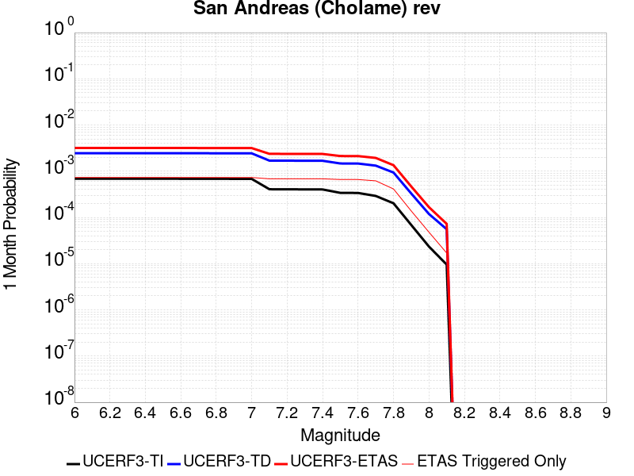 |  |  |

| Magnitude | 1 wk TI Prob | 1 wk TD Prob | 1 wk ETAS Prob | 1 wk ETAS/TD Gain | 1 wk ETAS Triggered Only | 1 mo TI Prob | 1 mo TD Prob | 1 mo ETAS Prob | 1 mo ETAS/TD Gain | 1 mo ETAS Triggered Only | 1 yr TI Prob | 1 yr TD Prob | 1 yr ETAS Prob | 1 yr ETAS/TD Gain | 1 yr ETAS Triggered Only | 10 yr TI Prob | 10 yr TD Prob | 10 yr ETAS Prob | 10 yr ETAS/TD Gain | 10 yr ETAS Triggered Only |
|-----|-----|-----|-----|-----|-----|-----|-----|-----|-----|-----|-----|-----|-----|-----|-----|-----|-----|-----|-----|-----|
| 6.0 | 1.6051916E-4 | 5.7249254E-4 | 0.0010278632 | 1.7954175 | 4.556315E-4 | 6.877579E-4 | 0.0024516056 | 0.0030391486 | 1.2396564 | 5.889871E-4 | 0.00834135 | 0.029507428 | 0.030575147 | 1.0361848 | 0.0011001833 | 0.080351114 | 0.2474813 | 0.24885279 | 1.0055418 | 0.001822526 |
| 6.1 | 1.6051916E-4 | 5.7249254E-4 | 0.0010278632 | 1.7954175 | 4.556315E-4 | 6.877579E-4 | 0.0024516056 | 0.0030391486 | 1.2396564 | 5.889871E-4 | 0.00834135 | 0.029507428 | 0.030575147 | 1.0361848 | 0.0011001833 | 0.080351114 | 0.2474813 | 0.24885279 | 1.0055418 | 0.001822526 |
| 6.2 | 1.6051916E-4 | 5.7249254E-4 | 0.0010278632 | 1.7954175 | 4.556315E-4 | 6.877579E-4 | 0.0024516056 | 0.0030391486 | 1.2396564 | 5.889871E-4 | 0.00834135 | 0.029507428 | 0.030575147 | 1.0361848 | 0.0011001833 | 0.080351114 | 0.2474813 | 0.24885279 | 1.0055418 | 0.001822526 |
| 6.3 | 1.6051916E-4 | 5.7249254E-4 | 0.0010278632 | 1.7954175 | 4.556315E-4 | 6.877579E-4 | 0.0024516056 | 0.0030391486 | 1.2396564 | 5.889871E-4 | 0.00834135 | 0.029507428 | 0.030575147 | 1.0361848 | 0.0011001833 | 0.080351114 | 0.2474813 | 0.24885279 | 1.0055418 | 0.001822526 |
| 6.4 | 1.6051916E-4 | 5.7249254E-4 | 0.0010278632 | 1.7954175 | 4.556315E-4 | 6.877579E-4 | 0.0024516056 | 0.0030391486 | 1.2396564 | 5.889871E-4 | 0.00834135 | 0.029507428 | 0.030575147 | 1.0361848 | 0.0011001833 | 0.080351114 | 0.2474813 | 0.24885279 | 1.0055418 | 0.001822526 |
| 6.5 | 1.6051916E-4 | 5.7249254E-4 | 0.0010278632 | 1.7954175 | 4.556315E-4 | 6.877579E-4 | 0.0024516056 | 0.0030391486 | 1.2396564 | 5.889871E-4 | 0.00834135 | 0.029507428 | 0.030575147 | 1.0361848 | 0.0011001833 | 0.080351114 | 0.2474813 | 0.24885279 | 1.0055418 | 0.001822526 |
| 6.6 | 1.6029834E-4 | 5.7202484E-4 | 0.0010273957 | 1.7960683 | 4.556315E-4 | 6.86812E-4 | 0.002449605 | 0.0030371493 | 1.2398527 | 5.889871E-4 | 0.0083299205 | 0.029483816 | 0.030551562 | 1.0362146 | 0.0011001833 | 0.08024513 | 0.24731047 | 0.24868228 | 1.0055468 | 0.001822526 |
| 6.7 | 1.6007364E-4 | 5.7155016E-4 | 0.0010269212 | 1.7967298 | 4.556315E-4 | 6.858495E-4 | 0.0024475744 | 0.0030351197 | 1.2400521 | 5.889871E-4 | 0.008318293 | 0.029459693 | 0.030527465 | 1.0362452 | 0.0011001833 | 0.08013727 | 0.2471372 | 0.24850932 | 1.005552 | 0.001822526 |
| 6.8 | 1.5980547E-4 | 5.708367E-4 | 0.0010262082 | 1.7977262 | 4.556315E-4 | 6.8470073E-4 | 0.0024445227 | 0.00303207 | 1.2403525 | 5.889871E-4 | 0.008304413 | 0.029423568 | 0.03049138 | 1.036291 | 0.0011001833 | 0.08000852 | 0.2468793 | 0.24825189 | 1.0055597 | 0.001822526 |
| 6.9 | 1.5943033E-4 | 5.6985184E-4 | 0.0010252238 | 1.7991056 | 4.556315E-4 | 6.830939E-4 | 0.0024403096 | 0.0030278594 | 1.2407686 | 5.889871E-4 | 0.008284999 | 0.029373717 | 0.030441584 | 1.0363545 | 0.0011001833 | 0.0798284 | 0.24652228 | 0.24789551 | 1.0055704 | 0.001822526 |
| 7.0 | 1.5906857E-4 | 5.6890905E-4 | 0.0010242814 | 1.8004307 | 4.556315E-4 | 6.815443E-4 | 0.0024362765 | 0.0030238286 | 1.241168 | 5.889871E-4 | 0.008266276 | 0.029325863 | 0.030393783 | 1.0364156 | 0.0011001833 | 0.079654664 | 0.24617939 | 0.24755324 | 1.0055807 | 0.001822526 |
| 7.1 | 9.4986666E-5 | 3.9541177E-4 | 8.2864595E-4 | 2.0956533 | 4.3340557E-4 | 4.070222E-4 | 0.0016936905 | 0.0022594917 | 1.3340641 | 5.667611E-4 | 0.0049442407 | 0.020456197 | 0.021501217 | 1.0510858 | 0.0010668444 | 0.048356738 | 0.17850818 | 0.17993233 | 1.0079781 | 0.0017336223 |
| 7.2 | 9.465065E-5 | 3.9454125E-4 | 8.277758E-4 | 2.0980716 | 4.3340557E-4 | 4.0558254E-4 | 0.0016899646 | 0.0022557678 | 1.3348019 | 5.667611E-4 | 0.0049267923 | 0.020411683 | 0.021456752 | 1.0511996 | 0.0010668444 | 0.048189856 | 0.1781604 | 0.17958516 | 1.007997 | 0.0017336223 |
| 7.3 | 9.4370014E-5 | 3.9359776E-4 | 8.268327E-4 | 2.100705 | 4.3340557E-4 | 4.043802E-4 | 0.0016859263 | 0.002251732 | 1.3356051 | 5.667611E-4 | 0.00491222 | 0.020363439 | 0.021408558 | 1.0513233 | 0.0010668444 | 0.048050456 | 0.17778328 | 0.1792087 | 1.0080177 | 0.0017336223 |
| 7.4 | 9.400309E-5 | 3.9239938E-4 | 8.2563487E-4 | 2.1040678 | 4.3340557E-4 | 4.0280816E-4 | 0.0016807971 | 0.0022466055 | 1.3366311 | 5.667611E-4 | 0.004893167 | 0.020302156 | 0.021347342 | 1.0514815 | 0.0010668444 | 0.04786817 | 0.17730153 | 0.17872778 | 1.0080442 | 0.0017336223 |
| 7.5 | 7.9358346E-5 | 3.4328582E-4 | 7.7654264E-4 | 2.2620876 | 4.3340557E-4 | 3.4006286E-4 | 0.0014705557 | 0.0020364833 | 1.3848393 | 5.667611E-4 | 0.0041324073 | 0.017785678 | 0.018833548 | 1.0589164 | 0.0010668444 | 0.040564027 | 0.15729399 | 0.1587362 | 1.0091689 | 0.0017113964 |
| 7.6 | 7.898946E-5 | 3.4216905E-4 | 7.7542634E-4 | 2.2662082 | 4.3340557E-4 | 3.3848232E-4 | 0.0014657748 | 0.002031705 | 1.3860964 | 5.667611E-4 | 0.0041132374 | 0.01772842 | 0.018776352 | 1.0591103 | 0.0010668444 | 0.040379323 | 0.15682538 | 0.15826838 | 1.0092014 | 0.0017113964 |
| 7.7 | 6.8013156E-5 | 3.0816178E-4 | 6.9699564E-4 | 2.2617848 | 3.8895372E-4 | 2.914524E-4 | 0.0013201776 | 0.0018417973 | 1.3951133 | 5.223093E-4 | 0.0035426598 | 0.015981914 | 0.016966095 | 1.061581 | 0.0010001666 | 0.03486713 | 0.14234997 | 0.1437415 | 1.0097754 | 0.0016224927 |
| 7.8 | 4.7216392E-5 | 2.1851076E-4 | 5.184952E-4 | 2.372859 | 3.0005001E-4 | 2.0234026E-4 | 9.36238E-4 | 0.0013248275 | 1.4150542 | 3.8895372E-4 | 0.0024607095 | 0.011356776 | 0.012048941 | 1.0609474 | 7.001167E-4 | 0.024336396 | 0.10266637 | 0.103633665 | 1.0094217 | 0.0010779575 |
| 7.9 | 1.604325E-5 | 7.688082E-5 | 1.6577769E-4 | 2.1562946 | 8.8903704E-5 | 6.875498E-5 | 3.29461E-4 | 4.5166333E-4 | 1.3709159 | 1.2224259E-4 | 8.367703E-4 | 0.0040061846 | 0.0042386223 | 1.0580196 | 2.3337222E-4 | 0.008336265 | 0.036792822 | 0.037113942 | 1.0087279 | 3.333889E-4 |
| 8.0 | 5.458507E-6 | 2.769139E-5 | 6.1029357E-5 | 2.2039108 | 3.333889E-5 | 2.3393392E-5 | 1.1867371E-4 | 1.5200865E-4 | 1.2808957 | 3.333889E-5 | 2.847773E-4 | 0.0014442017 | 0.00152188 | 1.0537864 | 7.779074E-5 | 0.0028441267 | 0.013304143 | 0.013413794 | 1.0082419 | 1.1112963E-4 |
| 8.1 | 2.2240692E-6 | 1.29589735E-5 | 2.4071793E-5 | 1.8575386 | 1.1112963E-5 | 9.531691E-6 | 5.5538447E-5 | 6.665079E-5 | 1.2000839 | 1.1112963E-5 | 1.1604215E-4 | 6.7617896E-4 | 7.094953E-4 | 1.0492715 | 3.333889E-5 | 0.0011598158 | 0.0061071273 | 0.0061513074 | 1.0072342 | 4.4451852E-5 |

## Hunter Mountain-Saline Valley
*[(top)](#table-of-contents)*

| 1 Week | 1 Month | 1 Year | 10 Year |
|-----|-----|-----|-----|
|  |  |  |  |

| Magnitude | 1 wk TI Prob | 1 wk TD Prob | 1 wk ETAS Prob | 1 wk ETAS/TD Gain | 1 wk ETAS Triggered Only | 1 mo TI Prob | 1 mo TD Prob | 1 mo ETAS Prob | 1 mo ETAS/TD Gain | 1 mo ETAS Triggered Only | 1 yr TI Prob | 1 yr TD Prob | 1 yr ETAS Prob | 1 yr ETAS/TD Gain | 1 yr ETAS Triggered Only | 10 yr TI Prob | 10 yr TD Prob | 10 yr ETAS Prob | 10 yr ETAS/TD Gain | 10 yr ETAS Triggered Only |
|-----|-----|-----|-----|-----|-----|-----|-----|-----|-----|-----|-----|-----|-----|-----|-----|-----|-----|-----|-----|-----|
| 6.0 | 2.6350473E-5 | 3.0151663E-5 | 6.1912095E-4 | 20.53356 | 5.889871E-4 | 1.12925714E-4 | 1.2921583E-4 | 9.292458E-4 | 7.191424 | 8.0013333E-4 | 0.0013740034 | 0.0015722114 | 0.002670665 | 1.6986679 | 0.0011001833 | 0.01365539 | 0.015625311 | 0.017145878 | 1.0973142 | 0.0015447019 |
| 6.1 | 2.6350473E-5 | 3.0151663E-5 | 6.1912095E-4 | 20.53356 | 5.889871E-4 | 1.12925714E-4 | 1.2921583E-4 | 9.292458E-4 | 7.191424 | 8.0013333E-4 | 0.0013740034 | 0.0015722114 | 0.002670665 | 1.6986679 | 0.0011001833 | 0.01365539 | 0.015625311 | 0.017145878 | 1.0973142 | 0.0015447019 |
| 6.2 | 2.6350473E-5 | 3.0151663E-5 | 6.1912095E-4 | 20.53356 | 5.889871E-4 | 1.12925714E-4 | 1.2921583E-4 | 9.292458E-4 | 7.191424 | 8.0013333E-4 | 0.0013740034 | 0.0015722114 | 0.002670665 | 1.6986679 | 0.0011001833 | 0.01365539 | 0.015625311 | 0.017145878 | 1.0973142 | 0.0015447019 |
| 6.3 | 2.6350473E-5 | 3.0151663E-5 | 6.1912095E-4 | 20.53356 | 5.889871E-4 | 1.12925714E-4 | 1.2921583E-4 | 9.292458E-4 | 7.191424 | 8.0013333E-4 | 0.0013740034 | 0.0015722114 | 0.002670665 | 1.6986679 | 0.0011001833 | 0.01365539 | 0.015625311 | 0.017145878 | 1.0973142 | 0.0015447019 |
| 6.4 | 2.6350473E-5 | 3.0151663E-5 | 6.1912095E-4 | 20.53356 | 5.889871E-4 | 1.12925714E-4 | 1.2921583E-4 | 9.292458E-4 | 7.191424 | 8.0013333E-4 | 0.0013740034 | 0.0015722114 | 0.002670665 | 1.6986679 | 0.0011001833 | 0.01365539 | 0.015625311 | 0.017145878 | 1.0973142 | 0.0015447019 |
| 6.5 | 2.6350473E-5 | 3.0151663E-5 | 6.1912095E-4 | 20.53356 | 5.889871E-4 | 1.12925714E-4 | 1.2921583E-4 | 9.292458E-4 | 7.191424 | 8.0013333E-4 | 0.0013740034 | 0.0015722114 | 0.002670665 | 1.6986679 | 0.0011001833 | 0.01365539 | 0.015625311 | 0.017145878 | 1.0973142 | 0.0015447019 |
| 6.6 | 2.3915805E-5 | 2.727318E-5 | 5.9401884E-4 | 21.780329 | 5.667611E-4 | 1.0249228E-4 | 1.1688063E-4 | 8.724738E-4 | 7.4646573 | 7.556815E-4 | 0.0012471292 | 0.0014222359 | 0.0024653687 | 1.7334458 | 0.0010446185 | 0.012401534 | 0.014145577 | 0.015580782 | 1.1014596 | 0.0014557982 |
| 6.7 | 2.1143418E-5 | 2.4001838E-5 | 5.129605E-4 | 21.371717 | 4.8897037E-4 | 9.06115E-5 | 1.0286176E-4 | 7.473473E-4 | 7.2655506 | 6.445519E-4 | 0.0011026367 | 0.0012517641 | 0.0021840846 | 1.7448052 | 9.334889E-4 | 0.010971815 | 0.012461145 | 0.013778083 | 1.1056836 | 0.0013335556 |
| 6.8 | 1.8590634E-5 | 2.0984402E-5 | 4.654936E-4 | 22.182838 | 4.4451852E-4 | 7.967171E-5 | 8.993084E-5 | 6.7886495E-4 | 7.548744 | 5.889871E-4 | 9.6957135E-4 | 0.0010944982 | 0.0019381591 | 1.7708197 | 8.445852E-4 | 0.00965352 | 0.010904897 | 0.012113992 | 1.1108764 | 0.001222426 |
| 6.9 | 1.6592752E-5 | 1.863061E-5 | 4.6314087E-4 | 24.859135 | 4.4451852E-4 | 7.110986E-5 | 7.984381E-5 | 6.576718E-4 | 8.236979 | 5.778741E-4 | 8.6541864E-4 | 9.7180397E-4 | 0.0018044662 | 1.8568213 | 8.3347224E-4 | 0.008620561 | 0.009689213 | 0.010888789 | 1.1238054 | 0.001211313 |
| 7.0 | 1.4621345E-5 | 1.6318016E-5 | 4.4971652E-4 | 27.559507 | 4.3340557E-4 | 6.2661406E-5 | 6.993326E-5 | 6.3665473E-4 | 9.103747 | 5.667611E-4 | 7.6263555E-4 | 8.512428E-4 | 0.001672902 | 1.9652467 | 8.223593E-4 | 0.0076002358 | 0.008493364 | 0.009683371 | 1.1401101 | 0.0012002001 |
| 7.1 | 1.4214311E-5 | 1.5853855E-5 | 4.2702697E-4 | 26.935213 | 4.1117964E-4 | 6.0917053E-5 | 6.79441E-5 | 6.013301E-4 | 8.850365 | 5.334222E-4 | 7.414127E-4 | 8.2704343E-4 | 0.0016154113 | 1.9532363 | 7.890204E-4 | 0.0073894397 | 0.0082531925 | 0.009410423 | 1.1402161 | 0.0011668612 |
| 7.2 | 5.322531E-6 | 5.4705556E-6 | 3.1663183E-4 | 57.87928 | 3.1116296E-4 | 2.2810646E-5 | 2.3445109E-5 | 4.346151E-4 | 18.53756 | 4.1117964E-4 | 2.7768422E-4 | 2.8542118E-4 | 8.8534993E-4 | 3.101907 | 6.0010003E-4 | 0.0027733748 | 0.002851954 | 0.0037384555 | 1.31084 | 8.8903704E-4 |
| 7.3 | 4.9197506E-6 | 5.0347303E-6 | 3.0508323E-4 | 60.595745 | 3.0005001E-4 | 2.1084476E-5 | 2.1577318E-5 | 4.2163537E-4 | 19.540676 | 4.0006667E-4 | 2.5667323E-4 | 2.6268652E-4 | 8.2929875E-4 | 3.1569903 | 5.667611E-4 | 0.0025637697 | 0.0026251655 | 0.0034675335 | 1.3208818 | 8.445852E-4 |
| 7.4 | 4.3367913E-6 | 4.4250473E-6 | 3.0447374E-4 | 68.806885 | 3.0005001E-4 | 1.8586115E-5 | 1.896443E-5 | 4.1902353E-4 | 22.095232 | 4.0006667E-4 | 2.2626246E-4 | 2.3088178E-4 | 7.9751207E-4 | 3.4542007 | 5.667611E-4 | 0.0022603222 | 0.0023078213 | 0.00313937 | 1.3603177 | 8.3347224E-4 |
| 7.5 | 3.7993927E-6 | 3.8762123E-6 | 3.0392504E-4 | 78.407745 | 3.0005001E-4 | 1.628301E-5 | 1.6612312E-5 | 4.0555958E-4 | 24.41319 | 3.8895372E-4 | 1.9822762E-4 | 2.0225039E-4 | 7.466755E-4 | 3.6918368 | 5.445352E-4 | 0.001980509 | 0.002022061 | 0.002787305 | 1.3784475 | 7.667945E-4 |
| 7.6 | 3.2998898E-6 | 3.365071E-6 | 2.5896236E-4 | 76.955986 | 2.5559816E-4 | 1.4142308E-5 | 1.4421733E-5 | 3.5891862E-4 | 24.887344 | 3.4450187E-4 | 1.7216899E-4 | 1.755846E-4 | 6.533581E-4 | 3.7210445 | 4.7785742E-4 | 0.0017203566 | 0.001755846 | 0.0024325466 | 1.3853985 | 6.778908E-4 |

## San Andreas (San Bernardino N)
*[(top)](#table-of-contents)*

| 1 Week | 1 Month | 1 Year | 10 Year |
|-----|-----|-----|-----|
|  |  |  |  |

| Magnitude | 1 wk TI Prob | 1 wk TD Prob | 1 wk ETAS Prob | 1 wk ETAS/TD Gain | 1 wk ETAS Triggered Only | 1 mo TI Prob | 1 mo TD Prob | 1 mo ETAS Prob | 1 mo ETAS/TD Gain | 1 mo ETAS Triggered Only | 1 yr TI Prob | 1 yr TD Prob | 1 yr ETAS Prob | 1 yr ETAS/TD Gain | 1 yr ETAS Triggered Only | 10 yr TI Prob | 10 yr TD Prob | 10 yr ETAS Prob | 10 yr ETAS/TD Gain | 10 yr ETAS Triggered Only |
|-----|-----|-----|-----|-----|-----|-----|-----|-----|-----|-----|-----|-----|-----|-----|-----|-----|-----|-----|-----|-----|
| 6.0 | 1.0995041E-4 | 4.016633E-4 | 7.460268E-4 | 1.8573437 | 3.4450187E-4 | 4.7113094E-4 | 0.0017203542 | 0.0022084834 | 1.2837377 | 4.8897037E-4 | 0.0057209437 | 0.020758318 | 0.021737723 | 1.0471814 | 0.0010001666 | 0.055758867 | 0.17985137 | 0.18099976 | 1.0063853 | 0.0014002334 |
| 6.1 | 1.0995041E-4 | 4.016633E-4 | 7.460268E-4 | 1.8573437 | 3.4450187E-4 | 4.7113094E-4 | 0.0017203542 | 0.0022084834 | 1.2837377 | 4.8897037E-4 | 0.0057209437 | 0.020758318 | 0.021737723 | 1.0471814 | 0.0010001666 | 0.055758867 | 0.17985137 | 0.18099976 | 1.0063853 | 0.0014002334 |
| 6.2 | 1.0995041E-4 | 4.016633E-4 | 7.460268E-4 | 1.8573437 | 3.4450187E-4 | 4.7113094E-4 | 0.0017203542 | 0.0022084834 | 1.2837377 | 4.8897037E-4 | 0.0057209437 | 0.020758318 | 0.021737723 | 1.0471814 | 0.0010001666 | 0.055758867 | 0.17985137 | 0.18099976 | 1.0063853 | 0.0014002334 |
| 6.3 | 1.0995041E-4 | 4.016633E-4 | 7.460268E-4 | 1.8573437 | 3.4450187E-4 | 4.7113094E-4 | 0.0017203542 | 0.0022084834 | 1.2837377 | 4.8897037E-4 | 0.0057209437 | 0.020758318 | 0.021737723 | 1.0471814 | 0.0010001666 | 0.055758867 | 0.17985137 | 0.18099976 | 1.0063853 | 0.0014002334 |
| 6.4 | 1.0995041E-4 | 4.016633E-4 | 7.460268E-4 | 1.8573437 | 3.4450187E-4 | 4.7113094E-4 | 0.0017203542 | 0.0022084834 | 1.2837377 | 4.8897037E-4 | 0.0057209437 | 0.020758318 | 0.021737723 | 1.0471814 | 0.0010001666 | 0.055758867 | 0.17985137 | 0.18099976 | 1.0063853 | 0.0014002334 |
| 6.5 | 1.0995041E-4 | 4.016633E-4 | 7.460268E-4 | 1.8573437 | 3.4450187E-4 | 4.7113094E-4 | 0.0017203542 | 0.0022084834 | 1.2837377 | 4.8897037E-4 | 0.0057209437 | 0.020758318 | 0.021737723 | 1.0471814 | 0.0010001666 | 0.055758867 | 0.17985137 | 0.18099976 | 1.0063853 | 0.0014002334 |
| 6.6 | 1.09829954E-4 | 4.014158E-4 | 7.4577937E-4 | 1.8578725 | 3.4450187E-4 | 4.7061488E-4 | 0.0017192949 | 0.0022074245 | 1.2839128 | 4.8897037E-4 | 0.0057146936 | 0.020745667 | 0.021725085 | 1.0472107 | 0.0010001666 | 0.05569951 | 0.17974973 | 0.18089826 | 1.0063896 | 0.0014002334 |
| 6.7 | 1.0968671E-4 | 4.0112622E-4 | 7.454899E-4 | 1.858492 | 3.4450187E-4 | 4.7000122E-4 | 0.0017180555 | 0.0022061858 | 1.2841179 | 4.8897037E-4 | 0.005707261 | 0.020730862 | 0.021710295 | 1.0472451 | 0.0010001666 | 0.05562892 | 0.17963059 | 0.18077931 | 1.0063949 | 0.0014002334 |
| 6.8 | 9.6153904E-5 | 3.6562132E-4 | 6.988883E-4 | 1.9115087 | 3.333889E-4 | 4.1202307E-4 | 0.0015660744 | 0.0020431834 | 1.3046528 | 4.7785742E-4 | 0.0050048484 | 0.018912675 | 0.019773994 | 1.045542 | 8.779241E-4 | 0.048936214 | 0.16500922 | 0.16605777 | 1.0063545 | 0.0012557649 |
| 6.9 | 9.59246E-5 | 3.6505362E-4 | 6.983208E-4 | 1.9129267 | 3.333889E-4 | 4.1104064E-4 | 0.0015636444 | 0.0020407545 | 1.305127 | 4.7785742E-4 | 0.0049929423 | 0.0188836 | 0.019744948 | 1.0456134 | 8.779241E-4 | 0.048822403 | 0.164772 | 0.16582085 | 1.0063654 | 0.0012557649 |
| 7.0 | 9.5669224E-5 | 3.64425E-4 | 6.976924E-4 | 1.914502 | 3.333889E-4 | 4.0994651E-4 | 0.0015609534 | 0.002038065 | 1.3056539 | 4.7785742E-4 | 0.004979682 | 0.018851407 | 0.019712782 | 1.0456928 | 8.779241E-4 | 0.048695635 | 0.16450974 | 0.16555893 | 1.0063776 | 0.0012557649 |
| 7.1 | 9.5384006E-5 | 3.6372882E-4 | 6.9699646E-4 | 1.9162531 | 3.333889E-4 | 4.0872456E-4 | 0.0015579734 | 0.0020350863 | 1.3062395 | 4.7785742E-4 | 0.0049648727 | 0.018815754 | 0.019677158 | 1.045781 | 8.779241E-4 | 0.04855404 | 0.16421874 | 0.16526827 | 1.0063912 | 0.0012557649 |
| 7.2 | 7.876192E-5 | 3.2410742E-4 | 6.018414E-4 | 1.8569198 | 2.778241E-4 | 3.375074E-4 | 0.0013883485 | 0.0017878598 | 1.28776 | 4.0006667E-4 | 0.0041014124 | 0.01678248 | 0.017503627 | 1.0429702 | 7.334556E-4 | 0.040265374 | 0.14711435 | 0.14802425 | 1.0061849 | 0.0010668444 |
| 7.3 | 7.8294186E-5 | 3.2266052E-4 | 6.0039497E-4 | 1.8607637 | 2.778241E-4 | 3.3550337E-4 | 0.0013821543 | 0.0017816679 | 1.2890514 | 4.0006667E-4 | 0.004077105 | 0.016708223 | 0.017429424 | 1.0431644 | 7.334556E-4 | 0.040031098 | 0.14649805 | 0.1474086 | 1.0062155 | 0.0010668444 |
| 7.4 | 7.778049E-5 | 3.210994E-4 | 5.9883425E-4 | 1.86495 | 2.778241E-4 | 3.3330236E-4 | 0.0013754707 | 0.0017749871 | 1.290458 | 4.0006667E-4 | 0.0040504076 | 0.016628098 | 0.017349357 | 1.043376 | 7.334556E-4 | 0.039773732 | 0.14583014 | 0.1467414 | 1.0062488 | 0.0010668444 |
| 7.5 | 5.9146343E-5 | 2.6189696E-4 | 5.1742815E-4 | 1.9756937 | 2.5559816E-4 | 2.534597E-4 | 0.0011219733 | 0.0014882896 | 1.3264929 | 3.667278E-4 | 0.0030815054 | 0.01358183 | 0.014239552 | 1.0484266 | 6.667778E-4 | 0.03039124 | 0.120311 | 0.121141955 | 1.0069067 | 9.446019E-4 |
| 7.6 | 4.7335114E-5 | 2.2432729E-4 | 4.2431575E-4 | 1.8915031 | 2.0003333E-4 | 2.02849E-4 | 9.6108246E-4 | 0.0012386396 | 1.2887963 | 2.778241E-4 | 0.0024668893 | 0.011644533 | 0.012204695 | 1.0481051 | 5.667611E-4 | 0.024396837 | 0.10364283 | 0.10436003 | 1.00692 | 8.0013333E-4 |
| 7.7 | 3.8561506E-5 | 1.9188043E-4 | 3.8076457E-4 | 1.9843844 | 1.8892037E-4 | 1.6525312E-4 | 8.22116E-4 | 0.0010886078 | 1.3241535 | 2.667111E-4 | 0.0020101 | 0.009968772 | 0.0104858745 | 1.0518723 | 5.223093E-4 | 0.01992015 | 0.08914556 | 0.089783266 | 1.0071535 | 7.001167E-4 |
| 7.8 | 3.2975342E-5 | 1.6895565E-4 | 3.3562194E-4 | 1.98645 | 1.6669444E-4 | 1.4131523E-4 | 7.23923E-4 | 9.682312E-4 | 1.3374782 | 2.4448519E-4 | 0.0017191551 | 0.008783187 | 0.009267862 | 1.0551822 | 4.8897037E-4 | 0.017059162 | 0.07850971 | 0.07910366 | 1.0075653 | 6.445519E-4 |
| 7.9 | 2.148629E-5 | 1.04210856E-4 | 2.3755252E-4 | 2.2795372 | 1.3335556E-4 | 9.208085E-5 | 4.46556E-4 | 6.35392E-4 | 1.422872 | 1.8892037E-4 | 0.0011205077 | 0.005425832 | 0.005757412 | 1.0611113 | 3.333889E-4 | 0.011148746 | 0.049493838 | 0.049916353 | 1.0085368 | 4.4451852E-4 |
| 8.0 | 6.3800603E-6 | 3.136937E-5 | 6.4707216E-5 | 2.0627515 | 3.333889E-5 | 2.7342829E-5 | 1.3443502E-4 | 1.788809E-4 | 1.3306123 | 4.4451852E-5 | 3.3284808E-4 | 0.0016358347 | 0.0017245929 | 1.0542587 | 8.8903704E-5 | 0.0033234998 | 0.015136539 | 0.015256931 | 1.0079538 | 1.2224259E-4 |
| 8.1 | 2.2240692E-6 | 1.29589735E-5 | 2.4071793E-5 | 1.8575386 | 1.1112963E-5 | 9.531691E-6 | 5.5538447E-5 | 6.665079E-5 | 1.2000839 | 1.1112963E-5 | 1.1604215E-4 | 6.7617896E-4 | 7.094953E-4 | 1.0492715 | 3.333889E-5 | 0.0011598158 | 0.0061071273 | 0.0061513074 | 1.0072342 | 4.4451852E-5 |

## Cucamonga
*[(top)](#table-of-contents)*

| 1 Week | 1 Month | 1 Year | 10 Year |
|-----|-----|-----|-----|
|  |  |  |  |

| Magnitude | 1 wk TI Prob | 1 wk TD Prob | 1 wk ETAS Prob | 1 wk ETAS/TD Gain | 1 wk ETAS Triggered Only | 1 mo TI Prob | 1 mo TD Prob | 1 mo ETAS Prob | 1 mo ETAS/TD Gain | 1 mo ETAS Triggered Only | 1 yr TI Prob | 1 yr TD Prob | 1 yr ETAS Prob | 1 yr ETAS/TD Gain | 1 yr ETAS Triggered Only | 10 yr TI Prob | 10 yr TD Prob | 10 yr ETAS Prob | 10 yr ETAS/TD Gain | 10 yr ETAS Triggered Only |
|-----|-----|-----|-----|-----|-----|-----|-----|-----|-----|-----|-----|-----|-----|-----|-----|-----|-----|-----|-----|-----|
| 6.0 | 9.287573E-5 | 1.8282168E-4 | 3.7170752E-4 | 2.0331697 | 1.8892037E-4 | 3.9797812E-4 | 7.831635E-4 | 0.001105187 | 1.411183 | 3.2227594E-4 | 0.0048346235 | 0.009502821 | 0.010306358 | 1.0845578 | 8.1124634E-4 | 0.047307868 | 0.09186649 | 0.09304726 | 1.0128531 | 0.0013002167 |
| 6.1 | 9.287573E-5 | 1.8282168E-4 | 3.7170752E-4 | 2.0331697 | 1.8892037E-4 | 3.9797812E-4 | 7.831635E-4 | 0.001105187 | 1.411183 | 3.2227594E-4 | 0.0048346235 | 0.009502821 | 0.010306358 | 1.0845578 | 8.1124634E-4 | 0.047307868 | 0.09186649 | 0.09304726 | 1.0128531 | 0.0013002167 |
| 6.2 | 9.287573E-5 | 1.8282168E-4 | 3.7170752E-4 | 2.0331697 | 1.8892037E-4 | 3.9797812E-4 | 7.831635E-4 | 0.001105187 | 1.411183 | 3.2227594E-4 | 0.0048346235 | 0.009502821 | 0.010306358 | 1.0845578 | 8.1124634E-4 | 0.047307868 | 0.09186649 | 0.09304726 | 1.0128531 | 0.0013002167 |
| 6.3 | 9.287573E-5 | 1.8282168E-4 | 3.7170752E-4 | 2.0331697 | 1.8892037E-4 | 3.9797812E-4 | 7.831635E-4 | 0.001105187 | 1.411183 | 3.2227594E-4 | 0.0048346235 | 0.009502821 | 0.010306358 | 1.0845578 | 8.1124634E-4 | 0.047307868 | 0.09186649 | 0.09304726 | 1.0128531 | 0.0013002167 |
| 6.4 | 9.287573E-5 | 1.8282168E-4 | 3.7170752E-4 | 2.0331697 | 1.8892037E-4 | 3.9797812E-4 | 7.831635E-4 | 0.001105187 | 1.411183 | 3.2227594E-4 | 0.0048346235 | 0.009502821 | 0.010306358 | 1.0845578 | 8.1124634E-4 | 0.047307868 | 0.09186649 | 0.09304726 | 1.0128531 | 0.0013002167 |
| 6.5 | 9.287573E-5 | 1.8282168E-4 | 3.7170752E-4 | 2.0331697 | 1.8892037E-4 | 3.9797812E-4 | 7.831635E-4 | 0.001105187 | 1.411183 | 3.2227594E-4 | 0.0048346235 | 0.009502821 | 0.010306358 | 1.0845578 | 8.1124634E-4 | 0.047307868 | 0.09186649 | 0.09304726 | 1.0128531 | 0.0013002167 |

## Pleito
*[(top)](#table-of-contents)*

| 1 Week | 1 Month | 1 Year | 10 Year |
|-----|-----|-----|-----|
|  |  |  |  |

| Magnitude | 1 wk TI Prob | 1 wk TD Prob | 1 wk ETAS Prob | 1 wk ETAS/TD Gain | 1 wk ETAS Triggered Only | 1 mo TI Prob | 1 mo TD Prob | 1 mo ETAS Prob | 1 mo ETAS/TD Gain | 1 mo ETAS Triggered Only | 1 yr TI Prob | 1 yr TD Prob | 1 yr ETAS Prob | 1 yr ETAS/TD Gain | 1 yr ETAS Triggered Only | 10 yr TI Prob | 10 yr TD Prob | 10 yr ETAS Prob | 10 yr ETAS/TD Gain | 10 yr ETAS Triggered Only |
|-----|-----|-----|-----|-----|-----|-----|-----|-----|-----|-----|-----|-----|-----|-----|-----|-----|-----|-----|-----|-----|
| 6.0 | 2.8975299E-5 | 3.5014233E-5 | 1.5725255E-4 | 4.4911036 | 1.2224259E-4 | 1.2417394E-4 | 1.5005456E-4 | 3.7228048E-4 | 2.4809673 | 2.2225926E-4 | 0.0015107692 | 0.0018257706 | 0.002424775 | 1.328083 | 6.0010003E-4 | 0.015005396 | 0.018145941 | 0.019247983 | 1.0607321 | 0.0011224092 |
| 6.1 | 2.8975299E-5 | 3.5014233E-5 | 1.5725255E-4 | 4.4911036 | 1.2224259E-4 | 1.2417394E-4 | 1.5005456E-4 | 3.7228048E-4 | 2.4809673 | 2.2225926E-4 | 0.0015107692 | 0.0018257706 | 0.002424775 | 1.328083 | 6.0010003E-4 | 0.015005396 | 0.018145941 | 0.019247983 | 1.0607321 | 0.0011224092 |
| 6.2 | 2.8975299E-5 | 3.5014233E-5 | 1.5725255E-4 | 4.4911036 | 1.2224259E-4 | 1.2417394E-4 | 1.5005456E-4 | 3.7228048E-4 | 2.4809673 | 2.2225926E-4 | 0.0015107692 | 0.0018257706 | 0.002424775 | 1.328083 | 6.0010003E-4 | 0.015005396 | 0.018145941 | 0.019247983 | 1.0607321 | 0.0011224092 |
| 6.3 | 2.8975299E-5 | 3.5014233E-5 | 1.5725255E-4 | 4.4911036 | 1.2224259E-4 | 1.2417394E-4 | 1.5005456E-4 | 3.7228048E-4 | 2.4809673 | 2.2225926E-4 | 0.0015107692 | 0.0018257706 | 0.002424775 | 1.328083 | 6.0010003E-4 | 0.015005396 | 0.018145941 | 0.019247983 | 1.0607321 | 0.0011224092 |
| 6.4 | 2.8975299E-5 | 3.5014233E-5 | 1.5725255E-4 | 4.4911036 | 1.2224259E-4 | 1.2417394E-4 | 1.5005456E-4 | 3.7228048E-4 | 2.4809673 | 2.2225926E-4 | 0.0015107692 | 0.0018257706 | 0.002424775 | 1.328083 | 6.0010003E-4 | 0.015005396 | 0.018145941 | 0.019247983 | 1.0607321 | 0.0011224092 |
| 6.5 | 2.8975299E-5 | 3.5014233E-5 | 1.5725255E-4 | 4.4911036 | 1.2224259E-4 | 1.2417394E-4 | 1.5005456E-4 | 3.7228048E-4 | 2.4809673 | 2.2225926E-4 | 0.0015107692 | 0.0018257706 | 0.002424775 | 1.328083 | 6.0010003E-4 | 0.015005396 | 0.018145941 | 0.019247983 | 1.0607321 | 0.0011224092 |
| 6.6 | 2.6446418E-5 | 3.190913E-5 | 1.5414783E-4 | 4.8308377 | 1.2224259E-4 | 1.1333687E-4 | 1.367484E-4 | 3.4786583E-4 | 2.5438385 | 2.111463E-4 | 0.0013790029 | 0.0016640209 | 0.0022520279 | 1.3533652 | 5.889871E-4 | 0.013704768 | 0.016553096 | 0.01763507 | 1.0653638 | 0.0011001833 |
| 6.7 | 2.26497E-5 | 2.7271499E-5 | 1.2728544E-4 | 4.667343 | 1.0001667E-4 | 9.706653E-5 | 1.1687469E-4 | 2.8354966E-4 | 2.4260998 | 1.6669444E-4 | 0.0011811443 | 0.0014223875 | 0.0019328567 | 1.358882 | 5.111963E-4 | 0.01174886 | 0.0141689 | 0.015111074 | 1.0664959 | 9.5571484E-4 |
| 6.8 | 1.799965E-5 | 2.159839E-5 | 9.938745E-5 | 4.601614 | 7.779074E-5 | 7.713908E-5 | 9.256323E-5 | 2.2590643E-4 | 2.4405637 | 1.3335556E-4 | 9.387636E-4 | 0.0011267258 | 0.0015041408 | 1.3349662 | 3.7784074E-4 | 0.009348078 | 0.011244575 | 0.01198077 | 1.0654713 | 7.4456853E-4 |
| 6.9 | 1.799965E-5 | 2.159839E-5 | 9.938745E-5 | 4.601614 | 7.779074E-5 | 7.713908E-5 | 9.256323E-5 | 2.2590643E-4 | 2.4405637 | 1.3335556E-4 | 9.387636E-4 | 0.0011267258 | 0.0015041408 | 1.3349662 | 3.7784074E-4 | 0.009348078 | 0.011244575 | 0.01198077 | 1.0654713 | 7.4456853E-4 |
| 7.0 | 1.3666451E-5 | 1.6355421E-5 | 8.303211E-5 | 5.076733 | 6.667778E-5 | 5.8569192E-5 | 7.009466E-5 | 1.7010432E-4 | 2.42678 | 1.0001667E-4 | 7.128466E-4 | 8.5340254E-4 | 0.001142093 | 1.3382818 | 2.8893704E-4 | 0.0071056425 | 0.008534024 | 0.00908493 | 1.0645541 | 5.556482E-4 |

## San Cayetano
*[(top)](#table-of-contents)*

| 1 Week | 1 Month | 1 Year | 10 Year |
|-----|-----|-----|-----|
|  |  |  |  |

| Magnitude | 1 wk TI Prob | 1 wk TD Prob | 1 wk ETAS Prob | 1 wk ETAS/TD Gain | 1 wk ETAS Triggered Only | 1 mo TI Prob | 1 mo TD Prob | 1 mo ETAS Prob | 1 mo ETAS/TD Gain | 1 mo ETAS Triggered Only | 1 yr TI Prob | 1 yr TD Prob | 1 yr ETAS Prob | 1 yr ETAS/TD Gain | 1 yr ETAS Triggered Only | 10 yr TI Prob | 10 yr TD Prob | 10 yr ETAS Prob | 10 yr ETAS/TD Gain | 10 yr ETAS Triggered Only |
|-----|-----|-----|-----|-----|-----|-----|-----|-----|-----|-----|-----|-----|-----|-----|-----|-----|-----|-----|-----|-----|
| 6.0 | 8.1875E-5 | 1.8670029E-4 | 4.978052E-4 | 2.6663332 | 3.1116296E-4 | 3.5084566E-4 | 7.9996156E-4 | 0.0011997082 | 1.4997073 | 4.0006667E-4 | 0.004263182 | 0.009708474 | 0.010291743 | 1.0600784 | 5.889871E-4 | 0.041823186 | 0.09218576 | 0.093083635 | 1.0097399 | 9.890537E-4 |
| 6.1 | 8.1875E-5 | 1.8670029E-4 | 4.978052E-4 | 2.6663332 | 3.1116296E-4 | 3.5084566E-4 | 7.9996156E-4 | 0.0011997082 | 1.4997073 | 4.0006667E-4 | 0.004263182 | 0.009708474 | 0.010291743 | 1.0600784 | 5.889871E-4 | 0.041823186 | 0.09218576 | 0.093083635 | 1.0097399 | 9.890537E-4 |
| 6.2 | 8.1875E-5 | 1.8670029E-4 | 4.978052E-4 | 2.6663332 | 3.1116296E-4 | 3.5084566E-4 | 7.9996156E-4 | 0.0011997082 | 1.4997073 | 4.0006667E-4 | 0.004263182 | 0.009708474 | 0.010291743 | 1.0600784 | 5.889871E-4 | 0.041823186 | 0.09218576 | 0.093083635 | 1.0097399 | 9.890537E-4 |
| 6.3 | 8.1875E-5 | 1.8670029E-4 | 4.978052E-4 | 2.6663332 | 3.1116296E-4 | 3.5084566E-4 | 7.9996156E-4 | 0.0011997082 | 1.4997073 | 4.0006667E-4 | 0.004263182 | 0.009708474 | 0.010291743 | 1.0600784 | 5.889871E-4 | 0.041823186 | 0.09218576 | 0.093083635 | 1.0097399 | 9.890537E-4 |
| 6.4 | 8.1875E-5 | 1.8670029E-4 | 4.978052E-4 | 2.6663332 | 3.1116296E-4 | 3.5084566E-4 | 7.9996156E-4 | 0.0011997082 | 1.4997073 | 4.0006667E-4 | 0.004263182 | 0.009708474 | 0.010291743 | 1.0600784 | 5.889871E-4 | 0.041823186 | 0.09218576 | 0.093083635 | 1.0097399 | 9.890537E-4 |
| 6.5 | 8.1875E-5 | 1.8670029E-4 | 4.978052E-4 | 2.6663332 | 3.1116296E-4 | 3.5084566E-4 | 7.9996156E-4 | 0.0011997082 | 1.4997073 | 4.0006667E-4 | 0.004263182 | 0.009708474 | 0.010291743 | 1.0600784 | 5.889871E-4 | 0.041823186 | 0.09218576 | 0.093083635 | 1.0097399 | 9.890537E-4 |
| 6.6 | 8.1875E-5 | 1.8670029E-4 | 4.978052E-4 | 2.6663332 | 3.1116296E-4 | 3.5084566E-4 | 7.9996156E-4 | 0.0011997082 | 1.4997073 | 4.0006667E-4 | 0.004263182 | 0.009708474 | 0.010291743 | 1.0600784 | 5.889871E-4 | 0.041823186 | 0.09218576 | 0.093083635 | 1.0097399 | 9.890537E-4 |
| 6.7 | 5.4643962E-5 | 1.3262422E-4 | 3.54854E-4 | 2.675635 | 2.2225926E-4 | 2.341674E-4 | 5.6833174E-4 | 8.571046E-4 | 1.5081061 | 2.8893704E-4 | 0.0028472608 | 0.006909191 | 0.0073506385 | 1.0638927 | 4.4451852E-4 | 0.028110553 | 0.06647811 | 0.06713168 | 1.0098314 | 7.001167E-4 |
| 6.8 | 5.4643962E-5 | 1.3262422E-4 | 3.54854E-4 | 2.675635 | 2.2225926E-4 | 2.341674E-4 | 5.6833174E-4 | 8.571046E-4 | 1.5081061 | 2.8893704E-4 | 0.0028472608 | 0.006909191 | 0.0073506385 | 1.0638927 | 4.4451852E-4 | 0.028110553 | 0.06647811 | 0.06713168 | 1.0098314 | 7.001167E-4 |
| 6.9 | 4.9065253E-5 | 1.1962955E-4 | 3.1963896E-4 | 2.6719065 | 2.0003333E-4 | 2.102627E-4 | 5.1266217E-4 | 7.681293E-4 | 1.4983147 | 2.5559816E-4 | 0.002556943 | 0.006235295 | 0.0066107796 | 1.0602193 | 3.7784074E-4 | 0.02527722 | 0.06024073 | 0.06080468 | 1.0093616 | 6.0010003E-4 |
| 7.0 | 3.8281665E-5 | 9.1909E-5 | 2.474762E-4 | 2.692622 | 1.5558148E-4 | 1.6405396E-4 | 3.938957E-4 | 6.0495886E-4 | 1.535835 | 2.111463E-4 | 0.0019955272 | 0.0047956803 | 0.005105351 | 1.0645728 | 3.1116296E-4 | 0.019777026 | 0.04680347 | 0.047269557 | 1.0099584 | 4.8897037E-4 |
| 7.1 | 3.8281665E-5 | 9.1909E-5 | 2.474762E-4 | 2.692622 | 1.5558148E-4 | 1.6405396E-4 | 3.938957E-4 | 6.0495886E-4 | 1.535835 | 2.111463E-4 | 0.0019955272 | 0.0047956803 | 0.005105351 | 1.0645728 | 3.1116296E-4 | 0.019777026 | 0.04680347 | 0.047269557 | 1.0099584 | 4.8897037E-4 |

## Death Valley (No)
*[(top)](#table-of-contents)*

| 1 Week | 1 Month | 1 Year | 10 Year |
|-----|-----|-----|-----|
|  |  |  |  |

| Magnitude | 1 wk TI Prob | 1 wk TD Prob | 1 wk ETAS Prob | 1 wk ETAS/TD Gain | 1 wk ETAS Triggered Only | 1 mo TI Prob | 1 mo TD Prob | 1 mo ETAS Prob | 1 mo ETAS/TD Gain | 1 mo ETAS Triggered Only | 1 yr TI Prob | 1 yr TD Prob | 1 yr ETAS Prob | 1 yr ETAS/TD Gain | 1 yr ETAS Triggered Only | 10 yr TI Prob | 10 yr TD Prob | 10 yr ETAS Prob | 10 yr ETAS/TD Gain | 10 yr ETAS Triggered Only |
|-----|-----|-----|-----|-----|-----|-----|-----|-----|-----|-----|-----|-----|-----|-----|-----|-----|-----|-----|-----|-----|
| 6.0 | 4.5975892E-5 | 5.9477E-5 | 3.2617224E-4 | 5.4840064 | 2.667111E-4 | 1.9702465E-4 | 2.548782E-4 | 6.326226E-4 | 2.4820588 | 3.7784074E-4 | 0.0023961363 | 0.003099011 | 0.0038080364 | 1.2287909 | 7.1122963E-4 | 0.02370464 | 0.030588351 | 0.031493288 | 1.0295843 | 9.334889E-4 |
| 6.1 | 4.5975892E-5 | 5.9477E-5 | 3.2617224E-4 | 5.4840064 | 2.667111E-4 | 1.9702465E-4 | 2.548782E-4 | 6.326226E-4 | 2.4820588 | 3.7784074E-4 | 0.0023961363 | 0.003099011 | 0.0038080364 | 1.2287909 | 7.1122963E-4 | 0.02370464 | 0.030588351 | 0.031493288 | 1.0295843 | 9.334889E-4 |
| 6.2 | 4.5975892E-5 | 5.9477E-5 | 3.2617224E-4 | 5.4840064 | 2.667111E-4 | 1.9702465E-4 | 2.548782E-4 | 6.326226E-4 | 2.4820588 | 3.7784074E-4 | 0.0023961363 | 0.003099011 | 0.0038080364 | 1.2287909 | 7.1122963E-4 | 0.02370464 | 0.030588351 | 0.031493288 | 1.0295843 | 9.334889E-4 |
| 6.3 | 4.5975892E-5 | 5.9477E-5 | 3.2617224E-4 | 5.4840064 | 2.667111E-4 | 1.9702465E-4 | 2.548782E-4 | 6.326226E-4 | 2.4820588 | 3.7784074E-4 | 0.0023961363 | 0.003099011 | 0.0038080364 | 1.2287909 | 7.1122963E-4 | 0.02370464 | 0.030588351 | 0.031493288 | 1.0295843 | 9.334889E-4 |
| 6.4 | 4.5975892E-5 | 5.9477E-5 | 3.2617224E-4 | 5.4840064 | 2.667111E-4 | 1.9702465E-4 | 2.548782E-4 | 6.326226E-4 | 2.4820588 | 3.7784074E-4 | 0.0023961363 | 0.003099011 | 0.0038080364 | 1.2287909 | 7.1122963E-4 | 0.02370464 | 0.030588351 | 0.031493288 | 1.0295843 | 9.334889E-4 |
| 6.5 | 4.5975892E-5 | 5.9477E-5 | 3.2617224E-4 | 5.4840064 | 2.667111E-4 | 1.9702465E-4 | 2.548782E-4 | 6.326226E-4 | 2.4820588 | 3.7784074E-4 | 0.0023961363 | 0.003099011 | 0.0038080364 | 1.2287909 | 7.1122963E-4 | 0.02370464 | 0.030588351 | 0.031493288 | 1.0295843 | 9.334889E-4 |
| 6.6 | 4.1757343E-5 | 5.400243E-5 | 3.095868E-4 | 5.7328305 | 2.5559816E-4 | 1.7894777E-4 | 2.3142013E-4 | 5.8695266E-4 | 2.5363078 | 3.5561481E-4 | 0.002176512 | 0.0028141933 | 0.0034458495 | 1.2244538 | 6.3343893E-4 | 0.021553177 | 0.02781613 | 0.028637221 | 1.0295186 | 8.445852E-4 |
| 6.7 | 3.751902E-5 | 4.847215E-5 | 2.9294548E-4 | 6.043584 | 2.4448519E-4 | 1.607859E-4 | 2.0772294E-4 | 5.521532E-4 | 2.6581235 | 3.4450187E-4 | 0.0019558107 | 0.0025263957 | 0.003113895 | 1.2325443 | 5.889871E-4 | 0.019386867 | 0.025007667 | 0.025787791 | 1.0311954 | 8.0013333E-4 |
| 6.8 | 3.358376E-5 | 4.333242E-5 | 2.6558206E-4 | 6.128946 | 2.2225926E-4 | 1.4392247E-4 | 1.8569885E-4 | 4.96804E-4 | 2.675321 | 3.1116296E-4 | 0.0017508477 | 0.0022588398 | 0.002802145 | 1.2405239 | 5.445352E-4 | 0.017371172 | 0.022389125 | 0.023127887 | 1.0329965 | 7.556815E-4 |
| 6.9 | 2.9934512E-5 | 3.8558388E-5 | 2.3858402E-4 | 6.1876035 | 2.0003333E-4 | 1.2828446E-4 | 1.6524145E-4 | 4.319085E-4 | 2.6138024 | 2.667111E-4 | 0.0015607442 | 0.002010258 | 0.002509336 | 1.2482656 | 5.000833E-4 | 0.0154982805 | 0.019950643 | 0.02061501 | 1.0333005 | 6.778908E-4 |
| 7.0 | 2.6778222E-5 | 3.444248E-5 | 2.2335634E-4 | 6.484909 | 1.8892037E-4 | 1.1475876E-4 | 1.4760396E-4 | 4.031644E-4 | 2.7313929 | 2.5559816E-4 | 0.0013962924 | 0.001795896 | 0.002272895 | 1.2656052 | 4.7785742E-4 | 0.013875516 | 0.017843472 | 0.018465606 | 1.0348663 | 6.3343893E-4 |
| 7.1 | 2.3953568E-5 | 3.076199E-5 | 1.9745131E-4 | 6.4186783 | 1.6669444E-4 | 1.0265411E-4 | 1.3183212E-4 | 3.6517356E-4 | 2.7699895 | 2.3337222E-4 | 0.0012490972 | 0.0016041726 | 0.0020257877 | 1.262824 | 4.222926E-4 | 0.012420994 | 0.015955374 | 0.016502155 | 1.0342695 | 5.556482E-4 |
| 7.2 | 2.121599E-5 | 2.720663E-5 | 1.8278389E-4 | 6.718358 | 1.5558148E-4 | 9.09225E-5 | 1.16596304E-4 | 3.3882965E-4 | 2.9060068 | 2.2225926E-4 | 0.0011064193 | 0.0014189329 | 0.0018295292 | 1.2893697 | 4.1117964E-4 | 0.0110092675 | 0.0141279865 | 0.014653873 | 1.037223 | 5.334222E-4 |
| 7.3 | 1.8611821E-5 | 2.3849978E-5 | 1.5720236E-4 | 6.5913 | 1.3335556E-4 | 7.976251E-5 | 1.0221185E-4 | 2.9111293E-4 | 2.8481328 | 1.8892037E-4 | 9.706759E-4 | 0.0012440139 | 0.0016102855 | 1.2944273 | 3.667278E-4 | 0.009664469 | 0.0123994695 | 0.012860427 | 1.0371755 | 4.6674444E-4 |
| 7.4 | 6.786848E-6 | 8.734327E-6 | 8.652439E-5 | 9.906246 | 7.779074E-5 | 2.9086168E-5 | 3.7432535E-5 | 1.3744546E-4 | 3.6718183 | 1.0001667E-4 | 3.5406655E-4 | 4.5568874E-4 | 6.334151E-4 | 1.390017 | 1.7780741E-4 | 0.0035350295 | 0.004551757 | 0.0047951294 | 1.0534678 | 2.4448519E-4 |
| 7.5 | 6.183793E-6 | 7.958103E-6 | 7.4635354E-5 | 9.378535 | 6.667778E-5 | 2.65017E-5 | 3.410595E-5 | 1.2300663E-4 | 3.606603 | 8.8903704E-5 | 3.2261043E-4 | 4.1520374E-4 | 5.81829E-4 | 1.4013096 | 1.6669444E-4 | 0.003221425 | 0.0041484893 | 0.0043808934 | 1.0560213 | 2.3337222E-4 |
| 7.6 | 5.6024205E-6 | 7.211712E-6 | 7.388901E-5 | 10.245697 | 6.667778E-5 | 2.4010153E-5 | 3.0907213E-5 | 1.0869555E-4 | 3.5168345 | 7.779074E-5 | 2.9228439E-4 | 3.762732E-4 | 5.3179613E-4 | 1.4133245 | 1.5558148E-4 | 0.0029190024 | 0.0037605667 | 0.0039819903 | 1.0588803 | 2.2225926E-4 |
| 7.7 | 5.132066E-6 | 6.6084267E-6 | 6.2172876E-5 | 9.40812 | 5.5564815E-5 | 2.1994381E-5 | 2.8321763E-5 | 9.499765E-5 | 3.354228 | 6.667778E-5 | 2.677487E-4 | 3.4480577E-4 | 4.670062E-4 | 1.3544037 | 1.2224259E-4 | 0.0026742632 | 0.00344691 | 0.0036351793 | 1.0546197 | 1.8892037E-4 |
| 7.8 | 4.8153906E-6 | 6.202069E-6 | 6.176654E-5 | 9.9590225 | 5.5564815E-5 | 2.0637224E-5 | 2.6580266E-5 | 9.3256276E-5 | 3.508478 | 6.667778E-5 | 2.5122924E-4 | 3.2360948E-4 | 4.4581253E-4 | 1.377625 | 1.2224259E-4 | 0.002509454 | 0.0032355804 | 0.0034238896 | 1.0581995 | 1.8892037E-4 |

## San Andreas (San Bernardino S)
*[(top)](#table-of-contents)*

| 1 Week | 1 Month | 1 Year | 10 Year |
|-----|-----|-----|-----|
|  |  |  |  |

| Magnitude | 1 wk TI Prob | 1 wk TD Prob | 1 wk ETAS Prob | 1 wk ETAS/TD Gain | 1 wk ETAS Triggered Only | 1 mo TI Prob | 1 mo TD Prob | 1 mo ETAS Prob | 1 mo ETAS/TD Gain | 1 mo ETAS Triggered Only | 1 yr TI Prob | 1 yr TD Prob | 1 yr ETAS Prob | 1 yr ETAS/TD Gain | 1 yr ETAS Triggered Only | 10 yr TI Prob | 10 yr TD Prob | 10 yr ETAS Prob | 10 yr ETAS/TD Gain | 10 yr ETAS Triggered Only |
|-----|-----|-----|-----|-----|-----|-----|-----|-----|-----|-----|-----|-----|-----|-----|-----|-----|-----|-----|-----|-----|
| 6.0 | 8.432835E-5 | 3.0557657E-4 | 5.722062E-4 | 1.872546 | 2.667111E-4 | 3.6135715E-4 | 0.0013090015 | 0.0016641509 | 1.2713132 | 3.5561481E-4 | 0.004390651 | 0.015828904 | 0.016463254 | 1.0400754 | 6.445519E-4 | 0.043049086 | 0.14053506 | 0.14128004 | 1.0053011 | 8.6681114E-4 |
| 6.1 | 8.432835E-5 | 3.0557657E-4 | 5.722062E-4 | 1.872546 | 2.667111E-4 | 3.6135715E-4 | 0.0013090015 | 0.0016641509 | 1.2713132 | 3.5561481E-4 | 0.004390651 | 0.015828904 | 0.016463254 | 1.0400754 | 6.445519E-4 | 0.043049086 | 0.14053506 | 0.14128004 | 1.0053011 | 8.6681114E-4 |
| 6.2 | 8.432835E-5 | 3.0557657E-4 | 5.722062E-4 | 1.872546 | 2.667111E-4 | 3.6135715E-4 | 0.0013090015 | 0.0016641509 | 1.2713132 | 3.5561481E-4 | 0.004390651 | 0.015828904 | 0.016463254 | 1.0400754 | 6.445519E-4 | 0.043049086 | 0.14053506 | 0.14128004 | 1.0053011 | 8.6681114E-4 |
| 6.3 | 8.432835E-5 | 3.0557657E-4 | 5.722062E-4 | 1.872546 | 2.667111E-4 | 3.6135715E-4 | 0.0013090015 | 0.0016641509 | 1.2713132 | 3.5561481E-4 | 0.004390651 | 0.015828904 | 0.016463254 | 1.0400754 | 6.445519E-4 | 0.043049086 | 0.14053506 | 0.14128004 | 1.0053011 | 8.6681114E-4 |
| 6.4 | 8.432835E-5 | 3.0557657E-4 | 5.722062E-4 | 1.872546 | 2.667111E-4 | 3.6135715E-4 | 0.0013090015 | 0.0016641509 | 1.2713132 | 3.5561481E-4 | 0.004390651 | 0.015828904 | 0.016463254 | 1.0400754 | 6.445519E-4 | 0.043049086 | 0.14053506 | 0.14128004 | 1.0053011 | 8.6681114E-4 |
| 6.5 | 8.432835E-5 | 3.0557657E-4 | 5.722062E-4 | 1.872546 | 2.667111E-4 | 3.6135715E-4 | 0.0013090015 | 0.0016641509 | 1.2713132 | 3.5561481E-4 | 0.004390651 | 0.015828904 | 0.016463254 | 1.0400754 | 6.445519E-4 | 0.043049086 | 0.14053506 | 0.14128004 | 1.0053011 | 8.6681114E-4 |
| 6.6 | 8.422796E-5 | 3.053887E-4 | 5.720184E-4 | 1.8730829 | 2.667111E-4 | 3.6092702E-4 | 0.0013081972 | 0.0016633468 | 1.2714802 | 3.5561481E-4 | 0.0043854355 | 0.015819253 | 0.016453609 | 1.0401002 | 6.445519E-4 | 0.04299896 | 0.14045276 | 0.14119782 | 1.0053047 | 8.6681114E-4 |
| 6.7 | 8.4024105E-5 | 3.050066E-4 | 5.7163637E-4 | 1.8741771 | 2.667111E-4 | 3.600536E-4 | 0.0013065612 | 0.0016617114 | 1.2718205 | 3.5561481E-4 | 0.004374844 | 0.015799625 | 0.016433991 | 1.0401509 | 6.445519E-4 | 0.042897146 | 0.14028531 | 0.14103052 | 1.0053121 | 8.6681114E-4 |
| 6.8 | 8.383834E-5 | 3.0460325E-4 | 5.712331E-4 | 1.875335 | 2.667111E-4 | 3.592577E-4 | 0.0013048343 | 0.001659985 | 1.2721808 | 3.5561481E-4 | 0.004365193 | 0.015778905 | 0.016413286 | 1.0402044 | 6.445519E-4 | 0.042804368 | 0.14010844 | 0.14085379 | 1.00532 | 8.6681114E-4 |
| 6.9 | 8.269897E-5 | 3.0217436E-4 | 5.688049E-4 | 1.8823731 | 2.667111E-4 | 3.54376E-4 | 0.0012944351 | 0.0016495896 | 1.2743703 | 3.5561481E-4 | 0.004305995 | 0.015654119 | 0.01628858 | 1.0405301 | 6.445519E-4 | 0.042235088 | 0.13903125 | 0.13977754 | 1.0053679 | 8.6681114E-4 |
| 7.0 | 8.240144E-5 | 3.0153047E-4 | 5.681612E-4 | 1.8842578 | 2.667111E-4 | 3.5310123E-4 | 0.0012916784 | 0.0016468338 | 1.2749566 | 3.5561481E-4 | 0.004290536 | 0.015621036 | 0.01625552 | 1.0406172 | 6.445519E-4 | 0.042086378 | 0.13874839 | 0.13949494 | 1.0053805 | 8.6681114E-4 |
| 7.1 | 8.209429E-5 | 3.0086326E-4 | 5.6749413E-4 | 1.8862195 | 2.667111E-4 | 3.5178522E-4 | 0.0012888217 | 0.0016439782 | 1.2755668 | 3.5561481E-4 | 0.0042745764 | 0.015586754 | 0.01622126 | 1.040708 | 6.445519E-4 | 0.041932825 | 0.13845524 | 0.13920204 | 1.0053937 | 8.6681114E-4 |
| 7.2 | 6.547198E-5 | 2.6130548E-4 | 4.723966E-4 | 1.8078328 | 2.111463E-4 | 2.80564E-4 | 0.0011194341 | 0.0013969473 | 1.2479048 | 2.778241E-4 | 0.003410517 | 0.013550194 | 0.014043502 | 1.0364059 | 5.000833E-4 | 0.03358648 | 0.12084773 | 0.121443704 | 1.0049316 | 6.778908E-4 |
| 7.3 | 6.498085E-5 | 2.5983856E-4 | 4.7093E-4 | 1.8123945 | 2.111463E-4 | 2.7845963E-4 | 0.0011131528 | 0.0013906676 | 1.2493052 | 2.778241E-4 | 0.0033849762 | 0.013474667 | 0.013968012 | 1.0366127 | 5.000833E-4 | 0.033338774 | 0.12019604 | 0.12079245 | 1.004962 | 6.778908E-4 |
| 7.4 | 5.658229E-5 | 2.4132969E-4 | 4.5242504E-4 | 1.8747177 | 2.111463E-4 | 2.4247299E-4 | 0.0010338924 | 0.0013114293 | 1.2684388 | 2.778241E-4 | 0.0029481123 | 0.0125208525 | 0.013014674 | 1.0394399 | 5.000833E-4 | 0.02909307 | 0.111656904 | 0.112259105 | 1.0053933 | 6.778908E-4 |
| 7.5 | 5.1594427E-5 | 2.278611E-4 | 4.2784886E-4 | 1.877674 | 2.0003333E-4 | 2.2110023E-4 | 9.7621355E-4 | 0.0012426643 | 1.2729431 | 2.667111E-4 | 0.002688572 | 0.011826312 | 0.012298518 | 1.0399284 | 4.7785742E-4 | 0.026562763 | 0.10549111 | 0.10607761 | 1.0055597 | 6.5566483E-4 |
| 7.6 | 3.6604233E-5 | 1.7518568E-4 | 3.3073992E-4 | 1.8879392 | 1.5558148E-4 | 1.5686586E-4 | 7.5060193E-4 | 9.6158974E-4 | 1.2810915 | 2.111463E-4 | 0.0019081688 | 0.009104266 | 0.009511702 | 1.0447522 | 4.1117964E-4 | 0.018918669 | 0.08175703 | 0.08225705 | 1.0061159 | 5.445352E-4 |
| 7.7 | 2.7987022E-5 | 1.432022E-4 | 2.8765004E-4 | 2.0086985 | 1.4446852E-4 | 1.1993887E-4 | 6.13598E-4 | 8.135086E-4 | 1.3258007 | 2.0003333E-4 | 0.0014592775 | 0.0074482826 | 0.007812279 | 1.0488698 | 3.667278E-4 | 0.01449732 | 0.06712321 | 0.06754826 | 1.0063324 | 4.556315E-4 |
| 7.8 | 2.2592892E-5 | 1.21067766E-4 | 2.4329557E-4 | 2.0095816 | 1.2224259E-4 | 9.682308E-5 | 5.1877514E-4 | 6.9649034E-4 | 1.3425668 | 1.7780741E-4 | 0.0011781835 | 0.0063007227 | 0.006632011 | 1.0525794 | 3.333889E-4 | 0.011719566 | 0.05660409 | 0.056991994 | 1.006853 | 4.1117964E-4 |
| 7.9 | 1.2843913E-5 | 6.366969E-5 | 1.7479225E-4 | 2.7452974 | 1.1112963E-4 | 5.504418E-5 | 2.7284448E-4 | 4.172736E-4 | 1.5293459 | 1.4446852E-4 | 6.699568E-4 | 0.003317339 | 0.0035610134 | 1.0734547 | 2.4448519E-4 | 0.0066794064 | 0.030455248 | 0.030735387 | 1.0091983 | 2.8893704E-4 |
| 8.0 | 6.3800603E-6 | 3.136937E-5 | 6.4707216E-5 | 2.0627515 | 3.333889E-5 | 2.7342829E-5 | 1.3443502E-4 | 1.788809E-4 | 1.3306123 | 4.4451852E-5 | 3.3284808E-4 | 0.0016358347 | 0.0017245929 | 1.0542587 | 8.8903704E-5 | 0.0033234998 | 0.015136539 | 0.015256931 | 1.0079538 | 1.2224259E-4 |
| 8.1 | 2.2240692E-6 | 1.29589735E-5 | 2.4071793E-5 | 1.8575386 | 1.1112963E-5 | 9.531691E-6 | 5.5538447E-5 | 6.665079E-5 | 1.2000839 | 1.1112963E-5 | 1.1604215E-4 | 6.7617896E-4 | 7.094953E-4 | 1.0492715 | 3.333889E-5 | 0.0011598158 | 0.0061071273 | 0.0061513074 | 1.0072342 | 4.4451852E-5 |

## Cleghorn
*[(top)](#table-of-contents)*

| 1 Week | 1 Month | 1 Year | 10 Year |
|-----|-----|-----|-----|
|  |  |  |  |

| Magnitude | 1 wk TI Prob | 1 wk TD Prob | 1 wk ETAS Prob | 1 wk ETAS/TD Gain | 1 wk ETAS Triggered Only | 1 mo TI Prob | 1 mo TD Prob | 1 mo ETAS Prob | 1 mo ETAS/TD Gain | 1 mo ETAS Triggered Only | 1 yr TI Prob | 1 yr TD Prob | 1 yr ETAS Prob | 1 yr ETAS/TD Gain | 1 yr ETAS Triggered Only | 10 yr TI Prob | 10 yr TD Prob | 10 yr ETAS Prob | 10 yr ETAS/TD Gain | 10 yr ETAS Triggered Only |
|-----|-----|-----|-----|-----|-----|-----|-----|-----|-----|-----|-----|-----|-----|-----|-----|-----|-----|-----|-----|-----|
| 6.0 | 5.4416636E-5 | 8.607012E-5 | 2.305262E-4 | 2.6783535 | 1.4446852E-4 | 2.331933E-4 | 3.6884286E-4 | 5.4658466E-4 | 1.4818904 | 1.7780741E-4 | 0.0028354323 | 0.0044848183 | 0.0048499014 | 1.0814042 | 3.667278E-4 | 0.027995259 | 0.04426744 | 0.044968426 | 1.0158353 | 7.334556E-4 |
| 6.1 | 5.4416636E-5 | 8.607012E-5 | 2.305262E-4 | 2.6783535 | 1.4446852E-4 | 2.331933E-4 | 3.6884286E-4 | 5.4658466E-4 | 1.4818904 | 1.7780741E-4 | 0.0028354323 | 0.0044848183 | 0.0048499014 | 1.0814042 | 3.667278E-4 | 0.027995259 | 0.04426744 | 0.044968426 | 1.0158353 | 7.334556E-4 |
| 6.2 | 5.4416636E-5 | 8.607012E-5 | 2.305262E-4 | 2.6783535 | 1.4446852E-4 | 2.331933E-4 | 3.6884286E-4 | 5.4658466E-4 | 1.4818904 | 1.7780741E-4 | 0.0028354323 | 0.0044848183 | 0.0048499014 | 1.0814042 | 3.667278E-4 | 0.027995259 | 0.04426744 | 0.044968426 | 1.0158353 | 7.334556E-4 |
| 6.3 | 5.4416636E-5 | 8.607012E-5 | 2.305262E-4 | 2.6783535 | 1.4446852E-4 | 2.331933E-4 | 3.6884286E-4 | 5.4658466E-4 | 1.4818904 | 1.7780741E-4 | 0.0028354323 | 0.0044848183 | 0.0048499014 | 1.0814042 | 3.667278E-4 | 0.027995259 | 0.04426744 | 0.044968426 | 1.0158353 | 7.334556E-4 |
| 6.4 | 5.4416636E-5 | 8.607012E-5 | 2.305262E-4 | 2.6783535 | 1.4446852E-4 | 2.331933E-4 | 3.6884286E-4 | 5.4658466E-4 | 1.4818904 | 1.7780741E-4 | 0.0028354323 | 0.0044848183 | 0.0048499014 | 1.0814042 | 3.667278E-4 | 0.027995259 | 0.04426744 | 0.044968426 | 1.0158353 | 7.334556E-4 |
| 6.5 | 5.4416636E-5 | 8.607012E-5 | 2.305262E-4 | 2.6783535 | 1.4446852E-4 | 2.331933E-4 | 3.6884286E-4 | 5.4658466E-4 | 1.4818904 | 1.7780741E-4 | 0.0028354323 | 0.0044848183 | 0.0048499014 | 1.0814042 | 3.667278E-4 | 0.027995259 | 0.04426744 | 0.044968426 | 1.0158353 | 7.334556E-4 |
| 6.6 | 3.7632213E-5 | 5.9786213E-5 | 1.709092E-4 | 2.8586724 | 1.1112963E-4 | 1.6127095E-4 | 2.5622663E-4 | 3.8954802E-4 | 1.520326 | 1.3335556E-4 | 0.0019617055 | 0.0031189616 | 0.0034069975 | 1.0923499 | 2.8893704E-4 | 0.019444784 | 0.031117557 | 0.03172052 | 1.0193769 | 6.223259E-4 |
| 6.7 | 3.7632213E-5 | 5.9786213E-5 | 1.709092E-4 | 2.8586724 | 1.1112963E-4 | 1.6127095E-4 | 2.5622663E-4 | 3.8954802E-4 | 1.520326 | 1.3335556E-4 | 0.0019617055 | 0.0031189616 | 0.0034069975 | 1.0923499 | 2.8893704E-4 | 0.019444784 | 0.031117557 | 0.03172052 | 1.0193769 | 6.223259E-4 |

## Gravel Hills-Harper Lk
*[(top)](#table-of-contents)*

| 1 Week | 1 Month | 1 Year | 10 Year |
|-----|-----|-----|-----|
|  |  |  |  |

| Magnitude | 1 wk TI Prob | 1 wk TD Prob | 1 wk ETAS Prob | 1 wk ETAS/TD Gain | 1 wk ETAS Triggered Only | 1 mo TI Prob | 1 mo TD Prob | 1 mo ETAS Prob | 1 mo ETAS/TD Gain | 1 mo ETAS Triggered Only | 1 yr TI Prob | 1 yr TD Prob | 1 yr ETAS Prob | 1 yr ETAS/TD Gain | 1 yr ETAS Triggered Only | 10 yr TI Prob | 10 yr TD Prob | 10 yr ETAS Prob | 10 yr ETAS/TD Gain | 10 yr ETAS Triggered Only |
|-----|-----|-----|-----|-----|-----|-----|-----|-----|-----|-----|-----|-----|-----|-----|-----|-----|-----|-----|-----|-----|
| 6.0 | 1.0695174E-5 | 1.1443446E-5 | 1.5591031E-4 | 13.62442 | 1.4446852E-4 | 4.583565E-5 | 4.904268E-5 | 3.046283E-4 | 6.211494 | 2.5559816E-4 | 5.5790617E-4 | 5.9697754E-4 | 0.001085656 | 1.8185878 | 4.8897037E-4 | 0.0055650757 | 0.005958305 | 0.0066211103 | 1.1112405 | 6.667778E-4 |
| 6.1 | 1.0695174E-5 | 1.1443446E-5 | 1.5591031E-4 | 13.62442 | 1.4446852E-4 | 4.583565E-5 | 4.904268E-5 | 3.046283E-4 | 6.211494 | 2.5559816E-4 | 5.5790617E-4 | 5.9697754E-4 | 0.001085656 | 1.8185878 | 4.8897037E-4 | 0.0055650757 | 0.005958305 | 0.0066211103 | 1.1112405 | 6.667778E-4 |
| 6.2 | 1.0695174E-5 | 1.1443446E-5 | 1.5591031E-4 | 13.62442 | 1.4446852E-4 | 4.583565E-5 | 4.904268E-5 | 3.046283E-4 | 6.211494 | 2.5559816E-4 | 5.5790617E-4 | 5.9697754E-4 | 0.001085656 | 1.8185878 | 4.8897037E-4 | 0.0055650757 | 0.005958305 | 0.0066211103 | 1.1112405 | 6.667778E-4 |
| 6.3 | 1.0695174E-5 | 1.1443446E-5 | 1.5591031E-4 | 13.62442 | 1.4446852E-4 | 4.583565E-5 | 4.904268E-5 | 3.046283E-4 | 6.211494 | 2.5559816E-4 | 5.5790617E-4 | 5.9697754E-4 | 0.001085656 | 1.8185878 | 4.8897037E-4 | 0.0055650757 | 0.005958305 | 0.0066211103 | 1.1112405 | 6.667778E-4 |
| 6.4 | 1.0695174E-5 | 1.1443446E-5 | 1.5591031E-4 | 13.62442 | 1.4446852E-4 | 4.583565E-5 | 4.904268E-5 | 3.046283E-4 | 6.211494 | 2.5559816E-4 | 5.5790617E-4 | 5.9697754E-4 | 0.001085656 | 1.8185878 | 4.8897037E-4 | 0.0055650757 | 0.005958305 | 0.0066211103 | 1.1112405 | 6.667778E-4 |
| 6.5 | 1.0695174E-5 | 1.1443446E-5 | 1.5591031E-4 | 13.62442 | 1.4446852E-4 | 4.583565E-5 | 4.904268E-5 | 3.046283E-4 | 6.211494 | 2.5559816E-4 | 5.5790617E-4 | 5.9697754E-4 | 0.001085656 | 1.8185878 | 4.8897037E-4 | 0.0055650757 | 0.005958305 | 0.0066211103 | 1.1112405 | 6.667778E-4 |
| 6.6 | 9.406204E-6 | 1.0059137E-5 | 1.323005E-4 | 13.152272 | 1.2224259E-4 | 4.0311683E-5 | 4.3110133E-5 | 2.6535982E-4 | 6.155393 | 2.2225926E-4 | 4.906842E-4 | 5.247856E-4 | 9.4685657E-4 | 1.8042732 | 4.222926E-4 | 0.0048960214 | 0.005239992 | 0.0057927286 | 1.1054842 | 5.556482E-4 |
| 6.7 | 7.8983985E-6 | 8.44031E-6 | 8.623039E-5 | 10.216496 | 7.779074E-5 | 3.384984E-5 | 3.6172514E-5 | 1.9174838E-4 | 5.3009415 | 1.5558148E-4 | 4.1204385E-4 | 4.4035696E-4 | 7.735991E-4 | 1.7567544 | 3.333889E-4 | 0.004112807 | 0.0043993196 | 0.0048308186 | 1.0980831 | 4.3340557E-4 |
| 6.8 | 6.69903E-6 | 7.1536347E-6 | 6.2718056E-5 | 8.767299 | 5.5564815E-5 | 2.8709812E-5 | 3.0658328E-5 | 1.3067194E-4 | 4.2622 | 1.0001667E-4 | 3.494859E-4 | 3.7324644E-4 | 6.176404E-4 | 1.654779 | 2.4448519E-4 | 0.003489368 | 0.00373063 | 0.004062775 | 1.0890319 | 3.333889E-4 |
| 6.9 | 5.603049E-6 | 5.978078E-6 | 6.154256E-5 | 10.294706 | 5.5564815E-5 | 2.4012847E-5 | 2.5620335E-5 | 1.2563444E-4 | 4.9037004 | 1.0001667E-4 | 2.9231719E-4 | 3.1192758E-4 | 5.45227E-4 | 1.7479281 | 2.3337222E-4 | 0.0029193296 | 0.003119276 | 0.00341839 | 1.0958922 | 3.0005001E-4 |
| 7.0 | 5.603049E-6 | 5.978078E-6 | 6.154256E-5 | 10.294706 | 5.5564815E-5 | 2.4012847E-5 | 2.5620335E-5 | 1.2563444E-4 | 4.9037004 | 1.0001667E-4 | 2.9231719E-4 | 3.1192758E-4 | 5.45227E-4 | 1.7479281 | 2.3337222E-4 | 0.0029193296 | 0.003119276 | 0.00341839 | 1.0958922 | 3.0005001E-4 |

## Pitas Point (Lower West)
*[(top)](#table-of-contents)*

| 1 Week | 1 Month | 1 Year | 10 Year |
|-----|-----|-----|-----|
|  |  |  |  |

| Magnitude | 1 wk TI Prob | 1 wk TD Prob | 1 wk ETAS Prob | 1 wk ETAS/TD Gain | 1 wk ETAS Triggered Only | 1 mo TI Prob | 1 mo TD Prob | 1 mo ETAS Prob | 1 mo ETAS/TD Gain | 1 mo ETAS Triggered Only | 1 yr TI Prob | 1 yr TD Prob | 1 yr ETAS Prob | 1 yr ETAS/TD Gain | 1 yr ETAS Triggered Only | 10 yr TI Prob | 10 yr TD Prob | 10 yr ETAS Prob | 10 yr ETAS/TD Gain | 10 yr ETAS Triggered Only |
|-----|-----|-----|-----|-----|-----|-----|-----|-----|-----|-----|-----|-----|-----|-----|-----|-----|-----|-----|-----|-----|
| 6.0 | 3.3491036E-5 | 4.2920976E-5 | 1.09595894E-4 | 2.5534344 | 6.667778E-5 | 1.4352512E-4 | 1.8393977E-4 | 3.0615987E-4 | 1.6644572 | 1.2224259E-4 | 0.0017460176 | 0.0022381744 | 0.0025042885 | 1.1188979 | 2.667111E-4 | 0.017323626 | 0.022255175 | 0.022744128 | 1.0219704 | 5.000833E-4 |
| 6.1 | 3.3491036E-5 | 4.2920976E-5 | 1.09595894E-4 | 2.5534344 | 6.667778E-5 | 1.4352512E-4 | 1.8393977E-4 | 3.0615987E-4 | 1.6644572 | 1.2224259E-4 | 0.0017460176 | 0.0022381744 | 0.0025042885 | 1.1188979 | 2.667111E-4 | 0.017323626 | 0.022255175 | 0.022744128 | 1.0219704 | 5.000833E-4 |
| 6.2 | 3.3491036E-5 | 4.2920976E-5 | 1.09595894E-4 | 2.5534344 | 6.667778E-5 | 1.4352512E-4 | 1.8393977E-4 | 3.0615987E-4 | 1.6644572 | 1.2224259E-4 | 0.0017460176 | 0.0022381744 | 0.0025042885 | 1.1188979 | 2.667111E-4 | 0.017323626 | 0.022255175 | 0.022744128 | 1.0219704 | 5.000833E-4 |
| 6.3 | 3.3491036E-5 | 4.2920976E-5 | 1.09595894E-4 | 2.5534344 | 6.667778E-5 | 1.4352512E-4 | 1.8393977E-4 | 3.0615987E-4 | 1.6644572 | 1.2224259E-4 | 0.0017460176 | 0.0022381744 | 0.0025042885 | 1.1188979 | 2.667111E-4 | 0.017323626 | 0.022255175 | 0.022744128 | 1.0219704 | 5.000833E-4 |
| 6.4 | 3.3491036E-5 | 4.2920976E-5 | 1.09595894E-4 | 2.5534344 | 6.667778E-5 | 1.4352512E-4 | 1.8393977E-4 | 3.0615987E-4 | 1.6644572 | 1.2224259E-4 | 0.0017460176 | 0.0022381744 | 0.0025042885 | 1.1188979 | 2.667111E-4 | 0.017323626 | 0.022255175 | 0.022744128 | 1.0219704 | 5.000833E-4 |
| 6.5 | 3.3491036E-5 | 4.2920976E-5 | 1.09595894E-4 | 2.5534344 | 6.667778E-5 | 1.4352512E-4 | 1.8393977E-4 | 3.0615987E-4 | 1.6644572 | 1.2224259E-4 | 0.0017460176 | 0.0022381744 | 0.0025042885 | 1.1188979 | 2.667111E-4 | 0.017323626 | 0.022255175 | 0.022744128 | 1.0219704 | 5.000833E-4 |
| 6.6 | 3.3491036E-5 | 4.2920976E-5 | 1.09595894E-4 | 2.5534344 | 6.667778E-5 | 1.4352512E-4 | 1.8393977E-4 | 3.0615987E-4 | 1.6644572 | 1.2224259E-4 | 0.0017460176 | 0.0022381744 | 0.0025042885 | 1.1188979 | 2.667111E-4 | 0.017323626 | 0.022255175 | 0.022744128 | 1.0219704 | 5.000833E-4 |
| 6.7 | 3.3491036E-5 | 4.2920976E-5 | 1.09595894E-4 | 2.5534344 | 6.667778E-5 | 1.4352512E-4 | 1.8393977E-4 | 3.0615987E-4 | 1.6644572 | 1.2224259E-4 | 0.0017460176 | 0.0022381744 | 0.0025042885 | 1.1188979 | 2.667111E-4 | 0.017323626 | 0.022255175 | 0.022744128 | 1.0219704 | 5.000833E-4 |
| 6.8 | 1.993871E-5 | 2.5410276E-5 | 8.097368E-5 | 3.186651 | 5.5564815E-5 | 8.544882E-5 | 1.08901186E-4 | 2.0890696E-4 | 1.9183167 | 1.0001667E-4 | 0.0010398427 | 0.0013258704 | 0.0015034421 | 1.1339284 | 1.7780741E-4 | 0.010349905 | 0.013258544 | 0.0135984775 | 1.0256389 | 3.4450187E-4 |
| 6.9 | 1.993871E-5 | 2.5410276E-5 | 8.097368E-5 | 3.186651 | 5.5564815E-5 | 8.544882E-5 | 1.08901186E-4 | 2.0890696E-4 | 1.9183167 | 1.0001667E-4 | 0.0010398427 | 0.0013258704 | 0.0015034421 | 1.1339284 | 1.7780741E-4 | 0.010349905 | 0.013258544 | 0.0135984775 | 1.0256389 | 3.4450187E-4 |
| 7.0 | 1.993871E-5 | 2.5410276E-5 | 8.097368E-5 | 3.186651 | 5.5564815E-5 | 8.544882E-5 | 1.08901186E-4 | 2.0890696E-4 | 1.9183167 | 1.0001667E-4 | 0.0010398427 | 0.0013258704 | 0.0015034421 | 1.1339284 | 1.7780741E-4 | 0.010349905 | 0.013258544 | 0.0135984775 | 1.0256389 | 3.4450187E-4 |
| 7.1 | 1.993871E-5 | 2.5410276E-5 | 8.097368E-5 | 3.186651 | 5.5564815E-5 | 8.544882E-5 | 1.08901186E-4 | 2.0890696E-4 | 1.9183167 | 1.0001667E-4 | 0.0010398427 | 0.0013258704 | 0.0015034421 | 1.1339284 | 1.7780741E-4 | 0.010349905 | 0.013258544 | 0.0135984775 | 1.0256389 | 3.4450187E-4 |

## Red Mountain
*[(top)](#table-of-contents)*

| 1 Week | 1 Month | 1 Year | 10 Year |
|-----|-----|-----|-----|
|  |  |  |  |

| Magnitude | 1 wk TI Prob | 1 wk TD Prob | 1 wk ETAS Prob | 1 wk ETAS/TD Gain | 1 wk ETAS Triggered Only | 1 mo TI Prob | 1 mo TD Prob | 1 mo ETAS Prob | 1 mo ETAS/TD Gain | 1 mo ETAS Triggered Only | 1 yr TI Prob | 1 yr TD Prob | 1 yr ETAS Prob | 1 yr ETAS/TD Gain | 1 yr ETAS Triggered Only | 10 yr TI Prob | 10 yr TD Prob | 10 yr ETAS Prob | 10 yr ETAS/TD Gain | 10 yr ETAS Triggered Only |
|-----|-----|-----|-----|-----|-----|-----|-----|-----|-----|-----|-----|-----|-----|-----|-----|-----|-----|-----|-----|-----|
| 6.0 | 2.454631E-5 | 2.766036E-5 | 9.43363E-5 | 3.410523 | 6.667778E-5 | 1.0519423E-4 | 1.18539596E-4 | 2.0743276E-4 | 1.7499027 | 8.8903704E-5 | 0.0012799873 | 0.0014423667 | 0.0016421116 | 1.1384841 | 2.0003333E-4 | 0.012726397 | 0.014340373 | 0.01475661 | 1.0290256 | 4.222926E-4 |
| 6.1 | 2.454631E-5 | 2.766036E-5 | 9.43363E-5 | 3.410523 | 6.667778E-5 | 1.0519423E-4 | 1.18539596E-4 | 2.0743276E-4 | 1.7499027 | 8.8903704E-5 | 0.0012799873 | 0.0014423667 | 0.0016421116 | 1.1384841 | 2.0003333E-4 | 0.012726397 | 0.014340373 | 0.01475661 | 1.0290256 | 4.222926E-4 |
| 6.2 | 2.454631E-5 | 2.766036E-5 | 9.43363E-5 | 3.410523 | 6.667778E-5 | 1.0519423E-4 | 1.18539596E-4 | 2.0743276E-4 | 1.7499027 | 8.8903704E-5 | 0.0012799873 | 0.0014423667 | 0.0016421116 | 1.1384841 | 2.0003333E-4 | 0.012726397 | 0.014340373 | 0.01475661 | 1.0290256 | 4.222926E-4 |
| 6.3 | 2.454631E-5 | 2.766036E-5 | 9.43363E-5 | 3.410523 | 6.667778E-5 | 1.0519423E-4 | 1.18539596E-4 | 2.0743276E-4 | 1.7499027 | 8.8903704E-5 | 0.0012799873 | 0.0014423667 | 0.0016421116 | 1.1384841 | 2.0003333E-4 | 0.012726397 | 0.014340373 | 0.01475661 | 1.0290256 | 4.222926E-4 |
| 6.4 | 2.454631E-5 | 2.766036E-5 | 9.43363E-5 | 3.410523 | 6.667778E-5 | 1.0519423E-4 | 1.18539596E-4 | 2.0743276E-4 | 1.7499027 | 8.8903704E-5 | 0.0012799873 | 0.0014423667 | 0.0016421116 | 1.1384841 | 2.0003333E-4 | 0.012726397 | 0.014340373 | 0.01475661 | 1.0290256 | 4.222926E-4 |
| 6.5 | 2.454631E-5 | 2.766036E-5 | 9.43363E-5 | 3.410523 | 6.667778E-5 | 1.0519423E-4 | 1.18539596E-4 | 2.0743276E-4 | 1.7499027 | 8.8903704E-5 | 0.0012799873 | 0.0014423667 | 0.0016421116 | 1.1384841 | 2.0003333E-4 | 0.012726397 | 0.014340373 | 0.01475661 | 1.0290256 | 4.222926E-4 |
| 6.6 | 2.2412336E-5 | 2.524622E-5 | 6.969695E-5 | 2.7606885 | 4.4451852E-5 | 9.6049334E-5 | 1.08194174E-4 | 1.7486473E-4 | 1.6162121 | 6.667778E-5 | 0.0011687733 | 0.0013165694 | 0.001505241 | 1.1433055 | 1.8892037E-4 | 0.011626452 | 0.013097815 | 0.013492642 | 1.0301445 | 4.0006667E-4 |
| 6.7 | 1.9718891E-5 | 2.2200657E-5 | 5.5538807E-5 | 2.501674 | 3.333889E-5 | 8.45068E-5 | 9.5142765E-5 | 1.507023E-4 | 1.5839596 | 5.5564815E-5 | 0.0010283845 | 0.0011578472 | 0.0013132485 | 1.1342157 | 1.5558148E-4 | 0.010236385 | 0.01152803 | 0.01189053 | 1.0314451 | 3.667278E-4 |
| 6.8 | 1.7471099E-5 | 1.9655563E-5 | 5.2993797E-5 | 2.6961222 | 3.333889E-5 | 7.487399E-5 | 8.4235966E-5 | 1.397961E-4 | 1.6595774 | 5.5564815E-5 | 9.1120956E-4 | 0.0010251886 | 0.0011806105 | 1.1516033 | 1.5558148E-4 | 0.009074822 | 0.010214295 | 0.01052228 | 1.0301523 | 3.1116296E-4 |
| 6.9 | 1.4678319E-5 | 1.6492819E-5 | 3.871838E-5 | 2.3475902 | 2.2225926E-5 | 6.2905565E-5 | 7.068214E-5 | 1.1513085E-4 | 1.6288536 | 4.4451852E-5 | 7.656061E-4 | 8.6031196E-4 | 9.824494E-4 | 1.1419687 | 1.2224259E-4 | 0.007629738 | 0.008579323 | 0.008843746 | 1.030821 | 2.667111E-4 |
| 7.0 | 1.3467646E-5 | 1.5122167E-5 | 3.7347756E-5 | 2.4697359 | 2.2225926E-5 | 5.7717203E-5 | 6.480822E-5 | 1.0925719E-4 | 1.685854 | 4.4451852E-5 | 7.024804E-4 | 7.888507E-4 | 9.1099687E-4 | 1.1548407 | 1.2224259E-4 | 0.0070026387 | 0.007869966 | 0.008112527 | 1.0308211 | 2.4448519E-4 |
| 7.1 | 1.1752249E-5 | 1.3174863E-5 | 2.428768E-5 | 1.8434863 | 1.1112963E-5 | 5.0365805E-5 | 5.6463014E-5 | 8.980002E-5 | 1.590422 | 3.333889E-5 | 6.1303115E-4 | 6.87316E-4 | 7.761586E-4 | 1.1292602 | 8.8903704E-5 | 0.0061134277 | 0.00686129 | 0.007059951 | 1.0289539 | 2.0003333E-4 |
| 7.2 | 1.0311001E-5 | 1.1541763E-5 | 1.1541763E-5 | 1.0 | 0.0 | 4.4189255E-5 | 4.94643E-5 | 7.168912E-5 | 1.4493104 | 2.2225926E-5 | 5.378713E-4 | 6.0215656E-4 | 6.576879E-4 | 1.0922208 | 5.5564815E-5 | 0.0053657135 | 0.00601458 | 0.0061360872 | 1.0202022 | 1.2224259E-4 |
| 7.3 | 8.985892E-6 | 1.0043356E-5 | 1.0043356E-5 | 1.0 | 0.0 | 3.85104E-5 | 4.304278E-5 | 6.526775E-5 | 1.5163461 | 2.2225926E-5 | 4.6876323E-4 | 5.2401435E-4 | 5.7955005E-4 | 1.1059812 | 5.5564815E-5 | 0.0046777567 | 0.005237055 | 0.0053365477 | 1.0189979 | 1.0001667E-4 |
| 7.4 | 7.757385E-6 | 8.661384E-6 | 8.661384E-6 | 1.0 | 0.0 | 3.3245513E-5 | 3.7120215E-5 | 4.8232763E-5 | 1.2993666 | 1.1112963E-5 | 4.0468894E-4 | 4.519386E-4 | 4.9637037E-4 | 1.0983137 | 4.4451852E-5 | 0.0040395274 | 0.004519386 | 0.004607888 | 1.0195827 | 8.8903704E-5 |

## Santa Ynez (West)
*[(top)](#table-of-contents)*

| 1 Week | 1 Month | 1 Year | 10 Year |
|-----|-----|-----|-----|
|  |  |  |  |

| Magnitude | 1 wk TI Prob | 1 wk TD Prob | 1 wk ETAS Prob | 1 wk ETAS/TD Gain | 1 wk ETAS Triggered Only | 1 mo TI Prob | 1 mo TD Prob | 1 mo ETAS Prob | 1 mo ETAS/TD Gain | 1 mo ETAS Triggered Only | 1 yr TI Prob | 1 yr TD Prob | 1 yr ETAS Prob | 1 yr ETAS/TD Gain | 1 yr ETAS Triggered Only | 10 yr TI Prob | 10 yr TD Prob | 10 yr ETAS Prob | 10 yr ETAS/TD Gain | 10 yr ETAS Triggered Only |
|-----|-----|-----|-----|-----|-----|-----|-----|-----|-----|-----|-----|-----|-----|-----|-----|-----|-----|-----|-----|-----|
| 6.0 | 2.685192E-5 | 3.1815256E-5 | 8.737831E-5 | 2.746428 | 5.5564815E-5 | 1.1507458E-4 | 1.3634498E-4 | 2.3634802E-4 | 1.7334559 | 1.0001667E-4 | 0.0014001325 | 0.0016589161 | 0.0018919013 | 1.1404442 | 2.3337222E-4 | 0.013913437 | 0.016483301 | 0.016909562 | 1.0258602 | 4.3340557E-4 |
| 6.1 | 2.685192E-5 | 3.1815256E-5 | 8.737831E-5 | 2.746428 | 5.5564815E-5 | 1.1507458E-4 | 1.3634498E-4 | 2.3634802E-4 | 1.7334559 | 1.0001667E-4 | 0.0014001325 | 0.0016589161 | 0.0018919013 | 1.1404442 | 2.3337222E-4 | 0.013913437 | 0.016483301 | 0.016909562 | 1.0258602 | 4.3340557E-4 |
| 6.2 | 2.685192E-5 | 3.1815256E-5 | 8.737831E-5 | 2.746428 | 5.5564815E-5 | 1.1507458E-4 | 1.3634498E-4 | 2.3634802E-4 | 1.7334559 | 1.0001667E-4 | 0.0014001325 | 0.0016589161 | 0.0018919013 | 1.1404442 | 2.3337222E-4 | 0.013913437 | 0.016483301 | 0.016909562 | 1.0258602 | 4.3340557E-4 |
| 6.3 | 2.685192E-5 | 3.1815256E-5 | 8.737831E-5 | 2.746428 | 5.5564815E-5 | 1.1507458E-4 | 1.3634498E-4 | 2.3634802E-4 | 1.7334559 | 1.0001667E-4 | 0.0014001325 | 0.0016589161 | 0.0018919013 | 1.1404442 | 2.3337222E-4 | 0.013913437 | 0.016483301 | 0.016909562 | 1.0258602 | 4.3340557E-4 |
| 6.4 | 2.685192E-5 | 3.1815256E-5 | 8.737831E-5 | 2.746428 | 5.5564815E-5 | 1.1507458E-4 | 1.3634498E-4 | 2.3634802E-4 | 1.7334559 | 1.0001667E-4 | 0.0014001325 | 0.0016589161 | 0.0018919013 | 1.1404442 | 2.3337222E-4 | 0.013913437 | 0.016483301 | 0.016909562 | 1.0258602 | 4.3340557E-4 |
| 6.5 | 2.685192E-5 | 3.1815256E-5 | 8.737831E-5 | 2.746428 | 5.5564815E-5 | 1.1507458E-4 | 1.3634498E-4 | 2.3634802E-4 | 1.7334559 | 1.0001667E-4 | 0.0014001325 | 0.0016589161 | 0.0018919013 | 1.1404442 | 2.3337222E-4 | 0.013913437 | 0.016483301 | 0.016909562 | 1.0258602 | 4.3340557E-4 |
| 6.6 | 2.3238055E-5 | 2.7473923E-5 | 8.3037216E-5 | 3.0224009 | 5.5564815E-5 | 9.9587865E-5 | 1.1774108E-4 | 2.1774597E-4 | 1.8493629 | 1.0001667E-4 | 0.0012118078 | 0.0014327333 | 0.00163248 | 1.1394166 | 2.0003333E-4 | 0.012052209 | 0.014252615 | 0.01464698 | 1.0276697 | 4.0006667E-4 |
| 6.7 | 2.0120693E-5 | 2.3740045E-5 | 7.930354E-5 | 3.3404965 | 5.5564815E-5 | 8.622869E-5 | 1.0174008E-4 | 2.0174657E-4 | 1.9829606 | 1.0001667E-4 | 0.0010493286 | 0.001238158 | 0.0014157452 | 1.1434286 | 1.7780741E-4 | 0.010443876 | 0.012329982 | 0.012681211 | 1.0284859 | 3.5561481E-4 |
| 6.8 | 1.7365224E-5 | 2.0450778E-5 | 7.601446E-5 | 3.716947 | 5.5564815E-5 | 7.442026E-5 | 8.764423E-5 | 1.8765213E-4 | 2.1410666 | 1.0001667E-4 | 9.056901E-4 | 0.0010667199 | 0.0012332365 | 1.1561016 | 1.6669444E-4 | 0.009020077 | 0.010633079 | 0.010962923 | 1.0310205 | 3.333889E-4 |
| 6.9 | 1.6294387E-5 | 1.9182638E-5 | 7.4746386E-5 | 3.8965645 | 5.5564815E-5 | 6.983122E-5 | 8.220969E-5 | 1.8221814E-4 | 2.2165043 | 1.0001667E-4 | 8.4986346E-4 | 0.0010006167 | 0.0011671444 | 1.166425 | 1.6669444E-4 | 0.008466206 | 0.009978135 | 0.010297195 | 1.031976 | 3.2227594E-4 |
| 7.0 | 6.8679647E-6 | 7.996758E-6 | 5.2448257E-5 | 6.55869 | 4.4451852E-5 | 2.9433802E-5 | 3.427155E-5 | 8.983446E-5 | 2.6212547 | 5.5564815E-5 | 3.5829764E-4 | 4.1720842E-4 | 5.171834E-4 | 1.2396283 | 1.0001667E-4 | 0.0035772047 | 0.0041674105 | 0.004311277 | 1.0345218 | 1.4446852E-4 |
| 7.1 | 6.1421692E-6 | 7.1455725E-6 | 5.1597108E-5 | 7.22085 | 4.4451852E-5 | 2.6323318E-5 | 3.0623705E-5 | 8.618682E-5 | 2.8143826 | 5.5564815E-5 | 3.2043926E-4 | 3.7281192E-4 | 4.7279132E-4 | 1.2681764 | 1.0001667E-4 | 0.0031997757 | 0.0037250149 | 0.003846802 | 1.0326945 | 1.2224259E-4 |
| 7.2 | 5.357108E-6 | 6.2256004E-6 | 5.0677176E-5 | 8.140127 | 4.4451852E-5 | 2.2958831E-5 | 2.6681053E-5 | 8.224438E-5 | 3.0825016 | 5.5564815E-5 | 2.7948793E-4 | 3.248254E-4 | 4.2480958E-4 | 1.307809 | 1.0001667E-4 | 0.0027913668 | 0.0032466452 | 0.003357414 | 1.0341179 | 1.1112963E-4 |
| 7.3 | 4.632513E-6 | 5.3767917E-6 | 3.87155E-5 | 7.200484 | 3.333889E-5 | 1.9853476E-5 | 2.3043369E-5 | 6.74942E-5 | 2.9290073 | 4.4451852E-5 | 2.4168925E-4 | 2.8054876E-4 | 3.6942752E-4 | 1.3168032 | 8.8903704E-5 | 0.0024142656 | 0.00280507 | 0.0029048063 | 1.0355556 | 1.0001667E-4 |

## Pitas Point (Lower)-Montalvo
*[(top)](#table-of-contents)*

| 1 Week | 1 Month | 1 Year | 10 Year |
|-----|-----|-----|-----|
|  |  |  |  |

| Magnitude | 1 wk TI Prob | 1 wk TD Prob | 1 wk ETAS Prob | 1 wk ETAS/TD Gain | 1 wk ETAS Triggered Only | 1 mo TI Prob | 1 mo TD Prob | 1 mo ETAS Prob | 1 mo ETAS/TD Gain | 1 mo ETAS Triggered Only | 1 yr TI Prob | 1 yr TD Prob | 1 yr ETAS Prob | 1 yr ETAS/TD Gain | 1 yr ETAS Triggered Only | 10 yr TI Prob | 10 yr TD Prob | 10 yr ETAS Prob | 10 yr ETAS/TD Gain | 10 yr ETAS Triggered Only |
|-----|-----|-----|-----|-----|-----|-----|-----|-----|-----|-----|-----|-----|-----|-----|-----|-----|-----|-----|-----|-----|
| 6.0 | 2.7185706E-5 | 3.4195575E-5 | 1.00871075E-4 | 2.9498284 | 6.667778E-5 | 1.1650496E-4 | 1.4655244E-4 | 2.576658E-4 | 1.7581815 | 1.1112963E-4 | 0.0014175249 | 0.0017842753 | 0.0020394174 | 1.1429948 | 2.5559816E-4 | 0.014085168 | 0.017842641 | 0.018279228 | 1.0244688 | 4.4451852E-4 |
| 6.1 | 2.7185706E-5 | 3.4195575E-5 | 1.00871075E-4 | 2.9498284 | 6.667778E-5 | 1.1650496E-4 | 1.4655244E-4 | 2.576658E-4 | 1.7581815 | 1.1112963E-4 | 0.0014175249 | 0.0017842753 | 0.0020394174 | 1.1429948 | 2.5559816E-4 | 0.014085168 | 0.017842641 | 0.018279228 | 1.0244688 | 4.4451852E-4 |
| 6.2 | 2.7185706E-5 | 3.4195575E-5 | 1.00871075E-4 | 2.9498284 | 6.667778E-5 | 1.1650496E-4 | 1.4655244E-4 | 2.576658E-4 | 1.7581815 | 1.1112963E-4 | 0.0014175249 | 0.0017842753 | 0.0020394174 | 1.1429948 | 2.5559816E-4 | 0.014085168 | 0.017842641 | 0.018279228 | 1.0244688 | 4.4451852E-4 |
| 6.3 | 2.7185706E-5 | 3.4195575E-5 | 1.00871075E-4 | 2.9498284 | 6.667778E-5 | 1.1650496E-4 | 1.4655244E-4 | 2.576658E-4 | 1.7581815 | 1.1112963E-4 | 0.0014175249 | 0.0017842753 | 0.0020394174 | 1.1429948 | 2.5559816E-4 | 0.014085168 | 0.017842641 | 0.018279228 | 1.0244688 | 4.4451852E-4 |
| 6.4 | 2.7185706E-5 | 3.4195575E-5 | 1.00871075E-4 | 2.9498284 | 6.667778E-5 | 1.1650496E-4 | 1.4655244E-4 | 2.576658E-4 | 1.7581815 | 1.1112963E-4 | 0.0014175249 | 0.0017842753 | 0.0020394174 | 1.1429948 | 2.5559816E-4 | 0.014085168 | 0.017842641 | 0.018279228 | 1.0244688 | 4.4451852E-4 |
| 6.5 | 2.7185706E-5 | 3.4195575E-5 | 1.00871075E-4 | 2.9498284 | 6.667778E-5 | 1.1650496E-4 | 1.4655244E-4 | 2.576658E-4 | 1.7581815 | 1.1112963E-4 | 0.0014175249 | 0.0017842753 | 0.0020394174 | 1.1429948 | 2.5559816E-4 | 0.014085168 | 0.017842641 | 0.018279228 | 1.0244688 | 4.4451852E-4 |
| 6.6 | 2.7185706E-5 | 3.4195575E-5 | 1.00871075E-4 | 2.9498284 | 6.667778E-5 | 1.1650496E-4 | 1.4655244E-4 | 2.576658E-4 | 1.7581815 | 1.1112963E-4 | 0.0014175249 | 0.0017842753 | 0.0020394174 | 1.1429948 | 2.5559816E-4 | 0.014085168 | 0.017842641 | 0.018279228 | 1.0244688 | 4.4451852E-4 |
| 6.7 | 2.7185706E-5 | 3.4195575E-5 | 1.00871075E-4 | 2.9498284 | 6.667778E-5 | 1.1650496E-4 | 1.4655244E-4 | 2.576658E-4 | 1.7581815 | 1.1112963E-4 | 0.0014175249 | 0.0017842753 | 0.0020394174 | 1.1429948 | 2.5559816E-4 | 0.014085168 | 0.017842641 | 0.018279228 | 1.0244688 | 4.4451852E-4 |
| 6.8 | 2.7185706E-5 | 3.4195575E-5 | 1.00871075E-4 | 2.9498284 | 6.667778E-5 | 1.1650496E-4 | 1.4655244E-4 | 2.576658E-4 | 1.7581815 | 1.1112963E-4 | 0.0014175249 | 0.0017842753 | 0.0020394174 | 1.1429948 | 2.5559816E-4 | 0.014085168 | 0.017842641 | 0.018279228 | 1.0244688 | 4.4451852E-4 |
| 6.9 | 2.7185706E-5 | 3.4195575E-5 | 1.00871075E-4 | 2.9498284 | 6.667778E-5 | 1.1650496E-4 | 1.4655244E-4 | 2.576658E-4 | 1.7581815 | 1.1112963E-4 | 0.0014175249 | 0.0017842753 | 0.0020394174 | 1.1429948 | 2.5559816E-4 | 0.014085168 | 0.017842641 | 0.018279228 | 1.0244688 | 4.4451852E-4 |
| 7.0 | 2.7185706E-5 | 3.4195575E-5 | 1.00871075E-4 | 2.9498284 | 6.667778E-5 | 1.1650496E-4 | 1.4655244E-4 | 2.576658E-4 | 1.7581815 | 1.1112963E-4 | 0.0014175249 | 0.0017842753 | 0.0020394174 | 1.1429948 | 2.5559816E-4 | 0.014085168 | 0.017842641 | 0.018279228 | 1.0244688 | 4.4451852E-4 |
| 7.1 | 2.7185706E-5 | 3.4195575E-5 | 1.00871075E-4 | 2.9498284 | 6.667778E-5 | 1.1650496E-4 | 1.4655244E-4 | 2.576658E-4 | 1.7581815 | 1.1112963E-4 | 0.0014175249 | 0.0017842753 | 0.0020394174 | 1.1429948 | 2.5559816E-4 | 0.014085168 | 0.017842641 | 0.018279228 | 1.0244688 | 4.4451852E-4 |

## San Jacinto (San Bernardino)
*[(top)](#table-of-contents)*

| 1 Week | 1 Month | 1 Year | 10 Year |
|-----|-----|-----|-----|
|  |  |  |  |

| Magnitude | 1 wk TI Prob | 1 wk TD Prob | 1 wk ETAS Prob | 1 wk ETAS/TD Gain | 1 wk ETAS Triggered Only | 1 mo TI Prob | 1 mo TD Prob | 1 mo ETAS Prob | 1 mo ETAS/TD Gain | 1 mo ETAS Triggered Only | 1 yr TI Prob | 1 yr TD Prob | 1 yr ETAS Prob | 1 yr ETAS/TD Gain | 1 yr ETAS Triggered Only | 10 yr TI Prob | 10 yr TD Prob | 10 yr ETAS Prob | 10 yr ETAS/TD Gain | 10 yr ETAS Triggered Only |
|-----|-----|-----|-----|-----|-----|-----|-----|-----|-----|-----|-----|-----|-----|-----|-----|-----|-----|-----|-----|-----|
| 6.0 | 6.770798E-5 | 1.266041E-4 | 1.9327344E-4 | 1.526597 | 6.667778E-5 | 2.901448E-4 | 5.424351E-4 | 6.312906E-4 | 1.1638085 | 8.8903704E-5 | 0.0035267917 | 0.0065838103 | 0.006815646 | 1.035213 | 2.3337222E-4 | 0.03471343 | 0.064538844 | 0.06492348 | 1.0059599 | 4.1117964E-4 |
| 6.1 | 6.770798E-5 | 1.266041E-4 | 1.9327344E-4 | 1.526597 | 6.667778E-5 | 2.901448E-4 | 5.424351E-4 | 6.312906E-4 | 1.1638085 | 8.8903704E-5 | 0.0035267917 | 0.0065838103 | 0.006815646 | 1.035213 | 2.3337222E-4 | 0.03471343 | 0.064538844 | 0.06492348 | 1.0059599 | 4.1117964E-4 |
| 6.2 | 6.770798E-5 | 1.266041E-4 | 1.9327344E-4 | 1.526597 | 6.667778E-5 | 2.901448E-4 | 5.424351E-4 | 6.312906E-4 | 1.1638085 | 8.8903704E-5 | 0.0035267917 | 0.0065838103 | 0.006815646 | 1.035213 | 2.3337222E-4 | 0.03471343 | 0.064538844 | 0.06492348 | 1.0059599 | 4.1117964E-4 |
| 6.3 | 6.770798E-5 | 1.266041E-4 | 1.9327344E-4 | 1.526597 | 6.667778E-5 | 2.901448E-4 | 5.424351E-4 | 6.312906E-4 | 1.1638085 | 8.8903704E-5 | 0.0035267917 | 0.0065838103 | 0.006815646 | 1.035213 | 2.3337222E-4 | 0.03471343 | 0.064538844 | 0.06492348 | 1.0059599 | 4.1117964E-4 |
| 6.4 | 6.770798E-5 | 1.266041E-4 | 1.9327344E-4 | 1.526597 | 6.667778E-5 | 2.901448E-4 | 5.424351E-4 | 6.312906E-4 | 1.1638085 | 8.8903704E-5 | 0.0035267917 | 0.0065838103 | 0.006815646 | 1.035213 | 2.3337222E-4 | 0.03471343 | 0.064538844 | 0.06492348 | 1.0059599 | 4.1117964E-4 |
| 6.5 | 6.770798E-5 | 1.266041E-4 | 1.9327344E-4 | 1.526597 | 6.667778E-5 | 2.901448E-4 | 5.424351E-4 | 6.312906E-4 | 1.1638085 | 8.8903704E-5 | 0.0035267917 | 0.0065838103 | 0.006815646 | 1.035213 | 2.3337222E-4 | 0.03471343 | 0.064538844 | 0.06492348 | 1.0059599 | 4.1117964E-4 |
| 6.6 | 6.742141E-5 | 1.2610736E-4 | 1.9277674E-4 | 1.5286715 | 6.667778E-5 | 2.889169E-4 | 5.403072E-4 | 6.291629E-4 | 1.164454 | 8.8903704E-5 | 0.00351189 | 0.0065580956 | 0.0067899376 | 1.035352 | 2.3337222E-4 | 0.034569066 | 0.064300194 | 0.064684935 | 1.0059835 | 4.1117964E-4 |
| 6.7 | 6.71276E-5 | 1.2559396E-4 | 1.9226335E-4 | 1.5308329 | 6.667778E-5 | 2.8765798E-4 | 5.3810794E-4 | 6.2696385E-4 | 1.1651264 | 8.8903704E-5 | 0.0034966122 | 0.0065315217 | 0.00676337 | 1.0354968 | 2.3337222E-4 | 0.034421038 | 0.06405372 | 0.06443857 | 1.0060081 | 4.1117964E-4 |
| 6.8 | 6.664797E-5 | 1.246922E-4 | 1.9136166E-4 | 1.5346723 | 6.667778E-5 | 2.8560287E-4 | 5.34245E-4 | 6.231012E-4 | 1.166321 | 8.8903704E-5 | 0.0034716716 | 0.0064848163 | 0.006716675 | 1.0357541 | 2.3337222E-4 | 0.034179345 | 0.06361825 | 0.064003274 | 1.006052 | 4.1117964E-4 |
| 6.9 | 6.6334556E-5 | 1.2409322E-4 | 1.9076273E-4 | 1.5372534 | 6.667778E-5 | 2.8425996E-4 | 5.316793E-4 | 6.2053575E-4 | 1.1671242 | 8.8903704E-5 | 0.0034553735 | 0.0064537986 | 0.0066746236 | 1.0342163 | 2.2225926E-4 | 0.034021374 | 0.06332935 | 0.06370407 | 1.0059172 | 4.0006667E-4 |
| 7.0 | 6.6140106E-5 | 1.237124E-4 | 1.9038192E-4 | 1.5389074 | 6.667778E-5 | 2.834268E-4 | 5.3004787E-4 | 6.189045E-4 | 1.1676388 | 8.8903704E-5 | 0.0034452619 | 0.0064340793 | 0.006654909 | 1.0343218 | 2.2225926E-4 | 0.033923354 | 0.06314599 | 0.06352079 | 1.0059355 | 4.0006667E-4 |
| 7.1 | 3.950743E-5 | 7.372838E-5 | 8.4840525E-5 | 1.1507174 | 1.1112963E-5 | 1.6930657E-4 | 3.1591134E-4 | 3.3813025E-4 | 1.0703328 | 2.2225926E-5 | 0.0020593586 | 0.003838852 | 0.003916344 | 1.0201863 | 7.779074E-5 | 0.020403787 | 0.03836328 | 0.03849152 | 1.0033427 | 1.3335556E-4 |
| 7.2 | 3.9056304E-5 | 7.278862E-5 | 8.390078E-5 | 1.1526634 | 1.1112963E-5 | 1.6737341E-4 | 3.1188547E-4 | 3.3410446E-4 | 1.0712409 | 2.2225926E-5 | 0.0020358667 | 0.0037901076 | 0.0038676034 | 1.0204469 | 7.779074E-5 | 0.020173162 | 0.03790224 | 0.038030542 | 1.0033851 | 1.3335556E-4 |
| 7.3 | 3.8629096E-5 | 7.181476E-5 | 8.292692E-5 | 1.1547338 | 1.1112963E-5 | 1.6554276E-4 | 3.0771297E-4 | 3.2993205E-4 | 1.0722072 | 2.2225926E-5 | 0.00201362 | 0.0037395307 | 0.0038170307 | 1.0207245 | 7.779074E-5 | 0.019954717 | 0.03741947 | 0.037547834 | 1.0034305 | 1.3335556E-4 |
| 7.4 | 2.2630244E-5 | 3.4288696E-5 | 4.5401277E-5 | 1.3240888 | 1.1112963E-5 | 9.698315E-5 | 1.4694584E-4 | 1.5805717E-4 | 1.0756152 | 1.1112963E-5 | 0.0011801302 | 0.0017880509 | 0.001810237 | 1.012408 | 2.2225926E-5 | 0.011738827 | 0.01851639 | 0.018570926 | 1.0029453 | 5.5564815E-5 |
| 7.5 | 2.187835E-5 | 3.2830816E-5 | 4.3943415E-5 | 1.3384807 | 1.1112963E-5 | 9.376098E-5 | 1.4069847E-4 | 1.5180987E-4 | 1.0789732 | 1.1112963E-5 | 0.0011409421 | 0.0017121107 | 0.0017342987 | 1.0129594 | 2.2225926E-5 | 0.01135102 | 0.017765915 | 0.017820492 | 1.003072 | 5.5564815E-5 |
| 7.6 | 2.1126454E-5 | 3.1434487E-5 | 4.25471E-5 | 1.3535166 | 1.1112963E-5 | 9.053881E-5 | 1.3471482E-4 | 1.4582629E-4 | 1.0824814 | 1.1112963E-5 | 0.0011017525 | 0.0016393713 | 0.0016615608 | 1.0135354 | 2.2225926E-5 | 0.010963061 | 0.017041424 | 0.017096043 | 1.0032051 | 5.5564815E-5 |
| 7.7 | 1.5200701E-5 | 2.0237094E-5 | 2.0237094E-5 | 1.0 | 0.0 | 6.514423E-5 | 8.672961E-5 | 8.672961E-5 | 1.0 | 0.0 | 7.9284236E-4 | 0.0010557924 | 0.0010557924 | 1.0 | 0.0 | 0.007900197 | 0.011221906 | 0.01125487 | 1.0029376 | 3.333889E-5 |
| 7.8 | 1.5303123E-6 | 1.9707616E-6 | 1.9707616E-6 | 1.0 | 0.0 | 6.5584645E-6 | 8.446107E-6 | 8.446107E-6 | 1.0 | 0.0 | 7.984638E-5 | 1.0282895E-4 | 1.0282895E-4 | 1.0 | 0.0 | 7.98177E-4 | 0.001066982 | 0.0010780832 | 1.0104042 | 1.1112963E-5 |

## Santa Ynez (East)
*[(top)](#table-of-contents)*

| 1 Week | 1 Month | 1 Year | 10 Year |
|-----|-----|-----|-----|
|  |  |  |  |

| Magnitude | 1 wk TI Prob | 1 wk TD Prob | 1 wk ETAS Prob | 1 wk ETAS/TD Gain | 1 wk ETAS Triggered Only | 1 mo TI Prob | 1 mo TD Prob | 1 mo ETAS Prob | 1 mo ETAS/TD Gain | 1 mo ETAS Triggered Only | 1 yr TI Prob | 1 yr TD Prob | 1 yr ETAS Prob | 1 yr ETAS/TD Gain | 1 yr ETAS Triggered Only | 10 yr TI Prob | 10 yr TD Prob | 10 yr ETAS Prob | 10 yr ETAS/TD Gain | 10 yr ETAS Triggered Only |
|-----|-----|-----|-----|-----|-----|-----|-----|-----|-----|-----|-----|-----|-----|-----|-----|-----|-----|-----|-----|-----|
| 6.0 | 2.3428358E-5 | 2.7130885E-5 | 9.3806855E-5 | 3.4575672 | 6.667778E-5 | 1.00403384E-4 | 1.16270545E-4 | 2.1627558E-4 | 1.8601063 | 1.0001667E-4 | 0.0012217257 | 0.0014147647 | 0.0016256123 | 1.1490337 | 2.111463E-4 | 0.012150308 | 0.014066651 | 0.014417264 | 1.0249251 | 3.5561481E-4 |
| 6.1 | 2.3428358E-5 | 2.7130885E-5 | 9.3806855E-5 | 3.4575672 | 6.667778E-5 | 1.00403384E-4 | 1.16270545E-4 | 2.1627558E-4 | 1.8601063 | 1.0001667E-4 | 0.0012217257 | 0.0014147647 | 0.0016256123 | 1.1490337 | 2.111463E-4 | 0.012150308 | 0.014066651 | 0.014417264 | 1.0249251 | 3.5561481E-4 |
| 6.2 | 2.3428358E-5 | 2.7130885E-5 | 9.3806855E-5 | 3.4575672 | 6.667778E-5 | 1.00403384E-4 | 1.16270545E-4 | 2.1627558E-4 | 1.8601063 | 1.0001667E-4 | 0.0012217257 | 0.0014147647 | 0.0016256123 | 1.1490337 | 2.111463E-4 | 0.012150308 | 0.014066651 | 0.014417264 | 1.0249251 | 3.5561481E-4 |
| 6.3 | 2.3428358E-5 | 2.7130885E-5 | 9.3806855E-5 | 3.4575672 | 6.667778E-5 | 1.00403384E-4 | 1.16270545E-4 | 2.1627558E-4 | 1.8601063 | 1.0001667E-4 | 0.0012217257 | 0.0014147647 | 0.0016256123 | 1.1490337 | 2.111463E-4 | 0.012150308 | 0.014066651 | 0.014417264 | 1.0249251 | 3.5561481E-4 |
| 6.4 | 2.3428358E-5 | 2.7130885E-5 | 9.3806855E-5 | 3.4575672 | 6.667778E-5 | 1.00403384E-4 | 1.16270545E-4 | 2.1627558E-4 | 1.8601063 | 1.0001667E-4 | 0.0012217257 | 0.0014147647 | 0.0016256123 | 1.1490337 | 2.111463E-4 | 0.012150308 | 0.014066651 | 0.014417264 | 1.0249251 | 3.5561481E-4 |
| 6.5 | 2.3428358E-5 | 2.7130885E-5 | 9.3806855E-5 | 3.4575672 | 6.667778E-5 | 1.00403384E-4 | 1.16270545E-4 | 2.1627558E-4 | 1.8601063 | 1.0001667E-4 | 0.0012217257 | 0.0014147647 | 0.0016256123 | 1.1490337 | 2.111463E-4 | 0.012150308 | 0.014066651 | 0.014417264 | 1.0249251 | 3.5561481E-4 |
| 6.6 | 2.1941343E-5 | 2.5408908E-5 | 9.208499E-5 | 3.6241224 | 6.667778E-5 | 9.403093E-5 | 1.0889128E-4 | 2.0889707E-4 | 1.9184002 | 1.0001667E-4 | 0.0011442254 | 0.0013250347 | 0.001524803 | 1.1507646 | 2.0003333E-4 | 0.011383517 | 0.013180321 | 0.013487383 | 1.023297 | 3.1116296E-4 |
| 6.7 | 1.9331053E-5 | 2.2379061E-5 | 8.905535E-5 | 3.9794052 | 6.667778E-5 | 8.2844745E-5 | 9.590723E-5 | 1.9591431E-4 | 2.042748 | 1.0001667E-4 | 0.001008168 | 0.0011671331 | 0.001366933 | 1.1711886 | 2.0003333E-4 | 0.010036064 | 0.011618788 | 0.011926336 | 1.0264698 | 3.1116296E-4 |
| 6.8 | 1.7302833E-5 | 2.0024241E-5 | 8.670069E-5 | 4.3297863 | 6.667778E-5 | 7.415289E-5 | 8.5815846E-5 | 1.7471192E-4 | 2.0358934 | 8.8903704E-5 | 9.024375E-4 | 0.0010443943 | 0.0012109147 | 1.1594421 | 1.6669444E-4 | 0.008987815 | 0.010403484 | 0.010678418 | 1.026427 | 2.778241E-4 |
| 6.9 | 1.5430072E-5 | 1.7849516E-5 | 8.45261E-5 | 4.7354846 | 6.667778E-5 | 6.6127206E-5 | 7.6496166E-5 | 1.6539307E-4 | 2.1621094 | 8.8903704E-5 | 8.048013E-4 | 9.3102927E-4 | 0.0010975685 | 1.1788765 | 1.6669444E-4 | 0.008018929 | 0.0092798015 | 0.009522018 | 1.0261015 | 2.4448519E-4 |
| 7.0 | 1.355306E-5 | 1.5666186E-5 | 8.234292E-5 | 5.2560925 | 6.667778E-5 | 5.808325E-5 | 6.7139554E-5 | 1.5603729E-4 | 2.324074 | 8.8903704E-5 | 7.0693414E-4 | 8.172031E-4 | 9.837613E-4 | 1.203815 | 1.6669444E-4 | 0.0070468946 | 0.008150392 | 0.008381863 | 1.0283998 | 2.3337222E-4 |
| 7.1 | 1.17999725E-5 | 1.36319095E-5 | 8.030878E-5 | 5.891235 | 6.667778E-5 | 5.0570332E-5 | 5.842164E-5 | 1.4732016E-4 | 2.521671 | 8.8903704E-5 | 6.155198E-4 | 7.11136E-4 | 8.7771186E-4 | 1.2342392 | 1.6669444E-4 | 0.0061381776 | 0.0070969095 | 0.0073065576 | 1.0295408 | 2.111463E-4 |
| 7.2 | 5.357108E-6 | 6.2256004E-6 | 5.0677176E-5 | 8.140127 | 4.4451852E-5 | 2.2958831E-5 | 2.6681053E-5 | 8.224438E-5 | 3.0825016 | 5.5564815E-5 | 2.7948793E-4 | 3.248254E-4 | 4.2480958E-4 | 1.307809 | 1.0001667E-4 | 0.0027913668 | 0.0032466452 | 0.003357414 | 1.0341179 | 1.1112963E-4 |
| 7.3 | 4.632513E-6 | 5.3767917E-6 | 3.87155E-5 | 7.200484 | 3.333889E-5 | 1.9853476E-5 | 2.3043369E-5 | 6.74942E-5 | 2.9290073 | 4.4451852E-5 | 2.4168925E-4 | 2.8054876E-4 | 3.6942752E-4 | 1.3168032 | 8.8903704E-5 | 0.0024142656 | 0.00280507 | 0.0029048063 | 1.0355556 | 1.0001667E-4 |

## San Andreas (Coachella) rev
*[(top)](#table-of-contents)*

| 1 Week | 1 Month | 1 Year | 10 Year |
|-----|-----|-----|-----|
|  |  |  |  |

| Magnitude | 1 wk TI Prob | 1 wk TD Prob | 1 wk ETAS Prob | 1 wk ETAS/TD Gain | 1 wk ETAS Triggered Only | 1 mo TI Prob | 1 mo TD Prob | 1 mo ETAS Prob | 1 mo ETAS/TD Gain | 1 mo ETAS Triggered Only | 1 yr TI Prob | 1 yr TD Prob | 1 yr ETAS Prob | 1 yr ETAS/TD Gain | 1 yr ETAS Triggered Only | 10 yr TI Prob | 10 yr TD Prob | 10 yr ETAS Prob | 10 yr ETAS/TD Gain | 10 yr ETAS Triggered Only |
|-----|-----|-----|-----|-----|-----|-----|-----|-----|-----|-----|-----|-----|-----|-----|-----|-----|-----|-----|-----|-----|
| 6.0 | 1.4215116E-4 | 5.186186E-4 | 6.185834E-4 | 1.192752 | 1.0001667E-4 | 6.09077E-4 | 0.0022216013 | 0.0023657489 | 1.0648845 | 1.4446852E-4 | 0.0073903278 | 0.026862355 | 0.027089458 | 1.0084543 | 2.3337222E-4 | 0.07149333 | 0.23013055 | 0.23039578 | 1.0011525 | 3.4450187E-4 |
| 6.1 | 1.4215116E-4 | 5.186186E-4 | 6.185834E-4 | 1.192752 | 1.0001667E-4 | 6.09077E-4 | 0.0022216013 | 0.0023657489 | 1.0648845 | 1.4446852E-4 | 0.0073903278 | 0.026862355 | 0.027089458 | 1.0084543 | 2.3337222E-4 | 0.07149333 | 0.23013055 | 0.23039578 | 1.0011525 | 3.4450187E-4 |
| 6.2 | 1.4215116E-4 | 5.186186E-4 | 6.185834E-4 | 1.192752 | 1.0001667E-4 | 6.09077E-4 | 0.0022216013 | 0.0023657489 | 1.0648845 | 1.4446852E-4 | 0.0073903278 | 0.026862355 | 0.027089458 | 1.0084543 | 2.3337222E-4 | 0.07149333 | 0.23013055 | 0.23039578 | 1.0011525 | 3.4450187E-4 |
| 6.3 | 1.4215116E-4 | 5.186186E-4 | 6.185834E-4 | 1.192752 | 1.0001667E-4 | 6.09077E-4 | 0.0022216013 | 0.0023657489 | 1.0648845 | 1.4446852E-4 | 0.0073903278 | 0.026862355 | 0.027089458 | 1.0084543 | 2.3337222E-4 | 0.07149333 | 0.23013055 | 0.23039578 | 1.0011525 | 3.4450187E-4 |
| 6.4 | 1.4215116E-4 | 5.186186E-4 | 6.185834E-4 | 1.192752 | 1.0001667E-4 | 6.09077E-4 | 0.0022216013 | 0.0023657489 | 1.0648845 | 1.4446852E-4 | 0.0073903278 | 0.026862355 | 0.027089458 | 1.0084543 | 2.3337222E-4 | 0.07149333 | 0.23013055 | 0.23039578 | 1.0011525 | 3.4450187E-4 |
| 6.5 | 1.4215116E-4 | 5.186186E-4 | 6.185834E-4 | 1.192752 | 1.0001667E-4 | 6.09077E-4 | 0.0022216013 | 0.0023657489 | 1.0648845 | 1.4446852E-4 | 0.0073903278 | 0.026862355 | 0.027089458 | 1.0084543 | 2.3337222E-4 | 0.07149333 | 0.23013055 | 0.23039578 | 1.0011525 | 3.4450187E-4 |
| 6.6 | 1.419504E-4 | 5.181686E-4 | 6.1813346E-4 | 1.1929195 | 1.0001667E-4 | 6.08217E-4 | 0.0022196763 | 0.002363824 | 1.0649409 | 1.4446852E-4 | 0.007379928 | 0.026839495 | 0.027066605 | 1.0084617 | 2.3337222E-4 | 0.071396045 | 0.22996132 | 0.23022659 | 1.0011536 | 3.4450187E-4 |
| 6.7 | 1.417257E-4 | 5.176668E-4 | 6.176317E-4 | 1.1931067 | 1.0001667E-4 | 6.0725445E-4 | 0.0022175293 | 0.0023616774 | 1.065004 | 1.4446852E-4 | 0.007368289 | 0.026814 | 0.027041115 | 1.00847 | 2.3337222E-4 | 0.071287155 | 0.22977221 | 0.23003756 | 1.0011548 | 3.4450187E-4 |
| 6.8 | 1.414573E-4 | 5.168337E-4 | 6.1679864E-4 | 1.193418 | 1.0001667E-4 | 6.0610473E-4 | 0.0022139647 | 0.0023581134 | 1.0651089 | 1.4446852E-4 | 0.0073543857 | 0.02677167 | 0.026998796 | 1.0084838 | 2.3337222E-4 | 0.07115707 | 0.22946371 | 0.22972916 | 1.0011568 | 3.4450187E-4 |
| 6.9 | 1.4122782E-4 | 5.16135E-4 | 6.1610003E-4 | 1.19368 | 1.0001667E-4 | 6.0512166E-4 | 0.0022109754 | 0.0023551246 | 1.0651971 | 1.4446852E-4 | 0.0073424974 | 0.026736172 | 0.026963305 | 1.0084953 | 2.3337222E-4 | 0.071045816 | 0.22920302 | 0.22946855 | 1.0011586 | 3.4450187E-4 |
| 7.0 | 3.518344E-5 | 1.7667694E-4 | 2.2112095E-4 | 1.2515552 | 4.4451852E-5 | 1.5077746E-4 | 7.570029E-4 | 8.3473476E-4 | 1.1026837 | 7.779074E-5 | 0.0018341698 | 0.009183929 | 0.009338082 | 1.016785 | 1.5558148E-4 | 0.018191047 | 0.08167031 | 0.08186421 | 1.0023742 | 2.111463E-4 |
| 7.1 | 3.494209E-5 | 1.7597742E-4 | 2.2042145E-4 | 1.2525553 | 4.4451852E-5 | 1.4974322E-4 | 7.5400673E-4 | 8.317388E-4 | 1.1030921 | 7.779074E-5 | 0.0018215991 | 0.009147758 | 0.009301916 | 1.016852 | 1.5558148E-4 | 0.018067393 | 0.08135258 | 0.081546545 | 1.0023843 | 2.111463E-4 |
| 7.2 | 3.469566E-5 | 1.7526992E-4 | 2.1971398E-4 | 1.253575 | 4.4451852E-5 | 1.486872E-4 | 7.509763E-4 | 8.2870864E-4 | 1.1035084 | 7.779074E-5 | 0.0018087636 | 0.009111172 | 0.009265335 | 1.0169203 | 1.5558148E-4 | 0.017941121 | 0.081028596 | 0.08122263 | 1.0023947 | 2.111463E-4 |
| 7.3 | 3.4415007E-5 | 1.7414277E-4 | 2.1858688E-4 | 1.2552165 | 4.4451852E-5 | 1.4748455E-4 | 7.4614846E-4 | 8.238811E-4 | 1.1041785 | 7.779074E-5 | 0.0017941454 | 0.009052882 | 0.009207055 | 1.0170302 | 1.5558148E-4 | 0.017797293 | 0.0805192 | 0.08071334 | 1.0024111 | 2.111463E-4 |
| 7.4 | 2.4040828E-5 | 1.2752844E-4 | 1.7197462E-4 | 1.3485198 | 4.4451852E-5 | 1.03028055E-4 | 5.4645713E-4 | 6.130985E-4 | 1.1219517 | 6.667778E-5 | 0.0012536447 | 0.006636575 | 0.0067800847 | 1.0216241 | 1.4446852E-4 | 0.012465959 | 0.05921359 | 0.059401777 | 1.0031781 | 2.0003333E-4 |
| 7.5 | 2.3755325E-5 | 1.2645396E-4 | 1.7090018E-4 | 1.3514816 | 4.4451852E-5 | 1.01804566E-4 | 5.418541E-4 | 6.084957E-4 | 1.1229882 | 6.667778E-5 | 0.0012387658 | 0.006580873 | 0.006724391 | 1.0218083 | 1.4446852E-4 | 0.012318831 | 0.058711812 | 0.0589001 | 1.003207 | 2.0003333E-4 |
| 7.6 | 1.8671783E-5 | 1.0518968E-4 | 1.4963686E-4 | 1.4225432 | 4.4451852E-5 | 8.001947E-5 | 4.507533E-4 | 5.1740103E-4 | 1.1478585 | 6.667778E-5 | 9.7380154E-4 | 0.005477352 | 0.0056210295 | 1.0262312 | 1.4446852E-4 | 0.009695454 | 0.048804447 | 0.04899472 | 1.0038986 | 2.0003333E-4 |
| 7.7 | 1.3209655E-5 | 8.279697E-5 | 1.2724515E-4 | 1.5368333 | 4.4451852E-5 | 5.6611578E-5 | 3.5481108E-4 | 4.214652E-4 | 1.1878581 | 6.667778E-5 | 6.89028E-4 | 0.004313955 | 0.0044578 | 1.0333441 | 1.4446852E-4 | 0.0068689547 | 0.038274445 | 0.038445443 | 1.0044677 | 1.7780741E-4 |
| 7.8 | 1.2769314E-5 | 8.019109E-5 | 1.2463938E-4 | 1.5542797 | 4.4451852E-5 | 5.4724485E-5 | 3.4364598E-4 | 4.1030085E-4 | 1.1939638 | 6.667778E-5 | 6.660669E-4 | 0.004178549 | 0.0043224143 | 1.0344294 | 1.4446852E-4 | 0.00664074 | 0.03708048 | 0.037251696 | 1.0046173 | 1.7780741E-4 |
| 7.9 | 5.8437E-6 | 3.3993063E-5 | 6.7330824E-5 | 1.9807223 | 3.333889E-5 | 2.5044188E-5 | 1.4567829E-4 | 1.9012368E-4 | 1.3050927 | 4.4451852E-5 | 3.0487034E-4 | 0.0017725222 | 0.0018612684 | 1.0500677 | 8.8903704E-5 | 0.003044524 | 0.015995512 | 0.016093928 | 1.0061527 | 1.0001667E-4 |
| 8.0 | 2.9995317E-6 | 1.7081222E-5 | 2.8193994E-5 | 1.6505842 | 1.1112963E-5 | 1.2855072E-5 | 7.320436E-5 | 8.431651E-5 | 1.1517962 | 1.1112963E-5 | 1.5649926E-4 | 8.9110894E-4 | 9.2441816E-4 | 1.0373795 | 3.333889E-5 | 0.001563891 | 0.008076503 | 0.0081205955 | 1.0054594 | 4.4451852E-5 |
| 8.1 | 2.2240692E-6 | 1.29589735E-5 | 2.4071793E-5 | 1.8575386 | 1.1112963E-5 | 9.531691E-6 | 5.5538447E-5 | 6.665079E-5 | 1.2000839 | 1.1112963E-5 | 1.1604215E-4 | 6.7617896E-4 | 7.094953E-4 | 1.0492715 | 3.333889E-5 | 0.0011598158 | 0.0061071273 | 0.0061513074 | 1.0072342 | 4.4451852E-5 |

## San Andreas (San Gorgonio Pass-Garnet HIll)
*[(top)](#table-of-contents)*

| 1 Week | 1 Month | 1 Year | 10 Year |
|-----|-----|-----|-----|
|  |  |  |  |

| Magnitude | 1 wk TI Prob | 1 wk TD Prob | 1 wk ETAS Prob | 1 wk ETAS/TD Gain | 1 wk ETAS Triggered Only | 1 mo TI Prob | 1 mo TD Prob | 1 mo ETAS Prob | 1 mo ETAS/TD Gain | 1 mo ETAS Triggered Only | 1 yr TI Prob | 1 yr TD Prob | 1 yr ETAS Prob | 1 yr ETAS/TD Gain | 1 yr ETAS Triggered Only | 10 yr TI Prob | 10 yr TD Prob | 10 yr ETAS Prob | 10 yr ETAS/TD Gain | 10 yr ETAS Triggered Only |
|-----|-----|-----|-----|-----|-----|-----|-----|-----|-----|-----|-----|-----|-----|-----|-----|-----|-----|-----|-----|-----|
| 6.0 | 6.406053E-5 | 2.5446463E-4 | 3.4334572E-4 | 1.3492866 | 8.8903704E-5 | 2.7451623E-4 | 0.0010901445 | 0.0012344556 | 1.1323779 | 1.4446852E-4 | 0.0033371134 | 0.013198856 | 0.013451081 | 1.0191096 | 2.5559816E-4 | 0.03287443 | 0.11774556 | 0.11805931 | 1.0026646 | 3.5561481E-4 |
| 6.1 | 6.406053E-5 | 2.5446463E-4 | 3.4334572E-4 | 1.3492866 | 8.8903704E-5 | 2.7451623E-4 | 0.0010901445 | 0.0012344556 | 1.1323779 | 1.4446852E-4 | 0.0033371134 | 0.013198856 | 0.013451081 | 1.0191096 | 2.5559816E-4 | 0.03287443 | 0.11774556 | 0.11805931 | 1.0026646 | 3.5561481E-4 |
| 6.2 | 6.406053E-5 | 2.5446463E-4 | 3.4334572E-4 | 1.3492866 | 8.8903704E-5 | 2.7451623E-4 | 0.0010901445 | 0.0012344556 | 1.1323779 | 1.4446852E-4 | 0.0033371134 | 0.013198856 | 0.013451081 | 1.0191096 | 2.5559816E-4 | 0.03287443 | 0.11774556 | 0.11805931 | 1.0026646 | 3.5561481E-4 |
| 6.3 | 6.406053E-5 | 2.5446463E-4 | 3.4334572E-4 | 1.3492866 | 8.8903704E-5 | 2.7451623E-4 | 0.0010901445 | 0.0012344556 | 1.1323779 | 1.4446852E-4 | 0.0033371134 | 0.013198856 | 0.013451081 | 1.0191096 | 2.5559816E-4 | 0.03287443 | 0.11774556 | 0.11805931 | 1.0026646 | 3.5561481E-4 |
| 6.4 | 6.406053E-5 | 2.5446463E-4 | 3.4334572E-4 | 1.3492866 | 8.8903704E-5 | 2.7451623E-4 | 0.0010901445 | 0.0012344556 | 1.1323779 | 1.4446852E-4 | 0.0033371134 | 0.013198856 | 0.013451081 | 1.0191096 | 2.5559816E-4 | 0.03287443 | 0.11774556 | 0.11805931 | 1.0026646 | 3.5561481E-4 |
| 6.5 | 6.406053E-5 | 2.5446463E-4 | 3.4334572E-4 | 1.3492866 | 8.8903704E-5 | 2.7451623E-4 | 0.0010901445 | 0.0012344556 | 1.1323779 | 1.4446852E-4 | 0.0033371134 | 0.013198856 | 0.013451081 | 1.0191096 | 2.5559816E-4 | 0.03287443 | 0.11774556 | 0.11805931 | 1.0026646 | 3.5561481E-4 |
| 6.6 | 6.394007E-5 | 2.5425098E-4 | 3.4313207E-4 | 1.3495802 | 8.8903704E-5 | 2.7400005E-4 | 0.0010892297 | 0.0012335408 | 1.1324892 | 1.4446852E-4 | 0.0033308482 | 0.013187864 | 0.013440091 | 1.0191257 | 2.5559816E-4 | 0.032813635 | 0.11764885 | 0.11796262 | 1.0026671 | 3.5561481E-4 |
| 6.7 | 6.367558E-5 | 2.5377903E-4 | 3.4266018E-4 | 1.3502305 | 8.8903704E-5 | 2.728668E-4 | 0.001087209 | 0.0012315204 | 1.1327357 | 1.4446852E-4 | 0.003317093 | 0.013163578 | 0.013415812 | 1.0191615 | 2.5559816E-4 | 0.032680146 | 0.11743534 | 0.11774919 | 1.0026726 | 3.5561481E-4 |
| 6.8 | 6.342804E-5 | 2.53231E-4 | 3.421122E-4 | 1.3509886 | 8.8903704E-5 | 2.7180612E-4 | 0.0010848623 | 0.0012291741 | 1.1330231 | 1.4446852E-4 | 0.0033042182 | 0.013135359 | 0.0133876 | 1.0192032 | 2.5559816E-4 | 0.03255518 | 0.11718895 | 0.1175029 | 1.0026789 | 3.5561481E-4 |
| 6.9 | 6.311567E-5 | 2.5253315E-4 | 3.4141442E-4 | 1.3519588 | 8.8903704E-5 | 2.704677E-4 | 0.001081874 | 0.0012261862 | 1.133391 | 1.4446852E-4 | 0.0032879722 | 0.013099421 | 0.0133516705 | 1.0192566 | 2.5559816E-4 | 0.03239748 | 0.116875 | 0.11718905 | 1.0026871 | 3.5561481E-4 |
| 7.0 | 6.275471E-5 | 2.516945E-4 | 3.4057582E-4 | 1.3531318 | 8.8903704E-5 | 2.6892102E-4 | 0.0010782827 | 0.0012225955 | 1.1338357 | 1.4446852E-4 | 0.0032691984 | 0.013056225 | 0.013308486 | 1.0193211 | 2.5559816E-4 | 0.032215208 | 0.11649866 | 0.11681284 | 1.0026969 | 3.5561481E-4 |
| 7.1 | 5.698032E-5 | 2.4105505E-4 | 3.2993732E-4 | 1.3687218 | 8.8903704E-5 | 2.4417852E-4 | 0.0010327251 | 0.0011770444 | 1.1397461 | 1.4446852E-4 | 0.0029688207 | 0.012508327 | 0.012760728 | 1.0201787 | 2.5559816E-4 | 0.029294705 | 0.111619234 | 0.11192528 | 1.0027419 | 3.4450187E-4 |
| 7.2 | 5.6554676E-5 | 2.3997852E-4 | 3.288609E-4 | 1.3703763 | 8.8903704E-5 | 2.4235467E-4 | 0.0010281149 | 0.0011724349 | 1.1403733 | 1.4446852E-4 | 0.0029466755 | 0.012452842 | 0.012705257 | 1.0202696 | 2.5559816E-4 | 0.02907908 | 0.11113716 | 0.11144338 | 1.0027553 | 3.4450187E-4 |
| 7.3 | 5.6086934E-5 | 2.3837794E-4 | 3.2726047E-4 | 1.3728639 | 8.8903704E-5 | 2.4035043E-4 | 0.0010212607 | 0.0011655818 | 1.1413165 | 1.4446852E-4 | 0.0029223398 | 0.012370342 | 0.012622779 | 1.0204066 | 2.5559816E-4 | 0.028842075 | 0.11042753 | 0.11073399 | 1.0027752 | 3.4450187E-4 |
| 7.4 | 3.770566E-5 | 1.74606E-4 | 2.6349418E-4 | 1.5090786 | 8.8903704E-5 | 1.6158567E-4 | 7.4812124E-4 | 8.81377E-4 | 1.1781206 | 1.3335556E-4 | 0.0019655304 | 0.009074706 | 0.009316972 | 1.0266969 | 2.4448519E-4 | 0.019482363 | 0.081598505 | 0.08190469 | 1.0037524 | 3.333889E-4 |
| 7.5 | 3.2925338E-5 | 1.6180723E-4 | 2.395854E-4 | 1.480684 | 7.779074E-5 | 1.4110096E-4 | 6.932988E-4 | 8.154567E-4 | 1.176198 | 1.2224259E-4 | 0.0017165504 | 0.008412451 | 0.008632841 | 1.026198 | 2.2225926E-4 | 0.017033515 | 0.07553181 | 0.07581947 | 1.0038085 | 3.1116296E-4 |
| 7.6 | 2.755807E-5 | 1.3971048E-4 | 2.1749036E-4 | 1.5567218 | 7.779074E-5 | 1.1810067E-4 | 5.986425E-4 | 7.2081195E-4 | 1.2040774 | 1.2224259E-4 | 0.0014369272 | 0.0072677988 | 0.0074884426 | 1.0303591 | 2.2225926E-4 | 0.014276713 | 0.06540738 | 0.065698184 | 1.0044461 | 3.1116296E-4 |
| 7.7 | 2.1845604E-5 | 1.16577445E-4 | 1.9435912E-4 | 1.6672103 | 7.779074E-5 | 9.3620656E-5 | 4.9953954E-4 | 6.217211E-4 | 1.2445883 | 1.2224259E-4 | 0.0011392354 | 0.006068057 | 0.0062889676 | 1.0364054 | 2.2225926E-4 | 0.011334128 | 0.054707337 | 0.054980464 | 1.0049926 | 2.8893704E-4 |
| 7.8 | 1.6634915E-5 | 9.5212796E-5 | 1.5077232E-4 | 1.5835301 | 5.5564815E-5 | 7.1290546E-5 | 4.0800648E-4 | 5.0798233E-4 | 1.2450349 | 1.0001667E-4 | 8.6761673E-4 | 0.0049589034 | 0.005146887 | 1.0379083 | 1.8892037E-4 | 0.008642371 | 0.044416133 | 0.04464976 | 1.00526 | 2.4448519E-4 |
| 7.9 | 8.077817E-6 | 4.28294E-5 | 8.7279346E-5 | 2.0378373 | 4.4451852E-5 | 3.461876E-5 | 1.8354366E-4 | 2.502092E-4 | 1.3632135 | 6.667778E-5 | 4.2140187E-4 | 0.0022327097 | 0.002343591 | 1.0496624 | 1.1112963E-4 | 0.0042060367 | 0.020394128 | 0.020524764 | 1.0064056 | 1.3335556E-4 |
| 8.0 | 4.568552E-6 | 2.316693E-5 | 4.539234E-5 | 1.9593594 | 2.2225926E-5 | 1.957936E-5 | 9.928437E-5 | 1.3261996E-4 | 1.3357586 | 3.333889E-5 | 2.3835264E-4 | 0.0012083502 | 0.0012638478 | 1.0459285 | 5.5564815E-5 | 0.0023809716 | 0.011144294 | 0.011221219 | 1.0069026 | 7.779074E-5 |
| 8.1 | 2.2240692E-6 | 1.29589735E-5 | 2.4071793E-5 | 1.8575386 | 1.1112963E-5 | 9.531691E-6 | 5.5538447E-5 | 6.665079E-5 | 1.2000839 | 1.1112963E-5 | 1.1604215E-4 | 6.7617896E-4 | 7.094953E-4 | 1.0492715 | 3.333889E-5 | 0.0011598158 | 0.0061071273 | 0.0061513074 | 1.0072342 | 4.4451852E-5 |

## Death Valley (Fish Lake Valley)
*[(top)](#table-of-contents)*

| 1 Week | 1 Month | 1 Year | 10 Year |
|-----|-----|-----|-----|
|  |  |  |  |

| Magnitude | 1 wk TI Prob | 1 wk TD Prob | 1 wk ETAS Prob | 1 wk ETAS/TD Gain | 1 wk ETAS Triggered Only | 1 mo TI Prob | 1 mo TD Prob | 1 mo ETAS Prob | 1 mo ETAS/TD Gain | 1 mo ETAS Triggered Only | 1 yr TI Prob | 1 yr TD Prob | 1 yr ETAS Prob | 1 yr ETAS/TD Gain | 1 yr ETAS Triggered Only | 10 yr TI Prob | 10 yr TD Prob | 10 yr ETAS Prob | 10 yr ETAS/TD Gain | 10 yr ETAS Triggered Only |
|-----|-----|-----|-----|-----|-----|-----|-----|-----|-----|-----|-----|-----|-----|-----|-----|-----|-----|-----|-----|-----|
| 6.0 | 4.3822485E-5 | 5.789578E-5 | 1.5790666E-4 | 2.7274294 | 1.0001667E-4 | 1.8779714E-4 | 2.4810387E-4 | 3.8142633E-4 | 1.5373656 | 1.3335556E-4 | 0.0022840325 | 0.0030169503 | 0.0032385392 | 1.073448 | 2.2225926E-4 | 0.022606993 | 0.02980764 | 0.030109528 | 1.0101279 | 3.1116296E-4 |
| 6.1 | 4.3822485E-5 | 5.789578E-5 | 1.5790666E-4 | 2.7274294 | 1.0001667E-4 | 1.8779714E-4 | 2.4810387E-4 | 3.8142633E-4 | 1.5373656 | 1.3335556E-4 | 0.0022840325 | 0.0030169503 | 0.0032385392 | 1.073448 | 2.2225926E-4 | 0.022606993 | 0.02980764 | 0.030109528 | 1.0101279 | 3.1116296E-4 |
| 6.2 | 4.3822485E-5 | 5.789578E-5 | 1.5790666E-4 | 2.7274294 | 1.0001667E-4 | 1.8779714E-4 | 2.4810387E-4 | 3.8142633E-4 | 1.5373656 | 1.3335556E-4 | 0.0022840325 | 0.0030169503 | 0.0032385392 | 1.073448 | 2.2225926E-4 | 0.022606993 | 0.02980764 | 0.030109528 | 1.0101279 | 3.1116296E-4 |
| 6.3 | 4.3822485E-5 | 5.789578E-5 | 1.5790666E-4 | 2.7274294 | 1.0001667E-4 | 1.8779714E-4 | 2.4810387E-4 | 3.8142633E-4 | 1.5373656 | 1.3335556E-4 | 0.0022840325 | 0.0030169503 | 0.0032385392 | 1.073448 | 2.2225926E-4 | 0.022606993 | 0.02980764 | 0.030109528 | 1.0101279 | 3.1116296E-4 |
| 6.4 | 4.3822485E-5 | 5.789578E-5 | 1.5790666E-4 | 2.7274294 | 1.0001667E-4 | 1.8779714E-4 | 2.4810387E-4 | 3.8142633E-4 | 1.5373656 | 1.3335556E-4 | 0.0022840325 | 0.0030169503 | 0.0032385392 | 1.073448 | 2.2225926E-4 | 0.022606993 | 0.02980764 | 0.030109528 | 1.0101279 | 3.1116296E-4 |
| 6.5 | 4.3822485E-5 | 5.789578E-5 | 1.5790666E-4 | 2.7274294 | 1.0001667E-4 | 1.8779714E-4 | 2.4810387E-4 | 3.8142633E-4 | 1.5373656 | 1.3335556E-4 | 0.0022840325 | 0.0030169503 | 0.0032385392 | 1.073448 | 2.2225926E-4 | 0.022606993 | 0.02980764 | 0.030109528 | 1.0101279 | 3.1116296E-4 |
| 6.6 | 3.9688453E-5 | 5.2355826E-5 | 1.5236725E-4 | 2.9102256 | 1.0001667E-4 | 1.7008229E-4 | 2.2436565E-4 | 3.576913E-4 | 1.5942338 | 1.3335556E-4 | 0.002068785 | 0.002728719 | 0.0029503717 | 1.0812296 | 2.2225926E-4 | 0.020496314 | 0.027001087 | 0.027303848 | 1.011213 | 3.1116296E-4 |
| 6.7 | 3.5513025E-5 | 4.675536E-5 | 1.4676736E-4 | 3.1390488 | 1.0001667E-4 | 1.5218981E-4 | 2.003676E-4 | 3.3369646E-4 | 1.6654211 | 1.3335556E-4 | 0.0018513361 | 0.0024372523 | 0.0026589697 | 1.0909703 | 2.2225926E-4 | 0.018359885 | 0.024155488 | 0.02444829 | 1.0121216 | 3.0005001E-4 |
| 6.8 | 3.1370295E-5 | 4.1173662E-5 | 1.4118622E-4 | 3.4290419 | 1.0001667E-4 | 1.344372E-4 | 1.764495E-4 | 3.0978152E-4 | 1.7556385 | 1.3335556E-4 | 0.0016355439 | 0.0021466594 | 0.0023573525 | 1.0981493 | 2.111463E-4 | 0.016235588 | 0.021308923 | 0.021591704 | 1.0132705 | 2.8893704E-4 |
| 6.9 | 2.7690912E-5 | 3.6226913E-5 | 1.3623996E-4 | 3.7607388 | 1.0001667E-4 | 1.1866994E-4 | 1.5525181E-4 | 2.8858669E-4 | 1.8588296 | 1.3335556E-4 | 0.0014438488 | 0.0018890527 | 0.0020998002 | 1.1115625 | 2.111463E-4 | 0.014345038 | 0.01877914 | 0.019062651 | 1.0150971 | 2.8893704E-4 |
| 7.0 | 2.4585379E-5 | 3.2061664E-5 | 1.3207513E-4 | 4.1194096 | 1.0001667E-4 | 1.0536166E-4 | 1.3740273E-4 | 2.7073995E-4 | 1.9704118 | 1.3335556E-4 | 0.0012820233 | 0.0016720932 | 0.0018828864 | 1.1260655 | 2.111463E-4 | 0.012746523 | 0.01664401 | 0.016928138 | 1.0170709 | 2.8893704E-4 |
| 7.1 | 2.173166E-5 | 2.8279528E-5 | 1.17180716E-4 | 4.143659 | 8.8903704E-5 | 9.313236E-5 | 1.2119515E-4 | 2.4342292E-4 | 2.0085204 | 1.2224259E-4 | 0.0011332966 | 0.0014750471 | 0.0016747854 | 1.1354115 | 2.0003333E-4 | 0.011275344 | 0.014701023 | 0.014963813 | 1.0178757 | 2.667111E-4 |
| 7.2 | 6.825694E-6 | 8.797788E-6 | 7.547498E-5 | 8.578859 | 6.667778E-5 | 2.9252646E-5 | 3.77045E-5 | 1.2660485E-4 | 3.3578181 | 8.8903704E-5 | 3.5609276E-4 | 4.5899855E-4 | 6.256165E-4 | 1.3630031 | 1.6669444E-4 | 0.0035552268 | 0.004584719 | 0.004817021 | 1.0506688 | 2.3337222E-4 |
| 7.3 | 6.481329E-6 | 8.352135E-6 | 7.5029355E-5 | 8.983254 | 6.667778E-5 | 2.7776827E-5 | 3.5794616E-5 | 1.2469514E-4 | 3.4836285 | 8.8903704E-5 | 3.381304E-4 | 4.357552E-4 | 6.0237705E-4 | 1.3823748 | 1.6669444E-4 | 0.0033761635 | 0.0043532187 | 0.0045855753 | 1.0533757 | 2.3337222E-4 |
| 7.4 | 6.1412834E-6 | 7.910633E-6 | 7.4587886E-5 | 9.428814 | 6.667778E-5 | 2.631952E-5 | 3.3902514E-5 | 1.228032E-4 | 3.6222448 | 8.8903704E-5 | 3.2039304E-4 | 4.1272782E-4 | 5.793535E-4 | 1.403718 | 1.6669444E-4 | 0.003199315 | 0.004123822 | 0.004356232 | 1.0563579 | 2.3337222E-4 |
| 7.5 | 5.8397554E-6 | 7.51827E-6 | 6.308267E-5 | 8.390583 | 5.5564815E-5 | 2.5027284E-5 | 3.2221E-5 | 1.1000924E-4 | 3.4142091 | 7.779074E-5 | 3.0466457E-4 | 3.9226297E-4 | 5.4778345E-4 | 1.3964698 | 1.5558148E-4 | 0.003042472 | 0.003919913 | 0.004141301 | 1.0564778 | 2.2225926E-4 |
| 7.6 | 5.5352266E-6 | 7.1253426E-6 | 6.268976E-5 | 8.798141 | 5.5564815E-5 | 2.3722185E-5 | 3.0537067E-5 | 9.721281E-5 | 3.1834364 | 6.667778E-5 | 2.8877932E-4 | 3.7176826E-4 | 5.1618303E-4 | 1.3884538 | 1.4446852E-4 | 0.0028840434 | 0.0037156683 | 0.00392603 | 1.0566148 | 2.111463E-4 |
| 7.7 | 5.132066E-6 | 6.6084267E-6 | 6.2172876E-5 | 9.40812 | 5.5564815E-5 | 2.1994381E-5 | 2.8321763E-5 | 9.499765E-5 | 3.354228 | 6.667778E-5 | 2.677487E-4 | 3.4480577E-4 | 4.670062E-4 | 1.3544037 | 1.2224259E-4 | 0.0026742632 | 0.00344691 | 0.0036351793 | 1.0546197 | 1.8892037E-4 |
| 7.8 | 4.8153906E-6 | 6.202069E-6 | 6.176654E-5 | 9.9590225 | 5.5564815E-5 | 2.0637224E-5 | 2.6580266E-5 | 9.3256276E-5 | 3.508478 | 6.667778E-5 | 2.5122924E-4 | 3.2360948E-4 | 4.4581253E-4 | 1.377625 | 1.2224259E-4 | 0.002509454 | 0.0032355804 | 0.0034238896 | 1.0581995 | 1.8892037E-4 |

## Lenwood-Lockhart-Old Woman Springs
*[(top)](#table-of-contents)*

| 1 Week | 1 Month | 1 Year | 10 Year |
|-----|-----|-----|-----|
|  |  |  |  |

| Magnitude | 1 wk TI Prob | 1 wk TD Prob | 1 wk ETAS Prob | 1 wk ETAS/TD Gain | 1 wk ETAS Triggered Only | 1 mo TI Prob | 1 mo TD Prob | 1 mo ETAS Prob | 1 mo ETAS/TD Gain | 1 mo ETAS Triggered Only | 1 yr TI Prob | 1 yr TD Prob | 1 yr ETAS Prob | 1 yr ETAS/TD Gain | 1 yr ETAS Triggered Only | 10 yr TI Prob | 10 yr TD Prob | 10 yr ETAS Prob | 10 yr ETAS/TD Gain | 10 yr ETAS Triggered Only |
|-----|-----|-----|-----|-----|-----|-----|-----|-----|-----|-----|-----|-----|-----|-----|-----|-----|-----|-----|-----|-----|
| 6.0 | 1.1036675E-5 | 1.13471315E-5 | 7.802415E-5 | 6.8761125 | 6.667778E-5 | 4.7299174E-5 | 4.862975E-5 | 1.708664E-4 | 3.5136187 | 1.2224259E-4 | 5.7571527E-4 | 5.9192255E-4 | 7.8073115E-4 | 1.3189751 | 1.8892037E-4 | 0.0057422607 | 0.005905067 | 0.0062033455 | 1.0505122 | 3.0005001E-4 |
| 6.1 | 1.1036675E-5 | 1.13471315E-5 | 7.802415E-5 | 6.8761125 | 6.667778E-5 | 4.7299174E-5 | 4.862975E-5 | 1.708664E-4 | 3.5136187 | 1.2224259E-4 | 5.7571527E-4 | 5.9192255E-4 | 7.8073115E-4 | 1.3189751 | 1.8892037E-4 | 0.0057422607 | 0.005905067 | 0.0062033455 | 1.0505122 | 3.0005001E-4 |
| 6.2 | 1.1036675E-5 | 1.13471315E-5 | 7.802415E-5 | 6.8761125 | 6.667778E-5 | 4.7299174E-5 | 4.862975E-5 | 1.708664E-4 | 3.5136187 | 1.2224259E-4 | 5.7571527E-4 | 5.9192255E-4 | 7.8073115E-4 | 1.3189751 | 1.8892037E-4 | 0.0057422607 | 0.005905067 | 0.0062033455 | 1.0505122 | 3.0005001E-4 |
| 6.3 | 1.1036675E-5 | 1.13471315E-5 | 7.802415E-5 | 6.8761125 | 6.667778E-5 | 4.7299174E-5 | 4.862975E-5 | 1.708664E-4 | 3.5136187 | 1.2224259E-4 | 5.7571527E-4 | 5.9192255E-4 | 7.8073115E-4 | 1.3189751 | 1.8892037E-4 | 0.0057422607 | 0.005905067 | 0.0062033455 | 1.0505122 | 3.0005001E-4 |
| 6.4 | 1.1036675E-5 | 1.13471315E-5 | 7.802415E-5 | 6.8761125 | 6.667778E-5 | 4.7299174E-5 | 4.862975E-5 | 1.708664E-4 | 3.5136187 | 1.2224259E-4 | 5.7571527E-4 | 5.9192255E-4 | 7.8073115E-4 | 1.3189751 | 1.8892037E-4 | 0.0057422607 | 0.005905067 | 0.0062033455 | 1.0505122 | 3.0005001E-4 |
| 6.5 | 1.1036675E-5 | 1.13471315E-5 | 7.802415E-5 | 6.8761125 | 6.667778E-5 | 4.7299174E-5 | 4.862975E-5 | 1.708664E-4 | 3.5136187 | 1.2224259E-4 | 5.7571527E-4 | 5.9192255E-4 | 7.8073115E-4 | 1.3189751 | 1.8892037E-4 | 0.0057422607 | 0.005905067 | 0.0062033455 | 1.0505122 | 3.0005001E-4 |
| 6.6 | 1.006756E-5 | 1.03174325E-5 | 7.6994525E-5 | 7.4625664 | 6.667778E-5 | 4.314597E-5 | 4.421691E-5 | 1.5534162E-4 | 3.5131724 | 1.1112963E-4 | 5.251756E-4 | 5.3822406E-4 | 7.0482877E-4 | 1.3095453 | 1.6669444E-4 | 0.0052393614 | 0.005370801 | 0.0056360792 | 1.0493927 | 2.667111E-4 |
| 6.7 | 8.832586E-6 | 9.00346E-6 | 4.234205E-5 | 4.702864 | 3.333889E-5 | 3.785339E-5 | 3.858578E-5 | 1.1637352E-4 | 3.0159693 | 7.779074E-5 | 4.6076757E-4 | 4.696966E-4 | 5.9188175E-4 | 1.2601364 | 1.2224259E-4 | 0.0045981337 | 0.004688617 | 0.0048987735 | 1.0448227 | 2.111463E-4 |
| 6.8 | 7.710114E-6 | 7.83513E-6 | 3.0060883E-5 | 3.8366792 | 2.2225926E-5 | 3.304293E-5 | 3.3578788E-5 | 1.0025433E-4 | 2.9856446 | 6.667778E-5 | 4.0222338E-4 | 4.08761E-4 | 5.1984517E-4 | 1.2717583 | 1.1112963E-4 | 0.0040149614 | 0.004081657 | 0.004280874 | 1.0488079 | 2.0003333E-4 |
| 6.9 | 6.7952105E-6 | 6.8845156E-6 | 2.911029E-5 | 4.2283716 | 2.2225926E-5 | 2.9122006E-5 | 2.9504821E-5 | 7.3955365E-5 | 2.5065517 | 4.4451852E-5 | 3.5450273E-4 | 3.5917785E-4 | 4.2583168E-4 | 1.1855733 | 6.667778E-5 | 0.0035393774 | 0.0035875305 | 0.0037314808 | 1.0401251 | 1.4446852E-4 |
| 7.0 | 6.0172265E-6 | 6.073082E-6 | 1.7185977E-5 | 2.829861 | 1.1112963E-5 | 2.5787858E-5 | 2.6027325E-5 | 5.9365346E-5 | 2.2808855 | 3.333889E-5 | 3.1392195E-4 | 3.168524E-4 | 3.6129018E-4 | 1.1402476 | 4.4451852E-5 | 0.0031347885 | 0.0031655584 | 0.0032763362 | 1.0349947 | 1.1112963E-4 |
| 7.1 | 5.316028E-6 | 5.341159E-6 | 1.6454063E-5 | 3.0806165 | 1.1112963E-5 | 2.2782777E-5 | 2.289057E-5 | 5.62287E-5 | 2.456413 | 3.333889E-5 | 2.77345E-4 | 2.7867281E-4 | 3.231123E-4 | 1.1594683 | 4.4451852E-5 | 0.0027699913 | 0.0027847814 | 0.0028845195 | 1.0358155 | 1.0001667E-4 |
| 7.2 | 4.6786963E-6 | 4.6755235E-6 | 1.5788435E-5 | 3.376827 | 1.1112963E-5 | 2.0051402E-5 | 2.0037893E-5 | 5.3376116E-5 | 2.6637588 | 3.333889E-5 | 2.4409847E-4 | 2.4394978E-4 | 2.883908E-4 | 1.1821728 | 4.4451852E-5 | 0.0024383052 | 0.0024383632 | 0.002538136 | 1.040918 | 1.0001667E-4 |
| 7.3 | 4.0944874E-6 | 4.0799887E-6 | 1.5192907E-5 | 3.723762 | 1.1112963E-5 | 1.7547685E-5 | 1.7485638E-5 | 5.0823943E-5 | 2.906611 | 3.333889E-5 | 2.1362212E-4 | 2.1288253E-4 | 2.5732492E-4 | 1.2087649 | 4.4451852E-5 | 0.0021341688 | 0.002128325 | 0.0022170395 | 1.0416827 | 8.8903704E-5 |
| 7.4 | 3.5544638E-6 | 3.5373362E-6 | 1.465026E-5 | 4.141608 | 1.1112963E-5 | 1.5233327E-5 | 1.5160012E-5 | 4.8498398E-5 | 3.1991003 | 3.333889E-5 | 1.8544997E-4 | 1.8457315E-4 | 2.2901679E-4 | 1.2407916 | 4.4451852E-5 | 0.0018529529 | 0.0018457314 | 0.0019344711 | 1.0480783 | 8.8903704E-5 |

## So Sierra Nevada
*[(top)](#table-of-contents)*

| 1 Week | 1 Month | 1 Year | 10 Year |
|-----|-----|-----|-----|
|  | 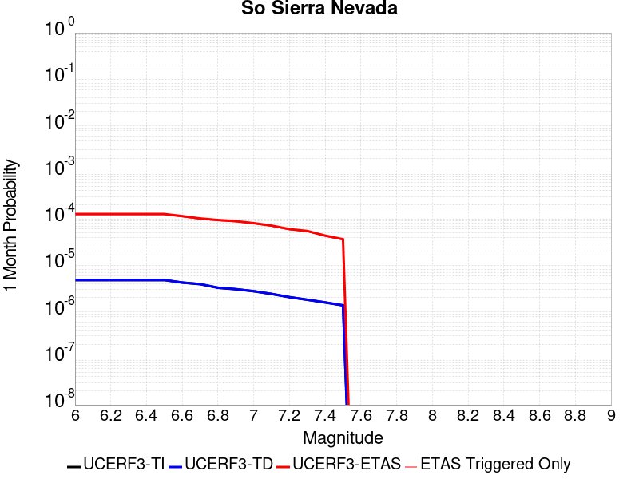 |  |  |

| Magnitude | 1 wk TI Prob | 1 wk TD Prob | 1 wk ETAS Prob | 1 wk ETAS/TD Gain | 1 wk ETAS Triggered Only | 1 mo TI Prob | 1 mo TD Prob | 1 mo ETAS Prob | 1 mo ETAS/TD Gain | 1 mo ETAS Triggered Only | 1 yr TI Prob | 1 yr TD Prob | 1 yr ETAS Prob | 1 yr ETAS/TD Gain | 1 yr ETAS Triggered Only | 10 yr TI Prob | 10 yr TD Prob | 10 yr ETAS Prob | 10 yr ETAS/TD Gain | 10 yr ETAS Triggered Only |
|-----|-----|-----|-----|-----|-----|-----|-----|-----|-----|-----|-----|-----|-----|-----|-----|-----|-----|-----|-----|-----|
| 6.0 | 1.1224332E-6 | 1.1279002E-6 | 9.0031506E-5 | 79.82223 | 8.8903704E-5 | 4.8104193E-6 | 4.83385E-6 | 1.6041458E-4 | 33.185677 | 1.5558148E-4 | 5.856528E-5 | 5.8850677E-5 | 2.8109687E-4 | 4.776442 | 2.2225926E-4 | 5.8549846E-4 | 5.8836513E-4 | 8.771322E-4 | 1.4907956 | 2.8893704E-4 |
| 6.1 | 1.1224332E-6 | 1.1279002E-6 | 9.0031506E-5 | 79.82223 | 8.8903704E-5 | 4.8104193E-6 | 4.83385E-6 | 1.6041458E-4 | 33.185677 | 1.5558148E-4 | 5.856528E-5 | 5.8850677E-5 | 2.8109687E-4 | 4.776442 | 2.2225926E-4 | 5.8549846E-4 | 5.8836513E-4 | 8.771322E-4 | 1.4907956 | 2.8893704E-4 |
| 6.2 | 1.1224332E-6 | 1.1279002E-6 | 9.0031506E-5 | 79.82223 | 8.8903704E-5 | 4.8104193E-6 | 4.83385E-6 | 1.6041458E-4 | 33.185677 | 1.5558148E-4 | 5.856528E-5 | 5.8850677E-5 | 2.8109687E-4 | 4.776442 | 2.2225926E-4 | 5.8549846E-4 | 5.8836513E-4 | 8.771322E-4 | 1.4907956 | 2.8893704E-4 |
| 6.3 | 1.1224332E-6 | 1.1279002E-6 | 9.0031506E-5 | 79.82223 | 8.8903704E-5 | 4.8104193E-6 | 4.83385E-6 | 1.6041458E-4 | 33.185677 | 1.5558148E-4 | 5.856528E-5 | 5.8850677E-5 | 2.8109687E-4 | 4.776442 | 2.2225926E-4 | 5.8549846E-4 | 5.8836513E-4 | 8.771322E-4 | 1.4907956 | 2.8893704E-4 |
| 6.4 | 1.1224332E-6 | 1.1279002E-6 | 9.0031506E-5 | 79.82223 | 8.8903704E-5 | 4.8104193E-6 | 4.83385E-6 | 1.6041458E-4 | 33.185677 | 1.5558148E-4 | 5.856528E-5 | 5.8850677E-5 | 2.8109687E-4 | 4.776442 | 2.2225926E-4 | 5.8549846E-4 | 5.8836513E-4 | 8.771322E-4 | 1.4907956 | 2.8893704E-4 |
| 6.5 | 1.1224332E-6 | 1.1279002E-6 | 9.0031506E-5 | 79.82223 | 8.8903704E-5 | 4.8104193E-6 | 4.83385E-6 | 1.6041458E-4 | 33.185677 | 1.5558148E-4 | 5.856528E-5 | 5.8850677E-5 | 2.8109687E-4 | 4.776442 | 2.2225926E-4 | 5.8549846E-4 | 5.8836513E-4 | 8.771322E-4 | 1.4907956 | 2.8893704E-4 |
| 6.6 | 9.894615E-7 | 9.942721E-7 | 7.8784935E-5 | 79.23881 | 7.779074E-5 | 4.2405422E-6 | 4.26116E-6 | 1.4872907E-4 | 34.90342 | 1.4446852E-4 | 5.162738E-5 | 5.187853E-5 | 2.5190148E-4 | 4.855602 | 2.0003333E-4 | 5.161539E-4 | 5.186781E-4 | 7.630365E-4 | 1.4711176 | 2.4448519E-4 |
| 6.7 | 9.162716E-7 | 9.207134E-7 | 7.871138E-5 | 85.48956 | 7.779074E-5 | 3.926872E-6 | 3.945909E-6 | 1.4841386E-4 | 37.612083 | 1.4446852E-4 | 4.780862E-5 | 4.8040525E-5 | 2.3695182E-4 | 4.932332 | 1.8892037E-4 | 4.7798335E-4 | 4.8031515E-4 | 7.024677E-4 | 1.462514 | 2.2225926E-4 |
| 6.8 | 7.657727E-7 | 7.694662E-7 | 7.856015E-5 | 102.09694 | 7.779074E-5 | 3.281879E-6 | 3.297709E-6 | 1.3665283E-4 | 41.438717 | 1.3335556E-4 | 3.9956143E-5 | 4.0149003E-5 | 2.1794927E-4 | 5.42851 | 1.7780741E-4 | 3.994896E-4 | 4.014309E-4 | 6.1249244E-4 | 1.525773 | 2.111463E-4 |
| 6.9 | 7.1341805E-7 | 7.168437E-7 | 5.628162E-5 | 78.51309 | 5.5564815E-5 | 3.0575022E-6 | 3.0721847E-6 | 1.1420147E-4 | 37.172726 | 1.1112963E-4 | 3.7224454E-5 | 3.740334E-5 | 1.92979E-4 | 5.1594057 | 1.5558148E-4 | 3.721822E-4 | 3.7398373E-4 | 5.6283345E-4 | 1.5049678 | 1.8892037E-4 |
| 7.0 | 6.4606763E-7 | 6.491541E-7 | 3.398802E-5 | 52.357403 | 3.333889E-5 | 2.7688584E-6 | 2.7820868E-6 | 8.0572616E-5 | 28.961214 | 7.779074E-5 | 3.3710327E-5 | 3.3871514E-5 | 1.4499738E-4 | 4.280806 | 1.1112963E-4 | 3.3705216E-4 | 3.386767E-4 | 4.830963E-4 | 1.4264232 | 1.4446852E-4 |
| 7.1 | 5.6480405E-7 | 5.674726E-7 | 3.3906344E-5 | 59.74974 | 3.333889E-5 | 2.4205865E-6 | 2.432024E-6 | 8.022258E-5 | 32.98593 | 7.779074E-5 | 2.9470242E-5 | 2.9609624E-5 | 1.2962334E-4 | 4.3777432 | 1.0001667E-4 | 2.9466333E-4 | 2.960699E-4 | 4.2938595E-4 | 1.4502858 | 1.3335556E-4 |
| 7.2 | 4.8135706E-7 | 4.835969E-7 | 3.382247E-5 | 69.93938 | 3.333889E-5 | 2.062957E-6 | 2.0725574E-6 | 7.986314E-5 | 38.53362 | 7.779074E-5 | 2.5116213E-5 | 2.5233227E-5 | 1.1413469E-4 | 4.5231905 | 8.8903704E-5 | 2.5113375E-4 | 2.5231662E-4 | 3.5230807E-4 | 1.3962935 | 1.0001667E-4 |
| 7.3 | 4.2344834E-7 | 4.253936E-7 | 2.2651311E-5 | 53.247887 | 2.2225926E-5 | 1.8147773E-6 | 1.823115E-6 | 6.8500776E-5 | 37.57348 | 6.667778E-5 | 2.209469E-5 | 2.2196331E-5 | 9.9985344E-5 | 4.504589 | 7.779074E-5 | 2.2092494E-4 | 2.2195408E-4 | 3.1083805E-4 | 1.4004611 | 8.8903704E-5 |
| 7.4 | 3.701308E-7 | 3.7181007E-7 | 1.1484769E-5 | 30.888807 | 1.1112963E-5 | 1.5862739E-6 | 1.5934714E-6 | 4.6045254E-5 | 28.89619 | 4.4451852E-5 | 1.9312713E-5 | 1.9400473E-5 | 6.385146E-5 | 3.2912323 | 4.4451852E-5 | 1.9311035E-4 | 1.9400066E-4 | 2.495547E-4 | 1.28636 | 5.5564815E-5 |
| 7.5 | 3.2063204E-7 | 3.2207842E-7 | 1.1435038E-5 | 35.503895 | 1.1112963E-5 | 1.3741366E-6 | 1.3803361E-6 | 4.5832126E-5 | 33.203598 | 4.4451852E-5 | 1.6729984E-5 | 1.6805592E-5 | 6.12567E-5 | 3.6450188 | 4.4451852E-5 | 1.6728725E-4 | 1.6805592E-4 | 2.236114E-4 | 1.3305774 | 5.5564815E-5 |

## Oak Ridge (Onshore)
*[(top)](#table-of-contents)*

| 1 Week | 1 Month | 1 Year | 10 Year |
|-----|-----|-----|-----|
|  |  |  |  |

| Magnitude | 1 wk TI Prob | 1 wk TD Prob | 1 wk ETAS Prob | 1 wk ETAS/TD Gain | 1 wk ETAS Triggered Only | 1 mo TI Prob | 1 mo TD Prob | 1 mo ETAS Prob | 1 mo ETAS/TD Gain | 1 mo ETAS Triggered Only | 1 yr TI Prob | 1 yr TD Prob | 1 yr ETAS Prob | 1 yr ETAS/TD Gain | 1 yr ETAS Triggered Only | 10 yr TI Prob | 10 yr TD Prob | 10 yr ETAS Prob | 10 yr ETAS/TD Gain | 10 yr ETAS Triggered Only |
|-----|-----|-----|-----|-----|-----|-----|-----|-----|-----|-----|-----|-----|-----|-----|-----|-----|-----|-----|-----|-----|
| 6.0 | 4.0081308E-5 | 5.2264888E-5 | 8.5602034E-5 | 1.6378498 | 3.333889E-5 | 1.7176573E-4 | 2.2397783E-4 | 2.795302E-4 | 1.2480263 | 5.5564815E-5 | 0.0020892418 | 0.0027243528 | 0.0028905931 | 1.0610201 | 1.6669444E-4 | 0.020697087 | 0.02699201 | 0.02724071 | 1.0092138 | 2.5559816E-4 |
| 6.1 | 4.0081308E-5 | 5.2264888E-5 | 8.5602034E-5 | 1.6378498 | 3.333889E-5 | 1.7176573E-4 | 2.2397783E-4 | 2.795302E-4 | 1.2480263 | 5.5564815E-5 | 0.0020892418 | 0.0027243528 | 0.0028905931 | 1.0610201 | 1.6669444E-4 | 0.020697087 | 0.02699201 | 0.02724071 | 1.0092138 | 2.5559816E-4 |
| 6.2 | 4.0081308E-5 | 5.2264888E-5 | 8.5602034E-5 | 1.6378498 | 3.333889E-5 | 1.7176573E-4 | 2.2397783E-4 | 2.795302E-4 | 1.2480263 | 5.5564815E-5 | 0.0020892418 | 0.0027243528 | 0.0028905931 | 1.0610201 | 1.6669444E-4 | 0.020697087 | 0.02699201 | 0.02724071 | 1.0092138 | 2.5559816E-4 |
| 6.3 | 4.0081308E-5 | 5.2264888E-5 | 8.5602034E-5 | 1.6378498 | 3.333889E-5 | 1.7176573E-4 | 2.2397783E-4 | 2.795302E-4 | 1.2480263 | 5.5564815E-5 | 0.0020892418 | 0.0027243528 | 0.0028905931 | 1.0610201 | 1.6669444E-4 | 0.020697087 | 0.02699201 | 0.02724071 | 1.0092138 | 2.5559816E-4 |
| 6.4 | 4.0081308E-5 | 5.2264888E-5 | 8.5602034E-5 | 1.6378498 | 3.333889E-5 | 1.7176573E-4 | 2.2397783E-4 | 2.795302E-4 | 1.2480263 | 5.5564815E-5 | 0.0020892418 | 0.0027243528 | 0.0028905931 | 1.0610201 | 1.6669444E-4 | 0.020697087 | 0.02699201 | 0.02724071 | 1.0092138 | 2.5559816E-4 |
| 6.5 | 4.0081308E-5 | 5.2264888E-5 | 8.5602034E-5 | 1.6378498 | 3.333889E-5 | 1.7176573E-4 | 2.2397783E-4 | 2.795302E-4 | 1.2480263 | 5.5564815E-5 | 0.0020892418 | 0.0027243528 | 0.0028905931 | 1.0610201 | 1.6669444E-4 | 0.020697087 | 0.02699201 | 0.02724071 | 1.0092138 | 2.5559816E-4 |
| 6.6 | 4.0081308E-5 | 5.2264888E-5 | 8.5602034E-5 | 1.6378498 | 3.333889E-5 | 1.7176573E-4 | 2.2397783E-4 | 2.795302E-4 | 1.2480263 | 5.5564815E-5 | 0.0020892418 | 0.0027243528 | 0.0028905931 | 1.0610201 | 1.6669444E-4 | 0.020697087 | 0.02699201 | 0.02724071 | 1.0092138 | 2.5559816E-4 |
| 6.7 | 3.0016534E-5 | 3.908297E-5 | 7.242055E-5 | 1.8529953 | 3.333889E-5 | 1.2863595E-4 | 1.6749227E-4 | 2.1193667E-4 | 1.265352 | 4.4451852E-5 | 0.0015650174 | 0.0020381245 | 0.002160118 | 1.0598557 | 1.2224259E-4 | 0.015540415 | 0.020274134 | 0.02043745 | 1.0080553 | 1.6669444E-4 |
| 6.8 | 2.4562401E-5 | 3.183199E-5 | 5.405721E-5 | 1.6982039 | 2.2225926E-5 | 1.0526319E-4 | 1.3642012E-4 | 1.6975445E-4 | 1.2443507 | 3.333889E-5 | 0.0012808258 | 0.0016604326 | 0.0017380941 | 1.0467719 | 7.779074E-5 | 0.012734687 | 0.01655699 | 0.016666278 | 1.0066009 | 1.1112963E-4 |
| 6.9 | 2.3845261E-5 | 3.090968E-5 | 5.3134918E-5 | 1.7190381 | 2.2225926E-5 | 1.0218997E-4 | 1.3246776E-4 | 1.6580224E-4 | 1.2516421 | 3.333889E-5 | 0.0012434528 | 0.0016123839 | 0.0016900492 | 1.0481681 | 7.779074E-5 | 0.01236518 | 0.016083475 | 0.016192818 | 1.0067984 | 1.1112963E-4 |
| 7.0 | 2.2210486E-5 | 2.8783488E-5 | 5.1008774E-5 | 1.7721541 | 2.2225926E-5 | 9.5184325E-5 | 1.2335637E-4 | 1.5669114E-4 | 1.2702315 | 3.333889E-5 | 0.001158253 | 0.0015016058 | 0.0015792798 | 1.0517273 | 7.779074E-5 | 0.011522347 | 0.014990693 | 0.015100157 | 1.0073022 | 1.1112963E-4 |
| 7.1 | 1.9072411E-5 | 2.4648589E-5 | 4.6873967E-5 | 1.9016898 | 2.2225926E-5 | 8.173635E-5 | 1.05636806E-4 | 1.3897217E-4 | 1.3155658 | 3.333889E-5 | 9.946857E-4 | 0.0012861256 | 0.0013638163 | 1.0604068 | 7.779074E-5 | 0.009902451 | 0.012860967 | 0.012970667 | 1.0085297 | 1.1112963E-4 |

## San Juan
*[(top)](#table-of-contents)*

| 1 Week | 1 Month | 1 Year | 10 Year |
|-----|-----|-----|-----|
|  |  |  |  |

| Magnitude | 1 wk TI Prob | 1 wk TD Prob | 1 wk ETAS Prob | 1 wk ETAS/TD Gain | 1 wk ETAS Triggered Only | 1 mo TI Prob | 1 mo TD Prob | 1 mo ETAS Prob | 1 mo ETAS/TD Gain | 1 mo ETAS Triggered Only | 1 yr TI Prob | 1 yr TD Prob | 1 yr ETAS Prob | 1 yr ETAS/TD Gain | 1 yr ETAS Triggered Only | 10 yr TI Prob | 10 yr TD Prob | 10 yr ETAS Prob | 10 yr ETAS/TD Gain | 10 yr ETAS Triggered Only |
|-----|-----|-----|-----|-----|-----|-----|-----|-----|-----|-----|-----|-----|-----|-----|-----|-----|-----|-----|-----|-----|
| 6.0 | 1.5480582E-5 | 1.6991073E-5 | 3.9216622E-5 | 2.308072 | 2.2225926E-5 | 6.6343666E-5 | 7.281725E-5 | 1.3949018E-4 | 1.9156199 | 6.667778E-5 | 8.074348E-4 | 8.8626205E-4 | 0.0010083963 | 1.1378083 | 1.2224259E-4 | 0.008045073 | 0.008834435 | 0.00909879 | 1.0299232 | 2.667111E-4 |
| 6.1 | 1.5480582E-5 | 1.6991073E-5 | 3.9216622E-5 | 2.308072 | 2.2225926E-5 | 6.6343666E-5 | 7.281725E-5 | 1.3949018E-4 | 1.9156199 | 6.667778E-5 | 8.074348E-4 | 8.8626205E-4 | 0.0010083963 | 1.1378083 | 1.2224259E-4 | 0.008045073 | 0.008834435 | 0.00909879 | 1.0299232 | 2.667111E-4 |
| 6.2 | 1.5480582E-5 | 1.6991073E-5 | 3.9216622E-5 | 2.308072 | 2.2225926E-5 | 6.6343666E-5 | 7.281725E-5 | 1.3949018E-4 | 1.9156199 | 6.667778E-5 | 8.074348E-4 | 8.8626205E-4 | 0.0010083963 | 1.1378083 | 1.2224259E-4 | 0.008045073 | 0.008834435 | 0.00909879 | 1.0299232 | 2.667111E-4 |
| 6.3 | 1.5480582E-5 | 1.6991073E-5 | 3.9216622E-5 | 2.308072 | 2.2225926E-5 | 6.6343666E-5 | 7.281725E-5 | 1.3949018E-4 | 1.9156199 | 6.667778E-5 | 8.074348E-4 | 8.8626205E-4 | 0.0010083963 | 1.1378083 | 1.2224259E-4 | 0.008045073 | 0.008834435 | 0.00909879 | 1.0299232 | 2.667111E-4 |
| 6.4 | 1.5480582E-5 | 1.6991073E-5 | 3.9216622E-5 | 2.308072 | 2.2225926E-5 | 6.6343666E-5 | 7.281725E-5 | 1.3949018E-4 | 1.9156199 | 6.667778E-5 | 8.074348E-4 | 8.8626205E-4 | 0.0010083963 | 1.1378083 | 1.2224259E-4 | 0.008045073 | 0.008834435 | 0.00909879 | 1.0299232 | 2.667111E-4 |
| 6.5 | 1.5480582E-5 | 1.6991073E-5 | 3.9216622E-5 | 2.308072 | 2.2225926E-5 | 6.6343666E-5 | 7.281725E-5 | 1.3949018E-4 | 1.9156199 | 6.667778E-5 | 8.074348E-4 | 8.8626205E-4 | 0.0010083963 | 1.1378083 | 1.2224259E-4 | 0.008045073 | 0.008834435 | 0.00909879 | 1.0299232 | 2.667111E-4 |
| 6.6 | 1.3888578E-5 | 1.5238386E-5 | 3.7463975E-5 | 2.4585264 | 2.2225926E-5 | 5.952112E-5 | 6.530614E-5 | 1.2086733E-4 | 1.8507804 | 5.5564815E-5 | 7.244287E-4 | 7.9488434E-4 | 8.948215E-4 | 1.1257254 | 1.0001667E-4 | 0.007220716 | 0.007927506 | 0.008170053 | 1.0305957 | 2.4448519E-4 |
| 6.7 | 1.19326105E-5 | 1.3077807E-5 | 3.5303445E-5 | 2.6994925 | 2.2225926E-5 | 5.1138755E-5 | 5.6046945E-5 | 1.00496305E-4 | 1.7930738 | 4.4451852E-5 | 6.2243646E-4 | 6.8222906E-4 | 7.710721E-4 | 1.1302247 | 8.8903704E-5 | 0.0062069595 | 0.006808338 | 0.0070180474 | 1.0308018 | 2.111463E-4 |
| 6.8 | 1.0103744E-5 | 1.1057104E-5 | 3.3282784E-5 | 3.0100815 | 2.2225926E-5 | 4.330104E-5 | 4.7387122E-5 | 8.0724436E-5 | 1.7035099 | 3.333889E-5 | 5.270626E-4 | 5.768559E-4 | 6.546017E-4 | 1.1347752 | 7.779074E-5 | 0.005258143 | 0.0057604914 | 0.0059483238 | 1.032607 | 1.8892037E-4 |
| 6.9 | 8.642364E-6 | 9.446245E-6 | 3.167196E-5 | 3.3528628 | 2.2225926E-5 | 3.703818E-5 | 4.048367E-5 | 7.382121E-5 | 1.8234812 | 3.333889E-5 | 4.508465E-4 | 4.928469E-4 | 5.594918E-4 | 1.1352243 | 6.667778E-5 | 0.0044993293 | 0.0049243723 | 0.0050902455 | 1.0336843 | 1.6669444E-4 |
| 7.0 | 7.3015253E-6 | 7.97175E-6 | 3.01975E-5 | 3.788064 | 2.2225926E-5 | 3.1291875E-5 | 3.4164583E-5 | 6.750233E-5 | 1.9757985 | 3.333889E-5 | 3.8091198E-4 | 4.1594342E-4 | 4.825935E-4 | 1.1602383 | 6.667778E-5 | 0.0038025973 | 0.004158416 | 0.0043022837 | 1.0345968 | 1.4446852E-4 |

## Mission Ridge-Arroyo Parida-Santa Ana
*[(top)](#table-of-contents)*

| 1 Week | 1 Month | 1 Year | 10 Year |
|-----|-----|-----|-----|
|  |  |  |  |

| Magnitude | 1 wk TI Prob | 1 wk TD Prob | 1 wk ETAS Prob | 1 wk ETAS/TD Gain | 1 wk ETAS Triggered Only | 1 mo TI Prob | 1 mo TD Prob | 1 mo ETAS Prob | 1 mo ETAS/TD Gain | 1 mo ETAS Triggered Only | 1 yr TI Prob | 1 yr TD Prob | 1 yr ETAS Prob | 1 yr ETAS/TD Gain | 1 yr ETAS Triggered Only | 10 yr TI Prob | 10 yr TD Prob | 10 yr ETAS Prob | 10 yr ETAS/TD Gain | 10 yr ETAS Triggered Only |
|-----|-----|-----|-----|-----|-----|-----|-----|-----|-----|-----|-----|-----|-----|-----|-----|-----|-----|-----|-----|-----|
| 6.0 | 7.834363E-6 | 8.254548E-6 | 3.0480292E-5 | 3.692545 | 2.2225926E-5 | 3.357541E-5 | 3.5376324E-5 | 7.9826605E-5 | 2.2564979 | 4.4451852E-5 | 4.0870393E-4 | 4.306516E-4 | 5.528415E-4 | 1.2837328 | 1.2224259E-4 | 0.0040795305 | 0.00430111 | 0.0045556086 | 1.0591705 | 2.5559816E-4 |
| 6.1 | 7.834363E-6 | 8.254548E-6 | 3.0480292E-5 | 3.692545 | 2.2225926E-5 | 3.357541E-5 | 3.5376324E-5 | 7.9826605E-5 | 2.2564979 | 4.4451852E-5 | 4.0870393E-4 | 4.306516E-4 | 5.528415E-4 | 1.2837328 | 1.2224259E-4 | 0.0040795305 | 0.00430111 | 0.0045556086 | 1.0591705 | 2.5559816E-4 |
| 6.2 | 7.834363E-6 | 8.254548E-6 | 3.0480292E-5 | 3.692545 | 2.2225926E-5 | 3.357541E-5 | 3.5376324E-5 | 7.9826605E-5 | 2.2564979 | 4.4451852E-5 | 4.0870393E-4 | 4.306516E-4 | 5.528415E-4 | 1.2837328 | 1.2224259E-4 | 0.0040795305 | 0.00430111 | 0.0045556086 | 1.0591705 | 2.5559816E-4 |
| 6.3 | 7.834363E-6 | 8.254548E-6 | 3.0480292E-5 | 3.692545 | 2.2225926E-5 | 3.357541E-5 | 3.5376324E-5 | 7.9826605E-5 | 2.2564979 | 4.4451852E-5 | 4.0870393E-4 | 4.306516E-4 | 5.528415E-4 | 1.2837328 | 1.2224259E-4 | 0.0040795305 | 0.00430111 | 0.0045556086 | 1.0591705 | 2.5559816E-4 |
| 6.4 | 7.834363E-6 | 8.254548E-6 | 3.0480292E-5 | 3.692545 | 2.2225926E-5 | 3.357541E-5 | 3.5376324E-5 | 7.9826605E-5 | 2.2564979 | 4.4451852E-5 | 4.0870393E-4 | 4.306516E-4 | 5.528415E-4 | 1.2837328 | 1.2224259E-4 | 0.0040795305 | 0.00430111 | 0.0045556086 | 1.0591705 | 2.5559816E-4 |
| 6.5 | 7.834363E-6 | 8.254548E-6 | 3.0480292E-5 | 3.692545 | 2.2225926E-5 | 3.357541E-5 | 3.5376324E-5 | 7.9826605E-5 | 2.2564979 | 4.4451852E-5 | 4.0870393E-4 | 4.306516E-4 | 5.528415E-4 | 1.2837328 | 1.2224259E-4 | 0.0040795305 | 0.00430111 | 0.0045556086 | 1.0591705 | 2.5559816E-4 |
| 6.6 | 6.3056787E-6 | 6.639724E-6 | 2.8865503E-5 | 4.347395 | 2.2225926E-5 | 2.7024058E-5 | 2.8455815E-5 | 7.2906405E-5 | 2.5620916 | 4.4451852E-5 | 3.2896822E-4 | 3.4642397E-4 | 4.46406E-4 | 1.2886118 | 1.0001667E-4 | 0.0032848166 | 0.0034617314 | 0.0036721467 | 1.0607833 | 2.111463E-4 |
| 6.7 | 4.9162536E-6 | 5.1728953E-6 | 2.7398706E-5 | 5.2965903 | 2.2225926E-5 | 2.1069487E-5 | 2.2169526E-5 | 6.662039E-5 | 3.0050437 | 4.4451852E-5 | 2.564908E-4 | 2.699095E-4 | 3.587892E-4 | 1.3292944 | 8.8903704E-5 | 0.0025619497 | 0.002698656 | 0.0028649005 | 1.0616027 | 1.6669444E-4 |
| 6.8 | 4.5714046E-6 | 4.809432E-6 | 2.7035252E-5 | 5.621298 | 2.2225926E-5 | 1.9591585E-5 | 2.0611853E-5 | 6.506279E-5 | 3.1565716 | 4.4451852E-5 | 2.3850145E-4 | 2.509493E-4 | 3.398307E-4 | 1.3541807 | 8.8903704E-5 | 0.0023824563 | 0.0025094931 | 0.002653599 | 1.0574243 | 1.4446852E-4 |

## Santa Susana alt 1
*[(top)](#table-of-contents)*

| 1 Week | 1 Month | 1 Year | 10 Year |
|-----|-----|-----|-----|
|  |  |  |  |

| Magnitude | 1 wk TI Prob | 1 wk TD Prob | 1 wk ETAS Prob | 1 wk ETAS/TD Gain | 1 wk ETAS Triggered Only | 1 mo TI Prob | 1 mo TD Prob | 1 mo ETAS Prob | 1 mo ETAS/TD Gain | 1 mo ETAS Triggered Only | 1 yr TI Prob | 1 yr TD Prob | 1 yr ETAS Prob | 1 yr ETAS/TD Gain | 1 yr ETAS Triggered Only | 10 yr TI Prob | 10 yr TD Prob | 10 yr ETAS Prob | 10 yr ETAS/TD Gain | 10 yr ETAS Triggered Only |
|-----|-----|-----|-----|-----|-----|-----|-----|-----|-----|-----|-----|-----|-----|-----|-----|-----|-----|-----|-----|-----|
| 6.0 | 9.5099895E-5 | 2.0216104E-4 | 2.5771462E-4 | 1.2747986 | 5.5564815E-5 | 4.075073E-4 | 8.6613704E-4 | 9.5496373E-4 | 1.102555 | 8.8903704E-5 | 0.00495012 | 0.010495704 | 0.010638656 | 1.01362 | 1.4446852E-4 | 0.048412967 | 0.10018345 | 0.10039344 | 1.002096 | 2.3337222E-4 |
| 6.1 | 9.5099895E-5 | 2.0216104E-4 | 2.5771462E-4 | 1.2747986 | 5.5564815E-5 | 4.075073E-4 | 8.6613704E-4 | 9.5496373E-4 | 1.102555 | 8.8903704E-5 | 0.00495012 | 0.010495704 | 0.010638656 | 1.01362 | 1.4446852E-4 | 0.048412967 | 0.10018345 | 0.10039344 | 1.002096 | 2.3337222E-4 |
| 6.2 | 9.5099895E-5 | 2.0216104E-4 | 2.5771462E-4 | 1.2747986 | 5.5564815E-5 | 4.075073E-4 | 8.6613704E-4 | 9.5496373E-4 | 1.102555 | 8.8903704E-5 | 0.00495012 | 0.010495704 | 0.010638656 | 1.01362 | 1.4446852E-4 | 0.048412967 | 0.10018345 | 0.10039344 | 1.002096 | 2.3337222E-4 |
| 6.3 | 9.5099895E-5 | 2.0216104E-4 | 2.5771462E-4 | 1.2747986 | 5.5564815E-5 | 4.075073E-4 | 8.6613704E-4 | 9.5496373E-4 | 1.102555 | 8.8903704E-5 | 0.00495012 | 0.010495704 | 0.010638656 | 1.01362 | 1.4446852E-4 | 0.048412967 | 0.10018345 | 0.10039344 | 1.002096 | 2.3337222E-4 |
| 6.4 | 9.5099895E-5 | 2.0216104E-4 | 2.5771462E-4 | 1.2747986 | 5.5564815E-5 | 4.075073E-4 | 8.6613704E-4 | 9.5496373E-4 | 1.102555 | 8.8903704E-5 | 0.00495012 | 0.010495704 | 0.010638656 | 1.01362 | 1.4446852E-4 | 0.048412967 | 0.10018345 | 0.10039344 | 1.002096 | 2.3337222E-4 |
| 6.5 | 9.5099895E-5 | 2.0216104E-4 | 2.5771462E-4 | 1.2747986 | 5.5564815E-5 | 4.075073E-4 | 8.6613704E-4 | 9.5496373E-4 | 1.102555 | 8.8903704E-5 | 0.00495012 | 0.010495704 | 0.010638656 | 1.01362 | 1.4446852E-4 | 0.048412967 | 0.10018345 | 0.10039344 | 1.002096 | 2.3337222E-4 |
| 6.6 | 6.811134E-5 | 1.4962441E-4 | 1.9406961E-4 | 1.2970451 | 4.4451852E-5 | 2.9187306E-4 | 6.410975E-4 | 7.1883836E-4 | 1.1212622 | 7.779074E-5 | 0.0035477648 | 0.007785119 | 0.00790641 | 1.0155798 | 1.2224259E-4 | 0.034916576 | 0.075827375 | 0.07602251 | 1.0025734 | 2.111463E-4 |
| 6.7 | 6.811134E-5 | 1.4962441E-4 | 1.9406961E-4 | 1.2970451 | 4.4451852E-5 | 2.9187306E-4 | 6.410975E-4 | 7.1883836E-4 | 1.1212622 | 7.779074E-5 | 0.0035477648 | 0.007785119 | 0.00790641 | 1.0155798 | 1.2224259E-4 | 0.034916576 | 0.075827375 | 0.07602251 | 1.0025734 | 2.111463E-4 |

## Raymond
*[(top)](#table-of-contents)*

| 1 Week | 1 Month | 1 Year | 10 Year |
|-----|-----|-----|-----|
|  |  |  |  |

| Magnitude | 1 wk TI Prob | 1 wk TD Prob | 1 wk ETAS Prob | 1 wk ETAS/TD Gain | 1 wk ETAS Triggered Only | 1 mo TI Prob | 1 mo TD Prob | 1 mo ETAS Prob | 1 mo ETAS/TD Gain | 1 mo ETAS Triggered Only | 1 yr TI Prob | 1 yr TD Prob | 1 yr ETAS Prob | 1 yr ETAS/TD Gain | 1 yr ETAS Triggered Only | 10 yr TI Prob | 10 yr TD Prob | 10 yr ETAS Prob | 10 yr ETAS/TD Gain | 10 yr ETAS Triggered Only |
|-----|-----|-----|-----|-----|-----|-----|-----|-----|-----|-----|-----|-----|-----|-----|-----|-----|-----|-----|-----|-----|
| 6.0 | 2.9380968E-5 | 3.7712594E-5 | 1.0438786E-4 | 2.7679842 | 6.667778E-5 | 1.2591235E-4 | 1.616254E-4 | 2.5051474E-4 | 1.5499713 | 8.8903704E-5 | 0.0015319049 | 0.0019677528 | 0.0021341192 | 1.0845464 | 1.6669444E-4 | 0.015213877 | 0.0196723 | 0.019890187 | 1.0110759 | 2.2225926E-4 |
| 6.1 | 2.9380968E-5 | 3.7712594E-5 | 1.0438786E-4 | 2.7679842 | 6.667778E-5 | 1.2591235E-4 | 1.616254E-4 | 2.5051474E-4 | 1.5499713 | 8.8903704E-5 | 0.0015319049 | 0.0019677528 | 0.0021341192 | 1.0845464 | 1.6669444E-4 | 0.015213877 | 0.0196723 | 0.019890187 | 1.0110759 | 2.2225926E-4 |
| 6.2 | 2.9380968E-5 | 3.7712594E-5 | 1.0438786E-4 | 2.7679842 | 6.667778E-5 | 1.2591235E-4 | 1.616254E-4 | 2.5051474E-4 | 1.5499713 | 8.8903704E-5 | 0.0015319049 | 0.0019677528 | 0.0021341192 | 1.0845464 | 1.6669444E-4 | 0.015213877 | 0.0196723 | 0.019890187 | 1.0110759 | 2.2225926E-4 |
| 6.3 | 2.9380968E-5 | 3.7712594E-5 | 1.0438786E-4 | 2.7679842 | 6.667778E-5 | 1.2591235E-4 | 1.616254E-4 | 2.5051474E-4 | 1.5499713 | 8.8903704E-5 | 0.0015319049 | 0.0019677528 | 0.0021341192 | 1.0845464 | 1.6669444E-4 | 0.015213877 | 0.0196723 | 0.019890187 | 1.0110759 | 2.2225926E-4 |
| 6.4 | 2.9380968E-5 | 3.7712594E-5 | 1.0438786E-4 | 2.7679842 | 6.667778E-5 | 1.2591235E-4 | 1.616254E-4 | 2.5051474E-4 | 1.5499713 | 8.8903704E-5 | 0.0015319049 | 0.0019677528 | 0.0021341192 | 1.0845464 | 1.6669444E-4 | 0.015213877 | 0.0196723 | 0.019890187 | 1.0110759 | 2.2225926E-4 |
| 6.5 | 2.9380968E-5 | 3.7712594E-5 | 1.0438786E-4 | 2.7679842 | 6.667778E-5 | 1.2591235E-4 | 1.616254E-4 | 2.5051474E-4 | 1.5499713 | 8.8903704E-5 | 0.0015319049 | 0.0019677528 | 0.0021341192 | 1.0845464 | 1.6669444E-4 | 0.015213877 | 0.0196723 | 0.019890187 | 1.0110759 | 2.2225926E-4 |
| 6.6 | 2.9380968E-5 | 3.7712594E-5 | 1.0438786E-4 | 2.7679842 | 6.667778E-5 | 1.2591235E-4 | 1.616254E-4 | 2.5051474E-4 | 1.5499713 | 8.8903704E-5 | 0.0015319049 | 0.0019677528 | 0.0021341192 | 1.0845464 | 1.6669444E-4 | 0.015213877 | 0.0196723 | 0.019890187 | 1.0110759 | 2.2225926E-4 |

## San Jacinto (Stepovers Combined)
*[(top)](#table-of-contents)*

| 1 Week | 1 Month | 1 Year | 10 Year |
|-----|-----|-----|-----|
|  |  |  |  |

| Magnitude | 1 wk TI Prob | 1 wk TD Prob | 1 wk ETAS Prob | 1 wk ETAS/TD Gain | 1 wk ETAS Triggered Only | 1 mo TI Prob | 1 mo TD Prob | 1 mo ETAS Prob | 1 mo ETAS/TD Gain | 1 mo ETAS Triggered Only | 1 yr TI Prob | 1 yr TD Prob | 1 yr ETAS Prob | 1 yr ETAS/TD Gain | 1 yr ETAS Triggered Only | 10 yr TI Prob | 10 yr TD Prob | 10 yr ETAS Prob | 10 yr ETAS/TD Gain | 10 yr ETAS Triggered Only |
|-----|-----|-----|-----|-----|-----|-----|-----|-----|-----|-----|-----|-----|-----|-----|-----|-----|-----|-----|-----|-----|
| 6.0 | 1.1968766E-4 | 2.2716755E-4 | 2.4938842E-4 | 1.0978172 | 2.2225926E-5 | 5.128463E-4 | 9.731359E-4 | 0.0010064422 | 1.034226 | 3.333889E-5 | 0.0062260423 | 0.0117805805 | 0.011879419 | 1.00839 | 1.0001667E-4 | 0.06054471 | 0.113027595 | 0.11318531 | 1.0013953 | 1.7780741E-4 |
| 6.1 | 1.1968766E-4 | 2.2716755E-4 | 2.4938842E-4 | 1.0978172 | 2.2225926E-5 | 5.128463E-4 | 9.731359E-4 | 0.0010064422 | 1.034226 | 3.333889E-5 | 0.0062260423 | 0.0117805805 | 0.011879419 | 1.00839 | 1.0001667E-4 | 0.06054471 | 0.113027595 | 0.11318531 | 1.0013953 | 1.7780741E-4 |
| 6.2 | 1.1968766E-4 | 2.2716755E-4 | 2.4938842E-4 | 1.0978172 | 2.2225926E-5 | 5.128463E-4 | 9.731359E-4 | 0.0010064422 | 1.034226 | 3.333889E-5 | 0.0062260423 | 0.0117805805 | 0.011879419 | 1.00839 | 1.0001667E-4 | 0.06054471 | 0.113027595 | 0.11318531 | 1.0013953 | 1.7780741E-4 |
| 6.3 | 1.1968766E-4 | 2.2716755E-4 | 2.4938842E-4 | 1.0978172 | 2.2225926E-5 | 5.128463E-4 | 9.731359E-4 | 0.0010064422 | 1.034226 | 3.333889E-5 | 0.0062260423 | 0.0117805805 | 0.011879419 | 1.00839 | 1.0001667E-4 | 0.06054471 | 0.113027595 | 0.11318531 | 1.0013953 | 1.7780741E-4 |
| 6.4 | 1.1968766E-4 | 2.2716755E-4 | 2.4938842E-4 | 1.0978172 | 2.2225926E-5 | 5.128463E-4 | 9.731359E-4 | 0.0010064422 | 1.034226 | 3.333889E-5 | 0.0062260423 | 0.0117805805 | 0.011879419 | 1.00839 | 1.0001667E-4 | 0.06054471 | 0.113027595 | 0.11318531 | 1.0013953 | 1.7780741E-4 |
| 6.5 | 1.1968766E-4 | 2.2716755E-4 | 2.4938842E-4 | 1.0978172 | 2.2225926E-5 | 5.128463E-4 | 9.731359E-4 | 0.0010064422 | 1.034226 | 3.333889E-5 | 0.0062260423 | 0.0117805805 | 0.011879419 | 1.00839 | 1.0001667E-4 | 0.06054471 | 0.113027595 | 0.11318531 | 1.0013953 | 1.7780741E-4 |
| 6.6 | 1.1957375E-4 | 2.2692814E-4 | 2.4914902E-4 | 1.0979203 | 2.2225926E-5 | 5.1235827E-4 | 9.7211095E-4 | 0.0010054174 | 1.0342621 | 3.333889E-5 | 0.006220135 | 0.011768302 | 0.011867141 | 1.0083988 | 1.0001667E-4 | 0.06048886 | 0.11292298 | 0.11308071 | 1.0013968 | 1.7780741E-4 |
| 6.7 | 1.1951502E-4 | 2.2680471E-4 | 2.490256E-4 | 1.0979737 | 2.2225926E-5 | 5.1210664E-4 | 9.7158254E-4 | 0.001004889 | 1.0342807 | 3.333889E-5 | 0.006217089 | 0.011761972 | 0.011860812 | 1.0084034 | 1.0001667E-4 | 0.060460065 | 0.11286904 | 0.113026775 | 1.0013975 | 1.7780741E-4 |
| 6.8 | 1.1939376E-4 | 2.2654171E-4 | 2.487626E-4 | 1.0980874 | 2.2225926E-5 | 5.1158713E-4 | 9.704564E-4 | 0.0010037629 | 1.0343205 | 3.333889E-5 | 0.0062108003 | 0.011748434 | 0.011847276 | 1.0084132 | 1.0001667E-4 | 0.06040061 | 0.11275068 | 0.112908445 | 1.0013992 | 1.7780741E-4 |
| 6.9 | 1.19143144E-4 | 2.2600606E-4 | 2.4822695E-4 | 1.0983199 | 2.2225926E-5 | 5.1051355E-4 | 9.6816255E-4 | 0.0010014691 | 1.0344019 | 3.333889E-5 | 0.0061978037 | 0.011720859 | 0.011819704 | 1.0084332 | 1.0001667E-4 | 0.060277723 | 0.11250938 | 0.11266718 | 1.0014026 | 1.7780741E-4 |
| 7.0 | 9.224271E-5 | 1.62278E-4 | 1.8450031E-4 | 1.1369398 | 2.2225926E-5 | 3.9526602E-4 | 6.952914E-4 | 7.2860706E-4 | 1.0479162 | 3.333889E-5 | 0.0048017497 | 0.008436837 | 0.008524991 | 1.0104487 | 8.8903704E-5 | 0.046993118 | 0.083286285 | 0.083428904 | 1.0017124 | 1.5558148E-4 |
| 7.1 | 9.189464E-5 | 1.6160391E-4 | 1.8382624E-4 | 1.1375111 | 2.2225926E-5 | 3.9377474E-4 | 6.9240405E-4 | 7.2571984E-4 | 1.0481161 | 3.333889E-5 | 0.004783673 | 0.008401991 | 0.008490148 | 1.0104923 | 8.8903704E-5 | 0.04682 | 0.0829684 | 0.08311107 | 1.0017196 | 1.5558148E-4 |
| 7.2 | 9.121798E-5 | 1.6023654E-4 | 1.824589E-4 | 1.1386847 | 2.2225926E-5 | 3.9087565E-4 | 6.8654754E-4 | 7.198636E-4 | 1.0485269 | 3.333889E-5 | 0.004748531 | 0.008331316 | 0.008419478 | 1.0105821 | 8.8903704E-5 | 0.046483368 | 0.08232578 | 0.082468554 | 1.0017343 | 1.5558148E-4 |
| 7.3 | 8.9773785E-5 | 1.5732428E-4 | 1.7954671E-4 | 1.1412524 | 2.2225926E-5 | 3.8468806E-4 | 6.740732E-4 | 7.073896E-4 | 1.0494255 | 3.333889E-5 | 0.004673523 | 0.008180636 | 0.008268813 | 1.0107787 | 8.8903704E-5 | 0.0457645 | 0.08092336 | 0.081066355 | 1.001767 | 1.5558148E-4 |
| 7.4 | 7.3478965E-5 | 1.1931325E-4 | 1.4153653E-4 | 1.1862599 | 2.2225926E-5 | 3.1487184E-4 | 5.1127357E-4 | 5.334881E-4 | 1.0434495 | 2.2225926E-5 | 0.0038268273 | 0.006212538 | 0.00624567 | 1.0053331 | 3.333889E-5 | 0.037615944 | 0.06262941 | 0.06270233 | 1.0011643 | 7.779074E-5 |
| 7.5 | 6.7516885E-5 | 1.08003216E-4 | 1.3022673E-4 | 1.2057673 | 2.2225926E-5 | 2.8932598E-4 | 4.6281965E-4 | 4.850353E-4 | 1.0480007 | 2.2225926E-5 | 0.003516855 | 0.005625739 | 0.0056588906 | 1.0058928 | 3.333889E-5 | 0.034617163 | 0.057019595 | 0.05709295 | 1.0012865 | 7.779074E-5 |
| 7.6 | 2.8268712E-5 | 4.2655167E-5 | 5.3767657E-5 | 1.2605191 | 1.1112963E-5 | 1.21146004E-4 | 1.8279799E-4 | 1.9390893E-4 | 1.0607826 | 1.1112963E-5 | 0.0014739545 | 0.0022238137 | 0.00224599 | 1.0099723 | 2.2225926E-5 | 0.014642165 | 0.022920644 | 0.022974936 | 1.0023687 | 5.5564815E-5 |
| 7.7 | 1.673878E-5 | 2.1973781E-5 | 2.1973781E-5 | 1.0 | 0.0 | 7.173566E-5 | 9.417205E-5 | 9.417205E-5 | 1.0 | 0.0 | 8.730317E-4 | 0.0011463144 | 0.0011463144 | 1.0 | 0.0 | 0.008696098 | 0.01216197 | 0.012194904 | 1.002708 | 3.333889E-5 |
| 7.8 | 1.5303123E-6 | 1.9707616E-6 | 1.9707616E-6 | 1.0 | 0.0 | 6.5584645E-6 | 8.446107E-6 | 8.446107E-6 | 1.0 | 0.0 | 7.984638E-5 | 1.0282895E-4 | 1.0282895E-4 | 1.0 | 0.0 | 7.98177E-4 | 0.001066982 | 0.0010780832 | 1.0104042 | 1.1112963E-5 |

## Ventura-Pitas Point
*[(top)](#table-of-contents)*

| 1 Week | 1 Month | 1 Year | 10 Year |
|-----|-----|-----|-----|
|  |  |  | 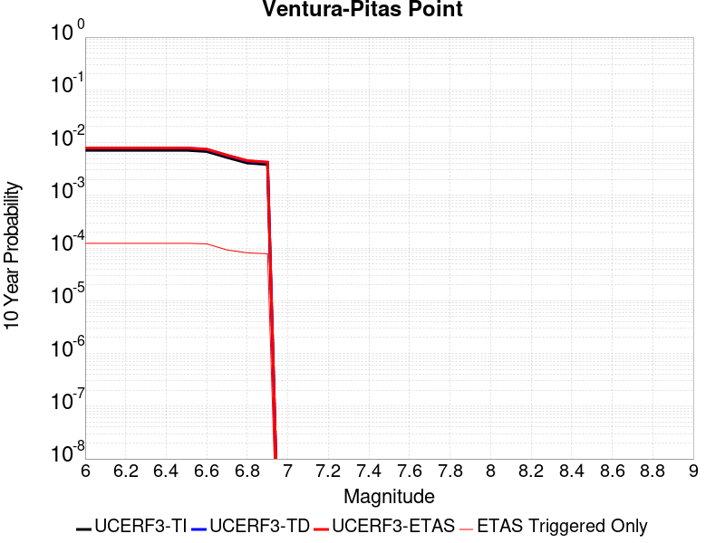 |

| Magnitude | 1 wk TI Prob | 1 wk TD Prob | 1 wk ETAS Prob | 1 wk ETAS/TD Gain | 1 wk ETAS Triggered Only | 1 mo TI Prob | 1 mo TD Prob | 1 mo ETAS Prob | 1 mo ETAS/TD Gain | 1 mo ETAS Triggered Only | 1 yr TI Prob | 1 yr TD Prob | 1 yr ETAS Prob | 1 yr ETAS/TD Gain | 1 yr ETAS Triggered Only | 10 yr TI Prob | 10 yr TD Prob | 10 yr ETAS Prob | 10 yr ETAS/TD Gain | 10 yr ETAS Triggered Only |
|-----|-----|-----|-----|-----|-----|-----|-----|-----|-----|-----|-----|-----|-----|-----|-----|-----|-----|-----|-----|-----|
| 6.0 | 1.3734005E-5 | 1.4989571E-5 | 2.6102369E-5 | 1.7413685 | 1.1112963E-5 | 5.885869E-5 | 6.423993E-5 | 9.757668E-5 | 1.5189412 | 3.333889E-5 | 7.1636896E-4 | 7.819278E-4 | 9.040748E-4 | 1.1562127 | 1.2224259E-4 | 0.00714064 | 0.007800344 | 0.007965738 | 1.0212034 | 1.6669444E-4 |
| 6.1 | 1.3734005E-5 | 1.4989571E-5 | 2.6102369E-5 | 1.7413685 | 1.1112963E-5 | 5.885869E-5 | 6.423993E-5 | 9.757668E-5 | 1.5189412 | 3.333889E-5 | 7.1636896E-4 | 7.819278E-4 | 9.040748E-4 | 1.1562127 | 1.2224259E-4 | 0.00714064 | 0.007800344 | 0.007965738 | 1.0212034 | 1.6669444E-4 |
| 6.2 | 1.3734005E-5 | 1.4989571E-5 | 2.6102369E-5 | 1.7413685 | 1.1112963E-5 | 5.885869E-5 | 6.423993E-5 | 9.757668E-5 | 1.5189412 | 3.333889E-5 | 7.1636896E-4 | 7.819278E-4 | 9.040748E-4 | 1.1562127 | 1.2224259E-4 | 0.00714064 | 0.007800344 | 0.007965738 | 1.0212034 | 1.6669444E-4 |
| 6.3 | 1.3734005E-5 | 1.4989571E-5 | 2.6102369E-5 | 1.7413685 | 1.1112963E-5 | 5.885869E-5 | 6.423993E-5 | 9.757668E-5 | 1.5189412 | 3.333889E-5 | 7.1636896E-4 | 7.819278E-4 | 9.040748E-4 | 1.1562127 | 1.2224259E-4 | 0.00714064 | 0.007800344 | 0.007965738 | 1.0212034 | 1.6669444E-4 |
| 6.4 | 1.3734005E-5 | 1.4989571E-5 | 2.6102369E-5 | 1.7413685 | 1.1112963E-5 | 5.885869E-5 | 6.423993E-5 | 9.757668E-5 | 1.5189412 | 3.333889E-5 | 7.1636896E-4 | 7.819278E-4 | 9.040748E-4 | 1.1562127 | 1.2224259E-4 | 0.00714064 | 0.007800344 | 0.007965738 | 1.0212034 | 1.6669444E-4 |
| 6.5 | 1.3734005E-5 | 1.4989571E-5 | 2.6102369E-5 | 1.7413685 | 1.1112963E-5 | 5.885869E-5 | 6.423993E-5 | 9.757668E-5 | 1.5189412 | 3.333889E-5 | 7.1636896E-4 | 7.819278E-4 | 9.040748E-4 | 1.1562127 | 1.2224259E-4 | 0.00714064 | 0.007800344 | 0.007965738 | 1.0212034 | 1.6669444E-4 |
| 6.6 | 1.3017341E-5 | 1.42015815E-5 | 2.5314388E-5 | 1.7825048 | 1.1112963E-5 | 5.5787412E-5 | 6.0862993E-5 | 9.419985E-5 | 1.5477362 | 3.333889E-5 | 6.7900005E-4 | 7.408419E-4 | 8.6299394E-4 | 1.1648828 | 1.2224259E-4 | 0.006769291 | 0.0073922575 | 0.00755772 | 1.0223832 | 1.6669444E-4 |
| 6.7 | 1.0029534E-5 | 1.09311E-5 | 1.09311E-5 | 1.0 | 0.0 | 4.298301E-5 | 4.6847203E-5 | 6.9072084E-5 | 1.4744122 | 2.2225926E-5 | 5.2319246E-4 | 5.70299E-4 | 6.7025865E-4 | 1.1752758 | 1.0001667E-4 | 0.005219624 | 0.005696553 | 0.005829149 | 1.0232766 | 1.3335556E-4 |
| 6.8 | 7.869905E-6 | 8.563513E-6 | 8.563513E-6 | 1.0 | 0.0 | 3.372773E-5 | 3.6700705E-5 | 4.781326E-5 | 1.3027886 | 1.1112963E-5 | 4.1055772E-4 | 4.4682005E-4 | 5.24576E-4 | 1.1740208 | 7.779074E-5 | 0.0040980005 | 0.004467117 | 0.004566687 | 1.0222895 | 1.0001667E-4 |
| 6.9 | 7.3736396E-6 | 8.021501E-6 | 8.021501E-6 | 1.0 | 0.0 | 3.1600932E-5 | 3.4377863E-5 | 4.5490444E-5 | 1.3232481 | 1.1112963E-5 | 3.8467342E-4 | 4.1855048E-4 | 4.9630867E-4 | 1.1857797 | 7.779074E-5 | 0.003840082 | 0.0041855047 | 0.0042851027 | 1.023796 | 1.0001667E-4 |

## San Jacinto (San Jacinto Valley) rev
*[(top)](#table-of-contents)*

| 1 Week | 1 Month | 1 Year | 10 Year |
|-----|-----|-----|-----|
|  |  |  |  |

| Magnitude | 1 wk TI Prob | 1 wk TD Prob | 1 wk ETAS Prob | 1 wk ETAS/TD Gain | 1 wk ETAS Triggered Only | 1 mo TI Prob | 1 mo TD Prob | 1 mo ETAS Prob | 1 mo ETAS/TD Gain | 1 mo ETAS Triggered Only | 1 yr TI Prob | 1 yr TD Prob | 1 yr ETAS Prob | 1 yr ETAS/TD Gain | 1 yr ETAS Triggered Only | 10 yr TI Prob | 10 yr TD Prob | 10 yr ETAS Prob | 10 yr ETAS/TD Gain | 10 yr ETAS Triggered Only |
|-----|-----|-----|-----|-----|-----|-----|-----|-----|-----|-----|-----|-----|-----|-----|-----|-----|-----|-----|-----|-----|
| 6.0 | 7.806946E-5 | 1.580409E-4 | 1.691521E-4 | 1.070306 | 1.1112963E-5 | 3.345405E-4 | 6.770383E-4 | 6.9924915E-4 | 1.0328059 | 2.2225926E-5 | 0.004065426 | 0.008203736 | 0.00829191 | 1.010748 | 8.8903704E-5 | 0.03991852 | 0.07910823 | 0.07926174 | 1.0019405 | 1.6669444E-4 |
| 6.1 | 7.806946E-5 | 1.580409E-4 | 1.691521E-4 | 1.070306 | 1.1112963E-5 | 3.345405E-4 | 6.770383E-4 | 6.9924915E-4 | 1.0328059 | 2.2225926E-5 | 0.004065426 | 0.008203736 | 0.00829191 | 1.010748 | 8.8903704E-5 | 0.03991852 | 0.07910823 | 0.07926174 | 1.0019405 | 1.6669444E-4 |
| 6.2 | 7.806946E-5 | 1.580409E-4 | 1.691521E-4 | 1.070306 | 1.1112963E-5 | 3.345405E-4 | 6.770383E-4 | 6.9924915E-4 | 1.0328059 | 2.2225926E-5 | 0.004065426 | 0.008203736 | 0.00829191 | 1.010748 | 8.8903704E-5 | 0.03991852 | 0.07910823 | 0.07926174 | 1.0019405 | 1.6669444E-4 |
| 6.3 | 7.806946E-5 | 1.580409E-4 | 1.691521E-4 | 1.070306 | 1.1112963E-5 | 3.345405E-4 | 6.770383E-4 | 6.9924915E-4 | 1.0328059 | 2.2225926E-5 | 0.004065426 | 0.008203736 | 0.00829191 | 1.010748 | 8.8903704E-5 | 0.03991852 | 0.07910823 | 0.07926174 | 1.0019405 | 1.6669444E-4 |
| 6.4 | 7.806946E-5 | 1.580409E-4 | 1.691521E-4 | 1.070306 | 1.1112963E-5 | 3.345405E-4 | 6.770383E-4 | 6.9924915E-4 | 1.0328059 | 2.2225926E-5 | 0.004065426 | 0.008203736 | 0.00829191 | 1.010748 | 8.8903704E-5 | 0.03991852 | 0.07910823 | 0.07926174 | 1.0019405 | 1.6669444E-4 |
| 6.5 | 7.806946E-5 | 1.580409E-4 | 1.691521E-4 | 1.070306 | 1.1112963E-5 | 3.345405E-4 | 6.770383E-4 | 6.9924915E-4 | 1.0328059 | 2.2225926E-5 | 0.004065426 | 0.008203736 | 0.00829191 | 1.010748 | 8.8903704E-5 | 0.03991852 | 0.07910823 | 0.07926174 | 1.0019405 | 1.6669444E-4 |
| 6.6 | 7.8012505E-5 | 1.5793537E-4 | 1.6904657E-4 | 1.0703529 | 1.1112963E-5 | 3.3429646E-4 | 6.765863E-4 | 6.987972E-4 | 1.0328279 | 2.2225926E-5 | 0.004062466 | 0.008198286 | 0.008286462 | 1.0107553 | 8.8903704E-5 | 0.039889984 | 0.079058796 | 0.07921231 | 1.0019418 | 1.6669444E-4 |
| 6.7 | 7.8012505E-5 | 1.5793537E-4 | 1.6904657E-4 | 1.0703529 | 1.1112963E-5 | 3.3429646E-4 | 6.765863E-4 | 6.987972E-4 | 1.0328279 | 2.2225926E-5 | 0.004062466 | 0.008198286 | 0.008286462 | 1.0107553 | 8.8903704E-5 | 0.039889984 | 0.079058796 | 0.07921231 | 1.0019418 | 1.6669444E-4 |
| 6.8 | 7.7891236E-5 | 1.5767448E-4 | 1.687857E-4 | 1.0704693 | 1.1112963E-5 | 3.3377687E-4 | 6.754689E-4 | 6.976798E-4 | 1.0328822 | 2.2225926E-5 | 0.004056163 | 0.0081848195 | 0.008272995 | 1.0107731 | 8.8903704E-5 | 0.039829224 | 0.0789369 | 0.07909044 | 1.001945 | 1.6669444E-4 |
| 6.9 | 7.764062E-5 | 1.5713525E-4 | 1.6824646E-4 | 1.0707111 | 1.1112963E-5 | 3.327031E-4 | 6.731594E-4 | 6.953703E-4 | 1.0329951 | 2.2225926E-5 | 0.0040431386 | 0.008156981 | 0.00824516 | 1.0108101 | 8.8903704E-5 | 0.039703645 | 0.07868492 | 0.0788385 | 1.0019518 | 1.6669444E-4 |
| 7.0 | 5.0739076E-5 | 9.3390074E-5 | 1.04502E-4 | 1.118984 | 1.1112963E-5 | 2.1743505E-4 | 4.0015313E-4 | 4.2237018E-4 | 1.0555214 | 2.2225926E-5 | 0.0026440579 | 0.0048604817 | 0.0049378946 | 1.015927 | 7.779074E-5 | 0.026128192 | 0.04834233 | 0.048469238 | 1.0026252 | 1.3335556E-4 |
| 7.1 | 5.0390987E-5 | 9.2688424E-5 | 1.03800354E-4 | 1.1198848 | 1.1112963E-5 | 2.159435E-4 | 3.9714726E-4 | 4.1936437E-4 | 1.0559417 | 2.2225926E-5 | 0.002625942 | 0.004824109 | 0.004901524 | 1.0160476 | 7.779074E-5 | 0.025951283 | 0.048000354 | 0.04812731 | 1.0026449 | 1.3335556E-4 |
| 7.2 | 4.9789487E-5 | 9.143531E-5 | 1.0254725E-4 | 1.1215279 | 1.1112963E-5 | 2.1336606E-4 | 3.917791E-4 | 4.139963E-4 | 1.0567086 | 2.2225926E-5 | 0.0025946372 | 0.0047591375 | 0.004836558 | 1.0162678 | 7.779074E-5 | 0.025645511 | 0.047391243 | 0.04751828 | 1.0026805 | 1.3335556E-4 |
| 7.3 | 4.9191407E-5 | 9.01359E-5 | 1.0124786E-4 | 1.12328 | 1.1112963E-5 | 2.1080328E-4 | 3.8621208E-4 | 4.0842942E-4 | 1.0575262 | 2.2225926E-5 | 0.002563509 | 0.004691701 | 0.004769127 | 1.0165027 | 7.779074E-5 | 0.025341382 | 0.04674962 | 0.046876743 | 1.0027192 | 1.3335556E-4 |
| 7.4 | 3.3192722E-5 | 5.2610532E-5 | 6.372291E-5 | 1.2112197 | 1.1112963E-5 | 1.4224676E-4 | 2.2545758E-4 | 2.3656804E-4 | 1.0492796 | 1.1112963E-5 | 0.0017304786 | 0.0027420863 | 0.0027642513 | 1.0080832 | 2.2225926E-5 | 0.01717065 | 0.028029768 | 0.028083775 | 1.0019268 | 5.5564815E-5 |
| 7.5 | 2.8249084E-5 | 4.2866195E-5 | 5.397868E-5 | 1.2592366 | 1.1112963E-5 | 1.2106189E-4 | 1.8370226E-4 | 1.9481318E-4 | 1.0604833 | 1.1112963E-5 | 0.0014729318 | 0.0022347996 | 0.0022569757 | 1.0099231 | 2.2225926E-5 | 0.014632072 | 0.023027074 | 0.023081359 | 1.0023575 | 5.5564815E-5 |
| 7.6 | 2.7497194E-5 | 4.146988E-5 | 5.258238E-5 | 1.2679657 | 1.1112963E-5 | 1.17839794E-4 | 1.7771887E-4 | 1.8882986E-4 | 1.06252 | 1.1112963E-5 | 0.0014337553 | 0.0021620982 | 0.002184276 | 1.0102576 | 2.2225926E-5 | 0.0142454 | 0.022306465 | 0.022360789 | 1.0024354 | 5.5564815E-5 |
| 7.7 | 1.673878E-5 | 2.1973781E-5 | 2.1973781E-5 | 1.0 | 0.0 | 7.173566E-5 | 9.417205E-5 | 9.417205E-5 | 1.0 | 0.0 | 8.730317E-4 | 0.0011463144 | 0.0011463144 | 1.0 | 0.0 | 0.008696098 | 0.01216197 | 0.012194904 | 1.002708 | 3.333889E-5 |
| 7.8 | 1.5303123E-6 | 1.9707616E-6 | 1.9707616E-6 | 1.0 | 0.0 | 6.5584645E-6 | 8.446107E-6 | 8.446107E-6 | 1.0 | 0.0 | 7.984638E-5 | 1.0282895E-4 | 1.0282895E-4 | 1.0 | 0.0 | 7.98177E-4 | 0.001066982 | 0.0010780832 | 1.0104042 | 1.1112963E-5 |

## Sierra Madre
*[(top)](#table-of-contents)*

| 1 Week | 1 Month | 1 Year | 10 Year |
|-----|-----|-----|-----|
|  |  |  |  |

| Magnitude | 1 wk TI Prob | 1 wk TD Prob | 1 wk ETAS Prob | 1 wk ETAS/TD Gain | 1 wk ETAS Triggered Only | 1 mo TI Prob | 1 mo TD Prob | 1 mo ETAS Prob | 1 mo ETAS/TD Gain | 1 mo ETAS Triggered Only | 1 yr TI Prob | 1 yr TD Prob | 1 yr ETAS Prob | 1 yr ETAS/TD Gain | 1 yr ETAS Triggered Only | 10 yr TI Prob | 10 yr TD Prob | 10 yr ETAS Prob | 10 yr ETAS/TD Gain | 10 yr ETAS Triggered Only |
|-----|-----|-----|-----|-----|-----|-----|-----|-----|-----|-----|-----|-----|-----|-----|-----|-----|-----|-----|-----|-----|
| 6.0 | 2.62475E-5 | 2.6538886E-5 | 7.098956E-5 | 2.674926 | 4.4451852E-5 | 1.12484435E-4 | 1.1373365E-4 | 1.6929215E-4 | 1.4884965 | 5.5564815E-5 | 0.0013686377 | 0.0013839207 | 0.0014837988 | 1.0721705 | 1.0001667E-4 | 0.01360239 | 0.0137668215 | 0.013920261 | 1.0111456 | 1.5558148E-4 |
| 6.1 | 2.62475E-5 | 2.6538886E-5 | 7.098956E-5 | 2.674926 | 4.4451852E-5 | 1.12484435E-4 | 1.1373365E-4 | 1.6929215E-4 | 1.4884965 | 5.5564815E-5 | 0.0013686377 | 0.0013839207 | 0.0014837988 | 1.0721705 | 1.0001667E-4 | 0.01360239 | 0.0137668215 | 0.013920261 | 1.0111456 | 1.5558148E-4 |
| 6.2 | 2.62475E-5 | 2.6538886E-5 | 7.098956E-5 | 2.674926 | 4.4451852E-5 | 1.12484435E-4 | 1.1373365E-4 | 1.6929215E-4 | 1.4884965 | 5.5564815E-5 | 0.0013686377 | 0.0013839207 | 0.0014837988 | 1.0721705 | 1.0001667E-4 | 0.01360239 | 0.0137668215 | 0.013920261 | 1.0111456 | 1.5558148E-4 |
| 6.3 | 2.62475E-5 | 2.6538886E-5 | 7.098956E-5 | 2.674926 | 4.4451852E-5 | 1.12484435E-4 | 1.1373365E-4 | 1.6929215E-4 | 1.4884965 | 5.5564815E-5 | 0.0013686377 | 0.0013839207 | 0.0014837988 | 1.0721705 | 1.0001667E-4 | 0.01360239 | 0.0137668215 | 0.013920261 | 1.0111456 | 1.5558148E-4 |
| 6.4 | 2.62475E-5 | 2.6538886E-5 | 7.098956E-5 | 2.674926 | 4.4451852E-5 | 1.12484435E-4 | 1.1373365E-4 | 1.6929215E-4 | 1.4884965 | 5.5564815E-5 | 0.0013686377 | 0.0013839207 | 0.0014837988 | 1.0721705 | 1.0001667E-4 | 0.01360239 | 0.0137668215 | 0.013920261 | 1.0111456 | 1.5558148E-4 |
| 6.5 | 2.62475E-5 | 2.6538886E-5 | 7.098956E-5 | 2.674926 | 4.4451852E-5 | 1.12484435E-4 | 1.1373365E-4 | 1.6929215E-4 | 1.4884965 | 5.5564815E-5 | 0.0013686377 | 0.0013839207 | 0.0014837988 | 1.0721705 | 1.0001667E-4 | 0.01360239 | 0.0137668215 | 0.013920261 | 1.0111456 | 1.5558148E-4 |
| 6.6 | 2.3026172E-5 | 2.2750124E-5 | 6.720096E-5 | 2.9538724 | 4.4451852E-5 | 9.867986E-5 | 9.749739E-5 | 1.5305678E-4 | 1.5698552 | 5.5564815E-5 | 0.001200765 | 0.0011864736 | 0.0012863716 | 1.0841974 | 1.0001667E-4 | 0.011942975 | 0.011814732 | 0.011968476 | 1.0130129 | 1.5558148E-4 |
| 6.7 | 2.1771615E-5 | 2.125092E-5 | 6.570183E-5 | 3.0917168 | 4.4451852E-5 | 9.3303584E-5 | 9.107268E-5 | 1.4663243E-4 | 1.6100595 | 5.5564815E-5 | 0.0011353791 | 0.0011083324 | 0.0012082383 | 1.0901407 | 1.0001667E-4 | 0.0112959575 | 0.011041103 | 0.011194966 | 1.0139356 | 1.5558148E-4 |
| 6.8 | 1.8811277E-5 | 1.813049E-5 | 6.258154E-5 | 3.451729 | 4.4451852E-5 | 8.061727E-5 | 7.770026E-5 | 1.3326075E-4 | 1.715062 | 5.5564815E-5 | 9.810732E-4 | 9.4567396E-4 | 0.0010344936 | 1.093922 | 8.8903704E-5 | 0.009767532 | 0.009429028 | 0.009561127 | 1.0140097 | 1.3335556E-4 |
| 6.9 | 1.5745054E-5 | 1.4611581E-5 | 5.9062782E-5 | 4.04219 | 4.4451852E-5 | 6.747706E-5 | 6.262E-5 | 1.0706907E-4 | 1.7098223 | 4.4451852E-5 | 8.2122354E-4 | 7.622106E-4 | 8.39942E-4 | 1.1019816 | 7.779074E-5 | 0.008181954 | 0.007607908 | 0.0077071637 | 1.0130464 | 1.0001667E-4 |
| 7.0 | 1.4540266E-5 | 1.3339557E-5 | 3.5565186E-5 | 2.6661446 | 2.2225926E-5 | 6.231394E-5 | 5.7168716E-5 | 7.939337E-5 | 1.3887556 | 2.2225926E-5 | 7.584081E-4 | 6.958848E-4 | 7.5141096E-4 | 1.0797921 | 5.5564815E-5 | 0.0075582503 | 0.0069488278 | 0.007026078 | 1.011117 | 7.779074E-5 |
| 7.1 | 1.2284893E-5 | 1.0947419E-5 | 3.3173103E-5 | 3.0302212 | 2.2225926E-5 | 5.264848E-5 | 4.6917092E-5 | 6.914198E-5 | 1.4737055 | 2.2225926E-5 | 6.4080674E-4 | 5.7114166E-4 | 6.1556813E-4 | 1.0777854 | 4.4451852E-5 | 0.0063896202 | 0.0057081603 | 0.0057634083 | 1.0096787 | 5.5564815E-5 |
| 7.2 | 5.5504106E-6 | 3.3297895E-6 | 3.3297895E-6 | 1.0 | 0.0 | 2.3787257E-5 | 1.4270517E-5 | 1.4270517E-5 | 1.0 | 0.0 | 2.8957136E-4 | 1.7374175E-4 | 1.7374175E-4 | 1.0 | 0.0 | 0.002891943 | 0.0017411701 | 0.0017411701 | 1.0 | 0.0 |

## Channel Islands Thrust
*[(top)](#table-of-contents)*

| 1 Week | 1 Month | 1 Year | 10 Year |
|-----|-----|-----|-----|
|  | 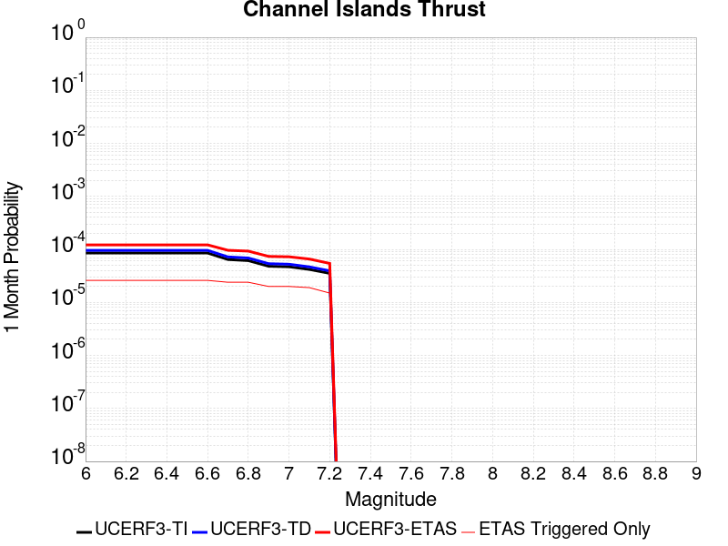 |  |  |

| Magnitude | 1 wk TI Prob | 1 wk TD Prob | 1 wk ETAS Prob | 1 wk ETAS/TD Gain | 1 wk ETAS Triggered Only | 1 mo TI Prob | 1 mo TD Prob | 1 mo ETAS Prob | 1 mo ETAS/TD Gain | 1 mo ETAS Triggered Only | 1 yr TI Prob | 1 yr TD Prob | 1 yr ETAS Prob | 1 yr ETAS/TD Gain | 1 yr ETAS Triggered Only | 10 yr TI Prob | 10 yr TD Prob | 10 yr ETAS Prob | 10 yr ETAS/TD Gain | 10 yr ETAS Triggered Only |
|-----|-----|-----|-----|-----|-----|-----|-----|-----|-----|-----|-----|-----|-----|-----|-----|-----|-----|-----|-----|-----|
| 6.0 | 1.9940422E-5 | 2.234876E-5 | 4.457419E-5 | 1.9944816 | 2.2225926E-5 | 8.545615E-5 | 9.577758E-5 | 1.1800137E-4 | 1.2320355 | 2.2225926E-5 | 0.001039932 | 0.0011655908 | 0.0012765909 | 1.0952308 | 1.1112963E-4 | 0.010350789 | 0.0116068935 | 0.011738701 | 1.011356 | 1.3335556E-4 |
| 6.1 | 1.9940422E-5 | 2.234876E-5 | 4.457419E-5 | 1.9944816 | 2.2225926E-5 | 8.545615E-5 | 9.577758E-5 | 1.1800137E-4 | 1.2320355 | 2.2225926E-5 | 0.001039932 | 0.0011655908 | 0.0012765909 | 1.0952308 | 1.1112963E-4 | 0.010350789 | 0.0116068935 | 0.011738701 | 1.011356 | 1.3335556E-4 |
| 6.2 | 1.9940422E-5 | 2.234876E-5 | 4.457419E-5 | 1.9944816 | 2.2225926E-5 | 8.545615E-5 | 9.577758E-5 | 1.1800137E-4 | 1.2320355 | 2.2225926E-5 | 0.001039932 | 0.0011655908 | 0.0012765909 | 1.0952308 | 1.1112963E-4 | 0.010350789 | 0.0116068935 | 0.011738701 | 1.011356 | 1.3335556E-4 |
| 6.3 | 1.9940422E-5 | 2.234876E-5 | 4.457419E-5 | 1.9944816 | 2.2225926E-5 | 8.545615E-5 | 9.577758E-5 | 1.1800137E-4 | 1.2320355 | 2.2225926E-5 | 0.001039932 | 0.0011655908 | 0.0012765909 | 1.0952308 | 1.1112963E-4 | 0.010350789 | 0.0116068935 | 0.011738701 | 1.011356 | 1.3335556E-4 |
| 6.4 | 1.9940422E-5 | 2.234876E-5 | 4.457419E-5 | 1.9944816 | 2.2225926E-5 | 8.545615E-5 | 9.577758E-5 | 1.1800137E-4 | 1.2320355 | 2.2225926E-5 | 0.001039932 | 0.0011655908 | 0.0012765909 | 1.0952308 | 1.1112963E-4 | 0.010350789 | 0.0116068935 | 0.011738701 | 1.011356 | 1.3335556E-4 |
| 6.5 | 1.9940422E-5 | 2.234876E-5 | 4.457419E-5 | 1.9944816 | 2.2225926E-5 | 8.545615E-5 | 9.577758E-5 | 1.1800137E-4 | 1.2320355 | 2.2225926E-5 | 0.001039932 | 0.0011655908 | 0.0012765909 | 1.0952308 | 1.1112963E-4 | 0.010350789 | 0.0116068935 | 0.011738701 | 1.011356 | 1.3335556E-4 |
| 6.6 | 1.9940422E-5 | 2.234876E-5 | 4.457419E-5 | 1.9944816 | 2.2225926E-5 | 8.545615E-5 | 9.577758E-5 | 1.1800137E-4 | 1.2320355 | 2.2225926E-5 | 0.001039932 | 0.0011655908 | 0.0012765909 | 1.0952308 | 1.1112963E-4 | 0.010350789 | 0.0116068935 | 0.011738701 | 1.011356 | 1.3335556E-4 |
| 6.7 | 1.5039115E-5 | 1.6832886E-5 | 3.905844E-5 | 2.320365 | 2.2225926E-5 | 6.445176E-5 | 7.213959E-5 | 9.436392E-5 | 1.3080739 | 2.2225926E-5 | 7.844176E-4 | 8.780601E-4 | 9.6688577E-4 | 1.1011612 | 8.8903704E-5 | 0.007816545 | 0.00875716 | 0.008867317 | 1.012579 | 1.1112963E-4 |
| 6.8 | 1.4337753E-5 | 1.605477E-5 | 3.828034E-5 | 2.3843594 | 2.2225926E-5 | 6.1446066E-5 | 6.8804984E-5 | 9.102938E-5 | 1.3230057 | 2.2225926E-5 | 7.4784906E-4 | 8.3749247E-4 | 9.15218E-4 | 1.0928075 | 7.779074E-5 | 0.007453373 | 0.008354535 | 0.0084537165 | 1.0118716 | 1.0001667E-4 |
| 6.9 | 1.1226918E-5 | 1.2540004E-5 | 3.476565E-5 | 2.7723796 | 2.2225926E-5 | 4.8114474E-5 | 5.3742377E-5 | 7.596711E-5 | 1.413542 | 2.2225926E-5 | 5.856363E-4 | 6.542256E-4 | 7.319654E-4 | 1.1188273 | 7.779074E-5 | 0.0058409534 | 0.0065336456 | 0.0066219685 | 1.0135182 | 8.8903704E-5 |
| 7.0 | 1.0975239E-5 | 1.2259085E-5 | 3.448474E-5 | 2.8129945 | 2.2225926E-5 | 4.703589E-5 | 5.253849E-5 | 7.476325E-5 | 1.4230186 | 2.2225926E-5 | 5.725115E-4 | 6.395769E-4 | 7.1731786E-4 | 1.1215507 | 7.779074E-5 | 0.005710388 | 0.006388001 | 0.006476337 | 1.0138284 | 8.8903704E-5 |
| 7.1 | 9.782044E-6 | 1.0913239E-5 | 3.3138924E-5 | 3.03658 | 2.2225926E-5 | 4.1922372E-5 | 4.6770787E-5 | 6.899567E-5 | 1.4751873 | 2.2225926E-5 | 5.102853E-4 | 5.693929E-4 | 6.360327E-4 | 1.1170366 | 6.667778E-5 | 0.0050911517 | 0.005689868 | 0.0057561663 | 1.011652 | 6.667778E-5 |
| 7.2 | 8.244729E-6 | 9.190053E-6 | 2.0302914E-5 | 2.209227 | 1.1112963E-5 | 3.5334073E-5 | 3.938594E-5 | 5.0498464E-5 | 1.2821444 | 1.1112963E-5 | 4.3010744E-4 | 4.7952382E-4 | 5.35062E-4 | 1.1158195 | 5.5564815E-5 | 0.004292759 | 0.0047952384 | 0.0048505366 | 1.011532 | 5.5564815E-5 |

## Clamshell-Sawpit
*[(top)](#table-of-contents)*

| 1 Week | 1 Month | 1 Year | 10 Year |
|-----|-----|-----|-----|
|  |  |  |  |

| Magnitude | 1 wk TI Prob | 1 wk TD Prob | 1 wk ETAS Prob | 1 wk ETAS/TD Gain | 1 wk ETAS Triggered Only | 1 mo TI Prob | 1 mo TD Prob | 1 mo ETAS Prob | 1 mo ETAS/TD Gain | 1 mo ETAS Triggered Only | 1 yr TI Prob | 1 yr TD Prob | 1 yr ETAS Prob | 1 yr ETAS/TD Gain | 1 yr ETAS Triggered Only | 10 yr TI Prob | 10 yr TD Prob | 10 yr ETAS Prob | 10 yr ETAS/TD Gain | 10 yr ETAS Triggered Only |
|-----|-----|-----|-----|-----|-----|-----|-----|-----|-----|-----|-----|-----|-----|-----|-----|-----|-----|-----|-----|-----|
| 6.0 | 1.1112015E-5 | 1.2128283E-5 | 3.435394E-5 | 2.8325477 | 2.2225926E-5 | 4.7622052E-5 | 5.1978353E-5 | 8.531551E-5 | 1.6413661 | 3.333889E-5 | 5.796442E-4 | 6.328364E-4 | 7.216839E-4 | 1.1403956 | 8.8903704E-5 | 0.0057813465 | 0.0063283644 | 0.006460876 | 1.0209394 | 1.3335556E-4 |
| 6.1 | 1.1112015E-5 | 1.2128283E-5 | 3.435394E-5 | 2.8325477 | 2.2225926E-5 | 4.7622052E-5 | 5.1978353E-5 | 8.531551E-5 | 1.6413661 | 3.333889E-5 | 5.796442E-4 | 6.328364E-4 | 7.216839E-4 | 1.1403956 | 8.8903704E-5 | 0.0057813465 | 0.0063283644 | 0.006460876 | 1.0209394 | 1.3335556E-4 |
| 6.2 | 1.1112015E-5 | 1.2128283E-5 | 3.435394E-5 | 2.8325477 | 2.2225926E-5 | 4.7622052E-5 | 5.1978353E-5 | 8.531551E-5 | 1.6413661 | 3.333889E-5 | 5.796442E-4 | 6.328364E-4 | 7.216839E-4 | 1.1403956 | 8.8903704E-5 | 0.0057813465 | 0.0063283644 | 0.006460876 | 1.0209394 | 1.3335556E-4 |
| 6.3 | 1.1112015E-5 | 1.2128283E-5 | 3.435394E-5 | 2.8325477 | 2.2225926E-5 | 4.7622052E-5 | 5.1978353E-5 | 8.531551E-5 | 1.6413661 | 3.333889E-5 | 5.796442E-4 | 6.328364E-4 | 7.216839E-4 | 1.1403956 | 8.8903704E-5 | 0.0057813465 | 0.0063283644 | 0.006460876 | 1.0209394 | 1.3335556E-4 |
| 6.4 | 1.1112015E-5 | 1.2128283E-5 | 3.435394E-5 | 2.8325477 | 2.2225926E-5 | 4.7622052E-5 | 5.1978353E-5 | 8.531551E-5 | 1.6413661 | 3.333889E-5 | 5.796442E-4 | 6.328364E-4 | 7.216839E-4 | 1.1403956 | 8.8903704E-5 | 0.0057813465 | 0.0063283644 | 0.006460876 | 1.0209394 | 1.3335556E-4 |
| 6.5 | 1.1112015E-5 | 1.2128283E-5 | 3.435394E-5 | 2.8325477 | 2.2225926E-5 | 4.7622052E-5 | 5.1978353E-5 | 8.531551E-5 | 1.6413661 | 3.333889E-5 | 5.796442E-4 | 6.328364E-4 | 7.216839E-4 | 1.1403956 | 8.8903704E-5 | 0.0057813465 | 0.0063283644 | 0.006460876 | 1.0209394 | 1.3335556E-4 |

## Chino alt 1
*[(top)](#table-of-contents)*

| 1 Week | 1 Month | 1 Year | 10 Year |
|-----|-----|-----|-----|
|  |  |  |  |

| Magnitude | 1 wk TI Prob | 1 wk TD Prob | 1 wk ETAS Prob | 1 wk ETAS/TD Gain | 1 wk ETAS Triggered Only | 1 mo TI Prob | 1 mo TD Prob | 1 mo ETAS Prob | 1 mo ETAS/TD Gain | 1 mo ETAS Triggered Only | 1 yr TI Prob | 1 yr TD Prob | 1 yr ETAS Prob | 1 yr ETAS/TD Gain | 1 yr ETAS Triggered Only | 10 yr TI Prob | 10 yr TD Prob | 10 yr ETAS Prob | 10 yr ETAS/TD Gain | 10 yr ETAS Triggered Only |
|-----|-----|-----|-----|-----|-----|-----|-----|-----|-----|-----|-----|-----|-----|-----|-----|-----|-----|-----|-----|-----|
| 6.0 | 2.1665033E-5 | 2.5894844E-5 | 4.8120193E-5 | 1.8582926 | 2.2225926E-5 | 9.2846836E-5 | 1.10977904E-4 | 1.5542482E-4 | 1.4005024 | 4.4451852E-5 | 0.001129824 | 0.0013511538 | 0.0014621334 | 1.0821369 | 1.1112963E-4 | 0.01124097 | 0.013511333 | 0.013642886 | 1.0097365 | 1.3335556E-4 |
| 6.1 | 2.1665033E-5 | 2.5894844E-5 | 4.8120193E-5 | 1.8582926 | 2.2225926E-5 | 9.2846836E-5 | 1.10977904E-4 | 1.5542482E-4 | 1.4005024 | 4.4451852E-5 | 0.001129824 | 0.0013511538 | 0.0014621334 | 1.0821369 | 1.1112963E-4 | 0.01124097 | 0.013511333 | 0.013642886 | 1.0097365 | 1.3335556E-4 |
| 6.2 | 2.1665033E-5 | 2.5894844E-5 | 4.8120193E-5 | 1.8582926 | 2.2225926E-5 | 9.2846836E-5 | 1.10977904E-4 | 1.5542482E-4 | 1.4005024 | 4.4451852E-5 | 0.001129824 | 0.0013511538 | 0.0014621334 | 1.0821369 | 1.1112963E-4 | 0.01124097 | 0.013511333 | 0.013642886 | 1.0097365 | 1.3335556E-4 |
| 6.3 | 2.1665033E-5 | 2.5894844E-5 | 4.8120193E-5 | 1.8582926 | 2.2225926E-5 | 9.2846836E-5 | 1.10977904E-4 | 1.5542482E-4 | 1.4005024 | 4.4451852E-5 | 0.001129824 | 0.0013511538 | 0.0014621334 | 1.0821369 | 1.1112963E-4 | 0.01124097 | 0.013511333 | 0.013642886 | 1.0097365 | 1.3335556E-4 |
| 6.4 | 2.1665033E-5 | 2.5894844E-5 | 4.8120193E-5 | 1.8582926 | 2.2225926E-5 | 9.2846836E-5 | 1.10977904E-4 | 1.5542482E-4 | 1.4005024 | 4.4451852E-5 | 0.001129824 | 0.0013511538 | 0.0014621334 | 1.0821369 | 1.1112963E-4 | 0.01124097 | 0.013511333 | 0.013642886 | 1.0097365 | 1.3335556E-4 |
| 6.5 | 2.1665033E-5 | 2.5894844E-5 | 4.8120193E-5 | 1.8582926 | 2.2225926E-5 | 9.2846836E-5 | 1.10977904E-4 | 1.5542482E-4 | 1.4005024 | 4.4451852E-5 | 0.001129824 | 0.0013511538 | 0.0014621334 | 1.0821369 | 1.1112963E-4 | 0.01124097 | 0.013511333 | 0.013642886 | 1.0097365 | 1.3335556E-4 |

## Elysian Park (Upper)
*[(top)](#table-of-contents)*

| 1 Week | 1 Month | 1 Year | 10 Year |
|-----|-----|-----|-----|
|  |  |  |  |

| Magnitude | 1 wk TI Prob | 1 wk TD Prob | 1 wk ETAS Prob | 1 wk ETAS/TD Gain | 1 wk ETAS Triggered Only | 1 mo TI Prob | 1 mo TD Prob | 1 mo ETAS Prob | 1 mo ETAS/TD Gain | 1 mo ETAS Triggered Only | 1 yr TI Prob | 1 yr TD Prob | 1 yr ETAS Prob | 1 yr ETAS/TD Gain | 1 yr ETAS Triggered Only | 10 yr TI Prob | 10 yr TD Prob | 10 yr ETAS Prob | 10 yr ETAS/TD Gain | 10 yr ETAS Triggered Only |
|-----|-----|-----|-----|-----|-----|-----|-----|-----|-----|-----|-----|-----|-----|-----|-----|-----|-----|-----|-----|-----|
| 6.0 | 2.4686513E-5 | 3.0328916E-5 | 6.36668E-5 | 2.099211 | 3.333889E-5 | 1.0579505E-4 | 1.2998107E-4 | 1.6331562E-4 | 1.256457 | 3.333889E-5 | 0.0012872935 | 0.0015825125 | 0.0016823709 | 1.0631012 | 1.0001667E-4 | 0.01279862 | 0.015824199 | 0.015944507 | 1.0076028 | 1.2224259E-4 |
| 6.1 | 2.4686513E-5 | 3.0328916E-5 | 6.36668E-5 | 2.099211 | 3.333889E-5 | 1.0579505E-4 | 1.2998107E-4 | 1.6331562E-4 | 1.256457 | 3.333889E-5 | 0.0012872935 | 0.0015825125 | 0.0016823709 | 1.0631012 | 1.0001667E-4 | 0.01279862 | 0.015824199 | 0.015944507 | 1.0076028 | 1.2224259E-4 |
| 6.2 | 2.4686513E-5 | 3.0328916E-5 | 6.36668E-5 | 2.099211 | 3.333889E-5 | 1.0579505E-4 | 1.2998107E-4 | 1.6331562E-4 | 1.256457 | 3.333889E-5 | 0.0012872935 | 0.0015825125 | 0.0016823709 | 1.0631012 | 1.0001667E-4 | 0.01279862 | 0.015824199 | 0.015944507 | 1.0076028 | 1.2224259E-4 |
| 6.3 | 2.4686513E-5 | 3.0328916E-5 | 6.36668E-5 | 2.099211 | 3.333889E-5 | 1.0579505E-4 | 1.2998107E-4 | 1.6331562E-4 | 1.256457 | 3.333889E-5 | 0.0012872935 | 0.0015825125 | 0.0016823709 | 1.0631012 | 1.0001667E-4 | 0.01279862 | 0.015824199 | 0.015944507 | 1.0076028 | 1.2224259E-4 |
| 6.4 | 2.4686513E-5 | 3.0328916E-5 | 6.36668E-5 | 2.099211 | 3.333889E-5 | 1.0579505E-4 | 1.2998107E-4 | 1.6331562E-4 | 1.256457 | 3.333889E-5 | 0.0012872935 | 0.0015825125 | 0.0016823709 | 1.0631012 | 1.0001667E-4 | 0.01279862 | 0.015824199 | 0.015944507 | 1.0076028 | 1.2224259E-4 |
| 6.5 | 2.4686513E-5 | 3.0328916E-5 | 6.36668E-5 | 2.099211 | 3.333889E-5 | 1.0579505E-4 | 1.2998107E-4 | 1.6331562E-4 | 1.256457 | 3.333889E-5 | 0.0012872935 | 0.0015825125 | 0.0016823709 | 1.0631012 | 1.0001667E-4 | 0.01279862 | 0.015824199 | 0.015944507 | 1.0076028 | 1.2224259E-4 |

## Simi-Santa Rosa
*[(top)](#table-of-contents)*

| 1 Week | 1 Month | 1 Year | 10 Year |
|-----|-----|-----|-----|
|  |  |  |  |

| Magnitude | 1 wk TI Prob | 1 wk TD Prob | 1 wk ETAS Prob | 1 wk ETAS/TD Gain | 1 wk ETAS Triggered Only | 1 mo TI Prob | 1 mo TD Prob | 1 mo ETAS Prob | 1 mo ETAS/TD Gain | 1 mo ETAS Triggered Only | 1 yr TI Prob | 1 yr TD Prob | 1 yr ETAS Prob | 1 yr ETAS/TD Gain | 1 yr ETAS Triggered Only | 10 yr TI Prob | 10 yr TD Prob | 10 yr ETAS Prob | 10 yr ETAS/TD Gain | 10 yr ETAS Triggered Only |
|-----|-----|-----|-----|-----|-----|-----|-----|-----|-----|-----|-----|-----|-----|-----|-----|-----|-----|-----|-----|-----|
| 6.0 | 1.765222E-5 | 1.996643E-5 | 1.996643E-5 | 1.0 | 0.0 | 7.565018E-5 | 8.556876E-5 | 1.0779279E-4 | 1.2597213 | 2.2225926E-5 | 9.206518E-4 | 0.0010415068 | 0.0011192166 | 1.0746127 | 7.779074E-5 | 0.009168469 | 0.010386396 | 0.010496371 | 1.0105884 | 1.1112963E-4 |
| 6.1 | 1.765222E-5 | 1.996643E-5 | 1.996643E-5 | 1.0 | 0.0 | 7.565018E-5 | 8.556876E-5 | 1.0779279E-4 | 1.2597213 | 2.2225926E-5 | 9.206518E-4 | 0.0010415068 | 0.0011192166 | 1.0746127 | 7.779074E-5 | 0.009168469 | 0.010386396 | 0.010496371 | 1.0105884 | 1.1112963E-4 |
| 6.2 | 1.765222E-5 | 1.996643E-5 | 1.996643E-5 | 1.0 | 0.0 | 7.565018E-5 | 8.556876E-5 | 1.0779279E-4 | 1.2597213 | 2.2225926E-5 | 9.206518E-4 | 0.0010415068 | 0.0011192166 | 1.0746127 | 7.779074E-5 | 0.009168469 | 0.010386396 | 0.010496371 | 1.0105884 | 1.1112963E-4 |
| 6.3 | 1.765222E-5 | 1.996643E-5 | 1.996643E-5 | 1.0 | 0.0 | 7.565018E-5 | 8.556876E-5 | 1.0779279E-4 | 1.2597213 | 2.2225926E-5 | 9.206518E-4 | 0.0010415068 | 0.0011192166 | 1.0746127 | 7.779074E-5 | 0.009168469 | 0.010386396 | 0.010496371 | 1.0105884 | 1.1112963E-4 |
| 6.4 | 1.765222E-5 | 1.996643E-5 | 1.996643E-5 | 1.0 | 0.0 | 7.565018E-5 | 8.556876E-5 | 1.0779279E-4 | 1.2597213 | 2.2225926E-5 | 9.206518E-4 | 0.0010415068 | 0.0011192166 | 1.0746127 | 7.779074E-5 | 0.009168469 | 0.010386396 | 0.010496371 | 1.0105884 | 1.1112963E-4 |
| 6.5 | 1.765222E-5 | 1.996643E-5 | 1.996643E-5 | 1.0 | 0.0 | 7.565018E-5 | 8.556876E-5 | 1.0779279E-4 | 1.2597213 | 2.2225926E-5 | 9.206518E-4 | 0.0010415068 | 0.0011192166 | 1.0746127 | 7.779074E-5 | 0.009168469 | 0.010386396 | 0.010496371 | 1.0105884 | 1.1112963E-4 |
| 6.6 | 1.4207836E-5 | 1.605233E-5 | 1.605233E-5 | 1.0 | 0.0 | 6.0889306E-5 | 6.8795016E-5 | 9.1019414E-5 | 1.3230524 | 2.2225926E-5 | 7.4107514E-4 | 8.374578E-4 | 9.040797E-4 | 1.0795527 | 6.667778E-5 | 0.0073860865 | 0.0083626695 | 0.00846185 | 1.0118599 | 1.0001667E-4 |
| 6.7 | 1.1077219E-5 | 1.2498523E-5 | 1.2498523E-5 | 1.0 | 0.0 | 4.747293E-5 | 5.3565098E-5 | 6.4677464E-5 | 1.2074554 | 1.1112963E-5 | 5.7782966E-4 | 6.521551E-4 | 7.076836E-4 | 1.0851463 | 5.5564815E-5 | 0.0057632946 | 0.0065215505 | 0.0066098743 | 1.0135434 | 8.8903704E-5 |
| 6.8 | 1.1077219E-5 | 1.2498523E-5 | 1.2498523E-5 | 1.0 | 0.0 | 4.747293E-5 | 5.3565098E-5 | 6.4677464E-5 | 1.2074554 | 1.1112963E-5 | 5.7782966E-4 | 6.521551E-4 | 7.076836E-4 | 1.0851463 | 5.5564815E-5 | 0.0057632946 | 0.0065215505 | 0.0066098743 | 1.0135434 | 8.8903704E-5 |

## Helendale-So Lockhart
*[(top)](#table-of-contents)*

| 1 Week | 1 Month | 1 Year | 10 Year |
|-----|-----|-----|-----|
|  |  |  |  |

| Magnitude | 1 wk TI Prob | 1 wk TD Prob | 1 wk ETAS Prob | 1 wk ETAS/TD Gain | 1 wk ETAS Triggered Only | 1 mo TI Prob | 1 mo TD Prob | 1 mo ETAS Prob | 1 mo ETAS/TD Gain | 1 mo ETAS Triggered Only | 1 yr TI Prob | 1 yr TD Prob | 1 yr ETAS Prob | 1 yr ETAS/TD Gain | 1 yr ETAS Triggered Only | 10 yr TI Prob | 10 yr TD Prob | 10 yr ETAS Prob | 10 yr ETAS/TD Gain | 10 yr ETAS Triggered Only |
|-----|-----|-----|-----|-----|-----|-----|-----|-----|-----|-----|-----|-----|-----|-----|-----|-----|-----|-----|-----|-----|
| 6.0 | 7.171715E-6 | 7.4314485E-6 | 7.4314485E-6 | 1.0 | 0.0 | 3.073556E-5 | 3.184873E-5 | 5.4073946E-5 | 1.697837 | 2.2225926E-5 | 3.7414118E-4 | 3.8769832E-4 | 4.432416E-4 | 1.1432642 | 5.5564815E-5 | 0.003735119 | 0.0038711112 | 0.0039818105 | 1.0285963 | 1.1112963E-4 |
| 6.1 | 7.171715E-6 | 7.4314485E-6 | 7.4314485E-6 | 1.0 | 0.0 | 3.073556E-5 | 3.184873E-5 | 5.4073946E-5 | 1.697837 | 2.2225926E-5 | 3.7414118E-4 | 3.8769832E-4 | 4.432416E-4 | 1.1432642 | 5.5564815E-5 | 0.003735119 | 0.0038711112 | 0.0039818105 | 1.0285963 | 1.1112963E-4 |
| 6.2 | 7.171715E-6 | 7.4314485E-6 | 7.4314485E-6 | 1.0 | 0.0 | 3.073556E-5 | 3.184873E-5 | 5.4073946E-5 | 1.697837 | 2.2225926E-5 | 3.7414118E-4 | 3.8769832E-4 | 4.432416E-4 | 1.1432642 | 5.5564815E-5 | 0.003735119 | 0.0038711112 | 0.0039818105 | 1.0285963 | 1.1112963E-4 |
| 6.3 | 7.171715E-6 | 7.4314485E-6 | 7.4314485E-6 | 1.0 | 0.0 | 3.073556E-5 | 3.184873E-5 | 5.4073946E-5 | 1.697837 | 2.2225926E-5 | 3.7414118E-4 | 3.8769832E-4 | 4.432416E-4 | 1.1432642 | 5.5564815E-5 | 0.003735119 | 0.0038711112 | 0.0039818105 | 1.0285963 | 1.1112963E-4 |
| 6.4 | 7.171715E-6 | 7.4314485E-6 | 7.4314485E-6 | 1.0 | 0.0 | 3.073556E-5 | 3.184873E-5 | 5.4073946E-5 | 1.697837 | 2.2225926E-5 | 3.7414118E-4 | 3.8769832E-4 | 4.432416E-4 | 1.1432642 | 5.5564815E-5 | 0.003735119 | 0.0038711112 | 0.0039818105 | 1.0285963 | 1.1112963E-4 |
| 6.5 | 7.171715E-6 | 7.4314485E-6 | 7.4314485E-6 | 1.0 | 0.0 | 3.073556E-5 | 3.184873E-5 | 5.4073946E-5 | 1.697837 | 2.2225926E-5 | 3.7414118E-4 | 3.8769832E-4 | 4.432416E-4 | 1.1432642 | 5.5564815E-5 | 0.003735119 | 0.0038711112 | 0.0039818105 | 1.0285963 | 1.1112963E-4 |
| 6.6 | 6.5580157E-6 | 6.7948727E-6 | 6.7948727E-6 | 1.0 | 0.0 | 2.810548E-5 | 2.9120609E-5 | 5.1345887E-5 | 1.7632148 | 2.2225926E-5 | 3.421305E-4 | 3.5449475E-4 | 4.1003985E-4 | 1.1566881 | 5.5564815E-5 | 0.0034160423 | 0.0035401797 | 0.0036398422 | 1.0281519 | 1.0001667E-4 |
| 6.7 | 5.6879685E-6 | 5.8928526E-6 | 5.8928526E-6 | 1.0 | 0.0 | 2.4376779E-5 | 2.5254889E-5 | 4.7480255E-5 | 1.8800421 | 2.2225926E-5 | 2.9674688E-4 | 3.074438E-4 | 3.6299156E-4 | 1.1806761 | 5.5564815E-5 | 0.0029635092 | 0.0030710634 | 0.0031486151 | 1.0252525 | 7.779074E-5 |
| 6.8 | 4.958099E-6 | 5.135111E-6 | 5.135111E-6 | 1.0 | 0.0 | 2.1248823E-5 | 2.2007483E-5 | 3.3120203E-5 | 1.5049518 | 1.1112963E-5 | 2.586737E-4 | 2.6791706E-4 | 3.12357E-4 | 1.165872 | 4.4451852E-5 | 0.0025837282 | 0.0026768132 | 0.0027322292 | 1.0207022 | 5.5564815E-5 |
| 6.9 | 4.3792215E-6 | 4.5342804E-6 | 4.5342804E-6 | 1.0 | 0.0 | 1.8767958E-5 | 1.9432535E-5 | 3.054528E-5 | 1.5718629 | 1.1112963E-5 | 2.2847592E-4 | 2.3657428E-4 | 2.8101561E-4 | 1.1878536 | 4.4451852E-5 | 0.0022824116 | 0.0023640923 | 0.0024195258 | 1.0234481 | 5.5564815E-5 |
| 7.0 | 3.858262E-6 | 3.9935144E-6 | 3.9935144E-6 | 1.0 | 0.0 | 1.6535305E-5 | 1.7115E-5 | 2.8227772E-5 | 1.6493002 | 1.1112963E-5 | 2.0129874E-4 | 2.0836401E-4 | 2.528066E-4 | 1.2132931 | 4.4451852E-5 | 0.0020111648 | 0.0020825516 | 0.0021380007 | 1.0266255 | 5.5564815E-5 |
| 7.1 | 3.3854772E-6 | 3.502769E-6 | 3.502769E-6 | 1.0 | 0.0 | 1.4509107E-5 | 1.501183E-5 | 2.6124626E-5 | 1.7402693 | 1.1112963E-5 | 1.7663406E-4 | 1.827625E-4 | 2.2720623E-4 | 1.2431775 | 4.4451852E-5 | 0.0017649373 | 0.0018269841 | 0.0018824474 | 1.0303578 | 5.5564815E-5 |
| 7.2 | 2.9527619E-6 | 3.05382E-6 | 3.05382E-6 | 1.0 | 0.0 | 1.2654632E-5 | 1.3087783E-5 | 2.42006E-5 | 1.8490986 | 1.1112963E-5 | 1.5405925E-4 | 1.5934087E-4 | 2.0378563E-4 | 1.2789289 | 4.4451852E-5 | 0.0015395249 | 0.0015931253 | 0.0016486016 | 1.0348223 | 5.5564815E-5 |
| 7.3 | 2.553375E-6 | 2.6399916E-6 | 2.6399916E-6 | 1.0 | 0.0 | 1.0942989E-5 | 1.13142505E-5 | 1.13142505E-5 | 1.0 | 0.0 | 1.3322275E-4 | 1.3775099E-4 | 1.710853E-4 | 1.2419895 | 3.333889E-5 | 0.0013314291 | 0.0013775099 | 0.0014219006 | 1.0322253 | 4.4451852E-5 |

## Whittier alt 1
*[(top)](#table-of-contents)*

| 1 Week | 1 Month | 1 Year | 10 Year |
|-----|-----|-----|-----|
|  |  |  |  |

| Magnitude | 1 wk TI Prob | 1 wk TD Prob | 1 wk ETAS Prob | 1 wk ETAS/TD Gain | 1 wk ETAS Triggered Only | 1 mo TI Prob | 1 mo TD Prob | 1 mo ETAS Prob | 1 mo ETAS/TD Gain | 1 mo ETAS Triggered Only | 1 yr TI Prob | 1 yr TD Prob | 1 yr ETAS Prob | 1 yr ETAS/TD Gain | 1 yr ETAS Triggered Only | 10 yr TI Prob | 10 yr TD Prob | 10 yr ETAS Prob | 10 yr ETAS/TD Gain | 10 yr ETAS Triggered Only |
|-----|-----|-----|-----|-----|-----|-----|-----|-----|-----|-----|-----|-----|-----|-----|-----|-----|-----|-----|-----|-----|
| 6.0 | 1.9677844E-5 | 3.0721494E-5 | 6.405936E-5 | 2.0851643 | 3.333889E-5 | 8.4330895E-5 | 1.3166165E-4 | 1.6499615E-4 | 1.2531831 | 3.333889E-5 | 0.001026245 | 0.0016026449 | 0.0016803109 | 1.0484612 | 7.779074E-5 | 0.010215186 | 0.015995702 | 0.016094118 | 1.0061527 | 1.0001667E-4 |
| 6.1 | 1.9677844E-5 | 3.0721494E-5 | 6.405936E-5 | 2.0851643 | 3.333889E-5 | 8.4330895E-5 | 1.3166165E-4 | 1.6499615E-4 | 1.2531831 | 3.333889E-5 | 0.001026245 | 0.0016026449 | 0.0016803109 | 1.0484612 | 7.779074E-5 | 0.010215186 | 0.015995702 | 0.016094118 | 1.0061527 | 1.0001667E-4 |
| 6.2 | 1.9677844E-5 | 3.0721494E-5 | 6.405936E-5 | 2.0851643 | 3.333889E-5 | 8.4330895E-5 | 1.3166165E-4 | 1.6499615E-4 | 1.2531831 | 3.333889E-5 | 0.001026245 | 0.0016026449 | 0.0016803109 | 1.0484612 | 7.779074E-5 | 0.010215186 | 0.015995702 | 0.016094118 | 1.0061527 | 1.0001667E-4 |
| 6.3 | 1.9677844E-5 | 3.0721494E-5 | 6.405936E-5 | 2.0851643 | 3.333889E-5 | 8.4330895E-5 | 1.3166165E-4 | 1.6499615E-4 | 1.2531831 | 3.333889E-5 | 0.001026245 | 0.0016026449 | 0.0016803109 | 1.0484612 | 7.779074E-5 | 0.010215186 | 0.015995702 | 0.016094118 | 1.0061527 | 1.0001667E-4 |
| 6.4 | 1.9677844E-5 | 3.0721494E-5 | 6.405936E-5 | 2.0851643 | 3.333889E-5 | 8.4330895E-5 | 1.3166165E-4 | 1.6499615E-4 | 1.2531831 | 3.333889E-5 | 0.001026245 | 0.0016026449 | 0.0016803109 | 1.0484612 | 7.779074E-5 | 0.010215186 | 0.015995702 | 0.016094118 | 1.0061527 | 1.0001667E-4 |
| 6.5 | 1.9677844E-5 | 3.0721494E-5 | 6.405936E-5 | 2.0851643 | 3.333889E-5 | 8.4330895E-5 | 1.3166165E-4 | 1.6499615E-4 | 1.2531831 | 3.333889E-5 | 0.001026245 | 0.0016026449 | 0.0016803109 | 1.0484612 | 7.779074E-5 | 0.010215186 | 0.015995702 | 0.016094118 | 1.0061527 | 1.0001667E-4 |
| 6.6 | 1.9631225E-5 | 3.06427E-5 | 6.3980566E-5 | 2.0879548 | 3.333889E-5 | 8.413111E-5 | 1.3132399E-4 | 1.646585E-4 | 1.2538341 | 3.333889E-5 | 0.0010238149 | 0.00159854 | 0.0016762064 | 1.0485858 | 7.779074E-5 | 0.010191108 | 0.015955312 | 0.016053734 | 1.0061685 | 1.0001667E-4 |
| 6.7 | 1.9536663E-5 | 3.0504027E-5 | 6.38419E-5 | 2.0929008 | 3.333889E-5 | 8.372587E-5 | 1.3072975E-4 | 1.6406427E-4 | 1.2549881 | 3.333889E-5 | 0.0010188858 | 0.0015913156 | 0.0016689826 | 1.0488068 | 7.779074E-5 | 0.010142268 | 0.015884183 | 0.015982611 | 1.0061966 | 1.0001667E-4 |
| 6.8 | 1.9439643E-5 | 3.0352345E-5 | 6.3690226E-5 | 2.0983624 | 3.333889E-5 | 8.331009E-5 | 1.3007974E-4 | 1.634143E-4 | 1.2562624 | 3.333889E-5 | 0.0010138283 | 0.0015834133 | 0.001661081 | 1.0490507 | 7.779074E-5 | 0.010092155 | 0.015806418 | 0.015904853 | 1.0062276 | 1.0001667E-4 |
| 6.9 | 1.9363486E-5 | 3.025448E-5 | 6.359236E-5 | 2.1019156 | 3.333889E-5 | 8.298373E-5 | 1.2966036E-4 | 1.6299493E-4 | 1.2570914 | 3.333889E-5 | 0.0010098586 | 0.0015783148 | 0.0016559828 | 1.0492095 | 7.779074E-5 | 0.010052818 | 0.0157561 | 0.015854541 | 1.0062478 | 1.0001667E-4 |
| 7.0 | 3.152724E-6 | 4.1925437E-6 | 4.1925437E-6 | 1.0 | 0.0 | 1.3511604E-5 | 1.7967934E-5 | 1.7967934E-5 | 1.0 | 0.0 | 1.6449137E-4 | 2.1873988E-4 | 2.1873988E-4 | 1.0 | 0.0 | 0.0016436966 | 0.0021877585 | 0.0021877585 | 1.0 | 0.0 |
| 7.1 | 3.0699127E-6 | 4.0761943E-6 | 4.0761943E-6 | 1.0 | 0.0 | 1.3156702E-5 | 1.74693E-5 | 1.74693E-5 | 1.0 | 0.0 | 1.6017107E-4 | 2.1267022E-4 | 2.1267022E-4 | 1.0 | 0.0 | 0.0016005568 | 0.0021271154 | 0.0021271154 | 1.0 | 0.0 |
| 7.2 | 2.2585555E-6 | 2.9159935E-6 | 2.9159935E-6 | 1.0 | 0.0 | 9.679487E-6 | 1.249706E-5 | 1.249706E-5 | 1.0 | 0.0 | 1.1784139E-4 | 1.5214195E-4 | 1.5214195E-4 | 1.0 | 0.0 | 0.0011777892 | 0.0015224252 | 0.0015224252 | 1.0 | 0.0 |
| 7.3 | 2.1766068E-6 | 2.8138447E-6 | 2.8138447E-6 | 1.0 | 0.0 | 9.3282815E-6 | 1.2059283E-5 | 1.2059283E-5 | 1.0 | 0.0 | 1.13565904E-4 | 1.4681274E-4 | 1.4681274E-4 | 1.0 | 0.0 | 0.0011350788 | 0.0014690856 | 0.0014690856 | 1.0 | 0.0 |
| 7.4 | 2.0680952E-6 | 2.676193E-6 | 2.676193E-6 | 1.0 | 0.0 | 8.863235E-6 | 1.1469352E-5 | 1.1469352E-5 | 1.0 | 0.0 | 1.0790454E-4 | 1.3963127E-4 | 1.3963127E-4 | 1.0 | 0.0 | 0.0010785216 | 0.0013971858 | 0.0013971858 | 1.0 | 0.0 |
| 7.5 | 1.4388213E-6 | 1.9265901E-6 | 1.9265901E-6 | 1.0 | 0.0 | 6.1663623E-6 | 8.256791E-6 | 8.256791E-6 | 1.0 | 0.0 | 7.507287E-5 | 1.0052218E-4 | 1.0052218E-4 | 1.0 | 0.0 | 7.504752E-4 | 0.0010053911 | 0.0010053911 | 1.0 | 0.0 |
| 7.6 | 1.2179905E-6 | 1.5985206E-6 | 1.5985206E-6 | 1.0 | 0.0 | 5.219949E-6 | 6.850787E-6 | 6.850787E-6 | 1.0 | 0.0 | 6.355102E-5 | 8.3405495E-5 | 8.3405495E-5 | 1.0 | 0.0 | 6.353285E-4 | 8.343059E-4 | 8.343059E-4 | 1.0 | 0.0 |
| 7.7 | 9.55754E-7 | 1.2252901E-6 | 1.2252901E-6 | 1.0 | 0.0 | 4.096082E-6 | 5.251235E-6 | 5.251235E-6 | 1.0 | 0.0 | 4.9868657E-5 | 6.393224E-5 | 6.393224E-5 | 1.0 | 0.0 | 4.985747E-4 | 6.396533E-4 | 6.396533E-4 | 1.0 | 0.0 |
| 7.8 | 2.1601753E-7 | 2.7489222E-7 | 2.7489222E-7 | 1.0 | 0.0 | 9.257891E-7 | 1.1781094E-6 | 1.1781094E-6 | 1.0 | 0.0 | 1.1271423E-5 | 1.4343483E-5 | 1.4343483E-5 | 1.0 | 0.0 | 1.1270852E-4 | 1.435847E-4 | 1.435847E-4 | 1.0 | 0.0 |

## Los Alamos 2011 CFM
*[(top)](#table-of-contents)*

| 1 Week | 1 Month | 1 Year | 10 Year |
|-----|-----|-----|-----|
|  |  |  |  |

| Magnitude | 1 wk TI Prob | 1 wk TD Prob | 1 wk ETAS Prob | 1 wk ETAS/TD Gain | 1 wk ETAS Triggered Only | 1 mo TI Prob | 1 mo TD Prob | 1 mo ETAS Prob | 1 mo ETAS/TD Gain | 1 mo ETAS Triggered Only | 1 yr TI Prob | 1 yr TD Prob | 1 yr ETAS Prob | 1 yr ETAS/TD Gain | 1 yr ETAS Triggered Only | 10 yr TI Prob | 10 yr TD Prob | 10 yr ETAS Prob | 10 yr ETAS/TD Gain | 10 yr ETAS Triggered Only |
|-----|-----|-----|-----|-----|-----|-----|-----|-----|-----|-----|-----|-----|-----|-----|-----|-----|-----|-----|-----|-----|
| 6.0 | 1.3678262E-5 | 1.5031193E-5 | 5.9482376E-5 | 3.9572628 | 4.4451852E-5 | 5.8619804E-5 | 6.441852E-5 | 1.08867505E-4 | 1.6900033 | 4.4451852E-5 | 7.134624E-4 | 7.841395E-4 | 8.3966076E-4 | 1.0708053 | 5.5564815E-5 | 0.0071117613 | 0.007826112 | 0.0079253465 | 1.0126798 | 1.0001667E-4 |
| 6.1 | 1.3678262E-5 | 1.5031193E-5 | 5.9482376E-5 | 3.9572628 | 4.4451852E-5 | 5.8619804E-5 | 6.441852E-5 | 1.08867505E-4 | 1.6900033 | 4.4451852E-5 | 7.134624E-4 | 7.841395E-4 | 8.3966076E-4 | 1.0708053 | 5.5564815E-5 | 0.0071117613 | 0.007826112 | 0.0079253465 | 1.0126798 | 1.0001667E-4 |
| 6.2 | 1.3678262E-5 | 1.5031193E-5 | 5.9482376E-5 | 3.9572628 | 4.4451852E-5 | 5.8619804E-5 | 6.441852E-5 | 1.08867505E-4 | 1.6900033 | 4.4451852E-5 | 7.134624E-4 | 7.841395E-4 | 8.3966076E-4 | 1.0708053 | 5.5564815E-5 | 0.0071117613 | 0.007826112 | 0.0079253465 | 1.0126798 | 1.0001667E-4 |
| 6.3 | 1.3678262E-5 | 1.5031193E-5 | 5.9482376E-5 | 3.9572628 | 4.4451852E-5 | 5.8619804E-5 | 6.441852E-5 | 1.08867505E-4 | 1.6900033 | 4.4451852E-5 | 7.134624E-4 | 7.841395E-4 | 8.3966076E-4 | 1.0708053 | 5.5564815E-5 | 0.0071117613 | 0.007826112 | 0.0079253465 | 1.0126798 | 1.0001667E-4 |
| 6.4 | 1.3678262E-5 | 1.5031193E-5 | 5.9482376E-5 | 3.9572628 | 4.4451852E-5 | 5.8619804E-5 | 6.441852E-5 | 1.08867505E-4 | 1.6900033 | 4.4451852E-5 | 7.134624E-4 | 7.841395E-4 | 8.3966076E-4 | 1.0708053 | 5.5564815E-5 | 0.0071117613 | 0.007826112 | 0.0079253465 | 1.0126798 | 1.0001667E-4 |
| 6.5 | 1.3678262E-5 | 1.5031193E-5 | 5.9482376E-5 | 3.9572628 | 4.4451852E-5 | 5.8619804E-5 | 6.441852E-5 | 1.08867505E-4 | 1.6900033 | 4.4451852E-5 | 7.134624E-4 | 7.841395E-4 | 8.3966076E-4 | 1.0708053 | 5.5564815E-5 | 0.0071117613 | 0.007826112 | 0.0079253465 | 1.0126798 | 1.0001667E-4 |
| 6.6 | 1.3678262E-5 | 1.5031193E-5 | 5.9482376E-5 | 3.9572628 | 4.4451852E-5 | 5.8619804E-5 | 6.441852E-5 | 1.08867505E-4 | 1.6900033 | 4.4451852E-5 | 7.134624E-4 | 7.841395E-4 | 8.3966076E-4 | 1.0708053 | 5.5564815E-5 | 0.0071117613 | 0.007826112 | 0.0079253465 | 1.0126798 | 1.0001667E-4 |
| 6.7 | 8.282411E-6 | 9.085969E-6 | 3.1311694E-5 | 3.446159 | 2.2225926E-5 | 3.5495563E-5 | 3.893987E-5 | 6.116493E-5 | 1.5707533 | 2.2225926E-5 | 4.3207276E-4 | 4.740929E-4 | 5.0741597E-4 | 1.0702881 | 3.333889E-5 | 0.0043123364 | 0.004740929 | 0.0047962307 | 1.0116646 | 5.5564815E-5 |
| 6.8 | 8.282411E-6 | 9.085969E-6 | 3.1311694E-5 | 3.446159 | 2.2225926E-5 | 3.5495563E-5 | 3.893987E-5 | 6.116493E-5 | 1.5707533 | 2.2225926E-5 | 4.3207276E-4 | 4.740929E-4 | 5.0741597E-4 | 1.0702881 | 3.333889E-5 | 0.0043123364 | 0.004740929 | 0.0047962307 | 1.0116646 | 5.5564815E-5 |

## Santa Cruz Island
*[(top)](#table-of-contents)*

| 1 Week | 1 Month | 1 Year | 10 Year |
|-----|-----|-----|-----|
|  |  |  |  |

| Magnitude | 1 wk TI Prob | 1 wk TD Prob | 1 wk ETAS Prob | 1 wk ETAS/TD Gain | 1 wk ETAS Triggered Only | 1 mo TI Prob | 1 mo TD Prob | 1 mo ETAS Prob | 1 mo ETAS/TD Gain | 1 mo ETAS Triggered Only | 1 yr TI Prob | 1 yr TD Prob | 1 yr ETAS Prob | 1 yr ETAS/TD Gain | 1 yr ETAS Triggered Only | 10 yr TI Prob | 10 yr TD Prob | 10 yr ETAS Prob | 10 yr ETAS/TD Gain | 10 yr ETAS Triggered Only |
|-----|-----|-----|-----|-----|-----|-----|-----|-----|-----|-----|-----|-----|-----|-----|-----|-----|-----|-----|-----|-----|
| 6.0 | 1.4571279E-5 | 1.590773E-5 | 1.590773E-5 | 1.0 | 0.0 | 6.2446845E-5 | 6.817458E-5 | 6.817458E-5 | 1.0 | 0.0 | 7.600251E-4 | 8.2977675E-4 | 8.7419176E-4 | 1.0535264 | 4.4451852E-5 | 0.00757431 | 0.008273421 | 0.008361589 | 1.0106568 | 8.8903704E-5 |
| 6.1 | 1.4571279E-5 | 1.590773E-5 | 1.590773E-5 | 1.0 | 0.0 | 6.2446845E-5 | 6.817458E-5 | 6.817458E-5 | 1.0 | 0.0 | 7.600251E-4 | 8.2977675E-4 | 8.7419176E-4 | 1.0535264 | 4.4451852E-5 | 0.00757431 | 0.008273421 | 0.008361589 | 1.0106568 | 8.8903704E-5 |
| 6.2 | 1.4571279E-5 | 1.590773E-5 | 1.590773E-5 | 1.0 | 0.0 | 6.2446845E-5 | 6.817458E-5 | 6.817458E-5 | 1.0 | 0.0 | 7.600251E-4 | 8.2977675E-4 | 8.7419176E-4 | 1.0535264 | 4.4451852E-5 | 0.00757431 | 0.008273421 | 0.008361589 | 1.0106568 | 8.8903704E-5 |
| 6.3 | 1.4571279E-5 | 1.590773E-5 | 1.590773E-5 | 1.0 | 0.0 | 6.2446845E-5 | 6.817458E-5 | 6.817458E-5 | 1.0 | 0.0 | 7.600251E-4 | 8.2977675E-4 | 8.7419176E-4 | 1.0535264 | 4.4451852E-5 | 0.00757431 | 0.008273421 | 0.008361589 | 1.0106568 | 8.8903704E-5 |
| 6.4 | 1.4571279E-5 | 1.590773E-5 | 1.590773E-5 | 1.0 | 0.0 | 6.2446845E-5 | 6.817458E-5 | 6.817458E-5 | 1.0 | 0.0 | 7.600251E-4 | 8.2977675E-4 | 8.7419176E-4 | 1.0535264 | 4.4451852E-5 | 0.00757431 | 0.008273421 | 0.008361589 | 1.0106568 | 8.8903704E-5 |
| 6.5 | 1.4571279E-5 | 1.590773E-5 | 1.590773E-5 | 1.0 | 0.0 | 6.2446845E-5 | 6.817458E-5 | 6.817458E-5 | 1.0 | 0.0 | 7.600251E-4 | 8.2977675E-4 | 8.7419176E-4 | 1.0535264 | 4.4451852E-5 | 0.00757431 | 0.008273421 | 0.008361589 | 1.0106568 | 8.8903704E-5 |
| 6.6 | 1.2903651E-5 | 1.4078563E-5 | 1.4078563E-5 | 1.0 | 0.0 | 5.530019E-5 | 6.033568E-5 | 6.033568E-5 | 1.0 | 0.0 | 6.730718E-4 | 7.344058E-4 | 7.677202E-4 | 1.0453624 | 3.333889E-5 | 0.006710368 | 0.0073263342 | 0.0074035553 | 1.0105401 | 7.779074E-5 |
| 6.7 | 1.1244336E-5 | 1.2259967E-5 | 1.2259967E-5 | 1.0 | 0.0 | 4.8189122E-5 | 5.2542026E-5 | 5.2542026E-5 | 1.0 | 0.0 | 5.8654463E-4 | 6.395773E-4 | 6.728949E-4 | 1.0520931 | 3.333889E-5 | 0.0058499887 | 0.0063838377 | 0.006461132 | 1.0121077 | 7.779074E-5 |
| 6.8 | 9.568355E-6 | 1.0419911E-5 | 1.0419911E-5 | 1.0 | 0.0 | 4.100659E-5 | 4.465636E-5 | 4.465636E-5 | 1.0 | 0.0 | 4.991409E-4 | 5.4362084E-4 | 5.658347E-4 | 1.0408628 | 2.2225926E-5 | 0.0049802125 | 0.0054293126 | 0.0054624705 | 1.0061072 | 3.333889E-5 |
| 6.9 | 8.213362E-6 | 8.934158E-6 | 8.934158E-6 | 1.0 | 0.0 | 3.5199646E-5 | 3.8289054E-5 | 3.8289054E-5 | 1.0 | 0.0 | 4.2847142E-4 | 4.6613417E-4 | 4.883497E-4 | 1.0476592 | 2.2225926E-5 | 0.0042764624 | 0.0046579046 | 0.004691088 | 1.0071242 | 3.333889E-5 |
| 7.0 | 6.972259E-6 | 7.5758644E-6 | 7.5758644E-6 | 1.0 | 0.0 | 2.9880768E-5 | 3.2467946E-5 | 3.2467946E-5 | 1.0 | 0.0 | 3.637376E-4 | 3.9528962E-4 | 4.1750676E-4 | 1.0562047 | 2.2225926E-5 | 0.0036314281 | 0.003952149 | 0.003985356 | 1.0084023 | 3.333889E-5 |
| 7.1 | 6.5867994E-6 | 7.155847E-6 | 7.155847E-6 | 1.0 | 0.0 | 2.8228835E-5 | 3.0667914E-5 | 3.0667914E-5 | 1.0 | 0.0 | 3.4363187E-4 | 3.7338186E-4 | 3.955995E-4 | 1.0595038 | 2.2225926E-5 | 0.0034310098 | 0.0037338187 | 0.003767033 | 1.0088955 | 3.333889E-5 |

## San Jacinto (Anza) rev
*[(top)](#table-of-contents)*

| 1 Week | 1 Month | 1 Year | 10 Year |
|-----|-----|-----|-----|
|  |  |  |  |

| Magnitude | 1 wk TI Prob | 1 wk TD Prob | 1 wk ETAS Prob | 1 wk ETAS/TD Gain | 1 wk ETAS Triggered Only | 1 mo TI Prob | 1 mo TD Prob | 1 mo ETAS Prob | 1 mo ETAS/TD Gain | 1 mo ETAS Triggered Only | 1 yr TI Prob | 1 yr TD Prob | 1 yr ETAS Prob | 1 yr ETAS/TD Gain | 1 yr ETAS Triggered Only | 10 yr TI Prob | 10 yr TD Prob | 10 yr ETAS Prob | 10 yr ETAS/TD Gain | 10 yr ETAS Triggered Only |
|-----|-----|-----|-----|-----|-----|-----|-----|-----|-----|-----|-----|-----|-----|-----|-----|-----|-----|-----|-----|-----|
| 6.0 | 7.9249476E-5 | 1.2833404E-4 | 1.5055711E-4 | 1.1731658 | 2.2225926E-5 | 3.3959642E-4 | 5.4991845E-4 | 5.721321E-4 | 1.0403945 | 2.2225926E-5 | 0.00412675 | 0.0066802585 | 0.006713375 | 1.0049573 | 3.333889E-5 | 0.04050952 | 0.067083985 | 0.06715656 | 1.0010818 | 7.779074E-5 |
| 6.1 | 7.9249476E-5 | 1.2833404E-4 | 1.5055711E-4 | 1.1731658 | 2.2225926E-5 | 3.3959642E-4 | 5.4991845E-4 | 5.721321E-4 | 1.0403945 | 2.2225926E-5 | 0.00412675 | 0.0066802585 | 0.006713375 | 1.0049573 | 3.333889E-5 | 0.04050952 | 0.067083985 | 0.06715656 | 1.0010818 | 7.779074E-5 |
| 6.2 | 7.9249476E-5 | 1.2833404E-4 | 1.5055711E-4 | 1.1731658 | 2.2225926E-5 | 3.3959642E-4 | 5.4991845E-4 | 5.721321E-4 | 1.0403945 | 2.2225926E-5 | 0.00412675 | 0.0066802585 | 0.006713375 | 1.0049573 | 3.333889E-5 | 0.04050952 | 0.067083985 | 0.06715656 | 1.0010818 | 7.779074E-5 |
| 6.3 | 7.9249476E-5 | 1.2833404E-4 | 1.5055711E-4 | 1.1731658 | 2.2225926E-5 | 3.3959642E-4 | 5.4991845E-4 | 5.721321E-4 | 1.0403945 | 2.2225926E-5 | 0.00412675 | 0.0066802585 | 0.006713375 | 1.0049573 | 3.333889E-5 | 0.04050952 | 0.067083985 | 0.06715656 | 1.0010818 | 7.779074E-5 |
| 6.4 | 7.9249476E-5 | 1.2833404E-4 | 1.5055711E-4 | 1.1731658 | 2.2225926E-5 | 3.3959642E-4 | 5.4991845E-4 | 5.721321E-4 | 1.0403945 | 2.2225926E-5 | 0.00412675 | 0.0066802585 | 0.006713375 | 1.0049573 | 3.333889E-5 | 0.04050952 | 0.067083985 | 0.06715656 | 1.0010818 | 7.779074E-5 |
| 6.5 | 7.9249476E-5 | 1.2833404E-4 | 1.5055711E-4 | 1.1731658 | 2.2225926E-5 | 3.3959642E-4 | 5.4991845E-4 | 5.721321E-4 | 1.0403945 | 2.2225926E-5 | 0.00412675 | 0.0066802585 | 0.006713375 | 1.0049573 | 3.333889E-5 | 0.04050952 | 0.067083985 | 0.06715656 | 1.0010818 | 7.779074E-5 |
| 6.6 | 7.913556E-5 | 1.2821962E-4 | 1.5044269E-4 | 1.1733204 | 2.2225926E-5 | 3.3910832E-4 | 5.494282E-4 | 5.7164195E-4 | 1.0404305 | 2.2225926E-5 | 0.00412083 | 0.006674327 | 0.0067074434 | 1.0049617 | 3.333889E-5 | 0.04045248 | 0.067026526 | 0.0670991 | 1.0010828 | 7.779074E-5 |
| 6.7 | 7.843403E-5 | 1.2742344E-4 | 1.4964654E-4 | 1.1744035 | 2.2225926E-5 | 3.3610253E-4 | 5.460175E-4 | 5.682313E-4 | 1.0406833 | 2.2225926E-5 | 0.0040843724 | 0.0066330545 | 0.0066661723 | 1.0049928 | 3.333889E-5 | 0.04010115 | 0.0666332 | 0.06670581 | 1.0010897 | 7.779074E-5 |
| 6.8 | 7.825213E-5 | 1.2717218E-4 | 1.4939529E-4 | 1.1747481 | 2.2225926E-5 | 3.3532316E-4 | 5.449411E-4 | 5.6715496E-4 | 1.0407637 | 2.2225926E-5 | 0.004074919 | 0.00662003 | 0.0066531477 | 1.0050027 | 3.333889E-5 | 0.04001003 | 0.06650948 | 0.0665821 | 1.0010918 | 7.779074E-5 |
| 6.9 | 7.788025E-5 | 1.2661066E-4 | 1.4883376E-4 | 1.1755233 | 2.2225926E-5 | 3.3372978E-4 | 5.4253556E-4 | 5.647494E-4 | 1.0409446 | 2.2225926E-5 | 0.004055592 | 0.0065909196 | 0.0066240383 | 1.0050249 | 3.333889E-5 | 0.03982372 | 0.06623408 | 0.06630672 | 1.0010967 | 7.779074E-5 |
| 7.0 | 7.723858E-5 | 1.2564783E-4 | 1.4787096E-4 | 1.1768684 | 2.2225926E-5 | 3.309805E-4 | 5.3841085E-4 | 5.606248E-4 | 1.0412583 | 2.2225926E-5 | 0.0040222434 | 0.006541004 | 0.006574125 | 1.0050635 | 3.333889E-5 | 0.03950216 | 0.065760486 | 0.06583316 | 1.0011052 | 7.779074E-5 |
| 7.1 | 7.661684E-5 | 1.246636E-4 | 1.4688676E-4 | 1.178265 | 2.2225926E-5 | 3.2831656E-4 | 5.3419446E-4 | 5.5640854E-4 | 1.0415843 | 2.2225926E-5 | 0.0039899293 | 0.0064899763 | 0.0065230993 | 1.0051036 | 3.333889E-5 | 0.039190482 | 0.06527789 | 0.06535061 | 1.0011139 | 7.779074E-5 |
| 7.2 | 7.571461E-5 | 1.2320194E-4 | 1.4542513E-4 | 1.1803802 | 2.2225926E-5 | 3.2445084E-4 | 5.279328E-4 | 5.50147E-4 | 1.0420777 | 2.2225926E-5 | 0.003943036 | 0.0064141913 | 0.0064473166 | 1.0051644 | 3.333889E-5 | 0.038738023 | 0.06456287 | 0.06463564 | 1.0011271 | 7.779074E-5 |
| 7.3 | 7.427039E-5 | 1.20714394E-4 | 1.4293764E-4 | 1.1840976 | 2.2225926E-5 | 3.1826284E-4 | 5.172761E-4 | 5.3949055E-4 | 1.042945 | 2.2225926E-5 | 0.0038679668 | 0.0062852004 | 0.00631833 | 1.005271 | 3.333889E-5 | 0.038013313 | 0.063324034 | 0.0633969 | 1.0011506 | 7.779074E-5 |
| 7.4 | 7.3478965E-5 | 1.1931325E-4 | 1.4153653E-4 | 1.1862599 | 2.2225926E-5 | 3.1487184E-4 | 5.1127357E-4 | 5.334881E-4 | 1.0434495 | 2.2225926E-5 | 0.0038268273 | 0.006212538 | 0.00624567 | 1.0053331 | 3.333889E-5 | 0.037615944 | 0.06262941 | 0.06270233 | 1.0011643 | 7.779074E-5 |
| 7.5 | 6.7516885E-5 | 1.08003216E-4 | 1.3022673E-4 | 1.2057673 | 2.2225926E-5 | 2.8932598E-4 | 4.6281965E-4 | 4.850353E-4 | 1.0480007 | 2.2225926E-5 | 0.003516855 | 0.005625739 | 0.0056588906 | 1.0058928 | 3.333889E-5 | 0.034617163 | 0.057019595 | 0.05709295 | 1.0012865 | 7.779074E-5 |
| 7.6 | 2.8268712E-5 | 4.2655167E-5 | 5.3767657E-5 | 1.2605191 | 1.1112963E-5 | 1.21146004E-4 | 1.8279799E-4 | 1.9390893E-4 | 1.0607826 | 1.1112963E-5 | 0.0014739545 | 0.0022238137 | 0.00224599 | 1.0099723 | 2.2225926E-5 | 0.014642165 | 0.022920644 | 0.022974936 | 1.0023687 | 5.5564815E-5 |
| 7.7 | 1.673878E-5 | 2.1973781E-5 | 2.1973781E-5 | 1.0 | 0.0 | 7.173566E-5 | 9.417205E-5 | 9.417205E-5 | 1.0 | 0.0 | 8.730317E-4 | 0.0011463144 | 0.0011463144 | 1.0 | 0.0 | 0.008696098 | 0.01216197 | 0.012194904 | 1.002708 | 3.333889E-5 |
| 7.8 | 1.5303123E-6 | 1.9707616E-6 | 1.9707616E-6 | 1.0 | 0.0 | 6.5584645E-6 | 8.446107E-6 | 8.446107E-6 | 1.0 | 0.0 | 7.984638E-5 | 1.0282895E-4 | 1.0282895E-4 | 1.0 | 0.0 | 7.98177E-4 | 0.001066982 | 0.0010780832 | 1.0104042 | 1.1112963E-5 |

## Elsinore (Stepovers Combined)
*[(top)](#table-of-contents)*

| 1 Week | 1 Month | 1 Year | 10 Year |
|-----|-----|-----|-----|
|  |  |  |  |

| Magnitude | 1 wk TI Prob | 1 wk TD Prob | 1 wk ETAS Prob | 1 wk ETAS/TD Gain | 1 wk ETAS Triggered Only | 1 mo TI Prob | 1 mo TD Prob | 1 mo ETAS Prob | 1 mo ETAS/TD Gain | 1 mo ETAS Triggered Only | 1 yr TI Prob | 1 yr TD Prob | 1 yr ETAS Prob | 1 yr ETAS/TD Gain | 1 yr ETAS Triggered Only | 10 yr TI Prob | 10 yr TD Prob | 10 yr ETAS Prob | 10 yr ETAS/TD Gain | 10 yr ETAS Triggered Only |
|-----|-----|-----|-----|-----|-----|-----|-----|-----|-----|-----|-----|-----|-----|-----|-----|-----|-----|-----|-----|-----|
| 6.0 | 6.646544E-5 | 8.957985E-5 | 1.1180379E-4 | 1.2480907 | 2.2225926E-5 | 2.8482082E-4 | 3.8387964E-4 | 4.0609704E-4 | 1.057876 | 2.2225926E-5 | 0.00346218 | 0.0046677003 | 0.0047119446 | 1.0094788 | 4.4451852E-5 | 0.03408735 | 0.046230808 | 0.046294402 | 1.0013756 | 6.667778E-5 |
| 6.1 | 6.646544E-5 | 8.957985E-5 | 1.1180379E-4 | 1.2480907 | 2.2225926E-5 | 2.8482082E-4 | 3.8387964E-4 | 4.0609704E-4 | 1.057876 | 2.2225926E-5 | 0.00346218 | 0.0046677003 | 0.0047119446 | 1.0094788 | 4.4451852E-5 | 0.03408735 | 0.046230808 | 0.046294402 | 1.0013756 | 6.667778E-5 |
| 6.2 | 6.646544E-5 | 8.957985E-5 | 1.1180379E-4 | 1.2480907 | 2.2225926E-5 | 2.8482082E-4 | 3.8387964E-4 | 4.0609704E-4 | 1.057876 | 2.2225926E-5 | 0.00346218 | 0.0046677003 | 0.0047119446 | 1.0094788 | 4.4451852E-5 | 0.03408735 | 0.046230808 | 0.046294402 | 1.0013756 | 6.667778E-5 |
| 6.3 | 6.646544E-5 | 8.957985E-5 | 1.1180379E-4 | 1.2480907 | 2.2225926E-5 | 2.8482082E-4 | 3.8387964E-4 | 4.0609704E-4 | 1.057876 | 2.2225926E-5 | 0.00346218 | 0.0046677003 | 0.0047119446 | 1.0094788 | 4.4451852E-5 | 0.03408735 | 0.046230808 | 0.046294402 | 1.0013756 | 6.667778E-5 |
| 6.4 | 6.646544E-5 | 8.957985E-5 | 1.1180379E-4 | 1.2480907 | 2.2225926E-5 | 2.8482082E-4 | 3.8387964E-4 | 4.0609704E-4 | 1.057876 | 2.2225926E-5 | 0.00346218 | 0.0046677003 | 0.0047119446 | 1.0094788 | 4.4451852E-5 | 0.03408735 | 0.046230808 | 0.046294402 | 1.0013756 | 6.667778E-5 |
| 6.5 | 6.646544E-5 | 8.957985E-5 | 1.1180379E-4 | 1.2480907 | 2.2225926E-5 | 2.8482082E-4 | 3.8387964E-4 | 4.0609704E-4 | 1.057876 | 2.2225926E-5 | 0.00346218 | 0.0046677003 | 0.0047119446 | 1.0094788 | 4.4451852E-5 | 0.03408735 | 0.046230808 | 0.046294402 | 1.0013756 | 6.667778E-5 |
| 6.6 | 6.646544E-5 | 8.957985E-5 | 1.1180379E-4 | 1.2480907 | 2.2225926E-5 | 2.8482082E-4 | 3.8387964E-4 | 4.0609704E-4 | 1.057876 | 2.2225926E-5 | 0.00346218 | 0.0046677003 | 0.0047119446 | 1.0094788 | 4.4451852E-5 | 0.03408735 | 0.046230808 | 0.046294402 | 1.0013756 | 6.667778E-5 |
| 6.7 | 6.642995E-5 | 8.952384E-5 | 1.1174778E-4 | 1.248246 | 2.2225926E-5 | 2.8466873E-4 | 3.8363968E-4 | 4.0585708E-4 | 1.0579121 | 2.2225926E-5 | 0.0034603344 | 0.0046647936 | 0.004709038 | 1.0094848 | 4.4451852E-5 | 0.03406946 | 0.046203177 | 0.04626677 | 1.0013765 | 6.667778E-5 |
| 6.8 | 6.636925E-5 | 8.943652E-5 | 1.11660454E-4 | 1.2484884 | 2.2225926E-5 | 2.8440863E-4 | 3.8326555E-4 | 4.0548295E-4 | 1.0579687 | 2.2225926E-5 | 0.0034571777 | 0.004660258 | 0.004704503 | 1.0094941 | 4.4451852E-5 | 0.034038864 | 0.04615963 | 0.046223227 | 1.0013778 | 6.667778E-5 |
| 6.9 | 2.99202E-5 | 3.4639877E-5 | 4.575246E-5 | 1.320803 | 1.1112963E-5 | 1.2822312E-4 | 1.4844954E-4 | 1.5956086E-4 | 1.0748491 | 1.1112963E-5 | 0.0015599986 | 0.001806118 | 0.0018172108 | 1.0061419 | 1.1112963E-5 | 0.015490928 | 0.018018924 | 0.018040748 | 1.0012113 | 2.2225926E-5 |
| 7.0 | 2.9867753E-5 | 3.4571654E-5 | 4.568423E-5 | 1.3214362 | 1.1112963E-5 | 1.2799838E-4 | 1.4815718E-4 | 1.592685E-4 | 1.0749968 | 1.1112963E-5 | 0.0015572662 | 0.0018025645 | 0.0018136573 | 1.006154 | 1.1112963E-5 | 0.0154639855 | 0.017983891 | 0.018005718 | 1.0012137 | 2.2225926E-5 |
| 7.1 | 2.2490323E-5 | 2.6387466E-5 | 3.7500136E-5 | 1.4211344 | 1.1112963E-5 | 9.638354E-5 | 1.1308515E-4 | 1.2419686E-4 | 1.0982597 | 1.1112963E-5 | 0.0011728378 | 0.0013761043 | 0.001387202 | 1.0080645 | 1.1112963E-5 | 0.011666672 | 0.013749547 | 0.013771468 | 1.0015943 | 2.2225926E-5 |
| 7.2 | 2.1634029E-5 | 2.517618E-5 | 3.6288864E-5 | 1.4413967 | 1.1112963E-5 | 9.271397E-5 | 1.0789436E-4 | 1.1900612E-4 | 1.1029874 | 1.1112963E-5 | 0.001128208 | 0.001312983 | 0.0013240813 | 1.0084528 | 1.1112963E-5 | 0.011224974 | 0.013125413 | 0.013147348 | 1.0016711 | 2.2225926E-5 |
| 7.3 | 1.2803008E-5 | 1.6803417E-5 | 1.6803417E-5 | 1.0 | 0.0 | 5.486888E-5 | 7.2013085E-5 | 7.2013085E-5 | 1.0 | 0.0 | 6.678239E-4 | 8.76483E-4 | 8.76483E-4 | 1.0 | 0.0 | 0.006658205 | 0.008745466 | 0.008745466 | 1.0 | 0.0 |
| 7.4 | 1.2585987E-5 | 1.6510478E-5 | 1.6510478E-5 | 1.0 | 0.0 | 5.393883E-5 | 7.07577E-5 | 7.07577E-5 | 1.0 | 0.0 | 6.565074E-4 | 8.612108E-4 | 8.612108E-4 | 1.0 | 0.0 | 0.0065457127 | 0.008593576 | 0.008593576 | 1.0 | 0.0 |
| 7.5 | 1.1869309E-5 | 1.5627958E-5 | 1.5627958E-5 | 1.0 | 0.0 | 5.0867475E-5 | 6.697567E-5 | 6.697567E-5 | 1.0 | 0.0 | 6.191355E-4 | 8.151996E-4 | 8.151996E-4 | 1.0 | 0.0 | 0.0061741336 | 0.008135691 | 0.008135691 | 1.0 | 0.0 |
| 7.6 | 1.0456552E-5 | 1.3574289E-5 | 1.3574289E-5 | 1.0 | 0.0 | 4.4813027E-5 | 5.817464E-5 | 5.817464E-5 | 1.0 | 0.0 | 5.45462E-4 | 7.081186E-4 | 7.081186E-4 | 1.0 | 0.0 | 0.0054412507 | 0.0070718653 | 0.0070718653 | 1.0 | 0.0 |
| 7.7 | 4.463199E-6 | 5.214875E-6 | 5.214875E-6 | 1.0 | 0.0 | 1.9127854E-5 | 2.2349386E-5 | 2.2349386E-5 | 1.0 | 0.0 | 2.3285674E-4 | 2.7209E-4 | 2.7209E-4 | 1.0 | 0.0 | 0.0023261288 | 0.0027239968 | 0.0027239968 | 1.0 | 0.0 |
| 7.8 | 2.1601753E-7 | 2.7489222E-7 | 2.7489222E-7 | 1.0 | 0.0 | 9.257891E-7 | 1.1781094E-6 | 1.1781094E-6 | 1.0 | 0.0 | 1.1271423E-5 | 1.4343483E-5 | 1.4343483E-5 | 1.0 | 0.0 | 1.1270852E-4 | 1.435847E-4 | 1.435847E-4 | 1.0 | 0.0 |

## Elsinore (Glen Ivy) rev
*[(top)](#table-of-contents)*

| 1 Week | 1 Month | 1 Year | 10 Year |
|-----|-----|-----|-----|
|  |  | 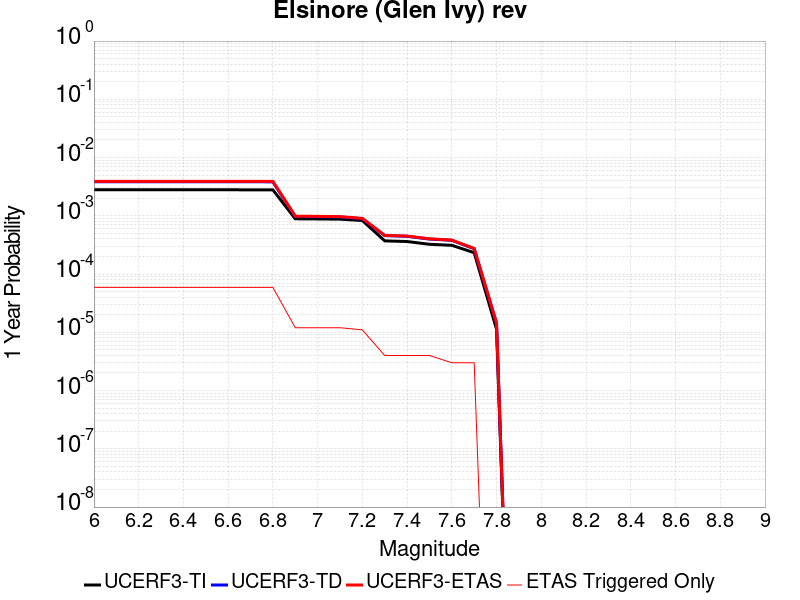 |  |

| Magnitude | 1 wk TI Prob | 1 wk TD Prob | 1 wk ETAS Prob | 1 wk ETAS/TD Gain | 1 wk ETAS Triggered Only | 1 mo TI Prob | 1 mo TD Prob | 1 mo ETAS Prob | 1 mo ETAS/TD Gain | 1 mo ETAS Triggered Only | 1 yr TI Prob | 1 yr TD Prob | 1 yr ETAS Prob | 1 yr ETAS/TD Gain | 1 yr ETAS Triggered Only | 10 yr TI Prob | 10 yr TD Prob | 10 yr ETAS Prob | 10 yr ETAS/TD Gain | 10 yr ETAS Triggered Only |
|-----|-----|-----|-----|-----|-----|-----|-----|-----|-----|-----|-----|-----|-----|-----|-----|-----|-----|-----|-----|-----|
| 6.0 | 5.3687647E-5 | 7.371829E-5 | 9.594258E-5 | 1.3014759 | 2.2225926E-5 | 2.3006962E-4 | 3.1591902E-4 | 3.381379E-4 | 1.070331 | 2.2225926E-5 | 0.0027974995 | 0.0038433792 | 0.00388766 | 1.0115213 | 4.4451852E-5 | 0.02762544 | 0.03826734 | 0.038331468 | 1.0016757 | 6.667778E-5 |
| 6.1 | 5.3687647E-5 | 7.371829E-5 | 9.594258E-5 | 1.3014759 | 2.2225926E-5 | 2.3006962E-4 | 3.1591902E-4 | 3.381379E-4 | 1.070331 | 2.2225926E-5 | 0.0027974995 | 0.0038433792 | 0.00388766 | 1.0115213 | 4.4451852E-5 | 0.02762544 | 0.03826734 | 0.038331468 | 1.0016757 | 6.667778E-5 |
| 6.2 | 5.3687647E-5 | 7.371829E-5 | 9.594258E-5 | 1.3014759 | 2.2225926E-5 | 2.3006962E-4 | 3.1591902E-4 | 3.381379E-4 | 1.070331 | 2.2225926E-5 | 0.0027974995 | 0.0038433792 | 0.00388766 | 1.0115213 | 4.4451852E-5 | 0.02762544 | 0.03826734 | 0.038331468 | 1.0016757 | 6.667778E-5 |
| 6.3 | 5.3687647E-5 | 7.371829E-5 | 9.594258E-5 | 1.3014759 | 2.2225926E-5 | 2.3006962E-4 | 3.1591902E-4 | 3.381379E-4 | 1.070331 | 2.2225926E-5 | 0.0027974995 | 0.0038433792 | 0.00388766 | 1.0115213 | 4.4451852E-5 | 0.02762544 | 0.03826734 | 0.038331468 | 1.0016757 | 6.667778E-5 |
| 6.4 | 5.3687647E-5 | 7.371829E-5 | 9.594258E-5 | 1.3014759 | 2.2225926E-5 | 2.3006962E-4 | 3.1591902E-4 | 3.381379E-4 | 1.070331 | 2.2225926E-5 | 0.0027974995 | 0.0038433792 | 0.00388766 | 1.0115213 | 4.4451852E-5 | 0.02762544 | 0.03826734 | 0.038331468 | 1.0016757 | 6.667778E-5 |
| 6.5 | 5.3687647E-5 | 7.371829E-5 | 9.594258E-5 | 1.3014759 | 2.2225926E-5 | 2.3006962E-4 | 3.1591902E-4 | 3.381379E-4 | 1.070331 | 2.2225926E-5 | 0.0027974995 | 0.0038433792 | 0.00388766 | 1.0115213 | 4.4451852E-5 | 0.02762544 | 0.03826734 | 0.038331468 | 1.0016757 | 6.667778E-5 |
| 6.6 | 5.366434E-5 | 7.368723E-5 | 9.591151E-5 | 1.301603 | 2.2225926E-5 | 2.2996974E-4 | 3.157859E-4 | 3.3800481E-4 | 1.0703607 | 2.2225926E-5 | 0.0027962867 | 0.0038417643 | 0.0038860454 | 1.0115262 | 4.4451852E-5 | 0.027613612 | 0.03825175 | 0.038315877 | 1.0016764 | 6.667778E-5 |
| 6.7 | 5.3605272E-5 | 7.360545E-5 | 9.582974E-5 | 1.301938 | 2.2225926E-5 | 2.2971665E-4 | 3.1543552E-4 | 3.3765443E-4 | 1.0704389 | 2.2225926E-5 | 0.0027932131 | 0.0038375156 | 0.003881797 | 1.0115391 | 4.4451852E-5 | 0.027583642 | 0.038210876 | 0.038275007 | 1.0016783 | 6.667778E-5 |
| 6.8 | 5.3532647E-5 | 7.3514246E-5 | 9.573854E-5 | 1.3023127 | 2.2225926E-5 | 2.2940546E-4 | 3.1504474E-4 | 3.3726366E-4 | 1.0705262 | 2.2225926E-5 | 0.002789434 | 0.0038327747 | 0.003877056 | 1.0115534 | 4.4451852E-5 | 0.02754679 | 0.038164973 | 0.038229104 | 1.0016804 | 6.667778E-5 |
| 6.9 | 1.7045348E-5 | 1.8678082E-5 | 2.9790837E-5 | 1.5949624 | 1.1112963E-5 | 7.304944E-5 | 8.004709E-5 | 9.1159156E-5 | 1.1388192 | 1.1112963E-5 | 8.8901405E-4 | 9.74247E-4 | 9.853492E-4 | 1.0113956 | 1.1112963E-5 | 0.008854659 | 0.009768393 | 0.009790402 | 1.002253 | 2.2225926E-5 |
| 7.0 | 1.6940774E-5 | 1.8528288E-5 | 2.9641045E-5 | 1.5997725 | 1.1112963E-5 | 7.2601295E-5 | 7.940515E-5 | 9.0517235E-5 | 1.1399416 | 1.1112963E-5 | 8.835623E-4 | 9.6643844E-4 | 9.775406E-4 | 1.0114877 | 1.1112963E-5 | 0.0088005755 | 0.00969088 | 0.009712891 | 1.0022713 | 2.2225926E-5 |
| 7.1 | 1.6789645E-5 | 1.8323519E-5 | 2.943628E-5 | 1.6064751 | 1.1112963E-5 | 7.195364E-5 | 7.852762E-5 | 8.963971E-5 | 1.1415055 | 1.1112963E-5 | 8.7568344E-4 | 9.55764E-4 | 9.6686627E-4 | 1.0116162 | 1.1112963E-5 | 0.008722408 | 0.009584869 | 0.009606882 | 1.0022967 | 2.2225926E-5 |
| 7.2 | 1.5933345E-5 | 1.7110096E-5 | 2.822287E-5 | 1.6494863 | 1.1112963E-5 | 6.828398E-5 | 7.332754E-5 | 8.4439685E-5 | 1.1515412 | 1.1112963E-5 | 8.310403E-4 | 8.925052E-4 | 9.036083E-4 | 1.0124403 | 1.1112963E-5 | 0.008279393 | 0.0089570135 | 0.00897904 | 1.0024592 | 2.2225926E-5 |
| 7.3 | 7.1186646E-6 | 8.762552E-6 | 8.762552E-6 | 1.0 | 0.0 | 3.0508205E-5 | 3.7553385E-5 | 3.7553385E-5 | 1.0 | 0.0 | 3.713741E-4 | 4.5714018E-4 | 4.5714018E-4 | 1.0 | 0.0 | 0.0037075407 | 0.004571716 | 0.004571716 | 1.0 | 0.0 |
| 7.4 | 6.937813E-6 | 8.529489E-6 | 8.529489E-6 | 1.0 | 0.0 | 2.9733144E-5 | 3.6554575E-5 | 3.6554575E-5 | 1.0 | 0.0 | 3.619409E-4 | 4.4498467E-4 | 4.4498467E-4 | 1.0 | 0.0 | 0.0036135197 | 0.0044503105 | 0.0044503105 | 1.0 | 0.0 |
| 7.5 | 6.22113E-6 | 7.646963E-6 | 7.646963E-6 | 1.0 | 0.0 | 2.6661715E-5 | 3.277242E-5 | 3.277242E-5 | 1.0 | 0.0 | 3.2455803E-4 | 3.989543E-4 | 3.989543E-4 | 1.0 | 0.0 | 0.003240844 | 0.0039905123 | 0.0039905123 | 1.0 | 0.0 |
| 7.6 | 5.9726967E-6 | 7.281061E-6 | 7.281061E-6 | 1.0 | 0.0 | 2.559702E-5 | 3.1204305E-5 | 3.1204305E-5 | 1.0 | 0.0 | 3.1159917E-4 | 3.798693E-4 | 3.798693E-4 | 1.0 | 0.0 | 0.003111626 | 0.0038002636 | 0.0038002636 | 1.0 | 0.0 |
| 7.7 | 4.463199E-6 | 5.214875E-6 | 5.214875E-6 | 1.0 | 0.0 | 1.9127854E-5 | 2.2349386E-5 | 2.2349386E-5 | 1.0 | 0.0 | 2.3285674E-4 | 2.7209E-4 | 2.7209E-4 | 1.0 | 0.0 | 0.0023261288 | 0.0027239968 | 0.0027239968 | 1.0 | 0.0 |
| 7.8 | 2.1601753E-7 | 2.7489222E-7 | 2.7489222E-7 | 1.0 | 0.0 | 9.257891E-7 | 1.1781094E-6 | 1.1781094E-6 | 1.0 | 0.0 | 1.1271423E-5 | 1.4343483E-5 | 1.4343483E-5 | 1.0 | 0.0 | 1.1270852E-4 | 1.435847E-4 | 1.435847E-4 | 1.0 | 0.0 |

## San Jose
*[(top)](#table-of-contents)*

| 1 Week | 1 Month | 1 Year | 10 Year |
|-----|-----|-----|-----|
|  |  |  |  |

| Magnitude | 1 wk TI Prob | 1 wk TD Prob | 1 wk ETAS Prob | 1 wk ETAS/TD Gain | 1 wk ETAS Triggered Only | 1 mo TI Prob | 1 mo TD Prob | 1 mo ETAS Prob | 1 mo ETAS/TD Gain | 1 mo ETAS Triggered Only | 1 yr TI Prob | 1 yr TD Prob | 1 yr ETAS Prob | 1 yr ETAS/TD Gain | 1 yr ETAS Triggered Only | 10 yr TI Prob | 10 yr TD Prob | 10 yr ETAS Prob | 10 yr ETAS/TD Gain | 10 yr ETAS Triggered Only |
|-----|-----|-----|-----|-----|-----|-----|-----|-----|-----|-----|-----|-----|-----|-----|-----|-----|-----|-----|-----|-----|
| 6.0 | 9.706857E-6 | 1.0473486E-5 | 3.269918E-5 | 3.1220913 | 2.2225926E-5 | 4.160015E-5 | 4.488637E-5 | 6.71113E-5 | 1.4951376 | 2.2225926E-5 | 5.063641E-4 | 5.4649153E-4 | 5.909191E-4 | 1.081296 | 4.4451852E-5 | 0.0050521186 | 0.0054649157 | 0.0055312286 | 1.0121344 | 6.667778E-5 |
| 6.1 | 9.706857E-6 | 1.0473486E-5 | 3.269918E-5 | 3.1220913 | 2.2225926E-5 | 4.160015E-5 | 4.488637E-5 | 6.71113E-5 | 1.4951376 | 2.2225926E-5 | 5.063641E-4 | 5.4649153E-4 | 5.909191E-4 | 1.081296 | 4.4451852E-5 | 0.0050521186 | 0.0054649157 | 0.0055312286 | 1.0121344 | 6.667778E-5 |
| 6.2 | 9.706857E-6 | 1.0473486E-5 | 3.269918E-5 | 3.1220913 | 2.2225926E-5 | 4.160015E-5 | 4.488637E-5 | 6.71113E-5 | 1.4951376 | 2.2225926E-5 | 5.063641E-4 | 5.4649153E-4 | 5.909191E-4 | 1.081296 | 4.4451852E-5 | 0.0050521186 | 0.0054649157 | 0.0055312286 | 1.0121344 | 6.667778E-5 |
| 6.3 | 9.706857E-6 | 1.0473486E-5 | 3.269918E-5 | 3.1220913 | 2.2225926E-5 | 4.160015E-5 | 4.488637E-5 | 6.71113E-5 | 1.4951376 | 2.2225926E-5 | 5.063641E-4 | 5.4649153E-4 | 5.909191E-4 | 1.081296 | 4.4451852E-5 | 0.0050521186 | 0.0054649157 | 0.0055312286 | 1.0121344 | 6.667778E-5 |
| 6.4 | 9.706857E-6 | 1.0473486E-5 | 3.269918E-5 | 3.1220913 | 2.2225926E-5 | 4.160015E-5 | 4.488637E-5 | 6.71113E-5 | 1.4951376 | 2.2225926E-5 | 5.063641E-4 | 5.4649153E-4 | 5.909191E-4 | 1.081296 | 4.4451852E-5 | 0.0050521186 | 0.0054649157 | 0.0055312286 | 1.0121344 | 6.667778E-5 |
| 6.5 | 9.706857E-6 | 1.0473486E-5 | 3.269918E-5 | 3.1220913 | 2.2225926E-5 | 4.160015E-5 | 4.488637E-5 | 6.71113E-5 | 1.4951376 | 2.2225926E-5 | 5.063641E-4 | 5.4649153E-4 | 5.909191E-4 | 1.081296 | 4.4451852E-5 | 0.0050521186 | 0.0054649157 | 0.0055312286 | 1.0121344 | 6.667778E-5 |

## Independence rev 2011
*[(top)](#table-of-contents)*

| 1 Week | 1 Month | 1 Year | 10 Year |
|-----|-----|-----|-----|
| 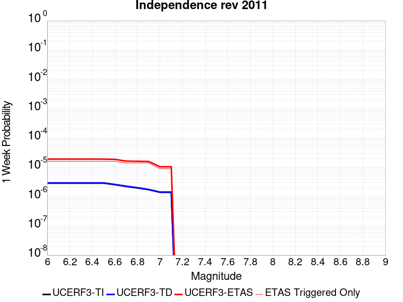 |  |  |  |

| Magnitude | 1 wk TI Prob | 1 wk TD Prob | 1 wk ETAS Prob | 1 wk ETAS/TD Gain | 1 wk ETAS Triggered Only | 1 mo TI Prob | 1 mo TD Prob | 1 mo ETAS Prob | 1 mo ETAS/TD Gain | 1 mo ETAS Triggered Only | 1 yr TI Prob | 1 yr TD Prob | 1 yr ETAS Prob | 1 yr ETAS/TD Gain | 1 yr ETAS Triggered Only | 10 yr TI Prob | 10 yr TD Prob | 10 yr ETAS Prob | 10 yr ETAS/TD Gain | 10 yr ETAS Triggered Only |
|-----|-----|-----|-----|-----|-----|-----|-----|-----|-----|-----|-----|-----|-----|-----|-----|-----|-----|-----|-----|-----|
| 6.0 | 2.8756149E-6 | 2.9249488E-6 | 2.515081E-5 | 8.598718 | 2.2225926E-5 | 1.2324005E-5 | 1.2535451E-5 | 5.6986748E-5 | 4.5460467 | 4.4451852E-5 | 1.5003444E-4 | 1.5261132E-4 | 1.9705639E-4 | 1.2912304 | 4.4451852E-5 | 0.0014993318 | 0.001525348 | 0.0015919241 | 1.0436465 | 6.667778E-5 |
| 6.1 | 2.8756149E-6 | 2.9249488E-6 | 2.515081E-5 | 8.598718 | 2.2225926E-5 | 1.2324005E-5 | 1.2535451E-5 | 5.6986748E-5 | 4.5460467 | 4.4451852E-5 | 1.5003444E-4 | 1.5261132E-4 | 1.9705639E-4 | 1.2912304 | 4.4451852E-5 | 0.0014993318 | 0.001525348 | 0.0015919241 | 1.0436465 | 6.667778E-5 |
| 6.2 | 2.8756149E-6 | 2.9249488E-6 | 2.515081E-5 | 8.598718 | 2.2225926E-5 | 1.2324005E-5 | 1.2535451E-5 | 5.6986748E-5 | 4.5460467 | 4.4451852E-5 | 1.5003444E-4 | 1.5261132E-4 | 1.9705639E-4 | 1.2912304 | 4.4451852E-5 | 0.0014993318 | 0.001525348 | 0.0015919241 | 1.0436465 | 6.667778E-5 |
| 6.3 | 2.8756149E-6 | 2.9249488E-6 | 2.515081E-5 | 8.598718 | 2.2225926E-5 | 1.2324005E-5 | 1.2535451E-5 | 5.6986748E-5 | 4.5460467 | 4.4451852E-5 | 1.5003444E-4 | 1.5261132E-4 | 1.9705639E-4 | 1.2912304 | 4.4451852E-5 | 0.0014993318 | 0.001525348 | 0.0015919241 | 1.0436465 | 6.667778E-5 |
| 6.4 | 2.8756149E-6 | 2.9249488E-6 | 2.515081E-5 | 8.598718 | 2.2225926E-5 | 1.2324005E-5 | 1.2535451E-5 | 5.6986748E-5 | 4.5460467 | 4.4451852E-5 | 1.5003444E-4 | 1.5261132E-4 | 1.9705639E-4 | 1.2912304 | 4.4451852E-5 | 0.0014993318 | 0.001525348 | 0.0015919241 | 1.0436465 | 6.667778E-5 |
| 6.5 | 2.8756149E-6 | 2.9249488E-6 | 2.515081E-5 | 8.598718 | 2.2225926E-5 | 1.2324005E-5 | 1.2535451E-5 | 5.6986748E-5 | 4.5460467 | 4.4451852E-5 | 1.5003444E-4 | 1.5261132E-4 | 1.9705639E-4 | 1.2912304 | 4.4451852E-5 | 0.0014993318 | 0.001525348 | 0.0015919241 | 1.0436465 | 6.667778E-5 |
| 6.6 | 2.5516226E-6 | 2.5957236E-6 | 2.4821593E-5 | 9.562495 | 2.2225926E-5 | 1.093548E-5 | 1.1124498E-5 | 5.5575856E-5 | 4.995808 | 4.4451852E-5 | 1.3313134E-4 | 1.3543516E-4 | 1.7988098E-4 | 1.3281705 | 4.4451852E-5 | 0.0013305161 | 0.0013538024 | 0.0014203899 | 1.0491855 | 6.667778E-5 |
| 6.7 | 2.2186603E-6 | 2.256487E-6 | 2.4482364E-5 | 10.84977 | 2.2225926E-5 | 9.50851E-6 | 9.670638E-6 | 4.3009204E-5 | 4.447401 | 3.333889E-5 | 1.15759954E-4 | 1.1773639E-4 | 1.5107136E-4 | 1.2831322 | 3.333889E-5 | 0.0011569967 | 0.0011770084 | 0.0012214079 | 1.0377223 | 4.4451852E-5 |
| 6.8 | 1.9751235E-6 | 2.0086552E-6 | 2.4234538E-5 | 12.065056 | 2.2225926E-5 | 8.464787E-6 | 8.608508E-6 | 4.194711E-5 | 4.8727503 | 3.333889E-5 | 1.0305391E-4 | 1.0480621E-4 | 1.3814161E-4 | 1.318067 | 3.333889E-5 | 0.0010300614 | 0.0010478286 | 0.0010922338 | 1.0423784 | 4.4451852E-5 |
| 6.9 | 1.7189924E-6 | 1.7480062E-6 | 2.3973895E-5 | 13.7149935 | 2.2225926E-5 | 7.36709E-6 | 7.4914487E-6 | 4.0830088E-5 | 5.4502263 | 3.333889E-5 | 8.969063E-5 | 9.1207185E-5 | 1.2454303E-4 | 1.3654959 | 3.333889E-5 | 8.965443E-4 | 9.119541E-4 | 9.5636543E-4 | 1.048699 | 4.4451852E-5 |
| 7.0 | 1.4014381E-6 | 1.4248745E-6 | 2.365077E-5 | 16.598494 | 2.2225926E-5 | 6.0061493E-6 | 6.1066053E-6 | 3.944529E-5 | 6.459447 | 3.333889E-5 | 7.312241E-5 | 7.434792E-5 | 1.07684325E-4 | 1.4483839 | 3.333889E-5 | 7.3098356E-4 | 7.434792E-4 | 7.8789797E-4 | 1.0597445 | 4.4451852E-5 |
| 7.1 | 1.4014381E-6 | 1.4248745E-6 | 2.365077E-5 | 16.598494 | 2.2225926E-5 | 6.0061493E-6 | 6.1066053E-6 | 3.944529E-5 | 6.459447 | 3.333889E-5 | 7.312241E-5 | 7.434792E-5 | 1.07684325E-4 | 1.4483839 | 3.333889E-5 | 7.3098356E-4 | 7.434792E-4 | 7.8789797E-4 | 1.0597445 | 4.4451852E-5 |

## Verdugo
*[(top)](#table-of-contents)*

| 1 Week | 1 Month | 1 Year | 10 Year |
|-----|-----|-----|-----|
|  |  |  |  |

| Magnitude | 1 wk TI Prob | 1 wk TD Prob | 1 wk ETAS Prob | 1 wk ETAS/TD Gain | 1 wk ETAS Triggered Only | 1 mo TI Prob | 1 mo TD Prob | 1 mo ETAS Prob | 1 mo ETAS/TD Gain | 1 mo ETAS Triggered Only | 1 yr TI Prob | 1 yr TD Prob | 1 yr ETAS Prob | 1 yr ETAS/TD Gain | 1 yr ETAS Triggered Only | 10 yr TI Prob | 10 yr TD Prob | 10 yr ETAS Prob | 10 yr ETAS/TD Gain | 10 yr ETAS Triggered Only |
|-----|-----|-----|-----|-----|-----|-----|-----|-----|-----|-----|-----|-----|-----|-----|-----|-----|-----|-----|-----|-----|
| 6.0 | 9.032242E-6 | 9.607573E-6 | 2.0720428E-5 | 2.1566768 | 1.1112963E-5 | 3.8709033E-5 | 4.1174942E-5 | 6.339995E-5 | 1.5397702 | 2.2225926E-5 | 4.7118057E-4 | 5.0123956E-4 | 5.5677653E-4 | 1.1107992 | 5.5564815E-5 | 0.0047018277 | 0.0050059874 | 0.0050723315 | 1.013253 | 6.667778E-5 |
| 6.1 | 9.032242E-6 | 9.607573E-6 | 2.0720428E-5 | 2.1566768 | 1.1112963E-5 | 3.8709033E-5 | 4.1174942E-5 | 6.339995E-5 | 1.5397702 | 2.2225926E-5 | 4.7118057E-4 | 5.0123956E-4 | 5.5677653E-4 | 1.1107992 | 5.5564815E-5 | 0.0047018277 | 0.0050059874 | 0.0050723315 | 1.013253 | 6.667778E-5 |
| 6.2 | 9.032242E-6 | 9.607573E-6 | 2.0720428E-5 | 2.1566768 | 1.1112963E-5 | 3.8709033E-5 | 4.1174942E-5 | 6.339995E-5 | 1.5397702 | 2.2225926E-5 | 4.7118057E-4 | 5.0123956E-4 | 5.5677653E-4 | 1.1107992 | 5.5564815E-5 | 0.0047018277 | 0.0050059874 | 0.0050723315 | 1.013253 | 6.667778E-5 |
| 6.3 | 9.032242E-6 | 9.607573E-6 | 2.0720428E-5 | 2.1566768 | 1.1112963E-5 | 3.8709033E-5 | 4.1174942E-5 | 6.339995E-5 | 1.5397702 | 2.2225926E-5 | 4.7118057E-4 | 5.0123956E-4 | 5.5677653E-4 | 1.1107992 | 5.5564815E-5 | 0.0047018277 | 0.0050059874 | 0.0050723315 | 1.013253 | 6.667778E-5 |
| 6.4 | 9.032242E-6 | 9.607573E-6 | 2.0720428E-5 | 2.1566768 | 1.1112963E-5 | 3.8709033E-5 | 4.1174942E-5 | 6.339995E-5 | 1.5397702 | 2.2225926E-5 | 4.7118057E-4 | 5.0123956E-4 | 5.5677653E-4 | 1.1107992 | 5.5564815E-5 | 0.0047018277 | 0.0050059874 | 0.0050723315 | 1.013253 | 6.667778E-5 |
| 6.5 | 9.032242E-6 | 9.607573E-6 | 2.0720428E-5 | 2.1566768 | 1.1112963E-5 | 3.8709033E-5 | 4.1174942E-5 | 6.339995E-5 | 1.5397702 | 2.2225926E-5 | 4.7118057E-4 | 5.0123956E-4 | 5.5677653E-4 | 1.1107992 | 5.5564815E-5 | 0.0047018277 | 0.0050059874 | 0.0050723315 | 1.013253 | 6.667778E-5 |
| 6.6 | 7.857296E-6 | 8.353911E-6 | 1.9466781E-5 | 2.3302596 | 1.1112963E-5 | 3.367369E-5 | 3.580226E-5 | 5.8027388E-5 | 1.6207745 | 2.2225926E-5 | 4.0990004E-4 | 4.3585425E-4 | 4.9139484E-4 | 1.1274292 | 5.5564815E-5 | 0.0040914477 | 0.004354794 | 0.0044211815 | 1.0152447 | 6.667778E-5 |
| 6.7 | 5.667953E-6 | 6.022347E-6 | 6.022347E-6 | 1.0 | 0.0 | 2.4291001E-5 | 2.5810059E-5 | 2.5810059E-5 | 1.0 | 0.0 | 2.957028E-4 | 3.1423746E-4 | 3.2534695E-4 | 1.0353538 | 1.1112963E-5 | 0.0029530963 | 0.0031423746 | 0.0031645307 | 1.0070508 | 2.2225926E-5 |
| 6.8 | 5.667953E-6 | 6.022347E-6 | 6.022347E-6 | 1.0 | 0.0 | 2.4291001E-5 | 2.5810059E-5 | 2.5810059E-5 | 1.0 | 0.0 | 2.957028E-4 | 3.1423746E-4 | 3.2534695E-4 | 1.0353538 | 1.1112963E-5 | 0.0029530963 | 0.0031423746 | 0.0031645307 | 1.0070508 | 2.2225926E-5 |

## Hayward (So) 2011 CFM
*[(top)](#table-of-contents)*

| 1 Week | 1 Month | 1 Year | 10 Year |
|-----|-----|-----|-----|
|  |  |  |  |

| Magnitude | 1 wk TI Prob | 1 wk TD Prob | 1 wk ETAS Prob | 1 wk ETAS/TD Gain | 1 wk ETAS Triggered Only | 1 mo TI Prob | 1 mo TD Prob | 1 mo ETAS Prob | 1 mo ETAS/TD Gain | 1 mo ETAS Triggered Only | 1 yr TI Prob | 1 yr TD Prob | 1 yr ETAS Prob | 1 yr ETAS/TD Gain | 1 yr ETAS Triggered Only | 10 yr TI Prob | 10 yr TD Prob | 10 yr ETAS Prob | 10 yr ETAS/TD Gain | 10 yr ETAS Triggered Only |
|-----|-----|-----|-----|-----|-----|-----|-----|-----|-----|-----|-----|-----|-----|-----|-----|-----|-----|-----|-----|-----|
| 6.0 | 1.2701664E-4 | 2.8183177E-4 | 2.929416E-4 | 1.0394201 | 1.1112963E-5 | 5.4424343E-4 | 0.001207496 | 0.0012407947 | 1.0275766 | 3.333889E-5 | 0.0066060508 | 0.014638459 | 0.01468226 | 1.0029922 | 4.4451852E-5 | 0.06413091 | 0.13469909 | 0.13474716 | 1.0003569 | 5.5564815E-5 |
| 6.1 | 1.2701664E-4 | 2.8183177E-4 | 2.929416E-4 | 1.0394201 | 1.1112963E-5 | 5.4424343E-4 | 0.001207496 | 0.0012407947 | 1.0275766 | 3.333889E-5 | 0.0066060508 | 0.014638459 | 0.01468226 | 1.0029922 | 4.4451852E-5 | 0.06413091 | 0.13469909 | 0.13474716 | 1.0003569 | 5.5564815E-5 |
| 6.2 | 1.2701664E-4 | 2.8183177E-4 | 2.929416E-4 | 1.0394201 | 1.1112963E-5 | 5.4424343E-4 | 0.001207496 | 0.0012407947 | 1.0275766 | 3.333889E-5 | 0.0066060508 | 0.014638459 | 0.01468226 | 1.0029922 | 4.4451852E-5 | 0.06413091 | 0.13469909 | 0.13474716 | 1.0003569 | 5.5564815E-5 |
| 6.3 | 1.2701664E-4 | 2.8183177E-4 | 2.929416E-4 | 1.0394201 | 1.1112963E-5 | 5.4424343E-4 | 0.001207496 | 0.0012407947 | 1.0275766 | 3.333889E-5 | 0.0066060508 | 0.014638459 | 0.01468226 | 1.0029922 | 4.4451852E-5 | 0.06413091 | 0.13469909 | 0.13474716 | 1.0003569 | 5.5564815E-5 |
| 6.4 | 1.2701664E-4 | 2.8183177E-4 | 2.929416E-4 | 1.0394201 | 1.1112963E-5 | 5.4424343E-4 | 0.001207496 | 0.0012407947 | 1.0275766 | 3.333889E-5 | 0.0066060508 | 0.014638459 | 0.01468226 | 1.0029922 | 4.4451852E-5 | 0.06413091 | 0.13469909 | 0.13474716 | 1.0003569 | 5.5564815E-5 |
| 6.5 | 1.2701664E-4 | 2.8183177E-4 | 2.929416E-4 | 1.0394201 | 1.1112963E-5 | 5.4424343E-4 | 0.001207496 | 0.0012407947 | 1.0275766 | 3.333889E-5 | 0.0066060508 | 0.014638459 | 0.01468226 | 1.0029922 | 4.4451852E-5 | 0.06413091 | 0.13469909 | 0.13474716 | 1.0003569 | 5.5564815E-5 |
| 6.6 | 1.2617561E-4 | 2.8017466E-4 | 2.912845E-4 | 1.0396533 | 1.1112963E-5 | 5.4064055E-4 | 0.0012004005 | 0.0012336994 | 1.0277398 | 3.333889E-5 | 0.0065624514 | 0.014553229 | 0.014597035 | 1.00301 | 4.4451852E-5 | 0.06372008 | 0.1339794 | 0.13402753 | 1.0003592 | 5.5564815E-5 |
| 6.7 | 6.106194E-5 | 1.5483651E-4 | 1.6594776E-4 | 1.0717611 | 1.1112963E-5 | 2.6166777E-4 | 6.6351274E-4 | 6.9682946E-4 | 1.0502127 | 3.333889E-5 | 0.0031811513 | 0.0080654435 | 0.008109537 | 1.0054669 | 4.4451852E-5 | 0.031359967 | 0.075871445 | 0.07591253 | 1.0005414 | 4.4451852E-5 |
| 6.8 | 6.005265E-5 | 1.523396E-4 | 1.6345088E-4 | 1.0729375 | 1.1112963E-5 | 2.573431E-4 | 6.528171E-4 | 6.861342E-4 | 1.0510359 | 3.333889E-5 | 0.0031286513 | 0.00793618 | 0.007980279 | 1.0055567 | 4.4451852E-5 | 0.030849686 | 0.07472291 | 0.074764036 | 1.0005504 | 4.4451852E-5 |
| 6.9 | 5.8771016E-5 | 1.4917298E-4 | 1.602843E-4 | 1.074486 | 1.1112963E-5 | 2.5185148E-4 | 6.392526E-4 | 6.7257014E-4 | 1.0521196 | 3.333889E-5 | 0.0030619805 | 0.007772221 | 0.007816328 | 1.0056748 | 4.4451852E-5 | 0.030201323 | 0.073260926 | 0.07330212 | 1.0005623 | 4.4451852E-5 |
| 7.0 | 1.1420259E-5 | 2.9975652E-5 | 4.1088282E-5 | 1.3707219 | 1.1112963E-5 | 4.894305E-5 | 1.2846253E-4 | 1.3957407E-4 | 1.0864964 | 1.1112963E-5 | 5.957187E-4 | 0.0015632241 | 0.0015854153 | 1.0141958 | 2.2225926E-5 | 0.005941243 | 0.015188666 | 0.015210554 | 1.0014411 | 2.2225926E-5 |
| 7.1 | 9.497712E-6 | 2.5505822E-5 | 3.66185E-5 | 1.4356918 | 1.1112963E-5 | 4.0703846E-5 | 1.0930784E-4 | 1.2041959E-4 | 1.1016556 | 1.1112963E-5 | 4.954566E-4 | 0.0013303217 | 0.001352518 | 1.016685 | 2.2225926E-5 | 0.0049435347 | 0.01294365 | 0.012965588 | 1.0016949 | 2.2225926E-5 |
| 7.2 | 6.6138855E-6 | 1.8792352E-5 | 2.9905108E-5 | 1.5913445 | 1.1112963E-5 | 2.8344915E-5 | 8.053787E-5 | 9.164994E-5 | 1.1379732 | 1.1112963E-5 | 3.4504468E-4 | 9.8041E-4 | 0.0010026142 | 1.0226479 | 2.2225926E-5 | 0.0034450945 | 0.009560432 | 0.009582446 | 1.0023025 | 2.2225926E-5 |
| 7.3 | 5.4382035E-6 | 1.5442325E-5 | 2.6555117E-5 | 1.719632 | 1.1112963E-5 | 2.3306378E-5 | 6.618139E-5 | 7.729362E-5 | 1.1679056 | 1.1112963E-5 | 2.8371823E-4 | 8.0575846E-4 | 8.2796643E-4 | 1.0275617 | 2.2225926E-5 | 0.0028335627 | 0.007868089 | 0.00789014 | 1.0028026 | 2.2225926E-5 |

## Pinto Mtn
*[(top)](#table-of-contents)*

| 1 Week | 1 Month | 1 Year | 10 Year |
|-----|-----|-----|-----|
|  |  |  |  |

| Magnitude | 1 wk TI Prob | 1 wk TD Prob | 1 wk ETAS Prob | 1 wk ETAS/TD Gain | 1 wk ETAS Triggered Only | 1 mo TI Prob | 1 mo TD Prob | 1 mo ETAS Prob | 1 mo ETAS/TD Gain | 1 mo ETAS Triggered Only | 1 yr TI Prob | 1 yr TD Prob | 1 yr ETAS Prob | 1 yr ETAS/TD Gain | 1 yr ETAS Triggered Only | 10 yr TI Prob | 10 yr TD Prob | 10 yr ETAS Prob | 10 yr ETAS/TD Gain | 10 yr ETAS Triggered Only |
|-----|-----|-----|-----|-----|-----|-----|-----|-----|-----|-----|-----|-----|-----|-----|-----|-----|-----|-----|-----|-----|
| 6.0 | 3.51701E-5 | 4.3047E-5 | 7.638445E-5 | 1.7744431 | 3.333889E-5 | 1.5072028E-4 | 1.844764E-4 | 2.1780914E-4 | 1.1806884 | 3.333889E-5 | 0.0018334748 | 0.0022440937 | 0.0022995337 | 1.0247049 | 5.5564815E-5 | 0.018184211 | 0.022254989 | 0.022309318 | 1.0024412 | 5.5564815E-5 |
| 6.1 | 3.51701E-5 | 4.3047E-5 | 7.638445E-5 | 1.7744431 | 3.333889E-5 | 1.5072028E-4 | 1.844764E-4 | 2.1780914E-4 | 1.1806884 | 3.333889E-5 | 0.0018334748 | 0.0022440937 | 0.0022995337 | 1.0247049 | 5.5564815E-5 | 0.018184211 | 0.022254989 | 0.022309318 | 1.0024412 | 5.5564815E-5 |
| 6.2 | 3.51701E-5 | 4.3047E-5 | 7.638445E-5 | 1.7744431 | 3.333889E-5 | 1.5072028E-4 | 1.844764E-4 | 2.1780914E-4 | 1.1806884 | 3.333889E-5 | 0.0018334748 | 0.0022440937 | 0.0022995337 | 1.0247049 | 5.5564815E-5 | 0.018184211 | 0.022254989 | 0.022309318 | 1.0024412 | 5.5564815E-5 |
| 6.3 | 3.51701E-5 | 4.3047E-5 | 7.638445E-5 | 1.7744431 | 3.333889E-5 | 1.5072028E-4 | 1.844764E-4 | 2.1780914E-4 | 1.1806884 | 3.333889E-5 | 0.0018334748 | 0.0022440937 | 0.0022995337 | 1.0247049 | 5.5564815E-5 | 0.018184211 | 0.022254989 | 0.022309318 | 1.0024412 | 5.5564815E-5 |
| 6.4 | 3.51701E-5 | 4.3047E-5 | 7.638445E-5 | 1.7744431 | 3.333889E-5 | 1.5072028E-4 | 1.844764E-4 | 2.1780914E-4 | 1.1806884 | 3.333889E-5 | 0.0018334748 | 0.0022440937 | 0.0022995337 | 1.0247049 | 5.5564815E-5 | 0.018184211 | 0.022254989 | 0.022309318 | 1.0024412 | 5.5564815E-5 |
| 6.5 | 3.51701E-5 | 4.3047E-5 | 7.638445E-5 | 1.7744431 | 3.333889E-5 | 1.5072028E-4 | 1.844764E-4 | 2.1780914E-4 | 1.1806884 | 3.333889E-5 | 0.0018334748 | 0.0022440937 | 0.0022995337 | 1.0247049 | 5.5564815E-5 | 0.018184211 | 0.022254989 | 0.022309318 | 1.0024412 | 5.5564815E-5 |
| 6.6 | 3.3749162E-5 | 4.1291092E-5 | 7.46286E-5 | 1.8073778 | 3.333889E-5 | 1.4463125E-4 | 1.7695212E-4 | 2.1028511E-4 | 1.188373 | 3.333889E-5 | 0.0017594631 | 0.0021526704 | 0.0021970265 | 1.0206052 | 4.4451852E-5 | 0.017455976 | 0.021358717 | 0.02140222 | 1.0020368 | 4.4451852E-5 |
| 6.7 | 2.7121987E-5 | 3.3122094E-5 | 5.5347286E-5 | 1.671008 | 2.2225926E-5 | 1.162319E-4 | 1.4194637E-4 | 1.6416913E-4 | 1.1565576 | 2.2225926E-5 | 0.0014142047 | 0.0017272272 | 0.0017494147 | 1.0128458 | 2.2225926E-5 | 0.014052387 | 0.01717749 | 0.017199334 | 1.0012717 | 2.2225926E-5 |
| 6.8 | 2.2587206E-5 | 2.7508535E-5 | 4.9733848E-5 | 1.8079425 | 2.2225926E-5 | 9.679872E-5 | 1.1789061E-4 | 1.4011392E-4 | 1.1885079 | 2.2225926E-5 | 0.0011778872 | 0.001434766 | 0.0014569601 | 1.0154687 | 2.2225926E-5 | 0.011716634 | 0.014293642 | 0.01431555 | 1.0015327 | 2.2225926E-5 |
| 6.9 | 2.1440546E-5 | 2.6093185E-5 | 4.8318532E-5 | 1.8517683 | 2.2225926E-5 | 9.1884816E-5 | 1.1182535E-4 | 1.340488E-4 | 1.1987334 | 2.2225926E-5 | 0.0011181235 | 0.0013610155 | 0.0013832112 | 1.0163082 | 2.2225926E-5 | 0.011125144 | 0.013565313 | 0.013587237 | 1.0016162 | 2.2225926E-5 |
| 7.0 | 1.7893128E-5 | 2.1693293E-5 | 3.2806016E-5 | 1.5122653 | 1.1112963E-5 | 7.6682576E-5 | 9.2970135E-5 | 1.04082064E-4 | 1.1195215 | 1.1112963E-5 | 9.332105E-4 | 0.001131712 | 0.0011428124 | 1.0098085 | 1.1112963E-5 | 0.009293012 | 0.011297592 | 0.011308579 | 1.0009725 | 1.1112963E-5 |
| 7.1 | 1.5338705E-5 | 1.854412E-5 | 2.9656878E-5 | 1.5992604 | 1.1112963E-5 | 6.573565E-5 | 7.947455E-5 | 9.058663E-5 | 1.1398194 | 1.1112963E-5 | 8.0003764E-4 | 9.675582E-4 | 9.786604E-4 | 1.0114745 | 1.1112963E-5 | 0.007971635 | 0.009671222 | 0.009682228 | 1.001138 | 1.1112963E-5 |
| 7.2 | 1.4525263E-5 | 1.7549126E-5 | 2.8661894E-5 | 1.6332377 | 1.1112963E-5 | 6.2249645E-5 | 7.521054E-5 | 8.632267E-5 | 1.1477469 | 1.1112963E-5 | 7.5762585E-4 | 9.1568835E-4 | 9.267911E-4 | 1.012125 | 1.1112963E-5 | 0.007550481 | 0.009156883 | 0.009167895 | 1.0012025 | 1.1112963E-5 |

## Newport-Inglewood (Offshore)
*[(top)](#table-of-contents)*

| 1 Week | 1 Month | 1 Year | 10 Year |
|-----|-----|-----|-----|
|  |  |  |  |

| Magnitude | 1 wk TI Prob | 1 wk TD Prob | 1 wk ETAS Prob | 1 wk ETAS/TD Gain | 1 wk ETAS Triggered Only | 1 mo TI Prob | 1 mo TD Prob | 1 mo ETAS Prob | 1 mo ETAS/TD Gain | 1 mo ETAS Triggered Only | 1 yr TI Prob | 1 yr TD Prob | 1 yr ETAS Prob | 1 yr ETAS/TD Gain | 1 yr ETAS Triggered Only | 10 yr TI Prob | 10 yr TD Prob | 10 yr ETAS Prob | 10 yr ETAS/TD Gain | 10 yr ETAS Triggered Only |
|-----|-----|-----|-----|-----|-----|-----|-----|-----|-----|-----|-----|-----|-----|-----|-----|-----|-----|-----|-----|-----|
| 6.0 | 1.9418812E-5 | 2.0497266E-5 | 5.3835472E-5 | 2.6264708 | 3.333889E-5 | 8.322083E-5 | 8.7843E-5 | 1.2117896E-4 | 1.3794948 | 3.333889E-5 | 0.0010127426 | 0.0010690573 | 0.0011134617 | 1.041536 | 4.4451852E-5 | 0.010081396 | 0.010648402 | 0.010703376 | 1.0051626 | 5.5564815E-5 |
| 6.1 | 1.9418812E-5 | 2.0497266E-5 | 5.3835472E-5 | 2.6264708 | 3.333889E-5 | 8.322083E-5 | 8.7843E-5 | 1.2117896E-4 | 1.3794948 | 3.333889E-5 | 0.0010127426 | 0.0010690573 | 0.0011134617 | 1.041536 | 4.4451852E-5 | 0.010081396 | 0.010648402 | 0.010703376 | 1.0051626 | 5.5564815E-5 |
| 6.2 | 1.9418812E-5 | 2.0497266E-5 | 5.3835472E-5 | 2.6264708 | 3.333889E-5 | 8.322083E-5 | 8.7843E-5 | 1.2117896E-4 | 1.3794948 | 3.333889E-5 | 0.0010127426 | 0.0010690573 | 0.0011134617 | 1.041536 | 4.4451852E-5 | 0.010081396 | 0.010648402 | 0.010703376 | 1.0051626 | 5.5564815E-5 |
| 6.3 | 1.9418812E-5 | 2.0497266E-5 | 5.3835472E-5 | 2.6264708 | 3.333889E-5 | 8.322083E-5 | 8.7843E-5 | 1.2117896E-4 | 1.3794948 | 3.333889E-5 | 0.0010127426 | 0.0010690573 | 0.0011134617 | 1.041536 | 4.4451852E-5 | 0.010081396 | 0.010648402 | 0.010703376 | 1.0051626 | 5.5564815E-5 |
| 6.4 | 1.9418812E-5 | 2.0497266E-5 | 5.3835472E-5 | 2.6264708 | 3.333889E-5 | 8.322083E-5 | 8.7843E-5 | 1.2117896E-4 | 1.3794948 | 3.333889E-5 | 0.0010127426 | 0.0010690573 | 0.0011134617 | 1.041536 | 4.4451852E-5 | 0.010081396 | 0.010648402 | 0.010703376 | 1.0051626 | 5.5564815E-5 |
| 6.5 | 1.9418812E-5 | 2.0497266E-5 | 5.3835472E-5 | 2.6264708 | 3.333889E-5 | 8.322083E-5 | 8.7843E-5 | 1.2117896E-4 | 1.3794948 | 3.333889E-5 | 0.0010127426 | 0.0010690573 | 0.0011134617 | 1.041536 | 4.4451852E-5 | 0.010081396 | 0.010648402 | 0.010703376 | 1.0051626 | 5.5564815E-5 |
| 6.6 | 1.6939659E-5 | 1.7683546E-5 | 5.1021845E-5 | 2.8852725 | 3.333889E-5 | 7.259652E-5 | 7.578494E-5 | 1.09121305E-4 | 1.4398811 | 3.333889E-5 | 8.8350417E-4 | 9.2238374E-4 | 9.667946E-4 | 1.0481479 | 4.4451852E-5 | 0.008799998 | 0.00919468 | 0.009249733 | 1.0059875 | 5.5564815E-5 |
| 6.7 | 1.4691289E-5 | 1.5149292E-5 | 4.8487676E-5 | 3.2006564 | 3.333889E-5 | 6.2961146E-5 | 6.492444E-5 | 9.826116E-5 | 1.5134696 | 3.333889E-5 | 7.662824E-4 | 7.9025986E-4 | 8.3467655E-4 | 1.0562053 | 4.4451852E-5 | 0.007636454 | 0.007883489 | 0.007938616 | 1.0069927 | 5.5564815E-5 |
| 6.8 | 1.26037085E-5 | 1.2822538E-5 | 4.6161E-5 | 3.5999894 | 3.333889E-5 | 5.4014774E-5 | 5.4953085E-5 | 8.8290144E-5 | 1.6066458 | 3.333889E-5 | 6.5743143E-4 | 6.689387E-4 | 7.022553E-4 | 1.0498052 | 3.333889E-5 | 0.006554899 | 0.0066781086 | 0.0067222635 | 1.006612 | 4.4451852E-5 |
| 6.9 | 1.1764378E-5 | 1.1934175E-5 | 4.5272667E-5 | 3.7935314 | 3.333889E-5 | 5.0417784E-5 | 5.114597E-5 | 8.448315E-5 | 1.6518048 | 3.333889E-5 | 6.1366364E-4 | 6.226143E-4 | 6.559324E-4 | 1.0535133 | 3.333889E-5 | 0.006119718 | 0.006217534 | 0.0062617096 | 1.007105 | 4.4451852E-5 |
| 7.0 | 4.071841E-6 | 3.3071306E-6 | 1.4420057E-5 | 4.360293 | 1.1112963E-5 | 1.745063E-5 | 1.4173362E-5 | 2.5286166E-5 | 1.7840629 | 1.1112963E-5 | 2.124407E-4 | 1.7255088E-4 | 1.8366193E-4 | 1.0643929 | 1.1112963E-5 | 0.0021223773 | 0.0017245489 | 0.0017356427 | 1.0064329 | 1.1112963E-5 |
| 7.1 | 3.6344509E-6 | 2.9049047E-6 | 1.4017835E-5 | 4.825575 | 1.1112963E-5 | 1.5576124E-5 | 1.2449554E-5 | 2.356238E-5 | 1.8926283 | 1.1112963E-5 | 1.8962282E-4 | 1.5156664E-4 | 1.6267791E-4 | 1.0733095 | 1.1112963E-5 | 0.0018946109 | 0.0015150115 | 0.0015261077 | 1.0073241 | 1.1112963E-5 |
| 7.2 | 3.2446756E-6 | 2.5395498E-6 | 1.3652485E-5 | 5.375947 | 1.1112963E-5 | 1.3905678E-5 | 1.0883761E-5 | 2.1996604E-5 | 2.021048 | 1.1112963E-5 | 1.6928847E-4 | 1.325056E-4 | 1.4361709E-4 | 1.0838568 | 1.1112963E-5 | 0.0016915957 | 0.0013246438 | 0.0013357421 | 1.0083783 | 1.1112963E-5 |
| 7.3 | 2.898987E-6 | 2.2514312E-6 | 1.336437E-5 | 5.935944 | 1.1112963E-5 | 1.24241715E-5 | 9.648977E-6 | 2.0761832E-5 | 2.1517134 | 1.1112963E-5 | 1.5125379E-4 | 1.1747381E-4 | 1.2858547E-4 | 1.0945884 | 1.1112963E-5 | 0.0015115088 | 0.0011744945 | 0.0011855945 | 1.0094508 | 1.1112963E-5 |
| 7.4 | 2.5994284E-6 | 2.0116724E-6 | 1.3124613E-5 | 6.52423 | 1.1112963E-5 | 1.114036E-5 | 8.621447E-6 | 1.9734314E-5 | 2.2889795 | 1.1112963E-5 | 1.3562544E-4 | 1.049649E-4 | 1.1607669E-4 | 1.105862 | 1.1112963E-5 | 0.0013554269 | 0.00104953 | 0.0010606314 | 1.0105774 | 1.1112963E-5 |
| 7.5 | 2.2517988E-6 | 1.7516537E-6 | 1.2864598E-5 | 7.3442583 | 1.1112963E-5 | 9.650531E-6 | 7.5070875E-6 | 1.8619967E-5 | 2.4803185 | 1.1112963E-5 | 1.17488875E-4 | 9.139879E-5 | 1.02510734E-4 | 1.1215765 | 1.1112963E-5 | 0.0011742678 | 9.1398787E-4 | 9.250907E-4 | 1.0121477 | 1.1112963E-5 |

## Calaveras (Central) 2011 CFM
*[(top)](#table-of-contents)*

| 1 Week | 1 Month | 1 Year | 10 Year |
|-----|-----|-----|-----|
|  |  |  |  |

| Magnitude | 1 wk TI Prob | 1 wk TD Prob | 1 wk ETAS Prob | 1 wk ETAS/TD Gain | 1 wk ETAS Triggered Only | 1 mo TI Prob | 1 mo TD Prob | 1 mo ETAS Prob | 1 mo ETAS/TD Gain | 1 mo ETAS Triggered Only | 1 yr TI Prob | 1 yr TD Prob | 1 yr ETAS Prob | 1 yr ETAS/TD Gain | 1 yr ETAS Triggered Only | 10 yr TI Prob | 10 yr TD Prob | 10 yr ETAS Prob | 10 yr ETAS/TD Gain | 10 yr ETAS Triggered Only |
|-----|-----|-----|-----|-----|-----|-----|-----|-----|-----|-----|-----|-----|-----|-----|-----|-----|-----|-----|-----|-----|
| 6.0 | 2.6808938E-4 | 5.8386003E-4 | 6.282859E-4 | 1.07609 | 4.4451852E-5 | 0.0011484486 | 0.0025008651 | 0.0025452059 | 1.0177301 | 4.4451852E-5 | 0.013892986 | 0.030145591 | 0.030188702 | 1.0014302 | 4.4451852E-5 | 0.13055827 | 0.25237754 | 0.25241908 | 1.0001646 | 5.5564815E-5 |
| 6.1 | 2.6808938E-4 | 5.8386003E-4 | 6.282859E-4 | 1.07609 | 4.4451852E-5 | 0.0011484486 | 0.0025008651 | 0.0025452059 | 1.0177301 | 4.4451852E-5 | 0.013892986 | 0.030145591 | 0.030188702 | 1.0014302 | 4.4451852E-5 | 0.13055827 | 0.25237754 | 0.25241908 | 1.0001646 | 5.5564815E-5 |
| 6.2 | 2.6808938E-4 | 5.8386003E-4 | 6.282859E-4 | 1.07609 | 4.4451852E-5 | 0.0011484486 | 0.0025008651 | 0.0025452059 | 1.0177301 | 4.4451852E-5 | 0.013892986 | 0.030145591 | 0.030188702 | 1.0014302 | 4.4451852E-5 | 0.13055827 | 0.25237754 | 0.25241908 | 1.0001646 | 5.5564815E-5 |
| 6.3 | 2.6808938E-4 | 5.8386003E-4 | 6.282859E-4 | 1.07609 | 4.4451852E-5 | 0.0011484486 | 0.0025008651 | 0.0025452059 | 1.0177301 | 4.4451852E-5 | 0.013892986 | 0.030145591 | 0.030188702 | 1.0014302 | 4.4451852E-5 | 0.13055827 | 0.25237754 | 0.25241908 | 1.0001646 | 5.5564815E-5 |
| 6.4 | 1.1043065E-4 | 2.3596571E-4 | 2.6929672E-4 | 1.1412537 | 3.333889E-5 | 4.7318838E-4 | 0.0010110455 | 0.0010443507 | 1.0329413 | 3.333889E-5 | 0.0057458607 | 0.0122675765 | 0.012300506 | 1.0026844 | 3.333889E-5 | 0.055995476 | 0.1116302 | 0.11166969 | 1.0003538 | 4.4451852E-5 |
| 6.5 | 4.6058474E-5 | 1.0043265E-4 | 1.115445E-4 | 1.1106398 | 1.1112963E-5 | 1.9737853E-4 | 4.3038116E-4 | 4.4148936E-4 | 1.0258101 | 1.1112963E-5 | 0.002400435 | 0.0052319476 | 0.0052430024 | 1.002113 | 1.1112963E-5 | 0.023746708 | 0.04974921 | 0.04977033 | 1.0004245 | 2.2225926E-5 |
| 6.6 | 4.0714523E-5 | 8.96959E-5 | 1.0080787E-4 | 1.1238849 | 1.1112963E-5 | 1.7447914E-4 | 3.8438084E-4 | 3.9548954E-4 | 1.0289003 | 1.1112963E-5 | 0.0021222138 | 0.004674486 | 0.0046855467 | 1.0023663 | 1.1112963E-5 | 0.02102061 | 0.04470526 | 0.044726495 | 1.0004749 | 2.2225926E-5 |
| 6.7 | 3.6925157E-5 | 8.2311366E-5 | 9.342342E-5 | 1.1350001 | 1.1112963E-5 | 1.5824108E-4 | 3.527417E-4 | 3.6385076E-4 | 1.0314934 | 1.1112963E-5 | 0.0019248825 | 0.0042908536 | 0.0043019187 | 1.0025789 | 1.1112963E-5 | 0.019082947 | 0.041160695 | 0.041182008 | 1.0005177 | 2.2225926E-5 |
| 6.8 | 3.241399E-5 | 7.175236E-5 | 8.286452E-5 | 1.1548682 | 1.1112963E-5 | 1.389097E-4 | 3.075001E-4 | 3.1860964E-4 | 1.0361286 | 1.1112963E-5 | 0.0016899136 | 0.0037420401 | 0.0037531117 | 1.0029587 | 1.1112963E-5 | 0.016771203 | 0.036092106 | 0.03611353 | 1.0005935 | 2.2225926E-5 |
| 6.9 | 2.7363296E-5 | 6.059934E-5 | 6.059934E-5 | 1.0 | 0.0 | 1.1726599E-4 | 2.5971147E-4 | 2.5971147E-4 | 1.0 | 0.0 | 0.0014267784 | 0.003161987 | 0.003161987 | 1.0 | 0.0 | 0.014176525 | 0.030637112 | 0.030647883 | 1.0003517 | 1.1112963E-5 |

## Calico-Hidalgo
*[(top)](#table-of-contents)*

| 1 Week | 1 Month | 1 Year | 10 Year |
|-----|-----|-----|-----|
|  |  |  |  |

| Magnitude | 1 wk TI Prob | 1 wk TD Prob | 1 wk ETAS Prob | 1 wk ETAS/TD Gain | 1 wk ETAS Triggered Only | 1 mo TI Prob | 1 mo TD Prob | 1 mo ETAS Prob | 1 mo ETAS/TD Gain | 1 mo ETAS Triggered Only | 1 yr TI Prob | 1 yr TD Prob | 1 yr ETAS Prob | 1 yr ETAS/TD Gain | 1 yr ETAS Triggered Only | 10 yr TI Prob | 10 yr TD Prob | 10 yr ETAS Prob | 10 yr ETAS/TD Gain | 10 yr ETAS Triggered Only |
|-----|-----|-----|-----|-----|-----|-----|-----|-----|-----|-----|-----|-----|-----|-----|-----|-----|-----|-----|-----|-----|
| 6.0 | 2.0989894E-5 | 2.9615694E-5 | 5.184096E-5 | 1.7504557 | 2.2225926E-5 | 8.995359E-5 | 1.269188E-4 | 1.4914191E-4 | 1.175097 | 2.2225926E-5 | 0.0010946346 | 0.0015442439 | 0.0015886271 | 1.028741 | 4.4451852E-5 | 0.010892583 | 0.015345532 | 0.015400245 | 1.0035653 | 5.5564815E-5 |
| 6.1 | 2.0989894E-5 | 2.9615694E-5 | 5.184096E-5 | 1.7504557 | 2.2225926E-5 | 8.995359E-5 | 1.269188E-4 | 1.4914191E-4 | 1.175097 | 2.2225926E-5 | 0.0010946346 | 0.0015442439 | 0.0015886271 | 1.028741 | 4.4451852E-5 | 0.010892583 | 0.015345532 | 0.015400245 | 1.0035653 | 5.5564815E-5 |
| 6.2 | 2.0989894E-5 | 2.9615694E-5 | 5.184096E-5 | 1.7504557 | 2.2225926E-5 | 8.995359E-5 | 1.269188E-4 | 1.4914191E-4 | 1.175097 | 2.2225926E-5 | 0.0010946346 | 0.0015442439 | 0.0015886271 | 1.028741 | 4.4451852E-5 | 0.010892583 | 0.015345532 | 0.015400245 | 1.0035653 | 5.5564815E-5 |
| 6.3 | 2.0989894E-5 | 2.9615694E-5 | 5.184096E-5 | 1.7504557 | 2.2225926E-5 | 8.995359E-5 | 1.269188E-4 | 1.4914191E-4 | 1.175097 | 2.2225926E-5 | 0.0010946346 | 0.0015442439 | 0.0015886271 | 1.028741 | 4.4451852E-5 | 0.010892583 | 0.015345532 | 0.015400245 | 1.0035653 | 5.5564815E-5 |
| 6.4 | 2.0989894E-5 | 2.9615694E-5 | 5.184096E-5 | 1.7504557 | 2.2225926E-5 | 8.995359E-5 | 1.269188E-4 | 1.4914191E-4 | 1.175097 | 2.2225926E-5 | 0.0010946346 | 0.0015442439 | 0.0015886271 | 1.028741 | 4.4451852E-5 | 0.010892583 | 0.015345532 | 0.015400245 | 1.0035653 | 5.5564815E-5 |
| 6.5 | 2.0989894E-5 | 2.9615694E-5 | 5.184096E-5 | 1.7504557 | 2.2225926E-5 | 8.995359E-5 | 1.269188E-4 | 1.4914191E-4 | 1.175097 | 2.2225926E-5 | 0.0010946346 | 0.0015442439 | 0.0015886271 | 1.028741 | 4.4451852E-5 | 0.010892583 | 0.015345532 | 0.015400245 | 1.0035653 | 5.5564815E-5 |
| 6.6 | 1.929251E-5 | 2.7260403E-5 | 4.9485723E-5 | 1.8152969 | 2.2225926E-5 | 8.2679566E-5 | 1.1682564E-4 | 1.3904898E-4 | 1.1902264 | 2.2225926E-5 | 0.0010061589 | 0.0014215263 | 0.001465915 | 1.031226 | 4.4451852E-5 | 0.0100161545 | 0.0141346 | 0.014178423 | 1.0031004 | 4.4451852E-5 |
| 6.7 | 1.699933E-5 | 2.4101535E-5 | 4.6326928E-5 | 1.9221566 | 2.2225926E-5 | 7.2852235E-5 | 1.03288774E-4 | 1.2551241E-4 | 1.2151601 | 2.2225926E-5 | 8.86615E-4 | 0.0012569166 | 0.0013013126 | 1.0353214 | 4.4451852E-5 | 0.00883086 | 0.012508152 | 0.012552048 | 1.0035094 | 4.4451852E-5 |
| 6.8 | 1.4895645E-5 | 2.0902306E-5 | 3.2015036E-5 | 1.531651 | 1.1112963E-5 | 6.383692E-5 | 8.9578796E-5 | 1.0069076E-4 | 1.1240468 | 1.1112963E-5 | 7.769373E-4 | 0.001090176 | 0.0011123777 | 1.0203652 | 2.2225926E-5 | 0.0077422657 | 0.010858163 | 0.010880148 | 1.0020247 | 2.2225926E-5 |
| 6.9 | 1.3209459E-5 | 1.8371871E-5 | 2.948463E-5 | 1.604879 | 1.1112963E-5 | 5.6610737E-5 | 7.8734774E-5 | 8.9846864E-5 | 1.1411332 | 1.1112963E-5 | 6.8901776E-4 | 9.5827354E-4 | 9.804781E-4 | 1.0231715 | 2.2225926E-5 | 0.0068688532 | 0.009551193 | 0.009573206 | 1.0023048 | 2.2225926E-5 |
| 7.0 | 1.1401334E-5 | 1.5655183E-5 | 2.6767972E-5 | 1.7098473 | 1.1112963E-5 | 4.8861944E-5 | 6.709247E-5 | 7.8204685E-5 | 1.1656255 | 1.1112963E-5 | 5.9473177E-4 | 8.166432E-4 | 8.388509E-4 | 1.027194 | 2.2225926E-5 | 0.0059314263 | 0.008146102 | 0.008168147 | 1.0027062 | 2.2225926E-5 |
| 7.1 | 1.0049503E-5 | 1.3644847E-5 | 2.4757659E-5 | 1.8144329 | 1.1112963E-5 | 4.3068587E-5 | 5.847716E-5 | 6.958947E-5 | 1.1900283 | 1.1112963E-5 | 5.2423385E-4 | 7.118249E-4 | 7.2292995E-4 | 1.0156008 | 1.1112963E-5 | 0.005229989 | 0.007105075 | 0.007116109 | 1.0015529 | 1.1112963E-5 |
| 7.2 | 8.817072E-6 | 1.1833239E-5 | 1.1833239E-5 | 1.0 | 0.0 | 3.7786904E-5 | 5.0713446E-5 | 5.0713446E-5 | 1.0 | 0.0 | 4.5995842E-4 | 6.1735895E-4 | 6.1735895E-4 | 1.0 | 0.0 | 0.004590076 | 0.006166015 | 0.006166015 | 1.0 | 0.0 |
| 7.3 | 7.683954E-6 | 1.0189235E-5 | 1.0189235E-5 | 1.0 | 0.0 | 3.2930817E-5 | 4.3667966E-5 | 4.3667966E-5 | 1.0 | 0.0 | 4.008589E-4 | 5.316249E-4 | 5.316249E-4 | 1.0 | 0.0 | 0.004001366 | 0.00531305 | 0.00531305 | 1.0 | 0.0 |
| 7.4 | 6.633441E-6 | 8.756893E-6 | 8.756893E-6 | 1.0 | 0.0 | 2.8428722E-5 | 3.7529542E-5 | 3.7529542E-5 | 1.0 | 0.0 | 3.460647E-4 | 4.5692216E-4 | 4.5692216E-4 | 1.0 | 0.0 | 0.0034552629 | 0.0045692218 | 0.0045692218 | 1.0 | 0.0 |

## Hayward (No) 2011 CFM
*[(top)](#table-of-contents)*

| 1 Week | 1 Month | 1 Year | 10 Year |
|-----|-----|-----|-----|
|  |  |  |  |

| Magnitude | 1 wk TI Prob | 1 wk TD Prob | 1 wk ETAS Prob | 1 wk ETAS/TD Gain | 1 wk ETAS Triggered Only | 1 mo TI Prob | 1 mo TD Prob | 1 mo ETAS Prob | 1 mo ETAS/TD Gain | 1 mo ETAS Triggered Only | 1 yr TI Prob | 1 yr TD Prob | 1 yr ETAS Prob | 1 yr ETAS/TD Gain | 1 yr ETAS Triggered Only | 10 yr TI Prob | 10 yr TD Prob | 10 yr ETAS Prob | 10 yr ETAS/TD Gain | 10 yr ETAS Triggered Only |
|-----|-----|-----|-----|-----|-----|-----|-----|-----|-----|-----|-----|-----|-----|-----|-----|-----|-----|-----|-----|-----|
| 6.0 | 1.382333E-4 | 3.232079E-4 | 3.4542664E-4 | 1.0687444 | 2.2225926E-5 | 5.9229386E-4 | 0.0013846606 | 0.0014290509 | 1.0320586 | 4.4451852E-5 | 0.007187361 | 0.016766893 | 0.016821526 | 1.0032583 | 5.5564815E-5 | 0.06959299 | 0.1516654 | 0.15171254 | 1.0003108 | 5.5564815E-5 |
| 6.1 | 1.382333E-4 | 3.232079E-4 | 3.4542664E-4 | 1.0687444 | 2.2225926E-5 | 5.9229386E-4 | 0.0013846606 | 0.0014290509 | 1.0320586 | 4.4451852E-5 | 0.007187361 | 0.016766893 | 0.016821526 | 1.0032583 | 5.5564815E-5 | 0.06959299 | 0.1516654 | 0.15171254 | 1.0003108 | 5.5564815E-5 |
| 6.2 | 1.382333E-4 | 3.232079E-4 | 3.4542664E-4 | 1.0687444 | 2.2225926E-5 | 5.9229386E-4 | 0.0013846606 | 0.0014290509 | 1.0320586 | 4.4451852E-5 | 0.007187361 | 0.016766893 | 0.016821526 | 1.0032583 | 5.5564815E-5 | 0.06959299 | 0.1516654 | 0.15171254 | 1.0003108 | 5.5564815E-5 |
| 6.3 | 1.382333E-4 | 3.232079E-4 | 3.4542664E-4 | 1.0687444 | 2.2225926E-5 | 5.9229386E-4 | 0.0013846606 | 0.0014290509 | 1.0320586 | 4.4451852E-5 | 0.007187361 | 0.016766893 | 0.016821526 | 1.0032583 | 5.5564815E-5 | 0.06959299 | 0.1516654 | 0.15171254 | 1.0003108 | 5.5564815E-5 |
| 6.4 | 1.382333E-4 | 3.232079E-4 | 3.4542664E-4 | 1.0687444 | 2.2225926E-5 | 5.9229386E-4 | 0.0013846606 | 0.0014290509 | 1.0320586 | 4.4451852E-5 | 0.007187361 | 0.016766893 | 0.016821526 | 1.0032583 | 5.5564815E-5 | 0.06959299 | 0.1516654 | 0.15171254 | 1.0003108 | 5.5564815E-5 |
| 6.5 | 1.382333E-4 | 3.232079E-4 | 3.4542664E-4 | 1.0687444 | 2.2225926E-5 | 5.9229386E-4 | 0.0013846606 | 0.0014290509 | 1.0320586 | 4.4451852E-5 | 0.007187361 | 0.016766893 | 0.016821526 | 1.0032583 | 5.5564815E-5 | 0.06959299 | 0.1516654 | 0.15171254 | 1.0003108 | 5.5564815E-5 |
| 6.6 | 7.644285E-5 | 1.8948103E-4 | 2.005919E-4 | 1.0586383 | 1.1112963E-5 | 3.2757106E-4 | 8.1190845E-4 | 8.4522023E-4 | 1.0410291 | 3.333889E-5 | 0.003980886 | 0.009857853 | 0.009901866 | 1.0044649 | 4.4451852E-5 | 0.039103247 | 0.092153184 | 0.092193544 | 1.000438 | 4.4451852E-5 |
| 6.7 | 7.460781E-5 | 1.8587815E-4 | 1.9698904E-4 | 1.0597751 | 1.1112963E-5 | 3.1970858E-4 | 7.96477E-4 | 8.297894E-4 | 1.0418246 | 3.333889E-5 | 0.003885506 | 0.009671659 | 0.009715681 | 1.0045516 | 4.4451852E-5 | 0.03818268 | 0.09049087 | 0.0905313 | 1.0004468 | 4.4451852E-5 |
| 6.8 | 7.23009E-5 | 1.8048302E-4 | 1.9159398E-4 | 1.0615623 | 1.1112963E-5 | 3.098242E-4 | 7.733689E-4 | 8.0668204E-4 | 1.0430753 | 3.333889E-5 | 0.0037655863 | 0.009392778 | 0.009436813 | 1.0046881 | 4.4451852E-5 | 0.037024144 | 0.088001564 | 0.0880421 | 1.0004606 | 4.4451852E-5 |
| 6.9 | 6.957746E-5 | 1.7407205E-4 | 1.8518307E-4 | 1.06383 | 1.1112963E-5 | 2.98155E-4 | 7.4590935E-4 | 7.792234E-4 | 1.0446622 | 3.333889E-5 | 0.003623996 | 0.009061288 | 0.009105337 | 1.0048612 | 4.4451852E-5 | 0.035654634 | 0.08503664 | 0.085077316 | 1.0004783 | 4.4451852E-5 |
| 7.0 | 2.1073694E-5 | 5.2247637E-5 | 6.336002E-5 | 1.2126868 | 1.1112963E-5 | 9.031271E-5 | 2.2390416E-4 | 2.3501464E-4 | 1.0496216 | 1.1112963E-5 | 0.0010990025 | 0.0027234992 | 0.0027456647 | 1.0081385 | 2.2225926E-5 | 0.010935834 | 0.026391491 | 0.02641313 | 1.0008199 | 2.2225926E-5 |
| 7.1 | 1.8670535E-5 | 4.6669888E-5 | 5.7782334E-5 | 1.2381073 | 1.1112963E-5 | 8.001412E-5 | 2.0000339E-4 | 2.1111412E-4 | 1.0555527 | 1.1112963E-5 | 9.737365E-4 | 0.0024331913 | 0.0024553633 | 1.0091122 | 2.2225926E-5 | 0.009694808 | 0.023618827 | 0.023640528 | 1.0009187 | 2.2225926E-5 |
| 7.2 | 6.6138855E-6 | 1.8792352E-5 | 2.9905108E-5 | 1.5913445 | 1.1112963E-5 | 2.8344915E-5 | 8.053787E-5 | 9.164994E-5 | 1.1379732 | 1.1112963E-5 | 3.4504468E-4 | 9.8041E-4 | 0.0010026142 | 1.0226479 | 2.2225926E-5 | 0.0034450945 | 0.009560432 | 0.009582446 | 1.0023025 | 2.2225926E-5 |
| 7.3 | 5.4382035E-6 | 1.5442325E-5 | 2.6555117E-5 | 1.719632 | 1.1112963E-5 | 2.3306378E-5 | 6.618139E-5 | 7.729362E-5 | 1.1679056 | 1.1112963E-5 | 2.8371823E-4 | 8.0575846E-4 | 8.2796643E-4 | 1.0275617 | 2.2225926E-5 | 0.0028335627 | 0.007868089 | 0.00789014 | 1.0028026 | 2.2225926E-5 |

## San Jacinto (Clark) rev
*[(top)](#table-of-contents)*

| 1 Week | 1 Month | 1 Year | 10 Year |
|-----|-----|-----|-----|
|  |  |  |  |

| Magnitude | 1 wk TI Prob | 1 wk TD Prob | 1 wk ETAS Prob | 1 wk ETAS/TD Gain | 1 wk ETAS Triggered Only | 1 mo TI Prob | 1 mo TD Prob | 1 mo ETAS Prob | 1 mo ETAS/TD Gain | 1 mo ETAS Triggered Only | 1 yr TI Prob | 1 yr TD Prob | 1 yr ETAS Prob | 1 yr ETAS/TD Gain | 1 yr ETAS Triggered Only | 10 yr TI Prob | 10 yr TD Prob | 10 yr ETAS Prob | 10 yr ETAS/TD Gain | 10 yr ETAS Triggered Only |
|-----|-----|-----|-----|-----|-----|-----|-----|-----|-----|-----|-----|-----|-----|-----|-----|-----|-----|-----|-----|-----|
| 6.0 | 6.1857165E-5 | 9.865906E-5 | 1.20882796E-4 | 1.2252579 | 2.2225926E-5 | 2.650752E-4 | 4.227864E-4 | 4.4500292E-4 | 1.0525479 | 2.2225926E-5 | 0.0032225149 | 0.0051406594 | 0.005162771 | 1.0043013 | 2.2225926E-5 | 0.031761836 | 0.05230213 | 0.052354787 | 1.0010068 | 5.5564815E-5 |
| 6.1 | 6.1857165E-5 | 9.865906E-5 | 1.20882796E-4 | 1.2252579 | 2.2225926E-5 | 2.650752E-4 | 4.227864E-4 | 4.4500292E-4 | 1.0525479 | 2.2225926E-5 | 0.0032225149 | 0.0051406594 | 0.005162771 | 1.0043013 | 2.2225926E-5 | 0.031761836 | 0.05230213 | 0.052354787 | 1.0010068 | 5.5564815E-5 |
| 6.2 | 6.1857165E-5 | 9.865906E-5 | 1.20882796E-4 | 1.2252579 | 2.2225926E-5 | 2.650752E-4 | 4.227864E-4 | 4.4500292E-4 | 1.0525479 | 2.2225926E-5 | 0.0032225149 | 0.0051406594 | 0.005162771 | 1.0043013 | 2.2225926E-5 | 0.031761836 | 0.05230213 | 0.052354787 | 1.0010068 | 5.5564815E-5 |
| 6.3 | 6.1857165E-5 | 9.865906E-5 | 1.20882796E-4 | 1.2252579 | 2.2225926E-5 | 2.650752E-4 | 4.227864E-4 | 4.4500292E-4 | 1.0525479 | 2.2225926E-5 | 0.0032225149 | 0.0051406594 | 0.005162771 | 1.0043013 | 2.2225926E-5 | 0.031761836 | 0.05230213 | 0.052354787 | 1.0010068 | 5.5564815E-5 |
| 6.4 | 6.1857165E-5 | 9.865906E-5 | 1.20882796E-4 | 1.2252579 | 2.2225926E-5 | 2.650752E-4 | 4.227864E-4 | 4.4500292E-4 | 1.0525479 | 2.2225926E-5 | 0.0032225149 | 0.0051406594 | 0.005162771 | 1.0043013 | 2.2225926E-5 | 0.031761836 | 0.05230213 | 0.052354787 | 1.0010068 | 5.5564815E-5 |
| 6.5 | 6.1857165E-5 | 9.865906E-5 | 1.20882796E-4 | 1.2252579 | 2.2225926E-5 | 2.650752E-4 | 4.227864E-4 | 4.4500292E-4 | 1.0525479 | 2.2225926E-5 | 0.0032225149 | 0.0051406594 | 0.005162771 | 1.0043013 | 2.2225926E-5 | 0.031761836 | 0.05230213 | 0.052354787 | 1.0010068 | 5.5564815E-5 |
| 6.6 | 6.1629326E-5 | 9.831641E-5 | 1.2054015E-4 | 1.2260431 | 2.2225926E-5 | 2.6409896E-4 | 4.2131837E-4 | 4.4353493E-4 | 1.052731 | 2.2225926E-5 | 0.0032106643 | 0.00512287 | 0.0051449826 | 1.0043163 | 2.2225926E-5 | 0.031646714 | 0.052133482 | 0.05218615 | 1.0010103 | 5.5564815E-5 |
| 6.7 | 6.116108E-5 | 9.7617616E-5 | 1.1984137E-4 | 1.2276614 | 2.2225926E-5 | 2.6209257E-4 | 4.183245E-4 | 4.4054113E-4 | 1.0531086 | 2.2225926E-5 | 0.0031863083 | 0.0050865905 | 0.0051087034 | 1.0043473 | 2.2225926E-5 | 0.031410076 | 0.051788114 | 0.0518408 | 1.0010173 | 5.5564815E-5 |
| 6.8 | 6.110044E-5 | 9.753308E-5 | 1.1975684E-4 | 1.2278587 | 2.2225926E-5 | 2.6183276E-4 | 4.1796232E-4 | 4.4017896E-4 | 1.0531546 | 2.2225926E-5 | 0.0031831542 | 0.0050822017 | 0.0051043145 | 1.004351 | 2.2225926E-5 | 0.03137943 | 0.051745888 | 0.051798575 | 1.0010183 | 5.5564815E-5 |
| 6.9 | 6.0730574E-5 | 9.694897E-5 | 1.1917274E-4 | 1.2292316 | 2.2225926E-5 | 2.6024794E-4 | 4.154598E-4 | 4.376765E-4 | 1.0534749 | 2.2225926E-5 | 0.0031639151 | 0.005051875 | 0.005073989 | 1.0043774 | 2.2225926E-5 | 0.031192465 | 0.051456194 | 0.0515089 | 1.0010242 | 5.5564815E-5 |
| 7.0 | 6.0346E-5 | 9.636309E-5 | 1.1858687E-4 | 1.2306255 | 2.2225926E-5 | 2.5860008E-4 | 4.1294965E-4 | 4.351664E-4 | 1.0538001 | 2.2225926E-5 | 0.0031439106 | 0.005021455 | 0.0050435695 | 1.004404 | 2.2225926E-5 | 0.030998027 | 0.051163334 | 0.051216055 | 1.0010304 | 5.5564815E-5 |
| 7.1 | 5.9163158E-5 | 9.465252E-5 | 1.1687634E-4 | 1.2347938 | 2.2225926E-5 | 2.5353173E-4 | 4.0562096E-4 | 4.2783786E-4 | 1.0547726 | 2.2225926E-5 | 0.0030823802 | 0.0049326345 | 0.0049547506 | 1.0044837 | 2.2225926E-5 | 0.030399747 | 0.050306328 | 0.050359096 | 1.0010489 | 5.5564815E-5 |
| 7.2 | 5.863685E-5 | 9.390979E-5 | 1.16133626E-4 | 1.236651 | 2.2225926E-5 | 2.512766E-4 | 4.0243877E-4 | 4.2465577E-4 | 1.0552058 | 2.2225926E-5 | 0.0030550007 | 0.004894066 | 0.004916183 | 1.0045192 | 2.2225926E-5 | 0.030133424 | 0.04993242 | 0.049985208 | 1.0010573 | 5.5564815E-5 |
| 7.3 | 5.8209655E-5 | 9.342446E-5 | 1.1564831E-4 | 1.2378805 | 2.2225926E-5 | 2.4944608E-4 | 4.0035948E-4 | 4.225765E-4 | 1.0554928 | 2.2225926E-5 | 0.0030327768 | 0.004868864 | 0.0048909816 | 1.0045427 | 2.2225926E-5 | 0.0299172 | 0.049677737 | 0.049730543 | 1.001063 | 5.5564815E-5 |
| 7.4 | 5.7813933E-5 | 9.282713E-5 | 1.15051E-4 | 1.2394112 | 2.2225926E-5 | 2.4775046E-4 | 3.978003E-4 | 4.2001737E-4 | 1.0558498 | 2.2225926E-5 | 0.0030121899 | 0.0048378445 | 0.004859963 | 1.0045719 | 2.2225926E-5 | 0.029716864 | 0.049371965 | 0.049424786 | 1.0010699 | 5.5564815E-5 |
| 7.5 | 5.731269E-5 | 9.1954265E-5 | 1.14178154E-4 | 1.2416841 | 2.2225926E-5 | 2.4560269E-4 | 3.9406057E-4 | 4.1627773E-4 | 1.05638 | 2.2225926E-5 | 0.0029861126 | 0.0047925147 | 0.004814634 | 1.0046154 | 2.2225926E-5 | 0.029463045 | 0.04892991 | 0.048982758 | 1.00108 | 5.5564815E-5 |
| 7.6 | 1.8838993E-5 | 2.7586504E-5 | 3.869916E-5 | 1.4028294 | 1.1112963E-5 | 8.073604E-5 | 1.1822497E-4 | 1.2933662E-4 | 1.0939873 | 1.1112963E-5 | 9.82518E-4 | 0.001438873 | 0.00144997 | 1.0077122 | 1.1112963E-5 | 0.009781853 | 0.015056286 | 0.015089123 | 1.0021809 | 3.333889E-5 |
| 7.7 | 1.2895799E-5 | 1.7139906E-5 | 1.7139906E-5 | 1.0 | 0.0 | 5.526654E-5 | 7.3456744E-5 | 7.3456744E-5 | 1.0 | 0.0 | 6.726624E-4 | 8.943358E-4 | 8.943358E-4 | 1.0 | 0.0 | 0.006706299 | 0.009567577 | 0.00958959 | 1.0023009 | 2.2225926E-5 |

## Calaveras (No) 2011 CFM
*[(top)](#table-of-contents)*

| 1 Week | 1 Month | 1 Year | 10 Year |
|-----|-----|-----|-----|
| 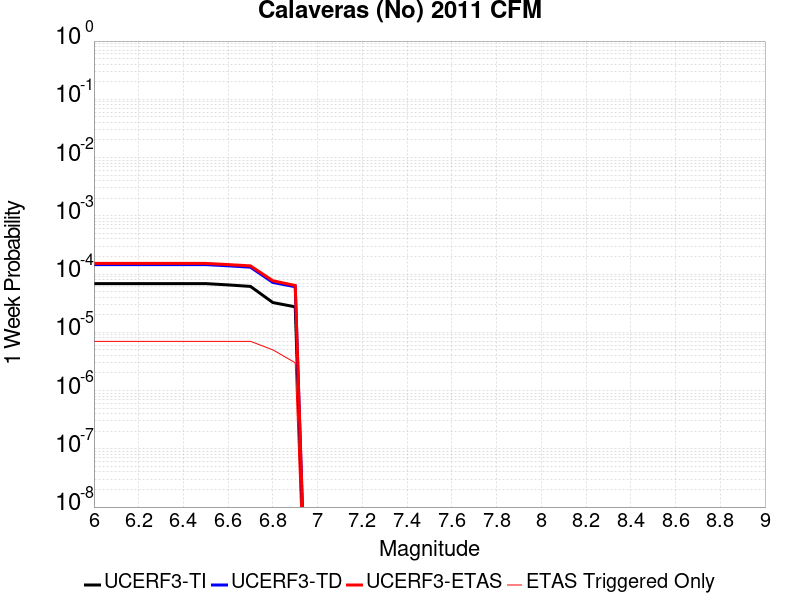 |  |  |  |

| Magnitude | 1 wk TI Prob | 1 wk TD Prob | 1 wk ETAS Prob | 1 wk ETAS/TD Gain | 1 wk ETAS Triggered Only | 1 mo TI Prob | 1 mo TD Prob | 1 mo ETAS Prob | 1 mo ETAS/TD Gain | 1 mo ETAS Triggered Only | 1 yr TI Prob | 1 yr TD Prob | 1 yr ETAS Prob | 1 yr ETAS/TD Gain | 1 yr ETAS Triggered Only | 10 yr TI Prob | 10 yr TD Prob | 10 yr ETAS Prob | 10 yr ETAS/TD Gain | 10 yr ETAS Triggered Only |
|-----|-----|-----|-----|-----|-----|-----|-----|-----|-----|-----|-----|-----|-----|-----|-----|-----|-----|-----|-----|-----|
| 6.0 | 6.853089E-5 | 1.452927E-4 | 1.6751539E-4 | 1.1529512 | 2.2225926E-5 | 2.9367075E-4 | 6.225777E-4 | 6.447898E-4 | 1.0356777 | 2.2225926E-5 | 0.0035695804 | 0.007561221 | 0.0075832787 | 1.0029173 | 2.2225926E-5 | 0.03512784 | 0.07195558 | 0.07199683 | 1.0005733 | 4.4451852E-5 |
| 6.1 | 6.853089E-5 | 1.452927E-4 | 1.6751539E-4 | 1.1529512 | 2.2225926E-5 | 2.9367075E-4 | 6.225777E-4 | 6.447898E-4 | 1.0356777 | 2.2225926E-5 | 0.0035695804 | 0.007561221 | 0.0075832787 | 1.0029173 | 2.2225926E-5 | 0.03512784 | 0.07195558 | 0.07199683 | 1.0005733 | 4.4451852E-5 |
| 6.2 | 6.853089E-5 | 1.452927E-4 | 1.6751539E-4 | 1.1529512 | 2.2225926E-5 | 2.9367075E-4 | 6.225777E-4 | 6.447898E-4 | 1.0356777 | 2.2225926E-5 | 0.0035695804 | 0.007561221 | 0.0075832787 | 1.0029173 | 2.2225926E-5 | 0.03512784 | 0.07195558 | 0.07199683 | 1.0005733 | 4.4451852E-5 |
| 6.3 | 6.853089E-5 | 1.452927E-4 | 1.6751539E-4 | 1.1529512 | 2.2225926E-5 | 2.9367075E-4 | 6.225777E-4 | 6.447898E-4 | 1.0356777 | 2.2225926E-5 | 0.0035695804 | 0.007561221 | 0.0075832787 | 1.0029173 | 2.2225926E-5 | 0.03512784 | 0.07195558 | 0.07199683 | 1.0005733 | 4.4451852E-5 |
| 6.4 | 6.853089E-5 | 1.452927E-4 | 1.6751539E-4 | 1.1529512 | 2.2225926E-5 | 2.9367075E-4 | 6.225777E-4 | 6.447898E-4 | 1.0356777 | 2.2225926E-5 | 0.0035695804 | 0.007561221 | 0.0075832787 | 1.0029173 | 2.2225926E-5 | 0.03512784 | 0.07195558 | 0.07199683 | 1.0005733 | 4.4451852E-5 |
| 6.5 | 6.853089E-5 | 1.452927E-4 | 1.6751539E-4 | 1.1529512 | 2.2225926E-5 | 2.9367075E-4 | 6.225777E-4 | 6.447898E-4 | 1.0356777 | 2.2225926E-5 | 0.0035695804 | 0.007561221 | 0.0075832787 | 1.0029173 | 2.2225926E-5 | 0.03512784 | 0.07195558 | 0.07199683 | 1.0005733 | 4.4451852E-5 |
| 6.6 | 6.5130276E-5 | 1.385732E-4 | 1.6079604E-4 | 1.160369 | 2.2225926E-5 | 2.7909988E-4 | 5.9379323E-4 | 6.16006E-4 | 1.0374082 | 2.2225926E-5 | 0.003392747 | 0.0072131394 | 0.007235205 | 1.003059 | 2.2225926E-5 | 0.033414144 | 0.06881748 | 0.06885888 | 1.0006015 | 4.4451852E-5 |
| 6.7 | 6.1341E-5 | 1.3118902E-4 | 1.5341204E-4 | 1.1693969 | 2.2225926E-5 | 2.6286353E-4 | 5.6216074E-4 | 5.843742E-4 | 1.0395144 | 2.2225926E-5 | 0.003195667 | 0.0068304855 | 0.0068525597 | 1.0032318 | 2.2225926E-5 | 0.03150101 | 0.06536239 | 0.06540393 | 1.0006356 | 4.4451852E-5 |
| 6.8 | 3.241399E-5 | 7.175236E-5 | 8.286452E-5 | 1.1548682 | 1.1112963E-5 | 1.389097E-4 | 3.075001E-4 | 3.1860964E-4 | 1.0361286 | 1.1112963E-5 | 0.0016899136 | 0.0037420401 | 0.0037531117 | 1.0029587 | 1.1112963E-5 | 0.016771203 | 0.036092106 | 0.03611353 | 1.0005935 | 2.2225926E-5 |
| 6.9 | 2.7363296E-5 | 6.059934E-5 | 6.059934E-5 | 1.0 | 0.0 | 1.1726599E-4 | 2.5971147E-4 | 2.5971147E-4 | 1.0 | 0.0 | 0.0014267784 | 0.003161987 | 0.003161987 | 1.0 | 0.0 | 0.014176525 | 0.030637112 | 0.030647883 | 1.0003517 | 1.1112963E-5 |

## Great Valley 14 (Kettleman Hills)
*[(top)](#table-of-contents)*

| 1 Week | 1 Month | 1 Year | 10 Year |
|-----|-----|-----|-----|
|  | 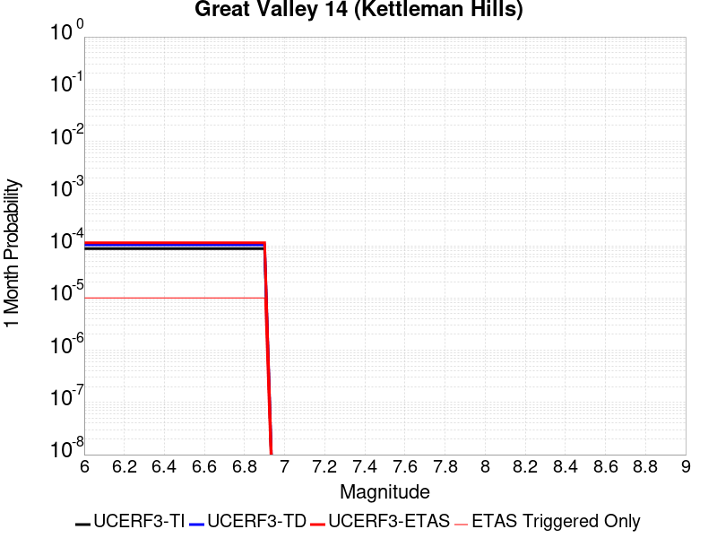 |  |  |

| Magnitude | 1 wk TI Prob | 1 wk TD Prob | 1 wk ETAS Prob | 1 wk ETAS/TD Gain | 1 wk ETAS Triggered Only | 1 mo TI Prob | 1 mo TD Prob | 1 mo ETAS Prob | 1 mo ETAS/TD Gain | 1 mo ETAS Triggered Only | 1 yr TI Prob | 1 yr TD Prob | 1 yr ETAS Prob | 1 yr ETAS/TD Gain | 1 yr ETAS Triggered Only | 10 yr TI Prob | 10 yr TD Prob | 10 yr ETAS Prob | 10 yr ETAS/TD Gain | 10 yr ETAS Triggered Only |
|-----|-----|-----|-----|-----|-----|-----|-----|-----|-----|-----|-----|-----|-----|-----|-----|-----|-----|-----|-----|-----|
| 6.0 | 2.0537544E-5 | 2.4301013E-5 | 2.4301013E-5 | 1.0 | 0.0 | 8.801508E-5 | 1.041472E-4 | 1.2637081E-4 | 1.2133865 | 2.2225926E-5 | 0.0010710567 | 0.0012679921 | 0.0013123876 | 1.0350125 | 4.4451852E-5 | 0.010659092 | 0.0126799205 | 0.012723808 | 1.0034612 | 4.4451852E-5 |
| 6.1 | 2.0537544E-5 | 2.4301013E-5 | 2.4301013E-5 | 1.0 | 0.0 | 8.801508E-5 | 1.041472E-4 | 1.2637081E-4 | 1.2133865 | 2.2225926E-5 | 0.0010710567 | 0.0012679921 | 0.0013123876 | 1.0350125 | 4.4451852E-5 | 0.010659092 | 0.0126799205 | 0.012723808 | 1.0034612 | 4.4451852E-5 |
| 6.2 | 2.0537544E-5 | 2.4301013E-5 | 2.4301013E-5 | 1.0 | 0.0 | 8.801508E-5 | 1.041472E-4 | 1.2637081E-4 | 1.2133865 | 2.2225926E-5 | 0.0010710567 | 0.0012679921 | 0.0013123876 | 1.0350125 | 4.4451852E-5 | 0.010659092 | 0.0126799205 | 0.012723808 | 1.0034612 | 4.4451852E-5 |
| 6.3 | 2.0537544E-5 | 2.4301013E-5 | 2.4301013E-5 | 1.0 | 0.0 | 8.801508E-5 | 1.041472E-4 | 1.2637081E-4 | 1.2133865 | 2.2225926E-5 | 0.0010710567 | 0.0012679921 | 0.0013123876 | 1.0350125 | 4.4451852E-5 | 0.010659092 | 0.0126799205 | 0.012723808 | 1.0034612 | 4.4451852E-5 |
| 6.4 | 2.0537544E-5 | 2.4301013E-5 | 2.4301013E-5 | 1.0 | 0.0 | 8.801508E-5 | 1.041472E-4 | 1.2637081E-4 | 1.2133865 | 2.2225926E-5 | 0.0010710567 | 0.0012679921 | 0.0013123876 | 1.0350125 | 4.4451852E-5 | 0.010659092 | 0.0126799205 | 0.012723808 | 1.0034612 | 4.4451852E-5 |
| 6.5 | 2.0537544E-5 | 2.4301013E-5 | 2.4301013E-5 | 1.0 | 0.0 | 8.801508E-5 | 1.041472E-4 | 1.2637081E-4 | 1.2133865 | 2.2225926E-5 | 0.0010710567 | 0.0012679921 | 0.0013123876 | 1.0350125 | 4.4451852E-5 | 0.010659092 | 0.0126799205 | 0.012723808 | 1.0034612 | 4.4451852E-5 |
| 6.6 | 2.0537544E-5 | 2.4301013E-5 | 2.4301013E-5 | 1.0 | 0.0 | 8.801508E-5 | 1.041472E-4 | 1.2637081E-4 | 1.2133865 | 2.2225926E-5 | 0.0010710567 | 0.0012679921 | 0.0013123876 | 1.0350125 | 4.4451852E-5 | 0.010659092 | 0.0126799205 | 0.012723808 | 1.0034612 | 4.4451852E-5 |
| 6.7 | 2.0537544E-5 | 2.4301013E-5 | 2.4301013E-5 | 1.0 | 0.0 | 8.801508E-5 | 1.041472E-4 | 1.2637081E-4 | 1.2133865 | 2.2225926E-5 | 0.0010710567 | 0.0012679921 | 0.0013123876 | 1.0350125 | 4.4451852E-5 | 0.010659092 | 0.0126799205 | 0.012723808 | 1.0034612 | 4.4451852E-5 |
| 6.8 | 2.0537544E-5 | 2.4301013E-5 | 2.4301013E-5 | 1.0 | 0.0 | 8.801508E-5 | 1.041472E-4 | 1.2637081E-4 | 1.2133865 | 2.2225926E-5 | 0.0010710567 | 0.0012679921 | 0.0013123876 | 1.0350125 | 4.4451852E-5 | 0.010659092 | 0.0126799205 | 0.012723808 | 1.0034612 | 4.4451852E-5 |
| 6.9 | 2.0537544E-5 | 2.4301013E-5 | 2.4301013E-5 | 1.0 | 0.0 | 8.801508E-5 | 1.041472E-4 | 1.2637081E-4 | 1.2133865 | 2.2225926E-5 | 0.0010710567 | 0.0012679921 | 0.0013123876 | 1.0350125 | 4.4451852E-5 | 0.010659092 | 0.0126799205 | 0.012723808 | 1.0034612 | 4.4451852E-5 |

## Hosgri
*[(top)](#table-of-contents)*

| 1 Week | 1 Month | 1 Year | 10 Year |
|-----|-----|-----|-----|
|  |  |  |  |

| Magnitude | 1 wk TI Prob | 1 wk TD Prob | 1 wk ETAS Prob | 1 wk ETAS/TD Gain | 1 wk ETAS Triggered Only | 1 mo TI Prob | 1 mo TD Prob | 1 mo ETAS Prob | 1 mo ETAS/TD Gain | 1 mo ETAS Triggered Only | 1 yr TI Prob | 1 yr TD Prob | 1 yr ETAS Prob | 1 yr ETAS/TD Gain | 1 yr ETAS Triggered Only | 10 yr TI Prob | 10 yr TD Prob | 10 yr ETAS Prob | 10 yr ETAS/TD Gain | 10 yr ETAS Triggered Only |
|-----|-----|-----|-----|-----|-----|-----|-----|-----|-----|-----|-----|-----|-----|-----|-----|-----|-----|-----|-----|-----|
| 6.0 | 3.1107833E-5 | 3.720853E-5 | 5.943363E-5 | 1.597312 | 2.2225926E-5 | 1.3331248E-4 | 1.5945687E-4 | 1.8167926E-4 | 1.1393629 | 2.2225926E-5 | 0.0016218709 | 0.001939923 | 0.0019621057 | 1.0114349 | 2.2225926E-5 | 0.01610085 | 0.01925631 | 0.019299908 | 1.002264 | 4.4451852E-5 |
| 6.1 | 3.1107833E-5 | 3.720853E-5 | 5.943363E-5 | 1.597312 | 2.2225926E-5 | 1.3331248E-4 | 1.5945687E-4 | 1.8167926E-4 | 1.1393629 | 2.2225926E-5 | 0.0016218709 | 0.001939923 | 0.0019621057 | 1.0114349 | 2.2225926E-5 | 0.01610085 | 0.01925631 | 0.019299908 | 1.002264 | 4.4451852E-5 |
| 6.2 | 3.1107833E-5 | 3.720853E-5 | 5.943363E-5 | 1.597312 | 2.2225926E-5 | 1.3331248E-4 | 1.5945687E-4 | 1.8167926E-4 | 1.1393629 | 2.2225926E-5 | 0.0016218709 | 0.001939923 | 0.0019621057 | 1.0114349 | 2.2225926E-5 | 0.01610085 | 0.01925631 | 0.019299908 | 1.002264 | 4.4451852E-5 |
| 6.3 | 3.1107833E-5 | 3.720853E-5 | 5.943363E-5 | 1.597312 | 2.2225926E-5 | 1.3331248E-4 | 1.5945687E-4 | 1.8167926E-4 | 1.1393629 | 2.2225926E-5 | 0.0016218709 | 0.001939923 | 0.0019621057 | 1.0114349 | 2.2225926E-5 | 0.01610085 | 0.01925631 | 0.019299908 | 1.002264 | 4.4451852E-5 |
| 6.4 | 3.1107833E-5 | 3.720853E-5 | 5.943363E-5 | 1.597312 | 2.2225926E-5 | 1.3331248E-4 | 1.5945687E-4 | 1.8167926E-4 | 1.1393629 | 2.2225926E-5 | 0.0016218709 | 0.001939923 | 0.0019621057 | 1.0114349 | 2.2225926E-5 | 0.01610085 | 0.01925631 | 0.019299908 | 1.002264 | 4.4451852E-5 |
| 6.5 | 3.1107833E-5 | 3.720853E-5 | 5.943363E-5 | 1.597312 | 2.2225926E-5 | 1.3331248E-4 | 1.5945687E-4 | 1.8167926E-4 | 1.1393629 | 2.2225926E-5 | 0.0016218709 | 0.001939923 | 0.0019621057 | 1.0114349 | 2.2225926E-5 | 0.01610085 | 0.01925631 | 0.019299908 | 1.002264 | 4.4451852E-5 |
| 6.6 | 2.743495E-5 | 3.2780124E-5 | 5.500532E-5 | 1.6780084 | 2.2225926E-5 | 1.1757306E-4 | 1.4048017E-4 | 1.6270297E-4 | 1.1581918 | 2.2225926E-5 | 0.0014305119 | 0.0017092682 | 0.0017314561 | 1.0129809 | 2.2225926E-5 | 0.014213383 | 0.016987413 | 0.017031109 | 1.0025723 | 4.4451852E-5 |
| 6.7 | 2.418707E-5 | 2.8858389E-5 | 3.9971033E-5 | 1.385075 | 1.1112963E-5 | 1.0365475E-4 | 1.2367443E-4 | 1.3478602E-4 | 1.0898455 | 1.1112963E-5 | 0.001261266 | 0.0015049598 | 0.001516056 | 1.0073731 | 1.1112963E-5 | 0.012541314 | 0.014973709 | 0.01500655 | 1.0021932 | 3.333889E-5 |
| 6.8 | 2.1292695E-5 | 2.5360874E-5 | 3.6473553E-5 | 1.4381821 | 1.1112963E-5 | 9.125122E-5 | 1.0868641E-4 | 1.1979816E-4 | 1.1022369 | 1.1112963E-5 | 0.0011104173 | 0.0013227165 | 0.0013338147 | 1.0083905 | 1.1112963E-5 | 0.011048851 | 0.013174292 | 0.013207192 | 1.0024973 | 3.333889E-5 |
| 6.9 | 1.8692357E-5 | 2.221764E-5 | 3.3330358E-5 | 1.5001754 | 1.1112963E-5 | 8.010764E-5 | 9.521646E-5 | 1.0632837E-4 | 1.1167015 | 1.1112963E-5 | 9.7487407E-4 | 0.001158906 | 0.0011700061 | 1.0095781 | 1.1112963E-5 | 0.009706085 | 0.01155437 | 0.011587324 | 1.0028521 | 3.333889E-5 |
| 7.0 | 1.6336586E-5 | 1.9370036E-5 | 1.9370036E-5 | 1.0 | 0.0 | 7.001206E-5 | 8.301328E-5 | 8.301328E-5 | 1.0 | 0.0 | 8.520634E-4 | 0.0010104795 | 0.0010104795 | 1.0 | 0.0 | 0.008488038 | 0.010084504 | 0.010106507 | 1.0021818 | 2.2225926E-5 |
| 7.1 | 1.4184237E-5 | 1.6776847E-5 | 1.6776847E-5 | 1.0 | 0.0 | 6.0788174E-5 | 7.1900264E-5 | 7.1900264E-5 | 1.0 | 0.0 | 7.398447E-4 | 8.7529485E-4 | 8.7529485E-4 | 1.0 | 0.0 | 0.007373864 | 0.008744048 | 0.008755064 | 1.0012598 | 1.1112963E-5 |
| 7.2 | 1.2201091E-5 | 1.4405841E-5 | 1.4405841E-5 | 1.0 | 0.0 | 5.228934E-5 | 6.1739316E-5 | 6.1739316E-5 | 1.0 | 0.0 | 6.3643674E-4 | 7.516762E-4 | 7.516762E-4 | 1.0 | 0.0 | 0.006346171 | 0.007516762 | 0.0075277914 | 1.0014673 | 1.1112963E-5 |

## San Gregorio (North) 2011 CFM
*[(top)](#table-of-contents)*

| 1 Week | 1 Month | 1 Year | 10 Year |
|-----|-----|-----|-----|
|  |  |  |  |

| Magnitude | 1 wk TI Prob | 1 wk TD Prob | 1 wk ETAS Prob | 1 wk ETAS/TD Gain | 1 wk ETAS Triggered Only | 1 mo TI Prob | 1 mo TD Prob | 1 mo ETAS Prob | 1 mo ETAS/TD Gain | 1 mo ETAS Triggered Only | 1 yr TI Prob | 1 yr TD Prob | 1 yr ETAS Prob | 1 yr ETAS/TD Gain | 1 yr ETAS Triggered Only | 10 yr TI Prob | 10 yr TD Prob | 10 yr ETAS Prob | 10 yr ETAS/TD Gain | 10 yr ETAS Triggered Only |
|-----|-----|-----|-----|-----|-----|-----|-----|-----|-----|-----|-----|-----|-----|-----|-----|-----|-----|-----|-----|-----|
| 6.0 | 5.5588036E-5 | 7.309379E-5 | 9.531809E-5 | 1.3040519 | 2.2225926E-5 | 2.3821268E-4 | 3.1322511E-4 | 3.4655357E-4 | 1.1064042 | 3.333889E-5 | 0.0028963822 | 0.0038075363 | 0.0038407482 | 1.0087227 | 3.333889E-5 | 0.028589217 | 0.037540782 | 0.037583563 | 1.0011396 | 4.4451852E-5 |
| 6.1 | 5.5588036E-5 | 7.309379E-5 | 9.531809E-5 | 1.3040519 | 2.2225926E-5 | 2.3821268E-4 | 3.1322511E-4 | 3.4655357E-4 | 1.1064042 | 3.333889E-5 | 0.0028963822 | 0.0038075363 | 0.0038407482 | 1.0087227 | 3.333889E-5 | 0.028589217 | 0.037540782 | 0.037583563 | 1.0011396 | 4.4451852E-5 |
| 6.2 | 5.5588036E-5 | 7.309379E-5 | 9.531809E-5 | 1.3040519 | 2.2225926E-5 | 2.3821268E-4 | 3.1322511E-4 | 3.4655357E-4 | 1.1064042 | 3.333889E-5 | 0.0028963822 | 0.0038075363 | 0.0038407482 | 1.0087227 | 3.333889E-5 | 0.028589217 | 0.037540782 | 0.037583563 | 1.0011396 | 4.4451852E-5 |
| 6.3 | 5.5588036E-5 | 7.309379E-5 | 9.531809E-5 | 1.3040519 | 2.2225926E-5 | 2.3821268E-4 | 3.1322511E-4 | 3.4655357E-4 | 1.1064042 | 3.333889E-5 | 0.0028963822 | 0.0038075363 | 0.0038407482 | 1.0087227 | 3.333889E-5 | 0.028589217 | 0.037540782 | 0.037583563 | 1.0011396 | 4.4451852E-5 |
| 6.4 | 5.5588036E-5 | 7.309379E-5 | 9.531809E-5 | 1.3040519 | 2.2225926E-5 | 2.3821268E-4 | 3.1322511E-4 | 3.4655357E-4 | 1.1064042 | 3.333889E-5 | 0.0028963822 | 0.0038075363 | 0.0038407482 | 1.0087227 | 3.333889E-5 | 0.028589217 | 0.037540782 | 0.037583563 | 1.0011396 | 4.4451852E-5 |
| 6.5 | 5.5588036E-5 | 7.309379E-5 | 9.531809E-5 | 1.3040519 | 2.2225926E-5 | 2.3821268E-4 | 3.1322511E-4 | 3.4655357E-4 | 1.1064042 | 3.333889E-5 | 0.0028963822 | 0.0038075363 | 0.0038407482 | 1.0087227 | 3.333889E-5 | 0.028589217 | 0.037540782 | 0.037583563 | 1.0011396 | 4.4451852E-5 |
| 6.6 | 5.0958548E-5 | 6.682393E-5 | 8.9048364E-5 | 1.3325821 | 2.2225926E-5 | 2.183755E-4 | 2.863609E-4 | 3.1969024E-4 | 1.1163893 | 3.333889E-5 | 0.00265548 | 0.0034816042 | 0.003514827 | 1.0095423 | 3.333889E-5 | 0.026239716 | 0.034387864 | 0.034430787 | 1.0012482 | 4.4451852E-5 |
| 6.7 | 4.7004516E-5 | 6.144922E-5 | 8.367378E-5 | 1.3616736 | 2.2225926E-5 | 2.0143238E-4 | 2.6333152E-4 | 2.9666163E-4 | 1.1265709 | 3.333889E-5 | 0.0024496808 | 0.0032021217 | 0.0032353536 | 1.0103781 | 3.333889E-5 | 0.024228523 | 0.0316763 | 0.031719346 | 1.0013589 | 4.4451852E-5 |
| 6.8 | 4.3033368E-5 | 5.6114783E-5 | 7.8339464E-5 | 1.3960575 | 2.2225926E-5 | 1.8441568E-4 | 2.4047414E-4 | 2.73805E-4 | 1.1386048 | 3.333889E-5 | 0.0022429486 | 0.0029246213 | 0.0029578626 | 1.011366 | 3.333889E-5 | 0.02220445 | 0.028973768 | 0.029016932 | 1.0014898 | 4.4451852E-5 |
| 6.9 | 3.8965114E-5 | 5.0579423E-5 | 7.280423E-5 | 1.439404 | 2.2225926E-5 | 1.6698265E-4 | 2.1675539E-4 | 2.5008706E-4 | 1.1537755 | 3.333889E-5 | 0.002031118 | 0.0026365893 | 0.0026698404 | 1.0126114 | 3.333889E-5 | 0.020126536 | 0.026162632 | 0.026195098 | 1.001241 | 3.333889E-5 |
| 7.0 | 3.5280933E-5 | 4.5518376E-5 | 6.774329E-5 | 1.4882625 | 2.2225926E-5 | 1.5119524E-4 | 1.9506861E-4 | 2.28401E-4 | 1.1708752 | 3.333889E-5 | 0.0018392478 | 0.0023731652 | 0.0024064248 | 1.014015 | 3.333889E-5 | 0.018240994 | 0.023584368 | 0.02361692 | 1.0013802 | 3.333889E-5 |
| 7.1 | 3.1442076E-5 | 4.0255403E-5 | 5.136792E-5 | 1.2760503 | 1.1112963E-5 | 1.347448E-4 | 1.7251623E-4 | 1.8362727E-4 | 1.0644058 | 1.1112963E-5 | 0.0016392834 | 0.002099158 | 0.0021102475 | 1.0052829 | 1.1112963E-5 | 0.016272435 | 0.02089746 | 0.02090834 | 1.0005207 | 1.1112963E-5 |
| 7.2 | 2.8039283E-5 | 3.552108E-5 | 4.663365E-5 | 1.3128444 | 1.1112963E-5 | 1.2016282E-4 | 1.5222882E-4 | 1.633401E-4 | 1.0729905 | 1.1112963E-5 | 0.0014620004 | 0.00185261 | 0.0018637023 | 1.0059874 | 1.1112963E-5 | 0.0145241935 | 0.018474856 | 0.018485764 | 1.0005904 | 1.1112963E-5 |
| 7.3 | 2.4776145E-5 | 3.1098632E-5 | 4.221125E-5 | 1.3573346 | 1.1112963E-5 | 1.0617916E-4 | 1.3327754E-4 | 1.4438904E-4 | 1.083371 | 1.1112963E-5 | 0.0012919646 | 0.0016222443 | 0.0016333391 | 1.0068393 | 1.1112963E-5 | 0.012844792 | 0.0162039 | 0.016214835 | 1.0006747 | 1.1112963E-5 |
| 7.4 | 2.1508438E-5 | 2.6824098E-5 | 3.7936763E-5 | 1.4142792 | 1.1112963E-5 | 9.217577E-5 | 1.1495983E-4 | 1.2607152E-4 | 1.0966572 | 1.1112963E-5 | 0.0011216622 | 0.0013995317 | 0.0014106291 | 1.0079293 | 1.1112963E-5 | 0.011160175 | 0.014002349 | 0.014013306 | 1.0007825 | 1.1112963E-5 |

## Imperial
*[(top)](#table-of-contents)*

| 1 Week | 1 Month | 1 Year | 10 Year |
|-----|-----|-----|-----|
|  |  |  |  |

| Magnitude | 1 wk TI Prob | 1 wk TD Prob | 1 wk ETAS Prob | 1 wk ETAS/TD Gain | 1 wk ETAS Triggered Only | 1 mo TI Prob | 1 mo TD Prob | 1 mo ETAS Prob | 1 mo ETAS/TD Gain | 1 mo ETAS Triggered Only | 1 yr TI Prob | 1 yr TD Prob | 1 yr ETAS Prob | 1 yr ETAS/TD Gain | 1 yr ETAS Triggered Only | 10 yr TI Prob | 10 yr TD Prob | 10 yr ETAS Prob | 10 yr ETAS/TD Gain | 10 yr ETAS Triggered Only |
|-----|-----|-----|-----|-----|-----|-----|-----|-----|-----|-----|-----|-----|-----|-----|-----|-----|-----|-----|-----|-----|
| 6.0 | 3.2610117E-4 | 4.2223663E-4 | 4.4445318E-4 | 1.0526164 | 2.2225926E-5 | 0.001396828 | 0.0018087402 | 0.0018309259 | 1.0122658 | 2.2225926E-5 | 0.016874276 | 0.0221874 | 0.02222 | 1.0014693 | 3.333889E-5 | 0.1564893 | 0.21658373 | 0.21661855 | 1.0001608 | 4.4451852E-5 |
| 6.1 | 3.2610117E-4 | 4.2223663E-4 | 4.4445318E-4 | 1.0526164 | 2.2225926E-5 | 0.001396828 | 0.0018087402 | 0.0018309259 | 1.0122658 | 2.2225926E-5 | 0.016874276 | 0.0221874 | 0.02222 | 1.0014693 | 3.333889E-5 | 0.1564893 | 0.21658373 | 0.21661855 | 1.0001608 | 4.4451852E-5 |
| 6.2 | 3.2610117E-4 | 4.2223663E-4 | 4.4445318E-4 | 1.0526164 | 2.2225926E-5 | 0.001396828 | 0.0018087402 | 0.0018309259 | 1.0122658 | 2.2225926E-5 | 0.016874276 | 0.0221874 | 0.02222 | 1.0014693 | 3.333889E-5 | 0.1564893 | 0.21658373 | 0.21661855 | 1.0001608 | 4.4451852E-5 |
| 6.3 | 3.2610117E-4 | 4.2223663E-4 | 4.4445318E-4 | 1.0526164 | 2.2225926E-5 | 0.001396828 | 0.0018087402 | 0.0018309259 | 1.0122658 | 2.2225926E-5 | 0.016874276 | 0.0221874 | 0.02222 | 1.0014693 | 3.333889E-5 | 0.1564893 | 0.21658373 | 0.21661855 | 1.0001608 | 4.4451852E-5 |
| 6.4 | 3.2610117E-4 | 4.2223663E-4 | 4.4445318E-4 | 1.0526164 | 2.2225926E-5 | 0.001396828 | 0.0018087402 | 0.0018309259 | 1.0122658 | 2.2225926E-5 | 0.016874276 | 0.0221874 | 0.02222 | 1.0014693 | 3.333889E-5 | 0.1564893 | 0.21658373 | 0.21661855 | 1.0001608 | 4.4451852E-5 |
| 6.5 | 3.2610117E-4 | 4.2223663E-4 | 4.4445318E-4 | 1.0526164 | 2.2225926E-5 | 0.001396828 | 0.0018087402 | 0.0018309259 | 1.0122658 | 2.2225926E-5 | 0.016874276 | 0.0221874 | 0.02222 | 1.0014693 | 3.333889E-5 | 0.1564893 | 0.21658373 | 0.21661855 | 1.0001608 | 4.4451852E-5 |
| 6.6 | 2.7505832E-4 | 3.51371E-4 | 3.7358914E-4 | 1.0632327 | 2.2225926E-5 | 0.0011782888 | 0.0015054093 | 0.0015276017 | 1.0147418 | 2.2225926E-5 | 0.014251595 | 0.018531771 | 0.018564492 | 1.0017657 | 3.333889E-5 | 0.13371493 | 0.18699032 | 0.18702647 | 1.0001932 | 4.4451852E-5 |
| 6.7 | 2.2892522E-4 | 2.8752215E-4 | 3.097417E-4 | 1.0772793 | 2.2225926E-5 | 9.807391E-4 | 0.0012320514 | 0.00125425 | 1.0180175 | 2.2225926E-5 | 0.011875284 | 0.015238598 | 0.015271428 | 1.0021545 | 3.333889E-5 | 0.11260368 | 0.1593126 | 0.15934063 | 1.000176 | 3.333889E-5 |
| 6.8 | 1.8687606E-4 | 2.3508105E-4 | 2.5730176E-4 | 1.0945235 | 2.2225926E-5 | 8.0065156E-4 | 0.0010074902 | 0.0010296938 | 1.0220385 | 2.2225926E-5 | 0.009704442 | 0.012523335 | 0.012556258 | 1.0026288 | 3.333889E-5 | 0.09291432 | 0.13362566 | 0.13365455 | 1.0002161 | 3.333889E-5 |
| 6.9 | 1.8687606E-4 | 2.3508105E-4 | 2.5730176E-4 | 1.0945235 | 2.2225926E-5 | 8.0065156E-4 | 0.0010074902 | 0.0010296938 | 1.0220385 | 2.2225926E-5 | 0.009704442 | 0.012523335 | 0.012556258 | 1.0026288 | 3.333889E-5 | 0.09291432 | 0.13362566 | 0.13365455 | 1.0002161 | 3.333889E-5 |

## Emerson-Copper Mtn 2011
*[(top)](#table-of-contents)*

| 1 Week | 1 Month | 1 Year | 10 Year |
|-----|-----|-----|-----|
|  |  |  |  |

| Magnitude | 1 wk TI Prob | 1 wk TD Prob | 1 wk ETAS Prob | 1 wk ETAS/TD Gain | 1 wk ETAS Triggered Only | 1 mo TI Prob | 1 mo TD Prob | 1 mo ETAS Prob | 1 mo ETAS/TD Gain | 1 mo ETAS Triggered Only | 1 yr TI Prob | 1 yr TD Prob | 1 yr ETAS Prob | 1 yr ETAS/TD Gain | 1 yr ETAS Triggered Only | 10 yr TI Prob | 10 yr TD Prob | 10 yr ETAS Prob | 10 yr ETAS/TD Gain | 10 yr ETAS Triggered Only |
|-----|-----|-----|-----|-----|-----|-----|-----|-----|-----|-----|-----|-----|-----|-----|-----|-----|-----|-----|-----|-----|
| 6.0 | 1.3738761E-5 | 7.363802E-6 | 2.9589564E-5 | 4.0182457 | 2.2225926E-5 | 5.8879075E-5 | 3.1558855E-5 | 6.4896696E-5 | 2.0563703 | 3.333889E-5 | 7.166169E-4 | 3.841763E-4 | 4.1750236E-4 | 1.0867468 | 3.333889E-5 | 0.007143104 | 0.0038365931 | 0.0038808745 | 1.0115418 | 4.4451852E-5 |
| 6.1 | 1.3738761E-5 | 7.363802E-6 | 2.9589564E-5 | 4.0182457 | 2.2225926E-5 | 5.8879075E-5 | 3.1558855E-5 | 6.4896696E-5 | 2.0563703 | 3.333889E-5 | 7.166169E-4 | 3.841763E-4 | 4.1750236E-4 | 1.0867468 | 3.333889E-5 | 0.007143104 | 0.0038365931 | 0.0038808745 | 1.0115418 | 4.4451852E-5 |
| 6.2 | 1.3738761E-5 | 7.363802E-6 | 2.9589564E-5 | 4.0182457 | 2.2225926E-5 | 5.8879075E-5 | 3.1558855E-5 | 6.4896696E-5 | 2.0563703 | 3.333889E-5 | 7.166169E-4 | 3.841763E-4 | 4.1750236E-4 | 1.0867468 | 3.333889E-5 | 0.007143104 | 0.0038365931 | 0.0038808745 | 1.0115418 | 4.4451852E-5 |
| 6.3 | 1.3738761E-5 | 7.363802E-6 | 2.9589564E-5 | 4.0182457 | 2.2225926E-5 | 5.8879075E-5 | 3.1558855E-5 | 6.4896696E-5 | 2.0563703 | 3.333889E-5 | 7.166169E-4 | 3.841763E-4 | 4.1750236E-4 | 1.0867468 | 3.333889E-5 | 0.007143104 | 0.0038365931 | 0.0038808745 | 1.0115418 | 4.4451852E-5 |
| 6.4 | 1.3738761E-5 | 7.363802E-6 | 2.9589564E-5 | 4.0182457 | 2.2225926E-5 | 5.8879075E-5 | 3.1558855E-5 | 6.4896696E-5 | 2.0563703 | 3.333889E-5 | 7.166169E-4 | 3.841763E-4 | 4.1750236E-4 | 1.0867468 | 3.333889E-5 | 0.007143104 | 0.0038365931 | 0.0038808745 | 1.0115418 | 4.4451852E-5 |
| 6.5 | 1.3738761E-5 | 7.363802E-6 | 2.9589564E-5 | 4.0182457 | 2.2225926E-5 | 5.8879075E-5 | 3.1558855E-5 | 6.4896696E-5 | 2.0563703 | 3.333889E-5 | 7.166169E-4 | 3.841763E-4 | 4.1750236E-4 | 1.0867468 | 3.333889E-5 | 0.007143104 | 0.0038365931 | 0.0038808745 | 1.0115418 | 4.4451852E-5 |
| 6.6 | 1.2946993E-5 | 6.644407E-6 | 1.7757297E-5 | 2.6725178 | 1.1112963E-5 | 5.5485933E-5 | 2.8475804E-5 | 5.07011E-5 | 1.7804976 | 2.2225926E-5 | 6.7533186E-4 | 3.4665258E-4 | 3.688708E-4 | 1.0640936 | 2.2225926E-5 | 0.006732832 | 0.0034625726 | 0.003495796 | 1.009595 | 3.333889E-5 |
| 6.7 | 1.1127743E-5 | 5.301015E-6 | 1.6413918E-5 | 3.096373 | 1.1112963E-5 | 4.7689457E-5 | 2.2718517E-5 | 4.494394E-5 | 1.9782954 | 2.2225926E-5 | 5.8046443E-4 | 2.765771E-4 | 2.987969E-4 | 1.0803385 | 2.2225926E-5 | 0.005789506 | 0.00276373 | 0.0027969768 | 1.0120296 | 3.333889E-5 |
| 6.8 | 9.893959E-6 | 4.385705E-6 | 1.549862E-5 | 3.5338948 | 1.1112963E-5 | 4.2401993E-5 | 1.8795821E-5 | 4.102133E-5 | 2.1824708 | 2.2225926E-5 | 5.16122E-4 | 2.2882903E-4 | 2.5104987E-4 | 1.0971067 | 2.2225926E-5 | 0.005149249 | 0.0022873012 | 0.002320564 | 1.0145423 | 3.333889E-5 |
| 6.9 | 8.432605E-6 | 3.3001859E-6 | 1.4413113E-5 | 4.367364 | 1.1112963E-5 | 3.6139234E-5 | 1.4143652E-5 | 3.6369263E-5 | 2.5714195 | 2.2225926E-5 | 4.3990635E-4 | 1.7219881E-4 | 1.944209E-4 | 1.1290491 | 2.2225926E-5 | 0.0043903654 | 0.0017219725 | 0.001755254 | 1.0193275 | 3.333889E-5 |
| 7.0 | 8.181617E-6 | 3.2873893E-6 | 1.4400316E-5 | 4.3804717 | 1.1112963E-5 | 3.5063604E-5 | 1.40888105E-5 | 3.6314425E-5 | 2.5775366 | 2.2225926E-5 | 4.2681574E-4 | 1.7153122E-4 | 1.9375334E-4 | 1.1295514 | 2.2225926E-5 | 0.004259969 | 0.0017153069 | 0.0017485886 | 1.0194027 | 3.333889E-5 |
| 7.1 | 3.1700695E-6 | 5.4303326E-9 | 5.4303326E-9 | 1.0 | 0.0 | 1.3585942E-5 | 2.3272854E-8 | 2.3272854E-8 | 1.0 | 0.0 | 1.6539628E-4 | 2.83347E-7 | 2.83347E-7 | 1.0 | 0.0 | 0.0016527324 | 2.833469E-6 | 2.833469E-6 | 1.0 | 0.0 |
| 7.2 | 2.8879267E-6 | 9.331039E-10 | 9.331039E-10 | 1.0 | 0.0 | 1.237677E-5 | 3.999017E-9 | 3.999017E-9 | 1.0 | 0.0 | 1.5067676E-4 | 4.868803E-8 | 4.868803E-8 | 1.0 | 0.0 | 0.0015057464 | 4.868803E-7 | 4.868803E-7 | 1.0 | 0.0 |
| 7.3 | 2.4973094E-6 | 8.4248597E-10 | 8.4248597E-10 | 1.0 | 0.0 | 1.0702711E-5 | 3.6106542E-9 | 3.6106542E-9 | 1.0 | 0.0 | 1.3029772E-4 | 4.3959716E-8 | 4.3959716E-8 | 1.0 | 0.0 | 0.0013022134 | 4.3959716E-7 | 4.3959716E-7 | 1.0 | 0.0 |

## Great Valley 12
*[(top)](#table-of-contents)*

| 1 Week | 1 Month | 1 Year | 10 Year |
|-----|-----|-----|-----|
|  |  |  |  |

| Magnitude | 1 wk TI Prob | 1 wk TD Prob | 1 wk ETAS Prob | 1 wk ETAS/TD Gain | 1 wk ETAS Triggered Only | 1 mo TI Prob | 1 mo TD Prob | 1 mo ETAS Prob | 1 mo ETAS/TD Gain | 1 mo ETAS Triggered Only | 1 yr TI Prob | 1 yr TD Prob | 1 yr ETAS Prob | 1 yr ETAS/TD Gain | 1 yr ETAS Triggered Only | 10 yr TI Prob | 10 yr TD Prob | 10 yr ETAS Prob | 10 yr ETAS/TD Gain | 10 yr ETAS Triggered Only |
|-----|-----|-----|-----|-----|-----|-----|-----|-----|-----|-----|-----|-----|-----|-----|-----|-----|-----|-----|-----|-----|
| 6.0 | 4.2144962E-5 | 6.0987146E-5 | 6.0987146E-5 | 1.0 | 0.0 | 1.8060877E-4 | 2.6137347E-4 | 2.6137347E-4 | 1.0 | 0.0 | 0.002196694 | 0.0031813493 | 0.003214582 | 1.0104462 | 3.333889E-5 | 0.021751061 | 0.031729307 | 0.03177235 | 1.0013565 | 4.4451852E-5 |
| 6.1 | 4.2144962E-5 | 6.0987146E-5 | 6.0987146E-5 | 1.0 | 0.0 | 1.8060877E-4 | 2.6137347E-4 | 2.6137347E-4 | 1.0 | 0.0 | 0.002196694 | 0.0031813493 | 0.003214582 | 1.0104462 | 3.333889E-5 | 0.021751061 | 0.031729307 | 0.03177235 | 1.0013565 | 4.4451852E-5 |
| 6.2 | 4.2144962E-5 | 6.0987146E-5 | 6.0987146E-5 | 1.0 | 0.0 | 1.8060877E-4 | 2.6137347E-4 | 2.6137347E-4 | 1.0 | 0.0 | 0.002196694 | 0.0031813493 | 0.003214582 | 1.0104462 | 3.333889E-5 | 0.021751061 | 0.031729307 | 0.03177235 | 1.0013565 | 4.4451852E-5 |
| 6.3 | 4.2144962E-5 | 6.0987146E-5 | 6.0987146E-5 | 1.0 | 0.0 | 1.8060877E-4 | 2.6137347E-4 | 2.6137347E-4 | 1.0 | 0.0 | 0.002196694 | 0.0031813493 | 0.003214582 | 1.0104462 | 3.333889E-5 | 0.021751061 | 0.031729307 | 0.03177235 | 1.0013565 | 4.4451852E-5 |

## North Frontal  (West)
*[(top)](#table-of-contents)*

| 1 Week | 1 Month | 1 Year | 10 Year |
|-----|-----|-----|-----|
|  |  |  |  |

| Magnitude | 1 wk TI Prob | 1 wk TD Prob | 1 wk ETAS Prob | 1 wk ETAS/TD Gain | 1 wk ETAS Triggered Only | 1 mo TI Prob | 1 mo TD Prob | 1 mo ETAS Prob | 1 mo ETAS/TD Gain | 1 mo ETAS Triggered Only | 1 yr TI Prob | 1 yr TD Prob | 1 yr ETAS Prob | 1 yr ETAS/TD Gain | 1 yr ETAS Triggered Only | 10 yr TI Prob | 10 yr TD Prob | 10 yr ETAS Prob | 10 yr ETAS/TD Gain | 10 yr ETAS Triggered Only |
|-----|-----|-----|-----|-----|-----|-----|-----|-----|-----|-----|-----|-----|-----|-----|-----|-----|-----|-----|-----|-----|
| 6.0 | 1.416208E-5 | 1.5408456E-5 | 2.6521247E-5 | 1.7212139 | 1.1112963E-5 | 6.0693215E-5 | 6.603497E-5 | 7.71472E-5 | 1.168278 | 1.1112963E-5 | 7.386894E-4 | 8.037511E-4 | 8.2595914E-4 | 1.0276306 | 2.2225926E-5 | 0.007362387 | 0.008015518 | 0.008059613 | 1.0055013 | 4.4451852E-5 |
| 6.1 | 1.416208E-5 | 1.5408456E-5 | 2.6521247E-5 | 1.7212139 | 1.1112963E-5 | 6.0693215E-5 | 6.603497E-5 | 7.71472E-5 | 1.168278 | 1.1112963E-5 | 7.386894E-4 | 8.037511E-4 | 8.2595914E-4 | 1.0276306 | 2.2225926E-5 | 0.007362387 | 0.008015518 | 0.008059613 | 1.0055013 | 4.4451852E-5 |
| 6.2 | 1.416208E-5 | 1.5408456E-5 | 2.6521247E-5 | 1.7212139 | 1.1112963E-5 | 6.0693215E-5 | 6.603497E-5 | 7.71472E-5 | 1.168278 | 1.1112963E-5 | 7.386894E-4 | 8.037511E-4 | 8.2595914E-4 | 1.0276306 | 2.2225926E-5 | 0.007362387 | 0.008015518 | 0.008059613 | 1.0055013 | 4.4451852E-5 |
| 6.3 | 1.416208E-5 | 1.5408456E-5 | 2.6521247E-5 | 1.7212139 | 1.1112963E-5 | 6.0693215E-5 | 6.603497E-5 | 7.71472E-5 | 1.168278 | 1.1112963E-5 | 7.386894E-4 | 8.037511E-4 | 8.2595914E-4 | 1.0276306 | 2.2225926E-5 | 0.007362387 | 0.008015518 | 0.008059613 | 1.0055013 | 4.4451852E-5 |
| 6.4 | 1.416208E-5 | 1.5408456E-5 | 2.6521247E-5 | 1.7212139 | 1.1112963E-5 | 6.0693215E-5 | 6.603497E-5 | 7.71472E-5 | 1.168278 | 1.1112963E-5 | 7.386894E-4 | 8.037511E-4 | 8.2595914E-4 | 1.0276306 | 2.2225926E-5 | 0.007362387 | 0.008015518 | 0.008059613 | 1.0055013 | 4.4451852E-5 |
| 6.5 | 1.416208E-5 | 1.5408456E-5 | 2.6521247E-5 | 1.7212139 | 1.1112963E-5 | 6.0693215E-5 | 6.603497E-5 | 7.71472E-5 | 1.168278 | 1.1112963E-5 | 7.386894E-4 | 8.037511E-4 | 8.2595914E-4 | 1.0276306 | 2.2225926E-5 | 0.007362387 | 0.008015518 | 0.008059613 | 1.0055013 | 4.4451852E-5 |
| 6.6 | 1.416208E-5 | 1.5408456E-5 | 2.6521247E-5 | 1.7212139 | 1.1112963E-5 | 6.0693215E-5 | 6.603497E-5 | 7.71472E-5 | 1.168278 | 1.1112963E-5 | 7.386894E-4 | 8.037511E-4 | 8.2595914E-4 | 1.0276306 | 2.2225926E-5 | 0.007362387 | 0.008015518 | 0.008059613 | 1.0055013 | 4.4451852E-5 |
| 6.7 | 1.02118975E-5 | 1.1093774E-5 | 2.2206614E-5 | 2.0017185 | 1.1112963E-5 | 4.3764543E-5 | 4.754425E-5 | 5.8656686E-5 | 1.2337283 | 1.1112963E-5 | 5.32703E-4 | 5.787631E-4 | 6.009761E-4 | 1.0383803 | 2.2225926E-5 | 0.0053142784 | 0.00577899 | 0.005823185 | 1.0076475 | 4.4451852E-5 |
| 6.8 | 1.02118975E-5 | 1.1093774E-5 | 2.2206614E-5 | 2.0017185 | 1.1112963E-5 | 4.3764543E-5 | 4.754425E-5 | 5.8656686E-5 | 1.2337283 | 1.1112963E-5 | 5.32703E-4 | 5.787631E-4 | 6.009761E-4 | 1.0383803 | 2.2225926E-5 | 0.0053142784 | 0.00577899 | 0.005823185 | 1.0076475 | 4.4451852E-5 |
| 6.9 | 7.711016E-6 | 8.362843E-6 | 1.9475714E-5 | 2.3288388 | 1.1112963E-5 | 3.3046796E-5 | 3.5840614E-5 | 4.6953177E-5 | 1.3100551 | 1.1112963E-5 | 4.0227044E-4 | 4.3633426E-4 | 4.585505E-4 | 1.0509156 | 2.2225926E-5 | 0.0040154303 | 0.004360873 | 0.004394066 | 1.0076116 | 3.333889E-5 |
| 7.0 | 7.711016E-6 | 8.362843E-6 | 1.9475714E-5 | 2.3288388 | 1.1112963E-5 | 3.3046796E-5 | 3.5840614E-5 | 4.6953177E-5 | 1.3100551 | 1.1112963E-5 | 4.0227044E-4 | 4.3633426E-4 | 4.585505E-4 | 1.0509156 | 2.2225926E-5 | 0.0040154303 | 0.004360873 | 0.004394066 | 1.0076116 | 3.333889E-5 |
| 7.1 | 6.4475635E-6 | 6.9876623E-6 | 1.8100547E-5 | 2.5903583 | 1.1112963E-5 | 2.7632123E-5 | 2.9947125E-5 | 4.1059753E-5 | 1.371075 | 1.1112963E-5 | 3.3636915E-4 | 3.6460624E-4 | 3.8682405E-4 | 1.0609365 | 2.2225926E-5 | 0.0033586046 | 0.0036460625 | 0.0036792797 | 1.0091105 | 3.333889E-5 |

## Mono Lake 2011 CFM
*[(top)](#table-of-contents)*

| 1 Week | 1 Month | 1 Year | 10 Year |
|-----|-----|-----|-----|
|  |  |  |  |

| Magnitude | 1 wk TI Prob | 1 wk TD Prob | 1 wk ETAS Prob | 1 wk ETAS/TD Gain | 1 wk ETAS Triggered Only | 1 mo TI Prob | 1 mo TD Prob | 1 mo ETAS Prob | 1 mo ETAS/TD Gain | 1 mo ETAS Triggered Only | 1 yr TI Prob | 1 yr TD Prob | 1 yr ETAS Prob | 1 yr ETAS/TD Gain | 1 yr ETAS Triggered Only | 10 yr TI Prob | 10 yr TD Prob | 10 yr ETAS Prob | 10 yr ETAS/TD Gain | 10 yr ETAS Triggered Only |
|-----|-----|-----|-----|-----|-----|-----|-----|-----|-----|-----|-----|-----|-----|-----|-----|-----|-----|-----|-----|-----|
| 6.0 | 5.046952E-5 | 7.691228E-5 | 9.9136494E-5 | 1.2889555 | 2.2225926E-5 | 2.1628001E-4 | 3.29613E-4 | 3.5183158E-4 | 1.0674082 | 2.2225926E-5 | 0.0026300293 | 0.0040091043 | 0.0040423092 | 1.0082824 | 3.333889E-5 | 0.0259912 | 0.039705824 | 0.03973784 | 1.0008063 | 3.333889E-5 |
| 6.1 | 5.046952E-5 | 7.691228E-5 | 9.9136494E-5 | 1.2889555 | 2.2225926E-5 | 2.1628001E-4 | 3.29613E-4 | 3.5183158E-4 | 1.0674082 | 2.2225926E-5 | 0.0026300293 | 0.0040091043 | 0.0040423092 | 1.0082824 | 3.333889E-5 | 0.0259912 | 0.039705824 | 0.03973784 | 1.0008063 | 3.333889E-5 |
| 6.2 | 5.046952E-5 | 7.691228E-5 | 9.9136494E-5 | 1.2889555 | 2.2225926E-5 | 2.1628001E-4 | 3.29613E-4 | 3.5183158E-4 | 1.0674082 | 2.2225926E-5 | 0.0026300293 | 0.0040091043 | 0.0040423092 | 1.0082824 | 3.333889E-5 | 0.0259912 | 0.039705824 | 0.03973784 | 1.0008063 | 3.333889E-5 |
| 6.3 | 5.046952E-5 | 7.691228E-5 | 9.9136494E-5 | 1.2889555 | 2.2225926E-5 | 2.1628001E-4 | 3.29613E-4 | 3.5183158E-4 | 1.0674082 | 2.2225926E-5 | 0.0026300293 | 0.0040091043 | 0.0040423092 | 1.0082824 | 3.333889E-5 | 0.0259912 | 0.039705824 | 0.03973784 | 1.0008063 | 3.333889E-5 |
| 6.4 | 5.046952E-5 | 7.691228E-5 | 9.9136494E-5 | 1.2889555 | 2.2225926E-5 | 2.1628001E-4 | 3.29613E-4 | 3.5183158E-4 | 1.0674082 | 2.2225926E-5 | 0.0026300293 | 0.0040091043 | 0.0040423092 | 1.0082824 | 3.333889E-5 | 0.0259912 | 0.039705824 | 0.03973784 | 1.0008063 | 3.333889E-5 |
| 6.5 | 5.046952E-5 | 7.691228E-5 | 9.9136494E-5 | 1.2889555 | 2.2225926E-5 | 2.1628001E-4 | 3.29613E-4 | 3.5183158E-4 | 1.0674082 | 2.2225926E-5 | 0.0026300293 | 0.0040091043 | 0.0040423092 | 1.0082824 | 3.333889E-5 | 0.0259912 | 0.039705824 | 0.03973784 | 1.0008063 | 3.333889E-5 |
| 6.6 | 4.2686057E-5 | 6.480708E-5 | 8.703156E-5 | 1.3429329 | 2.2225926E-5 | 1.8292743E-4 | 2.7774464E-4 | 2.999644E-4 | 1.0800006 | 2.2225926E-5 | 0.0022248663 | 0.0033799042 | 0.0034131303 | 1.0098305 | 3.333889E-5 | 0.02202723 | 0.033641294 | 0.03367351 | 1.0009577 | 3.333889E-5 |

## Concord 2011 CFM
*[(top)](#table-of-contents)*

| 1 Week | 1 Month | 1 Year | 10 Year |
|-----|-----|-----|-----|
|  |  |  |  |

| Magnitude | 1 wk TI Prob | 1 wk TD Prob | 1 wk ETAS Prob | 1 wk ETAS/TD Gain | 1 wk ETAS Triggered Only | 1 mo TI Prob | 1 mo TD Prob | 1 mo ETAS Prob | 1 mo ETAS/TD Gain | 1 mo ETAS Triggered Only | 1 yr TI Prob | 1 yr TD Prob | 1 yr ETAS Prob | 1 yr ETAS/TD Gain | 1 yr ETAS Triggered Only | 10 yr TI Prob | 10 yr TD Prob | 10 yr ETAS Prob | 10 yr ETAS/TD Gain | 10 yr ETAS Triggered Only |
|-----|-----|-----|-----|-----|-----|-----|-----|-----|-----|-----|-----|-----|-----|-----|-----|-----|-----|-----|-----|-----|
| 6.0 | 7.9834055E-5 | 1.7647086E-4 | 1.9869287E-4 | 1.1259245 | 2.2225926E-5 | 3.421011E-4 | 7.562273E-4 | 7.784364E-4 | 1.0293683 | 2.2225926E-5 | 0.0041571283 | 0.009193515 | 0.009226548 | 1.003593 | 3.333889E-5 | 0.040802166 | 0.08864039 | 0.088670775 | 1.0003427 | 3.333889E-5 |
| 6.1 | 7.9834055E-5 | 1.7647086E-4 | 1.9869287E-4 | 1.1259245 | 2.2225926E-5 | 3.421011E-4 | 7.562273E-4 | 7.784364E-4 | 1.0293683 | 2.2225926E-5 | 0.0041571283 | 0.009193515 | 0.009226548 | 1.003593 | 3.333889E-5 | 0.040802166 | 0.08864039 | 0.088670775 | 1.0003427 | 3.333889E-5 |
| 6.2 | 7.9834055E-5 | 1.7647086E-4 | 1.9869287E-4 | 1.1259245 | 2.2225926E-5 | 3.421011E-4 | 7.562273E-4 | 7.784364E-4 | 1.0293683 | 2.2225926E-5 | 0.0041571283 | 0.009193515 | 0.009226548 | 1.003593 | 3.333889E-5 | 0.040802166 | 0.08864039 | 0.088670775 | 1.0003427 | 3.333889E-5 |
| 6.3 | 7.9834055E-5 | 1.7647086E-4 | 1.9869287E-4 | 1.1259245 | 2.2225926E-5 | 3.421011E-4 | 7.562273E-4 | 7.784364E-4 | 1.0293683 | 2.2225926E-5 | 0.0041571283 | 0.009193515 | 0.009226548 | 1.003593 | 3.333889E-5 | 0.040802166 | 0.08864039 | 0.088670775 | 1.0003427 | 3.333889E-5 |
| 6.4 | 7.9834055E-5 | 1.7647086E-4 | 1.9869287E-4 | 1.1259245 | 2.2225926E-5 | 3.421011E-4 | 7.562273E-4 | 7.784364E-4 | 1.0293683 | 2.2225926E-5 | 0.0041571283 | 0.009193515 | 0.009226548 | 1.003593 | 3.333889E-5 | 0.040802166 | 0.08864039 | 0.088670775 | 1.0003427 | 3.333889E-5 |
| 6.5 | 7.9834055E-5 | 1.7647086E-4 | 1.9869287E-4 | 1.1259245 | 2.2225926E-5 | 3.421011E-4 | 7.562273E-4 | 7.784364E-4 | 1.0293683 | 2.2225926E-5 | 0.0041571283 | 0.009193515 | 0.009226548 | 1.003593 | 3.333889E-5 | 0.040802166 | 0.08864039 | 0.088670775 | 1.0003427 | 3.333889E-5 |
| 6.6 | 6.153684E-5 | 1.4011236E-4 | 1.4011236E-4 | 1.0 | 0.0 | 2.6370265E-4 | 6.004815E-4 | 6.004815E-4 | 1.0 | 0.0 | 0.0032058533 | 0.0073108627 | 0.0073218946 | 1.001509 | 1.1112963E-5 | 0.03159998 | 0.071543366 | 0.07155368 | 1.0001442 | 1.1112963E-5 |
| 6.7 | 6.153684E-5 | 1.4011236E-4 | 1.4011236E-4 | 1.0 | 0.0 | 2.6370265E-4 | 6.004815E-4 | 6.004815E-4 | 1.0 | 0.0 | 0.0032058533 | 0.0073108627 | 0.0073218946 | 1.001509 | 1.1112963E-5 | 0.03159998 | 0.071543366 | 0.07155368 | 1.0001442 | 1.1112963E-5 |

## Great Valley 10 (Panoche)
*[(top)](#table-of-contents)*

| 1 Week | 1 Month | 1 Year | 10 Year |
|-----|-----|-----|-----|
|  |  | 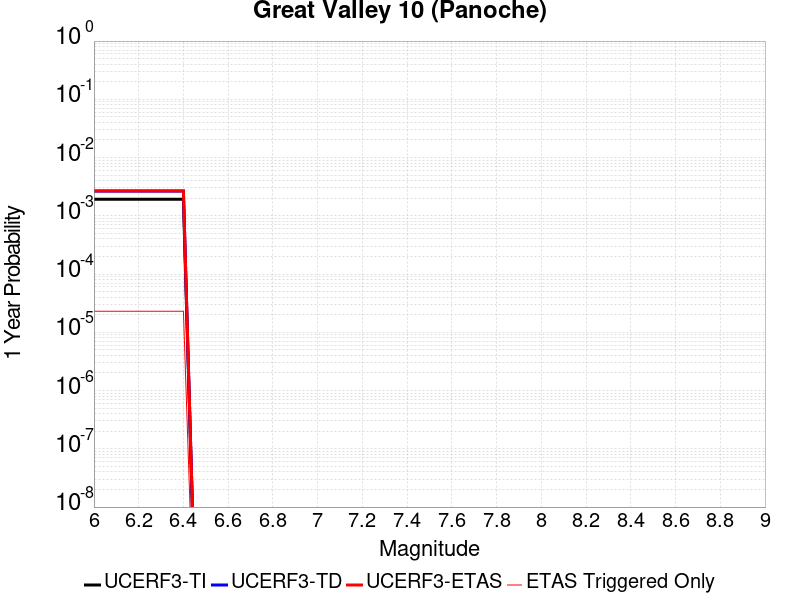 |  |

| Magnitude | 1 wk TI Prob | 1 wk TD Prob | 1 wk ETAS Prob | 1 wk ETAS/TD Gain | 1 wk ETAS Triggered Only | 1 mo TI Prob | 1 mo TD Prob | 1 mo ETAS Prob | 1 mo ETAS/TD Gain | 1 mo ETAS Triggered Only | 1 yr TI Prob | 1 yr TD Prob | 1 yr ETAS Prob | 1 yr ETAS/TD Gain | 1 yr ETAS Triggered Only | 10 yr TI Prob | 10 yr TD Prob | 10 yr ETAS Prob | 10 yr ETAS/TD Gain | 10 yr ETAS Triggered Only |
|-----|-----|-----|-----|-----|-----|-----|-----|-----|-----|-----|-----|-----|-----|-----|-----|-----|-----|-----|-----|-----|
| 6.0 | 3.6887384E-5 | 5.0836705E-5 | 8.41739E-5 | 1.6557702 | 3.333889E-5 | 1.580792E-4 | 2.1787158E-4 | 2.5120322E-4 | 1.1529875 | 3.333889E-5 | 0.0019229152 | 0.002652291 | 0.0026855413 | 1.0125365 | 3.333889E-5 | 0.01906361 | 0.026489226 | 0.02652168 | 1.0012252 | 3.333889E-5 |
| 6.1 | 3.6887384E-5 | 5.0836705E-5 | 8.41739E-5 | 1.6557702 | 3.333889E-5 | 1.580792E-4 | 2.1787158E-4 | 2.5120322E-4 | 1.1529875 | 3.333889E-5 | 0.0019229152 | 0.002652291 | 0.0026855413 | 1.0125365 | 3.333889E-5 | 0.01906361 | 0.026489226 | 0.02652168 | 1.0012252 | 3.333889E-5 |
| 6.2 | 3.6887384E-5 | 5.0836705E-5 | 8.41739E-5 | 1.6557702 | 3.333889E-5 | 1.580792E-4 | 2.1787158E-4 | 2.5120322E-4 | 1.1529875 | 3.333889E-5 | 0.0019229152 | 0.002652291 | 0.0026855413 | 1.0125365 | 3.333889E-5 | 0.01906361 | 0.026489226 | 0.02652168 | 1.0012252 | 3.333889E-5 |
| 6.3 | 3.6887384E-5 | 5.0836705E-5 | 8.41739E-5 | 1.6557702 | 3.333889E-5 | 1.580792E-4 | 2.1787158E-4 | 2.5120322E-4 | 1.1529875 | 3.333889E-5 | 0.0019229152 | 0.002652291 | 0.0026855413 | 1.0125365 | 3.333889E-5 | 0.01906361 | 0.026489226 | 0.02652168 | 1.0012252 | 3.333889E-5 |
| 6.4 | 3.6887384E-5 | 5.0836705E-5 | 8.41739E-5 | 1.6557702 | 3.333889E-5 | 1.580792E-4 | 2.1787158E-4 | 2.5120322E-4 | 1.1529875 | 3.333889E-5 | 0.0019229152 | 0.002652291 | 0.0026855413 | 1.0125365 | 3.333889E-5 | 0.01906361 | 0.026489226 | 0.02652168 | 1.0012252 | 3.333889E-5 |

## Johnson Valley (No) 2011 rev
*[(top)](#table-of-contents)*

| 1 Week | 1 Month | 1 Year | 10 Year |
|-----|-----|-----|-----|
|  |  |  |  |

| Magnitude | 1 wk TI Prob | 1 wk TD Prob | 1 wk ETAS Prob | 1 wk ETAS/TD Gain | 1 wk ETAS Triggered Only | 1 mo TI Prob | 1 mo TD Prob | 1 mo ETAS Prob | 1 mo ETAS/TD Gain | 1 mo ETAS Triggered Only | 1 yr TI Prob | 1 yr TD Prob | 1 yr ETAS Prob | 1 yr ETAS/TD Gain | 1 yr ETAS Triggered Only | 10 yr TI Prob | 10 yr TD Prob | 10 yr ETAS Prob | 10 yr ETAS/TD Gain | 10 yr ETAS Triggered Only |
|-----|-----|-----|-----|-----|-----|-----|-----|-----|-----|-----|-----|-----|-----|-----|-----|-----|-----|-----|-----|-----|
| 6.0 | 1.5411064E-5 | 1.0176766E-5 | 2.1289616E-5 | 2.0919824 | 1.1112963E-5 | 6.6045744E-5 | 4.3614225E-5 | 5.4726705E-5 | 1.2547902 | 1.1112963E-5 | 8.0381025E-4 | 5.3091673E-4 | 5.6423794E-4 | 1.0627617 | 3.333889E-5 | 0.00800909 | 0.005300697 | 0.005333859 | 1.0062562 | 3.333889E-5 |
| 6.1 | 1.5411064E-5 | 1.0176766E-5 | 2.1289616E-5 | 2.0919824 | 1.1112963E-5 | 6.6045744E-5 | 4.3614225E-5 | 5.4726705E-5 | 1.2547902 | 1.1112963E-5 | 8.0381025E-4 | 5.3091673E-4 | 5.6423794E-4 | 1.0627617 | 3.333889E-5 | 0.00800909 | 0.005300697 | 0.005333859 | 1.0062562 | 3.333889E-5 |
| 6.2 | 1.5411064E-5 | 1.0176766E-5 | 2.1289616E-5 | 2.0919824 | 1.1112963E-5 | 6.6045744E-5 | 4.3614225E-5 | 5.4726705E-5 | 1.2547902 | 1.1112963E-5 | 8.0381025E-4 | 5.3091673E-4 | 5.6423794E-4 | 1.0627617 | 3.333889E-5 | 0.00800909 | 0.005300697 | 0.005333859 | 1.0062562 | 3.333889E-5 |
| 6.3 | 1.5411064E-5 | 1.0176766E-5 | 2.1289616E-5 | 2.0919824 | 1.1112963E-5 | 6.6045744E-5 | 4.3614225E-5 | 5.4726705E-5 | 1.2547902 | 1.1112963E-5 | 8.0381025E-4 | 5.3091673E-4 | 5.6423794E-4 | 1.0627617 | 3.333889E-5 | 0.00800909 | 0.005300697 | 0.005333859 | 1.0062562 | 3.333889E-5 |
| 6.4 | 1.5411064E-5 | 1.0176766E-5 | 2.1289616E-5 | 2.0919824 | 1.1112963E-5 | 6.6045744E-5 | 4.3614225E-5 | 5.4726705E-5 | 1.2547902 | 1.1112963E-5 | 8.0381025E-4 | 5.3091673E-4 | 5.6423794E-4 | 1.0627617 | 3.333889E-5 | 0.00800909 | 0.005300697 | 0.005333859 | 1.0062562 | 3.333889E-5 |
| 6.5 | 1.5411064E-5 | 1.0176766E-5 | 2.1289616E-5 | 2.0919824 | 1.1112963E-5 | 6.6045744E-5 | 4.3614225E-5 | 5.4726705E-5 | 1.2547902 | 1.1112963E-5 | 8.0381025E-4 | 5.3091673E-4 | 5.6423794E-4 | 1.0627617 | 3.333889E-5 | 0.00800909 | 0.005300697 | 0.005333859 | 1.0062562 | 3.333889E-5 |
| 6.6 | 1.4834682E-5 | 9.547515E-6 | 2.0660373E-5 | 2.1639528 | 1.1112963E-5 | 6.357566E-5 | 4.091752E-5 | 5.2030027E-5 | 1.2715832 | 1.1112963E-5 | 7.7375874E-4 | 4.9809937E-4 | 5.314216E-4 | 1.0668988 | 3.333889E-5 | 0.0077107013 | 0.0049739927 | 0.005007166 | 1.0066693 | 3.333889E-5 |
| 6.7 | 1.0814841E-5 | 5.8714368E-6 | 1.6984335E-5 | 2.892705 | 1.1112963E-5 | 4.6348494E-5 | 2.5163265E-5 | 3.6275946E-5 | 1.4416233 | 1.1112963E-5 | 5.641468E-4 | 3.063563E-4 | 3.1746586E-4 | 1.0362635 | 1.1112963E-5 | 0.005627168 | 0.0030629311 | 0.00307401 | 1.003617 | 1.1112963E-5 |
| 6.8 | 1.0245956E-5 | 5.404906E-6 | 1.651781E-5 | 3.056077 | 1.1112963E-5 | 4.3910502E-5 | 2.3163884E-5 | 3.427659E-5 | 1.4797428 | 1.1112963E-5 | 5.344792E-4 | 2.8202028E-4 | 2.931301E-4 | 1.0393938 | 1.1112963E-5 | 0.0053319554 | 0.0028202015 | 0.002831283 | 1.0039294 | 1.1112963E-5 |
| 6.9 | 3.2082864E-6 | 9.347539E-10 | 9.347539E-10 | 1.0 | 0.0 | 1.3749726E-5 | 4.006089E-9 | 4.006089E-9 | 1.0 | 0.0 | 1.6739006E-4 | 4.8774126E-8 | 4.8774126E-8 | 1.0 | 0.0 | 0.0016726403 | 4.8774126E-7 | 4.8774126E-7 | 1.0 | 0.0 |
| 7.0 | 3.1573343E-6 | 9.347539E-10 | 9.347539E-10 | 1.0 | 0.0 | 1.3531363E-5 | 4.006089E-9 | 4.006089E-9 | 1.0 | 0.0 | 1.6473189E-4 | 4.8774126E-8 | 4.8774126E-8 | 1.0 | 0.0 | 0.0016460982 | 4.8774126E-7 | 4.8774126E-7 | 1.0 | 0.0 |
| 7.1 | 3.0995338E-6 | 9.347539E-10 | 9.347539E-10 | 1.0 | 0.0 | 1.32836485E-5 | 4.006089E-9 | 4.006089E-9 | 1.0 | 0.0 | 1.6171642E-4 | 4.8774126E-8 | 4.8774126E-8 | 1.0 | 0.0 | 0.0016159879 | 4.8774126E-7 | 4.8774126E-7 | 1.0 | 0.0 |
| 7.2 | 2.8879267E-6 | 9.331039E-10 | 9.331039E-10 | 1.0 | 0.0 | 1.237677E-5 | 3.999017E-9 | 3.999017E-9 | 1.0 | 0.0 | 1.5067676E-4 | 4.868803E-8 | 4.868803E-8 | 1.0 | 0.0 | 0.0015057464 | 4.868803E-7 | 4.868803E-7 | 1.0 | 0.0 |
| 7.3 | 2.4973094E-6 | 8.4248597E-10 | 8.4248597E-10 | 1.0 | 0.0 | 1.0702711E-5 | 3.6106542E-9 | 3.6106542E-9 | 1.0 | 0.0 | 1.3029772E-4 | 4.3959716E-8 | 4.3959716E-8 | 1.0 | 0.0 | 0.0013022134 | 4.3959716E-7 | 4.3959716E-7 | 1.0 | 0.0 |

## Rodgers Creek - Healdsburg 2011 CFM
*[(top)](#table-of-contents)*

| 1 Week | 1 Month | 1 Year | 10 Year |
|-----|-----|-----|-----|
|  |  |  |  |

| Magnitude | 1 wk TI Prob | 1 wk TD Prob | 1 wk ETAS Prob | 1 wk ETAS/TD Gain | 1 wk ETAS Triggered Only | 1 mo TI Prob | 1 mo TD Prob | 1 mo ETAS Prob | 1 mo ETAS/TD Gain | 1 mo ETAS Triggered Only | 1 yr TI Prob | 1 yr TD Prob | 1 yr ETAS Prob | 1 yr ETAS/TD Gain | 1 yr ETAS Triggered Only | 10 yr TI Prob | 10 yr TD Prob | 10 yr ETAS Prob | 10 yr ETAS/TD Gain | 10 yr ETAS Triggered Only |
|-----|-----|-----|-----|-----|-----|-----|-----|-----|-----|-----|-----|-----|-----|-----|-----|-----|-----|-----|-----|-----|
| 6.0 | 9.830927E-5 | 2.4955187E-4 | 2.7177227E-4 | 1.0890411 | 2.2225926E-5 | 4.212574E-4 | 0.0010693158 | 0.001091518 | 1.0207629 | 2.2225926E-5 | 0.0051167537 | 0.012984863 | 0.013017769 | 1.0025342 | 3.333889E-5 | 0.05000532 | 0.12216672 | 0.12219599 | 1.0002396 | 3.333889E-5 |
| 6.1 | 9.830927E-5 | 2.4955187E-4 | 2.7177227E-4 | 1.0890411 | 2.2225926E-5 | 4.212574E-4 | 0.0010693158 | 0.001091518 | 1.0207629 | 2.2225926E-5 | 0.0051167537 | 0.012984863 | 0.013017769 | 1.0025342 | 3.333889E-5 | 0.05000532 | 0.12216672 | 0.12219599 | 1.0002396 | 3.333889E-5 |
| 6.2 | 9.830927E-5 | 2.4955187E-4 | 2.7177227E-4 | 1.0890411 | 2.2225926E-5 | 4.212574E-4 | 0.0010693158 | 0.001091518 | 1.0207629 | 2.2225926E-5 | 0.0051167537 | 0.012984863 | 0.013017769 | 1.0025342 | 3.333889E-5 | 0.05000532 | 0.12216672 | 0.12219599 | 1.0002396 | 3.333889E-5 |
| 6.3 | 9.830927E-5 | 2.4955187E-4 | 2.7177227E-4 | 1.0890411 | 2.2225926E-5 | 4.212574E-4 | 0.0010693158 | 0.001091518 | 1.0207629 | 2.2225926E-5 | 0.0051167537 | 0.012984863 | 0.013017769 | 1.0025342 | 3.333889E-5 | 0.05000532 | 0.12216672 | 0.12219599 | 1.0002396 | 3.333889E-5 |
| 6.4 | 9.830927E-5 | 2.4955187E-4 | 2.7177227E-4 | 1.0890411 | 2.2225926E-5 | 4.212574E-4 | 0.0010693158 | 0.001091518 | 1.0207629 | 2.2225926E-5 | 0.0051167537 | 0.012984863 | 0.013017769 | 1.0025342 | 3.333889E-5 | 0.05000532 | 0.12216672 | 0.12219599 | 1.0002396 | 3.333889E-5 |
| 6.5 | 9.830927E-5 | 2.4955187E-4 | 2.7177227E-4 | 1.0890411 | 2.2225926E-5 | 4.212574E-4 | 0.0010693158 | 0.001091518 | 1.0207629 | 2.2225926E-5 | 0.0051167537 | 0.012984863 | 0.013017769 | 1.0025342 | 3.333889E-5 | 0.05000532 | 0.12216672 | 0.12219599 | 1.0002396 | 3.333889E-5 |
| 6.6 | 9.722793E-5 | 2.4745433E-4 | 2.6967475E-4 | 1.0897961 | 2.2225926E-5 | 4.1662456E-4 | 0.001060334 | 0.0010825364 | 1.020939 | 2.2225926E-5 | 0.0050606127 | 0.012876847 | 0.012909756 | 1.0025557 | 3.333889E-5 | 0.049469102 | 0.12122572 | 0.12125502 | 1.0002416 | 3.333889E-5 |
| 6.7 | 9.631043E-5 | 2.4569524E-4 | 2.6791572E-4 | 1.0904391 | 2.2225926E-5 | 4.1269368E-4 | 0.0010528011 | 0.0010750036 | 1.021089 | 2.2225926E-5 | 0.0050129755 | 0.012786214 | 0.012819127 | 1.0025741 | 3.333889E-5 | 0.049013894 | 0.12043094 | 0.120460264 | 1.0002435 | 3.333889E-5 |
| 6.8 | 9.5157004E-5 | 2.4311169E-4 | 2.653322E-4 | 1.0914005 | 2.2225926E-5 | 4.0775197E-4 | 0.0010417376 | 0.0010639405 | 1.0213132 | 2.2225926E-5 | 0.0049530854 | 0.012653089 | 0.012686007 | 1.0026015 | 3.333889E-5 | 0.048441324 | 0.1192606 | 0.119289964 | 1.0002462 | 3.333889E-5 |
| 6.9 | 9.3715214E-5 | 2.3986747E-4 | 2.6208806E-4 | 1.092637 | 2.2225926E-5 | 4.015748E-4 | 0.0010278448 | 0.0010500479 | 1.0216016 | 2.2225926E-5 | 0.004878218 | 0.012485896 | 0.0125188185 | 1.0026368 | 3.333889E-5 | 0.047725122 | 0.11779124 | 0.11782065 | 1.0002497 | 3.333889E-5 |
| 7.0 | 9.21773E-5 | 2.3636219E-4 | 2.5858285E-4 | 1.0940111 | 2.2225926E-5 | 3.9498575E-4 | 0.0010128339 | 0.0010350373 | 1.0219221 | 2.2225926E-5 | 0.0047983527 | 0.012305218 | 0.012338147 | 1.002676 | 3.333889E-5 | 0.046960585 | 0.11620537 | 0.11623484 | 1.0002536 | 3.333889E-5 |
| 7.1 | 1.8670535E-5 | 4.6669888E-5 | 5.7782334E-5 | 1.2381073 | 1.1112963E-5 | 8.001412E-5 | 2.0000339E-4 | 2.1111412E-4 | 1.0555527 | 1.1112963E-5 | 9.737365E-4 | 0.0024331913 | 0.0024553633 | 1.0091122 | 2.2225926E-5 | 0.009694808 | 0.023618827 | 0.023640528 | 1.0009187 | 2.2225926E-5 |
| 7.2 | 6.6138855E-6 | 1.8792352E-5 | 2.9905108E-5 | 1.5913445 | 1.1112963E-5 | 2.8344915E-5 | 8.053787E-5 | 9.164994E-5 | 1.1379732 | 1.1112963E-5 | 3.4504468E-4 | 9.8041E-4 | 0.0010026142 | 1.0226479 | 2.2225926E-5 | 0.0034450945 | 0.009560432 | 0.009582446 | 1.0023025 | 2.2225926E-5 |
| 7.3 | 5.4382035E-6 | 1.5442325E-5 | 2.6555117E-5 | 1.719632 | 1.1112963E-5 | 2.3306378E-5 | 6.618139E-5 | 7.729362E-5 | 1.1679056 | 1.1112963E-5 | 2.8371823E-4 | 8.0575846E-4 | 8.2796643E-4 | 1.0275617 | 2.2225926E-5 | 0.0028335627 | 0.007868089 | 0.00789014 | 1.0028026 | 2.2225926E-5 |

## San Gregorio (South) 2011 CFM
*[(top)](#table-of-contents)*

| 1 Week | 1 Month | 1 Year | 10 Year |
|-----|-----|-----|-----|
|  |  |  |  |

| Magnitude | 1 wk TI Prob | 1 wk TD Prob | 1 wk ETAS Prob | 1 wk ETAS/TD Gain | 1 wk ETAS Triggered Only | 1 mo TI Prob | 1 mo TD Prob | 1 mo ETAS Prob | 1 mo ETAS/TD Gain | 1 mo ETAS Triggered Only | 1 yr TI Prob | 1 yr TD Prob | 1 yr ETAS Prob | 1 yr ETAS/TD Gain | 1 yr ETAS Triggered Only | 10 yr TI Prob | 10 yr TD Prob | 10 yr ETAS Prob | 10 yr ETAS/TD Gain | 10 yr ETAS Triggered Only |
|-----|-----|-----|-----|-----|-----|-----|-----|-----|-----|-----|-----|-----|-----|-----|-----|-----|-----|-----|-----|-----|
| 6.0 | 4.5472258E-5 | 5.991556E-5 | 7.102786E-5 | 1.1854659 | 1.1112963E-5 | 1.9486654E-4 | 2.5675958E-4 | 2.789798E-4 | 1.0865409 | 2.2225926E-5 | 0.0023699186 | 0.0031223015 | 0.003144458 | 1.0070962 | 2.2225926E-5 | 0.023448035 | 0.03088203 | 0.03091434 | 1.0010462 | 3.333889E-5 |
| 6.1 | 4.5472258E-5 | 5.991556E-5 | 7.102786E-5 | 1.1854659 | 1.1112963E-5 | 1.9486654E-4 | 2.5675958E-4 | 2.789798E-4 | 1.0865409 | 2.2225926E-5 | 0.0023699186 | 0.0031223015 | 0.003144458 | 1.0070962 | 2.2225926E-5 | 0.023448035 | 0.03088203 | 0.03091434 | 1.0010462 | 3.333889E-5 |
| 6.2 | 4.5472258E-5 | 5.991556E-5 | 7.102786E-5 | 1.1854659 | 1.1112963E-5 | 1.9486654E-4 | 2.5675958E-4 | 2.789798E-4 | 1.0865409 | 2.2225926E-5 | 0.0023699186 | 0.0031223015 | 0.003144458 | 1.0070962 | 2.2225926E-5 | 0.023448035 | 0.03088203 | 0.03091434 | 1.0010462 | 3.333889E-5 |
| 6.3 | 4.5472258E-5 | 5.991556E-5 | 7.102786E-5 | 1.1854659 | 1.1112963E-5 | 1.9486654E-4 | 2.5675958E-4 | 2.789798E-4 | 1.0865409 | 2.2225926E-5 | 0.0023699186 | 0.0031223015 | 0.003144458 | 1.0070962 | 2.2225926E-5 | 0.023448035 | 0.03088203 | 0.03091434 | 1.0010462 | 3.333889E-5 |
| 6.4 | 4.5472258E-5 | 5.991556E-5 | 7.102786E-5 | 1.1854659 | 1.1112963E-5 | 1.9486654E-4 | 2.5675958E-4 | 2.789798E-4 | 1.0865409 | 2.2225926E-5 | 0.0023699186 | 0.0031223015 | 0.003144458 | 1.0070962 | 2.2225926E-5 | 0.023448035 | 0.03088203 | 0.03091434 | 1.0010462 | 3.333889E-5 |
| 6.5 | 4.5472258E-5 | 5.991556E-5 | 7.102786E-5 | 1.1854659 | 1.1112963E-5 | 1.9486654E-4 | 2.5675958E-4 | 2.789798E-4 | 1.0865409 | 2.2225926E-5 | 0.0023699186 | 0.0031223015 | 0.003144458 | 1.0070962 | 2.2225926E-5 | 0.023448035 | 0.03088203 | 0.03091434 | 1.0010462 | 3.333889E-5 |
| 6.6 | 4.315749E-5 | 5.674213E-5 | 6.785446E-5 | 1.1958392 | 1.1112963E-5 | 1.8494757E-4 | 2.4316214E-4 | 2.6538267E-4 | 1.0913815 | 2.2225926E-5 | 0.0022494113 | 0.002957233 | 0.0029793931 | 1.0074936 | 2.2225926E-5 | 0.02226778 | 0.02927816 | 0.029310523 | 1.0011053 | 3.333889E-5 |
| 6.7 | 4.008459E-5 | 5.251357E-5 | 6.362595E-5 | 1.2116097 | 1.1112963E-5 | 1.7177979E-4 | 2.250431E-4 | 2.4726402E-4 | 1.0987407 | 2.2225926E-5 | 0.0020894127 | 0.002737236 | 0.002759401 | 1.0080976 | 2.2225926E-5 | 0.020698763 | 0.02713696 | 0.027169393 | 1.0011952 | 3.333889E-5 |
| 6.8 | 3.7885424E-5 | 4.9452636E-5 | 6.056505E-5 | 1.2247082 | 1.1112963E-5 | 1.62356E-4 | 2.1192706E-4 | 2.3414828E-4 | 1.1048532 | 2.2225926E-5 | 0.001974892 | 0.0025779405 | 0.002600109 | 1.0085994 | 2.2225926E-5 | 0.019574333 | 0.025582204 | 0.02561469 | 1.0012698 | 3.333889E-5 |
| 6.9 | 3.543751E-5 | 4.6004345E-5 | 5.7116795E-5 | 1.2415522 | 1.1112963E-5 | 1.5186622E-4 | 1.97151E-4 | 2.1937255E-4 | 1.1127133 | 2.2225926E-5 | 0.001847403 | 0.0023984574 | 0.0024206298 | 1.0092446 | 2.2225926E-5 | 0.018321203 | 0.023827864 | 0.02384956 | 1.0009105 | 2.2225926E-5 |
| 7.0 | 3.3186065E-5 | 4.2815023E-5 | 5.392751E-5 | 1.2595464 | 1.1112963E-5 | 1.4221824E-4 | 1.834845E-4 | 2.0570634E-4 | 1.1211102 | 2.2225926E-5 | 0.0017301317 | 0.0022324256 | 0.002254602 | 1.0099337 | 2.2225926E-5 | 0.017167237 | 0.022202516 | 0.02222425 | 1.0009788 | 2.2225926E-5 |
| 7.1 | 3.076152E-5 | 3.9376442E-5 | 5.048897E-5 | 1.2822125 | 1.1112963E-5 | 1.3182842E-4 | 1.6874976E-4 | 1.7986084E-4 | 1.0658436 | 1.1112963E-5 | 0.0016038293 | 0.0020533882 | 0.0020644784 | 1.0054009 | 1.1112963E-5 | 0.015923034 | 0.020447142 | 0.02045803 | 1.0005324 | 1.1112963E-5 |
| 7.2 | 2.8039283E-5 | 3.552108E-5 | 4.663365E-5 | 1.3128444 | 1.1112963E-5 | 1.2016282E-4 | 1.5222882E-4 | 1.633401E-4 | 1.0729905 | 1.1112963E-5 | 0.0014620004 | 0.00185261 | 0.0018637023 | 1.0059874 | 1.1112963E-5 | 0.0145241935 | 0.018474856 | 0.018485764 | 1.0005904 | 1.1112963E-5 |
| 7.3 | 2.4776145E-5 | 3.1098632E-5 | 4.221125E-5 | 1.3573346 | 1.1112963E-5 | 1.0617916E-4 | 1.3327754E-4 | 1.4438904E-4 | 1.083371 | 1.1112963E-5 | 0.0012919646 | 0.0016222443 | 0.0016333391 | 1.0068393 | 1.1112963E-5 | 0.012844792 | 0.0162039 | 0.016214835 | 1.0006747 | 1.1112963E-5 |
| 7.4 | 2.1508438E-5 | 2.6824098E-5 | 3.7936763E-5 | 1.4142792 | 1.1112963E-5 | 9.217577E-5 | 1.1495983E-4 | 1.2607152E-4 | 1.0966572 | 1.1112963E-5 | 0.0011216622 | 0.0013995317 | 0.0014106291 | 1.0079293 | 1.1112963E-5 | 0.011160175 | 0.014002349 | 0.014013306 | 1.0007825 | 1.1112963E-5 |

## Rose Canyon
*[(top)](#table-of-contents)*

| 1 Week | 1 Month | 1 Year | 10 Year |
|-----|-----|-----|-----|
|  |  |  |  |

| Magnitude | 1 wk TI Prob | 1 wk TD Prob | 1 wk ETAS Prob | 1 wk ETAS/TD Gain | 1 wk ETAS Triggered Only | 1 mo TI Prob | 1 mo TD Prob | 1 mo ETAS Prob | 1 mo ETAS/TD Gain | 1 mo ETAS Triggered Only | 1 yr TI Prob | 1 yr TD Prob | 1 yr ETAS Prob | 1 yr ETAS/TD Gain | 1 yr ETAS Triggered Only | 10 yr TI Prob | 10 yr TD Prob | 10 yr ETAS Prob | 10 yr ETAS/TD Gain | 10 yr ETAS Triggered Only |
|-----|-----|-----|-----|-----|-----|-----|-----|-----|-----|-----|-----|-----|-----|-----|-----|-----|-----|-----|-----|-----|
| 6.0 | 1.9167945E-5 | 1.6478027E-5 | 3.8703587E-5 | 2.3488 | 2.2225926E-5 | 8.214574E-5 | 7.06186E-5 | 9.284295E-5 | 1.3147097 | 2.2225926E-5 | 9.996655E-4 | 8.5951196E-4 | 8.9282217E-4 | 1.0387548 | 3.333889E-5 | 0.009951805 | 0.008568751 | 0.008601803 | 1.0038574 | 3.333889E-5 |
| 6.1 | 1.9167945E-5 | 1.6478027E-5 | 3.8703587E-5 | 2.3488 | 2.2225926E-5 | 8.214574E-5 | 7.06186E-5 | 9.284295E-5 | 1.3147097 | 2.2225926E-5 | 9.996655E-4 | 8.5951196E-4 | 8.9282217E-4 | 1.0387548 | 3.333889E-5 | 0.009951805 | 0.008568751 | 0.008601803 | 1.0038574 | 3.333889E-5 |
| 6.2 | 1.9167945E-5 | 1.6478027E-5 | 3.8703587E-5 | 2.3488 | 2.2225926E-5 | 8.214574E-5 | 7.06186E-5 | 9.284295E-5 | 1.3147097 | 2.2225926E-5 | 9.996655E-4 | 8.5951196E-4 | 8.9282217E-4 | 1.0387548 | 3.333889E-5 | 0.009951805 | 0.008568751 | 0.008601803 | 1.0038574 | 3.333889E-5 |
| 6.3 | 1.9167945E-5 | 1.6478027E-5 | 3.8703587E-5 | 2.3488 | 2.2225926E-5 | 8.214574E-5 | 7.06186E-5 | 9.284295E-5 | 1.3147097 | 2.2225926E-5 | 9.996655E-4 | 8.5951196E-4 | 8.9282217E-4 | 1.0387548 | 3.333889E-5 | 0.009951805 | 0.008568751 | 0.008601803 | 1.0038574 | 3.333889E-5 |
| 6.4 | 1.9167945E-5 | 1.6478027E-5 | 3.8703587E-5 | 2.3488 | 2.2225926E-5 | 8.214574E-5 | 7.06186E-5 | 9.284295E-5 | 1.3147097 | 2.2225926E-5 | 9.996655E-4 | 8.5951196E-4 | 8.9282217E-4 | 1.0387548 | 3.333889E-5 | 0.009951805 | 0.008568751 | 0.008601803 | 1.0038574 | 3.333889E-5 |
| 6.5 | 1.9167945E-5 | 1.6478027E-5 | 3.8703587E-5 | 2.3488 | 2.2225926E-5 | 8.214574E-5 | 7.06186E-5 | 9.284295E-5 | 1.3147097 | 2.2225926E-5 | 9.996655E-4 | 8.5951196E-4 | 8.9282217E-4 | 1.0387548 | 3.333889E-5 | 0.009951805 | 0.008568751 | 0.008601803 | 1.0038574 | 3.333889E-5 |
| 6.6 | 1.6032436E-5 | 1.3771202E-5 | 3.599682E-5 | 2.6139202 | 2.2225926E-5 | 6.870863E-5 | 5.901849E-5 | 8.12431E-5 | 1.3765703 | 2.2225926E-5 | 8.362065E-4 | 7.183819E-4 | 7.516968E-4 | 1.0463749 | 3.333889E-5 | 0.008330669 | 0.0071673454 | 0.0072004455 | 1.0046182 | 3.333889E-5 |
| 6.7 | 1.32651885E-5 | 1.1282621E-5 | 2.239546E-5 | 1.9849517 | 1.1112963E-5 | 5.684957E-5 | 4.8353573E-5 | 5.9466E-5 | 1.229816 | 1.1112963E-5 | 6.919237E-4 | 5.8861315E-4 | 6.10826E-4 | 1.0377376 | 2.2225926E-5 | 0.0068977326 | 0.005877156 | 0.005899251 | 1.0037595 | 2.2225926E-5 |
| 6.8 | 1.2374002E-5 | 1.0546746E-5 | 2.1659593E-5 | 2.0536754 | 1.1112963E-5 | 5.303036E-5 | 4.5199937E-5 | 5.6312398E-5 | 1.2458513 | 1.1112963E-5 | 6.4545334E-4 | 5.5023754E-4 | 5.724513E-4 | 1.0403711 | 2.2225926E-5 | 0.006435818 | 0.005495354 | 0.0055174576 | 1.0040222 | 2.2225926E-5 |
| 6.9 | 3.8401595E-6 | 3.178941E-6 | 1.4291869E-5 | 4.4957957 | 1.1112963E-5 | 1.6457723E-5 | 1.3623983E-5 | 2.4736795E-5 | 1.81568 | 1.1112963E-5 | 2.0035435E-4 | 1.6586324E-4 | 1.7697437E-4 | 1.0669897 | 1.1112963E-5 | 0.0020017382 | 0.0016577742 | 0.0016688687 | 1.0066924 | 1.1112963E-5 |
| 7.0 | 3.6026508E-6 | 2.9376413E-6 | 1.4050572E-5 | 4.7829432 | 1.1112963E-5 | 1.543984E-5 | 1.2589852E-5 | 2.3702676E-5 | 1.882681 | 1.1112963E-5 | 1.8796384E-4 | 1.5327454E-4 | 1.643858E-4 | 1.0724925 | 1.1112963E-5 | 0.0018780495 | 0.0015320673 | 0.0015431632 | 1.0072424 | 1.1112963E-5 |
| 7.1 | 3.3657313E-6 | 2.6902792E-6 | 1.3803213E-5 | 5.130773 | 1.1112963E-5 | 1.4424483E-5 | 1.1529739E-5 | 2.2642575E-5 | 1.9638411 | 1.1112963E-5 | 1.7560393E-4 | 1.4036939E-4 | 1.5148078E-4 | 1.0791583 | 1.1112963E-5 | 0.0017546522 | 0.0014031857 | 0.0014142831 | 1.0079087 | 1.1112963E-5 |
| 7.2 | 3.1430025E-6 | 2.4618412E-6 | 1.3574777E-5 | 5.5140753 | 1.1112963E-5 | 1.3469941E-5 | 1.0550727E-5 | 2.1663573E-5 | 2.0532777 | 1.1112963E-5 | 1.639842E-4 | 1.2845139E-4 | 1.3956291E-4 | 1.0865039 | 1.1112963E-5 | 0.0016386324 | 0.0012841492 | 0.0012952479 | 1.0086428 | 1.1112963E-5 |
| 7.3 | 2.898987E-6 | 2.2514312E-6 | 1.336437E-5 | 5.935944 | 1.1112963E-5 | 1.24241715E-5 | 9.648977E-6 | 2.0761832E-5 | 2.1517134 | 1.1112963E-5 | 1.5125379E-4 | 1.1747381E-4 | 1.2858547E-4 | 1.0945884 | 1.1112963E-5 | 0.0015115088 | 0.0011744945 | 0.0011855945 | 1.0094508 | 1.1112963E-5 |
| 7.4 | 2.5994284E-6 | 2.0116724E-6 | 1.3124613E-5 | 6.52423 | 1.1112963E-5 | 1.114036E-5 | 8.621447E-6 | 1.9734314E-5 | 2.2889795 | 1.1112963E-5 | 1.3562544E-4 | 1.049649E-4 | 1.1607669E-4 | 1.105862 | 1.1112963E-5 | 0.0013554269 | 0.00104953 | 0.0010606314 | 1.0105774 | 1.1112963E-5 |
| 7.5 | 2.2517988E-6 | 1.7516537E-6 | 1.2864598E-5 | 7.3442583 | 1.1112963E-5 | 9.650531E-6 | 7.5070875E-6 | 1.8619967E-5 | 2.4803185 | 1.1112963E-5 | 1.17488875E-4 | 9.139879E-5 | 1.02510734E-4 | 1.1215765 | 1.1112963E-5 | 0.0011742678 | 9.1398787E-4 | 9.250907E-4 | 1.0121477 | 1.1112963E-5 |

## San Gabriel
*[(top)](#table-of-contents)*

| 1 Week | 1 Month | 1 Year | 10 Year |
|-----|-----|-----|-----|
|  |  |  |  |

| Magnitude | 1 wk TI Prob | 1 wk TD Prob | 1 wk ETAS Prob | 1 wk ETAS/TD Gain | 1 wk ETAS Triggered Only | 1 mo TI Prob | 1 mo TD Prob | 1 mo ETAS Prob | 1 mo ETAS/TD Gain | 1 mo ETAS Triggered Only | 1 yr TI Prob | 1 yr TD Prob | 1 yr ETAS Prob | 1 yr ETAS/TD Gain | 1 yr ETAS Triggered Only | 10 yr TI Prob | 10 yr TD Prob | 10 yr ETAS Prob | 10 yr ETAS/TD Gain | 10 yr ETAS Triggered Only |
|-----|-----|-----|-----|-----|-----|-----|-----|-----|-----|-----|-----|-----|-----|-----|-----|-----|-----|-----|-----|-----|
| 6.0 | 1.26160985E-5 | 1.3513258E-5 | 2.4626072E-5 | 1.8223637 | 1.1112963E-5 | 5.406787E-5 | 5.791289E-5 | 8.013753E-5 | 1.3837599 | 2.2225926E-5 | 6.580775E-4 | 7.048994E-4 | 7.271096E-4 | 1.0315084 | 2.2225926E-5 | 0.006561321 | 0.007030387 | 0.0070634913 | 1.0047088 | 3.333889E-5 |
| 6.1 | 1.26160985E-5 | 1.3513258E-5 | 2.4626072E-5 | 1.8223637 | 1.1112963E-5 | 5.406787E-5 | 5.791289E-5 | 8.013753E-5 | 1.3837599 | 2.2225926E-5 | 6.580775E-4 | 7.048994E-4 | 7.271096E-4 | 1.0315084 | 2.2225926E-5 | 0.006561321 | 0.007030387 | 0.0070634913 | 1.0047088 | 3.333889E-5 |
| 6.2 | 1.26160985E-5 | 1.3513258E-5 | 2.4626072E-5 | 1.8223637 | 1.1112963E-5 | 5.406787E-5 | 5.791289E-5 | 8.013753E-5 | 1.3837599 | 2.2225926E-5 | 6.580775E-4 | 7.048994E-4 | 7.271096E-4 | 1.0315084 | 2.2225926E-5 | 0.006561321 | 0.007030387 | 0.0070634913 | 1.0047088 | 3.333889E-5 |
| 6.3 | 1.26160985E-5 | 1.3513258E-5 | 2.4626072E-5 | 1.8223637 | 1.1112963E-5 | 5.406787E-5 | 5.791289E-5 | 8.013753E-5 | 1.3837599 | 2.2225926E-5 | 6.580775E-4 | 7.048994E-4 | 7.271096E-4 | 1.0315084 | 2.2225926E-5 | 0.006561321 | 0.007030387 | 0.0070634913 | 1.0047088 | 3.333889E-5 |
| 6.4 | 1.26160985E-5 | 1.3513258E-5 | 2.4626072E-5 | 1.8223637 | 1.1112963E-5 | 5.406787E-5 | 5.791289E-5 | 8.013753E-5 | 1.3837599 | 2.2225926E-5 | 6.580775E-4 | 7.048994E-4 | 7.271096E-4 | 1.0315084 | 2.2225926E-5 | 0.006561321 | 0.007030387 | 0.0070634913 | 1.0047088 | 3.333889E-5 |
| 6.5 | 1.26160985E-5 | 1.3513258E-5 | 2.4626072E-5 | 1.8223637 | 1.1112963E-5 | 5.406787E-5 | 5.791289E-5 | 8.013753E-5 | 1.3837599 | 2.2225926E-5 | 6.580775E-4 | 7.048994E-4 | 7.271096E-4 | 1.0315084 | 2.2225926E-5 | 0.006561321 | 0.007030387 | 0.0070634913 | 1.0047088 | 3.333889E-5 |
| 6.6 | 1.1803596E-5 | 1.264043E-5 | 2.3753253E-5 | 1.8791491 | 1.1112963E-5 | 5.058586E-5 | 5.417236E-5 | 7.639708E-5 | 1.4102595 | 2.2225926E-5 | 6.1570876E-4 | 6.5938674E-4 | 6.8159803E-4 | 1.0336847 | 2.2225926E-5 | 0.0061400565 | 0.006578034 | 0.0066111535 | 1.0050349 | 3.333889E-5 |
| 6.7 | 9.549731E-6 | 1.0215835E-5 | 2.1328684E-5 | 2.0878065 | 1.1112963E-5 | 4.0926778E-5 | 4.378162E-5 | 6.600657E-5 | 1.507632 | 2.2225926E-5 | 4.9816957E-4 | 5.329474E-4 | 5.551615E-4 | 1.0416815 | 2.2225926E-5 | 0.0049705426 | 0.005320286 | 0.0053534475 | 1.006233 | 3.333889E-5 |
| 6.8 | 9.157154E-6 | 9.798772E-6 | 2.0911626E-5 | 2.1341069 | 1.1112963E-5 | 3.9244354E-5 | 4.1994266E-5 | 6.421926E-5 | 1.5292387 | 2.2225926E-5 | 4.7769528E-4 | 5.111967E-4 | 5.334113E-4 | 1.043456 | 2.2225926E-5 | 0.004766697 | 0.005103788 | 0.0051369565 | 1.0064988 | 3.333889E-5 |
| 6.9 | 7.844496E-6 | 8.385175E-6 | 1.9498044E-5 | 2.3252997 | 1.1112963E-5 | 3.3618835E-5 | 3.593617E-5 | 5.8161295E-5 | 1.6184613 | 2.2225926E-5 | 4.0923245E-4 | 4.374709E-4 | 4.5968711E-4 | 1.0507833 | 2.2225926E-5 | 0.0040847966 | 0.0043696202 | 0.0044028135 | 1.0075964 | 3.333889E-5 |
| 7.0 | 6.7619258E-6 | 7.2223247E-6 | 1.8335208E-5 | 2.538685 | 1.1112963E-5 | 2.897936E-5 | 3.0952655E-5 | 5.3177893E-5 | 1.7180399 | 2.2225926E-5 | 3.527666E-4 | 3.7681893E-4 | 3.9903648E-4 | 1.0589608 | 2.2225926E-5 | 0.0035220713 | 0.0037652855 | 0.0037984988 | 1.0088209 | 3.333889E-5 |
| 7.1 | 5.927114E-6 | 6.3258008E-6 | 1.7438693E-5 | 2.7567568 | 1.1112963E-5 | 2.540167E-5 | 2.7110491E-5 | 4.9335817E-5 | 1.8198053 | 2.2225926E-5 | 3.0922145E-4 | 3.300555E-4 | 3.522741E-4 | 1.0673177 | 2.2225926E-5 | 0.0030879152 | 0.0032991117 | 0.0033212642 | 1.0067147 | 2.2225926E-5 |
| 7.2 | 4.9482483E-6 | 5.276545E-6 | 5.276545E-6 | 1.0 | 0.0 | 2.1206606E-5 | 2.2613764E-5 | 3.3726476E-5 | 1.4914136 | 1.1112963E-5 | 2.5815985E-4 | 2.7532259E-4 | 2.8643248E-4 | 1.0403523 | 1.1112963E-5 | 0.0025786015 | 0.0027532259 | 0.0027643081 | 1.0040252 | 1.1112963E-5 |

## San Jacinto (Superstition Mtn)
*[(top)](#table-of-contents)*

| 1 Week | 1 Month | 1 Year | 10 Year |
|-----|-----|-----|-----|
|  |  |  |  |

| Magnitude | 1 wk TI Prob | 1 wk TD Prob | 1 wk ETAS Prob | 1 wk ETAS/TD Gain | 1 wk ETAS Triggered Only | 1 mo TI Prob | 1 mo TD Prob | 1 mo ETAS Prob | 1 mo ETAS/TD Gain | 1 mo ETAS Triggered Only | 1 yr TI Prob | 1 yr TD Prob | 1 yr ETAS Prob | 1 yr ETAS/TD Gain | 1 yr ETAS Triggered Only | 10 yr TI Prob | 10 yr TD Prob | 10 yr ETAS Prob | 10 yr ETAS/TD Gain | 10 yr ETAS Triggered Only |
|-----|-----|-----|-----|-----|-----|-----|-----|-----|-----|-----|-----|-----|-----|-----|-----|-----|-----|-----|-----|-----|
| 6.0 | 6.369931E-5 | 1.1782884E-4 | 1.1782884E-4 | 1.0 | 0.0 | 2.729685E-4 | 5.049214E-4 | 5.049214E-4 | 1.0 | 0.0 | 0.003318327 | 0.006136903 | 0.006147948 | 1.0017997 | 1.1112963E-5 | 0.032692123 | 0.059778612 | 0.059809957 | 1.0005244 | 3.333889E-5 |
| 6.1 | 6.369931E-5 | 1.1782884E-4 | 1.1782884E-4 | 1.0 | 0.0 | 2.729685E-4 | 5.049214E-4 | 5.049214E-4 | 1.0 | 0.0 | 0.003318327 | 0.006136903 | 0.006147948 | 1.0017997 | 1.1112963E-5 | 0.032692123 | 0.059778612 | 0.059809957 | 1.0005244 | 3.333889E-5 |
| 6.2 | 6.369931E-5 | 1.1782884E-4 | 1.1782884E-4 | 1.0 | 0.0 | 2.729685E-4 | 5.049214E-4 | 5.049214E-4 | 1.0 | 0.0 | 0.003318327 | 0.006136903 | 0.006147948 | 1.0017997 | 1.1112963E-5 | 0.032692123 | 0.059778612 | 0.059809957 | 1.0005244 | 3.333889E-5 |
| 6.3 | 6.369931E-5 | 1.1782884E-4 | 1.1782884E-4 | 1.0 | 0.0 | 2.729685E-4 | 5.049214E-4 | 5.049214E-4 | 1.0 | 0.0 | 0.003318327 | 0.006136903 | 0.006147948 | 1.0017997 | 1.1112963E-5 | 0.032692123 | 0.059778612 | 0.059809957 | 1.0005244 | 3.333889E-5 |
| 6.4 | 6.369931E-5 | 1.1782884E-4 | 1.1782884E-4 | 1.0 | 0.0 | 2.729685E-4 | 5.049214E-4 | 5.049214E-4 | 1.0 | 0.0 | 0.003318327 | 0.006136903 | 0.006147948 | 1.0017997 | 1.1112963E-5 | 0.032692123 | 0.059778612 | 0.059809957 | 1.0005244 | 3.333889E-5 |
| 6.5 | 6.369931E-5 | 1.1782884E-4 | 1.1782884E-4 | 1.0 | 0.0 | 2.729685E-4 | 5.049214E-4 | 5.049214E-4 | 1.0 | 0.0 | 0.003318327 | 0.006136903 | 0.006147948 | 1.0017997 | 1.1112963E-5 | 0.032692123 | 0.059778612 | 0.059809957 | 1.0005244 | 3.333889E-5 |
| 6.6 | 6.356468E-5 | 1.1754235E-4 | 1.1754235E-4 | 1.0 | 0.0 | 2.723916E-4 | 5.036941E-4 | 5.036941E-4 | 1.0 | 0.0 | 0.003311325 | 0.0061220443 | 0.0061330893 | 1.0018041 | 1.1112963E-5 | 0.032624163 | 0.059641294 | 0.059672646 | 1.0005256 | 3.333889E-5 |
| 6.7 | 3.0048706E-5 | 4.931984E-5 | 4.931984E-5 | 1.0 | 0.0 | 1.2877381E-4 | 2.1135958E-4 | 2.1135958E-4 | 1.0 | 0.0 | 0.0015666935 | 0.0025713246 | 0.002582409 | 1.0043107 | 1.1112963E-5 | 0.015556943 | 0.025631001 | 0.025652658 | 1.000845 | 2.2225926E-5 |
| 6.8 | 2.9819825E-5 | 4.8735175E-5 | 4.8735175E-5 | 1.0 | 0.0 | 1.2779298E-4 | 2.088543E-4 | 2.088543E-4 | 1.0 | 0.0 | 0.0015547692 | 0.0025408939 | 0.0025408939 | 1.0 | 0.0 | 0.015439362 | 0.025341224 | 0.025352055 | 1.0004274 | 1.1112963E-5 |
| 6.9 | 2.9555731E-5 | 4.8134865E-5 | 4.8134865E-5 | 1.0 | 0.0 | 1.2666127E-4 | 2.0628194E-4 | 2.0628194E-4 | 1.0 | 0.0 | 0.0015410101 | 0.002509648 | 0.002509648 | 1.0 | 0.0 | 0.015303677 | 0.025041468 | 0.025052303 | 1.0004326 | 1.1112963E-5 |
| 7.0 | 2.915559E-5 | 4.744423E-5 | 4.744423E-5 | 1.0 | 0.0 | 1.2494654E-4 | 2.0332253E-4 | 2.0332253E-4 | 1.0 | 0.0 | 0.0015201626 | 0.0024736994 | 0.0024736994 | 1.0 | 0.0 | 0.015098056 | 0.024688803 | 0.024699641 | 1.000439 | 1.1112963E-5 |
| 7.1 | 1.5605729E-5 | 2.3894689E-5 | 2.3894689E-5 | 1.0 | 0.0 | 6.687998E-5 | 1.0240406E-4 | 1.0240406E-4 | 1.0 | 0.0 | 8.139595E-4 | 0.0012464593 | 0.0012464593 | 1.0 | 0.0 | 0.008109846 | 0.01256506 | 0.012576032 | 1.0008733 | 1.1112963E-5 |
| 7.2 | 1.4951773E-5 | 2.282491E-5 | 2.282491E-5 | 1.0 | 0.0 | 6.407745E-5 | 9.781964E-5 | 9.781964E-5 | 1.0 | 0.0 | 7.7986374E-4 | 0.001190706 | 0.001190706 | 1.0 | 0.0 | 0.0077713258 | 0.012013012 | 0.012023991 | 1.000914 | 1.1112963E-5 |
| 7.3 | 1.3807349E-5 | 2.1078144E-5 | 2.1078144E-5 | 1.0 | 0.0 | 5.917301E-5 | 9.033404E-5 | 9.033404E-5 | 1.0 | 0.0 | 7.2019326E-4 | 0.0010996633 | 0.0010996633 | 1.0 | 0.0 | 0.0071786367 | 0.011102179 | 0.011113169 | 1.0009899 | 1.1112963E-5 |
| 7.4 | 2.3105063E-6 | 3.2496644E-6 | 3.2496644E-6 | 1.0 | 0.0 | 9.902133E-6 | 1.3927083E-5 | 1.3927083E-5 | 1.0 | 0.0 | 1.2055179E-4 | 1.6955346E-4 | 1.6955346E-4 | 1.0 | 0.0 | 0.0012048641 | 0.0017464611 | 0.0017575547 | 1.0063521 | 1.1112963E-5 |
| 7.5 | 2.3105063E-6 | 3.2496644E-6 | 3.2496644E-6 | 1.0 | 0.0 | 9.902133E-6 | 1.3927083E-5 | 1.3927083E-5 | 1.0 | 0.0 | 1.2055179E-4 | 1.6955346E-4 | 1.6955346E-4 | 1.0 | 0.0 | 0.0012048641 | 0.0017464611 | 0.0017575547 | 1.0063521 | 1.1112963E-5 |
| 7.6 | 2.3105063E-6 | 3.2496644E-6 | 3.2496644E-6 | 1.0 | 0.0 | 9.902133E-6 | 1.3927083E-5 | 1.3927083E-5 | 1.0 | 0.0 | 1.2055179E-4 | 1.6955346E-4 | 1.6955346E-4 | 1.0 | 0.0 | 0.0012048641 | 0.0017464611 | 0.0017575547 | 1.0063521 | 1.1112963E-5 |
| 7.7 | 1.5389671E-6 | 2.0643286E-6 | 2.0643286E-6 | 1.0 | 0.0 | 6.5955564E-6 | 8.847107E-6 | 8.847107E-6 | 1.0 | 0.0 | 8.029794E-5 | 1.07710875E-4 | 1.07710875E-4 | 1.0 | 0.0 | 8.0268935E-4 | 0.0011189707 | 0.0011300712 | 1.0099204 | 1.1112963E-5 |
| 7.8 | 7.6409924E-7 | 1.0693483E-6 | 1.0693483E-6 | 1.0 | 0.0 | 3.274707E-6 | 4.582921E-6 | 4.582921E-6 | 1.0 | 0.0 | 3.9868828E-5 | 5.5797067E-5 | 5.5797067E-5 | 1.0 | 0.0 | 3.9861677E-4 | 5.7725405E-4 | 5.883606E-4 | 1.0192403 | 1.1112963E-5 |

## Anacapa-Dume alt 1
*[(top)](#table-of-contents)*

| 1 Week | 1 Month | 1 Year | 10 Year |
|-----|-----|-----|-----|
|  |  |  |  |

| Magnitude | 1 wk TI Prob | 1 wk TD Prob | 1 wk ETAS Prob | 1 wk ETAS/TD Gain | 1 wk ETAS Triggered Only | 1 mo TI Prob | 1 mo TD Prob | 1 mo ETAS Prob | 1 mo ETAS/TD Gain | 1 mo ETAS Triggered Only | 1 yr TI Prob | 1 yr TD Prob | 1 yr ETAS Prob | 1 yr ETAS/TD Gain | 1 yr ETAS Triggered Only | 10 yr TI Prob | 10 yr TD Prob | 10 yr ETAS Prob | 10 yr ETAS/TD Gain | 10 yr ETAS Triggered Only |
|-----|-----|-----|-----|-----|-----|-----|-----|-----|-----|-----|-----|-----|-----|-----|-----|-----|-----|-----|-----|-----|
| 6.0 | 2.8047281E-5 | 3.3042823E-5 | 4.415542E-5 | 1.336309 | 1.1112963E-5 | 1.20197095E-4 | 1.4160581E-4 | 1.5271718E-4 | 1.078467 | 1.1112963E-5 | 0.0014624172 | 0.0017229331 | 0.0017340269 | 1.006439 | 1.1112963E-5 | 0.014528306 | 0.017120155 | 0.017152922 | 1.001914 | 3.333889E-5 |
| 6.1 | 2.8047281E-5 | 3.3042823E-5 | 4.415542E-5 | 1.336309 | 1.1112963E-5 | 1.20197095E-4 | 1.4160581E-4 | 1.5271718E-4 | 1.078467 | 1.1112963E-5 | 0.0014624172 | 0.0017229331 | 0.0017340269 | 1.006439 | 1.1112963E-5 | 0.014528306 | 0.017120155 | 0.017152922 | 1.001914 | 3.333889E-5 |
| 6.2 | 2.8047281E-5 | 3.3042823E-5 | 4.415542E-5 | 1.336309 | 1.1112963E-5 | 1.20197095E-4 | 1.4160581E-4 | 1.5271718E-4 | 1.078467 | 1.1112963E-5 | 0.0014624172 | 0.0017229331 | 0.0017340269 | 1.006439 | 1.1112963E-5 | 0.014528306 | 0.017120155 | 0.017152922 | 1.001914 | 3.333889E-5 |
| 6.3 | 2.8047281E-5 | 3.3042823E-5 | 4.415542E-5 | 1.336309 | 1.1112963E-5 | 1.20197095E-4 | 1.4160581E-4 | 1.5271718E-4 | 1.078467 | 1.1112963E-5 | 0.0014624172 | 0.0017229331 | 0.0017340269 | 1.006439 | 1.1112963E-5 | 0.014528306 | 0.017120155 | 0.017152922 | 1.001914 | 3.333889E-5 |
| 6.4 | 2.8047281E-5 | 3.3042823E-5 | 4.415542E-5 | 1.336309 | 1.1112963E-5 | 1.20197095E-4 | 1.4160581E-4 | 1.5271718E-4 | 1.078467 | 1.1112963E-5 | 0.0014624172 | 0.0017229331 | 0.0017340269 | 1.006439 | 1.1112963E-5 | 0.014528306 | 0.017120155 | 0.017152922 | 1.001914 | 3.333889E-5 |
| 6.5 | 2.8047281E-5 | 3.3042823E-5 | 4.415542E-5 | 1.336309 | 1.1112963E-5 | 1.20197095E-4 | 1.4160581E-4 | 1.5271718E-4 | 1.078467 | 1.1112963E-5 | 0.0014624172 | 0.0017229331 | 0.0017340269 | 1.006439 | 1.1112963E-5 | 0.014528306 | 0.017120155 | 0.017152922 | 1.001914 | 3.333889E-5 |
| 6.6 | 2.8047281E-5 | 3.3042823E-5 | 4.415542E-5 | 1.336309 | 1.1112963E-5 | 1.20197095E-4 | 1.4160581E-4 | 1.5271718E-4 | 1.078467 | 1.1112963E-5 | 0.0014624172 | 0.0017229331 | 0.0017340269 | 1.006439 | 1.1112963E-5 | 0.014528306 | 0.017120155 | 0.017152922 | 1.001914 | 3.333889E-5 |
| 6.7 | 1.8557415E-5 | 2.1779932E-5 | 3.2892654E-5 | 1.5102276 | 1.1112963E-5 | 7.952935E-5 | 9.334038E-5 | 1.044523E-4 | 1.1190474 | 1.1112963E-5 | 9.6783973E-4 | 0.0011360307 | 0.0011471311 | 1.0097711 | 1.1112963E-5 | 0.009636354 | 0.011322291 | 0.011333277 | 1.0009704 | 1.1112963E-5 |
| 6.8 | 1.8557415E-5 | 2.1779932E-5 | 3.2892654E-5 | 1.5102276 | 1.1112963E-5 | 7.952935E-5 | 9.334038E-5 | 1.044523E-4 | 1.1190474 | 1.1112963E-5 | 9.6783973E-4 | 0.0011360307 | 0.0011471311 | 1.0097711 | 1.1112963E-5 | 0.009636354 | 0.011322291 | 0.011333277 | 1.0009704 | 1.1112963E-5 |
| 6.9 | 1.3238843E-5 | 1.5484396E-5 | 1.5484396E-5 | 1.0 | 0.0 | 5.6736666E-5 | 6.636107E-5 | 6.636107E-5 | 1.0 | 0.0 | 6.9054996E-4 | 8.078341E-4 | 8.078341E-4 | 1.0 | 0.0 | 0.0068840804 | 0.008067372 | 0.008067372 | 1.0 | 0.0 |
| 7.0 | 1.3238843E-5 | 1.5484396E-5 | 1.5484396E-5 | 1.0 | 0.0 | 5.6736666E-5 | 6.636107E-5 | 6.636107E-5 | 1.0 | 0.0 | 6.9054996E-4 | 8.078341E-4 | 8.078341E-4 | 1.0 | 0.0 | 0.0068840804 | 0.008067372 | 0.008067372 | 1.0 | 0.0 |
| 7.1 | 1.0270256E-5 | 1.1981463E-5 | 1.1981463E-5 | 1.0 | 0.0 | 4.401464E-5 | 5.134913E-5 | 5.134913E-5 | 1.0 | 0.0 | 5.3574645E-4 | 6.2517566E-4 | 6.2517566E-4 | 1.0 | 0.0 | 0.005344567 | 0.0062517566 | 0.0062517566 | 1.0 | 0.0 |

## Santa Rosa Island
*[(top)](#table-of-contents)*

| 1 Week | 1 Month | 1 Year | 10 Year |
|-----|-----|-----|-----|
|  |  |  |  |

| Magnitude | 1 wk TI Prob | 1 wk TD Prob | 1 wk ETAS Prob | 1 wk ETAS/TD Gain | 1 wk ETAS Triggered Only | 1 mo TI Prob | 1 mo TD Prob | 1 mo ETAS Prob | 1 mo ETAS/TD Gain | 1 mo ETAS Triggered Only | 1 yr TI Prob | 1 yr TD Prob | 1 yr ETAS Prob | 1 yr ETAS/TD Gain | 1 yr ETAS Triggered Only | 10 yr TI Prob | 10 yr TD Prob | 10 yr ETAS Prob | 10 yr ETAS/TD Gain | 10 yr ETAS Triggered Only |
|-----|-----|-----|-----|-----|-----|-----|-----|-----|-----|-----|-----|-----|-----|-----|-----|-----|-----|-----|-----|-----|
| 6.0 | 1.7608221E-5 | 1.9925783E-5 | 4.2151267E-5 | 2.1154132 | 2.2225926E-5 | 7.546163E-5 | 8.539441E-5 | 1.07618434E-4 | 1.2602515 | 2.2225926E-5 | 9.18358E-4 | 0.0010393565 | 0.0010615593 | 1.0213621 | 2.2225926E-5 | 0.009145721 | 0.010362199 | 0.010395192 | 1.003184 | 3.333889E-5 |
| 6.1 | 1.7608221E-5 | 1.9925783E-5 | 4.2151267E-5 | 2.1154132 | 2.2225926E-5 | 7.546163E-5 | 8.539441E-5 | 1.07618434E-4 | 1.2602515 | 2.2225926E-5 | 9.18358E-4 | 0.0010393565 | 0.0010615593 | 1.0213621 | 2.2225926E-5 | 0.009145721 | 0.010362199 | 0.010395192 | 1.003184 | 3.333889E-5 |
| 6.2 | 1.7608221E-5 | 1.9925783E-5 | 4.2151267E-5 | 2.1154132 | 2.2225926E-5 | 7.546163E-5 | 8.539441E-5 | 1.07618434E-4 | 1.2602515 | 2.2225926E-5 | 9.18358E-4 | 0.0010393565 | 0.0010615593 | 1.0213621 | 2.2225926E-5 | 0.009145721 | 0.010362199 | 0.010395192 | 1.003184 | 3.333889E-5 |
| 6.3 | 1.7608221E-5 | 1.9925783E-5 | 4.2151267E-5 | 2.1154132 | 2.2225926E-5 | 7.546163E-5 | 8.539441E-5 | 1.07618434E-4 | 1.2602515 | 2.2225926E-5 | 9.18358E-4 | 0.0010393565 | 0.0010615593 | 1.0213621 | 2.2225926E-5 | 0.009145721 | 0.010362199 | 0.010395192 | 1.003184 | 3.333889E-5 |
| 6.4 | 1.7608221E-5 | 1.9925783E-5 | 4.2151267E-5 | 2.1154132 | 2.2225926E-5 | 7.546163E-5 | 8.539441E-5 | 1.07618434E-4 | 1.2602515 | 2.2225926E-5 | 9.18358E-4 | 0.0010393565 | 0.0010615593 | 1.0213621 | 2.2225926E-5 | 0.009145721 | 0.010362199 | 0.010395192 | 1.003184 | 3.333889E-5 |
| 6.5 | 1.7608221E-5 | 1.9925783E-5 | 4.2151267E-5 | 2.1154132 | 2.2225926E-5 | 7.546163E-5 | 8.539441E-5 | 1.07618434E-4 | 1.2602515 | 2.2225926E-5 | 9.18358E-4 | 0.0010393565 | 0.0010615593 | 1.0213621 | 2.2225926E-5 | 0.009145721 | 0.010362199 | 0.010395192 | 1.003184 | 3.333889E-5 |
| 6.6 | 1.4172421E-5 | 1.6018337E-5 | 2.7131124E-5 | 1.693754 | 1.1112963E-5 | 6.0737537E-5 | 6.8649184E-5 | 7.976138E-5 | 1.1618694 | 1.1112963E-5 | 7.392286E-4 | 8.356556E-4 | 8.467593E-4 | 1.0132874 | 1.1112963E-5 | 0.0073677436 | 0.008342039 | 0.0083640795 | 1.0026422 | 2.2225926E-5 |
| 6.7 | 1.1049608E-5 | 1.2472602E-5 | 2.3585428E-5 | 1.8909788 | 1.1112963E-5 | 4.7354602E-5 | 5.3453863E-5 | 6.456624E-5 | 1.207887 | 1.1112963E-5 | 5.763898E-4 | 6.507749E-4 | 6.6188065E-4 | 1.0170654 | 1.1112963E-5 | 0.0057489704 | 0.0065052104 | 0.0065272916 | 1.0033944 | 2.2225926E-5 |
| 6.8 | 1.0274539E-5 | 1.1595605E-5 | 2.270844E-5 | 1.958366 | 1.1112963E-5 | 4.4032997E-5 | 4.9695453E-5 | 6.0807863E-5 | 1.2236103 | 1.1112963E-5 | 5.3596986E-4 | 6.050421E-4 | 6.1614835E-4 | 1.0183561 | 1.1112963E-5 | 0.00534679 | 0.0060504214 | 0.006072513 | 1.0036513 | 2.2225926E-5 |

## Deep Springs
*[(top)](#table-of-contents)*

| 1 Week | 1 Month | 1 Year | 10 Year |
|-----|-----|-----|-----|
|  |  |  |  |

| Magnitude | 1 wk TI Prob | 1 wk TD Prob | 1 wk ETAS Prob | 1 wk ETAS/TD Gain | 1 wk ETAS Triggered Only | 1 mo TI Prob | 1 mo TD Prob | 1 mo ETAS Prob | 1 mo ETAS/TD Gain | 1 mo ETAS Triggered Only | 1 yr TI Prob | 1 yr TD Prob | 1 yr ETAS Prob | 1 yr ETAS/TD Gain | 1 yr ETAS Triggered Only | 10 yr TI Prob | 10 yr TD Prob | 10 yr ETAS Prob | 10 yr ETAS/TD Gain | 10 yr ETAS Triggered Only |
|-----|-----|-----|-----|-----|-----|-----|-----|-----|-----|-----|-----|-----|-----|-----|-----|-----|-----|-----|-----|-----|
| 6.0 | 1.5918817E-5 | 1.7845163E-5 | 2.8957927E-5 | 1.6227326 | 1.1112963E-5 | 6.8221714E-5 | 7.64782E-5 | 8.759032E-5 | 1.1452978 | 1.1112963E-5 | 8.3028286E-4 | 9.3093317E-4 | 9.531384E-4 | 1.0238527 | 2.2225926E-5 | 0.008271876 | 0.009290814 | 0.009323843 | 1.003555 | 3.333889E-5 |
| 6.1 | 1.5918817E-5 | 1.7845163E-5 | 2.8957927E-5 | 1.6227326 | 1.1112963E-5 | 6.8221714E-5 | 7.64782E-5 | 8.759032E-5 | 1.1452978 | 1.1112963E-5 | 8.3028286E-4 | 9.3093317E-4 | 9.531384E-4 | 1.0238527 | 2.2225926E-5 | 0.008271876 | 0.009290814 | 0.009323843 | 1.003555 | 3.333889E-5 |
| 6.2 | 1.5918817E-5 | 1.7845163E-5 | 2.8957927E-5 | 1.6227326 | 1.1112963E-5 | 6.8221714E-5 | 7.64782E-5 | 8.759032E-5 | 1.1452978 | 1.1112963E-5 | 8.3028286E-4 | 9.3093317E-4 | 9.531384E-4 | 1.0238527 | 2.2225926E-5 | 0.008271876 | 0.009290814 | 0.009323843 | 1.003555 | 3.333889E-5 |
| 6.3 | 1.5918817E-5 | 1.7845163E-5 | 2.8957927E-5 | 1.6227326 | 1.1112963E-5 | 6.8221714E-5 | 7.64782E-5 | 8.759032E-5 | 1.1452978 | 1.1112963E-5 | 8.3028286E-4 | 9.3093317E-4 | 9.531384E-4 | 1.0238527 | 2.2225926E-5 | 0.008271876 | 0.009290814 | 0.009323843 | 1.003555 | 3.333889E-5 |
| 6.4 | 1.5918817E-5 | 1.7845163E-5 | 2.8957927E-5 | 1.6227326 | 1.1112963E-5 | 6.8221714E-5 | 7.64782E-5 | 8.759032E-5 | 1.1452978 | 1.1112963E-5 | 8.3028286E-4 | 9.3093317E-4 | 9.531384E-4 | 1.0238527 | 2.2225926E-5 | 0.008271876 | 0.009290814 | 0.009323843 | 1.003555 | 3.333889E-5 |
| 6.5 | 1.5918817E-5 | 1.7845163E-5 | 2.8957927E-5 | 1.6227326 | 1.1112963E-5 | 6.8221714E-5 | 7.64782E-5 | 8.759032E-5 | 1.1452978 | 1.1112963E-5 | 8.3028286E-4 | 9.3093317E-4 | 9.531384E-4 | 1.0238527 | 2.2225926E-5 | 0.008271876 | 0.009290814 | 0.009323843 | 1.003555 | 3.333889E-5 |
| 6.6 | 1.1008706E-5 | 1.2328163E-5 | 2.3440989E-5 | 1.9014179 | 1.1112963E-5 | 4.7179317E-5 | 5.2834985E-5 | 6.394736E-5 | 1.2103223 | 1.1112963E-5 | 5.7425676E-4 | 6.4326596E-4 | 6.6547754E-4 | 1.0345294 | 2.2225926E-5 | 0.0057277507 | 0.0064326595 | 0.006465784 | 1.0051494 | 3.333889E-5 |
| 6.7 | 1.1008706E-5 | 1.2328163E-5 | 2.3440989E-5 | 1.9014179 | 1.1112963E-5 | 4.7179317E-5 | 5.2834985E-5 | 6.394736E-5 | 1.2103223 | 1.1112963E-5 | 5.7425676E-4 | 6.4326596E-4 | 6.6547754E-4 | 1.0345294 | 2.2225926E-5 | 0.0057277507 | 0.0064326595 | 0.006465784 | 1.0051494 | 3.333889E-5 |

## Calaveras (So) 2011 CFM
*[(top)](#table-of-contents)*

| 1 Week | 1 Month | 1 Year | 10 Year |
|-----|-----|-----|-----|
|  |  | 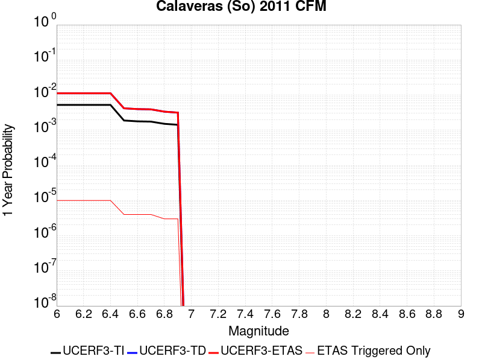 |  |

| Magnitude | 1 wk TI Prob | 1 wk TD Prob | 1 wk ETAS Prob | 1 wk ETAS/TD Gain | 1 wk ETAS Triggered Only | 1 mo TI Prob | 1 mo TD Prob | 1 mo ETAS Prob | 1 mo ETAS/TD Gain | 1 mo ETAS Triggered Only | 1 yr TI Prob | 1 yr TD Prob | 1 yr ETAS Prob | 1 yr ETAS/TD Gain | 1 yr ETAS Triggered Only | 10 yr TI Prob | 10 yr TD Prob | 10 yr ETAS Prob | 10 yr ETAS/TD Gain | 10 yr ETAS Triggered Only |
|-----|-----|-----|-----|-----|-----|-----|-----|-----|-----|-----|-----|-----|-----|-----|-----|-----|-----|-----|-----|-----|
| 6.0 | 1.00604906E-4 | 2.1600646E-4 | 2.3822759E-4 | 1.1028725 | 2.2225926E-5 | 4.3109263E-4 | 9.255689E-4 | 9.477743E-4 | 1.023991 | 2.2225926E-5 | 0.0052359286 | 0.0112380525 | 0.011260029 | 1.0019555 | 2.2225926E-5 | 0.05114268 | 0.102641135 | 0.10267106 | 1.0002915 | 3.333889E-5 |
| 6.1 | 1.00604906E-4 | 2.1600646E-4 | 2.3822759E-4 | 1.1028725 | 2.2225926E-5 | 4.3109263E-4 | 9.255689E-4 | 9.477743E-4 | 1.023991 | 2.2225926E-5 | 0.0052359286 | 0.0112380525 | 0.011260029 | 1.0019555 | 2.2225926E-5 | 0.05114268 | 0.102641135 | 0.10267106 | 1.0002915 | 3.333889E-5 |
| 6.2 | 1.00604906E-4 | 2.1600646E-4 | 2.3822759E-4 | 1.1028725 | 2.2225926E-5 | 4.3109263E-4 | 9.255689E-4 | 9.477743E-4 | 1.023991 | 2.2225926E-5 | 0.0052359286 | 0.0112380525 | 0.011260029 | 1.0019555 | 2.2225926E-5 | 0.05114268 | 0.102641135 | 0.10267106 | 1.0002915 | 3.333889E-5 |
| 6.3 | 1.00604906E-4 | 2.1600646E-4 | 2.3822759E-4 | 1.1028725 | 2.2225926E-5 | 4.3109263E-4 | 9.255689E-4 | 9.477743E-4 | 1.023991 | 2.2225926E-5 | 0.0052359286 | 0.0112380525 | 0.011260029 | 1.0019555 | 2.2225926E-5 | 0.05114268 | 0.102641135 | 0.10267106 | 1.0002915 | 3.333889E-5 |
| 6.4 | 1.00604906E-4 | 2.1600646E-4 | 2.3822759E-4 | 1.1028725 | 2.2225926E-5 | 4.3109263E-4 | 9.255689E-4 | 9.477743E-4 | 1.023991 | 2.2225926E-5 | 0.0052359286 | 0.0112380525 | 0.011260029 | 1.0019555 | 2.2225926E-5 | 0.05114268 | 0.102641135 | 0.10267106 | 1.0002915 | 3.333889E-5 |
| 6.5 | 3.6232093E-5 | 8.0470694E-5 | 8.0470694E-5 | 1.0 | 0.0 | 1.5527116E-4 | 3.448549E-4 | 3.448549E-4 | 1.0 | 0.0 | 0.0018887871 | 0.004195091 | 0.004195091 | 1.0 | 0.0 | 0.018728139 | 0.040133998 | 0.040144667 | 1.0002658 | 1.1112963E-5 |
| 6.6 | 3.4288823E-5 | 7.645369E-5 | 7.645369E-5 | 1.0 | 0.0 | 1.4694381E-4 | 3.2764356E-4 | 3.2764356E-4 | 1.0 | 0.0 | 0.0017875729 | 0.003986383 | 0.003986383 | 1.0 | 0.0 | 0.017732618 | 0.03829094 | 0.038301628 | 1.0002791 | 1.1112963E-5 |
| 6.7 | 3.365726E-5 | 7.5152966E-5 | 7.5152966E-5 | 1.0 | 0.0 | 1.4423742E-4 | 3.220704E-4 | 3.220704E-4 | 1.0 | 0.0 | 0.001754676 | 0.003918774 | 0.003918774 | 1.0 | 0.0 | 0.017408855 | 0.037675563 | 0.03768626 | 1.0002838 | 1.1112963E-5 |
| 6.8 | 2.9146076E-5 | 6.459388E-5 | 6.459388E-5 | 1.0 | 0.0 | 1.2490578E-4 | 2.768274E-4 | 2.768274E-4 | 1.0 | 0.0 | 0.001519667 | 0.0033697556 | 0.0033697556 | 1.0 | 0.0 | 0.015093167 | 0.032588553 | 0.032599304 | 1.0003299 | 1.1112963E-5 |
| 6.9 | 2.7363296E-5 | 6.059934E-5 | 6.059934E-5 | 1.0 | 0.0 | 1.1726599E-4 | 2.5971147E-4 | 2.5971147E-4 | 1.0 | 0.0 | 0.0014267784 | 0.003161987 | 0.003161987 | 1.0 | 0.0 | 0.014176525 | 0.030637112 | 0.030647883 | 1.0003517 | 1.1112963E-5 |

## Green Valley 2011 CFM
*[(top)](#table-of-contents)*

| 1 Week | 1 Month | 1 Year | 10 Year |
|-----|-----|-----|-----|
|  |  |  |  |

| Magnitude | 1 wk TI Prob | 1 wk TD Prob | 1 wk ETAS Prob | 1 wk ETAS/TD Gain | 1 wk ETAS Triggered Only | 1 mo TI Prob | 1 mo TD Prob | 1 mo ETAS Prob | 1 mo ETAS/TD Gain | 1 mo ETAS Triggered Only | 1 yr TI Prob | 1 yr TD Prob | 1 yr ETAS Prob | 1 yr ETAS/TD Gain | 1 yr ETAS Triggered Only | 10 yr TI Prob | 10 yr TD Prob | 10 yr ETAS Prob | 10 yr ETAS/TD Gain | 10 yr ETAS Triggered Only |
|-----|-----|-----|-----|-----|-----|-----|-----|-----|-----|-----|-----|-----|-----|-----|-----|-----|-----|-----|-----|-----|
| 6.0 | 7.9834055E-5 | 1.7647086E-4 | 1.9869287E-4 | 1.1259245 | 2.2225926E-5 | 3.421011E-4 | 7.562273E-4 | 7.784364E-4 | 1.0293683 | 2.2225926E-5 | 0.0041571283 | 0.009193515 | 0.009226548 | 1.003593 | 3.333889E-5 | 0.040802166 | 0.08864039 | 0.088670775 | 1.0003427 | 3.333889E-5 |
| 6.1 | 7.9834055E-5 | 1.7647086E-4 | 1.9869287E-4 | 1.1259245 | 2.2225926E-5 | 3.421011E-4 | 7.562273E-4 | 7.784364E-4 | 1.0293683 | 2.2225926E-5 | 0.0041571283 | 0.009193515 | 0.009226548 | 1.003593 | 3.333889E-5 | 0.040802166 | 0.08864039 | 0.088670775 | 1.0003427 | 3.333889E-5 |
| 6.2 | 7.9834055E-5 | 1.7647086E-4 | 1.9869287E-4 | 1.1259245 | 2.2225926E-5 | 3.421011E-4 | 7.562273E-4 | 7.784364E-4 | 1.0293683 | 2.2225926E-5 | 0.0041571283 | 0.009193515 | 0.009226548 | 1.003593 | 3.333889E-5 | 0.040802166 | 0.08864039 | 0.088670775 | 1.0003427 | 3.333889E-5 |
| 6.3 | 7.9834055E-5 | 1.7647086E-4 | 1.9869287E-4 | 1.1259245 | 2.2225926E-5 | 3.421011E-4 | 7.562273E-4 | 7.784364E-4 | 1.0293683 | 2.2225926E-5 | 0.0041571283 | 0.009193515 | 0.009226548 | 1.003593 | 3.333889E-5 | 0.040802166 | 0.08864039 | 0.088670775 | 1.0003427 | 3.333889E-5 |
| 6.4 | 7.9834055E-5 | 1.7647086E-4 | 1.9869287E-4 | 1.1259245 | 2.2225926E-5 | 3.421011E-4 | 7.562273E-4 | 7.784364E-4 | 1.0293683 | 2.2225926E-5 | 0.0041571283 | 0.009193515 | 0.009226548 | 1.003593 | 3.333889E-5 | 0.040802166 | 0.08864039 | 0.088670775 | 1.0003427 | 3.333889E-5 |
| 6.5 | 7.9834055E-5 | 1.7647086E-4 | 1.9869287E-4 | 1.1259245 | 2.2225926E-5 | 3.421011E-4 | 7.562273E-4 | 7.784364E-4 | 1.0293683 | 2.2225926E-5 | 0.0041571283 | 0.009193515 | 0.009226548 | 1.003593 | 3.333889E-5 | 0.040802166 | 0.08864039 | 0.088670775 | 1.0003427 | 3.333889E-5 |
| 6.6 | 6.153684E-5 | 1.4011236E-4 | 1.4011236E-4 | 1.0 | 0.0 | 2.6370265E-4 | 6.004815E-4 | 6.004815E-4 | 1.0 | 0.0 | 0.0032058533 | 0.0073108627 | 0.0073218946 | 1.001509 | 1.1112963E-5 | 0.03159998 | 0.071543366 | 0.07155368 | 1.0001442 | 1.1112963E-5 |
| 6.7 | 6.153684E-5 | 1.4011236E-4 | 1.4011236E-4 | 1.0 | 0.0 | 2.6370265E-4 | 6.004815E-4 | 6.004815E-4 | 1.0 | 0.0 | 0.0032058533 | 0.0073108627 | 0.0073218946 | 1.001509 | 1.1112963E-5 | 0.03159998 | 0.071543366 | 0.07155368 | 1.0001442 | 1.1112963E-5 |

## Hollywood
*[(top)](#table-of-contents)*

| 1 Week | 1 Month | 1 Year | 10 Year |
|-----|-----|-----|-----|
|  |  |  |  |

| Magnitude | 1 wk TI Prob | 1 wk TD Prob | 1 wk ETAS Prob | 1 wk ETAS/TD Gain | 1 wk ETAS Triggered Only | 1 mo TI Prob | 1 mo TD Prob | 1 mo ETAS Prob | 1 mo ETAS/TD Gain | 1 mo ETAS Triggered Only | 1 yr TI Prob | 1 yr TD Prob | 1 yr ETAS Prob | 1 yr ETAS/TD Gain | 1 yr ETAS Triggered Only | 10 yr TI Prob | 10 yr TD Prob | 10 yr ETAS Prob | 10 yr ETAS/TD Gain | 10 yr ETAS Triggered Only |
|-----|-----|-----|-----|-----|-----|-----|-----|-----|-----|-----|-----|-----|-----|-----|-----|-----|-----|-----|-----|-----|
| 6.0 | 1.8637298E-5 | 2.1684791E-5 | 2.1684791E-5 | 1.0 | 0.0 | 7.987169E-5 | 9.2934824E-5 | 9.2934824E-5 | 1.0 | 0.0 | 9.720039E-4 | 0.0011314814 | 0.0011425817 | 1.0098104 | 1.1112963E-5 | 0.009677634 | 0.011314785 | 0.0113477465 | 1.0029131 | 3.333889E-5 |
| 6.1 | 1.8637298E-5 | 2.1684791E-5 | 2.1684791E-5 | 1.0 | 0.0 | 7.987169E-5 | 9.2934824E-5 | 9.2934824E-5 | 1.0 | 0.0 | 9.720039E-4 | 0.0011314814 | 0.0011425817 | 1.0098104 | 1.1112963E-5 | 0.009677634 | 0.011314785 | 0.0113477465 | 1.0029131 | 3.333889E-5 |
| 6.2 | 1.8637298E-5 | 2.1684791E-5 | 2.1684791E-5 | 1.0 | 0.0 | 7.987169E-5 | 9.2934824E-5 | 9.2934824E-5 | 1.0 | 0.0 | 9.720039E-4 | 0.0011314814 | 0.0011425817 | 1.0098104 | 1.1112963E-5 | 0.009677634 | 0.011314785 | 0.0113477465 | 1.0029131 | 3.333889E-5 |
| 6.3 | 1.8637298E-5 | 2.1684791E-5 | 2.1684791E-5 | 1.0 | 0.0 | 7.987169E-5 | 9.2934824E-5 | 9.2934824E-5 | 1.0 | 0.0 | 9.720039E-4 | 0.0011314814 | 0.0011425817 | 1.0098104 | 1.1112963E-5 | 0.009677634 | 0.011314785 | 0.0113477465 | 1.0029131 | 3.333889E-5 |
| 6.4 | 1.8637298E-5 | 2.1684791E-5 | 2.1684791E-5 | 1.0 | 0.0 | 7.987169E-5 | 9.2934824E-5 | 9.2934824E-5 | 1.0 | 0.0 | 9.720039E-4 | 0.0011314814 | 0.0011425817 | 1.0098104 | 1.1112963E-5 | 0.009677634 | 0.011314785 | 0.0113477465 | 1.0029131 | 3.333889E-5 |
| 6.5 | 1.8637298E-5 | 2.1684791E-5 | 2.1684791E-5 | 1.0 | 0.0 | 7.987169E-5 | 9.2934824E-5 | 9.2934824E-5 | 1.0 | 0.0 | 9.720039E-4 | 0.0011314814 | 0.0011425817 | 1.0098104 | 1.1112963E-5 | 0.009677634 | 0.011314785 | 0.0113477465 | 1.0029131 | 3.333889E-5 |

## Los Osos 2011
*[(top)](#table-of-contents)*

| 1 Week | 1 Month | 1 Year | 10 Year |
|-----|-----|-----|-----|
|  |  |  |  |

| Magnitude | 1 wk TI Prob | 1 wk TD Prob | 1 wk ETAS Prob | 1 wk ETAS/TD Gain | 1 wk ETAS Triggered Only | 1 mo TI Prob | 1 mo TD Prob | 1 mo ETAS Prob | 1 mo ETAS/TD Gain | 1 mo ETAS Triggered Only | 1 yr TI Prob | 1 yr TD Prob | 1 yr ETAS Prob | 1 yr ETAS/TD Gain | 1 yr ETAS Triggered Only | 10 yr TI Prob | 10 yr TD Prob | 10 yr ETAS Prob | 10 yr ETAS/TD Gain | 10 yr ETAS Triggered Only |
|-----|-----|-----|-----|-----|-----|-----|-----|-----|-----|-----|-----|-----|-----|-----|-----|-----|-----|-----|-----|-----|
| 6.0 | 8.431995E-6 | 8.921914E-6 | 2.0034779E-5 | 2.2455695 | 1.1112963E-5 | 3.6136626E-5 | 3.8236416E-5 | 4.9348953E-5 | 1.2906271 | 1.1112963E-5 | 4.3987457E-4 | 4.6546472E-4 | 4.987881E-4 | 1.0715916 | 3.333889E-5 | 0.004390049 | 0.0046484126 | 0.0046815965 | 1.0071387 | 3.333889E-5 |
| 6.1 | 8.431995E-6 | 8.921914E-6 | 2.0034779E-5 | 2.2455695 | 1.1112963E-5 | 3.6136626E-5 | 3.8236416E-5 | 4.9348953E-5 | 1.2906271 | 1.1112963E-5 | 4.3987457E-4 | 4.6546472E-4 | 4.987881E-4 | 1.0715916 | 3.333889E-5 | 0.004390049 | 0.0046484126 | 0.0046815965 | 1.0071387 | 3.333889E-5 |
| 6.2 | 8.431995E-6 | 8.921914E-6 | 2.0034779E-5 | 2.2455695 | 1.1112963E-5 | 3.6136626E-5 | 3.8236416E-5 | 4.9348953E-5 | 1.2906271 | 1.1112963E-5 | 4.3987457E-4 | 4.6546472E-4 | 4.987881E-4 | 1.0715916 | 3.333889E-5 | 0.004390049 | 0.0046484126 | 0.0046815965 | 1.0071387 | 3.333889E-5 |
| 6.3 | 8.431995E-6 | 8.921914E-6 | 2.0034779E-5 | 2.2455695 | 1.1112963E-5 | 3.6136626E-5 | 3.8236416E-5 | 4.9348953E-5 | 1.2906271 | 1.1112963E-5 | 4.3987457E-4 | 4.6546472E-4 | 4.987881E-4 | 1.0715916 | 3.333889E-5 | 0.004390049 | 0.0046484126 | 0.0046815965 | 1.0071387 | 3.333889E-5 |
| 6.4 | 8.431995E-6 | 8.921914E-6 | 2.0034779E-5 | 2.2455695 | 1.1112963E-5 | 3.6136626E-5 | 3.8236416E-5 | 4.9348953E-5 | 1.2906271 | 1.1112963E-5 | 4.3987457E-4 | 4.6546472E-4 | 4.987881E-4 | 1.0715916 | 3.333889E-5 | 0.004390049 | 0.0046484126 | 0.0046815965 | 1.0071387 | 3.333889E-5 |
| 6.5 | 8.431995E-6 | 8.921914E-6 | 2.0034779E-5 | 2.2455695 | 1.1112963E-5 | 3.6136626E-5 | 3.8236416E-5 | 4.9348953E-5 | 1.2906271 | 1.1112963E-5 | 4.3987457E-4 | 4.6546472E-4 | 4.987881E-4 | 1.0715916 | 3.333889E-5 | 0.004390049 | 0.0046484126 | 0.0046815965 | 1.0071387 | 3.333889E-5 |
| 6.6 | 7.640001E-6 | 8.0825275E-6 | 1.9195402E-5 | 2.3749254 | 1.1112963E-5 | 3.274245E-5 | 3.4639146E-5 | 4.5751724E-5 | 1.3208098 | 1.1112963E-5 | 3.9856642E-4 | 4.2168552E-4 | 4.4390207E-4 | 1.0526851 | 2.2225926E-5 | 0.0039785234 | 0.004212338 | 0.0042344704 | 1.0052541 | 2.2225926E-5 |
| 6.7 | 6.515521E-6 | 6.8883687E-6 | 1.8001256E-5 | 2.6132827 | 1.1112963E-5 | 2.7923363E-5 | 2.9521441E-5 | 4.0634077E-5 | 1.3764259 | 1.1112963E-5 | 3.399139E-4 | 3.593989E-4 | 3.8161685E-4 | 1.0618197 | 2.2225926E-5 | 0.0033939444 | 0.003591573 | 0.003613719 | 1.0061661 | 2.2225926E-5 |
| 6.8 | 4.831725E-6 | 5.104944E-6 | 1.6217851E-5 | 3.176891 | 1.1112963E-5 | 2.0707228E-5 | 2.1878332E-5 | 3.299105E-5 | 1.5079327 | 1.1112963E-5 | 2.5208134E-4 | 2.6636868E-4 | 2.7747868E-4 | 1.0417091 | 1.1112963E-5 | 0.0025179558 | 0.0026636869 | 0.0026747703 | 1.0041609 | 1.1112963E-5 |
| 6.9 | 4.831725E-6 | 5.104944E-6 | 1.6217851E-5 | 3.176891 | 1.1112963E-5 | 2.0707228E-5 | 2.1878332E-5 | 3.299105E-5 | 1.5079327 | 1.1112963E-5 | 2.5208134E-4 | 2.6636868E-4 | 2.7747868E-4 | 1.0417091 | 1.1112963E-5 | 0.0025179558 | 0.0026636869 | 0.0026747703 | 1.0041609 | 1.1112963E-5 |

## Coronado Bank alt1
*[(top)](#table-of-contents)*

| 1 Week | 1 Month | 1 Year | 10 Year |
|-----|-----|-----|-----|
|  |  |  |  |

| Magnitude | 1 wk TI Prob | 1 wk TD Prob | 1 wk ETAS Prob | 1 wk ETAS/TD Gain | 1 wk ETAS Triggered Only | 1 mo TI Prob | 1 mo TD Prob | 1 mo ETAS Prob | 1 mo ETAS/TD Gain | 1 mo ETAS Triggered Only | 1 yr TI Prob | 1 yr TD Prob | 1 yr ETAS Prob | 1 yr ETAS/TD Gain | 1 yr ETAS Triggered Only | 10 yr TI Prob | 10 yr TD Prob | 10 yr ETAS Prob | 10 yr ETAS/TD Gain | 10 yr ETAS Triggered Only |
|-----|-----|-----|-----|-----|-----|-----|-----|-----|-----|-----|-----|-----|-----|-----|-----|-----|-----|-----|-----|-----|
| 6.0 | 2.2805418E-5 | 2.2997261E-5 | 3.410997E-5 | 1.4832188 | 1.1112963E-5 | 9.773385E-5 | 9.8556375E-5 | 1.09668246E-4 | 1.1127464 | 1.1112963E-5 | 0.00118926 | 0.0011993361 | 0.0012215354 | 1.0185096 | 2.2225926E-5 | 0.011829156 | 0.011935918 | 0.011957879 | 1.0018399 | 2.2225926E-5 |
| 6.1 | 2.2805418E-5 | 2.2997261E-5 | 3.410997E-5 | 1.4832188 | 1.1112963E-5 | 9.773385E-5 | 9.8556375E-5 | 1.09668246E-4 | 1.1127464 | 1.1112963E-5 | 0.00118926 | 0.0011993361 | 0.0012215354 | 1.0185096 | 2.2225926E-5 | 0.011829156 | 0.011935918 | 0.011957879 | 1.0018399 | 2.2225926E-5 |
| 6.2 | 2.2805418E-5 | 2.2997261E-5 | 3.410997E-5 | 1.4832188 | 1.1112963E-5 | 9.773385E-5 | 9.8556375E-5 | 1.09668246E-4 | 1.1127464 | 1.1112963E-5 | 0.00118926 | 0.0011993361 | 0.0012215354 | 1.0185096 | 2.2225926E-5 | 0.011829156 | 0.011935918 | 0.011957879 | 1.0018399 | 2.2225926E-5 |
| 6.3 | 2.2805418E-5 | 2.2997261E-5 | 3.410997E-5 | 1.4832188 | 1.1112963E-5 | 9.773385E-5 | 9.8556375E-5 | 1.09668246E-4 | 1.1127464 | 1.1112963E-5 | 0.00118926 | 0.0011993361 | 0.0012215354 | 1.0185096 | 2.2225926E-5 | 0.011829156 | 0.011935918 | 0.011957879 | 1.0018399 | 2.2225926E-5 |
| 6.4 | 2.2805418E-5 | 2.2997261E-5 | 3.410997E-5 | 1.4832188 | 1.1112963E-5 | 9.773385E-5 | 9.8556375E-5 | 1.09668246E-4 | 1.1127464 | 1.1112963E-5 | 0.00118926 | 0.0011993361 | 0.0012215354 | 1.0185096 | 2.2225926E-5 | 0.011829156 | 0.011935918 | 0.011957879 | 1.0018399 | 2.2225926E-5 |
| 6.5 | 2.2805418E-5 | 2.2997261E-5 | 3.410997E-5 | 1.4832188 | 1.1112963E-5 | 9.773385E-5 | 9.8556375E-5 | 1.09668246E-4 | 1.1127464 | 1.1112963E-5 | 0.00118926 | 0.0011993361 | 0.0012215354 | 1.0185096 | 2.2225926E-5 | 0.011829156 | 0.011935918 | 0.011957879 | 1.0018399 | 2.2225926E-5 |
| 6.6 | 2.0608364E-5 | 2.2997261E-5 | 3.410997E-5 | 1.4832188 | 1.1112963E-5 | 8.831857E-5 | 9.8556375E-5 | 1.09668246E-4 | 1.1127464 | 1.1112963E-5 | 0.0010747481 | 0.0011993361 | 0.0012215354 | 1.0185096 | 2.2225926E-5 | 0.010695651 | 0.011935918 | 0.011957879 | 1.0018399 | 2.2225926E-5 |
| 6.7 | 1.8279972E-5 | 2.0392206E-5 | 3.1504944E-5 | 1.5449501 | 1.1112963E-5 | 7.834038E-5 | 8.7392655E-5 | 9.850464E-5 | 1.1271502 | 1.1112963E-5 | 9.533768E-4 | 0.0010635584 | 0.0010857608 | 1.0208755 | 2.2225926E-5 | 0.00949297 | 0.010591865 | 0.010613856 | 1.0020761 | 2.2225926E-5 |
| 6.8 | 1.5100513E-5 | 1.6821805E-5 | 2.793458E-5 | 1.6606174 | 1.1112963E-5 | 6.471488E-5 | 7.209186E-5 | 8.320402E-5 | 1.1541389 | 1.1112963E-5 | 7.876188E-4 | 8.77436E-4 | 8.996425E-4 | 1.0253084 | 2.2225926E-5 | 0.007848332 | 0.008746733 | 0.008768764 | 1.0025188 | 2.2225926E-5 |
| 6.9 | 1.3558665E-5 | 1.5095915E-5 | 2.620871E-5 | 1.7361459 | 1.1112963E-5 | 5.810727E-5 | 6.4695574E-5 | 7.580782E-5 | 1.171762 | 1.1112963E-5 | 7.0722634E-4 | 7.874548E-4 | 8.096632E-4 | 1.0282028 | 2.2225926E-5 | 0.0070497985 | 0.007853617 | 0.007875668 | 1.0028079 | 2.2225926E-5 |
| 7.0 | 1.1606914E-5 | 1.2905324E-5 | 2.4018143E-5 | 1.8611035 | 1.1112963E-5 | 4.9742972E-5 | 5.5307755E-5 | 6.642011E-5 | 1.2009184 | 1.1112963E-5 | 6.0545234E-4 | 6.7323423E-4 | 6.9544517E-4 | 1.0329914 | 2.2225926E-5 | 0.0060380544 | 0.006718854 | 0.0067409305 | 1.0032858 | 2.2225926E-5 |
| 7.1 | 9.601701E-6 | 1.06512E-5 | 2.1764045E-5 | 2.043342 | 1.1112963E-5 | 4.11495E-5 | 4.564759E-5 | 5.6760047E-5 | 1.2434402 | 1.1112963E-5 | 5.0088E-4 | 5.556874E-4 | 5.7790097E-4 | 1.0399749 | 2.2225926E-5 | 0.0049975254 | 0.005549817 | 0.0055719195 | 1.0039825 | 2.2225926E-5 |
| 7.2 | 8.368532E-6 | 9.267938E-6 | 2.0380798E-5 | 2.199065 | 1.1112963E-5 | 3.5864643E-5 | 3.971952E-5 | 5.0832045E-5 | 1.2797748 | 1.1112963E-5 | 4.3656456E-4 | 4.8354716E-4 | 5.0576235E-4 | 1.0459421 | 2.2225926E-5 | 0.004357079 | 0.0048317458 | 0.0048538647 | 1.0045778 | 2.2225926E-5 |
| 7.3 | 6.710382E-6 | 7.416545E-6 | 7.416545E-6 | 1.0 | 0.0 | 2.8758463E-5 | 3.1785192E-5 | 3.1785192E-5 | 1.0 | 0.0 | 3.5007801E-4 | 3.8698473E-4 | 3.9809337E-4 | 1.0287057 | 1.1112963E-5 | 0.0034952704 | 0.0038698472 | 0.003880917 | 1.0028605 | 1.1112963E-5 |

## Casmalia 2011 CFM
*[(top)](#table-of-contents)*

| 1 Week | 1 Month | 1 Year | 10 Year |
|-----|-----|-----|-----|
|  |  |  |  |

| Magnitude | 1 wk TI Prob | 1 wk TD Prob | 1 wk ETAS Prob | 1 wk ETAS/TD Gain | 1 wk ETAS Triggered Only | 1 mo TI Prob | 1 mo TD Prob | 1 mo ETAS Prob | 1 mo ETAS/TD Gain | 1 mo ETAS Triggered Only | 1 yr TI Prob | 1 yr TD Prob | 1 yr ETAS Prob | 1 yr ETAS/TD Gain | 1 yr ETAS Triggered Only | 10 yr TI Prob | 10 yr TD Prob | 10 yr ETAS Prob | 10 yr ETAS/TD Gain | 10 yr ETAS Triggered Only |
|-----|-----|-----|-----|-----|-----|-----|-----|-----|-----|-----|-----|-----|-----|-----|-----|-----|-----|-----|-----|-----|
| 6.0 | 4.5215784E-6 | 4.6811892E-6 | 4.6811892E-6 | 1.0 | 0.0 | 1.9378049E-5 | 2.0062238E-5 | 3.117498E-5 | 1.5539132 | 1.1112963E-5 | 2.359022E-4 | 2.4425777E-4 | 2.6647825E-4 | 1.0909715 | 2.2225926E-5 | 0.0023565195 | 0.0024425776 | 0.0024647492 | 1.0090772 | 2.2225926E-5 |
| 6.1 | 4.5215784E-6 | 4.6811892E-6 | 4.6811892E-6 | 1.0 | 0.0 | 1.9378049E-5 | 2.0062238E-5 | 3.117498E-5 | 1.5539132 | 1.1112963E-5 | 2.359022E-4 | 2.4425777E-4 | 2.6647825E-4 | 1.0909715 | 2.2225926E-5 | 0.0023565195 | 0.0024425776 | 0.0024647492 | 1.0090772 | 2.2225926E-5 |
| 6.2 | 4.5215784E-6 | 4.6811892E-6 | 4.6811892E-6 | 1.0 | 0.0 | 1.9378049E-5 | 2.0062238E-5 | 3.117498E-5 | 1.5539132 | 1.1112963E-5 | 2.359022E-4 | 2.4425777E-4 | 2.6647825E-4 | 1.0909715 | 2.2225926E-5 | 0.0023565195 | 0.0024425776 | 0.0024647492 | 1.0090772 | 2.2225926E-5 |
| 6.3 | 4.5215784E-6 | 4.6811892E-6 | 4.6811892E-6 | 1.0 | 0.0 | 1.9378049E-5 | 2.0062238E-5 | 3.117498E-5 | 1.5539132 | 1.1112963E-5 | 2.359022E-4 | 2.4425777E-4 | 2.6647825E-4 | 1.0909715 | 2.2225926E-5 | 0.0023565195 | 0.0024425776 | 0.0024647492 | 1.0090772 | 2.2225926E-5 |
| 6.4 | 4.5215784E-6 | 4.6811892E-6 | 4.6811892E-6 | 1.0 | 0.0 | 1.9378049E-5 | 2.0062238E-5 | 3.117498E-5 | 1.5539132 | 1.1112963E-5 | 2.359022E-4 | 2.4425777E-4 | 2.6647825E-4 | 1.0909715 | 2.2225926E-5 | 0.0023565195 | 0.0024425776 | 0.0024647492 | 1.0090772 | 2.2225926E-5 |
| 6.5 | 4.5215784E-6 | 4.6811892E-6 | 4.6811892E-6 | 1.0 | 0.0 | 1.9378049E-5 | 2.0062238E-5 | 3.117498E-5 | 1.5539132 | 1.1112963E-5 | 2.359022E-4 | 2.4425777E-4 | 2.6647825E-4 | 1.0909715 | 2.2225926E-5 | 0.0023565195 | 0.0024425776 | 0.0024647492 | 1.0090772 | 2.2225926E-5 |

## Great Valley 09 (Laguna Seca)
*[(top)](#table-of-contents)*

| 1 Week | 1 Month | 1 Year | 10 Year |
|-----|-----|-----|-----|
|  |  |  |  |

| Magnitude | 1 wk TI Prob | 1 wk TD Prob | 1 wk ETAS Prob | 1 wk ETAS/TD Gain | 1 wk ETAS Triggered Only | 1 mo TI Prob | 1 mo TD Prob | 1 mo ETAS Prob | 1 mo ETAS/TD Gain | 1 mo ETAS Triggered Only | 1 yr TI Prob | 1 yr TD Prob | 1 yr ETAS Prob | 1 yr ETAS/TD Gain | 1 yr ETAS Triggered Only | 10 yr TI Prob | 10 yr TD Prob | 10 yr ETAS Prob | 10 yr ETAS/TD Gain | 10 yr ETAS Triggered Only |
|-----|-----|-----|-----|-----|-----|-----|-----|-----|-----|-----|-----|-----|-----|-----|-----|-----|-----|-----|-----|-----|
| 6.0 | 2.7186308E-5 | 3.3603857E-5 | 4.4716446E-5 | 1.3306938 | 1.1112963E-5 | 1.16507545E-4 | 1.4401274E-4 | 1.6623546E-4 | 1.1543108 | 2.2225926E-5 | 0.0014175563 | 0.0017526768 | 0.0017748638 | 1.012659 | 2.2225926E-5 | 0.014085478 | 0.017460305 | 0.017482143 | 1.0012507 | 2.2225926E-5 |
| 6.1 | 2.7186308E-5 | 3.3603857E-5 | 4.4716446E-5 | 1.3306938 | 1.1112963E-5 | 1.16507545E-4 | 1.4401274E-4 | 1.6623546E-4 | 1.1543108 | 2.2225926E-5 | 0.0014175563 | 0.0017526768 | 0.0017748638 | 1.012659 | 2.2225926E-5 | 0.014085478 | 0.017460305 | 0.017482143 | 1.0012507 | 2.2225926E-5 |
| 6.2 | 2.7186308E-5 | 3.3603857E-5 | 4.4716446E-5 | 1.3306938 | 1.1112963E-5 | 1.16507545E-4 | 1.4401274E-4 | 1.6623546E-4 | 1.1543108 | 2.2225926E-5 | 0.0014175563 | 0.0017526768 | 0.0017748638 | 1.012659 | 2.2225926E-5 | 0.014085478 | 0.017460305 | 0.017482143 | 1.0012507 | 2.2225926E-5 |
| 6.3 | 2.7186308E-5 | 3.3603857E-5 | 4.4716446E-5 | 1.3306938 | 1.1112963E-5 | 1.16507545E-4 | 1.4401274E-4 | 1.6623546E-4 | 1.1543108 | 2.2225926E-5 | 0.0014175563 | 0.0017526768 | 0.0017748638 | 1.012659 | 2.2225926E-5 | 0.014085478 | 0.017460305 | 0.017482143 | 1.0012507 | 2.2225926E-5 |
| 6.4 | 2.7186308E-5 | 3.3603857E-5 | 4.4716446E-5 | 1.3306938 | 1.1112963E-5 | 1.16507545E-4 | 1.4401274E-4 | 1.6623546E-4 | 1.1543108 | 2.2225926E-5 | 0.0014175563 | 0.0017526768 | 0.0017748638 | 1.012659 | 2.2225926E-5 | 0.014085478 | 0.017460305 | 0.017482143 | 1.0012507 | 2.2225926E-5 |
| 6.5 | 2.7186308E-5 | 3.3603857E-5 | 4.4716446E-5 | 1.3306938 | 1.1112963E-5 | 1.16507545E-4 | 1.4401274E-4 | 1.6623546E-4 | 1.1543108 | 2.2225926E-5 | 0.0014175563 | 0.0017526768 | 0.0017748638 | 1.012659 | 2.2225926E-5 | 0.014085478 | 0.017460305 | 0.017482143 | 1.0012507 | 2.2225926E-5 |
| 6.6 | 1.8800807E-5 | 2.3153776E-5 | 3.4266483E-5 | 1.4799522 | 1.1112963E-5 | 8.05724E-5 | 9.923046E-5 | 1.21454184E-4 | 1.2239606 | 2.2225926E-5 | 9.805275E-4 | 0.0012081307 | 0.0012303299 | 1.0183747 | 2.2225926E-5 | 0.009762122 | 0.012081286 | 0.012103244 | 1.0018175 | 2.2225926E-5 |
| 6.7 | 1.8800807E-5 | 2.3153776E-5 | 3.4266483E-5 | 1.4799522 | 1.1112963E-5 | 8.05724E-5 | 9.923046E-5 | 1.21454184E-4 | 1.2239606 | 2.2225926E-5 | 9.805275E-4 | 0.0012081307 | 0.0012303299 | 1.0183747 | 2.2225926E-5 | 0.009762122 | 0.012081286 | 0.012103244 | 1.0018175 | 2.2225926E-5 |

## Great Valley 04b Gordon Valley
*[(top)](#table-of-contents)*

| 1 Week | 1 Month | 1 Year | 10 Year |
|-----|-----|-----|-----|
| 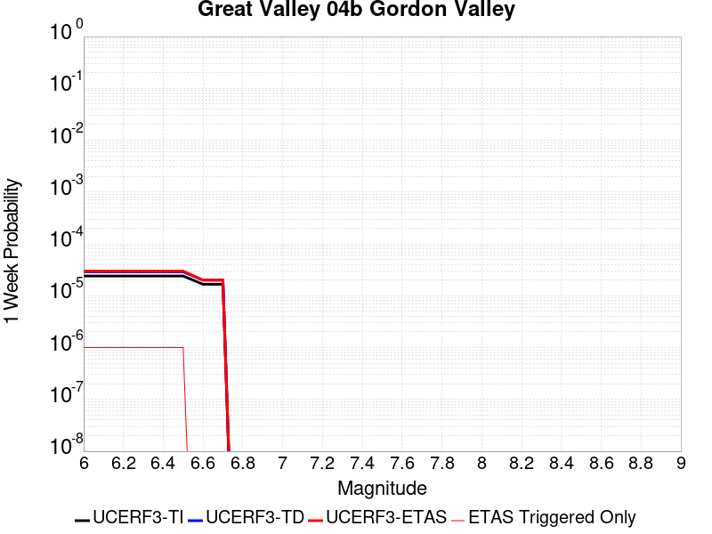 |  |  |  |

| Magnitude | 1 wk TI Prob | 1 wk TD Prob | 1 wk ETAS Prob | 1 wk ETAS/TD Gain | 1 wk ETAS Triggered Only | 1 mo TI Prob | 1 mo TD Prob | 1 mo ETAS Prob | 1 mo ETAS/TD Gain | 1 mo ETAS Triggered Only | 1 yr TI Prob | 1 yr TD Prob | 1 yr ETAS Prob | 1 yr ETAS/TD Gain | 1 yr ETAS Triggered Only | 10 yr TI Prob | 10 yr TD Prob | 10 yr ETAS Prob | 10 yr ETAS/TD Gain | 10 yr ETAS Triggered Only |
|-----|-----|-----|-----|-----|-----|-----|-----|-----|-----|-----|-----|-----|-----|-----|-----|-----|-----|-----|-----|-----|
| 6.0 | 2.4076155E-5 | 2.8932132E-5 | 2.8932132E-5 | 1.0 | 0.0 | 1.03179445E-4 | 1.2399205E-4 | 1.2399205E-4 | 1.0 | 0.0 | 0.0012554857 | 0.0015091051 | 0.0015202012 | 1.0073528 | 1.1112963E-5 | 0.012484163 | 0.015042224 | 0.015064116 | 1.0014553 | 2.2225926E-5 |
| 6.1 | 2.4076155E-5 | 2.8932132E-5 | 2.8932132E-5 | 1.0 | 0.0 | 1.03179445E-4 | 1.2399205E-4 | 1.2399205E-4 | 1.0 | 0.0 | 0.0012554857 | 0.0015091051 | 0.0015202012 | 1.0073528 | 1.1112963E-5 | 0.012484163 | 0.015042224 | 0.015064116 | 1.0014553 | 2.2225926E-5 |
| 6.2 | 2.4076155E-5 | 2.8932132E-5 | 2.8932132E-5 | 1.0 | 0.0 | 1.03179445E-4 | 1.2399205E-4 | 1.2399205E-4 | 1.0 | 0.0 | 0.0012554857 | 0.0015091051 | 0.0015202012 | 1.0073528 | 1.1112963E-5 | 0.012484163 | 0.015042224 | 0.015064116 | 1.0014553 | 2.2225926E-5 |
| 6.3 | 2.4076155E-5 | 2.8932132E-5 | 2.8932132E-5 | 1.0 | 0.0 | 1.03179445E-4 | 1.2399205E-4 | 1.2399205E-4 | 1.0 | 0.0 | 0.0012554857 | 0.0015091051 | 0.0015202012 | 1.0073528 | 1.1112963E-5 | 0.012484163 | 0.015042224 | 0.015064116 | 1.0014553 | 2.2225926E-5 |
| 6.4 | 2.4076155E-5 | 2.8932132E-5 | 2.8932132E-5 | 1.0 | 0.0 | 1.03179445E-4 | 1.2399205E-4 | 1.2399205E-4 | 1.0 | 0.0 | 0.0012554857 | 0.0015091051 | 0.0015202012 | 1.0073528 | 1.1112963E-5 | 0.012484163 | 0.015042224 | 0.015064116 | 1.0014553 | 2.2225926E-5 |
| 6.5 | 2.4076155E-5 | 2.8932132E-5 | 2.8932132E-5 | 1.0 | 0.0 | 1.03179445E-4 | 1.2399205E-4 | 1.2399205E-4 | 1.0 | 0.0 | 0.0012554857 | 0.0015091051 | 0.0015202012 | 1.0073528 | 1.1112963E-5 | 0.012484163 | 0.015042224 | 0.015064116 | 1.0014553 | 2.2225926E-5 |
| 6.6 | 1.664996E-5 | 1.9973098E-5 | 1.9973098E-5 | 1.0 | 0.0 | 7.135502E-5 | 8.559899E-5 | 8.559899E-5 | 1.0 | 0.0 | 8.68401E-4 | 0.0010421677 | 0.0010421677 | 1.0 | 0.0 | 0.008650154 | 0.010421675 | 0.010432672 | 1.0010552 | 1.1112963E-5 |
| 6.7 | 1.664996E-5 | 1.9973098E-5 | 1.9973098E-5 | 1.0 | 0.0 | 7.135502E-5 | 8.559899E-5 | 8.559899E-5 | 1.0 | 0.0 | 8.68401E-4 | 0.0010421677 | 0.0010421677 | 1.0 | 0.0 | 0.008650154 | 0.010421675 | 0.010432672 | 1.0010552 | 1.1112963E-5 |

## Elsinore (Temecula) rev
*[(top)](#table-of-contents)*

| 1 Week | 1 Month | 1 Year | 10 Year |
|-----|-----|-----|-----|
|  |  | 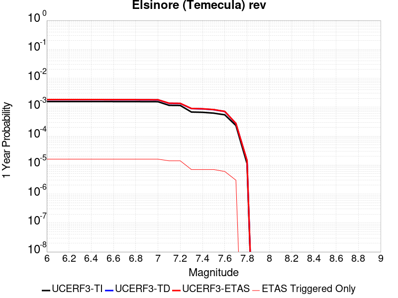 |  |

| Magnitude | 1 wk TI Prob | 1 wk TD Prob | 1 wk ETAS Prob | 1 wk ETAS/TD Gain | 1 wk ETAS Triggered Only | 1 mo TI Prob | 1 mo TD Prob | 1 mo ETAS Prob | 1 mo ETAS/TD Gain | 1 mo ETAS Triggered Only | 1 yr TI Prob | 1 yr TD Prob | 1 yr ETAS Prob | 1 yr ETAS/TD Gain | 1 yr ETAS Triggered Only | 10 yr TI Prob | 10 yr TD Prob | 10 yr ETAS Prob | 10 yr ETAS/TD Gain | 10 yr ETAS Triggered Only |
|-----|-----|-----|-----|-----|-----|-----|-----|-----|-----|-----|-----|-----|-----|-----|-----|-----|-----|-----|-----|-----|
| 6.0 | 2.9985375E-5 | 3.4747958E-5 | 4.5860535E-5 | 1.3198051 | 1.1112963E-5 | 1.2850242E-4 | 1.4891267E-4 | 1.6002399E-4 | 1.0746163 | 1.1112963E-5 | 0.0015633941 | 0.0018117457 | 0.0018228384 | 1.0061227 | 1.1112963E-5 | 0.01552441 | 0.018074041 | 0.018095864 | 1.0012075 | 2.2225926E-5 |
| 6.1 | 2.9985375E-5 | 3.4747958E-5 | 4.5860535E-5 | 1.3198051 | 1.1112963E-5 | 1.2850242E-4 | 1.4891267E-4 | 1.6002399E-4 | 1.0746163 | 1.1112963E-5 | 0.0015633941 | 0.0018117457 | 0.0018228384 | 1.0061227 | 1.1112963E-5 | 0.01552441 | 0.018074041 | 0.018095864 | 1.0012075 | 2.2225926E-5 |
| 6.2 | 2.9985375E-5 | 3.4747958E-5 | 4.5860535E-5 | 1.3198051 | 1.1112963E-5 | 1.2850242E-4 | 1.4891267E-4 | 1.6002399E-4 | 1.0746163 | 1.1112963E-5 | 0.0015633941 | 0.0018117457 | 0.0018228384 | 1.0061227 | 1.1112963E-5 | 0.01552441 | 0.018074041 | 0.018095864 | 1.0012075 | 2.2225926E-5 |
| 6.3 | 2.9985375E-5 | 3.4747958E-5 | 4.5860535E-5 | 1.3198051 | 1.1112963E-5 | 1.2850242E-4 | 1.4891267E-4 | 1.6002399E-4 | 1.0746163 | 1.1112963E-5 | 0.0015633941 | 0.0018117457 | 0.0018228384 | 1.0061227 | 1.1112963E-5 | 0.01552441 | 0.018074041 | 0.018095864 | 1.0012075 | 2.2225926E-5 |
| 6.4 | 2.9985375E-5 | 3.4747958E-5 | 4.5860535E-5 | 1.3198051 | 1.1112963E-5 | 1.2850242E-4 | 1.4891267E-4 | 1.6002399E-4 | 1.0746163 | 1.1112963E-5 | 0.0015633941 | 0.0018117457 | 0.0018228384 | 1.0061227 | 1.1112963E-5 | 0.01552441 | 0.018074041 | 0.018095864 | 1.0012075 | 2.2225926E-5 |
| 6.5 | 2.9985375E-5 | 3.4747958E-5 | 4.5860535E-5 | 1.3198051 | 1.1112963E-5 | 1.2850242E-4 | 1.4891267E-4 | 1.6002399E-4 | 1.0746163 | 1.1112963E-5 | 0.0015633941 | 0.0018117457 | 0.0018228384 | 1.0061227 | 1.1112963E-5 | 0.01552441 | 0.018074041 | 0.018095864 | 1.0012075 | 2.2225926E-5 |
| 6.6 | 2.9915182E-5 | 3.46808E-5 | 4.579338E-5 | 1.3204244 | 1.1112963E-5 | 1.2820162E-4 | 1.486249E-4 | 1.5973621E-4 | 1.0747608 | 1.1112963E-5 | 0.0015597371 | 0.0018082478 | 0.0018193406 | 1.0061346 | 1.1112963E-5 | 0.015488351 | 0.018039845 | 0.01806167 | 1.0012099 | 2.2225926E-5 |
| 6.7 | 2.9879424E-5 | 3.463569E-5 | 4.5748267E-5 | 1.3208419 | 1.1112963E-5 | 1.2804838E-4 | 1.4843159E-4 | 1.5954289E-4 | 1.0748582 | 1.1112963E-5 | 0.0015578741 | 0.0018058982 | 0.0018169911 | 1.0061426 | 1.1112963E-5 | 0.01546998 | 0.018016884 | 0.01803871 | 1.0012114 | 2.2225926E-5 |
| 6.8 | 2.9818717E-5 | 3.45724E-5 | 4.5684978E-5 | 1.3214293 | 1.1112963E-5 | 1.2778824E-4 | 1.4816038E-4 | 1.592717E-4 | 1.0749952 | 1.1112963E-5 | 0.0015547115 | 0.0018026017 | 0.0018136947 | 1.0061538 | 1.1112963E-5 | 0.015438793 | 0.017984249 | 0.018006075 | 1.0012137 | 2.2225926E-5 |
| 6.9 | 2.9704783E-5 | 3.4430177E-5 | 4.5542758E-5 | 1.322757 | 1.1112963E-5 | 1.273E-4 | 1.4755092E-4 | 1.5866225E-4 | 1.075305 | 1.1112963E-5 | 0.0015487756 | 0.001795194 | 0.001806287 | 1.0061793 | 1.1112963E-5 | 0.015380259 | 0.017911145 | 0.017932974 | 1.0012187 | 2.2225926E-5 |
| 7.0 | 2.9613002E-5 | 3.4300047E-5 | 4.5412628E-5 | 1.3239815 | 1.1112963E-5 | 1.269067E-4 | 1.4699328E-4 | 1.5810461E-4 | 1.0755907 | 1.1112963E-5 | 0.0015439938 | 0.0017884158 | 0.0017995089 | 1.0062027 | 1.1112963E-5 | 0.015333103 | 0.017844401 | 0.017866232 | 1.0012233 | 2.2225926E-5 |
| 7.1 | 2.2180364E-5 | 2.6018337E-5 | 3.7131013E-5 | 1.4271094 | 1.1112963E-5 | 9.505524E-5 | 1.115033E-4 | 1.2261502E-4 | 1.0996537 | 1.1112963E-5 | 0.0011566831 | 0.0013568681 | 0.001367966 | 1.0081791 | 1.1112963E-5 | 0.01150681 | 0.013559197 | 0.013581122 | 1.001617 | 2.2225926E-5 |
| 7.2 | 2.1985565E-5 | 2.5725127E-5 | 3.6837802E-5 | 1.4319775 | 1.1112963E-5 | 9.422044E-5 | 1.1024679E-4 | 1.2135853E-4 | 1.1007897 | 1.1112963E-5 | 0.0011465302 | 0.0013415889 | 0.0013526869 | 1.0082723 | 1.1112963E-5 | 0.0114063285 | 0.013408055 | 0.013429983 | 1.0016354 | 2.2225926E-5 |
| 7.3 | 1.3039819E-5 | 1.715471E-5 | 1.715471E-5 | 1.0 | 0.0 | 5.5883742E-5 | 7.3518546E-5 | 7.3518546E-5 | 1.0 | 0.0 | 6.801722E-4 | 8.947971E-4 | 8.947971E-4 | 1.0 | 0.0 | 0.006780941 | 0.008927152 | 0.008927152 | 1.0 | 0.0 |
| 7.4 | 1.2750458E-5 | 1.6749926E-5 | 1.6749926E-5 | 1.0 | 0.0 | 5.464368E-5 | 7.178385E-5 | 7.178385E-5 | 1.0 | 0.0 | 6.650837E-4 | 8.736942E-4 | 8.736942E-4 | 1.0 | 0.0 | 0.006630967 | 0.008717438 | 0.008717438 | 1.0 | 0.0 |
| 7.5 | 1.1924516E-5 | 1.570584E-5 | 1.570584E-5 | 1.0 | 0.0 | 5.1104067E-5 | 6.730944E-5 | 6.730944E-5 | 1.0 | 0.0 | 6.220144E-4 | 8.192601E-4 | 8.192601E-4 | 1.0 | 0.0 | 0.006202762 | 0.008175999 | 0.008175999 | 1.0 | 0.0 |
| 7.6 | 1.0456552E-5 | 1.3574289E-5 | 1.3574289E-5 | 1.0 | 0.0 | 4.4813027E-5 | 5.817464E-5 | 5.817464E-5 | 1.0 | 0.0 | 5.45462E-4 | 7.081186E-4 | 7.081186E-4 | 1.0 | 0.0 | 0.0054412507 | 0.0070718653 | 0.0070718653 | 1.0 | 0.0 |
| 7.7 | 4.463199E-6 | 5.214875E-6 | 5.214875E-6 | 1.0 | 0.0 | 1.9127854E-5 | 2.2349386E-5 | 2.2349386E-5 | 1.0 | 0.0 | 2.3285674E-4 | 2.7209E-4 | 2.7209E-4 | 1.0 | 0.0 | 0.0023261288 | 0.0027239968 | 0.0027239968 | 1.0 | 0.0 |
| 7.8 | 2.1601753E-7 | 2.7489222E-7 | 2.7489222E-7 | 1.0 | 0.0 | 9.257891E-7 | 1.1781094E-6 | 1.1781094E-6 | 1.0 | 0.0 | 1.1271423E-5 | 1.4343483E-5 | 1.4343483E-5 | 1.0 | 0.0 | 1.1270852E-4 | 1.435847E-4 | 1.435847E-4 | 1.0 | 0.0 |

## Great Valley 07 (Orestimba)
*[(top)](#table-of-contents)*

| 1 Week | 1 Month | 1 Year | 10 Year |
|-----|-----|-----|-----|
|  |  |  |  |

| Magnitude | 1 wk TI Prob | 1 wk TD Prob | 1 wk ETAS Prob | 1 wk ETAS/TD Gain | 1 wk ETAS Triggered Only | 1 mo TI Prob | 1 mo TD Prob | 1 mo ETAS Prob | 1 mo ETAS/TD Gain | 1 mo ETAS Triggered Only | 1 yr TI Prob | 1 yr TD Prob | 1 yr ETAS Prob | 1 yr ETAS/TD Gain | 1 yr ETAS Triggered Only | 10 yr TI Prob | 10 yr TD Prob | 10 yr ETAS Prob | 10 yr ETAS/TD Gain | 10 yr ETAS Triggered Only |
|-----|-----|-----|-----|-----|-----|-----|-----|-----|-----|-----|-----|-----|-----|-----|-----|-----|-----|-----|-----|-----|
| 6.0 | 2.841624E-5 | 3.5190245E-5 | 3.5190245E-5 | 1.0 | 0.0 | 1.21778205E-4 | 1.5081046E-4 | 1.5081046E-4 | 1.0 | 0.0 | 0.0014816412 | 0.0018352446 | 0.0018463372 | 1.0060441 | 1.1112963E-5 | 0.014718015 | 0.018267011 | 0.018288832 | 1.0011945 | 2.2225926E-5 |
| 6.1 | 2.841624E-5 | 3.5190245E-5 | 3.5190245E-5 | 1.0 | 0.0 | 1.21778205E-4 | 1.5081046E-4 | 1.5081046E-4 | 1.0 | 0.0 | 0.0014816412 | 0.0018352446 | 0.0018463372 | 1.0060441 | 1.1112963E-5 | 0.014718015 | 0.018267011 | 0.018288832 | 1.0011945 | 2.2225926E-5 |
| 6.2 | 2.841624E-5 | 3.5190245E-5 | 3.5190245E-5 | 1.0 | 0.0 | 1.21778205E-4 | 1.5081046E-4 | 1.5081046E-4 | 1.0 | 0.0 | 0.0014816412 | 0.0018352446 | 0.0018463372 | 1.0060441 | 1.1112963E-5 | 0.014718015 | 0.018267011 | 0.018288832 | 1.0011945 | 2.2225926E-5 |
| 6.3 | 2.841624E-5 | 3.5190245E-5 | 3.5190245E-5 | 1.0 | 0.0 | 1.21778205E-4 | 1.5081046E-4 | 1.5081046E-4 | 1.0 | 0.0 | 0.0014816412 | 0.0018352446 | 0.0018463372 | 1.0060441 | 1.1112963E-5 | 0.014718015 | 0.018267011 | 0.018288832 | 1.0011945 | 2.2225926E-5 |
| 6.4 | 2.841624E-5 | 3.5190245E-5 | 3.5190245E-5 | 1.0 | 0.0 | 1.21778205E-4 | 1.5081046E-4 | 1.5081046E-4 | 1.0 | 0.0 | 0.0014816412 | 0.0018352446 | 0.0018463372 | 1.0060441 | 1.1112963E-5 | 0.014718015 | 0.018267011 | 0.018288832 | 1.0011945 | 2.2225926E-5 |
| 6.5 | 2.841624E-5 | 3.5190245E-5 | 3.5190245E-5 | 1.0 | 0.0 | 1.21778205E-4 | 1.5081046E-4 | 1.5081046E-4 | 1.0 | 0.0 | 0.0014816412 | 0.0018352446 | 0.0018463372 | 1.0060441 | 1.1112963E-5 | 0.014718015 | 0.018267011 | 0.018288832 | 1.0011945 | 2.2225926E-5 |
| 6.6 | 1.9500372E-5 | 2.4072657E-5 | 2.4072657E-5 | 1.0 | 0.0 | 8.357035E-5 | 1.03168066E-4 | 1.03168066E-4 | 1.0 | 0.0 | 0.001016994 | 0.0012559886 | 0.0012670876 | 1.0088369 | 1.1112963E-5 | 0.010123523 | 0.012551772 | 0.012573719 | 1.0017486 | 2.2225926E-5 |
| 6.7 | 1.83568E-5 | 2.264984E-5 | 2.264984E-5 | 1.0 | 0.0 | 7.866963E-5 | 9.707074E-5 | 9.707074E-5 | 1.0 | 0.0 | 9.5738185E-4 | 0.0011818361 | 0.001192936 | 1.009392 | 1.1112963E-5 | 0.009532678 | 0.011818337 | 0.011840301 | 1.0018584 | 2.2225926E-5 |

## San Jacinto (Borrego)
*[(top)](#table-of-contents)*

| 1 Week | 1 Month | 1 Year | 10 Year |
|-----|-----|-----|-----|
|  |  |  |  |

| Magnitude | 1 wk TI Prob | 1 wk TD Prob | 1 wk ETAS Prob | 1 wk ETAS/TD Gain | 1 wk ETAS Triggered Only | 1 mo TI Prob | 1 mo TD Prob | 1 mo ETAS Prob | 1 mo ETAS/TD Gain | 1 mo ETAS Triggered Only | 1 yr TI Prob | 1 yr TD Prob | 1 yr ETAS Prob | 1 yr ETAS/TD Gain | 1 yr ETAS Triggered Only | 10 yr TI Prob | 10 yr TD Prob | 10 yr ETAS Prob | 10 yr ETAS/TD Gain | 10 yr ETAS Triggered Only |
|-----|-----|-----|-----|-----|-----|-----|-----|-----|-----|-----|-----|-----|-----|-----|-----|-----|-----|-----|-----|-----|
| 6.0 | 9.239128E-5 | 6.746147E-5 | 6.746147E-5 | 1.0 | 0.0 | 3.9590252E-4 | 2.890956E-4 | 2.890956E-4 | 1.0 | 0.0 | 0.004809465 | 0.003515305 | 0.003526379 | 1.0031502 | 1.1112963E-5 | 0.047066994 | 0.03517175 | 0.035193197 | 1.0006098 | 2.2225926E-5 |
| 6.1 | 9.239128E-5 | 6.746147E-5 | 6.746147E-5 | 1.0 | 0.0 | 3.9590252E-4 | 2.890956E-4 | 2.890956E-4 | 1.0 | 0.0 | 0.004809465 | 0.003515305 | 0.003526379 | 1.0031502 | 1.1112963E-5 | 0.047066994 | 0.03517175 | 0.035193197 | 1.0006098 | 2.2225926E-5 |
| 6.2 | 9.239128E-5 | 6.746147E-5 | 6.746147E-5 | 1.0 | 0.0 | 3.9590252E-4 | 2.890956E-4 | 2.890956E-4 | 1.0 | 0.0 | 0.004809465 | 0.003515305 | 0.003526379 | 1.0031502 | 1.1112963E-5 | 0.047066994 | 0.03517175 | 0.035193197 | 1.0006098 | 2.2225926E-5 |
| 6.3 | 9.239128E-5 | 6.746147E-5 | 6.746147E-5 | 1.0 | 0.0 | 3.9590252E-4 | 2.890956E-4 | 2.890956E-4 | 1.0 | 0.0 | 0.004809465 | 0.003515305 | 0.003526379 | 1.0031502 | 1.1112963E-5 | 0.047066994 | 0.03517175 | 0.035193197 | 1.0006098 | 2.2225926E-5 |
| 6.4 | 9.239128E-5 | 6.746147E-5 | 6.746147E-5 | 1.0 | 0.0 | 3.9590252E-4 | 2.890956E-4 | 2.890956E-4 | 1.0 | 0.0 | 0.004809465 | 0.003515305 | 0.003526379 | 1.0031502 | 1.1112963E-5 | 0.047066994 | 0.03517175 | 0.035193197 | 1.0006098 | 2.2225926E-5 |
| 6.5 | 9.239128E-5 | 6.746147E-5 | 6.746147E-5 | 1.0 | 0.0 | 3.9590252E-4 | 2.890956E-4 | 2.890956E-4 | 1.0 | 0.0 | 0.004809465 | 0.003515305 | 0.003526379 | 1.0031502 | 1.1112963E-5 | 0.047066994 | 0.03517175 | 0.035193197 | 1.0006098 | 2.2225926E-5 |
| 6.6 | 9.205471E-5 | 6.722113E-5 | 6.722113E-5 | 1.0 | 0.0 | 3.9446054E-4 | 2.8806578E-4 | 2.8806578E-4 | 1.0 | 0.0 | 0.004791986 | 0.0035028076 | 0.0035138815 | 1.0031614 | 1.1112963E-5 | 0.046899613 | 0.035048313 | 0.035069764 | 1.0006119 | 2.2225926E-5 |
| 6.7 | 9.1629794E-5 | 6.682258E-5 | 6.682258E-5 | 1.0 | 0.0 | 3.9264E-4 | 2.8635806E-4 | 2.8635806E-4 | 1.0 | 0.0 | 0.0047699185 | 0.0034820824 | 0.0034931567 | 1.0031804 | 1.1112963E-5 | 0.046688255 | 0.034847513 | 0.034868963 | 1.0006156 | 2.2225926E-5 |
| 6.8 | 4.5613822E-5 | 6.5666274E-5 | 6.5666274E-5 | 1.0 | 0.0 | 1.9547316E-4 | 2.8140357E-4 | 2.8140357E-4 | 1.0 | 0.0 | 0.0023772882 | 0.0034219522 | 0.0034219522 | 1.0 | 0.0 | 0.02352017 | 0.034074746 | 0.03408548 | 1.0003151 | 1.1112963E-5 |
| 6.9 | 4.4921322E-5 | 6.461979E-5 | 6.461979E-5 | 1.0 | 0.0 | 1.9250574E-4 | 2.7691957E-4 | 2.7691957E-4 | 1.0 | 0.0 | 0.002341238 | 0.0033675297 | 0.0033675297 | 1.0 | 0.0 | 0.02316725 | 0.033549417 | 0.033560157 | 1.0003201 | 1.1112963E-5 |
| 7.0 | 4.3896973E-5 | 6.325712E-5 | 6.325712E-5 | 1.0 | 0.0 | 1.8811632E-4 | 2.710808E-4 | 2.710808E-4 | 1.0 | 0.0 | 0.0022879103 | 0.0032966596 | 0.0032966596 | 1.0 | 0.0 | 0.02264498 | 0.032856427 | 0.032867175 | 1.0003271 | 1.1112963E-5 |
| 7.1 | 2.9838686E-5 | 3.9105144E-5 | 3.9105144E-5 | 1.0 | 0.0 | 1.2787382E-4 | 1.6758604E-4 | 1.6758604E-4 | 1.0 | 0.0 | 0.0015557519 | 0.0020390416 | 0.0020390416 | 1.0 | 0.0 | 0.015449053 | 0.020523686 | 0.020534571 | 1.0005304 | 1.1112963E-5 |
| 7.2 | 2.8857767E-5 | 3.7642178E-5 | 3.7642178E-5 | 1.0 | 0.0 | 1.2367028E-4 | 1.6131697E-4 | 1.6131697E-4 | 1.0 | 0.0 | 0.0015046457 | 0.0019628557 | 0.0019628557 | 1.0 | 0.0 | 0.014944986 | 0.019774253 | 0.019785145 | 1.0005509 | 1.1112963E-5 |
| 7.3 | 1.6111655E-5 | 2.3702598E-5 | 2.3702598E-5 | 1.0 | 0.0 | 6.9048125E-5 | 1.0158089E-4 | 1.0158089E-4 | 1.0 | 0.0 | 8.4033667E-4 | 0.0012364498 | 0.0012364498 | 1.0 | 0.0 | 0.0083716605 | 0.012510133 | 0.012521107 | 1.0008773 | 1.1112963E-5 |
| 7.4 | 4.6148393E-6 | 5.874165E-6 | 5.874165E-6 | 1.0 | 0.0 | 1.9777734E-5 | 2.5174792E-5 | 2.5174792E-5 | 1.0 | 0.0 | 2.4076729E-4 | 3.064673E-4 | 3.064673E-4 | 1.0 | 0.0 | 0.002405066 | 0.0031677345 | 0.0031788123 | 1.003497 | 1.1112963E-5 |
| 7.5 | 4.6148393E-6 | 5.874165E-6 | 5.874165E-6 | 1.0 | 0.0 | 1.9777734E-5 | 2.5174792E-5 | 2.5174792E-5 | 1.0 | 0.0 | 2.4076729E-4 | 3.064673E-4 | 3.064673E-4 | 1.0 | 0.0 | 0.002405066 | 0.0031677345 | 0.0031788123 | 1.003497 | 1.1112963E-5 |
| 7.6 | 3.839952E-6 | 4.892815E-6 | 4.892815E-6 | 1.0 | 0.0 | 1.6456834E-5 | 2.0969073E-5 | 2.0969073E-5 | 1.0 | 0.0 | 2.0034352E-4 | 2.5527467E-4 | 2.5527467E-4 | 1.0 | 0.0 | 0.00200163 | 0.0026436278 | 0.0026547115 | 1.0041926 | 1.1112963E-5 |
| 7.7 | 3.068414E-6 | 3.707481E-6 | 3.707481E-6 | 1.0 | 0.0 | 1.3150278E-5 | 1.5889133E-5 | 1.5889133E-5 | 1.0 | 0.0 | 1.6009288E-4 | 1.9343739E-4 | 1.9343739E-4 | 1.0 | 0.0 | 0.001599776 | 0.0020167015 | 0.002027792 | 1.0054994 | 1.1112963E-5 |
| 7.8 | 1.5303123E-6 | 1.9707616E-6 | 1.9707616E-6 | 1.0 | 0.0 | 6.5584645E-6 | 8.446107E-6 | 8.446107E-6 | 1.0 | 0.0 | 7.984638E-5 | 1.0282895E-4 | 1.0282895E-4 | 1.0 | 0.0 | 7.98177E-4 | 0.001066982 | 0.0010780832 | 1.0104042 | 1.1112963E-5 |

## Holser alt 1
*[(top)](#table-of-contents)*

| 1 Week | 1 Month | 1 Year | 10 Year |
|-----|-----|-----|-----|
|  |  |  |  |

| Magnitude | 1 wk TI Prob | 1 wk TD Prob | 1 wk ETAS Prob | 1 wk ETAS/TD Gain | 1 wk ETAS Triggered Only | 1 mo TI Prob | 1 mo TD Prob | 1 mo ETAS Prob | 1 mo ETAS/TD Gain | 1 mo ETAS Triggered Only | 1 yr TI Prob | 1 yr TD Prob | 1 yr ETAS Prob | 1 yr ETAS/TD Gain | 1 yr ETAS Triggered Only | 10 yr TI Prob | 10 yr TD Prob | 10 yr ETAS Prob | 10 yr ETAS/TD Gain | 10 yr ETAS Triggered Only |
|-----|-----|-----|-----|-----|-----|-----|-----|-----|-----|-----|-----|-----|-----|-----|-----|-----|-----|-----|-----|-----|
| 6.0 | 7.962936E-6 | 8.4235735E-6 | 8.4235735E-6 | 1.0 | 0.0 | 3.4126424E-5 | 3.6100817E-5 | 4.7213376E-5 | 1.3078202 | 1.1112963E-5 | 4.1540997E-4 | 4.394895E-4 | 4.5059755E-4 | 1.025275 | 1.1112963E-5 | 0.004146343 | 0.0043911743 | 0.0044133025 | 1.0050392 | 2.2225926E-5 |
| 6.1 | 7.962936E-6 | 8.4235735E-6 | 8.4235735E-6 | 1.0 | 0.0 | 3.4126424E-5 | 3.6100817E-5 | 4.7213376E-5 | 1.3078202 | 1.1112963E-5 | 4.1540997E-4 | 4.394895E-4 | 4.5059755E-4 | 1.025275 | 1.1112963E-5 | 0.004146343 | 0.0043911743 | 0.0044133025 | 1.0050392 | 2.2225926E-5 |
| 6.2 | 7.962936E-6 | 8.4235735E-6 | 8.4235735E-6 | 1.0 | 0.0 | 3.4126424E-5 | 3.6100817E-5 | 4.7213376E-5 | 1.3078202 | 1.1112963E-5 | 4.1540997E-4 | 4.394895E-4 | 4.5059755E-4 | 1.025275 | 1.1112963E-5 | 0.004146343 | 0.0043911743 | 0.0044133025 | 1.0050392 | 2.2225926E-5 |
| 6.3 | 7.962936E-6 | 8.4235735E-6 | 8.4235735E-6 | 1.0 | 0.0 | 3.4126424E-5 | 3.6100817E-5 | 4.7213376E-5 | 1.3078202 | 1.1112963E-5 | 4.1540997E-4 | 4.394895E-4 | 4.5059755E-4 | 1.025275 | 1.1112963E-5 | 0.004146343 | 0.0043911743 | 0.0044133025 | 1.0050392 | 2.2225926E-5 |
| 6.4 | 7.962936E-6 | 8.4235735E-6 | 8.4235735E-6 | 1.0 | 0.0 | 3.4126424E-5 | 3.6100817E-5 | 4.7213376E-5 | 1.3078202 | 1.1112963E-5 | 4.1540997E-4 | 4.394895E-4 | 4.5059755E-4 | 1.025275 | 1.1112963E-5 | 0.004146343 | 0.0043911743 | 0.0044133025 | 1.0050392 | 2.2225926E-5 |
| 6.5 | 7.962936E-6 | 8.4235735E-6 | 8.4235735E-6 | 1.0 | 0.0 | 3.4126424E-5 | 3.6100817E-5 | 4.7213376E-5 | 1.3078202 | 1.1112963E-5 | 4.1540997E-4 | 4.394895E-4 | 4.5059755E-4 | 1.025275 | 1.1112963E-5 | 0.004146343 | 0.0043911743 | 0.0044133025 | 1.0050392 | 2.2225926E-5 |
| 6.6 | 5.506786E-6 | 5.810526E-6 | 5.810526E-6 | 1.0 | 0.0 | 2.3600298E-5 | 2.4902254E-5 | 3.601494E-5 | 1.4462522 | 1.1112963E-5 | 2.8729573E-4 | 3.0318493E-4 | 3.1429454E-4 | 1.0366429 | 1.1112963E-5 | 0.002869246 | 0.0030318494 | 0.003054008 | 1.0073086 | 2.2225926E-5 |
| 6.7 | 5.506786E-6 | 5.810526E-6 | 5.810526E-6 | 1.0 | 0.0 | 2.3600298E-5 | 2.4902254E-5 | 3.601494E-5 | 1.4462522 | 1.1112963E-5 | 2.8729573E-4 | 3.0318493E-4 | 3.1429454E-4 | 1.0366429 | 1.1112963E-5 | 0.002869246 | 0.0030318494 | 0.003054008 | 1.0073086 | 2.2225926E-5 |

## Malibu Coast alt 1
*[(top)](#table-of-contents)*

| 1 Week | 1 Month | 1 Year | 10 Year |
|-----|-----|-----|-----|
|  |  |  |  |

| Magnitude | 1 wk TI Prob | 1 wk TD Prob | 1 wk ETAS Prob | 1 wk ETAS/TD Gain | 1 wk ETAS Triggered Only | 1 mo TI Prob | 1 mo TD Prob | 1 mo ETAS Prob | 1 mo ETAS/TD Gain | 1 mo ETAS Triggered Only | 1 yr TI Prob | 1 yr TD Prob | 1 yr ETAS Prob | 1 yr ETAS/TD Gain | 1 yr ETAS Triggered Only | 10 yr TI Prob | 10 yr TD Prob | 10 yr ETAS Prob | 10 yr ETAS/TD Gain | 10 yr ETAS Triggered Only |
|-----|-----|-----|-----|-----|-----|-----|-----|-----|-----|-----|-----|-----|-----|-----|-----|-----|-----|-----|-----|-----|
| 6.0 | 5.5048527E-6 | 5.7432603E-6 | 1.685616E-5 | 2.9349463 | 1.1112963E-5 | 2.3592012E-5 | 2.4613972E-5 | 4.6839352E-5 | 1.9029578 | 2.2225926E-5 | 2.8719488E-4 | 2.996751E-4 | 3.218944E-4 | 1.0741445 | 2.2225926E-5 | 0.00286824 | 0.002996751 | 0.0030189105 | 1.0073944 | 2.2225926E-5 |
| 6.1 | 5.5048527E-6 | 5.7432603E-6 | 1.685616E-5 | 2.9349463 | 1.1112963E-5 | 2.3592012E-5 | 2.4613972E-5 | 4.6839352E-5 | 1.9029578 | 2.2225926E-5 | 2.8719488E-4 | 2.996751E-4 | 3.218944E-4 | 1.0741445 | 2.2225926E-5 | 0.00286824 | 0.002996751 | 0.0030189105 | 1.0073944 | 2.2225926E-5 |
| 6.2 | 5.5048527E-6 | 5.7432603E-6 | 1.685616E-5 | 2.9349463 | 1.1112963E-5 | 2.3592012E-5 | 2.4613972E-5 | 4.6839352E-5 | 1.9029578 | 2.2225926E-5 | 2.8719488E-4 | 2.996751E-4 | 3.218944E-4 | 1.0741445 | 2.2225926E-5 | 0.00286824 | 0.002996751 | 0.0030189105 | 1.0073944 | 2.2225926E-5 |
| 6.3 | 5.5048527E-6 | 5.7432603E-6 | 1.685616E-5 | 2.9349463 | 1.1112963E-5 | 2.3592012E-5 | 2.4613972E-5 | 4.6839352E-5 | 1.9029578 | 2.2225926E-5 | 2.8719488E-4 | 2.996751E-4 | 3.218944E-4 | 1.0741445 | 2.2225926E-5 | 0.00286824 | 0.002996751 | 0.0030189105 | 1.0073944 | 2.2225926E-5 |
| 6.4 | 5.5048527E-6 | 5.7432603E-6 | 1.685616E-5 | 2.9349463 | 1.1112963E-5 | 2.3592012E-5 | 2.4613972E-5 | 4.6839352E-5 | 1.9029578 | 2.2225926E-5 | 2.8719488E-4 | 2.996751E-4 | 3.218944E-4 | 1.0741445 | 2.2225926E-5 | 0.00286824 | 0.002996751 | 0.0030189105 | 1.0073944 | 2.2225926E-5 |
| 6.5 | 5.5048527E-6 | 5.7432603E-6 | 1.685616E-5 | 2.9349463 | 1.1112963E-5 | 2.3592012E-5 | 2.4613972E-5 | 4.6839352E-5 | 1.9029578 | 2.2225926E-5 | 2.8719488E-4 | 2.996751E-4 | 3.218944E-4 | 1.0741445 | 2.2225926E-5 | 0.00286824 | 0.002996751 | 0.0030189105 | 1.0073944 | 2.2225926E-5 |

## San Jacinto (Coyote Creek)
*[(top)](#table-of-contents)*

| 1 Week | 1 Month | 1 Year | 10 Year |
|-----|-----|-----|-----|
|  |  |  |  |

| Magnitude | 1 wk TI Prob | 1 wk TD Prob | 1 wk ETAS Prob | 1 wk ETAS/TD Gain | 1 wk ETAS Triggered Only | 1 mo TI Prob | 1 mo TD Prob | 1 mo ETAS Prob | 1 mo ETAS/TD Gain | 1 mo ETAS Triggered Only | 1 yr TI Prob | 1 yr TD Prob | 1 yr ETAS Prob | 1 yr ETAS/TD Gain | 1 yr ETAS Triggered Only | 10 yr TI Prob | 10 yr TD Prob | 10 yr ETAS Prob | 10 yr ETAS/TD Gain | 10 yr ETAS Triggered Only |
|-----|-----|-----|-----|-----|-----|-----|-----|-----|-----|-----|-----|-----|-----|-----|-----|-----|-----|-----|-----|-----|
| 6.0 | 4.69665E-5 | 6.4235006E-5 | 6.4235006E-5 | 1.0 | 0.0 | 2.0126947E-4 | 2.7526915E-4 | 2.7526915E-4 | 1.0 | 0.0 | 0.002447702 | 0.0033471098 | 0.0033471098 | 1.0 | 0.0 | 0.024209166 | 0.033357523 | 0.033379007 | 1.0006441 | 2.2225926E-5 |
| 6.1 | 4.69665E-5 | 6.4235006E-5 | 6.4235006E-5 | 1.0 | 0.0 | 2.0126947E-4 | 2.7526915E-4 | 2.7526915E-4 | 1.0 | 0.0 | 0.002447702 | 0.0033471098 | 0.0033471098 | 1.0 | 0.0 | 0.024209166 | 0.033357523 | 0.033379007 | 1.0006441 | 2.2225926E-5 |
| 6.2 | 4.69665E-5 | 6.4235006E-5 | 6.4235006E-5 | 1.0 | 0.0 | 2.0126947E-4 | 2.7526915E-4 | 2.7526915E-4 | 1.0 | 0.0 | 0.002447702 | 0.0033471098 | 0.0033471098 | 1.0 | 0.0 | 0.024209166 | 0.033357523 | 0.033379007 | 1.0006441 | 2.2225926E-5 |
| 6.3 | 4.69665E-5 | 6.4235006E-5 | 6.4235006E-5 | 1.0 | 0.0 | 2.0126947E-4 | 2.7526915E-4 | 2.7526915E-4 | 1.0 | 0.0 | 0.002447702 | 0.0033471098 | 0.0033471098 | 1.0 | 0.0 | 0.024209166 | 0.033357523 | 0.033379007 | 1.0006441 | 2.2225926E-5 |
| 6.4 | 4.69665E-5 | 6.4235006E-5 | 6.4235006E-5 | 1.0 | 0.0 | 2.0126947E-4 | 2.7526915E-4 | 2.7526915E-4 | 1.0 | 0.0 | 0.002447702 | 0.0033471098 | 0.0033471098 | 1.0 | 0.0 | 0.024209166 | 0.033357523 | 0.033379007 | 1.0006441 | 2.2225926E-5 |
| 6.5 | 4.69665E-5 | 6.4235006E-5 | 6.4235006E-5 | 1.0 | 0.0 | 2.0126947E-4 | 2.7526915E-4 | 2.7526915E-4 | 1.0 | 0.0 | 0.002447702 | 0.0033471098 | 0.0033471098 | 1.0 | 0.0 | 0.024209166 | 0.033357523 | 0.033379007 | 1.0006441 | 2.2225926E-5 |
| 6.6 | 4.65626E-5 | 6.365397E-5 | 6.365397E-5 | 1.0 | 0.0 | 1.9953873E-4 | 2.7277967E-4 | 2.7277967E-4 | 1.0 | 0.0 | 0.0024266774 | 0.0033169023 | 0.0033169023 | 1.0 | 0.0 | 0.024003487 | 0.033065155 | 0.033086646 | 1.0006499 | 2.2225926E-5 |
| 6.7 | 4.6128687E-5 | 6.303452E-5 | 6.303452E-5 | 1.0 | 0.0 | 1.9767939E-4 | 2.7012554E-4 | 2.7012554E-4 | 1.0 | 0.0 | 0.00240409 | 0.0032846953 | 0.0032846953 | 1.0 | 0.0 | 0.023782477 | 0.032753225 | 0.03277472 | 1.0006564 | 2.2225926E-5 |
| 6.8 | 4.5828285E-5 | 6.268431E-5 | 6.268431E-5 | 1.0 | 0.0 | 1.9639214E-4 | 2.6862495E-4 | 2.6862495E-4 | 1.0 | 0.0 | 0.0023884522 | 0.0032664812 | 0.0032664812 | 1.0 | 0.0 | 0.02362944 | 0.03257484 | 0.03259634 | 1.0006601 | 2.2225926E-5 |
| 6.9 | 4.523555E-5 | 6.1988314E-5 | 6.1988314E-5 | 1.0 | 0.0 | 1.9385223E-4 | 2.656427E-4 | 2.656427E-4 | 1.0 | 0.0 | 0.0023575963 | 0.003230282 | 0.003230282 | 1.0 | 0.0 | 0.023327406 | 0.032220315 | 0.032241825 | 1.0006676 | 2.2225926E-5 |
| 7.0 | 3.2913522E-5 | 4.3638418E-5 | 4.3638418E-5 | 1.0 | 0.0 | 1.4105032E-4 | 1.8701174E-4 | 1.8701174E-4 | 1.0 | 0.0 | 0.0017159348 | 0.0022750867 | 0.0022750867 | 1.0 | 0.0 | 0.017027453 | 0.022874728 | 0.022885587 | 1.0004747 | 1.1112963E-5 |
| 7.1 | 3.2150587E-5 | 4.262259E-5 | 4.262259E-5 | 1.0 | 0.0 | 1.3778094E-4 | 1.8265881E-4 | 1.8265881E-4 | 1.0 | 0.0 | 0.0016761922 | 0.002222199 | 0.002222199 | 1.0 | 0.0 | 0.016636053 | 0.02235371 | 0.022364575 | 1.000486 | 1.1112963E-5 |
| 7.2 | 3.1169668E-5 | 4.115963E-5 | 4.115963E-5 | 1.0 | 0.0 | 1.3357744E-4 | 1.7638985E-4 | 1.7638985E-4 | 1.0 | 0.0 | 0.0016250921 | 0.0021460268 | 0.0021460268 | 1.0 | 0.0 | 0.016132593 | 0.021605676 | 0.02161655 | 1.0005032 | 1.1112963E-5 |
| 7.3 | 1.8423585E-5 | 2.7220098E-5 | 2.7220098E-5 | 1.0 | 0.0 | 7.895583E-5 | 1.1665466E-4 | 1.1665466E-4 | 1.0 | 0.0 | 9.608633E-4 | 0.0014197543 | 0.0014197543 | 1.0 | 0.0 | 0.009567193 | 0.014355129 | 0.014366082 | 1.000763 | 1.1112963E-5 |
| 7.4 | 6.9267962E-6 | 9.391728E-6 | 9.391728E-6 | 1.0 | 0.0 | 2.968593E-5 | 4.024971E-5 | 4.024971E-5 | 1.0 | 0.0 | 3.6136628E-4 | 4.899425E-4 | 4.899425E-4 | 1.0 | 0.0 | 0.003607792 | 0.005030186 | 0.005041243 | 1.0021981 | 1.1112963E-5 |
| 7.5 | 6.1587302E-6 | 8.234252E-6 | 8.234252E-6 | 1.0 | 0.0 | 2.6394291E-5 | 3.5289235E-5 | 3.5289235E-5 | 1.0 | 0.0 | 3.213031E-4 | 4.2957254E-4 | 4.2957254E-4 | 1.0 | 0.0 | 0.0032083893 | 0.004419193 | 0.0044302572 | 1.0025036 | 1.1112963E-5 |
| 7.6 | 5.383844E-6 | 7.2529047E-6 | 7.2529047E-6 | 1.0 | 0.0 | 2.3073413E-5 | 3.108356E-5 | 3.108356E-5 | 1.0 | 0.0 | 2.8088258E-4 | 3.7838623E-4 | 3.7838623E-4 | 1.0 | 0.0 | 0.0028052782 | 0.0038957447 | 0.0039068144 | 1.0028415 | 1.1112963E-5 |
| 7.7 | 3.843031E-6 | 4.8339584E-6 | 4.8339584E-6 | 1.0 | 0.0 | 1.647003E-5 | 2.0716834E-5 | 2.0716834E-5 | 1.0 | 0.0 | 2.0050416E-4 | 2.5220422E-4 | 2.5220422E-4 | 1.0 | 0.0 | 0.0020032334 | 0.002619455 | 0.002630539 | 1.0042313 | 1.1112963E-5 |
| 7.8 | 1.5303123E-6 | 1.9707616E-6 | 1.9707616E-6 | 1.0 | 0.0 | 6.5584645E-6 | 8.446107E-6 | 8.446107E-6 | 1.0 | 0.0 | 7.984638E-5 | 1.0282895E-4 | 1.0282895E-4 | 1.0 | 0.0 | 7.98177E-4 | 0.001066982 | 0.0010780832 | 1.0104042 | 1.1112963E-5 |

## Newport-Inglewood alt 1
*[(top)](#table-of-contents)*

| 1 Week | 1 Month | 1 Year | 10 Year |
|-----|-----|-----|-----|
|  |  |  |  |

| Magnitude | 1 wk TI Prob | 1 wk TD Prob | 1 wk ETAS Prob | 1 wk ETAS/TD Gain | 1 wk ETAS Triggered Only | 1 mo TI Prob | 1 mo TD Prob | 1 mo ETAS Prob | 1 mo ETAS/TD Gain | 1 mo ETAS Triggered Only | 1 yr TI Prob | 1 yr TD Prob | 1 yr ETAS Prob | 1 yr ETAS/TD Gain | 1 yr ETAS Triggered Only | 10 yr TI Prob | 10 yr TD Prob | 10 yr ETAS Prob | 10 yr ETAS/TD Gain | 10 yr ETAS Triggered Only |
|-----|-----|-----|-----|-----|-----|-----|-----|-----|-----|-----|-----|-----|-----|-----|-----|-----|-----|-----|-----|-----|
| 6.0 | 1.1148327E-5 | 8.39976E-6 | 3.06255E-5 | 3.645997 | 2.2225926E-5 | 4.777767E-5 | 3.599853E-5 | 5.8223657E-5 | 1.6173898 | 2.2225926E-5 | 5.8153784E-4 | 4.3820433E-4 | 4.604205E-4 | 1.0506983 | 2.2225926E-5 | 0.005800184 | 0.0043744235 | 0.004396552 | 1.0050586 | 2.2225926E-5 |
| 6.1 | 1.1148327E-5 | 8.39976E-6 | 3.06255E-5 | 3.645997 | 2.2225926E-5 | 4.777767E-5 | 3.599853E-5 | 5.8223657E-5 | 1.6173898 | 2.2225926E-5 | 5.8153784E-4 | 4.3820433E-4 | 4.604205E-4 | 1.0506983 | 2.2225926E-5 | 0.005800184 | 0.0043744235 | 0.004396552 | 1.0050586 | 2.2225926E-5 |
| 6.2 | 1.1148327E-5 | 8.39976E-6 | 3.06255E-5 | 3.645997 | 2.2225926E-5 | 4.777767E-5 | 3.599853E-5 | 5.8223657E-5 | 1.6173898 | 2.2225926E-5 | 5.8153784E-4 | 4.3820433E-4 | 4.604205E-4 | 1.0506983 | 2.2225926E-5 | 0.005800184 | 0.0043744235 | 0.004396552 | 1.0050586 | 2.2225926E-5 |
| 6.3 | 1.1148327E-5 | 8.39976E-6 | 3.06255E-5 | 3.645997 | 2.2225926E-5 | 4.777767E-5 | 3.599853E-5 | 5.8223657E-5 | 1.6173898 | 2.2225926E-5 | 5.8153784E-4 | 4.3820433E-4 | 4.604205E-4 | 1.0506983 | 2.2225926E-5 | 0.005800184 | 0.0043744235 | 0.004396552 | 1.0050586 | 2.2225926E-5 |
| 6.4 | 1.1148327E-5 | 8.39976E-6 | 3.06255E-5 | 3.645997 | 2.2225926E-5 | 4.777767E-5 | 3.599853E-5 | 5.8223657E-5 | 1.6173898 | 2.2225926E-5 | 5.8153784E-4 | 4.3820433E-4 | 4.604205E-4 | 1.0506983 | 2.2225926E-5 | 0.005800184 | 0.0043744235 | 0.004396552 | 1.0050586 | 2.2225926E-5 |
| 6.5 | 1.1148327E-5 | 8.39976E-6 | 3.06255E-5 | 3.645997 | 2.2225926E-5 | 4.777767E-5 | 3.599853E-5 | 5.8223657E-5 | 1.6173898 | 2.2225926E-5 | 5.8153784E-4 | 4.3820433E-4 | 4.604205E-4 | 1.0506983 | 2.2225926E-5 | 0.005800184 | 0.0043744235 | 0.004396552 | 1.0050586 | 2.2225926E-5 |
| 6.6 | 1.00224415E-5 | 7.532022E-6 | 2.975778E-5 | 3.9508357 | 2.2225926E-5 | 4.2952615E-5 | 3.2279753E-5 | 5.4504962E-5 | 1.6885185 | 2.2225926E-5 | 5.228226E-4 | 3.9294525E-4 | 4.1516245E-4 | 1.0565401 | 2.2225926E-5 | 0.005215943 | 0.0039235037 | 0.0039456426 | 1.0056425 | 2.2225926E-5 |
| 6.7 | 8.770557E-6 | 6.5171002E-6 | 2.8742881E-5 | 4.410379 | 2.2225926E-5 | 3.7587557E-5 | 2.7930188E-5 | 5.0155493E-5 | 1.795745 | 2.2225926E-5 | 4.575324E-4 | 3.400069E-4 | 3.6222526E-4 | 1.0653468 | 2.2225926E-5 | 0.0045659156 | 0.0033958422 | 0.0034179925 | 1.0065228 | 2.2225926E-5 |
| 6.8 | 8.263289E-6 | 6.1460423E-6 | 2.8371833E-5 | 4.6162767 | 2.2225926E-5 | 3.5413614E-5 | 2.633997E-5 | 4.856531E-5 | 1.8437876 | 2.2225926E-5 | 4.3107543E-4 | 3.206518E-4 | 3.428706E-4 | 1.0692927 | 2.2225926E-5 | 0.0043024016 | 0.0032028586 | 0.0032250134 | 1.0069171 | 2.2225926E-5 |
| 6.9 | 7.711276E-6 | 5.7474776E-6 | 2.7973276E-5 | 4.8670526 | 2.2225926E-5 | 3.304791E-5 | 2.4631869E-5 | 4.6857247E-5 | 1.9023018 | 2.2225926E-5 | 4.0228397E-4 | 2.9986154E-4 | 3.220808E-4 | 1.0740983 | 2.2225926E-5 | 0.004015565 | 0.0029955322 | 0.0030176914 | 1.0073974 | 2.2225926E-5 |
| 7.0 | 6.9854723E-6 | 5.2637565E-6 | 2.7489566E-5 | 5.2224236 | 2.2225926E-5 | 2.9937395E-5 | 2.2558817E-5 | 4.4784243E-5 | 1.9852213 | 2.2225926E-5 | 3.644268E-4 | 2.7462872E-4 | 2.9684854E-4 | 1.0809085 | 2.2225926E-5 | 0.0036382976 | 0.0027438495 | 0.0027660143 | 1.0080781 | 2.2225926E-5 |
| 7.1 | 6.123445E-6 | 4.66162E-6 | 2.6887443E-5 | 5.7678323 | 2.2225926E-5 | 2.6243071E-5 | 1.9978273E-5 | 4.2203756E-5 | 2.1124825 | 2.2225926E-5 | 3.1946256E-4 | 2.4321795E-4 | 2.6543846E-4 | 1.0913606 | 2.2225926E-5 | 0.0031900369 | 0.0024304604 | 0.0024526322 | 1.0091225 | 2.2225926E-5 |
| 7.2 | 3.0524068E-6 | 2.3598534E-6 | 1.3472791E-5 | 5.709164 | 1.1112963E-5 | 1.3081678E-5 | 1.011364E-5 | 2.1226491E-5 | 2.0987983 | 1.1112963E-5 | 1.5925779E-4 | 1.2313046E-4 | 1.3424206E-4 | 1.0902425 | 1.1112963E-5 | 0.001591437 | 0.001231 | 0.0012420992 | 1.0090165 | 1.1112963E-5 |
| 7.3 | 2.8490606E-6 | 2.204696E-6 | 1.33176345E-5 | 6.0405765 | 1.1112963E-5 | 1.2210203E-5 | 9.448685E-6 | 2.0561543E-5 | 2.1761274 | 1.1112963E-5 | 1.4864908E-4 | 1.1503552E-4 | 1.261472E-4 | 1.0965935 | 1.1112963E-5 | 0.0014854969 | 0.0011501369 | 0.0011612371 | 1.0096512 | 1.1112963E-5 |
| 7.4 | 2.5994284E-6 | 2.0116724E-6 | 1.3124613E-5 | 6.52423 | 1.1112963E-5 | 1.114036E-5 | 8.621447E-6 | 1.9734314E-5 | 2.2889795 | 1.1112963E-5 | 1.3562544E-4 | 1.049649E-4 | 1.1607669E-4 | 1.105862 | 1.1112963E-5 | 0.0013554269 | 0.00104953 | 0.0010606314 | 1.0105774 | 1.1112963E-5 |
| 7.5 | 2.2517988E-6 | 1.7516537E-6 | 1.2864598E-5 | 7.3442583 | 1.1112963E-5 | 9.650531E-6 | 7.5070875E-6 | 1.8619967E-5 | 2.4803185 | 1.1112963E-5 | 1.17488875E-4 | 9.139879E-5 | 1.02510734E-4 | 1.1215765 | 1.1112963E-5 | 0.0011742678 | 9.1398787E-4 | 9.250907E-4 | 1.0121477 | 1.1112963E-5 |

## Santa Monica alt 1
*[(top)](#table-of-contents)*

| 1 Week | 1 Month | 1 Year | 10 Year |
|-----|-----|-----|-----|
|  |  |  |  |

| Magnitude | 1 wk TI Prob | 1 wk TD Prob | 1 wk ETAS Prob | 1 wk ETAS/TD Gain | 1 wk ETAS Triggered Only | 1 mo TI Prob | 1 mo TD Prob | 1 mo ETAS Prob | 1 mo ETAS/TD Gain | 1 mo ETAS Triggered Only | 1 yr TI Prob | 1 yr TD Prob | 1 yr ETAS Prob | 1 yr ETAS/TD Gain | 1 yr ETAS Triggered Only | 10 yr TI Prob | 10 yr TD Prob | 10 yr ETAS Prob | 10 yr ETAS/TD Gain | 10 yr ETAS Triggered Only |
|-----|-----|-----|-----|-----|-----|-----|-----|-----|-----|-----|-----|-----|-----|-----|-----|-----|-----|-----|-----|-----|
| 6.0 | 1.14914055E-5 | 1.2581658E-5 | 2.3694482E-5 | 1.883256 | 1.1112963E-5 | 4.9247952E-5 | 5.392139E-5 | 6.503375E-5 | 1.2060845 | 1.1112963E-5 | 5.9942884E-4 | 6.564929E-4 | 6.6759856E-4 | 1.0169166 | 1.1112963E-5 | 0.005978145 | 0.006564929 | 0.0065870094 | 1.0033634 | 2.2225926E-5 |
| 6.1 | 1.14914055E-5 | 1.2581658E-5 | 2.3694482E-5 | 1.883256 | 1.1112963E-5 | 4.9247952E-5 | 5.392139E-5 | 6.503375E-5 | 1.2060845 | 1.1112963E-5 | 5.9942884E-4 | 6.564929E-4 | 6.6759856E-4 | 1.0169166 | 1.1112963E-5 | 0.005978145 | 0.006564929 | 0.0065870094 | 1.0033634 | 2.2225926E-5 |
| 6.2 | 1.14914055E-5 | 1.2581658E-5 | 2.3694482E-5 | 1.883256 | 1.1112963E-5 | 4.9247952E-5 | 5.392139E-5 | 6.503375E-5 | 1.2060845 | 1.1112963E-5 | 5.9942884E-4 | 6.564929E-4 | 6.6759856E-4 | 1.0169166 | 1.1112963E-5 | 0.005978145 | 0.006564929 | 0.0065870094 | 1.0033634 | 2.2225926E-5 |
| 6.3 | 1.14914055E-5 | 1.2581658E-5 | 2.3694482E-5 | 1.883256 | 1.1112963E-5 | 4.9247952E-5 | 5.392139E-5 | 6.503375E-5 | 1.2060845 | 1.1112963E-5 | 5.9942884E-4 | 6.564929E-4 | 6.6759856E-4 | 1.0169166 | 1.1112963E-5 | 0.005978145 | 0.006564929 | 0.0065870094 | 1.0033634 | 2.2225926E-5 |
| 6.4 | 1.14914055E-5 | 1.2581658E-5 | 2.3694482E-5 | 1.883256 | 1.1112963E-5 | 4.9247952E-5 | 5.392139E-5 | 6.503375E-5 | 1.2060845 | 1.1112963E-5 | 5.9942884E-4 | 6.564929E-4 | 6.6759856E-4 | 1.0169166 | 1.1112963E-5 | 0.005978145 | 0.006564929 | 0.0065870094 | 1.0033634 | 2.2225926E-5 |
| 6.5 | 1.14914055E-5 | 1.2581658E-5 | 2.3694482E-5 | 1.883256 | 1.1112963E-5 | 4.9247952E-5 | 5.392139E-5 | 6.503375E-5 | 1.2060845 | 1.1112963E-5 | 5.9942884E-4 | 6.564929E-4 | 6.6759856E-4 | 1.0169166 | 1.1112963E-5 | 0.005978145 | 0.006564929 | 0.0065870094 | 1.0033634 | 2.2225926E-5 |

## Great Valley 04a Trout Creek
*[(top)](#table-of-contents)*

| 1 Week | 1 Month | 1 Year | 10 Year |
|-----|-----|-----|-----|
|  |  |  |  |

| Magnitude | 1 wk TI Prob | 1 wk TD Prob | 1 wk ETAS Prob | 1 wk ETAS/TD Gain | 1 wk ETAS Triggered Only | 1 mo TI Prob | 1 mo TD Prob | 1 mo ETAS Prob | 1 mo ETAS/TD Gain | 1 mo ETAS Triggered Only | 1 yr TI Prob | 1 yr TD Prob | 1 yr ETAS Prob | 1 yr ETAS/TD Gain | 1 yr ETAS Triggered Only | 10 yr TI Prob | 10 yr TD Prob | 10 yr ETAS Prob | 10 yr ETAS/TD Gain | 10 yr ETAS Triggered Only |
|-----|-----|-----|-----|-----|-----|-----|-----|-----|-----|-----|-----|-----|-----|-----|-----|-----|-----|-----|-----|-----|
| 6.0 | 2.9044959E-5 | 3.7163332E-5 | 3.7163332E-5 | 1.0 | 0.0 | 1.2447246E-4 | 1.5927143E-4 | 1.5927143E-4 | 1.0 | 0.0 | 0.0015143986 | 0.001939099 | 0.0019501904 | 1.0057199 | 1.1112963E-5 | 0.015041199 | 0.019386286 | 0.01940808 | 1.0011243 | 2.2225926E-5 |
| 6.1 | 2.9044959E-5 | 3.7163332E-5 | 3.7163332E-5 | 1.0 | 0.0 | 1.2447246E-4 | 1.5927143E-4 | 1.5927143E-4 | 1.0 | 0.0 | 0.0015143986 | 0.001939099 | 0.0019501904 | 1.0057199 | 1.1112963E-5 | 0.015041199 | 0.019386286 | 0.01940808 | 1.0011243 | 2.2225926E-5 |
| 6.2 | 2.9044959E-5 | 3.7163332E-5 | 3.7163332E-5 | 1.0 | 0.0 | 1.2447246E-4 | 1.5927143E-4 | 1.5927143E-4 | 1.0 | 0.0 | 0.0015143986 | 0.001939099 | 0.0019501904 | 1.0057199 | 1.1112963E-5 | 0.015041199 | 0.019386286 | 0.01940808 | 1.0011243 | 2.2225926E-5 |
| 6.3 | 2.9044959E-5 | 3.7163332E-5 | 3.7163332E-5 | 1.0 | 0.0 | 1.2447246E-4 | 1.5927143E-4 | 1.5927143E-4 | 1.0 | 0.0 | 0.0015143986 | 0.001939099 | 0.0019501904 | 1.0057199 | 1.1112963E-5 | 0.015041199 | 0.019386286 | 0.01940808 | 1.0011243 | 2.2225926E-5 |
| 6.4 | 2.9044959E-5 | 3.7163332E-5 | 3.7163332E-5 | 1.0 | 0.0 | 1.2447246E-4 | 1.5927143E-4 | 1.5927143E-4 | 1.0 | 0.0 | 0.0015143986 | 0.001939099 | 0.0019501904 | 1.0057199 | 1.1112963E-5 | 0.015041199 | 0.019386286 | 0.01940808 | 1.0011243 | 2.2225926E-5 |

## Honey Lake 2011 CFM
*[(top)](#table-of-contents)*

| 1 Week | 1 Month | 1 Year | 10 Year |
|-----|-----|-----|-----|
|  |  |  |  |

| Magnitude | 1 wk TI Prob | 1 wk TD Prob | 1 wk ETAS Prob | 1 wk ETAS/TD Gain | 1 wk ETAS Triggered Only | 1 mo TI Prob | 1 mo TD Prob | 1 mo ETAS Prob | 1 mo ETAS/TD Gain | 1 mo ETAS Triggered Only | 1 yr TI Prob | 1 yr TD Prob | 1 yr ETAS Prob | 1 yr ETAS/TD Gain | 1 yr ETAS Triggered Only | 10 yr TI Prob | 10 yr TD Prob | 10 yr ETAS Prob | 10 yr ETAS/TD Gain | 10 yr ETAS Triggered Only |
|-----|-----|-----|-----|-----|-----|-----|-----|-----|-----|-----|-----|-----|-----|-----|-----|-----|-----|-----|-----|-----|
| 6.0 | 4.2419113E-5 | 5.7836412E-5 | 5.7836412E-5 | 1.0 | 0.0 | 1.8178353E-4 | 2.4785337E-4 | 2.4785337E-4 | 1.0 | 0.0 | 0.002210968 | 0.0030145324 | 0.0030256119 | 1.0036753 | 1.1112963E-5 | 0.021890994 | 0.029842986 | 0.029864548 | 1.0007225 | 2.2225926E-5 |
| 6.1 | 4.2419113E-5 | 5.7836412E-5 | 5.7836412E-5 | 1.0 | 0.0 | 1.8178353E-4 | 2.4785337E-4 | 2.4785337E-4 | 1.0 | 0.0 | 0.002210968 | 0.0030145324 | 0.0030256119 | 1.0036753 | 1.1112963E-5 | 0.021890994 | 0.029842986 | 0.029864548 | 1.0007225 | 2.2225926E-5 |
| 6.2 | 4.2419113E-5 | 5.7836412E-5 | 5.7836412E-5 | 1.0 | 0.0 | 1.8178353E-4 | 2.4785337E-4 | 2.4785337E-4 | 1.0 | 0.0 | 0.002210968 | 0.0030145324 | 0.0030256119 | 1.0036753 | 1.1112963E-5 | 0.021890994 | 0.029842986 | 0.029864548 | 1.0007225 | 2.2225926E-5 |
| 6.3 | 4.2419113E-5 | 5.7836412E-5 | 5.7836412E-5 | 1.0 | 0.0 | 1.8178353E-4 | 2.4785337E-4 | 2.4785337E-4 | 1.0 | 0.0 | 0.002210968 | 0.0030145324 | 0.0030256119 | 1.0036753 | 1.1112963E-5 | 0.021890994 | 0.029842986 | 0.029864548 | 1.0007225 | 2.2225926E-5 |
| 6.4 | 4.2419113E-5 | 5.7836412E-5 | 5.7836412E-5 | 1.0 | 0.0 | 1.8178353E-4 | 2.4785337E-4 | 2.4785337E-4 | 1.0 | 0.0 | 0.002210968 | 0.0030145324 | 0.0030256119 | 1.0036753 | 1.1112963E-5 | 0.021890994 | 0.029842986 | 0.029864548 | 1.0007225 | 2.2225926E-5 |
| 6.5 | 4.2419113E-5 | 5.7836412E-5 | 5.7836412E-5 | 1.0 | 0.0 | 1.8178353E-4 | 2.4785337E-4 | 2.4785337E-4 | 1.0 | 0.0 | 0.002210968 | 0.0030145324 | 0.0030256119 | 1.0036753 | 1.1112963E-5 | 0.021890994 | 0.029842986 | 0.029864548 | 1.0007225 | 2.2225926E-5 |
| 6.6 | 3.5778685E-5 | 4.865727E-5 | 4.865727E-5 | 1.0 | 0.0 | 1.533282E-4 | 2.0852126E-4 | 2.0852126E-4 | 1.0 | 0.0 | 0.0018651724 | 0.002536925 | 0.0025480099 | 1.0043694 | 1.1112963E-5 | 0.01849595 | 0.025190448 | 0.025212113 | 1.0008601 | 2.2225926E-5 |
| 6.7 | 2.9777242E-5 | 4.0327057E-5 | 4.0327057E-5 | 1.0 | 0.0 | 1.2761052E-4 | 1.7282547E-4 | 1.7282547E-4 | 1.0 | 0.0 | 0.0015525507 | 0.0021032947 | 0.0021143842 | 1.0052725 | 1.1112963E-5 | 0.0154174855 | 0.020948831 | 0.02097059 | 1.0010388 | 2.2225926E-5 |
| 6.8 | 2.4307292E-5 | 3.2781874E-5 | 3.2781874E-5 | 1.0 | 0.0 | 1.0416994E-4 | 1.4049283E-4 | 1.4049283E-4 | 1.0 | 0.0 | 0.0012675312 | 0.0017103229 | 0.001721417 | 1.0064864 | 1.1112963E-5 | 0.012603257 | 0.017085526 | 0.017107371 | 1.0012786 | 2.2225926E-5 |
| 6.9 | 2.2774519E-5 | 3.0696156E-5 | 3.0696156E-5 | 1.0 | 0.0 | 9.760143E-5 | 1.3155496E-4 | 1.3155496E-4 | 1.0 | 0.0 | 0.0011876496 | 0.0016016681 | 0.0016127632 | 1.0069273 | 1.1112963E-5 | 0.011813223 | 0.016015066 | 0.016036937 | 1.0013655 | 2.2225926E-5 |

## Palos Verdes
*[(top)](#table-of-contents)*

| 1 Week | 1 Month | 1 Year | 10 Year |
|-----|-----|-----|-----|
|  |  |  |  |

| Magnitude | 1 wk TI Prob | 1 wk TD Prob | 1 wk ETAS Prob | 1 wk ETAS/TD Gain | 1 wk ETAS Triggered Only | 1 mo TI Prob | 1 mo TD Prob | 1 mo ETAS Prob | 1 mo ETAS/TD Gain | 1 mo ETAS Triggered Only | 1 yr TI Prob | 1 yr TD Prob | 1 yr ETAS Prob | 1 yr ETAS/TD Gain | 1 yr ETAS Triggered Only | 10 yr TI Prob | 10 yr TD Prob | 10 yr ETAS Prob | 10 yr ETAS/TD Gain | 10 yr ETAS Triggered Only |
|-----|-----|-----|-----|-----|-----|-----|-----|-----|-----|-----|-----|-----|-----|-----|-----|-----|-----|-----|-----|-----|
| 6.0 | 2.416717E-5 | 2.7219172E-5 | 3.8331833E-5 | 1.408266 | 1.1112963E-5 | 1.0356947E-4 | 1.16648946E-4 | 1.2776062E-4 | 1.0952573 | 1.1112963E-5 | 0.0012602288 | 0.0014193773 | 0.0014415717 | 1.0156367 | 2.2225926E-5 | 0.01253106 | 0.014113327 | 0.014135239 | 1.0015526 | 2.2225926E-5 |
| 6.1 | 2.416717E-5 | 2.7219172E-5 | 3.8331833E-5 | 1.408266 | 1.1112963E-5 | 1.0356947E-4 | 1.16648946E-4 | 1.2776062E-4 | 1.0952573 | 1.1112963E-5 | 0.0012602288 | 0.0014193773 | 0.0014415717 | 1.0156367 | 2.2225926E-5 | 0.01253106 | 0.014113327 | 0.014135239 | 1.0015526 | 2.2225926E-5 |
| 6.2 | 2.416717E-5 | 2.7219172E-5 | 3.8331833E-5 | 1.408266 | 1.1112963E-5 | 1.0356947E-4 | 1.16648946E-4 | 1.2776062E-4 | 1.0952573 | 1.1112963E-5 | 0.0012602288 | 0.0014193773 | 0.0014415717 | 1.0156367 | 2.2225926E-5 | 0.01253106 | 0.014113327 | 0.014135239 | 1.0015526 | 2.2225926E-5 |
| 6.3 | 2.416717E-5 | 2.7219172E-5 | 3.8331833E-5 | 1.408266 | 1.1112963E-5 | 1.0356947E-4 | 1.16648946E-4 | 1.2776062E-4 | 1.0952573 | 1.1112963E-5 | 0.0012602288 | 0.0014193773 | 0.0014415717 | 1.0156367 | 2.2225926E-5 | 0.01253106 | 0.014113327 | 0.014135239 | 1.0015526 | 2.2225926E-5 |
| 6.4 | 2.416717E-5 | 2.7219172E-5 | 3.8331833E-5 | 1.408266 | 1.1112963E-5 | 1.0356947E-4 | 1.16648946E-4 | 1.2776062E-4 | 1.0952573 | 1.1112963E-5 | 0.0012602288 | 0.0014193773 | 0.0014415717 | 1.0156367 | 2.2225926E-5 | 0.01253106 | 0.014113327 | 0.014135239 | 1.0015526 | 2.2225926E-5 |
| 6.5 | 2.416717E-5 | 2.7219172E-5 | 3.8331833E-5 | 1.408266 | 1.1112963E-5 | 1.0356947E-4 | 1.16648946E-4 | 1.2776062E-4 | 1.0952573 | 1.1112963E-5 | 0.0012602288 | 0.0014193773 | 0.0014415717 | 1.0156367 | 2.2225926E-5 | 0.01253106 | 0.014113327 | 0.014135239 | 1.0015526 | 2.2225926E-5 |
| 6.6 | 2.2181084E-5 | 2.4975725E-5 | 3.608841E-5 | 1.4449395 | 1.1112963E-5 | 9.505832E-5 | 1.07035E-4 | 1.18146774E-4 | 1.1038144 | 1.1112963E-5 | 0.0011567206 | 0.0013024732 | 0.0013246703 | 1.0170422 | 2.2225926E-5 | 0.0115071805 | 0.012958492 | 0.012980429 | 1.0016929 | 2.2225926E-5 |
| 6.7 | 1.9382267E-5 | 2.1828162E-5 | 3.2940883E-5 | 1.5091002 | 1.1112963E-5 | 8.306422E-5 | 9.354648E-5 | 1.046584E-4 | 1.118785 | 1.1112963E-5 | 0.0010108376 | 0.0011384335 | 0.0011606341 | 1.019501 | 2.2225926E-5 | 0.0100625185 | 0.011335945 | 0.011357918 | 1.0019385 | 2.2225926E-5 |
| 6.8 | 1.6157266E-5 | 1.8180996E-5 | 2.9293757E-5 | 1.6112295 | 1.1112963E-5 | 6.9243586E-5 | 7.791678E-5 | 8.902888E-5 | 1.142615 | 1.1112963E-5 | 8.4271457E-4 | 9.483226E-4 | 9.705275E-4 | 1.0234149 | 2.2225926E-5 | 0.00839526 | 0.009452482 | 0.009474497 | 1.0023291 | 2.2225926E-5 |
| 6.9 | 1.3828139E-5 | 1.5540487E-5 | 2.6653279E-5 | 1.7150863 | 1.1112963E-5 | 5.9262107E-5 | 6.6600944E-5 | 7.7713165E-5 | 1.1668478 | 1.1112963E-5 | 7.212773E-4 | 8.1066263E-4 | 8.3287054E-4 | 1.0273948 | 2.2225926E-5 | 0.007189407 | 0.008086668 | 0.008108714 | 1.0027262 | 2.2225926E-5 |
| 7.0 | 1.1833321E-5 | 1.3284609E-5 | 2.4397425E-5 | 1.836518 | 1.1112963E-5 | 5.0713246E-5 | 5.6933346E-5 | 6.804567E-5 | 1.1951814 | 1.1112963E-5 | 6.1725883E-4 | 6.930404E-4 | 7.152509E-4 | 1.032048 | 2.2225926E-5 | 0.0061554713 | 0.006918346 | 0.006940418 | 1.0031904 | 2.2225926E-5 |
| 7.1 | 1.0044758E-5 | 1.1258023E-5 | 1.1258023E-5 | 1.0 | 0.0 | 4.304825E-5 | 4.8248323E-5 | 4.8248323E-5 | 1.0 | 0.0 | 5.239864E-4 | 5.873616E-4 | 5.98468E-4 | 1.018909 | 1.1112963E-5 | 0.005227526 | 0.005867563 | 0.005878611 | 1.0018829 | 1.1112963E-5 |
| 7.2 | 8.481934E-6 | 9.495382E-6 | 9.495382E-6 | 1.0 | 0.0 | 3.635064E-5 | 4.0694402E-5 | 4.0694402E-5 | 1.0 | 0.0 | 4.4247916E-4 | 4.9543753E-4 | 4.9543753E-4 | 1.0 | 0.0 | 0.0044159917 | 0.0049527287 | 0.0049527287 | 1.0 | 0.0 |

## Rinconada 2011 CFM
*[(top)](#table-of-contents)*

| 1 Week | 1 Month | 1 Year | 10 Year |
|-----|-----|-----|-----|
| 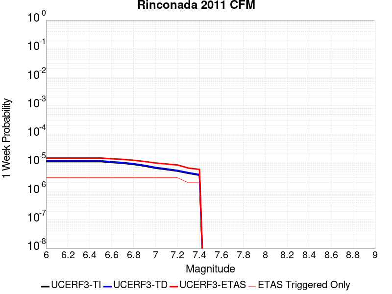 |  |  |  |

| Magnitude | 1 wk TI Prob | 1 wk TD Prob | 1 wk ETAS Prob | 1 wk ETAS/TD Gain | 1 wk ETAS Triggered Only | 1 mo TI Prob | 1 mo TD Prob | 1 mo ETAS Prob | 1 mo ETAS/TD Gain | 1 mo ETAS Triggered Only | 1 yr TI Prob | 1 yr TD Prob | 1 yr ETAS Prob | 1 yr ETAS/TD Gain | 1 yr ETAS Triggered Only | 10 yr TI Prob | 10 yr TD Prob | 10 yr ETAS Prob | 10 yr ETAS/TD Gain | 10 yr ETAS Triggered Only |
|-----|-----|-----|-----|-----|-----|-----|-----|-----|-----|-----|-----|-----|-----|-----|-----|-----|-----|-----|-----|-----|
| 6.0 | 1.1071962E-5 | 1.1724135E-5 | 2.2836968E-5 | 1.9478595 | 1.1112963E-5 | 4.74504E-5 | 5.024544E-5 | 6.1357845E-5 | 1.2211624 | 1.1112963E-5 | 5.775555E-4 | 6.115867E-4 | 6.2269287E-4 | 1.0181596 | 1.1112963E-5 | 0.0057605673 | 0.006101035 | 0.00611208 | 1.0018104 | 1.1112963E-5 |
| 6.1 | 1.1071962E-5 | 1.1724135E-5 | 2.2836968E-5 | 1.9478595 | 1.1112963E-5 | 4.74504E-5 | 5.024544E-5 | 6.1357845E-5 | 1.2211624 | 1.1112963E-5 | 5.775555E-4 | 6.115867E-4 | 6.2269287E-4 | 1.0181596 | 1.1112963E-5 | 0.0057605673 | 0.006101035 | 0.00611208 | 1.0018104 | 1.1112963E-5 |
| 6.2 | 1.1071962E-5 | 1.1724135E-5 | 2.2836968E-5 | 1.9478595 | 1.1112963E-5 | 4.74504E-5 | 5.024544E-5 | 6.1357845E-5 | 1.2211624 | 1.1112963E-5 | 5.775555E-4 | 6.115867E-4 | 6.2269287E-4 | 1.0181596 | 1.1112963E-5 | 0.0057605673 | 0.006101035 | 0.00611208 | 1.0018104 | 1.1112963E-5 |
| 6.3 | 1.1071962E-5 | 1.1724135E-5 | 2.2836968E-5 | 1.9478595 | 1.1112963E-5 | 4.74504E-5 | 5.024544E-5 | 6.1357845E-5 | 1.2211624 | 1.1112963E-5 | 5.775555E-4 | 6.115867E-4 | 6.2269287E-4 | 1.0181596 | 1.1112963E-5 | 0.0057605673 | 0.006101035 | 0.00611208 | 1.0018104 | 1.1112963E-5 |
| 6.4 | 1.1071962E-5 | 1.1724135E-5 | 2.2836968E-5 | 1.9478595 | 1.1112963E-5 | 4.74504E-5 | 5.024544E-5 | 6.1357845E-5 | 1.2211624 | 1.1112963E-5 | 5.775555E-4 | 6.115867E-4 | 6.2269287E-4 | 1.0181596 | 1.1112963E-5 | 0.0057605673 | 0.006101035 | 0.00611208 | 1.0018104 | 1.1112963E-5 |
| 6.5 | 1.1071962E-5 | 1.1724135E-5 | 2.2836968E-5 | 1.9478595 | 1.1112963E-5 | 4.74504E-5 | 5.024544E-5 | 6.1357845E-5 | 1.2211624 | 1.1112963E-5 | 5.775555E-4 | 6.115867E-4 | 6.2269287E-4 | 1.0181596 | 1.1112963E-5 | 0.0057605673 | 0.006101035 | 0.00611208 | 1.0018104 | 1.1112963E-5 |
| 6.6 | 1.0302408E-5 | 1.0909815E-5 | 2.2022658E-5 | 2.0186095 | 1.1112963E-5 | 4.4152428E-5 | 4.6755624E-5 | 5.7868067E-5 | 1.2376708 | 1.1112963E-5 | 5.374232E-4 | 5.6912116E-4 | 5.802278E-4 | 1.0195154 | 1.1112963E-5 | 0.0053612534 | 0.005678627 | 0.005689677 | 1.0019459 | 1.1112963E-5 |
| 6.7 | 9.66584E-6 | 1.0235816E-5 | 2.1348666E-5 | 2.0856829 | 1.1112963E-5 | 4.142437E-5 | 4.386716E-5 | 5.4979635E-5 | 1.253321 | 1.1112963E-5 | 5.0422497E-4 | 5.339719E-4 | 5.4507895E-4 | 1.0208008 | 1.1112963E-5 | 0.005030824 | 0.0053288722 | 0.005339926 | 1.0020744 | 1.1112963E-5 |
| 6.8 | 8.79599E-6 | 9.312425E-6 | 2.0425285E-5 | 2.1933367 | 1.1112963E-5 | 3.7696555E-5 | 3.9909897E-5 | 5.1022416E-5 | 1.2784402 | 1.1112963E-5 | 4.588589E-4 | 4.8581464E-4 | 4.9692224E-4 | 1.0228637 | 1.1112963E-5 | 0.004579126 | 0.0048494954 | 0.0048605544 | 1.0022805 | 1.1112963E-5 |
| 6.9 | 7.69202E-6 | 8.138578E-6 | 1.925145E-5 | 2.3654563 | 1.1112963E-5 | 3.2965385E-5 | 3.4879264E-5 | 4.5991837E-5 | 1.3186013 | 1.1112963E-5 | 4.0127963E-4 | 4.2459206E-4 | 4.357003E-4 | 1.0261621 | 1.1112963E-5 | 0.004005558 | 0.004239751 | 0.0042508165 | 1.00261 | 1.1112963E-5 |
| 7.0 | 6.497495E-6 | 6.8676477E-6 | 1.7980536E-5 | 2.6181505 | 1.1112963E-5 | 2.784611E-5 | 2.9432555E-5 | 4.054519E-5 | 1.3775628 | 1.1112963E-5 | 3.3897365E-4 | 3.5830197E-4 | 3.6941096E-4 | 1.0310045 | 1.1112963E-5 | 0.0033845706 | 0.0035791604 | 0.0035902336 | 1.0030938 | 1.1112963E-5 |
| 7.1 | 5.7995403E-6 | 6.1257683E-6 | 1.7238664E-5 | 2.8141227 | 1.1112963E-5 | 2.4854935E-5 | 2.625314E-5 | 3.736581E-5 | 1.4232893 | 1.1112963E-5 | 3.0256683E-4 | 3.196045E-4 | 3.307139E-4 | 1.0347599 | 1.1112963E-5 | 0.0030215518 | 0.0031933533 | 0.003204431 | 1.0034689 | 1.1112963E-5 |
| 7.2 | 5.130714E-6 | 5.414656E-6 | 1.652756E-5 | 3.0523748 | 1.1112963E-5 | 2.1988588E-5 | 2.320557E-5 | 3.4318276E-5 | 1.478881 | 1.1112963E-5 | 2.6767817E-4 | 2.825105E-4 | 2.9362034E-4 | 1.0393254 | 1.1112963E-5 | 0.0026735596 | 0.0028234075 | 0.002834489 | 1.0039248 | 1.1112963E-5 |
| 7.3 | 4.295291E-6 | 4.5275724E-6 | 1.5640486E-5 | 3.4544969 | 1.1112963E-5 | 1.840826E-5 | 1.9403846E-5 | 3.0516594E-5 | 1.5727085 | 1.1112963E-5 | 2.2409752E-4 | 2.3623534E-4 | 2.4734568E-4 | 1.0470308 | 1.1112963E-5 | 0.0022387167 | 0.0023617179 | 0.0023728048 | 1.0046943 | 1.1112963E-5 |
| 7.4 | 3.6962015E-6 | 3.894617E-6 | 1.5007537E-5 | 3.8534055 | 1.1112963E-5 | 1.5840767E-5 | 1.6691214E-5 | 2.7803992E-5 | 1.665786 | 1.1112963E-5 | 1.9284427E-4 | 2.0321553E-4 | 2.1432624E-4 | 1.0546745 | 1.1112963E-5 | 0.0019267701 | 0.0020321554 | 0.0020432456 | 1.0054574 | 1.1112963E-5 |

## Great Valley 03 Mysterious Ridge
*[(top)](#table-of-contents)*

| 1 Week | 1 Month | 1 Year | 10 Year |
|-----|-----|-----|-----|
|  |  |  |  |

| Magnitude | 1 wk TI Prob | 1 wk TD Prob | 1 wk ETAS Prob | 1 wk ETAS/TD Gain | 1 wk ETAS Triggered Only | 1 mo TI Prob | 1 mo TD Prob | 1 mo ETAS Prob | 1 mo ETAS/TD Gain | 1 mo ETAS Triggered Only | 1 yr TI Prob | 1 yr TD Prob | 1 yr ETAS Prob | 1 yr ETAS/TD Gain | 1 yr ETAS Triggered Only | 10 yr TI Prob | 10 yr TD Prob | 10 yr ETAS Prob | 10 yr ETAS/TD Gain | 10 yr ETAS Triggered Only |
|-----|-----|-----|-----|-----|-----|-----|-----|-----|-----|-----|-----|-----|-----|-----|-----|-----|-----|-----|-----|-----|
| 6.0 | 1.9343506E-5 | 2.1910257E-5 | 3.3022974E-5 | 1.5071926 | 1.1112963E-5 | 8.289811E-5 | 9.389859E-5 | 1.05010506E-4 | 1.1183395 | 1.1112963E-5 | 0.0010088171 | 0.0011427705 | 0.0011538707 | 1.0097134 | 1.1112963E-5 | 0.010042497 | 0.011384191 | 0.011395177 | 1.0009651 | 1.1112963E-5 |
| 6.1 | 1.9343506E-5 | 2.1910257E-5 | 3.3022974E-5 | 1.5071926 | 1.1112963E-5 | 8.289811E-5 | 9.389859E-5 | 1.05010506E-4 | 1.1183395 | 1.1112963E-5 | 0.0010088171 | 0.0011427705 | 0.0011538707 | 1.0097134 | 1.1112963E-5 | 0.010042497 | 0.011384191 | 0.011395177 | 1.0009651 | 1.1112963E-5 |
| 6.2 | 1.9343506E-5 | 2.1910257E-5 | 3.3022974E-5 | 1.5071926 | 1.1112963E-5 | 8.289811E-5 | 9.389859E-5 | 1.05010506E-4 | 1.1183395 | 1.1112963E-5 | 0.0010088171 | 0.0011427705 | 0.0011538707 | 1.0097134 | 1.1112963E-5 | 0.010042497 | 0.011384191 | 0.011395177 | 1.0009651 | 1.1112963E-5 |
| 6.3 | 1.9343506E-5 | 2.1910257E-5 | 3.3022974E-5 | 1.5071926 | 1.1112963E-5 | 8.289811E-5 | 9.389859E-5 | 1.05010506E-4 | 1.1183395 | 1.1112963E-5 | 0.0010088171 | 0.0011427705 | 0.0011538707 | 1.0097134 | 1.1112963E-5 | 0.010042497 | 0.011384191 | 0.011395177 | 1.0009651 | 1.1112963E-5 |
| 6.4 | 1.9343506E-5 | 2.1910257E-5 | 3.3022974E-5 | 1.5071926 | 1.1112963E-5 | 8.289811E-5 | 9.389859E-5 | 1.05010506E-4 | 1.1183395 | 1.1112963E-5 | 0.0010088171 | 0.0011427705 | 0.0011538707 | 1.0097134 | 1.1112963E-5 | 0.010042497 | 0.011384191 | 0.011395177 | 1.0009651 | 1.1112963E-5 |
| 6.5 | 1.9343506E-5 | 2.1910257E-5 | 3.3022974E-5 | 1.5071926 | 1.1112963E-5 | 8.289811E-5 | 9.389859E-5 | 1.05010506E-4 | 1.1183395 | 1.1112963E-5 | 0.0010088171 | 0.0011427705 | 0.0011538707 | 1.0097134 | 1.1112963E-5 | 0.010042497 | 0.011384191 | 0.011395177 | 1.0009651 | 1.1112963E-5 |
| 6.6 | 1.7440449E-5 | 1.9750794E-5 | 3.086354E-5 | 1.5626479 | 1.1112963E-5 | 7.474264E-5 | 8.464438E-5 | 9.5756404E-5 | 1.1312789 | 1.1112963E-5 | 9.096117E-4 | 0.0010302118 | 0.0010413133 | 1.0107759 | 1.1112963E-5 | 0.009058975 | 0.010269466 | 0.010280465 | 1.001071 | 1.1112963E-5 |
| 6.7 | 1.468422E-5 | 1.6604492E-5 | 2.7717271E-5 | 1.6692634 | 1.1112963E-5 | 6.2930856E-5 | 7.116102E-5 | 8.227319E-5 | 1.1561553 | 1.1112963E-5 | 7.659138E-4 | 8.6619187E-4 | 8.772952E-4 | 1.0128186 | 1.1112963E-5 | 0.007632794 | 0.008642968 | 0.008653984 | 1.0012747 | 1.1112963E-5 |
| 6.8 | 1.211602E-5 | 1.3673764E-5 | 2.4786576E-5 | 1.8127104 | 1.1112963E-5 | 5.1924766E-5 | 5.8601363E-5 | 6.971368E-5 | 1.1896255 | 1.1112963E-5 | 6.320007E-4 | 7.133854E-4 | 7.2449044E-4 | 1.0155667 | 1.1112963E-5 | 0.006302063 | 0.007125407 | 0.007136441 | 1.0015485 | 1.1112963E-5 |
| 6.9 | 9.837659E-6 | 1.1085766E-5 | 2.2198607E-5 | 2.0024421 | 1.1112963E-5 | 4.2160715E-5 | 4.7510377E-5 | 5.8622813E-5 | 1.233895 | 1.1112963E-5 | 5.131858E-4 | 5.7842984E-4 | 5.895364E-4 | 1.0192012 | 1.1112963E-5 | 0.005120023 | 0.005783415 | 0.005794463 | 1.0019104 | 1.1112963E-5 |
| 7.0 | 9.54151E-6 | 1.0750372E-5 | 2.1863216E-5 | 2.0337172 | 1.1112963E-5 | 4.0891544E-5 | 4.6073023E-5 | 5.7185473E-5 | 1.2411921 | 1.1112963E-5 | 4.977408E-4 | 5.609391E-4 | 5.720458E-4 | 1.0198002 | 1.1112963E-5 | 0.0049662744 | 0.0056093903 | 0.0056204414 | 1.00197 | 1.1112963E-5 |

## San Joaquin Hills
*[(top)](#table-of-contents)*

| 1 Week | 1 Month | 1 Year | 10 Year |
|-----|-----|-----|-----|
|  |  |  |  |

| Magnitude | 1 wk TI Prob | 1 wk TD Prob | 1 wk ETAS Prob | 1 wk ETAS/TD Gain | 1 wk ETAS Triggered Only | 1 mo TI Prob | 1 mo TD Prob | 1 mo ETAS Prob | 1 mo ETAS/TD Gain | 1 mo ETAS Triggered Only | 1 yr TI Prob | 1 yr TD Prob | 1 yr ETAS Prob | 1 yr ETAS/TD Gain | 1 yr ETAS Triggered Only | 10 yr TI Prob | 10 yr TD Prob | 10 yr ETAS Prob | 10 yr ETAS/TD Gain | 10 yr ETAS Triggered Only |
|-----|-----|-----|-----|-----|-----|-----|-----|-----|-----|-----|-----|-----|-----|-----|-----|-----|-----|-----|-----|-----|
| 6.0 | 7.517352E-6 | 7.930626E-6 | 7.930626E-6 | 1.0 | 0.0 | 3.2216827E-5 | 3.398822E-5 | 4.5100805E-5 | 1.326954 | 1.1112963E-5 | 3.9216926E-4 | 4.137751E-4 | 4.2488347E-4 | 1.0268464 | 1.1112963E-5 | 0.003914779 | 0.0041346652 | 0.004145732 | 1.0026766 | 1.1112963E-5 |
| 6.1 | 7.517352E-6 | 7.930626E-6 | 7.930626E-6 | 1.0 | 0.0 | 3.2216827E-5 | 3.398822E-5 | 4.5100805E-5 | 1.326954 | 1.1112963E-5 | 3.9216926E-4 | 4.137751E-4 | 4.2488347E-4 | 1.0268464 | 1.1112963E-5 | 0.003914779 | 0.0041346652 | 0.004145732 | 1.0026766 | 1.1112963E-5 |
| 6.2 | 7.517352E-6 | 7.930626E-6 | 7.930626E-6 | 1.0 | 0.0 | 3.2216827E-5 | 3.398822E-5 | 4.5100805E-5 | 1.326954 | 1.1112963E-5 | 3.9216926E-4 | 4.137751E-4 | 4.2488347E-4 | 1.0268464 | 1.1112963E-5 | 0.003914779 | 0.0041346652 | 0.004145732 | 1.0026766 | 1.1112963E-5 |
| 6.3 | 7.517352E-6 | 7.930626E-6 | 7.930626E-6 | 1.0 | 0.0 | 3.2216827E-5 | 3.398822E-5 | 4.5100805E-5 | 1.326954 | 1.1112963E-5 | 3.9216926E-4 | 4.137751E-4 | 4.2488347E-4 | 1.0268464 | 1.1112963E-5 | 0.003914779 | 0.0041346652 | 0.004145732 | 1.0026766 | 1.1112963E-5 |
| 6.4 | 7.517352E-6 | 7.930626E-6 | 7.930626E-6 | 1.0 | 0.0 | 3.2216827E-5 | 3.398822E-5 | 4.5100805E-5 | 1.326954 | 1.1112963E-5 | 3.9216926E-4 | 4.137751E-4 | 4.2488347E-4 | 1.0268464 | 1.1112963E-5 | 0.003914779 | 0.0041346652 | 0.004145732 | 1.0026766 | 1.1112963E-5 |
| 6.5 | 7.517352E-6 | 7.930626E-6 | 7.930626E-6 | 1.0 | 0.0 | 3.2216827E-5 | 3.398822E-5 | 4.5100805E-5 | 1.326954 | 1.1112963E-5 | 3.9216926E-4 | 4.137751E-4 | 4.2488347E-4 | 1.0268464 | 1.1112963E-5 | 0.003914779 | 0.0041346652 | 0.004145732 | 1.0026766 | 1.1112963E-5 |
| 6.6 | 7.1722156E-6 | 7.567309E-6 | 7.567309E-6 | 1.0 | 0.0 | 3.0737705E-5 | 3.2431184E-5 | 4.3543787E-5 | 1.3426517 | 1.1112963E-5 | 3.7416728E-4 | 3.9482507E-4 | 4.0593365E-4 | 1.0281354 | 1.1112963E-5 | 0.003735379 | 0.003945838 | 0.0039569074 | 1.0028052 | 1.1112963E-5 |
| 6.7 | 5.595255E-6 | 5.8979463E-6 | 5.8979463E-6 | 1.0 | 0.0 | 2.3979444E-5 | 2.5276911E-5 | 3.6389596E-5 | 1.4396377 | 1.1112963E-5 | 2.9191063E-4 | 3.077464E-4 | 3.1885595E-4 | 1.0360997 | 1.1112963E-5 | 0.0029152746 | 0.003077464 | 0.0030885427 | 1.0036 | 1.1112963E-5 |
| 6.8 | 5.595255E-6 | 5.8979463E-6 | 5.8979463E-6 | 1.0 | 0.0 | 2.3979444E-5 | 2.5276911E-5 | 3.6389596E-5 | 1.4396377 | 1.1112963E-5 | 2.9191063E-4 | 3.077464E-4 | 3.1885595E-4 | 1.0360997 | 1.1112963E-5 | 0.0029152746 | 0.003077464 | 0.0030885427 | 1.0036 | 1.1112963E-5 |
| 6.9 | 5.595255E-6 | 5.8979463E-6 | 5.8979463E-6 | 1.0 | 0.0 | 2.3979444E-5 | 2.5276911E-5 | 3.6389596E-5 | 1.4396377 | 1.1112963E-5 | 2.9191063E-4 | 3.077464E-4 | 3.1885595E-4 | 1.0360997 | 1.1112963E-5 | 0.0029152746 | 0.003077464 | 0.0030885427 | 1.0036 | 1.1112963E-5 |

## San Luis Range 2011 CFM
*[(top)](#table-of-contents)*

| 1 Week | 1 Month | 1 Year | 10 Year |
|-----|-----|-----|-----|
| 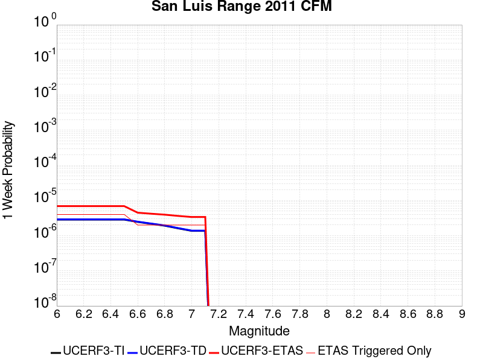 |  |  |  |

| Magnitude | 1 wk TI Prob | 1 wk TD Prob | 1 wk ETAS Prob | 1 wk ETAS/TD Gain | 1 wk ETAS Triggered Only | 1 mo TI Prob | 1 mo TD Prob | 1 mo ETAS Prob | 1 mo ETAS/TD Gain | 1 mo ETAS Triggered Only | 1 yr TI Prob | 1 yr TD Prob | 1 yr ETAS Prob | 1 yr ETAS/TD Gain | 1 yr ETAS Triggered Only | 10 yr TI Prob | 10 yr TD Prob | 10 yr ETAS Prob | 10 yr ETAS/TD Gain | 10 yr ETAS Triggered Only |
|-----|-----|-----|-----|-----|-----|-----|-----|-----|-----|-----|-----|-----|-----|-----|-----|-----|-----|-----|-----|-----|
| 6.0 | 2.8589725E-6 | 2.906881E-6 | 2.906881E-6 | 1.0 | 0.0 | 1.2252682E-5 | 1.24580165E-5 | 1.24580165E-5 | 1.0 | 0.0 | 1.491662E-4 | 1.5166836E-4 | 1.6277963E-4 | 1.0732603 | 1.1112963E-5 | 0.0014906611 | 0.0015158989 | 0.001526995 | 1.0073198 | 1.1112963E-5 |
| 6.1 | 2.8589725E-6 | 2.906881E-6 | 2.906881E-6 | 1.0 | 0.0 | 1.2252682E-5 | 1.24580165E-5 | 1.24580165E-5 | 1.0 | 0.0 | 1.491662E-4 | 1.5166836E-4 | 1.6277963E-4 | 1.0732603 | 1.1112963E-5 | 0.0014906611 | 0.0015158989 | 0.001526995 | 1.0073198 | 1.1112963E-5 |
| 6.2 | 2.8589725E-6 | 2.906881E-6 | 2.906881E-6 | 1.0 | 0.0 | 1.2252682E-5 | 1.24580165E-5 | 1.24580165E-5 | 1.0 | 0.0 | 1.491662E-4 | 1.5166836E-4 | 1.6277963E-4 | 1.0732603 | 1.1112963E-5 | 0.0014906611 | 0.0015158989 | 0.001526995 | 1.0073198 | 1.1112963E-5 |
| 6.3 | 2.8589725E-6 | 2.906881E-6 | 2.906881E-6 | 1.0 | 0.0 | 1.2252682E-5 | 1.24580165E-5 | 1.24580165E-5 | 1.0 | 0.0 | 1.491662E-4 | 1.5166836E-4 | 1.6277963E-4 | 1.0732603 | 1.1112963E-5 | 0.0014906611 | 0.0015158989 | 0.001526995 | 1.0073198 | 1.1112963E-5 |
| 6.4 | 2.8589725E-6 | 2.906881E-6 | 2.906881E-6 | 1.0 | 0.0 | 1.2252682E-5 | 1.24580165E-5 | 1.24580165E-5 | 1.0 | 0.0 | 1.491662E-4 | 1.5166836E-4 | 1.6277963E-4 | 1.0732603 | 1.1112963E-5 | 0.0014906611 | 0.0015158989 | 0.001526995 | 1.0073198 | 1.1112963E-5 |
| 6.5 | 2.8589725E-6 | 2.906881E-6 | 2.906881E-6 | 1.0 | 0.0 | 1.2252682E-5 | 1.24580165E-5 | 1.24580165E-5 | 1.0 | 0.0 | 1.491662E-4 | 1.5166836E-4 | 1.6277963E-4 | 1.0732603 | 1.1112963E-5 | 0.0014906611 | 0.0015158989 | 0.001526995 | 1.0073198 | 1.1112963E-5 |
| 6.6 | 2.4544863E-6 | 2.495234E-6 | 2.495234E-6 | 1.0 | 0.0 | 1.0519184E-5 | 1.06938305E-5 | 1.06938305E-5 | 1.0 | 0.0 | 1.2806353E-4 | 1.3019213E-4 | 1.4130364E-4 | 1.085347 | 1.1112963E-5 | 0.0012798976 | 0.0013014051 | 0.0013125036 | 1.0085281 | 1.1112963E-5 |
| 6.7 | 2.1688998E-6 | 2.204711E-6 | 2.204711E-6 | 1.0 | 0.0 | 9.295252E-6 | 9.448742E-6 | 9.448742E-6 | 1.0 | 0.0 | 1.1316381E-4 | 1.1503485E-4 | 1.2614654E-4 | 1.0965941 | 1.1112963E-5 | 0.001131062 | 0.0011499968 | 0.001161097 | 1.0096524 | 1.1112963E-5 |
| 6.8 | 1.9191828E-6 | 1.950576E-6 | 1.950576E-6 | 1.0 | 0.0 | 8.2250435E-6 | 8.359599E-6 | 8.359599E-6 | 1.0 | 0.0 | 1.001353E-4 | 1.01775826E-4 | 1.1288766E-4 | 1.1091795 | 1.1112963E-5 | 0.0010009019 | 0.0010175342 | 0.0010286359 | 1.0109104 | 1.1112963E-5 |
| 6.9 | 1.6115068E-6 | 1.6374516E-6 | 1.6374516E-6 | 1.0 | 0.0 | 6.9064395E-6 | 7.0176447E-6 | 7.0176447E-6 | 1.0 | 0.0 | 8.4082654E-5 | 8.5438915E-5 | 8.5438915E-5 | 1.0 | 0.0 | 8.405085E-4 | 8.543001E-4 | 8.543001E-4 | 1.0 | 0.0 |
| 7.0 | 1.367995E-6 | 1.3898027E-6 | 1.3898027E-6 | 1.0 | 0.0 | 5.8628225E-6 | 5.956297E-6 | 5.956297E-6 | 1.0 | 0.0 | 7.137752E-5 | 7.251792E-5 | 7.251792E-5 | 1.0 | 0.0 | 7.13546E-4 | 7.251792E-4 | 7.251792E-4 | 1.0 | 0.0 |
| 7.1 | 1.367995E-6 | 1.3898027E-6 | 1.3898027E-6 | 1.0 | 0.0 | 5.8628225E-6 | 5.956297E-6 | 5.956297E-6 | 1.0 | 0.0 | 7.137752E-5 | 7.251792E-5 | 7.251792E-5 | 1.0 | 0.0 | 7.13546E-4 | 7.251792E-4 | 7.251792E-4 | 1.0 | 0.0 |

## North Frontal  (East)
*[(top)](#table-of-contents)*

| 1 Week | 1 Month | 1 Year | 10 Year |
|-----|-----|-----|-----|
|  |  |  |  |

| Magnitude | 1 wk TI Prob | 1 wk TD Prob | 1 wk ETAS Prob | 1 wk ETAS/TD Gain | 1 wk ETAS Triggered Only | 1 mo TI Prob | 1 mo TD Prob | 1 mo ETAS Prob | 1 mo ETAS/TD Gain | 1 mo ETAS Triggered Only | 1 yr TI Prob | 1 yr TD Prob | 1 yr ETAS Prob | 1 yr ETAS/TD Gain | 1 yr ETAS Triggered Only | 10 yr TI Prob | 10 yr TD Prob | 10 yr ETAS Prob | 10 yr ETAS/TD Gain | 10 yr ETAS Triggered Only |
|-----|-----|-----|-----|-----|-----|-----|-----|-----|-----|-----|-----|-----|-----|-----|-----|-----|-----|-----|-----|-----|
| 6.0 | 9.1043175E-6 | 9.692292E-6 | 9.692292E-6 | 1.0 | 0.0 | 3.901792E-5 | 4.153805E-5 | 5.2650554E-5 | 1.2675258 | 1.1112963E-5 | 4.7493965E-4 | 5.0566456E-4 | 5.1677186E-4 | 1.0219659 | 1.1112963E-5 | 0.004739259 | 0.0050506443 | 0.005061701 | 1.0021892 | 1.1112963E-5 |
| 6.1 | 9.1043175E-6 | 9.692292E-6 | 9.692292E-6 | 1.0 | 0.0 | 3.901792E-5 | 4.153805E-5 | 5.2650554E-5 | 1.2675258 | 1.1112963E-5 | 4.7493965E-4 | 5.0566456E-4 | 5.1677186E-4 | 1.0219659 | 1.1112963E-5 | 0.004739259 | 0.0050506443 | 0.005061701 | 1.0021892 | 1.1112963E-5 |
| 6.2 | 9.1043175E-6 | 9.692292E-6 | 9.692292E-6 | 1.0 | 0.0 | 3.901792E-5 | 4.153805E-5 | 5.2650554E-5 | 1.2675258 | 1.1112963E-5 | 4.7493965E-4 | 5.0566456E-4 | 5.1677186E-4 | 1.0219659 | 1.1112963E-5 | 0.004739259 | 0.0050506443 | 0.005061701 | 1.0021892 | 1.1112963E-5 |
| 6.3 | 9.1043175E-6 | 9.692292E-6 | 9.692292E-6 | 1.0 | 0.0 | 3.901792E-5 | 4.153805E-5 | 5.2650554E-5 | 1.2675258 | 1.1112963E-5 | 4.7493965E-4 | 5.0566456E-4 | 5.1677186E-4 | 1.0219659 | 1.1112963E-5 | 0.004739259 | 0.0050506443 | 0.005061701 | 1.0021892 | 1.1112963E-5 |
| 6.4 | 9.1043175E-6 | 9.692292E-6 | 9.692292E-6 | 1.0 | 0.0 | 3.901792E-5 | 4.153805E-5 | 5.2650554E-5 | 1.2675258 | 1.1112963E-5 | 4.7493965E-4 | 5.0566456E-4 | 5.1677186E-4 | 1.0219659 | 1.1112963E-5 | 0.004739259 | 0.0050506443 | 0.005061701 | 1.0021892 | 1.1112963E-5 |
| 6.5 | 9.1043175E-6 | 9.692292E-6 | 9.692292E-6 | 1.0 | 0.0 | 3.901792E-5 | 4.153805E-5 | 5.2650554E-5 | 1.2675258 | 1.1112963E-5 | 4.7493965E-4 | 5.0566456E-4 | 5.1677186E-4 | 1.0219659 | 1.1112963E-5 | 0.004739259 | 0.0050506443 | 0.005061701 | 1.0021892 | 1.1112963E-5 |
| 6.6 | 9.1043175E-6 | 9.692292E-6 | 9.692292E-6 | 1.0 | 0.0 | 3.901792E-5 | 4.153805E-5 | 5.2650554E-5 | 1.2675258 | 1.1112963E-5 | 4.7493965E-4 | 5.0566456E-4 | 5.1677186E-4 | 1.0219659 | 1.1112963E-5 | 0.004739259 | 0.0050506443 | 0.005061701 | 1.0021892 | 1.1112963E-5 |
| 6.7 | 5.803986E-6 | 6.1718774E-6 | 6.1718774E-6 | 1.0 | 0.0 | 2.4873989E-5 | 2.6450904E-5 | 3.7563572E-5 | 1.4201244 | 1.1112963E-5 | 3.0279873E-4 | 3.2203976E-4 | 3.3314913E-4 | 1.0344969 | 1.1112963E-5 | 0.0030238647 | 0.0032203975 | 0.0032314747 | 1.0034397 | 1.1112963E-5 |
| 6.8 | 5.803986E-6 | 6.1718774E-6 | 6.1718774E-6 | 1.0 | 0.0 | 2.4873989E-5 | 2.6450904E-5 | 3.7563572E-5 | 1.4201244 | 1.1112963E-5 | 3.0279873E-4 | 3.2203976E-4 | 3.3314913E-4 | 1.0344969 | 1.1112963E-5 | 0.0030238647 | 0.0032203975 | 0.0032314747 | 1.0034397 | 1.1112963E-5 |

## Hat Creek-McArthur-Mayfield
*[(top)](#table-of-contents)*

| 1 Week | 1 Month | 1 Year | 10 Year |
|-----|-----|-----|-----|
|  |  |  | 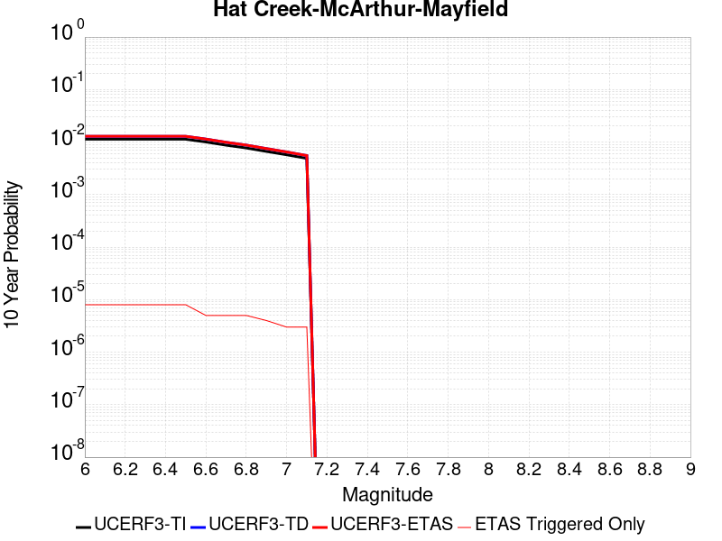 |

| Magnitude | 1 wk TI Prob | 1 wk TD Prob | 1 wk ETAS Prob | 1 wk ETAS/TD Gain | 1 wk ETAS Triggered Only | 1 mo TI Prob | 1 mo TD Prob | 1 mo ETAS Prob | 1 mo ETAS/TD Gain | 1 mo ETAS Triggered Only | 1 yr TI Prob | 1 yr TD Prob | 1 yr ETAS Prob | 1 yr ETAS/TD Gain | 1 yr ETAS Triggered Only | 10 yr TI Prob | 10 yr TD Prob | 10 yr ETAS Prob | 10 yr ETAS/TD Gain | 10 yr ETAS Triggered Only |
|-----|-----|-----|-----|-----|-----|-----|-----|-----|-----|-----|-----|-----|-----|-----|-----|-----|-----|-----|-----|-----|
| 6.0 | 2.1823456E-5 | 2.4773932E-5 | 3.588662E-5 | 1.4485638 | 1.1112963E-5 | 9.352575E-5 | 1.0617048E-4 | 1.1728227E-4 | 1.1046598 | 1.1112963E-5 | 0.0011380811 | 0.0012920036 | 0.0013031022 | 1.0085902 | 1.1112963E-5 | 0.011322702 | 0.01285923 | 0.0128702 | 1.0008531 | 1.1112963E-5 |
| 6.1 | 2.1823456E-5 | 2.4773932E-5 | 3.588662E-5 | 1.4485638 | 1.1112963E-5 | 9.352575E-5 | 1.0617048E-4 | 1.1728227E-4 | 1.1046598 | 1.1112963E-5 | 0.0011380811 | 0.0012920036 | 0.0013031022 | 1.0085902 | 1.1112963E-5 | 0.011322702 | 0.01285923 | 0.0128702 | 1.0008531 | 1.1112963E-5 |
| 6.2 | 2.1823456E-5 | 2.4773932E-5 | 3.588662E-5 | 1.4485638 | 1.1112963E-5 | 9.352575E-5 | 1.0617048E-4 | 1.1728227E-4 | 1.1046598 | 1.1112963E-5 | 0.0011380811 | 0.0012920036 | 0.0013031022 | 1.0085902 | 1.1112963E-5 | 0.011322702 | 0.01285923 | 0.0128702 | 1.0008531 | 1.1112963E-5 |
| 6.3 | 2.1823456E-5 | 2.4773932E-5 | 3.588662E-5 | 1.4485638 | 1.1112963E-5 | 9.352575E-5 | 1.0617048E-4 | 1.1728227E-4 | 1.1046598 | 1.1112963E-5 | 0.0011380811 | 0.0012920036 | 0.0013031022 | 1.0085902 | 1.1112963E-5 | 0.011322702 | 0.01285923 | 0.0128702 | 1.0008531 | 1.1112963E-5 |
| 6.4 | 2.1823456E-5 | 2.4773932E-5 | 3.588662E-5 | 1.4485638 | 1.1112963E-5 | 9.352575E-5 | 1.0617048E-4 | 1.1728227E-4 | 1.1046598 | 1.1112963E-5 | 0.0011380811 | 0.0012920036 | 0.0013031022 | 1.0085902 | 1.1112963E-5 | 0.011322702 | 0.01285923 | 0.0128702 | 1.0008531 | 1.1112963E-5 |
| 6.5 | 2.1823456E-5 | 2.4773932E-5 | 3.588662E-5 | 1.4485638 | 1.1112963E-5 | 9.352575E-5 | 1.0617048E-4 | 1.1728227E-4 | 1.1046598 | 1.1112963E-5 | 0.0011380811 | 0.0012920036 | 0.0013031022 | 1.0085902 | 1.1112963E-5 | 0.011322702 | 0.01285923 | 0.0128702 | 1.0008531 | 1.1112963E-5 |
| 6.6 | 1.9340694E-5 | 2.1946753E-5 | 3.305947E-5 | 1.5063492 | 1.1112963E-5 | 8.288605E-5 | 9.405493E-5 | 1.05166844E-4 | 1.1181428 | 1.1112963E-5 | 0.0010086704 | 0.001144661 | 0.0011557612 | 1.0096974 | 1.1112963E-5 | 0.010041044 | 0.011401833 | 0.01141282 | 1.0009636 | 1.1112963E-5 |
| 6.7 | 1.6797176E-5 | 1.9037067E-5 | 3.0149818E-5 | 1.5837429 | 1.1112963E-5 | 7.1985916E-5 | 8.1585684E-5 | 9.269774E-5 | 1.136201 | 1.1112963E-5 | 8.7607605E-4 | 9.929959E-4 | 0.0010040979 | 1.0111803 | 1.1112963E-5 | 0.0087263035 | 0.00989965 | 0.009910652 | 1.0011115 | 1.1112963E-5 |
| 6.8 | 1.4852288E-5 | 1.6815693E-5 | 2.792847E-5 | 1.6608574 | 1.1112963E-5 | 6.365111E-5 | 7.206607E-5 | 8.317823E-5 | 1.1541941 | 1.1112963E-5 | 7.7467674E-4 | 8.771936E-4 | 8.882968E-4 | 1.0126576 | 1.1112963E-5 | 0.007719817 | 0.008751296 | 0.008762312 | 1.0012587 | 1.1112963E-5 |
| 6.9 | 1.2757133E-5 | 1.4418652E-5 | 2.5531455E-5 | 1.770724 | 1.1112963E-5 | 5.467228E-5 | 6.179356E-5 | 7.290584E-5 | 1.179829 | 1.1112963E-5 | 6.654317E-4 | 7.522186E-4 | 7.633232E-4 | 1.0147625 | 1.1112963E-5 | 0.0066344263 | 0.007510623 | 0.0075216526 | 1.0014685 | 1.1112963E-5 |
| 7.0 | 1.10079245E-5 | 1.2422667E-5 | 2.3535493E-5 | 1.8945603 | 1.1112963E-5 | 4.7175967E-5 | 5.3239713E-5 | 6.435208E-5 | 1.2087233 | 1.1112963E-5 | 5.74216E-4 | 6.4814166E-4 | 6.5924745E-4 | 1.0171348 | 1.1112963E-5 | 0.005727345 | 0.0064763394 | 0.0064873807 | 1.0017048 | 1.1112963E-5 |
| 7.1 | 9.3994E-6 | 1.059216E-5 | 2.1705006E-5 | 2.0491576 | 1.1112963E-5 | 4.0282524E-5 | 4.5394972E-5 | 5.650743E-5 | 1.244795 | 1.1112963E-5 | 4.9032934E-4 | 5.526838E-4 | 5.637906E-4 | 1.0200962 | 1.1112963E-5 | 0.004892489 | 0.005526838 | 0.0055378894 | 1.0019996 | 1.1112963E-5 |

## Great Valley 08 (Quinto)
*[(top)](#table-of-contents)*

| 1 Week | 1 Month | 1 Year | 10 Year |
|-----|-----|-----|-----|
|  |  |  |  |

| Magnitude | 1 wk TI Prob | 1 wk TD Prob | 1 wk ETAS Prob | 1 wk ETAS/TD Gain | 1 wk ETAS Triggered Only | 1 mo TI Prob | 1 mo TD Prob | 1 mo ETAS Prob | 1 mo ETAS/TD Gain | 1 mo ETAS Triggered Only | 1 yr TI Prob | 1 yr TD Prob | 1 yr ETAS Prob | 1 yr ETAS/TD Gain | 1 yr ETAS Triggered Only | 10 yr TI Prob | 10 yr TD Prob | 10 yr ETAS Prob | 10 yr ETAS/TD Gain | 10 yr ETAS Triggered Only |
|-----|-----|-----|-----|-----|-----|-----|-----|-----|-----|-----|-----|-----|-----|-----|-----|-----|-----|-----|-----|-----|
| 6.0 | 2.5524263E-5 | 3.1194424E-5 | 3.1194424E-5 | 1.0 | 0.0 | 1.0938511E-4 | 1.3368827E-4 | 1.3368827E-4 | 1.0 | 0.0 | 0.0013309501 | 0.0016272905 | 0.0016383855 | 1.006818 | 1.1112963E-5 | 0.013230069 | 0.016236922 | 0.016247855 | 1.0006733 | 1.1112963E-5 |
| 6.1 | 2.5524263E-5 | 3.1194424E-5 | 3.1194424E-5 | 1.0 | 0.0 | 1.0938511E-4 | 1.3368827E-4 | 1.3368827E-4 | 1.0 | 0.0 | 0.0013309501 | 0.0016272905 | 0.0016383855 | 1.006818 | 1.1112963E-5 | 0.013230069 | 0.016236922 | 0.016247855 | 1.0006733 | 1.1112963E-5 |
| 6.2 | 2.5524263E-5 | 3.1194424E-5 | 3.1194424E-5 | 1.0 | 0.0 | 1.0938511E-4 | 1.3368827E-4 | 1.3368827E-4 | 1.0 | 0.0 | 0.0013309501 | 0.0016272905 | 0.0016383855 | 1.006818 | 1.1112963E-5 | 0.013230069 | 0.016236922 | 0.016247855 | 1.0006733 | 1.1112963E-5 |
| 6.3 | 2.5524263E-5 | 3.1194424E-5 | 3.1194424E-5 | 1.0 | 0.0 | 1.0938511E-4 | 1.3368827E-4 | 1.3368827E-4 | 1.0 | 0.0 | 0.0013309501 | 0.0016272905 | 0.0016383855 | 1.006818 | 1.1112963E-5 | 0.013230069 | 0.016236922 | 0.016247855 | 1.0006733 | 1.1112963E-5 |
| 6.4 | 2.5524263E-5 | 3.1194424E-5 | 3.1194424E-5 | 1.0 | 0.0 | 1.0938511E-4 | 1.3368827E-4 | 1.3368827E-4 | 1.0 | 0.0 | 0.0013309501 | 0.0016272905 | 0.0016383855 | 1.006818 | 1.1112963E-5 | 0.013230069 | 0.016236922 | 0.016247855 | 1.0006733 | 1.1112963E-5 |
| 6.5 | 2.5524263E-5 | 3.1194424E-5 | 3.1194424E-5 | 1.0 | 0.0 | 1.0938511E-4 | 1.3368827E-4 | 1.3368827E-4 | 1.0 | 0.0 | 0.0013309501 | 0.0016272905 | 0.0016383855 | 1.006818 | 1.1112963E-5 | 0.013230069 | 0.016236922 | 0.016247855 | 1.0006733 | 1.1112963E-5 |
| 6.6 | 2.0986998E-5 | 2.5576908E-5 | 2.5576908E-5 | 1.0 | 0.0 | 8.994117E-5 | 1.0961532E-4 | 1.0961532E-4 | 1.0 | 0.0 | 0.0010944837 | 0.0013345632 | 0.0013456614 | 1.0083159 | 1.1112963E-5 | 0.010891088 | 0.013345085 | 0.0133560505 | 1.0008216 | 1.1112963E-5 |

## Burnt Mtn
*[(top)](#table-of-contents)*

| 1 Week | 1 Month | 1 Year | 10 Year |
|-----|-----|-----|-----|
|  |  |  |  |

| Magnitude | 1 wk TI Prob | 1 wk TD Prob | 1 wk ETAS Prob | 1 wk ETAS/TD Gain | 1 wk ETAS Triggered Only | 1 mo TI Prob | 1 mo TD Prob | 1 mo ETAS Prob | 1 mo ETAS/TD Gain | 1 mo ETAS Triggered Only | 1 yr TI Prob | 1 yr TD Prob | 1 yr ETAS Prob | 1 yr ETAS/TD Gain | 1 yr ETAS Triggered Only | 10 yr TI Prob | 10 yr TD Prob | 10 yr ETAS Prob | 10 yr ETAS/TD Gain | 10 yr ETAS Triggered Only |
|-----|-----|-----|-----|-----|-----|-----|-----|-----|-----|-----|-----|-----|-----|-----|-----|-----|-----|-----|-----|-----|
| 6.0 | 1.1997946E-5 | 8.64995E-6 | 8.64995E-6 | 1.0 | 0.0 | 5.1418756E-5 | 3.7071215E-5 | 4.8183767E-5 | 1.2997622 | 1.1112963E-5 | 6.2584353E-4 | 4.5134206E-4 | 4.6245E-4 | 1.0246109 | 1.1112963E-5 | 0.006240839 | 0.0045134206 | 0.0045244833 | 1.0024511 | 1.1112963E-5 |
| 6.1 | 1.1997946E-5 | 8.64995E-6 | 8.64995E-6 | 1.0 | 0.0 | 5.1418756E-5 | 3.7071215E-5 | 4.8183767E-5 | 1.2997622 | 1.1112963E-5 | 6.2584353E-4 | 4.5134206E-4 | 4.6245E-4 | 1.0246109 | 1.1112963E-5 | 0.006240839 | 0.0045134206 | 0.0045244833 | 1.0024511 | 1.1112963E-5 |
| 6.2 | 1.1997946E-5 | 8.64995E-6 | 8.64995E-6 | 1.0 | 0.0 | 5.1418756E-5 | 3.7071215E-5 | 4.8183767E-5 | 1.2997622 | 1.1112963E-5 | 6.2584353E-4 | 4.5134206E-4 | 4.6245E-4 | 1.0246109 | 1.1112963E-5 | 0.006240839 | 0.0045134206 | 0.0045244833 | 1.0024511 | 1.1112963E-5 |
| 6.3 | 1.1997946E-5 | 8.64995E-6 | 8.64995E-6 | 1.0 | 0.0 | 5.1418756E-5 | 3.7071215E-5 | 4.8183767E-5 | 1.2997622 | 1.1112963E-5 | 6.2584353E-4 | 4.5134206E-4 | 4.6245E-4 | 1.0246109 | 1.1112963E-5 | 0.006240839 | 0.0045134206 | 0.0045244833 | 1.0024511 | 1.1112963E-5 |
| 6.4 | 1.1997946E-5 | 8.64995E-6 | 8.64995E-6 | 1.0 | 0.0 | 5.1418756E-5 | 3.7071215E-5 | 4.8183767E-5 | 1.2997622 | 1.1112963E-5 | 6.2584353E-4 | 4.5134206E-4 | 4.6245E-4 | 1.0246109 | 1.1112963E-5 | 0.006240839 | 0.0045134206 | 0.0045244833 | 1.0024511 | 1.1112963E-5 |
| 6.5 | 1.1997946E-5 | 8.64995E-6 | 8.64995E-6 | 1.0 | 0.0 | 5.1418756E-5 | 3.7071215E-5 | 4.8183767E-5 | 1.2997622 | 1.1112963E-5 | 6.2584353E-4 | 4.5134206E-4 | 4.6245E-4 | 1.0246109 | 1.1112963E-5 | 0.006240839 | 0.0045134206 | 0.0045244833 | 1.0024511 | 1.1112963E-5 |
| 6.6 | 1.1997946E-5 | 8.64995E-6 | 8.64995E-6 | 1.0 | 0.0 | 5.1418756E-5 | 3.7071215E-5 | 4.8183767E-5 | 1.2997622 | 1.1112963E-5 | 6.2584353E-4 | 4.5134206E-4 | 4.6245E-4 | 1.0246109 | 1.1112963E-5 | 0.006240839 | 0.0045134206 | 0.0045244833 | 1.0024511 | 1.1112963E-5 |

## Great Valley 11
*[(top)](#table-of-contents)*

| 1 Week | 1 Month | 1 Year | 10 Year |
|-----|-----|-----|-----|
|  |  |  |  |

| Magnitude | 1 wk TI Prob | 1 wk TD Prob | 1 wk ETAS Prob | 1 wk ETAS/TD Gain | 1 wk ETAS Triggered Only | 1 mo TI Prob | 1 mo TD Prob | 1 mo ETAS Prob | 1 mo ETAS/TD Gain | 1 mo ETAS Triggered Only | 1 yr TI Prob | 1 yr TD Prob | 1 yr ETAS Prob | 1 yr ETAS/TD Gain | 1 yr ETAS Triggered Only | 10 yr TI Prob | 10 yr TD Prob | 10 yr ETAS Prob | 10 yr ETAS/TD Gain | 10 yr ETAS Triggered Only |
|-----|-----|-----|-----|-----|-----|-----|-----|-----|-----|-----|-----|-----|-----|-----|-----|-----|-----|-----|-----|-----|
| 6.0 | 3.056394E-5 | 3.967284E-5 | 5.0785362E-5 | 1.280104 | 1.1112963E-5 | 1.3098175E-4 | 1.7002384E-4 | 1.8113492E-4 | 1.06535 | 1.1112963E-5 | 0.0015935361 | 0.0020699822 | 0.0020810722 | 1.0053575 | 1.1112963E-5 | 0.015821574 | 0.02069238 | 0.020703264 | 1.000526 | 1.1112963E-5 |
| 6.1 | 3.056394E-5 | 3.967284E-5 | 5.0785362E-5 | 1.280104 | 1.1112963E-5 | 1.3098175E-4 | 1.7002384E-4 | 1.8113492E-4 | 1.06535 | 1.1112963E-5 | 0.0015935361 | 0.0020699822 | 0.0020810722 | 1.0053575 | 1.1112963E-5 | 0.015821574 | 0.02069238 | 0.020703264 | 1.000526 | 1.1112963E-5 |
| 6.2 | 3.056394E-5 | 3.967284E-5 | 5.0785362E-5 | 1.280104 | 1.1112963E-5 | 1.3098175E-4 | 1.7002384E-4 | 1.8113492E-4 | 1.06535 | 1.1112963E-5 | 0.0015935361 | 0.0020699822 | 0.0020810722 | 1.0053575 | 1.1112963E-5 | 0.015821574 | 0.02069238 | 0.020703264 | 1.000526 | 1.1112963E-5 |
| 6.3 | 3.056394E-5 | 3.967284E-5 | 5.0785362E-5 | 1.280104 | 1.1112963E-5 | 1.3098175E-4 | 1.7002384E-4 | 1.8113492E-4 | 1.06535 | 1.1112963E-5 | 0.0015935361 | 0.0020699822 | 0.0020810722 | 1.0053575 | 1.1112963E-5 | 0.015821574 | 0.02069238 | 0.020703264 | 1.000526 | 1.1112963E-5 |
| 6.4 | 3.056394E-5 | 3.967284E-5 | 5.0785362E-5 | 1.280104 | 1.1112963E-5 | 1.3098175E-4 | 1.7002384E-4 | 1.8113492E-4 | 1.06535 | 1.1112963E-5 | 0.0015935361 | 0.0020699822 | 0.0020810722 | 1.0053575 | 1.1112963E-5 | 0.015821574 | 0.02069238 | 0.020703264 | 1.000526 | 1.1112963E-5 |

## Puente Hills
*[(top)](#table-of-contents)*

| 1 Week | 1 Month | 1 Year | 10 Year |
|-----|-----|-----|-----|
|  |  |  |  |

| Magnitude | 1 wk TI Prob | 1 wk TD Prob | 1 wk ETAS Prob | 1 wk ETAS/TD Gain | 1 wk ETAS Triggered Only | 1 mo TI Prob | 1 mo TD Prob | 1 mo ETAS Prob | 1 mo ETAS/TD Gain | 1 mo ETAS Triggered Only | 1 yr TI Prob | 1 yr TD Prob | 1 yr ETAS Prob | 1 yr ETAS/TD Gain | 1 yr ETAS Triggered Only | 10 yr TI Prob | 10 yr TD Prob | 10 yr ETAS Prob | 10 yr ETAS/TD Gain | 10 yr ETAS Triggered Only |
|-----|-----|-----|-----|-----|-----|-----|-----|-----|-----|-----|-----|-----|-----|-----|-----|-----|-----|-----|-----|-----|
| 6.0 | 1.0287503E-5 | 2.7754043E-6 | 1.3888337E-5 | 5.004077 | 1.1112963E-5 | 4.4088552E-5 | 1.189455E-5 | 2.3007382E-5 | 1.9342792 | 1.1112963E-5 | 5.3664594E-4 | 1.4480915E-4 | 1.5592051E-4 | 1.076731 | 1.1112963E-5 | 0.0053535183 | 0.0014474059 | 0.0014585027 | 1.0076667 | 1.1112963E-5 |
| 6.1 | 1.0287503E-5 | 2.7754043E-6 | 1.3888337E-5 | 5.004077 | 1.1112963E-5 | 4.4088552E-5 | 1.189455E-5 | 2.3007382E-5 | 1.9342792 | 1.1112963E-5 | 5.3664594E-4 | 1.4480915E-4 | 1.5592051E-4 | 1.076731 | 1.1112963E-5 | 0.0053535183 | 0.0014474059 | 0.0014585027 | 1.0076667 | 1.1112963E-5 |
| 6.2 | 1.0287503E-5 | 2.7754043E-6 | 1.3888337E-5 | 5.004077 | 1.1112963E-5 | 4.4088552E-5 | 1.189455E-5 | 2.3007382E-5 | 1.9342792 | 1.1112963E-5 | 5.3664594E-4 | 1.4480915E-4 | 1.5592051E-4 | 1.076731 | 1.1112963E-5 | 0.0053535183 | 0.0014474059 | 0.0014585027 | 1.0076667 | 1.1112963E-5 |
| 6.3 | 1.0287503E-5 | 2.7754043E-6 | 1.3888337E-5 | 5.004077 | 1.1112963E-5 | 4.4088552E-5 | 1.189455E-5 | 2.3007382E-5 | 1.9342792 | 1.1112963E-5 | 5.3664594E-4 | 1.4480915E-4 | 1.5592051E-4 | 1.076731 | 1.1112963E-5 | 0.0053535183 | 0.0014474059 | 0.0014585027 | 1.0076667 | 1.1112963E-5 |
| 6.4 | 1.0287503E-5 | 2.7754043E-6 | 1.3888337E-5 | 5.004077 | 1.1112963E-5 | 4.4088552E-5 | 1.189455E-5 | 2.3007382E-5 | 1.9342792 | 1.1112963E-5 | 5.3664594E-4 | 1.4480915E-4 | 1.5592051E-4 | 1.076731 | 1.1112963E-5 | 0.0053535183 | 0.0014474059 | 0.0014585027 | 1.0076667 | 1.1112963E-5 |
| 6.5 | 1.0287503E-5 | 2.7754043E-6 | 1.3888337E-5 | 5.004077 | 1.1112963E-5 | 4.4088552E-5 | 1.189455E-5 | 2.3007382E-5 | 1.9342792 | 1.1112963E-5 | 5.3664594E-4 | 1.4480915E-4 | 1.5592051E-4 | 1.076731 | 1.1112963E-5 | 0.0053535183 | 0.0014474059 | 0.0014585027 | 1.0076667 | 1.1112963E-5 |
| 6.6 | 1.0067095E-5 | 2.542514E-6 | 1.3655449E-5 | 5.3708453 | 1.1112963E-5 | 4.314398E-5 | 1.0896458E-5 | 2.2009299E-5 | 2.0198584 | 1.1112963E-5 | 5.251514E-4 | 1.3265885E-4 | 1.4377035E-4 | 1.0837599 | 1.1112963E-5 | 0.0052391207 | 0.0013260479 | 0.0013371462 | 1.0083694 | 1.1112963E-5 |
| 6.7 | 7.591482E-6 | 1.9997742E-6 | 1.3112715E-5 | 6.557098 | 1.1112963E-5 | 3.2534514E-5 | 8.570445E-6 | 1.9683313E-5 | 2.29665 | 1.1112963E-5 | 3.9603573E-4 | 1.0434237E-4 | 1.15454175E-4 | 1.1064937 | 1.1112963E-5 | 0.003953307 | 0.0010431492 | 0.0010542505 | 1.0106422 | 1.1112963E-5 |
| 6.8 | 7.141342E-6 | 1.7041792E-6 | 1.2817123E-5 | 7.520995 | 1.1112963E-5 | 3.060539E-5 | 7.3036163E-6 | 1.8416498E-5 | 2.5215588 | 1.1112963E-5 | 3.7255694E-4 | 8.891999E-5 | 1.0003196E-4 | 1.124966 | 1.1112963E-5 | 0.0037193296 | 8.8904874E-4 | 9.0015185E-4 | 1.0124887 | 1.1112963E-5 |
| 6.9 | 6.066927E-6 | 1.6035817E-6 | 1.2716527E-5 | 7.9300776 | 1.1112963E-5 | 2.6000856E-5 | 6.8724867E-6 | 1.7985374E-5 | 2.617011 | 1.1112963E-5 | 3.1651446E-4 | 8.367139E-5 | 9.478342E-5 | 1.1328057 | 1.1112963E-5 | 0.0031606401 | 8.3660224E-4 | 8.4770593E-4 | 1.0132723 | 1.1112963E-5 |
| 7.0 | 4.852166E-6 | 1.2478142E-6 | 1.2360763E-5 | 9.905932 | 1.1112963E-5 | 2.0794832E-5 | 5.347775E-6 | 1.6460679E-5 | 3.0780423 | 1.1112963E-5 | 2.5314768E-4 | 6.510917E-5 | 7.6221404E-5 | 1.1706709 | 1.1112963E-5 | 0.0025285948 | 6.510916E-4 | 6.6219736E-4 | 1.0170571 | 1.1112963E-5 |

## San Andreas (Creeping Section) 2011 CFM
*[(top)](#table-of-contents)*

| 1 Week | 1 Month | 1 Year | 10 Year |
|-----|-----|-----|-----|
|  |  |  |  |

| Magnitude | 1 wk TI Prob | 1 wk TD Prob | 1 wk ETAS Prob | 1 wk ETAS/TD Gain | 1 wk ETAS Triggered Only | 1 mo TI Prob | 1 mo TD Prob | 1 mo ETAS Prob | 1 mo ETAS/TD Gain | 1 mo ETAS Triggered Only | 1 yr TI Prob | 1 yr TD Prob | 1 yr ETAS Prob | 1 yr ETAS/TD Gain | 1 yr ETAS Triggered Only | 10 yr TI Prob | 10 yr TD Prob | 10 yr ETAS Prob | 10 yr ETAS/TD Gain | 10 yr ETAS Triggered Only |
|-----|-----|-----|-----|-----|-----|-----|-----|-----|-----|-----|-----|-----|-----|-----|-----|-----|-----|-----|-----|-----|
| 6.0 | 2.0678692E-4 | 4.6456268E-4 | 4.6456268E-4 | 1.0 | 0.0 | 8.8592863E-4 | 0.0019886654 | 0.0019886654 | 1.0 | 0.0 | 0.010732949 | 0.023858009 | 0.023858009 | 1.0 | 0.0 | 0.10229127 | 0.20777887 | 0.20778768 | 1.0000423 | 1.1112963E-5 |
| 6.1 | 1.5597911E-4 | 3.5018445E-4 | 3.5018445E-4 | 1.0 | 0.0 | 6.683106E-4 | 0.0014995098 | 0.0014995098 | 1.0 | 0.0 | 0.008106367 | 0.018075831 | 0.018075831 | 1.0 | 0.0 | 0.0781696 | 0.16418044 | 0.16418973 | 1.0000566 | 1.1112963E-5 |
| 6.2 | 1.5597911E-4 | 3.5018445E-4 | 3.5018445E-4 | 1.0 | 0.0 | 6.683106E-4 | 0.0014995098 | 0.0014995098 | 1.0 | 0.0 | 0.008106367 | 0.018075831 | 0.018075831 | 1.0 | 0.0 | 0.0781696 | 0.16418044 | 0.16418973 | 1.0000566 | 1.1112963E-5 |
| 6.3 | 1.5597911E-4 | 3.5018445E-4 | 3.5018445E-4 | 1.0 | 0.0 | 6.683106E-4 | 0.0014995098 | 0.0014995098 | 1.0 | 0.0 | 0.008106367 | 0.018075831 | 0.018075831 | 1.0 | 0.0 | 0.0781696 | 0.16418044 | 0.16418973 | 1.0000566 | 1.1112963E-5 |

## Hunting Creek - Berryessa 2011 CFM
*[(top)](#table-of-contents)*

| 1 Week | 1 Month | 1 Year | 10 Year |
|-----|-----|-----|-----|
|  |  |  |  |

| Magnitude | 1 wk TI Prob | 1 wk TD Prob | 1 wk ETAS Prob | 1 wk ETAS/TD Gain | 1 wk ETAS Triggered Only | 1 mo TI Prob | 1 mo TD Prob | 1 mo ETAS Prob | 1 mo ETAS/TD Gain | 1 mo ETAS Triggered Only | 1 yr TI Prob | 1 yr TD Prob | 1 yr ETAS Prob | 1 yr ETAS/TD Gain | 1 yr ETAS Triggered Only | 10 yr TI Prob | 10 yr TD Prob | 10 yr ETAS Prob | 10 yr ETAS/TD Gain | 10 yr ETAS Triggered Only |
|-----|-----|-----|-----|-----|-----|-----|-----|-----|-----|-----|-----|-----|-----|-----|-----|-----|-----|-----|-----|-----|
| 6.0 | 8.539243E-5 | 1.6866675E-4 | 1.7977784E-4 | 1.065876 | 1.1112963E-5 | 3.6591623E-4 | 7.2268036E-4 | 7.337853E-4 | 1.0153663 | 1.1112963E-5 | 0.004445933 | 0.008761587 | 0.008772602 | 1.0012573 | 1.1112963E-5 | 0.04358031 | 0.08407048 | 0.08408066 | 1.0001211 | 1.1112963E-5 |
| 6.1 | 8.539243E-5 | 1.6866675E-4 | 1.7977784E-4 | 1.065876 | 1.1112963E-5 | 3.6591623E-4 | 7.2268036E-4 | 7.337853E-4 | 1.0153663 | 1.1112963E-5 | 0.004445933 | 0.008761587 | 0.008772602 | 1.0012573 | 1.1112963E-5 | 0.04358031 | 0.08407048 | 0.08408066 | 1.0001211 | 1.1112963E-5 |
| 6.2 | 8.539243E-5 | 1.6866675E-4 | 1.7977784E-4 | 1.065876 | 1.1112963E-5 | 3.6591623E-4 | 7.2268036E-4 | 7.337853E-4 | 1.0153663 | 1.1112963E-5 | 0.004445933 | 0.008761587 | 0.008772602 | 1.0012573 | 1.1112963E-5 | 0.04358031 | 0.08407048 | 0.08408066 | 1.0001211 | 1.1112963E-5 |
| 6.3 | 8.539243E-5 | 1.6866675E-4 | 1.7977784E-4 | 1.065876 | 1.1112963E-5 | 3.6591623E-4 | 7.2268036E-4 | 7.337853E-4 | 1.0153663 | 1.1112963E-5 | 0.004445933 | 0.008761587 | 0.008772602 | 1.0012573 | 1.1112963E-5 | 0.04358031 | 0.08407048 | 0.08408066 | 1.0001211 | 1.1112963E-5 |
| 6.4 | 8.539243E-5 | 1.6866675E-4 | 1.7977784E-4 | 1.065876 | 1.1112963E-5 | 3.6591623E-4 | 7.2268036E-4 | 7.337853E-4 | 1.0153663 | 1.1112963E-5 | 0.004445933 | 0.008761587 | 0.008772602 | 1.0012573 | 1.1112963E-5 | 0.04358031 | 0.08407048 | 0.08408066 | 1.0001211 | 1.1112963E-5 |
| 6.5 | 8.539243E-5 | 1.6866675E-4 | 1.7977784E-4 | 1.065876 | 1.1112963E-5 | 3.6591623E-4 | 7.2268036E-4 | 7.337853E-4 | 1.0153663 | 1.1112963E-5 | 0.004445933 | 0.008761587 | 0.008772602 | 1.0012573 | 1.1112963E-5 | 0.04358031 | 0.08407048 | 0.08408066 | 1.0001211 | 1.1112963E-5 |
| 6.6 | 8.234729E-5 | 1.6319305E-4 | 1.743042E-4 | 1.0680859 | 1.1112963E-5 | 3.528692E-4 | 6.9923437E-4 | 7.103395E-4 | 1.0158819 | 1.1112963E-5 | 0.004287722 | 0.008478905 | 0.008489924 | 1.0012995 | 1.1112963E-5 | 0.042059302 | 0.0815029 | 0.08151311 | 1.0001253 | 1.1112963E-5 |
| 6.7 | 6.651597E-5 | 1.3351835E-4 | 1.4462983E-4 | 1.0832206 | 1.1112963E-5 | 2.8503727E-4 | 5.7215174E-4 | 5.8325834E-4 | 1.019412 | 1.1112963E-5 | 0.0034648073 | 0.006946119 | 0.0069571547 | 1.0015888 | 1.1112963E-5 | 0.034112815 | 0.06753316 | 0.06754352 | 1.0001534 | 1.1112963E-5 |
| 6.8 | 5.133638E-5 | 1.0202814E-4 | 1.1313997E-4 | 1.1089095 | 1.1112963E-5 | 2.199945E-4 | 4.3726346E-4 | 4.4837155E-4 | 1.0254037 | 1.1112963E-5 | 0.0026751433 | 0.005315561 | 0.0053266147 | 1.0020795 | 1.1112963E-5 | 0.026431682 | 0.052353263 | 0.052363794 | 1.0002011 | 1.1112963E-5 |
| 6.9 | 5.133638E-5 | 1.0202814E-4 | 1.1313997E-4 | 1.1089095 | 1.1112963E-5 | 2.199945E-4 | 4.3726346E-4 | 4.4837155E-4 | 1.0254037 | 1.1112963E-5 | 0.0026751433 | 0.005315561 | 0.0053266147 | 1.0020795 | 1.1112963E-5 | 0.026431682 | 0.052353263 | 0.052363794 | 1.0002011 | 1.1112963E-5 |

## Robinson Creek
*[(top)](#table-of-contents)*

| 1 Week | 1 Month | 1 Year | 10 Year |
|-----|-----|-----|-----|
|  |  |  |  |

| Magnitude | 1 wk TI Prob | 1 wk TD Prob | 1 wk ETAS Prob | 1 wk ETAS/TD Gain | 1 wk ETAS Triggered Only | 1 mo TI Prob | 1 mo TD Prob | 1 mo ETAS Prob | 1 mo ETAS/TD Gain | 1 mo ETAS Triggered Only | 1 yr TI Prob | 1 yr TD Prob | 1 yr ETAS Prob | 1 yr ETAS/TD Gain | 1 yr ETAS Triggered Only | 10 yr TI Prob | 10 yr TD Prob | 10 yr ETAS Prob | 10 yr ETAS/TD Gain | 10 yr ETAS Triggered Only |
|-----|-----|-----|-----|-----|-----|-----|-----|-----|-----|-----|-----|-----|-----|-----|-----|-----|-----|-----|-----|-----|
| 6.0 | 1.0723721E-5 | 1.1667189E-5 | 1.1667189E-5 | 1.0 | 0.0 | 4.5957993E-5 | 5.000224E-5 | 5.000224E-5 | 1.0 | 0.0 | 5.593949E-4 | 6.087773E-4 | 6.087773E-4 | 1.0 | 0.0 | 0.0055798884 | 0.0060877725 | 0.006098818 | 1.0018144 | 1.1112963E-5 |
| 6.1 | 1.0723721E-5 | 1.1667189E-5 | 1.1667189E-5 | 1.0 | 0.0 | 4.5957993E-5 | 5.000224E-5 | 5.000224E-5 | 1.0 | 0.0 | 5.593949E-4 | 6.087773E-4 | 6.087773E-4 | 1.0 | 0.0 | 0.0055798884 | 0.0060877725 | 0.006098818 | 1.0018144 | 1.1112963E-5 |
| 6.2 | 1.0723721E-5 | 1.1667189E-5 | 1.1667189E-5 | 1.0 | 0.0 | 4.5957993E-5 | 5.000224E-5 | 5.000224E-5 | 1.0 | 0.0 | 5.593949E-4 | 6.087773E-4 | 6.087773E-4 | 1.0 | 0.0 | 0.0055798884 | 0.0060877725 | 0.006098818 | 1.0018144 | 1.1112963E-5 |
| 6.3 | 1.0723721E-5 | 1.1667189E-5 | 1.1667189E-5 | 1.0 | 0.0 | 4.5957993E-5 | 5.000224E-5 | 5.000224E-5 | 1.0 | 0.0 | 5.593949E-4 | 6.087773E-4 | 6.087773E-4 | 1.0 | 0.0 | 0.0055798884 | 0.0060877725 | 0.006098818 | 1.0018144 | 1.1112963E-5 |
| 6.4 | 1.0723721E-5 | 1.1667189E-5 | 1.1667189E-5 | 1.0 | 0.0 | 4.5957993E-5 | 5.000224E-5 | 5.000224E-5 | 1.0 | 0.0 | 5.593949E-4 | 6.087773E-4 | 6.087773E-4 | 1.0 | 0.0 | 0.0055798884 | 0.0060877725 | 0.006098818 | 1.0018144 | 1.1112963E-5 |
| 6.5 | 1.0723721E-5 | 1.1667189E-5 | 1.1667189E-5 | 1.0 | 0.0 | 4.5957993E-5 | 5.000224E-5 | 5.000224E-5 | 1.0 | 0.0 | 5.593949E-4 | 6.087773E-4 | 6.087773E-4 | 1.0 | 0.0 | 0.0055798884 | 0.0060877725 | 0.006098818 | 1.0018144 | 1.1112963E-5 |

