# Parent Section Magnitude-Probability Distributions

Only fault sections with at least one triggered aftershock are plotted. Sections are sorted by total supraseismogenic trigger rate (decreasing)

## Table Of Contents

* [Tank Canyon](#tank-canyon)
* [Garlock (Central)](#garlock-central)
* [Little Lake](#little-lake)
* [Owl Lake](#owl-lake)
* [Garlock (West)](#garlock-west)
* [Garlock (East)](#garlock-east)
* [Death Valley (So)](#death-valley-so)
* [Panamint Valley](#panamint-valley)
* [San Andreas (Mojave N)](#san-andreas-mojave-n)
* [San Andreas (Big Bend)](#san-andreas-big-bend)
* [San Andreas (Mojave S)](#san-andreas-mojave-s)
* [San Andreas (Carrizo) rev](#san-andreas-carrizo-rev)
* [Blackwater](#blackwater)
* [San Andreas (Cholame) rev](#san-andreas-cholame-rev)
* [San Andreas (Parkfield)](#san-andreas-parkfield)
* [Death Valley (Black Mtns Frontal)](#death-valley-black-mtns-frontal)
* [Hunter Mountain-Saline Valley](#hunter-mountain-saline-valley)
* [San Andreas (San Bernardino N)](#san-andreas-san-bernardino-n)
* [Cucamonga](#cucamonga)
* [Pleito](#pleito)
* [San Cayetano](#san-cayetano)
* [Death Valley (No)](#death-valley-no)
* [Gravel Hills-Harper Lk](#gravel-hills-harper-lk)
* [San Andreas (San Bernardino S)](#san-andreas-san-bernardino-s)
* [Cleghorn](#cleghorn)
* [Pitas Point (Lower West)](#pitas-point-lower-west)
* [Red Mountain](#red-mountain)
* [San Andreas (Coachella) rev](#san-andreas-coachella-rev)
* [Santa Ynez (West)](#santa-ynez-west)
* [San Andreas (San Gorgonio Pass-Garnet HIll)](#san-andreas-san-gorgonio-pass-garnet-hill)
* [San Jacinto (San Bernardino)](#san-jacinto-san-bernardino)
* [Santa Ynez (East)](#santa-ynez-east)
* [Pitas Point (Lower)-Montalvo](#pitas-point-lower-montalvo)
* [Lenwood-Lockhart-Old Woman Springs](#lenwood-lockhart-old-woman-springs)
* [Death Valley (Fish Lake Valley)](#death-valley-fish-lake-valley)
* [So Sierra Nevada](#so-sierra-nevada)
* [Santa Susana alt 1](#santa-susana-alt-1)
* [San Juan](#san-juan)
* [Oak Ridge (Onshore)](#oak-ridge-onshore)
* [San Jacinto (Stepovers Combined)](#san-jacinto-stepovers-combined)
* [Raymond](#raymond)
* [Sierra Madre](#sierra-madre)
* [San Jacinto (San Jacinto Valley) rev](#san-jacinto-san-jacinto-valley-rev)
* [Mission Ridge-Arroyo Parida-Santa Ana](#mission-ridge-arroyo-parida-santa-ana)
* [Clamshell-Sawpit](#clamshell-sawpit)
* [Elysian Park (Upper)](#elysian-park-upper)
* [Ventura-Pitas Point](#ventura-pitas-point)
* [Chino alt 1](#chino-alt-1)
* [Helendale-So Lockhart](#helendale-so-lockhart)
* [Channel Islands Thrust](#channel-islands-thrust)
* [Elsinore (Stepovers Combined)](#elsinore-stepovers-combined)
* [Simi-Santa Rosa](#simi-santa-rosa)
* [Calico-Hidalgo](#calico-hidalgo)
* [Elsinore (Glen Ivy) rev](#elsinore-glen-ivy-rev)
* [Los Alamos 2011 CFM](#los-alamos-2011-cfm)
* [Whittier alt 1](#whittier-alt-1)
* [Santa Cruz Island](#santa-cruz-island)
* [San Jose](#san-jose)
* [Verdugo](#verdugo)
* [San Jacinto (Anza) rev](#san-jacinto-anza-rev)
* [Independence rev 2011](#independence-rev-2011)
* [Hollywood](#hollywood)
* [San Gabriel](#san-gabriel)
* [Pinto Mtn](#pinto-mtn)
* [North Frontal  (West)](#north-frontal--west)
* [Mono Lake 2011 CFM](#mono-lake-2011-cfm)
* [Santa Rosa Island](#santa-rosa-island)
* [Hayward (No) 2011 CFM](#hayward-no-2011-cfm)
* [Great Valley 12](#great-valley-12)
* [Calaveras (Central) 2011 CFM](#calaveras-central-2011-cfm)
* [Imperial](#imperial)
* [San Jacinto (Clark) rev](#san-jacinto-clark-rev)
* [Newport-Inglewood (Offshore)](#newport-inglewood-offshore)
* [Hayward (So) 2011 CFM](#hayward-so-2011-cfm)
* [Concord 2011 CFM](#concord-2011-cfm)
* [Anacapa-Dume alt 1](#anacapa-dume-alt-1)
* [Green Valley 2011 CFM](#green-valley-2011-cfm)
* [San Andreas (Creeping Section) 2011 CFM](#san-andreas-creeping-section-2011-cfm)
* [Deep Springs](#deep-springs)
* [Santa Monica alt 1](#santa-monica-alt-1)
* [Elsinore (Temecula) rev](#elsinore-temecula-rev)
* [Sierra Madre (San Fernando)](#sierra-madre-san-fernando)
* [Holser alt 1](#holser-alt-1)
* [Great Valley 10 (Panoche)](#great-valley-10-panoche)
* [Hosgri](#hosgri)
* [Great Valley 08 (Quinto)](#great-valley-08-quinto)
* [Johnson Valley (No) 2011 rev](#johnson-valley-no-2011-rev)
* [San Gregorio (North) 2011 CFM](#san-gregorio-north-2011-cfm)
* [Great Valley 11](#great-valley-11)
* [San Jacinto (Superstition Mtn)](#san-jacinto-superstition-mtn)
* [Rose Canyon](#rose-canyon)
* [Puente Hills](#puente-hills)
* [Great Valley 14 (Kettleman Hills)](#great-valley-14-kettleman-hills)
* [Los Osos 2011](#los-osos-2011)
* [San Gregorio (South) 2011 CFM](#san-gregorio-south-2011-cfm)
* [San Joaquin Hills](#san-joaquin-hills)
* [Emerson-Copper Mtn 2011](#emerson-copper-mtn-2011)
* [Palos Verdes](#palos-verdes)
* [Calaveras (No) 2011 CFM](#calaveras-no-2011-cfm)
* [Rodgers Creek - Healdsburg 2011 CFM](#rodgers-creek---healdsburg-2011-cfm)
* [Casmalia 2011 CFM](#casmalia-2011-cfm)
* [San Jacinto (Coyote Creek)](#san-jacinto-coyote-creek)
* [Hat Creek-McArthur-Mayfield](#hat-creek-mcarthur-mayfield)
* [Coronado Bank alt1](#coronado-bank-alt1)
* [Newport-Inglewood alt 1](#newport-inglewood-alt-1)
* [Great Valley 09 (Laguna Seca)](#great-valley-09-laguna-seca)
* [San Jacinto (Borrego)](#san-jacinto-borrego)
* [Calaveras (So) 2011 CFM](#calaveras-so-2011-cfm)
* [Honey Lake 2011 CFM](#honey-lake-2011-cfm)
* [Robinson Creek](#robinson-creek)
* [Round Valley](#round-valley)
* [San Luis Range 2011 CFM](#san-luis-range-2011-cfm)
* [Great Valley 04b Gordon Valley](#great-valley-04b-gordon-valley)
* [White Mountains](#white-mountains)
* [Malibu Coast alt 1](#malibu-coast-alt-1)
* [Great Valley 07 (Orestimba)](#great-valley-07-orestimba)
* [Earthquake Valley](#earthquake-valley)
* [North Frontal  (East)](#north-frontal--east)
* [Ortigalita (South)](#ortigalita-south)
* [Great Valley 04a Trout Creek](#great-valley-04a-trout-creek)
* [Hunting Creek - Berryessa 2011 CFM](#hunting-creek---berryessa-2011-cfm)
* [Maacama 2011 CFM](#maacama-2011-cfm)
* [West Napa 2011 CFM](#west-napa-2011-cfm)
* [Bartlett Springs 2011 CFM](#bartlett-springs-2011-cfm)
* [Rinconada 2011 CFM](#rinconada-2011-cfm)
* [Elsinore (Coyote Mountains)](#elsinore-coyote-mountains)
* [Ortigalita (North)](#ortigalita-north)
* [Little Salmon (Onshore)](#little-salmon-onshore)
* [Greenville (No) 2011 CFM](#greenville-no-2011-cfm)
* [Great Valley 03 Mysterious Ridge](#great-valley-03-mysterious-ridge)
* [Lions Head 2011 CFM](#lions-head-2011-cfm)
* [Hartley Springs 2011 CFM](#hartley-springs-2011-cfm)
* [Point Reyes 2011 CFM](#point-reyes-2011-cfm)
* [Burnt Mtn](#burnt-mtn)
* [Pisgah-Bullion Mtn-Mesquite Lk](#pisgah-bullion-mtn-mesquite-lk)
* [Gillem - Big Crack 2011 CFM](#gillem---big-crack-2011-cfm)
* [Likely 2011 CFM](#likely-2011-cfm)
* [Collayami 2011 CFM](#collayami-2011-cfm)
* [West Tahoe](#west-tahoe)
* [Elsinore (Julian)](#elsinore-julian)

## Tank Canyon
*[(top)](#table-of-contents)*

| 1 Week | 1 Month | 1 Year | 10 Year |
|-----|-----|-----|-----|
|  |  |  |  |

| Magnitude | 1 wk TI Prob | 1 wk TD Prob | 1 wk ETAS Prob | 1 wk ETAS/TD Gain | 1 wk ETAS Triggered Only | 1 mo TI Prob | 1 mo TD Prob | 1 mo ETAS Prob | 1 mo ETAS/TD Gain | 1 mo ETAS Triggered Only | 1 yr TI Prob | 1 yr TD Prob | 1 yr ETAS Prob | 1 yr ETAS/TD Gain | 1 yr ETAS Triggered Only | 10 yr TI Prob | 10 yr TD Prob | 10 yr ETAS Prob | 10 yr ETAS/TD Gain | 10 yr ETAS Triggered Only |
|-----|-----|-----|-----|-----|-----|-----|-----|-----|-----|-----|-----|-----|-----|-----|-----|-----|-----|-----|-----|-----|
| 6.0 | 2.7748038E-5 | 3.5073965E-5 | 0.020753624 | 591.7102 | 0.020719277 | 1.18914744E-4 | 1.5031699E-4 | 0.027723499 | 184.43356 | 0.027577328 | 0.0014468255 | 0.0018300817 | 0.043454785 | 23.744724 | 0.04170102 | 0.014374418 | 0.018297758 | 0.07400737 | 4.044614 | 0.05674797 |
| 6.1 | 2.7748038E-5 | 3.5073965E-5 | 0.020753624 | 591.7102 | 0.020719277 | 1.18914744E-4 | 1.5031699E-4 | 0.027723499 | 184.43356 | 0.027577328 | 0.0014468255 | 0.0018300817 | 0.043454785 | 23.744724 | 0.04170102 | 0.014374418 | 0.018297758 | 0.07400737 | 4.044614 | 0.05674797 |
| 6.2 | 2.7748038E-5 | 3.5073965E-5 | 0.020753624 | 591.7102 | 0.020719277 | 1.18914744E-4 | 1.5031699E-4 | 0.027723499 | 184.43356 | 0.027577328 | 0.0014468255 | 0.0018300817 | 0.043454785 | 23.744724 | 0.04170102 | 0.014374418 | 0.018297758 | 0.07400737 | 4.044614 | 0.05674797 |
| 6.3 | 2.7748038E-5 | 3.5073965E-5 | 0.020753624 | 591.7102 | 0.020719277 | 1.18914744E-4 | 1.5031699E-4 | 0.027723499 | 184.43356 | 0.027577328 | 0.0014468255 | 0.0018300817 | 0.043454785 | 23.744724 | 0.04170102 | 0.014374418 | 0.018297758 | 0.07400737 | 4.044614 | 0.05674797 |

## Garlock (Central)
*[(top)](#table-of-contents)*

| 1 Week | 1 Month | 1 Year | 10 Year |
|-----|-----|-----|-----|
|  |  |  |  |

| Magnitude | 1 wk TI Prob | 1 wk TD Prob | 1 wk ETAS Prob | 1 wk ETAS/TD Gain | 1 wk ETAS Triggered Only | 1 mo TI Prob | 1 mo TD Prob | 1 mo ETAS Prob | 1 mo ETAS/TD Gain | 1 mo ETAS Triggered Only | 1 yr TI Prob | 1 yr TD Prob | 1 yr ETAS Prob | 1 yr ETAS/TD Gain | 1 yr ETAS Triggered Only | 10 yr TI Prob | 10 yr TD Prob | 10 yr ETAS Prob | 10 yr ETAS/TD Gain | 10 yr ETAS Triggered Only |
|-----|-----|-----|-----|-----|-----|-----|-----|-----|-----|-----|-----|-----|-----|-----|-----|-----|-----|-----|-----|-----|
| 6.0 | 2.575808E-5 | 1.9313613E-5 | 0.011752806 | 608.5245 | 0.011733719 | 1.10387096E-4 | 8.277037E-5 | 0.014791931 | 178.71045 | 0.014710378 | 0.0013431342 | 0.0010073289 | 0.021280045 | 21.125221 | 0.020293158 | 0.013350452 | 0.0100695705 | 0.035568792 | 3.5323048 | 0.0257586 |
| 6.1 | 2.575808E-5 | 1.9313613E-5 | 0.011752806 | 608.5245 | 0.011733719 | 1.10387096E-4 | 8.277037E-5 | 0.014791931 | 178.71045 | 0.014710378 | 0.0013431342 | 0.0010073289 | 0.021280045 | 21.125221 | 0.020293158 | 0.013350452 | 0.0100695705 | 0.035568792 | 3.5323048 | 0.0257586 |
| 6.2 | 2.575808E-5 | 1.9313613E-5 | 0.011752806 | 608.5245 | 0.011733719 | 1.10387096E-4 | 8.277037E-5 | 0.014791931 | 178.71045 | 0.014710378 | 0.0013431342 | 0.0010073289 | 0.021280045 | 21.125221 | 0.020293158 | 0.013350452 | 0.0100695705 | 0.035568792 | 3.5323048 | 0.0257586 |
| 6.3 | 2.575808E-5 | 1.9313613E-5 | 0.011752806 | 608.5245 | 0.011733719 | 1.10387096E-4 | 8.277037E-5 | 0.014791931 | 178.71045 | 0.014710378 | 0.0013431342 | 0.0010073289 | 0.021280045 | 21.125221 | 0.020293158 | 0.013350452 | 0.0100695705 | 0.035568792 | 3.5323048 | 0.0257586 |
| 6.4 | 2.575808E-5 | 1.9313613E-5 | 0.011752806 | 608.5245 | 0.011733719 | 1.10387096E-4 | 8.277037E-5 | 0.014791931 | 178.71045 | 0.014710378 | 0.0013431342 | 0.0010073289 | 0.021280045 | 21.125221 | 0.020293158 | 0.013350452 | 0.0100695705 | 0.035568792 | 3.5323048 | 0.0257586 |
| 6.5 | 2.575808E-5 | 1.9313613E-5 | 0.011752806 | 608.5245 | 0.011733719 | 1.10387096E-4 | 8.277037E-5 | 0.014791931 | 178.71045 | 0.014710378 | 0.0013431342 | 0.0010073289 | 0.021280045 | 21.125221 | 0.020293158 | 0.013350452 | 0.0100695705 | 0.035568792 | 3.5323048 | 0.0257586 |
| 6.6 | 2.540234E-5 | 1.885198E-5 | 0.011267571 | 597.68634 | 0.011248931 | 1.0886263E-4 | 8.0792066E-5 | 0.014197168 | 175.72478 | 0.014117517 | 0.0013245966 | 9.83265E-4 | 0.02044517 | 20.793144 | 0.019481061 | 0.013167289 | 0.009831364 | 0.03431553 | 3.490414 | 0.024727268 |
| 6.7 | 2.4966947E-5 | 1.8286464E-5 | 0.010785321 | 589.79803 | 0.010767231 | 1.06996806E-4 | 7.8368575E-5 | 0.013586526 | 173.367 | 0.013509216 | 0.0013019076 | 9.5378514E-4 | 0.01958952 | 20.538712 | 0.018653525 | 0.012943068 | 0.009539624 | 0.032966692 | 3.4557643 | 0.023652706 |
| 6.8 | 2.4548952E-5 | 1.7797542E-5 | 0.010371076 | 582.7252 | 0.010353463 | 1.0520555E-4 | 7.627332E-5 | 0.013050307 | 171.09924 | 0.012975022 | 0.001280125 | 9.282974E-4 | 0.018793268 | 20.244879 | 0.01788157 | 0.012727758 | 0.009286596 | 0.031734604 | 3.4172482 | 0.022658428 |
| 6.9 | 2.3994342E-5 | 1.7148153E-5 | 0.009703476 | 565.8612 | 0.009686493 | 1.0282884E-4 | 7.349039E-5 | 0.012210822 | 166.15535 | 0.012138223 | 0.0012512221 | 8.944436E-4 | 0.017624717 | 19.704672 | 0.016745253 | 0.012442005 | 0.0089510605 | 0.029986748 | 3.3500776 | 0.02122568 |
| 7.0 | 2.343005E-5 | 1.6491087E-5 | 0.009109973 | 552.41797 | 0.009093632 | 1.0041064E-4 | 7.067455E-5 | 0.0114978915 | 162.68787 | 0.011428025 | 0.0012218138 | 8.601883E-4 | 0.016609954 | 19.309671 | 0.015763326 | 0.01215118 | 0.008610493 | 0.028438099 | 3.3027263 | 0.019999815 |
| 7.1 | 2.2814058E-5 | 1.5782754E-5 | 0.008568911 | 542.9288 | 0.008553264 | 9.777087E-5 | 6.763899E-5 | 0.0108032655 | 159.7195 | 0.010736353 | 0.0011897103 | 8.2325895E-4 | 0.0155924875 | 18.939955 | 0.014781398 | 0.011833611 | 0.00824334 | 0.02688703 | 3.2616668 | 0.018798653 |
| 7.2 | 2.2145266E-5 | 1.5027377E-5 | 0.007972222 | 530.5132 | 0.007957314 | 9.490483E-5 | 6.440182E-5 | 0.010049771 | 156.04793 | 0.009986012 | 0.0011548538 | 7.8387547E-4 | 0.014492309 | 18.488024 | 0.013719187 | 0.011488707 | 0.007851825 | 0.025139583 | 3.2017503 | 0.017424572 |
| 7.3 | 1.9954436E-5 | 1.3199953E-5 | 0.0064049046 | 485.22174 | 0.006391789 | 8.551621E-5 | 5.657036E-5 | 0.008053574 | 142.36385 | 0.007997456 | 0.0010406625 | 6.8859005E-4 | 0.011729205 | 17.033653 | 0.011048223 | 0.010358025 | 0.006900618 | 0.020807253 | 3.015274 | 0.014003267 |
| 7.4 | 1.918037E-5 | 1.2553606E-5 | 0.006024465 | 479.89917 | 0.006011987 | 8.2198996E-5 | 5.3800417E-5 | 0.007566064 | 140.63206 | 0.0075126677 | 0.0010003132 | 6.5488677E-4 | 0.011013912 | 16.81804 | 0.010365814 | 0.009958224 | 0.006564366 | 0.019616796 | 2.9883764 | 0.013138677 |
| 7.5 | 1.6994161E-5 | 1.0764553E-5 | 0.004639358 | 430.98474 | 0.0046286434 | 7.283008E-5 | 4.613333E-5 | 0.0058509684 | 126.82736 | 0.005805103 | 8.863455E-4 | 5.615903E-4 | 0.008483575 | 15.106341 | 0.007926436 | 0.008828186 | 0.005632708 | 0.015608529 | 2.7710524 | 0.01003233 |
| 7.6 | 1.621788E-5 | 1.012848E-5 | 0.0043515605 | 429.63608 | 0.004341476 | 6.950335E-5 | 4.34074E-5 | 0.0054746484 | 126.12247 | 0.0054314765 | 8.458747E-4 | 5.2841863E-4 | 0.007932186 | 15.011177 | 0.007407682 | 0.0084266225 | 0.005301458 | 0.014629453 | 2.7595153 | 0.009377711 |
| 7.7 | 7.713584E-6 | 3.2171508E-6 | 0.001229078 | 382.0393 | 0.0012258649 | 3.3057797E-5 | 1.378779E-5 | 0.001514448 | 109.8398 | 0.0015006808 | 4.0240434E-4 | 1.6786634E-4 | 0.0022456208 | 13.377434 | 0.0020781034 | 0.0040167645 | 0.0016902693 | 0.0044183717 | 2.6140044 | 0.0027327214 |

## Little Lake
*[(top)](#table-of-contents)*

| 1 Week | 1 Month | 1 Year | 10 Year |
|-----|-----|-----|-----|
|  |  |  |  |

| Magnitude | 1 wk TI Prob | 1 wk TD Prob | 1 wk ETAS Prob | 1 wk ETAS/TD Gain | 1 wk ETAS Triggered Only | 1 mo TI Prob | 1 mo TD Prob | 1 mo ETAS Prob | 1 mo ETAS/TD Gain | 1 mo ETAS Triggered Only | 1 yr TI Prob | 1 yr TD Prob | 1 yr ETAS Prob | 1 yr ETAS/TD Gain | 1 yr ETAS Triggered Only | 10 yr TI Prob | 10 yr TD Prob | 10 yr ETAS Prob | 10 yr ETAS/TD Gain | 10 yr ETAS Triggered Only |
|-----|-----|-----|-----|-----|-----|-----|-----|-----|-----|-----|-----|-----|-----|-----|-----|-----|-----|-----|-----|-----|
| 6.0 | 1.27106505E-5 | 1.3900362E-5 | 0.011438678 | 822.905 | 0.011424936 | 5.447308E-5 | 5.957219E-5 | 0.0145899905 | 244.91278 | 0.014531285 | 6.630079E-4 | 7.25151E-4 | 0.02090177 | 28.824022 | 0.02019126 | 0.006610333 | 0.0072377534 | 0.032779265 | 4.5289283 | 0.025727723 |
| 6.1 | 1.27106505E-5 | 1.3900362E-5 | 0.011438678 | 822.905 | 0.011424936 | 5.447308E-5 | 5.957219E-5 | 0.0145899905 | 244.91278 | 0.014531285 | 6.630079E-4 | 7.25151E-4 | 0.02090177 | 28.824022 | 0.02019126 | 0.006610333 | 0.0072377534 | 0.032779265 | 4.5289283 | 0.025727723 |
| 6.2 | 1.27106505E-5 | 1.3900362E-5 | 0.011438678 | 822.905 | 0.011424936 | 5.447308E-5 | 5.957219E-5 | 0.0145899905 | 244.91278 | 0.014531285 | 6.630079E-4 | 7.25151E-4 | 0.02090177 | 28.824022 | 0.02019126 | 0.006610333 | 0.0072377534 | 0.032779265 | 4.5289283 | 0.025727723 |
| 6.3 | 1.27106505E-5 | 1.3900362E-5 | 0.011438678 | 822.905 | 0.011424936 | 5.447308E-5 | 5.957219E-5 | 0.0145899905 | 244.91278 | 0.014531285 | 6.630079E-4 | 7.25151E-4 | 0.02090177 | 28.824022 | 0.02019126 | 0.006610333 | 0.0072377534 | 0.032779265 | 4.5289283 | 0.025727723 |
| 6.4 | 1.27106505E-5 | 1.3900362E-5 | 0.011438678 | 822.905 | 0.011424936 | 5.447308E-5 | 5.957219E-5 | 0.0145899905 | 244.91278 | 0.014531285 | 6.630079E-4 | 7.25151E-4 | 0.02090177 | 28.824022 | 0.02019126 | 0.006610333 | 0.0072377534 | 0.032779265 | 4.5289283 | 0.025727723 |
| 6.5 | 1.27106505E-5 | 1.3900362E-5 | 0.011438678 | 822.905 | 0.011424936 | 5.447308E-5 | 5.957219E-5 | 0.0145899905 | 244.91278 | 0.014531285 | 6.630079E-4 | 7.25151E-4 | 0.02090177 | 28.824022 | 0.02019126 | 0.006610333 | 0.0072377534 | 0.032779265 | 4.5289283 | 0.025727723 |
| 6.6 | 1.08505255E-5 | 1.1856941E-5 | 0.009713675 | 819.23956 | 0.009701933 | 4.6501424E-5 | 5.0815026E-5 | 0.01240147 | 244.05124 | 0.012351283 | 5.6600774E-4 | 6.1859656E-4 | 0.017708369 | 28.626686 | 0.01710035 | 0.005645683 | 0.006178476 | 0.027865281 | 4.5100574 | 0.02182163 |
| 6.7 | 7.97625E-6 | 8.706619E-6 | 0.0070982813 | 815.2741 | 0.0070896363 | 3.4183482E-5 | 3.7314083E-5 | 0.009059589 | 242.79277 | 0.009022612 | 4.161044E-4 | 4.5429895E-4 | 0.013040711 | 28.705132 | 0.012592133 | 0.004153261 | 0.0045429897 | 0.020615852 | 4.537948 | 0.016146215 |
| 6.8 | 7.97625E-6 | 8.706619E-6 | 0.0070982813 | 815.2741 | 0.0070896363 | 3.4183482E-5 | 3.7314083E-5 | 0.009059589 | 242.79277 | 0.009022612 | 4.161044E-4 | 4.5429895E-4 | 0.013040711 | 28.705132 | 0.012592133 | 0.004153261 | 0.0045429897 | 0.020615852 | 4.537948 | 0.016146215 |

## Owl Lake
*[(top)](#table-of-contents)*

| 1 Week | 1 Month | 1 Year | 10 Year |
|-----|-----|-----|-----|
|  |  |  |  |

| Magnitude | 1 wk TI Prob | 1 wk TD Prob | 1 wk ETAS Prob | 1 wk ETAS/TD Gain | 1 wk ETAS Triggered Only | 1 mo TI Prob | 1 mo TD Prob | 1 mo ETAS Prob | 1 mo ETAS/TD Gain | 1 mo ETAS Triggered Only | 1 yr TI Prob | 1 yr TD Prob | 1 yr ETAS Prob | 1 yr ETAS/TD Gain | 1 yr ETAS Triggered Only | 10 yr TI Prob | 10 yr TD Prob | 10 yr ETAS Prob | 10 yr ETAS/TD Gain | 10 yr ETAS Triggered Only |
|-----|-----|-----|-----|-----|-----|-----|-----|-----|-----|-----|-----|-----|-----|-----|-----|-----|-----|-----|-----|-----|
| 6.0 | 3.637175E-5 | 4.988367E-5 | 0.0043664416 | 87.532486 | 0.0043167733 | 1.5586962E-4 | 2.1378716E-4 | 0.0063325395 | 29.620766 | 0.0061200606 | 0.0018960608 | 0.0026025574 | 0.012442469 | 4.7808623 | 0.009865588 | 0.018799646 | 0.025995217 | 0.039604392 | 1.5235261 | 0.013972389 |
| 6.1 | 3.637175E-5 | 4.988367E-5 | 0.0043664416 | 87.532486 | 0.0043167733 | 1.5586962E-4 | 2.1378716E-4 | 0.0063325395 | 29.620766 | 0.0061200606 | 0.0018960608 | 0.0026025574 | 0.012442469 | 4.7808623 | 0.009865588 | 0.018799646 | 0.025995217 | 0.039604392 | 1.5235261 | 0.013972389 |
| 6.2 | 3.637175E-5 | 4.988367E-5 | 0.0043664416 | 87.532486 | 0.0043167733 | 1.5586962E-4 | 2.1378716E-4 | 0.0063325395 | 29.620766 | 0.0061200606 | 0.0018960608 | 0.0026025574 | 0.012442469 | 4.7808623 | 0.009865588 | 0.018799646 | 0.025995217 | 0.039604392 | 1.5235261 | 0.013972389 |
| 6.3 | 3.637175E-5 | 4.988367E-5 | 0.0043664416 | 87.532486 | 0.0043167733 | 1.5586962E-4 | 2.1378716E-4 | 0.0063325395 | 29.620766 | 0.0061200606 | 0.0018960608 | 0.0026025574 | 0.012442469 | 4.7808623 | 0.009865588 | 0.018799646 | 0.025995217 | 0.039604392 | 1.5235261 | 0.013972389 |
| 6.4 | 3.637175E-5 | 4.988367E-5 | 0.0043664416 | 87.532486 | 0.0043167733 | 1.5586962E-4 | 2.1378716E-4 | 0.0063325395 | 29.620766 | 0.0061200606 | 0.0018960608 | 0.0026025574 | 0.012442469 | 4.7808623 | 0.009865588 | 0.018799646 | 0.025995217 | 0.039604392 | 1.5235261 | 0.013972389 |
| 6.5 | 3.637175E-5 | 4.988367E-5 | 0.0043664416 | 87.532486 | 0.0043167733 | 1.5586962E-4 | 2.1378716E-4 | 0.0063325395 | 29.620766 | 0.0061200606 | 0.0018960608 | 0.0026025574 | 0.012442469 | 4.7808623 | 0.009865588 | 0.018799646 | 0.025995217 | 0.039604392 | 1.5235261 | 0.013972389 |

## Garlock (West)
*[(top)](#table-of-contents)*

| 1 Week | 1 Month | 1 Year | 10 Year |
|-----|-----|-----|-----|
|  |  |  |  |

| Magnitude | 1 wk TI Prob | 1 wk TD Prob | 1 wk ETAS Prob | 1 wk ETAS/TD Gain | 1 wk ETAS Triggered Only | 1 mo TI Prob | 1 mo TD Prob | 1 mo ETAS Prob | 1 mo ETAS/TD Gain | 1 mo ETAS Triggered Only | 1 yr TI Prob | 1 yr TD Prob | 1 yr ETAS Prob | 1 yr ETAS/TD Gain | 1 yr ETAS Triggered Only | 10 yr TI Prob | 10 yr TD Prob | 10 yr ETAS Prob | 10 yr ETAS/TD Gain | 10 yr ETAS Triggered Only |
|-----|-----|-----|-----|-----|-----|-----|-----|-----|-----|-----|-----|-----|-----|-----|-----|-----|-----|-----|-----|-----|
| 6.0 | 2.516656E-5 | 1.8065048E-5 | 0.005427829 | 300.46027 | 0.005409862 | 1.07852225E-4 | 7.741977E-5 | 0.006863924 | 88.65855 | 0.00678703 | 0.0013123099 | 9.42255E-4 | 0.010289536 | 10.920117 | 0.009356096 | 0.013045873 | 0.009421492 | 0.02119148 | 2.2492702 | 0.0118819345 |
| 6.1 | 2.516656E-5 | 1.8065048E-5 | 0.005427829 | 300.46027 | 0.005409862 | 1.07852225E-4 | 7.741977E-5 | 0.006863924 | 88.65855 | 0.00678703 | 0.0013123099 | 9.42255E-4 | 0.010289536 | 10.920117 | 0.009356096 | 0.013045873 | 0.009421492 | 0.02119148 | 2.2492702 | 0.0118819345 |
| 6.2 | 2.516656E-5 | 1.8065048E-5 | 0.005427829 | 300.46027 | 0.005409862 | 1.07852225E-4 | 7.741977E-5 | 0.006863924 | 88.65855 | 0.00678703 | 0.0013123099 | 9.42255E-4 | 0.010289536 | 10.920117 | 0.009356096 | 0.013045873 | 0.009421492 | 0.02119148 | 2.2492702 | 0.0118819345 |
| 6.3 | 2.516656E-5 | 1.8065048E-5 | 0.005427829 | 300.46027 | 0.005409862 | 1.07852225E-4 | 7.741977E-5 | 0.006863924 | 88.65855 | 0.00678703 | 0.0013123099 | 9.42255E-4 | 0.010289536 | 10.920117 | 0.009356096 | 0.013045873 | 0.009421492 | 0.02119148 | 2.2492702 | 0.0118819345 |
| 6.4 | 2.516656E-5 | 1.8065048E-5 | 0.005427829 | 300.46027 | 0.005409862 | 1.07852225E-4 | 7.741977E-5 | 0.006863924 | 88.65855 | 0.00678703 | 0.0013123099 | 9.42255E-4 | 0.010289536 | 10.920117 | 0.009356096 | 0.013045873 | 0.009421492 | 0.02119148 | 2.2492702 | 0.0118819345 |
| 6.5 | 2.516656E-5 | 1.8065048E-5 | 0.005427829 | 300.46027 | 0.005409862 | 1.07852225E-4 | 7.741977E-5 | 0.006863924 | 88.65855 | 0.00678703 | 0.0013123099 | 9.42255E-4 | 0.010289536 | 10.920117 | 0.009356096 | 0.013045873 | 0.009421492 | 0.02119148 | 2.2492702 | 0.0118819345 |
| 6.6 | 2.498869E-5 | 1.7877663E-5 | 0.0054276427 | 303.59912 | 0.005409862 | 1.07089996E-4 | 7.6616736E-5 | 0.0068631265 | 89.577385 | 0.00678703 | 0.0013030408 | 9.3248655E-4 | 0.0102798585 | 11.024137 | 0.009356096 | 0.012954267 | 0.009324339 | 0.021095483 | 2.2624104 | 0.0118819345 |
| 6.7 | 2.4627925E-5 | 1.7497801E-5 | 0.0054210895 | 309.81546 | 0.0054036863 | 1.0554398E-4 | 7.498886E-5 | 0.0068553346 | 91.418045 | 0.0067808544 | 0.0012842404 | 9.1268384E-4 | 0.010254071 | 11.235075 | 0.009349921 | 0.012768441 | 0.009128104 | 0.02088934 | 2.2884643 | 0.011869582 |
| 6.8 | 2.4270235E-5 | 1.716136E-5 | 0.0054176673 | 315.68988 | 0.0054005985 | 1.04011146E-4 | 7.354704E-5 | 0.006850815 | 93.14875 | 0.0067777666 | 0.0012656 | 8.9514436E-4 | 0.010233611 | 11.432359 | 0.009346833 | 0.012584164 | 0.0089538675 | 0.020714112 | 2.313426 | 0.011866495 |
| 6.9 | 2.3913764E-5 | 1.6823105E-5 | 0.005414243 | 321.83374 | 0.0053975107 | 1.0248353E-4 | 7.2097464E-5 | 0.0068462878 | 94.958786 | 0.006774679 | 0.0012470228 | 8.775101E-4 | 0.010213057 | 11.638677 | 0.009343745 | 0.012400482 | 0.00877859 | 0.020537853 | 2.3395388 | 0.011863407 |
| 7.0 | 2.3579369E-5 | 1.6492264E-5 | 0.005398475 | 327.33377 | 0.0053820717 | 1.0105052E-4 | 7.067965E-5 | 0.0068294415 | 96.62529 | 0.0067592394 | 0.0012295957 | 8.6026196E-4 | 0.010180543 | 11.834237 | 0.009328307 | 0.012228143 | 0.008607132 | 0.020353124 | 2.364681 | 0.011847968 |
| 7.1 | 2.3205374E-5 | 1.6105636E-5 | 0.0053857393 | 334.4009 | 0.00536972 | 9.944781E-5 | 6.902276E-5 | 0.006803095 | 98.563065 | 0.006734537 | 0.0012101046 | 8.401051E-4 | 0.010114296 | 12.039323 | 0.009281989 | 0.0120353615 | 0.008406721 | 0.020099973 | 2.390941 | 0.011792387 |
| 7.2 | 2.2799322E-5 | 1.5676578E-5 | 0.005338996 | 340.5715 | 0.005323403 | 9.770772E-5 | 6.718404E-5 | 0.006733341 | 100.22233 | 0.006666605 | 0.0011889422 | 8.177357E-4 | 0.009962552 | 12.183096 | 0.009152301 | 0.011826012 | 0.008184515 | 0.019705823 | 2.4076958 | 0.011616382 |
| 7.3 | 1.8228246E-5 | 1.1798695E-5 | 0.0051807496 | 439.09515 | 0.0051690117 | 7.811871E-5 | 5.0565202E-5 | 0.0065346607 | 129.23236 | 0.0064844233 | 9.506803E-4 | 6.1551924E-4 | 0.0094875395 | 15.413879 | 0.008877484 | 0.0094662355 | 0.006171021 | 0.017365878 | 2.8141012 | 0.01126437 |
| 7.4 | 1.7670916E-5 | 1.132978E-5 | 0.004991928 | 440.6024 | 0.004980655 | 7.5730306E-5 | 4.8555645E-5 | 0.0062763877 | 129.26175 | 0.0062281345 | 9.216264E-4 | 5.9106643E-4 | 0.009077555 | 15.357926 | 0.008491507 | 0.009178135 | 0.0059269792 | 0.016636532 | 2.8069158 | 0.010773406 |
| 7.5 | 1.6994161E-5 | 1.0764553E-5 | 0.004639358 | 430.98474 | 0.0046286434 | 7.283008E-5 | 4.613333E-5 | 0.0058509684 | 126.82736 | 0.005805103 | 8.863455E-4 | 5.615903E-4 | 0.008483575 | 15.106341 | 0.007926436 | 0.008828186 | 0.005632708 | 0.015608529 | 2.7710524 | 0.01003233 |
| 7.6 | 1.621788E-5 | 1.012848E-5 | 0.0043515605 | 429.63608 | 0.004341476 | 6.950335E-5 | 4.34074E-5 | 0.0054746484 | 126.12247 | 0.0054314765 | 8.458747E-4 | 5.2841863E-4 | 0.007932186 | 15.011177 | 0.007407682 | 0.0084266225 | 0.005301458 | 0.014629453 | 2.7595153 | 0.009377711 |
| 7.7 | 7.713584E-6 | 3.2171508E-6 | 0.001229078 | 382.0393 | 0.0012258649 | 3.3057797E-5 | 1.378779E-5 | 0.001514448 | 109.8398 | 0.0015006808 | 4.0240434E-4 | 1.6786634E-4 | 0.0022456208 | 13.377434 | 0.0020781034 | 0.0040167645 | 0.0016902693 | 0.0044183717 | 2.6140044 | 0.0027327214 |

## Garlock (East)
*[(top)](#table-of-contents)*

| 1 Week | 1 Month | 1 Year | 10 Year |
|-----|-----|-----|-----|
|  |  |  |  |

| Magnitude | 1 wk TI Prob | 1 wk TD Prob | 1 wk ETAS Prob | 1 wk ETAS/TD Gain | 1 wk ETAS Triggered Only | 1 mo TI Prob | 1 mo TD Prob | 1 mo ETAS Prob | 1 mo ETAS/TD Gain | 1 mo ETAS Triggered Only | 1 yr TI Prob | 1 yr TD Prob | 1 yr ETAS Prob | 1 yr ETAS/TD Gain | 1 yr ETAS Triggered Only | 10 yr TI Prob | 10 yr TD Prob | 10 yr ETAS Prob | 10 yr ETAS/TD Gain | 10 yr ETAS Triggered Only |
|-----|-----|-----|-----|-----|-----|-----|-----|-----|-----|-----|-----|-----|-----|-----|-----|-----|-----|-----|-----|-----|
| 6.0 | 2.2327951E-5 | 1.8303952E-5 | 0.0044770353 | 244.59393 | 0.004458813 | 9.5687705E-5 | 7.8444085E-5 | 0.005744151 | 73.22605 | 0.005666151 | 0.0011643751 | 9.548048E-4 | 0.009206839 | 9.642639 | 0.00825992 | 0.0115829315 | 0.0096519785 | 0.020532403 | 2.127274 | 0.010986466 |
| 6.1 | 2.2327951E-5 | 1.8303952E-5 | 0.0044770353 | 244.59393 | 0.004458813 | 9.5687705E-5 | 7.8444085E-5 | 0.005744151 | 73.22605 | 0.005666151 | 0.0011643751 | 9.548048E-4 | 0.009206839 | 9.642639 | 0.00825992 | 0.0115829315 | 0.0096519785 | 0.020532403 | 2.127274 | 0.010986466 |
| 6.2 | 2.2327951E-5 | 1.8303952E-5 | 0.0044770353 | 244.59393 | 0.004458813 | 9.5687705E-5 | 7.8444085E-5 | 0.005744151 | 73.22605 | 0.005666151 | 0.0011643751 | 9.548048E-4 | 0.009206839 | 9.642639 | 0.00825992 | 0.0115829315 | 0.0096519785 | 0.020532403 | 2.127274 | 0.010986466 |
| 6.3 | 2.2327951E-5 | 1.8303952E-5 | 0.0044770353 | 244.59393 | 0.004458813 | 9.5687705E-5 | 7.8444085E-5 | 0.005744151 | 73.22605 | 0.005666151 | 0.0011643751 | 9.548048E-4 | 0.009206839 | 9.642639 | 0.00825992 | 0.0115829315 | 0.0096519785 | 0.020532403 | 2.127274 | 0.010986466 |
| 6.4 | 2.2327951E-5 | 1.8303952E-5 | 0.0044770353 | 244.59393 | 0.004458813 | 9.5687705E-5 | 7.8444085E-5 | 0.005744151 | 73.22605 | 0.005666151 | 0.0011643751 | 9.548048E-4 | 0.009206839 | 9.642639 | 0.00825992 | 0.0115829315 | 0.0096519785 | 0.020532403 | 2.127274 | 0.010986466 |
| 6.5 | 2.2327951E-5 | 1.8303952E-5 | 0.0044770353 | 244.59393 | 0.004458813 | 9.5687705E-5 | 7.8444085E-5 | 0.005744151 | 73.22605 | 0.005666151 | 0.0011643751 | 9.548048E-4 | 0.009206839 | 9.642639 | 0.00825992 | 0.0115829315 | 0.0096519785 | 0.020532403 | 2.127274 | 0.010986466 |
| 6.6 | 2.222123E-5 | 1.816971E-5 | 0.0044707265 | 246.0538 | 0.0044526374 | 9.523036E-5 | 7.7868805E-5 | 0.0057312283 | 73.60108 | 0.0056537995 | 0.0011588129 | 9.4780687E-4 | 0.009178304 | 9.683728 | 0.008238305 | 0.011527888 | 0.009581773 | 0.02042627 | 2.131784 | 0.010949412 |
| 6.7 | 2.2076227E-5 | 1.798404E-5 | 0.004464366 | 248.24042 | 0.004446462 | 9.4608964E-5 | 7.707312E-5 | 0.005721174 | 74.23048 | 0.005644536 | 0.0011512554 | 9.381278E-4 | 0.009156365 | 9.760253 | 0.008225954 | 0.011453095 | 0.009485973 | 0.020307051 | 2.1407452 | 0.01092471 |
| 6.8 | 2.1962227E-5 | 1.7854036E-5 | 0.004458061 | 249.69485 | 0.004440286 | 9.4120434E-5 | 7.651599E-5 | 0.0057144454 | 74.68302 | 0.0056383605 | 0.0011453138 | 9.313506E-4 | 0.009137304 | 9.81081 | 0.008213603 | 0.01139429 | 0.00941876 | 0.020213043 | 2.146041 | 0.010896919 |
| 6.9 | 1.1702579E-5 | 6.6732687E-6 | 0.003915828 | 586.79315 | 0.003909181 | 5.0152947E-5 | 2.8599494E-5 | 0.0048979535 | 171.26015 | 0.004869493 | 6.10441E-4 | 3.481581E-4 | 0.0070803505 | 20.336596 | 0.006734537 | 0.0060876687 | 0.0034954504 | 0.01202497 | 3.4401777 | 0.008559439 |
| 7.0 | 1.153538E-5 | 6.4796777E-6 | 0.0038415282 | 592.8579 | 0.0038350732 | 4.9436403E-5 | 2.7769835E-5 | 0.00479832 | 172.78894 | 0.004770683 | 6.01722E-4 | 3.3806017E-4 | 0.006943763 | 20.54002 | 0.006607936 | 0.006000953 | 0.0033946347 | 0.011774228 | 3.4684815 | 0.008408136 |
| 7.1 | 1.135938E-5 | 6.273818E-6 | 0.003640616 | 580.2872 | 0.003634365 | 4.868215E-5 | 2.6887597E-5 | 0.004562774 | 169.6981 | 0.0045360085 | 5.925439E-4 | 3.2732222E-4 | 0.0066120676 | 20.200483 | 0.006286803 | 0.0059096646 | 0.0032873498 | 0.011286214 | 3.4332259 | 0.008025246 |
| 7.2 | 1.1168294E-5 | 6.048814E-6 | 0.0033501384 | 553.85046 | 0.0033441097 | 4.786324E-5 | 2.5923315E-5 | 0.004209812 | 162.3948 | 0.004183997 | 5.825791E-4 | 3.1558552E-4 | 0.0061219432 | 19.398682 | 0.005808191 | 0.005810542 | 0.0031701238 | 0.010548166 | 3.3273673 | 0.0074015064 |
| 7.3 | 1.0952553E-5 | 5.8686815E-6 | 0.003143076 | 535.5677 | 0.0031372258 | 4.693867E-5 | 2.5151334E-5 | 0.0039404095 | 156.66801 | 0.0039153565 | 5.713284E-4 | 3.0618932E-4 | 0.0057390896 | 18.743597 | 0.0054345643 | 0.0056986175 | 0.0030760262 | 0.009959156 | 3.2376692 | 0.006904367 |
| 7.4 | 1.0735812E-5 | 5.691247E-6 | 0.0029514555 | 518.5956 | 0.002945781 | 4.6009813E-5 | 2.4390914E-5 | 0.0037111589 | 152.15334 | 0.0036868579 | 5.600255E-4 | 2.9693378E-4 | 0.0054335417 | 18.298832 | 0.0051381337 | 0.0055861627 | 0.0029833042 | 0.009494562 | 3.1825657 | 0.0065307408 |
| 7.5 | 9.0273E-6 | 4.284415E-6 | 0.0017859493 | 416.84787 | 0.0017816726 | 3.8687853E-5 | 1.8361723E-5 | 0.0022539028 | 122.75007 | 0.002235582 | 4.709228E-4 | 2.2354414E-4 | 0.0032612805 | 14.588978 | 0.0030384157 | 0.004699261 | 0.0022480614 | 0.0061145644 | 2.7199278 | 0.003875215 |
| 7.6 | 8.549585E-6 | 3.885532E-6 | 0.0015879314 | 408.678 | 0.001584052 | 3.6640562E-5 | 1.6652246E-5 | 0.001989737 | 119.48759 | 0.0019731175 | 4.4600753E-4 | 2.027353E-4 | 0.0029009434 | 14.30902 | 0.0026987554 | 0.0044511347 | 0.0020396118 | 0.005484754 | 2.6891167 | 0.0034521834 |
| 7.7 | 7.713584E-6 | 3.2171508E-6 | 0.001229078 | 382.0393 | 0.0012258649 | 3.3057797E-5 | 1.378779E-5 | 0.001514448 | 109.8398 | 0.0015006808 | 4.0240434E-4 | 1.6786634E-4 | 0.0022456208 | 13.377434 | 0.0020781034 | 0.0040167645 | 0.0016902693 | 0.0044183717 | 2.6140044 | 0.0027327214 |

## Death Valley (So)
*[(top)](#table-of-contents)*

| 1 Week | 1 Month | 1 Year | 10 Year |
|-----|-----|-----|-----|
|  |  |  |  |

| Magnitude | 1 wk TI Prob | 1 wk TD Prob | 1 wk ETAS Prob | 1 wk ETAS/TD Gain | 1 wk ETAS Triggered Only | 1 mo TI Prob | 1 mo TD Prob | 1 mo ETAS Prob | 1 mo ETAS/TD Gain | 1 mo ETAS Triggered Only | 1 yr TI Prob | 1 yr TD Prob | 1 yr ETAS Prob | 1 yr ETAS/TD Gain | 1 yr ETAS Triggered Only | 10 yr TI Prob | 10 yr TD Prob | 10 yr ETAS Prob | 10 yr ETAS/TD Gain | 10 yr ETAS Triggered Only |
|-----|-----|-----|-----|-----|-----|-----|-----|-----|-----|-----|-----|-----|-----|-----|-----|-----|-----|-----|-----|-----|
| 6.0 | 4.4658216E-5 | 6.228887E-5 | 0.0020908606 | 33.567165 | 0.002028698 | 1.9137832E-4 | 2.669324E-4 | 0.003230449 | 12.102124 | 0.0029643078 | 0.0023275411 | 0.0032461619 | 0.008389161 | 2.5843322 | 0.0051597483 | 0.023033133 | 0.032094594 | 0.03970686 | 1.2371821 | 0.007864679 |
| 6.1 | 4.4658216E-5 | 6.228887E-5 | 0.0020908606 | 33.567165 | 0.002028698 | 1.9137832E-4 | 2.669324E-4 | 0.003230449 | 12.102124 | 0.0029643078 | 0.0023275411 | 0.0032461619 | 0.008389161 | 2.5843322 | 0.0051597483 | 0.023033133 | 0.032094594 | 0.03970686 | 1.2371821 | 0.007864679 |
| 6.2 | 4.4658216E-5 | 6.228887E-5 | 0.0020908606 | 33.567165 | 0.002028698 | 1.9137832E-4 | 2.669324E-4 | 0.003230449 | 12.102124 | 0.0029643078 | 0.0023275411 | 0.0032461619 | 0.008389161 | 2.5843322 | 0.0051597483 | 0.023033133 | 0.032094594 | 0.03970686 | 1.2371821 | 0.007864679 |
| 6.3 | 4.4658216E-5 | 6.228887E-5 | 0.0020908606 | 33.567165 | 0.002028698 | 1.9137832E-4 | 2.669324E-4 | 0.003230449 | 12.102124 | 0.0029643078 | 0.0023275411 | 0.0032461619 | 0.008389161 | 2.5843322 | 0.0051597483 | 0.023033133 | 0.032094594 | 0.03970686 | 1.2371821 | 0.007864679 |
| 6.4 | 4.4658216E-5 | 6.228887E-5 | 0.0020908606 | 33.567165 | 0.002028698 | 1.9137832E-4 | 2.669324E-4 | 0.003230449 | 12.102124 | 0.0029643078 | 0.0023275411 | 0.0032461619 | 0.008389161 | 2.5843322 | 0.0051597483 | 0.023033133 | 0.032094594 | 0.03970686 | 1.2371821 | 0.007864679 |
| 6.5 | 4.4658216E-5 | 6.228887E-5 | 0.0020908606 | 33.567165 | 0.002028698 | 1.9137832E-4 | 2.669324E-4 | 0.003230449 | 12.102124 | 0.0029643078 | 0.0023275411 | 0.0032461619 | 0.008389161 | 2.5843322 | 0.0051597483 | 0.023033133 | 0.032094594 | 0.03970686 | 1.2371821 | 0.007864679 |
| 6.6 | 3.6853275E-5 | 5.1089468E-5 | 0.001758567 | 34.42132 | 0.0017075648 | 1.5793304E-4 | 2.1894388E-4 | 0.0027040953 | 12.350632 | 0.0024856958 | 0.0019211388 | 0.0026635646 | 0.006996556 | 2.6267643 | 0.004344564 | 0.019046152 | 0.026430551 | 0.032818742 | 1.2416973 | 0.006561619 |
| 6.7 | 2.9971921E-5 | 4.1332314E-5 | 0.0014184434 | 34.318024 | 0.001377168 | 1.2844476E-4 | 1.7713365E-4 | 0.0021684251 | 12.241747 | 0.0019916443 | 0.0015626932 | 0.0021557007 | 0.00559428 | 2.59511 | 0.0034460078 | 0.015517498 | 0.021467837 | 0.026628613 | 1.2403958 | 0.005273998 |
| 6.8 | 2.8134293E-5 | 3.8737995E-5 | 0.0013293971 | 34.317654 | 0.001290709 | 1.2056997E-4 | 1.6601657E-4 | 0.0020400125 | 12.288006 | 0.0018743072 | 0.0014669509 | 0.0020206098 | 0.0052778414 | 2.6120043 | 0.0032638265 | 0.014573049 | 0.020142367 | 0.025013622 | 1.2418413 | 0.0049713915 |
| 6.9 | 5.6768154E-6 | 7.307913E-6 | 6.597608E-5 | 9.028032 | 5.8668593E-5 | 2.4328981E-5 | 3.1319494E-5 | 1.2395122E-4 | 3.9576378 | 9.263462E-5 | 2.961651E-4 | 3.8129094E-4 | 5.1710324E-4 | 1.3561908 | 1.3586412E-4 | 0.0029577068 | 0.003810565 | 0.004022813 | 1.0556998 | 2.1305963E-4 |
| 7.0 | 5.556207E-6 | 7.1531585E-6 | 6.273353E-5 | 8.770046 | 5.558077E-5 | 2.3812097E-5 | 3.0656276E-5 | 1.17112606E-4 | 3.8201838 | 8.645898E-5 | 2.8987371E-4 | 3.7321905E-4 | 4.966858E-4 | 1.3308158 | 1.2351283E-4 | 0.002894959 | 0.003730121 | 0.0039300807 | 1.0536067 | 2.0070835E-4 |
| 7.1 | 5.418659E-6 | 6.9768143E-6 | 5.63816E-5 | 8.081282 | 4.940513E-5 | 2.3222618E-5 | 2.9900531E-5 | 1.1018147E-4 | 3.6849334 | 8.028334E-5 | 2.826987E-4 | 3.64021E-4 | 4.7822876E-4 | 1.3137395 | 1.14249364E-4 | 0.0028233933 | 0.003638446 | 0.0038230412 | 1.0507346 | 1.8526924E-4 |
| 7.2 | 5.263499E-6 | 6.7766255E-6 | 5.6181423E-5 | 8.290472 | 4.940513E-5 | 2.2557659E-5 | 2.90426E-5 | 1.0623587E-4 | 3.6579328 | 7.719552E-5 | 2.7460488E-4 | 3.5357912E-4 | 4.6470136E-4 | 1.3142782 | 1.1116154E-4 | 0.002742658 | 0.003534366 | 0.0037035958 | 1.0478812 | 1.6983013E-4 |
| 7.3 | 5.0913163E-6 | 6.5556187E-6 | 5.2872627E-5 | 8.065238 | 4.631731E-5 | 2.1819744E-5 | 2.8095446E-5 | 1.0220106E-4 | 3.6376379 | 7.4107695E-5 | 2.65623E-4 | 3.420512E-4 | 4.470012E-4 | 1.3068254 | 1.04985906E-4 | 0.0026530572 | 0.0034194465 | 0.0035733096 | 1.0449965 | 1.5439103E-4 |
| 7.4 | 5.018449E-6 | 6.4618785E-6 | 4.969109E-5 | 7.689883 | 4.322949E-5 | 2.1507461E-5 | 2.7693712E-5 | 9.562389E-5 | 3.4529097 | 6.793206E-5 | 2.6182187E-4 | 3.371616E-4 | 4.3285175E-4 | 1.283811 | 9.572244E-5 | 0.0026151363 | 0.0033706997 | 0.0035122607 | 1.0419976 | 1.4203975E-4 |
| 7.5 | 4.993322E-6 | 6.430145E-6 | 4.9659357E-5 | 7.722899 | 4.322949E-5 | 2.1399776E-5 | 2.7557713E-5 | 9.54879E-5 | 3.4650152 | 6.793206E-5 | 2.6051112E-4 | 3.3550634E-4 | 4.3119665E-4 | 1.2852117 | 9.572244E-5 | 0.0026020592 | 0.003354197 | 0.0034957603 | 1.0422049 | 1.4203975E-4 |
| 7.6 | 4.882584E-6 | 6.2884383E-6 | 4.9517657E-5 | 7.874397 | 4.322949E-5 | 2.0925192E-5 | 2.6950413E-5 | 9.4880634E-5 | 3.5205636 | 6.793206E-5 | 2.5473442E-4 | 3.2811466E-4 | 4.238057E-4 | 1.291639 | 9.572244E-5 | 0.0025444264 | 0.0032805006 | 0.0034128414 | 1.0403416 | 1.3277629E-4 |
| 7.7 | 4.8153906E-6 | 6.202069E-6 | 4.6343488E-5 | 7.472263 | 4.014167E-5 | 2.0637224E-5 | 2.6580266E-5 | 8.215956E-5 | 3.0909984 | 5.558077E-5 | 2.5122924E-4 | 3.2360948E-4 | 4.0695365E-4 | 1.2575456 | 8.337116E-5 | 0.002509454 | 0.0032355804 | 0.0033556158 | 1.0370985 | 1.2042501E-4 |
| 7.8 | 4.8153906E-6 | 6.202069E-6 | 4.6343488E-5 | 7.472263 | 4.014167E-5 | 2.0637224E-5 | 2.6580266E-5 | 8.215956E-5 | 3.0909984 | 5.558077E-5 | 2.5122924E-4 | 3.2360948E-4 | 4.0695365E-4 | 1.2575456 | 8.337116E-5 | 0.002509454 | 0.0032355804 | 0.0033556158 | 1.0370985 | 1.2042501E-4 |

## Panamint Valley
*[(top)](#table-of-contents)*

| 1 Week | 1 Month | 1 Year | 10 Year |
|-----|-----|-----|-----|
|  |  |  |  |

| Magnitude | 1 wk TI Prob | 1 wk TD Prob | 1 wk ETAS Prob | 1 wk ETAS/TD Gain | 1 wk ETAS Triggered Only | 1 mo TI Prob | 1 mo TD Prob | 1 mo ETAS Prob | 1 mo ETAS/TD Gain | 1 mo ETAS Triggered Only | 1 yr TI Prob | 1 yr TD Prob | 1 yr ETAS Prob | 1 yr ETAS/TD Gain | 1 yr ETAS Triggered Only | 10 yr TI Prob | 10 yr TD Prob | 10 yr ETAS Prob | 10 yr ETAS/TD Gain | 10 yr ETAS Triggered Only |
|-----|-----|-----|-----|-----|-----|-----|-----|-----|-----|-----|-----|-----|-----|-----|-----|-----|-----|-----|-----|-----|
| 6.0 | 2.4839064E-5 | 2.5506472E-5 | 0.002233242 | 87.55589 | 0.002207792 | 1.0644879E-4 | 1.09309134E-4 | 0.002959056 | 27.07053 | 0.0028500585 | 0.0012952434 | 0.0013300732 | 0.0057613696 | 4.3316183 | 0.0044371984 | 0.0128772 | 0.013225966 | 0.019469231 | 1.472046 | 0.0063269446 |
| 6.1 | 2.4839064E-5 | 2.5506472E-5 | 0.002233242 | 87.55589 | 0.002207792 | 1.0644879E-4 | 1.09309134E-4 | 0.002959056 | 27.07053 | 0.0028500585 | 0.0012952434 | 0.0013300732 | 0.0057613696 | 4.3316183 | 0.0044371984 | 0.0128772 | 0.013225966 | 0.019469231 | 1.472046 | 0.0063269446 |
| 6.2 | 2.4839064E-5 | 2.5506472E-5 | 0.002233242 | 87.55589 | 0.002207792 | 1.0644879E-4 | 1.09309134E-4 | 0.002959056 | 27.07053 | 0.0028500585 | 0.0012952434 | 0.0013300732 | 0.0057613696 | 4.3316183 | 0.0044371984 | 0.0128772 | 0.013225966 | 0.019469231 | 1.472046 | 0.0063269446 |
| 6.3 | 2.4839064E-5 | 2.5506472E-5 | 0.002233242 | 87.55589 | 0.002207792 | 1.0644879E-4 | 1.09309134E-4 | 0.002959056 | 27.07053 | 0.0028500585 | 0.0012952434 | 0.0013300732 | 0.0057613696 | 4.3316183 | 0.0044371984 | 0.0128772 | 0.013225966 | 0.019469231 | 1.472046 | 0.0063269446 |
| 6.4 | 2.4839064E-5 | 2.5506472E-5 | 0.002233242 | 87.55589 | 0.002207792 | 1.0644879E-4 | 1.09309134E-4 | 0.002959056 | 27.07053 | 0.0028500585 | 0.0012952434 | 0.0013300732 | 0.0057613696 | 4.3316183 | 0.0044371984 | 0.0128772 | 0.013225966 | 0.019469231 | 1.472046 | 0.0063269446 |
| 6.5 | 2.4839064E-5 | 2.5506472E-5 | 0.002233242 | 87.55589 | 0.002207792 | 1.0644879E-4 | 1.09309134E-4 | 0.002959056 | 27.07053 | 0.0028500585 | 0.0012952434 | 0.0013300732 | 0.0057613696 | 4.3316183 | 0.0044371984 | 0.0128772 | 0.013225966 | 0.019469231 | 1.472046 | 0.0063269446 |
| 6.6 | 2.151644E-5 | 2.1799351E-5 | 0.0018373984 | 84.28684 | 0.0018156386 | 9.221006E-5 | 9.34227E-5 | 0.0024430347 | 26.150333 | 0.0023498316 | 0.0011220792 | 0.001136874 | 0.0048411307 | 4.2582827 | 0.0037084727 | 0.011164304 | 0.0113152405 | 0.016492927 | 1.4575852 | 0.0052369437 |
| 6.7 | 2.0301508E-5 | 2.043303E-5 | 0.0017217875 | 84.264915 | 0.0017013892 | 8.7003566E-5 | 8.7567445E-5 | 0.0022859033 | 26.104488 | 0.0021985283 | 0.0010587536 | 0.001065658 | 0.0044833175 | 4.207088 | 0.0034213054 | 0.010537235 | 0.01061009 | 0.015400421 | 1.4514884 | 0.004841703 |
| 6.8 | 1.782843E-5 | 1.789433E-5 | 0.0014938462 | 83.48154 | 0.0014759783 | 7.640532E-5 | 7.668799E-5 | 0.0019724646 | 25.720646 | 0.0018959219 | 9.298377E-4 | 9.3332166E-4 | 0.0038856082 | 4.1632037 | 0.0029550444 | 0.009259567 | 0.009298533 | 0.013434448 | 1.4447922 | 0.0041747335 |
| 6.9 | 1.6185495E-5 | 1.6192123E-5 | 0.0013346702 | 82.427124 | 0.0013184994 | 6.936456E-5 | 6.939322E-5 | 0.001758314 | 25.33841 | 0.0016890379 | 8.4418635E-4 | 8.4458006E-4 | 0.0034731813 | 4.1123176 | 0.0026308233 | 0.008409866 | 0.008418168 | 0.012110732 | 1.4386421 | 0.0037239117 |
| 7.0 | 1.4473978E-5 | 1.4401701E-5 | 0.0011754056 | 81.615746 | 0.0011610206 | 6.202986E-5 | 6.172037E-5 | 0.0015623086 | 25.31269 | 0.0015006808 | 7.5495185E-4 | 7.512313E-4 | 0.003065357 | 4.080444 | 0.0023158656 | 0.0075239222 | 0.007491346 | 0.010752175 | 1.4352794 | 0.0032854413 |
| 7.1 | 1.29175705E-5 | 1.2765824E-5 | 0.001013207 | 79.368706 | 0.001000454 | 5.535984E-5 | 5.470978E-5 | 0.0013515236 | 24.703508 | 0.0012968847 | 6.737976E-4 | 6.659326E-4 | 0.0026685938 | 4.0073028 | 0.0020039957 | 0.0067175827 | 0.0066437623 | 0.0094932895 | 1.4289026 | 0.0028685855 |
| 7.2 | 1.1461888E-5 | 1.1226499E-5 | 9.035967E-4 | 80.48784 | 8.923802E-4 | 4.9121452E-5 | 4.8112932E-5 | 0.0011936392 | 24.809116 | 0.0011455815 | 5.978896E-4 | 5.856619E-4 | 0.002347775 | 4.0087547 | 0.0017631457 | 0.005962835 | 0.005845547 | 0.008368898 | 1.4316707 | 0.0025381886 |
| 7.3 | 1.011261E-5 | 9.918427E-6 | 7.8186597E-4 | 78.82963 | 7.719552E-4 | 4.3339038E-5 | 4.25071E-5 | 0.0010398309 | 24.46252 | 9.97366E-4 | 5.2752503E-4 | 5.1744515E-4 | 0.0020296944 | 3.9225304 | 0.0015130321 | 0.005262745 | 0.005166732 | 0.007356973 | 1.4239123 | 0.002201616 |
| 7.4 | 4.3367913E-6 | 4.4250473E-6 | 2.7923987E-4 | 63.10438 | 2.7481603E-4 | 1.8586115E-5 | 1.896443E-5 | 3.4626722E-4 | 18.258772 | 3.2730898E-4 | 2.2626246E-4 | 2.3088178E-4 | 6.754253E-4 | 2.9254162 | 4.4464617E-4 | 0.0022603222 | 0.0023078213 | 0.0029732513 | 1.2883369 | 6.669693E-4 |
| 7.5 | 3.7993927E-6 | 3.8762123E-6 | 2.5707652E-4 | 66.32159 | 2.532013E-4 | 1.628301E-5 | 1.6612312E-5 | 3.1612595E-4 | 19.029617 | 2.995186E-4 | 1.9822762E-4 | 2.0225039E-4 | 6.128475E-4 | 3.0301425 | 4.1068016E-4 | 0.001980509 | 0.002022061 | 0.0026260503 | 1.2986997 | 6.052129E-4 |
| 7.6 | 3.2998898E-6 | 3.365071E-6 | 2.2568741E-4 | 67.06765 | 2.2232308E-4 | 1.4142308E-5 | 1.4421733E-5 | 2.8305827E-4 | 19.627201 | 2.686404E-4 | 1.7216899E-4 | 1.755846E-4 | 5.491453E-4 | 3.1275256 | 3.736263E-4 | 0.0017203566 | 0.001755846 | 0.002295266 | 1.3072137 | 5.403686E-4 |

## San Andreas (Mojave N)
*[(top)](#table-of-contents)*

| 1 Week | 1 Month | 1 Year | 10 Year |
|-----|-----|-----|-----|
|  |  |  |  |

| Magnitude | 1 wk TI Prob | 1 wk TD Prob | 1 wk ETAS Prob | 1 wk ETAS/TD Gain | 1 wk ETAS Triggered Only | 1 mo TI Prob | 1 mo TD Prob | 1 mo ETAS Prob | 1 mo ETAS/TD Gain | 1 mo ETAS Triggered Only | 1 yr TI Prob | 1 yr TD Prob | 1 yr ETAS Prob | 1 yr ETAS/TD Gain | 1 yr ETAS Triggered Only | 10 yr TI Prob | 10 yr TD Prob | 10 yr ETAS Prob | 10 yr ETAS/TD Gain | 10 yr ETAS Triggered Only |
|-----|-----|-----|-----|-----|-----|-----|-----|-----|-----|-----|-----|-----|-----|-----|-----|-----|-----|-----|-----|-----|
| 6.0 | 1.0523762E-4 | 4.3662923E-4 | 0.0011310856 | 2.5904944 | 6.9475966E-4 | 4.5094037E-4 | 0.0018700866 | 0.0028532594 | 1.5257365 | 9.850148E-4 | 0.005476387 | 0.022559863 | 0.024265124 | 1.0755882 | 0.0017446188 | 0.053433806 | 0.19573303 | 0.19788615 | 1.0110004 | 0.0026771405 |
| 6.1 | 1.0523762E-4 | 4.3662923E-4 | 0.0011310856 | 2.5904944 | 6.9475966E-4 | 4.5094037E-4 | 0.0018700866 | 0.0028532594 | 1.5257365 | 9.850148E-4 | 0.005476387 | 0.022559863 | 0.024265124 | 1.0755882 | 0.0017446188 | 0.053433806 | 0.19573303 | 0.19788615 | 1.0110004 | 0.0026771405 |
| 6.2 | 1.0523762E-4 | 4.3662923E-4 | 0.0011310856 | 2.5904944 | 6.9475966E-4 | 4.5094037E-4 | 0.0018700866 | 0.0028532594 | 1.5257365 | 9.850148E-4 | 0.005476387 | 0.022559863 | 0.024265124 | 1.0755882 | 0.0017446188 | 0.053433806 | 0.19573303 | 0.19788615 | 1.0110004 | 0.0026771405 |
| 6.3 | 1.0523762E-4 | 4.3662923E-4 | 0.0011310856 | 2.5904944 | 6.9475966E-4 | 4.5094037E-4 | 0.0018700866 | 0.0028532594 | 1.5257365 | 9.850148E-4 | 0.005476387 | 0.022559863 | 0.024265124 | 1.0755882 | 0.0017446188 | 0.053433806 | 0.19573303 | 0.19788615 | 1.0110004 | 0.0026771405 |
| 6.4 | 1.0523762E-4 | 4.3662923E-4 | 0.0011310856 | 2.5904944 | 6.9475966E-4 | 4.5094037E-4 | 0.0018700866 | 0.0028532594 | 1.5257365 | 9.850148E-4 | 0.005476387 | 0.022559863 | 0.024265124 | 1.0755882 | 0.0017446188 | 0.053433806 | 0.19573303 | 0.19788615 | 1.0110004 | 0.0026771405 |
| 6.5 | 1.0523762E-4 | 4.3662923E-4 | 0.0011310856 | 2.5904944 | 6.9475966E-4 | 4.5094037E-4 | 0.0018700866 | 0.0028532594 | 1.5257365 | 9.850148E-4 | 0.005476387 | 0.022559863 | 0.024265124 | 1.0755882 | 0.0017446188 | 0.053433806 | 0.19573303 | 0.19788615 | 1.0110004 | 0.0026771405 |
| 6.6 | 1.05157305E-4 | 4.3648225E-4 | 0.0011309386 | 2.5910301 | 6.9475966E-4 | 4.5059633E-4 | 0.0018694578 | 0.002852631 | 1.5259137 | 9.850148E-4 | 0.005472219 | 0.022552364 | 0.024257638 | 1.075614 | 0.0017446188 | 0.053394135 | 0.19567315 | 0.19782397 | 1.0109918 | 0.0026740527 |
| 6.7 | 1.0507546E-4 | 4.363306E-4 | 0.0011307871 | 2.5915835 | 6.9475966E-4 | 4.5024566E-4 | 0.0018688086 | 0.0028489006 | 1.5244474 | 9.81927E-4 | 0.0054679713 | 0.022544624 | 0.024243876 | 1.0753727 | 0.001738443 | 0.053353705 | 0.1956114 | 0.19775741 | 1.0109708 | 0.0026678771 |
| 6.8 | 1.0495169E-4 | 4.3606028E-4 | 0.001130517 | 2.5925705 | 6.9475966E-4 | 4.4971542E-4 | 0.0018676518 | 0.0028477449 | 1.5247729 | 9.81927E-4 | 0.005461548 | 0.022530831 | 0.024227088 | 1.075286 | 0.0017353552 | 0.053292558 | 0.19550118 | 0.19764003 | 1.0109403 | 0.0026586137 |
| 6.9 | 1.01919264E-4 | 4.2973462E-4 | 0.0010717254 | 2.4939237 | 6.422667E-4 | 4.367237E-4 | 0.0018405803 | 0.0027559751 | 1.4973403 | 9.1708277E-4 | 0.0053041554 | 0.022207966 | 0.023787033 | 1.0711036 | 0.0016149302 | 0.051793266 | 0.19291273 | 0.19491641 | 1.0103865 | 0.002482608 |
| 7.0 | 1.0166431E-4 | 4.2917405E-4 | 0.0010680786 | 2.488684 | 6.391789E-4 | 4.356314E-4 | 0.0018381812 | 0.002750496 | 1.4963139 | 9.139949E-4 | 0.0052909213 | 0.022179354 | 0.023752427 | 1.0709251 | 0.0016087546 | 0.0516671 | 0.19268334 | 0.19468011 | 1.010363 | 0.0024733443 |
| 7.1 | 1.01401034E-4 | 4.2859098E-4 | 0.0010674959 | 2.4907103 | 6.391789E-4 | 4.3450345E-4 | 0.0018356858 | 0.002748003 | 1.4969898 | 9.139949E-4 | 0.005277255 | 0.02214959 | 0.023719693 | 1.0708863 | 0.0016056668 | 0.051536802 | 0.19244485 | 0.19443472 | 1.01034 | 0.002464081 |
| 7.2 | 1.0108741E-4 | 4.278926E-4 | 0.001066798 | 2.4931443 | 6.391789E-4 | 4.3315982E-4 | 0.001832697 | 0.0027450167 | 1.4978018 | 9.139949E-4 | 0.0052609756 | 0.022113942 | 0.023675041 | 1.0705935 | 0.0015964033 | 0.051381566 | 0.19215985 | 0.19414045 | 1.0103071 | 0.0024517297 |
| 7.3 | 1.00634395E-4 | 4.2664207E-4 | 0.0010655483 | 2.4975226 | 6.391789E-4 | 4.3121897E-4 | 0.001827345 | 0.0027335053 | 1.4958891 | 9.078193E-4 | 0.0052374597 | 0.022050105 | 0.023605267 | 1.0705286 | 0.0015902277 | 0.051157285 | 0.1916488 | 0.19361319 | 1.01025 | 0.002430115 |
| 7.4 | 1.0012071E-4 | 4.2521826E-4 | 0.0010641253 | 2.5025392 | 6.391789E-4 | 4.290182E-4 | 0.0018212516 | 0.0027274175 | 1.4975512 | 9.078193E-4 | 0.0052107936 | 0.021977417 | 0.023529675 | 1.0706297 | 0.0015871398 | 0.050902903 | 0.19106553 | 0.19302385 | 1.0102494 | 0.0024208515 |
| 7.5 | 9.339507E-5 | 4.0500556E-4 | 0.0010068867 | 2.486106 | 6.02125E-4 | 4.002032E-4 | 0.0017347414 | 0.002582419 | 1.4886478 | 8.491507E-4 | 0.0048615932 | 0.020944512 | 0.022404693 | 1.0697166 | 0.0014914174 | 0.047566023 | 0.18278176 | 0.18464151 | 1.0101748 | 0.002275724 |
| 7.6 | 9.106496E-5 | 3.9784564E-4 | 9.78125E-4 | 2.458554 | 5.805103E-4 | 3.9022003E-4 | 0.0017040963 | 0.002524057 | 1.4811703 | 8.213603E-4 | 0.0047405837 | 0.020578498 | 0.022005957 | 1.0693666 | 0.0014574514 | 0.046407226 | 0.17986235 | 0.18169077 | 1.0101657 | 0.0022294065 |
| 7.7 | 8.313271E-5 | 3.7445044E-4 | 8.9609675E-4 | 2.3930984 | 5.218417E-4 | 3.5623438E-4 | 0.0016039569 | 0.002350011 | 1.4651334 | 7.472526E-4 | 0.004328531 | 0.019381423 | 0.020677395 | 1.0668668 | 0.0013215872 | 0.042451844 | 0.17016967 | 0.17183776 | 1.0098026 | 0.0020101713 |
| 7.8 | 5.726896E-5 | 2.6506177E-4 | 6.07719E-4 | 2.2927449 | 3.427481E-4 | 2.4541531E-4 | 0.0011355855 | 0.00163216 | 1.4372851 | 4.971391E-4 | 0.0029838376 | 0.013756123 | 0.014599684 | 1.0613226 | 8.5532636E-4 | 0.0294409 | 0.12299887 | 0.1241552 | 1.0094011 | 0.0013184994 |
| 7.9 | 2.148629E-5 | 1.04210856E-4 | 2.2153583E-4 | 2.1258419 | 1.17337186E-4 | 9.208085E-5 | 4.46556E-4 | 6.410018E-4 | 1.4354343 | 1.9453271E-4 | 0.0011205077 | 0.005425832 | 0.005757507 | 1.0611289 | 3.3348464E-4 | 0.011148746 | 0.049493838 | 0.049963437 | 1.009488 | 4.940513E-4 |
| 8.0 | 6.3800603E-6 | 3.136937E-5 | 5.6071163E-5 | 1.7874494 | 2.4702565E-5 | 2.7342829E-5 | 1.3443502E-4 | 1.776587E-4 | 1.3215209 | 4.322949E-5 | 3.3284808E-4 | 0.0016358347 | 0.0017036556 | 1.0414596 | 6.793206E-5 | 0.0033234998 | 0.015136539 | 0.015233854 | 1.0064291 | 9.881026E-5 |
| 8.1 | 2.2240692E-6 | 1.29589735E-5 | 1.9134535E-5 | 1.4765471 | 6.1756414E-6 | 9.531691E-6 | 5.5538447E-5 | 6.788904E-5 | 1.2223792 | 1.2351283E-5 | 1.1604215E-4 | 6.7617896E-4 | 6.9469336E-4 | 1.027381 | 1.8526924E-5 | 0.0011598158 | 0.0061071273 | 0.0061439546 | 1.0060302 | 3.7053847E-5 |

## San Andreas (Big Bend)
*[(top)](#table-of-contents)*

| 1 Week | 1 Month | 1 Year | 10 Year |
|-----|-----|-----|-----|
|  |  |  |  |

| Magnitude | 1 wk TI Prob | 1 wk TD Prob | 1 wk ETAS Prob | 1 wk ETAS/TD Gain | 1 wk ETAS Triggered Only | 1 mo TI Prob | 1 mo TD Prob | 1 mo ETAS Prob | 1 mo ETAS/TD Gain | 1 mo ETAS Triggered Only | 1 yr TI Prob | 1 yr TD Prob | 1 yr ETAS Prob | 1 yr ETAS/TD Gain | 1 yr ETAS Triggered Only | 10 yr TI Prob | 10 yr TD Prob | 10 yr ETAS Prob | 10 yr ETAS/TD Gain | 10 yr ETAS Triggered Only |
|-----|-----|-----|-----|-----|-----|-----|-----|-----|-----|-----|-----|-----|-----|-----|-----|-----|-----|-----|-----|-----|
| 6.0 | 1.0734612E-4 | 4.329521E-4 | 0.0010749408 | 2.4828167 | 6.422667E-4 | 4.5997367E-4 | 0.0018543553 | 0.0027697375 | 1.493639 | 9.1708277E-4 | 0.005585809 | 0.0223732 | 0.023948979 | 1.0704316 | 0.0016118424 | 0.054474745 | 0.19450675 | 0.19651145 | 1.0103066 | 0.0024887836 |
| 6.1 | 1.0734612E-4 | 4.329521E-4 | 0.0010749408 | 2.4828167 | 6.422667E-4 | 4.5997367E-4 | 0.0018543553 | 0.0027697375 | 1.493639 | 9.1708277E-4 | 0.005585809 | 0.0223732 | 0.023948979 | 1.0704316 | 0.0016118424 | 0.054474745 | 0.19450675 | 0.19651145 | 1.0103066 | 0.0024887836 |
| 6.2 | 1.0734612E-4 | 4.329521E-4 | 0.0010749408 | 2.4828167 | 6.422667E-4 | 4.5997367E-4 | 0.0018543553 | 0.0027697375 | 1.493639 | 9.1708277E-4 | 0.005585809 | 0.0223732 | 0.023948979 | 1.0704316 | 0.0016118424 | 0.054474745 | 0.19450675 | 0.19651145 | 1.0103066 | 0.0024887836 |
| 6.3 | 1.0734612E-4 | 4.329521E-4 | 0.0010749408 | 2.4828167 | 6.422667E-4 | 4.5997367E-4 | 0.0018543553 | 0.0027697375 | 1.493639 | 9.1708277E-4 | 0.005585809 | 0.0223732 | 0.023948979 | 1.0704316 | 0.0016118424 | 0.054474745 | 0.19450675 | 0.19651145 | 1.0103066 | 0.0024887836 |
| 6.4 | 1.0734612E-4 | 4.329521E-4 | 0.0010749408 | 2.4828167 | 6.422667E-4 | 4.5997367E-4 | 0.0018543553 | 0.0027697375 | 1.493639 | 9.1708277E-4 | 0.005585809 | 0.0223732 | 0.023948979 | 1.0704316 | 0.0016118424 | 0.054474745 | 0.19450675 | 0.19651145 | 1.0103066 | 0.0024887836 |
| 6.5 | 1.0734612E-4 | 4.329521E-4 | 0.0010749408 | 2.4828167 | 6.422667E-4 | 4.5997367E-4 | 0.0018543553 | 0.0027697375 | 1.493639 | 9.1708277E-4 | 0.005585809 | 0.0223732 | 0.023948979 | 1.0704316 | 0.0016118424 | 0.054474745 | 0.19450675 | 0.19651145 | 1.0103066 | 0.0024887836 |
| 6.6 | 1.0724574E-4 | 4.3276677E-4 | 0.0010747556 | 2.483452 | 6.422667E-4 | 4.595436E-4 | 0.0018535622 | 0.002768945 | 1.4938506 | 9.1708277E-4 | 0.0055806 | 0.022363741 | 0.023939537 | 1.0704621 | 0.0016118424 | 0.054425213 | 0.19443108 | 0.19643597 | 1.0103116 | 0.0024887836 |
| 6.7 | 1.0708281E-4 | 4.324658E-4 | 0.0010744547 | 2.484485 | 6.422667E-4 | 4.588456E-4 | 0.0018522742 | 0.002764576 | 1.4925307 | 9.139949E-4 | 0.005572145 | 0.022348382 | 0.023921182 | 1.0703765 | 0.0016087546 | 0.054344814 | 0.19430833 | 0.19631103 | 1.0103068 | 0.0024856958 |
| 6.8 | 1.0689705E-4 | 4.320727E-4 | 0.001074062 | 2.485836 | 6.422667E-4 | 4.580498E-4 | 0.0018505919 | 0.0027628953 | 1.4929793 | 9.139949E-4 | 0.0055625057 | 0.022328319 | 0.023898134 | 1.0703061 | 0.0016056668 | 0.054253142 | 0.19414698 | 0.19614263 | 1.010279 | 0.0024764321 |
| 6.9 | 1.06647094E-4 | 4.3154295E-4 | 0.0010735325 | 2.487661 | 6.422667E-4 | 4.5697892E-4 | 0.0018483247 | 0.0027606303 | 1.4935851 | 9.139949E-4 | 0.0055495338 | 0.022301283 | 0.023868123 | 1.0702578 | 0.0016025789 | 0.054129772 | 0.19392996 | 0.19592364 | 1.0102805 | 0.0024733443 |
| 7.0 | 1.0639214E-4 | 4.3100046E-4 | 0.0010699038 | 2.482373 | 6.391789E-4 | 4.5588662E-4 | 0.001846003 | 0.0027552287 | 1.4925374 | 9.109071E-4 | 0.005536303 | 0.022273595 | 0.02383444 | 1.0700761 | 0.0015964033 | 0.054003917 | 0.19370714 | 0.1956964 | 1.0102694 | 0.0024671687 |
| 7.1 | 9.878347E-5 | 4.1491815E-4 | 0.0010075337 | 2.428271 | 5.9286156E-4 | 4.2328905E-4 | 0.0017771729 | 0.0026155675 | 1.4717575 | 8.3988725E-4 | 0.005141373 | 0.02145213 | 0.022908531 | 1.0678908 | 0.0014883296 | 0.05024037 | 0.18707013 | 0.18892264 | 1.0099028 | 0.0022788118 |
| 7.2 | 9.8447454E-5 | 4.1419562E-4 | 0.0010068116 | 2.4307637 | 5.9286156E-4 | 4.2184943E-4 | 0.0017740804 | 0.0026124776 | 1.4725813 | 8.3988725E-4 | 0.0051239277 | 0.021415222 | 0.022865636 | 1.0677282 | 0.0014821539 | 0.05007382 | 0.18677177 | 0.18861742 | 1.0098819 | 0.0022695481 |
| 7.3 | 9.7971046E-5 | 4.1292782E-4 | 0.0010055446 | 2.4351583 | 5.9286156E-4 | 4.1980835E-4 | 0.0017686546 | 0.0026008915 | 1.4705482 | 8.337116E-4 | 0.0050991946 | 0.021350458 | 0.022794925 | 1.067655 | 0.0014759783 | 0.049837634 | 0.1862459 | 0.18808019 | 1.0098487 | 0.0022541091 |
| 7.4 | 9.740844E-5 | 4.113638E-4 | 0.0010039816 | 2.4406168 | 5.9286156E-4 | 4.1739794E-4 | 0.0017619608 | 0.0025942035 | 1.4723389 | 8.337116E-4 | 0.0050699846 | 0.021270558 | 0.022712119 | 1.0677726 | 0.0014728905 | 0.049558636 | 0.18560115 | 0.18742934 | 1.0098501 | 0.0022448457 |
| 7.5 | 9.6629556E-5 | 4.0913856E-4 | 9.955844E-4 | 2.4333675 | 5.8668596E-4 | 4.1406092E-4 | 0.0017524367 | 0.00257544 | 1.4696337 | 8.244481E-4 | 0.005029545 | 0.021156862 | 0.022577433 | 1.0671448 | 0.0014512758 | 0.04917225 | 0.18468793 | 0.18649553 | 1.0097873 | 0.0022170553 |
| 7.6 | 9.57783E-5 | 4.0665545E-4 | 9.869298E-4 | 2.426943 | 5.805103E-4 | 4.1041384E-4 | 0.0017418092 | 0.0025586565 | 1.4689648 | 8.1827247E-4 | 0.004985346 | 0.021029979 | 0.022441667 | 1.0671273 | 0.0014420123 | 0.048749782 | 0.18367083 | 0.18546808 | 1.0097852 | 0.002201616 |
| 7.7 | 8.018139E-5 | 3.5930445E-4 | 8.686118E-4 | 2.4174814 | 5.0949043E-4 | 3.4358926E-4 | 0.0015391231 | 0.0022667272 | 1.4727393 | 7.287257E-4 | 0.004175178 | 0.018605733 | 0.019866368 | 1.0677551 | 0.0012845334 | 0.040976003 | 0.16405721 | 0.16569372 | 1.0099752 | 0.0019576782 |
| 7.8 | 5.450103E-5 | 2.5067478E-4 | 5.8098877E-4 | 2.3176992 | 3.303968E-4 | 2.3355494E-4 | 0.0010739786 | 0.0015520768 | 1.4451655 | 4.786122E-4 | 0.0028398235 | 0.013015171 | 0.013828889 | 1.0625207 | 8.244481E-4 | 0.028038062 | 0.116878085 | 0.11800158 | 1.0096126 | 0.0012721821 |
| 7.9 | 2.0202247E-5 | 9.5990974E-5 | 2.009668E-4 | 2.093601 | 1.04985906E-4 | 8.6578184E-5 | 4.1133902E-4 | 5.872724E-4 | 1.427709 | 1.7600578E-4 | 0.0010535796 | 0.004999033 | 0.005303199 | 1.060845 | 3.0569424E-4 | 0.010485985 | 0.04582507 | 0.046267018 | 1.0096443 | 4.631731E-4 |
| 8.0 | 6.3800603E-6 | 3.136937E-5 | 5.6071163E-5 | 1.7874494 | 2.4702565E-5 | 2.7342829E-5 | 1.3443502E-4 | 1.776587E-4 | 1.3215209 | 4.322949E-5 | 3.3284808E-4 | 0.0016358347 | 0.0017036556 | 1.0414596 | 6.793206E-5 | 0.0033234998 | 0.015136539 | 0.015233854 | 1.0064291 | 9.881026E-5 |
| 8.1 | 2.2240692E-6 | 1.29589735E-5 | 1.9134535E-5 | 1.4765471 | 6.1756414E-6 | 9.531691E-6 | 5.5538447E-5 | 6.788904E-5 | 1.2223792 | 1.2351283E-5 | 1.1604215E-4 | 6.7617896E-4 | 6.9469336E-4 | 1.027381 | 1.8526924E-5 | 0.0011598158 | 0.0061071273 | 0.0061439546 | 1.0060302 | 3.7053847E-5 |

## San Andreas (Mojave S)
*[(top)](#table-of-contents)*

| 1 Week | 1 Month | 1 Year | 10 Year |
|-----|-----|-----|-----|
|  |  |  |  |

| Magnitude | 1 wk TI Prob | 1 wk TD Prob | 1 wk ETAS Prob | 1 wk ETAS/TD Gain | 1 wk ETAS Triggered Only | 1 mo TI Prob | 1 mo TD Prob | 1 mo ETAS Prob | 1 mo ETAS/TD Gain | 1 mo ETAS Triggered Only | 1 yr TI Prob | 1 yr TD Prob | 1 yr ETAS Prob | 1 yr ETAS/TD Gain | 1 yr ETAS Triggered Only | 10 yr TI Prob | 10 yr TD Prob | 10 yr ETAS Prob | 10 yr ETAS/TD Gain | 10 yr ETAS Triggered Only |
|-----|-----|-----|-----|-----|-----|-----|-----|-----|-----|-----|-----|-----|-----|-----|-----|-----|-----|-----|-----|-----|
| 6.0 | 1.2943693E-4 | 5.2341627E-4 | 0.0011159675 | 2.1320841 | 5.9286156E-4 | 5.5461173E-4 | 0.0022414345 | 0.00308252 | 1.3752443 | 8.4297505E-4 | 0.0067315125 | 0.026976345 | 0.02842753 | 1.0537947 | 0.0014914174 | 0.0653122 | 0.22817664 | 0.22994025 | 1.0077292 | 0.0022849874 |
| 6.1 | 1.2943693E-4 | 5.2341627E-4 | 0.0011159675 | 2.1320841 | 5.9286156E-4 | 5.5461173E-4 | 0.0022414345 | 0.00308252 | 1.3752443 | 8.4297505E-4 | 0.0067315125 | 0.026976345 | 0.02842753 | 1.0537947 | 0.0014914174 | 0.0653122 | 0.22817664 | 0.22994025 | 1.0077292 | 0.0022849874 |
| 6.2 | 1.2943693E-4 | 5.2341627E-4 | 0.0011159675 | 2.1320841 | 5.9286156E-4 | 5.5461173E-4 | 0.0022414345 | 0.00308252 | 1.3752443 | 8.4297505E-4 | 0.0067315125 | 0.026976345 | 0.02842753 | 1.0537947 | 0.0014914174 | 0.0653122 | 0.22817664 | 0.22994025 | 1.0077292 | 0.0022849874 |
| 6.3 | 1.2943693E-4 | 5.2341627E-4 | 0.0011159675 | 2.1320841 | 5.9286156E-4 | 5.5461173E-4 | 0.0022414345 | 0.00308252 | 1.3752443 | 8.4297505E-4 | 0.0067315125 | 0.026976345 | 0.02842753 | 1.0537947 | 0.0014914174 | 0.0653122 | 0.22817664 | 0.22994025 | 1.0077292 | 0.0022849874 |
| 6.4 | 1.2943693E-4 | 5.2341627E-4 | 0.0011159675 | 2.1320841 | 5.9286156E-4 | 5.5461173E-4 | 0.0022414345 | 0.00308252 | 1.3752443 | 8.4297505E-4 | 0.0067315125 | 0.026976345 | 0.02842753 | 1.0537947 | 0.0014914174 | 0.0653122 | 0.22817664 | 0.22994025 | 1.0077292 | 0.0022849874 |
| 6.5 | 1.2943693E-4 | 5.2341627E-4 | 0.0011159675 | 2.1320841 | 5.9286156E-4 | 5.5461173E-4 | 0.0022414345 | 0.00308252 | 1.3752443 | 8.4297505E-4 | 0.0067315125 | 0.026976345 | 0.02842753 | 1.0537947 | 0.0014914174 | 0.0653122 | 0.22817664 | 0.22994025 | 1.0077292 | 0.0022849874 |
| 6.6 | 1.2919602E-4 | 5.22933E-4 | 0.0011154846 | 2.1331308 | 5.9286156E-4 | 5.535797E-4 | 0.0022393672 | 0.0030773736 | 1.3742157 | 8.3988725E-4 | 0.006719025 | 0.0269518 | 0.028400015 | 1.0537336 | 0.0014883296 | 0.06519468 | 0.2279908 | 0.22975245 | 1.0077268 | 0.0022818996 |
| 6.7 | 1.287887E-4 | 5.2211765E-4 | 0.0011146696 | 2.1349015 | 5.9286156E-4 | 5.518348E-4 | 0.0022358787 | 0.003070807 | 1.373423 | 8.367994E-4 | 0.0066979113 | 0.026910376 | 0.028355649 | 1.0537069 | 0.0014852418 | 0.06499596 | 0.22767708 | 0.22943707 | 1.0077301 | 0.0022788118 |
| 6.8 | 1.2835562E-4 | 5.210589E-4 | 0.0011105253 | 2.1312857 | 5.8977376E-4 | 5.499795E-4 | 0.002231349 | 0.0030632003 | 1.372802 | 8.337116E-4 | 0.0066754622 | 0.02685659 | 0.028295932 | 1.0535936 | 0.0014790661 | 0.06478462 | 0.22727028 | 0.2290264 | 1.007727 | 0.002272636 |
| 6.9 | 1.278557E-4 | 5.198382E-4 | 0.0011093053 | 2.1339436 | 5.8977376E-4 | 5.4783793E-4 | 0.0022261261 | 0.0030579818 | 1.3736786 | 8.337116E-4 | 0.0066495477 | 0.02679457 | 0.028234005 | 1.0537212 | 0.0014790661 | 0.06454061 | 0.22680105 | 0.22855826 | 1.0077478 | 0.002272636 |
| 7.0 | 1.2736667E-4 | 5.1865564E-4 | 0.0011081235 | 2.1365304 | 5.8977376E-4 | 5.457429E-4 | 0.0022210667 | 0.0030529266 | 1.3745316 | 8.337116E-4 | 0.0066241967 | 0.026734486 | 0.02817401 | 1.0538452 | 0.0014790661 | 0.06430185 | 0.22634536 | 0.22809882 | 1.0077468 | 0.0022664603 |
| 7.1 | 1.2686207E-4 | 5.1743153E-4 | 0.0011038139 | 2.133256 | 5.8668596E-4 | 5.4358126E-4 | 0.0022158294 | 0.0030446127 | 1.3740284 | 8.306238E-4 | 0.006598038 | 0.026672287 | 0.028108897 | 1.0538615 | 0.0014759783 | 0.06405542 | 0.22587313 | 0.22762288 | 1.0077466 | 0.0022602847 |
| 7.2 | 1.2627966E-4 | 5.1603396E-4 | 0.0011024171 | 2.1363268 | 5.8668596E-4 | 5.4108625E-4 | 0.0022098501 | 0.0030386385 | 1.3750427 | 8.306238E-4 | 0.0065678447 | 0.026601272 | 0.028031975 | 1.0537833 | 0.0014698027 | 0.06377091 | 0.22533216 | 0.22707833 | 1.0077494 | 0.0022541091 |
| 7.3 | 1.1602937E-4 | 4.828936E-4 | 0.0010415192 | 2.1568296 | 5.588955E-4 | 4.971739E-4 | 0.0020680462 | 0.002866138 | 1.3859158 | 7.9974555E-4 | 0.006036306 | 0.024914496 | 0.026290473 | 1.055228 | 0.001411134 | 0.05874951 | 0.21248999 | 0.21419704 | 1.0080335 | 0.00216765 |
| 7.4 | 1.1524662E-4 | 4.805332E-4 | 0.0010391602 | 2.162515 | 5.588955E-4 | 4.938206E-4 | 0.0020579463 | 0.002856046 | 1.3878137 | 7.9974555E-4 | 0.0059957043 | 0.024794336 | 0.026167471 | 1.055381 | 0.0014080462 | 0.058364958 | 0.21155837 | 0.21326014 | 1.0080439 | 0.0021583866 |
| 7.5 | 9.4520525E-5 | 4.1331907E-4 | 9.1951236E-4 | 2.2247033 | 5.064026E-4 | 4.0502506E-4 | 0.0017702914 | 0.00248848 | 1.4056895 | 7.1946223E-4 | 0.0049200356 | 0.021363411 | 0.022605393 | 1.058136 | 0.0012690943 | 0.048125222 | 0.18482538 | 0.18639858 | 1.0085118 | 0.0019298879 |
| 7.6 | 8.245433E-5 | 3.7524698E-4 | 8.32073E-4 | 2.2174008 | 4.5699746E-4 | 3.5332784E-4 | 0.00160733 | 0.002257813 | 1.4046978 | 6.5153016E-4 | 0.004293284 | 0.019415388 | 0.020569006 | 1.0594177 | 0.0011764597 | 0.042112812 | 0.16915758 | 0.17065838 | 1.0088723 | 0.0018063751 |
| 7.7 | 7.414645E-5 | 3.5051344E-4 | 7.548762E-4 | 2.1536298 | 4.045045E-4 | 3.1773178E-4 | 0.0015014539 | 0.002087259 | 1.3901585 | 5.8668596E-4 | 0.0038615242 | 0.018148331 | 0.019176105 | 1.0566319 | 0.0010467712 | 0.037951093 | 0.15877695 | 0.16011988 | 1.008458 | 0.0015964033 |
| 7.8 | 6.36853E-5 | 3.084882E-4 | 6.696518E-4 | 2.1707532 | 3.6127502E-4 | 2.7290845E-4 | 0.0013215367 | 0.0018457726 | 1.3966866 | 5.249295E-4 | 0.0033175983 | 0.015991475 | 0.016890856 | 1.0562412 | 9.139949E-4 | 0.03268505 | 0.14064915 | 0.14184324 | 1.0084898 | 0.0013895193 |
| 7.9 | 2.148629E-5 | 1.04210856E-4 | 2.2153583E-4 | 2.1258419 | 1.17337186E-4 | 9.208085E-5 | 4.46556E-4 | 6.410018E-4 | 1.4354343 | 1.9453271E-4 | 0.0011205077 | 0.005425832 | 0.005757507 | 1.0611289 | 3.3348464E-4 | 0.011148746 | 0.049493838 | 0.049963437 | 1.009488 | 4.940513E-4 |
| 8.0 | 6.3800603E-6 | 3.136937E-5 | 5.6071163E-5 | 1.7874494 | 2.4702565E-5 | 2.7342829E-5 | 1.3443502E-4 | 1.776587E-4 | 1.3215209 | 4.322949E-5 | 3.3284808E-4 | 0.0016358347 | 0.0017036556 | 1.0414596 | 6.793206E-5 | 0.0033234998 | 0.015136539 | 0.015233854 | 1.0064291 | 9.881026E-5 |
| 8.1 | 2.2240692E-6 | 1.29589735E-5 | 1.9134535E-5 | 1.4765471 | 6.1756414E-6 | 9.531691E-6 | 5.5538447E-5 | 6.788904E-5 | 1.2223792 | 1.2351283E-5 | 1.1604215E-4 | 6.7617896E-4 | 6.9469336E-4 | 1.027381 | 1.8526924E-5 | 0.0011598158 | 0.0061071273 | 0.0061439546 | 1.0060302 | 3.7053847E-5 |

## San Andreas (Carrizo) rev
*[(top)](#table-of-contents)*

| 1 Week | 1 Month | 1 Year | 10 Year |
|-----|-----|-----|-----|
|  |  | 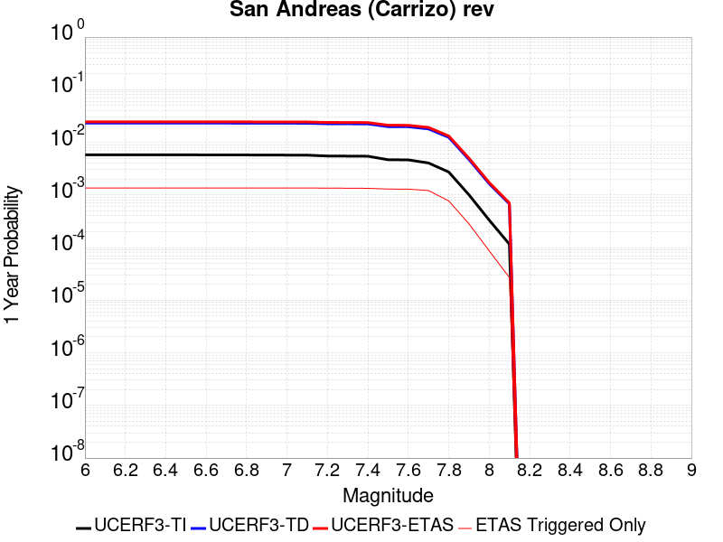 |  |

| Magnitude | 1 wk TI Prob | 1 wk TD Prob | 1 wk ETAS Prob | 1 wk ETAS/TD Gain | 1 wk ETAS Triggered Only | 1 mo TI Prob | 1 mo TD Prob | 1 mo ETAS Prob | 1 mo ETAS/TD Gain | 1 mo ETAS Triggered Only | 1 yr TI Prob | 1 yr TD Prob | 1 yr ETAS Prob | 1 yr ETAS/TD Gain | 1 yr ETAS Triggered Only | 10 yr TI Prob | 10 yr TD Prob | 10 yr ETAS Prob | 10 yr ETAS/TD Gain | 10 yr ETAS Triggered Only |
|-----|-----|-----|-----|-----|-----|-----|-----|-----|-----|-----|-----|-----|-----|-----|-----|-----|-----|-----|-----|-----|
| 6.0 | 1.1113902E-4 | 4.4923634E-4 | 0.0010140537 | 2.2572832 | 5.650712E-4 | 4.7622315E-4 | 0.0019240503 | 0.0027160933 | 1.411654 | 7.935699E-4 | 0.005782614 | 0.023205092 | 0.024562368 | 1.0584904 | 0.0013895193 | 0.05634437 | 0.20058148 | 0.2022773 | 1.0084546 | 0.0021213328 |
| 6.1 | 1.1113902E-4 | 4.4923634E-4 | 0.0010140537 | 2.2572832 | 5.650712E-4 | 4.7622315E-4 | 0.0019240503 | 0.0027160933 | 1.411654 | 7.935699E-4 | 0.005782614 | 0.023205092 | 0.024562368 | 1.0584904 | 0.0013895193 | 0.05634437 | 0.20058148 | 0.2022773 | 1.0084546 | 0.0021213328 |
| 6.2 | 1.1113902E-4 | 4.4923634E-4 | 0.0010140537 | 2.2572832 | 5.650712E-4 | 4.7622315E-4 | 0.0019240503 | 0.0027160933 | 1.411654 | 7.935699E-4 | 0.005782614 | 0.023205092 | 0.024562368 | 1.0584904 | 0.0013895193 | 0.05634437 | 0.20058148 | 0.2022773 | 1.0084546 | 0.0021213328 |
| 6.3 | 1.1113902E-4 | 4.4923634E-4 | 0.0010140537 | 2.2572832 | 5.650712E-4 | 4.7622315E-4 | 0.0019240503 | 0.0027160933 | 1.411654 | 7.935699E-4 | 0.005782614 | 0.023205092 | 0.024562368 | 1.0584904 | 0.0013895193 | 0.05634437 | 0.20058148 | 0.2022773 | 1.0084546 | 0.0021213328 |
| 6.4 | 1.1113902E-4 | 4.4923634E-4 | 0.0010140537 | 2.2572832 | 5.650712E-4 | 4.7622315E-4 | 0.0019240503 | 0.0027160933 | 1.411654 | 7.935699E-4 | 0.005782614 | 0.023205092 | 0.024562368 | 1.0584904 | 0.0013895193 | 0.05634437 | 0.20058148 | 0.2022773 | 1.0084546 | 0.0021213328 |
| 6.5 | 1.1113902E-4 | 4.4923634E-4 | 0.0010140537 | 2.2572832 | 5.650712E-4 | 4.7622315E-4 | 0.0019240503 | 0.0027160933 | 1.411654 | 7.935699E-4 | 0.005782614 | 0.023205092 | 0.024562368 | 1.0584904 | 0.0013895193 | 0.05634437 | 0.20058148 | 0.2022773 | 1.0084546 | 0.0021213328 |
| 6.6 | 1.1099849E-4 | 4.4896975E-4 | 0.0010137872 | 2.2580302 | 5.650712E-4 | 4.7562108E-4 | 0.0019229094 | 0.0027149534 | 1.4118987 | 7.935699E-4 | 0.005775322 | 0.023191497 | 0.024548791 | 1.0585256 | 0.0013895193 | 0.056275163 | 0.20047371 | 0.20216978 | 1.0084603 | 0.0021213328 |
| 6.7 | 1.1077418E-4 | 4.4854544E-4 | 0.0010133631 | 2.2592208 | 5.650712E-4 | 4.7466008E-4 | 0.0019210937 | 0.002713139 | 1.4122888 | 7.935699E-4 | 0.0057636844 | 0.023169862 | 0.024527187 | 1.0585815 | 0.0013895193 | 0.056164686 | 0.20030232 | 0.20199874 | 1.0084693 | 0.0021213328 |
| 6.8 | 1.105471E-4 | 4.4803345E-4 | 0.0010128515 | 2.2606604 | 5.650712E-4 | 4.7368725E-4 | 0.0019189026 | 0.0027109499 | 1.4127605 | 7.935699E-4 | 0.0057519027 | 0.023143753 | 0.024501115 | 1.0586491 | 0.0013895193 | 0.056052838 | 0.20009586 | 0.20179026 | 1.0084679 | 0.002118245 |
| 6.9 | 1.1025541E-4 | 4.473621E-4 | 0.0010121805 | 2.262553 | 5.650712E-4 | 4.7243762E-4 | 0.0019160297 | 0.002708079 | 1.4133805 | 7.935699E-4 | 0.0057367687 | 0.023109518 | 0.024466926 | 1.0587381 | 0.0013895193 | 0.055909142 | 0.19982636 | 0.20152132 | 1.0084822 | 0.002118245 |
| 7.0 | 1.0991533E-4 | 4.4657878E-4 | 0.0010113976 | 2.2647686 | 5.650712E-4 | 4.7098065E-4 | 0.0019126774 | 0.0027047296 | 1.4141065 | 7.935699E-4 | 0.0057191234 | 0.023069572 | 0.024427036 | 1.0588422 | 0.0013895193 | 0.055741582 | 0.19951206 | 0.20120768 | 1.0084989 | 0.002118245 |
| 7.1 | 1.09542365E-4 | 4.457076E-4 | 0.0010105269 | 2.267242 | 5.650712E-4 | 4.693828E-4 | 0.0019089493 | 0.0027010045 | 1.4149168 | 7.935699E-4 | 0.0056997715 | 0.023025142 | 0.024382668 | 1.0589584 | 0.0013895193 | 0.05555778 | 0.19916314 | 0.2008595 | 1.0085175 | 0.002118245 |
| 7.2 | 1.05608764E-4 | 4.3706578E-4 | 9.988035E-4 | 2.2852476 | 5.619834E-4 | 4.5253045E-4 | 0.0018719663 | 0.0026609686 | 1.4214832 | 7.904821E-4 | 0.005495649 | 0.022584237 | 0.023936339 | 1.0598693 | 0.0013833437 | 0.053617116 | 0.19563848 | 0.19733238 | 1.0086583 | 0.0021058938 |
| 7.3 | 1.0511766E-4 | 4.3558737E-4 | 9.97326E-4 | 2.2896118 | 5.619834E-4 | 4.5042645E-4 | 0.0018656392 | 0.0026484826 | 1.4196112 | 7.8430644E-4 | 0.0054701613 | 0.0225088 | 0.023854971 | 1.0598063 | 0.001377168 | 0.053374548 | 0.195048 | 0.1967357 | 1.0086527 | 0.0020966302 |
| 7.4 | 1.04579514E-4 | 4.3395188E-4 | 9.956914E-4 | 2.2944741 | 5.619834E-4 | 4.481209E-4 | 0.00185864 | 0.0026414888 | 1.4211944 | 7.8430644E-4 | 0.005442232 | 0.022425342 | 0.02376861 | 1.0598994 | 0.0013740802 | 0.053108674 | 0.19439563 | 0.1960822 | 1.0086759 | 0.0020935424 |
| 7.5 | 8.967509E-5 | 3.841574E-4 | 9.304917E-4 | 2.4221625 | 5.4654427E-4 | 3.842652E-4 | 0.0016455129 | 0.002413115 | 1.466482 | 7.688674E-4 | 0.004668397 | 0.019879378 | 0.021186799 | 1.0657676 | 0.0013339386 | 0.045715354 | 0.17451581 | 0.17619556 | 1.0096252 | 0.002034874 |
| 7.6 | 8.902246E-5 | 3.822647E-4 | 9.255134E-4 | 2.4211323 | 5.4345647E-4 | 3.8146903E-4 | 0.0016374114 | 0.002401937 | 1.4669112 | 7.657795E-4 | 0.004634499 | 0.019782541 | 0.021084037 | 1.0657902 | 0.001327763 | 0.0453903 | 0.17373076 | 0.17540191 | 1.0096192 | 0.0020225225 |
| 7.7 | 7.776459E-5 | 3.4746045E-4 | 8.506003E-4 | 2.4480495 | 5.033148E-4 | 3.3323426E-4 | 0.0014884217 | 0.002206813 | 1.4826531 | 7.1946223E-4 | 0.0040495815 | 0.017998766 | 0.019235922 | 1.0687356 | 0.0012598309 | 0.039765768 | 0.15920663 | 0.16081887 | 1.0101268 | 0.0019175366 |
| 7.8 | 5.2312953E-5 | 2.3975673E-4 | 5.6698726E-4 | 2.3648438 | 3.2730898E-4 | 2.2417911E-4 | 0.0010272242 | 0.0014991756 | 1.4594432 | 4.7243657E-4 | 0.0027259644 | 0.012452538 | 0.013245375 | 1.0636686 | 8.028334E-4 | 0.026927674 | 0.112169944 | 0.11326653 | 1.0097761 | 0.0012351283 |
| 7.9 | 1.9307261E-5 | 9.060563E-5 | 1.9558202E-4 | 2.1586077 | 1.04985906E-4 | 8.274278E-5 | 3.8826585E-4 | 5.6111667E-4 | 1.4451867 | 1.7291796E-4 | 0.0010069277 | 0.0047193347 | 0.005011293 | 1.0618644 | 2.9334298E-4 | 0.010023774 | 0.04339103 | 0.043816384 | 1.0098028 | 4.4464617E-4 |
| 8.0 | 6.3800603E-6 | 3.136937E-5 | 5.6071163E-5 | 1.7874494 | 2.4702565E-5 | 2.7342829E-5 | 1.3443502E-4 | 1.776587E-4 | 1.3215209 | 4.322949E-5 | 3.3284808E-4 | 0.0016358347 | 0.0017036556 | 1.0414596 | 6.793206E-5 | 0.0033234998 | 0.015136539 | 0.015233854 | 1.0064291 | 9.881026E-5 |
| 8.1 | 2.2240692E-6 | 1.29589735E-5 | 1.9134535E-5 | 1.4765471 | 6.1756414E-6 | 9.531691E-6 | 5.5538447E-5 | 6.788904E-5 | 1.2223792 | 1.2351283E-5 | 1.1604215E-4 | 6.7617896E-4 | 6.9469336E-4 | 1.027381 | 1.8526924E-5 | 0.0011598158 | 0.0061071273 | 0.0061439546 | 1.0060302 | 3.7053847E-5 |

## Blackwater
*[(top)](#table-of-contents)*

| 1 Week | 1 Month | 1 Year | 10 Year |
|-----|-----|-----|-----|
|  |  |  |  |

| Magnitude | 1 wk TI Prob | 1 wk TD Prob | 1 wk ETAS Prob | 1 wk ETAS/TD Gain | 1 wk ETAS Triggered Only | 1 mo TI Prob | 1 mo TD Prob | 1 mo ETAS Prob | 1 mo ETAS/TD Gain | 1 mo ETAS Triggered Only | 1 yr TI Prob | 1 yr TD Prob | 1 yr ETAS Prob | 1 yr ETAS/TD Gain | 1 yr ETAS Triggered Only | 10 yr TI Prob | 10 yr TD Prob | 10 yr ETAS Prob | 10 yr ETAS/TD Gain | 10 yr ETAS Triggered Only |
|-----|-----|-----|-----|-----|-----|-----|-----|-----|-----|-----|-----|-----|-----|-----|-----|-----|-----|-----|-----|-----|
| 6.0 | 7.413326E-6 | 7.774191E-6 | 7.0561626E-4 | 90.763954 | 6.9784746E-4 | 3.177101E-5 | 3.3317654E-5 | 9.4419444E-4 | 28.33916 | 9.109071E-4 | 3.867434E-4 | 4.0558857E-4 | 0.0018531891 | 4.569135 | 0.0014481879 | 0.0038607102 | 0.0040506064 | 0.006040334 | 1.4912173 | 0.00199782 |
| 6.1 | 7.413326E-6 | 7.774191E-6 | 7.0561626E-4 | 90.763954 | 6.9784746E-4 | 3.177101E-5 | 3.3317654E-5 | 9.4419444E-4 | 28.33916 | 9.109071E-4 | 3.867434E-4 | 4.0558857E-4 | 0.0018531891 | 4.569135 | 0.0014481879 | 0.0038607102 | 0.0040506064 | 0.006040334 | 1.4912173 | 0.00199782 |
| 6.2 | 7.413326E-6 | 7.774191E-6 | 7.0561626E-4 | 90.763954 | 6.9784746E-4 | 3.177101E-5 | 3.3317654E-5 | 9.4419444E-4 | 28.33916 | 9.109071E-4 | 3.867434E-4 | 4.0558857E-4 | 0.0018531891 | 4.569135 | 0.0014481879 | 0.0038607102 | 0.0040506064 | 0.006040334 | 1.4912173 | 0.00199782 |
| 6.3 | 7.413326E-6 | 7.774191E-6 | 7.0561626E-4 | 90.763954 | 6.9784746E-4 | 3.177101E-5 | 3.3317654E-5 | 9.4419444E-4 | 28.33916 | 9.109071E-4 | 3.867434E-4 | 4.0558857E-4 | 0.0018531891 | 4.569135 | 0.0014481879 | 0.0038607102 | 0.0040506064 | 0.006040334 | 1.4912173 | 0.00199782 |
| 6.4 | 7.413326E-6 | 7.774191E-6 | 7.0561626E-4 | 90.763954 | 6.9784746E-4 | 3.177101E-5 | 3.3317654E-5 | 9.4419444E-4 | 28.33916 | 9.109071E-4 | 3.867434E-4 | 4.0558857E-4 | 0.0018531891 | 4.569135 | 0.0014481879 | 0.0038607102 | 0.0040506064 | 0.006040334 | 1.4912173 | 0.00199782 |
| 6.5 | 7.413326E-6 | 7.774191E-6 | 7.0561626E-4 | 90.763954 | 6.9784746E-4 | 3.177101E-5 | 3.3317654E-5 | 9.4419444E-4 | 28.33916 | 9.109071E-4 | 3.867434E-4 | 4.0558857E-4 | 0.0018531891 | 4.569135 | 0.0014481879 | 0.0038607102 | 0.0040506064 | 0.006040334 | 1.4912173 | 0.00199782 |
| 6.6 | 6.51988E-6 | 6.8357062E-6 | 5.904298E-4 | 86.374374 | 5.835981E-4 | 2.7942044E-5 | 2.9295676E-5 | 8.074037E-4 | 27.560509 | 7.7813084E-4 | 3.4014127E-4 | 3.5663793E-4 | 0.001631453 | 4.574536 | 0.0012752699 | 0.0033962112 | 0.0035627622 | 0.0053227027 | 1.4939821 | 0.0017662335 |
| 6.7 | 5.474748E-6 | 5.7374127E-6 | 5.1831274E-4 | 90.3391 | 5.1257823E-4 | 2.3462993E-5 | 2.4588799E-5 | 7.008049E-4 | 28.500982 | 6.7623274E-4 | 2.856245E-4 | 2.993487E-4 | 0.0014322397 | 4.7845197 | 0.0011332302 | 0.0028525768 | 0.0029915334 | 0.0045431396 | 1.5186658 | 0.0015562617 |
| 6.8 | 4.643409E-6 | 4.8641823E-6 | 4.3715697E-4 | 89.87266 | 4.322949E-4 | 1.9900172E-5 | 2.0846448E-5 | 5.8590586E-4 | 28.10579 | 5.650712E-4 | 2.4225765E-4 | 2.5379687E-4 | 0.0012138654 | 4.7828226 | 9.6031226E-4 | 0.0024199372 | 0.0025371225 | 0.0038676767 | 1.5244343 | 0.0013339386 |
| 6.9 | 3.883733E-6 | 4.0671357E-6 | 3.6225287E-4 | 89.0683 | 3.5818722E-4 | 1.6644462E-5 | 1.7430582E-5 | 4.8677114E-4 | 27.92627 | 4.6934874E-4 | 2.0262749E-4 | 2.1221735E-4 | 0.0010334033 | 4.8695517 | 8.213603E-4 | 0.0020244285 | 0.0021221733 | 0.0032406736 | 1.5270541 | 0.001120879 |
| 7.0 | 3.883733E-6 | 4.0671357E-6 | 3.6225287E-4 | 89.0683 | 3.5818722E-4 | 1.6644462E-5 | 1.7430582E-5 | 4.8677114E-4 | 27.92627 | 4.6934874E-4 | 2.0262749E-4 | 2.1221735E-4 | 0.0010334033 | 4.8695517 | 8.213603E-4 | 0.0020244285 | 0.0021221733 | 0.0032406736 | 1.5270541 | 0.001120879 |

## San Andreas (Cholame) rev
*[(top)](#table-of-contents)*

| 1 Week | 1 Month | 1 Year | 10 Year |
|-----|-----|-----|-----|
|  |  |  |  |

| Magnitude | 1 wk TI Prob | 1 wk TD Prob | 1 wk ETAS Prob | 1 wk ETAS/TD Gain | 1 wk ETAS Triggered Only | 1 mo TI Prob | 1 mo TD Prob | 1 mo ETAS Prob | 1 mo ETAS/TD Gain | 1 mo ETAS Triggered Only | 1 yr TI Prob | 1 yr TD Prob | 1 yr ETAS Prob | 1 yr ETAS/TD Gain | 1 yr ETAS Triggered Only | 10 yr TI Prob | 10 yr TD Prob | 10 yr ETAS Prob | 10 yr ETAS/TD Gain | 10 yr ETAS Triggered Only |
|-----|-----|-----|-----|-----|-----|-----|-----|-----|-----|-----|-----|-----|-----|-----|-----|-----|-----|-----|-----|-----|
| 6.0 | 1.6051916E-4 | 5.7249254E-4 | 0.0010909494 | 1.9056133 | 5.187539E-4 | 6.877579E-4 | 0.0024516056 | 0.0031539027 | 1.2864641 | 7.040231E-4 | 0.00834135 | 0.029507428 | 0.030676143 | 1.0396075 | 0.00120425 | 0.080351114 | 0.2474813 | 0.24890105 | 1.0057368 | 0.0018866585 |
| 6.1 | 1.6051916E-4 | 5.7249254E-4 | 0.0010909494 | 1.9056133 | 5.187539E-4 | 6.877579E-4 | 0.0024516056 | 0.0031539027 | 1.2864641 | 7.040231E-4 | 0.00834135 | 0.029507428 | 0.030676143 | 1.0396075 | 0.00120425 | 0.080351114 | 0.2474813 | 0.24890105 | 1.0057368 | 0.0018866585 |
| 6.2 | 1.6051916E-4 | 5.7249254E-4 | 0.0010909494 | 1.9056133 | 5.187539E-4 | 6.877579E-4 | 0.0024516056 | 0.0031539027 | 1.2864641 | 7.040231E-4 | 0.00834135 | 0.029507428 | 0.030676143 | 1.0396075 | 0.00120425 | 0.080351114 | 0.2474813 | 0.24890105 | 1.0057368 | 0.0018866585 |
| 6.3 | 1.6051916E-4 | 5.7249254E-4 | 0.0010909494 | 1.9056133 | 5.187539E-4 | 6.877579E-4 | 0.0024516056 | 0.0031539027 | 1.2864641 | 7.040231E-4 | 0.00834135 | 0.029507428 | 0.030676143 | 1.0396075 | 0.00120425 | 0.080351114 | 0.2474813 | 0.24890105 | 1.0057368 | 0.0018866585 |
| 6.4 | 1.6051916E-4 | 5.7249254E-4 | 0.0010909494 | 1.9056133 | 5.187539E-4 | 6.877579E-4 | 0.0024516056 | 0.0031539027 | 1.2864641 | 7.040231E-4 | 0.00834135 | 0.029507428 | 0.030676143 | 1.0396075 | 0.00120425 | 0.080351114 | 0.2474813 | 0.24890105 | 1.0057368 | 0.0018866585 |
| 6.5 | 1.6051916E-4 | 5.7249254E-4 | 0.0010909494 | 1.9056133 | 5.187539E-4 | 6.877579E-4 | 0.0024516056 | 0.0031539027 | 1.2864641 | 7.040231E-4 | 0.00834135 | 0.029507428 | 0.030676143 | 1.0396075 | 0.00120425 | 0.080351114 | 0.2474813 | 0.24890105 | 1.0057368 | 0.0018866585 |
| 6.6 | 1.6029834E-4 | 5.7202484E-4 | 0.001090482 | 1.9063542 | 5.187539E-4 | 6.86812E-4 | 0.002449605 | 0.0031519034 | 1.2866987 | 7.040231E-4 | 0.0083299205 | 0.029483816 | 0.03065256 | 1.0396402 | 0.00120425 | 0.08024513 | 0.24731047 | 0.24873054 | 1.0057421 | 0.0018866585 |
| 6.7 | 1.6007364E-4 | 5.7155016E-4 | 0.0010900076 | 1.9071074 | 5.187539E-4 | 6.858495E-4 | 0.0024475744 | 0.0031498743 | 1.2869371 | 7.040231E-4 | 0.008318293 | 0.029459693 | 0.030628467 | 1.0396737 | 0.00120425 | 0.08013727 | 0.2471372 | 0.2485576 | 1.0057474 | 0.0018866585 |
| 6.8 | 1.5980547E-4 | 5.708367E-4 | 0.0010892944 | 1.9082417 | 5.187539E-4 | 6.8470073E-4 | 0.0024445227 | 0.0031468247 | 1.2872962 | 7.040231E-4 | 0.008304413 | 0.029423568 | 0.030592386 | 1.0397239 | 0.00120425 | 0.08000852 | 0.2468793 | 0.24830018 | 1.0057554 | 0.0018866585 |
| 6.9 | 1.5943033E-4 | 5.6985184E-4 | 0.0010883101 | 1.9098123 | 5.187539E-4 | 6.830939E-4 | 0.0024403096 | 0.0031426146 | 1.2877934 | 7.040231E-4 | 0.008284999 | 0.029373717 | 0.030542593 | 1.0397933 | 0.00120425 | 0.0798284 | 0.24652228 | 0.24794383 | 1.0057664 | 0.0018866585 |
| 7.0 | 1.5906857E-4 | 5.6890905E-4 | 0.0010873678 | 1.9113209 | 5.187539E-4 | 6.815443E-4 | 0.0024362765 | 0.0031385846 | 1.2882711 | 7.040231E-4 | 0.008266276 | 0.029325863 | 0.030494798 | 1.0398601 | 0.00120425 | 0.079654664 | 0.24617939 | 0.24760158 | 1.0057771 | 0.0018866585 |
| 7.1 | 9.4986666E-5 | 3.9541177E-4 | 8.8309456E-4 | 2.233354 | 4.8787566E-4 | 4.070222E-4 | 0.0016936905 | 0.0023595302 | 1.3931295 | 6.669693E-4 | 0.0049442407 | 0.020456197 | 0.021587418 | 1.0552996 | 0.001154845 | 0.048356738 | 0.17850818 | 0.17997433 | 1.0082134 | 0.0017847604 |
| 7.2 | 9.465065E-5 | 3.9454125E-4 | 8.822244E-4 | 2.2360766 | 4.8787566E-4 | 4.0558254E-4 | 0.0016899646 | 0.0023558068 | 1.3939977 | 6.669693E-4 | 0.0049267923 | 0.020411683 | 0.021542957 | 1.0554228 | 0.001154845 | 0.048189856 | 0.1781604 | 0.17962465 | 1.0082188 | 0.0017816726 |
| 7.3 | 9.4370014E-5 | 3.9359776E-4 | 8.812814E-4 | 2.2390406 | 4.8787566E-4 | 4.043802E-4 | 0.0016859263 | 0.002351771 | 1.394943 | 6.669693E-4 | 0.00491222 | 0.020363439 | 0.021494767 | 1.0555569 | 0.001154845 | 0.048050456 | 0.17778328 | 0.1792482 | 1.00824 | 0.0017816726 |
| 7.4 | 9.400309E-5 | 3.9239938E-4 | 8.800836E-4 | 2.2428262 | 4.8787566E-4 | 4.0280816E-4 | 0.0016807971 | 0.0023466453 | 1.3961504 | 6.669693E-4 | 0.004893167 | 0.020302156 | 0.021433556 | 1.0557281 | 0.001154845 | 0.04786817 | 0.17730153 | 0.17876731 | 1.0082672 | 0.0017816726 |
| 7.5 | 7.9358346E-5 | 3.4328582E-4 | 8.2173373E-4 | 2.3937304 | 4.786122E-4 | 3.4006286E-4 | 0.0014705557 | 0.0021272942 | 1.4465922 | 6.577058E-4 | 0.0041324073 | 0.017785678 | 0.018898752 | 1.0625826 | 0.0011332302 | 0.040564027 | 0.15729399 | 0.15876159 | 1.0093303 | 0.0017415308 |
| 7.6 | 7.898946E-5 | 3.4216905E-4 | 8.206175E-4 | 2.3982809 | 4.786122E-4 | 3.3848232E-4 | 0.0014657748 | 0.0021225165 | 1.448051 | 6.577058E-4 | 0.0041132374 | 0.01772842 | 0.018838527 | 1.0626173 | 0.0011301424 | 0.040379323 | 0.15682538 | 0.15828858 | 1.0093302 | 0.0017353552 |
| 7.7 | 6.8013156E-5 | 3.0816178E-4 | 7.526709E-4 | 2.4424539 | 4.4464617E-4 | 2.914524E-4 | 0.0013201776 | 0.0019369264 | 1.4671712 | 6.1756413E-4 | 0.0035426598 | 0.015981914 | 0.017033225 | 1.0657814 | 0.001068386 | 0.03486713 | 0.14234997 | 0.14375886 | 1.0098974 | 0.0016427207 |
| 7.8 | 4.7216392E-5 | 2.1851076E-4 | 5.1178964E-4 | 2.3421712 | 2.9334298E-4 | 2.0234026E-4 | 9.36238E-4 | 0.0013465337 | 1.4382386 | 4.1068016E-4 | 0.0024607095 | 0.011356776 | 0.012055856 | 1.0615562 | 7.071109E-4 | 0.024336396 | 0.10266637 | 0.10366109 | 1.0096889 | 0.0011085276 |
| 7.9 | 1.604325E-5 | 7.688082E-5 | 1.5715798E-4 | 2.0441768 | 8.028334E-5 | 6.875498E-5 | 3.29461E-4 | 4.5910676E-4 | 1.3935086 | 1.2968847E-4 | 8.367703E-4 | 0.0040061846 | 0.004233768 | 1.056808 | 2.2849873E-4 | 0.008336265 | 0.036792822 | 0.0371408 | 1.009458 | 3.6127502E-4 |
| 8.0 | 5.458507E-6 | 2.769139E-5 | 4.62178E-5 | 1.6690315 | 1.8526924E-5 | 2.3393392E-5 | 1.1867371E-4 | 1.464608E-4 | 1.234147 | 2.7790386E-5 | 2.847773E-4 | 0.0014442017 | 0.0014966187 | 1.0362949 | 5.2492953E-5 | 0.0028441267 | 0.013304143 | 0.013386406 | 1.0061831 | 8.337116E-5 |
| 8.1 | 2.2240692E-6 | 1.29589735E-5 | 1.9134535E-5 | 1.4765471 | 6.1756414E-6 | 9.531691E-6 | 5.5538447E-5 | 6.788904E-5 | 1.2223792 | 1.2351283E-5 | 1.1604215E-4 | 6.7617896E-4 | 6.9469336E-4 | 1.027381 | 1.8526924E-5 | 0.0011598158 | 0.0061071273 | 0.0061439546 | 1.0060302 | 3.7053847E-5 |

## San Andreas (Parkfield)
*[(top)](#table-of-contents)*

| 1 Week | 1 Month | 1 Year | 10 Year |
|-----|-----|-----|-----|
|  |  |  |  |

| Magnitude | 1 wk TI Prob | 1 wk TD Prob | 1 wk ETAS Prob | 1 wk ETAS/TD Gain | 1 wk ETAS Triggered Only | 1 mo TI Prob | 1 mo TD Prob | 1 mo ETAS Prob | 1 mo ETAS/TD Gain | 1 mo ETAS Triggered Only | 1 yr TI Prob | 1 yr TD Prob | 1 yr ETAS Prob | 1 yr ETAS/TD Gain | 1 yr ETAS Triggered Only | 10 yr TI Prob | 10 yr TD Prob | 10 yr ETAS Prob | 10 yr ETAS/TD Gain | 10 yr ETAS Triggered Only |
|-----|-----|-----|-----|-----|-----|-----|-----|-----|-----|-----|-----|-----|-----|-----|-----|-----|-----|-----|-----|-----|
| 6.0 | 7.723521E-4 | 0.0013466828 | 0.0018739891 | 1.3915594 | 5.2801735E-4 | 0.0033058827 | 0.0057641217 | 0.0064855767 | 1.1251631 | 7.256379E-4 | 0.03951393 | 0.06891971 | 0.07004384 | 1.0163107 | 0.001207338 | 0.3317935 | 0.5395069 | 0.5403643 | 1.0015893 | 0.0018619559 |
| 6.1 | 1.4269065E-4 | 5.017429E-4 | 9.307346E-4 | 1.8550031 | 4.2920708E-4 | 6.11388E-4 | 0.002148918 | 0.0027312622 | 1.2709941 | 5.835981E-4 | 0.007418273 | 0.02591448 | 0.026895024 | 1.0378376 | 0.0010066296 | 0.0717547 | 0.22093078 | 0.22216727 | 1.0055968 | 0.0015871398 |
| 6.2 | 1.4269065E-4 | 5.017429E-4 | 9.307346E-4 | 1.8550031 | 4.2920708E-4 | 6.11388E-4 | 0.002148918 | 0.0027312622 | 1.2709941 | 5.835981E-4 | 0.007418273 | 0.02591448 | 0.026895024 | 1.0378376 | 0.0010066296 | 0.0717547 | 0.22093078 | 0.22216727 | 1.0055968 | 0.0015871398 |
| 6.3 | 1.4269065E-4 | 5.017429E-4 | 9.307346E-4 | 1.8550031 | 4.2920708E-4 | 6.11388E-4 | 0.002148918 | 0.0027312622 | 1.2709941 | 5.835981E-4 | 0.007418273 | 0.02591448 | 0.026895024 | 1.0378376 | 0.0010066296 | 0.0717547 | 0.22093078 | 0.22216727 | 1.0055968 | 0.0015871398 |
| 6.4 | 1.4269065E-4 | 5.017429E-4 | 9.307346E-4 | 1.8550031 | 4.2920708E-4 | 6.11388E-4 | 0.002148918 | 0.0027312622 | 1.2709941 | 5.835981E-4 | 0.007418273 | 0.02591448 | 0.026895024 | 1.0378376 | 0.0010066296 | 0.0717547 | 0.22093078 | 0.22216727 | 1.0055968 | 0.0015871398 |
| 6.5 | 1.4269065E-4 | 5.017429E-4 | 9.307346E-4 | 1.8550031 | 4.2920708E-4 | 6.11388E-4 | 0.002148918 | 0.0027312622 | 1.2709941 | 5.835981E-4 | 0.007418273 | 0.02591448 | 0.026895024 | 1.0378376 | 0.0010066296 | 0.0717547 | 0.22093078 | 0.22216727 | 1.0055968 | 0.0015871398 |
| 6.6 | 1.4257019E-4 | 5.015525E-4 | 9.3054434E-4 | 1.8553278 | 4.2920708E-4 | 6.10872E-4 | 0.0021481037 | 0.002730448 | 1.2710971 | 5.835981E-4 | 0.0074120336 | 0.025904845 | 0.026885398 | 1.037852 | 0.0010066296 | 0.07169635 | 0.22085924 | 0.22209585 | 1.005599 | 0.0015871398 |
| 6.7 | 1.4246788E-4 | 5.013712E-4 | 9.3036314E-4 | 1.8556372 | 4.2920708E-4 | 6.1043375E-4 | 0.002147328 | 0.002729673 | 1.2711952 | 5.835981E-4 | 0.007406734 | 0.025895536 | 0.0268761 | 1.0378661 | 0.0010066296 | 0.07164679 | 0.22079132 | 0.22202803 | 1.0056013 | 0.0015871398 |
| 6.8 | 1.4238524E-4 | 5.0115754E-4 | 9.301495E-4 | 1.8560022 | 4.2920708E-4 | 6.1007973E-4 | 0.0021464138 | 0.0027287593 | 1.2713109 | 5.835981E-4 | 0.007402453 | 0.025884695 | 0.02686527 | 1.0378823 | 0.0010066296 | 0.07160675 | 0.22071254 | 0.22194938 | 1.0056038 | 0.0015871398 |
| 6.9 | 1.4226006E-4 | 5.008332E-4 | 9.2982536E-4 | 1.8565568 | 4.2920708E-4 | 6.095435E-4 | 0.0021450259 | 0.0027273723 | 1.2714868 | 5.835981E-4 | 0.007395969 | 0.025868258 | 0.026848849 | 1.0379071 | 0.0010066296 | 0.0715461 | 0.22059278 | 0.2218298 | 1.0056077 | 0.0015871398 |
| 7.0 | 1.421111E-4 | 5.0044054E-4 | 9.2943286E-4 | 1.8572292 | 4.2920708E-4 | 6.089054E-4 | 0.002143346 | 0.0027256932 | 1.2717 | 5.835981E-4 | 0.0073882528 | 0.025848212 | 0.026828822 | 1.0379373 | 0.0010066296 | 0.07147392 | 0.22044773 | 0.22168499 | 1.0056125 | 0.0015871398 |
| 7.1 | 7.911531E-5 | 3.2991724E-4 | 7.281147E-4 | 2.2069616 | 3.9832888E-4 | 3.3902156E-4 | 0.0014133246 | 0.0019590964 | 1.3861617 | 5.4654427E-4 | 0.0041197776 | 0.017099971 | 0.018040828 | 1.0550209 | 9.572244E-4 | 0.04044234 | 0.15168123 | 0.1529412 | 1.0083066 | 0.0014852418 |
| 7.2 | 7.90033E-5 | 3.296154E-4 | 7.27813E-4 | 2.2080672 | 3.9832888E-4 | 3.3854163E-4 | 0.0014120324 | 0.001957805 | 1.3865156 | 5.4654427E-4 | 0.004113957 | 0.017084487 | 0.018025357 | 1.0550716 | 9.572244E-4 | 0.040386252 | 0.15155983 | 0.15281998 | 1.0083145 | 0.0014852418 |
| 7.3 | 7.893314E-5 | 3.2935737E-4 | 7.275551E-4 | 2.209014 | 3.9832888E-4 | 3.3824102E-4 | 0.0014109277 | 0.0019567008 | 1.3868186 | 5.4654427E-4 | 0.0041103107 | 0.017071247 | 0.01801213 | 1.0551151 | 9.572244E-4 | 0.04035112 | 0.15145631 | 0.1527166 | 1.0083212 | 0.0014852418 |
| 7.4 | 7.878637E-5 | 3.2884022E-4 | 7.270381E-4 | 2.210916 | 3.9832888E-4 | 3.3761217E-4 | 0.0014087138 | 0.001954488 | 1.3874274 | 5.4654427E-4 | 0.004102683 | 0.017044716 | 0.017985623 | 1.0552024 | 9.572244E-4 | 0.04027762 | 0.15124616 | 0.15250677 | 1.0083348 | 0.0014852418 |
| 7.5 | 6.8967216E-5 | 2.9620552E-4 | 6.882426E-4 | 2.3235307 | 3.9215322E-4 | 2.9554032E-4 | 0.001268987 | 0.0018086699 | 1.4252864 | 5.403686E-4 | 0.0035922674 | 0.015367592 | 0.016304025 | 1.0609356 | 9.510488E-4 | 0.035347503 | 0.13755313 | 0.13882342 | 1.0092349 | 0.0014728905 |
| 7.6 | 6.8796966E-5 | 2.9566285E-4 | 6.877001E-4 | 2.3259606 | 3.9215322E-4 | 2.948108E-4 | 0.0012666635 | 0.0018063477 | 1.4260675 | 5.403686E-4 | 0.003583415 | 0.015339702 | 0.016276162 | 1.0610482 | 9.510488E-4 | 0.0352618 | 0.13732228 | 0.13859023 | 1.0092335 | 0.0014698027 |
| 7.7 | 5.8142083E-5 | 2.6259638E-4 | 6.268635E-4 | 2.387175 | 3.6436284E-4 | 2.4915655E-4 | 0.0011250726 | 0.0016309054 | 1.4496002 | 5.064026E-4 | 0.0030292615 | 0.0136374645 | 0.014520721 | 1.0647669 | 8.95468E-4 | 0.029882994 | 0.122926764 | 0.124140054 | 1.00987 | 0.0013833437 |
| 7.8 | 3.7720634E-5 | 1.7457761E-4 | 3.937746E-4 | 2.255585 | 2.1923527E-4 | 1.6164983E-4 | 7.480669E-4 | 0.0010535325 | 1.40834 | 3.0569424E-4 | 0.0019663102 | 0.009085932 | 0.00962139 | 1.0589328 | 5.403686E-4 | 0.019490024 | 0.08308776 | 0.08387485 | 1.009473 | 8.5841416E-4 |
| 7.9 | 1.41195915E-5 | 6.798084E-5 | 1.2973306E-4 | 1.9083767 | 6.1756415E-5 | 6.051113E-5 | 2.9132722E-4 | 3.9628256E-4 | 1.3602661 | 1.04985906E-4 | 7.36474E-4 | 0.0035434929 | 0.0037373363 | 1.0547041 | 1.9453271E-4 | 0.00734038 | 0.03258086 | 0.032885555 | 1.009352 | 3.1495772E-4 |
| 8.0 | 5.0866283E-6 | 2.564328E-5 | 4.416973E-5 | 1.722468 | 1.8526924E-5 | 2.1799653E-5 | 1.09896864E-4 | 1.3459672E-4 | 1.2247548 | 2.4702565E-5 | 2.6537845E-4 | 0.0013374792 | 0.0013868182 | 1.0368896 | 4.940513E-5 | 0.0026506176 | 0.012337761 | 0.012414004 | 1.0061797 | 7.719552E-5 |
| 8.1 | 2.2154293E-6 | 1.2907957E-5 | 1.9083518E-5 | 1.4784306 | 6.1756414E-6 | 9.494662E-6 | 5.5319815E-5 | 6.7670415E-5 | 1.2232581 | 1.2351283E-5 | 1.1559138E-4 | 6.7351875E-4 | 6.920332E-4 | 1.0274892 | 1.8526924E-5 | 0.0011553128 | 0.0060832473 | 0.0061170068 | 1.0055496 | 3.396603E-5 |

## Death Valley (Black Mtns Frontal)
*[(top)](#table-of-contents)*

| 1 Week | 1 Month | 1 Year | 10 Year |
|-----|-----|-----|-----|
|  |  |  |  |

| Magnitude | 1 wk TI Prob | 1 wk TD Prob | 1 wk ETAS Prob | 1 wk ETAS/TD Gain | 1 wk ETAS Triggered Only | 1 mo TI Prob | 1 mo TD Prob | 1 mo ETAS Prob | 1 mo ETAS/TD Gain | 1 mo ETAS Triggered Only | 1 yr TI Prob | 1 yr TD Prob | 1 yr ETAS Prob | 1 yr ETAS/TD Gain | 1 yr ETAS Triggered Only | 10 yr TI Prob | 10 yr TD Prob | 10 yr ETAS Prob | 10 yr ETAS/TD Gain | 10 yr ETAS Triggered Only |
|-----|-----|-----|-----|-----|-----|-----|-----|-----|-----|-----|-----|-----|-----|-----|-----|-----|-----|-----|-----|-----|
| 6.0 | 3.897727E-5 | 4.947383E-5 | 6.2686775E-4 | 12.670693 | 5.774225E-4 | 1.6703474E-4 | 2.1201522E-4 | 0.0010115913 | 4.771314 | 7.9974555E-4 | 0.0020317512 | 0.0025785444 | 0.0038690052 | 1.5004609 | 0.0012937969 | 0.020132754 | 0.025518417 | 0.027260642 | 1.0682732 | 0.0017878482 |
| 6.1 | 3.897727E-5 | 4.947383E-5 | 6.2686775E-4 | 12.670693 | 5.774225E-4 | 1.6703474E-4 | 2.1201522E-4 | 0.0010115913 | 4.771314 | 7.9974555E-4 | 0.0020317512 | 0.0025785444 | 0.0038690052 | 1.5004609 | 0.0012937969 | 0.020132754 | 0.025518417 | 0.027260642 | 1.0682732 | 0.0017878482 |
| 6.2 | 3.897727E-5 | 4.947383E-5 | 6.2686775E-4 | 12.670693 | 5.774225E-4 | 1.6703474E-4 | 2.1201522E-4 | 0.0010115913 | 4.771314 | 7.9974555E-4 | 0.0020317512 | 0.0025785444 | 0.0038690052 | 1.5004609 | 0.0012937969 | 0.020132754 | 0.025518417 | 0.027260642 | 1.0682732 | 0.0017878482 |
| 6.3 | 3.897727E-5 | 4.947383E-5 | 6.2686775E-4 | 12.670693 | 5.774225E-4 | 1.6703474E-4 | 2.1201522E-4 | 0.0010115913 | 4.771314 | 7.9974555E-4 | 0.0020317512 | 0.0025785444 | 0.0038690052 | 1.5004609 | 0.0012937969 | 0.020132754 | 0.025518417 | 0.027260642 | 1.0682732 | 0.0017878482 |
| 6.4 | 3.897727E-5 | 4.947383E-5 | 6.2686775E-4 | 12.670693 | 5.774225E-4 | 1.6703474E-4 | 2.1201522E-4 | 0.0010115913 | 4.771314 | 7.9974555E-4 | 0.0020317512 | 0.0025785444 | 0.0038690052 | 1.5004609 | 0.0012937969 | 0.020132754 | 0.025518417 | 0.027260642 | 1.0682732 | 0.0017878482 |
| 6.5 | 3.897727E-5 | 4.947383E-5 | 6.2686775E-4 | 12.670693 | 5.774225E-4 | 1.6703474E-4 | 2.1201522E-4 | 0.0010115913 | 4.771314 | 7.9974555E-4 | 0.0020317512 | 0.0025785444 | 0.0038690052 | 1.5004609 | 0.0012937969 | 0.020132754 | 0.025518417 | 0.027260642 | 1.0682732 | 0.0017878482 |
| 6.6 | 3.4230983E-5 | 4.342495E-5 | 5.2819174E-4 | 12.163324 | 4.8478786E-4 | 1.4669597E-4 | 1.8609542E-4 | 8.652896E-4 | 4.6497087 | 6.7932054E-4 | 0.0017845602 | 0.0022636733 | 0.0033758532 | 1.4913164 | 0.0011147032 | 0.017702973 | 0.022437919 | 0.023977373 | 1.0686095 | 0.0015747886 |
| 6.7 | 3.1676747E-5 | 4.019097E-5 | 4.848193E-4 | 12.06289 | 4.4464617E-4 | 1.3575044E-4 | 1.7223743E-4 | 7.896952E-4 | 4.5849223 | 6.1756413E-4 | 0.0016515085 | 0.0020952902 | 0.003112136 | 1.4853007 | 0.0010189809 | 0.016392887 | 0.020786978 | 0.022183897 | 1.0672016 | 0.0014265731 |
| 6.8 | 2.9047482E-5 | 3.684629E-5 | 4.2589736E-4 | 11.558759 | 3.8906542E-4 | 1.2448327E-4 | 1.5790488E-4 | 7.1671215E-4 | 4.5388856 | 5.588955E-4 | 0.00151453 | 0.0019211107 | 0.0028425953 | 1.4796625 | 9.2325837E-4 | 0.015042495 | 0.019076241 | 0.020339299 | 1.0662111 | 0.0012876212 |
| 6.9 | 2.5887868E-5 | 3.279623E-5 | 3.6935764E-4 | 11.262198 | 3.3657247E-4 | 1.10943285E-4 | 1.4054945E-4 | 6.376187E-4 | 4.5366144 | 4.971391E-4 | 0.0013498975 | 0.0017101576 | 0.0025270307 | 1.4776596 | 8.1827247E-4 | 0.01341727 | 0.01700073 | 0.018126836 | 1.0662386 | 0.0011455815 |
| 7.0 | 2.244997E-5 | 2.8405042E-5 | 2.9703783E-4 | 10.457221 | 2.686404E-4 | 9.621061E-5 | 1.2173196E-4 | 5.3236214E-4 | 4.3732324 | 4.1068016E-4 | 0.0011707348 | 0.0014813873 | 0.0021751176 | 1.4682978 | 6.9475966E-4 | 0.011645862 | 0.014745472 | 0.015715962 | 1.0658162 | 9.850148E-4 |
| 7.1 | 1.989245E-5 | 2.5153167E-5 | 2.505584E-4 | 9.961307 | 2.2541091E-4 | 8.525057E-5 | 1.07796564E-4 | 4.566827E-4 | 4.2365236 | 3.4892373E-4 | 0.0010374314 | 0.0013119389 | 0.0018824362 | 1.4348506 | 5.7124684E-4 | 0.010326017 | 0.013071986 | 0.013894799 | 1.0629448 | 8.337116E-4 |
| 7.2 | 1.8805691E-5 | 2.3778988E-5 | 2.4300904E-4 | 10.219486 | 2.1923527E-4 | 8.059333E-5 | 1.0190769E-4 | 4.4153334E-4 | 4.3326793 | 3.3966027E-4 | 9.807821E-4 | 0.0012403254 | 0.0017923597 | 1.4450722 | 5.527199E-4 | 0.009764646 | 0.012364016 | 0.013147774 | 1.0633903 | 7.935699E-4 |
| 7.3 | 6.7321266E-6 | 8.65193E-6 | 6.423222E-5 | 7.4240336 | 5.558077E-5 | 2.8851653E-5 | 3.707942E-5 | 1.266229E-4 | 3.4149106 | 8.9546804E-5 | 3.5121225E-4 | 4.5139133E-4 | 5.8102125E-4 | 1.2871786 | 1.2968847E-4 | 0.0035065769 | 0.004508958 | 0.0046933917 | 1.0409039 | 1.8526924E-4 |
| 7.4 | 6.319214E-6 | 8.125558E-6 | 5.7530287E-5 | 7.080164 | 4.940513E-5 | 2.7082066E-5 | 3.48236E-5 | 1.1510414E-4 | 3.3053489 | 8.028334E-5 | 3.2967425E-4 | 4.2393777E-4 | 5.381387E-4 | 1.2693814 | 1.14249364E-4 | 0.003291856 | 0.0042355005 | 0.0044015367 | 1.039201 | 1.6674232E-4 |
| 7.5 | 6.0176867E-6 | 7.741697E-6 | 5.7146444E-5 | 7.3816433 | 4.940513E-5 | 2.578983E-5 | 3.317852E-5 | 1.10371475E-4 | 3.3265944 | 7.719552E-5 | 3.1394596E-4 | 4.0391652E-4 | 5.1503314E-4 | 1.2750981 | 1.1116154E-4 | 0.0031350278 | 0.004036032 | 0.004192875 | 1.0388608 | 1.5747886E-4 |
| 7.6 | 5.6024205E-6 | 7.211712E-6 | 5.6616485E-5 | 7.8506308 | 4.940513E-5 | 2.4010153E-5 | 3.0907213E-5 | 1.05012616E-4 | 3.3976736 | 7.4107695E-5 | 2.9228439E-4 | 3.762732E-4 | 4.8430628E-4 | 1.2871133 | 1.0807373E-4 | 0.0029190024 | 0.0037605667 | 0.0039051487 | 1.0384468 | 1.4512757E-4 |
| 7.7 | 5.132066E-6 | 6.6084267E-6 | 4.6749832E-5 | 7.074275 | 4.014167E-5 | 2.1994381E-5 | 2.8321763E-5 | 8.390096E-5 | 2.9624202 | 5.558077E-5 | 2.677487E-4 | 3.4480577E-4 | 4.2814817E-4 | 1.2417083 | 8.337116E-5 | 0.0026742632 | 0.00344691 | 0.00356692 | 1.0348166 | 1.2042501E-4 |
| 7.8 | 4.8153906E-6 | 6.202069E-6 | 4.6343488E-5 | 7.472263 | 4.014167E-5 | 2.0637224E-5 | 2.6580266E-5 | 8.215956E-5 | 3.0909984 | 5.558077E-5 | 2.5122924E-4 | 3.2360948E-4 | 4.0695365E-4 | 1.2575456 | 8.337116E-5 | 0.002509454 | 0.0032355804 | 0.0033556158 | 1.0370985 | 1.2042501E-4 |

## Hunter Mountain-Saline Valley
*[(top)](#table-of-contents)*

| 1 Week | 1 Month | 1 Year | 10 Year |
|-----|-----|-----|-----|
|  |  |  |  |

| Magnitude | 1 wk TI Prob | 1 wk TD Prob | 1 wk ETAS Prob | 1 wk ETAS/TD Gain | 1 wk ETAS Triggered Only | 1 mo TI Prob | 1 mo TD Prob | 1 mo ETAS Prob | 1 mo ETAS/TD Gain | 1 mo ETAS Triggered Only | 1 yr TI Prob | 1 yr TD Prob | 1 yr ETAS Prob | 1 yr ETAS/TD Gain | 1 yr ETAS Triggered Only | 10 yr TI Prob | 10 yr TD Prob | 10 yr ETAS Prob | 10 yr ETAS/TD Gain | 10 yr ETAS Triggered Only |
|-----|-----|-----|-----|-----|-----|-----|-----|-----|-----|-----|-----|-----|-----|-----|-----|-----|-----|-----|-----|-----|
| 6.0 | 2.6350473E-5 | 3.0151663E-5 | 5.6741625E-4 | 18.818739 | 5.372808E-4 | 1.12925714E-4 | 1.2921583E-4 | 8.393228E-4 | 6.495511 | 7.101988E-4 | 0.0013740034 | 0.0015722114 | 0.0025680095 | 1.6333741 | 9.97366E-4 | 0.01365539 | 0.015625311 | 0.017032634 | 1.0900668 | 0.001429661 |
| 6.1 | 2.6350473E-5 | 3.0151663E-5 | 5.6741625E-4 | 18.818739 | 5.372808E-4 | 1.12925714E-4 | 1.2921583E-4 | 8.393228E-4 | 6.495511 | 7.101988E-4 | 0.0013740034 | 0.0015722114 | 0.0025680095 | 1.6333741 | 9.97366E-4 | 0.01365539 | 0.015625311 | 0.017032634 | 1.0900668 | 0.001429661 |
| 6.2 | 2.6350473E-5 | 3.0151663E-5 | 5.6741625E-4 | 18.818739 | 5.372808E-4 | 1.12925714E-4 | 1.2921583E-4 | 8.393228E-4 | 6.495511 | 7.101988E-4 | 0.0013740034 | 0.0015722114 | 0.0025680095 | 1.6333741 | 9.97366E-4 | 0.01365539 | 0.015625311 | 0.017032634 | 1.0900668 | 0.001429661 |
| 6.3 | 2.6350473E-5 | 3.0151663E-5 | 5.6741625E-4 | 18.818739 | 5.372808E-4 | 1.12925714E-4 | 1.2921583E-4 | 8.393228E-4 | 6.495511 | 7.101988E-4 | 0.0013740034 | 0.0015722114 | 0.0025680095 | 1.6333741 | 9.97366E-4 | 0.01365539 | 0.015625311 | 0.017032634 | 1.0900668 | 0.001429661 |
| 6.4 | 2.6350473E-5 | 3.0151663E-5 | 5.6741625E-4 | 18.818739 | 5.372808E-4 | 1.12925714E-4 | 1.2921583E-4 | 8.393228E-4 | 6.495511 | 7.101988E-4 | 0.0013740034 | 0.0015722114 | 0.0025680095 | 1.6333741 | 9.97366E-4 | 0.01365539 | 0.015625311 | 0.017032634 | 1.0900668 | 0.001429661 |
| 6.5 | 2.6350473E-5 | 3.0151663E-5 | 5.6741625E-4 | 18.818739 | 5.372808E-4 | 1.12925714E-4 | 1.2921583E-4 | 8.393228E-4 | 6.495511 | 7.101988E-4 | 0.0013740034 | 0.0015722114 | 0.0025680095 | 1.6333741 | 9.97366E-4 | 0.01365539 | 0.015625311 | 0.017032634 | 1.0900668 | 0.001429661 |
| 6.6 | 2.3915805E-5 | 2.727318E-5 | 5.3983746E-4 | 19.79371 | 5.1257823E-4 | 1.0249228E-4 | 1.1688063E-4 | 7.899469E-4 | 6.7585783 | 6.7314494E-4 | 0.0012471292 | 0.0014222359 | 0.0023657652 | 1.6634127 | 9.4487314E-4 | 0.012401534 | 0.014145577 | 0.015481955 | 1.0944732 | 0.0013555533 |
| 6.7 | 2.1143418E-5 | 2.4001838E-5 | 4.8716384E-4 | 20.296938 | 4.631731E-4 | 9.06115E-5 | 1.0286176E-4 | 7.0183736E-4 | 6.8231125 | 5.990372E-4 | 0.0011026367 | 0.0012517641 | 0.0021091038 | 1.684905 | 8.5841416E-4 | 0.010971815 | 0.012461145 | 0.013680883 | 1.0978832 | 0.0012351283 |
| 6.8 | 1.8590634E-5 | 2.0984402E-5 | 4.56358E-4 | 21.747486 | 4.353827E-4 | 7.967171E-5 | 8.993084E-5 | 6.395135E-4 | 7.1111703 | 5.4963207E-4 | 9.6957135E-4 | 0.0010944982 | 0.0018748619 | 1.7129875 | 7.8121864E-4 | 0.00965352 | 0.010904897 | 0.012022715 | 1.102506 | 0.0011301424 |
| 6.9 | 1.6592752E-5 | 1.863061E-5 | 4.5091746E-4 | 24.203043 | 4.322949E-4 | 7.110986E-5 | 7.984381E-5 | 6.201693E-4 | 7.7672806 | 5.403686E-4 | 8.6541864E-4 | 9.7180397E-4 | 0.0017275849 | 1.7777092 | 7.5651606E-4 | 0.008620561 | 0.009689213 | 0.010765594 | 1.1110907 | 0.0010869129 |
| 7.0 | 1.4621345E-5 | 1.6318016E-5 | 4.239037E-4 | 25.977648 | 4.0759234E-4 | 6.2661406E-5 | 6.993326E-5 | 5.7321286E-4 | 8.196569 | 5.033148E-4 | 7.6263555E-4 | 8.512428E-4 | 0.0015700926 | 1.8444709 | 7.1946223E-4 | 0.0076002358 | 0.008493364 | 0.009525121 | 1.1214781 | 0.0010405956 |
| 7.1 | 1.4214311E-5 | 1.5853855E-5 | 4.1108864E-4 | 25.929886 | 3.9524105E-4 | 6.0917053E-5 | 6.79441E-5 | 5.5578665E-4 | 8.180058 | 4.8787566E-4 | 7.414127E-4 | 8.2704343E-4 | 0.001527399 | 1.8468184 | 7.009353E-4 | 0.0073894397 | 0.0082531925 | 0.009263763 | 1.1224461 | 0.0010189809 |
| 7.2 | 5.322531E-6 | 5.4705556E-6 | 3.0807534E-4 | 56.315178 | 3.0260644E-4 | 2.2810646E-5 | 2.3445109E-5 | 3.8162392E-4 | 16.277336 | 3.5818722E-4 | 2.7768422E-4 | 2.8542118E-4 | 8.0711395E-4 | 2.8277998 | 5.218417E-4 | 0.0027733748 | 0.002851954 | 0.0036217077 | 1.2699039 | 7.719552E-4 |
| 7.3 | 4.9197506E-6 | 5.0347303E-6 | 2.9528842E-4 | 58.650295 | 2.9025515E-4 | 2.1084476E-5 | 2.1577318E-5 | 3.6740577E-4 | 17.027407 | 3.4583593E-4 | 2.5667323E-4 | 2.6268652E-4 | 7.50434E-4 | 2.8567665 | 4.8787566E-4 | 0.0025637697 | 0.0026251655 | 0.0033519783 | 1.2768636 | 7.287257E-4 |
| 7.4 | 4.3367913E-6 | 4.4250473E-6 | 2.7923987E-4 | 63.10438 | 2.7481603E-4 | 1.8586115E-5 | 1.896443E-5 | 3.4626722E-4 | 18.258772 | 3.2730898E-4 | 2.2626246E-4 | 2.3088178E-4 | 6.754253E-4 | 2.9254162 | 4.4464617E-4 | 0.0022603222 | 0.0023078213 | 0.0029732513 | 1.2883369 | 6.669693E-4 |
| 7.5 | 3.7993927E-6 | 3.8762123E-6 | 2.5707652E-4 | 66.32159 | 2.532013E-4 | 1.628301E-5 | 1.6612312E-5 | 3.1612595E-4 | 19.029617 | 2.995186E-4 | 1.9822762E-4 | 2.0225039E-4 | 6.128475E-4 | 3.0301425 | 4.1068016E-4 | 0.001980509 | 0.002022061 | 0.0026260503 | 1.2986997 | 6.052129E-4 |
| 7.6 | 3.2998898E-6 | 3.365071E-6 | 2.2568741E-4 | 67.06765 | 2.2232308E-4 | 1.4142308E-5 | 1.4421733E-5 | 2.8305827E-4 | 19.627201 | 2.686404E-4 | 1.7216899E-4 | 1.755846E-4 | 5.491453E-4 | 3.1275256 | 3.736263E-4 | 0.0017203566 | 0.001755846 | 0.002295266 | 1.3072137 | 5.403686E-4 |

## San Andreas (San Bernardino N)
*[(top)](#table-of-contents)*

| 1 Week | 1 Month | 1 Year | 10 Year |
|-----|-----|-----|-----|
|  |  |  |  |

| Magnitude | 1 wk TI Prob | 1 wk TD Prob | 1 wk ETAS Prob | 1 wk ETAS/TD Gain | 1 wk ETAS Triggered Only | 1 mo TI Prob | 1 mo TD Prob | 1 mo ETAS Prob | 1 mo ETAS/TD Gain | 1 mo ETAS Triggered Only | 1 yr TI Prob | 1 yr TD Prob | 1 yr ETAS Prob | 1 yr ETAS/TD Gain | 1 yr ETAS Triggered Only | 10 yr TI Prob | 10 yr TD Prob | 10 yr ETAS Prob | 10 yr ETAS/TD Gain | 10 yr ETAS Triggered Only |
|-----|-----|-----|-----|-----|-----|-----|-----|-----|-----|-----|-----|-----|-----|-----|-----|-----|-----|-----|-----|-----|
| 6.0 | 1.0995041E-4 | 4.016633E-4 | 7.010616E-4 | 1.7453961 | 2.995186E-4 | 4.7113094E-4 | 0.0017203542 | 0.002191978 | 1.2741435 | 4.7243657E-4 | 0.0057209437 | 0.020758318 | 0.021592865 | 1.0402031 | 8.522385E-4 | 0.055758867 | 0.17985137 | 0.18090993 | 1.0058858 | 0.001290709 |
| 6.1 | 1.0995041E-4 | 4.016633E-4 | 7.010616E-4 | 1.7453961 | 2.995186E-4 | 4.7113094E-4 | 0.0017203542 | 0.002191978 | 1.2741435 | 4.7243657E-4 | 0.0057209437 | 0.020758318 | 0.021592865 | 1.0402031 | 8.522385E-4 | 0.055758867 | 0.17985137 | 0.18090993 | 1.0058858 | 0.001290709 |
| 6.2 | 1.0995041E-4 | 4.016633E-4 | 7.010616E-4 | 1.7453961 | 2.995186E-4 | 4.7113094E-4 | 0.0017203542 | 0.002191978 | 1.2741435 | 4.7243657E-4 | 0.0057209437 | 0.020758318 | 0.021592865 | 1.0402031 | 8.522385E-4 | 0.055758867 | 0.17985137 | 0.18090993 | 1.0058858 | 0.001290709 |
| 6.3 | 1.0995041E-4 | 4.016633E-4 | 7.010616E-4 | 1.7453961 | 2.995186E-4 | 4.7113094E-4 | 0.0017203542 | 0.002191978 | 1.2741435 | 4.7243657E-4 | 0.0057209437 | 0.020758318 | 0.021592865 | 1.0402031 | 8.522385E-4 | 0.055758867 | 0.17985137 | 0.18090993 | 1.0058858 | 0.001290709 |
| 6.4 | 1.0995041E-4 | 4.016633E-4 | 7.010616E-4 | 1.7453961 | 2.995186E-4 | 4.7113094E-4 | 0.0017203542 | 0.002191978 | 1.2741435 | 4.7243657E-4 | 0.0057209437 | 0.020758318 | 0.021592865 | 1.0402031 | 8.522385E-4 | 0.055758867 | 0.17985137 | 0.18090993 | 1.0058858 | 0.001290709 |
| 6.5 | 1.0995041E-4 | 4.016633E-4 | 7.010616E-4 | 1.7453961 | 2.995186E-4 | 4.7113094E-4 | 0.0017203542 | 0.002191978 | 1.2741435 | 4.7243657E-4 | 0.0057209437 | 0.020758318 | 0.021592865 | 1.0402031 | 8.522385E-4 | 0.055758867 | 0.17985137 | 0.18090993 | 1.0058858 | 0.001290709 |
| 6.6 | 1.09829954E-4 | 4.014158E-4 | 7.008142E-4 | 1.7458559 | 2.995186E-4 | 4.7061488E-4 | 0.0017192949 | 0.0021909191 | 1.2743126 | 4.7243657E-4 | 0.0057146936 | 0.020745667 | 0.021580225 | 1.0402281 | 8.522385E-4 | 0.05569951 | 0.17974973 | 0.18080844 | 1.0058899 | 0.001290709 |
| 6.7 | 1.0968671E-4 | 4.0112622E-4 | 7.0052466E-4 | 1.7463946 | 2.995186E-4 | 4.7000122E-4 | 0.0017180555 | 0.0021896802 | 1.2745109 | 4.7243657E-4 | 0.005707261 | 0.020730862 | 0.021565434 | 1.0402575 | 8.522385E-4 | 0.05562892 | 0.17963059 | 0.18068945 | 1.0058947 | 0.001290709 |
| 6.8 | 9.6153904E-5 | 3.6562132E-4 | 6.403369E-4 | 1.7513664 | 2.7481603E-4 | 4.1202307E-4 | 0.0015660744 | 0.0019884433 | 1.2696991 | 4.2303145E-4 | 0.0050048484 | 0.018912675 | 0.019642765 | 1.0386033 | 7.441648E-4 | 0.048936214 | 0.16500922 | 0.16596834 | 1.0058125 | 0.0011486693 |
| 6.9 | 9.59246E-5 | 3.6505362E-4 | 6.3976937E-4 | 1.7525352 | 2.7481603E-4 | 4.1104064E-4 | 0.0015636444 | 0.0019860144 | 1.270119 | 4.2303145E-4 | 0.0049929423 | 0.0188836 | 0.019613713 | 1.0386639 | 7.441648E-4 | 0.048822403 | 0.164772 | 0.16573142 | 1.0058225 | 0.0011486693 |
| 7.0 | 9.5669224E-5 | 3.64425E-4 | 6.391409E-4 | 1.7538339 | 2.7481603E-4 | 4.0994651E-4 | 0.0015609534 | 0.0019833245 | 1.2705853 | 4.2303145E-4 | 0.004979682 | 0.018851407 | 0.019581543 | 1.0387311 | 7.441648E-4 | 0.048695635 | 0.16450974 | 0.16546945 | 1.0058337 | 0.0011486693 |
| 7.1 | 9.5384006E-5 | 3.6372882E-4 | 6.384449E-4 | 1.7552772 | 2.7481603E-4 | 4.0872456E-4 | 0.0015579734 | 0.001980346 | 1.2711037 | 4.2303145E-4 | 0.0049648727 | 0.018815754 | 0.019545916 | 1.038806 | 7.441648E-4 | 0.04855404 | 0.16421874 | 0.16517876 | 1.005846 | 0.0011486693 |
| 7.2 | 7.876192E-5 | 3.2410742E-4 | 5.741398E-4 | 1.7714492 | 2.501135E-4 | 3.375074E-4 | 0.0013883485 | 0.0017676232 | 1.2731841 | 3.7980196E-4 | 0.0041014124 | 0.01678248 | 0.017438255 | 1.039075 | 6.669693E-4 | 0.040265374 | 0.14711435 | 0.1480045 | 1.0060507 | 0.0010436834 |
| 7.3 | 7.8294186E-5 | 3.2266052E-4 | 5.726933E-4 | 1.7749097 | 2.501135E-4 | 3.3550337E-4 | 0.0013821543 | 0.0017614312 | 1.27441 | 3.7980196E-4 | 0.004077105 | 0.016708223 | 0.017361013 | 1.0390699 | 6.638815E-4 | 0.040031098 | 0.14649805 | 0.1473862 | 1.0060625 | 0.0010405956 |
| 7.4 | 7.778049E-5 | 3.210994E-4 | 5.711325E-4 | 1.7786784 | 2.501135E-4 | 3.3330236E-4 | 0.0013754707 | 0.0017547503 | 1.2757453 | 3.7980196E-4 | 0.0040504076 | 0.016628098 | 0.017277904 | 1.0390788 | 6.607936E-4 | 0.039773732 | 0.14583014 | 0.14671636 | 1.0060769 | 0.0010375078 |
| 7.5 | 5.9146343E-5 | 2.6189696E-4 | 4.9033586E-4 | 1.8722472 | 2.2849873E-4 | 2.534597E-4 | 0.0011219733 | 0.0014674212 | 1.3078932 | 3.4583593E-4 | 0.0030815054 | 0.01358183 | 0.014172732 | 1.0435067 | 5.990372E-4 | 0.03039124 | 0.120311 | 0.12111504 | 1.006683 | 9.139949E-4 |
| 7.6 | 4.7335114E-5 | 2.2432729E-4 | 4.0955498E-4 | 1.8257028 | 1.8526924E-4 | 2.02849E-4 | 9.6108246E-4 | 0.001244889 | 1.2952988 | 2.840795E-4 | 0.0024668893 | 0.011644533 | 0.0121541945 | 1.0437683 | 5.1566603E-4 | 0.024396837 | 0.10364283 | 0.10436245 | 1.0069433 | 8.028334E-4 |
| 7.7 | 3.8561506E-5 | 1.9188043E-4 | 3.61678E-4 | 1.8849133 | 1.6983013E-4 | 1.6525312E-4 | 8.22116E-4 | 0.0010874503 | 1.3227456 | 2.6555258E-4 | 0.0020101 | 0.009968772 | 0.010442613 | 1.0475326 | 4.786122E-4 | 0.01992015 | 0.08914556 | 0.08979526 | 1.0072881 | 7.132866E-4 |
| 7.8 | 3.2975342E-5 | 1.6895565E-4 | 3.233206E-4 | 1.9136418 | 1.5439103E-4 | 1.4131523E-4 | 7.23923E-4 | 9.738554E-4 | 1.3452473 | 2.501135E-4 | 0.0017191551 | 0.008783187 | 0.009223928 | 1.0501801 | 4.4464617E-4 | 0.017059162 | 0.07850971 | 0.079118624 | 1.0077559 | 6.607936E-4 |
| 7.9 | 2.148629E-5 | 1.04210856E-4 | 2.2153583E-4 | 2.1258419 | 1.17337186E-4 | 9.208085E-5 | 4.46556E-4 | 6.410018E-4 | 1.4354343 | 1.9453271E-4 | 0.0011205077 | 0.005425832 | 0.005757507 | 1.0611289 | 3.3348464E-4 | 0.011148746 | 0.049493838 | 0.049963437 | 1.009488 | 4.940513E-4 |
| 8.0 | 6.3800603E-6 | 3.136937E-5 | 5.6071163E-5 | 1.7874494 | 2.4702565E-5 | 2.7342829E-5 | 1.3443502E-4 | 1.776587E-4 | 1.3215209 | 4.322949E-5 | 3.3284808E-4 | 0.0016358347 | 0.0017036556 | 1.0414596 | 6.793206E-5 | 0.0033234998 | 0.015136539 | 0.015233854 | 1.0064291 | 9.881026E-5 |
| 8.1 | 2.2240692E-6 | 1.29589735E-5 | 1.9134535E-5 | 1.4765471 | 6.1756414E-6 | 9.531691E-6 | 5.5538447E-5 | 6.788904E-5 | 1.2223792 | 1.2351283E-5 | 1.1604215E-4 | 6.7617896E-4 | 6.9469336E-4 | 1.027381 | 1.8526924E-5 | 0.0011598158 | 0.0061071273 | 0.0061439546 | 1.0060302 | 3.7053847E-5 |

## Cucamonga
*[(top)](#table-of-contents)*

| 1 Week | 1 Month | 1 Year | 10 Year |
|-----|-----|-----|-----|
|  |  |  |  |

| Magnitude | 1 wk TI Prob | 1 wk TD Prob | 1 wk ETAS Prob | 1 wk ETAS/TD Gain | 1 wk ETAS Triggered Only | 1 mo TI Prob | 1 mo TD Prob | 1 mo ETAS Prob | 1 mo ETAS/TD Gain | 1 mo ETAS Triggered Only | 1 yr TI Prob | 1 yr TD Prob | 1 yr ETAS Prob | 1 yr ETAS/TD Gain | 1 yr ETAS Triggered Only | 10 yr TI Prob | 10 yr TD Prob | 10 yr ETAS Prob | 10 yr ETAS/TD Gain | 10 yr ETAS Triggered Only |
|-----|-----|-----|-----|-----|-----|-----|-----|-----|-----|-----|-----|-----|-----|-----|-----|-----|-----|-----|-----|-----|
| 6.0 | 9.287573E-5 | 1.8282168E-4 | 3.8349332E-4 | 2.097636 | 2.0070835E-4 | 3.9797812E-4 | 7.831635E-4 | 0.0011194723 | 1.4294236 | 3.3657247E-4 | 0.0048346235 | 0.009502821 | 0.0102032125 | 1.0737035 | 7.071109E-4 | 0.047307868 | 0.09186649 | 0.092926465 | 1.0115381 | 0.0011671962 |
| 6.1 | 9.287573E-5 | 1.8282168E-4 | 3.8349332E-4 | 2.097636 | 2.0070835E-4 | 3.9797812E-4 | 7.831635E-4 | 0.0011194723 | 1.4294236 | 3.3657247E-4 | 0.0048346235 | 0.009502821 | 0.0102032125 | 1.0737035 | 7.071109E-4 | 0.047307868 | 0.09186649 | 0.092926465 | 1.0115381 | 0.0011671962 |
| 6.2 | 9.287573E-5 | 1.8282168E-4 | 3.8349332E-4 | 2.097636 | 2.0070835E-4 | 3.9797812E-4 | 7.831635E-4 | 0.0011194723 | 1.4294236 | 3.3657247E-4 | 0.0048346235 | 0.009502821 | 0.0102032125 | 1.0737035 | 7.071109E-4 | 0.047307868 | 0.09186649 | 0.092926465 | 1.0115381 | 0.0011671962 |
| 6.3 | 9.287573E-5 | 1.8282168E-4 | 3.8349332E-4 | 2.097636 | 2.0070835E-4 | 3.9797812E-4 | 7.831635E-4 | 0.0011194723 | 1.4294236 | 3.3657247E-4 | 0.0048346235 | 0.009502821 | 0.0102032125 | 1.0737035 | 7.071109E-4 | 0.047307868 | 0.09186649 | 0.092926465 | 1.0115381 | 0.0011671962 |
| 6.4 | 9.287573E-5 | 1.8282168E-4 | 3.8349332E-4 | 2.097636 | 2.0070835E-4 | 3.9797812E-4 | 7.831635E-4 | 0.0011194723 | 1.4294236 | 3.3657247E-4 | 0.0048346235 | 0.009502821 | 0.0102032125 | 1.0737035 | 7.071109E-4 | 0.047307868 | 0.09186649 | 0.092926465 | 1.0115381 | 0.0011671962 |
| 6.5 | 9.287573E-5 | 1.8282168E-4 | 3.8349332E-4 | 2.097636 | 2.0070835E-4 | 3.9797812E-4 | 7.831635E-4 | 0.0011194723 | 1.4294236 | 3.3657247E-4 | 0.0048346235 | 0.009502821 | 0.0102032125 | 1.0737035 | 7.071109E-4 | 0.047307868 | 0.09186649 | 0.092926465 | 1.0115381 | 0.0011671962 |

## Pleito
*[(top)](#table-of-contents)*

| 1 Week | 1 Month | 1 Year | 10 Year |
|-----|-----|-----|-----|
|  |  |  |  |

| Magnitude | 1 wk TI Prob | 1 wk TD Prob | 1 wk ETAS Prob | 1 wk ETAS/TD Gain | 1 wk ETAS Triggered Only | 1 mo TI Prob | 1 mo TD Prob | 1 mo ETAS Prob | 1 mo ETAS/TD Gain | 1 mo ETAS Triggered Only | 1 yr TI Prob | 1 yr TD Prob | 1 yr ETAS Prob | 1 yr ETAS/TD Gain | 1 yr ETAS Triggered Only | 10 yr TI Prob | 10 yr TD Prob | 10 yr ETAS Prob | 10 yr ETAS/TD Gain | 10 yr ETAS Triggered Only |
|-----|-----|-----|-----|-----|-----|-----|-----|-----|-----|-----|-----|-----|-----|-----|-----|-----|-----|-----|-----|-----|
| 6.0 | 2.8975299E-5 | 3.5014233E-5 | 1.8631214E-4 | 5.3210406 | 1.5130322E-4 | 1.2417394E-4 | 1.5005456E-4 | 4.2482937E-4 | 2.831166 | 2.7481603E-4 | 0.0015107692 | 0.0018257706 | 0.0024083033 | 1.3190612 | 5.835981E-4 | 0.015005396 | 0.018145941 | 0.019216163 | 1.0589786 | 0.0010900007 |
| 6.1 | 2.8975299E-5 | 3.5014233E-5 | 1.8631214E-4 | 5.3210406 | 1.5130322E-4 | 1.2417394E-4 | 1.5005456E-4 | 4.2482937E-4 | 2.831166 | 2.7481603E-4 | 0.0015107692 | 0.0018257706 | 0.0024083033 | 1.3190612 | 5.835981E-4 | 0.015005396 | 0.018145941 | 0.019216163 | 1.0589786 | 0.0010900007 |
| 6.2 | 2.8975299E-5 | 3.5014233E-5 | 1.8631214E-4 | 5.3210406 | 1.5130322E-4 | 1.2417394E-4 | 1.5005456E-4 | 4.2482937E-4 | 2.831166 | 2.7481603E-4 | 0.0015107692 | 0.0018257706 | 0.0024083033 | 1.3190612 | 5.835981E-4 | 0.015005396 | 0.018145941 | 0.019216163 | 1.0589786 | 0.0010900007 |
| 6.3 | 2.8975299E-5 | 3.5014233E-5 | 1.8631214E-4 | 5.3210406 | 1.5130322E-4 | 1.2417394E-4 | 1.5005456E-4 | 4.2482937E-4 | 2.831166 | 2.7481603E-4 | 0.0015107692 | 0.0018257706 | 0.0024083033 | 1.3190612 | 5.835981E-4 | 0.015005396 | 0.018145941 | 0.019216163 | 1.0589786 | 0.0010900007 |
| 6.4 | 2.8975299E-5 | 3.5014233E-5 | 1.8631214E-4 | 5.3210406 | 1.5130322E-4 | 1.2417394E-4 | 1.5005456E-4 | 4.2482937E-4 | 2.831166 | 2.7481603E-4 | 0.0015107692 | 0.0018257706 | 0.0024083033 | 1.3190612 | 5.835981E-4 | 0.015005396 | 0.018145941 | 0.019216163 | 1.0589786 | 0.0010900007 |
| 6.5 | 2.8975299E-5 | 3.5014233E-5 | 1.8631214E-4 | 5.3210406 | 1.5130322E-4 | 1.2417394E-4 | 1.5005456E-4 | 4.2482937E-4 | 2.831166 | 2.7481603E-4 | 0.0015107692 | 0.0018257706 | 0.0024083033 | 1.3190612 | 5.835981E-4 | 0.015005396 | 0.018145941 | 0.019216163 | 1.0589786 | 0.0010900007 |
| 6.6 | 2.6446418E-5 | 3.190913E-5 | 1.7394435E-4 | 5.451241 | 1.4203975E-4 | 1.1333687E-4 | 1.367484E-4 | 3.8065287E-4 | 2.7836003 | 2.4393783E-4 | 0.0013790029 | 0.0016640209 | 0.0022004077 | 1.3223437 | 5.372808E-4 | 0.013704768 | 0.016553096 | 0.017552175 | 1.0603559 | 0.0010158931 |
| 6.7 | 2.26497E-5 | 2.7271499E-5 | 1.5695643E-4 | 5.755328 | 1.2968847E-4 | 9.706653E-5 | 1.1687469E-4 | 3.3608434E-4 | 2.8755956 | 2.1923527E-4 | 0.0011811443 | 0.0014223875 | 0.0018941521 | 1.3316709 | 4.7243657E-4 | 0.01174886 | 0.0141689 | 0.015045593 | 1.0618744 | 8.8929234E-4 |
| 6.8 | 1.799965E-5 | 2.159839E-5 | 1.420208E-4 | 6.575527 | 1.2042501E-4 | 7.713908E-5 | 9.256323E-5 | 2.8090287E-4 | 3.0347133 | 1.8835707E-4 | 9.387636E-4 | 0.0011267258 | 0.0015153529 | 1.3449172 | 3.8906542E-4 | 0.009348078 | 0.011244575 | 0.011986477 | 1.0659788 | 7.503404E-4 |
| 6.9 | 1.799965E-5 | 2.159839E-5 | 1.420208E-4 | 6.575527 | 1.2042501E-4 | 7.713908E-5 | 9.256323E-5 | 2.8090287E-4 | 3.0347133 | 1.8835707E-4 | 9.387636E-4 | 0.0011267258 | 0.0015153529 | 1.3449172 | 3.8906542E-4 | 0.009348078 | 0.011244575 | 0.011986477 | 1.0659788 | 7.503404E-4 |
| 7.0 | 1.3666451E-5 | 1.6355421E-5 | 1.05900755E-4 | 6.4749637 | 8.9546804E-5 | 5.8569192E-5 | 7.009466E-5 | 2.1521206E-4 | 3.070306 | 1.4512757E-4 | 7.128466E-4 | 8.5340254E-4 | 0.0011588358 | 1.3579007 | 3.0569424E-4 | 0.0071056425 | 0.008534024 | 0.00913101 | 1.0699537 | 6.02125E-4 |

## San Cayetano
*[(top)](#table-of-contents)*

| 1 Week | 1 Month | 1 Year | 10 Year |
|-----|-----|-----|-----|
|  |  |  |  |

| Magnitude | 1 wk TI Prob | 1 wk TD Prob | 1 wk ETAS Prob | 1 wk ETAS/TD Gain | 1 wk ETAS Triggered Only | 1 mo TI Prob | 1 mo TD Prob | 1 mo ETAS Prob | 1 mo ETAS/TD Gain | 1 mo ETAS Triggered Only | 1 yr TI Prob | 1 yr TD Prob | 1 yr ETAS Prob | 1 yr ETAS/TD Gain | 1 yr ETAS Triggered Only | 10 yr TI Prob | 10 yr TD Prob | 10 yr ETAS Prob | 10 yr ETAS/TD Gain | 10 yr ETAS Triggered Only |
|-----|-----|-----|-----|-----|-----|-----|-----|-----|-----|-----|-----|-----|-----|-----|-----|-----|-----|-----|-----|-----|
| 6.0 | 8.1875E-5 | 1.8670029E-4 | 4.2750532E-4 | 2.2897947 | 2.4085001E-4 | 3.5084566E-4 | 7.9996156E-4 | 0.0011424355 | 1.428113 | 3.427481E-4 | 0.004263182 | 0.009708474 | 0.010304754 | 1.0614184 | 6.02125E-4 | 0.041823186 | 0.09218576 | 0.09303512 | 1.0092136 | 9.356097E-4 |
| 6.1 | 8.1875E-5 | 1.8670029E-4 | 4.2750532E-4 | 2.2897947 | 2.4085001E-4 | 3.5084566E-4 | 7.9996156E-4 | 0.0011424355 | 1.428113 | 3.427481E-4 | 0.004263182 | 0.009708474 | 0.010304754 | 1.0614184 | 6.02125E-4 | 0.041823186 | 0.09218576 | 0.09303512 | 1.0092136 | 9.356097E-4 |
| 6.2 | 8.1875E-5 | 1.8670029E-4 | 4.2750532E-4 | 2.2897947 | 2.4085001E-4 | 3.5084566E-4 | 7.9996156E-4 | 0.0011424355 | 1.428113 | 3.427481E-4 | 0.004263182 | 0.009708474 | 0.010304754 | 1.0614184 | 6.02125E-4 | 0.041823186 | 0.09218576 | 0.09303512 | 1.0092136 | 9.356097E-4 |
| 6.3 | 8.1875E-5 | 1.8670029E-4 | 4.2750532E-4 | 2.2897947 | 2.4085001E-4 | 3.5084566E-4 | 7.9996156E-4 | 0.0011424355 | 1.428113 | 3.427481E-4 | 0.004263182 | 0.009708474 | 0.010304754 | 1.0614184 | 6.02125E-4 | 0.041823186 | 0.09218576 | 0.09303512 | 1.0092136 | 9.356097E-4 |
| 6.4 | 8.1875E-5 | 1.8670029E-4 | 4.2750532E-4 | 2.2897947 | 2.4085001E-4 | 3.5084566E-4 | 7.9996156E-4 | 0.0011424355 | 1.428113 | 3.427481E-4 | 0.004263182 | 0.009708474 | 0.010304754 | 1.0614184 | 6.02125E-4 | 0.041823186 | 0.09218576 | 0.09303512 | 1.0092136 | 9.356097E-4 |
| 6.5 | 8.1875E-5 | 1.8670029E-4 | 4.2750532E-4 | 2.2897947 | 2.4085001E-4 | 3.5084566E-4 | 7.9996156E-4 | 0.0011424355 | 1.428113 | 3.427481E-4 | 0.004263182 | 0.009708474 | 0.010304754 | 1.0614184 | 6.02125E-4 | 0.041823186 | 0.09218576 | 0.09303512 | 1.0092136 | 9.356097E-4 |
| 6.6 | 8.1875E-5 | 1.8670029E-4 | 4.2750532E-4 | 2.2897947 | 2.4085001E-4 | 3.5084566E-4 | 7.9996156E-4 | 0.0011424355 | 1.428113 | 3.427481E-4 | 0.004263182 | 0.009708474 | 0.010304754 | 1.0614184 | 6.02125E-4 | 0.041823186 | 0.09218576 | 0.09303512 | 1.0092136 | 9.356097E-4 |
| 6.7 | 5.4643962E-5 | 1.3262422E-4 | 2.9934442E-4 | 2.2570872 | 1.6674232E-4 | 2.341674E-4 | 5.6833174E-4 | 8.183031E-4 | 1.4398335 | 2.501135E-4 | 0.0028472608 | 0.006909191 | 0.007356898 | 1.0647987 | 4.5082183E-4 | 0.028110553 | 0.06647811 | 0.06713533 | 1.0098863 | 7.040231E-4 |
| 6.8 | 5.4643962E-5 | 1.3262422E-4 | 2.9934442E-4 | 2.2570872 | 1.6674232E-4 | 2.341674E-4 | 5.6833174E-4 | 8.183031E-4 | 1.4398335 | 2.501135E-4 | 0.0028472608 | 0.006909191 | 0.007356898 | 1.0647987 | 4.5082183E-4 | 0.028110553 | 0.06647811 | 0.06713533 | 1.0098863 | 7.040231E-4 |
| 6.9 | 4.9065253E-5 | 1.1962955E-4 | 2.678272E-4 | 2.2388048 | 1.4821539E-4 | 2.102627E-4 | 5.1266217E-4 | 7.317851E-4 | 1.4274216 | 2.1923527E-4 | 0.002556943 | 0.006235295 | 0.00663114 | 1.0634845 | 3.9832888E-4 | 0.02527722 | 0.06024073 | 0.0608356 | 1.0098749 | 6.3300325E-4 |
| 7.0 | 3.8281665E-5 | 9.1909E-5 | 1.9688526E-4 | 2.1421762 | 1.04985906E-4 | 1.6405396E-4 | 3.938957E-4 | 5.5439916E-4 | 1.407477 | 1.6056668E-4 | 0.0019955272 | 0.0047956803 | 0.0050937627 | 1.0621564 | 2.995186E-4 | 0.019777026 | 0.04680347 | 0.047271453 | 1.0099989 | 4.909635E-4 |
| 7.1 | 3.8281665E-5 | 9.1909E-5 | 1.9688526E-4 | 2.1421762 | 1.04985906E-4 | 1.6405396E-4 | 3.938957E-4 | 5.5439916E-4 | 1.407477 | 1.6056668E-4 | 0.0019955272 | 0.0047956803 | 0.0050937627 | 1.0621564 | 2.995186E-4 | 0.019777026 | 0.04680347 | 0.047271453 | 1.0099989 | 4.909635E-4 |

## Death Valley (No)
*[(top)](#table-of-contents)*

| 1 Week | 1 Month | 1 Year | 10 Year |
|-----|-----|-----|-----|
|  |  |  |  |

| Magnitude | 1 wk TI Prob | 1 wk TD Prob | 1 wk ETAS Prob | 1 wk ETAS/TD Gain | 1 wk ETAS Triggered Only | 1 mo TI Prob | 1 mo TD Prob | 1 mo ETAS Prob | 1 mo ETAS/TD Gain | 1 mo ETAS Triggered Only | 1 yr TI Prob | 1 yr TD Prob | 1 yr ETAS Prob | 1 yr ETAS/TD Gain | 1 yr ETAS Triggered Only | 10 yr TI Prob | 10 yr TD Prob | 10 yr ETAS Prob | 10 yr ETAS/TD Gain | 10 yr ETAS Triggered Only |
|-----|-----|-----|-----|-----|-----|-----|-----|-----|-----|-----|-----|-----|-----|-----|-----|-----|-----|-----|-----|-----|
| 6.0 | 4.5975892E-5 | 5.9477E-5 | 3.7132835E-4 | 6.243226 | 3.118699E-4 | 1.9702465E-4 | 2.548782E-4 | 7.055851E-4 | 2.768323 | 4.5082183E-4 | 0.0023961363 | 0.003099011 | 0.0037916175 | 1.2234927 | 6.9475966E-4 | 0.02370464 | 0.030588351 | 0.03151031 | 1.0301408 | 9.510488E-4 |
| 6.1 | 4.5975892E-5 | 5.9477E-5 | 3.7132835E-4 | 6.243226 | 3.118699E-4 | 1.9702465E-4 | 2.548782E-4 | 7.055851E-4 | 2.768323 | 4.5082183E-4 | 0.0023961363 | 0.003099011 | 0.0037916175 | 1.2234927 | 6.9475966E-4 | 0.02370464 | 0.030588351 | 0.03151031 | 1.0301408 | 9.510488E-4 |
| 6.2 | 4.5975892E-5 | 5.9477E-5 | 3.7132835E-4 | 6.243226 | 3.118699E-4 | 1.9702465E-4 | 2.548782E-4 | 7.055851E-4 | 2.768323 | 4.5082183E-4 | 0.0023961363 | 0.003099011 | 0.0037916175 | 1.2234927 | 6.9475966E-4 | 0.02370464 | 0.030588351 | 0.03151031 | 1.0301408 | 9.510488E-4 |
| 6.3 | 4.5975892E-5 | 5.9477E-5 | 3.7132835E-4 | 6.243226 | 3.118699E-4 | 1.9702465E-4 | 2.548782E-4 | 7.055851E-4 | 2.768323 | 4.5082183E-4 | 0.0023961363 | 0.003099011 | 0.0037916175 | 1.2234927 | 6.9475966E-4 | 0.02370464 | 0.030588351 | 0.03151031 | 1.0301408 | 9.510488E-4 |
| 6.4 | 4.5975892E-5 | 5.9477E-5 | 3.7132835E-4 | 6.243226 | 3.118699E-4 | 1.9702465E-4 | 2.548782E-4 | 7.055851E-4 | 2.768323 | 4.5082183E-4 | 0.0023961363 | 0.003099011 | 0.0037916175 | 1.2234927 | 6.9475966E-4 | 0.02370464 | 0.030588351 | 0.03151031 | 1.0301408 | 9.510488E-4 |
| 6.5 | 4.5975892E-5 | 5.9477E-5 | 3.7132835E-4 | 6.243226 | 3.118699E-4 | 1.9702465E-4 | 2.548782E-4 | 7.055851E-4 | 2.768323 | 4.5082183E-4 | 0.0023961363 | 0.003099011 | 0.0037916175 | 1.2234927 | 6.9475966E-4 | 0.02370464 | 0.030588351 | 0.03151031 | 1.0301408 | 9.510488E-4 |
| 6.6 | 4.1757343E-5 | 5.400243E-5 | 3.1954068E-4 | 5.9171534 | 2.6555258E-4 | 1.7894777E-4 | 2.3142013E-4 | 6.2965683E-4 | 2.7208385 | 3.9832888E-4 | 0.002176512 | 0.0028141933 | 0.0034269402 | 1.2177346 | 6.1447633E-4 | 0.021553177 | 0.02781613 | 0.02864166 | 1.0296781 | 8.491507E-4 |
| 6.7 | 3.751902E-5 | 4.847215E-5 | 2.8313516E-4 | 5.8411922 | 2.3467437E-4 | 1.607859E-4 | 2.0772294E-4 | 5.5966136E-4 | 2.6942685 | 3.5201156E-4 | 0.0019558107 | 0.0025263957 | 0.0030715594 | 1.215787 | 5.4654427E-4 | 0.019386867 | 0.025007667 | 0.025751287 | 1.0297356 | 7.626917E-4 |
| 6.8 | 3.358376E-5 | 4.333242E-5 | 2.4403207E-4 | 5.631628 | 2.0070835E-4 | 1.4392247E-4 | 1.8569885E-4 | 4.8516184E-4 | 2.612627 | 2.995186E-4 | 0.0017508477 | 0.0022588398 | 0.002736371 | 1.2114055 | 4.786122E-4 | 0.017371172 | 0.022389125 | 0.023056256 | 1.0297971 | 6.824084E-4 |
| 6.9 | 2.9934512E-5 | 3.8558388E-5 | 2.0838197E-4 | 5.404323 | 1.6983013E-4 | 1.2828446E-4 | 1.6524145E-4 | 4.2148822E-4 | 2.5507414 | 2.5628912E-4 | 0.0015607442 | 0.002010258 | 0.002432439 | 1.2100134 | 4.2303145E-4 | 0.0154982805 | 0.019950643 | 0.020537728 | 1.0294269 | 5.990372E-4 |
| 7.0 | 2.6778222E-5 | 3.444248E-5 | 1.8265277E-4 | 5.303125 | 1.4821539E-4 | 1.1475876E-4 | 1.4760396E-4 | 3.7915632E-4 | 2.5687408 | 2.3158656E-4 | 0.0013962924 | 0.001795896 | 0.002178098 | 1.2128198 | 3.8288976E-4 | 0.013875516 | 0.017843472 | 0.01837723 | 1.0299134 | 5.4345647E-4 |
| 7.1 | 2.3953568E-5 | 3.076199E-5 | 1.6353419E-4 | 5.3161125 | 1.3277629E-4 | 1.0265411E-4 | 1.3183212E-4 | 3.4795108E-4 | 2.63935 | 2.1614745E-4 | 0.0012490972 | 0.0016041726 | 0.0019494537 | 1.2152394 | 3.4583593E-4 | 0.012420994 | 0.015955374 | 0.016438503 | 1.0302801 | 4.909635E-4 |
| 7.2 | 2.121599E-5 | 2.720663E-5 | 1.4762837E-4 | 5.426191 | 1.2042501E-4 | 9.09225E-5 | 1.16596304E-4 | 3.1728126E-4 | 2.7211947 | 2.0070835E-4 | 0.0011064193 | 0.0014189329 | 0.0017365272 | 1.2238262 | 3.1804552E-4 | 0.0110092675 | 0.0141279865 | 0.014569395 | 1.0312436 | 4.47734E-4 |
| 7.3 | 1.8611821E-5 | 2.3849978E-5 | 1.2574563E-4 | 5.2723584 | 1.01898084E-4 | 7.976251E-5 | 1.0221185E-4 | 2.7511214E-4 | 2.6915874 | 1.7291796E-4 | 9.706759E-4 | 0.0012440139 | 0.001521572 | 1.223115 | 2.7790386E-4 | 0.009664469 | 0.0123994695 | 0.01278981 | 1.0314804 | 3.9524105E-4 |
| 7.4 | 6.786848E-6 | 8.734327E-6 | 6.122682E-5 | 7.0099072 | 5.2492953E-5 | 2.9086168E-5 | 3.7432535E-5 | 1.2080057E-4 | 3.2271545 | 8.337116E-5 | 3.5406655E-4 | 4.5568874E-4 | 5.7297247E-4 | 1.2573768 | 1.17337186E-4 | 0.0035350295 | 0.004551757 | 0.004723888 | 1.0378164 | 1.7291796E-4 |
| 7.5 | 6.183793E-6 | 7.958103E-6 | 5.7362842E-5 | 7.208105 | 4.940513E-5 | 2.65017E-5 | 3.410595E-5 | 1.1129884E-4 | 3.263326 | 7.719552E-5 | 3.2261043E-4 | 4.1520374E-4 | 5.2631914E-4 | 1.2676165 | 1.1116154E-4 | 0.003221425 | 0.0041484893 | 0.0043053147 | 1.037803 | 1.5747886E-4 |
| 7.6 | 5.6024205E-6 | 7.211712E-6 | 5.6616485E-5 | 7.8506308 | 4.940513E-5 | 2.4010153E-5 | 3.0907213E-5 | 1.05012616E-4 | 3.3976736 | 7.4107695E-5 | 2.9228439E-4 | 3.762732E-4 | 4.8430628E-4 | 1.2871133 | 1.0807373E-4 | 0.0029190024 | 0.0037605667 | 0.0039051487 | 1.0384468 | 1.4512757E-4 |
| 7.7 | 5.132066E-6 | 6.6084267E-6 | 4.6749832E-5 | 7.074275 | 4.014167E-5 | 2.1994381E-5 | 2.8321763E-5 | 8.390096E-5 | 2.9624202 | 5.558077E-5 | 2.677487E-4 | 3.4480577E-4 | 4.2814817E-4 | 1.2417083 | 8.337116E-5 | 0.0026742632 | 0.00344691 | 0.00356692 | 1.0348166 | 1.2042501E-4 |
| 7.8 | 4.8153906E-6 | 6.202069E-6 | 4.6343488E-5 | 7.472263 | 4.014167E-5 | 2.0637224E-5 | 2.6580266E-5 | 8.215956E-5 | 3.0909984 | 5.558077E-5 | 2.5122924E-4 | 3.2360948E-4 | 4.0695365E-4 | 1.2575456 | 8.337116E-5 | 0.002509454 | 0.0032355804 | 0.0033556158 | 1.0370985 | 1.2042501E-4 |

## Gravel Hills-Harper Lk
*[(top)](#table-of-contents)*

| 1 Week | 1 Month | 1 Year | 10 Year |
|-----|-----|-----|-----|
|  |  | 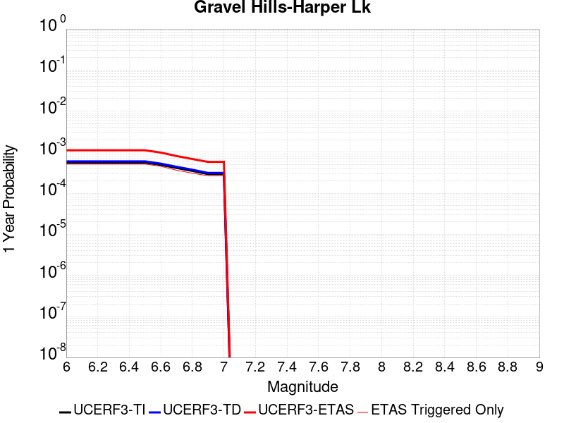 |  |

| Magnitude | 1 wk TI Prob | 1 wk TD Prob | 1 wk ETAS Prob | 1 wk ETAS/TD Gain | 1 wk ETAS Triggered Only | 1 mo TI Prob | 1 mo TD Prob | 1 mo ETAS Prob | 1 mo ETAS/TD Gain | 1 mo ETAS Triggered Only | 1 yr TI Prob | 1 yr TD Prob | 1 yr ETAS Prob | 1 yr ETAS/TD Gain | 1 yr ETAS Triggered Only | 10 yr TI Prob | 10 yr TD Prob | 10 yr ETAS Prob | 10 yr ETAS/TD Gain | 10 yr ETAS Triggered Only |
|-----|-----|-----|-----|-----|-----|-----|-----|-----|-----|-----|-----|-----|-----|-----|-----|-----|-----|-----|-----|-----|
| 6.0 | 1.0695174E-5 | 1.1443446E-5 | 2.3685177E-4 | 20.697592 | 2.2541091E-4 | 4.583565E-5 | 4.904268E-5 | 3.794233E-4 | 7.7365937 | 3.303968E-4 | 5.5790617E-4 | 5.9697754E-4 | 0.0011246797 | 1.8839564 | 5.2801735E-4 | 0.0055650757 | 0.005958305 | 0.0067103137 | 1.1262118 | 7.5651606E-4 |
| 6.1 | 1.0695174E-5 | 1.1443446E-5 | 2.3685177E-4 | 20.697592 | 2.2541091E-4 | 4.583565E-5 | 4.904268E-5 | 3.794233E-4 | 7.7365937 | 3.303968E-4 | 5.5790617E-4 | 5.9697754E-4 | 0.0011246797 | 1.8839564 | 5.2801735E-4 | 0.0055650757 | 0.005958305 | 0.0067103137 | 1.1262118 | 7.5651606E-4 |
| 6.2 | 1.0695174E-5 | 1.1443446E-5 | 2.3685177E-4 | 20.697592 | 2.2541091E-4 | 4.583565E-5 | 4.904268E-5 | 3.794233E-4 | 7.7365937 | 3.303968E-4 | 5.5790617E-4 | 5.9697754E-4 | 0.0011246797 | 1.8839564 | 5.2801735E-4 | 0.0055650757 | 0.005958305 | 0.0067103137 | 1.1262118 | 7.5651606E-4 |
| 6.3 | 1.0695174E-5 | 1.1443446E-5 | 2.3685177E-4 | 20.697592 | 2.2541091E-4 | 4.583565E-5 | 4.904268E-5 | 3.794233E-4 | 7.7365937 | 3.303968E-4 | 5.5790617E-4 | 5.9697754E-4 | 0.0011246797 | 1.8839564 | 5.2801735E-4 | 0.0055650757 | 0.005958305 | 0.0067103137 | 1.1262118 | 7.5651606E-4 |
| 6.4 | 1.0695174E-5 | 1.1443446E-5 | 2.3685177E-4 | 20.697592 | 2.2541091E-4 | 4.583565E-5 | 4.904268E-5 | 3.794233E-4 | 7.7365937 | 3.303968E-4 | 5.5790617E-4 | 5.9697754E-4 | 0.0011246797 | 1.8839564 | 5.2801735E-4 | 0.0055650757 | 0.005958305 | 0.0067103137 | 1.1262118 | 7.5651606E-4 |
| 6.5 | 1.0695174E-5 | 1.1443446E-5 | 2.3685177E-4 | 20.697592 | 2.2541091E-4 | 4.583565E-5 | 4.904268E-5 | 3.794233E-4 | 7.7365937 | 3.303968E-4 | 5.5790617E-4 | 5.9697754E-4 | 0.0011246797 | 1.8839564 | 5.2801735E-4 | 0.0055650757 | 0.005958305 | 0.0067103137 | 1.1262118 | 7.5651606E-4 |
| 6.6 | 9.406204E-6 | 1.0059137E-5 | 1.9532652E-4 | 19.417822 | 1.8526924E-4 | 4.0311683E-5 | 4.3110133E-5 | 3.271774E-4 | 7.5893383 | 2.840795E-4 | 4.906842E-4 | 5.247856E-4 | 9.78457E-4 | 1.8644891 | 4.5390966E-4 | 0.0048960214 | 0.005239992 | 0.0058819647 | 1.1225141 | 6.453545E-4 |
| 6.7 | 7.8983985E-6 | 8.44031E-6 | 1.4739107E-4 | 17.462755 | 1.3895193E-4 | 3.384984E-5 | 3.6172514E-5 | 2.64663E-4 | 7.3166876 | 2.2849873E-4 | 4.1204385E-4 | 4.4035696E-4 | 8.1690523E-4 | 1.8550977 | 3.7671413E-4 | 0.004112807 | 0.0043993196 | 0.0049188654 | 1.1180968 | 5.218417E-4 |
| 6.8 | 6.69903E-6 | 7.1536347E-6 | 1.1831438E-4 | 16.539059 | 1.1116154E-4 | 2.8709812E-5 | 3.0658328E-5 | 2.1900961E-4 | 7.14356 | 1.8835707E-4 | 3.494859E-4 | 3.7324644E-4 | 6.849999E-4 | 1.8352484 | 3.118699E-4 | 0.003489368 | 0.00373063 | 0.0041643884 | 1.1162695 | 4.353827E-4 |
| 6.9 | 5.603049E-6 | 5.978078E-6 | 1.0478775E-4 | 17.528667 | 9.881026E-5 | 2.4012847E-5 | 2.5620335E-5 | 1.861829E-4 | 7.266997 | 1.6056668E-4 | 2.9231719E-4 | 3.1192758E-4 | 5.8048416E-4 | 1.8609582 | 2.686404E-4 | 0.0029193296 | 0.003119276 | 0.0034886585 | 1.1184194 | 3.7053847E-4 |
| 7.0 | 5.603049E-6 | 5.978078E-6 | 1.0478775E-4 | 17.528667 | 9.881026E-5 | 2.4012847E-5 | 2.5620335E-5 | 1.861829E-4 | 7.266997 | 1.6056668E-4 | 2.9231719E-4 | 3.1192758E-4 | 5.8048416E-4 | 1.8609582 | 2.686404E-4 | 0.0029193296 | 0.003119276 | 0.0034886585 | 1.1184194 | 3.7053847E-4 |

## San Andreas (San Bernardino S)
*[(top)](#table-of-contents)*

| 1 Week | 1 Month | 1 Year | 10 Year |
|-----|-----|-----|-----|
|  |  |  |  |

| Magnitude | 1 wk TI Prob | 1 wk TD Prob | 1 wk ETAS Prob | 1 wk ETAS/TD Gain | 1 wk ETAS Triggered Only | 1 mo TI Prob | 1 mo TD Prob | 1 mo ETAS Prob | 1 mo ETAS/TD Gain | 1 mo ETAS Triggered Only | 1 yr TI Prob | 1 yr TD Prob | 1 yr ETAS Prob | 1 yr ETAS/TD Gain | 1 yr ETAS Triggered Only | 10 yr TI Prob | 10 yr TD Prob | 10 yr ETAS Prob | 10 yr ETAS/TD Gain | 10 yr ETAS Triggered Only |
|-----|-----|-----|-----|-----|-----|-----|-----|-----|-----|-----|-----|-----|-----|-----|-----|-----|-----|-----|-----|-----|
| 6.0 | 8.432835E-5 | 3.0557657E-4 | 4.96963E-4 | 1.6263124 | 1.9144488E-4 | 3.6135715E-4 | 0.0013090015 | 0.0015988767 | 1.2214476 | 2.9025515E-4 | 0.004390651 | 0.015828904 | 0.016324252 | 1.0312939 | 5.033148E-4 | 0.043049086 | 0.14053506 | 0.1411773 | 1.0045699 | 7.472526E-4 |
| 6.1 | 8.432835E-5 | 3.0557657E-4 | 4.96963E-4 | 1.6263124 | 1.9144488E-4 | 3.6135715E-4 | 0.0013090015 | 0.0015988767 | 1.2214476 | 2.9025515E-4 | 0.004390651 | 0.015828904 | 0.016324252 | 1.0312939 | 5.033148E-4 | 0.043049086 | 0.14053506 | 0.1411773 | 1.0045699 | 7.472526E-4 |
| 6.2 | 8.432835E-5 | 3.0557657E-4 | 4.96963E-4 | 1.6263124 | 1.9144488E-4 | 3.6135715E-4 | 0.0013090015 | 0.0015988767 | 1.2214476 | 2.9025515E-4 | 0.004390651 | 0.015828904 | 0.016324252 | 1.0312939 | 5.033148E-4 | 0.043049086 | 0.14053506 | 0.1411773 | 1.0045699 | 7.472526E-4 |
| 6.3 | 8.432835E-5 | 3.0557657E-4 | 4.96963E-4 | 1.6263124 | 1.9144488E-4 | 3.6135715E-4 | 0.0013090015 | 0.0015988767 | 1.2214476 | 2.9025515E-4 | 0.004390651 | 0.015828904 | 0.016324252 | 1.0312939 | 5.033148E-4 | 0.043049086 | 0.14053506 | 0.1411773 | 1.0045699 | 7.472526E-4 |
| 6.4 | 8.432835E-5 | 3.0557657E-4 | 4.96963E-4 | 1.6263124 | 1.9144488E-4 | 3.6135715E-4 | 0.0013090015 | 0.0015988767 | 1.2214476 | 2.9025515E-4 | 0.004390651 | 0.015828904 | 0.016324252 | 1.0312939 | 5.033148E-4 | 0.043049086 | 0.14053506 | 0.1411773 | 1.0045699 | 7.472526E-4 |
| 6.5 | 8.432835E-5 | 3.0557657E-4 | 4.96963E-4 | 1.6263124 | 1.9144488E-4 | 3.6135715E-4 | 0.0013090015 | 0.0015988767 | 1.2214476 | 2.9025515E-4 | 0.004390651 | 0.015828904 | 0.016324252 | 1.0312939 | 5.033148E-4 | 0.043049086 | 0.14053506 | 0.1411773 | 1.0045699 | 7.472526E-4 |
| 6.6 | 8.422796E-5 | 3.053887E-4 | 4.9677514E-4 | 1.6266978 | 1.9144488E-4 | 3.6092702E-4 | 0.0013081972 | 0.0015980726 | 1.221584 | 2.9025515E-4 | 0.0043854355 | 0.015819253 | 0.016314605 | 1.0313133 | 5.033148E-4 | 0.04299896 | 0.14045276 | 0.14109506 | 1.0045731 | 7.472526E-4 |
| 6.7 | 8.4024105E-5 | 3.050066E-4 | 4.9639307E-4 | 1.6274831 | 1.9144488E-4 | 3.600536E-4 | 0.0013065612 | 0.0015964371 | 1.2218617 | 2.9025515E-4 | 0.004374844 | 0.015799625 | 0.016294986 | 1.0313528 | 5.033148E-4 | 0.042897146 | 0.14028531 | 0.14092773 | 1.0045794 | 7.472526E-4 |
| 6.8 | 8.383834E-5 | 3.0460325E-4 | 4.959898E-4 | 1.6283143 | 1.9144488E-4 | 3.592577E-4 | 0.0013048343 | 0.0015947106 | 1.2221557 | 2.9025515E-4 | 0.004365193 | 0.015778905 | 0.016274277 | 1.0313946 | 5.033148E-4 | 0.042804368 | 0.14010844 | 0.14075099 | 1.0045861 | 7.472526E-4 |
| 6.9 | 8.269897E-5 | 3.0217436E-4 | 4.935614E-4 | 1.6333662 | 1.9144488E-4 | 3.54376E-4 | 0.0012944351 | 0.0015843145 | 1.2239428 | 2.9025515E-4 | 0.004305995 | 0.015654119 | 0.016146515 | 1.0314548 | 5.00227E-4 | 0.042235088 | 0.13903125 | 0.13967195 | 1.0046084 | 7.441648E-4 |
| 7.0 | 8.240144E-5 | 3.0153047E-4 | 4.9291766E-4 | 1.6347191 | 1.9144488E-4 | 3.5310123E-4 | 0.0012916784 | 0.0015815586 | 1.2244214 | 2.9025515E-4 | 0.004290536 | 0.015621036 | 0.016113449 | 1.0315224 | 5.00227E-4 | 0.042086378 | 0.13874839 | 0.1393893 | 1.0046192 | 7.441648E-4 |
| 7.1 | 8.209429E-5 | 3.0086326E-4 | 4.9225055E-4 | 1.6361271 | 1.9144488E-4 | 3.5178522E-4 | 0.0012888217 | 0.0015787027 | 1.2249194 | 2.9025515E-4 | 0.0042745764 | 0.015586754 | 0.016079186 | 1.0315928 | 5.00227E-4 | 0.041932825 | 0.13845524 | 0.13909638 | 1.0046306 | 7.441648E-4 |
| 7.2 | 6.547198E-5 | 2.6130548E-4 | 4.2800422E-4 | 1.6379459 | 1.6674232E-4 | 2.80564E-4 | 0.0011194341 | 0.0013661833 | 1.2204231 | 2.4702566E-4 | 0.003410517 | 0.013550194 | 0.013967494 | 1.0307965 | 4.2303145E-4 | 0.03358648 | 0.12084773 | 0.12140967 | 1.00465 | 6.391789E-4 |
| 7.3 | 6.498085E-5 | 2.5983856E-4 | 4.2653756E-4 | 1.6415483 | 1.6674232E-4 | 2.7845963E-4 | 0.0011131528 | 0.0013599035 | 1.2216682 | 2.4702566E-4 | 0.0033849762 | 0.013474667 | 0.013891999 | 1.0309715 | 4.2303145E-4 | 0.033338774 | 0.12019604 | 0.12075839 | 1.0046786 | 6.391789E-4 |
| 7.4 | 5.658229E-5 | 2.4132969E-4 | 4.0803177E-4 | 1.6907649 | 1.6674232E-4 | 2.4247299E-4 | 0.0010338924 | 0.0012806627 | 1.2386808 | 2.4702566E-4 | 0.0029481123 | 0.0125208525 | 0.012938587 | 1.0333631 | 4.2303145E-4 | 0.02909307 | 0.111656904 | 0.11222471 | 1.0050853 | 6.391789E-4 |
| 7.5 | 5.1594427E-5 | 2.278611E-4 | 3.883912E-4 | 1.7045085 | 1.6056668E-4 | 2.2110023E-4 | 9.7621355E-4 | 0.0012137436 | 1.2433177 | 2.377622E-4 | 0.002688572 | 0.011826312 | 0.012229084 | 1.0340573 | 4.0759234E-4 | 0.026562763 | 0.10549111 | 0.10603524 | 1.0051581 | 6.083007E-4 |
| 7.6 | 3.6604233E-5 | 1.7518568E-4 | 3.0485142E-4 | 1.7401618 | 1.2968847E-4 | 1.5686586E-4 | 7.5060193E-4 | 9.449886E-4 | 1.2589744 | 1.9453271E-4 | 0.0019081688 | 0.009104266 | 0.009443894 | 1.0373043 | 3.427481E-4 | 0.018918669 | 0.08175703 | 0.08223054 | 1.0057917 | 5.1566603E-4 |
| 7.7 | 2.7987022E-5 | 1.432022E-4 | 2.605226E-4 | 1.8192638 | 1.17337186E-4 | 1.1993887E-4 | 6.13598E-4 | 7.9258165E-4 | 1.2916954 | 1.7909361E-4 | 0.0014592775 | 0.0074482826 | 0.007754765 | 1.0411481 | 3.0878207E-4 | 0.01449732 | 0.06712321 | 0.06752649 | 1.006008 | 4.322949E-4 |
| 7.8 | 2.2592892E-5 | 1.21067766E-4 | 2.2295352E-4 | 1.8415596 | 1.01898084E-4 | 9.682308E-5 | 5.1877514E-4 | 6.823447E-4 | 1.3152996 | 1.6365449E-4 | 0.0011781835 | 0.0063007227 | 0.006579944 | 1.0443157 | 2.809917E-4 | 0.011719566 | 0.05660409 | 0.056971133 | 1.0064844 | 3.8906542E-4 |
| 7.9 | 1.2843913E-5 | 6.366969E-5 | 1.408603E-4 | 2.2123601 | 7.719552E-5 | 5.504418E-5 | 2.7284448E-4 | 3.994106E-4 | 1.4638764 | 1.2660064E-4 | 6.699568E-4 | 0.003317339 | 0.0035173816 | 1.0603021 | 2.0070835E-4 | 0.0066794064 | 0.030455248 | 0.030715708 | 1.0085522 | 2.686404E-4 |
| 8.0 | 6.3800603E-6 | 3.136937E-5 | 5.6071163E-5 | 1.7874494 | 2.4702565E-5 | 2.7342829E-5 | 1.3443502E-4 | 1.776587E-4 | 1.3215209 | 4.322949E-5 | 3.3284808E-4 | 0.0016358347 | 0.0017036556 | 1.0414596 | 6.793206E-5 | 0.0033234998 | 0.015136539 | 0.015233854 | 1.0064291 | 9.881026E-5 |
| 8.1 | 2.2240692E-6 | 1.29589735E-5 | 1.9134535E-5 | 1.4765471 | 6.1756414E-6 | 9.531691E-6 | 5.5538447E-5 | 6.788904E-5 | 1.2223792 | 1.2351283E-5 | 1.1604215E-4 | 6.7617896E-4 | 6.9469336E-4 | 1.027381 | 1.8526924E-5 | 0.0011598158 | 0.0061071273 | 0.0061439546 | 1.0060302 | 3.7053847E-5 |

## Cleghorn
*[(top)](#table-of-contents)*

| 1 Week | 1 Month | 1 Year | 10 Year |
|-----|-----|-----|-----|
|  |  |  |  |

| Magnitude | 1 wk TI Prob | 1 wk TD Prob | 1 wk ETAS Prob | 1 wk ETAS/TD Gain | 1 wk ETAS Triggered Only | 1 mo TI Prob | 1 mo TD Prob | 1 mo ETAS Prob | 1 mo ETAS/TD Gain | 1 mo ETAS Triggered Only | 1 yr TI Prob | 1 yr TD Prob | 1 yr ETAS Prob | 1 yr ETAS/TD Gain | 1 yr ETAS Triggered Only | 10 yr TI Prob | 10 yr TD Prob | 10 yr ETAS Prob | 10 yr ETAS/TD Gain | 10 yr ETAS Triggered Only |
|-----|-----|-----|-----|-----|-----|-----|-----|-----|-----|-----|-----|-----|-----|-----|-----|-----|-----|-----|-----|-----|
| 6.0 | 5.4416636E-5 | 8.607012E-5 | 1.8487187E-4 | 2.1479218 | 9.881026E-5 | 2.331933E-4 | 3.6884286E-4 | 5.23177E-4 | 1.4184277 | 1.5439103E-4 | 0.0028354323 | 0.0044848183 | 0.004826029 | 1.0760813 | 3.427481E-4 | 0.027995259 | 0.04426744 | 0.044878323 | 1.0137999 | 6.391789E-4 |
| 6.1 | 5.4416636E-5 | 8.607012E-5 | 1.8487187E-4 | 2.1479218 | 9.881026E-5 | 2.331933E-4 | 3.6884286E-4 | 5.23177E-4 | 1.4184277 | 1.5439103E-4 | 0.0028354323 | 0.0044848183 | 0.004826029 | 1.0760813 | 3.427481E-4 | 0.027995259 | 0.04426744 | 0.044878323 | 1.0137999 | 6.391789E-4 |
| 6.2 | 5.4416636E-5 | 8.607012E-5 | 1.8487187E-4 | 2.1479218 | 9.881026E-5 | 2.331933E-4 | 3.6884286E-4 | 5.23177E-4 | 1.4184277 | 1.5439103E-4 | 0.0028354323 | 0.0044848183 | 0.004826029 | 1.0760813 | 3.427481E-4 | 0.027995259 | 0.04426744 | 0.044878323 | 1.0137999 | 6.391789E-4 |
| 6.3 | 5.4416636E-5 | 8.607012E-5 | 1.8487187E-4 | 2.1479218 | 9.881026E-5 | 2.331933E-4 | 3.6884286E-4 | 5.23177E-4 | 1.4184277 | 1.5439103E-4 | 0.0028354323 | 0.0044848183 | 0.004826029 | 1.0760813 | 3.427481E-4 | 0.027995259 | 0.04426744 | 0.044878323 | 1.0137999 | 6.391789E-4 |
| 6.4 | 5.4416636E-5 | 8.607012E-5 | 1.8487187E-4 | 2.1479218 | 9.881026E-5 | 2.331933E-4 | 3.6884286E-4 | 5.23177E-4 | 1.4184277 | 1.5439103E-4 | 0.0028354323 | 0.0044848183 | 0.004826029 | 1.0760813 | 3.427481E-4 | 0.027995259 | 0.04426744 | 0.044878323 | 1.0137999 | 6.391789E-4 |
| 6.5 | 5.4416636E-5 | 8.607012E-5 | 1.8487187E-4 | 2.1479218 | 9.881026E-5 | 2.331933E-4 | 3.6884286E-4 | 5.23177E-4 | 1.4184277 | 1.5439103E-4 | 0.0028354323 | 0.0044848183 | 0.004826029 | 1.0760813 | 3.427481E-4 | 0.027995259 | 0.04426744 | 0.044878323 | 1.0137999 | 6.391789E-4 |
| 6.6 | 3.7632213E-5 | 5.9786213E-5 | 1.4006475E-4 | 2.34276 | 8.028334E-5 | 1.6127095E-4 | 2.5622663E-4 | 3.7353375E-4 | 1.4578257 | 1.17337186E-4 | 0.0019617055 | 0.0031189616 | 0.0033775296 | 1.082902 | 2.5937695E-4 | 0.019444784 | 0.031117557 | 0.03160521 | 1.0156713 | 5.033148E-4 |
| 6.7 | 3.7632213E-5 | 5.9786213E-5 | 1.4006475E-4 | 2.34276 | 8.028334E-5 | 1.6127095E-4 | 2.5622663E-4 | 3.7353375E-4 | 1.4578257 | 1.17337186E-4 | 0.0019617055 | 0.0031189616 | 0.0033775296 | 1.082902 | 2.5937695E-4 | 0.019444784 | 0.031117557 | 0.03160521 | 1.0156713 | 5.033148E-4 |

## Pitas Point (Lower West)
*[(top)](#table-of-contents)*

| 1 Week | 1 Month | 1 Year | 10 Year |
|-----|-----|-----|-----|
|  |  |  |  |

| Magnitude | 1 wk TI Prob | 1 wk TD Prob | 1 wk ETAS Prob | 1 wk ETAS/TD Gain | 1 wk ETAS Triggered Only | 1 mo TI Prob | 1 mo TD Prob | 1 mo ETAS Prob | 1 mo ETAS/TD Gain | 1 mo ETAS Triggered Only | 1 yr TI Prob | 1 yr TD Prob | 1 yr ETAS Prob | 1 yr ETAS/TD Gain | 1 yr ETAS Triggered Only | 10 yr TI Prob | 10 yr TD Prob | 10 yr ETAS Prob | 10 yr ETAS/TD Gain | 10 yr ETAS Triggered Only |
|-----|-----|-----|-----|-----|-----|-----|-----|-----|-----|-----|-----|-----|-----|-----|-----|-----|-----|-----|-----|-----|
| 6.0 | 3.3491036E-5 | 4.2920976E-5 | 1.3246393E-4 | 3.0862284 | 8.9546804E-5 | 1.4352512E-4 | 1.8393977E-4 | 3.321279E-4 | 1.805634 | 1.4821539E-4 | 0.0017460176 | 0.0022381744 | 0.0025000516 | 1.1170049 | 2.6246475E-4 | 0.017323626 | 0.022255175 | 0.022702001 | 1.0200775 | 4.5699746E-4 |
| 6.1 | 3.3491036E-5 | 4.2920976E-5 | 1.3246393E-4 | 3.0862284 | 8.9546804E-5 | 1.4352512E-4 | 1.8393977E-4 | 3.321279E-4 | 1.805634 | 1.4821539E-4 | 0.0017460176 | 0.0022381744 | 0.0025000516 | 1.1170049 | 2.6246475E-4 | 0.017323626 | 0.022255175 | 0.022702001 | 1.0200775 | 4.5699746E-4 |
| 6.2 | 3.3491036E-5 | 4.2920976E-5 | 1.3246393E-4 | 3.0862284 | 8.9546804E-5 | 1.4352512E-4 | 1.8393977E-4 | 3.321279E-4 | 1.805634 | 1.4821539E-4 | 0.0017460176 | 0.0022381744 | 0.0025000516 | 1.1170049 | 2.6246475E-4 | 0.017323626 | 0.022255175 | 0.022702001 | 1.0200775 | 4.5699746E-4 |
| 6.3 | 3.3491036E-5 | 4.2920976E-5 | 1.3246393E-4 | 3.0862284 | 8.9546804E-5 | 1.4352512E-4 | 1.8393977E-4 | 3.321279E-4 | 1.805634 | 1.4821539E-4 | 0.0017460176 | 0.0022381744 | 0.0025000516 | 1.1170049 | 2.6246475E-4 | 0.017323626 | 0.022255175 | 0.022702001 | 1.0200775 | 4.5699746E-4 |
| 6.4 | 3.3491036E-5 | 4.2920976E-5 | 1.3246393E-4 | 3.0862284 | 8.9546804E-5 | 1.4352512E-4 | 1.8393977E-4 | 3.321279E-4 | 1.805634 | 1.4821539E-4 | 0.0017460176 | 0.0022381744 | 0.0025000516 | 1.1170049 | 2.6246475E-4 | 0.017323626 | 0.022255175 | 0.022702001 | 1.0200775 | 4.5699746E-4 |
| 6.5 | 3.3491036E-5 | 4.2920976E-5 | 1.3246393E-4 | 3.0862284 | 8.9546804E-5 | 1.4352512E-4 | 1.8393977E-4 | 3.321279E-4 | 1.805634 | 1.4821539E-4 | 0.0017460176 | 0.0022381744 | 0.0025000516 | 1.1170049 | 2.6246475E-4 | 0.017323626 | 0.022255175 | 0.022702001 | 1.0200775 | 4.5699746E-4 |
| 6.6 | 3.3491036E-5 | 4.2920976E-5 | 1.3246393E-4 | 3.0862284 | 8.9546804E-5 | 1.4352512E-4 | 1.8393977E-4 | 3.321279E-4 | 1.805634 | 1.4821539E-4 | 0.0017460176 | 0.0022381744 | 0.0025000516 | 1.1170049 | 2.6246475E-4 | 0.017323626 | 0.022255175 | 0.022702001 | 1.0200775 | 4.5699746E-4 |
| 6.7 | 3.3491036E-5 | 4.2920976E-5 | 1.3246393E-4 | 3.0862284 | 8.9546804E-5 | 1.4352512E-4 | 1.8393977E-4 | 3.321279E-4 | 1.805634 | 1.4821539E-4 | 0.0017460176 | 0.0022381744 | 0.0025000516 | 1.1170049 | 2.6246475E-4 | 0.017323626 | 0.022255175 | 0.022702001 | 1.0200775 | 4.5699746E-4 |
| 6.8 | 1.993871E-5 | 2.5410276E-5 | 9.3340605E-5 | 3.6733408 | 6.793206E-5 | 8.544882E-5 | 1.08901186E-4 | 2.2622559E-4 | 2.0773475 | 1.17337186E-4 | 0.0010398427 | 0.0013258704 | 0.001510894 | 1.1395488 | 1.8526924E-4 | 0.010349905 | 0.013258544 | 0.013557138 | 1.0225209 | 3.0260644E-4 |
| 6.9 | 1.993871E-5 | 2.5410276E-5 | 9.3340605E-5 | 3.6733408 | 6.793206E-5 | 8.544882E-5 | 1.08901186E-4 | 2.2622559E-4 | 2.0773475 | 1.17337186E-4 | 0.0010398427 | 0.0013258704 | 0.001510894 | 1.1395488 | 1.8526924E-4 | 0.010349905 | 0.013258544 | 0.013557138 | 1.0225209 | 3.0260644E-4 |
| 7.0 | 1.993871E-5 | 2.5410276E-5 | 9.3340605E-5 | 3.6733408 | 6.793206E-5 | 8.544882E-5 | 1.08901186E-4 | 2.2622559E-4 | 2.0773475 | 1.17337186E-4 | 0.0010398427 | 0.0013258704 | 0.001510894 | 1.1395488 | 1.8526924E-4 | 0.010349905 | 0.013258544 | 0.013557138 | 1.0225209 | 3.0260644E-4 |
| 7.1 | 1.993871E-5 | 2.5410276E-5 | 9.3340605E-5 | 3.6733408 | 6.793206E-5 | 8.544882E-5 | 1.08901186E-4 | 2.2622559E-4 | 2.0773475 | 1.17337186E-4 | 0.0010398427 | 0.0013258704 | 0.001510894 | 1.1395488 | 1.8526924E-4 | 0.010349905 | 0.013258544 | 0.013557138 | 1.0225209 | 3.0260644E-4 |

## Red Mountain
*[(top)](#table-of-contents)*

| 1 Week | 1 Month | 1 Year | 10 Year |
|-----|-----|-----|-----|
|  |  |  |  |

| Magnitude | 1 wk TI Prob | 1 wk TD Prob | 1 wk ETAS Prob | 1 wk ETAS/TD Gain | 1 wk ETAS Triggered Only | 1 mo TI Prob | 1 mo TD Prob | 1 mo ETAS Prob | 1 mo ETAS/TD Gain | 1 mo ETAS Triggered Only | 1 yr TI Prob | 1 yr TD Prob | 1 yr ETAS Prob | 1 yr ETAS/TD Gain | 1 yr ETAS Triggered Only | 10 yr TI Prob | 10 yr TD Prob | 10 yr ETAS Prob | 10 yr ETAS/TD Gain | 10 yr ETAS Triggered Only |
|-----|-----|-----|-----|-----|-----|-----|-----|-----|-----|-----|-----|-----|-----|-----|-----|-----|-----|-----|-----|-----|
| 6.0 | 2.454631E-5 | 2.766036E-5 | 8.632733E-5 | 3.1209762 | 5.8668593E-5 | 1.0519423E-4 | 1.18539596E-4 | 2.2968797E-4 | 1.9376476 | 1.1116154E-4 | 0.0012799873 | 0.0014423667 | 0.0016335355 | 1.1325382 | 1.9144488E-4 | 0.012726397 | 0.014340373 | 0.014699511 | 1.0250438 | 3.6436284E-4 |
| 6.1 | 2.454631E-5 | 2.766036E-5 | 8.632733E-5 | 3.1209762 | 5.8668593E-5 | 1.0519423E-4 | 1.18539596E-4 | 2.2968797E-4 | 1.9376476 | 1.1116154E-4 | 0.0012799873 | 0.0014423667 | 0.0016335355 | 1.1325382 | 1.9144488E-4 | 0.012726397 | 0.014340373 | 0.014699511 | 1.0250438 | 3.6436284E-4 |
| 6.2 | 2.454631E-5 | 2.766036E-5 | 8.632733E-5 | 3.1209762 | 5.8668593E-5 | 1.0519423E-4 | 1.18539596E-4 | 2.2968797E-4 | 1.9376476 | 1.1116154E-4 | 0.0012799873 | 0.0014423667 | 0.0016335355 | 1.1325382 | 1.9144488E-4 | 0.012726397 | 0.014340373 | 0.014699511 | 1.0250438 | 3.6436284E-4 |
| 6.3 | 2.454631E-5 | 2.766036E-5 | 8.632733E-5 | 3.1209762 | 5.8668593E-5 | 1.0519423E-4 | 1.18539596E-4 | 2.2968797E-4 | 1.9376476 | 1.1116154E-4 | 0.0012799873 | 0.0014423667 | 0.0016335355 | 1.1325382 | 1.9144488E-4 | 0.012726397 | 0.014340373 | 0.014699511 | 1.0250438 | 3.6436284E-4 |
| 6.4 | 2.454631E-5 | 2.766036E-5 | 8.632733E-5 | 3.1209762 | 5.8668593E-5 | 1.0519423E-4 | 1.18539596E-4 | 2.2968797E-4 | 1.9376476 | 1.1116154E-4 | 0.0012799873 | 0.0014423667 | 0.0016335355 | 1.1325382 | 1.9144488E-4 | 0.012726397 | 0.014340373 | 0.014699511 | 1.0250438 | 3.6436284E-4 |
| 6.5 | 2.454631E-5 | 2.766036E-5 | 8.632733E-5 | 3.1209762 | 5.8668593E-5 | 1.0519423E-4 | 1.18539596E-4 | 2.2968797E-4 | 1.9376476 | 1.1116154E-4 | 0.0012799873 | 0.0014423667 | 0.0016335355 | 1.1325382 | 1.9144488E-4 | 0.012726397 | 0.014340373 | 0.014699511 | 1.0250438 | 3.6436284E-4 |
| 6.6 | 2.2412336E-5 | 2.524622E-5 | 7.7737845E-5 | 3.0791876 | 5.2492953E-5 | 9.6049334E-5 | 1.08194174E-4 | 2.1008123E-4 | 1.9417056 | 1.01898084E-4 | 0.0011687733 | 0.0013165694 | 0.0015015947 | 1.140536 | 1.8526924E-4 | 0.011626452 | 0.013097815 | 0.013439122 | 1.0260582 | 3.4583593E-4 |
| 6.7 | 1.9718891E-5 | 2.2200657E-5 | 6.542919E-5 | 2.9471736 | 4.322949E-5 | 8.45068E-5 | 9.5142765E-5 | 1.8776857E-4 | 1.9735454 | 9.263462E-5 | 0.0010283845 | 0.0011578472 | 0.0013243965 | 1.1438439 | 1.6674232E-4 | 0.010236385 | 0.01152803 | 0.011845461 | 1.0275356 | 3.2113335E-4 |
| 6.8 | 1.7471099E-5 | 1.9655563E-5 | 5.9796443E-5 | 3.0422146 | 4.014167E-5 | 7.487399E-5 | 8.4235966E-5 | 1.5216229E-4 | 1.8063816 | 6.793206E-5 | 9.1120956E-4 | 0.0010251886 | 0.0011547441 | 1.1263723 | 1.2968847E-4 | 0.009074822 | 0.010214295 | 0.010477135 | 1.0257326 | 2.6555258E-4 |
| 6.9 | 1.4678319E-5 | 1.6492819E-5 | 4.4282748E-5 | 2.6849713 | 2.7790386E-5 | 6.2905565E-5 | 7.068214E-5 | 1.2317138E-4 | 1.7426097 | 5.2492953E-5 | 7.656061E-4 | 8.6031196E-4 | 9.682927E-4 | 1.1255134 | 1.0807373E-4 | 0.007629738 | 0.008579323 | 0.008811984 | 1.0271188 | 2.3467437E-4 |
| 7.0 | 1.3467646E-5 | 1.5122167E-5 | 4.2912132E-5 | 2.8376975 | 2.7790386E-5 | 5.7717203E-5 | 6.480822E-5 | 1.17297765E-4 | 1.8099213 | 5.2492953E-5 | 7.024804E-4 | 7.888507E-4 | 8.9066837E-4 | 1.129071 | 1.01898084E-4 | 0.0070026387 | 0.007869966 | 0.00809054 | 1.0280273 | 2.2232308E-4 |
| 7.1 | 1.1752249E-5 | 1.3174863E-5 | 3.7877104E-5 | 2.8749523 | 2.4702565E-5 | 5.0365805E-5 | 5.6463014E-5 | 1.0277771E-4 | 1.8202661 | 4.631731E-5 | 6.1303115E-4 | 6.87316E-4 | 7.7371555E-4 | 1.1257057 | 8.645898E-5 | 0.0061134277 | 0.00686129 | 0.0070452876 | 1.0268168 | 1.8526924E-4 |
| 7.2 | 1.0311001E-5 | 1.1541763E-5 | 3.315626E-5 | 2.8727205 | 2.1614745E-5 | 4.4189255E-5 | 4.94643E-5 | 8.9603986E-5 | 1.811488 | 4.014167E-5 | 5.378713E-4 | 6.0215656E-4 | 6.7621964E-4 | 1.1229963 | 7.4107695E-5 | 0.0053657135 | 0.00601458 | 0.0061619035 | 1.0244945 | 1.4821539E-4 |
| 7.3 | 8.985892E-6 | 1.0043356E-5 | 2.5482304E-5 | 2.53723 | 1.5439104E-5 | 3.85104E-5 | 4.304278E-5 | 7.7007346E-5 | 1.7890886 | 3.396603E-5 | 4.6876323E-4 | 5.2401435E-4 | 5.8882457E-4 | 1.1236804 | 6.484424E-5 | 0.0046777567 | 0.005237055 | 0.005366064 | 1.0246339 | 1.2968847E-4 |
| 7.4 | 7.757385E-6 | 8.661384E-6 | 2.1012558E-5 | 2.4260051 | 1.2351283E-5 | 3.3245513E-5 | 3.7120215E-5 | 6.182186E-5 | 1.6654501 | 2.4702565E-5 | 4.0468894E-4 | 4.519386E-4 | 5.013214E-4 | 1.1092688 | 4.940513E-5 | 0.0040395274 | 0.004519386 | 0.004626971 | 1.0238053 | 1.0807373E-4 |

## San Andreas (Coachella) rev
*[(top)](#table-of-contents)*

| 1 Week | 1 Month | 1 Year | 10 Year |
|-----|-----|-----|-----|
|  |  |  |  |

| Magnitude | 1 wk TI Prob | 1 wk TD Prob | 1 wk ETAS Prob | 1 wk ETAS/TD Gain | 1 wk ETAS Triggered Only | 1 mo TI Prob | 1 mo TD Prob | 1 mo ETAS Prob | 1 mo ETAS/TD Gain | 1 mo ETAS Triggered Only | 1 yr TI Prob | 1 yr TD Prob | 1 yr ETAS Prob | 1 yr ETAS/TD Gain | 1 yr ETAS Triggered Only | 10 yr TI Prob | 10 yr TD Prob | 10 yr ETAS Prob | 10 yr ETAS/TD Gain | 10 yr ETAS Triggered Only |
|-----|-----|-----|-----|-----|-----|-----|-----|-----|-----|-----|-----|-----|-----|-----|-----|-----|-----|-----|-----|-----|
| 6.0 | 1.4215116E-4 | 5.186186E-4 | 6.2663626E-4 | 1.2082796 | 1.0807373E-4 | 6.09077E-4 | 0.0022216013 | 0.0023879732 | 1.0748882 | 1.6674232E-4 | 0.0073903278 | 0.026862355 | 0.027120775 | 1.0096201 | 2.6555258E-4 | 0.07149333 | 0.23013055 | 0.23044197 | 1.0013533 | 4.045045E-4 |
| 6.1 | 1.4215116E-4 | 5.186186E-4 | 6.2663626E-4 | 1.2082796 | 1.0807373E-4 | 6.09077E-4 | 0.0022216013 | 0.0023879732 | 1.0748882 | 1.6674232E-4 | 0.0073903278 | 0.026862355 | 0.027120775 | 1.0096201 | 2.6555258E-4 | 0.07149333 | 0.23013055 | 0.23044197 | 1.0013533 | 4.045045E-4 |
| 6.2 | 1.4215116E-4 | 5.186186E-4 | 6.2663626E-4 | 1.2082796 | 1.0807373E-4 | 6.09077E-4 | 0.0022216013 | 0.0023879732 | 1.0748882 | 1.6674232E-4 | 0.0073903278 | 0.026862355 | 0.027120775 | 1.0096201 | 2.6555258E-4 | 0.07149333 | 0.23013055 | 0.23044197 | 1.0013533 | 4.045045E-4 |
| 6.3 | 1.4215116E-4 | 5.186186E-4 | 6.2663626E-4 | 1.2082796 | 1.0807373E-4 | 6.09077E-4 | 0.0022216013 | 0.0023879732 | 1.0748882 | 1.6674232E-4 | 0.0073903278 | 0.026862355 | 0.027120775 | 1.0096201 | 2.6555258E-4 | 0.07149333 | 0.23013055 | 0.23044197 | 1.0013533 | 4.045045E-4 |
| 6.4 | 1.4215116E-4 | 5.186186E-4 | 6.2663626E-4 | 1.2082796 | 1.0807373E-4 | 6.09077E-4 | 0.0022216013 | 0.0023879732 | 1.0748882 | 1.6674232E-4 | 0.0073903278 | 0.026862355 | 0.027120775 | 1.0096201 | 2.6555258E-4 | 0.07149333 | 0.23013055 | 0.23044197 | 1.0013533 | 4.045045E-4 |
| 6.5 | 1.4215116E-4 | 5.186186E-4 | 6.2663626E-4 | 1.2082796 | 1.0807373E-4 | 6.09077E-4 | 0.0022216013 | 0.0023879732 | 1.0748882 | 1.6674232E-4 | 0.0073903278 | 0.026862355 | 0.027120775 | 1.0096201 | 2.6555258E-4 | 0.07149333 | 0.23013055 | 0.23044197 | 1.0013533 | 4.045045E-4 |
| 6.6 | 1.419504E-4 | 5.181686E-4 | 6.261864E-4 | 1.2084606 | 1.0807373E-4 | 6.08217E-4 | 0.0022196763 | 0.0023860484 | 1.0749533 | 1.6674232E-4 | 0.007379928 | 0.026839495 | 0.027097922 | 1.0096285 | 2.6555258E-4 | 0.071396045 | 0.22996132 | 0.2302728 | 1.0013545 | 4.045045E-4 |
| 6.7 | 1.417257E-4 | 5.176668E-4 | 6.256846E-4 | 1.2086627 | 1.0807373E-4 | 6.0725445E-4 | 0.0022175293 | 0.0023839017 | 1.0750262 | 1.6674232E-4 | 0.007368289 | 0.026814 | 0.027072433 | 1.009638 | 2.6555258E-4 | 0.071287155 | 0.22977221 | 0.23008378 | 1.001356 | 4.045045E-4 |
| 6.8 | 1.414573E-4 | 5.168337E-4 | 6.2485156E-4 | 1.2089993 | 1.0807373E-4 | 6.0610473E-4 | 0.0022139647 | 0.0023803378 | 1.0751472 | 1.6674232E-4 | 0.0073543857 | 0.02677167 | 0.027030114 | 1.0096536 | 2.6555258E-4 | 0.07115707 | 0.22946371 | 0.2297754 | 1.0013583 | 4.045045E-4 |
| 6.9 | 1.4122782E-4 | 5.16135E-4 | 6.2415295E-4 | 1.2092824 | 1.0807373E-4 | 6.0512166E-4 | 0.0022109754 | 0.0023773492 | 1.075249 | 1.6674232E-4 | 0.0073424974 | 0.026736172 | 0.026994625 | 1.0096668 | 2.6555258E-4 | 0.071045816 | 0.22920302 | 0.22951481 | 1.0013603 | 4.045045E-4 |
| 7.0 | 3.518344E-5 | 1.7667694E-4 | 2.4150973E-4 | 1.3669566 | 6.484424E-5 | 1.5077746E-4 | 7.570029E-4 | 8.649948E-4 | 1.1426572 | 1.0807373E-4 | 0.0018341698 | 0.009183929 | 0.009370557 | 1.020321 | 1.8835707E-4 | 0.018191047 | 0.08167031 | 0.08191133 | 1.0029513 | 2.6246475E-4 |
| 7.1 | 3.494209E-5 | 1.7597742E-4 | 2.4081024E-4 | 1.3684156 | 6.484424E-5 | 1.4974322E-4 | 7.5400673E-4 | 8.6199894E-4 | 1.1432245 | 1.0807373E-4 | 0.0018215991 | 0.009147758 | 0.009334392 | 1.0204022 | 1.8835707E-4 | 0.018067393 | 0.08135258 | 0.08159369 | 1.0029638 | 2.6246475E-4 |
| 7.2 | 3.469566E-5 | 1.7526992E-4 | 2.4010279E-4 | 1.369903 | 6.484424E-5 | 1.486872E-4 | 7.509763E-4 | 8.589689E-4 | 1.1438029 | 1.0807373E-4 | 0.0018087636 | 0.009111172 | 0.009297812 | 1.0204848 | 1.8835707E-4 | 0.017941121 | 0.081028596 | 0.08126979 | 1.0029767 | 2.6246475E-4 |
| 7.3 | 3.4415007E-5 | 1.7414277E-4 | 2.3897571E-4 | 1.3722976 | 6.484424E-5 | 1.4748455E-4 | 7.4614846E-4 | 8.5414154E-4 | 1.144734 | 1.0807373E-4 | 0.0017941454 | 0.009052882 | 0.009239534 | 1.020618 | 1.8835707E-4 | 0.017797293 | 0.0805192 | 0.080757685 | 1.0029619 | 2.5937695E-4 |
| 7.4 | 2.4040828E-5 | 1.2752844E-4 | 1.8618956E-4 | 1.4599845 | 5.8668593E-5 | 1.03028055E-4 | 5.4645713E-4 | 6.4212724E-4 | 1.1750735 | 9.572244E-5 | 0.0012536447 | 0.006636575 | 0.006808345 | 1.0258824 | 1.7291796E-4 | 0.012465959 | 0.05921359 | 0.059440177 | 1.0038266 | 2.4085001E-4 |
| 7.5 | 2.3755325E-5 | 1.2645396E-4 | 1.8511513E-4 | 1.4638935 | 5.8668593E-5 | 1.01804566E-4 | 5.418541E-4 | 6.375247E-4 | 1.1765615 | 9.572244E-5 | 0.0012387658 | 0.006580873 | 0.006752653 | 1.0261029 | 1.7291796E-4 | 0.012318831 | 0.058711812 | 0.058938522 | 1.0038614 | 2.4085001E-4 |
| 7.6 | 1.8671783E-5 | 1.0518968E-4 | 1.6076461E-4 | 1.5283306 | 5.558077E-5 | 8.001947E-5 | 4.507533E-4 | 5.4334616E-4 | 1.2054181 | 9.263462E-5 | 9.7380154E-4 | 0.005477352 | 0.005643181 | 1.0302753 | 1.6674232E-4 | 0.009695454 | 0.048804447 | 0.049021795 | 1.0044534 | 2.2849873E-4 |
| 7.7 | 1.3209655E-5 | 8.279697E-5 | 1.3528558E-4 | 1.6339436 | 5.2492953E-5 | 5.6611578E-5 | 3.5481108E-4 | 4.412394E-4 | 1.2435896 | 8.645898E-5 | 6.89028E-4 | 0.004313955 | 0.004473829 | 1.0370598 | 1.6056668E-4 | 0.0068689547 | 0.038274445 | 0.03847044 | 1.0051208 | 2.0379617E-4 |
| 7.8 | 1.2769314E-5 | 8.019109E-5 | 1.3267984E-4 | 1.6545458 | 5.2492953E-5 | 5.4724485E-5 | 3.4364598E-4 | 4.3007525E-4 | 1.2515067 | 8.645898E-5 | 6.660669E-4 | 0.004178549 | 0.00433537 | 1.03753 | 1.5747886E-4 | 0.00664074 | 0.03708048 | 0.037273746 | 1.0052121 | 2.0070835E-4 |
| 7.9 | 5.8437E-6 | 3.3993063E-5 | 6.487022E-5 | 1.908337 | 3.0878207E-5 | 2.5044188E-5 | 1.4567829E-4 | 2.0125098E-4 | 1.3814753 | 5.558077E-5 | 3.0487034E-4 | 0.0017725222 | 0.0018619103 | 1.0504298 | 8.9546804E-5 | 0.003044524 | 0.015995512 | 0.01611401 | 1.0074083 | 1.2042501E-4 |
| 8.0 | 2.9995317E-6 | 1.7081222E-5 | 2.6344525E-5 | 1.5423093 | 9.263462E-6 | 1.2855072E-5 | 7.320436E-5 | 9.481753E-5 | 1.2952442 | 2.1614745E-5 | 1.5649926E-4 | 8.9110894E-4 | 9.188746E-4 | 1.0311584 | 2.7790386E-5 | 0.001563891 | 0.008076503 | 0.008122446 | 1.0056885 | 4.631731E-5 |
| 8.1 | 2.2240692E-6 | 1.29589735E-5 | 1.9134535E-5 | 1.4765471 | 6.1756414E-6 | 9.531691E-6 | 5.5538447E-5 | 6.788904E-5 | 1.2223792 | 1.2351283E-5 | 1.1604215E-4 | 6.7617896E-4 | 6.9469336E-4 | 1.027381 | 1.8526924E-5 | 0.0011598158 | 0.0061071273 | 0.0061439546 | 1.0060302 | 3.7053847E-5 |

## Santa Ynez (West)
*[(top)](#table-of-contents)*

| 1 Week | 1 Month | 1 Year | 10 Year |
|-----|-----|-----|-----|
|  |  |  |  |

| Magnitude | 1 wk TI Prob | 1 wk TD Prob | 1 wk ETAS Prob | 1 wk ETAS/TD Gain | 1 wk ETAS Triggered Only | 1 mo TI Prob | 1 mo TD Prob | 1 mo ETAS Prob | 1 mo ETAS/TD Gain | 1 mo ETAS Triggered Only | 1 yr TI Prob | 1 yr TD Prob | 1 yr ETAS Prob | 1 yr ETAS/TD Gain | 1 yr ETAS Triggered Only | 10 yr TI Prob | 10 yr TD Prob | 10 yr ETAS Prob | 10 yr ETAS/TD Gain | 10 yr ETAS Triggered Only |
|-----|-----|-----|-----|-----|-----|-----|-----|-----|-----|-----|-----|-----|-----|-----|-----|-----|-----|-----|-----|-----|
| 6.0 | 2.685192E-5 | 3.1815256E-5 | 8.1218815E-5 | 2.5528262 | 4.940513E-5 | 1.1507458E-4 | 1.3634498E-4 | 2.3514176E-4 | 1.7246089 | 9.881026E-5 | 0.0014001325 | 0.0016589161 | 0.0018716223 | 1.12822 | 2.1305963E-4 | 0.013913437 | 0.016483301 | 0.01685988 | 1.0228461 | 3.8288976E-4 |
| 6.1 | 2.685192E-5 | 3.1815256E-5 | 8.1218815E-5 | 2.5528262 | 4.940513E-5 | 1.1507458E-4 | 1.3634498E-4 | 2.3514176E-4 | 1.7246089 | 9.881026E-5 | 0.0014001325 | 0.0016589161 | 0.0018716223 | 1.12822 | 2.1305963E-4 | 0.013913437 | 0.016483301 | 0.01685988 | 1.0228461 | 3.8288976E-4 |
| 6.2 | 2.685192E-5 | 3.1815256E-5 | 8.1218815E-5 | 2.5528262 | 4.940513E-5 | 1.1507458E-4 | 1.3634498E-4 | 2.3514176E-4 | 1.7246089 | 9.881026E-5 | 0.0014001325 | 0.0016589161 | 0.0018716223 | 1.12822 | 2.1305963E-4 | 0.013913437 | 0.016483301 | 0.01685988 | 1.0228461 | 3.8288976E-4 |
| 6.3 | 2.685192E-5 | 3.1815256E-5 | 8.1218815E-5 | 2.5528262 | 4.940513E-5 | 1.1507458E-4 | 1.3634498E-4 | 2.3514176E-4 | 1.7246089 | 9.881026E-5 | 0.0014001325 | 0.0016589161 | 0.0018716223 | 1.12822 | 2.1305963E-4 | 0.013913437 | 0.016483301 | 0.01685988 | 1.0228461 | 3.8288976E-4 |
| 6.4 | 2.685192E-5 | 3.1815256E-5 | 8.1218815E-5 | 2.5528262 | 4.940513E-5 | 1.1507458E-4 | 1.3634498E-4 | 2.3514176E-4 | 1.7246089 | 9.881026E-5 | 0.0014001325 | 0.0016589161 | 0.0018716223 | 1.12822 | 2.1305963E-4 | 0.013913437 | 0.016483301 | 0.01685988 | 1.0228461 | 3.8288976E-4 |
| 6.5 | 2.685192E-5 | 3.1815256E-5 | 8.1218815E-5 | 2.5528262 | 4.940513E-5 | 1.1507458E-4 | 1.3634498E-4 | 2.3514176E-4 | 1.7246089 | 9.881026E-5 | 0.0014001325 | 0.0016589161 | 0.0018716223 | 1.12822 | 2.1305963E-4 | 0.013913437 | 0.016483301 | 0.01685988 | 1.0228461 | 3.8288976E-4 |
| 6.6 | 2.3238055E-5 | 2.7473923E-5 | 7.6877695E-5 | 2.7982059 | 4.940513E-5 | 9.9587865E-5 | 1.1774108E-4 | 2.165397E-4 | 1.8391178 | 9.881026E-5 | 0.0012118078 | 0.0014327333 | 0.0016239039 | 1.1334307 | 1.9144488E-4 | 0.012052209 | 0.014252615 | 0.0145904785 | 1.0237054 | 3.427481E-4 |
| 6.7 | 2.0120693E-5 | 2.3740045E-5 | 7.3144E-5 | 3.081039 | 4.940513E-5 | 8.622869E-5 | 1.0174008E-4 | 1.9127777E-4 | 1.880063 | 8.9546804E-5 | 0.0010493286 | 0.001238158 | 0.0014046938 | 1.1345029 | 1.6674232E-4 | 0.010443876 | 0.012329982 | 0.012625807 | 1.0239924 | 2.995186E-4 |
| 6.8 | 1.7365224E-5 | 2.0450778E-5 | 6.676714E-5 | 3.2647727 | 4.631731E-5 | 7.442026E-5 | 8.764423E-5 | 1.7409562E-4 | 1.9863901 | 8.645898E-5 | 9.056901E-4 | 0.0010667199 | 0.0012240307 | 1.1474715 | 1.5747886E-4 | 0.009020077 | 0.010633079 | 0.010911083 | 1.0261452 | 2.809917E-4 |
| 6.9 | 1.6294387E-5 | 1.9182638E-5 | 6.549906E-5 | 3.414497 | 4.631731E-5 | 6.983122E-5 | 8.220969E-5 | 1.6866156E-4 | 2.051602 | 8.645898E-5 | 8.4986346E-4 | 0.0010006167 | 0.0011548533 | 1.1541414 | 1.5439103E-4 | 0.008466206 | 0.009978135 | 0.010250209 | 1.027267 | 2.7481603E-4 |
| 7.0 | 6.8679647E-6 | 7.996758E-6 | 3.2699125E-5 | 4.089048 | 2.4702565E-5 | 2.9433802E-5 | 3.427155E-5 | 7.749956E-5 | 2.261338 | 4.322949E-5 | 3.5829764E-4 | 4.1720842E-4 | 5.036313E-4 | 1.2071457 | 8.645898E-5 | 0.0035772047 | 0.0041674105 | 0.0043057837 | 1.0332036 | 1.3895193E-4 |
| 7.1 | 6.1421692E-6 | 7.1455725E-6 | 2.5672365E-5 | 3.592765 | 1.8526924E-5 | 2.6323318E-5 | 3.0623705E-5 | 6.458869E-5 | 2.1091077 | 3.396603E-5 | 3.2043926E-4 | 3.7281192E-4 | 4.4997866E-4 | 1.2069857 | 7.719552E-5 | 0.0031997757 | 0.0037250149 | 0.003841915 | 1.0313824 | 1.17337186E-4 |
| 7.2 | 5.357108E-6 | 6.2256004E-6 | 2.475241E-5 | 3.975907 | 1.8526924E-5 | 2.2958831E-5 | 2.6681053E-5 | 6.0646173E-5 | 2.2730052 | 3.396603E-5 | 2.7948793E-4 | 3.248254E-4 | 3.9890903E-4 | 1.2280722 | 7.4107695E-5 | 0.0027913668 | 0.0032466452 | 0.003354368 | 1.0331798 | 1.0807373E-4 |
| 7.3 | 4.632513E-6 | 5.3767917E-6 | 2.0815813E-5 | 3.8714187 | 1.5439104E-5 | 1.9853476E-5 | 2.3043369E-5 | 5.3920863E-5 | 2.3399732 | 3.0878207E-5 | 2.4168925E-4 | 2.8054876E-4 | 3.4228785E-4 | 1.2200655 | 6.1756415E-5 | 0.0024142656 | 0.00280507 | 0.002900524 | 1.0340291 | 9.572244E-5 |

## San Andreas (San Gorgonio Pass-Garnet HIll)
*[(top)](#table-of-contents)*

| 1 Week | 1 Month | 1 Year | 10 Year |
|-----|-----|-----|-----|
|  |  |  |  |

| Magnitude | 1 wk TI Prob | 1 wk TD Prob | 1 wk ETAS Prob | 1 wk ETAS/TD Gain | 1 wk ETAS Triggered Only | 1 mo TI Prob | 1 mo TD Prob | 1 mo ETAS Prob | 1 mo ETAS/TD Gain | 1 mo ETAS Triggered Only | 1 yr TI Prob | 1 yr TD Prob | 1 yr ETAS Prob | 1 yr ETAS/TD Gain | 1 yr ETAS Triggered Only | 10 yr TI Prob | 10 yr TD Prob | 10 yr ETAS Prob | 10 yr ETAS/TD Gain | 10 yr ETAS Triggered Only |
|-----|-----|-----|-----|-----|-----|-----|-----|-----|-----|-----|-----|-----|-----|-----|-----|-----|-----|-----|-----|-----|
| 6.0 | 6.406053E-5 | 2.5446463E-4 | 3.4707566E-4 | 1.3639446 | 9.263462E-5 | 2.7451623E-4 | 0.0010901445 | 0.0012412828 | 1.1386405 | 1.5130322E-4 | 0.0033371134 | 0.013198856 | 0.01345481 | 1.0193921 | 2.5937695E-4 | 0.03287443 | 0.11774556 | 0.11809154 | 1.0029384 | 3.9215322E-4 |
| 6.1 | 6.406053E-5 | 2.5446463E-4 | 3.4707566E-4 | 1.3639446 | 9.263462E-5 | 2.7451623E-4 | 0.0010901445 | 0.0012412828 | 1.1386405 | 1.5130322E-4 | 0.0033371134 | 0.013198856 | 0.01345481 | 1.0193921 | 2.5937695E-4 | 0.03287443 | 0.11774556 | 0.11809154 | 1.0029384 | 3.9215322E-4 |
| 6.2 | 6.406053E-5 | 2.5446463E-4 | 3.4707566E-4 | 1.3639446 | 9.263462E-5 | 2.7451623E-4 | 0.0010901445 | 0.0012412828 | 1.1386405 | 1.5130322E-4 | 0.0033371134 | 0.013198856 | 0.01345481 | 1.0193921 | 2.5937695E-4 | 0.03287443 | 0.11774556 | 0.11809154 | 1.0029384 | 3.9215322E-4 |
| 6.3 | 6.406053E-5 | 2.5446463E-4 | 3.4707566E-4 | 1.3639446 | 9.263462E-5 | 2.7451623E-4 | 0.0010901445 | 0.0012412828 | 1.1386405 | 1.5130322E-4 | 0.0033371134 | 0.013198856 | 0.01345481 | 1.0193921 | 2.5937695E-4 | 0.03287443 | 0.11774556 | 0.11809154 | 1.0029384 | 3.9215322E-4 |
| 6.4 | 6.406053E-5 | 2.5446463E-4 | 3.4707566E-4 | 1.3639446 | 9.263462E-5 | 2.7451623E-4 | 0.0010901445 | 0.0012412828 | 1.1386405 | 1.5130322E-4 | 0.0033371134 | 0.013198856 | 0.01345481 | 1.0193921 | 2.5937695E-4 | 0.03287443 | 0.11774556 | 0.11809154 | 1.0029384 | 3.9215322E-4 |
| 6.5 | 6.406053E-5 | 2.5446463E-4 | 3.4707566E-4 | 1.3639446 | 9.263462E-5 | 2.7451623E-4 | 0.0010901445 | 0.0012412828 | 1.1386405 | 1.5130322E-4 | 0.0033371134 | 0.013198856 | 0.01345481 | 1.0193921 | 2.5937695E-4 | 0.03287443 | 0.11774556 | 0.11809154 | 1.0029384 | 3.9215322E-4 |
| 6.6 | 6.394007E-5 | 2.5425098E-4 | 3.4686204E-4 | 1.3642507 | 9.263462E-5 | 2.7400005E-4 | 0.0010892297 | 0.0012403681 | 1.1387571 | 1.5130322E-4 | 0.0033308482 | 0.013187864 | 0.01344382 | 1.0194085 | 2.5937695E-4 | 0.032813635 | 0.11764885 | 0.11799486 | 1.0029411 | 3.9215322E-4 |
| 6.7 | 6.367558E-5 | 2.5377903E-4 | 3.4639012E-4 | 1.3649281 | 9.263462E-5 | 2.728668E-4 | 0.001087209 | 0.0012383476 | 1.1390153 | 1.5130322E-4 | 0.003317093 | 0.013163578 | 0.013419541 | 1.0194447 | 2.5937695E-4 | 0.032680146 | 0.11743534 | 0.117781445 | 1.0029472 | 3.9215322E-4 |
| 6.8 | 6.342804E-5 | 2.53231E-4 | 3.4584216E-4 | 1.3657181 | 9.263462E-5 | 2.7180612E-4 | 0.0010848623 | 0.0012360013 | 1.1393163 | 1.5130322E-4 | 0.0033042182 | 0.013135359 | 0.013391329 | 1.0194871 | 2.5937695E-4 | 0.03255518 | 0.11718895 | 0.11753515 | 1.0029541 | 3.9215322E-4 |
| 6.9 | 6.311567E-5 | 2.5253315E-4 | 3.451444E-4 | 1.366729 | 9.263462E-5 | 2.704677E-4 | 0.001081874 | 0.0012330135 | 1.1397016 | 1.5130322E-4 | 0.0032879722 | 0.013099421 | 0.0133554 | 1.0195413 | 2.5937695E-4 | 0.03239748 | 0.116875 | 0.11722132 | 1.0029632 | 3.9215322E-4 |
| 7.0 | 6.275471E-5 | 2.516945E-4 | 3.443058E-4 | 1.3679513 | 9.263462E-5 | 2.6892102E-4 | 0.0010782827 | 0.0012294227 | 1.1401674 | 1.5130322E-4 | 0.0032691984 | 0.013056225 | 0.013312215 | 1.0196068 | 2.5937695E-4 | 0.032215208 | 0.11649866 | 0.11684512 | 1.002974 | 3.9215322E-4 |
| 7.1 | 5.698032E-5 | 2.4105505E-4 | 3.3366735E-4 | 1.3841956 | 9.263462E-5 | 2.4417852E-4 | 0.0010327251 | 0.001183872 | 1.1463574 | 1.5130322E-4 | 0.0029688207 | 0.012508327 | 0.0127644595 | 1.0204769 | 2.5937695E-4 | 0.029294705 | 0.111619234 | 0.111964874 | 1.0030966 | 3.8906542E-4 |
| 7.2 | 5.6554676E-5 | 2.3997852E-4 | 3.325909E-4 | 1.3859196 | 9.263462E-5 | 2.4235467E-4 | 0.0010281149 | 0.0011792625 | 1.1470144 | 1.5130322E-4 | 0.0029466755 | 0.012452842 | 0.012708988 | 1.0205693 | 2.5937695E-4 | 0.02907908 | 0.11113716 | 0.111482985 | 1.0031117 | 3.8906542E-4 |
| 7.3 | 5.6086934E-5 | 2.3837794E-4 | 3.3099047E-4 | 1.3885114 | 9.263462E-5 | 2.4035043E-4 | 0.0010212607 | 0.0011724094 | 1.148002 | 1.5130322E-4 | 0.0029223398 | 0.012370342 | 0.012626511 | 1.0207083 | 2.5937695E-4 | 0.028842075 | 0.11042753 | 0.11077089 | 1.0031093 | 3.859776E-4 |
| 7.4 | 3.770566E-5 | 1.74606E-4 | 2.610499E-4 | 1.4950796 | 8.645898E-5 | 1.6158567E-4 | 7.4812124E-4 | 8.869692E-4 | 1.1855955 | 1.3895193E-4 | 0.0019655304 | 0.009074706 | 0.00931643 | 1.0266371 | 2.4393783E-4 | 0.019482363 | 0.081598505 | 0.08193597 | 1.0041357 | 3.6745067E-4 |
| 7.5 | 3.2925338E-5 | 1.6180723E-4 | 2.4207759E-4 | 1.4960862 | 8.028334E-5 | 1.4110096E-4 | 6.932988E-4 | 8.228974E-4 | 1.1869303 | 1.2968847E-4 | 0.0017165504 | 0.008412451 | 0.008639027 | 1.0269334 | 2.2849873E-4 | 0.017033515 | 0.07553181 | 0.075842954 | 1.0041195 | 3.3657247E-4 |
| 7.6 | 2.755807E-5 | 1.3971048E-4 | 2.1689522E-4 | 1.552462 | 7.719552E-5 | 1.1810067E-4 | 5.986425E-4 | 7.251674E-4 | 1.211353 | 1.2660064E-4 | 0.0014369272 | 0.0072677988 | 0.007488506 | 1.0303679 | 2.2232308E-4 | 0.014276713 | 0.06540738 | 0.06571039 | 1.0046327 | 3.2422118E-4 |
| 7.7 | 2.1845604E-5 | 1.16577445E-4 | 1.9067651E-4 | 1.6356208 | 7.4107695E-5 | 9.3620656E-5 | 4.9953954E-4 | 6.199044E-4 | 1.2409515 | 1.2042501E-4 | 0.0011392354 | 0.006068057 | 0.006279824 | 1.0348986 | 2.1305963E-4 | 0.011334128 | 0.054707337 | 0.05498755 | 1.0051221 | 2.9643078E-4 |
| 7.8 | 1.6634915E-5 | 9.5212796E-5 | 1.5696333E-4 | 1.6485529 | 6.1756415E-5 | 7.1290546E-5 | 4.0800648E-4 | 5.160361E-4 | 1.2647743 | 1.0807373E-4 | 8.6761673E-4 | 0.0049589034 | 0.0051463265 | 1.0377953 | 1.8835707E-4 | 0.008642371 | 0.044416133 | 0.04466104 | 1.0055139 | 2.5628912E-4 |
| 7.9 | 8.077817E-6 | 4.28294E-5 | 8.2969345E-5 | 1.9372056 | 4.014167E-5 | 3.461876E-5 | 1.8354366E-4 | 2.5763776E-4 | 1.4036865 | 7.4107695E-5 | 4.2140187E-4 | 0.0022327097 | 0.0023467038 | 1.0510565 | 1.14249364E-4 | 0.0042060367 | 0.020394128 | 0.020542346 | 1.0072677 | 1.5130322E-4 |
| 8.0 | 4.568552E-6 | 2.316693E-5 | 3.8605674E-5 | 1.6664132 | 1.5439104E-5 | 1.957936E-5 | 9.928437E-5 | 1.3324703E-4 | 1.3420745 | 3.396603E-5 | 2.3835264E-4 | 0.0012083502 | 0.0012546115 | 1.0382847 | 4.631731E-5 | 0.0023809716 | 0.011144294 | 0.011214524 | 1.0063018 | 7.101987E-5 |
| 8.1 | 2.2240692E-6 | 1.29589735E-5 | 1.9134535E-5 | 1.4765471 | 6.1756414E-6 | 9.531691E-6 | 5.5538447E-5 | 6.788904E-5 | 1.2223792 | 1.2351283E-5 | 1.1604215E-4 | 6.7617896E-4 | 6.9469336E-4 | 1.027381 | 1.8526924E-5 | 0.0011598158 | 0.0061071273 | 0.0061439546 | 1.0060302 | 3.7053847E-5 |

## San Jacinto (San Bernardino)
*[(top)](#table-of-contents)*

| 1 Week | 1 Month | 1 Year | 10 Year |
|-----|-----|-----|-----|
|  |  |  |  |

| Magnitude | 1 wk TI Prob | 1 wk TD Prob | 1 wk ETAS Prob | 1 wk ETAS/TD Gain | 1 wk ETAS Triggered Only | 1 mo TI Prob | 1 mo TD Prob | 1 mo ETAS Prob | 1 mo ETAS/TD Gain | 1 mo ETAS Triggered Only | 1 yr TI Prob | 1 yr TD Prob | 1 yr ETAS Prob | 1 yr ETAS/TD Gain | 1 yr ETAS Triggered Only | 10 yr TI Prob | 10 yr TD Prob | 10 yr ETAS Prob | 10 yr ETAS/TD Gain | 10 yr ETAS Triggered Only |
|-----|-----|-----|-----|-----|-----|-----|-----|-----|-----|-----|-----|-----|-----|-----|-----|-----|-----|-----|-----|-----|
| 6.0 | 6.770798E-5 | 1.266041E-4 | 1.9761498E-4 | 1.5608892 | 7.101987E-5 | 2.901448E-4 | 5.424351E-4 | 6.5045024E-4 | 1.1991299 | 1.0807373E-4 | 0.0035267917 | 0.0065838103 | 0.006813872 | 1.0349436 | 2.3158656E-4 | 0.03471343 | 0.064538844 | 0.06489991 | 1.0055946 | 3.859776E-4 |
| 6.1 | 6.770798E-5 | 1.266041E-4 | 1.9761498E-4 | 1.5608892 | 7.101987E-5 | 2.901448E-4 | 5.424351E-4 | 6.5045024E-4 | 1.1991299 | 1.0807373E-4 | 0.0035267917 | 0.0065838103 | 0.006813872 | 1.0349436 | 2.3158656E-4 | 0.03471343 | 0.064538844 | 0.06489991 | 1.0055946 | 3.859776E-4 |
| 6.2 | 6.770798E-5 | 1.266041E-4 | 1.9761498E-4 | 1.5608892 | 7.101987E-5 | 2.901448E-4 | 5.424351E-4 | 6.5045024E-4 | 1.1991299 | 1.0807373E-4 | 0.0035267917 | 0.0065838103 | 0.006813872 | 1.0349436 | 2.3158656E-4 | 0.03471343 | 0.064538844 | 0.06489991 | 1.0055946 | 3.859776E-4 |
| 6.3 | 6.770798E-5 | 1.266041E-4 | 1.9761498E-4 | 1.5608892 | 7.101987E-5 | 2.901448E-4 | 5.424351E-4 | 6.5045024E-4 | 1.1991299 | 1.0807373E-4 | 0.0035267917 | 0.0065838103 | 0.006813872 | 1.0349436 | 2.3158656E-4 | 0.03471343 | 0.064538844 | 0.06489991 | 1.0055946 | 3.859776E-4 |
| 6.4 | 6.770798E-5 | 1.266041E-4 | 1.9761498E-4 | 1.5608892 | 7.101987E-5 | 2.901448E-4 | 5.424351E-4 | 6.5045024E-4 | 1.1991299 | 1.0807373E-4 | 0.0035267917 | 0.0065838103 | 0.006813872 | 1.0349436 | 2.3158656E-4 | 0.03471343 | 0.064538844 | 0.06489991 | 1.0055946 | 3.859776E-4 |
| 6.5 | 6.770798E-5 | 1.266041E-4 | 1.9761498E-4 | 1.5608892 | 7.101987E-5 | 2.901448E-4 | 5.424351E-4 | 6.5045024E-4 | 1.1991299 | 1.0807373E-4 | 0.0035267917 | 0.0065838103 | 0.006813872 | 1.0349436 | 2.3158656E-4 | 0.03471343 | 0.064538844 | 0.06489991 | 1.0055946 | 3.859776E-4 |
| 6.6 | 6.742141E-5 | 1.2610736E-4 | 1.971183E-4 | 1.5630989 | 7.101987E-5 | 2.889169E-4 | 5.403072E-4 | 6.483225E-4 | 1.1999147 | 1.0807373E-4 | 0.00351189 | 0.0065580956 | 0.0067881634 | 1.0350815 | 2.3158656E-4 | 0.034569066 | 0.064300194 | 0.064661354 | 1.0056168 | 3.859776E-4 |
| 6.7 | 6.71276E-5 | 1.2559396E-4 | 1.966049E-4 | 1.5654011 | 7.101987E-5 | 2.8765798E-4 | 5.3810794E-4 | 6.4612355E-4 | 1.2007321 | 1.0807373E-4 | 0.0034966122 | 0.0065315217 | 0.0067585283 | 1.0347555 | 2.2849873E-4 | 0.034421038 | 0.06405372 | 0.06441209 | 1.0055947 | 3.8288976E-4 |
| 6.8 | 6.664797E-5 | 1.246922E-4 | 1.9570322E-4 | 1.5694906 | 7.101987E-5 | 2.8560287E-4 | 5.34245E-4 | 6.4226094E-4 | 1.2021843 | 1.0807373E-4 | 0.0034716716 | 0.0064848163 | 0.006711833 | 1.0350075 | 2.2849873E-4 | 0.034179345 | 0.06361825 | 0.06397678 | 1.0056356 | 3.8288976E-4 |
| 6.9 | 6.6334556E-5 | 1.2409322E-4 | 1.951043E-4 | 1.5722396 | 7.101987E-5 | 2.8425996E-4 | 5.316793E-4 | 6.3969556E-4 | 1.2031605 | 1.0807373E-4 | 0.0034553735 | 0.0064537986 | 0.0066777547 | 1.0347015 | 2.2541091E-4 | 0.034021374 | 0.06332935 | 0.0636851 | 1.0056175 | 3.7980196E-4 |
| 7.0 | 6.6140106E-5 | 1.237124E-4 | 1.9472349E-4 | 1.5740014 | 7.101987E-5 | 2.834268E-4 | 5.3004787E-4 | 6.380643E-4 | 1.2037863 | 1.0807373E-4 | 0.0034452619 | 0.0064340793 | 0.00665804 | 1.0348085 | 2.2541091E-4 | 0.033923354 | 0.06314599 | 0.063501805 | 1.0056349 | 3.7980196E-4 |
| 7.1 | 3.950743E-5 | 7.372838E-5 | 9.8429126E-5 | 1.3350235 | 2.4702565E-5 | 1.6930657E-4 | 3.1591134E-4 | 3.560403E-4 | 1.1270261 | 4.014167E-5 | 0.0020593586 | 0.003838852 | 0.003921903 | 1.0216343 | 8.337116E-5 | 0.020403787 | 0.03836328 | 0.03849393 | 1.0034057 | 1.3586412E-4 |
| 7.2 | 3.9056304E-5 | 7.278862E-5 | 9.7489385E-5 | 1.3393493 | 2.4702565E-5 | 1.6737341E-4 | 3.1188547E-4 | 3.520146E-4 | 1.1286663 | 4.014167E-5 | 0.0020358667 | 0.0037901076 | 0.0038731627 | 1.0219136 | 8.337116E-5 | 0.020173162 | 0.03790224 | 0.038032956 | 1.0034487 | 1.3586412E-4 |
| 7.3 | 3.8629096E-5 | 7.181476E-5 | 9.651555E-5 | 1.3439515 | 2.4702565E-5 | 1.6554276E-4 | 3.0771297E-4 | 3.478423E-4 | 1.1304115 | 4.014167E-5 | 0.00201362 | 0.0037395307 | 0.0038225902 | 1.0222112 | 8.337116E-5 | 0.019954717 | 0.03741947 | 0.03755025 | 1.003495 | 1.3586412E-4 |
| 7.4 | 2.2630244E-5 | 3.4288696E-5 | 4.0464125E-5 | 1.180101 | 6.1756414E-6 | 9.698315E-5 | 1.4694584E-4 | 1.5620793E-4 | 1.0630307 | 9.263462E-6 | 0.0011801302 | 0.0017880509 | 0.0018065446 | 1.010343 | 1.8526924E-5 | 0.011738827 | 0.01851639 | 0.01856185 | 1.0024551 | 4.631731E-5 |
| 7.5 | 2.187835E-5 | 3.2830816E-5 | 3.9006256E-5 | 1.1880988 | 6.1756414E-6 | 9.376098E-5 | 1.4069847E-4 | 1.4996063E-4 | 1.0658299 | 9.263462E-6 | 0.0011409421 | 0.0017121107 | 0.001730606 | 1.0108026 | 1.8526924E-5 | 0.01135102 | 0.017765915 | 0.01781141 | 1.0025607 | 4.631731E-5 |
| 7.6 | 2.1126454E-5 | 3.1434487E-5 | 3.7609934E-5 | 1.1964545 | 6.1756414E-6 | 9.053881E-5 | 1.3471482E-4 | 1.4397704E-4 | 1.0687542 | 9.263462E-6 | 0.0011017525 | 0.0016393713 | 0.0016578679 | 1.0112827 | 1.8526924E-5 | 0.010963061 | 0.017041424 | 0.017086953 | 1.0026716 | 4.631731E-5 |
| 7.7 | 1.5200701E-5 | 2.0237094E-5 | 2.3324852E-5 | 1.1525792 | 3.0878207E-6 | 6.514423E-5 | 8.672961E-5 | 8.9817164E-5 | 1.0355997 | 3.0878207E-6 | 7.9284236E-4 | 0.0010557924 | 0.0010619615 | 1.0058432 | 6.1756414E-6 | 0.007900197 | 0.011221906 | 0.011252438 | 1.0027207 | 3.0878207E-5 |
| 7.8 | 1.5303123E-6 | 1.9707616E-6 | 1.9707616E-6 | 1.0 | 0.0 | 6.5584645E-6 | 8.446107E-6 | 8.446107E-6 | 1.0 | 0.0 | 7.984638E-5 | 1.0282895E-4 | 1.0282895E-4 | 1.0 | 0.0 | 7.98177E-4 | 0.001066982 | 0.0010700666 | 1.002891 | 3.0878207E-6 |

## Santa Ynez (East)
*[(top)](#table-of-contents)*

| 1 Week | 1 Month | 1 Year | 10 Year |
|-----|-----|-----|-----|
|  |  |  |  |

| Magnitude | 1 wk TI Prob | 1 wk TD Prob | 1 wk ETAS Prob | 1 wk ETAS/TD Gain | 1 wk ETAS Triggered Only | 1 mo TI Prob | 1 mo TD Prob | 1 mo ETAS Prob | 1 mo ETAS/TD Gain | 1 mo ETAS Triggered Only | 1 yr TI Prob | 1 yr TD Prob | 1 yr ETAS Prob | 1 yr ETAS/TD Gain | 1 yr ETAS Triggered Only | 10 yr TI Prob | 10 yr TD Prob | 10 yr ETAS Prob | 10 yr ETAS/TD Gain | 10 yr ETAS Triggered Only |
|-----|-----|-----|-----|-----|-----|-----|-----|-----|-----|-----|-----|-----|-----|-----|-----|-----|-----|-----|-----|-----|
| 6.0 | 2.3428358E-5 | 2.7130885E-5 | 8.271015E-5 | 3.0485606 | 5.558077E-5 | 1.00403384E-4 | 1.16270545E-4 | 2.1198185E-4 | 1.8231776 | 9.572244E-5 | 0.0012217257 | 0.0014147647 | 0.0016275229 | 1.1503842 | 2.1305963E-4 | 0.012150308 | 0.014066651 | 0.014422844 | 1.0253218 | 3.6127502E-4 |
| 6.1 | 2.3428358E-5 | 2.7130885E-5 | 8.271015E-5 | 3.0485606 | 5.558077E-5 | 1.00403384E-4 | 1.16270545E-4 | 2.1198185E-4 | 1.8231776 | 9.572244E-5 | 0.0012217257 | 0.0014147647 | 0.0016275229 | 1.1503842 | 2.1305963E-4 | 0.012150308 | 0.014066651 | 0.014422844 | 1.0253218 | 3.6127502E-4 |
| 6.2 | 2.3428358E-5 | 2.7130885E-5 | 8.271015E-5 | 3.0485606 | 5.558077E-5 | 1.00403384E-4 | 1.16270545E-4 | 2.1198185E-4 | 1.8231776 | 9.572244E-5 | 0.0012217257 | 0.0014147647 | 0.0016275229 | 1.1503842 | 2.1305963E-4 | 0.012150308 | 0.014066651 | 0.014422844 | 1.0253218 | 3.6127502E-4 |
| 6.3 | 2.3428358E-5 | 2.7130885E-5 | 8.271015E-5 | 3.0485606 | 5.558077E-5 | 1.00403384E-4 | 1.16270545E-4 | 2.1198185E-4 | 1.8231776 | 9.572244E-5 | 0.0012217257 | 0.0014147647 | 0.0016275229 | 1.1503842 | 2.1305963E-4 | 0.012150308 | 0.014066651 | 0.014422844 | 1.0253218 | 3.6127502E-4 |
| 6.4 | 2.3428358E-5 | 2.7130885E-5 | 8.271015E-5 | 3.0485606 | 5.558077E-5 | 1.00403384E-4 | 1.16270545E-4 | 2.1198185E-4 | 1.8231776 | 9.572244E-5 | 0.0012217257 | 0.0014147647 | 0.0016275229 | 1.1503842 | 2.1305963E-4 | 0.012150308 | 0.014066651 | 0.014422844 | 1.0253218 | 3.6127502E-4 |
| 6.5 | 2.3428358E-5 | 2.7130885E-5 | 8.271015E-5 | 3.0485606 | 5.558077E-5 | 1.00403384E-4 | 1.16270545E-4 | 2.1198185E-4 | 1.8231776 | 9.572244E-5 | 0.0012217257 | 0.0014147647 | 0.0016275229 | 1.1503842 | 2.1305963E-4 | 0.012150308 | 0.014066651 | 0.014422844 | 1.0253218 | 3.6127502E-4 |
| 6.6 | 2.1941343E-5 | 2.5408908E-5 | 8.098827E-5 | 3.1873965 | 5.558077E-5 | 9.403093E-5 | 1.0889128E-4 | 2.046033E-4 | 1.8789686 | 9.572244E-5 | 0.0011442254 | 0.0013250347 | 0.0015316446 | 1.1559279 | 2.0688398E-4 | 0.011383517 | 0.013180321 | 0.013512458 | 1.0251994 | 3.3657247E-4 |
| 6.7 | 1.9331053E-5 | 2.2379061E-5 | 7.487084E-5 | 3.3455756 | 5.2492953E-5 | 8.2844745E-5 | 9.590723E-5 | 1.8544545E-4 | 1.9335918 | 8.9546804E-5 | 0.001008168 | 0.0011671331 | 0.0013429335 | 1.1506258 | 1.7600578E-4 | 0.010036064 | 0.011618788 | 0.011914827 | 1.0254793 | 2.995186E-4 |
| 6.8 | 1.7302833E-5 | 2.0024241E-5 | 6.6340624E-5 | 3.3130155 | 4.631731E-5 | 7.415289E-5 | 8.5815846E-5 | 1.660923E-4 | 1.9354502 | 8.028334E-5 | 9.024375E-4 | 0.0010443943 | 0.0012017087 | 1.1506274 | 1.5747886E-4 | 0.008987815 | 0.010403484 | 0.010669329 | 1.0255535 | 2.686404E-4 |
| 6.9 | 1.5430072E-5 | 1.7849516E-5 | 5.7990466E-5 | 3.248854 | 4.014167E-5 | 6.6127206E-5 | 7.6496166E-5 | 1.4442303E-4 | 1.8879774 | 6.793206E-5 | 8.048013E-4 | 9.3102927E-4 | 0.0010729368 | 1.15242 | 1.4203975E-4 | 0.008018929 | 0.0092798015 | 0.009509238 | 1.0247244 | 2.3158656E-4 |
| 7.0 | 1.355306E-5 | 1.5666186E-5 | 5.2719453E-5 | 3.3651748 | 3.7053847E-5 | 5.808325E-5 | 6.7139554E-5 | 1.3197944E-4 | 1.965748 | 6.484424E-5 | 7.0693414E-4 | 8.172031E-4 | 9.4987085E-4 | 1.1623437 | 1.3277629E-4 | 0.0070468946 | 0.008150392 | 0.008361716 | 1.025928 | 2.1305963E-4 |
| 7.1 | 1.17999725E-5 | 1.36319095E-5 | 4.4509696E-5 | 3.2651107 | 3.0878207E-5 | 5.0570332E-5 | 5.842164E-5 | 1.13999165E-4 | 1.9513174 | 5.558077E-5 | 6.155198E-4 | 7.11136E-4 | 8.3456095E-4 | 1.1735604 | 1.2351283E-4 | 0.0061381776 | 0.0070969095 | 0.0072839297 | 1.0263524 | 1.8835707E-4 |
| 7.2 | 5.357108E-6 | 6.2256004E-6 | 2.475241E-5 | 3.975907 | 1.8526924E-5 | 2.2958831E-5 | 2.6681053E-5 | 6.0646173E-5 | 2.2730052 | 3.396603E-5 | 2.7948793E-4 | 3.248254E-4 | 3.9890903E-4 | 1.2280722 | 7.4107695E-5 | 0.0027913668 | 0.0032466452 | 0.003354368 | 1.0331798 | 1.0807373E-4 |
| 7.3 | 4.632513E-6 | 5.3767917E-6 | 2.0815813E-5 | 3.8714187 | 1.5439104E-5 | 1.9853476E-5 | 2.3043369E-5 | 5.3920863E-5 | 2.3399732 | 3.0878207E-5 | 2.4168925E-4 | 2.8054876E-4 | 3.4228785E-4 | 1.2200655 | 6.1756415E-5 | 0.0024142656 | 0.00280507 | 0.002900524 | 1.0340291 | 9.572244E-5 |

## Pitas Point (Lower)-Montalvo
*[(top)](#table-of-contents)*

| 1 Week | 1 Month | 1 Year | 10 Year |
|-----|-----|-----|-----|
|  |  |  |  |

| Magnitude | 1 wk TI Prob | 1 wk TD Prob | 1 wk ETAS Prob | 1 wk ETAS/TD Gain | 1 wk ETAS Triggered Only | 1 mo TI Prob | 1 mo TD Prob | 1 mo ETAS Prob | 1 mo ETAS/TD Gain | 1 mo ETAS Triggered Only | 1 yr TI Prob | 1 yr TD Prob | 1 yr ETAS Prob | 1 yr ETAS/TD Gain | 1 yr ETAS Triggered Only | 10 yr TI Prob | 10 yr TD Prob | 10 yr ETAS Prob | 10 yr ETAS/TD Gain | 10 yr ETAS Triggered Only |
|-----|-----|-----|-----|-----|-----|-----|-----|-----|-----|-----|-----|-----|-----|-----|-----|-----|-----|-----|-----|-----|
| 6.0 | 2.7185706E-5 | 3.4195575E-5 | 1.0521302E-4 | 3.0768025 | 7.101987E-5 | 1.1650496E-4 | 1.4655244E-4 | 2.5769768E-4 | 1.7583992 | 1.1116154E-4 | 0.0014175249 | 0.0017842753 | 0.001996955 | 1.1191965 | 2.1305963E-4 | 0.014085168 | 0.017842641 | 0.018188372 | 1.0193766 | 3.5201156E-4 |
| 6.1 | 2.7185706E-5 | 3.4195575E-5 | 1.0521302E-4 | 3.0768025 | 7.101987E-5 | 1.1650496E-4 | 1.4655244E-4 | 2.5769768E-4 | 1.7583992 | 1.1116154E-4 | 0.0014175249 | 0.0017842753 | 0.001996955 | 1.1191965 | 2.1305963E-4 | 0.014085168 | 0.017842641 | 0.018188372 | 1.0193766 | 3.5201156E-4 |
| 6.2 | 2.7185706E-5 | 3.4195575E-5 | 1.0521302E-4 | 3.0768025 | 7.101987E-5 | 1.1650496E-4 | 1.4655244E-4 | 2.5769768E-4 | 1.7583992 | 1.1116154E-4 | 0.0014175249 | 0.0017842753 | 0.001996955 | 1.1191965 | 2.1305963E-4 | 0.014085168 | 0.017842641 | 0.018188372 | 1.0193766 | 3.5201156E-4 |
| 6.3 | 2.7185706E-5 | 3.4195575E-5 | 1.0521302E-4 | 3.0768025 | 7.101987E-5 | 1.1650496E-4 | 1.4655244E-4 | 2.5769768E-4 | 1.7583992 | 1.1116154E-4 | 0.0014175249 | 0.0017842753 | 0.001996955 | 1.1191965 | 2.1305963E-4 | 0.014085168 | 0.017842641 | 0.018188372 | 1.0193766 | 3.5201156E-4 |
| 6.4 | 2.7185706E-5 | 3.4195575E-5 | 1.0521302E-4 | 3.0768025 | 7.101987E-5 | 1.1650496E-4 | 1.4655244E-4 | 2.5769768E-4 | 1.7583992 | 1.1116154E-4 | 0.0014175249 | 0.0017842753 | 0.001996955 | 1.1191965 | 2.1305963E-4 | 0.014085168 | 0.017842641 | 0.018188372 | 1.0193766 | 3.5201156E-4 |
| 6.5 | 2.7185706E-5 | 3.4195575E-5 | 1.0521302E-4 | 3.0768025 | 7.101987E-5 | 1.1650496E-4 | 1.4655244E-4 | 2.5769768E-4 | 1.7583992 | 1.1116154E-4 | 0.0014175249 | 0.0017842753 | 0.001996955 | 1.1191965 | 2.1305963E-4 | 0.014085168 | 0.017842641 | 0.018188372 | 1.0193766 | 3.5201156E-4 |
| 6.6 | 2.7185706E-5 | 3.4195575E-5 | 1.0521302E-4 | 3.0768025 | 7.101987E-5 | 1.1650496E-4 | 1.4655244E-4 | 2.5769768E-4 | 1.7583992 | 1.1116154E-4 | 0.0014175249 | 0.0017842753 | 0.001996955 | 1.1191965 | 2.1305963E-4 | 0.014085168 | 0.017842641 | 0.018188372 | 1.0193766 | 3.5201156E-4 |
| 6.7 | 2.7185706E-5 | 3.4195575E-5 | 1.0521302E-4 | 3.0768025 | 7.101987E-5 | 1.1650496E-4 | 1.4655244E-4 | 2.5769768E-4 | 1.7583992 | 1.1116154E-4 | 0.0014175249 | 0.0017842753 | 0.001996955 | 1.1191965 | 2.1305963E-4 | 0.014085168 | 0.017842641 | 0.018188372 | 1.0193766 | 3.5201156E-4 |
| 6.8 | 2.7185706E-5 | 3.4195575E-5 | 1.0521302E-4 | 3.0768025 | 7.101987E-5 | 1.1650496E-4 | 1.4655244E-4 | 2.5769768E-4 | 1.7583992 | 1.1116154E-4 | 0.0014175249 | 0.0017842753 | 0.001996955 | 1.1191965 | 2.1305963E-4 | 0.014085168 | 0.017842641 | 0.018188372 | 1.0193766 | 3.5201156E-4 |
| 6.9 | 2.7185706E-5 | 3.4195575E-5 | 1.0521302E-4 | 3.0768025 | 7.101987E-5 | 1.1650496E-4 | 1.4655244E-4 | 2.5769768E-4 | 1.7583992 | 1.1116154E-4 | 0.0014175249 | 0.0017842753 | 0.001996955 | 1.1191965 | 2.1305963E-4 | 0.014085168 | 0.017842641 | 0.018188372 | 1.0193766 | 3.5201156E-4 |
| 7.0 | 2.7185706E-5 | 3.4195575E-5 | 1.0521302E-4 | 3.0768025 | 7.101987E-5 | 1.1650496E-4 | 1.4655244E-4 | 2.5769768E-4 | 1.7583992 | 1.1116154E-4 | 0.0014175249 | 0.0017842753 | 0.001996955 | 1.1191965 | 2.1305963E-4 | 0.014085168 | 0.017842641 | 0.018188372 | 1.0193766 | 3.5201156E-4 |
| 7.1 | 2.7185706E-5 | 3.4195575E-5 | 1.0521302E-4 | 3.0768025 | 7.101987E-5 | 1.1650496E-4 | 1.4655244E-4 | 2.5769768E-4 | 1.7583992 | 1.1116154E-4 | 0.0014175249 | 0.0017842753 | 0.001996955 | 1.1191965 | 2.1305963E-4 | 0.014085168 | 0.017842641 | 0.018188372 | 1.0193766 | 3.5201156E-4 |

## Lenwood-Lockhart-Old Woman Springs
*[(top)](#table-of-contents)*

| 1 Week | 1 Month | 1 Year | 10 Year |
|-----|-----|-----|-----|
|  |  |  |  |

| Magnitude | 1 wk TI Prob | 1 wk TD Prob | 1 wk ETAS Prob | 1 wk ETAS/TD Gain | 1 wk ETAS Triggered Only | 1 mo TI Prob | 1 mo TD Prob | 1 mo ETAS Prob | 1 mo ETAS/TD Gain | 1 mo ETAS Triggered Only | 1 yr TI Prob | 1 yr TD Prob | 1 yr ETAS Prob | 1 yr ETAS/TD Gain | 1 yr ETAS Triggered Only | 10 yr TI Prob | 10 yr TD Prob | 10 yr ETAS Prob | 10 yr ETAS/TD Gain | 10 yr ETAS Triggered Only |
|-----|-----|-----|-----|-----|-----|-----|-----|-----|-----|-----|-----|-----|-----|-----|-----|-----|-----|-----|-----|-----|
| 6.0 | 1.1036675E-5 | 1.13471315E-5 | 1.0706849E-4 | 9.435731 | 9.572244E-5 | 4.7299174E-5 | 4.862975E-5 | 1.8139958E-4 | 3.7302182 | 1.3277629E-4 | 5.7571527E-4 | 5.9192255E-4 | 7.9251215E-4 | 1.338878 | 2.0070835E-4 | 0.0057422607 | 0.005905067 | 0.00618133 | 1.046784 | 2.7790386E-4 |
| 6.1 | 1.1036675E-5 | 1.13471315E-5 | 1.0706849E-4 | 9.435731 | 9.572244E-5 | 4.7299174E-5 | 4.862975E-5 | 1.8139958E-4 | 3.7302182 | 1.3277629E-4 | 5.7571527E-4 | 5.9192255E-4 | 7.9251215E-4 | 1.338878 | 2.0070835E-4 | 0.0057422607 | 0.005905067 | 0.00618133 | 1.046784 | 2.7790386E-4 |
| 6.2 | 1.1036675E-5 | 1.13471315E-5 | 1.0706849E-4 | 9.435731 | 9.572244E-5 | 4.7299174E-5 | 4.862975E-5 | 1.8139958E-4 | 3.7302182 | 1.3277629E-4 | 5.7571527E-4 | 5.9192255E-4 | 7.9251215E-4 | 1.338878 | 2.0070835E-4 | 0.0057422607 | 0.005905067 | 0.00618133 | 1.046784 | 2.7790386E-4 |
| 6.3 | 1.1036675E-5 | 1.13471315E-5 | 1.0706849E-4 | 9.435731 | 9.572244E-5 | 4.7299174E-5 | 4.862975E-5 | 1.8139958E-4 | 3.7302182 | 1.3277629E-4 | 5.7571527E-4 | 5.9192255E-4 | 7.9251215E-4 | 1.338878 | 2.0070835E-4 | 0.0057422607 | 0.005905067 | 0.00618133 | 1.046784 | 2.7790386E-4 |
| 6.4 | 1.1036675E-5 | 1.13471315E-5 | 1.0706849E-4 | 9.435731 | 9.572244E-5 | 4.7299174E-5 | 4.862975E-5 | 1.8139958E-4 | 3.7302182 | 1.3277629E-4 | 5.7571527E-4 | 5.9192255E-4 | 7.9251215E-4 | 1.338878 | 2.0070835E-4 | 0.0057422607 | 0.005905067 | 0.00618133 | 1.046784 | 2.7790386E-4 |
| 6.5 | 1.1036675E-5 | 1.13471315E-5 | 1.0706849E-4 | 9.435731 | 9.572244E-5 | 4.7299174E-5 | 4.862975E-5 | 1.8139958E-4 | 3.7302182 | 1.3277629E-4 | 5.7571527E-4 | 5.9192255E-4 | 7.9251215E-4 | 1.338878 | 2.0070835E-4 | 0.0057422607 | 0.005905067 | 0.00618133 | 1.046784 | 2.7790386E-4 |
| 6.6 | 1.006756E-5 | 1.03174325E-5 | 9.059994E-5 | 8.781249 | 8.028334E-5 | 4.314597E-5 | 4.421691E-5 | 1.5537353E-4 | 3.513894 | 1.1116154E-4 | 5.251756E-4 | 5.3822406E-4 | 7.141351E-4 | 1.3268361 | 1.7600578E-4 | 0.0052393614 | 0.005370801 | 0.005610357 | 1.0446035 | 2.4085001E-4 |
| 6.7 | 8.832586E-6 | 9.00346E-6 | 6.767153E-5 | 7.5161686 | 5.8668593E-5 | 3.785339E-5 | 3.858578E-5 | 1.2812912E-4 | 3.3206308 | 8.9546804E-5 | 4.6076757E-4 | 4.696966E-4 | 6.209287E-4 | 1.3219783 | 1.5130322E-4 | 0.0045981337 | 0.004688617 | 0.0049006776 | 1.0452288 | 2.1305963E-4 |
| 6.8 | 7.710114E-6 | 7.83513E-6 | 6.341547E-5 | 8.093735 | 5.558077E-5 | 3.304293E-5 | 3.3578788E-5 | 1.1694715E-4 | 3.4827685 | 8.337116E-5 | 4.0222338E-4 | 4.08761E-4 | 5.476561E-4 | 1.3397955 | 1.3895193E-4 | 0.0040149614 | 0.004081657 | 0.004278471 | 1.0482191 | 1.9762052E-4 |
| 6.9 | 6.7952105E-6 | 6.8845156E-6 | 5.6289307E-5 | 8.176219 | 4.940513E-5 | 2.9122006E-5 | 2.9504821E-5 | 9.743487E-5 | 3.3023372 | 6.793206E-5 | 3.5450273E-4 | 3.5917785E-4 | 4.579526E-4 | 1.2750024 | 9.881026E-5 | 0.0035393774 | 0.0035875305 | 0.0037413677 | 1.042881 | 1.5439103E-4 |
| 7.0 | 6.0172265E-6 | 6.073082E-6 | 4.3126707E-5 | 7.101288 | 3.7053847E-5 | 2.5787858E-5 | 2.6027325E-5 | 8.160665E-5 | 3.1354222 | 5.558077E-5 | 3.1392195E-4 | 3.168524E-4 | 4.0019717E-4 | 1.2630396 | 8.337116E-5 | 0.0031347885 | 0.0031655584 | 0.0033009925 | 1.0427836 | 1.3586412E-4 |
| 7.1 | 5.316028E-6 | 5.341159E-6 | 3.62192E-5 | 6.78115 | 3.0878207E-5 | 2.2782777E-5 | 2.289057E-5 | 7.229457E-5 | 3.1582687 | 4.940513E-5 | 2.77345E-4 | 2.7867281E-4 | 3.5584683E-4 | 1.276934 | 7.719552E-5 | 0.0027699913 | 0.0027847814 | 0.0029079502 | 1.0442293 | 1.2351283E-4 |
| 7.2 | 4.6786963E-6 | 4.6755235E-6 | 3.5553585E-5 | 7.6041937 | 3.0878207E-5 | 2.0051402E-5 | 2.0037893E-5 | 6.944204E-5 | 3.4655356 | 4.940513E-5 | 2.4409847E-4 | 2.4394978E-4 | 3.2112646E-4 | 1.316363 | 7.719552E-5 | 0.0024383052 | 0.0024383632 | 0.0025615748 | 1.0505304 | 1.2351283E-4 |
| 7.3 | 4.0944874E-6 | 4.0799887E-6 | 3.1870262E-5 | 7.8113604 | 2.7790386E-5 | 1.7547685E-5 | 1.7485638E-5 | 6.380214E-5 | 3.6488311 | 4.631731E-5 | 2.1362212E-4 | 2.1288253E-4 | 2.7771297E-4 | 1.3045362 | 6.484424E-5 | 0.0021341688 | 0.002128325 | 0.0022330873 | 1.049223 | 1.04985906E-4 |
| 7.4 | 3.5544638E-6 | 3.5373362E-6 | 3.1327625E-5 | 8.856276 | 2.7790386E-5 | 1.5233327E-5 | 1.5160012E-5 | 5.8388847E-5 | 3.851504 | 4.322949E-5 | 1.8544997E-4 | 1.8457315E-4 | 2.4631817E-4 | 1.3345287 | 6.1756415E-5 | 0.0018529529 | 0.0018457314 | 0.0019412772 | 1.0517658 | 9.572244E-5 |

## Death Valley (Fish Lake Valley)
*[(top)](#table-of-contents)*

| 1 Week | 1 Month | 1 Year | 10 Year |
|-----|-----|-----|-----|
|  |  |  |  |

| Magnitude | 1 wk TI Prob | 1 wk TD Prob | 1 wk ETAS Prob | 1 wk ETAS/TD Gain | 1 wk ETAS Triggered Only | 1 mo TI Prob | 1 mo TD Prob | 1 mo ETAS Prob | 1 mo ETAS/TD Gain | 1 mo ETAS Triggered Only | 1 yr TI Prob | 1 yr TD Prob | 1 yr ETAS Prob | 1 yr ETAS/TD Gain | 1 yr ETAS Triggered Only | 10 yr TI Prob | 10 yr TD Prob | 10 yr ETAS Prob | 10 yr ETAS/TD Gain | 10 yr ETAS Triggered Only |
|-----|-----|-----|-----|-----|-----|-----|-----|-----|-----|-----|-----|-----|-----|-----|-----|-----|-----|-----|-----|-----|
| 6.0 | 4.3822485E-5 | 5.789578E-5 | 1.5052504E-4 | 2.599931 | 9.263462E-5 | 1.8779714E-4 | 2.4810387E-4 | 3.7158604E-4 | 1.4977036 | 1.2351283E-4 | 0.0022840325 | 0.0030169503 | 0.0031985822 | 1.0602038 | 1.8218142E-4 | 0.022606993 | 0.02980764 | 0.030047303 | 1.0080403 | 2.4702566E-4 |
| 6.1 | 4.3822485E-5 | 5.789578E-5 | 1.5052504E-4 | 2.599931 | 9.263462E-5 | 1.8779714E-4 | 2.4810387E-4 | 3.7158604E-4 | 1.4977036 | 1.2351283E-4 | 0.0022840325 | 0.0030169503 | 0.0031985822 | 1.0602038 | 1.8218142E-4 | 0.022606993 | 0.02980764 | 0.030047303 | 1.0080403 | 2.4702566E-4 |
| 6.2 | 4.3822485E-5 | 5.789578E-5 | 1.5052504E-4 | 2.599931 | 9.263462E-5 | 1.8779714E-4 | 2.4810387E-4 | 3.7158604E-4 | 1.4977036 | 1.2351283E-4 | 0.0022840325 | 0.0030169503 | 0.0031985822 | 1.0602038 | 1.8218142E-4 | 0.022606993 | 0.02980764 | 0.030047303 | 1.0080403 | 2.4702566E-4 |
| 6.3 | 4.3822485E-5 | 5.789578E-5 | 1.5052504E-4 | 2.599931 | 9.263462E-5 | 1.8779714E-4 | 2.4810387E-4 | 3.7158604E-4 | 1.4977036 | 1.2351283E-4 | 0.0022840325 | 0.0030169503 | 0.0031985822 | 1.0602038 | 1.8218142E-4 | 0.022606993 | 0.02980764 | 0.030047303 | 1.0080403 | 2.4702566E-4 |
| 6.4 | 4.3822485E-5 | 5.789578E-5 | 1.5052504E-4 | 2.599931 | 9.263462E-5 | 1.8779714E-4 | 2.4810387E-4 | 3.7158604E-4 | 1.4977036 | 1.2351283E-4 | 0.0022840325 | 0.0030169503 | 0.0031985822 | 1.0602038 | 1.8218142E-4 | 0.022606993 | 0.02980764 | 0.030047303 | 1.0080403 | 2.4702566E-4 |
| 6.5 | 4.3822485E-5 | 5.789578E-5 | 1.5052504E-4 | 2.599931 | 9.263462E-5 | 1.8779714E-4 | 2.4810387E-4 | 3.7158604E-4 | 1.4977036 | 1.2351283E-4 | 0.0022840325 | 0.0030169503 | 0.0031985822 | 1.0602038 | 1.8218142E-4 | 0.022606993 | 0.02980764 | 0.030047303 | 1.0080403 | 2.4702566E-4 |
| 6.6 | 3.9688453E-5 | 5.2355826E-5 | 1.4498559E-4 | 2.7692351 | 9.263462E-5 | 1.7008229E-4 | 2.2436565E-4 | 3.4785076E-4 | 1.5503744 | 1.2351283E-4 | 0.002068785 | 0.002728719 | 0.0029104033 | 1.0665823 | 1.8218142E-4 | 0.020496314 | 0.027001087 | 0.027238438 | 1.0087904 | 2.4393783E-4 |
| 6.7 | 3.5513025E-5 | 4.675536E-5 | 1.3012261E-4 | 2.7830527 | 8.337116E-5 | 1.5218981E-4 | 2.003676E-4 | 3.1150688E-4 | 1.5546769 | 1.1116154E-4 | 0.0018513361 | 0.0024372523 | 0.0026005078 | 1.0669835 | 1.6365449E-4 | 0.018359885 | 0.024155488 | 0.024372442 | 1.0089815 | 2.2232308E-4 |
| 6.8 | 3.1370295E-5 | 4.1173662E-5 | 1.2454139E-4 | 3.024783 | 8.337116E-5 | 1.344372E-4 | 1.764495E-4 | 2.8759142E-4 | 1.6298796 | 1.1116154E-4 | 0.0016355439 | 0.0021466594 | 0.0023068814 | 1.0746378 | 1.6056668E-4 | 0.016235588 | 0.021308923 | 0.021523487 | 1.0100691 | 2.1923527E-4 |
| 6.9 | 2.7690912E-5 | 3.6226913E-5 | 1.1033193E-4 | 3.045579 | 7.4107695E-5 | 1.1866994E-4 | 1.5525181E-4 | 2.571341E-4 | 1.6562388 | 1.01898084E-4 | 0.0014438488 | 0.0018890527 | 0.002033906 | 1.0766804 | 1.4512757E-4 | 0.014345038 | 0.01877914 | 0.01897002 | 1.0101645 | 1.9453271E-4 |
| 7.0 | 2.4585379E-5 | 3.2061664E-5 | 9.999154E-5 | 3.1187258 | 6.793206E-5 | 1.0536166E-4 | 1.3740273E-4 | 2.3311202E-4 | 1.6965603 | 9.572244E-5 | 0.0012820233 | 0.0016720932 | 0.0018108127 | 1.0829617 | 1.3895193E-4 | 0.012746523 | 0.01664401 | 0.016829234 | 1.0111284 | 1.8835707E-4 |
| 7.1 | 2.173166E-5 | 2.8279528E-5 | 9.3121926E-5 | 3.2929096 | 6.484424E-5 | 9.313236E-5 | 1.2119515E-4 | 2.1381855E-4 | 1.76425 | 9.263462E-5 | 0.0011332966 | 0.0014750471 | 0.0016107108 | 1.0919725 | 1.3586412E-4 | 0.011275344 | 0.014701023 | 0.014880527 | 1.0122102 | 1.8218142E-4 |
| 7.2 | 6.825694E-6 | 8.797788E-6 | 5.8202484E-5 | 6.615582 | 4.940513E-5 | 2.9252646E-5 | 3.77045E-5 | 1.087217E-4 | 2.8835204 | 7.101987E-5 | 3.5609276E-4 | 4.5899855E-4 | 5.6393625E-4 | 1.2286232 | 1.04985906E-4 | 0.0035552268 | 0.004584719 | 0.004729181 | 1.0315095 | 1.4512757E-4 |
| 7.3 | 6.481329E-6 | 8.352135E-6 | 5.7756853E-5 | 6.9152203 | 4.940513E-5 | 2.7776827E-5 | 3.5794616E-5 | 1.0681195E-4 | 2.9840229 | 7.101987E-5 | 3.381304E-4 | 4.357552E-4 | 5.406954E-4 | 1.2408236 | 1.04985906E-4 | 0.0033761635 | 0.0043532187 | 0.004497715 | 1.0331929 | 1.4512757E-4 |
| 7.4 | 6.1412834E-6 | 7.910633E-6 | 5.7315374E-5 | 7.245359 | 4.940513E-5 | 2.631952E-5 | 3.3902514E-5 | 1.01832265E-4 | 3.003679 | 6.793206E-5 | 3.2039304E-4 | 4.1272782E-4 | 5.1458384E-4 | 1.2467874 | 1.01898084E-4 | 0.003199315 | 0.004123822 | 0.004265276 | 1.0343016 | 1.4203975E-4 |
| 7.5 | 5.8397554E-6 | 7.51827E-6 | 5.3835232E-5 | 7.160588 | 4.631731E-5 | 2.5027284E-5 | 3.2221E-5 | 9.7063144E-5 | 3.0124187 | 6.484424E-5 | 3.0466457E-4 | 3.9226297E-4 | 4.910345E-4 | 1.2517992 | 9.881026E-5 | 0.003042472 | 0.003919913 | 0.0040552444 | 1.0345241 | 1.3586412E-4 |
| 7.6 | 5.5352266E-6 | 7.1253426E-6 | 5.3442323E-5 | 7.500316 | 4.631731E-5 | 2.3722185E-5 | 3.0537067E-5 | 9.229159E-5 | 3.022281 | 6.1756415E-5 | 2.8877932E-4 | 3.7176826E-4 | 4.674551E-4 | 1.2573831 | 9.572244E-5 | 0.0028840434 | 0.0037156683 | 0.003847951 | 1.0356014 | 1.3277629E-4 |
| 7.7 | 5.132066E-6 | 6.6084267E-6 | 4.6749832E-5 | 7.074275 | 4.014167E-5 | 2.1994381E-5 | 2.8321763E-5 | 8.390096E-5 | 2.9624202 | 5.558077E-5 | 2.677487E-4 | 3.4480577E-4 | 4.2814817E-4 | 1.2417083 | 8.337116E-5 | 0.0026742632 | 0.00344691 | 0.00356692 | 1.0348166 | 1.2042501E-4 |
| 7.8 | 4.8153906E-6 | 6.202069E-6 | 4.6343488E-5 | 7.472263 | 4.014167E-5 | 2.0637224E-5 | 2.6580266E-5 | 8.215956E-5 | 3.0909984 | 5.558077E-5 | 2.5122924E-4 | 3.2360948E-4 | 4.0695365E-4 | 1.2575456 | 8.337116E-5 | 0.002509454 | 0.0032355804 | 0.0033556158 | 1.0370985 | 1.2042501E-4 |

## So Sierra Nevada
*[(top)](#table-of-contents)*

| 1 Week | 1 Month | 1 Year | 10 Year |
|-----|-----|-----|-----|
|  |  |  |  |

| Magnitude | 1 wk TI Prob | 1 wk TD Prob | 1 wk ETAS Prob | 1 wk ETAS/TD Gain | 1 wk ETAS Triggered Only | 1 mo TI Prob | 1 mo TD Prob | 1 mo ETAS Prob | 1 mo ETAS/TD Gain | 1 mo ETAS Triggered Only | 1 yr TI Prob | 1 yr TD Prob | 1 yr ETAS Prob | 1 yr ETAS/TD Gain | 1 yr ETAS Triggered Only | 10 yr TI Prob | 10 yr TD Prob | 10 yr ETAS Prob | 10 yr ETAS/TD Gain | 10 yr ETAS Triggered Only |
|-----|-----|-----|-----|-----|-----|-----|-----|-----|-----|-----|-----|-----|-----|-----|-----|-----|-----|-----|-----|-----|
| 6.0 | 1.1224332E-6 | 1.1279002E-6 | 5.670861E-5 | 50.278038 | 5.558077E-5 | 4.8104193E-6 | 4.83385E-6 | 1.0055583E-4 | 20.802431 | 9.572244E-5 | 5.856528E-5 | 5.8850677E-5 | 2.2867082E-4 | 3.8856106 | 1.6983013E-4 | 5.8549846E-4 | 5.8836513E-4 | 8.321594E-4 | 1.4143589 | 2.4393783E-4 |
| 6.1 | 1.1224332E-6 | 1.1279002E-6 | 5.670861E-5 | 50.278038 | 5.558077E-5 | 4.8104193E-6 | 4.83385E-6 | 1.0055583E-4 | 20.802431 | 9.572244E-5 | 5.856528E-5 | 5.8850677E-5 | 2.2867082E-4 | 3.8856106 | 1.6983013E-4 | 5.8549846E-4 | 5.8836513E-4 | 8.321594E-4 | 1.4143589 | 2.4393783E-4 |
| 6.2 | 1.1224332E-6 | 1.1279002E-6 | 5.670861E-5 | 50.278038 | 5.558077E-5 | 4.8104193E-6 | 4.83385E-6 | 1.0055583E-4 | 20.802431 | 9.572244E-5 | 5.856528E-5 | 5.8850677E-5 | 2.2867082E-4 | 3.8856106 | 1.6983013E-4 | 5.8549846E-4 | 5.8836513E-4 | 8.321594E-4 | 1.4143589 | 2.4393783E-4 |
| 6.3 | 1.1224332E-6 | 1.1279002E-6 | 5.670861E-5 | 50.278038 | 5.558077E-5 | 4.8104193E-6 | 4.83385E-6 | 1.0055583E-4 | 20.802431 | 9.572244E-5 | 5.856528E-5 | 5.8850677E-5 | 2.2867082E-4 | 3.8856106 | 1.6983013E-4 | 5.8549846E-4 | 5.8836513E-4 | 8.321594E-4 | 1.4143589 | 2.4393783E-4 |
| 6.4 | 1.1224332E-6 | 1.1279002E-6 | 5.670861E-5 | 50.278038 | 5.558077E-5 | 4.8104193E-6 | 4.83385E-6 | 1.0055583E-4 | 20.802431 | 9.572244E-5 | 5.856528E-5 | 5.8850677E-5 | 2.2867082E-4 | 3.8856106 | 1.6983013E-4 | 5.8549846E-4 | 5.8836513E-4 | 8.321594E-4 | 1.4143589 | 2.4393783E-4 |
| 6.5 | 1.1224332E-6 | 1.1279002E-6 | 5.670861E-5 | 50.278038 | 5.558077E-5 | 4.8104193E-6 | 4.83385E-6 | 1.0055583E-4 | 20.802431 | 9.572244E-5 | 5.856528E-5 | 5.8850677E-5 | 2.2867082E-4 | 3.8856106 | 1.6983013E-4 | 5.8549846E-4 | 5.8836513E-4 | 8.321594E-4 | 1.4143589 | 2.4393783E-4 |
| 6.6 | 9.894615E-7 | 9.942721E-7 | 4.4223718E-5 | 44.478485 | 4.322949E-5 | 4.2405422E-6 | 4.26116E-6 | 8.763196E-5 | 20.565283 | 8.337116E-5 | 5.162738E-5 | 5.187853E-5 | 2.0008623E-4 | 3.8568215 | 1.4821539E-4 | 5.161539E-4 | 5.186781E-4 | 7.28541E-4 | 1.4046111 | 2.0997181E-4 |
| 6.7 | 9.162716E-7 | 9.207134E-7 | 4.1062347E-5 | 44.598404 | 4.014167E-5 | 3.926872E-6 | 3.945909E-6 | 8.422893E-5 | 21.345886 | 8.028334E-5 | 4.780862E-5 | 4.8040525E-5 | 1.7772276E-4 | 3.6994343 | 1.2968847E-4 | 4.7798335E-4 | 4.8031515E-4 | 6.593227E-4 | 1.3726878 | 1.7909361E-4 |
| 6.8 | 7.657727E-7 | 7.694662E-7 | 4.0911105E-5 | 53.16816 | 4.014167E-5 | 3.281879E-6 | 3.297709E-6 | 8.049297E-5 | 24.408754 | 7.719552E-5 | 3.9956143E-5 | 4.0149003E-5 | 1.5439378E-4 | 3.8455195 | 1.14249364E-4 | 3.994896E-4 | 4.014309E-4 | 5.588465E-4 | 1.3921363 | 1.5747886E-4 |
| 6.9 | 7.1341805E-7 | 7.168437E-7 | 3.4682846E-5 | 48.382717 | 3.396603E-5 | 3.0575022E-6 | 3.0721847E-6 | 7.100403E-5 | 23.111902 | 6.793206E-5 | 3.7224454E-5 | 3.740334E-5 | 1.4238532E-4 | 3.806754 | 1.04985906E-4 | 3.721822E-4 | 3.7398373E-4 | 5.221437E-4 | 1.3961669 | 1.4821539E-4 |
| 7.0 | 6.4606763E-7 | 6.491541E-7 | 2.5351705E-5 | 39.053444 | 2.4702565E-5 | 2.7688584E-6 | 2.7820868E-6 | 5.5274893E-5 | 19.868141 | 5.2492953E-5 | 3.3710327E-5 | 3.3871514E-5 | 1.1723985E-4 | 3.461311 | 8.337116E-5 | 3.3705216E-4 | 3.386767E-4 | 4.621477E-4 | 1.364569 | 1.2351283E-4 |
| 7.1 | 5.6480405E-7 | 5.674726E-7 | 2.2182205E-5 | 39.08947 | 2.1614745E-5 | 2.4205865E-6 | 2.432024E-6 | 5.1837036E-5 | 21.31436 | 4.940513E-5 | 2.9470242E-5 | 2.9609624E-5 | 9.753967E-5 | 3.294188 | 6.793206E-5 | 2.9466333E-4 | 2.960699E-4 | 3.9485088E-4 | 1.3336408 | 9.881026E-5 |
| 7.2 | 4.8135706E-7 | 4.835969E-7 | 2.2098331E-5 | 45.695763 | 2.1614745E-5 | 2.062957E-6 | 2.0725574E-6 | 5.1477586E-5 | 24.837713 | 4.940513E-5 | 2.5116213E-5 | 2.5233227E-5 | 8.390034E-5 | 3.3249946 | 5.8668593E-5 | 2.5113375E-4 | 2.5231662E-4 | 3.3257972E-4 | 1.3181046 | 8.028334E-5 |
| 7.3 | 4.2344834E-7 | 4.253936E-7 | 1.895231E-5 | 44.55241 | 1.8526924E-5 | 1.8147773E-6 | 1.823115E-6 | 4.814034E-5 | 26.405544 | 4.631731E-5 | 2.209469E-5 | 2.2196331E-5 | 7.468812E-5 | 3.3648858 | 5.2492953E-5 | 2.2092494E-4 | 2.2195408E-4 | 2.9604533E-4 | 1.3338134 | 7.4107695E-5 |
| 7.4 | 3.701308E-7 | 3.7181007E-7 | 1.5810909E-5 | 42.52415 | 1.5439104E-5 | 1.5862739E-6 | 1.5934714E-6 | 3.5559446E-5 | 22.315708 | 3.396603E-5 | 1.9312713E-5 | 1.9400473E-5 | 5.6453602E-5 | 2.9099085 | 3.7053847E-5 | 1.9311035E-4 | 1.9400066E-4 | 2.4957064E-4 | 1.2864423 | 5.558077E-5 |
| 7.5 | 3.2063204E-7 | 3.2207842E-7 | 1.5761178E-5 | 48.935837 | 1.5439104E-5 | 1.3741366E-6 | 1.3803361E-6 | 3.22585E-5 | 23.370033 | 3.0878207E-5 | 1.6729984E-5 | 1.6805592E-5 | 5.077105E-5 | 3.0210807 | 3.396603E-5 | 1.6728725E-4 | 1.6805592E-4 | 2.2054005E-4 | 1.3123016 | 5.2492953E-5 |

## Santa Susana alt 1
*[(top)](#table-of-contents)*

| 1 Week | 1 Month | 1 Year | 10 Year |
|-----|-----|-----|-----|
|  |  |  |  |

| Magnitude | 1 wk TI Prob | 1 wk TD Prob | 1 wk ETAS Prob | 1 wk ETAS/TD Gain | 1 wk ETAS Triggered Only | 1 mo TI Prob | 1 mo TD Prob | 1 mo ETAS Prob | 1 mo ETAS/TD Gain | 1 mo ETAS Triggered Only | 1 yr TI Prob | 1 yr TD Prob | 1 yr ETAS Prob | 1 yr ETAS/TD Gain | 1 yr ETAS Triggered Only | 10 yr TI Prob | 10 yr TD Prob | 10 yr ETAS Prob | 10 yr ETAS/TD Gain | 10 yr ETAS Triggered Only |
|-----|-----|-----|-----|-----|-----|-----|-----|-----|-----|-----|-----|-----|-----|-----|-----|-----|-----|-----|-----|-----|
| 6.0 | 9.5099895E-5 | 2.0216104E-4 | 2.608178E-4 | 1.2901485 | 5.8668593E-5 | 4.075073E-4 | 8.6613704E-4 | 9.49436E-4 | 1.0961729 | 8.337116E-5 | 0.00495012 | 0.010495704 | 0.010645418 | 1.0142645 | 1.5130322E-4 | 0.048412967 | 0.10018345 | 0.10040017 | 1.0021633 | 2.4085001E-4 |
| 6.1 | 9.5099895E-5 | 2.0216104E-4 | 2.608178E-4 | 1.2901485 | 5.8668593E-5 | 4.075073E-4 | 8.6613704E-4 | 9.49436E-4 | 1.0961729 | 8.337116E-5 | 0.00495012 | 0.010495704 | 0.010645418 | 1.0142645 | 1.5130322E-4 | 0.048412967 | 0.10018345 | 0.10040017 | 1.0021633 | 2.4085001E-4 |
| 6.2 | 9.5099895E-5 | 2.0216104E-4 | 2.608178E-4 | 1.2901485 | 5.8668593E-5 | 4.075073E-4 | 8.6613704E-4 | 9.49436E-4 | 1.0961729 | 8.337116E-5 | 0.00495012 | 0.010495704 | 0.010645418 | 1.0142645 | 1.5130322E-4 | 0.048412967 | 0.10018345 | 0.10040017 | 1.0021633 | 2.4085001E-4 |
| 6.3 | 9.5099895E-5 | 2.0216104E-4 | 2.608178E-4 | 1.2901485 | 5.8668593E-5 | 4.075073E-4 | 8.6613704E-4 | 9.49436E-4 | 1.0961729 | 8.337116E-5 | 0.00495012 | 0.010495704 | 0.010645418 | 1.0142645 | 1.5130322E-4 | 0.048412967 | 0.10018345 | 0.10040017 | 1.0021633 | 2.4085001E-4 |
| 6.4 | 9.5099895E-5 | 2.0216104E-4 | 2.608178E-4 | 1.2901485 | 5.8668593E-5 | 4.075073E-4 | 8.6613704E-4 | 9.49436E-4 | 1.0961729 | 8.337116E-5 | 0.00495012 | 0.010495704 | 0.010645418 | 1.0142645 | 1.5130322E-4 | 0.048412967 | 0.10018345 | 0.10040017 | 1.0021633 | 2.4085001E-4 |
| 6.5 | 9.5099895E-5 | 2.0216104E-4 | 2.608178E-4 | 1.2901485 | 5.8668593E-5 | 4.075073E-4 | 8.6613704E-4 | 9.49436E-4 | 1.0961729 | 8.337116E-5 | 0.00495012 | 0.010495704 | 0.010645418 | 1.0142645 | 1.5130322E-4 | 0.048412967 | 0.10018345 | 0.10040017 | 1.0021633 | 2.4085001E-4 |
| 6.6 | 6.811134E-5 | 1.4962441E-4 | 1.8667273E-4 | 1.2476087 | 3.7053847E-5 | 2.9187306E-4 | 6.410975E-4 | 6.9972844E-4 | 1.091454 | 5.8668593E-5 | 0.0035477648 | 0.007785119 | 0.007892352 | 1.013774 | 1.0807373E-4 | 0.034916576 | 0.075827375 | 0.07599574 | 1.0022204 | 1.8218142E-4 |
| 6.7 | 6.811134E-5 | 1.4962441E-4 | 1.8667273E-4 | 1.2476087 | 3.7053847E-5 | 2.9187306E-4 | 6.410975E-4 | 6.9972844E-4 | 1.091454 | 5.8668593E-5 | 0.0035477648 | 0.007785119 | 0.007892352 | 1.013774 | 1.0807373E-4 | 0.034916576 | 0.075827375 | 0.07599574 | 1.0022204 | 1.8218142E-4 |

## San Juan
*[(top)](#table-of-contents)*

| 1 Week | 1 Month | 1 Year | 10 Year |
|-----|-----|-----|-----|
|  |  |  |  |

| Magnitude | 1 wk TI Prob | 1 wk TD Prob | 1 wk ETAS Prob | 1 wk ETAS/TD Gain | 1 wk ETAS Triggered Only | 1 mo TI Prob | 1 mo TD Prob | 1 mo ETAS Prob | 1 mo ETAS/TD Gain | 1 mo ETAS Triggered Only | 1 yr TI Prob | 1 yr TD Prob | 1 yr ETAS Prob | 1 yr ETAS/TD Gain | 1 yr ETAS Triggered Only | 10 yr TI Prob | 10 yr TD Prob | 10 yr ETAS Prob | 10 yr ETAS/TD Gain | 10 yr ETAS Triggered Only |
|-----|-----|-----|-----|-----|-----|-----|-----|-----|-----|-----|-----|-----|-----|-----|-----|-----|-----|-----|-----|-----|
| 6.0 | 1.5480582E-5 | 1.6991073E-5 | 5.713206E-5 | 3.3624752 | 4.014167E-5 | 6.6343666E-5 | 7.281725E-5 | 1.4074436E-4 | 1.9328436 | 6.793206E-5 | 8.074348E-4 | 8.8626205E-4 | 0.0010034952 | 1.1322782 | 1.17337186E-4 | 0.008045073 | 0.008834435 | 0.009054793 | 1.0249432 | 2.2232308E-4 |
| 6.1 | 1.5480582E-5 | 1.6991073E-5 | 5.713206E-5 | 3.3624752 | 4.014167E-5 | 6.6343666E-5 | 7.281725E-5 | 1.4074436E-4 | 1.9328436 | 6.793206E-5 | 8.074348E-4 | 8.8626205E-4 | 0.0010034952 | 1.1322782 | 1.17337186E-4 | 0.008045073 | 0.008834435 | 0.009054793 | 1.0249432 | 2.2232308E-4 |
| 6.2 | 1.5480582E-5 | 1.6991073E-5 | 5.713206E-5 | 3.3624752 | 4.014167E-5 | 6.6343666E-5 | 7.281725E-5 | 1.4074436E-4 | 1.9328436 | 6.793206E-5 | 8.074348E-4 | 8.8626205E-4 | 0.0010034952 | 1.1322782 | 1.17337186E-4 | 0.008045073 | 0.008834435 | 0.009054793 | 1.0249432 | 2.2232308E-4 |
| 6.3 | 1.5480582E-5 | 1.6991073E-5 | 5.713206E-5 | 3.3624752 | 4.014167E-5 | 6.6343666E-5 | 7.281725E-5 | 1.4074436E-4 | 1.9328436 | 6.793206E-5 | 8.074348E-4 | 8.8626205E-4 | 0.0010034952 | 1.1322782 | 1.17337186E-4 | 0.008045073 | 0.008834435 | 0.009054793 | 1.0249432 | 2.2232308E-4 |
| 6.4 | 1.5480582E-5 | 1.6991073E-5 | 5.713206E-5 | 3.3624752 | 4.014167E-5 | 6.6343666E-5 | 7.281725E-5 | 1.4074436E-4 | 1.9328436 | 6.793206E-5 | 8.074348E-4 | 8.8626205E-4 | 0.0010034952 | 1.1322782 | 1.17337186E-4 | 0.008045073 | 0.008834435 | 0.009054793 | 1.0249432 | 2.2232308E-4 |
| 6.5 | 1.5480582E-5 | 1.6991073E-5 | 5.713206E-5 | 3.3624752 | 4.014167E-5 | 6.6343666E-5 | 7.281725E-5 | 1.4074436E-4 | 1.9328436 | 6.793206E-5 | 8.074348E-4 | 8.8626205E-4 | 0.0010034952 | 1.1322782 | 1.17337186E-4 | 0.008045073 | 0.008834435 | 0.009054793 | 1.0249432 | 2.2232308E-4 |
| 6.6 | 1.3888578E-5 | 1.5238386E-5 | 5.229167E-5 | 3.4315753 | 3.7053847E-5 | 5.952112E-5 | 6.530614E-5 | 1.2705852E-4 | 1.945583 | 6.1756415E-5 | 7.244287E-4 | 7.9488434E-4 | 9.028721E-4 | 1.1358535 | 1.0807373E-4 | 0.007220716 | 0.007927506 | 0.008126624 | 1.0251173 | 2.0070835E-4 |
| 6.7 | 1.19326105E-5 | 1.3077807E-5 | 4.704339E-5 | 3.5971925 | 3.396603E-5 | 5.1138755E-5 | 5.6046945E-5 | 1.05449304E-4 | 1.8814461 | 4.940513E-5 | 6.2243646E-4 | 6.8222906E-4 | 7.717148E-4 | 1.1311667 | 8.9546804E-5 | 0.0062069595 | 0.006808338 | 0.0069739455 | 1.0243242 | 1.6674232E-4 |
| 6.8 | 1.0103744E-5 | 1.1057104E-5 | 3.884718E-5 | 3.5133235 | 2.7790386E-5 | 4.330104E-5 | 4.7387122E-5 | 8.752689E-5 | 1.8470607 | 4.014167E-5 | 5.270626E-4 | 5.768559E-4 | 6.570929E-4 | 1.1390938 | 8.028334E-5 | 0.005258143 | 0.0057604914 | 0.005904783 | 1.0250485 | 1.4512757E-4 |
| 6.9 | 8.642364E-6 | 9.446245E-6 | 3.4148576E-5 | 3.6150427 | 2.4702565E-5 | 3.703818E-5 | 4.048367E-5 | 7.753602E-5 | 1.9152418 | 3.7053847E-5 | 4.508465E-4 | 4.928469E-4 | 5.6691805E-4 | 1.1502925 | 7.4107695E-5 | 0.0044993293 | 0.0049243723 | 0.0050564944 | 1.0268303 | 1.3277629E-4 |
| 7.0 | 7.3015253E-6 | 7.97175E-6 | 2.6498526E-5 | 3.3240538 | 1.8526924E-5 | 3.1291875E-5 | 3.4164583E-5 | 6.5041735E-5 | 1.9037766 | 3.0878207E-5 | 3.8091198E-4 | 4.1594342E-4 | 4.8384722E-4 | 1.1632525 | 6.793206E-5 | 0.0038025973 | 0.004158416 | 0.00427219 | 1.02736 | 1.14249364E-4 |

## Oak Ridge (Onshore)
*[(top)](#table-of-contents)*

| 1 Week | 1 Month | 1 Year | 10 Year |
|-----|-----|-----|-----|
|  |  |  |  |

| Magnitude | 1 wk TI Prob | 1 wk TD Prob | 1 wk ETAS Prob | 1 wk ETAS/TD Gain | 1 wk ETAS Triggered Only | 1 mo TI Prob | 1 mo TD Prob | 1 mo ETAS Prob | 1 mo ETAS/TD Gain | 1 mo ETAS Triggered Only | 1 yr TI Prob | 1 yr TD Prob | 1 yr ETAS Prob | 1 yr ETAS/TD Gain | 1 yr ETAS Triggered Only | 10 yr TI Prob | 10 yr TD Prob | 10 yr ETAS Prob | 10 yr ETAS/TD Gain | 10 yr ETAS Triggered Only |
|-----|-----|-----|-----|-----|-----|-----|-----|-----|-----|-----|-----|-----|-----|-----|-----|-----|-----|-----|-----|-----|
| 6.0 | 4.0081308E-5 | 5.2264888E-5 | 8.314148E-5 | 1.5907712 | 3.0878207E-5 | 1.7176573E-4 | 2.2397783E-4 | 2.7954616E-4 | 1.2480974 | 5.558077E-5 | 0.0020892418 | 0.0027243528 | 0.0028536879 | 1.0474737 | 1.2968847E-4 | 0.020697087 | 0.02699201 | 0.02719331 | 1.0074577 | 2.0688398E-4 |
| 6.1 | 4.0081308E-5 | 5.2264888E-5 | 8.314148E-5 | 1.5907712 | 3.0878207E-5 | 1.7176573E-4 | 2.2397783E-4 | 2.7954616E-4 | 1.2480974 | 5.558077E-5 | 0.0020892418 | 0.0027243528 | 0.0028536879 | 1.0474737 | 1.2968847E-4 | 0.020697087 | 0.02699201 | 0.02719331 | 1.0074577 | 2.0688398E-4 |
| 6.2 | 4.0081308E-5 | 5.2264888E-5 | 8.314148E-5 | 1.5907712 | 3.0878207E-5 | 1.7176573E-4 | 2.2397783E-4 | 2.7954616E-4 | 1.2480974 | 5.558077E-5 | 0.0020892418 | 0.0027243528 | 0.0028536879 | 1.0474737 | 1.2968847E-4 | 0.020697087 | 0.02699201 | 0.02719331 | 1.0074577 | 2.0688398E-4 |
| 6.3 | 4.0081308E-5 | 5.2264888E-5 | 8.314148E-5 | 1.5907712 | 3.0878207E-5 | 1.7176573E-4 | 2.2397783E-4 | 2.7954616E-4 | 1.2480974 | 5.558077E-5 | 0.0020892418 | 0.0027243528 | 0.0028536879 | 1.0474737 | 1.2968847E-4 | 0.020697087 | 0.02699201 | 0.02719331 | 1.0074577 | 2.0688398E-4 |
| 6.4 | 4.0081308E-5 | 5.2264888E-5 | 8.314148E-5 | 1.5907712 | 3.0878207E-5 | 1.7176573E-4 | 2.2397783E-4 | 2.7954616E-4 | 1.2480974 | 5.558077E-5 | 0.0020892418 | 0.0027243528 | 0.0028536879 | 1.0474737 | 1.2968847E-4 | 0.020697087 | 0.02699201 | 0.02719331 | 1.0074577 | 2.0688398E-4 |
| 6.5 | 4.0081308E-5 | 5.2264888E-5 | 8.314148E-5 | 1.5907712 | 3.0878207E-5 | 1.7176573E-4 | 2.2397783E-4 | 2.7954616E-4 | 1.2480974 | 5.558077E-5 | 0.0020892418 | 0.0027243528 | 0.0028536879 | 1.0474737 | 1.2968847E-4 | 0.020697087 | 0.02699201 | 0.02719331 | 1.0074577 | 2.0688398E-4 |
| 6.6 | 4.0081308E-5 | 5.2264888E-5 | 8.314148E-5 | 1.5907712 | 3.0878207E-5 | 1.7176573E-4 | 2.2397783E-4 | 2.7954616E-4 | 1.2480974 | 5.558077E-5 | 0.0020892418 | 0.0027243528 | 0.0028536879 | 1.0474737 | 1.2968847E-4 | 0.020697087 | 0.02699201 | 0.02719331 | 1.0074577 | 2.0688398E-4 |
| 6.7 | 3.0016534E-5 | 3.908297E-5 | 6.3784566E-5 | 1.6320298 | 2.4702565E-5 | 1.2863595E-4 | 1.6749227E-4 | 2.1071451E-4 | 1.2580552 | 4.322949E-5 | 0.0015650174 | 0.0020381245 | 0.0021367334 | 1.0483822 | 9.881026E-5 | 0.015540415 | 0.020274134 | 0.020428421 | 1.00761 | 1.5747886E-4 |
| 6.8 | 2.4562401E-5 | 3.183199E-5 | 5.344605E-5 | 1.6790043 | 2.1614745E-5 | 1.0526319E-4 | 1.3642012E-4 | 1.703815E-4 | 1.2489471 | 3.396603E-5 | 0.0012808258 | 0.0016604326 | 0.0017374998 | 1.046414 | 7.719552E-5 | 0.012734687 | 0.01655699 | 0.016678458 | 1.0073364 | 1.2351283E-4 |
| 6.9 | 2.3845261E-5 | 3.090968E-5 | 5.2523756E-5 | 1.6992656 | 2.1614745E-5 | 1.0218997E-4 | 1.3246776E-4 | 1.6334187E-4 | 1.233069 | 3.0878207E-5 | 0.0012434528 | 0.0016123839 | 0.0016863721 | 1.0458875 | 7.4107695E-5 | 0.01236518 | 0.016083475 | 0.016198926 | 1.0071782 | 1.17337186E-4 |
| 7.0 | 2.2210486E-5 | 2.8783488E-5 | 5.039761E-5 | 1.7509209 | 2.1614745E-5 | 9.5184325E-5 | 1.2335637E-4 | 1.5423077E-4 | 1.2502862 | 3.0878207E-5 | 0.001158253 | 0.0015016058 | 0.0015756022 | 1.0492781 | 7.4107695E-5 | 0.011522347 | 0.014990693 | 0.015106271 | 1.00771 | 1.17337186E-4 |
| 7.1 | 1.9072411E-5 | 2.4648589E-5 | 4.62628E-5 | 1.8768945 | 2.1614745E-5 | 8.173635E-5 | 1.05636806E-4 | 1.3342426E-4 | 1.2630471 | 2.7790386E-5 | 9.946857E-4 | 0.0012861256 | 0.0013508865 | 1.0503534 | 6.484424E-5 | 0.009902451 | 0.012860967 | 0.012967651 | 1.0082952 | 1.0807373E-4 |

## San Jacinto (Stepovers Combined)
*[(top)](#table-of-contents)*

| 1 Week | 1 Month | 1 Year | 10 Year |
|-----|-----|-----|-----|
|  |  |  |  |

| Magnitude | 1 wk TI Prob | 1 wk TD Prob | 1 wk ETAS Prob | 1 wk ETAS/TD Gain | 1 wk ETAS Triggered Only | 1 mo TI Prob | 1 mo TD Prob | 1 mo ETAS Prob | 1 mo ETAS/TD Gain | 1 mo ETAS Triggered Only | 1 yr TI Prob | 1 yr TD Prob | 1 yr ETAS Prob | 1 yr ETAS/TD Gain | 1 yr ETAS Triggered Only | 10 yr TI Prob | 10 yr TD Prob | 10 yr ETAS Prob | 10 yr ETAS/TD Gain | 10 yr ETAS Triggered Only |
|-----|-----|-----|-----|-----|-----|-----|-----|-----|-----|-----|-----|-----|-----|-----|-----|-----|-----|-----|-----|-----|
| 6.0 | 1.1968766E-4 | 2.2716755E-4 | 2.7038722E-4 | 1.1902546 | 4.322949E-5 | 5.128463E-4 | 9.731359E-4 | 0.0010317473 | 1.0602295 | 5.8668593E-5 | 0.0062260423 | 0.0117805805 | 0.011899587 | 1.0101019 | 1.2042501E-4 | 0.06054471 | 0.113027595 | 0.11321384 | 1.0016477 | 2.0997181E-4 |
| 6.1 | 1.1968766E-4 | 2.2716755E-4 | 2.7038722E-4 | 1.1902546 | 4.322949E-5 | 5.128463E-4 | 9.731359E-4 | 0.0010317473 | 1.0602295 | 5.8668593E-5 | 0.0062260423 | 0.0117805805 | 0.011899587 | 1.0101019 | 1.2042501E-4 | 0.06054471 | 0.113027595 | 0.11321384 | 1.0016477 | 2.0997181E-4 |
| 6.2 | 1.1968766E-4 | 2.2716755E-4 | 2.7038722E-4 | 1.1902546 | 4.322949E-5 | 5.128463E-4 | 9.731359E-4 | 0.0010317473 | 1.0602295 | 5.8668593E-5 | 0.0062260423 | 0.0117805805 | 0.011899587 | 1.0101019 | 1.2042501E-4 | 0.06054471 | 0.113027595 | 0.11321384 | 1.0016477 | 2.0997181E-4 |
| 6.3 | 1.1968766E-4 | 2.2716755E-4 | 2.7038722E-4 | 1.1902546 | 4.322949E-5 | 5.128463E-4 | 9.731359E-4 | 0.0010317473 | 1.0602295 | 5.8668593E-5 | 0.0062260423 | 0.0117805805 | 0.011899587 | 1.0101019 | 1.2042501E-4 | 0.06054471 | 0.113027595 | 0.11321384 | 1.0016477 | 2.0997181E-4 |
| 6.4 | 1.1968766E-4 | 2.2716755E-4 | 2.7038722E-4 | 1.1902546 | 4.322949E-5 | 5.128463E-4 | 9.731359E-4 | 0.0010317473 | 1.0602295 | 5.8668593E-5 | 0.0062260423 | 0.0117805805 | 0.011899587 | 1.0101019 | 1.2042501E-4 | 0.06054471 | 0.113027595 | 0.11321384 | 1.0016477 | 2.0997181E-4 |
| 6.5 | 1.1968766E-4 | 2.2716755E-4 | 2.7038722E-4 | 1.1902546 | 4.322949E-5 | 5.128463E-4 | 9.731359E-4 | 0.0010317473 | 1.0602295 | 5.8668593E-5 | 0.0062260423 | 0.0117805805 | 0.011899587 | 1.0101019 | 1.2042501E-4 | 0.06054471 | 0.113027595 | 0.11321384 | 1.0016477 | 2.0997181E-4 |
| 6.6 | 1.1957375E-4 | 2.2692814E-4 | 2.7014784E-4 | 1.1904553 | 4.322949E-5 | 5.1235827E-4 | 9.7211095E-4 | 0.0010307225 | 1.0602931 | 5.8668593E-5 | 0.006220135 | 0.011768302 | 0.01188731 | 1.0101125 | 1.2042501E-4 | 0.06048886 | 0.11292298 | 0.113109246 | 1.0016495 | 2.0997181E-4 |
| 6.7 | 1.1951502E-4 | 2.2680471E-4 | 2.700244E-4 | 1.190559 | 4.322949E-5 | 5.1210664E-4 | 9.7158254E-4 | 0.0010301941 | 1.0603259 | 5.8668593E-5 | 0.006217089 | 0.011761972 | 0.011880981 | 1.0101181 | 1.2042501E-4 | 0.060460065 | 0.11286904 | 0.11305531 | 1.0016503 | 2.0997181E-4 |
| 6.8 | 1.1939376E-4 | 2.2654171E-4 | 2.6976143E-4 | 1.1907803 | 4.322949E-5 | 5.1158713E-4 | 9.704564E-4 | 0.001029068 | 1.060396 | 5.8668593E-5 | 0.0062108003 | 0.011748434 | 0.011867445 | 1.0101299 | 1.2042501E-4 | 0.06040061 | 0.11275068 | 0.11293698 | 1.0016522 | 2.0997181E-4 |
| 6.9 | 1.19143144E-4 | 2.2600606E-4 | 2.6922577E-4 | 1.1912326 | 4.322949E-5 | 5.1051355E-4 | 9.6816255E-4 | 0.0010267743 | 1.0605392 | 5.8668593E-5 | 0.0061978037 | 0.011720859 | 0.011839873 | 1.010154 | 1.2042501E-4 | 0.060277723 | 0.11250938 | 0.112695724 | 1.0016563 | 2.0997181E-4 |
| 7.0 | 9.224271E-5 | 1.62278E-4 | 1.9006387E-4 | 1.1712239 | 2.7790386E-5 | 3.9526602E-4 | 6.952914E-4 | 7.384908E-4 | 1.0621314 | 4.322949E-5 | 0.0048017497 | 0.008436837 | 0.00852869 | 1.0108871 | 9.263462E-5 | 0.046993118 | 0.083286285 | 0.08343348 | 1.0017673 | 1.6056668E-4 |
| 7.1 | 9.189464E-5 | 1.6160391E-4 | 1.893898E-4 | 1.1719383 | 2.7790386E-5 | 3.9377474E-4 | 6.9240405E-4 | 7.356036E-4 | 1.0623907 | 4.322949E-5 | 0.004783673 | 0.008401991 | 0.008493847 | 1.0109327 | 9.263462E-5 | 0.04682 | 0.0829684 | 0.083112806 | 1.0017406 | 1.5747886E-4 |
| 7.2 | 9.121798E-5 | 1.6023654E-4 | 1.8802247E-4 | 1.1734058 | 2.7790386E-5 | 3.9087565E-4 | 6.8654754E-4 | 7.297474E-4 | 1.0629233 | 4.322949E-5 | 0.004748531 | 0.008331316 | 0.008423178 | 1.0110263 | 9.263462E-5 | 0.046483368 | 0.08232578 | 0.08246746 | 1.001721 | 1.5439103E-4 |
| 7.3 | 8.9773785E-5 | 1.5732428E-4 | 1.851103E-4 | 1.1766162 | 2.7790386E-5 | 3.8468806E-4 | 6.740732E-4 | 7.1727356E-4 | 1.0640885 | 4.322949E-5 | 0.004673523 | 0.008180636 | 0.008272513 | 1.0112311 | 9.263462E-5 | 0.0457645 | 0.08092336 | 0.08106527 | 1.0017534 | 1.5439103E-4 |
| 7.4 | 7.3478965E-5 | 1.1931325E-4 | 1.285756E-4 | 1.0776306 | 9.263462E-6 | 3.1487184E-4 | 5.1127357E-4 | 5.2361854E-4 | 1.0241455 | 1.2351283E-5 | 0.0038268273 | 0.006212538 | 0.006240156 | 1.0044454 | 2.7790386E-5 | 0.037615944 | 0.06262941 | 0.06268729 | 1.0009243 | 6.1756415E-5 |
| 7.5 | 6.7516885E-5 | 1.08003216E-4 | 1.1726568E-4 | 1.085761 | 9.263462E-6 | 2.8932598E-4 | 4.6281965E-4 | 4.751652E-4 | 1.0266746 | 1.2351283E-5 | 0.003516855 | 0.005625739 | 0.005650303 | 1.0043663 | 2.4702565E-5 | 0.034617163 | 0.057019595 | 0.05707492 | 1.0009702 | 5.8668593E-5 |
| 7.6 | 2.8268712E-5 | 4.2655167E-5 | 4.8830545E-5 | 1.1447744 | 6.1756414E-6 | 1.21146004E-4 | 1.8279799E-4 | 1.9205976E-4 | 1.0506667 | 9.263462E-6 | 0.0014739545 | 0.0022238137 | 0.0022422995 | 1.0083126 | 1.8526924E-5 | 0.014642165 | 0.022920644 | 0.0229659 | 1.0019745 | 4.631731E-5 |
| 7.7 | 1.673878E-5 | 2.1973781E-5 | 2.5061534E-5 | 1.1405199 | 3.0878207E-6 | 7.173566E-5 | 9.417205E-5 | 9.725958E-5 | 1.032786 | 3.0878207E-6 | 8.730317E-4 | 0.0011463144 | 0.001152483 | 1.0053812 | 6.1756414E-6 | 0.008696098 | 0.01216197 | 0.012192473 | 1.002508 | 3.0878207E-5 |
| 7.8 | 1.5303123E-6 | 1.9707616E-6 | 1.9707616E-6 | 1.0 | 0.0 | 6.5584645E-6 | 8.446107E-6 | 8.446107E-6 | 1.0 | 0.0 | 7.984638E-5 | 1.0282895E-4 | 1.0282895E-4 | 1.0 | 0.0 | 7.98177E-4 | 0.001066982 | 0.0010700666 | 1.002891 | 3.0878207E-6 |

## Raymond
*[(top)](#table-of-contents)*

| 1 Week | 1 Month | 1 Year | 10 Year |
|-----|-----|-----|-----|
|  |  |  |  |

| Magnitude | 1 wk TI Prob | 1 wk TD Prob | 1 wk ETAS Prob | 1 wk ETAS/TD Gain | 1 wk ETAS Triggered Only | 1 mo TI Prob | 1 mo TD Prob | 1 mo ETAS Prob | 1 mo ETAS/TD Gain | 1 mo ETAS Triggered Only | 1 yr TI Prob | 1 yr TD Prob | 1 yr ETAS Prob | 1 yr ETAS/TD Gain | 1 yr ETAS Triggered Only | 10 yr TI Prob | 10 yr TD Prob | 10 yr ETAS Prob | 10 yr ETAS/TD Gain | 10 yr ETAS Triggered Only |
|-----|-----|-----|-----|-----|-----|-----|-----|-----|-----|-----|-----|-----|-----|-----|-----|-----|-----|-----|-----|-----|
| 6.0 | 2.9380968E-5 | 3.7712594E-5 | 8.711586E-5 | 2.309994 | 4.940513E-5 | 1.2591235E-4 | 1.616254E-4 | 2.4189576E-4 | 1.4966445 | 8.028334E-5 | 0.0015319049 | 0.0019677528 | 0.0021125947 | 1.0736078 | 1.4512757E-4 | 0.015213877 | 0.0196723 | 0.019878142 | 1.0104635 | 2.0997181E-4 |
| 6.1 | 2.9380968E-5 | 3.7712594E-5 | 8.711586E-5 | 2.309994 | 4.940513E-5 | 1.2591235E-4 | 1.616254E-4 | 2.4189576E-4 | 1.4966445 | 8.028334E-5 | 0.0015319049 | 0.0019677528 | 0.0021125947 | 1.0736078 | 1.4512757E-4 | 0.015213877 | 0.0196723 | 0.019878142 | 1.0104635 | 2.0997181E-4 |
| 6.2 | 2.9380968E-5 | 3.7712594E-5 | 8.711586E-5 | 2.309994 | 4.940513E-5 | 1.2591235E-4 | 1.616254E-4 | 2.4189576E-4 | 1.4966445 | 8.028334E-5 | 0.0015319049 | 0.0019677528 | 0.0021125947 | 1.0736078 | 1.4512757E-4 | 0.015213877 | 0.0196723 | 0.019878142 | 1.0104635 | 2.0997181E-4 |
| 6.3 | 2.9380968E-5 | 3.7712594E-5 | 8.711586E-5 | 2.309994 | 4.940513E-5 | 1.2591235E-4 | 1.616254E-4 | 2.4189576E-4 | 1.4966445 | 8.028334E-5 | 0.0015319049 | 0.0019677528 | 0.0021125947 | 1.0736078 | 1.4512757E-4 | 0.015213877 | 0.0196723 | 0.019878142 | 1.0104635 | 2.0997181E-4 |
| 6.4 | 2.9380968E-5 | 3.7712594E-5 | 8.711586E-5 | 2.309994 | 4.940513E-5 | 1.2591235E-4 | 1.616254E-4 | 2.4189576E-4 | 1.4966445 | 8.028334E-5 | 0.0015319049 | 0.0019677528 | 0.0021125947 | 1.0736078 | 1.4512757E-4 | 0.015213877 | 0.0196723 | 0.019878142 | 1.0104635 | 2.0997181E-4 |
| 6.5 | 2.9380968E-5 | 3.7712594E-5 | 8.711586E-5 | 2.309994 | 4.940513E-5 | 1.2591235E-4 | 1.616254E-4 | 2.4189576E-4 | 1.4966445 | 8.028334E-5 | 0.0015319049 | 0.0019677528 | 0.0021125947 | 1.0736078 | 1.4512757E-4 | 0.015213877 | 0.0196723 | 0.019878142 | 1.0104635 | 2.0997181E-4 |
| 6.6 | 2.9380968E-5 | 3.7712594E-5 | 8.711586E-5 | 2.309994 | 4.940513E-5 | 1.2591235E-4 | 1.616254E-4 | 2.4189576E-4 | 1.4966445 | 8.028334E-5 | 0.0015319049 | 0.0019677528 | 0.0021125947 | 1.0736078 | 1.4512757E-4 | 0.015213877 | 0.0196723 | 0.019878142 | 1.0104635 | 2.0997181E-4 |

## Sierra Madre
*[(top)](#table-of-contents)*

| 1 Week | 1 Month | 1 Year | 10 Year |
|-----|-----|-----|-----|
|  |  |  |  |

| Magnitude | 1 wk TI Prob | 1 wk TD Prob | 1 wk ETAS Prob | 1 wk ETAS/TD Gain | 1 wk ETAS Triggered Only | 1 mo TI Prob | 1 mo TD Prob | 1 mo ETAS Prob | 1 mo ETAS/TD Gain | 1 mo ETAS Triggered Only | 1 yr TI Prob | 1 yr TD Prob | 1 yr ETAS Prob | 1 yr ETAS/TD Gain | 1 yr ETAS Triggered Only | 10 yr TI Prob | 10 yr TD Prob | 10 yr ETAS Prob | 10 yr ETAS/TD Gain | 10 yr ETAS Triggered Only |
|-----|-----|-----|-----|-----|-----|-----|-----|-----|-----|-----|-----|-----|-----|-----|-----|-----|-----|-----|-----|-----|
| 6.0 | 2.62475E-5 | 2.6538886E-5 | 7.2854964E-5 | 2.745216 | 4.631731E-5 | 1.12484435E-4 | 1.1373365E-4 | 1.8165798E-4 | 1.5972228 | 6.793206E-5 | 0.0013686377 | 0.0013839207 | 0.0015226803 | 1.1002656 | 1.3895193E-4 | 0.01360239 | 0.0137668215 | 0.013967812 | 1.0145997 | 2.0379617E-4 |
| 6.1 | 2.62475E-5 | 2.6538886E-5 | 7.2854964E-5 | 2.745216 | 4.631731E-5 | 1.12484435E-4 | 1.1373365E-4 | 1.8165798E-4 | 1.5972228 | 6.793206E-5 | 0.0013686377 | 0.0013839207 | 0.0015226803 | 1.1002656 | 1.3895193E-4 | 0.01360239 | 0.0137668215 | 0.013967812 | 1.0145997 | 2.0379617E-4 |
| 6.2 | 2.62475E-5 | 2.6538886E-5 | 7.2854964E-5 | 2.745216 | 4.631731E-5 | 1.12484435E-4 | 1.1373365E-4 | 1.8165798E-4 | 1.5972228 | 6.793206E-5 | 0.0013686377 | 0.0013839207 | 0.0015226803 | 1.1002656 | 1.3895193E-4 | 0.01360239 | 0.0137668215 | 0.013967812 | 1.0145997 | 2.0379617E-4 |
| 6.3 | 2.62475E-5 | 2.6538886E-5 | 7.2854964E-5 | 2.745216 | 4.631731E-5 | 1.12484435E-4 | 1.1373365E-4 | 1.8165798E-4 | 1.5972228 | 6.793206E-5 | 0.0013686377 | 0.0013839207 | 0.0015226803 | 1.1002656 | 1.3895193E-4 | 0.01360239 | 0.0137668215 | 0.013967812 | 1.0145997 | 2.0379617E-4 |
| 6.4 | 2.62475E-5 | 2.6538886E-5 | 7.2854964E-5 | 2.745216 | 4.631731E-5 | 1.12484435E-4 | 1.1373365E-4 | 1.8165798E-4 | 1.5972228 | 6.793206E-5 | 0.0013686377 | 0.0013839207 | 0.0015226803 | 1.1002656 | 1.3895193E-4 | 0.01360239 | 0.0137668215 | 0.013967812 | 1.0145997 | 2.0379617E-4 |
| 6.5 | 2.62475E-5 | 2.6538886E-5 | 7.2854964E-5 | 2.745216 | 4.631731E-5 | 1.12484435E-4 | 1.1373365E-4 | 1.8165798E-4 | 1.5972228 | 6.793206E-5 | 0.0013686377 | 0.0013839207 | 0.0015226803 | 1.1002656 | 1.3895193E-4 | 0.01360239 | 0.0137668215 | 0.013967812 | 1.0145997 | 2.0379617E-4 |
| 6.6 | 2.3026172E-5 | 2.2750124E-5 | 6.289088E-5 | 2.7644193 | 4.014167E-5 | 9.867986E-5 | 9.749739E-5 | 1.5307275E-4 | 1.5700189 | 5.558077E-5 | 0.001200765 | 0.0011864736 | 0.0013005874 | 1.096179 | 1.14249364E-4 | 0.011942975 | 0.011814732 | 0.0119917095 | 1.0149794 | 1.7909361E-4 |
| 6.7 | 2.1771615E-5 | 2.125092E-5 | 6.139174E-5 | 2.8888977 | 4.014167E-5 | 9.3303584E-5 | 9.107268E-5 | 1.466484E-4 | 1.6102347 | 5.558077E-5 | 0.0011353791 | 0.0011083324 | 0.0012193709 | 1.100185 | 1.1116154E-4 | 0.0112959575 | 0.011041103 | 0.011212111 | 1.0154884 | 1.7291796E-4 |
| 6.8 | 1.8811277E-5 | 1.813049E-5 | 5.20959E-5 | 2.8733864 | 3.396603E-5 | 8.061727E-5 | 7.770026E-5 | 1.2710155E-4 | 1.6357932 | 4.940513E-5 | 9.810732E-4 | 9.4567396E-4 | 0.0010443908 | 1.1043878 | 9.881026E-5 | 0.009767532 | 0.009429028 | 0.009578905 | 1.0158952 | 1.5130322E-4 |
| 6.9 | 1.5745054E-5 | 1.4611581E-5 | 3.9313785E-5 | 2.6905909 | 2.4702565E-5 | 6.747706E-5 | 6.262E-5 | 9.967153E-5 | 1.5916884 | 3.7053847E-5 | 8.2122354E-4 | 7.622106E-4 | 8.3934725E-4 | 1.1012013 | 7.719552E-5 | 0.008181954 | 0.007607908 | 0.007721288 | 1.014903 | 1.14249364E-4 |
| 7.0 | 1.4540266E-5 | 1.3339557E-5 | 2.8778455E-5 | 2.157377 | 1.5439104E-5 | 6.231394E-5 | 5.7168716E-5 | 8.4957515E-5 | 1.486084 | 2.7790386E-5 | 7.584081E-4 | 6.958848E-4 | 7.606839E-4 | 1.0931176 | 6.484424E-5 | 0.0075582503 | 0.0069488278 | 0.0070469514 | 1.0141209 | 9.881026E-5 |
| 7.1 | 1.2284893E-5 | 1.0947419E-5 | 2.6386353E-5 | 2.4102807 | 1.5439104E-5 | 5.264848E-5 | 4.6917092E-5 | 7.16185E-5 | 1.5264906 | 2.4702565E-5 | 6.4080674E-4 | 5.7114166E-4 | 6.2360463E-4 | 1.0918564 | 5.2492953E-5 | 0.0063896202 | 0.0057081603 | 0.005778775 | 1.0123708 | 7.101987E-5 |
| 7.2 | 5.5504106E-6 | 3.3297895E-6 | 6.4176E-6 | 1.9273291 | 3.0878207E-6 | 2.3787257E-5 | 1.4270517E-5 | 2.044607E-5 | 1.4327492 | 6.1756414E-6 | 2.8957136E-4 | 1.7374175E-4 | 1.9226545E-4 | 1.1066163 | 1.8526924E-5 | 0.002891943 | 0.0017411701 | 0.0017627472 | 1.0123923 | 2.1614745E-5 |

## San Jacinto (San Jacinto Valley) rev
*[(top)](#table-of-contents)*

| 1 Week | 1 Month | 1 Year | 10 Year |
|-----|-----|-----|-----|
|  |  |  |  |

| Magnitude | 1 wk TI Prob | 1 wk TD Prob | 1 wk ETAS Prob | 1 wk ETAS/TD Gain | 1 wk ETAS Triggered Only | 1 mo TI Prob | 1 mo TD Prob | 1 mo ETAS Prob | 1 mo ETAS/TD Gain | 1 mo ETAS Triggered Only | 1 yr TI Prob | 1 yr TD Prob | 1 yr ETAS Prob | 1 yr ETAS/TD Gain | 1 yr ETAS Triggered Only | 10 yr TI Prob | 10 yr TD Prob | 10 yr ETAS Prob | 10 yr ETAS/TD Gain | 10 yr ETAS Triggered Only |
|-----|-----|-----|-----|-----|-----|-----|-----|-----|-----|-----|-----|-----|-----|-----|-----|-----|-----|-----|-----|-----|
| 6.0 | 7.806946E-5 | 1.580409E-4 | 1.9817622E-4 | 1.2539554 | 4.014167E-5 | 3.345405E-4 | 6.770383E-4 | 7.325814E-4 | 1.0820384 | 5.558077E-5 | 0.004065426 | 0.008203736 | 0.008317048 | 1.0138123 | 1.14249364E-4 | 0.03991852 | 0.07910823 | 0.079284534 | 1.0022286 | 1.9144488E-4 |
| 6.1 | 7.806946E-5 | 1.580409E-4 | 1.9817622E-4 | 1.2539554 | 4.014167E-5 | 3.345405E-4 | 6.770383E-4 | 7.325814E-4 | 1.0820384 | 5.558077E-5 | 0.004065426 | 0.008203736 | 0.008317048 | 1.0138123 | 1.14249364E-4 | 0.03991852 | 0.07910823 | 0.079284534 | 1.0022286 | 1.9144488E-4 |
| 6.2 | 7.806946E-5 | 1.580409E-4 | 1.9817622E-4 | 1.2539554 | 4.014167E-5 | 3.345405E-4 | 6.770383E-4 | 7.325814E-4 | 1.0820384 | 5.558077E-5 | 0.004065426 | 0.008203736 | 0.008317048 | 1.0138123 | 1.14249364E-4 | 0.03991852 | 0.07910823 | 0.079284534 | 1.0022286 | 1.9144488E-4 |
| 6.3 | 7.806946E-5 | 1.580409E-4 | 1.9817622E-4 | 1.2539554 | 4.014167E-5 | 3.345405E-4 | 6.770383E-4 | 7.325814E-4 | 1.0820384 | 5.558077E-5 | 0.004065426 | 0.008203736 | 0.008317048 | 1.0138123 | 1.14249364E-4 | 0.03991852 | 0.07910823 | 0.079284534 | 1.0022286 | 1.9144488E-4 |
| 6.4 | 7.806946E-5 | 1.580409E-4 | 1.9817622E-4 | 1.2539554 | 4.014167E-5 | 3.345405E-4 | 6.770383E-4 | 7.325814E-4 | 1.0820384 | 5.558077E-5 | 0.004065426 | 0.008203736 | 0.008317048 | 1.0138123 | 1.14249364E-4 | 0.03991852 | 0.07910823 | 0.079284534 | 1.0022286 | 1.9144488E-4 |
| 6.5 | 7.806946E-5 | 1.580409E-4 | 1.9817622E-4 | 1.2539554 | 4.014167E-5 | 3.345405E-4 | 6.770383E-4 | 7.325814E-4 | 1.0820384 | 5.558077E-5 | 0.004065426 | 0.008203736 | 0.008317048 | 1.0138123 | 1.14249364E-4 | 0.03991852 | 0.07910823 | 0.079284534 | 1.0022286 | 1.9144488E-4 |
| 6.6 | 7.8012505E-5 | 1.5793537E-4 | 1.980707E-4 | 1.254125 | 4.014167E-5 | 3.3429646E-4 | 6.765863E-4 | 7.3212944E-4 | 1.0820932 | 5.558077E-5 | 0.004062466 | 0.008198286 | 0.0083115995 | 1.0138215 | 1.14249364E-4 | 0.039889984 | 0.079058796 | 0.0792351 | 1.00223 | 1.9144488E-4 |
| 6.7 | 7.8012505E-5 | 1.5793537E-4 | 1.980707E-4 | 1.254125 | 4.014167E-5 | 3.3429646E-4 | 6.765863E-4 | 7.3212944E-4 | 1.0820932 | 5.558077E-5 | 0.004062466 | 0.008198286 | 0.0083115995 | 1.0138215 | 1.14249364E-4 | 0.039889984 | 0.079058796 | 0.0792351 | 1.00223 | 1.9144488E-4 |
| 6.8 | 7.7891236E-5 | 1.5767448E-4 | 1.9780983E-4 | 1.2545456 | 4.014167E-5 | 3.3377687E-4 | 6.754689E-4 | 7.3101214E-4 | 1.0822291 | 5.558077E-5 | 0.004056163 | 0.0081848195 | 0.0082981335 | 1.0138445 | 1.14249364E-4 | 0.039829224 | 0.0789369 | 0.07911323 | 1.0022339 | 1.9144488E-4 |
| 6.9 | 7.764062E-5 | 1.5713525E-4 | 1.9727061E-4 | 1.2554193 | 4.014167E-5 | 3.327031E-4 | 6.731594E-4 | 7.2870275E-4 | 1.0825114 | 5.558077E-5 | 0.0040431386 | 0.008156981 | 0.008270299 | 1.013892 | 1.14249364E-4 | 0.039703645 | 0.07868492 | 0.0788613 | 1.0022416 | 1.9144488E-4 |
| 7.0 | 5.0739076E-5 | 9.3390074E-5 | 1.18090335E-4 | 1.2644849 | 2.4702565E-5 | 2.1743505E-4 | 4.0015313E-4 | 4.4027876E-4 | 1.1002756 | 4.014167E-5 | 0.0026440579 | 0.0048604817 | 0.0049465206 | 1.0177017 | 8.645898E-5 | 0.026128192 | 0.04834233 | 0.048474565 | 1.0027354 | 1.3895193E-4 |
| 7.1 | 5.0390987E-5 | 9.2688424E-5 | 1.173887E-4 | 1.2664871 | 2.4702565E-5 | 2.159435E-4 | 3.9714726E-4 | 4.3727297E-4 | 1.1010349 | 4.014167E-5 | 0.002625942 | 0.004824109 | 0.0049101505 | 1.0178359 | 8.645898E-5 | 0.025951283 | 0.048000354 | 0.048132636 | 1.0027559 | 1.3895193E-4 |
| 7.2 | 4.9789487E-5 | 9.143531E-5 | 1.1613561E-4 | 1.2701397 | 2.4702565E-5 | 2.1336606E-4 | 3.917791E-4 | 4.3190503E-4 | 1.1024199 | 4.014167E-5 | 0.0025946372 | 0.0047591375 | 0.004845185 | 1.0180805 | 8.645898E-5 | 0.025645511 | 0.047391243 | 0.04752361 | 1.0027931 | 1.3895193E-4 |
| 7.3 | 4.9191407E-5 | 9.01359E-5 | 1.1483624E-4 | 1.2740344 | 2.4702565E-5 | 2.1080328E-4 | 3.8621208E-4 | 4.2633826E-4 | 1.1038967 | 4.014167E-5 | 0.002563509 | 0.004691701 | 0.004777754 | 1.0183417 | 8.645898E-5 | 0.025341382 | 0.04674962 | 0.046882078 | 1.0028332 | 1.3895193E-4 |
| 7.4 | 3.3192722E-5 | 5.2610532E-5 | 5.878585E-5 | 1.117378 | 6.1756414E-6 | 1.4224676E-4 | 2.2545758E-4 | 2.3471896E-4 | 1.0410781 | 9.263462E-6 | 0.0017304786 | 0.0027420863 | 0.0027636418 | 1.007861 | 2.1614745E-5 | 0.01717065 | 0.028029768 | 0.028077789 | 1.0017132 | 4.940513E-5 |
| 7.5 | 2.8249084E-5 | 4.2866195E-5 | 4.9041573E-5 | 1.1440617 | 6.1756414E-6 | 1.2106189E-4 | 1.8370226E-4 | 1.9296401E-4 | 1.0504172 | 9.263462E-6 | 0.0014729318 | 0.0022347996 | 0.002253285 | 1.0082717 | 1.8526924E-5 | 0.014632072 | 0.023027074 | 0.023072325 | 1.0019652 | 4.631731E-5 |
| 7.6 | 2.7497194E-5 | 4.146988E-5 | 4.7645266E-5 | 1.1489125 | 6.1756414E-6 | 1.17839794E-4 | 1.7771887E-4 | 1.8698069E-4 | 1.052115 | 9.263462E-6 | 0.0014337553 | 0.0021620982 | 0.002180585 | 1.0085504 | 1.8526924E-5 | 0.0142454 | 0.022306465 | 0.022351747 | 1.0020301 | 4.631731E-5 |
| 7.7 | 1.673878E-5 | 2.1973781E-5 | 2.5061534E-5 | 1.1405199 | 3.0878207E-6 | 7.173566E-5 | 9.417205E-5 | 9.725958E-5 | 1.032786 | 3.0878207E-6 | 8.730317E-4 | 0.0011463144 | 0.001152483 | 1.0053812 | 6.1756414E-6 | 0.008696098 | 0.01216197 | 0.012192473 | 1.002508 | 3.0878207E-5 |
| 7.8 | 1.5303123E-6 | 1.9707616E-6 | 1.9707616E-6 | 1.0 | 0.0 | 6.5584645E-6 | 8.446107E-6 | 8.446107E-6 | 1.0 | 0.0 | 7.984638E-5 | 1.0282895E-4 | 1.0282895E-4 | 1.0 | 0.0 | 7.98177E-4 | 0.001066982 | 0.0010700666 | 1.002891 | 3.0878207E-6 |

## Mission Ridge-Arroyo Parida-Santa Ana
*[(top)](#table-of-contents)*

| 1 Week | 1 Month | 1 Year | 10 Year |
|-----|-----|-----|-----|
|  |  |  |  |

| Magnitude | 1 wk TI Prob | 1 wk TD Prob | 1 wk ETAS Prob | 1 wk ETAS/TD Gain | 1 wk ETAS Triggered Only | 1 mo TI Prob | 1 mo TD Prob | 1 mo ETAS Prob | 1 mo ETAS/TD Gain | 1 mo ETAS Triggered Only | 1 yr TI Prob | 1 yr TD Prob | 1 yr ETAS Prob | 1 yr ETAS/TD Gain | 1 yr ETAS Triggered Only | 10 yr TI Prob | 10 yr TD Prob | 10 yr ETAS Prob | 10 yr ETAS/TD Gain | 10 yr ETAS Triggered Only |
|-----|-----|-----|-----|-----|-----|-----|-----|-----|-----|-----|-----|-----|-----|-----|-----|-----|-----|-----|-----|-----|
| 6.0 | 7.834363E-6 | 8.254548E-6 | 3.2956912E-5 | 3.9925756 | 2.4702565E-5 | 3.357541E-5 | 3.5376324E-5 | 8.1692E-5 | 2.309228 | 4.631731E-5 | 4.0870393E-4 | 4.306516E-4 | 5.232463E-4 | 1.2150108 | 9.263462E-5 | 0.0040795305 | 0.00430111 | 0.0044763586 | 1.040745 | 1.7600578E-4 |
| 6.1 | 7.834363E-6 | 8.254548E-6 | 3.2956912E-5 | 3.9925756 | 2.4702565E-5 | 3.357541E-5 | 3.5376324E-5 | 8.1692E-5 | 2.309228 | 4.631731E-5 | 4.0870393E-4 | 4.306516E-4 | 5.232463E-4 | 1.2150108 | 9.263462E-5 | 0.0040795305 | 0.00430111 | 0.0044763586 | 1.040745 | 1.7600578E-4 |
| 6.2 | 7.834363E-6 | 8.254548E-6 | 3.2956912E-5 | 3.9925756 | 2.4702565E-5 | 3.357541E-5 | 3.5376324E-5 | 8.1692E-5 | 2.309228 | 4.631731E-5 | 4.0870393E-4 | 4.306516E-4 | 5.232463E-4 | 1.2150108 | 9.263462E-5 | 0.0040795305 | 0.00430111 | 0.0044763586 | 1.040745 | 1.7600578E-4 |
| 6.3 | 7.834363E-6 | 8.254548E-6 | 3.2956912E-5 | 3.9925756 | 2.4702565E-5 | 3.357541E-5 | 3.5376324E-5 | 8.1692E-5 | 2.309228 | 4.631731E-5 | 4.0870393E-4 | 4.306516E-4 | 5.232463E-4 | 1.2150108 | 9.263462E-5 | 0.0040795305 | 0.00430111 | 0.0044763586 | 1.040745 | 1.7600578E-4 |
| 6.4 | 7.834363E-6 | 8.254548E-6 | 3.2956912E-5 | 3.9925756 | 2.4702565E-5 | 3.357541E-5 | 3.5376324E-5 | 8.1692E-5 | 2.309228 | 4.631731E-5 | 4.0870393E-4 | 4.306516E-4 | 5.232463E-4 | 1.2150108 | 9.263462E-5 | 0.0040795305 | 0.00430111 | 0.0044763586 | 1.040745 | 1.7600578E-4 |
| 6.5 | 7.834363E-6 | 8.254548E-6 | 3.2956912E-5 | 3.9925756 | 2.4702565E-5 | 3.357541E-5 | 3.5376324E-5 | 8.1692E-5 | 2.309228 | 4.631731E-5 | 4.0870393E-4 | 4.306516E-4 | 5.232463E-4 | 1.2150108 | 9.263462E-5 | 0.0040795305 | 0.00430111 | 0.0044763586 | 1.040745 | 1.7600578E-4 |
| 6.6 | 6.3056787E-6 | 6.639724E-6 | 2.5166524E-5 | 3.790297 | 1.8526924E-5 | 2.7024058E-5 | 2.8455815E-5 | 6.242088E-5 | 2.193607 | 3.396603E-5 | 3.2896822E-4 | 3.4642397E-4 | 4.1741924E-4 | 1.2049376 | 7.101987E-5 | 0.0032848166 | 0.0034617314 | 0.0036063564 | 1.0417783 | 1.4512757E-4 |
| 6.7 | 4.9162536E-6 | 5.1728953E-6 | 2.0611918E-5 | 3.9846 | 1.5439104E-5 | 2.1069487E-5 | 2.2169526E-5 | 5.304705E-5 | 2.3927913 | 3.0878207E-5 | 2.564908E-4 | 2.699095E-4 | 3.2547527E-4 | 1.2058681 | 5.558077E-5 | 0.0025619497 | 0.002698656 | 0.0028095176 | 1.0410802 | 1.1116154E-4 |
| 6.8 | 4.5714046E-6 | 4.809432E-6 | 2.024846E-5 | 4.2101564 | 1.5439104E-5 | 1.9591585E-5 | 2.0611853E-5 | 4.8401667E-5 | 2.3482444 | 2.7790386E-5 | 2.3850145E-4 | 2.509493E-4 | 3.034291E-4 | 1.209125 | 5.2492953E-5 | 0.0023824563 | 0.0025094931 | 0.0026111354 | 1.0405031 | 1.01898084E-4 |

## Clamshell-Sawpit
*[(top)](#table-of-contents)*

| 1 Week | 1 Month | 1 Year | 10 Year |
|-----|-----|-----|-----|
|  |  |  |  |

| Magnitude | 1 wk TI Prob | 1 wk TD Prob | 1 wk ETAS Prob | 1 wk ETAS/TD Gain | 1 wk ETAS Triggered Only | 1 mo TI Prob | 1 mo TD Prob | 1 mo ETAS Prob | 1 mo ETAS/TD Gain | 1 mo ETAS Triggered Only | 1 yr TI Prob | 1 yr TD Prob | 1 yr ETAS Prob | 1 yr ETAS/TD Gain | 1 yr ETAS Triggered Only | 10 yr TI Prob | 10 yr TD Prob | 10 yr ETAS Prob | 10 yr ETAS/TD Gain | 10 yr ETAS Triggered Only |
|-----|-----|-----|-----|-----|-----|-----|-----|-----|-----|-----|-----|-----|-----|-----|-----|-----|-----|-----|-----|-----|
| 6.0 | 1.1112015E-5 | 1.2128283E-5 | 4.6093897E-5 | 3.8005297 | 3.396603E-5 | 4.7622052E-5 | 5.1978353E-5 | 1.01380916E-4 | 1.9504449 | 4.940513E-5 | 5.796442E-4 | 6.328364E-4 | 7.2849833E-4 | 1.1511637 | 9.572244E-5 | 0.0057813465 | 0.0063283644 | 0.006494052 | 1.0261817 | 1.6674232E-4 |
| 6.1 | 1.1112015E-5 | 1.2128283E-5 | 4.6093897E-5 | 3.8005297 | 3.396603E-5 | 4.7622052E-5 | 5.1978353E-5 | 1.01380916E-4 | 1.9504449 | 4.940513E-5 | 5.796442E-4 | 6.328364E-4 | 7.2849833E-4 | 1.1511637 | 9.572244E-5 | 0.0057813465 | 0.0063283644 | 0.006494052 | 1.0261817 | 1.6674232E-4 |
| 6.2 | 1.1112015E-5 | 1.2128283E-5 | 4.6093897E-5 | 3.8005297 | 3.396603E-5 | 4.7622052E-5 | 5.1978353E-5 | 1.01380916E-4 | 1.9504449 | 4.940513E-5 | 5.796442E-4 | 6.328364E-4 | 7.2849833E-4 | 1.1511637 | 9.572244E-5 | 0.0057813465 | 0.0063283644 | 0.006494052 | 1.0261817 | 1.6674232E-4 |
| 6.3 | 1.1112015E-5 | 1.2128283E-5 | 4.6093897E-5 | 3.8005297 | 3.396603E-5 | 4.7622052E-5 | 5.1978353E-5 | 1.01380916E-4 | 1.9504449 | 4.940513E-5 | 5.796442E-4 | 6.328364E-4 | 7.2849833E-4 | 1.1511637 | 9.572244E-5 | 0.0057813465 | 0.0063283644 | 0.006494052 | 1.0261817 | 1.6674232E-4 |
| 6.4 | 1.1112015E-5 | 1.2128283E-5 | 4.6093897E-5 | 3.8005297 | 3.396603E-5 | 4.7622052E-5 | 5.1978353E-5 | 1.01380916E-4 | 1.9504449 | 4.940513E-5 | 5.796442E-4 | 6.328364E-4 | 7.2849833E-4 | 1.1511637 | 9.572244E-5 | 0.0057813465 | 0.0063283644 | 0.006494052 | 1.0261817 | 1.6674232E-4 |
| 6.5 | 1.1112015E-5 | 1.2128283E-5 | 4.6093897E-5 | 3.8005297 | 3.396603E-5 | 4.7622052E-5 | 5.1978353E-5 | 1.01380916E-4 | 1.9504449 | 4.940513E-5 | 5.796442E-4 | 6.328364E-4 | 7.2849833E-4 | 1.1511637 | 9.572244E-5 | 0.0057813465 | 0.0063283644 | 0.006494052 | 1.0261817 | 1.6674232E-4 |

## Elysian Park (Upper)
*[(top)](#table-of-contents)*

| 1 Week | 1 Month | 1 Year | 10 Year |
|-----|-----|-----|-----|
|  |  |  |  |

| Magnitude | 1 wk TI Prob | 1 wk TD Prob | 1 wk ETAS Prob | 1 wk ETAS/TD Gain | 1 wk ETAS Triggered Only | 1 mo TI Prob | 1 mo TD Prob | 1 mo ETAS Prob | 1 mo ETAS/TD Gain | 1 mo ETAS Triggered Only | 1 yr TI Prob | 1 yr TD Prob | 1 yr ETAS Prob | 1 yr ETAS/TD Gain | 1 yr ETAS Triggered Only | 10 yr TI Prob | 10 yr TD Prob | 10 yr ETAS Prob | 10 yr ETAS/TD Gain | 10 yr ETAS Triggered Only |
|-----|-----|-----|-----|-----|-----|-----|-----|-----|-----|-----|-----|-----|-----|-----|-----|-----|-----|-----|-----|-----|
| 6.0 | 2.4686513E-5 | 3.0328916E-5 | 6.738164E-5 | 2.2216964 | 3.7053847E-5 | 1.0579505E-4 | 1.2998107E-4 | 1.8555461E-4 | 1.4275512 | 5.558077E-5 | 0.0012872935 | 0.0015825125 | 0.0016965811 | 1.0720806 | 1.14249364E-4 | 0.01279862 | 0.015824199 | 0.015982224 | 1.0099864 | 1.6056668E-4 |
| 6.1 | 2.4686513E-5 | 3.0328916E-5 | 6.738164E-5 | 2.2216964 | 3.7053847E-5 | 1.0579505E-4 | 1.2998107E-4 | 1.8555461E-4 | 1.4275512 | 5.558077E-5 | 0.0012872935 | 0.0015825125 | 0.0016965811 | 1.0720806 | 1.14249364E-4 | 0.01279862 | 0.015824199 | 0.015982224 | 1.0099864 | 1.6056668E-4 |
| 6.2 | 2.4686513E-5 | 3.0328916E-5 | 6.738164E-5 | 2.2216964 | 3.7053847E-5 | 1.0579505E-4 | 1.2998107E-4 | 1.8555461E-4 | 1.4275512 | 5.558077E-5 | 0.0012872935 | 0.0015825125 | 0.0016965811 | 1.0720806 | 1.14249364E-4 | 0.01279862 | 0.015824199 | 0.015982224 | 1.0099864 | 1.6056668E-4 |
| 6.3 | 2.4686513E-5 | 3.0328916E-5 | 6.738164E-5 | 2.2216964 | 3.7053847E-5 | 1.0579505E-4 | 1.2998107E-4 | 1.8555461E-4 | 1.4275512 | 5.558077E-5 | 0.0012872935 | 0.0015825125 | 0.0016965811 | 1.0720806 | 1.14249364E-4 | 0.01279862 | 0.015824199 | 0.015982224 | 1.0099864 | 1.6056668E-4 |
| 6.4 | 2.4686513E-5 | 3.0328916E-5 | 6.738164E-5 | 2.2216964 | 3.7053847E-5 | 1.0579505E-4 | 1.2998107E-4 | 1.8555461E-4 | 1.4275512 | 5.558077E-5 | 0.0012872935 | 0.0015825125 | 0.0016965811 | 1.0720806 | 1.14249364E-4 | 0.01279862 | 0.015824199 | 0.015982224 | 1.0099864 | 1.6056668E-4 |
| 6.5 | 2.4686513E-5 | 3.0328916E-5 | 6.738164E-5 | 2.2216964 | 3.7053847E-5 | 1.0579505E-4 | 1.2998107E-4 | 1.8555461E-4 | 1.4275512 | 5.558077E-5 | 0.0012872935 | 0.0015825125 | 0.0016965811 | 1.0720806 | 1.14249364E-4 | 0.01279862 | 0.015824199 | 0.015982224 | 1.0099864 | 1.6056668E-4 |

## Ventura-Pitas Point
*[(top)](#table-of-contents)*

| 1 Week | 1 Month | 1 Year | 10 Year |
|-----|-----|-----|-----|
|  |  |  |  |

| Magnitude | 1 wk TI Prob | 1 wk TD Prob | 1 wk ETAS Prob | 1 wk ETAS/TD Gain | 1 wk ETAS Triggered Only | 1 mo TI Prob | 1 mo TD Prob | 1 mo ETAS Prob | 1 mo ETAS/TD Gain | 1 mo ETAS Triggered Only | 1 yr TI Prob | 1 yr TD Prob | 1 yr ETAS Prob | 1 yr ETAS/TD Gain | 1 yr ETAS Triggered Only | 10 yr TI Prob | 10 yr TD Prob | 10 yr ETAS Prob | 10 yr ETAS/TD Gain | 10 yr ETAS Triggered Only |
|-----|-----|-----|-----|-----|-----|-----|-----|-----|-----|-----|-----|-----|-----|-----|-----|-----|-----|-----|-----|-----|
| 6.0 | 1.3734005E-5 | 1.4989571E-5 | 3.351622E-5 | 2.235969 | 1.8526924E-5 | 5.885869E-5 | 6.423993E-5 | 9.8203775E-5 | 1.528703 | 3.396603E-5 | 7.1636896E-4 | 7.819278E-4 | 8.5906294E-4 | 1.0986474 | 7.719552E-5 | 0.00714064 | 0.007800344 | 0.007932085 | 1.0168891 | 1.3277629E-4 |
| 6.1 | 1.3734005E-5 | 1.4989571E-5 | 3.351622E-5 | 2.235969 | 1.8526924E-5 | 5.885869E-5 | 6.423993E-5 | 9.8203775E-5 | 1.528703 | 3.396603E-5 | 7.1636896E-4 | 7.819278E-4 | 8.5906294E-4 | 1.0986474 | 7.719552E-5 | 0.00714064 | 0.007800344 | 0.007932085 | 1.0168891 | 1.3277629E-4 |
| 6.2 | 1.3734005E-5 | 1.4989571E-5 | 3.351622E-5 | 2.235969 | 1.8526924E-5 | 5.885869E-5 | 6.423993E-5 | 9.8203775E-5 | 1.528703 | 3.396603E-5 | 7.1636896E-4 | 7.819278E-4 | 8.5906294E-4 | 1.0986474 | 7.719552E-5 | 0.00714064 | 0.007800344 | 0.007932085 | 1.0168891 | 1.3277629E-4 |
| 6.3 | 1.3734005E-5 | 1.4989571E-5 | 3.351622E-5 | 2.235969 | 1.8526924E-5 | 5.885869E-5 | 6.423993E-5 | 9.8203775E-5 | 1.528703 | 3.396603E-5 | 7.1636896E-4 | 7.819278E-4 | 8.5906294E-4 | 1.0986474 | 7.719552E-5 | 0.00714064 | 0.007800344 | 0.007932085 | 1.0168891 | 1.3277629E-4 |
| 6.4 | 1.3734005E-5 | 1.4989571E-5 | 3.351622E-5 | 2.235969 | 1.8526924E-5 | 5.885869E-5 | 6.423993E-5 | 9.8203775E-5 | 1.528703 | 3.396603E-5 | 7.1636896E-4 | 7.819278E-4 | 8.5906294E-4 | 1.0986474 | 7.719552E-5 | 0.00714064 | 0.007800344 | 0.007932085 | 1.0168891 | 1.3277629E-4 |
| 6.5 | 1.3734005E-5 | 1.4989571E-5 | 3.351622E-5 | 2.235969 | 1.8526924E-5 | 5.885869E-5 | 6.423993E-5 | 9.8203775E-5 | 1.528703 | 3.396603E-5 | 7.1636896E-4 | 7.819278E-4 | 8.5906294E-4 | 1.0986474 | 7.719552E-5 | 0.00714064 | 0.007800344 | 0.007932085 | 1.0168891 | 1.3277629E-4 |
| 6.6 | 1.3017341E-5 | 1.42015815E-5 | 3.2728243E-5 | 2.3045492 | 1.8526924E-5 | 5.5787412E-5 | 6.0862993E-5 | 9.482695E-5 | 1.5580397 | 3.396603E-5 | 6.7900005E-4 | 7.408419E-4 | 8.179802E-4 | 1.1041225 | 7.719552E-5 | 0.006769291 | 0.0073922575 | 0.0075209877 | 1.0174141 | 1.2968847E-4 |
| 6.7 | 1.0029534E-5 | 1.09311E-5 | 2.3282248E-5 | 2.129909 | 1.2351283E-5 | 4.298301E-5 | 4.6847203E-5 | 7.154861E-5 | 1.527276 | 2.4702565E-5 | 5.2319246E-4 | 5.70299E-4 | 6.289341E-4 | 1.1028147 | 5.8668593E-5 | 0.005219624 | 0.005696553 | 0.0057978705 | 1.0177858 | 1.01898084E-4 |
| 6.8 | 7.869905E-6 | 8.563513E-6 | 2.091469E-5 | 2.4423027 | 1.2351283E-5 | 3.372773E-5 | 3.6700705E-5 | 5.8314658E-5 | 1.5889246 | 2.1614745E-5 | 4.1055772E-4 | 4.4682005E-4 | 4.9928954E-4 | 1.1174287 | 5.2492953E-5 | 0.0040980005 | 0.004467117 | 0.004556264 | 1.0199562 | 8.9546804E-5 |
| 6.9 | 7.3736396E-6 | 8.021501E-6 | 2.0372685E-5 | 2.5397596 | 1.2351283E-5 | 3.1600932E-5 | 3.4377863E-5 | 5.5991866E-5 | 1.6287186 | 2.1614745E-5 | 3.8467342E-4 | 4.1855048E-4 | 4.6793494E-4 | 1.1179892 | 4.940513E-5 | 0.003840082 | 0.0041855047 | 0.004268527 | 1.0198356 | 8.337116E-5 |

## Chino alt 1
*[(top)](#table-of-contents)*

| 1 Week | 1 Month | 1 Year | 10 Year |
|-----|-----|-----|-----|
|  |  |  |  |

| Magnitude | 1 wk TI Prob | 1 wk TD Prob | 1 wk ETAS Prob | 1 wk ETAS/TD Gain | 1 wk ETAS Triggered Only | 1 mo TI Prob | 1 mo TD Prob | 1 mo ETAS Prob | 1 mo ETAS/TD Gain | 1 mo ETAS Triggered Only | 1 yr TI Prob | 1 yr TD Prob | 1 yr ETAS Prob | 1 yr ETAS/TD Gain | 1 yr ETAS Triggered Only | 10 yr TI Prob | 10 yr TD Prob | 10 yr ETAS Prob | 10 yr ETAS/TD Gain | 10 yr ETAS Triggered Only |
|-----|-----|-----|-----|-----|-----|-----|-----|-----|-----|-----|-----|-----|-----|-----|-----|-----|-----|-----|-----|-----|
| 6.0 | 2.1665033E-5 | 2.5894844E-5 | 5.6772253E-5 | 2.1924152 | 3.0878207E-5 | 9.2846836E-5 | 1.10977904E-4 | 1.6037755E-4 | 1.4451305 | 4.940513E-5 | 0.001129824 | 0.0013511538 | 0.001437496 | 1.0639025 | 8.645898E-5 | 0.01124097 | 0.013511333 | 0.013636222 | 1.0092434 | 1.2660064E-4 |
| 6.1 | 2.1665033E-5 | 2.5894844E-5 | 5.6772253E-5 | 2.1924152 | 3.0878207E-5 | 9.2846836E-5 | 1.10977904E-4 | 1.6037755E-4 | 1.4451305 | 4.940513E-5 | 0.001129824 | 0.0013511538 | 0.001437496 | 1.0639025 | 8.645898E-5 | 0.01124097 | 0.013511333 | 0.013636222 | 1.0092434 | 1.2660064E-4 |
| 6.2 | 2.1665033E-5 | 2.5894844E-5 | 5.6772253E-5 | 2.1924152 | 3.0878207E-5 | 9.2846836E-5 | 1.10977904E-4 | 1.6037755E-4 | 1.4451305 | 4.940513E-5 | 0.001129824 | 0.0013511538 | 0.001437496 | 1.0639025 | 8.645898E-5 | 0.01124097 | 0.013511333 | 0.013636222 | 1.0092434 | 1.2660064E-4 |
| 6.3 | 2.1665033E-5 | 2.5894844E-5 | 5.6772253E-5 | 2.1924152 | 3.0878207E-5 | 9.2846836E-5 | 1.10977904E-4 | 1.6037755E-4 | 1.4451305 | 4.940513E-5 | 0.001129824 | 0.0013511538 | 0.001437496 | 1.0639025 | 8.645898E-5 | 0.01124097 | 0.013511333 | 0.013636222 | 1.0092434 | 1.2660064E-4 |
| 6.4 | 2.1665033E-5 | 2.5894844E-5 | 5.6772253E-5 | 2.1924152 | 3.0878207E-5 | 9.2846836E-5 | 1.10977904E-4 | 1.6037755E-4 | 1.4451305 | 4.940513E-5 | 0.001129824 | 0.0013511538 | 0.001437496 | 1.0639025 | 8.645898E-5 | 0.01124097 | 0.013511333 | 0.013636222 | 1.0092434 | 1.2660064E-4 |
| 6.5 | 2.1665033E-5 | 2.5894844E-5 | 5.6772253E-5 | 2.1924152 | 3.0878207E-5 | 9.2846836E-5 | 1.10977904E-4 | 1.6037755E-4 | 1.4451305 | 4.940513E-5 | 0.001129824 | 0.0013511538 | 0.001437496 | 1.0639025 | 8.645898E-5 | 0.01124097 | 0.013511333 | 0.013636222 | 1.0092434 | 1.2660064E-4 |

## Helendale-So Lockhart
*[(top)](#table-of-contents)*

| 1 Week | 1 Month | 1 Year | 10 Year |
|-----|-----|-----|-----|
|  |  |  |  |

| Magnitude | 1 wk TI Prob | 1 wk TD Prob | 1 wk ETAS Prob | 1 wk ETAS/TD Gain | 1 wk ETAS Triggered Only | 1 mo TI Prob | 1 mo TD Prob | 1 mo ETAS Prob | 1 mo ETAS/TD Gain | 1 mo ETAS Triggered Only | 1 yr TI Prob | 1 yr TD Prob | 1 yr ETAS Prob | 1 yr ETAS/TD Gain | 1 yr ETAS Triggered Only | 10 yr TI Prob | 10 yr TD Prob | 10 yr ETAS Prob | 10 yr ETAS/TD Gain | 10 yr ETAS Triggered Only |
|-----|-----|-----|-----|-----|-----|-----|-----|-----|-----|-----|-----|-----|-----|-----|-----|-----|-----|-----|-----|-----|
| 6.0 | 7.171715E-6 | 7.4314485E-6 | 4.757282E-5 | 6.401554 | 4.014167E-5 | 3.073556E-5 | 3.184873E-5 | 9.66909E-5 | 3.0359423 | 6.484424E-5 | 3.7414118E-4 | 3.8769832E-4 | 4.648639E-4 | 1.1990352 | 7.719552E-5 | 0.003735119 | 0.0038711112 | 0.00399107 | 1.0309882 | 1.2042501E-4 |
| 6.1 | 7.171715E-6 | 7.4314485E-6 | 4.757282E-5 | 6.401554 | 4.014167E-5 | 3.073556E-5 | 3.184873E-5 | 9.66909E-5 | 3.0359423 | 6.484424E-5 | 3.7414118E-4 | 3.8769832E-4 | 4.648639E-4 | 1.1990352 | 7.719552E-5 | 0.003735119 | 0.0038711112 | 0.00399107 | 1.0309882 | 1.2042501E-4 |
| 6.2 | 7.171715E-6 | 7.4314485E-6 | 4.757282E-5 | 6.401554 | 4.014167E-5 | 3.073556E-5 | 3.184873E-5 | 9.66909E-5 | 3.0359423 | 6.484424E-5 | 3.7414118E-4 | 3.8769832E-4 | 4.648639E-4 | 1.1990352 | 7.719552E-5 | 0.003735119 | 0.0038711112 | 0.00399107 | 1.0309882 | 1.2042501E-4 |
| 6.3 | 7.171715E-6 | 7.4314485E-6 | 4.757282E-5 | 6.401554 | 4.014167E-5 | 3.073556E-5 | 3.184873E-5 | 9.66909E-5 | 3.0359423 | 6.484424E-5 | 3.7414118E-4 | 3.8769832E-4 | 4.648639E-4 | 1.1990352 | 7.719552E-5 | 0.003735119 | 0.0038711112 | 0.00399107 | 1.0309882 | 1.2042501E-4 |
| 6.4 | 7.171715E-6 | 7.4314485E-6 | 4.757282E-5 | 6.401554 | 4.014167E-5 | 3.073556E-5 | 3.184873E-5 | 9.66909E-5 | 3.0359423 | 6.484424E-5 | 3.7414118E-4 | 3.8769832E-4 | 4.648639E-4 | 1.1990352 | 7.719552E-5 | 0.003735119 | 0.0038711112 | 0.00399107 | 1.0309882 | 1.2042501E-4 |
| 6.5 | 7.171715E-6 | 7.4314485E-6 | 4.757282E-5 | 6.401554 | 4.014167E-5 | 3.073556E-5 | 3.184873E-5 | 9.66909E-5 | 3.0359423 | 6.484424E-5 | 3.7414118E-4 | 3.8769832E-4 | 4.648639E-4 | 1.1990352 | 7.719552E-5 | 0.003735119 | 0.0038711112 | 0.00399107 | 1.0309882 | 1.2042501E-4 |
| 6.6 | 6.5580157E-6 | 6.7948727E-6 | 4.076067E-5 | 5.9987392 | 3.396603E-5 | 2.810548E-5 | 2.9120609E-5 | 8.778749E-5 | 3.0146174 | 5.8668593E-5 | 3.421305E-4 | 3.5449475E-4 | 4.2548944E-4 | 1.20027 | 7.101987E-5 | 0.0034160423 | 0.0035401797 | 0.0036478708 | 1.0304197 | 1.0807373E-4 |
| 6.7 | 5.6879685E-6 | 5.8928526E-6 | 3.6770878E-5 | 6.2399116 | 3.0878207E-5 | 2.4376779E-5 | 2.5254889E-5 | 7.157103E-5 | 2.8339477 | 4.631731E-5 | 2.9674688E-4 | 3.074438E-4 | 3.6609438E-4 | 1.1907684 | 5.8668593E-5 | 0.0029635092 | 0.0030710634 | 0.0031541786 | 1.027064 | 8.337116E-5 |
| 6.8 | 4.958099E-6 | 5.135111E-6 | 2.6749745E-5 | 5.209185 | 2.1614745E-5 | 2.1248823E-5 | 2.2007483E-5 | 5.5972763E-5 | 2.5433514 | 3.396603E-5 | 2.586737E-4 | 2.6791706E-4 | 3.1422195E-4 | 1.172833 | 4.631731E-5 | 0.0025837282 | 0.0026768132 | 0.0027414837 | 1.0241596 | 6.484424E-5 |
| 6.9 | 4.3792215E-6 | 4.5342804E-6 | 2.6148928E-5 | 5.766941 | 2.1614745E-5 | 1.8767958E-5 | 1.9432535E-5 | 5.0310144E-5 | 2.5889645 | 3.0878207E-5 | 2.2847592E-4 | 2.3657428E-4 | 2.7979354E-4 | 1.1826879 | 4.322949E-5 | 0.0022824116 | 0.0023640923 | 0.0024226222 | 1.0247579 | 5.8668593E-5 |
| 7.0 | 3.858262E-6 | 3.9935144E-6 | 2.2520364E-5 | 5.6392345 | 1.8526924E-5 | 1.6535305E-5 | 1.7115E-5 | 4.490491E-5 | 2.6237166 | 2.7790386E-5 | 2.0129874E-4 | 2.0836401E-4 | 2.4541013E-4 | 1.1777952 | 3.7053847E-5 | 0.0020111648 | 0.0020825516 | 0.0021318537 | 1.023674 | 4.940513E-5 |
| 7.1 | 3.3854772E-6 | 3.502769E-6 | 1.5854008E-5 | 4.526136 | 1.2351283E-5 | 1.4509107E-5 | 1.501183E-5 | 3.662625E-5 | 2.4398258 | 2.1614745E-5 | 1.7663406E-4 | 1.827625E-4 | 2.1363505E-4 | 1.1689217 | 3.0878207E-5 | 0.0017649373 | 0.0018269841 | 0.0018639703 | 1.0202444 | 3.7053847E-5 |
| 7.2 | 2.9527619E-6 | 3.05382E-6 | 1.5405065E-5 | 5.0445232 | 1.2351283E-5 | 1.2654632E-5 | 1.3087783E-5 | 3.4702247E-5 | 2.651499 | 2.1614745E-5 | 1.5405925E-4 | 1.5934087E-4 | 1.9021415E-4 | 1.1937562 | 3.0878207E-5 | 0.0015395249 | 0.0015931253 | 0.0016301201 | 1.0232215 | 3.7053847E-5 |
| 7.3 | 2.553375E-6 | 2.6399916E-6 | 1.4991242E-5 | 5.678519 | 1.2351283E-5 | 1.0942989E-5 | 1.13142505E-5 | 2.9840965E-5 | 2.6374674 | 1.8526924E-5 | 1.3322275E-4 | 1.3775099E-4 | 1.6553755E-4 | 1.2017158 | 2.7790386E-5 | 0.0013314291 | 0.0013775099 | 0.0014114291 | 1.0246236 | 3.396603E-5 |

## Channel Islands Thrust
*[(top)](#table-of-contents)*

| 1 Week | 1 Month | 1 Year | 10 Year |
|-----|-----|-----|-----|
|  |  |  |  |

| Magnitude | 1 wk TI Prob | 1 wk TD Prob | 1 wk ETAS Prob | 1 wk ETAS/TD Gain | 1 wk ETAS Triggered Only | 1 mo TI Prob | 1 mo TD Prob | 1 mo ETAS Prob | 1 mo ETAS/TD Gain | 1 mo ETAS Triggered Only | 1 yr TI Prob | 1 yr TD Prob | 1 yr ETAS Prob | 1 yr ETAS/TD Gain | 1 yr ETAS Triggered Only | 10 yr TI Prob | 10 yr TD Prob | 10 yr ETAS Prob | 10 yr ETAS/TD Gain | 10 yr ETAS Triggered Only |
|-----|-----|-----|-----|-----|-----|-----|-----|-----|-----|-----|-----|-----|-----|-----|-----|-----|-----|-----|-----|-----|
| 6.0 | 1.9940422E-5 | 2.234876E-5 | 4.3963024E-5 | 1.9671347 | 2.1614745E-5 | 8.545615E-5 | 9.577758E-5 | 1.2665283E-4 | 1.3223641 | 3.0878207E-5 | 0.001039932 | 0.0011655908 | 0.0012334436 | 1.0582132 | 6.793206E-5 | 0.010350789 | 0.0116068935 | 0.0117106605 | 1.0089401 | 1.04985906E-4 |
| 6.1 | 1.9940422E-5 | 2.234876E-5 | 4.3963024E-5 | 1.9671347 | 2.1614745E-5 | 8.545615E-5 | 9.577758E-5 | 1.2665283E-4 | 1.3223641 | 3.0878207E-5 | 0.001039932 | 0.0011655908 | 0.0012334436 | 1.0582132 | 6.793206E-5 | 0.010350789 | 0.0116068935 | 0.0117106605 | 1.0089401 | 1.04985906E-4 |
| 6.2 | 1.9940422E-5 | 2.234876E-5 | 4.3963024E-5 | 1.9671347 | 2.1614745E-5 | 8.545615E-5 | 9.577758E-5 | 1.2665283E-4 | 1.3223641 | 3.0878207E-5 | 0.001039932 | 0.0011655908 | 0.0012334436 | 1.0582132 | 6.793206E-5 | 0.010350789 | 0.0116068935 | 0.0117106605 | 1.0089401 | 1.04985906E-4 |
| 6.3 | 1.9940422E-5 | 2.234876E-5 | 4.3963024E-5 | 1.9671347 | 2.1614745E-5 | 8.545615E-5 | 9.577758E-5 | 1.2665283E-4 | 1.3223641 | 3.0878207E-5 | 0.001039932 | 0.0011655908 | 0.0012334436 | 1.0582132 | 6.793206E-5 | 0.010350789 | 0.0116068935 | 0.0117106605 | 1.0089401 | 1.04985906E-4 |
| 6.4 | 1.9940422E-5 | 2.234876E-5 | 4.3963024E-5 | 1.9671347 | 2.1614745E-5 | 8.545615E-5 | 9.577758E-5 | 1.2665283E-4 | 1.3223641 | 3.0878207E-5 | 0.001039932 | 0.0011655908 | 0.0012334436 | 1.0582132 | 6.793206E-5 | 0.010350789 | 0.0116068935 | 0.0117106605 | 1.0089401 | 1.04985906E-4 |
| 6.5 | 1.9940422E-5 | 2.234876E-5 | 4.3963024E-5 | 1.9671347 | 2.1614745E-5 | 8.545615E-5 | 9.577758E-5 | 1.2665283E-4 | 1.3223641 | 3.0878207E-5 | 0.001039932 | 0.0011655908 | 0.0012334436 | 1.0582132 | 6.793206E-5 | 0.010350789 | 0.0116068935 | 0.0117106605 | 1.0089401 | 1.04985906E-4 |
| 6.6 | 1.9940422E-5 | 2.234876E-5 | 4.3963024E-5 | 1.9671347 | 2.1614745E-5 | 8.545615E-5 | 9.577758E-5 | 1.2665283E-4 | 1.3223641 | 3.0878207E-5 | 0.001039932 | 0.0011655908 | 0.0012334436 | 1.0582132 | 6.793206E-5 | 0.010350789 | 0.0116068935 | 0.0117106605 | 1.0089401 | 1.04985906E-4 |
| 6.7 | 1.5039115E-5 | 1.6832886E-5 | 3.53595E-5 | 2.10062 | 1.8526924E-5 | 6.445176E-5 | 7.213959E-5 | 9.992797E-5 | 1.3852029 | 2.7790386E-5 | 7.844176E-4 | 8.780601E-4 | 9.3050697E-4 | 1.0597304 | 5.2492953E-5 | 0.007816545 | 0.00875716 | 0.008839801 | 1.009437 | 8.337116E-5 |
| 6.8 | 1.4337753E-5 | 1.605477E-5 | 3.4581397E-5 | 2.153964 | 1.8526924E-5 | 6.1446066E-5 | 6.8804984E-5 | 9.659346E-5 | 1.403873 | 2.7790386E-5 | 7.4784906E-4 | 8.3749247E-4 | 8.868562E-4 | 1.0589423 | 4.940513E-5 | 0.007453373 | 0.008354535 | 0.0084341485 | 1.0095292 | 8.028334E-5 |
| 6.9 | 1.1226918E-5 | 1.2540004E-5 | 3.1066695E-5 | 2.4774072 | 1.8526924E-5 | 4.8114474E-5 | 5.3742377E-5 | 8.153127E-5 | 1.517076 | 2.7790386E-5 | 5.856363E-4 | 6.542256E-4 | 7.005126E-4 | 1.0707508 | 4.631731E-5 | 0.0058409534 | 0.0065336456 | 0.0065949983 | 1.0093904 | 6.1756415E-5 |
| 7.0 | 1.0975239E-5 | 1.2259085E-5 | 3.078578E-5 | 2.5112627 | 1.8526924E-5 | 4.703589E-5 | 5.253849E-5 | 8.0327416E-5 | 1.5289251 | 2.7790386E-5 | 5.725115E-4 | 6.395769E-4 | 6.8586454E-4 | 1.0723723 | 4.631731E-5 | 0.005710388 | 0.006388001 | 0.006449363 | 1.0096058 | 6.1756415E-5 |
| 7.1 | 9.782044E-6 | 1.0913239E-5 | 2.943996E-5 | 2.6976373 | 1.8526924E-5 | 4.1922372E-5 | 4.6770787E-5 | 7.14722E-5 | 1.5281376 | 2.4702565E-5 | 5.102853E-4 | 5.693929E-4 | 6.0951174E-4 | 1.0704589 | 4.014167E-5 | 0.0050911517 | 0.005689868 | 0.0057420623 | 1.0091732 | 5.2492953E-5 |
| 7.2 | 8.244729E-6 | 9.190053E-6 | 2.1541222E-5 | 2.3439715 | 1.2351283E-5 | 3.5334073E-5 | 3.938594E-5 | 5.7912133E-5 | 1.4703759 | 1.8526924E-5 | 4.3010744E-4 | 4.7952382E-4 | 5.134736E-4 | 1.0707989 | 3.396603E-5 | 0.004292759 | 0.0047952384 | 0.0048413333 | 1.0096127 | 4.631731E-5 |

## Elsinore (Stepovers Combined)
*[(top)](#table-of-contents)*

| 1 Week | 1 Month | 1 Year | 10 Year |
|-----|-----|-----|-----|
|  |  |  |  |

| Magnitude | 1 wk TI Prob | 1 wk TD Prob | 1 wk ETAS Prob | 1 wk ETAS/TD Gain | 1 wk ETAS Triggered Only | 1 mo TI Prob | 1 mo TD Prob | 1 mo ETAS Prob | 1 mo ETAS/TD Gain | 1 mo ETAS Triggered Only | 1 yr TI Prob | 1 yr TD Prob | 1 yr ETAS Prob | 1 yr ETAS/TD Gain | 1 yr ETAS Triggered Only | 10 yr TI Prob | 10 yr TD Prob | 10 yr ETAS Prob | 10 yr ETAS/TD Gain | 10 yr ETAS Triggered Only |
|-----|-----|-----|-----|-----|-----|-----|-----|-----|-----|-----|-----|-----|-----|-----|-----|-----|-----|-----|-----|-----|
| 6.0 | 6.646544E-5 | 8.957985E-5 | 1.204553E-4 | 1.3446695 | 3.0878207E-5 | 2.8482082E-4 | 3.8387964E-4 | 4.2091927E-4 | 1.0964876 | 3.7053847E-5 | 0.00346218 | 0.0046677003 | 0.004726095 | 1.0125104 | 5.8668593E-5 | 0.03408735 | 0.046230808 | 0.046322104 | 1.0019748 | 9.572244E-5 |
| 6.1 | 6.646544E-5 | 8.957985E-5 | 1.204553E-4 | 1.3446695 | 3.0878207E-5 | 2.8482082E-4 | 3.8387964E-4 | 4.2091927E-4 | 1.0964876 | 3.7053847E-5 | 0.00346218 | 0.0046677003 | 0.004726095 | 1.0125104 | 5.8668593E-5 | 0.03408735 | 0.046230808 | 0.046322104 | 1.0019748 | 9.572244E-5 |
| 6.2 | 6.646544E-5 | 8.957985E-5 | 1.204553E-4 | 1.3446695 | 3.0878207E-5 | 2.8482082E-4 | 3.8387964E-4 | 4.2091927E-4 | 1.0964876 | 3.7053847E-5 | 0.00346218 | 0.0046677003 | 0.004726095 | 1.0125104 | 5.8668593E-5 | 0.03408735 | 0.046230808 | 0.046322104 | 1.0019748 | 9.572244E-5 |
| 6.3 | 6.646544E-5 | 8.957985E-5 | 1.204553E-4 | 1.3446695 | 3.0878207E-5 | 2.8482082E-4 | 3.8387964E-4 | 4.2091927E-4 | 1.0964876 | 3.7053847E-5 | 0.00346218 | 0.0046677003 | 0.004726095 | 1.0125104 | 5.8668593E-5 | 0.03408735 | 0.046230808 | 0.046322104 | 1.0019748 | 9.572244E-5 |
| 6.4 | 6.646544E-5 | 8.957985E-5 | 1.204553E-4 | 1.3446695 | 3.0878207E-5 | 2.8482082E-4 | 3.8387964E-4 | 4.2091927E-4 | 1.0964876 | 3.7053847E-5 | 0.00346218 | 0.0046677003 | 0.004726095 | 1.0125104 | 5.8668593E-5 | 0.03408735 | 0.046230808 | 0.046322104 | 1.0019748 | 9.572244E-5 |
| 6.5 | 6.646544E-5 | 8.957985E-5 | 1.204553E-4 | 1.3446695 | 3.0878207E-5 | 2.8482082E-4 | 3.8387964E-4 | 4.2091927E-4 | 1.0964876 | 3.7053847E-5 | 0.00346218 | 0.0046677003 | 0.004726095 | 1.0125104 | 5.8668593E-5 | 0.03408735 | 0.046230808 | 0.046322104 | 1.0019748 | 9.572244E-5 |
| 6.6 | 6.646544E-5 | 8.957985E-5 | 1.204553E-4 | 1.3446695 | 3.0878207E-5 | 2.8482082E-4 | 3.8387964E-4 | 4.2091927E-4 | 1.0964876 | 3.7053847E-5 | 0.00346218 | 0.0046677003 | 0.004726095 | 1.0125104 | 5.8668593E-5 | 0.03408735 | 0.046230808 | 0.046322104 | 1.0019748 | 9.572244E-5 |
| 6.7 | 6.642995E-5 | 8.952384E-5 | 1.2039929E-4 | 1.3448851 | 3.0878207E-5 | 2.8466873E-4 | 3.8363968E-4 | 4.206793E-4 | 1.096548 | 3.7053847E-5 | 0.0034603344 | 0.0046647936 | 0.0047231885 | 1.0125182 | 5.8668593E-5 | 0.03406946 | 0.046203177 | 0.046294477 | 1.001976 | 9.572244E-5 |
| 6.8 | 6.636925E-5 | 8.943652E-5 | 1.2031197E-4 | 1.3452219 | 3.0878207E-5 | 2.8440863E-4 | 3.8326555E-4 | 4.2030518E-4 | 1.0966423 | 3.7053847E-5 | 0.0034571777 | 0.004660258 | 0.0047186534 | 1.0125304 | 5.8668593E-5 | 0.034038864 | 0.04615963 | 0.046250932 | 1.001978 | 9.572244E-5 |
| 6.9 | 2.99202E-5 | 3.4639877E-5 | 5.0078448E-5 | 1.4456878 | 1.5439104E-5 | 1.2822312E-4 | 1.4844954E-4 | 1.6388636E-4 | 1.103987 | 1.5439104E-5 | 0.0015599986 | 0.001806118 | 0.0018246114 | 1.0102394 | 1.8526924E-5 | 0.015490928 | 0.018018924 | 0.018046213 | 1.0015146 | 2.7790386E-5 |
| 7.0 | 2.9867753E-5 | 3.4571654E-5 | 5.0010225E-5 | 1.4465673 | 1.5439104E-5 | 1.2799838E-4 | 1.4815718E-4 | 1.63594E-4 | 1.1041921 | 1.5439104E-5 | 0.0015572662 | 0.0018025645 | 0.001821058 | 1.0102595 | 1.8526924E-5 | 0.0154639855 | 0.017983891 | 0.018011183 | 1.0015175 | 2.7790386E-5 |
| 7.1 | 2.2490323E-5 | 2.6387466E-5 | 3.5650683E-5 | 1.3510461 | 9.263462E-6 | 9.638354E-5 | 1.1308515E-4 | 1.2234757E-4 | 1.0819066 | 9.263462E-6 | 0.0011728378 | 0.0013761043 | 0.0013884385 | 1.0089632 | 1.2351283E-5 | 0.011666672 | 0.013749547 | 0.01376782 | 1.001329 | 1.8526924E-5 |
| 7.2 | 2.1634029E-5 | 2.517618E-5 | 3.443941E-5 | 1.3679363 | 9.263462E-6 | 9.271397E-5 | 1.0789436E-4 | 1.1715682E-4 | 1.0858475 | 9.263462E-6 | 0.001128208 | 0.001312983 | 0.001325318 | 1.0093946 | 1.2351283E-5 | 0.011224974 | 0.013125413 | 0.013143697 | 1.001393 | 1.8526924E-5 |
| 7.3 | 1.2803008E-5 | 1.6803417E-5 | 1.6803417E-5 | 1.0 | 0.0 | 5.486888E-5 | 7.2013085E-5 | 7.2013085E-5 | 1.0 | 0.0 | 6.678239E-4 | 8.76483E-4 | 8.7956805E-4 | 1.0035199 | 3.0878207E-6 | 0.006658205 | 0.008745466 | 0.008748527 | 1.00035 | 3.0878207E-6 |
| 7.4 | 1.2585987E-5 | 1.6510478E-5 | 1.6510478E-5 | 1.0 | 0.0 | 5.393883E-5 | 7.07577E-5 | 7.07577E-5 | 1.0 | 0.0 | 6.565074E-4 | 8.612108E-4 | 8.64296E-4 | 1.0035824 | 3.0878207E-6 | 0.0065457127 | 0.008593576 | 0.008596637 | 1.0003562 | 3.0878207E-6 |
| 7.5 | 1.1869309E-5 | 1.5627958E-5 | 1.5627958E-5 | 1.0 | 0.0 | 5.0867475E-5 | 6.697567E-5 | 6.697567E-5 | 1.0 | 0.0 | 6.191355E-4 | 8.151996E-4 | 8.1828487E-4 | 1.0037848 | 3.0878207E-6 | 0.0061741336 | 0.008135691 | 0.0081387535 | 1.0003765 | 3.0878207E-6 |
| 7.6 | 1.0456552E-5 | 1.3574289E-5 | 1.3574289E-5 | 1.0 | 0.0 | 4.4813027E-5 | 5.817464E-5 | 5.817464E-5 | 1.0 | 0.0 | 5.45462E-4 | 7.081186E-4 | 7.1120425E-4 | 1.0043575 | 3.0878207E-6 | 0.0054412507 | 0.0070718653 | 0.0070749316 | 1.0004336 | 3.0878207E-6 |
| 7.7 | 4.463199E-6 | 5.214875E-6 | 5.214875E-6 | 1.0 | 0.0 | 1.9127854E-5 | 2.2349386E-5 | 2.2349386E-5 | 1.0 | 0.0 | 2.3285674E-4 | 2.7209E-4 | 2.7517698E-4 | 1.0113454 | 3.0878207E-6 | 0.0023261288 | 0.0027239968 | 0.0027270762 | 1.0011305 | 3.0878207E-6 |
| 7.8 | 2.1601753E-7 | 2.7489222E-7 | 2.7489222E-7 | 1.0 | 0.0 | 9.257891E-7 | 1.1781094E-6 | 1.1781094E-6 | 1.0 | 0.0 | 1.1271423E-5 | 1.4343483E-5 | 1.4343483E-5 | 1.0 | 0.0 | 1.1270852E-4 | 1.435847E-4 | 1.435847E-4 | 1.0 | 0.0 |

## Simi-Santa Rosa
*[(top)](#table-of-contents)*

| 1 Week | 1 Month | 1 Year | 10 Year |
|-----|-----|-----|-----|
|  |  |  |  |

| Magnitude | 1 wk TI Prob | 1 wk TD Prob | 1 wk ETAS Prob | 1 wk ETAS/TD Gain | 1 wk ETAS Triggered Only | 1 mo TI Prob | 1 mo TD Prob | 1 mo ETAS Prob | 1 mo ETAS/TD Gain | 1 mo ETAS Triggered Only | 1 yr TI Prob | 1 yr TD Prob | 1 yr ETAS Prob | 1 yr ETAS/TD Gain | 1 yr ETAS Triggered Only | 10 yr TI Prob | 10 yr TD Prob | 10 yr ETAS Prob | 10 yr ETAS/TD Gain | 10 yr ETAS Triggered Only |
|-----|-----|-----|-----|-----|-----|-----|-----|-----|-----|-----|-----|-----|-----|-----|-----|-----|-----|-----|-----|-----|
| 6.0 | 1.765222E-5 | 1.996643E-5 | 2.6141948E-5 | 1.309295 | 6.1756414E-6 | 7.565018E-5 | 8.556876E-5 | 1.040941E-4 | 1.2164965 | 1.8526924E-5 | 9.206518E-4 | 0.0010415068 | 0.0010970297 | 1.0533102 | 5.558077E-5 | 0.009168469 | 0.010386396 | 0.0104750125 | 1.008532 | 8.9546804E-5 |
| 6.1 | 1.765222E-5 | 1.996643E-5 | 2.6141948E-5 | 1.309295 | 6.1756414E-6 | 7.565018E-5 | 8.556876E-5 | 1.040941E-4 | 1.2164965 | 1.8526924E-5 | 9.206518E-4 | 0.0010415068 | 0.0010970297 | 1.0533102 | 5.558077E-5 | 0.009168469 | 0.010386396 | 0.0104750125 | 1.008532 | 8.9546804E-5 |
| 6.2 | 1.765222E-5 | 1.996643E-5 | 2.6141948E-5 | 1.309295 | 6.1756414E-6 | 7.565018E-5 | 8.556876E-5 | 1.040941E-4 | 1.2164965 | 1.8526924E-5 | 9.206518E-4 | 0.0010415068 | 0.0010970297 | 1.0533102 | 5.558077E-5 | 0.009168469 | 0.010386396 | 0.0104750125 | 1.008532 | 8.9546804E-5 |
| 6.3 | 1.765222E-5 | 1.996643E-5 | 2.6141948E-5 | 1.309295 | 6.1756414E-6 | 7.565018E-5 | 8.556876E-5 | 1.040941E-4 | 1.2164965 | 1.8526924E-5 | 9.206518E-4 | 0.0010415068 | 0.0010970297 | 1.0533102 | 5.558077E-5 | 0.009168469 | 0.010386396 | 0.0104750125 | 1.008532 | 8.9546804E-5 |
| 6.4 | 1.765222E-5 | 1.996643E-5 | 2.6141948E-5 | 1.309295 | 6.1756414E-6 | 7.565018E-5 | 8.556876E-5 | 1.040941E-4 | 1.2164965 | 1.8526924E-5 | 9.206518E-4 | 0.0010415068 | 0.0010970297 | 1.0533102 | 5.558077E-5 | 0.009168469 | 0.010386396 | 0.0104750125 | 1.008532 | 8.9546804E-5 |
| 6.5 | 1.765222E-5 | 1.996643E-5 | 2.6141948E-5 | 1.309295 | 6.1756414E-6 | 7.565018E-5 | 8.556876E-5 | 1.040941E-4 | 1.2164965 | 1.8526924E-5 | 9.206518E-4 | 0.0010415068 | 0.0010970297 | 1.0533102 | 5.558077E-5 | 0.009168469 | 0.010386396 | 0.0104750125 | 1.008532 | 8.9546804E-5 |
| 6.6 | 1.4207836E-5 | 1.605233E-5 | 1.9140101E-5 | 1.1923566 | 3.0878207E-6 | 6.0889306E-5 | 6.8795016E-5 | 8.1145445E-5 | 1.1795251 | 1.2351283E-5 | 7.4107514E-4 | 8.374578E-4 | 8.775658E-4 | 1.0478926 | 4.014167E-5 | 0.0073860865 | 0.0083626695 | 0.008433095 | 1.0084214 | 7.101987E-5 |
| 6.7 | 1.1077219E-5 | 1.2498523E-5 | 1.2498523E-5 | 1.0 | 0.0 | 4.747293E-5 | 5.3565098E-5 | 5.9740407E-5 | 1.1152861 | 6.1756414E-6 | 5.7782966E-4 | 6.521551E-4 | 6.830131E-4 | 1.047317 | 3.0878207E-5 | 0.0057632946 | 0.0065215505 | 0.0065798364 | 1.0089375 | 5.8668593E-5 |
| 6.8 | 1.1077219E-5 | 1.2498523E-5 | 1.2498523E-5 | 1.0 | 0.0 | 4.747293E-5 | 5.3565098E-5 | 5.9740407E-5 | 1.1152861 | 6.1756414E-6 | 5.7782966E-4 | 6.521551E-4 | 6.830131E-4 | 1.047317 | 3.0878207E-5 | 0.0057632946 | 0.0065215505 | 0.0065798364 | 1.0089375 | 5.8668593E-5 |

## Calico-Hidalgo
*[(top)](#table-of-contents)*

| 1 Week | 1 Month | 1 Year | 10 Year |
|-----|-----|-----|-----|
| 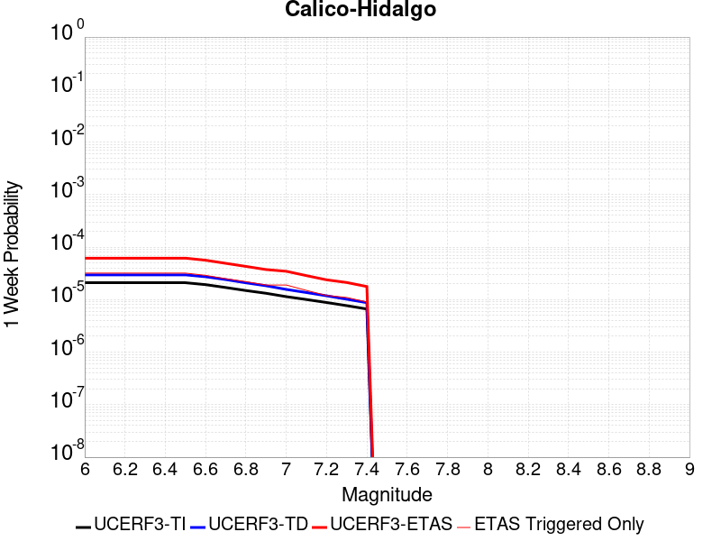 | 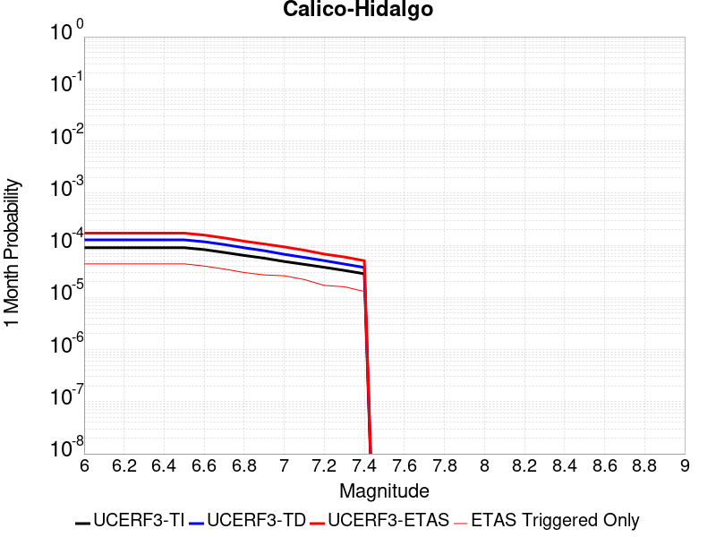 |  |  |

| Magnitude | 1 wk TI Prob | 1 wk TD Prob | 1 wk ETAS Prob | 1 wk ETAS/TD Gain | 1 wk ETAS Triggered Only | 1 mo TI Prob | 1 mo TD Prob | 1 mo ETAS Prob | 1 mo ETAS/TD Gain | 1 mo ETAS Triggered Only | 1 yr TI Prob | 1 yr TD Prob | 1 yr ETAS Prob | 1 yr ETAS/TD Gain | 1 yr ETAS Triggered Only | 10 yr TI Prob | 10 yr TD Prob | 10 yr ETAS Prob | 10 yr ETAS/TD Gain | 10 yr ETAS Triggered Only |
|-----|-----|-----|-----|-----|-----|-----|-----|-----|-----|-----|-----|-----|-----|-----|-----|-----|-----|-----|-----|-----|
| 6.0 | 2.0989894E-5 | 2.9615694E-5 | 6.049299E-5 | 2.042599 | 3.0878207E-5 | 8.995359E-5 | 1.269188E-4 | 1.7014281E-4 | 1.3405643 | 4.322949E-5 | 0.0010946346 | 0.0015442439 | 0.0016120711 | 1.0439225 | 6.793206E-5 | 0.010892583 | 0.015345532 | 0.015430665 | 1.0055476 | 8.645898E-5 |
| 6.1 | 2.0989894E-5 | 2.9615694E-5 | 6.049299E-5 | 2.042599 | 3.0878207E-5 | 8.995359E-5 | 1.269188E-4 | 1.7014281E-4 | 1.3405643 | 4.322949E-5 | 0.0010946346 | 0.0015442439 | 0.0016120711 | 1.0439225 | 6.793206E-5 | 0.010892583 | 0.015345532 | 0.015430665 | 1.0055476 | 8.645898E-5 |
| 6.2 | 2.0989894E-5 | 2.9615694E-5 | 6.049299E-5 | 2.042599 | 3.0878207E-5 | 8.995359E-5 | 1.269188E-4 | 1.7014281E-4 | 1.3405643 | 4.322949E-5 | 0.0010946346 | 0.0015442439 | 0.0016120711 | 1.0439225 | 6.793206E-5 | 0.010892583 | 0.015345532 | 0.015430665 | 1.0055476 | 8.645898E-5 |
| 6.3 | 2.0989894E-5 | 2.9615694E-5 | 6.049299E-5 | 2.042599 | 3.0878207E-5 | 8.995359E-5 | 1.269188E-4 | 1.7014281E-4 | 1.3405643 | 4.322949E-5 | 0.0010946346 | 0.0015442439 | 0.0016120711 | 1.0439225 | 6.793206E-5 | 0.010892583 | 0.015345532 | 0.015430665 | 1.0055476 | 8.645898E-5 |
| 6.4 | 2.0989894E-5 | 2.9615694E-5 | 6.049299E-5 | 2.042599 | 3.0878207E-5 | 8.995359E-5 | 1.269188E-4 | 1.7014281E-4 | 1.3405643 | 4.322949E-5 | 0.0010946346 | 0.0015442439 | 0.0016120711 | 1.0439225 | 6.793206E-5 | 0.010892583 | 0.015345532 | 0.015430665 | 1.0055476 | 8.645898E-5 |
| 6.5 | 2.0989894E-5 | 2.9615694E-5 | 6.049299E-5 | 2.042599 | 3.0878207E-5 | 8.995359E-5 | 1.269188E-4 | 1.7014281E-4 | 1.3405643 | 4.322949E-5 | 0.0010946346 | 0.0015442439 | 0.0016120711 | 1.0439225 | 6.793206E-5 | 0.010892583 | 0.015345532 | 0.015430665 | 1.0055476 | 8.645898E-5 |
| 6.6 | 1.929251E-5 | 2.7260403E-5 | 5.5050034E-5 | 2.0194137 | 2.7790386E-5 | 8.2679566E-5 | 1.1682564E-4 | 1.5387517E-4 | 1.3171352 | 3.7053847E-5 | 0.0010061589 | 0.0014215263 | 0.001483195 | 1.0433819 | 6.1756415E-5 | 0.0100161545 | 0.0141346 | 0.01420766 | 1.0051689 | 7.4107695E-5 |
| 6.7 | 1.699933E-5 | 2.4101535E-5 | 4.571576E-5 | 1.8967986 | 2.1614745E-5 | 7.2852235E-5 | 1.03288774E-4 | 1.341638E-4 | 1.2989194 | 3.0878207E-5 | 8.86615E-4 | 0.0012569166 | 0.0013093435 | 1.0417107 | 5.2492953E-5 | 0.00883086 | 0.012508152 | 0.012569136 | 1.0048755 | 6.1756415E-5 |
| 6.8 | 1.4895645E-5 | 2.0902306E-5 | 3.6341087E-5 | 1.7386162 | 1.5439104E-5 | 6.383692E-5 | 8.9578796E-5 | 1.1427915E-4 | 1.2757388 | 2.4702565E-5 | 7.769373E-4 | 0.001090176 | 0.0011302739 | 1.0367811 | 4.014167E-5 | 0.0077422657 | 0.010858163 | 0.010900923 | 1.0039381 | 4.322949E-5 |
| 6.9 | 1.3209459E-5 | 1.8371871E-5 | 3.381069E-5 | 1.840351 | 1.5439104E-5 | 5.6610737E-5 | 7.8734774E-5 | 1.034354E-4 | 1.3137193 | 2.4702565E-5 | 6.8901776E-4 | 9.5827354E-4 | 9.92207E-4 | 1.035411 | 3.396603E-5 | 0.0068688532 | 0.009551193 | 0.009587893 | 1.0038425 | 3.7053847E-5 |
| 7.0 | 1.1401334E-5 | 1.5655183E-5 | 3.1094045E-5 | 1.9861822 | 1.5439104E-5 | 4.8861944E-5 | 6.709247E-5 | 9.179338E-5 | 1.3681622 | 2.4702565E-5 | 5.9473177E-4 | 8.166432E-4 | 8.5058145E-4 | 1.0415583 | 3.396603E-5 | 0.0059314263 | 0.008146102 | 0.008182854 | 1.0045116 | 3.7053847E-5 |
| 7.1 | 1.0049503E-5 | 1.3644847E-5 | 2.5995962E-5 | 1.9051852 | 1.2351283E-5 | 4.3068587E-5 | 5.847716E-5 | 8.009064E-5 | 1.3696055 | 2.1614745E-5 | 5.2423385E-4 | 7.118249E-4 | 7.395955E-4 | 1.0390133 | 2.7790386E-5 | 0.005229989 | 0.007105075 | 0.007135734 | 1.004315 | 3.0878207E-5 |
| 7.2 | 8.817072E-6 | 1.1833239E-5 | 1.8008808E-5 | 1.5218831 | 6.1756414E-6 | 3.7786904E-5 | 5.0713446E-5 | 6.30641E-5 | 1.2435381 | 1.2351283E-5 | 4.5995842E-4 | 6.1735895E-4 | 6.358744E-4 | 1.0299914 | 1.8526924E-5 | 0.004590076 | 0.006166015 | 0.0061874962 | 1.0034839 | 2.1614745E-5 |
| 7.3 | 7.683954E-6 | 1.0189235E-5 | 1.6364813E-5 | 1.6060885 | 6.1756414E-6 | 3.2930817E-5 | 4.3667966E-5 | 5.601871E-5 | 1.282833 | 1.2351283E-5 | 4.008589E-4 | 5.316249E-4 | 5.5014197E-4 | 1.034831 | 1.8526924E-5 | 0.004001366 | 0.00531305 | 0.00533455 | 1.0040467 | 2.1614745E-5 |
| 7.4 | 6.633441E-6 | 8.756893E-6 | 1.1844687E-5 | 1.352613 | 3.0878207E-6 | 2.8428722E-5 | 3.7529542E-5 | 4.6792655E-5 | 1.246822 | 9.263462E-6 | 3.460647E-4 | 4.5692216E-4 | 4.723542E-4 | 1.0337739 | 1.5439104E-5 | 0.0034552629 | 0.0045692218 | 0.004587664 | 1.0040362 | 1.8526924E-5 |

## Elsinore (Glen Ivy) rev
*[(top)](#table-of-contents)*

| 1 Week | 1 Month | 1 Year | 10 Year |
|-----|-----|-----|-----|
|  |  |  |  |

| Magnitude | 1 wk TI Prob | 1 wk TD Prob | 1 wk ETAS Prob | 1 wk ETAS/TD Gain | 1 wk ETAS Triggered Only | 1 mo TI Prob | 1 mo TD Prob | 1 mo ETAS Prob | 1 mo ETAS/TD Gain | 1 mo ETAS Triggered Only | 1 yr TI Prob | 1 yr TD Prob | 1 yr ETAS Prob | 1 yr ETAS/TD Gain | 1 yr ETAS Triggered Only | 10 yr TI Prob | 10 yr TD Prob | 10 yr ETAS Prob | 10 yr ETAS/TD Gain | 10 yr ETAS Triggered Only |
|-----|-----|-----|-----|-----|-----|-----|-----|-----|-----|-----|-----|-----|-----|-----|-----|-----|-----|-----|-----|-----|
| 6.0 | 5.3687647E-5 | 7.371829E-5 | 9.841904E-5 | 1.3350694 | 2.4702565E-5 | 2.3006962E-4 | 3.1591902E-4 | 3.4678748E-4 | 1.09771 | 3.0878207E-5 | 0.0027974995 | 0.0038433792 | 0.0038956704 | 1.0136055 | 5.2492953E-5 | 0.02762544 | 0.03826734 | 0.038350493 | 1.0021728 | 8.645898E-5 |
| 6.1 | 5.3687647E-5 | 7.371829E-5 | 9.841904E-5 | 1.3350694 | 2.4702565E-5 | 2.3006962E-4 | 3.1591902E-4 | 3.4678748E-4 | 1.09771 | 3.0878207E-5 | 0.0027974995 | 0.0038433792 | 0.0038956704 | 1.0136055 | 5.2492953E-5 | 0.02762544 | 0.03826734 | 0.038350493 | 1.0021728 | 8.645898E-5 |
| 6.2 | 5.3687647E-5 | 7.371829E-5 | 9.841904E-5 | 1.3350694 | 2.4702565E-5 | 2.3006962E-4 | 3.1591902E-4 | 3.4678748E-4 | 1.09771 | 3.0878207E-5 | 0.0027974995 | 0.0038433792 | 0.0038956704 | 1.0136055 | 5.2492953E-5 | 0.02762544 | 0.03826734 | 0.038350493 | 1.0021728 | 8.645898E-5 |
| 6.3 | 5.3687647E-5 | 7.371829E-5 | 9.841904E-5 | 1.3350694 | 2.4702565E-5 | 2.3006962E-4 | 3.1591902E-4 | 3.4678748E-4 | 1.09771 | 3.0878207E-5 | 0.0027974995 | 0.0038433792 | 0.0038956704 | 1.0136055 | 5.2492953E-5 | 0.02762544 | 0.03826734 | 0.038350493 | 1.0021728 | 8.645898E-5 |
| 6.4 | 5.3687647E-5 | 7.371829E-5 | 9.841904E-5 | 1.3350694 | 2.4702565E-5 | 2.3006962E-4 | 3.1591902E-4 | 3.4678748E-4 | 1.09771 | 3.0878207E-5 | 0.0027974995 | 0.0038433792 | 0.0038956704 | 1.0136055 | 5.2492953E-5 | 0.02762544 | 0.03826734 | 0.038350493 | 1.0021728 | 8.645898E-5 |
| 6.5 | 5.3687647E-5 | 7.371829E-5 | 9.841904E-5 | 1.3350694 | 2.4702565E-5 | 2.3006962E-4 | 3.1591902E-4 | 3.4678748E-4 | 1.09771 | 3.0878207E-5 | 0.0027974995 | 0.0038433792 | 0.0038956704 | 1.0136055 | 5.2492953E-5 | 0.02762544 | 0.03826734 | 0.038350493 | 1.0021728 | 8.645898E-5 |
| 6.6 | 5.366434E-5 | 7.368723E-5 | 9.838797E-5 | 1.3352107 | 2.4702565E-5 | 2.2996974E-4 | 3.157859E-4 | 3.4665436E-4 | 1.0977513 | 3.0878207E-5 | 0.0027962867 | 0.0038417643 | 0.0038940555 | 1.0136113 | 5.2492953E-5 | 0.027613612 | 0.03825175 | 0.038334902 | 1.0021738 | 8.645898E-5 |
| 6.7 | 5.3605272E-5 | 7.360545E-5 | 9.83062E-5 | 1.3355831 | 2.4702565E-5 | 2.2971665E-4 | 3.1543552E-4 | 3.4630398E-4 | 1.0978599 | 3.0878207E-5 | 0.0027932131 | 0.0038375156 | 0.003889807 | 1.0136263 | 5.2492953E-5 | 0.027583642 | 0.038210876 | 0.038294032 | 1.0021762 | 8.645898E-5 |
| 6.8 | 5.3532647E-5 | 7.3514246E-5 | 9.8214994E-5 | 1.3359995 | 2.4702565E-5 | 2.2940546E-4 | 3.1504474E-4 | 3.4591323E-4 | 1.0979812 | 3.0878207E-5 | 0.002789434 | 0.0038327747 | 0.0038850664 | 1.0136433 | 5.2492953E-5 | 0.02754679 | 0.038164973 | 0.038248133 | 1.0021789 | 8.645898E-5 |
| 6.9 | 1.7045348E-5 | 1.8678082E-5 | 2.794137E-5 | 1.4959444 | 9.263462E-6 | 7.304944E-5 | 8.004709E-5 | 8.9309804E-5 | 1.1157159 | 9.263462E-6 | 8.8901405E-4 | 9.74247E-4 | 9.865862E-4 | 1.0126654 | 1.2351283E-5 | 0.008854659 | 0.009768393 | 0.009786739 | 1.0018781 | 1.8526924E-5 |
| 7.0 | 1.6940774E-5 | 1.8528288E-5 | 2.7791579E-5 | 1.4999539 | 9.263462E-6 | 7.2601295E-5 | 7.940515E-5 | 8.8667875E-5 | 1.1166514 | 9.263462E-6 | 8.835623E-4 | 9.6643844E-4 | 9.787778E-4 | 1.0127679 | 1.2351283E-5 | 0.0088005755 | 0.00969088 | 0.009709227 | 1.0018933 | 1.8526924E-5 |
| 7.1 | 1.6789645E-5 | 1.8323519E-5 | 2.7586811E-5 | 1.5055411 | 9.263462E-6 | 7.195364E-5 | 7.852762E-5 | 8.779036E-5 | 1.1179551 | 9.263462E-6 | 8.7568344E-4 | 9.55764E-4 | 9.681034E-4 | 1.0129106 | 1.2351283E-5 | 0.008722408 | 0.009584869 | 0.009603219 | 1.0019144 | 1.8526924E-5 |
| 7.2 | 1.5933345E-5 | 1.7110096E-5 | 2.63734E-5 | 1.541394 | 9.263462E-6 | 6.828398E-5 | 7.332754E-5 | 8.259032E-5 | 1.1263207 | 9.263462E-6 | 8.310403E-4 | 8.925052E-4 | 9.048455E-4 | 1.0138265 | 1.2351283E-5 | 0.008279393 | 0.0089570135 | 0.0089753745 | 1.0020499 | 1.8526924E-5 |
| 7.3 | 7.1186646E-6 | 8.762552E-6 | 8.762552E-6 | 1.0 | 0.0 | 3.0508205E-5 | 3.7553385E-5 | 3.7553385E-5 | 1.0 | 0.0 | 3.713741E-4 | 4.5714018E-4 | 4.6022658E-4 | 1.0067515 | 3.0878207E-6 | 0.0037075407 | 0.004571716 | 0.0045747897 | 1.0006723 | 3.0878207E-6 |
| 7.4 | 6.937813E-6 | 8.529489E-6 | 8.529489E-6 | 1.0 | 0.0 | 2.9733144E-5 | 3.6554575E-5 | 3.6554575E-5 | 1.0 | 0.0 | 3.619409E-4 | 4.4498467E-4 | 4.4807114E-4 | 1.0069361 | 3.0878207E-6 | 0.0036135197 | 0.0044503105 | 0.0044533843 | 1.0006907 | 3.0878207E-6 |
| 7.5 | 6.22113E-6 | 7.646963E-6 | 7.646963E-6 | 1.0 | 0.0 | 2.6661715E-5 | 3.277242E-5 | 3.277242E-5 | 1.0 | 0.0 | 3.2455803E-4 | 3.989543E-4 | 4.020409E-4 | 1.0077367 | 3.0878207E-6 | 0.003240844 | 0.0039905123 | 0.0039935876 | 1.0007707 | 3.0878207E-6 |
| 7.6 | 5.9726967E-6 | 7.281061E-6 | 7.281061E-6 | 1.0 | 0.0 | 2.559702E-5 | 3.1204305E-5 | 3.1204305E-5 | 1.0 | 0.0 | 3.1159917E-4 | 3.798693E-4 | 3.8295594E-4 | 1.0081255 | 3.0878207E-6 | 0.003111626 | 0.0038002636 | 0.0038033398 | 1.0008094 | 3.0878207E-6 |
| 7.7 | 4.463199E-6 | 5.214875E-6 | 5.214875E-6 | 1.0 | 0.0 | 1.9127854E-5 | 2.2349386E-5 | 2.2349386E-5 | 1.0 | 0.0 | 2.3285674E-4 | 2.7209E-4 | 2.7517698E-4 | 1.0113454 | 3.0878207E-6 | 0.0023261288 | 0.0027239968 | 0.0027270762 | 1.0011305 | 3.0878207E-6 |
| 7.8 | 2.1601753E-7 | 2.7489222E-7 | 2.7489222E-7 | 1.0 | 0.0 | 9.257891E-7 | 1.1781094E-6 | 1.1781094E-6 | 1.0 | 0.0 | 1.1271423E-5 | 1.4343483E-5 | 1.4343483E-5 | 1.0 | 0.0 | 1.1270852E-4 | 1.435847E-4 | 1.435847E-4 | 1.0 | 0.0 |

## Los Alamos 2011 CFM
*[(top)](#table-of-contents)*

| 1 Week | 1 Month | 1 Year | 10 Year |
|-----|-----|-----|-----|
|  |  |  |  |

| Magnitude | 1 wk TI Prob | 1 wk TD Prob | 1 wk ETAS Prob | 1 wk ETAS/TD Gain | 1 wk ETAS Triggered Only | 1 mo TI Prob | 1 mo TD Prob | 1 mo ETAS Prob | 1 mo ETAS/TD Gain | 1 mo ETAS Triggered Only | 1 yr TI Prob | 1 yr TD Prob | 1 yr ETAS Prob | 1 yr ETAS/TD Gain | 1 yr ETAS Triggered Only | 10 yr TI Prob | 10 yr TD Prob | 10 yr ETAS Prob | 10 yr ETAS/TD Gain | 10 yr ETAS Triggered Only |
|-----|-----|-----|-----|-----|-----|-----|-----|-----|-----|-----|-----|-----|-----|-----|-----|-----|-----|-----|-----|-----|
| 6.0 | 1.3678262E-5 | 1.5031193E-5 | 3.9733386E-5 | 2.6433954 | 2.4702565E-5 | 5.8619804E-5 | 6.441852E-5 | 9.529474E-5 | 1.4793066 | 3.0878207E-5 | 7.134624E-4 | 7.841395E-4 | 8.365913E-4 | 1.0668908 | 5.2492953E-5 | 0.0071117613 | 0.007826112 | 0.007905767 | 1.0101781 | 8.028334E-5 |
| 6.1 | 1.3678262E-5 | 1.5031193E-5 | 3.9733386E-5 | 2.6433954 | 2.4702565E-5 | 5.8619804E-5 | 6.441852E-5 | 9.529474E-5 | 1.4793066 | 3.0878207E-5 | 7.134624E-4 | 7.841395E-4 | 8.365913E-4 | 1.0668908 | 5.2492953E-5 | 0.0071117613 | 0.007826112 | 0.007905767 | 1.0101781 | 8.028334E-5 |
| 6.2 | 1.3678262E-5 | 1.5031193E-5 | 3.9733386E-5 | 2.6433954 | 2.4702565E-5 | 5.8619804E-5 | 6.441852E-5 | 9.529474E-5 | 1.4793066 | 3.0878207E-5 | 7.134624E-4 | 7.841395E-4 | 8.365913E-4 | 1.0668908 | 5.2492953E-5 | 0.0071117613 | 0.007826112 | 0.007905767 | 1.0101781 | 8.028334E-5 |
| 6.3 | 1.3678262E-5 | 1.5031193E-5 | 3.9733386E-5 | 2.6433954 | 2.4702565E-5 | 5.8619804E-5 | 6.441852E-5 | 9.529474E-5 | 1.4793066 | 3.0878207E-5 | 7.134624E-4 | 7.841395E-4 | 8.365913E-4 | 1.0668908 | 5.2492953E-5 | 0.0071117613 | 0.007826112 | 0.007905767 | 1.0101781 | 8.028334E-5 |
| 6.4 | 1.3678262E-5 | 1.5031193E-5 | 3.9733386E-5 | 2.6433954 | 2.4702565E-5 | 5.8619804E-5 | 6.441852E-5 | 9.529474E-5 | 1.4793066 | 3.0878207E-5 | 7.134624E-4 | 7.841395E-4 | 8.365913E-4 | 1.0668908 | 5.2492953E-5 | 0.0071117613 | 0.007826112 | 0.007905767 | 1.0101781 | 8.028334E-5 |
| 6.5 | 1.3678262E-5 | 1.5031193E-5 | 3.9733386E-5 | 2.6433954 | 2.4702565E-5 | 5.8619804E-5 | 6.441852E-5 | 9.529474E-5 | 1.4793066 | 3.0878207E-5 | 7.134624E-4 | 7.841395E-4 | 8.365913E-4 | 1.0668908 | 5.2492953E-5 | 0.0071117613 | 0.007826112 | 0.007905767 | 1.0101781 | 8.028334E-5 |
| 6.6 | 1.3678262E-5 | 1.5031193E-5 | 3.9733386E-5 | 2.6433954 | 2.4702565E-5 | 5.8619804E-5 | 6.441852E-5 | 9.529474E-5 | 1.4793066 | 3.0878207E-5 | 7.134624E-4 | 7.841395E-4 | 8.365913E-4 | 1.0668908 | 5.2492953E-5 | 0.0071117613 | 0.007826112 | 0.007905767 | 1.0101781 | 8.028334E-5 |
| 6.7 | 8.282411E-6 | 9.085969E-6 | 2.4524932E-5 | 2.6992092 | 1.5439104E-5 | 3.5495563E-5 | 3.893987E-5 | 5.7466073E-5 | 1.4757644 | 1.8526924E-5 | 4.3207276E-4 | 4.740929E-4 | 5.111292E-4 | 1.0781204 | 3.7053847E-5 | 0.0043123364 | 0.004740929 | 0.004793173 | 1.0110198 | 5.2492953E-5 |
| 6.8 | 8.282411E-6 | 9.085969E-6 | 2.4524932E-5 | 2.6992092 | 1.5439104E-5 | 3.5495563E-5 | 3.893987E-5 | 5.7466073E-5 | 1.4757644 | 1.8526924E-5 | 4.3207276E-4 | 4.740929E-4 | 5.111292E-4 | 1.0781204 | 3.7053847E-5 | 0.0043123364 | 0.004740929 | 0.004793173 | 1.0110198 | 5.2492953E-5 |

## Whittier alt 1
*[(top)](#table-of-contents)*

| 1 Week | 1 Month | 1 Year | 10 Year |
|-----|-----|-----|-----|
|  |  |  |  |

| Magnitude | 1 wk TI Prob | 1 wk TD Prob | 1 wk ETAS Prob | 1 wk ETAS/TD Gain | 1 wk ETAS Triggered Only | 1 mo TI Prob | 1 mo TD Prob | 1 mo ETAS Prob | 1 mo ETAS/TD Gain | 1 mo ETAS Triggered Only | 1 yr TI Prob | 1 yr TD Prob | 1 yr ETAS Prob | 1 yr ETAS/TD Gain | 1 yr ETAS Triggered Only | 10 yr TI Prob | 10 yr TD Prob | 10 yr ETAS Prob | 10 yr ETAS/TD Gain | 10 yr ETAS Triggered Only |
|-----|-----|-----|-----|-----|-----|-----|-----|-----|-----|-----|-----|-----|-----|-----|-----|-----|-----|-----|-----|-----|
| 6.0 | 1.9677844E-5 | 3.0721494E-5 | 5.2335574E-5 | 1.7035491 | 2.1614745E-5 | 8.4330895E-5 | 1.3166165E-4 | 1.5944838E-4 | 1.2110465 | 2.7790386E-5 | 0.001026245 | 0.0016026449 | 0.0016612195 | 1.0365487 | 5.8668593E-5 | 0.010215186 | 0.015995702 | 0.016074702 | 1.0049387 | 8.028334E-5 |
| 6.1 | 1.9677844E-5 | 3.0721494E-5 | 5.2335574E-5 | 1.7035491 | 2.1614745E-5 | 8.4330895E-5 | 1.3166165E-4 | 1.5944838E-4 | 1.2110465 | 2.7790386E-5 | 0.001026245 | 0.0016026449 | 0.0016612195 | 1.0365487 | 5.8668593E-5 | 0.010215186 | 0.015995702 | 0.016074702 | 1.0049387 | 8.028334E-5 |
| 6.2 | 1.9677844E-5 | 3.0721494E-5 | 5.2335574E-5 | 1.7035491 | 2.1614745E-5 | 8.4330895E-5 | 1.3166165E-4 | 1.5944838E-4 | 1.2110465 | 2.7790386E-5 | 0.001026245 | 0.0016026449 | 0.0016612195 | 1.0365487 | 5.8668593E-5 | 0.010215186 | 0.015995702 | 0.016074702 | 1.0049387 | 8.028334E-5 |
| 6.3 | 1.9677844E-5 | 3.0721494E-5 | 5.2335574E-5 | 1.7035491 | 2.1614745E-5 | 8.4330895E-5 | 1.3166165E-4 | 1.5944838E-4 | 1.2110465 | 2.7790386E-5 | 0.001026245 | 0.0016026449 | 0.0016612195 | 1.0365487 | 5.8668593E-5 | 0.010215186 | 0.015995702 | 0.016074702 | 1.0049387 | 8.028334E-5 |
| 6.4 | 1.9677844E-5 | 3.0721494E-5 | 5.2335574E-5 | 1.7035491 | 2.1614745E-5 | 8.4330895E-5 | 1.3166165E-4 | 1.5944838E-4 | 1.2110465 | 2.7790386E-5 | 0.001026245 | 0.0016026449 | 0.0016612195 | 1.0365487 | 5.8668593E-5 | 0.010215186 | 0.015995702 | 0.016074702 | 1.0049387 | 8.028334E-5 |
| 6.5 | 1.9677844E-5 | 3.0721494E-5 | 5.2335574E-5 | 1.7035491 | 2.1614745E-5 | 8.4330895E-5 | 1.3166165E-4 | 1.5944838E-4 | 1.2110465 | 2.7790386E-5 | 0.001026245 | 0.0016026449 | 0.0016612195 | 1.0365487 | 5.8668593E-5 | 0.010215186 | 0.015995702 | 0.016074702 | 1.0049387 | 8.028334E-5 |
| 6.6 | 1.9631225E-5 | 3.06427E-5 | 5.225678E-5 | 1.7053584 | 2.1614745E-5 | 8.413111E-5 | 1.3132399E-4 | 1.5911073E-4 | 1.2115892 | 2.7790386E-5 | 0.0010238149 | 0.00159854 | 0.0016571147 | 1.0366427 | 5.8668593E-5 | 0.010191108 | 0.015955312 | 0.016034316 | 1.0049515 | 8.028334E-5 |
| 6.7 | 1.9536663E-5 | 3.0504027E-5 | 5.2118114E-5 | 1.708565 | 2.1614745E-5 | 8.372587E-5 | 1.3072975E-4 | 1.585165E-4 | 1.2125511 | 2.7790386E-5 | 0.0010188858 | 0.0015913156 | 0.0016498909 | 1.0368093 | 5.8668593E-5 | 0.010142268 | 0.015884183 | 0.015963191 | 1.004974 | 8.028334E-5 |
| 6.8 | 1.9439643E-5 | 3.0352345E-5 | 5.196643E-5 | 1.7121061 | 2.1614745E-5 | 8.331009E-5 | 1.3007974E-4 | 1.5786651E-4 | 1.2136134 | 2.7790386E-5 | 0.0010138283 | 0.0015834133 | 0.0016419891 | 1.0369933 | 5.8668593E-5 | 0.010092155 | 0.015806418 | 0.015885433 | 1.0049989 | 8.028334E-5 |
| 6.9 | 1.9363486E-5 | 3.025448E-5 | 5.186857E-5 | 1.7144096 | 2.1614745E-5 | 8.298373E-5 | 1.2966036E-4 | 1.5744714E-4 | 1.2143043 | 2.7790386E-5 | 0.0010098586 | 0.0015783148 | 0.0016368908 | 1.037113 | 5.8668593E-5 | 0.010052818 | 0.0157561 | 0.01583512 | 1.0050151 | 8.028334E-5 |
| 7.0 | 3.152724E-6 | 4.1925437E-6 | 4.1925437E-6 | 1.0 | 0.0 | 1.3511604E-5 | 1.7967934E-5 | 1.7967934E-5 | 1.0 | 0.0 | 1.6449137E-4 | 2.1873988E-4 | 2.2182702E-4 | 1.0141133 | 3.0878207E-6 | 0.0016436966 | 0.0021877585 | 0.0021908397 | 1.0014083 | 3.0878207E-6 |
| 7.1 | 3.0699127E-6 | 4.0761943E-6 | 4.0761943E-6 | 1.0 | 0.0 | 1.3156702E-5 | 1.74693E-5 | 1.74693E-5 | 1.0 | 0.0 | 1.6017107E-4 | 2.1267022E-4 | 2.1575738E-4 | 1.0145162 | 3.0878207E-6 | 0.0016005568 | 0.0021271154 | 0.0021301967 | 1.0014485 | 3.0878207E-6 |
| 7.2 | 2.2585555E-6 | 2.9159935E-6 | 2.9159935E-6 | 1.0 | 0.0 | 9.679487E-6 | 1.249706E-5 | 1.249706E-5 | 1.0 | 0.0 | 1.1784139E-4 | 1.5214195E-4 | 1.552293E-4 | 1.0202925 | 3.0878207E-6 | 0.0011777892 | 0.0015224252 | 0.0015255084 | 1.0020251 | 3.0878207E-6 |
| 7.3 | 2.1766068E-6 | 2.8138447E-6 | 2.8138447E-6 | 1.0 | 0.0 | 9.3282815E-6 | 1.2059283E-5 | 1.2059283E-5 | 1.0 | 0.0 | 1.13565904E-4 | 1.4681274E-4 | 1.4990011E-4 | 1.0210292 | 3.0878207E-6 | 0.0011350788 | 0.0014690856 | 0.001472169 | 1.0020988 | 3.0878207E-6 |
| 7.4 | 2.0680952E-6 | 2.676193E-6 | 2.676193E-6 | 1.0 | 0.0 | 8.863235E-6 | 1.1469352E-5 | 1.1469352E-5 | 1.0 | 0.0 | 1.0790454E-4 | 1.3963127E-4 | 1.4271867E-4 | 1.022111 | 3.0878207E-6 | 0.0010785216 | 0.0013971858 | 0.0014002693 | 1.0022069 | 3.0878207E-6 |
| 7.5 | 1.4388213E-6 | 1.9265901E-6 | 1.9265901E-6 | 1.0 | 0.0 | 6.1663623E-6 | 8.256791E-6 | 8.256791E-6 | 1.0 | 0.0 | 7.507287E-5 | 1.0052218E-4 | 1.0360969E-4 | 1.0307148 | 3.0878207E-6 | 7.504752E-4 | 0.0010053911 | 0.0010084759 | 1.0030682 | 3.0878207E-6 |
| 7.6 | 1.2179905E-6 | 1.5985206E-6 | 1.5985206E-6 | 1.0 | 0.0 | 5.219949E-6 | 6.850787E-6 | 6.850787E-6 | 1.0 | 0.0 | 6.355102E-5 | 8.3405495E-5 | 8.649306E-5 | 1.0370187 | 3.0878207E-6 | 6.353285E-4 | 8.343059E-4 | 8.373911E-4 | 1.003698 | 3.0878207E-6 |
| 7.7 | 9.55754E-7 | 1.2252901E-6 | 1.2252901E-6 | 1.0 | 0.0 | 4.096082E-6 | 5.251235E-6 | 5.251235E-6 | 1.0 | 0.0 | 4.9868657E-5 | 6.393224E-5 | 6.7019864E-5 | 1.0482953 | 3.0878207E-6 | 4.985747E-4 | 6.396533E-4 | 6.427391E-4 | 1.0048243 | 3.0878207E-6 |
| 7.8 | 2.1601753E-7 | 2.7489222E-7 | 2.7489222E-7 | 1.0 | 0.0 | 9.257891E-7 | 1.1781094E-6 | 1.1781094E-6 | 1.0 | 0.0 | 1.1271423E-5 | 1.4343483E-5 | 1.4343483E-5 | 1.0 | 0.0 | 1.1270852E-4 | 1.435847E-4 | 1.435847E-4 | 1.0 | 0.0 |

## Santa Cruz Island
*[(top)](#table-of-contents)*

| 1 Week | 1 Month | 1 Year | 10 Year |
|-----|-----|-----|-----|
|  |  |  |  |

| Magnitude | 1 wk TI Prob | 1 wk TD Prob | 1 wk ETAS Prob | 1 wk ETAS/TD Gain | 1 wk ETAS Triggered Only | 1 mo TI Prob | 1 mo TD Prob | 1 mo ETAS Prob | 1 mo ETAS/TD Gain | 1 mo ETAS Triggered Only | 1 yr TI Prob | 1 yr TD Prob | 1 yr ETAS Prob | 1 yr ETAS/TD Gain | 1 yr ETAS Triggered Only | 10 yr TI Prob | 10 yr TD Prob | 10 yr ETAS Prob | 10 yr ETAS/TD Gain | 10 yr ETAS Triggered Only |
|-----|-----|-----|-----|-----|-----|-----|-----|-----|-----|-----|-----|-----|-----|-----|-----|-----|-----|-----|-----|-----|
| 6.0 | 1.4571279E-5 | 1.590773E-5 | 2.5171044E-5 | 1.5823153 | 9.263462E-6 | 6.2446845E-5 | 6.817458E-5 | 8.6700245E-5 | 1.2717385 | 1.8526924E-5 | 7.600251E-4 | 8.2977675E-4 | 8.637146E-4 | 1.0409 | 3.396603E-5 | 0.00757431 | 0.008273421 | 0.008349977 | 1.0092534 | 7.719552E-5 |
| 6.1 | 1.4571279E-5 | 1.590773E-5 | 2.5171044E-5 | 1.5823153 | 9.263462E-6 | 6.2446845E-5 | 6.817458E-5 | 8.6700245E-5 | 1.2717385 | 1.8526924E-5 | 7.600251E-4 | 8.2977675E-4 | 8.637146E-4 | 1.0409 | 3.396603E-5 | 0.00757431 | 0.008273421 | 0.008349977 | 1.0092534 | 7.719552E-5 |
| 6.2 | 1.4571279E-5 | 1.590773E-5 | 2.5171044E-5 | 1.5823153 | 9.263462E-6 | 6.2446845E-5 | 6.817458E-5 | 8.6700245E-5 | 1.2717385 | 1.8526924E-5 | 7.600251E-4 | 8.2977675E-4 | 8.637146E-4 | 1.0409 | 3.396603E-5 | 0.00757431 | 0.008273421 | 0.008349977 | 1.0092534 | 7.719552E-5 |
| 6.3 | 1.4571279E-5 | 1.590773E-5 | 2.5171044E-5 | 1.5823153 | 9.263462E-6 | 6.2446845E-5 | 6.817458E-5 | 8.6700245E-5 | 1.2717385 | 1.8526924E-5 | 7.600251E-4 | 8.2977675E-4 | 8.637146E-4 | 1.0409 | 3.396603E-5 | 0.00757431 | 0.008273421 | 0.008349977 | 1.0092534 | 7.719552E-5 |
| 6.4 | 1.4571279E-5 | 1.590773E-5 | 2.5171044E-5 | 1.5823153 | 9.263462E-6 | 6.2446845E-5 | 6.817458E-5 | 8.6700245E-5 | 1.2717385 | 1.8526924E-5 | 7.600251E-4 | 8.2977675E-4 | 8.637146E-4 | 1.0409 | 3.396603E-5 | 0.00757431 | 0.008273421 | 0.008349977 | 1.0092534 | 7.719552E-5 |
| 6.5 | 1.4571279E-5 | 1.590773E-5 | 2.5171044E-5 | 1.5823153 | 9.263462E-6 | 6.2446845E-5 | 6.817458E-5 | 8.6700245E-5 | 1.2717385 | 1.8526924E-5 | 7.600251E-4 | 8.2977675E-4 | 8.637146E-4 | 1.0409 | 3.396603E-5 | 0.00757431 | 0.008273421 | 0.008349977 | 1.0092534 | 7.719552E-5 |
| 6.6 | 1.2903651E-5 | 1.4078563E-5 | 2.3341894E-5 | 1.6579742 | 9.263462E-6 | 5.530019E-5 | 6.033568E-5 | 7.8861485E-5 | 1.3070456 | 1.8526924E-5 | 6.730718E-4 | 7.344058E-4 | 7.6526136E-4 | 1.0420142 | 3.0878207E-5 | 0.006710368 | 0.0073263342 | 0.007396834 | 1.0096228 | 7.101987E-5 |
| 6.7 | 1.1244336E-5 | 1.2259967E-5 | 2.1523316E-5 | 1.755577 | 9.263462E-6 | 4.8189122E-5 | 5.2542026E-5 | 7.1067974E-5 | 1.352593 | 1.8526924E-5 | 5.8654463E-4 | 6.395773E-4 | 6.704358E-4 | 1.0482482 | 3.0878207E-5 | 0.0058499887 | 0.0063838377 | 0.0064451997 | 1.0096121 | 6.1756415E-5 |
| 6.8 | 9.568355E-6 | 1.0419911E-5 | 1.9683275E-5 | 1.8890063 | 9.263462E-6 | 4.100659E-5 | 4.465636E-5 | 6.0094775E-5 | 1.3457159 | 1.5439104E-5 | 4.991409E-4 | 5.4362084E-4 | 5.6522386E-4 | 1.0397391 | 2.1614745E-5 | 0.0049802125 | 0.0054293126 | 0.0054692365 | 1.0073534 | 4.014167E-5 |
| 6.9 | 8.213362E-6 | 8.934158E-6 | 1.8197537E-5 | 2.0368497 | 9.263462E-6 | 3.5199646E-5 | 3.8289054E-5 | 5.3727566E-5 | 1.4032096 | 1.5439104E-5 | 4.2847142E-4 | 4.6613417E-4 | 4.8773884E-4 | 1.0463486 | 2.1614745E-5 | 0.0042764624 | 0.0046579046 | 0.0046978593 | 1.0085778 | 4.014167E-5 |
| 7.0 | 6.972259E-6 | 7.5758644E-6 | 1.3751459E-5 | 1.8151671 | 6.1756414E-6 | 2.9880768E-5 | 3.2467946E-5 | 3.8643386E-5 | 1.1902012 | 6.1756414E-6 | 3.637376E-4 | 3.9528962E-4 | 4.0763602E-4 | 1.0312338 | 1.2351283E-5 | 0.0036314281 | 0.003952149 | 0.0039829053 | 1.0077821 | 3.0878207E-5 |
| 7.1 | 6.5867994E-6 | 7.155847E-6 | 1.3331444E-5 | 1.8630141 | 6.1756414E-6 | 2.8228835E-5 | 3.0667914E-5 | 3.684337E-5 | 1.2013652 | 6.1756414E-6 | 3.4363187E-4 | 3.7338186E-4 | 3.8572855E-4 | 1.0330671 | 1.2351283E-5 | 0.0034310098 | 0.0037338187 | 0.0037645816 | 1.008239 | 3.0878207E-5 |

## San Jose
*[(top)](#table-of-contents)*

| 1 Week | 1 Month | 1 Year | 10 Year |
|-----|-----|-----|-----|
|  |  |  |  |

| Magnitude | 1 wk TI Prob | 1 wk TD Prob | 1 wk ETAS Prob | 1 wk ETAS/TD Gain | 1 wk ETAS Triggered Only | 1 mo TI Prob | 1 mo TD Prob | 1 mo ETAS Prob | 1 mo ETAS/TD Gain | 1 mo ETAS Triggered Only | 1 yr TI Prob | 1 yr TD Prob | 1 yr ETAS Prob | 1 yr ETAS/TD Gain | 1 yr ETAS Triggered Only | 10 yr TI Prob | 10 yr TD Prob | 10 yr ETAS Prob | 10 yr ETAS/TD Gain | 10 yr ETAS Triggered Only |
|-----|-----|-----|-----|-----|-----|-----|-----|-----|-----|-----|-----|-----|-----|-----|-----|-----|-----|-----|-----|-----|
| 6.0 | 9.706857E-6 | 1.0473486E-5 | 2.2824639E-5 | 2.1792781 | 1.2351283E-5 | 4.160015E-5 | 4.488637E-5 | 6.032478E-5 | 1.3439443 | 1.5439104E-5 | 5.063641E-4 | 5.4649153E-4 | 5.9278356E-4 | 1.0847076 | 4.631731E-5 | 0.0050521186 | 0.0054649157 | 0.005541689 | 1.0140485 | 7.719552E-5 |
| 6.1 | 9.706857E-6 | 1.0473486E-5 | 2.2824639E-5 | 2.1792781 | 1.2351283E-5 | 4.160015E-5 | 4.488637E-5 | 6.032478E-5 | 1.3439443 | 1.5439104E-5 | 5.063641E-4 | 5.4649153E-4 | 5.9278356E-4 | 1.0847076 | 4.631731E-5 | 0.0050521186 | 0.0054649157 | 0.005541689 | 1.0140485 | 7.719552E-5 |
| 6.2 | 9.706857E-6 | 1.0473486E-5 | 2.2824639E-5 | 2.1792781 | 1.2351283E-5 | 4.160015E-5 | 4.488637E-5 | 6.032478E-5 | 1.3439443 | 1.5439104E-5 | 5.063641E-4 | 5.4649153E-4 | 5.9278356E-4 | 1.0847076 | 4.631731E-5 | 0.0050521186 | 0.0054649157 | 0.005541689 | 1.0140485 | 7.719552E-5 |
| 6.3 | 9.706857E-6 | 1.0473486E-5 | 2.2824639E-5 | 2.1792781 | 1.2351283E-5 | 4.160015E-5 | 4.488637E-5 | 6.032478E-5 | 1.3439443 | 1.5439104E-5 | 5.063641E-4 | 5.4649153E-4 | 5.9278356E-4 | 1.0847076 | 4.631731E-5 | 0.0050521186 | 0.0054649157 | 0.005541689 | 1.0140485 | 7.719552E-5 |
| 6.4 | 9.706857E-6 | 1.0473486E-5 | 2.2824639E-5 | 2.1792781 | 1.2351283E-5 | 4.160015E-5 | 4.488637E-5 | 6.032478E-5 | 1.3439443 | 1.5439104E-5 | 5.063641E-4 | 5.4649153E-4 | 5.9278356E-4 | 1.0847076 | 4.631731E-5 | 0.0050521186 | 0.0054649157 | 0.005541689 | 1.0140485 | 7.719552E-5 |
| 6.5 | 9.706857E-6 | 1.0473486E-5 | 2.2824639E-5 | 2.1792781 | 1.2351283E-5 | 4.160015E-5 | 4.488637E-5 | 6.032478E-5 | 1.3439443 | 1.5439104E-5 | 5.063641E-4 | 5.4649153E-4 | 5.9278356E-4 | 1.0847076 | 4.631731E-5 | 0.0050521186 | 0.0054649157 | 0.005541689 | 1.0140485 | 7.719552E-5 |

## Verdugo
*[(top)](#table-of-contents)*

| 1 Week | 1 Month | 1 Year | 10 Year |
|-----|-----|-----|-----|
|  |  |  |  |

| Magnitude | 1 wk TI Prob | 1 wk TD Prob | 1 wk ETAS Prob | 1 wk ETAS/TD Gain | 1 wk ETAS Triggered Only | 1 mo TI Prob | 1 mo TD Prob | 1 mo ETAS Prob | 1 mo ETAS/TD Gain | 1 mo ETAS Triggered Only | 1 yr TI Prob | 1 yr TD Prob | 1 yr ETAS Prob | 1 yr ETAS/TD Gain | 1 yr ETAS Triggered Only | 10 yr TI Prob | 10 yr TD Prob | 10 yr ETAS Prob | 10 yr ETAS/TD Gain | 10 yr ETAS Triggered Only |
|-----|-----|-----|-----|-----|-----|-----|-----|-----|-----|-----|-----|-----|-----|-----|-----|-----|-----|-----|-----|-----|
| 6.0 | 9.032242E-6 | 9.607573E-6 | 3.122211E-5 | 3.2497396 | 2.1614745E-5 | 3.8709033E-5 | 4.1174942E-5 | 7.205188E-5 | 1.7498963 | 3.0878207E-5 | 4.7118057E-4 | 5.0123956E-4 | 5.567925E-4 | 1.110831 | 5.558077E-5 | 0.0047018277 | 0.0050059874 | 0.005079724 | 1.0147297 | 7.4107695E-5 |
| 6.1 | 9.032242E-6 | 9.607573E-6 | 3.122211E-5 | 3.2497396 | 2.1614745E-5 | 3.8709033E-5 | 4.1174942E-5 | 7.205188E-5 | 1.7498963 | 3.0878207E-5 | 4.7118057E-4 | 5.0123956E-4 | 5.567925E-4 | 1.110831 | 5.558077E-5 | 0.0047018277 | 0.0050059874 | 0.005079724 | 1.0147297 | 7.4107695E-5 |
| 6.2 | 9.032242E-6 | 9.607573E-6 | 3.122211E-5 | 3.2497396 | 2.1614745E-5 | 3.8709033E-5 | 4.1174942E-5 | 7.205188E-5 | 1.7498963 | 3.0878207E-5 | 4.7118057E-4 | 5.0123956E-4 | 5.567925E-4 | 1.110831 | 5.558077E-5 | 0.0047018277 | 0.0050059874 | 0.005079724 | 1.0147297 | 7.4107695E-5 |
| 6.3 | 9.032242E-6 | 9.607573E-6 | 3.122211E-5 | 3.2497396 | 2.1614745E-5 | 3.8709033E-5 | 4.1174942E-5 | 7.205188E-5 | 1.7498963 | 3.0878207E-5 | 4.7118057E-4 | 5.0123956E-4 | 5.567925E-4 | 1.110831 | 5.558077E-5 | 0.0047018277 | 0.0050059874 | 0.005079724 | 1.0147297 | 7.4107695E-5 |
| 6.4 | 9.032242E-6 | 9.607573E-6 | 3.122211E-5 | 3.2497396 | 2.1614745E-5 | 3.8709033E-5 | 4.1174942E-5 | 7.205188E-5 | 1.7498963 | 3.0878207E-5 | 4.7118057E-4 | 5.0123956E-4 | 5.567925E-4 | 1.110831 | 5.558077E-5 | 0.0047018277 | 0.0050059874 | 0.005079724 | 1.0147297 | 7.4107695E-5 |
| 6.5 | 9.032242E-6 | 9.607573E-6 | 3.122211E-5 | 3.2497396 | 2.1614745E-5 | 3.8709033E-5 | 4.1174942E-5 | 7.205188E-5 | 1.7498963 | 3.0878207E-5 | 4.7118057E-4 | 5.0123956E-4 | 5.567925E-4 | 1.110831 | 5.558077E-5 | 0.0047018277 | 0.0050059874 | 0.005079724 | 1.0147297 | 7.4107695E-5 |
| 6.6 | 7.857296E-6 | 8.353911E-6 | 2.9968474E-5 | 3.587359 | 2.1614745E-5 | 3.367369E-5 | 3.580226E-5 | 6.359165E-5 | 1.776191 | 2.7790386E-5 | 4.0990004E-4 | 4.3585425E-4 | 4.8523786E-4 | 1.1133031 | 4.940513E-5 | 0.0040914477 | 0.004354794 | 0.00442243 | 1.0155314 | 6.793206E-5 |
| 6.7 | 5.667953E-6 | 6.022347E-6 | 1.8373556E-5 | 3.0508962 | 1.2351283E-5 | 2.4291001E-5 | 2.5810059E-5 | 4.1248764E-5 | 1.5981662 | 1.5439104E-5 | 2.957028E-4 | 3.1423746E-4 | 3.3584543E-4 | 1.0687631 | 2.1614745E-5 | 0.0029530963 | 0.0031423746 | 0.003176234 | 1.0107751 | 3.396603E-5 |
| 6.8 | 5.667953E-6 | 6.022347E-6 | 1.8373556E-5 | 3.0508962 | 1.2351283E-5 | 2.4291001E-5 | 2.5810059E-5 | 4.1248764E-5 | 1.5981662 | 1.5439104E-5 | 2.957028E-4 | 3.1423746E-4 | 3.3584543E-4 | 1.0687631 | 2.1614745E-5 | 0.0029530963 | 0.0031423746 | 0.003176234 | 1.0107751 | 3.396603E-5 |

## San Jacinto (Anza) rev
*[(top)](#table-of-contents)*

| 1 Week | 1 Month | 1 Year | 10 Year |
|-----|-----|-----|-----|
|  |  |  |  |

| Magnitude | 1 wk TI Prob | 1 wk TD Prob | 1 wk ETAS Prob | 1 wk ETAS/TD Gain | 1 wk ETAS Triggered Only | 1 mo TI Prob | 1 mo TD Prob | 1 mo ETAS Prob | 1 mo ETAS/TD Gain | 1 mo ETAS Triggered Only | 1 yr TI Prob | 1 yr TD Prob | 1 yr ETAS Prob | 1 yr ETAS/TD Gain | 1 yr ETAS Triggered Only | 10 yr TI Prob | 10 yr TD Prob | 10 yr ETAS Prob | 10 yr ETAS/TD Gain | 10 yr ETAS Triggered Only |
|-----|-----|-----|-----|-----|-----|-----|-----|-----|-----|-----|-----|-----|-----|-----|-----|-----|-----|-----|-----|-----|
| 6.0 | 7.9249476E-5 | 1.2833404E-4 | 1.3759632E-4 | 1.0721731 | 9.263462E-6 | 3.3959642E-4 | 5.4991845E-4 | 5.622629E-4 | 1.0224478 | 1.2351283E-5 | 0.00412675 | 0.0066802585 | 0.0067078634 | 1.0041323 | 2.7790386E-5 | 0.04050952 | 0.067083985 | 0.06715024 | 1.0009876 | 7.101987E-5 |
| 6.1 | 7.9249476E-5 | 1.2833404E-4 | 1.3759632E-4 | 1.0721731 | 9.263462E-6 | 3.3959642E-4 | 5.4991845E-4 | 5.622629E-4 | 1.0224478 | 1.2351283E-5 | 0.00412675 | 0.0066802585 | 0.0067078634 | 1.0041323 | 2.7790386E-5 | 0.04050952 | 0.067083985 | 0.06715024 | 1.0009876 | 7.101987E-5 |
| 6.2 | 7.9249476E-5 | 1.2833404E-4 | 1.3759632E-4 | 1.0721731 | 9.263462E-6 | 3.3959642E-4 | 5.4991845E-4 | 5.622629E-4 | 1.0224478 | 1.2351283E-5 | 0.00412675 | 0.0066802585 | 0.0067078634 | 1.0041323 | 2.7790386E-5 | 0.04050952 | 0.067083985 | 0.06715024 | 1.0009876 | 7.101987E-5 |
| 6.3 | 7.9249476E-5 | 1.2833404E-4 | 1.3759632E-4 | 1.0721731 | 9.263462E-6 | 3.3959642E-4 | 5.4991845E-4 | 5.622629E-4 | 1.0224478 | 1.2351283E-5 | 0.00412675 | 0.0066802585 | 0.0067078634 | 1.0041323 | 2.7790386E-5 | 0.04050952 | 0.067083985 | 0.06715024 | 1.0009876 | 7.101987E-5 |
| 6.4 | 7.9249476E-5 | 1.2833404E-4 | 1.3759632E-4 | 1.0721731 | 9.263462E-6 | 3.3959642E-4 | 5.4991845E-4 | 5.622629E-4 | 1.0224478 | 1.2351283E-5 | 0.00412675 | 0.0066802585 | 0.0067078634 | 1.0041323 | 2.7790386E-5 | 0.04050952 | 0.067083985 | 0.06715024 | 1.0009876 | 7.101987E-5 |
| 6.5 | 7.9249476E-5 | 1.2833404E-4 | 1.3759632E-4 | 1.0721731 | 9.263462E-6 | 3.3959642E-4 | 5.4991845E-4 | 5.622629E-4 | 1.0224478 | 1.2351283E-5 | 0.00412675 | 0.0066802585 | 0.0067078634 | 1.0041323 | 2.7790386E-5 | 0.04050952 | 0.067083985 | 0.06715024 | 1.0009876 | 7.101987E-5 |
| 6.6 | 7.913556E-5 | 1.2821962E-4 | 1.3748188E-4 | 1.0722376 | 9.263462E-6 | 3.3910832E-4 | 5.494282E-4 | 5.6177273E-4 | 1.0224679 | 1.2351283E-5 | 0.00412083 | 0.006674327 | 0.006701932 | 1.004136 | 2.7790386E-5 | 0.04045248 | 0.067026526 | 0.067092784 | 1.0009886 | 7.101987E-5 |
| 6.7 | 7.843403E-5 | 1.2742344E-4 | 1.3668572E-4 | 1.0726889 | 9.263462E-6 | 3.3610253E-4 | 5.460175E-4 | 5.58362E-4 | 1.0226083 | 1.2351283E-5 | 0.0040843724 | 0.0066330545 | 0.0066606607 | 1.0041618 | 2.7790386E-5 | 0.04010115 | 0.0666332 | 0.06669949 | 1.0009948 | 7.101987E-5 |
| 6.8 | 7.825213E-5 | 1.2717218E-4 | 1.3643446E-4 | 1.0728326 | 9.263462E-6 | 3.3532316E-4 | 5.449411E-4 | 5.572857E-4 | 1.022653 | 1.2351283E-5 | 0.004074919 | 0.00662003 | 0.006647636 | 1.0041702 | 2.7790386E-5 | 0.04001003 | 0.06650948 | 0.06657577 | 1.0009968 | 7.101987E-5 |
| 6.9 | 7.788025E-5 | 1.2661066E-4 | 1.3587294E-4 | 1.0731556 | 9.263462E-6 | 3.3372978E-4 | 5.4253556E-4 | 5.548801E-4 | 1.0227535 | 1.2351283E-5 | 0.004055592 | 0.0065909196 | 0.0066185268 | 1.0041887 | 2.7790386E-5 | 0.03982372 | 0.06623408 | 0.0663004 | 1.0010012 | 7.101987E-5 |
| 7.0 | 7.723858E-5 | 1.2564783E-4 | 1.3491012E-4 | 1.0737163 | 9.263462E-6 | 3.309805E-4 | 5.3841085E-4 | 5.507555E-4 | 1.0229279 | 1.2351283E-5 | 0.0040222434 | 0.006541004 | 0.0065686125 | 1.0042208 | 2.7790386E-5 | 0.03950216 | 0.065760486 | 0.06582683 | 1.001009 | 7.101987E-5 |
| 7.1 | 7.661684E-5 | 1.246636E-4 | 1.339259E-4 | 1.0742984 | 9.263462E-6 | 3.2831656E-4 | 5.3419446E-4 | 5.4653914E-4 | 1.023109 | 1.2351283E-5 | 0.0039899293 | 0.0064899763 | 0.0065175868 | 1.0042542 | 2.7790386E-5 | 0.039190482 | 0.06527789 | 0.06534139 | 1.0009727 | 6.793206E-5 |
| 7.2 | 7.571461E-5 | 1.2320194E-4 | 1.3246425E-4 | 1.0751799 | 9.263462E-6 | 3.2445084E-4 | 5.279328E-4 | 5.402775E-4 | 1.0233833 | 1.2351283E-5 | 0.003943036 | 0.0064141913 | 0.0064418036 | 1.0043049 | 2.7790386E-5 | 0.038738023 | 0.06456287 | 0.06462353 | 1.0009395 | 6.484424E-5 |
| 7.3 | 7.427039E-5 | 1.20714394E-4 | 1.2997675E-4 | 1.0767294 | 9.263462E-6 | 3.1826284E-4 | 5.172761E-4 | 5.2962103E-4 | 1.0238652 | 1.2351283E-5 | 0.0038679668 | 0.0062852004 | 0.006312816 | 1.0043938 | 2.7790386E-5 | 0.038013313 | 0.063324034 | 0.06338477 | 1.0009592 | 6.484424E-5 |
| 7.4 | 7.3478965E-5 | 1.1931325E-4 | 1.285756E-4 | 1.0776306 | 9.263462E-6 | 3.1487184E-4 | 5.1127357E-4 | 5.2361854E-4 | 1.0241455 | 1.2351283E-5 | 0.0038268273 | 0.006212538 | 0.006240156 | 1.0044454 | 2.7790386E-5 | 0.037615944 | 0.06262941 | 0.06268729 | 1.0009243 | 6.1756415E-5 |
| 7.5 | 6.7516885E-5 | 1.08003216E-4 | 1.1726568E-4 | 1.085761 | 9.263462E-6 | 2.8932598E-4 | 4.6281965E-4 | 4.751652E-4 | 1.0266746 | 1.2351283E-5 | 0.003516855 | 0.005625739 | 0.005650303 | 1.0043663 | 2.4702565E-5 | 0.034617163 | 0.057019595 | 0.05707492 | 1.0009702 | 5.8668593E-5 |
| 7.6 | 2.8268712E-5 | 4.2655167E-5 | 4.8830545E-5 | 1.1447744 | 6.1756414E-6 | 1.21146004E-4 | 1.8279799E-4 | 1.9205976E-4 | 1.0506667 | 9.263462E-6 | 0.0014739545 | 0.0022238137 | 0.0022422995 | 1.0083126 | 1.8526924E-5 | 0.014642165 | 0.022920644 | 0.0229659 | 1.0019745 | 4.631731E-5 |
| 7.7 | 1.673878E-5 | 2.1973781E-5 | 2.5061534E-5 | 1.1405199 | 3.0878207E-6 | 7.173566E-5 | 9.417205E-5 | 9.725958E-5 | 1.032786 | 3.0878207E-6 | 8.730317E-4 | 0.0011463144 | 0.001152483 | 1.0053812 | 6.1756414E-6 | 0.008696098 | 0.01216197 | 0.012192473 | 1.002508 | 3.0878207E-5 |
| 7.8 | 1.5303123E-6 | 1.9707616E-6 | 1.9707616E-6 | 1.0 | 0.0 | 6.5584645E-6 | 8.446107E-6 | 8.446107E-6 | 1.0 | 0.0 | 7.984638E-5 | 1.0282895E-4 | 1.0282895E-4 | 1.0 | 0.0 | 7.98177E-4 | 0.001066982 | 0.0010700666 | 1.002891 | 3.0878207E-6 |

## Independence rev 2011
*[(top)](#table-of-contents)*

| 1 Week | 1 Month | 1 Year | 10 Year |
|-----|-----|-----|-----|
|  |  |  |  |

| Magnitude | 1 wk TI Prob | 1 wk TD Prob | 1 wk ETAS Prob | 1 wk ETAS/TD Gain | 1 wk ETAS Triggered Only | 1 mo TI Prob | 1 mo TD Prob | 1 mo ETAS Prob | 1 mo ETAS/TD Gain | 1 mo ETAS Triggered Only | 1 yr TI Prob | 1 yr TD Prob | 1 yr ETAS Prob | 1 yr ETAS/TD Gain | 1 yr ETAS Triggered Only | 10 yr TI Prob | 10 yr TD Prob | 10 yr ETAS Prob | 10 yr ETAS/TD Gain | 10 yr ETAS Triggered Only |
|-----|-----|-----|-----|-----|-----|-----|-----|-----|-----|-----|-----|-----|-----|-----|-----|-----|-----|-----|-----|-----|
| 6.0 | 2.8756149E-6 | 2.9249488E-6 | 2.4539631E-5 | 8.389764 | 2.1614745E-5 | 1.2324005E-5 | 1.2535451E-5 | 4.6501053E-5 | 3.7095635 | 3.396603E-5 | 1.5003444E-4 | 1.5261132E-4 | 2.0509625E-4 | 1.3439125 | 5.2492953E-5 | 0.0014993318 | 0.001525348 | 0.0015931765 | 1.0444676 | 6.793206E-5 |
| 6.1 | 2.8756149E-6 | 2.9249488E-6 | 2.4539631E-5 | 8.389764 | 2.1614745E-5 | 1.2324005E-5 | 1.2535451E-5 | 4.6501053E-5 | 3.7095635 | 3.396603E-5 | 1.5003444E-4 | 1.5261132E-4 | 2.0509625E-4 | 1.3439125 | 5.2492953E-5 | 0.0014993318 | 0.001525348 | 0.0015931765 | 1.0444676 | 6.793206E-5 |
| 6.2 | 2.8756149E-6 | 2.9249488E-6 | 2.4539631E-5 | 8.389764 | 2.1614745E-5 | 1.2324005E-5 | 1.2535451E-5 | 4.6501053E-5 | 3.7095635 | 3.396603E-5 | 1.5003444E-4 | 1.5261132E-4 | 2.0509625E-4 | 1.3439125 | 5.2492953E-5 | 0.0014993318 | 0.001525348 | 0.0015931765 | 1.0444676 | 6.793206E-5 |
| 6.3 | 2.8756149E-6 | 2.9249488E-6 | 2.4539631E-5 | 8.389764 | 2.1614745E-5 | 1.2324005E-5 | 1.2535451E-5 | 4.6501053E-5 | 3.7095635 | 3.396603E-5 | 1.5003444E-4 | 1.5261132E-4 | 2.0509625E-4 | 1.3439125 | 5.2492953E-5 | 0.0014993318 | 0.001525348 | 0.0015931765 | 1.0444676 | 6.793206E-5 |
| 6.4 | 2.8756149E-6 | 2.9249488E-6 | 2.4539631E-5 | 8.389764 | 2.1614745E-5 | 1.2324005E-5 | 1.2535451E-5 | 4.6501053E-5 | 3.7095635 | 3.396603E-5 | 1.5003444E-4 | 1.5261132E-4 | 2.0509625E-4 | 1.3439125 | 5.2492953E-5 | 0.0014993318 | 0.001525348 | 0.0015931765 | 1.0444676 | 6.793206E-5 |
| 6.5 | 2.8756149E-6 | 2.9249488E-6 | 2.4539631E-5 | 8.389764 | 2.1614745E-5 | 1.2324005E-5 | 1.2535451E-5 | 4.6501053E-5 | 3.7095635 | 3.396603E-5 | 1.5003444E-4 | 1.5261132E-4 | 2.0509625E-4 | 1.3439125 | 5.2492953E-5 | 0.0014993318 | 0.001525348 | 0.0015931765 | 1.0444676 | 6.793206E-5 |
| 6.6 | 2.5516226E-6 | 2.5957236E-6 | 2.4210412E-5 | 9.327038 | 2.1614745E-5 | 1.093548E-5 | 1.1124498E-5 | 4.5090146E-5 | 4.05323 | 3.396603E-5 | 1.3313134E-4 | 1.3543516E-4 | 1.87921E-4 | 1.3875349 | 5.2492953E-5 | 0.0013305161 | 0.0013538024 | 0.0014216425 | 1.0501108 | 6.793206E-5 |
| 6.7 | 2.2186603E-6 | 2.256487E-6 | 2.078337E-5 | 9.210499 | 1.8526924E-5 | 9.50851E-6 | 9.670638E-6 | 3.4372966E-5 | 3.5543637 | 2.4702565E-5 | 1.15759954E-4 | 1.1773639E-4 | 1.5787334E-4 | 1.3409052 | 4.014167E-5 | 0.0011569967 | 0.0011770084 | 0.0012294396 | 1.0445461 | 5.2492953E-5 |
| 6.8 | 1.9751235E-6 | 2.0086552E-6 | 2.0535543E-5 | 10.223528 | 1.8526924E-5 | 8.464787E-6 | 8.608508E-6 | 3.3310862E-5 | 3.8695276 | 2.4702565E-5 | 1.0305391E-4 | 1.0480621E-4 | 1.4494367E-4 | 1.3829683 | 4.014167E-5 | 0.0010300614 | 0.0010478286 | 0.0011002665 | 1.0500444 | 5.2492953E-5 |
| 6.9 | 1.7189924E-6 | 1.7480062E-6 | 2.0274898E-5 | 11.59887 | 1.8526924E-5 | 7.36709E-6 | 7.4914487E-6 | 3.2193828E-5 | 4.2974105 | 2.4702565E-5 | 8.969063E-5 | 9.1207185E-5 | 1.313452E-4 | 1.440075 | 4.014167E-5 | 8.965443E-4 | 9.119541E-4 | 9.613142E-4 | 1.0541257 | 4.940513E-5 |
| 7.0 | 1.4014381E-6 | 1.4248745E-6 | 1.6863956E-5 | 11.835397 | 1.5439104E-5 | 6.0061493E-6 | 6.1066053E-6 | 2.7721218E-5 | 4.5395465 | 2.1614745E-5 | 7.312241E-5 | 7.434792E-5 | 1.0831142E-4 | 1.4568185 | 3.396603E-5 | 7.3098356E-4 | 7.434792E-4 | 7.83591E-4 | 1.0539515 | 4.014167E-5 |
| 7.1 | 1.4014381E-6 | 1.4248745E-6 | 1.6863956E-5 | 11.835397 | 1.5439104E-5 | 6.0061493E-6 | 6.1066053E-6 | 2.7721218E-5 | 4.5395465 | 2.1614745E-5 | 7.312241E-5 | 7.434792E-5 | 1.0831142E-4 | 1.4568185 | 3.396603E-5 | 7.3098356E-4 | 7.434792E-4 | 7.83591E-4 | 1.0539515 | 4.014167E-5 |

## Hollywood
*[(top)](#table-of-contents)*

| 1 Week | 1 Month | 1 Year | 10 Year |
|-----|-----|-----|-----|
|  |  |  |  |

| Magnitude | 1 wk TI Prob | 1 wk TD Prob | 1 wk ETAS Prob | 1 wk ETAS/TD Gain | 1 wk ETAS Triggered Only | 1 mo TI Prob | 1 mo TD Prob | 1 mo ETAS Prob | 1 mo ETAS/TD Gain | 1 mo ETAS Triggered Only | 1 yr TI Prob | 1 yr TD Prob | 1 yr ETAS Prob | 1 yr ETAS/TD Gain | 1 yr ETAS Triggered Only | 10 yr TI Prob | 10 yr TD Prob | 10 yr ETAS Prob | 10 yr ETAS/TD Gain | 10 yr ETAS Triggered Only |
|-----|-----|-----|-----|-----|-----|-----|-----|-----|-----|-----|-----|-----|-----|-----|-----|-----|-----|-----|-----|-----|
| 6.0 | 1.8637298E-5 | 2.1684791E-5 | 2.78603E-5 | 1.2847852 | 6.1756414E-6 | 7.987169E-5 | 9.2934824E-5 | 1.1146002E-4 | 1.1993355 | 1.8526924E-5 | 9.720039E-4 | 0.0011314814 | 0.0011623246 | 1.0272592 | 3.0878207E-5 | 0.009677634 | 0.011314785 | 0.011375843 | 1.0053962 | 6.1756415E-5 |
| 6.1 | 1.8637298E-5 | 2.1684791E-5 | 2.78603E-5 | 1.2847852 | 6.1756414E-6 | 7.987169E-5 | 9.2934824E-5 | 1.1146002E-4 | 1.1993355 | 1.8526924E-5 | 9.720039E-4 | 0.0011314814 | 0.0011623246 | 1.0272592 | 3.0878207E-5 | 0.009677634 | 0.011314785 | 0.011375843 | 1.0053962 | 6.1756415E-5 |
| 6.2 | 1.8637298E-5 | 2.1684791E-5 | 2.78603E-5 | 1.2847852 | 6.1756414E-6 | 7.987169E-5 | 9.2934824E-5 | 1.1146002E-4 | 1.1993355 | 1.8526924E-5 | 9.720039E-4 | 0.0011314814 | 0.0011623246 | 1.0272592 | 3.0878207E-5 | 0.009677634 | 0.011314785 | 0.011375843 | 1.0053962 | 6.1756415E-5 |
| 6.3 | 1.8637298E-5 | 2.1684791E-5 | 2.78603E-5 | 1.2847852 | 6.1756414E-6 | 7.987169E-5 | 9.2934824E-5 | 1.1146002E-4 | 1.1993355 | 1.8526924E-5 | 9.720039E-4 | 0.0011314814 | 0.0011623246 | 1.0272592 | 3.0878207E-5 | 0.009677634 | 0.011314785 | 0.011375843 | 1.0053962 | 6.1756415E-5 |
| 6.4 | 1.8637298E-5 | 2.1684791E-5 | 2.78603E-5 | 1.2847852 | 6.1756414E-6 | 7.987169E-5 | 9.2934824E-5 | 1.1146002E-4 | 1.1993355 | 1.8526924E-5 | 9.720039E-4 | 0.0011314814 | 0.0011623246 | 1.0272592 | 3.0878207E-5 | 0.009677634 | 0.011314785 | 0.011375843 | 1.0053962 | 6.1756415E-5 |
| 6.5 | 1.8637298E-5 | 2.1684791E-5 | 2.78603E-5 | 1.2847852 | 6.1756414E-6 | 7.987169E-5 | 9.2934824E-5 | 1.1146002E-4 | 1.1993355 | 1.8526924E-5 | 9.720039E-4 | 0.0011314814 | 0.0011623246 | 1.0272592 | 3.0878207E-5 | 0.009677634 | 0.011314785 | 0.011375843 | 1.0053962 | 6.1756415E-5 |

## San Gabriel
*[(top)](#table-of-contents)*

| 1 Week | 1 Month | 1 Year | 10 Year |
|-----|-----|-----|-----|
|  |  |  |  |

| Magnitude | 1 wk TI Prob | 1 wk TD Prob | 1 wk ETAS Prob | 1 wk ETAS/TD Gain | 1 wk ETAS Triggered Only | 1 mo TI Prob | 1 mo TD Prob | 1 mo ETAS Prob | 1 mo ETAS/TD Gain | 1 mo ETAS Triggered Only | 1 yr TI Prob | 1 yr TD Prob | 1 yr ETAS Prob | 1 yr ETAS/TD Gain | 1 yr ETAS Triggered Only | 10 yr TI Prob | 10 yr TD Prob | 10 yr ETAS Prob | 10 yr ETAS/TD Gain | 10 yr ETAS Triggered Only |
|-----|-----|-----|-----|-----|-----|-----|-----|-----|-----|-----|-----|-----|-----|-----|-----|-----|-----|-----|-----|-----|
| 6.0 | 1.26160985E-5 | 1.3513258E-5 | 3.5127712E-5 | 2.5994997 | 2.1614745E-5 | 5.406787E-5 | 5.791289E-5 | 8.878931E-5 | 1.5331528 | 3.0878207E-5 | 6.580775E-4 | 7.048994E-4 | 7.4809836E-4 | 1.061284 | 4.322949E-5 | 0.006561321 | 0.007030387 | 0.007088643 | 1.0082864 | 5.8668593E-5 |
| 6.1 | 1.26160985E-5 | 1.3513258E-5 | 3.5127712E-5 | 2.5994997 | 2.1614745E-5 | 5.406787E-5 | 5.791289E-5 | 8.878931E-5 | 1.5331528 | 3.0878207E-5 | 6.580775E-4 | 7.048994E-4 | 7.4809836E-4 | 1.061284 | 4.322949E-5 | 0.006561321 | 0.007030387 | 0.007088643 | 1.0082864 | 5.8668593E-5 |
| 6.2 | 1.26160985E-5 | 1.3513258E-5 | 3.5127712E-5 | 2.5994997 | 2.1614745E-5 | 5.406787E-5 | 5.791289E-5 | 8.878931E-5 | 1.5331528 | 3.0878207E-5 | 6.580775E-4 | 7.048994E-4 | 7.4809836E-4 | 1.061284 | 4.322949E-5 | 0.006561321 | 0.007030387 | 0.007088643 | 1.0082864 | 5.8668593E-5 |
| 6.3 | 1.26160985E-5 | 1.3513258E-5 | 3.5127712E-5 | 2.5994997 | 2.1614745E-5 | 5.406787E-5 | 5.791289E-5 | 8.878931E-5 | 1.5331528 | 3.0878207E-5 | 6.580775E-4 | 7.048994E-4 | 7.4809836E-4 | 1.061284 | 4.322949E-5 | 0.006561321 | 0.007030387 | 0.007088643 | 1.0082864 | 5.8668593E-5 |
| 6.4 | 1.26160985E-5 | 1.3513258E-5 | 3.5127712E-5 | 2.5994997 | 2.1614745E-5 | 5.406787E-5 | 5.791289E-5 | 8.878931E-5 | 1.5331528 | 3.0878207E-5 | 6.580775E-4 | 7.048994E-4 | 7.4809836E-4 | 1.061284 | 4.322949E-5 | 0.006561321 | 0.007030387 | 0.007088643 | 1.0082864 | 5.8668593E-5 |
| 6.5 | 1.26160985E-5 | 1.3513258E-5 | 3.5127712E-5 | 2.5994997 | 2.1614745E-5 | 5.406787E-5 | 5.791289E-5 | 8.878931E-5 | 1.5331528 | 3.0878207E-5 | 6.580775E-4 | 7.048994E-4 | 7.4809836E-4 | 1.061284 | 4.322949E-5 | 0.006561321 | 0.007030387 | 0.007088643 | 1.0082864 | 5.8668593E-5 |
| 6.6 | 1.1803596E-5 | 1.264043E-5 | 3.116712E-5 | 2.4656694 | 1.8526924E-5 | 5.058586E-5 | 5.417236E-5 | 8.196124E-5 | 1.5129715 | 2.7790386E-5 | 6.1570876E-4 | 6.5938674E-4 | 6.964162E-4 | 1.0561574 | 3.7053847E-5 | 0.0061400565 | 0.006578034 | 0.006627114 | 1.0074612 | 4.940513E-5 |
| 6.7 | 9.549731E-6 | 1.0215835E-5 | 2.874257E-5 | 2.8135312 | 1.8526924E-5 | 4.0926778E-5 | 4.378162E-5 | 6.84831E-5 | 1.5641975 | 2.4702565E-5 | 4.9816957E-4 | 5.329474E-4 | 5.6689535E-4 | 1.0636984 | 3.396603E-5 | 0.0049705426 | 0.005320286 | 0.005366357 | 1.0086595 | 4.631731E-5 |
| 6.8 | 9.157154E-6 | 9.798772E-6 | 2.8325514E-5 | 2.8907208 | 1.8526924E-5 | 3.9244354E-5 | 4.1994266E-5 | 6.669579E-5 | 1.5882119 | 2.4702565E-5 | 4.7769528E-4 | 5.111967E-4 | 5.4514536E-4 | 1.0664102 | 3.396603E-5 | 0.004766697 | 0.005103788 | 0.005149869 | 1.0090288 | 4.631731E-5 |
| 6.9 | 7.844496E-6 | 8.385175E-6 | 2.6911943E-5 | 3.2094674 | 1.8526924E-5 | 3.3618835E-5 | 3.593617E-5 | 5.7550136E-5 | 1.6014545 | 2.1614745E-5 | 4.0923245E-4 | 4.374709E-4 | 4.6524915E-4 | 1.0634973 | 2.7790386E-5 | 0.0040847966 | 0.0043696202 | 0.0044065122 | 1.0084429 | 3.7053847E-5 |
| 7.0 | 6.7619258E-6 | 7.2223247E-6 | 2.5749116E-5 | 3.5652115 | 1.8526924E-5 | 2.897936E-5 | 3.0952655E-5 | 5.256673E-5 | 1.6982948 | 2.1614745E-5 | 3.527666E-4 | 3.7681893E-4 | 4.015122E-4 | 1.0655308 | 2.4702565E-5 | 0.0035220713 | 0.0037652855 | 0.0037991237 | 1.0089868 | 3.396603E-5 |
| 7.1 | 5.927114E-6 | 6.3258008E-6 | 2.4852608E-5 | 3.9287689 | 1.8526924E-5 | 2.540167E-5 | 2.7110491E-5 | 4.872465E-5 | 1.7972618 | 2.1614745E-5 | 3.0922145E-4 | 3.300555E-4 | 3.547499E-4 | 1.074819 | 2.4702565E-5 | 0.0030879152 | 0.0032991117 | 0.003329888 | 1.0093287 | 3.0878207E-5 |
| 7.2 | 4.9482483E-6 | 5.276545E-6 | 1.7627763E-5 | 3.3407774 | 1.2351283E-5 | 2.1206606E-5 | 2.2613764E-5 | 3.805252E-5 | 1.6827149 | 1.5439104E-5 | 2.5815985E-4 | 2.7532259E-4 | 2.938444E-4 | 1.0672731 | 1.8526924E-5 | 0.0025786015 | 0.0027532259 | 0.0027778603 | 1.0089475 | 2.4702565E-5 |

## Pinto Mtn
*[(top)](#table-of-contents)*

| 1 Week | 1 Month | 1 Year | 10 Year |
|-----|-----|-----|-----|
|  |  |  |  |

| Magnitude | 1 wk TI Prob | 1 wk TD Prob | 1 wk ETAS Prob | 1 wk ETAS/TD Gain | 1 wk ETAS Triggered Only | 1 mo TI Prob | 1 mo TD Prob | 1 mo ETAS Prob | 1 mo ETAS/TD Gain | 1 mo ETAS Triggered Only | 1 yr TI Prob | 1 yr TD Prob | 1 yr ETAS Prob | 1 yr ETAS/TD Gain | 1 yr ETAS Triggered Only | 10 yr TI Prob | 10 yr TD Prob | 10 yr ETAS Prob | 10 yr ETAS/TD Gain | 10 yr ETAS Triggered Only |
|-----|-----|-----|-----|-----|-----|-----|-----|-----|-----|-----|-----|-----|-----|-----|-----|-----|-----|-----|-----|-----|
| 6.0 | 3.51701E-5 | 4.3047E-5 | 6.77485E-5 | 1.5738263 | 2.4702565E-5 | 1.5072028E-4 | 1.844764E-4 | 2.1226166E-4 | 1.1506169 | 2.7790386E-5 | 0.0018334748 | 0.0022440937 | 0.002287226 | 1.0192205 | 4.322949E-5 | 0.018184211 | 0.022254989 | 0.022309333 | 1.0024419 | 5.558077E-5 |
| 6.1 | 3.51701E-5 | 4.3047E-5 | 6.77485E-5 | 1.5738263 | 2.4702565E-5 | 1.5072028E-4 | 1.844764E-4 | 2.1226166E-4 | 1.1506169 | 2.7790386E-5 | 0.0018334748 | 0.0022440937 | 0.002287226 | 1.0192205 | 4.322949E-5 | 0.018184211 | 0.022254989 | 0.022309333 | 1.0024419 | 5.558077E-5 |
| 6.2 | 3.51701E-5 | 4.3047E-5 | 6.77485E-5 | 1.5738263 | 2.4702565E-5 | 1.5072028E-4 | 1.844764E-4 | 2.1226166E-4 | 1.1506169 | 2.7790386E-5 | 0.0018334748 | 0.0022440937 | 0.002287226 | 1.0192205 | 4.322949E-5 | 0.018184211 | 0.022254989 | 0.022309333 | 1.0024419 | 5.558077E-5 |
| 6.3 | 3.51701E-5 | 4.3047E-5 | 6.77485E-5 | 1.5738263 | 2.4702565E-5 | 1.5072028E-4 | 1.844764E-4 | 2.1226166E-4 | 1.1506169 | 2.7790386E-5 | 0.0018334748 | 0.0022440937 | 0.002287226 | 1.0192205 | 4.322949E-5 | 0.018184211 | 0.022254989 | 0.022309333 | 1.0024419 | 5.558077E-5 |
| 6.4 | 3.51701E-5 | 4.3047E-5 | 6.77485E-5 | 1.5738263 | 2.4702565E-5 | 1.5072028E-4 | 1.844764E-4 | 2.1226166E-4 | 1.1506169 | 2.7790386E-5 | 0.0018334748 | 0.0022440937 | 0.002287226 | 1.0192205 | 4.322949E-5 | 0.018184211 | 0.022254989 | 0.022309333 | 1.0024419 | 5.558077E-5 |
| 6.5 | 3.51701E-5 | 4.3047E-5 | 6.77485E-5 | 1.5738263 | 2.4702565E-5 | 1.5072028E-4 | 1.844764E-4 | 2.1226166E-4 | 1.1506169 | 2.7790386E-5 | 0.0018334748 | 0.0022440937 | 0.002287226 | 1.0192205 | 4.322949E-5 | 0.018184211 | 0.022254989 | 0.022309333 | 1.0024419 | 5.558077E-5 |
| 6.6 | 3.3749162E-5 | 4.1291092E-5 | 6.599264E-5 | 1.5982294 | 2.4702565E-5 | 1.4463125E-4 | 1.7695212E-4 | 2.0473759E-4 | 1.1570225 | 2.7790386E-5 | 0.0017594631 | 0.0021526704 | 0.0021927257 | 1.0186073 | 4.014167E-5 | 0.017455976 | 0.021358717 | 0.021404047 | 1.0021223 | 4.631731E-5 |
| 6.7 | 2.7121987E-5 | 3.3122094E-5 | 5.1648407E-5 | 1.5593339 | 1.8526924E-5 | 1.162319E-4 | 1.4194637E-4 | 1.6355804E-4 | 1.1522524 | 2.1614745E-5 | 0.0014142047 | 0.0017272272 | 0.001751887 | 1.0142771 | 2.4702565E-5 | 0.014052387 | 0.01717749 | 0.017201768 | 1.0014133 | 2.4702565E-5 |
| 6.8 | 2.2587206E-5 | 2.7508535E-5 | 4.2947213E-5 | 1.5612323 | 1.5439104E-5 | 9.679872E-5 | 1.1789061E-4 | 1.3641534E-4 | 1.157135 | 1.8526924E-5 | 0.0011778872 | 0.001434766 | 0.0014563497 | 1.0150434 | 2.1614745E-5 | 0.011716634 | 0.014293642 | 0.014314948 | 1.0014906 | 2.1614745E-5 |
| 6.9 | 2.1440546E-5 | 2.6093185E-5 | 3.8444145E-5 | 1.4733405 | 1.2351283E-5 | 9.1884816E-5 | 1.1182535E-4 | 1.2726273E-4 | 1.138049 | 1.5439104E-5 | 0.0011181235 | 0.0013610155 | 0.0013795173 | 1.013594 | 1.8526924E-5 | 0.011125144 | 0.013565313 | 0.013583588 | 1.0013472 | 1.8526924E-5 |
| 7.0 | 1.7893128E-5 | 2.1693293E-5 | 2.78688E-5 | 1.2846736 | 6.1756414E-6 | 7.6682576E-5 | 9.2970135E-5 | 1.02232734E-4 | 1.0996299 | 9.263462E-6 | 9.332105E-4 | 0.001131712 | 0.001140965 | 1.0081761 | 9.263462E-6 | 0.009293012 | 0.011297592 | 0.011306751 | 1.0008107 | 9.263462E-6 |
| 7.1 | 1.5338705E-5 | 1.854412E-5 | 2.4719648E-5 | 1.3330181 | 6.1756414E-6 | 6.573565E-5 | 7.947455E-5 | 8.873727E-5 | 1.1165496 | 9.263462E-6 | 8.0003764E-4 | 9.675582E-4 | 9.768127E-4 | 1.0095648 | 9.263462E-6 | 0.007971635 | 0.009671222 | 0.009680396 | 1.0009485 | 9.263462E-6 |
| 7.2 | 1.4525263E-5 | 1.7549126E-5 | 2.3724659E-5 | 1.3518997 | 6.1756414E-6 | 6.2249645E-5 | 7.521054E-5 | 8.447331E-5 | 1.1231579 | 9.263462E-6 | 7.5762585E-4 | 9.1568835E-4 | 9.249433E-4 | 1.0101072 | 9.263462E-6 | 0.007550481 | 0.009156883 | 0.009166062 | 1.0010024 | 9.263462E-6 |

## North Frontal  (West)
*[(top)](#table-of-contents)*

| 1 Week | 1 Month | 1 Year | 10 Year |
|-----|-----|-----|-----|
|  |  |  |  |

| Magnitude | 1 wk TI Prob | 1 wk TD Prob | 1 wk ETAS Prob | 1 wk ETAS/TD Gain | 1 wk ETAS Triggered Only | 1 mo TI Prob | 1 mo TD Prob | 1 mo ETAS Prob | 1 mo ETAS/TD Gain | 1 mo ETAS Triggered Only | 1 yr TI Prob | 1 yr TD Prob | 1 yr ETAS Prob | 1 yr ETAS/TD Gain | 1 yr ETAS Triggered Only | 10 yr TI Prob | 10 yr TD Prob | 10 yr ETAS Prob | 10 yr ETAS/TD Gain | 10 yr ETAS Triggered Only |
|-----|-----|-----|-----|-----|-----|-----|-----|-----|-----|-----|-----|-----|-----|-----|-----|-----|-----|-----|-----|-----|
| 6.0 | 1.416208E-5 | 1.5408456E-5 | 2.4671774E-5 | 1.6011841 | 9.263462E-6 | 6.0693215E-5 | 6.603497E-5 | 7.8385434E-5 | 1.1870292 | 1.2351283E-5 | 7.386894E-4 | 8.037511E-4 | 8.253485E-4 | 1.0268707 | 2.1614745E-5 | 0.007362387 | 0.008015518 | 0.00806759 | 1.0064964 | 5.2492953E-5 |
| 6.1 | 1.416208E-5 | 1.5408456E-5 | 2.4671774E-5 | 1.6011841 | 9.263462E-6 | 6.0693215E-5 | 6.603497E-5 | 7.8385434E-5 | 1.1870292 | 1.2351283E-5 | 7.386894E-4 | 8.037511E-4 | 8.253485E-4 | 1.0268707 | 2.1614745E-5 | 0.007362387 | 0.008015518 | 0.00806759 | 1.0064964 | 5.2492953E-5 |
| 6.2 | 1.416208E-5 | 1.5408456E-5 | 2.4671774E-5 | 1.6011841 | 9.263462E-6 | 6.0693215E-5 | 6.603497E-5 | 7.8385434E-5 | 1.1870292 | 1.2351283E-5 | 7.386894E-4 | 8.037511E-4 | 8.253485E-4 | 1.0268707 | 2.1614745E-5 | 0.007362387 | 0.008015518 | 0.00806759 | 1.0064964 | 5.2492953E-5 |
| 6.3 | 1.416208E-5 | 1.5408456E-5 | 2.4671774E-5 | 1.6011841 | 9.263462E-6 | 6.0693215E-5 | 6.603497E-5 | 7.8385434E-5 | 1.1870292 | 1.2351283E-5 | 7.386894E-4 | 8.037511E-4 | 8.253485E-4 | 1.0268707 | 2.1614745E-5 | 0.007362387 | 0.008015518 | 0.00806759 | 1.0064964 | 5.2492953E-5 |
| 6.4 | 1.416208E-5 | 1.5408456E-5 | 2.4671774E-5 | 1.6011841 | 9.263462E-6 | 6.0693215E-5 | 6.603497E-5 | 7.8385434E-5 | 1.1870292 | 1.2351283E-5 | 7.386894E-4 | 8.037511E-4 | 8.253485E-4 | 1.0268707 | 2.1614745E-5 | 0.007362387 | 0.008015518 | 0.00806759 | 1.0064964 | 5.2492953E-5 |
| 6.5 | 1.416208E-5 | 1.5408456E-5 | 2.4671774E-5 | 1.6011841 | 9.263462E-6 | 6.0693215E-5 | 6.603497E-5 | 7.8385434E-5 | 1.1870292 | 1.2351283E-5 | 7.386894E-4 | 8.037511E-4 | 8.253485E-4 | 1.0268707 | 2.1614745E-5 | 0.007362387 | 0.008015518 | 0.00806759 | 1.0064964 | 5.2492953E-5 |
| 6.6 | 1.416208E-5 | 1.5408456E-5 | 2.4671774E-5 | 1.6011841 | 9.263462E-6 | 6.0693215E-5 | 6.603497E-5 | 7.8385434E-5 | 1.1870292 | 1.2351283E-5 | 7.386894E-4 | 8.037511E-4 | 8.253485E-4 | 1.0268707 | 2.1614745E-5 | 0.007362387 | 0.008015518 | 0.00806759 | 1.0064964 | 5.2492953E-5 |
| 6.7 | 1.02118975E-5 | 1.1093774E-5 | 1.7269347E-5 | 1.5566702 | 6.1756414E-6 | 4.3764543E-5 | 4.754425E-5 | 5.6807272E-5 | 1.1948295 | 9.263462E-6 | 5.32703E-4 | 5.787631E-4 | 5.972793E-4 | 1.0319927 | 1.8526924E-5 | 0.0053142784 | 0.00577899 | 0.00582197 | 1.0074372 | 4.322949E-5 |
| 6.8 | 1.02118975E-5 | 1.1093774E-5 | 1.7269347E-5 | 1.5566702 | 6.1756414E-6 | 4.3764543E-5 | 4.754425E-5 | 5.6807272E-5 | 1.1948295 | 9.263462E-6 | 5.32703E-4 | 5.787631E-4 | 5.972793E-4 | 1.0319927 | 1.8526924E-5 | 0.0053142784 | 0.00577899 | 0.00582197 | 1.0074372 | 4.322949E-5 |
| 6.9 | 7.711016E-6 | 8.362843E-6 | 1.1450637E-5 | 1.3692279 | 3.0878207E-6 | 3.3046796E-5 | 3.5840614E-5 | 4.2016032E-5 | 1.1723022 | 6.1756414E-6 | 4.0227044E-4 | 4.3633426E-4 | 4.4868016E-4 | 1.0282946 | 1.2351283E-5 | 0.0040154303 | 0.004360873 | 0.004388542 | 1.0063449 | 2.7790386E-5 |
| 7.0 | 7.711016E-6 | 8.362843E-6 | 1.1450637E-5 | 1.3692279 | 3.0878207E-6 | 3.3046796E-5 | 3.5840614E-5 | 4.2016032E-5 | 1.1723022 | 6.1756414E-6 | 4.0227044E-4 | 4.3633426E-4 | 4.4868016E-4 | 1.0282946 | 1.2351283E-5 | 0.0040154303 | 0.004360873 | 0.004388542 | 1.0063449 | 2.7790386E-5 |
| 7.1 | 6.4475635E-6 | 6.9876623E-6 | 1.0075461E-5 | 1.441893 | 3.0878207E-6 | 2.7632123E-5 | 2.9947125E-5 | 3.612258E-5 | 1.206212 | 6.1756414E-6 | 3.3636915E-4 | 3.6460624E-4 | 3.7695302E-4 | 1.0338633 | 1.2351283E-5 | 0.0033586046 | 0.0036460625 | 0.0036737514 | 1.0075942 | 2.7790386E-5 |

## Mono Lake 2011 CFM
*[(top)](#table-of-contents)*

| 1 Week | 1 Month | 1 Year | 10 Year |
|-----|-----|-----|-----|
|  |  |  |  |

| Magnitude | 1 wk TI Prob | 1 wk TD Prob | 1 wk ETAS Prob | 1 wk ETAS/TD Gain | 1 wk ETAS Triggered Only | 1 mo TI Prob | 1 mo TD Prob | 1 mo ETAS Prob | 1 mo ETAS/TD Gain | 1 mo ETAS Triggered Only | 1 yr TI Prob | 1 yr TD Prob | 1 yr ETAS Prob | 1 yr ETAS/TD Gain | 1 yr ETAS Triggered Only | 10 yr TI Prob | 10 yr TD Prob | 10 yr ETAS Prob | 10 yr ETAS/TD Gain | 10 yr ETAS Triggered Only |
|-----|-----|-----|-----|-----|-----|-----|-----|-----|-----|-----|-----|-----|-----|-----|-----|-----|-----|-----|-----|-----|
| 6.0 | 5.046952E-5 | 7.691228E-5 | 9.2350194E-5 | 1.2007211 | 1.5439104E-5 | 2.1628001E-4 | 3.29613E-4 | 3.45047E-4 | 1.0468247 | 1.5439104E-5 | 0.0026300293 | 0.0040091043 | 0.0040337075 | 1.0061369 | 2.4702565E-5 | 0.0259912 | 0.039705824 | 0.039747335 | 1.0010455 | 4.322949E-5 |
| 6.1 | 5.046952E-5 | 7.691228E-5 | 9.2350194E-5 | 1.2007211 | 1.5439104E-5 | 2.1628001E-4 | 3.29613E-4 | 3.45047E-4 | 1.0468247 | 1.5439104E-5 | 0.0026300293 | 0.0040091043 | 0.0040337075 | 1.0061369 | 2.4702565E-5 | 0.0259912 | 0.039705824 | 0.039747335 | 1.0010455 | 4.322949E-5 |
| 6.2 | 5.046952E-5 | 7.691228E-5 | 9.2350194E-5 | 1.2007211 | 1.5439104E-5 | 2.1628001E-4 | 3.29613E-4 | 3.45047E-4 | 1.0468247 | 1.5439104E-5 | 0.0026300293 | 0.0040091043 | 0.0040337075 | 1.0061369 | 2.4702565E-5 | 0.0259912 | 0.039705824 | 0.039747335 | 1.0010455 | 4.322949E-5 |
| 6.3 | 5.046952E-5 | 7.691228E-5 | 9.2350194E-5 | 1.2007211 | 1.5439104E-5 | 2.1628001E-4 | 3.29613E-4 | 3.45047E-4 | 1.0468247 | 1.5439104E-5 | 0.0026300293 | 0.0040091043 | 0.0040337075 | 1.0061369 | 2.4702565E-5 | 0.0259912 | 0.039705824 | 0.039747335 | 1.0010455 | 4.322949E-5 |
| 6.4 | 5.046952E-5 | 7.691228E-5 | 9.2350194E-5 | 1.2007211 | 1.5439104E-5 | 2.1628001E-4 | 3.29613E-4 | 3.45047E-4 | 1.0468247 | 1.5439104E-5 | 0.0026300293 | 0.0040091043 | 0.0040337075 | 1.0061369 | 2.4702565E-5 | 0.0259912 | 0.039705824 | 0.039747335 | 1.0010455 | 4.322949E-5 |
| 6.5 | 5.046952E-5 | 7.691228E-5 | 9.2350194E-5 | 1.2007211 | 1.5439104E-5 | 2.1628001E-4 | 3.29613E-4 | 3.45047E-4 | 1.0468247 | 1.5439104E-5 | 0.0026300293 | 0.0040091043 | 0.0040337075 | 1.0061369 | 2.4702565E-5 | 0.0259912 | 0.039705824 | 0.039747335 | 1.0010455 | 4.322949E-5 |
| 6.6 | 4.2686057E-5 | 6.480708E-5 | 7.7157565E-5 | 1.1905731 | 1.2351283E-5 | 1.8292743E-4 | 2.7774464E-4 | 2.900925E-4 | 1.0444576 | 1.2351283E-5 | 0.0022248663 | 0.0033799042 | 0.003401446 | 1.0063734 | 2.1614745E-5 | 0.02202723 | 0.033641294 | 0.033680085 | 1.0011531 | 4.014167E-5 |

## Santa Rosa Island
*[(top)](#table-of-contents)*

| 1 Week | 1 Month | 1 Year | 10 Year |
|-----|-----|-----|-----|
|  |  |  |  |

| Magnitude | 1 wk TI Prob | 1 wk TD Prob | 1 wk ETAS Prob | 1 wk ETAS/TD Gain | 1 wk ETAS Triggered Only | 1 mo TI Prob | 1 mo TD Prob | 1 mo ETAS Prob | 1 mo ETAS/TD Gain | 1 mo ETAS Triggered Only | 1 yr TI Prob | 1 yr TD Prob | 1 yr ETAS Prob | 1 yr ETAS/TD Gain | 1 yr ETAS Triggered Only | 10 yr TI Prob | 10 yr TD Prob | 10 yr ETAS Prob | 10 yr ETAS/TD Gain | 10 yr ETAS Triggered Only |
|-----|-----|-----|-----|-----|-----|-----|-----|-----|-----|-----|-----|-----|-----|-----|-----|-----|-----|-----|-----|-----|
| 6.0 | 1.7608221E-5 | 1.9925783E-5 | 3.536458E-5 | 1.774815 | 1.5439104E-5 | 7.546163E-5 | 8.539441E-5 | 1.0391975E-4 | 1.2169386 | 1.8526924E-5 | 9.18358E-4 | 0.0010393565 | 0.0010702026 | 1.0296781 | 3.0878207E-5 | 0.009145721 | 0.010362199 | 0.01040498 | 1.0041286 | 4.322949E-5 |
| 6.1 | 1.7608221E-5 | 1.9925783E-5 | 3.536458E-5 | 1.774815 | 1.5439104E-5 | 7.546163E-5 | 8.539441E-5 | 1.0391975E-4 | 1.2169386 | 1.8526924E-5 | 9.18358E-4 | 0.0010393565 | 0.0010702026 | 1.0296781 | 3.0878207E-5 | 0.009145721 | 0.010362199 | 0.01040498 | 1.0041286 | 4.322949E-5 |
| 6.2 | 1.7608221E-5 | 1.9925783E-5 | 3.536458E-5 | 1.774815 | 1.5439104E-5 | 7.546163E-5 | 8.539441E-5 | 1.0391975E-4 | 1.2169386 | 1.8526924E-5 | 9.18358E-4 | 0.0010393565 | 0.0010702026 | 1.0296781 | 3.0878207E-5 | 0.009145721 | 0.010362199 | 0.01040498 | 1.0041286 | 4.322949E-5 |
| 6.3 | 1.7608221E-5 | 1.9925783E-5 | 3.536458E-5 | 1.774815 | 1.5439104E-5 | 7.546163E-5 | 8.539441E-5 | 1.0391975E-4 | 1.2169386 | 1.8526924E-5 | 9.18358E-4 | 0.0010393565 | 0.0010702026 | 1.0296781 | 3.0878207E-5 | 0.009145721 | 0.010362199 | 0.01040498 | 1.0041286 | 4.322949E-5 |
| 6.4 | 1.7608221E-5 | 1.9925783E-5 | 3.536458E-5 | 1.774815 | 1.5439104E-5 | 7.546163E-5 | 8.539441E-5 | 1.0391975E-4 | 1.2169386 | 1.8526924E-5 | 9.18358E-4 | 0.0010393565 | 0.0010702026 | 1.0296781 | 3.0878207E-5 | 0.009145721 | 0.010362199 | 0.01040498 | 1.0041286 | 4.322949E-5 |
| 6.5 | 1.7608221E-5 | 1.9925783E-5 | 3.536458E-5 | 1.774815 | 1.5439104E-5 | 7.546163E-5 | 8.539441E-5 | 1.0391975E-4 | 1.2169386 | 1.8526924E-5 | 9.18358E-4 | 0.0010393565 | 0.0010702026 | 1.0296781 | 3.0878207E-5 | 0.009145721 | 0.010362199 | 0.01040498 | 1.0041286 | 4.322949E-5 |
| 6.6 | 1.4172421E-5 | 1.6018337E-5 | 2.5281652E-5 | 1.5782943 | 9.263462E-6 | 6.0737537E-5 | 6.8649184E-5 | 8.099962E-5 | 1.1799065 | 1.2351283E-5 | 7.392286E-4 | 8.356556E-4 | 8.572523E-4 | 1.025844 | 2.1614745E-5 | 0.0073677436 | 0.008342039 | 0.00837266 | 1.0036707 | 3.0878207E-5 |
| 6.7 | 1.1049608E-5 | 1.2472602E-5 | 2.1735948E-5 | 1.7426956 | 9.263462E-6 | 4.7354602E-5 | 5.3453863E-5 | 6.2716834E-5 | 1.1732891 | 9.263462E-6 | 5.763898E-4 | 6.507749E-4 | 6.692898E-4 | 1.0284505 | 1.8526924E-5 | 0.0057489704 | 0.0065052104 | 0.0065266844 | 1.003301 | 2.1614745E-5 |
| 6.8 | 1.0274539E-5 | 1.1595605E-5 | 2.085896E-5 | 1.7988677 | 9.263462E-6 | 4.4032997E-5 | 4.9695453E-5 | 5.8958452E-5 | 1.1863954 | 9.263462E-6 | 5.3596986E-4 | 6.050421E-4 | 6.2355783E-4 | 1.0306023 | 1.8526924E-5 | 0.00534679 | 0.0060504214 | 0.006071905 | 1.0035508 | 2.1614745E-5 |

## Hayward (No) 2011 CFM
*[(top)](#table-of-contents)*

| 1 Week | 1 Month | 1 Year | 10 Year |
|-----|-----|-----|-----|
|  |  |  |  |

| Magnitude | 1 wk TI Prob | 1 wk TD Prob | 1 wk ETAS Prob | 1 wk ETAS/TD Gain | 1 wk ETAS Triggered Only | 1 mo TI Prob | 1 mo TD Prob | 1 mo ETAS Prob | 1 mo ETAS/TD Gain | 1 mo ETAS Triggered Only | 1 yr TI Prob | 1 yr TD Prob | 1 yr ETAS Prob | 1 yr ETAS/TD Gain | 1 yr ETAS Triggered Only | 10 yr TI Prob | 10 yr TD Prob | 10 yr ETAS Prob | 10 yr ETAS/TD Gain | 10 yr ETAS Triggered Only |
|-----|-----|-----|-----|-----|-----|-----|-----|-----|-----|-----|-----|-----|-----|-----|-----|-----|-----|-----|-----|-----|
| 6.0 | 1.382333E-4 | 3.232079E-4 | 3.3555517E-4 | 1.0382023 | 1.2351283E-5 | 5.9229386E-4 | 0.0013846606 | 0.0014062454 | 1.0155885 | 2.1614745E-5 | 0.007187361 | 0.016766893 | 0.016803326 | 1.002173 | 3.7053847E-5 | 0.06959299 | 0.1516654 | 0.15170208 | 1.0002418 | 4.322949E-5 |
| 6.1 | 1.382333E-4 | 3.232079E-4 | 3.3555517E-4 | 1.0382023 | 1.2351283E-5 | 5.9229386E-4 | 0.0013846606 | 0.0014062454 | 1.0155885 | 2.1614745E-5 | 0.007187361 | 0.016766893 | 0.016803326 | 1.002173 | 3.7053847E-5 | 0.06959299 | 0.1516654 | 0.15170208 | 1.0002418 | 4.322949E-5 |
| 6.2 | 1.382333E-4 | 3.232079E-4 | 3.3555517E-4 | 1.0382023 | 1.2351283E-5 | 5.9229386E-4 | 0.0013846606 | 0.0014062454 | 1.0155885 | 2.1614745E-5 | 0.007187361 | 0.016766893 | 0.016803326 | 1.002173 | 3.7053847E-5 | 0.06959299 | 0.1516654 | 0.15170208 | 1.0002418 | 4.322949E-5 |
| 6.3 | 1.382333E-4 | 3.232079E-4 | 3.3555517E-4 | 1.0382023 | 1.2351283E-5 | 5.9229386E-4 | 0.0013846606 | 0.0014062454 | 1.0155885 | 2.1614745E-5 | 0.007187361 | 0.016766893 | 0.016803326 | 1.002173 | 3.7053847E-5 | 0.06959299 | 0.1516654 | 0.15170208 | 1.0002418 | 4.322949E-5 |
| 6.4 | 1.382333E-4 | 3.232079E-4 | 3.3555517E-4 | 1.0382023 | 1.2351283E-5 | 5.9229386E-4 | 0.0013846606 | 0.0014062454 | 1.0155885 | 2.1614745E-5 | 0.007187361 | 0.016766893 | 0.016803326 | 1.002173 | 3.7053847E-5 | 0.06959299 | 0.1516654 | 0.15170208 | 1.0002418 | 4.322949E-5 |
| 6.5 | 1.382333E-4 | 3.232079E-4 | 3.3555517E-4 | 1.0382023 | 1.2351283E-5 | 5.9229386E-4 | 0.0013846606 | 0.0014062454 | 1.0155885 | 2.1614745E-5 | 0.007187361 | 0.016766893 | 0.016803326 | 1.002173 | 3.7053847E-5 | 0.06959299 | 0.1516654 | 0.15170208 | 1.0002418 | 4.322949E-5 |
| 6.6 | 7.644285E-5 | 1.8948103E-4 | 1.9256826E-4 | 1.0162932 | 3.0878207E-6 | 3.2757106E-4 | 8.1190845E-4 | 8.211644E-4 | 1.0114002 | 9.263462E-6 | 0.003980886 | 0.009857853 | 0.009879254 | 1.002171 | 2.1614745E-5 | 0.039103247 | 0.092153184 | 0.09217842 | 1.0002738 | 2.7790386E-5 |
| 6.7 | 7.460781E-5 | 1.8587815E-4 | 1.889654E-4 | 1.016609 | 3.0878207E-6 | 3.1970858E-4 | 7.96477E-4 | 8.0573314E-4 | 1.0116212 | 9.263462E-6 | 0.003885506 | 0.009671659 | 0.009693065 | 1.0022132 | 2.1614745E-5 | 0.03818268 | 0.09049087 | 0.09051614 | 1.0002793 | 2.7790386E-5 |
| 6.8 | 7.23009E-5 | 1.8048302E-4 | 1.8357029E-4 | 1.0171056 | 3.0878207E-6 | 3.098242E-4 | 7.733689E-4 | 7.826252E-4 | 1.0119689 | 9.263462E-6 | 0.0037655863 | 0.009392778 | 0.00941419 | 1.0022796 | 2.1614745E-5 | 0.037024144 | 0.088001564 | 0.08802691 | 1.000288 | 2.7790386E-5 |
| 6.9 | 6.957746E-5 | 1.7407205E-4 | 1.7715934E-4 | 1.0177357 | 3.0878207E-6 | 2.98155E-4 | 7.4590935E-4 | 7.551659E-4 | 1.0124098 | 9.263462E-6 | 0.003623996 | 0.009061288 | 0.009082707 | 1.0023638 | 2.1614745E-5 | 0.035654634 | 0.08503664 | 0.08506207 | 1.000299 | 2.7790386E-5 |
| 7.0 | 2.1073694E-5 | 5.2247637E-5 | 5.5335295E-5 | 1.0590966 | 3.0878207E-6 | 9.031271E-5 | 2.2390416E-4 | 2.269913E-4 | 1.0137877 | 3.0878207E-6 | 0.0010990025 | 0.0027234992 | 0.0027358169 | 1.0045227 | 1.2351283E-5 | 0.010935834 | 0.026391491 | 0.026403517 | 1.0004556 | 1.2351283E-5 |
| 7.1 | 1.8670535E-5 | 4.6669888E-5 | 4.9757564E-5 | 1.06616 | 3.0878207E-6 | 8.001412E-5 | 2.0000339E-4 | 2.0309059E-4 | 1.0154357 | 3.0878207E-6 | 9.737365E-4 | 0.0024331913 | 0.0024424323 | 1.0037979 | 9.263462E-6 | 0.009694808 | 0.023618827 | 0.023627872 | 1.0003829 | 9.263462E-6 |
| 7.2 | 6.6138855E-6 | 1.8792352E-5 | 2.1880116E-5 | 1.1643095 | 3.0878207E-6 | 2.8344915E-5 | 8.053787E-5 | 8.362545E-5 | 1.0383369 | 3.0878207E-6 | 3.4504468E-4 | 9.8041E-4 | 9.896643E-4 | 1.0094393 | 9.263462E-6 | 0.0034450945 | 0.009560432 | 0.009569607 | 1.0009596 | 9.263462E-6 |
| 7.3 | 5.4382035E-6 | 1.5442325E-5 | 1.8530098E-5 | 1.1999552 | 3.0878207E-6 | 2.3306378E-5 | 6.618139E-5 | 6.926901E-5 | 1.0466539 | 3.0878207E-6 | 2.8371823E-4 | 8.0575846E-4 | 8.150144E-4 | 1.0114874 | 9.263462E-6 | 0.0028335627 | 0.007868089 | 0.00787728 | 1.0011681 | 9.263462E-6 |

## Great Valley 12
*[(top)](#table-of-contents)*

| 1 Week | 1 Month | 1 Year | 10 Year |
|-----|-----|-----|-----|
|  |  |  |  |

| Magnitude | 1 wk TI Prob | 1 wk TD Prob | 1 wk ETAS Prob | 1 wk ETAS/TD Gain | 1 wk ETAS Triggered Only | 1 mo TI Prob | 1 mo TD Prob | 1 mo ETAS Prob | 1 mo ETAS/TD Gain | 1 mo ETAS Triggered Only | 1 yr TI Prob | 1 yr TD Prob | 1 yr ETAS Prob | 1 yr ETAS/TD Gain | 1 yr ETAS Triggered Only | 10 yr TI Prob | 10 yr TD Prob | 10 yr ETAS Prob | 10 yr ETAS/TD Gain | 10 yr ETAS Triggered Only |
|-----|-----|-----|-----|-----|-----|-----|-----|-----|-----|-----|-----|-----|-----|-----|-----|-----|-----|-----|-----|-----|
| 6.0 | 4.2144962E-5 | 6.0987146E-5 | 6.716241E-5 | 1.1012552 | 6.1756414E-6 | 1.8060877E-4 | 2.6137347E-4 | 2.706345E-4 | 1.0354322 | 9.263462E-6 | 0.002196694 | 0.0031813493 | 0.0032090512 | 1.0087076 | 2.7790386E-5 | 0.021751061 | 0.031729307 | 0.031771164 | 1.0013192 | 4.322949E-5 |
| 6.1 | 4.2144962E-5 | 6.0987146E-5 | 6.716241E-5 | 1.1012552 | 6.1756414E-6 | 1.8060877E-4 | 2.6137347E-4 | 2.706345E-4 | 1.0354322 | 9.263462E-6 | 0.002196694 | 0.0031813493 | 0.0032090512 | 1.0087076 | 2.7790386E-5 | 0.021751061 | 0.031729307 | 0.031771164 | 1.0013192 | 4.322949E-5 |
| 6.2 | 4.2144962E-5 | 6.0987146E-5 | 6.716241E-5 | 1.1012552 | 6.1756414E-6 | 1.8060877E-4 | 2.6137347E-4 | 2.706345E-4 | 1.0354322 | 9.263462E-6 | 0.002196694 | 0.0031813493 | 0.0032090512 | 1.0087076 | 2.7790386E-5 | 0.021751061 | 0.031729307 | 0.031771164 | 1.0013192 | 4.322949E-5 |
| 6.3 | 4.2144962E-5 | 6.0987146E-5 | 6.716241E-5 | 1.1012552 | 6.1756414E-6 | 1.8060877E-4 | 2.6137347E-4 | 2.706345E-4 | 1.0354322 | 9.263462E-6 | 0.002196694 | 0.0031813493 | 0.0032090512 | 1.0087076 | 2.7790386E-5 | 0.021751061 | 0.031729307 | 0.031771164 | 1.0013192 | 4.322949E-5 |

## Calaveras (Central) 2011 CFM
*[(top)](#table-of-contents)*

| 1 Week | 1 Month | 1 Year | 10 Year |
|-----|-----|-----|-----|
| 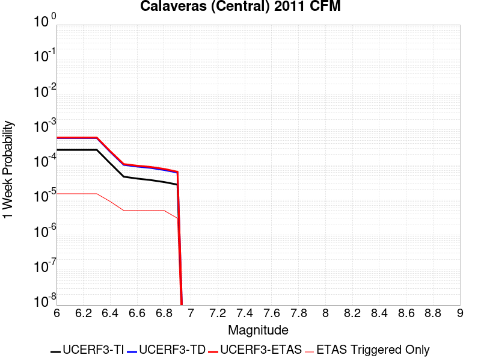 |  | 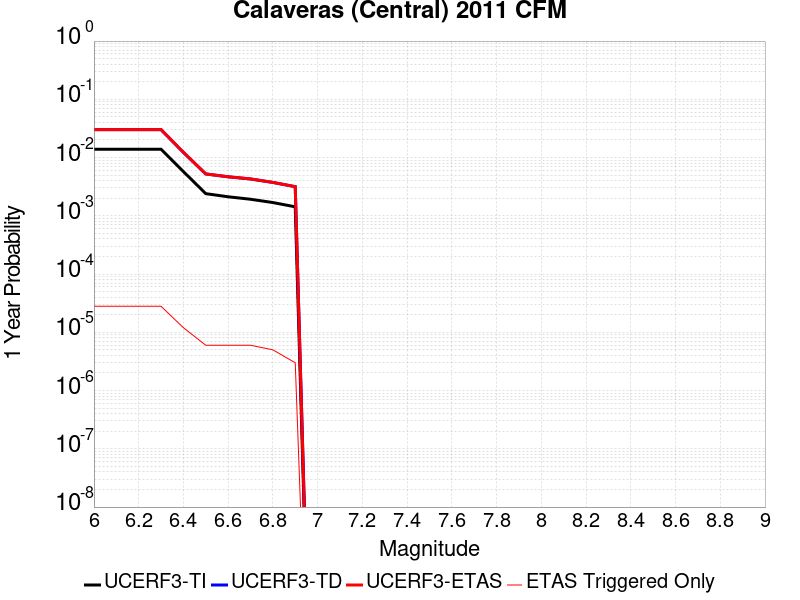 |  |

| Magnitude | 1 wk TI Prob | 1 wk TD Prob | 1 wk ETAS Prob | 1 wk ETAS/TD Gain | 1 wk ETAS Triggered Only | 1 mo TI Prob | 1 mo TD Prob | 1 mo ETAS Prob | 1 mo ETAS/TD Gain | 1 mo ETAS Triggered Only | 1 yr TI Prob | 1 yr TD Prob | 1 yr ETAS Prob | 1 yr ETAS/TD Gain | 1 yr ETAS Triggered Only | 10 yr TI Prob | 10 yr TD Prob | 10 yr ETAS Prob | 10 yr ETAS/TD Gain | 10 yr ETAS Triggered Only |
|-----|-----|-----|-----|-----|-----|-----|-----|-----|-----|-----|-----|-----|-----|-----|-----|-----|-----|-----|-----|-----|
| 6.0 | 2.6808938E-4 | 5.8386003E-4 | 6.023761E-4 | 1.0317132 | 1.8526924E-5 | 0.0011484486 | 0.0025008651 | 0.0025255058 | 1.0098529 | 2.4702565E-5 | 0.013892986 | 0.030145591 | 0.030172544 | 1.0008941 | 2.7790386E-5 | 0.13055827 | 0.25237754 | 0.25240985 | 1.000128 | 4.322949E-5 |
| 6.1 | 2.6808938E-4 | 5.8386003E-4 | 6.023761E-4 | 1.0317132 | 1.8526924E-5 | 0.0011484486 | 0.0025008651 | 0.0025255058 | 1.0098529 | 2.4702565E-5 | 0.013892986 | 0.030145591 | 0.030172544 | 1.0008941 | 2.7790386E-5 | 0.13055827 | 0.25237754 | 0.25240985 | 1.000128 | 4.322949E-5 |
| 6.2 | 2.6808938E-4 | 5.8386003E-4 | 6.023761E-4 | 1.0317132 | 1.8526924E-5 | 0.0011484486 | 0.0025008651 | 0.0025255058 | 1.0098529 | 2.4702565E-5 | 0.013892986 | 0.030145591 | 0.030172544 | 1.0008941 | 2.7790386E-5 | 0.13055827 | 0.25237754 | 0.25240985 | 1.000128 | 4.322949E-5 |
| 6.3 | 2.6808938E-4 | 5.8386003E-4 | 6.023761E-4 | 1.0317132 | 1.8526924E-5 | 0.0011484486 | 0.0025008651 | 0.0025255058 | 1.0098529 | 2.4702565E-5 | 0.013892986 | 0.030145591 | 0.030172544 | 1.0008941 | 2.7790386E-5 | 0.13055827 | 0.25237754 | 0.25240985 | 1.000128 | 4.322949E-5 |
| 6.4 | 1.1043065E-4 | 2.3596571E-4 | 2.4831409E-4 | 1.0523312 | 1.2351283E-5 | 4.7318838E-4 | 0.0010110455 | 0.0010233843 | 1.012204 | 1.2351283E-5 | 0.0057458607 | 0.0122675765 | 0.012279776 | 1.0009944 | 1.2351283E-5 | 0.055995476 | 0.1116302 | 0.11164392 | 1.0001229 | 1.5439104E-5 |
| 6.5 | 4.6058474E-5 | 1.0043265E-4 | 1.0352016E-4 | 1.030742 | 3.0878207E-6 | 1.9737853E-4 | 4.3038116E-4 | 4.3346765E-4 | 1.0071715 | 3.0878207E-6 | 0.002400435 | 0.0052319476 | 0.0052350196 | 1.0005871 | 3.0878207E-6 | 0.023746708 | 0.04974921 | 0.049755078 | 1.000118 | 6.1756414E-6 |
| 6.6 | 4.0714523E-5 | 8.96959E-5 | 9.278345E-5 | 1.0344224 | 3.0878207E-6 | 1.7447914E-4 | 3.8438084E-4 | 3.8746747E-4 | 1.0080302 | 3.0878207E-6 | 0.0021222138 | 0.004674486 | 0.0046775592 | 1.0006574 | 3.0878207E-6 | 0.02102061 | 0.04470526 | 0.04471116 | 1.000132 | 6.1756414E-6 |
| 6.7 | 3.6925157E-5 | 8.2311366E-5 | 8.539893E-5 | 1.0375109 | 3.0878207E-6 | 1.5824108E-4 | 3.527417E-4 | 3.5582844E-4 | 1.0087507 | 3.0878207E-6 | 0.0019248825 | 0.0042908536 | 0.004293928 | 1.0007166 | 3.0878207E-6 | 0.019082947 | 0.041160695 | 0.04116662 | 1.0001439 | 6.1756414E-6 |
| 6.8 | 3.241399E-5 | 7.175236E-5 | 7.4839954E-5 | 1.0430313 | 3.0878207E-6 | 1.389097E-4 | 3.075001E-4 | 3.1058697E-4 | 1.0100386 | 3.0878207E-6 | 0.0016899136 | 0.0037420401 | 0.0037451165 | 1.0008221 | 3.0878207E-6 | 0.016771203 | 0.036092106 | 0.03609806 | 1.000165 | 6.1756414E-6 |
| 6.9 | 2.7363296E-5 | 6.059934E-5 | 6.059934E-5 | 1.0 | 0.0 | 1.1726599E-4 | 2.5971147E-4 | 2.5971147E-4 | 1.0 | 0.0 | 0.0014267784 | 0.003161987 | 0.003161987 | 1.0 | 0.0 | 0.014176525 | 0.030637112 | 0.030640103 | 1.0000978 | 3.0878207E-6 |

## Imperial
*[(top)](#table-of-contents)*

| 1 Week | 1 Month | 1 Year | 10 Year |
|-----|-----|-----|-----|
|  |  |  |  |

| Magnitude | 1 wk TI Prob | 1 wk TD Prob | 1 wk ETAS Prob | 1 wk ETAS/TD Gain | 1 wk ETAS Triggered Only | 1 mo TI Prob | 1 mo TD Prob | 1 mo ETAS Prob | 1 mo ETAS/TD Gain | 1 mo ETAS Triggered Only | 1 yr TI Prob | 1 yr TD Prob | 1 yr ETAS Prob | 1 yr ETAS/TD Gain | 1 yr ETAS Triggered Only | 10 yr TI Prob | 10 yr TD Prob | 10 yr ETAS Prob | 10 yr ETAS/TD Gain | 10 yr ETAS Triggered Only |
|-----|-----|-----|-----|-----|-----|-----|-----|-----|-----|-----|-----|-----|-----|-----|-----|-----|-----|-----|-----|-----|
| 6.0 | 3.2610117E-4 | 4.2223663E-4 | 4.4384226E-4 | 1.0511694 | 2.1614745E-5 | 0.001396828 | 0.0018087402 | 0.0018333981 | 1.0136327 | 2.4702565E-5 | 0.016874276 | 0.0221874 | 0.022214575 | 1.0012248 | 2.7790386E-5 | 0.1564893 | 0.21658373 | 0.21661517 | 1.0001452 | 4.014167E-5 |
| 6.1 | 3.2610117E-4 | 4.2223663E-4 | 4.4384226E-4 | 1.0511694 | 2.1614745E-5 | 0.001396828 | 0.0018087402 | 0.0018333981 | 1.0136327 | 2.4702565E-5 | 0.016874276 | 0.0221874 | 0.022214575 | 1.0012248 | 2.7790386E-5 | 0.1564893 | 0.21658373 | 0.21661517 | 1.0001452 | 4.014167E-5 |
| 6.2 | 3.2610117E-4 | 4.2223663E-4 | 4.4384226E-4 | 1.0511694 | 2.1614745E-5 | 0.001396828 | 0.0018087402 | 0.0018333981 | 1.0136327 | 2.4702565E-5 | 0.016874276 | 0.0221874 | 0.022214575 | 1.0012248 | 2.7790386E-5 | 0.1564893 | 0.21658373 | 0.21661517 | 1.0001452 | 4.014167E-5 |
| 6.3 | 3.2610117E-4 | 4.2223663E-4 | 4.4384226E-4 | 1.0511694 | 2.1614745E-5 | 0.001396828 | 0.0018087402 | 0.0018333981 | 1.0136327 | 2.4702565E-5 | 0.016874276 | 0.0221874 | 0.022214575 | 1.0012248 | 2.7790386E-5 | 0.1564893 | 0.21658373 | 0.21661517 | 1.0001452 | 4.014167E-5 |
| 6.4 | 3.2610117E-4 | 4.2223663E-4 | 4.4384226E-4 | 1.0511694 | 2.1614745E-5 | 0.001396828 | 0.0018087402 | 0.0018333981 | 1.0136327 | 2.4702565E-5 | 0.016874276 | 0.0221874 | 0.022214575 | 1.0012248 | 2.7790386E-5 | 0.1564893 | 0.21658373 | 0.21661517 | 1.0001452 | 4.014167E-5 |
| 6.5 | 3.2610117E-4 | 4.2223663E-4 | 4.4384226E-4 | 1.0511694 | 2.1614745E-5 | 0.001396828 | 0.0018087402 | 0.0018333981 | 1.0136327 | 2.4702565E-5 | 0.016874276 | 0.0221874 | 0.022214575 | 1.0012248 | 2.7790386E-5 | 0.1564893 | 0.21658373 | 0.21661517 | 1.0001452 | 4.014167E-5 |
| 6.6 | 2.7505832E-4 | 3.51371E-4 | 3.668047E-4 | 1.0439242 | 1.5439104E-5 | 0.0011782888 | 0.0015054093 | 0.0015239083 | 1.0122883 | 1.8526924E-5 | 0.014251595 | 0.018531771 | 0.018552987 | 1.0011448 | 2.1614745E-5 | 0.13371493 | 0.18699032 | 0.18701793 | 1.0001477 | 3.396603E-5 |
| 6.7 | 2.2892522E-4 | 2.8752215E-4 | 2.998699E-4 | 1.0429453 | 1.2351283E-5 | 9.807391E-4 | 0.0012320514 | 0.0012474714 | 1.0125158 | 1.5439104E-5 | 0.011875284 | 0.015238598 | 0.015256842 | 1.0011972 | 1.8526924E-5 | 0.11260368 | 0.1593126 | 0.15933597 | 1.0001466 | 2.7790386E-5 |
| 6.8 | 1.8687606E-4 | 2.3508105E-4 | 2.4434234E-4 | 1.0393962 | 9.263462E-6 | 8.0065156E-4 | 0.0010074902 | 0.0010198291 | 1.0122471 | 1.2351283E-5 | 0.009704442 | 0.012523335 | 0.012538581 | 1.0012174 | 1.5439104E-5 | 0.09291432 | 0.13362566 | 0.13364705 | 1.0001602 | 2.4702565E-5 |
| 6.9 | 1.8687606E-4 | 2.3508105E-4 | 2.4434234E-4 | 1.0393962 | 9.263462E-6 | 8.0065156E-4 | 0.0010074902 | 0.0010198291 | 1.0122471 | 1.2351283E-5 | 0.009704442 | 0.012523335 | 0.012538581 | 1.0012174 | 1.5439104E-5 | 0.09291432 | 0.13362566 | 0.13364705 | 1.0001602 | 2.4702565E-5 |

## San Jacinto (Clark) rev
*[(top)](#table-of-contents)*

| 1 Week | 1 Month | 1 Year | 10 Year |
|-----|-----|-----|-----|
|  |  |  |  |

| Magnitude | 1 wk TI Prob | 1 wk TD Prob | 1 wk ETAS Prob | 1 wk ETAS/TD Gain | 1 wk ETAS Triggered Only | 1 mo TI Prob | 1 mo TD Prob | 1 mo ETAS Prob | 1 mo ETAS/TD Gain | 1 mo ETAS Triggered Only | 1 yr TI Prob | 1 yr TD Prob | 1 yr ETAS Prob | 1 yr ETAS/TD Gain | 1 yr ETAS Triggered Only | 10 yr TI Prob | 10 yr TD Prob | 10 yr ETAS Prob | 10 yr ETAS/TD Gain | 10 yr ETAS Triggered Only |
|-----|-----|-----|-----|-----|-----|-----|-----|-----|-----|-----|-----|-----|-----|-----|-----|-----|-----|-----|-----|-----|
| 6.0 | 6.1857165E-5 | 9.865906E-5 | 1.0483409E-4 | 1.0625896 | 6.1756414E-6 | 2.650752E-4 | 4.227864E-4 | 4.2895944E-4 | 1.0146009 | 6.1756414E-6 | 0.0032225149 | 0.0051406594 | 0.0051529473 | 1.0023903 | 1.2351283E-5 | 0.031761836 | 0.05230213 | 0.052340172 | 1.0007273 | 4.014167E-5 |
| 6.1 | 6.1857165E-5 | 9.865906E-5 | 1.0483409E-4 | 1.0625896 | 6.1756414E-6 | 2.650752E-4 | 4.227864E-4 | 4.2895944E-4 | 1.0146009 | 6.1756414E-6 | 0.0032225149 | 0.0051406594 | 0.0051529473 | 1.0023903 | 1.2351283E-5 | 0.031761836 | 0.05230213 | 0.052340172 | 1.0007273 | 4.014167E-5 |
| 6.2 | 6.1857165E-5 | 9.865906E-5 | 1.0483409E-4 | 1.0625896 | 6.1756414E-6 | 2.650752E-4 | 4.227864E-4 | 4.2895944E-4 | 1.0146009 | 6.1756414E-6 | 0.0032225149 | 0.0051406594 | 0.0051529473 | 1.0023903 | 1.2351283E-5 | 0.031761836 | 0.05230213 | 0.052340172 | 1.0007273 | 4.014167E-5 |
| 6.3 | 6.1857165E-5 | 9.865906E-5 | 1.0483409E-4 | 1.0625896 | 6.1756414E-6 | 2.650752E-4 | 4.227864E-4 | 4.2895944E-4 | 1.0146009 | 6.1756414E-6 | 0.0032225149 | 0.0051406594 | 0.0051529473 | 1.0023903 | 1.2351283E-5 | 0.031761836 | 0.05230213 | 0.052340172 | 1.0007273 | 4.014167E-5 |
| 6.4 | 6.1857165E-5 | 9.865906E-5 | 1.0483409E-4 | 1.0625896 | 6.1756414E-6 | 2.650752E-4 | 4.227864E-4 | 4.2895944E-4 | 1.0146009 | 6.1756414E-6 | 0.0032225149 | 0.0051406594 | 0.0051529473 | 1.0023903 | 1.2351283E-5 | 0.031761836 | 0.05230213 | 0.052340172 | 1.0007273 | 4.014167E-5 |
| 6.5 | 6.1857165E-5 | 9.865906E-5 | 1.0483409E-4 | 1.0625896 | 6.1756414E-6 | 2.650752E-4 | 4.227864E-4 | 4.2895944E-4 | 1.0146009 | 6.1756414E-6 | 0.0032225149 | 0.0051406594 | 0.0051529473 | 1.0023903 | 1.2351283E-5 | 0.031761836 | 0.05230213 | 0.052340172 | 1.0007273 | 4.014167E-5 |
| 6.6 | 6.1629326E-5 | 9.831641E-5 | 1.04491446E-4 | 1.0628078 | 6.1756414E-6 | 2.6409896E-4 | 4.2131837E-4 | 4.274914E-4 | 1.0146518 | 6.1756414E-6 | 0.0032106643 | 0.00512287 | 0.0051351585 | 1.0023986 | 1.2351283E-5 | 0.031646714 | 0.052133482 | 0.052171532 | 1.0007298 | 4.014167E-5 |
| 6.7 | 6.116108E-5 | 9.7617616E-5 | 1.0379265E-4 | 1.0632575 | 6.1756414E-6 | 2.6209257E-4 | 4.183245E-4 | 4.2449756E-4 | 1.0147567 | 6.1756414E-6 | 0.0031863083 | 0.0050865905 | 0.005098879 | 1.0024159 | 1.2351283E-5 | 0.031410076 | 0.051788114 | 0.051826175 | 1.0007349 | 4.014167E-5 |
| 6.8 | 6.110044E-5 | 9.753308E-5 | 1.0370812E-4 | 1.0633123 | 6.1756414E-6 | 2.6183276E-4 | 4.1796232E-4 | 4.241354E-4 | 1.0147694 | 6.1756414E-6 | 0.0031831542 | 0.0050822017 | 0.00509449 | 1.0024179 | 1.2351283E-5 | 0.03137943 | 0.051745888 | 0.051783953 | 1.0007356 | 4.014167E-5 |
| 6.9 | 6.0730574E-5 | 9.694897E-5 | 1.0312402E-4 | 1.0636938 | 6.1756414E-6 | 2.6024794E-4 | 4.154598E-4 | 4.2163287E-4 | 1.0148584 | 6.1756414E-6 | 0.0031639151 | 0.005051875 | 0.005064164 | 1.0024326 | 1.2351283E-5 | 0.031192465 | 0.051456194 | 0.05149427 | 1.0007399 | 4.014167E-5 |
| 7.0 | 6.0346E-5 | 9.636309E-5 | 1.02538135E-4 | 1.0640811 | 6.1756414E-6 | 2.5860008E-4 | 4.1294965E-4 | 4.1912275E-4 | 1.0149487 | 6.1756414E-6 | 0.0031439106 | 0.005021455 | 0.0050337445 | 1.0024474 | 1.2351283E-5 | 0.030998027 | 0.051163334 | 0.05120142 | 1.0007445 | 4.014167E-5 |
| 7.1 | 5.9163158E-5 | 9.465252E-5 | 1.0082758E-4 | 1.0652392 | 6.1756414E-6 | 2.5353173E-4 | 4.0562096E-4 | 4.1179408E-4 | 1.015219 | 6.1756414E-6 | 0.0030823802 | 0.0049326345 | 0.0049449247 | 1.0024916 | 1.2351283E-5 | 0.030399747 | 0.050306328 | 0.05034445 | 1.0007578 | 4.014167E-5 |
| 7.2 | 5.863685E-5 | 9.390979E-5 | 1.0008485E-4 | 1.0657552 | 6.1756414E-6 | 2.512766E-4 | 4.0243877E-4 | 4.0861196E-4 | 1.0153394 | 6.1756414E-6 | 0.0030550007 | 0.004894066 | 0.004906357 | 1.0025114 | 1.2351283E-5 | 0.030133424 | 0.04993242 | 0.049970556 | 1.0007638 | 4.014167E-5 |
| 7.3 | 5.8209655E-5 | 9.342446E-5 | 9.959953E-5 | 1.0660969 | 6.1756414E-6 | 2.4944608E-4 | 4.0035948E-4 | 4.0653264E-4 | 1.015419 | 6.1756414E-6 | 0.0030327768 | 0.004868864 | 0.004881155 | 1.0025245 | 1.2351283E-5 | 0.0299172 | 0.049677737 | 0.049715888 | 1.000768 | 4.014167E-5 |
| 7.4 | 5.7813933E-5 | 9.282713E-5 | 9.90022E-5 | 1.0665222 | 6.1756414E-6 | 2.4775046E-4 | 3.978003E-4 | 4.0397348E-4 | 1.0155183 | 6.1756414E-6 | 0.0030121899 | 0.0048378445 | 0.004850136 | 1.0025407 | 1.2351283E-5 | 0.029716864 | 0.049371965 | 0.04940719 | 1.0007135 | 3.7053847E-5 |
| 7.5 | 5.731269E-5 | 9.1954265E-5 | 9.812934E-5 | 1.0671537 | 6.1756414E-6 | 2.4560269E-4 | 3.9406057E-4 | 4.0023378E-4 | 1.0156657 | 6.1756414E-6 | 0.0029861126 | 0.0047925147 | 0.004804807 | 1.0025649 | 1.2351283E-5 | 0.029463045 | 0.04892991 | 0.048965152 | 1.0007203 | 3.7053847E-5 |
| 7.6 | 1.8838993E-5 | 2.7586504E-5 | 3.067424E-5 | 1.1119292 | 3.0878207E-6 | 8.073604E-5 | 1.1822497E-4 | 1.2131242E-4 | 1.0261151 | 3.0878207E-6 | 9.82518E-4 | 0.001438873 | 0.0014450398 | 1.0042858 | 6.1756414E-6 | 0.009781853 | 0.015056286 | 0.015080617 | 1.001616 | 2.4702565E-5 |
| 7.7 | 1.2895799E-5 | 1.7139906E-5 | 1.7139906E-5 | 1.0 | 0.0 | 5.526654E-5 | 7.3456744E-5 | 7.3456744E-5 | 1.0 | 0.0 | 6.726624E-4 | 8.943358E-4 | 8.9742086E-4 | 1.0034496 | 3.0878207E-6 | 0.006706299 | 0.009567577 | 0.009588985 | 1.0022376 | 2.1614745E-5 |

## Newport-Inglewood (Offshore)
*[(top)](#table-of-contents)*

| 1 Week | 1 Month | 1 Year | 10 Year |
|-----|-----|-----|-----|
|  |  |  |  |

| Magnitude | 1 wk TI Prob | 1 wk TD Prob | 1 wk ETAS Prob | 1 wk ETAS/TD Gain | 1 wk ETAS Triggered Only | 1 mo TI Prob | 1 mo TD Prob | 1 mo ETAS Prob | 1 mo ETAS/TD Gain | 1 mo ETAS Triggered Only | 1 yr TI Prob | 1 yr TD Prob | 1 yr ETAS Prob | 1 yr ETAS/TD Gain | 1 yr ETAS Triggered Only | 10 yr TI Prob | 10 yr TD Prob | 10 yr ETAS Prob | 10 yr ETAS/TD Gain | 10 yr ETAS Triggered Only |
|-----|-----|-----|-----|-----|-----|-----|-----|-----|-----|-----|-----|-----|-----|-----|-----|-----|-----|-----|-----|-----|
| 6.0 | 1.9418812E-5 | 2.0497266E-5 | 3.902381E-5 | 1.9038544 | 1.8526924E-5 | 8.322083E-5 | 8.7843E-5 | 1.06368294E-4 | 1.210891 | 1.8526924E-5 | 0.0010127426 | 0.0010690573 | 0.0010937335 | 1.0230821 | 2.4702565E-5 | 0.010081396 | 0.010648402 | 0.010685061 | 1.0034426 | 3.7053847E-5 |
| 6.1 | 1.9418812E-5 | 2.0497266E-5 | 3.902381E-5 | 1.9038544 | 1.8526924E-5 | 8.322083E-5 | 8.7843E-5 | 1.06368294E-4 | 1.210891 | 1.8526924E-5 | 0.0010127426 | 0.0010690573 | 0.0010937335 | 1.0230821 | 2.4702565E-5 | 0.010081396 | 0.010648402 | 0.010685061 | 1.0034426 | 3.7053847E-5 |
| 6.2 | 1.9418812E-5 | 2.0497266E-5 | 3.902381E-5 | 1.9038544 | 1.8526924E-5 | 8.322083E-5 | 8.7843E-5 | 1.06368294E-4 | 1.210891 | 1.8526924E-5 | 0.0010127426 | 0.0010690573 | 0.0010937335 | 1.0230821 | 2.4702565E-5 | 0.010081396 | 0.010648402 | 0.010685061 | 1.0034426 | 3.7053847E-5 |
| 6.3 | 1.9418812E-5 | 2.0497266E-5 | 3.902381E-5 | 1.9038544 | 1.8526924E-5 | 8.322083E-5 | 8.7843E-5 | 1.06368294E-4 | 1.210891 | 1.8526924E-5 | 0.0010127426 | 0.0010690573 | 0.0010937335 | 1.0230821 | 2.4702565E-5 | 0.010081396 | 0.010648402 | 0.010685061 | 1.0034426 | 3.7053847E-5 |
| 6.4 | 1.9418812E-5 | 2.0497266E-5 | 3.902381E-5 | 1.9038544 | 1.8526924E-5 | 8.322083E-5 | 8.7843E-5 | 1.06368294E-4 | 1.210891 | 1.8526924E-5 | 0.0010127426 | 0.0010690573 | 0.0010937335 | 1.0230821 | 2.4702565E-5 | 0.010081396 | 0.010648402 | 0.010685061 | 1.0034426 | 3.7053847E-5 |
| 6.5 | 1.9418812E-5 | 2.0497266E-5 | 3.902381E-5 | 1.9038544 | 1.8526924E-5 | 8.322083E-5 | 8.7843E-5 | 1.06368294E-4 | 1.210891 | 1.8526924E-5 | 0.0010127426 | 0.0010690573 | 0.0010937335 | 1.0230821 | 2.4702565E-5 | 0.010081396 | 0.010648402 | 0.010685061 | 1.0034426 | 3.7053847E-5 |
| 6.6 | 1.6939659E-5 | 1.7683546E-5 | 3.6210142E-5 | 2.0476744 | 1.8526924E-5 | 7.259652E-5 | 7.578494E-5 | 9.431047E-5 | 1.2444485 | 1.8526924E-5 | 8.8350417E-4 | 9.2238374E-4 | 9.470635E-4 | 1.0267565 | 2.4702565E-5 | 0.008799998 | 0.00919468 | 0.009231392 | 1.0039929 | 3.7053847E-5 |
| 6.7 | 1.4691289E-5 | 1.5149292E-5 | 3.3675937E-5 | 2.2229378 | 1.8526924E-5 | 6.2961146E-5 | 6.492444E-5 | 8.3450155E-5 | 1.2853428 | 1.8526924E-5 | 7.662824E-4 | 7.9025986E-4 | 8.149429E-4 | 1.0312341 | 2.4702565E-5 | 0.007636454 | 0.007883489 | 0.007920251 | 1.0046631 | 3.7053847E-5 |
| 6.8 | 1.26037085E-5 | 1.2822538E-5 | 3.1349224E-5 | 2.4448533 | 1.8526924E-5 | 5.4014774E-5 | 5.4953085E-5 | 7.3478994E-5 | 1.3371222 | 1.8526924E-5 | 6.5743143E-4 | 6.689387E-4 | 6.9053896E-4 | 1.0322903 | 2.1614745E-5 | 0.006554899 | 0.0066781086 | 0.0067087803 | 1.0045929 | 3.0878207E-5 |
| 6.9 | 1.1764378E-5 | 1.1934175E-5 | 3.0460878E-5 | 2.5524075 | 1.8526924E-5 | 5.0417784E-5 | 5.114597E-5 | 6.967194E-5 | 1.3622178 | 1.8526924E-5 | 6.1366364E-4 | 6.226143E-4 | 6.4421556E-4 | 1.0346944 | 2.1614745E-5 | 0.006119718 | 0.006217534 | 0.0062451516 | 1.0044419 | 2.7790386E-5 |
| 7.0 | 4.071841E-6 | 3.3071306E-6 | 9.482752E-6 | 2.8673654 | 6.1756414E-6 | 1.745063E-5 | 1.4173362E-5 | 2.0348914E-5 | 1.4357156 | 6.1756414E-6 | 2.124407E-4 | 1.7255088E-4 | 1.8181275E-4 | 1.0536761 | 9.263462E-6 | 0.0021223773 | 0.0017245489 | 0.0017337963 | 1.0053623 | 9.263462E-6 |
| 7.1 | 3.6344509E-6 | 2.9049047E-6 | 5.9927165E-6 | 2.062965 | 3.0878207E-6 | 1.5576124E-5 | 1.2449554E-5 | 1.5537336E-5 | 1.2480235 | 3.0878207E-6 | 1.8962282E-4 | 1.5156664E-4 | 1.5774135E-4 | 1.0407392 | 6.1756414E-6 | 0.0018946109 | 0.0015150115 | 0.0015211778 | 1.0040702 | 6.1756414E-6 |
| 7.2 | 3.2446756E-6 | 2.5395498E-6 | 5.6273625E-6 | 2.21589 | 3.0878207E-6 | 1.3905678E-5 | 1.0883761E-5 | 1.39715485E-5 | 1.2837058 | 3.0878207E-6 | 1.6928847E-4 | 1.325056E-4 | 1.35593E-4 | 1.0233003 | 3.0878207E-6 | 0.0016915957 | 0.0013246438 | 0.0013277276 | 1.0023279 | 3.0878207E-6 |
| 7.3 | 2.898987E-6 | 2.2514312E-6 | 5.339245E-6 | 2.3714893 | 3.0878207E-6 | 1.24241715E-5 | 9.648977E-6 | 1.27367675E-5 | 1.3200122 | 3.0878207E-6 | 1.5125379E-4 | 1.1747381E-4 | 1.2056127E-4 | 1.0262821 | 3.0878207E-6 | 0.0015115088 | 0.0011744945 | 0.0011775787 | 1.002626 | 3.0878207E-6 |
| 7.4 | 2.5994284E-6 | 2.0116724E-6 | 5.0994868E-6 | 2.5349488 | 3.0878207E-6 | 1.114036E-5 | 8.621447E-6 | 1.170924E-5 | 1.3581526 | 3.0878207E-6 | 1.3562544E-4 | 1.049649E-4 | 1.08052394E-4 | 1.0294145 | 3.0878207E-6 | 0.0013554269 | 0.00104953 | 0.0010526147 | 1.002939 | 3.0878207E-6 |
| 7.5 | 2.2517988E-6 | 1.7516537E-6 | 4.839469E-6 | 2.7628 | 3.0878207E-6 | 9.650531E-6 | 7.5070875E-6 | 1.0594885E-5 | 1.4113177 | 3.0878207E-6 | 1.17488875E-4 | 9.139879E-5 | 9.448633E-5 | 1.0337809 | 3.0878207E-6 | 0.0011742678 | 9.1398787E-4 | 9.170729E-4 | 1.0033753 | 3.0878207E-6 |

## Hayward (So) 2011 CFM
*[(top)](#table-of-contents)*

| 1 Week | 1 Month | 1 Year | 10 Year |
|-----|-----|-----|-----|
|  |  |  |  |

| Magnitude | 1 wk TI Prob | 1 wk TD Prob | 1 wk ETAS Prob | 1 wk ETAS/TD Gain | 1 wk ETAS Triggered Only | 1 mo TI Prob | 1 mo TD Prob | 1 mo ETAS Prob | 1 mo ETAS/TD Gain | 1 mo ETAS Triggered Only | 1 yr TI Prob | 1 yr TD Prob | 1 yr ETAS Prob | 1 yr ETAS/TD Gain | 1 yr ETAS Triggered Only | 10 yr TI Prob | 10 yr TD Prob | 10 yr ETAS Prob | 10 yr ETAS/TD Gain | 10 yr ETAS Triggered Only |
|-----|-----|-----|-----|-----|-----|-----|-----|-----|-----|-----|-----|-----|-----|-----|-----|-----|-----|-----|-----|-----|
| 6.0 | 1.2701664E-4 | 2.8183177E-4 | 2.8491873E-4 | 1.0109532 | 3.0878207E-6 | 5.4424343E-4 | 0.001207496 | 0.0012167483 | 1.0076624 | 9.263462E-6 | 0.0066060508 | 0.014638459 | 0.014659758 | 1.001455 | 2.1614745E-5 | 0.06413091 | 0.13469909 | 0.13472581 | 1.0001984 | 3.0878207E-5 |
| 6.1 | 1.2701664E-4 | 2.8183177E-4 | 2.8491873E-4 | 1.0109532 | 3.0878207E-6 | 5.4424343E-4 | 0.001207496 | 0.0012167483 | 1.0076624 | 9.263462E-6 | 0.0066060508 | 0.014638459 | 0.014659758 | 1.001455 | 2.1614745E-5 | 0.06413091 | 0.13469909 | 0.13472581 | 1.0001984 | 3.0878207E-5 |
| 6.2 | 1.2701664E-4 | 2.8183177E-4 | 2.8491873E-4 | 1.0109532 | 3.0878207E-6 | 5.4424343E-4 | 0.001207496 | 0.0012167483 | 1.0076624 | 9.263462E-6 | 0.0066060508 | 0.014638459 | 0.014659758 | 1.001455 | 2.1614745E-5 | 0.06413091 | 0.13469909 | 0.13472581 | 1.0001984 | 3.0878207E-5 |
| 6.3 | 1.2701664E-4 | 2.8183177E-4 | 2.8491873E-4 | 1.0109532 | 3.0878207E-6 | 5.4424343E-4 | 0.001207496 | 0.0012167483 | 1.0076624 | 9.263462E-6 | 0.0066060508 | 0.014638459 | 0.014659758 | 1.001455 | 2.1614745E-5 | 0.06413091 | 0.13469909 | 0.13472581 | 1.0001984 | 3.0878207E-5 |
| 6.4 | 1.2701664E-4 | 2.8183177E-4 | 2.8491873E-4 | 1.0109532 | 3.0878207E-6 | 5.4424343E-4 | 0.001207496 | 0.0012167483 | 1.0076624 | 9.263462E-6 | 0.0066060508 | 0.014638459 | 0.014659758 | 1.001455 | 2.1614745E-5 | 0.06413091 | 0.13469909 | 0.13472581 | 1.0001984 | 3.0878207E-5 |
| 6.5 | 1.2701664E-4 | 2.8183177E-4 | 2.8491873E-4 | 1.0109532 | 3.0878207E-6 | 5.4424343E-4 | 0.001207496 | 0.0012167483 | 1.0076624 | 9.263462E-6 | 0.0066060508 | 0.014638459 | 0.014659758 | 1.001455 | 2.1614745E-5 | 0.06413091 | 0.13469909 | 0.13472581 | 1.0001984 | 3.0878207E-5 |
| 6.6 | 1.2617561E-4 | 2.8017466E-4 | 2.8326162E-4 | 1.0110179 | 3.0878207E-6 | 5.4064055E-4 | 0.0012004005 | 0.0012096529 | 1.0077077 | 9.263462E-6 | 0.0065624514 | 0.014553229 | 0.01457453 | 1.0014637 | 2.1614745E-5 | 0.06372008 | 0.1339794 | 0.13400614 | 1.0001996 | 3.0878207E-5 |
| 6.7 | 6.106194E-5 | 1.5483651E-4 | 1.5792385E-4 | 1.0199394 | 3.0878207E-6 | 2.6166777E-4 | 6.6351274E-4 | 6.7277E-4 | 1.013952 | 9.263462E-6 | 0.0031811513 | 0.0080654435 | 0.00808382 | 1.0022786 | 1.8526924E-5 | 0.031359967 | 0.075871445 | 0.07589142 | 1.0002632 | 2.1614745E-5 |
| 6.8 | 6.005265E-5 | 1.523396E-4 | 1.5542695E-4 | 1.0202663 | 3.0878207E-6 | 2.573431E-4 | 6.528171E-4 | 6.6207454E-4 | 1.0141807 | 9.263462E-6 | 0.0031286513 | 0.00793618 | 0.007954559 | 1.002316 | 1.8526924E-5 | 0.030849686 | 0.07472291 | 0.074742906 | 1.0002676 | 2.1614745E-5 |
| 6.9 | 5.8771016E-5 | 1.4917298E-4 | 1.5226034E-4 | 1.0206965 | 3.0878207E-6 | 2.5185148E-4 | 6.392526E-4 | 6.485101E-4 | 1.0144818 | 9.263462E-6 | 0.0030619805 | 0.007772221 | 0.007790604 | 1.0023652 | 1.8526924E-5 | 0.030201323 | 0.073260926 | 0.07328096 | 1.0002735 | 2.1614745E-5 |
| 7.0 | 1.1420259E-5 | 2.9975652E-5 | 3.306338E-5 | 1.1030079 | 3.0878207E-6 | 4.894305E-5 | 1.2846253E-4 | 1.3154995E-4 | 1.0240337 | 3.0878207E-6 | 5.957187E-4 | 0.0015632241 | 0.0015724731 | 1.0059166 | 9.263462E-6 | 0.005941243 | 0.015188666 | 0.015197788 | 1.0006006 | 9.263462E-6 |
| 7.1 | 9.497712E-6 | 2.5505822E-5 | 2.8593564E-5 | 1.1210603 | 3.0878207E-6 | 4.0703846E-5 | 1.0930784E-4 | 1.12395326E-4 | 1.0282458 | 3.0878207E-6 | 4.954566E-4 | 0.0013303217 | 0.0013395727 | 1.0069541 | 9.263462E-6 | 0.0049435347 | 0.01294365 | 0.012952793 | 1.0007064 | 9.263462E-6 |
| 7.2 | 6.6138855E-6 | 1.8792352E-5 | 2.1880116E-5 | 1.1643095 | 3.0878207E-6 | 2.8344915E-5 | 8.053787E-5 | 8.362545E-5 | 1.0383369 | 3.0878207E-6 | 3.4504468E-4 | 9.8041E-4 | 9.896643E-4 | 1.0094393 | 9.263462E-6 | 0.0034450945 | 0.009560432 | 0.009569607 | 1.0009596 | 9.263462E-6 |
| 7.3 | 5.4382035E-6 | 1.5442325E-5 | 1.8530098E-5 | 1.1999552 | 3.0878207E-6 | 2.3306378E-5 | 6.618139E-5 | 6.926901E-5 | 1.0466539 | 3.0878207E-6 | 2.8371823E-4 | 8.0575846E-4 | 8.150144E-4 | 1.0114874 | 9.263462E-6 | 0.0028335627 | 0.007868089 | 0.00787728 | 1.0011681 | 9.263462E-6 |

## Concord 2011 CFM
*[(top)](#table-of-contents)*

| 1 Week | 1 Month | 1 Year | 10 Year |
|-----|-----|-----|-----|
|  |  |  |  |

| Magnitude | 1 wk TI Prob | 1 wk TD Prob | 1 wk ETAS Prob | 1 wk ETAS/TD Gain | 1 wk ETAS Triggered Only | 1 mo TI Prob | 1 mo TD Prob | 1 mo ETAS Prob | 1 mo ETAS/TD Gain | 1 mo ETAS Triggered Only | 1 yr TI Prob | 1 yr TD Prob | 1 yr ETAS Prob | 1 yr ETAS/TD Gain | 1 yr ETAS Triggered Only | 10 yr TI Prob | 10 yr TD Prob | 10 yr ETAS Prob | 10 yr ETAS/TD Gain | 10 yr ETAS Triggered Only |
|-----|-----|-----|-----|-----|-----|-----|-----|-----|-----|-----|-----|-----|-----|-----|-----|-----|-----|-----|-----|-----|
| 6.0 | 7.9834055E-5 | 1.7647086E-4 | 1.8881996E-4 | 1.0699781 | 1.2351283E-5 | 3.421011E-4 | 7.562273E-4 | 7.6856924E-4 | 1.0163205 | 1.2351283E-5 | 0.0041571283 | 0.009193515 | 0.0092179915 | 1.0026623 | 2.4702565E-5 | 0.040802166 | 0.08864039 | 0.08866853 | 1.0003175 | 3.0878207E-5 |
| 6.1 | 7.9834055E-5 | 1.7647086E-4 | 1.8881996E-4 | 1.0699781 | 1.2351283E-5 | 3.421011E-4 | 7.562273E-4 | 7.6856924E-4 | 1.0163205 | 1.2351283E-5 | 0.0041571283 | 0.009193515 | 0.0092179915 | 1.0026623 | 2.4702565E-5 | 0.040802166 | 0.08864039 | 0.08866853 | 1.0003175 | 3.0878207E-5 |
| 6.2 | 7.9834055E-5 | 1.7647086E-4 | 1.8881996E-4 | 1.0699781 | 1.2351283E-5 | 3.421011E-4 | 7.562273E-4 | 7.6856924E-4 | 1.0163205 | 1.2351283E-5 | 0.0041571283 | 0.009193515 | 0.0092179915 | 1.0026623 | 2.4702565E-5 | 0.040802166 | 0.08864039 | 0.08866853 | 1.0003175 | 3.0878207E-5 |
| 6.3 | 7.9834055E-5 | 1.7647086E-4 | 1.8881996E-4 | 1.0699781 | 1.2351283E-5 | 3.421011E-4 | 7.562273E-4 | 7.6856924E-4 | 1.0163205 | 1.2351283E-5 | 0.0041571283 | 0.009193515 | 0.0092179915 | 1.0026623 | 2.4702565E-5 | 0.040802166 | 0.08864039 | 0.08866853 | 1.0003175 | 3.0878207E-5 |
| 6.4 | 7.9834055E-5 | 1.7647086E-4 | 1.8881996E-4 | 1.0699781 | 1.2351283E-5 | 3.421011E-4 | 7.562273E-4 | 7.6856924E-4 | 1.0163205 | 1.2351283E-5 | 0.0041571283 | 0.009193515 | 0.0092179915 | 1.0026623 | 2.4702565E-5 | 0.040802166 | 0.08864039 | 0.08866853 | 1.0003175 | 3.0878207E-5 |
| 6.5 | 7.9834055E-5 | 1.7647086E-4 | 1.8881996E-4 | 1.0699781 | 1.2351283E-5 | 3.421011E-4 | 7.562273E-4 | 7.6856924E-4 | 1.0163205 | 1.2351283E-5 | 0.0041571283 | 0.009193515 | 0.0092179915 | 1.0026623 | 2.4702565E-5 | 0.040802166 | 0.08864039 | 0.08866853 | 1.0003175 | 3.0878207E-5 |
| 6.6 | 6.153684E-5 | 1.4011236E-4 | 1.4628713E-4 | 1.0440701 | 6.1756414E-6 | 2.6370265E-4 | 6.004815E-4 | 6.0665346E-4 | 1.0102783 | 6.1756414E-6 | 0.0032058533 | 0.0073108627 | 0.007326189 | 1.0020964 | 1.5439104E-5 | 0.03159998 | 0.071543366 | 0.07156343 | 1.0002805 | 2.1614745E-5 |
| 6.7 | 6.153684E-5 | 1.4011236E-4 | 1.4628713E-4 | 1.0440701 | 6.1756414E-6 | 2.6370265E-4 | 6.004815E-4 | 6.0665346E-4 | 1.0102783 | 6.1756414E-6 | 0.0032058533 | 0.0073108627 | 0.007326189 | 1.0020964 | 1.5439104E-5 | 0.03159998 | 0.071543366 | 0.07156343 | 1.0002805 | 2.1614745E-5 |

## Anacapa-Dume alt 1
*[(top)](#table-of-contents)*

| 1 Week | 1 Month | 1 Year | 10 Year |
|-----|-----|-----|-----|
|  |  |  |  |

| Magnitude | 1 wk TI Prob | 1 wk TD Prob | 1 wk ETAS Prob | 1 wk ETAS/TD Gain | 1 wk ETAS Triggered Only | 1 mo TI Prob | 1 mo TD Prob | 1 mo ETAS Prob | 1 mo ETAS/TD Gain | 1 mo ETAS Triggered Only | 1 yr TI Prob | 1 yr TD Prob | 1 yr ETAS Prob | 1 yr ETAS/TD Gain | 1 yr ETAS Triggered Only | 10 yr TI Prob | 10 yr TD Prob | 10 yr ETAS Prob | 10 yr ETAS/TD Gain | 10 yr ETAS Triggered Only |
|-----|-----|-----|-----|-----|-----|-----|-----|-----|-----|-----|-----|-----|-----|-----|-----|-----|-----|-----|-----|-----|
| 6.0 | 2.8047281E-5 | 3.3042823E-5 | 4.230598E-5 | 1.2803379 | 9.263462E-6 | 1.20197095E-4 | 1.4160581E-4 | 1.601301E-4 | 1.130816 | 1.8526924E-5 | 0.0014624172 | 0.0017229331 | 0.0017445106 | 1.0125237 | 2.1614745E-5 | 0.014528306 | 0.017120155 | 0.017150505 | 1.0017728 | 3.0878207E-5 |
| 6.1 | 2.8047281E-5 | 3.3042823E-5 | 4.230598E-5 | 1.2803379 | 9.263462E-6 | 1.20197095E-4 | 1.4160581E-4 | 1.601301E-4 | 1.130816 | 1.8526924E-5 | 0.0014624172 | 0.0017229331 | 0.0017445106 | 1.0125237 | 2.1614745E-5 | 0.014528306 | 0.017120155 | 0.017150505 | 1.0017728 | 3.0878207E-5 |
| 6.2 | 2.8047281E-5 | 3.3042823E-5 | 4.230598E-5 | 1.2803379 | 9.263462E-6 | 1.20197095E-4 | 1.4160581E-4 | 1.601301E-4 | 1.130816 | 1.8526924E-5 | 0.0014624172 | 0.0017229331 | 0.0017445106 | 1.0125237 | 2.1614745E-5 | 0.014528306 | 0.017120155 | 0.017150505 | 1.0017728 | 3.0878207E-5 |
| 6.3 | 2.8047281E-5 | 3.3042823E-5 | 4.230598E-5 | 1.2803379 | 9.263462E-6 | 1.20197095E-4 | 1.4160581E-4 | 1.601301E-4 | 1.130816 | 1.8526924E-5 | 0.0014624172 | 0.0017229331 | 0.0017445106 | 1.0125237 | 2.1614745E-5 | 0.014528306 | 0.017120155 | 0.017150505 | 1.0017728 | 3.0878207E-5 |
| 6.4 | 2.8047281E-5 | 3.3042823E-5 | 4.230598E-5 | 1.2803379 | 9.263462E-6 | 1.20197095E-4 | 1.4160581E-4 | 1.601301E-4 | 1.130816 | 1.8526924E-5 | 0.0014624172 | 0.0017229331 | 0.0017445106 | 1.0125237 | 2.1614745E-5 | 0.014528306 | 0.017120155 | 0.017150505 | 1.0017728 | 3.0878207E-5 |
| 6.5 | 2.8047281E-5 | 3.3042823E-5 | 4.230598E-5 | 1.2803379 | 9.263462E-6 | 1.20197095E-4 | 1.4160581E-4 | 1.601301E-4 | 1.130816 | 1.8526924E-5 | 0.0014624172 | 0.0017229331 | 0.0017445106 | 1.0125237 | 2.1614745E-5 | 0.014528306 | 0.017120155 | 0.017150505 | 1.0017728 | 3.0878207E-5 |
| 6.6 | 2.8047281E-5 | 3.3042823E-5 | 4.230598E-5 | 1.2803379 | 9.263462E-6 | 1.20197095E-4 | 1.4160581E-4 | 1.601301E-4 | 1.130816 | 1.8526924E-5 | 0.0014624172 | 0.0017229331 | 0.0017445106 | 1.0125237 | 2.1614745E-5 | 0.014528306 | 0.017120155 | 0.017150505 | 1.0017728 | 3.0878207E-5 |
| 6.7 | 1.8557415E-5 | 2.1779932E-5 | 2.4867686E-5 | 1.1417706 | 3.0878207E-6 | 7.952935E-5 | 9.334038E-5 | 1.0260297E-4 | 1.0992346 | 9.263462E-6 | 9.6783973E-4 | 0.0011360307 | 0.0011452836 | 1.008145 | 9.263462E-6 | 0.009636354 | 0.011322291 | 0.011334502 | 1.0010785 | 1.2351283E-5 |
| 6.8 | 1.8557415E-5 | 2.1779932E-5 | 2.4867686E-5 | 1.1417706 | 3.0878207E-6 | 7.952935E-5 | 9.334038E-5 | 1.0260297E-4 | 1.0992346 | 9.263462E-6 | 9.6783973E-4 | 0.0011360307 | 0.0011452836 | 1.008145 | 9.263462E-6 | 0.009636354 | 0.011322291 | 0.011334502 | 1.0010785 | 1.2351283E-5 |
| 6.9 | 1.3238843E-5 | 1.5484396E-5 | 1.5484396E-5 | 1.0 | 0.0 | 5.6736666E-5 | 6.636107E-5 | 7.25363E-5 | 1.093055 | 6.1756414E-6 | 6.9054996E-4 | 8.078341E-4 | 8.1400474E-4 | 1.0076386 | 6.1756414E-6 | 0.0068840804 | 0.008067372 | 0.008076561 | 1.001139 | 9.263462E-6 |
| 7.0 | 1.3238843E-5 | 1.5484396E-5 | 1.5484396E-5 | 1.0 | 0.0 | 5.6736666E-5 | 6.636107E-5 | 7.25363E-5 | 1.093055 | 6.1756414E-6 | 6.9054996E-4 | 8.078341E-4 | 8.1400474E-4 | 1.0076386 | 6.1756414E-6 | 0.0068840804 | 0.008067372 | 0.008076561 | 1.001139 | 9.263462E-6 |
| 7.1 | 1.0270256E-5 | 1.1981463E-5 | 1.1981463E-5 | 1.0 | 0.0 | 4.401464E-5 | 5.134913E-5 | 5.443679E-5 | 1.0601307 | 3.0878207E-6 | 5.3574645E-4 | 6.2517566E-4 | 6.2826154E-4 | 1.004936 | 3.0878207E-6 | 0.005344567 | 0.0062517566 | 0.0062578935 | 1.0009817 | 6.1756414E-6 |

## Green Valley 2011 CFM
*[(top)](#table-of-contents)*

| 1 Week | 1 Month | 1 Year | 10 Year |
|-----|-----|-----|-----|
|  |  |  |  |

| Magnitude | 1 wk TI Prob | 1 wk TD Prob | 1 wk ETAS Prob | 1 wk ETAS/TD Gain | 1 wk ETAS Triggered Only | 1 mo TI Prob | 1 mo TD Prob | 1 mo ETAS Prob | 1 mo ETAS/TD Gain | 1 mo ETAS Triggered Only | 1 yr TI Prob | 1 yr TD Prob | 1 yr ETAS Prob | 1 yr ETAS/TD Gain | 1 yr ETAS Triggered Only | 10 yr TI Prob | 10 yr TD Prob | 10 yr ETAS Prob | 10 yr ETAS/TD Gain | 10 yr ETAS Triggered Only |
|-----|-----|-----|-----|-----|-----|-----|-----|-----|-----|-----|-----|-----|-----|-----|-----|-----|-----|-----|-----|-----|
| 6.0 | 7.9834055E-5 | 1.7647086E-4 | 1.8881996E-4 | 1.0699781 | 1.2351283E-5 | 3.421011E-4 | 7.562273E-4 | 7.6856924E-4 | 1.0163205 | 1.2351283E-5 | 0.0041571283 | 0.009193515 | 0.0092179915 | 1.0026623 | 2.4702565E-5 | 0.040802166 | 0.08864039 | 0.08866853 | 1.0003175 | 3.0878207E-5 |
| 6.1 | 7.9834055E-5 | 1.7647086E-4 | 1.8881996E-4 | 1.0699781 | 1.2351283E-5 | 3.421011E-4 | 7.562273E-4 | 7.6856924E-4 | 1.0163205 | 1.2351283E-5 | 0.0041571283 | 0.009193515 | 0.0092179915 | 1.0026623 | 2.4702565E-5 | 0.040802166 | 0.08864039 | 0.08866853 | 1.0003175 | 3.0878207E-5 |
| 6.2 | 7.9834055E-5 | 1.7647086E-4 | 1.8881996E-4 | 1.0699781 | 1.2351283E-5 | 3.421011E-4 | 7.562273E-4 | 7.6856924E-4 | 1.0163205 | 1.2351283E-5 | 0.0041571283 | 0.009193515 | 0.0092179915 | 1.0026623 | 2.4702565E-5 | 0.040802166 | 0.08864039 | 0.08866853 | 1.0003175 | 3.0878207E-5 |
| 6.3 | 7.9834055E-5 | 1.7647086E-4 | 1.8881996E-4 | 1.0699781 | 1.2351283E-5 | 3.421011E-4 | 7.562273E-4 | 7.6856924E-4 | 1.0163205 | 1.2351283E-5 | 0.0041571283 | 0.009193515 | 0.0092179915 | 1.0026623 | 2.4702565E-5 | 0.040802166 | 0.08864039 | 0.08866853 | 1.0003175 | 3.0878207E-5 |
| 6.4 | 7.9834055E-5 | 1.7647086E-4 | 1.8881996E-4 | 1.0699781 | 1.2351283E-5 | 3.421011E-4 | 7.562273E-4 | 7.6856924E-4 | 1.0163205 | 1.2351283E-5 | 0.0041571283 | 0.009193515 | 0.0092179915 | 1.0026623 | 2.4702565E-5 | 0.040802166 | 0.08864039 | 0.08866853 | 1.0003175 | 3.0878207E-5 |
| 6.5 | 7.9834055E-5 | 1.7647086E-4 | 1.8881996E-4 | 1.0699781 | 1.2351283E-5 | 3.421011E-4 | 7.562273E-4 | 7.6856924E-4 | 1.0163205 | 1.2351283E-5 | 0.0041571283 | 0.009193515 | 0.0092179915 | 1.0026623 | 2.4702565E-5 | 0.040802166 | 0.08864039 | 0.08866853 | 1.0003175 | 3.0878207E-5 |
| 6.6 | 6.153684E-5 | 1.4011236E-4 | 1.4628713E-4 | 1.0440701 | 6.1756414E-6 | 2.6370265E-4 | 6.004815E-4 | 6.0665346E-4 | 1.0102783 | 6.1756414E-6 | 0.0032058533 | 0.0073108627 | 0.007326189 | 1.0020964 | 1.5439104E-5 | 0.03159998 | 0.071543366 | 0.07156343 | 1.0002805 | 2.1614745E-5 |
| 6.7 | 6.153684E-5 | 1.4011236E-4 | 1.4628713E-4 | 1.0440701 | 6.1756414E-6 | 2.6370265E-4 | 6.004815E-4 | 6.0665346E-4 | 1.0102783 | 6.1756414E-6 | 0.0032058533 | 0.0073108627 | 0.007326189 | 1.0020964 | 1.5439104E-5 | 0.03159998 | 0.071543366 | 0.07156343 | 1.0002805 | 2.1614745E-5 |

## San Andreas (Creeping Section) 2011 CFM
*[(top)](#table-of-contents)*

| 1 Week | 1 Month | 1 Year | 10 Year |
|-----|-----|-----|-----|
|  |  |  |  |

| Magnitude | 1 wk TI Prob | 1 wk TD Prob | 1 wk ETAS Prob | 1 wk ETAS/TD Gain | 1 wk ETAS Triggered Only | 1 mo TI Prob | 1 mo TD Prob | 1 mo ETAS Prob | 1 mo ETAS/TD Gain | 1 mo ETAS Triggered Only | 1 yr TI Prob | 1 yr TD Prob | 1 yr ETAS Prob | 1 yr ETAS/TD Gain | 1 yr ETAS Triggered Only | 10 yr TI Prob | 10 yr TD Prob | 10 yr ETAS Prob | 10 yr ETAS/TD Gain | 10 yr ETAS Triggered Only |
|-----|-----|-----|-----|-----|-----|-----|-----|-----|-----|-----|-----|-----|-----|-----|-----|-----|-----|-----|-----|-----|
| 6.0 | 2.0678692E-4 | 4.6456268E-4 | 4.7382183E-4 | 1.019931 | 9.263462E-6 | 8.8592863E-4 | 0.0019886654 | 0.002004074 | 1.0077481 | 1.5439104E-5 | 0.010732949 | 0.023858009 | 0.023876093 | 1.000758 | 1.8526924E-5 | 0.10229127 | 0.20777887 | 0.20780334 | 1.0001178 | 3.0878207E-5 |
| 6.1 | 1.5597911E-4 | 3.5018445E-4 | 3.5944465E-4 | 1.0264438 | 9.263462E-6 | 6.683106E-4 | 0.0014995098 | 0.0015118426 | 1.0082245 | 1.2351283E-5 | 0.008106367 | 0.018075831 | 0.018090991 | 1.0008386 | 1.5439104E-5 | 0.0781696 | 0.16418044 | 0.16420366 | 1.0001415 | 2.7790386E-5 |
| 6.2 | 1.5597911E-4 | 3.5018445E-4 | 3.5944465E-4 | 1.0264438 | 9.263462E-6 | 6.683106E-4 | 0.0014995098 | 0.0015118426 | 1.0082245 | 1.2351283E-5 | 0.008106367 | 0.018075831 | 0.018090991 | 1.0008386 | 1.5439104E-5 | 0.0781696 | 0.16418044 | 0.16420366 | 1.0001415 | 2.7790386E-5 |
| 6.3 | 1.5597911E-4 | 3.5018445E-4 | 3.5944465E-4 | 1.0264438 | 9.263462E-6 | 6.683106E-4 | 0.0014995098 | 0.0015118426 | 1.0082245 | 1.2351283E-5 | 0.008106367 | 0.018075831 | 0.018090991 | 1.0008386 | 1.5439104E-5 | 0.0781696 | 0.16418044 | 0.16420366 | 1.0001415 | 2.7790386E-5 |

## Deep Springs
*[(top)](#table-of-contents)*

| 1 Week | 1 Month | 1 Year | 10 Year |
|-----|-----|-----|-----|
|  |  |  |  |

| Magnitude | 1 wk TI Prob | 1 wk TD Prob | 1 wk ETAS Prob | 1 wk ETAS/TD Gain | 1 wk ETAS Triggered Only | 1 mo TI Prob | 1 mo TD Prob | 1 mo ETAS Prob | 1 mo ETAS/TD Gain | 1 mo ETAS Triggered Only | 1 yr TI Prob | 1 yr TD Prob | 1 yr ETAS Prob | 1 yr ETAS/TD Gain | 1 yr ETAS Triggered Only | 10 yr TI Prob | 10 yr TD Prob | 10 yr ETAS Prob | 10 yr ETAS/TD Gain | 10 yr ETAS Triggered Only |
|-----|-----|-----|-----|-----|-----|-----|-----|-----|-----|-----|-----|-----|-----|-----|-----|-----|-----|-----|-----|-----|
| 6.0 | 1.5918817E-5 | 1.7845163E-5 | 2.710846E-5 | 1.5190929 | 9.263462E-6 | 6.8221714E-5 | 7.64782E-5 | 9.1916125E-5 | 1.2018604 | 1.5439104E-5 | 8.3028286E-4 | 9.3093317E-4 | 9.4944285E-4 | 1.0198829 | 1.8526924E-5 | 0.008271876 | 0.009290814 | 0.009318346 | 1.0029634 | 2.7790386E-5 |
| 6.1 | 1.5918817E-5 | 1.7845163E-5 | 2.710846E-5 | 1.5190929 | 9.263462E-6 | 6.8221714E-5 | 7.64782E-5 | 9.1916125E-5 | 1.2018604 | 1.5439104E-5 | 8.3028286E-4 | 9.3093317E-4 | 9.4944285E-4 | 1.0198829 | 1.8526924E-5 | 0.008271876 | 0.009290814 | 0.009318346 | 1.0029634 | 2.7790386E-5 |
| 6.2 | 1.5918817E-5 | 1.7845163E-5 | 2.710846E-5 | 1.5190929 | 9.263462E-6 | 6.8221714E-5 | 7.64782E-5 | 9.1916125E-5 | 1.2018604 | 1.5439104E-5 | 8.3028286E-4 | 9.3093317E-4 | 9.4944285E-4 | 1.0198829 | 1.8526924E-5 | 0.008271876 | 0.009290814 | 0.009318346 | 1.0029634 | 2.7790386E-5 |
| 6.3 | 1.5918817E-5 | 1.7845163E-5 | 2.710846E-5 | 1.5190929 | 9.263462E-6 | 6.8221714E-5 | 7.64782E-5 | 9.1916125E-5 | 1.2018604 | 1.5439104E-5 | 8.3028286E-4 | 9.3093317E-4 | 9.4944285E-4 | 1.0198829 | 1.8526924E-5 | 0.008271876 | 0.009290814 | 0.009318346 | 1.0029634 | 2.7790386E-5 |
| 6.4 | 1.5918817E-5 | 1.7845163E-5 | 2.710846E-5 | 1.5190929 | 9.263462E-6 | 6.8221714E-5 | 7.64782E-5 | 9.1916125E-5 | 1.2018604 | 1.5439104E-5 | 8.3028286E-4 | 9.3093317E-4 | 9.4944285E-4 | 1.0198829 | 1.8526924E-5 | 0.008271876 | 0.009290814 | 0.009318346 | 1.0029634 | 2.7790386E-5 |
| 6.5 | 1.5918817E-5 | 1.7845163E-5 | 2.710846E-5 | 1.5190929 | 9.263462E-6 | 6.8221714E-5 | 7.64782E-5 | 9.1916125E-5 | 1.2018604 | 1.5439104E-5 | 8.3028286E-4 | 9.3093317E-4 | 9.4944285E-4 | 1.0198829 | 1.8526924E-5 | 0.008271876 | 0.009290814 | 0.009318346 | 1.0029634 | 2.7790386E-5 |
| 6.6 | 1.1008706E-5 | 1.2328163E-5 | 2.1591512E-5 | 1.7513973 | 9.263462E-6 | 4.7179317E-5 | 5.2834985E-5 | 6.518562E-5 | 1.2337586 | 1.2351283E-5 | 5.7425676E-4 | 6.4326596E-4 | 6.586951E-4 | 1.0239856 | 1.5439104E-5 | 0.0057277507 | 0.0064326595 | 0.006454135 | 1.0033386 | 2.1614745E-5 |
| 6.7 | 1.1008706E-5 | 1.2328163E-5 | 2.1591512E-5 | 1.7513973 | 9.263462E-6 | 4.7179317E-5 | 5.2834985E-5 | 6.518562E-5 | 1.2337586 | 1.2351283E-5 | 5.7425676E-4 | 6.4326596E-4 | 6.586951E-4 | 1.0239856 | 1.5439104E-5 | 0.0057277507 | 0.0064326595 | 0.006454135 | 1.0033386 | 2.1614745E-5 |

## Santa Monica alt 1
*[(top)](#table-of-contents)*

| 1 Week | 1 Month | 1 Year | 10 Year |
|-----|-----|-----|-----|
|  |  |  |  |

| Magnitude | 1 wk TI Prob | 1 wk TD Prob | 1 wk ETAS Prob | 1 wk ETAS/TD Gain | 1 wk ETAS Triggered Only | 1 mo TI Prob | 1 mo TD Prob | 1 mo ETAS Prob | 1 mo ETAS/TD Gain | 1 mo ETAS Triggered Only | 1 yr TI Prob | 1 yr TD Prob | 1 yr ETAS Prob | 1 yr ETAS/TD Gain | 1 yr ETAS Triggered Only | 10 yr TI Prob | 10 yr TD Prob | 10 yr ETAS Prob | 10 yr ETAS/TD Gain | 10 yr ETAS Triggered Only |
|-----|-----|-----|-----|-----|-----|-----|-----|-----|-----|-----|-----|-----|-----|-----|-----|-----|-----|-----|-----|-----|
| 6.0 | 1.14914055E-5 | 1.2581658E-5 | 2.1845002E-5 | 1.7362579 | 9.263462E-6 | 4.9247952E-5 | 5.392139E-5 | 6.318435E-5 | 1.1717864 | 9.263462E-6 | 5.9942884E-4 | 6.564929E-4 | 6.719219E-4 | 1.0235021 | 1.5439104E-5 | 0.005978145 | 0.006564929 | 0.0065925373 | 1.0042053 | 2.7790386E-5 |
| 6.1 | 1.14914055E-5 | 1.2581658E-5 | 2.1845002E-5 | 1.7362579 | 9.263462E-6 | 4.9247952E-5 | 5.392139E-5 | 6.318435E-5 | 1.1717864 | 9.263462E-6 | 5.9942884E-4 | 6.564929E-4 | 6.719219E-4 | 1.0235021 | 1.5439104E-5 | 0.005978145 | 0.006564929 | 0.0065925373 | 1.0042053 | 2.7790386E-5 |
| 6.2 | 1.14914055E-5 | 1.2581658E-5 | 2.1845002E-5 | 1.7362579 | 9.263462E-6 | 4.9247952E-5 | 5.392139E-5 | 6.318435E-5 | 1.1717864 | 9.263462E-6 | 5.9942884E-4 | 6.564929E-4 | 6.719219E-4 | 1.0235021 | 1.5439104E-5 | 0.005978145 | 0.006564929 | 0.0065925373 | 1.0042053 | 2.7790386E-5 |
| 6.3 | 1.14914055E-5 | 1.2581658E-5 | 2.1845002E-5 | 1.7362579 | 9.263462E-6 | 4.9247952E-5 | 5.392139E-5 | 6.318435E-5 | 1.1717864 | 9.263462E-6 | 5.9942884E-4 | 6.564929E-4 | 6.719219E-4 | 1.0235021 | 1.5439104E-5 | 0.005978145 | 0.006564929 | 0.0065925373 | 1.0042053 | 2.7790386E-5 |
| 6.4 | 1.14914055E-5 | 1.2581658E-5 | 2.1845002E-5 | 1.7362579 | 9.263462E-6 | 4.9247952E-5 | 5.392139E-5 | 6.318435E-5 | 1.1717864 | 9.263462E-6 | 5.9942884E-4 | 6.564929E-4 | 6.719219E-4 | 1.0235021 | 1.5439104E-5 | 0.005978145 | 0.006564929 | 0.0065925373 | 1.0042053 | 2.7790386E-5 |
| 6.5 | 1.14914055E-5 | 1.2581658E-5 | 2.1845002E-5 | 1.7362579 | 9.263462E-6 | 4.9247952E-5 | 5.392139E-5 | 6.318435E-5 | 1.1717864 | 9.263462E-6 | 5.9942884E-4 | 6.564929E-4 | 6.719219E-4 | 1.0235021 | 1.5439104E-5 | 0.005978145 | 0.006564929 | 0.0065925373 | 1.0042053 | 2.7790386E-5 |

## Elsinore (Temecula) rev
*[(top)](#table-of-contents)*

| 1 Week | 1 Month | 1 Year | 10 Year |
|-----|-----|-----|-----|
|  |  |  |  |

| Magnitude | 1 wk TI Prob | 1 wk TD Prob | 1 wk ETAS Prob | 1 wk ETAS/TD Gain | 1 wk ETAS Triggered Only | 1 mo TI Prob | 1 mo TD Prob | 1 mo ETAS Prob | 1 mo ETAS/TD Gain | 1 mo ETAS Triggered Only | 1 yr TI Prob | 1 yr TD Prob | 1 yr ETAS Prob | 1 yr ETAS/TD Gain | 1 yr ETAS Triggered Only | 10 yr TI Prob | 10 yr TD Prob | 10 yr ETAS Prob | 10 yr ETAS/TD Gain | 10 yr ETAS Triggered Only |
|-----|-----|-----|-----|-----|-----|-----|-----|-----|-----|-----|-----|-----|-----|-----|-----|-----|-----|-----|-----|-----|
| 6.0 | 2.9985375E-5 | 3.4747958E-5 | 5.0186525E-5 | 1.4443014 | 1.5439104E-5 | 1.2850242E-4 | 1.4891267E-4 | 1.6434949E-4 | 1.1036634 | 1.5439104E-5 | 0.0015633941 | 0.0018117457 | 0.001830239 | 1.0102075 | 1.8526924E-5 | 0.01552441 | 0.018074041 | 0.018101329 | 1.0015098 | 2.7790386E-5 |
| 6.1 | 2.9985375E-5 | 3.4747958E-5 | 5.0186525E-5 | 1.4443014 | 1.5439104E-5 | 1.2850242E-4 | 1.4891267E-4 | 1.6434949E-4 | 1.1036634 | 1.5439104E-5 | 0.0015633941 | 0.0018117457 | 0.001830239 | 1.0102075 | 1.8526924E-5 | 0.01552441 | 0.018074041 | 0.018101329 | 1.0015098 | 2.7790386E-5 |
| 6.2 | 2.9985375E-5 | 3.4747958E-5 | 5.0186525E-5 | 1.4443014 | 1.5439104E-5 | 1.2850242E-4 | 1.4891267E-4 | 1.6434949E-4 | 1.1036634 | 1.5439104E-5 | 0.0015633941 | 0.0018117457 | 0.001830239 | 1.0102075 | 1.8526924E-5 | 0.01552441 | 0.018074041 | 0.018101329 | 1.0015098 | 2.7790386E-5 |
| 6.3 | 2.9985375E-5 | 3.4747958E-5 | 5.0186525E-5 | 1.4443014 | 1.5439104E-5 | 1.2850242E-4 | 1.4891267E-4 | 1.6434949E-4 | 1.1036634 | 1.5439104E-5 | 0.0015633941 | 0.0018117457 | 0.001830239 | 1.0102075 | 1.8526924E-5 | 0.01552441 | 0.018074041 | 0.018101329 | 1.0015098 | 2.7790386E-5 |
| 6.4 | 2.9985375E-5 | 3.4747958E-5 | 5.0186525E-5 | 1.4443014 | 1.5439104E-5 | 1.2850242E-4 | 1.4891267E-4 | 1.6434949E-4 | 1.1036634 | 1.5439104E-5 | 0.0015633941 | 0.0018117457 | 0.001830239 | 1.0102075 | 1.8526924E-5 | 0.01552441 | 0.018074041 | 0.018101329 | 1.0015098 | 2.7790386E-5 |
| 6.5 | 2.9985375E-5 | 3.4747958E-5 | 5.0186525E-5 | 1.4443014 | 1.5439104E-5 | 1.2850242E-4 | 1.4891267E-4 | 1.6434949E-4 | 1.1036634 | 1.5439104E-5 | 0.0015633941 | 0.0018117457 | 0.001830239 | 1.0102075 | 1.8526924E-5 | 0.01552441 | 0.018074041 | 0.018101329 | 1.0015098 | 2.7790386E-5 |
| 6.6 | 2.9915182E-5 | 3.46808E-5 | 5.0119368E-5 | 1.4451618 | 1.5439104E-5 | 1.2820162E-4 | 1.486249E-4 | 1.6406171E-4 | 1.1038642 | 1.5439104E-5 | 0.0015597371 | 0.0018082478 | 0.0018267412 | 1.0102272 | 1.8526924E-5 | 0.015488351 | 0.018039845 | 0.018067133 | 1.0015128 | 2.7790386E-5 |
| 6.7 | 2.9879424E-5 | 3.463569E-5 | 5.0074257E-5 | 1.4457417 | 1.5439104E-5 | 1.2804838E-4 | 1.4843159E-4 | 1.6386839E-4 | 1.1039995 | 1.5439104E-5 | 0.0015578741 | 0.0018058982 | 0.0018243917 | 1.0102406 | 1.8526924E-5 | 0.01546998 | 0.018016884 | 0.018044174 | 1.0015147 | 2.7790386E-5 |
| 6.8 | 2.9818717E-5 | 3.45724E-5 | 5.001097E-5 | 1.4465576 | 1.5439104E-5 | 1.2778824E-4 | 1.4816038E-4 | 1.635972E-4 | 1.1041899 | 1.5439104E-5 | 0.0015547115 | 0.0018026017 | 0.0018210952 | 1.0102594 | 1.8526924E-5 | 0.015438793 | 0.017984249 | 0.018011538 | 1.0015174 | 2.7790386E-5 |
| 6.9 | 2.9704783E-5 | 3.4430177E-5 | 4.986875E-5 | 1.4484023 | 1.5439104E-5 | 1.273E-4 | 1.4755092E-4 | 1.6298775E-4 | 1.1046203 | 1.5439104E-5 | 0.0015487756 | 0.001795194 | 0.0018136876 | 1.0103017 | 1.8526924E-5 | 0.015380259 | 0.017911145 | 0.017938439 | 1.0015237 | 2.7790386E-5 |
| 7.0 | 2.9613002E-5 | 3.4300047E-5 | 4.973862E-5 | 1.4501036 | 1.5439104E-5 | 1.269067E-4 | 1.4699328E-4 | 1.6243011E-4 | 1.1050173 | 1.5439104E-5 | 0.0015439938 | 0.0017884158 | 0.0018069097 | 1.0103409 | 1.8526924E-5 | 0.015333103 | 0.017844401 | 0.017871697 | 1.0015296 | 2.7790386E-5 |
| 7.1 | 2.2180364E-5 | 2.6018337E-5 | 3.528156E-5 | 1.3560266 | 9.263462E-6 | 9.505524E-5 | 1.115033E-4 | 1.2076573E-4 | 1.0830686 | 9.263462E-6 | 0.0011566831 | 0.0013568681 | 0.0013692025 | 1.0090904 | 1.2351283E-5 | 0.01150681 | 0.013559197 | 0.013577473 | 1.0013479 | 1.8526924E-5 |
| 7.2 | 2.1985565E-5 | 2.5725127E-5 | 3.498835E-5 | 1.3600847 | 9.263462E-6 | 9.422044E-5 | 1.1024679E-4 | 1.19509226E-4 | 1.0840155 | 9.263462E-6 | 0.0011465302 | 0.0013415889 | 0.0013539236 | 1.0091941 | 1.2351283E-5 | 0.0114063285 | 0.013408055 | 0.013426334 | 1.0013633 | 1.8526924E-5 |
| 7.3 | 1.3039819E-5 | 1.715471E-5 | 1.715471E-5 | 1.0 | 0.0 | 5.5883742E-5 | 7.3518546E-5 | 7.3518546E-5 | 1.0 | 0.0 | 6.801722E-4 | 8.947971E-4 | 8.978821E-4 | 1.0034478 | 3.0878207E-6 | 0.006780941 | 0.008927152 | 0.008930212 | 1.0003428 | 3.0878207E-6 |
| 7.4 | 1.2750458E-5 | 1.6749926E-5 | 1.6749926E-5 | 1.0 | 0.0 | 5.464368E-5 | 7.178385E-5 | 7.178385E-5 | 1.0 | 0.0 | 6.650837E-4 | 8.736942E-4 | 8.767793E-4 | 1.0035311 | 3.0878207E-6 | 0.006630967 | 0.008717438 | 0.0087204985 | 1.0003511 | 3.0878207E-6 |
| 7.5 | 1.1924516E-5 | 1.570584E-5 | 1.570584E-5 | 1.0 | 0.0 | 5.1104067E-5 | 6.730944E-5 | 6.730944E-5 | 1.0 | 0.0 | 6.220144E-4 | 8.192601E-4 | 8.223454E-4 | 1.003766 | 3.0878207E-6 | 0.006202762 | 0.008175999 | 0.008179061 | 1.0003746 | 3.0878207E-6 |
| 7.6 | 1.0456552E-5 | 1.3574289E-5 | 1.3574289E-5 | 1.0 | 0.0 | 4.4813027E-5 | 5.817464E-5 | 5.817464E-5 | 1.0 | 0.0 | 5.45462E-4 | 7.081186E-4 | 7.1120425E-4 | 1.0043575 | 3.0878207E-6 | 0.0054412507 | 0.0070718653 | 0.0070749316 | 1.0004336 | 3.0878207E-6 |
| 7.7 | 4.463199E-6 | 5.214875E-6 | 5.214875E-6 | 1.0 | 0.0 | 1.9127854E-5 | 2.2349386E-5 | 2.2349386E-5 | 1.0 | 0.0 | 2.3285674E-4 | 2.7209E-4 | 2.7517698E-4 | 1.0113454 | 3.0878207E-6 | 0.0023261288 | 0.0027239968 | 0.0027270762 | 1.0011305 | 3.0878207E-6 |
| 7.8 | 2.1601753E-7 | 2.7489222E-7 | 2.7489222E-7 | 1.0 | 0.0 | 9.257891E-7 | 1.1781094E-6 | 1.1781094E-6 | 1.0 | 0.0 | 1.1271423E-5 | 1.4343483E-5 | 1.4343483E-5 | 1.0 | 0.0 | 1.1270852E-4 | 1.435847E-4 | 1.435847E-4 | 1.0 | 0.0 |

## Sierra Madre (San Fernando)
*[(top)](#table-of-contents)*

| 1 Week | 1 Month | 1 Year | 10 Year |
|-----|-----|-----|-----|
|  |  |  |  |

| Magnitude | 1 wk TI Prob | 1 wk TD Prob | 1 wk ETAS Prob | 1 wk ETAS/TD Gain | 1 wk ETAS Triggered Only | 1 mo TI Prob | 1 mo TD Prob | 1 mo ETAS Prob | 1 mo ETAS/TD Gain | 1 mo ETAS Triggered Only | 1 yr TI Prob | 1 yr TD Prob | 1 yr ETAS Prob | 1 yr ETAS/TD Gain | 1 yr ETAS Triggered Only | 10 yr TI Prob | 10 yr TD Prob | 10 yr ETAS Prob | 10 yr ETAS/TD Gain | 10 yr ETAS Triggered Only |
|-----|-----|-----|-----|-----|-----|-----|-----|-----|-----|-----|-----|-----|-----|-----|-----|-----|-----|-----|-----|-----|
| 6.0 | 2.76706E-5 | 4.4463613E-6 | 7.5341686E-6 | 1.694457 | 3.0878207E-6 | 1.1858289E-4 | 1.9055766E-5 | 2.8319051E-5 | 1.4861146 | 9.263462E-6 | 0.0014427905 | 2.3199158E-4 | 2.5668842E-4 | 1.1064557 | 2.4702565E-5 | 0.01433459 | 0.0023232098 | 0.0023509357 | 1.0119343 | 2.7790386E-5 |
| 6.1 | 2.76706E-5 | 4.4463613E-6 | 7.5341686E-6 | 1.694457 | 3.0878207E-6 | 1.1858289E-4 | 1.9055766E-5 | 2.8319051E-5 | 1.4861146 | 9.263462E-6 | 0.0014427905 | 2.3199158E-4 | 2.5668842E-4 | 1.1064557 | 2.4702565E-5 | 0.01433459 | 0.0023232098 | 0.0023509357 | 1.0119343 | 2.7790386E-5 |
| 6.2 | 2.76706E-5 | 4.4463613E-6 | 7.5341686E-6 | 1.694457 | 3.0878207E-6 | 1.1858289E-4 | 1.9055766E-5 | 2.8319051E-5 | 1.4861146 | 9.263462E-6 | 0.0014427905 | 2.3199158E-4 | 2.5668842E-4 | 1.1064557 | 2.4702565E-5 | 0.01433459 | 0.0023232098 | 0.0023509357 | 1.0119343 | 2.7790386E-5 |
| 6.3 | 2.76706E-5 | 4.4463613E-6 | 7.5341686E-6 | 1.694457 | 3.0878207E-6 | 1.1858289E-4 | 1.9055766E-5 | 2.8319051E-5 | 1.4861146 | 9.263462E-6 | 0.0014427905 | 2.3199158E-4 | 2.5668842E-4 | 1.1064557 | 2.4702565E-5 | 0.01433459 | 0.0023232098 | 0.0023509357 | 1.0119343 | 2.7790386E-5 |
| 6.4 | 2.76706E-5 | 4.4463613E-6 | 7.5341686E-6 | 1.694457 | 3.0878207E-6 | 1.1858289E-4 | 1.9055766E-5 | 2.8319051E-5 | 1.4861146 | 9.263462E-6 | 0.0014427905 | 2.3199158E-4 | 2.5668842E-4 | 1.1064557 | 2.4702565E-5 | 0.01433459 | 0.0023232098 | 0.0023509357 | 1.0119343 | 2.7790386E-5 |
| 6.5 | 2.76706E-5 | 4.4463613E-6 | 7.5341686E-6 | 1.694457 | 3.0878207E-6 | 1.1858289E-4 | 1.9055766E-5 | 2.8319051E-5 | 1.4861146 | 9.263462E-6 | 0.0014427905 | 2.3199158E-4 | 2.5668842E-4 | 1.1064557 | 2.4702565E-5 | 0.01433459 | 0.0023232098 | 0.0023509357 | 1.0119343 | 2.7790386E-5 |
| 6.6 | 7.4064433E-6 | 4.4463613E-6 | 7.5341686E-6 | 1.694457 | 3.0878207E-6 | 3.1741514E-5 | 1.9055766E-5 | 2.8319051E-5 | 1.4861146 | 9.263462E-6 | 3.863844E-4 | 2.3199158E-4 | 2.5668842E-4 | 1.1064557 | 2.4702565E-5 | 0.0038571327 | 0.0023232098 | 0.0023509355 | 1.0119343 | 2.7790386E-5 |
| 6.7 | 7.4064433E-6 | 4.4463613E-6 | 7.5341686E-6 | 1.694457 | 3.0878207E-6 | 3.1741514E-5 | 1.9055766E-5 | 2.8319051E-5 | 1.4861146 | 9.263462E-6 | 3.863844E-4 | 2.3199158E-4 | 2.5668842E-4 | 1.1064557 | 2.4702565E-5 | 0.0038571327 | 0.0023232098 | 0.0023509355 | 1.0119343 | 2.7790386E-5 |
| 6.8 | 6.925624E-6 | 4.2295183E-6 | 7.317326E-6 | 1.7300613 | 3.0878207E-6 | 2.9680907E-5 | 1.8126451E-5 | 2.7389744E-5 | 1.5110373 | 9.263462E-6 | 3.613051E-4 | 2.2067946E-4 | 2.4537658E-4 | 1.1119139 | 2.4702565E-5 | 0.0036071825 | 0.0022100909 | 0.0022378198 | 1.0125465 | 2.7790386E-5 |
| 6.9 | 6.8073305E-6 | 4.1955877E-6 | 7.2833955E-6 | 1.7359655 | 3.0878207E-6 | 2.9173947E-5 | 1.7981036E-5 | 2.724433E-5 | 1.5151703 | 9.263462E-6 | 3.551349E-4 | 2.1890938E-4 | 2.4360654E-4 | 1.1128191 | 2.4702565E-5 | 0.003545679 | 0.0021923676 | 0.002220097 | 1.0126482 | 2.7790386E-5 |
| 7.0 | 6.5550776E-6 | 4.0390173E-6 | 7.1268255E-6 | 1.7644949 | 3.0878207E-6 | 2.8092887E-5 | 1.7310029E-5 | 2.657333E-5 | 1.5351408 | 9.263462E-6 | 3.4197723E-4 | 2.1074146E-4 | 2.3543883E-4 | 1.1171927 | 2.4702565E-5 | 0.0034145142 | 0.0021107546 | 0.0021384861 | 1.0131383 | 2.7790386E-5 |
| 7.1 | 6.141366E-6 | 3.8129206E-6 | 6.9007297E-6 | 1.8098277 | 3.0878207E-6 | 2.6319874E-5 | 1.6341055E-5 | 2.5604366E-5 | 1.5668734 | 9.263462E-6 | 3.2039735E-4 | 1.9894639E-4 | 2.2364405E-4 | 1.1241423 | 2.4702565E-5 | 0.003199358 | 0.001992886 | 0.002020621 | 1.013917 | 2.7790386E-5 |
| 7.2 | 5.5504106E-6 | 3.3297895E-6 | 6.4176E-6 | 1.9273291 | 3.0878207E-6 | 2.3787257E-5 | 1.4270517E-5 | 2.044607E-5 | 1.4327492 | 6.1756414E-6 | 2.8957136E-4 | 1.7374175E-4 | 1.9226545E-4 | 1.1066163 | 1.8526924E-5 | 0.002891943 | 0.0017411701 | 0.0017627472 | 1.0123923 | 2.1614745E-5 |

## Holser alt 1
*[(top)](#table-of-contents)*

| 1 Week | 1 Month | 1 Year | 10 Year |
|-----|-----|-----|-----|
|  |  |  |  |

| Magnitude | 1 wk TI Prob | 1 wk TD Prob | 1 wk ETAS Prob | 1 wk ETAS/TD Gain | 1 wk ETAS Triggered Only | 1 mo TI Prob | 1 mo TD Prob | 1 mo ETAS Prob | 1 mo ETAS/TD Gain | 1 mo ETAS Triggered Only | 1 yr TI Prob | 1 yr TD Prob | 1 yr ETAS Prob | 1 yr ETAS/TD Gain | 1 yr ETAS Triggered Only | 10 yr TI Prob | 10 yr TD Prob | 10 yr ETAS Prob | 10 yr ETAS/TD Gain | 10 yr ETAS Triggered Only |
|-----|-----|-----|-----|-----|-----|-----|-----|-----|-----|-----|-----|-----|-----|-----|-----|-----|-----|-----|-----|-----|
| 6.0 | 7.962936E-6 | 8.4235735E-6 | 1.4599163E-5 | 1.7331318 | 6.1756414E-6 | 3.4126424E-5 | 3.6100817E-5 | 4.8451653E-5 | 1.3421208 | 1.2351283E-5 | 4.1540997E-4 | 4.394895E-4 | 4.549218E-4 | 1.0351142 | 1.5439104E-5 | 0.004146343 | 0.0043911743 | 0.004418843 | 1.0063009 | 2.7790386E-5 |
| 6.1 | 7.962936E-6 | 8.4235735E-6 | 1.4599163E-5 | 1.7331318 | 6.1756414E-6 | 3.4126424E-5 | 3.6100817E-5 | 4.8451653E-5 | 1.3421208 | 1.2351283E-5 | 4.1540997E-4 | 4.394895E-4 | 4.549218E-4 | 1.0351142 | 1.5439104E-5 | 0.004146343 | 0.0043911743 | 0.004418843 | 1.0063009 | 2.7790386E-5 |
| 6.2 | 7.962936E-6 | 8.4235735E-6 | 1.4599163E-5 | 1.7331318 | 6.1756414E-6 | 3.4126424E-5 | 3.6100817E-5 | 4.8451653E-5 | 1.3421208 | 1.2351283E-5 | 4.1540997E-4 | 4.394895E-4 | 4.549218E-4 | 1.0351142 | 1.5439104E-5 | 0.004146343 | 0.0043911743 | 0.004418843 | 1.0063009 | 2.7790386E-5 |
| 6.3 | 7.962936E-6 | 8.4235735E-6 | 1.4599163E-5 | 1.7331318 | 6.1756414E-6 | 3.4126424E-5 | 3.6100817E-5 | 4.8451653E-5 | 1.3421208 | 1.2351283E-5 | 4.1540997E-4 | 4.394895E-4 | 4.549218E-4 | 1.0351142 | 1.5439104E-5 | 0.004146343 | 0.0043911743 | 0.004418843 | 1.0063009 | 2.7790386E-5 |
| 6.4 | 7.962936E-6 | 8.4235735E-6 | 1.4599163E-5 | 1.7331318 | 6.1756414E-6 | 3.4126424E-5 | 3.6100817E-5 | 4.8451653E-5 | 1.3421208 | 1.2351283E-5 | 4.1540997E-4 | 4.394895E-4 | 4.549218E-4 | 1.0351142 | 1.5439104E-5 | 0.004146343 | 0.0043911743 | 0.004418843 | 1.0063009 | 2.7790386E-5 |
| 6.5 | 7.962936E-6 | 8.4235735E-6 | 1.4599163E-5 | 1.7331318 | 6.1756414E-6 | 3.4126424E-5 | 3.6100817E-5 | 4.8451653E-5 | 1.3421208 | 1.2351283E-5 | 4.1540997E-4 | 4.394895E-4 | 4.549218E-4 | 1.0351142 | 1.5439104E-5 | 0.004146343 | 0.0043911743 | 0.004418843 | 1.0063009 | 2.7790386E-5 |
| 6.6 | 5.506786E-6 | 5.810526E-6 | 8.898329E-6 | 1.5314153 | 3.0878207E-6 | 2.3600298E-5 | 2.4902254E-5 | 3.1077743E-5 | 1.247989 | 6.1756414E-6 | 2.8729573E-4 | 3.0318493E-4 | 3.124456E-4 | 1.0305445 | 9.263462E-6 | 0.002869246 | 0.0030318494 | 0.0030472416 | 1.0050769 | 1.5439104E-5 |
| 6.7 | 5.506786E-6 | 5.810526E-6 | 8.898329E-6 | 1.5314153 | 3.0878207E-6 | 2.3600298E-5 | 2.4902254E-5 | 3.1077743E-5 | 1.247989 | 6.1756414E-6 | 2.8729573E-4 | 3.0318493E-4 | 3.124456E-4 | 1.0305445 | 9.263462E-6 | 0.002869246 | 0.0030318494 | 0.0030472416 | 1.0050769 | 1.5439104E-5 |

## Great Valley 10 (Panoche)
*[(top)](#table-of-contents)*

| 1 Week | 1 Month | 1 Year | 10 Year |
|-----|-----|-----|-----|
|  |  |  |  |

| Magnitude | 1 wk TI Prob | 1 wk TD Prob | 1 wk ETAS Prob | 1 wk ETAS/TD Gain | 1 wk ETAS Triggered Only | 1 mo TI Prob | 1 mo TD Prob | 1 mo ETAS Prob | 1 mo ETAS/TD Gain | 1 mo ETAS Triggered Only | 1 yr TI Prob | 1 yr TD Prob | 1 yr ETAS Prob | 1 yr ETAS/TD Gain | 1 yr ETAS Triggered Only | 10 yr TI Prob | 10 yr TD Prob | 10 yr ETAS Prob | 10 yr ETAS/TD Gain | 10 yr ETAS Triggered Only |
|-----|-----|-----|-----|-----|-----|-----|-----|-----|-----|-----|-----|-----|-----|-----|-----|-----|-----|-----|-----|-----|
| 6.0 | 3.6887384E-5 | 5.0836705E-5 | 6.6275024E-5 | 1.3036845 | 1.5439104E-5 | 1.580792E-4 | 2.1787158E-4 | 2.3639448E-4 | 1.0850174 | 1.8526924E-5 | 0.0019229152 | 0.002652291 | 0.002676928 | 1.009289 | 2.4702565E-5 | 0.01906361 | 0.026489226 | 0.02651628 | 1.0010214 | 2.7790386E-5 |
| 6.1 | 3.6887384E-5 | 5.0836705E-5 | 6.6275024E-5 | 1.3036845 | 1.5439104E-5 | 1.580792E-4 | 2.1787158E-4 | 2.3639448E-4 | 1.0850174 | 1.8526924E-5 | 0.0019229152 | 0.002652291 | 0.002676928 | 1.009289 | 2.4702565E-5 | 0.01906361 | 0.026489226 | 0.02651628 | 1.0010214 | 2.7790386E-5 |
| 6.2 | 3.6887384E-5 | 5.0836705E-5 | 6.6275024E-5 | 1.3036845 | 1.5439104E-5 | 1.580792E-4 | 2.1787158E-4 | 2.3639448E-4 | 1.0850174 | 1.8526924E-5 | 0.0019229152 | 0.002652291 | 0.002676928 | 1.009289 | 2.4702565E-5 | 0.01906361 | 0.026489226 | 0.02651628 | 1.0010214 | 2.7790386E-5 |
| 6.3 | 3.6887384E-5 | 5.0836705E-5 | 6.6275024E-5 | 1.3036845 | 1.5439104E-5 | 1.580792E-4 | 2.1787158E-4 | 2.3639448E-4 | 1.0850174 | 1.8526924E-5 | 0.0019229152 | 0.002652291 | 0.002676928 | 1.009289 | 2.4702565E-5 | 0.01906361 | 0.026489226 | 0.02651628 | 1.0010214 | 2.7790386E-5 |
| 6.4 | 3.6887384E-5 | 5.0836705E-5 | 6.6275024E-5 | 1.3036845 | 1.5439104E-5 | 1.580792E-4 | 2.1787158E-4 | 2.3639448E-4 | 1.0850174 | 1.8526924E-5 | 0.0019229152 | 0.002652291 | 0.002676928 | 1.009289 | 2.4702565E-5 | 0.01906361 | 0.026489226 | 0.02651628 | 1.0010214 | 2.7790386E-5 |

## Hosgri
*[(top)](#table-of-contents)*

| 1 Week | 1 Month | 1 Year | 10 Year |
|-----|-----|-----|-----|
|  |  |  |  |

| Magnitude | 1 wk TI Prob | 1 wk TD Prob | 1 wk ETAS Prob | 1 wk ETAS/TD Gain | 1 wk ETAS Triggered Only | 1 mo TI Prob | 1 mo TD Prob | 1 mo ETAS Prob | 1 mo ETAS/TD Gain | 1 mo ETAS Triggered Only | 1 yr TI Prob | 1 yr TD Prob | 1 yr ETAS Prob | 1 yr ETAS/TD Gain | 1 yr ETAS Triggered Only | 10 yr TI Prob | 10 yr TD Prob | 10 yr ETAS Prob | 10 yr ETAS/TD Gain | 10 yr ETAS Triggered Only |
|-----|-----|-----|-----|-----|-----|-----|-----|-----|-----|-----|-----|-----|-----|-----|-----|-----|-----|-----|-----|-----|
| 6.0 | 3.1107833E-5 | 3.720853E-5 | 4.6471647E-5 | 1.2489514 | 9.263462E-6 | 1.3331248E-4 | 1.5945687E-4 | 1.6871886E-4 | 1.0580846 | 9.263462E-6 | 0.0016218709 | 0.001939923 | 0.0019522504 | 1.0063546 | 1.2351283E-5 | 0.01610085 | 0.01925631 | 0.019283567 | 1.0014154 | 2.7790386E-5 |
| 6.1 | 3.1107833E-5 | 3.720853E-5 | 4.6471647E-5 | 1.2489514 | 9.263462E-6 | 1.3331248E-4 | 1.5945687E-4 | 1.6871886E-4 | 1.0580846 | 9.263462E-6 | 0.0016218709 | 0.001939923 | 0.0019522504 | 1.0063546 | 1.2351283E-5 | 0.01610085 | 0.01925631 | 0.019283567 | 1.0014154 | 2.7790386E-5 |
| 6.2 | 3.1107833E-5 | 3.720853E-5 | 4.6471647E-5 | 1.2489514 | 9.263462E-6 | 1.3331248E-4 | 1.5945687E-4 | 1.6871886E-4 | 1.0580846 | 9.263462E-6 | 0.0016218709 | 0.001939923 | 0.0019522504 | 1.0063546 | 1.2351283E-5 | 0.01610085 | 0.01925631 | 0.019283567 | 1.0014154 | 2.7790386E-5 |
| 6.3 | 3.1107833E-5 | 3.720853E-5 | 4.6471647E-5 | 1.2489514 | 9.263462E-6 | 1.3331248E-4 | 1.5945687E-4 | 1.6871886E-4 | 1.0580846 | 9.263462E-6 | 0.0016218709 | 0.001939923 | 0.0019522504 | 1.0063546 | 1.2351283E-5 | 0.01610085 | 0.01925631 | 0.019283567 | 1.0014154 | 2.7790386E-5 |
| 6.4 | 3.1107833E-5 | 3.720853E-5 | 4.6471647E-5 | 1.2489514 | 9.263462E-6 | 1.3331248E-4 | 1.5945687E-4 | 1.6871886E-4 | 1.0580846 | 9.263462E-6 | 0.0016218709 | 0.001939923 | 0.0019522504 | 1.0063546 | 1.2351283E-5 | 0.01610085 | 0.01925631 | 0.019283567 | 1.0014154 | 2.7790386E-5 |
| 6.5 | 3.1107833E-5 | 3.720853E-5 | 4.6471647E-5 | 1.2489514 | 9.263462E-6 | 1.3331248E-4 | 1.5945687E-4 | 1.6871886E-4 | 1.0580846 | 9.263462E-6 | 0.0016218709 | 0.001939923 | 0.0019522504 | 1.0063546 | 1.2351283E-5 | 0.01610085 | 0.01925631 | 0.019283567 | 1.0014154 | 2.7790386E-5 |
| 6.6 | 2.743495E-5 | 3.2780124E-5 | 4.204328E-5 | 1.2825847 | 9.263462E-6 | 1.1757306E-4 | 1.4048017E-4 | 1.4974232E-4 | 1.0659322 | 9.263462E-6 | 0.0014305119 | 0.0017092682 | 0.0017185159 | 1.0054103 | 9.263462E-6 | 0.014213383 | 0.016987413 | 0.01700866 | 1.0012507 | 2.1614745E-5 |
| 6.7 | 2.418707E-5 | 2.8858389E-5 | 3.5033852E-5 | 1.213992 | 6.1756414E-6 | 1.0365475E-4 | 1.2367443E-4 | 1.2984932E-4 | 1.0499285 | 6.1756414E-6 | 0.001261266 | 0.0015049598 | 0.0015111262 | 1.0040973 | 6.1756414E-6 | 0.012541314 | 0.014973709 | 0.014985876 | 1.0008125 | 1.2351283E-5 |
| 6.8 | 2.1292695E-5 | 2.5360874E-5 | 3.1536358E-5 | 1.2435044 | 6.1756414E-6 | 9.125122E-5 | 1.0868641E-4 | 1.1486138E-4 | 1.0568146 | 6.1756414E-6 | 0.0011104173 | 0.0013227165 | 0.0013288839 | 1.0046628 | 6.1756414E-6 | 0.011048851 | 0.013174292 | 0.01318648 | 1.0009252 | 1.2351283E-5 |
| 6.9 | 1.8692357E-5 | 2.221764E-5 | 2.8393146E-5 | 1.2779549 | 6.1756414E-6 | 8.010764E-5 | 9.521646E-5 | 1.0139152E-4 | 1.0648528 | 6.1756414E-6 | 9.7487407E-4 | 0.001158906 | 0.0011650745 | 1.0053227 | 6.1756414E-6 | 0.009706085 | 0.01155437 | 0.011566578 | 1.0010567 | 1.2351283E-5 |
| 7.0 | 1.6336586E-5 | 1.9370036E-5 | 1.9370036E-5 | 1.0 | 0.0 | 7.001206E-5 | 8.301328E-5 | 8.301328E-5 | 1.0 | 0.0 | 8.520634E-4 | 0.0010104795 | 0.0010104795 | 1.0 | 0.0 | 0.008488038 | 0.010084504 | 0.010090618 | 1.0006062 | 6.1756414E-6 |
| 7.1 | 1.4184237E-5 | 1.6776847E-5 | 1.6776847E-5 | 1.0 | 0.0 | 6.0788174E-5 | 7.1900264E-5 | 7.1900264E-5 | 1.0 | 0.0 | 7.398447E-4 | 8.7529485E-4 | 8.7529485E-4 | 1.0 | 0.0 | 0.007373864 | 0.008744048 | 0.008747108 | 1.00035 | 3.0878207E-6 |
| 7.2 | 1.2201091E-5 | 1.4405841E-5 | 1.4405841E-5 | 1.0 | 0.0 | 5.228934E-5 | 6.1739316E-5 | 6.1739316E-5 | 1.0 | 0.0 | 6.3643674E-4 | 7.516762E-4 | 7.516762E-4 | 1.0 | 0.0 | 0.006346171 | 0.007516762 | 0.0075198268 | 1.0004077 | 3.0878207E-6 |

## Great Valley 08 (Quinto)
*[(top)](#table-of-contents)*

| 1 Week | 1 Month | 1 Year | 10 Year |
|-----|-----|-----|-----|
|  |  |  |  |

| Magnitude | 1 wk TI Prob | 1 wk TD Prob | 1 wk ETAS Prob | 1 wk ETAS/TD Gain | 1 wk ETAS Triggered Only | 1 mo TI Prob | 1 mo TD Prob | 1 mo ETAS Prob | 1 mo ETAS/TD Gain | 1 mo ETAS Triggered Only | 1 yr TI Prob | 1 yr TD Prob | 1 yr ETAS Prob | 1 yr ETAS/TD Gain | 1 yr ETAS Triggered Only | 10 yr TI Prob | 10 yr TD Prob | 10 yr ETAS Prob | 10 yr ETAS/TD Gain | 10 yr ETAS Triggered Only |
|-----|-----|-----|-----|-----|-----|-----|-----|-----|-----|-----|-----|-----|-----|-----|-----|-----|-----|-----|-----|-----|
| 6.0 | 2.5524263E-5 | 3.1194424E-5 | 3.4282148E-5 | 1.0989832 | 3.0878207E-6 | 1.0938511E-4 | 1.3368827E-4 | 1.3677568E-4 | 1.023094 | 3.0878207E-6 | 0.0013309501 | 0.0016272905 | 0.0016457873 | 1.0113666 | 1.8526924E-5 | 0.013230069 | 0.016236922 | 0.016264262 | 1.0016837 | 2.7790386E-5 |
| 6.1 | 2.5524263E-5 | 3.1194424E-5 | 3.4282148E-5 | 1.0989832 | 3.0878207E-6 | 1.0938511E-4 | 1.3368827E-4 | 1.3677568E-4 | 1.023094 | 3.0878207E-6 | 0.0013309501 | 0.0016272905 | 0.0016457873 | 1.0113666 | 1.8526924E-5 | 0.013230069 | 0.016236922 | 0.016264262 | 1.0016837 | 2.7790386E-5 |
| 6.2 | 2.5524263E-5 | 3.1194424E-5 | 3.4282148E-5 | 1.0989832 | 3.0878207E-6 | 1.0938511E-4 | 1.3368827E-4 | 1.3677568E-4 | 1.023094 | 3.0878207E-6 | 0.0013309501 | 0.0016272905 | 0.0016457873 | 1.0113666 | 1.8526924E-5 | 0.013230069 | 0.016236922 | 0.016264262 | 1.0016837 | 2.7790386E-5 |
| 6.3 | 2.5524263E-5 | 3.1194424E-5 | 3.4282148E-5 | 1.0989832 | 3.0878207E-6 | 1.0938511E-4 | 1.3368827E-4 | 1.3677568E-4 | 1.023094 | 3.0878207E-6 | 0.0013309501 | 0.0016272905 | 0.0016457873 | 1.0113666 | 1.8526924E-5 | 0.013230069 | 0.016236922 | 0.016264262 | 1.0016837 | 2.7790386E-5 |
| 6.4 | 2.5524263E-5 | 3.1194424E-5 | 3.4282148E-5 | 1.0989832 | 3.0878207E-6 | 1.0938511E-4 | 1.3368827E-4 | 1.3677568E-4 | 1.023094 | 3.0878207E-6 | 0.0013309501 | 0.0016272905 | 0.0016457873 | 1.0113666 | 1.8526924E-5 | 0.013230069 | 0.016236922 | 0.016264262 | 1.0016837 | 2.7790386E-5 |
| 6.5 | 2.5524263E-5 | 3.1194424E-5 | 3.4282148E-5 | 1.0989832 | 3.0878207E-6 | 1.0938511E-4 | 1.3368827E-4 | 1.3677568E-4 | 1.023094 | 3.0878207E-6 | 0.0013309501 | 0.0016272905 | 0.0016457873 | 1.0113666 | 1.8526924E-5 | 0.013230069 | 0.016236922 | 0.016264262 | 1.0016837 | 2.7790386E-5 |
| 6.6 | 2.0986998E-5 | 2.5576908E-5 | 2.866465E-5 | 1.1207238 | 3.0878207E-6 | 8.994117E-5 | 1.0961532E-4 | 1.127028E-4 | 1.0281665 | 3.0878207E-6 | 0.0010944837 | 0.0013345632 | 0.0013530654 | 1.0138638 | 1.8526924E-5 | 0.010891088 | 0.013345085 | 0.013372505 | 1.0020547 | 2.7790386E-5 |

## Johnson Valley (No) 2011 rev
*[(top)](#table-of-contents)*

| 1 Week | 1 Month | 1 Year | 10 Year |
|-----|-----|-----|-----|
|  |  |  |  |

| Magnitude | 1 wk TI Prob | 1 wk TD Prob | 1 wk ETAS Prob | 1 wk ETAS/TD Gain | 1 wk ETAS Triggered Only | 1 mo TI Prob | 1 mo TD Prob | 1 mo ETAS Prob | 1 mo ETAS/TD Gain | 1 mo ETAS Triggered Only | 1 yr TI Prob | 1 yr TD Prob | 1 yr ETAS Prob | 1 yr ETAS/TD Gain | 1 yr ETAS Triggered Only | 10 yr TI Prob | 10 yr TD Prob | 10 yr ETAS Prob | 10 yr ETAS/TD Gain | 10 yr ETAS Triggered Only |
|-----|-----|-----|-----|-----|-----|-----|-----|-----|-----|-----|-----|-----|-----|-----|-----|-----|-----|-----|-----|-----|
| 6.0 | 1.5411064E-5 | 1.0176766E-5 | 1.6352345E-5 | 1.6068312 | 6.1756414E-6 | 6.6045744E-5 | 4.3614225E-5 | 5.2877283E-5 | 1.2123861 | 9.263462E-6 | 8.0381025E-4 | 5.3091673E-4 | 5.494338E-4 | 1.0348775 | 1.8526924E-5 | 0.00800909 | 0.005300697 | 0.0053252685 | 1.0046356 | 2.4702565E-5 |
| 6.1 | 1.5411064E-5 | 1.0176766E-5 | 1.6352345E-5 | 1.6068312 | 6.1756414E-6 | 6.6045744E-5 | 4.3614225E-5 | 5.2877283E-5 | 1.2123861 | 9.263462E-6 | 8.0381025E-4 | 5.3091673E-4 | 5.494338E-4 | 1.0348775 | 1.8526924E-5 | 0.00800909 | 0.005300697 | 0.0053252685 | 1.0046356 | 2.4702565E-5 |
| 6.2 | 1.5411064E-5 | 1.0176766E-5 | 1.6352345E-5 | 1.6068312 | 6.1756414E-6 | 6.6045744E-5 | 4.3614225E-5 | 5.2877283E-5 | 1.2123861 | 9.263462E-6 | 8.0381025E-4 | 5.3091673E-4 | 5.494338E-4 | 1.0348775 | 1.8526924E-5 | 0.00800909 | 0.005300697 | 0.0053252685 | 1.0046356 | 2.4702565E-5 |
| 6.3 | 1.5411064E-5 | 1.0176766E-5 | 1.6352345E-5 | 1.6068312 | 6.1756414E-6 | 6.6045744E-5 | 4.3614225E-5 | 5.2877283E-5 | 1.2123861 | 9.263462E-6 | 8.0381025E-4 | 5.3091673E-4 | 5.494338E-4 | 1.0348775 | 1.8526924E-5 | 0.00800909 | 0.005300697 | 0.0053252685 | 1.0046356 | 2.4702565E-5 |
| 6.4 | 1.5411064E-5 | 1.0176766E-5 | 1.6352345E-5 | 1.6068312 | 6.1756414E-6 | 6.6045744E-5 | 4.3614225E-5 | 5.2877283E-5 | 1.2123861 | 9.263462E-6 | 8.0381025E-4 | 5.3091673E-4 | 5.494338E-4 | 1.0348775 | 1.8526924E-5 | 0.00800909 | 0.005300697 | 0.0053252685 | 1.0046356 | 2.4702565E-5 |
| 6.5 | 1.5411064E-5 | 1.0176766E-5 | 1.6352345E-5 | 1.6068312 | 6.1756414E-6 | 6.6045744E-5 | 4.3614225E-5 | 5.2877283E-5 | 1.2123861 | 9.263462E-6 | 8.0381025E-4 | 5.3091673E-4 | 5.494338E-4 | 1.0348775 | 1.8526924E-5 | 0.00800909 | 0.005300697 | 0.0053252685 | 1.0046356 | 2.4702565E-5 |
| 6.6 | 1.4834682E-5 | 9.547515E-6 | 1.5723097E-5 | 1.6468261 | 6.1756414E-6 | 6.357566E-5 | 4.091752E-5 | 5.0180603E-5 | 1.2263843 | 9.263462E-6 | 7.7375874E-4 | 4.9809937E-4 | 5.1661703E-4 | 1.0371767 | 1.8526924E-5 | 0.0077107013 | 0.0049739927 | 0.0049985726 | 1.0049417 | 2.4702565E-5 |
| 6.7 | 1.0814841E-5 | 5.8714368E-6 | 8.9592395E-6 | 1.5259024 | 3.0878207E-6 | 4.6348494E-5 | 2.5163265E-5 | 2.8251006E-5 | 1.1227083 | 3.0878207E-6 | 5.641468E-4 | 3.063563E-4 | 3.1253003E-4 | 1.0201522 | 6.1756414E-6 | 0.005627168 | 0.0030629311 | 0.0030752446 | 1.0040201 | 1.2351283E-5 |
| 6.8 | 1.0245956E-5 | 5.404906E-6 | 8.492711E-6 | 1.5712965 | 3.0878207E-6 | 4.3910502E-5 | 2.3163884E-5 | 2.6251633E-5 | 1.1333002 | 3.0878207E-6 | 5.344792E-4 | 2.8202028E-4 | 2.8819416E-4 | 1.0218917 | 6.1756414E-6 | 0.0053319554 | 0.0028202015 | 0.002832518 | 1.0043672 | 1.2351283E-5 |
| 6.9 | 3.2082864E-6 | 9.347539E-10 | 9.347539E-10 | 1.0 | 0.0 | 1.3749726E-5 | 4.006089E-9 | 4.006089E-9 | 1.0 | 0.0 | 1.6739006E-4 | 4.8774126E-8 | 4.8774126E-8 | 1.0 | 0.0 | 0.0016726403 | 4.8774126E-7 | 4.8774126E-7 | 1.0 | 0.0 |
| 7.0 | 3.1573343E-6 | 9.347539E-10 | 9.347539E-10 | 1.0 | 0.0 | 1.3531363E-5 | 4.006089E-9 | 4.006089E-9 | 1.0 | 0.0 | 1.6473189E-4 | 4.8774126E-8 | 4.8774126E-8 | 1.0 | 0.0 | 0.0016460982 | 4.8774126E-7 | 4.8774126E-7 | 1.0 | 0.0 |
| 7.1 | 3.0995338E-6 | 9.347539E-10 | 9.347539E-10 | 1.0 | 0.0 | 1.32836485E-5 | 4.006089E-9 | 4.006089E-9 | 1.0 | 0.0 | 1.6171642E-4 | 4.8774126E-8 | 4.8774126E-8 | 1.0 | 0.0 | 0.0016159879 | 4.8774126E-7 | 4.8774126E-7 | 1.0 | 0.0 |
| 7.2 | 2.8879267E-6 | 9.331039E-10 | 9.331039E-10 | 1.0 | 0.0 | 1.237677E-5 | 3.999017E-9 | 3.999017E-9 | 1.0 | 0.0 | 1.5067676E-4 | 4.868803E-8 | 4.868803E-8 | 1.0 | 0.0 | 0.0015057464 | 4.868803E-7 | 4.868803E-7 | 1.0 | 0.0 |
| 7.3 | 2.4973094E-6 | 8.4248597E-10 | 8.4248597E-10 | 1.0 | 0.0 | 1.0702711E-5 | 3.6106542E-9 | 3.6106542E-9 | 1.0 | 0.0 | 1.3029772E-4 | 4.3959716E-8 | 4.3959716E-8 | 1.0 | 0.0 | 0.0013022134 | 4.3959716E-7 | 4.3959716E-7 | 1.0 | 0.0 |

## San Gregorio (North) 2011 CFM
*[(top)](#table-of-contents)*

| 1 Week | 1 Month | 1 Year | 10 Year |
|-----|-----|-----|-----|
|  |  |  |  |

| Magnitude | 1 wk TI Prob | 1 wk TD Prob | 1 wk ETAS Prob | 1 wk ETAS/TD Gain | 1 wk ETAS Triggered Only | 1 mo TI Prob | 1 mo TD Prob | 1 mo ETAS Prob | 1 mo ETAS/TD Gain | 1 mo ETAS Triggered Only | 1 yr TI Prob | 1 yr TD Prob | 1 yr ETAS Prob | 1 yr ETAS/TD Gain | 1 yr ETAS Triggered Only | 10 yr TI Prob | 10 yr TD Prob | 10 yr ETAS Prob | 10 yr ETAS/TD Gain | 10 yr ETAS Triggered Only |
|-----|-----|-----|-----|-----|-----|-----|-----|-----|-----|-----|-----|-----|-----|-----|-----|-----|-----|-----|-----|-----|
| 6.0 | 5.5588036E-5 | 7.309379E-5 | 8.235657E-5 | 1.1267246 | 9.263462E-6 | 2.3821268E-4 | 3.1322511E-4 | 3.2557253E-4 | 1.0394202 | 1.2351283E-5 | 0.0028963822 | 0.0038075363 | 0.0038259926 | 1.0048473 | 1.8526924E-5 | 0.028589217 | 0.037540782 | 0.037564557 | 1.0006334 | 2.4702565E-5 |
| 6.1 | 5.5588036E-5 | 7.309379E-5 | 8.235657E-5 | 1.1267246 | 9.263462E-6 | 2.3821268E-4 | 3.1322511E-4 | 3.2557253E-4 | 1.0394202 | 1.2351283E-5 | 0.0028963822 | 0.0038075363 | 0.0038259926 | 1.0048473 | 1.8526924E-5 | 0.028589217 | 0.037540782 | 0.037564557 | 1.0006334 | 2.4702565E-5 |
| 6.2 | 5.5588036E-5 | 7.309379E-5 | 8.235657E-5 | 1.1267246 | 9.263462E-6 | 2.3821268E-4 | 3.1322511E-4 | 3.2557253E-4 | 1.0394202 | 1.2351283E-5 | 0.0028963822 | 0.0038075363 | 0.0038259926 | 1.0048473 | 1.8526924E-5 | 0.028589217 | 0.037540782 | 0.037564557 | 1.0006334 | 2.4702565E-5 |
| 6.3 | 5.5588036E-5 | 7.309379E-5 | 8.235657E-5 | 1.1267246 | 9.263462E-6 | 2.3821268E-4 | 3.1322511E-4 | 3.2557253E-4 | 1.0394202 | 1.2351283E-5 | 0.0028963822 | 0.0038075363 | 0.0038259926 | 1.0048473 | 1.8526924E-5 | 0.028589217 | 0.037540782 | 0.037564557 | 1.0006334 | 2.4702565E-5 |
| 6.4 | 5.5588036E-5 | 7.309379E-5 | 8.235657E-5 | 1.1267246 | 9.263462E-6 | 2.3821268E-4 | 3.1322511E-4 | 3.2557253E-4 | 1.0394202 | 1.2351283E-5 | 0.0028963822 | 0.0038075363 | 0.0038259926 | 1.0048473 | 1.8526924E-5 | 0.028589217 | 0.037540782 | 0.037564557 | 1.0006334 | 2.4702565E-5 |
| 6.5 | 5.5588036E-5 | 7.309379E-5 | 8.235657E-5 | 1.1267246 | 9.263462E-6 | 2.3821268E-4 | 3.1322511E-4 | 3.2557253E-4 | 1.0394202 | 1.2351283E-5 | 0.0028963822 | 0.0038075363 | 0.0038259926 | 1.0048473 | 1.8526924E-5 | 0.028589217 | 0.037540782 | 0.037564557 | 1.0006334 | 2.4702565E-5 |
| 6.6 | 5.0958548E-5 | 6.682393E-5 | 7.608677E-5 | 1.1386156 | 9.263462E-6 | 2.183755E-4 | 2.863609E-4 | 2.9870865E-4 | 1.0431195 | 1.2351283E-5 | 0.00265548 | 0.0034816042 | 0.0035000667 | 1.0053029 | 1.8526924E-5 | 0.026239716 | 0.034387864 | 0.034411717 | 1.0006937 | 2.4702565E-5 |
| 6.7 | 4.7004516E-5 | 6.144922E-5 | 7.0712114E-5 | 1.1507406 | 9.263462E-6 | 2.0143238E-4 | 2.6333152E-4 | 2.7567954E-4 | 1.0468916 | 1.2351283E-5 | 0.0024496808 | 0.0032021217 | 0.0032205891 | 1.0057673 | 1.8526924E-5 | 0.024228523 | 0.0316763 | 0.03170022 | 1.0007552 | 2.4702565E-5 |
| 6.8 | 4.3033368E-5 | 5.6114783E-5 | 6.229008E-5 | 1.1100476 | 6.1756414E-6 | 1.8441568E-4 | 2.4047414E-4 | 2.4973537E-4 | 1.0385123 | 9.263462E-6 | 0.0022429486 | 0.0029246213 | 0.0029400152 | 1.0052636 | 1.5439104E-5 | 0.02220445 | 0.028973768 | 0.028994756 | 1.0007244 | 2.1614745E-5 |
| 6.9 | 3.8965114E-5 | 5.0579423E-5 | 5.675475E-5 | 1.1220918 | 6.1756414E-6 | 1.6698265E-4 | 2.1675539E-4 | 2.2601684E-4 | 1.0427277 | 9.263462E-6 | 0.002031118 | 0.0026365893 | 0.0026519878 | 1.0058403 | 1.5439104E-5 | 0.020126536 | 0.026162632 | 0.026180673 | 1.0006896 | 1.8526924E-5 |
| 7.0 | 3.5280933E-5 | 4.5518376E-5 | 5.1693736E-5 | 1.1356674 | 6.1756414E-6 | 1.5119524E-4 | 1.9506861E-4 | 2.0433027E-4 | 1.0474789 | 9.263462E-6 | 0.0018392478 | 0.0023731652 | 0.0023885677 | 1.0064902 | 1.5439104E-5 | 0.018240994 | 0.023584368 | 0.023602458 | 1.000767 | 1.8526924E-5 |
| 7.1 | 3.1442076E-5 | 4.0255403E-5 | 4.3343098E-5 | 1.0767027 | 3.0878207E-6 | 1.347448E-4 | 1.7251623E-4 | 1.7560352E-4 | 1.0178956 | 3.0878207E-6 | 0.0016392834 | 0.002099158 | 0.0021084019 | 1.0044037 | 9.263462E-6 | 0.016272435 | 0.02089746 | 0.020909553 | 1.0005786 | 1.2351283E-5 |
| 7.2 | 2.8039283E-5 | 3.552108E-5 | 3.860879E-5 | 1.0869261 | 3.0878207E-6 | 1.2016282E-4 | 1.5222882E-4 | 1.5531617E-4 | 1.020281 | 3.0878207E-6 | 0.0014620004 | 0.00185261 | 0.0018618563 | 1.0049909 | 9.263462E-6 | 0.0145241935 | 0.018474856 | 0.018486978 | 1.0006562 | 1.2351283E-5 |
| 7.3 | 2.4776145E-5 | 3.1098632E-5 | 3.418636E-5 | 1.0992881 | 3.0878207E-6 | 1.0617916E-4 | 1.3327754E-4 | 1.3636495E-4 | 1.0231652 | 3.0878207E-6 | 0.0012919646 | 0.0016222443 | 0.0016284098 | 1.0038006 | 6.1756414E-6 | 0.012844792 | 0.0162039 | 0.016213015 | 1.0005624 | 9.263462E-6 |
| 7.4 | 2.1508438E-5 | 2.6824098E-5 | 2.9911836E-5 | 1.1151106 | 3.0878207E-6 | 9.217577E-5 | 1.1495983E-4 | 1.180473E-4 | 1.0268569 | 3.0878207E-6 | 0.0011216622 | 0.0013995317 | 0.0014056987 | 1.0044065 | 6.1756414E-6 | 0.011160175 | 0.014002349 | 0.014011483 | 1.0006523 | 9.263462E-6 |

## Great Valley 11
*[(top)](#table-of-contents)*

| 1 Week | 1 Month | 1 Year | 10 Year |
|-----|-----|-----|-----|
|  |  |  |  |

| Magnitude | 1 wk TI Prob | 1 wk TD Prob | 1 wk ETAS Prob | 1 wk ETAS/TD Gain | 1 wk ETAS Triggered Only | 1 mo TI Prob | 1 mo TD Prob | 1 mo ETAS Prob | 1 mo ETAS/TD Gain | 1 mo ETAS Triggered Only | 1 yr TI Prob | 1 yr TD Prob | 1 yr ETAS Prob | 1 yr ETAS/TD Gain | 1 yr ETAS Triggered Only | 10 yr TI Prob | 10 yr TD Prob | 10 yr ETAS Prob | 10 yr ETAS/TD Gain | 10 yr ETAS Triggered Only |
|-----|-----|-----|-----|-----|-----|-----|-----|-----|-----|-----|-----|-----|-----|-----|-----|-----|-----|-----|-----|-----|
| 6.0 | 3.056394E-5 | 3.967284E-5 | 4.5848235E-5 | 1.155658 | 6.1756414E-6 | 1.3098175E-4 | 1.7002384E-4 | 1.8237303E-4 | 1.0726321 | 1.2351283E-5 | 0.0015935361 | 0.0020699822 | 0.0020946336 | 1.011909 | 2.4702565E-5 | 0.015821574 | 0.02069238 | 0.020716572 | 1.0011691 | 2.4702565E-5 |
| 6.1 | 3.056394E-5 | 3.967284E-5 | 4.5848235E-5 | 1.155658 | 6.1756414E-6 | 1.3098175E-4 | 1.7002384E-4 | 1.8237303E-4 | 1.0726321 | 1.2351283E-5 | 0.0015935361 | 0.0020699822 | 0.0020946336 | 1.011909 | 2.4702565E-5 | 0.015821574 | 0.02069238 | 0.020716572 | 1.0011691 | 2.4702565E-5 |
| 6.2 | 3.056394E-5 | 3.967284E-5 | 4.5848235E-5 | 1.155658 | 6.1756414E-6 | 1.3098175E-4 | 1.7002384E-4 | 1.8237303E-4 | 1.0726321 | 1.2351283E-5 | 0.0015935361 | 0.0020699822 | 0.0020946336 | 1.011909 | 2.4702565E-5 | 0.015821574 | 0.02069238 | 0.020716572 | 1.0011691 | 2.4702565E-5 |
| 6.3 | 3.056394E-5 | 3.967284E-5 | 4.5848235E-5 | 1.155658 | 6.1756414E-6 | 1.3098175E-4 | 1.7002384E-4 | 1.8237303E-4 | 1.0726321 | 1.2351283E-5 | 0.0015935361 | 0.0020699822 | 0.0020946336 | 1.011909 | 2.4702565E-5 | 0.015821574 | 0.02069238 | 0.020716572 | 1.0011691 | 2.4702565E-5 |
| 6.4 | 3.056394E-5 | 3.967284E-5 | 4.5848235E-5 | 1.155658 | 6.1756414E-6 | 1.3098175E-4 | 1.7002384E-4 | 1.8237303E-4 | 1.0726321 | 1.2351283E-5 | 0.0015935361 | 0.0020699822 | 0.0020946336 | 1.011909 | 2.4702565E-5 | 0.015821574 | 0.02069238 | 0.020716572 | 1.0011691 | 2.4702565E-5 |

## San Jacinto (Superstition Mtn)
*[(top)](#table-of-contents)*

| 1 Week | 1 Month | 1 Year | 10 Year |
|-----|-----|-----|-----|
|  |  |  |  |

| Magnitude | 1 wk TI Prob | 1 wk TD Prob | 1 wk ETAS Prob | 1 wk ETAS/TD Gain | 1 wk ETAS Triggered Only | 1 mo TI Prob | 1 mo TD Prob | 1 mo ETAS Prob | 1 mo ETAS/TD Gain | 1 mo ETAS Triggered Only | 1 yr TI Prob | 1 yr TD Prob | 1 yr ETAS Prob | 1 yr ETAS/TD Gain | 1 yr ETAS Triggered Only | 10 yr TI Prob | 10 yr TD Prob | 10 yr ETAS Prob | 10 yr ETAS/TD Gain | 10 yr ETAS Triggered Only |
|-----|-----|-----|-----|-----|-----|-----|-----|-----|-----|-----|-----|-----|-----|-----|-----|-----|-----|-----|-----|-----|
| 6.0 | 6.369931E-5 | 1.1782884E-4 | 1.1782884E-4 | 1.0 | 0.0 | 2.729685E-4 | 5.049214E-4 | 5.049214E-4 | 1.0 | 0.0 | 0.003318327 | 0.006136903 | 0.0061399722 | 1.0005001 | 3.0878207E-6 | 0.032692123 | 0.059778612 | 0.059801836 | 1.0003885 | 2.4702565E-5 |
| 6.1 | 6.369931E-5 | 1.1782884E-4 | 1.1782884E-4 | 1.0 | 0.0 | 2.729685E-4 | 5.049214E-4 | 5.049214E-4 | 1.0 | 0.0 | 0.003318327 | 0.006136903 | 0.0061399722 | 1.0005001 | 3.0878207E-6 | 0.032692123 | 0.059778612 | 0.059801836 | 1.0003885 | 2.4702565E-5 |
| 6.2 | 6.369931E-5 | 1.1782884E-4 | 1.1782884E-4 | 1.0 | 0.0 | 2.729685E-4 | 5.049214E-4 | 5.049214E-4 | 1.0 | 0.0 | 0.003318327 | 0.006136903 | 0.0061399722 | 1.0005001 | 3.0878207E-6 | 0.032692123 | 0.059778612 | 0.059801836 | 1.0003885 | 2.4702565E-5 |
| 6.3 | 6.369931E-5 | 1.1782884E-4 | 1.1782884E-4 | 1.0 | 0.0 | 2.729685E-4 | 5.049214E-4 | 5.049214E-4 | 1.0 | 0.0 | 0.003318327 | 0.006136903 | 0.0061399722 | 1.0005001 | 3.0878207E-6 | 0.032692123 | 0.059778612 | 0.059801836 | 1.0003885 | 2.4702565E-5 |
| 6.4 | 6.369931E-5 | 1.1782884E-4 | 1.1782884E-4 | 1.0 | 0.0 | 2.729685E-4 | 5.049214E-4 | 5.049214E-4 | 1.0 | 0.0 | 0.003318327 | 0.006136903 | 0.0061399722 | 1.0005001 | 3.0878207E-6 | 0.032692123 | 0.059778612 | 0.059801836 | 1.0003885 | 2.4702565E-5 |
| 6.5 | 6.369931E-5 | 1.1782884E-4 | 1.1782884E-4 | 1.0 | 0.0 | 2.729685E-4 | 5.049214E-4 | 5.049214E-4 | 1.0 | 0.0 | 0.003318327 | 0.006136903 | 0.0061399722 | 1.0005001 | 3.0878207E-6 | 0.032692123 | 0.059778612 | 0.059801836 | 1.0003885 | 2.4702565E-5 |
| 6.6 | 6.356468E-5 | 1.1754235E-4 | 1.1754235E-4 | 1.0 | 0.0 | 2.723916E-4 | 5.036941E-4 | 5.036941E-4 | 1.0 | 0.0 | 0.003311325 | 0.0061220443 | 0.0061251135 | 1.0005013 | 3.0878207E-6 | 0.032624163 | 0.059641294 | 0.059664525 | 1.0003895 | 2.4702565E-5 |
| 6.7 | 3.0048706E-5 | 4.931984E-5 | 4.931984E-5 | 1.0 | 0.0 | 1.2877381E-4 | 2.1135958E-4 | 2.1135958E-4 | 1.0 | 0.0 | 0.0015666935 | 0.0025713246 | 0.0025744042 | 1.0011978 | 3.0878207E-6 | 0.015556943 | 0.025631001 | 0.025643036 | 1.0004696 | 1.2351283E-5 |
| 6.8 | 2.9819825E-5 | 4.8735175E-5 | 4.8735175E-5 | 1.0 | 0.0 | 1.2779298E-4 | 2.088543E-4 | 2.088543E-4 | 1.0 | 0.0 | 0.0015547692 | 0.0025408939 | 0.0025408939 | 1.0 | 0.0 | 0.015439362 | 0.025341224 | 0.025350252 | 1.0003563 | 9.263462E-6 |
| 6.9 | 2.9555731E-5 | 4.8134865E-5 | 4.8134865E-5 | 1.0 | 0.0 | 1.2666127E-4 | 2.0628194E-4 | 2.0628194E-4 | 1.0 | 0.0 | 0.0015410101 | 0.002509648 | 0.002509648 | 1.0 | 0.0 | 0.015303677 | 0.025041468 | 0.0250505 | 1.0003606 | 9.263462E-6 |
| 7.0 | 2.915559E-5 | 4.744423E-5 | 4.744423E-5 | 1.0 | 0.0 | 1.2494654E-4 | 2.0332253E-4 | 2.0332253E-4 | 1.0 | 0.0 | 0.0015201626 | 0.0024736994 | 0.0024736994 | 1.0 | 0.0 | 0.015098056 | 0.024688803 | 0.024697838 | 1.000366 | 9.263462E-6 |
| 7.1 | 1.5605729E-5 | 2.3894689E-5 | 2.3894689E-5 | 1.0 | 0.0 | 6.687998E-5 | 1.0240406E-4 | 1.0240406E-4 | 1.0 | 0.0 | 8.139595E-4 | 0.0012464593 | 0.0012464593 | 1.0 | 0.0 | 0.008109846 | 0.01256506 | 0.012571157 | 1.0004853 | 6.1756414E-6 |
| 7.2 | 1.4951773E-5 | 2.282491E-5 | 2.282491E-5 | 1.0 | 0.0 | 6.407745E-5 | 9.781964E-5 | 9.781964E-5 | 1.0 | 0.0 | 7.7986374E-4 | 0.001190706 | 0.001190706 | 1.0 | 0.0 | 0.0077713258 | 0.012013012 | 0.012019113 | 1.000508 | 6.1756414E-6 |
| 7.3 | 1.3807349E-5 | 2.1078144E-5 | 2.1078144E-5 | 1.0 | 0.0 | 5.917301E-5 | 9.033404E-5 | 9.033404E-5 | 1.0 | 0.0 | 7.2019326E-4 | 0.0010996633 | 0.0010996633 | 1.0 | 0.0 | 0.0071786367 | 0.011102179 | 0.011108287 | 1.00055 | 6.1756414E-6 |
| 7.4 | 2.3105063E-6 | 3.2496644E-6 | 3.2496644E-6 | 1.0 | 0.0 | 9.902133E-6 | 1.3927083E-5 | 1.3927083E-5 | 1.0 | 0.0 | 1.2055179E-4 | 1.6955346E-4 | 1.6955346E-4 | 1.0 | 0.0 | 0.0012048641 | 0.0017464611 | 0.0017495436 | 1.001765 | 3.0878207E-6 |
| 7.5 | 2.3105063E-6 | 3.2496644E-6 | 3.2496644E-6 | 1.0 | 0.0 | 9.902133E-6 | 1.3927083E-5 | 1.3927083E-5 | 1.0 | 0.0 | 1.2055179E-4 | 1.6955346E-4 | 1.6955346E-4 | 1.0 | 0.0 | 0.0012048641 | 0.0017464611 | 0.0017495436 | 1.001765 | 3.0878207E-6 |
| 7.6 | 2.3105063E-6 | 3.2496644E-6 | 3.2496644E-6 | 1.0 | 0.0 | 9.902133E-6 | 1.3927083E-5 | 1.3927083E-5 | 1.0 | 0.0 | 1.2055179E-4 | 1.6955346E-4 | 1.6955346E-4 | 1.0 | 0.0 | 0.0012048641 | 0.0017464611 | 0.0017495436 | 1.001765 | 3.0878207E-6 |
| 7.7 | 1.5389671E-6 | 2.0643286E-6 | 2.0643286E-6 | 1.0 | 0.0 | 6.5955564E-6 | 8.847107E-6 | 8.847107E-6 | 1.0 | 0.0 | 8.029794E-5 | 1.07710875E-4 | 1.07710875E-4 | 1.0 | 0.0 | 8.0268935E-4 | 0.0011189707 | 0.001122055 | 1.0027565 | 3.0878207E-6 |
| 7.8 | 7.6409924E-7 | 1.0693483E-6 | 1.0693483E-6 | 1.0 | 0.0 | 3.274707E-6 | 4.582921E-6 | 4.582921E-6 | 1.0 | 0.0 | 3.9868828E-5 | 5.5797067E-5 | 5.5797067E-5 | 1.0 | 0.0 | 3.9861677E-4 | 5.7725405E-4 | 5.803401E-4 | 1.0053461 | 3.0878207E-6 |

## Rose Canyon
*[(top)](#table-of-contents)*

| 1 Week | 1 Month | 1 Year | 10 Year |
|-----|-----|-----|-----|
|  |  |  |  |

| Magnitude | 1 wk TI Prob | 1 wk TD Prob | 1 wk ETAS Prob | 1 wk ETAS/TD Gain | 1 wk ETAS Triggered Only | 1 mo TI Prob | 1 mo TD Prob | 1 mo ETAS Prob | 1 mo ETAS/TD Gain | 1 mo ETAS Triggered Only | 1 yr TI Prob | 1 yr TD Prob | 1 yr ETAS Prob | 1 yr ETAS/TD Gain | 1 yr ETAS Triggered Only | 10 yr TI Prob | 10 yr TD Prob | 10 yr ETAS Prob | 10 yr ETAS/TD Gain | 10 yr ETAS Triggered Only |
|-----|-----|-----|-----|-----|-----|-----|-----|-----|-----|-----|-----|-----|-----|-----|-----|-----|-----|-----|-----|-----|
| 6.0 | 1.9167945E-5 | 1.6478027E-5 | 3.1916876E-5 | 1.9369355 | 1.5439104E-5 | 8.214574E-5 | 7.06186E-5 | 8.605661E-5 | 1.2186111 | 1.5439104E-5 | 9.996655E-4 | 8.5951196E-4 | 8.780229E-4 | 1.0215366 | 1.8526924E-5 | 0.009951805 | 0.008568751 | 0.008593241 | 1.0028582 | 2.4702565E-5 |
| 6.1 | 1.9167945E-5 | 1.6478027E-5 | 3.1916876E-5 | 1.9369355 | 1.5439104E-5 | 8.214574E-5 | 7.06186E-5 | 8.605661E-5 | 1.2186111 | 1.5439104E-5 | 9.996655E-4 | 8.5951196E-4 | 8.780229E-4 | 1.0215366 | 1.8526924E-5 | 0.009951805 | 0.008568751 | 0.008593241 | 1.0028582 | 2.4702565E-5 |
| 6.2 | 1.9167945E-5 | 1.6478027E-5 | 3.1916876E-5 | 1.9369355 | 1.5439104E-5 | 8.214574E-5 | 7.06186E-5 | 8.605661E-5 | 1.2186111 | 1.5439104E-5 | 9.996655E-4 | 8.5951196E-4 | 8.780229E-4 | 1.0215366 | 1.8526924E-5 | 0.009951805 | 0.008568751 | 0.008593241 | 1.0028582 | 2.4702565E-5 |
| 6.3 | 1.9167945E-5 | 1.6478027E-5 | 3.1916876E-5 | 1.9369355 | 1.5439104E-5 | 8.214574E-5 | 7.06186E-5 | 8.605661E-5 | 1.2186111 | 1.5439104E-5 | 9.996655E-4 | 8.5951196E-4 | 8.780229E-4 | 1.0215366 | 1.8526924E-5 | 0.009951805 | 0.008568751 | 0.008593241 | 1.0028582 | 2.4702565E-5 |
| 6.4 | 1.9167945E-5 | 1.6478027E-5 | 3.1916876E-5 | 1.9369355 | 1.5439104E-5 | 8.214574E-5 | 7.06186E-5 | 8.605661E-5 | 1.2186111 | 1.5439104E-5 | 9.996655E-4 | 8.5951196E-4 | 8.780229E-4 | 1.0215366 | 1.8526924E-5 | 0.009951805 | 0.008568751 | 0.008593241 | 1.0028582 | 2.4702565E-5 |
| 6.5 | 1.9167945E-5 | 1.6478027E-5 | 3.1916876E-5 | 1.9369355 | 1.5439104E-5 | 8.214574E-5 | 7.06186E-5 | 8.605661E-5 | 1.2186111 | 1.5439104E-5 | 9.996655E-4 | 8.5951196E-4 | 8.780229E-4 | 1.0215366 | 1.8526924E-5 | 0.009951805 | 0.008568751 | 0.008593241 | 1.0028582 | 2.4702565E-5 |
| 6.6 | 1.6032436E-5 | 1.3771202E-5 | 2.6122316E-5 | 1.8968798 | 1.2351283E-5 | 6.870863E-5 | 5.901849E-5 | 7.1369046E-5 | 1.2092658 | 1.2351283E-5 | 8.362065E-4 | 7.183819E-4 | 7.338099E-4 | 1.021476 | 1.5439104E-5 | 0.008330669 | 0.0071673454 | 0.0071888054 | 1.0029941 | 2.1614745E-5 |
| 6.7 | 1.32651885E-5 | 1.1282621E-5 | 2.0545978E-5 | 1.8210288 | 9.263462E-6 | 5.684957E-5 | 4.8353573E-5 | 5.7616588E-5 | 1.1915684 | 9.263462E-6 | 6.919237E-4 | 5.8861315E-4 | 6.009572E-4 | 1.0209713 | 1.2351283E-5 | 0.0068977326 | 0.005877156 | 0.0058955736 | 1.0031339 | 1.8526924E-5 |
| 6.8 | 1.2374002E-5 | 1.0546746E-5 | 1.6722322E-5 | 1.5855433 | 6.1756414E-6 | 5.303036E-5 | 4.5199937E-5 | 5.1375297E-5 | 1.1366233 | 6.1756414E-6 | 6.4545334E-4 | 5.5023754E-4 | 5.5949594E-4 | 1.0168262 | 9.263462E-6 | 0.006435818 | 0.005495354 | 0.0055107083 | 1.002794 | 1.5439104E-5 |
| 6.9 | 3.8401595E-6 | 3.178941E-6 | 6.266752E-6 | 1.9713331 | 3.0878207E-6 | 1.6457723E-5 | 1.3623983E-5 | 1.6711761E-5 | 1.2266428 | 3.0878207E-6 | 2.0035435E-4 | 1.6586324E-4 | 1.6895056E-4 | 1.0186136 | 3.0878207E-6 | 0.0020017382 | 0.0016577742 | 0.0016608569 | 1.0018595 | 3.0878207E-6 |
| 7.0 | 3.6026508E-6 | 2.9376413E-6 | 6.025453E-6 | 2.0511193 | 3.0878207E-6 | 1.543984E-5 | 1.2589852E-5 | 1.5677635E-5 | 1.2452595 | 3.0878207E-6 | 1.8796384E-4 | 1.5327454E-4 | 1.5636189E-4 | 1.0201426 | 3.0878207E-6 | 0.0018780495 | 0.0015320673 | 0.0015351503 | 1.0020124 | 3.0878207E-6 |
| 7.1 | 3.3657313E-6 | 2.6902792E-6 | 5.7780917E-6 | 2.1477666 | 3.0878207E-6 | 1.4424483E-5 | 1.1529739E-5 | 1.4617523E-5 | 1.2678105 | 3.0878207E-6 | 1.7560393E-4 | 1.4036939E-4 | 1.4345677E-4 | 1.0219947 | 3.0878207E-6 | 0.0017546522 | 0.0014031857 | 0.0014062691 | 1.0021975 | 3.0878207E-6 |
| 7.2 | 3.1430025E-6 | 2.4618412E-6 | 5.5496544E-6 | 2.2542698 | 3.0878207E-6 | 1.3469941E-5 | 1.0550727E-5 | 1.3638515E-5 | 1.2926612 | 3.0878207E-6 | 1.639842E-4 | 1.2845139E-4 | 1.315388E-4 | 1.0240357 | 3.0878207E-6 | 0.0016386324 | 0.0012841492 | 0.0012872331 | 1.0024015 | 3.0878207E-6 |
| 7.3 | 2.898987E-6 | 2.2514312E-6 | 5.339245E-6 | 2.3714893 | 3.0878207E-6 | 1.24241715E-5 | 9.648977E-6 | 1.27367675E-5 | 1.3200122 | 3.0878207E-6 | 1.5125379E-4 | 1.1747381E-4 | 1.2056127E-4 | 1.0262821 | 3.0878207E-6 | 0.0015115088 | 0.0011744945 | 0.0011775787 | 1.002626 | 3.0878207E-6 |
| 7.4 | 2.5994284E-6 | 2.0116724E-6 | 5.0994868E-6 | 2.5349488 | 3.0878207E-6 | 1.114036E-5 | 8.621447E-6 | 1.170924E-5 | 1.3581526 | 3.0878207E-6 | 1.3562544E-4 | 1.049649E-4 | 1.08052394E-4 | 1.0294145 | 3.0878207E-6 | 0.0013554269 | 0.00104953 | 0.0010526147 | 1.002939 | 3.0878207E-6 |
| 7.5 | 2.2517988E-6 | 1.7516537E-6 | 4.839469E-6 | 2.7628 | 3.0878207E-6 | 9.650531E-6 | 7.5070875E-6 | 1.0594885E-5 | 1.4113177 | 3.0878207E-6 | 1.17488875E-4 | 9.139879E-5 | 9.448633E-5 | 1.0337809 | 3.0878207E-6 | 0.0011742678 | 9.1398787E-4 | 9.170729E-4 | 1.0033753 | 3.0878207E-6 |

## Puente Hills
*[(top)](#table-of-contents)*

| 1 Week | 1 Month | 1 Year | 10 Year |
|-----|-----|-----|-----|
|  |  |  |  |

| Magnitude | 1 wk TI Prob | 1 wk TD Prob | 1 wk ETAS Prob | 1 wk ETAS/TD Gain | 1 wk ETAS Triggered Only | 1 mo TI Prob | 1 mo TD Prob | 1 mo ETAS Prob | 1 mo ETAS/TD Gain | 1 mo ETAS Triggered Only | 1 yr TI Prob | 1 yr TD Prob | 1 yr ETAS Prob | 1 yr ETAS/TD Gain | 1 yr ETAS Triggered Only | 10 yr TI Prob | 10 yr TD Prob | 10 yr ETAS Prob | 10 yr ETAS/TD Gain | 10 yr ETAS Triggered Only |
|-----|-----|-----|-----|-----|-----|-----|-----|-----|-----|-----|-----|-----|-----|-----|-----|-----|-----|-----|-----|-----|
| 6.0 | 1.0287503E-5 | 2.7754043E-6 | 5.8632163E-6 | 2.112563 | 3.0878207E-6 | 4.4088552E-5 | 1.189455E-5 | 1.49823345E-5 | 1.2595966 | 3.0878207E-6 | 5.3664594E-4 | 1.4480915E-4 | 1.6024603E-4 | 1.1066015 | 1.5439104E-5 | 0.0053535183 | 0.0014474059 | 0.0014720727 | 1.017042 | 2.4702565E-5 |
| 6.1 | 1.0287503E-5 | 2.7754043E-6 | 5.8632163E-6 | 2.112563 | 3.0878207E-6 | 4.4088552E-5 | 1.189455E-5 | 1.49823345E-5 | 1.2595966 | 3.0878207E-6 | 5.3664594E-4 | 1.4480915E-4 | 1.6024603E-4 | 1.1066015 | 1.5439104E-5 | 0.0053535183 | 0.0014474059 | 0.0014720727 | 1.017042 | 2.4702565E-5 |
| 6.2 | 1.0287503E-5 | 2.7754043E-6 | 5.8632163E-6 | 2.112563 | 3.0878207E-6 | 4.4088552E-5 | 1.189455E-5 | 1.49823345E-5 | 1.2595966 | 3.0878207E-6 | 5.3664594E-4 | 1.4480915E-4 | 1.6024603E-4 | 1.1066015 | 1.5439104E-5 | 0.0053535183 | 0.0014474059 | 0.0014720727 | 1.017042 | 2.4702565E-5 |
| 6.3 | 1.0287503E-5 | 2.7754043E-6 | 5.8632163E-6 | 2.112563 | 3.0878207E-6 | 4.4088552E-5 | 1.189455E-5 | 1.49823345E-5 | 1.2595966 | 3.0878207E-6 | 5.3664594E-4 | 1.4480915E-4 | 1.6024603E-4 | 1.1066015 | 1.5439104E-5 | 0.0053535183 | 0.0014474059 | 0.0014720727 | 1.017042 | 2.4702565E-5 |
| 6.4 | 1.0287503E-5 | 2.7754043E-6 | 5.8632163E-6 | 2.112563 | 3.0878207E-6 | 4.4088552E-5 | 1.189455E-5 | 1.49823345E-5 | 1.2595966 | 3.0878207E-6 | 5.3664594E-4 | 1.4480915E-4 | 1.6024603E-4 | 1.1066015 | 1.5439104E-5 | 0.0053535183 | 0.0014474059 | 0.0014720727 | 1.017042 | 2.4702565E-5 |
| 6.5 | 1.0287503E-5 | 2.7754043E-6 | 5.8632163E-6 | 2.112563 | 3.0878207E-6 | 4.4088552E-5 | 1.189455E-5 | 1.49823345E-5 | 1.2595966 | 3.0878207E-6 | 5.3664594E-4 | 1.4480915E-4 | 1.6024603E-4 | 1.1066015 | 1.5439104E-5 | 0.0053535183 | 0.0014474059 | 0.0014720727 | 1.017042 | 2.4702565E-5 |
| 6.6 | 1.0067095E-5 | 2.542514E-6 | 5.630327E-6 | 2.2144723 | 3.0878207E-6 | 4.314398E-5 | 1.0896458E-5 | 1.3984244E-5 | 1.2833753 | 3.0878207E-6 | 5.251514E-4 | 1.3265885E-4 | 1.480959E-4 | 1.1163666 | 1.5439104E-5 | 0.0052391207 | 0.0013260479 | 0.0013507177 | 1.018604 | 2.4702565E-5 |
| 6.7 | 7.591482E-6 | 1.9997742E-6 | 5.0875888E-6 | 2.5440817 | 3.0878207E-6 | 3.2534514E-5 | 8.570445E-6 | 1.165824E-5 | 1.360284 | 3.0878207E-6 | 3.9603573E-4 | 1.0434237E-4 | 1.1360487E-4 | 1.0887703 | 9.263462E-6 | 0.003953307 | 0.0010431492 | 0.0010585722 | 1.014785 | 1.5439104E-5 |
| 6.8 | 7.141342E-6 | 1.7041792E-6 | 4.791995E-6 | 2.8119078 | 3.0878207E-6 | 3.060539E-5 | 7.3036163E-6 | 1.0391414E-5 | 1.4227766 | 3.0878207E-6 | 3.7255694E-4 | 8.891999E-5 | 9.818263E-5 | 1.1041683 | 9.263462E-6 | 0.0037193296 | 8.8904874E-4 | 9.044741E-4 | 1.0173504 | 1.5439104E-5 |
| 6.9 | 6.066927E-6 | 1.6035817E-6 | 4.6913974E-6 | 2.9255743 | 3.0878207E-6 | 2.6000856E-5 | 6.8724867E-6 | 9.960286E-6 | 1.4492987 | 3.0878207E-6 | 3.1651446E-4 | 8.367139E-5 | 9.2934075E-5 | 1.1107031 | 9.263462E-6 | 0.0031606401 | 8.3660224E-4 | 8.5202843E-4 | 1.018439 | 1.5439104E-5 |
| 7.0 | 4.852166E-6 | 1.2478142E-6 | 4.3356313E-6 | 3.4745805 | 3.0878207E-6 | 2.0794832E-5 | 5.347775E-6 | 8.43558E-6 | 1.5773997 | 3.0878207E-6 | 2.5314768E-4 | 6.510917E-5 | 7.437202E-5 | 1.1422666 | 9.263462E-6 | 0.0025285948 | 6.510916E-4 | 6.6652073E-4 | 1.0236973 | 1.5439104E-5 |

## Great Valley 14 (Kettleman Hills)
*[(top)](#table-of-contents)*

| 1 Week | 1 Month | 1 Year | 10 Year |
|-----|-----|-----|-----|
|  |  |  |  |

| Magnitude | 1 wk TI Prob | 1 wk TD Prob | 1 wk ETAS Prob | 1 wk ETAS/TD Gain | 1 wk ETAS Triggered Only | 1 mo TI Prob | 1 mo TD Prob | 1 mo ETAS Prob | 1 mo ETAS/TD Gain | 1 mo ETAS Triggered Only | 1 yr TI Prob | 1 yr TD Prob | 1 yr ETAS Prob | 1 yr ETAS/TD Gain | 1 yr ETAS Triggered Only | 10 yr TI Prob | 10 yr TD Prob | 10 yr ETAS Prob | 10 yr ETAS/TD Gain | 10 yr ETAS Triggered Only |
|-----|-----|-----|-----|-----|-----|-----|-----|-----|-----|-----|-----|-----|-----|-----|-----|-----|-----|-----|-----|-----|
| 6.0 | 2.0537544E-5 | 2.4301013E-5 | 2.7388758E-5 | 1.1270624 | 3.0878207E-6 | 8.801508E-5 | 1.041472E-4 | 1.1649719E-4 | 1.1185821 | 1.2351283E-5 | 0.0010710567 | 0.0012679921 | 0.0012864956 | 1.0145926 | 1.8526924E-5 | 0.010659092 | 0.0126799205 | 0.01270431 | 1.0019234 | 2.4702565E-5 |
| 6.1 | 2.0537544E-5 | 2.4301013E-5 | 2.7388758E-5 | 1.1270624 | 3.0878207E-6 | 8.801508E-5 | 1.041472E-4 | 1.1649719E-4 | 1.1185821 | 1.2351283E-5 | 0.0010710567 | 0.0012679921 | 0.0012864956 | 1.0145926 | 1.8526924E-5 | 0.010659092 | 0.0126799205 | 0.01270431 | 1.0019234 | 2.4702565E-5 |
| 6.2 | 2.0537544E-5 | 2.4301013E-5 | 2.7388758E-5 | 1.1270624 | 3.0878207E-6 | 8.801508E-5 | 1.041472E-4 | 1.1649719E-4 | 1.1185821 | 1.2351283E-5 | 0.0010710567 | 0.0012679921 | 0.0012864956 | 1.0145926 | 1.8526924E-5 | 0.010659092 | 0.0126799205 | 0.01270431 | 1.0019234 | 2.4702565E-5 |
| 6.3 | 2.0537544E-5 | 2.4301013E-5 | 2.7388758E-5 | 1.1270624 | 3.0878207E-6 | 8.801508E-5 | 1.041472E-4 | 1.1649719E-4 | 1.1185821 | 1.2351283E-5 | 0.0010710567 | 0.0012679921 | 0.0012864956 | 1.0145926 | 1.8526924E-5 | 0.010659092 | 0.0126799205 | 0.01270431 | 1.0019234 | 2.4702565E-5 |
| 6.4 | 2.0537544E-5 | 2.4301013E-5 | 2.7388758E-5 | 1.1270624 | 3.0878207E-6 | 8.801508E-5 | 1.041472E-4 | 1.1649719E-4 | 1.1185821 | 1.2351283E-5 | 0.0010710567 | 0.0012679921 | 0.0012864956 | 1.0145926 | 1.8526924E-5 | 0.010659092 | 0.0126799205 | 0.01270431 | 1.0019234 | 2.4702565E-5 |
| 6.5 | 2.0537544E-5 | 2.4301013E-5 | 2.7388758E-5 | 1.1270624 | 3.0878207E-6 | 8.801508E-5 | 1.041472E-4 | 1.1649719E-4 | 1.1185821 | 1.2351283E-5 | 0.0010710567 | 0.0012679921 | 0.0012864956 | 1.0145926 | 1.8526924E-5 | 0.010659092 | 0.0126799205 | 0.01270431 | 1.0019234 | 2.4702565E-5 |
| 6.6 | 2.0537544E-5 | 2.4301013E-5 | 2.7388758E-5 | 1.1270624 | 3.0878207E-6 | 8.801508E-5 | 1.041472E-4 | 1.1649719E-4 | 1.1185821 | 1.2351283E-5 | 0.0010710567 | 0.0012679921 | 0.0012864956 | 1.0145926 | 1.8526924E-5 | 0.010659092 | 0.0126799205 | 0.01270431 | 1.0019234 | 2.4702565E-5 |
| 6.7 | 2.0537544E-5 | 2.4301013E-5 | 2.7388758E-5 | 1.1270624 | 3.0878207E-6 | 8.801508E-5 | 1.041472E-4 | 1.1649719E-4 | 1.1185821 | 1.2351283E-5 | 0.0010710567 | 0.0012679921 | 0.0012864956 | 1.0145926 | 1.8526924E-5 | 0.010659092 | 0.0126799205 | 0.01270431 | 1.0019234 | 2.4702565E-5 |
| 6.8 | 2.0537544E-5 | 2.4301013E-5 | 2.7388758E-5 | 1.1270624 | 3.0878207E-6 | 8.801508E-5 | 1.041472E-4 | 1.1649719E-4 | 1.1185821 | 1.2351283E-5 | 0.0010710567 | 0.0012679921 | 0.0012864956 | 1.0145926 | 1.8526924E-5 | 0.010659092 | 0.0126799205 | 0.01270431 | 1.0019234 | 2.4702565E-5 |
| 6.9 | 2.0537544E-5 | 2.4301013E-5 | 2.7388758E-5 | 1.1270624 | 3.0878207E-6 | 8.801508E-5 | 1.041472E-4 | 1.1649719E-4 | 1.1185821 | 1.2351283E-5 | 0.0010710567 | 0.0012679921 | 0.0012864956 | 1.0145926 | 1.8526924E-5 | 0.010659092 | 0.0126799205 | 0.01270431 | 1.0019234 | 2.4702565E-5 |

## Los Osos 2011
*[(top)](#table-of-contents)*

| 1 Week | 1 Month | 1 Year | 10 Year |
|-----|-----|-----|-----|
|  |  |  |  |

| Magnitude | 1 wk TI Prob | 1 wk TD Prob | 1 wk ETAS Prob | 1 wk ETAS/TD Gain | 1 wk ETAS Triggered Only | 1 mo TI Prob | 1 mo TD Prob | 1 mo ETAS Prob | 1 mo ETAS/TD Gain | 1 mo ETAS Triggered Only | 1 yr TI Prob | 1 yr TD Prob | 1 yr ETAS Prob | 1 yr ETAS/TD Gain | 1 yr ETAS Triggered Only | 10 yr TI Prob | 10 yr TD Prob | 10 yr ETAS Prob | 10 yr ETAS/TD Gain | 10 yr ETAS Triggered Only |
|-----|-----|-----|-----|-----|-----|-----|-----|-----|-----|-----|-----|-----|-----|-----|-----|-----|-----|-----|-----|-----|
| 6.0 | 8.431995E-6 | 8.921914E-6 | 2.1273087E-5 | 2.3843637 | 1.2351283E-5 | 3.6136626E-5 | 3.8236416E-5 | 5.0587227E-5 | 1.3230118 | 1.2351283E-5 | 4.3987457E-4 | 4.6546472E-4 | 4.8398302E-4 | 1.0397846 | 1.8526924E-5 | 0.004390049 | 0.0046484126 | 0.0046730004 | 1.0052894 | 2.4702565E-5 |
| 6.1 | 8.431995E-6 | 8.921914E-6 | 2.1273087E-5 | 2.3843637 | 1.2351283E-5 | 3.6136626E-5 | 3.8236416E-5 | 5.0587227E-5 | 1.3230118 | 1.2351283E-5 | 4.3987457E-4 | 4.6546472E-4 | 4.8398302E-4 | 1.0397846 | 1.8526924E-5 | 0.004390049 | 0.0046484126 | 0.0046730004 | 1.0052894 | 2.4702565E-5 |
| 6.2 | 8.431995E-6 | 8.921914E-6 | 2.1273087E-5 | 2.3843637 | 1.2351283E-5 | 3.6136626E-5 | 3.8236416E-5 | 5.0587227E-5 | 1.3230118 | 1.2351283E-5 | 4.3987457E-4 | 4.6546472E-4 | 4.8398302E-4 | 1.0397846 | 1.8526924E-5 | 0.004390049 | 0.0046484126 | 0.0046730004 | 1.0052894 | 2.4702565E-5 |
| 6.3 | 8.431995E-6 | 8.921914E-6 | 2.1273087E-5 | 2.3843637 | 1.2351283E-5 | 3.6136626E-5 | 3.8236416E-5 | 5.0587227E-5 | 1.3230118 | 1.2351283E-5 | 4.3987457E-4 | 4.6546472E-4 | 4.8398302E-4 | 1.0397846 | 1.8526924E-5 | 0.004390049 | 0.0046484126 | 0.0046730004 | 1.0052894 | 2.4702565E-5 |
| 6.4 | 8.431995E-6 | 8.921914E-6 | 2.1273087E-5 | 2.3843637 | 1.2351283E-5 | 3.6136626E-5 | 3.8236416E-5 | 5.0587227E-5 | 1.3230118 | 1.2351283E-5 | 4.3987457E-4 | 4.6546472E-4 | 4.8398302E-4 | 1.0397846 | 1.8526924E-5 | 0.004390049 | 0.0046484126 | 0.0046730004 | 1.0052894 | 2.4702565E-5 |
| 6.5 | 8.431995E-6 | 8.921914E-6 | 2.1273087E-5 | 2.3843637 | 1.2351283E-5 | 3.6136626E-5 | 3.8236416E-5 | 5.0587227E-5 | 1.3230118 | 1.2351283E-5 | 4.3987457E-4 | 4.6546472E-4 | 4.8398302E-4 | 1.0397846 | 1.8526924E-5 | 0.004390049 | 0.0046484126 | 0.0046730004 | 1.0052894 | 2.4702565E-5 |
| 6.6 | 7.640001E-6 | 8.0825275E-6 | 2.043371E-5 | 2.5281336 | 1.2351283E-5 | 3.274245E-5 | 3.4639146E-5 | 4.699E-5 | 1.3565577 | 1.2351283E-5 | 3.9856642E-4 | 4.2168552E-4 | 4.371181E-4 | 1.0365974 | 1.5439104E-5 | 0.0039785234 | 0.004212338 | 0.004230787 | 1.0043797 | 1.8526924E-5 |
| 6.7 | 6.515521E-6 | 6.8883687E-6 | 1.9239567E-5 | 2.7930512 | 1.2351283E-5 | 2.7923363E-5 | 2.9521441E-5 | 4.187236E-5 | 1.4183711 | 1.2351283E-5 | 3.399139E-4 | 3.593989E-4 | 3.7483245E-4 | 1.0429426 | 1.5439104E-5 | 0.0033939444 | 0.003591573 | 0.0036100333 | 1.00514 | 1.8526924E-5 |
| 6.8 | 4.831725E-6 | 5.104944E-6 | 1.4368359E-5 | 2.8145967 | 9.263462E-6 | 2.0707228E-5 | 2.1878332E-5 | 3.114159E-5 | 1.4233989 | 9.263462E-6 | 2.5208134E-4 | 2.6636868E-4 | 2.756297E-4 | 1.0347676 | 9.263462E-6 | 0.0025179558 | 0.0026636869 | 0.0026729256 | 1.0034684 | 9.263462E-6 |
| 6.9 | 4.831725E-6 | 5.104944E-6 | 1.4368359E-5 | 2.8145967 | 9.263462E-6 | 2.0707228E-5 | 2.1878332E-5 | 3.114159E-5 | 1.4233989 | 9.263462E-6 | 2.5208134E-4 | 2.6636868E-4 | 2.756297E-4 | 1.0347676 | 9.263462E-6 | 0.0025179558 | 0.0026636869 | 0.0026729256 | 1.0034684 | 9.263462E-6 |

## San Gregorio (South) 2011 CFM
*[(top)](#table-of-contents)*

| 1 Week | 1 Month | 1 Year | 10 Year |
|-----|-----|-----|-----|
|  |  |  |  |

| Magnitude | 1 wk TI Prob | 1 wk TD Prob | 1 wk ETAS Prob | 1 wk ETAS/TD Gain | 1 wk ETAS Triggered Only | 1 mo TI Prob | 1 mo TD Prob | 1 mo ETAS Prob | 1 mo ETAS/TD Gain | 1 mo ETAS Triggered Only | 1 yr TI Prob | 1 yr TD Prob | 1 yr ETAS Prob | 1 yr ETAS/TD Gain | 1 yr ETAS Triggered Only | 10 yr TI Prob | 10 yr TD Prob | 10 yr ETAS Prob | 10 yr ETAS/TD Gain | 10 yr ETAS Triggered Only |
|-----|-----|-----|-----|-----|-----|-----|-----|-----|-----|-----|-----|-----|-----|-----|-----|-----|-----|-----|-----|-----|
| 6.0 | 4.5472258E-5 | 5.991556E-5 | 6.30032E-5 | 1.0515331 | 3.0878207E-6 | 1.9486654E-4 | 2.5675958E-4 | 2.6602068E-4 | 1.036069 | 9.263462E-6 | 0.0023699186 | 0.0031223015 | 0.0031376923 | 1.0049293 | 1.5439104E-5 | 0.023448035 | 0.03088203 | 0.030902978 | 1.0006783 | 2.1614745E-5 |
| 6.1 | 4.5472258E-5 | 5.991556E-5 | 6.30032E-5 | 1.0515331 | 3.0878207E-6 | 1.9486654E-4 | 2.5675958E-4 | 2.6602068E-4 | 1.036069 | 9.263462E-6 | 0.0023699186 | 0.0031223015 | 0.0031376923 | 1.0049293 | 1.5439104E-5 | 0.023448035 | 0.03088203 | 0.030902978 | 1.0006783 | 2.1614745E-5 |
| 6.2 | 4.5472258E-5 | 5.991556E-5 | 6.30032E-5 | 1.0515331 | 3.0878207E-6 | 1.9486654E-4 | 2.5675958E-4 | 2.6602068E-4 | 1.036069 | 9.263462E-6 | 0.0023699186 | 0.0031223015 | 0.0031376923 | 1.0049293 | 1.5439104E-5 | 0.023448035 | 0.03088203 | 0.030902978 | 1.0006783 | 2.1614745E-5 |
| 6.3 | 4.5472258E-5 | 5.991556E-5 | 6.30032E-5 | 1.0515331 | 3.0878207E-6 | 1.9486654E-4 | 2.5675958E-4 | 2.6602068E-4 | 1.036069 | 9.263462E-6 | 0.0023699186 | 0.0031223015 | 0.0031376923 | 1.0049293 | 1.5439104E-5 | 0.023448035 | 0.03088203 | 0.030902978 | 1.0006783 | 2.1614745E-5 |
| 6.4 | 4.5472258E-5 | 5.991556E-5 | 6.30032E-5 | 1.0515331 | 3.0878207E-6 | 1.9486654E-4 | 2.5675958E-4 | 2.6602068E-4 | 1.036069 | 9.263462E-6 | 0.0023699186 | 0.0031223015 | 0.0031376923 | 1.0049293 | 1.5439104E-5 | 0.023448035 | 0.03088203 | 0.030902978 | 1.0006783 | 2.1614745E-5 |
| 6.5 | 4.5472258E-5 | 5.991556E-5 | 6.30032E-5 | 1.0515331 | 3.0878207E-6 | 1.9486654E-4 | 2.5675958E-4 | 2.6602068E-4 | 1.036069 | 9.263462E-6 | 0.0023699186 | 0.0031223015 | 0.0031376923 | 1.0049293 | 1.5439104E-5 | 0.023448035 | 0.03088203 | 0.030902978 | 1.0006783 | 2.1614745E-5 |
| 6.6 | 4.315749E-5 | 5.674213E-5 | 5.9829777E-5 | 1.0544153 | 3.0878207E-6 | 1.8494757E-4 | 2.4316214E-4 | 2.5242334E-4 | 1.0380865 | 9.263462E-6 | 0.0022494113 | 0.002957233 | 0.0029726264 | 1.0052054 | 1.5439104E-5 | 0.02226778 | 0.02927816 | 0.029299142 | 1.0007167 | 2.1614745E-5 |
| 6.7 | 4.008459E-5 | 5.251357E-5 | 5.5601227E-5 | 1.0587974 | 3.0878207E-6 | 1.7177979E-4 | 2.250431E-4 | 2.3121735E-4 | 1.0274359 | 6.1756414E-6 | 0.0020894127 | 0.002737236 | 0.0027495534 | 1.0044999 | 1.2351283E-5 | 0.020698763 | 0.02713696 | 0.027154982 | 1.0006642 | 1.8526924E-5 |
| 6.8 | 3.7885424E-5 | 4.9452636E-5 | 5.25403E-5 | 1.0624368 | 3.0878207E-6 | 1.62356E-4 | 2.1192706E-4 | 2.1810138E-4 | 1.0291343 | 6.1756414E-6 | 0.001974892 | 0.0025779405 | 0.0025902598 | 1.0047787 | 1.2351283E-5 | 0.019574333 | 0.025582204 | 0.025600256 | 1.0007057 | 1.8526924E-5 |
| 6.9 | 3.543751E-5 | 4.6004345E-5 | 4.909202E-5 | 1.0671171 | 3.0878207E-6 | 1.5186622E-4 | 1.97151E-4 | 2.0332544E-4 | 1.0313182 | 6.1756414E-6 | 0.001847403 | 0.0023984574 | 0.002410779 | 1.0051373 | 1.2351283E-5 | 0.018321203 | 0.023827864 | 0.023842935 | 1.0006325 | 1.5439104E-5 |
| 7.0 | 3.3186065E-5 | 4.2815023E-5 | 4.590271E-5 | 1.072117 | 3.0878207E-6 | 1.4221824E-4 | 1.834845E-4 | 1.89659E-4 | 1.0336514 | 6.1756414E-6 | 0.0017301317 | 0.0022324256 | 0.0022447493 | 1.0055203 | 1.2351283E-5 | 0.017167237 | 0.022202516 | 0.022217613 | 1.00068 | 1.5439104E-5 |
| 7.1 | 3.076152E-5 | 3.9376442E-5 | 4.2464144E-5 | 1.0784149 | 3.0878207E-6 | 1.3182842E-4 | 1.6874976E-4 | 1.7183705E-4 | 1.0182952 | 3.0878207E-6 | 0.0016038293 | 0.0020533882 | 0.0020626325 | 1.004502 | 9.263462E-6 | 0.015923034 | 0.020447142 | 0.020459242 | 1.0005918 | 1.2351283E-5 |
| 7.2 | 2.8039283E-5 | 3.552108E-5 | 3.860879E-5 | 1.0869261 | 3.0878207E-6 | 1.2016282E-4 | 1.5222882E-4 | 1.5531617E-4 | 1.020281 | 3.0878207E-6 | 0.0014620004 | 0.00185261 | 0.0018618563 | 1.0049909 | 9.263462E-6 | 0.0145241935 | 0.018474856 | 0.018486978 | 1.0006562 | 1.2351283E-5 |
| 7.3 | 2.4776145E-5 | 3.1098632E-5 | 3.418636E-5 | 1.0992881 | 3.0878207E-6 | 1.0617916E-4 | 1.3327754E-4 | 1.3636495E-4 | 1.0231652 | 3.0878207E-6 | 0.0012919646 | 0.0016222443 | 0.0016284098 | 1.0038006 | 6.1756414E-6 | 0.012844792 | 0.0162039 | 0.016213015 | 1.0005624 | 9.263462E-6 |
| 7.4 | 2.1508438E-5 | 2.6824098E-5 | 2.9911836E-5 | 1.1151106 | 3.0878207E-6 | 9.217577E-5 | 1.1495983E-4 | 1.180473E-4 | 1.0268569 | 3.0878207E-6 | 0.0011216622 | 0.0013995317 | 0.0014056987 | 1.0044065 | 6.1756414E-6 | 0.011160175 | 0.014002349 | 0.014011483 | 1.0006523 | 9.263462E-6 |

## San Joaquin Hills
*[(top)](#table-of-contents)*

| 1 Week | 1 Month | 1 Year | 10 Year |
|-----|-----|-----|-----|
|  |  |  |  |

| Magnitude | 1 wk TI Prob | 1 wk TD Prob | 1 wk ETAS Prob | 1 wk ETAS/TD Gain | 1 wk ETAS Triggered Only | 1 mo TI Prob | 1 mo TD Prob | 1 mo ETAS Prob | 1 mo ETAS/TD Gain | 1 mo ETAS Triggered Only | 1 yr TI Prob | 1 yr TD Prob | 1 yr ETAS Prob | 1 yr ETAS/TD Gain | 1 yr ETAS Triggered Only | 10 yr TI Prob | 10 yr TD Prob | 10 yr ETAS Prob | 10 yr ETAS/TD Gain | 10 yr ETAS Triggered Only |
|-----|-----|-----|-----|-----|-----|-----|-----|-----|-----|-----|-----|-----|-----|-----|-----|-----|-----|-----|-----|-----|
| 6.0 | 7.517352E-6 | 7.930626E-6 | 1.7194016E-5 | 2.1680527 | 9.263462E-6 | 3.2216827E-5 | 3.398822E-5 | 4.94268E-5 | 1.4542332 | 1.5439104E-5 | 3.9216926E-4 | 4.137751E-4 | 4.292078E-4 | 1.0372974 | 1.5439104E-5 | 0.003914779 | 0.0041346652 | 0.0041561904 | 1.0052061 | 2.1614745E-5 |
| 6.1 | 7.517352E-6 | 7.930626E-6 | 1.7194016E-5 | 2.1680527 | 9.263462E-6 | 3.2216827E-5 | 3.398822E-5 | 4.94268E-5 | 1.4542332 | 1.5439104E-5 | 3.9216926E-4 | 4.137751E-4 | 4.292078E-4 | 1.0372974 | 1.5439104E-5 | 0.003914779 | 0.0041346652 | 0.0041561904 | 1.0052061 | 2.1614745E-5 |
| 6.2 | 7.517352E-6 | 7.930626E-6 | 1.7194016E-5 | 2.1680527 | 9.263462E-6 | 3.2216827E-5 | 3.398822E-5 | 4.94268E-5 | 1.4542332 | 1.5439104E-5 | 3.9216926E-4 | 4.137751E-4 | 4.292078E-4 | 1.0372974 | 1.5439104E-5 | 0.003914779 | 0.0041346652 | 0.0041561904 | 1.0052061 | 2.1614745E-5 |
| 6.3 | 7.517352E-6 | 7.930626E-6 | 1.7194016E-5 | 2.1680527 | 9.263462E-6 | 3.2216827E-5 | 3.398822E-5 | 4.94268E-5 | 1.4542332 | 1.5439104E-5 | 3.9216926E-4 | 4.137751E-4 | 4.292078E-4 | 1.0372974 | 1.5439104E-5 | 0.003914779 | 0.0041346652 | 0.0041561904 | 1.0052061 | 2.1614745E-5 |
| 6.4 | 7.517352E-6 | 7.930626E-6 | 1.7194016E-5 | 2.1680527 | 9.263462E-6 | 3.2216827E-5 | 3.398822E-5 | 4.94268E-5 | 1.4542332 | 1.5439104E-5 | 3.9216926E-4 | 4.137751E-4 | 4.292078E-4 | 1.0372974 | 1.5439104E-5 | 0.003914779 | 0.0041346652 | 0.0041561904 | 1.0052061 | 2.1614745E-5 |
| 6.5 | 7.517352E-6 | 7.930626E-6 | 1.7194016E-5 | 2.1680527 | 9.263462E-6 | 3.2216827E-5 | 3.398822E-5 | 4.94268E-5 | 1.4542332 | 1.5439104E-5 | 3.9216926E-4 | 4.137751E-4 | 4.292078E-4 | 1.0372974 | 1.5439104E-5 | 0.003914779 | 0.0041346652 | 0.0041561904 | 1.0052061 | 2.1614745E-5 |
| 6.6 | 7.1722156E-6 | 7.567309E-6 | 1.3742903E-5 | 1.8160886 | 6.1756414E-6 | 3.0737705E-5 | 3.2431184E-5 | 4.4782068E-5 | 1.3808335 | 1.2351283E-5 | 3.7416728E-4 | 3.9482507E-4 | 4.071715E-4 | 1.0312706 | 1.2351283E-5 | 0.003735379 | 0.003945838 | 0.003964292 | 1.0046768 | 1.8526924E-5 |
| 6.7 | 5.595255E-6 | 5.8979463E-6 | 1.2073551E-5 | 2.0470772 | 6.1756414E-6 | 2.3979444E-5 | 2.5276911E-5 | 3.7627884E-5 | 1.4886266 | 1.2351283E-5 | 2.9191063E-4 | 3.077464E-4 | 3.2009388E-4 | 1.0401223 | 1.2351283E-5 | 0.0029152746 | 0.003077464 | 0.003095934 | 1.0060017 | 1.8526924E-5 |
| 6.8 | 5.595255E-6 | 5.8979463E-6 | 1.2073551E-5 | 2.0470772 | 6.1756414E-6 | 2.3979444E-5 | 2.5276911E-5 | 3.7627884E-5 | 1.4886266 | 1.2351283E-5 | 2.9191063E-4 | 3.077464E-4 | 3.2009388E-4 | 1.0401223 | 1.2351283E-5 | 0.0029152746 | 0.003077464 | 0.003095934 | 1.0060017 | 1.8526924E-5 |
| 6.9 | 5.595255E-6 | 5.8979463E-6 | 1.2073551E-5 | 2.0470772 | 6.1756414E-6 | 2.3979444E-5 | 2.5276911E-5 | 3.7627884E-5 | 1.4886266 | 1.2351283E-5 | 2.9191063E-4 | 3.077464E-4 | 3.2009388E-4 | 1.0401223 | 1.2351283E-5 | 0.0029152746 | 0.003077464 | 0.003095934 | 1.0060017 | 1.8526924E-5 |

## Emerson-Copper Mtn 2011
*[(top)](#table-of-contents)*

| 1 Week | 1 Month | 1 Year | 10 Year |
|-----|-----|-----|-----|
|  | 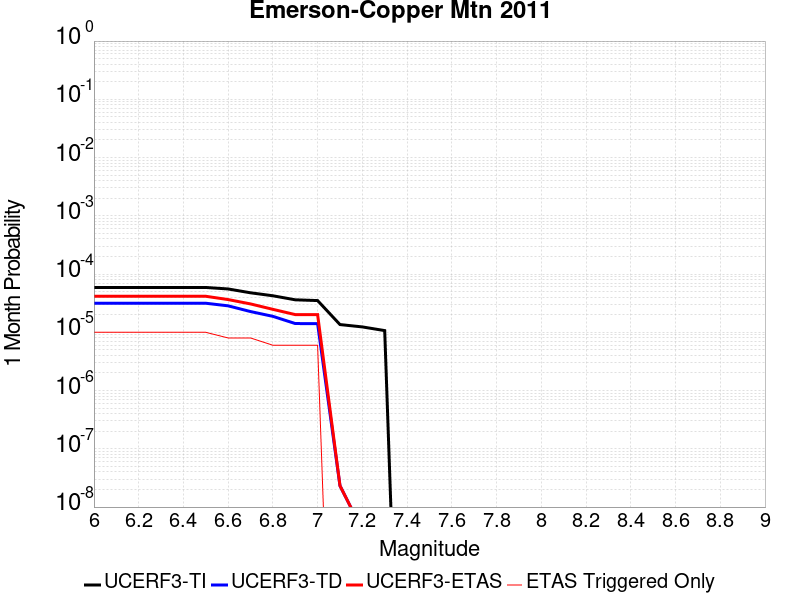 |  |  |

| Magnitude | 1 wk TI Prob | 1 wk TD Prob | 1 wk ETAS Prob | 1 wk ETAS/TD Gain | 1 wk ETAS Triggered Only | 1 mo TI Prob | 1 mo TD Prob | 1 mo ETAS Prob | 1 mo ETAS/TD Gain | 1 mo ETAS Triggered Only | 1 yr TI Prob | 1 yr TD Prob | 1 yr ETAS Prob | 1 yr ETAS/TD Gain | 1 yr ETAS Triggered Only | 10 yr TI Prob | 10 yr TD Prob | 10 yr ETAS Prob | 10 yr ETAS/TD Gain | 10 yr ETAS Triggered Only |
|-----|-----|-----|-----|-----|-----|-----|-----|-----|-----|-----|-----|-----|-----|-----|-----|-----|-----|-----|-----|-----|
| 6.0 | 1.3738761E-5 | 7.363802E-6 | 1.6627197E-5 | 2.2579634 | 9.263462E-6 | 5.8879075E-5 | 3.1558855E-5 | 4.6997473E-5 | 1.4892008 | 1.5439104E-5 | 7.166169E-4 | 3.841763E-4 | 3.9960947E-4 | 1.0401721 | 1.5439104E-5 | 0.007143104 | 0.0038365931 | 0.003858125 | 1.0056123 | 2.1614745E-5 |
| 6.1 | 1.3738761E-5 | 7.363802E-6 | 1.6627197E-5 | 2.2579634 | 9.263462E-6 | 5.8879075E-5 | 3.1558855E-5 | 4.6997473E-5 | 1.4892008 | 1.5439104E-5 | 7.166169E-4 | 3.841763E-4 | 3.9960947E-4 | 1.0401721 | 1.5439104E-5 | 0.007143104 | 0.0038365931 | 0.003858125 | 1.0056123 | 2.1614745E-5 |
| 6.2 | 1.3738761E-5 | 7.363802E-6 | 1.6627197E-5 | 2.2579634 | 9.263462E-6 | 5.8879075E-5 | 3.1558855E-5 | 4.6997473E-5 | 1.4892008 | 1.5439104E-5 | 7.166169E-4 | 3.841763E-4 | 3.9960947E-4 | 1.0401721 | 1.5439104E-5 | 0.007143104 | 0.0038365931 | 0.003858125 | 1.0056123 | 2.1614745E-5 |
| 6.3 | 1.3738761E-5 | 7.363802E-6 | 1.6627197E-5 | 2.2579634 | 9.263462E-6 | 5.8879075E-5 | 3.1558855E-5 | 4.6997473E-5 | 1.4892008 | 1.5439104E-5 | 7.166169E-4 | 3.841763E-4 | 3.9960947E-4 | 1.0401721 | 1.5439104E-5 | 0.007143104 | 0.0038365931 | 0.003858125 | 1.0056123 | 2.1614745E-5 |
| 6.4 | 1.3738761E-5 | 7.363802E-6 | 1.6627197E-5 | 2.2579634 | 9.263462E-6 | 5.8879075E-5 | 3.1558855E-5 | 4.6997473E-5 | 1.4892008 | 1.5439104E-5 | 7.166169E-4 | 3.841763E-4 | 3.9960947E-4 | 1.0401721 | 1.5439104E-5 | 0.007143104 | 0.0038365931 | 0.003858125 | 1.0056123 | 2.1614745E-5 |
| 6.5 | 1.3738761E-5 | 7.363802E-6 | 1.6627197E-5 | 2.2579634 | 9.263462E-6 | 5.8879075E-5 | 3.1558855E-5 | 4.6997473E-5 | 1.4892008 | 1.5439104E-5 | 7.166169E-4 | 3.841763E-4 | 3.9960947E-4 | 1.0401721 | 1.5439104E-5 | 0.007143104 | 0.0038365931 | 0.003858125 | 1.0056123 | 2.1614745E-5 |
| 6.6 | 1.2946993E-5 | 6.644407E-6 | 1.2820007E-5 | 1.9294434 | 6.1756414E-6 | 5.5485933E-5 | 2.8475804E-5 | 4.0826733E-5 | 1.4337343 | 1.2351283E-5 | 6.7533186E-4 | 3.4665258E-4 | 3.5899956E-4 | 1.0356178 | 1.2351283E-5 | 0.006732832 | 0.0034625726 | 0.0034810354 | 1.0053321 | 1.8526924E-5 |
| 6.7 | 1.1127743E-5 | 5.301015E-6 | 1.14766235E-5 | 2.1649861 | 6.1756414E-6 | 4.7689457E-5 | 2.2718517E-5 | 3.506952E-5 | 1.5436535 | 1.2351283E-5 | 5.8046443E-4 | 2.765771E-4 | 2.88925E-4 | 1.0446453 | 1.2351283E-5 | 0.005789506 | 0.00276373 | 0.0027822058 | 1.006685 | 1.8526924E-5 |
| 6.8 | 9.893959E-6 | 4.385705E-6 | 1.0561319E-5 | 2.4081235 | 6.1756414E-6 | 4.2401993E-5 | 1.8795821E-5 | 3.1146872E-5 | 1.6571169 | 1.2351283E-5 | 5.16122E-4 | 2.2882903E-4 | 2.4117749E-4 | 1.0539637 | 1.2351283E-5 | 0.005149249 | 0.0022873012 | 0.002302705 | 1.0067345 | 1.5439104E-5 |
| 6.9 | 8.432605E-6 | 3.3001859E-6 | 9.475807E-6 | 2.871295 | 6.1756414E-6 | 3.6139234E-5 | 1.4143652E-5 | 2.6494761E-5 | 1.8732616 | 1.2351283E-5 | 4.3990635E-4 | 1.7219881E-4 | 1.8454797E-4 | 1.0717145 | 1.2351283E-5 | 0.0043903654 | 0.0017219725 | 0.001737385 | 1.0089505 | 1.5439104E-5 |
| 7.0 | 8.181617E-6 | 3.2873893E-6 | 9.46301E-6 | 2.8785791 | 6.1756414E-6 | 3.5063604E-5 | 1.40888105E-5 | 2.643992E-5 | 1.8766608 | 1.2351283E-5 | 4.2681574E-4 | 1.7153122E-4 | 1.8388039E-4 | 1.0719937 | 1.2351283E-5 | 0.004259969 | 0.0017153069 | 0.0017307196 | 1.0089854 | 1.5439104E-5 |
| 7.1 | 3.1700695E-6 | 5.4303326E-9 | 5.4303326E-9 | 1.0 | 0.0 | 1.3585942E-5 | 2.3272854E-8 | 2.3272854E-8 | 1.0 | 0.0 | 1.6539628E-4 | 2.83347E-7 | 2.83347E-7 | 1.0 | 0.0 | 0.0016527324 | 2.833469E-6 | 2.833469E-6 | 1.0 | 0.0 |
| 7.2 | 2.8879267E-6 | 9.331039E-10 | 9.331039E-10 | 1.0 | 0.0 | 1.237677E-5 | 3.999017E-9 | 3.999017E-9 | 1.0 | 0.0 | 1.5067676E-4 | 4.868803E-8 | 4.868803E-8 | 1.0 | 0.0 | 0.0015057464 | 4.868803E-7 | 4.868803E-7 | 1.0 | 0.0 |
| 7.3 | 2.4973094E-6 | 8.4248597E-10 | 8.4248597E-10 | 1.0 | 0.0 | 1.0702711E-5 | 3.6106542E-9 | 3.6106542E-9 | 1.0 | 0.0 | 1.3029772E-4 | 4.3959716E-8 | 4.3959716E-8 | 1.0 | 0.0 | 0.0013022134 | 4.3959716E-7 | 4.3959716E-7 | 1.0 | 0.0 |

## Palos Verdes
*[(top)](#table-of-contents)*

| 1 Week | 1 Month | 1 Year | 10 Year |
|-----|-----|-----|-----|
|  |  |  |  |

| Magnitude | 1 wk TI Prob | 1 wk TD Prob | 1 wk ETAS Prob | 1 wk ETAS/TD Gain | 1 wk ETAS Triggered Only | 1 mo TI Prob | 1 mo TD Prob | 1 mo ETAS Prob | 1 mo ETAS/TD Gain | 1 mo ETAS Triggered Only | 1 yr TI Prob | 1 yr TD Prob | 1 yr ETAS Prob | 1 yr ETAS/TD Gain | 1 yr ETAS Triggered Only | 10 yr TI Prob | 10 yr TD Prob | 10 yr ETAS Prob | 10 yr ETAS/TD Gain | 10 yr ETAS Triggered Only |
|-----|-----|-----|-----|-----|-----|-----|-----|-----|-----|-----|-----|-----|-----|-----|-----|-----|-----|-----|-----|-----|
| 6.0 | 2.416717E-5 | 2.7219172E-5 | 3.3394645E-5 | 1.2268796 | 6.1756414E-6 | 1.0356947E-4 | 1.16648946E-4 | 1.2282387E-4 | 1.052936 | 6.1756414E-6 | 0.0012602288 | 0.0014193773 | 0.0014286276 | 1.0065172 | 9.263462E-6 | 0.01253106 | 0.014113327 | 0.014134636 | 1.0015099 | 2.1614745E-5 |
| 6.1 | 2.416717E-5 | 2.7219172E-5 | 3.3394645E-5 | 1.2268796 | 6.1756414E-6 | 1.0356947E-4 | 1.16648946E-4 | 1.2282387E-4 | 1.052936 | 6.1756414E-6 | 0.0012602288 | 0.0014193773 | 0.0014286276 | 1.0065172 | 9.263462E-6 | 0.01253106 | 0.014113327 | 0.014134636 | 1.0015099 | 2.1614745E-5 |
| 6.2 | 2.416717E-5 | 2.7219172E-5 | 3.3394645E-5 | 1.2268796 | 6.1756414E-6 | 1.0356947E-4 | 1.16648946E-4 | 1.2282387E-4 | 1.052936 | 6.1756414E-6 | 0.0012602288 | 0.0014193773 | 0.0014286276 | 1.0065172 | 9.263462E-6 | 0.01253106 | 0.014113327 | 0.014134636 | 1.0015099 | 2.1614745E-5 |
| 6.3 | 2.416717E-5 | 2.7219172E-5 | 3.3394645E-5 | 1.2268796 | 6.1756414E-6 | 1.0356947E-4 | 1.16648946E-4 | 1.2282387E-4 | 1.052936 | 6.1756414E-6 | 0.0012602288 | 0.0014193773 | 0.0014286276 | 1.0065172 | 9.263462E-6 | 0.01253106 | 0.014113327 | 0.014134636 | 1.0015099 | 2.1614745E-5 |
| 6.4 | 2.416717E-5 | 2.7219172E-5 | 3.3394645E-5 | 1.2268796 | 6.1756414E-6 | 1.0356947E-4 | 1.16648946E-4 | 1.2282387E-4 | 1.052936 | 6.1756414E-6 | 0.0012602288 | 0.0014193773 | 0.0014286276 | 1.0065172 | 9.263462E-6 | 0.01253106 | 0.014113327 | 0.014134636 | 1.0015099 | 2.1614745E-5 |
| 6.5 | 2.416717E-5 | 2.7219172E-5 | 3.3394645E-5 | 1.2268796 | 6.1756414E-6 | 1.0356947E-4 | 1.16648946E-4 | 1.2282387E-4 | 1.052936 | 6.1756414E-6 | 0.0012602288 | 0.0014193773 | 0.0014286276 | 1.0065172 | 9.263462E-6 | 0.01253106 | 0.014113327 | 0.014134636 | 1.0015099 | 2.1614745E-5 |
| 6.6 | 2.2181084E-5 | 2.4975725E-5 | 3.1151212E-5 | 1.2472596 | 6.1756414E-6 | 9.505832E-5 | 1.07035E-4 | 1.1320998E-4 | 1.0576912 | 6.1756414E-6 | 0.0011567206 | 0.0013024732 | 0.0013117247 | 1.007103 | 9.263462E-6 | 0.0115071805 | 0.012958492 | 0.012979826 | 1.0016464 | 2.1614745E-5 |
| 6.7 | 1.9382267E-5 | 2.1828162E-5 | 2.800367E-5 | 1.2829146 | 6.1756414E-6 | 8.306422E-5 | 9.354648E-5 | 9.972154E-5 | 1.0660106 | 6.1756414E-6 | 0.0010108376 | 0.0011384335 | 0.0011476864 | 1.0081278 | 9.263462E-6 | 0.0100625185 | 0.011335945 | 0.011357315 | 1.0018852 | 2.1614745E-5 |
| 6.8 | 1.6157266E-5 | 1.8180996E-5 | 2.4356525E-5 | 1.3396695 | 6.1756414E-6 | 6.9243586E-5 | 7.791678E-5 | 8.409194E-5 | 1.0792533 | 6.1756414E-6 | 8.4271457E-4 | 9.483226E-4 | 9.5757726E-4 | 1.009759 | 9.263462E-6 | 0.00839526 | 0.009452482 | 0.009473892 | 1.0022651 | 2.1614745E-5 |
| 6.9 | 1.3828139E-5 | 1.5540487E-5 | 2.1716034E-5 | 1.3973843 | 6.1756414E-6 | 5.9262107E-5 | 6.6600944E-5 | 7.277617E-5 | 1.0927199 | 6.1756414E-6 | 7.212773E-4 | 8.1066263E-4 | 8.199186E-4 | 1.0114177 | 9.263462E-6 | 0.007189407 | 0.008086668 | 0.008101982 | 1.0018938 | 1.5439104E-5 |
| 7.0 | 1.1833321E-5 | 1.3284609E-5 | 1.9460169E-5 | 1.4648657 | 6.1756414E-6 | 5.0713246E-5 | 5.6933346E-5 | 6.310864E-5 | 1.1084653 | 6.1756414E-6 | 6.1725883E-4 | 6.930404E-4 | 7.0229743E-4 | 1.0133572 | 9.263462E-6 | 0.0061554713 | 0.006918346 | 0.0069306116 | 1.001773 | 1.2351283E-5 |
| 7.1 | 1.0044758E-5 | 1.1258023E-5 | 1.4345809E-5 | 1.2742742 | 3.0878207E-6 | 4.304825E-5 | 4.8248323E-5 | 5.1335996E-5 | 1.0639955 | 3.0878207E-6 | 5.239864E-4 | 5.873616E-4 | 5.9353356E-4 | 1.0105081 | 6.1756414E-6 | 0.005227526 | 0.005867563 | 0.005876772 | 1.0015695 | 9.263462E-6 |
| 7.2 | 8.481934E-6 | 9.495382E-6 | 1.2583174E-5 | 1.3251888 | 3.0878207E-6 | 3.635064E-5 | 4.0694402E-5 | 4.3782096E-5 | 1.0758752 | 3.0878207E-6 | 4.4247916E-4 | 4.9543753E-4 | 4.985238E-4 | 1.0062294 | 3.0878207E-6 | 0.0044159917 | 0.0049527287 | 0.0049588736 | 1.0012407 | 6.1756414E-6 |

## Calaveras (No) 2011 CFM
*[(top)](#table-of-contents)*

| 1 Week | 1 Month | 1 Year | 10 Year |
|-----|-----|-----|-----|
|  |  |  |  |

| Magnitude | 1 wk TI Prob | 1 wk TD Prob | 1 wk ETAS Prob | 1 wk ETAS/TD Gain | 1 wk ETAS Triggered Only | 1 mo TI Prob | 1 mo TD Prob | 1 mo ETAS Prob | 1 mo ETAS/TD Gain | 1 mo ETAS Triggered Only | 1 yr TI Prob | 1 yr TD Prob | 1 yr ETAS Prob | 1 yr ETAS/TD Gain | 1 yr ETAS Triggered Only | 10 yr TI Prob | 10 yr TD Prob | 10 yr ETAS Prob | 10 yr ETAS/TD Gain | 10 yr ETAS Triggered Only |
|-----|-----|-----|-----|-----|-----|-----|-----|-----|-----|-----|-----|-----|-----|-----|-----|-----|-----|-----|-----|-----|
| 6.0 | 6.853089E-5 | 1.452927E-4 | 1.5146744E-4 | 1.0424987 | 6.1756414E-6 | 2.9367075E-4 | 6.225777E-4 | 6.2874943E-4 | 1.0099133 | 6.1756414E-6 | 0.0035695804 | 0.007561221 | 0.0075734784 | 1.0016211 | 1.2351283E-5 | 0.03512784 | 0.07195558 | 0.07197564 | 1.0002788 | 2.1614745E-5 |
| 6.1 | 6.853089E-5 | 1.452927E-4 | 1.5146744E-4 | 1.0424987 | 6.1756414E-6 | 2.9367075E-4 | 6.225777E-4 | 6.2874943E-4 | 1.0099133 | 6.1756414E-6 | 0.0035695804 | 0.007561221 | 0.0075734784 | 1.0016211 | 1.2351283E-5 | 0.03512784 | 0.07195558 | 0.07197564 | 1.0002788 | 2.1614745E-5 |
| 6.2 | 6.853089E-5 | 1.452927E-4 | 1.5146744E-4 | 1.0424987 | 6.1756414E-6 | 2.9367075E-4 | 6.225777E-4 | 6.2874943E-4 | 1.0099133 | 6.1756414E-6 | 0.0035695804 | 0.007561221 | 0.0075734784 | 1.0016211 | 1.2351283E-5 | 0.03512784 | 0.07195558 | 0.07197564 | 1.0002788 | 2.1614745E-5 |
| 6.3 | 6.853089E-5 | 1.452927E-4 | 1.5146744E-4 | 1.0424987 | 6.1756414E-6 | 2.9367075E-4 | 6.225777E-4 | 6.2874943E-4 | 1.0099133 | 6.1756414E-6 | 0.0035695804 | 0.007561221 | 0.0075734784 | 1.0016211 | 1.2351283E-5 | 0.03512784 | 0.07195558 | 0.07197564 | 1.0002788 | 2.1614745E-5 |
| 6.4 | 6.853089E-5 | 1.452927E-4 | 1.5146744E-4 | 1.0424987 | 6.1756414E-6 | 2.9367075E-4 | 6.225777E-4 | 6.2874943E-4 | 1.0099133 | 6.1756414E-6 | 0.0035695804 | 0.007561221 | 0.0075734784 | 1.0016211 | 1.2351283E-5 | 0.03512784 | 0.07195558 | 0.07197564 | 1.0002788 | 2.1614745E-5 |
| 6.5 | 6.853089E-5 | 1.452927E-4 | 1.5146744E-4 | 1.0424987 | 6.1756414E-6 | 2.9367075E-4 | 6.225777E-4 | 6.2874943E-4 | 1.0099133 | 6.1756414E-6 | 0.0035695804 | 0.007561221 | 0.0075734784 | 1.0016211 | 1.2351283E-5 | 0.03512784 | 0.07195558 | 0.07197564 | 1.0002788 | 2.1614745E-5 |
| 6.6 | 6.5130276E-5 | 1.385732E-4 | 1.4474799E-4 | 1.0445597 | 6.1756414E-6 | 2.7909988E-4 | 5.9379323E-4 | 5.999652E-4 | 1.0103941 | 6.1756414E-6 | 0.003392747 | 0.0072131394 | 0.0072254017 | 1.0016999 | 1.2351283E-5 | 0.033414144 | 0.06881748 | 0.06883761 | 1.0002924 | 2.1614745E-5 |
| 6.7 | 6.1341E-5 | 1.3118902E-4 | 1.3736385E-4 | 1.0470682 | 6.1756414E-6 | 2.6286353E-4 | 5.6216074E-4 | 5.683329E-4 | 1.0109794 | 6.1756414E-6 | 0.003195667 | 0.0068304855 | 0.0068427525 | 1.0017959 | 1.2351283E-5 | 0.03150101 | 0.06536239 | 0.065382585 | 1.0003091 | 2.1614745E-5 |
| 6.8 | 3.241399E-5 | 7.175236E-5 | 7.4839954E-5 | 1.0430313 | 3.0878207E-6 | 1.389097E-4 | 3.075001E-4 | 3.1058697E-4 | 1.0100386 | 3.0878207E-6 | 0.0016899136 | 0.0037420401 | 0.0037451165 | 1.0008221 | 3.0878207E-6 | 0.016771203 | 0.036092106 | 0.03609806 | 1.000165 | 6.1756414E-6 |
| 6.9 | 2.7363296E-5 | 6.059934E-5 | 6.059934E-5 | 1.0 | 0.0 | 1.1726599E-4 | 2.5971147E-4 | 2.5971147E-4 | 1.0 | 0.0 | 0.0014267784 | 0.003161987 | 0.003161987 | 1.0 | 0.0 | 0.014176525 | 0.030637112 | 0.030640103 | 1.0000978 | 3.0878207E-6 |

## Rodgers Creek - Healdsburg 2011 CFM
*[(top)](#table-of-contents)*

| 1 Week | 1 Month | 1 Year | 10 Year |
|-----|-----|-----|-----|
|  |  |  |  |

| Magnitude | 1 wk TI Prob | 1 wk TD Prob | 1 wk ETAS Prob | 1 wk ETAS/TD Gain | 1 wk ETAS Triggered Only | 1 mo TI Prob | 1 mo TD Prob | 1 mo ETAS Prob | 1 mo ETAS/TD Gain | 1 mo ETAS Triggered Only | 1 yr TI Prob | 1 yr TD Prob | 1 yr ETAS Prob | 1 yr ETAS/TD Gain | 1 yr ETAS Triggered Only | 10 yr TI Prob | 10 yr TD Prob | 10 yr ETAS Prob | 10 yr ETAS/TD Gain | 10 yr ETAS Triggered Only |
|-----|-----|-----|-----|-----|-----|-----|-----|-----|-----|-----|-----|-----|-----|-----|-----|-----|-----|-----|-----|-----|
| 6.0 | 9.830927E-5 | 2.4955187E-4 | 2.5881303E-4 | 1.0371112 | 9.263462E-6 | 4.212574E-4 | 0.0010693158 | 0.0010785694 | 1.0086538 | 9.263462E-6 | 0.0051167537 | 0.012984863 | 0.013003149 | 1.0014083 | 1.8526924E-5 | 0.05000532 | 0.12216672 | 0.12218569 | 1.0001553 | 2.1614745E-5 |
| 6.1 | 9.830927E-5 | 2.4955187E-4 | 2.5881303E-4 | 1.0371112 | 9.263462E-6 | 4.212574E-4 | 0.0010693158 | 0.0010785694 | 1.0086538 | 9.263462E-6 | 0.0051167537 | 0.012984863 | 0.013003149 | 1.0014083 | 1.8526924E-5 | 0.05000532 | 0.12216672 | 0.12218569 | 1.0001553 | 2.1614745E-5 |
| 6.2 | 9.830927E-5 | 2.4955187E-4 | 2.5881303E-4 | 1.0371112 | 9.263462E-6 | 4.212574E-4 | 0.0010693158 | 0.0010785694 | 1.0086538 | 9.263462E-6 | 0.0051167537 | 0.012984863 | 0.013003149 | 1.0014083 | 1.8526924E-5 | 0.05000532 | 0.12216672 | 0.12218569 | 1.0001553 | 2.1614745E-5 |
| 6.3 | 9.830927E-5 | 2.4955187E-4 | 2.5881303E-4 | 1.0371112 | 9.263462E-6 | 4.212574E-4 | 0.0010693158 | 0.0010785694 | 1.0086538 | 9.263462E-6 | 0.0051167537 | 0.012984863 | 0.013003149 | 1.0014083 | 1.8526924E-5 | 0.05000532 | 0.12216672 | 0.12218569 | 1.0001553 | 2.1614745E-5 |
| 6.4 | 9.830927E-5 | 2.4955187E-4 | 2.5881303E-4 | 1.0371112 | 9.263462E-6 | 4.212574E-4 | 0.0010693158 | 0.0010785694 | 1.0086538 | 9.263462E-6 | 0.0051167537 | 0.012984863 | 0.013003149 | 1.0014083 | 1.8526924E-5 | 0.05000532 | 0.12216672 | 0.12218569 | 1.0001553 | 2.1614745E-5 |
| 6.5 | 9.830927E-5 | 2.4955187E-4 | 2.5881303E-4 | 1.0371112 | 9.263462E-6 | 4.212574E-4 | 0.0010693158 | 0.0010785694 | 1.0086538 | 9.263462E-6 | 0.0051167537 | 0.012984863 | 0.013003149 | 1.0014083 | 1.8526924E-5 | 0.05000532 | 0.12216672 | 0.12218569 | 1.0001553 | 2.1614745E-5 |
| 6.6 | 9.722793E-5 | 2.4745433E-4 | 2.5671552E-4 | 1.0374258 | 9.263462E-6 | 4.1662456E-4 | 0.001060334 | 0.0010695877 | 1.0087271 | 9.263462E-6 | 0.0050606127 | 0.012876847 | 0.012895135 | 1.0014203 | 1.8526924E-5 | 0.049469102 | 0.12122572 | 0.12124472 | 1.0001566 | 2.1614745E-5 |
| 6.7 | 9.631043E-5 | 2.4569524E-4 | 2.5495642E-4 | 1.0376937 | 9.263462E-6 | 4.1269368E-4 | 0.0010528011 | 0.0010620549 | 1.0087897 | 9.263462E-6 | 0.0050129755 | 0.012786214 | 0.0128045045 | 1.0014304 | 1.8526924E-5 | 0.049013894 | 0.12043094 | 0.12044995 | 1.0001578 | 2.1614745E-5 |
| 6.8 | 9.5157004E-5 | 2.4311169E-4 | 2.523729E-4 | 1.0380945 | 9.263462E-6 | 4.0775197E-4 | 0.0010417376 | 0.0010509915 | 1.008883 | 9.263462E-6 | 0.0049530854 | 0.012653089 | 0.012671382 | 1.0014457 | 1.8526924E-5 | 0.048441324 | 0.1192606 | 0.11927964 | 1.0001596 | 2.1614745E-5 |
| 6.9 | 9.3715214E-5 | 2.3986747E-4 | 2.491287E-4 | 1.0386099 | 9.263462E-6 | 4.015748E-4 | 0.0010278448 | 0.0010370988 | 1.0090033 | 9.263462E-6 | 0.004878218 | 0.012485896 | 0.012504192 | 1.0014653 | 1.8526924E-5 | 0.047725122 | 0.11779124 | 0.11781031 | 1.0001619 | 2.1614745E-5 |
| 7.0 | 9.21773E-5 | 2.3636219E-4 | 2.4562347E-4 | 1.0391825 | 9.263462E-6 | 3.9498575E-4 | 0.0010128339 | 0.001022088 | 1.0091368 | 9.263462E-6 | 0.0047983527 | 0.012305218 | 0.012323516 | 1.0014871 | 1.8526924E-5 | 0.046960585 | 0.11620537 | 0.11622175 | 1.0001409 | 1.8526924E-5 |
| 7.1 | 1.8670535E-5 | 4.6669888E-5 | 4.9757564E-5 | 1.06616 | 3.0878207E-6 | 8.001412E-5 | 2.0000339E-4 | 2.0309059E-4 | 1.0154357 | 3.0878207E-6 | 9.737365E-4 | 0.0024331913 | 0.0024424323 | 1.0037979 | 9.263462E-6 | 0.009694808 | 0.023618827 | 0.023627872 | 1.0003829 | 9.263462E-6 |
| 7.2 | 6.6138855E-6 | 1.8792352E-5 | 2.1880116E-5 | 1.1643095 | 3.0878207E-6 | 2.8344915E-5 | 8.053787E-5 | 8.362545E-5 | 1.0383369 | 3.0878207E-6 | 3.4504468E-4 | 9.8041E-4 | 9.896643E-4 | 1.0094393 | 9.263462E-6 | 0.0034450945 | 0.009560432 | 0.009569607 | 1.0009596 | 9.263462E-6 |
| 7.3 | 5.4382035E-6 | 1.5442325E-5 | 1.8530098E-5 | 1.1999552 | 3.0878207E-6 | 2.3306378E-5 | 6.618139E-5 | 6.926901E-5 | 1.0466539 | 3.0878207E-6 | 2.8371823E-4 | 8.0575846E-4 | 8.150144E-4 | 1.0114874 | 9.263462E-6 | 0.0028335627 | 0.007868089 | 0.00787728 | 1.0011681 | 9.263462E-6 |

## Casmalia 2011 CFM
*[(top)](#table-of-contents)*

| 1 Week | 1 Month | 1 Year | 10 Year |
|-----|-----|-----|-----|
|  |  |  |  |

| Magnitude | 1 wk TI Prob | 1 wk TD Prob | 1 wk ETAS Prob | 1 wk ETAS/TD Gain | 1 wk ETAS Triggered Only | 1 mo TI Prob | 1 mo TD Prob | 1 mo ETAS Prob | 1 mo ETAS/TD Gain | 1 mo ETAS Triggered Only | 1 yr TI Prob | 1 yr TD Prob | 1 yr ETAS Prob | 1 yr ETAS/TD Gain | 1 yr ETAS Triggered Only | 10 yr TI Prob | 10 yr TD Prob | 10 yr ETAS Prob | 10 yr ETAS/TD Gain | 10 yr ETAS Triggered Only |
|-----|-----|-----|-----|-----|-----|-----|-----|-----|-----|-----|-----|-----|-----|-----|-----|-----|-----|-----|-----|-----|
| 6.0 | 4.5215784E-6 | 4.6811892E-6 | 4.6811892E-6 | 1.0 | 0.0 | 1.9378049E-5 | 2.0062238E-5 | 2.3149998E-5 | 1.153909 | 3.0878207E-6 | 2.359022E-4 | 2.4425777E-4 | 2.5351896E-4 | 1.0379157 | 9.263462E-6 | 0.0023565195 | 0.0024425776 | 0.0024641396 | 1.0088276 | 2.1614745E-5 |
| 6.1 | 4.5215784E-6 | 4.6811892E-6 | 4.6811892E-6 | 1.0 | 0.0 | 1.9378049E-5 | 2.0062238E-5 | 2.3149998E-5 | 1.153909 | 3.0878207E-6 | 2.359022E-4 | 2.4425777E-4 | 2.5351896E-4 | 1.0379157 | 9.263462E-6 | 0.0023565195 | 0.0024425776 | 0.0024641396 | 1.0088276 | 2.1614745E-5 |
| 6.2 | 4.5215784E-6 | 4.6811892E-6 | 4.6811892E-6 | 1.0 | 0.0 | 1.9378049E-5 | 2.0062238E-5 | 2.3149998E-5 | 1.153909 | 3.0878207E-6 | 2.359022E-4 | 2.4425777E-4 | 2.5351896E-4 | 1.0379157 | 9.263462E-6 | 0.0023565195 | 0.0024425776 | 0.0024641396 | 1.0088276 | 2.1614745E-5 |
| 6.3 | 4.5215784E-6 | 4.6811892E-6 | 4.6811892E-6 | 1.0 | 0.0 | 1.9378049E-5 | 2.0062238E-5 | 2.3149998E-5 | 1.153909 | 3.0878207E-6 | 2.359022E-4 | 2.4425777E-4 | 2.5351896E-4 | 1.0379157 | 9.263462E-6 | 0.0023565195 | 0.0024425776 | 0.0024641396 | 1.0088276 | 2.1614745E-5 |
| 6.4 | 4.5215784E-6 | 4.6811892E-6 | 4.6811892E-6 | 1.0 | 0.0 | 1.9378049E-5 | 2.0062238E-5 | 2.3149998E-5 | 1.153909 | 3.0878207E-6 | 2.359022E-4 | 2.4425777E-4 | 2.5351896E-4 | 1.0379157 | 9.263462E-6 | 0.0023565195 | 0.0024425776 | 0.0024641396 | 1.0088276 | 2.1614745E-5 |
| 6.5 | 4.5215784E-6 | 4.6811892E-6 | 4.6811892E-6 | 1.0 | 0.0 | 1.9378049E-5 | 2.0062238E-5 | 2.3149998E-5 | 1.153909 | 3.0878207E-6 | 2.359022E-4 | 2.4425777E-4 | 2.5351896E-4 | 1.0379157 | 9.263462E-6 | 0.0023565195 | 0.0024425776 | 0.0024641396 | 1.0088276 | 2.1614745E-5 |

## San Jacinto (Coyote Creek)
*[(top)](#table-of-contents)*

| 1 Week | 1 Month | 1 Year | 10 Year |
|-----|-----|-----|-----|
| 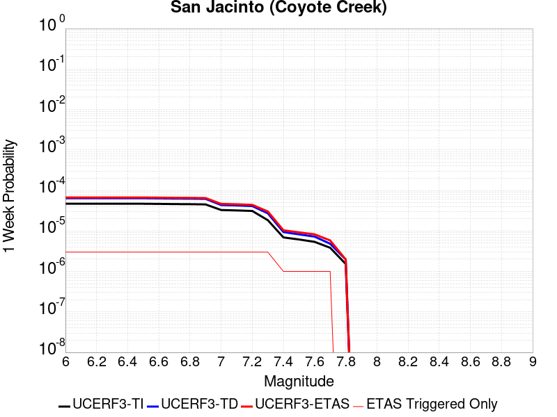 |  |  |  |

| Magnitude | 1 wk TI Prob | 1 wk TD Prob | 1 wk ETAS Prob | 1 wk ETAS/TD Gain | 1 wk ETAS Triggered Only | 1 mo TI Prob | 1 mo TD Prob | 1 mo ETAS Prob | 1 mo ETAS/TD Gain | 1 mo ETAS Triggered Only | 1 yr TI Prob | 1 yr TD Prob | 1 yr ETAS Prob | 1 yr ETAS/TD Gain | 1 yr ETAS Triggered Only | 10 yr TI Prob | 10 yr TD Prob | 10 yr ETAS Prob | 10 yr ETAS/TD Gain | 10 yr ETAS Triggered Only |
|-----|-----|-----|-----|-----|-----|-----|-----|-----|-----|-----|-----|-----|-----|-----|-----|-----|-----|-----|-----|-----|
| 6.0 | 4.69665E-5 | 6.4235006E-5 | 6.7322624E-5 | 1.0480676 | 3.0878207E-6 | 2.0126947E-4 | 2.7526915E-4 | 2.7835614E-4 | 1.0112144 | 3.0878207E-6 | 0.002447702 | 0.0033471098 | 0.0033501873 | 1.0009195 | 3.0878207E-6 | 0.024209166 | 0.033357523 | 0.03337543 | 1.0005369 | 1.8526924E-5 |
| 6.1 | 4.69665E-5 | 6.4235006E-5 | 6.7322624E-5 | 1.0480676 | 3.0878207E-6 | 2.0126947E-4 | 2.7526915E-4 | 2.7835614E-4 | 1.0112144 | 3.0878207E-6 | 0.002447702 | 0.0033471098 | 0.0033501873 | 1.0009195 | 3.0878207E-6 | 0.024209166 | 0.033357523 | 0.03337543 | 1.0005369 | 1.8526924E-5 |
| 6.2 | 4.69665E-5 | 6.4235006E-5 | 6.7322624E-5 | 1.0480676 | 3.0878207E-6 | 2.0126947E-4 | 2.7526915E-4 | 2.7835614E-4 | 1.0112144 | 3.0878207E-6 | 0.002447702 | 0.0033471098 | 0.0033501873 | 1.0009195 | 3.0878207E-6 | 0.024209166 | 0.033357523 | 0.03337543 | 1.0005369 | 1.8526924E-5 |
| 6.3 | 4.69665E-5 | 6.4235006E-5 | 6.7322624E-5 | 1.0480676 | 3.0878207E-6 | 2.0126947E-4 | 2.7526915E-4 | 2.7835614E-4 | 1.0112144 | 3.0878207E-6 | 0.002447702 | 0.0033471098 | 0.0033501873 | 1.0009195 | 3.0878207E-6 | 0.024209166 | 0.033357523 | 0.03337543 | 1.0005369 | 1.8526924E-5 |
| 6.4 | 4.69665E-5 | 6.4235006E-5 | 6.7322624E-5 | 1.0480676 | 3.0878207E-6 | 2.0126947E-4 | 2.7526915E-4 | 2.7835614E-4 | 1.0112144 | 3.0878207E-6 | 0.002447702 | 0.0033471098 | 0.0033501873 | 1.0009195 | 3.0878207E-6 | 0.024209166 | 0.033357523 | 0.03337543 | 1.0005369 | 1.8526924E-5 |
| 6.5 | 4.69665E-5 | 6.4235006E-5 | 6.7322624E-5 | 1.0480676 | 3.0878207E-6 | 2.0126947E-4 | 2.7526915E-4 | 2.7835614E-4 | 1.0112144 | 3.0878207E-6 | 0.002447702 | 0.0033471098 | 0.0033501873 | 1.0009195 | 3.0878207E-6 | 0.024209166 | 0.033357523 | 0.03337543 | 1.0005369 | 1.8526924E-5 |
| 6.6 | 4.65626E-5 | 6.365397E-5 | 6.6741595E-5 | 1.0485064 | 3.0878207E-6 | 1.9953873E-4 | 2.7277967E-4 | 2.7586665E-4 | 1.0113168 | 3.0878207E-6 | 0.0024266774 | 0.0033169023 | 0.0033199799 | 1.0009278 | 3.0878207E-6 | 0.024003487 | 0.033065155 | 0.033083066 | 1.0005418 | 1.8526924E-5 |
| 6.7 | 4.6128687E-5 | 6.303452E-5 | 6.612215E-5 | 1.0489831 | 3.0878207E-6 | 1.9767939E-4 | 2.7012554E-4 | 2.7321253E-4 | 1.011428 | 3.0878207E-6 | 0.00240409 | 0.0032846953 | 0.003287773 | 1.000937 | 3.0878207E-6 | 0.023782477 | 0.032753225 | 0.032771144 | 1.0005472 | 1.8526924E-5 |
| 6.8 | 4.5828285E-5 | 6.268431E-5 | 6.577194E-5 | 1.0492568 | 3.0878207E-6 | 1.9639214E-4 | 2.6862495E-4 | 2.7171194E-4 | 1.0114918 | 3.0878207E-6 | 0.0023884522 | 0.0032664812 | 0.003269559 | 1.0009422 | 3.0878207E-6 | 0.02362944 | 0.03257484 | 0.032592762 | 1.0005503 | 1.8526924E-5 |
| 6.9 | 4.523555E-5 | 6.1988314E-5 | 6.507595E-5 | 1.0498098 | 3.0878207E-6 | 1.9385223E-4 | 2.656427E-4 | 2.6872972E-4 | 1.0116209 | 3.0878207E-6 | 0.0023575963 | 0.003230282 | 0.00323336 | 1.0009528 | 3.0878207E-6 | 0.023327406 | 0.032220315 | 0.032235257 | 1.0004637 | 1.5439104E-5 |
| 7.0 | 3.2913522E-5 | 4.3638418E-5 | 4.67261E-5 | 1.0707562 | 3.0878207E-6 | 1.4105032E-4 | 1.8701174E-4 | 1.9009899E-4 | 1.0165083 | 3.0878207E-6 | 0.0017159348 | 0.0022750867 | 0.0022781675 | 1.0013541 | 3.0878207E-6 | 0.017027453 | 0.022874728 | 0.022886796 | 1.0005276 | 1.2351283E-5 |
| 7.1 | 3.2150587E-5 | 4.262259E-5 | 4.571028E-5 | 1.0724425 | 3.0878207E-6 | 1.3778094E-4 | 1.8265881E-4 | 1.8574607E-4 | 1.0169017 | 3.0878207E-6 | 0.0016761922 | 0.002222199 | 0.0022252798 | 1.0013864 | 3.0878207E-6 | 0.016636053 | 0.02235371 | 0.022365786 | 1.0005401 | 1.2351283E-5 |
| 7.2 | 3.1169668E-5 | 4.115963E-5 | 4.424732E-5 | 1.0750176 | 3.0878207E-6 | 1.3357744E-4 | 1.7638985E-4 | 1.7947712E-4 | 1.0175025 | 3.0878207E-6 | 0.0016250921 | 0.0021460268 | 0.002149108 | 1.0014358 | 3.0878207E-6 | 0.016132593 | 0.021605676 | 0.02161776 | 1.0005593 | 1.2351283E-5 |
| 7.3 | 1.8423585E-5 | 2.7220098E-5 | 3.0307834E-5 | 1.1134359 | 3.0878207E-6 | 7.895583E-5 | 1.1665466E-4 | 1.19742115E-4 | 1.0264667 | 3.0878207E-6 | 9.608633E-4 | 0.0014197543 | 0.0014228378 | 1.0021718 | 3.0878207E-6 | 0.009567193 | 0.014355129 | 0.014367303 | 1.000848 | 1.2351283E-5 |
| 7.4 | 6.9267962E-6 | 9.391728E-6 | 1.247952E-5 | 1.3287778 | 3.0878207E-6 | 2.968593E-5 | 4.024971E-5 | 4.3337408E-5 | 1.0767136 | 3.0878207E-6 | 3.6136628E-4 | 4.899425E-4 | 4.9302884E-4 | 1.0062994 | 3.0878207E-6 | 0.003607792 | 0.005030186 | 0.0050394027 | 1.0018324 | 9.263462E-6 |
| 7.5 | 6.1587302E-6 | 8.234252E-6 | 1.1322048E-5 | 1.374994 | 3.0878207E-6 | 2.6394291E-5 | 3.5289235E-5 | 3.8376947E-5 | 1.0874972 | 3.0878207E-6 | 3.213031E-4 | 4.2957254E-4 | 4.3265903E-4 | 1.007185 | 3.0878207E-6 | 0.0032083893 | 0.004419193 | 0.004428416 | 1.0020869 | 9.263462E-6 |
| 7.6 | 5.383844E-6 | 7.2529047E-6 | 1.0340703E-5 | 1.4257326 | 3.0878207E-6 | 2.3073413E-5 | 3.108356E-5 | 3.4171284E-5 | 1.0993363 | 3.0878207E-6 | 2.8088258E-4 | 3.7838623E-4 | 3.8147287E-4 | 1.0081574 | 3.0878207E-6 | 0.0028052782 | 0.0038957447 | 0.003904972 | 1.0023686 | 9.263462E-6 |
| 7.7 | 3.843031E-6 | 4.8339584E-6 | 7.921764E-6 | 1.6387738 | 3.0878207E-6 | 1.647003E-5 | 2.0716834E-5 | 2.380459E-5 | 1.1490458 | 3.0878207E-6 | 2.0050416E-4 | 2.5220422E-4 | 2.5529123E-4 | 1.0122403 | 3.0878207E-6 | 0.0020032334 | 0.002619455 | 0.0026286945 | 1.0035272 | 9.263462E-6 |
| 7.8 | 1.5303123E-6 | 1.9707616E-6 | 1.9707616E-6 | 1.0 | 0.0 | 6.5584645E-6 | 8.446107E-6 | 8.446107E-6 | 1.0 | 0.0 | 7.984638E-5 | 1.0282895E-4 | 1.0282895E-4 | 1.0 | 0.0 | 7.98177E-4 | 0.001066982 | 0.0010700666 | 1.002891 | 3.0878207E-6 |

## Hat Creek-McArthur-Mayfield
*[(top)](#table-of-contents)*

| 1 Week | 1 Month | 1 Year | 10 Year |
|-----|-----|-----|-----|
|  |  |  |  |

| Magnitude | 1 wk TI Prob | 1 wk TD Prob | 1 wk ETAS Prob | 1 wk ETAS/TD Gain | 1 wk ETAS Triggered Only | 1 mo TI Prob | 1 mo TD Prob | 1 mo ETAS Prob | 1 mo ETAS/TD Gain | 1 mo ETAS Triggered Only | 1 yr TI Prob | 1 yr TD Prob | 1 yr ETAS Prob | 1 yr ETAS/TD Gain | 1 yr ETAS Triggered Only | 10 yr TI Prob | 10 yr TD Prob | 10 yr ETAS Prob | 10 yr ETAS/TD Gain | 10 yr ETAS Triggered Only |
|-----|-----|-----|-----|-----|-----|-----|-----|-----|-----|-----|-----|-----|-----|-----|-----|-----|-----|-----|-----|-----|
| 6.0 | 2.1823456E-5 | 2.4773932E-5 | 3.4037163E-5 | 1.3739105 | 9.263462E-6 | 9.352575E-5 | 1.0617048E-4 | 1.2160795E-4 | 1.1454026 | 1.5439104E-5 | 0.0011380811 | 0.0012920036 | 0.0013105066 | 1.0143212 | 1.8526924E-5 | 0.011322702 | 0.01285923 | 0.012877518 | 1.0014222 | 1.8526924E-5 |
| 6.1 | 2.1823456E-5 | 2.4773932E-5 | 3.4037163E-5 | 1.3739105 | 9.263462E-6 | 9.352575E-5 | 1.0617048E-4 | 1.2160795E-4 | 1.1454026 | 1.5439104E-5 | 0.0011380811 | 0.0012920036 | 0.0013105066 | 1.0143212 | 1.8526924E-5 | 0.011322702 | 0.01285923 | 0.012877518 | 1.0014222 | 1.8526924E-5 |
| 6.2 | 2.1823456E-5 | 2.4773932E-5 | 3.4037163E-5 | 1.3739105 | 9.263462E-6 | 9.352575E-5 | 1.0617048E-4 | 1.2160795E-4 | 1.1454026 | 1.5439104E-5 | 0.0011380811 | 0.0012920036 | 0.0013105066 | 1.0143212 | 1.8526924E-5 | 0.011322702 | 0.01285923 | 0.012877518 | 1.0014222 | 1.8526924E-5 |
| 6.3 | 2.1823456E-5 | 2.4773932E-5 | 3.4037163E-5 | 1.3739105 | 9.263462E-6 | 9.352575E-5 | 1.0617048E-4 | 1.2160795E-4 | 1.1454026 | 1.5439104E-5 | 0.0011380811 | 0.0012920036 | 0.0013105066 | 1.0143212 | 1.8526924E-5 | 0.011322702 | 0.01285923 | 0.012877518 | 1.0014222 | 1.8526924E-5 |
| 6.4 | 2.1823456E-5 | 2.4773932E-5 | 3.4037163E-5 | 1.3739105 | 9.263462E-6 | 9.352575E-5 | 1.0617048E-4 | 1.2160795E-4 | 1.1454026 | 1.5439104E-5 | 0.0011380811 | 0.0012920036 | 0.0013105066 | 1.0143212 | 1.8526924E-5 | 0.011322702 | 0.01285923 | 0.012877518 | 1.0014222 | 1.8526924E-5 |
| 6.5 | 2.1823456E-5 | 2.4773932E-5 | 3.4037163E-5 | 1.3739105 | 9.263462E-6 | 9.352575E-5 | 1.0617048E-4 | 1.2160795E-4 | 1.1454026 | 1.5439104E-5 | 0.0011380811 | 0.0012920036 | 0.0013105066 | 1.0143212 | 1.8526924E-5 | 0.011322702 | 0.01285923 | 0.012877518 | 1.0014222 | 1.8526924E-5 |
| 6.6 | 1.9340694E-5 | 2.1946753E-5 | 2.5034506E-5 | 1.140693 | 3.0878207E-6 | 8.288605E-5 | 9.405493E-5 | 1.0331752E-4 | 1.0984807 | 9.263462E-6 | 0.0010086704 | 0.001144661 | 0.0011539138 | 1.0080835 | 9.263462E-6 | 0.010041044 | 0.011401833 | 0.011410992 | 1.0008032 | 9.263462E-6 |
| 6.7 | 1.6797176E-5 | 1.9037067E-5 | 2.2124828E-5 | 1.1621974 | 3.0878207E-6 | 7.1985916E-5 | 8.1585684E-5 | 9.084839E-5 | 1.1135335 | 9.263462E-6 | 8.7607605E-4 | 9.929959E-4 | 0.0010022502 | 1.0093195 | 9.263462E-6 | 0.0087263035 | 0.00989965 | 0.009908821 | 1.0009265 | 9.263462E-6 |
| 6.8 | 1.4852288E-5 | 1.6815693E-5 | 1.9903462E-5 | 1.1836243 | 3.0878207E-6 | 6.365111E-5 | 7.206607E-5 | 8.1328864E-5 | 1.1285319 | 9.263462E-6 | 7.7467674E-4 | 8.771936E-4 | 8.8644895E-4 | 1.0105511 | 9.263462E-6 | 0.007719817 | 0.008751296 | 0.008760479 | 1.0010493 | 9.263462E-6 |
| 6.9 | 1.2757133E-5 | 1.4418652E-5 | 1.7506429E-5 | 1.2141515 | 3.0878207E-6 | 5.467228E-5 | 6.179356E-5 | 7.105645E-5 | 1.1499006 | 9.263462E-6 | 6.654317E-4 | 7.522186E-4 | 7.6147506E-4 | 1.0123056 | 9.263462E-6 | 0.0066344263 | 0.007510623 | 0.007519817 | 1.0012242 | 9.263462E-6 |
| 7.0 | 1.10079245E-5 | 1.2422667E-5 | 1.551045E-5 | 1.2485603 | 3.0878207E-6 | 4.7175967E-5 | 5.3239713E-5 | 5.9415026E-5 | 1.1159908 | 6.1756414E-6 | 5.74216E-4 | 6.4814166E-4 | 6.543133E-4 | 1.0095221 | 6.1756414E-6 | 0.005727345 | 0.0064763394 | 0.006482475 | 1.0009474 | 6.1756414E-6 |
| 7.1 | 9.3994E-6 | 1.059216E-5 | 1.3679948E-5 | 1.2915164 | 3.0878207E-6 | 4.0282524E-5 | 4.5394972E-5 | 5.1570332E-5 | 1.1360363 | 6.1756414E-6 | 4.9032934E-4 | 5.526838E-4 | 5.58856E-4 | 1.0111678 | 6.1756414E-6 | 0.004892489 | 0.005526838 | 0.005532979 | 1.0011113 | 6.1756414E-6 |

## Coronado Bank alt1
*[(top)](#table-of-contents)*

| 1 Week | 1 Month | 1 Year | 10 Year |
|-----|-----|-----|-----|
|  |  |  |  |

| Magnitude | 1 wk TI Prob | 1 wk TD Prob | 1 wk ETAS Prob | 1 wk ETAS/TD Gain | 1 wk ETAS Triggered Only | 1 mo TI Prob | 1 mo TD Prob | 1 mo ETAS Prob | 1 mo ETAS/TD Gain | 1 mo ETAS Triggered Only | 1 yr TI Prob | 1 yr TD Prob | 1 yr ETAS Prob | 1 yr ETAS/TD Gain | 1 yr ETAS Triggered Only | 10 yr TI Prob | 10 yr TD Prob | 10 yr ETAS Prob | 10 yr ETAS/TD Gain | 10 yr ETAS Triggered Only |
|-----|-----|-----|-----|-----|-----|-----|-----|-----|-----|-----|-----|-----|-----|-----|-----|-----|-----|-----|-----|-----|
| 6.0 | 2.2805418E-5 | 2.2997261E-5 | 2.917276E-5 | 1.2685319 | 6.1756414E-6 | 9.773385E-5 | 9.8556375E-5 | 1.0473141E-4 | 1.0626549 | 6.1756414E-6 | 0.00118926 | 0.0011993361 | 0.0012085885 | 1.0077145 | 9.263462E-6 | 0.011829156 | 0.011935918 | 0.011951173 | 1.001278 | 1.5439104E-5 |
| 6.1 | 2.2805418E-5 | 2.2997261E-5 | 2.917276E-5 | 1.2685319 | 6.1756414E-6 | 9.773385E-5 | 9.8556375E-5 | 1.0473141E-4 | 1.0626549 | 6.1756414E-6 | 0.00118926 | 0.0011993361 | 0.0012085885 | 1.0077145 | 9.263462E-6 | 0.011829156 | 0.011935918 | 0.011951173 | 1.001278 | 1.5439104E-5 |
| 6.2 | 2.2805418E-5 | 2.2997261E-5 | 2.917276E-5 | 1.2685319 | 6.1756414E-6 | 9.773385E-5 | 9.8556375E-5 | 1.0473141E-4 | 1.0626549 | 6.1756414E-6 | 0.00118926 | 0.0011993361 | 0.0012085885 | 1.0077145 | 9.263462E-6 | 0.011829156 | 0.011935918 | 0.011951173 | 1.001278 | 1.5439104E-5 |
| 6.3 | 2.2805418E-5 | 2.2997261E-5 | 2.917276E-5 | 1.2685319 | 6.1756414E-6 | 9.773385E-5 | 9.8556375E-5 | 1.0473141E-4 | 1.0626549 | 6.1756414E-6 | 0.00118926 | 0.0011993361 | 0.0012085885 | 1.0077145 | 9.263462E-6 | 0.011829156 | 0.011935918 | 0.011951173 | 1.001278 | 1.5439104E-5 |
| 6.4 | 2.2805418E-5 | 2.2997261E-5 | 2.917276E-5 | 1.2685319 | 6.1756414E-6 | 9.773385E-5 | 9.8556375E-5 | 1.0473141E-4 | 1.0626549 | 6.1756414E-6 | 0.00118926 | 0.0011993361 | 0.0012085885 | 1.0077145 | 9.263462E-6 | 0.011829156 | 0.011935918 | 0.011951173 | 1.001278 | 1.5439104E-5 |
| 6.5 | 2.2805418E-5 | 2.2997261E-5 | 2.917276E-5 | 1.2685319 | 6.1756414E-6 | 9.773385E-5 | 9.8556375E-5 | 1.0473141E-4 | 1.0626549 | 6.1756414E-6 | 0.00118926 | 0.0011993361 | 0.0012085885 | 1.0077145 | 9.263462E-6 | 0.011829156 | 0.011935918 | 0.011951173 | 1.001278 | 1.5439104E-5 |
| 6.6 | 2.0608364E-5 | 2.2997261E-5 | 2.917276E-5 | 1.2685319 | 6.1756414E-6 | 8.831857E-5 | 9.8556375E-5 | 1.0473141E-4 | 1.0626549 | 6.1756414E-6 | 0.0010747481 | 0.0011993361 | 0.0012085885 | 1.0077145 | 9.263462E-6 | 0.010695651 | 0.011935918 | 0.011951173 | 1.001278 | 1.5439104E-5 |
| 6.7 | 1.8279972E-5 | 2.0392206E-5 | 2.6567723E-5 | 1.302837 | 6.1756414E-6 | 7.834038E-5 | 8.7392655E-5 | 9.356775E-5 | 1.0706593 | 6.1756414E-6 | 9.533768E-4 | 0.0010635584 | 0.001072812 | 1.0087006 | 9.263462E-6 | 0.00949297 | 0.010591865 | 0.01060714 | 1.0014422 | 1.5439104E-5 |
| 6.8 | 1.5100513E-5 | 1.6821805E-5 | 1.9909574E-5 | 1.1835575 | 3.0878207E-6 | 6.471488E-5 | 7.209186E-5 | 7.517946E-5 | 1.0428287 | 3.0878207E-6 | 7.876188E-4 | 8.77436E-4 | 8.8360626E-4 | 1.0070322 | 6.1756414E-6 | 0.007848332 | 0.008746733 | 0.008758976 | 1.0013998 | 1.2351283E-5 |
| 6.9 | 1.3558665E-5 | 1.5095915E-5 | 1.818369E-5 | 1.2045437 | 3.0878207E-6 | 5.810727E-5 | 6.4695574E-5 | 6.778319E-5 | 1.0477254 | 3.0878207E-6 | 7.0722634E-4 | 7.874548E-4 | 7.936256E-4 | 1.0078363 | 6.1756414E-6 | 0.0070497985 | 0.007853617 | 0.007865871 | 1.0015603 | 1.2351283E-5 |
| 7.0 | 1.1606914E-5 | 1.2905324E-5 | 1.5993104E-5 | 1.2392641 | 3.0878207E-6 | 4.9742972E-5 | 5.5307755E-5 | 5.8395406E-5 | 1.0558267 | 3.0878207E-6 | 6.0545234E-4 | 6.7323423E-4 | 6.794057E-4 | 1.009167 | 6.1756414E-6 | 0.0060380544 | 0.006718854 | 0.0067311223 | 1.0018259 | 1.2351283E-5 |
| 7.1 | 9.601701E-6 | 1.06512E-5 | 1.3738987E-5 | 1.2899004 | 3.0878207E-6 | 4.11495E-5 | 4.564759E-5 | 4.873527E-5 | 1.0676417 | 3.0878207E-6 | 5.0088E-4 | 5.556874E-4 | 5.6185963E-4 | 1.0111073 | 6.1756414E-6 | 0.0049975254 | 0.005549817 | 0.0055590286 | 1.0016599 | 9.263462E-6 |
| 7.2 | 8.368532E-6 | 9.267938E-6 | 1.235573E-5 | 1.3331692 | 3.0878207E-6 | 3.5864643E-5 | 3.971952E-5 | 4.280722E-5 | 1.0777376 | 3.0878207E-6 | 4.3656456E-4 | 4.8354716E-4 | 4.897198E-4 | 1.0127654 | 6.1756414E-6 | 0.004357079 | 0.0048317458 | 0.0048409645 | 1.001908 | 9.263462E-6 |
| 7.3 | 6.710382E-6 | 7.416545E-6 | 7.416545E-6 | 1.0 | 0.0 | 2.8758463E-5 | 3.1785192E-5 | 3.1785192E-5 | 1.0 | 0.0 | 3.5007801E-4 | 3.8698473E-4 | 3.9007133E-4 | 1.007976 | 3.0878207E-6 | 0.0034952704 | 0.0038698472 | 0.0038759988 | 1.0015897 | 6.1756414E-6 |

## Newport-Inglewood alt 1
*[(top)](#table-of-contents)*

| 1 Week | 1 Month | 1 Year | 10 Year |
|-----|-----|-----|-----|
|  |  |  |  |

| Magnitude | 1 wk TI Prob | 1 wk TD Prob | 1 wk ETAS Prob | 1 wk ETAS/TD Gain | 1 wk ETAS Triggered Only | 1 mo TI Prob | 1 mo TD Prob | 1 mo ETAS Prob | 1 mo ETAS/TD Gain | 1 mo ETAS Triggered Only | 1 yr TI Prob | 1 yr TD Prob | 1 yr ETAS Prob | 1 yr ETAS/TD Gain | 1 yr ETAS Triggered Only | 10 yr TI Prob | 10 yr TD Prob | 10 yr ETAS Prob | 10 yr ETAS/TD Gain | 10 yr ETAS Triggered Only |
|-----|-----|-----|-----|-----|-----|-----|-----|-----|-----|-----|-----|-----|-----|-----|-----|-----|-----|-----|-----|-----|
| 6.0 | 1.1148327E-5 | 8.39976E-6 | 1.7663144E-5 | 2.1028154 | 9.263462E-6 | 4.777767E-5 | 3.599853E-5 | 4.834937E-5 | 1.3430928 | 1.2351283E-5 | 5.8153784E-4 | 4.3820433E-4 | 4.5363666E-4 | 1.0352172 | 1.5439104E-5 | 0.005800184 | 0.0043744235 | 0.004389795 | 1.0035139 | 1.5439104E-5 |
| 6.1 | 1.1148327E-5 | 8.39976E-6 | 1.7663144E-5 | 2.1028154 | 9.263462E-6 | 4.777767E-5 | 3.599853E-5 | 4.834937E-5 | 1.3430928 | 1.2351283E-5 | 5.8153784E-4 | 4.3820433E-4 | 4.5363666E-4 | 1.0352172 | 1.5439104E-5 | 0.005800184 | 0.0043744235 | 0.004389795 | 1.0035139 | 1.5439104E-5 |
| 6.2 | 1.1148327E-5 | 8.39976E-6 | 1.7663144E-5 | 2.1028154 | 9.263462E-6 | 4.777767E-5 | 3.599853E-5 | 4.834937E-5 | 1.3430928 | 1.2351283E-5 | 5.8153784E-4 | 4.3820433E-4 | 4.5363666E-4 | 1.0352172 | 1.5439104E-5 | 0.005800184 | 0.0043744235 | 0.004389795 | 1.0035139 | 1.5439104E-5 |
| 6.3 | 1.1148327E-5 | 8.39976E-6 | 1.7663144E-5 | 2.1028154 | 9.263462E-6 | 4.777767E-5 | 3.599853E-5 | 4.834937E-5 | 1.3430928 | 1.2351283E-5 | 5.8153784E-4 | 4.3820433E-4 | 4.5363666E-4 | 1.0352172 | 1.5439104E-5 | 0.005800184 | 0.0043744235 | 0.004389795 | 1.0035139 | 1.5439104E-5 |
| 6.4 | 1.1148327E-5 | 8.39976E-6 | 1.7663144E-5 | 2.1028154 | 9.263462E-6 | 4.777767E-5 | 3.599853E-5 | 4.834937E-5 | 1.3430928 | 1.2351283E-5 | 5.8153784E-4 | 4.3820433E-4 | 4.5363666E-4 | 1.0352172 | 1.5439104E-5 | 0.005800184 | 0.0043744235 | 0.004389795 | 1.0035139 | 1.5439104E-5 |
| 6.5 | 1.1148327E-5 | 8.39976E-6 | 1.7663144E-5 | 2.1028154 | 9.263462E-6 | 4.777767E-5 | 3.599853E-5 | 4.834937E-5 | 1.3430928 | 1.2351283E-5 | 5.8153784E-4 | 4.3820433E-4 | 4.5363666E-4 | 1.0352172 | 1.5439104E-5 | 0.005800184 | 0.0043744235 | 0.004389795 | 1.0035139 | 1.5439104E-5 |
| 6.6 | 1.00224415E-5 | 7.532022E-6 | 1.6795415E-5 | 2.229868 | 9.263462E-6 | 4.2952615E-5 | 3.2279753E-5 | 4.4630637E-5 | 1.3826202 | 1.2351283E-5 | 5.228226E-4 | 3.9294525E-4 | 4.0837828E-4 | 1.0392753 | 1.5439104E-5 | 0.005215943 | 0.0039235037 | 0.003938882 | 1.0039196 | 1.5439104E-5 |
| 6.7 | 8.770557E-6 | 6.5171002E-6 | 1.5780503E-5 | 2.4213994 | 9.263462E-6 | 3.7587557E-5 | 2.7930188E-5 | 4.0281124E-5 | 1.4422075 | 1.2351283E-5 | 4.575324E-4 | 3.400069E-4 | 3.5544074E-4 | 1.0453928 | 1.5439104E-5 | 0.0045659156 | 0.0033958422 | 0.0034112288 | 1.004531 | 1.5439104E-5 |
| 6.8 | 8.263289E-6 | 6.1460423E-6 | 1.5409447E-5 | 2.5072145 | 9.263462E-6 | 3.5413614E-5 | 2.633997E-5 | 3.869093E-5 | 1.4689054 | 1.2351283E-5 | 4.3107543E-4 | 3.206518E-4 | 3.3608597E-4 | 1.0481337 | 1.5439104E-5 | 0.0043024016 | 0.0032028586 | 0.0032182483 | 1.004805 | 1.5439104E-5 |
| 6.9 | 7.711276E-6 | 5.7474776E-6 | 1.5010886E-5 | 2.6117346 | 9.263462E-6 | 3.304791E-5 | 2.4631869E-5 | 3.698285E-5 | 1.5014228 | 1.2351283E-5 | 4.0228397E-4 | 2.9986154E-4 | 3.1529603E-4 | 1.051472 | 1.5439104E-5 | 0.004015565 | 0.0029955322 | 0.003010925 | 1.0051386 | 1.5439104E-5 |
| 7.0 | 6.9854723E-6 | 5.2637565E-6 | 1.452717E-5 | 2.7598484 | 9.263462E-6 | 2.9937395E-5 | 2.2558817E-5 | 3.182207E-5 | 1.4106268 | 9.263462E-6 | 3.644268E-4 | 2.7462872E-4 | 2.869766E-4 | 1.0449622 | 1.2351283E-5 | 0.0036382976 | 0.0027438495 | 0.0027561667 | 1.0044891 | 1.2351283E-5 |
| 7.1 | 6.123445E-6 | 4.66162E-6 | 1.0837233E-5 | 2.324778 | 6.1756414E-6 | 2.6243071E-5 | 1.9978273E-5 | 2.6153792E-5 | 1.3091117 | 6.1756414E-6 | 3.1946256E-4 | 2.4321795E-4 | 2.5247916E-4 | 1.0380778 | 9.263462E-6 | 0.0031900369 | 0.0024304604 | 0.0024397012 | 1.0038022 | 9.263462E-6 |
| 7.2 | 3.0524068E-6 | 2.3598534E-6 | 5.447667E-6 | 2.308477 | 3.0878207E-6 | 1.3081678E-5 | 1.011364E-5 | 1.3201429E-5 | 1.3053094 | 3.0878207E-6 | 1.5925779E-4 | 1.2313046E-4 | 1.262179E-4 | 1.0250746 | 3.0878207E-6 | 0.001591437 | 0.001231 | 0.0012340839 | 1.0025053 | 3.0878207E-6 |
| 7.3 | 2.8490606E-6 | 2.204696E-6 | 5.29251E-6 | 2.400562 | 3.0878207E-6 | 1.2210203E-5 | 9.448685E-6 | 1.2536477E-5 | 1.3267959 | 3.0878207E-6 | 1.4864908E-4 | 1.1503552E-4 | 1.1812298E-4 | 1.0268393 | 3.0878207E-6 | 0.0014854969 | 0.0011501369 | 0.0011532212 | 1.0026816 | 3.0878207E-6 |
| 7.4 | 2.5994284E-6 | 2.0116724E-6 | 5.0994868E-6 | 2.5349488 | 3.0878207E-6 | 1.114036E-5 | 8.621447E-6 | 1.170924E-5 | 1.3581526 | 3.0878207E-6 | 1.3562544E-4 | 1.049649E-4 | 1.08052394E-4 | 1.0294145 | 3.0878207E-6 | 0.0013554269 | 0.00104953 | 0.0010526147 | 1.002939 | 3.0878207E-6 |
| 7.5 | 2.2517988E-6 | 1.7516537E-6 | 4.839469E-6 | 2.7628 | 3.0878207E-6 | 9.650531E-6 | 7.5070875E-6 | 1.0594885E-5 | 1.4113177 | 3.0878207E-6 | 1.17488875E-4 | 9.139879E-5 | 9.448633E-5 | 1.0337809 | 3.0878207E-6 | 0.0011742678 | 9.1398787E-4 | 9.170729E-4 | 1.0033753 | 3.0878207E-6 |

## Great Valley 09 (Laguna Seca)
*[(top)](#table-of-contents)*

| 1 Week | 1 Month | 1 Year | 10 Year |
|-----|-----|-----|-----|
|  |  |  |  |

| Magnitude | 1 wk TI Prob | 1 wk TD Prob | 1 wk ETAS Prob | 1 wk ETAS/TD Gain | 1 wk ETAS Triggered Only | 1 mo TI Prob | 1 mo TD Prob | 1 mo ETAS Prob | 1 mo ETAS/TD Gain | 1 mo ETAS Triggered Only | 1 yr TI Prob | 1 yr TD Prob | 1 yr ETAS Prob | 1 yr ETAS/TD Gain | 1 yr ETAS Triggered Only | 10 yr TI Prob | 10 yr TD Prob | 10 yr ETAS Prob | 10 yr ETAS/TD Gain | 10 yr ETAS Triggered Only |
|-----|-----|-----|-----|-----|-----|-----|-----|-----|-----|-----|-----|-----|-----|-----|-----|-----|-----|-----|-----|-----|
| 6.0 | 2.7186308E-5 | 3.3603857E-5 | 3.977929E-5 | 1.1837716 | 6.1756414E-6 | 1.16507545E-4 | 1.4401274E-4 | 1.5327487E-4 | 1.0643146 | 9.263462E-6 | 0.0014175563 | 0.0017526768 | 0.0017650065 | 1.0070348 | 1.2351283E-5 | 0.014085478 | 0.017460305 | 0.017475475 | 1.0008688 | 1.5439104E-5 |
| 6.1 | 2.7186308E-5 | 3.3603857E-5 | 3.977929E-5 | 1.1837716 | 6.1756414E-6 | 1.16507545E-4 | 1.4401274E-4 | 1.5327487E-4 | 1.0643146 | 9.263462E-6 | 0.0014175563 | 0.0017526768 | 0.0017650065 | 1.0070348 | 1.2351283E-5 | 0.014085478 | 0.017460305 | 0.017475475 | 1.0008688 | 1.5439104E-5 |
| 6.2 | 2.7186308E-5 | 3.3603857E-5 | 3.977929E-5 | 1.1837716 | 6.1756414E-6 | 1.16507545E-4 | 1.4401274E-4 | 1.5327487E-4 | 1.0643146 | 9.263462E-6 | 0.0014175563 | 0.0017526768 | 0.0017650065 | 1.0070348 | 1.2351283E-5 | 0.014085478 | 0.017460305 | 0.017475475 | 1.0008688 | 1.5439104E-5 |
| 6.3 | 2.7186308E-5 | 3.3603857E-5 | 3.977929E-5 | 1.1837716 | 6.1756414E-6 | 1.16507545E-4 | 1.4401274E-4 | 1.5327487E-4 | 1.0643146 | 9.263462E-6 | 0.0014175563 | 0.0017526768 | 0.0017650065 | 1.0070348 | 1.2351283E-5 | 0.014085478 | 0.017460305 | 0.017475475 | 1.0008688 | 1.5439104E-5 |
| 6.4 | 2.7186308E-5 | 3.3603857E-5 | 3.977929E-5 | 1.1837716 | 6.1756414E-6 | 1.16507545E-4 | 1.4401274E-4 | 1.5327487E-4 | 1.0643146 | 9.263462E-6 | 0.0014175563 | 0.0017526768 | 0.0017650065 | 1.0070348 | 1.2351283E-5 | 0.014085478 | 0.017460305 | 0.017475475 | 1.0008688 | 1.5439104E-5 |
| 6.5 | 2.7186308E-5 | 3.3603857E-5 | 3.977929E-5 | 1.1837716 | 6.1756414E-6 | 1.16507545E-4 | 1.4401274E-4 | 1.5327487E-4 | 1.0643146 | 9.263462E-6 | 0.0014175563 | 0.0017526768 | 0.0017650065 | 1.0070348 | 1.2351283E-5 | 0.014085478 | 0.017460305 | 0.017475475 | 1.0008688 | 1.5439104E-5 |
| 6.6 | 1.8800807E-5 | 2.3153776E-5 | 2.9329274E-5 | 1.2667167 | 6.1756414E-6 | 8.05724E-5 | 9.923046E-5 | 1.08493005E-4 | 1.0933437 | 9.263462E-6 | 9.805275E-4 | 0.0012081307 | 0.0012204672 | 1.0102111 | 1.2351283E-5 | 0.009762122 | 0.012081286 | 0.012096538 | 1.0012625 | 1.5439104E-5 |
| 6.7 | 1.8800807E-5 | 2.3153776E-5 | 2.9329274E-5 | 1.2667167 | 6.1756414E-6 | 8.05724E-5 | 9.923046E-5 | 1.08493005E-4 | 1.0933437 | 9.263462E-6 | 9.805275E-4 | 0.0012081307 | 0.0012204672 | 1.0102111 | 1.2351283E-5 | 0.009762122 | 0.012081286 | 0.012096538 | 1.0012625 | 1.5439104E-5 |

## San Jacinto (Borrego)
*[(top)](#table-of-contents)*

| 1 Week | 1 Month | 1 Year | 10 Year |
|-----|-----|-----|-----|
|  |  |  | 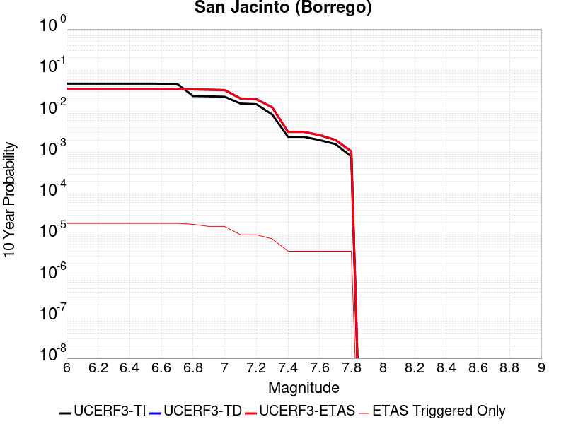 |

| Magnitude | 1 wk TI Prob | 1 wk TD Prob | 1 wk ETAS Prob | 1 wk ETAS/TD Gain | 1 wk ETAS Triggered Only | 1 mo TI Prob | 1 mo TD Prob | 1 mo ETAS Prob | 1 mo ETAS/TD Gain | 1 mo ETAS Triggered Only | 1 yr TI Prob | 1 yr TD Prob | 1 yr ETAS Prob | 1 yr ETAS/TD Gain | 1 yr ETAS Triggered Only | 10 yr TI Prob | 10 yr TD Prob | 10 yr ETAS Prob | 10 yr ETAS/TD Gain | 10 yr ETAS Triggered Only |
|-----|-----|-----|-----|-----|-----|-----|-----|-----|-----|-----|-----|-----|-----|-----|-----|-----|-----|-----|-----|-----|
| 6.0 | 9.239128E-5 | 6.746147E-5 | 6.746147E-5 | 1.0 | 0.0 | 3.9590252E-4 | 2.890956E-4 | 2.890956E-4 | 1.0 | 0.0 | 0.004809465 | 0.003515305 | 0.0035183819 | 1.0008754 | 3.0878207E-6 | 0.047066994 | 0.03517175 | 0.03518665 | 1.0004236 | 1.5439104E-5 |
| 6.1 | 9.239128E-5 | 6.746147E-5 | 6.746147E-5 | 1.0 | 0.0 | 3.9590252E-4 | 2.890956E-4 | 2.890956E-4 | 1.0 | 0.0 | 0.004809465 | 0.003515305 | 0.0035183819 | 1.0008754 | 3.0878207E-6 | 0.047066994 | 0.03517175 | 0.03518665 | 1.0004236 | 1.5439104E-5 |
| 6.2 | 9.239128E-5 | 6.746147E-5 | 6.746147E-5 | 1.0 | 0.0 | 3.9590252E-4 | 2.890956E-4 | 2.890956E-4 | 1.0 | 0.0 | 0.004809465 | 0.003515305 | 0.0035183819 | 1.0008754 | 3.0878207E-6 | 0.047066994 | 0.03517175 | 0.03518665 | 1.0004236 | 1.5439104E-5 |
| 6.3 | 9.239128E-5 | 6.746147E-5 | 6.746147E-5 | 1.0 | 0.0 | 3.9590252E-4 | 2.890956E-4 | 2.890956E-4 | 1.0 | 0.0 | 0.004809465 | 0.003515305 | 0.0035183819 | 1.0008754 | 3.0878207E-6 | 0.047066994 | 0.03517175 | 0.03518665 | 1.0004236 | 1.5439104E-5 |
| 6.4 | 9.239128E-5 | 6.746147E-5 | 6.746147E-5 | 1.0 | 0.0 | 3.9590252E-4 | 2.890956E-4 | 2.890956E-4 | 1.0 | 0.0 | 0.004809465 | 0.003515305 | 0.0035183819 | 1.0008754 | 3.0878207E-6 | 0.047066994 | 0.03517175 | 0.03518665 | 1.0004236 | 1.5439104E-5 |
| 6.5 | 9.239128E-5 | 6.746147E-5 | 6.746147E-5 | 1.0 | 0.0 | 3.9590252E-4 | 2.890956E-4 | 2.890956E-4 | 1.0 | 0.0 | 0.004809465 | 0.003515305 | 0.0035183819 | 1.0008754 | 3.0878207E-6 | 0.047066994 | 0.03517175 | 0.03518665 | 1.0004236 | 1.5439104E-5 |
| 6.6 | 9.205471E-5 | 6.722113E-5 | 6.722113E-5 | 1.0 | 0.0 | 3.9446054E-4 | 2.8806578E-4 | 2.8806578E-4 | 1.0 | 0.0 | 0.004791986 | 0.0035028076 | 0.0035058844 | 1.0008785 | 3.0878207E-6 | 0.046899613 | 0.035048313 | 0.035063215 | 1.0004251 | 1.5439104E-5 |
| 6.7 | 9.1629794E-5 | 6.682258E-5 | 6.682258E-5 | 1.0 | 0.0 | 3.9264E-4 | 2.8635806E-4 | 2.8635806E-4 | 1.0 | 0.0 | 0.0047699185 | 0.0034820824 | 0.0034851595 | 1.0008837 | 3.0878207E-6 | 0.046688255 | 0.034847513 | 0.034862414 | 1.0004276 | 1.5439104E-5 |
| 6.8 | 4.5613822E-5 | 6.5666274E-5 | 6.5666274E-5 | 1.0 | 0.0 | 1.9547316E-4 | 2.8140357E-4 | 2.8140357E-4 | 1.0 | 0.0 | 0.0023772882 | 0.0034219522 | 0.0034219522 | 1.0 | 0.0 | 0.02352017 | 0.034074746 | 0.034086674 | 1.0003501 | 1.2351283E-5 |
| 6.9 | 4.4921322E-5 | 6.461979E-5 | 6.461979E-5 | 1.0 | 0.0 | 1.9250574E-4 | 2.7691957E-4 | 2.7691957E-4 | 1.0 | 0.0 | 0.002341238 | 0.0033675297 | 0.0033675297 | 1.0 | 0.0 | 0.02316725 | 0.033549417 | 0.03355837 | 1.0002669 | 9.263462E-6 |
| 7.0 | 4.3896973E-5 | 6.325712E-5 | 6.325712E-5 | 1.0 | 0.0 | 1.8811632E-4 | 2.710808E-4 | 2.710808E-4 | 1.0 | 0.0 | 0.0022879103 | 0.0032966596 | 0.0032966596 | 1.0 | 0.0 | 0.02264498 | 0.032856427 | 0.032865386 | 1.0002726 | 9.263462E-6 |
| 7.1 | 2.9838686E-5 | 3.9105144E-5 | 3.9105144E-5 | 1.0 | 0.0 | 1.2787382E-4 | 1.6758604E-4 | 1.6758604E-4 | 1.0 | 0.0 | 0.0015557519 | 0.0020390416 | 0.0020390416 | 1.0 | 0.0 | 0.015449053 | 0.020523686 | 0.020529736 | 1.0002947 | 6.1756414E-6 |
| 7.2 | 2.8857767E-5 | 3.7642178E-5 | 3.7642178E-5 | 1.0 | 0.0 | 1.2367028E-4 | 1.6131697E-4 | 1.6131697E-4 | 1.0 | 0.0 | 0.0015046457 | 0.0019628557 | 0.0019628557 | 1.0 | 0.0 | 0.014944986 | 0.019774253 | 0.019780306 | 1.0003061 | 6.1756414E-6 |
| 7.3 | 1.6111655E-5 | 2.3702598E-5 | 2.3702598E-5 | 1.0 | 0.0 | 6.9048125E-5 | 1.0158089E-4 | 1.0158089E-4 | 1.0 | 0.0 | 8.4033667E-4 | 0.0012364498 | 0.0012364498 | 1.0 | 0.0 | 0.0083716605 | 0.012510133 | 0.012516231 | 1.0004874 | 6.1756414E-6 |
| 7.4 | 4.6148393E-6 | 5.874165E-6 | 5.874165E-6 | 1.0 | 0.0 | 1.9777734E-5 | 2.5174792E-5 | 2.5174792E-5 | 1.0 | 0.0 | 2.4076729E-4 | 3.064673E-4 | 3.064673E-4 | 1.0 | 0.0 | 0.002405066 | 0.0031677345 | 0.0031708125 | 1.0009717 | 3.0878207E-6 |
| 7.5 | 4.6148393E-6 | 5.874165E-6 | 5.874165E-6 | 1.0 | 0.0 | 1.9777734E-5 | 2.5174792E-5 | 2.5174792E-5 | 1.0 | 0.0 | 2.4076729E-4 | 3.064673E-4 | 3.064673E-4 | 1.0 | 0.0 | 0.002405066 | 0.0031677345 | 0.0031708125 | 1.0009717 | 3.0878207E-6 |
| 7.6 | 3.839952E-6 | 4.892815E-6 | 4.892815E-6 | 1.0 | 0.0 | 1.6456834E-5 | 2.0969073E-5 | 2.0969073E-5 | 1.0 | 0.0 | 2.0034352E-4 | 2.5527467E-4 | 2.5527467E-4 | 1.0 | 0.0 | 0.00200163 | 0.0026436278 | 0.0026467075 | 1.0011649 | 3.0878207E-6 |
| 7.7 | 3.068414E-6 | 3.707481E-6 | 3.707481E-6 | 1.0 | 0.0 | 1.3150278E-5 | 1.5889133E-5 | 1.5889133E-5 | 1.0 | 0.0 | 1.6009288E-4 | 1.9343739E-4 | 1.9343739E-4 | 1.0 | 0.0 | 0.001599776 | 0.0020167015 | 0.002019783 | 1.001528 | 3.0878207E-6 |
| 7.8 | 1.5303123E-6 | 1.9707616E-6 | 1.9707616E-6 | 1.0 | 0.0 | 6.5584645E-6 | 8.446107E-6 | 8.446107E-6 | 1.0 | 0.0 | 7.984638E-5 | 1.0282895E-4 | 1.0282895E-4 | 1.0 | 0.0 | 7.98177E-4 | 0.001066982 | 0.0010700666 | 1.002891 | 3.0878207E-6 |

## Calaveras (So) 2011 CFM
*[(top)](#table-of-contents)*

| 1 Week | 1 Month | 1 Year | 10 Year |
|-----|-----|-----|-----|
|  |  |  |  |

| Magnitude | 1 wk TI Prob | 1 wk TD Prob | 1 wk ETAS Prob | 1 wk ETAS/TD Gain | 1 wk ETAS Triggered Only | 1 mo TI Prob | 1 mo TD Prob | 1 mo ETAS Prob | 1 mo ETAS/TD Gain | 1 mo ETAS Triggered Only | 1 yr TI Prob | 1 yr TD Prob | 1 yr ETAS Prob | 1 yr ETAS/TD Gain | 1 yr ETAS Triggered Only | 10 yr TI Prob | 10 yr TD Prob | 10 yr ETAS Prob | 10 yr ETAS/TD Gain | 10 yr ETAS Triggered Only |
|-----|-----|-----|-----|-----|-----|-----|-----|-----|-----|-----|-----|-----|-----|-----|-----|-----|-----|-----|-----|-----|
| 6.0 | 1.00604906E-4 | 2.1600646E-4 | 2.2526793E-4 | 1.0428759 | 9.263462E-6 | 4.3109263E-4 | 9.255689E-4 | 9.348238E-4 | 1.0099992 | 9.263462E-6 | 0.0052359286 | 0.0112380525 | 0.011247212 | 1.000815 | 9.263462E-6 | 0.05114268 | 0.102641135 | 0.10265222 | 1.000108 | 1.2351283E-5 |
| 6.1 | 1.00604906E-4 | 2.1600646E-4 | 2.2526793E-4 | 1.0428759 | 9.263462E-6 | 4.3109263E-4 | 9.255689E-4 | 9.348238E-4 | 1.0099992 | 9.263462E-6 | 0.0052359286 | 0.0112380525 | 0.011247212 | 1.000815 | 9.263462E-6 | 0.05114268 | 0.102641135 | 0.10265222 | 1.000108 | 1.2351283E-5 |
| 6.2 | 1.00604906E-4 | 2.1600646E-4 | 2.2526793E-4 | 1.0428759 | 9.263462E-6 | 4.3109263E-4 | 9.255689E-4 | 9.348238E-4 | 1.0099992 | 9.263462E-6 | 0.0052359286 | 0.0112380525 | 0.011247212 | 1.000815 | 9.263462E-6 | 0.05114268 | 0.102641135 | 0.10265222 | 1.000108 | 1.2351283E-5 |
| 6.3 | 1.00604906E-4 | 2.1600646E-4 | 2.2526793E-4 | 1.0428759 | 9.263462E-6 | 4.3109263E-4 | 9.255689E-4 | 9.348238E-4 | 1.0099992 | 9.263462E-6 | 0.0052359286 | 0.0112380525 | 0.011247212 | 1.000815 | 9.263462E-6 | 0.05114268 | 0.102641135 | 0.10265222 | 1.000108 | 1.2351283E-5 |
| 6.4 | 1.00604906E-4 | 2.1600646E-4 | 2.2526793E-4 | 1.0428759 | 9.263462E-6 | 4.3109263E-4 | 9.255689E-4 | 9.348238E-4 | 1.0099992 | 9.263462E-6 | 0.0052359286 | 0.0112380525 | 0.011247212 | 1.000815 | 9.263462E-6 | 0.05114268 | 0.102641135 | 0.10265222 | 1.000108 | 1.2351283E-5 |
| 6.5 | 3.6232093E-5 | 8.0470694E-5 | 8.0470694E-5 | 1.0 | 0.0 | 1.5527116E-4 | 3.448549E-4 | 3.448549E-4 | 1.0 | 0.0 | 0.0018887871 | 0.004195091 | 0.004195091 | 1.0 | 0.0 | 0.018728139 | 0.040133998 | 0.040136963 | 1.0000738 | 3.0878207E-6 |
| 6.6 | 3.4288823E-5 | 7.645369E-5 | 7.645369E-5 | 1.0 | 0.0 | 1.4694381E-4 | 3.2764356E-4 | 3.2764356E-4 | 1.0 | 0.0 | 0.0017875729 | 0.003986383 | 0.003986383 | 1.0 | 0.0 | 0.017732618 | 0.03829094 | 0.038293913 | 1.0000776 | 3.0878207E-6 |
| 6.7 | 3.365726E-5 | 7.5152966E-5 | 7.5152966E-5 | 1.0 | 0.0 | 1.4423742E-4 | 3.220704E-4 | 3.220704E-4 | 1.0 | 0.0 | 0.001754676 | 0.003918774 | 0.003918774 | 1.0 | 0.0 | 0.017408855 | 0.037675563 | 0.037678536 | 1.0000789 | 3.0878207E-6 |
| 6.8 | 2.9146076E-5 | 6.459388E-5 | 6.459388E-5 | 1.0 | 0.0 | 1.2490578E-4 | 2.768274E-4 | 2.768274E-4 | 1.0 | 0.0 | 0.001519667 | 0.0033697556 | 0.0033697556 | 1.0 | 0.0 | 0.015093167 | 0.032588553 | 0.03259154 | 1.0000917 | 3.0878207E-6 |
| 6.9 | 2.7363296E-5 | 6.059934E-5 | 6.059934E-5 | 1.0 | 0.0 | 1.1726599E-4 | 2.5971147E-4 | 2.5971147E-4 | 1.0 | 0.0 | 0.0014267784 | 0.003161987 | 0.003161987 | 1.0 | 0.0 | 0.014176525 | 0.030637112 | 0.030640103 | 1.0000978 | 3.0878207E-6 |

## Honey Lake 2011 CFM
*[(top)](#table-of-contents)*

| 1 Week | 1 Month | 1 Year | 10 Year |
|-----|-----|-----|-----|
|  |  |  |  |

| Magnitude | 1 wk TI Prob | 1 wk TD Prob | 1 wk ETAS Prob | 1 wk ETAS/TD Gain | 1 wk ETAS Triggered Only | 1 mo TI Prob | 1 mo TD Prob | 1 mo ETAS Prob | 1 mo ETAS/TD Gain | 1 mo ETAS Triggered Only | 1 yr TI Prob | 1 yr TD Prob | 1 yr ETAS Prob | 1 yr ETAS/TD Gain | 1 yr ETAS Triggered Only | 10 yr TI Prob | 10 yr TD Prob | 10 yr ETAS Prob | 10 yr ETAS/TD Gain | 10 yr ETAS Triggered Only |
|-----|-----|-----|-----|-----|-----|-----|-----|-----|-----|-----|-----|-----|-----|-----|-----|-----|-----|-----|-----|-----|
| 6.0 | 4.2419113E-5 | 5.7836412E-5 | 5.7836412E-5 | 1.0 | 0.0 | 1.8178353E-4 | 2.4785337E-4 | 2.4785337E-4 | 1.0 | 0.0 | 0.002210968 | 0.0030145324 | 0.0030206894 | 1.0020424 | 6.1756414E-6 | 0.021890994 | 0.029842986 | 0.029854968 | 1.0004015 | 1.2351283E-5 |
| 6.1 | 4.2419113E-5 | 5.7836412E-5 | 5.7836412E-5 | 1.0 | 0.0 | 1.8178353E-4 | 2.4785337E-4 | 2.4785337E-4 | 1.0 | 0.0 | 0.002210968 | 0.0030145324 | 0.0030206894 | 1.0020424 | 6.1756414E-6 | 0.021890994 | 0.029842986 | 0.029854968 | 1.0004015 | 1.2351283E-5 |
| 6.2 | 4.2419113E-5 | 5.7836412E-5 | 5.7836412E-5 | 1.0 | 0.0 | 1.8178353E-4 | 2.4785337E-4 | 2.4785337E-4 | 1.0 | 0.0 | 0.002210968 | 0.0030145324 | 0.0030206894 | 1.0020424 | 6.1756414E-6 | 0.021890994 | 0.029842986 | 0.029854968 | 1.0004015 | 1.2351283E-5 |
| 6.3 | 4.2419113E-5 | 5.7836412E-5 | 5.7836412E-5 | 1.0 | 0.0 | 1.8178353E-4 | 2.4785337E-4 | 2.4785337E-4 | 1.0 | 0.0 | 0.002210968 | 0.0030145324 | 0.0030206894 | 1.0020424 | 6.1756414E-6 | 0.021890994 | 0.029842986 | 0.029854968 | 1.0004015 | 1.2351283E-5 |
| 6.4 | 4.2419113E-5 | 5.7836412E-5 | 5.7836412E-5 | 1.0 | 0.0 | 1.8178353E-4 | 2.4785337E-4 | 2.4785337E-4 | 1.0 | 0.0 | 0.002210968 | 0.0030145324 | 0.0030206894 | 1.0020424 | 6.1756414E-6 | 0.021890994 | 0.029842986 | 0.029854968 | 1.0004015 | 1.2351283E-5 |
| 6.5 | 4.2419113E-5 | 5.7836412E-5 | 5.7836412E-5 | 1.0 | 0.0 | 1.8178353E-4 | 2.4785337E-4 | 2.4785337E-4 | 1.0 | 0.0 | 0.002210968 | 0.0030145324 | 0.0030206894 | 1.0020424 | 6.1756414E-6 | 0.021890994 | 0.029842986 | 0.029854968 | 1.0004015 | 1.2351283E-5 |
| 6.6 | 3.5778685E-5 | 4.865727E-5 | 4.865727E-5 | 1.0 | 0.0 | 1.533282E-4 | 2.0852126E-4 | 2.0852126E-4 | 1.0 | 0.0 | 0.0018651724 | 0.002536925 | 0.002543085 | 1.0024282 | 6.1756414E-6 | 0.01849595 | 0.025190448 | 0.025202489 | 1.0004779 | 1.2351283E-5 |
| 6.7 | 2.9777242E-5 | 4.0327057E-5 | 4.0327057E-5 | 1.0 | 0.0 | 1.2761052E-4 | 1.7282547E-4 | 1.7282547E-4 | 1.0 | 0.0 | 0.0015525507 | 0.0021032947 | 0.0021094573 | 1.00293 | 6.1756414E-6 | 0.0154174855 | 0.020948831 | 0.020960923 | 1.0005772 | 1.2351283E-5 |
| 6.8 | 2.4307292E-5 | 3.2781874E-5 | 3.2781874E-5 | 1.0 | 0.0 | 1.0416994E-4 | 1.4049283E-4 | 1.4049283E-4 | 1.0 | 0.0 | 0.0012675312 | 0.0017103229 | 0.001716488 | 1.0036047 | 6.1756414E-6 | 0.012603257 | 0.017085526 | 0.017097665 | 1.0007106 | 1.2351283E-5 |
| 6.9 | 2.2774519E-5 | 3.0696156E-5 | 3.0696156E-5 | 1.0 | 0.0 | 9.760143E-5 | 1.3155496E-4 | 1.3155496E-4 | 1.0 | 0.0 | 0.0011876496 | 0.0016016681 | 0.0016078338 | 1.0038496 | 6.1756414E-6 | 0.011813223 | 0.016015066 | 0.01602722 | 1.0007589 | 1.2351283E-5 |

## Robinson Creek
*[(top)](#table-of-contents)*

| 1 Week | 1 Month | 1 Year | 10 Year |
|-----|-----|-----|-----|
|  |  |  |  |

| Magnitude | 1 wk TI Prob | 1 wk TD Prob | 1 wk ETAS Prob | 1 wk ETAS/TD Gain | 1 wk ETAS Triggered Only | 1 mo TI Prob | 1 mo TD Prob | 1 mo ETAS Prob | 1 mo ETAS/TD Gain | 1 mo ETAS Triggered Only | 1 yr TI Prob | 1 yr TD Prob | 1 yr ETAS Prob | 1 yr ETAS/TD Gain | 1 yr ETAS Triggered Only | 10 yr TI Prob | 10 yr TD Prob | 10 yr ETAS Prob | 10 yr ETAS/TD Gain | 10 yr ETAS Triggered Only |
|-----|-----|-----|-----|-----|-----|-----|-----|-----|-----|-----|-----|-----|-----|-----|-----|-----|-----|-----|-----|-----|
| 6.0 | 1.0723721E-5 | 1.1667189E-5 | 1.1667189E-5 | 1.0 | 0.0 | 4.5957993E-5 | 5.000224E-5 | 5.3089905E-5 | 1.0617505 | 3.0878207E-6 | 5.593949E-4 | 6.087773E-4 | 6.118632E-4 | 1.0050691 | 3.0878207E-6 | 0.0055798884 | 0.0060877725 | 0.006100049 | 1.0020165 | 1.2351283E-5 |
| 6.1 | 1.0723721E-5 | 1.1667189E-5 | 1.1667189E-5 | 1.0 | 0.0 | 4.5957993E-5 | 5.000224E-5 | 5.3089905E-5 | 1.0617505 | 3.0878207E-6 | 5.593949E-4 | 6.087773E-4 | 6.118632E-4 | 1.0050691 | 3.0878207E-6 | 0.0055798884 | 0.0060877725 | 0.006100049 | 1.0020165 | 1.2351283E-5 |
| 6.2 | 1.0723721E-5 | 1.1667189E-5 | 1.1667189E-5 | 1.0 | 0.0 | 4.5957993E-5 | 5.000224E-5 | 5.3089905E-5 | 1.0617505 | 3.0878207E-6 | 5.593949E-4 | 6.087773E-4 | 6.118632E-4 | 1.0050691 | 3.0878207E-6 | 0.0055798884 | 0.0060877725 | 0.006100049 | 1.0020165 | 1.2351283E-5 |
| 6.3 | 1.0723721E-5 | 1.1667189E-5 | 1.1667189E-5 | 1.0 | 0.0 | 4.5957993E-5 | 5.000224E-5 | 5.3089905E-5 | 1.0617505 | 3.0878207E-6 | 5.593949E-4 | 6.087773E-4 | 6.118632E-4 | 1.0050691 | 3.0878207E-6 | 0.0055798884 | 0.0060877725 | 0.006100049 | 1.0020165 | 1.2351283E-5 |
| 6.4 | 1.0723721E-5 | 1.1667189E-5 | 1.1667189E-5 | 1.0 | 0.0 | 4.5957993E-5 | 5.000224E-5 | 5.3089905E-5 | 1.0617505 | 3.0878207E-6 | 5.593949E-4 | 6.087773E-4 | 6.118632E-4 | 1.0050691 | 3.0878207E-6 | 0.0055798884 | 0.0060877725 | 0.006100049 | 1.0020165 | 1.2351283E-5 |
| 6.5 | 1.0723721E-5 | 1.1667189E-5 | 1.1667189E-5 | 1.0 | 0.0 | 4.5957993E-5 | 5.000224E-5 | 5.3089905E-5 | 1.0617505 | 3.0878207E-6 | 5.593949E-4 | 6.087773E-4 | 6.118632E-4 | 1.0050691 | 3.0878207E-6 | 0.0055798884 | 0.0060877725 | 0.006100049 | 1.0020165 | 1.2351283E-5 |

## Round Valley
*[(top)](#table-of-contents)*

| 1 Week | 1 Month | 1 Year | 10 Year |
|-----|-----|-----|-----|
|  |  |  |  |

| Magnitude | 1 wk TI Prob | 1 wk TD Prob | 1 wk ETAS Prob | 1 wk ETAS/TD Gain | 1 wk ETAS Triggered Only | 1 mo TI Prob | 1 mo TD Prob | 1 mo ETAS Prob | 1 mo ETAS/TD Gain | 1 mo ETAS Triggered Only | 1 yr TI Prob | 1 yr TD Prob | 1 yr ETAS Prob | 1 yr ETAS/TD Gain | 1 yr ETAS Triggered Only | 10 yr TI Prob | 10 yr TD Prob | 10 yr ETAS Prob | 10 yr ETAS/TD Gain | 10 yr ETAS Triggered Only |
|-----|-----|-----|-----|-----|-----|-----|-----|-----|-----|-----|-----|-----|-----|-----|-----|-----|-----|-----|-----|-----|
| 6.0 | 1.5129573E-5 | 1.668525E-5 | 2.5948557E-5 | 1.5551795 | 9.263462E-6 | 6.483941E-5 | 7.1506845E-5 | 8.076964E-5 | 1.1295372 | 9.263462E-6 | 7.8913395E-4 | 8.7035226E-4 | 8.796077E-4 | 1.0106341 | 9.263462E-6 | 0.007863375 | 0.008679682 | 0.0086919265 | 1.0014106 | 1.2351283E-5 |
| 6.1 | 1.5129573E-5 | 1.668525E-5 | 2.5948557E-5 | 1.5551795 | 9.263462E-6 | 6.483941E-5 | 7.1506845E-5 | 8.076964E-5 | 1.1295372 | 9.263462E-6 | 7.8913395E-4 | 8.7035226E-4 | 8.796077E-4 | 1.0106341 | 9.263462E-6 | 0.007863375 | 0.008679682 | 0.0086919265 | 1.0014106 | 1.2351283E-5 |
| 6.2 | 1.5129573E-5 | 1.668525E-5 | 2.5948557E-5 | 1.5551795 | 9.263462E-6 | 6.483941E-5 | 7.1506845E-5 | 8.076964E-5 | 1.1295372 | 9.263462E-6 | 7.8913395E-4 | 8.7035226E-4 | 8.796077E-4 | 1.0106341 | 9.263462E-6 | 0.007863375 | 0.008679682 | 0.0086919265 | 1.0014106 | 1.2351283E-5 |
| 6.3 | 1.5129573E-5 | 1.668525E-5 | 2.5948557E-5 | 1.5551795 | 9.263462E-6 | 6.483941E-5 | 7.1506845E-5 | 8.076964E-5 | 1.1295372 | 9.263462E-6 | 7.8913395E-4 | 8.7035226E-4 | 8.796077E-4 | 1.0106341 | 9.263462E-6 | 0.007863375 | 0.008679682 | 0.0086919265 | 1.0014106 | 1.2351283E-5 |
| 6.4 | 1.5129573E-5 | 1.668525E-5 | 2.5948557E-5 | 1.5551795 | 9.263462E-6 | 6.483941E-5 | 7.1506845E-5 | 8.076964E-5 | 1.1295372 | 9.263462E-6 | 7.8913395E-4 | 8.7035226E-4 | 8.796077E-4 | 1.0106341 | 9.263462E-6 | 0.007863375 | 0.008679682 | 0.0086919265 | 1.0014106 | 1.2351283E-5 |
| 6.5 | 1.5129573E-5 | 1.668525E-5 | 2.5948557E-5 | 1.5551795 | 9.263462E-6 | 6.483941E-5 | 7.1506845E-5 | 8.076964E-5 | 1.1295372 | 9.263462E-6 | 7.8913395E-4 | 8.7035226E-4 | 8.796077E-4 | 1.0106341 | 9.263462E-6 | 0.007863375 | 0.008679682 | 0.0086919265 | 1.0014106 | 1.2351283E-5 |
| 6.6 | 1.4434947E-5 | 1.5912143E-5 | 2.5175457E-5 | 1.5821538 | 9.263462E-6 | 6.186259E-5 | 6.81937E-5 | 7.745653E-5 | 1.1358312 | 9.263462E-6 | 7.529168E-4 | 8.3004584E-4 | 8.393016E-4 | 1.011151 | 9.263462E-6 | 0.0075037093 | 0.00827966 | 0.008291909 | 1.0014794 | 1.2351283E-5 |
| 6.7 | 1.15477105E-5 | 1.2717341E-5 | 1.8892904E-5 | 1.4856018 | 6.1756414E-6 | 4.948925E-5 | 5.4502318E-5 | 6.0677623E-5 | 1.1133035 | 6.1756414E-6 | 6.02365E-4 | 6.6346437E-4 | 6.696359E-4 | 1.009302 | 6.1756414E-6 | 0.0060073487 | 0.0066247126 | 0.006633915 | 1.001389 | 9.263462E-6 |
| 6.8 | 8.959772E-6 | 9.845762E-6 | 9.845762E-6 | 1.0 | 0.0 | 3.8398455E-5 | 4.2195978E-5 | 4.2195978E-5 | 1.0 | 0.0 | 4.674009E-4 | 5.1371043E-4 | 5.1371043E-4 | 1.0 | 0.0 | 0.0046641906 | 0.0051345914 | 0.0051376633 | 1.0005983 | 3.0878207E-6 |
| 6.9 | 7.926176E-6 | 8.705021E-6 | 8.705021E-6 | 1.0 | 0.0 | 3.3968885E-5 | 3.7307233E-5 | 3.7307233E-5 | 1.0 | 0.0 | 4.1349267E-4 | 4.5421557E-4 | 4.5421557E-4 | 1.0 | 0.0 | 0.004127241 | 0.0045421557 | 0.0045452295 | 1.0006768 | 3.0878207E-6 |
| 7.0 | 7.926176E-6 | 8.705021E-6 | 8.705021E-6 | 1.0 | 0.0 | 3.3968885E-5 | 3.7307233E-5 | 3.7307233E-5 | 1.0 | 0.0 | 4.1349267E-4 | 4.5421557E-4 | 4.5421557E-4 | 1.0 | 0.0 | 0.004127241 | 0.0045421557 | 0.0045452295 | 1.0006768 | 3.0878207E-6 |

## San Luis Range 2011 CFM
*[(top)](#table-of-contents)*

| 1 Week | 1 Month | 1 Year | 10 Year |
|-----|-----|-----|-----|
|  |  |  |  |

| Magnitude | 1 wk TI Prob | 1 wk TD Prob | 1 wk ETAS Prob | 1 wk ETAS/TD Gain | 1 wk ETAS Triggered Only | 1 mo TI Prob | 1 mo TD Prob | 1 mo ETAS Prob | 1 mo ETAS/TD Gain | 1 mo ETAS Triggered Only | 1 yr TI Prob | 1 yr TD Prob | 1 yr ETAS Prob | 1 yr ETAS/TD Gain | 1 yr ETAS Triggered Only | 10 yr TI Prob | 10 yr TD Prob | 10 yr ETAS Prob | 10 yr ETAS/TD Gain | 10 yr ETAS Triggered Only |
|-----|-----|-----|-----|-----|-----|-----|-----|-----|-----|-----|-----|-----|-----|-----|-----|-----|-----|-----|-----|-----|
| 6.0 | 2.8589725E-6 | 2.906881E-6 | 5.994693E-6 | 2.0622423 | 3.0878207E-6 | 1.2252682E-5 | 1.24580165E-5 | 1.8633582E-5 | 1.4957101 | 6.1756414E-6 | 1.491662E-4 | 1.5166836E-4 | 1.6401777E-4 | 1.0814238 | 1.2351283E-5 | 0.0014906611 | 0.0015158989 | 0.0015282314 | 1.0081354 | 1.2351283E-5 |
| 6.1 | 2.8589725E-6 | 2.906881E-6 | 5.994693E-6 | 2.0622423 | 3.0878207E-6 | 1.2252682E-5 | 1.24580165E-5 | 1.8633582E-5 | 1.4957101 | 6.1756414E-6 | 1.491662E-4 | 1.5166836E-4 | 1.6401777E-4 | 1.0814238 | 1.2351283E-5 | 0.0014906611 | 0.0015158989 | 0.0015282314 | 1.0081354 | 1.2351283E-5 |
| 6.2 | 2.8589725E-6 | 2.906881E-6 | 5.994693E-6 | 2.0622423 | 3.0878207E-6 | 1.2252682E-5 | 1.24580165E-5 | 1.8633582E-5 | 1.4957101 | 6.1756414E-6 | 1.491662E-4 | 1.5166836E-4 | 1.6401777E-4 | 1.0814238 | 1.2351283E-5 | 0.0014906611 | 0.0015158989 | 0.0015282314 | 1.0081354 | 1.2351283E-5 |
| 6.3 | 2.8589725E-6 | 2.906881E-6 | 5.994693E-6 | 2.0622423 | 3.0878207E-6 | 1.2252682E-5 | 1.24580165E-5 | 1.8633582E-5 | 1.4957101 | 6.1756414E-6 | 1.491662E-4 | 1.5166836E-4 | 1.6401777E-4 | 1.0814238 | 1.2351283E-5 | 0.0014906611 | 0.0015158989 | 0.0015282314 | 1.0081354 | 1.2351283E-5 |
| 6.4 | 2.8589725E-6 | 2.906881E-6 | 5.994693E-6 | 2.0622423 | 3.0878207E-6 | 1.2252682E-5 | 1.24580165E-5 | 1.8633582E-5 | 1.4957101 | 6.1756414E-6 | 1.491662E-4 | 1.5166836E-4 | 1.6401777E-4 | 1.0814238 | 1.2351283E-5 | 0.0014906611 | 0.0015158989 | 0.0015282314 | 1.0081354 | 1.2351283E-5 |
| 6.5 | 2.8589725E-6 | 2.906881E-6 | 5.994693E-6 | 2.0622423 | 3.0878207E-6 | 1.2252682E-5 | 1.24580165E-5 | 1.8633582E-5 | 1.4957101 | 6.1756414E-6 | 1.491662E-4 | 1.5166836E-4 | 1.6401777E-4 | 1.0814238 | 1.2351283E-5 | 0.0014906611 | 0.0015158989 | 0.0015282314 | 1.0081354 | 1.2351283E-5 |
| 6.6 | 2.4544863E-6 | 2.495234E-6 | 2.495234E-6 | 1.0 | 0.0 | 1.0519184E-5 | 1.06938305E-5 | 1.06938305E-5 | 1.0 | 0.0 | 1.2806353E-4 | 1.3019213E-4 | 1.3636696E-4 | 1.0474286 | 6.1756414E-6 | 0.0012798976 | 0.0013014051 | 0.0013075727 | 1.0047392 | 6.1756414E-6 |
| 6.7 | 2.1688998E-6 | 2.204711E-6 | 2.204711E-6 | 1.0 | 0.0 | 9.295252E-6 | 9.448742E-6 | 9.448742E-6 | 1.0 | 0.0 | 1.1316381E-4 | 1.1503485E-4 | 1.2120978E-4 | 1.0536788 | 6.1756414E-6 | 0.001131062 | 0.0011499968 | 0.0011561654 | 1.005364 | 6.1756414E-6 |
| 6.8 | 1.9191828E-6 | 1.950576E-6 | 1.950576E-6 | 1.0 | 0.0 | 8.2250435E-6 | 8.359599E-6 | 8.359599E-6 | 1.0 | 0.0 | 1.001353E-4 | 1.01775826E-4 | 1.0795084E-4 | 1.0606726 | 6.1756414E-6 | 0.0010009019 | 0.0010175342 | 0.0010237035 | 1.0060631 | 6.1756414E-6 |
| 6.9 | 1.6115068E-6 | 1.6374516E-6 | 1.6374516E-6 | 1.0 | 0.0 | 6.9064395E-6 | 7.0176447E-6 | 7.0176447E-6 | 1.0 | 0.0 | 8.4082654E-5 | 8.5438915E-5 | 8.8526474E-5 | 1.0361376 | 3.0878207E-6 | 8.405085E-4 | 8.543001E-4 | 8.573853E-4 | 1.0036113 | 3.0878207E-6 |
| 7.0 | 1.367995E-6 | 1.3898027E-6 | 1.3898027E-6 | 1.0 | 0.0 | 5.8628225E-6 | 5.956297E-6 | 5.956297E-6 | 1.0 | 0.0 | 7.137752E-5 | 7.251792E-5 | 7.5605516E-5 | 1.042577 | 3.0878207E-6 | 7.13546E-4 | 7.251792E-4 | 7.282648E-4 | 1.0042549 | 3.0878207E-6 |
| 7.1 | 1.367995E-6 | 1.3898027E-6 | 1.3898027E-6 | 1.0 | 0.0 | 5.8628225E-6 | 5.956297E-6 | 5.956297E-6 | 1.0 | 0.0 | 7.137752E-5 | 7.251792E-5 | 7.5605516E-5 | 1.042577 | 3.0878207E-6 | 7.13546E-4 | 7.251792E-4 | 7.282648E-4 | 1.0042549 | 3.0878207E-6 |

## Great Valley 04b Gordon Valley
*[(top)](#table-of-contents)*

| 1 Week | 1 Month | 1 Year | 10 Year |
|-----|-----|-----|-----|
|  |  |  |  |

| Magnitude | 1 wk TI Prob | 1 wk TD Prob | 1 wk ETAS Prob | 1 wk ETAS/TD Gain | 1 wk ETAS Triggered Only | 1 mo TI Prob | 1 mo TD Prob | 1 mo ETAS Prob | 1 mo ETAS/TD Gain | 1 mo ETAS Triggered Only | 1 yr TI Prob | 1 yr TD Prob | 1 yr ETAS Prob | 1 yr ETAS/TD Gain | 1 yr ETAS Triggered Only | 10 yr TI Prob | 10 yr TD Prob | 10 yr ETAS Prob | 10 yr ETAS/TD Gain | 10 yr ETAS Triggered Only |
|-----|-----|-----|-----|-----|-----|-----|-----|-----|-----|-----|-----|-----|-----|-----|-----|-----|-----|-----|-----|-----|
| 6.0 | 2.4076155E-5 | 2.8932132E-5 | 2.8932132E-5 | 1.0 | 0.0 | 1.03179445E-4 | 1.2399205E-4 | 1.2399205E-4 | 1.0 | 0.0 | 0.0012554857 | 0.0015091051 | 0.0015121882 | 1.002043 | 3.0878207E-6 | 0.012484163 | 0.015042224 | 0.015054389 | 1.0008087 | 1.2351283E-5 |
| 6.1 | 2.4076155E-5 | 2.8932132E-5 | 2.8932132E-5 | 1.0 | 0.0 | 1.03179445E-4 | 1.2399205E-4 | 1.2399205E-4 | 1.0 | 0.0 | 0.0012554857 | 0.0015091051 | 0.0015121882 | 1.002043 | 3.0878207E-6 | 0.012484163 | 0.015042224 | 0.015054389 | 1.0008087 | 1.2351283E-5 |
| 6.2 | 2.4076155E-5 | 2.8932132E-5 | 2.8932132E-5 | 1.0 | 0.0 | 1.03179445E-4 | 1.2399205E-4 | 1.2399205E-4 | 1.0 | 0.0 | 0.0012554857 | 0.0015091051 | 0.0015121882 | 1.002043 | 3.0878207E-6 | 0.012484163 | 0.015042224 | 0.015054389 | 1.0008087 | 1.2351283E-5 |
| 6.3 | 2.4076155E-5 | 2.8932132E-5 | 2.8932132E-5 | 1.0 | 0.0 | 1.03179445E-4 | 1.2399205E-4 | 1.2399205E-4 | 1.0 | 0.0 | 0.0012554857 | 0.0015091051 | 0.0015121882 | 1.002043 | 3.0878207E-6 | 0.012484163 | 0.015042224 | 0.015054389 | 1.0008087 | 1.2351283E-5 |
| 6.4 | 2.4076155E-5 | 2.8932132E-5 | 2.8932132E-5 | 1.0 | 0.0 | 1.03179445E-4 | 1.2399205E-4 | 1.2399205E-4 | 1.0 | 0.0 | 0.0012554857 | 0.0015091051 | 0.0015121882 | 1.002043 | 3.0878207E-6 | 0.012484163 | 0.015042224 | 0.015054389 | 1.0008087 | 1.2351283E-5 |
| 6.5 | 2.4076155E-5 | 2.8932132E-5 | 2.8932132E-5 | 1.0 | 0.0 | 1.03179445E-4 | 1.2399205E-4 | 1.2399205E-4 | 1.0 | 0.0 | 0.0012554857 | 0.0015091051 | 0.0015121882 | 1.002043 | 3.0878207E-6 | 0.012484163 | 0.015042224 | 0.015054389 | 1.0008087 | 1.2351283E-5 |
| 6.6 | 1.664996E-5 | 1.9973098E-5 | 1.9973098E-5 | 1.0 | 0.0 | 7.135502E-5 | 8.559899E-5 | 8.559899E-5 | 1.0 | 0.0 | 8.68401E-4 | 0.0010421677 | 0.0010421677 | 1.0 | 0.0 | 0.008650154 | 0.010421675 | 0.010430841 | 1.0008796 | 9.263462E-6 |
| 6.7 | 1.664996E-5 | 1.9973098E-5 | 1.9973098E-5 | 1.0 | 0.0 | 7.135502E-5 | 8.559899E-5 | 8.559899E-5 | 1.0 | 0.0 | 8.68401E-4 | 0.0010421677 | 0.0010421677 | 1.0 | 0.0 | 0.008650154 | 0.010421675 | 0.010430841 | 1.0008796 | 9.263462E-6 |

## White Mountains
*[(top)](#table-of-contents)*

| 1 Week | 1 Month | 1 Year | 10 Year |
|-----|-----|-----|-----|
|  |  |  |  |

| Magnitude | 1 wk TI Prob | 1 wk TD Prob | 1 wk ETAS Prob | 1 wk ETAS/TD Gain | 1 wk ETAS Triggered Only | 1 mo TI Prob | 1 mo TD Prob | 1 mo ETAS Prob | 1 mo ETAS/TD Gain | 1 mo ETAS Triggered Only | 1 yr TI Prob | 1 yr TD Prob | 1 yr ETAS Prob | 1 yr ETAS/TD Gain | 1 yr ETAS Triggered Only | 10 yr TI Prob | 10 yr TD Prob | 10 yr ETAS Prob | 10 yr ETAS/TD Gain | 10 yr ETAS Triggered Only |
|-----|-----|-----|-----|-----|-----|-----|-----|-----|-----|-----|-----|-----|-----|-----|-----|-----|-----|-----|-----|-----|
| 6.0 | 1.17818645E-5 | 9.78196E-6 | 1.2869751E-5 | 1.3156618 | 3.0878207E-6 | 5.049273E-5 | 4.19221E-5 | 4.500979E-5 | 1.0736531 | 3.0878207E-6 | 6.145756E-4 | 5.1029754E-4 | 5.195563E-4 | 1.0181438 | 9.263462E-6 | 0.006128787 | 0.005092789 | 0.0051050773 | 1.0024129 | 1.2351283E-5 |
| 6.1 | 1.17818645E-5 | 9.78196E-6 | 1.2869751E-5 | 1.3156618 | 3.0878207E-6 | 5.049273E-5 | 4.19221E-5 | 4.500979E-5 | 1.0736531 | 3.0878207E-6 | 6.145756E-4 | 5.1029754E-4 | 5.195563E-4 | 1.0181438 | 9.263462E-6 | 0.006128787 | 0.005092789 | 0.0051050773 | 1.0024129 | 1.2351283E-5 |
| 6.2 | 1.17818645E-5 | 9.78196E-6 | 1.2869751E-5 | 1.3156618 | 3.0878207E-6 | 5.049273E-5 | 4.19221E-5 | 4.500979E-5 | 1.0736531 | 3.0878207E-6 | 6.145756E-4 | 5.1029754E-4 | 5.195563E-4 | 1.0181438 | 9.263462E-6 | 0.006128787 | 0.005092789 | 0.0051050773 | 1.0024129 | 1.2351283E-5 |
| 6.3 | 1.17818645E-5 | 9.78196E-6 | 1.2869751E-5 | 1.3156618 | 3.0878207E-6 | 5.049273E-5 | 4.19221E-5 | 4.500979E-5 | 1.0736531 | 3.0878207E-6 | 6.145756E-4 | 5.1029754E-4 | 5.195563E-4 | 1.0181438 | 9.263462E-6 | 0.006128787 | 0.005092789 | 0.0051050773 | 1.0024129 | 1.2351283E-5 |
| 6.4 | 1.17818645E-5 | 9.78196E-6 | 1.2869751E-5 | 1.3156618 | 3.0878207E-6 | 5.049273E-5 | 4.19221E-5 | 4.500979E-5 | 1.0736531 | 3.0878207E-6 | 6.145756E-4 | 5.1029754E-4 | 5.195563E-4 | 1.0181438 | 9.263462E-6 | 0.006128787 | 0.005092789 | 0.0051050773 | 1.0024129 | 1.2351283E-5 |
| 6.5 | 1.17818645E-5 | 9.78196E-6 | 1.2869751E-5 | 1.3156618 | 3.0878207E-6 | 5.049273E-5 | 4.19221E-5 | 4.500979E-5 | 1.0736531 | 3.0878207E-6 | 6.145756E-4 | 5.1029754E-4 | 5.195563E-4 | 1.0181438 | 9.263462E-6 | 0.006128787 | 0.005092789 | 0.0051050773 | 1.0024129 | 1.2351283E-5 |
| 6.6 | 1.0418851E-5 | 8.601228E-6 | 1.1689022E-5 | 1.3589946 | 3.0878207E-6 | 4.4651457E-5 | 3.6861973E-5 | 3.994968E-5 | 1.0837641 | 3.0878207E-6 | 5.434959E-4 | 4.4871747E-4 | 4.5797677E-4 | 1.020635 | 9.263462E-6 | 0.0054216855 | 0.0044796285 | 0.0044888505 | 1.0020586 | 9.263462E-6 |
| 6.7 | 9.210677E-6 | 7.477168E-6 | 1.0564966E-5 | 1.4129635 | 3.0878207E-6 | 3.9473733E-5 | 3.20447E-5 | 3.513242E-5 | 1.0963567 | 3.0878207E-6 | 4.804867E-4 | 3.900896E-4 | 3.9934946E-4 | 1.0237378 | 9.263462E-6 | 0.0047944915 | 0.0038955477 | 0.0039047753 | 1.0023687 | 9.263462E-6 |
| 6.8 | 8.211876E-6 | 6.649268E-6 | 9.7370685E-6 | 1.4643819 | 3.0878207E-6 | 3.519328E-5 | 2.8496637E-5 | 3.158437E-5 | 1.1083543 | 3.0878207E-6 | 4.2839395E-4 | 3.469065E-4 | 3.5616677E-4 | 1.0266938 | 9.263462E-6 | 0.0042756903 | 0.00346514 | 0.0034743713 | 1.0026641 | 9.263462E-6 |
| 6.9 | 7.3301526E-6 | 5.9145773E-6 | 9.00238E-6 | 1.5220665 | 3.0878207E-6 | 3.141456E-5 | 2.5348027E-5 | 2.8435768E-5 | 1.1218139 | 3.0878207E-6 | 3.8240515E-4 | 3.0858364E-4 | 3.1784424E-4 | 1.03001 | 9.263462E-6 | 0.0038174777 | 0.003083034 | 0.003092269 | 1.0029954 | 9.263462E-6 |
| 7.0 | 6.338452E-6 | 5.1713537E-6 | 8.259159E-6 | 1.597098 | 3.0878207E-6 | 2.7164511E-5 | 2.2162842E-5 | 2.5250592E-5 | 1.1393211 | 3.0878207E-6 | 3.3067772E-4 | 2.6981422E-4 | 2.7907518E-4 | 1.0343235 | 9.263462E-6 | 0.003301861 | 0.0026963425 | 0.002705581 | 1.0034263 | 9.263462E-6 |
| 7.1 | 5.5617493E-6 | 4.5614056E-6 | 7.649212E-6 | 1.6769419 | 3.0878207E-6 | 2.3835852E-5 | 1.954882E-5 | 2.2636581E-5 | 1.1579512 | 3.0878207E-6 | 2.9016283E-4 | 2.3799589E-4 | 2.4725715E-4 | 1.0389135 | 9.263462E-6 | 0.0028978426 | 0.0023788814 | 0.002388123 | 1.0038848 | 9.263462E-6 |
| 7.2 | 4.850874E-6 | 3.965666E-6 | 7.0534743E-6 | 1.7786355 | 3.0878207E-6 | 2.0789295E-5 | 1.6995684E-5 | 2.0083453E-5 | 1.1816795 | 3.0878207E-6 | 2.5308027E-4 | 2.0691776E-4 | 2.1309212E-4 | 1.0298398 | 6.1756414E-6 | 0.0025279224 | 0.002068716 | 0.002074879 | 1.002979 | 6.1756414E-6 |
| 7.3 | 4.1947515E-6 | 3.448504E-6 | 6.536314E-6 | 1.8954057 | 3.0878207E-6 | 1.7977383E-5 | 1.4779303E-5 | 1.7867078E-5 | 1.2089256 | 3.0878207E-6 | 2.1885266E-4 | 1.7993801E-4 | 1.8611253E-4 | 1.0343148 | 6.1756414E-6 | 0.0021863724 | 0.00179938 | 0.0018055446 | 1.003426 | 6.1756414E-6 |

## Malibu Coast alt 1
*[(top)](#table-of-contents)*

| 1 Week | 1 Month | 1 Year | 10 Year |
|-----|-----|-----|-----|
|  |  |  |  |

| Magnitude | 1 wk TI Prob | 1 wk TD Prob | 1 wk ETAS Prob | 1 wk ETAS/TD Gain | 1 wk ETAS Triggered Only | 1 mo TI Prob | 1 mo TD Prob | 1 mo ETAS Prob | 1 mo ETAS/TD Gain | 1 mo ETAS Triggered Only | 1 yr TI Prob | 1 yr TD Prob | 1 yr ETAS Prob | 1 yr ETAS/TD Gain | 1 yr ETAS Triggered Only | 10 yr TI Prob | 10 yr TD Prob | 10 yr ETAS Prob | 10 yr ETAS/TD Gain | 10 yr ETAS Triggered Only |
|-----|-----|-----|-----|-----|-----|-----|-----|-----|-----|-----|-----|-----|-----|-----|-----|-----|-----|-----|-----|-----|
| 6.0 | 5.5048527E-6 | 5.7432603E-6 | 1.1918866E-5 | 2.0752788 | 6.1756414E-6 | 2.3592012E-5 | 2.4613972E-5 | 3.3877208E-5 | 1.3763405 | 9.263462E-6 | 2.8719488E-4 | 2.996751E-4 | 3.120227E-4 | 1.0412033 | 1.2351283E-5 | 0.00286824 | 0.002996751 | 0.0030090653 | 1.0041093 | 1.2351283E-5 |
| 6.1 | 5.5048527E-6 | 5.7432603E-6 | 1.1918866E-5 | 2.0752788 | 6.1756414E-6 | 2.3592012E-5 | 2.4613972E-5 | 3.3877208E-5 | 1.3763405 | 9.263462E-6 | 2.8719488E-4 | 2.996751E-4 | 3.120227E-4 | 1.0412033 | 1.2351283E-5 | 0.00286824 | 0.002996751 | 0.0030090653 | 1.0041093 | 1.2351283E-5 |
| 6.2 | 5.5048527E-6 | 5.7432603E-6 | 1.1918866E-5 | 2.0752788 | 6.1756414E-6 | 2.3592012E-5 | 2.4613972E-5 | 3.3877208E-5 | 1.3763405 | 9.263462E-6 | 2.8719488E-4 | 2.996751E-4 | 3.120227E-4 | 1.0412033 | 1.2351283E-5 | 0.00286824 | 0.002996751 | 0.0030090653 | 1.0041093 | 1.2351283E-5 |
| 6.3 | 5.5048527E-6 | 5.7432603E-6 | 1.1918866E-5 | 2.0752788 | 6.1756414E-6 | 2.3592012E-5 | 2.4613972E-5 | 3.3877208E-5 | 1.3763405 | 9.263462E-6 | 2.8719488E-4 | 2.996751E-4 | 3.120227E-4 | 1.0412033 | 1.2351283E-5 | 0.00286824 | 0.002996751 | 0.0030090653 | 1.0041093 | 1.2351283E-5 |
| 6.4 | 5.5048527E-6 | 5.7432603E-6 | 1.1918866E-5 | 2.0752788 | 6.1756414E-6 | 2.3592012E-5 | 2.4613972E-5 | 3.3877208E-5 | 1.3763405 | 9.263462E-6 | 2.8719488E-4 | 2.996751E-4 | 3.120227E-4 | 1.0412033 | 1.2351283E-5 | 0.00286824 | 0.002996751 | 0.0030090653 | 1.0041093 | 1.2351283E-5 |
| 6.5 | 5.5048527E-6 | 5.7432603E-6 | 1.1918866E-5 | 2.0752788 | 6.1756414E-6 | 2.3592012E-5 | 2.4613972E-5 | 3.3877208E-5 | 1.3763405 | 9.263462E-6 | 2.8719488E-4 | 2.996751E-4 | 3.120227E-4 | 1.0412033 | 1.2351283E-5 | 0.00286824 | 0.002996751 | 0.0030090653 | 1.0041093 | 1.2351283E-5 |

## Great Valley 07 (Orestimba)
*[(top)](#table-of-contents)*

| 1 Week | 1 Month | 1 Year | 10 Year |
|-----|-----|-----|-----|
|  |  |  |  |

| Magnitude | 1 wk TI Prob | 1 wk TD Prob | 1 wk ETAS Prob | 1 wk ETAS/TD Gain | 1 wk ETAS Triggered Only | 1 mo TI Prob | 1 mo TD Prob | 1 mo ETAS Prob | 1 mo ETAS/TD Gain | 1 mo ETAS Triggered Only | 1 yr TI Prob | 1 yr TD Prob | 1 yr ETAS Prob | 1 yr ETAS/TD Gain | 1 yr ETAS Triggered Only | 10 yr TI Prob | 10 yr TD Prob | 10 yr ETAS Prob | 10 yr ETAS/TD Gain | 10 yr ETAS Triggered Only |
|-----|-----|-----|-----|-----|-----|-----|-----|-----|-----|-----|-----|-----|-----|-----|-----|-----|-----|-----|-----|-----|
| 6.0 | 2.841624E-5 | 3.5190245E-5 | 3.5190245E-5 | 1.0 | 0.0 | 1.21778205E-4 | 1.5081046E-4 | 1.5389781E-4 | 1.0204718 | 3.0878207E-6 | 0.0014816412 | 0.0018352446 | 0.0018414089 | 1.0033588 | 6.1756414E-6 | 0.014718015 | 0.018267011 | 0.018279137 | 1.0006638 | 1.2351283E-5 |
| 6.1 | 2.841624E-5 | 3.5190245E-5 | 3.5190245E-5 | 1.0 | 0.0 | 1.21778205E-4 | 1.5081046E-4 | 1.5389781E-4 | 1.0204718 | 3.0878207E-6 | 0.0014816412 | 0.0018352446 | 0.0018414089 | 1.0033588 | 6.1756414E-6 | 0.014718015 | 0.018267011 | 0.018279137 | 1.0006638 | 1.2351283E-5 |
| 6.2 | 2.841624E-5 | 3.5190245E-5 | 3.5190245E-5 | 1.0 | 0.0 | 1.21778205E-4 | 1.5081046E-4 | 1.5389781E-4 | 1.0204718 | 3.0878207E-6 | 0.0014816412 | 0.0018352446 | 0.0018414089 | 1.0033588 | 6.1756414E-6 | 0.014718015 | 0.018267011 | 0.018279137 | 1.0006638 | 1.2351283E-5 |
| 6.3 | 2.841624E-5 | 3.5190245E-5 | 3.5190245E-5 | 1.0 | 0.0 | 1.21778205E-4 | 1.5081046E-4 | 1.5389781E-4 | 1.0204718 | 3.0878207E-6 | 0.0014816412 | 0.0018352446 | 0.0018414089 | 1.0033588 | 6.1756414E-6 | 0.014718015 | 0.018267011 | 0.018279137 | 1.0006638 | 1.2351283E-5 |
| 6.4 | 2.841624E-5 | 3.5190245E-5 | 3.5190245E-5 | 1.0 | 0.0 | 1.21778205E-4 | 1.5081046E-4 | 1.5389781E-4 | 1.0204718 | 3.0878207E-6 | 0.0014816412 | 0.0018352446 | 0.0018414089 | 1.0033588 | 6.1756414E-6 | 0.014718015 | 0.018267011 | 0.018279137 | 1.0006638 | 1.2351283E-5 |
| 6.5 | 2.841624E-5 | 3.5190245E-5 | 3.5190245E-5 | 1.0 | 0.0 | 1.21778205E-4 | 1.5081046E-4 | 1.5389781E-4 | 1.0204718 | 3.0878207E-6 | 0.0014816412 | 0.0018352446 | 0.0018414089 | 1.0033588 | 6.1756414E-6 | 0.014718015 | 0.018267011 | 0.018279137 | 1.0006638 | 1.2351283E-5 |
| 6.6 | 1.9500372E-5 | 2.4072657E-5 | 2.4072657E-5 | 1.0 | 0.0 | 8.357035E-5 | 1.03168066E-4 | 1.0625557E-4 | 1.0299269 | 3.0878207E-6 | 0.001016994 | 0.0012559886 | 0.0012621565 | 1.0049108 | 6.1756414E-6 | 0.010123523 | 0.012551772 | 0.012563968 | 1.0009717 | 1.2351283E-5 |
| 6.7 | 1.83568E-5 | 2.264984E-5 | 2.264984E-5 | 1.0 | 0.0 | 7.866963E-5 | 9.707074E-5 | 1.0015826E-4 | 1.031807 | 3.0878207E-6 | 9.5738185E-4 | 0.0011818361 | 0.0011880045 | 1.0052193 | 6.1756414E-6 | 0.009532678 | 0.011818337 | 0.011830542 | 1.0010327 | 1.2351283E-5 |

## Earthquake Valley
*[(top)](#table-of-contents)*

| 1 Week | 1 Month | 1 Year | 10 Year |
|-----|-----|-----|-----|
|  |  |  |  |

| Magnitude | 1 wk TI Prob | 1 wk TD Prob | 1 wk ETAS Prob | 1 wk ETAS/TD Gain | 1 wk ETAS Triggered Only | 1 mo TI Prob | 1 mo TD Prob | 1 mo ETAS Prob | 1 mo ETAS/TD Gain | 1 mo ETAS Triggered Only | 1 yr TI Prob | 1 yr TD Prob | 1 yr ETAS Prob | 1 yr ETAS/TD Gain | 1 yr ETAS Triggered Only | 10 yr TI Prob | 10 yr TD Prob | 10 yr ETAS Prob | 10 yr ETAS/TD Gain | 10 yr ETAS Triggered Only |
|-----|-----|-----|-----|-----|-----|-----|-----|-----|-----|-----|-----|-----|-----|-----|-----|-----|-----|-----|-----|-----|
| 6.0 | 3.5437843E-5 | 4.817542E-5 | 5.4350767E-5 | 1.1281846 | 6.1756414E-6 | 1.5186763E-4 | 2.064661E-4 | 2.1572765E-4 | 1.0448575 | 9.263462E-6 | 0.0018474202 | 0.0025134909 | 0.002522731 | 1.0036762 | 9.263462E-6 | 0.018321373 | 0.025109923 | 0.025121965 | 1.0004796 | 1.2351283E-5 |
| 6.1 | 3.5437843E-5 | 4.817542E-5 | 5.4350767E-5 | 1.1281846 | 6.1756414E-6 | 1.5186763E-4 | 2.064661E-4 | 2.1572765E-4 | 1.0448575 | 9.263462E-6 | 0.0018474202 | 0.0025134909 | 0.002522731 | 1.0036762 | 9.263462E-6 | 0.018321373 | 0.025109923 | 0.025121965 | 1.0004796 | 1.2351283E-5 |
| 6.2 | 3.5437843E-5 | 4.817542E-5 | 5.4350767E-5 | 1.1281846 | 6.1756414E-6 | 1.5186763E-4 | 2.064661E-4 | 2.1572765E-4 | 1.0448575 | 9.263462E-6 | 0.0018474202 | 0.0025134909 | 0.002522731 | 1.0036762 | 9.263462E-6 | 0.018321373 | 0.025109923 | 0.025121965 | 1.0004796 | 1.2351283E-5 |
| 6.3 | 3.5437843E-5 | 4.817542E-5 | 5.4350767E-5 | 1.1281846 | 6.1756414E-6 | 1.5186763E-4 | 2.064661E-4 | 2.1572765E-4 | 1.0448575 | 9.263462E-6 | 0.0018474202 | 0.0025134909 | 0.002522731 | 1.0036762 | 9.263462E-6 | 0.018321373 | 0.025109923 | 0.025121965 | 1.0004796 | 1.2351283E-5 |
| 6.4 | 3.5437843E-5 | 4.817542E-5 | 5.4350767E-5 | 1.1281846 | 6.1756414E-6 | 1.5186763E-4 | 2.064661E-4 | 2.1572765E-4 | 1.0448575 | 9.263462E-6 | 0.0018474202 | 0.0025134909 | 0.002522731 | 1.0036762 | 9.263462E-6 | 0.018321373 | 0.025109923 | 0.025121965 | 1.0004796 | 1.2351283E-5 |
| 6.5 | 3.5437843E-5 | 4.817542E-5 | 5.4350767E-5 | 1.1281846 | 6.1756414E-6 | 1.5186763E-4 | 2.064661E-4 | 2.1572765E-4 | 1.0448575 | 9.263462E-6 | 0.0018474202 | 0.0025134909 | 0.002522731 | 1.0036762 | 9.263462E-6 | 0.018321373 | 0.025109923 | 0.025121965 | 1.0004796 | 1.2351283E-5 |
| 6.6 | 3.5437843E-5 | 4.817542E-5 | 5.4350767E-5 | 1.1281846 | 6.1756414E-6 | 1.5186763E-4 | 2.064661E-4 | 2.1572765E-4 | 1.0448575 | 9.263462E-6 | 0.0018474202 | 0.0025134909 | 0.002522731 | 1.0036762 | 9.263462E-6 | 0.018321373 | 0.025109923 | 0.025121965 | 1.0004796 | 1.2351283E-5 |

## North Frontal  (East)
*[(top)](#table-of-contents)*

| 1 Week | 1 Month | 1 Year | 10 Year |
|-----|-----|-----|-----|
|  |  |  |  |

| Magnitude | 1 wk TI Prob | 1 wk TD Prob | 1 wk ETAS Prob | 1 wk ETAS/TD Gain | 1 wk ETAS Triggered Only | 1 mo TI Prob | 1 mo TD Prob | 1 mo ETAS Prob | 1 mo ETAS/TD Gain | 1 mo ETAS Triggered Only | 1 yr TI Prob | 1 yr TD Prob | 1 yr ETAS Prob | 1 yr ETAS/TD Gain | 1 yr ETAS Triggered Only | 10 yr TI Prob | 10 yr TD Prob | 10 yr ETAS Prob | 10 yr ETAS/TD Gain | 10 yr ETAS Triggered Only |
|-----|-----|-----|-----|-----|-----|-----|-----|-----|-----|-----|-----|-----|-----|-----|-----|-----|-----|-----|-----|-----|
| 6.0 | 9.1043175E-6 | 9.692292E-6 | 1.5867874E-5 | 1.6371642 | 6.1756414E-6 | 3.901792E-5 | 4.153805E-5 | 5.080113E-5 | 1.2230022 | 9.263462E-6 | 4.7493965E-4 | 5.0566456E-4 | 5.180096E-4 | 1.0244135 | 1.2351283E-5 | 0.004739259 | 0.0050506443 | 0.005062933 | 1.0024332 | 1.2351283E-5 |
| 6.1 | 9.1043175E-6 | 9.692292E-6 | 1.5867874E-5 | 1.6371642 | 6.1756414E-6 | 3.901792E-5 | 4.153805E-5 | 5.080113E-5 | 1.2230022 | 9.263462E-6 | 4.7493965E-4 | 5.0566456E-4 | 5.180096E-4 | 1.0244135 | 1.2351283E-5 | 0.004739259 | 0.0050506443 | 0.005062933 | 1.0024332 | 1.2351283E-5 |
| 6.2 | 9.1043175E-6 | 9.692292E-6 | 1.5867874E-5 | 1.6371642 | 6.1756414E-6 | 3.901792E-5 | 4.153805E-5 | 5.080113E-5 | 1.2230022 | 9.263462E-6 | 4.7493965E-4 | 5.0566456E-4 | 5.180096E-4 | 1.0244135 | 1.2351283E-5 | 0.004739259 | 0.0050506443 | 0.005062933 | 1.0024332 | 1.2351283E-5 |
| 6.3 | 9.1043175E-6 | 9.692292E-6 | 1.5867874E-5 | 1.6371642 | 6.1756414E-6 | 3.901792E-5 | 4.153805E-5 | 5.080113E-5 | 1.2230022 | 9.263462E-6 | 4.7493965E-4 | 5.0566456E-4 | 5.180096E-4 | 1.0244135 | 1.2351283E-5 | 0.004739259 | 0.0050506443 | 0.005062933 | 1.0024332 | 1.2351283E-5 |
| 6.4 | 9.1043175E-6 | 9.692292E-6 | 1.5867874E-5 | 1.6371642 | 6.1756414E-6 | 3.901792E-5 | 4.153805E-5 | 5.080113E-5 | 1.2230022 | 9.263462E-6 | 4.7493965E-4 | 5.0566456E-4 | 5.180096E-4 | 1.0244135 | 1.2351283E-5 | 0.004739259 | 0.0050506443 | 0.005062933 | 1.0024332 | 1.2351283E-5 |
| 6.5 | 9.1043175E-6 | 9.692292E-6 | 1.5867874E-5 | 1.6371642 | 6.1756414E-6 | 3.901792E-5 | 4.153805E-5 | 5.080113E-5 | 1.2230022 | 9.263462E-6 | 4.7493965E-4 | 5.0566456E-4 | 5.180096E-4 | 1.0244135 | 1.2351283E-5 | 0.004739259 | 0.0050506443 | 0.005062933 | 1.0024332 | 1.2351283E-5 |
| 6.6 | 9.1043175E-6 | 9.692292E-6 | 1.5867874E-5 | 1.6371642 | 6.1756414E-6 | 3.901792E-5 | 4.153805E-5 | 5.080113E-5 | 1.2230022 | 9.263462E-6 | 4.7493965E-4 | 5.0566456E-4 | 5.180096E-4 | 1.0244135 | 1.2351283E-5 | 0.004739259 | 0.0050506443 | 0.005062933 | 1.0024332 | 1.2351283E-5 |
| 6.7 | 5.803986E-6 | 6.1718774E-6 | 9.259679E-6 | 1.5003018 | 3.0878207E-6 | 2.4873989E-5 | 2.6450904E-5 | 3.2626383E-5 | 1.2334695 | 6.1756414E-6 | 3.0279873E-4 | 3.2203976E-4 | 3.3130022E-4 | 1.0287557 | 9.263462E-6 | 0.0030238647 | 0.0032203975 | 0.003229631 | 1.0028672 | 9.263462E-6 |
| 6.8 | 5.803986E-6 | 6.1718774E-6 | 9.259679E-6 | 1.5003018 | 3.0878207E-6 | 2.4873989E-5 | 2.6450904E-5 | 3.2626383E-5 | 1.2334695 | 6.1756414E-6 | 3.0279873E-4 | 3.2203976E-4 | 3.3130022E-4 | 1.0287557 | 9.263462E-6 | 0.0030238647 | 0.0032203975 | 0.003229631 | 1.0028672 | 9.263462E-6 |

## Ortigalita (South)
*[(top)](#table-of-contents)*

| 1 Week | 1 Month | 1 Year | 10 Year |
|-----|-----|-----|-----|
|  |  |  |  |

| Magnitude | 1 wk TI Prob | 1 wk TD Prob | 1 wk ETAS Prob | 1 wk ETAS/TD Gain | 1 wk ETAS Triggered Only | 1 mo TI Prob | 1 mo TD Prob | 1 mo ETAS Prob | 1 mo ETAS/TD Gain | 1 mo ETAS Triggered Only | 1 yr TI Prob | 1 yr TD Prob | 1 yr ETAS Prob | 1 yr ETAS/TD Gain | 1 yr ETAS Triggered Only | 10 yr TI Prob | 10 yr TD Prob | 10 yr ETAS Prob | 10 yr ETAS/TD Gain | 10 yr ETAS Triggered Only |
|-----|-----|-----|-----|-----|-----|-----|-----|-----|-----|-----|-----|-----|-----|-----|-----|-----|-----|-----|-----|-----|
| 6.0 | 1.4857814E-5 | 1.6363798E-5 | 1.6363798E-5 | 1.0 | 0.0 | 6.3674786E-5 | 7.0129216E-5 | 7.0129216E-5 | 1.0 | 0.0 | 7.749648E-4 | 8.5358426E-4 | 8.597547E-4 | 1.0072287 | 6.1756414E-6 | 0.007722678 | 0.00851246 | 0.008521644 | 1.001079 | 9.263462E-6 |
| 6.1 | 1.4857814E-5 | 1.6363798E-5 | 1.6363798E-5 | 1.0 | 0.0 | 6.3674786E-5 | 7.0129216E-5 | 7.0129216E-5 | 1.0 | 0.0 | 7.749648E-4 | 8.5358426E-4 | 8.597547E-4 | 1.0072287 | 6.1756414E-6 | 0.007722678 | 0.00851246 | 0.008521644 | 1.001079 | 9.263462E-6 |
| 6.2 | 1.4857814E-5 | 1.6363798E-5 | 1.6363798E-5 | 1.0 | 0.0 | 6.3674786E-5 | 7.0129216E-5 | 7.0129216E-5 | 1.0 | 0.0 | 7.749648E-4 | 8.5358426E-4 | 8.597547E-4 | 1.0072287 | 6.1756414E-6 | 0.007722678 | 0.00851246 | 0.008521644 | 1.001079 | 9.263462E-6 |
| 6.3 | 1.4857814E-5 | 1.6363798E-5 | 1.6363798E-5 | 1.0 | 0.0 | 6.3674786E-5 | 7.0129216E-5 | 7.0129216E-5 | 1.0 | 0.0 | 7.749648E-4 | 8.5358426E-4 | 8.597547E-4 | 1.0072287 | 6.1756414E-6 | 0.007722678 | 0.00851246 | 0.008521644 | 1.001079 | 9.263462E-6 |
| 6.4 | 1.4857814E-5 | 1.6363798E-5 | 1.6363798E-5 | 1.0 | 0.0 | 6.3674786E-5 | 7.0129216E-5 | 7.0129216E-5 | 1.0 | 0.0 | 7.749648E-4 | 8.5358426E-4 | 8.597547E-4 | 1.0072287 | 6.1756414E-6 | 0.007722678 | 0.00851246 | 0.008521644 | 1.001079 | 9.263462E-6 |
| 6.5 | 1.4857814E-5 | 1.6363798E-5 | 1.6363798E-5 | 1.0 | 0.0 | 6.3674786E-5 | 7.0129216E-5 | 7.0129216E-5 | 1.0 | 0.0 | 7.749648E-4 | 8.5358426E-4 | 8.597547E-4 | 1.0072287 | 6.1756414E-6 | 0.007722678 | 0.00851246 | 0.008521644 | 1.001079 | 9.263462E-6 |
| 6.6 | 1.3155901E-5 | 1.4481668E-5 | 1.4481668E-5 | 1.0 | 0.0 | 5.6381214E-5 | 6.206335E-5 | 6.206335E-5 | 1.0 | 0.0 | 6.862251E-4 | 7.554543E-4 | 7.6162524E-4 | 1.0081686 | 6.1756414E-6 | 0.006841099 | 0.0075381896 | 0.007547383 | 1.0012196 | 9.263462E-6 |
| 6.7 | 1.1435482E-5 | 1.257952E-5 | 1.257952E-5 | 1.0 | 0.0 | 4.9008286E-5 | 5.3911648E-5 | 5.3911648E-5 | 1.0 | 0.0 | 5.965125E-4 | 6.56271E-4 | 6.5935677E-4 | 1.004702 | 3.0878207E-6 | 0.0059491387 | 0.006552586 | 0.0065587214 | 1.0009363 | 6.1756414E-6 |
| 6.8 | 9.95085E-6 | 1.09376715E-5 | 1.09376715E-5 | 1.0 | 0.0 | 4.2645803E-5 | 4.687542E-5 | 4.687542E-5 | 1.0 | 0.0 | 5.1908894E-4 | 5.706525E-4 | 5.7373854E-4 | 1.0054079 | 3.0878207E-6 | 0.0051787808 | 0.0057010585 | 0.0057041286 | 1.0005386 | 3.0878207E-6 |
| 6.9 | 8.322863E-6 | 9.140197E-6 | 9.140197E-6 | 1.0 | 0.0 | 3.5668927E-5 | 3.917221E-5 | 3.917221E-5 | 1.0 | 0.0 | 4.3418267E-4 | 4.7690995E-4 | 4.7690995E-4 | 1.0 | 0.0 | 0.004333353 | 0.0047679534 | 0.0047679534 | 1.0 | 0.0 |
| 7.0 | 7.83641E-6 | 8.6048385E-6 | 8.6048385E-6 | 1.0 | 0.0 | 3.3584183E-5 | 3.687788E-5 | 3.687788E-5 | 1.0 | 0.0 | 4.088107E-4 | 4.4898817E-4 | 4.4898817E-4 | 1.0 | 0.0 | 0.0040805945 | 0.0044898815 | 0.0044898815 | 1.0 | 0.0 |

## Great Valley 04a Trout Creek
*[(top)](#table-of-contents)*

| 1 Week | 1 Month | 1 Year | 10 Year |
|-----|-----|-----|-----|
|  |  |  |  |

| Magnitude | 1 wk TI Prob | 1 wk TD Prob | 1 wk ETAS Prob | 1 wk ETAS/TD Gain | 1 wk ETAS Triggered Only | 1 mo TI Prob | 1 mo TD Prob | 1 mo ETAS Prob | 1 mo ETAS/TD Gain | 1 mo ETAS Triggered Only | 1 yr TI Prob | 1 yr TD Prob | 1 yr ETAS Prob | 1 yr ETAS/TD Gain | 1 yr ETAS Triggered Only | 10 yr TI Prob | 10 yr TD Prob | 10 yr ETAS Prob | 10 yr ETAS/TD Gain | 10 yr ETAS Triggered Only |
|-----|-----|-----|-----|-----|-----|-----|-----|-----|-----|-----|-----|-----|-----|-----|-----|-----|-----|-----|-----|-----|
| 6.0 | 2.9044959E-5 | 3.7163332E-5 | 4.0251038E-5 | 1.0830847 | 3.0878207E-6 | 1.2447246E-4 | 1.5927143E-4 | 1.6235876E-4 | 1.019384 | 3.0878207E-6 | 0.0015143986 | 0.001939099 | 0.0019452627 | 1.0031786 | 6.1756414E-6 | 0.015041199 | 0.019386286 | 0.01939537 | 1.0004686 | 9.263462E-6 |
| 6.1 | 2.9044959E-5 | 3.7163332E-5 | 4.0251038E-5 | 1.0830847 | 3.0878207E-6 | 1.2447246E-4 | 1.5927143E-4 | 1.6235876E-4 | 1.019384 | 3.0878207E-6 | 0.0015143986 | 0.001939099 | 0.0019452627 | 1.0031786 | 6.1756414E-6 | 0.015041199 | 0.019386286 | 0.01939537 | 1.0004686 | 9.263462E-6 |
| 6.2 | 2.9044959E-5 | 3.7163332E-5 | 4.0251038E-5 | 1.0830847 | 3.0878207E-6 | 1.2447246E-4 | 1.5927143E-4 | 1.6235876E-4 | 1.019384 | 3.0878207E-6 | 0.0015143986 | 0.001939099 | 0.0019452627 | 1.0031786 | 6.1756414E-6 | 0.015041199 | 0.019386286 | 0.01939537 | 1.0004686 | 9.263462E-6 |
| 6.3 | 2.9044959E-5 | 3.7163332E-5 | 4.0251038E-5 | 1.0830847 | 3.0878207E-6 | 1.2447246E-4 | 1.5927143E-4 | 1.6235876E-4 | 1.019384 | 3.0878207E-6 | 0.0015143986 | 0.001939099 | 0.0019452627 | 1.0031786 | 6.1756414E-6 | 0.015041199 | 0.019386286 | 0.01939537 | 1.0004686 | 9.263462E-6 |
| 6.4 | 2.9044959E-5 | 3.7163332E-5 | 4.0251038E-5 | 1.0830847 | 3.0878207E-6 | 1.2447246E-4 | 1.5927143E-4 | 1.6235876E-4 | 1.019384 | 3.0878207E-6 | 0.0015143986 | 0.001939099 | 0.0019452627 | 1.0031786 | 6.1756414E-6 | 0.015041199 | 0.019386286 | 0.01939537 | 1.0004686 | 9.263462E-6 |

## Hunting Creek - Berryessa 2011 CFM
*[(top)](#table-of-contents)*

| 1 Week | 1 Month | 1 Year | 10 Year |
|-----|-----|-----|-----|
|  |  |  |  |

| Magnitude | 1 wk TI Prob | 1 wk TD Prob | 1 wk ETAS Prob | 1 wk ETAS/TD Gain | 1 wk ETAS Triggered Only | 1 mo TI Prob | 1 mo TD Prob | 1 mo ETAS Prob | 1 mo ETAS/TD Gain | 1 mo ETAS Triggered Only | 1 yr TI Prob | 1 yr TD Prob | 1 yr ETAS Prob | 1 yr ETAS/TD Gain | 1 yr ETAS Triggered Only | 10 yr TI Prob | 10 yr TD Prob | 10 yr ETAS Prob | 10 yr ETAS/TD Gain | 10 yr ETAS Triggered Only |
|-----|-----|-----|-----|-----|-----|-----|-----|-----|-----|-----|-----|-----|-----|-----|-----|-----|-----|-----|-----|-----|
| 6.0 | 8.539243E-5 | 1.6866675E-4 | 1.7484135E-4 | 1.0366083 | 6.1756414E-6 | 3.6591623E-4 | 7.2268036E-4 | 7.2885153E-4 | 1.0085393 | 6.1756414E-6 | 0.004445933 | 0.008761587 | 0.0087707685 | 1.001048 | 9.263462E-6 | 0.04358031 | 0.08407048 | 0.08407897 | 1.000101 | 9.263462E-6 |
| 6.1 | 8.539243E-5 | 1.6866675E-4 | 1.7484135E-4 | 1.0366083 | 6.1756414E-6 | 3.6591623E-4 | 7.2268036E-4 | 7.2885153E-4 | 1.0085393 | 6.1756414E-6 | 0.004445933 | 0.008761587 | 0.0087707685 | 1.001048 | 9.263462E-6 | 0.04358031 | 0.08407048 | 0.08407897 | 1.000101 | 9.263462E-6 |
| 6.2 | 8.539243E-5 | 1.6866675E-4 | 1.7484135E-4 | 1.0366083 | 6.1756414E-6 | 3.6591623E-4 | 7.2268036E-4 | 7.2885153E-4 | 1.0085393 | 6.1756414E-6 | 0.004445933 | 0.008761587 | 0.0087707685 | 1.001048 | 9.263462E-6 | 0.04358031 | 0.08407048 | 0.08407897 | 1.000101 | 9.263462E-6 |
| 6.3 | 8.539243E-5 | 1.6866675E-4 | 1.7484135E-4 | 1.0366083 | 6.1756414E-6 | 3.6591623E-4 | 7.2268036E-4 | 7.2885153E-4 | 1.0085393 | 6.1756414E-6 | 0.004445933 | 0.008761587 | 0.0087707685 | 1.001048 | 9.263462E-6 | 0.04358031 | 0.08407048 | 0.08407897 | 1.000101 | 9.263462E-6 |
| 6.4 | 8.539243E-5 | 1.6866675E-4 | 1.7484135E-4 | 1.0366083 | 6.1756414E-6 | 3.6591623E-4 | 7.2268036E-4 | 7.2885153E-4 | 1.0085393 | 6.1756414E-6 | 0.004445933 | 0.008761587 | 0.0087707685 | 1.001048 | 9.263462E-6 | 0.04358031 | 0.08407048 | 0.08407897 | 1.000101 | 9.263462E-6 |
| 6.5 | 8.539243E-5 | 1.6866675E-4 | 1.7484135E-4 | 1.0366083 | 6.1756414E-6 | 3.6591623E-4 | 7.2268036E-4 | 7.2885153E-4 | 1.0085393 | 6.1756414E-6 | 0.004445933 | 0.008761587 | 0.0087707685 | 1.001048 | 9.263462E-6 | 0.04358031 | 0.08407048 | 0.08407897 | 1.000101 | 9.263462E-6 |
| 6.6 | 8.234729E-5 | 1.6319305E-4 | 1.6936769E-4 | 1.0378364 | 6.1756414E-6 | 3.528692E-4 | 6.9923437E-4 | 7.0540566E-4 | 1.0088258 | 6.1756414E-6 | 0.004287722 | 0.008478905 | 0.00848809 | 1.0010833 | 9.263462E-6 | 0.042059302 | 0.0815029 | 0.08151141 | 1.0001044 | 9.263462E-6 |
| 6.7 | 6.651597E-5 | 1.3351835E-4 | 1.3969316E-4 | 1.046247 | 6.1756414E-6 | 2.8503727E-4 | 5.7215174E-4 | 5.7832384E-4 | 1.0107875 | 6.1756414E-6 | 0.0034648073 | 0.006946119 | 0.006955318 | 1.0013243 | 9.263462E-6 | 0.034112815 | 0.06753316 | 0.06754179 | 1.0001279 | 9.263462E-6 |
| 6.8 | 5.133638E-5 | 1.0202814E-4 | 1.0820315E-4 | 1.0605227 | 6.1756414E-6 | 2.199945E-4 | 4.3726346E-4 | 4.434364E-4 | 1.0141172 | 6.1756414E-6 | 0.0026751433 | 0.005315561 | 0.0053247754 | 1.0017334 | 9.263462E-6 | 0.026431682 | 0.052353263 | 0.052362043 | 1.0001677 | 9.263462E-6 |
| 6.9 | 5.133638E-5 | 1.0202814E-4 | 1.0820315E-4 | 1.0605227 | 6.1756414E-6 | 2.199945E-4 | 4.3726346E-4 | 4.434364E-4 | 1.0141172 | 6.1756414E-6 | 0.0026751433 | 0.005315561 | 0.0053247754 | 1.0017334 | 9.263462E-6 | 0.026431682 | 0.052353263 | 0.052362043 | 1.0001677 | 9.263462E-6 |

## Maacama 2011 CFM
*[(top)](#table-of-contents)*

| 1 Week | 1 Month | 1 Year | 10 Year |
|-----|-----|-----|-----|
|  |  |  |  |

| Magnitude | 1 wk TI Prob | 1 wk TD Prob | 1 wk ETAS Prob | 1 wk ETAS/TD Gain | 1 wk ETAS Triggered Only | 1 mo TI Prob | 1 mo TD Prob | 1 mo ETAS Prob | 1 mo ETAS/TD Gain | 1 mo ETAS Triggered Only | 1 yr TI Prob | 1 yr TD Prob | 1 yr ETAS Prob | 1 yr ETAS/TD Gain | 1 yr ETAS Triggered Only | 10 yr TI Prob | 10 yr TD Prob | 10 yr ETAS Prob | 10 yr ETAS/TD Gain | 10 yr ETAS Triggered Only |
|-----|-----|-----|-----|-----|-----|-----|-----|-----|-----|-----|-----|-----|-----|-----|-----|-----|-----|-----|-----|-----|
| 6.0 | 1.1397471E-4 | 2.3888213E-4 | 2.4196922E-4 | 1.012923 | 3.0878207E-6 | 4.883716E-4 | 0.0010233513 | 0.001026436 | 1.0030143 | 3.0878207E-6 | 0.005929726 | 0.0123792365 | 0.012382287 | 1.0002464 | 3.0878207E-6 | 0.057739746 | 0.11623567 | 0.11624113 | 1.000047 | 6.1756414E-6 |
| 6.1 | 1.1397471E-4 | 2.3888213E-4 | 2.4196922E-4 | 1.012923 | 3.0878207E-6 | 4.883716E-4 | 0.0010233513 | 0.001026436 | 1.0030143 | 3.0878207E-6 | 0.005929726 | 0.0123792365 | 0.012382287 | 1.0002464 | 3.0878207E-6 | 0.057739746 | 0.11623567 | 0.11624113 | 1.000047 | 6.1756414E-6 |
| 6.2 | 1.1397471E-4 | 2.3888213E-4 | 2.4196922E-4 | 1.012923 | 3.0878207E-6 | 4.883716E-4 | 0.0010233513 | 0.001026436 | 1.0030143 | 3.0878207E-6 | 0.005929726 | 0.0123792365 | 0.012382287 | 1.0002464 | 3.0878207E-6 | 0.057739746 | 0.11623567 | 0.11624113 | 1.000047 | 6.1756414E-6 |
| 6.3 | 1.1397471E-4 | 2.3888213E-4 | 2.4196922E-4 | 1.012923 | 3.0878207E-6 | 4.883716E-4 | 0.0010233513 | 0.001026436 | 1.0030143 | 3.0878207E-6 | 0.005929726 | 0.0123792365 | 0.012382287 | 1.0002464 | 3.0878207E-6 | 0.057739746 | 0.11623567 | 0.11624113 | 1.000047 | 6.1756414E-6 |
| 6.4 | 1.1397471E-4 | 2.3888213E-4 | 2.4196922E-4 | 1.012923 | 3.0878207E-6 | 4.883716E-4 | 0.0010233513 | 0.001026436 | 1.0030143 | 3.0878207E-6 | 0.005929726 | 0.0123792365 | 0.012382287 | 1.0002464 | 3.0878207E-6 | 0.057739746 | 0.11623567 | 0.11624113 | 1.000047 | 6.1756414E-6 |
| 6.5 | 1.1397471E-4 | 2.3888213E-4 | 2.4196922E-4 | 1.012923 | 3.0878207E-6 | 4.883716E-4 | 0.0010233513 | 0.001026436 | 1.0030143 | 3.0878207E-6 | 0.005929726 | 0.0123792365 | 0.012382287 | 1.0002464 | 3.0878207E-6 | 0.057739746 | 0.11623567 | 0.11624113 | 1.000047 | 6.1756414E-6 |
| 6.6 | 1.0527533E-4 | 2.2283354E-4 | 2.2592067E-4 | 1.013854 | 3.0878207E-6 | 4.5110195E-4 | 9.5463224E-4 | 9.577171E-4 | 1.0032315 | 3.0878207E-6 | 0.0054783444 | 0.011553699 | 0.011556751 | 1.0002642 | 3.0878207E-6 | 0.053452436 | 0.108992726 | 0.108998224 | 1.0000505 | 6.1756414E-6 |
| 6.7 | 9.575816E-5 | 2.0519714E-4 | 2.0828433E-4 | 1.0150449 | 3.0878207E-6 | 4.1032754E-4 | 8.7910803E-4 | 8.8219316E-4 | 1.0035094 | 3.0878207E-6 | 0.0049843 | 0.010645687 | 0.010648741 | 1.0002869 | 3.0878207E-6 | 0.048739783 | 0.1009658 | 0.10097135 | 1.000055 | 6.1756414E-6 |
| 6.8 | 8.04535E-5 | 1.726804E-4 | 1.726804E-4 | 1.0 | 0.0 | 3.4475516E-4 | 7.3985505E-4 | 7.3985505E-4 | 1.0 | 0.0 | 0.004189318 | 0.0089691775 | 0.0089691775 | 1.0 | 0.0 | 0.041112173 | 0.08595115 | 0.08595115 | 1.0 | 0.0 |
| 6.9 | 7.2530966E-5 | 1.5590987E-4 | 1.5590987E-4 | 1.0 | 0.0 | 3.1080993E-4 | 6.6803093E-4 | 6.6803093E-4 | 1.0 | 0.0 | 0.0037775463 | 0.00810342 | 0.00810342 | 1.0 | 0.0 | 0.037139744 | 0.078110136 | 0.078110136 | 1.0 | 0.0 |
| 7.0 | 6.260435E-5 | 1.3465792E-4 | 1.3465792E-4 | 1.0 | 0.0 | 2.6827675E-4 | 5.7700626E-4 | 5.7700626E-4 | 1.0 | 0.0 | 0.0032613778 | 0.0070053353 | 0.0070053353 | 1.0 | 0.0 | 0.03213927 | 0.068087414 | 0.068087414 | 1.0 | 0.0 |
| 7.1 | 5.5055898E-5 | 1.1855079E-4 | 1.1855079E-4 | 1.0 | 0.0 | 2.359325E-4 | 5.080153E-4 | 5.080153E-4 | 1.0 | 0.0 | 0.0028686945 | 0.0061722714 | 0.0061722714 | 1.0 | 0.0 | 0.02831944 | 0.060414217 | 0.060414217 | 1.0 | 0.0 |
| 7.2 | 4.9762843E-5 | 1.0731735E-4 | 1.0731735E-4 | 1.0 | 0.0 | 2.132519E-4 | 4.5990077E-4 | 4.5990077E-4 | 1.0 | 0.0 | 0.0025932505 | 0.0055908677 | 0.0055908677 | 1.0 | 0.0 | 0.025631964 | 0.05502247 | 0.05502247 | 1.0 | 0.0 |
| 7.3 | 4.247324E-5 | 9.040619E-5 | 9.040619E-5 | 1.0 | 0.0 | 1.8201546E-4 | 3.874551E-4 | 3.874551E-4 | 1.0 | 0.0 | 0.002213786 | 0.004714052 | 0.004714052 | 1.0 | 0.0 | 0.021918617 | 0.046766482 | 0.046766482 | 1.0 | 0.0 |

## West Napa 2011 CFM
*[(top)](#table-of-contents)*

| 1 Week | 1 Month | 1 Year | 10 Year |
|-----|-----|-----|-----|
|  |  |  |  |

| Magnitude | 1 wk TI Prob | 1 wk TD Prob | 1 wk ETAS Prob | 1 wk ETAS/TD Gain | 1 wk ETAS Triggered Only | 1 mo TI Prob | 1 mo TD Prob | 1 mo ETAS Prob | 1 mo ETAS/TD Gain | 1 mo ETAS Triggered Only | 1 yr TI Prob | 1 yr TD Prob | 1 yr ETAS Prob | 1 yr ETAS/TD Gain | 1 yr ETAS Triggered Only | 10 yr TI Prob | 10 yr TD Prob | 10 yr ETAS Prob | 10 yr ETAS/TD Gain | 10 yr ETAS Triggered Only |
|-----|-----|-----|-----|-----|-----|-----|-----|-----|-----|-----|-----|-----|-----|-----|-----|-----|-----|-----|-----|-----|
| 6.0 | 1.7783477E-5 | 2.0537549E-5 | 2.6713064E-5 | 1.3006939 | 6.1756414E-6 | 7.621267E-5 | 8.801807E-5 | 9.4193165E-5 | 1.0701572 | 6.1756414E-6 | 9.2749426E-4 | 0.0010716199 | 0.0010777889 | 1.0057567 | 6.1756414E-6 | 0.009236327 | 0.010716184 | 0.0107222935 | 1.00057 | 6.1756414E-6 |
| 6.1 | 1.7783477E-5 | 2.0537549E-5 | 2.6713064E-5 | 1.3006939 | 6.1756414E-6 | 7.621267E-5 | 8.801807E-5 | 9.4193165E-5 | 1.0701572 | 6.1756414E-6 | 9.2749426E-4 | 0.0010716199 | 0.0010777889 | 1.0057567 | 6.1756414E-6 | 0.009236327 | 0.010716184 | 0.0107222935 | 1.00057 | 6.1756414E-6 |
| 6.2 | 1.7783477E-5 | 2.0537549E-5 | 2.6713064E-5 | 1.3006939 | 6.1756414E-6 | 7.621267E-5 | 8.801807E-5 | 9.4193165E-5 | 1.0701572 | 6.1756414E-6 | 9.2749426E-4 | 0.0010716199 | 0.0010777889 | 1.0057567 | 6.1756414E-6 | 0.009236327 | 0.010716184 | 0.0107222935 | 1.00057 | 6.1756414E-6 |
| 6.3 | 1.7783477E-5 | 2.0537549E-5 | 2.6713064E-5 | 1.3006939 | 6.1756414E-6 | 7.621267E-5 | 8.801807E-5 | 9.4193165E-5 | 1.0701572 | 6.1756414E-6 | 9.2749426E-4 | 0.0010716199 | 0.0010777889 | 1.0057567 | 6.1756414E-6 | 0.009236327 | 0.010716184 | 0.0107222935 | 1.00057 | 6.1756414E-6 |
| 6.4 | 1.7783477E-5 | 2.0537549E-5 | 2.6713064E-5 | 1.3006939 | 6.1756414E-6 | 7.621267E-5 | 8.801807E-5 | 9.4193165E-5 | 1.0701572 | 6.1756414E-6 | 9.2749426E-4 | 0.0010716199 | 0.0010777889 | 1.0057567 | 6.1756414E-6 | 0.009236327 | 0.010716184 | 0.0107222935 | 1.00057 | 6.1756414E-6 |
| 6.5 | 1.7783477E-5 | 2.0537549E-5 | 2.6713064E-5 | 1.3006939 | 6.1756414E-6 | 7.621267E-5 | 8.801807E-5 | 9.4193165E-5 | 1.0701572 | 6.1756414E-6 | 9.2749426E-4 | 0.0010716199 | 0.0010777889 | 1.0057567 | 6.1756414E-6 | 0.009236327 | 0.010716184 | 0.0107222935 | 1.00057 | 6.1756414E-6 |

## Bartlett Springs 2011 CFM
*[(top)](#table-of-contents)*

| 1 Week | 1 Month | 1 Year | 10 Year |
|-----|-----|-----|-----|
|  |  |  |  |

| Magnitude | 1 wk TI Prob | 1 wk TD Prob | 1 wk ETAS Prob | 1 wk ETAS/TD Gain | 1 wk ETAS Triggered Only | 1 mo TI Prob | 1 mo TD Prob | 1 mo ETAS Prob | 1 mo ETAS/TD Gain | 1 mo ETAS Triggered Only | 1 yr TI Prob | 1 yr TD Prob | 1 yr ETAS Prob | 1 yr ETAS/TD Gain | 1 yr ETAS Triggered Only | 10 yr TI Prob | 10 yr TD Prob | 10 yr ETAS Prob | 10 yr ETAS/TD Gain | 10 yr ETAS Triggered Only |
|-----|-----|-----|-----|-----|-----|-----|-----|-----|-----|-----|-----|-----|-----|-----|-----|-----|-----|-----|-----|-----|
| 6.0 | 8.242153E-5 | 1.3548869E-4 | 1.385761E-4 | 1.0227872 | 3.0878207E-6 | 3.531873E-4 | 5.805392E-4 | 5.836253E-4 | 1.0053158 | 3.0878207E-6 | 0.0042915796 | 0.007045981 | 0.0070490474 | 1.0004351 | 3.0878207E-6 | 0.042096417 | 0.06832537 | 0.06833112 | 1.0000842 | 6.1756414E-6 |
| 6.1 | 8.242153E-5 | 1.3548869E-4 | 1.385761E-4 | 1.0227872 | 3.0878207E-6 | 3.531873E-4 | 5.805392E-4 | 5.836253E-4 | 1.0053158 | 3.0878207E-6 | 0.0042915796 | 0.007045981 | 0.0070490474 | 1.0004351 | 3.0878207E-6 | 0.042096417 | 0.06832537 | 0.06833112 | 1.0000842 | 6.1756414E-6 |
| 6.2 | 8.242153E-5 | 1.3548869E-4 | 1.385761E-4 | 1.0227872 | 3.0878207E-6 | 3.531873E-4 | 5.805392E-4 | 5.836253E-4 | 1.0053158 | 3.0878207E-6 | 0.0042915796 | 0.007045981 | 0.0070490474 | 1.0004351 | 3.0878207E-6 | 0.042096417 | 0.06832537 | 0.06833112 | 1.0000842 | 6.1756414E-6 |
| 6.3 | 8.242153E-5 | 1.3548869E-4 | 1.385761E-4 | 1.0227872 | 3.0878207E-6 | 3.531873E-4 | 5.805392E-4 | 5.836253E-4 | 1.0053158 | 3.0878207E-6 | 0.0042915796 | 0.007045981 | 0.0070490474 | 1.0004351 | 3.0878207E-6 | 0.042096417 | 0.06832537 | 0.06833112 | 1.0000842 | 6.1756414E-6 |
| 6.4 | 8.242153E-5 | 1.3548869E-4 | 1.385761E-4 | 1.0227872 | 3.0878207E-6 | 3.531873E-4 | 5.805392E-4 | 5.836253E-4 | 1.0053158 | 3.0878207E-6 | 0.0042915796 | 0.007045981 | 0.0070490474 | 1.0004351 | 3.0878207E-6 | 0.042096417 | 0.06832537 | 0.06833112 | 1.0000842 | 6.1756414E-6 |
| 6.5 | 8.242153E-5 | 1.3548869E-4 | 1.385761E-4 | 1.0227872 | 3.0878207E-6 | 3.531873E-4 | 5.805392E-4 | 5.836253E-4 | 1.0053158 | 3.0878207E-6 | 0.0042915796 | 0.007045981 | 0.0070490474 | 1.0004351 | 3.0878207E-6 | 0.042096417 | 0.06832537 | 0.06833112 | 1.0000842 | 6.1756414E-6 |
| 6.6 | 7.3732925E-5 | 1.2139435E-4 | 1.244818E-4 | 1.0254332 | 3.0878207E-6 | 3.1595997E-4 | 5.201647E-4 | 5.232509E-4 | 1.0059332 | 3.0878207E-6 | 0.0038400285 | 0.006316066 | 0.006319134 | 1.0004858 | 3.0878207E-6 | 0.037743475 | 0.061516248 | 0.061519146 | 1.0000471 | 3.0878207E-6 |
| 6.7 | 6.4427455E-5 | 1.0639332E-4 | 1.0948082E-4 | 1.0290196 | 3.0878207E-6 | 2.7608842E-4 | 4.5590108E-4 | 4.589875E-4 | 1.0067699 | 3.0878207E-6 | 0.0033561962 | 0.005538538 | 0.0055416087 | 1.0005544 | 3.0878207E-6 | 0.03305959 | 0.054209318 | 0.05421224 | 1.0000539 | 3.0878207E-6 |
| 6.8 | 5.705542E-5 | 9.3937684E-5 | 9.7025215E-5 | 1.0328679 | 3.0878207E-6 | 2.445003E-4 | 4.025391E-4 | 4.0562567E-4 | 1.0076678 | 3.0878207E-6 | 0.0029727279 | 0.0048922407 | 0.004895313 | 1.0006281 | 3.0878207E-6 | 0.029332744 | 0.04807333 | 0.04807627 | 1.0000612 | 3.0878207E-6 |
| 6.9 | 4.917994E-5 | 8.06976E-5 | 8.06976E-5 | 1.0 | 0.0 | 2.1075415E-4 | 3.458147E-4 | 3.458147E-4 | 1.0 | 0.0 | 0.0025629124 | 0.004204774 | 0.004204774 | 1.0 | 0.0 | 0.02533555 | 0.04150473 | 0.04150473 | 1.0 | 0.0 |
| 7.0 | 4.3285007E-5 | 7.0767834E-5 | 7.0767834E-5 | 1.0 | 0.0 | 1.8549398E-4 | 3.03271E-4 | 3.03271E-4 | 1.0 | 0.0 | 0.00225605 | 0.0036888847 | 0.0036888847 | 1.0 | 0.0 | 0.022332832 | 0.036549065 | 0.036549065 | 1.0 | 0.0 |
| 7.1 | 3.7582267E-5 | 6.121996E-5 | 6.121996E-5 | 1.0 | 0.0 | 1.6105692E-4 | 2.623618E-4 | 2.623618E-4 | 1.0 | 0.0 | 0.0019591043 | 0.0031925675 | 0.0031925675 | 1.0 | 0.0 | 0.019419227 | 0.03175786 | 0.03175786 | 1.0 | 0.0 |
| 7.2 | 3.232781E-5 | 5.250154E-5 | 5.250154E-5 | 1.0 | 0.0 | 1.385404E-4 | 2.2500534E-4 | 2.2500534E-4 | 1.0 | 0.0 | 0.0016854245 | 0.0027391335 | 0.0027391335 | 1.0 | 0.0 | 0.016726987 | 0.027359791 | 0.027359791 | 1.0 | 0.0 |

## Rinconada 2011 CFM
*[(top)](#table-of-contents)*

| 1 Week | 1 Month | 1 Year | 10 Year |
|-----|-----|-----|-----|
|  |  |  |  |

| Magnitude | 1 wk TI Prob | 1 wk TD Prob | 1 wk ETAS Prob | 1 wk ETAS/TD Gain | 1 wk ETAS Triggered Only | 1 mo TI Prob | 1 mo TD Prob | 1 mo ETAS Prob | 1 mo ETAS/TD Gain | 1 mo ETAS Triggered Only | 1 yr TI Prob | 1 yr TD Prob | 1 yr ETAS Prob | 1 yr ETAS/TD Gain | 1 yr ETAS Triggered Only | 10 yr TI Prob | 10 yr TD Prob | 10 yr ETAS Prob | 10 yr ETAS/TD Gain | 10 yr ETAS Triggered Only |
|-----|-----|-----|-----|-----|-----|-----|-----|-----|-----|-----|-----|-----|-----|-----|-----|-----|-----|-----|-----|-----|
| 6.0 | 1.1071962E-5 | 1.1724135E-5 | 1.7899705E-5 | 1.5267398 | 6.1756414E-6 | 4.74504E-5 | 5.024544E-5 | 5.6420773E-5 | 1.1229033 | 6.1756414E-6 | 5.775555E-4 | 6.115867E-4 | 6.177586E-4 | 1.0100915 | 6.1756414E-6 | 0.0057605673 | 0.006101035 | 0.006107173 | 1.001006 | 6.1756414E-6 |
| 6.1 | 1.1071962E-5 | 1.1724135E-5 | 1.7899705E-5 | 1.5267398 | 6.1756414E-6 | 4.74504E-5 | 5.024544E-5 | 5.6420773E-5 | 1.1229033 | 6.1756414E-6 | 5.775555E-4 | 6.115867E-4 | 6.177586E-4 | 1.0100915 | 6.1756414E-6 | 0.0057605673 | 0.006101035 | 0.006107173 | 1.001006 | 6.1756414E-6 |
| 6.2 | 1.1071962E-5 | 1.1724135E-5 | 1.7899705E-5 | 1.5267398 | 6.1756414E-6 | 4.74504E-5 | 5.024544E-5 | 5.6420773E-5 | 1.1229033 | 6.1756414E-6 | 5.775555E-4 | 6.115867E-4 | 6.177586E-4 | 1.0100915 | 6.1756414E-6 | 0.0057605673 | 0.006101035 | 0.006107173 | 1.001006 | 6.1756414E-6 |
| 6.3 | 1.1071962E-5 | 1.1724135E-5 | 1.7899705E-5 | 1.5267398 | 6.1756414E-6 | 4.74504E-5 | 5.024544E-5 | 5.6420773E-5 | 1.1229033 | 6.1756414E-6 | 5.775555E-4 | 6.115867E-4 | 6.177586E-4 | 1.0100915 | 6.1756414E-6 | 0.0057605673 | 0.006101035 | 0.006107173 | 1.001006 | 6.1756414E-6 |
| 6.4 | 1.1071962E-5 | 1.1724135E-5 | 1.7899705E-5 | 1.5267398 | 6.1756414E-6 | 4.74504E-5 | 5.024544E-5 | 5.6420773E-5 | 1.1229033 | 6.1756414E-6 | 5.775555E-4 | 6.115867E-4 | 6.177586E-4 | 1.0100915 | 6.1756414E-6 | 0.0057605673 | 0.006101035 | 0.006107173 | 1.001006 | 6.1756414E-6 |
| 6.5 | 1.1071962E-5 | 1.1724135E-5 | 1.7899705E-5 | 1.5267398 | 6.1756414E-6 | 4.74504E-5 | 5.024544E-5 | 5.6420773E-5 | 1.1229033 | 6.1756414E-6 | 5.775555E-4 | 6.115867E-4 | 6.177586E-4 | 1.0100915 | 6.1756414E-6 | 0.0057605673 | 0.006101035 | 0.006107173 | 1.001006 | 6.1756414E-6 |
| 6.6 | 1.0302408E-5 | 1.0909815E-5 | 1.708539E-5 | 1.5660567 | 6.1756414E-6 | 4.4152428E-5 | 4.6755624E-5 | 5.2930976E-5 | 1.1320772 | 6.1756414E-6 | 5.374232E-4 | 5.6912116E-4 | 5.752933E-4 | 1.0108451 | 6.1756414E-6 | 0.0053612534 | 0.005678627 | 0.0056847674 | 1.0010813 | 6.1756414E-6 |
| 6.7 | 9.66584E-6 | 1.0235816E-5 | 1.6411395E-5 | 1.6033303 | 6.1756414E-6 | 4.142437E-5 | 4.386716E-5 | 5.004253E-5 | 1.1407744 | 6.1756414E-6 | 5.0422497E-4 | 5.339719E-4 | 5.401442E-4 | 1.0115592 | 6.1756414E-6 | 0.005030824 | 0.0053288722 | 0.0053350152 | 1.0011528 | 6.1756414E-6 |
| 6.8 | 8.79599E-6 | 9.312425E-6 | 1.5488009E-5 | 1.6631553 | 6.1756414E-6 | 3.7696555E-5 | 3.9909897E-5 | 4.608529E-5 | 1.1547334 | 6.1756414E-6 | 4.588589E-4 | 4.8581464E-4 | 4.919873E-4 | 1.0127058 | 6.1756414E-6 | 0.004579126 | 0.0048494954 | 0.0048556407 | 1.0012673 | 6.1756414E-6 |
| 6.9 | 7.69202E-6 | 8.138578E-6 | 1.4314169E-5 | 1.7588047 | 6.1756414E-6 | 3.2965385E-5 | 3.4879264E-5 | 4.105469E-5 | 1.1770515 | 6.1756414E-6 | 4.0127963E-4 | 4.2459206E-4 | 4.3076507E-4 | 1.0145388 | 6.1756414E-6 | 0.004005558 | 0.004239751 | 0.0042459 | 1.0014504 | 6.1756414E-6 |
| 7.0 | 6.497495E-6 | 6.8676477E-6 | 1.3043247E-5 | 1.8992306 | 6.1756414E-6 | 2.784611E-5 | 2.9432555E-5 | 3.5608013E-5 | 1.2098173 | 6.1756414E-6 | 3.3897365E-4 | 3.5830197E-4 | 3.644754E-4 | 1.0172297 | 6.1756414E-6 | 0.0033845706 | 0.0035791604 | 0.003585314 | 1.0017192 | 6.1756414E-6 |
| 7.1 | 5.7995403E-6 | 6.1257683E-6 | 1.2301372E-5 | 2.0081353 | 6.1756414E-6 | 2.4854935E-5 | 2.625314E-5 | 3.242862E-5 | 1.2352282 | 6.1756414E-6 | 3.0256683E-4 | 3.196045E-4 | 3.2577818E-4 | 1.0193166 | 6.1756414E-6 | 0.0030215518 | 0.0031933533 | 0.0031995093 | 1.0019277 | 6.1756414E-6 |
| 7.2 | 5.130714E-6 | 5.414656E-6 | 1.1590264E-5 | 2.1405356 | 6.1756414E-6 | 2.1988588E-5 | 2.320557E-5 | 2.9381068E-5 | 1.2661214 | 6.1756414E-6 | 2.6767817E-4 | 2.825105E-4 | 2.886844E-4 | 1.0218537 | 6.1756414E-6 | 0.0026735596 | 0.0028234075 | 0.0028295657 | 1.0021812 | 6.1756414E-6 |
| 7.3 | 4.295291E-6 | 4.5275724E-6 | 7.615379E-6 | 1.6820005 | 3.0878207E-6 | 1.840826E-5 | 1.9403846E-5 | 2.2491606E-5 | 1.1591314 | 3.0878207E-6 | 2.2409752E-4 | 2.3623534E-4 | 2.3932243E-4 | 1.0130678 | 3.0878207E-6 | 0.0022387167 | 0.0023617179 | 0.0023647984 | 1.0013044 | 3.0878207E-6 |
| 7.4 | 3.6962015E-6 | 3.894617E-6 | 6.9824255E-6 | 1.7928402 | 3.0878207E-6 | 1.5840767E-5 | 1.6691214E-5 | 1.9778983E-5 | 1.1849936 | 3.0878207E-6 | 1.9284427E-4 | 2.0321553E-4 | 2.0630272E-4 | 1.0151917 | 3.0878207E-6 | 0.0019267701 | 0.0020321554 | 0.002035237 | 1.0015163 | 3.0878207E-6 |

## Elsinore (Coyote Mountains)
*[(top)](#table-of-contents)*

| 1 Week | 1 Month | 1 Year | 10 Year |
|-----|-----|-----|-----|
|  |  |  |  |

| Magnitude | 1 wk TI Prob | 1 wk TD Prob | 1 wk ETAS Prob | 1 wk ETAS/TD Gain | 1 wk ETAS Triggered Only | 1 mo TI Prob | 1 mo TD Prob | 1 mo ETAS Prob | 1 mo ETAS/TD Gain | 1 mo ETAS Triggered Only | 1 yr TI Prob | 1 yr TD Prob | 1 yr ETAS Prob | 1 yr ETAS/TD Gain | 1 yr ETAS Triggered Only | 10 yr TI Prob | 10 yr TD Prob | 10 yr ETAS Prob | 10 yr ETAS/TD Gain | 10 yr ETAS Triggered Only |
|-----|-----|-----|-----|-----|-----|-----|-----|-----|-----|-----|-----|-----|-----|-----|-----|-----|-----|-----|-----|-----|
| 6.0 | 3.0311965E-5 | 3.994109E-5 | 3.994109E-5 | 1.0 | 0.0 | 1.2990195E-4 | 1.7116935E-4 | 1.7116935E-4 | 1.0 | 0.0 | 0.0015804088 | 0.0020827882 | 0.002088951 | 1.0029589 | 6.1756414E-6 | 0.015692165 | 0.020715257 | 0.020721303 | 1.000292 | 6.1756414E-6 |
| 6.1 | 3.0311965E-5 | 3.994109E-5 | 3.994109E-5 | 1.0 | 0.0 | 1.2990195E-4 | 1.7116935E-4 | 1.7116935E-4 | 1.0 | 0.0 | 0.0015804088 | 0.0020827882 | 0.002088951 | 1.0029589 | 6.1756414E-6 | 0.015692165 | 0.020715257 | 0.020721303 | 1.000292 | 6.1756414E-6 |
| 6.2 | 3.0311965E-5 | 3.994109E-5 | 3.994109E-5 | 1.0 | 0.0 | 1.2990195E-4 | 1.7116935E-4 | 1.7116935E-4 | 1.0 | 0.0 | 0.0015804088 | 0.0020827882 | 0.002088951 | 1.0029589 | 6.1756414E-6 | 0.015692165 | 0.020715257 | 0.020721303 | 1.000292 | 6.1756414E-6 |
| 6.3 | 3.0311965E-5 | 3.994109E-5 | 3.994109E-5 | 1.0 | 0.0 | 1.2990195E-4 | 1.7116935E-4 | 1.7116935E-4 | 1.0 | 0.0 | 0.0015804088 | 0.0020827882 | 0.002088951 | 1.0029589 | 6.1756414E-6 | 0.015692165 | 0.020715257 | 0.020721303 | 1.000292 | 6.1756414E-6 |
| 6.4 | 3.0311965E-5 | 3.994109E-5 | 3.994109E-5 | 1.0 | 0.0 | 1.2990195E-4 | 1.7116935E-4 | 1.7116935E-4 | 1.0 | 0.0 | 0.0015804088 | 0.0020827882 | 0.002088951 | 1.0029589 | 6.1756414E-6 | 0.015692165 | 0.020715257 | 0.020721303 | 1.000292 | 6.1756414E-6 |
| 6.5 | 3.0311965E-5 | 3.994109E-5 | 3.994109E-5 | 1.0 | 0.0 | 1.2990195E-4 | 1.7116935E-4 | 1.7116935E-4 | 1.0 | 0.0 | 0.0015804088 | 0.0020827882 | 0.002088951 | 1.0029589 | 6.1756414E-6 | 0.015692165 | 0.020715257 | 0.020721303 | 1.000292 | 6.1756414E-6 |
| 6.6 | 3.0265346E-5 | 3.988092E-5 | 3.988092E-5 | 1.0 | 0.0 | 1.2970218E-4 | 1.7091153E-4 | 1.7091153E-4 | 1.0 | 0.0 | 0.0015779801 | 0.0020796552 | 0.002085818 | 1.0029634 | 6.1756414E-6 | 0.01566822 | 0.020684522 | 0.02069057 | 1.0002924 | 6.1756414E-6 |
| 6.7 | 3.0194358E-5 | 3.978925E-5 | 3.978925E-5 | 1.0 | 0.0 | 1.2939797E-4 | 1.705187E-4 | 1.705187E-4 | 1.0 | 0.0 | 0.0015742818 | 0.002074882 | 0.0020810447 | 1.0029702 | 6.1756414E-6 | 0.01563176 | 0.020637691 | 0.020643739 | 1.000293 | 6.1756414E-6 |
| 6.8 | 3.012086E-5 | 3.969423E-5 | 3.969423E-5 | 1.0 | 0.0 | 1.2908301E-4 | 1.7011153E-4 | 1.7011153E-4 | 1.0 | 0.0 | 0.0015704527 | 0.002069934 | 0.0020760968 | 1.0029774 | 6.1756414E-6 | 0.0155940065 | 0.020589132 | 0.02059518 | 1.0002937 | 6.1756414E-6 |
| 6.9 | 1.1573938E-5 | 1.5760072E-5 | 1.5760072E-5 | 1.0 | 0.0 | 4.9601647E-5 | 6.7541885E-5 | 6.7541885E-5 | 1.0 | 0.0 | 6.037327E-4 | 8.2209584E-4 | 8.2209584E-4 | 1.0 | 0.0 | 0.006020951 | 0.0082034515 | 0.0082034515 | 1.0 | 0.0 |
| 7.0 | 1.1534603E-5 | 1.5714604E-5 | 1.5714604E-5 | 1.0 | 0.0 | 4.9433074E-5 | 6.7347035E-5 | 6.7347035E-5 | 1.0 | 0.0 | 6.016815E-4 | 8.1972533E-4 | 8.1972533E-4 | 1.0 | 0.0 | 0.00600055 | 0.008179921 | 0.008179921 | 1.0 | 0.0 |
| 7.1 | 1.1452482E-5 | 1.5613095E-5 | 1.5613095E-5 | 1.0 | 0.0 | 4.908114E-5 | 6.691202E-5 | 6.691202E-5 | 1.0 | 0.0 | 5.973991E-4 | 8.14433E-4 | 8.14433E-4 | 1.0 | 0.0 | 0.0059579564 | 0.008127386 | 0.008127386 | 1.0 | 0.0 |
| 7.2 | 1.1348771E-5 | 1.5475387E-5 | 1.5475387E-5 | 1.0 | 0.0 | 4.8636684E-5 | 6.632187E-5 | 6.632187E-5 | 1.0 | 0.0 | 5.919907E-4 | 8.0725324E-4 | 8.0725324E-4 | 1.0 | 0.0 | 0.005904162 | 0.008056112 | 0.008056112 | 1.0 | 0.0 |
| 7.3 | 1.1250434E-5 | 1.531563E-5 | 1.531563E-5 | 1.0 | 0.0 | 4.8215254E-5 | 6.5637236E-5 | 6.5637236E-5 | 1.0 | 0.0 | 5.8686256E-4 | 7.9892395E-4 | 7.9892395E-4 | 1.0 | 0.0 | 0.005853152 | 0.007973419 | 0.007973419 | 1.0 | 0.0 |
| 7.4 | 1.1178093E-5 | 1.5190572E-5 | 1.5190572E-5 | 1.0 | 0.0 | 4.7905232E-5 | 6.5101296E-5 | 6.5101296E-5 | 1.0 | 0.0 | 5.830901E-4 | 7.924037E-4 | 7.924037E-4 | 1.0 | 0.0 | 0.005815625 | 0.007908682 | 0.007908682 | 1.0 | 0.0 |
| 7.5 | 9.060744E-6 | 1.1679365E-5 | 1.1679365E-5 | 1.0 | 0.0 | 3.883118E-5 | 5.0053855E-5 | 5.0053855E-5 | 1.0 | 0.0 | 4.7266704E-4 | 6.0930493E-4 | 6.0930493E-4 | 1.0 | 0.0 | 0.0047166296 | 0.0060878657 | 0.0060878657 | 1.0 | 0.0 |
| 7.6 | 8.950329E-6 | 1.1523338E-5 | 1.1523338E-5 | 1.0 | 0.0 | 3.835799E-5 | 4.938519E-5 | 4.938519E-5 | 1.0 | 0.0 | 4.6690844E-4 | 6.0116843E-4 | 6.0116843E-4 | 1.0 | 0.0 | 0.0046592862 | 0.006006978 | 0.006006978 | 1.0 | 0.0 |
| 7.7 | 4.2479364E-6 | 4.9388354E-6 | 4.9388354E-6 | 1.0 | 0.0 | 1.8205315E-5 | 2.116638E-5 | 2.116638E-5 | 1.0 | 0.0 | 2.2162717E-4 | 2.5769032E-4 | 2.5769032E-4 | 1.0 | 0.0 | 0.0022140627 | 0.002580199 | 0.002580199 | 1.0 | 0.0 |
| 7.8 | 2.1601753E-7 | 2.7489222E-7 | 2.7489222E-7 | 1.0 | 0.0 | 9.257891E-7 | 1.1781094E-6 | 1.1781094E-6 | 1.0 | 0.0 | 1.1271423E-5 | 1.4343483E-5 | 1.4343483E-5 | 1.0 | 0.0 | 1.1270852E-4 | 1.435847E-4 | 1.435847E-4 | 1.0 | 0.0 |

## Ortigalita (North)
*[(top)](#table-of-contents)*

| 1 Week | 1 Month | 1 Year | 10 Year |
|-----|-----|-----|-----|
|  |  |  |  |

| Magnitude | 1 wk TI Prob | 1 wk TD Prob | 1 wk ETAS Prob | 1 wk ETAS/TD Gain | 1 wk ETAS Triggered Only | 1 mo TI Prob | 1 mo TD Prob | 1 mo ETAS Prob | 1 mo ETAS/TD Gain | 1 mo ETAS Triggered Only | 1 yr TI Prob | 1 yr TD Prob | 1 yr ETAS Prob | 1 yr ETAS/TD Gain | 1 yr ETAS Triggered Only | 10 yr TI Prob | 10 yr TD Prob | 10 yr ETAS Prob | 10 yr ETAS/TD Gain | 10 yr ETAS Triggered Only |
|-----|-----|-----|-----|-----|-----|-----|-----|-----|-----|-----|-----|-----|-----|-----|-----|-----|-----|-----|-----|-----|
| 6.0 | 1.2851045E-5 | 1.4149535E-5 | 1.4149535E-5 | 1.0 | 0.0 | 5.5074743E-5 | 6.0639988E-5 | 6.0639988E-5 | 1.0 | 0.0 | 6.7032874E-4 | 7.381366E-4 | 7.412222E-4 | 1.0041802 | 3.0878207E-6 | 0.006683103 | 0.007366162 | 0.0073722918 | 1.0008322 | 6.1756414E-6 |
| 6.1 | 1.2851045E-5 | 1.4149535E-5 | 1.4149535E-5 | 1.0 | 0.0 | 5.5074743E-5 | 6.0639988E-5 | 6.0639988E-5 | 1.0 | 0.0 | 6.7032874E-4 | 7.381366E-4 | 7.412222E-4 | 1.0041802 | 3.0878207E-6 | 0.006683103 | 0.007366162 | 0.0073722918 | 1.0008322 | 6.1756414E-6 |
| 6.2 | 1.2851045E-5 | 1.4149535E-5 | 1.4149535E-5 | 1.0 | 0.0 | 5.5074743E-5 | 6.0639988E-5 | 6.0639988E-5 | 1.0 | 0.0 | 6.7032874E-4 | 7.381366E-4 | 7.412222E-4 | 1.0041802 | 3.0878207E-6 | 0.006683103 | 0.007366162 | 0.0073722918 | 1.0008322 | 6.1756414E-6 |
| 6.3 | 1.2851045E-5 | 1.4149535E-5 | 1.4149535E-5 | 1.0 | 0.0 | 5.5074743E-5 | 6.0639988E-5 | 6.0639988E-5 | 1.0 | 0.0 | 6.7032874E-4 | 7.381366E-4 | 7.412222E-4 | 1.0041802 | 3.0878207E-6 | 0.006683103 | 0.007366162 | 0.0073722918 | 1.0008322 | 6.1756414E-6 |
| 6.4 | 1.2851045E-5 | 1.4149535E-5 | 1.4149535E-5 | 1.0 | 0.0 | 5.5074743E-5 | 6.0639988E-5 | 6.0639988E-5 | 1.0 | 0.0 | 6.7032874E-4 | 7.381366E-4 | 7.412222E-4 | 1.0041802 | 3.0878207E-6 | 0.006683103 | 0.007366162 | 0.0073722918 | 1.0008322 | 6.1756414E-6 |
| 6.5 | 1.2851045E-5 | 1.4149535E-5 | 1.4149535E-5 | 1.0 | 0.0 | 5.5074743E-5 | 6.0639988E-5 | 6.0639988E-5 | 1.0 | 0.0 | 6.7032874E-4 | 7.381366E-4 | 7.412222E-4 | 1.0041802 | 3.0878207E-6 | 0.006683103 | 0.007366162 | 0.0073722918 | 1.0008322 | 6.1756414E-6 |
| 6.6 | 1.2121653E-5 | 1.3341035E-5 | 1.3341035E-5 | 1.0 | 0.0 | 5.1948908E-5 | 5.7175144E-5 | 5.7175144E-5 | 1.0 | 0.0 | 6.322944E-4 | 6.9597963E-4 | 6.990653E-4 | 1.0044335 | 3.0878207E-6 | 0.0063049835 | 0.006947282 | 0.0069534145 | 1.0008827 | 6.1756414E-6 |
| 6.7 | 1.1138555E-5 | 1.225241E-5 | 1.225241E-5 | 1.0 | 0.0 | 4.7735793E-5 | 5.2509804E-5 | 5.2509804E-5 | 1.0 | 0.0 | 5.810283E-4 | 6.3921354E-4 | 6.4229936E-4 | 1.0048276 | 3.0878207E-6 | 0.0057951147 | 0.0063829916 | 0.006389128 | 1.0009613 | 6.1756414E-6 |
| 6.8 | 9.95085E-6 | 1.09376715E-5 | 1.09376715E-5 | 1.0 | 0.0 | 4.2645803E-5 | 4.687542E-5 | 4.687542E-5 | 1.0 | 0.0 | 5.1908894E-4 | 5.706525E-4 | 5.7373854E-4 | 1.0054079 | 3.0878207E-6 | 0.0051787808 | 0.0057010585 | 0.0057041286 | 1.0005386 | 3.0878207E-6 |
| 6.9 | 8.322863E-6 | 9.140197E-6 | 9.140197E-6 | 1.0 | 0.0 | 3.5668927E-5 | 3.917221E-5 | 3.917221E-5 | 1.0 | 0.0 | 4.3418267E-4 | 4.7690995E-4 | 4.7690995E-4 | 1.0 | 0.0 | 0.004333353 | 0.0047679534 | 0.0047679534 | 1.0 | 0.0 |
| 7.0 | 7.83641E-6 | 8.6048385E-6 | 8.6048385E-6 | 1.0 | 0.0 | 3.3584183E-5 | 3.687788E-5 | 3.687788E-5 | 1.0 | 0.0 | 4.088107E-4 | 4.4898817E-4 | 4.4898817E-4 | 1.0 | 0.0 | 0.0040805945 | 0.0044898815 | 0.0044898815 | 1.0 | 0.0 |

## Little Salmon (Onshore)
*[(top)](#table-of-contents)*

| 1 Week | 1 Month | 1 Year | 10 Year |
|-----|-----|-----|-----|
|  |  |  |  |

| Magnitude | 1 wk TI Prob | 1 wk TD Prob | 1 wk ETAS Prob | 1 wk ETAS/TD Gain | 1 wk ETAS Triggered Only | 1 mo TI Prob | 1 mo TD Prob | 1 mo ETAS Prob | 1 mo ETAS/TD Gain | 1 mo ETAS Triggered Only | 1 yr TI Prob | 1 yr TD Prob | 1 yr ETAS Prob | 1 yr ETAS/TD Gain | 1 yr ETAS Triggered Only | 10 yr TI Prob | 10 yr TD Prob | 10 yr ETAS Prob | 10 yr ETAS/TD Gain | 10 yr ETAS Triggered Only |
|-----|-----|-----|-----|-----|-----|-----|-----|-----|-----|-----|-----|-----|-----|-----|-----|-----|-----|-----|-----|-----|
| 6.0 | 4.6568723E-5 | 7.707324E-5 | 7.707324E-5 | 1.0 | 0.0 | 1.9956498E-4 | 3.302865E-4 | 3.302865E-4 | 1.0 | 0.0 | 0.0024269961 | 0.004016383 | 0.004016383 | 1.0 | 0.0 | 0.024006605 | 0.039698143 | 0.039701108 | 1.0000747 | 3.0878207E-6 |
| 6.1 | 4.6568723E-5 | 7.707324E-5 | 7.707324E-5 | 1.0 | 0.0 | 1.9956498E-4 | 3.302865E-4 | 3.302865E-4 | 1.0 | 0.0 | 0.0024269961 | 0.004016383 | 0.004016383 | 1.0 | 0.0 | 0.024006605 | 0.039698143 | 0.039701108 | 1.0000747 | 3.0878207E-6 |
| 6.2 | 4.6568723E-5 | 7.707324E-5 | 7.707324E-5 | 1.0 | 0.0 | 1.9956498E-4 | 3.302865E-4 | 3.302865E-4 | 1.0 | 0.0 | 0.0024269961 | 0.004016383 | 0.004016383 | 1.0 | 0.0 | 0.024006605 | 0.039698143 | 0.039701108 | 1.0000747 | 3.0878207E-6 |
| 6.3 | 4.6568723E-5 | 7.707324E-5 | 7.707324E-5 | 1.0 | 0.0 | 1.9956498E-4 | 3.302865E-4 | 3.302865E-4 | 1.0 | 0.0 | 0.0024269961 | 0.004016383 | 0.004016383 | 1.0 | 0.0 | 0.024006605 | 0.039698143 | 0.039701108 | 1.0000747 | 3.0878207E-6 |
| 6.4 | 4.6568723E-5 | 7.707324E-5 | 7.707324E-5 | 1.0 | 0.0 | 1.9956498E-4 | 3.302865E-4 | 3.302865E-4 | 1.0 | 0.0 | 0.0024269961 | 0.004016383 | 0.004016383 | 1.0 | 0.0 | 0.024006605 | 0.039698143 | 0.039701108 | 1.0000747 | 3.0878207E-6 |
| 6.5 | 4.6568723E-5 | 7.707324E-5 | 7.707324E-5 | 1.0 | 0.0 | 1.9956498E-4 | 3.302865E-4 | 3.302865E-4 | 1.0 | 0.0 | 0.0024269961 | 0.004016383 | 0.004016383 | 1.0 | 0.0 | 0.024006605 | 0.039698143 | 0.039701108 | 1.0000747 | 3.0878207E-6 |
| 6.6 | 4.6568723E-5 | 7.707324E-5 | 7.707324E-5 | 1.0 | 0.0 | 1.9956498E-4 | 3.302865E-4 | 3.302865E-4 | 1.0 | 0.0 | 0.0024269961 | 0.004016383 | 0.004016383 | 1.0 | 0.0 | 0.024006605 | 0.039698143 | 0.039701108 | 1.0000747 | 3.0878207E-6 |
| 6.7 | 4.6568723E-5 | 7.707324E-5 | 7.707324E-5 | 1.0 | 0.0 | 1.9956498E-4 | 3.302865E-4 | 3.302865E-4 | 1.0 | 0.0 | 0.0024269961 | 0.004016383 | 0.004016383 | 1.0 | 0.0 | 0.024006605 | 0.039698143 | 0.039701108 | 1.0000747 | 3.0878207E-6 |
| 6.8 | 2.817612E-5 | 4.3363176E-5 | 4.3363176E-5 | 1.0 | 0.0 | 1.2074922E-4 | 1.858391E-4 | 1.858391E-4 | 1.0 | 0.0 | 0.0014691303 | 0.0022620468 | 0.0022620468 | 1.0 | 0.0 | 0.014594556 | 0.022384832 | 0.02238785 | 1.0001348 | 3.0878207E-6 |
| 6.9 | 2.817612E-5 | 4.3363176E-5 | 4.3363176E-5 | 1.0 | 0.0 | 1.2074922E-4 | 1.858391E-4 | 1.858391E-4 | 1.0 | 0.0 | 0.0014691303 | 0.0022620468 | 0.0022620468 | 1.0 | 0.0 | 0.014594556 | 0.022384832 | 0.02238785 | 1.0001348 | 3.0878207E-6 |
| 7.0 | 2.817612E-5 | 4.3363176E-5 | 4.3363176E-5 | 1.0 | 0.0 | 1.2074922E-4 | 1.858391E-4 | 1.858391E-4 | 1.0 | 0.0 | 0.0014691303 | 0.0022620468 | 0.0022620468 | 1.0 | 0.0 | 0.014594556 | 0.022384832 | 0.02238785 | 1.0001348 | 3.0878207E-6 |
| 7.1 | 6.2777285E-6 | 5.618754E-6 | 5.618754E-6 | 1.0 | 0.0 | 2.6904274E-5 | 2.4080293E-5 | 2.4080293E-5 | 1.0 | 0.0 | 3.275103E-4 | 2.931631E-4 | 2.931631E-4 | 1.0 | 0.0 | 0.0032702803 | 0.0029313108 | 0.0029313108 | 1.0 | 0.0 |
| 7.2 | 6.2777285E-6 | 5.618754E-6 | 5.618754E-6 | 1.0 | 0.0 | 2.6904274E-5 | 2.4080293E-5 | 2.4080293E-5 | 1.0 | 0.0 | 3.275103E-4 | 2.931631E-4 | 2.931631E-4 | 1.0 | 0.0 | 0.0032702803 | 0.0029313108 | 0.0029313108 | 1.0 | 0.0 |
| 7.3 | 6.061432E-6 | 5.4547E-6 | 5.4547E-6 | 1.0 | 0.0 | 2.5977308E-5 | 2.3377217E-5 | 2.3377217E-5 | 1.0 | 0.0 | 3.1622782E-4 | 2.846054E-4 | 2.846054E-4 | 1.0 | 0.0 | 0.003157782 | 0.002845529 | 0.002845529 | 1.0 | 0.0 |
| 7.4 | 5.3761873E-6 | 4.8759243E-6 | 4.8759243E-6 | 1.0 | 0.0 | 2.30406E-5 | 2.089679E-5 | 2.089679E-5 | 1.0 | 0.0 | 2.804832E-4 | 2.5441346E-4 | 2.5441346E-4 | 1.0 | 0.0 | 0.0028012944 | 0.0025439227 | 0.0025439227 | 1.0 | 0.0 |
| 7.5 | 4.876217E-6 | 4.4262965E-6 | 4.4262965E-6 | 1.0 | 0.0 | 2.0897905E-5 | 1.8969842E-5 | 1.8969842E-5 | 1.0 | 0.0 | 2.544023E-4 | 2.3095783E-4 | 2.3095783E-4 | 1.0 | 0.0 | 0.0025411125 | 0.0023095782 | 0.0023095782 | 1.0 | 0.0 |

## Greenville (No) 2011 CFM
*[(top)](#table-of-contents)*

| 1 Week | 1 Month | 1 Year | 10 Year |
|-----|-----|-----|-----|
|  |  |  |  |

| Magnitude | 1 wk TI Prob | 1 wk TD Prob | 1 wk ETAS Prob | 1 wk ETAS/TD Gain | 1 wk ETAS Triggered Only | 1 mo TI Prob | 1 mo TD Prob | 1 mo ETAS Prob | 1 mo ETAS/TD Gain | 1 mo ETAS Triggered Only | 1 yr TI Prob | 1 yr TD Prob | 1 yr ETAS Prob | 1 yr ETAS/TD Gain | 1 yr ETAS Triggered Only | 10 yr TI Prob | 10 yr TD Prob | 10 yr ETAS Prob | 10 yr ETAS/TD Gain | 10 yr ETAS Triggered Only |
|-----|-----|-----|-----|-----|-----|-----|-----|-----|-----|-----|-----|-----|-----|-----|-----|-----|-----|-----|-----|-----|
| 6.0 | 3.63306E-5 | 4.6667676E-5 | 4.6667676E-5 | 1.0 | 0.0 | 1.5569327E-4 | 1.9999327E-4 | 1.9999327E-4 | 1.0 | 0.0 | 0.0018939174 | 0.0024329948 | 0.0024329948 | 1.0 | 0.0 | 0.018778576 | 0.024141787 | 0.0241448 | 1.0001248 | 3.0878207E-6 |
| 6.1 | 3.63306E-5 | 4.6667676E-5 | 4.6667676E-5 | 1.0 | 0.0 | 1.5569327E-4 | 1.9999327E-4 | 1.9999327E-4 | 1.0 | 0.0 | 0.0018939174 | 0.0024329948 | 0.0024329948 | 1.0 | 0.0 | 0.018778576 | 0.024141787 | 0.0241448 | 1.0001248 | 3.0878207E-6 |
| 6.2 | 3.63306E-5 | 4.6667676E-5 | 4.6667676E-5 | 1.0 | 0.0 | 1.5569327E-4 | 1.9999327E-4 | 1.9999327E-4 | 1.0 | 0.0 | 0.0018939174 | 0.0024329948 | 0.0024329948 | 1.0 | 0.0 | 0.018778576 | 0.024141787 | 0.0241448 | 1.0001248 | 3.0878207E-6 |
| 6.3 | 3.63306E-5 | 4.6667676E-5 | 4.6667676E-5 | 1.0 | 0.0 | 1.5569327E-4 | 1.9999327E-4 | 1.9999327E-4 | 1.0 | 0.0 | 0.0018939174 | 0.0024329948 | 0.0024329948 | 1.0 | 0.0 | 0.018778576 | 0.024141787 | 0.0241448 | 1.0001248 | 3.0878207E-6 |
| 6.4 | 3.63306E-5 | 4.6667676E-5 | 4.6667676E-5 | 1.0 | 0.0 | 1.5569327E-4 | 1.9999327E-4 | 1.9999327E-4 | 1.0 | 0.0 | 0.0018939174 | 0.0024329948 | 0.0024329948 | 1.0 | 0.0 | 0.018778576 | 0.024141787 | 0.0241448 | 1.0001248 | 3.0878207E-6 |
| 6.5 | 3.63306E-5 | 4.6667676E-5 | 4.6667676E-5 | 1.0 | 0.0 | 1.5569327E-4 | 1.9999327E-4 | 1.9999327E-4 | 1.0 | 0.0 | 0.0018939174 | 0.0024329948 | 0.0024329948 | 1.0 | 0.0 | 0.018778576 | 0.024141787 | 0.0241448 | 1.0001248 | 3.0878207E-6 |
| 6.6 | 2.9615265E-5 | 3.7887366E-5 | 3.7887366E-5 | 1.0 | 0.0 | 1.2691639E-4 | 1.6236881E-4 | 1.6236881E-4 | 1.0 | 0.0 | 0.0015441116 | 0.0019758374 | 0.0019758374 | 1.0 | 0.0 | 0.015334264 | 0.019660108 | 0.019663136 | 1.000154 | 3.0878207E-6 |
| 6.7 | 2.6531234E-5 | 3.391368E-5 | 3.391368E-5 | 1.0 | 0.0 | 1.13700335E-4 | 1.453407E-4 | 1.453407E-4 | 1.0 | 0.0 | 0.0013834225 | 0.0017688754 | 0.0017688754 | 1.0 | 0.0 | 0.013748418 | 0.01762526 | 0.017628292 | 1.0001721 | 3.0878207E-6 |
| 6.8 | 1.9943202E-5 | 2.533084E-5 | 2.533084E-5 | 1.0 | 0.0 | 8.546806E-5 | 1.08560555E-4 | 1.08560555E-4 | 1.0 | 0.0 | 0.001040077 | 0.0013216892 | 0.0013216892 | 1.0 | 0.0 | 0.010352224 | 0.013213348 | 0.013213348 | 1.0 | 0.0 |
| 6.9 | 1.950561E-5 | 2.4769395E-5 | 2.4769395E-5 | 1.0 | 0.0 | 8.35928E-5 | 1.0615455E-4 | 1.0615455E-4 | 1.0 | 0.0 | 0.0010172671 | 0.0012924309 | 0.0012924309 | 1.0 | 0.0 | 0.010126229 | 0.012924177 | 0.012924177 | 1.0 | 0.0 |

## Great Valley 03 Mysterious Ridge
*[(top)](#table-of-contents)*

| 1 Week | 1 Month | 1 Year | 10 Year |
|-----|-----|-----|-----|
|  |  |  |  |

| Magnitude | 1 wk TI Prob | 1 wk TD Prob | 1 wk ETAS Prob | 1 wk ETAS/TD Gain | 1 wk ETAS Triggered Only | 1 mo TI Prob | 1 mo TD Prob | 1 mo ETAS Prob | 1 mo ETAS/TD Gain | 1 mo ETAS Triggered Only | 1 yr TI Prob | 1 yr TD Prob | 1 yr ETAS Prob | 1 yr ETAS/TD Gain | 1 yr ETAS Triggered Only | 10 yr TI Prob | 10 yr TD Prob | 10 yr ETAS Prob | 10 yr ETAS/TD Gain | 10 yr ETAS Triggered Only |
|-----|-----|-----|-----|-----|-----|-----|-----|-----|-----|-----|-----|-----|-----|-----|-----|-----|-----|-----|-----|-----|
| 6.0 | 1.9343506E-5 | 2.1910257E-5 | 2.499801E-5 | 1.1409273 | 3.0878207E-6 | 8.289811E-5 | 9.389859E-5 | 9.698612E-5 | 1.0328815 | 3.0878207E-6 | 0.0010088171 | 0.0011427705 | 0.0011458548 | 1.002699 | 3.0878207E-6 | 0.010042497 | 0.011384191 | 0.011387243 | 1.0002681 | 3.0878207E-6 |
| 6.1 | 1.9343506E-5 | 2.1910257E-5 | 2.499801E-5 | 1.1409273 | 3.0878207E-6 | 8.289811E-5 | 9.389859E-5 | 9.698612E-5 | 1.0328815 | 3.0878207E-6 | 0.0010088171 | 0.0011427705 | 0.0011458548 | 1.002699 | 3.0878207E-6 | 0.010042497 | 0.011384191 | 0.011387243 | 1.0002681 | 3.0878207E-6 |
| 6.2 | 1.9343506E-5 | 2.1910257E-5 | 2.499801E-5 | 1.1409273 | 3.0878207E-6 | 8.289811E-5 | 9.389859E-5 | 9.698612E-5 | 1.0328815 | 3.0878207E-6 | 0.0010088171 | 0.0011427705 | 0.0011458548 | 1.002699 | 3.0878207E-6 | 0.010042497 | 0.011384191 | 0.011387243 | 1.0002681 | 3.0878207E-6 |
| 6.3 | 1.9343506E-5 | 2.1910257E-5 | 2.499801E-5 | 1.1409273 | 3.0878207E-6 | 8.289811E-5 | 9.389859E-5 | 9.698612E-5 | 1.0328815 | 3.0878207E-6 | 0.0010088171 | 0.0011427705 | 0.0011458548 | 1.002699 | 3.0878207E-6 | 0.010042497 | 0.011384191 | 0.011387243 | 1.0002681 | 3.0878207E-6 |
| 6.4 | 1.9343506E-5 | 2.1910257E-5 | 2.499801E-5 | 1.1409273 | 3.0878207E-6 | 8.289811E-5 | 9.389859E-5 | 9.698612E-5 | 1.0328815 | 3.0878207E-6 | 0.0010088171 | 0.0011427705 | 0.0011458548 | 1.002699 | 3.0878207E-6 | 0.010042497 | 0.011384191 | 0.011387243 | 1.0002681 | 3.0878207E-6 |
| 6.5 | 1.9343506E-5 | 2.1910257E-5 | 2.499801E-5 | 1.1409273 | 3.0878207E-6 | 8.289811E-5 | 9.389859E-5 | 9.698612E-5 | 1.0328815 | 3.0878207E-6 | 0.0010088171 | 0.0011427705 | 0.0011458548 | 1.002699 | 3.0878207E-6 | 0.010042497 | 0.011384191 | 0.011387243 | 1.0002681 | 3.0878207E-6 |
| 6.6 | 1.7440449E-5 | 1.9750794E-5 | 2.2838554E-5 | 1.156336 | 3.0878207E-6 | 7.474264E-5 | 8.464438E-5 | 8.773194E-5 | 1.0364769 | 3.0878207E-6 | 9.096117E-4 | 0.0010302118 | 0.0010332963 | 1.0029942 | 3.0878207E-6 | 0.009058975 | 0.010269466 | 0.010272522 | 1.0002975 | 3.0878207E-6 |
| 6.7 | 1.468422E-5 | 1.6604492E-5 | 1.9692261E-5 | 1.1859599 | 3.0878207E-6 | 6.2930856E-5 | 7.116102E-5 | 7.4248615E-5 | 1.043389 | 3.0878207E-6 | 7.659138E-4 | 8.6619187E-4 | 8.6927705E-4 | 1.0035617 | 3.0878207E-6 | 0.007632794 | 0.008642968 | 0.008646029 | 1.0003542 | 3.0878207E-6 |
| 6.8 | 1.211602E-5 | 1.3673764E-5 | 1.6761544E-5 | 1.2258177 | 3.0878207E-6 | 5.1924766E-5 | 5.8601363E-5 | 6.1689E-5 | 1.0526888 | 3.0878207E-6 | 6.320007E-4 | 7.133854E-4 | 7.1647106E-4 | 1.0043253 | 3.0878207E-6 | 0.006302063 | 0.007125407 | 0.007128473 | 1.0004302 | 3.0878207E-6 |
| 6.9 | 9.837659E-6 | 1.1085766E-5 | 1.4173553E-5 | 1.2785361 | 3.0878207E-6 | 4.2160715E-5 | 4.7510377E-5 | 5.059805E-5 | 1.0649894 | 3.0878207E-6 | 5.131858E-4 | 5.7842984E-4 | 5.8151584E-4 | 1.0053352 | 3.0878207E-6 | 0.005120023 | 0.005783415 | 0.0057864846 | 1.0005308 | 3.0878207E-6 |
| 7.0 | 9.54151E-6 | 1.0750372E-5 | 1.3838159E-5 | 1.2872261 | 3.0878207E-6 | 4.0891544E-5 | 4.6073023E-5 | 4.9160702E-5 | 1.0670171 | 3.0878207E-6 | 4.977408E-4 | 5.609391E-4 | 5.6402513E-4 | 1.0055016 | 3.0878207E-6 | 0.0049662744 | 0.0056093903 | 0.005612461 | 1.0005474 | 3.0878207E-6 |

## Lions Head 2011 CFM
*[(top)](#table-of-contents)*

| 1 Week | 1 Month | 1 Year | 10 Year |
|-----|-----|-----|-----|
|  |  |  |  |

| Magnitude | 1 wk TI Prob | 1 wk TD Prob | 1 wk ETAS Prob | 1 wk ETAS/TD Gain | 1 wk ETAS Triggered Only | 1 mo TI Prob | 1 mo TD Prob | 1 mo ETAS Prob | 1 mo ETAS/TD Gain | 1 mo ETAS Triggered Only | 1 yr TI Prob | 1 yr TD Prob | 1 yr ETAS Prob | 1 yr ETAS/TD Gain | 1 yr ETAS Triggered Only | 10 yr TI Prob | 10 yr TD Prob | 10 yr ETAS Prob | 10 yr ETAS/TD Gain | 10 yr ETAS Triggered Only |
|-----|-----|-----|-----|-----|-----|-----|-----|-----|-----|-----|-----|-----|-----|-----|-----|-----|-----|-----|-----|-----|
| 6.0 | 3.9644272E-7 | 3.975295E-7 | 3.975295E-7 | 1.0 | 0.0 | 1.6990391E-6 | 1.7036973E-6 | 1.7036973E-6 | 1.0 | 0.0 | 2.0685604E-5 | 2.0742418E-5 | 2.0742418E-5 | 1.0 | 0.0 | 2.0683679E-4 | 2.0741469E-4 | 2.1050188E-4 | 1.0148841 | 3.0878207E-6 |
| 6.1 | 3.9644272E-7 | 3.975295E-7 | 3.975295E-7 | 1.0 | 0.0 | 1.6990391E-6 | 1.7036973E-6 | 1.7036973E-6 | 1.0 | 0.0 | 2.0685604E-5 | 2.0742418E-5 | 2.0742418E-5 | 1.0 | 0.0 | 2.0683679E-4 | 2.0741469E-4 | 2.1050188E-4 | 1.0148841 | 3.0878207E-6 |
| 6.2 | 3.9644272E-7 | 3.975295E-7 | 3.975295E-7 | 1.0 | 0.0 | 1.6990391E-6 | 1.7036973E-6 | 1.7036973E-6 | 1.0 | 0.0 | 2.0685604E-5 | 2.0742418E-5 | 2.0742418E-5 | 1.0 | 0.0 | 2.0683679E-4 | 2.0741469E-4 | 2.1050188E-4 | 1.0148841 | 3.0878207E-6 |
| 6.3 | 3.9644272E-7 | 3.975295E-7 | 3.975295E-7 | 1.0 | 0.0 | 1.6990391E-6 | 1.7036973E-6 | 1.7036973E-6 | 1.0 | 0.0 | 2.0685604E-5 | 2.0742418E-5 | 2.0742418E-5 | 1.0 | 0.0 | 2.0683679E-4 | 2.0741469E-4 | 2.1050188E-4 | 1.0148841 | 3.0878207E-6 |
| 6.4 | 3.9644272E-7 | 3.975295E-7 | 3.975295E-7 | 1.0 | 0.0 | 1.6990391E-6 | 1.7036973E-6 | 1.7036973E-6 | 1.0 | 0.0 | 2.0685604E-5 | 2.0742418E-5 | 2.0742418E-5 | 1.0 | 0.0 | 2.0683679E-4 | 2.0741469E-4 | 2.1050188E-4 | 1.0148841 | 3.0878207E-6 |
| 6.5 | 3.9644272E-7 | 3.975295E-7 | 3.975295E-7 | 1.0 | 0.0 | 1.6990391E-6 | 1.7036973E-6 | 1.7036973E-6 | 1.0 | 0.0 | 2.0685604E-5 | 2.0742418E-5 | 2.0742418E-5 | 1.0 | 0.0 | 2.0683679E-4 | 2.0741469E-4 | 2.1050188E-4 | 1.0148841 | 3.0878207E-6 |
| 6.6 | 2.741605E-7 | 2.7490307E-7 | 2.7490307E-7 | 1.0 | 0.0 | 1.174973E-6 | 1.178156E-6 | 1.178156E-6 | 1.0 | 0.0 | 1.4305203E-5 | 1.4344049E-5 | 1.4344049E-5 | 1.0 | 0.0 | 1.4304282E-4 | 1.434405E-4 | 1.434405E-4 | 1.0 | 0.0 |
| 6.7 | 2.741605E-7 | 2.7490307E-7 | 2.7490307E-7 | 1.0 | 0.0 | 1.174973E-6 | 1.178156E-6 | 1.178156E-6 | 1.0 | 0.0 | 1.4305203E-5 | 1.4344049E-5 | 1.4344049E-5 | 1.0 | 0.0 | 1.4304282E-4 | 1.434405E-4 | 1.434405E-4 | 1.0 | 0.0 |

## Hartley Springs 2011 CFM
*[(top)](#table-of-contents)*

| 1 Week | 1 Month | 1 Year | 10 Year |
|-----|-----|-----|-----|
|  |  |  | 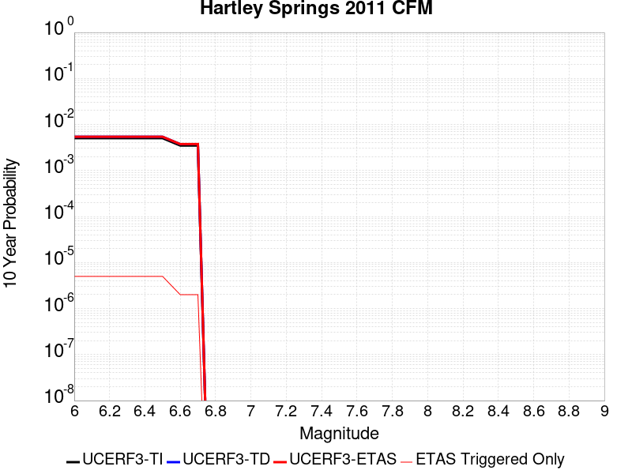 |

| Magnitude | 1 wk TI Prob | 1 wk TD Prob | 1 wk ETAS Prob | 1 wk ETAS/TD Gain | 1 wk ETAS Triggered Only | 1 mo TI Prob | 1 mo TD Prob | 1 mo ETAS Prob | 1 mo ETAS/TD Gain | 1 mo ETAS Triggered Only | 1 yr TI Prob | 1 yr TD Prob | 1 yr ETAS Prob | 1 yr ETAS/TD Gain | 1 yr ETAS Triggered Only | 10 yr TI Prob | 10 yr TD Prob | 10 yr ETAS Prob | 10 yr ETAS/TD Gain | 10 yr ETAS Triggered Only |
|-----|-----|-----|-----|-----|-----|-----|-----|-----|-----|-----|-----|-----|-----|-----|-----|-----|-----|-----|-----|-----|
| 6.0 | 9.687499E-6 | 1.0368633E-5 | 1.0368633E-5 | 1.0 | 0.0 | 4.1517193E-5 | 4.4436638E-5 | 4.752432E-5 | 1.0694851 | 3.0878207E-6 | 5.0535455E-4 | 5.409523E-4 | 5.440385E-4 | 1.005705 | 3.0878207E-6 | 0.0050420687 | 0.005403274 | 0.0054063452 | 1.0005684 | 3.0878207E-6 |
| 6.1 | 9.687499E-6 | 1.0368633E-5 | 1.0368633E-5 | 1.0 | 0.0 | 4.1517193E-5 | 4.4436638E-5 | 4.752432E-5 | 1.0694851 | 3.0878207E-6 | 5.0535455E-4 | 5.409523E-4 | 5.440385E-4 | 1.005705 | 3.0878207E-6 | 0.0050420687 | 0.005403274 | 0.0054063452 | 1.0005684 | 3.0878207E-6 |
| 6.2 | 9.687499E-6 | 1.0368633E-5 | 1.0368633E-5 | 1.0 | 0.0 | 4.1517193E-5 | 4.4436638E-5 | 4.752432E-5 | 1.0694851 | 3.0878207E-6 | 5.0535455E-4 | 5.409523E-4 | 5.440385E-4 | 1.005705 | 3.0878207E-6 | 0.0050420687 | 0.005403274 | 0.0054063452 | 1.0005684 | 3.0878207E-6 |
| 6.3 | 9.687499E-6 | 1.0368633E-5 | 1.0368633E-5 | 1.0 | 0.0 | 4.1517193E-5 | 4.4436638E-5 | 4.752432E-5 | 1.0694851 | 3.0878207E-6 | 5.0535455E-4 | 5.409523E-4 | 5.440385E-4 | 1.005705 | 3.0878207E-6 | 0.0050420687 | 0.005403274 | 0.0054063452 | 1.0005684 | 3.0878207E-6 |
| 6.4 | 9.687499E-6 | 1.0368633E-5 | 1.0368633E-5 | 1.0 | 0.0 | 4.1517193E-5 | 4.4436638E-5 | 4.752432E-5 | 1.0694851 | 3.0878207E-6 | 5.0535455E-4 | 5.409523E-4 | 5.440385E-4 | 1.005705 | 3.0878207E-6 | 0.0050420687 | 0.005403274 | 0.0054063452 | 1.0005684 | 3.0878207E-6 |
| 6.5 | 9.687499E-6 | 1.0368633E-5 | 1.0368633E-5 | 1.0 | 0.0 | 4.1517193E-5 | 4.4436638E-5 | 4.752432E-5 | 1.0694851 | 3.0878207E-6 | 5.0535455E-4 | 5.409523E-4 | 5.440385E-4 | 1.005705 | 3.0878207E-6 | 0.0050420687 | 0.005403274 | 0.0054063452 | 1.0005684 | 3.0878207E-6 |
| 6.6 | 6.6994126E-6 | 7.1661625E-6 | 7.1661625E-6 | 1.0 | 0.0 | 2.8711453E-5 | 3.0712123E-5 | 3.0712123E-5 | 1.0 | 0.0 | 3.4950586E-4 | 3.739201E-4 | 3.739201E-4 | 1.0 | 0.0 | 0.0034895667 | 0.0037392012 | 0.0037392012 | 1.0 | 0.0 |
| 6.7 | 6.6994126E-6 | 7.1661625E-6 | 7.1661625E-6 | 1.0 | 0.0 | 2.8711453E-5 | 3.0712123E-5 | 3.0712123E-5 | 1.0 | 0.0 | 3.4950586E-4 | 3.739201E-4 | 3.739201E-4 | 1.0 | 0.0 | 0.0034895667 | 0.0037392012 | 0.0037392012 | 1.0 | 0.0 |

## Point Reyes 2011 CFM
*[(top)](#table-of-contents)*

| 1 Week | 1 Month | 1 Year | 10 Year |
|-----|-----|-----|-----|
|  |  |  |  |

| Magnitude | 1 wk TI Prob | 1 wk TD Prob | 1 wk ETAS Prob | 1 wk ETAS/TD Gain | 1 wk ETAS Triggered Only | 1 mo TI Prob | 1 mo TD Prob | 1 mo ETAS Prob | 1 mo ETAS/TD Gain | 1 mo ETAS Triggered Only | 1 yr TI Prob | 1 yr TD Prob | 1 yr ETAS Prob | 1 yr ETAS/TD Gain | 1 yr ETAS Triggered Only | 10 yr TI Prob | 10 yr TD Prob | 10 yr ETAS Prob | 10 yr ETAS/TD Gain | 10 yr ETAS Triggered Only |
|-----|-----|-----|-----|-----|-----|-----|-----|-----|-----|-----|-----|-----|-----|-----|-----|-----|-----|-----|-----|-----|
| 6.0 | 5.880186E-6 | 6.1172223E-6 | 6.1172223E-6 | 1.0 | 0.0 | 2.5200554E-5 | 2.6216505E-5 | 2.9304245E-5 | 1.1177784 | 3.0878207E-6 | 3.0677355E-4 | 3.191572E-4 | 3.2224404E-4 | 1.0096718 | 3.0878207E-6 | 0.003063504 | 0.0031887568 | 0.0031918348 | 1.0009652 | 3.0878207E-6 |
| 6.1 | 5.880186E-6 | 6.1172223E-6 | 6.1172223E-6 | 1.0 | 0.0 | 2.5200554E-5 | 2.6216505E-5 | 2.9304245E-5 | 1.1177784 | 3.0878207E-6 | 3.0677355E-4 | 3.191572E-4 | 3.2224404E-4 | 1.0096718 | 3.0878207E-6 | 0.003063504 | 0.0031887568 | 0.0031918348 | 1.0009652 | 3.0878207E-6 |
| 6.2 | 5.880186E-6 | 6.1172223E-6 | 6.1172223E-6 | 1.0 | 0.0 | 2.5200554E-5 | 2.6216505E-5 | 2.9304245E-5 | 1.1177784 | 3.0878207E-6 | 3.0677355E-4 | 3.191572E-4 | 3.2224404E-4 | 1.0096718 | 3.0878207E-6 | 0.003063504 | 0.0031887568 | 0.0031918348 | 1.0009652 | 3.0878207E-6 |
| 6.3 | 5.880186E-6 | 6.1172223E-6 | 6.1172223E-6 | 1.0 | 0.0 | 2.5200554E-5 | 2.6216505E-5 | 2.9304245E-5 | 1.1177784 | 3.0878207E-6 | 3.0677355E-4 | 3.191572E-4 | 3.2224404E-4 | 1.0096718 | 3.0878207E-6 | 0.003063504 | 0.0031887568 | 0.0031918348 | 1.0009652 | 3.0878207E-6 |
| 6.4 | 5.880186E-6 | 6.1172223E-6 | 6.1172223E-6 | 1.0 | 0.0 | 2.5200554E-5 | 2.6216505E-5 | 2.9304245E-5 | 1.1177784 | 3.0878207E-6 | 3.0677355E-4 | 3.191572E-4 | 3.2224404E-4 | 1.0096718 | 3.0878207E-6 | 0.003063504 | 0.0031887568 | 0.0031918348 | 1.0009652 | 3.0878207E-6 |
| 6.5 | 5.880186E-6 | 6.1172223E-6 | 6.1172223E-6 | 1.0 | 0.0 | 2.5200554E-5 | 2.6216505E-5 | 2.9304245E-5 | 1.1177784 | 3.0878207E-6 | 3.0677355E-4 | 3.191572E-4 | 3.2224404E-4 | 1.0096718 | 3.0878207E-6 | 0.003063504 | 0.0031887568 | 0.0031918348 | 1.0009652 | 3.0878207E-6 |
| 6.6 | 4.962286E-6 | 5.1612233E-6 | 5.1612233E-6 | 1.0 | 0.0 | 2.1266766E-5 | 2.211944E-5 | 2.211944E-5 | 1.0 | 0.0 | 2.588921E-4 | 2.6928863E-4 | 2.6928863E-4 | 1.0 | 0.0 | 0.002585907 | 0.002691363 | 0.002691363 | 1.0 | 0.0 |
| 6.7 | 3.6899585E-6 | 3.8359885E-6 | 3.8359885E-6 | 1.0 | 0.0 | 1.5814012E-5 | 1.6439944E-5 | 1.6439944E-5 | 1.0 | 0.0 | 1.9251858E-4 | 2.0015506E-4 | 2.0015506E-4 | 1.0 | 0.0 | 0.0019235188 | 0.0020014285 | 0.0020014285 | 1.0 | 0.0 |
| 6.8 | 3.560543E-6 | 3.7012655E-6 | 3.7012655E-6 | 1.0 | 0.0 | 1.525938E-5 | 1.5862566E-5 | 1.5862566E-5 | 1.0 | 0.0 | 1.8576712E-4 | 1.9312675E-4 | 1.9312675E-4 | 1.0 | 0.0 | 0.001856119 | 0.0019312674 | 0.0019312674 | 1.0 | 0.0 |

## Burnt Mtn
*[(top)](#table-of-contents)*

| 1 Week | 1 Month | 1 Year | 10 Year |
|-----|-----|-----|-----|
|  |  |  |  |

| Magnitude | 1 wk TI Prob | 1 wk TD Prob | 1 wk ETAS Prob | 1 wk ETAS/TD Gain | 1 wk ETAS Triggered Only | 1 mo TI Prob | 1 mo TD Prob | 1 mo ETAS Prob | 1 mo ETAS/TD Gain | 1 mo ETAS Triggered Only | 1 yr TI Prob | 1 yr TD Prob | 1 yr ETAS Prob | 1 yr ETAS/TD Gain | 1 yr ETAS Triggered Only | 10 yr TI Prob | 10 yr TD Prob | 10 yr ETAS Prob | 10 yr ETAS/TD Gain | 10 yr ETAS Triggered Only |
|-----|-----|-----|-----|-----|-----|-----|-----|-----|-----|-----|-----|-----|-----|-----|-----|-----|-----|-----|-----|-----|
| 6.0 | 1.1997946E-5 | 8.64995E-6 | 8.64995E-6 | 1.0 | 0.0 | 5.1418756E-5 | 3.7071215E-5 | 4.0158924E-5 | 1.0832912 | 3.0878207E-6 | 6.2584353E-4 | 4.5134206E-4 | 4.544285E-4 | 1.0068383 | 3.0878207E-6 | 0.006240839 | 0.0045134206 | 0.0045164945 | 1.000681 | 3.0878207E-6 |
| 6.1 | 1.1997946E-5 | 8.64995E-6 | 8.64995E-6 | 1.0 | 0.0 | 5.1418756E-5 | 3.7071215E-5 | 4.0158924E-5 | 1.0832912 | 3.0878207E-6 | 6.2584353E-4 | 4.5134206E-4 | 4.544285E-4 | 1.0068383 | 3.0878207E-6 | 0.006240839 | 0.0045134206 | 0.0045164945 | 1.000681 | 3.0878207E-6 |
| 6.2 | 1.1997946E-5 | 8.64995E-6 | 8.64995E-6 | 1.0 | 0.0 | 5.1418756E-5 | 3.7071215E-5 | 4.0158924E-5 | 1.0832912 | 3.0878207E-6 | 6.2584353E-4 | 4.5134206E-4 | 4.544285E-4 | 1.0068383 | 3.0878207E-6 | 0.006240839 | 0.0045134206 | 0.0045164945 | 1.000681 | 3.0878207E-6 |
| 6.3 | 1.1997946E-5 | 8.64995E-6 | 8.64995E-6 | 1.0 | 0.0 | 5.1418756E-5 | 3.7071215E-5 | 4.0158924E-5 | 1.0832912 | 3.0878207E-6 | 6.2584353E-4 | 4.5134206E-4 | 4.544285E-4 | 1.0068383 | 3.0878207E-6 | 0.006240839 | 0.0045134206 | 0.0045164945 | 1.000681 | 3.0878207E-6 |
| 6.4 | 1.1997946E-5 | 8.64995E-6 | 8.64995E-6 | 1.0 | 0.0 | 5.1418756E-5 | 3.7071215E-5 | 4.0158924E-5 | 1.0832912 | 3.0878207E-6 | 6.2584353E-4 | 4.5134206E-4 | 4.544285E-4 | 1.0068383 | 3.0878207E-6 | 0.006240839 | 0.0045134206 | 0.0045164945 | 1.000681 | 3.0878207E-6 |
| 6.5 | 1.1997946E-5 | 8.64995E-6 | 8.64995E-6 | 1.0 | 0.0 | 5.1418756E-5 | 3.7071215E-5 | 4.0158924E-5 | 1.0832912 | 3.0878207E-6 | 6.2584353E-4 | 4.5134206E-4 | 4.544285E-4 | 1.0068383 | 3.0878207E-6 | 0.006240839 | 0.0045134206 | 0.0045164945 | 1.000681 | 3.0878207E-6 |
| 6.6 | 1.1997946E-5 | 8.64995E-6 | 8.64995E-6 | 1.0 | 0.0 | 5.1418756E-5 | 3.7071215E-5 | 4.0158924E-5 | 1.0832912 | 3.0878207E-6 | 6.2584353E-4 | 4.5134206E-4 | 4.544285E-4 | 1.0068383 | 3.0878207E-6 | 0.006240839 | 0.0045134206 | 0.0045164945 | 1.000681 | 3.0878207E-6 |

## Pisgah-Bullion Mtn-Mesquite Lk
*[(top)](#table-of-contents)*

| 1 Week | 1 Month | 1 Year | 10 Year |
|-----|-----|-----|-----|
|  |  |  |  |

| Magnitude | 1 wk TI Prob | 1 wk TD Prob | 1 wk ETAS Prob | 1 wk ETAS/TD Gain | 1 wk ETAS Triggered Only | 1 mo TI Prob | 1 mo TD Prob | 1 mo ETAS Prob | 1 mo ETAS/TD Gain | 1 mo ETAS Triggered Only | 1 yr TI Prob | 1 yr TD Prob | 1 yr ETAS Prob | 1 yr ETAS/TD Gain | 1 yr ETAS Triggered Only | 10 yr TI Prob | 10 yr TD Prob | 10 yr ETAS Prob | 10 yr ETAS/TD Gain | 10 yr ETAS Triggered Only |
|-----|-----|-----|-----|-----|-----|-----|-----|-----|-----|-----|-----|-----|-----|-----|-----|-----|-----|-----|-----|-----|
| 6.0 | 9.757405E-6 | 3.2571834E-6 | 6.344994E-6 | 1.9480003 | 3.0878207E-6 | 4.181678E-5 | 1.3959294E-5 | 1.7047072E-5 | 1.2211987 | 3.0878207E-6 | 5.090004E-4 | 1.6994326E-4 | 1.7303057E-4 | 1.0181667 | 3.0878207E-6 | 0.005078361 | 0.0016983406 | 0.0017014232 | 1.0018151 | 3.0878207E-6 |
| 6.1 | 9.757405E-6 | 3.2571834E-6 | 6.344994E-6 | 1.9480003 | 3.0878207E-6 | 4.181678E-5 | 1.3959294E-5 | 1.7047072E-5 | 1.2211987 | 3.0878207E-6 | 5.090004E-4 | 1.6994326E-4 | 1.7303057E-4 | 1.0181667 | 3.0878207E-6 | 0.005078361 | 0.0016983406 | 0.0017014232 | 1.0018151 | 3.0878207E-6 |
| 6.2 | 9.757405E-6 | 3.2571834E-6 | 6.344994E-6 | 1.9480003 | 3.0878207E-6 | 4.181678E-5 | 1.3959294E-5 | 1.7047072E-5 | 1.2211987 | 3.0878207E-6 | 5.090004E-4 | 1.6994326E-4 | 1.7303057E-4 | 1.0181667 | 3.0878207E-6 | 0.005078361 | 0.0016983406 | 0.0017014232 | 1.0018151 | 3.0878207E-6 |
| 6.3 | 9.757405E-6 | 3.2571834E-6 | 6.344994E-6 | 1.9480003 | 3.0878207E-6 | 4.181678E-5 | 1.3959294E-5 | 1.7047072E-5 | 1.2211987 | 3.0878207E-6 | 5.090004E-4 | 1.6994326E-4 | 1.7303057E-4 | 1.0181667 | 3.0878207E-6 | 0.005078361 | 0.0016983406 | 0.0017014232 | 1.0018151 | 3.0878207E-6 |
| 6.4 | 9.757405E-6 | 3.2571834E-6 | 6.344994E-6 | 1.9480003 | 3.0878207E-6 | 4.181678E-5 | 1.3959294E-5 | 1.7047072E-5 | 1.2211987 | 3.0878207E-6 | 5.090004E-4 | 1.6994326E-4 | 1.7303057E-4 | 1.0181667 | 3.0878207E-6 | 0.005078361 | 0.0016983406 | 0.0017014232 | 1.0018151 | 3.0878207E-6 |
| 6.5 | 9.757405E-6 | 3.2571834E-6 | 6.344994E-6 | 1.9480003 | 3.0878207E-6 | 4.181678E-5 | 1.3959294E-5 | 1.7047072E-5 | 1.2211987 | 3.0878207E-6 | 5.090004E-4 | 1.6994326E-4 | 1.7303057E-4 | 1.0181667 | 3.0878207E-6 | 0.005078361 | 0.0016983406 | 0.0017014232 | 1.0018151 | 3.0878207E-6 |
| 6.6 | 8.852213E-6 | 2.7291178E-6 | 5.81693E-6 | 2.1314325 | 3.0878207E-6 | 3.7937505E-5 | 1.1696178E-5 | 1.4783963E-5 | 1.2639995 | 3.0878207E-6 | 4.6179123E-4 | 1.4239372E-4 | 1.4548111E-4 | 1.021682 | 3.0878207E-6 | 0.004608328 | 0.0014232274 | 0.0014263109 | 1.0021665 | 3.0878207E-6 |
| 6.7 | 7.756385E-6 | 2.2853417E-6 | 5.3731555E-6 | 2.3511388 | 3.0878207E-6 | 3.3241224E-5 | 9.794297E-6 | 1.2882087E-5 | 1.3152641 | 3.0878207E-6 | 4.0463675E-4 | 1.1924106E-4 | 1.223285E-4 | 1.0258925 | 3.0878207E-6 | 0.0040390077 | 0.0011919696 | 0.0011950538 | 1.0025874 | 3.0878207E-6 |
| 6.8 | 6.8437944E-6 | 2.0638372E-6 | 5.1516517E-6 | 2.4961522 | 3.0878207E-6 | 2.9330216E-5 | 8.844998E-6 | 1.19327915E-5 | 1.3491005 | 3.0878207E-6 | 3.570369E-4 | 1.07684544E-4 | 1.1077203E-4 | 1.0286716 | 3.0878207E-6 | 0.0035646379 | 0.0010765212 | 0.0010796058 | 1.0028652 | 3.0878207E-6 |
| 6.9 | 5.8630926E-6 | 1.8587051E-6 | 1.8587051E-6 | 1.0 | 0.0 | 2.5127298E-5 | 7.965866E-6 | 7.965866E-6 | 1.0 | 0.0 | 3.058819E-4 | 9.698211E-5 | 9.698211E-5 | 1.0 | 0.0 | 0.003054612 | 9.695946E-4 | 9.695946E-4 | 1.0 | 0.0 |
| 7.0 | 5.1241714E-6 | 1.7030331E-6 | 1.7030331E-6 | 1.0 | 0.0 | 2.196055E-5 | 7.2987045E-6 | 7.2987045E-6 | 1.0 | 0.0 | 2.6733687E-4 | 8.8860106E-5 | 8.8860106E-5 | 1.0 | 0.0 | 0.0026701551 | 8.88442E-4 | 8.88442E-4 | 1.0 | 0.0 |
| 7.1 | 4.4490575E-6 | 1.5093489E-6 | 1.5093489E-6 | 1.0 | 0.0 | 1.906725E-5 | 6.468633E-6 | 6.468633E-6 | 1.0 | 0.0 | 2.3211904E-4 | 7.875475E-5 | 7.875475E-5 | 1.0 | 0.0 | 0.0023187674 | 7.8746333E-4 | 7.8746333E-4 | 1.0 | 0.0 |
| 7.2 | 3.827017E-6 | 1.2527248E-6 | 1.2527248E-6 | 1.0 | 0.0 | 1.6401398E-5 | 5.3688204E-6 | 5.3688204E-6 | 1.0 | 0.0 | 1.9966872E-4 | 6.536539E-5 | 6.536539E-5 | 1.0 | 0.0 | 0.0019948941 | 6.5365393E-4 | 6.5365393E-4 | 1.0 | 0.0 |

## Gillem - Big Crack 2011 CFM
*[(top)](#table-of-contents)*

| 1 Week | 1 Month | 1 Year | 10 Year |
|-----|-----|-----|-----|
|  |  |  |  |

| Magnitude | 1 wk TI Prob | 1 wk TD Prob | 1 wk ETAS Prob | 1 wk ETAS/TD Gain | 1 wk ETAS Triggered Only | 1 mo TI Prob | 1 mo TD Prob | 1 mo ETAS Prob | 1 mo ETAS/TD Gain | 1 mo ETAS Triggered Only | 1 yr TI Prob | 1 yr TD Prob | 1 yr ETAS Prob | 1 yr ETAS/TD Gain | 1 yr ETAS Triggered Only | 10 yr TI Prob | 10 yr TD Prob | 10 yr ETAS Prob | 10 yr ETAS/TD Gain | 10 yr ETAS Triggered Only |
|-----|-----|-----|-----|-----|-----|-----|-----|-----|-----|-----|-----|-----|-----|-----|-----|-----|-----|-----|-----|-----|
| 6.0 | 1.910764E-5 | 2.1994592E-5 | 2.1994592E-5 | 1.0 | 0.0 | 8.1887316E-5 | 9.426067E-5 | 9.73482E-5 | 1.0327553 | 3.0878207E-6 | 9.96522E-4 | 0.0011472917 | 0.0011503759 | 1.0026883 | 3.0878207E-6 | 0.009920651 | 0.011440402 | 0.011443455 | 1.0002668 | 3.0878207E-6 |
| 6.1 | 1.910764E-5 | 2.1994592E-5 | 2.1994592E-5 | 1.0 | 0.0 | 8.1887316E-5 | 9.426067E-5 | 9.73482E-5 | 1.0327553 | 3.0878207E-6 | 9.96522E-4 | 0.0011472917 | 0.0011503759 | 1.0026883 | 3.0878207E-6 | 0.009920651 | 0.011440402 | 0.011443455 | 1.0002668 | 3.0878207E-6 |
| 6.2 | 1.910764E-5 | 2.1994592E-5 | 2.1994592E-5 | 1.0 | 0.0 | 8.1887316E-5 | 9.426067E-5 | 9.73482E-5 | 1.0327553 | 3.0878207E-6 | 9.96522E-4 | 0.0011472917 | 0.0011503759 | 1.0026883 | 3.0878207E-6 | 0.009920651 | 0.011440402 | 0.011443455 | 1.0002668 | 3.0878207E-6 |
| 6.3 | 1.910764E-5 | 2.1994592E-5 | 2.1994592E-5 | 1.0 | 0.0 | 8.1887316E-5 | 9.426067E-5 | 9.73482E-5 | 1.0327553 | 3.0878207E-6 | 9.96522E-4 | 0.0011472917 | 0.0011503759 | 1.0026883 | 3.0878207E-6 | 0.009920651 | 0.011440402 | 0.011443455 | 1.0002668 | 3.0878207E-6 |
| 6.4 | 1.910764E-5 | 2.1994592E-5 | 2.1994592E-5 | 1.0 | 0.0 | 8.1887316E-5 | 9.426067E-5 | 9.73482E-5 | 1.0327553 | 3.0878207E-6 | 9.96522E-4 | 0.0011472917 | 0.0011503759 | 1.0026883 | 3.0878207E-6 | 0.009920651 | 0.011440402 | 0.011443455 | 1.0002668 | 3.0878207E-6 |
| 6.5 | 1.910764E-5 | 2.1994592E-5 | 2.1994592E-5 | 1.0 | 0.0 | 8.1887316E-5 | 9.426067E-5 | 9.73482E-5 | 1.0327553 | 3.0878207E-6 | 9.96522E-4 | 0.0011472917 | 0.0011503759 | 1.0026883 | 3.0878207E-6 | 0.009920651 | 0.011440402 | 0.011443455 | 1.0002668 | 3.0878207E-6 |
| 6.6 | 1.3213953E-5 | 1.5149388E-5 | 1.5149388E-5 | 1.0 | 0.0 | 5.6629997E-5 | 6.4925705E-5 | 6.801332E-5 | 1.0475562 | 3.0878207E-6 | 6.892521E-4 | 7.904269E-4 | 7.9351227E-4 | 1.0039034 | 3.0878207E-6 | 0.0068711825 | 0.0079000015 | 0.007903065 | 1.0003878 | 3.0878207E-6 |
| 6.7 | 1.21310995E-5 | 1.3896347E-5 | 1.3896347E-5 | 1.0 | 0.0 | 5.198939E-5 | 5.9555772E-5 | 6.264341E-5 | 1.0518445 | 3.0878207E-6 | 6.32787E-4 | 7.2509155E-4 | 7.2817714E-4 | 1.0042554 | 3.0878207E-6 | 0.0063098813 | 0.0072509153 | 0.0072539807 | 1.0004227 | 3.0878207E-6 |

## Likely 2011 CFM
*[(top)](#table-of-contents)*

| 1 Week | 1 Month | 1 Year | 10 Year |
|-----|-----|-----|-----|
|  |  |  |  |

| Magnitude | 1 wk TI Prob | 1 wk TD Prob | 1 wk ETAS Prob | 1 wk ETAS/TD Gain | 1 wk ETAS Triggered Only | 1 mo TI Prob | 1 mo TD Prob | 1 mo ETAS Prob | 1 mo ETAS/TD Gain | 1 mo ETAS Triggered Only | 1 yr TI Prob | 1 yr TD Prob | 1 yr ETAS Prob | 1 yr ETAS/TD Gain | 1 yr ETAS Triggered Only | 10 yr TI Prob | 10 yr TD Prob | 10 yr ETAS Prob | 10 yr ETAS/TD Gain | 10 yr ETAS Triggered Only |
|-----|-----|-----|-----|-----|-----|-----|-----|-----|-----|-----|-----|-----|-----|-----|-----|-----|-----|-----|-----|-----|
| 6.0 | 4.8283173E-6 | 4.977288E-6 | 4.977288E-6 | 1.0 | 0.0 | 2.0692623E-5 | 2.1331109E-5 | 2.1331109E-5 | 1.0 | 0.0 | 2.5190358E-4 | 2.5968385E-4 | 2.6277086E-4 | 1.0118876 | 3.0878207E-6 | 0.0025161821 | 0.0025946426 | 0.0025977222 | 1.001187 | 3.0878207E-6 |
| 6.1 | 4.8283173E-6 | 4.977288E-6 | 4.977288E-6 | 1.0 | 0.0 | 2.0692623E-5 | 2.1331109E-5 | 2.1331109E-5 | 1.0 | 0.0 | 2.5190358E-4 | 2.5968385E-4 | 2.6277086E-4 | 1.0118876 | 3.0878207E-6 | 0.0025161821 | 0.0025946426 | 0.0025977222 | 1.001187 | 3.0878207E-6 |
| 6.2 | 4.8283173E-6 | 4.977288E-6 | 4.977288E-6 | 1.0 | 0.0 | 2.0692623E-5 | 2.1331109E-5 | 2.1331109E-5 | 1.0 | 0.0 | 2.5190358E-4 | 2.5968385E-4 | 2.6277086E-4 | 1.0118876 | 3.0878207E-6 | 0.0025161821 | 0.0025946426 | 0.0025977222 | 1.001187 | 3.0878207E-6 |
| 6.3 | 4.8283173E-6 | 4.977288E-6 | 4.977288E-6 | 1.0 | 0.0 | 2.0692623E-5 | 2.1331109E-5 | 2.1331109E-5 | 1.0 | 0.0 | 2.5190358E-4 | 2.5968385E-4 | 2.6277086E-4 | 1.0118876 | 3.0878207E-6 | 0.0025161821 | 0.0025946426 | 0.0025977222 | 1.001187 | 3.0878207E-6 |
| 6.4 | 4.8283173E-6 | 4.977288E-6 | 4.977288E-6 | 1.0 | 0.0 | 2.0692623E-5 | 2.1331109E-5 | 2.1331109E-5 | 1.0 | 0.0 | 2.5190358E-4 | 2.5968385E-4 | 2.6277086E-4 | 1.0118876 | 3.0878207E-6 | 0.0025161821 | 0.0025946426 | 0.0025977222 | 1.001187 | 3.0878207E-6 |
| 6.5 | 4.8283173E-6 | 4.977288E-6 | 4.977288E-6 | 1.0 | 0.0 | 2.0692623E-5 | 2.1331109E-5 | 2.1331109E-5 | 1.0 | 0.0 | 2.5190358E-4 | 2.5968385E-4 | 2.6277086E-4 | 1.0118876 | 3.0878207E-6 | 0.0025161821 | 0.0025946426 | 0.0025977222 | 1.001187 | 3.0878207E-6 |
| 6.6 | 4.1529042E-6 | 4.2800852E-6 | 4.2800852E-6 | 1.0 | 0.0 | 1.779804E-5 | 1.834314E-5 | 1.834314E-5 | 1.0 | 0.0 | 2.1666959E-4 | 2.2331333E-4 | 2.2640046E-4 | 1.0138242 | 3.0878207E-6 | 0.0021645846 | 0.00223172 | 0.002234801 | 1.0013806 | 3.0878207E-6 |
| 6.7 | 3.5450967E-6 | 3.6525942E-6 | 3.6525942E-6 | 1.0 | 0.0 | 1.5193183E-5 | 1.5653928E-5 | 1.5653928E-5 | 1.0 | 0.0 | 1.849613E-4 | 1.905783E-4 | 1.9366553E-4 | 1.0161992 | 3.0878207E-6 | 0.0018480743 | 0.0019049724 | 0.0019080542 | 1.0016178 | 3.0878207E-6 |
| 6.8 | 2.9935204E-6 | 3.0833778E-6 | 3.0833778E-6 | 1.0 | 0.0 | 1.282931E-5 | 1.3214457E-5 | 1.3214457E-5 | 1.0 | 0.0 | 1.5618566E-4 | 1.6088245E-4 | 1.6396977E-4 | 1.01919 | 3.0878207E-6 | 0.0015607593 | 0.0016084755 | 0.0016115583 | 1.0019166 | 3.0878207E-6 |
| 6.9 | 2.4887156E-6 | 2.5627064E-6 | 2.5627064E-6 | 1.0 | 0.0 | 1.0665881E-5 | 1.0983028E-5 | 1.0983028E-5 | 1.0 | 0.0 | 1.2984936E-4 | 1.3371836E-4 | 1.3680577E-4 | 1.0230889 | 3.0878207E-6 | 0.0012977351 | 0.0013371836 | 0.0013402674 | 1.0023061 | 3.0878207E-6 |

## Collayami 2011 CFM
*[(top)](#table-of-contents)*

| 1 Week | 1 Month | 1 Year | 10 Year |
|-----|-----|-----|-----|
|  |  |  |  |

| Magnitude | 1 wk TI Prob | 1 wk TD Prob | 1 wk ETAS Prob | 1 wk ETAS/TD Gain | 1 wk ETAS Triggered Only | 1 mo TI Prob | 1 mo TD Prob | 1 mo ETAS Prob | 1 mo ETAS/TD Gain | 1 mo ETAS Triggered Only | 1 yr TI Prob | 1 yr TD Prob | 1 yr ETAS Prob | 1 yr ETAS/TD Gain | 1 yr ETAS Triggered Only | 10 yr TI Prob | 10 yr TD Prob | 10 yr ETAS Prob | 10 yr ETAS/TD Gain | 10 yr ETAS Triggered Only |
|-----|-----|-----|-----|-----|-----|-----|-----|-----|-----|-----|-----|-----|-----|-----|-----|-----|-----|-----|-----|-----|
| 6.0 | 1.2952825E-5 | 1.4354933E-5 | 1.4354933E-5 | 1.0 | 0.0 | 5.551093E-5 | 6.152114E-5 | 6.152114E-5 | 1.0 | 0.0 | 6.7563594E-4 | 7.490199E-4 | 7.490199E-4 | 1.0 | 0.0 | 0.006735855 | 0.007490199 | 0.0074932636 | 1.0004091 | 3.0878207E-6 |
| 6.1 | 1.2952825E-5 | 1.4354933E-5 | 1.4354933E-5 | 1.0 | 0.0 | 5.551093E-5 | 6.152114E-5 | 6.152114E-5 | 1.0 | 0.0 | 6.7563594E-4 | 7.490199E-4 | 7.490199E-4 | 1.0 | 0.0 | 0.006735855 | 0.007490199 | 0.0074932636 | 1.0004091 | 3.0878207E-6 |
| 6.2 | 1.2952825E-5 | 1.4354933E-5 | 1.4354933E-5 | 1.0 | 0.0 | 5.551093E-5 | 6.152114E-5 | 6.152114E-5 | 1.0 | 0.0 | 6.7563594E-4 | 7.490199E-4 | 7.490199E-4 | 1.0 | 0.0 | 0.006735855 | 0.007490199 | 0.0074932636 | 1.0004091 | 3.0878207E-6 |
| 6.3 | 1.2952825E-5 | 1.4354933E-5 | 1.4354933E-5 | 1.0 | 0.0 | 5.551093E-5 | 6.152114E-5 | 6.152114E-5 | 1.0 | 0.0 | 6.7563594E-4 | 7.490199E-4 | 7.490199E-4 | 1.0 | 0.0 | 0.006735855 | 0.007490199 | 0.0074932636 | 1.0004091 | 3.0878207E-6 |
| 6.4 | 1.2952825E-5 | 1.4354933E-5 | 1.4354933E-5 | 1.0 | 0.0 | 5.551093E-5 | 6.152114E-5 | 6.152114E-5 | 1.0 | 0.0 | 6.7563594E-4 | 7.490199E-4 | 7.490199E-4 | 1.0 | 0.0 | 0.006735855 | 0.007490199 | 0.0074932636 | 1.0004091 | 3.0878207E-6 |
| 6.5 | 1.2952825E-5 | 1.4354933E-5 | 1.4354933E-5 | 1.0 | 0.0 | 5.551093E-5 | 6.152114E-5 | 6.152114E-5 | 1.0 | 0.0 | 6.7563594E-4 | 7.490199E-4 | 7.490199E-4 | 1.0 | 0.0 | 0.006735855 | 0.007490199 | 0.0074932636 | 1.0004091 | 3.0878207E-6 |

## West Tahoe
*[(top)](#table-of-contents)*

| 1 Week | 1 Month | 1 Year | 10 Year |
|-----|-----|-----|-----|
|  |  | 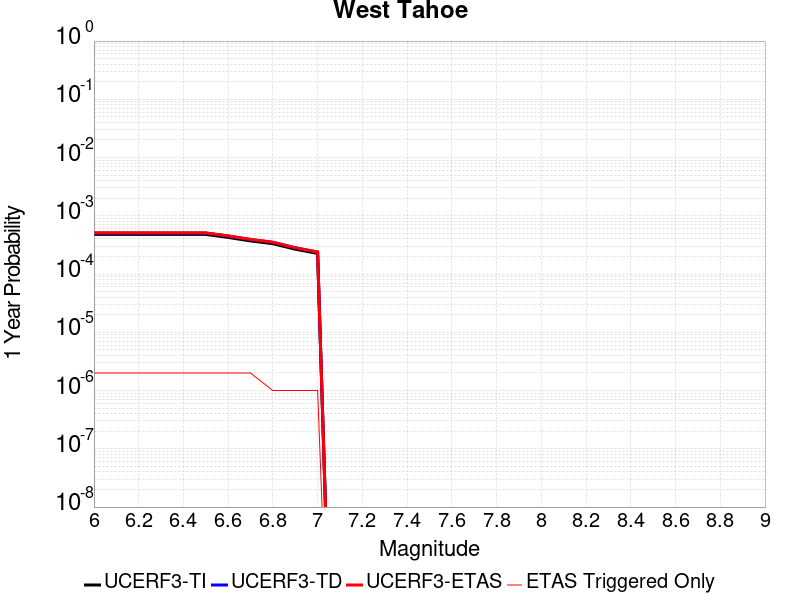 |  |

| Magnitude | 1 wk TI Prob | 1 wk TD Prob | 1 wk ETAS Prob | 1 wk ETAS/TD Gain | 1 wk ETAS Triggered Only | 1 mo TI Prob | 1 mo TD Prob | 1 mo ETAS Prob | 1 mo ETAS/TD Gain | 1 mo ETAS Triggered Only | 1 yr TI Prob | 1 yr TD Prob | 1 yr ETAS Prob | 1 yr ETAS/TD Gain | 1 yr ETAS Triggered Only | 10 yr TI Prob | 10 yr TD Prob | 10 yr ETAS Prob | 10 yr ETAS/TD Gain | 10 yr ETAS Triggered Only |
|-----|-----|-----|-----|-----|-----|-----|-----|-----|-----|-----|-----|-----|-----|-----|-----|-----|-----|-----|-----|-----|
| 6.0 | 9.18365E-6 | 9.709047E-6 | 9.709047E-6 | 1.0 | 0.0 | 3.9357907E-5 | 4.1609703E-5 | 4.1609703E-5 | 1.0 | 0.0 | 4.7907716E-4 | 5.065095E-4 | 5.095958E-4 | 1.0060931 | 3.0878207E-6 | 0.0047804564 | 0.0050564157 | 0.0050594877 | 1.0006076 | 3.0878207E-6 |
| 6.1 | 9.18365E-6 | 9.709047E-6 | 9.709047E-6 | 1.0 | 0.0 | 3.9357907E-5 | 4.1609703E-5 | 4.1609703E-5 | 1.0 | 0.0 | 4.7907716E-4 | 5.065095E-4 | 5.095958E-4 | 1.0060931 | 3.0878207E-6 | 0.0047804564 | 0.0050564157 | 0.0050594877 | 1.0006076 | 3.0878207E-6 |
| 6.2 | 9.18365E-6 | 9.709047E-6 | 9.709047E-6 | 1.0 | 0.0 | 3.9357907E-5 | 4.1609703E-5 | 4.1609703E-5 | 1.0 | 0.0 | 4.7907716E-4 | 5.065095E-4 | 5.095958E-4 | 1.0060931 | 3.0878207E-6 | 0.0047804564 | 0.0050564157 | 0.0050594877 | 1.0006076 | 3.0878207E-6 |
| 6.3 | 9.18365E-6 | 9.709047E-6 | 9.709047E-6 | 1.0 | 0.0 | 3.9357907E-5 | 4.1609703E-5 | 4.1609703E-5 | 1.0 | 0.0 | 4.7907716E-4 | 5.065095E-4 | 5.095958E-4 | 1.0060931 | 3.0878207E-6 | 0.0047804564 | 0.0050564157 | 0.0050594877 | 1.0006076 | 3.0878207E-6 |
| 6.4 | 9.18365E-6 | 9.709047E-6 | 9.709047E-6 | 1.0 | 0.0 | 3.9357907E-5 | 4.1609703E-5 | 4.1609703E-5 | 1.0 | 0.0 | 4.7907716E-4 | 5.065095E-4 | 5.095958E-4 | 1.0060931 | 3.0878207E-6 | 0.0047804564 | 0.0050564157 | 0.0050594877 | 1.0006076 | 3.0878207E-6 |
| 6.5 | 9.18365E-6 | 9.709047E-6 | 9.709047E-6 | 1.0 | 0.0 | 3.9357907E-5 | 4.1609703E-5 | 4.1609703E-5 | 1.0 | 0.0 | 4.7907716E-4 | 5.065095E-4 | 5.095958E-4 | 1.0060931 | 3.0878207E-6 | 0.0047804564 | 0.0050564157 | 0.0050594877 | 1.0006076 | 3.0878207E-6 |
| 6.6 | 8.164356E-6 | 8.6257305E-6 | 8.6257305E-6 | 1.0 | 0.0 | 3.4989625E-5 | 3.6967052E-5 | 3.6967052E-5 | 1.0 | 0.0 | 4.259154E-4 | 4.500096E-4 | 4.5309603E-4 | 1.0068586 | 3.0878207E-6 | 0.004251 | 0.004493797 | 0.004496871 | 1.000684 | 3.0878207E-6 |
| 6.7 | 7.1083327E-6 | 7.510388E-6 | 7.510388E-6 | 1.0 | 0.0 | 3.0463927E-5 | 3.2187138E-5 | 3.2187138E-5 | 1.0 | 0.0 | 3.708352E-4 | 3.918357E-4 | 3.9492233E-4 | 1.0078773 | 3.0878207E-6 | 0.0037021697 | 0.0039141746 | 0.0039172503 | 1.0007858 | 3.0878207E-6 |
| 6.8 | 6.3750726E-6 | 6.7311666E-6 | 6.7311666E-6 | 1.0 | 0.0 | 2.7321454E-5 | 2.8847693E-5 | 2.8847693E-5 | 1.0 | 0.0 | 3.3258792E-4 | 3.5119147E-4 | 3.5119147E-4 | 1.0 | 0.0 | 0.0033209058 | 0.0035090533 | 0.0035090533 | 1.0 | 0.0 |
| 6.9 | 5.126961E-6 | 5.410055E-6 | 5.410055E-6 | 1.0 | 0.0 | 2.1972504E-5 | 2.3185894E-5 | 2.3185894E-5 | 1.0 | 0.0 | 2.674824E-4 | 2.8227826E-4 | 2.8227826E-4 | 1.0 | 0.0 | 0.0026716068 | 0.0028218026 | 0.0028218026 | 1.0 | 0.0 |
| 7.0 | 4.331526E-6 | 4.5688944E-6 | 4.5688944E-6 | 1.0 | 0.0 | 1.856355E-5 | 1.9580977E-5 | 1.9580977E-5 | 1.0 | 0.0 | 2.2598778E-4 | 2.3839838E-4 | 2.3839838E-4 | 1.0 | 0.0 | 0.002257581 | 0.002383984 | 0.002383984 | 1.0 | 0.0 |

## Elsinore (Julian)
*[(top)](#table-of-contents)*

| 1 Week | 1 Month | 1 Year | 10 Year |
|-----|-----|-----|-----|
|  |  |  |  |

| Magnitude | 1 wk TI Prob | 1 wk TD Prob | 1 wk ETAS Prob | 1 wk ETAS/TD Gain | 1 wk ETAS Triggered Only | 1 mo TI Prob | 1 mo TD Prob | 1 mo ETAS Prob | 1 mo ETAS/TD Gain | 1 mo ETAS Triggered Only | 1 yr TI Prob | 1 yr TD Prob | 1 yr ETAS Prob | 1 yr ETAS/TD Gain | 1 yr ETAS Triggered Only | 10 yr TI Prob | 10 yr TD Prob | 10 yr ETAS Prob | 10 yr ETAS/TD Gain | 10 yr ETAS Triggered Only |
|-----|-----|-----|-----|-----|-----|-----|-----|-----|-----|-----|-----|-----|-----|-----|-----|-----|-----|-----|-----|-----|
| 6.0 | 1.6316579E-5 | 2.2937022E-5 | 2.2937022E-5 | 1.0 | 0.0 | 6.992632E-5 | 9.8298326E-5 | 9.8298326E-5 | 1.0 | 0.0 | 8.510204E-4 | 0.0011962154 | 0.0011992996 | 1.0025783 | 3.0878207E-6 | 0.008477687 | 0.011913514 | 0.011916565 | 1.0002561 | 3.0878207E-6 |
| 6.1 | 1.6316579E-5 | 2.2937022E-5 | 2.2937022E-5 | 1.0 | 0.0 | 6.992632E-5 | 9.8298326E-5 | 9.8298326E-5 | 1.0 | 0.0 | 8.510204E-4 | 0.0011962154 | 0.0011992996 | 1.0025783 | 3.0878207E-6 | 0.008477687 | 0.011913514 | 0.011916565 | 1.0002561 | 3.0878207E-6 |
| 6.2 | 1.6316579E-5 | 2.2937022E-5 | 2.2937022E-5 | 1.0 | 0.0 | 6.992632E-5 | 9.8298326E-5 | 9.8298326E-5 | 1.0 | 0.0 | 8.510204E-4 | 0.0011962154 | 0.0011992996 | 1.0025783 | 3.0878207E-6 | 0.008477687 | 0.011913514 | 0.011916565 | 1.0002561 | 3.0878207E-6 |
| 6.3 | 1.6316579E-5 | 2.2937022E-5 | 2.2937022E-5 | 1.0 | 0.0 | 6.992632E-5 | 9.8298326E-5 | 9.8298326E-5 | 1.0 | 0.0 | 8.510204E-4 | 0.0011962154 | 0.0011992996 | 1.0025783 | 3.0878207E-6 | 0.008477687 | 0.011913514 | 0.011916565 | 1.0002561 | 3.0878207E-6 |
| 6.4 | 1.6316579E-5 | 2.2937022E-5 | 2.2937022E-5 | 1.0 | 0.0 | 6.992632E-5 | 9.8298326E-5 | 9.8298326E-5 | 1.0 | 0.0 | 8.510204E-4 | 0.0011962154 | 0.0011992996 | 1.0025783 | 3.0878207E-6 | 0.008477687 | 0.011913514 | 0.011916565 | 1.0002561 | 3.0878207E-6 |
| 6.5 | 1.6316579E-5 | 2.2937022E-5 | 2.2937022E-5 | 1.0 | 0.0 | 6.992632E-5 | 9.8298326E-5 | 9.8298326E-5 | 1.0 | 0.0 | 8.510204E-4 | 0.0011962154 | 0.0011992996 | 1.0025783 | 3.0878207E-6 | 0.008477687 | 0.011913514 | 0.011916565 | 1.0002561 | 3.0878207E-6 |
| 6.6 | 1.6187845E-5 | 2.2737193E-5 | 2.2737193E-5 | 1.0 | 0.0 | 6.937464E-5 | 9.744198E-5 | 9.744198E-5 | 1.0 | 0.0 | 8.443089E-4 | 0.0011858008 | 0.001188885 | 1.0026009 | 3.0878207E-6 | 0.008411082 | 0.01181048 | 0.011813532 | 1.0002583 | 3.0878207E-6 |
| 6.7 | 1.5985162E-5 | 2.2371887E-5 | 2.2371887E-5 | 1.0 | 0.0 | 6.850604E-5 | 9.58765E-5 | 9.58765E-5 | 1.0 | 0.0 | 8.3374185E-4 | 0.0011667616 | 0.0011698458 | 1.0026433 | 3.0878207E-6 | 0.008306207 | 0.011622093 | 0.011625145 | 1.0002626 | 3.0878207E-6 |
| 6.8 | 1.5961046E-5 | 2.2344699E-5 | 2.2344699E-5 | 1.0 | 0.0 | 6.840269E-5 | 9.575999E-5 | 9.575999E-5 | 1.0 | 0.0 | 8.324845E-4 | 0.0011653446 | 0.0011684288 | 1.0026466 | 3.0878207E-6 | 0.008293727 | 0.011608072 | 0.011611124 | 1.000263 | 3.0878207E-6 |
| 6.9 | 1.5722166E-5 | 2.1942922E-5 | 2.1942922E-5 | 1.0 | 0.0 | 6.737897E-5 | 9.4038216E-5 | 9.4038216E-5 | 1.0 | 0.0 | 8.2003017E-4 | 0.0011444042 | 0.0011474885 | 1.0026951 | 3.0878207E-6 | 0.008170107 | 0.011400834 | 0.011403886 | 1.0002677 | 3.0878207E-6 |
| 7.0 | 1.5513018E-5 | 2.1584812E-5 | 2.1584812E-5 | 1.0 | 0.0 | 6.648267E-5 | 9.250357E-5 | 9.250357E-5 | 1.0 | 0.0 | 8.0912595E-4 | 0.0011257393 | 0.0011288236 | 1.0027398 | 3.0878207E-6 | 0.008061862 | 0.011216079 | 0.011219133 | 1.0002723 | 3.0878207E-6 |
| 7.1 | 1.527908E-5 | 2.1219155E-5 | 2.1219155E-5 | 1.0 | 0.0 | 6.5480126E-5 | 9.093658E-5 | 9.093658E-5 | 1.0 | 0.0 | 7.9692894E-4 | 0.0011066807 | 0.0011097651 | 1.0027871 | 3.0878207E-6 | 0.007940771 | 0.011027294 | 0.011030348 | 1.0002769 | 3.0878207E-6 |
| 7.2 | 1.5025522E-5 | 2.082222E-5 | 2.082222E-5 | 1.0 | 0.0 | 6.4393505E-5 | 8.9235546E-5 | 8.9235546E-5 | 1.0 | 0.0 | 7.8370894E-4 | 0.0010859915 | 0.0010890759 | 1.0028403 | 3.0878207E-6 | 0.0078095077 | 0.010822412 | 0.010825466 | 1.0002823 | 3.0878207E-6 |
| 7.3 | 1.4779679E-5 | 2.0420333E-5 | 2.0420333E-5 | 1.0 | 0.0 | 6.333994E-5 | 8.751328E-5 | 8.751328E-5 | 1.0 | 0.0 | 7.708909E-4 | 0.0010650436 | 0.0010681282 | 1.0028962 | 3.0878207E-6 | 0.007682222 | 0.010614914 | 0.010617969 | 1.0002878 | 3.0878207E-6 |
| 7.4 | 1.4238534E-5 | 1.9488383E-5 | 1.9488383E-5 | 1.0 | 0.0 | 6.1020863E-5 | 8.351947E-5 | 8.351947E-5 | 1.0 | 0.0 | 7.4267574E-4 | 0.001016465 | 0.0010195498 | 1.0030347 | 3.0878207E-6 | 0.007401986 | 0.010133445 | 0.010136502 | 1.0003016 | 3.0878207E-6 |
| 7.5 | 1.1924516E-5 | 1.570584E-5 | 1.570584E-5 | 1.0 | 0.0 | 5.1104067E-5 | 6.730944E-5 | 6.730944E-5 | 1.0 | 0.0 | 6.220144E-4 | 8.192601E-4 | 8.223454E-4 | 1.003766 | 3.0878207E-6 | 0.006202762 | 0.008175999 | 0.008179061 | 1.0003746 | 3.0878207E-6 |
| 7.6 | 1.0456552E-5 | 1.3574289E-5 | 1.3574289E-5 | 1.0 | 0.0 | 4.4813027E-5 | 5.817464E-5 | 5.817464E-5 | 1.0 | 0.0 | 5.45462E-4 | 7.081186E-4 | 7.1120425E-4 | 1.0043575 | 3.0878207E-6 | 0.0054412507 | 0.0070718653 | 0.0070749316 | 1.0004336 | 3.0878207E-6 |
| 7.7 | 4.463199E-6 | 5.214875E-6 | 5.214875E-6 | 1.0 | 0.0 | 1.9127854E-5 | 2.2349386E-5 | 2.2349386E-5 | 1.0 | 0.0 | 2.3285674E-4 | 2.7209E-4 | 2.7517698E-4 | 1.0113454 | 3.0878207E-6 | 0.0023261288 | 0.0027239968 | 0.0027270762 | 1.0011305 | 3.0878207E-6 |
| 7.8 | 2.1601753E-7 | 2.7489222E-7 | 2.7489222E-7 | 1.0 | 0.0 | 9.257891E-7 | 1.1781094E-6 | 1.1781094E-6 | 1.0 | 0.0 | 1.1271423E-5 | 1.4343483E-5 | 1.4343483E-5 | 1.0 | 0.0 | 1.1270852E-4 | 1.435847E-4 | 1.435847E-4 | 1.0 | 0.0 |

